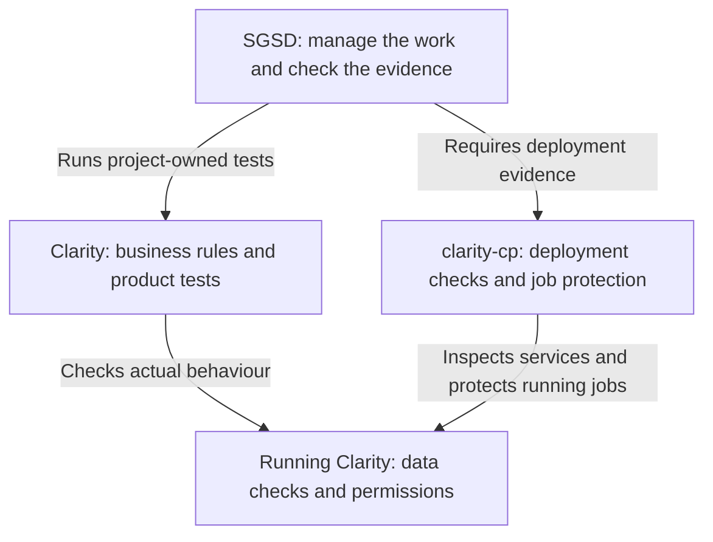

# Harness work: what Clarity builds and what SGSD builds

Prepared for Jack on 14 September 2026. This is a proposed build sequence and two handoffs. The work items below are planning labels, not activated SGSD phases.

**Clarity owns whether the product does the right thing. SGSD owns whether the agents deliver and prove their work.** We improve the existing systems in both places.

For example: Clarity defines what a correct payment status means. SGSD makes the agent run that check and provide evidence from the version being released.

## Two work lists, with one connection

| Owner | Work to build | Where it belongs |
| --- | --- | --- |
| Clarity team | Detect bad data requests, verify SAP writes, prevent competing sync writers, test screens and business meaning | Clarity repository and its running services |
| SGSD / this session | Detect unfinished or stuck agent work, improve verification, protect agreed requirements, measure which controls help | SGSD framework, reusable across projects |
| SGSD code owner + Clarity deployment operator | Confirm the running version and protect long jobs during deployment | Extend existing `clarity-cp`; its source currently lives in SGSD |
| VTP owner | Protect VTP's original knowledge records and generated copies | VTP repository; separate follow-up, not a dependency for the first build |

These are controls used by existing agents and services. Future agents that prepare quotes or help Clarity users would be separate product features, using Clarity's permissions.

## Start with these items

| Order | Give to Clarity | Keep with SGSD |
| --- | --- | --- |
| 1. Catch false success | **C1:** expose bad queries and missing storage. **C4:** establish examples of correct SAP behaviour. | **S1:** check actual agent delivery. **S3:** prove checks can detect a deliberately broken case. |
| 2. Protect data and releases | **C2:** verify writes and writer ownership. **C3:** test routes and topics. **C7:** connect job and release evidence. | **S2:** verify deployed versions and existing job protection. |
| 3. Prove useful behaviour | **C5:** test real screens. **C6:** preserve sources, freshness and ownership of business values. | **S4:** improve task specifications. **S5:** strengthen independent review and retries. |
| 4. Measure and simplify | Supply labelled examples when a check got the answer wrong. | **S6:** measure gate accuracy and cost. **S7:** measure harness changes and retain useful evidence. |

The detailed handoffs contain the dependencies. Several items can progress independently; this table is a priority order, not a requirement to launch several workers.

**Recommended first pair: C1 in Clarity and S1 in SGSD.** They address the same problem in different places: a system reporting success without proving the intended result.

## The files to use

- [Clarity build handoff](2026-09-14-clarity-harness-handoff.md): seven bounded work items, acceptance checks and a prompt to start C1.
- [SGSD build plan](2026-09-14-sgsd-harness-build-plan.md): seven framework work items, reuse requirements and a prompt to start S1.

Both files stand alone. Each team creates the appropriate numbered implementation plan in its own repository before changing source. Existing task ownership, holds and release checks continue to apply.

## Where all 17 original proposals went

`HS` numbers refer to the original programme. `C` and `S` numbers refer to these two handoffs.

| Original proposal | Owner and planned item |
| --- | --- |
| HS-01: delivery evidence | SGSD S1 |
| HS-02: deployed version and whole-run accounting | SGSD S2 and S6; Clarity C7 supplies deployment details |
| HS-03: measurable specifications | SGSD S4 |
| HS-04: independent verification and diagnosis | SGSD S5 |
| HS-05: checks that can fail | SGSD S3; Clarity supplies its own test cases |
| HS-06: realistic UI and business checks | Clarity C5; SGSD S3 runs and records them |
| HS-07: source and freshness of changing values | Clarity C6; SGSD S4 supports project-defined requirements; VTP owns any idea-gate changes |
| HS-08: SAP meaning and examples | Clarity C4; SGSD S4 loads relevant project context |
| HS-09: destructive-action protection | SGSD S1 for worker control, S2 for deployments; Clarity C2 for application writes and C7 for job integration |
| HS-10: gate accuracy and cost | SGSD S6, using S1 and S3 evidence |
| HS-11: harness change records and usage | SGSD S7 |
| HS-12: original stores, mirrors and stale references | Clarity C6 for its data; SGSD S4/S7 for reference checks and evidence; VTP owns its store fixes |
| HS-13: challenge and decision review | SGSD S5 |
| HS-14: focused experiments and expectations | SGSD S4 |
| HS-15: change routing and protected contracts | SGSD S4, with worker limits in S1 |
| HS-16: original records and previous attempts | SGSD S7 |
| HS-17: silent failures, writers, routes and watermarks | Clarity C1, C2, C3 and C6 |

## What the repository checks changed

SGSD already contains component registration, harness manifests, attribution, ablation, transfer tests, plan validation and Atlas telemetry. `clarity-cp` already has job-aware deployment preflight. Their existing code is the starting point; this review does not establish that every production caller uses it correctly.

The programme also reuses some error numbers: Clarity's current ERR-0024 and ERR-0025 entries describe gateway routing, while the programme also attaches those numbers to SAP write incidents. The handoff requires the exact incident or reproducer before using either as acceptance evidence.

A changed file is evidence of activity, not proof of correctness. A check with no usable evidence cannot turn green. Stored historical prices and measured facts remain valid; the goal is to expose invented or stale values, not prohibit storing numbers.

## Source and status

Source: `C:\Users\jack.berrow\Downloads\2026-09-14-agent-harness-programme.md`, preserved unchanged. Its research findings and incident descriptions are inputs to investigate, not fresh measurements of the live product.

Read on 14 September: SGSD state and roadmap at phase 170 / plan 170-15; devcp Harness checkout `476cfef8`; Clarity canonical checkout `85813dc5a`; relevant registries, control-plane code and Clarity data/browser documentation. No new phase, implementation, deployment or dashboard was started by preparing these files.
