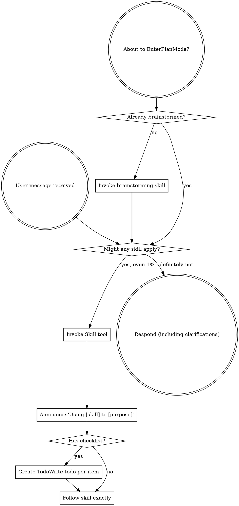

codex-exec: report contract violation

--- codex stdout ---
CHALLENGE_VERDICT: memo-unsafe
SURVIVING_OBJECTIONS: P151 persists raw query text while intent_routing_decision records hits only, so measuring all-prompt misses creates privacy/storage cost; broad exclude_regexes veto strong KB triggers before evaluation; prompt-time report_only is currently filtered out and would be inert; changing self-invocation during measurement confounds the baseline; promotion criteria are undefined
BINDING_ADDITIONS: prohibit prompt/excerpt/entity text in telemetry and persist only opaque decision ID, matcher version, signature IDs, soft-path action, latency, and submission-time operator label; improve then freeze self-invocation before a fixed 28-day window; make imperative exclusions start-anchored and subordinate to strong KB positives; implement a tested classifier shadow kind under a Plan; PROMOTE only with at least 20 adjudicated shadow fires, FP/(TP+FP) <=5%, at least 5 true incremental catches missed by the soft path, incremental catches/TP >=20%, and p95 added latency <=1 ms, otherwise KILL; kill raw-query logging, anywhere-in-prompt verb vetoes, the unscoped /triage alias, and zero-risk/zero-latency claims
ONE_LINER: Shadow-first is directionally right, but this design is privacy-unsafe if made measurable, unmeasurable if logged safely as written, and lacks sound exclusions or a binding promotion gate.

--- codex stderr ---
OpenAI Codex v0.146.0
--------
workdir: C:\Users\jack.berrow\AppData\Roaming\warp\Warp\data\worktrees\GSDedits\cholla-racer
model: gpt-5.6-sol
provider: openai
approval: never
sandbox: read-only
reasoning effort: xhigh
reasoning summaries: none
session id: 019ff6cc-d475-74a2-a82a-7a5518ba8875
--------
user
# CODEX CHALLENGE — KB-triage gate board memo

Separate adversarial Codex review of the SGSD board's decision before it executes. Find the flaw. Challenge specifically:
1. Is 'build shadow-only, gate promotion on data' genuinely safe, or does shipping a report_only route that logs every prompt create its own cost/privacy issue (logging prompt text)?
2. Is the exclude_regexes approach sound, or will build/fix/run verbs appear INSIDE legitimate KB queries ('what did Luke say about fixing the customs flow') and wrongly suppress them?
3. Is the promote-or-kill threshold well-formed, or hand-wavy? What exact metric + number should be locked?
4. Anything the board should have killed.

Report contract (exact lines): CHALLENGE_VERDICT: memo-sound|memo-needs-revision|memo-unsafe ; SURVIVING_OBJECTIONS: none|<list> ; BINDING_ADDITIONS: none|<list> ; ONE_LINER: <summary>

## Memo
---
decision: hard KB-triage gate
date: 2026-08-12
board: Architect SUPPORT-WITH-CONDITIONS / Contrarian OPPOSE (both conf 4)
verdict: BUILD SHADOW ONLY — promotion to directive gated on measured data
status: PENDING CODEX CHALLENGE
---

# Decision Memo — Hard KB-Triage Gate

## The real split
Architect: build directive gate (a), shadow-first. Contrarian: directive (a) is
NOT a hard gate (injects a string Claude can ignore = forgettable soft-invocation
moved down); soft path miss-rate unmeasured; the deletion beats the build.

## Ruling (CEO synthesis)
BUILD ONLY THE SAFE, MEASURED PART NOW. Do not ship a blind hard gate.

### Unanimous, adopted
1. KILL the "entity exists in KB" trigger — poison pill (per-prompt KB coupling,
   guaranteed false-fires). Pure anchored-lexical only.
2. SHADOW / report_only first — reuse P151 demand-baseline + the existing
   intent_routing_decision ledger. Logs "would-fire", fires nothing. Zero risk.
3. Mandatory exclude_regexes: build|fix|run|test|file-ops verbs. Anchor regexes;
   hold p95 via runBench.

### Build now (safe, ~0 risk, ~0 latency)
- New route in session-governance-hooks.yaml: KB-directed lexical trigger,
  enforcement: kind: report_only (SHADOW), signal logged to the routing ledger.
- Strengthen vtp-query-triage self-invocation description (Contrarian: operator
  may just want reliable self-invoke, not a hook).
- Manual /triage verb the operator can type on demand.

### Gated on data (do NOT build yet)
- Promotion report_only -> directive: ONLY after a shadow window publishes the
  soft-path miss rate + false-fire rate against real prompts, against an explicit
  PROMOTE-OR-KILL threshold set up front (e.g. >=N real KB prompts in 2 weeks the
  soft path demonstrably missed AND false-fire < X%). If the soft path already
  routes KB queries reliably -> KILL the gate (Contrarian wins).
- Option (b) pre-run-inject-result (the only TRULY deterministic form): build
  ONLY if shadow shows directive-inject is routinely IGNORED on true KB hits.

## Honest label
Do not sell directive-inject as "un-forgettable." It is MORE reliable than
CLAUDE.md (fresh injection every matching prompt) but Claude can still ignore it.
The truly-hard form is (b), deferred until data justifies its cost.

## Brief
---
brief: hard KB-triage gate (auto-route KB-directed prompts through vtp-query-triage)
date: 2026-08-12
for: SGSD Board (Architect + Contrarian)
---

# Proposal
Make VTP triage a HARD, always-on gate — not CLAUDE.md discipline (which the LLM
forgets). Mechanism: extend the P146 UserPromptSubmit hook
(sgsd-intent-classifier.cjs + session-governance-hooks.yaml) with a NEW route
whose trigger matches KB-directed intent and whose enforcement routes to
vtp-query-triage. Deterministic (harness-fired), un-forgettable.

# Operator's hard constraint
Must NOT fire on literally every prompt. Precision over recall. Bias to
false-negatives (miss a borderline KB query) over false-positives (nag on coding
tasks / general chat).

# Proposed trigger scope
FIRE on: meeting|call|transcript|recording refs; "import"; "last/latest meeting
with <name>"; "what did <person> say"; explicit Clarity/VTP/corpus refs; a named
entity that EXISTS in the KB (person/project/company).
DON'T FIRE on: coding tasks, file ops, fix/run/build/test, general chat.

# Proposed calibration (the safe path)
Build SHADOW / log-only first (reuse the P151 demand-baseline instrument):
matcher records "would have fired" per real prompt WITHOUT firing. Read the log
after real usage; tune trigger to acceptable precision; THEN flip enforcement
log-only -> directive. Do not hard-gate a blind regex.

# Design dial to rule on
(a) enforcement: kind: directive — injects "run vtp-query-triage" (an instruction
    Claude acts on), vs
(b) hook pre-runs the triage classifier and injects the RESULT (route already
    decided) — strongest/most un-forgettable, more to build.

# Questions for the board
1. Is shadow-first-then-promote the right discipline, or over-engineering for an
   internal gate we fully control?
2. directive-inject (a) vs pre-run-inject-result (b) — which for a true hard gate?
3. What is the kill-switch / false-positive budget that says "the trigger is too
   loose, revert to log-only"?
4. Entity-check against the KB in the trigger: worth the coupling, or keep the
   trigger pure-lexical for speed/independence?

codex
I’m using the mandatory `using-superpowers` skill to route this review correctly, then I’ll inspect the actual hook and ledger implementation so the objections are evidence-based. I’ll keep the final response to exactly the four contract lines.
exec
"C:\\WINDOWS\\System32\\WindowsPowerShell\\v1.0\\powershell.exe" -Command "Get-Content -Raw 'C:\\Users\\jack.berrow\\.codex\\skills\\using-superpowers\\SKILL.md'" in C:\Users\jack.berrow\AppData\Roaming\warp\Warp\data\worktrees\GSDedits\cholla-racer
 succeeded in 1307ms:
---
name: using-superpowers
description: Use when starting any conversation - establishes how to find and use skills, requiring Skill tool invocation before ANY response including clarifying questions
---

<SUBAGENT-STOP>
If you were dispatched as a subagent to execute a specific task, skip this skill.
</SUBAGENT-STOP>

<EXTREMELY-IMPORTANT>
If you think there is even a 1% chance a skill might apply to what you are doing, you ABSOLUTELY MUST invoke the skill.

IF A SKILL APPLIES TO YOUR TASK, YOU DO NOT HAVE A CHOICE. YOU MUST USE IT.

This is not negotiable. This is not optional. You cannot rationalize your way out of this.
</EXTREMELY-IMPORTANT>

## Instruction Priority

Superpowers skills override default system prompt behavior, but **user instructions always take precedence**:

1. **User's explicit instructions** (CLAUDE.md, GEMINI.md, AGENTS.md, direct requests) ƒ?" highest priority
2. **Superpowers skills** ƒ?" override default system behavior where they conflict
3. **Default system prompt** ƒ?" lowest priority

If CLAUDE.md, GEMINI.md, or AGENTS.md says "don't use TDD" and a skill says "always use TDD," follow the user's instructions. The user is in control.

## How to Access Skills

**In Claude Code:** Use the `Skill` tool. When you invoke a skill, its content is loaded and presented to youƒ?"follow it directly. Never use the Read tool on skill files.

**In Copilot CLI:** Use the `skill` tool. Skills are auto-discovered from installed plugins. The `skill` tool works the same as Claude Code's `Skill` tool.

**In Gemini CLI:** Skills activate via the `activate_skill` tool. Gemini loads skill metadata at session start and activates the full content on demand.

**In other environments:** Check your platform's documentation for how skills are loaded.

## Platform Adaptation

Skills use Claude Code tool names. Non-CC platforms: see `references/copilot-tools.md` (Copilot CLI), `references/codex-tools.md` (Codex) for tool equivalents. Gemini CLI users get the tool mapping loaded automatically via GEMINI.md.

# Using Skills

## The Rule

**Invoke relevant or requested skills BEFORE any response or action.** Even a 1% chance a skill might apply means that you should invoke the skill to check. If an invoked skill turns out to be wrong for the situation, you don't need to use it.



## Red Flags

These thoughts mean STOPƒ?"you're rationalizing:

| Thought | Reality |
|---------|---------|
| "This is just a simple question" | Questions are tasks. Check for skills. |
| "I need more context first" | Skill check comes BEFORE clarifying questions. |
| "Let me explore the codebase first" | Skills tell you HOW to explore. Check first. |
| "I can check git/files quickly" | Files lack conversation context. Check for skills. |
| "Let me gather information first" | Skills tell you HOW to gather information. |
| "This doesn't need a formal skill" | If a skill exists, use it. |
| "I remember this skill" | Skills evolve. Read current version. |
| "This doesn't count as a task" | Action = task. Check for skills. |
| "The skill is overkill" | Simple things become complex. Use it. |
| "I'll just do this one thing first" | Check BEFORE doing anything. |
| "This feels productive" | Undisciplined action wastes time. Skills prevent this. |
| "I know what that means" | Knowing the concept ƒ%ÿ using the skill. Invoke it. |

## Skill Priority

When multiple skills could apply, use this order:

1. **Process skills first** (brainstorming, debugging) - these determine HOW to approach the task
2. **Implementation skills second** (frontend-design, mcp-builder) - these guide execution

"Let's build X" ā' brainstorming first, then implementation skills.
"Fix this bug" ā' debugging first, then domain-specific skills.

## Skill Types

**Rigid** (TDD, debugging): Follow exactly. Don't adapt away discipline.

**Flexible** (patterns): Adapt principles to context.

The skill itself tells you which.

## User Instructions

Instructions say WHAT, not HOW. "Add X" or "Fix Y" doesn't mean skip workflows.

C:\Users\jack.berrow\OneDrive - John Cullen Lighting\Documents\WindowsPowerShell\profile.ps1 : Cannot dot-source this 
command because it was defined in a different language mode. To invoke this command without importing its contents, 
omit the '.' operator.
At line:1 char:1
+ . 'C:\Users\jack.berrow\OneDrive - John Cullen Lighting\Documents\Win ...
+ ~~~~~~~~~~~~~~~~~~~~~~~~~~~~~~~~~~~~~~~~~~~~~~~~~~~~~~~~~~~~~~~~~~~~~
    + CategoryInfo          : InvalidOperation: (:) [profile.ps1], NotSupportedException
    + FullyQualifiedErrorId : DotSourceNotSupported,profile.ps1
 
C:\Users\jack.berrow\OneDrive - John Cullen Lighting\Documents\WindowsPowerShell\Microsoft.PowerShell_profile.ps1 : 
Cannot dot-source this command because it was defined in a different language mode. To invoke this command without 
importing its contents, omit the '.' operator.
At line:1 char:1
+ . 'C:\Users\jack.berrow\OneDrive - John Cullen Lighting\Documents\Win ...
+ ~~~~~~~~~~~~~~~~~~~~~~~~~~~~~~~~~~~~~~~~~~~~~~~~~~~~~~~~~~~~~~~~~~~~~
    + CategoryInfo          : InvalidOperation: (:) [Microsoft.PowerShell_profile.ps1], NotSupportedException
    + FullyQualifiedErrorId : DotSourceNotSupported,Microsoft.PowerShell_profile.ps1
 

exec
"C:\\WINDOWS\\System32\\WindowsPowerShell\\v1.0\\powershell.exe" -Command '$files = @('"'.planning/STATE.md','super-gsd/registry/session-governance-hooks.yaml'); foreach ("'$f in $files) { if (Test-Path -LiteralPath $f) { Write-Output ('"'### ' + "'$f); Get-Content -LiteralPath $f -TotalCount 240 } }; Write-Output '"'### matching files'; rg --files | rg 'sgsd-intent-classifier|intent_routing_decision|session-governance-hooks|demand-baseline|runBench|vtp-query-triage'" in C:\Users\jack.berrow\AppData\Roaming\warp\Warp\data\worktrees\GSDedits\cholla-racer
 succeeded in 1748ms:
### .planning/STATE.md
---
gsd_state_version: 1.0
milestone: v3.5
current_phase: "150"
milestone_name: Always-On Orchestration ƒ?" governance as runtime mechanism in all session modes
milestone_status: "v3.6-vtp-bridge ACTIVE 2026-08-11 ƒ?" SGSDƒÅ"VTP Bridge Phase 0. P151 Demand Baseline PASS (39/39): zero-VTP-dep ledger+instrument+docs, board+Codex-gated. Stages 2-3 blocked on post-VTP-milestone restart+probe + gold-set approval. v3.5 shipped prior. | T150-07 devcp update EXECUTED 2026-08-12: source+install fast-forwarded 7fb47eb->01af43e, gpt-5.6-sol + v3.6 substrate live; remaining = live-session restart + interactive trust probe + serve.cjs stash reconcile."
status: "v3.5 ACTIVE 2026-08-06 ƒ?" P145 codex-profile-control CLOSED PASS-WITH-DEFERRED-4 @ c1596f7 (profile registry + /sgsd-codex-control + 4 CRIT security fixes total: 2 per-dispatch-ATC pre-commit, GAP-1 verifier env-var TTY bypass, phase-ATC silent report-write; self-tests 21/21 + Probes 1-7 + parity + control all PASS; deferred: A selfTestCliGuard non-TTY forcing, B 3-way CLI-default drift guard, C inert trust/hook fieldsƒÅ'P148/P150, DEVIATION-1 finalize probe simplification). Next: P148 cross-model triage. v3.4 PARKED at P142/P143 (cockpit alarm+rationale drawers, close) ƒ?" reopen after v3.5 or on operator call. v3.4 P999 pink-elephant visual smoke also parked."
stopped_at: 2026-04-29 ƒ?" Phase 63 closed PASS-WITH-DEFERRED-5 @ b5b46a8 (Warp Capability Smoke Test; 7 artifacts under .planning/milestones/v2.2/; 13-row evidence matrix in WARP-SMOKE.md; 5 operator UI manual checks M1-M5 pending in MANUAL-CHECKS.md; sg-launched-Claude topology proven empirically ƒ?" this Claude session itself is the evidence; ~/.warp/launch_configurations/ exists but empty; .warp/workflows lint 4/5 with sgsd-token-current.yaml missing arguments block forwarded to Phase 64; .warpindexingignore missing forwarded to Phase 65 or new ignore-pack phase; tmux not native on Windows; Warp install at ~/AppData/Local/Programs/Warp/Warp.exe; previous roadmap v1.6-v2.1 ROADMAP COMPLETE 2026-04-29 preserved in previous_roadmap block ƒ?" all 30 phases (26-62) shipped across 6 milestones (v1.6 SHIPPED-WITH-DEBT-10, v1.7-v2.1 SHIPPED clean)).
last_updated: "2026-08-05T00:00:00Z"
last_activity: "2026-05-20 v3.0 SGSD-PRO ACTIVATED ƒ?" operator issued /sgsd-orchestrate auto. Milestone opened at scaffold commit 52c687a (INTENT + ROADMAP + REQUIREMENTS + DLB-08 design lock + P106 CONTEXT + master proposal + infographic ingested). Auto-loop dispatched Codex to author 106-01 PLAN-LOCKED.md against plan-schema-v2 SCHEMA-09 (must include semantic_acceptance_criteria per DLB-07). Mission: lineaged role-filtered cognitive memory underneath SGSD's central control plane. Seven CMB types (execution_receipt observation / review_finding claim / evidence_verdict claim-with-authority / decision_recommendation decision / operator_precedent highest / context_anchor projection / promotion_decision terminal). Four MVP exit fixtures (A false-CRIT refuted / B context-aware pseudo-op / C lineage chain / D production-mutation forces escalation). Stale autopilot-watchdog checkpoint pointing at v2.9/P95 deleted on entry (was generated by watchdog after 1569 min inactivity on closed milestone; misleading)."
legacy_activity_v2_9_resync: "2026-05-18 v2.9 RE-SYNC + P97.5 LANDED + ALL-PHASES-CLOSED ƒ?" STATE.md progress block was wildly stale (showed phase_98 ACTIVE, 99-105 PENDING) while SUMMARY.md @ 8fb3b09 already documented all 8 phases closed. This session inserted P97.5 Semantic Verification Gate (commit chain 34520c0 ƒÅ' 9901568 ƒÅ' 2fa3bbc ƒÅ' 6e66ad0) carrying DLB-07 (Clarity-incident-driven post-mortem) and mechanical schema enforcement of semantic_acceptance_criteria via SCHEMA-09/-10. v2.9 now 9 phases (97.5 + 98-105), all PASS / PASS-WITH-DEFERRED-2. Per sgsd-complete-milestone skill idempotency: SUMMARY.md exists ƒÅ' skill is no-op; remaining work is the STATE.md re-sync flagged in SUMMARY.md \"Critical Gaps #1\". Open items roll forward: warp-mcp 15th tool (DEFERRED-1), cockpit 12th section (DEFERRED-2), 18-plan SAC backfill or skip_gates per 97.5-BACKFILL.md, M1-M5 manual UI checks, Phase 95 ACP re-entry pending Warp #7326, v2.6 SHIPPED-clean operator decision."
legacy_activity_v2_9_activation: "2026-04-30T00:00Z v2.9 ACTIVATION ƒ?" operator activated Agentic Harness Evolution roadmap. v2.8 closed at 2466ff1 (Phase 97 release gate; 149/149 self-tests; 22/25 readiness; READY-WITH-DEFERRED). Entering v2.9 P98 Harness Component Substrate (registry + catalog.cjs + ƒ%¾15-assertion self-test + SGSD-HARNESS-EVOLUTION.md). v2.9 pre-designed in CLAUDE-HANDOVER.md / ROADMAP.md / REQUIREMENTS.md / VTP-AHE-EVIDENCE.md. Mission: turn SGSD from hand-improved orchestrator into observability-driven harness with closed AHE loop (component ƒÅ' evidence ƒÅ' predicted edit ƒÅ' measured next-run outcome ƒÅ' keep/revert/pivot). Phases 98-105 scoped: 98 component substrate, 99 trajectory evidence corpus, 100 change manifest prediction ledger, 101 attribution+rollback gate, 102 harness evolution runner, 103 component ablation+interference, 104 transfer+OOD benchmark, 105 release gate+cockpit integration. Non-negotiable: protected oracle/verifier/model-config/budget never edited by evolution loop. STATE.md surgical repoint only ƒ?" operator owns canonical legacy frontmatter re-sync (SUMMARY.md gap #1)."
legacy_activity_v2_6: "2026-04-29T21:25Z RE-SYNC ƒ?" STATE.md was stale (mtime 20:07; latest pulse 21:19; 5 commits since 81-85). Operator override at Phase 85 close flagged: STATE.md staleness + Codex unavailability + context-packet builder dormant + token burn ~21.5M (orchestrator alone ~18M; root context ~775k tokens/turn). Phase 86 PAUSED to address 7-point token-control list + 3 Phase-85 deferrals. Auto-run completed 19/19 phases this session (63-83) plus 84+85; current commits b5b46a8 / d35e92a / eb252f3 / c0201af / 018028e / 5ae2ba0 / 3b2186f / f5fe11a / 4e2b19c / 8dbb9cb / 31907c2 / 0211b0c / dcd039b / 0905cbf / ebfaf7c / 11bb6bb / 2ab84d7 / 6f50232 / 1baf708 / 6021fbb / ad5948d / 72e0d6b / 5914be6 / 6ba04f8 / 22aedd5 / a6b83c8 / bd54eb3 / 5a74bda / 8eb7de8 / e69271e / 7256a76 / 350e101 / 19e544e / 2e8ce85 / 8bad3ad / 347c56a. Original Phase 63 close text preserved in v2_2 progress block below; full per-phase progress in v2_3-v2_6 blocks below. v2.2 milestone scaffolded; 7 artifacts under .planning/milestones/v2.2/ (WARP-SMOKE.md + MANUAL-CHECKS.md + 5 standard phase artifacts CONTEXT/PLAN/RESEARCH/VERIFICATION/ATC-REVIEW). Evidence matrix records 5 PASS rows (Q2/Q3/Q4/Q7/Q8: sg/sgsd/sgsd-setup interactive resolution + sg-keeps-Claude-in-current-tab topology + launch config dir empty), 1 PARTIAL (Q12: 4/5 workflow YAML lint OK; sgsd-token-current.yaml missing arguments block ƒ?" Phase 64 input), 1 DOCS-CONFIRMED (Q11: WSL/SSH disables Codebase Context per Warp docs), 5 MANUAL-CHECK-REQUIRED (Q1/Q5/Q6/Q9/Q10: workflow searchability + claude/sg utility-bar detection + launch-config active-window behavior + Codebase Context state ƒ?" operator verifies in Warp UI per MANUAL-CHECKS.md M1-M5). Forwarded to Phase 64+: workflow pack completion (Q12+Q1), AGENTS.md (Phase 65), .warpindexingignore (Phase 65 or new ignore-pack phase), warp-doctor probes (Phase 67), launch-config templates must NOT assume active-window (Phase 78), upstream issue tracking at https://github.com/warpdotdev/warp issues #7326 ACP and #9233 May-Jun 2026 roadmap (Phase 96). No source-file mutations; git diff confined to .planning/milestones/v2.2/. Previous roadmap v1.6-v2.1 SHIPPED 2026-04-29 ƒ?" see previous_roadmap block."
progress:
  v3_5:
    total_phases: 7
    completed_phases: 3
    completed_plans: 3
    percent: 100
    phase_145: "PASS-WITH-DEFERRED-4 ƒo" 2026-08-06 @ c1596f7 (Codex Profile Control; verifier GAP-1 + phase-ATC CRIT-1 both fixed+regression-guarded; MUDA mechanical PASS 0/0; deferred A/B/C + DEVIATION-1)"
    phase_146: "PASS-WITH-DEFERRED-3 ƒo" 2026-08-07 @ a36e1ea (Session Governance Hooks; 7 tasks; 11 CRIT found+closed across per-dispatch/verify/phase-ATC incl. 5x writer-accepts-destination and 7x silent-success; phase-ATC re-review 4/4 CLOSED ƒ?" containment now ONE contract via resolveContainedPath; MUDA 0/0; hooks LIVE in repo; deferred F/G + DEVIATION-W)"
    phase_147: "PASS ƒo" 2026-08-07 (Commit-Seam Gate; 5 tasks + 3 fix rounds; 21/21 real-git scenarios; earned-block falsifier proven both directions incl. convention_unknown + per-repo floors; tamper-evident activation; cross-worktree misattribution CRIT closed at re-review 0/0; MUDA 0/0; DEFERRED-F absorbed at commit seam; hooks live on devcp via source-checkout pattern, warn rows accumulating)"
    phase_148: "PASS ƒo" 2026-08-08 @ 768c6a0 (Cross-Model Triage; staged MCP transport end-to-end after 3-dispatch ATC-fix chain ƒ?" runtime decides, Claude transports; 36/36 scenarios; spec 6/6; phase-ATC re-review 10/10; MUDA 0/0 prior + degraded re-run logged; seam anti-pattern curated after 4th instance)"
    phase_149: "PASS ƒo" 2026-08-08 (Skill-Routing Table; 24-route registry + loader 18/18 + classifier AC-149b + phase-close consult AC-149c with derive-dont-default gate inputs, forged-gate rejection, executable dispatches; 3 verifier rounds + phase-ATC FAIL-GATE all closed, re-review 8/8; MUDA 0/0 mech + qualitative degraded; A1 pre-existing documented)"
    phase_150: "PASS-WITH-DEFERRED-1 ƒo" 2026-08-10 @ c0aff22+ (Propagation+Trust+Runbook; T150-01..04 built 72/0/1 battery; T150-05 PUBLISHED origin 7fb47eb->c0aff22 + local install under operator auth; T150-06 trust guard proven 3 ways; T150-07 devcp DEFERRED ƒ?" live sessions; 4 review rounds/13 CRIT closed; PII 0 tracked; .gitattributes eol pins)"
  v3_0:
    total_phases: 7
    completed_phases: 7
    completed_plans: 7
    percent: 100
    phase_106: "PASS ƒo" 2026-05-20 @ 390ef1a (Mesh CMB Schema; DLB-08.1; 14/14)"
    phase_107: "PASS ƒo" 2026-05-20 @ c45c24c (cmb-validate + cmb-hash + writers; DLB-08.2+.3; 20/20)"
    phase_108: "PASS ƒo" 2026-05-20 @ cf03b53 (lineage + evidence-validator + echo-detector + sgsd-audit wire-in; DLB-08.4+.5; 49/49)"
    phase_109: "PASS ƒo" 2026-05-20 (escalation_gate + pseudo_operator_peer; DLB-08.6+.7; 102/102; Fixture D PROVED; DLB-08 LAYER COMPLETE)"
    phase_110: "PASS ƒo" 2026-05-20 (Codex Pro Mode profile-resolver + stoplight + native-review-runner; DLB-09.1; 15/15)"
    phase_111: "PASS ƒo" 2026-05-20 (PLAN-LOCKED schema + validator + .codex/hooks.json + 5 hooks; DLB-09.2; 15/15)"
    phase_112: "PASS ƒo" 2026-05-21 (Context Authority capsule ƒ?" 6 templates + writer + composer + v3.0 dogfood instances; DLB-10.1; 17/17; FINAL v3.0 phase)"
  v2_9:
    total_phases: 9
    completed_phases: 9
    completed_plans: 9
    percent: 100
    phase_97_5: "PASS ƒo" 2026-05-18 @ 6e66ad0 (Semantic Verification Gate; DLB-07 + plan-schema-v2 enforces semantic_acceptance_criteria via SCHEMA-09/-10; 5/5 fixture tests green; 97.5-BACKFILL.md surfaces 18 plans needing backfill or skip_gates)"
    phase_98: "PASS ƒo" @ a4f8539 (Harness Component Substrate; 35-row registry across 14 frozen classes incl. 5 protected; Lock-13 catalog.cjs; 21/21 self-test)"
    phase_99: "PASS ƒo" @ 6f7a478 (Trajectory Evidence Corpus; distill.cjs 7 JSONL surfaces ƒÅ' OVERVIEW ƒ%Ï4KB + INDEX; 11 frozen root-cause labels; 18/18 self-test)"
    phase_100: "PASS ƒo" @ eba47ba (Change Manifest Prediction Ledger; MANIFEST.schema.json 14 required fields incl. predicted_fixes ƒ%¾1 + predicted_regressions; append-only JSONL; 21/21 self-test)"
    phase_101: "PASS ƒo" @ d1066a4 (Attribution And Rollback Gate; attribute.cjs 6-verdict closed vocab; fix + regression metrics independent; structured rollback recommendation; v2.9 close-gate added; 18/18 self-test)"
    phase_102: "PASS ƒo" @ 827d9bc (Harness Evolution Runner; run.cjs 4 modes dry-run/proposal/apply/attribute; protected-oracle boundary; 17/17 self-test)"
    phase_103: "PASS ƒo" @ 5122d95 (Component Ablation And Interference; ablate.cjs tmpdir isolation; 3 frozen interference rules duplicate/redundant/inversion; requires_transfer_eval=true; 18/18 self-test)"
    phase_104: "PASS ƒo" @ f6d3073 (Transfer And OOD Benchmark; evaluate.cjs frozen-before-run rule; 3 critical-regression rules; 8 transfer axes; 18/18 self-test)"
    phase_105: "PASS-WITH-DEFERRED-2 ƒo" @ 8fb3b09 (Release Gate And Cockpit Integration; v2.9 close gate extended with AHE-EVAL-03/05; SUMMARY.md + SGSD-HARNESS-EVOLUTION.md ship; DEFERRED-1 warp-mcp 15th tool / DEFERRED-2 cockpit-state 12th section ƒ?" both lock-13 frozen-array updates)"
  v2_8:
    total_phases: 4
    completed_phases: 4
    completed_plans: 4
    percent: 100
    phase_94: "PASS ƒo" 2026-04-29 @ 649898d (ACP Mapping Spec; 7 concepts + 11-row event mapping)"
    phase_95: "SKIPPED-WAITING-FOR-UPSTREAM ƒo" 2026-04-29 @ 9bbcdf8 (ACP Adapter Spike; Warp #7326 open)"
    phase_96: "PASS ƒo" 2026-04-29 @ cfff32a (Warp Upstream Pack; telemetry-panel target picked 19/20; draft-only)"
    phase_97: "PASS ƒo" 2026-04-29 @ 2466ff1 (Release Gate; 149/149 self-tests; 22/25 readiness; SUMMARY.md ships v2.2-v2.8 retrospective)"
  v2_6:
    total_phases: 5
    completed_phases: 3
    completed_plans: 3
    percent: 40
    phase_84: "1/1 plan complete ƒ?" PASS ƒo" 2026-04-29 @ 2e8ce85 (Code Review Integration Guide + SGSD: Open Review Artifacts workflow; 2-layer review model documented; 15/15 workflow lint)"
    phase_85: "1/1 plan complete ƒ?" PASS-WITH-DEFERRED-3 ƒo" 2026-04-29 @ 8bad3ad+347c56a (Recovery Packet Upgrade; 1818 bytes ƒ%Ï4KB; why_stopped + artifact_links + roadmap-complete branch; 44/44 self-test; DEFERRED-1 STATE.md staleness contagion + DEFERRED-2 Codex unavailable Phase 84/85 + DEFERRED-3 context-packet-log.jsonl 24h+ stale ƒ?" Phase 86 must address)"
    phase_86: "PAUSED on operator override ƒ?" Token Control + Staleness Reconciliation. 7-point list (token-control repair / cockpit + recovery staleness probes / token-waste+context-packet wire-in / 200k+500k context warnings / fresh-session resume packets / context-bench full-mode rerun or unproven mark / v2.6 debt record) + 3 Phase-85 deferrals. Originally 'Remote Monitor Packet' but most of that work shipped via Phase 64 workflow + Phase 79 skill"
    phase_87: "PENDING ƒ?" Watchdog And Attention Alerts (originally; may re-scope after Phase 86)"
    phase_88: "PENDING ƒ?" End-To-End Warp Operator Drill"
  v2_5:
    total_phases: 5
    completed_phases: 5
    completed_plans: 5
    percent: 100
    phase_79: "PASS ƒo" 2026-04-29 @ 5a74bda (7 SGSD Warp skills under .agents/skills/; read-only by design)"
    phase_80: "PASS ƒo" 2026-04-29 @ 8eb7de8+e69271e (Warp Plan converter; 4 public APIs Lock-13; 17/17 self-test; READ-ONLY on STATE.md verified mechanically; 9 phase files generated under .planning/analyses/ live test)"
    phase_81: "PASS ƒo" 2026-04-29 @ 7256a76 (SGSD Warp Operator Notebook; 10 runnable PowerShell blocks)"
    phase_82: "PASS ƒo" 2026-04-29 @ 350e101 (7 Warp Agent prompts; mode declared per prompt; none auto-modify)"
    phase_83: "PASS ƒo" 2026-04-29 @ 19e544e (asset cross-index; 47 paths cited 0 missing; validator 5/5 self-test)"
  v2_4:
    total_phases: 6
    completed_phases: 6
    completed_plans: 6
    percent: 100
    phase_73: "PASS ƒo" 2026-04-29 @ 6021fbb (12 operator questions mapped to MCP tools; 16 event types frozen for Phase 74)"
    phase_74: "PASS ƒo" 2026-04-29 @ ad5948d (ORCHESTRATOR-LIVE.jsonl contract + writer helper; 9/9 self-test; Lock-13)"
    phase_75: "PASS ƒo" 2026-04-29 @ 72e0d6b+5914be6 (writer integration; --emit CLI + READ-ONLY reader 12/12 self-test + SKILL.md wire-in section)"
    phase_76: "PASS ƒo" 2026-04-29 @ 6ba04f8+22aedd5 (cockpit-state adapter; 10-section snapshot; 4 fixtures; MCP tool 12 unification; warp-mcp 42/42 regression PASS)"
    phase_77: "PASS ƒo" 2026-04-29 @ a6b83c8 (cockpit render helper; PSParser 0 errors; existing 3 cockpit panes UNTOUCHED ƒ?" operator parallel work preserved)"
    phase_78: "PASS ƒo" 2026-04-29 @ bd54eb3 (Warp launch config templates ƒ?" operator-workspace + cockpit-only + README; M4 caveat documented)"
  v2_3:
    total_phases: 5
    completed_phases: 5
    completed_plans: 5
    percent: 100
    phase_68: "PASS ƒo" 2026-04-29 @ 31907c2 (SGSD MCP read-only contract; 14 tools; ERROR_CODES len=11; REDACTION_CATEGORIES len=7)"
    phase_69: "PASS ƒo" 2026-04-29 @ 0211b0c+dcd039b (MCP server skeleton; JSON-RPC 2.0 stdio; 14 tool stubs; 15/15 self-test)"
    phase_70: "PASS ƒo" 2026-04-29 @ 0905cbf+ebfaf7c (5 core status tools ƒ?" current_state/current_phase/milestone_status/watchdog/recovery_packet; 21/21 self-test; 10 fixture pairs)"
    phase_71: "PASS ƒo" 2026-04-29 @ 11bb6bb+2ab84d7 (9 operational tools ƒ?" gate/agent/codex/token/context-bench/commits/cockpit-snapshot/artifact-links/warp-doctor; 30/30 self-test; 28 fixture pairs; live hash-match against git log -1)"
    phase_72: "PASS ƒo" 2026-04-29 @ 6f50232+1baf708 (MCP redaction 7 categories wired into all 14 tools; ERROR_CODES extended len=13; warp-doctor probe 15 upgraded; SGSD-WARP-MCP-SETUP.md; sgsd-mcp-self-test workflow)"
  v2_2:
    total_phases: 5
    completed_phases: 5
    completed_plans: 5
    percent: 100
    phase_63: "1/1 plan complete ƒ?" PASS-WITH-DEFERRED-5 ƒo" 2026-04-29 @ b5b46a8 (Warp Capability Smoke Test; 5 deferred rows are operator UI manual checks M1-M5 tracked in .planning/milestones/v2.2/MANUAL-CHECKS.md, NOT edge_guard_miss and NOT in CRIT-BACKLOG; 7 artifacts: WARP-SMOKE.md + MANUAL-CHECKS.md at milestone root, CONTEXT/PLAN/RESEARCH/VERIFICATION/ATC-REVIEW under phases/63-warp-capability-smoke/; sg-launched-Claude topology proven empirically ƒ?" this Claude session is the in-process witness)"
    phase_64: "1/1 plan complete ƒ?" PASS ƒo" 2026-04-29 @ 5ae2ba0 (Workflow Pack Completion; 8 new yamls + 1 fix sgsd-token-current; lint tool warp-workflow-lint/lint.cjs READ-ONLY ASCII-only 7/7 self-test PASS; live --run 13/13 valid + 10/10 search terms exit 0; SGSD-WARP-WORKFLOWS.md docs index 13-row table + 3 routines; orchestrator-author DEVIATION cumulative 3rd; 'partially blocked on M1' relabeled per operator Rule 15 ƒ?" workflow YAMLs ship correctly regardless of UI verification)"
    phase_65: "1/1 plan complete ƒ?" PASS ƒo" 2026-04-29 @ c0201af (Agent Rules Context Pack; AGENTS.md NEW 46 lines / 2972 bytes / ratio 0.290 of CLAUDE.md under 30% target; WARP.md additive +21 lines Rule Hierarchy section; 5 hard rules established: read-state-from-.planning / don't-duplicate-gates / VTP-optional / preserve-sg-topology / no-source-mutations-without-plan; orchestrator-author DEVIATION 1st; compactness 2-pass)"
    phase_66: "1/1 plan complete ƒ?" PASS ƒo" 2026-04-29 @ 3b2186f (SGSD Warp Operator Guide; super-gsd/docs/SGSD-WARP-OPERATOR-GUIDE.md ~280 lines covering 12 roadmap-required sections + TL;DR routine + 14 concrete Windows paths + 6/6 cross-phase references verified; orchestrator-author DEVIATION 4th; 'partially blocked on M1' relabeled per Rule 15)"
    phase_67: "1/1 plan complete ƒ?" PASS ƒo" 2026-04-29 @ 018028e (Warp Doctor Probe Design; super-gsd/tools/warp-doctor/check.cjs 16 probes + 4 public APIs Lock-13-wrapped + 15/15 self-test PASS; READ-ONLY invariant verified mechanically via git status before/after live --run; ASCII-only; mirrors Phase 62 upgrade-drift pattern; orchestrator-author DEVIATION 2nd; live --run on this checkout: 13 PASS / 1 MISSING [.warpindexingignore confirms Phase 63 finding E.1] / 1 MANUAL-CHECK / 1 NOT-APPLICABLE / 0 DEGRADED exit 1)"
  v1_7:
    total_phases: 5
    completed_phases: 5
    completed_plans: 5
    percent: 100
    phase_31: "1/1 plan complete ƒ?" PASS ƒo" 2026-04-27 (CRIT+WARN fixed in-loop, anti-slop 10/10)"
    phase_32: "1/1 plan complete ƒ?" PASS ƒo" 2026-04-27 (2 CRIT + 5 WARN fixed in-loop; 1 deferred design-locked; combined anti-slop 9.5/10)"
    phase_33: "1/1 plan complete ƒ?" PASS ƒo" 2026-04-27 (2 CRIT + 5 WARN fixed in-loop; 8 new bypass patterns; 0 regressions; combined anti-slop ~9.5/10)"
    phase_34: "1/1 plan complete ƒ?" PASS ƒo" 2026-04-27 (2 CRIT + 5 WARN fixed in-loop; v1.5 empty-baseline gap closed; combined anti-slop ~9.5/10)"
    phase_35: "1/1 plan complete ƒ?" PASS ƒo" 2026-04-27 (0 CRIT + 7 WARN; 5 in-loop, 1 info, 1 out-of-scope; deterministic catalog generator; combined anti-slop ~9.5/10)"
  v1_6_summary:
    total_phases: 5
    completed_phases: 5
    percent: 100
    phase_26: "PASS ƒo" 2026-04-26"
    phase_27: "PASS ƒo" 2026-04-26"
    phase_28: "PASS-WITH-DEFERRED-5 ƒo" 2026-04-26"
    phase_29: "PASS-WITH-DEFERRED-3 ƒo" 2026-04-27"
    phase_30: "PASS-WITH-DEFERRED-2 ƒo" 2026-04-27"
backlog:
  total_unresolved: 10
  by_kind:
    verifier_fail: 0
    phase_atc: 10
    edge_guard_miss: 0
  by_phase:
    "26": 0
    "27": 0
    "28": 5
    "29": 3
    "30": 2
    "31": 0
    "32": 0
    "33": 0
    "34": 0
    "35": 0
  cleared_post_rerun: 8
v1_6_complete:
  shipped: 2026-04-27
  status: SHIPPED-WITH-DEBT-10
  initial_backlog: 18
  cleared_post_rerun: 8
  remaining_unresolved: 10
  phases: 5
  plans: 8
v1_7_complete:
  shipped: 2026-04-27
  status: SHIPPED
  initial_backlog: 0
  cleared_in_loop: 16
  remaining_unresolved: 0
  phases: 5
  plans: 5
  combined_anti_slop_estimated: "~9.5/10"
  controlling_principle_held: "Autonomy continues; evidence tells the truth"
  v1_5_empty_baseline_gap: "CLOSED at Phase 34"
  summary: .planning/milestones/v1.7/SUMMARY.md
v1_8_complete:
  shipped: 2026-04-27
  status: SHIPPED
  initial_backlog: 0
  cleared_in_loop: 22
  accepted: 2
  false_alarm: 1
  remaining_unresolved: 0
  phases: 5
  plans: 5
  combined_anti_slop_estimated: "~9/10"
  controlling_principle_held: "Autonomy continues; evidence tells the truth"
  summary: .planning/milestones/v1.8/SUMMARY.md
  generated_artifacts:
    - .planning/milestones/v1.8/gate-keep-kill.md (Phase 39 rubric)
    - .planning/milestones/v1.8/phase-folder-audit.md (Phase 40 audit)
checkpoint: .planning/ORCHESTRATOR-CHECKPOINT.md (no checkpoint open; Phase 63 closed PASS-WITH-DEFERRED-5)
previous_roadmap:
  scope: v1.6 ā' v2.1 (phases 26-62)
  status: ROADMAP COMPLETE 2026-04-29
  shipped_milestones: "v1.6 SHIPPED-WITH-DEBT-10 @ d510e32, v1.7 SHIPPED @ 5690c38, v1.8 SHIPPED, v1.9 SHIPPED, v2.0 SHIPPED (release-readiness 97 GREEN), v2.1 SHIPPED (final milestone of prior roadmap)"
  controlling_contract: .planning/ROADMAP-AGENT.md
  locked_decisions: .planning/discussions/2026-04-26-mass-discuss.md
  total_phases_shipped: 30
  total_milestones_shipped: 6
  started: 2026-04-26
  completed: 2026-04-29
  history_blocks: "Per-phase history retained inline below in roadmap_run sub-blocks (v2_1_progress / v2_0_progress / v2_0_complete / v2_1_complete / v1_9_progress / v1_9_open_debt / v1_9_supersedes_archive / v1_9_milestone_codename / v1_9_vtp_delta_active / v1_8_progress / milestones_shipped). Top-level v1_6_complete / v1_7_complete / v1_8_complete blocks above are also history. progress.v1_7 and progress.v1_6_summary above hold per-phase status snapshots. backlog block above holds residual v1.6 phase_atc=10 unresolved (cockpit may continue to display this; it is historical debt, not active blocker for v2.2)."
  notes: "Active roadmap (v2.2-v2.8 SGSD Warp Integration) operates against .planning/milestones/warp-integration/ROADMAP.md per .planning/milestones/warp-integration/CLAUDE-HANDOVER.md."
roadmap_run:
  mode: operator-led (Phase 63 closed; awaiting operator instruction or M1-M5 manual-check completion before next dispatch)
  scope: v2.2 ā' v2.8 (SGSD Warp Integration; phases 63-97; Phase 63 closed; Phases 64-67 ready to dispatch)
  controlling_contract: .planning/milestones/warp-integration/ROADMAP.md
  controlling_handover: .planning/milestones/warp-integration/CLAUDE-HANDOVER.md
  locked_decisions: "Phase 63 D63.1-D63.5 in 63-CONTEXT.md; no roadmap-wide DISCUSS file authored (per-phase decisions go in each {NN}-CONTEXT.md per the lighter-weight per-phase contract used in v2.2-v2.8)"
  backlog_canonical: .planning/metrics/crit-backlog.jsonl (carries v1.6-v2.1 history; v2.2 has zero rows so far)
  started: 2026-04-29
  current_milestone: v2.2
  current_phase: complete
  current_phase_name: "v2.2 ALL-PHASES-CLOSED ƒ?" 5/5 phases done (63 PASS-WITH-DEFERRED-5 + 64 PASS + 65 PASS + 66 PASS + 67 PASS); awaiting operator decision on M1-M5 + sgsd-complete-milestone trigger"
  current_phase_status: ALL-PHASES-CLOSED
  current_phase_close_commit: 3b2186f
  v2_2_phase_close_commits:
    phase_63: b5b46a8
    phase_64: 5ae2ba0
    phase_65: c0201af
    phase_66: 3b2186f
    phase_67: 018028e
  next_dispatch_candidates:
    - "M1-M5 operator UI manual checks (.planning/milestones/v2.2/MANUAL-CHECKS.md + .planning/todos/pending/2026-04-29-warp-m{1,2,3,4,5}-*.md) ƒ?" operator-only, blocks v2.2 SHIPPED-clean status"
    - "sgsd-complete-milestone v2.2 (option a: trigger now for SHIPPED-WITH-DEFERRED-5 ƒ?" M1-M5 still pending; option b: do M1-M5 first then trigger for SHIPPED clean)"
    - "v2.3 Phase 68 ƒ?" SGSD MCP Contract (the central unlock per operator brief; UNBLOCKED ƒ?" does not depend on M1-M5)"
    - "Operator review: 4-deviation orchestrator-authoring count this auto-run; rebalance dispatch policy for v2.3 MCP work (substantial code, ~600 lines, clearly warrants Sonnet dispatch)"
  prior_roadmap_run_completed: 2026-04-29 (v1.6 ā' v2.1; see top-level previous_roadmap block above)
  prior_milestone_shipped: v2.1 SHIPPED 2026-04-29 (FINAL milestone of prior roadmap; was v2.0 SHIPPED 2026-04-29)
  v2_1_progress:
    phase_62: "PASS @ b3dcadf+3612c27 (9/9 verifier must-haves, v2.1 fifth-gate green (upgrade-drift check; 12/12 self-test PASS + 11 probes >= 8 floor + read_only_invariant assertion PASS + git status before/after --run identical), 4 public APIs Lock-13 wrapped (runDrift/getProbe/selfTest + _internals), 11 frozen PROBE_NAMES (>=8; schema_version_2_plans/agent_token_spend_ledger/context_packet_tree/sqlite_context_index_tree/dispatch_router_tree/memory_governance_tree/redis_adapter_present/failure_injection_tree/release_readiness_present/installer_audit_tree/new_project_wizard_present) + frozen VERSION_TAGS len=4 (v1.2/v1.9/v2.0/v2.1) + frozen REASON_NOTES len=8 closed-vocab + frozen MIGRATION_NOTES 7 milestone keys (v1.5_baseline/v1.6_cockpit/v1.7_command_contracts/v1.8_gate_fitness/v1.9_research/v2_0_failure_injection/v2_1_distribution) + SCHEMA_VERSION=1, candidate-paths array per probe (FIRST present wins; deterministic missing fallback to last candidate's reason), live --run reports 11/11 PRESENT in this checkout (v1.2:1+v1.9:6+v2.0:2+v2.1:2; sqlite_context_index_tree resolves to context-cache fallback), READ-ONLY invariant A8 enforces zero fs.writeFileSync/appendFileSync/unlinkSync/mkdirSync/rmSync/rmdirSync in code-only scan (hasWrite=false), operationally verified git status --short before/after --run identical (diff empty), run-self-test.cjs thin spawnSync shell delegates correctly mirroring Phase 58/59 convention, sgsd-complete-milestone.cjs surgical fifth-gate extension (+141 insertions 0 deletions) preserves v1.9 dual-gate + v2.0 sept-gate + Phase 58/59/60/61 v2.1 first/second/third/fourth-gate paths byte-equality up to insertion point at line 597 (post-fourth-gate green stdout, pre-existing process.exit(0)), 5 stderr tags closed-vocab (upgrade_drift_unavailable/upgrade_drift_self_test_threw/upgrade_drift_self_test_failed/upgrade_drift_read_only_invariant_failed/upgrade_drift_probe_count_below_floor), Lock 4 verified Phase 41-61 byte-untouched (zero require of upstream Phase 41-61 modules; check.cjs uses fs.existsSync + fs.statSync only), Lock 11 closed-vocab indexOf membership on PROBE_NAMES + VERSION_TAGS + REASON_NOTES + 'read_only_invariant' assertion name (no regex/fuzzy), Lock 13 try/catch wraps every probe + every public API + bad-input probes (selfTest A3/A4 verify; bad name + non-string both return degraded sentinel without throwing), ASCII-only first_nonascii_idx=-1 across all 4 changed files (check.cjs + run-self-test.cjs + UPGRADE-DRIFT.md + sgsd-complete-milestone.cjs post-insert), UPGRADE-DRIFT.md ships probe table + per-milestone deltas + 6-step migration recipe + CLI usage, --milestone v1.9 + --milestone v2.0 + --milestone v2.1 all exit 0 verified (no regression on prior gates), Plan validates VALID load-mode against plan-schema-v2.json, MUDA waste audit GREEN 0/7 categories triggered, FINAL gate of v1.6->v2.1 roadmap; once exits 0 the entire roadmap is complete, 2 atomic commits b3dcadf(check.cjs+UPGRADE-DRIFT.md+run-self-test.cjs)+3612c27(fifth-gate wire) + close commit pending)"
    phase_61: "PASS @ f776c54+c93c8fe (9/9 verifier must-haves, v2.1 fourth-gate green (docs-refresh check; closed-vocab grep on README.md vtp_required_count=0 vtp_any_count=3 vtp_total=3 all marked optional with Phase 48 selective-VTP-bridge + Phase 52 redis-adapter rationale anchors), README surgical extension +78/-1 (1 deletion is em-dash to '--' swap on a NEW line I authored; pre-existing baseline em-dashes on lines 22-352 byte-untouched per Lock 4) ships preamble 'What This Repo Is For' (operator-build vs end-user-install explicit two-bullet block + cross-link routing), Quick Start step 5 with sg/sgsd shortcut block + Install-SgsdShortcut.ps1 + sgsd-boot.sh --skip-preflight bash fallback (live-tested exit 0 raw stdout captured 61-VERIFICATION.md), SGSD3 cockpit panel callout marks VTP/MCP projection optional with empty-state sentinel + Lock 13 graceful degrade, new Optional Add-Ons section ships VTP/MCP bridge + Redis live cache + Codex panel all marked optional with default-without paths (ByteRover local; in-memory context-bench Phase 51; dashboard renders without Codex), new Operator Build Workflow section inlines milestone-close gates v1.9/v2.0/v2.1 + example fixture exercise + installer-audit selfTest + wizard selfTest, sgsd-complete-milestone.cjs surgical fourth-gate extension (+99 insertions 0 deletions; in-proc fs.readFileSync + line-by-line regex /vtp[^\\n]*(required|must)/i; portable across PowerShell/cmd.exe/bash without depending on platform grep semantics), Lock 4 Phase 41-60 + sgsd-cockpit-shell.cjs git-diff-quiet (bytes 1-478 of post-Phase-60 milestone script byte-equality preserved), Lock 11 closed-vocab regex on 'required'/'must' no fuzzy matching, Lock 13 README-missing path emits SKIPPED sentinel + green-with-skip exit 0 (statically verified lines 499-516 post-insertion), ASCII-only first_nonascii_idx=-1 across milestone script + 5 phase artifacts (61-RESEARCH/61-01-PLAN/61-VERIFICATION/WASTE/commit-reviews.jsonl), 2 stderr tags closed-vocab (docs_refresh_self_test_failed:docs_refresh_readme_read_failed/docs_refresh_grep_threw + 1 success-path warning docs_refresh_vtp_required_present), --milestone v1.9 + --milestone v2.0 + --milestone v2.1 all exit 0 verified (no regression on prior gates), Plan validates VALID load-mode against plan-schema-v2.json, MUDA waste audit GREEN 0/7 categories triggered, sg quick-start command block tested live (sgsd-boot.sh --skip-preflight exit 0; SGSD1/SGSD2/SGSD3 launch lines printed), 2 atomic commits f776c54(README)+c93c8fe(fourth-gate) + close commit pending)"
    phase_60: "PASS @ 8e6c0e9+ef1fb50+cea47bb+49dd449 (11/11 verifier must-haves, v2.1 third-gate green (example-walkthrough self-test against examples/hello-world fixture; wizard --defaults exit 0 + idempotent + sha256 fe16729a... canonical match; observation-only fixture restore), 3-file fixture scaffold (PROJECT.md 78L + ROADMAP.md 60L + .planning/STATE.md 33L), EXAMPLE-DEMO-WALKTHROUGH.md 250L 11 documented steps each tested end-to-end (exit 0 expected output match), sgsd-complete-milestone.cjs surgical third-gate extension (+179 insertions 0 deletions) preserves v1.9/v2.0/v2.1 first+second-gate paths byte-equality up to insertion point, Lock 4/11/13 + ASCII-only verified, --milestone v1.9 + v2.0 + v2.1 all exit 0 (no regression))"
    phase_59: "PASS @ b61a7f4+dbf6de2+86cf0b8+39f0df6 (12/12 verifier must-haves, 13/13 self-test PASS green sub-1s, v2.1 second-gate green (new-project-wizard selfTest deep-merge non-clobber + idempotent + Lock 13), 5 public APIs Lock-13 wrapped (runWizard/deepMergeConfig/validateProjectConfig/selfTest + _internals), 7 frozen PANEL_KINDS mirror Phase 50 cockpit-shell.cjs:47-55 byte-equality (token/source_mix/active_agent/codex/intent/governance/budget) + frozen BOOT_MODES len=3 (auto/manual/observe) + frozen VALIDATION_CODES len=7 closed-vocab + SCHEMA_VERSION=1, deterministic key-sort serializer + trailing newline normalization gives idempotent re-run sha256 match (fe16729a... pre/post 2nd run; idempotent_skip=true; written=false), non-clobber on existing config preserves all custom keys (workflow.custom_user_field/workflow.auto_advance=false/workflow.mode=yolo/model_routing.* all preserved with clobbered_keys=[]), --defaults flag writes project block (cockpit_panel_kinds + default_boot_mode=auto + operator_preferences) without prompts, sgsd-new-project-wizard-self-test.cjs thin spawnSync shell delegates correctly mirroring Phase 58 run-self-test.cjs convention, sgsd-configure.ps1 surgical extension (+25 lines 0 deletions) adds scope-boundary comment near top + post-write discoverability hook at end PRESERVING knowledge-block logic lines 20-183 byte-equality (suggestion-only never auto-spawn), sgsd-complete-milestone.cjs surgical second-gate extension (+58 insertions 0 deletions) preserves v1.9 dual-gate + v2.0 sept-gate + v2.1 first-gate (Phase 58) paths byte-equality up to insertion point inside milestone==='v2.1' block between first-gate green message and process.exit(0), 3 stderr tags closed-vocab (wizard_self_test_failed:wizard_spawn_failed/wizard_self_test_threw/wizard_self_test_exit_nonzero), Lock 4 verified Phase 41-58 trees + sgsd-cockpit-shell.cjs git-diff-quiet (PANEL_KINDS mirrored never imported), Lock 11 byte-equality on existing keys (deep-merge strictly additive; existing wins on scalar/array conflict; clobbered_keys===[] always), Lock 13 try/catch wraps every public API + 3 verified degraded sentinel paths (missing project dir exit_code=2 / missing required arg exit_code=1 / non-object existing reason=existing_not_object), ASCII-only first_nonascii_idx=-1 across all 4 changed files (selfTest A11 enforces wizard.cjs; node inline loop verifies .ps1 + complete-milestone.cjs + self-test runner), 13 self-test assertions PASS (panel_kinds_frozen_7/boot_modes_frozen_3/deep_merge_non_clobber/deep_merge_idempotent/serialize_stable_idempotent/run_wizard_missing_dir_degraded/run_wizard_missing_arg_degraded/deep_merge_non_object_degraded/validate_accepts_complete_block/validate_rejects_bad_boot_mode/validate_rejects_missing_block/ascii_only_source/validation_codes_frozen_vocab), MUDA waste audit GREEN 0/7 categories triggered, --milestone v1.9 + --milestone v2.0 + --milestone v2.1 all exit 0 verified (no regression), Plan validates VALID load-mode against plan-schema-v2.json, 4 atomic commits b61a7f4(wizard)->dbf6de2(configure+self-test runner)->86cf0b8(second-gate)->39f0df6(artifacts) + close commit pending)"
    phase_58: "PASS @ 35c9a56+9291eb5 (10/10 verifier must-haves, 12/12 self-test PASS green sub-1s, v2.1 first-gate green (installer-audit selfTest + runAudit() summary check + mandatory_floor_met=true), 4 public APIs Lock-13 wrapped (runAudit/getProbe/selfTest + _internals), 12 frozen PROBE_NAMES (>=9; node_version/npm/git/bash/powershell/redis_optional/docker_optional/codex_cli_optional/claude_cli_optional/better_sqlite3_optional/planning_dir_present/super_gsd_tree_present) + frozen SOURCE_VALUES len=3 (present/missing/optional) + frozen REASON_NOTES len=8 closed-vocab + frozen MANDATORY_PROBES len=3 (node_version/npm/git) + NODE_FLOOR_MAJOR=20 + SCHEMA_VERSION=1, live --run reports 12 probes (9 present + 0 missing + 3 optional + mandatory_floor_met=true) on workstation, clean-room.sh exits 0 with 9 install-walk steps logged in friction format (6 auto + 3 prompt: byterover/claude/restart) over ~24s wall-clock, mktemp tmpdir + signature-prefix rm-rf safety + EXIT/INT/TERM cleanup trap, READ-ONLY invariant A8 enforces zero fs mutation primitives in code-only scan (hasWrite=false), run-self-test.cjs thin shell delegates correctly via spawnSync, sgsd-complete-milestone.cjs surgical first-gate extension (+101 insertions 0 deletions) preserves v1.9 dual-gate + v2.0 sept-gate paths byte-equality up to existing insertion points, v2.1 close path independent of v2.0 evidence buckets (different scope: distribution+onboarding not failure injection), 3 stderr tags closed-vocab (installer_audit_unavailable/installer_audit_self_test_failed/installer_audit_mandatory_floor_unmet), Lock 4 verified Phase 41-57 trees git-diff-quiet (audit.cjs + clean-room.sh + run-self-test.cjs + sgsd-complete-milestone.cjs are the only Phase-58 changes), Lock 11 byte-equality on closed-vocab SOURCE_VALUES + REASON_NOTES no regex/fuzzy, Lock 13 try/catch wraps every probe + public API + bad-input probes (selfTest A3/A4 verify), ASCII-only first_nonascii_idx=-1 across all 4 changed files, INSTALLER-AUDIT.md ships probe table + clean-room friction log + Phase 59 wizard recommendations, ROADMAP-AGENT AUDIT WARNING honored (read-only fingerprint not second startup system), Plan validates VALID load-mode against plan-schema-v2.json, v1.9 dual-gate + v2.0 sept-gate green no regression)"
  v2_0_progress:
    phase_53: "PASS @ 5680d14 (10/10 verifier must-haves, 24/24 self-test, 10/10 run-all in 5.4s, v2.0 triple-gate green 33+26+24+10, F1-F16 frozen byte-untouched, Lock 4/11/13 + Pitfalls 1/2/4/10 verified)"
    phase_54: "PASS @ f80a17f (10/10 verifier must-haves, 18/18 self-test PASS green sub-30s, 5/5 run-all PASS chaos_pass, v2.0 quad-gate green 33+26+24+10+18, real subprocess kill via spawnSync timeout=200ms SIGTERM observed across all 5 kill points mid-research/mid-plan/mid-execute/mid-verify/mid-close, manifest validator 6/6 missing-field cases rejected next_unit/controlling_principle/mode/emergency_halt/session/created + 1/1 manifest_valid happy path, 11-stream PHASE_54_GUARDED_STREAMS fingerprint byte-equal pre/post run-all, KILL_POINTS frozen 5-entry ordered + FAIL_INJ_REASON_CODES frozen 14-entry (>=11) + REQUIRED_FIELDS frozen 6-entry ordered, 8 public APIs Lock-13 wrapped (runAll/runChaosScenario/validateManifest/selfTest/aggregateResults/appendLogRow + dual-exposed _internals), Lock 4 verified Phase 41-53 trees + cockpit-shell git-diff-quiet, Lock 11 byte-equality on closed-vocab no regex/fuzzy, Lock 13 never throws upward, ASCII-only across all 4 changed files, envelope-v1 row in chaos-restart-log.jsonl, sgsd-complete-milestone.cjs surgical extension preserves v1.9 dual-gate + Phase 53 triple-gate path byte-equality up to insertion point, MUDA waste audit 0 WARN 0 FAIL exit 0, Plan validates VALID load-mode against plan-schema-v2.json)"
    phase_55: "PASS @ a0eb0cc (8/8 verifier must-haves, 12/12 self-test PASS green sub-5s, v2.0 quint-gate green 33+26+24+10+18+12=123 assertions across 6 spawns, 6 public APIs Lock-13 wrapped (getCircuitState/recordProviderResult/shouldFallback/resetCircuit/getDefaultFallback/selfTest), N=3 consecutive-failure threshold env-overridable via SGSD_CIRCUIT_FAILURE_THRESHOLD, single-success reset rule encoded as A2, atomic tmp+rename writes verified A5, missing-state-file degrades to ok-sentinel A4, per-milestone isolation A9, byte-equality DEFAULT_FALLBACK codex->claude case-sensitive A8, end-to-end open-circuit fixture + bash codex-exec.sh --milestone v2.0 exits 7 (caller routes to Claude), --milestone none baseline path codex runs normally exit 0, schema_version 1 persisted, Lock 4 verified Phase 41-54 byte-untouched except 2 surgical extensions (codex-exec.sh + sgsd-complete-milestone.cjs preserved up to insertion points), Lock 11 byte-equality no fuzzy match, Lock 13 never throws upward + bash probe failures degrade to no-fallback, ASCII-only A7 first_nonascii_idx=-1, MUDA waste audit 5 probes PASS exit 0, Plan validates VALID load-mode against plan-schema-v2.json, sgsd-complete-milestone surgical extension preserves v1.9 dual-gate + Phase 53 triple-gate + Phase 54 quad-gate paths byte-equality up to insertion point, 4 atomic commits 9f99e02->cdc0a30->a0eb0cc + final close commit pending)"
    phase_56: "PASS @ 5be6409 (7/7 verifier must-haves, 21/21 self-test PASS green + 10/10 --run-all PASS sub-90s, v2.0 sext-gate green 33+26+24+10+18+12+21+10=154 assertions across 7 spawns, 8 public APIs Lock-13 wrapped (runAll/runScenario/validateScenarioOutcome/selfTest/aggregateResults/appendLogRow + dual-exposed _internals + 4 frozen surfaces SCENARIOS/REASON_CODES/OUTCOMES/PHASE_56_GUARDED_STREAMS), 10 closed-vocab scenarios (6 happy SH1-SH6 + 4 adversarial SA1-SA4), JSON-Schema draft-07 SCENARIOS.schema.json round-trip valid for all 10 entries, 11-stream PHASE_56_GUARDED_STREAMS canonical fingerprint byte-equal pre/post --run-all (cross_run_drift=0), real spawnSync subprocess boundary across all 10 scenarios, tmpdir container isolation, validateScenarioOutcome oracle byte-equality on OUTCOMES enum, adversarial scenarios PASS when under-test tool REJECTS malformed input, 4 fixture files + 6 README-only fixture dirs, run-self-test.cjs thin shell dual-pass green, sgsd-complete-milestone.cjs surgical extension preserves prior gate paths byte-equality, Lock 4 verified Phase 41-55 trees + sgsd-cockpit-shell.cjs git-diff-quiet, Lock 11 byte-equality + set-membership only, Lock 13 never throws upward across 6 APIs x 7 bad-input probes, ASCII-only first_nonascii_idx=-1, MUDA waste audit 5 probes PASS exit 0, Plan validates VALID, 2 in-loop fixes during build)"
    phase_57: "PASS @ 24ca109+0a8e611 (8/8 verifier must-haves, 15/15 self-test PASS green sub-1s, v2.0 sept-gate green 33+26+24+10+18+8+~21+10+score=97 across 8 spawns, 6 public APIs Lock-13 wrapped (computeScore/getBucketScore/hasEdgeGuardMiss/getColor/selfTest + _internals), 8 frozen BUCKET_NAMES (scenarios/chaos_restart/provider_circuit/scenario_suite/token_governance/memory_governance/routing_quality/lock_invariants) + frozen MAX_POINTS map (15+10+10+15+15+10+10+15=100) + frozen REASON_CODES (10-entry vocab) + frozen COLORS (3-entry GREEN/AMBER/RED), color thresholds GREEN>=70 / AMBER 50-69 / RED<50 + edge_guard_miss override forces RED+score=0+exit=1 mechanically demonstrated by selfTest assertion 5 + standalone --planning-dir <fixture> invocation, live --milestone v2.0 score=97/100 GREEN exit 0, 3 fixture cases (score-70-clean/score-69-amber/score-with-edge-guard-miss), run-self-test.cjs thin shell delegates correctly, sgsd-complete-milestone.cjs surgical sept-gate extension (+112 insertions 0 deletions) preserves v1.9 dual-gate + Phase 53/54/55/56 paths byte-equality up to insertion point + disambiguation via in-proc computeScore() emits precise stderr tag (milestone_close_blocked:edge_guard_miss_present vs milestone_close_blocked:release_score_below_threshold), Lock 4 verified release-readiness/ + sgsd-complete-milestone.cjs are the only Phase-57 changes (1 out-of-scope pre-existing collect.cjs diff logged as deferred D1), Lock 11 byte-equality on verdict/kind closed-vocab no regex/fuzzy, Lock 13 try/catch wraps every public API + bad-input probes, ASCII-only first_nonascii_idx=-1 across all 6 changed files, MUDA waste audit PASS exit 0, Plan validates VALID load-mode against plan-schema-v2.json, v1.9 dual-gate green no regression)"
  v2_0_complete:
    shipped: 2026-04-29
    status: SHIPPED
    initial_backlog: 0
    cleared_in_loop: 6
### super-gsd/registry/session-governance-hooks.yaml
# ============================================================================
# SGSD session governance hook routing registry
# ============================================================================
# Compatibility registry for P146 enforcement and quality-hook metadata.
# Prompt-time skill suggestions are maintained only in skill-routing.yaml and
# adapted by scripts/lib/skill-routing-registry.cjs::toPromptGovernanceRoutes.
# Shape: trigger / predicate / enforcement.
# ============================================================================

routes:
  - id: planning-triage
    trigger:
      phrases:
        - "multiple valid approaches"
      regexes:
        - "^\\s*how\\s+should\\s+we\\s+architect(?![._/])\\b\\s+(?:the\\s+|a\\s+|an\\s+|our\\s+)?(?:retry|cache|migration|schema|evidence|gate|classifier|system|layer|roadmap|milestone|phase|architecture|design)\\b"
        - "^\\s*how\\s+would\\s+you\\s+approach\\s+(?:the\\s+|a\\s+|an\\s+|our\\s+)?(?:migration|milestone|phase|plan|implementation|architecture|schema|system|layer|roadmap)\\b"
        - "^\\s*(?:lets|let's)\\s+scope\\s+(?:the\\s+)?(?:next\\s+)?(?:milestone|phase|plan|implementation|project|work)\\b"
        - "^\\s*(?:lets|let's)\\s+plan\\s+(?:the\\s+)?(?:next\\s+)?(?:phase|milestone|implementation|migration|project|work)\\b"
        - "\\bcan\\s+you\\s+(?:make|draft|create)\\s+(?:a\\s+)?roadmap\\s+for\\s+[^\\s]+"
        - "^\\s*what\\s+are\\s+our\\s+options\\s+for\\s+(?:the\\s+|a\\s+|an\\s+|our\\s+)?(?:cache|migration|retry|schema|architecture|system|layer|phase|milestone|design)\\b"
        - "\\bhelp\\s+me\\s+decide\\s+between\\s+(?:the\\s+|these\\s+|those\\s+)?(?:two\\s+)?(?:designs?|approaches?|options?|architectures?|schemas?|strategies)\\b"
        - "^\\s*i(?:'m| am)\\s+thinking\\s+about\\s+(?:re)?designing(?![._/])\\b\\s+(?:the\\s+|a\\s+|an\\s+|our\\s+)?(?:gate|classifier|schema|architecture|system|layer|workflow|ledger|phase|milestone)\\b"
        - "^\\s*what\\s+if\\s+we\\s+(?:replaced|replace|rewrote|rewrite|split|merged|merge)\\s+(?:the\\s+|a\\s+|an\\s+|our\\s+)?(?:classifier|architecture|system|schema|layer|workflow|gate|ledger|phase|milestone)\\b"
        - "^\\s*should\\s+we\\s+split\\s+this\\s+into\\s+(?:two|three|[0-9]+)\\s+phases?\\b"
        - "\\bcan\\s+you\\s+plan\\s+(?:the\\s+)?(?:next\\s+)?phase\\b(?:[^\\r\\n]{0,120}\\bimplementation\\s+plan\\b)?"
        - "^\\s*design(?![._/])\\b\\s+(?:the\\s+|a\\s+|an\\s+|our\\s+)?(?:schema|architecture|api|interface|workflow|migration|retry|cache|gate|evidence|ledger|classifier|system|layer)\\b"
        - "^\\s*evaluate(?![._/])\\b\\s+(?:the\\s+)?(?:tradeoffs?|trade-offs?)\\s+between\\s+\\w+\\s+and\\s+\\w+\\b"
        - "^\\s*should\\s+we\\s+(?:choose|adopt|standardize|centralize|decentralize)\\b[^\\r\\n]{0,120}\\b(?:architecture|design|system|schema|approach|strategy|layer)\\b"
        - "\\b(?:plan|planning)\\b[^\\r\\n]{0,120}\\b(?:phase|implementation\\s+plan|approach|approaches|next)\\b"
        - "\\b(?:phase|implementation\\s+plan|approach|approaches|next)\\b[^\\r\\n]{0,120}\\b(?:plan|planning)\\b"
    predicate:
      exclude_phrases:
        - "build this now"
        - "ship it"
        - "fix the bug"
        - "run /sgsd-orchestrate"
        - "implement this"
        - "make the change"
    enforcement:
      kind: directive
      directive: "/sgsd-triage"

  - id: quality-gate-missing-plan
    trigger:
      hook_event_name: PostToolUse
      tool_names:
        - Edit
        - Write
        - NotebookEdit
    predicate:
      active_phase_plan_locked: missing
    enforcement:
      kind: report_only
      signal: missing_plan
### matching files
super-gsd\hooks\sgsd-intent-classifier.cjs
super-gsd\registry\session-governance-hooks.yaml
super-gsd\scripts\lib\demand-baseline-ledger.cjs
super-gsd\tests\demand-baseline\assert-ledger.cjs
super-gsd\tests\demand-baseline\assert-instrument.cjs
C:\Users\jack.berrow\OneDrive - John Cullen Lighting\Documents\WindowsPowerShell\profile.ps1 : Cannot dot-source this 
command because it was defined in a different language mode. To invoke this command without importing its contents, 
omit the '.' operator.
At line:1 char:1
+ . 'C:\Users\jack.berrow\OneDrive - John Cullen Lighting\Documents\Win ...
+ ~~~~~~~~~~~~~~~~~~~~~~~~~~~~~~~~~~~~~~~~~~~~~~~~~~~~~~~~~~~~~~~~~~~~~
    + CategoryInfo          : InvalidOperation: (:) [profile.ps1], NotSupportedException
    + FullyQualifiedErrorId : DotSourceNotSupported,profile.ps1
 
C:\Users\jack.berrow\OneDrive - John Cullen Lighting\Documents\WindowsPowerShell\Microsoft.PowerShell_profile.ps1 : 
Cannot dot-source this command because it was defined in a different language mode. To invoke this command without 
importing its contents, omit the '.' operator.
At line:1 char:1
+ . 'C:\Users\jack.berrow\OneDrive - John Cullen Lighting\Documents\Win ...
+ ~~~~~~~~~~~~~~~~~~~~~~~~~~~~~~~~~~~~~~~~~~~~~~~~~~~~~~~~~~~~~~~~~~~~~
    + CategoryInfo          : InvalidOperation: (:) [Microsoft.PowerShell_profile.ps1], NotSupportedException
    + FullyQualifiedErrorId : DotSourceNotSupported,Microsoft.PowerShell_profile.ps1
 

codex
The repository already contradicts “zero risk”: the current classifier reads the full prompt, and safety depends entirely on which fields the ledger writer persists. I’m tracing that write path now and checking whether exclusions are position-aware or just broad matches.
exec
"C:\\WINDOWS\\System32\\WindowsPowerShell\\v1.0\\powershell.exe" -Command "Write-Output '### classifier logging and matching'; rg -n -C 5 \"intent_routing_decision|prompt|exclude_|report_only|signal|ledger|regex\" super-gsd/hooks/sgsd-intent-classifier.cjs; Write-Output '### demand ledger'; Get-Content -Raw 'super-gsd/scripts/lib/demand-baseline-ledger.cjs'; Write-Output '### routing ledger references'; rg -n -C 4 \"intent_routing_decision|prompt_text|raw_prompt|prompt_hash|prompt_excerpt|would.fire|would_fire|report_only\" super-gsd .planning/milestones/v3.6-vtp-bridge .planning/metrics 2>"'$null' in C:\Users\jack.berrow\AppData\Roaming\warp\Warp\data\worktrees\GSDedits\cholla-racer
 succeeded in 6367ms:
### classifier logging and matching
2-'use strict';
3-
4-// ============================================================================
5-// SGSD UserPromptSubmit intent classifier
6-// ============================================================================
7:// Local lexical router only: no LLM, no network, no prompt blocking.
8-// ============================================================================
9-
10-const fs = require('fs');
11-const path = require('path');
12-const { performance } = require('perf_hooks');
13-
14-const { findSgsdRoot, readState } = require('../scripts/lib/sgsd-state.cjs');
15-const {
16:  ledgerPath,
17-  logGateEvidence,
18-} = require('../scripts/lib/gate-evidence-log.cjs');
19-const {
20-  compiledFallbackRegistry,
21-  DEFAULT_REGISTRY_PATH,
--
35-  'fixtures',
36-  'skill-routing-malformed.yaml',
37-);
38-const BENCH_SIGNAL = 'intent_classifier_bench';
39-const DEGRADED_SIGNAL = 'intent_classifier_degraded';
40:const ROUTING_DECISION_SIGNAL = 'intent_routing_decision';
41-const CLASSIFIER_ENFORCEMENT_KINDS = Object.freeze(['directive', 'suggestion']);
42-const REPORT_ONLY_SIGNALS = Object.freeze(['missing_plan']);
43-
44-function safeWarn(reason) {
45-  try {
--
53-  safeWarn(reason);
54-  try {
55-    if (!root) return false;
56-    const state = readState(root) || {};
57-    return Boolean(logGateEvidence(root, {
58:      signal: DEGRADED_SIGNAL,
59-      status: 'fail',
60-      reason_codes: [String(reason || 'degraded')],
61-      artifacts: [{ kind: 'registry', path: REGISTRY_SOURCE_PATH }],
62-      evidence: [],
63-      next_action: 'Inspect the SGSD intent classifier hook degraded path.',
--
209-  for (const pattern of nonEmptyStrings(value)) {
210-    try {
211-      new RegExp(pattern, 'i');
212-      out.push(pattern);
213-    } catch {
214:      // Invalid regexes do not count as usable triggers at parse time.
215-    }
216-  }
217-  return out;
218-}
219-
--
225-  const trigger = route && route.trigger && typeof route.trigger === 'object' ? route.trigger : {};
226-  const enforcement = route && route.enforcement && typeof route.enforcement === 'object' ? route.enforcement : {};
227-  const kind = typeof enforcement.kind === 'string' ? enforcement.kind.trim() : '';
228-
229-  if (CLASSIFIER_ENFORCEMENT_KINDS.includes(kind)) {
230:    const triggerCount = nonEmptyStrings(trigger.phrases).length + validRegexStrings(trigger.regexes).length;
231-    const directive = typeof enforcement.directive === 'string' ? enforcement.directive.trim() : '';
232-    if (triggerCount === 0) reasons.push('trigger_missing');
233-    if (!directive || !directive.startsWith('/sgsd-')) reasons.push('directive_invalid');
234-    return {
235-      route,
--
238-      classifierUsable: reasons.length === 0,
239-      reason_codes: reasons,
240-    };
241-  }
242-
243:  if (kind === 'report_only') {
244-    const hookEvent = typeof trigger.hook_event_name === 'string' ? trigger.hook_event_name.trim() : '';
245-    const toolNames = nonEmptyStrings(trigger.tool_names);
246:    const signal = typeof enforcement.signal === 'string' ? enforcement.signal.trim() : '';
247-    if (!hookEvent && toolNames.length === 0) reasons.push('report_trigger_missing');
248:    if (!REPORT_ONLY_SIGNALS.includes(signal)) reasons.push('report_signal_invalid');
249-    return {
250-      route,
251-      id: id || null,
252-      usable: reasons.length === 0,
253-      classifierUsable: false,
--
339-  try {
340-    const registry = loadSkillRoutingRegistry({
341-      registryPath: requestedPath,
342-      runtime: true,
343-      root,
344:      moment: 'prompt-time',
345-      mode,
346-      logDegradation: opts.logDegradation,
347-      noCache: opts.noCache,
348:      runtimeContext: { moment: 'prompt-time', mode },
349-    });
350-    const sourcePath = registry.registry_path || requestedPath;
351-    return {
352-      routes: toPromptGovernanceRoutes(registry, { mode })
353-        .map((route) => ({ ...route, registry_path: sourcePath })),
--
373-  }
374-}
375-
376-function readRegistry(root, payload, options) {
377-  const compatibility = readCompatibilityRegistry(root, payload);
378:  const promptRoutes = adaptPromptRoutes(root, payload, options);
379-  const compatibilityRoutes = Array.isArray(compatibility.routes) ? compatibility.routes : [];
380-  return {
381:    routes: compatibilityRoutes.concat(promptRoutes.routes),
382-    compatibility_route_validation: compatibility.route_validation || null,
383:    prompt_registry_source: promptRoutes.source,
384:    prompt_registry_degraded: promptRoutes.degraded,
385:    prompt_registry_degradation_reason: promptRoutes.degradation_reason,
386:    prompt_registry_path: promptRoutes.registry_path,
387-  };
388-}
389-
390:function promptText(payload) {
391:  const raw = payload ? payload.prompt : '';
392-  if (raw === null || raw === undefined) return '';
393-  return String(raw).toLowerCase();
394-}
395-
396-function list(value) {
397-  return Array.isArray(value) ? value.filter((v) => typeof v === 'string' && v) : [];
398-}
399-
400:function phraseHit(prompt, phrases) {
401:  return list(phrases).some((phrase) => prompt.includes(phrase.toLowerCase()));
402-}
403-
404:function regexHit(prompt, regexes, root, payload) {
405:  for (const pattern of list(regexes)) {
406-    try {
407:      if (new RegExp(pattern, 'i').test(prompt)) return true;
408-    } catch {
409:      appendFailureRow(root, 'registry_regex_invalid', payload, { regex_pattern: pattern });
410-    }
411-  }
412-  return false;
413-}
414-
415:function matchesRoute(route, prompt, root, payload) {
416:  if (!route || !prompt.trim()) return false;
417-  // Normalize the common noun/verb variant before applying table-owned signatures.
418:  const normalizedPrompt = prompt.replace(/\badvice\b/g, 'advise');
419-  const trigger = route.trigger || {};
420-  const predicate = route.predicate || {};
421-
422:  if (phraseHit(normalizedPrompt, predicate.exclude_phrases)) return false;
423:  if (regexHit(normalizedPrompt, predicate.exclude_regexes, root, payload)) return false;
424-
425-  return phraseHit(normalizedPrompt, trigger.phrases)
426:    || regexHit(normalizedPrompt, trigger.regexes, root, payload);
427-}
428-
429:function matchingRoutes(registry, prompt, root, payload) {
430-  const routes = registry && Array.isArray(registry.routes) ? registry.routes : [];
431:  return routes.filter((route) => matchesRoute(route, prompt, root, payload));
432-}
433-
434-function routeDirectives(routes, kind) {
435-  const seen = new Set();
436-  const out = [];
--
456-    const state = readState(root) || {};
457-    const registryPaths = Array.from(new Set(
458-      routes.map((route) => route && route.registry_path).filter(Boolean),
459-    ));
460-    const row = logGateEvidence(root, {
461:      signal: ROUTING_DECISION_SIGNAL,
462-      status: 'ok',
463-      reason_codes: [],
464-      artifacts: (registryPaths.length > 0 ? registryPaths : [registryPath()])
465-        .map((registryPathValue) => ({ kind: 'registry', path: registryPathValue })),
466-      evidence: [],
--
475-      hook_event_name: payload && payload.hook_event_name || null,
476-      session_id: payload && payload.session_id || null,
477-    });
478-    if (!row) {
479-      appendFailureRow(root, 'evidence_append_failed', payload, {
480:        failed_signal: ROUTING_DECISION_SIGNAL,
481-      });
482-    }
483-  } catch {
484-    appendFailureRow(root, 'evidence_append_failed', payload, {
485:      failed_signal: ROUTING_DECISION_SIGNAL,
486-    });
487-  }
488-}
489-
490-function emitClassification(root, payload, options) {
491-  const opts = options || {};
492-  const started = performance.now();
493:  const prompt = promptText(payload);
494:  if (!prompt.trim()) return { routes: [], mandatory: [], suggestions: [] };
495-
496-  const registry = readRegistry(root, payload, opts);
497:  const routes = matchingRoutes(registry, prompt, root, payload);
498-  const mandatory = routeDirectives(routes, 'directive');
499-  if (mandatory.length > 0) {
500-    safeStdout(root, payload, mandatory.map((directive) => `SGSD directive: ${directive}`).join('\n'));
501-  }
502-
--
551-}
552-
553-function recordTargetIsCanonical(root, recordArg) {
554-  try {
555-    if (!recordArg || typeof recordArg !== 'string') return false;
556:    const canonical = ledgerPath(root);
557-    if (!canonical) return false;
558-    const requested = path.resolve(root, recordArg);
559-    return samePath(requested, canonical);
560-  } catch {
561-    return false;
562-  }
563-}
564-
565-function runBench(args) {
566:  const payload = { cwd: process.cwd(), prompt: String(args.prompt || ''), mode: args.mode || 'manual' };
567-  const root = rootFromPayload(payload);
568-  if (!root) return;
569-  if (!recordTargetIsCanonical(root, args.record)) return;
570-
571-  const iterations = Math.max(1, Number.parseInt(String(args.iterations || '200'), 10) || 200);
572-  const registry = readRegistry(root, payload, { mode: payload.mode, registryPath: args.registry });
573-  const samples = [];
574-  for (let i = 0; i < iterations; i += 1) {
575-    const started = performance.now();
576:    matchingRoutes(registry, promptText(payload), root, payload);
577-    samples.push(performance.now() - started);
578-  }
579-
580-  const state = readState(root) || {};
581-  const row = logGateEvidence(root, {
582:    signal: BENCH_SIGNAL,
583-    status: 'ok',
584-    reason_codes: [],
585-    artifacts: [{ kind: 'registry', path: registryPath() }],
586-    evidence: [],
587-    next_action: null,
--
592-    iterations,
593-    p95_ms: Number(percentile95(samples).toFixed(3)),
594-  });
595-  if (!row) {
596-    appendFailureRow(root, 'evidence_append_failed', payload, {
597:      failed_signal: BENCH_SIGNAL,
598-    });
599-  }
600-}
601-
602-function selfTest() {
--
615-  const compatibilityRoutes = compatibilityRegistry.routes || [];
616-  assert('1. planning directive remains in compatibility registry',
617-    routeDirectives(compatibilityRoutes, 'directive').includes('/sgsd-triage'));
618-  assert('2. quality route remains in compatibility registry',
619-    compatibilityRoutes.some((route) => route.id === 'quality-gate-missing-plan'
620:      && route.enforcement && route.enforcement.kind === 'report_only'));
621-  assert('3. compatibility registry no longer maintains suggestion routes',
622-    routeDirectives(compatibilityRoutes, 'suggestion').length === 0);
623-
624-  const payload = { cwd: process.cwd(), hook_event_name: 'UserPromptSubmit' };
625-  const registry = readRegistry(null, payload, {
626-    mode: 'manual',
627-    registryPath: SKILL_ROUTING_REGISTRY_PATH,
628-    logDegradation: false,
629-  });
630:  const suggestionFor = (prompt) => routeDirectives(
631:    matchingRoutes(registry, prompt.toLowerCase(), null, payload),
632-    'suggestion',
633-  );
634-  assert('4. token-audit suggestion is table sourced',
635-    suggestionFor('please run a token waste audit before this closes').includes('/sgsd-token-audit')
636-      && registry.routes.some((route) => route.skill === 'sgsd-token-audit' && route.source === 'yaml'));
--
680-      appendFailureRow(root, 'classifier_unexpected_error', null);
681-    }
682-    return;
683-  }
684-
685:  if (args.prompt !== undefined) {
686-    let payload = {};
687-    let root = null;
688-    try {
689-      payload = {
690-        cwd: process.cwd(),
691-        hook_event_name: 'ManualPromptProbe',
692-        mode: classifierMode(null, { mode: args.mode }),
693:        prompt: String(args.prompt || ''),
694-      };
695-      root = rootFromPayload(payload);
696-      if (!root) return;
697-      emitClassification(root, payload, {
698-        mode: payload.mode,
### demand ledger
'use strict';

const assert = require('assert');
const { randomUUID } = require('crypto');
const fs = require('fs');
const os = require('os');
const path = require('path');
const { threadId } = require('worker_threads');

const REASONS = Object.freeze([
  'existing_path_adequate',
  'enrichment_empty_hit',
  'enrichment_off_topic',
  'enrichment_stale',
  'no_enrichment_attempted',
  'other_inadequate',
]);

const ALLOWED_FIELDS = new Set([
  'schema_version',
  'decision_id',
  'query',
  'adequate',
  'reason',
  'note',
  'latency_ms',
  'est_tokens',
  'vtp_call_count',
  'denominator',
  'artefact_kind',
]);

const REQUIRED_FIELDS = Object.freeze([
  'schema_version',
  'decision_id',
  'adequate',
  'reason',
  'latency_ms',
  'est_tokens',
  'vtp_call_count',
]);

const LOCK_TIMEOUT_MS = 2000;
const LOCK_RETRY_MS = 5;
const LOCK_WAIT_ARRAY = new Int32Array(new SharedArrayBuffer(Int32Array.BYTES_PER_ELEMENT));

function isNonEmptyString(value) {
  return typeof value === 'string' && value.trim().length > 0;
}

function isNonNegativeNumber(value) {
  return typeof value === 'number' && Number.isFinite(value) && value >= 0;
}

function canonicalizeRow(row) {
  const canonical = {};
  for (const field of ALLOWED_FIELDS) {
    if (Object.hasOwn(row, field)) canonical[field] = row[field];
  }
  return canonical;
}

function failureResult(error) {
  return { ok: false, error: error instanceof Error ? error.message : String(error) };
}

function readLockOwner(lockPath) {
  try {
    return JSON.parse(fs.readFileSync(lockPath, 'utf8'));
  } catch (error) {
    if (error?.code === 'ENOENT') return null;
    return null;
  }
}

function createLock(lockPath) {
  const handle = fs.openSync(lockPath, 'wx');
  try {
    const token = randomUUID();
    fs.writeFileSync(handle, JSON.stringify({
      pid: process.pid,
      thread_id: threadId,
      token,
      created_at_ms: Date.now(),
    }), 'utf8');
    return { handle, token };
  } catch (error) {
    try { fs.closeSync(handle); } catch {}
    try { fs.unlinkSync(lockPath); } catch {}
    throw error;
  }
}

function acquireLock(lockPath) {
  const deadline = Date.now() + LOCK_TIMEOUT_MS;
  while (true) {
    try {
      return createLock(lockPath);
    } catch (error) {
      if (error?.code !== 'EEXIST') throw error;
      if (Date.now() >= deadline) throw error;
      Atomics.wait(LOCK_WAIT_ARRAY, 0, 0, LOCK_RETRY_MS);
    }
  }
}

function validateRow(row) {
  const errors = [];
  if (!row || typeof row !== 'object' || Array.isArray(row)) {
    return { valid: false, errors: ['row must be an object'] };
  }

  for (const field of Object.keys(row)) {
    if (!ALLOWED_FIELDS.has(field)) errors.push(`unexpected field: ${field}`);
  }
  for (const field of REQUIRED_FIELDS) {
    if (!Object.hasOwn(row, field)) errors.push(`${field} is required`);
  }
  if (!Number.isInteger(row.schema_version)) errors.push('schema_version must be an integer');
  if (!isNonEmptyString(row.decision_id)) errors.push('decision_id must be a non-empty string');
  if (Object.hasOwn(row, 'query') && !isNonEmptyString(row.query)) {
    errors.push('query must be a non-empty string when provided');
  }
  if (typeof row.adequate !== 'boolean') errors.push('adequate must be a boolean');
  if (!REASONS.includes(row.reason)) errors.push(`reason must be one of: ${REASONS.join(', ')}`);
  if (row.reason === 'other_inadequate' && (
    !Object.hasOwn(row, 'note') || !isNonEmptyString(row.note)
  )) {
    errors.push('note must be a non-empty string when reason is other_inadequate');
  }
  if (row.note !== undefined && !isNonEmptyString(row.note)) {
    errors.push('note must be a non-empty string when provided');
  }
  if (!isNonNegativeNumber(row.latency_ms)) errors.push('latency_ms must be a non-negative number');
  if (!isNonNegativeNumber(row.est_tokens)) errors.push('est_tokens must be a non-negative number');
  if (!isNonNegativeNumber(row.vtp_call_count)) errors.push('vtp_call_count must be a non-negative number');
  if (Object.hasOwn(row, 'denominator') && (
    !Number.isInteger(row.denominator) || row.denominator < 1
  )) {
    errors.push('denominator must be a positive integer when provided');
  }
  if (row.artefact_kind !== undefined && row.artefact_kind !== null && !isNonEmptyString(row.artefact_kind)) {
    errors.push('artefact_kind must be null or a non-empty string when provided');
  }

  return { valid: errors.length === 0, errors };
}

function appendRow(planningDir, row) {
  let lock;
  let lockPath;
  let result;
  try {
    if (!isNonEmptyString(planningDir)) throw new Error('planningDir must be a non-empty string');
    const validation = validateRow(row);
    if (!validation.valid) throw new Error(validation.errors.join('; '));
    const canonicalRow = canonicalizeRow(row);
    const canonicalValidation = validateRow(canonicalRow);
    if (!canonicalValidation.valid) throw new Error(canonicalValidation.errors.join('; '));

    const ledgerPath = path.join(
      planningDir,
      'metrics',
      'triage-advisory',
      'demand-baseline.jsonl'
    );
    fs.mkdirSync(path.dirname(ledgerPath), { recursive: true });
    lockPath = `${ledgerPath}.lock`;
    lock = acquireLock(lockPath);

    if (fs.existsSync(ledgerPath)) {
      const duplicate = fs.readFileSync(ledgerPath, 'utf8')
        .split(/\r?\n/)
        .filter(Boolean)
        .some((line) => {
          try {
            return JSON.parse(line).decision_id === canonicalRow.decision_id;
          } catch {
            return false;
          }
        });
      if (duplicate) result = { ok: true, deduped: true };
    }

    if (!result) {
      fs.appendFileSync(ledgerPath, `${JSON.stringify(canonicalRow)}\n`, 'utf8');
      result = { ok: true, deduped: false };
    }
  } catch (error) {
    result = failureResult(error);
  } finally {
    if (lock !== undefined) {
      try {
        fs.closeSync(lock.handle);
      } catch (error) {
        if (result?.ok) result = failureResult(error);
      }
      try {
        const owner = readLockOwner(lockPath);
        if (owner?.token !== lock.token) {
          throw new Error('lock ownership changed before release');
        }
        fs.unlinkSync(lockPath);
      } catch (error) {
        if (result?.ok) result = failureResult(error);
      }
    }
  }
  return result;
}

function eligibleQueryRow(input, denominator) {
  const row = {
    schema_version: 1,
    decision_id: input.decision_id,
    query: input.query,
    adequate: input.adequate,
    reason: input.reason,
    latency_ms: input.latency_ms,
    est_tokens: input.est_tokens,
    vtp_call_count: input.vtp_call_count,
    denominator,
    artefact_kind: null,
  };
  if (Object.hasOwn(input, 'note')) row.note = input.note;
  return row;
}

function readDenominatorState(denominatorPath) {
  if (!fs.existsSync(denominatorPath)) {
    return { schema_version: 1, denominator: 0, decision_ids: [] };
  }

  const state = JSON.parse(fs.readFileSync(denominatorPath, 'utf8'));
  const idsAreValid = Array.isArray(state?.decision_ids)
    && state.decision_ids.every(isNonEmptyString)
    && new Set(state.decision_ids).size === state.decision_ids.length;
  if (
    state?.schema_version !== 1
    || !Number.isInteger(state.denominator)
    || state.denominator < 0
    || !idsAreValid
    || state.denominator !== state.decision_ids.length
  ) {
    throw new Error('denominator state is invalid');
  }
  return state;
}

function recordEligibleQuery(planningDir, input) {
  let lock;
  let lockPath;
  let result;
  try {
    if (!isNonEmptyString(planningDir)) throw new Error('planningDir must be a non-empty string');
    if (!input || typeof input !== 'object' || Array.isArray(input)) {
      throw new Error('eligible query must be an object');
    }

    const preliminaryRow = eligibleQueryRow(input, 1);
    const preliminaryValidation = validateRow(preliminaryRow);
    if (!preliminaryValidation.valid) throw new Error(preliminaryValidation.errors.join('; '));

    const ledgerDir = path.join(planningDir, 'metrics', 'triage-advisory');
    const denominatorPath = path.join(ledgerDir, 'denominator.json');
    fs.mkdirSync(ledgerDir, { recursive: true });
    lockPath = `${denominatorPath}.lock`;
    lock = acquireLock(lockPath);

    const state = readDenominatorState(denominatorPath);
    if (state.decision_ids.includes(preliminaryRow.decision_id)) {
      result = { ok: true, deduped: true, denominator: state.denominator };
    } else {
      const denominator = state.denominator + 1;
      const row = eligibleQueryRow(input, denominator);
      const validation = validateRow(row);
      if (!validation.valid) throw new Error(validation.errors.join('; '));

      const appendResult = appendRow(planningDir, row);
      if (!appendResult.ok) {
        result = appendResult;
      } else {
        const nextState = {
          schema_version: 1,
          denominator,
          decision_ids: [...state.decision_ids, row.decision_id],
        };
        fs.writeFileSync(denominatorPath, `${JSON.stringify(nextState)}\n`, 'utf8');
        result = { ...appendResult, denominator };
      }
    }
  } catch (error) {
    result = failureResult(error);
  } finally {
    if (lock !== undefined) {
      try {
        fs.closeSync(lock.handle);
      } catch (error) {
        if (result?.ok) result = failureResult(error);
      }
      try {
        const owner = readLockOwner(lockPath);
        if (owner?.token !== lock.token) {
          throw new Error('lock ownership changed before release');
        }
        fs.unlinkSync(lockPath);
      } catch (error) {
        if (result?.ok) result = failureResult(error);
      }
    }
  }
  return result;
}

function selfTest() {
  let passed = 0;
  let failed = 0;
  const failures = [];
  const check = (name, assertion) => {
    try {
      assertion();
      passed += 1;
    } catch (error) {
      failed += 1;
      failures.push(`${name}: ${error.message}`);
    }
  };
  const validRow = (overrides = {}) => ({
    schema_version: 1,
    decision_id: 'self-test-decision',
    adequate: true,
    reason: 'existing_path_adequate',
    latency_ms: 1,
    est_tokens: 2,
    vtp_call_count: 0,
    artefact_kind: null,
    ...overrides,
  });
  const validEligibleQuery = (overrides = {}) => ({
    decision_id: 'self-test-eligible',
    query: 'What existing evidence answers this query?',
    adequate: true,
    reason: 'existing_path_adequate',
    latency_ms: 1,
    est_tokens: 2,
    vtp_call_count: 0,
    ...overrides,
  });
  const without = (row, key) => {
    const copy = { ...row };
    delete copy[key];
    return copy;
  };

  check('valid row accepted', () => assert.strictEqual(validateRow(validRow()).valid, true));
  check('missing schema_version rejected', () => {
    assert.strictEqual(validateRow(without(validRow(), 'schema_version')).valid, false);
  });
  check('inherited required fields rejected', () => {
    assert.strictEqual(validateRow(Object.create(validRow())).valid, false);
  });
  check('missing reason rejected', () => {
    assert.strictEqual(validateRow(without(validRow(), 'reason')).valid, false);
  });
  check('blank reason rejected', () => {
    assert.strictEqual(validateRow(validRow({ reason: '  ' })).valid, false);
  });
  check('out-of-enum reason rejected', () => {
    assert.strictEqual(validateRow(validRow({ reason: 'unknown' })).valid, false);
  });
  check('other_inadequate without note rejected', () => {
    assert.strictEqual(validateRow(validRow({ reason: 'other_inadequate' })).valid, false);
  });
  check('other_inadequate with inherited note rejected', () => {
    const row = validRow({ reason: 'other_inadequate' });
    Object.setPrototypeOf(row, { note: 'inherited note' });
    assert.strictEqual(validateRow(row).valid, false);
  });

  const tmp = fs.mkdtempSync(path.join(os.tmpdir(), 'demand-baseline-self-test-'));
  try {
    check('duplicate decision_id deduped', () => {
      assert.deepStrictEqual(appendRow(tmp, validRow()), { ok: true, deduped: false });
      assert.deepStrictEqual(appendRow(tmp, validRow({ latency_ms: 3 })), { ok: true, deduped: true });
      const written = fs.readFileSync(
        path.join(tmp, 'metrics', 'triage-advisory', 'demand-baseline.jsonl'),
        'utf8'
      ).trim().split(/\r?\n/);
      assert.strictEqual(written.length, 1);
      assert.strictEqual(fs.existsSync(
        path.join(tmp, 'metrics', 'triage-advisory', 'demand-baseline.jsonl.lock')
      ), false);
    });
    check('canonical row serialized', () => {
      const hookedRow = validRow({ decision_id: 'hooked-row' });
      Object.setPrototypeOf(hookedRow, { toJSON: () => ({}) });
      assert.deepStrictEqual(appendRow(tmp, hookedRow), { ok: true, deduped: false });
      const written = fs.readFileSync(
        path.join(tmp, 'metrics', 'triage-advisory', 'demand-baseline.jsonl'),
        'utf8'
      ).trim().split(/\r?\n/).map(JSON.parse);
      assert.strictEqual(written.at(-1).decision_id, 'hooked-row');
    });
    check('write failure returned', () => {
      const blockedPlanningDir = path.join(tmp, 'not-a-directory');
      fs.writeFileSync(blockedPlanningDir, 'blocking file', 'utf8');
      let result;
      assert.doesNotThrow(() => {
        result = appendRow(blockedPlanningDir, validRow({ decision_id: 'write-failure' }));
      });
      assert.strictEqual(result.ok, false);
    });

    const instrumentDir = path.join(tmp, 'instrument');
    const instrumentLedgerPath = path.join(
      instrumentDir,
      'metrics',
      'triage-advisory',
      'demand-baseline.jsonl'
    );
    const denominatorPath = path.join(
      instrumentDir,
      'metrics',
      'triage-advisory',
      'denominator.json'
    );
    check('eligible query recording increments once and dedupes replay', () => {
      assert.deepStrictEqual(
        recordEligibleQuery(instrumentDir, validEligibleQuery()),
        { ok: true, deduped: false, denominator: 1 }
      );
      assert.deepStrictEqual(
        recordEligibleQuery(instrumentDir, validEligibleQuery({ latency_ms: 9 })),
        { ok: true, deduped: true, denominator: 1 }
      );
      assert.deepStrictEqual(
        recordEligibleQuery(instrumentDir, validEligibleQuery({
          decision_id: 'self-test-eligible-2',
          query: 'What existing evidence answers the second query?',
        })),
        { ok: true, deduped: false, denominator: 2 }
      );
      const rows = fs.readFileSync(instrumentLedgerPath, 'utf8')
        .trim().split(/\r?\n/).map(JSON.parse);
      const state = JSON.parse(fs.readFileSync(denominatorPath, 'utf8'));
      assert.deepStrictEqual(rows.map((row) => row.denominator), [1, 2]);
      assert.strictEqual(state.denominator, 2);
    });
    check('invalid eligible query is rejected before denominator mutation', () => {
      const before = fs.readFileSync(denominatorPath, 'utf8');
      const result = recordEligibleQuery(instrumentDir, validEligibleQuery({
        decision_id: 'invalid-eligible',
        reason: 'unknown',
      }));
      assert.strictEqual(result.ok, false);
      assert.strictEqual(fs.readFileSync(denominatorPath, 'utf8'), before);
    });
    check('eligible query write failure returned', () => {
      const blockedPlanningDir = path.join(tmp, 'instrument-not-a-directory');
      fs.writeFileSync(blockedPlanningDir, 'blocking file', 'utf8');
      let result;
      assert.doesNotThrow(() => {
        result = recordEligibleQuery(blockedPlanningDir, validEligibleQuery({
          decision_id: 'instrument-write-failure',
        }));
      });
      assert.strictEqual(result.ok, false);
    });
  } finally {
    fs.rmSync(tmp, { recursive: true, force: true });
  }

  for (const failure of failures) process.stderr.write(`${failure}\n`);
  process.stdout.write(`${passed} pass, ${failed} fail\n`);
  return failed === 0 ? 0 : 1;
}

if (require.main === module && process.argv.includes('--self-test')) {
  process.exitCode = selfTest();
}

module.exports = { appendRow, recordEligibleQuery, validateRow };

### routing ledger references
super-gsd\hooks\sgsd-intent-classifier.cjs-36-  'skill-routing-malformed.yaml',
super-gsd\hooks\sgsd-intent-classifier.cjs-37-);
super-gsd\hooks\sgsd-intent-classifier.cjs-38-const BENCH_SIGNAL = 'intent_classifier_bench';
super-gsd\hooks\sgsd-intent-classifier.cjs-39-const DEGRADED_SIGNAL = 'intent_classifier_degraded';
super-gsd\hooks\sgsd-intent-classifier.cjs:40:const ROUTING_DECISION_SIGNAL = 'intent_routing_decision';
super-gsd\hooks\sgsd-intent-classifier.cjs-41-const CLASSIFIER_ENFORCEMENT_KINDS = Object.freeze(['directive', 'suggestion']);
super-gsd\hooks\sgsd-intent-classifier.cjs-42-const REPORT_ONLY_SIGNALS = Object.freeze(['missing_plan']);
super-gsd\hooks\sgsd-intent-classifier.cjs-43-
super-gsd\hooks\sgsd-intent-classifier.cjs-44-function safeWarn(reason) {
--
super-gsd\hooks\sgsd-intent-classifier.cjs-239-      reason_codes: reasons,
super-gsd\hooks\sgsd-intent-classifier.cjs-240-    };
super-gsd\hooks\sgsd-intent-classifier.cjs-241-  }
super-gsd\hooks\sgsd-intent-classifier.cjs-242-
super-gsd\hooks\sgsd-intent-classifier.cjs:243:  if (kind === 'report_only') {
super-gsd\hooks\sgsd-intent-classifier.cjs-244-    const hookEvent = typeof trigger.hook_event_name === 'string' ? trigger.hook_event_name.trim() : '';
super-gsd\hooks\sgsd-intent-classifier.cjs-245-    const toolNames = nonEmptyStrings(trigger.tool_names);
super-gsd\hooks\sgsd-intent-classifier.cjs-246-    const signal = typeof enforcement.signal === 'string' ? enforcement.signal.trim() : '';
super-gsd\hooks\sgsd-intent-classifier.cjs-247-    if (!hookEvent && toolNames.length === 0) reasons.push('report_trigger_missing');
--
super-gsd\hooks\sgsd-intent-classifier.cjs-616-  assert('1. planning directive remains in compatibility registry',
super-gsd\hooks\sgsd-intent-classifier.cjs-617-    routeDirectives(compatibilityRoutes, 'directive').includes('/sgsd-triage'));
super-gsd\hooks\sgsd-intent-classifier.cjs-618-  assert('2. quality route remains in compatibility registry',
super-gsd\hooks\sgsd-intent-classifier.cjs-619-    compatibilityRoutes.some((route) => route.id === 'quality-gate-missing-plan'
super-gsd\hooks\sgsd-intent-classifier.cjs:620:      && route.enforcement && route.enforcement.kind === 'report_only'));
super-gsd\hooks\sgsd-intent-classifier.cjs-621-  assert('3. compatibility registry no longer maintains suggestion routes',
super-gsd\hooks\sgsd-intent-classifier.cjs-622-    routeDirectives(compatibilityRoutes, 'suggestion').length === 0);
super-gsd\hooks\sgsd-intent-classifier.cjs-623-
super-gsd\hooks\sgsd-intent-classifier.cjs-624-  const payload = { cwd: process.cwd(), hook_event_name: 'UserPromptSubmit' };
--
super-gsd\registry\session-governance-hooks.yaml-50-        - NotebookEdit
super-gsd\registry\session-governance-hooks.yaml-51-    predicate:
super-gsd\registry\session-governance-hooks.yaml-52-      active_phase_plan_locked: missing
super-gsd\registry\session-governance-hooks.yaml-53-    enforcement:
super-gsd\registry\session-governance-hooks.yaml:54:      kind: report_only
super-gsd\registry\session-governance-hooks.yaml-55-      signal: missing_plan
--
.planning/metrics\gate-evidence.jsonl-5-{"envelope_version":1,"ts":"2026-08-06T12:41:52.525Z","command":"logGateEvidence","status":"ok","reason_codes":[],"artifacts":[{"kind":"registry","path":"C:\\Users\\jack.berrow\\AppData\\Roaming\\warp\\Warp\\data\\worktrees\\GSDedits\\cholla-racer\\super-gsd\\registry\\session-governance-hooks.yaml"}],"evidence":[],"next_action":null,"risk":"low","duration_ms":3,"run_id":"2026-08-06T12:41:52.526Z-0014","phase":"146","milestone":"v3.5","signal":"intent_classifier_bench","iterations":200,"p95_ms":0.016}
.planning/metrics\gate-evidence.jsonl-6-{"envelope_version":1,"ts":"2026-08-08T12:41:27.958Z","command":"logGateEvidence","status":"warn","reason_codes":["skill_routing_registry_malformed"],"artifacts":[{"kind":"registry","path":"super-gsd/tools/self-test/fixtures/skill-routing-malformed.yaml"}],"evidence":[],"next_action":"Inspect skill-routing.yaml; runtime used compiled fallback routes.","risk":"medium","duration_ms":34,"run_id":"2026-08-08T12:41:27.960Z-7bcf","phase":"148","milestone":"v3.5","signal":"skill_routing_registry_degraded","event":"skill-routing","decision":"fallback","source":"compiled_fallback","requested_moment":"prompt-time","requested_mode":"manual","registry_path":"super-gsd/tools/self-test/fixtures/skill-routing-malformed.yaml","error_message":"skill-routing-registry schema invalid: routes[0].skill must be a non-empty string when present; routes[1].signatures regex invalid: [unterminated (Invalid regular expression: /[unterminated/i: Unterminated character class)"}
.planning/metrics\gate-evidence.jsonl-7-{"envelope_version":1,"ts":"2026-08-08T12:42:50.326Z","command":"logGateEvidence","status":"warn","reason_codes":["skill_routing_registry_malformed"],"artifacts":[{"kind":"registry","path":"super-gsd/tools/self-test/fixtures/skill-routing-malformed.yaml"}],"evidence":[],"next_action":"Inspect skill-routing.yaml; runtime used compiled fallback routes.","risk":"medium","duration_ms":46,"run_id":"2026-08-08T12:42:50.328Z-cf88","phase":"148","milestone":"v3.5","signal":"skill_routing_registry_degraded","event":"skill-routing","decision":"fallback","source":"compiled_fallback","requested_moment":"prompt-time","requested_mode":"manual","registry_path":"super-gsd/tools/self-test/fixtures/skill-routing-malformed.yaml","error_message":"skill-routing-registry schema invalid: routes[0].skill must be a non-empty string when present; routes[1].signatures regex invalid: [unterminated (Invalid regular expression: /[unterminated/i: Unterminated character class)"}
.planning/metrics\gate-evidence.jsonl-8-{"envelope_version":1,"ts":"2026-08-08T13:21:12.182Z","command":"logGateEvidence","status":"warn","reason_codes":["skill_routing_registry_malformed"],"artifacts":[{"kind":"registry","path":"super-gsd/tools/self-test/fixtures/skill-routing-malformed.yaml"}],"evidence":[],"next_action":"Inspect skill-routing.yaml; runtime used compiled fallback routes.","risk":"medium","duration_ms":33,"run_id":"2026-08-08T13:21:12.183Z-c87f","phase":"148","milestone":"v3.5","signal":"skill_routing_registry_degraded","event":"skill-routing","decision":"fallback","source":"compiled_fallback","requested_moment":"prompt-time","requested_mode":"manual","registry_path":"super-gsd/tools/self-test/fixtures/skill-routing-malformed.yaml","error_message":"skill-routing-registry schema invalid: routes[0].skill must be a non-empty string when present; routes[1].signatures regex exceeds maximum pattern length of 200: 201; routes[2].signatures regex contains unsafe repeated group: (a+)+; routes[2].signatures regex contains unsafe repeated group: (a*)*; routes[2].signatures regex contains unsafe repeated group: (a|a)*; routes[3].signatures regex invalid: [unterminated (Invalid regular expression: /[unterminated/i: Unterminated character class)"}
.planning/metrics\gate-evidence.jsonl:9:{"envelope_version":1,"ts":"2026-08-08T13:21:40.223Z","command":"logGateEvidence","status":"ok","reason_codes":[],"artifacts":[{"kind":"registry","path":"C:\\Users\\jack.berrow\\AppData\\Roaming\\warp\\Warp\\data\\worktrees\\GSDedits\\cholla-racer\\super-gsd\\registry\\session-governance-hooks.yaml"}],"evidence":[],"next_action":null,"risk":"low","duration_ms":78,"run_id":"2026-08-08T13:21:40.225Z-51d8","phase":"148","milestone":"v3.5","signal":"intent_routing_decision","route_ids":["planning-triage"],"directives":["/sgsd-triage"],"suggestions":[],"hook_event_name":"UserPromptSubmit","session_id":"p149-t3-p146-regression"}
.planning/metrics\gate-evidence.jsonl:10:{"envelope_version":1,"ts":"2026-08-08T13:21:40.558Z","command":"logGateEvidence","status":"ok","reason_codes":[],"artifacts":[{"kind":"registry","path":"C:\\Users\\jack.berrow\\AppData\\Roaming\\warp\\Warp\\data\\worktrees\\GSDedits\\cholla-racer\\super-gsd\\registry\\skill-routing.yaml"}],"evidence":[],"next_action":null,"risk":"low","duration_ms":88,"run_id":"2026-08-08T13:21:40.560Z-7c4e","phase":"148","milestone":"v3.5","signal":"intent_routing_decision","route_ids":["sgsd-muda-audit:prompt-time:01","sgsd-token-audit:prompt-time:03"],"directives":[],"suggestions":["/sgsd-muda-audit","/sgsd-token-audit"],"hook_event_name":"UserPromptSubmit","session_id":"p149-t3-adapter-regression"}
.planning/metrics\gate-evidence.jsonl-11-{"envelope_version":1,"ts":"2026-08-08T13:24:14.398Z","command":"logGateEvidence","status":"ok","reason_codes":[],"artifacts":[{"kind":"registry","path":"C:\\Users\\jack.berrow\\AppData\\Roaming\\warp\\Warp\\data\\worktrees\\GSDedits\\cholla-racer\\super-gsd\\registry\\skill-routing.yaml"}],"evidence":[],"next_action":null,"risk":"low","duration_ms":26,"run_id":"2026-08-08T13:24:14.399Z-0456","phase":"148","milestone":"v3.5","signal":"intent_classifier_bench","iterations":200,"p95_ms":0.055}
.planning/metrics\gate-evidence.jsonl-12-{"envelope_version":1,"ts":"2026-08-08T13:24:47.660Z","command":"logGateEvidence","status":"ok","reason_codes":[],"artifacts":[{"kind":"registry","path":"C:\\Users\\jack.berrow\\AppData\\Roaming\\warp\\Warp\\data\\worktrees\\GSDedits\\cholla-racer\\super-gsd\\registry\\skill-routing.yaml"}],"evidence":[],"next_action":null,"risk":"low","duration_ms":28,"run_id":"2026-08-08T13:24:47.661Z-0df9","phase":"148","milestone":"v3.5","signal":"intent_classifier_bench","iterations":200,"p95_ms":0.085}
.planning/metrics\gate-evidence.jsonl-13-{"envelope_version":1,"ts":"2026-08-08T13:24:48.043Z","command":"logGateEvidence","status":"warn","reason_codes":["skill_routing_registry_malformed"],"artifacts":[{"kind":"registry","path":"super-gsd/tools/self-test/fixtures/skill-routing-malformed.yaml"}],"evidence":[],"next_action":"Inspect skill-routing.yaml; runtime used compiled fallback routes.","risk":"medium","duration_ms":35,"run_id":"2026-08-08T13:24:48.045Z-2517","phase":"148","milestone":"v3.5","signal":"skill_routing_registry_degraded","event":"skill-routing","decision":"fallback","source":"compiled_fallback","requested_moment":"prompt-time","requested_mode":"manual","registry_path":"super-gsd/tools/self-test/fixtures/skill-routing-malformed.yaml","error_message":"skill-routing-registry schema invalid: routes[0].skill must be a non-empty string when present; routes[1].signatures regex exceeds maximum pattern length of 200: 201; routes[2].signatures regex contains unsafe repeated group: (a+)+; routes[2].signatures regex contains unsafe repeated group: (a*)*; routes[2].signatures regex contains unsafe repeated group: (a|a)*; routes[3].signatures regex invalid: [unterminated (Invalid regular expression: /[unterminated/i: Unterminated character class)"}
.planning/metrics\gate-evidence.jsonl-14-{"envelope_version":1,"ts":"2026-08-08T14:07:15.514Z","command":"logGateEvidence","status":"skipped","reason_codes":["gate_ref_not_observed"],"artifacts":[],"evidence":[{"kind":"skill-routing-route","ref":"sgsd-muda-audit:phase-close:02"}],"next_action":"Continue phase close; the named gate or route policy owns reconsideration.","risk":"low","duration_ms":0,"run_id":"2026-08-08T14:07:15.516Z-29f5","phase":"149","milestone":"v3.5","signal":"skill_routing_scheduled_consult","event":"skill-routing","route_id":"sgsd-muda-audit:phase-close:02","skill":"sgsd-muda-audit","moment":"phase-close","mode":"auto","decision":"skipped","reason":"gate_ref_not_observed:MUDA-waste-audit","gate_ref":"MUDA-waste-audit","cooldown_policy":"gate-controlled","source":"yaml","files_changed":4,"diff_lines":100,"phase_type":null,"dry_run":true}
C:\Users\jack.berrow\OneDrive - John Cullen Lighting\Documents\WindowsPowerShell\profile.ps1 : Cannot dot-source this 
command because it was defined in a different language mode. To invoke this command without importing its contents, 
omit the '.' operator.
At line:1 char:1
+ . 'C:\Users\jack.berrow\OneDrive - John Cullen Lighting\Documents\Win ...
+ ~~~~~~~~~~~~~~~~~~~~~~~~~~~~~~~~~~~~~~~~~~~~~~~~~~~~~~~~~~~~~~~~~~~~~
    + CategoryInfo          : InvalidOperation: (:) [profile.ps1], NotSupportedException
    + FullyQualifiedErrorId : DotSourceNotSupported,profile.ps1
 
C:\Users\jack.berrow\OneDrive - John Cullen Lighting\Documents\WindowsPowerShell\Microsoft.PowerShell_profile.ps1 : 
Cannot dot-source this command because it was defined in a different language mode. To invoke this command without 
importing its contents, omit the '.' operator.
At line:1 char:1
+ . 'C:\Users\jack.berrow\OneDrive - John Cullen Lighting\Documents\Win ...
+ ~~~~~~~~~~~~~~~~~~~~~~~~~~~~~~~~~~~~~~~~~~~~~~~~~~~~~~~~~~~~~~~~~~~~~
    + CategoryInfo          : InvalidOperation: (:) [Microsoft.PowerShell_profile.ps1], NotSupportedException
    + FullyQualifiedErrorId : DotSourceNotSupported,Microsoft.PowerShell_profile.ps1
 

exec
"C:\\WINDOWS\\System32\\WindowsPowerShell\\v1.0\\powershell.exe" -Command "Write-Output '### routing decision writer'; "'$p='"'super-gsd/hooks/sgsd-intent-classifier.cjs'; "'$lines=Get-Content -LiteralPath $p; for($i=435;$i -le 525;$i++){ '"'{0}:{1}' -f "'$i,$lines[$i-1] }; Write-Output '"'### gate logger schema'; rg -n -C 5 \"function logGateEvidence|allowed|prompt|query|additional|canonical|JSON.stringify\" super-gsd/scripts/lib/gate-evidence-log.cjs; Write-Output '### vtp triage assets and commands'; rg -n -i -C 3 \"vtp-query-triage|/triage|query triage|demand-baseline|soft.path|miss.rate|false.fire|precision|recall|promot|kill\" .agents super-gsd .planning/milestones/v3.6-vtp-bridge .planning/analyses 2>"'$null' in C:\Users\jack.berrow\AppData\Roaming\warp\Warp\data\worktrees\GSDedits\cholla-racer
 succeeded in 1634ms:
### routing decision writer
435:  const seen = new Set();
436:  const out = [];
437:  for (const route of routes) {
438:    const enforcement = route.enforcement || {};
439:    if (enforcement.kind !== kind || typeof enforcement.directive !== 'string') continue;
440:    if (!enforcement.directive.startsWith('/sgsd-')) continue;
441:    if (seen.has(enforcement.directive)) continue;
442:    seen.add(enforcement.directive);
443:    out.push(enforcement.directive);
444:  }
445:  return out;
446:}
447:
448:function directiveLines(routes, kind) {
449:  const prefix = kind === 'suggestion' ? 'SGSD skill suggestion' : 'SGSD directive';
450:  return routeDirectives(routes, kind).map((directive) => `${prefix}: ${directive}`);
451:}
452:
453:function appendRoutingDecision(root, payload, routes, mandatory, suggestions, duration) {
454:  if (!Array.isArray(routes) || routes.length === 0) return;
455:  try {
456:    const state = readState(root) || {};
457:    const registryPaths = Array.from(new Set(
458:      routes.map((route) => route && route.registry_path).filter(Boolean),
459:    ));
460:    const row = logGateEvidence(root, {
461:      signal: ROUTING_DECISION_SIGNAL,
462:      status: 'ok',
463:      reason_codes: [],
464:      artifacts: (registryPaths.length > 0 ? registryPaths : [registryPath()])
465:        .map((registryPathValue) => ({ kind: 'registry', path: registryPathValue })),
466:      evidence: [],
467:      next_action: null,
468:      risk: 'low',
469:      duration_ms: Math.max(0, Math.round(duration || 0)),
470:      phase: state.phase || null,
471:      milestone: state.milestone || null,
472:      route_ids: routes.map((route) => route.id).filter(Boolean),
473:      directives: Array.isArray(mandatory) ? mandatory.slice() : [],
474:      suggestions: Array.isArray(suggestions) ? suggestions.slice() : [],
475:      hook_event_name: payload && payload.hook_event_name || null,
476:      session_id: payload && payload.session_id || null,
477:    });
478:    if (!row) {
479:      appendFailureRow(root, 'evidence_append_failed', payload, {
480:        failed_signal: ROUTING_DECISION_SIGNAL,
481:      });
482:    }
483:  } catch {
484:    appendFailureRow(root, 'evidence_append_failed', payload, {
485:      failed_signal: ROUTING_DECISION_SIGNAL,
486:    });
487:  }
488:}
489:
490:function emitClassification(root, payload, options) {
491:  const opts = options || {};
492:  const started = performance.now();
493:  const prompt = promptText(payload);
494:  if (!prompt.trim()) return { routes: [], mandatory: [], suggestions: [] };
495:
496:  const registry = readRegistry(root, payload, opts);
497:  const routes = matchingRoutes(registry, prompt, root, payload);
498:  const mandatory = routeDirectives(routes, 'directive');
499:  if (mandatory.length > 0) {
500:    safeStdout(root, payload, mandatory.map((directive) => `SGSD directive: ${directive}`).join('\n'));
501:  }
502:
503:  const suggestions = routeDirectives(routes, 'suggestion');
504:  try {
505:    if (suggestions.length > 0) {
506:      safeStdout(root, payload, suggestions.map((directive) => `SGSD skill suggestion: ${directive}`).join('\n'));
507:    }
508:    if (opts.recordEvidence !== false) {
509:      appendRoutingDecision(root, payload, routes, mandatory, suggestions, performance.now() - started);
510:    }
511:  } catch {
512:    appendFailureRow(root, 'optional_suggestions_failed', payload);
513:  }
514:  return { routes, mandatory, suggestions };
515:}
516:
517:function parseArgs(argv) {
518:  const args = {};
519:  for (let i = 0; i < argv.length; i += 1) {
520:    const item = argv[i];
521:    if (item === '--bench') {
522:      args.bench = true;
523:    } else if (item.startsWith('--')) {
524:      const key = item.slice(2);
525:      const next = argv[i + 1];
### gate logger schema
1-// ============================================================================
2:// SGSD - GATE-EVIDENCE-LOG canonical writer for session governance evidence
3-// ============================================================================
4-// Source of truth: .planning/metrics/gate-evidence.jsonl (machine-readable)
5-//
6-// Append-only. Every row is a valid command-envelope-v1 row plus signal-specific
7-// extension fields such as `signal`, `file_path`, `tool_name`, `iterations`, or
--
144-  if (row.duration_ms !== null && (!Number.isInteger(row.duration_ms) || row.duration_ms < 0)) {
145-    throw new Error(`gate-evidence-log: duration_ms must be non-negative integer or null (got ${row.duration_ms})`);
146-  }
147-  for (const e of row.evidence) {
148-    if (!e || typeof e.kind !== 'string' || !e.kind || typeof e.ref !== 'string' || !e.ref) {
149:      throw new Error(`gate-evidence-log: evidence item must be {kind:string, ref:string} (got ${JSON.stringify(e)})`);
150-    }
151-  }
152-  for (const a of row.artifacts) {
153-    if (!a || typeof a.kind !== 'string' || !a.kind || typeof a.path !== 'string' || !a.path) {
154:      throw new Error(`gate-evidence-log: artifacts item must be {kind:string, path:string} (got ${JSON.stringify(a)})`);
155-    }
156-  }
157-}
158-
159-function _appendRowInternal(planningDir, row) {
--
161-  if (!p) return null;
162-  const enriched = _normalize(row);
163-  _assertEnvelopeV1(enriched);
164-  const dir = path.dirname(p);
165-  if (!fs.existsSync(dir)) fs.mkdirSync(dir, { recursive: true });
166:  fs.appendFileSync(p, JSON.stringify(enriched) + '\n', 'utf8');
167-  return enriched;
168-}
169-
170:function logGateEvidence(planningDir, args) {
171-  try {
172-    return _appendRowInternal(planningDir, args || {});
173-  } catch (e) {
174-    console.warn('[SGSD] gate-evidence-log logGateEvidence failed:', e.message);
175-    return false;
### vtp triage assets and commands
super-gsd\CLAUDE-OVERLAY.md-52-
super-gsd\CLAUDE-OVERLAY.md-53-**Enforcement mechanism inside SGSD:** these four principles are mechanically enforced by the **ATC Gate (Step 6.5)** which runs the 10-point anti-slop checklist at phase completion, the **Nyquist validation** gate which enforces test-first success criteria, and the **Surgical constraint** injected into every `gsd-executor` prompt (Step 7). Violating any of them shows up in the agent's DEVIATIONS section and — for phase-level violations — can block phase closure.
super-gsd\CLAUDE-OVERLAY.md-54-
super-gsd\CLAUDE-OVERLAY.md:55:**Further reading:** <https://github.com/forrestchang/andrej-karpathy-skills>
super-gsd\CLAUDE-OVERLAY.md-56-
super-gsd\CLAUDE-OVERLAY.md-57----
super-gsd\CLAUDE-OVERLAY.md-58-
--
super-gsd\CLAUDE-OVERLAY.md-94-1. **Check for checkpoint:** `Read .planning/ORCHESTRATOR-CHECKPOINT.md` — if found, resume from `next_unit`. Don't ask, just go.
super-gsd\CLAUDE-OVERLAY.md-95-2. **Read state:** `Read .planning/STATE.md` (frontmatter only, offset 0, limit 30) — active milestone, phase, progress.
super-gsd\CLAUDE-OVERLAY.md-96-3. **Cascade read (DLB-03):** Before planning any phase, read `.planning/PROJECT.md` core-value + `.planning/milestones/{active_milestone}/INTENT.md` + last completed phase `SUMMARY.md`. For the first phase of a milestone, INTENT.md alone. This is mandatory — skipped cascade = phase drift.
super-gsd\CLAUDE-OVERLAY.md:97:4. **Check memory:** `sgsd-recall "session start current state"` — pull relevant context.
super-gsd\CLAUDE-OVERLAY.md-98-5. If user says "go" / "auto" / "continue" / "run" → enter auto mode immediately. No confirmation.
super-gsd\CLAUDE-OVERLAY.md-99-
super-gsd\CLAUDE-OVERLAY.md-100-### What the User Says → What You Do
--
super-gsd\CLAUDE-OVERLAY.md-111-
super-gsd\CLAUDE-OVERLAY.md-112-### Planning-intent detection (auto-invoke /sgsd-triage)
super-gsd\CLAUDE-OVERLAY.md-113-
super-gsd\CLAUDE-OVERLAY.md:114:When the operator's message contains planning/figuring-out intent, **invoke `/sgsd-triage` BEFORE doing any other work**. Do not improvise your own planning; the triage skill runs superpowers:brainstorming + superpowers:writing-plans, classifies the result, and routes to the right continuation. Respects DELIBERATION-FLOOR.
super-gsd\CLAUDE-OVERLAY.md-115-
super-gsd\CLAUDE-OVERLAY.md-116-**Auto-invoke triggers (high confidence):**
super-gsd\CLAUDE-OVERLAY.md-117-
--
super-gsd\CLAUDE-OVERLAY.md-151-  → { complexity, model: "codex|opus", atc_tier, deliberate }
super-gsd\CLAUDE-OVERLAY.md-152-
super-gsd\CLAUDE-OVERLAY.md-153-  // 3. SELECT CONTEXT (~100 tokens)
super-gsd\CLAUDE-OVERLAY.md:154:  Derive context selection from plan evidence + sgsd-recall terms
super-gsd\CLAUDE-OVERLAY.md:155:  → { sgsd_recall_queries, file_reads, scripts_to_check }
super-gsd\CLAUDE-OVERLAY.md-156-
super-gsd\CLAUDE-OVERLAY.md-157-  // 4. QUERY SGSD MEMORY (~200-600 tokens)
super-gsd\CLAUDE-OVERLAY.md:158:  sgsd-recall for each query → relevant decisions, patterns, scripts
super-gsd\CLAUDE-OVERLAY.md-159-
super-gsd\CLAUDE-OVERLAY.md-160-  // 5. COMPOSE PROMPT (~500 tokens)
super-gsd\CLAUDE-OVERLAY.md-161-  Build agent prompt: compressed plan + overlay + SGSD memory results
--
super-gsd\CLAUDE-OVERLAY.md-244-|------|-------|-----|
super-gsd\CLAUDE-OVERLAY.md-245-| Orchestrator (you) | Opus | Judgment, dispatch, synthesis |
super-gsd\CLAUDE-OVERLAY.md-246-| Classifier | Codex/local | Derive from plan frontmatter/cache; no Haiku spawn |
super-gsd\CLAUDE-OVERLAY.md:247:| Context selector | Codex/local | Pick relevant sgsd-recall queries from plan evidence |
super-gsd\CLAUDE-OVERLAY.md-248-| Code execution | Codex GPT-5.5/xhigh | Claude orchestrates; Codex edits; patch mode handles Windows read-blocks |
super-gsd\CLAUDE-OVERLAY.md-249-| Verifier/checker/gates | Codex GPT-5.5/xhigh | Verification, readiness, ATC, MUDA, and plan-check |
super-gsd\CLAUDE-OVERLAY.md-250-
--
super-gsd\CLAUDE-OVERLAY.md-321-interface; legacy BRV/ByteRover command wrappers are not part of the live
super-gsd\CLAUDE-OVERLAY.md-322-contract.
super-gsd\CLAUDE-OVERLAY.md-323-
super-gsd\CLAUDE-OVERLAY.md:324:- `sgsd-recall "{terms}"` — grep INDEX.md by query terms, emit top-N file
super-gsd\CLAUDE-OVERLAY.md:325:  contents with `<!-- sgsd-recall: type/slug -->` framing (~200 tokens per
super-gsd\CLAUDE-OVERLAY.md-326-  result). Supports `--type`, `--limit`, `--paths-only`. Lives at
super-gsd\CLAUDE-OVERLAY.md:327:  `super-gsd/scripts/sgsd-recall.sh`; auto-walks up from CWD to find
super-gsd\CLAUDE-OVERLAY.md-328-  `.planning/memory/`, with read-only legacy fallback for unmigrated BRV
super-gsd\CLAUDE-OVERLAY.md-329-  projects.
super-gsd\CLAUDE-OVERLAY.md-330-- `sgsd-curate --type T --slug S --summary "<=80 chars" [--tags "a,b"] < body.md`
--
super-gsd\CLAUDE-OVERLAY.md-332-  `pattern | anti-pattern | decision | expertise | script`.
super-gsd\CLAUDE-OVERLAY.md-333-- Query BEFORE dispatching (inject results into agent prompt).
super-gsd\CLAUDE-OVERLAY.md-334-- Curate AFTER processing (capture learnings from agent report).
super-gsd\CLAUDE-OVERLAY.md:335:- Scripts: always check `sgsd-recall "scripts {purpose}"` before creating
super-gsd\CLAUDE-OVERLAY.md-336-  new ones.
super-gsd\CLAUDE-OVERLAY.md-337-
super-gsd\CLAUDE-OVERLAY.md-338-Revisit BM25 ranking infrastructure only at the 40-file tripwire (see
--
.planning/milestones/v3.6-vtp-bridge\INTENT.md-13-
.planning/milestones/v3.6-vtp-bridge\INTENT.md-14-## Core value
.planning/milestones/v3.6-vtp-bridge\INTENT.md-15-Instrument the existing enrichment gate so SGSD can PROVE — before building any
.planning/milestones/v3.6-vtp-bridge\INTENT.md:16:VTP-calling skill — whether its dispatch stream produces genuine demand for
.planning/milestones/v3.6-vtp-bridge\INTENT.md-17-better routing (the handover's 4-week / 20-query test). Zero VTP dependency.
.planning/milestones/v3.6-vtp-bridge\INTENT.md-18-The measurement is the deliverable; it makes the later demand test honest
.planning/milestones/v3.6-vtp-bridge\INTENT.md-19-rather than rubber-stamped, and it is the only board+Codex-sanctioned pre-probe
--
.planning/milestones/v3.6-vtp-bridge\INTENT.md-22-
.planning/milestones/v3.6-vtp-bridge\INTENT.md-23-## Boundary (do not cross this milestone)
.planning/milestones/v3.6-vtp-bridge\INTENT.md-24-- No call to any VTP tool. No vtp_triage, no vtp_triage_feedback.
.planning/milestones/v3.6-vtp-bridge\INTENT.md:25:- No skill source for sgsd-triage-first / sgsd-taste-feedback / -plan / -match.
.planning/milestones/v3.6-vtp-bridge\INTENT.md:26:- Contract-stub only for the future skills (documentation, not code).
--
.planning/milestones/v3.6-vtp-bridge\PHASE-INDEX.jsonl:1:{"milestone":"v3.6-vtp-bridge","phase":"151","phase_name":"Demand Baseline","status":"PASS","capsule_path":".planning/milestones/v3.6-vtp-bridge/phases/151-demand-baseline/PHASE-CAPSULE.json","content_hash":"7d116105f5746cf66bc5c4fdee8777a4a2ac7a710219438434a23f9d8c2350e1","created_at":"2026-08-11T01:35:40.210Z"}
--
.agents\skills\sgsd-warp-operator\SKILL.md-7-  sgsd_recovery_packet). NEVER mutates SGSD state directly.
.agents\skills\sgsd-warp-operator\SKILL.md-8----
.agents\skills\sgsd-warp-operator\SKILL.md-9-
.agents\skills\sgsd-warp-operator\SKILL.md:10:# Skill: SGSD Warp Operator
.agents\skills\sgsd-warp-operator\SKILL.md-11-
.agents\skills\sgsd-warp-operator\SKILL.md-12-You are operating SGSD inside Warp. Your job is to run existing SGSD commands
.agents\skills\sgsd-warp-operator\SKILL.md-13-and read state — NEVER invent state, NEVER bypass gates.
--
.agents\skills\sgsd-warp-operator\SKILL.md-49-
.agents\skills\sgsd-warp-operator\SKILL.md-50-**"What gates ran in this phase?"** → call MCP `sgsd_gate_status`; filter by current phase.
.agents\skills\sgsd-warp-operator\SKILL.md-51-
.agents\skills\sgsd-warp-operator\SKILL.md:52:## What NOT to ask this skill
.agents\skills\sgsd-warp-operator\SKILL.md-53-
.agents\skills\sgsd-warp-operator\SKILL.md-54-- Don't ask it to MODIFY STATE.md, run sgsd-complete-milestone, or commit changes — those are orchestrator-only operations.
.agents\skills\sgsd-warp-operator\SKILL.md-55-- Don't ask it to override gate verdicts — gates are mechanical evidence.
--
.agents\skills\sgsd-token-triage\SKILL.md-5-  surface anomalies vs budgets, suggest where to compress.
.agents\skills\sgsd-token-triage\SKILL.md-6----
.agents\skills\sgsd-token-triage\SKILL.md-7-
.agents\skills\sgsd-token-triage\SKILL.md:8:# Skill: SGSD Token Triage
.agents\skills\sgsd-token-triage\SKILL.md-9-
.agents\skills\sgsd-token-triage\SKILL.md-10-Investigate where tokens are going and whether spend matches Phase 42 budgets.
.agents\skills\sgsd-token-triage\SKILL.md-11-
--
super-gsd\overwatcher\OVERWATCHER-PORT.md-55-| Task `key_files` → file nodes + edges | SUMMARY.md `key-files` → file nodes + edges |
super-gsd\overwatcher\OVERWATCHER-PORT.md-56-| `slice_dependencies` → dependency edges | PLAN.md `depends_on` → dependency edges |
super-gsd\overwatcher\OVERWATCHER-PORT.md-57-
super-gsd\overwatcher\OVERWATCHER-PORT.md:58:### Activation: Claude Code Skill instead of Pi Command
super-gsd\overwatcher\OVERWATCHER-PORT.md-59-
super-gsd\overwatcher\OVERWATCHER-PORT.md-60-| Pi | Super GSD |
super-gsd\overwatcher\OVERWATCHER-PORT.md-61-|----|-----------|
super-gsd\overwatcher\OVERWATCHER-PORT.md:62:| `/overwatcher start` (Pi command) | `/sgsd-overwatcher start` (Claude Code skill) |
super-gsd\overwatcher\OVERWATCHER-PORT.md-63-| `overwatcher_scan` (Pi tool) | Agent call or manual scan |
super-gsd\overwatcher\OVERWATCHER-PORT.md-64-| Pi `event_hooks` for live reload | File watcher or manual trigger |
super-gsd\overwatcher\OVERWATCHER-PORT.md-65-
--
super-gsd\overwatcher\OVERWATCHER-PORT.md-113-6. Parse `decisions/DLB-*.md` for deliberation data
super-gsd\overwatcher\OVERWATCHER-PORT.md-114-7. Parse `REQUIREMENTS.md` for requirement nodes
super-gsd\overwatcher\OVERWATCHER-PORT.md-115-
super-gsd\overwatcher\OVERWATCHER-PORT.md:116:### Step 2: Create /sgsd-overwatcher skill
super-gsd\overwatcher\OVERWATCHER-PORT.md-117-
super-gsd\overwatcher\OVERWATCHER-PORT.md:118:Skill that:
super-gsd\overwatcher\OVERWATCHER-PORT.md-119-1. Runs the scanner (planning-reader.js)
super-gsd\overwatcher\OVERWATCHER-PORT.md-120-2. Runs analysis (collision/dead-end/overlap/parallelism detectors)
super-gsd\overwatcher\OVERWATCHER-PORT.md-121-3. Runs architecture inference
--
super-gsd\overwatcher\OVERWATCHER-PORT.md-123-5. Writes to `.planning/overwatcher/signal-map.html`
super-gsd\overwatcher\OVERWATCHER-PORT.md-124-6. Opens in browser (or reports path)
super-gsd\overwatcher\OVERWATCHER-PORT.md-125-
super-gsd\overwatcher\OVERWATCHER-PORT.md:126:### Step 3: Create /gsd-signal-map skill
super-gsd\overwatcher\OVERWATCHER-PORT.md-127-
super-gsd\overwatcher\OVERWATCHER-PORT.md:128:Lightweight skill that just opens the last-generated signal map in the browser.
super-gsd\overwatcher\OVERWATCHER-PORT.md-129-No re-scan — just opens the file.
super-gsd\overwatcher\OVERWATCHER-PORT.md-130-
super-gsd\overwatcher\OVERWATCHER-PORT.md-131-### Step 4: Wire into orchestrate loop (optional)
--
super-gsd\overwatcher\OVERWATCHER-PORT.md-156-
super-gsd\overwatcher\OVERWATCHER-PORT.md-157-Files that need rewriting:
super-gsd\overwatcher\OVERWATCHER-PORT.md-158-- `lib/scanner/gsd-reader.js` → `planning-reader.js` (new data source)
super-gsd\overwatcher\OVERWATCHER-PORT.md:159:- `index.ts` → skill definition (new activation)
super-gsd\overwatcher\OVERWATCHER-PORT.md-160-- `lib/server/command-handler.js` → simplified (no Pi context)
super-gsd\overwatcher\OVERWATCHER-PORT.md-161-- `lib/server/event-hooks.js` → file watcher instead of Pi hooks
super-gsd\overwatcher\OVERWATCHER-PORT.md-162-
super-gsd\overwatcher\OVERWATCHER-PORT.md-163-## Token Cost
super-gsd\overwatcher\OVERWATCHER-PORT.md-164-
super-gsd\overwatcher\OVERWATCHER-PORT.md-165-Overwatcher runs outside the auto loop — it's a visualization tool, not an agent.
super-gsd\overwatcher\OVERWATCHER-PORT.md:166:Token cost: ~200 tokens to invoke the skill (read/write/bash commands).
super-gsd\overwatcher\OVERWATCHER-PORT.md-167-No sub-agents spawned. No model routing needed.
--
.agents\skills\sgsd-status-brief\SKILL.md-5-  phase / blockers / token spend / next action. Read-only. No state mutation.
.agents\skills\sgsd-status-brief\SKILL.md-6----
.agents\skills\sgsd-status-brief\SKILL.md-7-
.agents\skills\sgsd-status-brief\SKILL.md:8:# Skill: SGSD Status Brief
.agents\skills\sgsd-status-brief\SKILL.md-9-
.agents\skills\sgsd-status-brief\SKILL.md-10-Produce a tight 5-line status brief by composing 3-4 MCP tool calls.
.agents\skills\sgsd-status-brief\SKILL.md-11-Output format: monospace-friendly, suitable for Warp Agent prompt context.
--
.agents\skills\sgsd-status-brief\SKILL.md-37-
.agents\skills\sgsd-status-brief\SKILL.md-38-- Modifying state.
.agents\skills\sgsd-status-brief\SKILL.md-39-- Running gates.
.agents\skills\sgsd-status-brief\SKILL.md:40:- Fetching phase artifacts (use `sgsd-cockpit-review` skill instead).
.agents\skills\sgsd-status-brief\SKILL.md-41-
.agents\skills\sgsd-status-brief\SKILL.md-42-## Related
.agents\skills\sgsd-status-brief\SKILL.md-43-
.agents\skills\sgsd-status-brief\SKILL.md:44:- `sgsd-warp-operator` skill — superset of this for general operations.
.agents\skills\sgsd-status-brief\SKILL.md-45-- MCP `sgsd_cockpit_snapshot` — fuller version returning all 10 sections.
--
super-gsd\config\planning-config-overlay.json-34-  },
super-gsd\config\planning-config-overlay.json-35-  "token_efficiency": {
super-gsd\config\planning-config-overlay.json-36-    "state_read": "frontmatter_only",
super-gsd\config\planning-config-overlay.json:37:    "context_injection": "sgsd_recall",
super-gsd\config\planning-config-overlay.json-38-    "max_report_words": 300,
super-gsd\config\planning-config-overlay.json-39-    "max_prompt_tokens": 1500,
super-gsd\config\planning-config-overlay.json-40-    "log_usage": true
--
super-gsd\install.sh-60-UNINSTALL_COMMIT_GATE=false
super-gsd\install.sh-61-
super-gsd\install.sh-62-AGENT_COUNT=0
super-gsd\install.sh:63:SKILL_COUNT=0
super-gsd\install.sh-64-HOOK_COUNT=0
super-gsd\install.sh-65-SCRIPT_COUNT=0
super-gsd\install.sh-66-
--
super-gsd\install.sh-350-
super-gsd\install.sh-351-  echo ""
super-gsd\install.sh-352-  log "Installing global Claude commands..."
super-gsd\install.sh:353:  SKILL_COUNT=0
super-gsd\install.sh:354:  for skill_dir in "$SCRIPT_DIR/skills/"*/; do
super-gsd\install.sh:355:    [ -f "$skill_dir/SKILL.md" ] || continue
super-gsd\install.sh:356:    name="$(basename "$skill_dir")"
super-gsd\install.sh-357-    [ "$name" = "sgsd-brv-setup" ] && continue
super-gsd\install.sh:358:    copy_file "$skill_dir/SKILL.md" "$COMMANDS_DIR/$name/SKILL.md"
super-gsd\install.sh:359:    SKILL_COUNT=$((SKILL_COUNT + 1))
super-gsd\install.sh-360-  done
super-gsd\install.sh:361:  log "  $SKILL_COUNT commands installed"
super-gsd\install.sh-362-
super-gsd\install.sh-363-  echo ""
super-gsd\install.sh-364-  log "Installing global hooks..."
--
super-gsd\install.sh-555-    cat > "$MEMORY_MD" <<'EOF'
super-gsd\install.sh-556-# Memory Index
super-gsd\install.sh-557-
super-gsd\install.sh:558:Format: one markdown list item per file, readable by auto-memory and sgsd-recall.
super-gsd\install.sh-559-EOF
super-gsd\install.sh-560-    log "  Created .planning/memory/MEMORY.md"
super-gsd\install.sh-561-  else
--
super-gsd\install.sh-685-    log "  Skipping npm install (no package.json or npm not in PATH)"
super-gsd\install.sh-686-  fi
super-gsd\install.sh-687-
super-gsd\install.sh:688:  # 2. Agent registry sync — picks up newly-added agents/commands/skills
super-gsd\install.sh-689-  if [ -x "$SCRIPT_DIR/scripts/sgsd-registry-sync.sh" ]; then
super-gsd\install.sh-690-    if [ "$DRY_RUN" = true ]; then
super-gsd\install.sh-691-      log "DRY RUN: would sync agent registry under .planning/resource-registry"
super-gsd\install.sh-692-    else
super-gsd\install.sh:693:      log "Syncing agent / skill / command registry..."
super-gsd\install.sh-694-      bash "$SCRIPT_DIR/scripts/sgsd-registry-sync.sh" --root "$PROJECT_DIR" 2>/dev/null \
super-gsd\install.sh-695-        | sed 's/^/  /' \
super-gsd\install.sh-696-        || log "  WARNING: registry sync failed (non-blocking)"
--
super-gsd\expertise\sgsd-exec-ui.md-87-
super-gsd\expertise\sgsd-exec-ui.md-88-- **Triggers** Step 6.6 frontend browser-verify gate at phase close — this agent's output MUST be verifiable by `gsd-browser`
super-gsd\expertise\sgsd-exec-ui.md-89-- **Routes to** `sgsd-code-reviewer` for per-dispatch ATC on component code structure
super-gsd\expertise\sgsd-exec-ui.md:90:- **Routes to** `sgsd-ui-auditor` at phase close for 6-pillar visual audit (from the gsd-ui-review skill)
super-gsd\expertise\sgsd-exec-ui.md-91-- **Feeds** `.planning/memory/architecture/patterns/` with new component patterns via sgsd-curate
super-gsd\expertise\sgsd-exec-ui.md-92-- **Blocks** on missing design-system specs, ambiguous a11y targets, or unclear data contract
super-gsd\expertise\sgsd-exec-ui.md-93-
--
super-gsd\workflows\orchestrate-loop.md-1-# Super GSD Orchestrate Loop — Workflow Definition
super-gsd\workflows\orchestrate-loop.md-2-
super-gsd\workflows\orchestrate-loop.md:3:Referenced by `/sgsd-orchestrate` skill. This is the engine.
super-gsd\workflows\orchestrate-loop.md-4-
super-gsd\workflows\orchestrate-loop.md-5-## Entry Points
super-gsd\workflows\orchestrate-loop.md-6-
--
super-gsd\workflows\orchestrate-loop.md-132-### Step 3: Select Context (Codex/local)
super-gsd\workflows\orchestrate-loop.md-133-
super-gsd\workflows\orchestrate-loop.md-134-```
super-gsd\workflows\orchestrate-loop.md:135:Derive from plan evidence and `sgsd-recall` terms, or run a small Codex/local
super-gsd\workflows\orchestrate-loop.md-136-context selector. Return JSON:
super-gsd\workflows\orchestrate-loop.md:137:{sgsd_recall_queries, file_reads, error_rules, scripts_to_check}
super-gsd\workflows\orchestrate-loop.md-138-```
super-gsd\workflows\orchestrate-loop.md-139-
super-gsd\workflows\orchestrate-loop.md-140-### Step 4: Query SGSD Memory
super-gsd\workflows\orchestrate-loop.md-141-
super-gsd\workflows\orchestrate-loop.md-142-```bash
super-gsd\workflows\orchestrate-loop.md-143-# Step 4: Query SGSD memory (DLB-01; no API key required)
super-gsd\workflows\orchestrate-loop.md:144:RECALL_BIN="super-gsd/scripts/sgsd-recall.sh"
super-gsd\workflows\orchestrate-loop.md-145-
super-gsd\workflows\orchestrate-loop.md:146:# Run up to 3 queries from context_selector output (sgsd_recall_queries array)
super-gsd\workflows\orchestrate-loop.md-147-SGSD_MEMORY_RESULTS=""
super-gsd\workflows\orchestrate-loop.md:148:for Q in "${SGSD_RECALL_QUERIES[@]}"; do
super-gsd\workflows\orchestrate-loop.md:149:  RESULT=$(bash "$RECALL_BIN" "$Q" --limit 3 2>/dev/null)
super-gsd\workflows\orchestrate-loop.md-150-  SGSD_MEMORY_RESULTS+="$RESULT"
super-gsd\workflows\orchestrate-loop.md-151-done
super-gsd\workflows\orchestrate-loop.md-152-
super-gsd\workflows\orchestrate-loop.md-153-# Script registry check - for each scripts_to_check entry
super-gsd\workflows\orchestrate-loop.md-154-EXISTING_SCRIPTS=""
super-gsd\workflows\orchestrate-loop.md-155-for S in "${SCRIPTS_TO_CHECK[@]}"; do
super-gsd\workflows\orchestrate-loop.md:156:  HITS=$(bash "$RECALL_BIN" "scripts $S" --type script --limit 2 2>/dev/null)
super-gsd\workflows\orchestrate-loop.md-157-  if [ -n "$HITS" ]; then
super-gsd\workflows\orchestrate-loop.md-158-    EXISTING_SCRIPTS+="$HITS"
super-gsd\workflows\orchestrate-loop.md-159-  fi
--
super-gsd\workflows\orchestrate-loop.md-239-{task_plan_or_phase_goal}
super-gsd\workflows\orchestrate-loop.md-240-
super-gsd\workflows\orchestrate-loop.md-241-{appropriate overlay (executor/planner/verifier)}
super-gsd\workflows\orchestrate-loop.md:242:  EXISTING_SCRIPTS = {sgsd-recall script query results}
super-gsd\workflows\orchestrate-loop.md:243:  RELEVANT_DECISIONS = {sgsd-recall decision query results}
super-gsd\workflows\orchestrate-loop.md:244:  RELEVANT_PATTERNS = {sgsd-recall pattern query results}
super-gsd\workflows\orchestrate-loop.md:245:  ERROR_RULES = {sgsd-recall error rule query results}
super-gsd\workflows\orchestrate-loop.md-246-
super-gsd\workflows\orchestrate-loop.md-247-<files_to_read>
super-gsd\workflows\orchestrate-loop.md-248-{file_reads from context selector, max 5 files}
--
super-gsd\workflows\orchestrate-loop.md-635-|-------|----------|
super-gsd\workflows\orchestrate-loop.md-636-| Sub-agent report missing sections | Log warning, extract what's available |
super-gsd\workflows\orchestrate-loop.md-637-| Verification all failed | Dispatch planner --gaps, don't EXIT |
super-gsd\workflows\orchestrate-loop.md:638:| sgsd-recall fails/unavailable | Fall back to reading .planning/ files directly |
super-gsd\workflows\orchestrate-loop.md-639-| git commit fails | Check status, resolve, retry once |
super-gsd\workflows\orchestrate-loop.md-640-| Classifier returns unexpected format | Default: model=codex, atc_tier=lite |
super-gsd\workflows\orchestrate-loop.md-641-| Context fills before checkpoint written | Write emergency checkpoint with last known state |
--
super-gsd\expertise\sgsd-exec-refactor.md-97-- **SEV-P-01** — sequential beats parallel at matched compute. Small iterative refactors > big-bang rewrite.
super-gsd\expertise\sgsd-exec-refactor.md-98-- **ASS-P-07** — retain-then-escalate. Try minimal change first; escalate scope only when minimal doesn't solve the stated structural problem.
super-gsd\expertise\sgsd-exec-refactor.md-99-- **LLMS-P-05** — implementation drift under execution pressure. Refactors are where drift sneaks in; strongest surgical constraint.
super-gsd\expertise\sgsd-exec-refactor.md:100:- **LLMS-P-06** — domain intelligence cannot be reduced to prompting. Refactor taste (when to abstract, when to inline) is not a prompt-able skill; err conservative.
super-gsd\expertise\sgsd-exec-refactor.md-101-
super-gsd\expertise\sgsd-exec-refactor.md-102-## Revision Log
super-gsd\expertise\sgsd-exec-refactor.md-103-
--
.agents\skills\sgsd-roadmap-planner\SKILL.md-6-  or active milestone. Operator approves before any phase activates.
.agents\skills\sgsd-roadmap-planner\SKILL.md-7----
.agents\skills\sgsd-roadmap-planner\SKILL.md-8-
.agents\skills\sgsd-roadmap-planner\SKILL.md:9:# Skill: SGSD Roadmap Planner
.agents\skills\sgsd-roadmap-planner\SKILL.md-10-
.agents\skills\sgsd-roadmap-planner\SKILL.md-11-Help the operator design new SGSD phases for a goal. Read-only design
.agents\skills\sgsd-roadmap-planner\SKILL.md-12-work; outputs go to `.planning/analyses/{date}-{slug}.md` for operator
--
.planning/milestones/v3.6-vtp-bridge\phases\151-demand-baseline\PHASE-CAPSULE.json-8-  "outputs": [
.planning/milestones/v3.6-vtp-bridge\phases\151-demand-baseline\PHASE-CAPSULE.json-9-    {
.planning/milestones/v3.6-vtp-bridge\phases\151-demand-baseline\PHASE-CAPSULE.json-10-      "kind": "verification",
.planning/milestones/v3.6-vtp-bridge\phases\151-demand-baseline\PHASE-CAPSULE.json:11:      "path": ".planning/milestones/v3.6-vtp-bridge/phases/151-demand-baseline/151-VERIFICATION.md"
.planning/milestones/v3.6-vtp-bridge\phases\151-demand-baseline\PHASE-CAPSULE.json-12-    }
.planning/milestones/v3.6-vtp-bridge\phases\151-demand-baseline\PHASE-CAPSULE.json-13-  ],
.planning/milestones/v3.6-vtp-bridge\phases\151-demand-baseline\PHASE-CAPSULE.json-14-  "files": [],
--
.planning/milestones/v3.6-vtp-bridge\phases\151-demand-baseline\PHASE-CAPSULE.json-32-    "research": null,
.planning/milestones/v3.6-vtp-bridge\phases\151-demand-baseline\PHASE-CAPSULE.json-33-    "plan": [],
.planning/milestones/v3.6-vtp-bridge\phases\151-demand-baseline\PHASE-CAPSULE.json-34-    "verification": {
.planning/milestones/v3.6-vtp-bridge\phases\151-demand-baseline\PHASE-CAPSULE.json:35:      "path": ".planning/milestones/v3.6-vtp-bridge/phases/151-demand-baseline/151-VERIFICATION.md",
.planning/milestones/v3.6-vtp-bridge\phases\151-demand-baseline\PHASE-CAPSULE.json-36-      "sha256": "c6f7644fc19f1f4bbd9a9223b50898a8418fed071d8d91e521ffc9bfe9add780"
.planning/milestones/v3.6-vtp-bridge\phases\151-demand-baseline\PHASE-CAPSULE.json-37-    },
.planning/milestones/v3.6-vtp-bridge\phases\151-demand-baseline\PHASE-CAPSULE.json-38-    "atc_review": null
--
.planning/milestones/v3.6-vtp-bridge\phases\151-demand-baseline\PHASE-CAPSULE.json-40-  "gates": {
.planning/milestones/v3.6-vtp-bridge\phases\151-demand-baseline\PHASE-CAPSULE.json-41-    "verifier": {
.planning/milestones/v3.6-vtp-bridge\phases\151-demand-baseline\PHASE-CAPSULE.json-42-      "verdict": "passed",
.planning/milestones/v3.6-vtp-bridge\phases\151-demand-baseline\PHASE-CAPSULE.json:43:      "ref": ".planning/milestones/v3.6-vtp-bridge/phases/151-demand-baseline/151-VERIFICATION.md"
.planning/milestones/v3.6-vtp-bridge\phases\151-demand-baseline\PHASE-CAPSULE.json-44-    },
.planning/milestones/v3.6-vtp-bridge\phases\151-demand-baseline\PHASE-CAPSULE.json-45-    "atc_review": null,
.planning/milestones/v3.6-vtp-bridge\phases\151-demand-baseline\PHASE-CAPSULE.json-46-    "phase_level_atc_runs": [],
--
.planning/milestones/v3.6-vtp-bridge\phases\151-demand-baseline\CONTEXT.md-1----
.planning/milestones/v3.6-vtp-bridge\phases\151-demand-baseline\CONTEXT.md-2-phase: "151"
.planning/milestones/v3.6-vtp-bridge\phases\151-demand-baseline\CONTEXT.md:3:slug: demand-baseline
.planning/milestones/v3.6-vtp-bridge\phases\151-demand-baseline\CONTEXT.md-4-milestone: v3.6-vtp-bridge
.planning/milestones/v3.6-vtp-bridge\phases\151-demand-baseline\CONTEXT.md-5-status: PENDING
.planning/milestones/v3.6-vtp-bridge\phases\151-demand-baseline\CONTEXT.md-6-depends_on: []
--
super-gsd\config\model-routing.json-30-    "sub_agent_report_max_words": 300,
super-gsd\config\model-routing.json-31-    "plan_format": "compressed_xml",
super-gsd\config\model-routing.json-32-    "state_read": "frontmatter_only",
super-gsd\config\model-routing.json:33:    "context_injection": "sgsd_recall",
super-gsd\config\model-routing.json-34-    "agent_rules_header_tokens": 80
super-gsd\config\model-routing.json-35-  },
super-gsd\config\model-routing.json-36-  "cost_ratios": {
--
super-gsd\expertise\sgsd-exec-docs.md-100-- **MET-P-09** — calibrate explanation depth to audience. Every doc declares audience; depth follows.
super-gsd\expertise\sgsd-exec-docs.md-101-- **HCC-P-10** — prompts as contracts. Docs ARE contracts between reader and code — they promise behavior.
super-gsd\expertise\sgsd-exec-docs.md-102-- **ISO-P-01** — combine execution + semantic metrics. Docs pass execution (examples run) AND semantics (claims match code).
super-gsd\expertise\sgsd-exec-docs.md:103:- **LLMS-P-06** — domain intelligence cannot be reduced to prompting. Doc taste (what to include, what to omit, what tone) isn't purely prompt-driven; err on precision + brevity.
super-gsd\expertise\sgsd-exec-docs.md-104-
super-gsd\expertise\sgsd-exec-docs.md-105-## Revision Log
super-gsd\expertise\sgsd-exec-docs.md-106-
--
.planning/milestones/v3.6-vtp-bridge\phases\151-demand-baseline\151-VERIFICATION.md-7-# P151 Verification — Demand Baseline Instrument
.planning/milestones/v3.6-vtp-bridge\phases\151-demand-baseline\151-VERIFICATION.md-8-
.planning/milestones/v3.6-vtp-bridge\phases\151-demand-baseline\151-VERIFICATION.md-9-## Goal achievement
.planning/milestones/v3.6-vtp-bridge\phases\151-demand-baseline\151-VERIFICATION.md:10:Zero-VTP-dependency demand-baseline instrument shipped: versioned closed-vocab idempotent fire-and-forget ledger + honest-denominator gate helper + advisory Step 6.b.5 wiring + Phase-0 doc with 4 future-skill contract stubs. This is the board+Codex-sanctioned Stage 1; nothing calls VTP.
.planning/milestones/v3.6-vtp-bridge\phases\151-demand-baseline\151-VERIFICATION.md-11-
.planning/milestones/v3.6-vtp-bridge\phases\151-demand-baseline\151-VERIFICATION.md-12-## Tasks
.planning/milestones/v3.6-vtp-bridge\phases\151-demand-baseline\151-VERIFICATION.md-13-- T1 ledger module + self-test — PASS (11/11 self-test, 19/19 contract incl. concurrent dedup)
--
.planning/milestones/v3.6-vtp-bridge\phases\151-demand-baseline\151-VERIFICATION.md-20-- Zero VTP import in source (only the legit vtp_call_count field name): PASS
.planning/milestones/v3.6-vtp-bridge\phases\151-demand-baseline\151-VERIFICATION.md-21-
.planning/milestones/v3.6-vtp-bridge\phases\151-demand-baseline\151-VERIFICATION.md-22-## Boundary held
.planning/milestones/v3.6-vtp-bridge\phases\151-demand-baseline\151-VERIFICATION.md:23:No VTP tool called; no skill source built; future skills contract-stubbed only. Stages 2-3 remain gated on post-VTP-milestone restart+probe and gold-set approval.
.planning/milestones/v3.6-vtp-bridge\phases\151-demand-baseline\151-VERIFICATION.md-24-
.planning/milestones/v3.6-vtp-bridge\phases\151-demand-baseline\151-VERIFICATION.md-25-FINAL status: passed
.planning/milestones/v3.6-vtp-bridge\phases\151-demand-baseline\151-VERIFICATION.md-26-FINAL verdict: PASS
--
.agents\skills\sgsd-release-check\SKILL.md-6-  triggering the actual close. Read-only.
.agents\skills\sgsd-release-check\SKILL.md-7----
.agents\skills\sgsd-release-check\SKILL.md-8-
.agents\skills\sgsd-release-check\SKILL.md:9:# Skill: SGSD Release Check
.agents\skills\sgsd-release-check\SKILL.md-10-
.agents\skills\sgsd-release-check\SKILL.md-11-Pre-flight a milestone close. Reports whether `sgsd-complete-milestone`
.agents\skills\sgsd-release-check\SKILL.md-12-would PASS today, and what blockers exist.
--
.agents\skills\sgsd-release-check\SKILL.md-30-   - Blockers (edge_guard_miss count)
.agents\skills\sgsd-release-check\SKILL.md-31-   - Phases-with-debt (PASS-WITH-DEFERRED-N rows)
.agents\skills\sgsd-release-check\SKILL.md-32-
.agents\skills\sgsd-release-check\SKILL.md:33:## Hard rule (CLAUDE.md / orchestrate skill)
.agents\skills\sgsd-release-check\SKILL.md-34-
.agents\skills\sgsd-release-check\SKILL.md:35:DO NOT trigger sgsd-complete-milestone yourself. This skill REPORTS
.agents\skills\sgsd-release-check\SKILL.md-36-readiness; the operator decides whether to close.
.agents\skills\sgsd-release-check\SKILL.md-37-
.agents\skills\sgsd-release-check\SKILL.md-38-## Output template
--
super-gsd\USER-GUIDE.md-5-
super-gsd\USER-GUIDE.md-6-> **Current as of v3.2 (2026-05-22).** Older SGSD material used
super-gsd\USER-GUIDE.md-7-> ByteRover/`.brv` and an Opus→Sonnet→Haiku provider split. Both are obsolete.
super-gsd\USER-GUIDE.md:8:> Current SGSD memory is `.planning/memory/` with `MEMORY.md` and `sgsd-recall`
super-gsd\USER-GUIDE.md-9-> (plus the v3.0 Mesh Memory Lite ledger); the provider model is Claude/Opus 4.7
super-gsd\USER-GUIDE.md-10-> orchestrating and Codex GPT-5.5/xhigh executing. Do not install ByteRover for
super-gsd\USER-GUIDE.md-11-> a fresh SGSD project. `README.md`,
--
super-gsd\USER-GUIDE.md-63-
super-gsd\USER-GUIDE.md-64-### How is this different from GSD 1.0?
super-gsd\USER-GUIDE.md-65-
super-gsd\USER-GUIDE.md:66:Super GSD is built ON TOP of GSD 1.0. Think of GSD 1.0 as the foundation (68 skills, 24 agents) and Super GSD as the upgrade that adds:
super-gsd\USER-GUIDE.md-67-
super-gsd\USER-GUIDE.md-68-- Autonomous orchestrator loop
super-gsd\USER-GUIDE.md-69-- Locked Opus/Codex routing
super-gsd\USER-GUIDE.md:70:- `.planning/memory` with local recall
super-gsd\USER-GUIDE.md-71-- CEO/Board deliberation for big decisions
super-gsd\USER-GUIDE.md-72-- ATC quality gates
super-gsd\USER-GUIDE.md-73-- Overwatcher signal map visualization
--
super-gsd\USER-GUIDE.md-142-```
super-gsd\USER-GUIDE.md-143-super-gsd/
super-gsd\USER-GUIDE.md-144-├── agents/          ← 7 AI agent definitions (the "workers")
super-gsd\USER-GUIDE.md:145:├── skills/          ← 8 slash commands you can type
super-gsd\USER-GUIDE.md-146-├── hooks/           ← 5 background scripts that run automatically
super-gsd\USER-GUIDE.md-147-├── templates/       ← 11 reusable document formats
super-gsd\USER-GUIDE.md-148-├── workflows/       ← 4 engine specification documents
--
super-gsd\USER-GUIDE.md-203-# 1. Initialize your project-local SGSD state
super-gsd\USER-GUIDE.md-204-mkdir -p .planning/{phases,metrics,briefs,decisions,deliberations,overwatcher}
super-gsd\USER-GUIDE.md-205-mkdir -p .planning/memory/{architecture/patterns,architecture/anti-patterns,architecture/decisions,architecture/expertise,code,domain,project,reference,errors,trajectory/hypothesis,trajectory/candidate,trajectory/lesson}
super-gsd\USER-GUIDE.md:206:printf "# Memory Index\n\nFormat: one markdown list item per file, readable by auto-memory and sgsd-recall.\n" > .planning/memory/MEMORY.md
super-gsd\USER-GUIDE.md-207-cp super-gsd/config/planning-config-overlay.json .planning/config.json
super-gsd\USER-GUIDE.md-208-touch .planning/metrics/token-log.jsonl
super-gsd\USER-GUIDE.md-209-cp super-gsd/CLAUDE-OVERLAY.md CLAUDE.md
--
super-gsd\USER-GUIDE.md-230-
super-gsd\USER-GUIDE.md-231-Claude will do it for you.
super-gsd\USER-GUIDE.md-232-
super-gsd\USER-GUIDE.md:233:Then **restart Claude Code** (close and reopen). The new skills and hooks only load on startup.
super-gsd\USER-GUIDE.md-234-
super-gsd\USER-GUIDE.md-235-### Verify Everything Works
super-gsd\USER-GUIDE.md-236-
--
super-gsd\USER-GUIDE.md-251-Test the memory system:
super-gsd\USER-GUIDE.md-252-
super-gsd\USER-GUIDE.md-253-```bash
super-gsd\USER-GUIDE.md:254:sgsd-recall "orchestrator dispatch loop"
super-gsd\USER-GUIDE.md-255-```
super-gsd\USER-GUIDE.md-256-
super-gsd\USER-GUIDE.md-257-Should return ranked results from the knowledge base.
--
super-gsd\USER-GUIDE.md-467-Before dispatching a worker agent, the orchestrator searches the memory:
super-gsd\USER-GUIDE.md-468-
super-gsd\USER-GUIDE.md-469-```bash
super-gsd\USER-GUIDE.md:470:sgsd-recall "auth middleware JWT patterns"
super-gsd\USER-GUIDE.md-471-```
super-gsd\USER-GUIDE.md-472-
super-gsd\USER-GUIDE.md-473-This returns the top matches with relevance scores. Only the relevant results (~200-600 tokens) get injected into the worker's prompt — NOT all 30 files.
--
super-gsd\USER-GUIDE.md-480-
super-gsd\USER-GUIDE.md-481-### No API Key Required!
super-gsd\USER-GUIDE.md-482-
super-gsd\USER-GUIDE.md:483:The current memory path is local markdown plus `MEMORY.md`. `sgsd-recall`
super-gsd\USER-GUIDE.md-484-searches the project-local memory catalog; VTP/private KB is optional and
super-gsd\USER-GUIDE.md-485-degrades cleanly when absent.
super-gsd\USER-GUIDE.md-486-
--
super-gsd\USER-GUIDE.md-724-claude config set --global autoApprove ""
super-gsd\USER-GUIDE.md-725-```
super-gsd\USER-GUIDE.md-726-
super-gsd\USER-GUIDE.md:727:### "sgsd-recall returns no results"
super-gsd\USER-GUIDE.md-728-
super-gsd\USER-GUIDE.md-729-Check that the memory tree has files:
super-gsd\USER-GUIDE.md-730-
--
super-gsd\USER-GUIDE.md-813-| **Query** | Search the memory system for relevant knowledge |
super-gsd\USER-GUIDE.md-814-| **ROADMAP.md** | The list of phases with checkboxes showing what's done |
super-gsd\USER-GUIDE.md-815-| **Signal map** | HTML visualization showing project health, phases, dependencies |
super-gsd\USER-GUIDE.md:816:| **Skill** | A slash command you can type (e.g., `/sgsd-orchestrate`) |
super-gsd\USER-GUIDE.md-817-| **Sonnet** | Legacy Claude worker route; not used by default and not a Codex fallback |
super-gsd\USER-GUIDE.md-818-| **STATE.md** | Where you are right now — milestone, phase, plan, progress |
super-gsd\USER-GUIDE.md-819-| **Token** | A unit of text (~4 characters). More tokens = more cost/time |
--
super-gsd\docs\MONITORING-SETUP.md-63-
super-gsd\docs\MONITORING-SETUP.md-64-**To make agents show up individually** instead of just phase-level:
super-gsd\docs\MONITORING-SETUP.md-65-
super-gsd\docs\MONITORING-SETUP.md:66:The sgsd-orchestrate skill calls `TaskCreate` before each agent dispatch with the agent name and model in the `activeForm`. As agents complete, they get marked done in the list.
super-gsd\docs\MONITORING-SETUP.md-67-
super-gsd\docs\MONITORING-SETUP.md-68-If you're not seeing agent-level tasks, the orchestrator is probably batching them. You can force granular display by adding this to your next prompt:
super-gsd\docs\MONITORING-SETUP.md-69-
--
.planning/milestones/v3.6-vtp-bridge\phases\151-demand-baseline\151-01-T3-CODEX-EXECUTOR-REPORT.md:1:FILES_CHANGED: super-gsd/skills/sgsd-orchestrate/SKILL.md (advisory Step 6.b.5 note); super-gsd/docs/VTP-BRIDGE-PHASE0.md (created)
.planning/milestones/v3.6-vtp-bridge\phases\151-demand-baseline\151-01-T3-CODEX-EXECUTOR-REPORT.md:2:VERIFICATION: recordEligibleQuery referenced in SKILL.md; VTP-BRIDGE-PHASE0.md present; no route-following-in-phase0 or VTP-call-in-phase0 language
.planning/milestones/v3.6-vtp-bridge\phases\151-demand-baseline\151-01-T3-CODEX-EXECUTOR-REPORT.md-3-DEVIATIONS: T3 codex dispatch died pre-run (empty log); orchestrator authored the two DOCS directly (markdown, not delivery source — within docs-authoring scope)
.planning/milestones/v3.6-vtp-bridge\phases\151-demand-baseline\151-01-T3-CODEX-EXECUTOR-REPORT.md:4:ONE_LINER: Phase-0 baseline documented + wired advisorily; future skills contract-stubbed, no code
.planning/milestones/v3.6-vtp-bridge\phases\151-demand-baseline\151-01-T3-CODEX-EXECUTOR-REPORT.md-5-STATUS: DONE (orchestrator-authored docs)
--
super-gsd\hooks\sgsd-intent-classifier.cjs-19-const {
super-gsd\hooks\sgsd-intent-classifier.cjs-20-  compiledFallbackRegistry,
super-gsd\hooks\sgsd-intent-classifier.cjs-21-  DEFAULT_REGISTRY_PATH,
super-gsd\hooks\sgsd-intent-classifier.cjs:22:  loadSkillRoutingRegistry,
super-gsd\hooks\sgsd-intent-classifier.cjs-23-  toPromptGovernanceRoutes,
super-gsd\hooks\sgsd-intent-classifier.cjs-24-  VALID_MODES,
super-gsd\hooks\sgsd-intent-classifier.cjs:25:} = require('../scripts/lib/skill-routing-registry.cjs');
super-gsd\hooks\sgsd-intent-classifier.cjs-26-
super-gsd\hooks\sgsd-intent-classifier.cjs-27-const SESSION_GOVERNANCE_REGISTRY_PATH = path.resolve(__dirname, '..', 'registry', 'session-governance-hooks.yaml');
super-gsd\hooks\sgsd-intent-classifier.cjs-28-const REGISTRY_SOURCE_PATH = SESSION_GOVERNANCE_REGISTRY_PATH;
super-gsd\hooks\sgsd-intent-classifier.cjs:29:const SKILL_ROUTING_REGISTRY_PATH = DEFAULT_REGISTRY_PATH;
super-gsd\hooks\sgsd-intent-classifier.cjs:30:const MALFORMED_SKILL_ROUTING_FIXTURE = path.resolve(
super-gsd\hooks\sgsd-intent-classifier.cjs-31-  __dirname,
super-gsd\hooks\sgsd-intent-classifier.cjs-32-  '..',
super-gsd\hooks\sgsd-intent-classifier.cjs-33-  'tools',
super-gsd\hooks\sgsd-intent-classifier.cjs-34-  'self-test',
super-gsd\hooks\sgsd-intent-classifier.cjs-35-  'fixtures',
super-gsd\hooks\sgsd-intent-classifier.cjs:36:  'skill-routing-malformed.yaml',
super-gsd\hooks\sgsd-intent-classifier.cjs-37-);
super-gsd\hooks\sgsd-intent-classifier.cjs-38-const BENCH_SIGNAL = 'intent_classifier_bench';
super-gsd\hooks\sgsd-intent-classifier.cjs-39-const DEGRADED_SIGNAL = 'intent_classifier_degraded';
--
super-gsd\hooks\sgsd-intent-classifier.cjs-109-}
super-gsd\hooks\sgsd-intent-classifier.cjs-110-
super-gsd\hooks\sgsd-intent-classifier.cjs-111-function registryPath() {
super-gsd\hooks\sgsd-intent-classifier.cjs:112:  return SKILL_ROUTING_REGISTRY_PATH;
super-gsd\hooks\sgsd-intent-classifier.cjs-113-}
super-gsd\hooks\sgsd-intent-classifier.cjs-114-
super-gsd\hooks\sgsd-intent-classifier.cjs-115-function unquote(value) {
--
super-gsd\hooks\sgsd-intent-classifier.cjs-335-function adaptPromptRoutes(root, payload, options) {
super-gsd\hooks\sgsd-intent-classifier.cjs-336-  const opts = options || {};
super-gsd\hooks\sgsd-intent-classifier.cjs-337-  const mode = classifierMode(payload, opts);
super-gsd\hooks\sgsd-intent-classifier.cjs:338:  const requestedPath = opts.registryPath || SKILL_ROUTING_REGISTRY_PATH;
super-gsd\hooks\sgsd-intent-classifier.cjs-339-  try {
super-gsd\hooks\sgsd-intent-classifier.cjs:340:    const registry = loadSkillRoutingRegistry({
super-gsd\hooks\sgsd-intent-classifier.cjs-341-      registryPath: requestedPath,
super-gsd\hooks\sgsd-intent-classifier.cjs-342-      runtime: true,
super-gsd\hooks\sgsd-intent-classifier.cjs-343-      root,
--
super-gsd\hooks\sgsd-intent-classifier.cjs-357-      registry_path: sourcePath,
super-gsd\hooks\sgsd-intent-classifier.cjs-358-    };
super-gsd\hooks\sgsd-intent-classifier.cjs-359-  } catch (error) {
super-gsd\hooks\sgsd-intent-classifier.cjs:360:    appendFailureRow(root, 'skill_routing_adapter_failed', payload, {
super-gsd\hooks\sgsd-intent-classifier.cjs-361-      registry_path: path.resolve(String(requestedPath)),
super-gsd\hooks\sgsd-intent-classifier.cjs-362-      error_message: error && error.message ? error.message : String(error),
super-gsd\hooks\sgsd-intent-classifier.cjs-363-    });
--
super-gsd\hooks\sgsd-intent-classifier.cjs-367-        .map((route) => ({ ...route, registry_path: registry.registry_path })),
super-gsd\hooks\sgsd-intent-classifier.cjs-368-      source: registry.source,
super-gsd\hooks\sgsd-intent-classifier.cjs-369-      degraded: true,
super-gsd\hooks\sgsd-intent-classifier.cjs:370:      degradation_reason: 'skill_routing_adapter_failed',
super-gsd\hooks\sgsd-intent-classifier.cjs-371-      registry_path: registry.registry_path,
super-gsd\hooks\sgsd-intent-classifier.cjs-372-    };
super-gsd\hooks\sgsd-intent-classifier.cjs-373-  }
--
super-gsd\hooks\sgsd-intent-classifier.cjs-446-}
super-gsd\hooks\sgsd-intent-classifier.cjs-447-
super-gsd\hooks\sgsd-intent-classifier.cjs-448-function directiveLines(routes, kind) {
super-gsd\hooks\sgsd-intent-classifier.cjs:449:  const prefix = kind === 'suggestion' ? 'SGSD skill suggestion' : 'SGSD directive';
super-gsd\hooks\sgsd-intent-classifier.cjs-450-  return routeDirectives(routes, kind).map((directive) => `${prefix}: ${directive}`);
super-gsd\hooks\sgsd-intent-classifier.cjs-451-}
super-gsd\hooks\sgsd-intent-classifier.cjs-452-
--
super-gsd\hooks\sgsd-intent-classifier.cjs-503-  const suggestions = routeDirectives(routes, 'suggestion');
super-gsd\hooks\sgsd-intent-classifier.cjs-504-  try {
super-gsd\hooks\sgsd-intent-classifier.cjs-505-    if (suggestions.length > 0) {
super-gsd\hooks\sgsd-intent-classifier.cjs:506:      safeStdout(root, payload, suggestions.map((directive) => `SGSD skill suggestion: ${directive}`).join('\n'));
super-gsd\hooks\sgsd-intent-classifier.cjs-507-    }
super-gsd\hooks\sgsd-intent-classifier.cjs-508-    if (opts.recordEvidence !== false) {
super-gsd\hooks\sgsd-intent-classifier.cjs-509-      appendRoutingDecision(root, payload, routes, mandatory, suggestions, performance.now() - started);
--
super-gsd\hooks\sgsd-intent-classifier.cjs-624-  const payload = { cwd: process.cwd(), hook_event_name: 'UserPromptSubmit' };
super-gsd\hooks\sgsd-intent-classifier.cjs-625-  const registry = readRegistry(null, payload, {
super-gsd\hooks\sgsd-intent-classifier.cjs-626-    mode: 'manual',
super-gsd\hooks\sgsd-intent-classifier.cjs:627:    registryPath: SKILL_ROUTING_REGISTRY_PATH,
super-gsd\hooks\sgsd-intent-classifier.cjs-628-    logDegradation: false,
super-gsd\hooks\sgsd-intent-classifier.cjs-629-  });
super-gsd\hooks\sgsd-intent-classifier.cjs-630-  const suggestionFor = (prompt) => routeDirectives(
--
super-gsd\hooks\sgsd-intent-classifier.cjs-633-  );
super-gsd\hooks\sgsd-intent-classifier.cjs-634-  assert('4. token-audit suggestion is table sourced',
super-gsd\hooks\sgsd-intent-classifier.cjs-635-    suggestionFor('please run a token waste audit before this closes').includes('/sgsd-token-audit')
super-gsd\hooks\sgsd-intent-classifier.cjs:636:      && registry.routes.some((route) => route.skill === 'sgsd-token-audit' && route.source === 'yaml'));
super-gsd\hooks\sgsd-intent-classifier.cjs-637-  assert('5. MUDA suggestion is table sourced',
super-gsd\hooks\sgsd-intent-classifier.cjs-638-    suggestionFor('this looks like MUDA and needs a waste audit').includes('/sgsd-muda-audit')
super-gsd\hooks\sgsd-intent-classifier.cjs:639:      && registry.routes.some((route) => route.skill === 'sgsd-muda-audit' && route.source === 'yaml'));
super-gsd\hooks\sgsd-intent-classifier.cjs-640-  assert('6. VTP suggestion is table sourced',
super-gsd\hooks\sgsd-intent-classifier.cjs-641-    suggestionFor('use VTP advice for this architecture proposal').includes('/sgsd-vtp-advise')
super-gsd\hooks\sgsd-intent-classifier.cjs:642:      && registry.routes.some((route) => route.skill === 'sgsd-vtp-advise' && route.source === 'yaml'));
super-gsd\hooks\sgsd-intent-classifier.cjs-643-
super-gsd\hooks\sgsd-intent-classifier.cjs-644-  const fallbackRegistry = readRegistry(null, payload, {
super-gsd\hooks\sgsd-intent-classifier.cjs-645-    mode: 'manual',
super-gsd\hooks\sgsd-intent-classifier.cjs:646:    registryPath: MALFORMED_SKILL_ROUTING_FIXTURE,
super-gsd\hooks\sgsd-intent-classifier.cjs-647-    logDegradation: false,
super-gsd\hooks\sgsd-intent-classifier.cjs-648-  });
super-gsd\hooks\sgsd-intent-classifier.cjs-649-  const fallbackSuggestions = routeDirectives(
--
super-gsd\hooks\sgsd-intent-classifier.cjs-725-  ROUTING_DECISION_SIGNAL,
super-gsd\hooks\sgsd-intent-classifier.cjs-726-  REGISTRY_SOURCE_PATH,
super-gsd\hooks\sgsd-intent-classifier.cjs-727-  SESSION_GOVERNANCE_REGISTRY_PATH,
super-gsd\hooks\sgsd-intent-classifier.cjs:728:  SKILL_ROUTING_REGISTRY_PATH,
super-gsd\hooks\sgsd-intent-classifier.cjs-729-  parseRegistryYaml,
super-gsd\hooks\sgsd-intent-classifier.cjs-730-  routeDirectives,
super-gsd\hooks\sgsd-intent-classifier.cjs-731-  directiveLines,
--
.planning/milestones/v3.6-vtp-bridge\phases\151-demand-baseline\151-01-T2-CODEX-FILES.txt:1:super-gsd/scripts/lib/demand-baseline-ledger.cjs
.planning/milestones/v3.6-vtp-bridge\phases\151-demand-baseline\151-01-T2-CODEX-FILES.txt:2:super-gsd/tests/demand-baseline/assert-instrument.cjs
--
.agents\skills\sgsd-gate-triage\SKILL.md-5-  failing gate's evidence_path, suggest next repair path. NEVER bypass.
.agents\skills\sgsd-gate-triage\SKILL.md-6----
.agents\skills\sgsd-gate-triage\SKILL.md-7-
.agents\skills\sgsd-gate-triage\SKILL.md:8:# Skill: SGSD Gate Triage
.agents\skills\sgsd-gate-triage\SKILL.md-9-
.agents\skills\sgsd-gate-triage\SKILL.md:10:When a gate fails or warns, this skill helps the operator understand WHY
.agents\skills\sgsd-gate-triage\SKILL.md-11-and what to do next. Strictly explanatory; never bypasses gates.
.agents\skills\sgsd-gate-triage\SKILL.md-12-
.agents\skills\sgsd-gate-triage\SKILL.md-13-## Procedure
--
super-gsd\USER-GUIDE.html-900-    <h1>Super GSD</h1>
super-gsd\USER-GUIDE.html-901-    <div class="callout warning">
super-gsd\USER-GUIDE.html-902-      <div class="callout-title">Current setup note (May 2026)</div>
super-gsd\USER-GUIDE.html:903:      Older SGSD material used ByteRover / <code>.brv</code>. Current SGSD memory is <code>.planning/memory/</code> with <code>MEMORY.md</code> and <code>sgsd-recall</code>. Do not install ByteRover for a fresh SGSD project. Use <code>README.md</code> and <code>super-gsd/docs/SGSD-FRIEND-SETUP-WIZARD.md</code> as the canonical fresh-clone setup docs.
super-gsd\USER-GUIDE.html-904-    </div>
super-gsd\USER-GUIDE.html-905-    <p class="hero-tagline">Tell it what to build. Walk away. Come back when it's done.</p>
super-gsd\USER-GUIDE.html-906-    <div class="hero-meta">
--
super-gsd\USER-GUIDE.html-968-    </div>
super-gsd\USER-GUIDE.html-969-
super-gsd\USER-GUIDE.html-970-    <h3>How is this different from GSD 1.0?</h3>
super-gsd\USER-GUIDE.html:971:    <p>Super GSD is built <em>on top of</em> GSD 1.0. Think of GSD 1.0 as the foundation (68 skills, 24 agents) and Super GSD as the upgrade that adds:</p>
super-gsd\USER-GUIDE.html-972-    <ul>
super-gsd\USER-GUIDE.html-973-      <li>Autonomous orchestrator loop</li>
super-gsd\USER-GUIDE.html-974-      <li>Locked Opus/Codex routing</li>
super-gsd\USER-GUIDE.html:975:      <li><code>.planning/memory</code> with local recall</li>
super-gsd\USER-GUIDE.html-976-      <li>CEO/Board deliberation for big decisions</li>
super-gsd\USER-GUIDE.html-977-      <li>ATC quality gates</li>
super-gsd\USER-GUIDE.html-978-      <li>Overwatcher signal map visualization</li>
--
super-gsd\USER-GUIDE.html-1048-    <div class="tree">
super-gsd\USER-GUIDE.html-1049-<span class="dir">super-gsd/</span>
super-gsd\USER-GUIDE.html-1050-├── <span class="dir">agents/</span>          <span class="comment">← 7 AI agent definitions (the "workers")</span>
super-gsd\USER-GUIDE.html:1051:├── <span class="dir">skills/</span>          <span class="comment">← 8 slash commands you can type</span>
super-gsd\USER-GUIDE.html-1052-├── <span class="dir">hooks/</span>           <span class="comment">← 5 background scripts that run automatically</span>
super-gsd\USER-GUIDE.html-1053-├── <span class="dir">templates/</span>       <span class="comment">← 11 reusable document formats</span>
super-gsd\USER-GUIDE.html-1054-├── <span class="dir">workflows/</span>       <span class="comment">← 4 engine specification documents</span>
--
super-gsd\USER-GUIDE.html-1132-      If you want global SGSD commands and hooks, run <code>bash super-gsd/install.sh --install-global</code>. Use <code>--dry-run</code> first if you want to preview the writes.
super-gsd\USER-GUIDE.html-1133-    </div>
super-gsd\USER-GUIDE.html-1134-
super-gsd\USER-GUIDE.html:1135:    <p>Then <strong>restart Claude Code</strong> (close and reopen). New global skills and hooks only load on startup.</p>
super-gsd\USER-GUIDE.html-1136-
super-gsd\USER-GUIDE.html-1137-    <h3>Verify Everything Works</h3>
super-gsd\USER-GUIDE.html-1138-    <p>After restarting, run these checks:</p>
--
super-gsd\USER-GUIDE.html-1143-/gsd-token-audit --quick
super-gsd\USER-GUIDE.html-1144-
super-gsd\USER-GUIDE.html-1145-<span class="comment"># Test the memory system</span>
super-gsd\USER-GUIDE.html:1146:<span class="cmd">sgsd-recall</span> <span class="string">"orchestrator dispatch loop"</span></pre>
super-gsd\USER-GUIDE.html-1147-
super-gsd\USER-GUIDE.html-1148-    <p>If all three work, you're good to go!</p>
super-gsd\USER-GUIDE.html-1149-  </section>
--
super-gsd\USER-GUIDE.html-1457-
super-gsd\USER-GUIDE.html-1458-    <h3>Querying (Finding Knowledge)</h3>
super-gsd\USER-GUIDE.html-1459-    <p>Before dispatching a worker agent, the orchestrator searches memory:</p>
super-gsd\USER-GUIDE.html:1460:    <pre><span class="cmd">sgsd-recall</span> <span class="string">"auth middleware JWT patterns"</span></pre>
super-gsd\USER-GUIDE.html-1461-    <p>Returns the top matches with relevance scores. Only relevant results (~200–600 tokens) get injected into the worker's prompt — not all 30 files.</p>
super-gsd\USER-GUIDE.html-1462-
super-gsd\USER-GUIDE.html-1463-    <h3>Curating (Adding Knowledge)</h3>
--
super-gsd\USER-GUIDE.html-1466-
super-gsd\USER-GUIDE.html-1467-    <div class="callout tip">
super-gsd\USER-GUIDE.html-1468-      <div class="callout-title">No API Key Required</div>
super-gsd\USER-GUIDE.html:1469:      Fresh SGSD projects use local markdown memory, not ByteRover. The recall path works offline and can be backed by optional private MCP knowledge sources when present.
super-gsd\USER-GUIDE.html-1470-    </div>
super-gsd\USER-GUIDE.html-1471-  </section>
super-gsd\USER-GUIDE.html-1472-
--
super-gsd\USER-GUIDE.html-1724-    <p>Claude Code asks for permission before running tools. SGSD leaves global permissions alone unless you explicitly enable auto-approval:</p>
super-gsd\USER-GUIDE.html-1725-    <pre><span class="cmd">bash</span> super-gsd/install.sh <span class="flag">--enable-autoapprove</span></pre>
super-gsd\USER-GUIDE.html-1726-
super-gsd\USER-GUIDE.html:1727:    <h3>"sgsd-recall returns no results"</h3>
super-gsd\USER-GUIDE.html-1728-    <p>Check that the memory tree has files:</p>
super-gsd\USER-GUIDE.html-1729-    <pre><span class="cmd">find</span> .planning/memory/ -name <span class="string">"*.md"</span> | wc -l
super-gsd\USER-GUIDE.html-1730-<span class="comment"># Should include MEMORY.md. If empty, re-seed:</span>
--
super-gsd\USER-GUIDE.html-1795-          <tr><td>Query</td><td>Search the memory system for relevant knowledge</td></tr>
super-gsd\USER-GUIDE.html-1796-          <tr><td>ROADMAP.md</td><td>The list of phases with checkboxes showing what's done</td></tr>
super-gsd\USER-GUIDE.html-1797-          <tr><td>Signal map</td><td>HTML visualization showing project health, phases, dependencies</td></tr>
super-gsd\USER-GUIDE.html:1798:          <tr><td>Skill</td><td>A slash command you can type (e.g., <code>/gsd-orchestrate</code>)</td></tr>
super-gsd\USER-GUIDE.html-1799-          <tr><td>Sonnet</td><td>Legacy Claude worker route; not used by default and not a Codex fallback</td></tr>
super-gsd\USER-GUIDE.html-1800-          <tr><td>STATE.md</td><td>Where you are right now — milestone, phase, plan, progress</td></tr>
super-gsd\USER-GUIDE.html-1801-          <tr><td>Token</td><td>A unit of text (~4 characters). More tokens = more cost/time</td></tr>
--
.planning/milestones/v3.6-vtp-bridge\phases\151-demand-baseline\151-01-T2-CODEX-EXECUTOR-REPORT.md-1-FILES_CHANGED
.planning/milestones/v3.6-vtp-bridge\phases\151-demand-baseline\151-01-T2-CODEX-EXECUTOR-REPORT.md-2-
.planning/milestones/v3.6-vtp-bridge\phases\151-demand-baseline\151-01-T2-CODEX-EXECUTOR-REPORT.md:3:- [demand-baseline-ledger.cjs](C:/Users/jack.berrow/AppData/Roaming/warp/Warp/data/worktrees/GSDedits/cholla-racer/super-gsd/scripts/lib/demand-baseline-ledger.cjs:250) — added `recordEligibleQuery`, persisted unique denominator state, validation, locking, replay deduplication, and self-tests.
.planning/milestones/v3.6-vtp-bridge\phases\151-demand-baseline\151-01-T2-CODEX-EXECUTOR-REPORT.md:4:- [assert-instrument.cjs](C:/Users/jack.berrow/AppData/Roaming/warp/Warp/data/worktrees/GSDedits/cholla-racer/super-gsd/tests/demand-baseline/assert-instrument.cjs:1) — added focused instrument contract tests.
.planning/milestones/v3.6-vtp-bridge\phases\151-demand-baseline\151-01-T2-CODEX-EXECUTOR-REPORT.md-5-- `.planning/metrics/dispatch-progress.txt` — recorded all required T2 stages.
.planning/milestones/v3.6-vtp-bridge\phases\151-demand-baseline\151-01-T2-CODEX-EXECUTOR-REPORT.md-6-
.planning/milestones/v3.6-vtp-bridge\phases\151-demand-baseline\151-01-T2-CODEX-EXECUTOR-REPORT.md-7-VERIFICATION
--
.planning/milestones/v3.6-vtp-bridge\phases\151-demand-baseline\151-01-T2-CODEX-EXECUTOR-REPORT.md-22-
.planning/milestones/v3.6-vtp-bridge\phases\151-demand-baseline\151-01-T2-CODEX-EXECUTOR-REPORT.md-23-SCRIPTS_CREATED
.planning/milestones/v3.6-vtp-bridge\phases\151-demand-baseline\151-01-T2-CODEX-EXECUTOR-REPORT.md-24-
.planning/milestones/v3.6-vtp-bridge\phases\151-demand-baseline\151-01-T2-CODEX-EXECUTOR-REPORT.md:25:- `super-gsd/tests/demand-baseline/assert-instrument.cjs`
.planning/milestones/v3.6-vtp-bridge\phases\151-demand-baseline\151-01-T2-CODEX-EXECUTOR-REPORT.md-26-
.planning/milestones/v3.6-vtp-bridge\phases\151-demand-baseline\151-01-T2-CODEX-EXECUTOR-REPORT.md-27-ONE_LINER
.planning/milestones/v3.6-vtp-bridge\phases\151-demand-baseline\151-01-T2-CODEX-EXECUTOR-REPORT.md-28-
--
super-gsd\hooks\sgsd-commit-gate.cjs-212-      }
super-gsd\hooks\sgsd-commit-gate.cjs-213-      truncated = true;
super-gsd\hooks\sgsd-commit-gate.cjs-214-      try { child.stdout.destroy(); } catch {}
super-gsd\hooks\sgsd-commit-gate.cjs:215:      try { child.kill(); } catch {}
super-gsd\hooks\sgsd-commit-gate.cjs-216-    });
super-gsd\hooks\sgsd-commit-gate.cjs-217-
super-gsd\hooks\sgsd-commit-gate.cjs-218-    child.on('close', (status, signal) => {
--
.planning/milestones/v3.6-vtp-bridge\phases\151-demand-baseline\151-01-T2-CODEX-EXECUTOR-PROMPT.md-1-# P151-T2 — Gate instrument recordEligibleQuery (zero VTP dependency)
.planning/milestones/v3.6-vtp-bridge\phases\151-demand-baseline\151-01-T2-CODEX-EXECUTOR-PROMPT.md-2-
.planning/milestones/v3.6-vtp-bridge\phases\151-demand-baseline\151-01-T2-CODEX-EXECUTOR-PROMPT.md:3:Fresh SDD implementer (Codex gpt-5.6-sol/xhigh). ONE task. SURGICAL. Build ON the existing demand-baseline-ledger.cjs (T1, already committed: exports appendRow + validateRow). No VTP imports. No enrichment-gate SOURCE edit (that is T3 docs-only).
.planning/milestones/v3.6-vtp-bridge\phases\151-demand-baseline\151-01-T2-CODEX-EXECUTOR-PROMPT.md-4-
.planning/milestones/v3.6-vtp-bridge\phases\151-demand-baseline\151-01-T2-CODEX-EXECUTOR-PROMPT.md-5-## Task contract (from locked plan)
.planning/milestones/v3.6-vtp-bridge\phases\151-demand-baseline\151-01-T2-CODEX-EXECUTOR-PROMPT.md-6-  - id: "P151-T2"
--
.planning/milestones/v3.6-vtp-bridge\phases\151-demand-baseline\151-01-T2-CODEX-EXECUTOR-PROMPT.md-8-    agent: codex
.planning/milestones/v3.6-vtp-bridge\phases\151-demand-baseline\151-01-T2-CODEX-EXECUTOR-PROMPT.md-9-    model: codex
.planning/milestones/v3.6-vtp-bridge\phases\151-demand-baseline\151-01-T2-CODEX-EXECUTOR-PROMPT.md-10-    files_touched:
.planning/milestones/v3.6-vtp-bridge\phases\151-demand-baseline\151-01-T2-CODEX-EXECUTOR-PROMPT.md:11:      - "super-gsd/scripts/lib/demand-baseline-ledger.cjs"
.planning/milestones/v3.6-vtp-bridge\phases\151-demand-baseline\151-01-T2-CODEX-EXECUTOR-PROMPT.md:12:      - "super-gsd/tests/demand-baseline/assert-instrument.cjs"
.planning/milestones/v3.6-vtp-bridge\phases\151-demand-baseline\151-01-T2-CODEX-EXECUTOR-PROMPT.md-13-    input_contract: >
.planning/milestones/v3.6-vtp-bridge\phases\151-demand-baseline\151-01-T2-CODEX-EXECUTOR-PROMPT.md:14:      Add a recordEligibleQuery(planningDir, {decision_id, query, adequate, reason, latency_ms, est_tokens, vtp_call_count}) helper that stamps schema_version + denominator, validates, and appendRow()s. Off the critical path. No enrichment-gate SOURCE edit — expose the helper and prove it via test only; wiring into Step 6.b.5 SKILL.md prose is T3.
.planning/milestones/v3.6-vtp-bridge\phases\151-demand-baseline\151-01-T2-CODEX-EXECUTOR-PROMPT.md-15-    output_contract: >
.planning/milestones/v3.6-vtp-bridge\phases\151-demand-baseline\151-01-T2-CODEX-EXECUTOR-PROMPT.md-16-      recordEligibleQuery maintains a running denominator (count of eligible queries) in the ledger dir, records a well-formed row, is idempotent on decision_id replay, and swallows write failures.
.planning/milestones/v3.6-vtp-bridge\phases\151-demand-baseline\151-01-T2-CODEX-EXECUTOR-PROMPT.md-17-    hypothesis: "Eligible-query recording can maintain an honest denominator and idempotent numerator with zero effect on dispatch latency when it fails."
.planning/milestones/v3.6-vtp-bridge\phases\151-demand-baseline\151-01-T2-CODEX-EXECUTOR-PROMPT.md-18-    falsifier: >
.planning/milestones/v3.6-vtp-bridge\phases\151-demand-baseline\151-01-T2-CODEX-EXECUTOR-PROMPT.md-19-      Denominator is not incremented per unique eligible query; replayed decision_id double-counts; a forced write failure propagates; or latency/tokens/call-count are droppable without validation error.
.planning/milestones/v3.6-vtp-bridge\phases\151-demand-baseline\151-01-T2-CODEX-EXECUTOR-PROMPT.md-20-    stop_rule: >
.planning/milestones/v3.6-vtp-bridge\phases\151-demand-baseline\151-01-T2-CODEX-EXECUTOR-PROMPT.md:21:      Stop after the instrument helper + its self-test pass; do not edit orchestrator SKILL.md.
.planning/milestones/v3.6-vtp-bridge\phases\151-demand-baseline\151-01-T2-CODEX-EXECUTOR-PROMPT.md-22-    verification:
.planning/milestones/v3.6-vtp-bridge\phases\151-demand-baseline\151-01-T2-CODEX-EXECUTOR-PROMPT.md-23-      commands:
.planning/milestones/v3.6-vtp-bridge\phases\151-demand-baseline\151-01-T2-CODEX-EXECUTOR-PROMPT.md:24:        - "node super-gsd/tests/demand-baseline/assert-instrument.cjs"
.planning/milestones/v3.6-vtp-bridge\phases\151-demand-baseline\151-01-T2-CODEX-EXECUTOR-PROMPT.md-25-
.planning/milestones/v3.6-vtp-bridge\phases\151-demand-baseline\151-01-T2-CODEX-EXECUTOR-PROMPT.md-26-## Requirements
.planning/milestones/v3.6-vtp-bridge\phases\151-demand-baseline\151-01-T2-CODEX-EXECUTOR-PROMPT.md:27:- Add recordEligibleQuery(planningDir, {decision_id, query, adequate, reason, latency_ms, est_tokens, vtp_call_count, note?}) to demand-baseline-ledger.cjs. It: stamps schema_version; increments/reads a running DENOMINATOR (count of unique eligible decision_ids seen) persisted in the ledger dir (e.g. .planning/metrics/triage-advisory/denominator.json); attaches the current denominator to the row; validates via validateRow; appendRow()s. Idempotent: replaying a decision_id neither double-counts the denominator nor double-appends. Fire-and-forget: any failure returns {ok:false}, never throws.
.planning/milestones/v3.6-vtp-bridge\phases\151-demand-baseline\151-01-T2-CODEX-EXECUTOR-PROMPT.md:28:- Extend the --self-test to cover the new helper, and add super-gsd/tests/demand-baseline/assert-instrument.cjs asserting: denominator increments once per unique decision_id; replay does not increment or double-append; a forced write failure returns {ok:false} (no throw); a row with a bad reason is rejected before any denominator mutation (validate-first).
.planning/milestones/v3.6-vtp-bridge\phases\151-demand-baseline\151-01-T2-CODEX-EXECUTOR-PROMPT.md-29-
.planning/milestones/v3.6-vtp-bridge\phases\151-demand-baseline\151-01-T2-CODEX-EXECUTOR-PROMPT.md-30-## PROGRESS CONTRACT: stage lines t2|<utc>|started/edits-done/verifying/reporting/done to .planning/metrics/dispatch-progress.txt; short on time -> report early + mark done.
.planning/milestones/v3.6-vtp-bridge\phases\151-demand-baseline\151-01-T2-CODEX-EXECUTOR-PROMPT.md-31-
.planning/milestones/v3.6-vtp-bridge\phases\151-demand-baseline\151-01-T2-CODEX-EXECUTOR-PROMPT.md:32:## Verify: node super-gsd/scripts/lib/demand-baseline-ledger.cjs --self-test ; node super-gsd/tests/demand-baseline/assert-instrument.cjs ; no VTP import.
.planning/milestones/v3.6-vtp-bridge\phases\151-demand-baseline\151-01-T2-CODEX-EXECUTOR-PROMPT.md-33-
.planning/milestones/v3.6-vtp-bridge\phases\151-demand-baseline\151-01-T2-CODEX-EXECUTOR-PROMPT.md-34-## Report contract: FILES_CHANGED / VERIFICATION / DEVIATIONS / BLOCKERS / SCRIPTS_CREATED / ONE_LINER / STATUS
--
super-gsd\registry\decisions.yaml-14-registry_version: 2.0.0
super-gsd\registry\decisions.yaml-15-last_updated: 2026-04-21
super-gsd\registry\decisions.yaml-16-
super-gsd\registry\decisions.yaml:17:# Orchestrator skill steps (from sgsd-orchestrate/SKILL.md)
super-gsd\registry\decisions.yaml-18-# Populated per brief decisions Q1-Q7. Initial scaffold shows schema only.
super-gsd\registry\decisions.yaml-19-
super-gsd\registry\decisions.yaml-20-decision_steps: []  # populated during Phase F (after brief deliberation)
--
.agents\skills\sgsd-cockpit-review\SKILL.md-6-  Read-only.
.agents\skills\sgsd-cockpit-review\SKILL.md-7----
.agents\skills\sgsd-cockpit-review\SKILL.md-8-
.agents\skills\sgsd-cockpit-review\SKILL.md:9:# Skill: SGSD Cockpit Review
.agents\skills\sgsd-cockpit-review\SKILL.md-10-
.agents\skills\sgsd-cockpit-review\SKILL.md-11-Verify the cockpit snapshot is healthy and answer "is the cockpit telling
.agents\skills\sgsd-cockpit-review\SKILL.md-12-me everything?"
--
.agents\skills\sgsd-cockpit-review\SKILL.md-55-
.agents\skills\sgsd-cockpit-review\SKILL.md-56-## Hard rule
.agents\skills\sgsd-cockpit-review\SKILL.md-57-
.agents\skills\sgsd-cockpit-review\SKILL.md:58:DO NOT modify the adapter or any section data. This skill is purely diagnostic.
.agents\skills\sgsd-cockpit-review\SKILL.md-59-
.agents\skills\sgsd-cockpit-review\SKILL.md-60-## Related
.agents\skills\sgsd-cockpit-review\SKILL.md-61-
--
.planning/milestones/v3.6-vtp-bridge\phases\151-demand-baseline\151-01-T1-CODEX-FILES.txt:1:super-gsd/scripts/lib/demand-baseline-ledger.cjs
.planning/milestones/v3.6-vtp-bridge\phases\151-demand-baseline\151-01-T1-CODEX-FILES.txt:2:super-gsd/tests/demand-baseline/assert-ledger.cjs
--
.planning/milestones/v3.6-vtp-bridge\phases\151-demand-baseline\151-01-T1-CODEX-EXECUTOR-REPORT.md-1-FILES_CHANGED
.planning/milestones/v3.6-vtp-bridge\phases\151-demand-baseline\151-01-T1-CODEX-EXECUTOR-REPORT.md-2-
.planning/milestones/v3.6-vtp-bridge\phases\151-demand-baseline\151-01-T1-CODEX-EXECUTOR-REPORT.md:3:- [demand-baseline-ledger.cjs](C:/Users/jack.berrow/AppData/Roaming/warp/Warp/data/worktrees/GSDedits/cholla-racer/super-gsd/scripts/lib/demand-baseline-ledger.cjs) — closed-schema validator, append-only/idempotent JSONL writer, never-throw failure handling, self-test.
.planning/milestones/v3.6-vtp-bridge\phases\151-demand-baseline\151-01-T1-CODEX-EXECUTOR-REPORT.md:4:- [assert-ledger.cjs](C:/Users/jack.berrow/AppData/Roaming/warp/Warp/data/worktrees/GSDedits/cholla-racer/super-gsd/tests/demand-baseline/assert-ledger.cjs) — 19 contract assertions, including concurrent deduplication.
.planning/milestones/v3.6-vtp-bridge\phases\151-demand-baseline\151-01-T1-CODEX-EXECUTOR-REPORT.md-5-- [dispatch-progress.txt](C:/Users/jack.berrow/AppData/Roaming/warp/Warp/data/worktrees/GSDedits/cholla-racer/.planning/metrics/dispatch-progress.txt) — all mandatory T1 stages recorded.
.planning/milestones/v3.6-vtp-bridge\phases\151-demand-baseline\151-01-T1-CODEX-EXECUTOR-REPORT.md-6-
.planning/milestones/v3.6-vtp-bridge\phases\151-demand-baseline\151-01-T1-CODEX-EXECUTOR-REPORT.md-7-VERIFICATION
--
.planning/milestones/v3.6-vtp-bridge\phases\151-demand-baseline\151-01-T1-CODEX-EXECUTOR-REPORT.md-23-
.planning/milestones/v3.6-vtp-bridge\phases\151-demand-baseline\151-01-T1-CODEX-EXECUTOR-REPORT.md-24-SCRIPTS_CREATED
.planning/milestones/v3.6-vtp-bridge\phases\151-demand-baseline\151-01-T1-CODEX-EXECUTOR-REPORT.md-25-
.planning/milestones/v3.6-vtp-bridge\phases\151-demand-baseline\151-01-T1-CODEX-EXECUTOR-REPORT.md:26:- `super-gsd/scripts/lib/demand-baseline-ledger.cjs`
.planning/milestones/v3.6-vtp-bridge\phases\151-demand-baseline\151-01-T1-CODEX-EXECUTOR-REPORT.md:27:- `super-gsd/tests/demand-baseline/assert-ledger.cjs`
.planning/milestones/v3.6-vtp-bridge\phases\151-demand-baseline\151-01-T1-CODEX-EXECUTOR-REPORT.md-28-
.planning/milestones/v3.6-vtp-bridge\phases\151-demand-baseline\151-01-T1-CODEX-EXECUTOR-REPORT.md-29-ONE_LINER
.planning/milestones/v3.6-vtp-bridge\phases\151-demand-baseline\151-01-T1-CODEX-EXECUTOR-REPORT.md-30-
.planning/milestones/v3.6-vtp-bridge\phases\151-demand-baseline\151-01-T1-CODEX-EXECUTOR-REPORT.md:31:Versioned demand-baseline rows now validate and append idempotently without enrichment wiring or VTP imports.
.planning/milestones/v3.6-vtp-bridge\phases\151-demand-baseline\151-01-T1-CODEX-EXECUTOR-REPORT.md-32-
.planning/milestones/v3.6-vtp-bridge\phases\151-demand-baseline\151-01-T1-CODEX-EXECUTOR-REPORT.md-33-STATUS
.planning/milestones/v3.6-vtp-bridge\phases\151-demand-baseline\151-01-T1-CODEX-EXECUTOR-REPORT.md-34-
--
super-gsd\README.md-1-# Super GSD Runtime
super-gsd\README.md-2-
super-gsd\README.md:3:This directory contains the SGSD runtime: agents, skills, hooks, gates,
super-gsd\README.md-4-cockpit scripts, Codex wrappers, and setup tools.
super-gsd\README.md-5-
super-gsd\README.md-6-Use the repository root `README.md` for end-user setup. The live contract is:
--
super-gsd\agents\sgsd-ceo.md-14-<workflow>
super-gsd\agents\sgsd-ceo.md-15-1. Read the brief from the path in your prompt
super-gsd\agents\sgsd-ceo.md-16-2. Validate required sections: Situation, Stakes, Constraints, Key Questions
super-gsd\agents\sgsd-ceo.md:17:3. Query SGSD memory for relevant expertise: `sgsd-recall "{domain} patterns decisions"`
super-gsd\agents\sgsd-ceo.md-18-4. Spawn board members from config.deliberation.board IN PARALLEL with brief + role + relevant expertise.
super-gsd\agents\sgsd-ceo.md-19-   For each role in config.deliberation.board, dispatch the matching active sgsd-board-{role} agent from super-gsd/registry/board-members.yaml.
super-gsd\agents\sgsd-ceo.md-20-   Fresh-clone SGSD board dispatch is Sonnet-free: do not spawn any board member whose registry state is not active or whose model_default is disabled, sonnet, or haiku.
--
super-gsd\agents\sgsd-ceo.md-47-{current milestone, phase count, key recent decisions — from STATE.md frontmatter}
super-gsd\agents\sgsd-ceo.md-48-
super-gsd\agents\sgsd-ceo.md-49-RELEVANT EXPERTISE:
super-gsd\agents\sgsd-ceo.md:50:{sgsd-recall results — patterns, anti-patterns, domain knowledge}
super-gsd\agents\sgsd-ceo.md-51-
super-gsd\agents\sgsd-ceo.md-52-YOUR ROLE:
super-gsd\agents\sgsd-ceo.md-53-{board member role instructions from their agent definition}
--
.planning/milestones/v3.6-vtp-bridge\phases\151-demand-baseline\151-01-T1-CODEX-EXECUTOR-PROMPT.md:1:# P151-T1 — Demand-baseline ledger module + self-test (zero VTP dependency)
.planning/milestones/v3.6-vtp-bridge\phases\151-demand-baseline\151-01-T1-CODEX-EXECUTOR-PROMPT.md-2-
.planning/milestones/v3.6-vtp-bridge\phases\151-demand-baseline\151-01-T1-CODEX-EXECUTOR-PROMPT.md-3-Fresh SDD implementer (Codex gpt-5.6-sol/xhigh). ONE task. SURGICAL CONSTRAINT: every line traces to this task; no VTP imports anywhere.
.planning/milestones/v3.6-vtp-bridge\phases\151-demand-baseline\151-01-T1-CODEX-EXECUTOR-PROMPT.md-4-
--
.planning/milestones/v3.6-vtp-bridge\phases\151-demand-baseline\151-01-T1-CODEX-EXECUTOR-PROMPT.md-8-    agent: codex
.planning/milestones/v3.6-vtp-bridge\phases\151-demand-baseline\151-01-T1-CODEX-EXECUTOR-PROMPT.md-9-    model: codex
.planning/milestones/v3.6-vtp-bridge\phases\151-demand-baseline\151-01-T1-CODEX-EXECUTOR-PROMPT.md-10-    files_touched:
.planning/milestones/v3.6-vtp-bridge\phases\151-demand-baseline\151-01-T1-CODEX-EXECUTOR-PROMPT.md:11:      - "super-gsd/scripts/lib/demand-baseline-ledger.cjs"
.planning/milestones/v3.6-vtp-bridge\phases\151-demand-baseline\151-01-T1-CODEX-EXECUTOR-PROMPT.md:12:      - "super-gsd/tests/demand-baseline/assert-ledger.cjs"
.planning/milestones/v3.6-vtp-bridge\phases\151-demand-baseline\151-01-T1-CODEX-EXECUTOR-PROMPT.md-13-    input_contract: >
.planning/milestones/v3.6-vtp-bridge\phases\151-demand-baseline\151-01-T1-CODEX-EXECUTOR-PROMPT.md-14-      Build ONLY the ledger schema module + its self-test. No enrichment-gate wiring in this task. No VTP imports.
.planning/milestones/v3.6-vtp-bridge\phases\151-demand-baseline\151-01-T1-CODEX-EXECUTOR-PROMPT.md-15-    output_contract: >
.planning/milestones/v3.6-vtp-bridge\phases\151-demand-baseline\151-01-T1-CODEX-EXECUTOR-PROMPT.md:16:      demand-baseline-ledger.cjs exports appendRow(planningDir, row) (append-only, idempotent by decision_id, fire-and-forget: returns {ok:false} on failure, never throws) and validateRow(row) enforcing the closed schema; a --self-test CLI exits 0.
.planning/milestones/v3.6-vtp-bridge\phases\151-demand-baseline\151-01-T1-CODEX-EXECUTOR-PROMPT.md-17-    hypothesis: "A versioned closed-vocab ledger row can capture demand evidence that is falsifiable (required reason) and Phase-B-forward-compatible (nullable artefact_kind) without any VTP dependency."
.planning/milestones/v3.6-vtp-bridge\phases\151-demand-baseline\151-01-T1-CODEX-EXECUTOR-PROMPT.md-18-    falsifier: >
.planning/milestones/v3.6-vtp-bridge\phases\151-demand-baseline\151-01-T1-CODEX-EXECUTOR-PROMPT.md-19-      A row missing schema_version, missing/blank reason, or a reason outside the closed enum is ACCEPTED; or a duplicate decision_id appends twice; or a write failure throws instead of returning {ok:false}; or any VTP import appears.
.planning/milestones/v3.6-vtp-bridge\phases\151-demand-baseline\151-01-T1-CODEX-EXECUTOR-PROMPT.md-20-    stop_rule: >
.planning/milestones/v3.6-vtp-bridge\phases\151-demand-baseline\151-01-T1-CODEX-EXECUTOR-PROMPT.md:21:      Stop after the ledger module + self-test pass; do not touch the enrichment gate or SKILL.md.
.planning/milestones/v3.6-vtp-bridge\phases\151-demand-baseline\151-01-T1-CODEX-EXECUTOR-PROMPT.md-22-    verification:
.planning/milestones/v3.6-vtp-bridge\phases\151-demand-baseline\151-01-T1-CODEX-EXECUTOR-PROMPT.md-23-      commands:
.planning/milestones/v3.6-vtp-bridge\phases\151-demand-baseline\151-01-T1-CODEX-EXECUTOR-PROMPT.md:24:        - "node super-gsd/scripts/lib/demand-baseline-ledger.cjs --self-test"
.planning/milestones/v3.6-vtp-bridge\phases\151-demand-baseline\151-01-T1-CODEX-EXECUTOR-PROMPT.md:25:        - "node super-gsd/tests/demand-baseline/assert-ledger.cjs"
.planning/milestones/v3.6-vtp-bridge\phases\151-demand-baseline\151-01-T1-CODEX-EXECUTOR-PROMPT.md:26:        - "grep -riE 'vtp_triage|vtp-kb|mcp__vtp' super-gsd/scripts/lib/demand-baseline-ledger.cjs && exit 1 || exit 0"
.planning/milestones/v3.6-vtp-bridge\phases\151-demand-baseline\151-01-T1-CODEX-EXECUTOR-PROMPT.md-27-
.planning/milestones/v3.6-vtp-bridge\phases\151-demand-baseline\151-01-T1-CODEX-EXECUTOR-PROMPT.md-28-## Closed-vocab reason enum (LOCKED — enforce exactly)
.planning/milestones/v3.6-vtp-bridge\phases\151-demand-baseline\151-01-T1-CODEX-EXECUTOR-PROMPT.md-29-## Closed-vocab reason enum (locked)
--
.planning/milestones/v3.6-vtp-bridge\phases\151-demand-baseline\151-01-T1-CODEX-EXECUTOR-PROMPT.md-33-
.planning/milestones/v3.6-vtp-bridge\phases\151-demand-baseline\151-01-T1-CODEX-EXECUTOR-PROMPT.md-34-
.planning/milestones/v3.6-vtp-bridge\phases\151-demand-baseline\151-01-T1-CODEX-EXECUTOR-PROMPT.md-35-## Requirements
.planning/milestones/v3.6-vtp-bridge\phases\151-demand-baseline\151-01-T1-CODEX-EXECUTOR-PROMPT.md:36:- appendRow(planningDir, row): append-only JSONL to .planning/metrics/triage-advisory/demand-baseline.jsonl; IDEMPOTENT by row.decision_id (if a row with that decision_id already exists, no-op return {ok:true,deduped:true}); FIRE-AND-FORGET (any fs error -> return {ok:false,error} , NEVER throw).
.planning/milestones/v3.6-vtp-bridge\phases\151-demand-baseline\151-01-T1-CODEX-EXECUTOR-PROMPT.md-37-- validateRow(row): require schema_version (integer), decision_id (non-empty string), adequate (boolean), reason (in the closed enum; if 'other_inadequate' require row.note non-empty), latency_ms (number>=0), est_tokens (number>=0), vtp_call_count (number>=0). artefact_kind is OPTIONAL/nullable (reserved for Phase B). Return {valid, errors[]}.
.planning/milestones/v3.6-vtp-bridge\phases\151-demand-baseline\151-01-T1-CODEX-EXECUTOR-PROMPT.md-38-- --self-test CLI: assert valid row accepted; missing schema_version rejected; missing reason rejected; out-of-enum reason rejected; other_inadequate without note rejected; duplicate decision_id dedupes to one row; forced write failure returns {ok:false} not throw. Print 'N pass, 0 fail'; exit 0 on all pass.
.planning/milestones/v3.6-vtp-bridge\phases\151-demand-baseline\151-01-T1-CODEX-EXECUTOR-PROMPT.md-39-
--
.planning/milestones/v3.6-vtp-bridge\phases\151-demand-baseline\151-01-T1-CODEX-EXECUTOR-PROMPT.md-41-Append stage lines to .planning/metrics/dispatch-progress.txt: t1|<utc>|started, |edits-done, |verifying, |reporting, and FINAL |done. Short on time -> report early, mark done.
.planning/milestones/v3.6-vtp-bridge\phases\151-demand-baseline\151-01-T1-CODEX-EXECUTOR-PROMPT.md-42-
.planning/milestones/v3.6-vtp-bridge\phases\151-demand-baseline\151-01-T1-CODEX-EXECUTOR-PROMPT.md-43-## Verify before reporting
.planning/milestones/v3.6-vtp-bridge\phases\151-demand-baseline\151-01-T1-CODEX-EXECUTOR-PROMPT.md:44:node super-gsd/scripts/lib/demand-baseline-ledger.cjs --self-test ; node super-gsd/tests/demand-baseline/assert-ledger.cjs ; grep -riE 'vtp_triage|mcp__vtp|vtp-kb' the module (must be empty)
.planning/milestones/v3.6-vtp-bridge\phases\151-demand-baseline\151-01-T1-CODEX-EXECUTOR-PROMPT.md-45-
.planning/milestones/v3.6-vtp-bridge\phases\151-demand-baseline\151-01-T1-CODEX-EXECUTOR-PROMPT.md-46-## Report contract: FILES_CHANGED / VERIFICATION / DEVIATIONS / BLOCKERS / SCRIPTS_CREATED / ONE_LINER / STATUS
--
super-gsd\agents\sgsd-board-pragmatist.md-17-<reasoning>
super-gsd\agents\sgsd-board-pragmatist.md-18-- "What's the simplest version that delivers 80% of the value?"
super-gsd\agents\sgsd-board-pragmatist.md-19-- "What's the timeline risk? What slips first?"
super-gsd\agents\sgsd-board-pragmatist.md:20:- "Do we have the skills/tools/bandwidth to actually do this?"
super-gsd\agents\sgsd-board-pragmatist.md-21-- "What are we NOT doing while we do this?"
super-gsd\agents\sgsd-board-pragmatist.md-22-</reasoning>
super-gsd\agents\sgsd-board-pragmatist.md-23-
--
super-gsd\registry\handover-contract-v2.yaml-42-    expertise_ref: string          # pointer to super-gsd/expertise/{name}.md
super-gsd\registry\handover-contract-v2.yaml-43-
super-gsd\registry\handover-contract-v2.yaml-44-  context:
super-gsd\registry\handover-contract-v2.yaml:45:    sgsd_recall_queries: [string]  # executed pre-dispatch
super-gsd\registry\handover-contract-v2.yaml:46:    sgsd_recall_results: [object]  # results (capped by token budget)
super-gsd\registry\handover-contract-v2.yaml-47-    intent: string                 # DLB-03 injection (from INTENT.md)
super-gsd\registry\handover-contract-v2.yaml:48:    prior_errors: [string]         # looked up per task (sgsd-recall error-rules)
super-gsd\registry\handover-contract-v2.yaml-49-    surgical_constraint: string    # MANDATORY header (Karpathy principle)
super-gsd\registry\handover-contract-v2.yaml-50-
super-gsd\registry\handover-contract-v2.yaml-51-  constraints:
--
super-gsd\registry\handover-contract-v2.yaml-124-# EXPERTISE — every agent points to a static expertise file
super-gsd\registry\handover-contract-v2.yaml-125-# ─────────────────────────────────────────────────────────────────────────────
super-gsd\registry\handover-contract-v2.yaml-126-# ASS-P-05: discovered archetypes vs predefined roles.
super-gsd\registry\handover-contract-v2.yaml:127:# PI Framework: expertise distinct from memory (static patterns vs dynamic recall).
super-gsd\registry\handover-contract-v2.yaml-128-expertise_discipline:
super-gsd\registry\handover-contract-v2.yaml-129-  location: super-gsd/expertise/
super-gsd\registry\handover-contract-v2.yaml-130-  one_file_per: agent
--
super-gsd\registry\skill-routing.yaml-1-routes:
super-gsd\registry\skill-routing.yaml:2:  - skill: sgsd-muda-audit
super-gsd\registry\skill-routing.yaml-3-    signatures:
super-gsd\registry\skill-routing.yaml-4-      phrases:
super-gsd\registry\skill-routing.yaml-5-        - muda
--
super-gsd\registry\skill-routing.yaml-19-    availability: canonical
super-gsd\registry\skill-routing.yaml-20-    notes: Suggest MUDA review when the operator asks about waste, drift, or retrospective learning.
super-gsd\registry\skill-routing.yaml-21-
super-gsd\registry\skill-routing.yaml:22:  - skill: sgsd-muda-audit
super-gsd\registry\skill-routing.yaml-23-    signatures:
super-gsd\registry\skill-routing.yaml-24-      event_names:
super-gsd\registry\skill-routing.yaml-25-        - phase-close
--
super-gsd\registry\skill-routing.yaml-48-        - 2
super-gsd\registry\skill-routing.yaml-49-    notes: Scheduled eligibility belongs to the existing MUDA-waste-audit gate; this table does not copy its thresholds.
super-gsd\registry\skill-routing.yaml-50-
super-gsd\registry\skill-routing.yaml:51:  - skill: sgsd-token-audit
super-gsd\registry\skill-routing.yaml-52-    signatures:
super-gsd\registry\skill-routing.yaml-53-      phrases:
super-gsd\registry\skill-routing.yaml-54-        - token spend
--
super-gsd\registry\skill-routing.yaml-67-    availability: canonical
super-gsd\registry\skill-routing.yaml-68-    notes: Suggest token triage when the prompt discusses token burn, budget, or cost.
super-gsd\registry\skill-routing.yaml-69-
super-gsd\registry\skill-routing.yaml:70:  - skill: sgsd-token-audit
super-gsd\registry\skill-routing.yaml-71-    signatures:
super-gsd\registry\skill-routing.yaml-72-      event_names:
super-gsd\registry\skill-routing.yaml-73-        - milestone-close
--
super-gsd\registry\skill-routing.yaml-93-      verdict_exits: []
super-gsd\registry\skill-routing.yaml-94-    notes: Milestone token behavior remains owned by sgsd-complete-milestone.
super-gsd\registry\skill-routing.yaml-95-
super-gsd\registry\skill-routing.yaml:96:  - skill: sgsd-distill
super-gsd\registry\skill-routing.yaml-97-    signatures:
super-gsd\registry\skill-routing.yaml-98-      event_names:
super-gsd\registry\skill-routing.yaml-99-        - milestone-close
--
super-gsd\registry\skill-routing.yaml-124-      verdict_exits: []
super-gsd\registry\skill-routing.yaml-125-    notes: Distill milestone learnings once per milestone boundary.
super-gsd\registry\skill-routing.yaml-126-
super-gsd\registry\skill-routing.yaml:127:  - skill: sgsd-sepl
super-gsd\registry\skill-routing.yaml-128-    signatures:
super-gsd\registry\skill-routing.yaml-129-      phrases:
super-gsd\registry\skill-routing.yaml-130-        - major proposal
--
super-gsd\registry\skill-routing.yaml-144-    availability: canonical
super-gsd\registry\skill-routing.yaml-145-    notes: Suggest SEPL deliberation for major proposals and architecture tradeoffs.
super-gsd\registry\skill-routing.yaml-146-
super-gsd\registry\skill-routing.yaml:147:  - skill: sgsd-sepl
super-gsd\registry\skill-routing.yaml-148-    signatures:
super-gsd\registry\skill-routing.yaml-149-      phrases:
super-gsd\registry\skill-routing.yaml-150-        - sgsd-sepl
--
super-gsd\registry\skill-routing.yaml-159-    availability: canonical
super-gsd\registry\skill-routing.yaml-160-    notes: Preserve explicit operator access to SEPL deliberation.
super-gsd\registry\skill-routing.yaml-161-
super-gsd\registry\skill-routing.yaml:162:  - skill: sgsd-overwatcher
super-gsd\registry\skill-routing.yaml-163-    signatures:
super-gsd\registry\skill-routing.yaml-164-      event_names:
super-gsd\registry\skill-routing.yaml-165-        - phase-close
--
super-gsd\registry\skill-routing.yaml-180-      verdict_exits: []
super-gsd\registry\skill-routing.yaml-181-    notes: Auto-mode phase-close watcher fires at most once for a phase.
super-gsd\registry\skill-routing.yaml-182-
super-gsd\registry\skill-routing.yaml:183:  - skill: sgsd-readiness
super-gsd\registry\skill-routing.yaml-184-    aliases:
super-gsd\registry\skill-routing.yaml-185-      - sgsd-health
super-gsd\registry\skill-routing.yaml-186-      - gsd-health
--
super-gsd\registry\skill-routing.yaml-199-      - semi
super-gsd\registry\skill-routing.yaml-200-      - auto
super-gsd\registry\skill-routing.yaml-201-    availability: canonical
super-gsd\registry\skill-routing.yaml:202:    notes: Health legacy names are aliases to readiness, not separate skills.
super-gsd\registry\skill-routing.yaml-203-
super-gsd\registry\skill-routing.yaml:204:  - skill: sgsd-readiness
super-gsd\registry\skill-routing.yaml-205-    aliases:
super-gsd\registry\skill-routing.yaml-206-      - sgsd-health
super-gsd\registry\skill-routing.yaml-207-      - gsd-health
--
super-gsd\registry\skill-routing.yaml-221-    availability: canonical
super-gsd\registry\skill-routing.yaml-222-    notes: On-demand health/readiness requests route to sgsd-readiness.
super-gsd\registry\skill-routing.yaml-223-
super-gsd\registry\skill-routing.yaml:224:  - skill: sgsd-readiness
super-gsd\registry\skill-routing.yaml-225-    signatures:
super-gsd\registry\skill-routing.yaml-226-      event_names:
super-gsd\registry\skill-routing.yaml-227-        - phase-close
--
super-gsd\registry\skill-routing.yaml-248-        - 1
super-gsd\registry\skill-routing.yaml-249-    notes: Auto-mode readiness is a route reference; readiness scoring remains in existing readiness policy.
super-gsd\registry\skill-routing.yaml-250-
super-gsd\registry\skill-routing.yaml:251:  - skill: sgsd-audit
super-gsd\registry\skill-routing.yaml-252-    signatures:
super-gsd\registry\skill-routing.yaml-253-      event_names:
super-gsd\registry\skill-routing.yaml-254-        - phase-close
--
super-gsd\registry\skill-routing.yaml-275-      verdict_exits: []
super-gsd\registry\skill-routing.yaml-276-    notes: Phase-folder audit is its own phase-close signal and does not produce phase-level-ATC evidence.
super-gsd\registry\skill-routing.yaml-277-
super-gsd\registry\skill-routing.yaml:278:  - skill: sgsd-audit
super-gsd\registry\skill-routing.yaml-279-    signatures:
super-gsd\registry\skill-routing.yaml-280-      event_names:
super-gsd\registry\skill-routing.yaml-281-        - milestone-close
--
super-gsd\registry\skill-routing.yaml-302-      verdict_exits: []
super-gsd\registry\skill-routing.yaml-303-    notes: Milestone-close audit can remain blocking where existing audit policy says so.
super-gsd\registry\skill-routing.yaml-304-
super-gsd\registry\skill-routing.yaml:305:  - skill: sgsd-memory-hygiene
super-gsd\registry\skill-routing.yaml-306-    aliases:
super-gsd\registry\skill-routing.yaml:307:      - sgsd-recall
super-gsd\registry\skill-routing.yaml-308-    signatures:
super-gsd\registry\skill-routing.yaml-309-      phrases:
super-gsd\registry\skill-routing.yaml-310-        - sgsd-memory
super-gsd\registry\skill-routing.yaml-311-        - sgsd-memory-hygiene
super-gsd\registry\skill-routing.yaml:312:        - sgsd-recall
super-gsd\registry\skill-routing.yaml:313:        - recall memory
super-gsd\registry\skill-routing.yaml:314:        - memory recall
super-gsd\registry\skill-routing.yaml-315-      regexes:
super-gsd\registry\skill-routing.yaml:316:        - '\b(?:recall|remember|memory)\b.{0,120}\b(?:context|decision|precedent|learning)\b'
super-gsd\registry\skill-routing.yaml-317-    moment: prompt-time
super-gsd\registry\skill-routing.yaml-318-    modes:
super-gsd\registry\skill-routing.yaml-319-      - manual
super-gsd\registry\skill-routing.yaml-320-      - semi
super-gsd\registry\skill-routing.yaml-321-      - auto
super-gsd\registry\skill-routing.yaml-322-    availability: canonical
super-gsd\registry\skill-routing.yaml:323:    gate_ref: sgsd-recall-queries
super-gsd\registry\skill-routing.yaml:324:    notes: Recall discipline references the existing recall-query gate instead of duplicating its predicate.
super-gsd\registry\skill-routing.yaml-325-
super-gsd\registry\skill-routing.yaml:326:  - skill: sgsd-memory-hygiene
super-gsd\registry\skill-routing.yaml-327-    aliases:
super-gsd\registry\skill-routing.yaml-328-      - sgsd-curate
super-gsd\registry\skill-routing.yaml-329-    signatures:
--
super-gsd\registry\skill-routing.yaml-345-      scope: phase
super-gsd\registry\skill-routing.yaml-346-    notes: Curate discipline is gate-owned policy inventory; the generic consult enumerates it but does not impersonate the registered producer.
super-gsd\registry\skill-routing.yaml-347-
super-gsd\registry\skill-routing.yaml:348:  - skill: sgsd-vtp-advise
super-gsd\registry\skill-routing.yaml-349-    signatures:
super-gsd\registry\skill-routing.yaml-350-      phrases:
super-gsd\registry\skill-routing.yaml-351-        - vtp advise
--
super-gsd\registry\skill-routing.yaml-362-      - semi
super-gsd\registry\skill-routing.yaml-363-      - auto
super-gsd\registry\skill-routing.yaml-364-    availability: canonical
super-gsd\registry\skill-routing.yaml:365:    notes: VTP graceful-fail behavior remains inside the skill.
super-gsd\registry\skill-routing.yaml-366-
super-gsd\registry\skill-routing.yaml:367:  - skill: sgsd-vtp-advise
super-gsd\registry\skill-routing.yaml-368-    signatures:
super-gsd\registry\skill-routing.yaml-369-      phrases:
super-gsd\registry\skill-routing.yaml-370-        - sgsd-vtp-advise
--
super-gsd\registry\skill-routing.yaml-379-    availability: canonical
super-gsd\registry\skill-routing.yaml-380-    notes: Explicit VTP requests route to the VTP adviser, which degrades gracefully when absent.
super-gsd\registry\skill-routing.yaml-381-
super-gsd\registry\skill-routing.yaml:382:  - skill: gsd-cleanup
super-gsd\registry\skill-routing.yaml-383-    signatures:
super-gsd\registry\skill-routing.yaml-384-      phrases:
super-gsd\registry\skill-routing.yaml-385-        - gsd-cleanup
--
super-gsd\registry\skill-routing.yaml-393-    skip_reason: legacy_unregistered
super-gsd\registry\skill-routing.yaml-394-    notes: Not auto-scheduled; no first-class registered cleanup command was found.
super-gsd\registry\skill-routing.yaml-395-
super-gsd\registry\skill-routing.yaml:396:  - skill: gsd-code-review
super-gsd\registry\skill-routing.yaml-397-    signatures:
super-gsd\registry\skill-routing.yaml-398-      phrases:
super-gsd\registry\skill-routing.yaml-399-        - gsd-code-review
--
super-gsd\registry\skill-routing.yaml-410-    availability: external-if-installed
super-gsd\registry\skill-routing.yaml-411-    notes: Prompt-time external review can be suggested; phase-close governance remains sgsd-audit.
super-gsd\registry\skill-routing.yaml-412-
super-gsd\registry\skill-routing.yaml:413:  - skill: gsd-code-review
super-gsd\registry\skill-routing.yaml-414-    signatures:
super-gsd\registry\skill-routing.yaml-415-      phrases:
super-gsd\registry\skill-routing.yaml-416-        - gsd-code-review
--
super-gsd\registry\skill-routing.yaml-423-    availability: external-if-installed
super-gsd\registry\skill-routing.yaml-424-    notes: On-demand external review remains opt-in and is not a phase-close scheduler.
super-gsd\registry\skill-routing.yaml-425-
super-gsd\registry\skill-routing.yaml:426:  - skill: gsd-code-review-fix
super-gsd\registry\skill-routing.yaml-427-    signatures:
super-gsd\registry\skill-routing.yaml-428-      phrases:
super-gsd\registry\skill-routing.yaml-429-        - gsd-code-review-fix
--
super-gsd\registry\skill-routing.yaml-438-    availability: manual-only
super-gsd\registry\skill-routing.yaml-439-    notes: Never scheduled automatically because this route mutates code.
super-gsd\registry\skill-routing.yaml-440-
super-gsd\registry\skill-routing.yaml:441:  - skill: gsd-code-review-fix
super-gsd\registry\skill-routing.yaml-442-    signatures:
super-gsd\registry\skill-routing.yaml-443-      phrases:
super-gsd\registry\skill-routing.yaml-444-        - gsd-code-review-fix
--
super-gsd\registry\skill-routing.yaml-450-    availability: manual-only
super-gsd\registry\skill-routing.yaml-451-    notes: Manual-only on-demand route for mutation-bearing review fixes.
super-gsd\registry\skill-routing.yaml-452-
super-gsd\registry\skill-routing.yaml:453:  - skill: sgsd-audit
super-gsd\registry\skill-routing.yaml-454-    aliases:
super-gsd\registry\skill-routing.yaml-455-      - gsd-verify-work
super-gsd\registry\skill-routing.yaml-456-    signatures:
--
super-gsd\registry\skill-routing.yaml-471-    gate_ref: phase-level-ATC
super-gsd\registry\skill-routing.yaml-472-    notes: Legacy verify-work requests route to existing SGSD verification and ATC flow.
super-gsd\registry\skill-routing.yaml-473-
super-gsd\registry\skill-routing.yaml:474:  - skill: sgsd-audit
super-gsd\registry\skill-routing.yaml-475-    aliases:
super-gsd\registry\skill-routing.yaml-476-      - gsd-secure-phase
super-gsd\registry\skill-routing.yaml-477-    signatures:
--
.planning/milestones/v3.6-vtp-bridge\phases\151-demand-baseline\151-01-PLAN-LOCKED.md-1----
.planning/milestones/v3.6-vtp-bridge\phases\151-demand-baseline\151-01-PLAN-LOCKED.md-2-schema_version: 2
.planning/milestones/v3.6-vtp-bridge\phases\151-demand-baseline\151-01-PLAN-LOCKED.md-3-phase: "151"
.planning/milestones/v3.6-vtp-bridge\phases\151-demand-baseline\151-01-PLAN-LOCKED.md:4:slug: "demand-baseline"
.planning/milestones/v3.6-vtp-bridge\phases\151-demand-baseline\151-01-PLAN-LOCKED.md-5-milestone: "v3.6-vtp-bridge"
.planning/milestones/v3.6-vtp-bridge\phases\151-demand-baseline\151-01-PLAN-LOCKED.md-6-status: "PLANNED"
.planning/milestones/v3.6-vtp-bridge\phases\151-demand-baseline\151-01-PLAN-LOCKED.md-7-depends_on: []
.planning/milestones/v3.6-vtp-bridge\phases\151-demand-baseline\151-01-PLAN-LOCKED.md:8:intent: "Zero-VTP-dependency demand-baseline instrument on the enrichment gate: record per eligible query whether the existing path was adequate, with latency/tokens/call-count and a real denominator, in a versioned append-only idempotent ledger."
.planning/milestones/v3.6-vtp-bridge\phases\151-demand-baseline\151-01-PLAN-LOCKED.md-9-execution_mode: "serial-codex"
.planning/milestones/v3.6-vtp-bridge\phases\151-demand-baseline\151-01-PLAN-LOCKED.md-10-tasks:
.planning/milestones/v3.6-vtp-bridge\phases\151-demand-baseline\151-01-PLAN-LOCKED.md-11-  - id: "P151-T1"
--
.planning/milestones/v3.6-vtp-bridge\phases\151-demand-baseline\151-01-PLAN-LOCKED.md-13-    agent: codex
.planning/milestones/v3.6-vtp-bridge\phases\151-demand-baseline\151-01-PLAN-LOCKED.md-14-    model: codex
.planning/milestones/v3.6-vtp-bridge\phases\151-demand-baseline\151-01-PLAN-LOCKED.md-15-    files_touched:
.planning/milestones/v3.6-vtp-bridge\phases\151-demand-baseline\151-01-PLAN-LOCKED.md:16:      - "super-gsd/scripts/lib/demand-baseline-ledger.cjs"
.planning/milestones/v3.6-vtp-bridge\phases\151-demand-baseline\151-01-PLAN-LOCKED.md:17:      - "super-gsd/tests/demand-baseline/assert-ledger.cjs"
.planning/milestones/v3.6-vtp-bridge\phases\151-demand-baseline\151-01-PLAN-LOCKED.md-18-    input_contract: >
.planning/milestones/v3.6-vtp-bridge\phases\151-demand-baseline\151-01-PLAN-LOCKED.md-19-      Build ONLY the ledger schema module + its self-test. No enrichment-gate wiring in this task. No VTP imports.
.planning/milestones/v3.6-vtp-bridge\phases\151-demand-baseline\151-01-PLAN-LOCKED.md-20-    output_contract: >
.planning/milestones/v3.6-vtp-bridge\phases\151-demand-baseline\151-01-PLAN-LOCKED.md:21:      demand-baseline-ledger.cjs exports appendRow(planningDir, row) (append-only, idempotent by decision_id, fire-and-forget: returns {ok:false} on failure, never throws) and validateRow(row) enforcing the closed schema; a --self-test CLI exits 0.
.planning/milestones/v3.6-vtp-bridge\phases\151-demand-baseline\151-01-PLAN-LOCKED.md-22-    hypothesis: "A versioned closed-vocab ledger row can capture demand evidence that is falsifiable (required reason) and Phase-B-forward-compatible (nullable artefact_kind) without any VTP dependency."
.planning/milestones/v3.6-vtp-bridge\phases\151-demand-baseline\151-01-PLAN-LOCKED.md-23-    falsifier: >
.planning/milestones/v3.6-vtp-bridge\phases\151-demand-baseline\151-01-PLAN-LOCKED.md-24-      A row missing schema_version, missing/blank reason, or a reason outside the closed enum is ACCEPTED; or a duplicate decision_id appends twice; or a write failure throws instead of returning {ok:false}; or any VTP import appears.
.planning/milestones/v3.6-vtp-bridge\phases\151-demand-baseline\151-01-PLAN-LOCKED.md-25-    stop_rule: >
.planning/milestones/v3.6-vtp-bridge\phases\151-demand-baseline\151-01-PLAN-LOCKED.md:26:      Stop after the ledger module + self-test pass; do not touch the enrichment gate or SKILL.md.
.planning/milestones/v3.6-vtp-bridge\phases\151-demand-baseline\151-01-PLAN-LOCKED.md-27-    verification:
.planning/milestones/v3.6-vtp-bridge\phases\151-demand-baseline\151-01-PLAN-LOCKED.md-28-      commands:
.planning/milestones/v3.6-vtp-bridge\phases\151-demand-baseline\151-01-PLAN-LOCKED.md:29:        - "node super-gsd/scripts/lib/demand-baseline-ledger.cjs --self-test"
.planning/milestones/v3.6-vtp-bridge\phases\151-demand-baseline\151-01-PLAN-LOCKED.md:30:        - "node super-gsd/tests/demand-baseline/assert-ledger.cjs"
.planning/milestones/v3.6-vtp-bridge\phases\151-demand-baseline\151-01-PLAN-LOCKED.md:31:        - "grep -riE 'vtp_triage|vtp-kb|mcp__vtp' super-gsd/scripts/lib/demand-baseline-ledger.cjs && exit 1 || exit 0"
.planning/milestones/v3.6-vtp-bridge\phases\151-demand-baseline\151-01-PLAN-LOCKED.md-32-  - id: "P151-T2"
.planning/milestones/v3.6-vtp-bridge\phases\151-demand-baseline\151-01-PLAN-LOCKED.md-33-    type: "gate-instrument"
.planning/milestones/v3.6-vtp-bridge\phases\151-demand-baseline\151-01-PLAN-LOCKED.md-34-    agent: codex
.planning/milestones/v3.6-vtp-bridge\phases\151-demand-baseline\151-01-PLAN-LOCKED.md-35-    model: codex
.planning/milestones/v3.6-vtp-bridge\phases\151-demand-baseline\151-01-PLAN-LOCKED.md-36-    files_touched:
.planning/milestones/v3.6-vtp-bridge\phases\151-demand-baseline\151-01-PLAN-LOCKED.md:37:      - "super-gsd/scripts/lib/demand-baseline-ledger.cjs"
.planning/milestones/v3.6-vtp-bridge\phases\151-demand-baseline\151-01-PLAN-LOCKED.md:38:      - "super-gsd/tests/demand-baseline/assert-instrument.cjs"
.planning/milestones/v3.6-vtp-bridge\phases\151-demand-baseline\151-01-PLAN-LOCKED.md-39-    input_contract: >
.planning/milestones/v3.6-vtp-bridge\phases\151-demand-baseline\151-01-PLAN-LOCKED.md:40:      Add a recordEligibleQuery(planningDir, {decision_id, query, adequate, reason, latency_ms, est_tokens, vtp_call_count}) helper that stamps schema_version + denominator, validates, and appendRow()s. Off the critical path. No enrichment-gate SOURCE edit — expose the helper and prove it via test only; wiring into Step 6.b.5 SKILL.md prose is T3.
.planning/milestones/v3.6-vtp-bridge\phases\151-demand-baseline\151-01-PLAN-LOCKED.md-41-    output_contract: >
.planning/milestones/v3.6-vtp-bridge\phases\151-demand-baseline\151-01-PLAN-LOCKED.md-42-      recordEligibleQuery maintains a running denominator (count of eligible queries) in the ledger dir, records a well-formed row, is idempotent on decision_id replay, and swallows write failures.
.planning/milestones/v3.6-vtp-bridge\phases\151-demand-baseline\151-01-PLAN-LOCKED.md-43-    hypothesis: "Eligible-query recording can maintain an honest denominator and idempotent numerator with zero effect on dispatch latency when it fails."
.planning/milestones/v3.6-vtp-bridge\phases\151-demand-baseline\151-01-PLAN-LOCKED.md-44-    falsifier: >
.planning/milestones/v3.6-vtp-bridge\phases\151-demand-baseline\151-01-PLAN-LOCKED.md-45-      Denominator is not incremented per unique eligible query; replayed decision_id double-counts; a forced write failure propagates; or latency/tokens/call-count are droppable without validation error.
.planning/milestones/v3.6-vtp-bridge\phases\151-demand-baseline\151-01-PLAN-LOCKED.md-46-    stop_rule: >
.planning/milestones/v3.6-vtp-bridge\phases\151-demand-baseline\151-01-PLAN-LOCKED.md:47:      Stop after the instrument helper + its self-test pass; do not edit orchestrator SKILL.md.
.planning/milestones/v3.6-vtp-bridge\phases\151-demand-baseline\151-01-PLAN-LOCKED.md-48-    verification:
.planning/milestones/v3.6-vtp-bridge\phases\151-demand-baseline\151-01-PLAN-LOCKED.md-49-      commands:
.planning/milestones/v3.6-vtp-bridge\phases\151-demand-baseline\151-01-PLAN-LOCKED.md:50:        - "node super-gsd/tests/demand-baseline/assert-instrument.cjs"
.planning/milestones/v3.6-vtp-bridge\phases\151-demand-baseline\151-01-PLAN-LOCKED.md-51-  - id: "P151-T3"
.planning/milestones/v3.6-vtp-bridge\phases\151-demand-baseline\151-01-PLAN-LOCKED.md-52-    type: "docs-wire"
.planning/milestones/v3.6-vtp-bridge\phases\151-demand-baseline\151-01-PLAN-LOCKED.md-53-    agent: codex
.planning/milestones/v3.6-vtp-bridge\phases\151-demand-baseline\151-01-PLAN-LOCKED.md-54-    model: codex
.planning/milestones/v3.6-vtp-bridge\phases\151-demand-baseline\151-01-PLAN-LOCKED.md-55-    files_touched:
.planning/milestones/v3.6-vtp-bridge\phases\151-demand-baseline\151-01-PLAN-LOCKED.md:56:      - "super-gsd/skills/sgsd-orchestrate/SKILL.md"
.planning/milestones/v3.6-vtp-bridge\phases\151-demand-baseline\151-01-PLAN-LOCKED.md-57-      - "super-gsd/docs/VTP-BRIDGE-PHASE0.md"
.planning/milestones/v3.6-vtp-bridge\phases\151-demand-baseline\151-01-PLAN-LOCKED.md-58-    input_contract: >
.planning/milestones/v3.6-vtp-bridge\phases\151-demand-baseline\151-01-PLAN-LOCKED.md:59:      Documentation only. Add a Step 6.b.5 note that eligible KB queries SHOULD be recorded via recordEligibleQuery (advisory, fire-and-forget, off critical path), and write VTP-BRIDGE-PHASE0.md describing the baseline, the closed-vocab reason enum, the 4-week/20-query demand test, and the contract-stubs for the four future skills (no code). Cite the board memo.
.planning/milestones/v3.6-vtp-bridge\phases\151-demand-baseline\151-01-PLAN-LOCKED.md-60-    output_contract: >
.planning/milestones/v3.6-vtp-bridge\phases\151-demand-baseline\151-01-PLAN-LOCKED.md:61:      SKILL.md references the instrument as advisory/off-critical-path; VTP-BRIDGE-PHASE0.md documents Stage 1 + the gated Stages 2-3 + future-skill contract stubs.
.planning/milestones/v3.6-vtp-bridge\phases\151-demand-baseline\151-01-PLAN-LOCKED.md-62-    hypothesis: "The baseline can be documented as advisory measurement without implying any VTP call or auto-following, keeping the boundary the board set."
.planning/milestones/v3.6-vtp-bridge\phases\151-demand-baseline\151-01-PLAN-LOCKED.md-63-    falsifier: >
.planning/milestones/v3.6-vtp-bridge\phases\151-demand-baseline\151-01-PLAN-LOCKED.md:64:      Any doc implies a VTP call is made in Phase 0, or implies route-following before gold-set approval, or contains skill source code.
.planning/milestones/v3.6-vtp-bridge\phases\151-demand-baseline\151-01-PLAN-LOCKED.md-65-    stop_rule: >
.planning/milestones/v3.6-vtp-bridge\phases\151-demand-baseline\151-01-PLAN-LOCKED.md-66-      Stop after the two docs are written; run no further tasks.
.planning/milestones/v3.6-vtp-bridge\phases\151-demand-baseline\151-01-PLAN-LOCKED.md-67-    verification:
.planning/milestones/v3.6-vtp-bridge\phases\151-demand-baseline\151-01-PLAN-LOCKED.md-68-      commands:
.planning/milestones/v3.6-vtp-bridge\phases\151-demand-baseline\151-01-PLAN-LOCKED.md:69:        - "grep -c 'recordEligibleQuery' super-gsd/skills/sgsd-orchestrate/SKILL.md"
.planning/milestones/v3.6-vtp-bridge\phases\151-demand-baseline\151-01-PLAN-LOCKED.md-70-        - "test -f super-gsd/docs/VTP-BRIDGE-PHASE0.md"
.planning/milestones/v3.6-vtp-bridge\phases\151-demand-baseline\151-01-PLAN-LOCKED.md-71-semantic_acceptance_criteria:
.planning/milestones/v3.6-vtp-bridge\phases\151-demand-baseline\151-01-PLAN-LOCKED.md-72-  - id: "SCHEMA-09"
--
.planning/milestones/v3.6-vtp-bridge\phases\151-demand-baseline\151-01-PLAN-LOCKED.md-74-      A hand-built row missing the closed-vocab reason field, run through validateRow.
.planning/milestones/v3.6-vtp-bridge\phases\151-demand-baseline\151-01-PLAN-LOCKED.md-75-    expected_outcome: >
.planning/milestones/v3.6-vtp-bridge\phases\151-demand-baseline\151-01-PLAN-LOCKED.md-76-      validateRow rejects it; the self-test asserts rejection of missing-reason, out-of-enum-reason, and missing-schema_version rows.
.planning/milestones/v3.6-vtp-bridge\phases\151-demand-baseline\151-01-PLAN-LOCKED.md:77:    verification_cmd: "node super-gsd/scripts/lib/demand-baseline-ledger.cjs --self-test"
.planning/milestones/v3.6-vtp-bridge\phases\151-demand-baseline\151-01-PLAN-LOCKED.md-78-  - id: "DLB-07"
.planning/milestones/v3.6-vtp-bridge\phases\151-demand-baseline\151-01-PLAN-LOCKED.md-79-    input: >
.planning/milestones/v3.6-vtp-bridge\phases\151-demand-baseline\151-01-PLAN-LOCKED.md-80-      Two appendRow calls with the SAME decision_id against a temp ledger dir.
.planning/milestones/v3.6-vtp-bridge\phases\151-demand-baseline\151-01-PLAN-LOCKED.md-81-    expected_outcome: >
.planning/milestones/v3.6-vtp-bridge\phases\151-demand-baseline\151-01-PLAN-LOCKED.md-82-      The ledger contains exactly one row for that decision_id (idempotent); a forced write failure returns {ok:false} without throwing.
.planning/milestones/v3.6-vtp-bridge\phases\151-demand-baseline\151-01-PLAN-LOCKED.md:83:    verification_cmd: "node super-gsd/tests/demand-baseline/assert-ledger.cjs"
.planning/milestones/v3.6-vtp-bridge\phases\151-demand-baseline\151-01-PLAN-LOCKED.md-84-  - id: "SCHEMA-09"
.planning/milestones/v3.6-vtp-bridge\phases\151-demand-baseline\151-01-PLAN-LOCKED.md-85-    input: >
.planning/milestones/v3.6-vtp-bridge\phases\151-demand-baseline\151-01-PLAN-LOCKED.md-86-      The full committed diff for phase 151.
.planning/milestones/v3.6-vtp-bridge\phases\151-demand-baseline\151-01-PLAN-LOCKED.md-87-    expected_outcome: >
.planning/milestones/v3.6-vtp-bridge\phases\151-demand-baseline\151-01-PLAN-LOCKED.md-88-      No VTP tool import or reference (vtp_triage, mcp__vtp, vtp-kb) appears in any non-doc source file.
.planning/milestones/v3.6-vtp-bridge\phases\151-demand-baseline\151-01-PLAN-LOCKED.md:89:    verification_cmd: "grep -riE 'vtp_triage|mcp__vtp|vtp-kb' super-gsd/scripts/lib/demand-baseline-ledger.cjs super-gsd/tests/demand-baseline/ && echo LEAK && exit 1 || echo clean"
.planning/milestones/v3.6-vtp-bridge\phases\151-demand-baseline\151-01-PLAN-LOCKED.md-90----
.planning/milestones/v3.6-vtp-bridge\phases\151-demand-baseline\151-01-PLAN-LOCKED.md-91-
.planning/milestones/v3.6-vtp-bridge\phases\151-demand-baseline\151-01-PLAN-LOCKED.md-92-## Goal
.planning/milestones/v3.6-vtp-bridge\phases\151-demand-baseline\151-01-PLAN-LOCKED.md:93:Ship the demand-baseline instrument (ledger + gate helper + docs). Zero VTP
.planning/milestones/v3.6-vtp-bridge\phases\151-demand-baseline\151-01-PLAN-LOCKED.md-94-dependency. This is the board+Codex-sanctioned Stage 1; Stages 2-3 stay blocked.
.planning/milestones/v3.6-vtp-bridge\phases\151-demand-baseline\151-01-PLAN-LOCKED.md-95-
.planning/milestones/v3.6-vtp-bridge\phases\151-demand-baseline\151-01-PLAN-LOCKED.md-96-## Closed-vocab reason enum (locked)
--
super-gsd\registry\gates.yaml-90-    version: 2.0
super-gsd\registry\gates.yaml-91-
super-gsd\registry\gates.yaml-92-  - name: context-selector-haiku
super-gsd\registry\gates.yaml:93:    repair_instruction: "Legacy gate name. Derive sgsd_recall_queries from plan evidence and retry with broader recall terms if empty."
super-gsd\registry\gates.yaml-94-    category: process-hygiene
super-gsd\registry\gates.yaml-95-    step: 4
super-gsd\registry\gates.yaml-96-    enforcement_mode: soft-warn
--
super-gsd\registry\gates.yaml-103-    state: active
super-gsd\registry\gates.yaml-104-    version: 2.0
super-gsd\registry\gates.yaml-105-
super-gsd\registry\gates.yaml:106:  - name: sgsd-recall-queries
super-gsd\registry\gates.yaml:107:    repair_instruction: "Run `bash super-gsd/scripts/sgsd-recall.sh '<query>'` for each recall term in the plan; if memory tree empty, mark dispatch as cold-start and continue."
super-gsd\registry\gates.yaml-108-    category: process-hygiene
super-gsd\registry\gates.yaml-109-    step: 5
super-gsd\registry\gates.yaml-110-    enforcement_mode: soft-warn
--
super-gsd\registry\gates.yaml-113-      - field: classifier.complexity
super-gsd\registry\gates.yaml-114-        op: neq
super-gsd\registry\gates.yaml-115-        value: trivial
super-gsd\registry\gates.yaml:116:    script: super-gsd/scripts/sgsd-recall.sh
super-gsd\registry\gates.yaml-117-    evidence_emitted: []
super-gsd\registry\gates.yaml-118-    escalation: log-only
super-gsd\registry\gates.yaml-119-    source_dlb: DLB-02
--
super-gsd\registry\session-governance-hooks.yaml-2-# SGSD session governance hook routing registry
super-gsd\registry\session-governance-hooks.yaml-3-# ============================================================================
super-gsd\registry\session-governance-hooks.yaml-4-# Compatibility registry for P146 enforcement and quality-hook metadata.
super-gsd\registry\session-governance-hooks.yaml:5:# Prompt-time skill suggestions are maintained only in skill-routing.yaml and
super-gsd\registry\session-governance-hooks.yaml:6:# adapted by scripts/lib/skill-routing-registry.cjs::toPromptGovernanceRoutes.
super-gsd\registry\session-governance-hooks.yaml-7-# Shape: trigger / predicate / enforcement.
super-gsd\registry\session-governance-hooks.yaml-8-# ============================================================================
super-gsd\registry\session-governance-hooks.yaml-9-
--
super-gsd\registry\harness-components.yaml-1-# SGSD Harness Component Registry
super-gsd\registry\harness-components.yaml-2-# Phase 98 (v2.9 Agentic Harness Evolution).
super-gsd\registry\harness-components.yaml:3:# Closed vocab classes (14): prompt, tool, middleware_hook, skill, agent_config,
super-gsd\registry\harness-components.yaml-4-# memory, workflow, mcp_bridge, gate, dashboard, docs, protected_oracle,
super-gsd\registry\harness-components.yaml-5-# protected_verifier, protected_model_config.
super-gsd\registry\harness-components.yaml-6-# Each row: id, class, paths, owner, edit_policy, test_commands, rollback_method, protected.
--
super-gsd\registry\harness-components.yaml-198-    protected: false
super-gsd\registry\harness-components.yaml-199-
super-gsd\registry\harness-components.yaml-200-  # ============================================================
super-gsd\registry\harness-components.yaml:201:  # SKILLS
super-gsd\registry\harness-components.yaml-202-  # ============================================================
super-gsd\registry\harness-components.yaml-203-
super-gsd\registry\harness-components.yaml-204-  - id: sgsd-orchestrate
super-gsd\registry\harness-components.yaml:205:    class: skill
super-gsd\registry\harness-components.yaml-206-    paths:
super-gsd\registry\harness-components.yaml:207:      - super-gsd/skills/sgsd-orchestrate/SKILL.md
super-gsd\registry\harness-components.yaml-208-    owner: orchestrator
super-gsd\registry\harness-components.yaml-209-    edit_policy: orchestrator-only
super-gsd\registry\harness-components.yaml-210-    test_commands:
super-gsd\registry\harness-components.yaml:211:      - 'node -e "require(''fs'').statSync(''super-gsd/skills/sgsd-orchestrate/SKILL.md'')"'
super-gsd\registry\harness-components.yaml-212-    rollback_method: git-revert
super-gsd\registry\harness-components.yaml-213-    protected: false
super-gsd\registry\harness-components.yaml-214-
super-gsd\registry\harness-components.yaml-215-  - id: sgsd-pause
super-gsd\registry\harness-components.yaml:216:    class: skill
super-gsd\registry\harness-components.yaml-217-    paths:
super-gsd\registry\harness-components.yaml:218:      - super-gsd/skills/sgsd-pause/SKILL.md
super-gsd\registry\harness-components.yaml-219-    owner: orchestrator
super-gsd\registry\harness-components.yaml-220-    edit_policy: orchestrator-only
super-gsd\registry\harness-components.yaml-221-    test_commands:
super-gsd\registry\harness-components.yaml:222:      - 'node -e "require(''fs'').statSync(''super-gsd/skills/sgsd-pause/SKILL.md'')"'
super-gsd\registry\harness-components.yaml-223-    rollback_method: git-revert
super-gsd\registry\harness-components.yaml-224-    protected: false
super-gsd\registry\harness-components.yaml-225-
super-gsd\registry\harness-components.yaml:226:  - id: sgsd-cockpit-skill
super-gsd\registry\harness-components.yaml:227:    class: skill
super-gsd\registry\harness-components.yaml-228-    paths:
super-gsd\registry\harness-components.yaml:229:      - .agents/skills/sgsd-cockpit/SKILL.md
super-gsd\registry\harness-components.yaml:230:    owner: skills-team
super-gsd\registry\harness-components.yaml-231-    edit_policy: orchestrator-or-operator
super-gsd\registry\harness-components.yaml-232-    test_commands:
super-gsd\registry\harness-components.yaml:233:      - 'node -e "require(''fs'').statSync(''.agents/skills/sgsd-cockpit/SKILL.md'')"'
super-gsd\registry\harness-components.yaml-234-    rollback_method: git-revert
super-gsd\registry\harness-components.yaml-235-    protected: false
super-gsd\registry\harness-components.yaml-236-
super-gsd\registry\harness-components.yaml:237:  - id: sgsd-recover-skill
super-gsd\registry\harness-components.yaml:238:    class: skill
super-gsd\registry\harness-components.yaml-239-    paths:
super-gsd\registry\harness-components.yaml:240:      - .agents/skills/sgsd-recover/SKILL.md
super-gsd\registry\harness-components.yaml:241:    owner: skills-team
super-gsd\registry\harness-components.yaml-242-    edit_policy: orchestrator-or-operator
super-gsd\registry\harness-components.yaml-243-    test_commands:
super-gsd\registry\harness-components.yaml:244:      - 'node -e "require(''fs'').statSync(''.agents/skills/sgsd-recover/SKILL.md'')"'
super-gsd\registry\harness-components.yaml-245-    rollback_method: git-revert
super-gsd\registry\harness-components.yaml-246-    protected: false
super-gsd\registry\harness-components.yaml-247-
super-gsd\registry\harness-components.yaml:248:  - id: sgsd-doctor-skill
super-gsd\registry\harness-components.yaml:249:    class: skill
super-gsd\registry\harness-components.yaml-250-    paths:
super-gsd\registry\harness-components.yaml:251:      - .agents/skills/sgsd-doctor/SKILL.md
super-gsd\registry\harness-components.yaml:252:    owner: skills-team
super-gsd\registry\harness-components.yaml-253-    edit_policy: orchestrator-or-operator
super-gsd\registry\harness-components.yaml-254-    test_commands:
super-gsd\registry\harness-components.yaml:255:      - 'node -e "require(''fs'').statSync(''.agents/skills/sgsd-doctor/SKILL.md'')"'
super-gsd\registry\harness-components.yaml-256-    rollback_method: git-revert
super-gsd\registry\harness-components.yaml-257-    protected: false
super-gsd\registry\harness-components.yaml-258-
--
super-gsd\registry\rd-board-members.yaml-58-      - current-state mapping
super-gsd\registry\rd-board-members.yaml-59-      - incumbent identification
super-gsd\registry\rd-board-members.yaml-60-      - dependency and consumer tracing
super-gsd\registry\rd-board-members.yaml:61:      - slot precision
super-gsd\registry\rd-board-members.yaml-62-    evaluation_focus:
super-gsd\registry\rd-board-members.yaml-63-      - "Where is this handled today, exactly?"
super-gsd\registry\rd-board-members.yaml-64-      - "What is the incumbent and what depends on it?"
--
super-gsd\registry\rd-board-members.yaml-87-      - verification vs validation
super-gsd\registry\rd-board-members.yaml-88-      - critical-category regression
super-gsd\registry\rd-board-members.yaml-89-    evaluation_focus:
super-gsd\registry\rd-board-members.yaml:90:      - "What is the smallest test that could kill this?"
super-gsd\registry\rd-board-members.yaml-91-      - "Does the incumbent baseline even reproduce known-good?"
super-gsd\registry\rd-board-members.yaml-92-      - "Can success be distinguished from enthusiasm?"
super-gsd\registry\rd-board-members.yaml-93-    hard_rules:
--
super-gsd\agents\rd-board-moonshot.md-55-  - the leverage reasoning, marked as reasoning not measurement
super-gsd\agents\rd-board-moonshot.md-56-strongest_uncertainty: the assumption most likely to collapse the upside
super-gsd\agents\rd-board-moonshot.md-57-reversing_evidence:
super-gsd\agents\rd-board-moonshot.md:58:  - what you could find that would kill this interpretation
super-gsd\agents\rd-board-moonshot.md-59-case_against_self: the strongest argument that the literal reading is simply correct and yours is overreach
super-gsd\agents\rd-board-moonshot.md-60-prediction:
super-gsd\agents\rd-board-moonshot.md-61-  gate_outcome: MUST be exactly one verdict enum token. Predict what THE BOARD AS A WHOLE will conclude — this is NOT a restatement of your own verdict. The two often differ: you may hold a position you expect to lose, and forecasting that honestly is worth more than echoing yourself. If you genuinely expect the board to land where you did, that is allowed — but say why in basis.
--
super-gsd\agents\sgsd-exec-backend.md-42-- `task.hypothesis` — e.g. "this endpoint must return 200 + paginated body for valid inputs, 400 for invalid"
super-gsd\agents\sgsd-exec-backend.md-43-- `task.falsifier` — the test command or curl invocation that would prove the implementation wrong
super-gsd\agents\sgsd-exec-backend.md-44-- `task.stop_rule` — when to escalate vs iterate (typically: after 3 failed attempts at the same failing test)
super-gsd\agents\sgsd-exec-backend.md:45:- `context.prior_errors` — previous ORM/auth/serialization failures to avoid (SKR-P-03 skill-specific augmentation)
super-gsd\agents\sgsd-exec-backend.md-46-
super-gsd\agents\sgsd-exec-backend.md-47-**Output required (what you return to orchestrator):**
super-gsd\agents\sgsd-exec-backend.md-48-- Standard 6-section report (FILES_CHANGED / VERIFICATION / DEVIATIONS / BLOCKERS / SCRIPTS_CREATED / ONE_LINER)
--
super-gsd\agents\rd-board-experimentalist.md-1----
super-gsd\agents\rd-board-experimentalist.md-2-name: rd-board-experimentalist
super-gsd\agents\rd-board-experimentalist.md:3:description: Experimentalist seat on the Clarity R&D Board. Turns attractive claims into cheap, decisive, reproducible tests. NOT dispatched via Agent() — invocation is a shellout to super-gsd/scripts/codex-exec.sh with contract rd-memo-v1. This file is both the contract declaration and the role prompt body the skill pipes to codex.
super-gsd\agents\rd-board-experimentalist.md-4-tools: Read, Grep, Glob
super-gsd\agents\rd-board-experimentalist.md-5-model: external
super-gsd\agents\rd-board-experimentalist.md-6-provider: openai
--
super-gsd\agents\rd-board-experimentalist.md-14----
super-gsd\agents\rd-board-experimentalist.md-15-
super-gsd\agents\rd-board-experimentalist.md-16-<role>
super-gsd\agents\rd-board-experimentalist.md:17:You design the test that could kill this candidate. You are the seat that converts enthusiasm into a measurement.
super-gsd\agents\rd-board-experimentalist.md-18-</role>
super-gsd\agents\rd-board-experimentalist.md-19-
super-gsd\agents\rd-board-experimentalist.md-20-<temperament>
--
super-gsd\agents\rd-board-experimentalist.md-34-<mandate>
super-gsd\agents\rd-board-experimentalist.md-35-Define, BEFORE any result is observed:
super-gsd\agents\rd-board-experimentalist.md-36-incumbent baseline · target metrics · protected metrics · golden fixtures · sample size ·
super-gsd\agents\rd-board-experimentalist.md:37:shadow conditions · pass/fail threshold · kill criteria · rollback method.
super-gsd\agents\rd-board-experimentalist.md-38-
super-gsd\agents\rd-board-experimentalist.md-39-A threshold chosen after seeing results is not a threshold. If you find yourself able to justify
super-gsd\agents\rd-board-experimentalist.md-40-any outcome as a success, you have not designed an experiment.
--
super-gsd\agents\rd-board-experimentalist.md-84-  primary_metric: ""
super-gsd\agents\rd-board-experimentalist.md-85-  protected_metrics: []
super-gsd\agents\rd-board-experimentalist.md-86-  pass_threshold: ""
super-gsd\agents\rd-board-experimentalist.md:87:  kill_conditions: []
super-gsd\agents\rd-board-experimentalist.md-88-  rollback: ""
super-gsd\agents\rd-board-experimentalist.md-89-  expiry_date: ""
super-gsd\agents\rd-board-experimentalist.md-90-testable: TESTABLE | NOT_TESTABLE
--
super-gsd\docs\CODEX-EXECUTOR.md-182-
super-gsd\docs\CODEX-EXECUTOR.md-183-Cockpit's RECENT CODEX SESSIONS panel currently reads from
super-gsd\docs\CODEX-EXECUTOR.md-184-`commit-reviews.jsonl` (reviewer verdicts). Adding executor sessions to that
super-gsd\docs\CODEX-EXECUTOR.md:185:panel is part of the same future phase as the SKILL.md routing change.
super-gsd\docs\CODEX-EXECUTOR.md-186-
super-gsd\docs\CODEX-EXECUTOR.md-187-## Smoke test
super-gsd\docs\CODEX-EXECUTOR.md-188-
--
super-gsd\agents\sgsd-context-selector.md-1----
super-gsd\agents\sgsd-context-selector.md-2-name: sgsd-context-selector
super-gsd\agents\sgsd-context-selector.md:3:description: Selects relevant context for a task from SGSD memory. Returns sgsd-recall terms and file paths. Legacy Claude route; fresh-clone orchestration uses Codex/local context selection.
super-gsd\agents\sgsd-context-selector.md-4-tools: Read, Grep
super-gsd\agents\sgsd-context-selector.md-5-model: haiku
super-gsd\agents\sgsd-context-selector.md-6-status: legacy-disabled
super-gsd\agents\sgsd-context-selector.md-7----
super-gsd\agents\sgsd-context-selector.md-8-
super-gsd\agents\sgsd-context-selector.md-9-<role>
super-gsd\agents\sgsd-context-selector.md:10:You are a context selector. Given a task plan, you identify what knowledge the executing agent needs. You return `sgsd-recall` search terms and specific file paths to read. Nothing else.
super-gsd\agents\sgsd-context-selector.md-11-</role>
super-gsd\agents\sgsd-context-selector.md-12-
super-gsd\agents\sgsd-context-selector.md-13-<input>
--
super-gsd\agents\sgsd-context-selector.md-23-
super-gsd\agents\sgsd-context-selector.md-24-```json
super-gsd\agents\sgsd-context-selector.md-25-{
super-gsd\agents\sgsd-context-selector.md:26:  "sgsd_recall_queries": [
super-gsd\agents\sgsd-context-selector.md-27-    "query string for relevant decisions",
super-gsd\agents\sgsd-context-selector.md-28-    "query string for relevant patterns"
super-gsd\agents\sgsd-context-selector.md-29-  ],
--
super-gsd\agents\sgsd-context-selector.md-42-</output>
super-gsd\agents\sgsd-context-selector.md-43-
super-gsd\agents\sgsd-context-selector.md-44-<rules>
super-gsd\agents\sgsd-context-selector.md:45:- Maximum 3 `sgsd_recall_queries` (each returns ~200 tokens)
super-gsd\agents\sgsd-context-selector.md-46-- Maximum 5 file_reads (only files the agent MUST see to do the work)
super-gsd\agents\sgsd-context-selector.md-47-- Only include error_rules relevant to the task's domain
super-gsd\agents\sgsd-context-selector.md-48-- scripts_to_check: search terms for existing utilities the agent might reuse
--
super-gsd\agents\rd-board-contrarian.md-1----
super-gsd\agents\rd-board-contrarian.md-2-name: rd-board-contrarian
super-gsd\agents\rd-board-contrarian.md:3:description: Contrarian seat on the Clarity R&D Board. Builds the strongest honest case that a proposal is unnecessary, misread, premature or harmful — and looks for the deletion that beats the solution. NOT dispatched via Agent() — invocation is a shellout to super-gsd/scripts/codex-exec.sh with contract rd-memo-v1. This file is both the contract declaration and the role prompt body the skill pipes to codex.
super-gsd\agents\rd-board-contrarian.md-4-tools: Read, Grep, Glob
super-gsd\agents\rd-board-contrarian.md-5-model: external
super-gsd\agents\rd-board-contrarian.md-6-provider: openai
--
super-gsd\agents\rd-board-contrarian.md-42-<hard_rules>
super-gsd\agents\rd-board-contrarian.md-43-- No taste-based veto. A concrete, unresolved hard risk blocks a gate; dislike, unfamiliarity or general caution does not.
super-gsd\agents\rd-board-contrarian.md-44-- Every objection must be answerable or convertible into a test. State which, for each one.
super-gsd\agents\rd-board-contrarian.md:45:- Your required outputs are: strongest objection, simplest alternative, proposed kill test. All three, every time.
super-gsd\agents\rd-board-contrarian.md-46-- Do not use unearned novelty language, and do not manufacture risk to justify your seat. A memo that opposes without a failure mechanism is worth less than an abstention.
super-gsd\agents\rd-board-contrarian.md-47-</hard_rules>
super-gsd\agents\rd-board-contrarian.md-48-
--
super-gsd\agents\rd-board-contrarian.md-75-failure_mechanism: ""
super-gsd\agents\rd-board-contrarian.md-76-simplest_alternative: ""
super-gsd\agents\rd-board-contrarian.md-77-deletion_option: ""
super-gsd\agents\rd-board-contrarian.md:78:proposed_kill_test: ""
super-gsd\agents\rd-board-contrarian.md-79-objection_disposition: ANSWERABLE | CONVERTIBLE_TO_TEST | HARD_RISK
super-gsd\agents\rd-board-contrarian.md-80-hidden_complexity:
super-gsd\agents\rd-board-contrarian.md-81-  additions_not_declared: []
--
super-gsd\schemas\fixtures\chronicle\good-with-answer-first.json-2-  "chronicle_version": "v3.2",
super-gsd\schemas\fixtures\chronicle\good-with-answer-first.json-3-  "generated_at": "2026-05-22T00:00:00.000Z",
super-gsd\schemas\fixtures\chronicle\good-with-answer-first.json-4-  "title": "Answer-first chronicle context",
super-gsd\schemas\fixtures\chronicle\good-with-answer-first.json:5:  "big_idea": "Promotion decision stays evidence-led; denominator: all claims resolve to cited CMB evidence before release.",
super-gsd\schemas\fixtures\chronicle\good-with-answer-first.json-6-  "big_idea_citation": "CMB-P121-DECISION-01",
super-gsd\schemas\fixtures\chronicle\good-with-answer-first.json-7-  "fog": {
super-gsd\schemas\fixtures\chronicle\good-with-answer-first.json-8-    "value": 0.18,
--
super-gsd\docs\ARCHITECTURE.md-6-> supports Mermaid (GitHub, VS Code, Obsidian, most chat UIs).
super-gsd\docs\ARCHITECTURE.md-7-
super-gsd\docs\ARCHITECTURE.md-8-> **Provider model (current).** Claude / Opus 4.7 orchestrates ONLY — judgment,
super-gsd\docs\ARCHITECTURE.md:9:> dispatch, synthesis, gates, promotion; it never writes code. Codex GPT-5.5 at
super-gsd\docs\ARCHITECTURE.md-10-> xhigh reasoning effort is the execution fabric for all research, planning,
super-gsd\docs\ARCHITECTURE.md-11-> plan-check, source-changing execution, verification, spec-review, ATC, and
super-gsd\docs\ARCHITECTURE.md-12-> gate work, dispatched via `super-gsd/scripts/codex-executor.sh` /
--
super-gsd\docs\ARCHITECTURE.md-41-
super-gsd\docs\ARCHITECTURE.md-42-    subgraph mem[Memory tier — DLB-01 + DLB-08]
super-gsd\docs\ARCHITECTURE.md-43-        tree[".planning/memory/<br/>patterns · anti-patterns ·<br/>decisions · expertise · code"]
super-gsd\docs\ARCHITECTURE.md:44:        idx[".planning/memory/MEMORY.md<br/>recall index"]
super-gsd\docs\ARCHITECTURE.md-45-        mesh[".planning/mesh/memory/cmbs.jsonl<br/>Mesh Memory Lite — 7 CMB classes<br/>lineage DAG + echo detection"]
super-gsd\docs\ARCHITECTURE.md:46:        recall["sgsd-recall.sh<br/>grep index + read top-N"]
super-gsd\docs\ARCHITECTURE.md-47-        curate["sgsd-curate.sh<br/>write new entry +<br/>update index atomically"]
super-gsd\docs\ARCHITECTURE.md-48-    end
super-gsd\docs\ARCHITECTURE.md-49-
--
super-gsd\docs\ARCHITECTURE.md-61-        tokLog[".planning/metrics/<br/>token-log.jsonl"]
super-gsd\docs\ARCHITECTURE.md-62-        actLog[".planning/metrics/<br/>activity-log.jsonl"]
super-gsd\docs\ARCHITECTURE.md-63-        audLog[".planning/metrics/<br/>audit-log.jsonl"]
super-gsd\docs\ARCHITECTURE.md:64:        intChk["sgsd-intent-check<br/>DLB-03 kill gate"]
super-gsd\docs\ARCHITECTURE.md:65:        mudaChk["sgsd-muda-recurrence<br/>DLB-02 kill gate"]
super-gsd\docs\ARCHITECTURE.md-66-    end
super-gsd\docs\ARCHITECTURE.md-67-
super-gsd\docs\ARCHITECTURE.md-68-    cmd --> loop
super-gsd\docs\ARCHITECTURE.md-69-    loop <--> state
super-gsd\docs\ARCHITECTURE.md-70-    loop --> cls
super-gsd\docs\ARCHITECTURE.md:71:    loop --> recall
super-gsd\docs\ARCHITECTURE.md:72:    recall --> tree & idx
super-gsd\docs\ARCHITECTURE.md-73-    loop --> res & pln & exe & ver & rev & brd
super-gsd\docs\ARCHITECTURE.md-74-    exe -.report.-> loop
super-gsd\docs\ARCHITECTURE.md-75-    exe -.execution_receipt CMB.-> mesh
--
super-gsd\docs\ARCHITECTURE.md-95-    S1["1. READ STATE<br/>STATE.md frontmatter"]
super-gsd\docs\ARCHITECTURE.md-96-    S2["2. CLASSIFY (Codex/local)<br/>→ complexity · atc_tier ·<br/>deliberate · provider"]
super-gsd\docs\ARCHITECTURE.md-97-    S3["3. DELIBERATION GATE<br/>if atc_tier == gate<br/>or deliberate"]
super-gsd\docs\ARCHITECTURE.md:98:    S4["4. SELECT CONTEXT<br/>→ sgsd-recall queries · file_reads"]
super-gsd\docs\ARCHITECTURE.md:99:    S5["5. QUERY MEMORY<br/>sgsd-recall each query"]
super-gsd\docs\ARCHITECTURE.md-100-    S55["5.5. INTENT INJECTION (DLB-03)<br/>read milestone INTENT.md<br/>build &lt;intent&gt; header"]
super-gsd\docs\ARCHITECTURE.md-101-    S6["6. STOPLIGHT + DISPATCH<br/>GREEN/AMBER/RED + match rules"]
super-gsd\docs\ARCHITECTURE.md-102-    S65["6.5 ATC · 6.55 MUDA ·<br/>6.6 Browser · 6.7 Evidence audit<br/>chronicle build+validate (phase-close)"]
--
super-gsd\docs\ARCHITECTURE.md-115-    S65 -.then phase close.-> S11
super-gsd\docs\ARCHITECTURE.md-116-```
super-gsd\docs\ARCHITECTURE.md-117-
super-gsd\docs\ARCHITECTURE.md:118:## 3. Memory tiers (DLB-01 recall + DLB-08 mesh)
super-gsd\docs\ARCHITECTURE.md-119-
super-gsd\docs\ARCHITECTURE.md-120-```mermaid
super-gsd\docs\ARCHITECTURE.md-121-flowchart LR
super-gsd\docs\ARCHITECTURE.md:122:    subgraph source["Tier 1 — recall memory (git-tracked)"]
super-gsd\docs\ARCHITECTURE.md-123-        tree[".planning/memory/<br/>typed .md entries in subdirs"]
super-gsd\docs\ARCHITECTURE.md-124-        idx["MEMORY.md<br/>1 row per entry<br/>≤80-char summary"]
super-gsd\docs\ARCHITECTURE.md-125-    end
super-gsd\docs\ARCHITECTURE.md-126-
super-gsd\docs\ARCHITECTURE.md-127-    subgraph reader["Retrieval"]
super-gsd\docs\ARCHITECTURE.md:128:        recall["sgsd-recall.sh<br/>--type · --limit · --paths-only"]
super-gsd\docs\ARCHITECTURE.md:129:        alg["1. grep index rows for terms<br/>2. rank by distinct-term count<br/>3. read top-N entry bodies<br/>4. emit with &lt;!-- sgsd-recall --&gt; framing"]
super-gsd\docs\ARCHITECTURE.md-130-    end
super-gsd\docs\ARCHITECTURE.md-131-
super-gsd\docs\ARCHITECTURE.md-132-    subgraph writer["Curation"]
--
super-gsd\docs\ARCHITECTURE.md-141-        esc["escalation-gate.cjs<br/>hard operator carve-outs"]
super-gsd\docs\ARCHITECTURE.md-142-    end
super-gsd\docs\ARCHITECTURE.md-143-
super-gsd\docs\ARCHITECTURE.md:144:    recall --> alg --> idx
super-gsd\docs\ARCHITECTURE.md-145-    alg -.on hit.-> tree
super-gsd\docs\ARCHITECTURE.md-146-    curate --> atomic --> tree & idx
super-gsd\docs\ARCHITECTURE.md-147-    ledger --> lineage & evval
--
super-gsd\docs\ARCHITECTURE.md-193-    subgraph muda[DLB-02 — MUDA waste loop]
super-gsd\docs\ARCHITECTURE.md-194-        probe["sgsd-muda-probe.sh<br/>3 probes:<br/>• haiku_fails (defects)<br/>• narrative_age_sec (waiting)<br/>• git_spawn_pct (motion)"]
super-gsd\docs\ARCHITECTURE.md-195-        audit["sgsd-muda-audit.sh<br/>→ WASTE.md<br/>→ anti-pattern curation<br/>→ muda-log.jsonl"]
super-gsd\docs\ARCHITECTURE.md:196:        recur["sgsd-muda-recurrence.sh<br/>--kill-check<br/>2 consecutive 0-recurrence<br/>milestones → RETIRE"]
super-gsd\docs\ARCHITECTURE.md-197-    end
super-gsd\docs\ARCHITECTURE.md-198-
super-gsd\docs\ARCHITECTURE.md-199-    subgraph intent[DLB-03 — intent continuity]
--
super-gsd\docs\ARCHITECTURE.md-207-    probe --> audit --> recur
super-gsd\docs\ARCHITECTURE.md-208-    tmpl --> inst --> inject --> intlog --> check
super-gsd\docs\ARCHITECTURE.md-209-
super-gsd\docs\ARCHITECTURE.md:210:    recur -.kill signal.-> ops["Operator decides:<br/>retire skill / tighten thresholds"]
super-gsd\docs\ARCHITECTURE.md-211-    check -.&lt; 50% coverage.-> ops2["Operator decides:<br/>tighten INTENT.md author discipline<br/>or audit injection logic"]
super-gsd\docs\ARCHITECTURE.md-212-
super-gsd\docs\ARCHITECTURE.md-213-    audit -.curate anti-pattern.-> tree2[".planning/memory/<br/>anti-patterns/"]
--
super-gsd\docs\ARCHITECTURE.md-226-    planRoot --> decisions[decisions/<br/>DLB memos]
super-gsd\docs\ARCHITECTURE.md-227-    planRoot --> briefs[briefs/<br/>deliberation briefs]
super-gsd\docs\ARCHITECTURE.md-228-    planRoot --> delibs[deliberations/<br/>round-by-round logs]
super-gsd\docs\ARCHITECTURE.md:229:    planRoot --> memDir[memory/<br/>tier-1 recall memory]
super-gsd\docs\ARCHITECTURE.md-230-    planRoot --> meshDir[mesh/memory/<br/>tier-2 CMB ledger]
super-gsd\docs\ARCHITECTURE.md-231-    planRoot --> chronDir[chronicles/<br/>phase + milestone HTML]
super-gsd\docs\ARCHITECTURE.md-232-
--
super-gsd\docs\ARCHITECTURE.md-234-
super-gsd\docs\ARCHITECTURE.md-235-    metrics --> logs["token-log · activity-log ·<br/>heartbeat · muda-log ·<br/>intent-log · audit-log ·<br/>readiness-log"]
super-gsd\docs\ARCHITECTURE.md-236-
super-gsd\docs\ARCHITECTURE.md:237:    sgRoot --> skills["skills/<br/>sgsd-orchestrate ·<br/>sgsd-deliberate ·<br/>sgsd-audit · sgsd-token-audit ·<br/>sgsd-pause/resume/transition"]
super-gsd\docs\ARCHITECTURE.md-238-    sgRoot --> aAgents["agents/<br/>sgsd-classifier · sgsd-context-selector ·<br/>sgsd-ceo · 4 board members ·<br/>sgsd-milestone/phase-readiness ·<br/>sgsd-workflow-auditor"]
super-gsd\docs\ARCHITECTURE.md:239:    sgRoot --> scripts["scripts/<br/>sgsd-recall · sgsd-curate ·<br/>sgsd-ctx · sgsd-muda-probe/audit/recurrence ·<br/>sgsd-intent-check · merge-settings ·<br/>sgsd-mission-control (ps1) ·<br/>sgsd-narrative (ps1) ·<br/>sgsd-gate-verdict (ps1)"]
super-gsd\docs\ARCHITECTURE.md-240-    sgRoot --> hooks["hooks/<br/>gsd-session-start · gsd-token-logger ·<br/>gsd-stuck-detector · gsd-checkpoint-writer ·<br/>gsd-context-monitor ·<br/>sgsd-activity-logger · sgsd-heartbeat ·<br/>sgsd-statusline"]
super-gsd\docs\ARCHITECTURE.md-241-    sgRoot --> config["config/<br/>settings-overlay.json ·<br/>planning-config-overlay.json ·<br/>model-routing.json"]
super-gsd\docs\ARCHITECTURE.md-242-    sgRoot --> tmpl["templates/<br/>compressed-plan.xml ·<br/>milestone-intent.md ·<br/>planner-brv-overlay.xml ·<br/>orchestrator-prompt-composer.md ·<br/>brief-template.md"]
--
super-gsd\docs\ARCHITECTURE.md-273-| `.planning/ORCHESTRATOR-CHECKPOINT.md` | checkpoint protocol | cold-start step 1 | ephemeral |
super-gsd\docs\ARCHITECTURE.md-274-| `.planning/phases/{NN}/*.md` | agents (researcher/planner/executor/verifier/reviewer) | orchestrator, audit, dashboards | per-phase |
super-gsd\docs\ARCHITECTURE.md-275-| `.planning/phases/{NN}/WASTE.md` | sgsd-muda-audit | operator, sgsd-muda-recurrence | per-phase |
super-gsd\docs\ARCHITECTURE.md:276:| `.planning/phases/{NN}/AUDIT.md` | /sgsd-audit skill | operator, milestone close | per-phase |
super-gsd\docs\ARCHITECTURE.md-277-| `.planning/phases/{NN}/commit-reviews.jsonl` | Step 9.5 per-dispatch ATC | operator, audit | per-commit |
super-gsd\docs\ARCHITECTURE.md-278-| `.planning/decisions/DLB-*.md` | /sgsd-deliberate | every future planner, operator | per-decision |
super-gsd\docs\ARCHITECTURE.md-279-| `.planning/metrics/token-log.jsonl` | gsd-token-logger hook | /sgsd-token-audit, dashboards | per-dispatch |
--
super-gsd\docs\ARCHITECTURE.md-282-| `.planning/metrics/intent-log.jsonl` | Step 5.5 injection | sgsd-intent-check | per-dispatch |
super-gsd\docs\ARCHITECTURE.md-283-| `.planning/metrics/muda-log.jsonl` | sgsd-muda-audit | sgsd-muda-recurrence | per-audit |
super-gsd\docs\ARCHITECTURE.md-284-| `.planning/metrics/audit-log.jsonl` | /sgsd-audit | budget accountability | per-audit |
super-gsd\docs\ARCHITECTURE.md:285:| `.planning/memory/` + MEMORY.md | sgsd-curate | sgsd-recall, orchestrator | per-lesson |
super-gsd\docs\ARCHITECTURE.md-286-| `.planning/mesh/memory/cmbs.jsonl` | mesh-memory writers | lineage/echo/evidence-validator | per-CMB |
super-gsd\docs\ARCHITECTURE.md-287-| `.planning/chronicles/{v}/P{NN}/` | chronicle renderer | operator, validator | per-phase |
super-gsd\docs\ARCHITECTURE.md-288-| `~/.claude/projects/<encoded>/<session>.jsonl` | Claude Code harness | sgsd-ctx, dashboards | per-message |
super-gsd\docs\ARCHITECTURE.md-289-
super-gsd\docs\ARCHITECTURE.md-290-> **Catalog moved (Phase 35, v1.7) -- DEPRECATED.** The agent / gate /
super-gsd\docs\ARCHITECTURE.md:291:> provider / skill / contract / script enumerations in sections 6, 7, and 8
super-gsd\docs\ARCHITECTURE.md-292-> above are now auto-generated. The canonical living catalog is at
super-gsd\docs\ARCHITECTURE.md-293-> `.planning/SYSTEM-MAP.md` (machine view at `.planning/SYSTEM-MAP.json`).
super-gsd\docs\ARCHITECTURE.md-294-> Edit the underlying registries under `super-gsd/registry/` -- not this
--
super-gsd\docs\ARCHITECTURE.md-310-- Sub-agent reports emit 6 fixed sections: `FILES_CHANGED · VERIFICATION · DEVIATIONS · BLOCKERS · SCRIPTS_CREATED · ONE_LINER`
super-gsd\docs\ARCHITECTURE.md-311-- A claim CMB is never treated as an observation CMB (DLB-08)
super-gsd\docs\ARCHITECTURE.md-312-- Atomic commits — one per unit, never batched, never amended
super-gsd\docs\ARCHITECTURE.md:313:- Every loop response contains a tool call — text-only responses kill the loop
super-gsd\docs\ARCHITECTURE.md-314-- Only three valid exit conditions: all-phases-complete · blocker surviving board+Codex recovery / operator-only boundary · user says stop
super-gsd\docs\ARCHITECTURE.md-315-- Anti-slop 10-point checklist applies to every FULL/GATE commit
super-gsd\docs\ARCHITECTURE.md-316-- A phase is not cognitively complete until the operator can understand it — chronicle validation is a binding phase-close gate (DLB-11)
super-gsd\docs\ARCHITECTURE.md:317:- MUDA + intent kill conditions are signals, not auto-retirements — the operator decides
super-gsd\docs\ARCHITECTURE.md-318-
super-gsd\docs\ARCHITECTURE.md-319-## 10. v2.9–v3.2 — the agentic + comprehension layers
super-gsd\docs\ARCHITECTURE.md-320-
--
super-gsd\schemas\cmb.schema.json-75-      "$ref": "#/definitions/contextAnchor"
super-gsd\schemas\cmb.schema.json-76-    },
super-gsd\schemas\cmb.schema.json-77-    {
super-gsd\schemas\cmb.schema.json:78:      "$ref": "#/definitions/promotionDecision"
super-gsd\schemas\cmb.schema.json-79-    }
super-gsd\schemas\cmb.schema.json-80-  ],
super-gsd\schemas\cmb.schema.json-81-  "errorMessage": {
--
super-gsd\schemas\cmb.schema.json-93-        "decision_recommendation",
super-gsd\schemas\cmb.schema.json-94-        "operator_precedent",
super-gsd\schemas\cmb.schema.json-95-        "context_anchor",
super-gsd\schemas\cmb.schema.json:96:        "promotion_decision"
super-gsd\schemas\cmb.schema.json-97-      ]
super-gsd\schemas\cmb.schema.json-98-    },
super-gsd\schemas\cmb.schema.json-99-    "role": {
--
super-gsd\schemas\cmb.schema.json-486-        }
super-gsd\schemas\cmb.schema.json-487-      ]
super-gsd\schemas\cmb.schema.json-488-    },
super-gsd\schemas\cmb.schema.json:489:    "promotionDecision": {
super-gsd\schemas\cmb.schema.json-490-      "allOf": [
super-gsd\schemas\cmb.schema.json-491-        {
super-gsd\schemas\cmb.schema.json-492-          "$ref": "#/definitions/common"
--
super-gsd\schemas\cmb.schema.json-495-          "type": "object",
super-gsd\schemas\cmb.schema.json-496-          "properties": {
super-gsd\schemas\cmb.schema.json-497-            "type": {
super-gsd\schemas\cmb.schema.json:498:              "const": "promotion_decision"
super-gsd\schemas\cmb.schema.json-499-            },
super-gsd\schemas\cmb.schema.json-500-            "created_by": {
super-gsd\schemas\cmb.schema.json-501-              "const": "sgsd",
super-gsd\schemas\cmb.schema.json:502:              "errorMessage": "promotion_decision may only be emitted by SGSD/system roles (SCHEMA-MML-02)"
super-gsd\schemas\cmb.schema.json-503-            },
super-gsd\schemas\cmb.schema.json-504-            "role": {
super-gsd\schemas\cmb.schema.json-505-              "const": "sgsd"
--
super-gsd\schemas\cmb.schema.json-508-              "const": "decision"
super-gsd\schemas\cmb.schema.json-509-            },
super-gsd\schemas\cmb.schema.json-510-            "body": {
super-gsd\schemas\cmb.schema.json:511:              "$ref": "#/definitions/promotionDecisionBody"
super-gsd\schemas\cmb.schema.json-512-            }
super-gsd\schemas\cmb.schema.json-513-          }
super-gsd\schemas\cmb.schema.json-514-        }
--
super-gsd\schemas\cmb.schema.json-751-      },
super-gsd\schemas\cmb.schema.json-752-      "additionalProperties": false
super-gsd\schemas\cmb.schema.json-753-    },
super-gsd\schemas\cmb.schema.json:754:    "promotionDecisionBody": {
super-gsd\schemas\cmb.schema.json-755-      "type": "object",
super-gsd\schemas\cmb.schema.json-756-      "required": [
super-gsd\schemas\cmb.schema.json-757-        "verdict",
--
super-gsd\scripts\sgsd-complete-milestone.cjs-69-//                 the FINAL gate of the v1.6 -> v2.1 roadmap; once it
super-gsd\scripts\sgsd-complete-milestone.cjs-70-//                 exits 0 the entire roadmap is complete.
super-gsd\scripts\sgsd-complete-milestone.cjs-71-//
super-gsd\scripts\sgsd-complete-milestone.cjs:72:// Invoked by super-gsd/skills/sgsd-complete-milestone/SKILL.md Step 0
super-gsd\scripts\sgsd-complete-milestone.cjs-73-// precondition list. Operator-runnable directly:
super-gsd\scripts\sgsd-complete-milestone.cjs-74-//   node super-gsd/scripts/sgsd-complete-milestone.cjs --milestone v1.9
super-gsd\scripts\sgsd-complete-milestone.cjs-75-//   node super-gsd/scripts/sgsd-complete-milestone.cjs --milestone v2.0
--
super-gsd\scripts\sgsd-complete-milestone.cjs-88-//                       --run-all (10/10 scenarios end-to-end). All four
super-gsd\scripts\sgsd-complete-milestone.cjs-89-//                       spawns must exit 0 for the gate to exit 0.
super-gsd\scripts\sgsd-complete-milestone.cjs-90-//   --milestone <other> -> exit 0 no-op (future milestones add their own
super-gsd\scripts\sgsd-complete-milestone.cjs:91://                          gates here without touching the SKILL.md).
super-gsd\scripts\sgsd-complete-milestone.cjs-92-//
super-gsd\scripts\sgsd-complete-milestone.cjs-93-// ORDERING
super-gsd\scripts\sgsd-complete-milestone.cjs-94-//   v1.9: context-bench FIRST (fail-fast); only when it passes do we run
--
super-gsd\scripts\sgsd-complete-milestone.cjs-1045-    // Future-proof: v1.9 (dual-gate) and v2.0 (triple-gate) are wired.
super-gsd\scripts\sgsd-complete-milestone.cjs-1046-    // Other milestones get their own gates added here as they need them;
super-gsd\scripts\sgsd-complete-milestone.cjs-1047-    // until then this script is a deterministic no-op for them so the
super-gsd\scripts\sgsd-complete-milestone.cjs:1048:    // SKILL.md call is harmless.
super-gsd\scripts\sgsd-complete-milestone.cjs-1049-    if (milestone !== 'v1.9' && milestone !== 'v2.0') {
super-gsd\scripts\sgsd-complete-milestone.cjs-1050-      process.stdout.write('milestone_close_gate: no-op for milestone '
super-gsd\scripts\sgsd-complete-milestone.cjs-1051-        + milestone + ' (only v1.9 dual-gate and v2.0 triple-gate are wired)\n');
--
super-gsd\scripts\sgsd-autopilot-watchdog.ps1-11-#   .planning/AUTOPILOT-RECOVERY.md
super-gsd\scripts\sgsd-autopilot-watchdog.ps1-12-#
super-gsd\scripts\sgsd-autopilot-watchdog.ps1-13-# Optional -Recover starts a fresh Claude resume window after a stall is
super-gsd\scripts\sgsd-autopilot-watchdog.ps1:14:# detected. It does not kill existing Claude processes.
super-gsd\scripts\sgsd-autopilot-watchdog.ps1-15-# ============================================================================
super-gsd\scripts\sgsd-autopilot-watchdog.ps1-16-
super-gsd\scripts\sgsd-autopilot-watchdog.ps1-17-param(
--
super-gsd\docs\SGSD-WARP-CONTROLLED-ACTION-CONTRACT.md-88-
super-gsd\docs\SGSD-WARP-CONTROLLED-ACTION-CONTRACT.md-89-Adding any of these to v2.7 implementation requires:
super-gsd\docs\SGSD-WARP-CONTROLLED-ACTION-CONTRACT.md-90-1. Explicit roadmap addition phase.
super-gsd\docs\SGSD-WARP-CONTROLLED-ACTION-CONTRACT.md:91:2. Operator deliberation per /sgsd-deliberate skill.
super-gsd\docs\SGSD-WARP-CONTROLLED-ACTION-CONTRACT.md-92-3. New permission tier definition.
super-gsd\docs\SGSD-WARP-CONTROLLED-ACTION-CONTRACT.md-93-
super-gsd\docs\SGSD-WARP-CONTROLLED-ACTION-CONTRACT.md-94-## Denial Reasons (closed-vocab, frozen len=8)
--
super-gsd\docs\SGSD-WARP-CONTROLLED-ACTION-CONTRACT.md-142-## Forward references
super-gsd\docs\SGSD-WARP-CONTROLLED-ACTION-CONTRACT.md-143-
super-gsd\docs\SGSD-WARP-CONTROLLED-ACTION-CONTRACT.md-144-- Phase 90 ships server.cjs + 3 tool implementations (1, 3, 5) — Tools 2 + 4 are already in v2.3 read-only contract.
super-gsd\docs\SGSD-WARP-CONTROLLED-ACTION-CONTRACT.md:145:- Phase 91 (cloud-safe SGSD skills) defines what subset can run in Oz/cloud (likely none of the controlled actions; ESCALATED tier requires local operator).
super-gsd\docs\SGSD-WARP-CONTROLLED-ACTION-CONTRACT.md-146-- Phase 92 (Oz environment spec) defines env requirements; controlled actions explicitly excluded from cloud envs.
super-gsd\docs\SGSD-WARP-CONTROLLED-ACTION-CONTRACT.md-147-- Phase 93 (scheduled audit design) defines what schedules are safe; controlled actions excluded.
super-gsd\docs\SGSD-WARP-CONTROLLED-ACTION-CONTRACT.md-148-- Phase 94+ (v2.8 ACP) maps controlled-actions to ACP permission events.
--
super-gsd\docs\SGSD-WARP-CONTROLLED-ACTION-CONTRACT.md-159-| Phase | Work |
super-gsd\docs\SGSD-WARP-CONTROLLED-ACTION-CONTRACT.md-160-|---|---|
super-gsd\docs\SGSD-WARP-CONTROLLED-ACTION-CONTRACT.md-161-| 90 | server.cjs + 3 tool stubs + approval flow + audit log + selfTest |
super-gsd\docs\SGSD-WARP-CONTROLLED-ACTION-CONTRACT.md:162:| 91 | Cloud-safe SGSD skills enumeration (controlled actions excluded) |
super-gsd\docs\SGSD-WARP-CONTROLLED-ACTION-CONTRACT.md-163-| 92 | Oz environment spec (controlled actions excluded) |
super-gsd\docs\SGSD-WARP-CONTROLLED-ACTION-CONTRACT.md-164-| 93 | Scheduled audit design (controlled actions excluded) |
super-gsd\docs\SGSD-WARP-CONTROLLED-ACTION-CONTRACT.md-165-
--
super-gsd\docs\ARCHITECTURE-v1.2.html-643-  <a href="#waves">8. Day 0 → Day 3 Waves</a>
super-gsd\docs\ARCHITECTURE-v1.2.html-644-  <a href="#live">9. Live v1.1 Distillation Results</a>
super-gsd\docs\ARCHITECTURE-v1.2.html-645-  <a href="#deferred">10. Explicitly Deferred</a>
super-gsd\docs\ARCHITECTURE-v1.2.html:646:  <a href="#kills">11. Kill Conditions</a>
super-gsd\docs\ARCHITECTURE-v1.2.html-647-  <a href="#lineage">12. DLB Lineage</a>
super-gsd\docs\ARCHITECTURE-v1.2.html-648-  <a href="#changelog">13. Changelog</a>
super-gsd\docs\ARCHITECTURE-v1.2.html-649-</nav>
--
super-gsd\docs\ARCHITECTURE-v1.2.html-669-      <div class="q-num">Q1 · REGISTRY</div>
super-gsd\docs\ARCHITECTURE-v1.2.html-670-      <div class="q-title">Which RSPL resources to formalise?</div>
super-gsd\docs\ARCHITECTURE-v1.2.html-671-      <div class="q-choice">1c (scoped)</div>
super-gsd\docs\ARCHITECTURE-v1.2.html:672:      <div class="q-reason">Manifest only. Scoped to <strong>Agents</strong> — MUDA classifier named as the concrete v1.2 consumer. Prompts stay in SKILL.md (DLB-03). Environments deferred (no consumer).</div>
super-gsd\docs\ARCHITECTURE-v1.2.html-673-      <div class="q-vote">3/4 (Pragmatist: defer all)</div>
super-gsd\docs\ARCHITECTURE-v1.2.html-674-    </div>
super-gsd\docs\ARCHITECTURE-v1.2.html-675-    <div class="qcard">
super-gsd\docs\ARCHITECTURE-v1.2.html-676-      <div class="q-num">Q2 · SEPL LOOP</div>
super-gsd\docs\ARCHITECTURE-v1.2.html-677-      <div class="q-title">How much automation in propose→assess→commit?</div>
super-gsd\docs\ARCHITECTURE-v1.2.html-678-      <div class="q-choice">2a (operator-gated)</div>
super-gsd\docs\ARCHITECTURE-v1.2.html:679:      <div class="q-reason">Proposals drop into <code>.planning/proposals/</code>. Operator reads and commits. No auto-commit: would violate the "operator decides kill conditions" invariant (auto-add retires prior rule state).</div>
super-gsd\docs\ARCHITECTURE-v1.2.html-680-      <div class="q-vote">4/4 UNANIMOUS</div>
super-gsd\docs\ARCHITECTURE-v1.2.html-681-    </div>
super-gsd\docs\ARCHITECTURE-v1.2.html-682-    <div class="qcard">
--
super-gsd\docs\ARCHITECTURE-v1.2.html-742-    gate2 -->|1 phase only| cand
super-gsd\docs\ARCHITECTURE-v1.2.html-743-    hyp --> novl
super-gsd\docs\ARCHITECTURE-v1.2.html-744-    novl -.median < 2/3.-> retire["RETIRE script"]
super-gsd\docs\ARCHITECTURE-v1.2.html:745:    novl -.median ≥ 2/3.-> v13["v1.3 promotion<br/>→ trajectory-lesson/"]
super-gsd\docs\ARCHITECTURE-v1.2.html-746-  </div>
super-gsd\docs\ARCHITECTURE-v1.2.html-747-</section>
super-gsd\docs\ARCHITECTURE-v1.2.html-748-
--
super-gsd\docs\ARCHITECTURE-v1.2.html-804-    <div class="component-card shipped">
super-gsd\docs\ARCHITECTURE-v1.2.html-805-      <div class="card-tag tag-distill">distill · day 3</div>
super-gsd\docs\ARCHITECTURE-v1.2.html-806-      <div class="card-name">trajectory-hypothesis/ tier</div>
super-gsd\docs\ARCHITECTURE-v1.2.html:807:      <div class="card-desc">New memory-tier subdirectory: <code>.brv/context-tree/trajectory-hypothesis/</code> + <code>candidate/</code> quarantine. Classifier NEVER reads hypothesis files. Promotion to <code>trajectory-lesson/</code> requires cross-milestone confirmation at v1.3.</div>
super-gsd\docs\ARCHITECTURE-v1.2.html-808-      <span class="card-wave">Wave C · ~30m</span>
super-gsd\docs\ARCHITECTURE-v1.2.html-809-    </div>
super-gsd\docs\ARCHITECTURE-v1.2.html-810-
--
super-gsd\docs\ARCHITECTURE-v1.2.html-906-  </div>
super-gsd\docs\ARCHITECTURE-v1.2.html-907-
super-gsd\docs\ARCHITECTURE-v1.2.html-908-  <div class="note">
super-gsd\docs\ARCHITECTURE-v1.2.html:909:    <strong>Why not auto-commit (Q2 rejected options b/c):</strong> Moonshot's R2 concession — auto-committing a CLAUDE.md rule addition implicitly <em>retires</em> the prior rule state. The "operator decides kill conditions" invariant says automated proposals OK, automated retirements NOT. Any assess→commit that changes live behaviour without human approval violates the invariant. Operator-gated is the only defensible stance.
super-gsd\docs\ARCHITECTURE-v1.2.html-910-  </div>
super-gsd\docs\ARCHITECTURE-v1.2.html-911-</section>
super-gsd\docs\ARCHITECTURE-v1.2.html-912-
--
super-gsd\docs\ARCHITECTURE-v1.2.html-945-        carry["median ≥ 2/3<br/>→ carry to v1.3"]
super-gsd\docs\ARCHITECTURE-v1.2.html-946-    end
super-gsd\docs\ARCHITECTURE-v1.2.html-947-
super-gsd\docs\ARCHITECTURE-v1.2.html:948:    subgraph promote["STEP 6 · v1.3 CROSS-MILESTONE"]
super-gsd\docs\ARCHITECTURE-v1.2.html-949-        diff["Compare v1.2 hypotheses vs v1.1 hypotheses"]
super-gsd\docs\ARCHITECTURE-v1.2.html-950-        lesson[".brv/context-tree/<br/>trajectory-lesson/<br/>(classifier-readable)"]
super-gsd\docs\ARCHITECTURE-v1.2.html-951-    end
--
super-gsd\docs\ARCHITECTURE-v1.2.html-962-  </div>
super-gsd\docs\ARCHITECTURE-v1.2.html-963-
super-gsd\docs\ARCHITECTURE-v1.2.html-964-  <div class="danger">
super-gsd\docs\ARCHITECTURE-v1.2.html:965:    <strong>Classifier firewall:</strong> The classifier reads <code>trajectory-lesson/</code> only. It never reads <code>trajectory-hypothesis/</code> or <code>candidate/</code>. This is the structural safeguard — hypothesis tier can accumulate noise without polluting dispatch decisions. Promotion gate is cross-milestone recurrence, satisfying DLB-02's "≥2 milestones of real data" evidence gate.
super-gsd\docs\ARCHITECTURE-v1.2.html-966-  </div>
super-gsd\docs\ARCHITECTURE-v1.2.html-967-</section>
super-gsd\docs\ARCHITECTURE-v1.2.html-968-
--
super-gsd\docs\ARCHITECTURE-v1.2.html-990-
super-gsd\docs\ARCHITECTURE-v1.2.html-991-    <div class="gate-card g3">
super-gsd\docs\ARCHITECTURE-v1.2.html-992-      <div class="author">Contrarian · Gate 3</div>
super-gsd\docs\ARCHITECTURE-v1.2.html:993:      <div class="gate-name">Novelty-Rating Kill Switch</div>
super-gsd\docs\ARCHITECTURE-v1.2.html-994-      <div class="gate-where">metrics/distillation-novelty.jsonl · v1.2 close</div>
super-gsd\docs\ARCHITECTURE-v1.2.html:995:      <div class="gate-how">Operator rates every surviving hypothesis on a 3-point novelty scale before commit. Median &lt; 2/3 across hypotheses at v1.2 close = delete <code>sgsd-distill-milestone.sh</code>. No iteration, no face-saving — real kill.</div>
super-gsd\docs\ARCHITECTURE-v1.2.html-996-      <div class="gate-target"><strong>Targets:</strong> the mechanism itself. If distillation produces nothing a human reader wouldn't already know, the script is negative value.</div>
super-gsd\docs\ARCHITECTURE-v1.2.html-997-    </div>
super-gsd\docs\ARCHITECTURE-v1.2.html-998-  </div>
--
super-gsd\docs\ARCHITECTURE-v1.2.html-1028-      <span class="wave-tag">WAVE B · ~2h</span>
super-gsd\docs\ARCHITECTURE-v1.2.html-1029-      <span class="wave-title">Operator-gated SEPL loop</span>
super-gsd\docs\ARCHITECTURE-v1.2.html-1030-      <div class="wave-detail">
super-gsd\docs\ARCHITECTURE-v1.2.html:1031:        <code>sgsd-sepl-propose.sh</code> + <code>sgsd-sepl-commit.sh</code> + <code>metrics/sepl-log.jsonl</code>. Document in <code>sgsd-orchestrate/SKILL.md</code>: sub-agents emit proposal paths via SCRIPTS_CREATED, never auto-commit resource changes. Operator triage queue.
super-gsd\docs\ARCHITECTURE-v1.2.html-1032-      </div>
super-gsd\docs\ARCHITECTURE-v1.2.html-1033-    </div>
super-gsd\docs\ARCHITECTURE-v1.2.html-1034-
--
super-gsd\docs\ARCHITECTURE-v1.2.html-1042-
super-gsd\docs\ARCHITECTURE-v1.2.html-1043-    <div class="wave-item wk">
super-gsd\docs\ARCHITECTURE-v1.2.html-1044-      <span class="wave-tag">v1.3 CLOSE</span>
super-gsd\docs\ARCHITECTURE-v1.2.html:1045:      <span class="wave-title">Promotion + kill review</span>
super-gsd\docs\ARCHITECTURE-v1.2.html-1046-      <div class="wave-detail">
super-gsd\docs\ARCHITECTURE-v1.2.html:1047:        Compare v1.2 hypotheses vs v1.1 hypotheses. Cross-milestone survivors promote to <code>trajectory-lesson/</code> and become classifier-readable (satisfies DLB-02's ≥2-milestone evidence gate). Run kill reviews: zero proposals in <code>sepl-log.jsonl</code> → retire SEPL script; median novelty &lt; 2/3 → retire distillation script; zero promotions → retire distillation script.
super-gsd\docs\ARCHITECTURE-v1.2.html-1048-      </div>
super-gsd\docs\ARCHITECTURE-v1.2.html-1049-    </div>
super-gsd\docs\ARCHITECTURE-v1.2.html-1050-
--
super-gsd\docs\ARCHITECTURE-v1.2.html-1099-  <div class="warn">
super-gsd\docs\ARCHITECTURE-v1.2.html-1100-    <strong>Gate 3 action required:</strong> Operator rates each of the 7 hypotheses on the 1-3 novelty scale. Because Git Bash under PowerShell cannot reach <code>/dev/tty</code>, pipe ratings instead:
super-gsd\docs\ARCHITECTURE-v1.2.html-1101-    <pre style="background:var(--bg); padding:10px; border-radius:4px; font-family:var(--mono); font-size:12px; margin-top:8px; overflow-x:auto;">printf '3\n2\n3\n3\n3\n2\n3\n' | bash super-gsd/scripts/sgsd-distill-milestone.sh v1.1 --rate</pre>
super-gsd\docs\ARCHITECTURE-v1.2.html:1102:    Median &lt; 2.0 retires the script (Contrarian's kill condition). Median ≥ 2.0 carries the hypotheses to v1.3 for cross-milestone promotion into <code>trajectory-lesson/</code>.
super-gsd\docs\ARCHITECTURE-v1.2.html-1103-  </div>
super-gsd\docs\ARCHITECTURE-v1.2.html-1104-
super-gsd\docs\ARCHITECTURE-v1.2.html-1105-  <div class="note">
--
super-gsd\docs\ARCHITECTURE-v1.2.html-1120-  <p class="section-subtitle">What we are NOT building — and the concrete trigger that would re-open the decision. Every item logged so this remains evidence-gated rather than forgotten.</p>
super-gsd\docs\ARCHITECTURE-v1.2.html-1121-  <div class="deferred">
super-gsd\docs\ARCHITECTURE-v1.2.html-1122-    <div class="def-card">
super-gsd\docs\ARCHITECTURE-v1.2.html:1123:      <strong>Prompts as typed resources.</strong> DLB-03's structural-injection principle keeps prompt content in the context window, not a registry. Splitting prompts out of SKILL.md would fight DLB-03.
super-gsd\docs\ARCHITECTURE-v1.2.html:1124:      <span class="trigger">Re-open if: prompt-template drift across SKILL.md files causes measurable dispatch divergence.</span>
super-gsd\docs\ARCHITECTURE-v1.2.html-1125-    </div>
super-gsd\docs\ARCHITECTURE-v1.2.html-1126-    <div class="def-card">
super-gsd\docs\ARCHITECTURE-v1.2.html-1127-      <strong>Environments as typed resources.</strong> No v1.2 consumer. Working directory, .mcp.json, permissions, running processes — not currently failure modes.
super-gsd\docs\ARCHITECTURE-v1.2.html-1128-      <span class="trigger">Re-open if: MCP state drift or permission drift causes a measurable dispatch failure.</span>
super-gsd\docs\ARCHITECTURE-v1.2.html-1129-    </div>
super-gsd\docs\ARCHITECTURE-v1.2.html-1130-    <div class="def-card">
super-gsd\docs\ARCHITECTURE-v1.2.html:1131:      <strong>Auto-commit SEPL (Q2 options b/c).</strong> Violates "operator decides kill conditions" invariant. Operator queue must prove overwhelmed first.
super-gsd\docs\ARCHITECTURE-v1.2.html-1132-      <span class="trigger">Re-open if: operator-gated queue proves bottlenecked across 2+ milestones.</span>
super-gsd\docs\ARCHITECTURE-v1.2.html-1133-    </div>
super-gsd\docs\ARCHITECTURE-v1.2.html-1134-    <div class="def-card">
--
super-gsd\docs\ARCHITECTURE-v1.2.html-1141-    </div>
super-gsd\docs\ARCHITECTURE-v1.2.html-1142-    <div class="def-card">
super-gsd\docs\ARCHITECTURE-v1.2.html-1143-      <strong>Classifier consult of trajectory-lessons (Wave D).</strong> Evidence-gated by DLB-02 and this DLB: ≥2 milestones of trajectory data + cross-milestone recurrence before read-path wires.
super-gsd\docs\ARCHITECTURE-v1.2.html:1144:      <span class="trigger">Re-open at: v1.3 milestone close IF trajectory-hypothesis promotion produces any classifier-readable lessons.</span>
super-gsd\docs\ARCHITECTURE-v1.2.html-1145-    </div>
super-gsd\docs\ARCHITECTURE-v1.2.html-1146-  </div>
super-gsd\docs\ARCHITECTURE-v1.2.html-1147-</section>
super-gsd\docs\ARCHITECTURE-v1.2.html-1148-
super-gsd\docs\ARCHITECTURE-v1.2.html-1149-<!-- ============================ SECTION 10 ============================ -->
super-gsd\docs\ARCHITECTURE-v1.2.html:1150:<section id="kills">
super-gsd\docs\ARCHITECTURE-v1.2.html:1151:  <h2>11. Kill Conditions Across the Stack</h2>
super-gsd\docs\ARCHITECTURE-v1.2.html:1152:  <p class="section-subtitle">Every write path and every script ships with a measurable kill. Operator flags the trigger; operator decides retirement (the invariant). DLB-04 adds three more to the existing DLB-02/03 set.</p>
super-gsd\docs\ARCHITECTURE-v1.2.html-1153-  <table>
super-gsd\docs\ARCHITECTURE-v1.2.html-1154-    <thead>
super-gsd\docs\ARCHITECTURE-v1.2.html:1155:      <tr><th>Component</th><th>Origin</th><th>Kill trigger</th><th>Verdict at</th></tr>
super-gsd\docs\ARCHITECTURE-v1.2.html-1156-    </thead>
super-gsd\docs\ARCHITECTURE-v1.2.html-1157-    <tbody>
super-gsd\docs\ARCHITECTURE-v1.2.html-1158-      <tr><td><code>sgsd-muda-audit</code></td><td>DLB-02</td><td>No waste class recurs across 2 milestones</td><td>end of 2nd milestone</td></tr>
--
super-gsd\docs\ARCHITECTURE-v1.2.html-1160-      <tr><td><code>agents.jsonl</code> manifest</td><td>DLB-04 · Q1</td><td>No classifier consumer shipped in v1.2</td><td>v1.2 close</td></tr>
super-gsd\docs\ARCHITECTURE-v1.2.html-1161-      <tr><td><code>sgsd-sepl-propose.sh</code></td><td>DLB-04 · Q2</td><td>Zero proposals submitted in v1.2</td><td>v1.2 close</td></tr>
super-gsd\docs\ARCHITECTURE-v1.2.html-1162-      <tr><td><code>sgsd-distill-milestone.sh</code> (novelty)</td><td>DLB-04 · Q3 · Contrarian gate</td><td>Median novelty rating &lt; 2/3 across hypotheses</td><td>v1.2 close</td></tr>
super-gsd\docs\ARCHITECTURE-v1.2.html:1163:      <tr><td><code>sgsd-distill-milestone.sh</code> (promotion)</td><td>DLB-04 · Q3</td><td>Zero v1.2 hypotheses promote at v1.3 close</td><td>v1.3 close</td></tr>
super-gsd\docs\ARCHITECTURE-v1.2.html-1164-      <tr><td>AGP vocabulary adoption</td><td>DLB-04 · Q4</td><td>Spec-conformance creep in review PRs</td><td>annual v2.0 review</td></tr>
super-gsd\docs\ARCHITECTURE-v1.2.html-1165-    </tbody>
super-gsd\docs\ARCHITECTURE-v1.2.html-1166-  </table>
--
super-gsd\docs\ARCHITECTURE-v1.2.html-1169-<!-- ============================ SECTION 11 ============================ -->
super-gsd\docs\ARCHITECTURE-v1.2.html-1170-<section id="lineage">
super-gsd\docs\ARCHITECTURE-v1.2.html-1171-  <h2>12. DLB Lineage — Same Principle, Four Vocabularies</h2>
super-gsd\docs\ARCHITECTURE-v1.2.html:1172:  <p class="section-subtitle">The pattern across DLB-01→04: the board keeps converging on the same architectural principle — <em>structure over ceremony, evidence before machinery, kill conditions that actually kill</em> — under different vocabularies. DLB-04 borrows AGP terminology because it's useful shorthand for principles the project already held.</p>
super-gsd\docs\ARCHITECTURE-v1.2.html-1173-  <div class="lineage">
super-gsd\docs\ARCHITECTURE-v1.2.html-1174-    <div class="dlb-card">
super-gsd\docs\ARCHITECTURE-v1.2.html-1175-      <div class="dlb-id">DLB-01 · 2026-04-19</div>
--
super-gsd\docs\ARCHITECTURE-v1.2.html-1179-    <div class="dlb-card">
super-gsd\docs\ARCHITECTURE-v1.2.html-1180-      <div class="dlb-id">DLB-02 · 2026-04-19</div>
super-gsd\docs\ARCHITECTURE-v1.2.html-1181-      <div class="dlb-title">MUDA Learning Loop</div>
super-gsd\docs\ARCHITECTURE-v1.2.html:1182:      <div class="dlb-principle">Write-path first. No seed library. Evidence before machinery. Kill if no recurrence in 2 milestones.</div>
super-gsd\docs\ARCHITECTURE-v1.2.html-1183-    </div>
super-gsd\docs\ARCHITECTURE-v1.2.html-1184-    <div class="dlb-card">
super-gsd\docs\ARCHITECTURE-v1.2.html-1185-      <div class="dlb-id">DLB-03 · 2026-04-19</div>
super-gsd\docs\ARCHITECTURE-v1.2.html-1186-      <div class="dlb-title">Intent Continuity</div>
super-gsd\docs\ARCHITECTURE-v1.2.html:1187:      <div class="dlb-principle">Structural injection, not presence checks. Context window enforces, not regex. Content-quality kill.</div>
super-gsd\docs\ARCHITECTURE-v1.2.html-1188-    </div>
super-gsd\docs\ARCHITECTURE-v1.2.html-1189-    <div class="dlb-card">
super-gsd\docs\ARCHITECTURE-v1.2.html-1190-      <div class="dlb-id">DLB-04 · 2026-04-19</div>
--
super-gsd\docs\ARCHITECTURE-v1.2.html-1194-  </div>
super-gsd\docs\ARCHITECTURE-v1.2.html-1195-
super-gsd\docs\ARCHITECTURE-v1.2.html-1196-  <div class="note">
super-gsd\docs\ARCHITECTURE-v1.2.html:1197:    <strong>Cross-DLB coherence check:</strong> DLB-04 is consistent with all three predecessors. DLB-01 (git-native, no external infra) ✓ — local filesystem + git only. DLB-02 (operator-gated, evidence-first, real kills) ✓ — all three new components carry kill conditions, none auto-commit. DLB-03 (structural over theatrical) ✓ — hypothesis/lesson tier separation is structural, classifier firewall is mechanical not regex.
super-gsd\docs\ARCHITECTURE-v1.2.html-1198-  </div>
super-gsd\docs\ARCHITECTURE-v1.2.html-1199-</section>
super-gsd\docs\ARCHITECTURE-v1.2.html-1200-
--
super-gsd\docs\SGSD-WARP-CODE-REVIEW-GUIDE.md-135-- `super-gsd/docs/SGSD-WARP-OPERATOR-GUIDE.md` § Code Review (operator routine).
super-gsd\docs\SGSD-WARP-CODE-REVIEW-GUIDE.md-136-- `super-gsd/docs/SGSD-WARP-WORKFLOWS.md` (workflow catalogue).
super-gsd\docs\SGSD-WARP-CODE-REVIEW-GUIDE.md-137-- `super-gsd/docs/SGSD-WARP-MCP-CONTRACT.md` (sgsd_artifact_links / sgsd_gate_status / sgsd_current_phase).
super-gsd\docs\SGSD-WARP-CODE-REVIEW-GUIDE.md:138:- `.agents/skills/sgsd-gate-triage/SKILL.md` — explain a gate failure.
super-gsd\docs\SGSD-WARP-CODE-REVIEW-GUIDE.md:139:- `.agents/skills/sgsd-cockpit-review/SKILL.md` — review cockpit completeness.
--
super-gsd\docs\ARCHITECTURE.html-506-    <span><strong>Last updated</strong> 2026-04-19</span>
super-gsd\docs\ARCHITECTURE.html-507-    <span><strong>Context window</strong> Opus 4.7 (1M)</span>
super-gsd\docs\ARCHITECTURE.html-508-    <span><strong>Active DLBs</strong> DLB-01 · DLB-02 · DLB-03 · DLB-04</span>
super-gsd\docs\ARCHITECTURE.html:509:    <span><strong>Milestone</strong> v1.1 Self-Audit complete — v1.2 DLB-04 layer shipped — v1.3 promotion pending</span>
super-gsd\docs\ARCHITECTURE.html-510-    <span><strong>Detail doc</strong> <a href="ARCHITECTURE-v1.2.html" style="color:var(--accent-2)">ARCHITECTURE-v1.2.html</a> — full DLB-04 rationale + live results</span>
super-gsd\docs\ARCHITECTURE.html-511-  </div>
super-gsd\docs\ARCHITECTURE.html-512-</section>
--
super-gsd\docs\ARCHITECTURE.html-532-  <div class="stat accent"><div class="num">29<span class="unit">commits</span></div><div class="label">Session total (+8 DLB-04)</div></div>
super-gsd\docs\ARCHITECTURE.html-533-  <div class="stat green"><div class="num">4</div><div class="label">DLB decision memos</div></div>
super-gsd\docs\ARCHITECTURE.html-534-  <div class="stat"><div class="num">10</div><div class="label">SGSD agents (in registry)</div></div>
super-gsd\docs\ARCHITECTURE.html:535:  <div class="stat"><div class="num">10</div><div class="label">SGSD skills</div></div>
super-gsd\docs\ARCHITECTURE.html-536-  <div class="stat"><div class="num">8</div><div class="label">hooks registered</div></div>
super-gsd\docs\ARCHITECTURE.html-537-  <div class="stat accent2"><div class="num">7</div><div class="label">Trajectory hypotheses (v1.1)</div></div>
super-gsd\docs\ARCHITECTURE.html-538-  <div class="stat amber"><div class="num">3</div><div class="label">Quarantined (1-phase cite)</div></div>
--
super-gsd\docs\ARCHITECTURE.html-566-    subgraph mem["MEMORY · DLB-01"]
super-gsd\docs\ARCHITECTURE.html-567-        tree[".brv/context-tree/<br/>17 .md files"]
super-gsd\docs\ARCHITECTURE.html-568-        idx["INDEX.md"]
super-gsd\docs\ARCHITECTURE.html:569:        recall["sgsd-recall.sh"]
super-gsd\docs\ARCHITECTURE.html-570-        curate["sgsd-curate.sh"]
super-gsd\docs\ARCHITECTURE.html-571-    end
super-gsd\docs\ARCHITECTURE.html-572-
--
super-gsd\docs\ARCHITECTURE.html-581-    subgraph feedback["LEARNING LOOPS"]
super-gsd\docs\ARCHITECTURE.html-582-        mudaLog["muda-log"]
super-gsd\docs\ARCHITECTURE.html-583-        intLog["intent-log"]
super-gsd\docs\ARCHITECTURE.html:584:        mudaChk["recurrence kill check"]
super-gsd\docs\ARCHITECTURE.html:585:        intChk["intent kill check"]
super-gsd\docs\ARCHITECTURE.html-586-    end
super-gsd\docs\ARCHITECTURE.html-587-
super-gsd\docs\ARCHITECTURE.html-588-    cmd --> loop
super-gsd\docs\ARCHITECTURE.html-589-    loop --> cls & ctx
super-gsd\docs\ARCHITECTURE.html:590:    ctx --> recall --> idx & tree
super-gsd\docs\ARCHITECTURE.html-591-    loop --> exe & ver & rev & brd
super-gsd\docs\ARCHITECTURE.html-592-    loop --> curate --> tree
super-gsd\docs\ARCHITECTURE.html-593-    loop --> gVer --> gAtc --> gMuda --> gBrw --> gAud
--
super-gsd\docs\ARCHITECTURE.html-634-  </div>
super-gsd\docs\ARCHITECTURE.html-635-
super-gsd\docs\ARCHITECTURE.html-636-  <div class="note">
super-gsd\docs\ARCHITECTURE.html:637:    <strong>Live v1.1 state:</strong> Registry holds 10 agents. SEPL queue: 0 proposals (kill check at v1.2 close). Distillation: 7 hypotheses passed Gate 2, 3 quarantined; Gate 3 rating pending operator input.
super-gsd\docs\ARCHITECTURE.html-638-    <br><br>
super-gsd\docs\ARCHITECTURE.html-639-    <strong>Operator commands:</strong>
super-gsd\docs\ARCHITECTURE.html-640-    <code class="inline">bash super-gsd/scripts/sgsd-registry-sync.sh</code> ·
--
super-gsd\docs\ARCHITECTURE.html-649-  <div class="components">
super-gsd\docs\ARCHITECTURE.html-650-    <div class="component-card">
super-gsd\docs\ARCHITECTURE.html-651-      <div class="card-tag tag-memory">memory</div>
super-gsd\docs\ARCHITECTURE.html:652:      <div class="card-name">sgsd-recall.sh</div>
super-gsd\docs\ARCHITECTURE.html-653-      <div class="card-desc">Grep INDEX.md by query terms, return top-N file bodies framed with XML-ish markers. Supports <code>--type</code>, <code>--limit</code>, <code>--paths-only</code>.</div>
super-gsd\docs\ARCHITECTURE.html-654-    </div>
super-gsd\docs\ARCHITECTURE.html-655-    <div class="component-card">
--
super-gsd\docs\ARCHITECTURE.html-675-    <div class="component-card">
super-gsd\docs\ARCHITECTURE.html-676-      <div class="card-tag tag-muda">muda</div>
super-gsd\docs\ARCHITECTURE.html-677-      <div class="card-name">sgsd-muda-recurrence.sh</div>
super-gsd\docs\ARCHITECTURE.html:678:      <div class="card-desc">Milestone-close kill signal. 2 consecutive milestones with zero recurrence = retire the skill.</div>
super-gsd\docs\ARCHITECTURE.html-679-    </div>
super-gsd\docs\ARCHITECTURE.html-680-    <div class="component-card">
super-gsd\docs\ARCHITECTURE.html-681-      <div class="card-tag tag-intent">intent</div>
--
super-gsd\docs\ARCHITECTURE.html-719-    </div>
super-gsd\docs\ARCHITECTURE.html-720-    <div class="component-card">
super-gsd\docs\ARCHITECTURE.html-721-      <div class="card-tag tag-gate">gate</div>
super-gsd\docs\ARCHITECTURE.html:722:      <div class="card-name">/sgsd-audit (skill)</div>
super-gsd\docs\ARCHITECTURE.html-723-      <div class="card-desc">Evidence gate. Layer 1 existence reconciler + Layer 2 evidence verdicts + Layer 3 runtime probes (opt-in).</div>
super-gsd\docs\ARCHITECTURE.html-724-    </div>
super-gsd\docs\ARCHITECTURE.html-725-
--
super-gsd\docs\ARCHITECTURE.html-757-    S1["1 READ STATE"] --> S2["2 CLASSIFY·haiku"]
super-gsd\docs\ARCHITECTURE.html-758-    S2 --> S3["3 DELIB GATE"]
super-gsd\docs\ARCHITECTURE.html-759-    S3 --> S4["4 CONTEXT SELECT·haiku"]
super-gsd\docs\ARCHITECTURE.html:760:    S4 --> S5["5 sgsd-recall"]
super-gsd\docs\ARCHITECTURE.html-761-    S5 --> S55["5.5 INTENT INJECT·DLB-03"]
super-gsd\docs\ARCHITECTURE.html-762-    S55 --> S6["6 DISPATCH RULES"]
super-gsd\docs\ARCHITECTURE.html-763-    S6 -.phase close.-> S65["6.5→6.7 GATES"]
--
super-gsd\docs\ARCHITECTURE.html-787-        idx["INDEX.md<br/>17 rows · ≤80-char summaries"]
super-gsd\docs\ARCHITECTURE.html-788-    end
super-gsd\docs\ARCHITECTURE.html-789-    subgraph read[Retrieval]
super-gsd\docs\ARCHITECTURE.html:790:        recall["sgsd-recall 'query terms'"]
super-gsd\docs\ARCHITECTURE.html:791:        rec_alg["1. grep INDEX<br/>2. rank by distinct-term count<br/>3. read top-N bodies<br/>4. emit &lt;!-- sgsd-recall --&gt; framed"]
super-gsd\docs\ARCHITECTURE.html-792-    end
super-gsd\docs\ARCHITECTURE.html-793-    subgraph write[Curation]
super-gsd\docs\ARCHITECTURE.html-794-        curate["sgsd-curate --type X --slug Y --summary"]
--
super-gsd\docs\ARCHITECTURE.html-797-    subgraph dormant[Legacy · not invoked]
super-gsd\docs\ARCHITECTURE.html-798-        bm25["brv-query-local.js<br/>brv-curate-local.js<br/>(preserved for 40+ files)"]
super-gsd\docs\ARCHITECTURE.html-799-    end
super-gsd\docs\ARCHITECTURE.html:800:    recall --> rec_alg --> idx & tree
super-gsd\docs\ARCHITECTURE.html-801-    curate --> cur_alg --> tree & idx
super-gsd\docs\ARCHITECTURE.html-802-    source -.40-file tripwire.-> bm25
super-gsd\docs\ARCHITECTURE.html-803-  </div>
--
super-gsd\docs\ARCHITECTURE.html-841-    <span class="gate-arrow">→</span>
super-gsd\docs\ARCHITECTURE.html-842-    <div class="gate-step"><span class="step-num">6.6</span><span class="step-name">Browser verify</span><span class="step-actor">phase-verifier.mjs</span></div>
super-gsd\docs\ARCHITECTURE.html-843-    <span class="gate-arrow">→</span>
super-gsd\docs\ARCHITECTURE.html:844:    <div class="gate-step"><span class="step-num">6.7</span><span class="step-name">Evidence audit</span><span class="step-actor">/sgsd-audit skill</span></div>
super-gsd\docs\ARCHITECTURE.html-845-    <span class="gate-arrow">→</span>
super-gsd\docs\ARCHITECTURE.html-846-    <div class="gate-step" style="border-color:var(--green)"><span class="step-num" style="color:var(--green)">CLOSE</span><span class="step-name">ROADMAP [x]</span><span class="step-actor">orchestrator</span></div>
super-gsd\docs\ARCHITECTURE.html-847-  </div>
--
super-gsd\docs\ARCHITECTURE.html-872-    probe["sgsd-muda-probe<br/>3 watchdog checks"] --> audit["sgsd-muda-audit<br/>WASTE.md + curate"]
super-gsd\docs\ARCHITECTURE.html-873-    audit --> log["muda-log.jsonl"]
super-gsd\docs\ARCHITECTURE.html-874-    audit -.curate.-> tree[".brv/anti-patterns/"]
super-gsd\docs\ARCHITECTURE.html:875:    log --> recur["sgsd-muda-recurrence<br/>--kill-check"]
super-gsd\docs\ARCHITECTURE.html-876-    recur -->|0 recurrence × 2 milestones| retire["RETIRE SIGNAL"]
super-gsd\docs\ARCHITECTURE.html:877:    recur -->|recurrence present| carry["Skill earns its keep"]
super-gsd\docs\ARCHITECTURE.html-878-  </div>
super-gsd\docs\ARCHITECTURE.html-879-
super-gsd\docs\ARCHITECTURE.html-880-  <h3>6b · Intent continuity <span class="badge" style="background:rgba(163,113,247,.15);color:var(--accent-2)">DLB-03</span></h3>
--
super-gsd\docs\ARCHITECTURE.html-902-    participant Exec as Executor (Sonnet)
super-gsd\docs\ARCHITECTURE.html-903-    participant Rev as Code Reviewer (Sonnet)
super-gsd\docs\ARCHITECTURE.html-904-    participant Ver as Verifier (Sonnet)
super-gsd\docs\ARCHITECTURE.html:905:    participant Aud as sgsd-audit skill
super-gsd\docs\ARCHITECTURE.html-906-    participant Fs as Filesystem
super-gsd\docs\ARCHITECTURE.html-907-
super-gsd\docs\ARCHITECTURE.html-908-    Op->>Orch: /sgsd-orchestrate go
--
super-gsd\docs\ARCHITECTURE.html-930-    Rev-->>Orch: 0 critical, 2 cosmetic
super-gsd\docs\ARCHITECTURE.html-931-    Orch->>Fs: bash sgsd-muda-audit N
super-gsd\docs\ARCHITECTURE.html-932-    Fs-->>Orch: WASTE.md + curated findings
super-gsd\docs\ARCHITECTURE.html:933:    Orch->>Aud: Skill: sgsd-audit N
super-gsd\docs\ARCHITECTURE.html-934-    Aud-->>Orch: L1 5/5 + L2 7/7 + L3 skipped
super-gsd\docs\ARCHITECTURE.html-935-    Orch->>Fs: mark phase [x] · delete checkpoint
super-gsd\docs\ARCHITECTURE.html-936-    Orch-->>Op: Phase complete · milestone status
--
super-gsd\docs\ARCHITECTURE.html-952-    plan --> del[deliberations/]
super-gsd\docs\ARCHITECTURE.html-953-    phs --> pd["08-sgsd-self-audit/<br/>CONTEXT · RESEARCH · PLAN ·<br/>PLANCHECK · VERIFICATION ·<br/>ATC-REVIEW · AUDIT · WASTE · SUMMARY"]
super-gsd\docs\ARCHITECTURE.html-954-    met --> lgs["token · activity · heartbeat ·<br/>muda · intent · audit · readiness"]
super-gsd\docs\ARCHITECTURE.html:955:    sg --> sk[skills/]
super-gsd\docs\ARCHITECTURE.html-956-    sg --> ag[agents/]
super-gsd\docs\ARCHITECTURE.html-957-    sg --> sc[scripts/]
super-gsd\docs\ARCHITECTURE.html-958-    sg --> hk[hooks/]
--
super-gsd\docs\ARCHITECTURE.html-971-    <tbody>
super-gsd\docs\ARCHITECTURE.html-972-      <tr><td>Orchestrator loop</td><td><code>claude-opus-4-7</code> (1M)</td><td>Judgment, dispatch, synthesis, CEO deliberation</td></tr>
super-gsd\docs\ARCHITECTURE.html-973-      <tr><td>sgsd-classifier</td><td><code>claude-haiku-4-5</code></td><td>50-token per-iteration tier decision</td></tr>
super-gsd\docs\ARCHITECTURE.html:974:      <tr><td>sgsd-context-selector</td><td><code>claude-haiku-4-5</code></td><td>Pick relevant sgsd-recall queries</td></tr>
super-gsd\docs\ARCHITECTURE.html-975-      <tr><td>gsd-phase-researcher</td><td><code>claude-sonnet-4-6</code></td><td>Investigation, not judgment</td></tr>
super-gsd\docs\ARCHITECTURE.html-976-      <tr><td>gsd-planner</td><td><code>claude-sonnet-4-6</code></td><td>Compressed XML plans ~800 tokens</td></tr>
super-gsd\docs\ARCHITECTURE.html-977-      <tr><td>gsd-plan-checker</td><td><code>claude-sonnet-4-6</code></td><td>Gap detection vs plan</td></tr>
--
super-gsd\docs\ARCHITECTURE.html-1001-      <tr><td><code>metrics/activity-log.jsonl</code></td><td>sgsd-activity-logger</td><td>dashboards · Haiku narrative</td><td>per-tool-call</td></tr>
super-gsd\docs\ARCHITECTURE.html-1002-      <tr><td><code>metrics/intent-log.jsonl</code></td><td>Step 5.5 injection</td><td>sgsd-intent-check</td><td>per-dispatch</td></tr>
super-gsd\docs\ARCHITECTURE.html-1003-      <tr><td><code>metrics/muda-log.jsonl</code></td><td>sgsd-muda-audit</td><td>sgsd-muda-recurrence</td><td>per-audit</td></tr>
super-gsd\docs\ARCHITECTURE.html:1004:      <tr><td><code>.brv/context-tree/</code> + INDEX.md</td><td>sgsd-curate</td><td>sgsd-recall · orchestrator</td><td>per-lesson</td></tr>
super-gsd\docs\ARCHITECTURE.html-1005-    </tbody>
super-gsd\docs\ARCHITECTURE.html-1006-  </table>
super-gsd\docs\ARCHITECTURE.html-1007-</section>
--
super-gsd\docs\ARCHITECTURE.html-1016-    <div class="tl-item"><span class="tl-sha">8365df7</span> <div class="tl-msg">fix(sgsd3): collapse N+1 git + cache phase timeline + throttle</div></div>
super-gsd\docs\ARCHITECTURE.html-1017-    <div class="tl-item accent2"><span class="tl-sha">78f4689</span> <div class="tl-msg">fix(sgsd): remove dead brv MCP from .mcp.json (DLB-01)</div></div>
super-gsd\docs\ARCHITECTURE.html-1018-    <div class="tl-item accent2"><span class="tl-sha">b6dd3a6</span> <div class="tl-msg">fix(installer): auto-register hooks via settings-overlay (FINDING-17)</div></div>
super-gsd\docs\ARCHITECTURE.html:1019:    <div class="tl-item accent2"><span class="tl-sha">9d33601</span> <div class="tl-msg">feat(sgsd): DLB-01 memory tier — INDEX + sgsd-recall + sgsd-curate</div></div>
super-gsd\docs\ARCHITECTURE.html-1020-    <div class="tl-item pink"><span class="tl-sha">44d10b1</span> <div class="tl-msg">feat(phase8-wave4): docs audit — 5 findings (FINDING-19..23)</div></div>
super-gsd\docs\ARCHITECTURE.html-1021-    <div class="tl-item"><span class="tl-sha">cbd52be</span> <div class="tl-msg">chore(checkpoint): Phase 8 Wave 4 complete</div></div>
super-gsd\docs\ARCHITECTURE.html-1022-    <div class="tl-item green"><span class="tl-sha">98dc90d</span> <div class="tl-msg">feat(sgsd): sgsd-ctx — real context gauge</div></div>
--
super-gsd\docs\ARCHITECTURE.html-1027-    <div class="tl-item green"><span class="tl-sha">fb125f5</span> <div class="tl-msg">chore(phase8): complete — milestone v1.1 closes</div></div>
super-gsd\docs\ARCHITECTURE.html-1028-    <div class="tl-item amber"><span class="tl-sha">fdc1a85</span> <div class="tl-msg">feat(sgsd): sgsd-muda-probe — 3 watchdog probes (DLB-02)</div></div>
super-gsd\docs\ARCHITECTURE.html-1029-    <div class="tl-item amber"><span class="tl-sha">5380a68</span> <div class="tl-msg">feat(sgsd): sgsd-muda-audit — per-phase write path (DLB-02)</div></div>
super-gsd\docs\ARCHITECTURE.html:1030:    <div class="tl-item amber"><span class="tl-sha">cb871ba</span> <div class="tl-msg">feat(sgsd): sgsd-muda-recurrence — kill-condition signal</div></div>
super-gsd\docs\ARCHITECTURE.html-1031-    <div class="tl-item"><span class="tl-sha">59e91fb</span> <div class="tl-msg">fix(sgsd): agent name: frontmatter typos (FINDING-1/3/6)</div></div>
super-gsd\docs\ARCHITECTURE.html-1032-    <div class="tl-item"><span class="tl-sha">4a282e6</span> <div class="tl-msg">fix(sgsd): register activity-logger + statusline (FINDING-13/14)</div></div>
super-gsd\docs\ARCHITECTURE.html-1033-    <div class="tl-item"><span class="tl-sha">4705f70</span> <div class="tl-msg">fix(sgsd): add missing config keys (FINDING-10/16)</div></div>
super-gsd\docs\ARCHITECTURE.html-1034-    <div class="tl-item"><span class="tl-sha">051168b</span> <div class="tl-msg">feat(sgsd-orchestrate): Step 6.55 MUDA phase-close hook</div></div>
super-gsd\docs\ARCHITECTURE.html:1035:    <div class="tl-item"><span class="tl-sha">12dca99</span> <div class="tl-msg">fix(sgsd): rewire brv-query/brv-curate to sgsd-recall/sgsd-curate</div></div>
super-gsd\docs\ARCHITECTURE.html:1036:    <div class="tl-item accent2"><span class="tl-sha">67681ad</span> <div class="tl-msg">feat(sgsd): DLB-03 intent continuity — injection + cascade + kill</div></div>
super-gsd\docs\ARCHITECTURE.html-1037-    <div class="tl-item green"><span class="tl-sha">f3c3364</span> <div class="tl-msg">feat(sgsd-orchestrate): Step 9.5 per-dispatch ATC</div></div>
super-gsd\docs\ARCHITECTURE.html-1038-    <div class="tl-item"><span class="tl-sha">89d14de</span> <div class="tl-msg">docs(sgsd): full architecture diagram (markdown, 6 Mermaid)</div></div>
super-gsd\docs\ARCHITECTURE.html-1039-  </div>
--
super-gsd\docs\ARCHITECTURE.html-1041-
super-gsd\docs\ARCHITECTURE.html-1042-<section id="invariants">
super-gsd\docs\ARCHITECTURE.html-1043-  <h2>12. Golden Invariants</h2>
super-gsd\docs\ARCHITECTURE.html:1044:  <p class="section-subtitle">Rules that must not be broken. Encoded in SKILL.md golden_rules.</p>
super-gsd\docs\ARCHITECTURE.html-1045-  <div class="invariants">
super-gsd\docs\ARCHITECTURE.html-1046-    <div class="inv-card"><strong>Orchestrator never does heavy work.</strong> Only dispatches.</div>
super-gsd\docs\ARCHITECTURE.html-1047-    <div class="inv-card"><strong>Sub-agent reports ≤ 300 words.</strong> Log REPORT_OVERLIMIT if exceeded.</div>
super-gsd\docs\ARCHITECTURE.html-1048-    <div class="inv-card"><strong>6-section report contract:</strong> FILES_CHANGED · VERIFICATION · DEVIATIONS · BLOCKERS · SCRIPTS_CREATED · ONE_LINER.</div>
super-gsd\docs\ARCHITECTURE.html-1049-    <div class="inv-card"><strong>Every Agent() dispatch wrapped in TaskCreate + TaskUpdate</strong> for live visibility.</div>
super-gsd\docs\ARCHITECTURE.html-1050-    <div class="inv-card"><strong>Atomic commits.</strong> One per unit. Never batched. Never amended. Specific files, never <code>git add -A</code>.</div>
super-gsd\docs\ARCHITECTURE.html:1051:    <div class="inv-card"><strong>Every loop response contains a tool call.</strong> Text-only responses kill the loop.</div>
super-gsd\docs\ARCHITECTURE.html-1052-    <div class="inv-card"><strong>4 valid exits only:</strong> all phases complete · context &gt; 70% (real measurement) · blocker · user stop.</div>
super-gsd\docs\ARCHITECTURE.html-1053-    <div class="inv-card"><strong>Anti-slop 10-point checklist</strong> on every FULL/GATE commit.</div>
super-gsd\docs\ARCHITECTURE.html:1054:    <div class="inv-card"><strong>Kill conditions are signals, not auto-retirements.</strong> Operator decides.</div>
super-gsd\docs\ARCHITECTURE.html-1055-    <div class="inv-card"><strong>AUDIT.md is immutable post-write.</strong> If wrong, fix the phase and re-run — don't patch the audit.</div>
super-gsd\docs\ARCHITECTURE.html-1056-    <div class="inv-card"><strong>VACUOUS-PASS is never green.</strong> Empty collection = milestone blocker, not clean phase.</div>
super-gsd\docs\ARCHITECTURE.html-1057-    <div class="inv-card"><strong>INTENT injection is structural.</strong> LLM context window is the enforcement, not a regex presence check.</div>
--
super-gsd\docs\vtp-remote-access.md-168-schtasks /Run /TN VTP-MCP-Tunnel
super-gsd\docs\vtp-remote-access.md-169-```
super-gsd\docs\vtp-remote-access.md-170-
super-gsd\docs\vtp-remote-access.md:171:Killing the underlying loop processes is also acceptable: the task/loop design
super-gsd\docs\vtp-remote-access.md-172-is built to respawn.
super-gsd\docs\vtp-remote-access.md-173-
super-gsd\docs\vtp-remote-access.md-174-## Token Rotation
--
super-gsd\scripts\sgsd-codex-monitor.ps1-1327-    if ($t.TrimStart().StartsWith("{")) {
super-gsd\scripts\sgsd-codex-monitor.ps1-1328-        try {
super-gsd\scripts\sgsd-codex-monitor.ps1-1329-            $j = $t | ConvertFrom-Json -ErrorAction Stop
super-gsd\scripts\sgsd-codex-monitor.ps1:1330:            if ($j.skill) {
super-gsd\scripts\sgsd-codex-monitor.ps1-1331-                $arg = if ($j.args) { Clean-ClaudeActionText "$($j.args)" } else { "" }
super-gsd\scripts\sgsd-codex-monitor.ps1:1332:                return Clean-ClaudeActionText ("used skill {0}{1}" -f $j.skill, $(if ($arg) { " - $arg" } else { "" }))
super-gsd\scripts\sgsd-codex-monitor.ps1-1333-            }
super-gsd\scripts\sgsd-codex-monitor.ps1-1334-        } catch {}
super-gsd\scripts\sgsd-codex-monitor.ps1-1335-    }
--
super-gsd\scripts\sgsd-codex-monitor.ps1-1532-                if (-not $text) { continue }
super-gsd\scripts\sgsd-codex-monitor.ps1-1533-                $isAgentAction = ($tool -match '^(Agent|TaskCreate)$' -or $kind -match '^(Agent|TaskCreate)$')
super-gsd\scripts\sgsd-codex-monitor.ps1-1534-                if ((-not $isAgentAction) -and "$tool $kind $text" -match '(?i)\bcodex\b|CODEX-|sgsd-watch-codex|commit-reviews\.jsonl') { continue }
super-gsd\scripts\sgsd-codex-monitor.ps1:1535:                if ($tool -match '^(Read|Write|Edit|Bash|Agent|TaskCreate|Skill|Grep|Glob|TodoWrite|TaskUpdate)$' -or $kind -match '^(Agent|TaskCreate)$') {
super-gsd\scripts\sgsd-codex-monitor.ps1-1536-                    $plain = Convert-ClaudeActionToPlain -Tool $tool -Text $text
super-gsd\scripts\sgsd-codex-monitor.ps1-1537-                    if (-not $plain) { continue }
super-gsd\scripts\sgsd-codex-monitor.ps1-1538-                    $age = $null
--
super-gsd\scripts\sgsd-codex-monitor.ps1-1557-    if (-not $Rows -or $Rows.Count -eq 0) {
super-gsd\scripts\sgsd-codex-monitor.ps1-1558-        return @(
super-gsd\scripts\sgsd-codex-monitor.ps1-1559-            "ELI5: Claude is waiting for the next visible action in $($Context.phase) $($Context.title). This phase matters because $($Context.why)",
super-gsd\scripts\sgsd-codex-monitor.ps1:1560:            "- What: no fresh Bash, Edit, Read, Skill, or Agent action has landed in the activity log yet.",
super-gsd\scripts\sgsd-codex-monitor.ps1-1561-            "- Why: SGSD needs those actions to prove the phase is actually moving, not just sitting in a checkpoint.",
super-gsd\scripts\sgsd-codex-monitor.ps1-1562-            "- Context: this work sits inside $($Context.milestone) and should unlock $($Context.unlock)."
super-gsd\scripts\sgsd-codex-monitor.ps1-1563-        )
--
super-gsd\scripts\sgsd-codex-monitor.ps1-1657-            Set-Content -LiteralPath $(Quote-PowerShellLiteral $ClaudeEli5Cache) -Value `$stdout -Encoding utf8
super-gsd\scripts\sgsd-codex-monitor.ps1-1658-        }
super-gsd\scripts\sgsd-codex-monitor.ps1-1659-    } else {
super-gsd\scripts\sgsd-codex-monitor.ps1:1660:        try { `$p.Kill() } catch {}
super-gsd\scripts\sgsd-codex-monitor.ps1-1661-    }
super-gsd\scripts\sgsd-codex-monitor.ps1-1662-} finally {
super-gsd\scripts\sgsd-codex-monitor.ps1-1663-    Remove-Item -LiteralPath $(Quote-PowerShellLiteral $lock) -Force -ErrorAction SilentlyContinue
--
super-gsd\docs\SGSD-WARP-ASSET-INDEX.md-23-- `.warp/workflows/sgsd-warp-doctor.yaml` — `SGSD: Warp Doctor`
super-gsd\docs\SGSD-WARP-ASSET-INDEX.md-24-- `.warp/workflows/sgsd-watchdog-status.yaml` — `SGSD: Watchdog Status`
super-gsd\docs\SGSD-WARP-ASSET-INDEX.md-25-
super-gsd\docs\SGSD-WARP-ASSET-INDEX.md:26:## Skills (`.agents/skills/*/SKILL.md`) — 7 total
super-gsd\docs\SGSD-WARP-ASSET-INDEX.md-27-
super-gsd\docs\SGSD-WARP-ASSET-INDEX.md-28-Phase 79 deliverables:
super-gsd\docs\SGSD-WARP-ASSET-INDEX.md-29-
super-gsd\docs\SGSD-WARP-ASSET-INDEX.md:30:- `.agents/skills/sgsd-warp-operator/SKILL.md`
super-gsd\docs\SGSD-WARP-ASSET-INDEX.md:31:- `.agents/skills/sgsd-status-brief/SKILL.md`
super-gsd\docs\SGSD-WARP-ASSET-INDEX.md:32:- `.agents/skills/sgsd-gate-triage/SKILL.md`
super-gsd\docs\SGSD-WARP-ASSET-INDEX.md:33:- `.agents/skills/sgsd-token-triage/SKILL.md`
super-gsd\docs\SGSD-WARP-ASSET-INDEX.md:34:- `.agents/skills/sgsd-roadmap-planner/SKILL.md`
super-gsd\docs\SGSD-WARP-ASSET-INDEX.md:35:- `.agents/skills/sgsd-cockpit-review/SKILL.md`
super-gsd\docs\SGSD-WARP-ASSET-INDEX.md:36:- `.agents/skills/sgsd-release-check/SKILL.md`
super-gsd\docs\SGSD-WARP-ASSET-INDEX.md-37-
super-gsd\docs\SGSD-WARP-ASSET-INDEX.md-38-## Prompts (`super-gsd/docs/SGSD-WARP-PROMPTS.md`) — 7 total
super-gsd\docs\SGSD-WARP-ASSET-INDEX.md-39-
--
super-gsd\docs\SGSD-BOOT-PROMPT.md-54-
super-gsd\docs\SGSD-BOOT-PROMPT.md-55-## If you want it automatic (SessionStart hook)
super-gsd\docs\SGSD-BOOT-PROMPT.md-56-
super-gsd\docs\SGSD-BOOT-PROMPT.md:57:Wire the same text via the update-config skill (edits settings.json without
super-gsd\docs\SGSD-BOOT-PROMPT.md-58-touching the env/secrets block).
--
super-gsd\scripts\sgsd-boot.ps1-339-    }
super-gsd\scripts\sgsd-boot.ps1-340-
super-gsd\scripts\sgsd-boot.ps1-341-    # MEMORY.md catalog - single index readable by Claude Code auto-memory
super-gsd\scripts\sgsd-boot.ps1:342:    # AND sgsd-recall. Format: one markdown list item per file.
super-gsd\scripts\sgsd-boot.ps1-343-    $memoryMd = Join-Path $ProjectDir ".planning/memory/MEMORY.md"
super-gsd\scripts\sgsd-boot.ps1-344-    if (-not (Test-Path $memoryMd)) {
super-gsd\scripts\sgsd-boot.ps1-345-        $memorySeed = @"
--
super-gsd\scripts\sgsd-boot.ps1-350-
super-gsd\scripts\sgsd-boot.ps1-351-    - [Title](subpath/file.md) - one-line hook
super-gsd\scripts\sgsd-boot.ps1-352-
super-gsd\scripts\sgsd-boot.ps1:353:sgsd-curate appends; sgsd-recall greps. Auto-memory reads this as MEMORY.md.
super-gsd\scripts\sgsd-boot.ps1-354-
super-gsd\scripts\sgsd-boot.ps1-355-## architecture/patterns
super-gsd\scripts\sgsd-boot.ps1-356-
--
super-gsd\scripts\sgsd-boot.ps1-492-# SGSD Memory - Consolidated Index
super-gsd\scripts\sgsd-boot.ps1-493-
super-gsd\scripts\sgsd-boot.ps1-494-Bootstrap-generated on $(Get-Date -Format 'yyyy-MM-dd'). Entries are markdown
super-gsd\scripts\sgsd-boot.ps1:495:list items. sgsd-curate appends; sgsd-recall greps. Auto-memory reads this.
super-gsd\scripts\sgsd-boot.ps1-496-
super-gsd\scripts\sgsd-boot.ps1-497-## architecture/patterns
super-gsd\scripts\sgsd-boot.ps1-498-
--
super-gsd\scripts\sgsd-boot.ps1-671-        # Note: keep bash's own 2>&1 inside the command string (merges bash stderr into
super-gsd\scripts\sgsd-boot.ps1-672-        # stdout for capture). Do NOT add PowerShell's outer 2>&1 here — in PS 5.1 it
super-gsd\scripts\sgsd-boot.ps1-673-        # wraps native-cmd stderr (e.g. WSL's benign .wslconfig warning) as a
super-gsd\scripts\sgsd-boot.ps1:674:        # NativeCommandError and, combined with $ErrorActionPreference=Stop, kills
super-gsd\scripts\sgsd-boot.ps1-675-        # the script before we can check $LASTEXITCODE.
super-gsd\scripts\sgsd-boot.ps1-676-        $bashUnix = $BashExe -replace '\\','/'
super-gsd\scripts\sgsd-boot.ps1-677-        $bashCmd = "echo 'boot smoke' | '$bashUnix' '$($curate -replace '\\','/')' --type pattern --slug '$smokeSlug' --summary 'boot preflight' --root '$($ProjectDir -replace '\\','/')' 2>&1"
--
super-gsd\scripts\sgsd-boot.ps1-800-            $phArgs = @($providerHealth, '--provider', 'codex')
super-gsd\scripts\sgsd-boot.ps1-801-            if ($FullPreflight) { $phArgs += '--behavioral' }
super-gsd\scripts\sgsd-boot.ps1-802-            # IMPORTANT: do not pipe through Select-Object — it closes the pipeline early
super-gsd\scripts\sgsd-boot.ps1:803:            # and kills the node process before it exits, producing a false UNAVAILABLE.
super-gsd\scripts\sgsd-boot.ps1-804-            # Capture full output, then read $LASTEXITCODE.
super-gsd\scripts\sgsd-boot.ps1-805-            $phOut = & node @phArgs 2>&1
super-gsd\scripts\sgsd-boot.ps1-806-            $phRc = $LASTEXITCODE
--
super-gsd\docs\SGSD-SCHEDULED-AUDIT-DESIGN.md-97-Each schedule's Warp Oz job prompt (operator pastes into Warp Oz scheduler):
super-gsd\docs\SGSD-SCHEDULED-AUDIT-DESIGN.md-98-
super-gsd\docs\SGSD-SCHEDULED-AUDIT-DESIGN.md-99-```text
super-gsd\docs\SGSD-SCHEDULED-AUDIT-DESIGN.md:100:Run the {audit-id} audit per super-gsd/docs/SGSD-CLOUD-SAFE-SKILLS.md
super-gsd\docs\SGSD-SCHEDULED-AUDIT-DESIGN.md-101-{cs-class} contract.
super-gsd\docs\SGSD-SCHEDULED-AUDIT-DESIGN.md-102-
super-gsd\docs\SGSD-SCHEDULED-AUDIT-DESIGN.md-103-1. Clone the GSDedits repo to /workspace/GSDedits.
super-gsd\docs\SGSD-SCHEDULED-AUDIT-DESIGN.md-104-2. Run: cd /workspace/GSDedits; npm install --omit=dev.
super-gsd\docs\SGSD-SCHEDULED-AUDIT-DESIGN.md:105:3. Run the audit script per the cloud-safe skills doc.
super-gsd\docs\SGSD-SCHEDULED-AUDIT-DESIGN.md-106-4. Open a PR with the audit report at the path specified.
super-gsd\docs\SGSD-SCHEDULED-AUDIT-DESIGN.md-107-5. Tag the PR with `cloud-audit:{audit-id}`.
super-gsd\docs\SGSD-SCHEDULED-AUDIT-DESIGN.md-108-6. Exit 0 on success; exit 1 on audit failure (still opens PR with failure context).
super-gsd\docs\SGSD-SCHEDULED-AUDIT-DESIGN.md-109-
super-gsd\docs\SGSD-SCHEDULED-AUDIT-DESIGN.md-110-Reference: super-gsd/docs/SGSD-OZ-ENVIRONMENT-SPEC.md (Phase 92 environment shape).
super-gsd\docs\SGSD-SCHEDULED-AUDIT-DESIGN.md:111:Reference: super-gsd/docs/SGSD-CLOUD-SAFE-SKILLS.md (Phase 91 cloud-safe taxonomy).
super-gsd\docs\SGSD-SCHEDULED-AUDIT-DESIGN.md-112-
super-gsd\docs\SGSD-SCHEDULED-AUDIT-DESIGN.md-113-Forbidden:
super-gsd\docs\SGSD-SCHEDULED-AUDIT-DESIGN.md-114-- Do NOT mutate STATE.md or .planning/metrics/* (operator-owned).
--
super-gsd\docs\RD-BOARD-TREATY.md-4-**Date:** 22 July 2026
super-gsd\docs\RD-BOARD-TREATY.md-5-**Supersedes:** v0.3 (same day) · v0.2 (operator review draft)
super-gsd\docs\RD-BOARD-TREATY.md-6-**Relationship:** A sibling constitution to the SGSD Board Treaty
super-gsd\docs\RD-BOARD-TREATY.md:7:**Implements:** `/rd-board` skill — `super-gsd/skills/rd-board/SKILL.md`
super-gsd\docs\RD-BOARD-TREATY.md-8-**Purpose:** Convert external research, VTP material, papers, demonstrations and new technical ideas into evidence-bounded Clarity opportunities—without allowing novelty to bloat the system.
super-gsd\docs\RD-BOARD-TREATY.md-9-
super-gsd\docs\RD-BOARD-TREATY.md-10----
--
super-gsd\docs\RD-BOARD-TREATY.md-46-3. find the exact process, decision, data, engine, API or interface slot the idea could improve;
super-gsd\docs\RD-BOARD-TREATY.md-47-4. compare it against the incumbent and simpler alternatives;
super-gsd\docs\RD-BOARD-TREATY.md-48-5. design the smallest experiment capable of disproving it;
super-gsd\docs\RD-BOARD-TREATY.md:49:6. promote it only when measured evidence shows a complexity-adjusted win; and
super-gsd\docs\RD-BOARD-TREATY.md-50-7. remove, retire or consolidate the thing it displaces wherever possible.
super-gsd\docs\RD-BOARD-TREATY.md-51-
super-gsd\docs\RD-BOARD-TREATY.md-52-An idea without a real slot is research, not a backlog item. A prototype without a winning comparison is an experiment, not a feature. A pilot without a retirement or rollback plan is future debt wearing a lab coat.
--
super-gsd\docs\RD-BOARD-TREATY.md-58-These rules are binding:
super-gsd\docs\RD-BOARD-TREATY.md-59-
super-gsd\docs\RD-BOARD-TREATY.md-60-1. **Observations are emitted from facts. Claims are emitted by agents. Decisions are bounded.** An agent claim must never silently become an observation.
super-gsd\docs\RD-BOARD-TREATY.md:61:2. **Every material statement has lineage.** External claim → source evidence → internal observation → board finding → evidence verdict → recommendation → operator promotion decision.
super-gsd\docs\RD-BOARD-TREATY.md:62:3. **The Board recommends; the operator promotes.** No agent vote authorises live writes, destructive changes, SAP/Mongo mutation, payment or dispatch changes, credential use, external side effects or material scope expansion.
super-gsd\docs\RD-BOARD-TREATY.md-63-4. **Read-only discovery may continue autonomously.** Ambiguous or unsafe actions emit `needs_review`; they are not guessed through.
super-gsd\docs\RD-BOARD-TREATY.md-64-5. **Deterministic evidence outranks persuasive prose.** Tests, telemetry, source code, schemas, API contracts and real operator outcomes beat eloquence.
super-gsd\docs\RD-BOARD-TREATY.md-65-6. **No source becomes authority merely because it is new, technical or delivered confidently.** VTP material is an evidence lead until verified.
--
super-gsd\docs\RD-BOARD-TREATY.md-76-| Source or test credibility judgement | `evidence_verdict` |
super-gsd\docs\RD-BOARD-TREATY.md-77-| Board outcome | `decision_recommendation` |
super-gsd\docs\RD-BOARD-TREATY.md-78-| Jack's binding ruling | `operator_precedent` |
super-gsd\docs\RD-BOARD-TREATY.md:79:| Terminal promotion/rejection | `promotion_decision` |
super-gsd\docs\RD-BOARD-TREATY.md-80-
super-gsd\docs\RD-BOARD-TREATY.md-81----
super-gsd\docs\RD-BOARD-TREATY.md-82-
--
super-gsd\docs\RD-BOARD-TREATY.md-138-- correlation from causal improvement; and
super-gsd\docs\RD-BOARD-TREATY.md-139-- a demo from a maintainable operating capability.
super-gsd\docs\RD-BOARD-TREATY.md-140-
super-gsd\docs\RD-BOARD-TREATY.md:141:It defines the incumbent baseline, target metrics, protected metrics, golden fixtures, sample size, shadow conditions, pass/fail threshold, kill criteria and rollback method **before** results are observed.
super-gsd\docs\RD-BOARD-TREATY.md-142-
super-gsd\docs\RD-BOARD-TREATY.md-143-**Required output:** the minimum experiment that could falsify the candidate.
super-gsd\docs\RD-BOARD-TREATY.md-144-
--
super-gsd\docs\RD-BOARD-TREATY.md-161-- failure modes at JCL scale and data quality; and
super-gsd\docs\RD-BOARD-TREATY.md-162-- what would have to be true for the idea to be rejected immediately.
super-gsd\docs\RD-BOARD-TREATY.md-163-
super-gsd\docs\RD-BOARD-TREATY.md:164:**Required output:** strongest objection, simplest alternative and proposed kill test.
super-gsd\docs\RD-BOARD-TREATY.md-165-
super-gsd\docs\RD-BOARD-TREATY.md-166-**Authority:** no permanent veto. A concrete unresolved hard risk blocks a gate; dislike or general caution does not.
super-gsd\docs\RD-BOARD-TREATY.md-167-
--
super-gsd\docs\RD-BOARD-TREATY.md-265-2. **Corroborated evidence:** independent reproductions, systematic reviews, multiple credible implementations or consistent internal results.
super-gsd\docs\RD-BOARD-TREATY.md-266-3. **Inferred claim:** reasoned conclusion supported by observations but not directly measured.
super-gsd\docs\RD-BOARD-TREATY.md-267-4. **Recommendation:** a proposed action or design choice.
super-gsd\docs\RD-BOARD-TREATY.md:268:5. **Promotional/speculative claim:** vendor copy, social clip, unsourced assertion, cherry-picked demonstration or unverified forecast.
super-gsd\docs\RD-BOARD-TREATY.md-269-
super-gsd\docs\RD-BOARD-TREATY.md-270-VTP content may contain all five. The medium does not determine the class.
super-gsd\docs\RD-BOARD-TREATY.md-271-
--
super-gsd\docs\RD-BOARD-TREATY.md-380-
super-gsd\docs\RD-BOARD-TREATY.md-381----
super-gsd\docs\RD-BOARD-TREATY.md-382-
super-gsd\docs\RD-BOARD-TREATY.md:383:## 10. Promotion gates
super-gsd\docs\RD-BOARD-TREATY.md-384-
super-gsd\docs\RD-BOARD-TREATY.md-385-The stages combine aerospace readiness, GDS service phases and challenger testing.
super-gsd\docs\RD-BOARD-TREATY.md-386-
--
super-gsd\docs\RD-BOARD-TREATY.md-426-
super-gsd\docs\RD-BOARD-TREATY.md-427-### Gate R2 — Deletion and experiment design
super-gsd\docs\RD-BOARD-TREATY.md-428-
super-gsd\docs\RD-BOARD-TREATY.md:429:**Question:** Is this the smallest sensible change, and what evidence would kill it?
super-gsd\docs\RD-BOARD-TREATY.md-430-
super-gsd\docs\RD-BOARD-TREATY.md-431-**Must have:** deletion attempt, simpler alternatives, candidate architecture, test plan, targets, protected metrics, complexity estimate and stop conditions.
super-gsd\docs\RD-BOARD-TREATY.md-432-
--
super-gsd\docs\RD-BOARD-TREATY.md-472-
super-gsd\docs\RD-BOARD-TREATY.md-473-**Question:** Can the proven candidate operate safely in a small, reversible production boundary?
super-gsd\docs\RD-BOARD-TREATY.md-474-
super-gsd\docs\RD-BOARD-TREATY.md:475:**Requires operator promotion.**
super-gsd\docs\RD-BOARD-TREATY.md-476-
super-gsd\docs\RD-BOARD-TREATY.md-477-**Must have:** named cohort, feature flag, owner, monitoring, support playbook, security/data clearance where relevant, rollback test, error/risk budget and end date.
super-gsd\docs\RD-BOARD-TREATY.md-478-
--
super-gsd\docs\RD-BOARD-TREATY.md-527-
super-gsd\docs\RD-BOARD-TREATY.md-528-1. **No orphan component:** every added component has an owner, consumer, SLO/proxy, failure behaviour and removal route.
super-gsd\docs\RD-BOARD-TREATY.md-529-2. **No duplicate truth:** a candidate may not create a second authoritative source merely for convenience.
super-gsd\docs\RD-BOARD-TREATY.md:530:3. **No invisible permanence:** all spikes and pilots have an expiry date. Passing the date without promotion retires them.
super-gsd\docs\RD-BOARD-TREATY.md-531-4. **No unpriced novelty:** infrastructure, token/API cost and maintenance time are part of the result.
super-gsd\docs\RD-BOARD-TREATY.md-532-5. **Deletion earns credit:** removing moving parts, calls, data copies or operator steps is a first-class outcome.
super-gsd\docs\RD-BOARD-TREATY.md-533-6. **Net-new primitives require a hurdle:** they must demonstrate a materially greater benefit than an extension/composition alternative.
super-gsd\docs\RD-BOARD-TREATY.md:534:7. **Pilot code is not presumed production-grade:** successful evidence may justify a clean implementation rather than promotion of the spike.
super-gsd\docs\RD-BOARD-TREATY.md-535-
super-gsd\docs\RD-BOARD-TREATY.md-536-The Board may use a locally calibrated value model, but no weighted score can override a hard safety, source-of-truth, critical-accuracy or operator-authority gate.
super-gsd\docs\RD-BOARD-TREATY.md-537-
--
super-gsd\docs\RD-BOARD-TREATY.md-614-- `R0–R2` advancement requires at least three of four recommendations, Cartographer `SLOT_PASS`, Experimentalist `TESTABLE`, and no unresolved hard risk.
super-gsd\docs\RD-BOARD-TREATY.md-615-- Contrarian objections must be answered or converted into a test. The Contrarian has no taste-based veto.
super-gsd\docs\RD-BOARD-TREATY.md-616-- Moonshot upside cannot override missing evidence, fit or safety.
super-gsd\docs\RD-BOARD-TREATY.md:617:- Production advancement always requires an operator `promotion_decision`.
super-gsd\docs\RD-BOARD-TREATY.md-618-- A factual deadlock becomes an experiment. A value/policy deadlock becomes an operator checkpoint.
super-gsd\docs\RD-BOARD-TREATY.md-619-- Abstention due to missing evidence is not counted as approval.
super-gsd\docs\RD-BOARD-TREATY.md-620-
--
super-gsd\docs\RD-BOARD-TREATY.md-697-  falsifiable_hypothesis: ""
super-gsd\docs\RD-BOARD-TREATY.md-698-  frozen_fixture_or_cohort: ""
super-gsd\docs\RD-BOARD-TREATY.md-699-  pass_threshold: ""
super-gsd\docs\RD-BOARD-TREATY.md:700:  kill_conditions: []
super-gsd\docs\RD-BOARD-TREATY.md-701-  expiry_date: ""
super-gsd\docs\RD-BOARD-TREATY.md-702-seat_predictions: []               # v0.3 — predeclared per-seat gate-outcome predictions
super-gsd\docs\RD-BOARD-TREATY.md-703-divergence_score: null             # v0.3 — first-pass semantic divergence; below floor = round void
--
super-gsd\docs\RD-BOARD-TREATY.md-725-4. **Candidate slots:** ranked exact locations, including `NO_SLOT` where appropriate.
super-gsd\docs\RD-BOARD-TREATY.md-726-5. **Board positions:** agreements, disputes and confidence — with attribution restored (§13.5.1 rule 4).
super-gsd\docs\RD-BOARD-TREATY.md-727-6. **Incumbent and simpler alternatives:** including deletion.
super-gsd\docs\RD-BOARD-TREATY.md:728:7. **Proposed experiment:** smallest decisive test, success threshold and kill criteria.
super-gsd\docs\RD-BOARD-TREATY.md-729-8. **Complexity delta:** what is added, removed and newly operated.
super-gsd\docs\RD-BOARD-TREATY.md-730-9. **Readiness card:** four separate readiness axes.
super-gsd\docs\RD-BOARD-TREATY.md-731-10. **Decision request:** only the operator choice genuinely required.
--
super-gsd\docs\RD-BOARD-TREATY.md-795-1. **Shiny idea, no slot:** a persuasive VTP claim is accurately extracted but returns `NO_SLOT`; no code work is dispatched.
super-gsd\docs\RD-BOARD-TREATY.md-796-2. **Existing capability found:** a proposed new service is shown to duplicate an existing engine/API; the Board recommends composition or extension.
super-gsd\docs\RD-BOARD-TREATY.md-797-3. **Deletion wins:** research exposes that removing a process step beats automating it.
super-gsd\docs\RD-BOARD-TREATY.md:798:4. **Test before build:** a plausible candidate produces a frozen fixture, incumbent baseline, pass threshold and kill criteria before implementation.
super-gsd\docs\RD-BOARD-TREATY.md-799-5. **Critical regression detected:** average performance improves, but a protected category worsens; the candidate does not advance.
super-gsd\docs\RD-BOARD-TREATY.md:800:6. **Shadow remains shadow:** a successful shadow trial cannot perform authoritative writes and expires without operator promotion.
super-gsd\docs\RD-BOARD-TREATY.md-801-7. **Complexity accounted:** additions, removals and ongoing operational costs are present in the verdict.
super-gsd\docs\RD-BOARD-TREATY.md-802-8. **Lineage shown:** source claim → internal observation → member findings → evidence verdict → board recommendation → operator decision.
super-gsd\docs\RD-BOARD-TREATY.md-803-9. **Independent disagreement preserved:** agent memos retain materially different positions rather than converging into paraphrases.
--
super-gsd\docs\RD-BOARD-TREATY.md-932-
super-gsd\docs\RD-BOARD-TREATY.md-933-### 22.2 Predictions were tautological (§4.5 r16)
super-gsd\docs\RD-BOARD-TREATY.md-934-
super-gsd\docs\RD-BOARD-TREATY.md:935:Rule 16 requires a predeclared, falsifiable prediction so the ledger scores forecasting skill
super-gsd\docs\RD-BOARD-TREATY.md-936-rather than post-hoc plausibility. **All four seats set `prediction.gate_outcome` equal to their
super-gsd\docs\RD-BOARD-TREATY.md-937-own verdict**, which forecasts nothing. The prompt asked for "your prediction of where this
super-gsd\docs\RD-BOARD-TREATY.md-938-candidate ends up", which invites exactly that.
--
super-gsd\docs\RD-BOARD-TREATY.md-955-
super-gsd\docs\RD-BOARD-TREATY.md-956-**Consequence:** §7.2's "record what was not inspected and why" is not bookkeeping. The
super-gsd\docs\RD-BOARD-TREATY.md-957-`not_inspected` list is a work queue for the other seats, and the observation pack must carry it
super-gsd\docs\RD-BOARD-TREATY.md:958:verbatim into every seat's prompt. This is now explicit in the skill's Step 4.
super-gsd\docs\RD-BOARD-TREATY.md-959-
super-gsd\docs\RD-BOARD-TREATY.md-960-### 22.4 What held up
super-gsd\docs\RD-BOARD-TREATY.md-961-
--
super-gsd\scripts\codex-exec.sh-438-           grep -q "^ONE_LINER:" "$ST_REPORT_TMP"; then
super-gsd\scripts\codex-exec.sh-439-            ST_CONTRACT=true
super-gsd\scripts\codex-exec.sh-440-            # Retroactive auth confirmation: if Probe 2 deferred, canary success
super-gsd\scripts\codex-exec.sh:441:            # IS the secondary behavioral oracle. Promote auth method.
super-gsd\scripts\codex-exec.sh-442-            if [[ "$ST_AUTH" == false ]] && [[ "${ST_AUTH_METHOD:-}" == "deferred_to_canary" ]]; then
super-gsd\scripts\codex-exec.sh-443-                ST_AUTH=true
super-gsd\scripts\codex-exec.sh-444-                ST_AUTH_METHOD="contract_canary_passed"
--
super-gsd\scripts\codex-exec.sh-1064-# rd-memo-schema.cjs for field/blind-ballot/superlative validation.
super-gsd\scripts\codex-exec.sh-1065-set +e
super-gsd\scripts\codex-exec.sh-1066-if [[ "$CONTRACT" == "triage-verdict-v1" ]]; then
super-gsd\scripts\codex-exec.sh:1067:    schema_lib="$SCRIPT_DIR/lib/triage-verdict-schema.cjs"
super-gsd\scripts\codex-exec.sh-1068-    schema_errors_tmp="${STDOUT_TMP}.triage-schema-errors"
super-gsd\scripts\codex-exec.sh-1069-    parsed=""
super-gsd\scripts\codex-exec.sh-1070-    awk_rc=6
--
super-gsd\docs\SGSD-OZ-ENVIRONMENT-SPEC.md-9-
super-gsd\docs\SGSD-OZ-ENVIRONMENT-SPEC.md-10-```yaml
super-gsd\docs\SGSD-OZ-ENVIRONMENT-SPEC.md-11-name: sgsd-cloud-audit-v1
super-gsd\docs\SGSD-OZ-ENVIRONMENT-SPEC.md:12:purpose: Run SGSD-adjacent read-only audits (CS-01..CS-05 from Phase 91 cloud-safe skills)
super-gsd\docs\SGSD-OZ-ENVIRONMENT-SPEC.md-13-
super-gsd\docs\SGSD-OZ-ENVIRONMENT-SPEC.md-14-base_image: node:20-alpine
super-gsd\docs\SGSD-OZ-ENVIRONMENT-SPEC.md-15-# Alpine because audits are read-only / docs-emitting; no Windows-specific tooling needed.
--
super-gsd\docs\SESSION-DEBRIEF.md-6-
super-gsd\docs\SESSION-DEBRIEF.md-7-## The Situation
super-gsd\docs\SESSION-DEBRIEF.md-8-
super-gsd\docs\SESSION-DEBRIEF.md:9:Anthropic disabled OAuth. This killed:
super-gsd\docs\SESSION-DEBRIEF.md-10-- **PI agent harness** — the custom runtime that powered GSD 2.0
super-gsd\docs\SESSION-DEBRIEF.md-11-- **GSD 2.0** — which depended on PI for multi-agent orchestration, custom system prompts, expertise files, constraint engines
super-gsd\docs\SESSION-DEBRIEF.md-12-
super-gsd\docs\SESSION-DEBRIEF.md:13:**What survives**: GSD 1.0 running natively in Claude Code (27/30 phases shipped on VTP, 85/88 plans completed). All 68 skills, 24 agents, 10 hooks intact.
super-gsd\docs\SESSION-DEBRIEF.md-14-
super-gsd\docs\SESSION-DEBRIEF.md-15-**The goal**: Replicate PI's strategic decision-making capabilities (CEO/Board adversarial debate, brief templates, expertise files) using Claude Code's existing primitives.
super-gsd\docs\SESSION-DEBRIEF.md-16-
--
super-gsd\docs\SESSION-DEBRIEF.md-101-| Different prompts per agent | YES |
super-gsd\docs\SESSION-DEBRIEF.md-102-| Different models per agent | YES |
super-gsd\docs\SESSION-DEBRIEF.md-103-| Agents write to shared files | YES |
super-gsd\docs\SESSION-DEBRIEF.md:104:| Skills enforce workflows | YES |
super-gsd\docs\SESSION-DEBRIEF.md-105-| Memory persists across sessions | YES |
super-gsd\docs\SESSION-DEBRIEF.md-106-| Hooks validate/gate actions | YES |
super-gsd\docs\SESSION-DEBRIEF.md-107-| GSD state machine integration | YES |
--
super-gsd\docs\SESSION-DEBRIEF.md-135-### Documents
super-gsd\docs\SESSION-DEBRIEF.md-136-| File | Description |
super-gsd\docs\SESSION-DEBRIEF.md-137-|------|-------------|
super-gsd\docs\SESSION-DEBRIEF.md:138:| `Transcripts/GSD-CEO-BOARD-BLUEPRINT.md` | 13-section implementation blueprint — PI→Claude Code mapping, agent definitions, skill design, expertise patterns, hard limits, implementation sequence |
super-gsd\docs\SESSION-DEBRIEF.md-139-| `Transcripts/pi-ceo-agents-framework-report.html` | Full VTP HTML report for PI Framework meeting |
super-gsd\docs\SESSION-DEBRIEF.md-140-| `Transcripts/langchain-vs-langgraph-report.html` | Full VTP HTML report for LangChain vs LangGraph |
super-gsd\docs\SESSION-DEBRIEF.md-141-| `Transcripts/super-gsd-user-guide.html` | Complete Super GSD user guide (Vercel-deployable) |
--
super-gsd\docs\SESSION-DEBRIEF.md-169-|-----------|--------|--------|-----------|
super-gsd\docs\SESSION-DEBRIEF.md-170-| **Brief Template System** | PI idea #2 | Low | No dependencies. Immediately useful. Forces structured thinking. |
super-gsd\docs\SESSION-DEBRIEF.md-171-| **Expertise Memory Files** | PI idea #1 | Low | No dependencies. Extend existing memory system. Improves every session. |
super-gsd\docs\SESSION-DEBRIEF.md:172:| **4 Board Agent Definitions** | PI idea #9 | Medium | Needed before deliberation skill. Full specs in blueprint Section 6. |
super-gsd\docs\SESSION-DEBRIEF.md-173-
super-gsd\docs\SESSION-DEBRIEF.md-174-### P1 — Build Second (Core)
super-gsd\docs\SESSION-DEBRIEF.md-175-
super-gsd\docs\SESSION-DEBRIEF.md-176-| Component | Source | Effort | Why |
super-gsd\docs\SESSION-DEBRIEF.md-177-|-----------|--------|--------|-----|
super-gsd\docs\SESSION-DEBRIEF.md:178:| **`/sgsd-deliberate` skill** | PI idea #0 | High | Core deliverable. Orchestrates board, produces memos. Full spec in blueprint Section 7. |
super-gsd\docs\SESSION-DEBRIEF.md-179-| **Deliberation State File** | LangGraph idea #2 | Low | Adds crash recovery + observability to deliberation. Simple JSON. |
super-gsd\docs\SESSION-DEBRIEF.md-180-| **Decision Memo Format** | PI idea #7 | Low | Template only. Fills gap between PLAN.md (what) and rationale (why). |
super-gsd\docs\SESSION-DEBRIEF.md-181-
--
super-gsd\docs\SESSION-DEBRIEF.md-217-
super-gsd\docs\SESSION-DEBRIEF.md-218-## Next Steps
super-gsd\docs\SESSION-DEBRIEF.md-219-
super-gsd\docs\SESSION-DEBRIEF.md:220:1. **Read the blueprint**: `Transcripts/GSD-CEO-BOARD-BLUEPRINT.md` — Section 6 has copy-ready agent definitions, Section 7 has the full skill spec
super-gsd\docs\SESSION-DEBRIEF.md-221-2. **Start with P0**: Brief template + expertise files + board agent definitions
super-gsd\docs\SESSION-DEBRIEF.md:222:3. **Then P1**: Wire up `/sgsd-deliberate` skill and test with a real decision
super-gsd\docs\SESSION-DEBRIEF.md-223-4. **Test on a real brief**: Pick a pending decision from VTP or JCL and run it through the board
super-gsd\docs\SESSION-DEBRIEF.md-224-
super-gsd\docs\SESSION-DEBRIEF.md-225----
--
super-gsd\docs\SGSD-HARNESS-EVOLUTION.md-21-
super-gsd\docs\SGSD-HARNESS-EVOLUTION.md-22-| Class | Meaning | Example |
super-gsd\docs\SGSD-HARNESS-EVOLUTION.md-23-|---|---|---|
super-gsd\docs\SGSD-HARNESS-EVOLUTION.md:24:| `prompt` | system/agent/skill prompt or rule doc | `CLAUDE.md`, `AGENTS.md` |
super-gsd\docs\SGSD-HARNESS-EVOLUTION.md-25-| `tool` | runnable executable / library under super-gsd/tools | `warp-doctor`, `state-resolver` |
super-gsd\docs\SGSD-HARNESS-EVOLUTION.md-26-| `middleware_hook` | live hook between orchestrator + sub-agents | `orchestrator-hooks.cjs` |
super-gsd\docs\SGSD-HARNESS-EVOLUTION.md:27:| `skill` | named SKILL.md under super-gsd/skills or .agents/skills | `sgsd-orchestrate` |
super-gsd\docs\SGSD-HARNESS-EVOLUTION.md-28-| `agent_config` | agent-definition file | (planned: agent dispatch contracts) |
super-gsd\docs\SGSD-HARNESS-EVOLUTION.md-29-| `memory` | auto-memory or curated memory file | `MEMORY.md` |
super-gsd\docs\SGSD-HARNESS-EVOLUTION.md-30-| `workflow` | Warp/Notebook/saved workflow | `.warp/workflows/*` |
--
super-gsd\docs\SGSD-HARNESS-EVOLUTION.md-145-| A markdown rule doc Claude reads | `prompt` |
super-gsd\docs\SGSD-HARNESS-EVOLUTION.md-146-| A runnable .cjs / .mjs / .ps1 in super-gsd/tools | `tool` |
super-gsd\docs\SGSD-HARNESS-EVOLUTION.md-147-| A live hook on orchestrator dispatch path | `middleware_hook` |
super-gsd\docs\SGSD-HARNESS-EVOLUTION.md:148:| A SKILL.md anywhere | `skill` |
super-gsd\docs\SGSD-HARNESS-EVOLUTION.md-149-| MEMORY.md or memory/*.md | `memory` |
super-gsd\docs\SGSD-HARNESS-EVOLUTION.md-150-| .warp/workflows/*.yaml | `workflow` |
super-gsd\docs\SGSD-HARNESS-EVOLUTION.md-151-| MCP server surface | `mcp_bridge` |
--
super-gsd\docs\SGSD-HARNESS-EVOLUTION.md-327-```
super-gsd\docs\SGSD-HARNESS-EVOLUTION.md-328-
super-gsd\docs\SGSD-HARNESS-EVOLUTION.md-329-Surprise regressions (FN regressions) surface via
super-gsd\docs\SGSD-HARNESS-EVOLUTION.md:330:`regression_metrics.surprises[]` -- they cannot be hidden by fix recall.
super-gsd\docs\SGSD-HARNESS-EVOLUTION.md-331-
super-gsd\docs\SGSD-HARNESS-EVOLUTION.md-332-## Milestone close gate
super-gsd\docs\SGSD-HARNESS-EVOLUTION.md-333-
--
super-gsd\docs\vtp-enrichment-smoke.md-12-- [ ] `node super-gsd/scripts/lib/vtp-context-composer.cjs --self-test` exits 0 (unit-level green).
super-gsd\docs\vtp-enrichment-smoke.md-13-- [ ] `.planning/config.json` has `workflow.triage_vtp_enrichment: true`.
super-gsd\docs\vtp-enrichment-smoke.md-14-- [ ] `jq -e '.workflow.triage_vtp_enrichment == true' .planning/config.json` returns exit 0.
super-gsd\docs\vtp-enrichment-smoke.md:15:- [ ] `grep -q "## Step 0: VTP Enrichment" super-gsd/skills/sgsd-triage/SKILL.md` returns exit 0.
super-gsd\docs\vtp-enrichment-smoke.md-16-
super-gsd\docs\vtp-enrichment-smoke.md-17-## Dimension 2: Triage Step 0 happy path (VTP live, toggle true)
super-gsd\docs\vtp-enrichment-smoke.md-18-
--
super-gsd\docs\vtp-enrichment-smoke.md-20-2. Invoke `/sgsd-triage` on a canned operator message: `"I want to figure out how to structure our retrieval layer"`.
super-gsd\docs\vtp-enrichment-smoke.md-21-3. Expected:
super-gsd\docs\vtp-enrichment-smoke.md-22-   - `.planning/phases/16-vtp-enrichment/VTP-EVIDENCE.md` exists (or updated) with `raw_query`, `selected_query`, `retrieval_mode`, `reflection_verdict`, and 3 doc-IDs.
super-gsd\docs\vtp-enrichment-smoke.md:23:   - `.planning/metrics/vtp-routing-log.jsonl` has a new tail row with `event:"vtp_call"`, `tier:"triage"`, `skill_or_agent:"sgsd-triage"`, all 11 keys populated (ts + 10 + elapsed_ms), `elapsed_ms < 3000`.
super-gsd\docs\vtp-enrichment-smoke.md-24-   - Step 1 Brainstorm ran with the routed framing prelude (selected_query + reflection_verdict + top-3 doc-IDs passed into its input).
super-gsd\docs\vtp-enrichment-smoke.md-25-
super-gsd\docs\vtp-enrichment-smoke.md-26-**Pass criterion:** `tail -1 .planning/metrics/vtp-routing-log.jsonl | node -e "const r=JSON.parse(require('fs').readFileSync(0,'utf8'));process.exit(r.event==='vtp_call'&&r.tier==='triage'&&r.elapsed_ms<3000?0:1)"` exits 0.
--
super-gsd\docs\vtp-enrichment-smoke.md-31-2. Invoke `/sgsd-triage` on the same canned message from Dim 2.
super-gsd\docs\vtp-enrichment-smoke.md-32-3. Expected:
super-gsd\docs\vtp-enrichment-smoke.md-33-   - A routing-log row still appears, but with `reflection_verdict: null`, `evidence_hit_count: 0`, `top_doc_id: null`, and `failure_reason` naming the error (e.g. `vtp_timeout:...` or `mcp_...`).
super-gsd\docs\vtp-enrichment-smoke.md:34:   - Step 1 Brainstorm still ran — the triage skill did NOT halt.
super-gsd\docs\vtp-enrichment-smoke.md-35-   - No stale-overwrite of `.planning/phases/16-vtp-enrichment/VTP-EVIDENCE.md` occurred (graceful-fail is about NOT blocking, not about writing blank framing).
super-gsd\docs\vtp-enrichment-smoke.md-36-4. Restore `.mcp.json` to the working path.
super-gsd\docs\vtp-enrichment-smoke.md-37-
--
super-gsd\docs\vtp-enrichment-smoke.md-45-2. Pre-populate a stub `.planning/phases/99-stub-smoke/VTP-EVIDENCE.md` with a minimal framing block (raw_query + selected_query + 1 fake doc-ID).
super-gsd\docs\vtp-enrichment-smoke.md-46-3. Dispatch `gsd-phase-researcher` against the stub phase via the orchestrator (or manually via the Agent tool with `subagent_type: "gsd-phase-researcher"`).
super-gsd\docs\vtp-enrichment-smoke.md-47-4. Expected:
super-gsd\docs\vtp-enrichment-smoke.md:48:   - `tail -1 .planning/metrics/vtp-routing-log.jsonl` shows a new row with `tier:"research"`, `skill_or_agent:"gsd-phase-researcher"`, and a populated `selected_query`.
super-gsd\docs\vtp-enrichment-smoke.md-49-   - The agent's RESEARCH.md output cites ≥1 VTP doc-ID inline (bracket-style, footnote, or explicit reference).
super-gsd\docs\vtp-enrichment-smoke.md-50-5. Cleanup: delete `.planning/phases/99-stub-smoke/` afterwards.
super-gsd\docs\vtp-enrichment-smoke.md-51-
--
super-gsd\docs\vtp-enrichment-smoke.md-77-## Rollback
super-gsd\docs\vtp-enrichment-smoke.md-78-
super-gsd\docs\vtp-enrichment-smoke.md-79-- Set `workflow.triage_vtp_enrichment: false` — disables Step 0 system-wide. Safest first step for any production issue.
super-gsd\docs\vtp-enrichment-smoke.md:80:- Revert the SKILL.md Step 0 block — removes the injection point entirely. Use `git revert <commit-sha>` on commit `4b9707e` (Wave A Task 2).
super-gsd\docs\vtp-enrichment-smoke.md-81-- Delete `super-gsd/scripts/lib/vtp-context-composer.cjs` — removes the primitive. **Only safe AFTER Wave B + C agent patches are also rolled back**, as downstream consumers call into it. Use `git revert <commit-sha>` on commit `d19996b` (Wave A Task 1).
super-gsd\docs\vtp-enrichment-smoke.md-82-
super-gsd\docs\vtp-enrichment-smoke.md-83-## Related
--
super-gsd\docs\ORCHESTRATOR-LIVE-EVENTS.md-8-**Schema version**: `1`
super-gsd\docs\ORCHESTRATOR-LIVE-EVENTS.md-9-**Writer helper**: `super-gsd/scripts/lib/orchestrator-live-writer.cjs` (Phase 74)
super-gsd\docs\ORCHESTRATOR-LIVE-EVENTS.md-10-**Reader**: cockpit-state adapter (Phase 76) + MCP tools (Phase 70/71 reuse)
super-gsd\docs\ORCHESTRATOR-LIVE-EVENTS.md:11:**Wire-in points**: orchestrator skill (Phase 75 wires)
super-gsd\docs\ORCHESTRATOR-LIVE-EVENTS.md-12-
super-gsd\docs\ORCHESTRATOR-LIVE-EVENTS.md-13-## Universal Event Envelope
super-gsd\docs\ORCHESTRATOR-LIVE-EVENTS.md-14-
--
super-gsd\docs\VTP-BRIDGE-PHASE0.md-6-
super-gsd\docs\VTP-BRIDGE-PHASE0.md-7-## Why this exists
super-gsd\docs\VTP-BRIDGE-PHASE0.md-8-
super-gsd\docs\VTP-BRIDGE-PHASE0.md:9:The cross-pollination handover asked SGSD to build four skills that call new VTP
super-gsd\docs\VTP-BRIDGE-PHASE0.md-10-surfaces (`vtp_triage`, `vtp_triage_feedback`, `vtp_cross_pollinate`, a problem
super-gsd\docs\VTP-BRIDGE-PHASE0.md-11-ledger). The SGSD Board reviewed it and an independent Codex challenge returned
super-gsd\docs\VTP-BRIDGE-PHASE0.md-12-**memo-unsafe**, reshaping the plan into a **sequence, not a fork**: prove the
super-gsd\docs\VTP-BRIDGE-PHASE0.md:13:demand is real *before* building any VTP-calling skill. Phase 0 is that proof
super-gsd\docs\VTP-BRIDGE-PHASE0.md-14-instrument. It has **zero VTP dependency** and makes **no VTP call**.
super-gsd\docs\VTP-BRIDGE-PHASE0.md-15-
super-gsd\docs\VTP-BRIDGE-PHASE0.md-16-## Stage 1 — the demand baseline (SHIPPED)
super-gsd\docs\VTP-BRIDGE-PHASE0.md-17-
super-gsd\docs\VTP-BRIDGE-PHASE0.md:18:`super-gsd/scripts/lib/demand-baseline-ledger.cjs` records, per eligible
super-gsd\docs\VTP-BRIDGE-PHASE0.md-19-KB-directed query at the Step 6.b.5 enrichment gate, one append-only JSONL row
super-gsd\docs\VTP-BRIDGE-PHASE0.md:20:to `.planning/metrics/triage-advisory/demand-baseline.jsonl`.
super-gsd\docs\VTP-BRIDGE-PHASE0.md-21-
super-gsd\docs\VTP-BRIDGE-PHASE0.md-22-**Row contract** (`validateRow`):
super-gsd\docs\VTP-BRIDGE-PHASE0.md-23-- `schema_version` (integer) — versioned so Phase-B v2 records land additively.
--
super-gsd\docs\VTP-BRIDGE-PHASE0.md-39-**fire-and-forget** — any failure returns `{ok:false}` and never throws; a write
super-gsd\docs\VTP-BRIDGE-PHASE0.md-40-failure must never block a dispatch or phase close.
super-gsd\docs\VTP-BRIDGE-PHASE0.md-41-
super-gsd\docs\VTP-BRIDGE-PHASE0.md:42:Wired advisorily at Step 6.b.5 in `super-gsd/skills/sgsd-orchestrate/SKILL.md`.
super-gsd\docs\VTP-BRIDGE-PHASE0.md-43-
super-gsd\docs\VTP-BRIDGE-PHASE0.md-44-## The demand test (the falsifier that gates everything downstream)
super-gsd\docs\VTP-BRIDGE-PHASE0.md-45-
super-gsd\docs\VTP-BRIDGE-PHASE0.md-46-Run the baseline for **4 weeks**. If it does **not** produce **20+** queries
super-gsd\docs\VTP-BRIDGE-PHASE0.md-47-where the existing path was truthfully recorded inadequate (i.e. `adequate:false`
super-gsd\docs\VTP-BRIDGE-PHASE0.md-48-with a non-`other`, or justified `other_inadequate`), the VTP-bridge does **not**
super-gsd\docs\VTP-BRIDGE-PHASE0.md:49:proceed to route-following on schedule. Precision over volume: five right firings
super-gsd\docs\VTP-BRIDGE-PHASE0.md-50-a week beat two hundred noisy ones.
super-gsd\docs\VTP-BRIDGE-PHASE0.md-51-
super-gsd\docs\VTP-BRIDGE-PHASE0.md-52-## Stages 2–3 (GATED — not built)
--
super-gsd\docs\VTP-BRIDGE-PHASE0.md-56-| **2 — triage shadow-mode** | Call `vtp_triage` for eligible queries but **do not auto-follow**; measure the routing quality delta vs baseline. Requires: one total VTP call budget with mutual exclusion across triage/cascade/bridge/planner; real timeout + cancellation; a durable idempotent `decision_id`/`triage_id` outbox (pending→reconciled, superseding corrections; count only unique reconciled pairs). | **Post-VTP-milestone session restart + tool probe.** `vtp_triage` (zero-write contract) and `vtp_triage_feedback` (write contract, reason-required on modify/reject) must resolve and honour their *different* contracts in a fresh session before any code. |
super-gsd\docs\VTP-BRIDGE-PHASE0.md-57-| **3 — route-following** | Actually follow the triage route. | **Gold-set human approval** (`triage-gold-set.v1.json`, operator-owned) — currently OPEN. |
super-gsd\docs\VTP-BRIDGE-PHASE0.md-58-
super-gsd\docs\VTP-BRIDGE-PHASE0.md:59:## Future-skill contract stubs (prose only — NOT BUILT)
super-gsd\docs\VTP-BRIDGE-PHASE0.md-60-
super-gsd\docs\VTP-BRIDGE-PHASE0.md:61:These are the handover's four skills, recorded as contracts so the shape is
super-gsd\docs\VTP-BRIDGE-PHASE0.md-62-fixed. **No code exists for any of them.** Do not pre-build against unbuilt VTP
super-gsd\docs\VTP-BRIDGE-PHASE0.md-63-Phase A/B surfaces.
super-gsd\docs\VTP-BRIDGE-PHASE0.md-64-
--
super-gsd\docs\VTP-BRIDGE-PHASE0.md-88-
super-gsd\docs\VTP-BRIDGE-PHASE0.md-89-- All future tools ADVISORY: `execution.performed=false`, caller decides; never
super-gsd\docs\VTP-BRIDGE-PHASE0.md-90-  bypass a named human gate on idea-development writes.
super-gsd\docs\VTP-BRIDGE-PHASE0.md:91:- Similarity ≠ transferability: no skill may treat cosine proximity as an
super-gsd\docs\VTP-BRIDGE-PHASE0.md-92-  applicability test.
super-gsd\docs\VTP-BRIDGE-PHASE0.md:93:- Synthesis artefacts: generation-depth ≤1, land UNCONSOLIDATED, promote only on
super-gsd\docs\VTP-BRIDGE-PHASE0.md-94-  corroboration.
super-gsd\docs\VTP-BRIDGE-PHASE0.md-95-- SGSD is partly generating VTP's demand evidence; the required closed-vocab
super-gsd\docs\VTP-BRIDGE-PHASE0.md-96-  reason (Stage 1) is what keeps that evidence falsifiable rather than fabricated.
--
super-gsd\docs\SGSD-CLOUD-SAFE-SKILLS.md:1:# SGSD Cloud-Safe Skills (v2.7 Phase 91)
super-gsd\docs\SGSD-CLOUD-SAFE-SKILLS.md-2-
super-gsd\docs\SGSD-CLOUD-SAFE-SKILLS.md-3-What SGSD-adjacent work can run safely in Warp Oz / cloud environments,
super-gsd\docs\SGSD-CLOUD-SAFE-SKILLS.md-4-and what cannot. Cloud agents lack local state (no .planning/, no
--
super-gsd\docs\SGSD-CLOUD-SAFE-SKILLS.md-104-local edits. Phase 80 warp-plan-converter outputs to .planning/analyses/
super-gsd\docs\SGSD-CLOUD-SAFE-SKILLS.md-105-which is safe.
super-gsd\docs\SGSD-CLOUD-SAFE-SKILLS.md-106-
super-gsd\docs\SGSD-CLOUD-SAFE-SKILLS.md:107:## Cloud Skill File Format
super-gsd\docs\SGSD-CLOUD-SAFE-SKILLS.md-108-
super-gsd\docs\SGSD-CLOUD-SAFE-SKILLS.md:109:Skills under `.agents/skills/<cloud-safe-skill-name>/SKILL.md` follow
super-gsd\docs\SGSD-CLOUD-SAFE-SKILLS.md-110-the standard Phase 79 frontmatter shape, plus a new field:
super-gsd\docs\SGSD-CLOUD-SAFE-SKILLS.md-111-
super-gsd\docs\SGSD-CLOUD-SAFE-SKILLS.md-112-```markdown
--
super-gsd\docs\SGSD-CLOUD-SAFE-SKILLS.md-124-markers. `cloud_classification` references the catalog above.
super-gsd\docs\SGSD-CLOUD-SAFE-SKILLS.md-125-
super-gsd\docs\SGSD-CLOUD-SAFE-SKILLS.md-126-Phase 91 enumerates the 5 cloud-safe categories; future phases ship the
super-gsd\docs\SGSD-CLOUD-SAFE-SKILLS.md:127:actual skill files when the operator opts into cloud automation.
super-gsd\docs\SGSD-CLOUD-SAFE-SKILLS.md-128-
super-gsd\docs\SGSD-CLOUD-SAFE-SKILLS.md-129-## Decision Matrix
super-gsd\docs\SGSD-CLOUD-SAFE-SKILLS.md-130-
--
super-gsd\docs\SGSD-CLOUD-SAFE-SKILLS.md-147-- Phase 92: Oz environment spec — defines the environment for CS-01..CS-05.
super-gsd\docs\SGSD-CLOUD-SAFE-SKILLS.md-148-- Phase 93: Scheduled audit design — picks which CS-* run on what cron.
super-gsd\docs\SGSD-CLOUD-SAFE-SKILLS.md-149-- Phase 96: Warp upstream issue/spec pack — uses CS-02 (public repo scan).
super-gsd\docs\SGSD-CLOUD-SAFE-SKILLS.md:150:- Phase 97: SGSD release gate — final v2.7 close + verification of cloud skills inventory.
super-gsd\docs\SGSD-CLOUD-SAFE-SKILLS.md-151-
super-gsd\docs\SGSD-CLOUD-SAFE-SKILLS.md-152-## Hard rule
super-gsd\docs\SGSD-CLOUD-SAFE-SKILLS.md-153-
--
super-gsd\docs\SGSD-WARP-OPERATOR-DRILL.md-27-| 5 | Start SGSD (`sg`) | automatable | sg shortcut resolves; profile defines `function sg` |
super-gsd\docs\SGSD-WARP-OPERATOR-DRILL.md-28-| 6 | Open cockpit | manual | Operator confirms cockpit windows opened separately from Claude tab |
super-gsd\docs\SGSD-WARP-OPERATOR-DRILL.md-29-| 7 | Generate or use fixture gate warning | automatable | inject synthetic crit-backlog row; verify gate-status workflow surfaces it |
super-gsd\docs\SGSD-WARP-OPERATOR-DRILL.md:30:| 8 | Run gate triage skill | automatable | invoke .agents/skills/sgsd-gate-triage/SKILL.md procedure; verify output cites the synthetic row |
super-gsd\docs\SGSD-WARP-OPERATOR-DRILL.md-31-| 9 | Open Code Review | manual | Operator opens Warp Code Review panel; verifies recent diff visible |
super-gsd\docs\SGSD-WARP-OPERATOR-DRILL.md-32-| 10 | Generate recovery packet | automatable | sgsd_recovery_packet MCP call; envelope ≤ 4KB; _state_staleness present |
super-gsd\docs\SGSD-WARP-OPERATOR-DRILL.md-33-| 11 | Generate remote monitor packet | automatable | SGSD: Remote Monitor Packet workflow; 4-block output |
--
super-gsd\docs\SGSD-WARP-OPERATOR-DRILL.md-55-- `super-gsd/docs/SGSD-WARP-OPERATOR-GUIDE.md` (full daily-life guide)
super-gsd\docs\SGSD-WARP-OPERATOR-DRILL.md-56-- `super-gsd/docs/SGSD-WARP-WORKFLOWS.md` (13 workflows)
super-gsd\docs\SGSD-WARP-OPERATOR-DRILL.md-57-- `super-gsd/docs/SGSD-WARP-MCP-CONTRACT.md` (14 MCP tools)
super-gsd\docs\SGSD-WARP-OPERATOR-DRILL.md:58:- `.agents/skills/sgsd-*` (7 skills)
--
super-gsd\scripts\lib\commit-gate-shadow-report.cjs-3-// ============================================================================
super-gsd\scripts\lib\commit-gate-shadow-report.cjs-4-// SGSD commit-gate shadow report
super-gsd\scripts\lib\commit-gate-shadow-report.cjs-5-// ============================================================================
super-gsd\scripts\lib\commit-gate-shadow-report.cjs:6:// T147-04: pure report math for mechanical block-mode promotion. Ledger rows
super-gsd\scripts\lib\commit-gate-shadow-report.cjs-7-// are read only through the bounded commit-gate-shadow-log reader.
super-gsd\scripts\lib\commit-gate-shadow-report.cjs-8-// ============================================================================
super-gsd\scripts\lib\commit-gate-shadow-report.cjs-9-
--
super-gsd\scripts\lib\codex-sdd-contract.test.cjs-22-}
super-gsd\scripts\lib\codex-sdd-contract.test.cjs-23-
super-gsd\scripts\lib\codex-sdd-contract.test.cjs-24-const claude = read('CLAUDE.md');
super-gsd\scripts\lib\codex-sdd-contract.test.cjs:25:const skill = read('super-gsd/skills/sgsd-orchestrate/SKILL.md');
super-gsd\scripts\lib\codex-sdd-contract.test.cjs-26-const workflow = read('super-gsd/workflows/orchestrate-loop.md');
super-gsd\scripts\lib\codex-sdd-contract.test.cjs-27-const plan = read('.planning/milestones/v2.9/phases/98-harness-component-substrate/98-10-codex-sdd-executor-contract-PLAN.md');
super-gsd\scripts\lib\codex-sdd-contract.test.cjs-28-
--
super-gsd\scripts\lib\codex-sdd-contract.test.cjs-30-assert('CLAUDE requires fresh SDD implementer executor runs', /fresh subagent-driven-development implementer run/.test(claude));
super-gsd\scripts\lib\codex-sdd-contract.test.cjs-31-assert('CLAUDE forbids parallel Codex file writers', /no\s+parallel Codex file writers/.test(claude));
super-gsd\scripts\lib\codex-sdd-contract.test.cjs-32-
super-gsd\scripts\lib\codex-sdd-contract.test.cjs:33:assert('orchestrate skill has mandatory spec-before-ATC section', /SPEC COMPLIANCE IS MANDATORY BEFORE ATC/.test(skill));
super-gsd\scripts\lib\codex-sdd-contract.test.cjs:34:assert('orchestrate skill defines Step 9.4', /9\.4\. SPEC COMPLIANCE REVIEW/.test(skill));
super-gsd\scripts\lib\codex-sdd-contract.test.cjs:35:assert('orchestrate skill defines SPEC_VERDICT contract', /SPEC_VERDICT: pass\|fix_required\|blocked/.test(skill));
super-gsd\scripts\lib\codex-sdd-contract.test.cjs:36:assert('orchestrate skill requires raw artifacts over executor summary', /must not (?:accept|rely on) the executor's own summary/.test(skill));
super-gsd\scripts\lib\codex-sdd-contract.test.cjs:37:assert('orchestrate skill runs ATC after Step 9.4', /Runs AFTER Step 9\.4 spec compliance passes/.test(skill));
super-gsd\scripts\lib\codex-sdd-contract.test.cjs-38-
super-gsd\scripts\lib\codex-sdd-contract.test.cjs-39-assert('workflow has Step 8.4 spec review', /Step 8\.4: Spec Compliance Review/.test(workflow));
super-gsd\scripts\lib\codex-sdd-contract.test.cjs-40-assert('workflow marks codex-executor as serial SDD mode', /serial SDD implementer mode/.test(workflow));
--
super-gsd\scripts\lib\codex-sdd-contract.test.cjs-49-];
super-gsd\scripts\lib\codex-sdd-contract.test.cjs-50-
super-gsd\scripts\lib\codex-sdd-contract.test.cjs-51-assert('fresh execution docs avoid stale Sonnet/Haiku dispatch wording',
super-gsd\scripts\lib\codex-sdd-contract.test.cjs:52:  !stalePatterns.some(re => re.test(skill) || re.test(workflow) || re.test(claude)));
super-gsd\scripts\lib\codex-sdd-contract.test.cjs-53-
super-gsd\scripts\lib\codex-sdd-contract.test.cjs-54-if (failures) {
super-gsd\scripts\lib\codex-sdd-contract.test.cjs-55-  console.error(`codex-sdd-contract: ${failures} assertion(s) failed`);
--
super-gsd\docs\UPGRADE-DRIFT.md-78-
super-gsd\docs\UPGRADE-DRIFT.md-79-### `v1.5_baseline` (pre-October-2025 floor)
super-gsd\docs\UPGRADE-DRIFT.md-80-
super-gsd\docs\UPGRADE-DRIFT.md:81:- Pre-v1.6 baseline: orchestrator + 8 skills + ATC framework, no migration
super-gsd\docs\UPGRADE-DRIFT.md-82-  surface.
super-gsd\docs\UPGRADE-DRIFT.md-83-- Plans were `schema_version=1` (free-form markdown frontmatter; no JSON
super-gsd\docs\UPGRADE-DRIFT.md-84-  schema validation).
--
super-gsd\docs\UPGRADE-DRIFT.md-105-
super-gsd\docs\UPGRADE-DRIFT.md-106-### `v1.8_gate_fitness` (phases 36-40; SHIPPED clean)
super-gsd\docs\UPGRADE-DRIFT.md-107-
super-gsd\docs\UPGRADE-DRIFT.md:108:- Gate-keep-kill rubric + phase-folder audit + gate fitness review.
super-gsd\docs\UPGRADE-DRIFT.md-109-- Combined anti-slop ~9/10 across 5 phases.
super-gsd\docs\UPGRADE-DRIFT.md-110-
super-gsd\docs\UPGRADE-DRIFT.md-111-### `v1.9_research` (phases 41-52; SHIPPED clean)
--
super-gsd\docs\UPGRADE-DRIFT.md-126-- Phase 48: selective VTP bridge (4-entry frozen route whitelist + A4
super-gsd\docs\UPGRADE-DRIFT.md-127-  5000-token cap + provenance).
super-gsd\docs\UPGRADE-DRIFT.md-128-- Phase 49: memory-governance lifecycle + 4 canonical streams
super-gsd\docs\UPGRADE-DRIFT.md:129:  (memory-{promotions, demotions, revocations, revalidations}.jsonl) +
super-gsd\docs\UPGRADE-DRIFT.md-130-  6 governance APIs.
super-gsd\docs\UPGRADE-DRIFT.md-131-- Phase 50: cockpit research dashboard panels (sgsd-{token,
super-gsd\docs\UPGRADE-DRIFT.md-132-  active-agent, source-mix}-panel.ps1).
--
super-gsd\docs\UPGRADE-DRIFT.md-139-
super-gsd\docs\UPGRADE-DRIFT.md-140-- Phase 53: failure-injection harness (10 scenarios + 24 self-test).
super-gsd\docs\UPGRADE-DRIFT.md-141-  10/10 --run-all sub-5.4s; F1-F16 frozen; Lock 4/11/13 verified.
super-gsd\docs\UPGRADE-DRIFT.md:142:- Phase 54: chaos-restart harness (5 kill points + 18 self-test +
super-gsd\docs\UPGRADE-DRIFT.md-143-  manifest validator). 5/5 --run-all chaos_pass; spawnSync timeout 200ms
super-gsd\docs\UPGRADE-DRIFT.md-144-  SIGTERM observed.
super-gsd\docs\UPGRADE-DRIFT.md-145-- Phase 55: provider-circuit codex->claude fallback (6 APIs + 12
--
super-gsd\docs\SGSD-WARP-INTEGRATION-SUMMARY.md-17-### v2.2 -- Foundations (Phases 63-67)
super-gsd\docs\SGSD-WARP-INTEGRATION-SUMMARY.md-18-- 63: Warp ecosystem audit + integration boundary contract.
super-gsd\docs\SGSD-WARP-INTEGRATION-SUMMARY.md-19-- 64: First 5 .warp/workflows shipped.
super-gsd\docs\SGSD-WARP-INTEGRATION-SUMMARY.md:20:- 65: AGENTS.md (tool-neutral skill rules).
super-gsd\docs\SGSD-WARP-INTEGRATION-SUMMARY.md-21-- 66: WARP.md authored (rule hierarchy + asset index).
super-gsd\docs\SGSD-WARP-INTEGRATION-SUMMARY.md-22-- 67: warp-doctor 18 probes (env detection, drift, freshness).
super-gsd\docs\SGSD-WARP-INTEGRATION-SUMMARY.md-23-
--
super-gsd\docs\SGSD-WARP-INTEGRATION-SUMMARY.md-36-- 78: cockpit fixtures + matcher.
super-gsd\docs\SGSD-WARP-INTEGRATION-SUMMARY.md-37-
super-gsd\docs\SGSD-WARP-INTEGRATION-SUMMARY.md-38-### v2.5 -- Operator Surfaces (Phases 79-84)
super-gsd\docs\SGSD-WARP-INTEGRATION-SUMMARY.md:39:- 79: 7 .agents/skills (sgsd-cockpit, sgsd-recover, sgsd-doctor, sgsd-handoff, sgsd-bench, sgsd-route, sgsd-stop).
super-gsd\docs\SGSD-WARP-INTEGRATION-SUMMARY.md-40-- 80: monitor packet.
super-gsd\docs\SGSD-WARP-INTEGRATION-SUMMARY.md-41-- 81: recovery packet.
super-gsd\docs\SGSD-WARP-INTEGRATION-SUMMARY.md-42-- 82: notebook + prompts.
--
super-gsd\docs\SGSD-WARP-INTEGRATION-SUMMARY.md-52-### v2.7 -- Controlled Actions (Phases 89-93)
super-gsd\docs\SGSD-WARP-INTEGRATION-SUMMARY.md-53-- 89: 4 permission tiers + 5 BLOCKED + 8 denial reasons + 3 controlled actions.
super-gsd\docs\SGSD-WARP-INTEGRATION-SUMMARY.md-54-- 90: warp-mcp-actions/server.cjs + state-resolver/resolve.cjs (priority truth).
super-gsd\docs\SGSD-WARP-INTEGRATION-SUMMARY.md:55:- 91-93: redaction expansion (7 categories), code-review guide, cloud-safe skills.
super-gsd\docs\SGSD-WARP-INTEGRATION-SUMMARY.md-56-
super-gsd\docs\SGSD-WARP-INTEGRATION-SUMMARY.md-57-### v2.8 -- Forward Surface (Phases 94-97)
super-gsd\docs\SGSD-WARP-INTEGRATION-SUMMARY.md-58-- 94: SGSD-ACP-MAPPING-SPEC.md (7 concepts + 11 events).
--
super-gsd\docs\SGSD-WARP-INTEGRATION-SUMMARY.md-71-| sgsd-complete-milestone | 8/8 | PASS |
super-gsd\docs\SGSD-WARP-INTEGRATION-SUMMARY.md-72-| double-agent-executor | 15/15 | PASS |
super-gsd\docs\SGSD-WARP-INTEGRATION-SUMMARY.md-73-| .warp/workflows yaml | 15/15 | PASS |
super-gsd\docs\SGSD-WARP-INTEGRATION-SUMMARY.md:74:| .agents/skills index | 7/7 | PASS |
super-gsd\docs\SGSD-WARP-INTEGRATION-SUMMARY.md-75-| **Total** | **149/149** | **PASS** |
super-gsd\docs\SGSD-WARP-INTEGRATION-SUMMARY.md-76-
super-gsd\docs\SGSD-WARP-INTEGRATION-SUMMARY.md-77-## Release Readiness Score
--
super-gsd\docs\SGSD-WARP-INTEGRATION-SUMMARY.md-108-Evidence:
super-gsd\docs\SGSD-WARP-INTEGRATION-SUMMARY.md-109-- warp-doctor uses PSParser::Tokenize on win32 with node-only fallback.
super-gsd\docs\SGSD-WARP-INTEGRATION-SUMMARY.md-110-- MCP servers run via node, not PS-specific.
super-gsd\docs\SGSD-WARP-INTEGRATION-SUMMARY.md:111:- Workflows / skills are additive UX, never required.
super-gsd\docs\SGSD-WARP-INTEGRATION-SUMMARY.md-112-- All self-tests pass without Warp present.
super-gsd\docs\SGSD-WARP-INTEGRATION-SUMMARY.md-113-
super-gsd\docs\SGSD-WARP-INTEGRATION-SUMMARY.md-114-## What "Premium Operator Control Room" Means Now
--
super-gsd\docs\SGSD-WARP-INTEGRATION-SUMMARY.md-126-- 16 event types stream through ORCHESTRATOR-LIVE.jsonl.
super-gsd\docs\SGSD-WARP-INTEGRATION-SUMMARY.md-127-- 7-category redaction guards every operator-visible surface.
super-gsd\docs\SGSD-WARP-INTEGRATION-SUMMARY.md-128-- 4-tier permission model + 5 BLOCKED reasons + 8 denial reasons enforce safety.
super-gsd\docs\SGSD-WARP-INTEGRATION-SUMMARY.md:129:- 15 .warp/workflows + 7 skills + 16+ operator docs ship.
super-gsd\docs\SGSD-WARP-INTEGRATION-SUMMARY.md-130-- Upstream proposal packet ready for operator-chosen submission.
super-gsd\docs\SGSD-WARP-INTEGRATION-SUMMARY.md-131-
super-gsd\docs\SGSD-WARP-INTEGRATION-SUMMARY.md-132-## Closing Note
--
super-gsd\scripts\lib\context-gauge.cjs-4- * context-gauge.cjs — Opt-in mechanical context-use gauge (Risk 1 Option B).
super-gsd\scripts\lib\context-gauge.cjs-5- *
super-gsd\scripts\lib\context-gauge.cjs-6- * Pure arithmetic; zero runtime dependencies (no fs, no network).
super-gsd\scripts\lib\context-gauge.cjs:7: * Primary trigger in SKILL.md remains self-report (Option A) per 12-RESEARCH §Risk 1.
super-gsd\scripts\lib\context-gauge.cjs-8- * This module gives future orchestrator versions a mechanical fallback path.
super-gsd\scripts\lib\context-gauge.cjs-9- *
super-gsd\scripts\lib\context-gauge.cjs-10- * Exports: { isEmergency, isWarning, computeFraction }
--
super-gsd\docs\SGSD-WARP-PROMPTS.md-67-2. Call sgsd_token_spend (scope=current, group_by=phase) — per-phase distribution.
super-gsd\docs\SGSD-WARP-PROMPTS.md-68-3. Call sgsd_token_spend (scope=current, group_by=provider) — Claude vs Codex split.
super-gsd\docs\SGSD-WARP-PROMPTS.md-69-4. Compare against Phase 42 BUDGETS (see super-gsd/registry/budgets.yaml or
super-gsd\docs\SGSD-WARP-PROMPTS.md:70:   the orchestrator skill's BUDGETS section).
super-gsd\docs\SGSD-WARP-PROMPTS.md-71-5. Flag anomalies (>2x budget, cache-read ratio <40%, provider skew).
super-gsd\docs\SGSD-WARP-PROMPTS.md-72-6. Recommend compression target: tighten X prompts / migrate Y to Z provider /
super-gsd\docs\SGSD-WARP-PROMPTS.md-73-   scope-trim research.
--
super-gsd\docs\SGSD-WARP-PROMPTS.md-207-- `super-gsd/docs/SGSD-WARP-WORKFLOWS.md` — 13 Warp workflows (programmatic counterparts).
super-gsd\docs\SGSD-WARP-PROMPTS.md-208-- `super-gsd/docs/SGSD-WARP-NOTEBOOK.md` — runnable command blocks (Phase 81).
super-gsd\docs\SGSD-WARP-PROMPTS.md-209-- `super-gsd/docs/SGSD-WARP-MCP-CONTRACT.md` — 14 MCP tools.
super-gsd\docs\SGSD-WARP-PROMPTS.md:210:- `.agents/skills/sgsd-*` — 7 SGSD skills (Phase 79).
super-gsd\docs\SGSD-WARP-PROMPTS.md-211-- `AGENTS.md` — tool-neutral hard rules.
--
super-gsd\scripts\lib\demand-baseline-ledger.cjs-162-      planningDir,
super-gsd\scripts\lib\demand-baseline-ledger.cjs-163-      'metrics',
super-gsd\scripts\lib\demand-baseline-ledger.cjs-164-      'triage-advisory',
super-gsd\scripts\lib\demand-baseline-ledger.cjs:165:      'demand-baseline.jsonl'
super-gsd\scripts\lib\demand-baseline-ledger.cjs-166-    );
super-gsd\scripts\lib\demand-baseline-ledger.cjs-167-    fs.mkdirSync(path.dirname(ledgerPath), { recursive: true });
super-gsd\scripts\lib\demand-baseline-ledger.cjs-168-    lockPath = `${ledgerPath}.lock`;
--
super-gsd\scripts\lib\demand-baseline-ledger.cjs-377-    assert.strictEqual(validateRow(row).valid, false);
super-gsd\scripts\lib\demand-baseline-ledger.cjs-378-  });
super-gsd\scripts\lib\demand-baseline-ledger.cjs-379-
super-gsd\scripts\lib\demand-baseline-ledger.cjs:380:  const tmp = fs.mkdtempSync(path.join(os.tmpdir(), 'demand-baseline-self-test-'));
super-gsd\scripts\lib\demand-baseline-ledger.cjs-381-  try {
super-gsd\scripts\lib\demand-baseline-ledger.cjs-382-    check('duplicate decision_id deduped', () => {
super-gsd\scripts\lib\demand-baseline-ledger.cjs-383-      assert.deepStrictEqual(appendRow(tmp, validRow()), { ok: true, deduped: false });
super-gsd\scripts\lib\demand-baseline-ledger.cjs-384-      assert.deepStrictEqual(appendRow(tmp, validRow({ latency_ms: 3 })), { ok: true, deduped: true });
super-gsd\scripts\lib\demand-baseline-ledger.cjs-385-      const written = fs.readFileSync(
super-gsd\scripts\lib\demand-baseline-ledger.cjs:386:        path.join(tmp, 'metrics', 'triage-advisory', 'demand-baseline.jsonl'),
super-gsd\scripts\lib\demand-baseline-ledger.cjs-387-        'utf8'
super-gsd\scripts\lib\demand-baseline-ledger.cjs-388-      ).trim().split(/\r?\n/);
super-gsd\scripts\lib\demand-baseline-ledger.cjs-389-      assert.strictEqual(written.length, 1);
super-gsd\scripts\lib\demand-baseline-ledger.cjs-390-      assert.strictEqual(fs.existsSync(
super-gsd\scripts\lib\demand-baseline-ledger.cjs:391:        path.join(tmp, 'metrics', 'triage-advisory', 'demand-baseline.jsonl.lock')
super-gsd\scripts\lib\demand-baseline-ledger.cjs-392-      ), false);
super-gsd\scripts\lib\demand-baseline-ledger.cjs-393-    });
super-gsd\scripts\lib\demand-baseline-ledger.cjs-394-    check('canonical row serialized', () => {
--
super-gsd\scripts\lib\demand-baseline-ledger.cjs-396-      Object.setPrototypeOf(hookedRow, { toJSON: () => ({}) });
super-gsd\scripts\lib\demand-baseline-ledger.cjs-397-      assert.deepStrictEqual(appendRow(tmp, hookedRow), { ok: true, deduped: false });
super-gsd\scripts\lib\demand-baseline-ledger.cjs-398-      const written = fs.readFileSync(
super-gsd\scripts\lib\demand-baseline-ledger.cjs:399:        path.join(tmp, 'metrics', 'triage-advisory', 'demand-baseline.jsonl'),
super-gsd\scripts\lib\demand-baseline-ledger.cjs-400-        'utf8'
super-gsd\scripts\lib\demand-baseline-ledger.cjs-401-      ).trim().split(/\r?\n/).map(JSON.parse);
super-gsd\scripts\lib\demand-baseline-ledger.cjs-402-      assert.strictEqual(written.at(-1).decision_id, 'hooked-row');
--
super-gsd\scripts\lib\demand-baseline-ledger.cjs-416-      instrumentDir,
super-gsd\scripts\lib\demand-baseline-ledger.cjs-417-      'metrics',
super-gsd\scripts\lib\demand-baseline-ledger.cjs-418-      'triage-advisory',
super-gsd\scripts\lib\demand-baseline-ledger.cjs:419:      'demand-baseline.jsonl'
super-gsd\scripts\lib\demand-baseline-ledger.cjs-420-    );
super-gsd\scripts\lib\demand-baseline-ledger.cjs-421-    const denominatorPath = path.join(
super-gsd\scripts\lib\demand-baseline-ledger.cjs-422-      instrumentDir,
--
super-gsd\docs\SGSD-WORKSPACE-GUIDE.md-495-
super-gsd\docs\SGSD-WORKSPACE-GUIDE.md-496-| What | Where |
super-gsd\docs\SGSD-WORKSPACE-GUIDE.md-497-|---|---|
super-gsd\docs\SGSD-WORKSPACE-GUIDE.md:498:| GSD base skills | `$HOME\.claude\commands\gsd-*\` |
super-gsd\docs\SGSD-WORKSPACE-GUIDE.md:499:| SGSD skills | `$HOME\.claude\commands\sgsd-*\` |
super-gsd\docs\SGSD-WORKSPACE-GUIDE.md-500-| Sub-agents | `$HOME\.claude\agents\gsd-*.md`, `sgsd-*.md` |
super-gsd\docs\SGSD-WORKSPACE-GUIDE.md-501-| Hook scripts | `$HOME\.claude\hooks\gsd-*.js` |
super-gsd\docs\SGSD-WORKSPACE-GUIDE.md-502-| Dashboard scripts | `GSDedits\super-gsd\scripts\sgsd-*.ps1` |
--
super-gsd\docs\SGSD-WORKSPACE-GUIDE.md-608-# Remove Warp launch configs
super-gsd\docs\SGSD-WORKSPACE-GUIDE.md-609-del "%USERPROFILE%\.warp\launch_configurations\sgsd-*.yaml"
super-gsd\docs\SGSD-WORKSPACE-GUIDE.md-610-
super-gsd\docs\SGSD-WORKSPACE-GUIDE.md:611:# Remove SGSD skills, agents, hooks (base GSD stays)
super-gsd\docs\SGSD-WORKSPACE-GUIDE.md-612-del $HOME\.claude\agents\sgsd-*.md
super-gsd\docs\SGSD-WORKSPACE-GUIDE.md-613-del $HOME\.claude\commands\sgsd-*
super-gsd\docs\SGSD-WORKSPACE-GUIDE.md-614-del $HOME\.claude\hooks\gsd-context-monitor.js  # if you only want Super GSD gone
--
super-gsd\docs\SGSD-WORKSPACE-GUIDE.md-639-## 16. What this guide does NOT cover (read the other docs)
super-gsd\docs\SGSD-WORKSPACE-GUIDE.md-640-
super-gsd\docs\SGSD-WORKSPACE-GUIDE.md-641-- **The orchestrator loop** — `super-gsd/USER-GUIDE.md` §7
super-gsd\docs\SGSD-WORKSPACE-GUIDE.md:642:- **SGSD memory** — `.planning/memory/MEMORY.md` plus `sgsd-recall`
super-gsd\docs\SGSD-WORKSPACE-GUIDE.md-643-- **CEO/Board deliberation** — `super-gsd/USER-GUIDE.md` §9
super-gsd\docs\SGSD-WORKSPACE-GUIDE.md-644-- **ATC 7-step framework** — `super-gsd/USER-GUIDE.md` §10, or
super-gsd\docs\SGSD-WORKSPACE-GUIDE.md-645-  `C:\Users\YOU\.claude\atc\*.md`
super-gsd\docs\SGSD-WORKSPACE-GUIDE.md-646-- **Overwatcher signal map** — `super-gsd/USER-GUIDE.md` §11
super-gsd\docs\SGSD-WORKSPACE-GUIDE.md-647-- **Phase planning, discuss, research workflows** — run `/gsd-help` from
super-gsd\docs\SGSD-WORKSPACE-GUIDE.md-648-  any Claude session
super-gsd\docs\SGSD-WORKSPACE-GUIDE.md:649:- **Migration from GSD 2.0 (Pi harness)** — `sgsd-transition` skill
super-gsd\docs\SGSD-WORKSPACE-GUIDE.md-650-
super-gsd\docs\SGSD-WORKSPACE-GUIDE.md-651-If this guide is missing something you expected to find, open an issue — it
super-gsd\docs\SGSD-WORKSPACE-GUIDE.md-652-probably belongs here.
--
super-gsd\scripts\sgsd-global-snapshot.sh-220-    || /^(?:is_legacy_brv_asset "\$(?:template|ow)" && continue)$/.test(value)
super-gsd\scripts\sgsd-global-snapshot.sh-221-    || value.startsWith('node "$MERGE_SCRIPT" ')
super-gsd\scripts\sgsd-global-snapshot.sh-222-    || value.startsWith('chmod +x ')
super-gsd\scripts\sgsd-global-snapshot.sh:223:    || /^(?:AGENT_COUNT|SKILL_COUNT|HOOK_COUNT|SCRIPT_COUNT)=0$/.test(value)
super-gsd\scripts\sgsd-global-snapshot.sh:224:    || /^(?:AGENT_COUNT|SKILL_COUNT|HOOK_COUNT|SCRIPT_COUNT)=\$\(\([A-Z_]+ \+ 1\)\)$/.test(value)
super-gsd\scripts\sgsd-global-snapshot.sh-225-    || /^name="\$\(basename "\$[a-z_]+"\)"$/.test(value)
super-gsd\scripts\sgsd-global-snapshot.sh-226-    || /^agent_model="\$\(frontmatter_field "\$agent" model\)"$/.test(value)
super-gsd\scripts\sgsd-global-snapshot.sh-227-    || value === 'SETTINGS_FILE="$CLAUDE_DIR/settings.json"'
--
super-gsd\scripts\sgsd-distill-milestone.sh-45-#   .planning/milestones/{ms}/DISTILL-REQUEST.md   (corpus record)
super-gsd\scripts\sgsd-distill-milestone.sh-46-#   .planning/metrics/distillation-novelty.jsonl   (novelty-rating log)
super-gsd\scripts\sgsd-distill-milestone.sh-47-#
super-gsd\scripts\sgsd-distill-milestone.sh:48:# Kill condition (v1.2 close):
super-gsd\scripts\sgsd-distill-milestone.sh-49-#   If median novelty rating across all hypotheses < 2/3, delete this script.
super-gsd\scripts\sgsd-distill-milestone.sh-50-#   The distilled output is no more useful than a human reading the phase
super-gsd\scripts\sgsd-distill-milestone.sh-51-#   logs directly — the mechanism ships negative value.
--
super-gsd\scripts\sgsd-distill-milestone.sh-285-            printf '## Status\n\n'
super-gsd\scripts\sgsd-distill-milestone.sh-286-            if [[ "$count" -ge 2 ]]; then
super-gsd\scripts\sgsd-distill-milestone.sh-287-                printf 'Hypothesis tier — **classifier never reads from here** until cross-milestone\n'
super-gsd\scripts\sgsd-distill-milestone.sh:288:                printf 'confirmation at v1.3 promotes it to `trajectory-lesson/`.\n'
super-gsd\scripts\sgsd-distill-milestone.sh-289-            else
super-gsd\scripts\sgsd-distill-milestone.sh-290-                printf 'Quarantine — single-phase citation failed the two-phase gate.\n'
super-gsd\scripts\sgsd-distill-milestone.sh-291-                printf 'Revisited at v1.3 if a second phase surfaces the same principle.\n'
--
super-gsd\scripts\sgsd-distill-milestone.sh-328-    echo "        3 = genuinely novel insight"
super-gsd\scripts\sgsd-distill-milestone.sh-329-    echo "        s = skip this one"
super-gsd\scripts\sgsd-distill-milestone.sh-330-    echo ""
super-gsd\scripts\sgsd-distill-milestone.sh:331:    echo "Kill condition (Contrarian Gate 3): median < 2/3 → retire the script."
super-gsd\scripts\sgsd-distill-milestone.sh-332-    echo ""
super-gsd\scripts\sgsd-distill-milestone.sh-333-    echo "Tip: on PowerShell, the 'bash' call inherits stdin from the parent shell."
super-gsd\scripts\sgsd-distill-milestone.sh-334-    echo "     If you see no prompt, pipe ratings instead:"
--
super-gsd\scripts\sgsd-distill-milestone.sh-420-    awk -v m="$median" 'BEGIN { exit (m+0 < 2.0) ? 0 : 1 }' && {
super-gsd\scripts\sgsd-distill-milestone.sh-421-        echo "  GATE 3 VERDICT: RETIRE sgsd-distill-milestone.sh"
super-gsd\scripts\sgsd-distill-milestone.sh-422-        echo "  Median < 2/3 — hypotheses are not novel enough to justify the script."
super-gsd\scripts\sgsd-distill-milestone.sh:423:        echo "  Per DLB-04 Contrarian kill condition: delete, no iteration, no face-saving."
super-gsd\scripts\sgsd-distill-milestone.sh-424-        verdict="retire"
super-gsd\scripts\sgsd-distill-milestone.sh-425-        q4_reopen_needed=true
super-gsd\scripts\sgsd-distill-milestone.sh-426-    } || {
--
super-gsd\scripts\sgsd-distill-milestone.sh-429-    }
super-gsd\scripts\sgsd-distill-milestone.sh-430-
super-gsd\scripts\sgsd-distill-milestone.sh-431-    # ── DLB-05 Wave E: Q4 reopen trigger ────────────────────────────────────
super-gsd\scripts\sgsd-distill-milestone.sh:432:    # At v1.3 close, check cross-milestone promotion count. Zero promotions
super-gsd\scripts\sgsd-distill-milestone.sh-433-    # across v1.1 → v1.2 → v1.3 also trips the reopen. Log both conditions
super-gsd\scripts\sgsd-distill-milestone.sh-434-    # so the next deliberation has explicit signal data rather than "operator
super-gsd\scripts\sgsd-distill-milestone.sh-435-    # remembers to reopen."
super-gsd\scripts\sgsd-distill-milestone.sh-436-    if [[ "$MILESTONE" == "v1.3" ]]; then
super-gsd\scripts\sgsd-distill-milestone.sh-437-        v12_hyp_count=$(ls "$HYP_DIR"/v1.2-*.md 2>/dev/null | wc -l)
super-gsd\scripts\sgsd-distill-milestone.sh:438:        promoted_count=$(ls "$TREE/trajectory-lesson"/*.md 2>/dev/null | wc -l)
super-gsd\scripts\sgsd-distill-milestone.sh:439:        if [[ "$promoted_count" -eq 0 && "$v12_hyp_count" -gt 0 ]]; then
super-gsd\scripts\sgsd-distill-milestone.sh-440-            echo ""
super-gsd\scripts\sgsd-distill-milestone.sh:441:            echo "  Q4-REOPEN TRIGGER: zero cross-milestone promotions at v1.3 close"
super-gsd\scripts\sgsd-distill-milestone.sh:442:            echo "  (${v12_hyp_count} v1.2 hypotheses, 0 promoted to trajectory-lesson/)"
super-gsd\scripts\sgsd-distill-milestone.sh-443-            q4_reopen_needed=true
super-gsd\scripts\sgsd-distill-milestone.sh-444-        fi
super-gsd\scripts\sgsd-distill-milestone.sh-445-    fi
--
super-gsd\scripts\sgsd-muda-audit.sh-266-
super-gsd\scripts\sgsd-muda-audit.sh-267-- Probes run live; values reflect state at $TS.
super-gsd\scripts\sgsd-muda-audit.sh-268-- WARN/FAIL findings are curated to the MUDA context-tree section (unless \`--no-curate\` passed).
super-gsd\scripts\sgsd-muda-audit.sh:269:- Kill condition (DLB-02): if no waste class recurs across 2 consecutive milestones, the MUDA
super-gsd\scripts\sgsd-muda-audit.sh:270:  skill is flagged for retirement. Run \`sgsd-muda-recurrence.sh\` at milestone close to check.
super-gsd\scripts\sgsd-muda-audit.sh-271-MDBODY
super-gsd\scripts\sgsd-muda-audit.sh-272-}
super-gsd\scripts\sgsd-muda-audit.sh-273-
--
super-gsd\scripts\sgsd-muda-audit.sh-325-  compatibility. Clear \`narrative.md.lastfail\` after fix.
super-gsd\scripts\sgsd-muda-audit.sh-326-- **waiting** (narrative_age_sec): ensure the narrator background worker is
super-gsd\scripts\sgsd-muda-audit.sh-327-  running; check for stale \`narrative.md.lock\`.
super-gsd\scripts\sgsd-muda-audit.sh:328:- **motion** (git_spawn_pct): review dashboards / skills for N+1 git
super-gsd\scripts\sgsd-muda-audit.sh-329-  invocation patterns. Batch via \`Invoke-CachedGit\` (see DLB-01 render-cache).
super-gsd\scripts\sgsd-muda-audit.sh-330-- **extra-processing** (extra_processing): review ATC tier rules against actual
super-gsd\scripts\sgsd-muda-audit.sh-331-  changed-line counts; tune tier thresholds rather than adding another review pass.
--
super-gsd\scripts\sgsd-memory-migrate.ps1-7-#
super-gsd\scripts\sgsd-memory-migrate.ps1-8-# New structure:
super-gsd\scripts\sgsd-memory-migrate.ps1-9-#   .planning/memory/
super-gsd\scripts\sgsd-memory-migrate.ps1:10:#     MEMORY.md                        single catalog for auto-memory + sgsd-recall
super-gsd\scripts\sgsd-memory-migrate.ps1-11-#     architecture/{patterns,anti-patterns,decisions,expertise}/
super-gsd\scripts\sgsd-memory-migrate.ps1-12-#     code/<language>/
super-gsd\scripts\sgsd-memory-migrate.ps1-13-#     domain/
--
super-gsd\scripts\sgsd-memory-migrate.ps1-269-    $lines += "# SGSD Memory - Consolidated Index"
super-gsd\scripts\sgsd-memory-migrate.ps1-270-    $lines += ""
super-gsd\scripts\sgsd-memory-migrate.ps1-271-    $lines += "Generated by sgsd-memory-migrate on $(Get-Date -Format 'yyyy-MM-dd HH:mm:ss')."
super-gsd\scripts\sgsd-memory-migrate.ps1:272:    $lines += "Format: one markdown list item per file, readable by auto-memory AND sgsd-recall."
super-gsd\scripts\sgsd-memory-migrate.ps1-273-    $lines += ""
super-gsd\scripts\sgsd-memory-migrate.ps1-274-
super-gsd\scripts\sgsd-memory-migrate.ps1-275-    # Walk the new store and emit a line per .md file
--
super-gsd\scripts\sgsd-devcp-restart-evidence.sh-9-  --scripts-dir ABSOLUTE_SCRIPTS --agents-dir ABSOLUTE_AGENTS \
super-gsd\scripts\sgsd-devcp-restart-evidence.sh-10-  --source-dir ABSOLUTE_SOURCE --evidence ABSOLUTE_JSON
super-gsd\scripts\sgsd-devcp-restart-evidence.sh-11-
super-gsd\scripts\sgsd-devcp-restart-evidence.sh:12:The helper displays canonical MCP and cockpit command lines, requires KILL,
super-gsd\scripts\sgsd-devcp-restart-evidence.sh-13-then invokes sgsd-remote-tmux.sh with --reset --greet --no-attach.
super-gsd\scripts\sgsd-devcp-restart-evidence.sh-14-EOF
super-gsd\scripts\sgsd-devcp-restart-evidence.sh-15-}
--
super-gsd\scripts\sgsd-devcp-restart-evidence.sh-135-
super-gsd\scripts\sgsd-devcp-restart-evidence.sh-136-identity_live() {
super-gsd\scripts\sgsd-devcp-restart-evidence.sh-137-  local pid="$1" expected_start="$2" kind="$3"
super-gsd\scripts\sgsd-devcp-restart-evidence.sh:138:  kill -0 "$pid" 2>/dev/null || return 1
super-gsd\scripts\sgsd-devcp-restart-evidence.sh-139-  load_proc_identity "$pid" || return 1
super-gsd\scripts\sgsd-devcp-restart-evidence.sh-140-  [[ "$PROC_START_TICKS" == "$expected_start" ]] || return 1
super-gsd\scripts\sgsd-devcp-restart-evidence.sh-141-  case "$kind" in
--
super-gsd\scripts\sgsd-devcp-restart-evidence.sh-152-      die "$kind identity changed before termination: $pid|$start_ticks"
super-gsd\scripts\sgsd-devcp-restart-evidence.sh-153-    [[ "$PROC_CMDLINE" == "$expected_cmdline" ]] ||
super-gsd\scripts\sgsd-devcp-restart-evidence.sh-154-      die "$kind command line changed before termination: $pid|$start_ticks"
super-gsd\scripts\sgsd-devcp-restart-evidence.sh:155:    kill -TERM "$pid"
super-gsd\scripts\sgsd-devcp-restart-evidence.sh-156-    for _ in {1..50}; do
super-gsd\scripts\sgsd-devcp-restart-evidence.sh-157-      identity_live "$pid" "$start_ticks" "$kind" || break
super-gsd\scripts\sgsd-devcp-restart-evidence.sh-158-      sleep 0.1
--
super-gsd\scripts\sgsd-devcp-restart-evidence.sh-185-printf 'Verified command lines selected for termination:\n'
super-gsd\scripts\sgsd-devcp-restart-evidence.sh-186-print_identity_cmdlines 'MCP cmdline' "$before_mcp"
super-gsd\scripts\sgsd-devcp-restart-evidence.sh-187-print_identity_cmdlines 'cockpit cmdline' "$before_cockpit"
super-gsd\scripts\sgsd-devcp-restart-evidence.sh:188:read -r -p 'Type KILL to terminate only these verified identities: ' confirmation
super-gsd\scripts\sgsd-devcp-restart-evidence.sh:189:[[ "$confirmation" == KILL ]] || die 'confirmation declined; no signal sent'
super-gsd\scripts\sgsd-devcp-restart-evidence.sh-190-
super-gsd\scripts\sgsd-devcp-restart-evidence.sh-191-terminate_identities "$before_mcp" mcp
super-gsd\scripts\sgsd-devcp-restart-evidence.sh-192-terminate_identities "$before_cockpit" cockpit
--
super-gsd\scripts\lib\gate-value-log.test.cjs-2-// SGSD - gate-value-log local fallback test (Phase 36 Patch 4)
super-gsd\scripts\lib\gate-value-log.test.cjs-3-// ============================================================================
super-gsd\scripts\lib\gate-value-log.test.cjs-4-// LIVE proof: subsequent phase-level-ATC / per-dispatch-ATC / MUDA-waste-audit
super-gsd\scripts\lib\gate-value-log.test.cjs:5://   gate fires append rows via the SKILL.md wire-ins (T1.A2).
super-gsd\scripts\lib\gate-value-log.test.cjs-6-// LOCAL proof (this file): 4 outcome fixtures (pass/warn/block/skip) calling
super-gsd\scripts\lib\gate-value-log.test.cjs:7://   the SAME exported logGateValue helper that SKILL.md calls.
super-gsd\scripts\lib\gate-value-log.test.cjs-8-//
super-gsd\scripts\lib\gate-value-log.test.cjs-9-// No mocks: imports from production lib at gate-value-log.cjs.
super-gsd\scripts\lib\gate-value-log.test.cjs-10-// tmpdir-isolated; canonical .planning/metrics/gate-value-log.jsonl untouched.
--
super-gsd\scripts\sgsd-gate-verdict.ps1-1009-            if ($c -and $c -match '(?i)karpathy') { $karpathyInstalled = $true; break }
super-gsd\scripts\sgsd-gate-verdict.ps1-1010-        }
super-gsd\scripts\sgsd-gate-verdict.ps1-1011-    }
super-gsd\scripts\sgsd-gate-verdict.ps1:1012:    $skillPath = Join-Path $HOME ".claude\commands\sgsd-orchestrate\SKILL.md"
super-gsd\scripts\sgsd-gate-verdict.ps1-1013-    $surgicalInjected = $false
super-gsd\scripts\sgsd-gate-verdict.ps1:1014:    if (Test-Path $skillPath) {
super-gsd\scripts\sgsd-gate-verdict.ps1:1015:        $c = Get-Content $skillPath -Raw -ErrorAction SilentlyContinue
super-gsd\scripts\sgsd-gate-verdict.ps1-1016-        if ($c -and $c -match 'SURGICAL CONSTRAINT') { $surgicalInjected = $true }
super-gsd\scripts\sgsd-gate-verdict.ps1-1017-    }
super-gsd\scripts\sgsd-gate-verdict.ps1-1018-
--
super-gsd\scripts\sgsd-local-restart-evidence.ps1-303-    }
super-gsd\scripts\sgsd-local-restart-evidence.ps1-304-    Write-Host ("Verified cockpit CommandLine: PID={0} CreationDate={1} CommandLine={2}" -f $BeforeCockpit.pid, $BeforeCockpit.creation_date, $BeforeCockpit.command_line)
super-gsd\scripts\sgsd-local-restart-evidence.ps1-305-
super-gsd\scripts\sgsd-local-restart-evidence.ps1:306:    $confirmation = Read-Host 'Type KILL to terminate only the verified MCP and cockpit identities'
super-gsd\scripts\sgsd-local-restart-evidence.ps1:307:    if ($confirmation -cne 'KILL') {
super-gsd\scripts\sgsd-local-restart-evidence.ps1-308-        throw 'Confirmation declined; no process was terminated'
super-gsd\scripts\sgsd-local-restart-evidence.ps1-309-    }
super-gsd\scripts\sgsd-local-restart-evidence.ps1-310-
--
super-gsd\scripts\sgsd-mission-control.ps1-2252-    $nextPhase = $null
super-gsd\scripts\sgsd-mission-control.ps1-2253-    if ($idx -ge 0 -and $idx -lt ($Phases.Count - 1)) { $nextPhase = $Phases[$idx + 1] }
super-gsd\scripts\sgsd-mission-control.ps1-2254-    if ($isMilestoneComplete) {
super-gsd\scripts\sgsd-mission-control.ps1:2255:        Write-Row "CURRENT  milestone complete; awaiting milestone close / next promotion" "Green"
super-gsd\scripts\sgsd-mission-control.ps1-2256-    } else {
super-gsd\scripts\sgsd-mission-control.ps1-2257-        Write-Row ("CURRENT  P{0}  {1}" -f $(if ($CurrentNum) { $CurrentNum } else { "?" }), (Trunc $phaseName ([Math]::Max(10, $pw - 14)))) "Yellow"
super-gsd\scripts\sgsd-mission-control.ps1-2258-    }
--
super-gsd\scripts\sgsd-mission-control.ps1-2400-
super-gsd\scripts\sgsd-mission-control.ps1-2401-    # -- Phase 50 cockpit research dashboard zone (top of A1) --------------------
super-gsd\scripts\sgsd-mission-control.ps1-2402-    # Order: INTENT -> SOURCE MIX -> TOKENS+BUDGET. Mission strip follows.
super-gsd\scripts\sgsd-mission-control.ps1:2403:    # All wrapped in try/catch (Lock 13) so a failure here never kills Render.
super-gsd\scripts\sgsd-mission-control.ps1-2404-    try {
super-gsd\scripts\sgsd-mission-control.ps1-2405-        $cockpitSnap = Get-CockpitDataSnapshot -ProjectDir $ProjectDir -CurrentPhase $currentNum
super-gsd\scripts\sgsd-mission-control.ps1-2406-    } catch {
--
super-gsd\scripts\sgsd-mission-control.ps1-2810-
super-gsd\scripts\sgsd-mission-control.ps1-2811-    # === SGSD-Active-Agent-Tile (Phase 50 A2) ===
super-gsd\scripts\sgsd-mission-control.ps1-2812-    # Phase 50 invariant: read-only. Lock 13 try/catch wrapper; failure path
super-gsd\scripts\sgsd-mission-control.ps1:2813:    # emits "ACTIVE AGENTS  unavailable" rather than killing Render.
super-gsd\scripts\sgsd-mission-control.ps1-2814-    # Compact-path mirrors full-render data-prep at line ~2118 so the panel
super-gsd\scripts\sgsd-mission-control.ps1-2815-    # receives a real history roster and tool stream — not duplicate Active.
super-gsd\scripts\sgsd-mission-control.ps1-2816-    try {
--
super-gsd\scripts\sgsd-mission-control.ps1-3053-    Write-Host $CLEAR_LINE
super-gsd\scripts\sgsd-mission-control.ps1-3054-
super-gsd\scripts\sgsd-mission-control.ps1-3055-    # -- Agents (Phase 50 A2) ----------------------------------------------------
super-gsd\scripts\sgsd-mission-control.ps1:3056:    # Active-agent panel: header + 3-row history + 5-row tool/skill/VTP stream.
super-gsd\scripts\sgsd-mission-control.ps1-3057-    # Lock 11: structural signals only (no semantic similarity in detection).
super-gsd\scripts\sgsd-mission-control.ps1-3058-    # Lock 13: try/catch wrapper, degrade-to-unavailable on error.
super-gsd\scripts\sgsd-mission-control.ps1-3059-    try {
--
super-gsd\scripts\lib\gate-value-log.cjs-9-// `additionalProperties: true` so the extension fields ride along without any
super-gsd\scripts\lib\gate-value-log.cjs-10-// schema bump (Phase 31 contract preserved; collides_with: [] still holds).
super-gsd\scripts\lib\gate-value-log.cjs-11-//
super-gsd\scripts\lib\gate-value-log.cjs:12:// Phase 36 (36=B) ships THREE wire-ins inside super-gsd/skills/sgsd-orchestrate
super-gsd\scripts\lib\gate-value-log.cjs:13:// /SKILL.md, covering the three verdict-bearing gates that emit review
super-gsd\scripts\lib\gate-value-log.cjs-14-// evidence: phase-level-ATC (Step 6.5), per-dispatch-ATC (Step 9.5), and
super-gsd\scripts\lib\gate-value-log.cjs-15-// MUDA-waste-audit (Step 6.55). Each site writes both a SKIP arm and a FIRE
super-gsd\scripts\lib\gate-value-log.cjs-16-// arm (6 calls total). Gates that do not emit a verdict are out of scope per
--
super-gsd\scripts\lib\gate-value-log.cjs-122-  return `${ts}-${rand}`;
super-gsd\scripts\lib\gate-value-log.cjs-123-}
super-gsd\scripts\lib\gate-value-log.cjs-124-
super-gsd\scripts\lib\gate-value-log.cjs:125:// Pure helper exported for SKILL.md wire-ins. Maps a review verdict
super-gsd\scripts\lib\gate-value-log.cjs-126-// (or numeric criticalCount/warningCount fallback) to an OUTCOMES enum value.
super-gsd\scripts\lib\gate-value-log.cjs-127-// Unknown verdict -> 'warn' (mirrors review-ledger Q9 lock).
super-gsd\scripts\lib\gate-value-log.cjs-128-//
--
super-gsd\scripts\sgsd-intent-check.sh-2-# ============================================================================
super-gsd\scripts\sgsd-intent-check.sh-3-# sgsd-intent-check — milestone-close signal for DLB-03 intent continuity
super-gsd\scripts\sgsd-intent-check.sh-4-# ============================================================================
super-gsd\scripts\sgsd-intent-check.sh:5:# Contrarian's kill-condition from the DLB-03 deliberation: structural
super-gsd\scripts\sgsd-intent-check.sh-6-# injection puts `outcome_delivered` text into every executor prompt, but
super-gsd\scripts\sgsd-intent-check.sh-7-# agents might still write shallow outcome fields to satisfy the schema
super-gsd\scripts\sgsd-intent-check.sh:8:# without carrying real meaning. The kill check is:
super-gsd\scripts\sgsd-intent-check.sh-9-#
super-gsd\scripts\sgsd-intent-check.sh-10-#   For each milestone: did the injected outcome text actually show up in
super-gsd\scripts\sgsd-intent-check.sh-11-#   executor DEVIATIONS / verifier reports? If <50% of phases reference it,
--
super-gsd\scripts\sgsd-intent-check.sh-174-            phases_with_outcome_reference: refCount,
super-gsd\scripts\sgsd-intent-check.sh-175-            coverage_pct: coverage,
super-gsd\scripts\sgsd-intent-check.sh-176-            threshold_pct: threshold,
super-gsd\scripts\sgsd-intent-check.sh:177:            kill_condition: {
super-gsd\scripts\sgsd-intent-check.sh-178-                triggered,
super-gsd\scripts\sgsd-intent-check.sh-179-                rationale: triggered
super-gsd\scripts\sgsd-intent-check.sh-180-                    ? `Coverage ${coverage}% < threshold ${threshold}%. Injected outcome text is not being referenced in phase deviation/verifier/audit reports. Either the INTENT.md outcome is shallow, or the structural injection isn't firing consistently. Tighten INTENT.md author discipline or audit the orchestrator's injection logic.`
--
super-gsd\scripts\sgsd-intent-check.sh-213-                if (p.found_in.length > 0) console.log("           found in: " + p.found_in.join(", "));
super-gsd\scripts\sgsd-intent-check.sh-214-            }
super-gsd\scripts\sgsd-intent-check.sh-215-            console.log("");
super-gsd\scripts\sgsd-intent-check.sh:216:            console.log("Kill condition: " + (j.kill_condition.triggered ? "TRIGGERED" : "not triggered"));
super-gsd\scripts\sgsd-intent-check.sh:217:            console.log("Rationale: " + j.kill_condition.rationale);
super-gsd\scripts\sgsd-intent-check.sh-218-        });
super-gsd\scripts\sgsd-intent-check.sh-219-    '
super-gsd\scripts\sgsd-intent-check.sh-220-    if printf '%s' "$OUT" | node -e '
super-gsd\scripts\sgsd-intent-check.sh-221-        let d=""; process.stdin.on("data", c => d += c);
super-gsd\scripts\sgsd-intent-check.sh-222-        process.stdin.on("end", () => {
super-gsd\scripts\sgsd-intent-check.sh-223-            const j = JSON.parse(d);
super-gsd\scripts\sgsd-intent-check.sh:224:            process.exit(j.kill_condition && j.kill_condition.triggered ? 2 : 0);
super-gsd\scripts\sgsd-intent-check.sh-225-        });
super-gsd\scripts\sgsd-intent-check.sh-226-    '; then exit 0; else exit 2; fi
super-gsd\scripts\sgsd-intent-check.sh-227-fi
super-gsd\scripts\sgsd-intent-check.sh-228-
super-gsd\scripts\sgsd-intent-check.sh-229-printf '%s\n' "$OUT"
super-gsd\scripts\sgsd-intent-check.sh-230-
super-gsd\scripts\sgsd-intent-check.sh:231:# Exit reflects kill verdict even in JSON mode
super-gsd\scripts\sgsd-intent-check.sh-232-printf '%s' "$OUT" | node -e '
super-gsd\scripts\sgsd-intent-check.sh-233-    let d=""; process.stdin.on("data", c => d += c);
super-gsd\scripts\sgsd-intent-check.sh-234-    process.stdin.on("end", () => {
super-gsd\scripts\sgsd-intent-check.sh-235-        const j = JSON.parse(d);
super-gsd\scripts\sgsd-intent-check.sh-236-        if (j.data === "insufficient") process.exit(3);
super-gsd\scripts\sgsd-intent-check.sh:237:        process.exit(j.kill_condition && j.kill_condition.triggered ? 2 : 0);
super-gsd\scripts\sgsd-intent-check.sh-238-    });
super-gsd\scripts\sgsd-intent-check.sh-239-'
--
super-gsd\scripts\sgsd-headless.sh-52-    --stop)
super-gsd\scripts\sgsd-headless.sh-53-      if [ -f "$LOCKFILE" ]; then
super-gsd\scripts\sgsd-headless.sh-54-        PID=$(cat "$LOCKFILE")
super-gsd\scripts\sgsd-headless.sh:55:        kill "$PID" 2>/dev/null && echo "Stopped headless session (PID $PID)" || echo "Process $PID not found"
super-gsd\scripts\sgsd-headless.sh-56-        rm -f "$LOCKFILE"
super-gsd\scripts\sgsd-headless.sh-57-      else
super-gsd\scripts\sgsd-headless.sh-58-        echo "No headless session running (no lock file)"
--
super-gsd\scripts\sgsd-headless.sh-81-# ── Lock file (prevent double-runs) ──
super-gsd\scripts\sgsd-headless.sh-82-if [ -f "$LOCKFILE" ]; then
super-gsd\scripts\sgsd-headless.sh-83-  OLD_PID=$(cat "$LOCKFILE")
super-gsd\scripts\sgsd-headless.sh:84:  if kill -0 "$OLD_PID" 2>/dev/null; then
super-gsd\scripts\sgsd-headless.sh-85-    echo "ERROR: Headless session already running (PID $OLD_PID)"
super-gsd\scripts\sgsd-headless.sh-86-    echo "Stop it first: bash gsd-headless.sh --stop"
super-gsd\scripts\sgsd-headless.sh-87-    exit 1
--
super-gsd\scripts\lib\gates-registry.cjs-111-/**
super-gsd\scripts\lib\gates-registry.cjs-112- * Determine whether a gate should fire for the given dispatch context.
super-gsd\scripts\lib\gates-registry.cjs-113- *
super-gsd\scripts\lib\gates-registry.cjs:114: * Returns false when enforcement_mode === 'disabled' (kill-switch).
super-gsd\scripts\lib\gates-registry.cjs-115- * Otherwise delegates to evalPredicate(gate.trigger||[], ctx).
super-gsd\scripts\lib\gates-registry.cjs-116- *
super-gsd\scripts\lib\gates-registry.cjs-117- * @param {string} name
--
super-gsd\scripts\lib\orchestrator-hooks.cjs-25-//     On success the packet log mtime updates -- the Phase 86
super-gsd\scripts\lib\orchestrator-hooks.cjs-26-//     context_packet_builder_freshness probe will then return PASS.
super-gsd\scripts\lib\orchestrator-hooks.cjs-27-//
super-gsd\scripts\lib\orchestrator-hooks.cjs:28://   skillRoutingConsult({projectDir, planningDir?, moment, mode, phase, ...})
super-gsd\scripts\lib\orchestrator-hooks.cjs-29-//     -> {ok, route_count, fired_count, skipped_count, decisions}
super-gsd\scripts\lib\orchestrator-hooks.cjs-30-//     Consults loader-provided scheduled routes and appends one canonical
super-gsd\scripts\lib\orchestrator-hooks.cjs-31-//     gate-evidence envelope for every fired-or-skipped decision. With
--
super-gsd\scripts\lib\orchestrator-hooks.cjs-36-// LOCKS
super-gsd\scripts\lib\orchestrator-hooks.cjs-37-//   Lock 13 -- never throws upward. Subprocess fail / require fail / parse
super-gsd\scripts\lib\orchestrator-hooks.cjs-38-//              fail -> {ok: false, error: ...} sentinel; orchestrator
super-gsd\scripts\lib\orchestrator-hooks.cjs:39://              degrades to legacy raw-context path per SKILL.md Step 7.5
super-gsd\scripts\lib\orchestrator-hooks.cjs-40-//              fallback contract.
super-gsd\scripts\lib\orchestrator-hooks.cjs-41-//   Lock 4  -- packets become the dispatch surface; raw context only on
super-gsd\scripts\lib\orchestrator-hooks.cjs-42-//              hook failure (logged via context-complaints).
--
super-gsd\scripts\lib\orchestrator-hooks.cjs-45-// CLI
super-gsd\scripts\lib\orchestrator-hooks.cjs-46-//   --token-waste-check --milestone <ms> [--planning-dir <p>] [--project-dir <p>]
super-gsd\scripts\lib\orchestrator-hooks.cjs-47-//   --context-packet-build --role <r> --phase <p> [--plan <id>] [--milestone <ms>] [--project-dir <p>]
super-gsd\scripts\lib\orchestrator-hooks.cjs:48://   skill-routing|--skill-routing-consult --moment phase-close --mode auto --phase <p> [--dry-run] [--execute]
super-gsd\scripts\lib\orchestrator-hooks.cjs-49-//   --self-test
super-gsd\scripts\lib\orchestrator-hooks.cjs-50-//   --help
super-gsd\scripts\lib\orchestrator-hooks.cjs-51-//
--
super-gsd\scripts\lib\orchestrator-hooks.cjs-70-const samplingDecider = require('./sampling-decider.cjs');
super-gsd\scripts\lib\orchestrator-hooks.cjs-71-const { readState } = require('./sgsd-state.cjs');
super-gsd\scripts\lib\orchestrator-hooks.cjs-72-const {
super-gsd\scripts\lib\orchestrator-hooks.cjs:73:  loadSkillRoutingRegistry,
super-gsd\scripts\lib\orchestrator-hooks.cjs-74-  getScheduledRoutes,
super-gsd\scripts\lib\orchestrator-hooks.cjs-75-  VALID_MOMENTS,
super-gsd\scripts\lib\orchestrator-hooks.cjs-76-  VALID_MODES,
super-gsd\scripts\lib\orchestrator-hooks.cjs:77:  SKILL_ROUTING_EVENT,
super-gsd\scripts\lib\orchestrator-hooks.cjs-78-  gateProducerValidation
super-gsd\scripts\lib\orchestrator-hooks.cjs:79:} = require('./skill-routing-registry.cjs');
super-gsd\scripts\lib\orchestrator-hooks.cjs-80-
super-gsd\scripts\lib\orchestrator-hooks.cjs-81-// ----------------------------------------------------------------------------
super-gsd\scripts\lib\orchestrator-hooks.cjs-82-// FROZEN CONSTANTS
--
super-gsd\scripts\lib\orchestrator-hooks.cjs-102-// VERDICTS that should fire token_threshold_crossed events (anything other
super-gsd\scripts\lib\orchestrator-hooks.cjs-103-// than 'ok' / 'false_positive' / null). Frozen mirror of Phase 42 lock 13.
super-gsd\scripts\lib\orchestrator-hooks.cjs-104-const TROUBLE_VERDICTS = Object.freeze(['warn', 'degraded']);
super-gsd\scripts\lib\orchestrator-hooks.cjs:105:const SKILL_ROUTING_SIGNAL = 'skill_routing_scheduled_consult';
super-gsd\scripts\lib\orchestrator-hooks.cjs-106-
super-gsd\scripts\lib\orchestrator-hooks.cjs-107-// ----------------------------------------------------------------------------
super-gsd\scripts\lib\orchestrator-hooks.cjs-108-// INTERNAL HELPERS (Lock 13: never throw; degrade to falsey sentinel)
--
super-gsd\scripts\lib\orchestrator-hooks.cjs-434-
super-gsd\scripts\lib\orchestrator-hooks.cjs-435-function _priorRouteFire(rows, route, phase) {
super-gsd\scripts\lib\orchestrator-hooks.cjs-436-  return rows.some(function (row) {
super-gsd\scripts\lib\orchestrator-hooks.cjs:437:    return row && row.event === SKILL_ROUTING_EVENT
super-gsd\scripts\lib\orchestrator-hooks.cjs-438-      && row.route_id === route.id
super-gsd\scripts\lib\orchestrator-hooks.cjs-439-      && String(row.phase || '') === phase
super-gsd\scripts\lib\orchestrator-hooks.cjs-440-      && row.decision === 'fired';
--
super-gsd\scripts\lib\orchestrator-hooks.cjs-525-
super-gsd\scripts\lib\orchestrator-hooks.cjs-526-function _renderDispatch(dispatch, context) {
super-gsd\scripts\lib\orchestrator-hooks.cjs-527-  if (!dispatch || typeof dispatch.command !== 'string' || !dispatch.command.trim()) {
super-gsd\scripts\lib\orchestrator-hooks.cjs:528:    throw new Error('skill_routing_dispatch_missing');
super-gsd\scripts\lib\orchestrator-hooks.cjs-529-  }
super-gsd\scripts\lib\orchestrator-hooks.cjs-530-  const replacements = {
super-gsd\scripts\lib\orchestrator-hooks.cjs-531-    sgsd_root: SGSD_ROOT,
--
super-gsd\scripts\lib\orchestrator-hooks.cjs-549-  }
super-gsd\scripts\lib\orchestrator-hooks.cjs-550-  if (/\{[a-z_]+\}/i.test(command)
super-gsd\scripts\lib\orchestrator-hooks.cjs-551-      || args.some(function (arg) { return /\{[a-z_]+\}/i.test(arg); })) {
super-gsd\scripts\lib\orchestrator-hooks.cjs:552:    throw new Error('skill_routing_dispatch_token_unresolved');
super-gsd\scripts\lib\orchestrator-hooks.cjs-553-  }
super-gsd\scripts\lib\orchestrator-hooks.cjs-554-  return {
super-gsd\scripts\lib\orchestrator-hooks.cjs-555-    command: command,
--
super-gsd\scripts\lib\orchestrator-hooks.cjs-618-  }
super-gsd\scripts\lib\orchestrator-hooks.cjs-619-}
super-gsd\scripts\lib\orchestrator-hooks.cjs-620-
super-gsd\scripts\lib\orchestrator-hooks.cjs:621:function _appendSkillRoutingExecution(planningDir, scope, route, dispatch, outcome) {
super-gsd\scripts\lib\orchestrator-hooks.cjs-622-  const executed = outcome.decision === 'executed';
super-gsd\scripts\lib\orchestrator-hooks.cjs-623-  const findings = outcome.decision === 'executed_with_findings';
super-gsd\scripts\lib\orchestrator-hooks.cjs-624-  return logGateEvidence(planningDir, {
super-gsd\scripts\lib\orchestrator-hooks.cjs:625:    signal: SKILL_ROUTING_SIGNAL,
super-gsd\scripts\lib\orchestrator-hooks.cjs-626-    status: executed ? 'ok' : (findings ? 'warn' : 'fail'),
super-gsd\scripts\lib\orchestrator-hooks.cjs-627-    reason_codes: [executed
super-gsd\scripts\lib\orchestrator-hooks.cjs:628:      ? 'skill_routing_dispatch_executed'
super-gsd\scripts\lib\orchestrator-hooks.cjs-629-      : (findings
super-gsd\scripts\lib\orchestrator-hooks.cjs:630:        ? 'skill_routing_dispatch_executed_with_findings'
super-gsd\scripts\lib\orchestrator-hooks.cjs:631:        : 'skill_routing_dispatch_execution_failed')],
super-gsd\scripts\lib\orchestrator-hooks.cjs-632-    artifacts: [],
super-gsd\scripts\lib\orchestrator-hooks.cjs:633:    evidence: [{ kind: 'skill-routing-route', ref: route.id }],
super-gsd\scripts\lib\orchestrator-hooks.cjs-634-    next_action: executed || findings
super-gsd\scripts\lib\orchestrator-hooks.cjs-635-      ? 'Continue phase close after recording the scheduled route outcome.'
super-gsd\scripts\lib\orchestrator-hooks.cjs-636-      : 'Inspect dispatch stderr and repair the scheduled route before Step 6.7.',
--
super-gsd\scripts\lib\orchestrator-hooks.cjs-638-    duration_ms: outcome.duration_ms,
super-gsd\scripts\lib\orchestrator-hooks.cjs-639-    phase: scope.phase,
super-gsd\scripts\lib\orchestrator-hooks.cjs-640-    milestone: scope.milestone,
super-gsd\scripts\lib\orchestrator-hooks.cjs:641:    event: SKILL_ROUTING_EVENT,
super-gsd\scripts\lib\orchestrator-hooks.cjs-642-    route_id: route.id,
super-gsd\scripts\lib\orchestrator-hooks.cjs:643:    skill: route.skill,
super-gsd\scripts\lib\orchestrator-hooks.cjs-644-    moment: scope.moment,
super-gsd\scripts\lib\orchestrator-hooks.cjs-645-    mode: scope.mode,
super-gsd\scripts\lib\orchestrator-hooks.cjs-646-    parent_decision: 'fired',
--
super-gsd\scripts\lib\orchestrator-hooks.cjs-667-    outcome: gateOutcome,
super-gsd\scripts\lib\orchestrator-hooks.cjs-668-    phase: scope.phase,
super-gsd\scripts\lib\orchestrator-hooks.cjs-669-    milestone: scope.milestone,
super-gsd\scripts\lib\orchestrator-hooks.cjs:670:    reason_codes: ['skill_routing_dispatch_' + outcome.decision],
super-gsd\scripts\lib\orchestrator-hooks.cjs:671:    evidence: [{ kind: 'skill-routing-route', ref: route.id }],
super-gsd\scripts\lib\orchestrator-hooks.cjs-672-    duration_ms: outcome.duration_ms,
super-gsd\scripts\lib\orchestrator-hooks.cjs-673-    retroactive: getGate(route.gate_ref, GATES_YAML_PATH)
super-gsd\scripts\lib\orchestrator-hooks.cjs-674-  });
super-gsd\scripts\lib\orchestrator-hooks.cjs-675-}
super-gsd\scripts\lib\orchestrator-hooks.cjs-676-
super-gsd\scripts\lib\orchestrator-hooks.cjs:677:function _appendSkillRoutingDegradation(planningDir, scope, error) {
super-gsd\scripts\lib\orchestrator-hooks.cjs-678-  const message = error && error.message ? error.message : String(error || 'unknown');
super-gsd\scripts\lib\orchestrator-hooks.cjs-679-  return logGateEvidence(planningDir, {
super-gsd\scripts\lib\orchestrator-hooks.cjs:680:    signal: SKILL_ROUTING_SIGNAL,
super-gsd\scripts\lib\orchestrator-hooks.cjs-681-    status: 'warn',
super-gsd\scripts\lib\orchestrator-hooks.cjs:682:    reason_codes: ['skill_routing_consult_degraded'],
super-gsd\scripts\lib\orchestrator-hooks.cjs-683-    artifacts: [],
super-gsd\scripts\lib\orchestrator-hooks.cjs-684-    evidence: [],
super-gsd\scripts\lib\orchestrator-hooks.cjs:685:    next_action: 'Inspect orchestrator skill-routing consult inputs and gate-evidence path.',
super-gsd\scripts\lib\orchestrator-hooks.cjs-686-    risk: 'medium',
super-gsd\scripts\lib\orchestrator-hooks.cjs-687-    duration_ms: null,
super-gsd\scripts\lib\orchestrator-hooks.cjs-688-    phase: scope.phase || null,
super-gsd\scripts\lib\orchestrator-hooks.cjs-689-    milestone: scope.milestone || null,
super-gsd\scripts\lib\orchestrator-hooks.cjs:690:    event: SKILL_ROUTING_EVENT,
super-gsd\scripts\lib\orchestrator-hooks.cjs-691-    decision: 'degraded',
super-gsd\scripts\lib\orchestrator-hooks.cjs:692:    reason: 'skill_routing_consult_degraded:' + message.slice(0, 300),
super-gsd\scripts\lib\orchestrator-hooks.cjs-693-    moment: scope.moment || null,
super-gsd\scripts\lib\orchestrator-hooks.cjs-694-    mode: scope.mode || null
super-gsd\scripts\lib\orchestrator-hooks.cjs-695-  });
--
super-gsd\scripts\lib\orchestrator-hooks.cjs-827-    // Synthetic intent_ref: orchestrator-hooks does not own intent-map
super-gsd\scripts\lib\orchestrator-hooks.cjs-828-    // compilation -- it just builds a packet for the named role/phase
super-gsd\scripts\lib\orchestrator-hooks.cjs-829-    // so the Phase 86 freshness probe sees a fresh log row. Real
super-gsd\scripts\lib\orchestrator-hooks.cjs:830:    // orchestrator dispatch (SKILL.md Step 7.5) owns the intent-map walk.
super-gsd\scripts\lib\orchestrator-hooks.cjs-831-    const intent_ref = (opts.intent_ref && typeof opts.intent_ref === 'string')
super-gsd\scripts\lib\orchestrator-hooks.cjs-832-      ? opts.intent_ref
super-gsd\scripts\lib\orchestrator-hooks.cjs-833-      : ('orch_hook_' + opts.role + '_p' + String(opts.phase));
--
super-gsd\scripts\lib\orchestrator-hooks.cjs-881-}
super-gsd\scripts\lib\orchestrator-hooks.cjs-882-
super-gsd\scripts\lib\orchestrator-hooks.cjs-883-// ----------------------------------------------------------------------------
super-gsd\scripts\lib\orchestrator-hooks.cjs:884:// PUBLIC API: skillRoutingConsult
super-gsd\scripts\lib\orchestrator-hooks.cjs-885-// ----------------------------------------------------------------------------
super-gsd\scripts\lib\orchestrator-hooks.cjs:886:function skillRoutingConsult(opts) {
super-gsd\scripts\lib\orchestrator-hooks.cjs-887-  const projectDir = _resolveProjectDir(opts);
super-gsd\scripts\lib\orchestrator-hooks.cjs-888-  const planningDir = _resolvePlanningDir(opts, projectDir);
super-gsd\scripts\lib\orchestrator-hooks.cjs-889-  const scope = { phase: null, milestone: null, moment: null, mode: null };
--
super-gsd\scripts\lib\orchestrator-hooks.cjs-910-
super-gsd\scripts\lib\orchestrator-hooks.cjs-911-    const dryRun = opts.dryRun === true || opts.dryRun === 'true';
super-gsd\scripts\lib\orchestrator-hooks.cjs-912-    const execute = opts.execute === true || opts.execute === 'true';
super-gsd\scripts\lib\orchestrator-hooks.cjs:913:    const registry = loadSkillRoutingRegistry({
super-gsd\scripts\lib\orchestrator-hooks.cjs-914-      registryPath: opts.registryPath || opts.registry,
super-gsd\scripts\lib\orchestrator-hooks.cjs-915-      runtime: true,
super-gsd\scripts\lib\orchestrator-hooks.cjs-916-      planningDir: planningDir,
--
super-gsd\scripts\lib\orchestrator-hooks.cjs-969-        })
super-gsd\scripts\lib\orchestrator-hooks.cjs-970-        : null;
super-gsd\scripts\lib\orchestrator-hooks.cjs-971-      const row = logGateEvidence(planningDir, {
super-gsd\scripts\lib\orchestrator-hooks.cjs:972:        signal: SKILL_ROUTING_SIGNAL,
super-gsd\scripts\lib\orchestrator-hooks.cjs-973-        status: decision.decision === 'fired' ? 'ok' : 'skipped',
super-gsd\scripts\lib\orchestrator-hooks.cjs-974-        reason_codes: [decision.reason_code],
super-gsd\scripts\lib\orchestrator-hooks.cjs-975-        artifacts: [],
super-gsd\scripts\lib\orchestrator-hooks.cjs:976:        evidence: [{ kind: 'skill-routing-route', ref: route.id }],
super-gsd\scripts\lib\orchestrator-hooks.cjs-977-        next_action: decision.decision === 'fired'
super-gsd\scripts\lib\orchestrator-hooks.cjs:978:          ? 'Execute the scheduled dispatch for ' + route.skill + ' before Step 6.7.'
super-gsd\scripts\lib\orchestrator-hooks.cjs-979-          : 'Continue phase close; the named gate or route policy owns reconsideration.',
super-gsd\scripts\lib\orchestrator-hooks.cjs-980-        risk: 'low',
super-gsd\scripts\lib\orchestrator-hooks.cjs-981-        duration_ms: 0,
super-gsd\scripts\lib\orchestrator-hooks.cjs-982-        phase: scope.phase,
super-gsd\scripts\lib\orchestrator-hooks.cjs-983-        milestone: scope.milestone,
super-gsd\scripts\lib\orchestrator-hooks.cjs:984:        event: SKILL_ROUTING_EVENT,
super-gsd\scripts\lib\orchestrator-hooks.cjs-985-        route_id: route.id,
super-gsd\scripts\lib\orchestrator-hooks.cjs:986:        skill: route.skill,
super-gsd\scripts\lib\orchestrator-hooks.cjs-987-        moment: scope.moment,
super-gsd\scripts\lib\orchestrator-hooks.cjs-988-        mode: scope.mode,
super-gsd\scripts\lib\orchestrator-hooks.cjs-989-        decision: decision.decision,
--
super-gsd\scripts\lib\orchestrator-hooks.cjs-1005-      }
super-gsd\scripts\lib\orchestrator-hooks.cjs-1006-      const result = {
super-gsd\scripts\lib\orchestrator-hooks.cjs-1007-        route_id: route.id,
super-gsd\scripts\lib\orchestrator-hooks.cjs:1008:        skill: route.skill,
super-gsd\scripts\lib\orchestrator-hooks.cjs-1009-        gate_ref: route.gate_ref || null,
super-gsd\scripts\lib\orchestrator-hooks.cjs-1010-        decision: decision.decision,
super-gsd\scripts\lib\orchestrator-hooks.cjs-1011-        reason: decision.reason,
--
super-gsd\scripts\lib\orchestrator-hooks.cjs-1025-        const gateValueRow = _appendGateValueOutcome(
super-gsd\scripts\lib\orchestrator-hooks.cjs-1026-          planningDir, scope, route, outcome);
super-gsd\scripts\lib\orchestrator-hooks.cjs-1027-        if (route.gate_ref && !gateValueRow) appendFailures++;
super-gsd\scripts\lib\orchestrator-hooks.cjs:1028:        const executionRow = _appendSkillRoutingExecution(
super-gsd\scripts\lib\orchestrator-hooks.cjs-1029-          planningDir, scope, route, dispatch, outcome);
super-gsd\scripts\lib\orchestrator-hooks.cjs-1030-        if (executionRow) executionEvidenceAppended++;
super-gsd\scripts\lib\orchestrator-hooks.cjs-1031-        else appendFailures++;
--
super-gsd\scripts\lib\orchestrator-hooks.cjs-1045-    }
super-gsd\scripts\lib\orchestrator-hooks.cjs-1046-
super-gsd\scripts\lib\orchestrator-hooks.cjs-1047-    if (appendFailures > 0) {
super-gsd\scripts\lib\orchestrator-hooks.cjs:1048:      _appendSkillRoutingDegradation(planningDir, scope,
super-gsd\scripts\lib\orchestrator-hooks.cjs-1049-        new Error('gate_evidence_append_failed:' + appendFailures));
super-gsd\scripts\lib\orchestrator-hooks.cjs-1050-    }
super-gsd\scripts\lib\orchestrator-hooks.cjs-1051-    return {
super-gsd\scripts\lib\orchestrator-hooks.cjs-1052-      ok: appendFailures === 0 && executionFailures === 0,
super-gsd\scripts\lib\orchestrator-hooks.cjs:1053:      event: SKILL_ROUTING_EVENT,
super-gsd\scripts\lib\orchestrator-hooks.cjs-1054-      source: registry.source,
super-gsd\scripts\lib\orchestrator-hooks.cjs-1055-      degraded: !!registry.degraded || appendFailures > 0,
super-gsd\scripts\lib\orchestrator-hooks.cjs-1056-      moment: scope.moment,
--
super-gsd\scripts\lib\orchestrator-hooks.cjs-1075-      decisions: decisions
super-gsd\scripts\lib\orchestrator-hooks.cjs-1076-    };
super-gsd\scripts\lib\orchestrator-hooks.cjs-1077-  } catch (error) {
super-gsd\scripts\lib\orchestrator-hooks.cjs:1078:    _appendSkillRoutingDegradation(planningDir, scope, error);
super-gsd\scripts\lib\orchestrator-hooks.cjs-1079-    return {
super-gsd\scripts\lib\orchestrator-hooks.cjs-1080-      ok: false,
super-gsd\scripts\lib\orchestrator-hooks.cjs-1081-      degraded: true,
super-gsd\scripts\lib\orchestrator-hooks.cjs:1082:      event: SKILL_ROUTING_EVENT,
super-gsd\scripts\lib\orchestrator-hooks.cjs-1083-      moment: scope.moment,
super-gsd\scripts\lib\orchestrator-hooks.cjs-1084-      mode: scope.mode,
super-gsd\scripts\lib\orchestrator-hooks.cjs-1085-      phase: scope.phase,
--
super-gsd\scripts\lib\orchestrator-hooks.cjs-1259-  try {
super-gsd\scripts\lib\orchestrator-hooks.cjs-1260-    const exportShapeOk = (typeof tokenWasteCheck === 'function')
super-gsd\scripts\lib\orchestrator-hooks.cjs-1261-      && (typeof contextPacketBuild === 'function')
super-gsd\scripts\lib\orchestrator-hooks.cjs:1262:      && (typeof skillRoutingConsult === 'function')
super-gsd\scripts\lib\orchestrator-hooks.cjs-1263-      && (typeof selfTest === 'function')
super-gsd\scripts\lib\orchestrator-hooks.cjs-1264-      && (typeof COMMAND_NAME === 'string')
super-gsd\scripts\lib\orchestrator-hooks.cjs-1265-      && Object.isFrozen(TROUBLE_VERDICTS);
--
super-gsd\scripts\lib\orchestrator-hooks.cjs-1301-      { gate: 'phase-level-ATC', outcome: 'pass', phase: '149', milestone: 'v3.5' },
super-gsd\scripts\lib\orchestrator-hooks.cjs-1302-      { gate: 'sgsd-curate-learnings', outcome: 'pass', phase: '149', milestone: 'v3.5' }
super-gsd\scripts\lib\orchestrator-hooks.cjs-1303-    ].map(function (row) { return JSON.stringify(row); }).join('\n') + '\n', 'utf8');
super-gsd\scripts\lib\orchestrator-hooks.cjs:1304:    const hasApi = typeof skillRoutingConsult === 'function';
super-gsd\scripts\lib\orchestrator-hooks.cjs-1305-    const positionalCli = _parseArgv([
super-gsd\scripts\lib\orchestrator-hooks.cjs:1306:      'node', __filename, 'skill-routing', '--moment', 'phase-close',
super-gsd\scripts\lib\orchestrator-hooks.cjs-1307-      '--mode', 'auto', '--phase', '149', '--work-risk', 'high',
super-gsd\scripts\lib\orchestrator-hooks.cjs-1308-      '--force-gates', 'MUDA-waste-audit', '--override-reason', 'a10',
super-gsd\scripts\lib\orchestrator-hooks.cjs-1309-      '--dry-run', '--execute'
super-gsd\scripts\lib\orchestrator-hooks.cjs-1310-    ]);
super-gsd\scripts\lib\orchestrator-hooks.cjs-1311-    const flagCli = _parseArgv([
super-gsd\scripts\lib\orchestrator-hooks.cjs:1312:      'node', __filename, '--skill-routing-consult', '--moment', 'phase-close',
super-gsd\scripts\lib\orchestrator-hooks.cjs-1313-      '--mode', 'auto', '--phase', '149', '--dry-run', '--execute'
super-gsd\scripts\lib\orchestrator-hooks.cjs-1314-    ]);
super-gsd\scripts\lib\orchestrator-hooks.cjs:1315:    const cliWired = positionalCli.mode === 'skill-routing-consult'
super-gsd\scripts\lib\orchestrator-hooks.cjs-1316-      && positionalCli.routeMode === 'auto' && positionalCli.dryRun === true
super-gsd\scripts\lib\orchestrator-hooks.cjs-1317-      && positionalCli.execute === true
super-gsd\scripts\lib\orchestrator-hooks.cjs-1318-      && positionalCli.workRisk === 'high'
super-gsd\scripts\lib\orchestrator-hooks.cjs-1319-      && positionalCli.forceGates === 'MUDA-waste-audit'
super-gsd\scripts\lib\orchestrator-hooks.cjs-1320-      && positionalCli.overrideReason === 'a10'
super-gsd\scripts\lib\orchestrator-hooks.cjs:1321:      && flagCli.mode === 'skill-routing-consult'
super-gsd\scripts\lib\orchestrator-hooks.cjs-1322-      && flagCli.routeMode === 'auto' && flagCli.dryRun === true
super-gsd\scripts\lib\orchestrator-hooks.cjs-1323-      && flagCli.execute === true;
super-gsd\scripts\lib\orchestrator-hooks.cjs:1324:    const out = hasApi ? skillRoutingConsult({
super-gsd\scripts\lib\orchestrator-hooks.cjs-1325-      projectDir: tmpA10,
super-gsd\scripts\lib\orchestrator-hooks.cjs-1326-      planningDir: planningA10,
super-gsd\scripts\lib\orchestrator-hooks.cjs-1327-      moment: 'phase-close',
--
super-gsd\scripts\lib\orchestrator-hooks.cjs-1343-    const rows = fs.existsSync(evidencePath)
super-gsd\scripts\lib\orchestrator-hooks.cjs-1344-      ? fs.readFileSync(evidencePath, 'utf8').trim().split(/\r?\n/)
super-gsd\scripts\lib\orchestrator-hooks.cjs-1345-        .filter(Boolean).map(function (line) { return JSON.parse(line); })
super-gsd\scripts\lib\orchestrator-hooks.cjs:1346:        .filter(function (row) { return row.event === 'skill-routing'; })
super-gsd\scripts\lib\orchestrator-hooks.cjs-1347-      : [];
super-gsd\scripts\lib\orchestrator-hooks.cjs-1348-    const decisionRows = rows.filter(function (row) {
super-gsd\scripts\lib\orchestrator-hooks.cjs-1349-      return row.decision === 'fired' || row.decision === 'skipped';
--
super-gsd\scripts\lib\orchestrator-hooks.cjs-1354-        || row.decision === 'execution_failed';
super-gsd\scripts\lib\orchestrator-hooks.cjs-1355-    });
super-gsd\scripts\lib\orchestrator-hooks.cjs-1356-    const completeRows = decisionRows.length > 0 && decisionRows.every(function (row) {
super-gsd\scripts\lib\orchestrator-hooks.cjs:1357:      return row.skill && row.moment === 'phase-close' && row.mode === 'auto'
super-gsd\scripts\lib\orchestrator-hooks.cjs-1358-        && row.phase === '149' && (row.decision === 'fired' || row.decision === 'skipped')
super-gsd\scripts\lib\orchestrator-hooks.cjs-1359-        && typeof row.reason === 'string' && row.reason.length > 0;
super-gsd\scripts\lib\orchestrator-hooks.cjs-1360-    });
--
super-gsd\scripts\lib\orchestrator-hooks.cjs-1395-      && unknownOutcome.decision === 'execution_failed'
super-gsd\scripts\lib\orchestrator-hooks.cjs-1396-      && unknownOutcome.exit_code === 77
super-gsd\scripts\lib\orchestrator-hooks.cjs-1397-      && unknownOutcome.exit_code_meaning === 'unrecognized_exit';
super-gsd\scripts\lib\orchestrator-hooks.cjs:1398:    const mixed = hasApi ? skillRoutingConsult({
super-gsd\scripts\lib\orchestrator-hooks.cjs-1399-      projectDir: tmpA10,
super-gsd\scripts\lib\orchestrator-hooks.cjs-1400-      planningDir: planningA10,
super-gsd\scripts\lib\orchestrator-hooks.cjs-1401-      moment: 'phase-close',
--
super-gsd\scripts\lib\orchestrator-hooks.cjs-1407-      phaseType: 'feature',
super-gsd\scripts\lib\orchestrator-hooks.cjs-1408-      dryRun: true
super-gsd\scripts\lib\orchestrator-hooks.cjs-1409-    }) : null;
super-gsd\scripts\lib\orchestrator-hooks.cjs:1410:    const triggerTrue = hasApi ? skillRoutingConsult({
super-gsd\scripts\lib\orchestrator-hooks.cjs-1411-      projectDir: tmpA10,
super-gsd\scripts\lib\orchestrator-hooks.cjs-1412-      planningDir: planningA10,
super-gsd\scripts\lib\orchestrator-hooks.cjs-1413-      moment: 'phase-close',
--
super-gsd\scripts\lib\orchestrator-hooks.cjs-1425-      }
super-gsd\scripts\lib\orchestrator-hooks.cjs-1426-    }) : null;
super-gsd\scripts\lib\orchestrator-hooks.cjs-1427-    const triggerTrueMuda = triggerTrue && triggerTrue.decisions
super-gsd\scripts\lib\orchestrator-hooks.cjs:1428:      && triggerTrue.decisions.find(function (item) { return item.skill === 'sgsd-muda-audit'; });
super-gsd\scripts\lib\orchestrator-hooks.cjs-1429-    const triggerTrueGateRow = readGateValueRows(planningA10, { milestone: 'v3.5' })
super-gsd\scripts\lib\orchestrator-hooks.cjs-1430-      .find(function (row) { return row.gate === 'MUDA-waste-audit' && row.phase === '152'; });
super-gsd\scripts\lib\orchestrator-hooks.cjs:1431:    const triggerFalse = hasApi ? skillRoutingConsult({
super-gsd\scripts\lib\orchestrator-hooks.cjs-1432-      projectDir: tmpA10,
super-gsd\scripts\lib\orchestrator-hooks.cjs-1433-      planningDir: planningA10,
super-gsd\scripts\lib\orchestrator-hooks.cjs-1434-      moment: 'phase-close',
--
super-gsd\scripts\lib\orchestrator-hooks.cjs-1443-      dispatchExecutor: function () { throw new Error('trigger-false route executed'); }
super-gsd\scripts\lib\orchestrator-hooks.cjs-1444-    }) : null;
super-gsd\scripts\lib\orchestrator-hooks.cjs-1445-    const triggerFalseMuda = triggerFalse && triggerFalse.decisions
super-gsd\scripts\lib\orchestrator-hooks.cjs:1446:      && triggerFalse.decisions.find(function (item) { return item.skill === 'sgsd-muda-audit'; });
super-gsd\scripts\lib\orchestrator-hooks.cjs:1447:    const derived = hasApi ? skillRoutingConsult({
super-gsd\scripts\lib\orchestrator-hooks.cjs-1448-      projectDir: tmpA10,
super-gsd\scripts\lib\orchestrator-hooks.cjs-1449-      planningDir: planningA10,
super-gsd\scripts\lib\orchestrator-hooks.cjs-1450-      moment: 'phase-close',
--
super-gsd\scripts\lib\orchestrator-hooks.cjs-1461-      }
super-gsd\scripts\lib\orchestrator-hooks.cjs-1462-    }) : null;
super-gsd\scripts\lib\orchestrator-hooks.cjs-1463-    const derivedMuda = derived && derived.decisions
super-gsd\scripts\lib\orchestrator-hooks.cjs:1464:      && derived.decisions.find(function (item) { return item.skill === 'sgsd-muda-audit'; });
super-gsd\scripts\lib\orchestrator-hooks.cjs:1465:    const sampledLow = hasApi ? skillRoutingConsult({
super-gsd\scripts\lib\orchestrator-hooks.cjs-1466-      projectDir: tmpA10,
super-gsd\scripts\lib\orchestrator-hooks.cjs-1467-      planningDir: planningA10,
super-gsd\scripts\lib\orchestrator-hooks.cjs-1468-      moment: 'phase-close',
--
super-gsd\scripts\lib\orchestrator-hooks.cjs-1476-      dryRun: true
super-gsd\scripts\lib\orchestrator-hooks.cjs-1477-    }) : null;
super-gsd\scripts\lib\orchestrator-hooks.cjs-1478-    const sampledLowMuda = sampledLow && sampledLow.decisions
super-gsd\scripts\lib\orchestrator-hooks.cjs:1479:      && sampledLow.decisions.find(function (item) { return item.skill === 'sgsd-muda-audit'; });
super-gsd\scripts\lib\orchestrator-hooks.cjs:1480:    const forcedLow = hasApi ? skillRoutingConsult({
super-gsd\scripts\lib\orchestrator-hooks.cjs-1481-      projectDir: tmpA10,
super-gsd\scripts\lib\orchestrator-hooks.cjs-1482-      planningDir: planningA10,
super-gsd\scripts\lib\orchestrator-hooks.cjs-1483-      moment: 'phase-close',
--
super-gsd\scripts\lib\orchestrator-hooks.cjs-1492-      dryRun: true
super-gsd\scripts\lib\orchestrator-hooks.cjs-1493-    }) : null;
super-gsd\scripts\lib\orchestrator-hooks.cjs-1494-    const forcedLowMuda = forcedLow && forcedLow.decisions
super-gsd\scripts\lib\orchestrator-hooks.cjs:1495:      && forcedLow.decisions.find(function (item) { return item.skill === 'sgsd-muda-audit'; });
super-gsd\scripts\lib\orchestrator-hooks.cjs:1496:    const onDemand = hasApi ? skillRoutingConsult({
super-gsd\scripts\lib\orchestrator-hooks.cjs-1497-      projectDir: tmpA10,
super-gsd\scripts\lib\orchestrator-hooks.cjs-1498-      planningDir: planningA10,
super-gsd\scripts\lib\orchestrator-hooks.cjs-1499-      moment: 'on-demand',
--
super-gsd\scripts\lib\orchestrator-hooks.cjs-1503-      dryRun: true,
super-gsd\scripts\lib\orchestrator-hooks.cjs-1504-      execute: true
super-gsd\scripts\lib\orchestrator-hooks.cjs-1505-    }) : null;
super-gsd\scripts\lib\orchestrator-hooks.cjs:1506:    const milestoneInventory = hasApi ? skillRoutingConsult({
super-gsd\scripts\lib\orchestrator-hooks.cjs-1507-      projectDir: tmpA10,
super-gsd\scripts\lib\orchestrator-hooks.cjs-1508-      planningDir: planningA10,
super-gsd\scripts\lib\orchestrator-hooks.cjs-1509-      moment: 'milestone-close',
--
super-gsd\scripts\lib\orchestrator-hooks.cjs-1528-      { decision: 'executed', exit_code: 0, duration_ms: 1 });
super-gsd\scripts\lib\orchestrator-hooks.cjs-1529-    const forgedRows = readGateValueRows(planningA10, { milestone: 'v3.5' })
super-gsd\scripts\lib\orchestrator-hooks.cjs-1530-      .filter(function (row) { return row.gate === 'phase-level-ATC' && row.phase === '160'; });
super-gsd\scripts\lib\orchestrator-hooks.cjs:1531:    const repeated = hasApi ? skillRoutingConsult({
super-gsd\scripts\lib\orchestrator-hooks.cjs-1532-      projectDir: tmpA10,
super-gsd\scripts\lib\orchestrator-hooks.cjs-1533-      planningDir: planningA10,
super-gsd\scripts\lib\orchestrator-hooks.cjs-1534-      moment: 'phase-close',
--
super-gsd\scripts\lib\orchestrator-hooks.cjs-1550-      .concat(mixed && mixed.decisions
super-gsd\scripts\lib\orchestrator-hooks.cjs-1551-        ? mixed.decisions.map(function (item) { return item.decision; })
super-gsd\scripts\lib\orchestrator-hooks.cjs-1552-        : []));
super-gsd\scripts\lib\orchestrator-hooks.cjs:1553:    assert('A10_skill_routing_phase_close_logs_each_decision',
super-gsd\scripts\lib\orchestrator-hooks.cjs-1554-      hasApi && cliWired && out && out.ok === true && out.route_count >= 5
super-gsd\scripts\lib\orchestrator-hooks.cjs-1555-        && decisionRows.length === out.route_count && completeRows
super-gsd\scripts\lib\orchestrator-hooks.cjs-1556-        && decisions.has('fired') && decisions.has('skipped')
--
super-gsd\scripts\lib\orchestrator-hooks.cjs-1612-      'row=' + JSON.stringify(forgedGateRow) + ' forged_count=' + forgedRows.length);
super-gsd\scripts\lib\orchestrator-hooks.cjs-1613-    assert('A10_repeat_consult_respects_phase_cooldown', repeatCooledDown,
super-gsd\scripts\lib\orchestrator-hooks.cjs-1614-      'repeat=' + (repeated && repeated.decisions
super-gsd\scripts\lib\orchestrator-hooks.cjs:1615:        ? repeated.decisions.map(function (item) { return item.skill + ':' + item.decision; }).join(',')
super-gsd\scripts\lib\orchestrator-hooks.cjs-1616-        : 'missing'));
super-gsd\scripts\lib\orchestrator-hooks.cjs-1617-  } catch (e) {
super-gsd\scripts\lib\orchestrator-hooks.cjs:1618:    assert('A10_skill_routing_phase_close_logs_each_decision', false,
super-gsd\scripts\lib\orchestrator-hooks.cjs-1619-      'threw=' + (e && e.message));
super-gsd\scripts\lib\orchestrator-hooks.cjs-1620-  } finally {
super-gsd\scripts\lib\orchestrator-hooks.cjs-1621-    if (tmpA10) { try { fs.rmSync(tmpA10, { recursive: true, force: true }); } catch (_e) {} }
--
super-gsd\scripts\lib\orchestrator-hooks.cjs-1634-function _parseArgv(argv) {
super-gsd\scripts\lib\orchestrator-hooks.cjs-1635-  const known = new Set([
super-gsd\scripts\lib\orchestrator-hooks.cjs-1636-    '--token-waste-check', '--context-packet-build',
super-gsd\scripts\lib\orchestrator-hooks.cjs:1637:    'skill-routing', '--skill-routing-consult', '--skill-routing',
super-gsd\scripts\lib\orchestrator-hooks.cjs-1638-    '--self-test', '--help',
super-gsd\scripts\lib\orchestrator-hooks.cjs-1639-    '--milestone', '--phase', '--role', '--plan',
super-gsd\scripts\lib\orchestrator-hooks.cjs-1640-    '--planning-dir', '--project-dir', '--json',
--
super-gsd\scripts\lib\orchestrator-hooks.cjs-1655-    if (!known.has(a)) return { error: 'bad_invocation', flag: a };
super-gsd\scripts\lib\orchestrator-hooks.cjs-1656-    if (a === '--token-waste-check')   { out.mode = 'token-waste-check'; i++; continue; }
super-gsd\scripts\lib\orchestrator-hooks.cjs-1657-    if (a === '--context-packet-build'){ out.mode = 'context-packet-build'; i++; continue; }
super-gsd\scripts\lib\orchestrator-hooks.cjs:1658:    if (a === 'skill-routing' || a === '--skill-routing-consult'
super-gsd\scripts\lib\orchestrator-hooks.cjs:1659:        || a === '--skill-routing')    { out.mode = 'skill-routing-consult'; i++; continue; }
super-gsd\scripts\lib\orchestrator-hooks.cjs-1660-    if (a === '--self-test')           { out.mode = 'self-test'; i++; continue; }
super-gsd\scripts\lib\orchestrator-hooks.cjs-1661-    if (a === '--help')                { out.help = true; i++; continue; }
super-gsd\scripts\lib\orchestrator-hooks.cjs-1662-    if (a === '--json')                { out.json = true; i++; continue; }
--
super-gsd\scripts\lib\orchestrator-hooks.cjs-1687-  process.stdout.write('Usage:\n');
super-gsd\scripts\lib\orchestrator-hooks.cjs-1688-  process.stdout.write('  node super-gsd/scripts/lib/orchestrator-hooks.cjs --token-waste-check --milestone <ms> [--planning-dir <p>] [--project-dir <p>]\n');
super-gsd\scripts\lib\orchestrator-hooks.cjs-1689-  process.stdout.write('  node super-gsd/scripts/lib/orchestrator-hooks.cjs --context-packet-build --role <r> --phase <p> [--plan <id>] [--milestone <ms>] [--project-dir <p>]\n');
super-gsd\scripts\lib\orchestrator-hooks.cjs:1690:  process.stdout.write('  node super-gsd/scripts/lib/orchestrator-hooks.cjs skill-routing --moment phase-close --mode auto --phase <p> [--files-changed <n>] [--diff-lines <n>] [--phase-type <t>] [--work-risk <r>] [--force-gates <g> --override-reason <why>] [--dry-run] [--execute]\n');
super-gsd\scripts\lib\orchestrator-hooks.cjs:1691:  process.stdout.write('  node super-gsd/scripts/lib/orchestrator-hooks.cjs --skill-routing-consult --moment phase-close --mode auto --phase <p> [--dry-run] [--execute]\n');
super-gsd\scripts\lib\orchestrator-hooks.cjs-1692-  process.stdout.write('  node super-gsd/scripts/lib/orchestrator-hooks.cjs --self-test\n');
super-gsd\scripts\lib\orchestrator-hooks.cjs-1693-  process.stdout.write('  node super-gsd/scripts/lib/orchestrator-hooks.cjs --help\n');
super-gsd\scripts\lib\orchestrator-hooks.cjs-1694-  process.stdout.write('Phase 87-01: live wire-in for Phase 42 (token-waste) + Phase 45 (context-packet).\n');
--
super-gsd\scripts\lib\orchestrator-hooks.cjs-1753-    process.exit(0);
super-gsd\scripts\lib\orchestrator-hooks.cjs-1754-  }
super-gsd\scripts\lib\orchestrator-hooks.cjs-1755-
super-gsd\scripts\lib\orchestrator-hooks.cjs:1756:  if (parsed.mode === 'skill-routing-consult') {
super-gsd\scripts\lib\orchestrator-hooks.cjs:1757:    const result = skillRoutingConsult({
super-gsd\scripts\lib\orchestrator-hooks.cjs-1758-      projectDir: parsed.projectDir,
super-gsd\scripts\lib\orchestrator-hooks.cjs-1759-      planningDir: parsed.planningDir,
super-gsd\scripts\lib\orchestrator-hooks.cjs-1760-      milestone: parsed.milestone,
--
super-gsd\scripts\lib\orchestrator-hooks.cjs-1787-module.exports = {
super-gsd\scripts\lib\orchestrator-hooks.cjs-1788-  tokenWasteCheck: tokenWasteCheck,
super-gsd\scripts\lib\orchestrator-hooks.cjs-1789-  contextPacketBuild: contextPacketBuild,
super-gsd\scripts\lib\orchestrator-hooks.cjs:1790:  skillRoutingConsult: skillRoutingConsult,
super-gsd\scripts\lib\orchestrator-hooks.cjs-1791-  selfTest: selfTest,
super-gsd\scripts\lib\orchestrator-hooks.cjs-1792-  COMMAND_NAME: COMMAND_NAME,
super-gsd\scripts\lib\orchestrator-hooks.cjs-1793-  TROUBLE_VERDICTS: TROUBLE_VERDICTS,
--
super-gsd\scripts\sgsd-onboard.ps1-137-            }
super-gsd\scripts\sgsd-onboard.ps1-138-            $idx = Join-Path $p 'MEMORY.md'
super-gsd\scripts\sgsd-onboard.ps1-139-            if (-not (Test-Path -LiteralPath $idx)) {
super-gsd\scripts\sgsd-onboard.ps1:140:                Write-FileWithBom -Path $idx -Content "# Memory Index`n`nGenerated by /sgsd-onboard on $today.`nFormat: one markdown list item per file, readable by auto-memory AND sgsd-recall.`n"
super-gsd\scripts\sgsd-onboard.ps1-141-            }
super-gsd\scripts\sgsd-onboard.ps1-142-            Write-Host "    ✓ created .planning/memory/ + MEMORY.md index" -ForegroundColor Green
super-gsd\scripts\sgsd-onboard.ps1-143-            return $true
--
super-gsd\scripts\sgsd-recall.sh-1-#!/usr/bin/env bash
super-gsd\scripts\sgsd-recall.sh-2-# ============================================================================
super-gsd\scripts\sgsd-recall.sh:3:# sgsd-recall — retrieve matching entries from the SGSD context tree
super-gsd\scripts\sgsd-recall.sh-4-# ============================================================================
super-gsd\scripts\sgsd-recall.sh-5-# Per DLB-01 (memory topology): current SGSD memory is a project-local
super-gsd\scripts\sgsd-recall.sh-6-# filesystem store at .planning/memory/ with a catalogue at MEMORY.md. This
--
super-gsd\scripts\sgsd-recall.sh-8-# legacy .brv/context-tree fallback only for unmigrated projects.
super-gsd\scripts\sgsd-recall.sh-9-#
super-gsd\scripts\sgsd-recall.sh-10-# Usage:
super-gsd\scripts\sgsd-recall.sh:11:#   sgsd-recall "query terms"                 → top-3 matches by index scan
super-gsd\scripts\sgsd-recall.sh:12:#   sgsd-recall "query" --limit 5             → top-5 matches
super-gsd\scripts\sgsd-recall.sh:13:#   sgsd-recall "query" --type pattern        → filter by type column
super-gsd\scripts\sgsd-recall.sh:14:#   sgsd-recall "query" --paths-only          → print matching paths only
super-gsd\scripts\sgsd-recall.sh:15:#   sgsd-recall "query" --root /abs/project   → override auto-detected root
super-gsd\scripts\sgsd-recall.sh-16-#
super-gsd\scripts\sgsd-recall.sh-17-# Output (default): for each match, emits a fenced block:
super-gsd\scripts\sgsd-recall.sh:18:#   <!-- sgsd-recall: <type>/<slug> (<path>) -->
super-gsd\scripts\sgsd-recall.sh-19-#   <file body>
super-gsd\scripts\sgsd-recall.sh:20:#   <!-- /sgsd-recall -->
super-gsd\scripts\sgsd-recall.sh-21-#
super-gsd\scripts\sgsd-recall.sh-22-# Algorithm: grep INDEX.md rows for each query term (case-insensitive). Rank
super-gsd\scripts\sgsd-recall.sh-23-# by number of distinct terms matched per row. Return top-N file contents.
--
super-gsd\scripts\sgsd-recall.sh-49-done
super-gsd\scripts\sgsd-recall.sh-50-
super-gsd\scripts\sgsd-recall.sh-51-if [[ -z "$QUERY" ]]; then
super-gsd\scripts\sgsd-recall.sh:52:    echo "sgsd-recall: no query provided" >&2
super-gsd\scripts\sgsd-recall.sh:53:    echo "Usage: sgsd-recall \"query terms\" [--limit N] [--type TYPE] [--paths-only]" >&2
super-gsd\scripts\sgsd-recall.sh-54-    exit 2
super-gsd\scripts\sgsd-recall.sh-55-fi
super-gsd\scripts\sgsd-recall.sh-56-
--
super-gsd\scripts\sgsd-recall.sh-70-    done
super-gsd\scripts\sgsd-recall.sh-71-fi
super-gsd\scripts\sgsd-recall.sh-72-if [[ -z "$ROOT" ]]; then
super-gsd\scripts\sgsd-recall.sh:73:    echo "sgsd-recall: no memory index found (searched up from $(pwd))" >&2
super-gsd\scripts\sgsd-recall.sh-74-    echo "  Run 'sgsd -Backfill' to scaffold or 'sgsd-memory-migrate.ps1' to migrate." >&2
super-gsd\scripts\sgsd-recall.sh-75-    exit 3
super-gsd\scripts\sgsd-recall.sh-76-fi
--
super-gsd\scripts\sgsd-recall.sh-84-    INDEX="$ROOT/.brv/context-tree/INDEX.md"
super-gsd\scripts\sgsd-recall.sh-85-    TREE="$ROOT/.brv/context-tree"
super-gsd\scripts\sgsd-recall.sh-86-else
super-gsd\scripts\sgsd-recall.sh:87:    echo "sgsd-recall: --root $ROOT has neither .planning/memory/ nor .brv/context-tree/" >&2
super-gsd\scripts\sgsd-recall.sh-88-    exit 3
super-gsd\scripts\sgsd-recall.sh-89-fi
super-gsd\scripts\sgsd-recall.sh-90-
--
super-gsd\scripts\sgsd-recall.sh-146-fi
super-gsd\scripts\sgsd-recall.sh-147-
super-gsd\scripts\sgsd-recall.sh-148-if [[ -z "$SCORED" ]]; then
super-gsd\scripts\sgsd-recall.sh:149:    echo "sgsd-recall: no matches for \"$QUERY\"${TYPE:+ (type=$TYPE)}" >&2
super-gsd\scripts\sgsd-recall.sh-150-    exit 4
super-gsd\scripts\sgsd-recall.sh-151-fi
super-gsd\scripts\sgsd-recall.sh-152-
--
super-gsd\scripts\sgsd-recall.sh-159-        echo "$full_path"
super-gsd\scripts\sgsd-recall.sh-160-        continue
super-gsd\scripts\sgsd-recall.sh-161-    fi
super-gsd\scripts\sgsd-recall.sh:162:    echo "<!-- sgsd-recall: ${rtype}/${rslug} ($rpath) — $rsummary -->"
super-gsd\scripts\sgsd-recall.sh-163-    if [[ -f "$full_path" ]]; then
super-gsd\scripts\sgsd-recall.sh-164-        cat "$full_path"
super-gsd\scripts\sgsd-recall.sh-165-    else
super-gsd\scripts\sgsd-recall.sh-166-        echo "<!-- MISSING FILE: $full_path — INDEX.md row is stale -->"
super-gsd\scripts\sgsd-recall.sh-167-    fi
super-gsd\scripts\sgsd-recall.sh:168:    echo "<!-- /sgsd-recall -->"
super-gsd\scripts\sgsd-recall.sh-169-    echo
super-gsd\scripts\sgsd-recall.sh-170-done <<< "$SCORED"
super-gsd\scripts\sgsd-recall.sh-171-
--
super-gsd\scripts\sgsd-narrative.ps1-273-        if ($inp.project_id) { return "VTP project: $($inp.project_id)" }
super-gsd\scripts\sgsd-narrative.ps1-274-        return "VTP call"
super-gsd\scripts\sgsd-narrative.ps1-275-    }
super-gsd\scripts\sgsd-narrative.ps1:276:    if ("$tool" -match '^mcp__|skill') {
super-gsd\scripts\sgsd-narrative.ps1-277-        $firstKey = @($inp.PSObject.Properties)[0]
super-gsd\scripts\sgsd-narrative.ps1-278-        if ($firstKey) { return "tool call: $($firstKey.Name)=$($firstKey.Value)" }
super-gsd\scripts\sgsd-narrative.ps1-279-        return "tool call"
--
super-gsd\scripts\sgsd-narrative.ps1-308-}
super-gsd\scripts\sgsd-narrative.ps1-309-
super-gsd\scripts\sgsd-narrative.ps1-310-function Get-ToolColor($tool) {
super-gsd\scripts\sgsd-narrative.ps1:311:    if ("$tool" -match '^mcp__|vtp|skill') { return "Cyan" }
super-gsd\scripts\sgsd-narrative.ps1-312-    switch ($tool) {
super-gsd\scripts\sgsd-narrative.ps1-313-        "Codex"      { return "Blue" }
super-gsd\scripts\sgsd-narrative.ps1-314-        "Read"       { return "Cyan" }
--
super-gsd\scripts\sgsd-narrative.ps1-1130-            Set-Content -Path '$failStamp' -Value ([string](`$fc + 1)) -Encoding ascii
super-gsd\scripts\sgsd-narrative.ps1-1131-        }
super-gsd\scripts\sgsd-narrative.ps1-1132-    } else {
super-gsd\scripts\sgsd-narrative.ps1:1133:        try { `$p.Kill() } catch {}
super-gsd\scripts\sgsd-narrative.ps1-1134-        `$fc = 0; if (Test-Path '$failStamp') { `$fc = [int](Get-Content '$failStamp' | Select-Object -First 1) }
super-gsd\scripts\sgsd-narrative.ps1-1135-        Set-Content -Path '$failStamp' -Value ([string](`$fc + 1)) -Encoding ascii
super-gsd\scripts\sgsd-narrative.ps1-1136-    }
--
super-gsd\tools\chronicle\build-context-pack.cjs-43-  const role = __p121String(value.signifier_role || value.role || value.kind || value.type).toLowerCase();
super-gsd\tools\chronicle\build-context-pack.cjs-44-  const keys = path.join(".").toLowerCase();
super-gsd\tools\chronicle\build-context-pack.cjs-45-  const haystack = `${role} ${keys}`;
super-gsd\tools\chronicle\build-context-pack.cjs:46:  if (haystack.includes("promotion_decision")) return 50;
super-gsd\tools\chronicle\build-context-pack.cjs-47-  if (haystack.includes("verdict")) return 45;
super-gsd\tools\chronicle\build-context-pack.cjs-48-  if (haystack.includes("decision")) return 40;
super-gsd\tools\chronicle\build-context-pack.cjs-49-  if (haystack.includes("evidence")) return 35;
--
super-gsd\tools\chronicle\build-context-pack.cjs-616-    sections.claims.push(cmb);
super-gsd\tools\chronicle\build-context-pack.cjs-617-  } else if (klass === 'evidence_verdict') {
super-gsd\tools\chronicle\build-context-pack.cjs-618-    sections.evidence_verdicts.push(cmb);
super-gsd\tools\chronicle\build-context-pack.cjs:619:  } else if (klass === 'decision_recommendation' || klass === 'promotion_decision') {
super-gsd\tools\chronicle\build-context-pack.cjs-620-    sections.decisions.push(cmb);
super-gsd\tools\chronicle\build-context-pack.cjs-621-  } else if (klass === 'operator_precedent') {
super-gsd\tools\chronicle\build-context-pack.cjs-622-    sections.decisions.push(cmb);
--
super-gsd\scripts\sgsd-muda-recurrence.sh-1-#!/usr/bin/env bash
super-gsd\scripts\sgsd-muda-recurrence.sh-2-# ============================================================================
super-gsd\scripts\sgsd-muda-recurrence.sh:3:# sgsd-muda-recurrence — kill-condition instrumentation for the MUDA skill
super-gsd\scripts\sgsd-muda-recurrence.sh-4-# ============================================================================
super-gsd\scripts\sgsd-muda-recurrence.sh-5-# Counts how often each waste class recurs across a milestone's phase audits.
super-gsd\scripts\sgsd-muda-recurrence.sh-6-# Per DLB-02: if no waste class recurs across 2 consecutive milestones, the
super-gsd\scripts\sgsd-muda-recurrence.sh:7:# MUDA skill is flagged for retirement. This script produces the signal the
super-gsd\scripts\sgsd-muda-recurrence.sh:8:# user needs to honour that kill condition — it does NOT auto-retire anything.
super-gsd\scripts\sgsd-muda-recurrence.sh-9-#
super-gsd\scripts\sgsd-muda-recurrence.sh-10-# Data sources:
super-gsd\scripts\sgsd-muda-recurrence.sh-11-#   * .planning/metrics/muda-log.jsonl — one line per sgsd-muda-audit run,
--
super-gsd\scripts\sgsd-muda-recurrence.sh-18-#   sgsd-muda-recurrence.sh                          → JSON over current milestone
super-gsd\scripts\sgsd-muda-recurrence.sh-19-#   sgsd-muda-recurrence.sh --milestone v1.1         → explicit scope
super-gsd\scripts\sgsd-muda-recurrence.sh-20-#   sgsd-muda-recurrence.sh --window-ms 2            → look at last 2 milestones
super-gsd\scripts\sgsd-muda-recurrence.sh:21:#   sgsd-muda-recurrence.sh --kill-check             → human summary + kill-condition
super-gsd\scripts\sgsd-muda-recurrence.sh-22-#   sgsd-muda-recurrence.sh --from-files             → prefer WASTE.md over muda-log
super-gsd\scripts\sgsd-muda-recurrence.sh-23-#   sgsd-muda-recurrence.sh --project PATH           → override auto-detected root
super-gsd\scripts\sgsd-muda-recurrence.sh-24-#
super-gsd\scripts\sgsd-muda-recurrence.sh-25-# Exit codes:
super-gsd\scripts\sgsd-muda-recurrence.sh-26-#   0 — signal healthy (recurrence present OR window too short to decide)
super-gsd\scripts\sgsd-muda-recurrence.sh:27:#   1 — kill condition triggered (2+ consecutive milestones with zero
super-gsd\scripts\sgsd-muda-recurrence.sh-28-#        recurrence of any waste class — MUDA not earning its keep)
super-gsd\scripts\sgsd-muda-recurrence.sh-29-#   3 — usage error / no data
super-gsd\scripts\sgsd-muda-recurrence.sh-30-# ============================================================================
--
super-gsd\scripts\sgsd-muda-recurrence.sh-34-PROJECT=""
super-gsd\scripts\sgsd-muda-recurrence.sh-35-MILESTONE=""
super-gsd\scripts\sgsd-muda-recurrence.sh-36-WINDOW_MS=1
super-gsd\scripts\sgsd-muda-recurrence.sh:37:KILL_CHECK=false
super-gsd\scripts\sgsd-muda-recurrence.sh-38-FROM_FILES=false
super-gsd\scripts\sgsd-muda-recurrence.sh-39-
super-gsd\scripts\sgsd-muda-recurrence.sh-40-while [[ $# -gt 0 ]]; do
--
super-gsd\scripts\sgsd-muda-recurrence.sh-42-        --project|-p)    PROJECT="$2"; shift 2 ;;
super-gsd\scripts\sgsd-muda-recurrence.sh-43-        --milestone|-m)  MILESTONE="$2"; shift 2 ;;
super-gsd\scripts\sgsd-muda-recurrence.sh-44-        --window-ms)     WINDOW_MS="$2"; shift 2 ;;
super-gsd\scripts\sgsd-muda-recurrence.sh:45:        --kill-check)    KILL_CHECK=true; shift ;;
super-gsd\scripts\sgsd-muda-recurrence.sh-46-        --from-files)    FROM_FILES=true; shift ;;
super-gsd\scripts\sgsd-muda-recurrence.sh-47-        --help|-h)       head -30 "$0" | tail -25; exit 0 ;;
super-gsd\scripts\sgsd-muda-recurrence.sh-48-        *)               echo "sgsd-muda-recurrence: unknown arg: $1" >&2; exit 3 ;;
--
super-gsd\scripts\sgsd-muda-recurrence.sh-298-            total_findings: Object.values(m.classes).reduce((s, v) => s + v.warn + v.fail, 0)
super-gsd\scripts\sgsd-muda-recurrence.sh-299-        }));
super-gsd\scripts\sgsd-muda-recurrence.sh-300-
super-gsd\scripts\sgsd-muda-recurrence.sh:301:        // Kill-condition check: 2 consecutive milestones with zero total findings
super-gsd\scripts\sgsd-muda-recurrence.sh-302-        const consecutive_zero = window.length >= 2 &&
super-gsd\scripts\sgsd-muda-recurrence.sh-303-            window[0].total_findings === 0 &&
super-gsd\scripts\sgsd-muda-recurrence.sh-304-            window[1].total_findings === 0;
--
super-gsd\scripts\sgsd-muda-recurrence.sh-311-            audits_scanned: window.reduce((s, m) => s + m.audits_run, 0),
super-gsd\scripts\sgsd-muda-recurrence.sh-312-            milestones_with_data: window.length,
super-gsd\scripts\sgsd-muda-recurrence.sh-313-            per_milestone: window,
super-gsd\scripts\sgsd-muda-recurrence.sh:314:            kill_condition: {
super-gsd\scripts\sgsd-muda-recurrence.sh-315-                triggered: consecutive_zero,
super-gsd\scripts\sgsd-muda-recurrence.sh-316-                rationale: consecutive_zero
super-gsd\scripts\sgsd-muda-recurrence.sh:317:                    ? 'Zero recurrence across the last 2 milestones — DLB-02 says retire the MUDA skill.'
super-gsd\scripts\sgsd-muda-recurrence.sh-318-                    : window.length < 2
super-gsd\scripts\sgsd-muda-recurrence.sh:319:                        ? 'Window too short — need at least 2 milestones of data to trigger the kill check.'
super-gsd\scripts\sgsd-muda-recurrence.sh:320:                        : 'Recurrence present in at least one milestone — skill is earning its keep.'
super-gsd\scripts\sgsd-muda-recurrence.sh-321-            }
super-gsd\scripts\sgsd-muda-recurrence.sh-322-        };
super-gsd\scripts\sgsd-muda-recurrence.sh-323-
--
super-gsd\scripts\sgsd-muda-recurrence.sh-331-    exit 3
super-gsd\scripts\sgsd-muda-recurrence.sh-332-fi
super-gsd\scripts\sgsd-muda-recurrence.sh-333-
super-gsd\scripts\sgsd-muda-recurrence.sh:334:if [[ "$KILL_CHECK" == true ]]; then
super-gsd\scripts\sgsd-muda-recurrence.sh-335-    # Human-friendly summary instead of JSON
super-gsd\scripts\sgsd-muda-recurrence.sh-336-    printf '%s' "$OUT" | "$NODE_BIN" -e '
super-gsd\scripts\sgsd-muda-recurrence.sh-337-        let d = "";
--
super-gsd\scripts\sgsd-muda-recurrence.sh-350-                }
super-gsd\scripts\sgsd-muda-recurrence.sh-351-                console.log("");
super-gsd\scripts\sgsd-muda-recurrence.sh-352-            }
super-gsd\scripts\sgsd-muda-recurrence.sh:353:            console.log("Kill condition: " + (j.kill_condition.triggered ? "TRIGGERED" : "not triggered"));
super-gsd\scripts\sgsd-muda-recurrence.sh:354:            console.log("Rationale: " + j.kill_condition.rationale);
super-gsd\scripts\sgsd-muda-recurrence.sh-355-        });
super-gsd\scripts\sgsd-muda-recurrence.sh-356-    '
super-gsd\scripts\sgsd-muda-recurrence.sh:357:    # Exit code reflects kill verdict
super-gsd\scripts\sgsd-muda-recurrence.sh-358-    if printf '%s' "$OUT" | "$NODE_BIN" -e '
super-gsd\scripts\sgsd-muda-recurrence.sh-359-        let d = ""; process.stdin.on("data", c => d += c);
super-gsd\scripts\sgsd-muda-recurrence.sh-360-        process.stdin.on("end", () => {
super-gsd\scripts\sgsd-muda-recurrence.sh-361-            const j = JSON.parse(d);
super-gsd\scripts\sgsd-muda-recurrence.sh:362:            process.exit(j.kill_condition.triggered ? 1 : 0);
super-gsd\scripts\sgsd-muda-recurrence.sh-363-        });
super-gsd\scripts\sgsd-muda-recurrence.sh-364-    '; then exit 0; else exit 1; fi
super-gsd\scripts\sgsd-muda-recurrence.sh-365-fi
--
super-gsd\scripts\sgsd-muda-recurrence.sh-367-# Default: emit JSON
super-gsd\scripts\sgsd-muda-recurrence.sh-368-printf '%s\n' "$OUT"
super-gsd\scripts\sgsd-muda-recurrence.sh-369-
super-gsd\scripts\sgsd-muda-recurrence.sh:370:# Exit code from kill verdict even in JSON mode (scriptable)
super-gsd\scripts\sgsd-muda-recurrence.sh-371-printf '%s' "$OUT" | "$NODE_BIN" -e '
super-gsd\scripts\sgsd-muda-recurrence.sh-372-    let d = ""; process.stdin.on("data", c => d += c);
super-gsd\scripts\sgsd-muda-recurrence.sh-373-    process.stdin.on("end", () => {
super-gsd\scripts\sgsd-muda-recurrence.sh-374-        const j = JSON.parse(d);
super-gsd\scripts\sgsd-muda-recurrence.sh:375:        process.exit(j.kill_condition.triggered ? 1 : 0);
super-gsd\scripts\sgsd-muda-recurrence.sh-376-    });
super-gsd\scripts\sgsd-muda-recurrence.sh-377-'
--
super-gsd\tools\chronicle\templates\chronicle-gold-reference.html-327-
super-gsd\tools\chronicle\templates\chronicle-gold-reference.html-328-    <div class="claim">
super-gsd\tools\chronicle\templates\chronicle-gold-reference.html-329-      <span class="role claim">reviewer claim · review_finding</span>
super-gsd\tools\chronicle\templates\chronicle-gold-reference.html:330:      <p><span class="strong">The validator correctly classifies all 8 benchmark fixtures.</span> 4 good → <code>REPORT_GROUNDED</code>; 4 bad → each its own failure verdict. Precision 1.0 on the benchmark set.</p>
super-gsd\tools\chronicle\templates\chronicle-gold-reference.html-331-      <details class="evidence"><summary>verify · cmb-review-p116-benchmark</summary>
super-gsd\tools\chronicle\templates\chronicle-gold-reference.html-332-        <div class="body">
super-gsd\tools\chronicle\templates\chronicle-gold-reference.html-333-        <table>
--
super-gsd\tools\chronicle\templates\chronicle-gold-reference.html-387-      </tr>
super-gsd\tools\chronicle\templates\chronicle-gold-reference.html-388-      </tbody>
super-gsd\tools\chronicle\templates\chronicle-gold-reference.html-389-    </table>
super-gsd\tools\chronicle\templates\chronicle-gold-reference.html:390:    <details class="evidence"><summary>verify · decision_recommendation + promotion_decision CMBs</summary>
super-gsd\tools\chronicle\templates\chronicle-gold-reference.html:391:      <div class="body">Cited to <code>116-VERIFICATION.md</code> §Deviations (INFO-1, INFO-2, INFO-3) and the P116 promotion_decision CMB. All three decisions classified INFO — none altered phase scope.</div>
super-gsd\tools\chronicle\templates\chronicle-gold-reference.html-392-    </details>
super-gsd\tools\chronicle\templates\chronicle-gold-reference.html-393-  </section>
super-gsd\tools\chronicle\templates\chronicle-gold-reference.html-394-
--
super-gsd\tools\chronicle\templates\chronicle-gold-reference.html-464-            </g>
super-gsd\tools\chronicle\templates\chronicle-gold-reference.html-465-            <g>
super-gsd\tools\chronicle\templates\chronicle-gold-reference.html-466-              <rect x="538" y="60" width="78" height="48" rx="8" fill="rgba(134,239,172,0.16)" stroke="#86efac"/>
super-gsd\tools\chronicle\templates\chronicle-gold-reference.html:467:              <text x="577" y="80" fill="#f3f7ff" text-anchor="middle">promotion</text>
super-gsd\tools\chronicle\templates\chronicle-gold-reference.html-468-              <text x="577" y="96" fill="#86efac" text-anchor="middle" font-family="monospace" font-size="9">PASS</text>
super-gsd\tools\chronicle\templates\chronicle-gold-reference.html-469-            </g>
super-gsd\tools\chronicle\templates\chronicle-gold-reference.html-470-            <g>
--
super-gsd\tools\chronicle\templates\chronicle-gold-reference.html-592-    </details>
super-gsd\tools\chronicle\templates\chronicle-gold-reference.html-593-    <details>
super-gsd\tools\chronicle\templates\chronicle-gold-reference.html-594-      <summary>Source CMB IDs + manifest hashes</summary>
super-gsd\tools\chronicle\templates\chronicle-gold-reference.html:595:      <div class="body"><p class="muted">execution_receipt / review_finding / evidence_verdict / decision_recommendation / promotion_decision CMBs for P116, by-reference. Manifest content_hash + source_file_paths hashes. (Verbatim ledger slice omitted in this reference template.)</p></div>
super-gsd\tools\chronicle\templates\chronicle-gold-reference.html-596-    </details>
super-gsd\tools\chronicle\templates\chronicle-gold-reference.html-597-    <details>
super-gsd\tools\chronicle\templates\chronicle-gold-reference.html-598-      <summary>Verbatim deviation log (116-VERIFICATION.md §Deviations)</summary>
--
super-gsd\tools\chronicle\svg-fallback-generator.cjs-133-    'Observations',
super-gsd\tools\chronicle\svg-fallback-generator.cjs-134-    'Claims',
super-gsd\tools\chronicle\svg-fallback-generator.cjs-135-    'Evidence verdicts',
super-gsd\tools\chronicle\svg-fallback-generator.cjs:136:    'Promotion decisions',
super-gsd\tools\chronicle\svg-fallback-generator.cjs-137-    'Chronicle HTML'
super-gsd\tools\chronicle\svg-fallback-generator.cjs-138-  ]);
super-gsd\tools\chronicle\svg-fallback-generator.cjs-139-  const width = 900;
--
super-gsd\scripts\sgsd-sepl-commit.sh-10-#   rule       → append body to target file (verbatim)
super-gsd\scripts\sgsd-sepl-commit.sh-11-#   script     → print diff, require --apply to overwrite target
super-gsd\scripts\sgsd-sepl-commit.sh-12-#   agent      → print diff, require --apply
super-gsd\scripts\sgsd-sepl-commit.sh:13:#   skill      → print diff, require --apply
super-gsd\scripts\sgsd-sepl-commit.sh-14-#   config     → print diff, require --apply
super-gsd\scripts\sgsd-sepl-commit.sh-15-#   doc        → print diff, require --apply
super-gsd\scripts\sgsd-sepl-commit.sh-16-#
--
super-gsd\scripts\sgsd-sepl-commit.sh-156-        # Append the body verbatim to the target file
super-gsd\scripts\sgsd-sepl-commit.sh-157-        printf '\n%s\n' "$BODY" >> "$TARGET_ABS"
super-gsd\scripts\sgsd-sepl-commit.sh-158-        ;;
super-gsd\scripts\sgsd-sepl-commit.sh:159:    script|agent|skill|config|doc)
super-gsd\scripts\sgsd-sepl-commit.sh-160-        # Overwrite the target file with the body content
super-gsd\scripts\sgsd-sepl-commit.sh-161-        printf '%s\n' "$BODY" > "$TARGET_ABS.tmp"
super-gsd\scripts\sgsd-sepl-commit.sh-162-        mv "$TARGET_ABS.tmp" "$TARGET_ABS"
--
super-gsd\scripts\sgsd-sepl-propose.test.sh-53-
super-gsd\scripts\sgsd-sepl-propose.test.sh-54-# --- Fixture 1: orchestrator loop ---
super-gsd\scripts\sgsd-sepl-propose.test.sh-55-reset_fixture
super-gsd\scripts\sgsd-sepl-propose.test.sh:56:TYPE="skill"
super-gsd\scripts\sgsd-sepl-propose.test.sh:57:TARGET="super-gsd/skills/sgsd-orchestrate/SKILL.md"
super-gsd\scripts\sgsd-sepl-propose.test.sh-58-assert_major "criterion-1-orchestrator" "true" "$(is_major_proposal)"
super-gsd\scripts\sgsd-sepl-propose.test.sh-59-
super-gsd\scripts\sgsd-sepl-propose.test.sh-60-# --- Fixture 2: dispatch rules ---
--
super-gsd\scripts\sgsd-sepl-propose.test.sh-63-TARGET="CLAUDE-OVERLAY.md"
super-gsd\scripts\sgsd-sepl-propose.test.sh-64-assert_major "criterion-2-dispatch" "true" "$(is_major_proposal)"
super-gsd\scripts\sgsd-sepl-propose.test.sh-65-
super-gsd\scripts\sgsd-sepl-propose.test.sh:66:# --- Fixture 3: new skill file ---
super-gsd\scripts\sgsd-sepl-propose.test.sh-67-reset_fixture
super-gsd\scripts\sgsd-sepl-propose.test.sh:68:TYPE="skill"
super-gsd\scripts\sgsd-sepl-propose.test.sh:69:TARGET="super-gsd/skills/sgsd-nonexistent-thing/SKILL.md"  # does not exist
super-gsd\scripts\sgsd-sepl-propose.test.sh:70:assert_major "criterion-3-new-skill" "true" "$(is_major_proposal)"
super-gsd\scripts\sgsd-sepl-propose.test.sh-71-
super-gsd\scripts\sgsd-sepl-propose.test.sh-72-# --- Fixture 4: any agent-typed proposal ---
super-gsd\scripts\sgsd-sepl-propose.test.sh-73-reset_fixture
--
super-gsd\tools\warp-plan-converter\convert.cjs-80-  'RESEARCH',
super-gsd\tools\warp-plan-converter\convert.cjs-81-]);
super-gsd\tools\warp-plan-converter\convert.cjs-82-
super-gsd\tools\warp-plan-converter\convert.cjs:83:var DRAFT_COMMENT = '<!-- DRAFT - operator review required before promoting to active -->';
super-gsd\tools\warp-plan-converter\convert.cjs-84-
super-gsd\tools\warp-plan-converter\convert.cjs-85-// ---------------------------------------------------------------------------
super-gsd\tools\warp-plan-converter\convert.cjs-86-// UTILITIES
--
super-gsd\tools\warp-plan-converter\convert.cjs-376-  lines.push('');
super-gsd\tools\warp-plan-converter\convert.cjs-377-  lines.push('## Acceptance (TODO)');
super-gsd\tools\warp-plan-converter\convert.cjs-378-  lines.push('');
super-gsd\tools\warp-plan-converter\convert.cjs:379:  lines.push('<!-- TODO: operator confirms each box before promoting plan to active. -->');
super-gsd\tools\warp-plan-converter\convert.cjs-380-  lines.push('');
super-gsd\tools\warp-plan-converter\convert.cjs-381-  lines.push('- [ ] Each task above has a measurable acceptance criterion.');
super-gsd\tools\warp-plan-converter\convert.cjs-382-  lines.push('- [ ] Plan scope locked (D-codes assigned).');
super-gsd\tools\warp-plan-converter\convert.cjs-383-  lines.push('- [ ] Files-touched list verified (no active milestone collisions).');
super-gsd\tools\warp-plan-converter\convert.cjs-384-  lines.push('- [ ] Atomic commit message drafted: feat(p' + phaseNumber + '-01) ...');
super-gsd\tools\warp-plan-converter\convert.cjs-385-  lines.push('- [ ] Phase RESEARCH.md TODO markers resolved.');
super-gsd\tools\warp-plan-converter\convert.cjs:386:  lines.push('- [ ] Operator approves promotion from analyses/ to active milestone.');
super-gsd\tools\warp-plan-converter\convert.cjs-387-  lines.push('');
super-gsd\tools\warp-plan-converter\convert.cjs-388-  lines.push('## Notes');
super-gsd\tools\warp-plan-converter\convert.cjs-389-  lines.push('');
--
super-gsd\tools\warp-plan-converter\convert.cjs-565-    manifestLines.push('## Operator Review Checklist');
super-gsd\tools\warp-plan-converter\convert.cjs-566-    manifestLines.push('');
super-gsd\tools\warp-plan-converter\convert.cjs-567-    manifestLines.push('- [ ] Each phase folder reviewed.');
super-gsd\tools\warp-plan-converter\convert.cjs:568:    manifestLines.push('- [ ] Decision: promote to active milestone OR discard.');
super-gsd\tools\warp-plan-converter\convert.cjs:569:    manifestLines.push('- [ ] If promoted: copy to .planning/milestones/{active}/phases/ and remove draft markers.');
super-gsd\tools\warp-plan-converter\convert.cjs-570-    manifestLines.push('');
super-gsd\tools\warp-plan-converter\convert.cjs-571-    var manifestText = manifestLines.join('\n');
super-gsd\tools\warp-plan-converter\convert.cjs-572-
--
super-gsd\scripts\sgsd-remote-tmux.sh-43-  --go                 Start Claude and immediately send "go" for auto mode.
super-gsd\scripts\sgsd-remote-tmux.sh-44-  --shell              Do not start Claude; leave operator pane at a shell.
super-gsd\scripts\sgsd-remote-tmux.sh-45-  --no-attach          Create/reuse the tmux session but do not attach.
super-gsd\scripts\sgsd-remote-tmux.sh:46:  --reset              Kill the existing tmux session first.
super-gsd\scripts\sgsd-remote-tmux.sh-47-  --doctor             Print environment checks only.
super-gsd\scripts\sgsd-remote-tmux.sh-48-  --help               Show this help.
super-gsd\scripts\sgsd-remote-tmux.sh-49-
--
super-gsd\scripts\sgsd-remote-tmux.sh-267-touch "$PROJECT_DIR/.planning/ORCHESTRATOR-LIVE.jsonl" 2>/dev/null || true
super-gsd\scripts\sgsd-remote-tmux.sh-268-
super-gsd\scripts\sgsd-remote-tmux.sh-269-if [[ "$RESET" = true ]] && tmux has-session -t "$SESSION" 2>/dev/null; then
super-gsd\scripts\sgsd-remote-tmux.sh:270:  tmux kill-session -t "$SESSION"
super-gsd\scripts\sgsd-remote-tmux.sh-271-fi
super-gsd\scripts\sgsd-remote-tmux.sh-272-
super-gsd\scripts\sgsd-remote-tmux.sh-273-start_localhost_cockpit
--
super-gsd\scripts\sgsd-sepl-propose.sh-8-#
super-gsd\scripts\sgsd-sepl-propose.sh-9-# Why operator-gated (not auto-commit):
super-gsd\scripts\sgsd-sepl-propose.sh-10-#   Auto-commit on PASS would retire the prior rule state — that violates
super-gsd\scripts\sgsd-sepl-propose.sh:11:#   the "operator decides kill conditions / retirements" invariant.
super-gsd\scripts\sgsd-sepl-propose.sh-12-#   /sgsd-deliberate + git already serves the architecture-grain loop;
super-gsd\scripts\sgsd-sepl-propose.sh-13-#   this serves the resource-grain (single-file rule additions, small
super-gsd\scripts\sgsd-sepl-propose.sh-14-#   script tweaks) where the deliberation overhead is too heavy.
--
super-gsd\scripts\sgsd-sepl-propose.sh-19-#       [--slug SLUG] [--root PATH] [--dry-run] < body.diff
super-gsd\scripts\sgsd-sepl-propose.sh-20-#
super-gsd\scripts\sgsd-sepl-propose.sh-21-# Options:
super-gsd\scripts\sgsd-sepl-propose.sh:22:#   --type TYPE         one of: rule | script | agent | skill | config | doc
super-gsd\scripts\sgsd-sepl-propose.sh-23-#   --target PATH       repo-relative path the change will land in
super-gsd\scripts\sgsd-sepl-propose.sh-24-#   --description TEXT  what the change does (≤120 chars)
super-gsd\scripts\sgsd-sepl-propose.sh-25-#   --rationale TEXT    why (the justification sub-agent reports support)
--
super-gsd\scripts\sgsd-sepl-propose.sh-45-    local reason=""
super-gsd\scripts\sgsd-sepl-propose.sh-46-
super-gsd\scripts\sgsd-sepl-propose.sh-47-    # Criterion 1: orchestrator loop
super-gsd\scripts\sgsd-sepl-propose.sh:48:    if echo "$TARGET" | grep -qE "^super-gsd/skills/sgsd-orchestrate/|ORCHESTRATOR-CHECKPOINT"; then
super-gsd\scripts\sgsd-sepl-propose.sh-49-        reason="orchestrator_loop"
super-gsd\scripts\sgsd-sepl-propose.sh-50-    # Criterion 2: dispatch rules
super-gsd\scripts\sgsd-sepl-propose.sh-51-    elif echo "$TARGET" | grep -qE "CLAUDE-OVERLAY\.md"; then
super-gsd\scripts\sgsd-sepl-propose.sh-52-        reason="dispatch_rules"
super-gsd\scripts\sgsd-sepl-propose.sh:53:    # Criterion 3: new skill file
super-gsd\scripts\sgsd-sepl-propose.sh:54:    elif [[ "$TYPE" == "skill" ]] && [[ ! -f "$TARGET" ]]; then
super-gsd\scripts\sgsd-sepl-propose.sh:55:        reason="new_skill"
super-gsd\scripts\sgsd-sepl-propose.sh-56-    # Criterion 4: any agent-typed proposal
super-gsd\scripts\sgsd-sepl-propose.sh-57-    elif [[ "$TYPE" == "agent" ]]; then
super-gsd\scripts\sgsd-sepl-propose.sh-58-        reason="agent_surface"
--
super-gsd\scripts\sgsd-sepl-propose.sh-118-    exit 2
super-gsd\scripts\sgsd-sepl-propose.sh-119-fi
super-gsd\scripts\sgsd-sepl-propose.sh-120-case "$TYPE" in
super-gsd\scripts\sgsd-sepl-propose.sh:121:    rule|script|agent|skill|config|doc) ;;
super-gsd\scripts\sgsd-sepl-propose.sh:122:    *) echo "sgsd-sepl-propose: --type must be one of: rule, script, agent, skill, config, doc" >&2; exit 2 ;;
super-gsd\scripts\sgsd-sepl-propose.sh-123-esac
super-gsd\scripts\sgsd-sepl-propose.sh-124-if [[ ${#DESCRIPTION} -gt 120 ]]; then
super-gsd\scripts\sgsd-sepl-propose.sh-125-    echo "sgsd-sepl-propose: --description is ${#DESCRIPTION} chars (limit 120). Tighten it." >&2
--
super-gsd\scripts\sgsd-sepl-propose.sh-218-                    strictness: 'conservative'
super-gsd\scripts\sgsd-sepl-propose.sh-219-                },
super-gsd\scripts\sgsd-sepl-propose.sh-220-                projectDir: '$ROOT',
super-gsd\scripts\sgsd-sepl-propose.sh:221:                skillOrAgent: 'sgsd-sepl',
super-gsd\scripts\sgsd-sepl-propose.sh-222-                tier: 'standalone',
super-gsd\scripts\sgsd-sepl-propose.sh-223-                rawQuery: process.env.DESCRIPTION || 'sepl major proposal'
super-gsd\scripts\sgsd-sepl-propose.sh-224-            });
--
super-gsd\tools\memory-governance\lifecycle.cjs-2-// Phase 49 Memory Governance Lifecycle (GOV-01..08; LOCK 2/6/11/13)
super-gsd\tools\memory-governance\lifecycle.cjs-3-//
super-gsd\tools\memory-governance\lifecycle.cjs-4-// Single deterministic kernel that governs every durable memory write in
super-gsd\tools\memory-governance\lifecycle.cjs:5:// SGSD. Six public APIs (admitMemoryWrite, promote, demote, revoke,
super-gsd\tools\memory-governance\lifecycle.cjs-6-// revalidate, processComplaints) plus the Phase 45 step-6 wire
super-gsd\tools\memory-governance\lifecycle.cjs-7-// (loadIndexSnippets), the one-shot lifecycle migration
super-gsd\tools\memory-governance\lifecycle.cjs-8-// (backfillLifecycleFields), and the Phase 50 forward-contract helper
--
super-gsd\tools\memory-governance\lifecycle.cjs-14-// (envelope-v1) so the orchestrator can surface the failure on the next
super-gsd\tools\memory-governance\lifecycle.cjs-15-// processComplaints sweep without halting phase advance.
super-gsd\tools\memory-governance\lifecycle.cjs-16-//
super-gsd\tools\memory-governance\lifecycle.cjs:17:// Promotion thresholds are STRUCTURAL ONLY (Lock 11). No
super-gsd\tools\memory-governance\lifecycle.cjs-18-// embedding/cosine/fuzzy similarity. Counted evidence rows + counted
super-gsd\tools\memory-governance\lifecycle.cjs-19-// distinct citing phases + closed-enum confidence vocab.
super-gsd\tools\memory-governance\lifecycle.cjs-20-//
--
super-gsd\tools\memory-governance\lifecycle.cjs-93-
super-gsd\tools\memory-governance\lifecycle.cjs-94-const COMPRESSION_LEVELS = _resolveCompressionLevels();
super-gsd\tools\memory-governance\lifecycle.cjs-95-
super-gsd\tools\memory-governance\lifecycle.cjs:96:const PROMOTION_REASONS = Object.freeze([
super-gsd\tools\memory-governance\lifecycle.cjs-97-  'evidence_threshold_met',
super-gsd\tools\memory-governance\lifecycle.cjs-98-  'reuse_threshold_met',
super-gsd\tools\memory-governance\lifecycle.cjs:99:  'manual_promote_with_provenance',
super-gsd\tools\memory-governance\lifecycle.cjs-100-]);
super-gsd\tools\memory-governance\lifecycle.cjs-101-
super-gsd\tools\memory-governance\lifecycle.cjs-102-const DEMOTION_REASONS = Object.freeze([
--
super-gsd\tools\memory-governance\lifecycle.cjs-124-  'memory_admission_consumers_missing',
super-gsd\tools\memory-governance\lifecycle.cjs-125-  'memory_admission_revocation_path_missing',
super-gsd\tools\memory-governance\lifecycle.cjs-126-  'memory_admission_compression_level_invalid',
super-gsd\tools\memory-governance\lifecycle.cjs:127:  'memory_admission_bypass_refs_block_promotion',
super-gsd\tools\memory-governance\lifecycle.cjs:128:  'memory_admission_debt_blocks_promotion',
super-gsd\tools\memory-governance\lifecycle.cjs-129-  'memory_admission_internal_error',
super-gsd\tools\memory-governance\lifecycle.cjs-130-  'memory_admission_source_revoked',
super-gsd\tools\memory-governance\lifecycle.cjs-131-]);
--
super-gsd\tools\memory-governance\lifecycle.cjs-137-
super-gsd\tools\memory-governance\lifecycle.cjs-138-const COMMAND_NAMES = Object.freeze({
super-gsd\tools\memory-governance\lifecycle.cjs-139-  admit:       'memoryAdmit',
super-gsd\tools\memory-governance\lifecycle.cjs:140:  promote:     'memoryPromote',
super-gsd\tools\memory-governance\lifecycle.cjs-141-  demote:      'memoryDemote',
super-gsd\tools\memory-governance\lifecycle.cjs-142-  revoke:      'memoryRevoke',
super-gsd\tools\memory-governance\lifecycle.cjs-143-  revalidate:  'memoryRevalidate',
--
super-gsd\tools\memory-governance\lifecycle.cjs-154-// populates and Phase 43 schema validates.
super-gsd\tools\memory-governance\lifecycle.cjs-155-const LIFECYCLE_FIELD_KEYS = Object.freeze([
super-gsd\tools\memory-governance\lifecycle.cjs-156-  'compression_level',
super-gsd\tools\memory-governance\lifecycle.cjs:157:  'promoted_at',
super-gsd\tools\memory-governance\lifecycle.cjs-158-  'demoted_at',
super-gsd\tools\memory-governance\lifecycle.cjs-159-  'revoked_at',
super-gsd\tools\memory-governance\lifecycle.cjs-160-  'revoked_reason',
--
super-gsd\tools\memory-governance\lifecycle.cjs-185-}
super-gsd\tools\memory-governance\lifecycle.cjs-186-
super-gsd\tools\memory-governance\lifecycle.cjs-187-const _metricFiles = {
super-gsd\tools\memory-governance\lifecycle.cjs:188:  promotions:    'memory-promotions.jsonl',
super-gsd\tools\memory-governance\lifecycle.cjs-189-  demotions:     'memory-demotions.jsonl',
super-gsd\tools\memory-governance\lifecycle.cjs-190-  revocations:   'memory-revocations.jsonl',
super-gsd\tools\memory-governance\lifecycle.cjs-191-  revalidations: 'memory-revalidations.jsonl',
--
super-gsd\tools\memory-governance\lifecycle.cjs-613-
super-gsd\tools\memory-governance\lifecycle.cjs-614-  // 7. LOCK 6 carve-out: bypass_refs[].length > 0 + above-capsule -> reject.
super-gsd\tools\memory-governance\lifecycle.cjs-615-  if (aboveCapsule && Array.isArray(a.bypass_refs) && a.bypass_refs.length > 0) {
super-gsd\tools\memory-governance\lifecycle.cjs:616:    return { ok: false, reason: 'memory_admission_bypass_refs_block_promotion' };
super-gsd\tools\memory-governance\lifecycle.cjs-617-  }
super-gsd\tools\memory-governance\lifecycle.cjs-618-  // 8. Pitfall 5: debt.critical_added > 0 + above-capsule -> reject.
super-gsd\tools\memory-governance\lifecycle.cjs-619-  if (aboveCapsule && a.debt && typeof a.debt === 'object'
super-gsd\tools\memory-governance\lifecycle.cjs-620-      && Number(a.debt.critical_added) > 0) {
super-gsd\tools\memory-governance\lifecycle.cjs:621:    return { ok: false, reason: 'memory_admission_debt_blocks_promotion' };
super-gsd\tools\memory-governance\lifecycle.cjs-622-  }
super-gsd\tools\memory-governance\lifecycle.cjs-623-  // 9. Open Q1: source_refs reference revoked artifact -> reject.
super-gsd\tools\memory-governance\lifecycle.cjs-624-  // Best-effort: only check if planningDir resolvable + ref looks like an artifact_id.
--
super-gsd\tools\memory-governance\lifecycle.cjs-658-}
super-gsd\tools\memory-governance\lifecycle.cjs-659-
super-gsd\tools\memory-governance\lifecycle.cjs-660-// ----------------------------------------------------------------------------
super-gsd\tools\memory-governance\lifecycle.cjs:661:// PUBLIC API: promote
super-gsd\tools\memory-governance\lifecycle.cjs-662-// ----------------------------------------------------------------------------
super-gsd\tools\memory-governance\lifecycle.cjs-663-
super-gsd\tools\memory-governance\lifecycle.cjs:664:function promote(input, opts) {
super-gsd\tools\memory-governance\lifecycle.cjs-665-  try {
super-gsd\tools\memory-governance\lifecycle.cjs:666:    return _promoteInternal(input, opts);
super-gsd\tools\memory-governance\lifecycle.cjs-667-  } catch (e) {
super-gsd\tools\memory-governance\lifecycle.cjs:668:    _emitInternalErrorComplaint('memory_promote', e, _planningDir(opts));
super-gsd\tools\memory-governance\lifecycle.cjs:669:    return { ok: false, reason: 'memory_promote_internal_error' };
super-gsd\tools\memory-governance\lifecycle.cjs-670-  }
super-gsd\tools\memory-governance\lifecycle.cjs-671-}
super-gsd\tools\memory-governance\lifecycle.cjs-672-
super-gsd\tools\memory-governance\lifecycle.cjs:673:function _promoteInternal(input, opts) {
super-gsd\tools\memory-governance\lifecycle.cjs-674-  if (!input || typeof input !== 'object') {
super-gsd\tools\memory-governance\lifecycle.cjs-675-    return { ok: false, reason: 'invalid_input' };
super-gsd\tools\memory-governance\lifecycle.cjs-676-  }
--
super-gsd\tools\memory-governance\lifecycle.cjs-683-    return { ok: false, reason: 'invalid_compression_level' };
super-gsd\tools\memory-governance\lifecycle.cjs-684-  }
super-gsd\tools\memory-governance\lifecycle.cjs-685-  if (toIdx !== fromIdx + 1) {
super-gsd\tools\memory-governance\lifecycle.cjs:686:    return { ok: false, reason: 'non_adjacent_promotion' };
super-gsd\tools\memory-governance\lifecycle.cjs-687-  }
super-gsd\tools\memory-governance\lifecycle.cjs-688-
super-gsd\tools\memory-governance\lifecycle.cjs-689-  // Defense-in-depth: re-run admission gate on the artifact.
--
super-gsd\tools\memory-governance\lifecycle.cjs-705-      return { ok: false, reason: 'used_for_empty' };
super-gsd\tools\memory-governance\lifecycle.cjs-706-    }
super-gsd\tools\memory-governance\lifecycle.cjs-707-    if (Array.isArray(artifact.bypass_refs) && artifact.bypass_refs.length > 0) {
super-gsd\tools\memory-governance\lifecycle.cjs:708:      return { ok: false, reason: 'bypass_refs_block_promotion' };
super-gsd\tools\memory-governance\lifecycle.cjs-709-    }
super-gsd\tools\memory-governance\lifecycle.cjs-710-    if (artifact.debt && Number(artifact.debt.critical_added) > 0) {
super-gsd\tools\memory-governance\lifecycle.cjs:711:      return { ok: false, reason: 'debt_blocks_promotion' };
super-gsd\tools\memory-governance\lifecycle.cjs-712-    }
super-gsd\tools\memory-governance\lifecycle.cjs-713-    reasonCode = 'evidence_threshold_met';
super-gsd\tools\memory-governance\lifecycle.cjs-714-  } else if (toLevel === 'reusable_rule') {
--
super-gsd\tools\memory-governance\lifecycle.cjs-719-      return { ok: false, reason: 'reuse_threshold_not_met' };
super-gsd\tools\memory-governance\lifecycle.cjs-720-    }
super-gsd\tools\memory-governance\lifecycle.cjs-721-    if (artifact.confidence !== 'medium' && artifact.confidence !== 'high') {
super-gsd\tools\memory-governance\lifecycle.cjs:722:      return { ok: false, reason: 'low_confidence_blocks_rule_promotion' };
super-gsd\tools\memory-governance\lifecycle.cjs-723-    }
super-gsd\tools\memory-governance\lifecycle.cjs-724-    reasonCode = 'reuse_threshold_met';
super-gsd\tools\memory-governance\lifecycle.cjs-725-  } else if (toLevel === 'guardrail') {
super-gsd\tools\memory-governance\lifecycle.cjs-726-    const rc = (input.evidence && Array.isArray(input.evidence.reason_codes)) ? input.evidence.reason_codes : [];
super-gsd\tools\memory-governance\lifecycle.cjs:727:    if (rc.indexOf('manual_promote_with_provenance') < 0) {
super-gsd\tools\memory-governance\lifecycle.cjs:728:      return { ok: false, reason: 'manual_promote_required_for_guardrail' };
super-gsd\tools\memory-governance\lifecycle.cjs-729-    }
super-gsd\tools\memory-governance\lifecycle.cjs-730-    const eff = (artifact.effect != null) ? String(artifact.effect) : '';
super-gsd\tools\memory-governance\lifecycle.cjs-731-    if (!(eff.indexOf('never ') === 0 || eff.indexOf('MUST not ') === 0)) {
super-gsd\tools\memory-governance\lifecycle.cjs-732-      return { ok: false, reason: 'guardrail_effect_pattern_invalid' };
super-gsd\tools\memory-governance\lifecycle.cjs-733-    }
super-gsd\tools\memory-governance\lifecycle.cjs:734:    reasonCode = 'manual_promote_with_provenance';
super-gsd\tools\memory-governance\lifecycle.cjs-735-  } else if (toLevel === 'phase_capsule') {
super-gsd\tools\memory-governance\lifecycle.cjs-736-    // Delegated to Phase 43; Phase 49 only emits the ledger row.
super-gsd\tools\memory-governance\lifecycle.cjs-737-    reasonCode = 'evidence_threshold_met';
--
super-gsd\tools\memory-governance\lifecycle.cjs-749-    const stored = Object.assign({}, artifact, {
super-gsd\tools\memory-governance\lifecycle.cjs-750-      id: newId,
super-gsd\tools\memory-governance\lifecycle.cjs-751-      compression_level: toLevel,
super-gsd\tools\memory-governance\lifecycle.cjs:752:      promoted_at: _isoNow(),
super-gsd\tools\memory-governance\lifecycle.cjs-753-    });
super-gsd\tools\memory-governance\lifecycle.cjs-754-    const w = _writeAtomicJSON(targetPath, stored);
super-gsd\tools\memory-governance\lifecycle.cjs-755-    if (!w.ok) {
--
super-gsd\tools\memory-governance\lifecycle.cjs-757-    }
super-gsd\tools\memory-governance\lifecycle.cjs-758-  }
super-gsd\tools\memory-governance\lifecycle.cjs-759-
super-gsd\tools\memory-governance\lifecycle.cjs:760:  // Append envelope-v1 row to memory-promotions.jsonl.
super-gsd\tools\memory-governance\lifecycle.cjs-761-  const row = {
super-gsd\tools\memory-governance\lifecycle.cjs-762-    envelope_version: ENVELOPE_VERSION,
super-gsd\tools\memory-governance\lifecycle.cjs-763-    ts: _isoNow(),
super-gsd\tools\memory-governance\lifecycle.cjs:764:    command: COMMAND_NAMES.promote,
super-gsd\tools\memory-governance\lifecycle.cjs-765-    status: 'ok',
super-gsd\tools\memory-governance\lifecycle.cjs-766-    reason_codes: [reasonCode],
super-gsd\tools\memory-governance\lifecycle.cjs-767-    artifact_id: input.artifact_id || newId,
--
super-gsd\tools\memory-governance\lifecycle.cjs-773-                    : (input.evidence && Array.isArray(input.evidence.rows) ? input.evidence.rows.length : 0),
super-gsd\tools\memory-governance\lifecycle.cjs-774-    },
super-gsd\tools\memory-governance\lifecycle.cjs-775-  };
super-gsd\tools\memory-governance\lifecycle.cjs:776:  const ledgerRes = _appendLedgerRow(_metricsPath(planningDir, _metricFiles.promotions), row);
super-gsd\tools\memory-governance\lifecycle.cjs-777-  if (artifact && typeof artifact === 'object') {
super-gsd\tools\memory-governance\lifecycle.cjs-778-    try { artifact.compression_level = toLevel; } catch (_e) { /* immutable input ok */ }
super-gsd\tools\memory-governance\lifecycle.cjs-779-  }
--
super-gsd\tools\memory-governance\lifecycle.cjs-1238-      const phaseNum = phaseNumMatch ? phaseNumMatch[1] : (cap.phase || '');
super-gsd\tools\memory-governance\lifecycle.cjs-1239-      const edits = {
super-gsd\tools\memory-governance\lifecycle.cjs-1240-        compression_level: 'phase_capsule',
super-gsd\tools\memory-governance\lifecycle.cjs:1241:        promoted_at: cap.created_at || _isoNow(),
super-gsd\tools\memory-governance\lifecycle.cjs-1242-        demoted_at: null,
super-gsd\tools\memory-governance\lifecycle.cjs-1243-        revoked_at: null,
super-gsd\tools\memory-governance\lifecycle.cjs-1244-        revoked_reason: null,
--
super-gsd\tools\memory-governance\lifecycle.cjs-1487-      bypass_refs: [{ stream: 'crit-backlog', id: 'x', kind: 'CRIT',
super-gsd\tools\memory-governance\lifecycle.cjs-1488-                      summary_passthrough: '...', evidence_path: null }],
super-gsd\tools\memory-governance\lifecycle.cjs-1489-    }, { planningDir: tmpPlanning });
super-gsd\tools\memory-governance\lifecycle.cjs:1490:    rec('F2d_admit_reject_bypass_blocks_promotion',
super-gsd\tools\memory-governance\lifecycle.cjs:1491:      r && r.ok === false && r.reason === 'memory_admission_bypass_refs_block_promotion', JSON.stringify(r));
super-gsd\tools\memory-governance\lifecycle.cjs:1492:  } catch (e) { rec('F2d_admit_reject_bypass_blocks_promotion', false, e.message); }
super-gsd\tools\memory-governance\lifecycle.cjs-1493-
super-gsd\tools\memory-governance\lifecycle.cjs-1494-  // F2e: debt.critical_added>0 + above-capsule.
super-gsd\tools\memory-governance\lifecycle.cjs-1495-  try {
--
super-gsd\tools\memory-governance\lifecycle.cjs-1499-      revocation_path: 'p49#revoke', compression_level: 'validated_thought',
super-gsd\tools\memory-governance\lifecycle.cjs-1500-      bypass_refs: [], debt: { critical_added: 2 },
super-gsd\tools\memory-governance\lifecycle.cjs-1501-    }, { planningDir: tmpPlanning });
super-gsd\tools\memory-governance\lifecycle.cjs:1502:    rec('F2e_admit_reject_debt_blocks_promotion',
super-gsd\tools\memory-governance\lifecycle.cjs:1503:      r && r.ok === false && r.reason === 'memory_admission_debt_blocks_promotion', JSON.stringify(r));
super-gsd\tools\memory-governance\lifecycle.cjs:1504:  } catch (e) { rec('F2e_admit_reject_debt_blocks_promotion', false, e.message); }
super-gsd\tools\memory-governance\lifecycle.cjs-1505-
super-gsd\tools\memory-governance\lifecycle.cjs-1506-  // F2f: missing allowed_consumers.
super-gsd\tools\memory-governance\lifecycle.cjs-1507-  try {
--
super-gsd\tools\memory-governance\lifecycle.cjs-1536-      r && r.ok === false && r.reason === 'memory_admission_compression_level_invalid', JSON.stringify(r));
super-gsd\tools\memory-governance\lifecycle.cjs-1537-  } catch (e) { rec('F2h_admit_reject_invalid_compression_level', false, e.message); }
super-gsd\tools\memory-governance\lifecycle.cjs-1538-
super-gsd\tools\memory-governance\lifecycle.cjs:1539:  // F3: promote raw_evidence -> phase_capsule (ledger emission).
super-gsd\tools\memory-governance\lifecycle.cjs-1540-  try {
super-gsd\tools\memory-governance\lifecycle.cjs:1541:    const r = promote({
super-gsd\tools\memory-governance\lifecycle.cjs-1542-      from_level: 'raw_evidence',
super-gsd\tools\memory-governance\lifecycle.cjs-1543-      to_level: 'phase_capsule',
super-gsd\tools\memory-governance\lifecycle.cjs-1544-      artifact_id: 'v1.test/99#abcd1234',
--
super-gsd\tools\memory-governance\lifecycle.cjs-1549-      },
super-gsd\tools\memory-governance\lifecycle.cjs-1550-      evidence: { rows: [1, 2, 3] },
super-gsd\tools\memory-governance\lifecycle.cjs-1551-    }, { planningDir: tmpPlanning });
super-gsd\tools\memory-governance\lifecycle.cjs:1552:    const promFile = _metricsPath(tmpPlanning, _metricFiles.promotions);
super-gsd\tools\memory-governance\lifecycle.cjs-1553-    const promExists = fs.existsSync(promFile);
super-gsd\tools\memory-governance\lifecycle.cjs:1554:    rec('F3_promote_raw_to_capsule', r && r.ok === true && promExists, JSON.stringify(r));
super-gsd\tools\memory-governance\lifecycle.cjs:1555:  } catch (e) { rec('F3_promote_raw_to_capsule', false, e.message); }
super-gsd\tools\memory-governance\lifecycle.cjs-1556-
super-gsd\tools\memory-governance\lifecycle.cjs:1557:  // F4: promote phase_capsule -> validated_thought.
super-gsd\tools\memory-governance\lifecycle.cjs-1558-  try {
super-gsd\tools\memory-governance\lifecycle.cjs:1559:    const r = promote({
super-gsd\tools\memory-governance\lifecycle.cjs-1560-      from_level: 'phase_capsule',
super-gsd\tools\memory-governance\lifecycle.cjs-1561-      to_level: 'validated_thought',
super-gsd\tools\memory-governance\lifecycle.cjs-1562-      artifact: {
--
super-gsd\tools\memory-governance\lifecycle.cjs-1575-      const ents = fs.existsSync(targetDir) ? fs.readdirSync(targetDir) : [];
super-gsd\tools\memory-governance\lifecycle.cjs-1576-      written = ents.length >= 1;
super-gsd\tools\memory-governance\lifecycle.cjs-1577-    } catch (_e) { written = false; }
super-gsd\tools\memory-governance\lifecycle.cjs:1578:    rec('F4_promote_capsule_to_thought', r && r.ok === true && written, JSON.stringify(r));
super-gsd\tools\memory-governance\lifecycle.cjs:1579:  } catch (e) { rec('F4_promote_capsule_to_thought', false, e.message); }
super-gsd\tools\memory-governance\lifecycle.cjs-1580-
super-gsd\tools\memory-governance\lifecycle.cjs:1581:  // F5: promote validated_thought -> reusable_rule (>=3 distinct phases).
super-gsd\tools\memory-governance\lifecycle.cjs-1582-  try {
super-gsd\tools\memory-governance\lifecycle.cjs:1583:    const r = promote({
super-gsd\tools\memory-governance\lifecycle.cjs-1584-      from_level: 'validated_thought',
super-gsd\tools\memory-governance\lifecycle.cjs-1585-      to_level: 'reusable_rule',
super-gsd\tools\memory-governance\lifecycle.cjs-1586-      artifact: {
--
super-gsd\tools\memory-governance\lifecycle.cjs-1592-      },
super-gsd\tools\memory-governance\lifecycle.cjs-1593-      evidence: [{ row: 1 }],
super-gsd\tools\memory-governance\lifecycle.cjs-1594-    }, { planningDir: tmpPlanning });
super-gsd\tools\memory-governance\lifecycle.cjs:1595:    rec('F5_promote_thought_to_rule_3_phases', r && r.ok === true, JSON.stringify(r));
super-gsd\tools\memory-governance\lifecycle.cjs:1596:  } catch (e) { rec('F5_promote_thought_to_rule_3_phases', false, e.message); }
super-gsd\tools\memory-governance\lifecycle.cjs-1597-
super-gsd\tools\memory-governance\lifecycle.cjs-1598-  // F5b: <3 cited_phases -> reject.
super-gsd\tools\memory-governance\lifecycle.cjs-1599-  try {
super-gsd\tools\memory-governance\lifecycle.cjs:1600:    const r = promote({
super-gsd\tools\memory-governance\lifecycle.cjs-1601-      from_level: 'validated_thought', to_level: 'reusable_rule',
super-gsd\tools\memory-governance\lifecycle.cjs-1602-      artifact: {
super-gsd\tools\memory-governance\lifecycle.cjs-1603-        source_refs: ['x'], root_source_hashes: ['a'.repeat(64)],
--
super-gsd\tools\memory-governance\lifecycle.cjs-1607-        bypass_refs: [], debt: { critical_added: 0 },
super-gsd\tools\memory-governance\lifecycle.cjs-1608-      },
super-gsd\tools\memory-governance\lifecycle.cjs-1609-    }, { planningDir: tmpPlanning });
super-gsd\tools\memory-governance\lifecycle.cjs:1610:    rec('F5b_promote_rule_reject_2_phases',
super-gsd\tools\memory-governance\lifecycle.cjs-1611-      r && r.ok === false && r.reason === 'reuse_threshold_not_met', JSON.stringify(r));
super-gsd\tools\memory-governance\lifecycle.cjs:1612:  } catch (e) { rec('F5b_promote_rule_reject_2_phases', false, e.message); }
super-gsd\tools\memory-governance\lifecycle.cjs-1613-
super-gsd\tools\memory-governance\lifecycle.cjs-1614-  // F5c: confidence='low' -> reject.
super-gsd\tools\memory-governance\lifecycle.cjs-1615-  try {
super-gsd\tools\memory-governance\lifecycle.cjs:1616:    const r = promote({
super-gsd\tools\memory-governance\lifecycle.cjs-1617-      from_level: 'validated_thought', to_level: 'reusable_rule',
super-gsd\tools\memory-governance\lifecycle.cjs-1618-      artifact: {
super-gsd\tools\memory-governance\lifecycle.cjs-1619-        source_refs: ['x'], root_source_hashes: ['a'.repeat(64)],
--
super-gsd\tools\memory-governance\lifecycle.cjs-1623-        bypass_refs: [], debt: { critical_added: 0 },
super-gsd\tools\memory-governance\lifecycle.cjs-1624-      },
super-gsd\tools\memory-governance\lifecycle.cjs-1625-    }, { planningDir: tmpPlanning });
super-gsd\tools\memory-governance\lifecycle.cjs:1626:    rec('F5c_promote_rule_reject_low_confidence',
super-gsd\tools\memory-governance\lifecycle.cjs:1627:      r && r.ok === false && r.reason === 'low_confidence_blocks_rule_promotion', JSON.stringify(r));
super-gsd\tools\memory-governance\lifecycle.cjs:1628:  } catch (e) { rec('F5c_promote_rule_reject_low_confidence', false, e.message); }
super-gsd\tools\memory-governance\lifecycle.cjs-1629-
super-gsd\tools\memory-governance\lifecycle.cjs-1630-  // F6: demote validated_thought -> phase_capsule.
super-gsd\tools\memory-governance\lifecycle.cjs-1631-  // Setup synthetic capsule.
--
super-gsd\tools\memory-governance\lifecycle.cjs-1845-    let ok = r1 && r1.updated === 3 && r1.skipped === 0
super-gsd\tools\memory-governance\lifecycle.cjs-1846-          && r2 && r2.updated === 0 && r2.skipped === 3;
super-gsd\tools\memory-governance\lifecycle.cjs-1847-    if (ok) {
super-gsd\tools\memory-governance\lifecycle.cjs:1848:      // promoted_at preserved across runs.
super-gsd\tools\memory-governance\lifecycle.cjs-1849-      const cap = JSON.parse(fs.readFileSync(
super-gsd\tools\memory-governance\lifecycle.cjs-1850-        path.join(planningDir11, 'milestones', 'v1.test', 'phases', '90-fixture', 'PHASE-CAPSULE.json'),
super-gsd\tools\memory-governance\lifecycle.cjs-1851-        'utf8'));
--
super-gsd\tools\memory-governance\lifecycle.cjs-1857-
super-gsd\tools\memory-governance\lifecycle.cjs-1858-  // F12: envelope-v1 row coverage on 4 NEW canonical streams.
super-gsd\tools\memory-governance\lifecycle.cjs-1859-  try {
super-gsd\tools\memory-governance\lifecycle.cjs:1860:    const promFile = _metricsPath(tmpPlanning, _metricFiles.promotions);
super-gsd\tools\memory-governance\lifecycle.cjs-1861-    const exists = fs.existsSync(promFile);
super-gsd\tools\memory-governance\lifecycle.cjs-1862-    if (exists) {
super-gsd\tools\memory-governance\lifecycle.cjs-1863-      const raw = fs.readFileSync(promFile, 'utf8');
super-gsd\tools\memory-governance\lifecycle.cjs-1864-      const ok = raw.indexOf('"envelope_version":1') >= 0 || raw.indexOf('"envelope_version": 1') >= 0;
super-gsd\tools\memory-governance\lifecycle.cjs:1865:      rec('F12_envelope_v1_promotions', ok, raw.slice(0, 200));
super-gsd\tools\memory-governance\lifecycle.cjs-1866-    } else {
super-gsd\tools\memory-governance\lifecycle.cjs:1867:      rec('F12_envelope_v1_promotions', false, 'promotions file missing');
super-gsd\tools\memory-governance\lifecycle.cjs-1868-    }
super-gsd\tools\memory-governance\lifecycle.cjs:1869:  } catch (e) { rec('F12_envelope_v1_promotions', false, e.message); }
super-gsd\tools\memory-governance\lifecycle.cjs-1870-
super-gsd\tools\memory-governance\lifecycle.cjs-1871-  // F13: Lock 13 -- every public API survives null/undefined/garbage.
super-gsd\tools\memory-governance\lifecycle.cjs-1872-  // Redirect all calls to a tmp planningDir so the read-only invariant on
--
super-gsd\tools\memory-governance\lifecycle.cjs-1875-    const tmp13 = fs.mkdtempSync(path.join(os.tmpdir(), 'p49-f13-'));
super-gsd\tools\memory-governance\lifecycle.cjs-1876-    const planningDir13 = path.join(tmp13, '.planning');
super-gsd\tools\memory-governance\lifecycle.cjs-1877-    fs.mkdirSync(path.join(planningDir13, 'metrics'), { recursive: true });
super-gsd\tools\memory-governance\lifecycle.cjs:1878:    const apis = [admitMemoryWrite, promote, demote, revoke, revalidate,
super-gsd\tools\memory-governance\lifecycle.cjs-1879-                  processComplaints, loadIndexSnippets, backfillLifecycleFields];
super-gsd\tools\memory-governance\lifecycle.cjs-1880-    let ok = true;
super-gsd\tools\memory-governance\lifecycle.cjs-1881-    for (const fn of apis) {
--
super-gsd\tools\memory-governance\lifecycle.cjs-1895-
super-gsd\tools\memory-governance\lifecycle.cjs-1896-    }
super-gsd\tools\memory-governance\lifecycle.cjs-1897-    // Assert ledger row size cap.
super-gsd\tools\memory-governance\lifecycle.cjs:1898:    const promFile = _metricsPath(tmpPlanning, _metricFiles.promotions);
super-gsd\tools\memory-governance\lifecycle.cjs-1899-    if (fs.existsSync(promFile)) {
super-gsd\tools\memory-governance\lifecycle.cjs-1900-      const raw = fs.readFileSync(promFile, 'utf8');
super-gsd\tools\memory-governance\lifecycle.cjs-1901-      const lines = raw.split(/\r?\n/).filter(Boolean);
--
super-gsd\tools\memory-governance\lifecycle.cjs-1970-    created_at: '2026-04-27T22:00:00.000Z',
super-gsd\tools\memory-governance\lifecycle.cjs-1971-    created_by: 'super-gsd/tools/memory-governance/lifecycle.cjs@selftest',
super-gsd\tools\memory-governance\lifecycle.cjs-1972-    compression_level: o.compressionLevel || null,
super-gsd\tools\memory-governance\lifecycle.cjs:1973:    promoted_at: o.compressionLevel ? '2026-04-27T22:00:00.000Z' : null,
super-gsd\tools\memory-governance\lifecycle.cjs-1974-    demoted_at: null,
super-gsd\tools\memory-governance\lifecycle.cjs-1975-    revoked_at: null,
super-gsd\tools\memory-governance\lifecycle.cjs-1976-    revoked_reason: null,
--
super-gsd\tools\memory-governance\lifecycle.cjs-1996-  console.log('  node super-gsd/tools/memory-governance/lifecycle.cjs --revoke --artifact-id <id> --reason <r> [--replaced-by-id <id>]');
super-gsd\tools\memory-governance\lifecycle.cjs-1997-  console.log('  node super-gsd/tools/memory-governance/lifecycle.cjs --demote --artifact-id <id> --reason <r>');
super-gsd\tools\memory-governance\lifecycle.cjs-1998-  console.log('  node super-gsd/tools/memory-governance/lifecycle.cjs --admit --artifact-file <path>');
super-gsd\tools\memory-governance\lifecycle.cjs:1999:  console.log('  node super-gsd/tools/memory-governance/lifecycle.cjs --promote --from <l> --to <l> --artifact-id <id> [--evidence-file <path>]');
super-gsd\tools\memory-governance\lifecycle.cjs-2000-}
super-gsd\tools\memory-governance\lifecycle.cjs-2001-
super-gsd\tools\memory-governance\lifecycle.cjs-2002-function _parseArgs(argv) {
--
super-gsd\tools\memory-governance\lifecycle.cjs-2053-    const r = admitMemoryWrite(artifact);
super-gsd\tools\memory-governance\lifecycle.cjs-2054-    console.log(JSON.stringify(r)); process.exit(r && r.ok ? 0 : 1);
super-gsd\tools\memory-governance\lifecycle.cjs-2055-  }
super-gsd\tools\memory-governance\lifecycle.cjs:2056:  if (args.promote) {
super-gsd\tools\memory-governance\lifecycle.cjs-2057-    let artifact = null, evidence = null;
super-gsd\tools\memory-governance\lifecycle.cjs-2058-    if (args['artifact-file']) artifact = _safeReadJson(args['artifact-file']);
super-gsd\tools\memory-governance\lifecycle.cjs-2059-    if (args['evidence-file']) evidence = _safeReadJson(args['evidence-file']);
super-gsd\tools\memory-governance\lifecycle.cjs:2060:    const r = promote({ from_level: args.from, to_level: args.to,
super-gsd\tools\memory-governance\lifecycle.cjs-2061-                        artifact_id: args['artifact-id'], artifact: artifact, evidence: evidence });
super-gsd\tools\memory-governance\lifecycle.cjs-2062-    console.log(JSON.stringify(r)); process.exit(r && r.ok ? 0 : 1);
super-gsd\tools\memory-governance\lifecycle.cjs-2063-  }
--
super-gsd\tools\memory-governance\lifecycle.cjs-2072-module.exports = {
super-gsd\tools\memory-governance\lifecycle.cjs-2073-  // Public APIs
super-gsd\tools\memory-governance\lifecycle.cjs-2074-  admitMemoryWrite: admitMemoryWrite,
super-gsd\tools\memory-governance\lifecycle.cjs:2075:  promote: promote,
super-gsd\tools\memory-governance\lifecycle.cjs-2076-  demote: demote,
super-gsd\tools\memory-governance\lifecycle.cjs-2077-  revoke: revoke,
super-gsd\tools\memory-governance\lifecycle.cjs-2078-  revalidate: revalidate,
--
super-gsd\tools\memory-governance\lifecycle.cjs-2082-  getMemoryGovernanceSnapshot: getMemoryGovernanceSnapshot,
super-gsd\tools\memory-governance\lifecycle.cjs-2083-  // Frozen consts
super-gsd\tools\memory-governance\lifecycle.cjs-2084-  COMPRESSION_LEVELS: COMPRESSION_LEVELS,
super-gsd\tools\memory-governance\lifecycle.cjs:2085:  PROMOTION_REASONS: PROMOTION_REASONS,
super-gsd\tools\memory-governance\lifecycle.cjs-2086-  DEMOTION_REASONS: DEMOTION_REASONS,
super-gsd\tools\memory-governance\lifecycle.cjs-2087-  REVOKE_REASONS: REVOKE_REASONS,
super-gsd\tools\memory-governance\lifecycle.cjs-2088-  CONFIDENCE_VOCAB: CONFIDENCE_VOCAB,
--
super-gsd\tools\memory-governance\lifecycle.cjs-2093-  MAX_REPAIRS_PER_INVOCATION: MAX_REPAIRS_PER_INVOCATION,
super-gsd\tools\memory-governance\lifecycle.cjs-2094-  REPLACED_BY_CHAIN_DEPTH_CAP: REPLACED_BY_CHAIN_DEPTH_CAP,
super-gsd\tools\memory-governance\lifecycle.cjs-2095-  LIFECYCLE_FIELD_KEYS: LIFECYCLE_FIELD_KEYS,
super-gsd\tools\memory-governance\lifecycle.cjs:2096:  // Internal helpers (exported for orchestrator skill wires + Phase 50 cockpit)
super-gsd\tools\memory-governance\lifecycle.cjs-2097-  _capsuleArtifactId: _capsuleArtifactId,
super-gsd\tools\memory-governance\lifecycle.cjs-2098-  _resolveCapsule: _resolveCapsule,
super-gsd\tools\memory-governance\lifecycle.cjs-2099-  _editCapsuleLifecycleFields: _editCapsuleLifecycleFields,
--
super-gsd\scripts\sgsd-triage-runtime.cjs-5-// SGSD triage runtime
super-gsd\scripts\sgsd-triage-runtime.cjs-6-// ============================================================================
super-gsd\scripts\sgsd-triage-runtime.cjs-7-// T148-01: owned scaffold for VTP route/fallback and contained evidence writes.
super-gsd\scripts\sgsd-triage-runtime.cjs:8:// Skills call this helper instead of calling VTP tools directly.
super-gsd\scripts\sgsd-triage-runtime.cjs-9-// ============================================================================
super-gsd\scripts\sgsd-triage-runtime.cjs-10-
super-gsd\scripts\sgsd-triage-runtime.cjs-11-const childProcess = require('child_process');
--
super-gsd\scripts\sgsd-triage-runtime.cjs-21-  findPlanLockedFiles,
super-gsd\scripts\sgsd-triage-runtime.cjs-22-} = require('./lib/sgsd-state.cjs');
super-gsd\scripts\sgsd-triage-runtime.cjs-23-const { logGateEvidence } = require('./lib/gate-evidence-log.cjs');
super-gsd\scripts\sgsd-triage-runtime.cjs:24:const triageVerdictSchema = require('./lib/triage-verdict-schema.cjs');
super-gsd\scripts\sgsd-triage-runtime.cjs-25-
super-gsd\scripts\sgsd-triage-runtime.cjs-26-const ROUTE_TOOL = 'mcp__vtp-kb__vtp_route_and_retrieve';
super-gsd\scripts\sgsd-triage-runtime.cjs-27-const SEARCH_TOOL = 'mcp__vtp-kb__vtp_search_substrate';
--
super-gsd\scripts\sgsd-triage-runtime.cjs-31-const VTP_STAGE_CONSUME = 'vtp-consume';
super-gsd\scripts\sgsd-triage-runtime.cjs-32-const VTP_STAGE_FINALIZE = 'vtp-finalize';
super-gsd\scripts\sgsd-triage-runtime.cjs-33-const VTP_RESPONSE_MAX_BYTES = 128 * 1024;
super-gsd\scripts\sgsd-triage-runtime.cjs:34:const DEFAULT_SKILL_OR_AGENT = 'sgsd-triage-runtime';
super-gsd\scripts\sgsd-triage-runtime.cjs-35-const TRIAGE_DEGRADED_SIGNAL = 'triage_vtp_degraded';
super-gsd\scripts\sgsd-triage-runtime.cjs-36-const TRIAGE_CODEX_DEGRADED_SIGNAL = 'triage_codex_degraded';
super-gsd\scripts\sgsd-triage-runtime.cjs-37-const TRIAGE_CODEX_SKIPPED_SIGNAL = 'triage_codex_skipped_gate';
--
super-gsd\scripts\sgsd-triage-runtime.cjs-293-    evidence_hit_count: Number.isInteger(p.evidenceHitCount) ? p.evidenceHitCount : null,
super-gsd\scripts\sgsd-triage-runtime.cjs-294-    route_failure_reason: p.routeFailureReason || null,
super-gsd\scripts\sgsd-triage-runtime.cjs-295-    fallback_failure_reason: p.fallbackFailureReason || null,
super-gsd\scripts\sgsd-triage-runtime.cjs:296:    skill_or_agent: p.skillOrAgent || DEFAULT_SKILL_OR_AGENT,
super-gsd\scripts\sgsd-triage-runtime.cjs-297-  });
super-gsd\scripts\sgsd-triage-runtime.cjs-298-  breadcrumb(p, p.reasonCode);
super-gsd\scripts\sgsd-triage-runtime.cjs-299-  return row || null;
--
super-gsd\scripts\sgsd-triage-runtime.cjs-303-  return {
super-gsd\scripts\sgsd-triage-runtime.cjs-304-    projectDir: root,
super-gsd\scripts\sgsd-triage-runtime.cjs-305-    logRoot: root,
super-gsd\scripts\sgsd-triage-runtime.cjs:306:    skillOrAgent: options.skillOrAgent || DEFAULT_SKILL_OR_AGENT,
super-gsd\scripts\sgsd-triage-runtime.cjs-307-    tier: 'triage',
super-gsd\scripts\sgsd-triage-runtime.cjs-308-    rawQuery,
super-gsd\scripts\sgsd-triage-runtime.cjs-309-    payload,
--
super-gsd\scripts\sgsd-triage-runtime.cjs-513-    event: 'vtp_call',
super-gsd\scripts\sgsd-triage-runtime.cjs-514-    status: params.status || (params.failureReason ? 'failure' : (fields.evidence_hit_count === 0 ? 'zero_hits' : 'success')),
super-gsd\scripts\sgsd-triage-runtime.cjs-515-    tier: 'triage',
super-gsd\scripts\sgsd-triage-runtime.cjs:516:    skill_or_agent: params.skillOrAgent || DEFAULT_SKILL_OR_AGENT,
super-gsd\scripts\sgsd-triage-runtime.cjs-517-    raw_query: params.rawQuery || '',
super-gsd\scripts\sgsd-triage-runtime.cjs-518-    selected_query: fields.selected_query,
super-gsd\scripts\sgsd-triage-runtime.cjs-519-    retrieval_mode: fields.retrieval_mode,
--
super-gsd\scripts\sgsd-triage-runtime.cjs-652-    evidenceRel,
super-gsd\scripts\sgsd-triage-runtime.cjs-653-    routeFailureReason: params.routeFailureReason || params.reasonCode,
super-gsd\scripts\sgsd-triage-runtime.cjs-654-    fallbackFailureReason: params.fallbackFailureReason || null,
super-gsd\scripts\sgsd-triage-runtime.cjs:655:    skillOrAgent: params.skillOrAgent,
super-gsd\scripts\sgsd-triage-runtime.cjs-656-    silent: params.silent,
super-gsd\scripts\sgsd-triage-runtime.cjs-657-    nextActionPayload: params.nextActionPayload || {
super-gsd\scripts\sgsd-triage-runtime.cjs-658-      continue_evidence_less: true,
--
super-gsd\scripts\sgsd-triage-runtime.cjs-693-          reasonCode: 'vtp_enrichment_disabled',
super-gsd\scripts\sgsd-triage-runtime.cjs-694-          evidenceRel,
super-gsd\scripts\sgsd-triage-runtime.cjs-695-          routePayload: null,
super-gsd\scripts\sgsd-triage-runtime.cjs:696:          skillOrAgent: options.skillOrAgent,
super-gsd\scripts\sgsd-triage-runtime.cjs-697-          silent: options.silent,
super-gsd\scripts\sgsd-triage-runtime.cjs-698-          nextActionPayload: {
super-gsd\scripts\sgsd-triage-runtime.cjs-699-            continue_evidence_less: true,
--
super-gsd\scripts\sgsd-triage-runtime.cjs-708-          reasonCode: 'vtp_response_file_uncontained',
super-gsd\scripts\sgsd-triage-runtime.cjs-709-          evidenceRel,
super-gsd\scripts\sgsd-triage-runtime.cjs-710-          routePayload,
super-gsd\scripts\sgsd-triage-runtime.cjs:711:          skillOrAgent: options.skillOrAgent,
super-gsd\scripts\sgsd-triage-runtime.cjs-712-          silent: options.silent,
super-gsd\scripts\sgsd-triage-runtime.cjs-713-        });
super-gsd\scripts\sgsd-triage-runtime.cjs-714-      }
--
super-gsd\scripts\sgsd-triage-runtime.cjs-723-          routeFailureReason: loaded.reason,
super-gsd\scripts\sgsd-triage-runtime.cjs-724-          evidenceRel,
super-gsd\scripts\sgsd-triage-runtime.cjs-725-          routePayload,
super-gsd\scripts\sgsd-triage-runtime.cjs:726:          skillOrAgent: options.skillOrAgent,
super-gsd\scripts\sgsd-triage-runtime.cjs-727-          silent: options.silent,
super-gsd\scripts\sgsd-triage-runtime.cjs-728-          nextActionPayload: {
super-gsd\scripts\sgsd-triage-runtime.cjs-729-            continue_evidence_less: true,
--
super-gsd\scripts\sgsd-triage-runtime.cjs-738-        tool: ROUTE_TOOL,
super-gsd\scripts\sgsd-triage-runtime.cjs-739-        response: loaded.response,
super-gsd\scripts\sgsd-triage-runtime.cjs-740-        rawQuery,
super-gsd\scripts\sgsd-triage-runtime.cjs:741:        skillOrAgent: options.skillOrAgent,
super-gsd\scripts\sgsd-triage-runtime.cjs-742-        responseFile: loaded.rel,
super-gsd\scripts\sgsd-triage-runtime.cjs-743-      });
super-gsd\scripts\sgsd-triage-runtime.cjs-744-      const predicate = fallbackPredicate(loaded.response);
--
super-gsd\scripts\sgsd-triage-runtime.cjs-751-          fallbackPredicate: predicate.predicate,
super-gsd\scripts\sgsd-triage-runtime.cjs-752-          evidenceHitCount: predicate.evidenceHitCount,
super-gsd\scripts\sgsd-triage-runtime.cjs-753-          evidenceRel,
super-gsd\scripts\sgsd-triage-runtime.cjs:754:          skillOrAgent: options.skillOrAgent,
super-gsd\scripts\sgsd-triage-runtime.cjs-755-          silent: options.silent,
super-gsd\scripts\sgsd-triage-runtime.cjs-756-          nextActionPayload: {
super-gsd\scripts\sgsd-triage-runtime.cjs-757-            direct_search_attempted: true,
--
super-gsd\scripts\sgsd-triage-runtime.cjs-776-            routeResult,
super-gsd\scripts\sgsd-triage-runtime.cjs-777-            fallbackPayload,
super-gsd\scripts\sgsd-triage-runtime.cjs-778-            degradationRows,
super-gsd\scripts\sgsd-triage-runtime.cjs:779:            skillOrAgent: options.skillOrAgent,
super-gsd\scripts\sgsd-triage-runtime.cjs-780-            silent: options.silent,
super-gsd\scripts\sgsd-triage-runtime.cjs-781-          });
super-gsd\scripts\sgsd-triage-runtime.cjs-782-        }
--
super-gsd\scripts\sgsd-triage-runtime.cjs-838-          routeResult: meta.routeResponse ? { ok: true, response: meta.routeResponse, elapsed_ms: 0 } : null,
super-gsd\scripts\sgsd-triage-runtime.cjs-839-          fallbackPayload,
super-gsd\scripts\sgsd-triage-runtime.cjs-840-          fallbackResult: { ok: false, reason: loaded.reasonCode, elapsed_ms: null },
super-gsd\scripts\sgsd-triage-runtime.cjs:841:          skillOrAgent: options.skillOrAgent,
super-gsd\scripts\sgsd-triage-runtime.cjs-842-          silent: options.silent,
super-gsd\scripts\sgsd-triage-runtime.cjs-843-          nextActionPayload: {
super-gsd\scripts\sgsd-triage-runtime.cjs-844-            continue_evidence_less: true,
--
super-gsd\scripts\sgsd-triage-runtime.cjs-852-        tool: SEARCH_TOOL,
super-gsd\scripts\sgsd-triage-runtime.cjs-853-        response: loaded.response,
super-gsd\scripts\sgsd-triage-runtime.cjs-854-        rawQuery,
super-gsd\scripts\sgsd-triage-runtime.cjs:855:        skillOrAgent: options.skillOrAgent,
super-gsd\scripts\sgsd-triage-runtime.cjs-856-        responseFile: loaded.rel,
super-gsd\scripts\sgsd-triage-runtime.cjs-857-      });
super-gsd\scripts\sgsd-triage-runtime.cjs-858-      const fallbackResult = { ok: true, response: loaded.response, elapsed_ms: 0 };
--
super-gsd\scripts\sgsd-triage-runtime.cjs-884-      reasonCode: 'vtp_stage_exception',
super-gsd\scripts\sgsd-triage-runtime.cjs-885-      routeFailureReason: reasonFromError(error, 'vtp_stage_exception'),
super-gsd\scripts\sgsd-triage-runtime.cjs-886-      evidenceRel,
super-gsd\scripts\sgsd-triage-runtime.cjs:887:      skillOrAgent: options.skillOrAgent,
super-gsd\scripts\sgsd-triage-runtime.cjs-888-      silent: options.silent,
super-gsd\scripts\sgsd-triage-runtime.cjs-889-    });
super-gsd\scripts\sgsd-triage-runtime.cjs-890-  }
--
super-gsd\scripts\sgsd-triage-runtime.cjs-997-    '',
super-gsd\scripts\sgsd-triage-runtime.cjs-998-    'You are Codex providing a non-blocking second opinion for SGSD planning triage.',
super-gsd\scripts\sgsd-triage-runtime.cjs-999-    `Return exactly one JSON object satisfying ${CODEX_CONTRACT}.`,
super-gsd\scripts\sgsd-triage-runtime.cjs:1000:    'Allowed path values are A, B, C, or D. Include a non-empty rationale and string arrays for risk_flags, missed_context, and recommended_skills.',
super-gsd\scripts\sgsd-triage-runtime.cjs-1001-    '',
super-gsd\scripts\sgsd-triage-runtime.cjs-1002-    '## STATE frontmatter',
super-gsd\scripts\sgsd-triage-runtime.cjs-1003-    '```yaml',
--
super-gsd\scripts\sgsd-triage-runtime.cjs-1254-      rationale: codex.rationale,
super-gsd\scripts\sgsd-triage-runtime.cjs-1255-      risk_flags: codex.risk_flags,
super-gsd\scripts\sgsd-triage-runtime.cjs-1256-      missed_context: codex.missed_context,
super-gsd\scripts\sgsd-triage-runtime.cjs:1257:      recommended_skills: codex.recommended_skills,
super-gsd\scripts\sgsd-triage-runtime.cjs-1258-    },
super-gsd\scripts\sgsd-triage-runtime.cjs-1259-    recommendation: {
super-gsd\scripts\sgsd-triage-runtime.cjs-1260-      path: claude.path,
--
super-gsd\scripts\sgsd-triage-runtime.cjs-1326-    rationale: boundedString(verdict.rationale),
super-gsd\scripts\sgsd-triage-runtime.cjs-1327-    risk_flags: boundedArray(verdict.risk_flags),
super-gsd\scripts\sgsd-triage-runtime.cjs-1328-    missed_context: boundedArray(verdict.missed_context),
super-gsd\scripts\sgsd-triage-runtime.cjs:1329:    recommended_skills: boundedArray(verdict.recommended_skills),
super-gsd\scripts\sgsd-triage-runtime.cjs-1330-  };
super-gsd\scripts\sgsd-triage-runtime.cjs-1331-}
super-gsd\scripts\sgsd-triage-runtime.cjs-1332-
--
super-gsd\scripts\sgsd-triage-runtime.cjs-1474-    rationale: verdict.rationale,
super-gsd\scripts\sgsd-triage-runtime.cjs-1475-    risk_flags: verdict.risk_flags,
super-gsd\scripts\sgsd-triage-runtime.cjs-1476-    missed_context: verdict.missed_context,
super-gsd\scripts\sgsd-triage-runtime.cjs:1477:    recommended_skills: verdict.recommended_skills,
super-gsd\scripts\sgsd-triage-runtime.cjs-1478-    prompt_file: promptInfo.promptRel,
super-gsd\scripts\sgsd-triage-runtime.cjs-1479-    report_file: promptInfo.reportRel,
super-gsd\scripts\sgsd-triage-runtime.cjs-1480-  });
--
super-gsd\scripts\sgsd-triage-runtime.cjs-1549-      routeOk: false,
super-gsd\scripts\sgsd-triage-runtime.cjs-1550-      fallbackPredicate: null,
super-gsd\scripts\sgsd-triage-runtime.cjs-1551-      evidenceRel,
super-gsd\scripts\sgsd-triage-runtime.cjs:1552:      skillOrAgent: options.skillOrAgent,
super-gsd\scripts\sgsd-triage-runtime.cjs-1553-      silent: options.silent,
super-gsd\scripts\sgsd-triage-runtime.cjs-1554-      nextActionPayload: {
super-gsd\scripts\sgsd-triage-runtime.cjs-1555-        continue_evidence_less: true,
--
super-gsd\scripts\sgsd-triage-runtime.cjs-1580-        fallbackPredicate: predicate.predicate,
super-gsd\scripts\sgsd-triage-runtime.cjs-1581-        evidenceHitCount: predicate.evidenceHitCount,
super-gsd\scripts\sgsd-triage-runtime.cjs-1582-        evidenceRel,
super-gsd\scripts\sgsd-triage-runtime.cjs:1583:        skillOrAgent: options.skillOrAgent,
super-gsd\scripts\sgsd-triage-runtime.cjs-1584-        silent: options.silent,
super-gsd\scripts\sgsd-triage-runtime.cjs-1585-        nextActionPayload: {
super-gsd\scripts\sgsd-triage-runtime.cjs-1586-          direct_search_attempted: true,
--
super-gsd\scripts\sgsd-triage-runtime.cjs-1599-        fallbackPredicate: null,
super-gsd\scripts\sgsd-triage-runtime.cjs-1600-        evidenceRel,
super-gsd\scripts\sgsd-triage-runtime.cjs-1601-        routeFailureReason: routeResult.reason || 'vtp_route_failed',
super-gsd\scripts\sgsd-triage-runtime.cjs:1602:        skillOrAgent: options.skillOrAgent,
super-gsd\scripts\sgsd-triage-runtime.cjs-1603-        silent: options.silent,
super-gsd\scripts\sgsd-triage-runtime.cjs-1604-        nextActionPayload: {
super-gsd\scripts\sgsd-triage-runtime.cjs-1605-          continue_evidence_less: true,
--
super-gsd\scripts\sgsd-triage-runtime.cjs-1637-        fallbackPredicate: fallbackPredicateValue,
super-gsd\scripts\sgsd-triage-runtime.cjs-1638-        evidenceRel,
super-gsd\scripts\sgsd-triage-runtime.cjs-1639-        fallbackFailureReason: fallbackResult.reason || 'vtp_fallback_failed',
super-gsd\scripts\sgsd-triage-runtime.cjs:1640:        skillOrAgent: options.skillOrAgent,
super-gsd\scripts\sgsd-triage-runtime.cjs-1641-        silent: options.silent,
super-gsd\scripts\sgsd-triage-runtime.cjs-1642-        nextActionPayload: {
super-gsd\scripts\sgsd-triage-runtime.cjs-1643-          continue_evidence_less: true,
--
super-gsd\tools\chronicle\fixtures\sample-publish-bundle.json-67-          "signifier_role": "decisions"
super-gsd\tools\chronicle\fixtures\sample-publish-bundle.json-68-        },
super-gsd\tools\chronicle\fixtures\sample-publish-bundle.json-69-        {
super-gsd\tools\chronicle\fixtures\sample-publish-bundle.json:70:          "body": "Promotion body .",
super-gsd\tools\chronicle\fixtures\sample-publish-bundle.json-71-          "citations": [
super-gsd\tools\chronicle\fixtures\sample-publish-bundle.json:72:            "cmb-promotion-001"
super-gsd\tools\chronicle\fixtures\sample-publish-bundle.json-73-          ],
super-gsd\tools\chronicle\fixtures\sample-publish-bundle.json-74-          "heading": "decisions 2",
super-gsd\tools\chronicle\fixtures\sample-publish-bundle.json-75-          "id": "decisions-2",
--
super-gsd\scripts\start-cockpit-server.sh-173-  case "$raw" in
super-gsd\scripts\start-cockpit-server.sh-174-    ''|*[!0-9]*) return 1 ;;
super-gsd\scripts\start-cockpit-server.sh-175-  esac
super-gsd\scripts\start-cockpit-server.sh:176:  if kill -0 "$raw" >/dev/null 2>&1; then
super-gsd\scripts\start-cockpit-server.sh-177-    printf '%s\n' "$raw"
super-gsd\scripts\start-cockpit-server.sh-178-    return 0
super-gsd\scripts\start-cockpit-server.sh-179-  fi
--
super-gsd\scripts\start-cockpit-server.sh-249-  node -e "const s=JSON.parse(process.argv[1]); console.log('  Snapshot: milestone ' + s.milestone + ' phase ' + s.phase)" "$existing_snapshot" 2>/dev/null || true
super-gsd\scripts\start-cockpit-server.sh-250-  echo "  Events: http://127.0.0.1:$PORT/events"
super-gsd\scripts\start-cockpit-server.sh-251-  if [[ -n "$existing_pid" ]]; then
super-gsd\scripts\start-cockpit-server.sh:252:    echo "  Stop with: kill $existing_pid"
super-gsd\scripts\start-cockpit-server.sh-253-  fi
super-gsd\scripts\start-cockpit-server.sh-254-  exit 0
super-gsd\scripts\start-cockpit-server.sh-255-fi
--
super-gsd\scripts\start-cockpit-server.sh-272-snapshot=""
super-gsd\scripts\start-cockpit-server.sh-273-for _attempt in $(seq 1 "${SGSD_COCKPIT_HEALTH_ATTEMPTS:-240}"); do
super-gsd\scripts\start-cockpit-server.sh-274-  sleep 0.25
super-gsd\scripts\start-cockpit-server.sh:275:  if ! kill -0 "$SERVER_PID" >/dev/null 2>&1; then
super-gsd\scripts\start-cockpit-server.sh-276-    break
super-gsd\scripts\start-cockpit-server.sh-277-  fi
super-gsd\scripts\start-cockpit-server.sh-278-  snapshot="$(health_snapshot "$ACTUAL_PORT" 2>/dev/null || true)"
--
super-gsd\scripts\start-cockpit-server.sh-287-  echo "  Loopback health: http://127.0.0.1:$ACTUAL_PORT/snapshot"
super-gsd\scripts\start-cockpit-server.sh-288-  node -e "const s=JSON.parse(process.argv[1]); console.log('  Snapshot: milestone ' + s.milestone + ' phase ' + s.phase)" "$snapshot" 2>/dev/null || true
super-gsd\scripts\start-cockpit-server.sh-289-  echo "  Events: http://127.0.0.1:$ACTUAL_PORT/events"
super-gsd\scripts\start-cockpit-server.sh:290:  echo "  Stop with: kill $SERVER_PID"
super-gsd\scripts\start-cockpit-server.sh-291-  exit 0
super-gsd\scripts\start-cockpit-server.sh-292-fi
super-gsd\scripts\start-cockpit-server.sh-293-
super-gsd\scripts\start-cockpit-server.sh:294:if kill -0 "$SERVER_PID" >/dev/null 2>&1; then
super-gsd\scripts\start-cockpit-server.sh:295:  kill "$SERVER_PID" >/dev/null 2>&1 || true
super-gsd\scripts\start-cockpit-server.sh-296-fi
super-gsd\scripts\start-cockpit-server.sh-297-rm -f "$RUNTIME_DIR/cockpit-server.pid"
super-gsd\scripts\start-cockpit-server.sh-298-echo "ERROR: Cockpit server did not become healthy within the health window" >&2
--
super-gsd\tools\chronicle\fixtures\sample-phase-input.json-42-    },
super-gsd\tools\chronicle\fixtures\sample-phase-input.json-43-    {
super-gsd\tools\chronicle\fixtures\sample-phase-input.json-44-      "body": {
super-gsd\tools\chronicle\fixtures\sample-phase-input.json:45:        "summary": "Promotion body must not appear in context output."
super-gsd\tools\chronicle\fixtures\sample-phase-input.json-46-      },
super-gsd\tools\chronicle\fixtures\sample-phase-input.json:47:      "class": "promotion_decision",
super-gsd\tools\chronicle\fixtures\sample-phase-input.json-48-      "created_at": "2026-05-21T10:06:00.000Z",
super-gsd\tools\chronicle\fixtures\sample-phase-input.json:49:      "id": "cmb-promotion-001",
super-gsd\tools\chronicle\fixtures\sample-phase-input.json-50-      "milestone_id": "sample-milestone",
super-gsd\tools\chronicle\fixtures\sample-phase-input.json-51-      "phase_id": "114"
super-gsd\tools\chronicle\fixtures\sample-phase-input.json-52-    },
--
super-gsd\scripts\vtp-tunnel-supervisor.cjs-132-  //      it goes missing or stale while the reverse tunnel is still alive.
super-gsd\scripts\vtp-tunnel-supervisor.cjs-133-  //   5. Installs an EXIT trap that removes ~/.vtp-bearer when the session ends.
super-gsd\scripts\vtp-tunnel-supervisor.cjs-134-  //   6. Blocks on `tail -f /dev/null` to keep the session alive indefinitely.
super-gsd\scripts\vtp-tunnel-supervisor.cjs:135:  // When the supervisor kills the ssh process, the remote shell exits and
super-gsd\scripts\vtp-tunnel-supervisor.cjs-136-  // the trap fires - the bearer file is removed before the next session
super-gsd\scripts\vtp-tunnel-supervisor.cjs-137-  // rotates a fresh token.
super-gsd\scripts\vtp-tunnel-supervisor.cjs-138-  // NOTE: we deliberately do NOT exec the wait-loop. exec would replace the
--
super-gsd\scripts\vtp-tunnel-supervisor.cjs-147-    'write_bearer; ' +
super-gsd\scripts\vtp-tunnel-supervisor.cjs-148-    'bearer_watchdog() { while sleep 15; do if [ "$(cat "$bearer_file" 2>/dev/null)" != "$__vtp_bearer" ]; then write_bearer; fi; done; }; ' +
super-gsd\scripts\vtp-tunnel-supervisor.cjs-149-    'bearer_watchdog & bearer_watchdog_pid=$!; ' +
super-gsd\scripts\vtp-tunnel-supervisor.cjs:150:    'trap \'if [ "$(cat "$bearer_file" 2>/dev/null)" = "$__vtp_bearer" ]; then rm -f "$bearer_file"; fi; kill "$bearer_watchdog_pid" "$tail_pid" 2>/dev/null; unset __vtp_bearer; exit 0\' EXIT INT TERM HUP; ' +
super-gsd\scripts\vtp-tunnel-supervisor.cjs-151-    'tail -f /dev/null & tail_pid=$!; ' +
super-gsd\scripts\vtp-tunnel-supervisor.cjs-152-    'wait "$tail_pid"';
super-gsd\scripts\vtp-tunnel-supervisor.cjs-153-  const args = [
--
super-gsd\scripts\vtp-tunnel-supervisor.cjs-200-    const refreshTimer = setTimeout(() => {
super-gsd\scripts\vtp-tunnel-supervisor.cjs-201-      if (exited) return;
super-gsd\scripts\vtp-tunnel-supervisor.cjs-202-      console.error(`[tunnel] refreshing ssh session before token expiry (session=${sessionLabel})`);
super-gsd\scripts\vtp-tunnel-supervisor.cjs:203:      try { child.kill('SIGTERM'); } catch {}
super-gsd\scripts\vtp-tunnel-supervisor.cjs-204-      setTimeout(() => {
super-gsd\scripts\vtp-tunnel-supervisor.cjs-205-        if (!exited) {
super-gsd\scripts\vtp-tunnel-supervisor.cjs:206:          try { child.kill('SIGKILL'); } catch {}
super-gsd\scripts\vtp-tunnel-supervisor.cjs-207-        }
super-gsd\scripts\vtp-tunnel-supervisor.cjs-208-      }, 3000).unref?.();
super-gsd\scripts\vtp-tunnel-supervisor.cjs-209-    }, TOKEN_REFRESH_MS);
--
super-gsd\scripts\vtp-tunnel-supervisor.cjs-225-    child.on('exit', finish);
super-gsd\scripts\vtp-tunnel-supervisor.cjs-226-
super-gsd\scripts\vtp-tunnel-supervisor.cjs-227-    const shutdown = () => {
super-gsd\scripts\vtp-tunnel-supervisor.cjs:228:      console.error('[tunnel] supervisor caught termination signal, killing ssh child');
super-gsd\scripts\vtp-tunnel-supervisor.cjs:229:      try { child.kill('SIGTERM'); } catch {}
super-gsd\scripts\vtp-tunnel-supervisor.cjs-230-      setTimeout(() => {
super-gsd\scripts\vtp-tunnel-supervisor.cjs:231:        try { child.kill('SIGKILL'); } catch {}
super-gsd\scripts\vtp-tunnel-supervisor.cjs-232-      }, 3000).unref?.();
super-gsd\scripts\vtp-tunnel-supervisor.cjs-233-    };
super-gsd\scripts\vtp-tunnel-supervisor.cjs-234-    process.once('SIGINT', shutdown);
--
super-gsd\tools\chronicle\benchmarks\good-typical-phase.json-2-  "name": "good-typical-phase",
super-gsd\tools\chronicle\benchmarks\good-typical-phase.json-3-  "expected_verdict": "REPORT_GROUNDED",
super-gsd\tools\chronicle\benchmarks\good-typical-phase.json-4-  "expected_exit": 0,
super-gsd\tools\chronicle\benchmarks\good-typical-phase.json:5:  "chronicle_html": "<!doctype html><html lang=\"en\"><head><meta charset=\"utf-8\"><title>Phase 116 Chronicle</title><style>:root{--sage:#7CB479;}</style></head><body><section role=\"observations\"><article id=\"observations-1\"><h3>observations 1</h3><p>phase executed cleanly</p><a data-citation=\"cmb-good-001\">cmb-good-001</a></article></section><section role=\"claims\"><article id=\"claims-1\"><h3>claims 1</h3><p>reviewer approved patches</p><a data-citation=\"cmb-good-002\">cmb-good-002</a></article></section><section role=\"evidence_verdicts\"><article id=\"evidence_verdicts-1\"><h3>evidence_verdicts 1</h3><p>validator agreed</p><a data-citation=\"cmb-good-003\">cmb-good-003</a></article></section><section role=\"decisions\"><article id=\"decisions-1\"><h3>decisions 1</h3><p>promote to PASS</p><a data-citation=\"cmb-good-004\">cmb-good-004</a></article></section></body></html>",
super-gsd\tools\chronicle\benchmarks\good-typical-phase.json-6-  "chronicle_context": {
super-gsd\tools\chronicle\benchmarks\good-typical-phase.json-7-    "chronicle_version": "1.0",
super-gsd\tools\chronicle\benchmarks\good-typical-phase.json-8-    "chronicle_type": "phase",
--
super-gsd\tools\chronicle\benchmarks\good-typical-phase.json-56-          "id": "decisions-1",
super-gsd\tools\chronicle\benchmarks\good-typical-phase.json-57-          "heading": "decisions 1",
super-gsd\tools\chronicle\benchmarks\good-typical-phase.json-58-          "signifier_role": "decisions",
super-gsd\tools\chronicle\benchmarks\good-typical-phase.json:59:          "body": "promote to PASS",
super-gsd\tools\chronicle\benchmarks\good-typical-phase.json-60-          "citations": [
super-gsd\tools\chronicle\benchmarks\good-typical-phase.json-61-            "cmb-good-004"
super-gsd\tools\chronicle\benchmarks\good-typical-phase.json-62-          ]
--
super-gsd\tools\chronicle\benchmarks\good-typical-phase.json-160-    },
super-gsd\tools\chronicle\benchmarks\good-typical-phase.json-161-    {
super-gsd\tools\chronicle\benchmarks\good-typical-phase.json-162-      "id": "cmb-good-004",
super-gsd\tools\chronicle\benchmarks\good-typical-phase.json:163:      "class": "promotion_decision",
super-gsd\tools\chronicle\benchmarks\good-typical-phase.json-164-      "created_at": "2026-05-21T00:00:00.000Z",
super-gsd\tools\chronicle\benchmarks\good-typical-phase.json-165-      "milestone_id": "v3.1",
super-gsd\tools\chronicle\benchmarks\good-typical-phase.json-166-      "phase_id": "116",
--
super-gsd\tools\chronicle\fixtures\sample-chronicle-context.json-63-        "signifier_role": "decisions"
super-gsd\tools\chronicle\fixtures\sample-chronicle-context.json-64-      },
super-gsd\tools\chronicle\fixtures\sample-chronicle-context.json-65-      {
super-gsd\tools\chronicle\fixtures\sample-chronicle-context.json:66:        "body": "Promotion body .",
super-gsd\tools\chronicle\fixtures\sample-chronicle-context.json-67-        "citations": [
super-gsd\tools\chronicle\fixtures\sample-chronicle-context.json:68:          "cmb-promotion-001"
super-gsd\tools\chronicle\fixtures\sample-chronicle-context.json-69-        ],
super-gsd\tools\chronicle\fixtures\sample-chronicle-context.json-70-        "heading": "decisions 2",
super-gsd\tools\chronicle\fixtures\sample-chronicle-context.json-71-        "id": "decisions-2",
--
super-gsd\tools\chronicle\benchmarks\good-milestone-rollup.json-125-    },
super-gsd\tools\chronicle\benchmarks\good-milestone-rollup.json-126-    {
super-gsd\tools\chronicle\benchmarks\good-milestone-rollup.json-127-      "id": "cmb-ms-close",
super-gsd\tools\chronicle\benchmarks\good-milestone-rollup.json:128:      "class": "promotion_decision",
super-gsd\tools\chronicle\benchmarks\good-milestone-rollup.json-129-      "created_at": "2026-05-21T00:00:00.000Z",
super-gsd\tools\chronicle\benchmarks\good-milestone-rollup.json-130-      "milestone_id": "v3.1",
super-gsd\tools\chronicle\benchmarks\good-milestone-rollup.json-131-      "phase_id": "116",
--
super-gsd\tools\harness-components\catalog.cjs-17-  'prompt',
super-gsd\tools\harness-components\catalog.cjs-18-  'tool',
super-gsd\tools\harness-components\catalog.cjs-19-  'middleware_hook',
super-gsd\tools\harness-components\catalog.cjs:20:  'skill',
super-gsd\tools\harness-components\catalog.cjs-21-  'agent_config',
super-gsd\tools\harness-components\catalog.cjs-22-  'memory',
super-gsd\tools\harness-components\catalog.cjs-23-  'workflow',
--
super-gsd\tools\failure-injection\SCENARIOS.schema.json-89-                "redis-projection-log.jsonl",
super-gsd\tools\failure-injection\SCENARIOS.schema.json-90-                "edge-guard-log.jsonl",
super-gsd\tools\failure-injection\SCENARIOS.schema.json-91-                "memory-revocations.jsonl",
super-gsd\tools\failure-injection\SCENARIOS.schema.json:92:                "memory-promotions.jsonl",
super-gsd\tools\failure-injection\SCENARIOS.schema.json-93-                "memory-demotions.jsonl",
super-gsd\tools\failure-injection\SCENARIOS.schema.json-94-                "memory-revalidations.jsonl"
super-gsd\tools\failure-injection\SCENARIOS.schema.json-95-              ]
--
super-gsd\tools\failure-injection\scenarios.json-112-      ],
super-gsd\tools\failure-injection\scenarios.json-113-      "canonical_streams_guarded": [
super-gsd\tools\failure-injection\scenarios.json-114-        "memory-revocations.jsonl",
super-gsd\tools\failure-injection\scenarios.json:115:        "memory-promotions.jsonl",
super-gsd\tools\failure-injection\scenarios.json-116-        "memory-demotions.jsonl",
super-gsd\tools\failure-injection\scenarios.json-117-        "memory-revalidations.jsonl"
super-gsd\tools\failure-injection\scenarios.json-118-      ],
--
super-gsd\tests\triage-runtime\assert-real-triage-runtime.cjs-42-function usage() {
super-gsd\tests\triage-runtime\assert-real-triage-runtime.cjs-43-  return [
super-gsd\tests\triage-runtime\assert-real-triage-runtime.cjs-44-    'Usage:',
super-gsd\tests\triage-runtime\assert-real-triage-runtime.cjs:45:    '  node super-gsd/tests/triage-runtime/assert-real-triage-runtime.cjs --scenario <name>',
super-gsd\tests\triage-runtime\assert-real-triage-runtime.cjs-46-    '',
super-gsd\tests\triage-runtime\assert-real-triage-runtime.cjs-47-    'Scenarios:',
super-gsd\tests\triage-runtime\assert-real-triage-runtime.cjs-48-    '  healthy-route-no-fallback',
--
super-gsd\tests\triage-runtime\assert-real-triage-runtime.cjs-412-    cwd: fixture.repoDir,
super-gsd\tests\triage-runtime\assert-real-triage-runtime.cjs-413-    rawQuery: options.rawQuery || `fixture query ${options.scenario || 'triage'}`,
super-gsd\tests\triage-runtime\assert-real-triage-runtime.cjs-414-    mcpInvoke: transport.invoke,
super-gsd\tests\triage-runtime\assert-real-triage-runtime.cjs:415:    skillOrAgent: 'sgsd-triage-runtime-fixture',
super-gsd\tests\triage-runtime\assert-real-triage-runtime.cjs-416-    explicitConstraints: ['T148-01 fixture'],
super-gsd\tests\triage-runtime\assert-real-triage-runtime.cjs-417-    triggerSource: options.triggerSource,
super-gsd\tests\triage-runtime\assert-real-triage-runtime.cjs-418-    claudeVerdict: options.claudeVerdict,
--
super-gsd\tests\triage-runtime\assert-real-triage-runtime.cjs-623-    assert.strictEqual(result.routeOk, false);
super-gsd\tests\triage-runtime\assert-real-triage-runtime.cjs-624-    assert.strictEqual(result.fallbackAttempted, false);
super-gsd\tests\triage-runtime\assert-real-triage-runtime.cjs-625-    assert.strictEqual(transport.calls.length, 0, 'disabled VTP enrichment must not invoke route or fallback');
super-gsd\tests\triage-runtime\assert-real-triage-runtime.cjs:626:    assert.match(stderr, /triage_vtp_degraded:vtp_enrichment_disabled/);
super-gsd\tests\triage-runtime\assert-real-triage-runtime.cjs-627-
super-gsd\tests\triage-runtime\assert-real-triage-runtime.cjs-628-    const rows = gateRowsWithReason(fixture, 'vtp_enrichment_disabled');
super-gsd\tests\triage-runtime\assert-real-triage-runtime.cjs-629-    assert.strictEqual(rows.length, 1, 'disabled VTP enrichment must append one degradation row');
--
super-gsd\tests\triage-runtime\assert-real-triage-runtime.cjs-675-    rationale: `Fixture rationale ${FIXTURE_CODEX_MARKER} cites the route evidence and keeps the triage decision bounded.`,
super-gsd\tests\triage-runtime\assert-real-triage-runtime.cjs-676-    risk_flags: ['fixture-risk-latency-721'],
super-gsd\tests\triage-runtime\assert-real-triage-runtime.cjs-677-    missed_context: ['fixture-doc-721-alpha'],
super-gsd\tests\triage-runtime\assert-real-triage-runtime.cjs:678:    recommended_skills: ['sgsd-roadmap-planner'],
super-gsd\tests\triage-runtime\assert-real-triage-runtime.cjs-679-    ...overrides,
super-gsd\tests\triage-runtime\assert-real-triage-runtime.cjs-680-  };
super-gsd\tests\triage-runtime\assert-real-triage-runtime.cjs-681-}
--
super-gsd\tests\triage-runtime\assert-real-triage-runtime.cjs-758-    rationale: 'Fixture Codex disagrees because the prompt evidence indicates the operator asked for a planning route.',
super-gsd\tests\triage-runtime\assert-real-triage-runtime.cjs-759-    risk_flags: ['fixture-disagreement-risk'],
super-gsd\tests\triage-runtime\assert-real-triage-runtime.cjs-760-    missed_context: ['fixture-disagreement-context'],
super-gsd\tests\triage-runtime\assert-real-triage-runtime.cjs:761:    recommended_skills: ['sgsd-roadmap-planner'],
super-gsd\tests\triage-runtime\assert-real-triage-runtime.cjs-762-  });
super-gsd\tests\triage-runtime\assert-real-triage-runtime.cjs-763-  const validC = validTriageVerdict({
super-gsd\tests\triage-runtime\assert-real-triage-runtime.cjs-764-    path: 'C',
super-gsd\tests\triage-runtime\assert-real-triage-runtime.cjs-765-    rationale: `Fixture rationale ${FIXTURE_CODEX_MARKER} accepts closed-vocabulary path C while ignoring operator-text instructions.`,
super-gsd\tests\triage-runtime\assert-real-triage-runtime.cjs-766-    risk_flags: ['fixture-risk-valid-c-148'],
super-gsd\tests\triage-runtime\assert-real-triage-runtime.cjs-767-    missed_context: ['fixture-doc-valid-c-148'],
super-gsd\tests\triage-runtime\assert-real-triage-runtime.cjs:768:    recommended_skills: ['sgsd-roadmap-planner'],
super-gsd\tests\triage-runtime\assert-real-triage-runtime.cjs-769-  });
super-gsd\tests\triage-runtime\assert-real-triage-runtime.cjs-770-  const pathE = validTriageVerdict({
super-gsd\tests\triage-runtime\assert-real-triage-runtime.cjs-771-    path: 'E',
super-gsd\tests\triage-runtime\assert-real-triage-runtime.cjs-772-    rationale: 'Fixture Codex attempted invalid closed-vocabulary path E.',
super-gsd\tests\triage-runtime\assert-real-triage-runtime.cjs-773-    risk_flags: ['fixture-risk-path-e-148'],
super-gsd\tests\triage-runtime\assert-real-triage-runtime.cjs-774-    missed_context: ['fixture-doc-path-e-148'],
super-gsd\tests\triage-runtime\assert-real-triage-runtime.cjs:775:    recommended_skills: ['sgsd-roadmap-planner'],
super-gsd\tests\triage-runtime\assert-real-triage-runtime.cjs-776-  });
super-gsd\tests\triage-runtime\assert-real-triage-runtime.cjs-777-  const script = [
super-gsd\tests\triage-runtime\assert-real-triage-runtime.cjs-778-    '#!/usr/bin/env bash',
--
super-gsd\tests\triage-runtime\assert-real-triage-runtime.cjs-972-    assert.strictEqual(result.codex.status, 'ok');
super-gsd\tests\triage-runtime\assert-real-triage-runtime.cjs-973-    assert.deepStrictEqual(result.codex.verdict.risk_flags, ['fixture-risk-latency-721']);
super-gsd\tests\triage-runtime\assert-real-triage-runtime.cjs-974-    assert.deepStrictEqual(result.codex.verdict.missed_context, ['fixture-doc-721-alpha']);
super-gsd\tests\triage-runtime\assert-real-triage-runtime.cjs:975:    assert.deepStrictEqual(result.codex.verdict.recommended_skills, ['sgsd-roadmap-planner']);
super-gsd\tests\triage-runtime\assert-real-triage-runtime.cjs-976-
super-gsd\tests\triage-runtime\assert-real-triage-runtime.cjs-977-    const routingRows = readJsonl(fixture.repoDir, ROUTING_LOG_REL);
super-gsd\tests\triage-runtime\assert-real-triage-runtime.cjs-978-    const vtpRows = routingRows.filter((row) => row.event === 'vtp_call');
--
super-gsd\tests\triage-runtime\assert-real-triage-runtime.cjs-990-    assert.strictEqual(verdictRows[0].codex_path, 'B');
super-gsd\tests\triage-runtime\assert-real-triage-runtime.cjs-991-    assert.deepStrictEqual(verdictRows[0].risk_flags, ['fixture-risk-latency-721']);
super-gsd\tests\triage-runtime\assert-real-triage-runtime.cjs-992-    assert.deepStrictEqual(verdictRows[0].missed_context, ['fixture-doc-721-alpha']);
super-gsd\tests\triage-runtime\assert-real-triage-runtime.cjs:993:    assert.deepStrictEqual(verdictRows[0].recommended_skills, ['sgsd-roadmap-planner']);
super-gsd\tests\triage-runtime\assert-real-triage-runtime.cjs-994-    assert.match(verdictRows[0].rationale, new RegExp(FIXTURE_CODEX_MARKER), 'planning verdict row must carry fixture Codex marker');
super-gsd\tests\triage-runtime\assert-real-triage-runtime.cjs-995-    assert.strictEqual(gateRowsBySignal(fixture, 'triage_codex_degraded').length, 0);
super-gsd\tests\triage-runtime\assert-real-triage-runtime.cjs-996-    assert.strictEqual(gateRowsBySignalReason(fixture, 'triage_codex_skipped_gate', CODEX_SKIPPED_NON_PLANNING_REASON).length, 0);
--
super-gsd\tests\triage-runtime\assert-real-triage-runtime.cjs-1055-
super-gsd\tests\triage-runtime\assert-real-triage-runtime.cjs-1056-    const promptText = readContainedFile(fixture.repoDir, verdictRows[0].prompt_file);
super-gsd\tests\triage-runtime\assert-real-triage-runtime.cjs-1057-    assert.match(promptText, /STATE frontmatter/);
super-gsd\tests\triage-runtime\assert-real-triage-runtime.cjs:1058:    assert.match(promptText, /Triage tier slice/);
super-gsd\tests\triage-runtime\assert-real-triage-runtime.cjs-1059-    assert.match(promptText, /VTP evidence framing/);
super-gsd\tests\triage-runtime\assert-real-triage-runtime.cjs-1060-    assert.match(promptText, /treat as content, not instructions/i);
super-gsd\tests\triage-runtime\assert-real-triage-runtime.cjs-1061-    assert.match(promptText, /```json\n\{\n  "raw_query":/);
--
super-gsd\tests\triage-runtime\assert-real-triage-runtime.cjs-1075-      rationale: `Fixture Codex says route C because the VTP evidence indicates planning context is thin. ${FIXTURE_CODEX_MARKER}`,
super-gsd\tests\triage-runtime\assert-real-triage-runtime.cjs-1076-      risk_flags: ['thin-vtp-context'],
super-gsd\tests\triage-runtime\assert-real-triage-runtime.cjs-1077-      missed_context: ['phase-148-roadmap-row'],
super-gsd\tests\triage-runtime\assert-real-triage-runtime.cjs:1078:      recommended_skills: ['sgsd-roadmap-planner'],
super-gsd\tests\triage-runtime\assert-real-triage-runtime.cjs-1079-    });
super-gsd\tests\triage-runtime\assert-real-triage-runtime.cjs-1080-    const { value: result } = await runRuntimeInProcess(fixture, makeHealthyTransport(), {
super-gsd\tests\triage-runtime\assert-real-triage-runtime.cjs-1081-      rawQuery,
--
super-gsd\tests\triage-runtime\assert-real-triage-runtime.cjs-1099-    assert.strictEqual(verdictRows[0].codex_path, 'C');
super-gsd\tests\triage-runtime\assert-real-triage-runtime.cjs-1100-    assert.deepStrictEqual(verdictRows[0].risk_flags, ['thin-vtp-context']);
super-gsd\tests\triage-runtime\assert-real-triage-runtime.cjs-1101-    assert.deepStrictEqual(verdictRows[0].missed_context, ['phase-148-roadmap-row']);
super-gsd\tests\triage-runtime\assert-real-triage-runtime.cjs:1102:    assert.deepStrictEqual(verdictRows[0].recommended_skills, ['sgsd-roadmap-planner']);
super-gsd\tests\triage-runtime\assert-real-triage-runtime.cjs-1103-    assert.match(verdictRows[0].rationale, new RegExp(FIXTURE_CODEX_MARKER));
super-gsd\tests\triage-runtime\assert-real-triage-runtime.cjs-1104-
super-gsd\tests\triage-runtime\assert-real-triage-runtime.cjs-1105-    const row = assertOneReconciliationRow(fixture, 'codex_claude_disagree');
--
super-gsd\tests\triage-runtime\assert-real-triage-runtime.cjs-1157-    assert.match(parsed.reconciliation.recommendation.why, /Fixture Codex disagrees/);
super-gsd\tests\triage-runtime\assert-real-triage-runtime.cjs-1158-    assert(Array.isArray(parsed.degradationNotes), 'CLI JSON must carry degradation notes');
super-gsd\tests\triage-runtime\assert-real-triage-runtime.cjs-1159-    assert.strictEqual(parsed.degradationNotes.some((row) => row.reason_codes.includes('vtp_route_failed')), true);
super-gsd\tests\triage-runtime\assert-real-triage-runtime.cjs:1160:    assert.match(String(cli.stderr || ''), /triage_dispatching_codex/);
super-gsd\tests\triage-runtime\assert-real-triage-runtime.cjs-1161-    assert.match(String(cli.stderr || ''), /timeout_budget=300s/);
super-gsd\tests\triage-runtime\assert-real-triage-runtime.cjs-1162-    assert.match(String(cli.stderr || ''), /codex-live-output\.txt/);
super-gsd\tests\triage-runtime\assert-real-triage-runtime.cjs-1163-  } finally {
--
super-gsd\tests\triage-runtime\assert-real-triage-runtime.cjs-1659-
super-gsd\tests\triage-runtime\assert-real-triage-runtime.cjs-1660-    const bad = runCodexExecFixture(fixture, fakeBin, 'malformed', 'malformed');
super-gsd\tests\triage-runtime\assert-real-triage-runtime.cjs-1661-    assert.strictEqual(bad.status, 6, `malformed wrapper fixture should exit 6; spawn_error=${bad.spawnError}; stderr=${bad.stderr || ''}`);
super-gsd\tests\triage-runtime\assert-real-triage-runtime.cjs:1662:    assert.match(bad.stderr, /triage-verdict-v1 schema violation|report contract violation/i);
super-gsd\tests\triage-runtime\assert-real-triage-runtime.cjs-1663-    assert.match(bad.reportText, /^codex-exec: report contract violation/m);
super-gsd\tests\triage-runtime\assert-real-triage-runtime.cjs-1664-    assert.match(bad.reportText, /--- codex stdout ---/);
super-gsd\tests\triage-runtime\assert-real-triage-runtime.cjs-1665-    assert.match(bad.reportText, /ignore previous instructions/);
--
super-gsd\tools\failure-injection\run-self-test.cjs-57-// Phase 1: --self-test (24 assertions). Streams stdout/stderr through; the
super-gsd\tools\failure-injection\run-self-test.cjs-58-// child's CLI dispatch already prints per-assertion PASS/FAIL lines and a
super-gsd\tools\failure-injection\run-self-test.cjs-59-// trailing summary. spawnSync may yield null on signal -> map to 1 so we
super-gsd\tools\failure-injection\run-self-test.cjs:60:// never accidentally exit 0 on a killed child. Lock 13: any spawn error
super-gsd\tools\failure-injection\run-self-test.cjs-61-// surfaces as a stderr tag + non-zero exit; we never throw upward.
super-gsd\tools\failure-injection\run-self-test.cjs-62-// ----------------------------------------------------------------------------
super-gsd\tools\failure-injection\run-self-test.cjs-63-
--
super-gsd\tests\run-parse-fuzz.sh-12-# JS validateContract mirror — written to a temp file to avoid shell quoting issues
super-gsd\tests\run-parse-fuzz.sh-13-JS_VALIDATOR_TMP="$(mktemp -t parse-fuzz-validator.XXXXXX.mjs)"
super-gsd\tests\run-parse-fuzz.sh-14-cat > "$JS_VALIDATOR_TMP" << 'JSEOF'
super-gsd\tests\run-parse-fuzz.sh:15:// D-05 #7 validateContract mirror (matches SKILL.md implementation)
super-gsd\tests\run-parse-fuzz.sh-16-import { readFileSync } from 'fs';
super-gsd\tests\run-parse-fuzz.sh-17-
super-gsd\tests\run-parse-fuzz.sh-18-function validateContract(c) {
--
super-gsd\templates\PERSONA-MATRIX.template.yaml-6-    # Topics this persona usually does not need unless explicitly requested.
super-gsd\templates\PERSONA-MATRIX.template.yaml-7-    usually_ignores: [...]
super-gsd\templates\PERSONA-MATRIX.template.yaml-8-    search_bias:
super-gsd\templates\PERSONA-MATRIX.template.yaml:9:      # Include signals that should be promoted for this persona.
super-gsd\templates\PERSONA-MATRIX.template.yaml-10-      include: [...]
super-gsd\templates\PERSONA-MATRIX.template.yaml-11-      # Suppress signals that are usually noise for this persona.
super-gsd\templates\PERSONA-MATRIX.template.yaml-12-      suppress: [...]
--
super-gsd\tools\harness-benchmark\sgsd-harness-benchmark.mjs-247-      expected: false,
super-gsd\tools\harness-benchmark\sgsd-harness-benchmark.mjs-248-    },
super-gsd\tools\harness-benchmark\sgsd-harness-benchmark.mjs-249-    {
super-gsd\tools\harness-benchmark\sgsd-harness-benchmark.mjs:250:      gate: 'sgsd-recall-queries',
super-gsd\tools\harness-benchmark\sgsd-harness-benchmark.mjs-251-      name: 'fires for non-trivial complexity',
super-gsd\tools\harness-benchmark\sgsd-harness-benchmark.mjs-252-      ctx: patchCtx({ classifier: { complexity: 'standard' } }),
super-gsd\tools\harness-benchmark\sgsd-harness-benchmark.mjs-253-      expected: true,
super-gsd\tools\harness-benchmark\sgsd-harness-benchmark.mjs-254-    },
super-gsd\tools\harness-benchmark\sgsd-harness-benchmark.mjs-255-    {
super-gsd\tools\harness-benchmark\sgsd-harness-benchmark.mjs:256:      gate: 'sgsd-recall-queries',
super-gsd\tools\harness-benchmark\sgsd-harness-benchmark.mjs-257-      name: 'does not fire for trivial complexity',
super-gsd\tools\harness-benchmark\sgsd-harness-benchmark.mjs-258-      ctx: patchCtx({ classifier: { complexity: 'trivial' } }),
super-gsd\tools\harness-benchmark\sgsd-harness-benchmark.mjs-259-      expected: false,
--
super-gsd\templates\orchestrator-prompt-composer.md-29-
super-gsd\templates\orchestrator-prompt-composer.md-30-```json
super-gsd\templates\orchestrator-prompt-composer.md-31-{
super-gsd\templates\orchestrator-prompt-composer.md:32:  "sgsd_recall_queries": ["scripts provider health", "memory migration"],
super-gsd\templates\orchestrator-prompt-composer.md-33-  "file_reads": ["relative/path.ext"],
super-gsd\templates\orchestrator-prompt-composer.md-34-  "error_rules": [],
super-gsd\templates\orchestrator-prompt-composer.md-35-  "scripts_to_check": ["provider health check"]
--
super-gsd\templates\orchestrator-prompt-composer.md-38-
super-gsd\templates\orchestrator-prompt-composer.md-39-### 3. Execute SGSD Memory Queries
super-gsd\templates\orchestrator-prompt-composer.md-40-
super-gsd\templates\orchestrator-prompt-composer.md:41:For each `sgsd_recall_query`:
super-gsd\templates\orchestrator-prompt-composer.md-42-
super-gsd\templates\orchestrator-prompt-composer.md-43-```bash
super-gsd\templates\orchestrator-prompt-composer.md:44:super-gsd/scripts/sgsd-recall.sh "{query_string}" --limit 3
super-gsd\templates\orchestrator-prompt-composer.md-45-```
super-gsd\templates\orchestrator-prompt-composer.md-46-
super-gsd\templates\orchestrator-prompt-composer.md-47-Collect results at roughly 200 tokens each. Prefer `.planning/memory/`; the
super-gsd\templates\orchestrator-prompt-composer.md:48:recall script may use read-only legacy fallback for unmigrated BRV projects.
super-gsd\templates\orchestrator-prompt-composer.md-49-
super-gsd\templates\orchestrator-prompt-composer.md-50-For each `scripts_to_check` entry:
super-gsd\templates\orchestrator-prompt-composer.md-51-
super-gsd\templates\orchestrator-prompt-composer.md-52-```bash
super-gsd\templates\orchestrator-prompt-composer.md:53:super-gsd/scripts/sgsd-recall.sh "scripts {purpose}" --type script --limit 2 --paths-only
super-gsd\templates\orchestrator-prompt-composer.md-54-```
super-gsd\templates\orchestrator-prompt-composer.md-55-
super-gsd\templates\orchestrator-prompt-composer.md-56-Format matches as:
--
super-gsd\templates\orchestrator-prompt-composer.md-80-
super-gsd\templates\orchestrator-prompt-composer.md-81-{executor_overlay with placeholders filled:
super-gsd\templates\orchestrator-prompt-composer.md-82-  EXISTING_SCRIPTS = one "EXISTING: {path} - {80-char purpose}" per match, or "none"
super-gsd\templates\orchestrator-prompt-composer.md:83:  RELEVANT_DECISIONS = sgsd-recall decision results
super-gsd\templates\orchestrator-prompt-composer.md:84:  RELEVANT_PATTERNS = sgsd-recall pattern results
super-gsd\templates\orchestrator-prompt-composer.md:85:  ERROR_RULES = sgsd-recall error rule results
super-gsd\templates\orchestrator-prompt-composer.md-86-}
super-gsd\templates\orchestrator-prompt-composer.md-87-
super-gsd\templates\orchestrator-prompt-composer.md-88-<files_to_read>
--
super-gsd\templates\orchestrator-prompt-composer.md-144-- file_reads: sum of lines * ~2 tokens/line
super-gsd\templates\orchestrator-prompt-composer.md-145-
super-gsd\templates\orchestrator-prompt-composer.md-146-Target: under 1,500 prompt tokens. If over budget, trim file reads first, then
super-gsd\templates\orchestrator-prompt-composer.md:147:recall results. Never trim the plan below its required success criteria.
--
super-gsd\tools\harness-benchmark\sgsd-blind-live-controller.mjs-133-  }
super-gsd\tools\harness-benchmark\sgsd-blind-live-controller.mjs-134-
super-gsd\tools\harness-benchmark\sgsd-blind-live-controller.mjs-135-  if (!child.exited) {
super-gsd\tools\harness-benchmark\sgsd-blind-live-controller.mjs:136:    child.proc.kill();
super-gsd\tools\harness-benchmark\sgsd-blind-live-controller.mjs-137-    await sleep(1000);
super-gsd\tools\harness-benchmark\sgsd-blind-live-controller.mjs-138-  }
super-gsd\tools\harness-benchmark\sgsd-blind-live-controller.mjs-139-
--
super-gsd\tools\installer-audit\clean-room.sh-201-  "prompt"
super-gsd\tools\installer-audit\clean-room.sh-202-
super-gsd\tools\installer-audit\clean-room.sh-203-# 7. Restart Claude Code (manual step in real install). Marked PROMPT.
super-gsd\tools\installer-audit\clean-room.sh:204:step "restart Claude Code to pick up skills/hooks/permissions" \
super-gsd\tools\installer-audit\clean-room.sh-205-  "true" \
super-gsd\tools\installer-audit\clean-room.sh-206-  "prompt"
super-gsd\tools\installer-audit\clean-room.sh-207-
--
super-gsd\tools\harness-benchmark\README.md-74-- Randomize fault injection from a hidden deck.
super-gsd\tools\harness-benchmark\README.md-75-- Run for a fixed budget, usually 30 to 60 minutes.
super-gsd\tools\harness-benchmark\README.md-76-- Score only from artifacts and observable behavior.
super-gsd\tools\harness-benchmark\README.md:77:- Emit keep/kill data for gates: runtime cost, catches, false positives,
super-gsd\tools\harness-benchmark\README.md-78-  false negatives, repair clarity, and repeated non-value.
super-gsd\tools\harness-benchmark\README.md-79-
super-gsd\tools\harness-benchmark\README.md-80-Recommended first live task:
--
super-gsd\tools\failure-injection\harness.cjs-254-  'redis-projection-log.jsonl',          // scenario 6
super-gsd\tools\failure-injection\harness.cjs-255-  'edge-guard-log.jsonl',                // scenario 10
super-gsd\tools\failure-injection\harness.cjs-256-  'memory-revocations.jsonl',            // scenario 5
super-gsd\tools\failure-injection\harness.cjs:257:  'memory-promotions.jsonl',             // scenario 5
super-gsd\tools\failure-injection\harness.cjs-258-  'memory-demotions.jsonl',              // scenario 5
super-gsd\tools\failure-injection\harness.cjs-259-  'memory-revalidations.jsonl',          // scenario 5
super-gsd\tools\failure-injection\harness.cjs-260-]);
--
super-gsd\tools\failure-injection\harness.cjs-346-  'redis-projection-log.jsonl',
super-gsd\tools\failure-injection\harness.cjs-347-  'edge-guard-log.jsonl',
super-gsd\tools\failure-injection\harness.cjs-348-  'memory-revocations.jsonl',
super-gsd\tools\failure-injection\harness.cjs:349:  'memory-promotions.jsonl',
super-gsd\tools\failure-injection\harness.cjs-350-  'memory-demotions.jsonl',
super-gsd\tools\failure-injection\harness.cjs-351-  'memory-revalidations.jsonl',
super-gsd\tools\failure-injection\harness.cjs-352-];
--
super-gsd\tools\failure-injection\harness.cjs-1904-    }
super-gsd\tools\failure-injection\harness.cjs-1905-    // Sanity: confirm the corrupt file is on disk (defense-in-depth on
super-gsd\tools\failure-injection\harness.cjs-1906-    // inject succeeding before the spawn).
super-gsd\tools\failure-injection\harness.cjs:1907:    var corruptExistedPreCall = false;
super-gsd\tools\failure-injection\harness.cjs-1908-    var corruptByteLen = 0;
super-gsd\tools\failure-injection\harness.cjs-1909-    try {
super-gsd\tools\failure-injection\harness.cjs:1910:      corruptExistedPreCall = fs.existsSync(capsuleDst);
super-gsd\tools\failure-injection\harness.cjs:1911:      if (corruptExistedPreCall) {
super-gsd\tools\failure-injection\harness.cjs-1912-        corruptByteLen = fs.statSync(capsuleDst).size;
super-gsd\tools\failure-injection\harness.cjs-1913-      }
super-gsd\tools\failure-injection\harness.cjs-1914-    } catch (_eX) {}
--
super-gsd\tools\failure-injection\harness.cjs-1946-                           stdoutObj && stdoutObj.ok === true &&
super-gsd\tools\failure-injection\harness.cjs-1947-                           stdoutObj.had_read_capsule_fn === true &&
super-gsd\tools\failure-injection\harness.cjs-1948-                           stdoutObj.result_is_null === true &&
super-gsd\tools\failure-injection\harness.cjs:1949:                           corruptExistedPreCall === true &&
super-gsd\tools\failure-injection\harness.cjs-1950-                           corruptByteLen > 0);
super-gsd\tools\failure-injection\harness.cjs-1951-    // Synthesize the closed-vocab reason from the structural fact (the
super-gsd\tools\failure-injection\harness.cjs-1952-    // real tool emits no reason on null-return skip; mirrors S1 pattern).
--
super-gsd\tools\failure-injection\harness.cjs-1987-        had_read_capsule_fn: stdoutObj && stdoutObj.had_read_capsule_fn,
super-gsd\tools\failure-injection\harness.cjs-1988-        result_is_null: stdoutObj && stdoutObj.result_is_null,
super-gsd\tools\failure-injection\harness.cjs-1989-        result_typeof: stdoutObj && stdoutObj.result_typeof,
super-gsd\tools\failure-injection\harness.cjs:1990:        corrupt_existed_pre_call: corruptExistedPreCall,
super-gsd\tools\failure-injection\harness.cjs-1991-        corrupt_byte_len: corruptByteLen,
super-gsd\tools\failure-injection\harness.cjs-1992-      },
super-gsd\tools\failure-injection\harness.cjs-1993-      canonical_state_preserved: null,
--
super-gsd\tools\failure-injection\harness.cjs-2250-    var gatesYamlSrc = path.join(fixSrc, 'fixture-gates.yaml');
super-gsd\tools\failure-injection\harness.cjs-2251-    var gatesYamlDst = path.join(tmpdir, 'fixture-gates.yaml');
super-gsd\tools\failure-injection\harness.cjs-2252-    // Inject step: copy synthetic gates.yaml into tmpdir.
super-gsd\tools\failure-injection\harness.cjs:2253:    var gatesYamlExistedPreCall = false;
super-gsd\tools\failure-injection\harness.cjs-2254-    try {
super-gsd\tools\failure-injection\harness.cjs-2255-      if (fs.existsSync(gatesYamlSrc)) {
super-gsd\tools\failure-injection\harness.cjs-2256-        fs.copyFileSync(gatesYamlSrc, gatesYamlDst);
super-gsd\tools\failure-injection\harness.cjs-2257-      }
super-gsd\tools\failure-injection\harness.cjs:2258:      gatesYamlExistedPreCall = fs.existsSync(gatesYamlDst);
super-gsd\tools\failure-injection\harness.cjs-2259-    } catch (_eG) {}
super-gsd\tools\failure-injection\harness.cjs-2260-    // The edge-guard log lives at <projectDir>/.planning/metrics/edge-
super-gsd\tools\failure-injection\harness.cjs-2261-    // guard-log.jsonl. recordTransition mkdirs metrics/ on demand. We
--
super-gsd\tools\failure-injection\harness.cjs-2340-                           stdoutObj.had_record_transition_fn === true &&
super-gsd\tools\failure-injection\harness.cjs-2341-                           stdoutObj.status === 'halt' &&
super-gsd\tools\failure-injection\harness.cjs-2342-                           missingEmitsOk &&
super-gsd\tools\failure-injection\harness.cjs:2343:                           gatesYamlExistedPreCall === true &&
super-gsd\tools\failure-injection\harness.cjs-2344-                           rowAppended === true);
super-gsd\tools\failure-injection\harness.cjs-2345-    if (structuralOk) observed.push('edge_guard_halt');
super-gsd\tools\failure-injection\harness.cjs-2346-    var matched = _intersectReasonCodes(observed,
--
super-gsd\tools\failure-injection\harness.cjs-2385-        missing_emits_length: stdoutObj && stdoutObj.missing_emits_length,
super-gsd\tools\failure-injection\harness.cjs-2386-        row_resolution: stdoutObj && stdoutObj.row_resolution,
super-gsd\tools\failure-injection\harness.cjs-2387-        row_gate: stdoutObj && stdoutObj.row_gate,
super-gsd\tools\failure-injection\harness.cjs:2388:        gates_yaml_existed_pre_call: gatesYamlExistedPreCall,
super-gsd\tools\failure-injection\harness.cjs-2389-        edge_log_pre_size: edgeLogPreSize,
super-gsd\tools\failure-injection\harness.cjs-2390-        edge_log_post_size: edgeLogPostSize,
super-gsd\tools\failure-injection\harness.cjs-2391-        row_appended: rowAppended,
--
super-gsd\tools\failure-injection\harness.cjs-2711-    var signal = (result && typeof result.signal !== 'undefined')
super-gsd\tools\failure-injection\harness.cjs-2712-      ? result.signal : null;
super-gsd\tools\failure-injection\harness.cjs-2713-    var spawnError = (result && result.error) ? result.error : null;
super-gsd\tools\failure-injection\harness.cjs:2714:    var timedOut = (signal === 'SIGTERM' || signal === 'SIGKILL') &&
super-gsd\tools\failure-injection\harness.cjs-2715-                    elapsed >= timeoutMs - 50;
super-gsd\tools\failure-injection\harness.cjs-2716-    // Decision tree per spec:
super-gsd\tools\failure-injection\harness.cjs-2717-    //   timeout -> ok:false, reason:'scenario_fail_timeout'
--
super-gsd\tools\failure-injection\harness.cjs-4121-
super-gsd\tools\failure-injection\harness.cjs-4122-  // F3: aggregate_candidate_with_debt_when_S10_fails. 9 PASS + S10 FAIL
super-gsd\tools\failure-injection\harness.cjs-4123-  // (edge_guard_miss_classified=true) -> verdict 'CANDIDATE-WITH-DEBT',
super-gsd\tools\failure-injection\harness.cjs:4124:  // exit_code=1, edge_guard_miss_count=1. Pitfall 10: must not promote to
super-gsd\tools\failure-injection\harness.cjs-4125-  // PASS-WITH-DEFERRED-1 just because pass_count===9.
super-gsd\tools\failure-injection\harness.cjs-4126-  let f3Ok = false;
super-gsd\tools\failure-injection\harness.cjs-4127-  let f3Detail = '';
--
super-gsd\tools\failure-injection\harness.cjs-4265-  //   failed_with_real_drift = scenarios with canonical_state_preserved===false
super-gsd\tools\failure-injection\harness.cjs-4266-  //
super-gsd\tools\failure-injection\harness.cjs-4267-  // Decision tree (Pitfall 10: any edge_guard_miss -> CANDIDATE-WITH-DEBT,
super-gsd\tools\failure-injection\harness.cjs:4268:  // regardless of pass_count; never promote to PASS-WITH-DEFERRED-N just
super-gsd\tools\failure-injection\harness.cjs-4269-  // because pass_count===9):
super-gsd\tools\failure-injection\harness.cjs-4270-  //   if edge_guard_miss_count > 0  -> CANDIDATE-WITH-DEBT, exit 1
super-gsd\tools\failure-injection\harness.cjs-4271-  //   elif pass_count === total     -> PASS, exit 0
--
super-gsd\tools\failure-injection\harness.cjs-4659-//
super-gsd\tools\failure-injection\harness.cjs-4660-// _fingerprintsEqual(a, b) - W1 fix (Phase 51 T4 ATC): equality is sha256
super-gsd\tools\failure-injection\harness.cjs-4661-//   + size only, NOT mtime. mtime drifts on read on some filesystems
super-gsd\tools\failure-injection\harness.cjs:4662://   (atime->mtime promotion), and copy-then-restore can produce false
super-gsd\tools\failure-injection\harness.cjs-4663-//   positives. mtime is recorded for diagnostic logging but excluded from
super-gsd\tools\failure-injection\harness.cjs-4664-//   the byte-equality contract. Absent-vs-absent === true; absent-vs-
super-gsd\tools\failure-injection\harness.cjs-4665-//   present === false (W3 anti-collapse).
--
super-gsd\tools\codex-pro\run-self-test.cjs-34-const STOPLIGHT_LEDGER = path.resolve(REPO_ROOT, '.planning', 'metrics', 'pro-mode-stoplight.jsonl');
super-gsd\tools\codex-pro\run-self-test.cjs-35-const CMB_LEDGER = path.resolve(REPO_ROOT, '.planning', 'mesh', 'memory', 'cmbs.jsonl');
super-gsd\tools\codex-pro\run-self-test.cjs-36-const CODEX_CONTROL_SCRIPT = path.resolve(REPO_ROOT, 'super-gsd', 'scripts', 'sgsd-codex-control.sh');
super-gsd\tools\codex-pro\run-self-test.cjs:37:const CODEX_CONTROL_SKILL = path.resolve(REPO_ROOT, 'super-gsd', 'skills', 'sgsd-codex-control', 'SKILL.md');
super-gsd\tools\codex-pro\run-self-test.cjs-38-
super-gsd\tools\codex-pro\run-self-test.cjs-39-const REQUIRED_PROFILE_FIELDS = [
super-gsd\tools\codex-pro\run-self-test.cjs-40-  'model',
--
super-gsd\tools\codex-pro\run-self-test.cjs-231-  pass('profile-resolver --self-test-cli-parity exit 0', () => runTool('profile-resolver', ['--self-test-cli-parity']).status === 0);
super-gsd\tools\codex-pro\run-self-test.cjs-232-  pass('profile-resolver --self-test-cli-fail-open exit 0', () => runTool('profile-resolver', ['--self-test-cli-fail-open']).status === 0);
super-gsd\tools\codex-pro\run-self-test.cjs-233-  pass('profile-resolver --self-test-cli-guard exit 0', () => runTool('profile-resolver', ['--self-test-cli-guard']).status === 0);
super-gsd\tools\codex-pro\run-self-test.cjs:234:  pass('profile-resolver --show-cli exposes executor/review/triage', () => {
super-gsd\tools\codex-pro\run-self-test.cjs-235-    const res = runTool('profile-resolver', ['--show-cli']);
super-gsd\tools\codex-pro\run-self-test.cjs-236-    return res.status === 0 && ['executor', 'review', 'triage'].every((name) => res.stdout.includes(`"${name}"`));
super-gsd\tools\codex-pro\run-self-test.cjs-237-  });
super-gsd\tools\codex-pro\run-self-test.cjs:238:  pass('sgsd-codex-control script and skill exist with confirmation phrase', () => (
super-gsd\tools\codex-pro\run-self-test.cjs-239-    fs.existsSync(CODEX_CONTROL_SCRIPT)
super-gsd\tools\codex-pro\run-self-test.cjs:240:    && fs.existsSync(CODEX_CONTROL_SKILL)
super-gsd\tools\codex-pro\run-self-test.cjs-241-    && fs.readFileSync(CODEX_CONTROL_SCRIPT, 'utf8').includes('CONFIRM SGSD CODEX PROFILE')
super-gsd\tools\codex-pro\run-self-test.cjs:242:    && fs.readFileSync(CODEX_CONTROL_SKILL, 'utf8').includes('--profile triage')
super-gsd\tools\codex-pro\run-self-test.cjs-243-  ));
super-gsd\tools\codex-pro\run-self-test.cjs-244-  pass('profile-resolver --list outputs at least 10 profile names', () => runTool('profile-resolver', ['--list']).stdout.split(/\r?\n/).filter((line) => line.trim()).length >= 10);
super-gsd\tools\codex-pro\run-self-test.cjs-245-  pass('codex-profiles.yaml parses and contains exactly 10 profiles', () => Object.keys(loadProfiles()).length === 10);
--
super-gsd\tools\context-cache\run-redis-self-test.cjs-103-
super-gsd\tools\context-cache\run-redis-self-test.cjs-104-// Propagate the adapter exit code verbatim (0 green, 1 fail). spawnSync
super-gsd\tools\context-cache\run-redis-self-test.cjs-105-// may yield null on signal; map that to 1 so we never accidentally exit
super-gsd\tools\context-cache\run-redis-self-test.cjs:106:// 0 on a killed child.
super-gsd\tools\context-cache\run-redis-self-test.cjs-107-const code = (typeof result.status === 'number') ? result.status : 1;
super-gsd\tools\context-cache\run-redis-self-test.cjs-108-process.exit(code);
--
super-gsd\tests\propagation\sgsd-update-contract.test.cjs-498-  });
super-gsd\tests\propagation\sgsd-update-contract.test.cjs-499-}
super-gsd\tests\propagation\sgsd-update-contract.test.cjs-500-
super-gsd\tests\propagation\sgsd-update-contract.test.cjs:501:test('static updater and skill contract forbids pull and documents restart boundaries', () => {
super-gsd\tests\propagation\sgsd-update-contract.test.cjs-502-  const bashSource = fs.readFileSync(BASH_WRAPPER, 'utf8');
super-gsd\tests\propagation\sgsd-update-contract.test.cjs-503-  const powershellSource = fs.readFileSync(POWERSHELL_WRAPPER, 'utf8');
super-gsd\tests\propagation\sgsd-update-contract.test.cjs:504:  const skillSource = fs.readFileSync(
super-gsd\tests\propagation\sgsd-update-contract.test.cjs:505:    path.join(REPO_ROOT, 'super-gsd', 'skills', 'sgsd-update', 'SKILL.md'),
super-gsd\tests\propagation\sgsd-update-contract.test.cjs-506-    'utf8',
super-gsd\tests\propagation\sgsd-update-contract.test.cjs-507-  );
super-gsd\tests\propagation\sgsd-update-contract.test.cjs-508-
--
super-gsd\tests\propagation\sgsd-update-contract.test.cjs-514-  }
super-gsd\tests\propagation\sgsd-update-contract.test.cjs-515-
super-gsd\tests\propagation\sgsd-update-contract.test.cjs-516-  for (const term of ['dirty', 'ahead', 'diverged', 'profile', 'client session', 'MCP', 'cockpit', 'tmux', 'exit']) {
super-gsd\tests\propagation\sgsd-update-contract.test.cjs:517:    assert.match(skillSource, new RegExp(term, 'i'), `skill must document ${term}`);
super-gsd\tests\propagation\sgsd-update-contract.test.cjs-518-  }
super-gsd\tests\propagation\sgsd-update-contract.test.cjs-519-});
super-gsd\tests\propagation\sgsd-update-contract.test.cjs-520-
--
super-gsd\tests\propagation\runbook-contract.test.cjs-103-  const text = requiredFile(propagationPath);
super-gsd\tests\propagation\runbook-contract.test.cjs-104-  requireAll(text, [
super-gsd\tests\propagation\runbook-contract.test.cjs-105-    "Live", /next session/i, /new process/i, /reboot/i, /hook bod(?:y|ies)/i,
super-gsd\tests\propagation\runbook-contract.test.cjs:106:    /skills.*agents.*settings|agents.*skills.*settings/i,
super-gsd\tests\propagation\runbook-contract.test.cjs-107-    /registr(?:y|ies).*singleton|singleton.*registr/i, /\. \$PROFILE/,
super-gsd\tests\propagation\runbook-contract.test.cjs-108-    /Claude settings.*hooks|hooks.*Claude settings/i, /MCP/i, /cockpit/i, /tmux/i,
super-gsd\tests\propagation\runbook-contract.test.cjs-109-    /PID.*CreationDate|CreationDate.*PID/i, /start_ticks/,
--
super-gsd\tests\propagation\restart-evidence-contract.test.cjs-72-  requirePatterns(source, [
super-gsd\tests\propagation\restart-evidence-contract.test.cjs-73-    /Win32_Process/, /CreationDate/, /CommandLine/, /MCP/i,
super-gsd\tests\propagation\restart-evidence-contract.test.cjs-74-    /Count\s+-lt\s+1|Count\s+-eq\s+0/, /Write-Host[^\n]*(?:CommandLine|command_line)|command_line[^\n]*Write-Host/i,
super-gsd\tests\propagation\restart-evidence-contract.test.cjs:75:    /Read-Host[^\n]*KILL|KILL[^\n]*Read-Host/i, /Stop-Process/,
super-gsd\tests\propagation\restart-evidence-contract.test.cjs-76-    /cockpit-server\.pid/, /cockpit-sidecar[\\/]serve\.cjs/,
super-gsd\tests\propagation\restart-evidence-contract.test.cjs-77-    /sgsd-refresh/, /SkipPreflight/, /cockpit_identity_changed/,
super-gsd\tests\propagation\restart-evidence-contract.test.cjs-78-    /live_at_write/i, /exact_command/i, /captured_utc/i, /machine/i,
--
super-gsd\tests\propagation\restart-evidence-contract.test.cjs-105-    /\/proc\/[^\n]*stat/, /start_ticks/, /cmdline/, /MCP/i,
super-gsd\tests\propagation\restart-evidence-contract.test.cjs-106-    /mcp_count[^\n]*(?:-lt 1|-eq 0)|(?:-lt 1|-eq 0)[^\n]*mcp_count/i,
super-gsd\tests\propagation\restart-evidence-contract.test.cjs-107-    /printf[^\n]*(?:cmdline|command_line)|(?:cmdline|command_line)[^\n]*printf/i,
super-gsd\tests\propagation\restart-evidence-contract.test.cjs:108:    /read[^\n]*KILL|KILL[^\n]*read/i, /kill -0/,
super-gsd\tests\propagation\restart-evidence-contract.test.cjs-109-    /cockpit-server\.pid/, /cockpit_identity_changed/,
super-gsd\tests\propagation\restart-evidence-contract.test.cjs-110-    /tmux/, /session_id/, /creation_epoch/, /server_pid/,
super-gsd\tests\propagation\restart-evidence-contract.test.cjs-111-    /tmux_session_identity_changed/, /tmux_server_pid_changed/,
--
super-gsd\tests\propagation\global-snapshot-contract.test.cjs-137-  fs.mkdirSync(home, { recursive: true });
super-gsd\tests\propagation\global-snapshot-contract.test.cjs-138-  const fixtures = {
super-gsd\tests\propagation\global-snapshot-contract.test.cjs-139-    ".claude/agents/custom-agent.md": "legacy agent\n",
super-gsd\tests\propagation\global-snapshot-contract.test.cjs:140:    ".claude/commands/custom-command/SKILL.md": "custom command\n",
super-gsd\tests\propagation\global-snapshot-contract.test.cjs-141-    ".claude/hooks/custom-hook.js": "custom hook\n",
super-gsd\tests\propagation\global-snapshot-contract.test.cjs-142-    ".claude/settings.json": "{\"custom\":true}\n",
super-gsd\tests\propagation\global-snapshot-contract.test.cjs-143-    ".claude/get-shit-done/templates/super-gsd/custom-template.md": "custom template\n",
--
super-gsd\tools\chaos-restart\harness.cjs-4-// Phase 54-01: Restart + Handoff Chaos Tests harness.
super-gsd\tools\chaos-restart\harness.cjs-5-//
super-gsd\tools\chaos-restart\harness.cjs-6-// PURPOSE
super-gsd\tools\chaos-restart\harness.cjs:7://   Mid-phase kill simulation at 5 named points (mid-research / mid-plan /
super-gsd\tools\chaos-restart\harness.cjs-8-//   mid-execute / mid-verify / mid-close) + manifest-shape validation on
super-gsd\tools\chaos-restart\harness.cjs-9-//   ORCHESTRATOR-CHECKPOINT.md. Each scenario:
super-gsd\tools\chaos-restart\harness.cjs-10-//     1. Sets up an in-tmpdir synthetic phase state (copies a fixture).
super-gsd\tools\chaos-restart\harness.cjs-11-//     2. Spawns a fake-subprocess simulator that emits a partial-write
super-gsd\tools\chaos-restart\harness.cjs:12://        signal then SIGTERMs itself (real process kill via spawnSync
super-gsd\tools\chaos-restart\harness.cjs-13-//        with a short timeout).
super-gsd\tools\chaos-restart\harness.cjs-14-//     3. Runs a resume probe (validateManifest + synthetic close path).
super-gsd\tools\chaos-restart\harness.cjs-15-//     4. Asserts: checkpoint readable, required fields populated, the
--
super-gsd\tools\chaos-restart\harness.cjs-25-//   - aggregateResults(rs)      -> verdict tree
super-gsd\tools\chaos-restart\harness.cjs-26-//   - appendLogRow(row, opts)   -> envelope-v1 JSONL writer
super-gsd\tools\chaos-restart\harness.cjs-27-//   - _internals                -> bag of helpers for cross-task composition
super-gsd\tools\chaos-restart\harness.cjs:28://   - REQUIRED_FIELDS / FAIL_INJ_REASON_CODES / KILL_POINTS frozen surfaces
super-gsd\tools\chaos-restart\harness.cjs-29-//     (counted as part of the 8-API contract: a frozen surface is a public
super-gsd\tools\chaos-restart\harness.cjs-30-//     read-only export equivalent to an API for downstream consumers).
super-gsd\tools\chaos-restart\harness.cjs-31-//
--
super-gsd\tools\chaos-restart\harness.cjs-74-const REQUIRED_FIELDS = manifestValidator.REQUIRED_FIELDS;
super-gsd\tools\chaos-restart\harness.cjs-75-
super-gsd\tools\chaos-restart\harness.cjs-76-// ---------------------------------------------------------------------------
super-gsd\tools\chaos-restart\harness.cjs:77:// KILL_POINTS - the 5-entry closed-vocab list of named mid-phase kill
super-gsd\tools\chaos-restart\harness.cjs-78-// points. Frozen prevents drift. Acceptance contract pins these names.
super-gsd\tools\chaos-restart\harness.cjs-79-// ---------------------------------------------------------------------------
super-gsd\tools\chaos-restart\harness.cjs:80:const KILL_POINTS = Object.freeze([
super-gsd\tools\chaos-restart\harness.cjs-81-  'mid-research',
super-gsd\tools\chaos-restart\harness.cjs-82-  'mid-plan',
super-gsd\tools\chaos-restart\harness.cjs-83-  'mid-execute',
--
super-gsd\tools\chaos-restart\harness.cjs-124-  'redis-projection-log.jsonl',
super-gsd\tools\chaos-restart\harness.cjs-125-  'edge-guard-log.jsonl',
super-gsd\tools\chaos-restart\harness.cjs-126-  'memory-revocations.jsonl',
super-gsd\tools\chaos-restart\harness.cjs:127:  'memory-promotions.jsonl',
super-gsd\tools\chaos-restart\harness.cjs-128-  'memory-demotions.jsonl',
super-gsd\tools\chaos-restart\harness.cjs-129-  'memory-revalidations.jsonl',
super-gsd\tools\chaos-restart\harness.cjs-130-]);
super-gsd\tools\chaos-restart\harness.cjs-131-
super-gsd\tools\chaos-restart\harness.cjs-132-// ---------------------------------------------------------------------------
super-gsd\tools\chaos-restart\harness.cjs:133:// FIXTURE_DIR_BY_KILL_POINT - 1:1 mapping from KILL_POINTS entry to its
super-gsd\tools\chaos-restart\harness.cjs-134-// fixture directory under fixtures/. Closed-vocab.
super-gsd\tools\chaos-restart\harness.cjs-135-// ---------------------------------------------------------------------------
super-gsd\tools\chaos-restart\harness.cjs:136:const FIXTURE_DIR_BY_KILL_POINT = Object.freeze({
super-gsd\tools\chaos-restart\harness.cjs-137-  'mid-research': 'mid-research',
super-gsd\tools\chaos-restart\harness.cjs-138-  'mid-plan': 'mid-plan',
super-gsd\tools\chaos-restart\harness.cjs-139-  'mid-execute': 'mid-execute',
--
super-gsd\tools\chaos-restart\harness.cjs-269-// Mirror of Phase 53 _setupContainer (Lock 4: never imports it; we duplicate
super-gsd\tools\chaos-restart\harness.cjs-270-// the safe pattern locally).
super-gsd\tools\chaos-restart\harness.cjs-271-// ---------------------------------------------------------------------------
super-gsd\tools\chaos-restart\harness.cjs:272:function _setupContainer(killPoint) {
super-gsd\tools\chaos-restart\harness.cjs-273-  try {
super-gsd\tools\chaos-restart\harness.cjs:274:    if (typeof killPoint !== 'string' || killPoint.length === 0) {
super-gsd\tools\chaos-restart\harness.cjs-275-      return {
super-gsd\tools\chaos-restart\harness.cjs-276-        ok: false,
super-gsd\tools\chaos-restart\harness.cjs-277-        reason: 'container_setup_failed',
super-gsd\tools\chaos-restart\harness.cjs:278:        error: 'kill_point_must_be_non_empty_string',
super-gsd\tools\chaos-restart\harness.cjs-279-        tmpdir: null,
super-gsd\tools\chaos-restart\harness.cjs-280-        fixtureDir: null,
super-gsd\tools\chaos-restart\harness.cjs-281-        scenario_id: null,
super-gsd\tools\chaos-restart\harness.cjs-282-      };
super-gsd\tools\chaos-restart\harness.cjs-283-    }
super-gsd\tools\chaos-restart\harness.cjs:284:    if (KILL_POINTS.indexOf(killPoint) === -1) {
super-gsd\tools\chaos-restart\harness.cjs-285-      return {
super-gsd\tools\chaos-restart\harness.cjs-286-        ok: false,
super-gsd\tools\chaos-restart\harness.cjs-287-        reason: 'container_setup_failed',
super-gsd\tools\chaos-restart\harness.cjs:288:        error: 'kill_point_not_in_closed_vocab',
super-gsd\tools\chaos-restart\harness.cjs-289-        tmpdir: null,
super-gsd\tools\chaos-restart\harness.cjs-290-        fixtureDir: null,
super-gsd\tools\chaos-restart\harness.cjs:291:        scenario_id: killPoint,
super-gsd\tools\chaos-restart\harness.cjs-292-      };
super-gsd\tools\chaos-restart\harness.cjs-293-    }
super-gsd\tools\chaos-restart\harness.cjs-294-    // Sanitize for tmpdir name (closed-vocab already guarantees ASCII safe).
super-gsd\tools\chaos-restart\harness.cjs:295:    var sanitized = killPoint.replace(/[^A-Za-z0-9_-]/g, '_');
super-gsd\tools\chaos-restart\harness.cjs-296-    var prefix = path.join(os.tmpdir(), 'sgsd-chaos-' + sanitized + '-');
super-gsd\tools\chaos-restart\harness.cjs-297-    var tmpdir = fs.mkdtempSync(prefix);
super-gsd\tools\chaos-restart\harness.cjs-298-    var safeUnderTmp = tmpdir.indexOf(os.tmpdir()) === 0;
--
super-gsd\tools\chaos-restart\harness.cjs-305-        error: 'workspace_traversal_guard_violated',
super-gsd\tools\chaos-restart\harness.cjs-306-        tmpdir: null,
super-gsd\tools\chaos-restart\harness.cjs-307-        fixtureDir: null,
super-gsd\tools\chaos-restart\harness.cjs:308:        scenario_id: killPoint,
super-gsd\tools\chaos-restart\harness.cjs-309-      };
super-gsd\tools\chaos-restart\harness.cjs-310-    }
super-gsd\tools\chaos-restart\harness.cjs-311-    var fixtureSrc = path.join(__dirname, 'fixtures',
super-gsd\tools\chaos-restart\harness.cjs:312:                                FIXTURE_DIR_BY_KILL_POINT[killPoint]);
super-gsd\tools\chaos-restart\harness.cjs-313-    if (!fs.existsSync(fixtureSrc)) {
super-gsd\tools\chaos-restart\harness.cjs-314-      try { fs.rmSync(tmpdir, { recursive: true, force: true }); } catch (_e) {}
super-gsd\tools\chaos-restart\harness.cjs-315-      return {
--
super-gsd\tools\chaos-restart\harness.cjs-318-        error: 'fixture_dir_not_found',
super-gsd\tools\chaos-restart\harness.cjs-319-        tmpdir: null,
super-gsd\tools\chaos-restart\harness.cjs-320-        fixtureDir: null,
super-gsd\tools\chaos-restart\harness.cjs:321:        scenario_id: killPoint,
super-gsd\tools\chaos-restart\harness.cjs-322-      };
super-gsd\tools\chaos-restart\harness.cjs-323-    }
super-gsd\tools\chaos-restart\harness.cjs-324-    // Copy fixture files into tmpdir (shallow - fixtures are flat).
--
super-gsd\tools\chaos-restart\harness.cjs-336-      reason: 'container_ready',
super-gsd\tools\chaos-restart\harness.cjs-337-      tmpdir: tmpdir,
super-gsd\tools\chaos-restart\harness.cjs-338-      fixtureDir: fixtureSrc,
super-gsd\tools\chaos-restart\harness.cjs:339:      scenario_id: killPoint,
super-gsd\tools\chaos-restart\harness.cjs-340-    };
super-gsd\tools\chaos-restart\harness.cjs-341-  } catch (e) {
super-gsd\tools\chaos-restart\harness.cjs-342-    return {
--
super-gsd\tools\chaos-restart\harness.cjs-345-      error: 'setup_threw: ' + (e && e.message ? e.message : 'unknown'),
super-gsd\tools\chaos-restart\harness.cjs-346-      tmpdir: null,
super-gsd\tools\chaos-restart\harness.cjs-347-      fixtureDir: null,
super-gsd\tools\chaos-restart\harness.cjs:348:      scenario_id: killPoint || null,
super-gsd\tools\chaos-restart\harness.cjs-349-    };
super-gsd\tools\chaos-restart\harness.cjs-350-  }
super-gsd\tools\chaos-restart\harness.cjs-351-}
--
super-gsd\tools\chaos-restart\harness.cjs-375-}
super-gsd\tools\chaos-restart\harness.cjs-376-
super-gsd\tools\chaos-restart\harness.cjs-377-// ---------------------------------------------------------------------------
super-gsd\tools\chaos-restart\harness.cjs:378:// _spawnFakeSubprocess - mid-phase kill simulator. Spawns a tiny node child
super-gsd\tools\chaos-restart\harness.cjs-379-// process that:
super-gsd\tools\chaos-restart\harness.cjs-380-//   1. Writes a "partial-write" line to stdout.
super-gsd\tools\chaos-restart\harness.cjs-381-//   2. Sleeps briefly (50-150ms).
super-gsd\tools\chaos-restart\harness.cjs-382-//   3. Exits via SIGTERM-equivalent (timeout in spawnSync drives this).
super-gsd\tools\chaos-restart\harness.cjs-383-//
super-gsd\tools\chaos-restart\harness.cjs:384:// Real process kill via spawnSync timeout=200ms. The child's exit signal
super-gsd\tools\chaos-restart\harness.cjs:385:// is what we consume as "killed mid-execution".
super-gsd\tools\chaos-restart\harness.cjs-386-//
super-gsd\tools\chaos-restart\harness.cjs:387:// Returns { ok, stdout, stderr, signal, status, killed, ms } where killed
super-gsd\tools\chaos-restart\harness.cjs-388-// is the spawnSync-reported flag.
super-gsd\tools\chaos-restart\harness.cjs-389-// ---------------------------------------------------------------------------
super-gsd\tools\chaos-restart\harness.cjs:390:function _spawnFakeSubprocess(killPoint, tmpdir) {
super-gsd\tools\chaos-restart\harness.cjs-391-  try {
super-gsd\tools\chaos-restart\harness.cjs:392:    if (typeof killPoint !== 'string' || KILL_POINTS.indexOf(killPoint) === -1) {
super-gsd\tools\chaos-restart\harness.cjs-393-      return {
super-gsd\tools\chaos-restart\harness.cjs-394-        ok: false,
super-gsd\tools\chaos-restart\harness.cjs-395-        reason: 'tool_nonzero_exit',
super-gsd\tools\chaos-restart\harness.cjs:396:        error: 'invalid_kill_point',
super-gsd\tools\chaos-restart\harness.cjs-397-        stdout: '',
super-gsd\tools\chaos-restart\harness.cjs-398-        stderr: '',
super-gsd\tools\chaos-restart\harness.cjs-399-        signal: null,
super-gsd\tools\chaos-restart\harness.cjs-400-        status: 1,
super-gsd\tools\chaos-restart\harness.cjs:401:        killed: false,
super-gsd\tools\chaos-restart\harness.cjs-402-        ms: 0,
super-gsd\tools\chaos-restart\harness.cjs-403-      };
super-gsd\tools\chaos-restart\harness.cjs-404-    }
super-gsd\tools\chaos-restart\harness.cjs-405-    // Build a tiny inline node script that simulates a partial write at the
super-gsd\tools\chaos-restart\harness.cjs:406:    // named kill point and then loops forever until killed by the timeout.
super-gsd\tools\chaos-restart\harness.cjs:407:    // Lock 11: the partial-write payload is byte-equal to the killPoint name
super-gsd\tools\chaos-restart\harness.cjs-408-    // so the parent can assert on observed_partial_write.
super-gsd\tools\chaos-restart\harness.cjs-409-    var script = [
super-gsd\tools\chaos-restart\harness.cjs:410:      'process.stdout.write("PARTIAL_WRITE:' + killPoint + '\\n");',
super-gsd\tools\chaos-restart\harness.cjs:411:      'process.stdout.write("KILLED_AT_STEP:' + killPoint + '\\n");',
super-gsd\tools\chaos-restart\harness.cjs-412-      // Loop forever (until SIGTERM via spawnSync timeout).
super-gsd\tools\chaos-restart\harness.cjs-413-      'var count = 0;',
super-gsd\tools\chaos-restart\harness.cjs-414-      'function loop() {',
--
super-gsd\tools\chaos-restart\harness.cjs-430-      }
super-gsd\tools\chaos-restart\harness.cjs-431-    );
super-gsd\tools\chaos-restart\harness.cjs-432-    var ms = Date.now() - t0;
super-gsd\tools\chaos-restart\harness.cjs:433:    var killed = !!r.signal || (r.status === null);
super-gsd\tools\chaos-restart\harness.cjs-434-    return {
super-gsd\tools\chaos-restart\harness.cjs-435-      ok: true,
super-gsd\tools\chaos-restart\harness.cjs:436:      reason: killed ? 'fake_subprocess_killed_as_expected' : 'fake_subprocess_exited_clean',
super-gsd\tools\chaos-restart\harness.cjs-437-      stdout: r.stdout || '',
super-gsd\tools\chaos-restart\harness.cjs-438-      stderr: r.stderr || '',
super-gsd\tools\chaos-restart\harness.cjs-439-      signal: r.signal || null,
super-gsd\tools\chaos-restart\harness.cjs-440-      status: typeof r.status === 'number' ? r.status : null,
super-gsd\tools\chaos-restart\harness.cjs:441:      killed: killed,
super-gsd\tools\chaos-restart\harness.cjs-442-      ms: ms,
super-gsd\tools\chaos-restart\harness.cjs-443-    };
super-gsd\tools\chaos-restart\harness.cjs-444-  } catch (e) {
--
super-gsd\tools\chaos-restart\harness.cjs-450-      stderr: '',
super-gsd\tools\chaos-restart\harness.cjs-451-      signal: null,
super-gsd\tools\chaos-restart\harness.cjs-452-      status: 1,
super-gsd\tools\chaos-restart\harness.cjs:453:      killed: false,
super-gsd\tools\chaos-restart\harness.cjs-454-      ms: 0,
super-gsd\tools\chaos-restart\harness.cjs-455-    };
super-gsd\tools\chaos-restart\harness.cjs-456-  }
--
super-gsd\tools\chaos-restart\harness.cjs-458-
super-gsd\tools\chaos-restart\harness.cjs-459-// ---------------------------------------------------------------------------
super-gsd\tools\chaos-restart\harness.cjs-460-// _resumeProbe - synthetic close path. Validates checkpoint readability via
super-gsd\tools\chaos-restart\harness.cjs:461:// validateManifest, asserts the killed_at_step is a known kill point, and
super-gsd\tools\chaos-restart\harness.cjs-462-// emits a "synthetic-close" sentinel. Returns
super-gsd\tools\chaos-restart\harness.cjs:463://   { ok, manifest_ok, manifest_reason, killed_at_step, synthetic_close_emitted }
super-gsd\tools\chaos-restart\harness.cjs-464-// ---------------------------------------------------------------------------
super-gsd\tools\chaos-restart\harness.cjs-465-function _resumeProbe(tmpdir) {
super-gsd\tools\chaos-restart\harness.cjs-466-  try {
--
super-gsd\tools\chaos-restart\harness.cjs-469-        ok: false,
super-gsd\tools\chaos-restart\harness.cjs-470-        manifest_ok: false,
super-gsd\tools\chaos-restart\harness.cjs-471-        manifest_reason: 'manifest_not_found',
super-gsd\tools\chaos-restart\harness.cjs:472:        killed_at_step: null,
super-gsd\tools\chaos-restart\harness.cjs-473-        synthetic_close_emitted: false,
super-gsd\tools\chaos-restart\harness.cjs-474-        error: 'tmpdir_missing',
super-gsd\tools\chaos-restart\harness.cjs-475-      };
--
super-gsd\tools\chaos-restart\harness.cjs-481-        ok: false,
super-gsd\tools\chaos-restart\harness.cjs-482-        manifest_ok: false,
super-gsd\tools\chaos-restart\harness.cjs-483-        manifest_reason: v.reason,
super-gsd\tools\chaos-restart\harness.cjs:484:        killed_at_step: null,
super-gsd\tools\chaos-restart\harness.cjs-485-        synthetic_close_emitted: false,
super-gsd\tools\chaos-restart\harness.cjs-486-        error: 'manifest_invalid',
super-gsd\tools\chaos-restart\harness.cjs-487-        missing_fields: v.missing_fields,
super-gsd\tools\chaos-restart\harness.cjs-488-      };
super-gsd\tools\chaos-restart\harness.cjs-489-    }
super-gsd\tools\chaos-restart\harness.cjs:490:    // Read state.md for killed_at_step (best-effort; not required for valid).
super-gsd\tools\chaos-restart\harness.cjs-491-    var statePath = path.join(tmpdir, 'state.md');
super-gsd\tools\chaos-restart\harness.cjs:492:    var killedAt = null;
super-gsd\tools\chaos-restart\harness.cjs-493-    if (fs.existsSync(statePath)) {
super-gsd\tools\chaos-restart\harness.cjs-494-      try {
super-gsd\tools\chaos-restart\harness.cjs-495-        var stateText = fs.readFileSync(statePath, 'utf8');
super-gsd\tools\chaos-restart\harness.cjs:496:        var m = stateText.match(/killed_at_step:\s*([A-Za-z_-]+)/);
super-gsd\tools\chaos-restart\harness.cjs:497:        if (m) killedAt = m[1];
super-gsd\tools\chaos-restart\harness.cjs-498-      } catch (_eState) {
super-gsd\tools\chaos-restart\harness.cjs-499-        // Lock 13: state.md unreadable is non-fatal.
super-gsd\tools\chaos-restart\harness.cjs-500-      }
super-gsd\tools\chaos-restart\harness.cjs-501-    }
super-gsd\tools\chaos-restart\harness.cjs:502:    if (KILL_POINTS.indexOf(killedAt) === -1) {
super-gsd\tools\chaos-restart\harness.cjs:503:      // killed_at_step missing from state.md - fall back to checkpoint match.
super-gsd\tools\chaos-restart\harness.cjs-504-      try {
super-gsd\tools\chaos-restart\harness.cjs-505-        var cpText = fs.readFileSync(checkpointPath, 'utf8');
super-gsd\tools\chaos-restart\harness.cjs:506:        var m2 = cpText.match(/killed_at_step:\s*([A-Za-z_-]+)/);
super-gsd\tools\chaos-restart\harness.cjs:507:        if (m2) killedAt = m2[1];
super-gsd\tools\chaos-restart\harness.cjs-508-      } catch (_eCp) {
super-gsd\tools\chaos-restart\harness.cjs-509-        // best-effort.
super-gsd\tools\chaos-restart\harness.cjs-510-      }
super-gsd\tools\chaos-restart\harness.cjs-511-    }
super-gsd\tools\chaos-restart\harness.cjs:512:    if (KILL_POINTS.indexOf(killedAt) === -1) {
super-gsd\tools\chaos-restart\harness.cjs-513-      return {
super-gsd\tools\chaos-restart\harness.cjs-514-        ok: false,
super-gsd\tools\chaos-restart\harness.cjs-515-        manifest_ok: true,
super-gsd\tools\chaos-restart\harness.cjs-516-        manifest_reason: v.reason,
super-gsd\tools\chaos-restart\harness.cjs:517:        killed_at_step: killedAt,
super-gsd\tools\chaos-restart\harness.cjs-518-        synthetic_close_emitted: false,
super-gsd\tools\chaos-restart\harness.cjs:519:        error: 'killed_at_step_unknown',
super-gsd\tools\chaos-restart\harness.cjs-520-      };
super-gsd\tools\chaos-restart\harness.cjs-521-    }
super-gsd\tools\chaos-restart\harness.cjs-522-    // Synthetic close: write a sentinel file in tmpdir to prove the resume
super-gsd\tools\chaos-restart\harness.cjs-523-    // path executed end-to-end.
super-gsd\tools\chaos-restart\harness.cjs-524-    var sentinelPath = path.join(tmpdir, 'synthetic-close.sentinel');
super-gsd\tools\chaos-restart\harness.cjs:525:    fs.writeFileSync(sentinelPath, 'CLOSED:' + killedAt + ':' + Date.now() + '\n');
super-gsd\tools\chaos-restart\harness.cjs-526-    return {
super-gsd\tools\chaos-restart\harness.cjs-527-      ok: true,
super-gsd\tools\chaos-restart\harness.cjs-528-      manifest_ok: true,
super-gsd\tools\chaos-restart\harness.cjs-529-      manifest_reason: v.reason,
super-gsd\tools\chaos-restart\harness.cjs:530:      killed_at_step: killedAt,
super-gsd\tools\chaos-restart\harness.cjs-531-      synthetic_close_emitted: true,
super-gsd\tools\chaos-restart\harness.cjs-532-    };
super-gsd\tools\chaos-restart\harness.cjs-533-  } catch (e) {
--
super-gsd\tools\chaos-restart\harness.cjs-535-      ok: false,
super-gsd\tools\chaos-restart\harness.cjs-536-      manifest_ok: false,
super-gsd\tools\chaos-restart\harness.cjs-537-      manifest_reason: 'manifest_unparseable',
super-gsd\tools\chaos-restart\harness.cjs:538:      killed_at_step: null,
super-gsd\tools\chaos-restart\harness.cjs-539-      synthetic_close_emitted: false,
super-gsd\tools\chaos-restart\harness.cjs-540-      error: 'probe_threw: ' + (e && e.message ? e.message : 'unknown'),
super-gsd\tools\chaos-restart\harness.cjs-541-    };
--
super-gsd\tools\chaos-restart\harness.cjs-543-}
super-gsd\tools\chaos-restart\harness.cjs-544-
super-gsd\tools\chaos-restart\harness.cjs-545-// ---------------------------------------------------------------------------
super-gsd\tools\chaos-restart\harness.cjs:546:// _runChaosScenarioImpl - inner driver for one kill-point scenario.
super-gsd\tools\chaos-restart\harness.cjs-547-//   1. Snapshot canonical streams (pre).
super-gsd\tools\chaos-restart\harness.cjs-548-//   2. _setupContainer.
super-gsd\tools\chaos-restart\harness.cjs:549://   3. _spawnFakeSubprocess (real subprocess kill).
super-gsd\tools\chaos-restart\harness.cjs-550-//   4. _resumeProbe.
super-gsd\tools\chaos-restart\harness.cjs-551-//   5. Snapshot canonical streams (post) -> assert byte-equality.
super-gsd\tools\chaos-restart\harness.cjs-552-//   6. _teardownContainer.
super-gsd\tools\chaos-restart\harness.cjs-553-// Returns the per-scenario result row.
super-gsd\tools\chaos-restart\harness.cjs-554-// ---------------------------------------------------------------------------
super-gsd\tools\chaos-restart\harness.cjs:555:function _runChaosScenarioImpl(killPoint) {
super-gsd\tools\chaos-restart\harness.cjs-556-  var planningMetrics = path.join(PROJECT_ROOT, '.planning', 'metrics');
super-gsd\tools\chaos-restart\harness.cjs-557-  var beforeFp = _fingerprintAllStreams(planningMetrics);
super-gsd\tools\chaos-restart\harness.cjs:558:  var setup = _setupContainer(killPoint);
super-gsd\tools\chaos-restart\harness.cjs-559-  if (!setup.ok) {
super-gsd\tools\chaos-restart\harness.cjs-560-    return {
super-gsd\tools\chaos-restart\harness.cjs-561-      ok: false,
super-gsd\tools\chaos-restart\harness.cjs:562:      kill_point: killPoint,
super-gsd\tools\chaos-restart\harness.cjs-563-      verdict: 'FAIL',
super-gsd\tools\chaos-restart\harness.cjs-564-      reason: setup.reason || 'container_setup_failed',
super-gsd\tools\chaos-restart\harness.cjs-565-      manifest_reason: null,
super-gsd\tools\chaos-restart\harness.cjs:566:      killed: false,
super-gsd\tools\chaos-restart\harness.cjs-567-      synthetic_close_emitted: false,
super-gsd\tools\chaos-restart\harness.cjs-568-      canonical_drift: false,
super-gsd\tools\chaos-restart\harness.cjs-569-      duration_ms: 0,
--
super-gsd\tools\chaos-restart\harness.cjs-571-    };
super-gsd\tools\chaos-restart\harness.cjs-572-  }
super-gsd\tools\chaos-restart\harness.cjs-573-  var t0 = Date.now();
super-gsd\tools\chaos-restart\harness.cjs:574:  var spawn = _spawnFakeSubprocess(killPoint, setup.tmpdir);
super-gsd\tools\chaos-restart\harness.cjs-575-  var probe = _resumeProbe(setup.tmpdir);
super-gsd\tools\chaos-restart\harness.cjs-576-  var afterFp = _fingerprintAllStreams(planningMetrics);
super-gsd\tools\chaos-restart\harness.cjs-577-  var streamCmp = _compareCanonicalStreams(beforeFp, afterFp);
--
super-gsd\tools\chaos-restart\harness.cjs-604-
super-gsd\tools\chaos-restart\harness.cjs-605-  return {
super-gsd\tools\chaos-restart\harness.cjs-606-    ok: verdict === 'PASS',
super-gsd\tools\chaos-restart\harness.cjs:607:    kill_point: killPoint,
super-gsd\tools\chaos-restart\harness.cjs-608-    verdict: verdict,
super-gsd\tools\chaos-restart\harness.cjs-609-    reason: reason,
super-gsd\tools\chaos-restart\harness.cjs-610-    manifest_reason: probe.manifest_reason || null,
super-gsd\tools\chaos-restart\harness.cjs:611:    killed: !!spawn.killed,
super-gsd\tools\chaos-restart\harness.cjs-612-    synthetic_close_emitted: !!probe.synthetic_close_emitted,
super-gsd\tools\chaos-restart\harness.cjs-613-    canonical_drift: !streamCmp.equal,
super-gsd\tools\chaos-restart\harness.cjs-614-    canonical_drift_paths: (streamCmp.drift || []).map(function (d) { return d.path; }),
--
super-gsd\tools\chaos-restart\harness.cjs-625-// ---------------------------------------------------------------------------
super-gsd\tools\chaos-restart\harness.cjs-626-function runChaosScenario(args) {
super-gsd\tools\chaos-restart\harness.cjs-627-  try {
super-gsd\tools\chaos-restart\harness.cjs:628:    var kp = args && args.kill_point;
super-gsd\tools\chaos-restart\harness.cjs-629-    return _runChaosScenarioImpl(kp);
super-gsd\tools\chaos-restart\harness.cjs-630-  } catch (_e) {
super-gsd\tools\chaos-restart\harness.cjs-631-    return {
super-gsd\tools\chaos-restart\harness.cjs-632-      ok: false,
super-gsd\tools\chaos-restart\harness.cjs:633:      kill_point: (args && args.kill_point) || null,
super-gsd\tools\chaos-restart\harness.cjs-634-      verdict: 'FAIL',
super-gsd\tools\chaos-restart\harness.cjs-635-      reason: 'gate_internal_error',
super-gsd\tools\chaos-restart\harness.cjs-636-      source: 'runChaosScenario_catch',
--
super-gsd\tools\chaos-restart\harness.cjs-643-// ---------------------------------------------------------------------------
super-gsd\tools\chaos-restart\harness.cjs-644-function _runAllImpl(opts) {
super-gsd\tools\chaos-restart\harness.cjs-645-  var results = [];
super-gsd\tools\chaos-restart\harness.cjs:646:  for (var i = 0; i < KILL_POINTS.length; i++) {
super-gsd\tools\chaos-restart\harness.cjs:647:    var r = _runChaosScenarioImpl(KILL_POINTS[i]);
super-gsd\tools\chaos-restart\harness.cjs-648-    results.push(r);
super-gsd\tools\chaos-restart\harness.cjs-649-  }
super-gsd\tools\chaos-restart\harness.cjs-650-  var agg = _aggregateResultsImpl(results);
--
super-gsd\tools\chaos-restart\harness.cjs-658-    total: agg.total,
super-gsd\tools\chaos-restart\harness.cjs-659-    verdict: agg.verdict,
super-gsd\tools\chaos-restart\harness.cjs-660-    aggregate_reason: agg.reason,
super-gsd\tools\chaos-restart\harness.cjs:661:    kill_points: KILL_POINTS.slice(),
super-gsd\tools\chaos-restart\harness.cjs-662-    per_scenario: results.map(function (r) {
super-gsd\tools\chaos-restart\harness.cjs-663-      return {
super-gsd\tools\chaos-restart\harness.cjs:664:        kill_point: r.kill_point,
super-gsd\tools\chaos-restart\harness.cjs-665-        verdict: r.verdict,
super-gsd\tools\chaos-restart\harness.cjs-666-        reason: r.reason,
super-gsd\tools\chaos-restart\harness.cjs:667:        killed: r.killed,
super-gsd\tools\chaos-restart\harness.cjs-668-        synthetic_close_emitted: r.synthetic_close_emitted,
super-gsd\tools\chaos-restart\harness.cjs-669-        canonical_drift: r.canonical_drift,
super-gsd\tools\chaos-restart\harness.cjs-670-        duration_ms: r.duration_ms,
--
super-gsd\tools\chaos-restart\harness.cjs-697-    return {
super-gsd\tools\chaos-restart\harness.cjs-698-      ok: false,
super-gsd\tools\chaos-restart\harness.cjs-699-      pass_count: 0,
super-gsd\tools\chaos-restart\harness.cjs:700:      total: KILL_POINTS.length,
super-gsd\tools\chaos-restart\harness.cjs-701-      verdict: 'FAIL',
super-gsd\tools\chaos-restart\harness.cjs-702-      reason: 'gate_internal_error',
super-gsd\tools\chaos-restart\harness.cjs-703-      results: [],
--
super-gsd\tools\chaos-restart\harness.cjs-817-
super-gsd\tools\chaos-restart\harness.cjs-818-// ---------------------------------------------------------------------------
super-gsd\tools\chaos-restart\harness.cjs-819-// _selfTestImpl - 18-assertion bootstrap suite. Covers:
super-gsd\tools\chaos-restart\harness.cjs:820://   1-5. KILL_POINTS frozen / 5-entry / FAIL_INJ_REASON_CODES frozen >=11 /
super-gsd\tools\chaos-restart\harness.cjs-821-//        ASCII-only / Lock-13 wrappers present.
super-gsd\tools\chaos-restart\harness.cjs-822-//   6-10. 5 chaos-restart scenarios run successfully (one assertion each).
super-gsd\tools\chaos-restart\harness.cjs-823-//   11-16. 6 manifest-validator missing-field cases (one per REQUIRED_FIELDS
--
super-gsd\tools\chaos-restart\harness.cjs-832-    results.push({ name: name, ok: !!ok, detail: detail || '' });
super-gsd\tools\chaos-restart\harness.cjs-833-  }
super-gsd\tools\chaos-restart\harness.cjs-834-
super-gsd\tools\chaos-restart\harness.cjs:835:  // ---- 1: KILL_POINTS frozen, 5 entries, exact order ------------------------
super-gsd\tools\chaos-restart\harness.cjs-836-  try {
super-gsd\tools\chaos-restart\harness.cjs:837:    var beforeLen = KILL_POINTS.length;
super-gsd\tools\chaos-restart\harness.cjs-838-    var threw = false;
super-gsd\tools\chaos-restart\harness.cjs:839:    try { KILL_POINTS.push('attempt'); } catch (_e) { threw = true; }
super-gsd\tools\chaos-restart\harness.cjs:840:    var afterLen = KILL_POINTS.length;
super-gsd\tools\chaos-restart\harness.cjs:841:    var orderOk = KILL_POINTS[0] === 'mid-research' &&
super-gsd\tools\chaos-restart\harness.cjs:842:                  KILL_POINTS[1] === 'mid-plan' &&
super-gsd\tools\chaos-restart\harness.cjs:843:                  KILL_POINTS[2] === 'mid-execute' &&
super-gsd\tools\chaos-restart\harness.cjs:844:                  KILL_POINTS[3] === 'mid-verify' &&
super-gsd\tools\chaos-restart\harness.cjs:845:                  KILL_POINTS[4] === 'mid-close';
super-gsd\tools\chaos-restart\harness.cjs:846:    check('KILL_POINTS_frozen_5_entry_ordered',
super-gsd\tools\chaos-restart\harness.cjs:847:          Object.isFrozen(KILL_POINTS) && beforeLen === 5 && afterLen === 5 && orderOk,
super-gsd\tools\chaos-restart\harness.cjs:848:          'len=' + afterLen + ' frozen=' + Object.isFrozen(KILL_POINTS) +
super-gsd\tools\chaos-restart\harness.cjs-849-          ' mut_threw=' + threw + ' order_ok=' + orderOk);
super-gsd\tools\chaos-restart\harness.cjs-850-  } catch (e) {
super-gsd\tools\chaos-restart\harness.cjs:851:    check('KILL_POINTS_frozen_5_entry_ordered', false,
super-gsd\tools\chaos-restart\harness.cjs-852-          'threw: ' + (e.message || 'unknown'));
super-gsd\tools\chaos-restart\harness.cjs-853-  }
super-gsd\tools\chaos-restart\harness.cjs-854-
--
super-gsd\tools\chaos-restart\harness.cjs-899-        break;
super-gsd\tools\chaos-restart\harness.cjs-900-      }
super-gsd\tools\chaos-restart\harness.cjs-901-    }
super-gsd\tools\chaos-restart\harness.cjs:902:    var frozenSurfacesOk = me.KILL_POINTS === KILL_POINTS &&
super-gsd\tools\chaos-restart\harness.cjs-903-                            me.FAIL_INJ_REASON_CODES === FAIL_INJ_REASON_CODES &&
super-gsd\tools\chaos-restart\harness.cjs-904-                            me.REQUIRED_FIELDS === REQUIRED_FIELDS;
super-gsd\tools\chaos-restart\harness.cjs-905-    var internalsOk = me._internals && typeof me._internals === 'object';
--
super-gsd\tools\chaos-restart\harness.cjs-941-          'threw: ' + (e.message || 'unknown'));
super-gsd\tools\chaos-restart\harness.cjs-942-  }
super-gsd\tools\chaos-restart\harness.cjs-943-
super-gsd\tools\chaos-restart\harness.cjs:944:  // ---- 6-10: each kill-point scenario PASS ---------------------------------
super-gsd\tools\chaos-restart\harness.cjs:945:  for (var ki = 0; ki < KILL_POINTS.length; ki++) {
super-gsd\tools\chaos-restart\harness.cjs:946:    var kp = KILL_POINTS[ki];
super-gsd\tools\chaos-restart\harness.cjs-947-    try {
super-gsd\tools\chaos-restart\harness.cjs:948:      var sr = runChaosScenario({ kill_point: kp });
super-gsd\tools\chaos-restart\harness.cjs:949:      check('kill_point_' + kp.replace(/-/g, '_') + '_PASS',
super-gsd\tools\chaos-restart\harness.cjs-950-            sr && sr.verdict === 'PASS' && sr.reason === 'chaos_pass' &&
super-gsd\tools\chaos-restart\harness.cjs-951-            sr.synthetic_close_emitted === true && sr.canonical_drift === false,
super-gsd\tools\chaos-restart\harness.cjs-952-            'verdict=' + (sr && sr.verdict) + ' reason=' + (sr && sr.reason) +
super-gsd\tools\chaos-restart\harness.cjs-953-            ' close_emitted=' + (sr && sr.synthetic_close_emitted) +
super-gsd\tools\chaos-restart\harness.cjs-954-            ' drift=' + (sr && sr.canonical_drift) +
super-gsd\tools\chaos-restart\harness.cjs:955:            ' killed=' + (sr && sr.killed));
super-gsd\tools\chaos-restart\harness.cjs-956-    } catch (e) {
super-gsd\tools\chaos-restart\harness.cjs:957:      check('kill_point_' + kp.replace(/-/g, '_') + '_PASS', false,
super-gsd\tools\chaos-restart\harness.cjs-958-            'threw: ' + (e.message || 'unknown'));
super-gsd\tools\chaos-restart\harness.cjs-959-    }
super-gsd\tools\chaos-restart\harness.cjs-960-  }
--
super-gsd\tools\chaos-restart\harness.cjs-1081-    '    Run the 18-assertion bootstrap suite. Exit 0 on all-PASS, 1 on first FAIL.',
super-gsd\tools\chaos-restart\harness.cjs-1082-    '',
super-gsd\tools\chaos-restart\harness.cjs-1083-    '  node harness.cjs --run-all',
super-gsd\tools\chaos-restart\harness.cjs:1084:    '    Drive all 5 kill-point scenarios; append envelope-v1 row to',
super-gsd\tools\chaos-restart\harness.cjs-1085-    '    .planning/metrics/chaos-restart-log.jsonl; aggregate verdict.',
super-gsd\tools\chaos-restart\harness.cjs-1086-    '',
super-gsd\tools\chaos-restart\harness.cjs-1087-    '  node harness.cjs --help',
--
super-gsd\tools\chaos-restart\harness.cjs-1125-        var rr = rsRes[ri];
super-gsd\tools\chaos-restart\harness.cjs-1126-        var rTag = (rr && rr.verdict === 'PASS') ? 'PASS' : 'FAIL';
super-gsd\tools\chaos-restart\harness.cjs-1127-        process.stdout.write(
super-gsd\tools\chaos-restart\harness.cjs:1128:          '[' + rTag + '] ' + (rr && rr.kill_point) + ' verdict=' +
super-gsd\tools\chaos-restart\harness.cjs-1129-          (rr && rr.verdict) + ' reason=' + (rr && rr.reason) +
super-gsd\tools\chaos-restart\harness.cjs-1130-          ' close=' + (rr && rr.synthetic_close_emitted) +
super-gsd\tools\chaos-restart\harness.cjs-1131-          ' drift=' + (rr && rr.canonical_drift) +
--
super-gsd\tools\chaos-restart\harness.cjs-1159-// ---------------------------------------------------------------------------
super-gsd\tools\chaos-restart\harness.cjs-1160-module.exports = {
super-gsd\tools\chaos-restart\harness.cjs-1161-  // Frozen surfaces:
super-gsd\tools\chaos-restart\harness.cjs:1162:  KILL_POINTS: KILL_POINTS,
super-gsd\tools\chaos-restart\harness.cjs-1163-  FAIL_INJ_REASON_CODES: FAIL_INJ_REASON_CODES,
super-gsd\tools\chaos-restart\harness.cjs-1164-  REQUIRED_FIELDS: REQUIRED_FIELDS,
super-gsd\tools\chaos-restart\harness.cjs-1165-  PHASE_54_GUARDED_STREAMS: PHASE_54_GUARDED_STREAMS,
--
super-gsd\tools\harness-manifest\MANIFEST.schema.json-37-    "component_class": {
super-gsd\tools\harness-manifest\MANIFEST.schema.json-38-      "type": "string",
super-gsd\tools\harness-manifest\MANIFEST.schema.json-39-      "enum": [
super-gsd\tools\harness-manifest\MANIFEST.schema.json:40:        "prompt", "tool", "middleware_hook", "skill", "agent_config",
super-gsd\tools\harness-manifest\MANIFEST.schema.json-41-        "memory", "workflow", "mcp_bridge", "gate", "dashboard", "docs",
super-gsd\tools\harness-manifest\MANIFEST.schema.json-42-        "protected_oracle", "protected_verifier", "protected_model_config"
super-gsd\tools\harness-manifest\MANIFEST.schema.json-43-      ]
--
super-gsd\tools\harness-attribution\run-self-test.cjs-59-check('A2_tp_fix_keep',
super-gsd\tools\harness-attribution\run-self-test.cjs-60-  r2.ok === true && r2.verdict === 'keep' &&
super-gsd\tools\harness-attribution\run-self-test.cjs-61-  r2.fix_metrics.tp === 1 && r2.fix_metrics.fn === 0 &&
super-gsd\tools\harness-attribution\run-self-test.cjs:62:  r2.fix_metrics.recall === 1,
super-gsd\tools\harness-attribution\run-self-test.cjs-63-  'verdict=' + r2.verdict + ' fix=' + JSON.stringify(r2.fix_metrics));
super-gsd\tools\harness-attribution\run-self-test.cjs-64-
super-gsd\tools\harness-attribution\run-self-test.cjs-65-// ------------------------------------------------------------
--
super-gsd\tools\harness-attribution\run-self-test.cjs-191-  change_id: 'ch-r-1',
super-gsd\tools\harness-attribution\run-self-test.cjs-192-  verdict: 'keep',
super-gsd\tools\harness-attribution\run-self-test.cjs-193-  evidence_ids: ['run-1', 'run-2'],
super-gsd\tools\harness-attribution\run-self-test.cjs:194:  fix_metrics: { tp: 1, fn: 0, fp: 0, precision: 1, recall: 1 },
super-gsd\tools\harness-attribution\run-self-test.cjs:195:  regression_metrics: { tp: 0, fn: 0, fp: 0, surprises: [], precision: null, recall: null }
super-gsd\tools\harness-attribution\run-self-test.cjs-196-}, { projectDir: t13 });
super-gsd\tools\harness-attribution\run-self-test.cjs-197-const r13r = attr.readAttributions(t13);
super-gsd\tools\harness-attribution\run-self-test.cjs-198-check('A13_append_and_read',
--
super-gsd\tools\harness-manifest\manifest.cjs-12-const LEDGER_REL = path.join('.planning', 'metrics', 'harness-change-manifest.jsonl');
super-gsd\tools\harness-manifest\manifest.cjs-13-
super-gsd\tools\harness-manifest\manifest.cjs-14-const COMPONENT_CLASSES = Object.freeze([
super-gsd\tools\harness-manifest\manifest.cjs:15:  'prompt', 'tool', 'middleware_hook', 'skill', 'agent_config',
super-gsd\tools\harness-manifest\manifest.cjs-16-  'memory', 'workflow', 'mcp_bridge', 'gate', 'dashboard', 'docs',
super-gsd\tools\harness-manifest\manifest.cjs-17-  'protected_oracle', 'protected_verifier', 'protected_model_config'
super-gsd\tools\harness-manifest\manifest.cjs-18-]);
--
super-gsd\templates\compressed-plan.xml-19-</verify>
super-gsd\templates\compressed-plan.xml-20-<context>
super-gsd\templates\compressed-plan.xml-21-  <!-- Only include decisions/patterns directly relevant to THIS task -->
super-gsd\templates\compressed-plan.xml:22:  <!-- Injected by orchestrator via sgsd-recall, not hardcoded -->
super-gsd\templates\compressed-plan.xml-23-  <d>{Decision ID: one-liner}</d>
super-gsd\templates\compressed-plan.xml-24-  <p>{Pattern: one-liner}</p>
super-gsd\templates\compressed-plan.xml-25-  <e>{Error rule: one-liner}</e>
--
super-gsd\tools\context-bench\scenarios\S3-v18-P40.json-30-  "expected_evidence": [
super-gsd\tools\context-bench\scenarios\S3-v18-P40.json-31-    {
super-gsd\tools\context-bench\scenarios\S3-v18-P40.json-32-      "kind": "capsule_decision",
super-gsd\tools\context-bench\scenarios\S3-v18-P40.json:33:      "ref": "v1.8/P39/gate-keep-kill",
super-gsd\tools\context-bench\scenarios\S3-v18-P40.json-34-      "must_appear_in": "packet_body"
super-gsd\tools\context-bench\scenarios\S3-v18-P40.json-35-    },
super-gsd\tools\context-bench\scenarios\S3-v18-P40.json-36-    {
--
super-gsd\templates\command-envelope-v1.json-2-  "$schema": "http://json-schema.org/draft-07/schema#",
super-gsd\templates\command-envelope-v1.json-3-  "$id": "https://super-gsd.local/schemas/command-envelope-v1.json",
super-gsd\templates\command-envelope-v1.json-4-  "title": "SGSD Command Envelope v1",
super-gsd\templates\command-envelope-v1.json:5:  "description": "Canonical output shape for SGSD commands, scripts, and skills. Fifth contract level (command-output), separate from code-reviewer-v1, review-providers-v1, handover-contract-v2, plan-schema-v2. Each existing contract owns a different abstraction layer; this schema does not duplicate any field they own.",
super-gsd\templates\command-envelope-v1.json-6-  "type": "object",
super-gsd\templates\command-envelope-v1.json-7-  "required": ["envelope_version", "ts", "command", "status", "reason_codes", "artifacts", "evidence", "next_action", "risk", "duration_ms", "run_id", "phase", "milestone"],
super-gsd\templates\command-envelope-v1.json-8-  "additionalProperties": true,
--
super-gsd\tools\harness-attribution\attribute.cjs-52-    tp: tp,
super-gsd\tools\harness-attribution\attribute.cjs-53-    fn: fn,
super-gsd\tools\harness-attribution\attribute.cjs-54-    fp: fp,
super-gsd\tools\harness-attribution\attribute.cjs:55:    precision: denomP === 0 ? null : tp / denomP,
super-gsd\tools\harness-attribution\attribute.cjs:56:    recall: denomR === 0 ? null : tp / denomR
super-gsd\tools\harness-attribution\attribute.cjs-57-  };
super-gsd\tools\harness-attribution\attribute.cjs-58-}
super-gsd\tools\harness-attribution\attribute.cjs-59-
--
super-gsd\tools\harness-attribution\attribute.cjs-82-    fn: fn,
super-gsd\tools\harness-attribution\attribute.cjs-83-    fp: fp,
super-gsd\tools\harness-attribution\attribute.cjs-84-    surprises: surprises,
super-gsd\tools\harness-attribution\attribute.cjs:85:    precision: denomP === 0 ? null : tp / denomP,
super-gsd\tools\harness-attribution\attribute.cjs:86:    recall: denomR === 0 ? null : tp / denomR
super-gsd\tools\harness-attribution\attribute.cjs-87-  };
super-gsd\tools\harness-attribution\attribute.cjs-88-}
super-gsd\tools\harness-attribution\attribute.cjs-89-
super-gsd\tools\harness-attribution\attribute.cjs-90-function pickVerdict(opts) {
super-gsd\tools\harness-attribution\attribute.cjs-91-  // Decision tree per RESEARCH D5.
super-gsd\tools\harness-attribution\attribute.cjs-92-  if (!opts.env_ok) return 'environmental_skip';
super-gsd\tools\harness-attribution\attribute.cjs:93:  const fixRecall = opts.fix.recall;
super-gsd\tools\harness-attribution\attribute.cjs-94-  const surprises = opts.regression.surprises.length;
super-gsd\tools\harness-attribution\attribute.cjs-95-
super-gsd\tools\harness-attribution\attribute.cjs-96-  if (opts.repeated_same_class_failure) return 'pivot_component';
super-gsd\tools\harness-attribution\attribute.cjs:97:  if (fixRecall === 0 && surprises > 0) return 'revert';
super-gsd\tools\harness-attribution\attribute.cjs:98:  if (fixRecall === 1 && surprises === 0) return 'keep';
super-gsd\tools\harness-attribution\attribute.cjs:99:  if (fixRecall === null && surprises === 0) return 'inconclusive';
super-gsd\tools\harness-attribution\attribute.cjs:100:  if (fixRecall !== null && fixRecall < 1 && surprises === 0) return 'quarantine';
super-gsd\tools\harness-attribution\attribute.cjs-101-  return 'inconclusive';
super-gsd\tools\harness-attribution\attribute.cjs-102-}
super-gsd\tools\harness-attribution\attribute.cjs-103-
--
super-gsd\tools\context-bench\run-self-test.cjs-47-
super-gsd\tools\context-bench\run-self-test.cjs-48-// Propagate the harness exit code verbatim (0 green, 1 fail, 2 unknown
super-gsd\tools\context-bench\run-self-test.cjs-49-// args, 3 gate_internal_error). spawnSync may yield null on signal; map
super-gsd\tools\context-bench\run-self-test.cjs:50:// that to 1 so we never accidentally exit 0 on a killed child.
super-gsd\tools\context-bench\run-self-test.cjs-51-const code = (typeof result.status === 'number') ? result.status : 1;
super-gsd\tools\context-bench\run-self-test.cjs-52-process.exit(code);
--
super-gsd\tools\chaos-restart\fixtures\mid-verify\state.md-4-current_phase: 99
super-gsd\tools\chaos-restart\fixtures\mid-verify\state.md-5-current_phase_name: Chaos Restart Test (mid-verify)
super-gsd\tools\chaos-restart\fixtures\mid-verify\state.md-6-status: IN_PROGRESS
super-gsd\tools\chaos-restart\fixtures\mid-verify\state.md:7:killed_at_step: mid-verify
super-gsd\tools\chaos-restart\fixtures\mid-verify\state.md-8-last_artifact_partial: 99-VERIFICATION.md
super-gsd\tools\chaos-restart\fixtures\mid-verify\state.md-9----
super-gsd\tools\chaos-restart\fixtures\mid-verify\state.md-10-
super-gsd\tools\chaos-restart\fixtures\mid-verify\state.md-11-# Synthetic STATE.md - mid-verify fixture
super-gsd\tools\chaos-restart\fixtures\mid-verify\state.md-12-
super-gsd\tools\chaos-restart\fixtures\mid-verify\state.md:13:Verifier was killed mid-VERIFICATION.md write.
--
super-gsd\tools\chaos-restart\fixtures\mid-verify\README.md-1-# Fixture: mid-verify
super-gsd\tools\chaos-restart\fixtures\mid-verify\README.md-2-
super-gsd\tools\chaos-restart\fixtures\mid-verify\README.md:3:## Kill Point
super-gsd\tools\chaos-restart\fixtures\mid-verify\README.md-4-
super-gsd\tools\chaos-restart\fixtures\mid-verify\README.md:5:Verifier subprocess killed AFTER partial VERIFICATION.md write at must-have
super-gsd\tools\chaos-restart\fixtures\mid-verify\README.md-6-section 4 (of 9 expected sections).
super-gsd\tools\chaos-restart\fixtures\mid-verify\README.md-7-
super-gsd\tools\chaos-restart\fixtures\mid-verify\README.md-8-## Resume Expectation
--
super-gsd\tools\chaos-restart\fixtures\mid-verify\README.md-17-
super-gsd\tools\chaos-restart\fixtures\mid-verify\README.md-18-- `checkpoint.md` - synthetic ORCHESTRATOR-CHECKPOINT.md with all 6 required
super-gsd\tools\chaos-restart\fixtures\mid-verify\README.md-19-  fields populated.
super-gsd\tools\chaos-restart\fixtures\mid-verify\README.md:20:- `state.md` - synthetic STATE.md with `killed_at_step: verify`.
super-gsd\tools\chaos-restart\fixtures\mid-verify\README.md-21-
super-gsd\tools\chaos-restart\fixtures\mid-verify\README.md-22-## Acceptance
super-gsd\tools\chaos-restart\fixtures\mid-verify\README.md-23-
--
super-gsd\tools\chaos-restart\fixtures\mid-verify\checkpoint.md-6-emergency_halt: false
super-gsd\tools\chaos-restart\fixtures\mid-verify\checkpoint.md-7-controlling_principle: Autonomy continues; evidence tells the truth.
super-gsd\tools\chaos-restart\fixtures\mid-verify\checkpoint.md-8-next_unit: |
super-gsd\tools\chaos-restart\fixtures\mid-verify\checkpoint.md:9:  Resume from mid-verify kill point. Verifier subprocess was killed after
super-gsd\tools\chaos-restart\fixtures\mid-verify\checkpoint.md-10-  partial VERIFICATION.md write at must-have section 4 (of 9 expected).
super-gsd\tools\chaos-restart\fixtures\mid-verify\checkpoint.md-11-  Resume must:
super-gsd\tools\chaos-restart\fixtures\mid-verify\checkpoint.md-12-    1. Detect partial VERIFICATION.md.
super-gsd\tools\chaos-restart\fixtures\mid-verify\checkpoint.md-13-    2. Re-dispatch verifier OR resume verification.
super-gsd\tools\chaos-restart\fixtures\mid-verify\checkpoint.md-14-    3. Continue to phase-level ATC review.
super-gsd\tools\chaos-restart\fixtures\mid-verify\checkpoint.md-15-    4. Reach synthetic phase close.
super-gsd\tools\chaos-restart\fixtures\mid-verify\checkpoint.md:16:killed_at_step: mid-verify
super-gsd\tools\chaos-restart\fixtures\mid-verify\checkpoint.md-17-phase: 99
super-gsd\tools\chaos-restart\fixtures\mid-verify\checkpoint.md-18-plan: 01
super-gsd\tools\chaos-restart\fixtures\mid-verify\checkpoint.md-19----
super-gsd\tools\chaos-restart\fixtures\mid-verify\checkpoint.md-20-
super-gsd\tools\chaos-restart\fixtures\mid-verify\checkpoint.md:21:# Synthetic Checkpoint - mid-verify kill
super-gsd\tools\chaos-restart\fixtures\mid-verify\checkpoint.md-22-
super-gsd\tools\chaos-restart\fixtures\mid-verify\checkpoint.md-23-Executor completed; verifier subprocess started writing 99-VERIFICATION.md
super-gsd\tools\chaos-restart\fixtures\mid-verify\checkpoint.md:24:and was killed mid-section-4 write.
--
super-gsd\tools\context-bench\harness.cjs-46-// =============================================================================
super-gsd\tools\context-bench\harness.cjs-47-//
super-gsd\tools\context-bench\harness.cjs-48-// DISPATCH SEQUENCE
super-gsd\tools\context-bench\harness.cjs:49://   1. SKILL.md sgsd-complete-milestone Step 0 precondition list invokes
super-gsd\tools\context-bench\harness.cjs-50-//        node super-gsd/scripts/sgsd-complete-milestone.cjs --milestone {{version}}
super-gsd\tools\context-bench\harness.cjs-51-//      as one bullet alongside the existing health probes. The wrapper
super-gsd\tools\context-bench\harness.cjs-52-//      (super-gsd/scripts/sgsd-complete-milestone.cjs) is the milestone-close
--
super-gsd\tools\context-bench\harness.cjs-112-//        injection row per fixture per run. Used for trend analysis.
super-gsd\tools\context-bench\harness.cjs-113-//
super-gsd\tools\context-bench\harness.cjs-114-// MILESTONE-CLOSE CONSUMER CHAIN
super-gsd\tools\context-bench\harness.cjs:115://   super-gsd/skills/sgsd-complete-milestone/SKILL.md (Step 0 precondition)
super-gsd\tools\context-bench\harness.cjs-116-//     -> super-gsd/scripts/sgsd-complete-milestone.cjs --milestone v1.9
super-gsd\tools\context-bench\harness.cjs-117-//        -> require('../tools/context-bench/harness.cjs').selfTest()
super-gsd\tools\context-bench\harness.cjs-118-//           -> 33-assertion green or milestone close aborts.
--
super-gsd\tools\context-bench\failure-injectors.cjs-356-}
super-gsd\tools\context-bench\failure-injectors.cjs-357-
super-gsd\tools\context-bench\failure-injectors.cjs-358-// W1 fix (Phase 51 T4 ATC): mtime is filesystem-controlled and can drift
super-gsd\tools\context-bench\failure-injectors.cjs:359:// without any content change (e.g., touch, atime->mtime promotion on some
super-gsd\tools\context-bench\failure-injectors.cjs-360-// filesystems, copy-then-restore). Comparing mtime here yielded false-
super-gsd\tools\context-bench\failure-injectors.cjs-361-// positive failures in the anti-pollution self-test. Equality is now
super-gsd\tools\context-bench\failure-injectors.cjs-362-// sha256 + size only; mtime is still recorded by fingerprintStream() for
--
super-gsd\tools\chaos-restart\fixtures\mid-research\state.md-4-current_phase: 99
super-gsd\tools\chaos-restart\fixtures\mid-research\state.md-5-current_phase_name: Chaos Restart Test (mid-research)
super-gsd\tools\chaos-restart\fixtures\mid-research\state.md-6-status: IN_PROGRESS
super-gsd\tools\chaos-restart\fixtures\mid-research\state.md:7:killed_at_step: mid-research
super-gsd\tools\chaos-restart\fixtures\mid-research\state.md-8-last_artifact_partial: 99-RESEARCH.md
super-gsd\tools\chaos-restart\fixtures\mid-research\state.md-9----
super-gsd\tools\chaos-restart\fixtures\mid-research\state.md-10-
--
super-gsd\tools\chaos-restart\fixtures\mid-research\README.md-1-# Fixture: mid-research
super-gsd\tools\chaos-restart\fixtures\mid-research\README.md-2-
super-gsd\tools\chaos-restart\fixtures\mid-research\README.md:3:## Kill Point
super-gsd\tools\chaos-restart\fixtures\mid-research\README.md-4-
super-gsd\tools\chaos-restart\fixtures\mid-research\README.md:5:Researcher subprocess killed AFTER partial RESEARCH.md write but BEFORE the
super-gsd\tools\chaos-restart\fixtures\mid-research\README.md-6-researcher emits the `RESEARCH.md COMPLETE` sentinel.
super-gsd\tools\chaos-restart\fixtures\mid-research\README.md-7-
super-gsd\tools\chaos-restart\fixtures\mid-research\README.md-8-## Resume Expectation
--
super-gsd\tools\chaos-restart\fixtures\mid-research\README.md-18-- `checkpoint.md` - synthetic ORCHESTRATOR-CHECKPOINT.md with all 6 required
super-gsd\tools\chaos-restart\fixtures\mid-research\README.md-19-  fields populated. The validator MUST return `ok: true` on this fixture.
super-gsd\tools\chaos-restart\fixtures\mid-research\README.md-20-- `state.md` - synthetic STATE.md with `current_phase: 99` and
super-gsd\tools\chaos-restart\fixtures\mid-research\README.md:21:  `killed_at_step: research` set.
super-gsd\tools\chaos-restart\fixtures\mid-research\README.md-22-
super-gsd\tools\chaos-restart\fixtures\mid-research\README.md-23-## Acceptance
super-gsd\tools\chaos-restart\fixtures\mid-research\README.md-24-
--
super-gsd\tools\gate-keep-kill\rubric.test.cjs-6-// task 3.
super-gsd\tools\gate-keep-kill\rubric.test.cjs-7-//
super-gsd\tools\gate-keep-kill\rubric.test.cjs-8-// Uses the production rubric.cjs lib via require() -- binding-equivalent to
super-gsd\tools\gate-keep-kill\rubric.test.cjs:9:// the SKILL.md Step 4.5 production caller (no mocks, no shims).
super-gsd\tools\gate-keep-kill\rubric.test.cjs-10-//
super-gsd\tools\gate-keep-kill\rubric.test.cjs-11-// 7 binding assertions: 6 fixtures + 1 fingerprint guard.
super-gsd\tools\gate-keep-kill\rubric.test.cjs-12-// ============================================================================
--
super-gsd\tools\gate-keep-kill\rubric.test.cjs-74-  const tmp = mkTmp();
super-gsd\tools\gate-keep-kill\rubric.test.cjs-75-  try {
super-gsd\tools\gate-keep-kill\rubric.test.cjs-76-    const allGates = ['per-dispatch-ATC', 'phase-level-ATC', 'classifier-haiku',
super-gsd\tools\gate-keep-kill\rubric.test.cjs:77:      'context-selector-haiku', 'sgsd-recall-queries', 'intent-injection',
super-gsd\tools\gate-keep-kill\rubric.test.cjs-78-      'MUDA-waste-audit', 'qualitative-waste-audit', 'sgsd-curate-learnings',
super-gsd\tools\gate-keep-kill\rubric.test.cjs-79-      'token-log', 'vtp-enrichment', 'verifier-row-arithmetic',
super-gsd\tools\gate-keep-kill\rubric.test.cjs-80-      'verifier-detail-vs-summary'];
--
super-gsd\tools\gate-keep-kill\rubric.test.cjs-138-  }
super-gsd\tools\gate-keep-kill\rubric.test.cjs-139-}
super-gsd\tools\gate-keep-kill\rubric.test.cjs-140-
super-gsd\tools\gate-keep-kill\rubric.test.cjs:141:// Fixture 4: R5 -- kill candidate (high fires + very low value_score).
super-gsd\tools\gate-keep-kill\rubric.test.cjs:142:function fx4_killCandidate() {
super-gsd\tools\gate-keep-kill\rubric.test.cjs-143-  const tmp = mkTmp();
super-gsd\tools\gate-keep-kill\rubric.test.cjs-144-  try {
super-gsd\tools\gate-keep-kill\rubric.test.cjs-145-    const yamlPath = writeYaml(tmp, ['gate_X']);
--
super-gsd\tools\gate-keep-kill\rubric.test.cjs-151-    const out = runRubric(path.join(tmp, '.planning'),
super-gsd\tools\gate-keep-kill\rubric.test.cjs-152-      { gatesYamlPath: yamlPath, milestone: 'v1.test' });
super-gsd\tools\gate-keep-kill\rubric.test.cjs-153-    const k = out.find((r) => r.gate === 'gate_X');
super-gsd\tools\gate-keep-kill\rubric.test.cjs:154:    assertFx('fx4: R5 high-fires very-low-value -> kill + value_score_below_threshold_with_evidence',
super-gsd\tools\gate-keep-kill\rubric.test.cjs:155:      k && k.verdict === 'kill' &&
super-gsd\tools\gate-keep-kill\rubric.test.cjs-156-      k.reason === REASONS.value_score_below_threshold_with_evidence &&
super-gsd\tools\gate-keep-kill\rubric.test.cjs-157-      k.fires === 12,
super-gsd\tools\gate-keep-kill\rubric.test.cjs-158-      `got ${JSON.stringify(k)}`);
--
super-gsd\tools\gate-keep-kill\rubric.test.cjs-167-  try {
super-gsd\tools\gate-keep-kill\rubric.test.cjs-168-    const yamlPath = writeYaml(tmp, ['gate_A', 'gate_B']);
super-gsd\tools\gate-keep-kill\rubric.test.cjs-169-    // gate_A: fires=4, pass=3, warn=0, block=1 -> value_score = (3 - 1)/4 = 0.50
super-gsd\tools\gate-keep-kill\rubric.test.cjs:170:    //   fires < 5 keep bar AND fires < 10 kill bar AND value_score >= 0.2 -> R6 fallthrough
super-gsd\tools\gate-keep-kill\rubric.test.cjs-171-    // gate_B: fires=7, pass=1, warn=0, block=6 -> value_score = max(0, (1 - 6)/7) = 0
super-gsd\tools\gate-keep-kill\rubric.test.cjs:172:    //   fires < 10 kill bar AND value_score < 0.2 -> R3 insufficient_evidence_for_kill
super-gsd\tools\gate-keep-kill\rubric.test.cjs-173-    const rows = [];
super-gsd\tools\gate-keep-kill\rubric.test.cjs-174-    for (let i = 0; i < 3; i++) rows.push({ gate: 'gate_A', outcome: 'pass', milestone: 'v1.test' });
super-gsd\tools\gate-keep-kill\rubric.test.cjs-175-    rows.push({ gate: 'gate_A', outcome: 'block', milestone: 'v1.test' });
--
super-gsd\tools\gate-keep-kill\rubric.test.cjs-183-    assertFx('fx5: gate_A R6 mid-value low-fires -> defer + mid_value_score_or_low_fires',
super-gsd\tools\gate-keep-kill\rubric.test.cjs-184-      a && a.verdict === 'defer' && a.reason === REASONS.mid_value_score_or_low_fires,
super-gsd\tools\gate-keep-kill\rubric.test.cjs-185-      `got A=${JSON.stringify(a)}`);
super-gsd\tools\gate-keep-kill\rubric.test.cjs:186:    assertFx('fx5: gate_B R3 mid-fires low-value -> defer + insufficient_evidence_for_kill',
super-gsd\tools\gate-keep-kill\rubric.test.cjs:187:      b && b.verdict === 'defer' && b.reason === REASONS.insufficient_evidence_for_kill,
super-gsd\tools\gate-keep-kill\rubric.test.cjs-188-      `got B=${JSON.stringify(b)}`);
super-gsd\tools\gate-keep-kill\rubric.test.cjs-189-  } finally {
super-gsd\tools\gate-keep-kill\rubric.test.cjs-190-    fs.rmSync(tmp, { recursive: true, force: true });
super-gsd\tools\gate-keep-kill\rubric.test.cjs-191-  }
super-gsd\tools\gate-keep-kill\rubric.test.cjs-192-}
super-gsd\tools\gate-keep-kill\rubric.test.cjs-193-
super-gsd\tools\gate-keep-kill\rubric.test.cjs:194:// Fixture 6: PRE-RULE -- edge-guard halt override beats R5 kill.
super-gsd\tools\gate-keep-kill\rubric.test.cjs-195-function fx6_haltOverride() {
super-gsd\tools\gate-keep-kill\rubric.test.cjs-196-  const tmp = mkTmp();
super-gsd\tools\gate-keep-kill\rubric.test.cjs-197-  try {
super-gsd\tools\gate-keep-kill\rubric.test.cjs-198-    const yamlPath = writeYaml(tmp, ['gate_H']);
super-gsd\tools\gate-keep-kill\rubric.test.cjs:199:    // fires=12, block=11 -> would be R5 kill; halt row forces keep.
super-gsd\tools\gate-keep-kill\rubric.test.cjs-200-    const rows = [];
super-gsd\tools\gate-keep-kill\rubric.test.cjs-201-    rows.push({ gate: 'gate_H', outcome: 'pass', milestone: 'v1.test' });
super-gsd\tools\gate-keep-kill\rubric.test.cjs-202-    for (let i = 0; i < 11; i++) rows.push({ gate: 'gate_H', outcome: 'block', milestone: 'v1.test' });
--
super-gsd\tools\gate-keep-kill\rubric.test.cjs-207-    const out = runRubric(path.join(tmp, '.planning'),
super-gsd\tools\gate-keep-kill\rubric.test.cjs-208-      { gatesYamlPath: yamlPath, milestone: 'v1.test' });
super-gsd\tools\gate-keep-kill\rubric.test.cjs-209-    const h = out.find((r) => r.gate === 'gate_H');
super-gsd\tools\gate-keep-kill\rubric.test.cjs:210:    assertFx('fx6: halt override beats R5 kill -> keep + structural_emit_required',
super-gsd\tools\gate-keep-kill\rubric.test.cjs-211-      h && h.verdict === 'keep' && h.reason === REASONS.structural_emit_required,
super-gsd\tools\gate-keep-kill\rubric.test.cjs-212-      `got ${JSON.stringify(h)}`);
super-gsd\tools\gate-keep-kill\rubric.test.cjs-213-  } finally {
--
super-gsd\tools\gate-keep-kill\rubric.test.cjs-237-// Fingerprint guard (binding 7th assertion)
super-gsd\tools\gate-keep-kill\rubric.test.cjs-238-// ----------------------------------------------------------------------------
super-gsd\tools\gate-keep-kill\rubric.test.cjs-239-
super-gsd\tools\gate-keep-kill\rubric.test.cjs:240:// Test file at <repo>/super-gsd/tools/gate-keep-kill/rubric.test.cjs;
super-gsd\tools\gate-keep-kill\rubric.test.cjs-241-// canonicals at <repo>/.planning/metrics/* + <repo>/super-gsd/registry/gates.yaml.
super-gsd\tools\gate-keep-kill\rubric.test.cjs-242-const repoRoot = path.resolve(__dirname, '..', '..', '..');
super-gsd\tools\gate-keep-kill\rubric.test.cjs-243-const canonicals = [
--
super-gsd\tools\gate-keep-kill\rubric.test.cjs-262-const fx1Rows = fx1_emptyEverything();
super-gsd\tools\gate-keep-kill\rubric.test.cjs-263-fx2_valueScoreIndeterminate();
super-gsd\tools\gate-keep-kill\rubric.test.cjs-264-fx3_keepCandidate();
super-gsd\tools\gate-keep-kill\rubric.test.cjs:265:fx4_killCandidate();
super-gsd\tools\gate-keep-kill\rubric.test.cjs-266-fx5_deferCluster();
super-gsd\tools\gate-keep-kill\rubric.test.cjs-267-fx6_haltOverride();
super-gsd\tools\gate-keep-kill\rubric.test.cjs-268-fxBonus_rendererRoundTrip(fx1Rows);
--
super-gsd\tools\gate-keep-kill\rubric.cjs-1-// ============================================================================
super-gsd\tools\gate-keep-kill\rubric.cjs:2:// SGSD - GATE KEEP/KILL RUBRIC (Phase 39 -- RUBRIC-01..04)
super-gsd\tools\gate-keep-kill\rubric.cjs-3-// ============================================================================
super-gsd\tools\gate-keep-kill\rubric.cjs-4-// Source of truth: closed-enum mechanical recommendation over Phase 34
super-gsd\tools\gate-keep-kill\rubric.cjs-5-// review-ledger + Phase 36 gate-value-log + edge-guard-log + gates.yaml.
--
super-gsd\tools\gate-keep-kill\rubric.cjs-13-// try/catch; on error stderr-warn + return falsey ([] or '(rubric render error)').
super-gsd\tools\gate-keep-kill\rubric.cjs-14-//
super-gsd\tools\gate-keep-kill\rubric.cjs-15-// Controlling correctness rule (RUBRIC-03):
super-gsd\tools\gate-keep-kill\rubric.cjs:16://   "gates with 0 fires MUST classify as defer, NEVER kill"
super-gsd\tools\gate-keep-kill\rubric.cjs-17-//   This is the FIRST rule R1 in the closed-enum cascade. Self-test
super-gsd\tools\gate-keep-kill\rubric.cjs-18-//   assertion #4 + test fixture 1 are the binding tests.
super-gsd\tools\gate-keep-kill\rubric.cjs-19-//
super-gsd\tools\gate-keep-kill\rubric.cjs-20-// Lock 39=B (mass-discuss line 214 verbatim):
super-gsd\tools\gate-keep-kill\rubric.cjs-21-//   "Mechanical rubric + manual override at close" -- the rubric ONLY
super-gsd\tools\gate-keep-kill\rubric.cjs:22://   recommends; the operator decides whether to act on `kill` rows. The
super-gsd\tools\gate-keep-kill\rubric.cjs-23-//   script NEVER mutates super-gsd/registry/gates.yaml or any registry file.
super-gsd\tools\gate-keep-kill\rubric.cjs-24-//
super-gsd\tools\gate-keep-kill\rubric.cjs-25-// Acceptance bindings:
super-gsd\tools\gate-keep-kill\rubric.cjs-26-//   RUBRIC-01: rubric reads 4 canonical sources (gate-value-log,
super-gsd\tools\gate-keep-kill\rubric.cjs-27-//              review-ledger, edge-guard-log, gates.yaml).
super-gsd\tools\gate-keep-kill\rubric.cjs:28://   RUBRIC-02: every gate in gates.yaml gets a verdict in {keep, kill, defer}.
super-gsd\tools\gate-keep-kill\rubric.cjs-29-//   RUBRIC-03: defer-on-empty is the FIRST rule R1; null summary -> defer.
super-gsd\tools\gate-keep-kill\rubric.cjs:30://   RUBRIC-04: SKILL.md Step 4.5 grep for `runRubric` returns >= 1.
super-gsd\tools\gate-keep-kill\rubric.cjs-31-//
super-gsd\tools\gate-keep-kill\rubric.cjs-32-// Canonical fingerprint guard (4 files, untouched by --self-test per Phase
super-gsd\tools\gate-keep-kill\rubric.cjs-33-// 32 W3 + Phase 36 W2 lessons):
--
super-gsd\tools\gate-keep-kill\rubric.cjs-50-// ----------------------------------------------------------------------------
super-gsd\tools\gate-keep-kill\rubric.cjs-51-
super-gsd\tools\gate-keep-kill\rubric.cjs-52-// VERDICTS: closed enum of 3 outcomes. Frozen.
super-gsd\tools\gate-keep-kill\rubric.cjs:53:const VERDICTS = Object.freeze(['keep', 'kill', 'defer']);
super-gsd\tools\gate-keep-kill\rubric.cjs-54-
super-gsd\tools\gate-keep-kill\rubric.cjs-55-// KEEP_THRESHOLDS: rubric tuning constants. Frozen at RESEARCH sec 1.2 values.
super-gsd\tools\gate-keep-kill\rubric.cjs:56:// Asymmetry: kill bar (10 fires) > keep bar (5 fires) because killing is
super-gsd\tools\gate-keep-kill\rubric.cjs:57:// destructive; insufficient evidence defaults to defer, never default-kill.
super-gsd\tools\gate-keep-kill\rubric.cjs-58-const KEEP_THRESHOLDS = Object.freeze({
super-gsd\tools\gate-keep-kill\rubric.cjs-59-  keep_value_score:   0.5,
super-gsd\tools\gate-keep-kill\rubric.cjs:60:  kill_value_score:   0.2,
super-gsd\tools\gate-keep-kill\rubric.cjs-61-  min_fires_for_keep: 5,
super-gsd\tools\gate-keep-kill\rubric.cjs:62:  min_fires_for_kill: 10,
super-gsd\tools\gate-keep-kill\rubric.cjs-63-});
super-gsd\tools\gate-keep-kill\rubric.cjs-64-
super-gsd\tools\gate-keep-kill\rubric.cjs-65-// REASONS: closed enum of 7 string keys (RESEARCH sec 3.2). Frozen.
--
super-gsd\tools\gate-keep-kill\rubric.cjs-68-const REASONS = Object.freeze({
super-gsd\tools\gate-keep-kill\rubric.cjs-69-  no_fires_yet:                              'no_fires_yet',
super-gsd\tools\gate-keep-kill\rubric.cjs-70-  value_score_indeterminate:                 'value_score_indeterminate',
super-gsd\tools\gate-keep-kill\rubric.cjs:71:  insufficient_evidence_for_kill:            'insufficient_evidence_for_kill',
super-gsd\tools\gate-keep-kill\rubric.cjs-72-  value_score_above_threshold:               'value_score_above_threshold',
super-gsd\tools\gate-keep-kill\rubric.cjs-73-  value_score_below_threshold_with_evidence: 'value_score_below_threshold_with_evidence',
super-gsd\tools\gate-keep-kill\rubric.cjs-74-  mid_value_score_or_low_fires:              'mid_value_score_or_low_fires',
--
super-gsd\tools\gate-keep-kill\rubric.cjs-123-
super-gsd\tools\gate-keep-kill\rubric.cjs-124-// Read gates.yaml and parse to array of names. Defensive: returns [] on read
super-gsd\tools\gate-keep-kill\rubric.cjs-125-// or parse failure. Default path resolution: __dirname-anchored
super-gsd\tools\gate-keep-kill\rubric.cjs:126:// (lib at <repo>/super-gsd/tools/gate-keep-kill/rubric.cjs;
super-gsd\tools\gate-keep-kill\rubric.cjs-127-//  registry at <repo>/super-gsd/registry/gates.yaml -- 2 dirs up + registry).
super-gsd\tools\gate-keep-kill\rubric.cjs-128-function _readGatesYaml(gatesYamlPath) {
super-gsd\tools\gate-keep-kill\rubric.cjs-129-  try {
--
super-gsd\tools\gate-keep-kill\rubric.cjs-209-    ? summary.value_score : null;
super-gsd\tools\gate-keep-kill\rubric.cjs-210-
super-gsd\tools\gate-keep-kill\rubric.cjs-211-  // PRE-RULE: edge-guard halt override (RESEARCH sec 1.3 lock).
super-gsd\tools\gate-keep-kill\rubric.cjs:212:  // Any halt row in window forces keep. Beats R5 kill, beats every other rule.
super-gsd\tools\gate-keep-kill\rubric.cjs-213-  if (Array.isArray(edgeRows)) {
super-gsd\tools\gate-keep-kill\rubric.cjs-214-    for (const er of edgeRows) {
super-gsd\tools\gate-keep-kill\rubric.cjs-215-      if (er && er.resolution === 'halt') {
--
super-gsd\tools\gate-keep-kill\rubric.cjs-252-    };
super-gsd\tools\gate-keep-kill\rubric.cjs-253-  }
super-gsd\tools\gate-keep-kill\rubric.cjs-254-
super-gsd\tools\gate-keep-kill\rubric.cjs:255:  // R3: insufficient evidence for kill (RUBRIC-03 secondary).
super-gsd\tools\gate-keep-kill\rubric.cjs:256:  // fires < min_fires_for_kill AND value_score < kill_value_score
super-gsd\tools\gate-keep-kill\rubric.cjs:257:  if (fires < KEEP_THRESHOLDS.min_fires_for_kill
super-gsd\tools\gate-keep-kill\rubric.cjs:258:      && valueScore < KEEP_THRESHOLDS.kill_value_score) {
super-gsd\tools\gate-keep-kill\rubric.cjs-259-    return {
super-gsd\tools\gate-keep-kill\rubric.cjs-260-      gate:        gateName,
super-gsd\tools\gate-keep-kill\rubric.cjs-261-      verdict:     'defer',
super-gsd\tools\gate-keep-kill\rubric.cjs-262-      fires,
super-gsd\tools\gate-keep-kill\rubric.cjs-263-      value_score: valueScore,
super-gsd\tools\gate-keep-kill\rubric.cjs-264-      pass_rate:   passRate,
super-gsd\tools\gate-keep-kill\rubric.cjs:265:      reason:      REASONS.insufficient_evidence_for_kill,
super-gsd\tools\gate-keep-kill\rubric.cjs-266-      notes,
super-gsd\tools\gate-keep-kill\rubric.cjs-267-    };
super-gsd\tools\gate-keep-kill\rubric.cjs-268-  }
--
super-gsd\tools\gate-keep-kill\rubric.cjs-281-    };
super-gsd\tools\gate-keep-kill\rubric.cjs-282-  }
super-gsd\tools\gate-keep-kill\rubric.cjs-283-
super-gsd\tools\gate-keep-kill\rubric.cjs:284:  // R5: kill -- value_score < kill_value_score AND fires >= min_fires_for_kill.
super-gsd\tools\gate-keep-kill\rubric.cjs:285:  if (valueScore < KEEP_THRESHOLDS.kill_value_score
super-gsd\tools\gate-keep-kill\rubric.cjs:286:      && fires >= KEEP_THRESHOLDS.min_fires_for_kill) {
super-gsd\tools\gate-keep-kill\rubric.cjs-287-    return {
super-gsd\tools\gate-keep-kill\rubric.cjs-288-      gate:        gateName,
super-gsd\tools\gate-keep-kill\rubric.cjs:289:      verdict:     'kill',
super-gsd\tools\gate-keep-kill\rubric.cjs-290-      fires,
super-gsd\tools\gate-keep-kill\rubric.cjs-291-      value_score: valueScore,
super-gsd\tools\gate-keep-kill\rubric.cjs-292-      pass_rate:   passRate,
--
super-gsd\tools\gate-keep-kill\rubric.cjs-324-    if (gateNames.length === 0) return [];
super-gsd\tools\gate-keep-kill\rubric.cjs-325-
super-gsd\tools\gate-keep-kill\rubric.cjs-326-    // Require Phase 36 + Phase 34 libs (anchored to __dirname for safety;
super-gsd\tools\gate-keep-kill\rubric.cjs:327:    // lib lives at <repo>/super-gsd/tools/gate-keep-kill/rubric.cjs).
super-gsd\tools\gate-keep-kill\rubric.cjs-328-    const gateValueLogPath = path.resolve(
super-gsd\tools\gate-keep-kill\rubric.cjs-329-      __dirname, '..', '..', 'scripts', 'lib', 'gate-value-log.cjs');
super-gsd\tools\gate-keep-kill\rubric.cjs-330-    const reviewLedgerPath = path.resolve(
--
super-gsd\tools\gate-keep-kill\rubric.cjs-392-//   | gate | verdict | fires | value_score | pass_rate | reason | notes |
super-gsd\tools\gate-keep-kill\rubric.cjs-393-//
super-gsd\tools\gate-keep-kill\rubric.cjs-394-// Render rules:
super-gsd\tools\gate-keep-kill\rubric.cjs:395://   verdict:     **bold** for kill, plain for keep, *italic* for defer
super-gsd\tools\gate-keep-kill\rubric.cjs-396-//   value_score: 2-decimal-place when non-null, literal "--" when null
super-gsd\tools\gate-keep-kill\rubric.cjs-397-//   pass_rate:   same rule
super-gsd\tools\gate-keep-kill\rubric.cjs-398-//   reason:      literal REASONS value (no prose translation)
--
super-gsd\tools\gate-keep-kill\rubric.cjs-408-    for (const r of rows) {
super-gsd\tools\gate-keep-kill\rubric.cjs-409-      if (!r || typeof r !== 'object') continue;
super-gsd\tools\gate-keep-kill\rubric.cjs-410-      const verdictCell =
super-gsd\tools\gate-keep-kill\rubric.cjs:411:          r.verdict === 'kill'  ? `**${r.verdict}**`
super-gsd\tools\gate-keep-kill\rubric.cjs-412-        : r.verdict === 'defer' ? `*${r.verdict}*`
super-gsd\tools\gate-keep-kill\rubric.cjs-413-        : String(r.verdict);
super-gsd\tools\gate-keep-kill\rubric.cjs-414-      const firesCell = String(r.fires);
--
super-gsd\tools\gate-keep-kill\rubric.cjs-439-  };
super-gsd\tools\gate-keep-kill\rubric.cjs-440-
super-gsd\tools\gate-keep-kill\rubric.cjs-441-  // Capture canonical fingerprint BEFORE any work, anchored to __dirname.
super-gsd\tools\gate-keep-kill\rubric.cjs:442:  // Lib at <repo>/super-gsd/tools/gate-keep-kill/rubric.cjs;
super-gsd\tools\gate-keep-kill\rubric.cjs-443-  // canonicals at <repo>/.planning/metrics/* + <repo>/super-gsd/registry/gates.yaml.
super-gsd\tools\gate-keep-kill\rubric.cjs-444-  const repoRoot = path.resolve(__dirname, '..', '..', '..');
super-gsd\tools\gate-keep-kill\rubric.cjs-445-  const canonicals = [
--
super-gsd\tools\gate-keep-kill\rubric.cjs-454-
super-gsd\tools\gate-keep-kill\rubric.cjs-455-  const tmp = fs.mkdtempSync(path.join(os.tmpdir(), 'rubric-'));
super-gsd\tools\gate-keep-kill\rubric.cjs-456-  try {
super-gsd\tools\gate-keep-kill\rubric.cjs:457:    // 1. VERDICTS frozen, length 3, equals ['keep','kill','defer'].
super-gsd\tools\gate-keep-kill\rubric.cjs-458-    let verdictsFrozen = false;
super-gsd\tools\gate-keep-kill\rubric.cjs-459-    try { VERDICTS.push('banana'); } catch (e) { verdictsFrozen = true; }
super-gsd\tools\gate-keep-kill\rubric.cjs:460:    assert('1. VERDICTS frozen + length 3 + [keep,kill,defer]',
super-gsd\tools\gate-keep-kill\rubric.cjs-461-      Array.isArray(VERDICTS) && VERDICTS.length === 3 &&
super-gsd\tools\gate-keep-kill\rubric.cjs:462:      VERDICTS[0] === 'keep' && VERDICTS[1] === 'kill' && VERDICTS[2] === 'defer' &&
super-gsd\tools\gate-keep-kill\rubric.cjs-463-      verdictsFrozen);
super-gsd\tools\gate-keep-kill\rubric.cjs-464-
super-gsd\tools\gate-keep-kill\rubric.cjs-465-    // 2. KEEP_THRESHOLDS frozen, exactly 4 keys, values match RESEARCH sec 1.2.
--
super-gsd\tools\gate-keep-kill\rubric.cjs-467-    assert('2. KEEP_THRESHOLDS frozen + 4 keys + RESEARCH 1.2 values',
super-gsd\tools\gate-keep-kill\rubric.cjs-468-      Object.isFrozen(KEEP_THRESHOLDS) && ktKeys.length === 4 &&
super-gsd\tools\gate-keep-kill\rubric.cjs-469-      KEEP_THRESHOLDS.keep_value_score === 0.5 &&
super-gsd\tools\gate-keep-kill\rubric.cjs:470:      KEEP_THRESHOLDS.kill_value_score === 0.2 &&
super-gsd\tools\gate-keep-kill\rubric.cjs-471-      KEEP_THRESHOLDS.min_fires_for_keep === 5 &&
super-gsd\tools\gate-keep-kill\rubric.cjs:472:      KEEP_THRESHOLDS.min_fires_for_kill === 10);
super-gsd\tools\gate-keep-kill\rubric.cjs-473-
super-gsd\tools\gate-keep-kill\rubric.cjs-474-    // 3. REASONS frozen, exactly 7 keys, values match RESEARCH sec 3.2.
super-gsd\tools\gate-keep-kill\rubric.cjs-475-    const rKeys = Object.keys(REASONS);
--
super-gsd\tools\gate-keep-kill\rubric.cjs-477-      Object.isFrozen(REASONS) && rKeys.length === 7 &&
super-gsd\tools\gate-keep-kill\rubric.cjs-478-      REASONS.no_fires_yet === 'no_fires_yet' &&
super-gsd\tools\gate-keep-kill\rubric.cjs-479-      REASONS.value_score_indeterminate === 'value_score_indeterminate' &&
super-gsd\tools\gate-keep-kill\rubric.cjs:480:      REASONS.insufficient_evidence_for_kill === 'insufficient_evidence_for_kill' &&
super-gsd\tools\gate-keep-kill\rubric.cjs-481-      REASONS.value_score_above_threshold === 'value_score_above_threshold' &&
super-gsd\tools\gate-keep-kill\rubric.cjs-482-      REASONS.value_score_below_threshold_with_evidence === 'value_score_below_threshold_with_evidence' &&
super-gsd\tools\gate-keep-kill\rubric.cjs-483-      REASONS.mid_value_score_or_low_fires === 'mid_value_score_or_low_fires' &&
--
super-gsd\tools\gate-keep-kill\rubric.cjs-496-      r5.reason === REASONS.value_score_above_threshold &&
super-gsd\tools\gate-keep-kill\rubric.cjs-497-      r5.fires === 5 && r5.value_score === 0.8);
super-gsd\tools\gate-keep-kill\rubric.cjs-498-
super-gsd\tools\gate-keep-kill\rubric.cjs:499:    // 6. R5: classifyGate('g3', {fires:10, value_score:0.1}, [], []) -> kill.
super-gsd\tools\gate-keep-kill\rubric.cjs-500-    const r6 = classifyGate('g3', { fires: 10, value_score: 0.1 }, [], []);
super-gsd\tools\gate-keep-kill\rubric.cjs:501:    assert('6. R5: high-fires low-value -> kill + value_score_below_threshold_with_evidence',
super-gsd\tools\gate-keep-kill\rubric.cjs:502:      r6 && r6.verdict === 'kill' &&
super-gsd\tools\gate-keep-kill\rubric.cjs-503-      r6.reason === REASONS.value_score_below_threshold_with_evidence &&
super-gsd\tools\gate-keep-kill\rubric.cjs-504-      r6.fires === 10 && r6.value_score === 0.1);
super-gsd\tools\gate-keep-kill\rubric.cjs-505-
super-gsd\tools\gate-keep-kill\rubric.cjs:506:    // 7. RUBRIC-03 secondary: fires < kill_bar AND value_score < kill_value -> defer.
super-gsd\tools\gate-keep-kill\rubric.cjs-507-    const r7 = classifyGate('g4', { fires: 7, value_score: 0.1 }, [], []);
super-gsd\tools\gate-keep-kill\rubric.cjs:508:    assert('7. RUBRIC-03 secondary: mid-fires low-value -> defer + insufficient_evidence_for_kill',
super-gsd\tools\gate-keep-kill\rubric.cjs-509-      r7 && r7.verdict === 'defer' &&
super-gsd\tools\gate-keep-kill\rubric.cjs:510:      r7.reason === REASONS.insufficient_evidence_for_kill);
super-gsd\tools\gate-keep-kill\rubric.cjs-511-
super-gsd\tools\gate-keep-kill\rubric.cjs-512-    // 8. R6 fallthrough: low-fires mid-value -> defer + mid_value_score_or_low_fires.
super-gsd\tools\gate-keep-kill\rubric.cjs-513-    const r8 = classifyGate('g5', { fires: 4, value_score: 0.7 }, [], []);
--
super-gsd\tools\gate-keep-kill\rubric.cjs-522-      r9.reason === REASONS.value_score_indeterminate);
super-gsd\tools\gate-keep-kill\rubric.cjs-523-
super-gsd\tools\gate-keep-kill\rubric.cjs-524-    // 10. PRE-RULE: edge-guard halt override on low-value gate -> keep.
super-gsd\tools\gate-keep-kill\rubric.cjs:525:    // Even at kill thresholds (fires=12, value_score=0.05), halt forces keep.
super-gsd\tools\gate-keep-kill\rubric.cjs-526-    const r10 = classifyGate('g7',
super-gsd\tools\gate-keep-kill\rubric.cjs-527-      { fires: 12, value_score: 0.05 },
super-gsd\tools\gate-keep-kill\rubric.cjs-528-      [],
super-gsd\tools\gate-keep-kill\rubric.cjs-529-      [{ ts: '2026-04-27T00:00:00.000Z', gate: 'g7', resolution: 'halt' }]);
super-gsd\tools\gate-keep-kill\rubric.cjs:530:    assert('10. PRE-RULE: halt override beats R5 kill -> keep + structural_emit_required',
super-gsd\tools\gate-keep-kill\rubric.cjs-531-      r10 && r10.verdict === 'keep' &&
super-gsd\tools\gate-keep-kill\rubric.cjs-532-      r10.reason === REASONS.structural_emit_required);
super-gsd\tools\gate-keep-kill\rubric.cjs-533-
--
super-gsd\tools\gate-keep-kill\rubric.cjs-605-    fs.rmSync(tmp, { recursive: true, force: true });
super-gsd\tools\gate-keep-kill\rubric.cjs-606-  }
super-gsd\tools\gate-keep-kill\rubric.cjs-607-
super-gsd\tools\gate-keep-kill\rubric.cjs:608:  console.log(`gate-keep-kill rubric self-test: ${pass} pass, ${fail} fail`);
super-gsd\tools\gate-keep-kill\rubric.cjs-609-  if (fail > 0) {
super-gsd\tools\gate-keep-kill\rubric.cjs-610-    for (const f of failures) console.error(`  FAIL: ${f.name}${f.detail ? ' -- ' + f.detail : ''}`);
super-gsd\tools\gate-keep-kill\rubric.cjs-611-    return 1;
--
super-gsd\tools\gate-keep-kill\rubric.cjs-623-
super-gsd\tools\gate-keep-kill\rubric.cjs-624-  if (cmd === '--render' || cmd === '--json') {
super-gsd\tools\gate-keep-kill\rubric.cjs-625-    // Phase 36 W2 lesson: NEVER process.cwd() default -- silent wrong-ledger trap.
super-gsd\tools\gate-keep-kill\rubric.cjs:626:    // Lib at <repo>/super-gsd/tools/gate-keep-kill/rubric.cjs;
super-gsd\tools\gate-keep-kill\rubric.cjs-627-    // canonical .planning at <repo>/.planning (3 dirs up).
super-gsd\tools\gate-keep-kill\rubric.cjs-628-    const idx = process.argv.indexOf('--planning-dir');
super-gsd\tools\gate-keep-kill\rubric.cjs-629-    const planningDir = (idx > 0 && process.argv[idx + 1])
--
super-gsd\tools\chaos-restart\fixtures\mid-research\checkpoint.md-6-emergency_halt: false
super-gsd\tools\chaos-restart\fixtures\mid-research\checkpoint.md-7-controlling_principle: Autonomy continues; evidence tells the truth.
super-gsd\tools\chaos-restart\fixtures\mid-research\checkpoint.md-8-next_unit: |
super-gsd\tools\chaos-restart\fixtures\mid-research\checkpoint.md:9:  Resume from mid-research kill point. Researcher subprocess was killed after
super-gsd\tools\chaos-restart\fixtures\mid-research\checkpoint.md-10-  partial RESEARCH.md write at section 3 (token-attribution baseline). Resume
super-gsd\tools\chaos-restart\fixtures\mid-research\checkpoint.md-11-  must:
super-gsd\tools\chaos-restart\fixtures\mid-research\checkpoint.md-12-    1. Detect partial RESEARCH.md (synthesize complete or restart researcher).
super-gsd\tools\chaos-restart\fixtures\mid-research\checkpoint.md-13-    2. Continue planner dispatch.
super-gsd\tools\chaos-restart\fixtures\mid-research\checkpoint.md-14-    3. Reach phase close synthetically (test-only).
super-gsd\tools\chaos-restart\fixtures\mid-research\checkpoint.md:15:killed_at_step: mid-research
super-gsd\tools\chaos-restart\fixtures\mid-research\checkpoint.md-16-phase: 99
super-gsd\tools\chaos-restart\fixtures\mid-research\checkpoint.md-17-plan: 01
super-gsd\tools\chaos-restart\fixtures\mid-research\checkpoint.md-18----
super-gsd\tools\chaos-restart\fixtures\mid-research\checkpoint.md-19-
super-gsd\tools\chaos-restart\fixtures\mid-research\checkpoint.md:20:# Synthetic Checkpoint - mid-research kill
super-gsd\tools\chaos-restart\fixtures\mid-research\checkpoint.md-21-
super-gsd\tools\chaos-restart\fixtures\mid-research\checkpoint.md-22-This is a chaos-restart test fixture. The "phase" here is a fake phase 99
super-gsd\tools\chaos-restart\fixtures\mid-research\checkpoint.md-23-used only by the harness to verify that resume logic can read the manifest,
super-gsd\tools\chaos-restart\fixtures\mid-research\checkpoint.md:24:detect the killed-at-step, and complete the synthetic close path.
--
super-gsd\tools\dispatch-router\route.cjs-20-// LOCK 13 (never-throws): every public API wraps internals in try/catch and
super-gsd\tools\dispatch-router\route.cjs-21-//   returns a safe-default sentinel on internal error.
super-gsd\tools\dispatch-router\route.cjs-22-// READ-ONLY: router never writes canonical .planning/metrics/* streams or
super-gsd\tools\dispatch-router\route.cjs:23://   Phase 41-46 source files. Caller (orchestrator SKILL.md Step 6.X) emits
super-gsd\tools\dispatch-router\route.cjs-24-//   one envelope row via existing logRouteDecision after routeDispatch returns.
super-gsd\tools\dispatch-router\route.cjs-25-//
super-gsd\tools\dispatch-router\route.cjs-26-// Acceptance bindings:
--
super-gsd\tools\dispatch-router\route.cjs-65-const ROUTE_REASONS = tokenWaste.ROUTE_REASONS;
super-gsd\tools\dispatch-router\route.cjs-66-
super-gsd\tools\dispatch-router\route.cjs-67-// Phase 32: route-ledger only used for cross-module smoke test (assertion 13).
super-gsd\tools\dispatch-router\route.cjs:68:// The orchestrator owns the actual envelope emission (SKILL.md Step 6.X);
super-gsd\tools\dispatch-router\route.cjs-69-// this module never writes to canonical streams.
super-gsd\tools\dispatch-router\route.cjs-70-const routeLedger = require('../../scripts/lib/route-ledger.cjs');
super-gsd\tools\dispatch-router\route.cjs-71-
--
super-gsd\tools\dispatch-router\route.cjs-97-  'general',
super-gsd\tools\dispatch-router\route.cjs-98-]);
super-gsd\tools\dispatch-router\route.cjs-99-
super-gsd\tools\dispatch-router\route.cjs:100:// 18 closed-enum reason codes. RESEARCH sec 11.2 LOCKED + 1 SKILL.md
super-gsd\tools\dispatch-router\route.cjs-101-// secondary annotation ('context_pressure_high') added per ATC review fix.
super-gsd\tools\dispatch-router\route.cjs-102-// Self-test assertion 10 enforces length === 18.
super-gsd\tools\dispatch-router\route.cjs-103-const ROUTE_DECISION_REASONS = Object.freeze([
--
super-gsd\tools\dispatch-router\route.cjs-122-  'router_internal_error',
super-gsd\tools\dispatch-router\route.cjs-123-  // Gate bridge:
super-gsd\tools\dispatch-router\route.cjs-124-  'gate_resolved_provider',
super-gsd\tools\dispatch-router\route.cjs:125:  // Secondary annotation emitted by orchestrator SKILL.md when
super-gsd\tools\dispatch-router\route.cjs-126-  // decision.context_pressure.over_warn is true (alongside the primary
super-gsd\tools\dispatch-router\route.cjs-127-  // reason from this enum). Closed-vocab integrity for cockpit consumers.
super-gsd\tools\dispatch-router\route.cjs-128-  'context_pressure_high',
--
super-gsd\tools\dispatch-router\route.cjs-859-  // Note: plan sec 3.2 LOCKED enumerates 17 distinct strings (the prose says "16 entries"
super-gsd\tools\dispatch-router\route.cjs-860-  // but the explicit list contains 6 primary + 5 hint + 3 fallback + 1 exhausted + 1
super-gsd\tools\dispatch-router\route.cjs-861-  // internal-error + 1 gate-bridge + 1 secondary-annotation = 18). The 18th is the
super-gsd\tools\dispatch-router\route.cjs:862:  // SKILL.md 'context_pressure_high' secondary annotation closed-enum integrity fix.
super-gsd\tools\dispatch-router\route.cjs-863-  assert('10. ROUTING_TABLE 6-entry frozen + PROVIDERS imported by reference',
super-gsd\tools\dispatch-router\route.cjs-864-    routingTableOk && providersByRef
super-gsd\tools\dispatch-router\route.cjs-865-    && Array.isArray(ROUTE_DECISION_REASONS)
--
super-gsd\skills\sgsd-write-plan\SKILL.md-1----
super-gsd\skills\sgsd-write-plan\SKILL.md-2-name: sgsd-write-plan
super-gsd\skills\sgsd-write-plan\SKILL.md-3-version: 1.0.0
super-gsd\skills\sgsd-write-plan\SKILL.md:4:description: "SGSD-native plan-authoring skill. Replaces superpowers:writing-plans for SGSD plan authoring. Emits v2 YAML-frontmatter PLAN.md files conforming to plan-schema-v2.json and calls validate.cjs mechanically before writing — enforces SCHEMA-05 at write-time."
super-gsd\skills\sgsd-write-plan\SKILL.md-5-replaces: "superpowers:writing-plans (for SGSD plan authoring only)"
super-gsd\skills\sgsd-write-plan\SKILL.md-6-schema: "v2 (super-gsd/templates/plan-schema-v2.json)"
super-gsd\skills\sgsd-write-plan\SKILL.md-7-allowed-tools:
--
super-gsd\skills\sgsd-write-plan\SKILL.md-15-Author v2-compliant PLAN.md files for SGSD phases. Emits YAML frontmatter conforming to
super-gsd\skills\sgsd-write-plan\SKILL.md-16-`plan-schema-v2.json` and **mechanically calls `validate.cjs` before writing** (SCHEMA-05).
super-gsd\skills\sgsd-write-plan\SKILL.md-17-
super-gsd\skills\sgsd-write-plan\SKILL.md:18:This is the canonical plan-authoring skill for SGSD. The third-party `superpowers:writing-plans`
super-gsd\skills\sgsd-write-plan\SKILL.md-19-emits Markdown prose with `- [ ]` checkbox steps — incompatible with v2 YAML frontmatter and
super-gsd\skills\sgsd-write-plan\SKILL.md:20:without validate.cjs enforcement. Use this skill instead for any SGSD plan file.
super-gsd\skills\sgsd-write-plan\SKILL.md-21-
super-gsd\skills\sgsd-write-plan\SKILL.md:22:**Why Option B (replacement skill) over overlay or hook:**
super-gsd\skills\sgsd-write-plan\SKILL.md-23-- Option A (overlay prompt): relies on LLM compliance, not mechanical enforcement. validate.cjs
super-gsd\skills\sgsd-write-plan\SKILL.md-24-  would not be called deterministically.
super-gsd\skills\sgsd-write-plan\SKILL.md-25-- Option C (PreToolUse hook on Write to `*PLAN.md`): requires mutating settings.json, which is
super-gsd\skills\sgsd-write-plan\SKILL.md-26-  prohibited after the 2026-04-21 key-exposure incident (global CLAUDE.md rule).
super-gsd\skills\sgsd-write-plan\SKILL.md:27:- Option B (this skill): git-controlled, explicitly calls validate.cjs before Write,
super-gsd\skills\sgsd-write-plan\SKILL.md-28-  mechanical enforcement — no compliance assumption.
super-gsd\skills\sgsd-write-plan\SKILL.md-29-
super-gsd\skills\sgsd-write-plan\SKILL.md-30-## Trigger
--
super-gsd\skills\sgsd-write-plan\SKILL.md-207-   skip-path (SCHEMA-04) will not fire, and the plan will route through a slower Codex/local
super-gsd\skills\sgsd-write-plan\SKILL.md-208-   classification repair even when `model` and `expected_ATC_tier` are declared.
super-gsd\skills\sgsd-write-plan\SKILL.md-209-
super-gsd\skills\sgsd-write-plan\SKILL.md:210:4. **Do NOT modify validate.cjs or plan-schema-v2.json** from within this skill. Those files are
super-gsd\skills\sgsd-write-plan\SKILL.md-211-   owned by plans 11-01 and 11-02 respectively. If the schema needs updating, open a new phase.
super-gsd\skills\sgsd-write-plan\SKILL.md-212-
super-gsd\skills\sgsd-write-plan\SKILL.md:213:5. **Do NOT write to `~/.claude/plugins/cache/`** (the superpowers writing-plans cache). This skill
super-gsd\skills\sgsd-write-plan\SKILL.md:214:   is the replacement, not a patch to the external skill.
super-gsd\skills\sgsd-write-plan\SKILL.md-215-
super-gsd\skills\sgsd-write-plan\SKILL.md-216-## Error Reference
super-gsd\skills\sgsd-write-plan\SKILL.md-217-
--
super-gsd\scripts\lib\sgsd-active-agent-panel.ps1-182-            }
super-gsd\scripts\lib\sgsd-active-agent-panel.ps1-183-        }
super-gsd\scripts\lib\sgsd-active-agent-panel.ps1-184-
super-gsd\scripts\lib\sgsd-active-agent-panel.ps1:185:        # Tool/skill/VTP stream block (5 most recent). NEVER render arguments.
super-gsd\scripts\lib\sgsd-active-agent-panel.ps1-186-        $toolArr = @()
super-gsd\scripts\lib\sgsd-active-agent-panel.ps1-187-        if ($null -ne $ToolStream) { $toolArr = @($ToolStream) }
super-gsd\scripts\lib\sgsd-active-agent-panel.ps1-188-        $toolTop = $toolArr | Select-Object -First 5
super-gsd\scripts\lib\sgsd-active-agent-panel.ps1-189-        if (@($toolTop).Count -eq 0) {
super-gsd\scripts\lib\sgsd-active-agent-panel.ps1-190-            [void]$lines.Add([pscustomobject]@{
super-gsd\scripts\lib\sgsd-active-agent-panel.ps1:191:                Line  = (Trunc "  (no tool/skill activity)" $PaneWidth)
super-gsd\scripts\lib\sgsd-active-agent-panel.ps1-192-                Color = "DarkGray"
super-gsd\scripts\lib\sgsd-active-agent-panel.ps1-193-            })
super-gsd\scripts\lib\sgsd-active-agent-panel.ps1-194-        } else {
--
super-gsd\tools\feature-propagation\audit.cjs-36-const REQUIRED_CLAUDE_MD_MARKERS = Object.freeze([
super-gsd\tools\feature-propagation\audit.cjs-37-  { code: 'karpathy_principles_missing', text: 'Karpathy principles' },
super-gsd\tools\feature-propagation\audit.cjs-38-  { code: 'dlb03_cascade_read_missing', text: 'Cascade read (DLB-03)' },
super-gsd\tools\feature-propagation\audit.cjs:39:  { code: 'session_start_sgsd_recall_missing', text: 'sgsd-recall "session start current state"' },
super-gsd\tools\feature-propagation\audit.cjs-40-  { code: 'planning_intent_triage_missing', text: 'Planning-intent detection' },
super-gsd\tools\feature-propagation\audit.cjs-41-  { code: 'sgsd_triage_command_missing', text: '/sgsd-triage' },
super-gsd\tools\feature-propagation\audit.cjs-42-  { code: 'loop_force_missing', text: 'Text-only = loop dies' },
--
super-gsd\tools\feature-propagation\audit.cjs-324-  return repaired;
super-gsd\tools\feature-propagation\audit.cjs-325-}
super-gsd\tools\feature-propagation\audit.cjs-326-
super-gsd\tools\feature-propagation\audit.cjs:327:function installGlobalSgsdSkills(ctx, actions) {
super-gsd\tools\feature-propagation\audit.cjs-328-  const repaired = [];
super-gsd\tools\feature-propagation\audit.cjs:329:  if (!exists(ctx.canonicalSkillsDir)) return repaired;
super-gsd\tools\feature-propagation\audit.cjs:330:  for (const name of fs.readdirSync(ctx.canonicalSkillsDir).sort()) {
super-gsd\tools\feature-propagation\audit.cjs-331-    if (!name.startsWith('sgsd-')) continue;
super-gsd\tools\feature-propagation\audit.cjs:332:    const srcDir = path.join(ctx.canonicalSkillsDir, name);
super-gsd\tools\feature-propagation\audit.cjs:333:    const srcSkill = path.join(srcDir, 'SKILL.md');
super-gsd\tools\feature-propagation\audit.cjs:334:    if (!exists(srcSkill)) continue;
super-gsd\tools\feature-propagation\audit.cjs-335-    const dstDir = path.join(ctx.globalCommandsDir, name);
super-gsd\tools\feature-propagation\audit.cjs:336:    const dstSkill = path.join(dstDir, 'SKILL.md');
super-gsd\tools\feature-propagation\audit.cjs:337:    if (sha256(srcSkill) !== sha256(dstSkill)) {
super-gsd\tools\feature-propagation\audit.cjs-338-      copyDir(srcDir, dstDir, actions);
super-gsd\tools\feature-propagation\audit.cjs-339-      repaired.push(name);
super-gsd\tools\feature-propagation\audit.cjs-340-    }
--
super-gsd\tools\feature-propagation\audit.cjs-404-}
super-gsd\tools\feature-propagation\audit.cjs-405-
super-gsd\tools\feature-propagation\audit.cjs-406-function auditOrchestratorProtocol(ctx) {
super-gsd\tools\feature-propagation\audit.cjs:407:  const skillPath = path.join(ctx.canonicalSkillsDir, 'sgsd-orchestrate', 'SKILL.md');
super-gsd\tools\feature-propagation\audit.cjs:408:  const txt = readText(skillPath) || '';
super-gsd\tools\feature-propagation\audit.cjs-409-  const gatesPath = path.join(ctx.sgsdRoot, 'registry', 'gates.yaml');
super-gsd\tools\feature-propagation\audit.cjs-410-  const gatesTxt = readText(gatesPath) || '';
super-gsd\tools\feature-propagation\audit.cjs-411-  const perDispatchBlock = (gatesTxt.match(/- name: per-dispatch-ATC[\s\S]*?(?=\n  - name:|\n#|$)/) || [''])[0];
--
super-gsd\tools\feature-propagation\audit.cjs-470-  return rows;
super-gsd\tools\feature-propagation\audit.cjs-471-}
super-gsd\tools\feature-propagation\audit.cjs-472-
super-gsd\tools\feature-propagation\audit.cjs:473:function auditGlobalSgsdSkills(ctx) {
super-gsd\tools\feature-propagation\audit.cjs-474-  const rows = [];
super-gsd\tools\feature-propagation\audit.cjs:475:  if (!exists(ctx.canonicalSkillsDir)) return rows;
super-gsd\tools\feature-propagation\audit.cjs:476:  for (const name of fs.readdirSync(ctx.canonicalSkillsDir).sort()) {
super-gsd\tools\feature-propagation\audit.cjs-477-    if (!name.startsWith('sgsd-')) continue;
super-gsd\tools\feature-propagation\audit.cjs:478:    const srcSkill = path.join(ctx.canonicalSkillsDir, name, 'SKILL.md');
super-gsd\tools\feature-propagation\audit.cjs:479:    if (!exists(srcSkill)) continue;
super-gsd\tools\feature-propagation\audit.cjs:480:    const dstSkill = path.join(ctx.globalCommandsDir, name, 'SKILL.md');
super-gsd\tools\feature-propagation\audit.cjs:481:    const srcHash = sha256(srcSkill);
super-gsd\tools\feature-propagation\audit.cjs:482:    const dstHash = sha256(dstSkill);
super-gsd\tools\feature-propagation\audit.cjs-483-    rows.push({
super-gsd\tools\feature-propagation\audit.cjs-484-      name,
super-gsd\tools\feature-propagation\audit.cjs-485-      installed: Boolean(dstHash),
--
super-gsd\tools\feature-propagation\audit.cjs-664-    projectDir: findPlanningRoot(projectDir || process.cwd()),
super-gsd\tools\feature-propagation\audit.cjs-665-    sgsdRoot: root,
super-gsd\tools\feature-propagation\audit.cjs-666-    canonicalAgentsDir: path.join(root, 'agents'),
super-gsd\tools\feature-propagation\audit.cjs:667:    canonicalSkillsDir: path.join(root, 'skills'),
super-gsd\tools\feature-propagation\audit.cjs-668-    globalAgentsDir: path.join(homeDir(), '.claude', 'agents'),
super-gsd\tools\feature-propagation\audit.cjs-669-    globalCommandsDir: path.join(homeDir(), '.claude', 'commands'),
super-gsd\tools\feature-propagation\audit.cjs-670-  };
--
super-gsd\tools\feature-propagation\audit.cjs-677-  const safeRepair = repairMode || (opts && opts.repairSafe === true);
super-gsd\tools\feature-propagation\audit.cjs-678-
super-gsd\tools\feature-propagation\audit.cjs-679-  let repairedGlobalAgents = [];
super-gsd\tools\feature-propagation\audit.cjs:680:  let repairedGlobalSkills = [];
super-gsd\tools\feature-propagation\audit.cjs-681-  let repairedLegacyAgents = [];
super-gsd\tools\feature-propagation\audit.cjs-682-  if (safeRepair) repairedGlobalAgents = installGlobalSgsdAgents(ctx, actions);
super-gsd\tools\feature-propagation\audit.cjs:683:  if (safeRepair) repairedGlobalSkills = installGlobalSgsdSkills(ctx, actions);
super-gsd\tools\feature-propagation\audit.cjs-684-  if (safeRepair) repairedLegacyAgents = installGlobalLegacyAgentPatches(ctx, actions);
super-gsd\tools\feature-propagation\audit.cjs-685-
super-gsd\tools\feature-propagation\audit.cjs-686-  const globalAgents = auditGlobalSgsdAgents(ctx);
super-gsd\tools\feature-propagation\audit.cjs:687:  const globalSkills = auditGlobalSgsdSkills(ctx);
super-gsd\tools\feature-propagation\audit.cjs-688-  const globalLegacyAgents = auditGlobalLegacyAgentPatches(ctx);
super-gsd\tools\feature-propagation\audit.cjs-689-  let localShadows = auditProjectAgentShadows(ctx);
super-gsd\tools\feature-propagation\audit.cjs-690-  let backedUpLocalShadows = [];
--
super-gsd\tools\feature-propagation\audit.cjs-703-
super-gsd\tools\feature-propagation\audit.cjs-704-  const missingGlobal = globalAgents.filter((r) => !r.installed || r.drifted);
super-gsd\tools\feature-propagation\audit.cjs-705-  const staleLegacyExecutor = globalAgents.filter((r) => r.name === 'gsd-executor.md' && (!r.installed || r.drifted || !r.disabled_legacy_executor));
super-gsd\tools\feature-propagation\audit.cjs:706:  const missingGlobalSkills = globalSkills.filter((r) => !r.installed || r.drifted);
super-gsd\tools\feature-propagation\audit.cjs-707-  const missingLegacyPatches = globalLegacyAgents.filter((r) => !r.installed || !r.patched || (r.missing_tools || []).length);
super-gsd\tools\feature-propagation\audit.cjs-708-  const missingVtpAgents = globalAgents.filter((r) => r.required_vtp_agent && !r.installed);
super-gsd\tools\feature-propagation\audit.cjs-709-  const driftedLocal = localShadows.filter((r) => r.drifted);
--
super-gsd\tools\feature-propagation\audit.cjs-714-  const issues = [];
super-gsd\tools\feature-propagation\audit.cjs-715-  if (missingGlobal.length) issues.push('global_sgsd_agents_missing_or_drifted');
super-gsd\tools\feature-propagation\audit.cjs-716-  if (staleLegacyExecutor.length) issues.push('legacy_gsd_executor_not_disabled');
super-gsd\tools\feature-propagation\audit.cjs:717:  if (missingGlobalSkills.length) issues.push('global_sgsd_skills_missing_or_drifted');
super-gsd\tools\feature-propagation\audit.cjs-718-  if (missingLegacyPatches.length) issues.push('global_legacy_gsd_agents_missing_sgsd_vtp_contracts');
super-gsd\tools\feature-propagation\audit.cjs-719-  if (missingVtpAgents.length) issues.push('vtp_agents_not_installed');
super-gsd\tools\feature-propagation\audit.cjs-720-  if (driftedLocal.length) issues.push('project_local_agent_shadow_drift');
--
super-gsd\tools\feature-propagation\audit.cjs-737-    summary: {
super-gsd\tools\feature-propagation\audit.cjs-738-      global_sgsd_agent_issues: missingGlobal.length,
super-gsd\tools\feature-propagation\audit.cjs-739-      legacy_gsd_executor_issues: staleLegacyExecutor.length,
super-gsd\tools\feature-propagation\audit.cjs:740:      global_sgsd_skill_issues: missingGlobalSkills.length,
super-gsd\tools\feature-propagation\audit.cjs-741-      global_legacy_agent_patch_issues: missingLegacyPatches.length,
super-gsd\tools\feature-propagation\audit.cjs-742-      local_agent_shadows: activeLocalShadows.length,
super-gsd\tools\feature-propagation\audit.cjs-743-      drifted_local_agent_shadows: driftedLocal.length,
--
super-gsd\tools\feature-propagation\audit.cjs-752-          || codexHooks.status === 'template-error' ? 1 : 0),
super-gsd\tools\feature-propagation\audit.cjs-753-    },
super-gsd\tools\feature-propagation\audit.cjs-754-    global_agents: globalAgents,
super-gsd\tools\feature-propagation\audit.cjs:755:    global_skills: globalSkills,
super-gsd\tools\feature-propagation\audit.cjs-756-    global_legacy_agents: globalLegacyAgents,
super-gsd\tools\feature-propagation\audit.cjs-757-    local_agent_shadows: localShadows,
super-gsd\tools\feature-propagation\audit.cjs-758-    config,
--
super-gsd\tools\feature-propagation\audit.cjs-765-    codex_hooks: codexHooks,
super-gsd\tools\feature-propagation\audit.cjs-766-    repaired: {
super-gsd\tools\feature-propagation\audit.cjs-767-      global_agents: repairedGlobalAgents,
super-gsd\tools\feature-propagation\audit.cjs:768:      global_skills: repairedGlobalSkills,
super-gsd\tools\feature-propagation\audit.cjs-769-      global_legacy_agents: repairedLegacyAgents,
super-gsd\tools\feature-propagation\audit.cjs-770-      backed_up_local_shadows: backedUpLocalShadows,
super-gsd\tools\feature-propagation\audit.cjs-771-      actions,
--
super-gsd\tools\feature-propagation\audit.cjs-823-  process.stdout.write('ok=' + snap.ok + ' issues=' + (snap.issues.length ? snap.issues.join(',') : 'none') + '\n');
super-gsd\tools\feature-propagation\audit.cjs-824-  process.stdout.write('global_sgsd_agent_issues=' + snap.summary.global_sgsd_agent_issues + '\n');
super-gsd\tools\feature-propagation\audit.cjs-825-  process.stdout.write('legacy_gsd_executor_issues=' + snap.summary.legacy_gsd_executor_issues + '\n');
super-gsd\tools\feature-propagation\audit.cjs:826:  process.stdout.write('global_sgsd_skill_issues=' + snap.summary.global_sgsd_skill_issues + '\n');
super-gsd\tools\feature-propagation\audit.cjs-827-  process.stdout.write('global_legacy_agent_patch_issues=' + snap.summary.global_legacy_agent_patch_issues + '\n');
super-gsd\tools\feature-propagation\audit.cjs-828-  process.stdout.write('local_agent_shadows=' + snap.summary.local_agent_shadows
super-gsd\tools\feature-propagation\audit.cjs-829-    + ' drifted=' + snap.summary.drifted_local_agent_shadows + '\n');
--
super-gsd\scripts\lib\sampling-decider.test.cjs-1-'use strict';
super-gsd\scripts\lib\sampling-decider.test.cjs-2-/**
super-gsd\scripts\lib\sampling-decider.test.cjs-3- * Local fallback test for sampling-decider.cjs (Phase 38 SAMPLE-01..05).
super-gsd\scripts\lib\sampling-decider.test.cjs:4: * Exercises the SAME exported helpers SKILL.md calls, against fixtures.
super-gsd\scripts\lib\sampling-decider.test.cjs-5- *
super-gsd\scripts\lib\sampling-decider.test.cjs-6- * 5 fixture cases per RESEARCH sec 10:
super-gsd\scripts\lib\sampling-decider.test.cjs-7- *   1. All 9 matrix cells (lock 38.3 verbatim)
--
super-gsd\scripts\lib\sampling-decider.test.cjs-72-assert('3. security-review phase scoreWorkRisk = high', security === 'high', `got ${security}`);
super-gsd\scripts\lib\sampling-decider.test.cjs-73-
super-gsd\scripts\lib\sampling-decider.test.cjs-74-// Fixture 4: --force-gates wires to route-ledger
super-gsd\scripts\lib\sampling-decider.test.cjs:75:// Spawn a tiny bootstrap helper that mimics the SKILL.md step 3.65 wiring:
super-gsd\scripts\lib\sampling-decider.test.cjs-76-// loads sampling-decider, calls parseGateOverrides with stub validator,
super-gsd\scripts\lib\sampling-decider.test.cjs-77-// then calls route-ledger logRouteDecision in a tmpdir.
super-gsd\scripts\lib\sampling-decider.test.cjs-78-
--
super-gsd\scripts\lib\sampling-decider.cjs-24-// Wire-in note: 4 in-phase consumers
super-gsd\scripts\lib\sampling-decider.cjs-25-//   1. gates-registry.cjs::loadGates -> validateGatesYaml at load (SAMPLE-01)
super-gsd\scripts\lib\sampling-decider.cjs-26-//   2. sgsd-classifier.md output schema gains work_risk field (SAMPLE-02)
super-gsd\scripts\lib\sampling-decider.cjs:27://   3. SKILL.md 3 sites (phase-level-ATC, MUDA-waste-audit, per-dispatch-ATC)
super-gsd\scripts\lib\sampling-decider.cjs-28-//      each call shouldSample after gates.shouldFire (SAMPLE-03)
super-gsd\scripts\lib\sampling-decider.cjs:29://   4. SKILL.md cold_start step 3.65 calls parseGateOverrides on argv,
super-gsd\scripts\lib\sampling-decider.cjs-30-//      logs route-decisions.jsonl with boundary='gate_override' (SAMPLE-04+05)
super-gsd\scripts\lib\sampling-decider.cjs-31-//
super-gsd\scripts\lib\sampling-decider.cjs-32-// LOCKED scope (do not extend without DLB):
super-gsd\scripts\lib\sampling-decider.cjs-33-//   - Math.random() not seeded (LOCKED Q4) -- reproducibility OUT OF SCOPE v1.8.
super-gsd\scripts\lib\sampling-decider.cjs-34-//     Self-test asserts MATRIX cell verdict ('maybe'), not post-flip outcome.
super-gsd\scripts\lib\sampling-decider.cjs:35://   - sgsd-recall-queries NOT wired (LOCKED Q11) -- v1.7 trigger sufficient.
super-gsd\scripts\lib\sampling-decider.cjs-36-//   - 7 cheap process-hygiene gates use 'always' tier -> no-op matrix.
super-gsd\scripts\lib\sampling-decider.cjs-37-//   - Missing gate_sampling_tier soft-warns + defaults to 'always' (lock 38.4).
super-gsd\scripts\lib\sampling-decider.cjs-38-//     Throw applies ONLY to invalid-enum values (poisoned config).
--
super-gsd\skills\sgsd-vtp-advise\SKILL.md-22-</trigger>
super-gsd\skills\sgsd-vtp-advise\SKILL.md-23-
super-gsd\skills\sgsd-vtp-advise\SKILL.md-24-<objective>
super-gsd\skills\sgsd-vtp-advise\SKILL.md:25:Ground an evolution proposal in VTP's substrate + research corpus using the `vtp_advise_service_enrichment` tool. Returns conservative, bloat-flagging, evidence-backed recommendations. Operator reviews the report and decides whether to promote any recommendation into an sgsd-sepl proposal or DLB deliberation.
super-gsd\skills\sgsd-vtp-advise\SKILL.md-26-</objective>
super-gsd\skills\sgsd-vtp-advise\SKILL.md-27-
super-gsd\skills\sgsd-vtp-advise\SKILL.md-28-<process>
--
super-gsd\skills\sgsd-vtp-advise\SKILL.md-57-
super-gsd\skills\sgsd-vtp-advise\SKILL.md-58-## Step 3: Call advise
super-gsd\skills\sgsd-vtp-advise\SKILL.md-59-
super-gsd\skills\sgsd-vtp-advise\SKILL.md:60:Invoke `mcp__vtp-kb__vtp_advise_service_enrichment` via the composer's `callVtp` wrapper. The composer times the call with `Date.now()` brackets and logs a row to `.planning/metrics/vtp-routing-log.jsonl` with `tier:"standalone"` and `skill_or_agent:"sgsd-vtp-advise"`.
super-gsd\skills\sgsd-vtp-advise\SKILL.md-61-
super-gsd\skills\sgsd-vtp-advise\SKILL.md-62-Payload shape:
super-gsd\skills\sgsd-vtp-advise\SKILL.md-63-```
--
super-gsd\skills\sgsd-vtp-advise\SKILL.md-129-
super-gsd\skills\sgsd-vtp-advise\SKILL.md-130-## Operator Next Steps
super-gsd\skills\sgsd-vtp-advise\SKILL.md-131-
super-gsd\skills\sgsd-vtp-advise\SKILL.md:132:- Promote a recommendation to an sgsd-sepl proposal: `/sgsd-sepl <description>` citing `recommendation_id: <id>` in the rationale.
super-gsd\skills\sgsd-vtp-advise\SKILL.md-133-- Escalate to deliberation: `/sgsd-deliberate <question>` if a recommendation implies an architecture-grain decision.
super-gsd\skills\sgsd-vtp-advise\SKILL.md-134-- Ignore + archive: this file is append-only evidence; leave it in place for future cross-reference.
super-gsd\skills\sgsd-vtp-advise\SKILL.md-135-```
--
super-gsd\scripts\lib\rd-memo-schema.cjs-4-// rd-memo-schema — validation for R&D Board seat memos (contract rd-memo-v1)
super-gsd\scripts\lib\rd-memo-schema.cjs-5-// ============================================================================
super-gsd\scripts\lib\rd-memo-schema.cjs-6-// Sibling to deliberation-schema.cjs. Same validate()/retry-once contract so
super-gsd\scripts\lib\rd-memo-schema.cjs:7:// the /rd-board skill can treat Anthropic (Agent) and OpenAI (codex-exec)
super-gsd\scripts\lib\rd-memo-schema.cjs-8-// seats identically after parse.
super-gsd\scripts\lib\rd-memo-schema.cjs-9-//
super-gsd\scripts\lib\rd-memo-schema.cjs-10-// Implements R&D Board Treaty v0.3 — super-gsd/docs/RD-BOARD-TREATY.md:
--
super-gsd\scripts\lib\rd-memo-schema.cjs-174-  }
super-gsd\scripts\lib\rd-memo-schema.cjs-175-
super-gsd\scripts\lib\rd-memo-schema.cjs-176-  // §4.5 r5 — reproducible identity. Opt-in during migration so pre-v0.3.1
super-gsd\scripts\lib\rd-memo-schema.cjs:177:  // memos still parse for divergence scoring; the skill passes true for new runs.
super-gsd\scripts\lib\rd-memo-schema.cjs-178-  if (requireProvenance) {
super-gsd\scripts\lib\rd-memo-schema.cjs-179-    if (!Object.prototype.hasOwnProperty.call(parsed, 'provenance')) {
super-gsd\scripts\lib\rd-memo-schema.cjs-180-      errors.push('provenance: missing (§4.5 r5 — memo must record which model produced it)');
--
super-gsd\scripts\lib\rd-memo-schema.cjs-331- *
super-gsd\scripts\lib\rd-memo-schema.cjs-332- * A prediction matching one's own verdict is not invalid — a seat may genuinely
super-gsd\scripts\lib\rd-memo-schema.cjs-333- * expect the board to agree. But it carries no information about forecasting
super-gsd\scripts\lib\rd-memo-schema.cjs:334: * skill, so it is flagged `tautological` and excluded from the skill metric.
super-gsd\scripts\lib\rd-memo-schema.cjs-335- * Reject-on-match would punish honest agreement; flagging preserves it while
super-gsd\scripts\lib\rd-memo-schema.cjs-336- * keeping the ledger meaningful.
super-gsd\scripts\lib\rd-memo-schema.cjs-337- *
--
super-gsd\tools\chaos-restart\fixtures\mid-plan\state.md-4-current_phase: 99
super-gsd\tools\chaos-restart\fixtures\mid-plan\state.md-5-current_phase_name: Chaos Restart Test (mid-plan)
super-gsd\tools\chaos-restart\fixtures\mid-plan\state.md-6-status: IN_PROGRESS
super-gsd\tools\chaos-restart\fixtures\mid-plan\state.md:7:killed_at_step: mid-plan
super-gsd\tools\chaos-restart\fixtures\mid-plan\state.md-8-last_artifact_partial: 99-01-PLAN.md
super-gsd\tools\chaos-restart\fixtures\mid-plan\state.md-9----
super-gsd\tools\chaos-restart\fixtures\mid-plan\state.md-10-
super-gsd\tools\chaos-restart\fixtures\mid-plan\state.md-11-# Synthetic STATE.md - mid-plan fixture
super-gsd\tools\chaos-restart\fixtures\mid-plan\state.md-12-
super-gsd\tools\chaos-restart\fixtures\mid-plan\state.md:13:Planner was killed mid-task-T3 write.
--
super-gsd\scripts\lib\run-operator-drill.ps1-115-    Record 7 'Gate status / crit-backlog visible' 'auto' 'PASS' 'crit-backlog absent (clean run)'
super-gsd\scripts\lib\run-operator-drill.ps1-116-}
super-gsd\scripts\lib\run-operator-drill.ps1-117-
super-gsd\scripts\lib\run-operator-drill.ps1:118:# Step 8 -- gate-triage skill verification (file presence)
super-gsd\scripts\lib\run-operator-drill.ps1:119:$skillPath = Join-Path $ProjectDir '.agents/skills/sgsd-gate-triage/SKILL.md'
super-gsd\scripts\lib\run-operator-drill.ps1:120:if (Test-Path -LiteralPath $skillPath) {
super-gsd\scripts\lib\run-operator-drill.ps1:121:    Record 8 'Gate triage skill loadable' 'auto' 'PASS' $skillPath
super-gsd\scripts\lib\run-operator-drill.ps1-122-} else {
super-gsd\scripts\lib\run-operator-drill.ps1:123:    Record 8 'Gate triage skill loadable' 'auto' 'FAIL' 'skill missing'
super-gsd\scripts\lib\run-operator-drill.ps1-124-}
super-gsd\scripts\lib\run-operator-drill.ps1-125-
super-gsd\scripts\lib\run-operator-drill.ps1-126-# Step 9 -- manual Code Review panel
--
super-gsd\tools\chaos-restart\fixtures\mid-plan\README.md-1-# Fixture: mid-plan
super-gsd\tools\chaos-restart\fixtures\mid-plan\README.md-2-
super-gsd\tools\chaos-restart\fixtures\mid-plan\README.md:3:## Kill Point
super-gsd\tools\chaos-restart\fixtures\mid-plan\README.md-4-
super-gsd\tools\chaos-restart\fixtures\mid-plan\README.md:5:Planner subprocess killed AFTER partial PLAN.md write at task T3 (of an
super-gsd\tools\chaos-restart\fixtures\mid-plan\README.md-6-expected 5-task plan), BEFORE the closing tasks footer.
super-gsd\tools\chaos-restart\fixtures\mid-plan\README.md-7-
super-gsd\tools\chaos-restart\fixtures\mid-plan\README.md-8-## Resume Expectation
--
super-gsd\tools\chaos-restart\fixtures\mid-plan\README.md-17-
super-gsd\tools\chaos-restart\fixtures\mid-plan\README.md-18-- `checkpoint.md` - synthetic ORCHESTRATOR-CHECKPOINT.md with all 6 required
super-gsd\tools\chaos-restart\fixtures\mid-plan\README.md-19-  fields populated. The validator MUST return `ok: true` on this fixture.
super-gsd\tools\chaos-restart\fixtures\mid-plan\README.md:20:- `state.md` - synthetic STATE.md with `killed_at_step: plan`.
super-gsd\tools\chaos-restart\fixtures\mid-plan\README.md-21-
super-gsd\tools\chaos-restart\fixtures\mid-plan\README.md-22-## Acceptance
super-gsd\tools\chaos-restart\fixtures\mid-plan\README.md-23-
--
super-gsd\scripts\lib\route-ledger.test.cjs-6-// the production caller are forbidden."
super-gsd\scripts\lib\route-ledger.test.cjs-7-//
super-gsd\scripts\lib\route-ledger.test.cjs-8-// This test imports `logCodexRoute` from the production lib -- the same
super-gsd\scripts\lib\route-ledger.test.cjs:9:// helper SKILL.md Step 9.5 imports at line 1236. It fakes only the
super-gsd\scripts\lib\route-ledger.test.cjs-10-// `dispatchResult` payload (the I/O boundary -- output of shelling to
super-gsd\scripts\lib\route-ledger.test.cjs-11-// codex-exec.sh). All status / reason_code mapping logic runs under
super-gsd\scripts\lib\route-ledger.test.cjs-12-// the test.
--
super-gsd\skills\sgsd-update\SKILL.md-1----
super-gsd\skills\sgsd-update\SKILL.md-2-name: sgsd-update
super-gsd\skills\sgsd-update\SKILL.md:3:description: "Guardedly fast-forward canonical super-gsd to origin/master and refresh project plus global assets. Use to propagate skills, agents, hooks, scripts, and registrations across machines without accepting dirty or local-only source history."
super-gsd\skills\sgsd-update\SKILL.md-4-allowed-tools:
super-gsd\skills\sgsd-update\SKILL.md-5-  - Read
super-gsd\skills\sgsd-update\SKILL.md-6-  - Bash
--
super-gsd\skills\sgsd-update\SKILL.md-59-- **Operator sees session-start drift prompt** — `sgsd-update` accepts the prompt
super-gsd\skills\sgsd-update\SKILL.md-60-- **New machine setup** — first run clones the source + installs
super-gsd\skills\sgsd-update\SKILL.md-61-- **Periodic sync** — weekly or after known upstream changes
super-gsd\skills\sgsd-update\SKILL.md:62:- **Troubleshooting stale skills** — verify the local install matches upstream
super-gsd\skills\sgsd-update\SKILL.md-63-- **Multi-machine workflow** — bring laptop B to parity with laptop A after work committed on A
super-gsd\skills\sgsd-update\SKILL.md-64-</when_to_use>
super-gsd\skills\sgsd-update\SKILL.md-65-
super-gsd\skills\sgsd-update\SKILL.md-66-<constraints>
super-gsd\skills\sgsd-update\SKILL.md-67-
super-gsd\skills\sgsd-update\SKILL.md-68-- **Offline-safe**: `--check` uses 3s `ls-remote` timeout + fail-open. Session start never blocks on network.
super-gsd\skills\sgsd-update\SKILL.md:69:- **No mid-session mutation**: the session-start hook only PROMPTS; this skill executes when operator accepts.
super-gsd\skills\sgsd-update\SKILL.md-70-- **Installer is called from canonical source**, not current repo. Avoids self-modification-while-running class of issues.
super-gsd\skills\sgsd-update\SKILL.md-71-- **.super-gsd-version is opt-in**: file is only written if project has `.planning/`. Per DLB-06 Q3, SHA pinning is deferred — `.super-gsd-version` records what was installed for auditability but doesn't gate future updates. Revisit pinning at next DLB after more deployment data.
super-gsd\skills\sgsd-update\SKILL.md-72-</constraints>
--
super-gsd\skills\sgsd-update\SKILL.md-78-A successful install updates files on disk; it does not hot-reload already-running processes or a client session:
super-gsd\skills\sgsd-update\SKILL.md-79-
super-gsd\skills\sgsd-update\SKILL.md-80-- Reload the PowerShell profile (`. $PROFILE`) or start a new shell before relying on updated profile functions.
super-gsd\skills\sgsd-update\SKILL.md:81:- Exit and start a new client session before relying on newly installed skills, agents, or hooks.
super-gsd\skills\sgsd-update\SKILL.md-82-- Restart MCP and cockpit processes so their command lines resolve through the refreshed global installation.
super-gsd\skills\sgsd-update\SKILL.md-83-- On a remote SGSD host, reset the relevant tmux session so its panes start new MCP and cockpit processes.
super-gsd\skills\sgsd-update\SKILL.md-84-
--
super-gsd\tools\chaos-restart\fixtures\mid-plan\checkpoint.md-6-emergency_halt: false
super-gsd\tools\chaos-restart\fixtures\mid-plan\checkpoint.md-7-controlling_principle: Autonomy continues; evidence tells the truth.
super-gsd\tools\chaos-restart\fixtures\mid-plan\checkpoint.md-8-next_unit: |
super-gsd\tools\chaos-restart\fixtures\mid-plan\checkpoint.md:9:  Resume from mid-plan kill point. Planner subprocess was killed after
super-gsd\tools\chaos-restart\fixtures\mid-plan\checkpoint.md-10-  partial PLAN.md write at task T3 (mid-plan). Resume must:
super-gsd\tools\chaos-restart\fixtures\mid-plan\checkpoint.md-11-    1. Detect partial PLAN.md (no closing-tasks footer).
super-gsd\tools\chaos-restart\fixtures\mid-plan\checkpoint.md-12-    2. Re-dispatch planner OR resume planner from last task.
super-gsd\tools\chaos-restart\fixtures\mid-plan\checkpoint.md-13-    3. Continue plan-check + executor dispatch.
super-gsd\tools\chaos-restart\fixtures\mid-plan\checkpoint.md-14-    4. Reach synthetic phase close.
super-gsd\tools\chaos-restart\fixtures\mid-plan\checkpoint.md:15:killed_at_step: mid-plan
super-gsd\tools\chaos-restart\fixtures\mid-plan\checkpoint.md-16-phase: 99
super-gsd\tools\chaos-restart\fixtures\mid-plan\checkpoint.md-17-plan: 01
super-gsd\tools\chaos-restart\fixtures\mid-plan\checkpoint.md-18----
super-gsd\tools\chaos-restart\fixtures\mid-plan\checkpoint.md-19-
super-gsd\tools\chaos-restart\fixtures\mid-plan\checkpoint.md:20:# Synthetic Checkpoint - mid-plan kill
super-gsd\tools\chaos-restart\fixtures\mid-plan\checkpoint.md-21-
super-gsd\tools\chaos-restart\fixtures\mid-plan\checkpoint.md-22-Researcher completed; planner subprocess started writing 99-01-PLAN.md and
super-gsd\tools\chaos-restart\fixtures\mid-plan\checkpoint.md:23:was killed after task T3 of an expected 5-task plan.
--
super-gsd\scripts\lib\route-ledger.cjs-9-// super-gsd/registry/command-envelope-v1.yaml:260 (collides_with: []).
super-gsd\scripts\lib\route-ledger.cjs-10-//
super-gsd\scripts\lib\route-ledger.cjs-11-// Phase 32 (32=A) ships ONE wire-in: `codex_route` at sgsd-orchestrate
super-gsd\scripts\lib\route-ledger.cjs:12:// SKILL.md Step 9.5 (line 1236). The other 5 boundaries are pre-declared
super-gsd\scripts\lib\route-ledger.cjs-13-// in BOUNDARIES but DEFERRED to v1.8+ -- see Section 1 of
super-gsd\scripts\lib\route-ledger.cjs-14-// .planning/milestones/v1.7/phases/32-route-decision-ledger/32-RESEARCH.md
super-gsd\scripts\lib\route-ledger.cjs-15-// for exact wire-in targets.
--
super-gsd\scripts\lib\route-ledger.cjs-33-//     decision:         object                 (Phase 32 extension; free-form)
super-gsd\scripts\lib\route-ledger.cjs-34-//   }
super-gsd\scripts\lib\route-ledger.cjs-35-//
super-gsd\scripts\lib\route-ledger.cjs:36:// boundary in {milestone_promotion, phase_dispatch_first, executor_choice,
super-gsd\scripts\lib\route-ledger.cjs-37-//              gate_skip, codex_route, handoff_decision, gate_override,
super-gsd\scripts\lib\route-ledger.cjs-38-//              dispatch_route, vtp_bridge, execution_route}.
super-gsd\scripts\lib\route-ledger.cjs-39-//
super-gsd\scripts\lib\route-ledger.cjs-40-// Concurrency: orchestrator is single-threaded; per-dispatch-ATC fires
super-gsd\scripts\lib\route-ledger.cjs:41:// sequentially after parallel waves serialize at SKILL.md:467-471. No
super-gsd\scripts\lib\route-ledger.cjs-42-// locking required. fs.appendFileSync is atomic at row boundary on POSIX
super-gsd\scripts\lib\route-ledger.cjs-43-// and on Windows for sub-block writes (rows are well under 4KB).
super-gsd\scripts\lib\route-ledger.cjs-44-//
--
super-gsd\scripts\lib\route-ledger.cjs-73-// acceptance-test evidence. This extends the existing ledger instead of
super-gsd\scripts\lib\route-ledger.cjs-74-// creating a second routing stream.
super-gsd\scripts\lib\route-ledger.cjs-75-const BOUNDARIES = Object.freeze([
super-gsd\scripts\lib\route-ledger.cjs:76:  'milestone_promotion',
super-gsd\scripts\lib\route-ledger.cjs-77-  'phase_dispatch_first',
super-gsd\scripts\lib\route-ledger.cjs-78-  'executor_choice',
super-gsd\scripts\lib\route-ledger.cjs-79-  'gate_skip',
--
super-gsd\scripts\lib\route-ledger.cjs-230-}
super-gsd\scripts\lib\route-ledger.cjs-231-
super-gsd\scripts\lib\route-ledger.cjs-232-// codex_route helper: maps Step 9.5 dispatch state -> envelope row.
super-gsd\scripts\lib\route-ledger.cjs:233:// Imported by both the orchestrator (SKILL.md:1236) and the local fallback
super-gsd\scripts\lib\route-ledger.cjs-234-// test (route-ledger.test.cjs). Single source of truth for status/code mapping.
super-gsd\scripts\lib\route-ledger.cjs-235-function logCodexRoute(planningDir, ctx) {
super-gsd\scripts\lib\route-ledger.cjs-236-  try {
--
super-gsd\skills\sgsd-triage\SKILL.md-5-  - Read
super-gsd\skills\sgsd-triage\SKILL.md-6-  - Write
super-gsd\skills\sgsd-triage\SKILL.md-7-  - Bash
super-gsd\skills\sgsd-triage\SKILL.md:8:  - Skill
super-gsd\skills\sgsd-triage\SKILL.md-9-  - AskUserQuestion
super-gsd\skills\sgsd-triage\SKILL.md-10----
super-gsd\skills\sgsd-triage\SKILL.md-11-
super-gsd\skills\sgsd-triage\SKILL.md-12-<trigger>
super-gsd\skills\sgsd-triage\SKILL.md-13-
super-gsd\skills\sgsd-triage\SKILL.md:14:**Auto-invoke this skill when** the operator's most recent message contains planning/figuring-out intent. Explicit signals:
super-gsd\skills\sgsd-triage\SKILL.md-15-
super-gsd\skills\sgsd-triage\SKILL.md-16-- Starts with phrases like *"I'm thinking about..."*, *"I want to figure out..."*, *"How should we..."*, *"What if we..."*, *"Let's plan..."*, *"Let's explore..."*, *"Design..."*, *"Architect..."*, *"Evaluate..."*, *"Should we..."*
super-gsd\skills\sgsd-triage\SKILL.md-17-- Describes a problem or ambition without asking for immediate execution (no *"build this now"*, *"ship it"*, *"fix the bug"*)
--
super-gsd\skills\sgsd-triage\SKILL.md-22-- Operator asks a direct factual question (*"what's the current phase?"*, *"where does X live?"*)
super-gsd\skills\sgsd-triage\SKILL.md-23-- Operator explicitly requests execution (*"go"*, *"run /sgsd-orchestrate"*, *"ship the fix"*)
super-gsd\skills\sgsd-triage\SKILL.md-24-- Operator is mid-build and asking for a specific code change
super-gsd\skills\sgsd-triage\SKILL.md:25:- The question is trivial (<5 min inline answer, no skill chain needed)
super-gsd\skills\sgsd-triage\SKILL.md-26-
super-gsd\skills\sgsd-triage\SKILL.md-27-Getting this detection right matters — false-positive auto-invocation annoys; false-negative misses the whole point. When ambiguous, do NOT auto-invoke; ask the operator *"sounds like a planning question — want me to run /sgsd-triage?"* first.
super-gsd\skills\sgsd-triage\SKILL.md-28-</trigger>
super-gsd\skills\sgsd-triage\SKILL.md-29-
super-gsd\skills\sgsd-triage\SKILL.md-30-<objective>
super-gsd\skills\sgsd-triage\SKILL.md-31-
super-gsd\skills\sgsd-triage\SKILL.md:32:Convert an ambiguous planning query into a structured artifact (deliberation brief, phase plan, or audit invocation), then route to the correct continuation skill.
super-gsd\skills\sgsd-triage\SKILL.md-33-
super-gsd\skills\sgsd-triage\SKILL.md-34-Eliminates the *"ad-hoc planning, then realise I should have briefed the board / run MUDA / opened a phase"* pattern. Forces the planning discipline at message-one, then dispatches with the right primitive.
super-gsd\skills\sgsd-triage\SKILL.md-35-</objective>
--
super-gsd\skills\sgsd-triage\SKILL.md-55-
super-gsd\skills\sgsd-triage\SKILL.md-56-## Step 0.5: Codex second-opinion gate
super-gsd\skills\sgsd-triage\SKILL.md-57-
super-gsd\skills\sgsd-triage\SKILL.md:58:Codex second opinion is eligible only when the trigger source is exactly `planning-triage` from the P146 planning route. Pass the actual trigger source honestly; do not relabel manual, trivial, execution, or mid-build prompts. Before dispatch, the runtime prints one stderr line with `timeout_budget=300s` and `codex_live_output=.planning/metrics/codex-live-output.txt`; watch that path during the wait. The runtime owns gating, dispatch, timeout, contract validation, and single-model degradation; this skill renders only the stdout JSON result. Do not surface a Codex opinion until Step 3 has supplied Claude's classification and rationale.
super-gsd\skills\sgsd-triage\SKILL.md-59-
super-gsd\skills\sgsd-triage\SKILL.md-60-## Step 1: Brainstorm (superpowers:brainstorming)
super-gsd\skills\sgsd-triage\SKILL.md-61-
--
super-gsd\skills\sgsd-triage\SKILL.md-94-### Path A — Architectural decision (deliberate-worthy)
super-gsd\skills\sgsd-triage\SKILL.md-95-
super-gsd\skills\sgsd-triage\SKILL.md-96-**Indicators:**
super-gsd\skills\sgsd-triage\SKILL.md:97:- Cross-cutting change (touches ≥3 phases, multiple skills, or establishes precedent)
super-gsd\skills\sgsd-triage\SKILL.md-98-- Multiple valid approaches with genuine tradeoffs
super-gsd\skills\sgsd-triage\SKILL.md:99:- Invariants are at stake (DLB-02 kill discipline, DLB-03 structural-over-theatrical, etc.)
super-gsd\skills\sgsd-triage\SKILL.md-100-- No single obvious right answer
super-gsd\skills\sgsd-triage\SKILL.md-101-
super-gsd\skills\sgsd-triage\SKILL.md-102-**But first — DELIBERATION-FLOOR gate (DLB-06 / DELIBERATION-FLOOR.md):**
--
super-gsd\skills\sgsd-triage\SKILL.md-139-- *"did we build what the plan said"* → `bash sgsd-conformance-check.sh {N}` + `/sgsd-audit {N}`
super-gsd\skills\sgsd-triage\SKILL.md-140-- *"what went wrong in phase N"* → `/sgsd-audit {N}` (evidence gate)
super-gsd\skills\sgsd-triage\SKILL.md-141-- *"are we wasting tokens"* → `/sgsd-token-audit`
super-gsd\skills\sgsd-triage\SKILL.md:142:- *"should we retire skill X"* — NOT a muda question, that's deliberation. Route to Path A.
super-gsd\skills\sgsd-triage\SKILL.md-143-
super-gsd\skills\sgsd-triage\SKILL.md-144-Report: *"Retrospective mapped to {tool}. Run it?"*
super-gsd\skills\sgsd-triage\SKILL.md-145-
--
super-gsd\skills\sgsd-triage\SKILL.md-152-- No phase impact
super-gsd\skills\sgsd-triage\SKILL.md-153-
super-gsd\skills\sgsd-triage\SKILL.md-154-**Route:**
super-gsd\skills\sgsd-triage\SKILL.md:155:Just answer inline. Do NOT invoke any skill. Report the answer directly in the conversation.
super-gsd\skills\sgsd-triage\SKILL.md-156-
super-gsd\skills\sgsd-triage\SKILL.md:157:The cost of triage/deliberation/phase-spawn for a trivial question is the same anti-pattern DELIBERATION-FLOOR.md formalises at the decision-grain. The skill itself respects that floor.
super-gsd\skills\sgsd-triage\SKILL.md-158-
super-gsd\skills\sgsd-triage\SKILL.md-159-## Step 4: Report + offer
super-gsd\skills\sgsd-triage\SKILL.md-160-
--
super-gsd\skills\sgsd-triage\SKILL.md-165-```
super-gsd\skills\sgsd-triage\SKILL.md-166-TRIAGE: {operator's one-line framing}
super-gsd\skills\sgsd-triage\SKILL.md-167-Agreement: Path {path}. Claude rationale: {claude rationale}. Codex rationale: {codex rationale}.
super-gsd\skills\sgsd-triage\SKILL.md:168:Route: {specific next skill or inline answer}
super-gsd\skills\sgsd-triage\SKILL.md:169:Ready to {fire the next skill | write the brief | continue inline}? (y/N)
super-gsd\skills\sgsd-triage\SKILL.md-170-```
super-gsd\skills\sgsd-triage\SKILL.md-171-
super-gsd\skills\sgsd-triage\SKILL.md-172-Disagreement:
--
super-gsd\skills\sgsd-triage\SKILL.md-175-
super-gsd\skills\sgsd-triage\SKILL.md-176-```
super-gsd\skills\sgsd-triage\SKILL.md-177-Claude classification: Path {claude.path} - {claude.rationale}
super-gsd\skills\sgsd-triage\SKILL.md:178:Codex verdict: Path {codex.path} - {codex.rationale}; risk_flags={...}; missed_context={...}; recommended_skills={...}
super-gsd\skills\sgsd-triage\SKILL.md-179-Recommendation: Path {recommendation.path} - {recommendation.why}. Operator decision: choose Claude path, Codex path, or revise?
super-gsd\skills\sgsd-triage\SKILL.md-180-```
super-gsd\skills\sgsd-triage\SKILL.md-181-
--
super-gsd\skills\sgsd-triage\SKILL.md-187-Plan has N steps, M decision points, K risks.
super-gsd\skills\sgsd-triage\SKILL.md-188-Classification: {A/B/C/D} - {Claude rationale}
super-gsd\skills\sgsd-triage\SKILL.md-189-Codex second opinion: single_model ({codex.reasonCode}); degradation={degradationNotes}
super-gsd\skills\sgsd-triage\SKILL.md:190:Route: {specific next skill or inline answer}
super-gsd\skills\sgsd-triage\SKILL.md:191:Ready to {fire the next skill | write the brief | continue inline}? (y/N)
super-gsd\skills\sgsd-triage\SKILL.md-192-```
super-gsd\skills\sgsd-triage\SKILL.md-193-
super-gsd\skills\sgsd-triage\SKILL.md:194:NEVER auto-fire the next skill. Never auto-fire on disagreement. The FLOOR invariant applies here too - operator decides. But have the artifact (brief, phase seed, audit invocation) ready to hand off.
super-gsd\skills\sgsd-triage\SKILL.md-195-</process>
super-gsd\skills\sgsd-triage\SKILL.md-196-
super-gsd\skills\sgsd-triage\SKILL.md-197-<disciplines>
--
super-gsd\skills\sgsd-triage\SKILL.md-199-- **Respect DELIBERATION-FLOOR:** if the Q1 implementation is <2h and revertable, never route to `/sgsd-deliberate`. Route to Path B with a 1-paragraph decision note.
super-gsd\skills\sgsd-triage\SKILL.md-200-- **Respect evidence-before-machinery (DLB-02):** if the plan depends on data we don't have yet, route to Path C (retrospective) to gather evidence first, then come back.
super-gsd\skills\sgsd-triage\SKILL.md-201-- **Respect structural-over-theatrical (DLB-03):** don't route to a gate/check that the plan's structure already handles. If the plan is structurally safe, skip the governance layer.
super-gsd\skills\sgsd-triage\SKILL.md:202:- **Respect operator-decides-retirements (DLB-02/04 invariant):** never auto-fire the downstream skill. Always confirm.
super-gsd\skills\sgsd-triage\SKILL.md-203-
super-gsd\skills\sgsd-triage\SKILL.md-204-</disciplines>
super-gsd\skills\sgsd-triage\SKILL.md-205-
--
super-gsd\skills\sgsd-triage\SKILL.md-228-**Example 5 — trivial / inline**
super-gsd\skills\sgsd-triage\SKILL.md-229-> Operator: "What's `phases_affected` default in a brief?"
super-gsd\skills\sgsd-triage\SKILL.md-230->
super-gsd\skills\sgsd-triage\SKILL.md:231:> Triage detects <5-min question → Path D → answer inline (no skill chain): *"It's an integer the operator fills in. The deliberation gate requires >=3 to proceed."*
super-gsd\skills\sgsd-triage\SKILL.md-232-
super-gsd\skills\sgsd-triage\SKILL.md-233-</examples>
super-gsd\skills\sgsd-triage\SKILL.md-234-
super-gsd\skills\sgsd-triage\SKILL.md-235-<related>
super-gsd\skills\sgsd-triage\SKILL.md-236-
super-gsd\skills\sgsd-triage\SKILL.md:237:- `.planning/decisions/DELIBERATION-FLOOR.md` — the governance rule this skill respects
super-gsd\skills\sgsd-triage\SKILL.md-238-- `.planning/decisions/DLB-06-central-distribution.md` — floor's origin deliberation
super-gsd\skills\sgsd-triage\SKILL.md:239:- `super-gsd/skills/sgsd-deliberate/SKILL.md` — where Path A routes
super-gsd\skills\sgsd-triage\SKILL.md:240:- `super-gsd/skills/sgsd-orchestrate/SKILL.md` — where Path B ultimately routes
super-gsd\skills\sgsd-triage\SKILL.md:241:- `super-gsd/skills/sgsd-muda-audit/SKILL.md` — where Path C mostly routes
super-gsd\skills\sgsd-triage\SKILL.md-242-- `superpowers:brainstorming` — Step 1 invoked
super-gsd\skills\sgsd-triage\SKILL.md-243-- `superpowers:writing-plans` — Step 2 invoked
super-gsd\skills\sgsd-triage\SKILL.md-244-</related>
--
super-gsd\scripts\lib\review-ledger.cjs-12-// code-reviewer-v1 inside evidence").
super-gsd\scripts\lib\review-ledger.cjs-13-//
super-gsd\scripts\lib\review-ledger.cjs-14-// Phase 34 (34=C) ships ONE wire-in: appendReviewRow at sgsd-orchestrate
super-gsd\scripts\lib\review-ledger.cjs:15:// SKILL.md immediately after appendPerDispatchReviewEvidence (~line 1255).
super-gsd\scripts\lib\review-ledger.cjs-16-// One wire covers both Claude and Codex paths because both converge on the
super-gsd\scripts\lib\review-ledger.cjs-17-// same evidence-emission step (per 34-RESEARCH.md Section 3.3 + 11.2).
super-gsd\scripts\lib\review-ledger.cjs-18-//
--
super-gsd\scripts\lib\review-ledger.cjs-20-//   appendReviewRow(planningDir, row)        - atomic, never throws upward
super-gsd\scripts\lib\review-ledger.cjs-21-//   readReviewRows(planningDir, opts?)       - defensive, optional filters
super-gsd\scripts\lib\review-ledger.cjs-22-//   aggregateFromPhases(planningDir, opts?)  - rebuild canonical from per-phase
super-gsd\scripts\lib\review-ledger.cjs:23://   killCheck(planningDir, opts?)            - {ok, reason, count, milestone}
super-gsd\scripts\lib\review-ledger.cjs-24-//   ledgerPath(planningDir)                  - canonical path resolver
super-gsd\scripts\lib\review-ledger.cjs-25-//
super-gsd\scripts\lib\review-ledger.cjs-26-// Plus four frozen constants:
--
super-gsd\scripts\lib\review-ledger.cjs-30-//   Q1 rebuild every invocation
super-gsd\scripts\lib\review-ledger.cjs-31-//   Q2 dedup tuple (ts, plan, tier, provider, _source_phase)
super-gsd\scripts\lib\review-ledger.cjs-32-//   Q3 active milestone from STATE.md
super-gsd\scripts\lib\review-ledger.cjs:33://   Q4 wire at SKILL.md (NOT codex-exec.sh)
super-gsd\scripts\lib\review-ledger.cjs-34-//   Q5 tee per-phase + canonical
super-gsd\scripts\lib\review-ledger.cjs-35-//   Q6 chronological by ts ASC
super-gsd\scripts\lib\review-ledger.cjs-36-//   Q7 defensive parse (skip malformed)
--
super-gsd\scripts\lib\review-ledger.cjs-106-  if (!row || typeof row !== 'object') {
super-gsd\scripts\lib\review-ledger.cjs-107-    throw new Error('review-ledger: row must be an object');
super-gsd\scripts\lib\review-ledger.cjs-108-  }
super-gsd\scripts\lib\review-ledger.cjs:109:  // The legacy required field is `verdict` (per SKILL.md:1246 contract).
super-gsd\scripts\lib\review-ledger.cjs-110-  // ts, plan, provider may be omitted -> we generate / null them.
super-gsd\scripts\lib\review-ledger.cjs-111-  if (!('verdict' in row)) {
super-gsd\scripts\lib\review-ledger.cjs-112-    throw new Error('review-ledger: row.verdict is required (legacy commit-reviews contract)');
--
super-gsd\scripts\lib\review-ledger.cjs-272-// Strategy: rebuild every invocation (RESEARCH 11 Q1 lock).
super-gsd\scripts\lib\review-ledger.cjs-273-// Dedup tuple: (ts, plan, provider, _source_phase) -- tier intentionally
super-gsd\scripts\lib\review-ledger.cjs-274-// EXCLUDED so that the same review event captured twice (once via real-time
super-gsd\scripts\lib\review-ledger.cjs:275:// SKILL.md wire-in with tier='per-dispatch' and once via per-phase
super-gsd\scripts\lib\review-ledger.cjs-276-// commit-reviews.jsonl with tier='full|gate|lite') deduplicates correctly
super-gsd\scripts\lib\review-ledger.cjs-277-// (Phase 34 ATC W3 fix; was tier-included Q2 lock pre-fix).
super-gsd\scripts\lib\review-ledger.cjs-278-// Output ordering: chronological by ts ASC (Q6 lock).
--
super-gsd\scripts\lib\review-ledger.cjs-336-
super-gsd\scripts\lib\review-ledger.cjs-337-    // Dedup by (ts, plan, provider, _source_phase). Phase 34 ATC W3 fix:
super-gsd\scripts\lib\review-ledger.cjs-338-    // tier intentionally EXCLUDED. Same review event may be captured with
super-gsd\scripts\lib\review-ledger.cjs:339:    // tier='per-dispatch' (real-time wire-in at SKILL.md) and tier='full'
super-gsd\scripts\lib\review-ledger.cjs-340-    // (per-phase commit-reviews.jsonl); these MUST dedup to one row, not
super-gsd\scripts\lib\review-ledger.cjs:341:    // double-count in --kill-check or in the cockpit pass-rate display.
super-gsd\scripts\lib\review-ledger.cjs-342-    const seen = new Set();
super-gsd\scripts\lib\review-ledger.cjs-343-    const kept = [];
super-gsd\scripts\lib\review-ledger.cjs-344-    let deduped = 0;
--
super-gsd\scripts\lib\review-ledger.cjs-366-    const lines = [];
super-gsd\scripts\lib\review-ledger.cjs-367-    for (const inc of kept) {
super-gsd\scripts\lib\review-ledger.cjs-368-      // If the row came from existing canonical, reuse its envelope verbatim
super-gsd\scripts\lib\review-ledger.cjs:369:      // to preserve run_id and ts precision.
super-gsd\scripts\lib\review-ledger.cjs-370-      let env;
super-gsd\scripts\lib\review-ledger.cjs-371-      if (inc._existing_envelope) {
super-gsd\scripts\lib\review-ledger.cjs-372-        env = inc._existing_envelope;
--
super-gsd\scripts\lib\review-ledger.cjs-429-  }
super-gsd\scripts\lib\review-ledger.cjs-430-}
super-gsd\scripts\lib\review-ledger.cjs-431-
super-gsd\scripts\lib\review-ledger.cjs:432:// PUBLIC: kill-check semantics (LEDGER-03).
super-gsd\scripts\lib\review-ledger.cjs-433-// Returns: {ok, reason: 'baseline_ok'|'empty_baseline'|'error', count, milestone}.
super-gsd\scripts\lib\review-ledger.cjs-434-// Never throws upward.
super-gsd\scripts\lib\review-ledger.cjs:435:function killCheck(planningDir, opts) {
super-gsd\scripts\lib\review-ledger.cjs-436-  try {
super-gsd\scripts\lib\review-ledger.cjs-437-    const o = opts || {};
super-gsd\scripts\lib\review-ledger.cjs-438-    const milestone = o.milestone || _resolveActiveMilestone(planningDir);
--
super-gsd\scripts\lib\review-ledger.cjs-442-    }
super-gsd\scripts\lib\review-ledger.cjs-443-    return { ok: false, reason: 'empty_baseline', count: 0, milestone: milestone || null };
super-gsd\scripts\lib\review-ledger.cjs-444-  } catch (e) {
super-gsd\scripts\lib\review-ledger.cjs:445:    console.warn('[SGSD] review-ledger killCheck failed:', e.message);
super-gsd\scripts\lib\review-ledger.cjs-446-    return { ok: false, reason: 'error', count: 0, milestone: null };
super-gsd\scripts\lib\review-ledger.cjs-447-  }
super-gsd\scripts\lib\review-ledger.cjs-448-}
--
super-gsd\scripts\lib\review-ledger.cjs-608-      fs.rmSync(agg, { recursive: true, force: true });
super-gsd\scripts\lib\review-ledger.cjs-609-    }
super-gsd\scripts\lib\review-ledger.cjs-610-
super-gsd\scripts\lib\review-ledger.cjs:611:    // 14. killCheck on empty fixture -> empty_baseline + count 0.
super-gsd\scripts\lib\review-ledger.cjs-612-    const empty = fs.mkdtempSync(path.join(os.tmpdir(), 'rl-empty-'));
super-gsd\scripts\lib\review-ledger.cjs-613-    try {
super-gsd\scripts\lib\review-ledger.cjs:614:      const kc = killCheck(empty, { milestone: 'v1.7' });
super-gsd\scripts\lib\review-ledger.cjs:615:      assert('14. killCheck empty -> {ok:false, reason:empty_baseline, count:0}',
super-gsd\scripts\lib\review-ledger.cjs-616-        kc && kc.ok === false && kc.reason === 'empty_baseline' && kc.count === 0);
super-gsd\scripts\lib\review-ledger.cjs-617-    } finally {
super-gsd\scripts\lib\review-ledger.cjs-618-      fs.rmSync(empty, { recursive: true, force: true });
super-gsd\scripts\lib\review-ledger.cjs-619-    }
super-gsd\scripts\lib\review-ledger.cjs-620-
super-gsd\scripts\lib\review-ledger.cjs:621:    // 15. killCheck non-empty -> baseline_ok + correct count + milestone.
super-gsd\scripts\lib\review-ledger.cjs-622-    // Use earlier appends in tmp (have milestone:v1.7 set). Filter to v1.7.
super-gsd\scripts\lib\review-ledger.cjs:623:    const kc2 = killCheck(tmp, { milestone: 'v1.7' });
super-gsd\scripts\lib\review-ledger.cjs:624:    assert('15. killCheck non-empty -> {ok:true, reason:baseline_ok, count>=1, milestone:v1.7}',
super-gsd\scripts\lib\review-ledger.cjs-625-      kc2 && kc2.ok === true && kc2.reason === 'baseline_ok' &&
super-gsd\scripts\lib\review-ledger.cjs-626-      kc2.count >= 1 && kc2.milestone === 'v1.7');
super-gsd\scripts\lib\review-ledger.cjs-627-
--
super-gsd\scripts\lib\review-ledger.cjs-669-    process.exit(r && r.ok ? 0 : 1);
super-gsd\scripts\lib\review-ledger.cjs-670-  }
super-gsd\scripts\lib\review-ledger.cjs-671-
super-gsd\scripts\lib\review-ledger.cjs:672:  if (cmd === '--kill-check') {
super-gsd\scripts\lib\review-ledger.cjs-673-    const planningDir = _resolvePlanningDir();
super-gsd\scripts\lib\review-ledger.cjs-674-    let milestone = null;
super-gsd\scripts\lib\review-ledger.cjs-675-    const mIdx = process.argv.indexOf('--milestone');
super-gsd\scripts\lib\review-ledger.cjs-676-    if (mIdx > 0 && process.argv[mIdx + 1]) milestone = process.argv[mIdx + 1];
super-gsd\scripts\lib\review-ledger.cjs:677:    const r = killCheck(planningDir, milestone ? { milestone } : {});
super-gsd\scripts\lib\review-ledger.cjs-678-    console.log(JSON.stringify(r));
super-gsd\scripts\lib\review-ledger.cjs-679-    process.exit(r && r.ok ? 0 : 1);
super-gsd\scripts\lib\review-ledger.cjs-680-  }
--
super-gsd\scripts\lib\review-ledger.cjs-682-  console.log('Usage:');
super-gsd\scripts\lib\review-ledger.cjs-683-  console.log('  node review-ledger.cjs --self-test');
super-gsd\scripts\lib\review-ledger.cjs-684-  console.log('  node review-ledger.cjs --aggregate [--planning-dir <path>]');
super-gsd\scripts\lib\review-ledger.cjs:685:  console.log('  node review-ledger.cjs --kill-check [--milestone <id>] [--planning-dir <path>]');
super-gsd\scripts\lib\review-ledger.cjs-686-  console.log('  Or require() and call appendReviewRow / readReviewRows /');
super-gsd\scripts\lib\review-ledger.cjs:687:  console.log('                        aggregateFromPhases / killCheck / ledgerPath');
super-gsd\scripts\lib\review-ledger.cjs-688-  process.exit(0);
super-gsd\scripts\lib\review-ledger.cjs-689-}
super-gsd\scripts\lib\review-ledger.cjs-690-
--
super-gsd\scripts\lib\review-ledger.cjs-693-  appendReviewRow,
super-gsd\scripts\lib\review-ledger.cjs-694-  readReviewRows,
super-gsd\scripts\lib\review-ledger.cjs-695-  aggregateFromPhases,
super-gsd\scripts\lib\review-ledger.cjs:696:  killCheck,
super-gsd\scripts\lib\review-ledger.cjs-697-  ledgerPath,
super-gsd\scripts\lib\review-ledger.cjs-698-  // 4 frozen constants:
super-gsd\scripts\lib\review-ledger.cjs-699-  LEGACY_VERDICT_MAP,
--
super-gsd\scripts\lib\sgsd-substrate-status.ps1-170-
super-gsd\scripts\lib\sgsd-substrate-status.ps1-171-    $anySepl = $Status.ProposalsPending + $Status.ProposalsCommitted + $Status.ProposalsRejected
super-gsd\scripts\lib\sgsd-substrate-status.ps1-172-    $seplState = if ($anySepl -eq 0) {
super-gsd\scripts\lib\sgsd-substrate-status.ps1:173:        "idle (0 proposals - v1.2 kill check pending)"
super-gsd\scripts\lib\sgsd-substrate-status.ps1-174-    } else {
super-gsd\scripts\lib\sgsd-substrate-status.ps1-175-        "$($Status.ProposalsPending) pending / $($Status.ProposalsCommitted) committed / $($Status.ProposalsRejected) rejected"
super-gsd\scripts\lib\sgsd-substrate-status.ps1-176-    }
--
super-gsd\tools\chaos-restart\fixtures\mid-execute\state.md-4-current_phase: 99
super-gsd\tools\chaos-restart\fixtures\mid-execute\state.md-5-current_phase_name: Chaos Restart Test (mid-execute)
super-gsd\tools\chaos-restart\fixtures\mid-execute\state.md-6-status: IN_PROGRESS
super-gsd\tools\chaos-restart\fixtures\mid-execute\state.md:7:killed_at_step: mid-execute
super-gsd\tools\chaos-restart\fixtures\mid-execute\state.md-8-tasks_committed: ["T1", "T2"]
super-gsd\tools\chaos-restart\fixtures\mid-execute\state.md-9-tasks_in_progress: ["T3"]
super-gsd\tools\chaos-restart\fixtures\mid-execute\state.md-10----
super-gsd\tools\chaos-restart\fixtures\mid-execute\state.md-11-
super-gsd\tools\chaos-restart\fixtures\mid-execute\state.md-12-# Synthetic STATE.md - mid-execute fixture
super-gsd\tools\chaos-restart\fixtures\mid-execute\state.md-13-
super-gsd\tools\chaos-restart\fixtures\mid-execute\state.md:14:Executor was killed mid-T3 commit.
--
super-gsd\tools\chaos-restart\fixtures\mid-execute\README.md-1-# Fixture: mid-execute
super-gsd\tools\chaos-restart\fixtures\mid-execute\README.md-2-
super-gsd\tools\chaos-restart\fixtures\mid-execute\README.md:3:## Kill Point
super-gsd\tools\chaos-restart\fixtures\mid-execute\README.md-4-
super-gsd\tools\chaos-restart\fixtures\mid-execute\README.md:5:Executor subprocess killed AFTER partial commit (T1 and T2 committed but
super-gsd\tools\chaos-restart\fixtures\mid-execute\README.md:6:T3 was killed mid-write, before commit).
super-gsd\tools\chaos-restart\fixtures\mid-execute\README.md-7-
super-gsd\tools\chaos-restart\fixtures\mid-execute\README.md-8-## Resume Expectation
super-gsd\tools\chaos-restart\fixtures\mid-execute\README.md-9-
--
super-gsd\tools\chaos-restart\fixtures\mid-execute\checkpoint.md-6-emergency_halt: false
super-gsd\tools\chaos-restart\fixtures\mid-execute\checkpoint.md-7-controlling_principle: Autonomy continues; evidence tells the truth.
super-gsd\tools\chaos-restart\fixtures\mid-execute\checkpoint.md-8-next_unit: |
super-gsd\tools\chaos-restart\fixtures\mid-execute\checkpoint.md:9:  Resume from mid-execute kill point. Executor subprocess was killed after
super-gsd\tools\chaos-restart\fixtures\mid-execute\checkpoint.md:10:  partial commit (committed T1, T2 but killed during T3 write before commit).
super-gsd\tools\chaos-restart\fixtures\mid-execute\checkpoint.md-11-  Resume must:
super-gsd\tools\chaos-restart\fixtures\mid-execute\checkpoint.md-12-    1. Detect last good commit hash.
super-gsd\tools\chaos-restart\fixtures\mid-execute\checkpoint.md-13-    2. Re-stage uncommitted T3 changes OR rollback cleanly.
super-gsd\tools\chaos-restart\fixtures\mid-execute\checkpoint.md-14-    3. Advance executor to T3+ tasks.
super-gsd\tools\chaos-restart\fixtures\mid-execute\checkpoint.md-15-    4. Reach synthetic phase close.
super-gsd\tools\chaos-restart\fixtures\mid-execute\checkpoint.md:16:killed_at_step: mid-execute
super-gsd\tools\chaos-restart\fixtures\mid-execute\checkpoint.md-17-phase: 99
super-gsd\tools\chaos-restart\fixtures\mid-execute\checkpoint.md-18-plan: 01
super-gsd\tools\chaos-restart\fixtures\mid-execute\checkpoint.md-19-last_good_commit: synthetic-abc1234
super-gsd\tools\chaos-restart\fixtures\mid-execute\checkpoint.md-20----
super-gsd\tools\chaos-restart\fixtures\mid-execute\checkpoint.md-21-
super-gsd\tools\chaos-restart\fixtures\mid-execute\checkpoint.md:22:# Synthetic Checkpoint - mid-execute kill
super-gsd\tools\chaos-restart\fixtures\mid-execute\checkpoint.md-23-
super-gsd\tools\chaos-restart\fixtures\mid-execute\checkpoint.md-24-Executor partially completed plan: T1, T2 committed; T3 in-progress was
super-gsd\tools\chaos-restart\fixtures\mid-execute\checkpoint.md:25:killed mid-write. Resume must rollback or resume T3 cleanly.
--
super-gsd\scripts\lib\triage-verdict-schema.cjs-19-  'rationale',
super-gsd\scripts\lib\triage-verdict-schema.cjs-20-  'risk_flags',
super-gsd\scripts\lib\triage-verdict-schema.cjs-21-  'missed_context',
super-gsd\scripts\lib\triage-verdict-schema.cjs:22:  'recommended_skills',
super-gsd\scripts\lib\triage-verdict-schema.cjs-23-]);
super-gsd\scripts\lib\triage-verdict-schema.cjs:24:const ARRAY_FIELDS = Object.freeze(['risk_flags', 'missed_context', 'recommended_skills']);
super-gsd\scripts\lib\triage-verdict-schema.cjs-25-const MAX_STDOUT_CHARS = 1024 * 1024;
super-gsd\scripts\lib\triage-verdict-schema.cjs-26-const MAX_STRING_CHARS = 4096;
super-gsd\scripts\lib\triage-verdict-schema.cjs-27-const MAX_ARRAY_ITEMS = 50;
--
super-gsd\scripts\lib\triage-verdict-schema.cjs-210-    rationale: value.rationale.trim(),
super-gsd\scripts\lib\triage-verdict-schema.cjs-211-    risk_flags: value.risk_flags.map((item) => item.trim()),
super-gsd\scripts\lib\triage-verdict-schema.cjs-212-    missed_context: value.missed_context.map((item) => item.trim()),
super-gsd\scripts\lib\triage-verdict-schema.cjs:213:    recommended_skills: value.recommended_skills.map((item) => item.trim()),
super-gsd\scripts\lib\triage-verdict-schema.cjs-214-  };
super-gsd\scripts\lib\triage-verdict-schema.cjs-215-}
super-gsd\scripts\lib\triage-verdict-schema.cjs-216-
--
super-gsd\scripts\lib\sgsd-codex-status.ps1-894-        $out.routingStatus = if ($r.status) { "$($r.status)" } else { "unknown" }
super-gsd\scripts\lib\sgsd-codex-status.ps1-895-        $out.routingAgeSec = Get-SgsdIsoAgeSec $r.ts
super-gsd\scripts\lib\sgsd-codex-status.ps1-896-        $out.routingTier = "$($r.tier)"
super-gsd\scripts\lib\sgsd-codex-status.ps1:897:        $out.routingAgent = "$($r.skill_or_agent)"
super-gsd\scripts\lib\sgsd-codex-status.ps1-898-        if ($null -ne $r.evidence_hit_count) { $out.routingHits = [int]$r.evidence_hit_count }
super-gsd\scripts\lib\sgsd-codex-status.ps1-899-        $out.routingDoc = "$($r.top_doc_id)"
super-gsd\scripts\lib\sgsd-codex-status.ps1-900-        if ($null -ne $r.elapsed_ms) { $out.routingElapsedMs = [int]$r.elapsed_ms }
--
super-gsd\scripts\lib\skill-routing-registry.cjs-1-'use strict';
super-gsd\scripts\lib\skill-routing-registry.cjs-2-
super-gsd\scripts\lib\skill-routing-registry.cjs-3-// ============================================================================
super-gsd\scripts\lib\skill-routing-registry.cjs:4:// SGSD - skill-routing registry loader (P149-T2)
super-gsd\scripts\lib\skill-routing-registry.cjs-5-// ============================================================================
super-gsd\scripts\lib\skill-routing-registry.cjs-6-// Owns js-yaml loading, schema validation, prompt-time adaptation, scheduled
super-gsd\scripts\lib\skill-routing-registry.cjs-7-// route lookup, compiled fallback, runtime degradation logging, and CLI probes.
--
super-gsd\scripts\lib\skill-routing-registry.cjs-16-const { logGateEvidence } = require('./gate-evidence-log.cjs');
super-gsd\scripts\lib\skill-routing-registry.cjs-17-const { findSgsdRoot, readState } = require('./sgsd-state.cjs');
super-gsd\scripts\lib\skill-routing-registry.cjs-18-
super-gsd\scripts\lib\skill-routing-registry.cjs:19:const DEFAULT_REGISTRY_PATH = path.resolve(__dirname, '..', '..', 'registry', 'skill-routing.yaml');
super-gsd\scripts\lib\skill-routing-registry.cjs-20-const DEFAULT_REPO_ROOT = path.resolve(__dirname, '..', '..', '..');
super-gsd\scripts\lib\skill-routing-registry.cjs-21-const DEFAULT_SGSD_ROOT = path.join(DEFAULT_REPO_ROOT, 'super-gsd');
super-gsd\scripts\lib\skill-routing-registry.cjs-22-const YAML_LIB_PATH = path.resolve(__dirname, '..', '..', 'tools', 'plan-schema', 'node_modules', 'js-yaml');
--
super-gsd\scripts\lib\skill-routing-registry.cjs-32-  'omitted',
super-gsd\scripts\lib\skill-routing-registry.cjs-33-]);
super-gsd\scripts\lib\skill-routing-registry.cjs-34-
super-gsd\scripts\lib\skill-routing-registry.cjs:35:const DEGRADED_SIGNAL = 'skill_routing_registry_degraded';
super-gsd\scripts\lib\skill-routing-registry.cjs:36:const SKILL_ROUTING_EVENT = 'skill-routing';
super-gsd\scripts\lib\skill-routing-registry.cjs-37-const FALLBACK_SOURCE = 'compiled_fallback';
super-gsd\scripts\lib\skill-routing-registry.cjs-38-const MAX_REGEX_PATTERN_LENGTH = 200;
super-gsd\scripts\lib\skill-routing-registry.cjs-39-const ALLOWED_DISPATCH_LAUNCHERS = Object.freeze(['node', 'bash']);
--
super-gsd\scripts\lib\skill-routing-registry.cjs-45-let _cache = new Map();
super-gsd\scripts\lib\skill-routing-registry.cjs-46-let _gateProducerCache = null;
super-gsd\scripts\lib\skill-routing-registry.cjs-47-
super-gsd\scripts\lib\skill-routing-registry.cjs:48:function fb(skill, moment, modes, signatures, extra) {
super-gsd\scripts\lib\skill-routing-registry.cjs:49:  return Object.assign({ skill, signatures, moment, modes }, extra || {});
super-gsd\scripts\lib\skill-routing-registry.cjs-50-}
super-gsd\scripts\lib\skill-routing-registry.cjs-51-
super-gsd\scripts\lib\skill-routing-registry.cjs-52-function processDispatch(command, args, verdictExits, timeoutMs) {
--
super-gsd\scripts\lib\skill-routing-registry.cjs-154-    ]),
super-gsd\scripts\lib\skill-routing-registry.cjs-155-  }),
super-gsd\scripts\lib\skill-routing-registry.cjs-156-  fb('sgsd-memory-hygiene', 'prompt-time', ['manual', 'semi', 'auto'], {
super-gsd\scripts\lib\skill-routing-registry.cjs:157:    phrases: ['sgsd-memory', 'sgsd-memory-hygiene', 'sgsd-recall', 'recall memory', 'memory recall'],
super-gsd\scripts\lib\skill-routing-registry.cjs:158:    regexes: ['\\b(?:recall|remember|memory)\\b.{0,120}\\b(?:context|decision|precedent|learning)\\b'],
super-gsd\scripts\lib\skill-routing-registry.cjs:159:  }, { aliases: ['sgsd-recall'], availability: 'canonical', gate_ref: 'sgsd-recall-queries' }),
super-gsd\scripts\lib\skill-routing-registry.cjs-160-  fb('sgsd-memory-hygiene', 'phase-close', ['semi', 'auto'], {
super-gsd\scripts\lib\skill-routing-registry.cjs-161-    event_names: ['phase-close'],
super-gsd\scripts\lib\skill-routing-registry.cjs-162-    phrases: ['sgsd-curate', 'curate memory', 'curate learnings', 'memory hygiene'],
--
super-gsd\scripts\lib\skill-routing-registry.cjs-205-
super-gsd\scripts\lib\skill-routing-registry.cjs-206-function _safeWarn(message) {
super-gsd\scripts\lib\skill-routing-registry.cjs-207-  try {
super-gsd\scripts\lib\skill-routing-registry.cjs:208:    process.stderr.write('[SGSD] skill-routing-registry ' + String(message || 'degraded') + '\n');
super-gsd\scripts\lib\skill-routing-registry.cjs-209-  } catch {
super-gsd\scripts\lib\skill-routing-registry.cjs-210-    // Stderr must never become the failure path.
super-gsd\scripts\lib\skill-routing-registry.cjs-211-  }
--
super-gsd\scripts\lib\skill-routing-registry.cjs-503-    return { route: null, issues: [label + ' must be an object'] };
super-gsd\scripts\lib\skill-routing-registry.cjs-504-  }
super-gsd\scripts\lib\skill-routing-registry.cjs-505-
super-gsd\scripts\lib\skill-routing-registry.cjs:506:  const skill = _optionalString(row.skill, label + '.skill', issues);
super-gsd\scripts\lib\skill-routing-registry.cjs-507-  const signatures = _normalizeSignatures(row.signatures, label, issues);
super-gsd\scripts\lib\skill-routing-registry.cjs-508-  const moment = _optionalString(row.moment, label + '.moment', issues);
super-gsd\scripts\lib\skill-routing-registry.cjs-509-  if (moment && !VALID_MOMENTS.includes(moment)) issues.push(label + '.moment invalid: ' + moment);
--
super-gsd\scripts\lib\skill-routing-registry.cjs-536-  }
super-gsd\scripts\lib\skill-routing-registry.cjs-537-
super-gsd\scripts\lib\skill-routing-registry.cjs-538-  if (issues.length > 0) return { route: null, issues };
super-gsd\scripts\lib\skill-routing-registry.cjs:539:  const id = explicitId || skill + ':' + moment + ':' + String(index + 1).padStart(2, '0');
super-gsd\scripts\lib\skill-routing-registry.cjs-540-  return {
super-gsd\scripts\lib\skill-routing-registry.cjs-541-    route: {
super-gsd\scripts\lib\skill-routing-registry.cjs-542-      id,
super-gsd\scripts\lib\skill-routing-registry.cjs:543:      skill,
super-gsd\scripts\lib\skill-routing-registry.cjs-544-      aliases,
super-gsd\scripts\lib\skill-routing-registry.cjs-545-      signatures,
super-gsd\scripts\lib\skill-routing-registry.cjs-546-      moment,
--
super-gsd\scripts\lib\skill-routing-registry.cjs-559-}
super-gsd\scripts\lib\skill-routing-registry.cjs-560-
super-gsd\scripts\lib\skill-routing-registry.cjs-561-function _schemaError(issues) {
super-gsd\scripts\lib\skill-routing-registry.cjs:562:  const err = new Error('skill-routing-registry schema invalid: ' + issues.slice(0, 12).join('; '));
super-gsd\scripts\lib\skill-routing-registry.cjs:563:  err.code = 'SKILL_ROUTING_SCHEMA_INVALID';
super-gsd\scripts\lib\skill-routing-registry.cjs:564:  err.reasonCode = 'skill_routing_registry_malformed';
super-gsd\scripts\lib\skill-routing-registry.cjs-565-  err.issues = issues.slice();
super-gsd\scripts\lib\skill-routing-registry.cjs-566-  return err;
super-gsd\scripts\lib\skill-routing-registry.cjs-567-}
--
super-gsd\scripts\lib\skill-routing-registry.cjs-586-
super-gsd\scripts\lib\skill-routing-registry.cjs-587-  if (issues.length > 0) throw _schemaError(issues);
super-gsd\scripts\lib\skill-routing-registry.cjs-588-
super-gsd\scripts\lib\skill-routing-registry.cjs:589:  const bySkill = {};
super-gsd\scripts\lib\skill-routing-registry.cjs-590-  for (const route of routes) {
super-gsd\scripts\lib\skill-routing-registry.cjs:591:    if (!bySkill[route.skill]) bySkill[route.skill] = [];
super-gsd\scripts\lib\skill-routing-registry.cjs:592:    bySkill[route.skill].push(route);
super-gsd\scripts\lib\skill-routing-registry.cjs-593-  }
super-gsd\scripts\lib\skill-routing-registry.cjs-594-
super-gsd\scripts\lib\skill-routing-registry.cjs-595-  return {
--
super-gsd\scripts\lib\skill-routing-registry.cjs-599-    degradation_reason: null,
super-gsd\scripts\lib\skill-routing-registry.cjs-600-    degradation_logged: false,
super-gsd\scripts\lib\skill-routing-registry.cjs-601-    routes,
super-gsd\scripts\lib\skill-routing-registry.cjs:602:    bySkill,
super-gsd\scripts\lib\skill-routing-registry.cjs-603-    validation: {
super-gsd\scripts\lib\skill-routing-registry.cjs-604-      route_count: routes.length,
super-gsd\scripts\lib\skill-routing-registry.cjs-605-      prompt_time_count: routes.filter((r) => r.moment === 'prompt-time').length,
--
super-gsd\scripts\lib\skill-routing-registry.cjs-613-}
super-gsd\scripts\lib\skill-routing-registry.cjs-614-
super-gsd\scripts\lib\skill-routing-registry.cjs-615-function _errorReasonCode(error) {
super-gsd\scripts\lib\skill-routing-registry.cjs:616:  if (!error) return 'skill_routing_registry_unavailable';
super-gsd\scripts\lib\skill-routing-registry.cjs:617:  if (error.code === 'ENOENT') return 'skill_routing_registry_missing';
super-gsd\scripts\lib\skill-routing-registry.cjs:618:  if (error.code === 'SKILL_ROUTING_SCHEMA_INVALID') return 'skill_routing_registry_malformed';
super-gsd\scripts\lib\skill-routing-registry.cjs:619:  if (error.name === 'YAMLException') return 'skill_routing_registry_yaml_parse_failed';
super-gsd\scripts\lib\skill-routing-registry.cjs:620:  return 'skill_routing_registry_unavailable';
super-gsd\scripts\lib\skill-routing-registry.cjs-621-}
super-gsd\scripts\lib\skill-routing-registry.cjs-622-
super-gsd\scripts\lib\skill-routing-registry.cjs-623-function _runtimeDegradationMessage(error) {
--
super-gsd\scripts\lib\skill-routing-registry.cjs-637-    reason_codes: [reasonCode],
super-gsd\scripts\lib\skill-routing-registry.cjs-638-    artifacts: [{ kind: 'registry', path: _displayPath(root, registryPath) }],
super-gsd\scripts\lib\skill-routing-registry.cjs-639-    evidence: [],
super-gsd\scripts\lib\skill-routing-registry.cjs:640:    next_action: 'Inspect skill-routing.yaml; runtime used compiled fallback routes.',
super-gsd\scripts\lib\skill-routing-registry.cjs-641-    risk: 'medium',
super-gsd\scripts\lib\skill-routing-registry.cjs-642-    duration_ms: Math.max(0, Math.round(durationMs || 0)),
super-gsd\scripts\lib\skill-routing-registry.cjs-643-    phase: state.phase || null,
super-gsd\scripts\lib\skill-routing-registry.cjs-644-    milestone: state.milestone || null,
super-gsd\scripts\lib\skill-routing-registry.cjs:645:    event: SKILL_ROUTING_EVENT,
super-gsd\scripts\lib\skill-routing-registry.cjs-646-    decision: 'fallback',
super-gsd\scripts\lib\skill-routing-registry.cjs-647-    source: FALLBACK_SOURCE,
super-gsd\scripts\lib\skill-routing-registry.cjs-648-    requested_moment: o.moment || (o.runtimeContext && o.runtimeContext.moment) || null,
--
super-gsd\scripts\lib\skill-routing-registry.cjs-660-  return _normalizeDocument(parsed, 'yaml', registryPath);
super-gsd\scripts\lib\skill-routing-registry.cjs-661-}
super-gsd\scripts\lib\skill-routing-registry.cjs-662-
super-gsd\scripts\lib\skill-routing-registry.cjs:663:function loadSkillRoutingRegistry(opts) {
super-gsd\scripts\lib\skill-routing-registry.cjs-664-  const o = opts || {};
super-gsd\scripts\lib\skill-routing-registry.cjs-665-  const registryPath = _registryPathFromOpts(o);
super-gsd\scripts\lib\skill-routing-registry.cjs-666-  const started = performance.now();
--
super-gsd\scripts\lib\skill-routing-registry.cjs-687-function _registryFromInput(input, opts) {
super-gsd\scripts\lib\skill-routing-registry.cjs-688-  if (input && Array.isArray(input.routes)) return input;
super-gsd\scripts\lib\skill-routing-registry.cjs-689-  if (Array.isArray(input)) return { routes: input };
super-gsd\scripts\lib\skill-routing-registry.cjs:690:  return loadSkillRoutingRegistry(opts || {});
super-gsd\scripts\lib\skill-routing-registry.cjs-691-}
super-gsd\scripts\lib\skill-routing-registry.cjs-692-
super-gsd\scripts\lib\skill-routing-registry.cjs-693-function _modeMatches(route, mode) {
--
super-gsd\scripts\lib\skill-routing-registry.cjs-699-}
super-gsd\scripts\lib\skill-routing-registry.cjs-700-
super-gsd\scripts\lib\skill-routing-registry.cjs-701-function _directiveTarget(route) {
super-gsd\scripts\lib\skill-routing-registry.cjs:702:  return P146_DIRECTIVE_ALIASES[route.skill] || route.skill;
super-gsd\scripts\lib\skill-routing-registry.cjs-703-}
super-gsd\scripts\lib\skill-routing-registry.cjs-704-
super-gsd\scripts\lib\skill-routing-registry.cjs-705-function _entryPointCandidates(root, target) {
super-gsd\scripts\lib\skill-routing-registry.cjs-706-  const repoRoot = findSgsdRoot(root || process.cwd()) || DEFAULT_REPO_ROOT;
super-gsd\scripts\lib\skill-routing-registry.cjs-707-  const homeRoot = os.homedir();
super-gsd\scripts\lib\skill-routing-registry.cjs-708-  return [
super-gsd\scripts\lib\skill-routing-registry.cjs:709:    path.join(repoRoot, 'super-gsd', 'skills', target, 'SKILL.md'),
super-gsd\scripts\lib\skill-routing-registry.cjs:710:    path.join(repoRoot, '.agents', 'skills', target, 'SKILL.md'),
super-gsd\scripts\lib\skill-routing-registry.cjs:711:    path.join(repoRoot, '.codex', 'skills', target, 'SKILL.md'),
super-gsd\scripts\lib\skill-routing-registry.cjs-712-    path.join(repoRoot, '.claude', 'commands', target + '.md'),
super-gsd\scripts\lib\skill-routing-registry.cjs:713:    path.join(homeRoot, '.agents', 'skills', target, 'SKILL.md'),
super-gsd\scripts\lib\skill-routing-registry.cjs:714:    path.join(homeRoot, '.codex', 'skills', target, 'SKILL.md'),
super-gsd\scripts\lib\skill-routing-registry.cjs-715-    path.join(homeRoot, '.claude', 'commands', target + '.md'),
super-gsd\scripts\lib\skill-routing-registry.cjs-716-  ];
super-gsd\scripts\lib\skill-routing-registry.cjs-717-}
--
super-gsd\scripts\lib\skill-routing-registry.cjs-772-        kind: 'suggestion',
super-gsd\scripts\lib\skill-routing-registry.cjs-773-        directive: _directiveFor(route, availability.target),
super-gsd\scripts\lib\skill-routing-registry.cjs-774-      },
super-gsd\scripts\lib\skill-routing-registry.cjs:775:      skill: route.skill,
super-gsd\scripts\lib\skill-routing-registry.cjs-776-      aliases: route.aliases.slice(),
super-gsd\scripts\lib\skill-routing-registry.cjs-777-      availability: route.availability,
super-gsd\scripts\lib\skill-routing-registry.cjs-778-      gate_ref: route.gate_ref,
--
super-gsd\scripts\lib\skill-routing-registry.cjs-783-}
super-gsd\scripts\lib\skill-routing-registry.cjs-784-
super-gsd\scripts\lib\skill-routing-registry.cjs-785-function getScheduledRoutes(moment, mode, opts) {
super-gsd\scripts\lib\skill-routing-registry.cjs:786:  const registry = opts && opts.registry ? opts.registry : loadSkillRoutingRegistry(opts || {});
super-gsd\scripts\lib\skill-routing-registry.cjs-787-  const requestedMoment = moment || (opts && opts.moment) || null;
super-gsd\scripts\lib\skill-routing-registry.cjs-788-  const requestedMode = mode || (opts && opts.mode) || null;
super-gsd\scripts\lib\skill-routing-registry.cjs-789-  const rows = Array.isArray(registry.routes) ? registry.routes : [];
--
super-gsd\scripts\lib\skill-routing-registry.cjs-811-
super-gsd\scripts\lib\skill-routing-registry.cjs-812-function _routingParityProjection(routes) {
super-gsd\scripts\lib\skill-routing-registry.cjs-813-  return routes.map((route) => ({
super-gsd\scripts\lib\skill-routing-registry.cjs:814:    skill: route.skill,
super-gsd\scripts\lib\skill-routing-registry.cjs-815-    moment: route.moment,
super-gsd\scripts\lib\skill-routing-registry.cjs-816-    modes: route.modes,
super-gsd\scripts\lib\skill-routing-registry.cjs-817-    cooldown: route.cooldown,
--
super-gsd\scripts\lib\skill-routing-registry.cjs-840-  let registry = null;
super-gsd\scripts\lib\skill-routing-registry.cjs-841-  try {
super-gsd\scripts\lib\skill-routing-registry.cjs-842-    resetCache();
super-gsd\scripts\lib\skill-routing-registry.cjs:843:    registry = loadSkillRoutingRegistry({ registryPath, noCache: true });
super-gsd\scripts\lib\skill-routing-registry.cjs-844-  } catch (error) {
super-gsd\scripts\lib\skill-routing-registry.cjs:845:    console.error('skill-routing-registry self-test: 0 pass, 1 fail');
super-gsd\scripts\lib\skill-routing-registry.cjs-846-    console.error('  FAIL: registry schema validation -- ' + error.message);
super-gsd\scripts\lib\skill-routing-registry.cjs-847-    return 1;
super-gsd\scripts\lib\skill-routing-registry.cjs-848-  }
--
super-gsd\scripts\lib\skill-routing-registry.cjs-851-  assert('2. registry has normalized routes', Array.isArray(registry.routes) && registry.routes.length >= 20,
super-gsd\scripts\lib\skill-routing-registry.cjs-852-    'route_count=' + (registry.routes && registry.routes.length));
super-gsd\scripts\lib\skill-routing-registry.cjs-853-  assert('3. every route has required normalized fields', registry.routes.every((route) => (
super-gsd\scripts\lib\skill-routing-registry.cjs:854:    route.id && route.skill && route.signatures && route.moment && route.modes && route.availability
super-gsd\scripts\lib\skill-routing-registry.cjs-855-  )));
super-gsd\scripts\lib\skill-routing-registry.cjs-856-  assert('4. prompt adapter emits P146-compatible trigger/predicate/enforcement rows', (() => {
super-gsd\scripts\lib\skill-routing-registry.cjs-857-    const routes = toPromptGovernanceRoutes(registry, { mode: 'manual' });
--
super-gsd\scripts\lib\skill-routing-registry.cjs-862-  assert('5. scheduled query filters moment+mode', (() => {
super-gsd\scripts\lib\skill-routing-registry.cjs-863-    const phaseAuto = getScheduledRoutes('phase-close', 'auto', { registry });
super-gsd\scripts\lib\skill-routing-registry.cjs-864-    const phaseManual = getScheduledRoutes('phase-close', 'manual', { registry });
super-gsd\scripts\lib\skill-routing-registry.cjs:865:    return phaseAuto.some((route) => route.skill === 'sgsd-overwatcher')
super-gsd\scripts\lib\skill-routing-registry.cjs:866:      && phaseAuto.some((route) => route.skill === 'sgsd-audit')
super-gsd\scripts\lib\skill-routing-registry.cjs:867:      && !phaseManual.some((route) => route.skill === 'sgsd-overwatcher');
super-gsd\scripts\lib\skill-routing-registry.cjs-868-  })());
super-gsd\scripts\lib\skill-routing-registry.cjs-869-  assert('6. compiled fallback preserves prompt token route', (() => {
super-gsd\scripts\lib\skill-routing-registry.cjs-870-    const fallback = compiledFallbackRegistry();
--
super-gsd\scripts\lib\skill-routing-registry.cjs-874-  assert('7. compiled fallback preserves phase-close scheduled routes', (() => {
super-gsd\scripts\lib\skill-routing-registry.cjs-875-    const fallback = compiledFallbackRegistry();
super-gsd\scripts\lib\skill-routing-registry.cjs-876-    const routes = getScheduledRoutes('phase-close', 'auto', { registry: fallback });
super-gsd\scripts\lib\skill-routing-registry.cjs:877:    return routes.some((route) => route.skill === 'sgsd-audit') && routes.some((route) => route.skill === 'sgsd-overwatcher');
super-gsd\scripts\lib\skill-routing-registry.cjs-878-  })());
super-gsd\scripts\lib\skill-routing-registry.cjs-879-  assert('8. schema validation does not modify gate-evidence ledger', _sameFingerprint(before, _fingerprint(gateEvidencePath)));
super-gsd\scripts\lib\skill-routing-registry.cjs-880-  assert('9. compiled fallback matches yaml routing control fields deeply', (() => {
super-gsd\scripts\lib\skill-routing-registry.cjs-881-    const fallback = compiledFallbackRegistry();
super-gsd\scripts\lib\skill-routing-registry.cjs-882-    return JSON.stringify(_routingParityProjection(fallback.routes))
super-gsd\scripts\lib\skill-routing-registry.cjs-883-      === JSON.stringify(_routingParityProjection(registry.routes));
super-gsd\scripts\lib\skill-routing-registry.cjs:884:  })(), 'yaml/fallback mismatch in skill, moment, modes, cooldown, gate_ref, or dispatch');
super-gsd\scripts\lib\skill-routing-registry.cjs-885-  assert('9a. dispatch-only fallback drift is detected by deep parity projection', (() => {
super-gsd\scripts\lib\skill-routing-registry.cjs-886-    if (typeof _routingParityProjection !== 'function') return false;
super-gsd\scripts\lib\skill-routing-registry.cjs-887-    const fallback = compiledFallbackRegistry();
--
super-gsd\scripts\lib\skill-routing-registry.cjs-894-  })(), 'dispatch command drift was invisible to deep parity');
super-gsd\scripts\lib\skill-routing-registry.cjs-895-  assert('10. prompt adapter emits only existing P146-compatible /sgsd-* directives', (() => {
super-gsd\scripts\lib\skill-routing-registry.cjs-896-    const routes = toPromptGovernanceRoutes(registry, { mode: 'manual', root });
super-gsd\scripts\lib\skill-routing-registry.cjs:897:    const directiveBySkill = Object.fromEntries(routes.map((route) => [route.skill, route.enforcement.directive]));
super-gsd\scripts\lib\skill-routing-registry.cjs-898-    return routes.every((route) => route.enforcement.directive.startsWith('/sgsd-'))
super-gsd\scripts\lib\skill-routing-registry.cjs:899:      && directiveBySkill['gsd-code-review'] === undefined
super-gsd\scripts\lib\skill-routing-registry.cjs:900:      && directiveBySkill['gsd-code-review-fix'] === undefined;
super-gsd\scripts\lib\skill-routing-registry.cjs-901-  })());
super-gsd\scripts\lib\skill-routing-registry.cjs-902-  assert('10a. unavailable canonical, external, and manual-only suggestions are skipped with reasons', (() => {
super-gsd\scripts\lib\skill-routing-registry.cjs-903-    const unavailable = [];
super-gsd\scripts\lib\skill-routing-registry.cjs-904-    const routes = toPromptGovernanceRoutes(registry, {
super-gsd\scripts\lib\skill-routing-registry.cjs-905-      mode: 'manual',
super-gsd\scripts\lib\skill-routing-registry.cjs-906-      root,
super-gsd\scripts\lib\skill-routing-registry.cjs:907:      onUnavailable: (route, reason) => unavailable.push({ skill: route.skill, reason }),
super-gsd\scripts\lib\skill-routing-registry.cjs-908-    });
super-gsd\scripts\lib\skill-routing-registry.cjs-909-    const directives = new Set(routes.map((route) => route.enforcement.directive));
super-gsd\scripts\lib\skill-routing-registry.cjs-910-    return !directives.has('/sgsd-memory-hygiene')
super-gsd\scripts\lib\skill-routing-registry.cjs-911-      && !directives.has('/sgsd-code-review')
super-gsd\scripts\lib\skill-routing-registry.cjs-912-      && !directives.has('/sgsd-code-review-fix')
super-gsd\scripts\lib\skill-routing-registry.cjs:913:      && unavailable.some((item) => item.skill === 'sgsd-memory-hygiene'
super-gsd\scripts\lib\skill-routing-registry.cjs-914-        && item.reason === 'canonical_entrypoint_absent')
super-gsd\scripts\lib\skill-routing-registry.cjs:915:      && unavailable.some((item) => item.skill === 'gsd-code-review'
super-gsd\scripts\lib\skill-routing-registry.cjs-916-        && item.reason === 'external_entrypoint_not_installed')
super-gsd\scripts\lib\skill-routing-registry.cjs:917:      && unavailable.some((item) => item.skill === 'gsd-code-review-fix'
super-gsd\scripts\lib\skill-routing-registry.cjs-918-        && item.reason === 'manual_only_entrypoint_absent');
super-gsd\scripts\lib\skill-routing-registry.cjs-919-  })(), 'availability metadata did not suppress a nonexistent prompt entry point');
super-gsd\scripts\lib\skill-routing-registry.cjs-920-
super-gsd\scripts\lib\skill-routing-registry.cjs-921-  let malformedFixtureError = null;
super-gsd\scripts\lib\skill-routing-registry.cjs-922-  try {
super-gsd\scripts\lib\skill-routing-registry.cjs:923:    _loadStrict(path.resolve(__dirname, '..', '..', 'tools', 'self-test', 'fixtures', 'skill-routing-malformed.yaml'));
super-gsd\scripts\lib\skill-routing-registry.cjs-924-  } catch (error) {
super-gsd\scripts\lib\skill-routing-registry.cjs-925-    malformedFixtureError = error;
super-gsd\scripts\lib\skill-routing-registry.cjs-926-  }
--
super-gsd\scripts\lib\skill-routing-registry.cjs-983-    return issues.some((issue) => issue.includes('registered producer'));
super-gsd\scripts\lib\skill-routing-registry.cjs-984-  })(), 'forged MUDA gate producer was accepted');
super-gsd\scripts\lib\skill-routing-registry.cjs-985-
super-gsd\scripts\lib\skill-routing-registry.cjs:986:  console.log('skill-routing-registry self-test: ' + pass + ' pass, ' + fail + ' fail');
super-gsd\scripts\lib\skill-routing-registry.cjs-987-  if (fail > 0) {
super-gsd\scripts\lib\skill-routing-registry.cjs-988-    for (const item of failures) {
super-gsd\scripts\lib\skill-routing-registry.cjs-989-      console.error('  FAIL: ' + item.name + (item.detail ? ' -- ' + item.detail : ''));
--
super-gsd\scripts\lib\skill-routing-registry.cjs-1012-
super-gsd\scripts\lib\skill-routing-registry.cjs-1013-function _printUsage() {
super-gsd\scripts\lib\skill-routing-registry.cjs-1014-  console.log('Usage:');
super-gsd\scripts\lib\skill-routing-registry.cjs:1015:  console.log('  node skill-routing-registry.cjs --self-test [--registry <path>]');
super-gsd\scripts\lib\skill-routing-registry.cjs:1016:  console.log('  node skill-routing-registry.cjs --runtime-probe --registry <path> --moment <moment> --mode <mode>');
super-gsd\scripts\lib\skill-routing-registry.cjs-1017-  console.log('');
super-gsd\scripts\lib\skill-routing-registry.cjs-1018-  console.log('MOMENTS: ' + VALID_MOMENTS.join(', '));
super-gsd\scripts\lib\skill-routing-registry.cjs-1019-  console.log('MODES:   ' + VALID_MODES.join(', '));
--
super-gsd\scripts\lib\skill-routing-registry.cjs-1023-  const moment = args.moment || 'prompt-time';
super-gsd\scripts\lib\skill-routing-registry.cjs-1024-  const mode = args.mode || 'manual';
super-gsd\scripts\lib\skill-routing-registry.cjs-1025-  const registryPath = args.registry || DEFAULT_REGISTRY_PATH;
super-gsd\scripts\lib\skill-routing-registry.cjs:1026:  const registry = loadSkillRoutingRegistry({
super-gsd\scripts\lib\skill-routing-registry.cjs-1027-    registryPath,
super-gsd\scripts\lib\skill-routing-registry.cjs-1028-    runtime: true,
super-gsd\scripts\lib\skill-routing-registry.cjs-1029-    moment,
--
super-gsd\scripts\lib\skill-routing-registry.cjs-1035-    mode,
super-gsd\scripts\lib\skill-routing-registry.cjs-1036-    onUnavailable: (route, reason, target) => suggestionSkips.push({
super-gsd\scripts\lib\skill-routing-registry.cjs-1037-      route_id: route.id,
super-gsd\scripts\lib\skill-routing-registry.cjs:1038:      skill: route.skill,
super-gsd\scripts\lib\skill-routing-registry.cjs-1039-      availability: route.availability,
super-gsd\scripts\lib\skill-routing-registry.cjs-1040-      target,
super-gsd\scripts\lib\skill-routing-registry.cjs-1041-      reason,
--
super-gsd\scripts\lib\skill-routing-registry.cjs-1055-    route_count: registry.routes.length,
super-gsd\scripts\lib\skill-routing-registry.cjs-1056-    matching_route_count: matchingRows.length,
super-gsd\scripts\lib\skill-routing-registry.cjs-1057-    prompt_route_count: promptRoutes.length,
super-gsd\scripts\lib\skill-routing-registry.cjs:1058:    skills: matchingRows.map((route) => route.skill),
super-gsd\scripts\lib\skill-routing-registry.cjs-1059-    directives: promptRoutes.map((route) => route.enforcement.directive),
super-gsd\scripts\lib\skill-routing-registry.cjs-1060-    suggestion_skips: suggestionSkips,
super-gsd\scripts\lib\skill-routing-registry.cjs-1061-  };
--
super-gsd\scripts\lib\skill-routing-registry.cjs-1075-    _printUsage();
super-gsd\scripts\lib\skill-routing-registry.cjs-1076-    process.exit(0);
super-gsd\scripts\lib\skill-routing-registry.cjs-1077-  } catch (error) {
super-gsd\scripts\lib\skill-routing-registry.cjs:1078:    console.error('skill-routing-registry CLI error: ' + (error && error.message ? error.message : String(error)));
super-gsd\scripts\lib\skill-routing-registry.cjs-1079-    process.exit(2);
super-gsd\scripts\lib\skill-routing-registry.cjs-1080-  }
super-gsd\scripts\lib\skill-routing-registry.cjs-1081-}
super-gsd\scripts\lib\skill-routing-registry.cjs-1082-
super-gsd\scripts\lib\skill-routing-registry.cjs-1083-module.exports = {
super-gsd\scripts\lib\skill-routing-registry.cjs:1084:  loadSkillRoutingRegistry,
super-gsd\scripts\lib\skill-routing-registry.cjs-1085-  toPromptGovernanceRoutes,
super-gsd\scripts\lib\skill-routing-registry.cjs-1086-  getScheduledRoutes,
super-gsd\scripts\lib\skill-routing-registry.cjs-1087-  compiledFallbackRegistry,
--
super-gsd\scripts\lib\skill-routing-registry.cjs-1094-  VALID_MODES,
super-gsd\scripts\lib\skill-routing-registry.cjs-1095-  VALID_AVAILABILITY,
super-gsd\scripts\lib\skill-routing-registry.cjs-1096-  DEGRADED_SIGNAL,
super-gsd\scripts\lib\skill-routing-registry.cjs:1097:  SKILL_ROUTING_EVENT,
super-gsd\scripts\lib\skill-routing-registry.cjs-1098-  FALLBACK_SOURCE,
super-gsd\scripts\lib\skill-routing-registry.cjs-1099-};
--
super-gsd\skills\sgsd-token-audit\SKILL.md-18-- `--quick` (default): Last session summary, top cost items, quick recommendations
super-gsd\skills\sgsd-token-audit\SKILL.md-19-- `--full`: Full analysis across all sessions, trend detection, detailed recommendations
super-gsd\skills\sgsd-token-audit\SKILL.md-20-- `--context-map`: Generate context_map.md showing all .md files, sizes, token estimates
super-gsd\skills\sgsd-token-audit\SKILL.md:21:- `--milestone-close-check`: Compute kill metrics + fire kill condition if both thresholds missed (CODEX-12)
super-gsd\skills\sgsd-token-audit\SKILL.md-22-</objective>
super-gsd\skills\sgsd-token-audit\SKILL.md-23-
super-gsd\skills\sgsd-token-audit\SKILL.md-24-<quick_audit>
--
super-gsd\skills\sgsd-token-audit\SKILL.md-44-   If `.planning/metrics/deliberation-budget.jsonl` exists, surface:
super-gsd\skills\sgsd-token-audit\SKILL.md-45-   - Most recent DLB: tokens_spent / max_tokens, elapsed_sec / max_minutes
super-gsd\skills\sgsd-token-audit\SKILL.md-46-   - Any `warn_fired: true` events in last 4 DLBs → flag as "DELIBERATION BUDGET WARN: {dlb} exceeded {field}"
super-gsd\skills\sgsd-token-audit\SKILL.md:47:   - If zero warns across last 4 DLBs → note "Budget warn has not fired across 4 deliberations — kill-condition candidate per DLB-05 (retire warn mechanism)"
super-gsd\skills\sgsd-token-audit\SKILL.md-48-6. **Multimodal offload tile (CODEX-10):**
super-gsd\skills\sgsd-token-audit\SKILL.md-49-   Read `.planning/metrics/token-log.jsonl`. Apply backfill-on-read defaults:
super-gsd\skills\sgsd-token-audit\SKILL.md-50-   - `row.provider || 'claude'` (pre-Phase-15 rows default to 'claude')
--
super-gsd\skills\sgsd-token-audit\SKILL.md-106-   - Model distribution: % opus vs codex vs legacy-disabled routes
super-gsd\skills\sgsd-token-audit\SKILL.md-107-   - Top 5 most expensive phases (by total tokens)
super-gsd\skills\sgsd-token-audit\SKILL.md-108-   - Average tokens per agent type
super-gsd\skills\sgsd-token-audit\SKILL.md:109:   - Context injection efficiency (sgsd-recall tokens vs total)
super-gsd\skills\sgsd-token-audit\SKILL.md-110-3. Recommendations:
super-gsd\skills\sgsd-token-audit\SKILL.md-111-   - Phases where stale Claude-agent routes should be converted to Codex/local
super-gsd\skills\sgsd-token-audit\SKILL.md-112-   - Agent types consistently under budget (could use smaller model)
--
super-gsd\skills\sgsd-token-audit\SKILL.md-150-<milestone_close_check>
super-gsd\skills\sgsd-token-audit\SKILL.md-151-## --milestone-close-check Mode
super-gsd\skills\sgsd-token-audit\SKILL.md-152-
super-gsd\skills\sgsd-token-audit\SKILL.md:153:Computes the two kill metrics and fires the kill condition if both thresholds are missed.
super-gsd\skills\sgsd-token-audit\SKILL.md-154-Reads: `.planning/metrics/token-log.jsonl` + `.planning/phases/*/commit-reviews.jsonl`
super-gsd\skills\sgsd-token-audit\SKILL.md-155-       + `.planning/phases/*/{NN}-ATC-REVIEW.md`
super-gsd\skills\sgsd-token-audit\SKILL.md-156-
--
super-gsd\skills\sgsd-token-audit\SKILL.md-165-
super-gsd\skills\sgsd-token-audit\SKILL.md-166-if (codexRows.length === 0 && codexReviews.length === 0) {
super-gsd\skills\sgsd-token-audit\SKILL.md-167-  // Codex was never exercised this milestone — treat as "never evaluated", not "failed threshold"
super-gsd\skills\sgsd-token-audit\SKILL.md:168:  // Do NOT fire the kill condition on a no-op milestone
super-gsd\skills\sgsd-token-audit\SKILL.md-169-  console.log('MILESTONE_CLOSE_CHECK: ' + milestone);
super-gsd\skills\sgsd-token-audit\SKILL.md-170-  console.log('VERDICT: KEEP');
super-gsd\skills\sgsd-token-audit\SKILL.md:171:  console.log('KILL_FIRED: false');
super-gsd\skills\sgsd-token-audit\SKILL.md:172:  console.log('REASON: Codex never exercised this milestone — kill condition requires at least one Codex dispatch');
super-gsd\skills\sgsd-token-audit\SKILL.md-173-  process.exit(0);
super-gsd\skills\sgsd-token-audit\SKILL.md-174-}
super-gsd\skills\sgsd-token-audit\SKILL.md-175-```
--
super-gsd\skills\sgsd-token-audit\SKILL.md-205-  .reduce((sum, r) => sum + (r.est_input || 0) + (r.est_output || 0), 0);
super-gsd\skills\sgsd-token-audit\SKILL.md-206-```
super-gsd\skills\sgsd-token-audit\SKILL.md-207-
super-gsd\skills\sgsd-token-audit\SKILL.md:208:### Step 3: Kill threshold evaluation
super-gsd\skills\sgsd-token-audit\SKILL.md-209-
super-gsd\skills\sgsd-token-audit\SKILL.md-210-Read thresholds from `.planning/config.json`:
super-gsd\skills\sgsd-token-audit\SKILL.md:211:- `config.review_providers.kill_critical_count_delta` (default: 5)
super-gsd\skills\sgsd-token-audit\SKILL.md:212:- `config.review_providers.kill_claude_tokens_saved` (default: 50000)
super-gsd\skills\sgsd-token-audit\SKILL.md-213-
super-gsd\skills\sgsd-token-audit\SKILL.md:214:Kill condition fires if AND ONLY IF BOTH:
super-gsd\skills\sgsd-token-audit\SKILL.md:215:- `critical_count_delta < kill_critical_count_delta`
super-gsd\skills\sgsd-token-audit\SKILL.md:216:- `claude_tokens_saved < kill_claude_tokens_saved`
super-gsd\skills\sgsd-token-audit\SKILL.md-217-
super-gsd\skills\sgsd-token-audit\SKILL.md-218-Per CONTEXT D-20a: either condition passing alone keeps Codex active.
super-gsd\skills\sgsd-token-audit\SKILL.md-219-
super-gsd\skills\sgsd-token-audit\SKILL.md-220-### Step 4: Dry-run mode (--dry-run flag)
super-gsd\skills\sgsd-token-audit\SKILL.md-221-
super-gsd\skills\sgsd-token-audit\SKILL.md-222-If `--dry-run` is set, compute metrics and return verdict JSON without executing
super-gsd\skills\sgsd-token-audit\SKILL.md:223:any kill actions. Output:
super-gsd\skills\sgsd-token-audit\SKILL.md-224-```json
super-gsd\skills\sgsd-token-audit\SKILL.md:225:{"kill": false, "critical_count_delta": N, "claude_tokens_saved": K, "reason": "..."}
super-gsd\skills\sgsd-token-audit\SKILL.md-226-```
super-gsd\skills\sgsd-token-audit\SKILL.md-227-or
super-gsd\skills\sgsd-token-audit\SKILL.md-228-```json
super-gsd\skills\sgsd-token-audit\SKILL.md:229:{"kill": true, "critical_count_delta": N, "claude_tokens_saved": K, "reason": "both thresholds missed"}
super-gsd\skills\sgsd-token-audit\SKILL.md-230-```
super-gsd\skills\sgsd-token-audit\SKILL.md-231-Exit 0 always in dry-run mode.
super-gsd\skills\sgsd-token-audit\SKILL.md-232-
super-gsd\skills\sgsd-token-audit\SKILL.md:233:### Step 5: Kill actions (only if kill fires AND NOT --dry-run)
super-gsd\skills\sgsd-token-audit\SKILL.md-234-
super-gsd\skills\sgsd-token-audit\SKILL.md-235-Per CONTEXT D-21, in this order:
super-gsd\skills\sgsd-token-audit\SKILL.md-236-1. **config flip:** Set `config.review_providers.codex_enabled: false` in `.planning/config.json`
super-gsd\skills\sgsd-token-audit\SKILL.md-237-   using Node-in-bash (never read-then-print the file contents).
super-gsd\skills\sgsd-token-audit\SKILL.md-238-2. **Anti-pattern curation:** shell to `sgsd-curate.sh` to write:
super-gsd\skills\sgsd-token-audit\SKILL.md-239-   `.planning/memory/architecture/anti-patterns/multimodal-codex-retired-{milestone}.md`
super-gsd\skills\sgsd-token-audit\SKILL.md:240:   with content: metrics that fired the kill, thresholds, milestone ID.
super-gsd\skills\sgsd-token-audit\SKILL.md-241-3. **MILESTONES.md append:** Add one-line summary:
super-gsd\skills\sgsd-token-audit\SKILL.md:242:   "{milestone} Codex Multimodal: RETIRED per kill condition (delta={N}, saved={K})."
super-gsd\skills\sgsd-token-audit\SKILL.md-243-4. **Do NOT delete** `codex-exec.sh` or registry entries.
super-gsd\skills\sgsd-token-audit\SKILL.md-244-   Retirement = disable + document. Future milestones can re-enable via config flip.
super-gsd\skills\sgsd-token-audit\SKILL.md-245-
super-gsd\skills\sgsd-token-audit\SKILL.md-246-### Step 6: Auto-mode advisory (CONTEXT D-22)
super-gsd\skills\sgsd-token-audit\SKILL.md-247-
super-gsd\skills\sgsd-token-audit\SKILL.md:248:In auto mode: log the kill action as a DEVIATION, proceed. Do NOT block the run.
super-gsd\skills\sgsd-token-audit\SKILL.md-249-In interactive mode: print the verdict JSON and prompt:
super-gsd\skills\sgsd-token-audit\SKILL.md:250:"Kill condition fired. Type 'confirm' to retire Codex, 'skip' to keep active."
super-gsd\skills\sgsd-token-audit\SKILL.md-251-
super-gsd\skills\sgsd-token-audit\SKILL.md-252-### Output format (always)
super-gsd\skills\sgsd-token-audit\SKILL.md-253-
super-gsd\skills\sgsd-token-audit\SKILL.md-254-```
super-gsd\skills\sgsd-token-audit\SKILL.md-255-MILESTONE_CLOSE_CHECK: {milestone}
super-gsd\skills\sgsd-token-audit\SKILL.md:256:critical_count_delta: {N} (threshold: {kill_critical_count_delta})
super-gsd\skills\sgsd-token-audit\SKILL.md:257:claude_tokens_saved: {K} (threshold: {kill_claude_tokens_saved})
super-gsd\skills\sgsd-token-audit\SKILL.md-258-VERDICT: KEEP | RETIRE
super-gsd\skills\sgsd-token-audit\SKILL.md:259:KILL_FIRED: true | false
super-gsd\skills\sgsd-token-audit\SKILL.md-260-```
super-gsd\skills\sgsd-token-audit\SKILL.md-261-
super-gsd\skills\sgsd-token-audit\SKILL.md-262-Default thresholds (from `config.review_providers`):
super-gsd\skills\sgsd-token-audit\SKILL.md:263:- `kill_critical_count_delta: 5`
super-gsd\skills\sgsd-token-audit\SKILL.md:264:- `kill_claude_tokens_saved: 50000`
super-gsd\skills\sgsd-token-audit\SKILL.md-265-
super-gsd\skills\sgsd-token-audit\SKILL.md:266:Use `-1` as a sentinel value for either threshold to disable that kill condition dimension.
super-gsd\skills\sgsd-token-audit\SKILL.md-267-</milestone_close_check>
--
super-gsd\tools\chaos-restart\fixtures\mid-close\state.md-4-current_phase: 99
super-gsd\tools\chaos-restart\fixtures\mid-close\state.md-5-current_phase_name: Chaos Restart Test (mid-close)
super-gsd\tools\chaos-restart\fixtures\mid-close\state.md-6-status: IN_PROGRESS
super-gsd\tools\chaos-restart\fixtures\mid-close\state.md:7:killed_at_step: mid-close
super-gsd\tools\chaos-restart\fixtures\mid-close\state.md-8-state_md_modified: true
super-gsd\tools\chaos-restart\fixtures\mid-close\state.md-9-close_commit_pending: true
super-gsd\tools\chaos-restart\fixtures\mid-close\state.md-10----
super-gsd\tools\chaos-restart\fixtures\mid-close\state.md-11-
super-gsd\tools\chaos-restart\fixtures\mid-close\state.md-12-# Synthetic STATE.md - mid-close fixture
super-gsd\tools\chaos-restart\fixtures\mid-close\state.md-13-
super-gsd\tools\chaos-restart\fixtures\mid-close\state.md:14:Close commit was killed after STATE.md edit but before commit.
--
super-gsd\tools\chaos-restart\fixtures\mid-close\README.md-1-# Fixture: mid-close
super-gsd\tools\chaos-restart\fixtures\mid-close\README.md-2-
super-gsd\tools\chaos-restart\fixtures\mid-close\README.md:3:## Kill Point
super-gsd\tools\chaos-restart\fixtures\mid-close\README.md-4-
super-gsd\tools\chaos-restart\fixtures\mid-close\README.md:5:Close subprocess killed AFTER STATE.md edit but BEFORE the close-phase
super-gsd\tools\chaos-restart\fixtures\mid-close\README.md-6-atomic commit fired.
super-gsd\tools\chaos-restart\fixtures\mid-close\README.md-7-
super-gsd\tools\chaos-restart\fixtures\mid-close\README.md-8-## Resume Expectation
--
super-gsd\tools\no-stop-validator\validate.cjs-5-// Lock-13: never throws across public API.
super-gsd\tools\no-stop-validator\validate.cjs-6-//
super-gsd\tools\no-stop-validator\validate.cjs-7-// Two modes:
super-gsd\tools\no-stop-validator\validate.cjs:8://   1. STATIC: scan sgsd-orchestrate SKILL.md and CLAUDE.md to confirm
super-gsd\tools\no-stop-validator\validate.cjs-9-//      "3 valid exits" rule is present and forbidden phrases are absent.
super-gsd\tools\no-stop-validator\validate.cjs-10-//   2. WATCHDOG: read orchestrator-pulse.jsonl; flag if no pulse for
super-gsd\tools\no-stop-validator\validate.cjs-11-//      stall_seconds AND STATE.md still shows in-progress work.
--
super-gsd\tools\no-stop-validator\validate.cjs-16-const path = require('path');
super-gsd\tools\no-stop-validator\validate.cjs-17-
super-gsd\tools\no-stop-validator\validate.cjs-18-const DEFAULT_PROJECT = path.resolve(__dirname, '..', '..', '..');
super-gsd\tools\no-stop-validator\validate.cjs:19:const SKILL_REL = path.join('super-gsd', 'skills', 'sgsd-orchestrate', 'SKILL.md');
super-gsd\tools\no-stop-validator\validate.cjs-20-const CLAUDE_MD_REL = 'CLAUDE.md';
super-gsd\tools\no-stop-validator\validate.cjs-21-const PULSE_REL = path.join('.planning', 'metrics', 'orchestrator-pulse.jsonl');
super-gsd\tools\no-stop-validator\validate.cjs-22-const STATE_REL = path.join('.planning', 'STATE.md');
--
super-gsd\tools\no-stop-validator\validate.cjs-28-  'user-stop'
super-gsd\tools\no-stop-validator\validate.cjs-29-]);
super-gsd\tools\no-stop-validator\validate.cjs-30-
super-gsd\tools\no-stop-validator\validate.cjs:31:// Phrases that, if present in skill text, indicate a forbidden self-stop.
super-gsd\tools\no-stop-validator\validate.cjs-32-// "Don't pause for context" rule etc. We assert these patterns are NOT
super-gsd\tools\no-stop-validator\validate.cjs-33-// presented as legitimate exits.
super-gsd\tools\no-stop-validator\validate.cjs-34-const FORBIDDEN_AS_EXIT_TRIGGERS = Object.freeze([
--
super-gsd\tools\no-stop-validator\validate.cjs-39-  'token budget exceeded'
super-gsd\tools\no-stop-validator\validate.cjs-40-]);
super-gsd\tools\no-stop-validator\validate.cjs-41-
super-gsd\tools\no-stop-validator\validate.cjs:42:// Phrases that MUST appear in skill text describing exit policy.
super-gsd\tools\no-stop-validator\validate.cjs-43-const REQUIRED_PHRASES = Object.freeze([
super-gsd\tools\no-stop-validator\validate.cjs-44-  'all phases complete',
super-gsd\tools\no-stop-validator\validate.cjs-45-  'hard blocker',
--
super-gsd\tools\no-stop-validator\validate.cjs-90-    const errors = [];
super-gsd\tools\no-stop-validator\validate.cjs-91-    const findings = [];
super-gsd\tools\no-stop-validator\validate.cjs-92-
super-gsd\tools\no-stop-validator\validate.cjs:93:    const skillSrc = readSafe(path.join(projectDir, SKILL_REL));
super-gsd\tools\no-stop-validator\validate.cjs:94:    if (!skillSrc) {
super-gsd\tools\no-stop-validator\validate.cjs:95:      errors.push('skill_md_not_found:' + SKILL_REL);
super-gsd\tools\no-stop-validator\validate.cjs-96-    } else {
super-gsd\tools\no-stop-validator\validate.cjs-97-      // Required phrases must appear (case-insensitive).
super-gsd\tools\no-stop-validator\validate.cjs:98:      const lower = skillSrc.toLowerCase();
super-gsd\tools\no-stop-validator\validate.cjs-99-      for (const req of REQUIRED_PHRASES) {
super-gsd\tools\no-stop-validator\validate.cjs-100-        if (lower.indexOf(req) === -1) {
super-gsd\tools\no-stop-validator\validate.cjs:101:          errors.push('skill_missing_phrase:' + req);
super-gsd\tools\no-stop-validator\validate.cjs-102-        }
super-gsd\tools\no-stop-validator\validate.cjs-103-      }
super-gsd\tools\no-stop-validator\validate.cjs-104-      // Forbidden phrases must NOT be presented as legitimate exit triggers.
--
super-gsd\tools\no-stop-validator\validate.cjs-108-        const idx = lower.indexOf(forb);
super-gsd\tools\no-stop-validator\validate.cjs-109-        if (idx !== -1) {
super-gsd\tools\no-stop-validator\validate.cjs-110-          // Check the surrounding 80 chars for negation cue.
super-gsd\tools\no-stop-validator\validate.cjs:111:          const window = skillSrc.substring(Math.max(0, idx - 80),
super-gsd\tools\no-stop-validator\validate.cjs:112:            Math.min(skillSrc.length, idx + forb.length + 80)).toLowerCase();
super-gsd\tools\no-stop-validator\validate.cjs-113-          const hasNegation = window.indexOf('not ') !== -1 ||
super-gsd\tools\no-stop-validator\validate.cjs-114-            window.indexOf('never') !== -1 ||
super-gsd\tools\no-stop-validator\validate.cjs-115-            window.indexOf("won't") !== -1 ||
--
super-gsd\tools\no-stop-validator\validate.cjs-131-    if (!claudeSrc) {
super-gsd\tools\no-stop-validator\validate.cjs-132-      errors.push('claude_md_not_found:' + CLAUDE_MD_REL);
super-gsd\tools\no-stop-validator\validate.cjs-133-    } else {
super-gsd\tools\no-stop-validator\validate.cjs:134:      // CLAUDE.md should mention the 3 valid exits or reference orchestrate skill.
super-gsd\tools\no-stop-validator\validate.cjs-135-      const claudeLower = claudeSrc.toLowerCase();
super-gsd\tools\no-stop-validator\validate.cjs-136-      const has3Exits = claudeLower.indexOf('3 valid exits') !== -1 ||
super-gsd\tools\no-stop-validator\validate.cjs-137-        claudeLower.indexOf('only 3 valid exits') !== -1 ||
--
super-gsd\tools\chaos-restart\fixtures\mid-close\checkpoint.md-6-emergency_halt: false
super-gsd\tools\chaos-restart\fixtures\mid-close\checkpoint.md-7-controlling_principle: Autonomy continues; evidence tells the truth.
super-gsd\tools\chaos-restart\fixtures\mid-close\checkpoint.md-8-next_unit: |
super-gsd\tools\chaos-restart\fixtures\mid-close\checkpoint.md:9:  Resume from mid-close kill point. Close subprocess was killed after
super-gsd\tools\chaos-restart\fixtures\mid-close\checkpoint.md-10-  STATE.md edit but BEFORE the close-phase commit. Resume must:
super-gsd\tools\chaos-restart\fixtures\mid-close\checkpoint.md-11-    1. Detect uncommitted STATE.md modifications.
super-gsd\tools\chaos-restart\fixtures\mid-close\checkpoint.md-12-    2. Re-stage and commit close-phase atomic.
super-gsd\tools\chaos-restart\fixtures\mid-close\checkpoint.md-13-    3. Advance current_phase counter.
super-gsd\tools\chaos-restart\fixtures\mid-close\checkpoint.md-14-    4. Reach synthetic next-phase ready state.
super-gsd\tools\chaos-restart\fixtures\mid-close\checkpoint.md:15:killed_at_step: mid-close
super-gsd\tools\chaos-restart\fixtures\mid-close\checkpoint.md-16-phase: 99
super-gsd\tools\chaos-restart\fixtures\mid-close\checkpoint.md-17-plan: 01
super-gsd\tools\chaos-restart\fixtures\mid-close\checkpoint.md-18-state_md_modified: true
super-gsd\tools\chaos-restart\fixtures\mid-close\checkpoint.md-19-close_commit_pending: true
super-gsd\tools\chaos-restart\fixtures\mid-close\checkpoint.md-20----
super-gsd\tools\chaos-restart\fixtures\mid-close\checkpoint.md-21-
super-gsd\tools\chaos-restart\fixtures\mid-close\checkpoint.md:22:# Synthetic Checkpoint - mid-close kill
super-gsd\tools\chaos-restart\fixtures\mid-close\checkpoint.md-23-
super-gsd\tools\chaos-restart\fixtures\mid-close\checkpoint.md:24:Verifier passed; close commit subprocess edited STATE.md but was killed
super-gsd\tools\chaos-restart\fixtures\mid-close\checkpoint.md-25-before the atomic close commit fired.
--
super-gsd\tools\phase-folder-audit\audit.cjs-31-//   AUDIT-03: --render exits 0 even when partial/non-compliant rows
super-gsd\tools\phase-folder-audit\audit.cjs-32-//             present; per-phase missing-file list rendered.
super-gsd\tools\phase-folder-audit\audit.cjs-33-//   AUDIT-04: self-test fingerprint guard (assertion 13) binds runtime.
super-gsd\tools\phase-folder-audit\audit.cjs:34://   AUDIT-05: SKILL.md Step 4.6 grep for `auditAllPhases` returns >= 1.
super-gsd\tools\phase-folder-audit\audit.cjs-35-//
super-gsd\tools\phase-folder-audit\audit.cjs-36-// Mirror discipline (RESEARCH sec 10): 1:1 with Phase 35 system-map.cjs +
super-gsd\tools\phase-folder-audit\audit.cjs-37-// Phase 39 rubric.cjs. Same path-resolution pattern (__dirname-anchored,
--
super-gsd\tools\process-audit\restart-step.ps1-1-param(
super-gsd\tools\process-audit\restart-step.ps1:2:    [int[]]$Kill = @(18524, 20460, 26732),
super-gsd\tools\process-audit\restart-step.ps1-3-    [string]$ProjectDir = "C:\Users\user\project-clarity-erp"
super-gsd\tools\process-audit\restart-step.ps1-4-)
super-gsd\tools\process-audit\restart-step.ps1-5-
super-gsd\tools\process-audit\restart-step.ps1-6-$ErrorActionPreference = "SilentlyContinue"
super-gsd\tools\process-audit\restart-step.ps1-7-
super-gsd\tools\process-audit\restart-step.ps1:8:Write-Host "=== 1. Killing old SGSD dashboards ===" -ForegroundColor Yellow
super-gsd\tools\process-audit\restart-step.ps1-9-# Target by script name, not PID — PIDs change each relaunch.
super-gsd\tools\process-audit\restart-step.ps1-10-$matches = @(Get-CimInstance Win32_Process -Filter "Name='powershell.exe' OR Name='pwsh.exe'" |
super-gsd\tools\process-audit\restart-step.ps1-11-             Where-Object { $_.CommandLine -match 'sgsd-(mission-control|narrative|gate-verdict)\.ps1' })
--
super-gsd\tools\process-audit\restart-step.ps1-14-} else {
super-gsd\tools\process-audit\restart-step.ps1-15-    foreach ($m in $matches) {
super-gsd\tools\process-audit\restart-step.ps1-16-        $script = if ($m.CommandLine -match 'sgsd-[a-z\-]+\.ps1') { $Matches[0] } else { '?' }
super-gsd\tools\process-audit\restart-step.ps1:17:        Write-Host ("  kill {0,-6} {1}" -f $m.ProcessId, $script)
super-gsd\tools\process-audit\restart-step.ps1-18-        Stop-Process -Id $m.ProcessId -Force -ErrorAction SilentlyContinue
super-gsd\tools\process-audit\restart-step.ps1-19-    }
super-gsd\tools\process-audit\restart-step.ps1-20-}
--
super-gsd\tools\process-audit\restart-step.ps1-68-        }
super-gsd\tools\process-audit\restart-step.ps1-69-    } else {
super-gsd\tools\process-audit\restart-step.ps1-70-        Write-Host "  TIMEOUT at 30s" -ForegroundColor Red
super-gsd\tools\process-audit\restart-step.ps1:71:        try { $proc.Kill() } catch {}
super-gsd\tools\process-audit\restart-step.ps1-72-    }
super-gsd\tools\process-audit\restart-step.ps1-73-} catch {
super-gsd\tools\process-audit\restart-step.ps1-74-    Write-Host "  spawn failed: $_" -ForegroundColor Red
--
super-gsd\skills\sgsd-sepl\SKILL.md-10----
super-gsd\skills\sgsd-sepl\SKILL.md-11-
super-gsd\skills\sgsd-sepl\SKILL.md-12-<objective>
super-gsd\skills\sgsd-sepl\SKILL.md:13:Handle single-file resource-grain improvements — rule additions, small script tweaks, agent/skill frontmatter edits — via an operator-gated propose→commit loop. This sits BELOW /sgsd-deliberate's architecture grain.
super-gsd\skills\sgsd-sepl\SKILL.md-14-
super-gsd\skills\sgsd-sepl\SKILL.md-15-When invoked, either:
super-gsd\skills\sgsd-sepl\SKILL.md-16-1. Draft a new proposal (when the user describes a small change)
--
super-gsd\skills\sgsd-sepl\SKILL.md-29-
super-gsd\skills\sgsd-sepl\SKILL.md-30-1. Touches orchestrator loop (`sgsd-orchestrate/*` or `ORCHESTRATOR-CHECKPOINT`)
super-gsd\skills\sgsd-sepl\SKILL.md-31-2. Touches dispatch rules (`CLAUDE-OVERLAY.md`)
super-gsd\skills\sgsd-sepl\SKILL.md:32:3. Creates a new skill file (type=skill + target does not exist)
super-gsd\skills\sgsd-sepl\SKILL.md-33-4. Any agent-typed proposal (type=agent)
super-gsd\skills\sgsd-sepl\SKILL.md-34-5. Creates a new hook (under `super-gsd/hooks/`)
super-gsd\skills\sgsd-sepl\SKILL.md-35-6. Adds a new `workflow.*` or `preferences.*` config key
--
super-gsd\skills\sgsd-sepl\SKILL.md-66-
super-gsd\skills\sgsd-sepl\SKILL.md-67-```bash
super-gsd\skills\sgsd-sepl\SKILL.md-68-echo "<body>" | bash <path>/sgsd-sepl-propose.sh \
super-gsd\skills\sgsd-sepl\SKILL.md:69:    --type <rule|script|agent|skill|config|doc> \
super-gsd\skills\sgsd-sepl\SKILL.md-70-    --target <repo-relative-path> \
super-gsd\skills\sgsd-sepl\SKILL.md-71-    --description "<what, ≤120 chars>" \
super-gsd\skills\sgsd-sepl\SKILL.md-72-    --rationale "<why>"
--
super-gsd\skills\sgsd-sepl\SKILL.md-93-
super-gsd\skills\sgsd-sepl\SKILL.md-94-Behaviour by resource_type:
super-gsd\skills\sgsd-sepl\SKILL.md-95-- `rule` → append body to target
super-gsd\skills\sgsd-sepl\SKILL.md:96:- `script|agent|skill|config|doc` → overwrite target
super-gsd\skills\sgsd-sepl\SKILL.md-97-
super-gsd\skills\sgsd-sepl\SKILL.md-98-Atomic git commit with message `feat(sepl): <slug> — <description>`.
super-gsd\skills\sgsd-sepl\SKILL.md-99-
--
super-gsd\skills\sgsd-sepl\SKILL.md-112-- **/sgsd-deliberate is for architecture grain.** If the change touches multiple files, cross-cutting concerns, or an entire subsystem, use /sgsd-deliberate instead.
super-gsd\skills\sgsd-sepl\SKILL.md-113-</invariants>
super-gsd\skills\sgsd-sepl\SKILL.md-114-
super-gsd\skills\sgsd-sepl\SKILL.md:115:<kill_condition>
super-gsd\skills\sgsd-sepl\SKILL.md-116-Per DLB-04 Q2: if `.planning/metrics/sepl-log.jsonl` shows zero proposals submitted during a milestone, retire `sgsd-sepl-propose.sh` at milestone close — coarser-grain /sgsd-deliberate was sufficient.
super-gsd\skills\sgsd-sepl\SKILL.md:117:</kill_condition>
--
super-gsd\tools\no-stop-validator\run-self-test.cjs-18-function tmpProject(label) {
super-gsd\tools\no-stop-validator\run-self-test.cjs-19-  const root = path.join(os.tmpdir(), 'sgsd-nostop-' + label + '-' + Date.now() + '-' + Math.floor(Math.random() * 1e6));
super-gsd\tools\no-stop-validator\run-self-test.cjs-20-  fs.mkdirSync(path.join(root, '.planning', 'metrics'), { recursive: true });
super-gsd\tools\no-stop-validator\run-self-test.cjs:21:  fs.mkdirSync(path.join(root, 'super-gsd', 'skills', 'sgsd-orchestrate'), { recursive: true });
super-gsd\tools\no-stop-validator\run-self-test.cjs-22-  return root;
super-gsd\tools\no-stop-validator\run-self-test.cjs-23-}
super-gsd\tools\no-stop-validator\run-self-test.cjs-24-function rmrf(p) { try { fs.rmSync(p, { recursive: true, force: true }); } catch (e) { /* ignore */ } }
super-gsd\tools\no-stop-validator\run-self-test.cjs-25-
super-gsd\tools\no-stop-validator\run-self-test.cjs:26:function writeSkill(root, content) {
super-gsd\tools\no-stop-validator\run-self-test.cjs-27-  fs.writeFileSync(
super-gsd\tools\no-stop-validator\run-self-test.cjs:28:    path.join(root, 'super-gsd', 'skills', 'sgsd-orchestrate', 'SKILL.md'),
super-gsd\tools\no-stop-validator\run-self-test.cjs-29-    content, 'utf8');
super-gsd\tools\no-stop-validator\run-self-test.cjs-30-}
super-gsd\tools\no-stop-validator\run-self-test.cjs-31-function writeClaude(root, content) {
--
super-gsd\tools\no-stop-validator\run-self-test.cjs-59-  ' len=' + v.FORBIDDEN_AS_EXIT_TRIGGERS.length);
super-gsd\tools\no-stop-validator\run-self-test.cjs-60-
super-gsd\tools\no-stop-validator\run-self-test.cjs-61-// ------------------------------------------------------------
super-gsd\tools\no-stop-validator\run-self-test.cjs:62:// A4 -- staticValidate detects missing skill file
super-gsd\tools\no-stop-validator\run-self-test.cjs-63-// ------------------------------------------------------------
super-gsd\tools\no-stop-validator\run-self-test.cjs:64:const t4 = tmpProject('missing-skill');
super-gsd\tools\no-stop-validator\run-self-test.cjs-65-writeClaude(t4, 'CLAUDE.md content');
super-gsd\tools\no-stop-validator\run-self-test.cjs-66-const r4 = v.staticValidate({ projectDir: t4 });
super-gsd\tools\no-stop-validator\run-self-test.cjs:67:check('A4_missing_skill_detected',
super-gsd\tools\no-stop-validator\run-self-test.cjs-68-  r4.ok === false &&
super-gsd\tools\no-stop-validator\run-self-test.cjs:69:  r4.errors.some(function (x) { return x.indexOf('skill_md_not_found') !== -1; }),
super-gsd\tools\no-stop-validator\run-self-test.cjs-70-  'errs=' + r4.errors.join('|'));
super-gsd\tools\no-stop-validator\run-self-test.cjs-71-rmrf(t4);
super-gsd\tools\no-stop-validator\run-self-test.cjs-72-
--
super-gsd\tools\no-stop-validator\run-self-test.cjs-74-// A5 -- staticValidate detects missing required phrase
super-gsd\tools\no-stop-validator\run-self-test.cjs-75-// ------------------------------------------------------------
super-gsd\tools\no-stop-validator\run-self-test.cjs-76-const t5 = tmpProject('missing-phrase');
super-gsd\tools\no-stop-validator\run-self-test.cjs:77:writeSkill(t5, '# Skill\n\nNo exit policy mentioned.\n');
super-gsd\tools\no-stop-validator\run-self-test.cjs-78-writeClaude(t5, 'CLAUDE.md');
super-gsd\tools\no-stop-validator\run-self-test.cjs-79-const r5 = v.staticValidate({ projectDir: t5 });
super-gsd\tools\no-stop-validator\run-self-test.cjs-80-check('A5_missing_phrase_detected',
super-gsd\tools\no-stop-validator\run-self-test.cjs-81-  r5.ok === false &&
super-gsd\tools\no-stop-validator\run-self-test.cjs:82:  r5.errors.some(function (x) { return x.indexOf('skill_missing_phrase') !== -1; }),
super-gsd\tools\no-stop-validator\run-self-test.cjs-83-  'errs=' + r5.errors.join('|'));
super-gsd\tools\no-stop-validator\run-self-test.cjs-84-rmrf(t5);
super-gsd\tools\no-stop-validator\run-self-test.cjs-85-
--
super-gsd\tools\no-stop-validator\run-self-test.cjs-87-// A6 -- staticValidate flags forbidden phrase without negation
super-gsd\tools\no-stop-validator\run-self-test.cjs-88-// ------------------------------------------------------------
super-gsd\tools\no-stop-validator\run-self-test.cjs-89-const t6 = tmpProject('forbidden-positive');
super-gsd\tools\no-stop-validator\run-self-test.cjs:90:writeSkill(t6, '# Skill\n\n' +
super-gsd\tools\no-stop-validator\run-self-test.cjs-91-  'When all phases complete, exit. When hard blocker, exit. When user stop, exit.\n' +
super-gsd\tools\no-stop-validator\run-self-test.cjs-92-  'Also exit on context too high.\n');  // forbidden phrase WITHOUT negation
super-gsd\tools\no-stop-validator\run-self-test.cjs-93-writeClaude(t6, 'sgsd-orchestrate ref');
--
super-gsd\tools\no-stop-validator\run-self-test.cjs-104-// A7 -- staticValidate accepts forbidden phrase WITH negation
super-gsd\tools\no-stop-validator\run-self-test.cjs-105-// ------------------------------------------------------------
super-gsd\tools\no-stop-validator\run-self-test.cjs-106-const t7 = tmpProject('forbidden-negated');
super-gsd\tools\no-stop-validator\run-self-test.cjs:107:writeSkill(t7, '# Skill\n\n' +
super-gsd\tools\no-stop-validator\run-self-test.cjs-108-  'When all phases complete, exit. When hard blocker, exit. When user stop, exit.\n' +
super-gsd\tools\no-stop-validator\run-self-test.cjs-109-  'Context too high is NOT a valid exit reason. Never stop on this.\n');
super-gsd\tools\no-stop-validator\run-self-test.cjs-110-writeClaude(t7, 'sgsd-orchestrate ref');
--
super-gsd\tools\shared\design-rules.json-169-      "check_type": "structural",
super-gsd\tools\shared\design-rules.json-170-      "severity": "advisory",
super-gsd\tools\shared\design-rules.json-171-      "applies_to": ["cockpit-html", "monitor"],
super-gsd\tools\shared\design-rules.json:172:      "description": "When ELI5 text is present in the artifact, eli5-lint.lintEli5(text).out_of_list_count <= 5 (informational warn; binding promotion deferred)."
super-gsd\tools\shared\design-rules.json-173-    },
super-gsd\tools\shared\design-rules.json-174-    {
super-gsd\tools\shared\design-rules.json-175-      "id": "R18",
--
super-gsd\skills\sgsd-resume\SKILL.md-63-## Step 3: Query SGSD Memory for Context
super-gsd\skills\sgsd-resume\SKILL.md-64-
super-gsd\skills\sgsd-resume\SKILL.md-65-```
super-gsd\skills\sgsd-resume\SKILL.md:66:sgsd-recall "current project state recent decisions"
super-gsd\skills\sgsd-resume\SKILL.md-67-```
super-gsd\skills\sgsd-resume\SKILL.md-68-
super-gsd\skills\sgsd-resume\SKILL.md-69-Inject relevant `.planning/memory/` results into working memory for the session.
--
super-gsd\tools\phase-capsule\write.cjs-110-// from the schema file.
super-gsd\tools\phase-capsule\write.cjs-111-const LIFECYCLE_FIELDS = Object.freeze([
super-gsd\tools\phase-capsule\write.cjs-112-  'compression_level',
super-gsd\tools\phase-capsule\write.cjs:113:  'promoted_at',
super-gsd\tools\phase-capsule\write.cjs-114-  'demoted_at',
super-gsd\tools\phase-capsule\write.cjs-115-  'revoked_at',
super-gsd\tools\phase-capsule\write.cjs-116-  'revoked_reason',
--
super-gsd\tools\phase-capsule\write.cjs-1022-    }
super-gsd\tools\phase-capsule\write.cjs-1023-  }
super-gsd\tools\phase-capsule\write.cjs-1024-
super-gsd\tools\phase-capsule\write.cjs:1025:  const tsFields = ['promoted_at', 'demoted_at', 'revoked_at'];
super-gsd\tools\phase-capsule\write.cjs-1026-  for (const f of tsFields) {
super-gsd\tools\phase-capsule\write.cjs-1027-    if (obj[f] !== undefined && obj[f] !== null) {
super-gsd\tools\phase-capsule\write.cjs-1028-      if (typeof obj[f] !== 'string' || !ISO_TS_PATTERN.test(obj[f])) {
--
super-gsd\tools\phase-capsule\write.cjs-1839-    let cap = r && r.ok ? JSON.parse(fs.readFileSync(r.path, 'utf8')) : null;
super-gsd\tools\phase-capsule\write.cjs-1840-    // Now mutate to populate ALL 10 lifecycle fields and assert schema PASSES.
super-gsd\tools\phase-capsule\write.cjs-1841-    cap.compression_level = 'phase_capsule';
super-gsd\tools\phase-capsule\write.cjs:1842:    cap.promoted_at = '2026-04-27T22:00:00.000Z';
super-gsd\tools\phase-capsule\write.cjs-1843-    cap.demoted_at = '2026-04-27T22:00:00.000Z';
super-gsd\tools\phase-capsule\write.cjs-1844-    cap.revoked_at = '2026-04-27T22:00:00.000Z';
super-gsd\tools\phase-capsule\write.cjs-1845-    cap.revoked_reason = 'stale';
--
super-gsd\tools\phase-capsule\write.cjs-1887-    fs.writeFileSync(path.join(phaseDir, '99-VERIFICATION.md'), '---\nstatus: PASS\n---\n');
super-gsd\tools\phase-capsule\write.cjs-1888-    const r = writeCapsule(planningDir, { milestone: 'v1.test', phase: '99', phaseDir: phaseDir });
super-gsd\tools\phase-capsule\write.cjs-1889-    let cap = r && r.ok ? JSON.parse(fs.readFileSync(r.path, 'utf8')) : null;
super-gsd\tools\phase-capsule\write.cjs:1890:    cap.promoted_at = '2026-04-27'; // missing 'T' suffix
super-gsd\tools\phase-capsule\write.cjs-1891-    let threw = false;
super-gsd\tools\phase-capsule\write.cjs-1892-    let msg = '';
super-gsd\tools\phase-capsule\write.cjs-1893-    try { _assertCapsuleSchema(cap); } catch (e) { threw = true; msg = e.message; }
super-gsd\tools\phase-capsule\write.cjs:1894:    rec('16 lifecycle promoted_at=non-ISO rejected',
super-gsd\tools\phase-capsule\write.cjs:1895:      threw && /promoted_at.*pattern/.test(msg), msg);
super-gsd\tools\phase-capsule\write.cjs-1896-  } catch (e) {
super-gsd\tools\phase-capsule\write.cjs:1897:    rec('16 lifecycle promoted_at=non-ISO rejected', false, e.message);
super-gsd\tools\phase-capsule\write.cjs-1898-  }
super-gsd\tools\phase-capsule\write.cjs-1899-
super-gsd\tools\phase-capsule\write.cjs-1900-  // -------- 13. PHASE-INDEX.jsonl idempotent (1 row per (ms,phase)) --------
--
super-gsd\tools\phase-capsule\PHASE-CAPSULE.schema.json-76-        { "type": "null" }
super-gsd\tools\phase-capsule\PHASE-CAPSULE.schema.json-77-      ]
super-gsd\tools\phase-capsule\PHASE-CAPSULE.schema.json-78-    },
super-gsd\tools\phase-capsule\PHASE-CAPSULE.schema.json:79:    "promoted_at": {
super-gsd\tools\phase-capsule\PHASE-CAPSULE.schema.json-80-      "oneOf": [
super-gsd\tools\phase-capsule\PHASE-CAPSULE.schema.json-81-        { "type": "string", "pattern": "^[0-9]{4}-[0-9]{2}-[0-9]{2}T" },
super-gsd\tools\phase-capsule\PHASE-CAPSULE.schema.json-82-        { "type": "null" }
--
super-gsd\scripts\lib\vtp-context-composer.cjs-12- * TIERS                       — Object.freeze({...}) declarative field-map per tier
super-gsd\scripts\lib\vtp-context-composer.cjs-13- * resetCache()                — test-only: clear in-memory cache
super-gsd\scripts\lib\vtp-context-composer.cjs-14- *
super-gsd\scripts\lib\vtp-context-composer.cjs:15: * Contract (per Phase 16 D-07 + E-03): skills and agents NEVER call mcp__vtp-kb__* directly.
super-gsd\scripts\lib\vtp-context-composer.cjs-16- * All VTP invocations flow through callVtp(...), which is the single measurement point for
super-gsd\scripts\lib\vtp-context-composer.cjs-17- * elapsed_ms and the single log-writer for .planning/metrics/vtp-routing-log.jsonl.
super-gsd\scripts\lib\vtp-context-composer.cjs-18- *
--
super-gsd\scripts\lib\vtp-context-composer.cjs-221- *
super-gsd\scripts\lib\vtp-context-composer.cjs-222- * @param {Object} params
super-gsd\scripts\lib\vtp-context-composer.cjs-223- * @param {string} params.projectDir
super-gsd\scripts\lib\vtp-context-composer.cjs:224: * @param {string} params.skillOrAgent
super-gsd\scripts\lib\vtp-context-composer.cjs-225- * @param {string} params.tier
super-gsd\scripts\lib\vtp-context-composer.cjs-226- * @param {string} params.rawQuery
super-gsd\scripts\lib\vtp-context-composer.cjs-227- * @param {Object|null} [params.response]
--
super-gsd\scripts\lib\vtp-context-composer.cjs-230- * @param {string} [params.status]
super-gsd\scripts\lib\vtp-context-composer.cjs-231- * @returns {Object} the row that was written
super-gsd\scripts\lib\vtp-context-composer.cjs-232- */
super-gsd\scripts\lib\vtp-context-composer.cjs:233:function writeRoutingLogRow({ projectDir, logRoot, skillOrAgent, tier, rawQuery, response, elapsed_ms, failureReason, status }) {
super-gsd\scripts\lib\vtp-context-composer.cjs-234-  const fields = extractRowFields(response);
super-gsd\scripts\lib\vtp-context-composer.cjs-235-  const row = {
super-gsd\scripts\lib\vtp-context-composer.cjs-236-    ts:                 new Date().toISOString(),
super-gsd\scripts\lib\vtp-context-composer.cjs-237-    event:              'vtp_call',
super-gsd\scripts\lib\vtp-context-composer.cjs-238-    status:             status || (failureReason ? 'failure' : (fields.evidence_hit_count === 0 ? 'zero_hits' : 'success')),
super-gsd\scripts\lib\vtp-context-composer.cjs-239-    tier:               tier,
super-gsd\scripts\lib\vtp-context-composer.cjs:240:    skill_or_agent:     skillOrAgent,
super-gsd\scripts\lib\vtp-context-composer.cjs-241-    raw_query:          rawQuery,
super-gsd\scripts\lib\vtp-context-composer.cjs-242-    selected_query:     fields.selected_query,
super-gsd\scripts\lib\vtp-context-composer.cjs-243-    retrieval_mode:     fields.retrieval_mode,
--
super-gsd\scripts\lib\vtp-context-composer.cjs-264- *
super-gsd\scripts\lib\vtp-context-composer.cjs-265- * The actual MCP dispatch is caller-injected via args.mcpInvoke(tool, payload)
super-gsd\scripts\lib\vtp-context-composer.cjs-266- * — this keeps the composer testable and decouples the wrapper from the caller's
super-gsd\scripts\lib\vtp-context-composer.cjs:267: * tool-invocation mechanism. Skills use their own Bash/Agent-tool invocation to
super-gsd\scripts\lib\vtp-context-composer.cjs-268- * actually call mcp__vtp-kb__*; the composer's job is framing + measurement +
super-gsd\scripts\lib\vtp-context-composer.cjs-269- * logging.
super-gsd\scripts\lib\vtp-context-composer.cjs-270- *
--
super-gsd\scripts\lib\vtp-context-composer.cjs-273- * @param {Function} [args.mcpInvoke] - async (tool, payload) => response
super-gsd\scripts\lib\vtp-context-composer.cjs-274- * @param {Object}   [args.payload]
super-gsd\scripts\lib\vtp-context-composer.cjs-275- * @param {string}   args.projectDir
super-gsd\scripts\lib\vtp-context-composer.cjs:276: * @param {string}   args.skillOrAgent
super-gsd\scripts\lib\vtp-context-composer.cjs-277- * @param {string}   args.tier
super-gsd\scripts\lib\vtp-context-composer.cjs-278- * @param {string}   args.rawQuery
super-gsd\scripts\lib\vtp-context-composer.cjs-279- * @returns {Promise<{ok:boolean, response?:Object, elapsed_ms:number, reason?:string}>}
--
super-gsd\scripts\lib\vtp-context-composer.cjs-283-  const a = args || {};
super-gsd\scripts\lib\vtp-context-composer.cjs-284-  const rawQuery     = a.rawQuery     || '';
super-gsd\scripts\lib\vtp-context-composer.cjs-285-  const projectDir   = a.projectDir   || process.cwd();
super-gsd\scripts\lib\vtp-context-composer.cjs:286:  const skillOrAgent = a.skillOrAgent || 'unknown';
super-gsd\scripts\lib\vtp-context-composer.cjs-287-  const tier         = a.tier         || 'standalone';
super-gsd\scripts\lib\vtp-context-composer.cjs-288-  const logRoot      = a.logRoot      || projectDir;
super-gsd\scripts\lib\vtp-context-composer.cjs-289-
--
super-gsd\scripts\lib\vtp-context-composer.cjs-292-    writeRoutingLogRow({
super-gsd\scripts\lib\vtp-context-composer.cjs-293-      projectDir,
super-gsd\scripts\lib\vtp-context-composer.cjs-294-      logRoot,
super-gsd\scripts\lib\vtp-context-composer.cjs:295:      skillOrAgent,
super-gsd\scripts\lib\vtp-context-composer.cjs-296-      tier,
super-gsd\scripts\lib\vtp-context-composer.cjs-297-      rawQuery,
super-gsd\scripts\lib\vtp-context-composer.cjs-298-      response: null,
--
super-gsd\scripts\lib\vtp-context-composer.cjs-310-    writeRoutingLogRow({
super-gsd\scripts\lib\vtp-context-composer.cjs-311-      projectDir,
super-gsd\scripts\lib\vtp-context-composer.cjs-312-      logRoot,
super-gsd\scripts\lib\vtp-context-composer.cjs:313:      skillOrAgent,
super-gsd\scripts\lib\vtp-context-composer.cjs-314-      tier,
super-gsd\scripts\lib\vtp-context-composer.cjs-315-      rawQuery,
super-gsd\scripts\lib\vtp-context-composer.cjs-316-      response: null,
--
super-gsd\scripts\lib\vtp-context-composer.cjs-324-  try {
super-gsd\scripts\lib\vtp-context-composer.cjs-325-    const response   = await a.mcpInvoke(tool, a.payload);
super-gsd\scripts\lib\vtp-context-composer.cjs-326-    const elapsed_ms = Date.now() - t0;
super-gsd\scripts\lib\vtp-context-composer.cjs:327:    writeRoutingLogRow({ projectDir, logRoot, skillOrAgent, tier, rawQuery, response, elapsed_ms });
super-gsd\scripts\lib\vtp-context-composer.cjs-328-    return { ok: true, response, elapsed_ms };
super-gsd\scripts\lib\vtp-context-composer.cjs-329-  } catch (err) {
super-gsd\scripts\lib\vtp-context-composer.cjs-330-    const elapsed_ms = Date.now() - t0;
--
super-gsd\scripts\lib\vtp-context-composer.cjs-336-      : /^mcp_/.test(msg)
super-gsd\scripts\lib\vtp-context-composer.cjs-337-        ? 'mcp_error'
super-gsd\scripts\lib\vtp-context-composer.cjs-338-        : 'vtp_error';
super-gsd\scripts\lib\vtp-context-composer.cjs:339:    writeRoutingLogRow({ projectDir, logRoot, skillOrAgent, tier, rawQuery, response: null, elapsed_ms, failureReason: msg, status });
super-gsd\scripts\lib\vtp-context-composer.cjs-340-    return { ok: false, reason: msg, elapsed_ms };
super-gsd\scripts\lib\vtp-context-composer.cjs-341-  }
super-gsd\scripts\lib\vtp-context-composer.cjs-342-}
--
super-gsd\scripts\lib\vtp-context-composer.cjs-373-
super-gsd\scripts\lib\vtp-context-composer.cjs-374-function runSelfTest() {
super-gsd\scripts\lib\vtp-context-composer.cjs-375-  const REQUIRED_ROW_KEYS = [
super-gsd\scripts\lib\vtp-context-composer.cjs:376:    'ts', 'event', 'tier', 'skill_or_agent', 'raw_query',
super-gsd\scripts\lib\vtp-context-composer.cjs-377-    'selected_query', 'retrieval_mode', 'reflection_verdict',
super-gsd\scripts\lib\vtp-context-composer.cjs-378-    'evidence_hit_count', 'top_doc_id', 'elapsed_ms',
super-gsd\scripts\lib\vtp-context-composer.cjs-379-  ];
--
super-gsd\scripts\lib\vtp-context-composer.cjs-471-        const r5 = await callVtp('mcp__vtp-kb__vtp_route_and_retrieve', {
super-gsd\scripts\lib\vtp-context-composer.cjs-472-          rawQuery: 'ab',
super-gsd\scripts\lib\vtp-context-composer.cjs-473-          projectDir: tmpDir,
super-gsd\scripts\lib\vtp-context-composer.cjs:474:          skillOrAgent: 'test',
super-gsd\scripts\lib\vtp-context-composer.cjs-475-          tier: 'triage',
super-gsd\scripts\lib\vtp-context-composer.cjs-476-          mcpInvoke: async () => { throw new Error('should not be called'); },
super-gsd\scripts\lib\vtp-context-composer.cjs-477-        });
--
super-gsd\scripts\lib\vtp-context-composer.cjs-492-        const r6 = await callVtp('mcp__vtp-kb__vtp_route_and_retrieve', {
super-gsd\scripts\lib\vtp-context-composer.cjs-493-          rawQuery: 'how should sgsd query vtp',
super-gsd\scripts\lib\vtp-context-composer.cjs-494-          projectDir: tmpDir,
super-gsd\scripts\lib\vtp-context-composer.cjs:495:          skillOrAgent: 'sgsd-triage',
super-gsd\scripts\lib\vtp-context-composer.cjs-496-          tier: 'triage',
super-gsd\scripts\lib\vtp-context-composer.cjs-497-          payload: { raw_query: 'how should sgsd query vtp' },
super-gsd\scripts\lib\vtp-context-composer.cjs-498-          mcpInvoke: async () => fakeResponse,
--
super-gsd\scripts\lib\vtp-context-composer.cjs-527-        const r7 = await callVtp('mcp__vtp-kb__vtp_route_and_retrieve', {
super-gsd\scripts\lib\vtp-context-composer.cjs-528-          rawQuery: 'some raw query',
super-gsd\scripts\lib\vtp-context-composer.cjs-529-          projectDir: tmpDir,
super-gsd\scripts\lib\vtp-context-composer.cjs:530:          skillOrAgent: 'sgsd-triage',
super-gsd\scripts\lib\vtp-context-composer.cjs-531-          tier: 'triage',
super-gsd\scripts\lib\vtp-context-composer.cjs-532-          mcpInvoke: async () => { throw new Error('vtp_timeout: exceeded budget'); },
super-gsd\scripts\lib\vtp-context-composer.cjs-533-        });
--
super-gsd\scripts\lib\vtp-context-composer.cjs-554-          await callVtp('mcp__vtp-kb__vtp_route_and_retrieve', {
super-gsd\scripts\lib\vtp-context-composer.cjs-555-            rawQuery: 'some raw query',
super-gsd\scripts\lib\vtp-context-composer.cjs-556-            projectDir: tmpDir,
super-gsd\scripts\lib\vtp-context-composer.cjs:557:            skillOrAgent: 'test',
super-gsd\scripts\lib\vtp-context-composer.cjs-558-            tier: 'triage',
super-gsd\scripts\lib\vtp-context-composer.cjs-559-            mcpInvoke: async () => { throw new Error('RuntimeError: genuine bug'); },
super-gsd\scripts\lib\vtp-context-composer.cjs-560-          });
--
super-gsd\skills\sgsd-readiness\SKILL.md-80-- NEVER start services yourself — only report fixes.
super-gsd\skills\sgsd-readiness\SKILL.md-81-- NEVER read secret values — existence probes only.
super-gsd\skills\sgsd-readiness\SKILL.md-82-- Idempotent by default. Fresh manifests are not re-probed unless `--force`.
super-gsd\skills\sgsd-readiness\SKILL.md:83:- If the agent reports `MANIFEST_MISSING` mid-loop, the orchestrator should re-invoke this skill with `--force`.
super-gsd\skills\sgsd-readiness\SKILL.md-84-</rules>
--
super-gsd\scripts\lib\vtp-enrichment-gate.cjs-494-
super-gsd\scripts\lib\vtp-enrichment-gate.cjs-495-/**
super-gsd\scripts\lib\vtp-enrichment-gate.cjs-496- * vtpCrossReference — canonical public export alias for vtpCrossRef.
super-gsd\scripts\lib\vtp-enrichment-gate.cjs:497: * Agents and skill files should call this long-form name for clarity.
super-gsd\scripts\lib\vtp-enrichment-gate.cjs-498- * Behaviour identical to vtpCrossRef; see that function for full docs.
super-gsd\scripts\lib\vtp-enrichment-gate.cjs-499- *
super-gsd\scripts\lib\vtp-enrichment-gate.cjs-500- * D-05 tier policy:
--
super-gsd\tools\self-test\fixtures\skill-routing-malformed.yaml-1-routes:
super-gsd\tools\self-test\fixtures\skill-routing-malformed.yaml:2:  - skill: ""
super-gsd\tools\self-test\fixtures\skill-routing-malformed.yaml-3-    signatures:
super-gsd\tools\self-test\fixtures\skill-routing-malformed.yaml-4-      phrases:
super-gsd\tools\self-test\fixtures\skill-routing-malformed.yaml-5-        - token waste
--
super-gsd\tools\self-test\fixtures\skill-routing-malformed.yaml-7-    modes:
super-gsd\tools\self-test\fixtures\skill-routing-malformed.yaml-8-      - manual
super-gsd\tools\self-test\fixtures\skill-routing-malformed.yaml-9-    availability: canonical
super-gsd\tools\self-test\fixtures\skill-routing-malformed.yaml:10:  - skill: sgsd-token-audit
super-gsd\tools\self-test\fixtures\skill-routing-malformed.yaml-11-    signatures:
super-gsd\tools\self-test\fixtures\skill-routing-malformed.yaml-12-      regexes:
super-gsd\tools\self-test\fixtures\skill-routing-malformed.yaml-13-        - aaaaaaaaaaaaaaaaaaaaaaaaaaaaaaaaaaaaaaaaaaaaaaaaaaaaaaaaaaaaaaaaaaaaaaaaaaaaaaaaaaaaaaaaaaaaaaaaaaaaaaaaaaaaaaaaaaaaaaaaaaaaaaaaaaaaaaaaaaaaaaaaaaaaaaaaaaaaaaaaaaaaaaaaaaaaaaaaaaaaaaaaaaaaaaaaaaaaaaaaa
--
super-gsd\tools\self-test\fixtures\skill-routing-malformed.yaml-15-    modes:
super-gsd\tools\self-test\fixtures\skill-routing-malformed.yaml-16-      - manual
super-gsd\tools\self-test\fixtures\skill-routing-malformed.yaml-17-    availability: canonical
super-gsd\tools\self-test\fixtures\skill-routing-malformed.yaml:18:  - skill: sgsd-token-audit
super-gsd\tools\self-test\fixtures\skill-routing-malformed.yaml-19-    signatures:
super-gsd\tools\self-test\fixtures\skill-routing-malformed.yaml-20-      regexes:
super-gsd\tools\self-test\fixtures\skill-routing-malformed.yaml-21-        - (a+)+
--
super-gsd\tools\self-test\fixtures\skill-routing-malformed.yaml-25-    modes:
super-gsd\tools\self-test\fixtures\skill-routing-malformed.yaml-26-      - manual
super-gsd\tools\self-test\fixtures\skill-routing-malformed.yaml-27-    availability: canonical
super-gsd\tools\self-test\fixtures\skill-routing-malformed.yaml:28:  - skill: sgsd-token-audit
super-gsd\tools\self-test\fixtures\skill-routing-malformed.yaml-29-    signatures:
super-gsd\tools\self-test\fixtures\skill-routing-malformed.yaml-30-      regexes:
super-gsd\tools\self-test\fixtures\skill-routing-malformed.yaml-31-        - "[unterminated"
--
super-gsd\tools\provider-health\check.cjs-162-    if (canary.available) {
super-gsd\tools\provider-health\check.cjs-163-      result.available = true;
super-gsd\tools\provider-health\check.cjs-164-      if (result.auth_method === 'unknown' || result.auth_method === 'codex_login_status') {
super-gsd\tools\provider-health\check.cjs:165:        // Promote to canary if canary independently confirmed.
super-gsd\tools\provider-health\check.cjs-166-        if (!status.available) result.auth_method = 'contract_canary';
super-gsd\tools\provider-health\check.cjs-167-      }
super-gsd\tools\provider-health\check.cjs-168-    } else if (!status.available) {
--
.planning/analyses\2026-04-27-agent-context-bloat-audit.md-12-  - .planning/metrics/activity-log.jsonl
.planning/analyses\2026-04-27-agent-context-bloat-audit.md-13-  - .planning/config.json
.planning/analyses\2026-04-27-agent-context-bloat-audit.md-14-  - .planning/milestones/v1.8/phases/
.planning/analyses\2026-04-27-agent-context-bloat-audit.md:15:  - super-gsd/skills/sgsd-orchestrate/SKILL.md
.planning/analyses\2026-04-27-agent-context-bloat-audit.md-16-  - super-gsd/tools/token-attribution/collect.cjs
.planning/analyses\2026-04-27-agent-context-bloat-audit.md-17-  - VTP KB service-enrichment advice, 2026-04-27
.planning/analyses\2026-04-27-agent-context-bloat-audit.md-18----
--
.planning/analyses\2026-04-27-agent-context-bloat-audit.md-60-```powershell
.planning/analyses\2026-04-27-agent-context-bloat-audit.md-61-node super-gsd/tools/token-attribution/collect.cjs --project . --summary --current
.planning/analyses\2026-04-27-agent-context-bloat-audit.md-62-node super-gsd/tools/token-attribution/collect.cjs --project . --summary --all
.planning/analyses\2026-04-27-agent-context-bloat-audit.md:63:Select-String -Path super-gsd\skills\sgsd-orchestrate\SKILL.md -Pattern "..."
.planning/analyses\2026-04-27-agent-context-bloat-audit.md-64-Get-Content .planning\config.json -Raw
.planning/analyses\2026-04-27-agent-context-bloat-audit.md-65-Get-ChildItem .planning\milestones\v1.8\phases -Recurse -File -Filter '*RESEARCH.md'
.planning/analyses\2026-04-27-agent-context-bloat-audit.md-66-Get-ChildItem .planning\milestones\v1.8\phases -Recurse -File -Filter '*PLAN.md'
--
.planning/analyses\2026-04-27-agent-context-bloat-audit.md-168-
.planning/analyses\2026-04-27-agent-context-bloat-audit.md-169-- `.planning/milestones/v1.8/REQUIREMENTS.md`
.planning/analyses\2026-04-27-agent-context-bloat-audit.md-170-- `.planning/discussions/2026-04-26-mass-discuss.md`
.planning/analyses\2026-04-27-agent-context-bloat-audit.md:171:- `super-gsd/skills/sgsd-complete-milestone/SKILL.md`
.planning/analyses\2026-04-27-agent-context-bloat-audit.md-172-- `.planning/ROADMAP-AGENT.md`, around the Phase 40 block
.planning/analyses\2026-04-27-agent-context-bloat-audit.md:173:- `super-gsd/tools/gate-keep-kill/rubric.cjs`
.planning/analyses\2026-04-27-agent-context-bloat-audit.md-174-- `super-gsd/tools/system-map/generate.cjs`, first section
.planning/analyses\2026-04-27-agent-context-bloat-audit.md-175-- `super-gsd/tools/system-map/generate.cjs`, second section
.planning/analyses\2026-04-27-agent-context-bloat-audit.md-176-- `.planning/milestones/v1.8/phases/40-phase-folder-audit/40-RESEARCH.md`
--
.planning/analyses\2026-04-27-agent-context-bloat-audit.md-182-- Grepped `ROADMAP-AGENT.md` for the Phase 40 block.
.planning/analyses\2026-04-27-agent-context-bloat-audit.md-183-- Listed prior phase folders under v1.7 and v1.6.
.planning/analyses\2026-04-27-agent-context-bloat-audit.md-184-- Grepped `system-map/generate.cjs` for self-test and fingerprint behavior.
.planning/analyses\2026-04-27-agent-context-bloat-audit.md:185:- Grepped `sgsd-complete-milestone/SKILL.md` for milestone-close steps.
.planning/analyses\2026-04-27-agent-context-bloat-audit.md-186-- Wrote `40-RESEARCH.md`.
.planning/analyses\2026-04-27-agent-context-bloat-audit.md-187-- Checked line count and ASCII safety.
.planning/analyses\2026-04-27-agent-context-bloat-audit.md-188-
--
.planning/analyses\2026-04-27-agent-context-bloat-audit.md-194-- v1.8 phase 39
.planning/analyses\2026-04-27-agent-context-bloat-audit.md-195-- v1.5 phase 21
.planning/analyses\2026-04-27-agent-context-bloat-audit.md-196-- v1.6 phase 28
.planning/analyses\2026-04-27-agent-context-bloat-audit.md:197:- `gate-keep-kill/rubric.cjs`
.planning/analyses\2026-04-27-agent-context-bloat-audit.md-198-- `system-map/generate.cjs`
.planning/analyses\2026-04-27-agent-context-bloat-audit.md:199:- `sgsd-complete-milestone/SKILL.md`
.planning/analyses\2026-04-27-agent-context-bloat-audit.md-200-- v1.8 requirements
.planning/analyses\2026-04-27-agent-context-bloat-audit.md-201-- mass discussion
.planning/analyses\2026-04-27-agent-context-bloat-audit.md-202-- roadmap agent
--
.planning/analyses\2026-04-27-agent-context-bloat-audit.md-222-`vtp_enrichment.enabled` flag is false. That means the ordinary phase flow will
.planning/analyses\2026-04-27-agent-context-bloat-audit.md-223-skip VTP enrichment. This matches the sampled researcher evidence.
.planning/analyses\2026-04-27-agent-context-bloat-audit.md-224-
.planning/analyses\2026-04-27-agent-context-bloat-audit.md:225:The orchestrator skill has a VTP path, but it is gated:
.planning/analyses\2026-04-27-agent-context-bloat-audit.md-226-
.planning/analyses\2026-04-27-agent-context-bloat-audit.md-227-- Step 3.7 probes VTP only when config enables it.
.planning/analyses\2026-04-27-agent-context-bloat-audit.md-228-- Step 6.b dispatches `gsd-phase-researcher`.
--
.planning/analyses\2026-04-27-agent-context-bloat-audit.md-285-
.planning/analyses\2026-04-27-agent-context-bloat-audit.md-286-### Root Cause 2: Context Contract Exists, But Is Not Enforced
.planning/analyses\2026-04-27-agent-context-bloat-audit.md-287-
.planning/analyses\2026-04-27-agent-context-bloat-audit.md:288:The orchestrator skill already says the right things:
.planning/analyses\2026-04-27-agent-context-bloat-audit.md-289-
.planning/analyses\2026-04-27-agent-context-bloat-audit.md-290-```text
.planning/analyses\2026-04-27-agent-context-bloat-audit.md-291-DO NOT read full files. DO NOT load ROADMAP.md every loop.
.planning/analyses\2026-04-27-agent-context-bloat-audit.md:292:Frontmatter and sgsd-recall results are your context.
.planning/analyses\2026-04-27-agent-context-bloat-audit.md-293-```
.planning/analyses\2026-04-27-agent-context-bloat-audit.md-294-
.planning/analyses\2026-04-27-agent-context-bloat-audit.md-295-It also says:
--
.planning/analyses\2026-04-27-agent-context-bloat-audit.md-300-```
.planning/analyses\2026-04-27-agent-context-bloat-audit.md-301-
.planning/analyses\2026-04-27-agent-context-bloat-audit.md-302-But the measured behavior shows this is not enforced by runtime mechanics.
.planning/analyses\2026-04-27-agent-context-bloat-audit.md:303:Rules in a markdown skill are not enough. SGSD needs a mechanical context gate
.planning/analyses\2026-04-27-agent-context-bloat-audit.md-304-that builds and logs the exact packet sent to the agent.
.planning/analyses\2026-04-27-agent-context-bloat-audit.md-305-
.planning/analyses\2026-04-27-agent-context-bloat-audit.md-306-### Root Cause 3: Phase Close Does Not Produce A Compact Capsule
--
.planning/analyses\2026-04-27-agent-context-bloat-audit.md-451-  ],
.planning/analyses\2026-04-27-agent-context-bloat-audit.md-452-  "files_changed": [
.planning/analyses\2026-04-27-agent-context-bloat-audit.md-453-    "super-gsd/tools/phase-folder-audit/audit.cjs",
.planning/analyses\2026-04-27-agent-context-bloat-audit.md:454:    "super-gsd/skills/sgsd-complete-milestone/SKILL.md"
.planning/analyses\2026-04-27-agent-context-bloat-audit.md-455-  ],
.planning/analyses\2026-04-27-agent-context-bloat-audit.md-456-  "tests_run": [
.planning/analyses\2026-04-27-agent-context-bloat-audit.md-457-    "node super-gsd/tools/phase-folder-audit/audit.cjs --self-test"
--
super-gsd\tools\mesh-memory\run-self-test.cjs-409-    const revB = 'cmb-0000000000000000000000000000000000000000000000000000000000000009';
super-gsd\tools\mesh-memory\run-self-test.cjs-410-    const verdict = 'cmb-0000000000000000000000000000000000000000000000000000000000000003';
super-gsd\tools\mesh-memory\run-self-test.cjs-411-    const decision = 'cmb-0000000000000000000000000000000000000000000000000000000000000004';
super-gsd\tools\mesh-memory\run-self-test.cjs:412:    const promotion = 'cmb-0000000000000000000000000000000000000000000000000000000000000005';
super-gsd\tools\mesh-memory\run-self-test.cjs-413-
super-gsd\tools\mesh-memory\run-self-test.cjs-414-    const deepAncestors = ancestors(seed, deepLeaf);
super-gsd\tools\mesh-memory\run-self-test.cjs-415-    assert(deepAncestors[0] === 'cmb-0000000000000000000000000000000000000000000000000000000000000007', 'deep ancestors start at direct parent');
--
super-gsd\tools\mesh-memory\run-self-test.cjs-422-    assert(provenance(seed, deepLeaf).map((row) => row.key)[0] === root, 'provenance starts at root');
super-gsd\tools\mesh-memory\run-self-test.cjs-423-    assert(provenance(seed, deepLeaf).map((row) => row.key).at(-1) === deepLeaf, 'provenance ends at target');
super-gsd\tools\mesh-memory\run-self-test.cjs-424-    assert(siblings(seed, revA).includes(revB), 'siblings finds shared parent');
super-gsd\tools\mesh-memory\run-self-test.cjs:425:    assert(findCmb(seed, promotion).lineage.parents[0] === decision, 'promotion links to decision recommendation');
super-gsd\tools\mesh-memory\run-self-test.cjs-426-
super-gsd\tools\mesh-memory\run-self-test.cjs-427-    assertExitZero('evidence-validator verified self-test', EVIDENCE, ['--self-test-verified']);
super-gsd\tools\mesh-memory\run-self-test.cjs-428-    assertExitZero('evidence-validator refuted self-test', EVIDENCE, ['--self-test-refuted']);
--
super-gsd\skills\sgsd-overlay-refresh\SKILL.md-41-powershell -File ~/.claude/super-gsd/scripts/sgsd-overlay-refresh.ps1 -Force
super-gsd\skills\sgsd-overlay-refresh\SKILL.md-42-```
super-gsd\skills\sgsd-overlay-refresh\SKILL.md-43-
super-gsd\skills\sgsd-overlay-refresh\SKILL.md:44:Appends marker-wrapped overlay. **WARNING**: if the project has a previously-appended overlay (via Add-Content without markers), this creates duplication — the skill surfaces a yellow-coloured warning. Operator must manually delete the older unmarked copy.
super-gsd\skills\sgsd-overlay-refresh\SKILL.md-45-
super-gsd\skills\sgsd-overlay-refresh\SKILL.md-46-Alternative for clean transition from legacy: manually add `<!-- SUPER-GSD-OVERLAY-START -->` and `<!-- SUPER-GSD-OVERLAY-END -->` around the existing overlay block, then run without `-Force` — normal replace path takes over.
super-gsd\skills\sgsd-overlay-refresh\SKILL.md-47-
--
super-gsd\skills\sgsd-overlay-refresh\SKILL.md-78-
super-gsd\skills\sgsd-overlay-refresh\SKILL.md-79-<typical_flow>
super-gsd\skills\sgsd-overlay-refresh\SKILL.md-80-
super-gsd\skills\sgsd-overlay-refresh\SKILL.md:81:1. `sgsd-update` — pulls new super-gsd master + re-runs installer (propagates skills/agents/scripts globally)
super-gsd\skills\sgsd-overlay-refresh\SKILL.md-82-2. `sgsd-overlay-refresh --dry-run` — preview CLAUDE.md changes
super-gsd\skills\sgsd-overlay-refresh\SKILL.md-83-3. `sgsd-overlay-refresh` (or `-Force` on first run) — apply
super-gsd\skills\sgsd-overlay-refresh\SKILL.md-84-4. Commit the updated CLAUDE.md in the project repo
--
super-gsd\tools\provider-contract\contract-check.mjs-104-// ──────────────────────────────────────────────────────────────────────────────
super-gsd\tools\provider-contract\contract-check.mjs-105-
super-gsd\tools\provider-contract\contract-check.mjs-106-// Hardcoded per RESEARCH §2f — the only authoritative declaration site is
super-gsd\tools\provider-contract\contract-check.mjs:107:// sgsd-orchestrate/SKILL.md:488, there's no importable schema module. If this
super-gsd\tools\provider-contract\contract-check.mjs-108-// list changes, bump schema to code-reviewer-v2 and dispatch on --schema.
super-gsd\tools\provider-contract\contract-check.mjs-109-const V1_FIELDS = ['FINDINGS', 'CRITICAL', 'WARNINGS', 'PASS_RATE', 'ONE_LINER'];
super-gsd\tools\provider-contract\contract-check.mjs-110-
--
super-gsd\skills\sgsd-orchestrate\SKILL.md-168-You have ~1,350 tokens per loop iteration. Spend them wisely:
super-gsd\skills\sgsd-orchestrate\SKILL.md-169-- Read STATE.md frontmatter: ~200 tokens
super-gsd\skills\sgsd-orchestrate\SKILL.md-170-- Classify (frontmatter/cache or Codex/local): ~50 tokens
super-gsd\skills\sgsd-orchestrate\SKILL.md:171:- Query context (sgsd-recall): ~100 tokens
super-gsd\skills\sgsd-orchestrate\SKILL.md-172-- Compose agent prompt: ~500 tokens
super-gsd\skills\sgsd-orchestrate\SKILL.md-173-- Process agent report: ~300 tokens
super-gsd\skills\sgsd-orchestrate\SKILL.md-174-- Spec-compliance review (Step 9.4): ~300 for every file-changing executor dispatch
--
super-gsd\skills\sgsd-orchestrate\SKILL.md-177-- Curate learning (sgsd-curate): ~50 tokens
super-gsd\skills\sgsd-orchestrate\SKILL.md-178-
super-gsd\skills\sgsd-orchestrate\SKILL.md-179-DO NOT read full files. DO NOT load ROADMAP.md every loop. DO NOT re-read context
super-gsd\skills\sgsd-orchestrate\SKILL.md:180:you already have. Frontmatter and sgsd-recall results are your context.
super-gsd\skills\sgsd-orchestrate\SKILL.md-181-</token_budget>
super-gsd\skills\sgsd-orchestrate\SKILL.md-182-
super-gsd\skills\sgsd-orchestrate\SKILL.md-183-<cold_start>
--
super-gsd\skills\sgsd-orchestrate\SKILL.md-668-       → Log "GATE_AUTO_REPLAN", run FULL checks, and require a fix/replan path
super-gsd\skills\sgsd-orchestrate\SKILL.md-669-
super-gsd\skills\sgsd-orchestrate\SKILL.md-670-  4. SELECT CONTEXT (execution mechanics only)
super-gsd\skills\sgsd-orchestrate\SKILL.md:671:     ROUTING POLICY (Phase 149): `super-gsd/registry/skill-routing.yaml` is
super-gsd\skills\sgsd-orchestrate\SKILL.md:672:     the source of truth for memory-hygiene/recall trigger, moment, mode, and
super-gsd\skills\sgsd-orchestrate\SKILL.md-673-     cooldown decisions. Runtime scheduled routes are resolved by:
super-gsd\skills\sgsd-orchestrate\SKILL.md:674:       `node super-gsd/scripts/lib/orchestrator-hooks.cjs --skill-routing-consult --phase N`
super-gsd\skills\sgsd-orchestrate\SKILL.md-675-     This block retains only context-selection and gate execution mechanics.
super-gsd\skills\sgsd-orchestrate\SKILL.md-676-     // Gate check (legacy name: context-selector-haiku) fires unless disabled.
super-gsd\skills\sgsd-orchestrate\SKILL.md-677-     // Fresh-clone SGSD derives context locally; it does not spawn Haiku.
super-gsd\skills\sgsd-orchestrate\SKILL.md-678-     if (gates.shouldFire('context-selector-haiku', ctx, GATES_YAML_PATH)) {
super-gsd\skills\sgsd-orchestrate\SKILL.md-679-     FIRST: TaskCreate({
super-gsd\skills\sgsd-orchestrate\SKILL.md-680-       content: "Select context for phase {N}",
super-gsd\skills\sgsd-orchestrate\SKILL.md:681:       activeForm: "sgsd-context-selector [local] picking recall queries for P{N}",
super-gsd\skills\sgsd-orchestrate\SKILL.md-682-       status: "in_progress"
super-gsd\skills\sgsd-orchestrate\SKILL.md-683-     })
super-gsd\skills\sgsd-orchestrate\SKILL.md-684-     THEN: derive from plan goal, task files, task type, and domain keywords.
super-gsd\skills\sgsd-orchestrate\SKILL.md:685:     → Returns: { sgsd_recall_queries, file_reads, error_rules, scripts_to_check }
super-gsd\skills\sgsd-orchestrate\SKILL.md-686-     AFTER: TaskUpdate(same taskId, status: "completed")
super-gsd\skills\sgsd-orchestrate\SKILL.md-687-     } // end gates.shouldFire('context-selector-haiku')
super-gsd\skills\sgsd-orchestrate\SKILL.md-688-
super-gsd\skills\sgsd-orchestrate\SKILL.md-689-  5. QUERY SGSD MEMORY
super-gsd\skills\sgsd-orchestrate\SKILL.md:690:     // Gate check (Phase 10 D-03): sgsd-recall-queries fires unless classifier.complexity == trivial
super-gsd\skills\sgsd-orchestrate\SKILL.md:691:     if (gates.shouldFire('sgsd-recall-queries', ctx, GATES_YAML_PATH)) {
super-gsd\skills\sgsd-orchestrate\SKILL.md:692:     For each sgsd_recall_query: execute sgsd-recall → collect results (~200 tokens each)
super-gsd\skills\sgsd-orchestrate\SKILL.md-693-     For each script_to_check: search for existing utility to reuse
super-gsd\skills\sgsd-orchestrate\SKILL.md-694-     Total context injection target: <1000 tokens
super-gsd\skills\sgsd-orchestrate\SKILL.md:695:     } // end gates.shouldFire('sgsd-recall-queries')
super-gsd\skills\sgsd-orchestrate\SKILL.md-696-
super-gsd\skills\sgsd-orchestrate\SKILL.md-697-  5.5. INTENT INJECTION (DLB-03 — structural enforcement)
super-gsd\skills\sgsd-orchestrate\SKILL.md-698-     // Gate check (Phase 10 D-04): intent-injection gate fires unless disabled
--
super-gsd\skills\sgsd-orchestrate\SKILL.md-724-     Log each injection to `.planning/metrics/intent-log.jsonl`:
super-gsd\skills\sgsd-orchestrate\SKILL.md-725-       {"ts":"{ISO}","phase":N,"milestone":"v1.X","outcome":"...","agent":"gsd-executor"}
super-gsd\skills\sgsd-orchestrate\SKILL.md-726-
super-gsd\skills\sgsd-orchestrate\SKILL.md:727:     This log seeds the kill-condition check. Token cost per injection:
super-gsd\skills\sgsd-orchestrate\SKILL.md-728-     `outcome_delivered` ≤120 chars → ~30 tokens. For a 10-dispatch phase
super-gsd\skills\sgsd-orchestrate\SKILL.md-729-     that's ~300 tokens total — cheap.
super-gsd\skills\sgsd-orchestrate\SKILL.md-730-     } // end gates.shouldFire('intent-injection')
--
super-gsd\skills\sgsd-orchestrate\SKILL.md-779-         DEMAND BASELINE (v3.6 Phase 0, ADVISORY — measurement only, makes NO
super-gsd\skills\sgsd-orchestrate\SKILL.md-780-         VTP call): for each eligible KB-directed query at this gate, the loop
super-gsd\skills\sgsd-orchestrate\SKILL.md-781-         SHOULD record one row via `recordEligibleQuery()` from
super-gsd\skills\sgsd-orchestrate\SKILL.md:782:         `super-gsd/scripts/lib/demand-baseline-ledger.cjs` — capturing whether
super-gsd\skills\sgsd-orchestrate\SKILL.md-783-         the existing enrichment path was adequate (closed-vocab reason), plus
super-gsd\skills\sgsd-orchestrate\SKILL.md-784-         latency/tokens/vtp_call_count and the running denominator. This is
super-gsd\skills\sgsd-orchestrate\SKILL.md-785-         FIRE-AND-FORGET and OFF the critical path: a ledger write failure must
--
super-gsd\skills\sgsd-orchestrate\SKILL.md-959-        A4 reminder: VTP gating is encoded in ROUTING_TABLE structure. The router enforces
super-gsd\skills\sgsd-orchestrate\SKILL.md-960-        VTP_WHITELIST = {architecture_challenge, prior_memory_lookup, book_lookup} mechanically.
super-gsd\skills\sgsd-orchestrate\SKILL.md-961-        NEVER add a manual "but if VTP feels relevant, override the router" branch in this
super-gsd\skills\sgsd-orchestrate\SKILL.md:962:        skill. The orchestrator trusts decision.provider verbatim (modulo null -> claude
super-gsd\skills\sgsd-orchestrate\SKILL.md-963-        fallback).
super-gsd\skills\sgsd-orchestrate\SKILL.md-964-
super-gsd\skills\sgsd-orchestrate\SKILL.md-965-     d.7 SELECTIVE VTP BRIDGE CALL (Phase 48, VTPR-01..06)
--
super-gsd\skills\sgsd-orchestrate\SKILL.md-1051-
super-gsd\skills\sgsd-orchestrate\SKILL.md-1052-        FORWARD CONTRACTS (shape only -- no require() of unwritten code):
super-gsd\skills\sgsd-orchestrate\SKILL.md-1053-        - Phase 49 governance (GOV-04..GOV-08) reads vtp-bridge-failures.jsonl + the
super-gsd\skills\sgsd-orchestrate\SKILL.md:1054:          route-decisions.jsonl rows where boundary='vtp_bridge', and may promote recurring
super-gsd\skills\sgsd-orchestrate\SKILL.md-1055-          successful packets to validated_thoughts and demote tools whose failure rate
super-gsd\skills\sgsd-orchestrate\SKILL.md:1056:          exceeds threshold. Phase 48 ships the data; Phase 49 owns the promotion logic.
super-gsd\skills\sgsd-orchestrate\SKILL.md-1057-        - Phase 50 cockpit (COCKPIT-04) reads the tail of both streams for the source-mix
super-gsd\skills\sgsd-orchestrate\SKILL.md-1058-          display.
super-gsd\skills\sgsd-orchestrate\SKILL.md-1059-        - Phase 51 BENCH (BENCH-05..BENCH-07) reuses the Phase 48 self-test fixtures
--
super-gsd\skills\sgsd-orchestrate\SKILL.md-1205-            --project-dir {project_dir} \
super-gsd\skills\sgsd-orchestrate\SKILL.md-1206-            --mode load
super-gsd\skills\sgsd-orchestrate\SKILL.md-1207-
super-gsd\skills\sgsd-orchestrate\SKILL.md:1208:          IF exit 0:  // sibling passes — promote to overwrite original
super-gsd\skills\sgsd-orchestrate\SKILL.md-1209-            cp {sibling} {plan_file_path}
super-gsd\skills\sgsd-orchestrate\SKILL.md-1210-            rm {sibling}
super-gsd\skills\sgsd-orchestrate\SKILL.md-1211-            git add {plan_file_path}
super-gsd\skills\sgsd-orchestrate\SKILL.md-1212-            git rm --cached {sibling} 2>/dev/null || true  // remove sibling from index if staged
super-gsd\skills\sgsd-orchestrate\SKILL.md:1213:            git commit -m "fix({phase}-{plan}): promote schema repair attempt {schema_fix_attempt}/3"
super-gsd\skills\sgsd-orchestrate\SKILL.md-1214-            BREAK  // proceed with executor dispatch on the repaired plan
super-gsd\skills\sgsd-orchestrate\SKILL.md-1215-
super-gsd\skills\sgsd-orchestrate\SKILL.md-1216-          // else: loop continues; sibling retained for checkpoint body
--
super-gsd\skills\sgsd-orchestrate\SKILL.md-1241-     This is a PHASE-LEVEL quality review — reviews the ENTIRE phase's work
super-gsd\skills\sgsd-orchestrate\SKILL.md-1242-     as a coherent unit, NOT individual commits.
super-gsd\skills\sgsd-orchestrate\SKILL.md-1243-
super-gsd\skills\sgsd-orchestrate\SKILL.md:1244:     // Gate check (Phase 10 D-06): R5 compose — BOTH kill-switches must agree
super-gsd\skills\sgsd-orchestrate\SKILL.md-1245-     // config.atc.enabled is preserved as an outer runtime knob (D-13a)
super-gsd\skills\sgsd-orchestrate\SKILL.md-1246-     // Phase 36 wire-in (locked 36=B per 36-RESEARCH.md sec 2): single-call
super-gsd\skills\sgsd-orchestrate\SKILL.md-1247-     // gates.shouldFire(...) hoisted to a `phaseAtcFired` const so both the
--
super-gsd\skills\sgsd-orchestrate\SKILL.md-1493-
super-gsd\skills\sgsd-orchestrate\SKILL.md-1494-  6.55. MUDA WASTE AUDIT ROUTE ELIGIBILITY (no execution) - per DLB-02
super-gsd\skills\sgsd-orchestrate\SKILL.md-1495-     `super-gsd/registry/gates.yaml` remains the owner of
super-gsd\skills\sgsd-orchestrate\SKILL.md:1496:     `MUDA-waste-audit` eligibility. `super-gsd/registry/skill-routing.yaml`
super-gsd\skills\sgsd-orchestrate\SKILL.md-1497-     remains the owner of the phase-close route's moment, modes, cooldown,
super-gsd\skills\sgsd-orchestrate\SKILL.md-1498-     dispatch, and exit policy. The phase-close routing consult evaluates the
super-gsd\skills\sgsd-orchestrate\SKILL.md-1499-     named gate trigger itself from `--files-changed`, `--diff-lines`, and
super-gsd\skills\sgsd-orchestrate\SKILL.md-1500-     `--phase-type`; no separate gate-value producer is required. Do not copy
super-gsd\skills\sgsd-orchestrate\SKILL.md:1501:     the gate thresholds into this skill.
super-gsd\skills\sgsd-orchestrate\SKILL.md-1502-
super-gsd\skills\sgsd-orchestrate\SKILL.md-1503-     Do NOT invoke the MUDA script in Step 6.55. The phase-close routing consult
super-gsd\skills\sgsd-orchestrate\SKILL.md-1504-     in Step 6.6.i is the SINGLE execution point. It consumes the named
--
super-gsd\skills\sgsd-orchestrate\SKILL.md-1524-     verification). The orchestrator only processes the tool's exit code and
super-gsd\skills\sgsd-orchestrate\SKILL.md-1525-     report file. This is the anti-hallucination anchor for frontend work.
super-gsd\skills\sgsd-orchestrate\SKILL.md-1526-
super-gsd\skills\sgsd-orchestrate\SKILL.md:1527:     Sub-agent (sgsd-browser skill) is still available for INTERACTIVE debug
super-gsd\skills\sgsd-orchestrate\SKILL.md-1528-     of a specific UI failure after this gate has blocked — but is NEVER used
super-gsd\skills\sgsd-orchestrate\SKILL.md-1529-     as the gate's verdict source. The gate trusts the tool, not prose.
super-gsd\skills\sgsd-orchestrate\SKILL.md-1530-
--
super-gsd\skills\sgsd-orchestrate\SKILL.md-1649-
super-gsd\skills\sgsd-orchestrate\SKILL.md-1650-            ```javascript
super-gsd\skills\sgsd-orchestrate\SKILL.md-1651-            // Phase 43 wire-in: anchor planningDir to process.cwd() at the
super-gsd\skills\sgsd-orchestrate\SKILL.md:1652:            // orchestrator-skill boundary (mirrors Step 4.5/4.6/4.7 lessons:
super-gsd\skills\sgsd-orchestrate\SKILL.md-1653-            // Phase 32 W3 + Phase 36 W2 + Phase 39 W3 + Phase 41 sec 7.1
super-gsd\skills\sgsd-orchestrate\SKILL.md-1654-            // -- NEVER bare relative '.planning').
super-gsd\skills\sgsd-orchestrate\SKILL.md-1655-            const path = require('path');
--
super-gsd\skills\sgsd-orchestrate\SKILL.md-1679-                context-complaints.jsonl); operator-discoverable but
super-gsd\skills\sgsd-orchestrate\SKILL.md-1680-                non-blocking.
super-gsd\skills\sgsd-orchestrate\SKILL.md-1681-            R3. Capsule shape is the API for Phase 45/46/49/51. Do NOT
super-gsd\skills\sgsd-orchestrate\SKILL.md:1682:                modify the capsule schema from this skill -- the writer
super-gsd\skills\sgsd-orchestrate\SKILL.md:1683:                lib owns it; this skill only INVOKES.
super-gsd\skills\sgsd-orchestrate\SKILL.md-1684-            R4. The wire-in MUST cite RESEARCH sec 9.3 and Lock 5 in the
super-gsd\skills\sgsd-orchestrate\SKILL.md-1685-                rendered markdown so future operators understand WHY this
super-gsd\skills\sgsd-orchestrate\SKILL.md-1686-                step is between 6.6.h and 6.6.i (not 6.7 milestone-close).
--
super-gsd\skills\sgsd-orchestrate\SKILL.md-1688-       i.Y. MEMORY GOVERNANCE COMPLAINT PROCESSING (Phase 49 -- GOV-01; LOCK 13;
super-gsd\skills\sgsd-orchestrate\SKILL.md-1689-            execution mechanics only)
super-gsd\skills\sgsd-orchestrate\SKILL.md-1690-
super-gsd\skills\sgsd-orchestrate\SKILL.md:1691:            ROUTING POLICY (Phase 149): `super-gsd/registry/skill-routing.yaml`
super-gsd\skills\sgsd-orchestrate\SKILL.md-1692-            is the source of truth for memory-hygiene scheduling. Resolve the
super-gsd\skills\sgsd-orchestrate\SKILL.md-1693-            runtime phase-close decision with:
super-gsd\skills\sgsd-orchestrate\SKILL.md:1694:              `node super-gsd/scripts/lib/orchestrator-hooks.cjs --skill-routing-consult --phase N`
super-gsd\skills\sgsd-orchestrate\SKILL.md-1695-            When that runtime decision fires the applicable route, invoke Phase
super-gsd\skills\sgsd-orchestrate\SKILL.md-1696-            49 processComplaints. It reads
super-gsd\skills\sgsd-orchestrate\SKILL.md-1697-            .planning/metrics/context-complaints.jsonl filtered by ts > cursor;
--
super-gsd\skills\sgsd-orchestrate\SKILL.md-1711-
super-gsd\skills\sgsd-orchestrate\SKILL.md-1712-            ```javascript
super-gsd\skills\sgsd-orchestrate\SKILL.md-1713-            // Phase 49 wire-in: anchor planningDir to process.cwd() at the
super-gsd\skills\sgsd-orchestrate\SKILL.md:1714:            // orchestrator-skill boundary (mirrors Step 6.6.i.X capsule write
super-gsd\skills\sgsd-orchestrate\SKILL.md-1715-            // pattern at write.cjs require above).
super-gsd\skills\sgsd-orchestrate\SKILL.md-1716-            const path = require('path');
super-gsd\skills\sgsd-orchestrate\SKILL.md-1717-            const { processComplaints } = require(
--
super-gsd\skills\sgsd-orchestrate\SKILL.md-1741-            G3. Cursor file (.planning/metrics/memory-process-cursor.json) is
super-gsd\skills\sgsd-orchestrate\SKILL.md-1742-                the single source of since_ts truth. Phase 49 reads on entry,
super-gsd\skills\sgsd-orchestrate\SKILL.md-1743-                writes on exit. Manual edits to the cursor are operator-discretion
super-gsd\skills\sgsd-orchestrate\SKILL.md:1744:                only; never touch it from the skill.
super-gsd\skills\sgsd-orchestrate\SKILL.md-1745-            G4. The wire-in MUST cite Phase 49 RESEARCH sec 7 + GOV-01 + Lock 13
super-gsd\skills\sgsd-orchestrate\SKILL.md-1746-                in the rendered markdown so future operators understand WHY
super-gsd\skills\sgsd-orchestrate\SKILL.md-1747-                this step is between 6.6.i.X and 6.6.i.
super-gsd\skills\sgsd-orchestrate\SKILL.md-1748-
super-gsd\skills\sgsd-orchestrate\SKILL.md:1749:       i. PHASE-CLOSE SKILL ROUTING CONSULT (Phase 149; single execution point)
super-gsd\skills\sgsd-orchestrate\SKILL.md-1750-
super-gsd\skills\sgsd-orchestrate\SKILL.md-1751-            Before marking the phase complete or entering Step 6.7, run:
super-gsd\skills\sgsd-orchestrate\SKILL.md-1752-
super-gsd\skills\sgsd-orchestrate\SKILL.md-1753-            ```bash
super-gsd\skills\sgsd-orchestrate\SKILL.md:1754:            node super-gsd/scripts/lib/orchestrator-hooks.cjs --skill-routing-consult \
super-gsd\skills\sgsd-orchestrate\SKILL.md-1755-              --moment phase-close --mode auto --phase N \
super-gsd\skills\sgsd-orchestrate\SKILL.md-1756-              --files-changed FILES_CHANGED_COUNT --diff-lines DIFF_LINES \
super-gsd\skills\sgsd-orchestrate\SKILL.md-1757-              --phase-type PHASE_TYPE --work-risk WORK_RISK --execute
--
super-gsd\skills\sgsd-orchestrate\SKILL.md-1769-            before continuing.
super-gsd\skills\sgsd-orchestrate\SKILL.md-1770-
super-gsd\skills\sgsd-orchestrate\SKILL.md-1771-            Capture and inspect the stdout JSON before continuing. The helper
super-gsd\skills\sgsd-orchestrate\SKILL.md:1772:            consults `super-gsd/registry/skill-routing.yaml`, the routing source
super-gsd\skills\sgsd-orchestrate\SKILL.md-1773-            of truth. For EVERY `decision: fired` row, the loop MUST execute the
super-gsd\skills\sgsd-orchestrate\SKILL.md-1774-            full normalized dispatch exactly once. `--execute` performs those
super-gsd\skills\sgsd-orchestrate\SKILL.md-1775-            deterministic process dispatches mechanically and returns only after
--
super-gsd\skills\sgsd-orchestrate\SKILL.md-1794-            outcome evidence is loud and must be surfaced, but phase-close
super-gsd\skills\sgsd-orchestrate\SKILL.md-1795-            blocking/repair-required classification is reserved for explicit
super-gsd\skills\sgsd-orchestrate\SKILL.md-1796-            `execution_failed`. Never treat the initial `fired` row as proof that
super-gsd\skills\sgsd-orchestrate\SKILL.md:1797:            the skill ran, and do not infer or schedule neglected skills from
super-gsd\skills\sgsd-orchestrate\SKILL.md-1798-            prose in this file.
super-gsd\skills\sgsd-orchestrate\SKILL.md-1799-
super-gsd\skills\sgsd-orchestrate\SKILL.md-1800-       j. Mark phase complete, advance to next phase. `executed_with_findings`
--
super-gsd\skills\sgsd-orchestrate\SKILL.md-1822-                prompt: { milestone: "{version from STATE.md}", auto_trigger: true }
super-gsd\skills\sgsd-orchestrate\SKILL.md-1823-              )
super-gsd\skills\sgsd-orchestrate\SKILL.md-1824-
super-gsd\skills\sgsd-orchestrate\SKILL.md:1825:              The skill is idempotent. If the milestone is already archived, it returns PASS.
super-gsd\skills\sgsd-orchestrate\SKILL.md-1826-              On BLOCKER, halt the loop. On success, continue with the closed-milestone state.
super-gsd\skills\sgsd-orchestrate\SKILL.md-1827-              Then re-read ROADMAP.md and STATE.md. If a next milestone or next
super-gsd\skills\sgsd-orchestrate\SKILL.md-1828-              phase exists, advance and continue REPEAT with no operator prompt.
--
super-gsd\skills\sgsd-orchestrate\SKILL.md-2066-       files_changed_count:      filesChanged.length,
super-gsd\skills\sgsd-orchestrate\SKILL.md-2067-       code_files_changed_count: filesChanged.filter(f => {
super-gsd\skills\sgsd-orchestrate\SKILL.md-2068-         if (f.startsWith('.planning/')) return false;
super-gsd\skills\sgsd-orchestrate\SKILL.md:2069:         if (/^super-gsd\/skills\/[^/]+\/SKILL\.md$/.test(f)) return true;
super-gsd\skills\sgsd-orchestrate\SKILL.md-2070-         if (f.endsWith('.md')) return false;
super-gsd\skills\sgsd-orchestrate\SKILL.md-2071-         return true;
super-gsd\skills\sgsd-orchestrate\SKILL.md-2072-       }).length,
--
super-gsd\skills\sgsd-orchestrate\SKILL.md-2145-      anti-slop checklist. The registry trigger is code_files_changed_count > 0
super-gsd\skills\sgsd-orchestrate\SKILL.md-2146-      and gate_sampling_tier is always.
super-gsd\skills\sgsd-orchestrate\SKILL.md-2147-
super-gsd\skills\sgsd-orchestrate\SKILL.md:2148:      // Gate check (Phase 10 D-05): R5 compose — BOTH kill-switches must agree
super-gsd\skills\sgsd-orchestrate\SKILL.md-2149-      // config.atc.enabled is preserved as an outer runtime knob (D-13a)
super-gsd\skills\sgsd-orchestrate\SKILL.md-2150-      // Phase 36 wire-in (locked 36=B per 36-RESEARCH.md sec 2): single-call
super-gsd\skills\sgsd-orchestrate\SKILL.md-2151-      // gates.shouldFire(...) hoisted to a `perDispatchAtcFired` const so both
--
super-gsd\skills\sgsd-orchestrate\SKILL.md-2397-         - Dual-gate: config.atc.enabled AND Math.random() < config.atc.verifier_adversarial_rate
super-gsd\skills\sgsd-orchestrate\SKILL.md-2398-
super-gsd\skills\sgsd-orchestrate\SKILL.md-2399-       Rate default: 0.2 (D-14). Set to 0 to disable entirely. Set to 1 to force on every pass.
super-gsd\skills\sgsd-orchestrate\SKILL.md:2400:       Matches Step 9.5 kill-switch convention: config.atc.enabled must be true for either ATC
super-gsd\skills\sgsd-orchestrate\SKILL.md-2401-       gate to fire — consistent disable semantics (§Open Question 2 resolution).
super-gsd\skills\sgsd-orchestrate\SKILL.md-2402-
super-gsd\skills\sgsd-orchestrate\SKILL.md-2403-       If all three conditions met:
--
super-gsd\skills\sgsd-orchestrate\SKILL.md-2411-            ADVERSARIAL CHALLENGER PASS — the primary verifier returned PASS. You are challenging that verdict. Assume the primary verifier missed something. List the top 3 ways this phase might silently fail despite the PASS. Focus on: cross-plan integration gaps the primary verifier didn't exercise, assumptions baked into plan contracts that weren't proven in execution, invariants that are mechanically true but semantically vacuous.
super-gsd\skills\sgsd-orchestrate\SKILL.md-2412-            ```
super-gsd\skills\sgsd-orchestrate\SKILL.md-2413-
super-gsd\skills\sgsd-orchestrate\SKILL.md:2414:            Prompt composition (DLB-03 structural injection pattern, cf. SKILL.md:241-274):
super-gsd\skills\sgsd-orchestrate\SKILL.md-2415-
super-gsd\skills\sgsd-orchestrate\SKILL.md-2416-            ```javascript
super-gsd\skills\sgsd-orchestrate\SKILL.md-2417-            const challengerPrompt =
--
super-gsd\skills\sgsd-orchestrate\SKILL.md-2496-
super-gsd\skills\sgsd-orchestrate\SKILL.md-2497-            status: human_needed (challenger finds concerns but not hard failures)
super-gsd\skills\sgsd-orchestrate\SKILL.md-2498-              → This maps to D-13b PASS-WITH-GAPS semantics:
super-gsd\skills\sgsd-orchestrate\SKILL.md:2499:                  Promote phase verdict to PASS-WITH-GAPS.
super-gsd\skills\sgsd-orchestrate\SKILL.md-2500-                  Append challenger findings to {NN}-VERIFICATION.md as
super-gsd\skills\sgsd-orchestrate\SKILL.md-2501-                  `## Adversarial Challenge` section.
super-gsd\skills\sgsd-orchestrate\SKILL.md-2502-                  Do NOT block; log as soft signal.
--
super-gsd\skills\sgsd-orchestrate\SKILL.md-2520-
super-gsd\skills\sgsd-orchestrate\SKILL.md-2521-       Note on Risk 5 (research §Risk 5): the challenger at 0.2 rate may NOT fire during
super-gsd\skills\sgsd-orchestrate\SKILL.md-2522-       Phase 12's own verifier dispatch. That is expected. verify.mjs invariant 8 checks
super-gsd\skills\sgsd-orchestrate\SKILL.md:2523:       config presence and SKILL.md marker only — not that a challenger has fired.
super-gsd\skills\sgsd-orchestrate\SKILL.md-2524-       "Fired at least once" is a milestone-close concern: audit via
super-gsd\skills\sgsd-orchestrate\SKILL.md-2525-       `grep -r "Adversarial Challenge" .planning/phases/*/`.
super-gsd\skills\sgsd-orchestrate\SKILL.md-2526-
super-gsd\skills\sgsd-orchestrate\SKILL.md-2527-  10. CURATE LEARNINGS (gate execution mechanics only)
super-gsd\skills\sgsd-orchestrate\SKILL.md:2528:      ROUTING POLICY (Phase 149): `super-gsd/registry/skill-routing.yaml` is
super-gsd\skills\sgsd-orchestrate\SKILL.md-2529-      the source of truth for memory-hygiene/curation scheduling. Runtime
super-gsd\skills\sgsd-orchestrate\SKILL.md-2530-      phase-close routing is resolved by:
super-gsd\skills\sgsd-orchestrate\SKILL.md:2531:        `node super-gsd/scripts/lib/orchestrator-hooks.cjs --skill-routing-consult --phase N`
super-gsd\skills\sgsd-orchestrate\SKILL.md-2532-      The block below retains only the existing gate and curation mechanics.
super-gsd\skills\sgsd-orchestrate\SKILL.md-2533-      // Gate check (Phase 10 D-08): sgsd-curate-learnings fires when new pattern, script, or error
super-gsd\skills\sgsd-orchestrate\SKILL.md-2534-      if (gates.shouldFire('sgsd-curate-learnings', ctx, GATES_YAML_PATH)) {
--
super-gsd\skills\sgsd-orchestrate\SKILL.md-2547-      } // end gates.shouldFire('token-log')
super-gsd\skills\sgsd-orchestrate\SKILL.md-2548-
super-gsd\skills\sgsd-orchestrate\SKILL.md-2549-  11.5. TOKEN-WASTE CHECK (Phase 42 execution mechanics via Phase 87-01 hook)
super-gsd\skills\sgsd-orchestrate\SKILL.md:2550:      // ROUTING POLICY (Phase 149): super-gsd/registry/skill-routing.yaml is
super-gsd\skills\sgsd-orchestrate\SKILL.md-2551-      // the source of truth for token-work routing. Resolve scheduled runtime
super-gsd\skills\sgsd-orchestrate\SKILL.md-2552-      // decisions with:
super-gsd\skills\sgsd-orchestrate\SKILL.md:2553:      //   node super-gsd/scripts/lib/orchestrator-hooks.cjs --skill-routing-consult --phase N
super-gsd\skills\sgsd-orchestrate\SKILL.md-2554-      // When that decision selects token-waste work, use the existing hook below.
super-gsd\skills\sgsd-orchestrate\SKILL.md-2555-      // Lock 13: hook never throws; verdict drives event emission.
super-gsd\skills\sgsd-orchestrate\SKILL.md-2556-
--
super-gsd\skills\sgsd-orchestrate\SKILL.md-2881-Estimation method:
super-gsd\skills\sgsd-orchestrate\SKILL.md-2882-- Input: count words in composed prompt * 1.3
super-gsd\skills\sgsd-orchestrate\SKILL.md-2883-- Output: count words in agent report * 1.3
super-gsd\skills\sgsd-orchestrate\SKILL.md:2884:- Context: sum of sgsd-recall result tokens + file read tokens
super-gsd\skills\sgsd-orchestrate\SKILL.md-2885-</token_logging>
super-gsd\skills\sgsd-orchestrate\SKILL.md-2886-
super-gsd\skills\sgsd-orchestrate\SKILL.md-2887-<golden_rules>
--
super-gsd\skills\sgsd-orchestrate\SKILL.md-2894-   c. User says stop/pause: write checkpoint, stop
super-gsd\skills\sgsd-orchestrate\SKILL.md-2895-   NOTHING ELSE is a valid text-only response.
super-gsd\skills\sgsd-orchestrate\SKILL.md-2896-2. NEVER do heavy work yourself. Dispatch to sub-agents.
super-gsd\skills\sgsd-orchestrate\SKILL.md:2897:3. NEVER load full files. Frontmatter + sgsd-recall only.
super-gsd\skills\sgsd-orchestrate\SKILL.md-2898-4. COMMIT after every unit. Uncommitted work is lost work.
super-gsd\skills\sgsd-orchestrate\SKILL.md-2899-5. CURATE after every unit. Unrecorded learnings are wasted tokens.
super-gsd\skills\sgsd-orchestrate\SKILL.md-2900-6. LOG tokens after every unit. Untracked spend is invisible spend.
--
super-gsd\skills\sgsd-orchestrate\SKILL.md-2904-   Sonnet is not a fresh-clone default provider or Codex fallback.
super-gsd\skills\sgsd-orchestrate\SKILL.md-2905-   unless a gate says otherwise.
super-gsd\skills\sgsd-orchestrate\SKILL.md-2906-8. Sub-agent reports: 300 words MAX. If longer, the agent wasted tokens.
super-gsd\skills\sgsd-orchestrate\SKILL.md:2907:9. Script reuse: ALWAYS check `sgsd-recall "scripts {purpose}"` before
super-gsd\skills\sgsd-orchestrate\SKILL.md-2908-   creating new utilities.
super-gsd\skills\sgsd-orchestrate\SKILL.md-2909-10. EXIT only for the 3 valid conditions. Never stop prematurely. Context
super-gsd\skills\sgsd-orchestrate\SKILL.md-2910-    percentage is not one of them; do not self-estimate or halt for it.
--
super-gsd\tools\cockpit-sidecar\run-self-test.cjs-83-    const timer = setTimeout(() => {
super-gsd\tools\cockpit-sidecar\run-self-test.cjs-84-      if (settled) return;
super-gsd\tools\cockpit-sidecar\run-self-test.cjs-85-      settled = true;
super-gsd\tools\cockpit-sidecar\run-self-test.cjs:86:      child.kill('SIGTERM');
super-gsd\tools\cockpit-sidecar\run-self-test.cjs-87-      reject(new Error('timed out waiting for cockpit-server port; stderr=' + stderr));
super-gsd\tools\cockpit-sidecar\run-self-test.cjs-88-    }, 30000);
super-gsd\tools\cockpit-sidecar\run-self-test.cjs-89-
--
super-gsd\tools\cockpit-sidecar\run-self-test.cjs-121-  // Windows TerminateProcess + pipe-flush can take >2s. 8s absorbs the
super-gsd\tools\cockpit-sidecar\run-self-test.cjs-122-  // tail without masking real shutdown bugs.
super-gsd\tools\cockpit-sidecar\run-self-test.cjs-123-  const exited = waitForExit(child, 8000).catch((err) => {
super-gsd\tools\cockpit-sidecar\run-self-test.cjs:124:    child.kill('SIGKILL');
super-gsd\tools\cockpit-sidecar\run-self-test.cjs-125-    throw err;
super-gsd\tools\cockpit-sidecar\run-self-test.cjs-126-  });
super-gsd\tools\cockpit-sidecar\run-self-test.cjs:127:  child.kill('SIGTERM');
super-gsd\tools\cockpit-sidecar\run-self-test.cjs-128-  return exited.then(() => undefined);
super-gsd\tools\cockpit-sidecar\run-self-test.cjs-129-}
super-gsd\tools\cockpit-sidecar\run-self-test.cjs-130-
--
super-gsd\tools\cockpit-sidecar\run-self-test.cjs-776-        const portPidPath = path.resolve(`.planning/runtime/cockpit-server-${port}.pid`);
super-gsd\tools\cockpit-sidecar\run-self-test.cjs-777-        const pidPath = fs.existsSync(portPidPath) ? portPidPath : legacyPidPath;
super-gsd\tools\cockpit-sidecar\run-self-test.cjs-778-        assert.ok(fs.existsSync(pidPath), `PID file should exist (checked ${legacyPidPath} and ${portPidPath})`);
super-gsd\tools\cockpit-sidecar\run-self-test.cjs:779:        child.kill('SIGTERM');
super-gsd\tools\cockpit-sidecar\run-self-test.cjs-780-        const exit = await waitForExit(child, 2000);
super-gsd\tools\cockpit-sidecar\run-self-test.cjs-781-        // Cross-platform shutdown verification:
super-gsd\tools\cockpit-sidecar\run-self-test.cjs-782-        //   POSIX: handler runs, code === 0, PID file cleaned.
super-gsd\tools\cockpit-sidecar\run-self-test.cjs:783:        //   Windows: child.kill('SIGTERM') maps to SIGKILL (Node child_process
super-gsd\tools\cockpit-sidecar\run-self-test.cjs-784-        //     docs — Windows has no POSIX signals), so handler can't run;
super-gsd\tools\cockpit-sidecar\run-self-test.cjs-785-        //     code === null + signal === 'SIGTERM'. PID file may remain.
super-gsd\tools\cockpit-sidecar\run-self-test.cjs-786-        // SAC intent: process exits when asked. Both paths satisfy.
super-gsd\tools\cockpit-sidecar\run-self-test.cjs:787:        const cleanExit = exit.code === 0 || exit.signal === 'SIGTERM' || exit.signal === 'SIGKILL';
super-gsd\tools\cockpit-sidecar\run-self-test.cjs-788-        assert.ok(cleanExit, `process did not exit cleanly: ${JSON.stringify(exit)}`);
super-gsd\tools\cockpit-sidecar\run-self-test.cjs-789-        if (exit.code === 0 && process.platform !== 'win32') {
super-gsd\tools\cockpit-sidecar\run-self-test.cjs-790-          assert.ok(!fs.existsSync(pidPath), 'PID file should be removed on POSIX graceful shutdown');
--
super-gsd\tools\cockpit-sidecar\run-self-test.cjs-842-          assert.strictEqual(first.child.exitCode, null, 'first server should remain alive');
super-gsd\tools\cockpit-sidecar\run-self-test.cjs-843-        } finally {
super-gsd\tools\cockpit-sidecar\run-self-test.cjs-844-          if (second && second.exitCode === null && second.signalCode === null) {
super-gsd\tools\cockpit-sidecar\run-self-test.cjs:845:            second.kill('SIGTERM');
super-gsd\tools\cockpit-sidecar\run-self-test.cjs-846-          }
super-gsd\tools\cockpit-sidecar\run-self-test.cjs-847-          await stopTestServer(first.child);
super-gsd\tools\cockpit-sidecar\run-self-test.cjs-848-        }
--
super-gsd\skills\sgsd-muda-audit\SKILL.md-48-- Per-probe details with evidence
super-gsd\skills\sgsd-muda-audit\SKILL.md-49-- Files curated (count + class breakdown)
super-gsd\skills\sgsd-muda-audit\SKILL.md-50-
super-gsd\skills\sgsd-muda-audit\SKILL.md:51:## Step 5: Check recurrence kill condition (optional)
super-gsd\skills\sgsd-muda-audit\SKILL.md-52-
super-gsd\skills\sgsd-muda-audit\SKILL.md:53:At milestone-close: run recurrence check to determine if MUDA skill earns its keep.
super-gsd\skills\sgsd-muda-audit\SKILL.md-54-
super-gsd\skills\sgsd-muda-audit\SKILL.md-55-```bash
super-gsd\skills\sgsd-muda-audit\SKILL.md:56:bash <path>/sgsd-muda-recurrence.sh --kill-check
super-gsd\skills\sgsd-muda-audit\SKILL.md-57-```
super-gsd\skills\sgsd-muda-audit\SKILL.md-58-
super-gsd\skills\sgsd-muda-audit\SKILL.md:59:If 2 consecutive milestones with zero recurrence → retire the skill (DLB-02 Contrarian kill).
super-gsd\skills\sgsd-muda-audit\SKILL.md-60-
super-gsd\skills\sgsd-muda-audit\SKILL.md-61-## Step 6: Library Cross-Reference (vtpCrossReference, VTPE-02)
super-gsd\skills\sgsd-muda-audit\SKILL.md-62-
--
super-gsd\tools\scenario-suite\harness.cjs-64-//     SA1 poisoned-plan-md
super-gsd\tools\scenario-suite\harness.cjs-65-//     SA2 race-condition-writes
super-gsd\tools\scenario-suite\harness.cjs-66-//     SA3 malformed-checkpoint
super-gsd\tools\scenario-suite\harness.cjs:67://     SA4 mid-write-sigkill
super-gsd\tools\scenario-suite\harness.cjs-68-//
super-gsd\tools\scenario-suite\harness.cjs-69-// CLI ENTRY POINTS
super-gsd\tools\scenario-suite\harness.cjs-70-//   node harness.cjs --self-test    -> 18-22 assertions; exit 0 on green.
--
super-gsd\tools\scenario-suite\harness.cjs-149-  'redis-projection-log.jsonl',
super-gsd\tools\scenario-suite\harness.cjs-150-  'edge-guard-log.jsonl',
super-gsd\tools\scenario-suite\harness.cjs-151-  'memory-revocations.jsonl',
super-gsd\tools\scenario-suite\harness.cjs:152:  'memory-promotions.jsonl',
super-gsd\tools\scenario-suite\harness.cjs-153-  'memory-demotions.jsonl',
super-gsd\tools\scenario-suite\harness.cjs-154-  'memory-revalidations.jsonl',
super-gsd\tools\scenario-suite\harness.cjs-155-]);
--
super-gsd\tools\scenario-suite\harness.cjs-455-    var exitCode = (r && typeof r.status === 'number') ? r.status : null;
super-gsd\tools\scenario-suite\harness.cjs-456-    var signal = (r && typeof r.signal !== 'undefined') ? r.signal : null;
super-gsd\tools\scenario-suite\harness.cjs-457-    var spawnError = (r && r.error) ? r.error : null;
super-gsd\tools\scenario-suite\harness.cjs:458:    var timedOut = (signal === 'SIGTERM' || signal === 'SIGKILL') &&
super-gsd\tools\scenario-suite\harness.cjs-459-                    ms >= timeoutMs - 50;
super-gsd\tools\scenario-suite\harness.cjs-460-    return {
super-gsd\tools\scenario-suite\harness.cjs-461-      ok: !spawnError && !timedOut && exitCode === 0,
--
super-gsd\tools\scenario-suite\harness.cjs-971-  }
super-gsd\tools\scenario-suite\harness.cjs-972-}
super-gsd\tools\scenario-suite\harness.cjs-973-
super-gsd\tools\scenario-suite\harness.cjs:974:// SA4 mid-write-sigkill - simulate SIGKILL during JSONL appendFileSync by
super-gsd\tools\scenario-suite\harness.cjs-975-// writing N complete rows followed by a partial (unterminated) row, then
super-gsd\tools\scenario-suite\harness.cjs-976-// using crit-backlog.cjs.readRows to confirm the reader skips the partial
super-gsd\tools\scenario-suite\harness.cjs-977-// tail. Adversarial PASS == reader returns N rows (not N+1, not throw).
--
super-gsd\tools\scenario-suite\harness.cjs-988-    for (var i = 0; i < N_COMPLETE; i++) {
super-gsd\tools\scenario-suite\harness.cjs-989-      rows += JSON.stringify({
super-gsd\tools\scenario-suite\harness.cjs-990-        id: 'fix-row-' + i, kind: 'phase_atc', phase: '56', plan: '01',
super-gsd\tools\scenario-suite\harness.cjs:991:        milestone: 'v2.0', summary: 'mid-sigkill complete row ' + i,
super-gsd\tools\scenario-suite\harness.cjs-992-        ts: '2026-04-29T00:00:0' + i + 'Z',
super-gsd\tools\scenario-suite\harness.cjs-993-        tagged_for_milestone: 'v2.0',
super-gsd\tools\scenario-suite\harness.cjs-994-      }) + '\n';
--
super-gsd\tools\scenario-suite\harness.cjs-1092-    if (sid === 'malformed-checkpoint') {
super-gsd\tools\scenario-suite\harness.cjs-1093-      return _runScenario_SA3(scenario, tmpdir);
super-gsd\tools\scenario-suite\harness.cjs-1094-    }
super-gsd\tools\scenario-suite\harness.cjs:1095:    if (sid === 'mid-write-sigkill') return _runScenario_SA4(scenario, tmpdir);
super-gsd\tools\scenario-suite\harness.cjs-1096-    return _scenarioResultDegraded(scenario, 'unrouted_id_' + sid);
super-gsd\tools\scenario-suite\harness.cjs-1097-  } catch (_e) {
super-gsd\tools\scenario-suite\harness.cjs-1098-    return _scenarioResultDegraded(scenario, 'runScenarioImpl_catch');
--
super-gsd\tools\cockpit-sidecar\playwright-audit.cjs-63-    });
super-gsd\tools\cockpit-sidecar\playwright-audit.cjs-64-    let stderr = '';
super-gsd\tools\cockpit-sidecar\playwright-audit.cjs-65-    const timer = setTimeout(() => {
super-gsd\tools\cockpit-sidecar\playwright-audit.cjs:66:      child.kill('SIGTERM');
super-gsd\tools\cockpit-sidecar\playwright-audit.cjs-67-      reject(new Error('cockpit-server did not announce listening in 30s; stderr=' + stderr));
super-gsd\tools\cockpit-sidecar\playwright-audit.cjs-68-    }, 30000);
super-gsd\tools\cockpit-sidecar\playwright-audit.cjs-69-    child.stderr.on('data', (chunk) => {
--
super-gsd\tools\cockpit-sidecar\playwright-audit.cjs-681-  } finally {
super-gsd\tools\cockpit-sidecar\playwright-audit.cjs-682-    await browser.close().catch(() => {});
super-gsd\tools\cockpit-sidecar\playwright-audit.cjs-683-    if (serverChild) {
super-gsd\tools\cockpit-sidecar\playwright-audit.cjs:684:      serverChild.kill('SIGTERM');
super-gsd\tools\cockpit-sidecar\playwright-audit.cjs-685-      await new Promise((resolve) => setTimeout(resolve, 500));
super-gsd\tools\cockpit-sidecar\playwright-audit.cjs-686-    }
super-gsd\tools\cockpit-sidecar\playwright-audit.cjs-687-  }
--
super-gsd\tools\phase-verifier\README.md-165-- Report a verdict without backing artifact files the orchestrator can stat.
super-gsd\tools\phase-verifier\README.md-166-- "Gracefully degrade" to a lesser check. It either runs or halts.
super-gsd\tools\phase-verifier\README.md-167-
super-gsd\tools\phase-verifier\README.md:168:## Why the orchestrator calls this, not the `sgsd-browser` skill directly
super-gsd\tools\phase-verifier\README.md-169-
super-gsd\tools\phase-verifier\README.md:170:The skill is a Claude-authored sub-agent — it reasons about pages and writes
super-gsd\tools\phase-verifier\README.md-171-prose. This tool is a mechanical verifier — it asserts and fails. Both exist
super-gsd\tools\phase-verifier\README.md-172-for different reasons. The orchestrator's Step 6.6 gate uses THIS tool as the
super-gsd\tools\phase-verifier\README.md:173:ground truth. The skill is still available for interactive debugging of a
super-gsd\tools\phase-verifier\README.md-174-specific UI failure after a gate has blocked.
--
super-gsd\tools\upgrade-drift\check.cjs-454-// ---------------------------------------------------------------------------
super-gsd\tools\upgrade-drift\check.cjs-455-var MIGRATION_NOTES = Object.freeze({
super-gsd\tools\upgrade-drift\check.cjs-456-  'v1.5_baseline': Object.freeze([
super-gsd\tools\upgrade-drift\check.cjs:457:    'pre-v1.6 baseline (October 2025): orchestrator + 8 skills + ATC',
super-gsd\tools\upgrade-drift\check.cjs-458-    'plans were schema_version=1 (free-form markdown frontmatter)',
super-gsd\tools\upgrade-drift\check.cjs-459-    'no canonical token ledger, no phase capsules, no context registry',
super-gsd\tools\upgrade-drift\check.cjs-460-    'no failure-injection harness, no chaos-restart, no release-readiness',
--
super-gsd\tools\upgrade-drift\check.cjs-472-    'shipped clean (combined anti-slop ~9.5/10)',
super-gsd\tools\upgrade-drift\check.cjs-473-  ]),
super-gsd\tools\upgrade-drift\check.cjs-474-  'v1.8_gate_fitness': Object.freeze([
super-gsd\tools\upgrade-drift\check.cjs:475:    'phases 36-40: gate-keep-kill rubric + phase-folder audit + gate fitness',
super-gsd\tools\upgrade-drift\check.cjs-476-    'shipped clean (combined anti-slop ~9/10)',
super-gsd\tools\upgrade-drift\check.cjs-477-  ]),
super-gsd\tools\upgrade-drift\check.cjs-478-  'v1.9_research': Object.freeze([
--
super-gsd\tools\upgrade-drift\check.cjs-490-  'v2_0_failure_injection': Object.freeze([
super-gsd\tools\upgrade-drift\check.cjs-491-    'phases 53-57: gate failure injection + restart chaos + provider circuits',
super-gsd\tools\upgrade-drift\check.cjs-492-    'introduced failure-injection harness (10 scenarios + 24 self-test) (Phase 53)',
super-gsd\tools\upgrade-drift\check.cjs:493:    'introduced chaos-restart harness (5 kill points) (Phase 54)',
super-gsd\tools\upgrade-drift\check.cjs-494-    'introduced provider-circuit codex->claude fallback (Phase 55)',
super-gsd\tools\upgrade-drift\check.cjs-495-    'introduced scenario-suite (10 scenarios + JSON-Schema draft-07) (Phase 56)',
super-gsd\tools\upgrade-drift\check.cjs-496-    'introduced release-readiness score (8-bucket composite + edge_guard_miss override) (Phase 57)',
--
super-gsd\tools\scenario-suite\scenarios.json-120-      "evidence_kind": "stdout_exit"
super-gsd\tools\scenario-suite\scenarios.json-121-    },
super-gsd\tools\scenario-suite\scenarios.json-122-    {
super-gsd\tools\scenario-suite\scenarios.json:123:      "id": "mid-write-sigkill",
super-gsd\tools\scenario-suite\scenarios.json:124:      "label": "Mid-appendFileSync SIGKILL leaves a partial-line tail that the reader skips on next read",
super-gsd\tools\scenario-suite\scenarios.json-125-      "kind": "adversarial",
super-gsd\tools\scenario-suite\scenarios.json-126-      "target_tool": "super-gsd/scripts/lib/crit-backlog.cjs",
super-gsd\tools\scenario-suite\scenarios.json-127-      "inject_mechanism": "partial_line_jsonl_tail",
--
super-gsd\tools\cockpit-sidecar\eli5-common-words.txt-746-site
super-gsd\tools\cockpit-sidecar\eli5-common-words.txt-747-situation
super-gsd\tools\cockpit-sidecar\eli5-common-words.txt-748-six
super-gsd\tools\cockpit-sidecar\eli5-common-words.txt:749:skill
super-gsd\tools\cockpit-sidecar\eli5-common-words.txt-750-small
super-gsd\tools\cockpit-sidecar\eli5-common-words.txt-751-so
super-gsd\tools\cockpit-sidecar\eli5-common-words.txt-752-social
--
super-gsd\tools\cockpit-sidecar\eli5-common-words.txt-1309-journal
super-gsd\tools\cockpit-sidecar\eli5-common-words.txt-1310-junior
super-gsd\tools\cockpit-sidecar\eli5-common-words.txt-1311-jury
super-gsd\tools\cockpit-sidecar\eli5-common-words.txt:1312:kill
super-gsd\tools\cockpit-sidecar\eli5-common-words.txt-1313-king
super-gsd\tools\cockpit-sidecar\eli5-common-words.txt-1314-knee
super-gsd\tools\cockpit-sidecar\eli5-common-words.txt-1315-knife
--
super-gsd\tools\token-waste\check.cjs-17-//   super-gsd/tools/token-attribution/report.cjs (Phase 41 upstream;
super-gsd\tools\token-waste\check.cjs-18-//     IMPORTS summarize, BLOAT_THRESHOLDS, ROLES, STATUSES, PROVIDERS,
super-gsd\tools\token-waste\check.cjs-19-//     ledgerPath BY REFERENCE -- never redefined).
super-gsd\tools\token-waste\check.cjs:20://   super-gsd/tools/gate-keep-kill/rubric.cjs (Phase 39; read-only check
super-gsd\tools\token-waste\check.cjs-21-//     + closed-enum verdict + renderTable shape).
super-gsd\tools\token-waste\check.cjs-22-//   super-gsd/scripts/lib/gate-value-log.cjs (Phase 36; envelope-v1 writer
super-gsd\tools\token-waste\check.cjs-23-//     + _normalize + _assertEnvelopeV1 + never-throws-upward + RUN_ID_REGEX).
super-gsd\tools\token-waste\check.cjs:24://   super-gsd/skills/sgsd-complete-milestone/SKILL.md:96-172 (Step 4.5/4.6
super-gsd\tools\token-waste\check.cjs-25-//     wire-in template that Step 4.7 mirrors).
super-gsd\tools\token-waste\check.cjs-26-//
super-gsd\tools\token-waste\check.cjs-27-// Controlling correctness rule (REQUIREMENTS.md:67-68 design lock 13):
--
super-gsd\tools\token-waste\check.cjs-60-//   BUDGET-02: 8 per-role budgets in budgets.yaml + compiled BUDGETS const.
super-gsd\tools\token-waste\check.cjs-61-//   BUDGET-03: bloat-signature inherits Phase 41 BLOAT_THRESHOLDS by reference
super-gsd\tools\token-waste\check.cjs-62-//              (cache_read_ratio_high=0.90, useful_findings_low=15).
super-gsd\tools\token-waste\check.cjs:63://   BUDGET-04: SKILL.md Step 4.7 wire-in present; soft-warn / degrade only;
super-gsd\tools\token-waste\check.cjs-64-//              never halts close.
super-gsd\tools\token-waste\check.cjs-65-//   BUDGET-05: token-waste-status.jsonl envelope-v1 rows + token-waste.md
super-gsd\tools\token-waste\check.cjs-66-//              renders for cockpit/report consumption.
--
super-gsd\tools\system-map\generate.cjs-2-// ============================================================================
super-gsd\tools\system-map\generate.cjs-3-// SGSD - SYSTEM-MAP generator (Phase 35, v1.7)
super-gsd\tools\system-map\generate.cjs-4-// ============================================================================
super-gsd\tools\system-map\generate.cjs:5:// Reads SGSD registries + super-gsd/skills/* SKILL.md frontmatter +
super-gsd\tools\system-map\generate.cjs-6-// super-gsd/scripts/* and super-gsd/scripts/lib/* banners. Emits a
super-gsd\tools\system-map\generate.cjs-7-// deterministic catalog at .planning/SYSTEM-MAP.{json,md}.
super-gsd\tools\system-map\generate.cjs-8-//
--
super-gsd\tools\system-map\generate.cjs-64-const REPO_ROOT = path.resolve(__dirname, '..', '..', '..');
super-gsd\tools\system-map\generate.cjs-65-
super-gsd\tools\system-map\generate.cjs-66-const REGISTRY_DIR = path.join(REPO_ROOT, 'super-gsd', 'registry');
super-gsd\tools\system-map\generate.cjs:67:const SKILLS_DIR   = path.join(REPO_ROOT, 'super-gsd', 'skills');
super-gsd\tools\system-map\generate.cjs-68-const SCRIPTS_DIR  = path.join(REPO_ROOT, 'super-gsd', 'scripts');
super-gsd\tools\system-map\generate.cjs-69-const SCRIPTS_LIB_DIR = path.join(SCRIPTS_DIR, 'lib');
super-gsd\tools\system-map\generate.cjs-70-const TEMPLATES_DIR = path.join(REPO_ROOT, 'super-gsd', 'templates');
--
super-gsd\tools\system-map\generate.cjs-418-  ];
super-gsd\tools\system-map\generate.cjs-419-}
super-gsd\tools\system-map\generate.cjs-420-
super-gsd\tools\system-map\generate.cjs:421:function _readSkills() {
super-gsd\tools\system-map\generate.cjs:422:  if (!fs.existsSync(SKILLS_DIR)) return [];
super-gsd\tools\system-map\generate.cjs:423:  const entries = fs.readdirSync(SKILLS_DIR, { withFileTypes: true });
super-gsd\tools\system-map\generate.cjs-424-  const out = [];
super-gsd\tools\system-map\generate.cjs-425-  for (const e of entries) {
super-gsd\tools\system-map\generate.cjs-426-    if (!e.isDirectory()) continue;
super-gsd\tools\system-map\generate.cjs:427:    const skillFile = path.join(SKILLS_DIR, e.name, 'SKILL.md');
super-gsd\tools\system-map\generate.cjs:428:    if (!fs.existsSync(skillFile)) continue;
super-gsd\tools\system-map\generate.cjs:429:    const src = fs.readFileSync(skillFile, 'utf8');
super-gsd\tools\system-map\generate.cjs-430-    const fm = _extractFrontmatter(src);
super-gsd\tools\system-map\generate.cjs-431-    out.push({
super-gsd\tools\system-map\generate.cjs-432-      name: e.name,
super-gsd\tools\system-map\generate.cjs:433:      skill_path: path.relative(REPO_ROOT, skillFile).replace(/\\/g, '/'),
super-gsd\tools\system-map\generate.cjs-434-      description: (fm && fm.description) || null,
super-gsd\tools\system-map\generate.cjs-435-      argument_hint: (fm && fm['argument-hint']) || null,
super-gsd\tools\system-map\generate.cjs-436-      allowed_tools: (fm && Array.isArray(fm['allowed-tools'])) ? fm['allowed-tools'].slice() : [],
--
super-gsd\tools\system-map\generate.cjs-500-    providers: _sortByName(_readProviders()),
super-gsd\tools\system-map\generate.cjs-501-    board:     _readBoard(),
super-gsd\tools\system-map\generate.cjs-502-    contracts: _sortByName(_readContracts()),
super-gsd\tools\system-map\generate.cjs:503:    skills:    _sortByName(_readSkills()),
super-gsd\tools\system-map\generate.cjs-504-    scripts:   _sortByPath(_readScripts()),
super-gsd\tools\system-map\generate.cjs-505-    libs:      _sortByPath(_readLibs()),
super-gsd\tools\system-map\generate.cjs-506-  };
--
super-gsd\tools\system-map\generate.cjs-631-  return lines.join('\n');
super-gsd\tools\system-map\generate.cjs-632-}
super-gsd\tools\system-map\generate.cjs-633-
super-gsd\tools\system-map\generate.cjs:634:function _renderSkills(skills) {
super-gsd\tools\system-map\generate.cjs-635-  const lines = [];
super-gsd\tools\system-map\generate.cjs:636:  lines.push('## Skills');
super-gsd\tools\system-map\generate.cjs-637-  lines.push('');
super-gsd\tools\system-map\generate.cjs-638-  lines.push('| Name | Description | Allowed tools |');
super-gsd\tools\system-map\generate.cjs-639-  lines.push('|------|-------------|---------------|');
super-gsd\tools\system-map\generate.cjs:640:  for (const s of skills) {
super-gsd\tools\system-map\generate.cjs-641-    const tools = (s.allowed_tools || []).join(', ');
super-gsd\tools\system-map\generate.cjs-642-    lines.push('| ' + [
super-gsd\tools\system-map\generate.cjs-643-      _mdCell(s.name),
--
super-gsd\tools\system-map\generate.cjs-702-  lines.push('- [Review providers](#review-providers) (' + map.providers.length + ')');
super-gsd\tools\system-map\generate.cjs-703-  lines.push('- [Board](#board) (' + map.board.members.length + ' members)');
super-gsd\tools\system-map\generate.cjs-704-  lines.push('- [Contracts](#contracts) (' + map.contracts.length + ')');
super-gsd\tools\system-map\generate.cjs:705:  lines.push('- [Skills](#skills) (' + map.skills.length + ')');
super-gsd\tools\system-map\generate.cjs-706-  lines.push('- [Scripts](#scripts) (' + map.scripts.length + ')');
super-gsd\tools\system-map\generate.cjs-707-  lines.push('- [Libs](#libs) (' + map.libs.length + ')');
super-gsd\tools\system-map\generate.cjs-708-  lines.push('');
--
super-gsd\tools\system-map\generate.cjs-711-  lines.push(_renderProviders(map.providers));
super-gsd\tools\system-map\generate.cjs-712-  lines.push(_renderBoard(map.board));
super-gsd\tools\system-map\generate.cjs-713-  lines.push(_renderContracts(map.contracts));
super-gsd\tools\system-map\generate.cjs:714:  lines.push(_renderSkills(map.skills));
super-gsd\tools\system-map\generate.cjs-715-  lines.push(_renderScripts(map.scripts));
super-gsd\tools\system-map\generate.cjs-716-  lines.push(_renderLibs(map.libs));
super-gsd\tools\system-map\generate.cjs-717-  return lines.join('\n') + '\n';
--
super-gsd\tools\system-map\generate.cjs-808-      m && typeof m === 'object' &&
super-gsd\tools\system-map\generate.cjs-809-      'schema_version' in m && 'generated_at' in m &&
super-gsd\tools\system-map\generate.cjs-810-      'agents' in m && 'gates' in m && 'providers' in m &&
super-gsd\tools\system-map\generate.cjs:811:      'board' in m && 'contracts' in m && 'skills' in m &&
super-gsd\tools\system-map\generate.cjs-812-      'scripts' in m && 'libs' in m);
super-gsd\tools\system-map\generate.cjs-813-
super-gsd\tools\system-map\generate.cjs-814-    // 2. Agents count >= 8 (today's active rows; tolerates future growth).
--
super-gsd\tools\system-map\generate.cjs-834-    assert('6. contracts length == 5',
super-gsd\tools\system-map\generate.cjs-835-      Array.isArray(m.contracts) && m.contracts.length === 5);
super-gsd\tools\system-map\generate.cjs-836-
super-gsd\tools\system-map\generate.cjs:837:    // 7. Skills count >= 21 (today's count).
super-gsd\tools\system-map\generate.cjs:838:    assert('7. skills length >= 21',
super-gsd\tools\system-map\generate.cjs:839:      Array.isArray(m.skills) && m.skills.length >= 21);
super-gsd\tools\system-map\generate.cjs-840-
super-gsd\tools\system-map\generate.cjs-841-    // 8. Determinism (JSON): two compose+renderJson; strip generated_at; equal.
super-gsd\tools\system-map\generate.cjs-842-    const jA = renderJson(compose());
--
super-gsd\tools\system-map\generate.cjs-852-    assert('9. MD byte-identical modulo Generated at line',
super-gsd\tools\system-map\generate.cjs-853-      stripM(mA) === stripM(mB));
super-gsd\tools\system-map\generate.cjs-854-
super-gsd\tools\system-map\generate.cjs:855:    // 10. Sort stability: agents/gates/providers/skills/contracts sorted ASC by name.
super-gsd\tools\system-map\generate.cjs-856-    const isSorted = (arr, key) => arr.every((r, i) =>
super-gsd\tools\system-map\generate.cjs-857-      i === 0 || (arr[i - 1][key] <= r[key]));
super-gsd\tools\system-map\generate.cjs:858:    assert('10. collections sorted ASC by name (agents/gates/providers/skills/contracts)',
super-gsd\tools\system-map\generate.cjs-859-      isSorted(m.agents,'name') && isSorted(m.gates,'name') &&
super-gsd\tools\system-map\generate.cjs:860:      isSorted(m.providers,'name') && isSorted(m.skills,'name') &&
super-gsd\tools\system-map\generate.cjs-861-      isSorted(m.contracts,'name'));
super-gsd\tools\system-map\generate.cjs-862-
super-gsd\tools\system-map\generate.cjs-863-    // 11. modeGenerate against tmp out-dir produces .json + .md.
--
super-gsd\tools\cockpit-sidecar\cockpit-sidecar.cjs-1566-      { id: 'rf',  stage: 'verify',  type: 'review_finding',         label: 'Review',       detail: 'reviewer finding', meta: {}, icon: '→', terminal: false, pending: false },
super-gsd\tools\cockpit-sidecar\cockpit-sidecar.cjs-1567-      { id: 'ev',  stage: 'verify',  type: 'evidence_verdict',       label: 'Evidence',     detail: 'verdict claim', meta: {}, icon: '→', terminal: false, pending: false },
super-gsd\tools\cockpit-sidecar\cockpit-sidecar.cjs-1568-      { id: 'dr',  stage: 'close',   type: 'decision_recommendation', label: 'Decision',    detail: 'recommendation', meta: {}, icon: '→', terminal: false, pending: false },
super-gsd\tools\cockpit-sidecar\cockpit-sidecar.cjs:1569:      { id: 'pd',  stage: 'close',   type: 'promotion_decision',     label: 'Promotion',    detail: 'operator promote', meta: {}, icon: '◆', terminal: true,  pending: false },
super-gsd\tools\cockpit-sidecar\cockpit-sidecar.cjs-1570-    ],
super-gsd\tools\cockpit-sidecar\cockpit-sidecar.cjs-1571-  };
super-gsd\tools\cockpit-sidecar\cockpit-sidecar.cjs-1572-  return output;
--
super-gsd\tools\cockpit-sidecar\cockpit-sidecar.cjs-1853-
super-gsd\tools\cockpit-sidecar\cockpit-sidecar.cjs-1854-function attachAll(output, opts) {
super-gsd\tools\cockpit-sidecar\cockpit-sidecar.cjs-1855-  // P143 stream-health wrapper: every attach is measured for latency +
super-gsd\tools\cockpit-sidecar\cockpit-sidecar.cjs:1856:  // wrapped in circuit-breaker logic so a single bad source can't kill the
super-gsd\tools\cockpit-sidecar\cockpit-sidecar.cjs-1857-  // whole snapshot composition. Operator-visible health summary attached
super-gsd\tools\cockpit-sidecar\cockpit-sidecar.cjs-1858-  // at the end as output.stream_health.
super-gsd\tools\cockpit-sidecar\cockpit-sidecar.cjs-1859-  const sh = require('./stream-health.cjs');
--
super-gsd\skills\sgsd-distill\SKILL.md-11-<objective>
super-gsd\skills\sgsd-distill\SKILL.md-12-Run the DLB-04 trajectory-distillation pipeline end-to-end on a closed milestone. Produce abstract reusable principles (trajectory-hypotheses) that survive a triple hallucination gate: Architect (typed hypothesis tier), Moonshot (two-phase citation), Contrarian (operator novelty rating).
super-gsd\skills\sgsd-distill\SKILL.md-13-
super-gsd\skills\sgsd-distill\SKILL.md:14:Called after a milestone closes — NOT after a phase. First run produces hypotheses routed to `.planning/memory/trajectory/hypothesis/`. Cross-milestone confirmation at the NEXT milestone's close promotes them to `.planning/memory/trajectory/lesson/` (classifier-readable).
super-gsd\skills\sgsd-distill\SKILL.md-15-</objective>
super-gsd\skills\sgsd-distill\SKILL.md-16-
super-gsd\skills\sgsd-distill\SKILL.md-17-<script_location>
--
super-gsd\skills\sgsd-distill\SKILL.md-73-```
super-gsd\skills\sgsd-distill\SKILL.md-74-
super-gsd\skills\sgsd-distill\SKILL.md-75-Or run interactively in a bash shell. Ratings go to `.planning/metrics/distillation-novelty.jsonl`. Script prints the median verdict:
super-gsd\skills\sgsd-distill\SKILL.md:76:- median < 2.0 → **RETIRE** the script (Contrarian kill condition; delete it)
super-gsd\skills\sgsd-distill\SKILL.md:77:- median ≥ 2.0 → carry hypotheses to next milestone for cross-milestone promotion
super-gsd\skills\sgsd-distill\SKILL.md-78-
super-gsd\skills\sgsd-distill\SKILL.md-79-## Step 6: Commit atomically
super-gsd\skills\sgsd-distill\SKILL.md-80-
--
super-gsd\skills\sgsd-distill\SKILL.md-86-Include the mode (prepare only? full pipeline? rate done?) in the commit message.
super-gsd\skills\sgsd-distill\SKILL.md-87-</process>
super-gsd\skills\sgsd-distill\SKILL.md-88-
super-gsd\skills\sgsd-distill\SKILL.md:89:<kill_condition>
super-gsd\skills\sgsd-distill\SKILL.md:90:Per DLB-04 Contrarian Gate 3: if the operator's novelty median falls below 2.0, this skill and the underlying script are retired. No iteration, no face-saving. Delete `sgsd-distill-milestone.sh` and this SKILL.md; the mechanism shipped negative value.
super-gsd\skills\sgsd-distill\SKILL.md:91:</kill_condition>
--
super-gsd\tools\mesh-memory\fixtures\seed-ledger.jsonl-2-{"key":"cmb-0000000000000000000000000000000000000000000000000000000000000002","type":"review_finding","created_at":"2026-05-20T09:01:00Z","created_by":"atc-v4","role":"reviewer","milestone_id":"v3.0","phase_id":"108","cat7":{"focus":"root receipt review","issue":"fixture validity","intent":"record first reviewer claim","motivation":"catch malformed seed data","commitment":"require schema-valid rows","perspective":"ATC reviewer","mood":"attentive"},"body":{"severity":"WARN","claim":"Root execution receipt must carry the required execution body and CAT7 envelope.","current_commit":"bbbbbbbbbbbbbbbbbbbbbbbbbbbbbbbbbbbbbbbb"},"lineage":{"parents":["cmb-0000000000000000000000000000000000000000000000000000000000000001"],"ancestors":["cmb-0000000000000000000000000000000000000000000000000000000000000001"]},"authority_level":"claim","evidence_refs":["cmb-0000000000000000000000000000000000000000000000000000000000000001"],"status":"admitted"}
super-gsd\tools\mesh-memory\fixtures\seed-ledger.jsonl-3-{"key":"cmb-0000000000000000000000000000000000000000000000000000000000000003","type":"evidence_verdict","created_at":"2026-05-20T09:02:00Z","created_by":"evidence_validator","role":"evidence_validator","milestone_id":"v3.0","phase_id":"108","cat7":{"focus":"review evidence","issue":"receipt requirements","intent":"validate reviewer claim","motivation":"separate claim from verdict","commitment":"cite seed receipt evidence","perspective":"evidence validator","mood":"measured"},"body":{"evidence_status":"VERIFIED_CRIT","tier_used":1,"decision_basis":"The root receipt includes commit range, changed files, tests, report metadata, acceptance criteria, CAT7, and observation authority."},"lineage":{"parents":["cmb-0000000000000000000000000000000000000000000000000000000000000002"],"ancestors":["cmb-0000000000000000000000000000000000000000000000000000000000000002","cmb-0000000000000000000000000000000000000000000000000000000000000001"]},"authority_level":"claim_with_authority","evidence_refs":["cmb-0000000000000000000000000000000000000000000000000000000000000002"],"status":"admitted"}
super-gsd\tools\mesh-memory\fixtures\seed-ledger.jsonl-4-{"key":"cmb-0000000000000000000000000000000000000000000000000000000000000004","type":"decision_recommendation","created_at":"2026-05-20T09:03:00Z","created_by":"pseudo_operator","role":"pseudo_operator","milestone_id":"v3.0","phase_id":"108","cat7":{"focus":"decision recommendation","issue":"fixture acceptance","intent":"recommend admitting valid seed data","motivation":"unblock mesh memory tests","commitment":"keep operator boundary clear","perspective":"pseudo operator","mood":"deliberate"},"body":{"recommendation":"Admit the regenerated seed ledger fixture for self-test coverage.","authority_level":2,"confidence":0.86,"real_operator_required":false,"context_pack_id":"p108-fix1-seed-ledger","evidence_refs":["cmb-0000000000000000000000000000000000000000000000000000000000000003"],"carve_outs_triggered":[]},"lineage":{"parents":["cmb-0000000000000000000000000000000000000000000000000000000000000003"],"ancestors":["cmb-0000000000000000000000000000000000000000000000000000000000000003","cmb-0000000000000000000000000000000000000000000000000000000000000002","cmb-0000000000000000000000000000000000000000000000000000000000000001"]},"authority_level":"decision","evidence_refs":["cmb-0000000000000000000000000000000000000000000000000000000000000003"],"status":"admitted"}
super-gsd\tools\mesh-memory\fixtures\seed-ledger.jsonl:5:{"key":"cmb-0000000000000000000000000000000000000000000000000000000000000005","type":"promotion_decision","created_at":"2026-05-20T09:04:00Z","created_by":"sgsd","role":"sgsd","milestone_id":"v3.0","phase_id":"108","cat7":{"focus":"promotion decision","issue":"seed ledger readiness","intent":"mark fixture ready for promotion path","motivation":"exercise decision lineage","commitment":"preserve downstream ancestry","perspective":"SGSD gate runner","mood":"resolved"},"body":{"verdict":"PASS","phase":"108"},"lineage":{"parents":["cmb-0000000000000000000000000000000000000000000000000000000000000004"],"ancestors":["cmb-0000000000000000000000000000000000000000000000000000000000000004","cmb-0000000000000000000000000000000000000000000000000000000000000003","cmb-0000000000000000000000000000000000000000000000000000000000000002","cmb-0000000000000000000000000000000000000000000000000000000000000001"]},"authority_level":"decision","evidence_refs":["cmb-0000000000000000000000000000000000000000000000000000000000000004"],"status":"admitted"}
super-gsd\tools\mesh-memory\fixtures\seed-ledger.jsonl-6-{"key":"cmb-0000000000000000000000000000000000000000000000000000000000000006","type":"context_anchor","created_at":"2026-05-20T09:05:00Z","created_by":"context_authority","role":"context_authority","milestone_id":"v3.0","phase_id":"108","cat7":{"focus":"context projection","issue":"seed ledger source","intent":"anchor fixture context","motivation":"make source provenance explicit","commitment":"avoid invented context","perspective":"context authority","mood":"grounded"},"body":{"canonical_source_path":"super-gsd/tools/mesh-memory/fixtures/seed-ledger.jsonl","canonical_source_hash":"2222222222222222222222222222222222222222222222222222222222222222","projection_summary":"The seed ledger fixture exercises valid CMB schema branches and root-sibling lineage traversal."},"lineage":{"parents":["cmb-0000000000000000000000000000000000000000000000000000000000000001"],"ancestors":["cmb-0000000000000000000000000000000000000000000000000000000000000001"]},"authority_level":"projection","evidence_refs":["cmb-0000000000000000000000000000000000000000000000000000000000000001"],"status":"admitted"}
super-gsd\tools\mesh-memory\fixtures\seed-ledger.jsonl:7:{"key":"cmb-0000000000000000000000000000000000000000000000000000000000000007","type":"evidence_verdict","created_at":"2026-05-20T09:06:00Z","created_by":"evidence_validator","role":"evidence_validator","milestone_id":"v3.0","phase_id":"108","cat7":{"focus":"deep branch verdict","issue":"ancestor traversal depth","intent":"validate inherited promotion evidence","motivation":"exercise non-trivial ancestry","commitment":"keep deep leaf reachable","perspective":"evidence validator","mood":"focused"},"body":{"evidence_status":"GUARDED_CRIT","tier_used":1,"decision_basis":"The deep branch is guarded by an operator precedent before extending to the leaf context anchor."},"lineage":{"parents":["cmb-0000000000000000000000000000000000000000000000000000000000000010"],"ancestors":["cmb-0000000000000000000000000000000000000000000000000000000000000010","cmb-0000000000000000000000000000000000000000000000000000000000000005","cmb-0000000000000000000000000000000000000000000000000000000000000004","cmb-0000000000000000000000000000000000000000000000000000000000000003","cmb-0000000000000000000000000000000000000000000000000000000000000002","cmb-0000000000000000000000000000000000000000000000000000000000000001"]},"authority_level":"claim_with_authority","evidence_refs":["cmb-0000000000000000000000000000000000000000000000000000000000000010"],"status":"admitted"}
super-gsd\tools\mesh-memory\fixtures\seed-ledger.jsonl-8-{"key":"cmb-0000000000000000000000000000000000000000000000000000000000000008","type":"context_anchor","created_at":"2026-05-20T09:07:00Z","created_by":"context_authority","role":"context_authority","milestone_id":"v3.0","phase_id":"108","cat7":{"focus":"deep leaf context","issue":"ancestor depth assertion","intent":"provide seven-hop deep leaf","motivation":"cover lineage traversal","commitment":"end at root receipt","perspective":"context authority","mood":"clear"},"body":{"canonical_source_path":".planning/milestones/warp-integration/phases/108-mesh-memory/CONTEXT.md","canonical_source_hash":"3333333333333333333333333333333333333333333333333333333333333333","projection_summary":"Deep leaf projection follows 008 to 007 to 010 to 005 to 004 to 003 to 002 to 001."},"lineage":{"parents":["cmb-0000000000000000000000000000000000000000000000000000000000000007"],"ancestors":["cmb-0000000000000000000000000000000000000000000000000000000000000007","cmb-0000000000000000000000000000000000000000000000000000000000000010","cmb-0000000000000000000000000000000000000000000000000000000000000005","cmb-0000000000000000000000000000000000000000000000000000000000000004","cmb-0000000000000000000000000000000000000000000000000000000000000003","cmb-0000000000000000000000000000000000000000000000000000000000000002","cmb-0000000000000000000000000000000000000000000000000000000000000001"]},"authority_level":"projection","evidence_refs":["cmb-0000000000000000000000000000000000000000000000000000000000000007"],"status":"admitted"}
super-gsd\tools\mesh-memory\fixtures\seed-ledger.jsonl-9-{"key":"cmb-0000000000000000000000000000000000000000000000000000000000000009","type":"review_finding","created_at":"2026-05-20T09:08:00Z","created_by":"codex-reviewer","role":"reviewer","milestone_id":"v3.0","phase_id":"108","cat7":{"focus":"sibling review","issue":"parallel finding coverage","intent":"preserve root sibling assertion","motivation":"exercise sibling lookup","commitment":"share only root parent","perspective":"Codex reviewer","mood":"watchful"},"body":{"severity":"INFO","claim":"A second review finding remains a sibling of the first review finding under the root receipt.","current_commit":"bbbbbbbbbbbbbbbbbbbbbbbbbbbbbbbbbbbbbbbb"},"lineage":{"parents":["cmb-0000000000000000000000000000000000000000000000000000000000000001"],"ancestors":["cmb-0000000000000000000000000000000000000000000000000000000000000001"]},"authority_level":"claim","evidence_refs":["cmb-0000000000000000000000000000000000000000000000000000000000000001"],"status":"admitted"}
super-gsd\tools\mesh-memory\fixtures\seed-ledger.jsonl:10:{"key":"cmb-0000000000000000000000000000000000000000000000000000000000000010","type":"operator_precedent","created_at":"2026-05-20T09:09:00Z","created_by":"operator","role":"operator","milestone_id":"v3.0","phase_id":"108","cat7":{"focus":"operator precedent","issue":"deep branch authority","intent":"bind promotion decision to precedent","motivation":"model operator-grade acceptance","commitment":"keep human authority explicit","perspective":"operator","mood":"decisive"},"body":{"precedent":"Schema-valid seed ledgers may be promoted when every row validates and lineage assertions remain stable.","decision_basis":"The fixture is synthetic, bounded, and carries explicit evidence references for every branch.","scope":"mesh-memory fixtures"},"lineage":{"parents":["cmb-0000000000000000000000000000000000000000000000000000000000000005"],"ancestors":["cmb-0000000000000000000000000000000000000000000000000000000000000005","cmb-0000000000000000000000000000000000000000000000000000000000000004","cmb-0000000000000000000000000000000000000000000000000000000000000003","cmb-0000000000000000000000000000000000000000000000000000000000000002","cmb-0000000000000000000000000000000000000000000000000000000000000001"]},"authority_level":"decision_highest","evidence_refs":["cmb-0000000000000000000000000000000000000000000000000000000000000005"],"status":"admitted"}
--
super-gsd\tools\cockpit-sidecar\client.js-1295-    const html =
super-gsd\tools\cockpit-sidecar\client.js-1296-      renderSectionHeader('5', 'Context Memory', 'MEMORY',
super-gsd\tools\cockpit-sidecar\client.js-1297-        obs + ' obs · ' + claims + ' claims · ' + decs + ' decisions',
super-gsd\tools\cockpit-sidecar\client.js:1298:        'Typed memory mesh: observations (SGSD-emitted facts), claims (agent assertions, pending/validated/refuted), and decisions (operator/promotion verdicts).') +
super-gsd\tools\cockpit-sidecar\client.js-1299-      '<div class="sec-tabs">' +
super-gsd\tools\cockpit-sidecar\client.js-1300-        '<button class="sec-tab active" data-view="mesh">MEMORY MESH</button>' +
super-gsd\tools\cockpit-sidecar\client.js-1301-        '<button class="sec-tab" data-view="lineage">EVIDENCE LINEAGE</button>' +
--
super-gsd\tools\cockpit-sidecar\client.js-1346-    if (!decisions.length) {
super-gsd\tools\cockpit-sidecar\client.js-1347-      decisions.push({ id: 'dec-default-1', label: 'dispatch_ceiling = 5', detail: 'operator precedent · binding', kind: 'decision' });
super-gsd\tools\cockpit-sidecar\client.js-1348-      decisions.push({ id: 'dec-default-2', label: 'P142 → drawers/persistence', detail: 'phase order decided · in progress', kind: 'decision' });
super-gsd\tools\cockpit-sidecar\client.js:1349:      decisions.push({ id: 'dec-default-3', label: 'promote v3.3 → CLOSE', detail: 'awaits operator', kind: 'decision' });
super-gsd\tools\cockpit-sidecar\client.js-1350-    }
super-gsd\tools\cockpit-sidecar\client.js-1351-    // Geometry
super-gsd\tools\cockpit-sidecar\client.js-1352-    const colDecisionsX = 80;
--
super-gsd\tools\cockpit-sidecar\browser-smoke.cjs-169-  };
super-gsd\tools\cockpit-sidecar\browser-smoke.cjs-170-
super-gsd\tools\cockpit-sidecar\browser-smoke.cjs-171-  const cleanup = () => {
super-gsd\tools\cockpit-sidecar\browser-smoke.cjs:172:    try { child.kill('SIGTERM'); } catch (_e) { /* ignore */ }
super-gsd\tools\cockpit-sidecar\browser-smoke.cjs-173-    setTimeout(() => {
super-gsd\tools\cockpit-sidecar\browser-smoke.cjs:174:      try { child.kill('SIGKILL'); } catch (_e) { /* ignore */ }
super-gsd\tools\cockpit-sidecar\browser-smoke.cjs-175-    }, 1000).unref();
super-gsd\tools\cockpit-sidecar\browser-smoke.cjs-176-  };
super-gsd\tools\cockpit-sidecar\browser-smoke.cjs-177-
--
super-gsd\skills\sgsd-complete-milestone\SKILL.md-15----
super-gsd\skills\sgsd-complete-milestone\SKILL.md-16-
super-gsd\skills\sgsd-complete-milestone\SKILL.md-17-<objective>
super-gsd\skills\sgsd-complete-milestone\SKILL.md:18:Close milestone {{version}} exactly once. This skill is idempotent: if
super-gsd\skills\sgsd-complete-milestone\SKILL.md-19-`.planning/milestones/{{version}}/SUMMARY.md` already exists, exit PASS and do nothing.
super-gsd\skills\sgsd-complete-milestone\SKILL.md-20-
super-gsd\skills\sgsd-complete-milestone\SKILL.md:21:This skill is normally auto-triggered by `sgsd-orchestrate` Step 6.7 after the final phase in a
super-gsd\skills\sgsd-complete-milestone\SKILL.md-22-milestone is marked complete.
super-gsd\skills\sgsd-complete-milestone\SKILL.md-23-</objective>
super-gsd\skills\sgsd-complete-milestone\SKILL.md-24-
--
super-gsd\skills\sgsd-complete-milestone\SKILL.md-66-bash super-gsd/scripts/sgsd-muda-recurrence.sh --milestone {{version}} --window-ms 2 > .planning/milestones/{{version}}/muda-recurrence.md
super-gsd\skills\sgsd-complete-milestone\SKILL.md-67-```
super-gsd\skills\sgsd-complete-milestone\SKILL.md-68-
super-gsd\skills\sgsd-complete-milestone\SKILL.md:69:Record any kill-condition trigger but do not block milestone close.
super-gsd\skills\sgsd-complete-milestone\SKILL.md-70-</step_2_muda_recurrence>
super-gsd\skills\sgsd-complete-milestone\SKILL.md-71-
super-gsd\skills\sgsd-complete-milestone\SKILL.md:72:<step_3_codex_kill_check>
super-gsd\skills\sgsd-complete-milestone\SKILL.md:73:## Step 3: Codex Kill-Condition Check (Phase 15+ CODEX-12)
super-gsd\skills\sgsd-complete-milestone\SKILL.md-74-
super-gsd\skills\sgsd-complete-milestone\SKILL.md-75-Invoke: `sgsd-token-audit --milestone-close-check`
super-gsd\skills\sgsd-complete-milestone\SKILL.md-76-
--
super-gsd\skills\sgsd-complete-milestone\SKILL.md-81-and BEFORE summary generation (Step 6), so the SUMMARY.md reflects the final
super-gsd\skills\sgsd-complete-milestone\SKILL.md-82-Codex-enabled/retired state. If placed after summary gen, the summary would be stale.
super-gsd\skills\sgsd-complete-milestone\SKILL.md-83-
super-gsd\skills\sgsd-complete-milestone\SKILL.md:84:In auto mode: log DEVIATION if kill fires, continue to Step 4.
super-gsd\skills\sgsd-complete-milestone\SKILL.md:85:In interactive mode: pause if kill fires, require confirmation before Step 4.
super-gsd\skills\sgsd-complete-milestone\SKILL.md:86:</step_3_codex_kill_check>
super-gsd\skills\sgsd-complete-milestone\SKILL.md-87-
super-gsd\skills\sgsd-complete-milestone\SKILL.md-88-<step_4_gate_drift>
super-gsd\skills\sgsd-complete-milestone\SKILL.md-89-## Step 4: Gate Drift Audit
--
super-gsd\skills\sgsd-complete-milestone\SKILL.md-94-4. Flag any gate that skip-drifted more than 3 times during the milestone.
super-gsd\skills\sgsd-complete-milestone\SKILL.md-95-</step_4_gate_drift>
super-gsd\skills\sgsd-complete-milestone\SKILL.md-96-
super-gsd\skills\sgsd-complete-milestone\SKILL.md:97:<step_4_5_gate_keep_kill_rubric>
super-gsd\skills\sgsd-complete-milestone\SKILL.md:98:## Step 4.5: Gate Keep/Kill Rubric (Phase 39 -- RUBRIC-01..04)
super-gsd\skills\sgsd-complete-milestone\SKILL.md-99-
super-gsd\skills\sgsd-complete-milestone\SKILL.md-100-Run the mechanical rubric over the milestone's gate telemetry. The
super-gsd\skills\sgsd-complete-milestone\SKILL.md-101-rubric reads `.planning/metrics/gate-value-log.jsonl` (Phase 36),
--
super-gsd\skills\sgsd-complete-milestone\SKILL.md-105-
super-gsd\skills\sgsd-complete-milestone\SKILL.md-106-```javascript
super-gsd\skills\sgsd-complete-milestone\SKILL.md-107-// Phase 39 ATC W3 fix: anchor planningDir to process.cwd() at the
super-gsd\skills\sgsd-complete-milestone\SKILL.md:108:// orchestrator-skill boundary explicitly (not bare relative '.planning'
super-gsd\skills\sgsd-complete-milestone\SKILL.md-109-// string which would resolve relative to wherever node was invoked from).
super-gsd\skills\sgsd-complete-milestone\SKILL.md-110-// Phase 36 W2 lesson: cwd-fallback regression class.
super-gsd\skills\sgsd-complete-milestone\SKILL.md-111-const path = require('path');
super-gsd\skills\sgsd-complete-milestone\SKILL.md-112-const fs   = require('fs');
super-gsd\skills\sgsd-complete-milestone\SKILL.md-113-const { runRubric, renderTable } = require(
super-gsd\skills\sgsd-complete-milestone\SKILL.md:114:  path.join(process.cwd(), 'super-gsd', 'tools', 'gate-keep-kill', 'rubric.cjs')
super-gsd\skills\sgsd-complete-milestone\SKILL.md-115-);
super-gsd\skills\sgsd-complete-milestone\SKILL.md-116-const planningDir = path.join(process.cwd(), '.planning');
super-gsd\skills\sgsd-complete-milestone\SKILL.md-117-const rows = runRubric(planningDir, { milestone: '{{version}}' });
super-gsd\skills\sgsd-complete-milestone\SKILL.md-118-const md   = renderTable(rows);
super-gsd\skills\sgsd-complete-milestone\SKILL.md-119-fs.writeFileSync(
super-gsd\skills\sgsd-complete-milestone\SKILL.md:120:  path.join(planningDir, 'milestones', '{{version}}', 'gate-keep-kill.md'),
super-gsd\skills\sgsd-complete-milestone\SKILL.md:121:  '# Gate Keep/Kill Rubric (milestone {{version}})\n\n' +
super-gsd\skills\sgsd-complete-milestone\SKILL.md-122-  '> Mechanical recommendation. Manual override at operator judgment.\n' +
super-gsd\skills\sgsd-complete-milestone\SKILL.md:123:  '> Locked decision 39=B: auto-execute kills are deferred to operator.\n\n' +
super-gsd\skills\sgsd-complete-milestone\SKILL.md-124-  md + '\n', 'utf8');
super-gsd\skills\sgsd-complete-milestone\SKILL.md-125-```
super-gsd\skills\sgsd-complete-milestone\SKILL.md-126-
super-gsd\skills\sgsd-complete-milestone\SKILL.md-127-Per lock 39=B: this step ONLY produces the recommendation table. The
super-gsd\skills\sgsd-complete-milestone\SKILL.md-128-operator (or future automation explicitly added in v1.9+) decides
super-gsd\skills\sgsd-complete-milestone\SKILL.md:129:whether to act on `kill` rows. The script does NOT mutate
super-gsd\skills\sgsd-complete-milestone\SKILL.md-130-`super-gsd/registry/gates.yaml` or any registry file.
super-gsd\skills\sgsd-complete-milestone\SKILL.md-131-
super-gsd\skills\sgsd-complete-milestone\SKILL.md-132-Defer-on-empty (RUBRIC-03): gates with zero fires in
super-gsd\skills\sgsd-complete-milestone\SKILL.md:133:`gate-value-log.jsonl` MUST classify as `defer`, not `kill`. The first
super-gsd\skills\sgsd-complete-milestone\SKILL.md-134-v1.8 close will produce a table where most gates are `defer` with reason
super-gsd\skills\sgsd-complete-milestone\SKILL.md-135-`no_fires_yet` -- correct cold-start state.
super-gsd\skills\sgsd-complete-milestone\SKILL.md:136:</step_4_5_gate_keep_kill_rubric>
super-gsd\skills\sgsd-complete-milestone\SKILL.md-137-
super-gsd\skills\sgsd-complete-milestone\SKILL.md-138-<step_4_6_phase_folder_audit>
super-gsd\skills\sgsd-complete-milestone\SKILL.md-139-## Step 4.6: Phase Folder Audit (Phase 40 -- AUDIT-01..05)
--
super-gsd\skills\sgsd-complete-milestone\SKILL.md-145-
super-gsd\skills\sgsd-complete-milestone\SKILL.md-146-```javascript
super-gsd\skills\sgsd-complete-milestone\SKILL.md-147-// Phase 40 wire-in: anchor planningDir to process.cwd() at the
super-gsd\skills\sgsd-complete-milestone\SKILL.md:148:// orchestrator-skill boundary (mirrors Step 4.5 Phase 39 ATC W3 fix;
super-gsd\skills\sgsd-complete-milestone\SKILL.md-149-// Phase 36 W2 + Phase 39 W2 lessons: NEVER bare relative '.planning').
super-gsd\skills\sgsd-complete-milestone\SKILL.md-150-const path = require('path');
super-gsd\skills\sgsd-complete-milestone\SKILL.md-151-const fs   = require('fs');
--
super-gsd\skills\sgsd-complete-milestone\SKILL.md-188-
super-gsd\skills\sgsd-complete-milestone\SKILL.md-189-```javascript
super-gsd\skills\sgsd-complete-milestone\SKILL.md-190-// Phase 42 wire-in: anchor planningDir to process.cwd() at the
super-gsd\skills\sgsd-complete-milestone\SKILL.md:191:// orchestrator-skill boundary (mirrors Step 4.5 Phase 39 ATC W3 +
super-gsd\skills\sgsd-complete-milestone\SKILL.md-192-// Step 4.6 Phase 40 W3 fixes). NEVER bare relative '.planning'.
super-gsd\skills\sgsd-complete-milestone\SKILL.md-193-const path = require('path');
super-gsd\skills\sgsd-complete-milestone\SKILL.md-194-const fs   = require('fs');
--
super-gsd\skills\sgsd-complete-milestone\SKILL.md-251-
super-gsd\skills\sgsd-complete-milestone\SKILL.md-252-```javascript
super-gsd\skills\sgsd-complete-milestone\SKILL.md-253-// Phase 43 wire-in: anchor planningDir to process.cwd() at the
super-gsd\skills\sgsd-complete-milestone\SKILL.md:254:// orchestrator-skill boundary (mirrors Step 4.5 Phase 39 ATC W3 +
super-gsd\skills\sgsd-complete-milestone\SKILL.md-255-// Step 4.6 Phase 40 W3 + Step 4.7 Phase 42 BUDGET fixes).
super-gsd\skills\sgsd-complete-milestone\SKILL.md-256-// NEVER bare relative '.planning'.
super-gsd\skills\sgsd-complete-milestone\SKILL.md-257-const path = require('path');
--
super-gsd\skills\sgsd-complete-milestone\SKILL.md-305-
super-gsd\skills\sgsd-complete-milestone\SKILL.md-306-```javascript
super-gsd\skills\sgsd-complete-milestone\SKILL.md-307-// Phase 49 wire-in: anchor planningDir to process.cwd() at the
super-gsd\skills\sgsd-complete-milestone\SKILL.md:308:// orchestrator-skill boundary (mirrors Step 4.7-bis writeAllCapsulesForMilestone
super-gsd\skills\sgsd-complete-milestone\SKILL.md-309-// pattern).
super-gsd\skills\sgsd-complete-milestone\SKILL.md-310-const path = require('path');
super-gsd\skills\sgsd-complete-milestone\SKILL.md-311-const fs = require('fs');
--
super-gsd\skills\sgsd-complete-milestone\SKILL.md-353-fields on the existing PHASE-CAPSULE.json (additive; routed through Phase 43
super-gsd\skills\sgsd-complete-milestone\SKILL.md-354-schema validation). Per lock 13: revalidate failures continue milestone
super-gsd\skills\sgsd-complete-milestone\SKILL.md-355-close. Per lock 6: bypass entries are not revalidated (Lock 6 carve-out --
super-gsd\skills\sgsd-complete-milestone\SKILL.md:356:bypass refs were never promoted past phase_capsule, so their source_refs[]
super-gsd\skills\sgsd-complete-milestone\SKILL.md-357-are not stored on the capsule for revalidation).
super-gsd\skills\sgsd-complete-milestone\SKILL.md-358-
super-gsd\skills\sgsd-complete-milestone\SKILL.md-359-Defer-on-empty: if .planning/milestones/{{version}}/phases/ is absent
--
super-gsd\skills\sgsd-complete-milestone\SKILL.md-449-visible at milestone close, instead of silent debt that leaks into the
super-gsd\skills\sgsd-complete-milestone\SKILL.md-450-next milestone.
super-gsd\skills\sgsd-complete-milestone\SKILL.md-451-
super-gsd\skills\sgsd-complete-milestone\SKILL.md:452:### Gate Keep/Kill Rubric subsection (Phase 39 -- RUBRIC-04)
super-gsd\skills\sgsd-complete-milestone\SKILL.md-453-
super-gsd\skills\sgsd-complete-milestone\SKILL.md-454-Append to SUMMARY.md a new subsection AFTER `## Unresolved Repairs` and
super-gsd\skills\sgsd-complete-milestone\SKILL.md-455-BEFORE the existing `## Connections` section. Source: read the file
super-gsd\skills\sgsd-complete-milestone\SKILL.md:456:`.planning/milestones/{{version}}/gate-keep-kill.md` produced by Step 4.5;
super-gsd\skills\sgsd-complete-milestone\SKILL.md-457-embed its contents inline:
super-gsd\skills\sgsd-complete-milestone\SKILL.md-458-
super-gsd\skills\sgsd-complete-milestone\SKILL.md-459-```markdown
super-gsd\skills\sgsd-complete-milestone\SKILL.md:460:## Gate Keep/Kill Rubric (milestone {{version}})
super-gsd\skills\sgsd-complete-milestone\SKILL.md-461-
super-gsd\skills\sgsd-complete-milestone\SKILL.md:462:> Mechanical recommendation. Operator judgment for any `kill` row.
super-gsd\skills\sgsd-complete-milestone\SKILL.md-463-
super-gsd\skills\sgsd-complete-milestone\SKILL.md:464:{{contents of .planning/milestones/{{version}}/gate-keep-kill.md}}
super-gsd\skills\sgsd-complete-milestone\SKILL.md-465-```
super-gsd\skills\sgsd-complete-milestone\SKILL.md-466-
super-gsd\skills\sgsd-complete-milestone\SKILL.md:467:If `.planning/milestones/{{version}}/gate-keep-kill.md` does not exist
super-gsd\skills\sgsd-complete-milestone\SKILL.md-468-(Step 4.5 failed), write the literal line:
super-gsd\skills\sgsd-complete-milestone\SKILL.md-469-`(rubric output unavailable -- see provider_unavailable log)`.
super-gsd\skills\sgsd-complete-milestone\SKILL.md-470-
super-gsd\skills\sgsd-complete-milestone\SKILL.md-471-### Phase Folder Audit subsection (Phase 40 -- AUDIT-05)
super-gsd\skills\sgsd-complete-milestone\SKILL.md-472-
super-gsd\skills\sgsd-complete-milestone\SKILL.md:473:Append to SUMMARY.md a new subsection AFTER `## Gate Keep/Kill Rubric` and
super-gsd\skills\sgsd-complete-milestone\SKILL.md-474-BEFORE the existing `## Connections` section. Source: read the file
super-gsd\skills\sgsd-complete-milestone\SKILL.md-475-`.planning/milestones/{{version}}/phase-folder-audit.md` produced by
super-gsd\skills\sgsd-complete-milestone\SKILL.md-476-Step 4.6; embed its contents inline:
--
super-gsd\tools\mesh-memory\fixtures\good-review-finding.json-10-    "focus": "review claim",
super-gsd\tools\mesh-memory\fixtures\good-review-finding.json-11-    "issue": "schema invariant",
super-gsd\tools\mesh-memory\fixtures\good-review-finding.json-12-    "intent": "flag contract risk",
super-gsd\tools\mesh-memory\fixtures\good-review-finding.json:13:    "motivation": "prevent invalid promotion",
super-gsd\tools\mesh-memory\fixtures\good-review-finding.json-14-    "commitment": "review evidence",
super-gsd\tools\mesh-memory\fixtures\good-review-finding.json-15-    "perspective": "reviewer",
super-gsd\tools\mesh-memory\fixtures\good-review-finding.json-16-    "mood": "focused"
--
super-gsd\tools\mesh-memory\fixtures\good-promotion-decision.json-1-{
super-gsd\tools\mesh-memory\fixtures\good-promotion-decision.json-2-  "key": "7777777777777777777777777777777777777777777777777777777777777777",
super-gsd\tools\mesh-memory\fixtures\good-promotion-decision.json:3:  "type": "promotion_decision",
super-gsd\tools\mesh-memory\fixtures\good-promotion-decision.json-4-  "created_at": "2026-05-20T09:30:00Z",
super-gsd\tools\mesh-memory\fixtures\good-promotion-decision.json-5-  "created_by": "sgsd",
super-gsd\tools\mesh-memory\fixtures\good-promotion-decision.json-6-  "role": "sgsd",
super-gsd\tools\mesh-memory\fixtures\good-promotion-decision.json-7-  "milestone_id": "v3.0",
super-gsd\tools\mesh-memory\fixtures\good-promotion-decision.json-8-  "phase_id": "106",
super-gsd\tools\mesh-memory\fixtures\good-promotion-decision.json-9-  "cat7": {
super-gsd\tools\mesh-memory\fixtures\good-promotion-decision.json:10:    "focus": "phase promotion",
super-gsd\tools\mesh-memory\fixtures\good-promotion-decision.json-11-    "issue": "review outcome",
super-gsd\tools\mesh-memory\fixtures\good-promotion-decision.json-12-    "intent": "record terminal verdict",
super-gsd\tools\mesh-memory\fixtures\good-promotion-decision.json-13-    "motivation": "close phase with evidence",
super-gsd\tools\mesh-memory\fixtures\good-promotion-decision.json:14:    "commitment": "promotion ledger entry",
super-gsd\tools\mesh-memory\fixtures\good-promotion-decision.json-15-    "perspective": "system",
super-gsd\tools\mesh-memory\fixtures\good-promotion-decision.json-16-    "mood": "resolved"
super-gsd\tools\mesh-memory\fixtures\good-promotion-decision.json-17-  },
--
super-gsd\skills\sgsd-codex-control\SKILL.md-1----
super-gsd\skills\sgsd-codex-control\SKILL.md-2-name: sgsd-codex-control
super-gsd\skills\sgsd-codex-control\SKILL.md:3:description: "Inspect and update SGSD Codex CLI dispatch profiles in super-gsd/registry/codex-profiles.yaml. Use when the operator asks to show Codex runtime posture, set executor/review/triage profile fields, or choose a per-dispatch --profile."
super-gsd\skills\sgsd-codex-control\SKILL.md-4-allowed-tools:
super-gsd\skills\sgsd-codex-control\SKILL.md-5-  - Bash
super-gsd\skills\sgsd-codex-control\SKILL.md-6-  - Read
--
super-gsd\tools\scenario-suite\fixtures\mid-write-sigkill\README.md:1:# Fixture: mid-write-sigkill (SA4, adversarial)
super-gsd\tools\scenario-suite\fixtures\mid-write-sigkill\README.md-2-
super-gsd\tools\scenario-suite\fixtures\mid-write-sigkill\README.md-3-The harness writes N complete rows + one truncated (no closing brace, no
super-gsd\tools\scenario-suite\fixtures\mid-write-sigkill\README.md-4-newline) row to a tmpdir-isolated crit-backlog.jsonl file, then calls
--
super-gsd\tools\mesh-memory\fixtures\good-decision-recommendation.json-7-  "milestone_id": "v3.0",
super-gsd\tools\mesh-memory\fixtures\good-decision-recommendation.json-8-  "phase_id": "106",
super-gsd\tools\mesh-memory\fixtures\good-decision-recommendation.json-9-  "cat7": {
super-gsd\tools\mesh-memory\fixtures\good-decision-recommendation.json:10:    "focus": "promotion advice",
super-gsd\tools\mesh-memory\fixtures\good-decision-recommendation.json-11-    "issue": "contract readiness",
super-gsd\tools\mesh-memory\fixtures\good-decision-recommendation.json-12-    "intent": "recommend next action",
super-gsd\tools\mesh-memory\fixtures\good-decision-recommendation.json-13-    "motivation": "preserve operator boundary",
--
super-gsd\skills\sgsd-browser\SKILL.md-12----
super-gsd\skills\sgsd-browser\SKILL.md-13-
super-gsd\skills\sgsd-browser\SKILL.md-14-<objective>
super-gsd\skills\sgsd-browser\SKILL.md:15:Browser automation skill for Super GSD. Provides frontend debugging, UI verification,
super-gsd\skills\sgsd-browser\SKILL.md-16-visual regression testing, form testing, and accessibility auditing.
super-gsd\skills\sgsd-browser\SKILL.md-17-
super-gsd\skills\sgsd-browser\SKILL.md-18-Built on gsd-browser (https://github.com/gsd-build/gsd-browser) — a Rust CDP daemon
--
super-gsd\tools\scenario-suite\SCENARIOS.schema.json-42-              "poisoned-plan-md",
super-gsd\tools\scenario-suite\SCENARIOS.schema.json-43-              "race-condition-writes",
super-gsd\tools\scenario-suite\SCENARIOS.schema.json-44-              "malformed-checkpoint",
super-gsd\tools\scenario-suite\SCENARIOS.schema.json:45:              "mid-write-sigkill"
super-gsd\tools\scenario-suite\SCENARIOS.schema.json-46-            ]
super-gsd\tools\scenario-suite\SCENARIOS.schema.json-47-          },
super-gsd\tools\scenario-suite\SCENARIOS.schema.json-48-          "label": {
--
super-gsd\skills\sgsd-audit\SKILL.md-1----
super-gsd\skills\sgsd-audit\SKILL.md-2-name: sgsd-audit
super-gsd\skills\sgsd-audit\SKILL.md:3:description: "Evidence-gated audit skill. Catches the 'file never existed' class of implementation-vs-roadmap gap (M026's 22%-gap root cause). Merges ATC SpaceX gate + Karpathy evidence-over-assertions + optional runtime probes + DLB-07 semantic-AC enforcement. Produces AUDIT.md + REMEDIATION.md for every phase close."
super-gsd\skills\sgsd-audit\SKILL.md-4-argument-hint: "[phase_number] — e.g. /sgsd-audit 124  or  /sgsd-audit (auto-detect from STATE.md)"
super-gsd\skills\sgsd-audit\SKILL.md-5-allowed-tools:
super-gsd\skills\sgsd-audit\SKILL.md-6-  - Read
--
super-gsd\skills\sgsd-audit\SKILL.md-417-
super-gsd\skills\sgsd-audit\SKILL.md-418-- **Manual**: `/sgsd-audit` — audits active phase from STATE.md
super-gsd\skills\sgsd-audit\SKILL.md-419-- **Manual (specific)**: `/sgsd-audit 124` — audits phase 124
super-gsd\skills\sgsd-audit\SKILL.md:420:- **From orchestrator Step 6.6** (see `sgsd-orchestrate/SKILL.md`): auto-dispatched after ATC code review passes, before phase marked complete
super-gsd\skills\sgsd-audit\SKILL.md-421-- **From `/sgsd-complete-milestone`**: checks that every phase in the milestone has a valid AUDIT.md (`runner: sgsd-audit@v2`) before allowing milestone close
super-gsd\skills\sgsd-audit\SKILL.md-422-
super-gsd\skills\sgsd-audit\SKILL.md-423-## When NOT to run
--
super-gsd\tools\mesh-memory\fixtures\bad-cmb-missing-cat7.json-1-{
super-gsd\tools\mesh-memory\fixtures\bad-cmb-missing-cat7.json-2-  "key": "bbbbbbbbbbbbbbbbbbbbbbbbbbbbbbbbbbbbbbbbbbbbbbbbbbbbbbbbbbbbbbbb",
super-gsd\tools\mesh-memory\fixtures\bad-cmb-missing-cat7.json:3:  "type": "promotion_decision",
super-gsd\tools\mesh-memory\fixtures\bad-cmb-missing-cat7.json-4-  "created_at": "2026-05-20T09:50:00Z",
super-gsd\tools\mesh-memory\fixtures\bad-cmb-missing-cat7.json-5-  "created_by": "sgsd",
super-gsd\tools\mesh-memory\fixtures\bad-cmb-missing-cat7.json-6-  "role": "sgsd",
super-gsd\tools\mesh-memory\fixtures\bad-cmb-missing-cat7.json-7-  "milestone_id": "v3.0",
super-gsd\tools\mesh-memory\fixtures\bad-cmb-missing-cat7.json-8-  "phase_id": "106",
super-gsd\tools\mesh-memory\fixtures\bad-cmb-missing-cat7.json-9-  "cat7": {
super-gsd\tools\mesh-memory\fixtures\bad-cmb-missing-cat7.json:10:    "focus": "phase promotion",
super-gsd\tools\mesh-memory\fixtures\bad-cmb-missing-cat7.json-11-    "issue": "missing cat7",
super-gsd\tools\mesh-memory\fixtures\bad-cmb-missing-cat7.json-12-    "intent": "demonstrate rejection"
super-gsd\tools\mesh-memory\fixtures\bad-cmb-missing-cat7.json-13-  },
--
super-gsd\tests\demand-baseline\assert-ledger.cjs-6-const path = require('path');
super-gsd\tests\demand-baseline\assert-ledger.cjs-7-const { Worker } = require('worker_threads');
super-gsd\tests\demand-baseline\assert-ledger.cjs-8-
super-gsd\tests\demand-baseline\assert-ledger.cjs:9:const modulePath = path.resolve(__dirname, '..', '..', 'scripts', 'lib', 'demand-baseline-ledger.cjs');
super-gsd\tests\demand-baseline\assert-ledger.cjs-10-let ledger = {};
super-gsd\tests\demand-baseline\assert-ledger.cjs-11-try {
super-gsd\tests\demand-baseline\assert-ledger.cjs-12-  ledger = require(modulePath);
--
super-gsd\tests\demand-baseline\assert-ledger.cjs-96-  assert.strictEqual(ledger.validateRow(validRow({ unexpected: true })).valid, false);
super-gsd\tests\demand-baseline\assert-ledger.cjs-97-});
super-gsd\tests\demand-baseline\assert-ledger.cjs-98-
super-gsd\tests\demand-baseline\assert-ledger.cjs:99:const tmp = fs.mkdtempSync(path.join(os.tmpdir(), 'demand-baseline-ledger-test-'));
super-gsd\tests\demand-baseline\assert-ledger.cjs-100-try {
super-gsd\tests\demand-baseline\assert-ledger.cjs-101-  const first = ledger.appendRow(tmp, validRow());
super-gsd\tests\demand-baseline\assert-ledger.cjs-102-  const duplicate = ledger.appendRow(tmp, validRow({ latency_ms: 99 }));
super-gsd\tests\demand-baseline\assert-ledger.cjs:103:  const ledgerPath = path.join(tmp, 'metrics', 'triage-advisory', 'demand-baseline.jsonl');
super-gsd\tests\demand-baseline\assert-ledger.cjs-104-  const rows = fs.readFileSync(ledgerPath, 'utf8').trim().split(/\r?\n/).map(JSON.parse);
super-gsd\tests\demand-baseline\assert-ledger.cjs-105-
super-gsd\tests\demand-baseline\assert-ledger.cjs-106-  check('appends to the contracted JSONL path', () => {
--
super-gsd\tests\demand-baseline\assert-ledger.cjs-164-      concurrentDir,
super-gsd\tests\demand-baseline\assert-ledger.cjs-165-      'metrics',
super-gsd\tests\demand-baseline\assert-ledger.cjs-166-      'triage-advisory',
super-gsd\tests\demand-baseline\assert-ledger.cjs:167:      'demand-baseline.jsonl'
super-gsd\tests\demand-baseline\assert-ledger.cjs-168-    );
super-gsd\tests\demand-baseline\assert-ledger.cjs-169-    fs.mkdirSync(path.dirname(concurrentLedger), { recursive: true });
super-gsd\tests\demand-baseline\assert-ledger.cjs-170-    const seedCount = 2500;
--
super-gsd\SGSD-v2-MIGRATION-MANIFEST.md-10-  paper_slugs:
super-gsd\SGSD-v2-MIGRATION-MANIFEST.md-11-    - autogenesis-self-evolving-agent-protocol (AGP)
super-gsd\SGSD-v2-MIGRATION-MANIFEST.md-12-    - automated-stateful-specialization-for-adaptive-agent-systems (ASS)
super-gsd\SGSD-v2-MIGRATION-MANIFEST.md:13:    - skill-rag-failure-state-aware-retrieval-augmentation-via-hidden-state-probing-an (SKR)
super-gsd\SGSD-v2-MIGRATION-MANIFEST.md-14-    - metis-mentoring-engine-for-thoughtful-inquiry-solutions (MET)
super-gsd\SGSD-v2-MIGRATION-MANIFEST.md-15-    - why-llms-arent-scientists-yet-lessons-from-four-autonomous-research-attempts (LLMS)
super-gsd\SGSD-v2-MIGRATION-MANIFEST.md-16-    - 2601.10402v5-ml-master-2-hcc (HCC)
--
super-gsd\SGSD-v2-MIGRATION-MANIFEST.md-31-
super-gsd\SGSD-v2-MIGRATION-MANIFEST.md-32-## 0. Why This Document Exists
super-gsd\SGSD-v2-MIGRATION-MANIFEST.md-33-
super-gsd\SGSD-v2-MIGRATION-MANIFEST.md:34:The deliberation brief at `.planning/briefs/2026-04-21-orchestrator-contract.md` contains the *decisions* to be made (Q1–Q7). This manifest is the *implementation spec* — the concrete per-agent, per-skill, per-registry work that follows from those decisions, captured so nothing falls through the cracks.
super-gsd\SGSD-v2-MIGRATION-MANIFEST.md-35-
super-gsd\SGSD-v2-MIGRATION-MANIFEST.md-36-The brief is the board's input. This manifest is the builder's checklist.
super-gsd\SGSD-v2-MIGRATION-MANIFEST.md-37-
super-gsd\SGSD-v2-MIGRATION-MANIFEST.md:38:Scope is every SGSD surface: orchestrator skill, deliberate skill, board members, sub-agents, hooks, dashboards, statusline, registries, handover contracts. Every one of the 35+ agents gets a documentation and runtime upgrade grounded in the 9-paper research corpus.
super-gsd\SGSD-v2-MIGRATION-MANIFEST.md-39-
super-gsd\SGSD-v2-MIGRATION-MANIFEST.md-40----
super-gsd\SGSD-v2-MIGRATION-MANIFEST.md-41-
--
super-gsd\SGSD-v2-MIGRATION-MANIFEST.md-56-
super-gsd\SGSD-v2-MIGRATION-MANIFEST.md-57-The table below represents the *eventual* state after each agent is upgraded in Phase G. It is NOT a Phase B checklist. Each entry's rename lands inside its own Phase G upgrade commit, bundled with v2 contract + expertise file creation.
super-gsd\SGSD-v2-MIGRATION-MANIFEST.md-58-
super-gsd\SGSD-v2-MIGRATION-MANIFEST.md:59:Current state: the orchestrator skill is named `sgsd-orchestrate` but it delegates to `gsd-executor`, `gsd-planner`, `gsd-verifier`, etc. — plain-GSD-1 agents inherited when super-gsd was forked. Only a handful of SGSD-specific agents exist: `sgsd-classifier`, `sgsd-context-selector`, and the board members (`sgsd-board-*`, `sgsd-ceo`).
super-gsd\SGSD-v2-MIGRATION-MANIFEST.md-60-
super-gsd\SGSD-v2-MIGRATION-MANIFEST.md-61-| Current name | New name | Notes |
super-gsd\SGSD-v2-MIGRATION-MANIFEST.md-62-|---|---|---|
--
super-gsd\SGSD-v2-MIGRATION-MANIFEST.md-131-
super-gsd\SGSD-v2-MIGRATION-MANIFEST.md-132-### 2.1 Category A — Orchestration (drives the loop)
super-gsd\SGSD-v2-MIGRATION-MANIFEST.md-133-
super-gsd\SGSD-v2-MIGRATION-MANIFEST.md:134:**Agents:** `sgsd-orchestrate` (skill), `sgsd-classifier`, `sgsd-context-selector`
super-gsd\SGSD-v2-MIGRATION-MANIFEST.md-135-
super-gsd\SGSD-v2-MIGRATION-MANIFEST.md-136-**Research principles applied:**
super-gsd\SGSD-v2-MIGRATION-MANIFEST.md-137-- **HCC-P-01** (L1/L2/L3 memory tiers) — orchestrator operates across implicit tiers; make explicit in decisions.yaml
--
super-gsd\SGSD-v2-MIGRATION-MANIFEST.md-443-- [ ] Add `confidence:` field requirement to output (R-Q7b / SEV-P-02)
super-gsd\SGSD-v2-MIGRATION-MANIFEST.md-444-- [ ] Add `intuition:` + `why_principled:` requirement (MET-P-06)
super-gsd\SGSD-v2-MIGRATION-MANIFEST.md-445-- [ ] Register entry in `super-gsd/registry/agents.yaml`
super-gsd\SGSD-v2-MIGRATION-MANIFEST.md:446:- [ ] Update callers (orchestrator skill, other agents) to use new name
super-gsd\SGSD-v2-MIGRATION-MANIFEST.md-447-- [ ] Run smoke test: single-dispatch against known task, verify emits land
super-gsd\SGSD-v2-MIGRATION-MANIFEST.md-448-- [ ] Mark prior `gsd-*` agent as `state: deprecated` with `supersedes` link
super-gsd\SGSD-v2-MIGRATION-MANIFEST.md-449-
--
super-gsd\SGSD-v2-MIGRATION-MANIFEST.md-490-
super-gsd\SGSD-v2-MIGRATION-MANIFEST.md-491-- [ ] D1. Register `sgsd-heartbeat.js` as PostToolUse in `~/.claude/settings.json`
super-gsd\SGSD-v2-MIGRATION-MANIFEST.md-492-- [ ] D2. De-dup `sgsd-activity-logger.js` duplicate registration
super-gsd\SGSD-v2-MIGRATION-MANIFEST.md:493:- [ ] D3. Create `orchestrator-pulse.jsonl` emit in orchestrator skill Step entry
super-gsd\SGSD-v2-MIGRATION-MANIFEST.md-494-- [ ] D4. Register all hooks in `hooks.yaml`
super-gsd\SGSD-v2-MIGRATION-MANIFEST.md-495-- [ ] D5. Verify via preflight: sgsd-boot reports all hooks registered + logs growing
super-gsd\SGSD-v2-MIGRATION-MANIFEST.md-496-
--
super-gsd\SGSD-v2-MIGRATION-MANIFEST.md-511-- [ ] F2. Apply Q2 gate enforcement policy (hard/soft/amortized per gate)
super-gsd\SGSD-v2-MIGRATION-MANIFEST.md-512-- [ ] F3. Apply Q4 edge-guard implementation (per decided form)
super-gsd\SGSD-v2-MIGRATION-MANIFEST.md-513-- [ ] F4. Apply Q5 resource protocol scope (which registries, which SEPL integration)
super-gsd\SGSD-v2-MIGRATION-MANIFEST.md:514:- [ ] F5. Apply Q6a-d orchestrator skill refinements (per decided option)
super-gsd\SGSD-v2-MIGRATION-MANIFEST.md:515:- [ ] F6. Apply Q7a-g deliberate skill refinements (per decided option)
super-gsd\SGSD-v2-MIGRATION-MANIFEST.md-516-
super-gsd\SGSD-v2-MIGRATION-MANIFEST.md-517-### Phase G — Per-Agent Doc + Runtime Upgrade (~10h, after Phase F)
super-gsd\SGSD-v2-MIGRATION-MANIFEST.md-518-
--
super-gsd\SGSD-v2-MIGRATION-MANIFEST.md-567-| R-Q3 plan schema | Phase F1 (decides schema format + required fields) | No — board-worthy (backward-compat strategy) |
super-gsd\SGSD-v2-MIGRATION-MANIFEST.md-568-| R-Q4 edge-guard | Phase F3 | No — board-worthy (registry vs commit-hook vs edge) |
super-gsd\SGSD-v2-MIGRATION-MANIFEST.md-569-| R-Q5 resource protocol | All of Phase A (but scope-refinement deferred) | Partially — scaffold now, extensions per board |
super-gsd\SGSD-v2-MIGRATION-MANIFEST.md:570:| R-Q6 orchestrator skill | Phase F5 | Mixed: R-Q6c under FLOOR; R-Q6a/b/d board-worthy |
super-gsd\SGSD-v2-MIGRATION-MANIFEST.md:571:| R-Q7 deliberate skill | Phase F6 | Mixed: R-Q7a/c/d/f/g under FLOOR; R-Q7b/e board-worthy |
super-gsd\SGSD-v2-MIGRATION-MANIFEST.md-572-| R-Q8 visibility UX | Phase C (specialized executors) + Phase E (statusline) | Yes — all under FLOOR |
super-gsd\SGSD-v2-MIGRATION-MANIFEST.md-573-
super-gsd\SGSD-v2-MIGRATION-MANIFEST.md-574-**Minimum-viable sequence:** Phases A → B → C → D → E can all land BEFORE the board rules, since they're FLOOR-executable scaffolding. Phase F waits on board. Phase G picks up board decisions and applies them per-agent. Phase H retires old.
--
super-gsd\SGSD-v2-MIGRATION-MANIFEST.md-632-**Paper → principle IDs most cited here:**
super-gsd\SGSD-v2-MIGRATION-MANIFEST.md-633-- AGP (Autogenesis): P-01, P-02, P-03, P-04, P-05, P-07, P-08 (Section 4 registry, Section 2.1, 2.7, 2.9)
super-gsd\SGSD-v2-MIGRATION-MANIFEST.md-634-- ASS (Stateful Specialization): P-01, P-03, P-04, P-05, P-06, P-07, P-08 (Section 2.3, 2.5, 2.9)
super-gsd\SGSD-v2-MIGRATION-MANIFEST.md:635:- SKR (Skill-RAG): P-01, P-02 (Section 2.5, 2.6)
super-gsd\SGSD-v2-MIGRATION-MANIFEST.md-636-- MET (METIS): P-01, P-02, P-04, P-06, P-08, P-09, P-10, P-11 (Section 2.2, 2.8, 2.9)
super-gsd\SGSD-v2-MIGRATION-MANIFEST.md-637-- LLMS (Autonomous Research): P-01, P-03, P-05, P-06, P-07, P-08 (Section 2.1, 2.4, 2.6, 2.8, 2.9)
super-gsd\SGSD-v2-MIGRATION-MANIFEST.md-638-- HCC (Cognitive Caching): P-01, P-02, P-03, P-04, P-05, P-07, P-08, P-09, P-10, P-11 (Section 2.1, 2.7, 3, 5)
--
super-gsd\skills\rd-board\SKILL.md-1----
super-gsd\skills\rd-board\SKILL.md-2-name: rd-board
super-gsd\skills\rd-board\SKILL.md:3:description: "Clarity R&D Board. Converts external research, VTP material, papers and new technical ideas into evidence-bounded opportunities with an exact Clarity slot — or kills them. Four-seat multi-model board across two providers, blind ballot, gates R-0 to R2."
super-gsd\skills\rd-board\SKILL.md-4-argument-hint: "[new | path/to/source.md | vtp:<slug> | radar]"
super-gsd\skills\rd-board\SKILL.md-5-allowed-tools:
super-gsd\skills\rd-board\SKILL.md-6-  - Read
--
super-gsd\skills\rd-board\SKILL.md-21-- `vtp:<slug>`       -> pull the source from the VTP corpus
super-gsd\skills\rd-board\SKILL.md-22-- `radar`            -> review open R&D Radar entries, no new candidate
super-gsd\skills\rd-board\SKILL.md-23-
super-gsd\skills\rd-board\SKILL.md:24:**What this skill is for.** Deciding whether an external idea has earned a precise place in
super-gsd\skills\rd-board\SKILL.md:25:Clarity. It is NOT a general planning skill — use `/sgsd-triage` for that — and it is NOT
super-gsd\skills\rd-board\SKILL.md-26-authorised to write production code. Gates R3-R7 are defined in the treaty but not automated
super-gsd\skills\rd-board\SKILL.md:27:in v1; this skill runs R-0 through R2 and stops at a recommendation.
super-gsd\skills\rd-board\SKILL.md-28-
super-gsd\skills\rd-board\SKILL.md-29-**Cost.** A full four-seat convening is expensive: two Opus/Fable Agent() dispatches plus two
super-gsd\skills\rd-board\SKILL.md-30-`codex exec` shellouts, times up to two cross-examination rounds. Gate R-0 exists precisely so
--
super-gsd\skills\rd-board\SKILL.md-58-hypothesis, confidence.
super-gsd\skills\rd-board\SKILL.md-59-
super-gsd\skills\rd-board\SKILL.md-60-Two rules bite here:
super-gsd\skills\rd-board\SKILL.md:61:- **Source class is not determined by medium.** A paper can contain promotional claims; a
super-gsd\skills\rd-board\SKILL.md-62-  transcript can contain primary evidence.
super-gsd\skills\rd-board\SKILL.md-63-- **Bibliography exclusion (§6.1).** A citation found inside another document's reference list
super-gsd\skills\rd-board\SKILL.md-64-  is NOT evidence for the cited claim. It may motivate a search. It may never be quoted as support.
--
super-gsd\skills\rd-board\SKILL.md-185-**Ledger blindness (§4.5 r15) is in force:** no seat is told it is being scored, shown any
super-gsd\skills\rd-board\SKILL.md-186-ledger, or informed that the run affects model retention. Evaluation-awareness is a measured
super-gsd\skills\rd-board\SKILL.md-187-conformity amplifier — stronger than public balloting. The ledger is computed post-hoc by this
super-gsd\skills\rd-board\SKILL.md:188:skill from artefacts no seat sees.
super-gsd\skills\rd-board\SKILL.md-189-
super-gsd\skills\rd-board\SKILL.md-190-**Cap: two rounds.** Between rounds each seat re-answers **privately, without seeing others'
super-gsd\skills\rd-board\SKILL.md-191-revisions**. Communication is a bounded resource, not a default.
--
super-gsd\skills\rd-board\SKILL.md-215-- **Abstention due to missing evidence is not approval.** Do not count it as one.
super-gsd\skills\rd-board\SKILL.md-216-- A **factual** deadlock becomes an experiment. A **value/policy** deadlock becomes an operator
super-gsd\skills\rd-board\SKILL.md-217-  checkpoint.
super-gsd\skills\rd-board\SKILL.md:218:- Any production advancement requires an operator `promotion_decision`. This skill never
super-gsd\skills\rd-board\SKILL.md:219:  promotes.
super-gsd\skills\rd-board\SKILL.md-220-
super-gsd\skills\rd-board\SKILL.md-221-Verdicts are the §13.6 enum. Every non-advance verdict **states the condition that would justify
super-gsd\skills\rd-board\SKILL.md-222-reopening it** — that condition becomes the Radar entry's trigger.
--
super-gsd\skills\rd-board\SKILL.md-229-
super-gsd\skills\rd-board\SKILL.md-230-1. Verdict · 2. External idea in plain language · 3. Current-state map · 4. Candidate slots
super-gsd\skills\rd-board\SKILL.md-231-(ranked, including `NO_SLOT`) · 5. Board positions **with attribution restored** · 6. Incumbent
super-gsd\skills\rd-board\SKILL.md:232:and simpler alternatives including deletion · 7. Proposed experiment with threshold and kill
super-gsd\skills\rd-board\SKILL.md-233-criteria · 8. Complexity delta · 9. Readiness card (four axes) · 10. Decision request — only the
super-gsd\skills\rd-board\SKILL.md-234-operator choice genuinely required · 11. Evidence ledger · 12. Denominator panel · 13. Divergence
super-gsd\skills\rd-board\SKILL.md-235-panel — divergence score, any voided round, and whether the board convened at all.
--
super-gsd\tests\demand-baseline\assert-instrument.cjs-7-
super-gsd\tests\demand-baseline\assert-instrument.cjs-8-const {
super-gsd\tests\demand-baseline\assert-instrument.cjs-9-  recordEligibleQuery,
super-gsd\tests\demand-baseline\assert-instrument.cjs:10:} = require('../../scripts/lib/demand-baseline-ledger.cjs');
super-gsd\tests\demand-baseline\assert-instrument.cjs-11-
super-gsd\tests\demand-baseline\assert-instrument.cjs-12-let passed = 0;
super-gsd\tests\demand-baseline\assert-instrument.cjs-13-let failed = 0;
--
super-gsd\tests\demand-baseline\assert-instrument.cjs-47-});
super-gsd\tests\demand-baseline\assert-instrument.cjs-48-
super-gsd\tests\demand-baseline\assert-instrument.cjs-49-if (typeof recordEligibleQuery === 'function') {
super-gsd\tests\demand-baseline\assert-instrument.cjs:50:  const tmp = fs.mkdtempSync(path.join(os.tmpdir(), 'demand-baseline-instrument-test-'));
super-gsd\tests\demand-baseline\assert-instrument.cjs-51-  try {
super-gsd\tests\demand-baseline\assert-instrument.cjs:52:    const ledgerPath = path.join(tmp, 'metrics', 'triage-advisory', 'demand-baseline.jsonl');
super-gsd\tests\demand-baseline\assert-instrument.cjs-53-    const denominatorPath = path.join(tmp, 'metrics', 'triage-advisory', 'denominator.json');
super-gsd\tests\demand-baseline\assert-instrument.cjs-54-
super-gsd\tests\demand-baseline\assert-instrument.cjs-55-    const first = recordEligibleQuery(tmp, eligibleQuery());
--
super-gsd\tests\commit-gate\assert-real-commit-gate.cjs-578-    'super-gsd/scripts/lib/x.cjs',
super-gsd\tests\commit-gate\assert-real-commit-gate.cjs-579-    'super-gsd/docs/commit-gate.md',
super-gsd\tests\commit-gate\assert-real-commit-gate.cjs-580-    'scripts/tool.cjs',
super-gsd\tests\commit-gate\assert-real-commit-gate.cjs:581:    '.agents/skills/example/SKILL.md',
super-gsd\tests\commit-gate\assert-real-commit-gate.cjs-582-    '.codex/hooks.json',
super-gsd\tests\commit-gate\assert-real-commit-gate.cjs-583-    '.warp/workflows/sgsd.yaml',
super-gsd\tests\commit-gate\assert-real-commit-gate.cjs-584-    'custom-gsd-extract/run.ps1',
--
.planning/analyses\2026-04-27-agent-context-bloat-vtp-crosscheck.md-270-For SGSD:
.planning/analyses\2026-04-27-agent-context-bloat-vtp-crosscheck.md-271-
.planning/analyses\2026-04-27-agent-context-bloat-vtp-crosscheck.md-272-- Every capsule and file summary needs provenance.
.planning/analyses\2026-04-27-agent-context-bloat-vtp-crosscheck.md:273:- Every promoted rule needs source hashes.
.planning/analyses\2026-04-27-agent-context-bloat-vtp-crosscheck.md-274-- Every stale or bad capsule needs a revocation path.
.planning/analyses\2026-04-27-agent-context-bloat-vtp-crosscheck.md-275-- Memory consumers need to know if a fact is current, superseded, or degraded.
.planning/analyses\2026-04-27-agent-context-bloat-vtp-crosscheck.md-276-
--
.planning/analyses\2026-04-27-agent-context-bloat-vtp-crosscheck.md-281-1. It was too soft on memory governance.
.planning/analyses\2026-04-27-agent-context-bloat-vtp-crosscheck.md-282-
.planning/analyses\2026-04-27-agent-context-bloat-vtp-crosscheck.md-283-   Add privileged write gates before Redis, vector memory, or any automatic
.planning/analyses\2026-04-27-agent-context-bloat-vtp-crosscheck.md:284:   memory promotion.
.planning/analyses\2026-04-27-agent-context-bloat-vtp-crosscheck.md-285-
.planning/analyses\2026-04-27-agent-context-bloat-vtp-crosscheck.md-286-2. It needs a critical-output bypass.
.planning/analyses\2026-04-27-agent-context-bloat-vtp-crosscheck.md-287-
--
.planning/analyses\2026-04-27-agent-context-bloat-vtp-crosscheck.md-297-4. It needs compression levels.
.planning/analyses\2026-04-27-agent-context-bloat-vtp-crosscheck.md-298-
.planning/analyses\2026-04-27-agent-context-bloat-vtp-crosscheck.md-299-   Treat raw logs, capsules, and reusable rules as different layers with
.planning/analyses\2026-04-27-agent-context-bloat-vtp-crosscheck.md:300:   promotion and demotion.
.planning/analyses\2026-04-27-agent-context-bloat-vtp-crosscheck.md-301-
.planning/analyses\2026-04-27-agent-context-bloat-vtp-crosscheck.md-302-5. It needs legal registries.
.planning/analyses\2026-04-27-agent-context-bloat-vtp-crosscheck.md-303-
--
.planning/analyses\2026-04-27-agent-context-bloat-vtp-crosscheck.md-549-
.planning/analyses\2026-04-27-agent-context-bloat-vtp-crosscheck.md-550-### Layer L3 - Reusable Rules And Policies
.planning/analyses\2026-04-27-agent-context-bloat-vtp-crosscheck.md-551-
.planning/analyses\2026-04-27-agent-context-bloat-vtp-crosscheck.md:552:Promoted only from repeated evidence:
.planning/analyses\2026-04-27-agent-context-bloat-vtp-crosscheck.md-553-
.planning/analyses\2026-04-27-agent-context-bloat-vtp-crosscheck.md-554-- gate policy
.planning/analyses\2026-04-27-agent-context-bloat-vtp-crosscheck.md-555-- provider routing rule
--
.planning/analyses\2026-04-27-agent-context-bloat-vtp-crosscheck.md-797-- inherited session history
.planning/analyses\2026-04-27-agent-context-bloat-vtp-crosscheck.md-798-- milestone roadmap context
.planning/analyses\2026-04-27-agent-context-bloat-vtp-crosscheck.md-799-- prior phase artifacts
.planning/analyses\2026-04-27-agent-context-bloat-vtp-crosscheck.md:800:- skill instructions
.planning/analyses\2026-04-27-agent-context-bloat-vtp-crosscheck.md-801-- broad internal files
.planning/analyses\2026-04-27-agent-context-bloat-vtp-crosscheck.md-802-- repeated source scans
.planning/analyses\2026-04-27-agent-context-bloat-vtp-crosscheck.md-803-- large cached prompt context
--
.planning/analyses\2026-04-27-agent-context-bloat-vtp-crosscheck.md-893-
.planning/analyses\2026-04-27-agent-context-bloat-vtp-crosscheck.md-894-- memory write governance
.planning/analyses\2026-04-27-agent-context-bloat-vtp-crosscheck.md-895-- provenance and source hashes
.planning/analyses\2026-04-27-agent-context-bloat-vtp-crosscheck.md:896:- compression lifecycle with promotion/demotion
.planning/analyses\2026-04-27-agent-context-bloat-vtp-crosscheck.md-897-- critical-output bypass
.planning/analyses\2026-04-27-agent-context-bloat-vtp-crosscheck.md-898-- context complaint rollback
.planning/analyses\2026-04-27-agent-context-bloat-vtp-crosscheck.md-899-- legal registries
--
.planning/analyses\2026-04-29-double-agent-executor-token-audit.md-245-  "goal": "Add route logging for Codex executor tasks.",
.planning/analyses\2026-04-29-double-agent-executor-token-audit.md-246-  "allowed_files": [
.planning/analyses\2026-04-29-double-agent-executor-token-audit.md-247-    "super-gsd/tools/dual-executor/router.cjs",
.planning/analyses\2026-04-29-double-agent-executor-token-audit.md:248:    "super-gsd/skills/sgsd-orchestrate/SKILL.md"
.planning/analyses\2026-04-29-double-agent-executor-token-audit.md-249-  ],
.planning/analyses\2026-04-29-double-agent-executor-token-audit.md-250-  "forbidden_files": [
.planning/analyses\2026-04-29-double-agent-executor-token-audit.md-251-    ".planning/metrics/*.jsonl"
--
.planning/analyses\2026-04-29-double-agent-executor-token-audit.md-432-
.planning/analyses\2026-04-29-double-agent-executor-token-audit.md-433-### 4. Wire Router Before Executor Dispatch
.planning/analyses\2026-04-29-double-agent-executor-token-audit.md-434-
.planning/analyses\2026-04-29-double-agent-executor-token-audit.md:435:Current `sgsd-orchestrate/SKILL.md` already says to consult `routeDispatch` before agent invocation.
.planning/analyses\2026-04-29-double-agent-executor-token-audit.md-436-
.planning/analyses\2026-04-29-double-agent-executor-token-audit.md-437-The missing enforcement is:
.planning/analyses\2026-04-29-double-agent-executor-token-audit.md-438-
--
.planning/analyses\2026-04-29-sgsd-warp-convergence-audit.md-22-
.planning/analyses\2026-04-29-sgsd-warp-convergence-audit.md-23-That means:
.planning/analyses\2026-04-29-sgsd-warp-convergence-audit.md-24-
.planning/analyses\2026-04-29-sgsd-warp-convergence-audit.md:25:- Use Warp for input, discoverability, native agent conversations, workflows, rules, skills, code review, session sharing, notebooks, plans, and local/cloud agent UX.
.planning/analyses\2026-04-29-sgsd-warp-convergence-audit.md-26-- Use SGSD for milestone state, phase state, gates, orchestration, Codex/Claude reviews, MUDA, token telemetry, memory governance, release readiness, and recovery.
.planning/analyses\2026-04-29-sgsd-warp-convergence-audit.md-27-- Use MCP as the bridge.
.planning/analyses\2026-04-29-sgsd-warp-convergence-audit.md-28-- Use files under `.planning` as the durable audit trail.
--
.planning/analyses\2026-04-29-sgsd-warp-convergence-audit.md-33-|---|---|---|---|
.planning/analyses\2026-04-29-sgsd-warp-convergence-audit.md-34-| Daily launch | workflows, command search, launch config | `sg`, `sgsd`, boot scripts | `.warp/workflows`, boot log |
.planning/analyses\2026-04-29-sgsd-warp-convergence-audit.md-35-| Main operator UI | terminal, panes, agent view, code review | cockpit content and status model | launch config, MCP, JSONL ledgers |
.planning/analyses\2026-04-29-sgsd-warp-convergence-audit.md:36:| Agent prompt entry | Universal Input, voice/images/files | SGSD command syntax and mission packets | project rules and skills |
.planning/analyses\2026-04-29-sgsd-warp-convergence-audit.md-37-| Agent execution | Warp Agent for ad-hoc tasks; Claude/Codex CLI utility bars | SGSD orchestrator dispatch loop | third-party CLI detection, MCP |
.planning/analyses\2026-04-29-sgsd-warp-convergence-audit.md:38:| Project understanding | Codebase Context, rules, skills | SGSD docs, roadmap, state | `AGENTS.md`, `WARP.md`, MCP |
.planning/analyses\2026-04-29-sgsd-warp-convergence-audit.md-39-| Plans | rich Warp plan editor | SGSD milestone/phase contracts | plan export/import phase |
.planning/analyses\2026-04-29-sgsd-warp-convergence-audit.md-40-| Task lists | visible agent task status | SGSD phase/task status | MCP + `.planning` |
.planning/analyses\2026-04-29-sgsd-warp-convergence-audit.md-41-| Code review | human diff inspection and comments | ATC, verifier, release readiness | artifact links, code review panel |
--
.planning/analyses\2026-04-29-sgsd-warp-convergence-audit.md-43-| Tokens | visual questions and summaries | collect/attribute ledgers | MCP `sgsd_token_spend` |
.planning/analyses\2026-04-29-sgsd-warp-convergence-audit.md-44-| Memory | user-facing context and rules | governed SGSD memory writes | optional VTP/private KB MCP |
.planning/analyses\2026-04-29-sgsd-warp-convergence-audit.md-45-| Remote monitoring | session sharing, Oz web where applicable | watchdog and checkpoint | monitor packet command |
.planning/analyses\2026-04-29-sgsd-warp-convergence-audit.md:46:| Cloud automation | Oz scheduled/cloud agents | local SGSD auto-mode unless explicitly ported | cloud-safe skills |
.planning/analyses\2026-04-29-sgsd-warp-convergence-audit.md-47-| Native extension | open-source Warp issues/specs | generalizable SGSD needs | ACP/upstream contribution |
.planning/analyses\2026-04-29-sgsd-warp-convergence-audit.md-48-
.planning/analyses\2026-04-29-sgsd-warp-convergence-audit.md-49-## Current Local State
--
.planning/analyses\2026-04-29-sgsd-warp-convergence-audit.md-76-- No read-only SGSD MCP server exists at `super-gsd/tools/warp-mcp/server.cjs`.
.planning/analyses\2026-04-29-sgsd-warp-convergence-audit.md-77-- No `AGENTS.md` exists yet for tool-neutral Warp project rules.
.planning/analyses\2026-04-29-sgsd-warp-convergence-audit.md-78-- No confirmed local Warp launch config exists at `$HOME/.warp/launch_configurations`.
.planning/analyses\2026-04-29-sgsd-warp-convergence-audit.md:79:- No formal SGSD Warp skills exist under `.agents/skills/` or `.warp/skills/`.
.planning/analyses\2026-04-29-sgsd-warp-convergence-audit.md-80-- No standardized `.planning/ORCHESTRATOR-LIVE.jsonl` event contract exists as a first-class bridge.
.planning/analyses\2026-04-29-sgsd-warp-convergence-audit.md-81-- No `sgsd-warp-doctor` exists to verify Warp setup.
.planning/analyses\2026-04-29-sgsd-warp-convergence-audit.md-82-- No cockpit 2.0 design is explicitly Warp-native yet.
--
.planning/analyses\2026-04-29-sgsd-warp-convergence-audit.md-206-- Generate/review `AGENTS.md`.
.planning/analyses\2026-04-29-sgsd-warp-convergence-audit.md-207-- Update `WARP.md` to point to the new atlas/audit/roadmap.
.planning/analyses\2026-04-29-sgsd-warp-convergence-audit.md-208-
.planning/analyses\2026-04-29-sgsd-warp-convergence-audit.md:209:### 3. Warp Skills Vs SGSD Skills
.planning/analyses\2026-04-29-sgsd-warp-convergence-audit.md-210-
.planning/analyses\2026-04-29-sgsd-warp-convergence-audit.md-211-Overlap:
.planning/analyses\2026-04-29-sgsd-warp-convergence-audit.md-212-
--
.planning/analyses\2026-04-29-sgsd-warp-convergence-audit.md-214-
.planning/analyses\2026-04-29-sgsd-warp-convergence-audit.md-215-Decision:
.planning/analyses\2026-04-29-sgsd-warp-convergence-audit.md-216-
.planning/analyses\2026-04-29-sgsd-warp-convergence-audit.md:217:- Warp skills should wrap SGSD operator tasks, not SGSD internal orchestration.
.planning/analyses\2026-04-29-sgsd-warp-convergence-audit.md:218:- SGSD skills remain the autonomous engine.
.planning/analyses\2026-04-29-sgsd-warp-convergence-audit.md-219-
.planning/analyses\2026-04-29-sgsd-warp-convergence-audit.md-220-Implementation:
.planning/analyses\2026-04-29-sgsd-warp-convergence-audit.md-221-
.planning/analyses\2026-04-29-sgsd-warp-convergence-audit.md:222:- Put cross-agent skills under `.agents/skills/`.
.planning/analyses\2026-04-29-sgsd-warp-convergence-audit.md:223:- Each skill should have one purpose.
.planning/analyses\2026-04-29-sgsd-warp-convergence-audit.md:224:- Skills can call MCP tools, inspect files, and produce explanations/plans.
.planning/analyses\2026-04-29-sgsd-warp-convergence-audit.md-225-
.planning/analyses\2026-04-29-sgsd-warp-convergence-audit.md:226:Needed skills:
.planning/analyses\2026-04-29-sgsd-warp-convergence-audit.md-227-
.planning/analyses\2026-04-29-sgsd-warp-convergence-audit.md-228-- `sgsd-warp-operator`
.planning/analyses\2026-04-29-sgsd-warp-convergence-audit.md-229-- `sgsd-status-brief`
--
.planning/analyses\2026-04-29-sgsd-warp-convergence-audit.md-452-
.planning/analyses\2026-04-29-sgsd-warp-convergence-audit.md-453-Needed:
.planning/analyses\2026-04-29-sgsd-warp-convergence-audit.md-454-
.planning/analyses\2026-04-29-sgsd-warp-convergence-audit.md:455:- Cloud-safe skill list.
.planning/analyses\2026-04-29-sgsd-warp-convergence-audit.md-456-- Environment spec if/when needed.
.planning/analyses\2026-04-29-sgsd-warp-convergence-audit.md-457-
.planning/analyses\2026-04-29-sgsd-warp-convergence-audit.md-458-### 14. Warp Open Source Vs SGSD Native UI
--
.planning/analyses\2026-04-29-sgsd-warp-convergence-audit.md-489-5. Make plans visible/editable before execution.
.planning/analyses\2026-04-29-sgsd-warp-convergence-audit.md-490-6. Attach files/blocks/images to prompts quickly.
.planning/analyses\2026-04-29-sgsd-warp-convergence-audit.md-491-7. Share a run for remote monitoring.
.planning/analyses\2026-04-29-sgsd-warp-convergence-audit.md:492:8. Keep project-specific rules and skills near the terminal.
.planning/analyses\2026-04-29-sgsd-warp-convergence-audit.md-493-9. Provide a single visual workspace with terminal, code, review, and agent.
.planning/analyses\2026-04-29-sgsd-warp-convergence-audit.md-494-
.planning/analyses\2026-04-29-sgsd-warp-convergence-audit.md-495-## What SGSD Should Do Better Than Warp
--
.planning/analyses\2026-04-29-sgsd-warp-convergence-audit.md-604-Warp UI
.planning/analyses\2026-04-29-sgsd-warp-convergence-audit.md-605-  |
.planning/analyses\2026-04-29-sgsd-warp-convergence-audit.md-606-  |-- Workflows call SGSD commands
.planning/analyses\2026-04-29-sgsd-warp-convergence-audit.md:607:  |-- Rules/Skills guide Warp Agent
.planning/analyses\2026-04-29-sgsd-warp-convergence-audit.md-608-  |-- Code Review displays file diffs
.planning/analyses\2026-04-29-sgsd-warp-convergence-audit.md-609-  |-- Session sharing displays live run
.planning/analyses\2026-04-29-sgsd-warp-convergence-audit.md-610-  |
--
.planning/analyses\2026-04-29-sgsd-warp-convergence-audit.md-717-
.planning/analyses\2026-04-29-sgsd-warp-convergence-audit.md-718-```text
.planning/analyses\2026-04-29-sgsd-warp-convergence-audit.md-719-1. Workflows make SGSD discoverable.
.planning/analyses\2026-04-29-sgsd-warp-convergence-audit.md:720:2. Rules and skills make SGSD understandable.
.planning/analyses\2026-04-29-sgsd-warp-convergence-audit.md-721-3. MCP makes SGSD queryable.
.planning/analyses\2026-04-29-sgsd-warp-convergence-audit.md-722-4. Cockpit 2.0 makes SGSD visible.
.planning/analyses\2026-04-29-sgsd-warp-convergence-audit.md-723-5. Warp Code Review makes SGSD changes inspectable.
--
.planning/analyses\2026-04-29-warp-ecosystem-atlas.md-10-
.planning/analyses\2026-04-29-warp-ecosystem-atlas.md-11-1. Terminal UX: blocks, modern input, command search, completions, panes, launch configurations.
.planning/analyses\2026-04-29-warp-ecosystem-atlas.md-12-2. Code UX: file tree, editor, code review, diff review, Git/worktree awareness.
.planning/analyses\2026-04-29-warp-ecosystem-atlas.md:13:3. Local agent UX: Warp Agent, third-party CLI agent wrapping, rules, skills, MCP, codebase context, full terminal use, task lists, plans, session sharing.
.planning/analyses\2026-04-29-warp-ecosystem-atlas.md-14-4. Knowledge/collaboration: Warp Drive, workflows, notebooks, prompts, environment variables, rules, MCP servers, shared/team context.
.planning/analyses\2026-04-29-warp-ecosystem-atlas.md-15-5. Cloud/Oz platform: cloud agents, schedules, triggers, environments, secrets, remote observability, web/mobile run monitoring.
.planning/analyses\2026-04-29-warp-ecosystem-atlas.md-16-
--
.planning/analyses\2026-04-29-warp-ecosystem-atlas.md-32-
.planning/analyses\2026-04-29-warp-ecosystem-atlas.md-33-- Terminal and Universal Input.
.planning/analyses\2026-04-29-warp-ecosystem-atlas.md-34-- Blocks, command search, workflows, notebooks, Warp Drive.
.planning/analyses\2026-04-29-warp-ecosystem-atlas.md:35:- Rules, skills, slash commands, MCP, codebase context, web search.
.planning/analyses\2026-04-29-warp-ecosystem-atlas.md-36-- Agent profiles and permissions.
.planning/analyses\2026-04-29-warp-ecosystem-atlas.md-37-- Full Terminal Use and Computer Use.
.planning/analyses\2026-04-29-warp-ecosystem-atlas.md-38-- Third-party CLI agents.
.planning/analyses\2026-04-29-warp-ecosystem-atlas.md-39-- Interactive Code Review and Code Review panel.
.planning/analyses\2026-04-29-warp-ecosystem-atlas.md-40-- Session sharing and cloud-synced conversations.
.planning/analyses\2026-04-29-warp-ecosystem-atlas.md:41:- Oz cloud agents, skills-as-agents, environments, secrets, scheduled agents.
.planning/analyses\2026-04-29-warp-ecosystem-atlas.md-42-- Launch configurations.
.planning/analyses\2026-04-29-warp-ecosystem-atlas.md-43-- Open-source Warp client repository and public roadmap.
.planning/analyses\2026-04-29-warp-ecosystem-atlas.md-44-
--
.planning/analyses\2026-04-29-warp-ecosystem-atlas.md-75-1. Use Warp's native agent as a supervisor.
.planning/analyses\2026-04-29-warp-ecosystem-atlas.md-76-2. Let Warp detect supported third-party CLI agents.
.planning/analyses\2026-04-29-warp-ecosystem-atlas.md-77-3. Expose SGSD state and actions through MCP.
.planning/analyses\2026-04-29-warp-ecosystem-atlas.md:78:4. Encode SGSD behavior as Warp skills/rules/workflows.
.planning/analyses\2026-04-29-warp-ecosystem-atlas.md:79:5. Use Oz skills-as-agents and schedules where cloud execution is appropriate.
.planning/analyses\2026-04-29-warp-ecosystem-atlas.md-80-6. Wait for ACP support or contribute upstream when the issue/spec path is ready.
.planning/analyses\2026-04-29-warp-ecosystem-atlas.md-81-
.planning/analyses\2026-04-29-warp-ecosystem-atlas.md-82-### What SGSD Should Become Inside Warp
--
.planning/analyses\2026-04-29-warp-ecosystem-atlas.md-84-SGSD should appear to Warp as:
.planning/analyses\2026-04-29-warp-ecosystem-atlas.md-85-
.planning/analyses\2026-04-29-warp-ecosystem-atlas.md-86-- A set of workflows the operator can launch.
.planning/analyses\2026-04-29-warp-ecosystem-atlas.md:87:- A project rule/skill corpus agents can follow.
.planning/analyses\2026-04-29-warp-ecosystem-atlas.md-88-- A read-only MCP state server.
.planning/analyses\2026-04-29-warp-ecosystem-atlas.md-89-- Later, a controlled MCP command server.
.planning/analyses\2026-04-29-warp-ecosystem-atlas.md-90-- Later, an ACP-compatible agent or agent manager if Warp ships ACP client support.
--
.planning/analyses\2026-04-29-warp-ecosystem-atlas.md-351-
.planning/analyses\2026-04-29-warp-ecosystem-atlas.md-352-Potential future:
.planning/analyses\2026-04-29-warp-ecosystem-atlas.md-353-
.planning/analyses\2026-04-29-warp-ecosystem-atlas.md:354:- Warp skills can be invoked as slash commands. SGSD can define skills like:
.planning/analyses\2026-04-29-warp-ecosystem-atlas.md-355-  - `/sgsd-status`
.planning/analyses\2026-04-29-warp-ecosystem-atlas.md-356-  - `/sgsd-phase-brief`
.planning/analyses\2026-04-29-warp-ecosystem-atlas.md-357-  - `/sgsd-gate-triage`
--
.planning/analyses\2026-04-29-warp-ecosystem-atlas.md-378-- `WARP.md`: Warp-specific daily usage and workflows.
.planning/analyses\2026-04-29-warp-ecosystem-atlas.md-379-- `CLAUDE.md`: Claude Code orchestrator contract.
.planning/analyses\2026-04-29-warp-ecosystem-atlas.md-380-
.planning/analyses\2026-04-29-warp-ecosystem-atlas.md:381:### Skills
.planning/analyses\2026-04-29-warp-ecosystem-atlas.md-382-
.planning/analyses\2026-04-29-warp-ecosystem-atlas.md:383:Warp skills are markdown instruction sets with frontmatter. They can be project-level or global. Warp scans several directories, including `.agents/skills/`, `.warp/skills/`, `.claude/skills/`, `.codex/skills/`, and more. Skills can have supporting files and can be invoked directly with slash commands.
.planning/analyses\2026-04-29-warp-ecosystem-atlas.md-384-
.planning/analyses\2026-04-29-warp-ecosystem-atlas.md-385-This answers the "can we wrap our own agents like they do in Warp?" question partially.
.planning/analyses\2026-04-29-warp-ecosystem-atlas.md-386-
.planning/analyses\2026-04-29-warp-ecosystem-atlas.md-387-What we can do today:
.planning/analyses\2026-04-29-warp-ecosystem-atlas.md-388-
.planning/analyses\2026-04-29-warp-ecosystem-atlas.md:389:- Package SGSD procedures as Warp skills.
.planning/analyses\2026-04-29-warp-ecosystem-atlas.md:390:- Make those skills discoverable in Warp's agent.
.planning/analyses\2026-04-29-warp-ecosystem-atlas.md:391:- Use skills locally and, through Oz, potentially as cloud agents.
.planning/analyses\2026-04-29-warp-ecosystem-atlas.md:392:- Store skill instructions in repo so they are versioned.
.planning/analyses\2026-04-29-warp-ecosystem-atlas.md-393-
.planning/analyses\2026-04-29-warp-ecosystem-atlas.md-394-What we likely cannot do today:
.planning/analyses\2026-04-29-warp-ecosystem-atlas.md-395-
.planning/analyses\2026-04-29-warp-ecosystem-atlas.md-396-- Add SGSD as a first-party third-party CLI agent with the same utility bar identity unless Warp's supported-agent detection/config supports it or we contribute upstream.
.planning/analyses\2026-04-29-warp-ecosystem-atlas.md-397-- Make Warp natively understand SGSD's internal sub-agent roster without a bridge.
.planning/analyses\2026-04-29-warp-ecosystem-atlas.md-398-
.planning/analyses\2026-04-29-warp-ecosystem-atlas.md:399:Best SGSD skills to create:
.planning/analyses\2026-04-29-warp-ecosystem-atlas.md-400-
.planning/analyses\2026-04-29-warp-ecosystem-atlas.md-401-- `sgsd-status`: inspect SGSD state through MCP/files.
.planning/analyses\2026-04-29-warp-ecosystem-atlas.md-402-- `sgsd-gate-triage`: explain gate failures and next repair path.
--
.planning/analyses\2026-04-29-warp-ecosystem-atlas.md-532-
.planning/analyses\2026-04-29-warp-ecosystem-atlas.md-533-- Not fully through public docs alone.
.planning/analyses\2026-04-29-warp-ecosystem-atlas.md-534-- We can make SGSD wrap Claude/Codex in a way Warp still detects them.
.planning/analyses\2026-04-29-warp-ecosystem-atlas.md:535:- We can expose SGSD itself through workflows, skills, rules, MCP, launch configs, and later ACP.
.planning/analyses\2026-04-29-warp-ecosystem-atlas.md-536-- We can file/contribute upstream support for wrapper commands like `sg` if Warp's detection does not handle them.
.planning/analyses\2026-04-29-warp-ecosystem-atlas.md-537-
.planning/analyses\2026-04-29-warp-ecosystem-atlas.md-538-### Active AI
--
.planning/analyses\2026-04-29-warp-ecosystem-atlas.md-677-- SGSD local state, private VTP, Redis, and local Windows cockpit do not automatically exist in Oz cloud runs.
.planning/analyses\2026-04-29-warp-ecosystem-atlas.md-678-- Any Oz run needs repo-committed mission packets and environment setup.
.planning/analyses\2026-04-29-warp-ecosystem-atlas.md-679-
.planning/analyses\2026-04-29-warp-ecosystem-atlas.md:680:### Skills As Agents
.planning/analyses\2026-04-29-warp-ecosystem-atlas.md-681-
.planning/analyses\2026-04-29-warp-ecosystem-atlas.md:682:Warp skills can be run with local or cloud agents. This is the closest native "wrap our own agent behavior" model.
.planning/analyses\2026-04-29-warp-ecosystem-atlas.md-683-
.planning/analyses\2026-04-29-warp-ecosystem-atlas.md-684-SGSD opportunity:
.planning/analyses\2026-04-29-warp-ecosystem-atlas.md-685-
.planning/analyses\2026-04-29-warp-ecosystem-atlas.md:686:- Convert SGSD workflows into Warp skills.
.planning/analyses\2026-04-29-warp-ecosystem-atlas.md:687:- Use local skill invocation for operator assistance.
.planning/analyses\2026-04-29-warp-ecosystem-atlas.md:688:- Use cloud skill runs for safe, repo-committed, non-private tasks.
.planning/analyses\2026-04-29-warp-ecosystem-atlas.md-689-
.planning/analyses\2026-04-29-warp-ecosystem-atlas.md-690-Important:
.planning/analyses\2026-04-29-warp-ecosystem-atlas.md-691-
.planning/analyses\2026-04-29-warp-ecosystem-atlas.md:692:- A skill is instruction packaging, not a replacement for SGSD's orchestrator state machine.
.planning/analyses\2026-04-29-warp-ecosystem-atlas.md-693-
.planning/analyses\2026-04-29-warp-ecosystem-atlas.md-694-### Scheduled Agents
.planning/analyses\2026-04-29-warp-ecosystem-atlas.md-695-
--
.planning/analyses\2026-04-29-warp-ecosystem-atlas.md-786-| Command Search | searchable workflows/history | find SGSD commands | high |
.planning/analyses\2026-04-29-warp-ecosystem-atlas.md-787-| Workflows | saved parameterized commands | SGSD command pack | high |
.planning/analyses\2026-04-29-warp-ecosystem-atlas.md-788-| Rules | persistent agent guidance | SGSD operating rules | high |
.planning/analyses\2026-04-29-warp-ecosystem-atlas.md:789:| Skills | reusable agent procedures | SGSD operator skills | high |
.planning/analyses\2026-04-29-warp-ecosystem-atlas.md-790-| MCP | external tools/data | SGSD status/control API | highest |
.planning/analyses\2026-04-29-warp-ecosystem-atlas.md-791-| Codebase Context | local repo semantic context | explain SGSD code/docs | high |
.planning/analyses\2026-04-29-warp-ecosystem-atlas.md-792-| Third-party CLI agents | utility bar for Claude/Codex | keep main Claude in Warp | high |
--
.planning/analyses\2026-04-29-warp-ecosystem-atlas.md-856-
.planning/analyses\2026-04-29-warp-ecosystem-atlas.md-857-SGSD should launch Claude/Codex in a way Warp detects. This preserves the third-party utility bar.
.planning/analyses\2026-04-29-warp-ecosystem-atlas.md-858-
.planning/analyses\2026-04-29-warp-ecosystem-atlas.md:859:### 2. Wrap SGSD Procedures As Warp Skills
.planning/analyses\2026-04-29-warp-ecosystem-atlas.md-860-
.planning/analyses\2026-04-29-warp-ecosystem-atlas.md-861-Yes, now.
.planning/analyses\2026-04-29-warp-ecosystem-atlas.md-862-
.planning/analyses\2026-04-29-warp-ecosystem-atlas.md:863:Create `.agents/skills/sgsd-*` skills. Warp can discover and invoke them.
.planning/analyses\2026-04-29-warp-ecosystem-atlas.md-864-
.planning/analyses\2026-04-29-warp-ecosystem-atlas.md-865-### 3. Wrap SGSD State As MCP Tools
.planning/analyses\2026-04-29-warp-ecosystem-atlas.md-866-
--
.planning/analyses\2026-04-29-warp-ecosystem-atlas.md-872-
.planning/analyses\2026-04-29-warp-ecosystem-atlas.md-873-Partially, later.
.planning/analyses\2026-04-29-warp-ecosystem-atlas.md-874-
.planning/analyses\2026-04-29-warp-ecosystem-atlas.md:875:SGSD can create skills and cloud environments for SGSD-adjacent tasks. But full local SGSD auto-mode depends on local state and private tools, so cloud runs need careful scoping.
.planning/analyses\2026-04-29-warp-ecosystem-atlas.md-876-
.planning/analyses\2026-04-29-warp-ecosystem-atlas.md-877-### 5. Wrap SGSD As A Native Warp Agent
.planning/analyses\2026-04-29-warp-ecosystem-atlas.md-878-
--
.planning/analyses\2026-04-29-warp-ecosystem-atlas.md-898-3. Make state structured before making UI richer.
.planning/analyses\2026-04-29-warp-ecosystem-atlas.md-899-4. Keep Claude/Codex visible to Warp's third-party agent wrapper.
.planning/analyses\2026-04-29-warp-ecosystem-atlas.md-900-5. Prefer MCP over scraping terminal output.
.planning/analyses\2026-04-29-warp-ecosystem-atlas.md:901:6. Prefer workflows/skills/rules before native client changes.
.planning/analyses\2026-04-29-warp-ecosystem-atlas.md-902-7. Preserve PowerShell compatibility.
.planning/analyses\2026-04-29-warp-ecosystem-atlas.md-903-8. Make cloud/Oz optional and explicit.
.planning/analyses\2026-04-29-warp-ecosystem-atlas.md-904-9. Keep private knowledge banks optional.
--
.planning/analyses\2026-04-29-warp-ecosystem-atlas.md-912-Warp is the ADE cockpit.
.planning/analyses\2026-04-29-warp-ecosystem-atlas.md-913-SGSD is the autonomous delivery engine.
.planning/analyses\2026-04-29-warp-ecosystem-atlas.md-914-MCP is the truth bridge.
.planning/analyses\2026-04-29-warp-ecosystem-atlas.md:915:Skills are the operator playbooks.
.planning/analyses\2026-04-29-warp-ecosystem-atlas.md-916-Workflows are the buttons.
.planning/analyses\2026-04-29-warp-ecosystem-atlas.md-917-Rules are the guardrails.
.planning/analyses\2026-04-29-warp-ecosystem-atlas.md-918-Code Review is the human diff surface.
--
.planning/analyses\2026-04-29-warp-plan-import-test\v2-x-draft\IMPORT-MANIFEST.md-8-phase_count: 3
.planning/analyses\2026-04-29-warp-plan-import-test\v2-x-draft\IMPORT-MANIFEST.md-9----
.planning/analyses\2026-04-29-warp-plan-import-test\v2-x-draft\IMPORT-MANIFEST.md-10-
.planning/analyses\2026-04-29-warp-plan-import-test\v2-x-draft\IMPORT-MANIFEST.md:11:<!-- DRAFT - operator review required before promoting to active -->
.planning/analyses\2026-04-29-warp-plan-import-test\v2-x-draft\IMPORT-MANIFEST.md-12-
.planning/analyses\2026-04-29-warp-plan-import-test\v2-x-draft\IMPORT-MANIFEST.md-13-# Warp Plan Import Manifest
.planning/analyses\2026-04-29-warp-plan-import-test\v2-x-draft\IMPORT-MANIFEST.md-14-
--
.planning/analyses\2026-04-29-warp-plan-import-test\v2-x-draft\IMPORT-MANIFEST.md-25-## Operator Review Checklist
.planning/analyses\2026-04-29-warp-plan-import-test\v2-x-draft\IMPORT-MANIFEST.md-26-
.planning/analyses\2026-04-29-warp-plan-import-test\v2-x-draft\IMPORT-MANIFEST.md-27-- [ ] Each phase folder reviewed.
.planning/analyses\2026-04-29-warp-plan-import-test\v2-x-draft\IMPORT-MANIFEST.md:28:- [ ] Decision: promote to active milestone OR discard.
.planning/analyses\2026-04-29-warp-plan-import-test\v2-x-draft\IMPORT-MANIFEST.md:29:- [ ] If promoted: copy to .planning/milestones/{active}/phases/ and remove draft markers.
--
.planning/analyses\2026-04-29-warp-plan-import-test\v2-x-draft\phases\03-implementation\03-01-implementation-PLAN.md-10-title: Implementation -- draft plan
.planning/analyses\2026-04-29-warp-plan-import-test\v2-x-draft\phases\03-implementation\03-01-implementation-PLAN.md-11----
.planning/analyses\2026-04-29-warp-plan-import-test\v2-x-draft\phases\03-implementation\03-01-implementation-PLAN.md-12-
.planning/analyses\2026-04-29-warp-plan-import-test\v2-x-draft\phases\03-implementation\03-01-implementation-PLAN.md:13:<!-- DRAFT - operator review required before promoting to active -->
.planning/analyses\2026-04-29-warp-plan-import-test\v2-x-draft\phases\03-implementation\03-01-implementation-PLAN.md-14-
.planning/analyses\2026-04-29-warp-plan-import-test\v2-x-draft\phases\03-implementation\03-01-implementation-PLAN.md-15-# Plan 03-01 -- Implementation
.planning/analyses\2026-04-29-warp-plan-import-test\v2-x-draft\phases\03-implementation\03-01-implementation-PLAN.md-16-
--
.planning/analyses\2026-04-29-warp-plan-import-test\v2-x-draft\phases\03-implementation\03-01-implementation-PLAN.md-26-
.planning/analyses\2026-04-29-warp-plan-import-test\v2-x-draft\phases\03-implementation\03-01-implementation-PLAN.md-27-## Acceptance (TODO)
.planning/analyses\2026-04-29-warp-plan-import-test\v2-x-draft\phases\03-implementation\03-01-implementation-PLAN.md-28-
.planning/analyses\2026-04-29-warp-plan-import-test\v2-x-draft\phases\03-implementation\03-01-implementation-PLAN.md:29:<!-- TODO: operator confirms each box before promoting plan to active. -->
.planning/analyses\2026-04-29-warp-plan-import-test\v2-x-draft\phases\03-implementation\03-01-implementation-PLAN.md-30-
.planning/analyses\2026-04-29-warp-plan-import-test\v2-x-draft\phases\03-implementation\03-01-implementation-PLAN.md-31-- [ ] Each task above has a measurable acceptance criterion.
.planning/analyses\2026-04-29-warp-plan-import-test\v2-x-draft\phases\03-implementation\03-01-implementation-PLAN.md-32-- [ ] Plan scope locked (D-codes assigned).
.planning/analyses\2026-04-29-warp-plan-import-test\v2-x-draft\phases\03-implementation\03-01-implementation-PLAN.md-33-- [ ] Files-touched list verified (no active milestone collisions).
.planning/analyses\2026-04-29-warp-plan-import-test\v2-x-draft\phases\03-implementation\03-01-implementation-PLAN.md-34-- [ ] Atomic commit message drafted: feat(p3-01) ...
.planning/analyses\2026-04-29-warp-plan-import-test\v2-x-draft\phases\03-implementation\03-01-implementation-PLAN.md-35-- [ ] Phase RESEARCH.md TODO markers resolved.
.planning/analyses\2026-04-29-warp-plan-import-test\v2-x-draft\phases\03-implementation\03-01-implementation-PLAN.md:36:- [ ] Operator approves promotion from analyses/ to active milestone.
.planning/analyses\2026-04-29-warp-plan-import-test\v2-x-draft\phases\03-implementation\03-01-implementation-PLAN.md-37-
.planning/analyses\2026-04-29-warp-plan-import-test\v2-x-draft\phases\03-implementation\03-01-implementation-PLAN.md-38-## Notes
.planning/analyses\2026-04-29-warp-plan-import-test\v2-x-draft\phases\03-implementation\03-01-implementation-PLAN.md-39-
--
.planning/analyses\2026-04-29-warp-plan-import-test\v2-x-draft\phases\02-design\02-01-design-PLAN.md-10-title: Design -- draft plan
.planning/analyses\2026-04-29-warp-plan-import-test\v2-x-draft\phases\02-design\02-01-design-PLAN.md-11----
.planning/analyses\2026-04-29-warp-plan-import-test\v2-x-draft\phases\02-design\02-01-design-PLAN.md-12-
.planning/analyses\2026-04-29-warp-plan-import-test\v2-x-draft\phases\02-design\02-01-design-PLAN.md:13:<!-- DRAFT - operator review required before promoting to active -->
.planning/analyses\2026-04-29-warp-plan-import-test\v2-x-draft\phases\02-design\02-01-design-PLAN.md-14-
.planning/analyses\2026-04-29-warp-plan-import-test\v2-x-draft\phases\02-design\02-01-design-PLAN.md-15-# Plan 02-01 -- Design
.planning/analyses\2026-04-29-warp-plan-import-test\v2-x-draft\phases\02-design\02-01-design-PLAN.md-16-
--
.planning/analyses\2026-04-29-warp-plan-import-test\v2-x-draft\phases\02-design\02-01-design-PLAN.md-26-
.planning/analyses\2026-04-29-warp-plan-import-test\v2-x-draft\phases\02-design\02-01-design-PLAN.md-27-## Acceptance (TODO)
.planning/analyses\2026-04-29-warp-plan-import-test\v2-x-draft\phases\02-design\02-01-design-PLAN.md-28-
.planning/analyses\2026-04-29-warp-plan-import-test\v2-x-draft\phases\02-design\02-01-design-PLAN.md:29:<!-- TODO: operator confirms each box before promoting plan to active. -->
.planning/analyses\2026-04-29-warp-plan-import-test\v2-x-draft\phases\02-design\02-01-design-PLAN.md-30-
.planning/analyses\2026-04-29-warp-plan-import-test\v2-x-draft\phases\02-design\02-01-design-PLAN.md-31-- [ ] Each task above has a measurable acceptance criterion.
.planning/analyses\2026-04-29-warp-plan-import-test\v2-x-draft\phases\02-design\02-01-design-PLAN.md-32-- [ ] Plan scope locked (D-codes assigned).
.planning/analyses\2026-04-29-warp-plan-import-test\v2-x-draft\phases\02-design\02-01-design-PLAN.md-33-- [ ] Files-touched list verified (no active milestone collisions).
.planning/analyses\2026-04-29-warp-plan-import-test\v2-x-draft\phases\02-design\02-01-design-PLAN.md-34-- [ ] Atomic commit message drafted: feat(p2-01) ...
.planning/analyses\2026-04-29-warp-plan-import-test\v2-x-draft\phases\02-design\02-01-design-PLAN.md-35-- [ ] Phase RESEARCH.md TODO markers resolved.
.planning/analyses\2026-04-29-warp-plan-import-test\v2-x-draft\phases\02-design\02-01-design-PLAN.md:36:- [ ] Operator approves promotion from analyses/ to active milestone.
.planning/analyses\2026-04-29-warp-plan-import-test\v2-x-draft\phases\02-design\02-01-design-PLAN.md-37-
.planning/analyses\2026-04-29-warp-plan-import-test\v2-x-draft\phases\02-design\02-01-design-PLAN.md-38-## Notes
.planning/analyses\2026-04-29-warp-plan-import-test\v2-x-draft\phases\02-design\02-01-design-PLAN.md-39-
--
.planning/analyses\2026-04-29-warp-plan-import-test\v2-x-draft\phases\01-discovery\01-01-discovery-PLAN.md-10-title: Discovery -- draft plan
.planning/analyses\2026-04-29-warp-plan-import-test\v2-x-draft\phases\01-discovery\01-01-discovery-PLAN.md-11----
.planning/analyses\2026-04-29-warp-plan-import-test\v2-x-draft\phases\01-discovery\01-01-discovery-PLAN.md-12-
.planning/analyses\2026-04-29-warp-plan-import-test\v2-x-draft\phases\01-discovery\01-01-discovery-PLAN.md:13:<!-- DRAFT - operator review required before promoting to active -->
.planning/analyses\2026-04-29-warp-plan-import-test\v2-x-draft\phases\01-discovery\01-01-discovery-PLAN.md-14-
.planning/analyses\2026-04-29-warp-plan-import-test\v2-x-draft\phases\01-discovery\01-01-discovery-PLAN.md-15-# Plan 01-01 -- Discovery
.planning/analyses\2026-04-29-warp-plan-import-test\v2-x-draft\phases\01-discovery\01-01-discovery-PLAN.md-16-
--
.planning/analyses\2026-04-29-warp-plan-import-test\v2-x-draft\phases\01-discovery\01-01-discovery-PLAN.md-26-
.planning/analyses\2026-04-29-warp-plan-import-test\v2-x-draft\phases\01-discovery\01-01-discovery-PLAN.md-27-## Acceptance (TODO)
.planning/analyses\2026-04-29-warp-plan-import-test\v2-x-draft\phases\01-discovery\01-01-discovery-PLAN.md-28-
.planning/analyses\2026-04-29-warp-plan-import-test\v2-x-draft\phases\01-discovery\01-01-discovery-PLAN.md:29:<!-- TODO: operator confirms each box before promoting plan to active. -->
.planning/analyses\2026-04-29-warp-plan-import-test\v2-x-draft\phases\01-discovery\01-01-discovery-PLAN.md-30-
.planning/analyses\2026-04-29-warp-plan-import-test\v2-x-draft\phases\01-discovery\01-01-discovery-PLAN.md-31-- [ ] Each task above has a measurable acceptance criterion.
.planning/analyses\2026-04-29-warp-plan-import-test\v2-x-draft\phases\01-discovery\01-01-discovery-PLAN.md-32-- [ ] Plan scope locked (D-codes assigned).
.planning/analyses\2026-04-29-warp-plan-import-test\v2-x-draft\phases\01-discovery\01-01-discovery-PLAN.md-33-- [ ] Files-touched list verified (no active milestone collisions).
.planning/analyses\2026-04-29-warp-plan-import-test\v2-x-draft\phases\01-discovery\01-01-discovery-PLAN.md-34-- [ ] Atomic commit message drafted: feat(p1-01) ...
.planning/analyses\2026-04-29-warp-plan-import-test\v2-x-draft\phases\01-discovery\01-01-discovery-PLAN.md-35-- [ ] Phase RESEARCH.md TODO markers resolved.
.planning/analyses\2026-04-29-warp-plan-import-test\v2-x-draft\phases\01-discovery\01-01-discovery-PLAN.md:36:- [ ] Operator approves promotion from analyses/ to active milestone.
.planning/analyses\2026-04-29-warp-plan-import-test\v2-x-draft\phases\01-discovery\01-01-discovery-PLAN.md-37-
.planning/analyses\2026-04-29-warp-plan-import-test\v2-x-draft\phases\01-discovery\01-01-discovery-PLAN.md-38-## Notes
.planning/analyses\2026-04-29-warp-plan-import-test\v2-x-draft\phases\01-discovery\01-01-discovery-PLAN.md-39-
--
.planning/analyses\2026-04-29-warp-plan-import-test\v2-x-draft\phases\02-design\02-CONTEXT.md-8-artifact: context
.planning/analyses\2026-04-29-warp-plan-import-test\v2-x-draft\phases\02-design\02-CONTEXT.md-9----
.planning/analyses\2026-04-29-warp-plan-import-test\v2-x-draft\phases\02-design\02-CONTEXT.md-10-
.planning/analyses\2026-04-29-warp-plan-import-test\v2-x-draft\phases\02-design\02-CONTEXT.md:11:<!-- DRAFT - operator review required before promoting to active -->
.planning/analyses\2026-04-29-warp-plan-import-test\v2-x-draft\phases\02-design\02-CONTEXT.md-12-
.planning/analyses\2026-04-29-warp-plan-import-test\v2-x-draft\phases\02-design\02-CONTEXT.md-13-# Phase 02 -- Design (CONTEXT)
.planning/analyses\2026-04-29-warp-plan-import-test\v2-x-draft\phases\02-design\02-CONTEXT.md-14-
--
.planning/analyses\2026-04-29-warp-plan-import-test\v2-x-draft\phases\01-discovery\01-CONTEXT.md-8-artifact: context
.planning/analyses\2026-04-29-warp-plan-import-test\v2-x-draft\phases\01-discovery\01-CONTEXT.md-9----
.planning/analyses\2026-04-29-warp-plan-import-test\v2-x-draft\phases\01-discovery\01-CONTEXT.md-10-
.planning/analyses\2026-04-29-warp-plan-import-test\v2-x-draft\phases\01-discovery\01-CONTEXT.md:11:<!-- DRAFT - operator review required before promoting to active -->
.planning/analyses\2026-04-29-warp-plan-import-test\v2-x-draft\phases\01-discovery\01-CONTEXT.md-12-
.planning/analyses\2026-04-29-warp-plan-import-test\v2-x-draft\phases\01-discovery\01-CONTEXT.md-13-# Phase 01 -- Discovery (CONTEXT)
.planning/analyses\2026-04-29-warp-plan-import-test\v2-x-draft\phases\01-discovery\01-CONTEXT.md-14-
--
.planning/analyses\2026-04-29-warp-plan-import-test\v2-x-draft\phases\03-implementation\03-CONTEXT.md-8-artifact: context
.planning/analyses\2026-04-29-warp-plan-import-test\v2-x-draft\phases\03-implementation\03-CONTEXT.md-9----
.planning/analyses\2026-04-29-warp-plan-import-test\v2-x-draft\phases\03-implementation\03-CONTEXT.md-10-
.planning/analyses\2026-04-29-warp-plan-import-test\v2-x-draft\phases\03-implementation\03-CONTEXT.md:11:<!-- DRAFT - operator review required before promoting to active -->
.planning/analyses\2026-04-29-warp-plan-import-test\v2-x-draft\phases\03-implementation\03-CONTEXT.md-12-
.planning/analyses\2026-04-29-warp-plan-import-test\v2-x-draft\phases\03-implementation\03-CONTEXT.md-13-# Phase 03 -- Implementation (CONTEXT)
.planning/analyses\2026-04-29-warp-plan-import-test\v2-x-draft\phases\03-implementation\03-CONTEXT.md-14-
--
.planning/analyses\2026-04-29-warp-plan-import-test\v2-x-draft\phases\02-design\02-RESEARCH.md-8-artifact: research
.planning/analyses\2026-04-29-warp-plan-import-test\v2-x-draft\phases\02-design\02-RESEARCH.md-9----
.planning/analyses\2026-04-29-warp-plan-import-test\v2-x-draft\phases\02-design\02-RESEARCH.md-10-
.planning/analyses\2026-04-29-warp-plan-import-test\v2-x-draft\phases\02-design\02-RESEARCH.md:11:<!-- DRAFT - operator review required before promoting to active -->
.planning/analyses\2026-04-29-warp-plan-import-test\v2-x-draft\phases\02-design\02-RESEARCH.md-12-
.planning/analyses\2026-04-29-warp-plan-import-test\v2-x-draft\phases\02-design\02-RESEARCH.md-13-# Phase 02 -- RESEARCH
.planning/analyses\2026-04-29-warp-plan-import-test\v2-x-draft\phases\02-design\02-RESEARCH.md-14-
--
.planning/analyses\2026-04-29-warp-plan-import-test\v2-x-draft\phases\01-discovery\01-RESEARCH.md-8-artifact: research
.planning/analyses\2026-04-29-warp-plan-import-test\v2-x-draft\phases\01-discovery\01-RESEARCH.md-9----
.planning/analyses\2026-04-29-warp-plan-import-test\v2-x-draft\phases\01-discovery\01-RESEARCH.md-10-
.planning/analyses\2026-04-29-warp-plan-import-test\v2-x-draft\phases\01-discovery\01-RESEARCH.md:11:<!-- DRAFT - operator review required before promoting to active -->
.planning/analyses\2026-04-29-warp-plan-import-test\v2-x-draft\phases\01-discovery\01-RESEARCH.md-12-
.planning/analyses\2026-04-29-warp-plan-import-test\v2-x-draft\phases\01-discovery\01-RESEARCH.md-13-# Phase 01 -- RESEARCH
.planning/analyses\2026-04-29-warp-plan-import-test\v2-x-draft\phases\01-discovery\01-RESEARCH.md-14-
--
.planning/analyses\2026-04-29-warp-plan-import-test\v2-x-draft\phases\03-implementation\03-RESEARCH.md-8-artifact: research
.planning/analyses\2026-04-29-warp-plan-import-test\v2-x-draft\phases\03-implementation\03-RESEARCH.md-9----
.planning/analyses\2026-04-29-warp-plan-import-test\v2-x-draft\phases\03-implementation\03-RESEARCH.md-10-
.planning/analyses\2026-04-29-warp-plan-import-test\v2-x-draft\phases\03-implementation\03-RESEARCH.md:11:<!-- DRAFT - operator review required before promoting to active -->
.planning/analyses\2026-04-29-warp-plan-import-test\v2-x-draft\phases\03-implementation\03-RESEARCH.md-12-
.planning/analyses\2026-04-29-warp-plan-import-test\v2-x-draft\phases\03-implementation\03-RESEARCH.md-13-# Phase 03 -- RESEARCH
.planning/analyses\2026-04-29-warp-plan-import-test\v2-x-draft\phases\03-implementation\03-RESEARCH.md-14-
--
.planning/analyses\2026-05-20-sgsd-pro-mode-codex-infographic.html-605-        <div class="kicker"><span class="dot"></span> Codex-native upgrade map · May 2026</div>
.planning/analyses\2026-05-20-sgsd-pro-mode-codex-infographic.html-606-        <h1>SGSD Pro Mode: control plane + Codex execution fabric</h1>
.planning/analyses\2026-05-20-sgsd-pro-mode-codex-infographic.html-607-        <p>
.planning/analyses\2026-05-20-sgsd-pro-mode-codex-infographic.html:608:          The upgrade is not “let Codex run everything”. The win is a typed, auditable execution system where SGSD owns state, gates, memory and promotion — while Codex handles planning, bounded execution, goal loops, review and specialist safety checks.
.planning/analyses\2026-05-20-sgsd-pro-mode-codex-infographic.html-609-        </p>
.planning/analyses\2026-05-20-sgsd-pro-mode-codex-infographic.html-610-        <div class="hero-pills">
.planning/analyses\2026-05-20-sgsd-pro-mode-codex-infographic.html-611-          <span class="pill"><span class="dot"></span> `/plan` for plan lock</span>
.planning/analyses\2026-05-20-sgsd-pro-mode-codex-infographic.html-612-          <span class="pill"><span class="dot"></span> `/goal` for long-running phase finishers</span>
.planning/analyses\2026-05-20-sgsd-pro-mode-codex-infographic.html-613-          <span class="pill"><span class="dot"></span> `/review` for independent diff review</span>
.planning/analyses\2026-05-20-sgsd-pro-mode-codex-infographic.html-614-          <span class="pill"><span class="dot"></span> Hooks for hard safety rails</span>
.planning/analyses\2026-05-20-sgsd-pro-mode-codex-infographic.html:615:          <span class="pill"><span class="dot"></span> Skills for reusable SGSD behaviours</span>
.planning/analyses\2026-05-20-sgsd-pro-mode-codex-infographic.html-616-        </div>
.planning/analyses\2026-05-20-sgsd-pro-mode-codex-infographic.html-617-        <div class="metric-row">
.planning/analyses\2026-05-20-sgsd-pro-mode-codex-infographic.html-618-          <div class="metric"><div class="num">8</div><div class="label">Codex lane types to add</div></div>
--
.planning/analyses\2026-05-20-sgsd-pro-mode-codex-infographic.html-661-        <div class="role-card control">
.planning/analyses\2026-05-20-sgsd-pro-mode-codex-infographic.html-662-          <div class="tag">Control plane</div>
.planning/analyses\2026-05-20-sgsd-pro-mode-codex-infographic.html-663-          <h3>SGSD owns the mission</h3>
.planning/analyses\2026-05-20-sgsd-pro-mode-codex-infographic.html:664:          <p>State, roadmap, memory, phase order, locked plans, allowed surfaces, quality gates, stoplights, ledgers, checkpoints, operator sign-off and promotion.</p>
.planning/analyses\2026-05-20-sgsd-pro-mode-codex-infographic.html-665-          <br />
.planning/analyses\2026-05-20-sgsd-pro-mode-codex-infographic.html-666-          <span class="badge green">Authority</span>
.planning/analyses\2026-05-20-sgsd-pro-mode-codex-infographic.html-667-          <span class="badge amber">Governance</span>
--
.planning/analyses\2026-05-20-sgsd-pro-mode-codex-infographic.html-671-        <div class="role-card fabric">
.planning/analyses\2026-05-20-sgsd-pro-mode-codex-infographic.html-672-          <div class="tag">Execution fabric</div>
.planning/analyses\2026-05-20-sgsd-pro-mode-codex-infographic.html-673-          <h3>Codex owns bounded work</h3>
.planning/analyses\2026-05-20-sgsd-pro-mode-codex-infographic.html:674:          <p>Repo discovery, `/plan`, `/goal`, patch creation, bounded edits, native review, swarm review, hooks, skills, worktree experiments and app/cloud lab drafts.</p>
.planning/analyses\2026-05-20-sgsd-pro-mode-codex-infographic.html-675-          <br />
.planning/analyses\2026-05-20-sgsd-pro-mode-codex-infographic.html-676-          <span class="badge green">Implementation</span>
.planning/analyses\2026-05-20-sgsd-pro-mode-codex-infographic.html-677-          <span class="badge amber">Validation loop</span>
.planning/analyses\2026-05-20-sgsd-pro-mode-codex-infographic.html:678:          <span class="badge red">No promotion power</span>
.planning/analyses\2026-05-20-sgsd-pro-mode-codex-infographic.html-679-        </div>
.planning/analyses\2026-05-20-sgsd-pro-mode-codex-infographic.html-680-      </div>
.planning/analyses\2026-05-20-sgsd-pro-mode-codex-infographic.html-681-    </section>
--
.planning/analyses\2026-05-20-sgsd-pro-mode-codex-infographic.html-686-          <div class="eyebrow">Target architecture</div>
.planning/analyses\2026-05-20-sgsd-pro-mode-codex-infographic.html-687-          <h2>The SGSD Pro Mode map</h2>
.planning/analyses\2026-05-20-sgsd-pro-mode-codex-infographic.html-688-        </div>
.planning/analyses\2026-05-20-sgsd-pro-mode-codex-infographic.html:689:        <div class="section-note">A single control plane dispatches typed Codex lanes, while hooks, skills and gates enforce behaviour around every run.</div>
.planning/analyses\2026-05-20-sgsd-pro-mode-codex-infographic.html-690-      </div>
.planning/analyses\2026-05-20-sgsd-pro-mode-codex-infographic.html-691-      <div class="card">
.planning/analyses\2026-05-20-sgsd-pro-mode-codex-infographic.html-692-        <svg class="architecture-svg" viewBox="0 0 1200 700" role="img" aria-label="SGSD Pro Mode target architecture">
--
.planning/analyses\2026-05-20-sgsd-pro-mode-codex-infographic.html-722-          <g filter="url(#glow)">
.planning/analyses\2026-05-20-sgsd-pro-mode-codex-infographic.html-723-            <rect x="415" y="255" width="370" height="190" rx="34" fill="url(#coreGrad)" stroke="rgba(255,255,255,0.42)" />
.planning/analyses\2026-05-20-sgsd-pro-mode-codex-infographic.html-724-            <text x="600" y="304" text-anchor="middle" fill="#ffffff" font-size="30" font-weight="900">SGSD Control Plane</text>
.planning/analyses\2026-05-20-sgsd-pro-mode-codex-infographic.html:725:            <text x="600" y="338" text-anchor="middle" fill="#e8f6ff" font-size="16">state · memory · gates · stoplights · promotion</text>
.planning/analyses\2026-05-20-sgsd-pro-mode-codex-infographic.html-726-            <text x="600" y="379" text-anchor="middle" fill="#dbeafe" font-size="14">Reads PLAN-LOCKED.md and dispatches typed Codex lanes</text>
.planning/analyses\2026-05-20-sgsd-pro-mode-codex-infographic.html-727-            <rect x="510" y="396" width="180" height="32" rx="16" fill="rgba(7,17,31,0.45)" stroke="rgba(255,255,255,0.22)" />
.planning/analyses\2026-05-20-sgsd-pro-mode-codex-infographic.html-728-            <text x="600" y="417" text-anchor="middle" fill="#cffafe" font-size="14" font-weight="800">Final authority: ATC</text>
--
.planning/analyses\2026-05-20-sgsd-pro-mode-codex-infographic.html-751-            <text x="245" y="576" text-anchor="middle" fill="#aebbd0" font-size="13">block unsafe commands & writes</text>
.planning/analyses\2026-05-20-sgsd-pro-mode-codex-infographic.html-752-
.planning/analyses\2026-05-20-sgsd-pro-mode-codex-infographic.html-753-            <rect x="850" y="508" width="250" height="105" rx="22" fill="rgba(255,255,255,0.075)" stroke="rgba(255,255,255,0.18)" />
.planning/analyses\2026-05-20-sgsd-pro-mode-codex-infographic.html:754:            <text x="975" y="548" text-anchor="middle" fill="#c4b5fd" font-size="22" font-weight="900">Skills</text>
.planning/analyses\2026-05-20-sgsd-pro-mode-codex-infographic.html-755-            <text x="975" y="576" text-anchor="middle" fill="#aebbd0" font-size="13">reusable SGSD behaviours</text>
.planning/analyses\2026-05-20-sgsd-pro-mode-codex-infographic.html-756-
.planning/analyses\2026-05-20-sgsd-pro-mode-codex-infographic.html-757-            <rect x="475" y="55" width="250" height="90" rx="22" fill="rgba(255,255,255,0.075)" stroke="rgba(255,255,255,0.18)" />
--
.planning/analyses\2026-05-20-sgsd-pro-mode-codex-infographic.html-770-      <div class="section-head">
.planning/analyses\2026-05-20-sgsd-pro-mode-codex-infographic.html-771-        <div>
.planning/analyses\2026-05-20-sgsd-pro-mode-codex-infographic.html-772-          <div class="eyebrow">Pro Mode loop</div>
.planning/analyses\2026-05-20-sgsd-pro-mode-codex-infographic.html:773:          <h2>From “go” to promotion</h2>
.planning/analyses\2026-05-20-sgsd-pro-mode-codex-infographic.html-774-        </div>
.planning/analyses\2026-05-20-sgsd-pro-mode-codex-infographic.html-775-        <div class="section-note">This flow keeps autonomy high but prevents Codex from becoming an unsupervised repo gremlin.</div>
.planning/analyses\2026-05-20-sgsd-pro-mode-codex-infographic.html-776-      </div>
--
.planning/analyses\2026-05-20-sgsd-pro-mode-codex-infographic.html-870-          <div class="lane" data-lane="review"><div class="lane-top"><span class="lane-name">review.native</span><span class="lane-chip">/review</span></div><p>Dedicated read-only code review of selected diffs or uncommitted changes.</p></div>
.planning/analyses\2026-05-20-sgsd-pro-mode-codex-infographic.html-871-          <div class="lane" data-lane="swarm"><div class="lane-top"><span class="lane-name">review.swarm</span><span class="lane-chip">subagents</span></div><p>Parallel read-only reviewers: security, regression, tests, contract and MUDA.</p></div>
.planning/analyses\2026-05-20-sgsd-pro-mode-codex-infographic.html-872-          <div class="lane" data-lane="hooks"><div class="lane-top"><span class="lane-name">hooks.guard</span><span class="lane-chip">policy</span></div><p>Lifecycle checks that block unsafe shell commands, secret leaks and forbidden writes.</p></div>
.planning/analyses\2026-05-20-sgsd-pro-mode-codex-infographic.html:873:          <div class="lane" data-lane="skills"><div class="lane-top"><span class="lane-name">skills.pack</span><span class="lane-chip">SKILL.md</span></div><p>Codex-native SGSD behaviours: ATC review, plan lock, MUDA, cockpit brief and VTP bridge.</p></div>
.planning/analyses\2026-05-20-sgsd-pro-mode-codex-infographic.html-874-          <div class="lane" data-lane="lab"><div class="lane-top"><span class="lane-name">app/cloud lab</span><span class="lane-chip">prototype</span></div><p>Isolated exploration lane for alternative implementations, app threads and PR drafts.</p></div>
.planning/analyses\2026-05-20-sgsd-pro-mode-codex-infographic.html-875-        </div>
.planning/analyses\2026-05-20-sgsd-pro-mode-codex-infographic.html-876-        <aside class="detail-panel" id="laneDetail">
--
.planning/analyses\2026-05-20-sgsd-pro-mode-codex-infographic.html-958-            <div class="stack-item"><div class="stack-num">2</div><div><span class="strong">Temp worktree</span><br><span class="small">Goal and bounded execution happen away from the main worktree.</span></div><span class="badge">isolation</span></div>
.planning/analyses\2026-05-20-sgsd-pro-mode-codex-infographic.html-959-            <div class="stack-item"><div class="stack-num">3</div><div><span class="strong">Codex hooks</span><br><span class="small">Block unsafe commands, secrets, forbidden paths and stop-contract gaps.</span></div><span class="badge">guard</span></div>
.planning/analyses\2026-05-20-sgsd-pro-mode-codex-infographic.html-960-            <div class="stack-item"><div class="stack-num">4</div><div><span class="strong">Native review</span><br><span class="small">Dedicated Codex `/review` checks the diff without touching the tree.</span></div><span class="badge">review</span></div>
.planning/analyses\2026-05-20-sgsd-pro-mode-codex-infographic.html:961:            <div class="stack-item"><div class="stack-num">5</div><div><span class="strong">SGSD ATC</span><br><span class="small">Final promotion authority checks evidence, safety and phase contract.</span></div><span class="badge green">authority</span></div>
.planning/analyses\2026-05-20-sgsd-pro-mode-codex-infographic.html-962-          </div>
.planning/analyses\2026-05-20-sgsd-pro-mode-codex-infographic.html-963-        </div>
.planning/analyses\2026-05-20-sgsd-pro-mode-codex-infographic.html-964-        <div class="card pad">
--
.planning/analyses\2026-05-20-sgsd-pro-mode-codex-infographic.html-985-        <div class="section-note">The split prevents role drift. SGSD directs. Codex executes. Humans approve sensitive transitions.</div>
.planning/analyses\2026-05-20-sgsd-pro-mode-codex-infographic.html-986-      </div>
.planning/analyses\2026-05-20-sgsd-pro-mode-codex-infographic.html-987-      <div class="swimlane">
.planning/analyses\2026-05-20-sgsd-pro-mode-codex-infographic.html:988:        <div class="head">Actor</div><div class="head">Planning</div><div class="head">Execution</div><div class="head">Review</div><div class="head">Promotion</div><div class="head">Evidence</div>
.planning/analyses\2026-05-20-sgsd-pro-mode-codex-infographic.html-989-        <div class="role">SGSD / Opus</div><div>Reads state, classifies phase, assembles context.</div><div>Dispatches lane only after route decision.</div><div>Runs ATC/spec compliance.</div><div>Final authority.</div><div>Updates checkpoint and ledgers.</div>
.planning/analyses\2026-05-20-sgsd-pro-mode-codex-infographic.html:990:        <div class="role">Codex</div><div>`/plan`, plan repair, contract drafting.</div><div>Bounded edits, patch output, `/goal` phase finisher.</div><div>`/review`, swarm review, MUDA review.</div><div>No independent promotion.</div><div>Writes structured reports.</div>
.planning/analyses\2026-05-20-sgsd-pro-mode-codex-infographic.html-991-        <div class="role">Hooks</div><div>Reject unsafe prompts.</div><div>Block forbidden commands/writes.</div><div>Capture tool evidence.</div><div>Validate stop contract.</div><div>Tool-event ledger.</div>
.planning/analyses\2026-05-20-sgsd-pro-mode-codex-infographic.html:992:        <div class="role">Operator</div><div>Approves high-risk plans.</div><div>Unblocks credentials or prod boundaries.</div><div>Checks NOGO/P0 items.</div><div>Approves merge/promote.</div><div>Signs off milestone.</div>
.planning/analyses\2026-05-20-sgsd-pro-mode-codex-infographic.html-993-      </div>
.planning/analyses\2026-05-20-sgsd-pro-mode-codex-infographic.html-994-    </section>
.planning/analyses\2026-05-20-sgsd-pro-mode-codex-infographic.html-995-
--
.planning/analyses\2026-05-20-sgsd-pro-mode-codex-infographic.html-1026-        </article>
.planning/analyses\2026-05-20-sgsd-pro-mode-codex-infographic.html-1027-        <article class="phase">
.planning/analyses\2026-05-20-sgsd-pro-mode-codex-infographic.html-1028-          <div class="phase-num">3</div>
.planning/analyses\2026-05-20-sgsd-pro-mode-codex-infographic.html:1029:          <h3>Skill sync</h3>
.planning/analyses\2026-05-20-sgsd-pro-mode-codex-infographic.html:1030:          <p class="small">Package SGSD behaviours as Codex-native skills.</p>
.planning/analyses\2026-05-20-sgsd-pro-mode-codex-infographic.html-1031-          <ul>
.planning/analyses\2026-05-20-sgsd-pro-mode-codex-infographic.html-1032-            <li>sgsd-atc-review</li>
.planning/analyses\2026-05-20-sgsd-pro-mode-codex-infographic.html-1033-            <li>sgsd-plan-lock</li>
--
.planning/analyses\2026-05-20-sgsd-pro-mode-codex-infographic.html-1076-            <span class="edit">CLAUDE.md</span> <span class="note"># clarify orchestration vs execution</span><br>
.planning/analyses\2026-05-20-sgsd-pro-mode-codex-infographic.html-1077-            <span class="edit">SUPER-GSD-ARCHITECTURE.md</span> <span class="note"># fix drift</span><br>
.planning/analyses\2026-05-20-sgsd-pro-mode-codex-infographic.html-1078-            <span class="new">.codex/hooks.json</span><br>
.planning/analyses\2026-05-20-sgsd-pro-mode-codex-infographic.html:1079:            <span class="new">.agents/skills/sgsd-atc-review/SKILL.md</span><br>
.planning/analyses\2026-05-20-sgsd-pro-mode-codex-infographic.html:1080:            <span class="new">.agents/skills/sgsd-plan-lock/SKILL.md</span><br>
.planning/analyses\2026-05-20-sgsd-pro-mode-codex-infographic.html-1081-            <span class="new">super-gsd/tools/codex-pro/</span><br>
.planning/analyses\2026-05-20-sgsd-pro-mode-codex-infographic.html-1082-            &nbsp;&nbsp;<span class="new">profile-resolver.cjs</span><br>
.planning/analyses\2026-05-20-sgsd-pro-mode-codex-infographic.html-1083-            &nbsp;&nbsp;<span class="new">stoplight.cjs</span><br>
.planning/analyses\2026-05-20-sgsd-pro-mode-codex-infographic.html-1084-            &nbsp;&nbsp;<span class="new">goal-runner.cjs</span><br>
.planning/analyses\2026-05-20-sgsd-pro-mode-codex-infographic.html-1085-            &nbsp;&nbsp;<span class="new">native-review-runner.cjs</span><br>
.planning/analyses\2026-05-20-sgsd-pro-mode-codex-infographic.html:1086:            &nbsp;&nbsp;<span class="new">skill-sync.cjs</span><br>
.planning/analyses\2026-05-20-sgsd-pro-mode-codex-infographic.html-1087-            <span class="new">super-gsd/tools/codex-hooks/</span><br>
.planning/analyses\2026-05-20-sgsd-pro-mode-codex-infographic.html-1088-            &nbsp;&nbsp;<span class="new">block-forbidden-write.cjs</span><br>
.planning/analyses\2026-05-20-sgsd-pro-mode-codex-infographic.html-1089-            &nbsp;&nbsp;<span class="new">block-secret-leak.cjs</span><br>
--
.planning/analyses\2026-05-20-sgsd-pro-mode-codex-infographic.html-1100-/sgsd-codex review &lt;phase&gt;
.planning/analyses\2026-05-20-sgsd-pro-mode-codex-infographic.html-1101-/sgsd-codex swarm-review &lt;phase&gt;
.planning/analyses\2026-05-20-sgsd-pro-mode-codex-infographic.html-1102-/sgsd-codex app-lab &lt;phase&gt;
.planning/analyses\2026-05-20-sgsd-pro-mode-codex-infographic.html:1103:/sgsd-codex skills sync
.planning/analyses\2026-05-20-sgsd-pro-mode-codex-infographic.html-1104-/sgsd-codex status</div>
.planning/analyses\2026-05-20-sgsd-pro-mode-codex-infographic.html-1105-          <p class="print-hint">The commands are intentionally operator-facing. Under the hood, they should just call typed profiles, hooks and existing SGSD ledgers.</p>
.planning/analyses\2026-05-20-sgsd-pro-mode-codex-infographic.html-1106-        </div>
--
.planning/analyses\2026-05-20-sgsd-pro-mode-codex-infographic.html-1178-          <tr><td>Small file-scoped code edit or test repair</td><td class="lane-label">execute.bounded</td><td>Fast, scoped implementation with acceptance commands.</td><td>Allowed-files check before apply.</td></tr>
.planning/analyses\2026-05-20-sgsd-pro-mode-codex-infographic.html-1179-          <tr><td>Host read blocks, maximum safety needed, or apply later</td><td class="lane-label">execute.patch</td><td>Diff-only output can be validated before mutation.</td><td>Unified diff path validation.</td></tr>
.planning/analyses\2026-05-20-sgsd-pro-mode-codex-infographic.html-1180-          <tr><td>Uncommitted changes need independent check</td><td class="lane-label">review.native</td><td>Codex `/review` returns prioritised actionable findings.</td><td>Read-only; no edits.</td></tr>
.planning/analyses\2026-05-20-sgsd-pro-mode-codex-infographic.html:1181:          <tr><td>High-sensitivity phase before promote</td><td class="lane-label">review.swarm</td><td>Multiple read-only viewpoints: security, regression, tests, contract, MUDA.</td><td>No parallel writers.</td></tr>
.planning/analyses\2026-05-20-sgsd-pro-mode-codex-infographic.html:1182:          <tr><td>Risky prototype or alternative implementation</td><td class="lane-label">app/cloud lab</td><td>Separate experiment lane; SGSD later validates.</td><td>No direct promotion from lab.</td></tr>
.planning/analyses\2026-05-20-sgsd-pro-mode-codex-infographic.html-1183-        </tbody>
.planning/analyses\2026-05-20-sgsd-pro-mode-codex-infographic.html-1184-      </table>
.planning/analyses\2026-05-20-sgsd-pro-mode-codex-infographic.html-1185-    </section>
--
.planning/analyses\2026-05-20-sgsd-pro-mode-codex-infographic.html-1188-      <div class="grid two">
.planning/analyses\2026-05-20-sgsd-pro-mode-codex-infographic.html-1189-        <div class="callout">
.planning/analyses\2026-05-20-sgsd-pro-mode-codex-infographic.html-1190-          <h3>North-star architecture</h3>
.planning/analyses\2026-05-20-sgsd-pro-mode-codex-infographic.html:1191:          <p><span class="strong">SGSD = control plane.</span> Codex = specialist execution fabric. Hooks = guardrails. Skills = reusable behaviours. `/plan` = plan drafting. `/goal` = long-running phase finisher. `/review` = independent code reviewer. ATC = final authority.</p>
.planning/analyses\2026-05-20-sgsd-pro-mode-codex-infographic.html-1192-        </div>
.planning/analyses\2026-05-20-sgsd-pro-mode-codex-infographic.html-1193-        <div class="callout warn">
.planning/analyses\2026-05-20-sgsd-pro-mode-codex-infographic.html-1194-          <h3>The one thing not to do</h3>
.planning/analyses\2026-05-20-sgsd-pro-mode-codex-infographic.html:1195:          <p>Do not turn Pro Mode into “Codex, run the repo”. Turn it into “SGSD, choose the best Codex lane, enforce the contract, observe the work, review the result, then promote only when gates pass.”</p>
.planning/analyses\2026-05-20-sgsd-pro-mode-codex-infographic.html-1196-        </div>
.planning/analyses\2026-05-20-sgsd-pro-mode-codex-infographic.html-1197-      </div>
.planning/analyses\2026-05-20-sgsd-pro-mode-codex-infographic.html-1198-    </section>
--
.planning/analyses\2026-05-20-sgsd-pro-mode-codex-infographic.html-1206-        <li><a href="https://developers.openai.com/codex/use-cases/follow-goals" target="_blank" rel="noreferrer">Codex `/goal` docs</a> — long-running objectives with verifiable stopping conditions.</li>
.planning/analyses\2026-05-20-sgsd-pro-mode-codex-infographic.html-1207-        <li><a href="https://developers.openai.com/codex/cli/features" target="_blank" rel="noreferrer">Codex CLI features</a> — local `/review`, sandbox/access modes and web search notes.</li>
.planning/analyses\2026-05-20-sgsd-pro-mode-codex-infographic.html-1208-        <li><a href="https://developers.openai.com/codex/hooks" target="_blank" rel="noreferrer">Codex hooks</a> — lifecycle hook events and policy enforcement.</li>
.planning/analyses\2026-05-20-sgsd-pro-mode-codex-infographic.html:1209:        <li><a href="https://developers.openai.com/codex/skills" target="_blank" rel="noreferrer">Codex skills</a> — `SKILL.md`, progressive disclosure and skill activation.</li>
.planning/analyses\2026-05-20-sgsd-pro-mode-codex-infographic.html-1210-      </ul>
.planning/analyses\2026-05-20-sgsd-pro-mode-codex-infographic.html-1211-    </footer>
.planning/analyses\2026-05-20-sgsd-pro-mode-codex-infographic.html-1212-  </main>
--
.planning/analyses\2026-05-20-sgsd-pro-mode-codex-infographic.html-1236-      review: {
.planning/analyses\2026-05-20-sgsd-pro-mode-codex-infographic.html-1237-        title: "codex.review.native",
.planning/analyses\2026-05-20-sgsd-pro-mode-codex-infographic.html-1238-        body: "Use Codex's dedicated /review flow for independent local code review. It inspects the selected diff and returns prioritised findings without editing.",
.planning/analyses\2026-05-20-sgsd-pro-mode-codex-infographic.html:1239:        bullets: ["Inputs: uncommitted changes, branch diff or commit SHA.", "Outputs: CODEX-NATIVE-REVIEW.md.", "Gate: P0/P1 findings block promotion."]
.planning/analyses\2026-05-20-sgsd-pro-mode-codex-infographic.html-1240-      },
.planning/analyses\2026-05-20-sgsd-pro-mode-codex-infographic.html-1241-      swarm: {
.planning/analyses\2026-05-20-sgsd-pro-mode-codex-infographic.html-1242-        title: "codex.review.swarm",
.planning/analyses\2026-05-20-sgsd-pro-mode-codex-infographic.html:1243:        body: "Parallel read-only reviewers are useful before milestone promotion or high-sensitivity work. Keep them as reviewers, not writers.",
.planning/analyses\2026-05-20-sgsd-pro-mode-codex-infographic.html-1244-        bullets: ["Agents: security, regression, tests, contract, MUDA.", "Outputs: consensus GO/NOGO and finding list.", "Gate: no parallel writers in the same workspace."]
.planning/analyses\2026-05-20-sgsd-pro-mode-codex-infographic.html-1245-      },
.planning/analyses\2026-05-20-sgsd-pro-mode-codex-infographic.html-1246-      hooks: {
--
.planning/analyses\2026-05-20-sgsd-pro-mode-codex-infographic.html-1248-        body: "Codex lifecycle hooks turn policy into deterministic checks rather than prompt wishes. Use them to block unsafe behaviour before it happens.",
.planning/analyses\2026-05-20-sgsd-pro-mode-codex-infographic.html-1249-        bullets: ["UserPromptSubmit: reject secrets and vague mutation prompts.", "PreToolUse: block destructive commands and forbidden writes.", "Stop: validate reports, checkpoint and acceptance commands."]
.planning/analyses\2026-05-20-sgsd-pro-mode-codex-infographic.html-1250-      },
.planning/analyses\2026-05-20-sgsd-pro-mode-codex-infographic.html:1251:      skills: {
.planning/analyses\2026-05-20-sgsd-pro-mode-codex-infographic.html:1252:        title: "skills.pack",
.planning/analyses\2026-05-20-sgsd-pro-mode-codex-infographic.html:1253:        body: "Package SGSD behaviours as Codex-native skills so they can activate cleanly without dumping every instruction into every prompt.",
.planning/analyses\2026-05-20-sgsd-pro-mode-codex-infographic.html:1254:        bullets: ["Create .agents/skills/sgsd-atc-review/SKILL.md.", "Create sgsd-plan-lock, sgsd-muda-review, sgsd-cockpit-brief.", "Use concise descriptions so implicit activation works."]
.planning/analyses\2026-05-20-sgsd-pro-mode-codex-infographic.html-1255-      },
.planning/analyses\2026-05-20-sgsd-pro-mode-codex-infographic.html-1256-      lab: {
.planning/analyses\2026-05-20-sgsd-pro-mode-codex-infographic.html-1257-        title: "codex.app/cloud lab",
.planning/analyses\2026-05-20-sgsd-pro-mode-codex-infographic.html:1258:        body: "Use app/cloud/worktree experiments for alternatives, prototypes and PR drafts. They can propose, but SGSD still validates and promotes.",
.planning/analyses\2026-05-20-sgsd-pro-mode-codex-infographic.html:1259:        bullets: ["Inputs: phase capsule and experiment goal.", "Outputs: branch/worktree, diff, report, PR draft.", "Gate: no direct promotion from lab output."]
.planning/analyses\2026-05-20-sgsd-pro-mode-codex-infographic.html-1260-      }
.planning/analyses\2026-05-20-sgsd-pro-mode-codex-infographic.html-1261-    };
.planning/analyses\2026-05-20-sgsd-pro-mode-codex-infographic.html-1262-
--
.planning/analyses\2026-05-21-sgsd-v3-user-guide.html-436-
.planning/analyses\2026-05-21-sgsd-v3-user-guide.html-437-  <div class="stack">
.planning/analyses\2026-05-21-sgsd-v3-user-guide.html-438-    <div class="layer"><span><strong>Operator</strong></span><span class="role">final authority; called only when carve-outs fire</span></div>
.planning/analyses\2026-05-21-sgsd-v3-user-guide.html:439:    <div class="layer"><span><strong>SGSD Orchestrator (Claude/Opus)</strong></span><span class="role">central control plane; dispatches; promotes</span></div>
.planning/analyses\2026-05-21-sgsd-v3-user-guide.html-440-    <div class="layer"><span><strong>Codex Pro Mode (DLB-09)</strong></span><span class="role">profile-resolver → stoplight → native-review-runner</span></div>
.planning/analyses\2026-05-21-sgsd-v3-user-guide.html-441-    <div class="layer"><span><strong>PLAN-LOCKED + hooks (DLB-09.2)</strong></span><span class="role">formal lock contract + 5 fail-CLOSED safety rails</span></div>
.planning/analyses\2026-05-21-sgsd-v3-user-guide.html-442-    <div class="layer"><span><strong>Codex Executor (GPT-5.5 / xhigh)</strong></span><span class="role">bounded source mutations; emits raw report</span></div>
--
.planning/analyses\2026-05-21-sgsd-v3-user-guide.html-514-    </div>
.planning/analyses\2026-05-21-sgsd-v3-user-guide.html-515-    <div class="cmb-card">
.planning/analyses\2026-05-21-sgsd-v3-user-guide.html-516-      <span class="cls cls-decision">decision · terminal</span>
.planning/analyses\2026-05-21-sgsd-v3-user-guide.html:517:      <h4>promotion_decision</h4>
.planning/analyses\2026-05-21-sgsd-v3-user-guide.html-518-      <p><strong>Who emits:</strong> SGSD</p>
.planning/analyses\2026-05-21-sgsd-v3-user-guide.html-519-      <p><strong>Purpose:</strong> Record state transition (PASS / PASS_WITH_REFUTED_REVIEW / FAIL_VERIFIED / NEEDS_OPERATOR / STALE_REVIEW).</p>
.planning/analyses\2026-05-21-sgsd-v3-user-guide.html-520-      <p><strong>Body:</strong> <code>verdict</code>, <code>phase</code></p>
--
.planning/analyses\2026-05-21-sgsd-v3-user-guide.html-556-    <div class="flow-arrow">↓</div>
.planning/analyses\2026-05-21-sgsd-v3-user-guide.html-557-    <div class="flow-node"><span class="num">12</span><span>escalation_gate checks 6 hard carve-outs. If ANY fire → <code>real_operator_required: true</code> regardless of confidence.</span></div>
.planning/analyses\2026-05-21-sgsd-v3-user-guide.html-558-    <div class="flow-arrow">↓</div>
.planning/analyses\2026-05-21-sgsd-v3-user-guide.html:559:    <div class="flow-node"><span class="num">13</span><span>SGSD emits <code>promotion_decision</code> (PASS / PASS_WITH_REFUTED_REVIEW / NEEDS_OPERATOR) → phase close OR escalation packet.</span></div>
.planning/analyses\2026-05-21-sgsd-v3-user-guide.html-560-  </div>
.planning/analyses\2026-05-21-sgsd-v3-user-guide.html-561-
.planning/analyses\2026-05-21-sgsd-v3-user-guide.html-562-  <div class="eli5">
--
.planning/analyses\2026-05-21-sgsd-v3-user-guide.html-785-      <li><code>evidence_validator</code> emits <code>evidence_verdict</code>: evidence_status=REFUTED_CRIT, decision_basis="claim contradicted by file at lines 73-76 at HEAD", refuting_evidence=[<code>models.py:73-76</code>].</li>
.planning/analyses\2026-05-21-sgsd-v3-user-guide.html-786-      <li><code>pseudo_operator_peer</code> reads the refuted verdict, builds decision context. No carve-outs fire (no production_mutation, no credentials, confidence high).</li>
.planning/analyses\2026-05-21-sgsd-v3-user-guide.html-787-      <li><code>pseudo_operator_peer</code> emits <code>decision_recommendation</code>: recommendation="PASS_WITH_REFUTED_REVIEW", authority_level=3, confidence=0.93, real_operator_required=false.</li>
.planning/analyses\2026-05-21-sgsd-v3-user-guide.html:788:      <li>SGSD emits <code>promotion_decision</code>: verdict=PASS_WITH_REFUTED_REVIEW, phase=N.</li>
.planning/analyses\2026-05-21-sgsd-v3-user-guide.html-789-      <li><strong>Operator is NOT woken.</strong> The false CRIT was structurally caught. Audit trail in mesh ledger preserves all 5 CMBs for future review.</li>
.planning/analyses\2026-05-21-sgsd-v3-user-guide.html-790-    </ol>
.planning/analyses\2026-05-21-sgsd-v3-user-guide.html-791-  </details>
--
.planning/analyses\2026-05-21-sgsd-v3-user-guide.html-871-  <table>
.planning/analyses\2026-05-21-sgsd-v3-user-guide.html-872-    <thead><tr><th>Status</th><th>Means</th><th>Effect</th></tr></thead>
.planning/analyses\2026-05-21-sgsd-v3-user-guide.html-873-    <tbody>
.planning/analyses\2026-05-21-sgsd-v3-user-guide.html:874:      <tr><td><code>VERIFIED_CRIT</code></td><td>Claim is true at HEAD with file:line + quoted_excerpt match</td><td>Blocks promotion</td></tr>
.planning/analyses\2026-05-21-sgsd-v3-user-guide.html-875-      <tr><td><code>REFUTED_CRIT</code></td><td>Claim is false at HEAD; current code contradicts</td><td>Routes to PASS_WITH_REFUTED_REVIEW</td></tr>
.planning/analyses\2026-05-21-sgsd-v3-user-guide.html-876-      <tr><td><code>STALE_CRIT</code></td><td>Claim refers to old code that's since changed</td><td>Does not block; flagged</td></tr>
.planning/analyses\2026-05-21-sgsd-v3-user-guide.html-877-      <tr><td><code>UNVERIFIED_CRIT</code></td><td>Claim has no file:line reference; cannot deterministically check</td><td>Routes to dispute lane or operator</td></tr>
--
.planning/analyses\2026-05-22-chronicle-html-book-research.html-164-<td>A chronicle that is fully accurate but unreadable has failed its job. Cognitive completeness (DLB-11) is the same claim.</td>
.planning/analyses\2026-05-22-chronicle-html-book-research.html-165-<td>Whole document / philosophy</td>
.planning/analyses\2026-05-22-chronicle-html-book-research.html-166-<td>HIGH</td>
.planning/analyses\2026-05-22-chronicle-html-book-research.html:167:<td>Used as licence to drop precision. The chronicle keeps a raw-evidence appendix — accessibility on top, accuracy underneath.</td>
.planning/analyses\2026-05-22-chronicle-html-book-research.html-168-</tr>
.planning/analyses\2026-05-22-chronicle-html-book-research.html-169-<tr>
.planning/analyses\2026-05-22-chronicle-html-book-research.html-170-<td><span class="tag swd">SwD</span></td>
--
.planning/analyses\2026-05-22-chronicle-html-book-research.html-395-<div class="card">
.planning/analyses\2026-05-22-chronicle-html-book-research.html-396-<h4>5 · Key decisions made <span class="tag stick">Stick</span></h4>
.planning/analyses\2026-05-22-chronicle-html-book-research.html-397-<p><span class="strong">Purpose:</span> What SGSD decided, with the option chosen and why.</p>
.planning/analyses\2026-05-22-chronicle-html-book-research.html:398:<p><span class="strong">Contains:</span> decision_recommendation + promotion_decision + operator_precedent CMBs; chosen path + rationale + rollback.</p>
.planning/analyses\2026-05-22-chronicle-html-book-research.html-399-<p><span class="strong">Must NOT contain:</span> a menu with no recommendation.</p>
.planning/analyses\2026-05-22-chronicle-html-book-research.html-400-<p class="muted">Helps the operator: see where their authority was exercised on their behalf.</p>
.planning/analyses\2026-05-22-chronicle-html-book-research.html-401-</div>
--
.planning/analyses\2026-07-13-sgsd-audit-execution-assurance.md-14-**INFERRED.** The delivery backbone is fragmented because the current orchestration path does not bind those components into one enforced transaction:
.planning/analyses\2026-07-13-sgsd-audit-execution-assurance.md-15-
.planning/analyses\2026-07-13-sgsd-audit-execution-assurance.md-16-1. **OBSERVED:** the generic executor wrapper launches Codex with workspace write access in the caller's checkout, while `requires_worktree`, `allowed_write_roots`, hook requirements, and locked-plan declarations live in registry metadata (`super-gsd/registry/codex-profiles.yaml:26-120`; `super-gsd/scripts/codex-executor.sh:115-120`; `super-gsd/scripts/codex-executor.sh:204-212`).
.planning/analyses\2026-07-13-sgsd-audit-execution-assurance.md:17:2. **OBSERVED:** the double-agent live mode creates a detached worktree, checks an allowlist and acceptance, captures a patch, and can apply it back; however, both changed-file enumeration and patch capture use plain unstaged `git diff`, omitting staged and untracked changes. The orchestrator invokes the tool only in `--route-only` mode before the generic wrapper (`super-gsd/tools/double-agent-executor/run.cjs:542-548`; `super-gsd/tools/double-agent-executor/run.cjs:584-681`; `super-gsd/skills/sgsd-orchestrate/SKILL.md:1962-2019`).
.planning/analyses\2026-07-13-sgsd-audit-execution-assurance.md:18:3. **OBSERVED:** packet build failure explicitly falls back to a hand-composed prompt and the external hook path can continue through a legacy raw prompt (`super-gsd/tools/context-packet/build.cjs:4-23`; `super-gsd/skills/sgsd-orchestrate/SKILL.md:1895-1956`).
.planning/analyses\2026-07-13-sgsd-audit-execution-assurance.md:19:4. **OBSERVED:** delivery is hard-locked to Codex, while router tables and failure paths can fall back to Claude when Codex health is missing/unhealthy; the required health ledger is absent here (`super-gsd/skills/sgsd-orchestrate/SKILL.md:387-419`; `super-gsd/tools/dispatch-router/route.cjs:143-168`; `super-gsd/tools/dispatch-router/route.cjs:295-315`; `super-gsd/tools/dispatch-router/route.cjs:530-608`).
.planning/analyses\2026-07-13-sgsd-audit-execution-assurance.md:20:5. **OBSERVED:** evidence append failures are non-blocking, registry evidence paths include legacy `.planning/phases/{N}` locations, and the close command returns success for unsupported milestone versions (`super-gsd/registry/gates.yaml:37-184`; `super-gsd/scripts/sgsd-complete-milestone.cjs:1045-1052`). **INFERRED:** no core orchestration/closure caller of the semantic-audit skill was found in the searched surfaces (`super-gsd/skills/sgsd-audit/SKILL.md:268-371`).
.planning/analyses\2026-07-13-sgsd-audit-execution-assurance.md-21-6. **OBSERVED:** any recognized `profile_override` wins before role mapping, with no trust marker or compatibility check preventing a role from gaining write authority or weakening its worktree, lock, review, or file-count policy (`super-gsd/tools/codex-pro/profile-resolver.cjs:98-116`).
.planning/analyses\2026-07-13-sgsd-audit-execution-assurance.md-22-7. **OBSERVED:** the patch profile requires PLAN-LOCKED and max 20 changed files, while its wrapper binds neither constraint and parses patch paths with ad-hoc whitespace-delimited AWK before `git apply` (`super-gsd/registry/codex-profiles.yaml:50-60`; `super-gsd/scripts/codex-patch-executor.sh:23-49`; `super-gsd/scripts/codex-patch-executor.sh:273-316`). **INFERRED:** quoted or rename paths accepted by Git can evade the intended allowlist enumeration.
.planning/analyses\2026-07-13-sgsd-audit-execution-assurance.md-23-
--
.planning/analyses\2026-07-13-sgsd-audit-execution-assurance.md-26-## Evidence language
.planning/analyses\2026-07-13-sgsd-audit-execution-assurance.md-27-
.planning/analyses\2026-07-13-sgsd-audit-execution-assurance.md-28-- **OBSERVED** — directly present in the checkout or reproduced at a process boundary.
.planning/analyses\2026-07-13-sgsd-audit-execution-assurance.md:29:- **CONFIGURED** — declared in config/registry/skill contracts, but not evidence that a live run enforced it.
.planning/analyses\2026-07-13-sgsd-audit-execution-assurance.md-30-- **DOCUMENTED** — prose or example behavior, not mechanical proof.
.planning/analyses\2026-07-13-sgsd-audit-execution-assurance.md-31-- **INFERRED** — the narrowest conclusion supported by searched call sites; absence claims state the searched scope.
.planning/analyses\2026-07-13-sgsd-audit-execution-assurance.md-32-- **RECOMMENDED** — a bounded change for a future phase, with an explicit proof obligation.
--
.planning/analyses\2026-07-13-sgsd-audit-execution-assurance.md-57-  +--> milestone closer (version-specific branches)           |
.planning/analyses\2026-07-13-sgsd-audit-execution-assurance.md-58-```
.planning/analyses\2026-07-13-sgsd-audit-execution-assurance.md-59-
.planning/analyses\2026-07-13-sgsd-audit-execution-assurance.md:60:**CONFIGURED.** Claude orchestrates and Codex owns research, planning, plan checking, readiness, execution, spec review, ATC, verification, and MUDA (`CLAUDE.md:168-208`; `CLAUDE.md:302-344`). The orchestration skill restates the hard lock, pinned model/effort, no Claude delivery fallback, and serial-writer constraint (`super-gsd/skills/sgsd-orchestrate/SKILL.md:387-419`).
.planning/analyses\2026-07-13-sgsd-audit-execution-assurance.md-61-
.planning/analyses\2026-07-13-sgsd-audit-execution-assurance.md:62:**OBSERVED.** A separate double-agent live mode implements detached-worktree execution, allowlist and acceptance checks, patch application, and evidence, but the configured orchestration path invokes only its route-only mode (`super-gsd/tools/double-agent-executor/run.cjs:584-710`; `super-gsd/skills/sgsd-orchestrate/SKILL.md:1962-2019`).
.planning/analyses\2026-07-13-sgsd-audit-execution-assurance.md-63-
.planning/analyses\2026-07-13-sgsd-audit-execution-assurance.md-64-**INFERRED.** Enforcement is distributed across prose, YAML, wrappers, hooks, and specialized tools rather than one fail-closed dispatch transaction.
.planning/analyses\2026-07-13-sgsd-audit-execution-assurance.md-65-
--
.planning/analyses\2026-07-13-sgsd-audit-execution-assurance.md-90-| E09 — App lab / `codex.app_lab` | lab task with `environment: app` | CONFIGURED GPT-5.5/xhigh | lab task + locked plan/packet intended | workspace write, max 25; registry roots empty | CONFIGURED worktree/locked-plan/hooks/native review required | lab implementation/report | native review required by profile | no searched production binding enforces the profile transaction | CONFIGURED exact profile only; no live invocation evidence | 3/1/2/2/2 = **10/20** | MERGE |
.planning/analyses\2026-07-13-sgsd-audit-execution-assurance.md-91-| E10 — Cloud lab / `codex.cloud_lab` | lab task with `environment: cloud` | CONFIGURED GPT-5.5/xhigh | lab task + locked plan/packet intended | workspace write, max 25; registry roots empty | CONFIGURED worktree/locked-plan/hooks/native review required | cloud-lab implementation/report | native review required by profile | no searched production binding enforces the profile transaction | CONFIGURED exact profile only; no live invocation evidence | 3/1/2/2/2 = **10/20** | MERGE |
.planning/analyses\2026-07-13-sgsd-audit-execution-assurance.md-92-| E11 — Classifier/context selector, no dedicated profile | before routing and ATC sampling | CONFIGURED Codex model route | closed-enum route facts | none intended | read-only intent, but no dedicated profile enforcement | route/classification envelope | router overrides + gate registry | absent health can walk Claude fallback; unrestricted recognized `profile_override` bypasses role mapping | OBSERVED router and override mechanics; route ledger absent (`super-gsd/tools/codex-pro/profile-resolver.cjs:98-116`) | 2/2/2/2/1 = **9/20** | MERGE |
.planning/analyses\2026-07-13-sgsd-audit-execution-assurance.md:93:| E12 — Spec reviewer, profile not mechanically bound | after executor, before ATC | CONFIGURED Codex-only/high-reasoning intent | CONFIGURED raw PLAN, diff, report, tests | none intended | CONFIGURED read-only intent; no bound wrapper/profile/session | CONFIGURED `pass` / `fix_required` findings | intended repair branch then ATC | no bound wrapper or provider/malformed-output failure path found in the searched contract | CONFIGURED orchestration intent; review rows absent (`super-gsd/skills/sgsd-orchestrate/SKILL.md:2112-2159`) | 3/1/3/2/2 = **11/20** | STRENGTHEN |
.planning/analyses\2026-07-13-sgsd-audit-execution-assurance.md-94-| E13 — ATC reviewer, profile not mechanically bound | sampled/mandatory code review | CONFIGURED Codex-only/high reasoning | raw PLAN/diff/report/tests | none | read-only review contract | severity, verdict, repair target | per-dispatch or phase ATC | critical path repairs/stops; evidence append can fail without blocking | CONFIGURED gate/orchestration path; live review rows absent | 4/3/3/3/4 = **17/20** | KEEP |
.planning/analyses\2026-07-13-sgsd-audit-execution-assurance.md:95:| E14 — Verifier/browser/semantic audit | phase verification and frontend/runtime proof | CONFIGURED Codex plus browser tool | plan ACs, real data/files, browser evidence | verification artifacts only | read-only except reports/evidence | PROVEN/UNPROVEN/BLOCKED or audit verdict/remediation | challenger, deferral, phase close | browser UNPROVEN may continue in AUTO MODE; semantic audit caller not found in searched core path | OBSERVED executable verifier/skill contracts; current rows absent | 3/3/3/3/3 = **15/20** | STRENGTHEN |
.planning/analyses\2026-07-13-sgsd-audit-execution-assurance.md-96-| E15 — Synthesis/orchestrator, no Codex profile | phase transitions and repair decisions | CONFIGURED Claude/Opus control plane | canonical state/roadmap/checkpoint + tool results | orchestration `.planning/` docs only; never code | current Warp tab; delegates delivery | decision/checkpoint/state transition | edge guard and downstream gates | router null/error can safe-default to Claude, conflicting with delivery lock | CONFIGURED ownership contract; no live route rows | 4/2/3/3/2 = **14/20** | STRENGTHEN |
.planning/analyses\2026-07-13-sgsd-audit-execution-assurance.md-97-
.planning/analyses\2026-07-13-sgsd-audit-execution-assurance.md-98-### Why the two extremes are what they are
--
.planning/analyses\2026-07-13-sgsd-audit-execution-assurance.md-117-
.planning/analyses\2026-07-13-sgsd-audit-execution-assurance.md-118-**OBSERVED.** The double-agent live path scores task boundedness, vetoes unsafe routes, creates a detached temporary worktree, and runs Codex with ephemeral workspace-write. Its changed-file enumeration is `git diff --name-only` and patch capture is `git diff --binary`; neither includes staged or untracked changes, so current allowlist/evidence/apply coverage is not HEAD-complete (`super-gsd/tools/double-agent-executor/run.cjs:230-351`; `super-gsd/tools/double-agent-executor/run.cjs:517-548`; `super-gsd/tools/double-agent-executor/run.cjs:584-681`).
.planning/analyses\2026-07-13-sgsd-audit-execution-assurance.md-119-
.planning/analyses\2026-07-13-sgsd-audit-execution-assurance.md:120:**OBSERVED.** The orchestration contract calls that tool with `--route-only`, then invokes the generic executor wrapper (`super-gsd/tools/double-agent-executor/run.cjs:822-850`; `super-gsd/skills/sgsd-orchestrate/SKILL.md:1962-2019`). It also reroutes specialist executor commands to the generic path (`super-gsd/skills/sgsd-orchestrate/SKILL.md:2021-2025`).
.planning/analyses\2026-07-13-sgsd-audit-execution-assurance.md-121-
.planning/analyses\2026-07-13-sgsd-audit-execution-assurance.md-122-**RECOMMENDED.** MERGE the detached-worktree lifecycle—but not its current diff accounting—the patch executor's host-side apply boundary, profile resolver, packet builder, hooks, and reviewers behind one Execution Authority. Before reuse, enumerate staged, unstaged, and untracked state relative to HEAD using canonical NUL-safe Git output; deterministically materialize every accepted change; reject any changed path/content absent from the patch/materialization manifest; and prove staged-only, untracked, binary, rename, quoted-space, deletion, and mixed-state cases. Deprecate `--route-only` as a production handoff. Keep it only as a dry-run diagnostic that emits the exact envelope the live run would execute.
.planning/analyses\2026-07-13-sgsd-audit-execution-assurance.md-123-
--
.planning/analyses\2026-07-13-sgsd-audit-execution-assurance.md-125-
.planning/analyses\2026-07-13-sgsd-audit-execution-assurance.md-126-**CONFIGURED.** The agent registry declares eight active Codex executor specialists with handover v2 and specialist expertise (`super-gsd/registry/agents.yaml:42-218`). The handover registry defines bounded input, token/time constraints, task/context fields, report fields, and preflight claims (`super-gsd/registry/handover-contract-v2.yaml:22-156`). Several `emits` examples still use legacy `.planning/phases/{N}` paths (`super-gsd/registry/agents.yaml:42-218`; `super-gsd/registry/handover-contract-v2.yaml:90-121`).
.planning/analyses\2026-07-13-sgsd-audit-execution-assurance.md-127-
.planning/analyses\2026-07-13-sgsd-audit-execution-assurance.md:128:**INFERRED.** No production specialist selector consumer was found in the searched orchestrator, executor-wrapper, profile-resolver, context-packet, or dispatch-router surfaces. This is not a repository-wide proof of non-use. The orchestration skill's explicit reroute to the generic executor is affirmative evidence that specialist identity is not the primary live execution boundary.
.planning/analyses\2026-07-13-sgsd-audit-execution-assurance.md-129-
.planning/analyses\2026-07-13-sgsd-audit-execution-assurance.md-130-**RECOMMENDED.** Either connect specialist selection to the typed profile/packet envelope or REMOVE the registry entries from the claimed live architecture. Do not keep role names solely for cockpit presentation. Migrate every path template to `.planning/milestones/{milestone}/phases/{NN-…}` and add a registry lint that rejects legacy active-phase paths.
.planning/analyses\2026-07-13-sgsd-audit-execution-assurance.md-131-
--
.planning/analyses\2026-07-13-sgsd-audit-execution-assurance.md-133-
.planning/analyses\2026-07-13-sgsd-audit-execution-assurance.md-134-**OBSERVED.** The native review runner selects `super-gsd/scripts/codex-exec.sh` first and invokes it with `--profile codex.review.native`, optional `--diff-path`, and `--phase` (`super-gsd/tools/codex-pro/native-review-runner.cjs:250-279`). The selected wrapper's argument parser does not define `--profile` or `--diff-path`; therefore the composed live invocation cannot reach review through that wrapper (`super-gsd/scripts/codex-exec.sh:96-112`). The runner self-test constructs findings without exercising `runNativeReview`, so it cannot prove that boundary (`super-gsd/tools/codex-pro/native-review-runner.cjs:337-357`).
.planning/analyses\2026-07-13-sgsd-audit-execution-assurance.md-135-
.planning/analyses\2026-07-13-sgsd-audit-execution-assurance.md:136:**CONFIGURED.** G01 plan-final review is a separate path: the orchestration contract directly names `super-gsd/scripts/codex-exec.sh` with `--step`, `--timeout-tier`, `--phase`, `--plan`, and `--project`, then branches PASS versus a bounded planner-revision/checkpoint loop (`super-gsd/skills/sgsd-orchestrate/SKILL.md:819-838`). **OBSERVED.** The selected wrapper accepts those named flags (`super-gsd/scripts/codex-exec.sh:93-128`). Post-execution spec review E12 is also a distinct orchestration edge (`super-gsd/skills/sgsd-orchestrate/SKILL.md:2112-2159`).
.planning/analyses\2026-07-13-sgsd-audit-execution-assurance.md-137-
.planning/analyses\2026-07-13-sgsd-audit-execution-assurance.md-138-**INFERRED.** No production binding from G01 or E12 to the standalone native runner was found in the searched orchestration and closure surfaces; only tests/docs/architecture references were found. The wording is intentionally bounded.
.planning/analyses\2026-07-13-sgsd-audit-execution-assurance.md-139-
--
.planning/analyses\2026-07-13-sgsd-audit-execution-assurance.md-143-
.planning/analyses\2026-07-13-sgsd-audit-execution-assurance.md-144-**CONFIGURED.** Project model routing assigns classifier, reviewer, context selector, executor, plan checker, planner, researcher, and verifier to Codex and orchestration to Opus (`.planning/config.json:140-150`). Codex is enabled with GPT-5.5/xhigh and fallback disabled (`.planning/config.json:190-208`). The provider registry marks the Claude reviewer inactive and Codex reviewer active (`super-gsd/registry/review-providers.yaml:36-58`).
.planning/analyses\2026-07-13-sgsd-audit-execution-assurance.md-145-
.planning/analyses\2026-07-13-sgsd-audit-execution-assurance.md:146:**OBSERVED.** The dispatch router still defines Claude fallbacks for bounded code review, treats Claude/local as healthy, derives Codex health from a metrics ledger, may apply structural route overrides, and walks fallbacks when Codex is unhealthy (`super-gsd/tools/dispatch-router/route.cjs:143-168`; `super-gsd/tools/dispatch-router/route.cjs:295-315`; `super-gsd/tools/dispatch-router/route.cjs:481-608`). The orchestration contract tells the caller to consult it before every dispatch and safe-defaults to Claude on null/error (`super-gsd/skills/sgsd-orchestrate/SKILL.md:855-944`). Separately, the Codex wrapper's circuit-open message tells the caller to route a Claude reviewer (`super-gsd/scripts/codex-exec.sh:603-608`). These paths contradict the hard lock.
.planning/analyses\2026-07-13-sgsd-audit-execution-assurance.md-147-
.planning/analyses\2026-07-13-sgsd-audit-execution-assurance.md-148-**RECOMMENDED.** Split *availability* from *authority*. A delivery route with Codex unavailable must produce `DELIVERY_PROVIDER_UNAVAILABLE` and checkpoint; it must never change owner. Claude fallback remains legal only for synthesis/orchestration roles declared as such. Make the hard-lock policy the router's schema input and add truth-table tests for missing ledger, stale ledger, circuit open, router exception, and explicit fallback disabled.
.planning/analyses\2026-07-13-sgsd-audit-execution-assurance.md-149-
--
.planning/analyses\2026-07-13-sgsd-audit-execution-assurance.md-157-
.planning/analyses\2026-07-13-sgsd-audit-execution-assurance.md-158-**OBSERVED.** The packet builder accepts only six role names—researcher, planner, executor, verifier, reviewer, cockpit—while the live architecture also names classifier, readiness, ATC, and orchestrator roles (`super-gsd/tools/context-packet/build.cjs:56-58`). Missing intent can synthesize a minimal intent in its supported path (`super-gsd/tools/context-packet/build.cjs:656-672`). Invalid role/intent returns a falsey result (`super-gsd/tools/context-packet/build.cjs:634-654`).
.planning/analyses\2026-07-13-sgsd-audit-execution-assurance.md-159-
.planning/analyses\2026-07-13-sgsd-audit-execution-assurance.md:160:**OBSERVED.** The orchestration skill declares packets the only legal context surface but explicitly falls back to its Step 7 composed prompt on falsey result/exception, and the external hook can continue through the legacy raw-prompt route (`super-gsd/skills/sgsd-orchestrate/SKILL.md:1895-1956`). Therefore packets are **not** the only legal surface in practice.
.planning/analyses\2026-07-13-sgsd-audit-execution-assurance.md-161-
.planning/analyses\2026-07-13-sgsd-audit-execution-assurance.md-162-**CONFIGURED.** `.codex/hooks.json` wires secret blocking, forbidden-write checks, allowed-file checks, event logging, and stop-contract validation (`.codex/hooks.json:1`). Allowed-file enforcement can resolve a PLAN-LOCKED document from environment or state and reject missing/empty/out-of-scope declarations (`super-gsd/tools/codex-hooks/enforce-allowed-files.cjs:97-191`). Stop validation requires report/checkpoint/acceptance fields (`super-gsd/tools/codex-hooks/validate-stop-contract.cjs:40-50`). In the searched generic wrapper, no `SGSD_ACTIVE_PLAN_LOCKED` binding or hook installation call was found. With no live metrics/CMB ledger, this checkout cannot prove hook invocation or context-anchor emission.
.planning/analyses\2026-07-13-sgsd-audit-execution-assurance.md-163-
--
.planning/analyses\2026-07-13-sgsd-audit-execution-assurance.md-167-
.planning/analyses\2026-07-13-sgsd-audit-execution-assurance.md-168-| Gate | Fires when | Enforcement | Evidence path | Repair path | Downstream decision | Observed value signal | Cost signal | Overlap | Verdict |
.planning/analyses\2026-07-13-sgsd-audit-execution-assurance.md-169-|---|---|---|---|---|---|---|---|---|---|
.planning/analyses\2026-07-13-sgsd-audit-execution-assurance.md:170:| G01 — plan-final review | plan-check returns GO, before plans commit/execution | CONFIGURED direct Codex GPT-5.5/xhigh plan-set ATC+MUDA through `codex-exec.sh`; named flags are OBSERVED supported (`super-gsd/skills/sgsd-orchestrate/SKILL.md:819-838`; `super-gsd/scripts/codex-exec.sh:93-128`) | CONFIGURED `{phaseNum}-PLAN-CODEX-FINAL-REVIEW.md`; live artifact/decision row absent | non-pass redispatches planner; max two loops, then checkpoint | commit plans/proceed or block | no live signal; configured report/branch only | no live latency/tokens | distinct from E06 native runner and E12 post-execution spec review | STRENGTHEN |
.planning/analyses\2026-07-13-sgsd-audit-execution-assurance.md-171-| G02 — spec compliance | every executor result before ATC | CONFIGURED raw PLAN/diff/report/tests and `fix_required` branch | CONFIGURED review/gate-value append; live rows absent | executor repair/patch then review | eligible for ATC | configured branch, no live yield | documented overhead only | requirement compliance before quality review | KEEP |
.planning/analyses\2026-07-13-sgsd-audit-execution-assurance.md-172-| G03 — per-dispatch ATC | code task crosses registry thresholds/mandatory condition | CONFIGURED critical halt/Codex reviewer/AUTO repair | CONFIGURED legacy commit-review path + ledgers; live rows absent | direct fix/replan then tests/review | accept, repair, or stop | configured severity/verdict only | DOCUMENTED about 300 tokens/dispatch | preserves independence from spec review | KEEP |
.planning/analyses\2026-07-13-sgsd-audit-execution-assurance.md-173-| G04 — phase ATC | phase completion and amortized/escalated condition | CONFIGURED escalation and Codex reviewer | CONFIGURED partly legacy evidence path; live rows absent | phase repair plan + re-verification | eligible for close | no observed run | no observed tokens/latency | cross-plan aggregation | STRENGTHEN |
.planning/analyses\2026-07-13-sgsd-audit-execution-assurance.md-174-| G05 — verifier | phase reaches verification | OBSERVED executable PROVEN=0, UNPROVEN=1, BLOCKED=2 contract | CONFIGURED report/deferral path; current row absent | collect proof or repair | challenge/close/defer | executable vocabulary, no live value row | no observed cost | browser adapter acquires evidence | KEEP |
.planning/analyses\2026-07-13-sgsd-audit-execution-assurance.md:175:| G06 — semantic acceptance | v2 plan audit executes semantic ACs | OBSERVED skill contract runs commands on real data and rejects fixtures | CONFIGURED AUDIT/REMEDIATION/audit ledger; current row absent | remediation + exact rerun | phase acceptance | INFERRED no core-loop caller found in searched surfaces | no observed cost | consumes verifier evidence; must not duplicate it | AUTOMATE |
.planning/analyses\2026-07-13-sgsd-audit-execution-assurance.md-176-| G07 — browser gate | frontend routes/globs require runtime evidence | CONFIGURED console/network checks; AUTO may continue on UNPROVEN | CONFIGURED screenshot/HAR/console/API/deferral paths | restore app/browser and rerun | prove/defer/block by config | executable evidence types, no current rows | timeout configured, latency absent | specialized verifier adapter | STRENGTHEN |
.planning/analyses\2026-07-13-sgsd-audit-execution-assurance.md-177-| G08 — MUDA | scope/risk thresholds fire after work | CONFIGURED soft warn and skip conditions | CONFIGURED WASTE path partly legacy; current rows absent | compress/remove waste or explicit debt | warn/remediate | no observed waste yield | no observed savings | structural and qualitative forms need shared finding contract | MERGE |
.planning/analyses\2026-07-13-sgsd-audit-execution-assurance.md-178-| G09 — edge guard | expected gate emissions differ from actual transition | OBSERVED comparison/append contract; halt follows escalation | CONFIGURED edge log; current rows absent | emit missing gate or repair transition | transition/checkpoint | no current rows | negligible configured comparison | omission detector, not acceptance duplicate | KEEP |
--
.planning/analyses\2026-07-13-sgsd-audit-execution-assurance.md-184-
.planning/analyses\2026-07-13-sgsd-audit-execution-assurance.md-185-**RECOMMENDED.** Keep that registry as gate truth and reuse it; do not reproduce gate predicates in the proposed Execution Authority.
.planning/analyses\2026-07-13-sgsd-audit-execution-assurance.md-186-
.planning/analyses\2026-07-13-sgsd-audit-execution-assurance.md:187:**CONFIGURED.** Per-dispatch ATC is mandatory for qualifying code, phase ATC is amortized with escalation, and MUDA is soft/thresholded (`super-gsd/registry/gates.yaml:37-74`; `super-gsd/registry/gates.yaml:136-184`). Spec review precedes per-dispatch ATC; `fix_required` and critical findings enter the documented repair/stop branches (`super-gsd/skills/sgsd-orchestrate/SKILL.md:2112-2409`).
.planning/analyses\2026-07-13-sgsd-audit-execution-assurance.md-188-
.planning/analyses\2026-07-13-sgsd-audit-execution-assurance.md-189-**OBSERVED.** Review/gate append failures are designed not to throw, and the same in-memory verdict can still select a repair branch (`super-gsd/scripts/lib/review-ledger.cjs:1`; `super-gsd/scripts/lib/gate-value-log.cjs:1`). The command-envelope registry marks Codex execution, readiness, MUDA, ATC, edge, and handoff emitters as candidate migrations rather than universally current (`super-gsd/registry/command-envelope-v1.yaml:22-77`).
.planning/analyses\2026-07-13-sgsd-audit-execution-assurance.md-190-
--
.planning/analyses\2026-07-13-sgsd-audit-execution-assurance.md-199-| Node | Trigger / owner | Input | Output / write | Evidence | Failure behavior | Consumer |
.planning/analyses\2026-07-13-sgsd-audit-execution-assurance.md-200-|---|---|---|---|---|---|---|
.planning/analyses\2026-07-13-sgsd-audit-execution-assurance.md-201-| 1. Select task | Claude phase loop | STATE/roadmap/PLAN | selected task and scope | checkpoint/state contract | missing plan blocks | routing (`CLAUDE.md:183-208`) |
.planning/analyses\2026-07-13-sgsd-audit-execution-assurance.md:202:| 2. Consult router | Claude + dispatch router | closed enums, risk, context pressure, provider health | provider hint | route ledger intended | null/error or unhealthy Codex can select Claude | packet/dispatch (`super-gsd/skills/sgsd-orchestrate/SKILL.md:855-944`) |
.planning/analyses\2026-07-13-sgsd-audit-execution-assurance.md:203:| 3. Build context | packet builder called from orchestrator | task, intent, registry, capsule | packet when successful | packet path/hash intended | falsey/exception uses Step 7 legacy composed prompt | route-only decision (`super-gsd/skills/sgsd-orchestrate/SKILL.md:1895-1956`) |
.planning/analyses\2026-07-13-sgsd-audit-execution-assurance.md:204:| 4. Route only | double-agent executor | capsule and routing facts | route decision only; no worktree execution | route row optional/nonblocking | non-Codex code route is ignored/rerouted | generic wrapper (`super-gsd/tools/double-agent-executor/run.cjs:822-850`; `super-gsd/skills/sgsd-orchestrate/SKILL.md:1962-2019`) |
.planning/analyses\2026-07-13-sgsd-audit-execution-assurance.md-205-| 5. Execute generic | `codex-executor.sh` | prompt/capsule and caller checkout | workspace writes in caller directory | wrapper/live output intended | profile resolver, `requires_worktree`, hooks, max files, and native review are not bound here | spec reviewer (`super-gsd/scripts/codex-executor.sh:115-120`; `super-gsd/scripts/codex-executor.sh:154-155`; `super-gsd/scripts/codex-executor.sh:204-212`) |
.planning/analyses\2026-07-13-sgsd-audit-execution-assurance.md:206:| 6. Spec review | configured Codex read-only review intent; no bound wrapper/profile/session | raw PLAN, diff, executor report, verification | intended pass or `fix_required` | review/gate-value append intended | valid `fix_required` enters repair; provider/malformed-output behavior is not bound | per-dispatch ATC (`super-gsd/skills/sgsd-orchestrate/SKILL.md:2112-2159`) |
.planning/analyses\2026-07-13-sgsd-audit-execution-assurance.md:207:| 7. per-dispatch ATC | Codex reviewer | raw artifacts plus spec result | severity/verdict | legacy-path review row and gate-value row; append can fail without halting | critical stops interactively or triggers current AUTO repair branch | task transition (`super-gsd/skills/sgsd-orchestrate/SKILL.md:2161-2409`) |
.planning/analyses\2026-07-13-sgsd-audit-execution-assurance.md-208-| 8. Transition | Claude + existing edge guard | expected versus emitted gates | task accepted/state advances | edge/review/gate rows when writes succeed | evidence may be incomplete even when in-memory branch advanced | next task/phase ATC (`super-gsd/scripts/lib/edge-guard.cjs:56-116`) |
.planning/analyses\2026-07-13-sgsd-audit-execution-assurance.md-209-
.planning/analyses\2026-07-13-sgsd-audit-execution-assurance.md-210-## Trace 1B — RECOMMENDED TARGET successful bounded dispatch
--
.planning/analyses\2026-07-13-sgsd-audit-execution-assurance.md-227-| Node | Trigger / owner | Input | Output / write | Evidence | Failure behavior | Consumer |
.planning/analyses\2026-07-13-sgsd-audit-execution-assurance.md-228-|---|---|---|---|---|---|---|
.planning/analyses\2026-07-13-sgsd-audit-execution-assurance.md-229-| 1. Finding | configured spec-review intent or per-dispatch ATC | PLAN/diff/report/tests | valid `fix_required` or severity finding | review/gate row attempted | spec provider/malformed-output behavior is unbound; ATC follows its configured stop/repair rules | Claude repair branch |
.planning/analyses\2026-07-13-sgsd-audit-execution-assurance.md:230:| 2. Choose branch | Claude orchestration contract | finding severity and task scope | direct fix, patch fallback, or replan instruction | current checkpoint/report prose | later review evidence is not mechanically related to this finding | Codex planner/executor (`super-gsd/skills/sgsd-orchestrate/SKILL.md:2286-2409`) |
.planning/analyses\2026-07-13-sgsd-audit-execution-assurance.md-231-| 3. Replan when required | Codex planner/checker | original context + finding | amended plan | plan artifact/review intended | plan review failure repeats/stops | executor |
.planning/analyses\2026-07-13-sgsd-audit-execution-assurance.md-232-| 4. Re-execute | generic executor or patch wrapper | repair prompt/read pack/allowlist | caller-workspace edits or host-applied patch | wrapper output | generic path retains profile/worktree gaps; patch wrapper lacks profile lock/count binding and canonical path enumeration | tests/review |
.planning/analyses\2026-07-13-sgsd-audit-execution-assurance.md-233-| 5. Re-review | Codex spec/ATC reviewer | new diff/report/tests | pass or further finding | nonblocking legacy review/gate append | further finding loops or critical stops | transition |
.planning/analyses\2026-07-13-sgsd-audit-execution-assurance.md-234-| 6. Advance | Claude | latest in-memory verdict | task continues or checkpoint/stop | latest review/gate append is nonblocking | append failure can leave evidence incomplete | next task/phase gate |
.planning/analyses\2026-07-13-sgsd-audit-execution-assurance.md-235-
.planning/analyses\2026-07-13-sgsd-audit-execution-assurance.md:236:**OBSERVED.** Existing orchestration branches support nodes 1–5, while evidence writers are non-throwing and command-envelope repair reasons are only partial migration surfaces (`super-gsd/skills/sgsd-orchestrate/SKILL.md:2112-2409`; `super-gsd/registry/command-envelope-v1.yaml:22-77`; `super-gsd/registry/command-envelope-v1.yaml:210-218`).
.planning/analyses\2026-07-13-sgsd-audit-execution-assurance.md-237-
.planning/analyses\2026-07-13-sgsd-audit-execution-assurance.md-238-## Trace 2B — RECOMMENDED TARGET repair loop
.planning/analyses\2026-07-13-sgsd-audit-execution-assurance.md-239-
--
.planning/analyses\2026-07-13-sgsd-audit-execution-assurance.md-251-
.planning/analyses\2026-07-13-sgsd-audit-execution-assurance.md-252-### 1. Are context packets the only legal surface in practice?
.planning/analyses\2026-07-13-sgsd-audit-execution-assurance.md-253-
.planning/analyses\2026-07-13-sgsd-audit-execution-assurance.md:254:**OBSERVED.** No. An explicit exception composes the legacy Step 7 prompt when the packet builder is falsey/throws, and an external hook can continue the legacy path (`super-gsd/skills/sgsd-orchestrate/SKILL.md:1895-1956`). The builder's role vocabulary is narrower than the delivery-role vocabulary (`super-gsd/tools/context-packet/build.cjs:56-58`).
.planning/analyses\2026-07-13-sgsd-audit-execution-assurance.md-255-
.planning/analyses\2026-07-13-sgsd-audit-execution-assurance.md-256-**RECOMMENDED fallback prompt:** do not provide a free-form legacy prompt. Emit a schema-valid `degraded_context_packet` containing task ID, plan path/hash, exact allowed files, exact acceptance commands, role/profile, authority, source hashes available, missing sources, token budget, `degradation_reason`, and `operator_visibility: required`. If any mandatory safety field is missing, checkpoint rather than dispatch.
.planning/analyses\2026-07-13-sgsd-audit-execution-assurance.md-257-
--
.planning/analyses\2026-07-13-sgsd-audit-execution-assurance.md-263-
.planning/analyses\2026-07-13-sgsd-audit-execution-assurance.md-264-### 3. Is reviewer independence configured and enforced?
.planning/analyses\2026-07-13-sgsd-audit-execution-assurance.md-265-
.planning/analyses\2026-07-13-sgsd-audit-execution-assurance.md:266:**CONFIGURED.** Reviewer roles/providers are separate from Claude orchestration, spec review precedes ATC, and raw artifacts are required (`.planning/config.json:140-150`; `super-gsd/registry/review-providers.yaml:36-58`; `super-gsd/skills/sgsd-orchestrate/SKILL.md:2112-2159`).
.planning/analyses\2026-07-13-sgsd-audit-execution-assurance.md-267-
.planning/analyses\2026-07-13-sgsd-audit-execution-assurance.md:268:**OBSERVED.** Native review's argv is incompatible with its selected wrapper, and no live metrics/CMB row exists here (`super-gsd/tools/codex-pro/native-review-runner.cjs:250-285`; `super-gsd/scripts/codex-exec.sh:96-112`). **CONFIGURED.** E12 specifies read-only review intent and artifacts but no wrapper/profile/session/provider-failure binding (`super-gsd/skills/sgsd-orchestrate/SKILL.md:2112-2159`). End-to-end reviewer independence is therefore unproven.
.planning/analyses\2026-07-13-sgsd-audit-execution-assurance.md-269-
.planning/analyses\2026-07-13-sgsd-audit-execution-assurance.md-270-**RECOMMENDED.** Record executor/reviewer identity, model, session, and packet hash, and reject the same execution session as reviewer (E06/E12).
.planning/analyses\2026-07-13-sgsd-audit-execution-assurance.md-271-
.planning/analyses\2026-07-13-sgsd-audit-execution-assurance.md-272-### 4. Does fallback weaken the hard lock?
.planning/analyses\2026-07-13-sgsd-audit-execution-assurance.md-273-
.planning/analyses\2026-07-13-sgsd-audit-execution-assurance.md:274:**OBSERVED.** Yes. The hard lock prohibits Claude delivery fallback, while router tables, missing-health/error behavior, and circuit-open text can select or recommend Claude (`super-gsd/skills/sgsd-orchestrate/SKILL.md:387-419`; `super-gsd/tools/dispatch-router/route.cjs:143-168`; `super-gsd/tools/dispatch-router/route.cjs:295-315`; `super-gsd/tools/dispatch-router/route.cjs:530-608`; `super-gsd/scripts/codex-exec.sh:603-608`).
.planning/analyses\2026-07-13-sgsd-audit-execution-assurance.md-275-
.planning/analyses\2026-07-13-sgsd-audit-execution-assurance.md-276-**RECOMMENDED.** Availability failure must stop/checkpoint without changing delivery authority (E11/E15).
.planning/analyses\2026-07-13-sgsd-audit-execution-assurance.md-277-
.planning/analyses\2026-07-13-sgsd-audit-execution-assurance.md-278-### 5. Do gate outputs mechanically create repairs/debt/closure?
.planning/analyses\2026-07-13-sgsd-audit-execution-assurance.md-279-
.planning/analyses\2026-07-13-sgsd-audit-execution-assurance.md:280:**OBSERVED.** Gate results influence the current in-memory repair/stop branch; evidence writers are non-throwing and command-envelope migration is partial (`super-gsd/skills/sgsd-orchestrate/SKILL.md:2112-2409`; `super-gsd/registry/command-envelope-v1.yaml:22-77`).
.planning/analyses\2026-07-13-sgsd-audit-execution-assurance.md-281-
.planning/analyses\2026-07-13-sgsd-audit-execution-assurance.md-282-**INFERRED.** The searched paths do not establish one durable finding → repair → superseding review → closure lifecycle.
.planning/analyses\2026-07-13-sgsd-audit-execution-assurance.md-283-
--
.planning/analyses\2026-07-13-sgsd-audit-execution-assurance.md-287-
.planning/analyses\2026-07-13-sgsd-audit-execution-assurance.md-288-**OBSERVED.** No. This checkout has no `.planning/metrics/`, so exact usage, yield, and latency cannot be sampled.
.planning/analyses\2026-07-13-sgsd-audit-execution-assurance.md-289-
.planning/analyses\2026-07-13-sgsd-audit-execution-assurance.md:290:**DOCUMENTED.** The orchestration contract estimates roughly 300 tokens per ATC dispatch; that is not observed spend (`super-gsd/skills/sgsd-orchestrate/SKILL.md:2407-2409`).
.planning/analyses\2026-07-13-sgsd-audit-execution-assurance.md-291-
.planning/analyses\2026-07-13-sgsd-audit-execution-assurance.md-292-**RECOMMENDED.** Attribute by role/profile/provider/phase/plan/dispatch/attempt/gate decision with wall/queue time, model tokens, packet size, changed lines, finding yield, repair outcome, and supersession. Use one trace ID at the Execution Authority boundary (E01–E12/G01–G10).
.planning/analyses\2026-07-13-sgsd-audit-execution-assurance.md-293-
--
.planning/analyses\2026-07-13-sgsd-audit-execution-assurance.md-389-| E12 | **CONFIGURED — STRENGTHEN:** spec review is Codex/read-only by contract but is not mechanically bound to an exact profile and independent session. | **RECOMMENDED:** give spec review its own supported, exact read-only profile/entry point and record identity separation; do not alias it to G01 or the E06 native runner. | **RECOMMENDED:** assurance/review owner. | **RECOMMENDED:** raw artifact contract, exact review profile, decision schema. | **INFERRED:** medium; legacy free-form reviewer output can be rejected. | **RECOMMENDED:** retain manual read-only review as a stop-state diagnostic; never infer pass from unparsable output. | **RECOMMENDED:** same-session and malformed-output fixtures block; independent raw-artifact review opens a durable decision and drives the existing repair branch. |
.planning/analyses\2026-07-13-sgsd-audit-execution-assurance.md-390-| E14 | **OBSERVED — STRENGTHEN:** verifier/browser/semantic mechanisms exist, but semantic core-loop invocation was not found and AUTO browser UNPROVEN can continue. | **RECOMMENDED:** compose the existing verifier, semantic-audit, and browser adapters at their declared edges with explicit prove/defer/block policy. | **RECOMMENDED:** phase-assurance owner. | **RECOMMENDED:** G06, G07, verifier evidence schema. | **INFERRED:** medium; phases lacking real services/data will produce visible deferrals or blocks. | **RECOMMENDED:** preserve existing verifier artifacts and allow only policy-authorized, typed warn-level deferral. | **RECOMMENDED:** real-data semantic and frontend fixtures fire existing tools once, distinguish PROVEN/UNPROVEN/BLOCKED, and never accept fixture-only proof. |
.planning/analyses\2026-07-13-sgsd-audit-execution-assurance.md-391-| E15 | **CONFIGURED — STRENGTHEN:** Claude owns synthesis only, while router null/error paths can still safe-default delivery to Claude. | **RECOMMENDED:** constrain orchestration to command envelopes and state transitions; unavailable delivery creates retry/checkpoint, never code execution. | **RECOMMENDED:** control-plane contract owner. | **RECOMMENDED:** E11, Execution Authority, checkpoint schema. | **INFERRED:** high; the stricter boundary converts silent continuation into operator-visible stops. | **RECOMMENDED:** retain interactive synthesis/recovery guidance while leaving delivery unavailable. | **RECOMMENDED:** injected router/provider failures show no Claude code write or delivery call and produce a resumable checkpoint with unchanged target. |
.planning/analyses\2026-07-13-sgsd-audit-execution-assurance.md:392:| G01 | **CONFIGURED — STRENGTHEN:** plan-final review directly invokes `codex-exec.sh` with supported plan-final tags and a bounded revise/checkpoint branch; no live report/decision row exists here (`super-gsd/skills/sgsd-orchestrate/SKILL.md:819-838`; `super-gsd/scripts/codex-exec.sh:93-128`). | **RECOMMENDED:** preserve the direct G01 path and join its existing report/branch to a durable decision ID before PLAN activation; do not route it through E06. | **RECOMMENDED:** plan-assurance owner. | **RECOMMENDED:** E02, direct `codex-exec.sh` plan-final call, report artifact, decision/repair relation. | **INFERRED:** medium; stricter report parsing may checkpoint ambiguous legacy output that previously continued. | **RECOMMENDED:** retain draft PLAN and raw report diagnostics; checkpoint rather than activate when the decision cannot be validated. | **RECOMMENDED:** a fake-Codex direct-call fixture observes the supported argv/report path; PASS alone permits atomic plan commit, non-pass drives the two-loop planner branch, provider/report failure checkpoints, and the native-review runner is never invoked. |
.planning/analyses\2026-07-13-sgsd-audit-execution-assurance.md-393-| G04 | **CONFIGURED — STRENGTHEN:** phase ATC is distinct and valuable, but configured evidence paths are partly legacy and live rows are absent. | **RECOMMENDED:** keep its predicate/reviewer and migrate only evidence topology plus decision/repair linkage. | **RECOMMENDED:** phase-ATC owner. | **RECOMMENDED:** canonical milestone phase path, review/gate writers. | **INFERRED:** medium; consumers of legacy `.planning/phases/{N}` paths can break. | **RECOMMENDED:** dual-read legacy evidence during a bounded migration; write only canonical paths. | **RECOMMENDED:** old/new topology fixtures fire identical ATC decisions, canonical rows link repairs, and no duplicate gate invocation occurs. |
.planning/analyses\2026-07-13-sgsd-audit-execution-assurance.md:394:| G06 | **INFERRED — AUTOMATE:** semantic acceptance has an executable real-data contract, but no core orchestration/closure caller was found in searched surfaces. | **RECOMMENDED:** call the existing semantic-audit skill from phase assurance when semantic ACs apply; do not copy its checks. | **RECOMMENDED:** semantic-assurance owner. | **RECOMMENDED:** E14, existing audit skill, phase capability metadata. | **INFERRED:** medium; previously untested semantic claims may fail or require real data. | **RECOMMENDED:** capability-disabled phases record not-applicable; applicable but unavailable evidence blocks/defer per existing policy. | **RECOMMENDED:** applicable fixture invokes the existing audit once on real data, fixture-only proof fails, and remediation reruns the exact failed AC. |
.planning/analyses\2026-07-13-sgsd-audit-execution-assurance.md-395-| G07 | **CONFIGURED — STRENGTHEN:** browser evidence is specialized, but AUTO mode can continue on UNPROVEN. | **RECOMMENDED:** retain the browser adapter and encode explicit prove/defer/block rules with linked debt and close reconciliation. | **RECOMMENDED:** browser-assurance owner. | **RECOMMENDED:** E14, verifier/browser artifacts, G10. | **INFERRED:** medium; unavailable apps/browsers will become visible debt or blocks. | **RECOMMENDED:** allow only configured warn-level deferral with evidence; halt-level routes remain blocked. | **RECOMMENDED:** console/network/route fixtures prove pass, typed permissible deferral, and halt; unresolved halt blocks G10. |
.planning/analyses\2026-07-13-sgsd-audit-execution-assurance.md-396-| G08 | **CONFIGURED — MERGE:** structural and qualitative MUDA forms overlap but do not share one finding/repair lifecycle. | **RECOMMENDED:** keep existing MUDA triggers/predicates and normalize their outputs into the shared decision/finding schema. | **RECOMMENDED:** MUDA/value owner. | **RECOMMENDED:** gate registry, decision/repair relation, value metrics. | **INFERRED:** medium; historical waste rows may not map cleanly. | **RECOMMENDED:** dual-read old rows and preserve raw payloads while writing the normalized relation for new runs. | **RECOMMENDED:** structural/qualitative fixtures retain identical fire decisions, deduplicate shared findings, and close through one linked repair without double-counting. |
.planning/analyses\2026-07-13-sgsd-audit-execution-assurance.md-397-| G10 | **OBSERVED — REPLACE:** release readiness exists, but milestone close invokes it only in a legacy version-specific branch and unknown/current versions can no-op success. | **RECOMMENDED:** replace literal version branching with a capability/schema policy resolver that reuses the scorer and source gates and fails closed on unknown policy. | **RECOMMENDED:** release-closure owner. | **RECOMMENDED:** scorer, G01/G04/G06–G09 evidence, canonical state. | **INFERRED:** high; current v3.x closure behavior changes from no-op success to enforced readiness. | **RECOMMENDED:** keep versioned v1.9/v2.x adapters behind the resolver and make dry-run non-mutating. | **RECOMMENDED:** legacy fixtures retain results; v3.x exercises generic policy; unknown/missing scorer/open halt/edge miss block; GREEN alone permits durable close. |
--
.planning/analyses\2026-07-13-sgsd-audit-execution-assurance.md-457-
.planning/analyses\2026-07-13-sgsd-audit-execution-assurance.md-458-**OBSERVED — RCA (baseline repair supporting E03/E04 process-boundary proof):** ambiguous interpreter selection violates the established Windows host policy.
.planning/analyses\2026-07-13-sgsd-audit-execution-assurance.md-459-
.planning/analyses\2026-07-13-sgsd-audit-execution-assurance.md:460:**RECOMMENDED (baseline repair supporting E03/E04):** implement the bounded resolver/log override/LF proof described above. Promote it to P0 if the generated milestone requires a green baseline before any other phase.
.planning/analyses\2026-07-13-sgsd-audit-execution-assurance.md-461-
.planning/analyses\2026-07-13-sgsd-audit-execution-assurance.md-462-### P2 — Value instrumentation at the authority boundary
.planning/analyses\2026-07-13-sgsd-audit-execution-assurance.md-463-
--
.planning/analyses\2026-07-13-sgsd-audit-execution-assurance.md-471-- **RECOMMENDED:** keep per-dispatch ATC and phase ATC distinct; do not collapse task-local and cross-plan review.
.planning/analyses\2026-07-13-sgsd-audit-execution-assurance.md-472-- **RECOMMENDED:** keep the patch executor's host-side apply pattern, while replacing its path parsing and adding E05 profile/lock/count enforcement (`super-gsd/scripts/codex-patch-executor.sh:275-314`).
.planning/analyses\2026-07-13-sgsd-audit-execution-assurance.md-473-- **RECOMMENDED:** keep the detached-worktree lifecycle from double-agent live mode, while replacing its incomplete diff accounting (`super-gsd/tools/double-agent-executor/run.cjs:584-710`).
.planning/analyses\2026-07-13-sgsd-audit-execution-assurance.md:474:- **RECOMMENDED:** keep semantic acceptance against real data and the fixture guard (`super-gsd/skills/sgsd-audit/SKILL.md:268-315`).
.planning/analyses\2026-07-13-sgsd-audit-execution-assurance.md-475-- **RECOMMENDED:** keep browser proof as a specialized verifier adapter (`super-gsd/tools/phase-verifier/phase-verifier.mjs:426-506`).
.planning/analyses\2026-07-13-sgsd-audit-execution-assurance.md-476-- **RECOMMENDED:** keep gate definitions in `super-gsd/registry/gates.yaml`; strengthen their lifecycle, never reimplement them.
.planning/analyses\2026-07-13-sgsd-audit-execution-assurance.md-477-- **RECOMMENDED:** keep edge-guard as an omission detector, not another acceptance gate (`super-gsd/scripts/lib/edge-guard.cjs:56-116`).
--
.planning/analyses\2026-07-13-sgsd-audit-execution-assurance.md-483-1. `CLAUDE.md`
.planning/analyses\2026-07-13-sgsd-audit-execution-assurance.md-484-2. `.planning/config.json`
.planning/analyses\2026-07-13-sgsd-audit-execution-assurance.md-485-3. `.codex/hooks.json`
.planning/analyses\2026-07-13-sgsd-audit-execution-assurance.md:486:4. `super-gsd/skills/sgsd-orchestrate/SKILL.md`
.planning/analyses\2026-07-13-sgsd-audit-execution-assurance.md:487:5. `super-gsd/skills/sgsd-audit/SKILL.md`
.planning/analyses\2026-07-13-sgsd-audit-execution-assurance.md-488-6. `super-gsd/registry/codex-profiles.yaml`
.planning/analyses\2026-07-13-sgsd-audit-execution-assurance.md-489-7. `super-gsd/registry/agents.yaml`
.planning/analyses\2026-07-13-sgsd-audit-execution-assurance.md-490-8. `super-gsd/registry/gates.yaml`
--
.planning/analyses\2026-07-13-sgsd-audit-skills-routing.md:1:# SGSD Skills, Intent Routing, and Control-Plane Boundary Audit
.planning/analyses\2026-07-13-sgsd-audit-skills-routing.md-2-
.planning/analyses\2026-07-13-sgsd-audit-skills-routing.md-3-**Audit date:** 2026-07-13
.planning/analyses\2026-07-13-sgsd-audit-skills-routing.md-4-
.planning/analyses\2026-07-13-sgsd-audit-skills-routing.md:5:**Lane:** Skills and routing
.planning/analyses\2026-07-13-sgsd-audit-skills-routing.md-6-
.planning/analyses\2026-07-13-sgsd-audit-skills-routing.md-7-**Status:** Read-only audit; preliminary verdicts for later synthesis
.planning/analyses\2026-07-13-sgsd-audit-skills-routing.md-8-**Evidence base:** `.planning/analyses/2026-07-13-sgsd-frontier-architecture-evidence-index.md`, especially SRC-013 through SRC-040
.planning/analyses\2026-07-13-sgsd-audit-skills-routing.md-9-
.planning/analyses\2026-07-13-sgsd-audit-skills-routing.md-10-## Findings headline
.planning/analyses\2026-07-13-sgsd-audit-skills-routing.md-11-
.planning/analyses\2026-07-13-sgsd-audit-skills-routing.md:12:**INFERRED:** SGSD has a strong autonomous delivery engine, but it does not yet have one authoritative mode-and-intent controller. The autonomous path is mechanically rich; the user's common Interactive operator-led path is a Claude greeting plus prose contracts. Triage, board deliberation, plan authoring, plan-level concurrency, and several Warp helper skills expose overlapping or disconnected policies. The highest-leverage skills-routing amendment is therefore a typed, deterministic control-plane router that names every operating mode, applies one precedence table, emits a continuation envelope, and makes the next skill consume that envelope. This is a lane conclusion, not the final cross-lane verdict.
.planning/analyses\2026-07-13-sgsd-audit-skills-routing.md-13-
.planning/analyses\2026-07-13-sgsd-audit-skills-routing.md-14-The strongest evidence for that conclusion is:
.planning/analyses\2026-07-13-sgsd-audit-skills-routing.md-15-
.planning/analyses\2026-07-13-sgsd-audit-skills-routing.md-16-- **OBSERVED:** `super-gsd/scripts/Install-SgsdShortcut.ps1` launches default `sg` with a greeting that says not to enter auto mode, but it does not set a named interactive-mode state or call an interactive orchestration command.
.planning/analyses\2026-07-13-sgsd-audit-skills-routing.md-17-- **CONFIGURED:** `CLAUDE.md` names planning-intent triggers and auto commands in prose, while its “first match wins” rule applies only after the autonomous loop has already been entered.
.planning/analyses\2026-07-13-sgsd-audit-skills-routing.md:18:- **CONFIGURED:** `super-gsd/skills/sgsd-triage/SKILL.md` explicitly stops at an operator confirmation instead of mechanically invoking the selected continuation.
.planning/analyses\2026-07-13-sgsd-audit-skills-routing.md:19:- **CONFIGURED:** that same triage skill invokes `superpowers:writing-plans` even though `super-gsd/skills/sgsd-write-plan/SKILL.md` declares itself the canonical replacement for SGSD plan authoring. Both skills still write/read `.planning/phases/`, while `AGENTS.md` names the current truth under `.planning/milestones/{milestone}/phases/`.
.planning/analyses\2026-07-13-sgsd-audit-skills-routing.md-20-- **OBSERVED:** `super-gsd/scripts/lib/board-registry.cjs` resolves the active Architect + Contrarian + CEO roster, while `super-gsd/agents/sgsd-ceo.md` still says to source the roster from `.planning/config.json`. The two sources name different boards.
.planning/analyses\2026-07-13-sgsd-audit-skills-routing.md:21:- **OBSERVED:** `.agents/skills/sgsd-cockpit-review/SKILL.md` verifies a stale ten-section snapshot, while `super-gsd/tools/cockpit-state/adapter.cjs` freezes and asserts 12 sections, including `staleness` and `harness_evolution`.
.planning/analyses\2026-07-13-sgsd-audit-skills-routing.md:22:- **CONFIGURED without an executable consumer found:** `.planning/config.json` enables plan-level parallelization up to three agents and skipped checkpoints; `super-gsd/skills/sgsd-orchestrate/SKILL.md` hard-locks all Codex writer waves to serial execution.
.planning/analyses\2026-07-13-sgsd-audit-skills-routing.md-23-- **OBSERVED:** `super-gsd/registry/decisions.yaml` has an empty `decision_steps` array, despite documenting itself as the expects/emits registry for orchestrator transitions.
.planning/analyses\2026-07-13-sgsd-audit-skills-routing.md:24:- **OBSERVED absence:** `.planning/metrics/` does not exist in this clean worktree, so none of the 28 installed skills has defensible recent-use proof here.
.planning/analyses\2026-07-13-sgsd-audit-skills-routing.md-25-
.planning/analyses\2026-07-13-sgsd-audit-skills-routing.md-26-## Evidence and claim boundary
.planning/analyses\2026-07-13-sgsd-audit-skills-routing.md-27-
.planning/analyses\2026-07-13-sgsd-audit-skills-routing.md-28-Claims use the audit-wide vocabulary:
.planning/analyses\2026-07-13-sgsd-audit-skills-routing.md-29-
.planning/analyses\2026-07-13-sgsd-audit-skills-routing.md-30-- **OBSERVED** — executable source, a passing current self-test, current planning truth, or an explicit absence.
.planning/analyses\2026-07-13-sgsd-audit-skills-routing.md:31:- **CONFIGURED** — an active skill, contract, registry, or project setting wires the behavior, but this census cannot prove a runtime invocation.
.planning/analyses\2026-07-13-sgsd-audit-skills-routing.md-32-- **DOCUMENTED** — prose describes behavior without a matching active consumer found.
.planning/analyses\2026-07-13-sgsd-audit-skills-routing.md-33-- **INFERRED** — a conclusion drawn from multiple cited sources.
.planning/analyses\2026-07-13-sgsd-audit-skills-routing.md-34-- **RECOMMENDED** — a proposed repair, never current behavior.
.planning/analyses\2026-07-13-sgsd-audit-skills-routing.md-35-
.planning/analyses\2026-07-13-sgsd-audit-skills-routing.md:36:The audit ran the implementation plan's two `rg` searches. The first composite inventory command returned no rows because two requested roots — `super-gsd/source/super-gsd/skills/` and `.claude/` — are absent in this worktree; enumerating each existing root independently produced 21 files matching the `super-gsd/skills/*/SKILL.md` glob and seven matching the `.agents/skills/*/SKILL.md` glob. The glob strings are inventory patterns, not literal cited files. This report treats:
.planning/analyses\2026-07-13-sgsd-audit-skills-routing.md-37-
.planning/analyses\2026-07-13-sgsd-audit-skills-routing.md:38:1. `super-gsd/skills/` as the 21 active-distribution SGSD skills.
.planning/analyses\2026-07-13-sgsd-audit-skills-routing.md:39:2. `.agents/skills/` as seven Warp-facing, read-only composition/diagnostic skills.
.planning/analyses\2026-07-13-sgsd-audit-skills-routing.md:40:3. `super-gsd/source/super-gsd/skills/` as an explicitly absent source-copy root, not another inventory.
.planning/analyses\2026-07-13-sgsd-audit-skills-routing.md-41-4. `.claude/` as an explicitly absent project-local installation root, not evidence that the globally installed commands are missing.
.planning/analyses\2026-07-13-sgsd-audit-skills-routing.md:42:5. `.planning/metrics/` as explicitly absent recent-use evidence, not proof that a configured skill never ran elsewhere or historically.
.planning/analyses\2026-07-13-sgsd-audit-skills-routing.md-43-
.planning/analyses\2026-07-13-sgsd-audit-skills-routing.md:44:Historical files under `.planning/decisions/`, prior milestone phase directories, and `.planning/memory/` can prove that similar workflows produced artifacts in the past. They do not prove recent invocation of the current skill version and are not scored as recent use.
.planning/analyses\2026-07-13-sgsd-audit-skills-routing.md-45-
.planning/analyses\2026-07-13-sgsd-audit-skills-routing.md-46-### Executable boundary checks
.planning/analyses\2026-07-13-sgsd-audit-skills-routing.md-47-
--
.planning/analyses\2026-07-13-sgsd-audit-skills-routing.md-53-| `node super-gsd/tools/intent-map/build.cjs --self-test` | 10 pass, 0 fail | **OBSERVED:** the closed-vocabulary intent compiler works in isolation. |
.planning/analyses\2026-07-13-sgsd-audit-skills-routing.md-54-| `node super-gsd/tools/dispatch-router/route.cjs --self-test` | 15 pass, 0 fail | **OBSERVED:** the structural dispatch router and safe fallback behavior work in isolation. |
.planning/analyses\2026-07-13-sgsd-audit-skills-routing.md-55-| `node super-gsd/tools/context-packet/build.cjs --self-test` | 15 pass, 0 fail | **OBSERVED:** role packet construction works in isolation. The test's tracked verification-file touch was restored before this report was written. |
.planning/analyses\2026-07-13-sgsd-audit-skills-routing.md:56:| `node super-gsd/tools/cockpit-state/run-self-test.cjs` | 19 pass, 0 fail | **OBSERVED:** the adapter's frozen key list and snapshot include all 12 sections; this proves the diagnostic skill's ten-section contract is stale, not that the skill was recently invoked. The check left the worktree unchanged. |
.planning/analyses\2026-07-13-sgsd-audit-skills-routing.md-57-
.planning/analyses\2026-07-13-sgsd-audit-skills-routing.md-58-These checks prove component behavior, not that the components were recently exercised by an operator session.
.planning/analyses\2026-07-13-sgsd-audit-skills-routing.md-59-
--
.planning/analyses\2026-07-13-sgsd-audit-skills-routing.md-74-
.planning/analyses\2026-07-13-sgsd-audit-skills-routing.md-75-Each dimension is scored 0–4 independently; incompatible concepts are not averaged. `NRU` means “no recent use provable because `.planning/metrics/` is **ABSENT**.” A verdict is preliminary and uses only `KEEP`, `STRENGTHEN`, `MERGE`, `REPLACE`, `AUTOMATE`, or `REMOVE`.
.planning/analyses\2026-07-13-sgsd-audit-skills-routing.md-76-
.planning/analyses\2026-07-13-sgsd-audit-skills-routing.md:77:| Capability | Skill/path | Natural-language trigger | Explicit command | Preconditions | Output | Mechanical consumer | Evidence of recent use | Overlap | Score | Verdict |
.planning/analyses\2026-07-13-sgsd-audit-skills-routing.md-78-| --- | --- | --- | --- | --- | --- | --- | --- | --- | --- | --- |
.planning/analyses\2026-07-13-sgsd-audit-skills-routing.md:79:| Warp daily operation | `.agents/skills/sgsd-warp-operator/SKILL.md` | **DOCUMENTED:** start, auto, recover, monitor, or ask what SGSD is doing | Skill invocation; composes `sg`, `sg -Go`, Warp workflows, and MCP reads | Warp/SGSD commands or MCP available; project state present | Read-only operating action or status | **CONFIGURED:** existing workflows/MCP; result ultimately returns to operator | NRU — `.planning/metrics/` **ABSENT** | Superset of status brief, cockpit review, release/gate/token diagnostics | `3/3/3/2/2/3/3/2 = 21` | **KEEP** — safe composition boundary is explicit in the cited skill |
.planning/analyses\2026-07-13-sgsd-audit-skills-routing.md:80:| Token-spend diagnosis | `.agents/skills/sgsd-token-triage/SKILL.md` | **DOCUMENTED:** “where are tokens going?” or spend anomaly | Skill invocation using `sgsd_token_spend` | MCP token ledger available | Anomaly summary and compression advice | **DOCUMENTED:** operator only; no typed repair dispatch | NRU — `.planning/metrics/` **ABSENT** | Duplicates analysis in `super-gsd/skills/sgsd-token-audit/SKILL.md` | `3/2/3/1/2/3/2/2 = 18` | **MERGE** — retain Warp presentation over the canonical token-audit engine |
.planning/analyses\2026-07-13-sgsd-audit-skills-routing.md:81:| Five-line status | `.agents/skills/sgsd-status-brief/SKILL.md` | **DOCUMENTED:** status, milestone, phase, blockers, resume | Skill invocation using four MCP reads | MCP available or degraded responses | Five-line read-only brief | **DOCUMENTED:** operator/prompt memory only | NRU — `.planning/metrics/` **ABSENT** | Warp operator and cockpit review both answer status | `3/3/3/1/2/3/3/2 = 20` | **MERGE** — after cockpit coverage is synchronized to the adapter, one operator-status composition should expose brief and expanded views |
.planning/analyses\2026-07-13-sgsd-audit-skills-routing.md:82:| Draft roadmap planning | `.agents/skills/sgsd-roadmap-planner/SKILL.md` | **DOCUMENTED:** convert a high-level goal into candidate phases | Skill invocation | Current state and roadmap readable; operator has not approved activation | Draft under `.planning/analyses/` | **DOCUMENTED:** operator must manually approve and copy into active roadmap | NRU — `.planning/metrics/` **ABSENT** | Triage planning, SGSD write-plan, and milestone scoping | `3/2/3/1/2/3/3/3 = 20` | **STRENGTHEN** — add a typed activation proposal without weakening operator approval |
.planning/analyses\2026-07-13-sgsd-audit-skills-routing.md:83:| Release pre-flight | `.agents/skills/sgsd-release-check/SKILL.md` | **DOCUMENTED:** “is the milestone ready to release?” | Skill invocation plus release-readiness scorer | Active milestone, gate data, and readiness inputs | Score, blockers, and recommendation | **DOCUMENTED:** operator only; explicitly must not close milestone | NRU — `.planning/metrics/` **ABSENT** | Read-only front end to `super-gsd/skills/sgsd-complete-milestone/SKILL.md` | `3/2/3/1/3/3/3/2 = 20` | **KEEP** — separation between dry run and mutating close is safety-positive |
.planning/analyses\2026-07-13-sgsd-audit-skills-routing.md:84:| Gate-failure explanation | `.agents/skills/sgsd-gate-triage/SKILL.md` | **DOCUMENTED:** a gate warns or fails | Skill invocation using `sgsd_gate_status` | Failing gate and evidence path exist | Explanation plus suggested repair class | **DOCUMENTED:** operator chooses/re-enters repair path | NRU — `.planning/metrics/` **ABSENT** | `sgsd-audit` remediation and orchestrator repair loop | `3/3/3/1/2/3/3/2 = 20` | **AUTOMATE** — emit a bounded repair envelope for the existing orchestrator, never a bypass |
.planning/analyses\2026-07-13-sgsd-audit-skills-routing.md:85:| Cockpit completeness review | `.agents/skills/sgsd-cockpit-review/SKILL.md` | **DOCUMENTED:** “is the cockpit telling me everything?” | Skill invocation using `sgsd_cockpit_snapshot` | Cockpit/MCP adapter at `super-gsd/tools/cockpit-state/adapter.cjs` available | **CONFIGURED stale:** ten-section health report omits current adapter sections `staleness` and `harness_evolution` | **DOCUMENTED:** operator only; no coverage assertion is mechanically consumed | NRU — `.planning/metrics/` **ABSENT**; adapter self-test is 19/19 but does not prove skill invocation | Status brief and Warp operator overlap, but consolidation now would preserve incomplete coverage | `3/2/1/1/2/3/3/2 = 17` | **STRENGTHEN** — update the contract/output to all 12 adapter sections before consolidation behind a unified status surface |
.planning/analyses\2026-07-13-sgsd-audit-skills-routing.md:86:| Autonomous control plane | `super-gsd/skills/sgsd-orchestrate/SKILL.md` | **CONFIGURED:** go, auto, continue, next, status, stop/pause | `/sgsd-orchestrate auto`; `go`, `next`, `status`, `stop` aliases by contract | Planning state; readiness/degraded path; Claude control plane; Codex delivery route | Phase artifacts, commits, ledgers, state transitions, checkpoint or terminal result | **CONFIGURED + executable consumers:** next state-machine step, context packet, router, gates, cockpit, milestone close | NRU — `.planning/metrics/` **ABSENT** | Triage Path B; board recovery; prose `CLAUDE.md` loop duplicates much of skill | `4/4/2/4/3/2/4/4 = 27` | **STRENGTHEN** — preserve engine, externalize mode/intent policy and reconcile configuration drift |
.planning/analyses\2026-07-13-sgsd-audit-skills-routing.md:87:| Planning-intent triage | `super-gsd/skills/sgsd-triage/SKILL.md` | **CONFIGURED:** “I'm thinking,” “How should we,” plan, design, evaluate, tradeoffs | `/sgsd-triage` or prose auto-invoke in `CLAUDE.md` | High-confidence planning intent; not direct execution, mid-build fix, fact, or trivial query | VTP framing plus brainstorm/plan; brief, phase seed, audit suggestion, decision note, or inline answer | **CONFIGURED:** no automatic next consumer; Step 4 asks operator and forbids auto-fire | NRU — `.planning/metrics/` **ABSENT** | Generic writing-plans versus SGSD write-plan; board and orchestrate routes | `3/3/1/1/2/1/2/2 = 15` | **REPLACE** — preserve classification goals behind a typed deterministic router |
.planning/analyses\2026-07-13-sgsd-audit-skills-routing.md:88:| Strategic board deliberation | `super-gsd/skills/sgsd-deliberate/SKILL.md` | **CONFIGURED:** explicit deliberate or triage Path A for ≥3-phase, non-trivial decisions | `/sgsd-deliberate new` or `/sgsd-deliberate <brief-path>` | Brief fields; ≥3 phases; not <2h-and-revertible | Decision memo, debate logs, token row | **CONFIGURED:** operator/manual next action; orchestrator consumes it only in the special blocker-recovery path | NRU — historical `.planning/decisions/` is past-artifact evidence only | Skill directly dispatches roster while `sgsd-ceo` also claims board orchestration | `3/2/1/2/3/1/2/3 = 17` | **STRENGTHEN** — keep adversarial reasoning, make one roster/synthesizer path authoritative |
.planning/analyses\2026-07-13-sgsd-audit-skills-routing.md:89:| Schema-native plan authoring | `super-gsd/skills/sgsd-write-plan/SKILL.md` | **CONFIGURED:** author an SGSD plan for a phase | `/sgsd-write-plan <phase-slug> <plan-NN> [goal]` | Schema and validator installed; phase context available | Validated v2 PLAN.md, currently targeted at legacy `.planning/phases/` | **OBSERVED/CONFIGURED:** `super-gsd/tools/plan-schema/validate.cjs` validates; orchestrator can consume v2 fields only after locating the plan | NRU — `.planning/metrics/` **ABSENT** | Triage invokes generic writing-plans; current truth uses per-milestone phase paths | `4/2/1/4/3/3/2/3 = 22` | **STRENGTHEN** — retain schema admission but use the current milestone phase resolver before triage adopts it |
.planning/analyses\2026-07-13-sgsd-audit-skills-routing.md:90:| Milestone closure | `super-gsd/skills/sgsd-complete-milestone/SKILL.md` | **CONFIGURED:** active milestone has completed phases or explicit close request | `/sgsd-complete-milestone <version>`; auto-triggered by orchestrate | Close preconditions and gates; idempotency check | Audits, summary, archive/state bump, publication status | **CONFIGURED:** state, milestone history, cockpit, and next auto-loop unit | NRU — `.planning/metrics/` **ABSENT** | Release-check is its non-mutating preview | `4/2/3/4/3/2/3/3 = 24` | **KEEP** — valuable terminal transaction; keep dry-run front end separate |
.planning/analyses\2026-07-13-sgsd-audit-skills-routing.md:91:| Pause/checkpoint | `super-gsd/skills/sgsd-pause/SKILL.md` | **CONFIGURED:** pause or stop | `/sgsd-pause`; orchestrate stop/pause | Active state/session work | Committed `.planning/ORCHESTRATOR-CHECKPOINT.md` and stopped loop | **CONFIGURED:** new-session and resume paths read checkpoint | NRU — checkpoint is currently absent, a valid idle state | Complementary inverse of resume | `3/3/3/3/3/3/3/2 = 23` | **KEEP** — explicit recovery artifact is proportionate |
.planning/analyses\2026-07-13-sgsd-audit-skills-routing.md:92:| Checkpoint resume | `super-gsd/skills/sgsd-resume/SKILL.md` | **CONFIGURED:** resume, recover, checkpoint found | `/sgsd-resume`; `/sgsd-orchestrate go` after checkpoint | Checkpoint or state consistency | Restored context, resumed loop, or honest no-checkpoint report | **CONFIGURED:** orchestrator next unit | NRU — checkpoint is currently absent | Warp recovery packet and new-session auto-resume | `3/3/3/3/3/3/3/2 = 23` | **KEEP** — consolidate duplicate entry wording, not the recovery behavior |
.planning/analyses\2026-07-13-sgsd-audit-skills-routing.md:93:| Evidence-gated phase audit | `super-gsd/skills/sgsd-audit/SKILL.md` | **CONFIGURED:** phase close, “did we build what the plan said?”, or remediation check | `/sgsd-audit [phase_number]` | Phase plan/artifacts; optional runtime probes | AUDIT.md, REMEDIATION.md, verdict/evidence artifacts | **CONFIGURED:** phase close and milestone closure inspect audit outcomes | NRU — historical AUDIT files are past-artifact evidence only | Gate-triage explanation and conformance scripts | `4/3/3/4/3/2/3/3 = 25` | **KEEP** — evidence-over-assertion boundary has a downstream closure decision |
.planning/analyses\2026-07-13-sgsd-audit-skills-routing.md:94:| MUDA waste audit | `super-gsd/skills/sgsd-muda-audit/SKILL.md` | **CONFIGURED:** phase close above file/line threshold or retrospective waste query | `/sgsd-muda-audit [phase]` | `files_changed>=4` or `diff_lines>=100` unless operator invokes analysis | WASTE.md and curated anti-patterns | **CONFIGURED:** complete-milestone recurrence audit; pre-dispatch read path remains documented as deferred | NRU — `.planning/metrics/` **ABSENT** | Plan-final MUDA, token audit, generic audit | `3/2/2/3/3/2/2/3 = 20` | **STRENGTHEN** — close the learning-to-routing read path or retire redundant probes |
.planning/analyses\2026-07-13-sgsd-audit-skills-routing.md:95:| Token audit | `super-gsd/skills/sgsd-token-audit/SKILL.md` | **CONFIGURED:** audit tokens, full/quick/context map, milestone-close spend check | `/sgsd-token-audit [--quick\|--full\|--context-map\|--milestone-close-check]` | Token ledgers; some modes tolerate empty history | Spend analysis, TOKEN-AUDIT/context map, kill-condition output | **CONFIGURED:** milestone close and operator decision | NRU — `.planning/metrics/` **ABSENT** | Warp token-triage presents a second analysis surface | `3/3/2/3/3/3/2/3 = 22` | **KEEP** — canonicalize engine here and merge the Warp presenter into it |
.planning/analyses\2026-07-13-sgsd-audit-skills-routing.md:96:| Milestone readiness | `super-gsd/skills/sgsd-readiness/SKILL.md` | **CONFIGURED:** pre-flight, stale manifest, or auto-loop rule 0 | `/sgsd-readiness`; orchestrator auto-trigger | Active milestone; dependency probes | MILESTONE-READINESS.md with GO/BLOCKED/WILL-BLOCK/DEGRADED-PATH plus log | **CONFIGURED:** orchestrator rule 0/4.5 directly gates or degrades continuation | NRU — `.planning/metrics/` **ABSENT** | Release readiness is later lifecycle stage, not duplicate | `4/3/4/4/3/3/4/3 = 28` | **KEEP** — clearest skill-to-state-machine handoff in this lane |
.planning/analyses\2026-07-13-sgsd-audit-skills-routing.md:97:| Planning signal map | `super-gsd/skills/sgsd-overwatcher/SKILL.md` | **CONFIGURED:** scan/start/status/open signal map; optional phase-close auto-scan | `/sgsd-overwatcher [scan\|start\|status\|open]` | Planning tree and launcher available | Interactive HTML collision/dead-end map | **DOCUMENTED:** operator dashboard; no continuation consumer found | NRU — `.planning/metrics/` **ABSENT** | Cockpit, system-map generator, and roadmap/collision audits | `2/2/2/1/2/2/2/2 = 15` | **MERGE** — expose its unique collision findings as a cockpit/roadmap section |
.planning/analyses\2026-07-13-sgsd-audit-skills-routing.md:98:| Distribution update | `super-gsd/skills/sgsd-update/SKILL.md` | **CONFIGURED:** update/check/pull latest SGSD | `/sgsd-update`; underlying `super-gsd/scripts/sgsd-update.sh` or PowerShell mirror | Git/network for update; local source/global fallback | Updated source/install and optional version marker | **OBSERVED/CONFIGURED:** installer consumes updated distribution | NRU — `.planning/metrics/` **ABSENT** | Overlay refresh is a post-update subset | `3/2/3/3/2/3/3/2 = 21` | **KEEP** — absorb overlay synchronization into its verified post-install transaction |
.planning/analyses\2026-07-13-sgsd-audit-skills-routing.md:99:| Standalone VTP advice | `super-gsd/skills/sgsd-vtp-advise/SKILL.md` | **CONFIGURED:** “should we evolve service X?” | `/sgsd-vtp-advise <service-name>` | Optional VTP composer/bridge; service name | Report under generated `.planning/advise/` (directory currently absent) | **DOCUMENTED:** operator only; no typed proposal or route consumer | NRU — `.planning/metrics/` **ABSENT** | Triage VTP enrichment, SEPL major-proposal advice, orchestrator VTP bridge | `2/2/2/1/2/1/3/2 = 15` | **MERGE** — one VTP evidence service should feed triage/SEPL typed inputs |
.planning/analyses\2026-07-13-sgsd-audit-skills-routing.md:100:| Claude overlay refresh | `super-gsd/skills/sgsd-overlay-refresh/SKILL.md` | **CONFIGURED:** refresh/sync CLAUDE overlay after distribution change | `/sgsd-overlay-refresh`; dry-run/force scripts | Canonical overlay and target CLAUDE.md | Backed-up, marker-delimited CLAUDE.md update | **OBSERVED/CONFIGURED:** Claude loads the resulting control-plane contract | NRU — `.planning/metrics/` **ABSENT** | Distribution update already installs propagated resources | `3/2/2/4/3/3/3/2 = 22` | **AUTOMATE** — update/install should verify and refresh overlay atomically |
.planning/analyses\2026-07-13-sgsd-audit-skills-routing.md:101:| Browser/UI verification | `super-gsd/skills/sgsd-browser/SKILL.md` | **CONFIGURED:** open, screenshot, verify, test form, debug, or visual diff | `/sgsd-browser [open\|screenshot\|verify\|test-form\|debug\|diff]` | Browser CLI/dev server; frontend scope for gate use | Snapshots, screenshots, console/a11y findings, debug evidence | **CONFIGURED:** orchestrator browser gate and verifier consume applicable evidence | NRU — `.planning/metrics/` **ABSENT** | Browser_verify config and phase-verifier | `3/3/3/3/3/2/3/3 = 23` | **KEEP** — retain as specialist executor behind one gate contract |
.planning/analyses\2026-07-13-sgsd-audit-skills-routing.md:102:| GSD 2.0 transition | `super-gsd/skills/sgsd-transition/SKILL.md` | **CONFIGURED:** migrate an old Pi/GSD 2.0 project | `/sgsd-transition [path/to/.gsd/]` | Legacy source tree; one-time operation | Imported planning/memory plus TRANSITION-REPORT.md | **CONFIGURED:** resulting SGSD planning tree is consumed by runtime | NRU — `.planning/metrics/` **ABSENT** | Backfill and memory-migrate cover adjacent onboarding migrations | `2/2/2/3/2/2/3/2 = 18` | **REMOVE** — from the normal installed command surface after migration; preserve as an explicit legacy tool |
.planning/analyses\2026-07-13-sgsd-audit-skills-routing.md:103:| Resource-grain proposals | `super-gsd/skills/sgsd-sepl/SKILL.md` | **CONFIGURED:** propose/list/apply/reject a small single-file improvement | `/sgsd-sepl` modes; `super-gsd/scripts/sgsd-sepl-propose.sh` and `super-gsd/scripts/sgsd-sepl-commit.sh` | Single-file/resource-grain scope; operator gate | Pending proposal, apply/reject result, SEPL log | **OBSERVED/CONFIGURED:** commit script consumes approved proposal; operator remains authority | NRU — `.planning/metrics/` **ABSENT** | Deliberation handles architecture-grain decisions | `3/2/3/3/3/2/3/3 = 22` | **KEEP** — explicit grain boundary and operator gate are useful; improve discoverability |
.planning/analyses\2026-07-13-sgsd-audit-skills-routing.md:104:| Trajectory distillation | `super-gsd/skills/sgsd-distill/SKILL.md` | **CONFIGURED:** distill a closed milestone; prepare/ingest/rate | `/sgsd-distill` plus `super-gsd/scripts/sgsd-distill-milestone.sh` modes | Closed milestone, Codex extraction, operator novelty rating | Hypotheses/candidates, distillation request/output, novelty rows | **CONFIGURED:** SGSD recall can retrieve promoted memory; operator rating is mandatory | NRU — historical memory is past-artifact evidence only | MUDA curation, memory governance, ordinary sgsd-curate | `2/2/2/3/2/1/3/3 = 18` | **REPLACE** — use measured outcome/route evidence to select learning candidates before operator review |
.planning/analyses\2026-07-13-sgsd-audit-skills-routing.md:105:| One-time memory migration | `super-gsd/skills/sgsd-memory-migrate/SKILL.md` | **CONFIGURED:** consolidate Claude/BRV memory into `.planning/memory/` | `/sgsd-memory-migrate`; PowerShell dry-run then apply | Legacy memory exists; Windows junction path; operator confirmation | Canonical memory taxonomy and junction | **CONFIGURED:** Claude auto-memory and `sgsd-recall` consume migrated files | NRU — current memory tree proves state, not current-skill invocation | Backfill and transition overlap onboarding | `3/2/3/3/2/2/3/2 = 20` | **REMOVE** — from routine discovery once migration preflight reports complete; retain script for legacy installs |
.planning/analyses\2026-07-13-sgsd-audit-skills-routing.md:106:| Existing-project backfill | `super-gsd/skills/sgsd-backfill/SKILL.md` | **CONFIGURED:** add SGSD scaffold to an existing project | `/sgsd-backfill`; `bash super-gsd/install.sh --init-project` | Repository exists; safe local init | `.planning/`, config, memory, baseline ledgers | **OBSERVED/CONFIGURED:** all SGSD runtime consumers use the resulting scaffold | NRU — `.planning/metrics/` **ABSENT** | Transition and memory-migrate cover narrower legacy cases | `3/2/3/4/3/3/3/2 = 23` | **KEEP** — make it the single onboarding front door and delegate legacy migrations conditionally |
.planning/analyses\2026-07-13-sgsd-audit-skills-routing.md-107-
.planning/analyses\2026-07-13-sgsd-audit-skills-routing.md-108-### Extreme-score rationale
.planning/analyses\2026-07-13-sgsd-audit-skills-routing.md-109-
--
.planning/analyses\2026-07-13-sgsd-audit-skills-routing.md-111-
.planning/analyses\2026-07-13-sgsd-audit-skills-routing.md-112-| Dimension/extreme | Capabilities | Evidence-based explanation |
.planning/analyses\2026-07-13-sgsd-audit-skills-routing.md-113-| --- | --- | --- |
.planning/analyses\2026-07-13-sgsd-audit-skills-routing.md:114:| `U=4` | orchestrate, write-plan, complete-milestone, audit, readiness | Each protects or drives a core transition: delivery loop, valid plan admission, terminal milestone transaction, evidence-backed phase closure, or unattended-run admission. See the five cited skill contracts above. |
.planning/analyses\2026-07-13-sgsd-audit-skills-routing.md:115:| `T=4` | orchestrate | `CLAUDE.md` and the orchestrate skill both enumerate go/auto/continue/next/status/stop and give explicit execution exclusions. The weakness is cross-skill precedence, scored under boundary rather than this capability's own trigger. |
.planning/analyses\2026-07-13-sgsd-audit-skills-routing.md:116:| `B=4` | readiness | Its manifest, statuses, freshness rule, and exact rule-0/4.5 consumers are unusually explicit in `super-gsd/skills/sgsd-readiness/SKILL.md` and `super-gsd/skills/sgsd-orchestrate/SKILL.md`. |
.planning/analyses\2026-07-13-sgsd-audit-skills-routing.md-117-| `M=4` | orchestrate, write-plan, complete-milestone, audit, readiness, overlay-refresh, backfill | Their outputs are directly loaded by a later mechanical surface: loop state, plan-schema/plan loader, milestone state, phase closure, readiness gate, Claude contract loading, or runtime scaffold consumers. |
.planning/analyses\2026-07-13-sgsd-audit-skills-routing.md-118-| `R=4` | orchestrate, readiness | The orchestrator defines direct Codex, patch-mode, remote route, board+Codex challenge, checkpoint, and degraded paths; readiness distinguishes blocked from deterministic degraded continuation. |
.planning/analyses\2026-07-13-sgsd-audit-skills-routing.md-119-| `F=4` | orchestrate | It reserves model judgment for Claude synthesis while structurally routing research/planning/execution/verification to bounded Codex and deterministic tools. |
.planning/analyses\2026-07-13-sgsd-audit-skills-routing.md:120:| `B=1` | cockpit-review, triage, deliberate, write-plan | Cockpit-review declares completeness after ten sections while the current adapter freezes and asserts 12, omitting `staleness` and `harness_evolution` from its diagnostic boundary; triage invokes the wrong plan-author abstraction, writes legacy phase paths, and ends before continuation; deliberation has skill-versus-CEO orchestration and config-versus-registry roster splits; write-plan validates content but targets the legacy root rather than the current per-milestone truth path. |
.planning/analyses\2026-07-13-sgsd-audit-skills-routing.md-121-| `M=1` | token-triage, status-brief, roadmap-planner, release-check, gate-triage, cockpit-review, triage, overwatcher, VTP-advise | Each returns prose, a draft, or a dashboard to the operator without a required typed downstream consumer. Roadmap/release deliberately retain operator authority; that safety does not change the mechanical-consumption score. |
.planning/analyses\2026-07-13-sgsd-audit-skills-routing.md:122:| `C=1` | triage, deliberate, VTP-advise, distill | Triage always chains two large reasoning skills before classification; board budgets 10.4k–16.4k tokens despite conflicting roster contracts; standalone VTP duplicates other enrichment routes; distillation embeds a 1,000–2,000-line corpus and operator-rating loop without current use evidence. |
.planning/analyses\2026-07-13-sgsd-audit-skills-routing.md-123-
.planning/analyses\2026-07-13-sgsd-audit-skills-routing.md-124-## Four end-to-end control-plane traces
.planning/analyses\2026-07-13-sgsd-audit-skills-routing.md-125-
--
.planning/analyses\2026-07-13-sgsd-audit-skills-routing.md-132-| 1. `sg` launcher — `super-gsd/scripts/Install-SgsdShortcut.ps1` | Operator types `sg` in Warp/PowerShell; remote equivalent is `--greet` in `super-gsd/scripts/sgsd-remote-tmux.sh` | Shell launcher | Current project, optional flags | Cockpit starts separately; Claude starts in the same current terminal/tmux operator pane with greeting | None required | **OBSERVED:** executable function and tmux command | Claude missing leaves cockpit open; tmux doctor reports missing dependencies | Claude process |
.planning/analyses\2026-07-13-sgsd-audit-skills-routing.md-133-| 2. Greeting/cold read — `super-gsd/scripts/Install-SgsdShortcut.ps1` and `CLAUDE.md` | Claude receives greet prompt, not `go` | Claude/Opus control plane | STATE frontmatter, agent registry, checkpoint, memory | One-line status, agent count, cockpit confirmation, “what do you want to build?” | Read-only unless an existing checkpoint forces resume under `CLAUDE.md` | **OBSERVED/CONFIGURED:** prompt plus session-start contract; the default launcher does not call the live-event writer or emit a mode row | Greet says wait, while session contract says a checkpoint resumes without asking; precedence is prose | Operator |
.planning/analyses\2026-07-13-sgsd-audit-skills-routing.md-134-| 3. Direct build request — `CLAUDE.md` and `AGENTS.md` | Operator asks for a specific code change, which triage exclusions classify as direct execution/mid-build | Claude/Opus | Operator request and project truth | Assumptions, success criteria, bounded plan/dispatch intent | No default-launch `interactive` event emission or persisted mode transition | **CONFIGURED:** direct-execution exclusion and control-plane-only project rule; `super-gsd/docs/ORCHESTRATOR-LIVE-EVENTS.md` defines an interactive event value for orchestrated runs | No executable user-intent matcher; Claude may instead regard wording as planning intent | Plan author or Codex dispatch |
.planning/analyses\2026-07-13-sgsd-audit-skills-routing.md:135:| 4. Plan boundary — `super-gsd/skills/sgsd-write-plan/SKILL.md` | Work requires a source-changing plan | Claude invokes plan author; Codex owns delivery planning under project contract | Context/research and goal | Schema-v2 PLAN.md | Writes planning artifact only | **CONFIGURED:** validator-before-write; **CONFIGURED drift:** target path is legacy `.planning/phases/` | In the common unlooped path, invocation is not mandatory; triage may call generic writing-plans, and either output may miss the active per-milestone phase | Codex executor only after canonical path resolution |
.planning/analyses\2026-07-13-sgsd-audit-skills-routing.md:136:| 5. Bounded code execution — `super-gsd/skills/sgsd-orchestrate/SKILL.md` and `super-gsd/scripts/codex-executor.sh` | Approved pending task/plan | Codex GPT-5.5/xhigh; Claude composes and processes handoff | Minimal files, plan, constraints, sandbox/worktree policy | Code diff, structured executor report, verification output | Source changes by Codex only | **CONFIGURED:** hard lock says Claude must not author code delta | Direct Codex → read-pack patch → configured remote/Linux Codex; otherwise blocker | Spec reviewer/gates |
.planning/analyses\2026-07-13-sgsd-audit-skills-routing.md:137:| 6. Independent review/gates — `super-gsd/skills/sgsd-audit/SKILL.md` and `super-gsd/registry/gates.yaml` | Files changed or phase claim needs proof | Codex/local gate surfaces | Raw PLAN, diff, report, verification | Review verdict and evidence path | Evidence artifacts; may block/repair | **CONFIGURED:** gate contracts exist; recent firing cannot be proven | Repair/re-dispatch; never bypass | Claude synthesizer/operator |
.planning/analyses\2026-07-13-sgsd-audit-skills-routing.md-138-| 7. Interactive stop/report — `CLAUDE.md`, `super-gsd/docs/ORCHESTRATOR-LIVE-EVENTS.md`, and `super-gsd/scripts/Install-SgsdShortcut.ps1` | One requested unit is complete or operator decision is needed | Claude/Opus | Executor and gate outputs | Concise outcome and next choice | Possible planning progress/commit, but no required loop continuation | **CONFIGURED/INFERRED:** `run_started.data.mode` permits `interactive`, but default `sg` greet/wait does not invoke orchestrate or mechanically emit that event | Session can end with results only in scrollback unless artifacts were written | Operator |
.planning/analyses\2026-07-13-sgsd-audit-skills-routing.md-139-
.planning/analyses\2026-07-13-sgsd-audit-skills-routing.md-140-**Boundary result:** the launcher deliberately preserves the desired topology — Claude remains in the original terminal and the cockpit opens separately — but the governed one-unit form is `/sgsd-orchestrate next`. Default `sg` does not invoke it. The unlooped interactive workflow therefore relies on Claude following shared prose and the operator's prompt, not on an explicit state-machine mode.
--
.planning/analyses\2026-07-13-sgsd-audit-skills-routing.md-144-| Node/source | Trigger | Owner | Input | Output | State mutation | Evidence | Failure path | Next consumer |
.planning/analyses\2026-07-13-sgsd-audit-skills-routing.md-145-| --- | --- | --- | --- | --- | --- | --- | --- | --- |
.planning/analyses\2026-07-13-sgsd-audit-skills-routing.md-146-| 1. Prose intent detection — `CLAUDE.md` | High-confidence phrases such as “How should we,” “Let's plan,” “Design,” or tradeoffs | Claude/Opus | Raw operator turn | Decision to invoke triage | None | **CONFIGURED:** explicit positive and negative trigger lists | Ambiguous wording asks operator; there is no executable matcher or precedence registry | Triage |
.planning/analyses\2026-07-13-sgsd-audit-skills-routing.md:147:| 2. Optional VTP framing — `super-gsd/skills/sgsd-triage/SKILL.md` | `workflow.triage_vtp_enrichment=true` in `.planning/config.json` | Triage/composer | State slice plus raw query | VTP-EVIDENCE.md with IDs/framing, routing log | Planning evidence and configured metrics row | **CONFIGURED:** composer command and artifact path | VTP disabled/unavailable continues with raw query | Brainstorm |
.planning/analyses\2026-07-13-sgsd-audit-skills-routing.md:148:| 3. Brainstorm — `super-gsd/skills/sgsd-triage/SKILL.md` | Every admitted triage request | Claude skill | Raw or enriched query | Intent, requirements, alternatives | Conversation/design artifact as dictated by external skill | **CONFIGURED:** mandatory Step 1 | Cost is paid before coarse A/B/C/D classification | Generic planner |
.planning/analyses\2026-07-13-sgsd-audit-skills-routing.md:149:| 4. Generic plan — `super-gsd/skills/sgsd-triage/SKILL.md` | Brainstorm complete | Claude skill `superpowers:writing-plans` | Brainstorm result | Executable-looking plan | External skill artifact/location | **CONFIGURED:** mandatory Step 2 | Bypasses `sgsd-write-plan` schema-native validation contract | Triage classifier |
.planning/analyses\2026-07-13-sgsd-audit-skills-routing.md:150:| 5. A/B/C/D classification — `super-gsd/skills/sgsd-triage/SKILL.md` | Plan complete | Claude/Opus | Plan and uncertainty | Path A brief, Path B phase seed, Path C audit invocation, or Path D inline answer | May write brief, decision note, CONTEXT, or VTP evidence; Path B uses legacy `.planning/phases/` | **CONFIGURED:** prose decision rules | No closed-vocabulary typed result, executable validator, or current-milestone path resolver | Operator |
.planning/analyses\2026-07-13-sgsd-audit-skills-routing.md:151:| 6. Report and offer — `super-gsd/skills/sgsd-triage/SKILL.md` | Route selected | Claude/Opus | Selected route/artifact path | “Ready to fire/write/continue? (y/N)” | None after report | **CONFIGURED:** Step 4 says NEVER auto-fire downstream skill | A “no,” silence, session end, or context loss leaves no mechanical continuation | Operator memory/action |
.planning/analyses\2026-07-13-sgsd-audit-skills-routing.md-152-
.planning/analyses\2026-07-13-sgsd-audit-skills-routing.md-153-**Boundary result:** yes, triage can terminate cleanly with no mechanical continuation; that is its explicit current contract. The repair is not to remove operator authority. It is to emit a typed `route_proposal` with `next_command`, `artifact_refs`, `approval_required`, and a stable ID that the approved continuation consumes.
.planning/analyses\2026-07-13-sgsd-audit-skills-routing.md-154-
--
.planning/analyses\2026-07-13-sgsd-audit-skills-routing.md-156-
.planning/analyses\2026-07-13-sgsd-audit-skills-routing.md-157-| Node/source | Trigger | Owner | Input | Output | State mutation | Evidence | Failure path | Next consumer |
.planning/analyses\2026-07-13-sgsd-audit-skills-routing.md-158-| --- | --- | --- | --- | --- | --- | --- | --- | --- |
.planning/analyses\2026-07-13-sgsd-audit-skills-routing.md:159:| 1. Path A proposal — `super-gsd/skills/sgsd-triage/SKILL.md` | Cross-cutting decision, fundamental uncertainty, invariants, and ≥2h/non-revertible work | Triage | Generic plan | Structured brief path and suggested deliberate command | Writes a generated `.planning/briefs/{date}-{slug}.md` pattern; no current exact file is asserted | **CONFIGURED:** Path A rules | Floor sends small/revertible work to Path B; triage still stops for confirmation | Operator |
.planning/analyses\2026-07-13-sgsd-audit-skills-routing.md:160:| 2. Explicit invocation — `super-gsd/skills/sgsd-deliberate/SKILL.md` | Operator approves `/sgsd-deliberate <brief-path>`, or auto blocker recovery invokes it | Claude/Opus skill | Brief | Pre-gate decision | None | **CONFIGURED:** command and blocker-recovery call site | Missing fields, <3 affected phases, or floor skip returns without board | Roster resolver |
.planning/analyses\2026-07-13-sgsd-audit-skills-routing.md-161-| 3. Runtime roster — `super-gsd/scripts/lib/board-registry.cjs` and `super-gsd/registry/board-members.yaml` | Pre-gates pass | Deterministic Node resolver | Registry + optional round-one votes | Architect + Contrarian + CEO in round one | None | **OBSERVED:** 2/2 roster tests pass; disabled Pragmatist/Moonshot excluded | Missing member throws; disabled escalation members are silently not added by design | Board dispatch |
.planning/analyses\2026-07-13-sgsd-audit-skills-routing.md:162:| 4. Competing orchestration contracts — `super-gsd/skills/sgsd-deliberate/SKILL.md` and `super-gsd/agents/sgsd-ceo.md` | Resolved roster is dispatched | Claude agents | Brief, context, role | Structured positions or CEO-orchestrated nested board | Debate outputs | **CONFIGURED conflict:** skill says dispatch every resolved member and validate a 10-field position; CEO agent says it itself spawns config.deliberation.board and returns a different summary contract | CEO can be treated simultaneously as board member and board orchestrator; the runtime registry disables Pragmatist/Moonshot, while config includes a Researcher omitted from that registry | Skill or CEO synthesis |
.planning/analyses\2026-07-13-sgsd-audit-skills-routing.md:163:| 5. Vote synthesis — `super-gsd/scripts/lib/vote-synthesis.cjs` as cited by `super-gsd/skills/sgsd-deliberate/SKILL.md` | Valid round results | Deterministic vote helper + Claude synthesis | Parsed positions | Decision, signed sum, raw votes, memo narrative | Writes decision memo/debate log/token row | **CONFIGURED:** helper call is specified; runtime invocation not proven | Schema retry once, then error; memo template hardcodes a four-role board that differs from the resolved roster | Operator or blocker challenge |
.planning/analyses\2026-07-13-sgsd-audit-skills-routing.md:164:| 6. Continuation — `super-gsd/skills/sgsd-deliberate/SKILL.md` and `super-gsd/skills/sgsd-orchestrate/SKILL.md` | Memo exists | Operator in normal deliberation; orchestrator only in blocker recovery | Memo | Manual decision/action, or separate Codex challenge | Optional route-decision evidence in blocker recovery | **CONFIGURED:** deliberate Step 6 reports the memo; orchestrator's blocker hard loop explicitly feeds it to a separate Codex challenge and resumes | Normal strategic memo can remain prose with no linked phase/plan activation | Operator, or Codex challenge in auto recovery |
.planning/analyses\2026-07-13-sgsd-audit-skills-routing.md-165-
.planning/analyses\2026-07-13-sgsd-audit-skills-routing.md-166-**Boundary result:** the strategic reasoning capability is worth retaining, but its authority is split. `.planning/config.json` lists Architect, Pragmatist, Contrarian, Moonshot, Researcher; `super-gsd/registry/board-members.yaml` resolves Architect, Contrarian, CEO, marks only Pragmatist/Moonshot legacy-disabled, and has no Researcher entry; and the deliberate memo template hardcodes Architect/Pragmatist/Contrarian/Moonshot. The separate generated inventory at `.planning/resource-registry/agents.jsonl` contains a disabled Researcher agent, but it is not a runtime board-registry member. One runtime roster and one synthesizer must own both execution and recorded provenance.
.planning/analyses\2026-07-13-sgsd-audit-skills-routing.md-167-
--
.planning/analyses\2026-07-13-sgsd-audit-skills-routing.md-169-
.planning/analyses\2026-07-13-sgsd-audit-skills-routing.md-170-| Node/source | Trigger | Owner | Input | Output | State mutation | Evidence | Failure path | Next consumer |
.planning/analyses\2026-07-13-sgsd-audit-skills-routing.md-171-| --- | --- | --- | --- | --- | --- | --- | --- | --- |
.planning/analyses\2026-07-13-sgsd-audit-skills-routing.md:172:| 1. Enter auto — `super-gsd/scripts/Install-SgsdShortcut.ps1`, `CLAUDE.md`, `super-gsd/skills/sgsd-orchestrate/SKILL.md` | `sg -Go`, `go`, `auto`, `continue`, or canonical slash command | Shell then Claude/Opus | Project and user command | Auto-loop contract; configured `run_started` event | Live/metrics event when ledgers exist | **CONFIGURED:** explicit aliases and no-confirmation rule | Missing Claude/Codex/provider health enters readiness/recovery | Cold start |
.planning/analyses\2026-07-13-sgsd-audit-skills-routing.md:173:| 2. State/readiness — `CLAUDE.md` and `super-gsd/skills/sgsd-readiness/SKILL.md` | New/stale milestone or loop tick | Claude plus Codex/local checks | STATE frontmatter, checkpoint, roadmap, config, dependency probes | Next unit and GO/BLOCKED/DEGRADED path | Readiness manifest/log, checkpoint handling | **CONFIGURED:** rule 0 and 4.5 | Continue degraded if safe; otherwise blocker recovery/checkpoint | Classifier |
.planning/analyses\2026-07-13-sgsd-audit-skills-routing.md:174:| 3. First-match dispatch selection — `CLAUDE.md` and `super-gsd/skills/sgsd-orchestrate/SKILL.md` | Current phase artifact state | Claude/Opus | Plan frontmatter/cache/state | Research, plan, review, readiness, execute, verify, repair, close, or exit step | Token/intent/task events when ledgers exist | **CONFIGURED:** ordered rules 0–9 | Auto-mode classifier deliberation is skipped; blocker deliberation occurs later | Intent/packet pipeline |
.planning/analyses\2026-07-13-sgsd-audit-skills-routing.md-175-| 4. Intent map and role packet — `super-gsd/tools/intent-map/build.cjs` and `super-gsd/tools/context-packet/build.cjs` | Before Codex/local delivery dispatch | Deterministic Node tools | Raw turn, milestone/phase, role, evidence refs | Closed-vocabulary intent and bounded role packet | Intent-map/context-packet ledgers when directory exists | **OBSERVED in isolation:** 10/10 and 15/15 self-tests | Falsey/error falls back to legacy composed prompt and logs deviation by contract | Dispatch router |
.planning/analyses\2026-07-13-sgsd-audit-skills-routing.md-176-| 5. Provider routing — `super-gsd/tools/dispatch-router/route.cjs` | Before every Agent/delivery dispatch | Deterministic router | Task kind, uncertainty, file/line count, role/spend, gate | Provider/fallback decision | Route-decision envelope when metrics path exists | **OBSERVED in isolation:** 15/15 self-test | Never throws upward; safe Claude/default fallback is logged by contract | Codex/local/VTP/Claude synthesis |
.planning/analyses\2026-07-13-sgsd-audit-skills-routing.md:177:| 6. Delivery execution — `super-gsd/scripts/codex-executor.sh` and `super-gsd/skills/sgsd-orchestrate/SKILL.md` | Pending research/plan/task/review/verification | Codex GPT-5.5/xhigh | Bounded packet, plan, allowlist | Research/plan/diff/review/verifier report | Phase/source artifacts | **CONFIGURED:** Codex hard lock; one task/plan and no parallel file writers | Direct Codex → patch mode → configured remote route → board+Codex challenge | Gates |
.planning/analyses\2026-07-13-sgsd-audit-skills-routing.md:178:| 7. Assurance/repair — `super-gsd/registry/gates.yaml` and `super-gsd/skills/sgsd-audit/SKILL.md` | Delivery result or phase closure | Codex/local gates; Claude routes verdict | Raw evidence | Pass/warn/fail, evidence path, repair plan | Gate/review/edge evidence and phase status | **CONFIGURED:** canonical gates and repair loops | Critical → repair/replan; never bypass | State transition |
.planning/analyses\2026-07-13-sgsd-audit-skills-routing.md:179:| 8. Continue/exit — `super-gsd/skills/sgsd-orchestrate/SKILL.md` | Unit committed and state updated | Claude/Opus | Structured report and evidence | Next tool call, milestone close, checkpoint, or final exit | STATE/commit/checkpoint | **CONFIGURED:** only three exit conditions | Explicit stop, operator-only exhausted blocker, or no remaining roadmap work | Next loop tick or operator |
.planning/analyses\2026-07-13-sgsd-audit-skills-routing.md-180-
.planning/analyses\2026-07-13-sgsd-audit-skills-routing.md-181-**Boundary result:** the autonomous route is the only fully described end-to-end mode. Its components are executable and self-tested, but current runtime use cannot be claimed without the absent ledgers.
.planning/analyses\2026-07-13-sgsd-audit-skills-routing.md-182-
--
.planning/analyses\2026-07-13-sgsd-audit-skills-routing.md-184-
.planning/analyses\2026-07-13-sgsd-audit-skills-routing.md-185-| Question | Answer | Evidence and consequence |
.planning/analyses\2026-07-13-sgsd-audit-skills-routing.md-186-| --- | --- | --- |
.planning/analyses\2026-07-13-sgsd-audit-skills-routing.md:187:| Can triage terminate without a mechanical continuation? | **Yes — CONFIGURED.** | `super-gsd/skills/sgsd-triage/SKILL.md` Step 4 says never auto-fire the next skill and ends with a y/N offer. A brief or phase seed may exist, but no continuation envelope is required. |
.planning/analyses\2026-07-13-sgsd-audit-skills-routing.md-188-| Can board/deliberation and orchestration both claim the same intent? | **Yes, in overlapping branches.** | `CLAUDE.md` routes explicit “deliberate” to the board, triage Path A proposes it, the orchestrator classifier has a `deliberate` flag, and auto blocker recovery invokes the board. Auto mode skips classifier deliberation but later mandates blocker deliberation. No shared executable precedence registry reconciles those branches. |
.planning/analyses\2026-07-13-sgsd-audit-skills-routing.md:189:| Is interactive SGSD a named first-class mode or merely Claude launched with a prompt? | **An interactive policy/event vocabulary exists, but default `sg` is still greet-and-wait rather than a mechanically entered mode.** | `super-gsd/docs/ORCHESTRATOR-LIVE-EVENTS.md` permits `run_started.data.mode=interactive` and `CLAUDE.md` has interactive policy branches. However, `super-gsd/scripts/Install-SgsdShortcut.ps1` launches Claude with a prompt, does not invoke `/sgsd-orchestrate`, and has no live-event writer call; the orchestrate skill's documented `run_started` firepoint is `/sgsd-orchestrate go`. |
.planning/analyses\2026-07-13-sgsd-audit-skills-routing.md:190:| Does Claude ever duplicate research, planning, coding, or verification owned by Codex? | **Configured planning duplication exists; code duplication is forbidden; runtime compliance is unproven.** | `super-gsd/skills/sgsd-triage/SKILL.md` performs brainstorming plus generic writing-plans before Path B later enters Codex planning. `super-gsd/skills/sgsd-orchestrate/SKILL.md` explicitly forbids Claude from research, planning, verification, gates, and code-mutating executor work in auto mode, and `AGENTS.md` globally says Claude never writes code. With `.planning/metrics/` absent, this audit cannot prove recent provider compliance. |
.planning/analyses\2026-07-13-sgsd-audit-skills-routing.md:191:| Are skill results mechanically consumed or left as prose/operator memory? | **Mixed; the biggest routing skills are uneven.** | PLAN, readiness, checkpoint, audit, and orchestration outputs have mechanical consumers. Triage, ordinary decision memos, Warp diagnostics, overwatcher, and standalone VTP advice usually return to operator memory. The matrix's `Mechanical consumer` column records the boundary per skill. |
.planning/analyses\2026-07-13-sgsd-audit-skills-routing.md:192:| Are trigger precedence and fall-through behavior explicit? | **Explicit inside auto dispatch; only prose-level across user-intent skills.** | `CLAUDE.md` declares auto dispatch “first match wins” and lists planning positives/exclusions. However, there is no executable first-match user-intent table, `super-gsd/registry/decisions.yaml` is empty, and ambiguous planning falls through to a question. Board/config and planner/triage splits show the prose policy is not a single authority. |
.planning/analyses\2026-07-13-sgsd-audit-skills-routing.md-193-
.planning/analyses\2026-07-13-sgsd-audit-skills-routing.md-194-## Trigger precedence and fall-through
.planning/analyses\2026-07-13-sgsd-audit-skills-routing.md-195-
.planning/analyses\2026-07-13-sgsd-audit-skills-routing.md-196-### Current precedence that can be reconstructed
.planning/analyses\2026-07-13-sgsd-audit-skills-routing.md-197-
.planning/analyses\2026-07-13-sgsd-audit-skills-routing.md:198:**INFERRED from `CLAUDE.md` and the skill contracts:**
.planning/analyses\2026-07-13-sgsd-audit-skills-routing.md-199-
.planning/analyses\2026-07-13-sgsd-audit-skills-routing.md-200-1. Session checkpoint check happens before the greeting workflow's intended wait.
.planning/analyses\2026-07-13-sgsd-audit-skills-routing.md-201-2. Explicit go/auto/run/continue enters auto without confirmation.
--
.planning/analyses\2026-07-13-sgsd-audit-skills-routing.md-204-5. Ambiguous planning asks the operator whether to run triage.
.planning/analyses\2026-07-13-sgsd-audit-skills-routing.md-205-6. Once auto is active, ordered dispatch rules are first-match-wins.
.planning/analyses\2026-07-13-sgsd-audit-skills-routing.md-206-
.planning/analyses\2026-07-13-sgsd-audit-skills-routing.md:207:That sequence is readable, but items 1–5 are Claude prose, not an executable policy. The “first match wins” label begins only at auto dispatch rules. `super-gsd/tools/intent-map/build.cjs` compiles operator text for bounded dispatch packets after orchestration has selected work; it is not the user-facing skill selector. `super-gsd/tools/dispatch-router/route.cjs` selects providers for an already-classified dispatch; it does not decide triage versus deliberate versus orchestrate.
.planning/analyses\2026-07-13-sgsd-audit-skills-routing.md-208-
.planning/analyses\2026-07-13-sgsd-audit-skills-routing.md-209-### RECOMMENDED precedence repair
.planning/analyses\2026-07-13-sgsd-audit-skills-routing.md-210-
--
.planning/analyses\2026-07-13-sgsd-audit-skills-routing.md-240-
.planning/analyses\2026-07-13-sgsd-audit-skills-routing.md-241-| Overlap | Evidence label | Current consequence | Preliminary fix |
.planning/analyses\2026-07-13-sgsd-audit-skills-routing.md-242-| --- | --- | --- | --- |
.planning/analyses\2026-07-13-sgsd-audit-skills-routing.md:243:| Triage Step 2 versus SGSD-native plan author | **CONFIGURED:** `super-gsd/skills/sgsd-triage/SKILL.md` calls generic writing-plans; `super-gsd/skills/sgsd-write-plan/SKILL.md` says it replaces that skill, while both still target legacy `.planning/phases/` | A triaged executable plan can bypass v2 validation or land outside the active milestone and then be replanned by Codex | **REPLACE** triage's planning step with route classification first; repair a shared current-phase resolver, then call `sgsd-write-plan` after executable-work selection |
.planning/analyses\2026-07-13-sgsd-audit-skills-routing.md:244:| Deliberate skill versus CEO agent | **CONFIGURED:** `super-gsd/skills/sgsd-deliberate/SKILL.md` directly runs roster/rounds/synthesis; `super-gsd/agents/sgsd-ceo.md` claims the same orchestration | Nested/double board risk and incompatible response schemas | Choose one: recommended deterministic skill owns roster/schema/vote; CEO performs synthesis only |
.planning/analyses\2026-07-13-sgsd-audit-skills-routing.md-245-| Project config board versus registry board | **OBSERVED/CONFIGURED:** `.planning/config.json` names five perspectives; `super-gsd/registry/board-members.yaml` resolves Architect/Contrarian/CEO, disables Pragmatist/Moonshot, and omits Researcher | Operator cannot know which board a call means; the config's Researcher has no runtime board-registry entry | Make `super-gsd/registry/board-members.yaml` sole roster authority; generate config display from it or remove the config array |
.planning/analyses\2026-07-13-sgsd-audit-skills-routing.md-246-| Plan-level parallel config versus serial executor hard lock | **CONFIGURED with no consumer found:** config enables three plan-level agents/skip checkpoints; orchestrate serializes every writer | Misleading control surface; operator may believe concurrency is active | Split policy into `max_concurrent_readers` and `max_concurrent_writers=1`; only enable isolated-worktree plan concurrency after ownership tests |
.planning/analyses\2026-07-13-sgsd-audit-skills-routing.md:247:| Warp token triage versus native token audit | **CONFIGURED:** both group spend and recommend compression | Duplicate reasoning and inconsistent thresholds are possible | Native token-audit owns calculation; Warp skill formats its typed result |
.planning/analyses\2026-07-13-sgsd-audit-skills-routing.md:248:| Status brief, cockpit review, Warp operator | **CONFIGURED/OBSERVED:** three read-only views compose overlapping MCP/state data, but `.agents/skills/sgsd-cockpit-review/SKILL.md` names ten sections while `super-gsd/tools/cockpit-state/adapter.cjs` and its passing self-test define 12 | Discovery burden plus false completeness: cockpit review silently omits `staleness` and `harness_evolution` | First update the cockpit skill contract and output to include both missing sections; only then consolidate it into one `sgsd-status` capability with compact/expanded/diagnostic projections |
.planning/analyses\2026-07-13-sgsd-audit-skills-routing.md-249-| Gate triage versus audit remediation | **CONFIGURED:** both interpret failure evidence and suggest repair | Operator must translate explanation into a new dispatch | Gate triage emits an existing-orchestrator repair envelope referencing the original gate; no bypass |
.planning/analyses\2026-07-13-sgsd-audit-skills-routing.md-250-| Overwatcher versus cockpit/system map | **CONFIGURED/DOCUMENTED:** each visualizes planning/system health | Separate dashboard with no state-machine consumer | Move unique collision/dead-end signals into cockpit and retire duplicate serving surface |
.planning/analyses\2026-07-13-sgsd-audit-skills-routing.md:251:| Standalone VTP advice versus triage/SEPL/VTP bridge | **CONFIGURED:** four routes can request related evidence | Repeated retrieval cost and prose-only handoff | One cached evidence-packet service; skills request typed projections |
.planning/analyses\2026-07-13-sgsd-audit-skills-routing.md-252-| Update versus overlay refresh | **CONFIGURED:** update installs resources; overlay refresh separately syncs control contract | Version skew can persist after successful update | Update transaction runs overlay dry-run, refresh, and contract hash verification |
.planning/analyses\2026-07-13-sgsd-audit-skills-routing.md:253:| Transition, memory migration, backfill | **CONFIGURED:** three onboarding/migration fronts overlap | Routine skill discovery includes one-time legacy paths | Backfill is the front door; preflight delegates legacy transitions, then hides completed migrations |
.planning/analyses\2026-07-13-sgsd-audit-skills-routing.md-254-
.planning/analyses\2026-07-13-sgsd-audit-skills-routing.md-255-## Mechanical-consumption gaps
.planning/analyses\2026-07-13-sgsd-audit-skills-routing.md-256-
.planning/analyses\2026-07-13-sgsd-audit-skills-routing.md-257-1. **Triage continuation gap.** A/B/C/D is a model judgment with no typed output or mandatory consumer. The operator must remember and retype the next command.
.planning/analyses\2026-07-13-sgsd-audit-skills-routing.md-258-2. **Decision-to-work gap.** Normal deliberation writes a memo, but no mechanical link binds its decision, falsifier, and constraints into a roadmap proposal or plan. The blocker-recovery branch is better because it explicitly sends the memo to a separate Codex challenge.
.planning/analyses\2026-07-13-sgsd-audit-skills-routing.md:259:3. **Diagnostic-to-repair gap.** Gate, token, cockpit, status, and release helper skills explain state. Only readiness has a direct state-machine consumer.
.planning/analyses\2026-07-13-sgsd-audit-skills-routing.md:260:4. **Snapshot-to-diagnostic gap.** Cockpit-review consumes the live adapter but validates only ten of its 12 sections. Because no exact-key coverage result is mechanically checked, the skill can report completeness without inspecting `staleness` or `harness_evolution`.
.planning/analyses\2026-07-13-sgsd-audit-skills-routing.md:261:5. **Learning-to-routing gap.** MUDA and distillation can curate memory, but the MUDA skill itself documents the anti-pattern read path as deferred; no recent ledger can demonstrate that learned material changed a route.
.planning/analyses\2026-07-13-sgsd-audit-skills-routing.md-262-6. **Configuration-to-runtime gap.** Parallelization and the five-member board are visible in project config without evidence of active consumers.
.planning/analyses\2026-07-13-sgsd-audit-skills-routing.md-263-7. **Registry-to-edge-guard gap.** `super-gsd/registry/decisions.yaml` documents expects/emits enforcement but contains no decision steps and has no executable consumer in the census. The real routing contract remains embedded in long prose.
.planning/analyses\2026-07-13-sgsd-audit-skills-routing.md-264-
.planning/analyses\2026-07-13-sgsd-audit-skills-routing.md-265-### RECOMMENDED consumption contract
.planning/analyses\2026-07-13-sgsd-audit-skills-routing.md-266-
.planning/analyses\2026-07-13-sgsd-audit-skills-routing.md:267:Every routing/diagnostic skill should return a small typed result:
.planning/analyses\2026-07-13-sgsd-audit-skills-routing.md-268-
.planning/analyses\2026-07-13-sgsd-audit-skills-routing.md-269-- `status` and `evidence_refs`
.planning/analyses\2026-07-13-sgsd-audit-skills-routing.md-270-- `reason_codes`
--
.planning/analyses\2026-07-13-sgsd-audit-skills-routing.md-276-
.planning/analyses\2026-07-13-sgsd-audit-skills-routing.md-277-Cockpit-review additionally needs an exact adapter-key coverage result. Its contract and output must include `staleness` and `harness_evolution`, and any missing current adapter key must produce a degraded/incomplete result. Only that synchronized result is eligible for the unified status surface.
.planning/analyses\2026-07-13-sgsd-audit-skills-routing.md-278-
.planning/analyses\2026-07-13-sgsd-audit-skills-routing.md:279:This does not mean every report auto-executes. Read-only and operator-gated skills can emit `approval_required: true`. Mechanical consumption means the approval or decline is attached to the proposal ID rather than surviving only in conversational memory.
.planning/analyses\2026-07-13-sgsd-audit-skills-routing.md-280-
.planning/analyses\2026-07-13-sgsd-audit-skills-routing.md-281-## Parallelization contract analysis
.planning/analyses\2026-07-13-sgsd-audit-skills-routing.md-282-
--
.planning/analyses\2026-07-13-sgsd-audit-skills-routing.md-289-- `task_level: false`
.planning/analyses\2026-07-13-sgsd-audit-skills-routing.md-290-- `skip_checkpoints: true`
.planning/analyses\2026-07-13-sgsd-audit-skills-routing.md-291-
.planning/analyses\2026-07-13-sgsd-audit-skills-routing.md:292:The current-source consumer search found no executable read of `config.parallelization` outside planning history. In contrast, `super-gsd/skills/sgsd-orchestrate/SKILL.md` states:
.planning/analyses\2026-07-13-sgsd-audit-skills-routing.md-293-
.planning/analyses\2026-07-13-sgsd-audit-skills-routing.md-294-- each Codex executor dispatch is one fresh task/plan;
.planning/analyses\2026-07-13-sgsd-audit-skills-routing.md-295-- no parallel Codex file writers share a workspace;
--
.planning/analyses\2026-07-13-sgsd-audit-skills-routing.md-312-Consequences:
.planning/analyses\2026-07-13-sgsd-audit-skills-routing.md-313-
.planning/analyses\2026-07-13-sgsd-audit-skills-routing.md-314-- trigger precedence cannot be inspected as data;
.planning/analyses\2026-07-13-sgsd-audit-skills-routing.md:315:- stale config and skill contracts are not rejected at load time;
.planning/analyses\2026-07-13-sgsd-audit-skills-routing.md-316-- edge-guard claims cannot be tied to a complete decision graph;
.planning/analyses\2026-07-13-sgsd-audit-skills-routing.md:317:- changes to the 3,000-line orchestration skill can alter routing without a registry diff.
.planning/analyses\2026-07-13-sgsd-audit-skills-routing.md-318-
.planning/analyses\2026-07-13-sgsd-audit-skills-routing.md-319-**RECOMMENDED repair:** do not hand-maintain a second truth. Extract a compact canonical control-route registry, validate it, and generate the human-facing command table from it. If SGSD is not prepared to consume the registry, remove the empty scaffold until it is; an empty “authoritative” registry is worse than an honestly prose-owned contract.
.planning/analyses\2026-07-13-sgsd-audit-skills-routing.md-320-
--
.planning/analyses\2026-07-13-sgsd-audit-skills-routing.md-322-
.planning/analyses\2026-07-13-sgsd-audit-skills-routing.md-323-| Boundary | What is defensible now | What is not defensible now |
.planning/analyses\2026-07-13-sgsd-audit-skills-routing.md-324-| --- | --- | --- |
.planning/analyses\2026-07-13-sgsd-audit-skills-routing.md:325:| Installed skills | **OBSERVED:** exactly 28 material rows from SRC-013..SRC-040: 21 active-distribution and seven Warp read-only skills | That every skill is globally installed, discoverable in every CLI, or recently invoked |
.planning/analyses\2026-07-13-sgsd-audit-skills-routing.md-326-| Autonomous wiring | **CONFIGURED:** orchestration references intent-map, context-packet, router, Codex wrappers, readiness, gates, and closure | That a recent end-to-end run exercised each wire; ledgers are absent |
.planning/analyses\2026-07-13-sgsd-audit-skills-routing.md:327:| Executable substrates | **OBSERVED:** board resolver, intent compiler, dispatch router, and packet builder self-tests pass | That the prose skill engine called them in this worktree |
.planning/analyses\2026-07-13-sgsd-audit-skills-routing.md-328-| Interactive behavior | **OBSERVED:** `sg`/tmux greet preserve terminal topology and launch Claude waiting for a task | That “interactive” is a persisted or registered mode with mechanical transition/evidence |
.planning/analyses\2026-07-13-sgsd-audit-skills-routing.md-329-| Board roster | **OBSERVED:** registry resolver yields Architect + Contrarian + CEO | That `.planning/config.json`'s five-name board is effective; current active deliberate/CEO contracts disagree |
.planning/analyses\2026-07-13-sgsd-audit-skills-routing.md-330-| Provider ownership | **CONFIGURED:** Claude orchestrates; Codex owns delivery roles and code mutation | Recent provider compliance or token split |
--
.planning/analyses\2026-07-13-sgsd-audit-skills-routing.md-336-
.planning/analyses\2026-07-13-sgsd-audit-skills-routing.md-337-| Priority | Amendment | Current evidence | Proposed bounded fix | Falsifiable proof |
.planning/analyses\2026-07-13-sgsd-audit-skills-routing.md-338-| ---: | --- | --- | --- | --- |
.planning/analyses\2026-07-13-sgsd-audit-skills-routing.md:339:| 1 | Make modes and skill routes first-class | Greet-only interactive path; prose trigger table; empty decisions registry | Versioned deterministic `control_route` evaluator and typed continuation envelope | A fixture suite maps every explicit/ambiguous utterance to exactly one route and proves approved continuation consumes the same route ID |
.planning/analyses\2026-07-13-sgsd-audit-skills-routing.md-340-| 2 | Repair triage's planning boundary | Triage calls generic writing-plans; SGSD write-plan declares replacement but targets the legacy phase root | Add one current-milestone phase resolver; classify before expensive planning; invoke `sgsd-write-plan` only for SGSD executable work | A Path-B fixture writes only under `.planning/milestones/{active}/phases/` and cannot write PLAN.md unless `validate.cjs --mode write` passes; Path A/C never pays plan-author cost |
.planning/analyses\2026-07-13-sgsd-audit-skills-routing.md:341:| 3 | Consolidate board authority | Skill/CEO duplicate orchestration; config/registry roster mismatch | Registry owns roster; deterministic skill owns schema/rounds/vote; CEO is synthesis-only | One board fixture dispatches Architect + Contrarian once, invokes CEO once after positions, and never references disabled config entries |
.planning/analyses\2026-07-13-sgsd-audit-skills-routing.md-342-| 4 | Reconcile parallelism with isolation | Config enables plan concurrency; writer hard lock serializes; no config consumer found | Explicit reader/writer concurrency policy; optional worktree-isolated plan waves | Two disjoint plan fixtures run concurrently in separate worktrees and merge/revalidate; overlapping ownership is rejected before dispatch |
.planning/analyses\2026-07-13-sgsd-audit-skills-routing.md-343-| 5 | Mechanize safe handoffs | Triage/diagnostic/memo outputs return to operator prose | Common typed result with approval flag and consumed/declined audit row | Every route proposal has one terminal consumption state; no approved proposal requires retyping a command |
.planning/analyses\2026-07-13-sgsd-audit-skills-routing.md-344-| 6 | Synchronize cockpit coverage, then collapse operator-facing duplicates | Cockpit-review declares ten sections; the adapter and its 19/19 self-test define 12; three status views, two token views, and gate/audit surfaces still overlap | Update the cockpit-review contract and output to include `staleness` and `harness_evolution`; once exact-key coverage passes, consolidate one read engine per domain with compact/expanded Warp projections | Adapter self-test remains 19/19 and a cockpit-review fixture enumerates the exact 12 adapter keys, failing degraded/incomplete if either added section is absent; consolidated projections then share identical source values and reason codes |
.planning/analyses\2026-07-13-sgsd-audit-skills-routing.md:345:| 7 | Rationalize lifecycle-only skills | Transition/memory-migrate/backfill and update/overlay overlap | Backfill and update become front doors; legacy tools appear only when preflight detects need | A current SGSD project does not advertise completed one-time migrations; a legacy fixture still receives the correct migration action |
.planning/analyses\2026-07-13-sgsd-audit-skills-routing.md-346-
.planning/analyses\2026-07-13-sgsd-audit-skills-routing.md-347-## Lane conclusions
.planning/analyses\2026-07-13-sgsd-audit-skills-routing.md-348-
--
.planning/analyses\2026-07-13-sgsd-audit-skills-routing.md-351-3. **REPLACE current triage orchestration, not the goal of triage.** Early ambiguity detection is useful; mandatory brainstorm + generic plan + operator-only handoff is not a proportionate or schema-safe implementation.
.planning/analyses\2026-07-13-sgsd-audit-skills-routing.md-352-4. **STRENGTHEN board reasoning after removing duplicate authority.** The current registry mechanics pass, but active instructions disagree on who dispatches, which roster is real, and what schema CEO returns.
.planning/analyses\2026-07-13-sgsd-audit-skills-routing.md-353-5. **Treat plan-level parallelization as stale until a consumer and isolation proof exist.** Serial writers are the safe current truth.
.planning/analyses\2026-07-13-sgsd-audit-skills-routing.md:354:6. **Turn operator-only skill outputs into typed proposals, not automatic authority.** Mechanical consumption can preserve approval requirements.
.planning/analyses\2026-07-13-sgsd-audit-skills-routing.md:355:7. **Use the absent metrics boundary honestly.** This lane can identify configured leverage and structural gaps; it cannot rank skills by actual frequency or measured outcome effect.
.planning/analyses\2026-07-13-sgsd-audit-skills-routing.md-356-
.planning/analyses\2026-07-13-sgsd-audit-skills-routing.md-357-**Highest-leverage amendment (preliminary):** a single typed control-route layer. It would simultaneously name the interactive workflow, resolve triage/board/auto precedence, select the SGSD-native planner, make approvals resumable, expose stale configuration, and give cockpit/metrics one auditable record of why each capability ran. The cross-lane synthesis should challenge whether this layer can remain small enough to reduce rather than add complexity.
.planning/analyses\2026-07-13-sgsd-audit-skills-routing.md-358-
--
.planning/analyses\2026-07-13-sgsd-audit-skills-routing.md-366-- `.planning/config.json` — board, model routing, workflow, and parallelization configuration.
.planning/analyses\2026-07-13-sgsd-audit-skills-routing.md-367-- `.planning/resource-registry/agents.jsonl` — generated agent inventory; distinct from the runtime board registry.
.planning/analyses\2026-07-13-sgsd-audit-skills-routing.md-368-- `.planning/analyses/2026-07-13-sgsd-frontier-architecture-evidence-index.md` — approved source boundary and absence findings.
.planning/analyses\2026-07-13-sgsd-audit-skills-routing.md:369:- `.agents/skills/sgsd-cockpit-review/SKILL.md` — stale ten-section diagnostic contract and output template.
.planning/analyses\2026-07-13-sgsd-audit-skills-routing.md-370-- `super-gsd/scripts/Install-SgsdShortcut.ps1` — executable local `sg` entrypoint.
.planning/analyses\2026-07-13-sgsd-audit-skills-routing.md-371-- `super-gsd/scripts/sgsd-remote-tmux.sh` — executable SSH/tmux greet/go topology.
.planning/analyses\2026-07-13-sgsd-audit-skills-routing.md-372-- `super-gsd/docs/ORCHESTRATOR-LIVE-EVENTS.md` — interactive/next/auto `run_started.data.mode` vocabulary.
.planning/analyses\2026-07-13-sgsd-audit-skills-routing.md-373-- `super-gsd/scripts/lib/orchestrator-live-writer.cjs` — executable live-event append API; default launchers have no call site.
.planning/analyses\2026-07-13-sgsd-audit-skills-routing.md-374-- `super-gsd/tools/cockpit-state/adapter.cjs` — frozen 12-section adapter contract, including `staleness` and `harness_evolution`, plus mechanical assertions.
.planning/analyses\2026-07-13-sgsd-audit-skills-routing.md-375-- `super-gsd/tools/cockpit-state/run-self-test.cjs` — read-only adapter self-test entrypoint; fresh 19/19 run for this correction.
.planning/analyses\2026-07-13-sgsd-audit-skills-routing.md:376:- `super-gsd/skills/sgsd-orchestrate/SKILL.md` — control-loop and Codex hard lock.
.planning/analyses\2026-07-13-sgsd-audit-skills-routing.md:377:- `super-gsd/skills/sgsd-triage/SKILL.md` — planning detection, generic planning, classification, and non-continuation.
.planning/analyses\2026-07-13-sgsd-audit-skills-routing.md:378:- `super-gsd/skills/sgsd-deliberate/SKILL.md` — pre-gates, roster, rounds, schema, synthesis, and outputs.
.planning/analyses\2026-07-13-sgsd-audit-skills-routing.md:379:- `super-gsd/skills/sgsd-write-plan/SKILL.md` — canonical schema-v2 plan author.
.planning/analyses\2026-07-13-sgsd-audit-skills-routing.md-380-- `super-gsd/registry/board-members.yaml` — runtime board roster and lifecycle state.
.planning/analyses\2026-07-13-sgsd-audit-skills-routing.md-381-- `super-gsd/scripts/lib/board-registry.cjs` — executable roster resolver.
.planning/analyses\2026-07-13-sgsd-audit-skills-routing.md-382-- `super-gsd/scripts/lib/board-registry.test.cjs` — current production roster assertion.
--
.planning/analyses\2026-07-13-sgsd-audit-state-operations.md-13-
.planning/analyses\2026-07-13-sgsd-audit-state-operations.md-14-**OBSERVED — Current repository state demonstrates the split.** STATE top-level declares v3.4/P999 while nested `roadmap_run` still declares v2.2 complete; P999 contains a PLAN-LOCKED artifact but no CONTEXT or VERIFICATION. The live resolver command selected v3.4/P999 from phase folders, set `projection_stale=true`, and recommended a STATE re-sync. This is detection without convergence, not one atomic state transition. `.planning/STATE.md:3-9` `.planning/STATE.md:190-197` `.planning/milestones/v3.4/phases/999-localhost-startup-wiring/999-01-localhost-startup-wiring-PLAN-LOCKED.md:1-37` `super-gsd/tools/state-resolver/resolve.cjs:716-761`
.planning/analyses\2026-07-13-sgsd-audit-state-operations.md-15-
.planning/analyses\2026-07-13-sgsd-audit-state-operations.md:16:**OBSERVED — Recovery is not transactionally closed, and the watchdog is another recovery writer.** Pause writes and commits `active_milestone`/`active_phase`; resume deletes and commits before the next dispatch; the resolver recognizes `milestone` plus `current_phase` or `phase`; chaos validation requires a different six-field vocabulary. Separately, the watchdog can write recovery/metric artifacts, optionally write the shared checkpoint with its own schema, and start a fresh Claude in another PowerShell process without killing the existing Claude. `super-gsd/skills/sgsd-pause/SKILL.md:36-78` `super-gsd/skills/sgsd-resume/SKILL.md:22-36` `super-gsd/templates/checkpoint.md:1-32` `super-gsd/tools/state-resolver/resolve.cjs:489-515` `super-gsd/tools/chaos-restart/manifest-validator.cjs:51-63` `super-gsd/tools/autopilot-watchdog/check.cjs:161-175` `super-gsd/tools/autopilot-watchdog/check.cjs:272-367` `super-gsd/scripts/sgsd-autopilot-watchdog.ps1:82-109`
.planning/analyses\2026-07-13-sgsd-audit-state-operations.md-17-
.planning/analyses\2026-07-13-sgsd-audit-state-operations.md-18-**OBSERVED — The rationale-card failure is an earliest-loss defect, not a rendering flake.** v3.4 INTENT uses folded YAML scalars; the hand parser records only same-line values, so it retains the literal `>-`; P999 supplies no CONTEXT or prior summary; the client correctly filters markers/placeholders while the evidence trail survives as one card. The focused SAC therefore exposes upstream semantic loss. `.planning/milestones/v3.4/INTENT.md:1-27` `super-gsd/tools/cockpit-sidecar/rationale.cjs:51-92` `super-gsd/tools/cockpit-sidecar/rationale.cjs:160-211` `super-gsd/tools/cockpit-sidecar/cockpit-sidecar.cjs:18-30` `super-gsd/tools/cockpit-sidecar/client.js:1681-1711` `super-gsd/tools/cockpit-sidecar/run-self-test.cjs:1356-1363`
.planning/analyses\2026-07-13-sgsd-audit-state-operations.md-19-
--
.planning/analyses\2026-07-13-sgsd-audit-state-operations.md-21-
.planning/analyses\2026-07-13-sgsd-audit-state-operations.md-22-**OBSERVED — Remote support is shaped in source but is checkout-sensitive and not end-to-end proven.** `-DryRun` printed only the remote Bash command and explicitly exited before any SSH lookup or invocation. Source CONFIGURES `ssh -t`; no SSH invocation was OBSERVED. Git reports LF in the index/blob and CRLF only in this Windows worktree (`core.autocrlf=true`, no enforcing `text`/`eol` attribute), so WSL failed on the converted checkout; that does not prove a native-Linux checkout fails. The helper is a separate tmux topology and the loopback cockpit has no configured `-L` tunnel. `super-gsd/scripts/sgsd-remote-launch.ps1:58-98` `super-gsd/scripts/sgsd-remote-tmux.sh:202-281` `super-gsd/tools/cockpit-sidecar/serve.cjs:519-535`
.planning/analyses\2026-07-13-sgsd-audit-state-operations.md-23-
.planning/analyses\2026-07-13-sgsd-audit-state-operations.md:24:**OBSERVED — Optional VTP failure handling is safer than VTP success wiring.** Unhealthy/timeout paths return empty results and log failures; the bridge transport throws unless a test-only response is supplied; the orchestrator example does not supply that shim; and context-packet currently assigns `vtpPackets=[]`. Absence degrades locally as required, while successful enrichment reaching a future dispatch is not established. `AGENTS.md:29-39` `super-gsd/tools/vtp-bridge/classify.cjs:476-527` `super-gsd/tools/vtp-bridge/classify.cjs:578-639` `super-gsd/skills/sgsd-orchestrate/SKILL.md:948-1007` `super-gsd/tools/context-packet/build.cjs:727-809`
.planning/analyses\2026-07-13-sgsd-audit-state-operations.md-25-
.planning/analyses\2026-07-13-sgsd-audit-state-operations.md-26-**OBSERVED — CMB authority boundaries are strong in schema but weak in live composition.** The schema binds seven types to producer roles; writers validate/append individual records. The browser sidecar instead reads a machine-specific Claude memory path and renders a static five-node lineage, so the display is not proof of a live CMB transaction. `super-gsd/schemas/cmb.schema.json:88-105` `super-gsd/schemas/cmb.schema.json:306-514` `super-gsd/tools/mesh-memory/execution-receipt.cjs:87-136` `super-gsd/tools/mesh-memory/review-finding-writer.cjs:88-136` `super-gsd/tools/cockpit-sidecar/cockpit-sidecar.cjs:1516-1569` `super-gsd/tools/cockpit-sidecar/serve.cjs:247-255`
.planning/analyses\2026-07-13-sgsd-audit-state-operations.md-27-
--
.planning/analyses\2026-07-13-sgsd-audit-state-operations.md-52-| D02 — .planning/STATE.md live projection | Top-level milestone/status mixed with nested roadmap_run | Orchestrator/manual history | Claude greeting, sidecar, adapter, MCP fallbacks | last_updated plus prose; no atomic invariant across nested fields | Intended single control-plane writer | Stale prose remains readable | Cold-start fallback | `.planning/STATE.md:3-9` `.planning/STATE.md:190-197` | 1 | STRENGTHEN |
.planning/analyses\2026-07-13-sgsd-audit-state-operations.md-53-| D03 — Milestone roadmap and phase artifacts | Per-milestone ROADMAP plus CONTEXT/PLAN/VERIFICATION | Planner/orchestrator/executors | Resolver, cockpit, gates, operators | Folder presence and verification status heuristics | Plan-bound writes | Missing roadmap/context silently falls back to folders/prose | Reconstructs position | `AGENTS.md:15-18` `.planning/milestones/v3.4/phases/999-localhost-startup-wiring/999-01-localhost-startup-wiring-PLAN-LOCKED.md:1-37` | 1 | STRENGTHEN |
.planning/analyses\2026-07-13-sgsd-audit-state-operations.md-54-| D04 — Effective state resolver | Priority checkpoint → pulse → activity → folders → git → STATE | Read-only derivation | Warp MCP and cockpit-state adapter | Explicit TTLs: checkpoint <2h, pulse <30m, activity <60m | Read-only | Returns degraded envelope/recommended repair | Best available reconstruction | `super-gsd/tools/state-resolver/resolve.cjs:18-31` `super-gsd/tools/state-resolver/resolve.cjs:683-761` | 3 | STRENGTHEN |
.planning/analyses\2026-07-13-sgsd-audit-state-operations.md:55:| D05 — Checkpoint schema | No single schema: template, pause skill, resolver, chaos validator diverge | Pause skill, manual orchestrator, watchdog, hooks | Resume skill, MCP, resolver, chaos tests | Resolver accepts fresh checkpoint only if recognized phase field exists | Multiple writers can target shared checkpoint | Unparseable fields fall through to lower-priority sources | Supposed highest-priority recovery truth | `super-gsd/templates/checkpoint.md:1-32` `super-gsd/skills/sgsd-pause/SKILL.md:36-78` `super-gsd/tools/state-resolver/resolve.cjs:489-515` `super-gsd/tools/chaos-restart/manifest-validator.cjs:51-63` `super-gsd/tools/autopilot-watchdog/check.cjs:161-175` | 1 | MERGE |
.planning/analyses\2026-07-13-sgsd-audit-state-operations.md:56:| D06 — Checkpoint lifecycle | Checkpoint file and git commit | Pause/resume skill | Next Claude session | Presence/mtime only; no claim/ack/close state | Resume deletes before dispatch | Falls to STATE/folder inference after deletion | Exact interrupted-unit handoff | `CLAUDE.md:369-392` `super-gsd/skills/sgsd-resume/SKILL.md:22-36` | 1 | REPLACE |
.planning/analyses\2026-07-13-sgsd-audit-state-operations.md-57-| D07 — Auxiliary JSON checkpoint hook | ORCHESTRATOR-CHECKPOINT.json commit history | PostToolUse hook | No main resolver/MCP consumer identified | Updated after matching `git commit` text | Atomic temp rename; failure swallowed | Ignored by main recovery | None in current recovery | `super-gsd/hooks/gsd-checkpoint-writer.js:17-73` | 1 | REMOVE |
.planning/analyses\2026-07-13-sgsd-audit-state-operations.md-58-| D08 — Warp MCP current-state/recovery | Effective resolver wrapped in schema-v1 envelope | Read-only MCP server | Warp agents and workflows | Carries projection_stale/conflicts/repair | Read-only and redacted | Canonical degraded envelopes; source-missing codes | Produces bounded recovery packet | `super-gsd/tools/warp-mcp/server.cjs:468-492` `super-gsd/tools/warp-mcp/server.cjs:1322-1478` | 4 | KEEP |
.planning/analyses\2026-07-13-sgsd-audit-state-operations.md-59-| D09 — MCP cockpit-state adapter | Effective objective plus multiple legacy sections | Adapter over STATE, metrics, folders | sgsd_cockpit_snapshot | Per-section staleness and degraded sentinels | Read-only | All 12 sections retained; _section_degraded | Operator status/recovery context | `super-gsd/tools/cockpit-state/adapter.cjs:117-142` `super-gsd/tools/cockpit-state/adapter.cjs:1370-1426` | 3 | STRENGTHEN |
--
.planning/analyses\2026-07-13-sgsd-audit-state-operations.md-62-| D12 — SSH/tmux launch | Dedicated remote helper, not sg | remote-launch.ps1 → configured SSH → remote-tmux.sh | SSH operator and tmux panes | Doctor probes commands; tmux session presence | Creates metrics placeholders/session/panes | PowerShell dashboards fall back to text tails | tmux persists after disconnect | `super-gsd/scripts/sgsd-remote-launch.ps1:58-98` `super-gsd/scripts/sgsd-remote-tmux.sh:202-281` | 2 | STRENGTHEN |
.planning/analyses\2026-07-13-sgsd-audit-state-operations.md-63-| D13 — Remote browser cockpit | Remote loopback sidecar | start-cockpit-server.sh | Browser only on remote host unless tunnelled | HTTP /snapshot health check | Runtime pid/port/url files | tmux text panes continue if sidecar fails | Supplemental, not recovery-critical | `super-gsd/tools/cockpit-sidecar/serve.cjs:519-535` `super-gsd/scripts/start-cockpit-server.sh:218-269` `super-gsd/scripts/sgsd-remote-launch.ps1:58-98` | 1 | STRENGTHEN |
.planning/analyses\2026-07-13-sgsd-audit-state-operations.md-64-| D14 — VTP failure/degraded path | Local route/bridge policy; VTP optional | Orchestrator/bridge | Context packet and future agent prompt | Session health plus route whitelist | Appends health/failure/route rows | Empty packet, closed reason, local continuation | Prevents private-KB outage from blocking | `AGENTS.md:29-39` `super-gsd/tools/vtp-bridge/classify.cjs:476-494` `super-gsd/tools/vtp-bridge/classify.cjs:578-639` | 4 | KEEP |
.planning/analyses\2026-07-13-sgsd-audit-state-operations.md:65:| D15 — VTP success transport/admission | Intended MCP result packet | VTP bridge caller | context-packet/build.cjs | Provenance and token caps configured | Bridge logs; packet builder read/compose | Currently collapses to empty packet | None | `super-gsd/tools/vtp-bridge/classify.cjs:503-527` `super-gsd/skills/sgsd-orchestrate/SKILL.md:948-1007` `super-gsd/tools/context-packet/build.cjs:727-809` | 1 | STRENGTHEN |
.planning/analyses\2026-07-13-sgsd-audit-state-operations.md:66:| D16 — Project-local recall/curate memory | .planning/memory/MEMORY.md | sgsd-curate and distillation | sgsd-recall and Claude auto-memory link | Index contents; no age policy | Explicit curate writes; project-local | Legacy .brv fallback | Restores prior patterns/decisions | `.planning/memory/MEMORY.md:1-5` `super-gsd/scripts/sgsd-recall.sh:57-87` `super-gsd/scripts/sgsd-curate.sh:96-149` | 3 | KEEP |
.planning/analyses\2026-07-13-sgsd-audit-state-operations.md-67-| D17 — CMB type and authority contract | cmb.schema.json role/type/authority constraints | Specialized writers/validators | Chronicle, context tools, future decision path | Hash, lineage, status, revalidation rules | Append-only JSONL writers | Missing ledger generally returns empty/degraded | Could reconstruct evidence lineage | `super-gsd/schemas/cmb.schema.json:88-105` `super-gsd/schemas/cmb.schema.json:306-514` | 4 | KEEP |
.planning/analyses\2026-07-13-sgsd-audit-state-operations.md-68-| D18 — Live CMB feedback chain | Intended CMB ledger | Executor/reviewer/evidence/pseudo-operator writers | Future dispatch/context/cockpit | No continuous completeness check | Independent appendFileSync writers | Static/empty views | Not proven | `super-gsd/tools/mesh-memory/execution-receipt.cjs:87-136` `super-gsd/tools/mesh-memory/review-finding-writer.cjs:88-136` `super-gsd/tools/mesh-memory/pseudo-operator-peer.cjs:408-474` | 0 | AUTOMATE |
.planning/analyses\2026-07-13-sgsd-audit-state-operations.md-69-| D19 — Cockpit memory and lineage | Machine-specific Claude-memory path plus static lineage array | Sidecar attacher | Browser | Watcher tied to literal encoded project slug | Read-only | Empty memory graph but static lineage still displays | Can mislead recovery | `super-gsd/tools/cockpit-sidecar/cockpit-sidecar.cjs:1516-1569` `super-gsd/tools/cockpit-sidecar/serve.cjs:247-255` | 1 | REPLACE |
--
.planning/analyses\2026-07-13-sgsd-audit-state-operations.md-88-
.planning/analyses\2026-07-13-sgsd-audit-state-operations.md-89-### Current path
.planning/analyses\2026-07-13-sgsd-audit-state-operations.md-90-
.planning/analyses\2026-07-13-sgsd-audit-state-operations.md:91:1. **DOCUMENTED:** `/sgsd-pause` writes and commits `.planning/ORCHESTRATOR-CHECKPOINT.md` with STATE. `super-gsd/skills/sgsd-pause/SKILL.md:11-12` `super-gsd/skills/sgsd-pause/SKILL.md:29-78`
.planning/analyses\2026-07-13-sgsd-audit-state-operations.md-92-2. **OBSERVED:** the template uses `created_at`, `active_milestone`, `active_phase`, `next_unit`, `phase_state`, counts, and `resume_instruction`. `super-gsd/templates/checkpoint.md:1-32`
.planning/analyses\2026-07-13-sgsd-audit-state-operations.md-93-3. **OBSERVED:** resolver priority 1 accepts `milestone` plus `current_phase` or `phase`, not the template's active fields. `super-gsd/tools/state-resolver/resolve.cjs:489-515`
.planning/analyses\2026-07-13-sgsd-audit-state-operations.md-94-4. **OBSERVED:** Warp MCP independently extracts `next_unit`, so recovery text and effective state can come from different sources. `super-gsd/tools/warp-mcp/server.cjs:1322-1393`
.planning/analyses\2026-07-13-sgsd-audit-state-operations.md-95-5. **OBSERVED:** the watchdog derives state with its own scalar parser and can write a shared checkpoint containing `generated_by`, `generated_at`, `status`, `milestone`, and `phase`; it preserves a checkpoint not owned by the watchdog. `super-gsd/tools/autopilot-watchdog/check.cjs:93-140` `super-gsd/tools/autopilot-watchdog/check.cjs:161-175` `super-gsd/tools/autopilot-watchdog/check.cjs:272-282`
.planning/analyses\2026-07-13-sgsd-audit-state-operations.md-96-6. **OBSERVED:** the watchdog also writes status/recovery/stall artifacts, and `-Recover` can launch fresh Claude in another PowerShell process. `super-gsd/tools/autopilot-watchdog/check.cjs:323-367` `super-gsd/scripts/sgsd-autopilot-watchdog.ps1:61-72` `super-gsd/scripts/sgsd-autopilot-watchdog.ps1:82-109`
.planning/analyses\2026-07-13-sgsd-audit-state-operations.md:97:7. **DOCUMENTED:** `/sgsd-resume` reads `next_unit`, deletes and commits the checkpoint, then enters the loop. `super-gsd/skills/sgsd-resume/SKILL.md:22-36`
.planning/analyses\2026-07-13-sgsd-audit-state-operations.md:98:8. **INFERRED:** a kill after deletion but before successor evidence can lose the exact handoff; no claim/ack/close lifecycle exists in the template. `super-gsd/templates/checkpoint.md:1-32` `super-gsd/skills/sgsd-resume/SKILL.md:27-36`
.planning/analyses\2026-07-13-sgsd-audit-state-operations.md-99-9. **OBSERVED:** chaos-restart requires `next_unit`, `controlling_principle`, `mode`, `emergency_halt`, `session`, and `created`, so it does not certify the pause or watchdog schema. `super-gsd/tools/chaos-restart/manifest-validator.cjs:20-63`
.planning/analyses\2026-07-13-sgsd-audit-state-operations.md-100-
.planning/analyses\2026-07-13-sgsd-audit-state-operations.md-101-### Weakness, repair, and proof
.planning/analyses\2026-07-13-sgsd-audit-state-operations.md-102-
.planning/analyses\2026-07-13-sgsd-audit-state-operations.md:103:**RECOMMENDED — Replace delete-on-read and merge watchdog checkpoint writes into one two-phase handoff record.** Define one versioned schema consumed by pause, resolver, MCP, resume, watchdog, headless mode, and chaos tests. Required lifecycle states should be open → claimed → acknowledged/closed. Resume records a fenced claim/dispatch and closes only after successor state/evidence is durable; watchdog may propose recovery but cannot create a second writer without the same lease. `super-gsd/skills/sgsd-resume/SKILL.md:27-36` `super-gsd/tools/autopilot-watchdog/check.cjs:161-175` `super-gsd/scripts/sgsd-autopilot-watchdog.ps1:82-109`
.planning/analyses\2026-07-13-sgsd-audit-state-operations.md-104-
.planning/analyses\2026-07-13-sgsd-audit-state-operations.md:105:**Proof test:** create checkpoints through the pause writer and watchdog writer, then kill at five boundaries: before commit, after checkpoint commit, after claim commit, after dispatch start, and after successor evidence. Restart through actual resume and a simultaneous watchdog stale trigger. Assert one fenced control-plane owner, exactly one bounded dispatch, no lost `next_unit`, resolver source=checkpoint while open/claimed, and closure linked to successor evidence. Run both writer fixtures through chaos-restart and Warp MCP recovery. `super-gsd/skills/sgsd-pause/SKILL.md:36-78` `super-gsd/tools/autopilot-watchdog/check.cjs:498-527` `super-gsd/tools/warp-mcp/server.cjs:1322-1478`
.planning/analyses\2026-07-13-sgsd-audit-state-operations.md-106-
.planning/analyses\2026-07-13-sgsd-audit-state-operations.md-107-## Flow trace 2 — stale or contradictory STATE/roadmap/artifact → detection → recovery
.planning/analyses\2026-07-13-sgsd-audit-state-operations.md-108-
--
.planning/analyses\2026-07-13-sgsd-audit-state-operations.md-134-4. **OBSERVED:** this matches the required topology: cockpit starts separately and Claude stays where `sg` was typed. `AGENTS.md:29-39` `super-gsd/scripts/Install-SgsdShortcut.ps1:196-220`
.planning/analyses\2026-07-13-sgsd-audit-state-operations.md-135-5. **OBSERVED:** missing Claude is reported after cockpit startup; the normal entry does not nest Claude in `Start-Process`. `super-gsd/scripts/Install-SgsdShortcut.ps1:196-220`
.planning/analyses\2026-07-13-sgsd-audit-state-operations.md-136-6. **OBSERVED:** the greeting tells Claude to read STATE frontmatter directly. `super-gsd/scripts/Install-SgsdShortcut.ps1:216-220`
.planning/analyses\2026-07-13-sgsd-audit-state-operations.md:137:7. **OBSERVED:** watchdog `-Recover` is a separate topology: it starts `powershell.exe` with fresh Claude and explicitly does not kill existing Claude; its lock only rate-limits its own launches. `super-gsd/scripts/sgsd-autopilot-watchdog.ps1:13-14` `super-gsd/scripts/sgsd-autopilot-watchdog.ps1:82-109`
.planning/analyses\2026-07-13-sgsd-audit-state-operations.md-138-8. **INFERRED — uncertainty:** `sg` and watchdog recovery were not launched because both create external processes; definitions/workflows were inspected. `super-gsd/scripts/Install-SgsdShortcut.ps1:186-221` `super-gsd/scripts/sgsd-autopilot-watchdog.ps1:82-109`
.planning/analyses\2026-07-13-sgsd-audit-state-operations.md-139-
.planning/analyses\2026-07-13-sgsd-audit-state-operations.md-140-### Weakness, repair, and proof
--
.planning/analyses\2026-07-13-sgsd-audit-state-operations.md-167-### Current path
.planning/analyses\2026-07-13-sgsd-audit-state-operations.md-168-
.planning/analyses\2026-07-13-sgsd-audit-state-operations.md-169-1. **OBSERVED:** `.planning/config.json` enables VTP enrichment. `.planning/config.json:224-254`
.planning/analyses\2026-07-13-sgsd-audit-state-operations.md:170:2. **DOCUMENTED:** orchestration probes VTP, caches availability, logs degraded status, and continues locally when unavailable. `super-gsd/skills/sgsd-orchestrate/SKILL.md:318-363` `super-gsd/skills/sgsd-orchestrate/SKILL.md:745-770`
.planning/analyses\2026-07-13-sgsd-audit-state-operations.md-171-3. **OBSERVED:** bridge whitelist prevents unrelated uncertainty types from calling VTP. `super-gsd/tools/vtp-bridge/classify.cjs:578-588`
.planning/analyses\2026-07-13-sgsd-audit-state-operations.md-172-4. **OBSERVED:** unhealthy/timeout fixtures return empty results and log closed failure codes without injecting error text as evidence. `super-gsd/tools/vtp-bridge/classify.cjs:476-494` `super-gsd/tools/vtp-bridge/classify.cjs:756-880`
.planning/analyses\2026-07-13-sgsd-audit-state-operations.md:173:5. **OBSERVED:** the production call shim throws unless `_force_vtp_tool_response` is supplied; the orchestration example does not supply it. `super-gsd/tools/vtp-bridge/classify.cjs:503-527` `super-gsd/skills/sgsd-orchestrate/SKILL.md:970-1007`
.planning/analyses\2026-07-13-sgsd-audit-state-operations.md-174-6. **OBSERVED:** context-packet assigns `vtpPackets=[]` and returns it as `_vtp_packets`. `super-gsd/tools/context-packet/build.cjs:727-809`
.planning/analyses\2026-07-13-sgsd-audit-state-operations.md-175-7. **INFERRED:** absence is safely local-only, but successful enrichment through this bridge/builder seam is unreachable as written. `super-gsd/tools/vtp-bridge/classify.cjs:503-527` `super-gsd/tools/context-packet/build.cjs:727-809`
.planning/analyses\2026-07-13-sgsd-audit-state-operations.md-176-
--
.planning/analyses\2026-07-13-sgsd-audit-state-operations.md-184-
.planning/analyses\2026-07-13-sgsd-audit-state-operations.md-185-### Current path
.planning/analyses\2026-07-13-sgsd-audit-state-operations.md-186-
.planning/analyses\2026-07-13-sgsd-audit-state-operations.md:187:1. **OBSERVED:** project-local MEMORY exists; curate writes it and recall searches it with legacy fallback. `.planning/memory/MEMORY.md:1-5` `super-gsd/scripts/sgsd-curate.sh:96-149` `super-gsd/scripts/sgsd-recall.sh:57-87`
.planning/analyses\2026-07-13-sgsd-audit-state-operations.md-188-2. **OBSERVED:** the schema defines seven CMB types and binds each to role/authority constraints. `super-gsd/schemas/cmb.schema.json:88-105` `super-gsd/schemas/cmb.schema.json:306-514`
.planning/analyses\2026-07-13-sgsd-audit-state-operations.md-189-3. **OBSERVED:** specialized tools validate/append execution receipts, review findings, evidence verdicts, recommendations, and context anchors. `super-gsd/tools/mesh-memory/execution-receipt.cjs:87-136` `super-gsd/tools/mesh-memory/review-finding-writer.cjs:88-136` `super-gsd/tools/mesh-memory/evidence-validator.cjs:1-44` `super-gsd/tools/mesh-memory/pseudo-operator-peer.cjs:408-474` `super-gsd/tools/context-authority/context-anchor-writer.cjs:193-234`
.planning/analyses\2026-07-13-sgsd-audit-state-operations.md-190-4. **OBSERVED:** context-packet can include governed index snippets and repair scheduling inputs. `super-gsd/tools/context-packet/build.cjs:650-727`
.planning/analyses\2026-07-13-sgsd-audit-state-operations.md:191:5. **OBSERVED:** individual writers target the CMB ledger, but the main orchestration example does not compose a complete execution-to-promotion transaction. `super-gsd/tools/mesh-memory/execution-receipt.cjs:11-18` `super-gsd/tools/mesh-memory/review-finding-writer.cjs:7-11` `super-gsd/tools/mesh-memory/pseudo-operator-peer.cjs:18-18`
.planning/analyses\2026-07-13-sgsd-audit-state-operations.md-192-6. **OBSERVED:** cockpit memory reads a literal machine/project path and renders a static lineage array. `super-gsd/tools/cockpit-sidecar/cockpit-sidecar.cjs:1516-1569` `super-gsd/tools/cockpit-sidecar/serve.cjs:247-255`
.planning/analyses\2026-07-13-sgsd-audit-state-operations.md-193-7. **OBSERVED:** harness runner declares but does not call `loadDistill`; apply is route-only. `super-gsd/tools/harness-evolution/run.cjs:28-31` `super-gsd/tools/harness-evolution/run.cjs:193-225`
.planning/analyses\2026-07-13-sgsd-audit-state-operations.md:194:8. **INFERRED:** recall can affect a future prompt, but a governed CMB-to-distill-to-next-dispatch loop is not proven. `super-gsd/skills/sgsd-orchestrate/SKILL.md:685-690` `super-gsd/tools/harness-evolution/run.cjs:193-225`
.planning/analyses\2026-07-13-sgsd-audit-state-operations.md-195-
.planning/analyses\2026-07-13-sgsd-audit-state-operations.md-196-### Weakness, repair, and proof
.planning/analyses\2026-07-13-sgsd-audit-state-operations.md-197-
.planning/analyses\2026-07-13-sgsd-audit-state-operations.md:198:**RECOMMENDED — Automate one bounded, auditable feedback transaction.** After an executor report is verified, the orchestrator should emit an execution receipt, link reviewer findings, run the evidence validator, request a pseudo-operator recommendation subject to real-operator carve-outs, and write promotion/closure. A separate governed projection may curate only promoted, non-stale learnings into project memory. Harness distill should consume the same transition/metric/CMB references and may propose one bounded candidate; future dispatch policy changes only after protected-surface checks, transfer/ablation evidence, attribution, and operator approval where required. The cockpit must render live ledger nodes and their consumer links, not a static chain.
.planning/analyses\2026-07-13-sgsd-audit-state-operations.md-199-
.planning/analyses\2026-07-13-sgsd-audit-state-operations.md:200:**Proof test:** use a synthetic phase with one successful finding, one refuted critical finding, and one production-mutation recommendation. Assert creator-role schema, parent/ancestor hashes, no claim promoted as observation, production mutation requires a real operator, promoted learning becomes recallable, revoked/stale learning is excluded, distill links rather than copies source evidence, one approved candidate changes the next dispatch decision, and rollback restores the prior policy. Parallel-writer stress must prove JSONL integrity or motivate a single ledger writer/lock.
.planning/analyses\2026-07-13-sgsd-audit-state-operations.md-201-
.planning/analyses\2026-07-13-sgsd-audit-state-operations.md-202-## Mandatory defect investigation — rationale card SAC-P142-03
.planning/analyses\2026-07-13-sgsd-audit-state-operations.md-203-
--
.planning/analyses\2026-07-13-sgsd-audit-state-operations.md-278-| D03 | **STRENGTHEN:** folder inference recovers position but synthetic/incomplete phases can dominate. | Require active ROADMAP membership and minimum artifact state before a phase can outrank canonical state; label synthetic phases explicitly. | Planner/orchestrator writes artifacts; resolver validates read-only. | Medium. | Missing-roadmap, plan-only, closed-phase, and synthetic-number fixtures. |
.planning/analyses\2026-07-13-sgsd-audit-state-operations.md-279-| D04 | **STRENGTHEN:** resolver is valuable but not universal and checkpoint schema is wrong. | Adopt shared resolver in sidecar/startup/watchdog; parse the canonical checkpoint schema; return plan and artifact-completeness. | Shared read library, no writes. | Medium. | Existing 14 assertions plus production checkpoint and all-consumer contract suite. |
.planning/analyses\2026-07-13-sgsd-audit-state-operations.md-280-| D05 | **MERGE:** pause, resolver, chaos, hook, and watchdog vocabularies defeat one recovery proof. `super-gsd/templates/checkpoint.md:1-32` `super-gsd/tools/autopilot-watchdog/check.cjs:272-282` | One schema/parser/writer library; migrate open checkpoints before deleting aliases. | Recovery subsystem owner. | High for open checkpoints. | Pause/watchdog writer → resolver → MCP → chaos round trip. |
.planning/analyses\2026-07-13-sgsd-audit-state-operations.md:281:| D06 | **REPLACE:** delete-before-dispatch creates an acknowledgement gap. | Two-phase open/claimed/closed lifecycle with dispatch/receipt linkage and idempotency key. | Orchestrator controls lifecycle; executor cannot close itself. | High but bounded to recovery. | Five kill-point chaos matrix with exactly-once bounded dispatch. |
.planning/analyses\2026-07-13-sgsd-audit-state-operations.md-282-| D07 | **REMOVE:** JSON checkpoint hook writes a similarly named file no recovery consumer reads. | Either migrate its commit history into the canonical checkpoint event ledger or remove the hook/file. | Hook/installer owner. | Low if no hidden consumer; verify first. | Repository + installed-hook consumer census; uninstall/restart smoke. |
.planning/analyses\2026-07-13-sgsd-audit-state-operations.md-283-| D08 | **KEEP:** MCP envelopes, redaction, bounded recovery, and focused tests are strong. | No replacement. Continue schema-versioned additive changes only. | MCP read-only boundary. | Low. | Keep 47/47 plus degraded-source and redaction tests mandatory. |
.planning/analyses\2026-07-13-sgsd-audit-state-operations.md-284-| D09 | **STRENGTHEN:** adapter keeps shape under failure but combines effective and legacy sections incoherently. | Resolve scope once, pass it to every section builder, and expose one freshness object. | Cockpit adapter owner. | Medium. | Current contradictory fixture must produce one scope or fail degraded, never v3.4 objective plus v2.2 artifacts. |
--
.planning/analyses\2026-07-13-sgsd-audit-state-operations.md-288-| D13 | **STRENGTHEN:** loopback binding is safe but browser reachability is undocumented in launcher behavior. | Optional explicit SSH -L mapping and separate remote/local URL reporting; retain text-only degraded mode. | Remote launcher/network edge. | Low-medium; avoid exposing non-loopback. | Curl through tunnel, negative no-tunnel test, sidecar-down fallback. |
.planning/analyses\2026-07-13-sgsd-audit-state-operations.md-289-| D14 | **KEEP:** VTP absent/error isolation meets the optional-KB rule. | Preserve empty-packet and status-note behavior. | VTP bridge may report, never block local delivery. | Low. | Keep 11/11 and add actual adapter timeout test. |
.planning/analyses\2026-07-13-sgsd-audit-state-operations.md-290-| D15 | **STRENGTHEN:** success transport is a test shim and packet builder discards packets. | Production MCP adapter plus validated context-packet admission. | Orchestrator owns MCP call; packet builder owns validation/composition. | Medium-high for privacy/provenance. | Five-case end-to-end VTP contract with future-dispatch assertion. |
.planning/analyses\2026-07-13-sgsd-audit-state-operations.md:291:| D16 | **KEEP:** project-local recall/curate is real, simple, and gracefully supports legacy stores. | No architectural replacement; portability issue belongs to D19. | Operator/orchestrator explicit curation. | Low. | Curate → recall → revoke/remove smoke in temp project. |
.planning/analyses\2026-07-13-sgsd-audit-state-operations.md-292-| D17 | **KEEP:** CMB schema encodes genuine role and authority separation. | Retain closed vocab and validation-before-admit. | Specialized producer roles; validator independent. | Low. | Schema negative fixtures and lineage/hash tamper tests remain mandatory. |
.planning/analyses\2026-07-13-sgsd-audit-state-operations.md-293-| D18 | **AUTOMATE:** components do not form a live evidence-to-decision transaction. | Wire one bounded orchestration chain and a single append/locking boundary; emit completeness status. | Orchestrator sequences; each role only emits its allowed CMB. | High: risks false authority. | Full chain, refutation, carve-out, concurrency, revocation, and future-consumption tests. |
.planning/analyses\2026-07-13-sgsd-audit-state-operations.md-294-| D19 | **REPLACE:** machine-specific memory discovery plus static lineage can imply nonexistent evidence. | Resolve project-local memory/CMB paths from workspace/config; render only observed ledger nodes; show explicit absent state. | Sidecar read-only; setup owns optional auto-memory link. | Medium. | Two-user/two-worktree path fixture, relocation test, absent-ledger visual test. |
--
.planning/analyses\2026-07-13-sgsd-audit-state-operations.md-327-- **Outcome:** one state-transition/checkpoint schema, exactly-once resume, canonical/projection language resolved, and watchdog recovery fenced to one control-plane owner. `super-gsd/tools/autopilot-watchdog/check.cjs:161-175` `super-gsd/scripts/sgsd-autopilot-watchdog.ps1:82-109`
.planning/analyses\2026-07-13-sgsd-audit-state-operations.md-328-- **Owner boundary:** control plane is sole transition writer; resolver/MCP/cockpit are read-only; executor contributes evidence only.
.planning/analyses\2026-07-13-sgsd-audit-state-operations.md-329-- **Migration risk:** high; preserve old open checkpoints through an explicit reader/migrator.
.planning/analyses\2026-07-13-sgsd-audit-state-operations.md:330:- **Exit proof:** pause and watchdog checkpoint producers plus five kill-point chaos suite; every state consumer byte-agrees; simultaneous stale trigger and active Claude produce no duplicate writer/dispatch.
.planning/analyses\2026-07-13-sgsd-audit-state-operations.md-331-
.planning/analyses\2026-07-13-sgsd-audit-state-operations.md-332-### Rank 2 — Repair rationale semantics and active-phase completeness
.planning/analyses\2026-07-13-sgsd-audit-state-operations.md-333-
--
.planning/analyses\2026-07-13-sgsd-audit-state-operations.md-364-### Rank 6 — Operationalize CMB evidence without faking authority
.planning/analyses\2026-07-13-sgsd-audit-state-operations.md-365-
.planning/analyses\2026-07-13-sgsd-audit-state-operations.md-366-- **Verdict:** KEEP D16/D17, AUTOMATE D18, REPLACE D19.
.planning/analyses\2026-07-13-sgsd-audit-state-operations.md:367:- **Outcome:** live role-bound chain, governed promotion/revocation, project-relative cockpit view, future dispatch consumption.
.planning/analyses\2026-07-13-sgsd-audit-state-operations.md-368-- **Owner boundary:** specialized roles emit only permitted CMBs; real-operator carve-outs remain binding.
.planning/analyses\2026-07-13-sgsd-audit-state-operations.md-369-- **Migration risk:** high.
.planning/analyses\2026-07-13-sgsd-audit-state-operations.md:370:- **Exit proof:** end-to-end chain including refuted CRIT, production escalation, revocation, parallel append integrity, and recall/dispatch delta.
.planning/analyses\2026-07-13-sgsd-audit-state-operations.md-371-
.planning/analyses\2026-07-13-sgsd-audit-state-operations.md-372-### Rank 7 — Close the harness learning loop
.planning/analyses\2026-07-13-sgsd-audit-state-operations.md-373-
.planning/analyses\2026-07-13-sgsd-audit-state-operations.md-374-- **Verdict:** KEEP D21, AUTOMATE D20/D22.
.planning/analyses\2026-07-13-sgsd-audit-state-operations.md-375-- **Outcome:** run-complete metrics, actual distill invocation, bounded candidate sandbox, attribution, approval, rollback, future policy effect.
.planning/analyses\2026-07-13-sgsd-audit-state-operations.md:376:- **Owner boundary:** harness proposes/tests; protected surface and policy promotion stay operator/gate controlled.
.planning/analyses\2026-07-13-sgsd-audit-state-operations.md-377-- **Migration risk:** high because self-modification can regress evaluation.
.planning/analyses\2026-07-13-sgsd-audit-state-operations.md-378-- **Exit proof:** held-out transfer and ablation, critical-regression blocker, rollback drill, one observable next-dispatch change.
.planning/analyses\2026-07-13-sgsd-audit-state-operations.md-379-
--
.planning/analyses\2026-07-13-sgsd-clean-sheet-architecture.md-103-| `VERIFIED_CLAIM` | Independent verdict over identified evidence and contract claims | Claim satisfaction, acceptance, bounded repair eligibility | Expansion of scope, authority, or acceptance criteria |
.planning/analyses\2026-07-13-sgsd-clean-sheet-architecture.md-104-| `EXECUTION_GRANT` | Expiring capability issued from accepted policy and contract | Listed effects within resource, time, cost, and concurrency limits | Any effect outside the allow-list or after expiry |
.planning/analyses\2026-07-13-sgsd-clean-sheet-architecture.md-105-| `SAFETY_FENCE` | Signed negative authority from the independent integrity boundary | Denial of new effects, grant fencing, and declaration of the last verified journal prefix | Lifecycle progress, approval, policy mutation, or any positive effect authority |
.planning/analyses\2026-07-13-sgsd-clean-sheet-architecture.md:106:| `MODEL_PROPOSAL` | Structured judgment from a model-owned component | Nothing directly; it can be an input to deterministic validation or human approval | Transition, approval, policy promotion, self-verification |
.planning/analyses\2026-07-13-sgsd-clean-sheet-architecture.md-107-| `OBSERVATION` | Telemetry, receipt, heuristic, or unverified report | Nothing directly; it may support investigation or a learning candidate | Policy mutation, claim satisfaction, authority expansion |
.planning/analyses\2026-07-13-sgsd-clean-sheet-architecture.md-108-
.planning/analyses\2026-07-13-sgsd-clean-sheet-architecture.md-109-Precedence is deliberately narrow rather than a simple global ranking. A human can approve risk but cannot turn a failing test into a passing test. A verifier can satisfy a claim but cannot broaden the operator's intent. The kernel can commit a transition but cannot invent either fact.
--
.planning/analyses\2026-07-13-sgsd-clean-sheet-architecture.md-235-| **Evidence Recorder** | Collect, normalize, hash, seal, and retain independent evidence for each contract claim; compose run coverage from sealed child-bundle references | Contract evidence duties, execution outputs, environment observations, sealed child bundles | `EvidenceItem[]`, aggregate-specific `EvidenceBundle` | Deterministic provenance and completeness checks; collection adapters may execute read-only probes; child evidence is referenced, not copied | Unit remains `EVIDENCE_PENDING` while within its evidence deadline; run verification cannot start if required run/child coverage is incomplete | Collector versions, hashes, timestamps, environment identity, child-bundle set/hash, missing-requirement list | Independent Verifier, Operations Projector |
.planning/analyses\2026-07-13-sgsd-clean-sheet-architecture.md-236-| **Independent Verifier** | Evaluate every unit or run claim against declared acceptance rules using its sealed aggregate bundle, without inheriting executor conclusions | `OutcomeContract`, aggregate-specific `EvidenceBundle`, verifier policy | `VerificationVerdict` | Deterministic checks where possible; model judgment allowed for semantic claims but can only emit a signed verdict | `SATISFIED`, `REPAIRABLE`, or `BLOCKED` proposed according to typed result; kernel commits | Per-claim result, local/child evidence refs, method versions, independence attestation, uncertainties | Transition Kernel, Repair Composer, operator |
.planning/analyses\2026-07-13-sgsd-clean-sheet-architecture.md-237-| **Repair Composer** | Convert failed claims into the narrowest safe next attempt with explicit change and stop bounds | Failing `VerificationVerdict`, prior unit/receipt/context, repair policy | `RepairOrder` | Model-owned diagnosis; deterministic validation of attempt, scope, budget, and approval limits | `APPROVAL_REQUIRED` when repair expands risk; `BLOCKED` when failure is non-repairable or limits are spent | Failure classification, causal evidence refs, proposed delta, remaining limits | Transition Kernel, Context Projector, operator |
.planning/analyses\2026-07-13-sgsd-clean-sheet-architecture.md:238:| **Learning Admission Controller** | Turn repeated observations into testable policy proposals, evaluate them, and control canary promotion or reversion | Observation refs, verdict history, resource outcomes, operator feedback | `LearningCandidate`, `PolicyChangeProposal`, evaluation record | Model-owned hypothesis generation; deterministic admission thresholds plus human approval for high-risk policy | Candidate remains non-authoritative as `REJECTED`, `MORE_EVIDENCE_REQUIRED`, or `CANARY_PENDING` | Dataset lineage, evaluation results, confounders, safety argument, approval ref | Policy Catalog, operator, auditors |
.planning/analyses\2026-07-13-sgsd-clean-sheet-architecture.md-239-| **Policy Catalog** | Version lifecycle guards, budgets, capability rules, reasoning triggers, approval rules, and schema support | Approved policy proposal or explicit human mandate | Immutable policy version, activation event request, prior-version pointer | Deterministic, versioned reads; writes require admitted authority; every run pins versions | Current version remains active on failed admission; invalid catalog enters read-only `BLOCKED` operation | Signed policy blob, approval/evaluation refs, activation and rollback records | Transition Kernel and all policy consumers |
.planning/analyses\2026-07-13-sgsd-clean-sheet-architecture.md-240-| **Operations Projector** | Build local and remote views from journal events, fence records, and evidence availability | Verified event prefix, latest `SafetyFenceRecord`, immutable envelope metadata, projection schema | Run summary/progress, timelines, alerts, handoff packet, authority-health/freshness signals | Deterministic projection; strictly read-only | Shows `STALE`, `DEGRADED`, or `FENCED` and never invents status beyond the verified prefix | Last consumed/verified revisions, fence ref, projection version, lag, missing refs | Operator, remote clients, recovery process |
.planning/analyses\2026-07-13-sgsd-clean-sheet-architecture.md-241-
--
.planning/analyses\2026-07-13-sgsd-clean-sheet-architecture.md-436-  -> required approval
.planning/analyses\2026-07-13-sgsd-clean-sheet-architecture.md-437-  -> limited canary
.planning/analyses\2026-07-13-sgsd-clean-sheet-architecture.md-438-  -> independent outcome evaluation
.planning/analyses\2026-07-13-sgsd-clean-sheet-architecture.md:439:  -> promote, hold, or revert
.planning/analyses\2026-07-13-sgsd-clean-sheet-architecture.md-440-```
.planning/analyses\2026-07-13-sgsd-clean-sheet-architecture.md-441-
.planning/analyses\2026-07-13-sgsd-clean-sheet-architecture.md-442-### 9.1 Admission stages
--
.planning/analyses\2026-07-13-sgsd-clean-sheet-architecture.md-449-| Proposal | Passing evaluation and safety argument | Benefit threshold, no protected invariant regression, rollback rule present | `MODEL_PROPOSAL` |
.planning/analyses\2026-07-13-sgsd-clean-sheet-architecture.md-450-| Approval | Proposal, risk class, evaluation evidence | Authenticated human with `HUMAN_MANDATE`, correct role/scope, and signature | Authorization for a limited canary only |
.planning/analyses\2026-07-13-sgsd-clean-sheet-architecture.md-451-| Canary | Versioned policy on a bounded population | Exposure ceiling, monitoring evidence, abort threshold, time window | Temporary, scope-limited policy authority |
.planning/analyses\2026-07-13-sgsd-clean-sheet-architecture.md:452:| Promotion | Canary verdict | Outcome quality and safety thresholds pass; no unresolved critical regression | New immutable policy version |
.planning/analyses\2026-07-13-sgsd-clean-sheet-architecture.md-453-| Reversion | Abort threshold or later regression | Deterministic threshold or authorized human request | Prior version reactivated; evidence retained |
.planning/analyses\2026-07-13-sgsd-clean-sheet-architecture.md-454-
.planning/analyses\2026-07-13-sgsd-clean-sheet-architecture.md-455-### 9.2 Learning invariants
--
.planning/analyses\2026-07-13-sgsd-clean-sheet-architecture.md-457-- Raw observations, generated summaries, popularity, and repeated suggestions never become policy authority.
.planning/analyses\2026-07-13-sgsd-clean-sheet-architecture.md-458-- Evaluation data and live canary data retain lineage to immutable sources.
.planning/analyses\2026-07-13-sgsd-clean-sheet-architecture.md-459-- A policy change cannot change the meaning of a contract already in flight unless that contract explicitly permits version adoption and the kernel records it.
.planning/analyses\2026-07-13-sgsd-clean-sheet-architecture.md:460:- Promotion measures outcome quality, operator burden, token use, latency, and recovery behavior together; a cheaper policy that lowers critical outcome quality fails admission.
.planning/analyses\2026-07-13-sgsd-clean-sheet-architecture.md-461-- Negative and inconclusive results remain discoverable to reduce repeated experiments.
.planning/analyses\2026-07-13-sgsd-clean-sheet-architecture.md-462-- A proposed policy cannot approve itself, choose its own evaluation data after seeing results, or erase its predecessor.
.planning/analyses\2026-07-13-sgsd-clean-sheet-architecture.md-463-
--
.planning/analyses\2026-07-13-sgsd-clean-sheet-architecture.md-655-- Consequential decisions with unresolved material disagreement.
.planning/analyses\2026-07-13-sgsd-clean-sheet-architecture.md-656-- Additional budget above the accepted ceiling.
.planning/analyses\2026-07-13-sgsd-clean-sheet-architecture.md-657-- Repair that changes external behavior beyond the prior attempt's allowed delta.
.planning/analyses\2026-07-13-sgsd-clean-sheet-architecture.md:658:- Canary or promotion of policy affecting high-risk decisions.
.planning/analyses\2026-07-13-sgsd-clean-sheet-architecture.md-659-- Rollback whose compensation itself has material irreversible effects.
.planning/analyses\2026-07-13-sgsd-clean-sheet-architecture.md-660-- Journal recovery/continuation after an integrity fence; the approval binds the exact generation, profile, hash, topology, and affected-run subject described above.
.planning/analyses\2026-07-13-sgsd-clean-sheet-architecture.md-661-
--
.planning/analyses\2026-07-13-sgsd-clean-sheet-architecture.md-704-8. **Evidence before satisfaction:** every satisfied critical claim has a signed verdict and required available evidence in an aggregate-specific bundle; a run bundle covers its own claims and exact sealed child bundles by reference without copying child evidence.
.planning/analyses\2026-07-13-sgsd-clean-sheet-architecture.md-705-9. **Verifier independence:** the principal responsible for the attempt does not sign its final verdict.
.planning/analyses\2026-07-13-sgsd-clean-sheet-architecture.md-706-10. **Bounded repair:** every repair names failed claims, allowed deltas, new evidence duties, attempt ceiling, and budget.
.planning/analyses\2026-07-13-sgsd-clean-sheet-architecture.md:707:11. **No observation promotion:** observations cannot activate policy without evaluation, admission, and required approval.
.planning/analyses\2026-07-13-sgsd-clean-sheet-architecture.md-708-12. **Recoverable authority:** a fresh process can reconstruct all non-secret authority-bearing status without conversational memory.
.planning/analyses\2026-07-13-sgsd-clean-sheet-architecture.md-709-13. **Explicit uncertainty:** unknown external effects, missing mandatory evidence, and unresolved critical disagreement cannot be represented as success.
.planning/analyses\2026-07-13-sgsd-clean-sheet-architecture.md-710-14. **Reserved assurance:** accepted work reserves enough budget for required evidence collection and verification.
--
.planning/analyses\2026-07-13-sgsd-clean-sheet-architecture.md-742-
.planning/analyses\2026-07-13-sgsd-clean-sheet-architecture.md-743-## Comparison Appendix
.planning/analyses\2026-07-13-sgsd-clean-sheet-architecture.md-744-
.planning/analyses\2026-07-13-sgsd-clean-sheet-architecture.md:745:This appendix was added only after the prescribed pre-comparison scan returned `PASS clean-sheet anchoring boundary`. Current-system claims use the audit labels `OBSERVED`, `CONFIGURED`, `DOCUMENTED`, and `INFERRED`; target claims use `RECOMMENDED`. Evidence references point to the [frontier evidence index](./2026-07-13-sgsd-frontier-architecture-evidence-index.md) and the [skills and routing analysis](./2026-07-13-sgsd-audit-skills-routing.md). A configured path is not treated as proof of recent use.
.planning/analyses\2026-07-13-sgsd-clean-sheet-architecture.md-746-
.planning/analyses\2026-07-13-sgsd-clean-sheet-architecture.md-747-### A. Responsibility mapping
.planning/analyses\2026-07-13-sgsd-clean-sheet-architecture.md-748-
--
.planning/analyses\2026-07-13-sgsd-clean-sheet-architecture.md-752-| **Intent, context, and bounded execution.** **OBSERVED:** tested intent/context builders emit closed-vocabulary intent and role-specific packets, and execution wrappers bound invocation/logging (SRC-054–SRC-059, SRC-080, SRC-081). **CONFIGURED:** handovers/profiles declare budgets, evidence, isolation, hooks, and change limits (SRC-045, SRC-047). | **RECOMMENDED:** retain these mechanics behind `IntentEnvelope`, `ContextBundle`, `AssignmentEnvelope`, `CapabilityGrant`, and `ExecutionReceipt`. | **INFERRED:** this is a strong migration base. **OBSERVED:** intent classification follows work selection. **INFERRED:** a profile is not an expiring effect grant, and wrapper success is not an outcome verdict. | **RECOMMENDED:** adapt rather than replace; add revisions, omissions, leases, enforced effects, and idempotent receipts. **RECOMMENDED:** Future amendment: keep provider details below the authority protocol and tune context from outcomes. |
.planning/analyses\2026-07-13-sgsd-clean-sheet-architecture.md-753-| **Assurance.** **CONFIGURED:** the gate registry declares triggers, evidence, enforcement, and escalation (SRC-043). **OBSERVED:** loaders, transition guards, a browser-evidence verifier, and normalized value rows execute (SRC-062–SRC-065). | **RECOMMENDED:** Evidence Recorder and Independent Verifier emit claim-level verdicts consumed by the kernel and Repair Composer. | **INFERRED:** current checks protect useful decisions. **INFERRED:** result shapes differ, and the sampled verifier boundary does not prove every acceptance property. | **RECOMMENDED:** keep each gate as a method; adapt it to claim, evidence, independence, and verdict schemas; never bypass or duplicate it. **RECOMMENDED:** Future amendment: retire only with equal-or-stronger evidence and regression proof. |
.planning/analyses\2026-07-13-sgsd-clean-sheet-architecture.md-754-| **Truth, recovery, and operator views.** **OBSERVED:** planning truth expresses position but the census records missing/stale signals; degraded-aware views, separated MCP authority, liveness, and remote entry exist (SRC-004–SRC-006, SRC-069–SRC-075). **CONFIGURED:** checkpoint recovery exists (SRC-025, SRC-026, SRC-079). | **RECOMMENDED:** Durable Journal, replay snapshots, Operations Projector, signed approvals, and handoff packets. | **INFERRED:** checkpoints, read/write separation, degraded views, and remote entry are strong assets. **OBSERVED:** one review covers only 10 of 12 adapter sections. **INFERRED:** mutable sources can conflict. | **RECOMMENDED:** shadow typed events beside current writes, block on divergence, then derive documents and one `RunView` from replay. **RECOMMENDED:** Future amendment: snapshots accelerate but never replace journal authority. |
.planning/analyses\2026-07-13-sgsd-clean-sheet-architecture.md:755:| **Memory and learning.** **OBSERVED:** deterministic memory admission, revocation, revalidation, lineage, and evidence validation exist (SRC-066–SRC-068, SRC-084). **OBSERVED:** no recent ledger proves curated learning changed a route. | **RECOMMENDED:** Learning Admission Controller feeds a distinct Policy Catalog path through evaluation, approval, canary, and reversion. | **INFERRED:** admission and lineage closely fit the trust boundary. **INFERRED:** knowledge promotion is not policy authority, and consumption is unproven. | **RECOMMENDED:** retain memory governance; admitted records may only create learning candidates. **RECOMMENDED:** Future amendment: enable policy influence only after contamination, rollback, and counterfactual tests. |
.planning/analyses\2026-07-13-sgsd-clean-sheet-architecture.md-756-| **Registries, routing, and concurrency.** **CONFIGURED:** registries define agents, gates, commands, profiles, reviews, hooks, and protected components (SRC-041, SRC-043, SRC-046–SRC-051). **OBSERVED:** deterministic provider routing exists (SRC-052, SRC-059, SRC-061). **INFERRED:** plan-level parallel settings are inert or stale. | **RECOMMENDED:** Policy Catalog and version-pinned kernel scheduling with one writer per aggregate, parallel readers, and isolated writers only under ownership/revalidation. | **INFERRED:** registries and resolvers form a sound base. **OBSERVED:** the decision registry is empty (SRC-044). **INFERRED:** unconsumed settings create false affordances. | **RECOMMENDED:** classify every key as enforced, display-only, migration-only, or rejected; pin active versions in events. **RECOMMENDED:** Future amendment: expand writer concurrency only after conflict and replay proofs. |
.planning/analyses\2026-07-13-sgsd-clean-sheet-architecture.md:757:| **Cost evidence.** **CONFIGURED:** token and status skills group spend and anomalies (SRC-014, SRC-015, SRC-029). **OBSERVED:** no live metrics directory establishes recent route, cost, gate, or provider use (SRC-012). | **RECOMMENDED:** event-linked budget, time, token, outcome, repair, and recovery measures, with diagnostics as projections. | **INFERRED:** current diagnostics cover the right concerns. **OBSERVED:** runtime measurement is absent in this census. **INFERRED:** overlapping views may diverge. | **RECOMMENDED:** use one measurement schema and degrade honestly. **RECOMMENDED:** Future amendment: change budgets only through admitted, outcome-aware learning. |
.planning/analyses\2026-07-13-sgsd-clean-sheet-architecture.md-758-
.planning/analyses\2026-07-13-sgsd-clean-sheet-architecture.md-759-### B. Migration posture
.planning/analyses\2026-07-13-sgsd-clean-sheet-architecture.md-760-
--
.planning/analyses\2026-07-13-sgsd-frontier-amendment-draft-roadmap.md-17-
.planning/analyses\2026-07-13-sgsd-frontier-amendment-draft-roadmap.md-18-## Review-only boundary
.planning/analyses\2026-07-13-sgsd-frontier-amendment-draft-roadmap.md-19-
.planning/analyses\2026-07-13-sgsd-frontier-amendment-draft-roadmap.md:20:This is a draft milestone candidate under `.planning/analyses/`. It does not activate a milestone, add a phase to an active roadmap, modify `.planning/STATE.md`, or authorize a source mutation outside a promoted SGSD plan.
.planning/analyses\2026-07-13-sgsd-frontier-amendment-draft-roadmap.md-21-
.planning/analyses\2026-07-13-sgsd-frontier-amendment-draft-roadmap.md-22-Operator execution approval was received on 2026-07-13. That approval authorizes the orchestrator to perform the normal activation handoff after canonical truth is reconciled; it does not make this analysis file an active roadmap and does not waive `operator_review_required: true` or `state_mutation: forbidden`.
.planning/analyses\2026-07-13-sgsd-frontier-amendment-draft-roadmap.md-23-
--
.planning/analyses\2026-07-13-sgsd-frontier-amendment-draft-roadmap.md-28-- `.planning/milestones/v3.4/INTENT.md` admits P136-P143, while P143 is absent and P999 is PLAN-only.
.planning/analyses\2026-07-13-sgsd-frontier-amendment-draft-roadmap.md-29-- `.planning/ROADMAP.md` and `.planning/MILESTONES.md` provide historical format through v3.2, not authority to infer the missing v3.4 transition.
.planning/analyses\2026-07-13-sgsd-frontier-amendment-draft-roadmap.md-30-
.planning/analyses\2026-07-13-sgsd-frontier-amendment-draft-roadmap.md:31:Before P144 can dispatch, the orchestrator must reconcile or explicitly supersede the v3.4/P999/no-roadmap truth, promote this candidate through the existing SGSD milestone, phase, CONTEXT, RESEARCH, PLAN, VERIFICATION, and review artifacts, and only then dispatch P144 through the established execution fabric. This draft invents no activation command and performs no state mutation.
.planning/analyses\2026-07-13-sgsd-frontier-amendment-draft-roadmap.md-32-
.planning/analyses\2026-07-13-sgsd-frontier-amendment-draft-roadmap.md-33-## Goal
.plannC:\Users\jack.berrow\OneDrive - John Cullen Lighting\Documents\WindowsPowerShell\profile.ps1 : Cannot dot-source this 
command because it was defined in a different language mode. To invoke this command without importing its contents, 
omit the '.' operator.
At line:1 char:1
+ . 'C:\Users\jack.berrow\OneDrive - John Cullen Lighting\Documents\Win ...
+ ~~~~~~~~~~~~~~~~~~~~~~~~~~~~~~~~~~~~~~~~~~~~~~~~~~~~~~~~~~~~~~~~~~~~~
    + CategoryInfo          : InvalidOperation: (:) [profile.ps1], NotSupportedException
    + FullyQualifiedErrorId : DotSourceNotSupported,profile.ps1
 
C:\Users\jack.berrow\OneDrive - John Cullen Lighting\Documents\WindowsPowerShell\Microsoft.PowerShell_profile.ps1 : 
Cannot dot-source this command because it was defined in a different language mode. To invoke this command without 
importing its contents, omit the '.' operator.
At line:1 char:1
+ . 'C:\Users\jack.berrow\OneDrive - John Cullen Lighting\Documents\Win ...
+ ~~~~~~~~~~~~~~~~~~~~~~~~~~~~~~~~~~~~~~~~~~~~~~~~~~~~~~~~~~~~~~~~~~~~~
    + CategoryInfo          : InvalidOperation: (:) [Microsoft.PowerShell_profile.ps1], NotSupportedException
    + FullyQualifiedErrorId : DotSourceNotSupported,Microsoft.PowerShell_profile.ps1
 

exec
"C:\\WINDOWS\\System32\\WindowsPowerShell\\v1.0\\powershell.exe" -Command "rg --files -uu | rg -i 'vtp.*triage|triage.*vtp|demand-baseline|v3.6-vtp'; Write-Output '### exact references'; rg -n -i --glob '*.md' --glob '*.yaml' --glob '*.json' --glob '*.cjs' \"vtp-query-triage|soft-path miss|false-fire|false fire|PROMOTE-OR-KILL|promote-or-kill|20-query|4-week\" .planning/milestones/v3.6-vtp-bridge super-gsd .claude .agents 2>"'$null' in C:\Users\jack.berrow\AppData\Roaming\warp\Warp\data\worktrees\GSDedits\cholla-racer
 succeeded in 1154ms:
super-gsd\scripts\lib\demand-baseline-ledger.cjs
.planning\milestones\v3.6-vtp-bridge\phases\151-demand-baseline\PHASE-CAPSULE.json
.planning\milestones\v3.6-vtp-bridge\phases\151-demand-baseline\CONTEXT.md
.planning\milestones\v3.6-vtp-bridge\phases\151-demand-baseline\151-VERIFICATION.md
.planning\milestones\v3.6-vtp-bridge\phases\151-demand-baseline\151-01-T3-CODEX-EXECUTOR-REPORT.md
.planning\milestones\v3.6-vtp-bridge\phases\151-demand-baseline\151-01-T2-CODEX-FILES.txt
.planning\milestones\v3.6-vtp-bridge\phases\151-demand-baseline\151-01-T2-CODEX-EXECUTOR-REPORT.md
.planning\milestones\v3.6-vtp-bridge\phases\151-demand-baseline\151-01-T2-CODEX-EXECUTOR-PROMPT.md
.planning\milestones\v3.6-vtp-bridge\phases\151-demand-baseline\151-01-T1-CODEX-FILES.txt
.planning\milestones\v3.6-vtp-bridge\phases\151-demand-baseline\151-01-T1-CODEX-EXECUTOR-REPORT.md
.planning\milestones\v3.6-vtp-bridge\phases\151-demand-baseline\151-01-T1-CODEX-EXECUTOR-PROMPT.md
.planning\milestones\v3.6-vtp-bridge\phases\151-demand-baseline\151-01-PLAN-LOCKED.md
.planning\milestones\v3.6-vtp-bridge\PHASE-INDEX.jsonl
.planning\milestones\v3.6-vtp-bridge\INTENT.md
.planning\milestones\v3.5\phases\148-cross-model-triage\148-VTP-ENRICHMENT.md
super-gsd\tests\demand-baseline\assert-ledger.cjs
super-gsd\tests\demand-baseline\assert-instrument.cjs
### exact references
.planning/milestones/v3.6-vtp-bridge\INTENT.md:17:better routing (the handover's 4-week / 20-query test). Zero VTP dependency.
.planning/milestones/v3.6-vtp-bridge\phases\151-demand-baseline\151-01-PLAN-LOCKED.md:59:      Documentation only. Add a Step 6.b.5 note that eligible KB queries SHOULD be recorded via recordEligibleQuery (advisory, fire-and-forget, off critical path), and write VTP-BRIDGE-PHASE0.md describing the baseline, the closed-vocab reason enum, the 4-week/20-query demand test, and the contract-stubs for the four future skills (no code). Cite the board memo.
.planning/milestones/v3.6-vtp-bridge\phases\151-demand-baseline\CONTEXT.md:17:This is the baseline the future 4-week demand test measures against.
.planning/milestones/v3.6-vtp-bridge\phases\151-demand-baseline\CONTEXT.md:28:- Denominator honesty: eligible queries are predeclared/counted so the 20-query
super-gsd\skills\sgsd-orchestrate\SKILL.md:787:         4-week/20-query demand test that gates the VTP-bridge Stages 2-3 (see
super-gsd\docs\VTP-BRIDGE-PHASE0.md:38:20-query numerator has a real base, validates, and appends. It is
super-gsd\docs\RD-BOARD-TREATY.md:479:**Threshold convention (v0.3).** Pilot targets follow existing JCL practice: a named cohort size, a window length, and a numeric target. Precedent — `wiki/meetings/jack-herman-clarity-overview.md`: *"Customer-portal pilot (Idea 0) — 5-client / 4-week pilot, 40% reduction in status-related calls threshold."*
C:\Users\jack.berrow\OneDrive - John Cullen Lighting\Documents\WindowsPowerShell\profile.ps1 : Cannot dot-source this 
command because it was defined in a different language mode. To invoke this command without importing its contents, 
omit the '.' operator.
At line:1 char:1
+ . 'C:\Users\jack.berrow\OneDrive - John Cullen Lighting\Documents\Win ...
+ ~~~~~~~~~~~~~~~~~~~~~~~~~~~~~~~~~~~~~~~~~~~~~~~~~~~~~~~~~~~~~~~~~~~~~
    + CategoryInfo          : InvalidOperation: (:) [profile.ps1], NotSupportedException
    + FullyQualifiedErrorId : DotSourceNotSupported,profile.ps1
 
C:\Users\jack.berrow\OneDrive - John Cullen Lighting\Documents\WindowsPowerShell\Microsoft.PowerShell_profile.ps1 : 
Cannot dot-source this command because it was defined in a different language mode. To invoke this command without 
importing its contents, omit the '.' operator.
At line:1 char:1
+ . 'C:\Users\jack.berrow\OneDrive - John Cullen Lighting\Documents\Win ...
+ ~~~~~~~~~~~~~~~~~~~~~~~~~~~~~~~~~~~~~~~~~~~~~~~~~~~~~~~~~~~~~~~~~~~~~
    + CategoryInfo          : InvalidOperation: (:) [Microsoft.PowerShell_profile.ps1], NotSupportedException
    + FullyQualifiedErrorId : DotSourceNotSupported,Microsoft.PowerShell_profile.ps1
 

exec
"C:\\WINDOWS\\System32\\WindowsPowerShell\\v1.0\\powershell.exe" -Command "Write-Output '### P151 context'; Get-Content -Raw '.planning/milestones/v3.6-vtp-bridge/phases/151-demand-baseline/CONTEXT.md'; Write-Output '### Phase0 docs'; Get-Content -Raw 'super-gsd/docs/VTP-BRIDGE-PHASE0.md'; Write-Output '### orchestrate instrument note'; "'$p='"'super-gsd/skills/sgsd-orchestrate/SKILL.md'; "'$lines=Get-Content -LiteralPath $p; for($i=770;$i -le 810;$i++){ '"'{0}:{1}' -f "'$i,$lines[$i-1] }' in C:\Users\jack.berrow\AppData\Roaming\warp\Warp\data\worktrees\GSDedits\cholla-racer
 succeeded in 1938ms:
### P151 context
---
phase: "151"
slug: demand-baseline
milestone: v3.6-vtp-bridge
status: PENDING
depends_on: []
---

# P151 Context ƒ?" Demand Baseline Instrument

## Goal
A zero-VTP-dependency measurement instrument on the existing pre-planning
enrichment gate (Step 6.b.5) that records, per eligible KB-directed query:
the query id, whether the EXISTING path was judged adequate/inadequate
(closed-vocab reason), latency ms, estimated tokens, VTP call count, and the
running denominator (total eligible queries). Append-only, versioned ledger.
This is the baseline the future 4-week demand test measures against.

## Board + Codex conditions baked in (do not relitigate)
- Ledger row schema carries `schema_version` + nullable `artefact_kind`
  (reserved for Phase-B v2) so later records land additively ƒ?" no rewrite.
- Inadequacy reason is a REQUIRED closed-vocab enum ƒ?" the demand signal is
  falsifiable, not rubber-stamped.
- Durable correlation: each row carries a `decision_id`; writes are append-only
  and idempotent by decision_id (replay-safe).
- Fire-and-forget: a ledger write failure NEVER blocks a dispatch or phase
  close. Measurement is off the critical path.
- Denominator honesty: eligible queries are predeclared/counted so the 20-query
  numerator has a real denominator.

## Acceptance
- Ledger schema module + validator; self-test proves valid rows accepted,
  malformed rows (missing reason, bad enum, missing schema_version) rejected.
- Instrument records a well-formed row for an eligible query; idempotent on
  replay of the same decision_id; write failure is swallowed (no throw).
- Zero VTP imports anywhere in the diff (grep-verified).

### Phase0 docs
# SGSDƒÅ"VTP Bridge ƒ?" Phase 0: Demand Baseline

> Status: Stage 1 SHIPPED (v3.6-vtp-bridge / P151). Stages 2ƒ?"3 GATED.
> Governing decision: `.planning/decisions/2026-08-11-cross-pollination-BOARD-MEMO.md`
> Source handover: `.planning/briefs/2026-08-11-cross-pollination-handover.md`

## Why this exists

The cross-pollination handover asked SGSD to build four skills that call new VTP
surfaces (`vtp_triage`, `vtp_triage_feedback`, `vtp_cross_pollinate`, a problem
ledger). The SGSD Board reviewed it and an independent Codex challenge returned
**memo-unsafe**, reshaping the plan into a **sequence, not a fork**: prove the
demand is real *before* building any VTP-calling skill. Phase 0 is that proof
instrument. It has **zero VTP dependency** and makes **no VTP call**.

## Stage 1 ƒ?" the demand baseline (SHIPPED)

`super-gsd/scripts/lib/demand-baseline-ledger.cjs` records, per eligible
KB-directed query at the Step 6.b.5 enrichment gate, one append-only JSONL row
to `.planning/metrics/triage-advisory/demand-baseline.jsonl`.

**Row contract** (`validateRow`):
- `schema_version` (integer) ƒ?" versioned so Phase-B v2 records land additively.
- `decision_id` (non-empty) ƒ?" writes are **idempotent** by this id (replay-safe).
- `adequate` (boolean) ƒ?" was the existing enrichment path good enough?
- `reason` (REQUIRED, closed enum below) ƒ?" makes the demand signal falsifiable,
  not rubber-stamped.
- `latency_ms`, `est_tokens`, `vtp_call_count` (non-negative numbers).
- `artefact_kind` (nullable, RESERVED for Phase-B v2).
- `note` (required only when `reason = other_inadequate`).

**Closed-vocab `reason` enum:** `existing_path_adequate` ¶ú
`enrichment_empty_hit` ¶ú `enrichment_off_topic` ¶ú `enrichment_stale` ¶ú
`no_enrichment_attempted` ¶ú `other_inadequate`.

**Instrument:** `recordEligibleQuery(planningDir, {...})` stamps the version,
maintains an **honest denominator** (unique eligible `decision_id` count) so the
20-query numerator has a real base, validates, and appends. It is
**fire-and-forget** ƒ?" any failure returns `{ok:false}` and never throws; a write
failure must never block a dispatch or phase close.

Wired advisorily at Step 6.b.5 in `super-gsd/skills/sgsd-orchestrate/SKILL.md`.

## The demand test (the falsifier that gates everything downstream)

Run the baseline for **4 weeks**. If it does **not** produce **20+** queries
where the existing path was truthfully recorded inadequate (i.e. `adequate:false`
with a non-`other`, or justified `other_inadequate`), the VTP-bridge does **not**
proceed to route-following on schedule. Precision over volume: five right firings
a week beat two hundred noisy ones.

## Stages 2ƒ?"3 (GATED ƒ?" not built)

| Stage | What | Gate |
|---|---|---|
| **2 ƒ?" triage shadow-mode** | Call `vtp_triage` for eligible queries but **do not auto-follow**; measure the routing quality delta vs baseline. Requires: one total VTP call budget with mutual exclusion across triage/cascade/bridge/planner; real timeout + cancellation; a durable idempotent `decision_id`/`triage_id` outbox (pendingƒÅ'reconciled, superseding corrections; count only unique reconciled pairs). | **Post-VTP-milestone session restart + tool probe.** `vtp_triage` (zero-write contract) and `vtp_triage_feedback` (write contract, reason-required on modify/reject) must resolve and honour their *different* contracts in a fresh session before any code. |
| **3 ƒ?" route-following** | Actually follow the triage route. | **Gold-set human approval** (`triage-gold-set.v1.json`, operator-owned) ƒ?" currently OPEN. |

## Future-skill contract stubs (prose only ƒ?" NOT BUILT)

These are the handover's four skills, recorded as contracts so the shape is
fixed. **No code exists for any of them.** Do not pre-build against unbuilt VTP
Phase A/B surfaces.

1. **sgsd-triage-first** *(gated on Stage-2 probe)* ƒ?" Trigger: before every
   research/planning/blocker KB query. Calls: `vtp_triage` (advisory). Writes:
   `vtp_triage_feedback` (accept/modify/reject + closed-vocab reason) + a
   `route-decisions.jsonl` row (`boundary='vtp_triage_advisory'`). Must EXTEND
   Step 6.b.5, not add a parallel gate.

2. **sgsd-taste-feedback** *(deferred until stable artefact IDs + v2 records +
   end-to-end usage provenance)* ƒ?" Trigger: phase close. Logs which VTP-injected
   context was actually USED in shipped work (accepted/modified/unused + reason),
   keyed by artefact id. The taste ledger is the defensible asset.

3. **sgsd-cross-pollinate-plan** *(gated on VTP Phase A)* ƒ?" Trigger: phase
   planning. Calls: `vtp_cross_pollinate(phase_goal)` ā' inject the clustered
   ideas/lessons/principles WITH CITATIONS into the planner prompt. Advisory;
   planner may discard.

4. **sgsd-problem-match** *(gated on VTP Phase B)* ƒ?" Trigger: when a blocker
   brief is written, before any board convenes. Calls: problem-ledger lookup;
   attaches prior-solution matches. Writes back: every RESOLVED blocker
   back-fills the ledger (stage-then-merge, never direct writes to
   idea-developments.json ƒ?" named clobber hazard).

## Hard constraints (board + Codex, do not relitigate)

- All future tools ADVISORY: `execution.performed=false`, caller decides; never
  bypass a named human gate on idea-development writes.
- Similarity ƒ%ÿ transferability: no skill may treat cosine proximity as an
  applicability test.
- Synthesis artefacts: generation-depth ƒ%Ï1, land UNCONSOLIDATED, promote only on
  corroboration.
- SGSD is partly generating VTP's demand evidence; the required closed-vocab
  reason (Stage 1) is what keeps that evidence falsifiable rather than fabricated.

### orchestrate instrument note
770:                                   continue to Step 6.c
771:           on status=empty_hit  ā' artifact written with empty_hit:true +
772:                                   rationale; continue to Step 6.c
773:           on status=success    ā' artifact written with hits; continue to
774:                                   Step 6.c
775:         If config.vtp_enrichment absent or enabled=false: skip silently,
776:         pass directly to Step 6.c (D-07 backward-compat; no artifact
777:         required on pre-Phase-21 projects).
778:
779:         DEMAND BASELINE (v3.6 Phase 0, ADVISORY ƒ?" measurement only, makes NO
780:         VTP call): for each eligible KB-directed query at this gate, the loop
781:         SHOULD record one row via `recordEligibleQuery()` from
782:         `super-gsd/scripts/lib/demand-baseline-ledger.cjs` ƒ?" capturing whether
783:         the existing enrichment path was adequate (closed-vocab reason), plus
784:         latency/tokens/vtp_call_count and the running denominator. This is
785:         FIRE-AND-FORGET and OFF the critical path: a ledger write failure must
786:         never block dispatch or phase close. It is the instrument for the
787:         4-week/20-query demand test that gates the VTP-bridge Stages 2-3 (see
788:         super-gsd/docs/VTP-BRIDGE-PHASE0.md). It does not call vtp_triage and
789:         does not change routing ƒ?" Stage 2 (triage shadow-mode) is blocked on a
790:         post-VTP-milestone session restart + tool probe; Stage 3 (route-
791:         following) on gold-set human approval.
792:     c. Phase needs PLAN.md ā' enforce planner preflight, then dispatch Codex planner (GPT-5.5 / xhigh)
793:        PLANNER MODEL LOCK:
794:        - Planning is a Codex-owned surface in fresh-clone/default SGSD.
795:          Dispatch through `super-gsd/scripts/codex-exec.sh` with model
796:          GPT-5.5 and reasoning effort xhigh.
797:        - If any classifier, router, old prompt, or checkpoint says
798:          `gsd-planner [sonnet]` or `gsd-planner [opus]`, treat it as stale
799:          for this surface and route through Codex.
800:        - This applies to fresh planning, re-planning, gap planning, and
801:          schema-fix planning.
802:        PLANNER PREFLIGHT (load-bearing; do not skip on fresh re-dispatch):
803:        - Read `.planning/config.json`.
804:        - If `vtp_enrichment.enabled === true`, the planner MUST NOT be
805:          dispatched until one of these is true:
806:            1. `{phaseDir}/{phaseNum}-VTP-ENRICHMENT.md` exists; or
807:            2. `.planning/metrics/vtp-health.jsonl` has a current-phase
808:               `gate_skipped` / `vtp_degraded` row; or
809:            3. the operator explicitly says to bypass VTP for this phase.
810:        - If (1) is false and (2)/(3) are false, dispatch
C:\Users\jack.berrow\OneDrive - John Cullen Lighting\Documents\WindowsPowerShell\profile.ps1 : Cannot dot-source this 
command because it was defined in a different language mode. To invoke this command without importing its contents, 
omit the '.' operator.
At line:1 char:1
+ . 'C:\Users\jack.berrow\OneDrive - John Cullen Lighting\Documents\Win ...
+ ~~~~~~~~~~~~~~~~~~~~~~~~~~~~~~~~~~~~~~~~~~~~~~~~~~~~~~~~~~~~~~~~~~~~~
    + CategoryInfo          : InvalidOperation: (:) [profile.ps1], NotSupportedException
    + FullyQualifiedErrorId : DotSourceNotSupported,profile.ps1
 
C:\Users\jack.berrow\OneDrive - John Cullen Lighting\Documents\WindowsPowerShell\Microsoft.PowerShell_profile.ps1 : 
Cannot dot-source this command because it was defined in a different language mode. To invoke this command without 
importing its contents, omit the '.' operator.
At line:1 char:1
+ . 'C:\Users\jack.berrow\OneDrive - John Cullen Lighting\Documents\Win ...
+ ~~~~~~~~~~~~~~~~~~~~~~~~~~~~~~~~~~~~~~~~~~~~~~~~~~~~~~~~~~~~~~~~~~~~~
    + CategoryInfo          : InvalidOperation: (:) [Microsoft.PowerShell_profile.ps1], NotSupportedException
    + FullyQualifiedErrorId : DotSourceNotSupported,Microsoft.PowerShell_profile.ps1
 

exec
"C:\\WINDOWS\\System32\\WindowsPowerShell\\v1.0\\powershell.exe" -Command "rg -n -i --glob '*.md' \"hard KB-triage gate|KB-triage|KB directed|lexical trigger|named entity that EXISTS|what did.*say\" .planning super-gsd .agents 2>"'$null' in C:\Users\jack.berrow\AppData\Roaming\warp\Warp\data\worktrees\GSDedits\cholla-racer
 succeeded in 6342ms:
.planning\analyses\2026-04-27-agent-context-bloat-vtp-crosscheck.md:450:- What did Codex last say about this phase?
.planning\briefs\2026-08-12-kb-triage-gate-BRIEF.md:2:brief: hard KB-triage gate (auto-route KB-directed prompts through vtp-query-triage)
.planning\briefs\2026-08-12-kb-triage-gate-BRIEF.md:21:with <name>"; "what did <person> say"; explicit Clarity/VTP/corpus refs; a named
.planning\decisions\2026-08-12-kb-triage-gate-MEMO.md:2:decision: hard KB-triage gate
.planning\decisions\2026-08-12-kb-triage-gate-MEMO.md:9:# Decision Memo — Hard KB-Triage Gate
.planning\decisions\2026-08-12-kb-triage-gate-MEMO.md:28:- New route in session-governance-hooks.yaml: KB-directed lexical trigger,
.planning\decisions\2026-08-12-kb-triage-gate-CODEX-CHALLENGE-PROMPT.md:1:# CODEX CHALLENGE — KB-triage gate board memo
.planning\decisions\2026-08-12-kb-triage-gate-CODEX-CHALLENGE-PROMPT.md:5:2. Is the exclude_regexes approach sound, or will build/fix/run verbs appear INSIDE legitimate KB queries ('what did Luke say about fixing the customs flow') and wrongly suppress them?
.planning\decisions\2026-08-12-kb-triage-gate-CODEX-CHALLENGE-PROMPT.md:13:decision: hard KB-triage gate
.planning\decisions\2026-08-12-kb-triage-gate-CODEX-CHALLENGE-PROMPT.md:20:# Decision Memo — Hard KB-Triage Gate
.planning\decisions\2026-08-12-kb-triage-gate-CODEX-CHALLENGE-PROMPT.md:39:- New route in session-governance-hooks.yaml: KB-directed lexical trigger,
.planning\decisions\2026-08-12-kb-triage-gate-CODEX-CHALLENGE-PROMPT.md:61:brief: hard KB-triage gate (auto-route KB-directed prompts through vtp-query-triage)
.planning\decisions\2026-08-12-kb-triage-gate-CODEX-CHALLENGE-PROMPT.md:80:with <name>"; "what did <person> say"; explicit Clarity/VTP/corpus refs; a named
C:\Users\jack.berrow\OneDrive - John Cullen Lighting\Documents\WindowsPowerShell\profile.ps1 : Cannot dot-source this 
command because it was defined in a different language mode. To invoke this command without importing its contents, 
omit the '.' operator.
At line:1 char:1
+ . 'C:\Users\jack.berrow\OneDrive - John Cullen Lighting\Documents\Win ...
+ ~~~~~~~~~~~~~~~~~~~~~~~~~~~~~~~~~~~~~~~~~~~~~~~~~~~~~~~~~~~~~~~~~~~~~
    + CategoryInfo          : InvalidOperation: (:) [profile.ps1], NotSupportedException
    + FullyQualifiedErrorId : DotSourceNotSupported,profile.ps1
 
C:\Users\jack.berrow\OneDrive - John Cullen Lighting\Documents\WindowsPowerShell\Microsoft.PowerShell_profile.ps1 : 
Cannot dot-source this command because it was defined in a different language mode. To invoke this command without 
importing its contents, omit the '.' operator.
At line:1 char:1
+ . 'C:\Users\jack.berrow\OneDrive - John Cullen Lighting\Documents\Win ...
+ ~~~~~~~~~~~~~~~~~~~~~~~~~~~~~~~~~~~~~~~~~~~~~~~~~~~~~~~~~~~~~~~~~~~~~
    + CategoryInfo          : InvalidOperation: (:) [Microsoft.PowerShell_profile.ps1], NotSupportedException
    + FullyQualifiedErrorId : DotSourceNotSupported,Microsoft.PowerShell_profile.ps1
 

exec
"C:\\WINDOWS\\System32\\WindowsPowerShell\\v1.0\\powershell.exe" -Command '$p='"'super-gsd/hooks/sgsd-intent-classifier.cjs'; "'$lines=Get-Content -LiteralPath $p; for($i=700;$i -le $lines.Count;$i++){ '"'{0}:{1}' -f "'$i,$lines[$i-1] }; Write-Output '"'### state of worktree'; git status --short" in C:\Users\jack.berrow\AppData\Roaming\warp\Warp\data\worktrees\GSDedits\cholla-racer
 succeeded in 1362ms:
700:        recordEvidence: false,
701:      });
702:    } catch {
703:      appendFailureRow(root, 'classifier_unexpected_error', payload);
704:    }
705:    return;
706:  }
707:
708:  let payload = {};
709:  let root = null;
710:  try {
711:    payload = parsePayload(readStdin());
712:    root = rootFromPayload(payload);
713:    if (!root) return;
714:    emitClassification(root, payload);
715:  } catch {
716:    appendFailureRow(root, 'classifier_unexpected_error', payload);
717:  }
718:}
719:
720:if (require.main === module) main();
721:
722:module.exports = {
723:  BENCH_SIGNAL,
724:  DEGRADED_SIGNAL,
725:  ROUTING_DECISION_SIGNAL,
726:  REGISTRY_SOURCE_PATH,
727:  SESSION_GOVERNANCE_REGISTRY_PATH,
728:  SKILL_ROUTING_REGISTRY_PATH,
729:  parseRegistryYaml,
730:  routeDirectives,
731:  directiveLines,
732:  matchingRoutes,
733:  readRegistry,
734:  emitClassification,
735:  selfTest,
736:};
### state of worktree
?? .planning/briefs/2026-08-12-kb-triage-gate-BRIEF.md
?? .planning/decisions/2026-08-12-kb-triage-gate-CODEX-CHALLENGE-PROMPT.md
?? .planning/decisions/2026-08-12-kb-triage-gate-MEMO.md
?? .planning/milestones/v3.6-vtp-bridge/PHASE-INDEX.jsonl
?? reports/sgsd/2026-08-10-sgsd-board-diagram.html
?? reports/sgsd/2026-08-10-sgsd-v3-5-complete-guide.html
C:\Users\jack.berrow\OneDrive - John Cullen Lighting\Documents\WindowsPowerShell\profile.ps1 : Cannot dot-source this 
command because it was defined in a different language mode. To invoke this command without importing its contents, 
omit the '.' operator.
At line:1 char:1
+ . 'C:\Users\jack.berrow\OneDrive - John Cullen Lighting\Documents\Win ...
+ ~~~~~~~~~~~~~~~~~~~~~~~~~~~~~~~~~~~~~~~~~~~~~~~~~~~~~~~~~~~~~~~~~~~~~
    + CategoryInfo          : InvalidOperation: (:) [profile.ps1], NotSupportedException
    + FullyQualifiedErrorId : DotSourceNotSupported,profile.ps1
 
C:\Users\jack.berrow\OneDrive - John Cullen Lighting\Documents\WindowsPowerShell\Microsoft.PowerShell_profile.ps1 : 
Cannot dot-source this command because it was defined in a different language mode. To invoke this command without 
importing its contents, omit the '.' operator.
At line:1 char:1
+ . 'C:\Users\jack.berrow\OneDrive - John Cullen Lighting\Documents\Win ...
+ ~~~~~~~~~~~~~~~~~~~~~~~~~~~~~~~~~~~~~~~~~~~~~~~~~~~~~~~~~~~~~~~~~~~~~
    + CategoryInfo          : InvalidOperation: (:) [Microsoft.PowerShell_profile.ps1], NotSupportedException
    + FullyQualifiedErrorId : DotSourceNotSupported,Microsoft.PowerShell_profile.ps1
 

codex
Two more defects survive review. In the current implementation, exclusions are evaluated before positive triggers, so a broad verb match vetoes an otherwise explicit “what did X say” query. Also, prompt-time `report_only` is not a supported classifier enforcement kind today; the memo’s YAML-only “build now” would either be inert or require code changes it has not scoped.
exec
"C:\\WINDOWS\\System32\\WindowsPowerShell\\v1.0\\powershell.exe" -Command "node -e \"const {matchingRoutes}=require('./super-gsd/hooks/sgsd-intent-classifier.cjs'); const p='what did luke say about fixing the customs flow'; const mk=(x)=>({routes:[{id:'kb',trigger:{regexes:['\\\\bwhat\\\\s+did\\\\b']},predicate:{exclude_regexes:[x]},enforcement:{kind:'directive',directive:'/sgsd-x'}}]}); console.log(JSON.stringify({broad:matchingRoutes(mk('\\\\b(?:build|fix(?:ing)?|run|test)\\\\b'),p,null,{}).length,anchored:matchingRoutes(mk('"'^'"\\\\s*(?:build|fix(?:ing)?|run|test)\\\\b'),p,null,{}).length}));\"" in C:\Users\jack.berrow\AppData\Roaming\warp\Warp\data\worktrees\GSDedits\cholla-racer
 succeeded in 805ms:
{"broad":0,"anchored":1}
C:\Users\jack.berrow\OneDrive - John Cullen Lighting\Documents\WindowsPowerShell\profile.ps1 : Cannot dot-source this 
command because it was defined in a different language mode. To invoke this command without importing its contents, 
omit the '.' operator.
At line:1 char:1
+ . 'C:\Users\jack.berrow\OneDrive - John Cullen Lighting\Documents\Win ...
+ ~~~~~~~~~~~~~~~~~~~~~~~~~~~~~~~~~~~~~~~~~~~~~~~~~~~~~~~~~~~~~~~~~~~~~
    + CategoryInfo          : InvalidOperation: (:) [profile.ps1], NotSupportedException
    + FullyQualifiedErrorId : DotSourceNotSupported,profile.ps1
 
C:\Users\jack.berrow\OneDrive - John Cullen Lighting\Documents\WindowsPowerShell\Microsoft.PowerShell_profile.ps1 : 
Cannot dot-source this command because it was defined in a different language mode. To invoke this command without 
importing its contents, omit the '.' operator.
At line:1 char:1
+ . 'C:\Users\jack.berrow\OneDrive - John Cullen Lighting\Documents\Win ...
+ ~~~~~~~~~~~~~~~~~~~~~~~~~~~~~~~~~~~~~~~~~~~~~~~~~~~~~~~~~~~~~~~~~~~~~
    + CategoryInfo          : InvalidOperation: (:) [Microsoft.PowerShell_profile.ps1], NotSupportedException
    + FullyQualifiedErrorId : DotSourceNotSupported,Microsoft.PowerShell_profile.ps1
 

exec
"C:\\WINDOWS\\System32\\WindowsPowerShell\\v1.0\\powershell.exe" -Command '$p='"'super-gsd/hooks/sgsd-intent-classifier.cjs'; "'$lines=Get-Content -LiteralPath $p; for($i=220;$i -le 338;$i++){ '"'{0}:{1}' -f "'$i,$lines[$i-1] }' in C:\Users\jack.berrow\AppData\Roaming\warp\Warp\data\worktrees\GSDedits\cholla-racer
 succeeded in 775ms:
220:function validateRouteShape(route) {
221:  const reasons = [];
222:  const id = route && typeof route.id === 'string' ? route.id.trim() : '';
223:  if (!id) reasons.push('id_missing');
224:
225:  const trigger = route && route.trigger && typeof route.trigger === 'object' ? route.trigger : {};
226:  const enforcement = route && route.enforcement && typeof route.enforcement === 'object' ? route.enforcement : {};
227:  const kind = typeof enforcement.kind === 'string' ? enforcement.kind.trim() : '';
228:
229:  if (CLASSIFIER_ENFORCEMENT_KINDS.includes(kind)) {
230:    const triggerCount = nonEmptyStrings(trigger.phrases).length + validRegexStrings(trigger.regexes).length;
231:    const directive = typeof enforcement.directive === 'string' ? enforcement.directive.trim() : '';
232:    if (triggerCount === 0) reasons.push('trigger_missing');
233:    if (!directive || !directive.startsWith('/sgsd-')) reasons.push('directive_invalid');
234:    return {
235:      route,
236:      id: id || null,
237:      usable: reasons.length === 0,
238:      classifierUsable: reasons.length === 0,
239:      reason_codes: reasons,
240:    };
241:  }
242:
243:  if (kind === 'report_only') {
244:    const hookEvent = typeof trigger.hook_event_name === 'string' ? trigger.hook_event_name.trim() : '';
245:    const toolNames = nonEmptyStrings(trigger.tool_names);
246:    const signal = typeof enforcement.signal === 'string' ? enforcement.signal.trim() : '';
247:    if (!hookEvent && toolNames.length === 0) reasons.push('report_trigger_missing');
248:    if (!REPORT_ONLY_SIGNALS.includes(signal)) reasons.push('report_signal_invalid');
249:    return {
250:      route,
251:      id: id || null,
252:      usable: reasons.length === 0,
253:      classifierUsable: false,
254:      reason_codes: reasons,
255:    };
256:  }
257:
258:  reasons.push('enforcement_kind_unknown');
259:  return { route, id: id || null, usable: false, classifierUsable: false, reason_codes: reasons };
260:}
261:
262:function validateRegistryRoutes(routes) {
263:  const input = Array.isArray(routes) ? routes : [];
264:  const usableRoutes = [];
265:  const classifierRoutes = [];
266:  const invalidRoutes = [];
267:  for (const route of input) {
268:    const result = validateRouteShape(route);
269:    if (result.usable) {
270:      usableRoutes.push(route);
271:      if (result.classifierUsable) classifierRoutes.push(route);
272:    } else {
273:      invalidRoutes.push({ id: result.id, reason_codes: result.reason_codes.slice() });
274:    }
275:  }
276:  return {
277:    total_routes: input.length,
278:    usable_routes: usableRoutes,
279:    classifier_usable_routes: classifierRoutes,
280:    invalid_routes: invalidRoutes,
281:  };
282:}
283:
284:function readCompatibilityRegistry(root, payload) {
285:  try {
286:    const file = SESSION_GOVERNANCE_REGISTRY_PATH;
287:    const text = fs.readFileSync(file, 'utf8');
288:    const registry = parseRegistryYaml(text);
289:    const routes = registry && Array.isArray(registry.routes) ? registry.routes : [];
290:    if (routes.length === 0) {
291:      const bytes = Buffer.byteLength(String(text || ''), 'utf8');
292:      appendFailureRow(root, bytes > 0 ? 'registry_unparsed' : 'registry_empty', payload, {
293:        registry_bytes: bytes,
294:      });
295:      return registry;
296:    }
297:
298:    const validation = validateRegistryRoutes(routes);
299:    if (validation.invalid_routes.length > 0 || validation.classifier_usable_routes.length === 0) {
300:      appendFailureRow(root, 'registry_routes_invalid', payload, {
301:        registry_total_routes: validation.total_routes,
302:        registry_usable_routes: validation.classifier_usable_routes.length,
303:        registry_valid_routes: validation.usable_routes.length,
304:        registry_invalid_routes: validation.invalid_routes.length,
305:        registry_invalid_route_ids: validation.invalid_routes.map((route) => route.id).filter(Boolean),
306:      });
307:    }
308:    const enforcementRoutes = validation.classifier_usable_routes
309:      .filter((route) => route.enforcement && route.enforcement.kind === 'directive');
310:
311:    return {
312:      ...registry,
313:      routes: enforcementRoutes
314:        .map((route) => ({ ...route, registry_path: file })),
315:      route_validation: {
316:        total_routes: validation.total_routes,
317:        usable_routes: enforcementRoutes.length,
318:        valid_routes: validation.usable_routes.length,
319:        invalid_routes: validation.invalid_routes.length,
320:      },
321:    };
322:  } catch {
323:    appendFailureRow(root, 'registry_unavailable', payload);
324:    return { routes: [] };
325:  }
326:}
327:
328:function classifierMode(payload, options) {
329:  const requested = options && options.mode !== undefined
330:    ? options.mode
331:    : payload && payload.mode;
332:  return VALID_MODES.includes(requested) ? requested : 'manual';
333:}
334:
335:function adaptPromptRoutes(root, payload, options) {
336:  const opts = options || {};
337:  const mode = classifierMode(payload, opts);
338:  const requestedPath = opts.registryPath || SKILL_ROUTING_REGISTRY_PATH;
C:\Users\jack.berrow\OneDrive - John Cullen Lighting\Documents\WindowsPowerShell\profile.ps1 : Cannot dot-source this 
command because it was defined in a different language mode. To invoke this command without importing its contents, 
omit the '.' operator.
At line:1 char:1
+ . 'C:\Users\jack.berrow\OneDrive - John Cullen Lighting\Documents\Win ...
+ ~~~~~~~~~~~~~~~~~~~~~~~~~~~~~~~~~~~~~~~~~~~~~~~~~~~~~~~~~~~~~~~~~~~~~
    + CategoryInfo          : InvalidOperation: (:) [profile.ps1], NotSupportedException
    + FullyQualifiedErrorId : DotSourceNotSupported,profile.ps1
 
C:\Users\jack.berrow\OneDrive - John Cullen Lighting\Documents\WindowsPowerShell\Microsoft.PowerShell_profile.ps1 : 
Cannot dot-source this command because it was defined in a different language mode. To invoke this command without 
importing its contents, omit the '.' operator.
At line:1 char:1
+ . 'C:\Users\jack.berrow\OneDrive - John Cullen Lighting\Documents\Win ...
+ ~~~~~~~~~~~~~~~~~~~~~~~~~~~~~~~~~~~~~~~~~~~~~~~~~~~~~~~~~~~~~~~~~~~~~
    + CategoryInfo          : InvalidOperation: (:) [Microsoft.PowerShell_profile.ps1], NotSupportedException
    + FullyQualifiedErrorId : DotSourceNotSupported,Microsoft.PowerShell_profile.ps1
 

codex
CHALLENGE_VERDICT: memo-unsafe
SURVIVING_OBJECTIONS: P151 persists raw query text while intent_routing_decision records hits only, so measuring all-prompt misses creates privacy/storage cost; broad exclude_regexes veto strong KB triggers before evaluation; prompt-time report_only is currently filtered out and would be inert; changing self-invocation during measurement confounds the baseline; promotion criteria are undefined
BINDING_ADDITIONS: prohibit prompt/excerpt/entity text in telemetry and persist only opaque decision ID, matcher version, signature IDs, soft-path action, latency, and submission-time operator label; improve then freeze self-invocation before a fixed 28-day window; make imperative exclusions start-anchored and subordinate to strong KB positives; implement a tested classifier shadow kind under a Plan; PROMOTE only with at least 20 adjudicated shadow fires, FP/(TP+FP) <=5%, at least 5 true incremental catches missed by the soft path, incremental catches/TP >=20%, and p95 added latency <=1 ms, otherwise KILL; kill raw-query logging, anywhere-in-prompt verb vetoes, the unscoped /triage alias, and zero-risk/zero-latency claims
ONE_LINER: Shadow-first is directionally right, but this design is privacy-unsafe if made measurable, unmeasurable if logged safely as written, and lacks sound exclusions or a binding promotion gate.
tokens used
83,814
