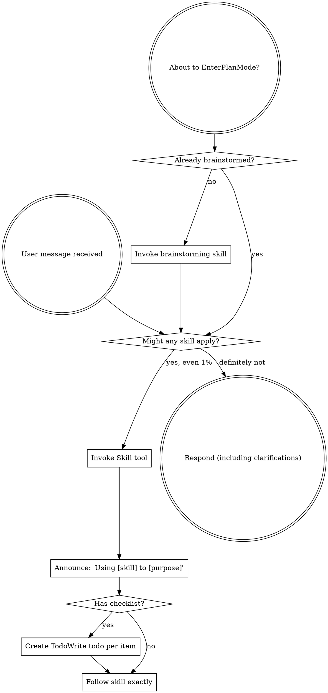

codex-exec: report contract violation

--- codex stdout ---
SPEC_VERDICT: pass

MISSING_REQUIREMENTS: none

EXTRA_SCOPE: none

VERIFICATION_MAPPING: success-path `REPORT_BYTES` failure → exit 9, stderr substring, live/JSONL/narrative rows, no provider-circuit update; failure paths → preserve exits 1/4/5/6 and log `report_bytes=0` without OK `written (0B)` claim; self-test → parent-is-a-file probe asserts rc 9, no OK line, stderr failure; host verification → `bash -n` exit 0 and Probe 7 PASS.

ONE_LINER: Diff conforms to P145 RWFIX dispatch spec.

--- codex stderr ---
OpenAI Codex v0.146.0
--------
workdir: C:\Users\jack.berrow\AppData\Roaming\warp\Warp\data\worktrees\GSDedits\cholla-racer
model: gpt-5.5
provider: openai
approval: never
sandbox: read-only
reasoning effort: xhigh
reasoning summaries: none
session id: 019fd468-f40a-7683-99e3-8912f7ea453b
--------
user
# Step 9.4 Spec-Compliance Review — P145 RWFIX dispatch (codex-exec.sh report-write CRIT)

SDD spec reviewer: judge ONLY plan conformance of the raw diff below (missing
requirements, extra scope, verification mapping). Style/quality is ATC's job.

## The spec (fix dispatch prompt, condensed)
1. Success path: REPORT_BYTES not positive integer → stderr "report write
   failure", truthful live-state/JSONL rows with dedicated unused exit code,
   narrative failure row, do NOT count against provider circuit (host-side,
   justify in comment), exit nonzero.
2. Other write_report_payload / write_raw_report_payload call sites: no path
   may claim "written (0B)" or log untruthful report_bytes; failure-path exit
   codes unchanged (timeout stays 5 etc.).
3. One new cheap self-test probe (existing probe style, deterministic —
   parent-is-a-file, not chmod), asserting nonzero exit + no OK line.
4. Nothing else restructured; bash -n passes.

## Raw diff (uncommitted)
diff --git a/super-gsd/scripts/codex-exec.sh b/super-gsd/scripts/codex-exec.sh
index f6613b9..9305168 100755
--- a/super-gsd/scripts/codex-exec.sh
+++ b/super-gsd/scripts/codex-exec.sh
@@ -33,6 +33,7 @@
 #   4 — auth-denied: $OPENAI_API_KEY set OR codex stderr matched /auth|401|unauthori[sz]ed/i
 #   5 — timeout (GNU timeout returned 124)
 #   6 — report contract violation (one or more of the 5 required fields missing)
+#   9 — report write failure (host-side persistence failure after valid output)
 #
 # See super-gsd/scripts/codex-exec.README.md for the full reference.
 # ============================================================================
@@ -451,6 +452,7 @@ if [[ "$SELF_TEST" == true ]]; then
 
     ST_PROFILE=false
     ST_FINALIZE=false
+    ST_REPORT_WRITE=false
     if [[ "$SKIP_NETWORK" == true && "$EXIT_CODE" -eq 0 ]]; then
         ST_TMP_ROOT="$(mktemp -d)"
         ST_PROJECT="$ST_TMP_ROOT/project"
@@ -553,6 +555,22 @@ EOS
             [[ "$rc" -eq 6 ]] && grep -q 'report contract violation' "$case_dir/stderr.txt"
         }
 
+        sgsd_codex_exec_self_test_report_write_failure_case() {
+            local case_dir case_project case_prompt report_parent case_report rc
+            case_dir="$ST_TMP_ROOT/case-report-write-failure"
+            case_project="$case_dir/project"
+            case_prompt="$case_dir/prompt.txt"
+            report_parent="$case_dir/report-parent-is-file"
+            case_report="$report_parent/report.txt"
+            mkdir -p "$case_project/.planning/metrics"
+            printf 'prompt for report write failure\n' > "$case_prompt"
+            printf 'not a directory\n' > "$report_parent"
+            set +e
+            PATH="$ST_BIN:$PATH" SGSD_CODEX_FORCE_LAUNCHER=direct SGSD_FAKE_CODEX_MODE="success" "$0" --prompt-file "$case_prompt" --report-out "$case_report" --project "$case_project" --timeout 5 --phase 145 --plan 145-01 --step "self-test-report-write-failure" > "$case_dir/stdout.txt" 2> "$case_dir/stderr.txt"
+            rc=$?
+            set -e
+            [[ "$rc" -eq 9 ]] && ! grep -q '^codex-exec: OK' "$case_dir/stdout.txt" && grep -q 'report write failure' "$case_dir/stderr.txt"
+        }
         if sgsd_codex_exec_self_test_case success 0 5 && \
            sgsd_codex_exec_self_test_case contract 6 5 && \
            sgsd_codex_exec_self_test_case generic 1 5 && \
@@ -563,6 +581,11 @@ EOS
         else
             EXIT_CODE=15
         fi
+        if sgsd_codex_exec_self_test_report_write_failure_case; then
+            ST_REPORT_WRITE=true
+        elif [[ "$EXIT_CODE" -eq 0 ]]; then
+            EXIT_CODE=16
+        fi
         rm -rf "$ST_TMP_ROOT"
     fi
     # Structured stdout
@@ -577,6 +600,7 @@ EOS
         "$([ "$SKIP_NETWORK" = true ] && echo ' (skipped)' || echo '')"
     printf "Probe 5 profiles: %s\n" "$([ "$ST_PROFILE" = true ] && echo PASS || echo FAIL)"
     printf "Probe 6 finalize: %s\n" "$([ "$ST_FINALIZE" = true ] && echo PASS || echo FAIL)"
+    printf "Probe 7 report write: %s\n" "$([ "$ST_REPORT_WRITE" = true ] && echo PASS || echo FAIL)"
     echo "Exit: $EXIT_CODE"
 
     # Append JSONL row to codex-log.jsonl (D-05) with probe metadata for triage.
@@ -855,6 +879,33 @@ write_raw_report_payload() {
         printf '0'
     fi
 }
+
+REPORT_WRITE_FAILURE_EXIT=9
+
+report_bytes_positive() {
+    [[ "${1:-}" =~ ^[1-9][0-9]*$ ]]
+}
+
+report_bytes_for_json() {
+    if [[ "${1:-}" =~ ^[0-9]+$ ]]; then
+        printf '%s' "$1"
+    else
+        printf '0'
+    fi
+}
+
+note_report_write_failure() {
+    echo "codex-exec: report write failure — could not write $REPORT_OUT" >&2
+}
+
+handle_report_write_failure() {
+    if report_bytes_positive "$REPORT_BYTES"; then
+        return 0
+    fi
+    REPORT_BYTES="$(report_bytes_for_json "$REPORT_BYTES")"
+    note_report_write_failure
+    return 1
+}
 NARRATIVE_FILE="$PROJECT/.planning/metrics/narrative.md"
 
 append_narrative_event() {
@@ -938,6 +989,7 @@ if [[ $RC -eq 124 ]]; then
         # exec replaces process; reached only if exec itself fails
     fi
     REPORT_BYTES="$(write_raw_report_payload "codex-exec: timeout after ${TIMEOUT}s")"
+    handle_report_write_failure || true
     write_live_state "timeout" 5 "true" "$REPORT_BYTES"
     append_jsonl 5 "true" "$REPORT_BYTES"
     append_narrative_event "codex_timeout" "timeout after ${TIMEOUT}s step=$STEP_TAG" "lastfail"
@@ -967,6 +1019,7 @@ if [[ $RC -ne 0 ]]; then
     # Check for auth-denial patterns in stderr first
     if grep -qiE '(auth|401|unauthori[sz]ed)' "$STDERR_TMP" 2>/dev/null; then
         REPORT_BYTES="$(write_raw_report_payload "codex-exec: auth-denied")"
+        handle_report_write_failure || true
         write_live_state "auth-denied" 4 "false" "$REPORT_BYTES"
         append_jsonl 4 "false" "$REPORT_BYTES"
         append_narrative_event "codex_fallback" "auth-denied step=$STEP_TAG" "lastfail"
@@ -977,6 +1030,7 @@ if [[ $RC -ne 0 ]]; then
         exit 4
     fi
     REPORT_BYTES="$(write_raw_report_payload "codex-exec: codex exit=$RC (generic failure)")"
+    handle_report_write_failure || true
     write_live_state "error" 1 "false" "$REPORT_BYTES"
     append_jsonl 1 "false" "$REPORT_BYTES"
     append_narrative_event "codex_fallback" "error exit=$RC step=$STEP_TAG" "lastfail"
@@ -1029,6 +1083,7 @@ if [[ "$CONTRACT" == "rd-memo-v1" ]]; then
             ' "$schema_lib" 2>/dev/null || true)"
             if [[ -n "$validation_errors" ]]; then
                 REPORT_BYTES="$(write_raw_report_payload "codex-exec: report contract violation")"
+                handle_report_write_failure || true
                 write_live_state "contract-violation" 6 "false" "$REPORT_BYTES"
                 append_jsonl 6 "false" "$REPORT_BYTES"
                 append_narrative_event "codex_fallback" "rd_memo_schema_fail step=$STEP_TAG" "lastfail"
@@ -1081,6 +1136,7 @@ fi
 set +e
 if [[ $awk_rc -ne 0 || -z "$parsed" ]]; then
     REPORT_BYTES="$(write_raw_report_payload "codex-exec: report contract violation")"
+    handle_report_write_failure || true
     write_live_state "contract-violation" 6 "false" "$REPORT_BYTES"
     append_jsonl 6 "false" "$REPORT_BYTES"
     append_narrative_event "codex_fallback" "parse_failure step=$STEP_TAG" "lastfail"
@@ -1095,6 +1151,13 @@ if [[ $awk_rc -ne 0 || -z "$parsed" ]]; then
 fi
 
 REPORT_BYTES="$(write_report_payload "$parsed")"
+if ! handle_report_write_failure; then
+    write_live_state "report-write-failure" "$REPORT_WRITE_FAILURE_EXIT" "false" "$REPORT_BYTES"
+    append_jsonl "$REPORT_WRITE_FAILURE_EXIT" "false" "$REPORT_BYTES"
+    append_narrative_event "codex_fallback" "report_write_failure step=$STEP_TAG" "lastfail"
+    # Host-side persistence failure; provider returned valid output, so do not update provider circuit.
+    exit "$REPORT_WRITE_FAILURE_EXIT"
+fi
 
 # ── JSONL append on success ─────────────────────────────────────────────────
 write_live_state "ok" 0 "false" "$REPORT_BYTES"

## Executor report
STATUS: DONE_WITH_CONCERNS (sandbox bash blocked — could not self-verify)

## Host verification (orchestrator-run, 2026-08-06)
- bash -n → exit 0
- codex-exec.sh --self-test --skip-network → exit 0; Probes 1-6 PASS + NEW
  "Probe 7 report write: PASS"
- codex-executor.sh --self-test → direct+cmd parity PASS, exit 0

## Report contract (exact)
SPEC_VERDICT: pass|fix_required|blocked
MISSING_REQUIREMENTS: none|<list>
EXTRA_SCOPE: none|<list>
VERIFICATION_MAPPING: <evidence → criterion>
ONE_LINER: <summary>

exec
"C:\\WINDOWS\\System32\\WindowsPowerShell\\v1.0\\powershell.exe" -Command "Get-Content -Raw C:\\Users\\jack.berrow\\.codex\\skills\\using-superpowers\\SKILL.md" in C:\Users\jack.berrow\AppData\Roaming\warp\Warp\data\worktrees\GSDedits\cholla-racer
 succeeded in 549ms:
---
name: using-superpowers
description: Use when starting any conversation - establishes how to find and use skills, requiring Skill tool invocation before ANY response including clarifying questions
---

<SUBAGENT-STOP>
If you were dispatched as a subagent to execute a specific task, skip this skill.
</SUBAGENT-STOP>

<EXTREMELY-IMPORTANT>
If you think there is even a 1% chance a skill might apply to what you are doing, you ABSOLUTELY MUST invoke the skill.

IF A SKILL APPLIES TO YOUR TASK, YOU DO NOT HAVE A CHOICE. YOU MUST USE IT.

This is not negotiable. This is not optional. You cannot rationalize your way out of this.
</EXTREMELY-IMPORTANT>

## Instruction Priority

Superpowers skills override default system prompt behavior, but **user instructions always take precedence**:

1. **User's explicit instructions** (CLAUDE.md, GEMINI.md, AGENTS.md, direct requests) ƒ?" highest priority
2. **Superpowers skills** ƒ?" override default system behavior where they conflict
3. **Default system prompt** ƒ?" lowest priority

If CLAUDE.md, GEMINI.md, or AGENTS.md says "don't use TDD" and a skill says "always use TDD," follow the user's instructions. The user is in control.

## How to Access Skills

**In Claude Code:** Use the `Skill` tool. When you invoke a skill, its content is loaded and presented to youƒ?"follow it directly. Never use the Read tool on skill files.

**In Copilot CLI:** Use the `skill` tool. Skills are auto-discovered from installed plugins. The `skill` tool works the same as Claude Code's `Skill` tool.

**In Gemini CLI:** Skills activate via the `activate_skill` tool. Gemini loads skill metadata at session start and activates the full content on demand.

**In other environments:** Check your platform's documentation for how skills are loaded.

## Platform Adaptation

Skills use Claude Code tool names. Non-CC platforms: see `references/copilot-tools.md` (Copilot CLI), `references/codex-tools.md` (Codex) for tool equivalents. Gemini CLI users get the tool mapping loaded automatically via GEMINI.md.

# Using Skills

## The Rule

**Invoke relevant or requested skills BEFORE any response or action.** Even a 1% chance a skill might apply means that you should invoke the skill to check. If an invoked skill turns out to be wrong for the situation, you don't need to use it.



## Red Flags

These thoughts mean STOPƒ?"you're rationalizing:

| Thought | Reality |
|---------|---------|
| "This is just a simple question" | Questions are tasks. Check for skills. |
| "I need more context first" | Skill check comes BEFORE clarifying questions. |
| "Let me explore the codebase first" | Skills tell you HOW to explore. Check first. |
| "I can check git/files quickly" | Files lack conversation context. Check for skills. |
| "Let me gather information first" | Skills tell you HOW to gather information. |
| "This doesn't need a formal skill" | If a skill exists, use it. |
| "I remember this skill" | Skills evolve. Read current version. |
| "This doesn't count as a task" | Action = task. Check for skills. |
| "The skill is overkill" | Simple things become complex. Use it. |
| "I'll just do this one thing first" | Check BEFORE doing anything. |
| "This feels productive" | Undisciplined action wastes time. Skills prevent this. |
| "I know what that means" | Knowing the concept ƒ%ÿ using the skill. Invoke it. |

## Skill Priority

When multiple skills could apply, use this order:

1. **Process skills first** (brainstorming, debugging) - these determine HOW to approach the task
2. **Implementation skills second** (frontend-design, mcp-builder) - these guide execution

"Let's build X" ā' brainstorming first, then implementation skills.
"Fix this bug" ā' debugging first, then domain-specific skills.

## Skill Types

**Rigid** (TDD, debugging): Follow exactly. Don't adapt away discipline.

**Flexible** (patterns): Adapt principles to context.

The skill itself tells you which.

## User Instructions

Instructions say WHAT, not HOW. "Add X" or "Fix Y" doesn't mean skip workflows.

C:\Users\jack.berrow\OneDrive - John Cullen Lighting\Documents\WindowsPowerShell\profile.ps1 : Cannot dot-source this 
command because it was defined in a different language mode. To invoke this command without importing its contents, 
omit the '.' operator.
At line:1 char:1
+ . 'C:\Users\jack.berrow\OneDrive - John Cullen Lighting\Documents\Win ...
+ ~~~~~~~~~~~~~~~~~~~~~~~~~~~~~~~~~~~~~~~~~~~~~~~~~~~~~~~~~~~~~~~~~~~~~
    + CategoryInfo          : InvalidOperation: (:) [profile.ps1], NotSupportedException
    + FullyQualifiedErrorId : DotSourceNotSupported,profile.ps1
 
C:\Users\jack.berrow\OneDrive - John Cullen Lighting\Documents\WindowsPowerShell\Microsoft.PowerShell_profile.ps1 : 
Cannot dot-source this command because it was defined in a different language mode. To invoke this command without 
importing its contents, omit the '.' operator.
At line:1 char:1
+ . 'C:\Users\jack.berrow\OneDrive - John Cullen Lighting\Documents\Win ...
+ ~~~~~~~~~~~~~~~~~~~~~~~~~~~~~~~~~~~~~~~~~~~~~~~~~~~~~~~~~~~~~~~~~~~~~
    + CategoryInfo          : InvalidOperation: (:) [Microsoft.PowerShell_profile.ps1], NotSupportedException
    + FullyQualifiedErrorId : DotSourceNotSupported,Microsoft.PowerShell_profile.ps1
 

codex
Using `using-superpowers` for the mandatory skill check, and `review` only insofar as it helps structure a spec-conformance review; I’ll keep the judgment limited to the dispatch spec you provided.
exec
"C:\\WINDOWS\\System32\\WindowsPowerShell\\v1.0\\powershell.exe" -Command "Get-Content -Raw C:\\Users\\jack.berrow\\.agents\\skills\\review\\SKILL.md" in C:\Users\jack.berrow\AppData\Roaming\warp\Warp\data\worktrees\GSDedits\cholla-racer
 succeeded in 1330ms:
---
name: review
description: Review code changes for security, performance, bugs, and quality. Reviews staged changes, unstaged changes, specific commits, or PR-ready diffs.
---

<objective>
Review code changes and provide structured feedback covering security, performance, bug risks, code quality, and test coverage gaps. This skill analyzes diffs and surrounding context to catch issues before they reach production.
</objective>

<context>
This skill reviews code changes at various stages of the development workflow. It can review staged changes before a commit, unstaged work-in-progress, a specific commit, or the full set of changes on a branch that are ready for a pull request.

The reviewer reads both the diff and the surrounding source files to understand intent and catch issues that only appear in context.
</context>

<core_principle>
**FIND REAL ISSUES, NOT STYLE NITS.** Focus on problems that cause bugs, security vulnerabilities, performance degradation, or maintainability pain. Avoid nitpicking formatting or subjective style preferences unless they harm readability.
</core_principle>

<analysis_only_rule>
**THIS SKILL IS READ-ONLY. DO NOT MODIFY CODE.**

The purpose is to review and report findings. Making changes during review conflates the reviewer and author roles. Present findings and let the user decide what to act on.
</analysis_only_rule>

<quick_start>

<determine_review_scope>

Parse the user's input to determine what to review:

1. **No arguments** - Review staged changes first. If nothing is staged, review unstaged changes.
   - Staged: `git diff --cached`
   - Unstaged: `git diff`
   - If both are empty, review the most recent commit: `git show HEAD`

2. **Commit hash argument** (e.g., `/review abc1234`) - Review that specific commit.
   - `git show <hash>`

3. **File path argument** (e.g., `/review src/foo.ts`) - Review unstaged changes in that file.
   - `git diff -- <path>` then fall back to `git diff --cached -- <path>`

4. **"pr" argument** (e.g., `/review pr`) - Review all changes since branching from main.
   - `git diff main...HEAD`
   - If on main, review `git diff HEAD~1`

After obtaining the diff, if it is empty, inform the user that there are no changes to review and stop.

</determine_review_scope>

<gather_context>

Before analyzing the diff:

1. **Read changed files in full** - Do not review a diff in isolation. Read each modified file to understand the surrounding code, imports, types, and control flow.
2. **Identify the tech stack** - Note languages, frameworks, and libraries in use. This affects what patterns are risky.
3. **Check for related test files** - For each changed source file, look for corresponding test files. Note whether tests were updated alongside the changes.
4. **Check for configuration changes** - If config files changed (env, CI, package.json, tsconfig, etc.), pay extra attention to side effects.

</gather_context>

<review_categories>

Analyze the changes against each category below. Only report findings that are actually present. Skip categories with no issues.

**A. Security Issues** (Severity: CRITICAL or HIGH)
- Injection vulnerabilities (SQL injection, command injection, template injection)
- Cross-site scripting (XSS) - unsanitized user input rendered in HTML
- Authentication and authorization flaws (missing auth checks, privilege escalation)
- Secrets or credentials hardcoded or logged
- Insecure deserialization or unsafe eval usage
- Path traversal or file access vulnerabilities
- Missing input validation on external data

**B. Performance Concerns** (Severity: HIGH or MEDIUM)
- N+1 query patterns in database access
- Unnecessary memory allocations in hot paths or loops
- Blocking operations on the main thread or in async contexts
- Missing pagination on unbounded queries
- Redundant computation that could be cached or memoized
- Large payloads without streaming or chunking

**C. Bug Risks** (Severity: HIGH or MEDIUM)
- Off-by-one errors in loops or array access
- Null/undefined dereferences without guards
- Race conditions in concurrent or async code
- Incorrect error handling (swallowed errors, wrong error types)
- Type mismatches or unsafe type assertions
- Logic errors in conditionals (inverted checks, missing cases)
- Resource leaks (unclosed connections, file handles, listeners)

**D. Code Quality** (Severity: MEDIUM or LOW)
- Unclear or misleading naming
- Significant code duplication that should be extracted
- Excessive complexity (deeply nested logic, functions doing too many things)
- Dead code or unreachable branches
- Missing or misleading comments on non-obvious logic
- Inconsistency with patterns used elsewhere in the codebase

**E. Test Coverage Gaps** (Severity: MEDIUM or LOW)
- New logic paths without corresponding test cases
- Changed behavior without updated tests
- Edge cases not covered (empty inputs, boundary values, error paths)
- Missing integration tests for new API endpoints or database changes

</review_categories>

<format_findings>

For each finding, use this structure:

```
### [SEVERITY] Category: Brief Title

**File**: `path/to/file.ext` (lines X-Y)

**Issue**: Clear description of the problem.

**Why it matters**: What could go wrong if this is not addressed.

**Suggestion**: How to fix it, with a code snippet if helpful.
```

Severity levels:
- **CRITICAL** - Must fix before merge. Security vulnerability or data loss risk.
- **HIGH** - Should fix before merge. Likely bug or significant performance issue.
- **MEDIUM** - Should fix soon. Code quality or moderate risk issue.
- **LOW** - Consider fixing. Minor improvement opportunity.

</format_findings>

</quick_start>

<critical_rules>

1. **READ THE FULL FILE**: Never review a diff without reading the complete source file for context
2. **NO FALSE ALARMS**: Only report issues you can explain concretely. Do not report vague concerns
3. **PRIORITIZE**: Lead with the most severe findings. Do not bury critical issues under style nits
4. **BE SPECIFIC**: Include file paths, line numbers, and code references for every finding
5. **EXPLAIN THE RISK**: For each finding, explain what could actually go wrong
6. **CHECK TESTS**: Always check whether changes have corresponding test updates
7. **CONSIDER THE STACK**: Apply language-specific and framework-specific knowledge to your review
8. **DO NOT MODIFY CODE**: Present findings only. The user decides what to act on

</critical_rules>

<output_format>

```markdown
## Code Review: [brief description of what was reviewed]

**Scope**: [staged changes | unstaged changes | commit abc1234 | PR changes from main]
**Files reviewed**: [count] files changed, [additions] additions, [deletions] deletions

---

### Findings

[Findings grouped by severity, highest first. Use the format from <format_findings>.]

---

### Summary

| Severity | Count |
|----------|-------|
| CRITICAL | X     |
| HIGH     | X     |
| MEDIUM   | X     |
| LOW      | X     |

### Recommended Actions

1. [Most important action to take]
2. [Next most important action]
3. [...]
```

If no issues are found:

```markdown
## Code Review: [brief description]

**Scope**: [what was reviewed]
**Files reviewed**: [count]

No significant issues found. The changes look good to merge.
```

</output_format>

<decision_gate>

**After presenting findings, ALWAYS offer these options:**

```
ƒ"?ƒ"?ƒ"?ƒ"?ƒ"?ƒ"?ƒ"?ƒ"?ƒ"?ƒ"?ƒ"?ƒ"?ƒ"?ƒ"?ƒ"?ƒ"?ƒ"?ƒ"?ƒ"?ƒ"?ƒ"?ƒ"?ƒ"?ƒ"?ƒ"?ƒ"?ƒ"?ƒ"?ƒ"?ƒ"?ƒ"?ƒ"?ƒ"?ƒ"?ƒ"?ƒ"?ƒ"?ƒ"?ƒ"?ƒ"?ƒ"?
REVIEW COMPLETE

What would you like to do?

1. **Fix issues** - I'll address the findings starting with the most critical
2. **Save review** - Export findings to a markdown file
3. **Review again** - Re-review with different scope or focus
4. **Discuss a finding** - Ask questions about a specific issue
5. **Other** - Tell me what you need
ƒ"?ƒ"?ƒ"?ƒ"?ƒ"?ƒ"?ƒ"?ƒ"?ƒ"?ƒ"?ƒ"?ƒ"?ƒ"?ƒ"?ƒ"?ƒ"?ƒ"?ƒ"?ƒ"?ƒ"?ƒ"?ƒ"?ƒ"?ƒ"?ƒ"?ƒ"?ƒ"?ƒ"?ƒ"?ƒ"?ƒ"?ƒ"?ƒ"?ƒ"?ƒ"?ƒ"?ƒ"?ƒ"?ƒ"?ƒ"?ƒ"?
```

**Wait for user response before taking any action.**

This gate is MANDATORY. Never skip it. Never auto-implement fixes.

</decision_gate>

C:\Users\jack.berrow\OneDrive - John Cullen Lighting\Documents\WindowsPowerShell\profile.ps1 : Cannot dot-source this 
command because it was defined in a different language mode. To invoke this command without importing its contents, 
omit the '.' operator.
At line:1 char:1
+ . 'C:\Users\jack.berrow\OneDrive - John Cullen Lighting\Documents\Win ...
+ ~~~~~~~~~~~~~~~~~~~~~~~~~~~~~~~~~~~~~~~~~~~~~~~~~~~~~~~~~~~~~~~~~~~~~
    + CategoryInfo          : InvalidOperation: (:) [profile.ps1], NotSupportedException
    + FullyQualifiedErrorId : DotSourceNotSupported,profile.ps1
 
C:\Users\jack.berrow\OneDrive - John Cullen Lighting\Documents\WindowsPowerShell\Microsoft.PowerShell_profile.ps1 : 
Cannot dot-source this command because it was defined in a different language mode. To invoke this command without 
importing its contents, omit the '.' operator.
At line:1 char:1
+ . 'C:\Users\jack.berrow\OneDrive - John Cullen Lighting\Documents\Win ...
+ ~~~~~~~~~~~~~~~~~~~~~~~~~~~~~~~~~~~~~~~~~~~~~~~~~~~~~~~~~~~~~~~~~~~~~
    + CategoryInfo          : InvalidOperation: (:) [Microsoft.PowerShell_profile.ps1], NotSupportedException
    + FullyQualifiedErrorId : DotSourceNotSupported,Microsoft.PowerShell_profile.ps1
 

codex
I’m checking the surrounding shell flow now because the key conformance points depend on where `REPORT_BYTES` feeds stdout, live state, JSONL, narrative, and provider-circuit updates.
exec
"C:\\WINDOWS\\System32\\WindowsPowerShell\\v1.0\\powershell.exe" -Command "Select-String -Path super-gsd/scripts/codex-exec.sh -Pattern 'write_report_payload|write_raw_report_payload|codex-exec: OK|REPORT_BYTES|provider|circuit|append_jsonl|write_live_state|append_narrative_event' -Context 2,2" in C:\Users\jack.berrow\AppData\Roaming\warp\Warp\data\worktrees\GSDedits\cholla-racer
exec
"C:\\WINDOWS\\System32\\WindowsPowerShell\\v1.0\\powershell.exe" -Command 'Get-Content super-gsd/scripts/codex-exec.sh | Select-Object -Skip 820 -First 360' in C:\Users\jack.berrow\AppData\Roaming\warp\Warp\data\worktrees\GSDedits\cholla-racer
exec
"C:\\WINDOWS\\System32\\WindowsPowerShell\\v1.0\\powershell.exe" -Command 'Get-Content super-gsd/scripts/codex-exec.sh | Select-Object -Skip 430 -First 190' in C:\Users\jack.berrow\AppData\Roaming\warp\Warp\data\worktrees\GSDedits\cholla-racer
 succeeded in 1344ms:
           grep -q "^PASS_RATE:" "$ST_REPORT_TMP" && \
           grep -q "^ONE_LINER:" "$ST_REPORT_TMP"; then
            ST_CONTRACT=true
            # Retroactive auth confirmation: if Probe 2 deferred, canary success
            # IS the secondary behavioral oracle. Promote auth method.
            if [[ "$ST_AUTH" == false ]] && [[ "${ST_AUTH_METHOD:-}" == "deferred_to_canary" ]]; then
                ST_AUTH=true
                ST_AUTH_METHOD="contract_canary_passed"
                EXIT_CODE=0
            fi
        else
            # Canary failed. If Probe 2 deferred, this is the FAIL.
            if [[ "${ST_AUTH_METHOD:-}" == "deferred_to_canary" ]]; then
                EXIT_CODE=11
                ST_AUTH_METHOD="contract_canary_failed"
            else
                EXIT_CODE=13
            fi
        fi
        rm -f "$ST_PROMPT_TMP" "$ST_REPORT_TMP" "$ST_STDERR_TMP"
    fi

    ST_PROFILE=false
    ST_FINALIZE=false
    ST_REPORT_WRITE=false
    if [[ "$SKIP_NETWORK" == true && "$EXIT_CODE" -eq 0 ]]; then
        ST_TMP_ROOT="$(mktemp -d)"
        ST_PROJECT="$ST_TMP_ROOT/project"
        ST_PROMPT="$ST_TMP_ROOT/prompt.txt"
        ST_REPORT="$ST_TMP_ROOT/report.txt"
        mkdir -p "$ST_PROJECT/.planning/metrics"
        printf 'codex-exec self-test prompt\n' > "$ST_PROMPT"

        ST_REVIEW_DIRECT="$(SGSD_CODEX_FORCE_LAUNCHER=direct "$0" --dry-run --prompt-file "$ST_PROMPT" --report-out "$ST_REPORT" --project "$ST_PROJECT" --timeout 30 | awk -F'resolved: ' '/resolved:/ { print $2; exit }')"
        ST_REVIEW_CMD="$(SGSD_CODEX_FORCE_LAUNCHER=cmd "$0" --dry-run --prompt-file "$ST_PROMPT" --report-out "$ST_REPORT" --project "$ST_PROJECT" --timeout 30 | awk -F'resolved: ' '/resolved:/ { print $2; exit }')"
        ST_TRIAGE_DIRECT="$(SGSD_CODEX_FORCE_LAUNCHER=direct "$0" --dry-run --profile triage --prompt-file "$ST_PROMPT" --report-out "$ST_REPORT" --project "$ST_PROJECT" --timeout 30 | awk -F'resolved: ' '/resolved:/ { print $2; exit }')"
        ST_TIMEOUT_DRY="$(SGSD_CODEX_FORCE_LAUNCHER=direct "$0" --dry-run --profile triage --prompt-file "$ST_PROMPT" --report-out "$ST_REPORT" --project "$ST_PROJECT" --timeout 77 | awk -F'resolved: ' '/resolved:/ { print $2; exit }')"
        if [[ "$ST_REVIEW_DIRECT" == *'"direct" "codex" "gpt-5.5" "xhigh"' && "$ST_REVIEW_DIRECT" == *'--sandbox read-only --ephemeral --skip-git-repo-check'* && "$ST_REVIEW_CMD" == *'"cmd" "cmd.exe" "gpt-5.5" "xhigh"' && "$ST_TRIAGE_DIRECT" == *'--sandbox read-only --skip-git-repo-check'* && "$ST_TRIAGE_DIRECT" != *'--ephemeral'* && "$ST_TIMEOUT_DRY" == timeout\ 77s* ]]; then
            ST_PROFILE=true
        else
            EXIT_CODE=14
        fi

        ST_BIN="$ST_TMP_ROOT/bin"
        mkdir -p "$ST_BIN"
        cat > "$ST_BIN/codex" <<'EOS'
#!/usr/bin/env bash
if [[ "$1" == "--version" ]]; then echo "codex-cli-fake 0.0.0"; exit 0; fi
if [[ "$1" == "login" && "$2" == "status" ]]; then echo "Logged in"; exit 0; fi
if [[ "$1" == "exec" ]]; then
    case "${SGSD_FAKE_CODEX_MODE:-success}" in
        success)
            printf 'FINDINGS: 0\nCRITICAL: 0\nWARNINGS: 0\nPASS_RATE: 1/1\nONE_LINER: fake success\n'
            exit 0
            ;;
        contract)
            printf 'missing contract fields\n'
            exit 0
            ;;
        generic)
            printf 'generic stdout\n'
            printf 'generic stderr\n' >&2
            exit 2
            ;;
        auth)
            printf 'auth stdout\n'
            printf 'unauthorized\n' >&2
            exit 2
            ;;
        timeout)
            printf 'before timeout\n'
            sleep 2
            exit 0
            ;;
    esac
fi
exit 0
EOS
        chmod +x "$ST_BIN/codex"

        sgsd_codex_exec_self_test_case() {
            local mode="$1" expected="$2" timeout_value="$3"
            local case_dir case_project case_prompt case_report before_rows after_rows rc report_bytes
            case_dir="$ST_TMP_ROOT/case-$mode"
            case_project="$case_dir/project"
            case_prompt="$case_dir/prompt.txt"
            case_report="$case_dir/report.txt"
            mkdir -p "$case_project/.planning/metrics"
            printf 'prompt for %s\n' "$mode" > "$case_prompt"
            before_rows=0
            [[ -f "$case_project/.planning/metrics/codex-log.jsonl" ]] && before_rows="$(wc -l < "$case_project/.planning/metrics/codex-log.jsonl" | tr -d ' ')"
            set +e
            PATH="$ST_BIN:$PATH" SGSD_CODEX_FORCE_LAUNCHER=direct SGSD_FAKE_CODEX_MODE="$mode" "$0" --prompt-file "$case_prompt" --report-out "$case_report" --project "$case_project" --timeout "$timeout_value" --phase 145 --plan 145-01 --step "self-test-$mode" >/dev/null 2> "$case_dir/stderr.txt"
            rc=$?
            set -e
            after_rows=0
            [[ -f "$case_project/.planning/metrics/codex-log.jsonl" ]] && after_rows="$(wc -l < "$case_project/.planning/metrics/codex-log.jsonl" | tr -d ' ')"
            if [[ "$rc" -ne "$expected" || ! -s "$case_report" || $((after_rows - before_rows)) -ne 1 ]]; then
                return 1
            fi
            report_bytes="$(wc -c < "$case_report" | tr -d ' ')"
            [[ "$report_bytes" -gt 0 ]]
        }

        sgsd_codex_exec_self_test_write_failure_case() {
            local case_dir case_project case_prompt case_report report_dir rc
            case_dir="$ST_TMP_ROOT/case-write-failure"
            case_project="$case_dir/project"
            case_prompt="$case_dir/prompt.txt"
            report_dir="$case_dir/read-only-report-dir"
            case_report="$report_dir/report.txt"
            mkdir -p "$case_project/.planning/metrics" "$report_dir"
            printf 'prompt for write failure\n' > "$case_prompt"
            chmod a-w "$report_dir" 2>/dev/null || true
            if [[ -w "$report_dir" ]]; then
                echo "Probe 6 write-failure: SKIPPED (filesystem does not enforce chmod a-w)" >&2
                chmod u+w "$report_dir" 2>/dev/null || true
                return 0
            fi
            set +e
            PATH="$ST_BIN:$PATH" SGSD_CODEX_FORCE_LAUNCHER=direct SGSD_FAKE_CODEX_MODE="contract" "$0" --prompt-file "$case_prompt" --report-out "$case_report" --project "$case_project" --timeout 5 --phase 145 --plan 145-01 --step "self-test-write-failure" >/dev/null 2> "$case_dir/stderr.txt"
            rc=$?
            chmod u+w "$report_dir" 2>/dev/null || true
            set -e
            [[ "$rc" -eq 6 ]] && grep -q 'report contract violation' "$case_dir/stderr.txt"
        }

        sgsd_codex_exec_self_test_report_write_failure_case() {
            local case_dir case_project case_prompt report_parent case_report rc
            case_dir="$ST_TMP_ROOT/case-report-write-failure"
            case_project="$case_dir/project"
            case_prompt="$case_dir/prompt.txt"
            report_parent="$case_dir/report-parent-is-file"
            case_report="$report_parent/report.txt"
            mkdir -p "$case_project/.planning/metrics"
            printf 'prompt for report write failure\n' > "$case_prompt"
            printf 'not a directory\n' > "$report_parent"
            set +e
            PATH="$ST_BIN:$PATH" SGSD_CODEX_FORCE_LAUNCHER=direct SGSD_FAKE_CODEX_MODE="success" "$0" --prompt-file "$case_prompt" --report-out "$case_report" --project "$case_project" --timeout 5 --phase 145 --plan 145-01 --step "self-test-report-write-failure" > "$case_dir/stdout.txt" 2> "$case_dir/stderr.txt"
            rc=$?
            set -e
            [[ "$rc" -eq 9 ]] && ! grep -q '^codex-exec: OK' "$case_dir/stdout.txt" && grep -q 'report write failure' "$case_dir/stderr.txt"
        }
        if sgsd_codex_exec_self_test_case success 0 5 && \
           sgsd_codex_exec_self_test_case contract 6 5 && \
           sgsd_codex_exec_self_test_case generic 1 5 && \
           sgsd_codex_exec_self_test_case auth 4 5 && \
           sgsd_codex_exec_self_test_case timeout 5 1 && \
           sgsd_codex_exec_self_test_write_failure_case; then
            ST_FINALIZE=true
        else
            EXIT_CODE=15
        fi
        if sgsd_codex_exec_self_test_report_write_failure_case; then
            ST_REPORT_WRITE=true
        elif [[ "$EXIT_CODE" -eq 0 ]]; then
            EXIT_CODE=16
        fi
        rm -rf "$ST_TMP_ROOT"
    fi
    # Structured stdout
    echo "=== codex-exec --self-test ==="
    printf "Model:            %s\n" "$CODEX_MODEL"
    printf "Reasoning effort: %s\n" "$CODEX_REASONING_EFFORT"
    printf "Probe 1 PATH:     %s\n" "$([ "$ST_PATH"     = true ] && echo PASS || echo FAIL)"
    printf "Probe 2 auth:     %s\n" "$([ "$ST_AUTH"     = true ] && echo PASS || echo FAIL)"
    printf "Probe 3 timeout:  %s (tier_review=%s)\n" "$([ "$ST_TIMEOUT"  = true ] && echo PASS || echo FAIL)" "${TIER_REVIEW}"
    printf "Probe 4 contract: %s%s\n" \
        "$([ "$ST_CONTRACT" = true ] && echo PASS || echo FAIL)" \
        "$([ "$SKIP_NETWORK" = true ] && echo ' (skipped)' || echo '')"
    printf "Probe 5 profiles: %s\n" "$([ "$ST_PROFILE" = true ] && echo PASS || echo FAIL)"
    printf "Probe 6 finalize: %s\n" "$([ "$ST_FINALIZE" = true ] && echo PASS || echo FAIL)"
    printf "Probe 7 report write: %s\n" "$([ "$ST_REPORT_WRITE" = true ] && echo PASS || echo FAIL)"
    echo "Exit: $EXIT_CODE"

    # Append JSONL row to codex-log.jsonl (D-05) with probe metadata for triage.
    # Schema additions per architectural rule: probe_version, codex_version,
    # auth_method, checked_files, command_exit, stderr_excerpt.
    if [[ -n "$ROOT" ]]; then
        ST_LOG="$ROOT/.planning/metrics/codex-log.jsonl"
        ST_TS="$(date -u +%Y-%m-%dT%H:%M:%SZ)"
        mkdir -p "$(dirname "$ST_LOG")"
        model_json="$(json_escape "$CODEX_MODEL")"
        effort_json="$(json_escape "$CODEX_REASONING_EFFORT")"
        # Probe metadata
        PROBE_VERSION="2"
        CODEX_VERSION="$("$CODEX_COMMAND" --version 2>/dev/null | head -1 || echo unknown)"
        codex_version_json="$(json_escape "$CODEX_VERSION")"
        auth_method_json="$(json_escape "${ST_AUTH_METHOD:-unknown}")"
        stderr_json="$(json_escape "${ST_CONTRACT_STDERR:-}")"
C:\Users\jack.berrow\OneDrive - John Cullen Lighting\Documents\WindowsPowerShell\profile.ps1 : Cannot dot-source this 
command because it was defined in a different language mode. To invoke this command without importing its contents, 
omit the '.' operator.
At line:1 char:1
+ . 'C:\Users\jack.berrow\OneDrive - John Cullen Lighting\Documents\Win ...
+ ~~~~~~~~~~~~~~~~~~~~~~~~~~~~~~~~~~~~~~~~~~~~~~~~~~~~~~~~~~~~~~~~~~~~~
    + CategoryInfo          : InvalidOperation: (:) [profile.ps1], NotSupportedException
    + FullyQualifiedErrorId : DotSourceNotSupported,profile.ps1
 
C:\Users\jack.berrow\OneDrive - John Cullen Lighting\Documents\WindowsPowerShell\Microsoft.PowerShell_profile.ps1 : 
Cannot dot-source this command because it was defined in a different language mode. To invoke this command without 
importing its contents, omit the '.' operator.
At line:1 char:1
+ . 'C:\Users\jack.berrow\OneDrive - John Cullen Lighting\Documents\Win ...
+ ~~~~~~~~~~~~~~~~~~~~~~~~~~~~~~~~~~~~~~~~~~~~~~~~~~~~~~~~~~~~~~~~~~~~~
    + CategoryInfo          : InvalidOperation: (:) [Microsoft.PowerShell_profile.ps1], NotSupportedException
    + FullyQualifiedErrorId : DotSourceNotSupported,Microsoft.PowerShell_profile.ps1
 

 succeeded in 1398ms:
    echo "============================================================"
} >> "$WATCH_OUT"

PROMPT_BYTES=0
if [[ -f "$PROMPT_FILE" ]]; then
    PROMPT_BYTES=$(wc -c < "$PROMPT_FILE" | tr -d ' ')
fi

# ƒ"?ƒ"? Pre-compute stderr preview (first 200 bytes, JSON-safe) ƒ"?ƒ"?ƒ"?ƒ"?ƒ"?ƒ"?ƒ"?ƒ"?ƒ"?ƒ"?ƒ"?ƒ"?ƒ"?ƒ"?ƒ"?ƒ"?ƒ"?
stderr_preview_raw="$(head -c 200 "$STDERR_TMP" 2>/dev/null || echo '')"
# Escape backslash, double-quote, and control chars for JSON embedding.
stderr_preview_json="$(json_escape "$stderr_preview_raw")"
codex_model_json="$(json_escape "$CODEX_MODEL")"
codex_reasoning_effort_json="$(json_escape "$CODEX_REASONING_EFFORT")"

# ƒ"?ƒ"? JSONL append helper (fires on every exit path except 3/4-env/1-usage) ƒ"?ƒ"?
METRICS_LOG="$PROJECT/.planning/metrics/codex-log.jsonl"
LIVE_FILE="$PROJECT/.planning/metrics/codex-live.json"
append_jsonl() {
    local wrapper_exit="$1" timeout_hit="$2" report_bytes="$3"
    local phase_field plan_field step_field
    if [[ -z "$PHASE_TAG" ]]; then phase_field="null"; else phase_field="$PHASE_TAG"; fi
    if [[ -z "$PLAN_TAG" ]];  then plan_field="null";  else plan_field="\"$PLAN_TAG\""; fi
    if [[ -z "$STEP_TAG" ]];  then step_field="null";  else step_field="\"$STEP_TAG\""; fi
    mkdir -p "$(dirname "$METRICS_LOG")" 2>/dev/null || true
    printf '{"ts":"%s","phase":%s,"plan":%s,"step":%s,"model":"%s","reasoning_effort":"%s","exit":%d,"duration_ms":%d,"prompt_bytes":%d,"report_bytes":%d,"timeout_hit":%s,"fallback_triggered":false,"stderr_preview":"%s"}\n' \
        "$TS" "$phase_field" "$plan_field" "$step_field" \
        "$codex_model_json" "$codex_reasoning_effort_json" \
        "$wrapper_exit" "$DURATION_MS" "$PROMPT_BYTES" "$report_bytes" \
        "$timeout_hit" "$stderr_preview_json" \
        >> "$METRICS_LOG" 2>/dev/null || true
}

# ƒ"?ƒ"? MC-03: narrative.md event writer ƒ"?ƒ"?ƒ"?ƒ"?ƒ"?ƒ"?ƒ"?ƒ"?ƒ"?ƒ"?ƒ"?ƒ"?ƒ"?ƒ"?ƒ"?ƒ"?ƒ"?ƒ"?ƒ"?ƒ"?ƒ"?ƒ"?ƒ"?ƒ"?ƒ"?ƒ"?ƒ"?ƒ"?ƒ"?ƒ"?ƒ"?ƒ"?ƒ"?ƒ"?ƒ"?ƒ"?ƒ"?ƒ"?ƒ"?ƒ"?
write_report_payload() {
    local body="$1"
    mkdir -p "$(dirname "$REPORT_OUT")" 2>/dev/null || true
    if printf '%s\n' "$body" > "$REPORT_OUT.tmp" 2>/dev/null && mv "$REPORT_OUT.tmp" "$REPORT_OUT" 2>/dev/null; then
        wc -c < "$REPORT_OUT" 2>/dev/null | tr -d ' ' || printf '0'
    else
        rm -f "$REPORT_OUT.tmp" 2>/dev/null || true
        printf '0'
    fi
}

write_raw_report_payload() {
    local summary="$1"
    mkdir -p "$(dirname "$REPORT_OUT")" 2>/dev/null || true
    if {
        printf '%s\n' "$summary"
        printf '\n--- codex stdout ---\n'
        cat "$STDOUT_TMP" 2>/dev/null || true
        printf '\n--- codex stderr ---\n'
        cat "$STDERR_TMP" 2>/dev/null || true
    } > "$REPORT_OUT.tmp" 2>/dev/null && mv "$REPORT_OUT.tmp" "$REPORT_OUT" 2>/dev/null; then
        wc -c < "$REPORT_OUT" 2>/dev/null | tr -d ' ' || printf '0'
    else
        rm -f "$REPORT_OUT.tmp" 2>/dev/null || true
        printf '0'
    fi
}

REPORT_WRITE_FAILURE_EXIT=9

report_bytes_positive() {
    [[ "${1:-}" =~ ^[1-9][0-9]*$ ]]
}

report_bytes_for_json() {
    if [[ "${1:-}" =~ ^[0-9]+$ ]]; then
        printf '%s' "$1"
    else
        printf '0'
    fi
}

note_report_write_failure() {
    echo "codex-exec: report write failure ƒ?" could not write $REPORT_OUT" >&2
}

handle_report_write_failure() {
    if report_bytes_positive "$REPORT_BYTES"; then
        return 0
    fi
    REPORT_BYTES="$(report_bytes_for_json "$REPORT_BYTES")"
    note_report_write_failure
    return 1
}
NARRATIVE_FILE="$PROJECT/.planning/metrics/narrative.md"

append_narrative_event() {
    local event_type="$1"   # codex_started | codex_completed | codex_timeout | codex_fallback
    local detail="$2"       # short description string (no newlines)
    local update_field="$3" # "latest" | "lastfail" | "" (no field update)

    # Initialize narrative.md if missing
    if [[ ! -f "$NARRATIVE_FILE" ]]; then
        mkdir -p "$(dirname "$NARRATIVE_FILE")" 2>/dev/null || true
        printf '# Narrative\n\nlatest: \nlastfail: \n\n## Events\n' > "$NARRATIVE_FILE" 2>/dev/null || true
    fi

    # Append event entry to ## Events section
    local entry="- [$TS] $event_type: $detail"
    printf '%s\n' "$entry" >> "$NARRATIVE_FILE" 2>/dev/null || true

    # Update latest or lastfail field (sed in-place)
    if [[ "$update_field" == "latest" ]]; then
        sed -i "s|^latest:.*|latest: $detail|" "$NARRATIVE_FILE" 2>/dev/null || true
    elif [[ "$update_field" == "lastfail" ]]; then
        sed -i "s|^lastfail:.*|lastfail: $detail|" "$NARRATIVE_FILE" 2>/dev/null || true
    fi
}

write_live_state() {
    local live_state="$1" wrapper_exit="$2" timeout_hit="$3" report_bytes="$4"
    local prompt_json report_json project_json command_json stderr_json phase_json plan_json step_json
    prompt_json="$(json_escape "$PROMPT_FILE")"
    report_json="$(json_escape "$REPORT_OUT")"
    project_json="$(json_escape "$PROJECT")"
    command_json="$(json_escape "$RESOLVED_CMD")"
    stderr_json="$(json_escape "$stderr_preview_raw")"
    phase_json="$(json_escape "$PHASE_TAG")"
    plan_json="$(json_escape "$PLAN_TAG")"
    step_json="$(json_escape "$STEP_TAG")"
    mkdir -p "$(dirname "$LIVE_FILE")" 2>/dev/null || true
    if {
        printf '{\n'
        printf '  "provider": "codex-cli-reviewer",\n'
        printf '  "invocation": "shell",\n'
        printf '  "toolbox": "bash -> codex exec",\n'
        printf '  "model": "%s",\n' "$codex_model_json"
        printf '  "reasoning_effort": "%s",\n' "$codex_reasoning_effort_json"
        printf '  "state": "%s",\n' "$live_state"
        printf '  "phase": "%s",\n' "$phase_json"
        printf '  "plan": "%s",\n' "$plan_json"
        printf '  "step": "%s",\n' "$step_json"
        printf '  "project": "%s",\n' "$project_json"
        printf '  "prompt_file": "%s",\n' "$prompt_json"
        printf '  "report_out": "%s",\n' "$report_json"
        printf '  "timeout_seconds": %s,\n' "$TIMEOUT"
        printf '  "prompt_bytes": %s,\n' "$PROMPT_BYTES"
        printf '  "report_bytes": %s,\n' "$report_bytes"
        printf '  "command_preview": "%s",\n' "$command_json"
        printf '  "started_at": "%s",\n' "$TS"
        printf '  "updated_at": "%s",\n' "$(date -u +%Y-%m-%dT%H:%M:%SZ)"
        printf '  "duration_ms": %s,\n' "$DURATION_MS"
        printf '  "exit": %s,\n' "$wrapper_exit"
        printf '  "timeout_hit": %s,\n' "$timeout_hit"
        printf '  "fallback_triggered": false,\n'
        printf '  "stderr_preview": "%s"\n' "$stderr_json"
        printf '}\n'
    } > "$LIVE_FILE.tmp" 2>/dev/null; then
        mv "$LIVE_FILE.tmp" "$LIVE_FILE" 2>/dev/null || true
    else
        rm -f "$LIVE_FILE.tmp" 2>/dev/null || true
    fi
}

write_live_state "running" -1 "false" 0
append_narrative_event "codex_started" "step=$STEP_TAG plan=$PLAN_TAG phase=$PHASE_TAG" ""

# ƒ"?ƒ"? Exit remap (D-01a) ƒ"?ƒ"?ƒ"?ƒ"?ƒ"?ƒ"?ƒ"?ƒ"?ƒ"?ƒ"?ƒ"?ƒ"?ƒ"?ƒ"?ƒ"?ƒ"?ƒ"?ƒ"?ƒ"?ƒ"?ƒ"?ƒ"?ƒ"?ƒ"?ƒ"?ƒ"?ƒ"?ƒ"?ƒ"?ƒ"?ƒ"?ƒ"?ƒ"?ƒ"?ƒ"?ƒ"?ƒ"?ƒ"?ƒ"?ƒ"?ƒ"?ƒ"?ƒ"?ƒ"?ƒ"?ƒ"?ƒ"?ƒ"?ƒ"?ƒ"?ƒ"?ƒ"?ƒ"?ƒ"?
if [[ $RC -eq 124 ]]; then
    # D-05 #5: if --retry-on-timeout-escalate set and step=phase-level-ATC, retry once
    # with analysis tier. exec replaces process ƒ?" no fork bomb. --no-retry flag prevents loop.
    if [[ "$RETRY_ON_TIMEOUT_ESCALATE" == true && "$STEP_TAG" == "phase-level-ATC" ]]; then
        echo "codex-exec: timeout on review tier -- retrying once with analysis tier" >&2
        CODEX_TIMEOUT_TIER_OVERRIDE=analysis exec "$0" "$@" --no-retry-on-timeout-escalate
        # exec replaces process; reached only if exec itself fails
    fi
    REPORT_BYTES="$(write_raw_report_payload "codex-exec: timeout after ${TIMEOUT}s")"
    handle_report_write_failure || true
    write_live_state "timeout" 5 "true" "$REPORT_BYTES"
    append_jsonl 5 "true" "$REPORT_BYTES"
    append_narrative_event "codex_timeout" "timeout after ${TIMEOUT}s step=$STEP_TAG" "lastfail"
    # INSTR-03 (v1.5 Phase 25): timeout observability emit ƒ?" feeds dashboard
    # tile "timeout rate by tier" so operator sees chronic under-budgeting.
    OBS_LOG=""
    if [[ -n "$ROOT" ]]; then
        OBS_LOG="$ROOT/.planning/metrics/codex-timeout-observability.jsonl"
        mkdir -p "$(dirname "$OBS_LOG")" 2>/dev/null || true
        OBS_TIER_REQUESTED="${TIMEOUT_TIER:-${STEP_TAG:-default}}"
        OBS_TIER_ACTUAL="$OBS_TIER_REQUESTED"
        # If retry-on-escalate was set + step is phase-level-ATC, the actual
        # tier we ran was the original (we're about to exec retry). Mark it.
        [[ "$RETRY_ON_TIMEOUT_ESCALATE" == true && "$STEP_TAG" == "phase-level-ATC" ]] && OBS_TIER_ACTUAL="${OBS_TIER_REQUESTED}->analysis(retry)"
        OBS_TS="$(date -u +%Y-%m-%dT%H:%M:%SZ)"
        printf '{"ts":"%s","tier_requested":"%s","tier_actual_via_retry":"%s","duration_ms":%d,"exit_code":124,"step":"%s","phase":"%s","plan":"%s"}\n' \
            "$OBS_TS" "$OBS_TIER_REQUESTED" "$OBS_TIER_ACTUAL" $((TIMEOUT * 1000)) "${STEP_TAG:-null}" "${PHASE_TAG:-null}" "${PLAN_TAG:-null}" \
            >> "$OBS_LOG" 2>/dev/null || true
    fi
    echo "codex-exec: timeout after ${TIMEOUT}s" >&2
    # Phase 55-01: record failure into provider-circuit (Lock 13 internal).
    provider_circuit_record_result "$MILESTONE_TAG" "false"
    exit 5
fi

if [[ $RC -ne 0 ]]; then
    # Check for auth-denial patterns in stderr first
    if grep -qiE '(auth|401|unauthori[sz]ed)' "$STDERR_TMP" 2>/dev/null; then
        REPORT_BYTES="$(write_raw_report_payload "codex-exec: auth-denied")"
        handle_report_write_failure || true
        write_live_state "auth-denied" 4 "false" "$REPORT_BYTES"
        append_jsonl 4 "false" "$REPORT_BYTES"
        append_narrative_event "codex_fallback" "auth-denied step=$STEP_TAG" "lastfail"
        echo "codex-exec: auth-denied (codex stderr matched auth/401/unauthorized)" >&2
        head -c 200 "$STDERR_TMP" >&2 ; echo >&2
        # Phase 55-01: auth-denied is a provider failure; record it.
        provider_circuit_record_result "$MILESTONE_TAG" "false"
        exit 4
    fi
    REPORT_BYTES="$(write_raw_report_payload "codex-exec: codex exit=$RC (generic failure)")"
    handle_report_write_failure || true
    write_live_state "error" 1 "false" "$REPORT_BYTES"
    append_jsonl 1 "false" "$REPORT_BYTES"
    append_narrative_event "codex_fallback" "error exit=$RC step=$STEP_TAG" "lastfail"
    echo "codex-exec: codex exit=$RC (generic failure)" >&2
    head -c 200 "$STDERR_TMP" >&2 ; echo >&2
    # Phase 55-01: generic provider failure; record it.
    provider_circuit_record_result "$MILESTONE_TAG" "false"
    exit 1
fi

# ƒ"?ƒ"? Report parse (D-03) ƒ?" extract required fields + additive details ƒ"?ƒ"?ƒ"?ƒ"?ƒ"?ƒ"?ƒ"?ƒ"?
# code-reviewer-v1 contract lines:
#   FINDINGS: ...
#   CRITICAL: ...
#   WARNINGS: ...
#   PASS_RATE: ...
#   ONE_LINER: ...
#   FINDINGS_DETAIL: ...   (optional, repeatable, preserved)
# Use the last FINDINGS-started contract block (codex may echo the prompt or
# retry in stdout). Preserve line text so citations and severity tags survive.
#
# rd-memo-v1 (R&D Board) takes a different route entirely: the payload is a
# YAML memo, so we slice from the last top-level `verdict:` to EOF, strip any
# markdown fences codex wrapped it in, and hand the result to
# rd-memo-schema.cjs for field/blind-ballot/superlative validation.
set +e
if [[ "$CONTRACT" == "rd-memo-v1" ]]; then
    parsed="$(awk '
        /^verdict:[[:space:]]/ { start = NR }
        { lines[NR] = $0 }
        END {
            if (start == 0) { print "CONTRACT_VIOLATION" > "/dev/stderr"; exit 6 }
            for (i = start; i <= NR; i++) {
                if (lines[i] ~ /^[[:space:]]*```/) continue
                print lines[i]
            }
        }
    ' "$STDOUT_TMP" 2>/dev/null)"
    awk_rc=$?

    if [[ $awk_rc -eq 0 && -n "$parsed" ]] && command -v node >/dev/null 2>&1; then
        schema_lib="$(dirname "$0")/lib/rd-memo-schema.cjs"
        if [[ -f "$schema_lib" ]]; then
            validation_errors="$(printf '%s\n' "$parsed" | node -e '
                const fs = require("fs");
                const schema = require(process.argv[1]);
                const body = fs.readFileSync(0, "utf8");
                const r = schema.validate(body, { enforceBlindBallot: true });
                if (!r.valid) process.stdout.write(r.errors.join("; "));
            ' "$schema_lib" 2>/dev/null || true)"
            if [[ -n "$validation_errors" ]]; then
                REPORT_BYTES="$(write_raw_report_payload "codex-exec: report contract violation")"
                handle_report_write_failure || true
                write_live_state "contract-violation" 6 "false" "$REPORT_BYTES"
                append_jsonl 6 "false" "$REPORT_BYTES"
                append_narrative_event "codex_fallback" "rd_memo_schema_fail step=$STEP_TAG" "lastfail"
                echo "codex-exec: rd-memo-v1 schema violation ƒ?" $validation_errors" >&2
                provider_circuit_record_result "$MILESTONE_TAG" "false"
                exit 6
            fi
        fi
    fi
else
parsed="$(awk '
    /^FINDINGS:/ {
        in_block = 1
        findings = $0
        critical = ""
        warnings = ""
        pass_rate = ""
        one_liner = ""
        detail = ""
        next
    }
    /^CRITICAL:/  { if (in_block) critical  = $0; next }
    /^WARNINGS:/  { if (in_block) warnings  = $0; next }
    /^PASS_RATE:/ { if (in_block) pass_rate = $0; next }
    /^ONE_LINER:/ { if (in_block) one_liner = $0; next }
    /^FINDINGS_DETAIL:/ {
        if (in_block) {
            if (detail != "") detail = detail "\n"
            detail = detail $0
        }
        next
    }
    END {
        if (findings == "" || critical == "" || warnings == "" || pass_rate == "" || one_liner == "") {
            # Print a machine marker on stderr so the wrapper can detect missing fields.
            print "CONTRACT_VIOLATION" > "/dev/stderr"
            exit 6
        }
        print findings
        print critical
        print warnings
        print pass_rate
        print one_liner
        if (detail != "") print detail
    }
' "$STDOUT_TMP" 2>/dev/null)"
awk_rc=$?
fi

set +e
if [[ $awk_rc -ne 0 || -z "$parsed" ]]; then
    REPORT_BYTES="$(write_raw_report_payload "codex-exec: report contract violation")"
    handle_report_write_failure || true
    write_live_state "contract-violation" 6 "false" "$REPORT_BYTES"
    append_jsonl 6 "false" "$REPORT_BYTES"
    append_narrative_event "codex_fallback" "parse_failure step=$STEP_TAG" "lastfail"
    if [[ "$CONTRACT" == "rd-memo-v1" ]]; then
        echo "codex-exec: report contract violation ƒ?" no top-level 'verdict:' line found in codex stdout (rd-memo-v1)" >&2
    else
        echo "codex-exec: report contract violation ƒ?" one or more of FINDINGS/CRITICAL/WARNINGS/PASS_RATE/ONE_LINER missing from codex stdout" >&2
    fi
    # Phase 55-01: contract-violation is a provider failure; record it.
    provider_circuit_record_result "$MILESTONE_TAG" "false"
    exit 6
fi

REPORT_BYTES="$(write_report_payload "$parsed")"
if ! handle_report_write_failure; then
    write_live_state "report-write-failure" "$REPORT_WRITE_FAILURE_EXIT" "false" "$REPORT_BYTES"
    append_jsonl "$REPORT_WRITE_FAILURE_EXIT" "false" "$REPORT_BYTES"
    append_narrative_event "codex_fallback" "report_write_failure step=$STEP_TAG" "lastfail"
    # Host-side persistence failure; provider returned valid output, so do not update provider circuit.
    exit "$REPORT_WRITE_FAILURE_EXIT"
fi

# ƒ"?ƒ"? JSONL append on success ƒ"?ƒ"?ƒ"?ƒ"?ƒ"?ƒ"?ƒ"?ƒ"?ƒ"?ƒ"?ƒ"?ƒ"?ƒ"?ƒ"?ƒ"?ƒ"?ƒ"?ƒ"?ƒ"?ƒ"?ƒ"?ƒ"?ƒ"?ƒ"?ƒ"?ƒ"?ƒ"?ƒ"?ƒ"?ƒ"?ƒ"?ƒ"?ƒ"?ƒ"?ƒ"?ƒ"?ƒ"?ƒ"?ƒ"?ƒ"?ƒ"?ƒ"?ƒ"?ƒ"?ƒ"?ƒ"?ƒ"?ƒ"?ƒ"?
write_live_state "ok" 0 "false" "$REPORT_BYTES"
append_jsonl 0 "false" "$REPORT_BYTES"
append_narrative_event "codex_completed" "ok step=$STEP_TAG dur=${DURATION_MS}ms bytes=$REPORT_BYTES" "latest"

echo "codex-exec: OK ƒ?" $REPORT_OUT written (${REPORT_BYTES}B), codex took ${DURATION_MS}ms"
# Phase 55-01: success closes the circuit (resets consecutive_failures to 0).
provider_circuit_record_result "$MILESTONE_TAG" "true"
exit 0
C:\Users\jack.berrow\OneDrive - John Cullen Lighting\Documents\WindowsPowerShell\profile.ps1 : Cannot dot-source this 
command because it was defined in a different language mode. To invoke this command without importing its contents, 
omit the '.' operator.
At line:1 char:1
+ . 'C:\Users\jack.berrow\OneDrive - John Cullen Lighting\Documents\Win ...
+ ~~~~~~~~~~~~~~~~~~~~~~~~~~~~~~~~~~~~~~~~~~~~~~~~~~~~~~~~~~~~~~~~~~~~~
    + CategoryInfo          : InvalidOperation: (:) [profile.ps1], NotSupportedException
    + FullyQualifiedErrorId : DotSourceNotSupported,profile.ps1
 
C:\Users\jack.berrow\OneDrive - John Cullen Lighting\Documents\WindowsPowerShell\Microsoft.PowerShell_profile.ps1 : 
Cannot dot-source this command because it was defined in a different language mode. To invoke this command without 
importing its contents, omit the '.' operator.
At line:1 char:1
+ . 'C:\Users\jack.berrow\OneDrive - John Cullen Lighting\Documents\Win ...
+ ~~~~~~~~~~~~~~~~~~~~~~~~~~~~~~~~~~~~~~~~~~~~~~~~~~~~~~~~~~~~~~~~~~~~~
    + CategoryInfo          : InvalidOperation: (:) [Microsoft.PowerShell_profile.ps1], NotSupportedException
    + FullyQualifiedErrorId : DotSourceNotSupported,Microsoft.PowerShell_profile.ps1
 

 succeeded in 1524ms:

  super-gsd\scripts\codex-exec.sh:1:#!/usr/bin/env bash
  super-gsd\scripts\codex-exec.sh:2:# ============================================================================
> super-gsd\scripts\codex-exec.sh:3:# codex-exec - bash wrapper around `codex exec` for Phase 14 provider substrate
  super-gsd\scripts\codex-exec.sh:4:# ============================================================================
  super-gsd\scripts\codex-exec.sh:5:# One shell primitive for the Codex-CLI review path: takes a prompt file,
  super-gsd\scripts\codex-exec.sh:79:CONTRACT="code-reviewer-v1"
  super-gsd\scripts\codex-exec.sh:80:# Per-seat model override. The R&D Board seats four DIFFERENT model IDs across
> super-gsd\scripts\codex-exec.sh:81:# two providers (treaty х4.5 rules 1-2), so the config-pinned single model is
  super-gsd\scripts\codex-exec.sh:82:# not sufficient. Empty = keep the config/default value.
  super-gsd\scripts\codex-exec.sh:83:MODEL_OVERRIDE=""
  super-gsd\scripts\codex-exec.sh:84:REASONING_OVERRIDE=""
  super-gsd\scripts\codex-exec.sh:85:PROFILE_OVERRIDE=""
> super-gsd\scripts\codex-exec.sh:86:# Phase 55-01: provider-circuit milestone tag. Optional. When unset OR set to
> super-gsd\scripts\codex-exec.sh:87:# the literal string "none", the circuit-breaker pre-check is a no-op (legacy
  super-gsd\scripts\codex-exec.sh:88:# Phase 14-54 byte-equivalent path). When set, codex-exec consults
> super-gsd\scripts\codex-exec.sh:89:# provider-circuit.cjs.shouldFallback({milestone, provider:"codex"}) BEFORE
> super-gsd\scripts\codex-exec.sh:90:# invoking the codex CLI; if fallback_active, exit 7 (provider_fallback_active)
  super-gsd\scripts\codex-exec.sh:91:# so the caller can route to Claude. After every codex invocation, the result
> super-gsd\scripts\codex-exec.sh:92:# is recorded via provider-circuit.cjs.recordProviderResult.
  super-gsd\scripts\codex-exec.sh:93:MILESTONE_TAG=""
  super-gsd\scripts\codex-exec.sh:94:
  super-gsd\scripts\codex-exec.sh:241:esac
  super-gsd\scripts\codex-exec.sh:242:# ДД Config-driven timeout (D-01b) ДДДДДДДДДДДДДДДДДДДДДДДДДДДДДДДДДДДДДДДДДДД
> super-gsd\scripts\codex-exec.sh:243:# Default 30s fallback. Config path: .planning/config.json  
review_providers.codex_timeout_seconds
  super-gsd\scripts\codex-exec.sh:244:if [[ -z "$TIMEOUT_SECONDS" ]]; then
  super-gsd\scripts\codex-exec.sh:245:    TIMEOUT_SECONDS=30
  super-gsd\scripts\codex-exec.sh:249:                const fs = require("fs");
  super-gsd\scripts\codex-exec.sh:250:                const j = JSON.parse(fs.readFileSync(process.argv[1], "utf8"));
> super-gsd\scripts\codex-exec.sh:251:                const v = j && j.review_providers && 
j.review_providers.codex_timeout_seconds;
  super-gsd\scripts\codex-exec.sh:252:                if (Number.isFinite(v) && v > 0) 
process.stdout.write(String(Math.floor(v)));
  super-gsd\scripts\codex-exec.sh:253:            } catch (e) { /* silent: fall back to 30 */ }
  super-gsd\scripts\codex-exec.sh:261:# ДД D-03 timeout-tier resolver ДДДДДДДДДДДДДДДДДДДДДДДДДДДДДДДДДДДДДДДДДДДДДДД
  super-gsd\scripts\codex-exec.sh:262:# Precedence: --timeout-tier custom:N == --timeout N > --timeout-tier named > 
step-name map > codex_timeout_seconds fallback
> super-gsd\scripts\codex-exec.sh:263:# Tier values are config-backed 
(review_providers.codex_timeout_tiers.{default,review,analysis})
  super-gsd\scripts\codex-exec.sh:264:# with hardcoded fallbacks that match the D-03 spec if config keys are absent.
  super-gsd\scripts\codex-exec.sh:265:TIER_DEFAULT=60
  super-gsd\scripts\codex-exec.sh:271:            const fs = require("fs");
  super-gsd\scripts\codex-exec.sh:272:            const j = JSON.parse(fs.readFileSync(process.argv[1], "utf8"));
> super-gsd\scripts\codex-exec.sh:273:            const t = j && j.review_providers && 
j.review_providers.codex_timeout_tiers;
  super-gsd\scripts\codex-exec.sh:274:            if (t) {
  super-gsd\scripts\codex-exec.sh:275:                if (Number.isFinite(t.default)  && t.default  > 0) 
process.stdout.write("TIER_DEFAULT="  + Math.floor(t.default)  + "\n");
  super-gsd\scripts\codex-exec.sh:511:        sgsd_codex_exec_self_test_case() {
  super-gsd\scripts\codex-exec.sh:512:            local mode="$1" expected="$2" timeout_value="$3"
> super-gsd\scripts\codex-exec.sh:513:            local case_dir case_project case_prompt case_report before_rows 
after_rows rc report_bytes
  super-gsd\scripts\codex-exec.sh:514:            case_dir="$ST_TMP_ROOT/case-$mode"
  super-gsd\scripts\codex-exec.sh:515:            case_project="$case_dir/project"
  super-gsd\scripts\codex-exec.sh:529:                return 1
  super-gsd\scripts\codex-exec.sh:530:            fi
> super-gsd\scripts\codex-exec.sh:531:            report_bytes="$(wc -c < "$case_report" | tr -d ' ')"
> super-gsd\scripts\codex-exec.sh:532:            [[ "$report_bytes" -gt 0 ]]
  super-gsd\scripts\codex-exec.sh:533:        }
  super-gsd\scripts\codex-exec.sh:534:
  super-gsd\scripts\codex-exec.sh:570:            rc=$?
  super-gsd\scripts\codex-exec.sh:571:            set -e
> super-gsd\scripts\codex-exec.sh:572:            [[ "$rc" -eq 9 ]] && ! grep -q '^codex-exec: OK' 
"$case_dir/stdout.txt" && grep -q 'report write failure' "$case_dir/stderr.txt"
  super-gsd\scripts\codex-exec.sh:573:        }
  super-gsd\scripts\codex-exec.sh:574:        if sgsd_codex_exec_self_test_case success 0 5 && \
  super-gsd\scripts\codex-exec.sh:689:fi
  super-gsd\scripts\codex-exec.sh:690:RESOLVED_CMD="timeout ${TIMEOUT}s bash -c 'if [[ \"\$2\" == \"cmd\" ]]; then cat 
\"\$0\" | cmd.exe /c codex exec --model \"\$4\" -c \"model_reasoning_effort=\\\"\$5\\\"\" 
${CODEX_REVIEW_PROFILE_FLAGS} --skip-git-repo-check --cd \"\$1\" -; else cat \"\$0\" | \"\$3\" exec --model \"\$4\" -c 
\"model_reasoning_effort=\\\"\$5\\\"\" ${CODEX_REVIEW_PROFILE_FLAGS} --skip-git-repo-check --cd \"\$1\" -; fi' 
\"$PROMPT_FILE\" \"$CODEX_PROJECT\" \"$CODEX_LAUNCHER\" \"$CODEX_COMMAND\" \"$CODEX_MODEL\" 
\"$CODEX_REASONING_EFFORT\""
> super-gsd\scripts\codex-exec.sh:691:# ДД Dry-run short-circuit ДДДДДДДДДДДДДДДДДДДДДДДДДДДДДДДДДДДДДДДДДДДДДДДДДДД
  super-gsd\scripts\codex-exec.sh:692:if [[ "$DRY_RUN" == true ]]; then
  super-gsd\scripts\codex-exec.sh:693:    echo "codex-exec DRY RUN"
  super-gsd\scripts\codex-exec.sh:705:fi
  super-gsd\scripts\codex-exec.sh:706:
> super-gsd\scripts\codex-exec.sh:707:# ДД Phase 55-01: Provider Circuit Breaker pre-check ДДДДДДДДДДДДДДДДДДДДДДДДД
> super-gsd\scripts\codex-exec.sh:708:# When --milestone is set (and not "none"), consult provider-circuit.cjs.
> super-gsd\scripts\codex-exec.sh:709:# shouldFallback({milestone, provider:"codex"}) BEFORE invoking the codex CLI.
> super-gsd\scripts\codex-exec.sh:710:# If the circuit is open (fallback_active=true), exit 7 immediately so the
  super-gsd\scripts\codex-exec.sh:711:# caller can route to Claude. Lock 13: any error in the probe is degraded to
  super-gsd\scripts\codex-exec.sh:712:# "no fallback" -- we never block a codex invocation because the probe broke.
  super-gsd\scripts\codex-exec.sh:713:# Lock 4: when --milestone is unset OR equals "none", this block is a no-op
  super-gsd\scripts\codex-exec.sh:714:# (preserves Phase 14-54 byte-equivalent invocation path).
> super-gsd\scripts\codex-exec.sh:715:provider_circuit_should_fallback() {
  super-gsd\scripts\codex-exec.sh:716:    local milestone="$1"
  super-gsd\scripts\codex-exec.sh:717:    if [[ -z "$milestone" || "$milestone" == "none" ]]; then
  super-gsd\scripts\codex-exec.sh:725:    local script_dir
  super-gsd\scripts\codex-exec.sh:726:    script_dir="$(cd "$(dirname "${BASH_SOURCE[0]}")" && pwd 2>/dev/null || echo 
"")"
> super-gsd\scripts\codex-exec.sh:727:    if [[ -z "$script_dir" || ! -f "$script_dir/lib/provider-circuit.cjs" ]]; 
then
  super-gsd\scripts\codex-exec.sh:728:        echo "false"
  super-gsd\scripts\codex-exec.sh:729:        return 0
  super-gsd\scripts\codex-exec.sh:730:    fi
  super-gsd\scripts\codex-exec.sh:731:    local result
> super-gsd\scripts\codex-exec.sh:732:    result="$(SGSD_CIRCUIT_PROBE_MILESTONE="$milestone" node -e '
  super-gsd\scripts\codex-exec.sh:733:        try {
  super-gsd\scripts\codex-exec.sh:734:            var pc = require(process.argv[1]);
  super-gsd\scripts\codex-exec.sh:735:            var r = pc.shouldFallback({
> super-gsd\scripts\codex-exec.sh:736:                milestone: process.env.SGSD_CIRCUIT_PROBE_MILESTONE,
> super-gsd\scripts\codex-exec.sh:737:                provider: "codex",
  super-gsd\scripts\codex-exec.sh:738:            });
  super-gsd\scripts\codex-exec.sh:739:            process.stdout.write(r && r.fallback_active === true ? "true" : 
"false");
  super-gsd\scripts\codex-exec.sh:741:            process.stdout.write("false");
  super-gsd\scripts\codex-exec.sh:742:        }
> super-gsd\scripts\codex-exec.sh:743:    ' "$script_dir/lib/provider-circuit.cjs" 2>/dev/null || echo "false")"
  super-gsd\scripts\codex-exec.sh:744:    echo "$result"
  super-gsd\scripts\codex-exec.sh:745:}
  super-gsd\scripts\codex-exec.sh:746:
> super-gsd\scripts\codex-exec.sh:747:provider_circuit_record_result() {
  super-gsd\scripts\codex-exec.sh:748:    # $1 = milestone, $2 = "true" for ok, "false" for failure
  super-gsd\scripts\codex-exec.sh:749:    local milestone="$1"
  super-gsd\scripts\codex-exec.sh:757:    local script_dir
  super-gsd\scripts\codex-exec.sh:758:    script_dir="$(cd "$(dirname "${BASH_SOURCE[0]}")" && pwd 2>/dev/null || echo 
"")"
> super-gsd\scripts\codex-exec.sh:759:    if [[ -z "$script_dir" || ! -f "$script_dir/lib/provider-circuit.cjs" ]]; 
then
  super-gsd\scripts\codex-exec.sh:760:        return 0
  super-gsd\scripts\codex-exec.sh:761:    fi
> super-gsd\scripts\codex-exec.sh:762:    SGSD_CIRCUIT_REC_MILESTONE="$milestone" \
> super-gsd\scripts\codex-exec.sh:763:    SGSD_CIRCUIT_REC_OK="$ok_flag" \
  super-gsd\scripts\codex-exec.sh:764:    node -e '
  super-gsd\scripts\codex-exec.sh:765:        try {
  super-gsd\scripts\codex-exec.sh:766:            var pc = require(process.argv[1]);
> super-gsd\scripts\codex-exec.sh:767:            pc.recordProviderResult({
> super-gsd\scripts\codex-exec.sh:768:                milestone: process.env.SGSD_CIRCUIT_REC_MILESTONE,
> super-gsd\scripts\codex-exec.sh:769:                provider: "codex",
> super-gsd\scripts\codex-exec.sh:770:                ok: process.env.SGSD_CIRCUIT_REC_OK === "true",
  super-gsd\scripts\codex-exec.sh:771:            });
  super-gsd\scripts\codex-exec.sh:772:        } catch (e) { /* Lock 13: never throw upward */ }
> super-gsd\scripts\codex-exec.sh:773:    ' "$script_dir/lib/provider-circuit.cjs" >/dev/null 2>&1 || true
  super-gsd\scripts\codex-exec.sh:774:}
  super-gsd\scripts\codex-exec.sh:775:
  super-gsd\scripts\codex-exec.sh:776:if [[ -n "$MILESTONE_TAG" && "$MILESTONE_TAG" != "none" ]]; then
> super-gsd\scripts\codex-exec.sh:777:    PCIRCUIT_PRECHECK="$(provider_circuit_should_fallback "$MILESTONE_TAG")"
> super-gsd\scripts\codex-exec.sh:778:    if [[ "$PCIRCUIT_PRECHECK" == "true" ]]; then
> super-gsd\scripts\codex-exec.sh:779:        echo "codex-exec: provider_fallback_active milestone=$MILESTONE_TAG 
provider=codex" >&2
> super-gsd\scripts\codex-exec.sh:780:        echo "codex-exec: circuit breaker open -- caller should route to Claude 
reviewer" >&2
  super-gsd\scripts\codex-exec.sh:781:        exit 7
  super-gsd\scripts\codex-exec.sh:782:    fi
  super-gsd\scripts\codex-exec.sh:837:METRICS_LOG="$PROJECT/.planning/metrics/codex-log.jsonl"
  super-gsd\scripts\codex-exec.sh:838:LIVE_FILE="$PROJECT/.planning/metrics/codex-live.json"
> super-gsd\scripts\codex-exec.sh:839:append_jsonl() {
> super-gsd\scripts\codex-exec.sh:840:    local wrapper_exit="$1" timeout_hit="$2" report_bytes="$3"
  super-gsd\scripts\codex-exec.sh:841:    local phase_field plan_field step_field
  super-gsd\scripts\codex-exec.sh:842:    if [[ -z "$PHASE_TAG" ]]; then phase_field="null"; else 
phase_field="$PHASE_TAG"; fi
  super-gsd\scripts\codex-exec.sh:844:    if [[ -z "$STEP_TAG" ]];  then step_field="null";  else 
step_field="\"$STEP_TAG\""; fi
  super-gsd\scripts\codex-exec.sh:845:    mkdir -p "$(dirname "$METRICS_LOG")" 2>/dev/null || true
> super-gsd\scripts\codex-exec.sh:846:    printf '{"ts":"%s","phase":%s,"plan":%s,"step":%s,"model":"%s","reasoning_eff
ort":"%s","exit":%d,"duration_ms":%d,"prompt_bytes":%d,"report_bytes":%d,"timeout_hit":%s,"fallback_triggered":false,"s
tderr_preview":"%s"}\n' \
  super-gsd\scripts\codex-exec.sh:847:        "$TS" "$phase_field" "$plan_field" "$step_field" \
  super-gsd\scripts\codex-exec.sh:848:        "$codex_model_json" "$codex_reasoning_effort_json" \
> super-gsd\scripts\codex-exec.sh:849:        "$wrapper_exit" "$DURATION_MS" "$PROMPT_BYTES" "$report_bytes" \
  super-gsd\scripts\codex-exec.sh:850:        "$timeout_hit" "$stderr_preview_json" \
  super-gsd\scripts\codex-exec.sh:851:        >> "$METRICS_LOG" 2>/dev/null || true
  super-gsd\scripts\codex-exec.sh:853:
  super-gsd\scripts\codex-exec.sh:854:# ДД MC-03: narrative.md event writer ДДДДДДДДДДДДДДДДДДДДДДДДДДДДДДДДДДДДДДДД
> super-gsd\scripts\codex-exec.sh:855:write_report_payload() {
  super-gsd\scripts\codex-exec.sh:856:    local body="$1"
  super-gsd\scripts\codex-exec.sh:857:    mkdir -p "$(dirname "$REPORT_OUT")" 2>/dev/null || true
  super-gsd\scripts\codex-exec.sh:864:}
  super-gsd\scripts\codex-exec.sh:865:
> super-gsd\scripts\codex-exec.sh:866:write_raw_report_payload() {
  super-gsd\scripts\codex-exec.sh:867:    local summary="$1"
  super-gsd\scripts\codex-exec.sh:868:    mkdir -p "$(dirname "$REPORT_OUT")" 2>/dev/null || true
  super-gsd\scripts\codex-exec.sh:883:REPORT_WRITE_FAILURE_EXIT=9
  super-gsd\scripts\codex-exec.sh:884:
> super-gsd\scripts\codex-exec.sh:885:report_bytes_positive() {
  super-gsd\scripts\codex-exec.sh:886:    [[ "${1:-}" =~ ^[1-9][0-9]*$ ]]
  super-gsd\scripts\codex-exec.sh:887:}
  super-gsd\scripts\codex-exec.sh:888:
> super-gsd\scripts\codex-exec.sh:889:report_bytes_for_json() {
  super-gsd\scripts\codex-exec.sh:890:    if [[ "${1:-}" =~ ^[0-9]+$ ]]; then
  super-gsd\scripts\codex-exec.sh:891:        printf '%s' "$1"
  super-gsd\scripts\codex-exec.sh:900:
  super-gsd\scripts\codex-exec.sh:901:handle_report_write_failure() {
> super-gsd\scripts\codex-exec.sh:902:    if report_bytes_positive "$REPORT_BYTES"; then
  super-gsd\scripts\codex-exec.sh:903:        return 0
  super-gsd\scripts\codex-exec.sh:904:    fi
> super-gsd\scripts\codex-exec.sh:905:    REPORT_BYTES="$(report_bytes_for_json "$REPORT_BYTES")"
  super-gsd\scripts\codex-exec.sh:906:    note_report_write_failure
  super-gsd\scripts\codex-exec.sh:907:    return 1
  super-gsd\scripts\codex-exec.sh:909:NARRATIVE_FILE="$PROJECT/.planning/metrics/narrative.md"
  super-gsd\scripts\codex-exec.sh:910:
> super-gsd\scripts\codex-exec.sh:911:append_narrative_event() {
  super-gsd\scripts\codex-exec.sh:912:    local event_type="$1"   # codex_started | codex_completed | codex_timeout | 
codex_fallback
  super-gsd\scripts\codex-exec.sh:913:    local detail="$2"       # short description string (no newlines)
  super-gsd\scripts\codex-exec.sh:932:}
  super-gsd\scripts\codex-exec.sh:933:
> super-gsd\scripts\codex-exec.sh:934:write_live_state() {
> super-gsd\scripts\codex-exec.sh:935:    local live_state="$1" wrapper_exit="$2" timeout_hit="$3" report_bytes="$4"
  super-gsd\scripts\codex-exec.sh:936:    local prompt_json report_json project_json command_json stderr_json 
phase_json plan_json step_json
  super-gsd\scripts\codex-exec.sh:937:    prompt_json="$(json_escape "$PROMPT_FILE")"
  super-gsd\scripts\codex-exec.sh:946:    if {
  super-gsd\scripts\codex-exec.sh:947:        printf '{\n'
> super-gsd\scripts\codex-exec.sh:948:        printf '  "provider": "codex-cli-reviewer",\n'
  super-gsd\scripts\codex-exec.sh:949:        printf '  "invocation": "shell",\n'
  super-gsd\scripts\codex-exec.sh:950:        printf '  "toolbox": "bash -> codex exec",\n'
  super-gsd\scripts\codex-exec.sh:960:        printf '  "timeout_seconds": %s,\n' "$TIMEOUT"
  super-gsd\scripts\codex-exec.sh:961:        printf '  "prompt_bytes": %s,\n' "$PROMPT_BYTES"
> super-gsd\scripts\codex-exec.sh:962:        printf '  "report_bytes": %s,\n' "$report_bytes"
  super-gsd\scripts\codex-exec.sh:963:        printf '  "command_preview": "%s",\n' "$command_json"
  super-gsd\scripts\codex-exec.sh:964:        printf '  "started_at": "%s",\n' "$TS"
  super-gsd\scripts\codex-exec.sh:977:}
  super-gsd\scripts\codex-exec.sh:978:
> super-gsd\scripts\codex-exec.sh:979:write_live_state "running" -1 "false" 0
> super-gsd\scripts\codex-exec.sh:980:append_narrative_event "codex_started" "step=$STEP_TAG plan=$PLAN_TAG 
phase=$PHASE_TAG" ""
  super-gsd\scripts\codex-exec.sh:981:
  super-gsd\scripts\codex-exec.sh:982:# ДД Exit remap (D-01a) ДДДДДДДДДДДДДДДДДДДДДДДДДДДДДДДДДДДДДДДДДДДДДДДДДДДДДД
  super-gsd\scripts\codex-exec.sh:989:        # exec replaces process; reached only if exec itself fails
  super-gsd\scripts\codex-exec.sh:990:    fi
> super-gsd\scripts\codex-exec.sh:991:    REPORT_BYTES="$(write_raw_report_payload "codex-exec: timeout after 
${TIMEOUT}s")"
  super-gsd\scripts\codex-exec.sh:992:    handle_report_write_failure || true
> super-gsd\scripts\codex-exec.sh:993:    write_live_state "timeout" 5 "true" "$REPORT_BYTES"
> super-gsd\scripts\codex-exec.sh:994:    append_jsonl 5 "true" "$REPORT_BYTES"
> super-gsd\scripts\codex-exec.sh:995:    append_narrative_event "codex_timeout" "timeout after ${TIMEOUT}s 
step=$STEP_TAG" "lastfail"
  super-gsd\scripts\codex-exec.sh:996:    # INSTR-03 (v1.5 Phase 25): timeout observability emit - feeds dashboard
  super-gsd\scripts\codex-exec.sh:997:    # tile "timeout rate by tier" so operator sees chronic under-budgeting.
  super-gsd\scripts\codex-exec.sh:1011:    fi
  super-gsd\scripts\codex-exec.sh:1012:    echo "codex-exec: timeout after ${TIMEOUT}s" >&2
> super-gsd\scripts\codex-exec.sh:1013:    # Phase 55-01: record failure into provider-circuit (Lock 13 internal).
> super-gsd\scripts\codex-exec.sh:1014:    provider_circuit_record_result "$MILESTONE_TAG" "false"
  super-gsd\scripts\codex-exec.sh:1015:    exit 5
  super-gsd\scripts\codex-exec.sh:1016:fi
  super-gsd\scripts\codex-exec.sh:1019:    # Check for auth-denial patterns in stderr first
  super-gsd\scripts\codex-exec.sh:1020:    if grep -qiE '(auth|401|unauthori[sz]ed)' "$STDERR_TMP" 2>/dev/null; then
> super-gsd\scripts\codex-exec.sh:1021:        REPORT_BYTES="$(write_raw_report_payload "codex-exec: auth-denied")"
  super-gsd\scripts\codex-exec.sh:1022:        handle_report_write_failure || true
> super-gsd\scripts\codex-exec.sh:1023:        write_live_state "auth-denied" 4 "false" "$REPORT_BYTES"
> super-gsd\scripts\codex-exec.sh:1024:        append_jsonl 4 "false" "$REPORT_BYTES"
> super-gsd\scripts\codex-exec.sh:1025:        append_narrative_event "codex_fallback" "auth-denied step=$STEP_TAG" 
"lastfail"
  super-gsd\scripts\codex-exec.sh:1026:        echo "codex-exec: auth-denied (codex stderr matched 
auth/401/unauthorized)" >&2
  super-gsd\scripts\codex-exec.sh:1027:        head -c 200 "$STDERR_TMP" >&2 ; echo >&2
> super-gsd\scripts\codex-exec.sh:1028:        # Phase 55-01: auth-denied is a provider failure; record it.
> super-gsd\scripts\codex-exec.sh:1029:        provider_circuit_record_result "$MILESTONE_TAG" "false"
  super-gsd\scripts\codex-exec.sh:1030:        exit 4
  super-gsd\scripts\codex-exec.sh:1031:    fi
> super-gsd\scripts\codex-exec.sh:1032:    REPORT_BYTES="$(write_raw_report_payload "codex-exec: codex exit=$RC 
(generic failure)")"
  super-gsd\scripts\codex-exec.sh:1033:    handle_report_write_failure || true
> super-gsd\scripts\codex-exec.sh:1034:    write_live_state "error" 1 "false" "$REPORT_BYTES"
> super-gsd\scripts\codex-exec.sh:1035:    append_jsonl 1 "false" "$REPORT_BYTES"
> super-gsd\scripts\codex-exec.sh:1036:    append_narrative_event "codex_fallback" "error exit=$RC step=$STEP_TAG" 
"lastfail"
  super-gsd\scripts\codex-exec.sh:1037:    echo "codex-exec: codex exit=$RC (generic failure)" >&2
  super-gsd\scripts\codex-exec.sh:1038:    head -c 200 "$STDERR_TMP" >&2 ; echo >&2
> super-gsd\scripts\codex-exec.sh:1039:    # Phase 55-01: generic provider failure; record it.
> super-gsd\scripts\codex-exec.sh:1040:    provider_circuit_record_result "$MILESTONE_TAG" "false"
  super-gsd\scripts\codex-exec.sh:1041:    exit 1
  super-gsd\scripts\codex-exec.sh:1042:fi
  super-gsd\scripts\codex-exec.sh:1083:            ' "$schema_lib" 2>/dev/null || true)"
  super-gsd\scripts\codex-exec.sh:1084:            if [[ -n "$validation_errors" ]]; then
> super-gsd\scripts\codex-exec.sh:1085:                REPORT_BYTES="$(write_raw_report_payload "codex-exec: report 
contract violation")"
  super-gsd\scripts\codex-exec.sh:1086:                handle_report_write_failure || true
> super-gsd\scripts\codex-exec.sh:1087:                write_live_state "contract-violation" 6 "false" "$REPORT_BYTES"
> super-gsd\scripts\codex-exec.sh:1088:                append_jsonl 6 "false" "$REPORT_BYTES"
> super-gsd\scripts\codex-exec.sh:1089:                append_narrative_event "codex_fallback" "rd_memo_schema_fail 
step=$STEP_TAG" "lastfail"
  super-gsd\scripts\codex-exec.sh:1090:                echo "codex-exec: rd-memo-v1 schema violation - 
$validation_errors" >&2
> super-gsd\scripts\codex-exec.sh:1091:                provider_circuit_record_result "$MILESTONE_TAG" "false"
  super-gsd\scripts\codex-exec.sh:1092:                exit 6
  super-gsd\scripts\codex-exec.sh:1093:            fi
  super-gsd\scripts\codex-exec.sh:1136:set +e
  super-gsd\scripts\codex-exec.sh:1137:if [[ $awk_rc -ne 0 || -z "$parsed" ]]; then
> super-gsd\scripts\codex-exec.sh:1138:    REPORT_BYTES="$(write_raw_report_payload "codex-exec: report contract 
violation")"
  super-gsd\scripts\codex-exec.sh:1139:    handle_report_write_failure || true
> super-gsd\scripts\codex-exec.sh:1140:    write_live_state "contract-violation" 6 "false" "$REPORT_BYTES"
> super-gsd\scripts\codex-exec.sh:1141:    append_jsonl 6 "false" "$REPORT_BYTES"
> super-gsd\scripts\codex-exec.sh:1142:    append_narrative_event "codex_fallback" "parse_failure step=$STEP_TAG" 
"lastfail"
  super-gsd\scripts\codex-exec.sh:1143:    if [[ "$CONTRACT" == "rd-memo-v1" ]]; then
  super-gsd\scripts\codex-exec.sh:1144:        echo "codex-exec: report contract violation - no top-level 'verdict:' 
line found in codex stdout (rd-memo-v1)" >&2
  super-gsd\scripts\codex-exec.sh:1146:        echo "codex-exec: report contract violation - one or more of 
FINDINGS/CRITICAL/WARNINGS/PASS_RATE/ONE_LINER missing from codex stdout" >&2
  super-gsd\scripts\codex-exec.sh:1147:    fi
> super-gsd\scripts\codex-exec.sh:1148:    # Phase 55-01: contract-violation is a provider failure; record it.
> super-gsd\scripts\codex-exec.sh:1149:    provider_circuit_record_result "$MILESTONE_TAG" "false"
  super-gsd\scripts\codex-exec.sh:1150:    exit 6
  super-gsd\scripts\codex-exec.sh:1151:fi
  super-gsd\scripts\codex-exec.sh:1152:
> super-gsd\scripts\codex-exec.sh:1153:REPORT_BYTES="$(write_report_payload "$parsed")"
  super-gsd\scripts\codex-exec.sh:1154:if ! handle_report_write_failure; then
> super-gsd\scripts\codex-exec.sh:1155:    write_live_state "report-write-failure" "$REPORT_WRITE_FAILURE_EXIT" 
"false" "$REPORT_BYTES"
> super-gsd\scripts\codex-exec.sh:1156:    append_jsonl "$REPORT_WRITE_FAILURE_EXIT" "false" "$REPORT_BYTES"
> super-gsd\scripts\codex-exec.sh:1157:    append_narrative_event "codex_fallback" "report_write_failure 
step=$STEP_TAG" "lastfail"
> super-gsd\scripts\codex-exec.sh:1158:    # Host-side persistence failure; provider returned valid output, so do not 
update provider circuit.
  super-gsd\scripts\codex-exec.sh:1159:    exit "$REPORT_WRITE_FAILURE_EXIT"
  super-gsd\scripts\codex-exec.sh:1160:fi
  super-gsd\scripts\codex-exec.sh:1161:
  super-gsd\scripts\codex-exec.sh:1162:# ДД JSONL append on success ДДДДДДДДДДДДДДДДДДДДДДДДДДДДДДДДДДДДДДДДДДДДДДДДД
> super-gsd\scripts\codex-exec.sh:1163:write_live_state "ok" 0 "false" "$REPORT_BYTES"
> super-gsd\scripts\codex-exec.sh:1164:append_jsonl 0 "false" "$REPORT_BYTES"
> super-gsd\scripts\codex-exec.sh:1165:append_narrative_event "codex_completed" "ok step=$STEP_TAG 
dur=${DURATION_MS}ms bytes=$REPORT_BYTES" "latest"
  super-gsd\scripts\codex-exec.sh:1166:
> super-gsd\scripts\codex-exec.sh:1167:echo "codex-exec: OK - $REPORT_OUT written (${REPORT_BYTES}B), codex took 
${DURATION_MS}ms"
> super-gsd\scripts\codex-exec.sh:1168:# Phase 55-01: success closes the circuit (resets consecutive_failures to 0).
> super-gsd\scripts\codex-exec.sh:1169:provider_circuit_record_result "$MILESTONE_TAG" "true"
  super-gsd\scripts\codex-exec.sh:1170:exit 0


C:\Users\jack.berrow\OneDrive - John Cullen Lighting\Documents\WindowsPowerShell\profile.ps1 : Cannot dot-source this 
command because it was defined in a different language mode. To invoke this command without importing its contents, 
omit the '.' operator.
At line:1 char:1
+ . 'C:\Users\jack.berrow\OneDrive - John Cullen Lighting\Documents\Win ...
+ ~~~~~~~~~~~~~~~~~~~~~~~~~~~~~~~~~~~~~~~~~~~~~~~~~~~~~~~~~~~~~~~~~~~~~
    + CategoryInfo          : InvalidOperation: (:) [profile.ps1], NotSupportedException
    + FullyQualifiedErrorId : DotSourceNotSupported,profile.ps1
 
C:\Users\jack.berrow\OneDrive - John Cullen Lighting\Documents\WindowsPowerShell\Microsoft.PowerShell_profile.ps1 : 
Cannot dot-source this command because it was defined in a different language mode. To invoke this command without 
importing its contents, omit the '.' operator.
At line:1 char:1
+ . 'C:\Users\jack.berrow\OneDrive - John Cullen Lighting\Documents\Win ...
+ ~~~~~~~~~~~~~~~~~~~~~~~~~~~~~~~~~~~~~~~~~~~~~~~~~~~~~~~~~~~~~~~~~~~~~
    + CategoryInfo          : InvalidOperation: (:) [Microsoft.PowerShell_profile.ps1], NotSupportedException
    + FullyQualifiedErrorId : DotSourceNotSupported,Microsoft.PowerShell_profile.ps1
 

codex
The success-path handling lines up with the spec surface: exit `9`, failure live/JSONL/narrative, stderr substring, and no provider-circuit call before exiting. I’m checking the negative case now: whether preserving existing failure-path exit codes created any spec gap.
exec
"C:\\WINDOWS\\System32\\WindowsPowerShell\\v1.0\\powershell.exe" -Command "Select-String -Path super-gsd/scripts/codex-exec.sh -Pattern 'exit 8|exit 9|REPORT_WRITE_FAILURE_EXIT|"'^#   [0-9]'"'" in C:\Users\jack.berrow\AppData\Roaming\warp\Warp\data\worktrees\GSDedits\cholla-racer
exec
"C:\\WINDOWS\\System32\\WindowsPowerShell\\v1.0\\powershell.exe" -Command "Select-String -Path super-gsd/scripts/codex-exec.README.md -Pattern 'exit|report write|contract violation|timeout|provider_fallback|9' -Context 1,1" in C:\Users\jack.berrow\AppData\Roaming\warp\Warp\data\worktrees\GSDedits\cholla-racer
 succeeded in 932ms:

super-gsd\scripts\codex-exec.sh:30:#   0 - success, report parsed + written + JSONL row appended
super-gsd\scripts\codex-exec.sh:31:#   1 - generic codex failure (non-zero RC, non-auth, non-timeout)
super-gsd\scripts\codex-exec.sh:32:#   3 - `codex` binary not on $PATH
super-gsd\scripts\codex-exec.sh:33:#   4 - auth-denied: $OPENAI_API_KEY set OR codex stderr matched 
/auth|401|unauthori[sz]ed/i
super-gsd\scripts\codex-exec.sh:34:#   5 - timeout (GNU timeout returned 124)
super-gsd\scripts\codex-exec.sh:35:#   6 - report contract violation (one or more of the 5 required fields missing)
super-gsd\scripts\codex-exec.sh:36:#   9 - report write failure (host-side persistence failure after valid output)
super-gsd\scripts\codex-exec.sh:883:REPORT_WRITE_FAILURE_EXIT=9
super-gsd\scripts\codex-exec.sh:1155:    write_live_state "report-write-failure" "$REPORT_WRITE_FAILURE_EXIT" "false" 
"$REPORT_BYTES"
super-gsd\scripts\codex-exec.sh:1156:    append_jsonl "$REPORT_WRITE_FAILURE_EXIT" "false" "$REPORT_BYTES"
super-gsd\scripts\codex-exec.sh:1159:    exit "$REPORT_WRITE_FAILURE_EXIT"


C:\Users\jack.berrow\OneDrive - John Cullen Lighting\Documents\WindowsPowerShell\profile.ps1 : Cannot dot-source this 
command because it was defined in a different language mode. To invoke this command without importing its contents, 
omit the '.' operator.
At line:1 char:1
+ . 'C:\Users\jack.berrow\OneDrive - John Cullen Lighting\Documents\Win ...
+ ~~~~~~~~~~~~~~~~~~~~~~~~~~~~~~~~~~~~~~~~~~~~~~~~~~~~~~~~~~~~~~~~~~~~~
    + CategoryInfo          : InvalidOperation: (:) [profile.ps1], NotSupportedException
    + FullyQualifiedErrorId : DotSourceNotSupported,profile.ps1
 
C:\Users\jack.berrow\OneDrive - John Cullen Lighting\Documents\WindowsPowerShell\Microsoft.PowerShell_profile.ps1 : 
Cannot dot-source this command because it was defined in a different language mode. To invoke this command without 
importing its contents, omit the '.' operator.
At line:1 char:1
+ . 'C:\Users\jack.berrow\OneDrive - John Cullen Lighting\Documents\Win ...
+ ~~~~~~~~~~~~~~~~~~~~~~~~~~~~~~~~~~~~~~~~~~~~~~~~~~~~~~~~~~~~~~~~~~~~~
    + CategoryInfo          : InvalidOperation: (:) [Microsoft.PowerShell_profile.ps1], NotSupportedException
    + FullyQualifiedErrorId : DotSourceNotSupported,Microsoft.PowerShell_profile.ps1
 

 succeeded in 954ms:

  super-gsd\scripts\codex-exec.README.md:3:Bash wrapper around `codex exec` used by the Phase 14 review-provider 
substrate.
> super-gsd\scripts\codex-exec.README.md:4:Ships prompt via **stdin pipe**, wraps with GNU `timeout`, parses the 
required
  super-gsd\scripts\codex-exec.README.md:5:`code-reviewer-v1` summary fields, preserves additive `FINDINGS_DETAIL:` 
rows,
  super-gsd\scripts\codex-exec.README.md:28:ephemeral setting, and approval mode come from the resolved CLI profile;
> super-gsd\scripts\codex-exec.README.md:29:`.planning/config.json` also backs timeout settings such as
> super-gsd\scripts\codex-exec.README.md:30:`review_providers.codex_timeout_seconds` and
> super-gsd\scripts\codex-exec.README.md:31:`review_providers.codex_timeout_tiers`.
  super-gsd\scripts\codex-exec.README.md:32:
  super-gsd\scripts\codex-exec.README.md:54:codex-exec.sh --prompt-file <path> --report-out <path>
> super-gsd\scripts\codex-exec.README.md:55:              [--timeout N] [--dry-run] [--project <path>]
  super-gsd\scripts\codex-exec.README.md:56:              [--phase N] [--plan NN-PP] [--step LABEL] [--profile NAME]
  super-gsd\scripts\codex-exec.README.md:63:| `--report-out`  | required | Destination for parsed report; required 
summary fields plus any `FINDINGS_DETAIL:` rows; written atomically via `tmp+mv` |
> super-gsd\scripts\codex-exec.README.md:64:| `--timeout`     | optional | Seconds (default from 
`.planning/config.json`  `review_providers.codex_timeout_seconds`, fallback 30) |
  super-gsd\scripts\codex-exec.README.md:65:| `--dry-run`     | optional | Print resolved command + auth status + 
config; return 0 without calling `codex` |
  super-gsd\scripts\codex-exec.README.md:68:| `--plan`        | optional | JSONL tag only (e.g. `14-01`; null when 
absent)                         |
> super-gsd\scripts\codex-exec.README.md:69:| `--step`        | optional | JSONL tag only (e.g. `6.5` / `9.5` / `9.6`; 
null when absent)           |
  super-gsd\scripts\codex-exec.README.md:70:| `--profile`     | optional | CLI profile (`review`, `triage`, or 
`codex.review.native` alias)        |
  super-gsd\scripts\codex-exec.README.md:73:
> super-gsd\scripts\codex-exec.README.md:74:## Exit codes
  super-gsd\scripts\codex-exec.README.md:75:
  super-gsd\scripts\codex-exec.README.md:78:| 0    | Success - report parsed, written, JSONL row appended              
     |
> super-gsd\scripts\codex-exec.README.md:79:| 1    | Generic codex failure (non-zero RC, not auth, not timeout) + 
usage err |
  super-gsd\scripts\codex-exec.README.md:80:| 3    | `codex` binary not on `$PATH`                                     
     |
  super-gsd\scripts\codex-exec.README.md:81:| 4    | Auth denied - `OPENAI_API_KEY` set in env (refuse-to-run), OR 
codex stderr matched `/auth\|401\|unauthori[sz]ed/i` |
> super-gsd\scripts\codex-exec.README.md:82:| 5    | Timeout - GNU `timeout` returned 124                              
     |
> super-gsd\scripts\codex-exec.README.md:83:| 6    | Report contract violation - one or more of 
`FINDINGS:`/`CRITICAL:`/`WARNINGS:`/`PASS_RATE:`/`ONE_LINER:` missing from codex stdout |
  super-gsd\scripts\codex-exec.README.md:84:
  super-gsd\scripts\codex-exec.README.md:86:from the final contract block verbatim because file:line citations and 
concrete
> super-gsd\scripts\codex-exec.README.md:87:repair notes live there. Extra detail rows must not affect exit code 6 as 
long
  super-gsd\scripts\codex-exec.README.md:88:as the five required summary fields are present.
  super-gsd\scripts\codex-exec.README.md:92:codex-exec is **OAuth-only**. If `$OPENAI_API_KEY` is set in the 
environment,
> super-gsd\scripts\codex-exec.README.md:93:the wrapper exits **4** and prints a refusal message on stderr - it does 
NOT
  super-gsd\scripts\codex-exec.README.md:94:unset-then-run. Rationale: silently degrading the operator's expectation
  super-gsd\scripts\codex-exec.README.md:128:  --report-out 
.planning/phases/14-codex-cli-provider-substrate/CODEX-REPORT.md \
> super-gsd\scripts\codex-exec.README.md:129:  --timeout 60 --phase 14 --plan 14-01 --step 6.5
  super-gsd\scripts\codex-exec.README.md:130:```


C:\Users\jack.berrow\OneDrive - John Cullen Lighting\Documents\WindowsPowerShell\profile.ps1 : Cannot dot-source this 
command because it was defined in a different language mode. To invoke this command without importing its contents, 
omit the '.' operator.
At line:1 char:1
+ . 'C:\Users\jack.berrow\OneDrive - John Cullen Lighting\Documents\Win ...
+ ~~~~~~~~~~~~~~~~~~~~~~~~~~~~~~~~~~~~~~~~~~~~~~~~~~~~~~~~~~~~~~~~~~~~~
    + CategoryInfo          : InvalidOperation: (:) [profile.ps1], NotSupportedException
    + FullyQualifiedErrorId : DotSourceNotSupported,profile.ps1
 
C:\Users\jack.berrow\OneDrive - John Cullen Lighting\Documents\WindowsPowerShell\Microsoft.PowerShell_profile.ps1 : 
Cannot dot-source this command because it was defined in a different language mode. To invoke this command without 
importing its contents, omit the '.' operator.
At line:1 char:1
+ . 'C:\Users\jack.berrow\OneDrive - John Cullen Lighting\Documents\Win ...
+ ~~~~~~~~~~~~~~~~~~~~~~~~~~~~~~~~~~~~~~~~~~~~~~~~~~~~~~~~~~~~~~~~~~~~~
    + CategoryInfo          : InvalidOperation: (:) [Microsoft.PowerShell_profile.ps1], NotSupportedException
    + FullyQualifiedErrorId : DotSourceNotSupported,Microsoft.PowerShell_profile.ps1
 

codex
SPEC_VERDICT: pass

MISSING_REQUIREMENTS: none

EXTRA_SCOPE: none

VERIFICATION_MAPPING: success-path `REPORT_BYTES` failure → exit 9, stderr substring, live/JSONL/narrative rows, no provider-circuit update; failure paths → preserve exits 1/4/5/6 and log `report_bytes=0` without OK `written (0B)` claim; self-test → parent-is-a-file probe asserts rc 9, no OK line, stderr failure; host verification → `bash -n` exit 0 and Probe 7 PASS.

ONE_LINER: Diff conforms to P145 RWFIX dispatch spec.
tokens used
40,227
