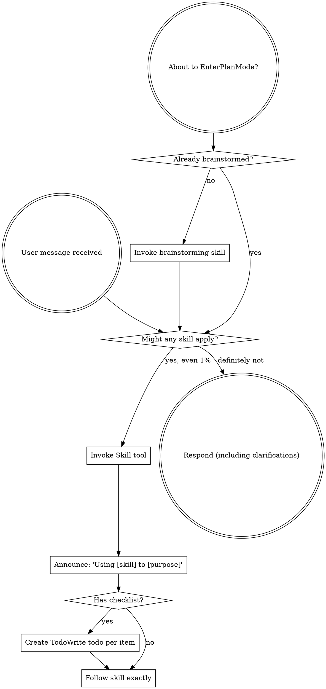

codex-exec: report contract violation

--- codex stdout ---
SPEC_VERDICT: pass

MISSING_REQUIREMENTS: none

EXTRA_SCOPE: none

VERIFICATION_MAPPING: `assertCliMutationGuard` diff → criterion 1; shell prefix removal → criterion 2; `selfTestCliGuard` env-var bypass probe + unchanged fingerprint → criterion 3; `rg` check confirms remaining `SGSD_CODEX_CONTROL_TTY_OK` references are only the new regression set/delete/assertion inside `selfTestCliGuard`; host bypass probe directly verifies criteria 1 and 3.

ONE_LINER: Diff conforms to P145 GAP-1 TTYFIX spec with no missing requirements or extra implementation scope.

--- codex stderr ---
OpenAI Codex v0.146.0
--------
workdir: C:\Users\jack.berrow\AppData\Roaming\warp\Warp\data\worktrees\GSDedits\cholla-racer
model: gpt-5.5
provider: openai
approval: never
sandbox: read-only
reasoning effort: xhigh
reasoning summaries: none
session id: 019fd44c-ff92-7980-b105-b127ad65945d
--------
user
# Step 9.4 Spec-Compliance Review — P145 GAP-1 TTYFIX dispatch

You are the SDD spec reviewer. Judge ONLY plan conformance of the diff below:
missing requirements, extra/unrequested scope, and whether verification
evidence maps to the spec. Do not review style/quality (ATC does that next).
Do not trust the executor's summary; judge the raw diff.

## The spec (fix dispatch prompt)
1. assertCliMutationGuard: remove env-var trust AND dead options.ttyOk; guard
   passes only on confirm===phrase && real stdin+stdout TTY.
2. sgsd-codex-control.sh:108: remove SGSD_CODEX_CONTROL_TTY_OK=1 prefix.
3. selfTestCliGuard: drop env save/delete/restore; ADD regression assertion:
   env var set + correct phrase + no TTY → still refuse, registry unchanged.
4. Remove other references made dead. Touch nothing else.

## Raw diff (uncommitted)
diff --git a/super-gsd/scripts/sgsd-codex-control.sh b/super-gsd/scripts/sgsd-codex-control.sh
index 45d9763..2a38876 100644
--- a/super-gsd/scripts/sgsd-codex-control.sh
+++ b/super-gsd/scripts/sgsd-codex-control.sh
@@ -105,7 +105,7 @@ run_set() {
     local profile="$1" field="$2" value="$3"
     require_confirmation_if_guarded "$profile" "$field" "$value" || return $?
     if [[ -n "$SGSD_CODEX_CONTROL_CONFIRM_PHRASE" ]]; then
-        SGSD_CODEX_CONTROL_TTY_OK=1 node "$RESOLVER" --set-cli "$profile" "$field" "$value" --confirm "$SGSD_CODEX_CONTROL_CONFIRM_PHRASE" --registry "$REGISTRY_PATH"
+        node "$RESOLVER" --set-cli "$profile" "$field" "$value" --confirm "$SGSD_CODEX_CONTROL_CONFIRM_PHRASE" --registry "$REGISTRY_PATH"
     else
         node "$RESOLVER" --set-cli "$profile" "$field" "$value" --registry "$REGISTRY_PATH"
     fi
diff --git a/super-gsd/tools/codex-pro/profile-resolver.cjs b/super-gsd/tools/codex-pro/profile-resolver.cjs
index 2155a24..d4ad317 100644
--- a/super-gsd/tools/codex-pro/profile-resolver.cjs
+++ b/super-gsd/tools/codex-pro/profile-resolver.cjs
@@ -503,10 +503,9 @@ function assertCliMutationGuard(profileName, field, rawValue, coercedValue, regi
   if (!isDangerousCliMutation(field, coercedValue)) return;
   const phrase = confirmationPhrase(profileName, field, rawValue);
   const confirm = String(options.confirm || '');
-  const ttyOverride = options.ttyOk === true || process.env.SGSD_CODEX_CONTROL_TTY_OK === '1';
   const hasTty = Boolean(process.stdin.isTTY && process.stdout.isTTY);
   const reason = confirm !== phrase ? 'confirmation_required' : 'non_tty_guarded_mutation';
-  if (confirm === phrase && (ttyOverride || hasTty)) return;
+  if (confirm === phrase && hasTty) return;
 
   appendProfileResolutionLog({
     action: 'set-cli',
@@ -706,23 +705,44 @@ function selfTestCliGuard() {
   const fixture = makeTempRegistry();
   const before = fingerprintFile(fixture.registryPath);
   const previousLogPath = process.env.SGSD_CODEX_PROFILE_LOG;
-  const previousTtyOk = process.env.SGSD_CODEX_CONTROL_TTY_OK;
   let refusalMessage = '';
+  let envBypassMessage = '';
   process.env.SGSD_CODEX_PROFILE_LOG = fixture.logPath;
-  delete process.env.SGSD_CODEX_CONTROL_TTY_OK;
   try {
-    main(['--set-cli', 'triage', 'sandbox', 'danger-full-access', '--registry', fixture.registryPath]);
-  } catch (error) {
-    refusalMessage = error.message;
+    try {
+      main(['--set-cli', 'triage', 'sandbox', 'danger-full-access', '--registry', fixture.registryPath]);
+    } catch (error) {
+      refusalMessage = error.message;
+    }
+    const after = fingerprintFile(fixture.registryPath);
+    expect(refusalMessage.includes('CONFIRM SGSD CODEX PROFILE triage sandbox danger-full-access'), 'non-TTY resolver --set-cli danger-full-access must refuse with exact confirmation phrase');
+    expect(after === before, 'refused resolver danger mutation must not alter registry');
+
+    const envBypassBefore = fingerprintFile(fixture.registryPath);
+    process.env.SGSD_CODEX_CONTROL_TTY_OK = '1';
+    try {
+      main([
+        '--set-cli',
+        'triage',
+        'sandbox',
+        'danger-full-access',
+        '--confirm',
+        confirmationPhrase('triage', 'sandbox', 'danger-full-access'),
+        '--registry',
+        fixture.registryPath,
+      ]);
+    } catch (error) {
+      envBypassMessage = error.message;
+    } finally {
+      delete process.env.SGSD_CODEX_CONTROL_TTY_OK;
+    }
+    const envBypassAfter = fingerprintFile(fixture.registryPath);
+    expect(envBypassMessage.includes('CONFIRM SGSD CODEX PROFILE triage sandbox danger-full-access'), 'SGSD_CODEX_CONTROL_TTY_OK must not bypass non-TTY dangerous mutation guard');
+    expect(envBypassAfter === envBypassBefore, 'env-var bypass attempt must not alter registry');
   } finally {
     if (previousLogPath === undefined) delete process.env.SGSD_CODEX_PROFILE_LOG;
     else process.env.SGSD_CODEX_PROFILE_LOG = previousLogPath;
-    if (previousTtyOk === undefined) delete process.env.SGSD_CODEX_CONTROL_TTY_OK;
-    else process.env.SGSD_CODEX_CONTROL_TTY_OK = previousTtyOk;
   }
-  const after = fingerprintFile(fixture.registryPath);
-  expect(refusalMessage.includes('CONFIRM SGSD CODEX PROFILE triage sandbox danger-full-access'), 'non-TTY resolver --set-cli danger-full-access must refuse with exact confirmation phrase');
-  expect(after === before, 'refused resolver danger mutation must not alter registry');
 
   const safeResult = setCliProfileField('triage', 'ephemeral', 'true', { registryPath: fixture.registryPath, logPath: fixture.logPath });
   const updated = loadFullRegistry(fixture.registryPath);

## Executor report
STATUS: DONE_WITH_CONCERNS (concern = sandbox bash blocked; environment only)
FILES_CHANGED: profile-resolver.cjs, sgsd-codex-control.sh

## Host verification (orchestrator-run, 2026-08-06)
- node run-self-test.cjs → 21/21, exit 0
- sgsd-codex-control.sh --self-test → PASS, exit 0
- codex-executor.sh --self-test → parity PASS, exit 0
- codex-exec.sh --self-test --skip-network → Probes 1-6 PASS, exit 0
- Bypass probe: SGSD_CODEX_CONTROL_TTY_OK=1 + correct phrase + no TTY →
  exit 1, refusal message, registry byte-identical

## Check also
- grep says remaining SGSD_CODEX_CONTROL_TTY_OK references exist only inside
  selfTestCliGuard's new regression assertion (set + delete around probe).
  Verify that claim against the diff.

## Report contract (exact)
SPEC_VERDICT: pass|fix_required|blocked
MISSING_REQUIREMENTS: none|<list>
EXTRA_SCOPE: none|<list>
VERIFICATION_MAPPING: <evidence → criterion>
ONE_LINER: 

codex
I’m using the required startup skill for this turn, then I’ll keep the review scoped to the spec-compliance contract you gave.
exec
"C:\\WINDOWS\\System32\\WindowsPowerShell\\v1.0\\powershell.exe" -Command "Get-Content -Raw C:\\Users\\jack.berrow\\.codex\\skills\\using-superpowers\\SKILL.md" in C:\Users\jack.berrow\AppData\Roaming\warp\Warp\data\worktrees\GSDedits\cholla-racer
 succeeded in 576ms:
---
name: using-superpowers
description: Use when starting any conversation - establishes how to find and use skills, requiring Skill tool invocation before ANY response including clarifying questions
---

<SUBAGENT-STOP>
If you were dispatched as a subagent to execute a specific task, skip this skill.
</SUBAGENT-STOP>

<EXTREMELY-IMPORTANT>
If you think there is even a 1% chance a skill might apply to what you are doing, you ABSOLUTELY MUST invoke the skill.

IF A SKILL APPLIES TO YOUR TASK, YOU DO NOT HAVE A CHOICE. YOU MUST USE IT.

This is not negotiable. This is not optional. You cannot rationalize your way out of this.
</EXTREMELY-IMPORTANT>

## Instruction Priority

Superpowers skills override default system prompt behavior, but **user instructions always take precedence**:

1. **User's explicit instructions** (CLAUDE.md, GEMINI.md, AGENTS.md, direct requests) ƒ?" highest priority
2. **Superpowers skills** ƒ?" override default system behavior where they conflict
3. **Default system prompt** ƒ?" lowest priority

If CLAUDE.md, GEMINI.md, or AGENTS.md says "don't use TDD" and a skill says "always use TDD," follow the user's instructions. The user is in control.

## How to Access Skills

**In Claude Code:** Use the `Skill` tool. When you invoke a skill, its content is loaded and presented to youƒ?"follow it directly. Never use the Read tool on skill files.

**In Copilot CLI:** Use the `skill` tool. Skills are auto-discovered from installed plugins. The `skill` tool works the same as Claude Code's `Skill` tool.

**In Gemini CLI:** Skills activate via the `activate_skill` tool. Gemini loads skill metadata at session start and activates the full content on demand.

**In other environments:** Check your platform's documentation for how skills are loaded.

## Platform Adaptation

Skills use Claude Code tool names. Non-CC platforms: see `references/copilot-tools.md` (Copilot CLI), `references/codex-tools.md` (Codex) for tool equivalents. Gemini CLI users get the tool mapping loaded automatically via GEMINI.md.

# Using Skills

## The Rule

**Invoke relevant or requested skills BEFORE any response or action.** Even a 1% chance a skill might apply means that you should invoke the skill to check. If an invoked skill turns out to be wrong for the situation, you don't need to use it.

## Red Flags

These thoughts mean STOPƒ?"you're rationalizing:

| Thought | Reality |
|---------|---------|
| "This is just a simple question" | Questions are tasks. Check for skills. |
| "I need more context first" | Skill check comes BEFORE clarifying questions. |
| "Let me explore the codebase first" | Skills tell you HOW to explore. Check first. |
| "I can check git/files quickly" | Files lack conversation context. Check for skills. |
| "Let me gather information first" | Skills tell you HOW to gather information. |
| "This doesn't need a formal skill" | If a skill exists, use it. |
| "I remember this skill" | Skills evolve. Read current version. |
| "This doesn't count as a task" | Action = task. Check for skills. |
| "The skill is overkill" | Simple things become complex. Use it. |
| "I'll just do this one thing first" | Check BEFORE doing anything. |
| "This feels productive" | Undisciplined action wastes time. Skills prevent this. |
| "I know what that means" | Knowing the concept ƒ%ÿ using the skill. Invoke it. |

## Skill Priority

When multiple skills could apply, use this order:

1. **Process skills first** (brainstorming, debugging) - these determine HOW to approach the task
2. **Implementation skills second** (frontend-design, mcp-builder) - these guide execution

"Let's build X" ā' brainstorming first, then implementation skills.
"Fix this bug" ā' debugging first, then domain-specific skills.

## Skill Types

**Rigid** (TDD, debugging): Follow exactly. Don't adapt away discipline.

**Flexible** (patterns): Adapt principles to context.

The skill itself tells you which.

## User Instructions

Instructions say WHAT, not HOW. "Add X" or "Fix Y" doesn't mean skip workflows.

C:\Users\jack.berrow\OneDrive - John Cullen Lighting\Documents\WindowsPowerShell\profile.ps1 : Cannot dot-source this 
command because it was defined in a different language mode. To invoke this command without importing its contents, 
omit the '.' operator.
At line:1 char:1
+ . 'C:\Users\jack.berrow\OneDrive - John Cullen Lighting\Documents\Win ...
+ ~~~~~~~~~~~~~~~~~~~~~~~~~~~~~~~~~~~~~~~~~~~~~~~~~~~~~~~~~~~~~~~~~~~~~
    + CategoryInfo          : InvalidOperation: (:) [profile.ps1], NotSupportedException
    + FullyQualifiedErrorId : DotSourceNotSupported,profile.ps1
 
C:\Users\jack.berrow\OneDrive - John Cullen Lighting\Documents\WindowsPowerShell\Microsoft.PowerShell_profile.ps1 : 
Cannot dot-source this command because it was defined in a different language mode. To invoke this command without 
importing its contents, omit the '.' operator.
At line:1 char:1
+ . 'C:\Users\jack.berrow\OneDrive - John Cullen Lighting\Documents\Win ...
+ ~~~~~~~~~~~~~~~~~~~~~~~~~~~~~~~~~~~~~~~~~~~~~~~~~~~~~~~~~~~~~~~~~~~~~
    + CategoryInfo          : InvalidOperation: (:) [Microsoft.PowerShell_profile.ps1], NotSupportedException
    + FullyQualifiedErrorId : DotSourceNotSupported,Microsoft.PowerShell_profile.ps1
 

codex
I’m skipping the generic review skill because its scope is security/performance/quality review, and your contract explicitly narrows this to spec conformance only. I’ll verify the TTY_OK reference claim from the diff/worktree and then answer in the requested exact fields.
exec
"C:\\WINDOWS\\System32\\WindowsPowerShell\\v1.0\\powershell.exe" -Command 'rg -n "SGSD_CODEX_CONTROL_TTY_OK|ttyOk|assertCliMutationGuard|selfTestCliGuard" super-gsd/scripts/sgsd-codex-control.sh super-gsd/tools/codex-pro/profile-resolver.cjs' in C:\Users\jack.berrow\AppData\Roaming\warp\Warp\data\worktrees\GSDedits\cholla-racer
 succeeded in 497ms:
super-gsd/tools/codex-pro/profile-resolver.cjs:502:function assertCliMutationGuard(profileName, field, rawValue, coercedValue, registryPath, options = {}) {
super-gsd/tools/codex-pro/profile-resolver.cjs:539:  assertCliMutationGuard(normalizedProfile, field, value, coerced, registryPath, options);
super-gsd/tools/codex-pro/profile-resolver.cjs:704:function selfTestCliGuard() {
super-gsd/tools/codex-pro/profile-resolver.cjs:722:    process.env.SGSD_CODEX_CONTROL_TTY_OK = '1';
super-gsd/tools/codex-pro/profile-resolver.cjs:737:      delete process.env.SGSD_CODEX_CONTROL_TTY_OK;
super-gsd/tools/codex-pro/profile-resolver.cjs:740:    expect(envBypassMessage.includes('CONFIRM SGSD CODEX PROFILE triage sandbox danger-full-access'), 'SGSD_CODEX_CONTROL_TTY_OK must not bypass non-TTY dangerous mutation guard');
super-gsd/tools/codex-pro/profile-resolver.cjs:859:    return selfTestCliGuard();
C:\Users\jack.berrow\OneDrive - John Cullen Lighting\Documents\WindowsPowerShell\profile.ps1 : Cannot dot-source this 
command because it was defined in a different language mode. To invoke this command without importing its contents, 
omit the '.' operator.
At line:1 char:1
+ . 'C:\Users\jack.berrow\OneDrive - John Cullen Lighting\Documents\Win ...
+ ~~~~~~~~~~~~~~~~~~~~~~~~~~~~~~~~~~~~~~~~~~~~~~~~~~~~~~~~~~~~~~~~~~~~~
    + CategoryInfo          : InvalidOperation: (:) [profile.ps1], NotSupportedException
    + FullyQualifiedErrorId : DotSourceNotSupported,profile.ps1
 
C:\Users\jack.berrow\OneDrive - John Cullen Lighting\Documents\WindowsPowerShell\Microsoft.PowerShell_profile.ps1 : 
Cannot dot-source this command because it was defined in a different language mode. To invoke this command without 
importing its contents, omit the '.' operator.
At line:1 char:1
+ . 'C:\Users\jack.berrow\OneDrive - John Cullen Lighting\Documents\Win ...
+ ~~~~~~~~~~~~~~~~~~~~~~~~~~~~~~~~~~~~~~~~~~~~~~~~~~~~~~~~~~~~~~~~~~~~~
    + CategoryInfo          : InvalidOperation: (:) [Microsoft.PowerShell_profile.ps1], NotSupportedException
    + FullyQualifiedErrorId : DotSourceNotSupported,Microsoft.PowerShell_profile.ps1
 

codex
SPEC_VERDICT: pass

MISSING_REQUIREMENTS: none

EXTRA_SCOPE: none

VERIFICATION_MAPPING: `assertCliMutationGuard` diff → criterion 1; shell prefix removal → criterion 2; `selfTestCliGuard` env-var bypass probe + unchanged fingerprint → criterion 3; `rg` check confirms remaining `SGSD_CODEX_CONTROL_TTY_OK` references are only the new regression set/delete/assertion inside `selfTestCliGuard`; host bypass probe directly verifies criteria 1 and 3.

ONE_LINER: Diff conforms to P145 GAP-1 TTYFIX spec with no missing requirements or extra implementation scope.
tokens used
22,211
