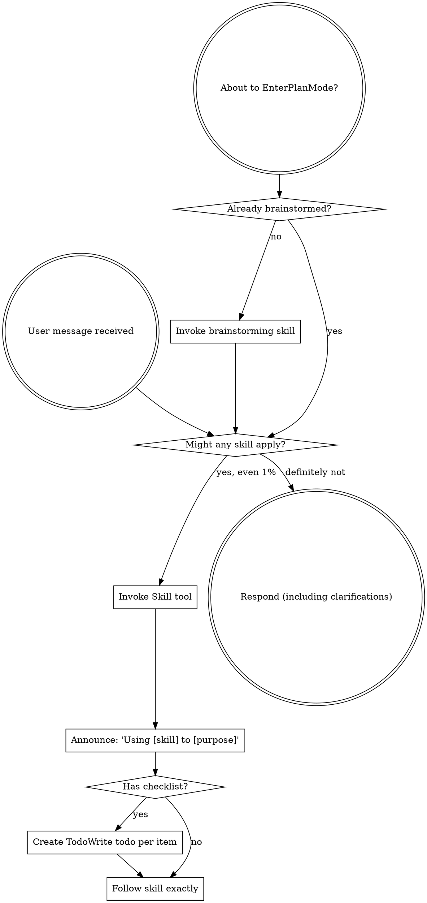

codex-exec: report contract violation

--- codex stdout ---
Sandbox is read-only, so I cannot write the file. Complete plan content follows for persistence.

```markdown
---
schema_version: 2
phase: 146
plan: "146-01"
title: "Session Governance Hooks"
model: codex
expected_ATC_tier: GATE
prior_errors_lookup: true
depends_on: []
skip_gates: []
lessons_path: null
vtp_status: "success: 2 relevant hits"
lock_status: locked
locked_at: "2026-08-06T00:00:00+01:00"
locked_by: "codex-phase-planner"
risk_rating: high
rollback_plan: >
  Revert this plan's allowed file changes, remove only P146 hook entries from
  the target repo-local .claude/settings.json, leave ~/.claude/settings.json
  untouched, and rerun the P146 acceptance commands to confirm hooks are absent
  or fail open.
allowed_files:
  - ".planning/milestones/v3.5/phases/146-session-governance-hooks/146-01-PLAN-LOCKED.md"
  - ".planning/STATE.md"
  - ".claude/settings.json"
  - ".planning/metrics/gate-evidence.jsonl"
  - "super-gsd/registry/session-governance-hooks.yaml"
  - "super-gsd/scripts/lib/sgsd-state.cjs"
  - "super-gsd/scripts/lib/gate-evidence-log.cjs"
  - "super-gsd/hooks/sgsd-session-start.js"
  - "super-gsd/hooks/sgsd-intent-classifier.cjs"
  - "super-gsd/hooks/sgsd-quality-gate.js"
  - "super-gsd/install.sh"
  - "super-gsd/scripts/merge-settings.js"
  - "super-gsd/config/settings-overlay.json"
  - "super-gsd/config/repo-settings-overlay.json"
  - "super-gsd/scripts/sgsd-stop-handoff.sh"
  - "super-gsd/tools/autopilot-watchdog/check.cjs"
  - "super-gsd/tools/cockpit-state/adapter.cjs"
  - "super-gsd/tools/warp-mcp/server.cjs"
  - "super-gsd/config/**/*.json"
  - "super-gsd/config/**/*.yaml"
forbidden_files:
  - "~/.claude/settings.json"
  - "~/.claude/hooks/**"
  - "super-gsd/registry/gates.yaml"
  - "super-gsd/hooks/gsd-atc-slice-gate.js"
  - "devcp/**"
invariants:
  - "No edit-seam blocking anywhere. PostToolUse quality gate is report-only and never emits block decisions."
  - "Every hook has narrow try/catch boundaries; unexpected SGSD-repo errors append a failure row and exit 0."
  - "Every hook exits quiet 0 when root-walk finds no .planning directory."
  - "No hook or installer path reads ~/.claude/settings.json or copies any env block from it."
  - "Installer writes repo-local .claude/settings.json only; never write machine-global Claude settings."
  - "Hook command paths are resolved at install time from the target repo. Source files contain no hardcoded machine paths."
  - "Classifier is local Node only, performs no LLM call, routes to SGSD skills, and never judges semantic truth."
  - "Classifier p95 latency must be under 1000 ms; the recorded target is millisecond-level overhead."
  - "Hook rules are declarative and registry-driven so P149 skill-routing.yaml can be swapped in with one registry-source line change."
  - "Quality-gate evidence uses .planning/metrics/gate-evidence.jsonl as a new stream with envelope-v1 shape."
  - "AC-146c requires both evidence writer and cockpit reader wiring in this phase."
  - "Mutation tool names must be confirmed in this harness before matching; do not add MultiEdit unless confirmed."
  - "Do not duplicate SGSD gates or edit super-gsd/registry/gates.yaml."
acceptance_commands:
  - "node super-gsd/tools/plan-lock/validate-plan-locked.cjs --plan-file .planning/milestones/v3.5/phases/146-session-governance-hooks/146-01-PLAN-LOCKED.md"
  - >
    powershell -NoProfile -Command "foreach ($f in @('super-gsd/scripts/lib/sgsd-state.cjs','super-gsd/scripts/lib/gate-evidence-log.cjs','super-gsd/hooks/sgsd-session-start.js','super-gsd/hooks/sgsd-intent-classifier.cjs','super-gsd/hooks/sgsd-quality-gate.js')) { node --check $f; if ($LASTEXITCODE -ne 0) { exit $LASTEXITCODE } }"
  - "node super-gsd/scripts/merge-settings.js --self-test-repo-local-hooks"
  - >
    powershell -NoProfile -Command "1..200 | ForEach-Object { '{\"hook_event_name\":\"UserPromptSubmit\",\"prompt\":\"How should we plan this?\"}' | node super-gsd/hooks/sgsd-intent-classifier.cjs > $null; if ($LASTEXITCODE -ne 0) { exit $LASTEXITCODE } }"
  - "node super-gsd/hooks/sgsd-intent-classifier.cjs --bench --iterations 200 --prompt \"How should we plan this?\" --record .planning/metrics/gate-evidence.jsonl"
  - "node super-gsd/hooks/sgsd-quality-gate.js --self-test-report-only-missing-plan --record .planning/metrics/gate-evidence.jsonl"
  - "node super-gsd/tools/cockpit-state/adapter.cjs --self-test-gate-evidence-reader"
  - "bash -n super-gsd/scripts/sgsd-stop-handoff.sh"
  - >
    powershell -NoProfile -Command "rg 'checkpoint_threshold_percent|context_warning_percent|context_warnings|gsd-atc-slice-gate.js' super-gsd --glob '!**/*.md'; if ($LASTEXITCODE -eq 0) { exit 1 } elseif ($LASTEXITCODE -eq 1) { exit 0 } else { exit $LASTEXITCODE }"
operator_checkpoints:
  - "After T146-02, operator reviews generated repo-local .claude/settings.json for absolute target-repo paths and absence of secrets."
  - "After T146-04, operator records the classifier p95_ms value from gate-evidence.jsonl before phase review."
  - "After T146-05, operator confirms cockpit displays the quality-gate evidence signal within one refresh."
semantic_acceptance_criteria:
  - input: >
      A real SessionStart hook payload from an sg-launched manual session in this SGSD repo.
    expected_outcome: >
      The hook exits 0 and injects a first-response governance contract containing the ATC tier table, v3.5 milestone, and active phase 146 with no operator action.
    verification_cmd: >
      powershell -NoProfile -Command "$payload=@{hook_event_name='SessionStart';cwd=(Get-Location).Path;source='startup';session_id='ac146a'} | ConvertTo-Json -Compress; $out=$payload | node super-gsd/hooks/sgsd-session-start.js; if ($LASTEXITCODE -ne 0) { exit $LASTEXITCODE }; $text=($out -join \"`n\"); if ($text -notmatch 'Governance Contract' -or $text -notmatch 'ATC' -or $text -notmatch 'v3.5' -or $text -notmatch '146') { exit 1 }"
  - input: >
      A manual-session planning prompt asking how to plan the next phase.
    expected_outcome: >
      The UserPromptSubmit classifier exits 0, emits a visible /sgsd-triage directive, and records only a routing decision without making semantic judgments.
    verification_cmd: >
      powershell -NoProfile -Command "$payload=@{hook_event_name='UserPromptSubmit';cwd=(Get-Location).Path;prompt='Can you plan the next phase and write the implementation plan?';session_id='ac146b'} | ConvertTo-Json -Compress; $out=$payload | node super-gsd/hooks/sgsd-intent-classifier.cjs; if ($LASTEXITCODE -ne 0) { exit $LASTEXITCODE }; $text=($out -join \"`n\"); if ($text -notmatch '/sgsd-triage' -or $text -match 'decision.:.block') { exit 1 }"
  - input: >
      A PostToolUse source-edit payload in a temporary SGSD-shaped repo whose STATE frontmatter declares current_phase 999 and whose phase has no matching PLAN-LOCKED file.
    expected_outcome: >
      The quality gate exits 0, appends a missing-plan row to gate-evidence.jsonl, and the cockpit adapter reads that row as a visible governance signal.
    verification_cmd: >
      powershell -NoProfile -Command "node super-gsd/hooks/sgsd-quality-gate.js --self-test-report-only-missing-plan --record .planning/metrics/gate-evidence.jsonl; if ($LASTEXITCODE -ne 0) { exit $LASTEXITCODE }; node super-gsd/tools/cockpit-state/adapter.cjs --self-test-gate-evidence-reader; exit $LASTEXITCODE"
  - input: >
      SessionStart, UserPromptSubmit, and PostToolUse payloads whose cwd is a normal directory with no .planning ancestor.
    expected_outcome: >
      All hooks exit 0 quietly, write no SGSD metrics, and emit no governance context.
    verification_cmd: >
      powershell -NoProfile -Command "$tmp=Join-Path ([IO.Path]::GetTempPath()) ('sgsd-nonrepo-' + [guid]::NewGuid()); New-Item -ItemType Directory -Path $tmp | Out-Null; try { foreach ($pair in @(@('sgsd-session-start.js','SessionStart'),@('sgsd-intent-classifier.cjs','UserPromptSubmit'),@('sgsd-quality-gate.js','PostToolUse'))) { $payload=@{hook_event_name=$pair[1];cwd=$tmp;prompt='hello';tool_name='Edit';tool_input=@{file_path='x.txt'};session_id='ac146d'} | ConvertTo-Json -Depth 5 -Compress; $out=$payload | node (Join-Path 'super-gsd/hooks' $pair[0]); if ($LASTEXITCODE -ne 0) { exit $LASTEXITCODE }; if (($out -join '').Trim().Length -gt 0) { exit 1 } } } finally { if ($tmp -like (Join-Path ([IO.Path]::GetTempPath()) 'sgsd-nonrepo-*')) { Remove-Item -LiteralPath $tmp -Recurse -Force } }"
  - input: >
      Two hundred real UserPromptSubmit planning prompts run through the local Node classifier in this repo.
    expected_outcome: >
      The benchmark exits 0, records a p95_ms value in gate-evidence.jsonl, and that p95_ms is below 1000 ms.
    verification_cmd: "node super-gsd/hooks/sgsd-intent-classifier.cjs --bench --iterations 200 --prompt \"How should we plan this?\" --record .planning/metrics/gate-evidence.jsonl"
  - input: >
      Repo-local hook installation into a target repo with a fake home settings file containing env-like secret sentinel keys.
    expected_outcome: >
      The installer writes only target .claude/settings.json, uses install-time absolute target-repo paths in hook args, and does not copy or read home env values.
    verification_cmd: "node super-gsd/scripts/merge-settings.js --self-test-repo-local-hooks"
tasks:
  - id: "T146-01"
    type: "shared-helper"
    agent: "gsd-executor"
    model: "codex"
    depends_on: []
    files_touched:
      - ".planning/STATE.md"
      - "super-gsd/scripts/lib/sgsd-state.cjs"
      - "super-gsd/scripts/lib/gate-evidence-log.cjs"
      - ".planning/metrics/gate-evidence.jsonl"
    traces_to:
      - "AC-146a"
      - "AC-146c"
      - "AC-146d"
    acceptance_commands:
      - >
        powershell -NoProfile -Command "foreach ($f in @('super-gsd/scripts/lib/sgsd-state.cjs','super-gsd/scripts/lib/gate-evidence-log.cjs')) { node --check $f; if ($LASTEXITCODE -ne 0) { exit $LASTEXITCODE } }"
    verification_cmd: >
      powershell -NoProfile -Command "foreach ($f in @('super-gsd/scripts/lib/sgsd-state.cjs','super-gsd/scripts/lib/gate-evidence-log.cjs')) { node --check $f; if ($LASTEXITCODE -ne 0) { exit $LASTEXITCODE } }; node -e 'const s=require(\"./super-gsd/scripts/lib/sgsd-state.cjs\"); const root=s.findSgsdRoot(process.cwd()); const st=s.readState(root); if (!root || !st || st.milestone !== \"v3.5\") process.exit(1); if (st.phaseSource === \"status_prose\") process.exit(2);'"
    input_contract: >
      Use RESEARCH Q3/Q6/Q9 and CONTEXT constraints. Canonical STATE frontmatter phase key is current_phase. Keep legacy phase as read-only compatibility. Do not parse prose status.
    output_contract: >
      Add shared SGSD root, STATE frontmatter, active phase, PLAN-LOCKED glob, and gate-evidence envelope writer helpers. Add current_phase: "146" to .planning/STATE.md if absent so this phase has canonical frontmatter data.
    hypothesis: >
      A shared resolver and never-throw evidence writer remove duplicated phase parsing while giving hooks and watchdog one deterministic fail-open path.
    falsifier: >
      Any caller parses prose status for a phase, throws in a non-SGSD repo, writes malformed JSONL, or cannot distinguish missing phase frontmatter from a real phase.
    stop_rule: >
      Node syntax checks pass, resolver reads milestone v3.5 from real STATE frontmatter without prose parsing, and gate-evidence writer can append envelope-v1 rows without throwing.
    expected_ATC_tier: GATE

  - id: "T146-02"
    type: "repo-local-installer"
    agent: "gsd-executor"
    model: "codex"
    depends_on:
      - "T146-01"
    files_touched:
      - ".claude/settings.json"
      - "super-gsd/install.sh"
      - "super-gsd/scripts/merge-settings.js"
      - "super-gsd/config/settings-overlay.json"
      - "super-gsd/config/repo-settings-overlay.json"
    traces_to:
      - "AC-146a"
      - "AC-146b"
      - "AC-146c"
      - "AC-146d"
    acceptance_commands:
      - "node super-gsd/scripts/merge-settings.js --self-test-repo-local-hooks"
      - >
        powershell -NoProfile -Command "Select-String -Path .claude/settings.json -Pattern 'SessionStart','UserPromptSubmit','PostToolUse' | Out-Null"
    verification_cmd: "node super-gsd/scripts/merge-settings.js --self-test-repo-local-hooks"
    input_contract: >
      Use RESEARCH Q1/Q2/Q7. Preserve merge-settings idempotency by command plus matcher, but target <repo>/.claude/settings.json only.
    output_contract: >
      Install SessionStart, UserPromptSubmit, and PostToolUse hook entries into repo-local .claude/settings.json using command: node and install-time absolute target-repo script paths in args.
    hypothesis: >
      Repo-local install-time hook wiring gives SGSD always-on governance without reading home Claude settings or depending on runtime project-dir expansion.
    falsifier: >
      The installer writes ~/.claude/settings.json, copies env keys from a home settings fixture, emits hardcoded machine paths from source, duplicates hook entries, or omits any of the three hook events.
    stop_rule: >
      Self-test installs into a temp target, proves home settings are untouched, proves no env sentinel is copied, and confirms all hook args resolve under the target repo.
    expected_ATC_tier: GATE

  - id: "T146-03"
    type: "session-start-hook"
    agent: "gsd-executor"
    model: "codex"
    depends_on:
      - "T146-01"
      - "T146-02"
    files_touched:
      - "super-gsd/hooks/sgsd-session-start.js"
      - "super-gsd/scripts/lib/sgsd-state.cjs"
      - "super-gsd/scripts/lib/gate-evidence-log.cjs"
      - ".planning/metrics/gate-evidence.jsonl"
    traces_to:
      - "AC-146a"
      - "AC-146d"
    acceptance_commands:
      - >
        powershell -NoProfile -Command "$payload=@{hook_event_name='SessionStart';cwd=(Get-Location).Path;source='startup';session_id='t146-03'} | ConvertTo-Json -Compress; $out=$payload | node super-gsd/hooks/sgsd-session-start.js; if ($LASTEXITCODE -ne 0) { exit $LASTEXITCODE }; $text=($out -join \"`n\"); if ($text -notmatch 'Governance Contract' -or $text -notmatch 'ATC' -or $text -notmatch 'v3.5' -or $text -notmatch '146') { exit 1 }"
    verification_cmd: >
      powershell -NoProfile -Command "$payload=@{hook_event_name='SessionStart';cwd=(Get-Location).Path;source='startup';session_id='t146-03'} | ConvertTo-Json -Compress; $out=$payload | node super-gsd/hooks/sgsd-session-start.js; if ($LASTEXITCODE -ne 0) { exit $LASTEXITCODE }; $text=($out -join \"`n\"); if ($text -notmatch 'Governance Contract' -or $text -notmatch 'ATC' -or $text -notmatch 'v3.5' -or $text -notmatch '146') { exit 1 }"
    input_contract: >
      Use Claude hook stdout/additionalContext behavior from RESEARCH Q1 and active phase resolver from T146-01.
    output_contract: >
      SessionStart injects the governance contract with ATC tier table, gate table, mode confirmation note, and active milestone/phase. Non-SGSD cwd exits quiet 0.
    hypothesis: >
      Injecting the contract from the runtime hook makes governance visible in manual sessions before the model can omit or reinterpret prompt-resident instructions.
    falsifier: >
      An sg-launched SessionStart payload produces no first-turn governance context, lacks active milestone/phase, blocks the session, or emits context in a non-SGSD directory.
    stop_rule: >
      Real repo SessionStart payload prints the contract and non-SGSD payload exits 0 with empty output.
    expected_ATC_tier: GATE

  - id: "T146-04"
    type: "intent-classifier"
    agent: "gsd-executor"
    model: "codex"
    depends_on:
      - "T146-01"
      - "T146-02"
    files_touched:
      - "super-gsd/hooks/sgsd-intent-classifier.cjs"
      - "super-gsd/registry/session-governance-hooks.yaml"
      - "super-gsd/scripts/lib/gate-evidence-log.cjs"
      - ".planning/metrics/gate-evidence.jsonl"
    traces_to:
      - "AC-146b"
      - "AC-146d"
    acceptance_commands:
      - >
        powershell -NoProfile -Command "$payload=@{hook_event_name='UserPromptSubmit';cwd=(Get-Location).Path;prompt='Can you plan the next phase and write the implementation plan?';session_id='t146-04'} | ConvertTo-Json -Compress; $out=$payload | node super-gsd/hooks/sgsd-intent-classifier.cjs; if ($LASTEXITCODE -ne 0) { exit $LASTEXITCODE }; if (($out -join \"`n\") -notmatch '/sgsd-triage') { exit 1 }"
      - "node super-gsd/hooks/sgsd-intent-classifier.cjs --bench --iterations 200 --prompt \"How should we plan this?\" --record .planning/metrics/gate-evidence.jsonl"
    verification_cmd: >
      powershell -NoProfile -Command "$payload=@{hook_event_name='UserPromptSubmit';cwd=(Get-Location).Path;prompt='Can you plan the next phase and write the implementation plan?';session_id='t146-04'} | ConvertTo-Json -Compress; $out=$payload | node super-gsd/hooks/sgsd-intent-classifier.cjs; if ($LASTEXITCODE -ne 0) { exit $LASTEXITCODE }; if (($out -join \"`n\") -notmatch '/sgsd-triage') { exit 1 }; node super-gsd/hooks/sgsd-intent-classifier.cjs --bench --iterations 200 --prompt 'How should we plan this?' --record .planning/metrics/gate-evidence.jsonl; exit $LASTEXITCODE"
    input_contract: >
      Use RESEARCH Q5 trigger inventory and VTP directive 1. The registry shape is trigger, predicate, enforcement, with embedded defaults until P149 skill-routing.yaml exists.
    output_contract: >
      Add a local Node UserPromptSubmit classifier that lowercases prompt text, applies registry-backed lexical routes, injects /sgsd-triage for planning intent, suggests neglected SGSD skills, and records p95_ms benchmark rows.
    hypothesis: >
      Declarative lexical routing gives manual sessions visible governance nudges at millisecond-level overhead while leaving semantic judgment to /sgsd-triage and other SGSD skills.
    falsifier: >
      The classifier calls an LLM, blocks prompts, judges plan quality itself, misses a planning-shaped prompt, cannot switch registry source with one line for P149, or records p95_ms >= 1000.
    stop_rule: >
      Planning prompt emits /sgsd-triage, neglected-skill prompts route to the named skill suggestion, non-SGSD cwd exits quiet 0, and the 200-iteration bench records p95_ms below 1000.
    expected_ATC_tier: GATE

  - id: "T146-05"
    type: "quality-gate-and-cockpit"
    agent: "gsd-executor"
    model: "codex"
    depends_on:
      - "T146-01"
      - "T146-02"
    files_touched:
      - "super-gsd/hooks/sgsd-quality-gate.js"
      - "super-gsd/registry/session-governance-hooks.yaml"
      - "super-gsd/scripts/lib/sgsd-state.cjs"
      - "super-gsd/scripts/lib/gate-evidence-log.cjs"
      - "super-gsd/tools/cockpit-state/adapter.cjs"
      - "super-gsd/tools/warp-mcp/server.cjs"
      - ".planning/metrics/gate-evidence.jsonl"
    traces_to:
      - "AC-146c"
      - "AC-146d"
    acceptance_commands:
      - "node super-gsd/hooks/sgsd-quality-gate.js --self-test-report-only-missing-plan --record .planning/metrics/gate-evidence.jsonl"
      - "node super-gsd/tools/cockpit-state/adapter.cjs --self-test-gate-evidence-reader"
    verification_cmd: >
      powershell -NoProfile -Command "node super-gsd/hooks/sgsd-quality-gate.js --self-test-report-only-missing-plan --record .planning/metrics/gate-evidence.jsonl; if ($LASTEXITCODE -ne 0) { exit $LASTEXITCODE }; node super-gsd/tools/cockpit-state/adapter.cjs --self-test-gate-evidence-reader; exit $LASTEXITCODE"
    input_contract: >
      Use RESEARCH Q1/Q6/Q9 and VTP directive 4. Confirm real PostToolUse mutation tool_name values in this harness before adding names to the registry; do not assume MultiEdit.
    output_contract: >
      Add a report-only PostToolUse quality gate that resolves active phase from STATE frontmatter, checks real PLAN-LOCKED naming, appends missing-plan evidence rows, and exposes those rows through cockpit adapter and MCP reader.
    hypothesis: >
      Evidence plus cockpit visibility gives AC-146c observability without violating the board's no edit-seam blocking constraint.
    falsifier: >
      The hook blocks or exits nonzero on edits, logs no row for a missing active-phase plan, matches unconfirmed mutation tools, or cockpit cannot surface the row within one refresh.
    stop_rule: >
      Self-test creates a temporary SGSD-shaped repo with no active PLAN, sends a confirmed mutation-tool payload, sees a gate-evidence row, and adapter self-test reads it as a cockpit signal.
    expected_ATC_tier: GATE

  - id: "T146-06"
    type: "cheap-fixes-cleanup"
    agent: "gsd-executor"
    model: "codex"
    depends_on:
      - "T146-01"
      - "T146-05"
    files_touched:
      - "super-gsd/scripts/sgsd-stop-handoff.sh"
      - "super-gsd/tools/autopilot-watchdog/check.cjs"
      - "super-gsd/config/settings-overlay.json"
      - "super-gsd/config/**/*.json"
      - "super-gsd/config/**/*.yaml"
    traces_to:
      - "AC-146c"
      - "AC-146d"
    acceptance_commands:
      - "bash -n super-gsd/scripts/sgsd-stop-handoff.sh"
      - "node super-gsd/tools/autopilot-watchdog/check.cjs --self-test-phase-resolution"
      - >
        powershell -NoProfile -Command "rg 'checkpoint_threshold_percent|context_warning_percent|context_warnings|gsd-atc-slice-gate.js' super-gsd --glob '!**/*.md'; if ($LASTEXITCODE -eq 0) { exit 1 } elseif ($LASTEXITCODE -eq 1) { exit 0 } else { exit $LASTEXITCODE }"
    verification_cmd: >
      powershell -NoProfile -Command "bash -n super-gsd/scripts/sgsd-stop-handoff.sh; if ($LASTEXITCODE -ne 0) { exit $LASTEXITCODE }; node super-gsd/tools/autopilot-watchdog/check.cjs --self-test-phase-resolution; if ($LASTEXITCODE -ne 0) { exit $LASTEXITCODE }; rg 'checkpoint_threshold_percent|context_warning_percent|context_warnings|gsd-atc-slice-gate.js' super-gsd --glob '!**/*.md'; if ($LASTEXITCODE -eq 0) { exit 1 } elseif ($LASTEXITCODE -eq 1) { exit 0 } else { exit $LASTEXITCODE }"
    input_contract: >
      Use RESEARCH Q4/Q8 and CONTEXT cheap-fix list. Keep DEVIATION-W out of this task because research did not prove it is a few-line isolated codex-exec.sh fix.
    output_contract: >
      Reset handoff-chain latch when latest valid row is reason refused, move autopilot-watchdog phase resolution to shared STATE frontmatter helper, unregister dead gsd-atc-slice-gate.js references, and delete dead token/context config knobs from live config.
    hypothesis: >
      These bounded cleanups remove known always-on governance distortions without changing gate semantics or widening P146 beyond session governance hooks.
    falsifier: >
      Refused handoff rows still preserve stale depth, watchdog reads phase from prose regex, dead hook registration remains live, or dead config knobs remain under super-gsd runtime config.
    stop_rule: >
      Shell syntax passes, watchdog phase self-test proves frontmatter resolution, and runtime config grep finds no dead knobs or dead hook registration.
    expected_ATC_tier: GATE
---

# P146 Session Governance Hooks PLAN-LOCKED

> For agentic workers: implement task-by-task. Each changed line must trace to one task above. Do not touch forbidden files.

## Goal

Make SGSD governance fire in every session mode through repo-local Claude hooks: SessionStart contract injection, UserPromptSubmit intent routing, and a report-only PostToolUse quality gate with cockpit visibility.

## Architecture

The runtime hook layer becomes the governance substrate. Hook scripts use shared SGSD root and STATE frontmatter helpers, declarative rule registry data, and never-throw evidence logging. Mode changes who confirms governance decisions, not which governance signals run.

The classifier routes prompts to SGSD skills and never judges their truth. The quality gate reports missing active-phase PLAN evidence after source edits but never blocks an edit seam. Cockpit reads the new gate-evidence stream so AC-146c is observable rather than a silent log-only defense.

## Required Evidence Read

- `.planning/milestones/v3.5/phases/146-session-governance-hooks/CONTEXT.md`
- `.planning/milestones/v3.5/phases/146-session-governance-hooks/146-RESEARCH.md`
- `.planning/milestones/v3.5/phases/146-session-governance-hooks/146-VTP-ENRICHMENT.md`
- `super-gsd/templates/plan-schema-v2.json`
- `.planning/milestones/v3.5/phases/145-codex-profile-control/145-01-PLAN-LOCKED.md`

## Source Audit

| Source | Status | Relevant findings used |
|---|---|---|
| CONTEXT | success | Defines SessionStart, UserPromptSubmit, PostToolUse report-only gate, board-binding constraints, and cheap fixes. |
| RESEARCH | success | Treats Q1-Q9, file list, reuse inventory, six-task decomposition, and verification commands as authoritative. |
| VTP-ENRICHMENT | success, 2 relevant hits | Hit 1 supports trigger-predicate-enforcement declarative hooks and ms-level overhead; Hit 2 requires observability via cockpit reader and limits claims to report-only evidence. |
| plan-schema-v2 | success | Requires schema_version 2, semantic_acceptance_criteria, and task id/agent/model/files_touched/input/output/hypothesis/falsifier/stop_rule. |
| P145 plan | success | Provides locked-plan frontmatter shape, task tone, allowed/forbidden file framing, rollback plan, and acceptance command style. |

## Open Decisions Locked

1. Canonical STATE phase key: use `current_phase` in `.planning/STATE.md` frontmatter. Resolver reads `current_phase` first, then legacy `phase`, and never parses prose `status`. When absent, SGSD hooks log `state_phase_missing` and continue with phase null; non-SGSD repos exit quiet 0.
2. Evidence stream: create `.planning/metrics/gate-evidence.jsonl` as a new envelope-v1 stream. Do not extend `gate-value-log.jsonl`; that stream keeps existing gate-value semantics.
3. Hook path binding: use install-time absolute paths from the target repo inside repo-local `.claude/settings.json`. Do not rely on `${CLAUDE_PROJECT_DIR}` expansion.
4. Mutation tool names: confirm actual PostToolUse mutation `tool_name` values in this harness before registry matching. `MultiEdit` is not assumed and is included only if confirmed.
5. DEVIATION-W: not folded into P146. It concerns codex-exec step-contract enforcement and research did not prove a few-line isolated fix. Keep it recorded as deferred.

## Task Decomposition Note

This plan keeps RESEARCH section 5's six tasks. The only expansion is the explicit `super-gsd/registry/session-governance-hooks.yaml` file, required by VTP directive 1 so P149 can swap to `super-gsd/registry/skill-routing.yaml` with a one-line registry-source change.

## Implementation Notes

SessionStart should prefer hook JSON `hookSpecificOutput.additionalContext` when supported and fall back to stdout context. It must include ATC tiers, gate expectations per mode, active milestone, active phase, and the report-only nature of PostToolUse governance.

UserPromptSubmit uses deterministic lexical rules from the registry. Planning-shaped prompts route to `/sgsd-triage`; neglected-skill signatures route to the relevant SGSD skill suggestion. It must not emit `decision: "block"`.

PostToolUse quality gate reads confirmed mutation tools from the registry, resolves SGSD root from `payload.cwd || process.cwd()`, resolves active phase from STATE frontmatter, checks real `{NN}-*-PLAN-LOCKED.md` files, and appends evidence only. It never blocks, even on missing plans.

Cockpit adapter and MCP reader must consume `gate-evidence.jsonl`; AC-146c is incomplete if only the hook writer exists.

## Deferred

- DEFERRED-A: selfTestCliGuard non-TTY forcing.
- DEFERRED-B: 3-way CLI-default drift guard.
- DEFERRED-C: inert trust/hook resolver fields for P148/P150.
- DEVIATION-1: codex-exec finalize probe simplification.
- DEVIATION-W: codex-exec enforces the 5-line ATC contract on every `--step`; keep for a codex-exec follow-up because P146 has no evidence it is a bounded cheap fix.
```

--- codex stderr ---
OpenAI Codex v0.146.0
--------
workdir: C:\Users\jack.berrow\AppData\Roaming\warp\Warp\data\worktrees\GSDedits\cholla-racer
model: gpt-5.5
provider: openai
approval: never
sandbox: read-only
reasoning effort: xhigh
reasoning summaries: none
session id: 019fd480-36fc-7d43-9753-32449579f3a7
--------
user
# P146 Planning — author 146-01-PLAN-LOCKED.md (schema-v2)

<intent milestone="v3.5">
Always-On Orchestration — governance as runtime mechanism in all session modes.
</intent>

You are the planner. Author ONE plan file and nothing else. Write it to:
`.planning/milestones/v3.5/phases/146-session-governance-hooks/146-01-PLAN-LOCKED.md`
If the sandbox cannot write files, emit the COMPLETE file content on stdout
inside a single fenced block and say so — the orchestrator will persist it.

BUDGET: do NOT re-derive the research. Do NOT run self-tests. Do NOT explore
beyond the required reading. Produce the plan.

## Required reading (read these, in order)
1. `.planning/milestones/v3.5/phases/146-session-governance-hooks/CONTEXT.md`
2. `.planning/milestones/v3.5/phases/146-session-governance-hooks/146-RESEARCH.md`
   — treat its Q1–Q9 answers, file list, reuse inventory, task decomposition
   and verification commands as authoritative findings.
3. `.planning/milestones/v3.5/phases/146-session-governance-hooks/146-VTP-ENRICHMENT.md`
   — 4 planner directives at the bottom are binding.
4. `super-gsd/templates/plan-schema-v2.json` — the plan MUST validate.
5. `.planning/milestones/v3.5/phases/145-codex-profile-control/145-01-PLAN-LOCKED.md`
   — use as the SHAPE reference (frontmatter keys, task structure, tone).

## Source Audit (mandatory section in the plan)
Include a row per source: CONTEXT, RESEARCH, VTP-ENRICHMENT (status success,
2 relevant hits), plan-schema-v2, P145 plan. VTP is present — cite it, do not
write a VTP_STATUS unavailable row.

## Hard requirements for the plan

**Schema (SCHEMA-09/-10, DLB-07):** YAML frontmatter validating against
plan-schema-v2.json, INCLUDING `semantic_acceptance_criteria` with REAL-DATA
criteria (a plan whose ACs are only structural/grep-shaped cannot close).
Include `rollback_plan`. Every task needs id, hypothesis, files_touched, type.

**Board-binding constraints (from CONTEXT — violating any is a plan defect):**
- NO edit-seam blocking anywhere. PostToolUse gate is REPORT-ONLY.
- Every hook: narrow try/catch; unexpected error → exit 0 + logged failure row.
- Hooks must exit 0 in a non-SGSD repo (root-walk finds no `.planning/` → quiet 0).
- No hook may read `~/.claude/settings.json` env block (live API keys).
- Repo-local `.claude/settings.json` only — NEVER write to `~/.claude/settings.json`.
- Paths resolved at INSTALL time from the target repo; no hardcoded machine paths.
- Classifier: local node, NO LLM, <1s p95 (VTP: ms-level is the real bar).

**VTP directives (binding):** declarative registry-driven rule shape so the
P149 skill-routing.yaml swap is a one-line change; latency bench is a real
task with a recorded number; classifier ROUTES, never judges; AC-146c is
incomplete without a cockpit reader — keep that wiring in this phase.

**Decide these open questions explicitly in the plan (RESEARCH §7):**
- Canonical STATE frontmatter phase key (research notes STATE currently lacks
  `current_phase`; the frontmatter has `milestone:` + prose `status:`). Pick
  one and state how the resolver degrades when absent.
- `gate-evidence.jsonl` as a new stream vs extending `gate-value-log.jsonl`.
- Install-time absolute paths vs `${CLAUDE_PROJECT_DIR}`.
- Confirm the real mutation tool names in this harness before matching on them
  (do NOT assume `MultiEdit` exists).

## Task decomposition
Follow RESEARCH §5 (6 tasks) unless you have a concrete reason to differ —
state the reason if you do. Each task: independently verifiable, deterministic
Windows-safe verification command (no chmod reliance, no network), and traced
to an AC-146 letter.

## Deferred items to record in the plan (carried from P145, do NOT solve here)
DEFERRED-A selfTestCliGuard non-TTY forcing; DEFERRED-B 3-way CLI-default
drift guard; DEFERRED-C inert trust/hook resolver fields (→P148/P150);
DEVIATION-1 codex-exec finalize probe simplification;
DEVIATION-W codex-exec enforces the 5-line ATC contract on every `--step`
(research/spec-review dispatches exit 6 and dump multi-MB raw streams) —
CONSIDER folding this into the phase's "cheap fixes" task if it is genuinely
a few lines in `codex-exec.sh`; if not, record it as deferred.

Output: the plan file only.

codex
Using `writing-plans` for the requested locked plan; I’ll keep repository reads to the required planning inputs and schema.
exec
"C:\\WINDOWS\\System32\\WindowsPowerShell\\v1.0\\powershell.exe" -Command "Get-Content -Raw C:\\Users\\jack.berrow\\.codex\\skills\\using-superpowers\\SKILL.md" in C:\Users\jack.berrow\AppData\Roaming\warp\Warp\data\worktrees\GSDedits\cholla-racer
exec
"C:\\WINDOWS\\System32\\WindowsPowerShell\\v1.0\\powershell.exe" -Command "Get-Content -Raw C:\\Users\\jack.berrow\\.codex\\skills\\writing-plans\\SKILL.md" in C:\Users\jack.berrow\AppData\Roaming\warp\Warp\data\worktrees\GSDedits\cholla-racer
 succeeded in 1146ms:
---
name: using-superpowers
description: Use when starting any conversation - establishes how to find and use skills, requiring Skill tool invocation before ANY response including clarifying questions
---

<SUBAGENT-STOP>
If you were dispatched as a subagent to execute a specific task, skip this skill.
</SUBAGENT-STOP>

<EXTREMELY-IMPORTANT>
If you think there is even a 1% chance a skill might apply to what you are doing, you ABSOLUTELY MUST invoke the skill.

IF A SKILL APPLIES TO YOUR TASK, YOU DO NOT HAVE A CHOICE. YOU MUST USE IT.

This is not negotiable. This is not optional. You cannot rationalize your way out of this.
</EXTREMELY-IMPORTANT>

## Instruction Priority

Superpowers skills override default system prompt behavior, but **user instructions always take precedence**:

1. **User's explicit instructions** (CLAUDE.md, GEMINI.md, AGENTS.md, direct requests) ƒ?" highest priority
2. **Superpowers skills** ƒ?" override default system behavior where they conflict
3. **Default system prompt** ƒ?" lowest priority

If CLAUDE.md, GEMINI.md, or AGENTS.md says "don't use TDD" and a skill says "always use TDD," follow the user's instructions. The user is in control.

## How to Access Skills

**In Claude Code:** Use the `Skill` tool. When you invoke a skill, its content is loaded and presented to youƒ?"follow it directly. Never use the Read tool on skill files.

**In Copilot CLI:** Use the `skill` tool. Skills are auto-discovered from installed plugins. The `skill` tool works the same as Claude Code's `Skill` tool.

**In Gemini CLI:** Skills activate via the `activate_skill` tool. Gemini loads skill metadata at session start and activates the full content on demand.

**In other environments:** Check your platform's documentation for how skills are loaded.

## Platform Adaptation

Skills use Claude Code tool names. Non-CC platforms: see `references/copilot-tools.md` (Copilot CLI), `references/codex-tools.md` (Codex) for tool equivalents. Gemini CLI users get the tool mapping loaded automatically via GEMINI.md.

# Using Skills

## The Rule

**Invoke relevant or requested skills BEFORE any response or action.** Even a 1% chance a skill might apply means that you should invoke the skill to check. If an invoked skill turns out to be wrong for the situation, you don't need to use it.



## Red Flags

These thoughts mean STOPƒ?"you're rationalizing:

| Thought | Reality |
|---------|---------|
| "This is just a simple question" | Questions are tasks. Check for skills. |
| "I need more context first" | Skill check comes BEFORE clarifying questions. |
| "Let me explore the codebase first" | Skills tell you HOW to explore. Check first. |
| "I can check git/files quickly" | Files lack conversation context. Check for skills. |
| "Let me gather information first" | Skills tell you HOW to gather information. |
| "This doesn't need a formal skill" | If a skill exists, use it. |
| "I remember this skill" | Skills evolve. Read current version. |
| "This doesn't count as a task" | Action = task. Check for skills. |
| "The skill is overkill" | Simple things become complex. Use it. |
| "I'll just do this one thing first" | Check BEFORE doing anything. |
| "This feels productive" | Undisciplined action wastes time. Skills prevent this. |
| "I know what that means" | Knowing the concept ƒ%ÿ using the skill. Invoke it. |

## Skill Priority

When multiple skills could apply, use this order:

1. **Process skills first** (brainstorming, debugging) - these determine HOW to approach the task
2. **Implementation skills second** (frontend-design, mcp-builder) - these guide execution

"Let's build X" ā' brainstorming first, then implementation skills.
"Fix this bug" ā' debugging first, then domain-specific skills.

## Skill Types

**Rigid** (TDD, debugging): Follow exactly. Don't adapt away discipline.

**Flexible** (patterns): Adapt principles to context.

The skill itself tells you which.

## User Instructions

Instructions say WHAT, not HOW. "Add X" or "Fix Y" doesn't mean skip workflows.

C:\Users\jack.berrow\OneDrive - John Cullen Lighting\Documents\WindowsPowerShell\profile.ps1 : Cannot dot-source this 
command because it was defined in a different language mode. To invoke this command without importing its contents, 
omit the '.' operator.
At line:1 char:1
+ . 'C:\Users\jack.berrow\OneDrive - John Cullen Lighting\Documents\Win ...
+ ~~~~~~~~~~~~~~~~~~~~~~~~~~~~~~~~~~~~~~~~~~~~~~~~~~~~~~~~~~~~~~~~~~~~~
    + CategoryInfo          : InvalidOperation: (:) [profile.ps1], NotSupportedException
    + FullyQualifiedErrorId : DotSourceNotSupported,profile.ps1
 
C:\Users\jack.berrow\OneDrive - John Cullen Lighting\Documents\WindowsPowerShell\Microsoft.PowerShell_profile.ps1 : 
Cannot dot-source this command because it was defined in a different language mode. To invoke this command without 
importing its contents, omit the '.' operator.
At line:1 char:1
+ . 'C:\Users\jack.berrow\OneDrive - John Cullen Lighting\Documents\Win ...
+ ~~~~~~~~~~~~~~~~~~~~~~~~~~~~~~~~~~~~~~~~~~~~~~~~~~~~~~~~~~~~~~~~~~~~~
    + CategoryInfo          : InvalidOperation: (:) [Microsoft.PowerShell_profile.ps1], NotSupportedException
    + FullyQualifiedErrorId : DotSourceNotSupported,Microsoft.PowerShell_profile.ps1
 

 succeeded in 1144ms:
---
name: writing-plans
description: Use when you have a spec or requirements for a multi-step task, before touching code
---

# Writing Plans

## Overview

Write comprehensive implementation plans assuming the engineer has zero context for our codebase and questionable taste. Document everything they need to know: which files to touch for each task, code, testing, docs they might need to check, how to test it. Give them the whole plan as bite-sized tasks. DRY. YAGNI. TDD. Frequent commits.

Assume they are a skilled developer, but know almost nothing about our toolset or problem domain. Assume they don't know good test design very well.

**Announce at start:** "I'm using the writing-plans skill to create the implementation plan."

**Context:** If working in an isolated worktree, it should have been created via the `superpowers:using-git-worktrees` skill at execution time.

**Save plans to:** `docs/superpowers/plans/YYYY-MM-DD-<feature-name>.md`
- (User preferences for plan location override this default)

## Scope Check

If the spec covers multiple independent subsystems, it should have been broken into sub-project specs during brainstorming. If it wasn't, suggest breaking this into separate plans ƒ?" one per subsystem. Each plan should produce working, testable software on its own.

## File Structure

Before defining tasks, map out which files will be created or modified and what each one is responsible for. This is where decomposition decisions get locked in.

- Design units with clear boundaries and well-defined interfaces. Each file should have one clear responsibility.
- You reason best about code you can hold in context at once, and your edits are more reliable when files are focused. Prefer smaller, focused files over large ones that do too much.
- Files that change together should live together. Split by responsibility, not by technical layer.
- In existing codebases, follow established patterns. If the codebase uses large files, don't unilaterally restructure - but if a file you're modifying has grown unwieldy, including a split in the plan is reasonable.

This structure informs the task decomposition. Each task should produce self-contained changes that make sense independently.

## Bite-Sized Task Granularity

**Each step is one action (2-5 minutes):**
- "Write the failing test" - step
- "Run it to make sure it fails" - step
- "Implement the minimal code to make the test pass" - step
- "Run the tests and make sure they pass" - step
- "Commit" - step

## Plan Document Header

**Every plan MUST start with this header:**

```markdown
# [Feature Name] Implementation Plan

> **For agentic workers:** REQUIRED SUB-SKILL: Use superpowers:subagent-driven-development (recommended) or superpowers:executing-plans to implement this plan task-by-task. Steps use checkbox (`- [ ]`) syntax for tracking.

**Goal:** [One sentence describing what this builds]

**Architecture:** [2-3 sentences about approach]

**Tech Stack:** [Key technologies/libraries]

---
```

## Task Structure

````markdown
### Task N: [Component Name]

**Files:**
- Create: `exact/path/to/file.py`
- Modify: `exact/path/to/existing.py:123-145`
- Test: `tests/exact/path/to/test.py`

- [ ] **Step 1: Write the failing test**

```python
def test_specific_behavior():
    result = function(input)
    assert result == expected
```

- [ ] **Step 2: Run test to verify it fails**

Run: `pytest tests/path/test.py::test_name -v`
Expected: FAIL with "function not defined"

- [ ] **Step 3: Write minimal implementation**

```python
def function(input):
    return expected
```

- [ ] **Step 4: Run test to verify it passes**

Run: `pytest tests/path/test.py::test_name -v`
Expected: PASS

- [ ] **Step 5: Commit**

```bash
git add tests/path/test.py src/path/file.py
git commit -m "feat: add specific feature"
```
````

## No Placeholders

Every step must contain the actual content an engineer needs. These are **plan failures** ƒ?" never write them:
- "TBD", "TODO", "implement later", "fill in details"
- "Add appropriate error handling" / "add validation" / "handle edge cases"
- "Write tests for the above" (without actual test code)
- "Similar to Task N" (repeat the code ƒ?" the engineer may be reading tasks out of order)
- Steps that describe what to do without showing how (code blocks required for code steps)
- References to types, functions, or methods not defined in any task

## Remember
- Exact file paths always
- Complete code in every step ƒ?" if a step changes code, show the code
- Exact commands with expected output
- DRY, YAGNI, TDD, frequent commits

## Self-Review

After writing the complete plan, look at the spec with fresh eyes and check the plan against it. This is a checklist you run yourself ƒ?" not a subagent dispatch.

**1. Spec coverage:** Skim each section/requirement in the spec. Can you point to a task that implements it? List any gaps.

**2. Placeholder scan:** Search your plan for red flags ƒ?" any of the patterns from the "No Placeholders" section above. Fix them.

**3. Type consistency:** Do the types, method signatures, and property names you used in later tasks match what you defined in earlier tasks? A function called `clearLayers()` in Task 3 but `clearFullLayers()` in Task 7 is a bug.

If you find issues, fix them inline. No need to re-review ƒ?" just fix and move on. If you find a spec requirement with no task, add the task.

## Execution Handoff

After saving the plan, offer execution choice:

**"Plan complete and saved to `docs/superpowers/plans/<filename>.md`. Two execution options:**

**1. Subagent-Driven (recommended)** - I dispatch a fresh subagent per task, review between tasks, fast iteration

**2. Inline Execution** - Execute tasks in this session using executing-plans, batch execution with checkpoints

**Which approach?"**

**If Subagent-Driven chosen:**
- **REQUIRED SUB-SKILL:** Use superpowers:subagent-driven-development
- Fresh subagent per task + two-stage review

**If Inline Execution chosen:**
- **REQUIRED SUB-SKILL:** Use superpowers:executing-plans
- Batch execution with checkpoints for review

C:\Users\jack.berrow\OneDrive - John Cullen Lighting\Documents\WindowsPowerShell\profile.ps1 : Cannot dot-source this 
command because it was defined in a different language mode. To invoke this command without importing its contents, 
omit the '.' operator.
At line:1 char:1
+ . 'C:\Users\jack.berrow\OneDrive - John Cullen Lighting\Documents\Win ...
+ ~~~~~~~~~~~~~~~~~~~~~~~~~~~~~~~~~~~~~~~~~~~~~~~~~~~~~~~~~~~~~~~~~~~~~
    + CategoryInfo          : InvalidOperation: (:) [profile.ps1], NotSupportedException
    + FullyQualifiedErrorId : DotSourceNotSupported,profile.ps1
 
C:\Users\jack.berrow\OneDrive - John Cullen Lighting\Documents\WindowsPowerShell\Microsoft.PowerShell_profile.ps1 : 
Cannot dot-source this command because it was defined in a different language mode. To invoke this command without 
importing its contents, omit the '.' operator.
At line:1 char:1
+ . 'C:\Users\jack.berrow\OneDrive - John Cullen Lighting\Documents\Win ...
+ ~~~~~~~~~~~~~~~~~~~~~~~~~~~~~~~~~~~~~~~~~~~~~~~~~~~~~~~~~~~~~~~~~~~~~
    + CategoryInfo          : InvalidOperation: (:) [Microsoft.PowerShell_profile.ps1], NotSupportedException
    + FullyQualifiedErrorId : DotSourceNotSupported,Microsoft.PowerShell_profile.ps1
 

codex
I’m reading the required phase inputs in the order specified, then I’ll produce only the locked plan content since this workspace is read-only.
exec
"C:\\WINDOWS\\System32\\WindowsPowerShell\\v1.0\\powershell.exe" -NoProfile -Command 'Get-Content -Raw .planning/milestones/v3.5/phases/146-session-governance-hooks/CONTEXT.md' in C:\Users\jack.berrow\AppData\Roaming\warp\Warp\data\worktrees\GSDedits\cholla-racer
 succeeded in 433ms:
---
phase: "146"
slug: session-governance-hooks
milestone: v3.5
status: PENDING
design_ref: ".planning/analyses/2026-08-05-always-on-orchestration-DESIGN.md#p146"
depends_on: []
---

# P146 Context ƒ?" Session Governance Hooks (all modes)

## Goal

Governance fires in every session type via repo-local `.claude/settings.json`
hooks (installer-managed, never machine-global): SessionStart contract
injection, UserPromptSubmit intent classifier, report-only quality gate.
Also lands the 2026-08-02 board's unbundled cheap fixes.

## Components

1. **SessionStart hook** ƒ?" inject governance contract: ATC tier table, gates per
   mode (same table; mode changes who confirms, not what runs), active
   milestone/phase from STATE.md frontmatter.
2. **UserPromptSubmit** `sgsd-intent-classifier.cjs` ƒ?" local node, <1s, NO LLM.
   Intent classes: planning / execution / retrospective / trivial. Lexicon from
   sgsd-triage triggers + skill-routing.yaml (P149; ship with embedded lexicon
   until P149 lands, then read the registry). Planning intent ā' inject
   "/sgsd-triage" directive. Neglected-skill signature ā' inject suggestion.
3. **`sgsd-quality-gate.js`** ƒ?" PostToolUse, REPORT MODE ONLY (board-binding: no
   blocking). Resolve phase from STATE.md frontmatter + glob real
   `{NN}-*-PLAN-LOCKED.md` naming. Append evidence rows to
   `.planning/metrics/gate-evidence.jsonl`. Cockpit tile surfaces gaps.
4. **Board cheap fixes (unbundled):** handoff-chain latch reset on `refused`
   rows (sgsd-stop-handoff.sh, latched since 2026-04-24); autopilot-watchdog
   phase resolution from STATE frontmatter not prose regex; unregister dead
   `gsd-atc-slice-gate.js`; delete dead config knobs.

## Constraints (board-binding)

- NO edit-seam blocking. Report-only. Exit 0 always in non-SGSD repos.
- Every hook: narrow try/catch, unexpected error ā' exit 0 + logged failure row.
- No hook reads `~/.claude/settings.json` env block (live keys).
- Paths resolved at install time from the target repo; no hardcoded machine paths.
- Hook latency budget: classifier <1s p95 (AHE-P-09 stacking risk ƒ?" measure).

## Acceptance criteria

AC-146 (a)(b)(c)(d) from the design spec.


codex
Context confirms the phase is hook-based but report-only: no edit blocking, repo-local settings only, and all hook failures must degrade to exit 0 with evidence.
exec
"C:\\WINDOWS\\System32\\WindowsPowerShell\\v1.0\\powershell.exe" -NoProfile -Command 'Get-Content -Raw .planning/milestones/v3.5/phases/146-session-governance-hooks/146-RESEARCH.md' in C:\Users\jack.berrow\AppData\Roaming\warp\Warp\data\worktrees\GSDedits\cholla-racer
 succeeded in 456ms:
---
phase: "146"
artifact: RESEARCH
provider: openai-codex (gpt-5.5/xhigh)
dispatched: 2026-08-06 --step phase-research --timeout-tier custom:900
wrapper_exit: 6 (contract-vocab mismatch ƒ?" codex-exec enforces the 5-line ATC
  contract on every --step, including research; report body itself is valid.
  Raw 2.6MB stream discarded; body extracted verbatim below. See DEVIATION-W.)
sandbox_note: Codex sandbox could not write files, so it returned the report
  inline on stdout rather than to --report-out.
---

I stayed read-only. There was no report path provided and the sandbox cannot write files, so the implementation-ready report is below.

**1. AC-146**
> **AC-146:** (a) an `sg`-launched manual session shows the governance contract in its first response with zero operator action; (b) a planning-shaped prompt in a manual session produces a visible `/sgsd-triage` directive; (c) a source edit with no PLAN for the active phase produces a gate-evidence row and a cockpit signal within one refresh; (d) all hooks exit 0 in a non-SGSD repo.

Source: `.planning/analyses/2026-08-05-always-on-orchestration-DESIGN.md:83-87`.

**2. Q1-Q9**
Q1. Local Claude Code is `2.1.222`. Schema is `"hooks": { Event: [{ matcher?, hooks: [{ type:"command", command, args?, timeout? }] }] }`; repo-local scope is `.claude/settings.json` (`code.claude.com/docs/en/hooks` lines 390-401). Inputs arrive as JSON on stdin with common `session_id`, `transcript_path`, `cwd`, `hook_event_name` (`lines 769-781`). `SessionStart` adds `source`/optional `model` (`lines 1055-1073`); stdout or `hookSpecificOutput.additionalContext` becomes first-turn context (`lines 1080-1097`). `UserPromptSubmit` adds `prompt` (`lines 1245-1256`), stdout/JSON context is injected (`lines 1261-1266`), and `decision:"block"` blocks (`lines 1269-1273`). `PostToolUse` gets `tool_name`, `tool_input`, `tool_response`, `duration_ms` (`lines 1773-1797`). Report-only is achievable: exit 0, omit `decision`, omit `continue:false`; exit 2 blocks UserPromptSubmit but cannot undo PostToolUse (`lines 813-831`, `839-858`).

Q2. This worktree has no `.claude/settings.json`, so current active repo-local hook latency is 0. Existing overlay registers `SessionStart` old `gsd-session-start.js`, no `UserPromptSubmit`, and five `PostToolUse` entries (`super-gsd/config/settings-overlay.json:7-82`). Hooks run in parallel, so latent wall cap is the slowest matching timeout, not sum (`hooks-guide` lines 510, 553-577): SessionStart 5s, PostToolUse up to 3s, Stop 60s. Collision risk: overlay uses old `gsd-session-start.js` while newer `sgsd-session-start.js` has handoff pairing (`super-gsd/hooks/sgsd-session-start.js:14-21`, `72-99`).

Q3. Existing phase parser is inline, not reusable: `readActivePhase(root)` uses `SGSD_ACTIVE_PHASE`, then STATE frontmatter `current_phase|phase` (`super-gsd/hooks/sgsd-activity-logger.js:72-91`). Watchdog currently falls through to prose regex `status.match(/\bPhase\s+([0-9]+)\b/i)` and progress-row regex `phase_([0-9]+)` (`super-gsd/tools/autopilot-watchdog/check.cjs:119-130`). Extract shared `sgsd-state.cjs` and call that instead.

Q4. Latch is set by deriving `CHAIN_DEPTH=PREV_CHAIN_DEPTH+1` from last spawned row only (`super-gsd/scripts/sgsd-stop-handoff.sh:448-523`). Refused rows do not reset because parser filters only `reason === 'spawned'` (`:485-500`). Minimal fix: if the latest valid row is `reason:"refused"`, set previous depth to 0 before calculating chain depth. Board evidence confirms refused depth 5 latched since `2026-04-24T15:55:17Z` (`.planning/analyses/2026-08-02-always-on-gates-and-context-handover-PLAN.md:228`).

Q5. Classifier: single Node script, stdin JSON, lowercase prompt, fixed phrase/regex lexicon from `sgsd-triage` trigger block (`super-gsd/skills/sgsd-triage/SKILL.md:16-29`) and CLAUDE overlay (`super-gsd/CLAUDE-OVERLAY.md:112-129`). ƒ?oNeglected-skill signatureƒ?? means deterministic prompt patterns that imply an SGSD skill should have fired, e.g. token spend -> `/sgsd-token-audit`, waste/retro -> `/sgsd-muda-audit`, strategic tradeoff -> `/sgsd-deliberate`. P149ƒ?Ts missing `super-gsd/registry/skill-routing.yaml` becomes the data source later (`DESIGN.md:131-143`); for P146 embed `DEFAULT_SIGNATURES` and make registry read the only swap.

Q6. `.planning/metrics/gate-evidence.jsonl` does not exist. Existing consumers read `gate-value-log.jsonl` and `review-ledger.jsonl`, not gate-evidence (`super-gsd/tools/cockpit-state/adapter.cjs:935-954`, `super-gsd/tools/warp-mcp/server.cjs:1485-1533`). Row shape should reuse envelope-v1: required fields plus extensions, following `gate-value-log.cjs` schema and never-throw writer (`super-gsd/scripts/lib/gate-value-log.cjs:19-41`, `257-277`). Add cockpit consumer wiring or AC-146c will log but not signal.

Q7. Current installer is global: copies hooks to `~/.claude/hooks` and merges `settings-overlay.json` into `~/.claude/settings.json` (`super-gsd/install.sh:348-372`). Merge is additive/idempotent by command+matcher and preserves existing keys (`super-gsd/scripts/merge-settings.js:15-27`, `190-217`). P146 must add a repo-local merge path targeting `<repo>/.claude/settings.json`, never home settings, using `args` or install-time absolute target paths.

Q8. `gsd-atc-slice-gate.js` is not present in `super-gsd/hooks` and grep only finds planning notes, not source registration. Dead knobs: `token_efficiency.checkpoint_threshold_percent`, `token_efficiency.context_warning_percent`, `hooks.context_warnings`; board explicitly says delete/deprecate them (`2026-08-02...PLAN.md:232`). Fresh grep found declarations in config/overlays plus historical planning, no runtime readers.

Q9. Risks: hook stacking on every prompt/tool; non-SGSD repo must root-walk and exit 0; Windows quoting argues for `command:"node", args:[...]`; hook `cwd` may differ, so root walk from `payload.cwd || process.cwd()`; STATE currently lacks `current_phase` frontmatter, so parser may return null unless STATE writer is fixed (`.planning/STATE.md:1-13`).

**3. Files**
Create `super-gsd/scripts/lib/sgsd-state.cjs` shared root/STATE/PLAN-LOCKED resolver.  
Create `super-gsd/scripts/lib/gate-evidence-log.cjs` envelope writer for `gate-evidence.jsonl`.  
Modify `super-gsd/hooks/sgsd-session-start.js` for governance contract injection.  
Create `super-gsd/hooks/sgsd-intent-classifier.cjs`.  
Create `super-gsd/hooks/sgsd-quality-gate.js`.  
Modify installer/settings overlay for repo-local `.claude/settings.json`.  
Modify `sgsd-stop-handoff.sh`, `autopilot-watchdog/check.cjs`, config dead knobs.

**4. Reuse**
Reuse `gate-value-log.cjs` envelope pattern; extract `readActivePhase` from `sgsd-activity-logger.js`; reuse root walk patterns from `sgsd-heartbeat.js`; use `merge-settings.js` idempotency logic, but target project settings.

**5. Tasks**
1. Shared state + ledger helpers.  
2. Repo-local installer hook wiring.  
3. SessionStart contract injection.  
4. UserPromptSubmit classifier + latency bench.  
5. PostToolUse quality gate + cockpit consumer.  
6. Cheap fixes cleanup.

**6. Verification**
`node --check super-gsd/scripts/lib/sgsd-state.cjs super-gsd/hooks/sgsd-intent-classifier.cjs super-gsd/hooks/sgsd-quality-gate.js`  
`powershell -NoProfile -Command "1..200 | % { '{\"hook_event_name\":\"UserPromptSubmit\",\"prompt\":\"How should we plan this?\"}' | node super-gsd/hooks/sgsd-intent-classifier.cjs > $null }"`  
`node -e "require('./super-gsd/scripts/lib/gate-evidence-log.cjs')"`  
`powershell -NoProfile -Command "Select-String -Path .claude/settings.json -Pattern 'UserPromptSubmit','SessionStart','PostToolUse'"`  
`bash -n super-gsd/scripts/sgsd-stop-handoff.sh`  
`rg "checkpoint_threshold_percent|context_warning_percent|context_warnings" .planning super-gsd`

**7. Open Decisions**
STATE frontmatter needs a canonical `current_phase` key. Decide whether `gate-evidence.jsonl` is new canonical stream or `gate-value-log` extension. Decide install-time absolute paths vs `${CLAUDE_PROJECT_DIR}`. Verify actual mutation tool names in this harness before including `MultiEdit`.


codex
Research supplies the six-task decomposition and the unresolved decisions. I’ll preserve that structure and make the open decisions explicit in the plan rather than adding another discovery pass.
exec
"C:\\WINDOWS\\System32\\WindowsPowerShell\\v1.0\\powershell.exe" -NoProfile -Command 'Get-Content -Raw .planning/milestones/v3.5/phases/146-session-governance-hooks/146-VTP-ENRICHMENT.md' in C:\Users\jack.berrow\AppData\Roaming\warp\Warp\data\worktrees\GSDedits\cholla-racer
 succeeded in 399ms:
---
phase: "146"
artifact: VTP-ENRICHMENT
gate: Step 6.b.5
status: success
vtp_available: true
tool_used: mcp__vtp-kb__vtp_search_substrate
queries: 1
empty_hit: false
seed: CONTEXT (session-lifecycle hooks, report-only enforcement) + AC-146 + RESEARCH Q1/Q5/Q9
---

# P146 VTP Enrichment ƒ?" Session Governance Hooks

## Hit 1 ƒ?" harness as governance substrate (doc:5e6e7334ce6f, chunk:68e30f387c0f)
`wiki/research/security-of-long-term-memory-llm-agents-survey.md` ¶õ11.4
"The Agent Harness as a Governance Substrate", entity_types: [principle],
score 0.641.

Directly load-bearing for this phase's thesis:

- Zhou et al. 2026 frame agent-system evolution as **weights ā' context ā'
  harness**, positioning harness engineering as the unification layer that
  coordinates externalized memory, skills, and protocols. P146 is exactly this
  move for SGSD: governance stops being prompt-resident (CLAUDE.md text the
  model may or may not honor) and becomes harness-resident (hooks the runtime
  executes unconditionally).
- **AgentSpec (Wang et al. 2026a, ICSE 2026)** ƒ?" a lightweight DSL for
  **triggerƒ?"predicateƒ?"enforcement** rules applied by the runtime at
  *millisecond-level overhead*. This is precedent for both the shape and the
  budget of P146's classifier/quality-gate: the rule form SGSD already uses in
  `gates.yaml` (trigger + predicate + escalation) is the published pattern, and
  ms-level overhead is the demonstrated bar ƒ?" supporting RESEARCH Q9's
  hook-stacking concern and the <1s p95 classifier budget as *conservative*.
- ClawVM (Rafique & Bindschaedler 2026) makes the harness "a deterministic
  enforcement point for lifecycle policy" ƒ?" argues for install-time-resolved
  deterministic hook wiring over runtime discovery.
- **Constraint the paper puts on us:** "the harness is not a semantic oracle."
  Provenance semantics, trust attribution, and content-level truth verification
  still need model/policy-level validation. Read against P146: the
  UserPromptSubmit classifier should stay deterministic/lexical and *route to*
  judgment (inject `/sgsd-triage`), never attempt the judgment itself. This
  independently confirms the board-binding "NO LLM in the classifier" and
  report-only postures.

## Hit 2 ƒ?" adaptive-evaluation warning (chunk:945ff93c451a, score 0.641)
Same survey, ¶õon defense evaluation: 12 recent defenses reporting near-zero
static attack success were bypassed >90% by *adaptive* attackers (Nasr et al.
2025). Defense claims should be read as lower bounds on attacker effort.

Applied to P146: report-only gates that merely *log* a missing PLAN are
trivially ignorable by a determined operator/agent ƒ?" so AC-146c's value is
observability, not enforcement, and the phase should not claim otherwise. Also
argues for the cockpit-consumer wiring RESEARCH Q6 flags: an evidence row no
one reads is an unevaluated defense.

## Hits 3ƒ?"5 ƒ?" not relevant
WCAG redundant-entry, connascence-of-execution, SVM hinge loss. Lexical
overlap only ("session", "execution"); discarded.

## Planner directives
1. Cite AgentSpec's triggerƒ?"predicateƒ?"enforcement shape as precedent for
   keeping hook rules declarative and registry-driven (eases the P149
   skill-routing.yaml swap named in RESEARCH Q5).
2. Treat ms-level as the target and <1s p95 as the ceiling; make the latency
   bench a real plan task, not a note (RESEARCH task 4).
3. Do not let the classifier make semantic judgments ƒ?" route only.
4. AC-146c is not complete without a reader; keep the cockpit-consumer wiring
   inside this phase rather than deferring it (RESEARCH Q6).


codex
VTP is present and binding here: it tightens the classifier into route-only declarative rules, requires an actual latency number, and keeps cockpit reader wiring in scope.
exec
"C:\\WINDOWS\\System32\\WindowsPowerShell\\v1.0\\powershell.exe" -NoProfile -Command 'Get-Content -Raw super-gsd/templates/plan-schema-v2.json' in C:\Users\jack.berrow\AppData\Roaming\warp\Warp\data\worktrees\GSDedits\cholla-racer
 succeeded in 413ms:
{
  "$schema": "http://json-schema.org/draft-07/schema#",
  "title": "Plan Schema v2",
  "description": "Canonical YAML-frontmatter schema for SGSD v2 PLAN.md files",
  "type": "object",
  "required": ["schema_version", "tasks", "semantic_acceptance_criteria"],
  "additionalProperties": true,
  "errorMessage": {
    "required": {
      "semantic_acceptance_criteria": "plan must declare 'semantic_acceptance_criteria' array with >=1 entry (SCHEMA-09)"
    }
  },
  "properties": {
    "schema_version": {
      "type": "integer",
      "enum": [2],
      "description": "v2 plans skip spawned classifier agents (SCHEMA-04)"
    },
    "semantic_acceptance_criteria": {
      "type": "array",
      "minItems": 1,
      "items": { "$ref": "#/definitions/semantic_ac" },
      "errorMessage": {
        "minItems": "plan 'semantic_acceptance_criteria' must contain >=1 entry (SCHEMA-09)"
      },
      "description": "Each entry: a falsifiable claim that a real-world input produces a specific outcome (DLB-07, SCHEMA-09)."
    },
    "tasks": {
      "type": "array",
      "items": { "$ref": "#/definitions/task" },
      "minItems": 1
    },
    "expected_ATC_tier": {
      "type": "string",
      "enum": ["SKIP", "LITE", "FULL", "GATE"],
      "default": "LITE",
      "description": "ATC review tier for this plan (D-01). Default LITE; declare only when NOT LITE."
    },
    "skip_gates": {
      "type": "array",
      "items": { "type": "string" },
      "default": [],
      "description": "Phase-10 gate IDs to bypass for this plan (D-03). Default empty = run all gates."
    },
    "depends_on": {
      "type": "array",
      "items": { "type": "string" },
      "default": [],
      "description": "Plan IDs that must complete before this plan dispatches (D-05)."
    },
    "lessons_path": {
      "type": ["string", "null"],
      "default": null,
      "description": "Path to a lessons-learned file for this plan (D-04). Missing file: warn + continue."
    },
    "prior_errors_lookup": {
      "type": "boolean",
      "description": "Tier-sensitive: true for FULL/GATE, false for LITE/SKIP (D-02). Parser derives; not validated here."
    }
  },
  "definitions": {
    "semantic_ac": {
      "type": "object",
      "required": ["input", "expected_outcome", "verification_cmd"],
      "additionalProperties": true,
      "errorMessage": {
        "required": {
          "input": "semantic_acceptance_criterion must declare 'input' (SCHEMA-10)",
          "expected_outcome": "semantic_acceptance_criterion must declare 'expected_outcome' (SCHEMA-10)",
          "verification_cmd": "semantic_acceptance_criterion must declare 'verification_cmd' (SCHEMA-10)"
        }
      },
      "properties": {
        "input": { "type": "string", "description": "Description of the real-world input the verification command exercises." },
        "expected_outcome": { "type": "string", "description": "What the system must produce for the input to pass." },
        "verification_cmd": { "type": "string", "description": "Shell command that runs against real data and exits 0 iff expected_outcome holds." }
      }
    },
    "task": {
      "type": "object",
      "required": [
        "id",
        "agent",
        "model",
        "files_touched",
        "input_contract",
        "output_contract",
        "hypothesis",
        "falsifier",
        "stop_rule"
      ],
      "additionalProperties": true,
      "errorMessage": {
        "required": {
          "id": "task must declare 'id' (SCHEMA-02)",
          "agent": "task must declare 'agent' (SCHEMA-02)",
          "model": "task must declare 'model' as codex|opus (SCHEMA-02)",
          "files_touched": "task must declare 'files_touched' array with >=1 entry (SCHEMA-02)",
          "input_contract": "task must declare 'input_contract' (SCHEMA-02)",
          "output_contract": "task must declare 'output_contract' (SCHEMA-02)",
          "hypothesis": "task must declare 'hypothesis' (SCHEMA-02)",
          "falsifier": "task must declare 'falsifier' (SCHEMA-02)",
          "stop_rule": "task must declare 'stop_rule' (SCHEMA-02)"
        }
      },
      "properties": {
        "id": {
          "type": "string",
          "description": "Unique task identifier within this plan (SCHEMA-02)."
        },
        "agent": {
          "type": "string",
          "description": "Agent dispatched for this task, e.g. gsd-executor (SCHEMA-02)."
        },
        "model": {
          "type": "string",
          "enum": ["codex", "opus"],
          "description": "Model routed to the agent; used for classifier-skip derivation (SCHEMA-02, SCHEMA-04)."
        },
        "files_touched": {
          "type": "array",
          "items": { "type": "string" },
          "minItems": 1,
          "description": "Files created or modified by this task. At least one required (SCHEMA-02)."
        },
        "input_contract": {
          "type": "string",
          "description": "What this task expects as input (referenced docs, prior outputs) (SCHEMA-02)."
        },
        "output_contract": {
          "type": "string",
          "description": "What this task produces and where it lands (SCHEMA-02)."
        },
        "hypothesis": {
          "type": "string",
          "description": "Testable claim about why this task achieves its goal (SCHEMA-02)."
        },
        "falsifier": {
          "type": "string",
          "description": "Condition that would prove the hypothesis wrong (SCHEMA-02)."
        },
        "stop_rule": {
          "type": "string",
          "description": "Observable state that means the task is complete (SCHEMA-02)."
        },
        "depends_on": {
          "type": "array",
          "items": { "type": "string" },
          "default": [],
          "description": "Task IDs within this plan that must complete first (D-05)."
        },
        "known_deadends": {
          "type": "array",
          "items": { "type": "string" },
          "default": [],
          "description": "Approaches already tried and abandoned; executor skips these (D-05)."
        },
        "verification_cmd": {
          "type": ["string", "null"],
          "default": null,
          "description": "Shell command to verify task output. Null = fall back to verifier agent (D-05)."
        },
        "prior_errors_lookup": {
          "type": "boolean",
          "description": "Override D-02 tier-sensitive default for this specific task. Parser derives when absent."
        },
        "expected_ATC_tier": {
          "type": "string",
          "enum": ["SKIP", "LITE", "FULL", "GATE"],
          "default": "LITE",
          "description": "Per-task ATC tier override (D-01). Inherits plan-level tier when absent."
        },
        "skip_gates": {
          "type": "array",
          "items": { "type": "string" },
          "default": [],
          "description": "Gate IDs to bypass for this specific task (D-03)."
        },
        "lessons_path": {
          "type": ["string", "null"],
          "default": null,
          "description": "Task-specific lessons-learned file (D-04). Missing file: warn + continue."
        }
      }
    }
  }
}


codex
The schema allows additional keys, but each task must carry the v2 contract fields plus the requested `type`; I’m using P145 for local tone and frontmatter shape.
exec
"C:\\WINDOWS\\System32\\WindowsPowerShell\\v1.0\\powershell.exe" -NoProfile -Command 'Get-Content -Raw .planning/milestones/v3.5/phases/145-codex-profile-control/145-01-PLAN-LOCKED.md' in C:\Users\jack.berrow\AppData\Roaming\warp\Warp\data\worktrees\GSDedits\cholla-racer
 succeeded in 387ms:
---
schema_version: 2
phase: 145
plan: "145-01"
title: "Codex Profile Registry and sgsd-codex-control"
model: codex
expected_ATC_tier: GATE
prior_errors_lookup: true
depends_on: []
skip_gates: []
lessons_path: null
vtp_status: "empty_hit: corpus_gap_for_cli_registry_mechanics"
lock_status: locked
locked_at: "2026-08-05T19:31:16+01:00"
locked_by: "codex-phase-planner"
risk_rating: high
rollback_plan: "Revert this plan's allowed file changes, restore pre-P145 Codex wrapper literals, remove /sgsd-codex-control, and rerun the plan acceptance commands."
allowed_files:
  - ".planning/milestones/v3.5/phases/145-codex-profile-control/145-01-PLAN-LOCKED.md"
  - "super-gsd/registry/codex-profiles.yaml"
  - "super-gsd/tools/codex-pro/profile-resolver.cjs"
  - "super-gsd/tools/codex-pro/run-self-test.cjs"
  - "super-gsd/tools/codex-pro/README.md"
  - "super-gsd/scripts/lib/codex-profile-shell.sh"
  - "super-gsd/scripts/codex-executor.sh"
  - "super-gsd/scripts/codex-exec.sh"
  - "super-gsd/scripts/codex-exec.README.md"
  - "super-gsd/scripts/sgsd-codex-control.sh"
  - "super-gsd/docs/CODEX-EXECUTOR.md"
  - "super-gsd/skills/sgsd-codex-control/SKILL.md"
  - ".planning/metrics/codex-profile-resolution-log.jsonl"
  - ".planning/metrics/codex-log.jsonl"
  - ".planning/metrics/codex-live.json"
  - ".planning/metrics/narrative.md"
forbidden_files:
  - ".planning/config.json"
  - "super-gsd/scripts/codex-patch-executor.sh"
  - "super-gsd/tools/double-agent-executor/run.cjs"
  - "super-gsd/tools/provider-health/check.cjs"
  - "super-gsd/tools/codex-rerun/rerun-missing-reviews.cjs"
  - "super-gsd/skills/rd-board/SKILL.md"
  - "super-gsd/scripts/lib/sgsd-codex-status.ps1"
  - "super-gsd/tools/feature-propagation/audit.cjs"
  - "devcp/**"
invariants:
  - "No new runtime dependencies; resolver uses the existing vendored js-yaml loading pattern."
  - "Untouched registry keeps executor and review codex exec dry-run strings byte-identical to the pre-P145 literals."
  - "Executor keeps the hidden --full-auto fragment byte-identical; do not normalize it to expanded sandbox flags."
  - "Registry load, parse, or validation failure never bricks dispatch; wrappers fail open to built-in defaults and append a loud fallback row."
  - "Bash wrappers consume resolver KEY=VALUE output with while IFS='=' read and whitelisted case arms only; no eval, no source of generated shell."
  - "codex-exec.sh explicit --timeout precedence is preserved; profiles do not introduce timeout fields."
  - "REPORT_OUT and codex-log.jsonl are written for every codex-exec.sh post-invocation exit path after --report-out is known."
  - "danger-full-access and trust-field changes require [ -t 0 ] && [ -t 1 ] plus exact typed confirmation; non-TTY attempts refuse loudly."
  - "No behavior change to devcp's gpt-5.6-sol pin or other deferred hardcoded callers."
acceptance_commands:
  - "node super-gsd/tools/plan-lock/validate-plan-locked.cjs --plan-file .planning/milestones/v3.5/phases/145-codex-profile-control/145-01-PLAN-LOCKED.md"
  - "node super-gsd/tools/codex-pro/profile-resolver.cjs --self-test-cli-registry"
  - "node super-gsd/tools/codex-pro/profile-resolver.cjs --self-test-cli-parity"
  - "node super-gsd/tools/codex-pro/profile-resolver.cjs --self-test-cli-fail-open"
  - "bash super-gsd/scripts/codex-executor.sh --self-test"
  - "bash super-gsd/scripts/codex-exec.sh --self-test --skip-network"
  - "bash super-gsd/scripts/sgsd-codex-control.sh --self-test"
  - "node super-gsd/tools/codex-pro/run-self-test.cjs"
operator_checkpoints:
  - "After T145-03, operator reviews the parity self-test output because --full-auto is hidden but binding."
  - "Before any real danger-full-access or trust-field edit, operator must be present in an interactive terminal."
  - "Before phase close, operator confirms deferred hardcoded callers remain untouched."
semantic_acceptance_criteria:
  - input: >
      Default super-gsd/registry/codex-profiles.yaml with executor, review, and triage CLI profiles resolved for both direct and cmd launchers.
    expected_outcome: >
      Resolver and wrapper dry-run self-tests produce the exact pre-P145 executor and review command strings, including executor --full-auto, and produce the P145 triage command without --ephemeral.
    verification_cmd: "node super-gsd/tools/codex-pro/profile-resolver.cjs --self-test-cli-parity"
  - input: >
      A missing and a syntactically corrupt registry supplied through the resolver self-test fixture path.
    expected_outcome: >
      Resolution exits 0, emits built-in executor/review/triage defaults, and appends codex-profile-resolution-log.jsonl rows with fallback status and reason codes.
    verification_cmd: "node super-gsd/tools/codex-pro/profile-resolver.cjs --self-test-cli-fail-open"
  - input: >
      codex-exec.sh invoked against a fake codex binary that exits 0 but emits stdout missing FINDINGS, CRITICAL, WARNINGS, PASS_RATE, or ONE_LINER.
    expected_outcome: >
      Wrapper exits 6 loudly, writes REPORT_OUT with diagnostic/raw stdout content, appends a codex-log.jsonl row with exit 6 and report_bytes greater than zero, and does not die under set -e after codex-review END.
    verification_cmd: "bash super-gsd/scripts/codex-exec.sh --self-test --skip-network"
  - input: >
      sgsd-codex-control self-test uses an isolated temporary registry, sets triage.ephemeral from false to true, then resolves codex-exec.sh --profile triage dry-run.
    expected_outcome: >
      The next triage dispatch uses the changed registry value and includes --ephemeral; resetting the value removes --ephemeral.
    verification_cmd: "bash super-gsd/scripts/sgsd-codex-control.sh --self-test"
  - input: >
      A non-interactive attempt to set sandbox=danger-full-access or a trust field through sgsd-codex-control.
    expected_outcome: >
      The command refuses before mutation, prints the required interactive confirmation rule, exits non-zero, and leaves the registry fingerprint unchanged.
    verification_cmd: "bash super-gsd/scripts/sgsd-codex-control.sh --self-test"
  - input: >
      codex-exec.sh dry-run with an explicit --timeout and any profile resolution path.
    expected_outcome: >
      The resolved dry-run timeout remains the explicit timeout value; registry resolution does not override timeout behavior.
    verification_cmd: "bash super-gsd/scripts/codex-exec.sh --self-test --skip-network"
tasks:
  - id: "T145-01"
    type: "registry"
    agent: "gsd-executor"
    model: "codex"
    depends_on: []
    files_touched:
      - "super-gsd/registry/codex-profiles.yaml"
    acceptance_commands:
      - "node super-gsd/tools/codex-pro/profile-resolver.cjs --self-test-cli-registry"
    input_contract: >
      Use CONTEXT.md approved profile table, 145-RESEARCH.md Q1/Q2/Q4 exact current flags, and existing codex-profiles.yaml shape.
    output_contract: >
      Add a top-level cli_profiles section for executor, review, and triage while preserving the existing top-level profiles map and its exact 10 Codex Pro profiles.
    hypothesis: >
      Keeping Codex Pro profiles under profiles and adding CLI dispatch profiles under a separate key gives P145 a single registry without breaking profile-resolver.cjs existing 10-profile contract.
    falsifier: >
      super-gsd/tools/codex-pro/run-self-test.cjs no longer sees exactly 10 entries under profiles, or the new CLI defaults do not encode executor workspace-write non-ephemeral full-auto, review read-only ephemeral, and triage read-only non-ephemeral.
    stop_rule: >
      Registry self-test parses the canonical file, validates all three CLI profiles, and confirms executor default_flag_fragment contains byte-identical --full-auto.
    expected_ATC_tier: GATE

  - id: "T145-02"
    type: "resolver"
    agent: "gsd-executor"
    model: "codex"
    depends_on:
      - "T145-01"
    files_touched:
      - "super-gsd/tools/codex-pro/profile-resolver.cjs"
      - "super-gsd/scripts/lib/codex-profile-shell.sh"
      - ".planning/metrics/codex-profile-resolution-log.jsonl"
    acceptance_commands:
      - "node super-gsd/tools/codex-pro/profile-resolver.cjs --self-test-cli-registry"
      - "node super-gsd/tools/codex-pro/profile-resolver.cjs --self-test-cli-fail-open"
    input_contract: >
      Reuse profile-resolver.cjs requireDependency/js-yaml pattern; use the codex-exec.sh KEY=VALUE read precedent from lines 204-208; do not add a Bash YAML parser.
    output_contract: >
      Extend or wrap the resolver with CLI modes that print sanitized KEY=VALUE lines for wrappers, export helper functions for tests, and fail open to built-in defaults with loud JSONL evidence rows.
    hypothesis: >
      A Node resolver can validate YAML and emit scalar shell data while a Bash helper safely consumes only whitelisted keys, avoiding eval and keeping dispatch alive when the registry is absent or bad.
    falsifier: >
      Any resolver failure exits non-zero for wrapper dispatch, any wrapper consumes generated shell through eval/source, or missing/corrupt registry fails to append codex-profile-resolution-log.jsonl.
    stop_rule: >
      Resolver self-tests cover valid registry, unknown profile fallback, missing registry fallback, corrupt YAML fallback, invalid field fallback, and shell output sanitization.
    expected_ATC_tier: GATE

  - id: "T145-03"
    type: "wrapper-refactor"
    agent: "gsd-executor"
    model: "codex"
    depends_on:
      - "T145-02"
    files_touched:
      - "super-gsd/scripts/codex-executor.sh"
      - "super-gsd/scripts/codex-exec.sh"
      - "super-gsd/scripts/lib/codex-profile-shell.sh"
      - ".planning/metrics/codex-profile-resolution-log.jsonl"
    acceptance_commands:
      - "node super-gsd/tools/codex-pro/profile-resolver.cjs --self-test-cli-parity"
      - "bash super-gsd/scripts/codex-executor.sh --self-test"
      - "bash super-gsd/scripts/codex-exec.sh --self-test --skip-network"
    input_contract: >
      Refactor only the current hardcoded model/reasoning/sandbox/ephemeral/approval flag fragments in codex-executor.sh and codex-exec.sh. Preserve launcher detection and explicit timeout precedence.
    output_contract: >
      codex-executor.sh defaults to profile executor; codex-exec.sh defaults to profile review and accepts --profile triage. CLI --profile beats SGSD_CODEX_PROFILE, which beats wrapper default. Existing alias codex.review.native maps to review.
    hypothesis: >
      If wrappers build the same argv from validated profile scalars, default dry-runs remain byte-identical while per-dispatch profile overrides become runtime decisions.
    falsifier: >
      Untouched registry changes executor/review dry-run strings, triage still emits --ephemeral by default, explicit --timeout is overridden by profile resolution, or cmd/direct launch paths read different profile sources.
    stop_rule: >
      Wrapper self-tests force direct and cmd launchers without network, compare executor/review strings to pre-P145 literals, and verify triage read-only non-ephemeral output.
    expected_ATC_tier: GATE

  - id: "T145-04"
    type: "wrapper-defect-fix"
    agent: "gsd-executor"
    model: "codex"
    depends_on:
      - "T145-03"
    files_touched:
      - "super-gsd/scripts/codex-exec.sh"
      - ".planning/metrics/codex-log.jsonl"
      - ".planning/metrics/codex-live.json"
      - ".planning/metrics/narrative.md"
    acceptance_commands:
      - "bash super-gsd/scripts/codex-exec.sh --self-test --skip-network"
    input_contract: >
      Fix observed 2026-08-05 route-decisions row codex_report_write_lost: codex-exec.sh reached codex-review END exit=0 but died during post-run parse before REPORT_OUT and codex-log.jsonl writes.
    output_contract: >
      Guard code-reviewer-v1 and rd-memo-v1 parse pipelines under set +e or equivalent no-match collection, write report artifacts on all post-invocation exits, append exactly one codex-log.jsonl row, and exit 6 loudly on contract violations.
    hypothesis: >
      Centralizing post-invocation finalization and explicitly collecting parser exit codes prevents set -e from masking contract violations while preserving current timeout/auth/generic failure remaps.
    falsifier: >
      A fake codex output with no contract lines can terminate after codex-review END without report/log writes, exits 0/1 instead of 6, or appends duplicate codex-log rows.
    stop_rule: >
      Offline self-test fixtures cover success, contract violation, generic non-zero, auth denial, and timeout paths with report existence, nonzero report_bytes where REPORT_OUT is known, and one JSONL row per invocation.
    expected_ATC_tier: GATE

  - id: "T145-05"
    type: "operator-control"
    agent: "gsd-executor"
    model: "codex"
    depends_on:
      - "T145-02"
      - "T145-03"
    files_touched:
      - "super-gsd/scripts/sgsd-codex-control.sh"
      - "super-gsd/skills/sgsd-codex-control/SKILL.md"
      - "super-gsd/tools/codex-pro/profile-resolver.cjs"
      - ".planning/metrics/codex-profile-resolution-log.jsonl"
    acceptance_commands:
      - "bash super-gsd/scripts/sgsd-codex-control.sh --self-test"
    input_contract: >
      Follow skill layout under super-gsd/skills/<name>/SKILL.md and TTY precedent from sgsd-distill-milestone.sh. VTP enrichment is empty_hit and adds no extra requirements.
    output_contract: >
      Add /sgsd-codex-control with show, set <profile> <field> <value>, and per-dispatch --profile guidance. Add a thin script CLI that performs guarded registry edits atomically and logs show/set/refuse outcomes.
    hypothesis: >
      Putting mutation behind a small operator command gives runtime control without asking operators to hand-edit YAML, and TTY plus typed confirmation prevents unattended danger/trust escalation.
    falsifier: >
      Non-TTY danger-full-access or trust-field set mutates the registry, unguarded fields cannot round-trip into the next dry-run, or the skill omits the actual commands operators must run.
    stop_rule: >
      CLI self-test uses a temporary registry to show profiles, set triage.ephemeral and observe next-dispatch change, refuse non-TTY danger/trust mutation, and verify canonical registry is untouched by self-test.
    expected_ATC_tier: GATE

  - id: "T145-06"
    type: "self-test-and-docs"
    agent: "gsd-executor"
    model: "codex"
    depends_on:
      - "T145-01"
      - "T145-02"
      - "T145-03"
      - "T145-04"
      - "T145-05"
    files_touched:
      - "super-gsd/tools/codex-pro/run-self-test.cjs"
      - "super-gsd/tools/codex-pro/README.md"
      - "super-gsd/scripts/codex-exec.README.md"
      - "super-gsd/docs/CODEX-EXECUTOR.md"
    acceptance_commands:
      - "node super-gsd/tools/codex-pro/run-self-test.cjs"
      - "node super-gsd/tools/plan-lock/validate-plan-locked.cjs --plan-file .planning/milestones/v3.5/phases/145-codex-profile-control/145-01-PLAN-LOCKED.md"
    input_contract: >
      Register P145 coverage in existing house self-test surfaces without broadening runtime dependencies or touching deferred hardcoded callers.
    output_contract: >
      Add P145 resolver/control assertions to the Codex Pro self-test runner and update docs to describe cli_profiles, --profile, fail-open logging, and the danger confirmation rule.
    hypothesis: >
      Wiring P145 into existing self-test entry points makes absence of profile evidence loud during boot/milestone checks while keeping docs aligned with the new runtime mechanism.
    falsifier: >
      P145 can pass local wrapper tests but codex-pro run-self-test has no profile/control assertions, or docs still claim Codex wrapper model/flags are only hardcoded literals.
    stop_rule: >
      Full acceptance command list passes and docs identify the registry as the source of CLI profile defaults while preserving explicit note that legacy/deferred callers are out of scope.
    expected_ATC_tier: FULL
---

# P145 Codex Profile Registry + /sgsd-codex-control PLAN-LOCKED

> For agentic workers: implement task-by-task. Each changed line must trace to one task above. Do not touch forbidden files.

## Goal

Move Codex CLI dispatch posture into a runtime registry and operator control surface while preserving today's default wrapper behavior and making missing evidence loud.

## Architecture

Keep the existing `profiles:` map in `super-gsd/registry/codex-profiles.yaml` intact for Codex Pro Mode. Add a separate `cli_profiles:` map with `executor`, `review`, and `triage`. The existing `profile-resolver.cjs` becomes the single parser/validator for both old Codex Pro profiles and the new wrapper-facing CLI profiles.

Wrappers do not parse YAML and do not eval generated shell. They call the resolver, read sanitized `KEY=VALUE` lines through a shared Bash helper, and fall back to built-in defaults if anything about registry resolution fails. Fallback is allowed only with loud evidence in `.planning/metrics/codex-profile-resolution-log.jsonl`.

## Required Evidence Read

- `.planning/milestones/v3.5/phases/145-codex-profile-control/CONTEXT.md`
- `.planning/milestones/v3.5/phases/145-codex-profile-control/145-RESEARCH.md`
- `.planning/milestones/v3.5/phases/145-codex-profile-control/145-VTP-ENRICHMENT.md`
- `.planning/analyses/2026-08-05-always-on-orchestration-DESIGN.md`, P145 section
- `super-gsd/templates/plan-schema-v2.json`
- `super-gsd/scripts/codex-executor.sh`
- `super-gsd/scripts/codex-exec.sh`
- `super-gsd/tools/codex-pro/profile-resolver.cjs`

VTP status is `empty_hit`; do not add invented VTP findings.

## Exact Default Fragments

Do not normalize these default fragments:

- executor: `exec --full-auto --model "$1" -c "model_reasoning_effort=\"$2\"" --skip-git-repo-check --cd "$3" -`
- review: `exec --model "$4" -c "model_reasoning_effort=\"$5\"" --sandbox read-only --ephemeral --skip-git-repo-check --cd "$1" -`
- triage: `exec --model "$4" -c "model_reasoning_effort=\"$5\"" --sandbox read-only --skip-git-repo-check --cd "$1" -`

Executor's `--full-auto` is hidden in Codex CLI help but accepted by the installed CLI per research. Keep it byte-identical.

## Implementation Notes

T145-01 adds `cli_profiles:` only. The existing Codex Pro `profiles:` map must still contain exactly 10 entries so the current Codex Pro self-test remains valid.

T145-02 extends `profile-resolver.cjs` with CLI profile modes such as `--resolve-cli <profile>`, `--show-cli`, and self-tests. The resolver validates scalar fields and generates wrapper fragments from safe profile fields; wrappers must never execute registry-provided text through eval.

T145-03 adds `--profile` support. `codex-executor.sh` defaults to `executor`. `codex-exec.sh` defaults to `review`, supports `triage`, and accepts `codex.review.native` as an alias for `review` because `native-review-runner.cjs` already sends that profile string. CLI `--model` and `--reasoning` overrides in `codex-exec.sh` remain higher precedence than profile defaults so per-seat and remote pins are not disturbed.

T145-04 fixes the observed `codex_report_write_lost` class. After a Codex invocation starts and `REPORT_OUT` is known, every timeout, auth, generic failure, contract violation, and success path writes `REPORT_OUT` and appends one `codex-log.jsonl` row. Usage errors before a report path exists may still fail with usage only.

T145-05 creates the operator command and skill. Guarded fields include `sandbox=danger-full-access` and fields named or nested as `trust`, `trust_required`, `hook_trust`, `hooks_required`, `approval`, or equivalent trust/approval aliases. The confirmation phrase should be dynamic and exact: `CONFIRM SGSD CODEX PROFILE <profile> <field> <value>`.

T145-06 registers self-test coverage in existing house surfaces and updates docs only for changed behavior.

## Deferred

Do not modify these hardcoded callers in P145; list them for a later pass:

- `super-gsd/scripts/codex-patch-executor.sh`
- `super-gsd/tools/double-agent-executor/run.cjs`
- `super-gsd/tools/provider-health/check.cjs`
- `super-gsd/tools/codex-rerun/rerun-missing-reviews.cjs`
- `super-gsd/skills/rd-board/SKILL.md`
- `super-gsd/scripts/lib/sgsd-codex-status.ps1` and `super-gsd/tools/feature-propagation/audit.cjs` display/test constants

Also out of scope: any behavior change to devcp's `gpt-5.6-sol` pin.


ERROR: Reconnecting... 2/5
codex
Sandbox is read-only, so I cannot write the file. Complete plan content follows for persistence.

```markdown
---
schema_version: 2
phase: 146
plan: "146-01"
title: "Session Governance Hooks"
model: codex
expected_ATC_tier: GATE
prior_errors_lookup: true
depends_on: []
skip_gates: []
lessons_path: null
vtp_status: "success: 2 relevant hits"
lock_status: locked
locked_at: "2026-08-06T00:00:00+01:00"
locked_by: "codex-phase-planner"
risk_rating: high
rollback_plan: >
  Revert this plan's allowed file changes, remove only P146 hook entries from
  the target repo-local .claude/settings.json, leave ~/.claude/settings.json
  untouched, and rerun the P146 acceptance commands to confirm hooks are absent
  or fail open.
allowed_files:
  - ".planning/milestones/v3.5/phases/146-session-governance-hooks/146-01-PLAN-LOCKED.md"
  - ".planning/STATE.md"
  - ".claude/settings.json"
  - ".planning/metrics/gate-evidence.jsonl"
  - "super-gsd/registry/session-governance-hooks.yaml"
  - "super-gsd/scripts/lib/sgsd-state.cjs"
  - "super-gsd/scripts/lib/gate-evidence-log.cjs"
  - "super-gsd/hooks/sgsd-session-start.js"
  - "super-gsd/hooks/sgsd-intent-classifier.cjs"
  - "super-gsd/hooks/sgsd-quality-gate.js"
  - "super-gsd/install.sh"
  - "super-gsd/scripts/merge-settings.js"
  - "super-gsd/config/settings-overlay.json"
  - "super-gsd/config/repo-settings-overlay.json"
  - "super-gsd/scripts/sgsd-stop-handoff.sh"
  - "super-gsd/tools/autopilot-watchdog/check.cjs"
  - "super-gsd/tools/cockpit-state/adapter.cjs"
  - "super-gsd/tools/warp-mcp/server.cjs"
  - "super-gsd/config/**/*.json"
  - "super-gsd/config/**/*.yaml"
forbidden_files:
  - "~/.claude/settings.json"
  - "~/.claude/hooks/**"
  - "super-gsd/registry/gates.yaml"
  - "super-gsd/hooks/gsd-atc-slice-gate.js"
  - "devcp/**"
invariants:
  - "No edit-seam blocking anywhere. PostToolUse quality gate is report-only and never emits block decisions."
  - "Every hook has narrow try/catch boundaries; unexpected SGSD-repo errors append a failure row and exit 0."
  - "Every hook exits quiet 0 when root-walk finds no .planning directory."
  - "No hook or installer path reads ~/.claude/settings.json or copies any env block from it."
  - "Installer writes repo-local .claude/settings.json only; never write machine-global Claude settings."
  - "Hook command paths are resolved at install time from the target repo. Source files contain no hardcoded machine paths."
  - "Classifier is local Node only, performs no LLM call, routes to SGSD skills, and never judges semantic truth."
  - "Classifier p95 latency must be under 1000 ms; the recorded target is millisecond-level overhead."
  - "Hook rules are declarative and registry-driven so P149 skill-routing.yaml can be swapped in with one registry-source line change."
  - "Quality-gate evidence uses .planning/metrics/gate-evidence.jsonl as a new stream with envelope-v1 shape."
  - "AC-146c requires both evidence writer and cockpit reader wiring in this phase."
  - "Mutation tool names must be confirmed in this harness before matching; do not add MultiEdit unless confirmed."
  - "Do not duplicate SGSD gates or edit super-gsd/registry/gates.yaml."
acceptance_commands:
  - "node super-gsd/tools/plan-lock/validate-plan-locked.cjs --plan-file .planning/milestones/v3.5/phases/146-session-governance-hooks/146-01-PLAN-LOCKED.md"
  - >
    powershell -NoProfile -Command "foreach ($f in @('super-gsd/scripts/lib/sgsd-state.cjs','super-gsd/scripts/lib/gate-evidence-log.cjs','super-gsd/hooks/sgsd-session-start.js','super-gsd/hooks/sgsd-intent-classifier.cjs','super-gsd/hooks/sgsd-quality-gate.js')) { node --check $f; if ($LASTEXITCODE -ne 0) { exit $LASTEXITCODE } }"
  - "node super-gsd/scripts/merge-settings.js --self-test-repo-local-hooks"
  - >
    powershell -NoProfile -Command "1..200 | ForEach-Object { '{\"hook_event_name\":\"UserPromptSubmit\",\"prompt\":\"How should we plan this?\"}' | node super-gsd/hooks/sgsd-intent-classifier.cjs > $null; if ($LASTEXITCODE -ne 0) { exit $LASTEXITCODE } }"
  - "node super-gsd/hooks/sgsd-intent-classifier.cjs --bench --iterations 200 --prompt \"How should we plan this?\" --record .planning/metrics/gate-evidence.jsonl"
  - "node super-gsd/hooks/sgsd-quality-gate.js --self-test-report-only-missing-plan --record .planning/metrics/gate-evidence.jsonl"
  - "node super-gsd/tools/cockpit-state/adapter.cjs --self-test-gate-evidence-reader"
  - "bash -n super-gsd/scripts/sgsd-stop-handoff.sh"
  - >
    powershell -NoProfile -Command "rg 'checkpoint_threshold_percent|context_warning_percent|context_warnings|gsd-atc-slice-gate.js' super-gsd --glob '!**/*.md'; if ($LASTEXITCODE -eq 0) { exit 1 } elseif ($LASTEXITCODE -eq 1) { exit 0 } else { exit $LASTEXITCODE }"
operator_checkpoints:
  - "After T146-02, operator reviews generated repo-local .claude/settings.json for absolute target-repo paths and absence of secrets."
  - "After T146-04, operator records the classifier p95_ms value from gate-evidence.jsonl before phase review."
  - "After T146-05, operator confirms cockpit displays the quality-gate evidence signal within one refresh."
semantic_acceptance_criteria:
  - input: >
      A real SessionStart hook payload from an sg-launched manual session in this SGSD repo.
    expected_outcome: >
      The hook exits 0 and injects a first-response governance contract containing the ATC tier table, v3.5 milestone, and active phase 146 with no operator action.
    verification_cmd: >
      powershell -NoProfile -Command "$payload=@{hook_event_name='SessionStart';cwd=(Get-Location).Path;source='startup';session_id='ac146a'} | ConvertTo-Json -Compress; $out=$payload | node super-gsd/hooks/sgsd-session-start.js; if ($LASTEXITCODE -ne 0) { exit $LASTEXITCODE }; $text=($out -join \"`n\"); if ($text -notmatch 'Governance Contract' -or $text -notmatch 'ATC' -or $text -notmatch 'v3.5' -or $text -notmatch '146') { exit 1 }"
  - input: >
      A manual-session planning prompt asking how to plan the next phase.
    expected_outcome: >
      The UserPromptSubmit classifier exits 0, emits a visible /sgsd-triage directive, and records only a routing decision without making semantic judgments.
    verification_cmd: >
      powershell -NoProfile -Command "$payload=@{hook_event_name='UserPromptSubmit';cwd=(Get-Location).Path;prompt='Can you plan the next phase and write the implementation plan?';session_id='ac146b'} | ConvertTo-Json -Compress; $out=$payload | node super-gsd/hooks/sgsd-intent-classifier.cjs; if ($LASTEXITCODE -ne 0) { exit $LASTEXITCODE }; $text=($out -join \"`n\"); if ($text -notmatch '/sgsd-triage' -or $text -match 'decision.:.block') { exit 1 }"
  - input: >
      A PostToolUse source-edit payload in a temporary SGSD-shaped repo whose STATE frontmatter declares current_phase 999 and whose phase has no matching PLAN-LOCKED file.
    expected_outcome: >
      The quality gate exits 0, appends a missing-plan row to gate-evidence.jsonl, and the cockpit adapter reads that row as a visible governance signal.
    verification_cmd: >
      powershell -NoProfile -Command "node super-gsd/hooks/sgsd-quality-gate.js --self-test-report-only-missing-plan --record .planning/metrics/gate-evidence.jsonl; if ($LASTEXITCODE -ne 0) { exit $LASTEXITCODE }; node super-gsd/tools/cockpit-state/adapter.cjs --self-test-gate-evidence-reader; exit $LASTEXITCODE"
  - input: >
      SessionStart, UserPromptSubmit, and PostToolUse payloads whose cwd is a normal directory with no .planning ancestor.
    expected_outcome: >
      All hooks exit 0 quietly, write no SGSD metrics, and emit no governance context.
    verification_cmd: >
      powershell -NoProfile -Command "$tmp=Join-Path ([IO.Path]::GetTempPath()) ('sgsd-nonrepo-' + [guid]::NewGuid()); New-Item -ItemType Directory -Path $tmp | Out-Null; try { foreach ($pair in @(@('sgsd-session-start.js','SessionStart'),@('sgsd-intent-classifier.cjs','UserPromptSubmit'),@('sgsd-quality-gate.js','PostToolUse'))) { $payload=@{hook_event_name=$pair[1];cwd=$tmp;prompt='hello';tool_name='Edit';tool_input=@{file_path='x.txt'};session_id='ac146d'} | ConvertTo-Json -Depth 5 -Compress; $out=$payload | node (Join-Path 'super-gsd/hooks' $pair[0]); if ($LASTEXITCODE -ne 0) { exit $LASTEXITCODE }; if (($out -join '').Trim().Length -gt 0) { exit 1 } } } finally { if ($tmp -like (Join-Path ([IO.Path]::GetTempPath()) 'sgsd-nonrepo-*')) { Remove-Item -LiteralPath $tmp -Recurse -Force } }"
  - input: >
      Two hundred real UserPromptSubmit planning prompts run through the local Node classifier in this repo.
    expected_outcome: >
      The benchmark exits 0, records a p95_ms value in gate-evidence.jsonl, and that p95_ms is below 1000 ms.
    verification_cmd: "node super-gsd/hooks/sgsd-intent-classifier.cjs --bench --iterations 200 --prompt \"How should we plan this?\" --record .planning/metrics/gate-evidence.jsonl"
  - input: >
      Repo-local hook installation into a target repo with a fake home settings file containing env-like secret sentinel keys.
    expected_outcome: >
      The installer writes only target .claude/settings.json, uses install-time absolute target-repo paths in hook args, and does not copy or read home env values.
    verification_cmd: "node super-gsd/scripts/merge-settings.js --self-test-repo-local-hooks"
tasks:
  - id: "T146-01"
    type: "shared-helper"
    agent: "gsd-executor"
    model: "codex"
    depends_on: []
    files_touched:
      - ".planning/STATE.md"
      - "super-gsd/scripts/lib/sgsd-state.cjs"
      - "super-gsd/scripts/lib/gate-evidence-log.cjs"
      - ".planning/metrics/gate-evidence.jsonl"
    traces_to:
      - "AC-146a"
      - "AC-146c"
      - "AC-146d"
    acceptance_commands:
      - >
        powershell -NoProfile -Command "foreach ($f in @('super-gsd/scripts/lib/sgsd-state.cjs','super-gsd/scripts/lib/gate-evidence-log.cjs')) { node --check $f; if ($LASTEXITCODE -ne 0) { exit $LASTEXITCODE } }"
    verification_cmd: >
      powershell -NoProfile -Command "foreach ($f in @('super-gsd/scripts/lib/sgsd-state.cjs','super-gsd/scripts/lib/gate-evidence-log.cjs')) { node --check $f; if ($LASTEXITCODE -ne 0) { exit $LASTEXITCODE } }; node -e 'const s=require(\"./super-gsd/scripts/lib/sgsd-state.cjs\"); const root=s.findSgsdRoot(process.cwd()); const st=s.readState(root); if (!root || !st || st.milestone !== \"v3.5\") process.exit(1); if (st.phaseSource === \"status_prose\") process.exit(2);'"
    input_contract: >
      Use RESEARCH Q3/Q6/Q9 and CONTEXT constraints. Canonical STATE frontmatter phase key is current_phase. Keep legacy phase as read-only compatibility. Do not parse prose status.
    output_contract: >
      Add shared SGSD root, STATE frontmatter, active phase, PLAN-LOCKED glob, and gate-evidence envelope writer helpers. Add current_phase: "146" to .planning/STATE.md if absent so this phase has canonical frontmatter data.
    hypothesis: >
      A shared resolver and never-throw evidence writer remove duplicated phase parsing while giving hooks and watchdog one deterministic fail-open path.
    falsifier: >
      Any caller parses prose status for a phase, throws in a non-SGSD repo, writes malformed JSONL, or cannot distinguish missing phase frontmatter from a real phase.
    stop_rule: >
      Node syntax checks pass, resolver reads milestone v3.5 from real STATE frontmatter without prose parsing, and gate-evidence writer can append envelope-v1 rows without throwing.
    expected_ATC_tier: GATE

  - id: "T146-02"
    type: "repo-local-installer"
    agent: "gsd-executor"
    model: "codex"
    depends_on:
      - "T146-01"
    files_touched:
      - ".claude/settings.json"
      - "super-gsd/install.sh"
      - "super-gsd/scripts/merge-settings.js"
      - "super-gsd/config/settings-overlay.json"
      - "super-gsd/config/repo-settings-overlay.json"
    traces_to:
      - "AC-146a"
      - "AC-146b"
      - "AC-146c"
      - "AC-146d"
    acceptance_commands:
      - "node super-gsd/scripts/merge-settings.js --self-test-repo-local-hooks"
      - >
        powershell -NoProfile -Command "Select-String -Path .claude/settings.json -Pattern 'SessionStart','UserPromptSubmit','PostToolUse' | Out-Null"
    verification_cmd: "node super-gsd/scripts/merge-settings.js --self-test-repo-local-hooks"
    input_contract: >
      Use RESEARCH Q1/Q2/Q7. Preserve merge-settings idempotency by command plus matcher, but target <repo>/.claude/settings.json only.
    output_contract: >
      Install SessionStart, UserPromptSubmit, and PostToolUse hook entries into repo-local .claude/settings.json using command: node and install-time absolute target-repo script paths in args.
    hypothesis: >
      Repo-local install-time hook wiring gives SGSD always-on governance without reading home Claude settings or depending on runtime project-dir expansion.
    falsifier: >
      The installer writes ~/.claude/settings.json, copies env keys from a home settings fixture, emits hardcoded machine paths from source, duplicates hook entries, or omits any of the three hook events.
    stop_rule: >
      Self-test installs into a temp target, proves home settings are untouched, proves no env sentinel is copied, and confirms all hook args resolve under the target repo.
    expected_ATC_tier: GATE

  - id: "T146-03"
    type: "session-start-hook"
    agent: "gsd-executor"
    model: "codex"
    depends_on:
      - "T146-01"
      - "T146-02"
    files_touched:
      - "super-gsd/hooks/sgsd-session-start.js"
      - "super-gsd/scripts/lib/sgsd-state.cjs"
      - "super-gsd/scripts/lib/gate-evidence-log.cjs"
      - ".planning/metrics/gate-evidence.jsonl"
    traces_to:
      - "AC-146a"
      - "AC-146d"
    acceptance_commands:
      - >
        powershell -NoProfile -Command "$payload=@{hook_event_name='SessionStart';cwd=(Get-Location).Path;source='startup';session_id='t146-03'} | ConvertTo-Json -Compress; $out=$payload | node super-gsd/hooks/sgsd-session-start.js; if ($LASTEXITCODE -ne 0) { exit $LASTEXITCODE }; $text=($out -join \"`n\"); if ($text -notmatch 'Governance Contract' -or $text -notmatch 'ATC' -or $text -notmatch 'v3.5' -or $text -notmatch '146') { exit 1 }"
    verification_cmd: >
      powershell -NoProfile -Command "$payload=@{hook_event_name='SessionStart';cwd=(Get-Location).Path;source='startup';session_id='t146-03'} | ConvertTo-Json -Compress; $out=$payload | node super-gsd/hooks/sgsd-session-start.js; if ($LASTEXITCODE -ne 0) { exit $LASTEXITCODE }; $text=($out -join \"`n\"); if ($text -notmatch 'Governance Contract' -or $text -notmatch 'ATC' -or $text -notmatch 'v3.5' -or $text -notmatch '146') { exit 1 }"
    input_contract: >
      Use Claude hook stdout/additionalContext behavior from RESEARCH Q1 and active phase resolver from T146-01.
    output_contract: >
      SessionStart injects the governance contract with ATC tier table, gate table, mode confirmation note, and active milestone/phase. Non-SGSD cwd exits quiet 0.
    hypothesis: >
      Injecting the contract from the runtime hook makes governance visible in manual sessions before the model can omit or reinterpret prompt-resident instructions.
    falsifier: >
      An sg-launched SessionStart payload produces no first-turn governance context, lacks active milestone/phase, blocks the session, or emits context in a non-SGSD directory.
    stop_rule: >
      Real repo SessionStart payload prints the contract and non-SGSD payload exits 0 with empty output.
    expected_ATC_tier: GATE

  - id: "T146-04"
    type: "intent-classifier"
    agent: "gsd-executor"
    model: "codex"
    depends_on:
      - "T146-01"
      - "T146-02"
    files_touched:
      - "super-gsd/hooks/sgsd-intent-classifier.cjs"
      - "super-gsd/registry/session-governance-hooks.yaml"
      - "super-gsd/scripts/lib/gate-evidence-log.cjs"
      - ".planning/metrics/gate-evidence.jsonl"
    traces_to:
      - "AC-146b"
      - "AC-146d"
    acceptance_commands:
      - >
        powershell -NoProfile -Command "$payload=@{hook_event_name='UserPromptSubmit';cwd=(Get-Location).Path;prompt='Can you plan the next phase and write the implementation plan?';session_id='t146-04'} | ConvertTo-Json -Compress; $out=$payload | node super-gsd/hooks/sgsd-intent-classifier.cjs; if ($LASTEXITCODE -ne 0) { exit $LASTEXITCODE }; if (($out -join \"`n\") -notmatch '/sgsd-triage') { exit 1 }"
      - "node super-gsd/hooks/sgsd-intent-classifier.cjs --bench --iterations 200 --prompt \"How should we plan this?\" --record .planning/metrics/gate-evidence.jsonl"
    verification_cmd: >
      powershell -NoProfile -Command "$payload=@{hook_event_name='UserPromptSubmit';cwd=(Get-Location).Path;prompt='Can you plan the next phase and write the implementation plan?';session_id='t146-04'} | ConvertTo-Json -Compress; $out=$payload | node super-gsd/hooks/sgsd-intent-classifier.cjs; if ($LASTEXITCODE -ne 0) { exit $LASTEXITCODE }; if (($out -join \"`n\") -notmatch '/sgsd-triage') { exit 1 }; node super-gsd/hooks/sgsd-intent-classifier.cjs --bench --iterations 200 --prompt 'How should we plan this?' --record .planning/metrics/gate-evidence.jsonl; exit $LASTEXITCODE"
    input_contract: >
      Use RESEARCH Q5 trigger inventory and VTP directive 1. The registry shape is trigger, predicate, enforcement, with embedded defaults until P149 skill-routing.yaml exists.
    output_contract: >
      Add a local Node UserPromptSubmit classifier that lowercases prompt text, applies registry-backed lexical routes, injects /sgsd-triage for planning intent, suggests neglected SGSD skills, and records p95_ms benchmark rows.
    hypothesis: >
      Declarative lexical routing gives manual sessions visible governance nudges at millisecond-level overhead while leaving semantic judgment to /sgsd-triage and other SGSD skills.
    falsifier: >
      The classifier calls an LLM, blocks prompts, judges plan quality itself, misses a planning-shaped prompt, cannot switch registry source with one line for P149, or records p95_ms >= 1000.
    stop_rule: >
      Planning prompt emits /sgsd-triage, neglected-skill prompts route to the named skill suggestion, non-SGSD cwd exits quiet 0, and the 200-iteration bench records p95_ms below 1000.
    expected_ATC_tier: GATE

  - id: "T146-05"
    type: "quality-gate-and-cockpit"
    agent: "gsd-executor"
    model: "codex"
    depends_on:
      - "T146-01"
      - "T146-02"
    files_touched:
      - "super-gsd/hooks/sgsd-quality-gate.js"
      - "super-gsd/registry/session-governance-hooks.yaml"
      - "super-gsd/scripts/lib/sgsd-state.cjs"
      - "super-gsd/scripts/lib/gate-evidence-log.cjs"
      - "super-gsd/tools/cockpit-state/adapter.cjs"
      - "super-gsd/tools/warp-mcp/server.cjs"
      - ".planning/metrics/gate-evidence.jsonl"
    traces_to:
      - "AC-146c"
      - "AC-146d"
    acceptance_commands:
      - "node super-gsd/hooks/sgsd-quality-gate.js --self-test-report-only-missing-plan --record .planning/metrics/gate-evidence.jsonl"
      - "node super-gsd/tools/cockpit-state/adapter.cjs --self-test-gate-evidence-reader"
    verification_cmd: >
      powershell -NoProfile -Command "node super-gsd/hooks/sgsd-quality-gate.js --self-test-report-only-missing-plan --record .planning/metrics/gate-evidence.jsonl; if ($LASTEXITCODE -ne 0) { exit $LASTEXITCODE }; node super-gsd/tools/cockpit-state/adapter.cjs --self-test-gate-evidence-reader; exit $LASTEXITCODE"
    input_contract: >
      Use RESEARCH Q1/Q6/Q9 and VTP directive 4. Confirm real PostToolUse mutation tool_name values in this harness before adding names to the registry; do not assume MultiEdit.
    output_contract: >
      Add a report-only PostToolUse quality gate that resolves active phase from STATE frontmatter, checks real PLAN-LOCKED naming, appends missing-plan evidence rows, and exposes those rows through cockpit adapter and MCP reader.
    hypothesis: >
      Evidence plus cockpit visibility gives AC-146c observability without violating the board's no edit-seam blocking constraint.
    falsifier: >
      The hook blocks or exits nonzero on edits, logs no row for a missing active-phase plan, matches unconfirmed mutation tools, or cockpit cannot surface the row within one refresh.
    stop_rule: >
      Self-test creates a temporary SGSD-shaped repo with no active PLAN, sends a confirmed mutation-tool payload, sees a gate-evidence row, and adapter self-test reads it as a cockpit signal.
    expected_ATC_tier: GATE

  - id: "T146-06"
    type: "cheap-fixes-cleanup"
    agent: "gsd-executor"
    model: "codex"
    depends_on:
      - "T146-01"
      - "T146-05"
    files_touched:
      - "super-gsd/scripts/sgsd-stop-handoff.sh"
      - "super-gsd/tools/autopilot-watchdog/check.cjs"
      - "super-gsd/config/settings-overlay.json"
      - "super-gsd/config/**/*.json"
      - "super-gsd/config/**/*.yaml"
    traces_to:
      - "AC-146c"
      - "AC-146d"
    acceptance_commands:
      - "bash -n super-gsd/scripts/sgsd-stop-handoff.sh"
      - "node super-gsd/tools/autopilot-watchdog/check.cjs --self-test-phase-resolution"
      - >
        powershell -NoProfile -Command "rg 'checkpoint_threshold_percent|context_warning_percent|context_warnings|gsd-atc-slice-gate.js' super-gsd --glob '!**/*.md'; if ($LASTEXITCODE -eq 0) { exit 1 } elseif ($LASTEXITCODE -eq 1) { exit 0 } else { exit $LASTEXITCODE }"
    verification_cmd: >
      powershell -NoProfile -Command "bash -n super-gsd/scripts/sgsd-stop-handoff.sh; if ($LASTEXITCODE -ne 0) { exit $LASTEXITCODE }; node super-gsd/tools/autopilot-watchdog/check.cjs --self-test-phase-resolution; if ($LASTEXITCODE -ne 0) { exit $LASTEXITCODE }; rg 'checkpoint_threshold_percent|context_warning_percent|context_warnings|gsd-atc-slice-gate.js' super-gsd --glob '!**/*.md'; if ($LASTEXITCODE -eq 0) { exit 1 } elseif ($LASTEXITCODE -eq 1) { exit 0 } else { exit $LASTEXITCODE }"
    input_contract: >
      Use RESEARCH Q4/Q8 and CONTEXT cheap-fix list. Keep DEVIATION-W out of this task because research did not prove it is a few-line isolated codex-exec.sh fix.
    output_contract: >
      Reset handoff-chain latch when latest valid row is reason refused, move autopilot-watchdog phase resolution to shared STATE frontmatter helper, unregister dead gsd-atc-slice-gate.js references, and delete dead token/context config knobs from live config.
    hypothesis: >
      These bounded cleanups remove known always-on governance distortions without changing gate semantics or widening P146 beyond session governance hooks.
    falsifier: >
      Refused handoff rows still preserve stale depth, watchdog reads phase from prose regex, dead hook registration remains live, or dead config knobs remain under super-gsd runtime config.
    stop_rule: >
      Shell syntax passes, watchdog phase self-test proves frontmatter resolution, and runtime config grep finds no dead knobs or dead hook registration.
    expected_ATC_tier: GATE
---

# P146 Session Governance Hooks PLAN-LOCKED

> For agentic workers: implement task-by-task. Each changed line must trace to one task above. Do not touch forbidden files.

## Goal

Make SGSD governance fire in every session mode through repo-local Claude hooks: SessionStart contract injection, UserPromptSubmit intent routing, and a report-only PostToolUse quality gate with cockpit visibility.

## Architecture

The runtime hook layer becomes the governance substrate. Hook scripts use shared SGSD root and STATE frontmatter helpers, declarative rule registry data, and never-throw evidence logging. Mode changes who confirms governance decisions, not which governance signals run.

The classifier routes prompts to SGSD skills and never judges their truth. The quality gate reports missing active-phase PLAN evidence after source edits but never blocks an edit seam. Cockpit reads the new gate-evidence stream so AC-146c is observable rather than a silent log-only defense.

## Required Evidence Read

- `.planning/milestones/v3.5/phases/146-session-governance-hooks/CONTEXT.md`
- `.planning/milestones/v3.5/phases/146-session-governance-hooks/146-RESEARCH.md`
- `.planning/milestones/v3.5/phases/146-session-governance-hooks/146-VTP-ENRICHMENT.md`
- `super-gsd/templates/plan-schema-v2.json`
- `.planning/milestones/v3.5/phases/145-codex-profile-control/145-01-PLAN-LOCKED.md`

## Source Audit

| Source | Status | Relevant findings used |
|---|---|---|
| CONTEXT | success | Defines SessionStart, UserPromptSubmit, PostToolUse report-only gate, board-binding constraints, and cheap fixes. |
| RESEARCH | success | Treats Q1-Q9, file list, reuse inventory, six-task decomposition, and verification commands as authoritative. |
| VTP-ENRICHMENT | success, 2 relevant hits | Hit 1 supports trigger-predicate-enforcement declarative hooks and ms-level overhead; Hit 2 requires observability via cockpit reader and limits claims to report-only evidence. |
| plan-schema-v2 | success | Requires schema_version 2, semantic_acceptance_criteria, and task id/agent/model/files_touched/input/output/hypothesis/falsifier/stop_rule. |
| P145 plan | success | Provides locked-plan frontmatter shape, task tone, allowed/forbidden file framing, rollback plan, and acceptance command style. |

## Open Decisions Locked

1. Canonical STATE phase key: use `current_phase` in `.planning/STATE.md` frontmatter. Resolver reads `current_phase` first, then legacy `phase`, and never parses prose `status`. When absent, SGSD hooks log `state_phase_missing` and continue with phase null; non-SGSD repos exit quiet 0.
2. Evidence stream: create `.planning/metrics/gate-evidence.jsonl` as a new envelope-v1 stream. Do not extend `gate-value-log.jsonl`; that stream keeps existing gate-value semantics.
3. Hook path binding: use install-time absolute paths from the target repo inside repo-local `.claude/settings.json`. Do not rely on `${CLAUDE_PROJECT_DIR}` expansion.
4. Mutation tool names: confirm actual PostToolUse mutation `tool_name` values in this harness before registry matching. `MultiEdit` is not assumed and is included only if confirmed.
5. DEVIATION-W: not folded into P146. It concerns codex-exec step-contract enforcement and research did not prove a few-line isolated fix. Keep it recorded as deferred.

## Task Decomposition Note

This plan keeps RESEARCH section 5's six tasks. The only expansion is the explicit `super-gsd/registry/session-governance-hooks.yaml` file, required by VTP directive 1 so P149 can swap to `super-gsd/registry/skill-routing.yaml` with a one-line registry-source change.

## Implementation Notes

SessionStart should prefer hook JSON `hookSpecificOutput.additionalContext` when supported and fall back to stdout context. It must include ATC tiers, gate expectations per mode, active milestone, active phase, and the report-only nature of PostToolUse governance.

UserPromptSubmit uses deterministic lexical rules from the registry. Planning-shaped prompts route to `/sgsd-triage`; neglected-skill signatures route to the relevant SGSD skill suggestion. It must not emit `decision: "block"`.

PostToolUse quality gate reads confirmed mutation tools from the registry, resolves SGSD root from `payload.cwd || process.cwd()`, resolves active phase from STATE frontmatter, checks real `{NN}-*-PLAN-LOCKED.md` files, and appends evidence only. It never blocks, even on missing plans.

Cockpit adapter and MCP reader must consume `gate-evidence.jsonl`; AC-146c is incomplete if only the hook writer exists.

## Deferred

- DEFERRED-A: selfTestCliGuard non-TTY forcing.
- DEFERRED-B: 3-way CLI-default drift guard.
- DEFERRED-C: inert trust/hook resolver fields for P148/P150.
- DEVIATION-1: codex-exec finalize probe simplification.
- DEVIATION-W: codex-exec enforces the 5-line ATC contract on every `--step`; keep for a codex-exec follow-up because P146 has no evidence it is a bounded cheap fix.
```
tokens used
76,681
