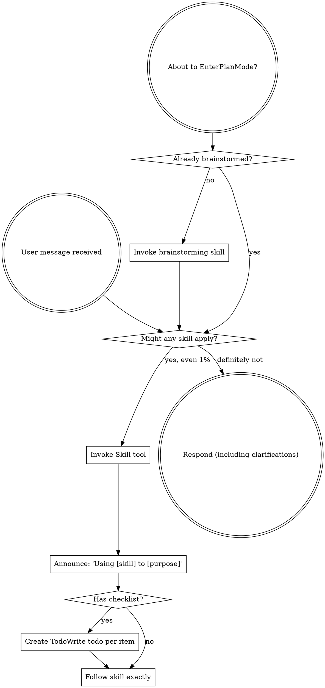

codex-exec: report contract violation

--- codex stdout ---
```yaml
semantic_acceptance_criteria:
  - input: >
      A real SessionStart hook payload executed against a constructed temporary SGSD-shaped repo whose STATE frontmatter declares current_phase "873".
    expected_outcome: >
      The hook exits 0 and injects a first-response governance contract containing the ATC tier table, v3.5 milestone, and the fixture-derived active phase 873 with no operator action.
    verification_cmd: >
      powershell -NoProfile -Command '$tmp=Join-Path ([IO.Path]::GetTempPath()) ("sgsd-ac146a-" + [guid]::NewGuid()); try { $planning=Join-Path $tmp ".planning"; New-Item -ItemType Directory -Path $planning -Force | Out-Null; @("---","milestone: v3.5","current_phase: `"873`"","---","# Fixture") | Set-Content -LiteralPath (Join-Path $planning "STATE.md") -Encoding UTF8; $payload=@{hook_event_name="SessionStart";cwd=$tmp;source="startup";session_id="ac146a"} | ConvertTo-Json -Compress; $out=$payload | node super-gsd/hooks/sgsd-session-start.js; if ($LASTEXITCODE -ne 0) { exit $LASTEXITCODE }; $text=($out -join "`n"); if ($text -notmatch "Governance Contract" -or $text -notmatch "ATC" -or $text -notmatch "v3.5" -or $text -notmatch "873") { exit 1 } } finally { if ($tmp -like (Join-Path ([IO.Path]::GetTempPath()) "sgsd-ac146a-*")) { Remove-Item -LiteralPath $tmp -Recurse -Force } }'
  - input: >
      Real UserPromptSubmit hook payloads executed against a constructed temporary SGSD-shaped repo: one planning prompt and one trivial execution prompt.
    expected_outcome: >
      The classifier exits 0, emits a visible /sgsd-triage directive only for the planning prompt, emits no directive for the trivial prompt, and records routing without making semantic judgments.
    verification_cmd: >
      powershell -NoProfile -Command '$tmp=Join-Path ([IO.Path]::GetTempPath()) ("sgsd-ac146b-" + [guid]::NewGuid()); try { $planning=Join-Path $tmp ".planning"; New-Item -ItemType Directory -Path $planning -Force | Out-Null; @("---","milestone: v3.5","current_phase: `"874`"","---","# Fixture") | Set-Content -LiteralPath (Join-Path $planning "STATE.md") -Encoding UTF8; $posPayload=@{hook_event_name="UserPromptSubmit";cwd=$tmp;prompt="Can you plan the next phase and write the implementation plan?";session_id="ac146b-pos"} | ConvertTo-Json -Compress; $pos=$posPayload | node super-gsd/hooks/sgsd-intent-classifier.cjs; if ($LASTEXITCODE -ne 0) { exit $LASTEXITCODE }; $posText=($pos -join "`n"); if ($posText -notmatch "/sgsd-triage" -or $posText -match "decision.:.block") { exit 1 }; $negPayload=@{hook_event_name="UserPromptSubmit";cwd=$tmp;prompt="Please read README.md and report the first heading.";session_id="ac146b-neg"} | ConvertTo-Json -Compress; $neg=$negPayload | node super-gsd/hooks/sgsd-intent-classifier.cjs; if ($LASTEXITCODE -ne 0) { exit $LASTEXITCODE }; $negText=($neg -join "`n"); if ($negText -match "/sgsd-triage" -or $negText -match "decision.:.block") { exit 1 } } finally { if ($tmp -like (Join-Path ([IO.Path]::GetTempPath()) "sgsd-ac146b-*")) { Remove-Item -LiteralPath $tmp -Recurse -Force } }'
  - input: >
      A real PostToolUse source-edit payload naming a real edited file in a temporary SGSD-shaped repo whose STATE frontmatter declares current_phase "999" and whose phase has no matching PLAN-LOCKED file.
    expected_outcome: >
      The quality gate exits 0, appends a missing-plan row to that fixture's gate-evidence.jsonl with phase 999 and the edited file path, and the cockpit reader consumes that same row as a visible governance signal.
    verification_cmd: >
      powershell -NoProfile -Command '$tmp=Join-Path ([IO.Path]::GetTempPath()) ("sgsd-ac146c-" + [guid]::NewGuid()); try { New-Item -ItemType Directory -Path (Join-Path $tmp ".planning\metrics"),(Join-Path $tmp ".planning\milestones\v3.5\phases\999-fixture"),(Join-Path $tmp "src") -Force | Out-Null; @("---","milestone: v3.5","current_phase: `"999`"","---","# Fixture") | Set-Content -LiteralPath (Join-Path $tmp ".planning\STATE.md") -Encoding UTF8; $edit=Join-Path $tmp "src\edited.js"; "module.exports = 1;" | Set-Content -LiteralPath $edit -Encoding UTF8; $record=Join-Path $tmp ".planning\metrics\gate-evidence.jsonl"; $payload=@{hook_event_name="PostToolUse";cwd=$tmp;tool_name="Edit";tool_input=@{file_path=$edit};session_id="ac146c"} | ConvertTo-Json -Depth 8 -Compress; $out=$payload | node super-gsd/hooks/sgsd-quality-gate.js; if ($LASTEXITCODE -ne 0) { exit $LASTEXITCODE }; if (($out -join "").Trim().Length -gt 0) { exit 1 }; if (!(Test-Path -LiteralPath $record)) { exit 1 }; $rows=Get-Content -LiteralPath $record | ForEach-Object { $_ | ConvertFrom-Json }; $row=$rows | Where-Object { $_.signal -eq "missing_plan" -and $_.phase -eq "999" -and $_.file_path -eq $edit -and $_.tool_name -eq "Edit" } | Select-Object -Last 1; if (-not $row) { exit 1 }; $snapJson=node super-gsd/tools/cockpit-state/adapter.cjs --json --project $tmp; if ($LASTEXITCODE -ne 0) { exit $LASTEXITCODE }; $snapText=($snapJson -join "`n"); if ($snapText -notmatch "missing_plan" -or $snapText -notmatch "999" -or $snapText -notmatch [regex]::Escape($edit)) { exit 1 } } finally { if ($tmp -like (Join-Path ([IO.Path]::GetTempPath()) "sgsd-ac146c-*")) { Remove-Item -LiteralPath $tmp -Recurse -Force } }'
  - input: >
      SessionStart, UserPromptSubmit, and PostToolUse payloads whose cwd is a normal directory with no .planning ancestor.
    expected_outcome: >
      All hooks exit 0 quietly, write no SGSD metrics, and emit no governance context.
    verification_cmd: >
      powershell -NoProfile -Command '$tmp=Join-Path ([IO.Path]::GetTempPath()) ("sgsd-nonrepo-" + [guid]::NewGuid()); $record=".planning\metrics\gate-evidence.jsonl"; $before=0; if (Test-Path -LiteralPath $record) { $before=(Get-Content -LiteralPath $record).Count }; try { New-Item -ItemType Directory -Path $tmp | Out-Null; foreach ($pair in @(@("sgsd-session-start.js","SessionStart"),@("sgsd-intent-classifier.cjs","UserPromptSubmit"),@("sgsd-quality-gate.js","PostToolUse"))) { $payload=@{hook_event_name=$pair[1];cwd=$tmp;prompt="hello";tool_name="Edit";tool_input=@{file_path="x.txt"};session_id="ac146d"} | ConvertTo-Json -Depth 5 -Compress; $out=$payload | node (Join-Path "super-gsd/hooks" $pair[0]); if ($LASTEXITCODE -ne 0) { exit $LASTEXITCODE }; if (($out -join "").Trim().Length -gt 0) { exit 1 } }; $after=0; if (Test-Path -LiteralPath $record) { $after=(Get-Content -LiteralPath $record).Count }; if ($after -ne $before) { exit 1 } } finally { if ($tmp -like (Join-Path ([IO.Path]::GetTempPath()) "sgsd-nonrepo-*")) { Remove-Item -LiteralPath $tmp -Recurse -Force } }'
  - input: >
      Two hundred real UserPromptSubmit planning prompts run through the local Node classifier in this repo.
    expected_outcome: >
      The benchmark exits 0, records an intent_classifier_bench row in gate-evidence.jsonl with iterations 200, and that row's p95_ms value is present and below 1000 ms.
    verification_cmd: >
      powershell -NoProfile -Command '$record=".planning\metrics\gate-evidence.jsonl"; node super-gsd/hooks/sgsd-intent-classifier.cjs --bench --iterations 200 --prompt "How should we plan this?" --record $record; if ($LASTEXITCODE -ne 0) { exit $LASTEXITCODE }; if (!(Test-Path -LiteralPath $record)) { exit 1 }; $row=Get-Content -LiteralPath $record | ForEach-Object { $_ | ConvertFrom-Json } | Where-Object { $_.signal -eq "intent_classifier_bench" -and $_.iterations -eq 200 } | Select-Object -Last 1; if (-not $row -or $null -eq $row.p95_ms -or [double]$row.p95_ms -ge 1000) { exit 1 }'
  - input: >
      Repo-local hook installation into a target repo with a fake home settings file containing env-like secret sentinel keys.
    expected_outcome: >
      The installer writes only target .claude/settings.json, uses install-time absolute target-repo paths in hook args, and does not copy or read home env values.
    verification_cmd: "node super-gsd/scripts/merge-settings.js --self-test-repo-local-hooks"
```
```yaml
tasks:
  - id: "T146-01"
    type: "shared-helper"
    agent: "gsd-executor"
    model: "codex"
    depends_on: []
    files_touched:
      - ".planning/STATE.md"
      - "super-gsd/scripts/lib/sgsd-state.cjs"
      - "super-gsd/scripts/lib/gate-evidence-log.cjs"
      - ".planning/metrics/gate-evidence.jsonl"
    traces_to:
      - "AC-146a"
      - "AC-146c"
      - "AC-146d"
    acceptance_commands:
      - >
        powershell -NoProfile -Command "foreach ($f in @('super-gsd/scripts/lib/sgsd-state.cjs','super-gsd/scripts/lib/gate-evidence-log.cjs')) { node --check $f; if ($LASTEXITCODE -ne 0) { exit $LASTEXITCODE } }"
    verification_cmd: >
      powershell -NoProfile -Command "foreach ($f in @('super-gsd/scripts/lib/sgsd-state.cjs','super-gsd/scripts/lib/gate-evidence-log.cjs')) { node --check $f; if ($LASTEXITCODE -ne 0) { exit $LASTEXITCODE } }; node -e 'const s=require(\"./super-gsd/scripts/lib/sgsd-state.cjs\"); const root=s.findSgsdRoot(process.cwd()); const st=s.readState(root); if (!root || !st || st.milestone !== \"v3.5\") process.exit(1); if (st.phaseSource === \"status_prose\") process.exit(2);'"
    input_contract: >
      Use RESEARCH Q3/Q6/Q9 and CONTEXT constraints. Canonical STATE frontmatter phase key is current_phase. Keep legacy phase as read-only compatibility. Do not parse prose status.
    output_contract: >
      Add shared SGSD root, STATE frontmatter, active phase, PLAN-LOCKED glob, and gate-evidence envelope writer helpers. Add current_phase: "146" to .planning/STATE.md if absent so this phase has canonical frontmatter data. T146-01 owns creation/update of super-gsd/scripts/lib/sgsd-state.cjs, super-gsd/scripts/lib/gate-evidence-log.cjs, and .planning/metrics/gate-evidence.jsonl; later tasks consume helpers and append envelope-v1 rows only.
    hypothesis: >
      A shared resolver and never-throw evidence writer remove duplicated phase parsing while giving hooks and watchdog one deterministic fail-open path.
    falsifier: >
      Any caller parses prose status for a phase, throws in a non-SGSD repo, writes malformed JSONL, or cannot distinguish missing phase frontmatter from a real phase.
    stop_rule: >
      Node syntax checks pass, resolver reads milestone v3.5 from real STATE frontmatter without prose parsing, and gate-evidence writer can append envelope-v1 rows without throwing.
    expected_ATC_tier: GATE

  - id: "T146-02"
    type: "repo-local-installer"
    agent: "gsd-executor"
    model: "codex"
    depends_on:
      - "T146-01"
    files_touched:
      - ".claude/settings.json"
      - "super-gsd/install.sh"
      - "super-gsd/scripts/merge-settings.js"
      - "super-gsd/config/settings-overlay.json"
      - "super-gsd/config/repo-settings-overlay.json"
    traces_to:
      - "AC-146a"
      - "AC-146b"
      - "AC-146c"
      - "AC-146d"
    acceptance_commands:
      - "node super-gsd/scripts/merge-settings.js --self-test-repo-local-hooks"
      - >
        powershell -NoProfile -Command "Select-String -Path .claude/settings.json -Pattern 'SessionStart','UserPromptSubmit','PostToolUse' | Out-Null"
    verification_cmd: "node super-gsd/scripts/merge-settings.js --self-test-repo-local-hooks"
    input_contract: >
      Use RESEARCH Q1/Q2/Q7. Preserve merge-settings idempotency by command plus matcher, but target <repo>/.claude/settings.json only.
    output_contract: >
      Install SessionStart, UserPromptSubmit, and PostToolUse hook entries into repo-local .claude/settings.json using command: node and install-time absolute target-repo script paths in args. T146-02 owns repo-local hook installation entries in .claude/settings.json and hook overlay config; later cleanup may remove unrelated dead config knobs but must not rewrite hook entries.
    hypothesis: >
      Repo-local install-time hook wiring gives SGSD always-on governance without reading home Claude settings or depending on runtime project-dir expansion.
    falsifier: >
      The installer writes ~/.claude/settings.json, copies env keys from a home settings fixture, emits hardcoded machine paths from source, duplicates hook entries, or omits any of the three hook events.
    stop_rule: >
      Self-test installs into a temp target, proves home settings are untouched, proves no env sentinel is copied, and confirms all hook args resolve under the target repo.
    expected_ATC_tier: GATE

  - id: "T146-03"
    type: "session-start-hook"
    agent: "gsd-executor"
    model: "codex"
    depends_on:
      - "T146-02"
    files_touched:
      - "super-gsd/hooks/sgsd-session-start.js"
      - ".planning/metrics/gate-evidence.jsonl"
    traces_to:
      - "AC-146a"
      - "AC-146d"
    acceptance_commands:
      - >
        powershell -NoProfile -Command '$tmp=Join-Path ([IO.Path]::GetTempPath()) ("sgsd-t146-03-" + [guid]::NewGuid()); try { $planning=Join-Path $tmp ".planning"; New-Item -ItemType Directory -Path $planning -Force | Out-Null; @("---","milestone: v3.5","current_phase: `"873`"","---","# Fixture") | Set-Content -LiteralPath (Join-Path $planning "STATE.md") -Encoding UTF8; $payload=@{hook_event_name="SessionStart";cwd=$tmp;source="startup";session_id="t146-03"} | ConvertTo-Json -Compress; $out=$payload | node super-gsd/hooks/sgsd-session-start.js; if ($LASTEXITCODE -ne 0) { exit $LASTEXITCODE }; $text=($out -join "`n"); if ($text -notmatch "Governance Contract" -or $text -notmatch "ATC" -or $text -notmatch "v3.5" -or $text -notmatch "873") { exit 1 } } finally { if ($tmp -like (Join-Path ([IO.Path]::GetTempPath()) "sgsd-t146-03-*")) { Remove-Item -LiteralPath $tmp -Recurse -Force } }'
    verification_cmd: >
      powershell -NoProfile -Command '$tmp=Join-Path ([IO.Path]::GetTempPath()) ("sgsd-t146-03-" + [guid]::NewGuid()); try { $planning=Join-Path $tmp ".planning"; New-Item -ItemType Directory -Path $planning -Force | Out-Null; @("---","milestone: v3.5","current_phase: `"873`"","---","# Fixture") | Set-Content -LiteralPath (Join-Path $planning "STATE.md") -Encoding UTF8; $payload=@{hook_event_name="SessionStart";cwd=$tmp;source="startup";session_id="t146-03"} | ConvertTo-Json -Compress; $out=$payload | node super-gsd/hooks/sgsd-session-start.js; if ($LASTEXITCODE -ne 0) { exit $LASTEXITCODE }; $text=($out -join "`n"); if ($text -notmatch "Governance Contract" -or $text -notmatch "ATC" -or $text -notmatch "v3.5" -or $text -notmatch "873") { exit 1 } } finally { if ($tmp -like (Join-Path ([IO.Path]::GetTempPath()) "sgsd-t146-03-*")) { Remove-Item -LiteralPath $tmp -Recurse -Force } }'
    input_contract: >
      Use Claude hook stdout/additionalContext behavior from RESEARCH Q1 and active phase resolver from T146-01.
    output_contract: >
      SessionStart injects the governance contract with ATC tier table, gate table, mode confirmation note, and active milestone/phase read from the payload cwd repo. Non-SGSD cwd exits quiet 0. Consume shared helpers owned by T146-01; append only state_phase_missing evidence rows to .planning/metrics/gate-evidence.jsonl when SGSD STATE frontmatter lacks a phase.
    hypothesis: >
      Injecting the contract from the runtime hook makes governance visible in manual sessions before the model can omit or reinterpret prompt-resident instructions.
    falsifier: >
      An sg-launched SessionStart payload produces no first-turn governance context, lacks active milestone/phase, blocks the session, or emits context in a non-SGSD directory.
    stop_rule: >
      Temporary-repo SessionStart payload prints the contract with fixture phase 873 and non-SGSD payload exits 0 with empty output.
    expected_ATC_tier: GATE

  - id: "T146-04"
    type: "intent-classifier"
    agent: "gsd-executor"
    model: "codex"
    depends_on:
      - "T146-03"
    files_touched:
      - "super-gsd/hooks/sgsd-intent-classifier.cjs"
      - "super-gsd/registry/session-governance-hooks.yaml"
      - ".planning/metrics/gate-evidence.jsonl"
    traces_to:
      - "AC-146b"
      - "AC-146d"
    acceptance_commands:
      - >
        powershell -NoProfile -Command '$tmp=Join-Path ([IO.Path]::GetTempPath()) ("sgsd-t146-04-" + [guid]::NewGuid()); try { $planning=Join-Path $tmp ".planning"; New-Item -ItemType Directory -Path $planning -Force | Out-Null; @("---","milestone: v3.5","current_phase: `"874`"","---","# Fixture") | Set-Content -LiteralPath (Join-Path $planning "STATE.md") -Encoding UTF8; $posPayload=@{hook_event_name="UserPromptSubmit";cwd=$tmp;prompt="Can you plan the next phase and write the implementation plan?";session_id="t146-04-pos"} | ConvertTo-Json -Compress; $pos=$posPayload | node super-gsd/hooks/sgsd-intent-classifier.cjs; if ($LASTEXITCODE -ne 0) { exit $LASTEXITCODE }; $posText=($pos -join "`n"); if ($posText -notmatch "/sgsd-triage" -or $posText -match "decision.:.block") { exit 1 }; $negPayload=@{hook_event_name="UserPromptSubmit";cwd=$tmp;prompt="Please read README.md and report the first heading.";session_id="t146-04-neg"} | ConvertTo-Json -Compress; $neg=$negPayload | node super-gsd/hooks/sgsd-intent-classifier.cjs; if ($LASTEXITCODE -ne 0) { exit $LASTEXITCODE }; $negText=($neg -join "`n"); if ($negText -match "/sgsd-triage" -or $negText -match "decision.:.block") { exit 1 } } finally { if ($tmp -like (Join-Path ([IO.Path]::GetTempPath()) "sgsd-t146-04-*")) { Remove-Item -LiteralPath $tmp -Recurse -Force } }'
      - >
        powershell -NoProfile -Command '$record=".planning\metrics\gate-evidence.jsonl"; node super-gsd/hooks/sgsd-intent-classifier.cjs --bench --iterations 200 --prompt "How should we plan this?" --record $record; if ($LASTEXITCODE -ne 0) { exit $LASTEXITCODE }; if (!(Test-Path -LiteralPath $record)) { exit 1 }; $row=Get-Content -LiteralPath $record | ForEach-Object { $_ | ConvertFrom-Json } | Where-Object { $_.signal -eq "intent_classifier_bench" -and $_.iterations -eq 200 } | Select-Object -Last 1; if (-not $row -or $null -eq $row.p95_ms -or [double]$row.p95_ms -ge 1000) { exit 1 }'
    verification_cmd: >
      powershell -NoProfile -Command '$tmp=Join-Path ([IO.Path]::GetTempPath()) ("sgsd-t146-04-" + [guid]::NewGuid()); try { $planning=Join-Path $tmp ".planning"; New-Item -ItemType Directory -Path $planning -Force | Out-Null; @("---","milestone: v3.5","current_phase: `"874`"","---","# Fixture") | Set-Content -LiteralPath (Join-Path $planning "STATE.md") -Encoding UTF8; $posPayload=@{hook_event_name="UserPromptSubmit";cwd=$tmp;prompt="Can you plan the next phase and write the implementation plan?";session_id="t146-04-pos"} | ConvertTo-Json -Compress; $pos=$posPayload | node super-gsd/hooks/sgsd-intent-classifier.cjs; if ($LASTEXITCODE -ne 0) { exit $LASTEXITCODE }; $posText=($pos -join "`n"); if ($posText -notmatch "/sgsd-triage" -or $posText -match "decision.:.block") { exit 1 }; $negPayload=@{hook_event_name="UserPromptSubmit";cwd=$tmp;prompt="Please read README.md and report the first heading.";session_id="t146-04-neg"} | ConvertTo-Json -Compress; $neg=$negPayload | node super-gsd/hooks/sgsd-intent-classifier.cjs; if ($LASTEXITCODE -ne 0) { exit $LASTEXITCODE }; $negText=($neg -join "`n"); if ($negText -match "/sgsd-triage" -or $negText -match "decision.:.block") { exit 1 } } finally { if ($tmp -like (Join-Path ([IO.Path]::GetTempPath()) "sgsd-t146-04-*")) { Remove-Item -LiteralPath $tmp -Recurse -Force } }; $record=".planning\metrics\gate-evidence.jsonl"; node super-gsd/hooks/sgsd-intent-classifier.cjs --bench --iterations 200 --prompt "How should we plan this?" --record $record; if ($LASTEXITCODE -ne 0) { exit $LASTEXITCODE }; $row=Get-Content -LiteralPath $record | ForEach-Object { $_ | ConvertFrom-Json } | Where-Object { $_.signal -eq "intent_classifier_bench" -and $_.iterations -eq 200 } | Select-Object -Last 1; if (-not $row -or $null -eq $row.p95_ms -or [double]$row.p95_ms -ge 1000) { exit 1 }'
    input_contract: >
      Use RESEARCH Q5 trigger inventory and VTP directive 1. The registry shape is trigger, predicate, enforcement, with embedded defaults until P149 skill-routing.yaml exists.
    output_contract: >
      Add a local Node UserPromptSubmit classifier that lowercases prompt text, applies registry-backed lexical routes, injects /sgsd-triage for planning intent, suggests neglected SGSD skills, and records p95_ms benchmark rows. T146-04 owns creation of super-gsd/registry/session-governance-hooks.yaml; later tasks may only register their hook-specific sections. Append only intent_classifier_bench rows to .planning/metrics/gate-evidence.jsonl owned by T146-01.
    hypothesis: >
      Declarative lexical routing gives manual sessions visible governance nudges at millisecond-level overhead while leaving semantic judgment to /sgsd-triage and other SGSD skills.
    falsifier: >
      The classifier calls an LLM, blocks prompts, judges plan quality itself, misses a planning-shaped prompt, cannot switch registry source with one line for P149, or records p95_ms >= 1000.
    stop_rule: >
      Planning prompt emits /sgsd-triage, trivial execution prompt does not emit /sgsd-triage, neglected-skill prompts route to the named skill suggestion, non-SGSD cwd exits quiet 0, and the 200-iteration bench records p95_ms below 1000.
    expected_ATC_tier: GATE

  - id: "T146-05"
    type: "quality-gate-producer"
    agent: "gsd-executor"
    model: "codex"
    depends_on:
      - "T146-04"
    files_touched:
      - "super-gsd/hooks/sgsd-quality-gate.js"
      - "super-gsd/registry/session-governance-hooks.yaml"
      - ".planning/metrics/gate-evidence.jsonl"
    traces_to:
      - "AC-146c"
      - "AC-146d"
    acceptance_commands:
      - >
        powershell -NoProfile -Command '$tmp=Join-Path ([IO.Path]::GetTempPath()) ("sgsd-t146-05-" + [guid]::NewGuid()); try { New-Item -ItemType Directory -Path (Join-Path $tmp ".planning\metrics"),(Join-Path $tmp ".planning\milestones\v3.5\phases\999-fixture"),(Join-Path $tmp "src") -Force | Out-Null; @("---","milestone: v3.5","current_phase: `"999`"","---","# Fixture") | Set-Content -LiteralPath (Join-Path $tmp ".planning\STATE.md") -Encoding UTF8; $edit=Join-Path $tmp "src\edited.js"; "module.exports = 1;" | Set-Content -LiteralPath $edit -Encoding UTF8; $record=Join-Path $tmp ".planning\metrics\gate-evidence.jsonl"; $payload=@{hook_event_name="PostToolUse";cwd=$tmp;tool_name="Edit";tool_input=@{file_path=$edit};session_id="t146-05"} | ConvertTo-Json -Depth 8 -Compress; $out=$payload | node super-gsd/hooks/sgsd-quality-gate.js; if ($LASTEXITCODE -ne 0) { exit $LASTEXITCODE }; if (($out -join "").Trim().Length -gt 0) { exit 1 }; $rows=Get-Content -LiteralPath $record | ForEach-Object { $_ | ConvertFrom-Json }; $row=$rows | Where-Object { $_.signal -eq "missing_plan" -and $_.phase -eq "999" -and $_.file_path -eq $edit -and $_.tool_name -eq "Edit" } | Select-Object -Last 1; if (-not $row) { exit 1 }; $before=(Get-Content -LiteralPath $record).Count; $badPayload=@{hook_event_name="PostToolUse";cwd=$tmp;tool_name="UnconfirmedMutator";tool_input=@{file_path=$edit};session_id="t146-05-unknown"} | ConvertTo-Json -Depth 8 -Compress; $badOut=$badPayload | node super-gsd/hooks/sgsd-quality-gate.js; if ($LASTEXITCODE -ne 0) { exit $LASTEXITCODE }; if (($badOut -join "").Trim().Length -gt 0) { exit 1 }; $after=(Get-Content -LiteralPath $record).Count; if ($after -ne $before) { exit 1 } } finally { if ($tmp -like (Join-Path ([IO.Path]::GetTempPath()) "sgsd-t146-05-*")) { Remove-Item -LiteralPath $tmp -Recurse -Force } }'
    verification_cmd: >
      powershell -NoProfile -Command '$tmp=Join-Path ([IO.Path]::GetTempPath()) ("sgsd-t146-05-" + [guid]::NewGuid()); try { New-Item -ItemType Directory -Path (Join-Path $tmp ".planning\metrics"),(Join-Path $tmp ".planning\milestones\v3.5\phases\999-fixture"),(Join-Path $tmp "src") -Force | Out-Null; @("---","milestone: v3.5","current_phase: `"999`"","---","# Fixture") | Set-Content -LiteralPath (Join-Path $tmp ".planning\STATE.md") -Encoding UTF8; $edit=Join-Path $tmp "src\edited.js"; "module.exports = 1;" | Set-Content -LiteralPath $edit -Encoding UTF8; $record=Join-Path $tmp ".planning\metrics\gate-evidence.jsonl"; $payload=@{hook_event_name="PostToolUse";cwd=$tmp;tool_name="Edit";tool_input=@{file_path=$edit};session_id="t146-05"} | ConvertTo-Json -Depth 8 -Compress; $out=$payload | node super-gsd/hooks/sgsd-quality-gate.js; if ($LASTEXITCODE -ne 0) { exit $LASTEXITCODE }; if (($out -join "").Trim().Length -gt 0) { exit 1 }; $rows=Get-Content -LiteralPath $record | ForEach-Object { $_ | ConvertFrom-Json }; $row=$rows | Where-Object { $_.signal -eq "missing_plan" -and $_.phase -eq "999" -and $_.file_path -eq $edit -and $_.tool_name -eq "Edit" } | Select-Object -Last 1; if (-not $row) { exit 1 }; $before=(Get-Content -LiteralPath $record).Count; $badPayload=@{hook_event_name="PostToolUse";cwd=$tmp;tool_name="UnconfirmedMutator";tool_input=@{file_path=$edit};session_id="t146-05-unknown"} | ConvertTo-Json -Depth 8 -Compress; $badOut=$badPayload | node super-gsd/hooks/sgsd-quality-gate.js; if ($LASTEXITCODE -ne 0) { exit $LASTEXITCODE }; if (($badOut -join "").Trim().Length -gt 0) { exit 1 }; $after=(Get-Content -LiteralPath $record).Count; if ($after -ne $before) { exit 1 } } finally { if ($tmp -like (Join-Path ([IO.Path]::GetTempPath()) "sgsd-t146-05-*")) { Remove-Item -LiteralPath $tmp -Recurse -Force } }'
    input_contract: >
      Use RESEARCH Q1/Q6/Q9 and VTP directive 4. The confirmed PostToolUse file-mutation tool_name matcher for this harness is exactly Edit, Write, NotebookEdit. There is no MultiEdit in this harness.
    output_contract: >
      Add a report-only PostToolUse quality gate that resolves active phase from STATE frontmatter, checks real PLAN-LOCKED naming, and appends missing-plan evidence rows. Register only Edit, Write, and NotebookEdit in super-gsd/registry/session-governance-hooks.yaml owned by T146-04. Unknown tool name means no row, exit 0, and never block. Append only to .planning/metrics/gate-evidence.jsonl owned by T146-01.
    hypothesis: >
      Evidence rows give AC-146c report-only source-edit observability without violating the board's no edit-seam blocking constraint, and T146-06 makes those rows visible to cockpit and MCP consumers.
    falsifier: >
      The hook blocks or exits nonzero on edits, logs no row for a missing active-phase plan, matches unconfirmed mutation tools, emits a row for an unknown tool name, or includes MultiEdit in this harness.
    stop_rule: >
      Temporary SGSD-shaped repo with no active PLAN receives a confirmed Edit payload, appends a row whose phase and file_path match the fixture, and an unknown tool payload exits 0 without appending a row.
    expected_ATC_tier: GATE

  - id: "T146-06"
    type: "cockpit-gate-evidence-reader"
    agent: "gsd-executor"
    model: "codex"
    depends_on:
      - "T146-05"
    files_touched:
      - "super-gsd/tools/cockpit-state/adapter.cjs"
      - "super-gsd/tools/warp-mcp/server.cjs"
    traces_to:
      - "AC-146c"
    acceptance_commands:
      - >
        powershell -NoProfile -Command '$tmp=Join-Path ([IO.Path]::GetTempPath()) ("sgsd-t146-06-" + [guid]::NewGuid()); try { New-Item -ItemType Directory -Path (Join-Path $tmp ".planning\metrics"),(Join-Path $tmp ".planning\milestones\v3.5\phases\999-fixture"),(Join-Path $tmp "src") -Force | Out-Null; @("---","milestone: v3.5","current_phase: `"999`"","---","# Fixture") | Set-Content -LiteralPath (Join-Path $tmp ".planning\STATE.md") -Encoding UTF8; $edit=Join-Path $tmp "src\edited.js"; "module.exports = 1;" | Set-Content -LiteralPath $edit -Encoding UTF8; $payload=@{hook_event_name="PostToolUse";cwd=$tmp;tool_name="Edit";tool_input=@{file_path=$edit};session_id="t146-06"} | ConvertTo-Json -Depth 8 -Compress; $out=$payload | node super-gsd/hooks/sgsd-quality-gate.js; if ($LASTEXITCODE -ne 0) { exit $LASTEXITCODE }; $snapJson=node super-gsd/tools/cockpit-state/adapter.cjs --json --project $tmp; if ($LASTEXITCODE -ne 0) { exit $LASTEXITCODE }; $snapText=($snapJson -join "`n"); if ($snapText -notmatch "missing_plan" -or $snapText -notmatch "999" -or $snapText -notmatch [regex]::Escape($edit)) { exit 1 }; $req=@{jsonrpc="2.0";method="tools/call";id=1;params=@{name="sgsd_cockpit_snapshot";arguments=@{project_dir=$tmp}}} | ConvertTo-Json -Depth 10 -Compress; $mcpJson=$req | node super-gsd/tools/warp-mcp/server.cjs --stdio; if ($LASTEXITCODE -ne 0) { exit $LASTEXITCODE }; $mcpText=($mcpJson -join "`n"); if ($mcpText -notmatch "missing_plan" -or $mcpText -notmatch "999" -or $mcpText -notmatch [regex]::Escape($edit)) { exit 1 } } finally { if ($tmp -like (Join-Path ([IO.Path]::GetTempPath()) "sgsd-t146-06-*")) { Remove-Item -LiteralPath $tmp -Recurse -Force } }'
    verification_cmd: >
      powershell -NoProfile -Command '$tmp=Join-Path ([IO.Path]::GetTempPath()) ("sgsd-t146-06-" + [guid]::NewGuid()); try { New-Item -ItemType Directory -Path (Join-Path $tmp ".planning\metrics"),(Join-Path $tmp ".planning\milestones\v3.5\phases\999-fixture"),(Join-Path $tmp "src") -Force | Out-Null; @("---","milestone: v3.5","current_phase: `"999`"","---","# Fixture") | Set-Content -LiteralPath (Join-Path $tmp ".planning\STATE.md") -Encoding UTF8; $edit=Join-Path $tmp "src\edited.js"; "module.exports = 1;" | Set-Content -LiteralPath $edit -Encoding UTF8; $payload=@{hook_event_name="PostToolUse";cwd=$tmp;tool_name="Edit";tool_input=@{file_path=$edit};session_id="t146-06"} | ConvertTo-Json -Depth 8 -Compress; $out=$payload | node super-gsd/hooks/sgsd-quality-gate.js; if ($LASTEXITCODE -ne 0) { exit $LASTEXITCODE }; $snapJson=node super-gsd/tools/cockpit-state/adapter.cjs --json --project $tmp; if ($LASTEXITCODE -ne 0) { exit $LASTEXITCODE }; $snapText=($snapJson -join "`n"); if ($snapText -notmatch "missing_plan" -or $snapText -notmatch "999" -or $snapText -notmatch [regex]::Escape($edit)) { exit 1 }; $req=@{jsonrpc="2.0";method="tools/call";id=1;params=@{name="sgsd_cockpit_snapshot";arguments=@{project_dir=$tmp}}} | ConvertTo-Json -Depth 10 -Compress; $mcpJson=$req | node super-gsd/tools/warp-mcp/server.cjs --stdio; if ($LASTEXITCODE -ne 0) { exit $LASTEXITCODE }; $mcpText=($mcpJson -join "`n"); if ($mcpText -notmatch "missing_plan" -or $mcpText -notmatch "999" -or $mcpText -notmatch [regex]::Escape($edit)) { exit 1 } } finally { if ($tmp -like (Join-Path ([IO.Path]::GetTempPath()) "sgsd-t146-06-*")) { Remove-Item -LiteralPath $tmp -Recurse -Force } }'
    input_contract: >
      Use RESEARCH Q1/Q6/Q9 and VTP directive 4. Consume gate-evidence rows produced by T146-05 through the existing cockpit adapter and MCP snapshot surfaces.
    output_contract: >
      Expose missing-plan gate-evidence rows through cockpit adapter and MCP reader output. This task reads .planning/metrics/gate-evidence.jsonl owned by T146-01 and must not create, append, or rewrite that stream.
    hypothesis: >
      Cockpit and MCP visibility gives AC-146c observability without changing the report-only quality-gate semantics.
    falsifier: >
      The cockpit adapter cannot surface the row within one refresh, MCP output disagrees with the adapter, the reader writes to gate-evidence.jsonl, or missing evidence degrades the whole snapshot instead of only the governance signal.
    stop_rule: >
      A row emitted by the real T146-05 hook in a temporary fixture appears in adapter --json output and in the sgsd_cockpit_snapshot MCP response with the same phase and file_path.
    expected_ATC_tier: GATE

  - id: "T146-07"
    type: "cheap-fixes-cleanup"
    agent: "gsd-executor"
    model: "codex"
    depends_on:
      - "T146-06"
    files_touched:
      - "super-gsd/scripts/sgsd-stop-handoff.sh"
      - "super-gsd/tools/autopilot-watchdog/check.cjs"
      - "super-gsd/config/settings-overlay.json"
      - "super-gsd/config/**/*.json"
      - "super-gsd/config/**/*.yaml"
    traces_to:
      - "AC-146c"
      - "AC-146d"
    acceptance_commands:
      - "bash -n super-gsd/scripts/sgsd-stop-handoff.sh"
      - "node super-gsd/tools/autopilot-watchdog/check.cjs --self-test-phase-resolution"
      - >
        powershell -NoProfile -Command "rg 'checkpoint_threshold_percent|context_warning_percent|context_warnings|gsd-atc-slice-gate.js' super-gsd --glob '!**/*.md'; if ($LASTEXITCODE -eq 0) { exit 1 } elseif ($LASTEXITCODE -eq 1) { exit 0 } else { exit $LASTEXITCODE }"
    verification_cmd: >
      powershell -NoProfile -Command "bash -n super-gsd/scripts/sgsd-stop-handoff.sh; if ($LASTEXITCODE -ne 0) { exit $LASTEXITCODE }; node super-gsd/tools/autopilot-watchdog/check.cjs --self-test-phase-resolution; if ($LASTEXITCODE -ne 0) { exit $LASTEXITCODE }; rg 'checkpoint_threshold_percent|context_warning_percent|context_warnings|gsd-atc-slice-gate.js' super-gsd --glob '!**/*.md'; if ($LASTEXITCODE -eq 0) { exit 1 } elseif ($LASTEXITCODE -eq 1) { exit 0 } else { exit $LASTEXITCODE }"
    input_contract: >
      Use RESEARCH Q4/Q8 and CONTEXT cheap-fix list. Keep DEVIATION-W out of this task because research did not prove it is a few-line isolated codex-exec.sh fix.
    output_contract: >
      Reset handoff-chain latch when latest valid row is reason refused, move autopilot-watchdog phase resolution to shared STATE frontmatter helper, unregister dead gsd-atc-slice-gate.js references, and delete dead token/context config knobs from live config. Changes to super-gsd/config/settings-overlay.json are cleanup-only and must not rewrite T146-02 repo-local hook entries.
    hypothesis: >
      These bounded cleanups remove known always-on governance distortions without changing gate semantics or widening P146 beyond session governance hooks.
    falsifier: >
      Refused handoff rows still preserve stale depth, watchdog reads phase from prose regex, dead hook registration remains live, or dead config knobs remain under super-gsd runtime config.
    stop_rule: >
      Shell syntax passes, watchdog phase self-test proves frontmatter resolution, and runtime config grep finds no dead knobs or dead hook registration.
    expected_ATC_tier: GATE
```

--- codex stderr ---
OpenAI Codex v0.146.0
--------
workdir: $env:USERPROFILE\AppData\Roaming\warp\Warp\data\worktrees\GSDedits\cholla-racer
model: gpt-5.5
provider: openai
approval: never
sandbox: read-only
reasoning effort: xhigh
reasoning summaries: none
session id: 019fd495-a2be-7f50-bb6a-5bbb1babc0b3
--------
user
# P146 Plan REVISION 2 — surgical block replacement (revision 1 REGRESSED)

<intent milestone="v3.5">
Always-On Orchestration — governance as runtime mechanism in all session modes.
</intent>

Revision 1 failed: it regenerated the whole plan from scratch, dropped `tasks`
and `semantic_acceptance_criteria` entirely (schema INVALID: SCHEMA-01 +
SCHEMA-09), renamed frontmatter keys, and invented new DEFERRED/DEVIATION text.
Do NOT regenerate the plan.

## What to output — EXACTLY two fenced blocks, nothing else

Block 1, fenced as ```yaml, labelled by its first line being
`semantic_acceptance_criteria:` — the COMPLETE replacement for that key.

Block 2, fenced as ```yaml, labelled by its first line being `tasks:` —
the COMPLETE replacement for that key.

No prose before, between, or after. No other frontmatter keys. The orchestrator
splices these two blocks into the existing validated plan file verbatim, so
YAML indentation must match the current blocks exactly (2-space list indent
under the top-level key, as shown below).

## Findings to resolve (from the NOGO plan-check)

**CRIT-1 — stub-satisfiable ACs.** AC-146a/b/c pass with stubs today:
hardcoded SessionStart text, hardcoded `/sgsd-triage`, and `--self-test` exit 0
prove nothing. Rewrite those criteria so a stub CANNOT pass:
 - Drive the REAL hook entrypoint against a CONSTRUCTED TEMP repo fixture, not
   a `--self-test` flag. Self-test flags may exist for developers but must not
   be the proof surface.
 - Assert values only a real read could produce — e.g. temp repo STATE declares
   `current_phase: "873"` and the injected contract must contain 873.
 - Classifier criterion must assert BOTH a positive (planning prompt → the
   directive appears) AND a negative control (a trivial/execution prompt →
   the directive does NOT appear) in the same criterion, so a hardcoded
   emitter fails the negative half.
 - Quality-gate criterion must send a real PostToolUse payload naming a real
   edited file in the temp fixture, then assert the APPENDED JSONL row's field
   values match that fixture's phase and file path, and have the cockpit
   reader consume THAT row.

**CRIT-2 — punted decision.** Decide the PostToolUse matcher NOW. The live
harness file-mutation tools are `Edit`, `Write`, `NotebookEdit` — there is NO
`MultiEdit` in this harness. Put the matcher in the relevant task's
output_contract and state the degradation rule: unknown tool name → no row,
exit 0, never block.

**CRIT-3 — DAG/file collision.** `gate-evidence-log.cjs`,
`.planning/metrics/gate-evidence.jsonl`, and
`super-gsd/registry/session-governance-hooks.yaml` are touched by multiple
tasks; T146-03/T146-05 also overlap shared state helpers. Codex executor
dispatches are SERIAL with exclusive workspace write access. For every shared
file, name the OWNING task (creates it) in that task's output_contract; later
tasks may only append/register and must say so. Ensure `depends_on` yields one
unambiguous total order.

**WARN-1 — latency not asserted.** The bench criterion must parse the recorded
`p95_ms` from the JSONL row and FAIL if absent or >= 1000, and assert the
iteration count row exists. Exit 0 alone is insufficient.

**WARN-2 — T146-05 oversized.** Split it into a producer task (PostToolUse
quality-gate hook + evidence rows) and a reader task (cockpit adapter / MCP
consumer). BOTH stay inside P146 — the VTP directive is explicit that AC-146c
is incomplete without a reader. Renumber subsequent tasks accordingly.

## Preserve exactly
Every other field of every task (agent, model, type, hypothesis, falsifier,
stop_rule, input_contract, traces_to, expected_ATC_tier) unless a finding
requires the change. Keep `agent: "gsd-executor"` and `model: "codex"` as-is.
Keep all verification commands Windows-safe, deterministic, network-free, and
free of any chmod dependence.

## CURRENT semantic_acceptance_criteria block (replace this)
semantic_acceptance_criteria:
  - input: >
      A real SessionStart hook payload from an sg-launched manual session in this SGSD repo.
    expected_outcome: >
      The hook exits 0 and injects a first-response governance contract containing the ATC tier table, v3.5 milestone, and active phase 146 with no operator action.
    verification_cmd: >
      powershell -NoProfile -Command "$payload=@{hook_event_name='SessionStart';cwd=(Get-Location).Path;source='startup';session_id='ac146a'} | ConvertTo-Json -Compress; $out=$payload | node super-gsd/hooks/sgsd-session-start.js; if ($LASTEXITCODE -ne 0) { exit $LASTEXITCODE }; $text=($out -join \"`n\"); if ($text -notmatch 'Governance Contract' -or $text -notmatch 'ATC' -or $text -notmatch 'v3.5' -or $text -notmatch '146') { exit 1 }"
  - input: >
      A manual-session planning prompt asking how to plan the next phase.
    expected_outcome: >
      The UserPromptSubmit classifier exits 0, emits a visible /sgsd-triage directive, and records only a routing decision without making semantic judgments.
    verification_cmd: >
      powershell -NoProfile -Command "$payload=@{hook_event_name='UserPromptSubmit';cwd=(Get-Location).Path;prompt='Can you plan the next phase and write the implementation plan?';session_id='ac146b'} | ConvertTo-Json -Compress; $out=$payload | node super-gsd/hooks/sgsd-intent-classifier.cjs; if ($LASTEXITCODE -ne 0) { exit $LASTEXITCODE }; $text=($out -join \"`n\"); if ($text -notmatch '/sgsd-triage' -or $text -match 'decision.:.block') { exit 1 }"
  - input: >
      A PostToolUse source-edit payload in a temporary SGSD-shaped repo whose STATE frontmatter declares current_phase 999 and whose phase has no matching PLAN-LOCKED file.
    expected_outcome: >
      The quality gate exits 0, appends a missing-plan row to gate-evidence.jsonl, and the cockpit adapter reads that row as a visible governance signal.
    verification_cmd: >
      powershell -NoProfile -Command "node super-gsd/hooks/sgsd-quality-gate.js --self-test-report-only-missing-plan --record .planning/metrics/gate-evidence.jsonl; if ($LASTEXITCODE -ne 0) { exit $LASTEXITCODE }; node super-gsd/tools/cockpit-state/adapter.cjs --self-test-gate-evidence-reader; exit $LASTEXITCODE"
  - input: >
      SessionStart, UserPromptSubmit, and PostToolUse payloads whose cwd is a normal directory with no .planning ancestor.
    expected_outcome: >
      All hooks exit 0 quietly, write no SGSD metrics, and emit no governance context.
    verification_cmd: >
      powershell -NoProfile -Command "$tmp=Join-Path ([IO.Path]::GetTempPath()) ('sgsd-nonrepo-' + [guid]::NewGuid()); New-Item -ItemType Directory -Path $tmp | Out-Null; try { foreach ($pair in @(@('sgsd-session-start.js','SessionStart'),@('sgsd-intent-classifier.cjs','UserPromptSubmit'),@('sgsd-quality-gate.js','PostToolUse'))) { $payload=@{hook_event_name=$pair[1];cwd=$tmp;prompt='hello';tool_name='Edit';tool_input=@{file_path='x.txt'};session_id='ac146d'} | ConvertTo-Json -Depth 5 -Compress; $out=$payload | node (Join-Path 'super-gsd/hooks' $pair[0]); if ($LASTEXITCODE -ne 0) { exit $LASTEXITCODE }; if (($out -join '').Trim().Length -gt 0) { exit 1 } } } finally { if ($tmp -like (Join-Path ([IO.Path]::GetTempPath()) 'sgsd-nonrepo-*')) { Remove-Item -LiteralPath $tmp -Recurse -Force } }"
  - input: >
      Two hundred real UserPromptSubmit planning prompts run through the local Node classifier in this repo.
    expected_outcome: >
      The benchmark exits 0, records a p95_ms value in gate-evidence.jsonl, and that p95_ms is below 1000 ms.
    verification_cmd: "node super-gsd/hooks/sgsd-intent-classifier.cjs --bench --iterations 200 --prompt \"How should we plan this?\" --record .planning/metrics/gate-evidence.jsonl"
  - input: >
      Repo-local hook installation into a target repo with a fake home settings file containing env-like secret sentinel keys.
    expected_outcome: >
      The installer writes only target .claude/settings.json, uses install-time absolute target-repo paths in hook args, and does not copy or read home env values.
    verification_cmd: "node super-gsd/scripts/merge-settings.js --self-test-repo-local-hooks"

## CURRENT tasks block (replace this)
tasks:
  - id: "T146-01"
    type: "shared-helper"
    agent: "gsd-executor"
    model: "codex"
    depends_on: []
    files_touched:
      - ".planning/STATE.md"
      - "super-gsd/scripts/lib/sgsd-state.cjs"
      - "super-gsd/scripts/lib/gate-evidence-log.cjs"
      - ".planning/metrics/gate-evidence.jsonl"
    traces_to:
      - "AC-146a"
      - "AC-146c"
      - "AC-146d"
    acceptance_commands:
      - >
        powershell -NoProfile -Command "foreach ($f in @('super-gsd/scripts/lib/sgsd-state.cjs','super-gsd/scripts/lib/gate-evidence-log.cjs')) { node --check $f; if ($LASTEXITCODE -ne 0) { exit $LASTEXITCODE } }"
    verification_cmd: >
      powershell -NoProfile -Command "foreach ($f in @('super-gsd/scripts/lib/sgsd-state.cjs','super-gsd/scripts/lib/gate-evidence-log.cjs')) { node --check $f; if ($LASTEXITCODE -ne 0) { exit $LASTEXITCODE } }; node -e 'const s=require(\"./super-gsd/scripts/lib/sgsd-state.cjs\"); const root=s.findSgsdRoot(process.cwd()); const st=s.readState(root); if (!root || !st || st.milestone !== \"v3.5\") process.exit(1); if (st.phaseSource === \"status_prose\") process.exit(2);'"
    input_contract: >
      Use RESEARCH Q3/Q6/Q9 and CONTEXT constraints. Canonical STATE frontmatter phase key is current_phase. Keep legacy phase as read-only compatibility. Do not parse prose status.
    output_contract: >
      Add shared SGSD root, STATE frontmatter, active phase, PLAN-LOCKED glob, and gate-evidence envelope writer helpers. Add current_phase: "146" to .planning/STATE.md if absent so this phase has canonical frontmatter data.
    hypothesis: >
      A shared resolver and never-throw evidence writer remove duplicated phase parsing while giving hooks and watchdog one deterministic fail-open path.
    falsifier: >
      Any caller parses prose status for a phase, throws in a non-SGSD repo, writes malformed JSONL, or cannot distinguish missing phase frontmatter from a real phase.
    stop_rule: >
      Node syntax checks pass, resolver reads milestone v3.5 from real STATE frontmatter without prose parsing, and gate-evidence writer can append envelope-v1 rows without throwing.
    expected_ATC_tier: GATE

  - id: "T146-02"
    type: "repo-local-installer"
    agent: "gsd-executor"
    model: "codex"
    depends_on:
      - "T146-01"
    files_touched:
      - ".claude/settings.json"
      - "super-gsd/install.sh"
      - "super-gsd/scripts/merge-settings.js"
      - "super-gsd/config/settings-overlay.json"
      - "super-gsd/config/repo-settings-overlay.json"
    traces_to:
      - "AC-146a"
      - "AC-146b"
      - "AC-146c"
      - "AC-146d"
    acceptance_commands:
      - "node super-gsd/scripts/merge-settings.js --self-test-repo-local-hooks"
      - >
        powershell -NoProfile -Command "Select-String -Path .claude/settings.json -Pattern 'SessionStart','UserPromptSubmit','PostToolUse' | Out-Null"
    verification_cmd: "node super-gsd/scripts/merge-settings.js --self-test-repo-local-hooks"
    input_contract: >
      Use RESEARCH Q1/Q2/Q7. Preserve merge-settings idempotency by command plus matcher, but target <repo>/.claude/settings.json only.
    output_contract: >
      Install SessionStart, UserPromptSubmit, and PostToolUse hook entries into repo-local .claude/settings.json using command: node and install-time absolute target-repo script paths in args.
    hypothesis: >
      Repo-local install-time hook wiring gives SGSD always-on governance without reading home Claude settings or depending on runtime project-dir expansion.
    falsifier: >
      The installer writes ~/.claude/settings.json, copies env keys from a home settings fixture, emits hardcoded machine paths from source, duplicates hook entries, or omits any of the three hook events.
    stop_rule: >
      Self-test installs into a temp target, proves home settings are untouched, proves no env sentinel is copied, and confirms all hook args resolve under the target repo.
    expected_ATC_tier: GATE

  - id: "T146-03"
    type: "session-start-hook"
    agent: "gsd-executor"
    model: "codex"
    depends_on:
      - "T146-01"
      - "T146-02"
    files_touched:
      - "super-gsd/hooks/sgsd-session-start.js"
      - "super-gsd/scripts/lib/sgsd-state.cjs"
      - "super-gsd/scripts/lib/gate-evidence-log.cjs"
      - ".planning/metrics/gate-evidence.jsonl"
    traces_to:
      - "AC-146a"
      - "AC-146d"
    acceptance_commands:
      - >
        powershell -NoProfile -Command "$payload=@{hook_event_name='SessionStart';cwd=(Get-Location).Path;source='startup';session_id='t146-03'} | ConvertTo-Json -Compress; $out=$payload | node super-gsd/hooks/sgsd-session-start.js; if ($LASTEXITCODE -ne 0) { exit $LASTEXITCODE }; $text=($out -join \"`n\"); if ($text -notmatch 'Governance Contract' -or $text -notmatch 'ATC' -or $text -notmatch 'v3.5' -or $text -notmatch '146') { exit 1 }"
    verification_cmd: >
      powershell -NoProfile -Command "$payload=@{hook_event_name='SessionStart';cwd=(Get-Location).Path;source='startup';session_id='t146-03'} | ConvertTo-Json -Compress; $out=$payload | node super-gsd/hooks/sgsd-session-start.js; if ($LASTEXITCODE -ne 0) { exit $LASTEXITCODE }; $text=($out -join \"`n\"); if ($text -notmatch 'Governance Contract' -or $text -notmatch 'ATC' -or $text -notmatch 'v3.5' -or $text -notmatch '146') { exit 1 }"
    input_contract: >
      Use Claude hook stdout/additionalContext behavior from RESEARCH Q1 and active phase resolver from T146-01.
    output_contract: >
      SessionStart injects the governance contract with ATC tier table, gate table, mode confirmation note, and active milestone/phase. Non-SGSD cwd exits quiet 0.
    hypothesis: >
      Injecting the contract from the runtime hook makes governance visible in manual sessions before the model can omit or reinterpret prompt-resident instructions.
    falsifier: >
      An sg-launched SessionStart payload produces no first-turn governance context, lacks active milestone/phase, blocks the session, or emits context in a non-SGSD directory.
    stop_rule: >
      Real repo SessionStart payload prints the contract and non-SGSD payload exits 0 with empty output.
    expected_ATC_tier: GATE

  - id: "T146-04"
    type: "intent-classifier"
    agent: "gsd-executor"
    model: "codex"
    depends_on:
      - "T146-01"
      - "T146-02"
    files_touched:
      - "super-gsd/hooks/sgsd-intent-classifier.cjs"
      - "super-gsd/registry/session-governance-hooks.yaml"
      - "super-gsd/scripts/lib/gate-evidence-log.cjs"
      - ".planning/metrics/gate-evidence.jsonl"
    traces_to:
      - "AC-146b"
      - "AC-146d"
    acceptance_commands:
      - >
        powershell -NoProfile -Command "$payload=@{hook_event_name='UserPromptSubmit';cwd=(Get-Location).Path;prompt='Can you plan the next phase and write the implementation plan?';session_id='t146-04'} | ConvertTo-Json -Compress; $out=$payload | node super-gsd/hooks/sgsd-intent-classifier.cjs; if ($LASTEXITCODE -ne 0) { exit $LASTEXITCODE }; if (($out -join \"`n\") -notmatch '/sgsd-triage') { exit 1 }"
      - "node super-gsd/hooks/sgsd-intent-classifier.cjs --bench --iterations 200 --prompt \"How should we plan this?\" --record .planning/metrics/gate-evidence.jsonl"
    verification_cmd: >
      powershell -NoProfile -Command "$payload=@{hook_event_name='UserPromptSubmit';cwd=(Get-Location).Path;prompt='Can you plan the next phase and write the implementation plan?';session_id='t146-04'} | ConvertTo-Json -Compress; $out=$payload | node super-gsd/hooks/sgsd-intent-classifier.cjs; if ($LASTEXITCODE -ne 0) { exit $LASTEXITCODE }; if (($out -join \"`n\") -notmatch '/sgsd-triage') { exit 1 }; node super-gsd/hooks/sgsd-intent-classifier.cjs --bench --iterations 200 --prompt 'How should we plan this?' --record .planning/metrics/gate-evidence.jsonl; exit $LASTEXITCODE"
    input_contract: >
      Use RESEARCH Q5 trigger inventory and VTP directive 1. The registry shape is trigger, predicate, enforcement, with embedded defaults until P149 skill-routing.yaml exists.
    output_contract: >
      Add a local Node UserPromptSubmit classifier that lowercases prompt text, applies registry-backed lexical routes, injects /sgsd-triage for planning intent, suggests neglected SGSD skills, and records p95_ms benchmark rows.
    hypothesis: >
      Declarative lexical routing gives manual sessions visible governance nudges at millisecond-level overhead while leaving semantic judgment to /sgsd-triage and other SGSD skills.
    falsifier: >
      The classifier calls an LLM, blocks prompts, judges plan quality itself, misses a planning-shaped prompt, cannot switch registry source with one line for P149, or records p95_ms >= 1000.
    stop_rule: >
      Planning prompt emits /sgsd-triage, neglected-skill prompts route to the named skill suggestion, non-SGSD cwd exits quiet 0, and the 200-iteration bench records p95_ms below 1000.
    expected_ATC_tier: GATE

  - id: "T146-05"
    type: "quality-gate-and-cockpit"
    agent: "gsd-executor"
    model: "codex"
    depends_on:
      - "T146-01"
      - "T146-02"
    files_touched:
      - "super-gsd/hooks/sgsd-quality-gate.js"
      - "super-gsd/registry/session-governance-hooks.yaml"
      - "super-gsd/scripts/lib/sgsd-state.cjs"
      - "super-gsd/scripts/lib/gate-evidence-log.cjs"
      - "super-gsd/tools/cockpit-state/adapter.cjs"
      - "super-gsd/tools/warp-mcp/server.cjs"
      - ".planning/metrics/gate-evidence.jsonl"
    traces_to:
      - "AC-146c"
      - "AC-146d"
    acceptance_commands:
      - "node super-gsd/hooks/sgsd-quality-gate.js --self-test-report-only-missing-plan --record .planning/metrics/gate-evidence.jsonl"
      - "node super-gsd/tools/cockpit-state/adapter.cjs --self-test-gate-evidence-reader"
    verification_cmd: >
      powershell -NoProfile -Command "node super-gsd/hooks/sgsd-quality-gate.js --self-test-report-only-missing-plan --record .planning/metrics/gate-evidence.jsonl; if ($LASTEXITCODE -ne 0) { exit $LASTEXITCODE }; node super-gsd/tools/cockpit-state/adapter.cjs --self-test-gate-evidence-reader; exit $LASTEXITCODE"
    input_contract: >
      Use RESEARCH Q1/Q6/Q9 and VTP directive 4. Confirm real PostToolUse mutation tool_name values in this harness before adding names to the registry; do not assume MultiEdit.
    output_contract: >
      Add a report-only PostToolUse quality gate that resolves active phase from STATE frontmatter, checks real PLAN-LOCKED naming, appends missing-plan evidence rows, and exposes those rows through cockpit adapter and MCP reader.
    hypothesis: >
      Evidence plus cockpit visibility gives AC-146c observability without violating the board's no edit-seam blocking constraint.
    falsifier: >
      The hook blocks or exits nonzero on edits, logs no row for a missing active-phase plan, matches unconfirmed mutation tools, or cockpit cannot surface the row within one refresh.
    stop_rule: >
      Self-test creates a temporary SGSD-shaped repo with no active PLAN, sends a confirmed mutation-tool payload, sees a gate-evidence row, and adapter self-test reads it as a cockpit signal.
    expected_ATC_tier: GATE

  - id: "T146-06"
    type: "cheap-fixes-cleanup"
    agent: "gsd-executor"
    model: "codex"
    depends_on:
      - "T146-01"
      - "T146-05"
    files_touched:
      - "super-gsd/scripts/sgsd-stop-handoff.sh"
      - "super-gsd/tools/autopilot-watchdog/check.cjs"
      - "super-gsd/config/settings-overlay.json"
      - "super-gsd/config/**/*.json"
      - "super-gsd/config/**/*.yaml"
    traces_to:
      - "AC-146c"
      - "AC-146d"
    acceptance_commands:
      - "bash -n super-gsd/scripts/sgsd-stop-handoff.sh"
      - "node super-gsd/tools/autopilot-watchdog/check.cjs --self-test-phase-resolution"
      - >
        powershell -NoProfile -Command "rg 'checkpoint_threshold_percent|context_warning_percent|context_warnings|gsd-atc-slice-gate.js' super-gsd --glob '!**/*.md'; if ($LASTEXITCODE -eq 0) { exit 1 } elseif ($LASTEXITCODE -eq 1) { exit 0 } else { exit $LASTEXITCODE }"
    verification_cmd: >
      powershell -NoProfile -Command "bash -n super-gsd/scripts/sgsd-stop-handoff.sh; if ($LASTEXITCODE -ne 0) { exit $LASTEXITCODE }; node super-gsd/tools/autopilot-watchdog/check.cjs --self-test-phase-resolution; if ($LASTEXITCODE -ne 0) { exit $LASTEXITCODE }; rg 'checkpoint_threshold_percent|context_warning_percent|context_warnings|gsd-atc-slice-gate.js' super-gsd --glob '!**/*.md'; if ($LASTEXITCODE -eq 0) { exit 1 } elseif ($LASTEXITCODE -eq 1) { exit 0 } else { exit $LASTEXITCODE }"
    input_contract: >
      Use RESEARCH Q4/Q8 and CONTEXT cheap-fix list. Keep DEVIATION-W out of this task because research did not prove it is a few-line isolated codex-exec.sh fix.
    output_contract: >
      Reset handoff-chain latch when latest valid row is reason refused, move autopilot-watchdog phase resolution to shared STATE frontmatter helper, unregister dead gsd-atc-slice-gate.js references, and delete dead token/context config knobs from live config.
    hypothesis: >
      These bounded cleanups remove known always-on governance distortions without changing gate semantics or widening P146 beyond session governance hooks.
    falsifier: >
      Refused handoff rows still preserve stale depth, watchdog reads phase from prose regex, dead hook registration remains live, or dead config knobs remain under super-gsd runtime config.
    stop_rule: >
      Shell syntax passes, watchdog phase self-test proves frontmatter resolution, and runtime config grep finds no dead knobs or dead hook registration.
    expected_ATC_tier: GATE
---

# P146 Session Governance Hooks PLAN-LOCKED

> For agentic workers: implement task-by-task. Each changed line must trace to one task above. Do not touch forbidden files.

## Goal

Make SGSD governance fire in every session mode through repo-local Claude hooks: SessionStart contract injection, UserPromptSubmit intent routing, and a report-only PostToolUse quality gate with cockpit visibility.

## Architecture

The runtime hook layer becomes the governance substrate. Hook scripts use shared SGSD root and STATE frontmatter helpers, declarative rule registry data, and never-throw evidence logging. Mode changes who confirms governance decisions, not which governance signals run.

The classifier routes prompts to SGSD skills and never judges their truth. The quality gate reports missing active-phase PLAN evidence after source edits but never blocks an edit seam. Cockpit reads the new gate-evidence stream so AC-146c is observable rather than a silent log-only defense.

## Required Evidence Read

- `.planning/milestones/v3.5/phases/146-session-governance-hooks/CONTEXT.md`
- `.planning/milestones/v3.5/phases/146-session-governance-hooks/146-RESEARCH.md`
- `.planning/milestones/v3.5/phases/146-session-governance-hooks/146-VTP-ENRICHMENT.md`
- `super-gsd/templates/plan-schema-v2.json`
- `.planning/milestones/v3.5/phases/145-codex-profile-control/145-01-PLAN-LOCKED.md`

## Source Audit

| Source | Status | Relevant findings used |
|---|---|---|
| CONTEXT | success | Defines SessionStart, UserPromptSubmit, PostToolUse report-only gate, board-binding constraints, and cheap fixes. |
| RESEARCH | success | Treats Q1-Q9, file list, reuse inventory, six-task decomposition, and verification commands as authoritative. |
| VTP-ENRICHMENT | success, 2 relevant hits | Hit 1 supports trigger-predicate-enforcement declarative hooks and ms-level overhead; Hit 2 requires observability via cockpit reader and limits claims to report-only evidence. |
| plan-schema-v2 | success | Requires schema_version 2, semantic_acceptance_criteria, and task id/agent/model/files_touched/input/output/hypothesis/falsifier/stop_rule. |
| P145 plan | success | Provides locked-plan frontmatter shape, task tone, allowed/forbidden file framing, rollback plan, and acceptance command style. |

## Open Decisions Locked

1. Canonical STATE phase key: use `current_phase` in `.planning/STATE.md` frontmatter. Resolver reads `current_phase` first, then legacy `phase`, and never parses prose `status`. When absent, SGSD hooks log `state_phase_missing` and continue with phase null; non-SGSD repos exit quiet 0.
2. Evidence stream: create `.planning/metrics/gate-evidence.jsonl` as a new envelope-v1 stream. Do not extend `gate-value-log.jsonl`; that stream keeps existing gate-value semantics.
3. Hook path binding: use install-time absolute paths from the target repo inside repo-local `.claude/settings.json`. Do not rely on `${CLAUDE_PROJECT_DIR}` expansion.
4. Mutation tool names: confirm actual PostToolUse mutation `tool_name` values in this harness before registry matching. `MultiEdit` is not assumed and is included only if confirmed.
5. DEVIATION-W: not folded into P146. It concerns codex-exec step-contract enforcement and research did not prove a few-line isolated fix. Keep it recorded as deferred.

## Task Decomposition Note

This plan keeps RESEARCH section 5's six tasks. The only expansion is the explicit `super-gsd/registry/session-governance-hooks.yaml` file, required by VTP directive 1 so P149 can swap to `super-gsd/registry/skill-routing.yaml` with a one-line registry-source change.

## Implementation Notes

SessionStart should prefer hook JSON `hookSpecificOutput.additionalContext` when supported and fall back to stdout context. It must include ATC tiers, gate expectations per mode, active milestone, active phase, and the report-only nature of PostToolUse governance.

UserPromptSubmit uses deterministic lexical rules from the registry. Planning-shaped prompts route to `/sgsd-triage`; neglected-skill signatures route to the relevant SGSD skill suggestion. It must not emit `decision: "block"`.

PostToolUse quality gate reads confirmed mutation tools from the registry, resolves SGSD root from `payload.cwd || process.cwd()`, resolves active phase from STATE frontmatter, checks real `{NN}-*-PLAN-LOCKED.md` files, and appends evidence only. It never blocks, even on missing plans.

Cockpit adapter and MCP reader must consume `gate-evidence.jsonl`; AC-146c is incomplete if only the hook writer exists.

## Deferred

- DEFERRED-A: selfTestCliGuard non-TTY forcing.
- DEFERRED-B: 3-way CLI-default drift guard.
- DEFERRED-C: inert trust/hook resolver fields for P148/P150.
- DEVIATION-1: codex-exec finalize probe simplification.
- DEVIATION-W: codex-exec enforces the 5-line ATC contract on every `--step`; keep for a codex-exec follow-up because P146 has no evidence it is a bounded cheap fix.

exec
"C:\\WINDOWS\\System32\\WindowsPowerShell\\v1.0\\powershell.exe" -Command "Get-Content -LiteralPath $env:USERPROFILE\\.codex\\skills\\using-superpowers\\SKILL.md" in $env:USERPROFILE\AppData\Roaming\warp\Warp\data\worktrees\GSDedits\cholla-racer
 succeeded in 995ms:
---
name: using-superpowers
description: Use when starting any conversation - establishes how to find and use skills, requiring Skill tool invocation before ANY response including clarifying questions
---

<SUBAGENT-STOP>
If you were dispatched as a subagent to execute a specific task, skip this skill.
</SUBAGENT-STOP>

<EXTREMELY-IMPORTANT>
If you think there is even a 1% chance a skill might apply to what you are doing, you ABSOLUTELY MUST invoke the skill.

IF A SKILL APPLIES TO YOUR TASK, YOU DO NOT HAVE A CHOICE. YOU MUST USE IT.

This is not negotiable. This is not optional. You cannot rationalize your way out of this.
</EXTREMELY-IMPORTANT>

## Instruction Priority

Superpowers skills override default system prompt behavior, but **user instructions always take precedence**:

1. **User's explicit instructions** (CLAUDE.md, GEMINI.md, AGENTS.md, direct requests) ƒ?" highest priority
2. **Superpowers skills** ƒ?" override default system behavior where they conflict
3. **Default system prompt** ƒ?" lowest priority

If CLAUDE.md, GEMINI.md, or AGENTS.md says "don't use TDD" and a skill says "always use TDD," follow the user's instructions. The user is in control.

## How to Access Skills

**In Claude Code:** Use the `Skill` tool. When you invoke a skill, its content is loaded and presented to youƒ?"follow it directly. Never use the Read tool on skill files.

**In Copilot CLI:** Use the `skill` tool. Skills are auto-discovered from installed plugins. The `skill` tool works the same as Claude Code's `Skill` tool.

**In Gemini CLI:** Skills activate via the `activate_skill` tool. Gemini loads skill metadata at session start and activates the full content on demand.

**In other environments:** Check your platform's documentation for how skills are loaded.

## Platform Adaptation

Skills use Claude Code tool names. Non-CC platforms: see `references/copilot-tools.md` (Copilot CLI), `references/codex-tools.md` (Codex) for tool equivalents. Gemini CLI users get the tool mapping loaded automatically via GEMINI.md.

# Using Skills

## The Rule

**Invoke relevant or requested skills BEFORE any response or action.** Even a 1% chance a skill might apply means that you should invoke the skill to check. If an invoked skill turns out to be wrong for the situation, you don't need to use it.



## Red Flags

These thoughts mean STOPƒ?"you're rationalizing:

| Thought | Reality |
|---------|---------|
| "This is just a simple question" | Questions are tasks. Check for skills. |
| "I need more context first" | Skill check comes BEFORE clarifying questions. |
| "Let me explore the codebase first" | Skills tell you HOW to explore. Check first. |
| "I can check git/files quickly" | Files lack conversation context. Check for skills. |
| "Let me gather information first" | Skills tell you HOW to gather information. |
| "This doesn't need a formal skill" | If a skill exists, use it. |
| "I remember this skill" | Skills evolve. Read current version. |
| "This doesn't count as a task" | Action = task. Check for skills. |
| "The skill is overkill" | Simple things become complex. Use it. |
| "I'll just do this one thing first" | Check BEFORE doing anything. |
| "This feels productive" | Undisciplined action wastes time. Skills prevent this. |
| "I know what that means" | Knowing the concept ƒ%ÿ using the skill. Invoke it. |

## Skill Priority

When multiple skills could apply, use this order:

1. **Process skills first** (brainstorming, debugging) - these determine HOW to approach the task
2. **Implementation skills second** (frontend-design, mcp-builder) - these guide execution

"Let's build X" ā' brainstorming first, then implementation skills.
"Fix this bug" ā' debugging first, then domain-specific skills.

## Skill Types

**Rigid** (TDD, debugging): Follow exactly. Don't adapt away discipline.

**Flexible** (patterns): Adapt principles to context.

The skill itself tells you which.

## User Instructions

Instructions say WHAT, not HOW. "Add X" or "Fix Y" doesn't mean skip workflows.
$env:USERPROFILE\OneDrive - John Cullen Lighting\Documents\WindowsPowerShell\profile.ps1 : Cannot dot-source this
command because it was defined in a different language mode. To invoke this command without importing its contents,
omit the '.' operator.
At line:1 char:1
+ . '$env:USERPROFILE\OneDrive - John Cullen Lighting\Documents\Win ...
+ ~~~~~~~~~~~~~~~~~~~~~~~~~~~~~~~~~~~~~~~~~~~~~~~~~~~~~~~~~~~~~~~~~~~~~
    + CategoryInfo          : InvalidOperation: (:) [profile.ps1], NotSupportedException
    + FullyQualifiedErrorId : DotSourceNotSupported,profile.ps1

$env:USERPROFILE\OneDrive - John Cullen Lighting\Documents\WindowsPowerShell\Microsoft.PowerShell_profile.ps1 :
Cannot dot-source this command because it was defined in a different language mode. To invoke this command without
importing its contents, omit the '.' operator.
At line:1 char:1
+ . '$env:USERPROFILE\OneDrive - John Cullen Lighting\Documents\Win ...
+ ~~~~~~~~~~~~~~~~~~~~~~~~~~~~~~~~~~~~~~~~~~~~~~~~~~~~~~~~~~~~~~~~~~~~~
    + CategoryInfo          : InvalidOperation: (:) [Microsoft.PowerShell_profile.ps1], NotSupportedException
    + FullyQualifiedErrorId : DotSourceNotSupported,Microsoft.PowerShell_profile.ps1


exec
"C:\\WINDOWS\\System32\\WindowsPowerShell\\v1.0\\powershell.exe" -Command "Get-Content -LiteralPath $env:USERPROFILE\\.codex\\skills\\writing-plans\\SKILL.md" in $env:USERPROFILE\AppData\Roaming\warp\Warp\data\worktrees\GSDedits\cholla-racer
 succeeded in 507ms:
---
name: writing-plans
description: Use when you have a spec or requirements for a multi-step task, before touching code
---

# Writing Plans

## Overview

Write comprehensive implementation plans assuming the engineer has zero context for our codebase and questionable taste. Document everything they need to know: which files to touch for each task, code, testing, docs they might need to check, how to test it. Give them the whole plan as bite-sized tasks. DRY. YAGNI. TDD. Frequent commits.

Assume they are a skilled developer, but know almost nothing about our toolset or problem domain. Assume they don't know good test design very well.

**Announce at start:** "I'm using the writing-plans skill to create the implementation plan."

**Context:** If working in an isolated worktree, it should have been created via the `superpowers:using-git-worktrees` skill at execution time.

**Save plans to:** `docs/superpowers/plans/YYYY-MM-DD-<feature-name>.md`
- (User preferences for plan location override this default)

## Scope Check

If the spec covers multiple independent subsystems, it should have been broken into sub-project specs during brainstorming. If it wasn't, suggest breaking this into separate plans ƒ?" one per subsystem. Each plan should produce working, testable software on its own.

## File Structure

Before defining tasks, map out which files will be created or modified and what each one is responsible for. This is where decomposition decisions get locked in.

- Design units with clear boundaries and well-defined interfaces. Each file should have one clear responsibility.
- You reason best about code you can hold in context at once, and your edits are more reliable when files are focused. Prefer smaller, focused files over large ones that do too much.
- Files that change together should live together. Split by responsibility, not by technical layer.
- In existing codebases, follow established patterns. If the codebase uses large files, don't unilaterally restructure - but if a file you're modifying has grown unwieldy, including a split in the plan is reasonable.

This structure informs the task decomposition. Each task should produce self-contained changes that make sense independently.

## Bite-Sized Task Granularity

**Each step is one action (2-5 minutes):**
- "Write the failing test" - step
- "Run it to make sure it fails" - step
- "Implement the minimal code to make the test pass" - step
- "Run the tests and make sure they pass" - step
- "Commit" - step

## Plan Document Header

**Every plan MUST start with this header:**

```markdown
# [Feature Name] Implementation Plan

> **For agentic workers:** REQUIRED SUB-SKILL: Use superpowers:subagent-driven-development (recommended) or superpowers:executing-plans to implement this plan task-by-task. Steps use checkbox (`- [ ]`) syntax for tracking.

**Goal:** [One sentence describing what this builds]

**Architecture:** [2-3 sentences about approach]

**Tech Stack:** [Key technologies/libraries]

---
```

## Task Structure

````markdown
### Task N: [Component Name]

**Files:**
- Create: `exact/path/to/file.py`
- Modify: `exact/path/to/existing.py:123-145`
- Test: `tests/exact/path/to/test.py`

- [ ] **Step 1: Write the failing test**

```python
def test_specific_behavior():
    result = function(input)
    assert result == expected
```

- [ ] **Step 2: Run test to verify it fails**

Run: `pytest tests/path/test.py::test_name -v`
Expected: FAIL with "function not defined"

- [ ] **Step 3: Write minimal implementation**

```python
def function(input):
    return expected
```

- [ ] **Step 4: Run test to verify it passes**

Run: `pytest tests/path/test.py::test_name -v`
Expected: PASS

- [ ] **Step 5: Commit**

```bash
git add tests/path/test.py src/path/file.py
git commit -m "feat: add specific feature"
```
````

## No Placeholders

Every step must contain the actual content an engineer needs. These are **plan failures** ƒ?" never write them:
- "TBD", "TODO", "implement later", "fill in details"
- "Add appropriate error handling" / "add validation" / "handle edge cases"
- "Write tests for the above" (without actual test code)
- "Similar to Task N" (repeat the code ƒ?" the engineer may be reading tasks out of order)
- Steps that describe what to do without showing how (code blocks required for code steps)
- References to types, functions, or methods not defined in any task

## Remember
- Exact file paths always
- Complete code in every step ƒ?" if a step changes code, show the code
- Exact commands with expected output
- DRY, YAGNI, TDD, frequent commits

## Self-Review

After writing the complete plan, look at the spec with fresh eyes and check the plan against it. This is a checklist you run yourself ƒ?" not a subagent dispatch.

**1. Spec coverage:** Skim each section/requirement in the spec. Can you point to a task that implements it? List any gaps.

**2. Placeholder scan:** Search your plan for red flags ƒ?" any of the patterns from the "No Placeholders" section above. Fix them.

**3. Type consistency:** Do the types, method signatures, and property names you used in later tasks match what you defined in earlier tasks? A function called `clearLayers()` in Task 3 but `clearFullLayers()` in Task 7 is a bug.

If you find issues, fix them inline. No need to re-review ƒ?" just fix and move on. If you find a spec requirement with no task, add the task.

## Execution Handoff

After saving the plan, offer execution choice:

**"Plan complete and saved to `docs/superpowers/plans/<filename>.md`. Two execution options:**

**1. Subagent-Driven (recommended)** - I dispatch a fresh subagent per task, review between tasks, fast iteration

**2. Inline Execution** - Execute tasks in this session using executing-plans, batch execution with checkpoints

**Which approach?"**

**If Subagent-Driven chosen:**
- **REQUIRED SUB-SKILL:** Use superpowers:subagent-driven-development
- Fresh subagent per task + two-stage review

**If Inline Execution chosen:**
- **REQUIRED SUB-SKILL:** Use superpowers:executing-plans
- Batch execution with checkpoints for review
$env:USERPROFILE\OneDrive - John Cullen Lighting\Documents\WindowsPowerShell\profile.ps1 : Cannot dot-source this
command because it was defined in a different language mode. To invoke this command without importing its contents,
omit the '.' operator.
At line:1 char:1
+ . '$env:USERPROFILE\OneDrive - John Cullen Lighting\Documents\Win ...
+ ~~~~~~~~~~~~~~~~~~~~~~~~~~~~~~~~~~~~~~~~~~~~~~~~~~~~~~~~~~~~~~~~~~~~~
    + CategoryInfo          : InvalidOperation: (:) [profile.ps1], NotSupportedException
    + FullyQualifiedErrorId : DotSourceNotSupported,profile.ps1

$env:USERPROFILE\OneDrive - John Cullen Lighting\Documents\WindowsPowerShell\Microsoft.PowerShell_profile.ps1 :
Cannot dot-source this command because it was defined in a different language mode. To invoke this command without
importing its contents, omit the '.' operator.
At line:1 char:1
+ . '$env:USERPROFILE\OneDrive - John Cullen Lighting\Documents\Win ...
+ ~~~~~~~~~~~~~~~~~~~~~~~~~~~~~~~~~~~~~~~~~~~~~~~~~~~~~~~~~~~~~~~~~~~~~
    + CategoryInfo          : InvalidOperation: (:) [Microsoft.PowerShell_profile.ps1], NotSupportedException
    + FullyQualifiedErrorId : DotSourceNotSupported,Microsoft.PowerShell_profile.ps1


exec
"C:\\WINDOWS\\System32\\WindowsPowerShell\\v1.0\\powershell.exe" -Command "Get-Content -LiteralPath $env:USERPROFILE\\.codex\\skills\\receiving-code-review\\SKILL.md" in $env:USERPROFILE\AppData\Roaming\warp\Warp\data\worktrees\GSDedits\cholla-racer
 succeeded in 490ms:
---
name: receiving-code-review
description: Use when receiving code review feedback, before implementing suggestions, especially if feedback seems unclear or technically questionable - requires technical rigor and verification, not performative agreement or blind implementation
---

# Code Review Reception

## Overview

Code review requires technical evaluation, not emotional performance.

**Core principle:** Verify before implementing. Ask before assuming. Technical correctness over social comfort.

## The Response Pattern

```
WHEN receiving code review feedback:

1. READ: Complete feedback without reacting
2. UNDERSTAND: Restate requirement in own words (or ask)
3. VERIFY: Check against codebase reality
4. EVALUATE: Technically sound for THIS codebase?
5. RESPOND: Technical acknowledgment or reasoned pushback
6. IMPLEMENT: One item at a time, test each
```

## Forbidden Responses

**NEVER:**
- "You're absolutely right!" (explicit CLAUDE.md violation)
- "Great point!" / "Excellent feedback!" (performative)
- "Let me implement that now" (before verification)

**INSTEAD:**
- Restate the technical requirement
- Ask clarifying questions
- Push back with technical reasoning if wrong
- Just start working (actions > words)

## Handling Unclear Feedback

```
IF any item is unclear:
  STOP - do not implement anything yet
  ASK for clarification on unclear items

WHY: Items may be related. Partial understanding = wrong implementation.
```

**Example:**
```
your human partner: "Fix 1-6"
You understand 1,2,3,6. Unclear on 4,5.

ƒ?O WRONG: Implement 1,2,3,6 now, ask about 4,5 later
ƒo. RIGHT: "I understand items 1,2,3,6. Need clarification on 4 and 5 before proceeding."
```

## Source-Specific Handling

### From your human partner
- **Trusted** - implement after understanding
- **Still ask** if scope unclear
- **No performative agreement**
- **Skip to action** or technical acknowledgment

### From External Reviewers
```
BEFORE implementing:
  1. Check: Technically correct for THIS codebase?
  2. Check: Breaks existing functionality?
  3. Check: Reason for current implementation?
  4. Check: Works on all platforms/versions?
  5. Check: Does reviewer understand full context?

IF suggestion seems wrong:
  Push back with technical reasoning

IF can't easily verify:
  Say so: "I can't verify this without [X]. Should I [investigate/ask/proceed]?"

IF conflicts with your human partner's prior decisions:
  Stop and discuss with your human partner first
```

**your human partner's rule:** "External feedback - be skeptical, but check carefully"

## YAGNI Check for "Professional" Features

```
IF reviewer suggests "implementing properly":
  grep codebase for actual usage

  IF unused: "This endpoint isn't called. Remove it (YAGNI)?"
  IF used: Then implement properly
```

**your human partner's rule:** "You and reviewer both report to me. If we don't need this feature, don't add it."

## Implementation Order

```
FOR multi-item feedback:
  1. Clarify anything unclear FIRST
  2. Then implement in this order:
     - Blocking issues (breaks, security)
     - Simple fixes (typos, imports)
     - Complex fixes (refactoring, logic)
  3. Test each fix individually
  4. Verify no regressions
```

## When To Push Back

Push back when:
- Suggestion breaks existing functionality
- Reviewer lacks full context
- Violates YAGNI (unused feature)
- Technically incorrect for this stack
- Legacy/compatibility reasons exist
- Conflicts with your human partner's architectural decisions

**How to push back:**
- Use technical reasoning, not defensiveness
- Ask specific questions
- Reference working tests/code
- Involve your human partner if architectural

**Signal if uncomfortable pushing back out loud:** "Strange things are afoot at the Circle K"

## Acknowledging Correct Feedback

When feedback IS correct:
```
ƒo. "Fixed. [Brief description of what changed]"
ƒo. "Good catch - [specific issue]. Fixed in [location]."
ƒo. [Just fix it and show in the code]

ƒ?O "You're absolutely right!"
ƒ?O "Great point!"
ƒ?O "Thanks for catching that!"
ƒ?O "Thanks for [anything]"
ƒ?O ANY gratitude expression
```

**Why no thanks:** Actions speak. Just fix it. The code itself shows you heard the feedback.

**If you catch yourself about to write "Thanks":** DELETE IT. State the fix instead.

## Gracefully Correcting Your Pushback

If you pushed back and were wrong:
```
ƒo. "You were right - I checked [X] and it does [Y]. Implementing now."
ƒo. "Verified this and you're correct. My initial understanding was wrong because [reason]. Fixing."

ƒ?O Long apology
ƒ?O Defending why you pushed back
ƒ?O Over-explaining
```

State the correction factually and move on.

## Common Mistakes

| Mistake | Fix |
|---------|-----|
| Performative agreement | State requirement or just act |
| Blind implementation | Verify against codebase first |
| Batch without testing | One at a time, test each |
| Assuming reviewer is right | Check if breaks things |
| Avoiding pushback | Technical correctness > comfort |
| Partial implementation | Clarify all items first |
| Can't verify, proceed anyway | State limitation, ask for direction |

## Real Examples

**Performative Agreement (Bad):**
```
Reviewer: "Remove legacy code"
ƒ?O "You're absolutely right! Let me remove that..."
```

**Technical Verification (Good):**
```
Reviewer: "Remove legacy code"
ƒo. "Checking... build target is 10.15+, this API needs 13+. Need legacy for backward compat. Current impl has wrong bundle ID - fix it or drop pre-13 support?"
```

**YAGNI (Good):**
```
Reviewer: "Implement proper metrics tracking with database, date filters, CSV export"
ƒo. "Grepped codebase - nothing calls this endpoint. Remove it (YAGNI)? Or is there usage I'm missing?"
```

**Unclear Item (Good):**
```
your human partner: "Fix items 1-6"
You understand 1,2,3,6. Unclear on 4,5.
ƒo. "Understand 1,2,3,6. Need clarification on 4 and 5 before implementing."
```

## GitHub Thread Replies

When replying to inline review comments on GitHub, reply in the comment thread (`gh api repos/{owner}/{repo}/pulls/{pr}/comments/{id}/replies`), not as a top-level PR comment.

## The Bottom Line

**External feedback = suggestions to evaluate, not orders to follow.**

Verify. Question. Then implement.

No performative agreement. Technical rigor always.
$env:USERPROFILE\OneDrive - John Cullen Lighting\Documents\WindowsPowerShell\profile.ps1 : Cannot dot-source this
command because it was defined in a different language mode. To invoke this command without importing its contents,
omit the '.' operator.
At line:1 char:1
+ . '$env:USERPROFILE\OneDrive - John Cullen Lighting\Documents\Win ...
+ ~~~~~~~~~~~~~~~~~~~~~~~~~~~~~~~~~~~~~~~~~~~~~~~~~~~~~~~~~~~~~~~~~~~~~
    + CategoryInfo          : InvalidOperation: (:) [profile.ps1], NotSupportedException
    + FullyQualifiedErrorId : DotSourceNotSupported,profile.ps1

$env:USERPROFILE\OneDrive - John Cullen Lighting\Documents\WindowsPowerShell\Microsoft.PowerShell_profile.ps1 :
Cannot dot-source this command because it was defined in a different language mode. To invoke this command without
importing its contents, omit the '.' operator.
At line:1 char:1
+ . '$env:USERPROFILE\OneDrive - John Cullen Lighting\Documents\Win ...
+ ~~~~~~~~~~~~~~~~~~~~~~~~~~~~~~~~~~~~~~~~~~~~~~~~~~~~~~~~~~~~~~~~~~~~~
    + CategoryInfo          : InvalidOperation: (:) [Microsoft.PowerShell_profile.ps1], NotSupportedException
    + FullyQualifiedErrorId : DotSourceNotSupported,Microsoft.PowerShell_profile.ps1


exec
"C:\\WINDOWS\\System32\\WindowsPowerShell\\v1.0\\powershell.exe" -Command "Get-Content -LiteralPath super-gsd\\tools\\warp-mcp\\server.cjs -TotalCount 220" in $env:USERPROFILE\AppData\Roaming\warp\Warp\data\worktrees\GSDedits\cholla-racer
exec
"C:\\WINDOWS\\System32\\WindowsPowerShell\\v1.0\\powershell.exe" -Command "Get-Content -LiteralPath super-gsd\\tools\\cockpit-state\\adapter.cjs -TotalCount 220" in $env:USERPROFILE\AppData\Roaming\warp\Warp\data\worktrees\GSDedits\cholla-racer
exec
"C:\\WINDOWS\\System32\\WindowsPowerShell\\v1.0\\powershell.exe" -Command "if (Test-Path super-gsd\\hooks) { Get-ChildItem -LiteralPath super-gsd\\hooks | Select-Object -ExpandProperty Name }" in $env:USERPROFILE\AppData\Roaming\warp\Warp\data\worktrees\GSDedits\cholla-racer
exec
"C:\\WINDOWS\\System32\\WindowsPowerShell\\v1.0\\powershell.exe" -Command "if (Test-Path super-gsd\\registry) { Get-ChildItem -LiteralPath super-gsd\\registry | Select-Object -ExpandProperty Name }" in $env:USERPROFILE\AppData\Roaming\warp\Warp\data\worktrees\GSDedits\cholla-racer
 succeeded in 558ms:
#!/usr/bin/env node
// =============================================================================
// super-gsd/tools/cockpit-state/adapter.cjs
// Phase 76-01: Cockpit State Adapter (READ-ONLY snapshot composer).
//
// PURPOSE
//   Single normalized snapshot composer that BOTH cockpit panes AND the
//   MCP `sgsd_cockpit_snapshot` tool (warp-mcp Phase 71 tool 12) read
//   through. Consumes the unified live event stream from Phase 74/75
//   (.planning/ORCHESTRATOR-LIVE.jsonl) PLUS the legacy ledgers under
//   .planning/metrics/ + STATE.md frontmatter. Eliminates duplicate
//   composition logic between cockpit and MCP.
//
//   Live events take precedence over legacy ledgers when both are present
//   (recency wins per timestamp). Legacy ledgers fill gaps when the live
//   stream is missing or empty.
//
// 10-SECTION SNAPSHOT ENVELOPE (D76.1)
//   - now           Q1 -- what is the model doing right now
//   - objective     Q2 -- what are we trying to complete
//   - unlock        Q3 -- what does this unlock
//   - blockers      Q4 -- what is blocked
//   - agents        Q5+Q6 -- agents used, what each did
//   - codex         Q7 -- what is Codex doing
//   - gates         Q8+Q9 -- gates run / failed / warned
//   - tokens        Q10 -- where tokens are going
//   - artifacts     Q11 -- what to read
//   - resume_command Q12 -- what command resumes safely
//
// 3 PUBLIC APIs (Lock-13 wrapped, all return envelopes)
//   - buildSnapshot({projectDir?})
//       -> { ok, schema_version, ts, data:{<10 sections>},
//            _section_degraded:[...], _redactions_applied:[...] }
//   - selfTest()
//       -> { ok, results: [...] } (>=12 assertions, +4 fixture aggregates)
//   - _internals (helper bag for cross-task composition)
//
// CLI
//   --self-test            -- run selfTest, print PASS/FAIL, exit 0/1
//   --json [--project P]   -- run buildSnapshot live, print envelope
//   --help                 -- usage
//
// LOCK INVARIANTS
//   - Lock-13: every public API try/catch wrapped; bad input / missing
//     files / parse errors -> degraded envelope or degraded section
//     sentinel; never throws across the boundary.
//   - Lock 11: event type membership uses indexOf on the frozen
//     EVENT_TYPES list (mirrored from the writer/reader for stability).
//   - READ-ONLY: zero fs mutation calls (writeFileSync, appendFileSync,
//     unlinkSync, mkdirSync, rmSync, rmdirSync, etc.) in the public
//     API surface. selfTest A_READ_ONLY enforces by scanning
//     only the portion of source BEFORE the selfTest function (the
//     selfTest itself spawnSync's the Phase 74 writer to author
//     fixtures, but the writer code lives in another file). Banned
//     tokens are built via concatenation so the scan does not match
//     itself.
//   - ASCII-only: no smart quotes, no emoji, no non-ASCII literals.
//     selfTest A_ASCII enforces.
//
// DEPENDENCIES
//   - Pure Node built-ins (fs, path, child_process, os) only.
//   - super-gsd/scripts/lib/orchestrator-live-reader.cjs (Phase 75) --
//     used as the canonical event-stream reader so that adapter and
//     reader stay in lockstep.
//
// =============================================================================

'use strict';

var fs = require('fs');
var path = require('path');

// Phase 90-02: lazy-load the state-resolver. Loaded once at module
// resolution; if the require throws (deleted/broken), _resolveEffective
// returns null and _buildObjective falls back to the Phase 76 STATE.md +
// liveHint behaviour. Lock-13 contract preserved.
var _stateResolverMod = null;
try {
  _stateResolverMod = require(path.join(__dirname, '..', 'state-resolver', 'resolve.cjs'));
} catch (_e) { _stateResolverMod = null; }

function _resolveEffectiveForCockpit(planningDir) {
  try {
    if (!_stateResolverMod || typeof _stateResolverMod.resolveEffectiveState !== 'function') {
      return null;
    }
    var env = _stateResolverMod.resolveEffectiveState({ planningDir: planningDir });
    if (env && env.ok === true) return env;
    return null;
  } catch (_e) { return null; }
}

// Mirror the closed vocab from Phase 74/75. Local mirror keeps the adapter
// self-contained for ASCII / READ-ONLY scans (require()'d code is allowed
// to mutate the disk, but inside this file we declare what we expect).
var SCHEMA_VERSION = 1;

var EVENT_TYPES = Object.freeze([
  'run_started',
  'phase_started',
  'plan_selected',
  'agent_dispatched',
  'agent_progress',
  'agent_completed',
  'codex_started',
  'codex_completed',
  'gate_started',
  'gate_passed',
  'gate_warned',
  'gate_failed',
  'token_threshold_crossed',
  'checkpoint_written',
  'operator_attention_required',
  'run_completed'
]);

var SECTION_KEYS = Object.freeze([
  'now',
  'objective',
  'unlock',
  'blockers',
  'agents',
  'codex',
  'gates',
  'tokens',
  'artifacts',
  // Phase 86: staleness section (operator-override re-scope). Inserted
  // between artifacts and resume_command so resume_command stays last.
  'staleness',
  // Post-v2.9 (DEFERRED-2 closed): harness_evolution AHE summary.
  // Reads .planning/metrics/harness-{change-manifest,attribution,
  // transfer,ablation,evolution-log}.jsonl heads. Inserted between
  // staleness and resume_command so resume_command stays last.
  'harness_evolution',
  'resume_command'
]);

var STREAM_FILENAME = 'ORCHESTRATOR-LIVE.jsonl';

var DEFAULT_RESUME_COMMAND = '/sgsd-orchestrate go';

// ---------------------------------------------------------------------------
// PROJECT / PLANNING DIR RESOLUTION
//   Two opts shapes are accepted:
//     - {projectDir: "..."} -- adapter computes planningDir = projectDir/.planning
//     - {planningDir: "..."} -- caller has already resolved the planning
//       directory (typical MCP fixture path pointing at a synthetic
//       _synthetic_planning_* tree). adapter then derives projectDir as the
//       parent so artifact-link relative paths still resolve.
// ---------------------------------------------------------------------------
function _resolveProjectDir(opts) {
  try {
    if (opts && typeof opts.planningDir === 'string'
        && opts.planningDir.length > 0) {
      return path.dirname(path.resolve(opts.planningDir));
    }
    if (opts && typeof opts.projectDir === 'string'
        && opts.projectDir.length > 0) {
      return path.resolve(opts.projectDir);
    }
    return process.cwd();
  } catch (_e) {
    return process.cwd();
  }
}

function _resolvePlanningDir(opts, projectDir) {
  try {
    if (opts && typeof opts.planningDir === 'string'
        && opts.planningDir.length > 0) {
      return path.resolve(opts.planningDir);
    }
    return path.join(projectDir, '.planning');
  } catch (_e) {
    return '.planning';
  }
}

// ---------------------------------------------------------------------------
// FRONTMATTER PARSER -- mirrors warp-mcp _parseStateFrontmatter behaviour.
// Returns null on any failure.
// ---------------------------------------------------------------------------
function _stripQuotes(s) {
  if (typeof s !== 'string') return s;
  var t = s.replace(/^\s+|\s+$/g, '');
  if (t.length >= 2) {
    var c0 = t.charAt(0);
    var cN = t.charAt(t.length - 1);
    if ((c0 === '"' && cN === '"') || (c0 === "'" && cN === "'")) {
      return t.slice(1, -1);
    }
  }
  return t;
}

function _countLeadingSpaces(s) {
  var n = 0;
  while (n < s.length && s.charAt(n) === ' ') n++;
  return n;
}

function _parseFrontmatterFile(filePath) {
  try {
    if (typeof filePath !== 'string' || filePath.length === 0) return null;
    if (!fs.existsSync(filePath)) return null;
    var src = '';
    try { src = fs.readFileSync(filePath, 'utf8'); } catch (_re) { return null; }
    if (typeof src !== 'string' || src.length === 0) return null;
    var lines = src.split(/\r?\n/);
    if (lines.length < 2) return null;
    if (lines[0].replace(/\s+$/, '') !== '---') return null;
    var endIdx = -1;
    for (var i = 1; i < lines.length; i++) {
      if (lines[i].replace(/\s+$/, '') === '---') { endIdx = i; break; }
    }
    if (endIdx === -1) return null;

    var out = {};
    var stack = [{ obj: out, indent: -1 }];

$env:USERPROFILE\OneDrive - John Cullen Lighting\Documents\WindowsPowerShell\profile.ps1 : Cannot dot-source this
command because it was defined in a different language mode. To invoke this command without importing its contents,
omit the '.' operator.
At line:1 char:1
+ . '$env:USERPROFILE\OneDrive - John Cullen Lighting\Documents\Win ...
+ ~~~~~~~~~~~~~~~~~~~~~~~~~~~~~~~~~~~~~~~~~~~~~~~~~~~~~~~~~~~~~~~~~~~~~
    + CategoryInfo          : InvalidOperation: (:) [profile.ps1], NotSupportedException
    + FullyQualifiedErrorId : DotSourceNotSupported,profile.ps1

$env:USERPROFILE\OneDrive - John Cullen Lighting\Documents\WindowsPowerShell\Microsoft.PowerShell_profile.ps1 :
Cannot dot-source this command because it was defined in a different language mode. To invoke this command without
importing its contents, omit the '.' operator.
At line:1 char:1
+ . '$env:USERPROFILE\OneDrive - John Cullen Lighting\Documents\Win ...
+ ~~~~~~~~~~~~~~~~~~~~~~~~~~~~~~~~~~~~~~~~~~~~~~~~~~~~~~~~~~~~~~~~~~~~~
    + CategoryInfo          : InvalidOperation: (:) [Microsoft.PowerShell_profile.ps1], NotSupportedException
    + FullyQualifiedErrorId : DotSourceNotSupported,Microsoft.PowerShell_profile.ps1


 succeeded in 654ms:
agents.yaml
board-members.yaml
cockpit-sources.yaml
codex-profiles.yaml
command-envelope-v1.yaml
decisions.yaml
gates.yaml
handover-contract-v2.yaml
harness-components.yaml
hooks.yaml
rd-board-members.yaml
review-providers.yaml
$env:USERPROFILE\OneDrive - John Cullen Lighting\Documents\WindowsPowerShell\profile.ps1 : Cannot dot-source this
command because it was defined in a different language mode. To invoke this command without importing its contents,
omit the '.' operator.
At line:1 char:1
+ . '$env:USERPROFILE\OneDrive - John Cullen Lighting\Documents\Win ...
+ ~~~~~~~~~~~~~~~~~~~~~~~~~~~~~~~~~~~~~~~~~~~~~~~~~~~~~~~~~~~~~~~~~~~~~
    + CategoryInfo          : InvalidOperation: (:) [profile.ps1], NotSupportedException
    + FullyQualifiedErrorId : DotSourceNotSupported,profile.ps1

$env:USERPROFILE\OneDrive - John Cullen Lighting\Documents\WindowsPowerShell\Microsoft.PowerShell_profile.ps1 :
Cannot dot-source this command because it was defined in a different language mode. To invoke this command without
importing its contents, omit the '.' operator.
At line:1 char:1
+ . '$env:USERPROFILE\OneDrive - John Cullen Lighting\Documents\Win ...
+ ~~~~~~~~~~~~~~~~~~~~~~~~~~~~~~~~~~~~~~~~~~~~~~~~~~~~~~~~~~~~~~~~~~~~~
    + CategoryInfo          : InvalidOperation: (:) [Microsoft.PowerShell_profile.ps1], NotSupportedException
    + FullyQualifiedErrorId : DotSourceNotSupported,Microsoft.PowerShell_profile.ps1


 succeeded in 653ms:
gsd-checkpoint-writer.js
gsd-context-monitor.js
gsd-session-start.js
gsd-stuck-detector.js
gsd-token-logger.js
sgsd-activity-logger.js
sgsd-heartbeat.js
sgsd-session-start.js
sgsd-statusline.js
sgsd-stop-handoff.js
$env:USERPROFILE\OneDrive - John Cullen Lighting\Documents\WindowsPowerShell\profile.ps1 : Cannot dot-source this
command because it was defined in a different language mode. To invoke this command without importing its contents,
omit the '.' operator.
At line:1 char:1
+ . '$env:USERPROFILE\OneDrive - John Cullen Lighting\Documents\Win ...
+ ~~~~~~~~~~~~~~~~~~~~~~~~~~~~~~~~~~~~~~~~~~~~~~~~~~~~~~~~~~~~~~~~~~~~~
    + CategoryInfo          : InvalidOperation: (:) [profile.ps1], NotSupportedException
    + FullyQualifiedErrorId : DotSourceNotSupported,profile.ps1

$env:USERPROFILE\OneDrive - John Cullen Lighting\Documents\WindowsPowerShell\Microsoft.PowerShell_profile.ps1 :
Cannot dot-source this command because it was defined in a different language mode. To invoke this command without
importing its contents, omit the '.' operator.
At line:1 char:1
+ . '$env:USERPROFILE\OneDrive - John Cullen Lighting\Documents\Win ...
+ ~~~~~~~~~~~~~~~~~~~~~~~~~~~~~~~~~~~~~~~~~~~~~~~~~~~~~~~~~~~~~~~~~~~~~
    + CategoryInfo          : InvalidOperation: (:) [Microsoft.PowerShell_profile.ps1], NotSupportedException
    + FullyQualifiedErrorId : DotSourceNotSupported,Microsoft.PowerShell_profile.ps1


 succeeded in 676ms:
#!/usr/bin/env node
// =============================================================================
// super-gsd/tools/warp-mcp/server.cjs
// Phase 69-01: SGSD Warp MCP server skeleton (READ-ONLY).
//
// PURPOSE
//   Minimal JSON-RPC 2.0 over stdin/stdout dispatcher implementing the
//   Phase 68 SGSD Warp MCP Contract. 14 tool stubs are registered; each
//   stub returns the canonical degraded envelope with error_code
//   internal_error_degraded and a Phase 70/71-implements message. Phase
//   70 fills in tools 1,2,3,4,11. Phase 71 fills in tools 5,6,7,8,9,10,
//   12,13,14. Phase 72 wires redaction.
//
//   This file is the dispatcher skeleton. It must:
//     - Speak raw JSON-RPC 2.0 over stdio (no @modelcontextprotocol/sdk).
//     - Never throw across the stdio boundary (Lock-13).
//     - Stay READ-ONLY: zero fs.writeFileSync / fs.appendFileSync /
//       fs.unlinkSync / fs.mkdirSync / fs.rmSync / fs.rmdirSync.
//       selfTest A10 enforces by scanning this source. Banned tokens
//       are built via concatenation so they cannot self-trigger the
//       scan.
//     - Stay ASCII-only. selfTest A11 enforces.
//     - Carry frozen vocabularies: TOOL_NAMES (15), ERROR_CODES (13),
//       MATCHER_TYPES (4).
//
// 6 PUBLIC APIs (Lock-13 wrapped)
//   - listTools()
//       -> { tools: [<15 names>] }
//   - dispatchTool(name, args)
//       -> universal envelope (ok or degraded)
//   - handleRequest(jsonRpcRequest)
//       -> JSON-RPC 2.0 response object
//   - loadFixtures(fixturesDir)
//       -> [{tool, scenario, input, expected}, ...]
//   - runMatcher(actual, expected)
//       -> { ok: bool, mismatch_path?: string }
//   - selfTest()
//       -> { ok, results:[...] } (12+ assertions)
//
// TOOL_NAMES (15, frozen) -- Phase 68 contract plus v2.9 extension
//   1.  sgsd_current_state
//   2.  sgsd_current_phase
//   3.  sgsd_milestone_status
//   4.  sgsd_watchdog_status
//   5.  sgsd_gate_status
//   6.  sgsd_agent_roster
//   7.  sgsd_codex_status
//   8.  sgsd_token_spend
//   9.  sgsd_context_bench_status
//   10. sgsd_latest_commits
//   11. sgsd_recovery_packet
//   12. sgsd_cockpit_snapshot
//   13. sgsd_artifact_links
//   14. sgsd_warp_doctor
//   15. sgsd_harness_evolution_status
//
// ERROR_CODES (13, frozen) -- VERBATIM from Phase 68 contract + Phase 72
// extension for spawn-error formalization (closes Phase 71 D3 deviation).
//   source_file_missing, source_file_unparseable, source_file_too_large,
//   git_subprocess_failed, git_subprocess_timeout, fixture_loader_invalid,
//   redaction_pass_failed, output_size_exceeded, unknown_tool_name,
//   invalid_input_schema, internal_error_degraded,
//   subprocess_failed, subprocess_timeout (Phase 72 -- generic for tool 14).
//
// REDACTION_CATEGORIES (7, frozen) -- VERBATIM from Phase 68 contract
//   env_secrets, bearer_tokens, redis_urls, api_keys_inline,
//   private_kb_paths, unc_paths, onedrive_paths
// Wired into all 15 tools via _finalizeEnvelope. Audit-friendly closed
// vocab; _redactions_applied lists categories that fired (not values).
//
// MATCHER_TYPES (4, frozen)
//   literal, contains, regex, exists
//
// LOCK INVARIANTS
//   - Lock-13: every public API and every tool stub wraps internals in
//     try/catch; never throws upward. Any failure path returns the
//     canonical degraded envelope.
//   - Lock 11: tool dispatch uses TOOL_NAMES.indexOf for byte-equality
//     name matching. No regex on tool names, no fuzzy lookup.
//   - READ-ONLY: zero mutating fs calls. selfTest A10 enforces.
//   - ASCII-only: selfTest A11 enforces via first_nonascii_idx === -1.
// =============================================================================

'use strict';

var fs = require('fs');
var path = require('path');
var readline = require('readline');
var child_process = require('child_process');

// Phase 90-02: state-resolver wires the read-side onto priority-ordered
// effective state. Loaded lazily so a missing/broken resolver cannot
// block stdio startup; if require throws, _resolveEffective returns null
// and callers fall back to STATE.md frontmatter (Phase 70 behaviour).
var _stateResolverMod = null;
try {
  _stateResolverMod = require(path.join(__dirname, '..', 'state-resolver', 'resolve.cjs'));
} catch (_e) { _stateResolverMod = null; }

function _resolveEffective(args) {
  try {
    if (!_stateResolverMod || typeof _stateResolverMod.resolveEffectiveState !== 'function') {
      return null;
    }
    var planningDir = _resolvePlanningDir(args);
    var env = _stateResolverMod.resolveEffectiveState({ planningDir: planningDir });
    if (env && env.ok === true) return env;
    return null;
  } catch (_e) { return null; }
}

// ---------------------------------------------------------------------------
// FROZEN SURFACES
// ---------------------------------------------------------------------------
var SCHEMA_VERSION = 1;

var TOOL_NAMES = Object.freeze([
  'sgsd_current_state',
  'sgsd_current_phase',
  'sgsd_milestone_status',
  'sgsd_watchdog_status',
  'sgsd_gate_status',
  'sgsd_agent_roster',
  'sgsd_codex_status',
  'sgsd_token_spend',
  'sgsd_context_bench_status',
  'sgsd_latest_commits',
  'sgsd_recovery_packet',
  'sgsd_cockpit_snapshot',
  'sgsd_artifact_links',
  'sgsd_warp_doctor',
  // Post-v2.9 (DEFERRED-1 closed): harness-evolution status surface.
  // Reads JSONL ledgers from Phases 100-104 and returns counts +
  // latest verdict + latest change_id + critical regression count.
  'sgsd_harness_evolution_status',
]);

var ERROR_CODES = Object.freeze([
  'source_file_missing',
  'source_file_unparseable',
  'source_file_too_large',
  'git_subprocess_failed',
  'git_subprocess_timeout',
  'fixture_loader_invalid',
  'redaction_pass_failed',
  'output_size_exceeded',
  'unknown_tool_name',
  'invalid_input_schema',
  'internal_error_degraded',
  'subprocess_failed',
  'subprocess_timeout',
]);

// REDACTION_CATEGORIES (7, frozen) -- Phase 72 verbatim from contract.
// Order matters: longer/more-specific patterns run first to avoid the
// shorter ones gobbling matches (e.g. env_secrets before api_keys_inline).
var REDACTION_CATEGORIES = Object.freeze([
  'env_secrets',
  'bearer_tokens',
  'redis_urls',
  'api_keys_inline',
  'private_kb_paths',
  'unc_paths',
  'onedrive_paths',
]);

// Per-category regex + replacement. Each pattern uses /g for global
// replace; replacement preserves enough context for an operator to
// verify the redaction without exposing the secret value.
var REDACTION_RULES = Object.freeze({
  env_secrets: {
    pattern: /([A-Z][A-Z0-9_]*_(?:KEY|TOKEN|SECRET|PASSWORD|API_KEY))\s*=\s*\S+/g,
    replace: '$1=<REDACTED:env>',
  },
  bearer_tokens: {
    pattern: /Bearer\s+[A-Za-z0-9_.\-]+/g,
    replace: 'Bearer <REDACTED:bearer>',
  },
  redis_urls: {
    pattern: /redis:\/\/[^@\s/]+@([^\/\s]+)/g,
    replace: 'redis://<REDACTED:creds>@$1',
  },
  api_keys_inline: {
    pattern: /\b(sk-[A-Za-z0-9]{20,}|AKIA[A-Z0-9]{16}|ghp_[A-Za-z0-9]{36})\b/g,
    replace: '<REDACTED:apikey>',
  },
  private_kb_paths: {
    pattern: /\.brv[\\\/]private[\\\/][^\s'"]+/g,
    replace: '<REDACTED:private_kb>',
  },
  unc_paths: {
    pattern: /\\\\[A-Za-z0-9_.\-]+\\[^\s'"]+/g,
    replace: '<REDACTED:unc>',
  },
  onedrive_paths: {
    pattern: /OneDrive - [A-Za-z0-9 .,_\-]+/g,
    replace: '<REDACTED:onedrive_org>',
  },
});

var MATCHER_TYPES = Object.freeze([
  'literal',
  'contains',
  'regex',
  'exists',
]);

var STUB_MESSAGE = 'Phase 70/71 implements; this is the skeleton stub';

// ---------------------------------------------------------------------------
// SHARED INTERNAL HELPERS (Phase 70)
//   _resolvePlanningDir(args)
//     Returns the planning dir to read from. If args.fixture_planning_dir
//     is a non-empty string, returns it (used by fixtures to point at a
//     synthetic .planning tree). Otherwise returns the live .planning at
//     the repo root (path.join(__dirname, '../../../.planning')).
//
//   _parseStateFrontmatter(planningDir)
//     Reads STATE.md, extracts content between the first two `---` lines,
//     parses the YAML-ish frontmatter via a hand-written indent-tracker
$env:USERPROFILE\OneDrive - John Cullen Lighting\Documents\WindowsPowerShell\profile.ps1 : Cannot dot-source this
command because it was defined in a different language mode. To invoke this command without importing its contents,
omit the '.' operator.
At line:1 char:1
+ . '$env:USERPROFILE\OneDrive - John Cullen Lighting\Documents\Win ...
+ ~~~~~~~~~~~~~~~~~~~~~~~~~~~~~~~~~~~~~~~~~~~~~~~~~~~~~~~~~~~~~~~~~~~~~
    + CategoryInfo          : InvalidOperation: (:) [profile.ps1], NotSupportedException
    + FullyQualifiedErrorId : DotSourceNotSupported,profile.ps1

$env:USERPROFILE\OneDrive - John Cullen Lighting\Documents\WindowsPowerShell\Microsoft.PowerShell_profile.ps1 :
Cannot dot-source this command because it was defined in a different language mode. To invoke this command without
importing its contents, omit the '.' operator.
At line:1 char:1
+ . '$env:USERPROFILE\OneDrive - John Cullen Lighting\Documents\Win ...
+ ~~~~~~~~~~~~~~~~~~~~~~~~~~~~~~~~~~~~~~~~~~~~~~~~~~~~~~~~~~~~~~~~~~~~~
    + CategoryInfo          : InvalidOperation: (:) [Microsoft.PowerShell_profile.ps1], NotSupportedException
    + FullyQualifiedErrorId : DotSourceNotSupported,Microsoft.PowerShell_profile.ps1


exec
"C:\\WINDOWS\\System32\\WindowsPowerShell\\v1.0\\powershell.exe" -Command "if (Test-Path .planning\\metrics) { Get-ChildItem -LiteralPath .planning\\metrics -Filter *.jsonl | Select-Object -First 8 -ExpandProperty Name }" in $env:USERPROFILE\AppData\Roaming\warp\Warp\data\worktrees\GSDedits\cholla-racer
exec
"C:\\WINDOWS\\System32\\WindowsPowerShell\\v1.0\\powershell.exe" -Command "rg \"schema_version|schemaVersion|event_type|type\" super-gsd\\scripts\\lib .planning\\metrics -g \"*.cjs\" -g \"*.js\" -g \"*.jsonl\" -m 5" in $env:USERPROFILE\AppData\Roaming\warp\Warp\data\worktrees\GSDedits\cholla-racer
 succeeded in 568ms:
activity-log.jsonl
codex-executor-log.jsonl
codex-log.jsonl
codex-profile-resolution-log.jsonl
codex-timeout-observability.jsonl
context-complaints.jsonl
heartbeat.jsonl
orchestrator-pulse.jsonl
$env:USERPROFILE\OneDrive - John Cullen Lighting\Documents\WindowsPowerShell\profile.ps1 : Cannot dot-source this
command because it was defined in a different language mode. To invoke this command without importing its contents,
omit the '.' operator.
At line:1 char:1
+ . '$env:USERPROFILE\OneDrive - John Cullen Lighting\Documents\Win ...
+ ~~~~~~~~~~~~~~~~~~~~~~~~~~~~~~~~~~~~~~~~~~~~~~~~~~~~~~~~~~~~~~~~~~~~~
    + CategoryInfo          : InvalidOperation: (:) [profile.ps1], NotSupportedException
    + FullyQualifiedErrorId : DotSourceNotSupported,profile.ps1

$env:USERPROFILE\OneDrive - John Cullen Lighting\Documents\WindowsPowerShell\Microsoft.PowerShell_profile.ps1 :
Cannot dot-source this command because it was defined in a different language mode. To invoke this command without
importing its contents, omit the '.' operator.
At line:1 char:1
+ . '$env:USERPROFILE\OneDrive - John Cullen Lighting\Documents\Win ...
+ ~~~~~~~~~~~~~~~~~~~~~~~~~~~~~~~~~~~~~~~~~~~~~~~~~~~~~~~~~~~~~~~~~~~~~
    + CategoryInfo          : InvalidOperation: (:) [Microsoft.PowerShell_profile.ps1], NotSupportedException
    + FullyQualifiedErrorId : DotSourceNotSupported,Microsoft.PowerShell_profile.ps1


 succeeded in 1749ms:
.planning\metrics\activity-log.jsonl:{"ts":"2026-08-04T18:43:59.680Z","tool":"Read","target":"$env:USERPROFILE\\AppData\\Roaming\\warp\\Warp\\data\\worktrees\\GSDedits\\cholla-racer\\.planning\\STATE.md [0:30]","phase":null,"subagent_type":null,"command_kind":null,"provider":null,"prompt_file":null,"report_out":null,"review_step":null,"review_plan":null,"command_preview":null}
.planning\metrics\activity-log.jsonl:{"ts":"2026-08-04T18:43:59.939Z","tool":"Read","target":"$env:USERPROFILE\\AppData\\Roaming\\warp\\Warp\\data\\worktrees\\GSDedits\\cholla-racer\\.planning\\resource-registry\\agents.j…","phase":null,"subagent_type":null,"command_kind":null,"provider":null,"prompt_file":null,"report_out":null,"review_step":null,"review_plan":null,"command_preview":null}
.planning\metrics\activity-log.jsonl:{"ts":"2026-08-04T18:44:09.671Z","tool":"PowerShell","target":"{\"command\":\"try { $r = Invoke-WebRequest -Uri http://localhost:7777/ -UseBasicPa…","phase":null,"subagent_type":null,"command_kind":null,"provider":null,"prompt_file":null,"report_out":null,"review_step":null,"review_plan":null,"command_preview":null}
.planning\metrics\activity-log.jsonl:{"ts":"2026-08-04T18:48:39.286Z","tool":"Skill","target":"{\"skill\":\"sgsd-triage\",\"args\":\"Operator wants: (1) a skill to change/reconfigure…","phase":null,"subagent_type":null,"command_kind":null,"provider":null,"prompt_file":null,"report_out":null,"review_step":null,"review_plan":null,"command_preview":null}
.planning\metrics\activity-log.jsonl:{"ts":"2026-08-04T18:48:44.670Z","tool":"Read","target":"$env:USERPROFILE\\AppData\\Roaming\\warp\\Warp\\data\\worktrees\\GSDedits\\cholla-racer\\.planning\\config.json","phase":null,"subagent_type":null,"command_kind":null,"provider":null,"prompt_file":null,"report_out":null,"review_step":null,"review_plan":null,"command_preview":null}
super-gsd\scripts\lib\classifier-cache.cjs: * Sidecar body: { classified_at: ISO, verdict: { complexity, model, atc_tier, deliberate, reason }, plan_schema_version }
super-gsd\scripts\lib\classifier-cache.cjs:    plan_schema_version: 2
super-gsd\scripts\lib\deliberation-schema.cjs:  if (!parsed || typeof parsed !== 'object' || Array.isArray(parsed)) {
super-gsd\scripts\lib\deliberation-schema.cjs:    if (!Object.prototype.hasOwnProperty.call(parsed, field)) {
super-gsd\scripts\lib\deliberation-schema.cjs:  if (Object.prototype.hasOwnProperty.call(parsed, 'position') && !POSITION_VALUES.includes(parsed.position)) {
super-gsd\scripts\lib\deliberation-schema.cjs:  if (Object.prototype.hasOwnProperty.call(parsed, 'confidence')) {
super-gsd\scripts\lib\deliberation-schema.cjs:    if (Object.prototype.hasOwnProperty.call(parsed, field) && !Array.isArray(parsed[field])) {
super-gsd\scripts\lib\dispatch-planner.cjs: * Algorithm for v2 plans (schema_version === 2):
super-gsd\scripts\lib\dispatch-planner.cjs: * v1 fallback (D-07): plan.schema_version !== 2 → single serial wave with all taskIds.
super-gsd\scripts\lib\dispatch-planner.cjs: * @param {{ schema_version?: number, tasks?: Array<{ id: string, depends_on?: string[], files_touched?: string[] }> }} plan
super-gsd\scripts\lib\dispatch-planner.cjs:  if (!plan || plan.schema_version !== 2 || !Array.isArray(plan.tasks)) {
super-gsd\scripts\lib\gate-value-log.cjs:  if (typeof verdict === 'string'
super-gsd\scripts\lib\gate-value-log.cjs:      && Object.prototype.hasOwnProperty.call(VERDICT_OUTCOME_MAP, verdict)) {
super-gsd\scripts\lib\gate-value-log.cjs:  if (typeof criticalCount === 'number' && criticalCount > 0) return 'block';
super-gsd\scripts\lib\gate-value-log.cjs:  if (typeof warningCount === 'number' && warningCount > 0) return 'warn';
super-gsd\scripts\lib\gate-value-log.cjs:  if (typeof criticalCount === 'number' && criticalCount === 0) return 'pass';
.planning\metrics\plan-errors.jsonl:{"ts":"2026-08-05T18:39:52.568Z","event":"validation_run","plan_file":"145-01-PLAN-LOCKED.md","phase":145,"plan":1,"schema_version":2,"mode":"load","valid":true,"error_count":0,"errors":[]}
.planning\metrics\plan-errors.jsonl:{"ts":"2026-08-06T00:50:38.276Z","event":"validation_run","plan_file":"146-01-PLAN-LOCKED.md","phase":146,"plan":1,"schema_version":2,"mode":"load","valid":true,"error_count":0,"errors":[]}
.planning\metrics\plan-errors.jsonl:{"ts":"2026-08-06T00:58:54.301Z","event":"validation_run","plan_file":"146-rev1-candidate.md","phase":0,"plan":0,"schema_version":2,"mode":"load","valid":false,"error_count":2,"errors":[{"instancePath":"","schemaPath":"#/required","keyword":"required","message":"must have required property 'tasks'"},{"instancePath":"","schemaPath":"#/errorMessage","keyword":"errorMessage","message":"plan must declare 'semantic_acceptance_criteria' array with >=1 entry (SCHEMA-09)"}]}
super-gsd\scripts\lib\muda-deletion-candidates.cjs:  if (typeof s !== 'string') return '';
super-gsd\scripts\lib\muda-deletion-candidates.cjs:  if (!c || typeof c !== 'object') {
super-gsd\scripts\lib\muda-deletion-candidates.cjs:  if (typeof c.kind !== 'string' || !c.kind) {
super-gsd\scripts\lib\muda-deletion-candidates.cjs:  if (typeof c.target !== 'string' || !c.target) {
super-gsd\scripts\lib\muda-deletion-candidates.cjs:  if (typeof c.risk !== 'string' || !c.risk) {
.planning\metrics\readiness-log.jsonl:{"ts":"2026-08-05T18:41:01.410Z","type":"phase_readiness_reprobe","phase":145,"milestone":"v3.5","verdict":"GO","probes":{"codex_cli":"OK","wrappers":"OK","plan_schema_validator":"OK"}}
super-gsd\scripts\lib\orchestrator-hooks.cjs:    if (opts && typeof opts.projectDir === 'string' && opts.projectDir.length > 0) {
super-gsd\scripts\lib\orchestrator-hooks.cjs:    if (opts && typeof opts.planningDir === 'string' && opts.planningDir.length > 0) {
super-gsd\scripts\lib\orchestrator-hooks.cjs:function _emitLiveEvent(projectDir, type, data, scope) {
super-gsd\scripts\lib\orchestrator-hooks.cjs:      type: type,
super-gsd\scripts\lib\orchestrator-hooks.cjs:    if (opts && typeof opts.milestone === 'string' && opts.milestone.length > 0) {
super-gsd\scripts\lib\orchestrator-live-reader.cjs://   - filterByType(events, type)       -> array (does NOT return envelope; pure filter)
super-gsd\scripts\lib\orchestrator-live-reader.cjs:  const dir = projectDir && typeof projectDir === 'string'
super-gsd\scripts\lib\orchestrator-live-reader.cjs:    if (typeof rawText !== 'string') {
super-gsd\scripts\lib\orchestrator-live-reader.cjs:    const o = (opts && typeof opts === 'object') ? opts : {};
super-gsd\scripts\lib\orchestrator-live-reader.cjs:    const n = (typeof o.n === 'number' && o.n >= 0) ? Math.floor(o.n) : 10;
super-gsd\scripts\lib\orchestrator-live-writer.cjs://   - appendEvent({type, data, milestone?, phase?, plan?, projectDir?})
super-gsd\scripts\lib\orchestrator-live-writer.cjs://   - Lock 11: type membership via indexOf on frozen EVENT_TYPES.
super-gsd\scripts\lib\orchestrator-live-writer.cjs:  const dir = projectDir && typeof projectDir === 'string'
super-gsd\scripts\lib\orchestrator-live-writer.cjs:    if (!opts || typeof opts !== 'object') {
super-gsd\scripts\lib\orchestrator-live-writer.cjs:    if (typeof opts.type !== 'string') {
super-gsd\scripts\lib\predicate-eval.cjs: *   classifier.type             - 'feature' | 'bugfix' | 'refactor' | ...
super-gsd\scripts\lib\predicate-eval.cjs: *   phase_type                  - 'docs' | 'config' | 'refactor' | ...
super-gsd\scripts\lib\provider-circuit.cjs://   - STATE_FILE: .planning/metrics/provider-circuit.json (schema_version 1)
super-gsd\scripts\lib\provider-circuit.cjs:// STATE SHAPE (schema_version 1)
super-gsd\scripts\lib\provider-circuit.cjs://     "schema_version": 1,
super-gsd\scripts\lib\provider-circuit.cjs:    if (typeof raw === 'string' && raw.length > 0) {
super-gsd\scripts\lib\provider-circuit.cjs:    if (typeof override === 'string' && override.length > 0) {
super-gsd\scripts\lib\providers-registry.cjs:    if (parsed && typeof parsed.review_providers === 'object' && parsed.review_providers !== null) {
super-gsd\scripts\lib\rd-memo-schema.cjs:  return typeof value === 'string' && value.trim().length > 0;
super-gsd\scripts\lib\rd-memo-schema.cjs:    if (typeof node === 'string') out.push(node);
super-gsd\scripts\lib\rd-memo-schema.cjs:    else if (node && typeof node === 'object') Object.values(node).forEach(walk);
super-gsd\scripts\lib\rd-memo-schema.cjs:  if (!parsed || typeof parsed !== 'object' || Array.isArray(parsed)) {
super-gsd\scripts\lib\rd-memo-schema.cjs:    if (!Object.prototype.hasOwnProperty.call(parsed, field)) {
super-gsd\scripts\lib\rd-memo-schema.test.cjs:  assert.strictEqual(typeof r.parsed.provenance.completed_at, 'string');
super-gsd\scripts\lib\repair-command-checker.cjs:  if (typeof cmd !== 'string') {
super-gsd\scripts\lib\repair-command-checker.cjs:    if (!g || typeof g.repair_command !== 'string' || !g.repair_command.trim()) continue;
super-gsd\scripts\lib\repair-command-checker.cjs:    if (typeof g.repair_instruction !== 'string' || !g.repair_instruction.trim()) {
super-gsd\scripts\lib\repair-command-checker.cjs:    if (!row || typeof row !== 'object') return '';
super-gsd\scripts\lib\repair-command-checker.cjs:    if (typeof row.gate === 'string') gateName = row.gate;
super-gsd\scripts\lib\review-ledger.cjs:  if (verdict && Object.prototype.hasOwnProperty.call(LEGACY_VERDICT_MAP, verdict)) {
super-gsd\scripts\lib\review-ledger.cjs:  if (!row || typeof row !== 'object') {
super-gsd\scripts\lib\review-ledger.cjs:    duration_ms: typeof row.duration_ms === 'number' && row.duration_ms >= 0
super-gsd\scripts\lib\review-ledger.cjs:    if (!e || typeof e.kind !== 'string' || !e.kind || typeof e.ref !== 'string' || !e.ref) {
super-gsd\scripts\lib\review-ledger.cjs:    if (!a || typeof a.kind !== 'string' || !a.kind || typeof a.path !== 'string' || !a.path) {
super-gsd\scripts\lib\route-ledger.cjs:// ROUTE-02: closed enum of route boundary types. Frozen.
super-gsd\scripts\lib\route-ledger.cjs:// (uncertainty_type -> MCP tool dispatch via super-gsd/tools/vtp-bridge/classify.cjs).
super-gsd\scripts\lib\route-ledger.cjs:  if (!row || typeof row !== 'object') {
super-gsd\scripts\lib\route-ledger.cjs:    duration_ms: typeof row.duration_ms === 'number' ? row.duration_ms : null,
super-gsd\scripts\lib\route-ledger.cjs:// has the 13 required envelope-v1 fields with the correct types and that
super-gsd\scripts\lib\route-ledger.test.cjs:    Array.isArray(a.evidence) && a.evidence.length === 1 && a.evidence[0].kind === 'review_report' && typeof a.evidence[0].ref === 'string');
super-gsd\scripts\lib\sampling-decider.cjs:  phase_type,
super-gsd\scripts\lib\sampling-decider.cjs:  const s_type = ['docs', 'config'].includes(phase_type) ? 0
super-gsd\scripts\lib\sampling-decider.cjs:               : phase_type === 'refactor' ? 0.3
super-gsd\scripts\lib\sampling-decider.cjs:               : ['feature', 'bugfix'].includes(phase_type) ? 0.7
super-gsd\scripts\lib\sampling-decider.cjs:  let total = w_primary * (s_diff + s_files + s_type + s_security);
super-gsd\scripts\lib\sampling-decider.test.cjs:  phase_type: 'docs', phase_includes_security_review: false,
super-gsd\scripts\lib\sampling-decider.test.cjs:  phase_type: 'feature', phase_includes_security_review: true,
super-gsd\scripts\lib\sgsd-cockpit-shell.cjs:    if (typeof fn !== 'function') {
super-gsd\scripts\lib\sgsd-cockpit-shell.cjs:    const tokenEstimate = d.token_estimate && typeof d.token_estimate.total_estimated_tokens === 'number'
super-gsd\scripts\lib\sgsd-cockpit-shell.cjs:    (tokenAttr && typeof tokenAttr.summarize === 'function') || tokenAttrErr !== null);
super-gsd\scripts\lib\sgsd-cockpit-shell.cjs:    (tokenWaste && typeof tokenWaste.runCheck === 'function') || tokenWasteErr !== null);
super-gsd\scripts\lib\sgsd-cockpit-shell.cjs:    (memGov && typeof memGov.getMemoryGovernanceSnapshot === 'function') || memGovErr !== null);
super-gsd\scripts\lib\sgsd-complete-milestone-self-test.cjs:    if (typeof fs.rmSync === 'function') {
super-gsd\scripts\lib\sgsd-complete-milestone-self-test.cjs:    status: (typeof result.status === 'number') ? result.status : -1,
super-gsd\scripts\lib\sgsd-complete-milestone-self-test.cjs:    stdout: (typeof result.stdout === 'string') ? result.stdout : '',
super-gsd\scripts\lib\sgsd-complete-milestone-self-test.cjs:    stderr: (typeof result.stderr === 'string') ? result.stderr : '',
super-gsd\scripts\lib\sgsd-complete-milestone-self-test.cjs:      JSON.stringify({ schema_version: 1, ts: _now(),
super-gsd\scripts\lib\vote-predicate.cjs:  if (!Object.prototype.hasOwnProperty.call(ctx, name)) {
super-gsd\scripts\lib\vote-predicate.cjs:  if (expected && typeof expected === 'object' && !Array.isArray(expected)) {
super-gsd\scripts\lib\vote-predicate.cjs:  if (!where || typeof where !== 'object' || Array.isArray(where)) {
super-gsd\scripts\lib\vote-predicate.cjs:    if (!Object.prototype.hasOwnProperty.call(item, field)) {
super-gsd\scripts\lib\vote-predicate.cjs:  if (!clause || typeof clause !== 'object' || Array.isArray(clause)) {
super-gsd\scripts\lib\vtp-context-composer.cjs:    if (cfg && cfg.workflow && typeof cfg.workflow.triage_vtp_enrichment === 'boolean') {
super-gsd\scripts\lib\vtp-context-composer.cjs:    if (typeof c !== 'string') return false;
super-gsd\scripts\lib\vtp-context-composer.cjs:    && typeof ctx.current_task === 'string'
super-gsd\scripts\lib\vtp-context-composer.cjs:  if (!rawQuery || typeof rawQuery !== 'string' || rawQuery.length < 3) {
super-gsd\scripts\lib\vtp-context-composer.cjs:  if (typeof a.mcpInvoke !== 'function') {
super-gsd\scripts\lib\vtp-enrichment-gate.cjs:  if (phaseContext && typeof phaseContext === 'string') {
super-gsd\scripts\lib\vtp-enrichment-gate.cjs:  if (requirements && typeof requirements === 'string') {
super-gsd\scripts\lib\vtp-enrichment-gate.cjs:  if (researchFindings && typeof researchFindings === 'string') {
super-gsd\scripts\lib\vtp-enrichment-gate.cjs: * @returns {{sub_agent_type:string, model:string, seed:string, tools:string[], cascade_rule:string, artifact_filename:string, phaseDir:string, phase:string}}
super-gsd\scripts\lib\vtp-enrichment-gate.cjs:    sub_agent_type: 'sgsd-vtp-enrichment',
$env:USERPROFILE\OneDrive - John Cullen Lighting\Documents\WindowsPowerShell\profile.ps1 : Cannot dot-source this
command because it was defined in a different language mode. To invoke this command without importing its contents,
omit the '.' operator.
At line:1 char:1
+ . '$env:USERPROFILE\OneDrive - John Cullen Lighting\Documents\Win ...
+ ~~~~~~~~~~~~~~~~~~~~~~~~~~~~~~~~~~~~~~~~~~~~~~~~~~~~~~~~~~~~~~~~~~~~~
    + CategoryInfo          : InvalidOperation: (:) [profile.ps1], NotSupportedException
    + FullyQualifiedErrorId : DotSourceNotSupported,profile.ps1

$env:USERPROFILE\OneDrive - John Cullen Lighting\Documents\WindowsPowerShell\Microsoft.PowerShell_profile.ps1 :
Cannot dot-source this command because it was defined in a different language mode. To invoke this command without
importing its contents, omit the '.' operator.
At line:1 char:1
+ . '$env:USERPROFILE\OneDrive - John Cullen Lighting\Documents\Win ...
+ ~~~~~~~~~~~~~~~~~~~~~~~~~~~~~~~~~~~~~~~~~~~~~~~~~~~~~~~~~~~~~~~~~~~~~
    + CategoryInfo          : InvalidOperation: (:) [Microsoft.PowerShell_profile.ps1], NotSupportedException
    + FullyQualifiedErrorId : DotSourceNotSupported,Microsoft.PowerShell_profile.ps1


exec
"C:\\WINDOWS\\System32\\WindowsPowerShell\\v1.0\\powershell.exe" -Command "Get-Content -LiteralPath super-gsd\\scripts\\lib\\route-ledger.cjs -TotalCount 140" in $env:USERPROFILE\AppData\Roaming\warp\Warp\data\worktrees\GSDedits\cholla-racer
 succeeded in 506ms:
// ============================================================================
// SGSD - ROUTE-LEDGER canonical writer for routing decisions
// ============================================================================
// Source of truth: .planning/metrics/route-decisions.jsonl (machine-readable)
// No rendered .md view in v1.7 (per 32-RESEARCH.md 9.5: deferred).
//
// Append-only. Every row is a valid command-envelope-v1 row PLUS
// `boundary` + `decision` extension fields. Reconciliation is explicit at
// super-gsd/registry/command-envelope-v1.yaml:260 (collides_with: []).
//
// Phase 32 (32=A) ships ONE wire-in: `codex_route` at sgsd-orchestrate
// SKILL.md Step 9.5 (line 1236). The other 5 boundaries are pre-declared
// in BOUNDARIES but DEFERRED to v1.8+ -- see Section 1 of
// .planning/milestones/v1.7/phases/32-route-decision-ledger/32-RESEARCH.md
// for exact wire-in targets.
//
// Schema per row (one JSON object per line):
//   {
//     envelope_version: 1,
//     ts:               ISO-8601,
//     command:          "logRouteDecision",
//     status:           ok|warn|fail|skipped|timeout|blocked,
//     reason_codes:     string[]   (envelope-v1 vocab; empty array allowed),
//     artifacts:        {kind,path}[],
//     evidence:         {kind,ref}[],
//     next_action:      string|null,
//     risk:             low|medium|high|null,
//     duration_ms:      number|null,
//     run_id:           "YYYY-MM-DDTHH:MM:SS.sssZ-XXXX" (4hex),
//     phase:            string|null,
//     milestone:        string|null,
//     boundary:         one of BOUNDARIES,    (Phase 32 extension)
//     decision:         object                 (Phase 32 extension; free-form)
//   }
//
// boundary in {milestone_promotion, phase_dispatch_first, executor_choice,
//              gate_skip, codex_route, handoff_decision, gate_override,
//              dispatch_route, vtp_bridge, execution_route}.
//
// Concurrency: orchestrator is single-threaded; per-dispatch-ATC fires
// sequentially after parallel waves serialize at SKILL.md:467-471. No
// locking required. fs.appendFileSync is atomic at row boundary on POSIX
// and on Windows for sub-block writes (rows are well under 4KB).
//
// Failure contract: this writer NEVER throws upward at the orchestrator
// boundary. Closed-enum violations raise inside appendRow but the public
// helper logRouteDecision wraps every call in try/catch; on error it
// console.warns to stderr and returns false. Section 8 of 32-RESEARCH.md
// codifies this: "evidence may falter; autonomy must not."
// ============================================================================

const fs = require('fs');
const path = require('path');
const os = require('os');
const crypto = require('crypto');

// ROUTE-02: closed enum of route boundary types. Frozen.
// Phase 38 (SAMPLE-04): added 'gate_override' for --force-gates /
// --skip-gates with --override-reason. Mass-discuss line 187 names
// this boundary verbatim. Extension preserves the closed-enum
// contract (no schema field shape change; envelope-v1 still ships
// additionalProperties: true so envelope contract holds).
// Phase 47 (ROUTE-01..05): added 'dispatch_route' for general dispatch routing
// (research, planning, execution, verification, review). Uses the same closed-enum
// extension pattern as Phase 38 'gate_override'. envelope-v1 contract unchanged
// (additionalProperties:true at registry/command-envelope-v1.yaml:260).
// Phase 48 (VTPR-01..06): added 'vtp_bridge' for selective VTP MCP bridge calls
// (uncertainty_type -> MCP tool dispatch via super-gsd/tools/vtp-bridge/classify.cjs).
// Same closed-enum extension pattern as Phase 47 'dispatch_route'. envelope-v1
// contract unchanged (additionalProperties:true at registry/command-envelope-v1.yaml:260).
// Double-agent executor: added 'execution_route' for primary executor routing
// (local-script | codex | claude) with task-capsule, token, fallback, and
// acceptance-test evidence. This extends the existing ledger instead of
// creating a second routing stream.
const BOUNDARIES = Object.freeze([
  'milestone_promotion',
  'phase_dispatch_first',
  'executor_choice',
  'gate_skip',
  'codex_route',
  'handoff_decision',
  'gate_override',
  'dispatch_route',
  'vtp_bridge',
  'execution_route',
]);

// envelope-v1 status enum (command-envelope-v1.json status.enum). Frozen.
const STATUSES = Object.freeze([
  'ok', 'warn', 'fail', 'skipped', 'timeout', 'blocked',
]);

const COMMAND_NAME = 'logRouteDecision';
const ENVELOPE_VERSION = 1;

function jsonlPath(planningDir) {
  return path.join(planningDir, 'metrics', 'route-decisions.jsonl');
}

// run_id pattern matches envelope-v1.json: ISO ts + 4 hex chars.
// Example: 2026-04-27T11:32:01.123Z-a1b2
function generateRunId() {
  const ts = new Date().toISOString();          // ISO-8601, includes ms.
  const rand = crypto.randomBytes(2).toString('hex'); // 4 hex chars.
  return `${ts}-${rand}`;
}

// Validate envelope-v1 run_id pattern. Used only by self-test; production
// path always passes a generated id.
const RUN_ID_REGEX =
  /^[0-9]{4}-[0-9]{2}-[0-9]{2}T[0-9]{2}:[0-9]{2}:[0-9]{2}(?:\.[0-9]+)?Z-[a-f0-9]{4}$/;

// Internal: validate + normalize a row. Throws on closed-enum violation.
// Caller responsible for catching (logRouteDecision wraps).
function _normalize(row) {
  if (!row || typeof row !== 'object') {
    throw new Error('route-ledger: row must be an object');
  }
  if (!row.boundary || !BOUNDARIES.includes(row.boundary)) {
    throw new Error(
      `route-ledger: boundary must be one of ${BOUNDARIES.join(', ')}; got '${row.boundary}'`
    );
  }
  if (!row.status || !STATUSES.includes(row.status)) {
    throw new Error(
      `route-ledger: status must be one of ${STATUSES.join(', ')}; got '${row.status}'`
    );
  }
  if (row.reason_codes !== undefined && !Array.isArray(row.reason_codes)) {
    throw new Error('route-ledger: reason_codes must be an array (or omitted)');
  }
  if (row.artifacts !== undefined && !Array.isArray(row.artifacts)) {
    throw new Error('route-ledger: artifacts must be an array (or omitted)');
  }
  if (row.evidence !== undefined && !Array.isArray(row.evidence)) {
    throw new Error('route-ledger: evidence must be an array (or omitted)');
  }

  return {
    envelope_version: ENVELOPE_VERSION,
$env:USERPROFILE\OneDrive - John Cullen Lighting\Documents\WindowsPowerShell\profile.ps1 : Cannot dot-source this
command because it was defined in a different language mode. To invoke this command without importing its contents,
omit the '.' operator.
At line:1 char:1
+ . '$env:USERPROFILE\OneDrive - John Cullen Lighting\Documents\Win ...
+ ~~~~~~~~~~~~~~~~~~~~~~~~~~~~~~~~~~~~~~~~~~~~~~~~~~~~~~~~~~~~~~~~~~~~~
    + CategoryInfo          : InvalidOperation: (:) [profile.ps1], NotSupportedException
    + FullyQualifiedErrorId : DotSourceNotSupported,profile.ps1

$env:USERPROFILE\OneDrive - John Cullen Lighting\Documents\WindowsPowerShell\Microsoft.PowerShell_profile.ps1 :
Cannot dot-source this command because it was defined in a different language mode. To invoke this command without
importing its contents, omit the '.' operator.
At line:1 char:1
+ . '$env:USERPROFILE\OneDrive - John Cullen Lighting\Documents\Win ...
+ ~~~~~~~~~~~~~~~~~~~~~~~~~~~~~~~~~~~~~~~~~~~~~~~~~~~~~~~~~~~~~~~~~~~~~
    + CategoryInfo          : InvalidOperation: (:) [Microsoft.PowerShell_profile.ps1], NotSupportedException
    + FullyQualifiedErrorId : DotSourceNotSupported,Microsoft.PowerShell_profile.ps1


exec
"C:\\WINDOWS\\System32\\WindowsPowerShell\\v1.0\\powershell.exe" -Command "Get-Content -LiteralPath super-gsd\\scripts\\lib\\route-ledger.cjs -Tail 120" in $env:USERPROFILE\AppData\Roaming\warp\Warp\data\worktrees\GSDedits\cholla-racer
 succeeded in 492ms:
    const rows13 = readRows(tmp);
    const lastRow = rows13[rows13.length - 1];
    assert('13. gate_override boundary accepted; decision payload preserved',
      lastRow.boundary === 'gate_override' &&
      lastRow.decision &&
      lastRow.decision.gate === 'per-dispatch-ATC' &&
      lastRow.decision.action === 'force' &&
      lastRow.decision.reason === 'self-test' &&
      Array.isArray(lastRow.reason_codes) &&
      lastRow.reason_codes.includes('gate_force_override_with_reason'));
    void r13;

    // 14. Phase 47: dispatch_route boundary accepts envelope-shaped Phase 47 decision.
    const r14 = appendRow(tmp, {
      boundary: 'dispatch_route', status: 'ok',
      phase: '47', milestone: 'v1.9',
      reason_codes: ['matched_uncertainty_type'],
      decision: {
        task_kind: 'review',
        uncertainty_type: 'bounded_code_review',
        primary_provider: 'codex',
        chosen_provider: 'codex',
        fallback_used: false,
      },
    });
    const rows14 = readRows(tmp);
    const lastRow14 = rows14[rows14.length - 1];
    assert('14. dispatch_route boundary accepted; Phase 47 decision payload preserved',
      lastRow14.boundary === 'dispatch_route' &&
      lastRow14.decision &&
      lastRow14.decision.task_kind === 'review' &&
      lastRow14.decision.uncertainty_type === 'bounded_code_review' &&
      lastRow14.decision.chosen_provider === 'codex' &&
      lastRow14.decision.fallback_used === false &&
      Array.isArray(lastRow14.reason_codes) &&
      lastRow14.reason_codes.includes('matched_uncertainty_type'));
    void r14;

    // 15. Phase 48: vtp_bridge boundary smoke (mirror assertion 14 for new VTP route).
    const r15 = appendRow(tmp, {
      boundary: 'vtp_bridge', status: 'ok',
      phase: '48', milestone: 'v1.9',
      reason_codes: ['vtp_call_succeeded'],
      decision: {
        tool: 'vtp_search_substrate',
        uncertainty_type: 'architecture_challenge',
        result_count: 3,
        body_token_estimate: 1234,
        elided_count: 0,
      },
    });
    const rows15 = readRows(tmp);
    const lastRow15 = rows15[rows15.length - 1];
    assert('15. vtp_bridge boundary accepted; Phase 48 decision payload preserved',
      lastRow15.boundary === 'vtp_bridge' &&
      lastRow15.decision &&
      lastRow15.decision.tool === 'vtp_search_substrate' &&
      lastRow15.decision.uncertainty_type === 'architecture_challenge' &&
      lastRow15.decision.result_count === 3 &&
      Array.isArray(lastRow15.reason_codes) &&
      lastRow15.reason_codes.includes('vtp_call_succeeded'));
    void r15;

    // 16. Double-agent executor: execution_route boundary smoke.
    const r16 = appendRow(tmp, {
      boundary: 'execution_route', status: 'ok',
      phase: '63', milestone: 'v2.2',
      reason_codes: ['codex_primary_bounded_task'],
      artifacts: [{ kind: 'execution_report', path: 'report.json' }],
      evidence: [{ kind: 'task_capsule', ref: 'capsule.json' }],
      decision: {
        task_id: 'self-test',
        primary_provider: 'codex',
        chosen_provider: 'codex',
        fallback_used: false,
        tests_passed: true,
      },
    });
    const rows16 = readRows(tmp);
    const lastRow16 = rows16[rows16.length - 1];
    assert('16. execution_route boundary accepted; executor decision payload preserved',
      lastRow16.boundary === 'execution_route' &&
      lastRow16.decision &&
      lastRow16.decision.primary_provider === 'codex' &&
      lastRow16.decision.tests_passed === true);
    void r16;
  } finally {
    fs.rmSync(tmp, { recursive: true, force: true });
  }

  console.log(`route-ledger self-test: ${pass} pass, ${fail} fail`);
  if (fail > 0) {
    for (const f of failures) console.error(`  FAIL: ${f.name}${f.detail ? ' -- ' + f.detail : ''}`);
    return 1;
  }
  return 0;
}

// -- main -------------------------------------------------------------------
if (require.main === module) {
  const cmd = process.argv[2];
  if (cmd === '--self-test') process.exit(selfTest());
  console.log('Usage: node route-ledger.cjs --self-test');
  console.log('  Or require() and call logRouteDecision / logCodexRoute / appendRow / readRows');
  console.log('  BOUNDARIES =', JSON.stringify(BOUNDARIES));
  process.exit(0);
}

module.exports = {
  BOUNDARIES,
  STATUSES,
  COMMAND_NAME,
  ENVELOPE_VERSION,
  jsonlPath,
  generateRunId,
  appendRow,
  readRows,
  logRouteDecision,
  logCodexRoute,
};
$env:USERPROFILE\OneDrive - John Cullen Lighting\Documents\WindowsPowerShell\profile.ps1 : Cannot dot-source this
command because it was defined in a different language mode. To invoke this command without importing its contents,
omit the '.' operator.
At line:1 char:1
+ . '$env:USERPROFILE\OneDrive - John Cullen Lighting\Documents\Win ...
+ ~~~~~~~~~~~~~~~~~~~~~~~~~~~~~~~~~~~~~~~~~~~~~~~~~~~~~~~~~~~~~~~~~~~~~
    + CategoryInfo          : InvalidOperation: (:) [profile.ps1], NotSupportedException
    + FullyQualifiedErrorId : DotSourceNotSupported,profile.ps1

$env:USERPROFILE\OneDrive - John Cullen Lighting\Documents\WindowsPowerShell\Microsoft.PowerShell_profile.ps1 :
Cannot dot-source this command because it was defined in a different language mode. To invoke this command without
importing its contents, omit the '.' operator.
At line:1 char:1
+ . '$env:USERPROFILE\OneDrive - John Cullen Lighting\Documents\Win ...
+ ~~~~~~~~~~~~~~~~~~~~~~~~~~~~~~~~~~~~~~~~~~~~~~~~~~~~~~~~~~~~~~~~~~~~~
    + CategoryInfo          : InvalidOperation: (:) [Microsoft.PowerShell_profile.ps1], NotSupportedException
    + FullyQualifiedErrorId : DotSourceNotSupported,Microsoft.PowerShell_profile.ps1


exec
"C:\\WINDOWS\\System32\\WindowsPowerShell\\v1.0\\powershell.exe" -Command "Get-Content -LiteralPath super-gsd\\tools\\warp-mcp\\server.cjs -Tail 70" in $env:USERPROFILE\AppData\Roaming\warp\Warp\data\worktrees\GSDedits\cholla-racer
 succeeded in 508ms:
        try { process.stdout.write(JSON.stringify(errResp) + '\n'); } catch (_we) { /* swallow */ }
      }
    });
    rl.on('close', function () {
      // exit naturally; nothing to flush.
    });
  } catch (_e) {
    process.stderr.write('warp_mcp_stdio_failed message='
      + ((_e && _e.message) ? _e.message : 'unknown') + '\n');
    process.exit(1);
  }
}

function _printSelfTest(out) {
  if (!out || !Array.isArray(out.results)) {
    process.stdout.write('warp_mcp_self_test: results not an array\n');
    return false;
  }
  var pass = 0;
  for (var i = 0; i < out.results.length; i++) {
    var r = out.results[i];
    var tag = r.ok ? 'PASS' : 'FAIL';
    process.stdout.write(tag + ' ' + r.name + ' ' + (r.detail || '') + '\n');
    if (r.ok) pass++;
  }
  process.stdout.write('---\n');
  process.stdout.write('warp_mcp_self_test: ' + pass + '/' + out.results.length
    + ' assertions passed\n');
  return pass === out.results.length;
}

function _main(argv) {
  try {
    var args = argv.slice(2);
    if (args.indexOf('--help') !== -1 || args.indexOf('-h') !== -1) {
      process.stdout.write('usage: node server.cjs [--stdio|--self-test|--help]\n');
      process.stdout.write('  --stdio      (default) JSON-RPC 2.0 over stdin/stdout\n');
      process.stdout.write('  --self-test  run selfTest and print results\n');
      process.stdout.write('  --help       show this message\n');
      process.exit(0);
      return;
    }
    if (args.indexOf('--self-test') !== -1) {
      var out = selfTest();
      var allOK = _printSelfTest(out);
      process.exit(allOK ? 0 : 1);
      return;
    }
    // default: --stdio
    _runStdio();
  } catch (e) {
    process.stderr.write('warp_mcp_internal_error message='
      + (e && e.message ? e.message : 'unknown') + '\n');
    process.exit(1);
  }
}

if (require.main === module) {
  _main(process.argv);
}

module.exports = {
  listTools: listTools,
  dispatchTool: dispatchTool,
  handleRequest: handleRequest,
  loadFixtures: loadFixtures,
  runMatcher: runMatcher,
  selfTest: selfTest,
  _internals: _internals,
};
$env:USERPROFILE\OneDrive - John Cullen Lighting\Documents\WindowsPowerShell\profile.ps1 : Cannot dot-source this
command because it was defined in a different language mode. To invoke this command without importing its contents,
omit the '.' operator.
At line:1 char:1
+ . '$env:USERPROFILE\OneDrive - John Cullen Lighting\Documents\Win ...
+ ~~~~~~~~~~~~~~~~~~~~~~~~~~~~~~~~~~~~~~~~~~~~~~~~~~~~~~~~~~~~~~~~~~~~~
    + CategoryInfo          : InvalidOperation: (:) [profile.ps1], NotSupportedException
    + FullyQualifiedErrorId : DotSourceNotSupported,profile.ps1

$env:USERPROFILE\OneDrive - John Cullen Lighting\Documents\WindowsPowerShell\Microsoft.PowerShell_profile.ps1 :
Cannot dot-source this command because it was defined in a different language mode. To invoke this command without
importing its contents, omit the '.' operator.
At line:1 char:1
+ . '$env:USERPROFILE\OneDrive - John Cullen Lighting\Documents\Win ...
+ ~~~~~~~~~~~~~~~~~~~~~~~~~~~~~~~~~~~~~~~~~~~~~~~~~~~~~~~~~~~~~~~~~~~~~
    + CategoryInfo          : InvalidOperation: (:) [Microsoft.PowerShell_profile.ps1], NotSupportedException
    + FullyQualifiedErrorId : DotSourceNotSupported,Microsoft.PowerShell_profile.ps1


exec
"C:\\WINDOWS\\System32\\WindowsPowerShell\\v1.0\\powershell.exe" -Command "rg \"function dispatchTool|sgsd_cockpit_snapshot\" super-gsd\\tools\\warp-mcp\\server.cjs -n" in $env:USERPROFILE\AppData\Roaming\warp\Warp\data\worktrees\GSDedits\cholla-racer
 succeeded in 450ms:
52://   12. sgsd_cockpit_snapshot
129:  'sgsd_cockpit_snapshot',
2027:// Tool 12: sgsd_cockpit_snapshot -- delegates to Phase 76 cockpit-state
2032:function _tool_sgsd_cockpit_snapshot(args) {
2033:  var name = 'sgsd_cockpit_snapshot';
2370:TOOL_REGISTRY.set('sgsd_cockpit_snapshot', _tool_sgsd_cockpit_snapshot);
2392:function dispatchTool(name, args) {
2862:      'sgsd_cockpit_snapshot',
3099:    // A28: sgsd_cockpit_snapshot -- sections object contains all required
3104:    var r28 = dispatchTool('sgsd_cockpit_snapshot', {});
3115:    add('live_sgsd_cockpit_snapshot_has_all_11_sections',
$env:USERPROFILE\OneDrive - John Cullen Lighting\Documents\WindowsPowerShell\profile.ps1 : Cannot dot-source this
command because it was defined in a different language mode. To invoke this command without importing its contents,
omit the '.' operator.
At line:1 char:1
+ . '$env:USERPROFILE\OneDrive - John Cullen Lighting\Documents\Win ...
+ ~~~~~~~~~~~~~~~~~~~~~~~~~~~~~~~~~~~~~~~~~~~~~~~~~~~~~~~~~~~~~~~~~~~~~
    + CategoryInfo          : InvalidOperation: (:) [profile.ps1], NotSupportedException
    + FullyQualifiedErrorId : DotSourceNotSupported,profile.ps1

$env:USERPROFILE\OneDrive - John Cullen Lighting\Documents\WindowsPowerShell\Microsoft.PowerShell_profile.ps1 :
Cannot dot-source this command because it was defined in a different language mode. To invoke this command without
importing its contents, omit the '.' operator.
At line:1 char:1
+ . '$env:USERPROFILE\OneDrive - John Cullen Lighting\Documents\Win ...
+ ~~~~~~~~~~~~~~~~~~~~~~~~~~~~~~~~~~~~~~~~~~~~~~~~~~~~~~~~~~~~~~~~~~~~~
    + CategoryInfo          : InvalidOperation: (:) [Microsoft.PowerShell_profile.ps1], NotSupportedException
    + FullyQualifiedErrorId : DotSourceNotSupported,Microsoft.PowerShell_profile.ps1


exec
"C:\\WINDOWS\\System32\\WindowsPowerShell\\v1.0\\powershell.exe" -Command "Get-Content -LiteralPath super-gsd\\tools\\warp-mcp\\server.cjs | Select-Object -Skip 2020 -First 40; Get-Content -LiteralPath super-gsd\\tools\\warp-mcp\\server.cjs | Select-Object -Skip 2388 -First 25" in $env:USERPROFILE\AppData\Roaming\warp\Warp\data\worktrees\GSDedits\cholla-racer
 succeeded in 648ms:
  } catch (_e) {
    return _makeDegraded(name, 'internal_error_degraded',
      'tool threw: ' + ((_e && _e.message) ? _e.message : 'unknown'));
  }
}

// Tool 12: sgsd_cockpit_snapshot -- delegates to Phase 76 cockpit-state
// adapter (super-gsd/tools/cockpit-state/adapter.cjs). The adapter is the
// single source of truth for the 10-section snapshot; both this MCP tool
// and the cockpit-shell consume the same composer to eliminate duplicate
// composition logic.
function _tool_sgsd_cockpit_snapshot(args) {
  var name = 'sgsd_cockpit_snapshot';
  try {
    // Two args shapes are supported:
    //   - fixture_planning_dir = path to a synthetic .planning-shaped dir
    //     (MCP fixture pattern). Pass through as adapter's `planningDir`.
    //   - default: resolve projectDir via standard helper; adapter
    //     computes planning = projectDir/.planning.
    var adapterOpts = {};
    if (args && typeof args.fixture_planning_dir === 'string'
        && args.fixture_planning_dir.length > 0) {
      adapterOpts.planningDir = args.fixture_planning_dir;
    } else {
      adapterOpts.projectDir = _resolveProjectDir(args);
    }

    // Lazy-require the adapter to keep the dispatcher startup independent
    // of adapter availability. If the adapter is missing or throws on
    // require, fall back to a degraded envelope.
    var adapterPath = path.join(__dirname, '..', 'cockpit-state', 'adapter.cjs');
    var adapter = null;
    try {
      adapter = require(adapterPath);
    } catch (_re) {
      return _makeDegraded(name, 'source_file_missing',
        'cockpit-state adapter unavailable: '
          + ((_re && _re.message) ? _re.message : 'require failed'));
    }
    if (!adapter || typeof adapter.buildSnapshot !== 'function') {
//   Bad args shape  -> degraded(invalid_input_schema)
//   Stub returns    -> degraded(internal_error_degraded, STUB_MESSAGE)
// ---------------------------------------------------------------------------
function dispatchTool(name, args) {
  try {
    if (typeof name !== 'string' || TOOL_NAMES.indexOf(name) === -1) {
      return _makeDegraded(
        (typeof name === 'string') ? name : '?',
        'unknown_tool_name',
        'unknown tool name; not in TOOL_NAMES'
      );
    }
    if (args === null
        || typeof args === 'undefined'
        || typeof args !== 'object'
        || Array.isArray(args)) {
      return _makeDegraded(
        name,
        'invalid_input_schema',
        'tool args must be a plain object'
      );
    }
    var fn = TOOL_REGISTRY.get(name);
    if (typeof fn !== 'function') {
      return _makeDegraded(name, 'internal_error_degraded',
$env:USERPROFILE\OneDrive - John Cullen Lighting\Documents\WindowsPowerShell\profile.ps1 : Cannot dot-source this
command because it was defined in a different language mode. To invoke this command without importing its contents,
omit the '.' operator.
At line:1 char:1
+ . '$env:USERPROFILE\OneDrive - John Cullen Lighting\Documents\Win ...
+ ~~~~~~~~~~~~~~~~~~~~~~~~~~~~~~~~~~~~~~~~~~~~~~~~~~~~~~~~~~~~~~~~~~~~~
    + CategoryInfo          : InvalidOperation: (:) [profile.ps1], NotSupportedException
    + FullyQualifiedErrorId : DotSourceNotSupported,profile.ps1

$env:USERPROFILE\OneDrive - John Cullen Lighting\Documents\WindowsPowerShell\Microsoft.PowerShell_profile.ps1 :
Cannot dot-source this command because it was defined in a different language mode. To invoke this command without
importing its contents, omit the '.' operator.
At line:1 char:1
+ . '$env:USERPROFILE\OneDrive - John Cullen Lighting\Documents\Win ...
+ ~~~~~~~~~~~~~~~~~~~~~~~~~~~~~~~~~~~~~~~~~~~~~~~~~~~~~~~~~~~~~~~~~~~~~
    + CategoryInfo          : InvalidOperation: (:) [Microsoft.PowerShell_profile.ps1], NotSupportedException
    + FullyQualifiedErrorId : DotSourceNotSupported,Microsoft.PowerShell_profile.ps1


exec
"C:\\WINDOWS\\System32\\WindowsPowerShell\\v1.0\\powershell.exe" -Command "Get-Content -LiteralPath super-gsd\\tools\\warp-mcp\\server.cjs | Select-Object -Skip 2050 -First 50" in $env:USERPROFILE\AppData\Roaming\warp\Warp\data\worktrees\GSDedits\cholla-racer
 succeeded in 560ms:
    var adapterPath = path.join(__dirname, '..', 'cockpit-state', 'adapter.cjs');
    var adapter = null;
    try {
      adapter = require(adapterPath);
    } catch (_re) {
      return _makeDegraded(name, 'source_file_missing',
        'cockpit-state adapter unavailable: '
          + ((_re && _re.message) ? _re.message : 'require failed'));
    }
    if (!adapter || typeof adapter.buildSnapshot !== 'function') {
      return _makeDegraded(name, 'source_file_unparseable',
        'cockpit-state adapter loaded but buildSnapshot missing');
    }

    var result = null;
    try {
      result = adapter.buildSnapshot(adapterOpts);
    } catch (_be) {
      return _makeDegraded(name, 'internal_error_degraded',
        'adapter.buildSnapshot threw: '
          + ((_be && _be.message) ? _be.message : 'unknown'));
    }

    if (!result || result.ok !== true) {
      var ec = (result && typeof result.error_code === 'string')
        ? result.error_code : 'internal_error_degraded';
      var em = (result && typeof result.error === 'string')
        ? result.error : 'adapter returned non-ok';
      return _makeDegraded(name, ec, em);
    }

    // Wrap adapter envelope in canonical MCP envelope shape. The adapter
    // already returns 10 sections under data.{now,objective,...}. We
    // forward the data block verbatim.
    var env = _makeEnvelope(name, result.data);

    // Carry forward the section-degraded list and adapter ts as metadata
    // so cockpit consumers can surface partial-failure state without
    // re-walking the data tree.
    if (Array.isArray(result._section_degraded)
        && result._section_degraded.length > 0) {
      env._section_degraded = result._section_degraded.slice();
    }

    // 100KB envelope size budget. If over, trim row-style fields under
    // gates / agents / codex / tokens and mark _truncated true.
    try {
      var ser = JSON.stringify(env);
      if (typeof ser === 'string' && ser.length > 100000) {
        env._truncated = true;
$env:USERPROFILE\OneDrive - John Cullen Lighting\Documents\WindowsPowerShell\profile.ps1 : Cannot dot-source this
command because it was defined in a different language mode. To invoke this command without importing its contents,
omit the '.' operator.
At line:1 char:1
+ . '$env:USERPROFILE\OneDrive - John Cullen Lighting\Documents\Win ...
+ ~~~~~~~~~~~~~~~~~~~~~~~~~~~~~~~~~~~~~~~~~~~~~~~~~~~~~~~~~~~~~~~~~~~~~
    + CategoryInfo          : InvalidOperation: (:) [profile.ps1], NotSupportedException
    + FullyQualifiedErrorId : DotSourceNotSupported,profile.ps1

$env:USERPROFILE\OneDrive - John Cullen Lighting\Documents\WindowsPowerShell\Microsoft.PowerShell_profile.ps1 :
Cannot dot-source this command because it was defined in a different language mode. To invoke this command without
importing its contents, omit the '.' operator.
At line:1 char:1
+ . '$env:USERPROFILE\OneDrive - John Cullen Lighting\Documents\Win ...
+ ~~~~~~~~~~~~~~~~~~~~~~~~~~~~~~~~~~~~~~~~~~~~~~~~~~~~~~~~~~~~~~~~~~~~~
    + CategoryInfo          : InvalidOperation: (:) [Microsoft.PowerShell_profile.ps1], NotSupportedException
    + FullyQualifiedErrorId : DotSourceNotSupported,Microsoft.PowerShell_profile.ps1


exec
"C:\\WINDOWS\\System32\\WindowsPowerShell\\v1.0\\powershell.exe" -Command "rg \"function _resolveProjectDir\" -n super-gsd\\tools\\warp-mcp\\server.cjs; Get-Content -LiteralPath super-gsd\\tools\\warp-mcp\\server.cjs | Select-Object -Skip 300 -First 40" in $env:USERPROFILE\AppData\Roaming\warp\Warp\data\worktrees\GSDedits\cholla-racer
 succeeded in 585ms:
376:function _resolveProjectDir(args) {
      var colonIdx = trimmed.indexOf(':');
      if (colonIdx === -1) continue;
      var key = trimmed.slice(0, colonIdx).replace(/^\s+|\s+$/g, '');
      var val = trimmed.slice(colonIdx + 1).replace(/^\s+|\s+$/g, '');
      // Skip array entries `- ...` -- not used in STATE.md frontmatter
      // for the fields we care about (progress/roadmap_run are objects).
      if (key.charAt(0) === '-') continue;
      if (key.length === 0) continue;

      if (val.length === 0) {
        // Block opener -- create child object and push onto stack.
        var child = {};
        parent[key] = child;
        stack.push({ obj: child, indent: indent });
      } else {
        // Strip wrapping quotes; leave unquoted values as-is.
        parent[key] = _stripQuotes(val);
      }
    }
    return out;
  } catch (_e) {
    return null;
  }
}

function _tailJsonl(filePath, n) {
  var rows = [];
  try {
    if (typeof filePath !== 'string' || filePath.length === 0) return rows;
    if (!fs.existsSync(filePath)) return rows;
    var src = '';
    try { src = fs.readFileSync(filePath, 'utf8'); } catch (_re) { return rows; }
    if (typeof src !== 'string' || src.length === 0) return rows;
    var lines = src.split(/\r?\n/);
    var nn = (typeof n === 'number' && n > 0) ? Math.floor(n) : 10;
    var collected = [];
    for (var i = lines.length - 1; i >= 0 && collected.length < nn; i--) {
      var ln = lines[i];
      if (typeof ln !== 'string') continue;
      var t = ln.replace(/^\s+|\s+$/g, '');
$env:USERPROFILE\OneDrive - John Cullen Lighting\Documents\WindowsPowerShell\profile.ps1 : Cannot dot-source this
command because it was defined in a different language mode. To invoke this command without importing its contents,
omit the '.' operator.
At line:1 char:1
+ . '$env:USERPROFILE\OneDrive - John Cullen Lighting\Documents\Win ...
+ ~~~~~~~~~~~~~~~~~~~~~~~~~~~~~~~~~~~~~~~~~~~~~~~~~~~~~~~~~~~~~~~~~~~~~
    + CategoryInfo          : InvalidOperation: (:) [profile.ps1], NotSupportedException
    + FullyQualifiedErrorId : DotSourceNotSupported,profile.ps1

$env:USERPROFILE\OneDrive - John Cullen Lighting\Documents\WindowsPowerShell\Microsoft.PowerShell_profile.ps1 :
Cannot dot-source this command because it was defined in a different language mode. To invoke this command without
importing its contents, omit the '.' operator.
At line:1 char:1
+ . '$env:USERPROFILE\OneDrive - John Cullen Lighting\Documents\Win ...
+ ~~~~~~~~~~~~~~~~~~~~~~~~~~~~~~~~~~~~~~~~~~~~~~~~~~~~~~~~~~~~~~~~~~~~~
    + CategoryInfo          : InvalidOperation: (:) [Microsoft.PowerShell_profile.ps1], NotSupportedException
    + FullyQualifiedErrorId : DotSourceNotSupported,Microsoft.PowerShell_profile.ps1


exec
"C:\\WINDOWS\\System32\\WindowsPowerShell\\v1.0\\powershell.exe" -Command "Get-Content -LiteralPath super-gsd\\tools\\warp-mcp\\server.cjs | Select-Object -Skip 372 -First 34" in $env:USERPROFILE\AppData\Roaming\warp\Warp\data\worktrees\GSDedits\cholla-racer
 succeeded in 658ms:
// _isStale(filePath, thresholdSec)
//   Returns true if file mtime older than thresholdSec.
// ---------------------------------------------------------------------------
function _resolveProjectDir(args) {
  try {
    if (args && typeof args.fixture_planning_dir === 'string'
        && args.fixture_planning_dir.length > 0) {
      return path.dirname(args.fixture_planning_dir);
    }
    if (args && typeof args.project_dir === 'string'
        && args.project_dir.length > 0) {
      return args.project_dir;
    }
    return path.join(__dirname, '..', '..', '..');
  } catch (_e) {
    return path.join(__dirname, '..', '..', '..');
  }
}

function _clampTailRows(arg, defaultN, maxN) {
  var n = defaultN;
  if (typeof arg === 'number' && arg > 0 && !isNaN(arg)) {
    n = Math.floor(arg);
  }
  if (n > maxN) n = maxN;
  if (n < 1) n = 1;
  return n;
}

var TAIL_BUDGET_BYTES = 50000;

function _trimToTailBudget(envelope, rowsKey) {
  try {
    if (!envelope || !envelope.data || !Array.isArray(envelope.data[rowsKey])) {
$env:USERPROFILE\OneDrive - John Cullen Lighting\Documents\WindowsPowerShell\profile.ps1 : Cannot dot-source this
command because it was defined in a different language mode. To invoke this command without importing its contents,
omit the '.' operator.
At line:1 char:1
+ . '$env:USERPROFILE\OneDrive - John Cullen Lighting\Documents\Win ...
+ ~~~~~~~~~~~~~~~~~~~~~~~~~~~~~~~~~~~~~~~~~~~~~~~~~~~~~~~~~~~~~~~~~~~~~
    + CategoryInfo          : InvalidOperation: (:) [profile.ps1], NotSupportedException
    + FullyQualifiedErrorId : DotSourceNotSupported,profile.ps1

$env:USERPROFILE\OneDrive - John Cullen Lighting\Documents\WindowsPowerShell\Microsoft.PowerShell_profile.ps1 :
Cannot dot-source this command because it was defined in a different language mode. To invoke this command without
importing its contents, omit the '.' operator.
At line:1 char:1
+ . '$env:USERPROFILE\OneDrive - John Cullen Lighting\Documents\Win ...
+ ~~~~~~~~~~~~~~~~~~~~~~~~~~~~~~~~~~~~~~~~~~~~~~~~~~~~~~~~~~~~~~~~~~~~~
    + CategoryInfo          : InvalidOperation: (:) [Microsoft.PowerShell_profile.ps1], NotSupportedException
    + FullyQualifiedErrorId : DotSourceNotSupported,Microsoft.PowerShell_profile.ps1


exec
"C:\\WINDOWS\\System32\\WindowsPowerShell\\v1.0\\powershell.exe" -Command "rg \"tools/call|method\" super-gsd\\tools\\warp-mcp\\server.cjs -n | Select-Object -First 30" in $env:USERPROFILE\AppData\Roaming\warp\Warp\data\worktrees\GSDedits\cholla-racer
 succeeded in 914ms:
2461://   Supported methods:
2463://     - tools/call      -> universal envelope wrapped in result.data
2485:    if (req.jsonrpc !== '2.0' || typeof req.method !== 'string') {
2494:    var method = req.method;
2497:    if (method === 'tools/list') {
2500:    if (method === 'schema_version') {
2503:    if (method === 'tools/call') {
2512:    return _rpcError(id, -32601, 'method not found');
2757:    var r7 = handleRequest({ jsonrpc: '2.0', method: 'tools/list', id: 1 });
2766:    var r8 = handleRequest({ jsonrpc: '2.0', method: 'schema_version', id: 2 });
2776:    var r9b = handleRequest({ method: 'tools/list' });
$env:USERPROFILE\OneDrive - John Cullen Lighting\Documents\WindowsPowerShell\profile.ps1 : Cannot dot-source this
command because it was defined in a different language mode. To invoke this command without importing its contents,
omit the '.' operator.
At line:1 char:1
+ . '$env:USERPROFILE\OneDrive - John Cullen Lighting\Documents\Win ...
+ ~~~~~~~~~~~~~~~~~~~~~~~~~~~~~~~~~~~~~~~~~~~~~~~~~~~~~~~~~~~~~~~~~~~~~
    + CategoryInfo          : InvalidOperation: (:) [profile.ps1], NotSupportedException
    + FullyQualifiedErrorId : DotSourceNotSupported,profile.ps1

$env:USERPROFILE\OneDrive - John Cullen Lighting\Documents\WindowsPowerShell\Microsoft.PowerShell_profile.ps1 :
Cannot dot-source this command because it was defined in a different language mode. To invoke this command without
importing its contents, omit the '.' operator.
At line:1 char:1
+ . '$env:USERPROFILE\OneDrive - John Cullen Lighting\Documents\Win ...
+ ~~~~~~~~~~~~~~~~~~~~~~~~~~~~~~~~~~~~~~~~~~~~~~~~~~~~~~~~~~~~~~~~~~~~~
    + CategoryInfo          : InvalidOperation: (:) [Microsoft.PowerShell_profile.ps1], NotSupportedException
    + FullyQualifiedErrorId : DotSourceNotSupported,Microsoft.PowerShell_profile.ps1


exec
"C:\\WINDOWS\\System32\\WindowsPowerShell\\v1.0\\powershell.exe" -Command "Get-Content -LiteralPath super-gsd\\tools\\warp-mcp\\server.cjs | Select-Object -Skip 2458 -First 65" in $env:USERPROFILE\AppData\Roaming\warp\Warp\data\worktrees\GSDedits\cholla-racer
 succeeded in 596ms:
//   Accepts either a parsed JSON-RPC object or a raw string. If string,
//   parses it; on parse failure returns -32700.
//   Supported methods:
//     - tools/list      -> { tools: [...14] }
//     - tools/call      -> universal envelope wrapped in result.data
//                          (params: { name, arguments })
//     - schema_version  -> { schema_version: 1 }
// ---------------------------------------------------------------------------
function handleRequest(input) {
  var req = null;
  try {
    if (typeof input === 'string') {
      try {
        req = JSON.parse(input);
      } catch (_pe) {
        return _rpcError(null, -32700, 'parse error');
      }
    } else if (input && typeof input === 'object') {
      req = input;
    } else {
      return _rpcError(null, -32600, 'invalid request');
    }

    if (!req || typeof req !== 'object' || Array.isArray(req)) {
      return _rpcError(null, -32600, 'invalid request');
    }
    if (req.jsonrpc !== '2.0' || typeof req.method !== 'string') {
      return _rpcError(
        (typeof req.id === 'undefined') ? null : req.id,
        -32600,
        'invalid request'
      );
    }

    var id = (typeof req.id === 'undefined') ? null : req.id;
    var method = req.method;
    var params = req.params || {};

    if (method === 'tools/list') {
      return _rpcResult(id, listTools());
    }
    if (method === 'schema_version') {
      return _rpcResult(id, { schema_version: SCHEMA_VERSION });
    }
    if (method === 'tools/call') {
      var name = (params && typeof params.name === 'string') ? params.name : '';
      var args = (params && params.arguments && typeof params.arguments === 'object'
                  && !Array.isArray(params.arguments))
        ? params.arguments
        : {};
      var envelope = dispatchTool(name, args);
      return _rpcResult(id, { data: envelope });
    }
    return _rpcError(id, -32601, 'method not found');
  } catch (_e) {
    var safeId = null;
    try { safeId = (req && typeof req.id !== 'undefined') ? req.id : null; }
    catch (_ie) { safeId = null; }
    return _rpcError(safeId, -32603,
      'internal error: ' + ((_e && _e.message) ? _e.message : 'unknown'));
  }
}

// ---------------------------------------------------------------------------
// PUBLIC API: loadFixtures (Lock-13 wrapped)
$env:USERPROFILE\OneDrive - John Cullen Lighting\Documents\WindowsPowerShell\profile.ps1 : Cannot dot-source this
command because it was defined in a different language mode. To invoke this command without importing its contents,
omit the '.' operator.
At line:1 char:1
+ . '$env:USERPROFILE\OneDrive - John Cullen Lighting\Documents\Win ...
+ ~~~~~~~~~~~~~~~~~~~~~~~~~~~~~~~~~~~~~~~~~~~~~~~~~~~~~~~~~~~~~~~~~~~~~
    + CategoryInfo          : InvalidOperation: (:) [profile.ps1], NotSupportedException
    + FullyQualifiedErrorId : DotSourceNotSupported,profile.ps1

$env:USERPROFILE\OneDrive - John Cullen Lighting\Documents\WindowsPowerShell\Microsoft.PowerShell_profile.ps1 :
Cannot dot-source this command because it was defined in a different language mode. To invoke this command without
importing its contents, omit the '.' operator.
At line:1 char:1
+ . '$env:USERPROFILE\OneDrive - John Cullen Lighting\Documents\Win ...
+ ~~~~~~~~~~~~~~~~~~~~~~~~~~~~~~~~~~~~~~~~~~~~~~~~~~~~~~~~~~~~~~~~~~~~~
    + CategoryInfo          : InvalidOperation: (:) [Microsoft.PowerShell_profile.ps1], NotSupportedException
    + FullyQualifiedErrorId : DotSourceNotSupported,Microsoft.PowerShell_profile.ps1


codex
```yaml
semantic_acceptance_criteria:
  - input: >
      A real SessionStart hook payload executed against a constructed temporary SGSD-shaped repo whose STATE frontmatter declares current_phase "873".
    expected_outcome: >
      The hook exits 0 and injects a first-response governance contract containing the ATC tier table, v3.5 milestone, and the fixture-derived active phase 873 with no operator action.
    verification_cmd: >
      powershell -NoProfile -Command '$tmp=Join-Path ([IO.Path]::GetTempPath()) ("sgsd-ac146a-" + [guid]::NewGuid()); try { $planning=Join-Path $tmp ".planning"; New-Item -ItemType Directory -Path $planning -Force | Out-Null; @("---","milestone: v3.5","current_phase: `"873`"","---","# Fixture") | Set-Content -LiteralPath (Join-Path $planning "STATE.md") -Encoding UTF8; $payload=@{hook_event_name="SessionStart";cwd=$tmp;source="startup";session_id="ac146a"} | ConvertTo-Json -Compress; $out=$payload | node super-gsd/hooks/sgsd-session-start.js; if ($LASTEXITCODE -ne 0) { exit $LASTEXITCODE }; $text=($out -join "`n"); if ($text -notmatch "Governance Contract" -or $text -notmatch "ATC" -or $text -notmatch "v3.5" -or $text -notmatch "873") { exit 1 } } finally { if ($tmp -like (Join-Path ([IO.Path]::GetTempPath()) "sgsd-ac146a-*")) { Remove-Item -LiteralPath $tmp -Recurse -Force } }'
  - input: >
      Real UserPromptSubmit hook payloads executed against a constructed temporary SGSD-shaped repo: one planning prompt and one trivial execution prompt.
    expected_outcome: >
      The classifier exits 0, emits a visible /sgsd-triage directive only for the planning prompt, emits no directive for the trivial prompt, and records routing without making semantic judgments.
    verification_cmd: >
      powershell -NoProfile -Command '$tmp=Join-Path ([IO.Path]::GetTempPath()) ("sgsd-ac146b-" + [guid]::NewGuid()); try { $planning=Join-Path $tmp ".planning"; New-Item -ItemType Directory -Path $planning -Force | Out-Null; @("---","milestone: v3.5","current_phase: `"874`"","---","# Fixture") | Set-Content -LiteralPath (Join-Path $planning "STATE.md") -Encoding UTF8; $posPayload=@{hook_event_name="UserPromptSubmit";cwd=$tmp;prompt="Can you plan the next phase and write the implementation plan?";session_id="ac146b-pos"} | ConvertTo-Json -Compress; $pos=$posPayload | node super-gsd/hooks/sgsd-intent-classifier.cjs; if ($LASTEXITCODE -ne 0) { exit $LASTEXITCODE }; $posText=($pos -join "`n"); if ($posText -notmatch "/sgsd-triage" -or $posText -match "decision.:.block") { exit 1 }; $negPayload=@{hook_event_name="UserPromptSubmit";cwd=$tmp;prompt="Please read README.md and report the first heading.";session_id="ac146b-neg"} | ConvertTo-Json -Compress; $neg=$negPayload | node super-gsd/hooks/sgsd-intent-classifier.cjs; if ($LASTEXITCODE -ne 0) { exit $LASTEXITCODE }; $negText=($neg -join "`n"); if ($negText -match "/sgsd-triage" -or $negText -match "decision.:.block") { exit 1 } } finally { if ($tmp -like (Join-Path ([IO.Path]::GetTempPath()) "sgsd-ac146b-*")) { Remove-Item -LiteralPath $tmp -Recurse -Force } }'
  - input: >
      A real PostToolUse source-edit payload naming a real edited file in a temporary SGSD-shaped repo whose STATE frontmatter declares current_phase "999" and whose phase has no matching PLAN-LOCKED file.
    expected_outcome: >
      The quality gate exits 0, appends a missing-plan row to that fixture's gate-evidence.jsonl with phase 999 and the edited file path, and the cockpit reader consumes that same row as a visible governance signal.
    verification_cmd: >
      powershell -NoProfile -Command '$tmp=Join-Path ([IO.Path]::GetTempPath()) ("sgsd-ac146c-" + [guid]::NewGuid()); try { New-Item -ItemType Directory -Path (Join-Path $tmp ".planning\metrics"),(Join-Path $tmp ".planning\milestones\v3.5\phases\999-fixture"),(Join-Path $tmp "src") -Force | Out-Null; @("---","milestone: v3.5","current_phase: `"999`"","---","# Fixture") | Set-Content -LiteralPath (Join-Path $tmp ".planning\STATE.md") -Encoding UTF8; $edit=Join-Path $tmp "src\edited.js"; "module.exports = 1;" | Set-Content -LiteralPath $edit -Encoding UTF8; $record=Join-Path $tmp ".planning\metrics\gate-evidence.jsonl"; $payload=@{hook_event_name="PostToolUse";cwd=$tmp;tool_name="Edit";tool_input=@{file_path=$edit};session_id="ac146c"} | ConvertTo-Json -Depth 8 -Compress; $out=$payload | node super-gsd/hooks/sgsd-quality-gate.js; if ($LASTEXITCODE -ne 0) { exit $LASTEXITCODE }; if (($out -join "").Trim().Length -gt 0) { exit 1 }; if (!(Test-Path -LiteralPath $record)) { exit 1 }; $rows=Get-Content -LiteralPath $record | ForEach-Object { $_ | ConvertFrom-Json }; $row=$rows | Where-Object { $_.signal -eq "missing_plan" -and $_.phase -eq "999" -and $_.file_path -eq $edit -and $_.tool_name -eq "Edit" } | Select-Object -Last 1; if (-not $row) { exit 1 }; $snapJson=node super-gsd/tools/cockpit-state/adapter.cjs --json --project $tmp; if ($LASTEXITCODE -ne 0) { exit $LASTEXITCODE }; $snapText=($snapJson -join "`n"); if ($snapText -notmatch "missing_plan" -or $snapText -notmatch "999" -or $snapText -notmatch [regex]::Escape($edit)) { exit 1 } } finally { if ($tmp -like (Join-Path ([IO.Path]::GetTempPath()) "sgsd-ac146c-*")) { Remove-Item -LiteralPath $tmp -Recurse -Force } }'
  - input: >
      SessionStart, UserPromptSubmit, and PostToolUse payloads whose cwd is a normal directory with no .planning ancestor.
    expected_outcome: >
      All hooks exit 0 quietly, write no SGSD metrics, and emit no governance context.
    verification_cmd: >
      powershell -NoProfile -Command '$tmp=Join-Path ([IO.Path]::GetTempPath()) ("sgsd-nonrepo-" + [guid]::NewGuid()); $record=".planning\metrics\gate-evidence.jsonl"; $before=0; if (Test-Path -LiteralPath $record) { $before=(Get-Content -LiteralPath $record).Count }; try { New-Item -ItemType Directory -Path $tmp | Out-Null; foreach ($pair in @(@("sgsd-session-start.js","SessionStart"),@("sgsd-intent-classifier.cjs","UserPromptSubmit"),@("sgsd-quality-gate.js","PostToolUse"))) { $payload=@{hook_event_name=$pair[1];cwd=$tmp;prompt="hello";tool_name="Edit";tool_input=@{file_path="x.txt"};session_id="ac146d"} | ConvertTo-Json -Depth 5 -Compress; $out=$payload | node (Join-Path "super-gsd/hooks" $pair[0]); if ($LASTEXITCODE -ne 0) { exit $LASTEXITCODE }; if (($out -join "").Trim().Length -gt 0) { exit 1 } }; $after=0; if (Test-Path -LiteralPath $record) { $after=(Get-Content -LiteralPath $record).Count }; if ($after -ne $before) { exit 1 } } finally { if ($tmp -like (Join-Path ([IO.Path]::GetTempPath()) "sgsd-nonrepo-*")) { Remove-Item -LiteralPath $tmp -Recurse -Force } }'
  - input: >
      Two hundred real UserPromptSubmit planning prompts run through the local Node classifier in this repo.
    expected_outcome: >
      The benchmark exits 0, records an intent_classifier_bench row in gate-evidence.jsonl with iterations 200, and that row's p95_ms value is present and below 1000 ms.
    verification_cmd: >
      powershell -NoProfile -Command '$record=".planning\metrics\gate-evidence.jsonl"; node super-gsd/hooks/sgsd-intent-classifier.cjs --bench --iterations 200 --prompt "How should we plan this?" --record $record; if ($LASTEXITCODE -ne 0) { exit $LASTEXITCODE }; if (!(Test-Path -LiteralPath $record)) { exit 1 }; $row=Get-Content -LiteralPath $record | ForEach-Object { $_ | ConvertFrom-Json } | Where-Object { $_.signal -eq "intent_classifier_bench" -and $_.iterations -eq 200 } | Select-Object -Last 1; if (-not $row -or $null -eq $row.p95_ms -or [double]$row.p95_ms -ge 1000) { exit 1 }'
  - input: >
      Repo-local hook installation into a target repo with a fake home settings file containing env-like secret sentinel keys.
    expected_outcome: >
      The installer writes only target .claude/settings.json, uses install-time absolute target-repo paths in hook args, and does not copy or read home env values.
    verification_cmd: "node super-gsd/scripts/merge-settings.js --self-test-repo-local-hooks"
```
```yaml
tasks:
  - id: "T146-01"
    type: "shared-helper"
    agent: "gsd-executor"
    model: "codex"
    depends_on: []
    files_touched:
      - ".planning/STATE.md"
      - "super-gsd/scripts/lib/sgsd-state.cjs"
      - "super-gsd/scripts/lib/gate-evidence-log.cjs"
      - ".planning/metrics/gate-evidence.jsonl"
    traces_to:
      - "AC-146a"
      - "AC-146c"
      - "AC-146d"
    acceptance_commands:
      - >
        powershell -NoProfile -Command "foreach ($f in @('super-gsd/scripts/lib/sgsd-state.cjs','super-gsd/scripts/lib/gate-evidence-log.cjs')) { node --check $f; if ($LASTEXITCODE -ne 0) { exit $LASTEXITCODE } }"
    verification_cmd: >
      powershell -NoProfile -Command "foreach ($f in @('super-gsd/scripts/lib/sgsd-state.cjs','super-gsd/scripts/lib/gate-evidence-log.cjs')) { node --check $f; if ($LASTEXITCODE -ne 0) { exit $LASTEXITCODE } }; node -e 'const s=require(\"./super-gsd/scripts/lib/sgsd-state.cjs\"); const root=s.findSgsdRoot(process.cwd()); const st=s.readState(root); if (!root || !st || st.milestone !== \"v3.5\") process.exit(1); if (st.phaseSource === \"status_prose\") process.exit(2);'"
    input_contract: >
      Use RESEARCH Q3/Q6/Q9 and CONTEXT constraints. Canonical STATE frontmatter phase key is current_phase. Keep legacy phase as read-only compatibility. Do not parse prose status.
    output_contract: >
      Add shared SGSD root, STATE frontmatter, active phase, PLAN-LOCKED glob, and gate-evidence envelope writer helpers. Add current_phase: "146" to .planning/STATE.md if absent so this phase has canonical frontmatter data. T146-01 owns creation/update of super-gsd/scripts/lib/sgsd-state.cjs, super-gsd/scripts/lib/gate-evidence-log.cjs, and .planning/metrics/gate-evidence.jsonl; later tasks consume helpers and append envelope-v1 rows only.
    hypothesis: >
      A shared resolver and never-throw evidence writer remove duplicated phase parsing while giving hooks and watchdog one deterministic fail-open path.
    falsifier: >
      Any caller parses prose status for a phase, throws in a non-SGSD repo, writes malformed JSONL, or cannot distinguish missing phase frontmatter from a real phase.
    stop_rule: >
      Node syntax checks pass, resolver reads milestone v3.5 from real STATE frontmatter without prose parsing, and gate-evidence writer can append envelope-v1 rows without throwing.
    expected_ATC_tier: GATE

  - id: "T146-02"
    type: "repo-local-installer"
    agent: "gsd-executor"
    model: "codex"
    depends_on:
      - "T146-01"
    files_touched:
      - ".claude/settings.json"
      - "super-gsd/install.sh"
      - "super-gsd/scripts/merge-settings.js"
      - "super-gsd/config/settings-overlay.json"
      - "super-gsd/config/repo-settings-overlay.json"
    traces_to:
      - "AC-146a"
      - "AC-146b"
      - "AC-146c"
      - "AC-146d"
    acceptance_commands:
      - "node super-gsd/scripts/merge-settings.js --self-test-repo-local-hooks"
      - >
        powershell -NoProfile -Command "Select-String -Path .claude/settings.json -Pattern 'SessionStart','UserPromptSubmit','PostToolUse' | Out-Null"
    verification_cmd: "node super-gsd/scripts/merge-settings.js --self-test-repo-local-hooks"
    input_contract: >
      Use RESEARCH Q1/Q2/Q7. Preserve merge-settings idempotency by command plus matcher, but target <repo>/.claude/settings.json only.
    output_contract: >
      Install SessionStart, UserPromptSubmit, and PostToolUse hook entries into repo-local .claude/settings.json using command: node and install-time absolute target-repo script paths in args. T146-02 owns repo-local hook installation entries in .claude/settings.json and hook overlay config; later cleanup may remove unrelated dead config knobs but must not rewrite hook entries.
    hypothesis: >
      Repo-local install-time hook wiring gives SGSD always-on governance without reading home Claude settings or depending on runtime project-dir expansion.
    falsifier: >
      The installer writes ~/.claude/settings.json, copies env keys from a home settings fixture, emits hardcoded machine paths from source, duplicates hook entries, or omits any of the three hook events.
    stop_rule: >
      Self-test installs into a temp target, proves home settings are untouched, proves no env sentinel is copied, and confirms all hook args resolve under the target repo.
    expected_ATC_tier: GATE

  - id: "T146-03"
    type: "session-start-hook"
    agent: "gsd-executor"
    model: "codex"
    depends_on:
      - "T146-02"
    files_touched:
      - "super-gsd/hooks/sgsd-session-start.js"
      - ".planning/metrics/gate-evidence.jsonl"
    traces_to:
      - "AC-146a"
      - "AC-146d"
    acceptance_commands:
      - >
        powershell -NoProfile -Command '$tmp=Join-Path ([IO.Path]::GetTempPath()) ("sgsd-t146-03-" + [guid]::NewGuid()); try { $planning=Join-Path $tmp ".planning"; New-Item -ItemType Directory -Path $planning -Force | Out-Null; @("---","milestone: v3.5","current_phase: `"873`"","---","# Fixture") | Set-Content -LiteralPath (Join-Path $planning "STATE.md") -Encoding UTF8; $payload=@{hook_event_name="SessionStart";cwd=$tmp;source="startup";session_id="t146-03"} | ConvertTo-Json -Compress; $out=$payload | node super-gsd/hooks/sgsd-session-start.js; if ($LASTEXITCODE -ne 0) { exit $LASTEXITCODE }; $text=($out -join "`n"); if ($text -notmatch "Governance Contract" -or $text -notmatch "ATC" -or $text -notmatch "v3.5" -or $text -notmatch "873") { exit 1 } } finally { if ($tmp -like (Join-Path ([IO.Path]::GetTempPath()) "sgsd-t146-03-*")) { Remove-Item -LiteralPath $tmp -Recurse -Force } }'
    verification_cmd: >
      powershell -NoProfile -Command '$tmp=Join-Path ([IO.Path]::GetTempPath()) ("sgsd-t146-03-" + [guid]::NewGuid()); try { $planning=Join-Path $tmp ".planning"; New-Item -ItemType Directory -Path $planning -Force | Out-Null; @("---","milestone: v3.5","current_phase: `"873`"","---","# Fixture") | Set-Content -LiteralPath (Join-Path $planning "STATE.md") -Encoding UTF8; $payload=@{hook_event_name="SessionStart";cwd=$tmp;source="startup";session_id="t146-03"} | ConvertTo-Json -Compress; $out=$payload | node super-gsd/hooks/sgsd-session-start.js; if ($LASTEXITCODE -ne 0) { exit $LASTEXITCODE }; $text=($out -join "`n"); if ($text -notmatch "Governance Contract" -or $text -notmatch "ATC" -or $text -notmatch "v3.5" -or $text -notmatch "873") { exit 1 } } finally { if ($tmp -like (Join-Path ([IO.Path]::GetTempPath()) "sgsd-t146-03-*")) { Remove-Item -LiteralPath $tmp -Recurse -Force } }'
    input_contract: >
      Use Claude hook stdout/additionalContext behavior from RESEARCH Q1 and active phase resolver from T146-01.
    output_contract: >
      SessionStart injects the governance contract with ATC tier table, gate table, mode confirmation note, and active milestone/phase read from the payload cwd repo. Non-SGSD cwd exits quiet 0. Consume shared helpers owned by T146-01; append only state_phase_missing evidence rows to .planning/metrics/gate-evidence.jsonl when SGSD STATE frontmatter lacks a phase.
    hypothesis: >
      Injecting the contract from the runtime hook makes governance visible in manual sessions before the model can omit or reinterpret prompt-resident instructions.
    falsifier: >
      An sg-launched SessionStart payload produces no first-turn governance context, lacks active milestone/phase, blocks the session, or emits context in a non-SGSD directory.
    stop_rule: >
      Temporary-repo SessionStart payload prints the contract with fixture phase 873 and non-SGSD payload exits 0 with empty output.
    expected_ATC_tier: GATE

  - id: "T146-04"
    type: "intent-classifier"
    agent: "gsd-executor"
    model: "codex"
    depends_on:
      - "T146-03"
    files_touched:
      - "super-gsd/hooks/sgsd-intent-classifier.cjs"
      - "super-gsd/registry/session-governance-hooks.yaml"
      - ".planning/metrics/gate-evidence.jsonl"
    traces_to:
      - "AC-146b"
      - "AC-146d"
    acceptance_commands:
      - >
        powershell -NoProfile -Command '$tmp=Join-Path ([IO.Path]::GetTempPath()) ("sgsd-t146-04-" + [guid]::NewGuid()); try { $planning=Join-Path $tmp ".planning"; New-Item -ItemType Directory -Path $planning -Force | Out-Null; @("---","milestone: v3.5","current_phase: `"874`"","---","# Fixture") | Set-Content -LiteralPath (Join-Path $planning "STATE.md") -Encoding UTF8; $posPayload=@{hook_event_name="UserPromptSubmit";cwd=$tmp;prompt="Can you plan the next phase and write the implementation plan?";session_id="t146-04-pos"} | ConvertTo-Json -Compress; $pos=$posPayload | node super-gsd/hooks/sgsd-intent-classifier.cjs; if ($LASTEXITCODE -ne 0) { exit $LASTEXITCODE }; $posText=($pos -join "`n"); if ($posText -notmatch "/sgsd-triage" -or $posText -match "decision.:.block") { exit 1 }; $negPayload=@{hook_event_name="UserPromptSubmit";cwd=$tmp;prompt="Please read README.md and report the first heading.";session_id="t146-04-neg"} | ConvertTo-Json -Compress; $neg=$negPayload | node super-gsd/hooks/sgsd-intent-classifier.cjs; if ($LASTEXITCODE -ne 0) { exit $LASTEXITCODE }; $negText=($neg -join "`n"); if ($negText -match "/sgsd-triage" -or $negText -match "decision.:.block") { exit 1 } } finally { if ($tmp -like (Join-Path ([IO.Path]::GetTempPath()) "sgsd-t146-04-*")) { Remove-Item -LiteralPath $tmp -Recurse -Force } }'
      - >
        powershell -NoProfile -Command '$record=".planning\metrics\gate-evidence.jsonl"; node super-gsd/hooks/sgsd-intent-classifier.cjs --bench --iterations 200 --prompt "How should we plan this?" --record $record; if ($LASTEXITCODE -ne 0) { exit $LASTEXITCODE }; if (!(Test-Path -LiteralPath $record)) { exit 1 }; $row=Get-Content -LiteralPath $record | ForEach-Object { $_ | ConvertFrom-Json } | Where-Object { $_.signal -eq "intent_classifier_bench" -and $_.iterations -eq 200 } | Select-Object -Last 1; if (-not $row -or $null -eq $row.p95_ms -or [double]$row.p95_ms -ge 1000) { exit 1 }'
    verification_cmd: >
      powershell -NoProfile -Command '$tmp=Join-Path ([IO.Path]::GetTempPath()) ("sgsd-t146-04-" + [guid]::NewGuid()); try { $planning=Join-Path $tmp ".planning"; New-Item -ItemType Directory -Path $planning -Force | Out-Null; @("---","milestone: v3.5","current_phase: `"874`"","---","# Fixture") | Set-Content -LiteralPath (Join-Path $planning "STATE.md") -Encoding UTF8; $posPayload=@{hook_event_name="UserPromptSubmit";cwd=$tmp;prompt="Can you plan the next phase and write the implementation plan?";session_id="t146-04-pos"} | ConvertTo-Json -Compress; $pos=$posPayload | node super-gsd/hooks/sgsd-intent-classifier.cjs; if ($LASTEXITCODE -ne 0) { exit $LASTEXITCODE }; $posText=($pos -join "`n"); if ($posText -notmatch "/sgsd-triage" -or $posText -match "decision.:.block") { exit 1 }; $negPayload=@{hook_event_name="UserPromptSubmit";cwd=$tmp;prompt="Please read README.md and report the first heading.";session_id="t146-04-neg"} | ConvertTo-Json -Compress; $neg=$negPayload | node super-gsd/hooks/sgsd-intent-classifier.cjs; if ($LASTEXITCODE -ne 0) { exit $LASTEXITCODE }; $negText=($neg -join "`n"); if ($negText -match "/sgsd-triage" -or $negText -match "decision.:.block") { exit 1 } } finally { if ($tmp -like (Join-Path ([IO.Path]::GetTempPath()) "sgsd-t146-04-*")) { Remove-Item -LiteralPath $tmp -Recurse -Force } }; $record=".planning\metrics\gate-evidence.jsonl"; node super-gsd/hooks/sgsd-intent-classifier.cjs --bench --iterations 200 --prompt "How should we plan this?" --record $record; if ($LASTEXITCODE -ne 0) { exit $LASTEXITCODE }; $row=Get-Content -LiteralPath $record | ForEach-Object { $_ | ConvertFrom-Json } | Where-Object { $_.signal -eq "intent_classifier_bench" -and $_.iterations -eq 200 } | Select-Object -Last 1; if (-not $row -or $null -eq $row.p95_ms -or [double]$row.p95_ms -ge 1000) { exit 1 }'
    input_contract: >
      Use RESEARCH Q5 trigger inventory and VTP directive 1. The registry shape is trigger, predicate, enforcement, with embedded defaults until P149 skill-routing.yaml exists.
    output_contract: >
      Add a local Node UserPromptSubmit classifier that lowercases prompt text, applies registry-backed lexical routes, injects /sgsd-triage for planning intent, suggests neglected SGSD skills, and records p95_ms benchmark rows. T146-04 owns creation of super-gsd/registry/session-governance-hooks.yaml; later tasks may only register their hook-specific sections. Append only intent_classifier_bench rows to .planning/metrics/gate-evidence.jsonl owned by T146-01.
    hypothesis: >
      Declarative lexical routing gives manual sessions visible governance nudges at millisecond-level overhead while leaving semantic judgment to /sgsd-triage and other SGSD skills.
    falsifier: >
      The classifier calls an LLM, blocks prompts, judges plan quality itself, misses a planning-shaped prompt, cannot switch registry source with one line for P149, or records p95_ms >= 1000.
    stop_rule: >
      Planning prompt emits /sgsd-triage, trivial execution prompt does not emit /sgsd-triage, neglected-skill prompts route to the named skill suggestion, non-SGSD cwd exits quiet 0, and the 200-iteration bench records p95_ms below 1000.
    expected_ATC_tier: GATE

  - id: "T146-05"
    type: "quality-gate-producer"
    agent: "gsd-executor"
    model: "codex"
    depends_on:
      - "T146-04"
    files_touched:
      - "super-gsd/hooks/sgsd-quality-gate.js"
      - "super-gsd/registry/session-governance-hooks.yaml"
      - ".planning/metrics/gate-evidence.jsonl"
    traces_to:
      - "AC-146c"
      - "AC-146d"
    acceptance_commands:
      - >
        powershell -NoProfile -Command '$tmp=Join-Path ([IO.Path]::GetTempPath()) ("sgsd-t146-05-" + [guid]::NewGuid()); try { New-Item -ItemType Directory -Path (Join-Path $tmp ".planning\metrics"),(Join-Path $tmp ".planning\milestones\v3.5\phases\999-fixture"),(Join-Path $tmp "src") -Force | Out-Null; @("---","milestone: v3.5","current_phase: `"999`"","---","# Fixture") | Set-Content -LiteralPath (Join-Path $tmp ".planning\STATE.md") -Encoding UTF8; $edit=Join-Path $tmp "src\edited.js"; "module.exports = 1;" | Set-Content -LiteralPath $edit -Encoding UTF8; $record=Join-Path $tmp ".planning\metrics\gate-evidence.jsonl"; $payload=@{hook_event_name="PostToolUse";cwd=$tmp;tool_name="Edit";tool_input=@{file_path=$edit};session_id="t146-05"} | ConvertTo-Json -Depth 8 -Compress; $out=$payload | node super-gsd/hooks/sgsd-quality-gate.js; if ($LASTEXITCODE -ne 0) { exit $LASTEXITCODE }; if (($out -join "").Trim().Length -gt 0) { exit 1 }; $rows=Get-Content -LiteralPath $record | ForEach-Object { $_ | ConvertFrom-Json }; $row=$rows | Where-Object { $_.signal -eq "missing_plan" -and $_.phase -eq "999" -and $_.file_path -eq $edit -and $_.tool_name -eq "Edit" } | Select-Object -Last 1; if (-not $row) { exit 1 }; $before=(Get-Content -LiteralPath $record).Count; $badPayload=@{hook_event_name="PostToolUse";cwd=$tmp;tool_name="UnconfirmedMutator";tool_input=@{file_path=$edit};session_id="t146-05-unknown"} | ConvertTo-Json -Depth 8 -Compress; $badOut=$badPayload | node super-gsd/hooks/sgsd-quality-gate.js; if ($LASTEXITCODE -ne 0) { exit $LASTEXITCODE }; if (($badOut -join "").Trim().Length -gt 0) { exit 1 }; $after=(Get-Content -LiteralPath $record).Count; if ($after -ne $before) { exit 1 } } finally { if ($tmp -like (Join-Path ([IO.Path]::GetTempPath()) "sgsd-t146-05-*")) { Remove-Item -LiteralPath $tmp -Recurse -Force } }'
    verification_cmd: >
      powershell -NoProfile -Command '$tmp=Join-Path ([IO.Path]::GetTempPath()) ("sgsd-t146-05-" + [guid]::NewGuid()); try { New-Item -ItemType Directory -Path (Join-Path $tmp ".planning\metrics"),(Join-Path $tmp ".planning\milestones\v3.5\phases\999-fixture"),(Join-Path $tmp "src") -Force | Out-Null; @("---","milestone: v3.5","current_phase: `"999`"","---","# Fixture") | Set-Content -LiteralPath (Join-Path $tmp ".planning\STATE.md") -Encoding UTF8; $edit=Join-Path $tmp "src\edited.js"; "module.exports = 1;" | Set-Content -LiteralPath $edit -Encoding UTF8; $record=Join-Path $tmp ".planning\metrics\gate-evidence.jsonl"; $payload=@{hook_event_name="PostToolUse";cwd=$tmp;tool_name="Edit";tool_input=@{file_path=$edit};session_id="t146-05"} | ConvertTo-Json -Depth 8 -Compress; $out=$payload | node super-gsd/hooks/sgsd-quality-gate.js; if ($LASTEXITCODE -ne 0) { exit $LASTEXITCODE }; if (($out -join "").Trim().Length -gt 0) { exit 1 }; $rows=Get-Content -LiteralPath $record | ForEach-Object { $_ | ConvertFrom-Json }; $row=$rows | Where-Object { $_.signal -eq "missing_plan" -and $_.phase -eq "999" -and $_.file_path -eq $edit -and $_.tool_name -eq "Edit" } | Select-Object -Last 1; if (-not $row) { exit 1 }; $before=(Get-Content -LiteralPath $record).Count; $badPayload=@{hook_event_name="PostToolUse";cwd=$tmp;tool_name="UnconfirmedMutator";tool_input=@{file_path=$edit};session_id="t146-05-unknown"} | ConvertTo-Json -Depth 8 -Compress; $badOut=$badPayload | node super-gsd/hooks/sgsd-quality-gate.js; if ($LASTEXITCODE -ne 0) { exit $LASTEXITCODE }; if (($badOut -join "").Trim().Length -gt 0) { exit 1 }; $after=(Get-Content -LiteralPath $record).Count; if ($after -ne $before) { exit 1 } } finally { if ($tmp -like (Join-Path ([IO.Path]::GetTempPath()) "sgsd-t146-05-*")) { Remove-Item -LiteralPath $tmp -Recurse -Force } }'
    input_contract: >
      Use RESEARCH Q1/Q6/Q9 and VTP directive 4. The confirmed PostToolUse file-mutation tool_name matcher for this harness is exactly Edit, Write, NotebookEdit. There is no MultiEdit in this harness.
    output_contract: >
      Add a report-only PostToolUse quality gate that resolves active phase from STATE frontmatter, checks real PLAN-LOCKED naming, and appends missing-plan evidence rows. Register only Edit, Write, and NotebookEdit in super-gsd/registry/session-governance-hooks.yaml owned by T146-04. Unknown tool name means no row, exit 0, and never block. Append only to .planning/metrics/gate-evidence.jsonl owned by T146-01.
    hypothesis: >
      Evidence rows give AC-146c report-only source-edit observability without violating the board's no edit-seam blocking constraint, and T146-06 makes those rows visible to cockpit and MCP consumers.
    falsifier: >
      The hook blocks or exits nonzero on edits, logs no row for a missing active-phase plan, matches unconfirmed mutation tools, emits a row for an unknown tool name, or includes MultiEdit in this harness.
    stop_rule: >
      Temporary SGSD-shaped repo with no active PLAN receives a confirmed Edit payload, appends a row whose phase and file_path match the fixture, and an unknown tool payload exits 0 without appending a row.
    expected_ATC_tier: GATE

  - id: "T146-06"
    type: "cockpit-gate-evidence-reader"
    agent: "gsd-executor"
    model: "codex"
    depends_on:
      - "T146-05"
    files_touched:
      - "super-gsd/tools/cockpit-state/adapter.cjs"
      - "super-gsd/tools/warp-mcp/server.cjs"
    traces_to:
      - "AC-146c"
    acceptance_commands:
      - >
        powershell -NoProfile -Command '$tmp=Join-Path ([IO.Path]::GetTempPath()) ("sgsd-t146-06-" + [guid]::NewGuid()); try { New-Item -ItemType Directory -Path (Join-Path $tmp ".planning\metrics"),(Join-Path $tmp ".planning\milestones\v3.5\phases\999-fixture"),(Join-Path $tmp "src") -Force | Out-Null; @("---","milestone: v3.5","current_phase: `"999`"","---","# Fixture") | Set-Content -LiteralPath (Join-Path $tmp ".planning\STATE.md") -Encoding UTF8; $edit=Join-Path $tmp "src\edited.js"; "module.exports = 1;" | Set-Content -LiteralPath $edit -Encoding UTF8; $payload=@{hook_event_name="PostToolUse";cwd=$tmp;tool_name="Edit";tool_input=@{file_path=$edit};session_id="t146-06"} | ConvertTo-Json -Depth 8 -Compress; $out=$payload | node super-gsd/hooks/sgsd-quality-gate.js; if ($LASTEXITCODE -ne 0) { exit $LASTEXITCODE }; $snapJson=node super-gsd/tools/cockpit-state/adapter.cjs --json --project $tmp; if ($LASTEXITCODE -ne 0) { exit $LASTEXITCODE }; $snapText=($snapJson -join "`n"); if ($snapText -notmatch "missing_plan" -or $snapText -notmatch "999" -or $snapText -notmatch [regex]::Escape($edit)) { exit 1 }; $req=@{jsonrpc="2.0";method="tools/call";id=1;params=@{name="sgsd_cockpit_snapshot";arguments=@{project_dir=$tmp}}} | ConvertTo-Json -Depth 10 -Compress; $mcpJson=$req | node super-gsd/tools/warp-mcp/server.cjs --stdio; if ($LASTEXITCODE -ne 0) { exit $LASTEXITCODE }; $mcpText=($mcpJson -join "`n"); if ($mcpText -notmatch "missing_plan" -or $mcpText -notmatch "999" -or $mcpText -notmatch [regex]::Escape($edit)) { exit 1 } } finally { if ($tmp -like (Join-Path ([IO.Path]::GetTempPath()) "sgsd-t146-06-*")) { Remove-Item -LiteralPath $tmp -Recurse -Force } }'
    verification_cmd: >
      powershell -NoProfile -Command '$tmp=Join-Path ([IO.Path]::GetTempPath()) ("sgsd-t146-06-" + [guid]::NewGuid()); try { New-Item -ItemType Directory -Path (Join-Path $tmp ".planning\metrics"),(Join-Path $tmp ".planning\milestones\v3.5\phases\999-fixture"),(Join-Path $tmp "src") -Force | Out-Null; @("---","milestone: v3.5","current_phase: `"999`"","---","# Fixture") | Set-Content -LiteralPath (Join-Path $tmp ".planning\STATE.md") -Encoding UTF8; $edit=Join-Path $tmp "src\edited.js"; "module.exports = 1;" | Set-Content -LiteralPath $edit -Encoding UTF8; $payload=@{hook_event_name="PostToolUse";cwd=$tmp;tool_name="Edit";tool_input=@{file_path=$edit};session_id="t146-06"} | ConvertTo-Json -Depth 8 -Compress; $out=$payload | node super-gsd/hooks/sgsd-quality-gate.js; if ($LASTEXITCODE -ne 0) { exit $LASTEXITCODE }; $snapJson=node super-gsd/tools/cockpit-state/adapter.cjs --json --project $tmp; if ($LASTEXITCODE -ne 0) { exit $LASTEXITCODE }; $snapText=($snapJson -join "`n"); if ($snapText -notmatch "missing_plan" -or $snapText -notmatch "999" -or $snapText -notmatch [regex]::Escape($edit)) { exit 1 }; $req=@{jsonrpc="2.0";method="tools/call";id=1;params=@{name="sgsd_cockpit_snapshot";arguments=@{project_dir=$tmp}}} | ConvertTo-Json -Depth 10 -Compress; $mcpJson=$req | node super-gsd/tools/warp-mcp/server.cjs --stdio; if ($LASTEXITCODE -ne 0) { exit $LASTEXITCODE }; $mcpText=($mcpJson -join "`n"); if ($mcpText -notmatch "missing_plan" -or $mcpText -notmatch "999" -or $mcpText -notmatch [regex]::Escape($edit)) { exit 1 } } finally { if ($tmp -like (Join-Path ([IO.Path]::GetTempPath()) "sgsd-t146-06-*")) { Remove-Item -LiteralPath $tmp -Recurse -Force } }'
    input_contract: >
      Use RESEARCH Q1/Q6/Q9 and VTP directive 4. Consume gate-evidence rows produced by T146-05 through the existing cockpit adapter and MCP snapshot surfaces.
    output_contract: >
      Expose missing-plan gate-evidence rows through cockpit adapter and MCP reader output. This task reads .planning/metrics/gate-evidence.jsonl owned by T146-01 and must not create, append, or rewrite that stream.
    hypothesis: >
      Cockpit and MCP visibility gives AC-146c observability without changing the report-only quality-gate semantics.
    falsifier: >
      The cockpit adapter cannot surface the row within one refresh, MCP output disagrees with the adapter, the reader writes to gate-evidence.jsonl, or missing evidence degrades the whole snapshot instead of only the governance signal.
    stop_rule: >
      A row emitted by the real T146-05 hook in a temporary fixture appears in adapter --json output and in the sgsd_cockpit_snapshot MCP response with the same phase and file_path.
    expected_ATC_tier: GATE

  - id: "T146-07"
    type: "cheap-fixes-cleanup"
    agent: "gsd-executor"
    model: "codex"
    depends_on:
      - "T146-06"
    files_touched:
      - "super-gsd/scripts/sgsd-stop-handoff.sh"
      - "super-gsd/tools/autopilot-watchdog/check.cjs"
      - "super-gsd/config/settings-overlay.json"
      - "super-gsd/config/**/*.json"
      - "super-gsd/config/**/*.yaml"
    traces_to:
      - "AC-146c"
      - "AC-146d"
    acceptance_commands:
      - "bash -n super-gsd/scripts/sgsd-stop-handoff.sh"
      - "node super-gsd/tools/autopilot-watchdog/check.cjs --self-test-phase-resolution"
      - >
        powershell -NoProfile -Command "rg 'checkpoint_threshold_percent|context_warning_percent|context_warnings|gsd-atc-slice-gate.js' super-gsd --glob '!**/*.md'; if ($LASTEXITCODE -eq 0) { exit 1 } elseif ($LASTEXITCODE -eq 1) { exit 0 } else { exit $LASTEXITCODE }"
    verification_cmd: >
      powershell -NoProfile -Command "bash -n super-gsd/scripts/sgsd-stop-handoff.sh; if ($LASTEXITCODE -ne 0) { exit $LASTEXITCODE }; node super-gsd/tools/autopilot-watchdog/check.cjs --self-test-phase-resolution; if ($LASTEXITCODE -ne 0) { exit $LASTEXITCODE }; rg 'checkpoint_threshold_percent|context_warning_percent|context_warnings|gsd-atc-slice-gate.js' super-gsd --glob '!**/*.md'; if ($LASTEXITCODE -eq 0) { exit 1 } elseif ($LASTEXITCODE -eq 1) { exit 0 } else { exit $LASTEXITCODE }"
    input_contract: >
      Use RESEARCH Q4/Q8 and CONTEXT cheap-fix list. Keep DEVIATION-W out of this task because research did not prove it is a few-line isolated codex-exec.sh fix.
    output_contract: >
      Reset handoff-chain latch when latest valid row is reason refused, move autopilot-watchdog phase resolution to shared STATE frontmatter helper, unregister dead gsd-atc-slice-gate.js references, and delete dead token/context config knobs from live config. Changes to super-gsd/config/settings-overlay.json are cleanup-only and must not rewrite T146-02 repo-local hook entries.
    hypothesis: >
      These bounded cleanups remove known always-on governance distortions without changing gate semantics or widening P146 beyond session governance hooks.
    falsifier: >
      Refused handoff rows still preserve stale depth, watchdog reads phase from prose regex, dead hook registration remains live, or dead config knobs remain under super-gsd runtime config.
    stop_rule: >
      Shell syntax passes, watchdog phase self-test proves frontmatter resolution, and runtime config grep finds no dead knobs or dead hook registration.
    expected_ATC_tier: GATE
```
tokens used
75,146
