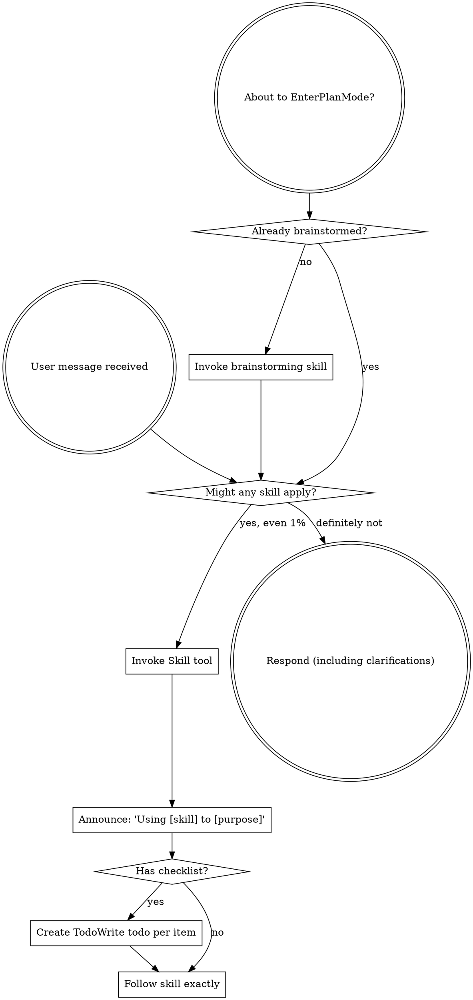

codex-exec: report contract violation

--- codex stdout ---
```markdown
---
schema_version: 2
phase: 147
plan: "147-01"
title: "Commit-Seam Gate"
model: codex
expected_ATC_tier: GATE
prior_errors_lookup: true
depends_on:
  - "146"
skip_gates: []
lessons_path: null
vtp_status: "success: 2 relevant hits"
lock_status: locked
locked_at: "2026-08-07T00:00:00+01:00"
locked_by: "codex-phase-planner"
risk_rating: high
rollback_plan: >
  Rollback does not pass through the commit gate. Uninstall by deleting the Git-resolved pre-commit hook file returned by
  `git -C <repo> rev-parse --git-path hooks/pre-commit`, but only when the file contains the SGSD-COMMIT-GATE marker.
  Leave unmarked hooks untouched. If block mode was explicitly activated, delete `.planning/config/commit-gate-mode.json`
  after removing the hook. Document this path in `super-gsd/docs/commit-gate.md` and in installer help; do not rely on a
  commit to perform rollback.
allowed_files:
  - ".planning/milestones/v3.5/phases/147-commit-seam-gate/147-01-PLAN-LOCKED.md"
  - ".planning/metrics/commit-gate-shadow.jsonl"
  - ".planning/config/commit-gate-mode.json"
  - "super-gsd/hooks/sgsd-commit-gate.cjs"
  - "super-gsd/scripts/lib/commit-gate-shadow-log.cjs"
  - "super-gsd/scripts/lib/commit-gate-shadow-report.cjs"
  - "super-gsd/scripts/lib/sgsd-artifact-conventions.cjs"
  - "super-gsd/scripts/install-commit-gate.cjs"
  - "super-gsd/install.sh"
  - "super-gsd/docs/commit-gate.md"
  - "super-gsd/tests/commit-gate/assert-real-commit-gate.cjs"
  - "<git-resolved-hooks-dir>/pre-commit when absent or SGSD-marked"
forbidden_files:
  - "super-gsd/registry/gates.yaml"
  - "super-gsd/hooks/gsd-atc-slice-gate.js"
  - ".git/config"
  - "~/.gitconfig"
  - "devcp/**"
invariants:
  - "Warn mode ships enabled by default; absence of `.planning/config/commit-gate-mode.json` means warn."
  - "Block mode activates only after explicit operator command and only when `--shadow-report` shows >=200 real payloads across GSDedits and devcp, both repos present, and false-block rate <5% per repo against each repo's discovered naming."
  - "Running `--shadow-report` never activates block mode by itself."
  - "`.sgsd-gate-off` skips block mode and logs the exact staged paths it waived."
  - "GSDedits plan evidence is `{NN}-*-PLAN-LOCKED.md` via `findPlanLockedFiles`; assurance evidence is `*-ATC-REVIEW*.md` in the active phase scope."
  - "Bare `PLAN.md` and `AUDIT.md` are false predicates and must not satisfy evidence."
  - "devcp artifact conventions are discovered at runtime from repo-local evidence/config; unknown convention warns/skips and can never block."
  - "The hook uses `git diff --cached --name-status -z --find-renames --find-copies --` for staged path evidence."
  - "Binary staged content is hashed, never embedded in shadow rows."
  - "Non-SGSD repos exit 0 and perform no arbitrary repo writes."
  - "Internal SGSD-repo errors fail open loudly and append degraded shadow rows with distinct reason_codes whenever a contained metrics path can be resolved."
  - "Every product writer obtains its destination via `resolveContainedPath` from `super-gsd/scripts/lib/sgsd-state.cjs`; the hook installer also contains the Git-returned hooks directory before writing `pre-commit`."
  - "Reuse `readState` frontmatter only, `findPlanLockedFiles` milestone scope, and envelope-v1 writer conventions; do not reimplement them."
  - "The commit gate is one governance layer only; `--no-verify` and some GUI clients can bypass it, and docs must not claim coverage it lacks."
anti_stub_policy:
  - "No verification command may pass by checking a `--self-test` flag or hardcoded output text."
  - "Acceptance fixtures create real temporary Git repos, stage real files, run the real installed or direct hook entrypoint, parse real `.planning/metrics/commit-gate-shadow.jsonl` rows, and assert fixture-specific field values including staged paths and hashes."
source_audit:
  - source: CONTEXT
    path: ".planning/milestones/v3.5/phases/147-commit-seam-gate/CONTEXT.md"
    status: success
    relevant_hits: 2
    citations:
      - "Warn mode is enabled first; block mode is earned only after >=200 real payloads and <5% false-block rate."
      - "Sentinel bypass is logged; rollback is hook-file removal; non-SGSD/error paths fail open."
  - source: RESEARCH
    path: ".planning/milestones/v3.5/phases/147-commit-seam-gate/147-RESEARCH.md"
    status: success
    relevant_hits: 2
    citations:
      - "Linked worktree resolves pre-commit to the common Git dir; installer must ask Git for path, honor `core.hooksPath`, and never silently set it."
      - "Use staged diff with NUL parsing; GSDedits predicates are `*-PLAN-LOCKED.md` and `*-ATC-REVIEW*.md`, not bare PLAN/AUDIT."
  - source: VTP-ENRICHMENT
    path: ".planning/milestones/v3.5/phases/147-commit-seam-gate/147-VTP-ENRICHMENT.md"
    status: success
    relevant_hits: 2
    vtp_available: true
    citations:
      - "Hit 1 validates flag-before-block and requires per-path evidence plus explicit logged override."
      - "Hit 4 validates the Swiss-cheese layer model; commit hook coverage must not be described as complete."
  - source: plan-schema-v2
    path: "super-gsd/templates/plan-schema-v2.json"
    status: success
    relevant_hits: 2
    citations:
      - "Requires `schema_version`, `semantic_acceptance_criteria`, and `tasks`."
      - "Each task must include id, agent, model, files_touched, input_contract, output_contract, hypothesis, falsifier, and stop_rule."
  - source: P146 plan
    path: ".planning/milestones/v3.5/phases/146-session-governance-hooks/146-01-PLAN-LOCKED.md"
    status: success
    relevant_hits: 2
    citations:
      - "Use schema-v2 locked-plan shape with top-level rollback, allowed files, invariants, semantic acceptance criteria, and serial task contracts."
      - "Carry forward the two defect classes: contained writer destinations and observable degradation rows."
design_decisions:
  - decision: "source_touching_predicate"
    value: >
      Source-touching means staged A/C/M/R/D/T paths in `super-gsd/**`, `.agents/**`, `.codex/**`,
      `.warp/workflows/**`, `custom-gsd-extract/**`, `package*.json`, and code/config extensions outside `.planning/**`.
      Exclude `.planning/**`, `.planning/metrics/**`, `docs/**`, root `README.md`, and report-only Markdown outside runtime dirs.
    false_positive_risks: >
      Markdown under `super-gsd/**` may warn because it travels with runtime code; governance config commits warn intentionally;
      executable payloads hidden under `.planning/**` are outside this seam and remain a separate control problem.
  - decision: "existing_hook_policy"
    value: >
      Create the hook if absent, refresh an SGSD-marked hook block if present, and refuse unmarked hooks without backup or chaining.
      The installer prints the Git-resolved path and manual rollback instructions.
  - decision: "linked_worktree_policy"
    value: >
      Ask Git for `hooks/pre-commit` and `core.hooksPath`; honor an existing hooksPath and never set it silently. In linked worktrees,
      print that the resolved common hook path is shared across worktrees before installation.
  - decision: "block_activation_storage"
    value: >
      Store explicit activation in `.planning/config/commit-gate-mode.json`, written only by `--activate-block` after a passing shadow report.
  - decision: "DEFERRED-F"
    value: >
      Mostly closed for staged commits because the gate reads the Git index, regardless of Bash redirect mutation path. Not closed for unstaged
      or uncommitted files; carried forward.
  - decision: "DEFERRED-G"
    value: >
      SessionStart contract trim remains separate and low-risk; do not include it in P147.
shared_file_ownership:
  - file: "super-gsd/tests/commit-gate/assert-real-commit-gate.cjs"
    owner: "T147-01"
    later_touch_policy: "Later tasks may add scenario functions only; T147-01 owns temp-repo helpers and assertion utilities."
  - file: ".planning/metrics/commit-gate-shadow.jsonl"
    owner: "T147-02"
    later_touch_policy: "Append-only through commit-gate-shadow-log writer or SGSD-marked POSIX bootstrap degradation row."
  - file: "super-gsd/hooks/sgsd-commit-gate.cjs"
    owner: "T147-03"
    later_touch_policy: "T147-04 may add report/activation CLI wiring; T147-05 may not change hook semantics."
  - file: ".planning/config/commit-gate-mode.json"
    owner: "T147-04"
    later_touch_policy: "Created only by explicit activation command after falsifier passes."
carried_forward:
  - id: "DEFERRED-F"
    status: "carried-forward"
    note: "Staged Bash-redirect mutations are mostly covered here; unstaged mutations remain out of scope."
  - id: "DEFERRED-G"
    status: "carried-forward"
    note: "SessionStart contract trim belongs in a separate low-risk phase."
  - id: "DEVIATION-W"
    status: "carried-forward"
    note: "Do not solve in P147."
acceptance_commands:
  - "node super-gsd/tools/plan-lock/validate-plan-locked.cjs --plan-file .planning/milestones/v3.5/phases/147-commit-seam-gate/147-01-PLAN-LOCKED.md"
  - >
    powershell -NoProfile -Command "foreach ($f in @('super-gsd/scripts/lib/sgsd-artifact-conventions.cjs','super-gsd/scripts/lib/commit-gate-shadow-log.cjs','super-gsd/scripts/lib/commit-gate-shadow-report.cjs','super-gsd/hooks/sgsd-commit-gate.cjs','super-gsd/scripts/install-commit-gate.cjs','super-gsd/tests/commit-gate/assert-real-commit-gate.cjs')) { node --check $f; if ($LASTEXITCODE -ne 0) { exit $LASTEXITCODE } }"
  - "node super-gsd/tests/commit-gate/assert-real-commit-gate.cjs --scenario artifact-conventions-source-predicate"
  - "node super-gsd/tests/commit-gate/assert-real-commit-gate.cjs --scenario shadow-ledger-contained-writer"
  - "node super-gsd/tests/commit-gate/assert-real-commit-gate.cjs --scenario hook-warn-sentinel-failopen"
  - "node super-gsd/tests/commit-gate/assert-real-commit-gate.cjs --scenario shadow-report-activation"
  - "node super-gsd/tests/commit-gate/assert-real-commit-gate.cjs --scenario installer-linked-worktree"
operator_checkpoints:
  - "After T147-05, operator reviews the Git-resolved hook path because this checkout uses a common linked-worktree hook directory."
  - "Before any real block-mode use, operator runs `--shadow-report` against GSDedits and devcp, reviews per-repo false-block rates, then runs the explicit activation command only if the falsifier passed."
semantic_acceptance_criteria:
  - input: >
      Two constructed temporary SGSD-shaped Git repos named GSDedits and devcp. Each repo stages one real source file with no active phase evidence
      and one docs-only negative-control commit. The installed pre-commit trampoline invokes the real `super-gsd/hooks/sgsd-commit-gate.cjs`.
    expected_outcome: >
      Source commits exit 0 in warn mode and append real shadow rows with `signal=commit_gate_shadow`, `mode=warn`, `source_touching=true`,
      `would_warn=true`, `would_block=false`, `repo_id` equal to the fixture repo, `phase=147`, `staged_paths[0].path` equal to the staged source path,
      and a non-empty `diff_sha256`. Docs-only negative controls exit 0 with `source_touching=false`, `would_warn=false`, and no missing-evidence reason.
    verification_cmd: "node super-gsd/tests/commit-gate/assert-real-commit-gate.cjs --scenario ac-warn-rows"
  - input: >
      A constructed temporary GSDedits Git repo whose active phase contains real files named `147-fixture-PLAN-LOCKED.md` and
      `147-ATC-REVIEW.md`, plus a negative-control repo containing only bare `PLAN.md` and `AUDIT.md`.
    expected_outcome: >
      The positive repo's shadow row records discovered plan and assurance paths using the real filenames and marks each source path
      `artifact_status=backed`. The negative repo does not accept bare PLAN/AUDIT names, records `artifact_status=missing_evidence`,
      and includes `reason_codes` containing `phase_evidence_missing`.
    verification_cmd: "node super-gsd/tests/commit-gate/assert-real-commit-gate.cjs --scenario ac-artifact-predicates"
  - input: >
      Constructed temporary GSDedits and devcp Git repos producing at least 200 real hook payload rows across both repos, with discovered
      repo-local artifact conventions and a false-block rate below 5% per repo, plus negative controls for 199 rows, exactly 5% false-blocks,
      and unknown devcp convention.
    expected_outcome: >
      `--shadow-report` mechanically reports `falsifier_passed=true` only for the >=200 and <5% case. It reports false with distinct reason codes
      for insufficient payloads, false-block rate >=5%, missing repo, or unknown convention. `--shadow-report` alone never writes
      `.planning/config/commit-gate-mode.json`; `--activate-block` writes it only after the passing report and records explicit operator activation.
    verification_cmd: "node super-gsd/tests/commit-gate/assert-real-commit-gate.cjs --scenario ac-shadow-report-activation"
  - input: >
      A constructed temporary SGSD-shaped Git repo with earned block mode activated, a staged source file lacking phase evidence, and a
      `.sgsd-gate-off` sentinel positive control paired with a no-sentinel negative control.
    expected_outcome: >
      With sentinel present, the commit exits 0, the shadow row has `status=skipped`, `reason_codes` containing `sentinel_waived_block`,
      and `waived_paths` exactly matching the staged source path. Without sentinel, the commit is refused by the hook, files remain intact in
      the worktree and index, and the row records `would_block=true` for the same path.
    verification_cmd: "node super-gsd/tests/commit-gate/assert-real-commit-gate.cjs --scenario ac-sentinel-block"
  - input: >
      A constructed non-SGSD Git repo and a constructed SGSD-shaped repo with injected Git/internal errors while staging real files.
    expected_outcome: >
      The non-SGSD repo exits 0, writes no arbitrary metrics file, and prints a loud non-SGSD warning. The SGSD error fixture exits 0,
      appends a degraded shadow row under `.planning/metrics/commit-gate-shadow.jsonl` with a distinct reason code such as `git_diff_failed`
      or `internal_error`, and never reports clean because it did nothing.
    verification_cmd: "node super-gsd/tests/commit-gate/assert-real-commit-gate.cjs --scenario ac-fail-open-degradation"
tasks:
  - id: "T147-01"
    type: "artifact-conventions-and-source-predicate"
    agent: "gsd-executor"
    model: "codex"
    depends_on: []
    files_touched:
      - "super-gsd/scripts/lib/sgsd-artifact-conventions.cjs"
      - "super-gsd/tests/commit-gate/assert-real-commit-gate.cjs"
    traces_to:
      - "AC-147a"
      - "AC-147c"
    verification_cmd: "node super-gsd/tests/commit-gate/assert-real-commit-gate.cjs --scenario artifact-conventions-source-predicate"
    input_contract: >
      Use RESEARCH Q3-Q5. Reuse `readState` and `findPlanLockedFiles`; do not parse STATE prose and do not hardcode devcp naming.
    output_contract: >
      Create artifact convention discovery/evaluation and the real temp Git fixture runner. GSDedits uses `findPlanLockedFiles` plus
      active-phase `*-ATC-REVIEW*.md`; devcp is runtime-discovered and returns `convention_unknown` when not provable. Implement the source-touching
      predicate and per-path evaluation records.
    hypothesis: >
      A single convention evaluator can distinguish backed source paths from missing-evidence paths without accepting the known false PLAN/AUDIT predicate.
    falsifier: >
      Bare `PLAN.md` or `AUDIT.md` satisfies evidence, devcp naming is hardcoded, source docs-only commits warn, or source paths under runtime/config
      fail to warn.
    stop_rule: >
      Fixture repos prove positive GSDedits naming, negative PLAN/AUDIT naming, source predicate positives, docs-only negatives, and devcp unknown
      warn/skip behavior.
    expected_ATC_tier: GATE

  - id: "T147-02"
    type: "shadow-ledger"
    agent: "gsd-executor"
    model: "codex"
    depends_on:
      - "T147-01"
    files_touched:
      - "super-gsd/scripts/lib/commit-gate-shadow-log.cjs"
      - ".planning/metrics/commit-gate-shadow.jsonl"
      - "super-gsd/tests/commit-gate/assert-real-commit-gate.cjs"
    traces_to:
      - "AC-147a"
      - "AC-147b"
      - "AC-147d"
    verification_cmd: "node super-gsd/tests/commit-gate/assert-real-commit-gate.cjs --scenario shadow-ledger-contained-writer"
    input_contract: >
      Use P146 envelope-v1 conventions and `resolveContainedPath`. Include VTP directive for per-path evidence in every shadow row.
    output_contract: >
      Create a never-throw append/read helper for `.planning/metrics/commit-gate-shadow.jsonl`. Rows include envelope-v1 fields plus
      `signal`, `repo_id`, `commit_candidate`, `diff_sha256`, `artifact_predicate_version`, `artifact_convention_status`, `staged_paths`,
      `would_warn`, `would_block`, `false_block_basis`, `waived_paths`, and distinct `reason_codes`.
    hypothesis: >
      Contained append-only shadow rows make degradation and false-block accounting observable without trusting stderr or a per-commit-only verdict.
    falsifier: >
      A writer accepts caller-supplied absolute destinations, writes outside the SGSD root, omits per-path evidence, embeds binary content, or treats a
      degraded path as clean.
    stop_rule: >
      The fixture proves contained writes, rejects path escape attempts, appends valid JSONL, records per-path source/evidence fields, and records a
      degraded row with a distinct reason code.
    expected_ATC_tier: GATE

  - id: "T147-03"
    type: "commit-hook-warn-sentinel-failopen"
    agent: "gsd-executor"
    model: "codex"
    depends_on:
      - "T147-02"
    files_touched:
      - "super-gsd/hooks/sgsd-commit-gate.cjs"
      - "super-gsd/tests/commit-gate/assert-real-commit-gate.cjs"
    traces_to:
      - "AC-147a"
      - "AC-147d"
    verification_cmd: "node super-gsd/tests/commit-gate/assert-real-commit-gate.cjs --scenario hook-warn-sentinel-failopen"
    input_contract: >
      Use RESEARCH Q1-Q3 and Q7-Q9. Hook invocation is one layer and must fail open on non-SGSD repos and internal errors.
    output_contract: >
      Implement the real hook entrypoint for warn mode, staged diff parsing with NUL-safe rename/copy handling, binary hashing, source predicate
      evaluation, sentinel detection, and fail-open degradation rows. The direct hook returns code 10 only for deliberate earned block decisions;
      warn, skip, non-SGSD, and internal-error paths return 0.
    hypothesis: >
      Reading the staged index at pre-commit time catches source-touching commits without touching source files and without blocking before block mode is earned.
    falsifier: >
      The hook reads unstaged files as evidence, blocks in warn mode, fails closed on Git/internal errors, omits sentinel waived paths, or cannot assert
      the staged path and hash values from real shadow rows.
    stop_rule: >
      Real temp commits in warn mode append expected shadow rows, docs-only commits do not warn, sentinel skip rows include exact waived paths, and
      injected failures exit 0 with degraded rows.
    expected_ATC_tier: GATE

  - id: "T147-04"
    type: "shadow-report-and-activation"
    agent: "gsd-executor"
    model: "codex"
    depends_on:
      - "T147-03"
    files_touched:
      - "super-gsd/scripts/lib/commit-gate-shadow-report.cjs"
      - "super-gsd/hooks/sgsd-commit-gate.cjs"
      - ".planning/config/commit-gate-mode.json"
      - "super-gsd/tests/commit-gate/assert-real-commit-gate.cjs"
    traces_to:
      - "AC-147b"
      - "AC-147c"
      - "AC-147d"
    verification_cmd: "node super-gsd/tests/commit-gate/assert-real-commit-gate.cjs --scenario shadow-report-activation"
    input_contract: >
      Use RESEARCH Q6 and VTP directives 1-2. Promotion is mechanical and explicit; unknown repo convention prevents block activation.
    output_contract: >
      Implement `--shadow-report` and explicit `--activate-block`. Report totals include real payloads, per-repo payload counts, source-touching counts,
      would-warn/would-block counts, false-block counts/rates per repo, malformed/skipped rows, sentinel skips, internal-error rows, and final falsifier
      verdict. Activation writes `.planning/config/commit-gate-mode.json` only after a passing report and never as a side effect of reporting.
    hypothesis: >
      Mechanical report-plus-explicit-activation prevents silent block promotion while still making earned block mode available after measured trust.
    falsifier: >
      Block activates with fewer than 200 real payloads, with only one repo present, with false-block rate >=5% in either repo, with unknown devcp convention,
      or merely by running `--shadow-report`.
    stop_rule: >
      Positive fixtures with >=200 real rows and <5% false-block per repo pass, negative fixtures fail with distinct reason codes, and activation storage
      changes only under the explicit activation command.
    expected_ATC_tier: GATE

  - id: "T147-05"
    type: "installer-trampoline-rollback-docs"
    agent: "gsd-executor"
    model: "codex"
    depends_on:
      - "T147-04"
    files_touched:
      - "super-gsd/scripts/install-commit-gate.cjs"
      - "super-gsd/install.sh"
      - "super-gsd/docs/commit-gate.md"
      - "super-gsd/tests/commit-gate/assert-real-commit-gate.cjs"
      - "<git-resolved-hooks-dir>/pre-commit when absent or SGSD-marked"
    traces_to:
      - "AC-147a"
      - "AC-147c"
      - "AC-147d"
    verification_cmd: "node super-gsd/tests/commit-gate/assert-real-commit-gate.cjs --scenario installer-linked-worktree"
    input_contract: >
      Use RESEARCH Q1 and Q7. This checkout is a linked worktree; `git rev-parse --git-path hooks/pre-commit` resolves to the common Git dir.
    output_contract: >
      Add an idempotent installer/uninstaller that asks Git for the hook path, honors existing `core.hooksPath`, never sets it silently, warns when the
      resolved path is shared by linked worktrees, installs a POSIX `#!/bin/sh` trampoline on Windows, refreshes only SGSD-marked hooks, and refuses
      unmarked hooks without backup. The trampoline invokes Node when available, maps direct hook exit code 10 to Git block exit 1, maps unexpected
      nonzero bootstrap failures to exit 0 with loud degradation, and writes a bootstrap degraded row to the installer-contained metrics path when possible.
      Document uninstall as removing the SGSD-marked hook file outside the gate path.
    hypothesis: >
      Git-derived, SGSD-marked installation gives commit-seam coverage without hijacking existing hooks, changing Git config, or creating a self-locking rollback.
    falsifier: >
      The installer writes an unmarked hook, silently sets `core.hooksPath`, executes `.cjs` directly on Windows, misses the linked-worktree shared-path warning,
      blocks because Node is missing, or documents rollback as a gated commit.
    stop_rule: >
      Temp linked-worktree fixtures prove absent-hook create, SGSD-marked refresh, unmarked-hook refusal with no modification, core.hooksPath honoring,
      POSIX trampoline content, Node-missing fail-open behavior, and documented remove-hook rollback.
    expected_ATC_tier: GATE
```

--- codex stderr ---
OpenAI Codex v0.146.0
--------
workdir: $env:USERPROFILE\AppData\Roaming\warp\Warp\data\worktrees\GSDedits\cholla-racer
model: gpt-5.5
provider: openai
approval: never
sandbox: read-only
reasoning effort: xhigh
reasoning summaries: none
session id: 019fdbfb-9fc9-7cc0-9b83-ac1ff864836e
--------
user
# P147 Planning — author 147-01-PLAN-LOCKED.md (schema-v2)

<intent milestone="v3.5">
Always-On Orchestration — governance as runtime mechanism in all session modes.
</intent>

Author ONE plan file. Write it to
`.planning/milestones/v3.5/phases/147-commit-seam-gate/147-01-PLAN-LOCKED.md`.
If the sandbox cannot write files, emit the COMPLETE file inside ONE fenced
```markdown block and say so. Output the plan ONLY — no commentary.
Do NOT re-derive the research. Do NOT run self-tests.

## Required reading
1. `.planning/milestones/v3.5/phases/147-commit-seam-gate/CONTEXT.md`
2. `.../147-RESEARCH.md` — Q1-Q9 answers are authoritative findings
3. `.../147-VTP-ENRICHMENT.md` — its 4 planner directives are BINDING
4. `super-gsd/templates/plan-schema-v2.json` — the plan MUST validate
5. `.planning/milestones/v3.5/phases/146-session-governance-hooks/146-01-PLAN-LOCKED.md`
   — SHAPE reference only (frontmatter keys, task structure)

## Source Audit (mandatory section)
One row per source: CONTEXT, RESEARCH, VTP-ENRICHMENT (status success, 2
relevant hits), plan-schema-v2, P146 plan. VTP is present — cite it.

## Hard requirements
**Schema:** YAML frontmatter validating against plan-schema-v2.json, INCLUDING
`semantic_acceptance_criteria` with REAL-DATA criteria and `rollback_plan`.
Every task needs id, type, hypothesis, falsifier, stop_rule, files_touched,
traces_to, depends_on, verification_cmd, expected_ATC_tier.

**⚠️ ANTI-STUB (the P146 plan-check REJECTED a first draft for this):**
No acceptance criterion may be satisfiable by a stub. Banned: asserting a
`--self-test` flag exits 0; asserting hardcoded output text. Required instead:
drive the REAL entrypoint against a CONSTRUCTED TEMP GIT REPO, and assert
values only a real read could produce. Pair every positive with a NEGATIVE
control. For this phase specifically: create a real temp git repo, stage real
files, run the real hook, and assert on the real shadow row's field values.

**Board-binding constraints (violating any = plan defect):**
- warn mode ships enabled; block mode CANNOT activate until the falsifier
  (≥200 real payloads across GSDedits AND devcp, false-block rate <5% per repo
  against each repo's ACTUAL naming) is met, and activation is an explicit
  operator step — never silent;
- `.sgsd-gate-off` sentinel skips block AND logs that it did;
- artifact predicates match REAL naming (`{NN}-*-PLAN-LOCKED.md` and
  `*-ATC-REVIEW*.md` here per RESEARCH Q4 — bare `PLAN.md`/`AUDIT.md` is known
  FALSE); devcp's convention is DISCOVERED at runtime, never hardcoded, and a
  repo whose convention is unknown must warn/skip and never block;
- rollback must NOT pass through the gate itself; uninstall = remove the hook
  file, documented;
- exit 0 in non-SGSD repos and on internal error — fail open, LOUDLY.

**VTP directives (binding):** per-PATH evidence in shadow rows (not just a
per-commit verdict) so the false-block rate is defensible; promotion stays
mechanical; the sentinel logs WHICH paths it waived; the phase must describe
the gate as ONE layer (RESEARCH Q9: `--no-verify` and some GUI clients bypass
hooks) and must not claim coverage it lacks.

**Carry P146's two recurring defect classes (11 CRITICALs) into the plan:**
- every writer obtains its destination via `resolveContainedPath` in
  `super-gsd/scripts/lib/sgsd-state.cjs` — never a caller-supplied path;
- degradation is observable: distinct reason codes + rows, never a bare stderr
  warn, never "clean because it did nothing".
Reuse `readState` (frontmatter only), `findPlanLockedFiles` (milestone-scoped),
and the envelope-v1 writer conventions. Do NOT reimplement them.

**RESEARCH findings the plan must honour:**
- this checkout is a LINKED WORKTREE: `git rev-parse --git-path hooks/pre-commit`
  resolves to the COMMON dir, so an installed hook is shared across worktrees.
  Say how the plan handles that (ask git for the path; honour existing
  `core.hooksPath`; never silently set it);
- Windows: install a POSIX `#!/bin/sh` trampoline invoking node; do not execute
  `.cjs` directly;
- existing-hook policy: create if absent, refresh an SGSD-marked block if
  present, refuse-or-backup an unmarked hook (decide and state which);
- staged evidence via `git diff --cached --name-status -z --find-renames`;
  binaries hashed, not embedded.

**Decide explicitly (RESEARCH §7):** the source-touching predicate and its
false-positive risks; whether DEFERRED-F (Bash-redirect mutations) is closed by
this seam for staged commits — RESEARCH says mostly yes, unstaged no; and
whether DEFERRED-G (SessionStart contract trim) belongs in this phase —
RESEARCH recommends keeping it separate and low-risk.

## Task decomposition
Follow RESEARCH §5 (4-7 tasks) unless you have concrete reason to differ.
Each task independently verifiable with a deterministic, Windows-safe,
network-free verification command. Give an explicit `depends_on` chain
producing ONE serial order (Codex executors are serial with exclusive workspace
writes), and name the OWNING task for every shared file.

Record as carried-forward, do NOT solve: DEFERRED-F, DEFERRED-G, DEVIATION-W.

Output: the plan file only.

exec
"C:\\WINDOWS\\System32\\WindowsPowerShell\\v1.0\\powershell.exe" -Command "Get-Content -LiteralPath '$env:USERPROFILE\\.codex\\skills\\using-superpowers\\SKILL.md' -Raw" in $env:USERPROFILE\AppData\Roaming\warp\Warp\data\worktrees\GSDedits\cholla-racer
exec
"C:\\WINDOWS\\System32\\WindowsPowerShell\\v1.0\\powershell.exe" -Command "Get-Content -LiteralPath '$env:USERPROFILE\\.codex\\skills\\writing-plans\\SKILL.md' -Raw" in $env:USERPROFILE\AppData\Roaming\warp\Warp\data\worktrees\GSDedits\cholla-racer
 succeeded in 922ms:
---
name: writing-plans
description: Use when you have a spec or requirements for a multi-step task, before touching code
---

# Writing Plans

## Overview

Write comprehensive implementation plans assuming the engineer has zero context for our codebase and questionable taste. Document everything they need to know: which files to touch for each task, code, testing, docs they might need to check, how to test it. Give them the whole plan as bite-sized tasks. DRY. YAGNI. TDD. Frequent commits.

Assume they are a skilled developer, but know almost nothing about our toolset or problem domain. Assume they don't know good test design very well.

**Announce at start:** "I'm using the writing-plans skill to create the implementation plan."

**Context:** If working in an isolated worktree, it should have been created via the `superpowers:using-git-worktrees` skill at execution time.

**Save plans to:** `docs/superpowers/plans/YYYY-MM-DD-<feature-name>.md`
- (User preferences for plan location override this default)

## Scope Check

If the spec covers multiple independent subsystems, it should have been broken into sub-project specs during brainstorming. If it wasn't, suggest breaking this into separate plans ƒ?" one per subsystem. Each plan should produce working, testable software on its own.

## File Structure

Before defining tasks, map out which files will be created or modified and what each one is responsible for. This is where decomposition decisions get locked in.

- Design units with clear boundaries and well-defined interfaces. Each file should have one clear responsibility.
- You reason best about code you can hold in context at once, and your edits are more reliable when files are focused. Prefer smaller, focused files over large ones that do too much.
- Files that change together should live together. Split by responsibility, not by technical layer.
- In existing codebases, follow established patterns. If the codebase uses large files, don't unilaterally restructure - but if a file you're modifying has grown unwieldy, including a split in the plan is reasonable.

This structure informs the task decomposition. Each task should produce self-contained changes that make sense independently.

## Bite-Sized Task Granularity

**Each step is one action (2-5 minutes):**
- "Write the failing test" - step
- "Run it to make sure it fails" - step
- "Implement the minimal code to make the test pass" - step
- "Run the tests and make sure they pass" - step
- "Commit" - step

## Plan Document Header

**Every plan MUST start with this header:**

```markdown
# [Feature Name] Implementation Plan

> **For agentic workers:** REQUIRED SUB-SKILL: Use superpowers:subagent-driven-development (recommended) or superpowers:executing-plans to implement this plan task-by-task. Steps use checkbox (`- [ ]`) syntax for tracking.

**Goal:** [One sentence describing what this builds]

**Architecture:** [2-3 sentences about approach]

**Tech Stack:** [Key technologies/libraries]

---
```

## Task Structure

````markdown
### Task N: [Component Name]

**Files:**
- Create: `exact/path/to/file.py`
- Modify: `exact/path/to/existing.py:123-145`
- Test: `tests/exact/path/to/test.py`

- [ ] **Step 1: Write the failing test**

```python
def test_specific_behavior():
    result = function(input)
    assert result == expected
```

- [ ] **Step 2: Run test to verify it fails**

Run: `pytest tests/path/test.py::test_name -v`
Expected: FAIL with "function not defined"

- [ ] **Step 3: Write minimal implementation**

```python
def function(input):
    return expected
```

- [ ] **Step 4: Run test to verify it passes**

Run: `pytest tests/path/test.py::test_name -v`
Expected: PASS

- [ ] **Step 5: Commit**

```bash
git add tests/path/test.py src/path/file.py
git commit -m "feat: add specific feature"
```
````

## No Placeholders

Every step must contain the actual content an engineer needs. These are **plan failures** ƒ?" never write them:
- "TBD", "TODO", "implement later", "fill in details"
- "Add appropriate error handling" / "add validation" / "handle edge cases"
- "Write tests for the above" (without actual test code)
- "Similar to Task N" (repeat the code ƒ?" the engineer may be reading tasks out of order)
- Steps that describe what to do without showing how (code blocks required for code steps)
- References to types, functions, or methods not defined in any task

## Remember
- Exact file paths always
- Complete code in every step ƒ?" if a step changes code, show the code
- Exact commands with expected output
- DRY, YAGNI, TDD, frequent commits

## Self-Review

After writing the complete plan, look at the spec with fresh eyes and check the plan against it. This is a checklist you run yourself ƒ?" not a subagent dispatch.

**1. Spec coverage:** Skim each section/requirement in the spec. Can you point to a task that implements it? List any gaps.

**2. Placeholder scan:** Search your plan for red flags ƒ?" any of the patterns from the "No Placeholders" section above. Fix them.

**3. Type consistency:** Do the types, method signatures, and property names you used in later tasks match what you defined in earlier tasks? A function called `clearLayers()` in Task 3 but `clearFullLayers()` in Task 7 is a bug.

If you find issues, fix them inline. No need to re-review ƒ?" just fix and move on. If you find a spec requirement with no task, add the task.

## Execution Handoff

After saving the plan, offer execution choice:

**"Plan complete and saved to `docs/superpowers/plans/<filename>.md`. Two execution options:**

**1. Subagent-Driven (recommended)** - I dispatch a fresh subagent per task, review between tasks, fast iteration

**2. Inline Execution** - Execute tasks in this session using executing-plans, batch execution with checkpoints

**Which approach?"**

**If Subagent-Driven chosen:**
- **REQUIRED SUB-SKILL:** Use superpowers:subagent-driven-development
- Fresh subagent per task + two-stage review

**If Inline Execution chosen:**
- **REQUIRED SUB-SKILL:** Use superpowers:executing-plans
- Batch execution with checkpoints for review

$env:USERPROFILE\OneDrive - John Cullen Lighting\Documents\WindowsPowerShell\profile.ps1 : Cannot dot-source this 
command because it was defined in a different language mode. To invoke this command without importing its contents, 
omit the '.' operator.
At line:1 char:1
+ . '$env:USERPROFILE\OneDrive - John Cullen Lighting\Documents\Win ...
+ ~~~~~~~~~~~~~~~~~~~~~~~~~~~~~~~~~~~~~~~~~~~~~~~~~~~~~~~~~~~~~~~~~~~~~
    + CategoryInfo          : InvalidOperation: (:) [profile.ps1], NotSupportedException
    + FullyQualifiedErrorId : DotSourceNotSupported,profile.ps1
 
$env:USERPROFILE\OneDrive - John Cullen Lighting\Documents\WindowsPowerShell\Microsoft.PowerShell_profile.ps1 : 
Cannot dot-source this command because it was defined in a different language mode. To invoke this command without 
importing its contents, omit the '.' operator.
At line:1 char:1
+ . '$env:USERPROFILE\OneDrive - John Cullen Lighting\Documents\Win ...
+ ~~~~~~~~~~~~~~~~~~~~~~~~~~~~~~~~~~~~~~~~~~~~~~~~~~~~~~~~~~~~~~~~~~~~~
    + CategoryInfo          : InvalidOperation: (:) [Microsoft.PowerShell_profile.ps1], NotSupportedException
    + FullyQualifiedErrorId : DotSourceNotSupported,Microsoft.PowerShell_profile.ps1
 

 succeeded in 931ms:
---
name: using-superpowers
description: Use when starting any conversation - establishes how to find and use skills, requiring Skill tool invocation before ANY response including clarifying questions
---

<SUBAGENT-STOP>
If you were dispatched as a subagent to execute a specific task, skip this skill.
</SUBAGENT-STOP>

<EXTREMELY-IMPORTANT>
If you think there is even a 1% chance a skill might apply to what you are doing, you ABSOLUTELY MUST invoke the skill.

IF A SKILL APPLIES TO YOUR TASK, YOU DO NOT HAVE A CHOICE. YOU MUST USE IT.

This is not negotiable. This is not optional. You cannot rationalize your way out of this.
</EXTREMELY-IMPORTANT>

## Instruction Priority

Superpowers skills override default system prompt behavior, but **user instructions always take precedence**:

1. **User's explicit instructions** (CLAUDE.md, GEMINI.md, AGENTS.md, direct requests) ƒ?" highest priority
2. **Superpowers skills** ƒ?" override default system behavior where they conflict
3. **Default system prompt** ƒ?" lowest priority

If CLAUDE.md, GEMINI.md, or AGENTS.md says "don't use TDD" and a skill says "always use TDD," follow the user's instructions. The user is in control.

## How to Access Skills

**In Claude Code:** Use the `Skill` tool. When you invoke a skill, its content is loaded and presented to youƒ?"follow it directly. Never use the Read tool on skill files.

**In Copilot CLI:** Use the `skill` tool. Skills are auto-discovered from installed plugins. The `skill` tool works the same as Claude Code's `Skill` tool.

**In Gemini CLI:** Skills activate via the `activate_skill` tool. Gemini loads skill metadata at session start and activates the full content on demand.

**In other environments:** Check your platform's documentation for how skills are loaded.

## Platform Adaptation

Skills use Claude Code tool names. Non-CC platforms: see `references/copilot-tools.md` (Copilot CLI), `references/codex-tools.md` (Codex) for tool equivalents. Gemini CLI users get the tool mapping loaded automatically via GEMINI.md.

# Using Skills

## The Rule

**Invoke relevant or requested skills BEFORE any response or action.** Even a 1% chance a skill might apply means that you should invoke the skill to check. If an invoked skill turns out to be wrong for the situation, you don't need to use it.



## Red Flags

These thoughts mean STOPƒ?"you're rationalizing:

| Thought | Reality |
|---------|---------|
| "This is just a simple question" | Questions are tasks. Check for skills. |
| "I need more context first" | Skill check comes BEFORE clarifying questions. |
| "Let me explore the codebase first" | Skills tell you HOW to explore. Check first. |
| "I can check git/files quickly" | Files lack conversation context. Check for skills. |
| "Let me gather information first" | Skills tell you HOW to gather information. |
| "This doesn't need a formal skill" | If a skill exists, use it. |
| "I remember this skill" | Skills evolve. Read current version. |
| "This doesn't count as a task" | Action = task. Check for skills. |
| "The skill is overkill" | Simple things become complex. Use it. |
| "I'll just do this one thing first" | Check BEFORE doing anything. |
| "This feels productive" | Undisciplined action wastes time. Skills prevent this. |
| "I know what that means" | Knowing the concept ƒ%ÿ using the skill. Invoke it. |

## Skill Priority

When multiple skills could apply, use this order:

1. **Process skills first** (brainstorming, debugging) - these determine HOW to approach the task
2. **Implementation skills second** (frontend-design, mcp-builder) - these guide execution

"Let's build X" ā' brainstorming first, then implementation skills.
"Fix this bug" ā' debugging first, then domain-specific skills.

## Skill Types

**Rigid** (TDD, debugging): Follow exactly. Don't adapt away discipline.

**Flexible** (patterns): Adapt principles to context.

The skill itself tells you which.

## User Instructions

Instructions say WHAT, not HOW. "Add X" or "Fix Y" doesn't mean skip workflows.

$env:USERPROFILE\OneDrive - John Cullen Lighting\Documents\WindowsPowerShell\profile.ps1 : Cannot dot-source this 
command because it was defined in a different language mode. To invoke this command without importing its contents, 
omit the '.' operator.
At line:1 char:1
+ . '$env:USERPROFILE\OneDrive - John Cullen Lighting\Documents\Win ...
+ ~~~~~~~~~~~~~~~~~~~~~~~~~~~~~~~~~~~~~~~~~~~~~~~~~~~~~~~~~~~~~~~~~~~~~
    + CategoryInfo          : InvalidOperation: (:) [profile.ps1], NotSupportedException
    + FullyQualifiedErrorId : DotSourceNotSupported,profile.ps1
 
$env:USERPROFILE\OneDrive - John Cullen Lighting\Documents\WindowsPowerShell\Microsoft.PowerShell_profile.ps1 : 
Cannot dot-source this command because it was defined in a different language mode. To invoke this command without 
importing its contents, omit the '.' operator.
At line:1 char:1
+ . '$env:USERPROFILE\OneDrive - John Cullen Lighting\Documents\Win ...
+ ~~~~~~~~~~~~~~~~~~~~~~~~~~~~~~~~~~~~~~~~~~~~~~~~~~~~~~~~~~~~~~~~~~~~~
    + CategoryInfo          : InvalidOperation: (:) [Microsoft.PowerShell_profile.ps1], NotSupportedException
    + FullyQualifiedErrorId : DotSourceNotSupported,Microsoft.PowerShell_profile.ps1
 

exec
"C:\\WINDOWS\\System32\\WindowsPowerShell\\v1.0\\powershell.exe" -Command "Get-Content -LiteralPath '.planning/milestones/v3.5/phases/147-commit-seam-gate/CONTEXT.md' -Raw" in $env:USERPROFILE\AppData\Roaming\warp\Warp\data\worktrees\GSDedits\cholla-racer
exec
"C:\\WINDOWS\\System32\\WindowsPowerShell\\v1.0\\powershell.exe" -Command "Get-Content -LiteralPath '.planning/milestones/v3.5/phases/147-commit-seam-gate/147-RESEARCH.md' -Raw" in $env:USERPROFILE\AppData\Roaming\warp\Warp\data\worktrees\GSDedits\cholla-racer
exec
"C:\\WINDOWS\\System32\\WindowsPowerShell\\v1.0\\powershell.exe" -Command "Get-Content -LiteralPath '.planning/milestones/v3.5/phases/147-commit-seam-gate/147-VTP-ENRICHMENT.md' -Raw" in $env:USERPROFILE\AppData\Roaming\warp\Warp\data\worktrees\GSDedits\cholla-racer
exec
"C:\\WINDOWS\\System32\\WindowsPowerShell\\v1.0\\powershell.exe" -Command "Get-Content -LiteralPath 'super-gsd/templates/plan-schema-v2.json' -Raw" in $env:USERPROFILE\AppData\Roaming\warp\Warp\data\worktrees\GSDedits\cholla-racer
exec
"C:\\WINDOWS\\System32\\WindowsPowerShell\\v1.0\\powershell.exe" -Command "Get-Content -LiteralPath '.planning/milestones/v3.5/phases/146-session-governance-hooks/146-01-PLAN-LOCKED.md' -Raw" in $env:USERPROFILE\AppData\Roaming\warp\Warp\data\worktrees\GSDedits\cholla-racer
 succeeded in 1081ms:
---
phase: "147"
slug: commit-seam-gate
milestone: v3.5
status: PENDING
design_ref: ".planning/analyses/2026-08-05-always-on-orchestration-DESIGN.md#p147"
depends_on: ["146"]
---

# P147 Context ƒ?" Commit-Seam Gate (warn ƒÅ' earned block)

## Goal

The eventual blocking control lives at the commit seam (board architect's third
design): `super-gsd/hooks/sgsd-commit-gate.cjs` as installer-managed git
pre-commit hook. One invocation per commit, full `git diff --cached` evidence,
failure mode "commit refused, files intact" ƒ?" never "cannot touch source".

## Behaviour

- **Warn mode (ships enabled):** source-touching commit without phase evidence
  (PLAN-LOCKED + ATC/AUDIT artifacts for active phase) ā' loud governance warning
  + shadow row in `.planning/metrics/commit-gate-shadow.jsonl`.
- **Block mode (earned only):** activates ONLY when
  `sgsd-commit-gate.cjs --shadow-report` shows the board falsifier met:
  ƒ%¾200 real payloads across GSDedits AND devcp, false-block rate <5% against
  each repo's actual artifact naming. Activation is an explicit operator step
  informed by the report ƒ?" never silent.
- **Sentinel:** `.sgsd-gate-off` skips block and logs that it did.

## Constraints (board-binding)

- Artifact predicates must match REAL naming per repo ({NN}-*-PLAN-LOCKED.md
  here; devcp's own convention discovered, not assumed ƒ?" the original plan's
  PLAN.md/AUDIT.md predicate was false-positive on day one).
- Rollback path must not pass through the gate itself (board: self-locking
  rollback). Uninstall = remove hook file; documented.
- Hook must exit 0 in non-SGSD repos and on internal error (fail open, loudly).

## Acceptance criteria

AC-147 (a)(b)(c)(d) from the design spec.

$env:USERPROFILE\OneDrive - John Cullen Lighting\Documents\WindowsPowerShell\profile.ps1 : Cannot dot-source this 
command because it was defined in a different language mode. To invoke this command without importing its contents, 
omit the '.' operator.
At line:1 char:1
+ . '$env:USERPROFILE\OneDrive - John Cullen Lighting\Documents\Win ...
+ ~~~~~~~~~~~~~~~~~~~~~~~~~~~~~~~~~~~~~~~~~~~~~~~~~~~~~~~~~~~~~~~~~~~~~
    + CategoryInfo          : InvalidOperation: (:) [profile.ps1], NotSupportedException
    + FullyQualifiedErrorId : DotSourceNotSupported,profile.ps1
 
$env:USERPROFILE\OneDrive - John Cullen Lighting\Documents\WindowsPowerShell\Microsoft.PowerShell_profile.ps1 : 
Cannot dot-source this command because it was defined in a different language mode. To invoke this command without 
importing its contents, omit the '.' operator.
At line:1 char:1
+ . '$env:USERPROFILE\OneDrive - John Cullen Lighting\Documents\Win ...
+ ~~~~~~~~~~~~~~~~~~~~~~~~~~~~~~~~~~~~~~~~~~~~~~~~~~~~~~~~~~~~~~~~~~~~~
    + CategoryInfo          : InvalidOperation: (:) [Microsoft.PowerShell_profile.ps1], NotSupportedException
    + FullyQualifiedErrorId : DotSourceNotSupported,Microsoft.PowerShell_profile.ps1
 

 succeeded in 1003ms:
---
schema_version: 2
phase: 146
plan: "146-01"
title: "Session Governance Hooks"
model: codex
expected_ATC_tier: GATE
prior_errors_lookup: true
depends_on: []
skip_gates: []
lessons_path: null
vtp_status: "success: 2 relevant hits"
lock_status: locked
locked_at: "2026-08-06T00:00:00+01:00"
locked_by: "codex-phase-planner"
risk_rating: high
rollback_plan: >
  Revert this plan's allowed file changes, remove only P146 hook entries from
  the target repo-local .claude/settings.json, leave ~/.claude/settings.json
  untouched, and rerun the P146 acceptance commands to confirm hooks are absent
  or fail open.
allowed_files:
  - ".planning/milestones/v3.5/phases/146-session-governance-hooks/146-01-PLAN-LOCKED.md"
  - ".planning/STATE.md"
  - ".claude/settings.json"
  - ".planning/metrics/gate-evidence.jsonl"
  - "super-gsd/registry/session-governance-hooks.yaml"
  - "super-gsd/scripts/lib/sgsd-state.cjs"
  - "super-gsd/scripts/lib/gate-evidence-log.cjs"
  - "super-gsd/hooks/sgsd-session-start.js"
  - "super-gsd/hooks/sgsd-intent-classifier.cjs"
  - "super-gsd/hooks/sgsd-quality-gate.js"
  - "super-gsd/install.sh"
  - "super-gsd/scripts/merge-settings.js"
  - "super-gsd/config/settings-overlay.json"
  - "super-gsd/config/repo-settings-overlay.json"
  - "super-gsd/scripts/sgsd-stop-handoff.sh"
  - "super-gsd/tools/autopilot-watchdog/check.cjs"
  - "super-gsd/tools/cockpit-state/adapter.cjs"
  - "super-gsd/tools/warp-mcp/server.cjs"
  - "super-gsd/config/**/*.json"
  - "super-gsd/config/**/*.yaml"
forbidden_files:
  - "~/.claude/settings.json"
  - "~/.claude/hooks/**"
  - "super-gsd/registry/gates.yaml"
  - "super-gsd/hooks/gsd-atc-slice-gate.js"
  - "devcp/**"
invariants:
  - "No edit-seam blocking anywhere. PostToolUse quality gate is report-only and never emits block decisions."
  - "Every hook has narrow try/catch boundaries; unexpected SGSD-repo errors append a failure row and exit 0."
  - "Every hook exits quiet 0 when root-walk finds no .planning directory."
  - "No hook or installer path reads ~/.claude/settings.json or copies any env block from it."
  - "Installer writes repo-local .claude/settings.json only; never write machine-global Claude settings."
  - "Hook command paths are resolved at install time from the target repo. Source files contain no hardcoded machine paths."
  - "Classifier is local Node only, performs no LLM call, routes to SGSD skills, and never judges semantic truth."
  - "Classifier p95 latency must be under 1000 ms; the recorded target is millisecond-level overhead."
  - "Hook rules are declarative and registry-driven so P149 skill-routing.yaml can be swapped in with one registry-source line change."
  - "Quality-gate evidence uses .planning/metrics/gate-evidence.jsonl as a new stream with envelope-v1 shape."
  - "AC-146c requires both evidence writer and cockpit reader wiring in this phase."
  - "Mutation tool names must be confirmed in this harness before matching; do not add MultiEdit unless confirmed."
  - "Do not duplicate SGSD gates or edit super-gsd/registry/gates.yaml."
acceptance_commands:
  - "node super-gsd/tools/plan-lock/validate-plan-locked.cjs --plan-file .planning/milestones/v3.5/phases/146-session-governance-hooks/146-01-PLAN-LOCKED.md"
  - >
    powershell -NoProfile -Command "foreach ($f in @('super-gsd/scripts/lib/sgsd-state.cjs','super-gsd/scripts/lib/gate-evidence-log.cjs','super-gsd/hooks/sgsd-session-start.js','super-gsd/hooks/sgsd-intent-classifier.cjs','super-gsd/hooks/sgsd-quality-gate.js')) { node --check $f; if ($LASTEXITCODE -ne 0) { exit $LASTEXITCODE } }"
  - "node super-gsd/scripts/merge-settings.js --self-test-repo-local-hooks"
  - >
    powershell -NoProfile -Command "1..200 | ForEach-Object { '{\"hook_event_name\":\"UserPromptSubmit\",\"prompt\":\"How should we plan this?\"}' | node super-gsd/hooks/sgsd-intent-classifier.cjs > $null; if ($LASTEXITCODE -ne 0) { exit $LASTEXITCODE } }"
  - "node super-gsd/hooks/sgsd-intent-classifier.cjs --bench --iterations 200 --prompt \"How should we plan this?\" --record .planning/metrics/gate-evidence.jsonl"
  - "node super-gsd/hooks/sgsd-quality-gate.js --self-test-report-only-missing-plan --record .planning/metrics/gate-evidence.jsonl"
  - "node super-gsd/tools/cockpit-state/adapter.cjs --self-test-gate-evidence-reader"
  - "bash -n super-gsd/scripts/sgsd-stop-handoff.sh"
  - >
    powershell -NoProfile -Command "rg 'checkpoint_threshold_percent|context_warning_percent|context_warnings|gsd-atc-slice-gate.js' super-gsd --glob '!**/*.md'; if ($LASTEXITCODE -eq 0) { exit 1 } elseif ($LASTEXITCODE -eq 1) { exit 0 } else { exit $LASTEXITCODE }"
operator_checkpoints:
  - "After T146-02, operator reviews generated repo-local .claude/settings.json for absolute target-repo paths and absence of secrets."
  - "After T146-04, operator records the classifier p95_ms value from gate-evidence.jsonl before phase review."
  - "After T146-05, operator confirms cockpit displays the quality-gate evidence signal within one refresh."
semantic_acceptance_criteria:
  - input: >
      A real SessionStart hook payload executed against a constructed temporary SGSD-shaped repo whose STATE frontmatter declares current_phase "873".
    expected_outcome: >
      The hook exits 0 and injects a first-response governance contract containing the ATC tier table, v3.5 milestone, and the fixture-derived active phase 873 with no operator action.
    verification_cmd: >
      powershell -NoProfile -Command '$tmp=Join-Path ([IO.Path]::GetTempPath()) ("sgsd-ac146a-" + [guid]::NewGuid()); try { $planning=Join-Path $tmp ".planning"; New-Item -ItemType Directory -Path $planning -Force | Out-Null; @("---","milestone: v3.5","current_phase: `"873`"","---","# Fixture") | Set-Content -LiteralPath (Join-Path $planning "STATE.md") -Encoding UTF8; $payload=@{hook_event_name="SessionStart";cwd=$tmp;source="startup";session_id="ac146a"} | ConvertTo-Json -Compress; $out=$payload | node super-gsd/hooks/sgsd-session-start.js; if ($LASTEXITCODE -ne 0) { exit $LASTEXITCODE }; $text=($out -join "`n"); if ($text -notmatch "Governance Contract" -or $text -notmatch "ATC" -or $text -notmatch "v3.5" -or $text -notmatch "873") { exit 1 } } finally { if ($tmp -like (Join-Path ([IO.Path]::GetTempPath()) "sgsd-ac146a-*")) { Remove-Item -LiteralPath $tmp -Recurse -Force } }'
  - input: >
      Real UserPromptSubmit hook payloads executed against a constructed temporary SGSD-shaped repo: one planning prompt and one trivial execution prompt.
    expected_outcome: >
      The classifier exits 0, emits a visible /sgsd-triage directive only for the planning prompt, emits no directive for the trivial prompt, and records routing without making semantic judgments.
    verification_cmd: >
      powershell -NoProfile -Command '$tmp=Join-Path ([IO.Path]::GetTempPath()) ("sgsd-ac146b-" + [guid]::NewGuid()); try { $planning=Join-Path $tmp ".planning"; New-Item -ItemType Directory -Path $planning -Force | Out-Null; @("---","milestone: v3.5","current_phase: `"874`"","---","# Fixture") | Set-Content -LiteralPath (Join-Path $planning "STATE.md") -Encoding UTF8; $posPayload=@{hook_event_name="UserPromptSubmit";cwd=$tmp;prompt="Can you plan the next phase and write the implementation plan?";session_id="ac146b-pos"} | ConvertTo-Json -Compress; $pos=$posPayload | node super-gsd/hooks/sgsd-intent-classifier.cjs; if ($LASTEXITCODE -ne 0) { exit $LASTEXITCODE }; $posText=($pos -join "`n"); if ($posText -notmatch "/sgsd-triage" -or $posText -match "decision.:.block") { exit 1 }; $negPayload=@{hook_event_name="UserPromptSubmit";cwd=$tmp;prompt="Please read README.md and report the first heading.";session_id="ac146b-neg"} | ConvertTo-Json -Compress; $neg=$negPayload | node super-gsd/hooks/sgsd-intent-classifier.cjs; if ($LASTEXITCODE -ne 0) { exit $LASTEXITCODE }; $negText=($neg -join "`n"); if ($negText -match "/sgsd-triage" -or $negText -match "decision.:.block") { exit 1 } } finally { if ($tmp -like (Join-Path ([IO.Path]::GetTempPath()) "sgsd-ac146b-*")) { Remove-Item -LiteralPath $tmp -Recurse -Force } }'
  - input: >
      A real PostToolUse source-edit payload naming a real edited file in a temporary SGSD-shaped repo whose STATE frontmatter declares current_phase "999" and whose phase has no matching PLAN-LOCKED file.
    expected_outcome: >
      The quality gate exits 0, appends a missing-plan row to that fixture's gate-evidence.jsonl with phase 999 and the edited file path, and the cockpit reader consumes that same row as a visible governance signal.
    verification_cmd: >
      powershell -NoProfile -Command '$tmp=Join-Path ([IO.Path]::GetTempPath()) ("sgsd-ac146c-" + [guid]::NewGuid()); try { New-Item -ItemType Directory -Path (Join-Path $tmp ".planning\metrics"),(Join-Path $tmp ".planning\milestones\v3.5\phases\999-fixture"),(Join-Path $tmp "src") -Force | Out-Null; @("---","milestone: v3.5","current_phase: `"999`"","---","# Fixture") | Set-Content -LiteralPath (Join-Path $tmp ".planning\STATE.md") -Encoding UTF8; $edit=Join-Path $tmp "src\edited.js"; "module.exports = 1;" | Set-Content -LiteralPath $edit -Encoding UTF8; $record=Join-Path $tmp ".planning\metrics\gate-evidence.jsonl"; $payload=@{hook_event_name="PostToolUse";cwd=$tmp;tool_name="Edit";tool_input=@{file_path=$edit};session_id="ac146c"} | ConvertTo-Json -Depth 8 -Compress; $out=$payload | node super-gsd/hooks/sgsd-quality-gate.js; if ($LASTEXITCODE -ne 0) { exit $LASTEXITCODE }; if (($out -join "").Trim().Length -gt 0) { exit 1 }; if (!(Test-Path -LiteralPath $record)) { exit 1 }; $rows=Get-Content -LiteralPath $record | ForEach-Object { $_ | ConvertFrom-Json }; $row=$rows | Where-Object { $_.signal -eq "missing_plan" -and $_.phase -eq "999" -and $_.file_path -eq $edit -and $_.tool_name -eq "Edit" } | Select-Object -Last 1; if (-not $row) { exit 1 }; $snapJson=node super-gsd/tools/cockpit-state/adapter.cjs --json --project $tmp; if ($LASTEXITCODE -ne 0) { exit $LASTEXITCODE }; $snapText=($snapJson -join "`n"); if ($snapText -notmatch "missing_plan" -or $snapText -notmatch "999" -or $snapText -notmatch [regex]::Escape($edit)) { exit 1 } } finally { if ($tmp -like (Join-Path ([IO.Path]::GetTempPath()) "sgsd-ac146c-*")) { Remove-Item -LiteralPath $tmp -Recurse -Force } }'
  - input: >
      SessionStart, UserPromptSubmit, and PostToolUse payloads whose cwd is a normal directory with no .planning ancestor.
    expected_outcome: >
      All hooks exit 0 quietly, write no SGSD metrics, and emit no governance context.
    verification_cmd: >
      powershell -NoProfile -Command '$tmp=Join-Path ([IO.Path]::GetTempPath()) ("sgsd-nonrepo-" + [guid]::NewGuid()); $record=".planning\metrics\gate-evidence.jsonl"; $before=0; if (Test-Path -LiteralPath $record) { $before=(Get-Content -LiteralPath $record).Count }; try { New-Item -ItemType Directory -Path $tmp | Out-Null; foreach ($pair in @(@("sgsd-session-start.js","SessionStart"),@("sgsd-intent-classifier.cjs","UserPromptSubmit"),@("sgsd-quality-gate.js","PostToolUse"))) { $payload=@{hook_event_name=$pair[1];cwd=$tmp;prompt="hello";tool_name="Edit";tool_input=@{file_path="x.txt"};session_id="ac146d"} | ConvertTo-Json -Depth 5 -Compress; $out=$payload | node (Join-Path "super-gsd/hooks" $pair[0]); if ($LASTEXITCODE -ne 0) { exit $LASTEXITCODE }; if (($out -join "").Trim().Length -gt 0) { exit 1 } }; $after=0; if (Test-Path -LiteralPath $record) { $after=(Get-Content -LiteralPath $record).Count }; if ($after -ne $before) { exit 1 } } finally { if ($tmp -like (Join-Path ([IO.Path]::GetTempPath()) "sgsd-nonrepo-*")) { Remove-Item -LiteralPath $tmp -Recurse -Force } }'
  - input: >
      Two hundred real UserPromptSubmit planning prompts run through the local Node classifier in this repo.
    expected_outcome: >
      The benchmark exits 0, records an intent_classifier_bench row in gate-evidence.jsonl with iterations 200, and that row's p95_ms value is present and below 1000 ms.
    verification_cmd: >
      powershell -NoProfile -Command '$record=".planning\metrics\gate-evidence.jsonl"; node super-gsd/hooks/sgsd-intent-classifier.cjs --bench --iterations 200 --prompt "How should we plan this?" --record $record; if ($LASTEXITCODE -ne 0) { exit $LASTEXITCODE }; if (!(Test-Path -LiteralPath $record)) { exit 1 }; $row=Get-Content -LiteralPath $record | ForEach-Object { $_ | ConvertFrom-Json } | Where-Object { $_.signal -eq "intent_classifier_bench" -and $_.iterations -eq 200 } | Select-Object -Last 1; if (-not $row -or $null -eq $row.p95_ms -or [double]$row.p95_ms -ge 1000) { exit 1 }'
  - input: >
      Repo-local hook installation into a target repo with a fake home settings file containing env-like secret sentinel keys.
    expected_outcome: >
      The installer writes only target .claude/settings.json, uses install-time absolute target-repo paths in hook args, and does not copy or read home env values.
    verification_cmd: "node super-gsd/scripts/merge-settings.js --self-test-repo-local-hooks"
tasks:
  - id: "T146-01"
    type: "shared-helper"
    agent: "gsd-executor"
    model: "codex"
    depends_on: []
    files_touched:
      - ".planning/STATE.md"
      - "super-gsd/scripts/lib/sgsd-state.cjs"
      - "super-gsd/scripts/lib/gate-evidence-log.cjs"
      - ".planning/metrics/gate-evidence.jsonl"
    traces_to:
      - "AC-146a"
      - "AC-146c"
      - "AC-146d"
    acceptance_commands:
      - >
        powershell -NoProfile -Command "foreach ($f in @('super-gsd/scripts/lib/sgsd-state.cjs','super-gsd/scripts/lib/gate-evidence-log.cjs')) { node --check $f; if ($LASTEXITCODE -ne 0) { exit $LASTEXITCODE } }"
    verification_cmd: >
      powershell -NoProfile -Command "foreach ($f in @('super-gsd/scripts/lib/sgsd-state.cjs','super-gsd/scripts/lib/gate-evidence-log.cjs')) { node --check $f; if ($LASTEXITCODE -ne 0) { exit $LASTEXITCODE } }; node -e 'const s=require(\"./super-gsd/scripts/lib/sgsd-state.cjs\"); const root=s.findSgsdRoot(process.cwd()); const st=s.readState(root); if (!root || !st || st.milestone !== \"v3.5\") process.exit(1); if (st.phaseSource === \"status_prose\") process.exit(2);'"
    input_contract: >
      Use RESEARCH Q3/Q6/Q9 and CONTEXT constraints. Canonical STATE frontmatter phase key is current_phase. Keep legacy phase as read-only compatibility. Do not parse prose status.
    output_contract: >
      Add shared SGSD root, STATE frontmatter, active phase, PLAN-LOCKED glob, and gate-evidence envelope writer helpers. Add current_phase: "146" to .planning/STATE.md if absent so this phase has canonical frontmatter data. T146-01 owns creation/update of super-gsd/scripts/lib/sgsd-state.cjs, super-gsd/scripts/lib/gate-evidence-log.cjs, and .planning/metrics/gate-evidence.jsonl; later tasks consume helpers and append envelope-v1 rows only.
    hypothesis: >
      A shared resolver and never-throw evidence writer remove duplicated phase parsing while giving hooks and watchdog one deterministic fail-open path.
    falsifier: >
      Any caller parses prose status for a phase, throws in a non-SGSD repo, writes malformed JSONL, or cannot distinguish missing phase frontmatter from a real phase.
    stop_rule: >
      Node syntax checks pass, resolver reads milestone v3.5 from real STATE frontmatter without prose parsing, and gate-evidence writer can append envelope-v1 rows without throwing.
    expected_ATC_tier: GATE

  - id: "T146-02"
    type: "repo-local-installer"
    agent: "gsd-executor"
    model: "codex"
    depends_on:
      - "T146-01"
    files_touched:
      - ".claude/settings.json"
      - "super-gsd/install.sh"
      - "super-gsd/scripts/merge-settings.js"
      - "super-gsd/config/settings-overlay.json"
      - "super-gsd/config/repo-settings-overlay.json"
    traces_to:
      - "AC-146a"
      - "AC-146b"
      - "AC-146c"
      - "AC-146d"
    acceptance_commands:
      - "node super-gsd/scripts/merge-settings.js --self-test-repo-local-hooks"
      - >
        powershell -NoProfile -Command "Select-String -Path .claude/settings.json -Pattern 'SessionStart','UserPromptSubmit','PostToolUse' | Out-Null"
    verification_cmd: "node super-gsd/scripts/merge-settings.js --self-test-repo-local-hooks"
    input_contract: >
      Use RESEARCH Q1/Q2/Q7. Preserve merge-settings idempotency by command plus matcher, but target <repo>/.claude/settings.json only.
    output_contract: >
      Install SessionStart, UserPromptSubmit, and PostToolUse hook entries into repo-local .claude/settings.json using command: node and install-time absolute target-repo script paths in args. T146-02 owns repo-local hook installation entries in .claude/settings.json and hook overlay config; later cleanup may remove unrelated dead config knobs but must not rewrite hook entries.
    hypothesis: >
      Repo-local install-time hook wiring gives SGSD always-on governance without reading home Claude settings or depending on runtime project-dir expansion.
    falsifier: >
      The installer writes ~/.claude/settings.json, copies env keys from a home settings fixture, emits hardcoded machine paths from source, duplicates hook entries, or omits any of the three hook events.
    stop_rule: >
      Self-test installs into a temp target, proves home settings are untouched, proves no env sentinel is copied, and confirms all hook args resolve under the target repo.
    expected_ATC_tier: GATE

  - id: "T146-03"
    type: "session-start-hook"
    agent: "gsd-executor"
    model: "codex"
    depends_on:
      - "T146-02"
    files_touched:
      - "super-gsd/hooks/sgsd-session-start.js"
      - ".planning/metrics/gate-evidence.jsonl"
    traces_to:
      - "AC-146a"
      - "AC-146d"
    acceptance_commands:
      - >
        powershell -NoProfile -Command '$tmp=Join-Path ([IO.Path]::GetTempPath()) ("sgsd-t146-03-" + [guid]::NewGuid()); try { $planning=Join-Path $tmp ".planning"; New-Item -ItemType Directory -Path $planning -Force | Out-Null; @("---","milestone: v3.5","current_phase: `"873`"","---","# Fixture") | Set-Content -LiteralPath (Join-Path $planning "STATE.md") -Encoding UTF8; $payload=@{hook_event_name="SessionStart";cwd=$tmp;source="startup";session_id="t146-03"} | ConvertTo-Json -Compress; $out=$payload | node super-gsd/hooks/sgsd-session-start.js; if ($LASTEXITCODE -ne 0) { exit $LASTEXITCODE }; $text=($out -join "`n"); if ($text -notmatch "Governance Contract" -or $text -notmatch "ATC" -or $text -notmatch "v3.5" -or $text -notmatch "873") { exit 1 } } finally { if ($tmp -like (Join-Path ([IO.Path]::GetTempPath()) "sgsd-t146-03-*")) { Remove-Item -LiteralPath $tmp -Recurse -Force } }'
    verification_cmd: >
      powershell -NoProfile -Command '$tmp=Join-Path ([IO.Path]::GetTempPath()) ("sgsd-t146-03-" + [guid]::NewGuid()); try { $planning=Join-Path $tmp ".planning"; New-Item -ItemType Directory -Path $planning -Force | Out-Null; @("---","milestone: v3.5","current_phase: `"873`"","---","# Fixture") | Set-Content -LiteralPath (Join-Path $planning "STATE.md") -Encoding UTF8; $payload=@{hook_event_name="SessionStart";cwd=$tmp;source="startup";session_id="t146-03"} | ConvertTo-Json -Compress; $out=$payload | node super-gsd/hooks/sgsd-session-start.js; if ($LASTEXITCODE -ne 0) { exit $LASTEXITCODE }; $text=($out -join "`n"); if ($text -notmatch "Governance Contract" -or $text -notmatch "ATC" -or $text -notmatch "v3.5" -or $text -notmatch "873") { exit 1 } } finally { if ($tmp -like (Join-Path ([IO.Path]::GetTempPath()) "sgsd-t146-03-*")) { Remove-Item -LiteralPath $tmp -Recurse -Force } }'
    input_contract: >
      Use Claude hook stdout/additionalContext behavior from RESEARCH Q1 and active phase resolver from T146-01.
    output_contract: >
      SessionStart injects the governance contract with ATC tier table, gate table, mode confirmation note, and active milestone/phase read from the payload cwd repo. Non-SGSD cwd exits quiet 0. Consume shared helpers owned by T146-01; append only state_phase_missing evidence rows to .planning/metrics/gate-evidence.jsonl when SGSD STATE frontmatter lacks a phase.
    hypothesis: >
      Injecting the contract from the runtime hook makes governance visible in manual sessions before the model can omit or reinterpret prompt-resident instructions.
    falsifier: >
      An sg-launched SessionStart payload produces no first-turn governance context, lacks active milestone/phase, blocks the session, or emits context in a non-SGSD directory.
    stop_rule: >
      Temporary-repo SessionStart payload prints the contract with fixture phase 873 and non-SGSD payload exits 0 with empty output.
    expected_ATC_tier: GATE

  - id: "T146-04"
    type: "intent-classifier"
    agent: "gsd-executor"
    model: "codex"
    depends_on:
      - "T146-03"
    files_touched:
      - "super-gsd/hooks/sgsd-intent-classifier.cjs"
      - "super-gsd/registry/session-governance-hooks.yaml"
      - ".planning/metrics/gate-evidence.jsonl"
    traces_to:
      - "AC-146b"
      - "AC-146d"
    acceptance_commands:
      - >
        powershell -NoProfile -Command '$tmp=Join-Path ([IO.Path]::GetTempPath()) ("sgsd-t146-04-" + [guid]::NewGuid()); try { $planning=Join-Path $tmp ".planning"; New-Item -ItemType Directory -Path $planning -Force | Out-Null; @("---","milestone: v3.5","current_phase: `"874`"","---","# Fixture") | Set-Content -LiteralPath (Join-Path $planning "STATE.md") -Encoding UTF8; $posPayload=@{hook_event_name="UserPromptSubmit";cwd=$tmp;prompt="Can you plan the next phase and write the implementation plan?";session_id="t146-04-pos"} | ConvertTo-Json -Compress; $pos=$posPayload | node super-gsd/hooks/sgsd-intent-classifier.cjs; if ($LASTEXITCODE -ne 0) { exit $LASTEXITCODE }; $posText=($pos -join "`n"); if ($posText -notmatch "/sgsd-triage" -or $posText -match "decision.:.block") { exit 1 }; $negPayload=@{hook_event_name="UserPromptSubmit";cwd=$tmp;prompt="Please read README.md and report the first heading.";session_id="t146-04-neg"} | ConvertTo-Json -Compress; $neg=$negPayload | node super-gsd/hooks/sgsd-intent-classifier.cjs; if ($LASTEXITCODE -ne 0) { exit $LASTEXITCODE }; $negText=($neg -join "`n"); if ($negText -match "/sgsd-triage" -or $negText -match "decision.:.block") { exit 1 } } finally { if ($tmp -like (Join-Path ([IO.Path]::GetTempPath()) "sgsd-t146-04-*")) { Remove-Item -LiteralPath $tmp -Recurse -Force } }'
      - >
        powershell -NoProfile -Command '$record=".planning\metrics\gate-evidence.jsonl"; node super-gsd/hooks/sgsd-intent-classifier.cjs --bench --iterations 200 --prompt "How should we plan this?" --record $record; if ($LASTEXITCODE -ne 0) { exit $LASTEXITCODE }; if (!(Test-Path -LiteralPath $record)) { exit 1 }; $row=Get-Content -LiteralPath $record | ForEach-Object { $_ | ConvertFrom-Json } | Where-Object { $_.signal -eq "intent_classifier_bench" -and $_.iterations -eq 200 } | Select-Object -Last 1; if (-not $row -or $null -eq $row.p95_ms -or [double]$row.p95_ms -ge 1000) { exit 1 }'
    verification_cmd: >
      powershell -NoProfile -Command '$tmp=Join-Path ([IO.Path]::GetTempPath()) ("sgsd-t146-04-" + [guid]::NewGuid()); try { $planning=Join-Path $tmp ".planning"; New-Item -ItemType Directory -Path $planning -Force | Out-Null; @("---","milestone: v3.5","current_phase: `"874`"","---","# Fixture") | Set-Content -LiteralPath (Join-Path $planning "STATE.md") -Encoding UTF8; $posPayload=@{hook_event_name="UserPromptSubmit";cwd=$tmp;prompt="Can you plan the next phase and write the implementation plan?";session_id="t146-04-pos"} | ConvertTo-Json -Compress; $pos=$posPayload | node super-gsd/hooks/sgsd-intent-classifier.cjs; if ($LASTEXITCODE -ne 0) { exit $LASTEXITCODE }; $posText=($pos -join "`n"); if ($posText -notmatch "/sgsd-triage" -or $posText -match "decision.:.block") { exit 1 }; $negPayload=@{hook_event_name="UserPromptSubmit";cwd=$tmp;prompt="Please read README.md and report the first heading.";session_id="t146-04-neg"} | ConvertTo-Json -Compress; $neg=$negPayload | node super-gsd/hooks/sgsd-intent-classifier.cjs; if ($LASTEXITCODE -ne 0) { exit $LASTEXITCODE }; $negText=($neg -join "`n"); if ($negText -match "/sgsd-triage" -or $negText -match "decision.:.block") { exit 1 } } finally { if ($tmp -like (Join-Path ([IO.Path]::GetTempPath()) "sgsd-t146-04-*")) { Remove-Item -LiteralPath $tmp -Recurse -Force } }; $record=".planning\metrics\gate-evidence.jsonl"; node super-gsd/hooks/sgsd-intent-classifier.cjs --bench --iterations 200 --prompt "How should we plan this?" --record $record; if ($LASTEXITCODE -ne 0) { exit $LASTEXITCODE }; $row=Get-Content -LiteralPath $record | ForEach-Object { $_ | ConvertFrom-Json } | Where-Object { $_.signal -eq "intent_classifier_bench" -and $_.iterations -eq 200 } | Select-Object -Last 1; if (-not $row -or $null -eq $row.p95_ms -or [double]$row.p95_ms -ge 1000) { exit 1 }'
    input_contract: >
      Use RESEARCH Q5 trigger inventory and VTP directive 1. The registry shape is trigger, predicate, enforcement, with embedded defaults until P149 skill-routing.yaml exists.
    output_contract: >
      Add a local Node UserPromptSubmit classifier that lowercases prompt text, applies registry-backed lexical routes, injects /sgsd-triage for planning intent, suggests neglected SGSD skills, and records p95_ms benchmark rows. T146-04 owns creation of super-gsd/registry/session-governance-hooks.yaml; later tasks may only register their hook-specific sections. Append only intent_classifier_bench rows to .planning/metrics/gate-evidence.jsonl owned by T146-01.
    hypothesis: >
      Declarative lexical routing gives manual sessions visible governance nudges at millisecond-level overhead while leaving semantic judgment to /sgsd-triage and other SGSD skills.
    falsifier: >
      The classifier calls an LLM, blocks prompts, judges plan quality itself, misses a planning-shaped prompt, cannot switch registry source with one line for P149, or records p95_ms >= 1000.
    stop_rule: >
      Planning prompt emits /sgsd-triage, trivial execution prompt does not emit /sgsd-triage, neglected-skill prompts route to the named skill suggestion, non-SGSD cwd exits quiet 0, and the 200-iteration bench records p95_ms below 1000.
    expected_ATC_tier: GATE

  - id: "T146-05"
    type: "quality-gate-producer"
    agent: "gsd-executor"
    model: "codex"
    depends_on:
      - "T146-04"
    files_touched:
      - "super-gsd/hooks/sgsd-quality-gate.js"
      - "super-gsd/registry/session-governance-hooks.yaml"
      - ".planning/metrics/gate-evidence.jsonl"
    traces_to:
      - "AC-146c"
      - "AC-146d"
    acceptance_commands:
      - >
        powershell -NoProfile -Command '$tmp=Join-Path ([IO.Path]::GetTempPath()) ("sgsd-t146-05-" + [guid]::NewGuid()); try { New-Item -ItemType Directory -Path (Join-Path $tmp ".planning\metrics"),(Join-Path $tmp ".planning\milestones\v3.5\phases\999-fixture"),(Join-Path $tmp "src") -Force | Out-Null; @("---","milestone: v3.5","current_phase: `"999`"","---","# Fixture") | Set-Content -LiteralPath (Join-Path $tmp ".planning\STATE.md") -Encoding UTF8; $edit=Join-Path $tmp "src\edited.js"; "module.exports = 1;" | Set-Content -LiteralPath $edit -Encoding UTF8; $record=Join-Path $tmp ".planning\metrics\gate-evidence.jsonl"; $payload=@{hook_event_name="PostToolUse";cwd=$tmp;tool_name="Edit";tool_input=@{file_path=$edit};session_id="t146-05"} | ConvertTo-Json -Depth 8 -Compress; $out=$payload | node super-gsd/hooks/sgsd-quality-gate.js; if ($LASTEXITCODE -ne 0) { exit $LASTEXITCODE }; if (($out -join "").Trim().Length -gt 0) { exit 1 }; $rows=Get-Content -LiteralPath $record | ForEach-Object { $_ | ConvertFrom-Json }; $row=$rows | Where-Object { $_.signal -eq "missing_plan" -and $_.phase -eq "999" -and $_.file_path -eq $edit -and $_.tool_name -eq "Edit" } | Select-Object -Last 1; if (-not $row) { exit 1 }; $before=(Get-Content -LiteralPath $record).Count; $badPayload=@{hook_event_name="PostToolUse";cwd=$tmp;tool_name="UnconfirmedMutator";tool_input=@{file_path=$edit};session_id="t146-05-unknown"} | ConvertTo-Json -Depth 8 -Compress; $badOut=$badPayload | node super-gsd/hooks/sgsd-quality-gate.js; if ($LASTEXITCODE -ne 0) { exit $LASTEXITCODE }; if (($badOut -join "").Trim().Length -gt 0) { exit 1 }; $after=(Get-Content -LiteralPath $record).Count; if ($after -ne $before) { exit 1 } } finally { if ($tmp -like (Join-Path ([IO.Path]::GetTempPath()) "sgsd-t146-05-*")) { Remove-Item -LiteralPath $tmp -Recurse -Force } }'
    verification_cmd: >
      powershell -NoProfile -Command '$tmp=Join-Path ([IO.Path]::GetTempPath()) ("sgsd-t146-05-" + [guid]::NewGuid()); try { New-Item -ItemType Directory -Path (Join-Path $tmp ".planning\metrics"),(Join-Path $tmp ".planning\milestones\v3.5\phases\999-fixture"),(Join-Path $tmp "src") -Force | Out-Null; @("---","milestone: v3.5","current_phase: `"999`"","---","# Fixture") | Set-Content -LiteralPath (Join-Path $tmp ".planning\STATE.md") -Encoding UTF8; $edit=Join-Path $tmp "src\edited.js"; "module.exports = 1;" | Set-Content -LiteralPath $edit -Encoding UTF8; $record=Join-Path $tmp ".planning\metrics\gate-evidence.jsonl"; $payload=@{hook_event_name="PostToolUse";cwd=$tmp;tool_name="Edit";tool_input=@{file_path=$edit};session_id="t146-05"} | ConvertTo-Json -Depth 8 -Compress; $out=$payload | node super-gsd/hooks/sgsd-quality-gate.js; if ($LASTEXITCODE -ne 0) { exit $LASTEXITCODE }; if (($out -join "").Trim().Length -gt 0) { exit 1 }; $rows=Get-Content -LiteralPath $record | ForEach-Object { $_ | ConvertFrom-Json }; $row=$rows | Where-Object { $_.signal -eq "missing_plan" -and $_.phase -eq "999" -and $_.file_path -eq $edit -and $_.tool_name -eq "Edit" } | Select-Object -Last 1; if (-not $row) { exit 1 }; $before=(Get-Content -LiteralPath $record).Count; $badPayload=@{hook_event_name="PostToolUse";cwd=$tmp;tool_name="UnconfirmedMutator";tool_input=@{file_path=$edit};session_id="t146-05-unknown"} | ConvertTo-Json -Depth 8 -Compress; $badOut=$badPayload | node super-gsd/hooks/sgsd-quality-gate.js; if ($LASTEXITCODE -ne 0) { exit $LASTEXITCODE }; if (($badOut -join "").Trim().Length -gt 0) { exit 1 }; $after=(Get-Content -LiteralPath $record).Count; if ($after -ne $before) { exit 1 } } finally { if ($tmp -like (Join-Path ([IO.Path]::GetTempPath()) "sgsd-t146-05-*")) { Remove-Item -LiteralPath $tmp -Recurse -Force } }'
    input_contract: >
      Use RESEARCH Q1/Q6/Q9 and VTP directive 4. The confirmed PostToolUse file-mutation tool_name matcher for this harness is exactly Edit, Write, NotebookEdit. There is no MultiEdit in this harness.
    output_contract: >
      Add a report-only PostToolUse quality gate that resolves active phase from STATE frontmatter, checks real PLAN-LOCKED naming, and appends missing-plan evidence rows. Register only Edit, Write, and NotebookEdit in super-gsd/registry/session-governance-hooks.yaml owned by T146-04. Unknown tool name means no row, exit 0, and never block. Append only to .planning/metrics/gate-evidence.jsonl owned by T146-01.
    hypothesis: >
      Evidence rows give AC-146c report-only source-edit observability without violating the board's no edit-seam blocking constraint, and T146-06 makes those rows visible to cockpit and MCP consumers.
    falsifier: >
      The hook blocks or exits nonzero on edits, logs no row for a missing active-phase plan, matches unconfirmed mutation tools, emits a row for an unknown tool name, or includes MultiEdit in this harness.
    stop_rule: >
      Temporary SGSD-shaped repo with no active PLAN receives a confirmed Edit payload, appends a row whose phase and file_path match the fixture, and an unknown tool payload exits 0 without appending a row.
    expected_ATC_tier: GATE

  - id: "T146-06"
    type: "cockpit-gate-evidence-reader"
    agent: "gsd-executor"
    model: "codex"
    depends_on:
      - "T146-05"
    files_touched:
      - "super-gsd/tools/cockpit-state/adapter.cjs"
      - "super-gsd/tools/warp-mcp/server.cjs"
    traces_to:
      - "AC-146c"
    acceptance_commands:
      - >
        powershell -NoProfile -Command '$tmp=Join-Path ([IO.Path]::GetTempPath()) ("sgsd-t146-06-" + [guid]::NewGuid()); try { New-Item -ItemType Directory -Path (Join-Path $tmp ".planning\metrics"),(Join-Path $tmp ".planning\milestones\v3.5\phases\999-fixture"),(Join-Path $tmp "src") -Force | Out-Null; @("---","milestone: v3.5","current_phase: `"999`"","---","# Fixture") | Set-Content -LiteralPath (Join-Path $tmp ".planning\STATE.md") -Encoding UTF8; $edit=Join-Path $tmp "src\edited.js"; "module.exports = 1;" | Set-Content -LiteralPath $edit -Encoding UTF8; $payload=@{hook_event_name="PostToolUse";cwd=$tmp;tool_name="Edit";tool_input=@{file_path=$edit};session_id="t146-06"} | ConvertTo-Json -Depth 8 -Compress; $out=$payload | node super-gsd/hooks/sgsd-quality-gate.js; if ($LASTEXITCODE -ne 0) { exit $LASTEXITCODE }; $snapJson=node super-gsd/tools/cockpit-state/adapter.cjs --json --project $tmp; if ($LASTEXITCODE -ne 0) { exit $LASTEXITCODE }; $snapText=($snapJson -join "`n"); if ($snapText -notmatch "missing_plan" -or $snapText -notmatch "999" -or $snapText -notmatch [regex]::Escape($edit)) { exit 1 }; $req=@{jsonrpc="2.0";method="tools/call";id=1;params=@{name="sgsd_cockpit_snapshot";arguments=@{project_dir=$tmp}}} | ConvertTo-Json -Depth 10 -Compress; $mcpJson=$req | node super-gsd/tools/warp-mcp/server.cjs --stdio; if ($LASTEXITCODE -ne 0) { exit $LASTEXITCODE }; $mcpText=($mcpJson -join "`n"); if ($mcpText -notmatch "missing_plan" -or $mcpText -notmatch "999" -or $mcpText -notmatch [regex]::Escape($edit)) { exit 1 } } finally { if ($tmp -like (Join-Path ([IO.Path]::GetTempPath()) "sgsd-t146-06-*")) { Remove-Item -LiteralPath $tmp -Recurse -Force } }'
    verification_cmd: >
      powershell -NoProfile -Command '$tmp=Join-Path ([IO.Path]::GetTempPath()) ("sgsd-t146-06-" + [guid]::NewGuid()); try { New-Item -ItemType Directory -Path (Join-Path $tmp ".planning\metrics"),(Join-Path $tmp ".planning\milestones\v3.5\phases\999-fixture"),(Join-Path $tmp "src") -Force | Out-Null; @("---","milestone: v3.5","current_phase: `"999`"","---","# Fixture") | Set-Content -LiteralPath (Join-Path $tmp ".planning\STATE.md") -Encoding UTF8; $edit=Join-Path $tmp "src\edited.js"; "module.exports = 1;" | Set-Content -LiteralPath $edit -Encoding UTF8; $payload=@{hook_event_name="PostToolUse";cwd=$tmp;tool_name="Edit";tool_input=@{file_path=$edit};session_id="t146-06"} | ConvertTo-Json -Depth 8 -Compress; $out=$payload | node super-gsd/hooks/sgsd-quality-gate.js; if ($LASTEXITCODE -ne 0) { exit $LASTEXITCODE }; $snapJson=node super-gsd/tools/cockpit-state/adapter.cjs --json --project $tmp; if ($LASTEXITCODE -ne 0) { exit $LASTEXITCODE }; $snapText=($snapJson -join "`n"); if ($snapText -notmatch "missing_plan" -or $snapText -notmatch "999" -or $snapText -notmatch [regex]::Escape($edit)) { exit 1 }; $req=@{jsonrpc="2.0";method="tools/call";id=1;params=@{name="sgsd_cockpit_snapshot";arguments=@{project_dir=$tmp}}} | ConvertTo-Json -Depth 10 -Compress; $mcpJson=$req | node super-gsd/tools/warp-mcp/server.cjs --stdio; if ($LASTEXITCODE -ne 0) { exit $LASTEXITCODE }; $mcpText=($mcpJson -join "`n"); if ($mcpText -notmatch "missing_plan" -or $mcpText -notmatch "999" -or $mcpText -notmatch [regex]::Escape($edit)) { exit 1 } } finally { if ($tmp -like (Join-Path ([IO.Path]::GetTempPath()) "sgsd-t146-06-*")) { Remove-Item -LiteralPath $tmp -Recurse -Force } }'
    input_contract: >
      Use RESEARCH Q1/Q6/Q9 and VTP directive 4. Consume gate-evidence rows produced by T146-05 through the existing cockpit adapter and MCP snapshot surfaces.
    output_contract: >
      Expose missing-plan gate-evidence rows through cockpit adapter and MCP reader output. This task reads .planning/metrics/gate-evidence.jsonl owned by T146-01 and must not create, append, or rewrite that stream.
    hypothesis: >
      Cockpit and MCP visibility gives AC-146c observability without changing the report-only quality-gate semantics.
    falsifier: >
      The cockpit adapter cannot surface the row within one refresh, MCP output disagrees with the adapter, the reader writes to gate-evidence.jsonl, or missing evidence degrades the whole snapshot instead of only the governance signal.
    stop_rule: >
      A row emitted by the real T146-05 hook in a temporary fixture appears in adapter --json output and in the sgsd_cockpit_snapshot MCP response with the same phase and file_path.
    expected_ATC_tier: GATE

  - id: "T146-07"
    type: "cheap-fixes-cleanup"
    agent: "gsd-executor"
    model: "codex"
    depends_on:
      - "T146-06"
    files_touched:
      - "super-gsd/scripts/sgsd-stop-handoff.sh"
      - "super-gsd/tools/autopilot-watchdog/check.cjs"
      - "super-gsd/config/settings-overlay.json"
      - "super-gsd/config/**/*.json"
      - "super-gsd/config/**/*.yaml"
    traces_to:
      - "AC-146c"
      - "AC-146d"
    acceptance_commands:
      - "bash -n super-gsd/scripts/sgsd-stop-handoff.sh"
      - "node super-gsd/tools/autopilot-watchdog/check.cjs --self-test-phase-resolution"
      - >
        powershell -NoProfile -Command "rg 'checkpoint_threshold_percent|context_warning_percent|context_warnings|gsd-atc-slice-gate.js' super-gsd --glob '!**/*.md'; if ($LASTEXITCODE -eq 0) { exit 1 } elseif ($LASTEXITCODE -eq 1) { exit 0 } else { exit $LASTEXITCODE }"
    verification_cmd: >
      powershell -NoProfile -Command "bash -n super-gsd/scripts/sgsd-stop-handoff.sh; if ($LASTEXITCODE -ne 0) { exit $LASTEXITCODE }; node super-gsd/tools/autopilot-watchdog/check.cjs --self-test-phase-resolution; if ($LASTEXITCODE -ne 0) { exit $LASTEXITCODE }; rg 'checkpoint_threshold_percent|context_warning_percent|context_warnings|gsd-atc-slice-gate.js' super-gsd --glob '!**/*.md'; if ($LASTEXITCODE -eq 0) { exit 1 } elseif ($LASTEXITCODE -eq 1) { exit 0 } else { exit $LASTEXITCODE }"
    input_contract: >
      Use RESEARCH Q4/Q8 and CONTEXT cheap-fix list. Keep DEVIATION-W out of this task because research did not prove it is a few-line isolated codex-exec.sh fix.
    output_contract: >
      Reset handoff-chain latch when latest valid row is reason refused, move autopilot-watchdog phase resolution to shared STATE frontmatter helper, unregister dead gsd-atc-slice-gate.js references, and delete dead token/context config knobs from live config. Changes to super-gsd/config/settings-overlay.json are cleanup-only and must not rewrite T146-02 repo-local hook entries.
    hypothesis: >
      These bounded cleanups remove known always-on governance distortions without changing gate semantics or widening P146 beyond session governance hooks.
    falsifier: >
      Refused handoff rows still preserve stale depth, watchdog reads phase from prose regex, dead hook registration remains live, or dead config knobs remain under super-gsd runtime config.
    stop_rule: >
      Shell syntax passes, watchdog phase self-test proves frontmatter resolution, and runtime config grep finds no dead knobs or dead hook registration.
    expected_ATC_tier: GATE

$env:USERPROFILE\OneDrive - John Cullen Lighting\Documents\WindowsPowerShell\profile.ps1 : Cannot dot-source this 
command because it was defined in a different language mode. To invoke this command without importing its contents, 
omit the '.' operator.
At line:1 char:1
+ . '$env:USERPROFILE\OneDrive - John Cullen Lighting\Documents\Win ...
+ ~~~~~~~~~~~~~~~~~~~~~~~~~~~~~~~~~~~~~~~~~~~~~~~~~~~~~~~~~~~~~~~~~~~~~
    + CategoryInfo          : InvalidOperation: (:) [profile.ps1], NotSupportedException
    + FullyQualifiedErrorId : DotSourceNotSupported,profile.ps1
 
$env:USERPROFILE\OneDrive - John Cullen Lighting\Documents\WindowsPowerShell\Microsoft.PowerShell_profile.ps1 : 
Cannot dot-source this command because it was defined in a different language mode. To invoke this command without 
importing its contents, omit the '.' operator.
At line:1 char:1
+ . '$env:USERPROFILE\OneDrive - John Cullen Lighting\Documents\Win ...
+ ~~~~~~~~~~~~~~~~~~~~~~~~~~~~~~~~~~~~~~~~~~~~~~~~~~~~~~~~~~~~~~~~~~~~~
    + CategoryInfo          : InvalidOperation: (:) [Microsoft.PowerShell_profile.ps1], NotSupportedException
    + FullyQualifiedErrorId : DotSourceNotSupported,Microsoft.PowerShell_profile.ps1
 

 succeeded in 1039ms:
---
phase: "147"
artifact: VTP-ENRICHMENT
gate: Step 6.b.5
status: success
vtp_available: true
tool_used: mcp__vtp-kb__vtp_search_substrate
queries: 1
empty_hit: false
---

# P147 VTP Enrichment ƒ?" Commit-Seam Gate

## Hit 1 ƒ?" flag-before-block is an already-adjudicated pattern here (score 0.52)
`wiki/meetings/call-with-stephani-andersen.md`, "Block procurement until TBC
explicitly confirmed ƒ?" MODIFY (DK 18)".

The JCL triage verdict on a structurally identical proposal:

> "MODIFY ƒ?" strong direction, but **blocking is risky without graceful failure
> mode. The correct first step is *flag* not *block***: TBC-laden sales orders
> enter procurement queue with a visible warning + designer must explicitly tick
> 'release ... despite TBCs'. **Build trust in the flag first, then promote to
> hard block once false-positive rate is known.**"

This is P147's warnā'earned-block design arrived at independently in a different
domain, and it validates the board's ƒ%¾200-payload / <5%-false-block falsifier as
the promotion criterion rather than a gut call.

**The sharper transferable idea ƒ?" granularity.** That verdict's decisive move was
"the gate is **per-line not per-order**; non-TBC lines flow normally", with the
Stripe payment-method-pending pattern cited as the cleanest analog: proceed for
verified items, hold for unverified, surface both states distinctly ƒ?"
"**avoids the false binary of 'block everything' vs 'block nothing'**".

Applied to the commit seam: the natural implementation is per-COMMIT binary
(any unbacked source path ā' warn/block the whole commit). The precedent argues
for per-PATH reporting ƒ?" name the specific staged paths lacking phase evidence
rather than condemning the commit wholesale. This matters for false-block rate:
a commit touching 30 files where 1 lacks evidence is a very different signal
from one where 30 do, and a binary verdict throws that information away right
when `--shadow-report` needs it to compute a meaningful rate.

**Override must be explicit and logged.** The verdict pairs blocking with "override
available with documented ... reason logged for audit". P147's `.sgsd-gate-off`
sentinel is the analogue and CONTEXT already requires it be logged ƒ?" keep that
binding, and record WHICH paths the override waived.

## Hit 4 ƒ?" Swiss cheese model (Reason 1990), Design of Everyday Things (score 0.10)
Layered redundant protection: no single barrier is expected to catch everything.
Directly relevant to RESEARCH Q9's honest finding that `--no-verify` and some
IDE/GUI clients bypass hooks entirely. The commit seam is ONE layer beside
P146's PostToolUse observation and the orchestrator's own gates ƒ?" it should be
designed and described as such, never as a guarantee. Overclaiming here would
be its own governance defect.

## Hits 2-3 ƒ?" not relevant (pipeline-status tables). Discarded.

## Planner directives
1. Record per-PATH evidence in shadow rows, not just a per-commit verdict, so
   `--shadow-report` can compute a defensible false-block rate.
2. Keep block-mode promotion mechanical (the board falsifier), never a judgment
   call ƒ?" the precedent's whole point is that trust is earned from measured
   false-positive rate.
3. `.sgsd-gate-off` must log the waived paths, not merely that it fired.
4. Describe the gate as one layer among several. RESEARCH Q9 shows `--no-verify`
   bypasses it; the phase must not claim coverage it does not have.

$env:USERPROFILE\OneDrive - John Cullen Lighting\Documents\WindowsPowerShell\profile.ps1 : Cannot dot-source this 
command because it was defined in a different language mode. To invoke this command without importing its contents, 
omit the '.' operator.
At line:1 char:1
+ . '$env:USERPROFILE\OneDrive - John Cullen Lighting\Documents\Win ...
+ ~~~~~~~~~~~~~~~~~~~~~~~~~~~~~~~~~~~~~~~~~~~~~~~~~~~~~~~~~~~~~~~~~~~~~
    + CategoryInfo          : InvalidOperation: (:) [profile.ps1], NotSupportedException
    + FullyQualifiedErrorId : DotSourceNotSupported,profile.ps1
 
$env:USERPROFILE\OneDrive - John Cullen Lighting\Documents\WindowsPowerShell\Microsoft.PowerShell_profile.ps1 : 
Cannot dot-source this command because it was defined in a different language mode. To invoke this command without 
importing its contents, omit the '.' operator.
At line:1 char:1
+ . '$env:USERPROFILE\OneDrive - John Cullen Lighting\Documents\Win ...
+ ~~~~~~~~~~~~~~~~~~~~~~~~~~~~~~~~~~~~~~~~~~~~~~~~~~~~~~~~~~~~~~~~~~~~~
    + CategoryInfo          : InvalidOperation: (:) [Microsoft.PowerShell_profile.ps1], NotSupportedException
    + FullyQualifiedErrorId : DotSourceNotSupported,Microsoft.PowerShell_profile.ps1
 

 succeeded in 1058ms:
---
phase: "147"
artifact: RESEARCH
provider: openai-codex (gpt-5.5/xhigh)
wrapper_exit: 6 (contract-vocab mismatch ƒ?" codex-exec enforces the 5-line ATC
  contract on every --step; research body is valid. 354KB raw stream discarded.)
---

**1. AC-147 Verbatim**
> **AC-147:** (a) warn rows accumulate on real commits in both repos; (b)  
> `--shadow-report` computes the falsifier verdict mechanically; (c) block mode  
> cannot activate before the falsifier passes; (d) sentinel bypass is logged.

Source: `.planning/analyses/2026-08-05-always-on-orchestration-DESIGN.md:101-103`.

**2. Q1-Q9**
Q1. Git hook install: this checkout is a linked worktree: `.git:1` points to `$HOME/GSDedits/.git/worktrees/cholla-racer`, and `git rev-parse --git-path hooks/pre-commit` resolves to the common dir `$HOME/GSDedits/.git/hooks/pre-commit`. `core.hooksPath` is unset. Installer should ask Git for the hook path, honor existing `core.hooksPath`, and not silently set it. Default hook install here is shared across worktrees. On Windows, install a POSIX `#!/bin/sh` trampoline that calls `node "<repo>/super-gsd/hooks/sgsd-commit-gate.cjs"`; do not rely on executing `.cjs` directly. Existing hook policy: create if absent, refresh SGSD marked block if present, refuse or explicitly chain/backup unmarked hooks. Rollback must be ƒ?oremove hook file,ƒ?? per `.planning/.../CONTEXT.md:36-38`.

Q2. Use staged-only Git evidence:
`git diff --cached --name-status -z --find-renames --find-copies --`
for NUL-safe path/status parsing, and stream-hash:
`git diff --cached --binary --full-index --no-ext-diff --no-color --`
for complete staged evidence. Renames/copies have old+new paths; deletes still count by old path; binary diff should be hashed, not embedded in JSON. Cost is O(staged diff bytes), acceptable at commit seam per board rationale `.planning/decisions/2026-08-02-always-on-gate-substrate.md:125-128`.

Q3. ƒ?oSource-touchingƒ??: any staged A/C/M/R/D/T path in runtime/config surfaces: `super-gsd/**`, `.agents/**`, `.codex/**`, `.warp/workflows/**`, `custom-gsd-extract/**`, `package*.json`, plus code/config extensions outside `.planning/**`. Exclude `.planning/**`, `.planning/metrics/**`, `docs/**`, root `README.md`, report-only Markdown outside runtime dirs. Risks: docs under `super-gsd/**` may warn; governance config commits are intentionally source; excluding `.planning/**` may miss malicious executable payloads placed there.

Q4. GSDedits predicate: use `readState()` frontmatter only and `findPlanLockedFiles(root, state.phase, state.milestone)`. Helpers already implement real containment and milestone scope: `sgsd-state.cjs:76-98`, `:162-184`, `:194-198`, `:244-262`. Current canonical state still says `current_phase: "146"` (`.planning/STATE.md:3-7`), and the helper finds `.planning/milestones/v3.5/phases/146-session-governance-hooks/146-01-PLAN-LOCKED.md`. P147 is only `PENDING` in context (`CONTEXT.md:2-6`). Actual GSDedits assurance naming is `*-ATC-REVIEW.md` / `*-ATC-REVIEW2.md`; P146 examples are `146-ATC-REVIEW.md` and `146-ATC-REVIEW2.md`. Bare `PLAN.md` / `AUDIT.md` is known false here (`decisions/...gate-substrate.md:54-59`).

Q5. devcp is not reachable inside the permitted workspace; only references exist. Safe design: discover conventions at runtime from repo-local `.planning` history/config, record `artifact_convention_status`, and never hardcode devcp. If unknown, warn/skip with `convention_unknown`; block mode must not activate for that repo.

Q6. `--shadow-report` reads `.planning/metrics/commit-gate-shadow.jsonl` from GSDedits and devcp. It must compute: total real payloads, per-repo payload counts, source-touching count, would-warn/would-block counts, false-block count/rate against discovered actual artifact names, malformed/skipped rows, sentinel skips, internal-error rows, and final falsifier verdict. Gate needs rows with `repo_id`, `commit_candidate`, `diff_sha256`, `staged_paths`, `artifact_predicate_version`, discovered plan/assurance paths, `would_block`, and `false_block_basis`.

Q7. Self-lock risks: blocking commit that removes/modifies the hook; blocking sentinel add/remove; Node missing causing shell failure; existing hook chain exits before SGSD; `core.hooksPath` config rollback; writer path escape/symlink failure; internal exception fail-close. Mitigate with sentinel checked before block and logged, shell wrapper exits 0 if Node missing, narrow try/catch exit 0 (`DESIGN.md:175-179`), uninstall by deleting hook file outside Git, and shadow writer using `resolveContainedPath`.

Q8. Non-SGSD/error behavior: if no SGSD root, print loud stderr and exit 0, with no arbitrary repo writes. If SGSD root exists, append a shadow row under `.planning/metrics/commit-gate-shadow.jsonl` with distinct reason code. P146 quality gate already models loud warning plus degraded evidence (`sgsd-quality-gate.js:29-62`, `:184-193`).

Q9. Risks: `--no-verify` bypasses hooks; some IDE/GUI clients may bypass or hide stderr; commits can stage huge diffs/binaries; hook path in this worktree is common, so install scope may surprise. DEFERRED-F is mostly closed for staged commits regardless of Bash redirection, but not for unstaged/uncommitted files. DEFERRED-G should stay a separate low-risk task unless the planner explicitly wants SessionStart token trim; P146 flags it as content/UX, not correctness (`146-ATC-GAP-PLAN.md:60-66`).

**3. Files**
- `super-gsd/hooks/sgsd-commit-gate.cjs` ƒ?" hook CLI, diff parser, warn/block/sentinel/report modes.
- `super-gsd/scripts/lib/commit-gate-shadow-log.cjs` ƒ?" contained append/read/report helpers for shadow JSONL.
- `super-gsd/scripts/lib/sgsd-artifact-conventions.cjs` ƒ?" repo-specific artifact discovery/evaluation.
- `super-gsd/scripts/install-commit-gate.cjs` ƒ?" idempotent Git hook installer/uninstaller.
- `super-gsd/install.sh` ƒ?" wire installer/update/dry-run messaging.
- `super-gsd/tests/commit-gate/run-self-test.cjs` ƒ?" temp-repo deterministic coverage.

**4. Reuse**
Reuse `findSgsdRoot`, `readState`, `findPlanLockedFiles`, `resolveContainedPath` from `sgsd-state.cjs`; reuse envelope/degradation shape and tail-read pattern from `gate-evidence-log.cjs:159-177`, `:234-258`; mirror P146 `safeWarn`/degraded rows from `sgsd-quality-gate.js`.

**5. Tasks + Verification**
1. Artifact discovery: `node super-gsd/tests/commit-gate/run-self-test.cjs --case artifact-conventions`
2. Shadow ledger containment: `node super-gsd/tests/commit-gate/run-self-test.cjs --case shadow-ledger`
3. Diff/source/sentinel gate: `node super-gsd/tests/commit-gate/run-self-test.cjs --case diff-source-sentinel`
4. Shadow report falsifier: `node super-gsd/tests/commit-gate/run-self-test.cjs --case shadow-report`
5. Installer idempotency/worktree hooks: `node super-gsd/scripts/install-commit-gate.cjs --self-test`
6. Whole feature: `node super-gsd/tests/commit-gate/run-self-test.cjs`

**6. Open Decisions**
Repoint `STATE.md` to P147 before dogfooding; choose existing-hook policy; define exact GSDedits assurance predicate (`ATC-REVIEW*` only vs `VERIFICATION` too); choose explicit block-mode activation storage; decide whether DEFERRED-G belongs in P147 or a follow-on.

No files modified and no tests run.


$env:USERPROFILE\OneDrive - John Cullen Lighting\Documents\WindowsPowerShell\profile.ps1 : Cannot dot-source this 
command because it was defined in a different language mode. To invoke this command without importing its contents, 
omit the '.' operator.
At line:1 char:1
+ . '$env:USERPROFILE\OneDrive - John Cullen Lighting\Documents\Win ...
+ ~~~~~~~~~~~~~~~~~~~~~~~~~~~~~~~~~~~~~~~~~~~~~~~~~~~~~~~~~~~~~~~~~~~~~
    + CategoryInfo          : InvalidOperation: (:) [profile.ps1], NotSupportedException
    + FullyQualifiedErrorId : DotSourceNotSupported,profile.ps1
 
$env:USERPROFILE\OneDrive - John Cullen Lighting\Documents\WindowsPowerShell\Microsoft.PowerShell_profile.ps1 : 
Cannot dot-source this command because it was defined in a different language mode. To invoke this command without 
importing its contents, omit the '.' operator.
At line:1 char:1
+ . '$env:USERPROFILE\OneDrive - John Cullen Lighting\Documents\Win ...
+ ~~~~~~~~~~~~~~~~~~~~~~~~~~~~~~~~~~~~~~~~~~~~~~~~~~~~~~~~~~~~~~~~~~~~~
    + CategoryInfo          : InvalidOperation: (:) [Microsoft.PowerShell_profile.ps1], NotSupportedException
    + FullyQualifiedErrorId : DotSourceNotSupported,Microsoft.PowerShell_profile.ps1
 

 succeeded in 1060ms:
{
  "$schema": "http://json-schema.org/draft-07/schema#",
  "title": "Plan Schema v2",
  "description": "Canonical YAML-frontmatter schema for SGSD v2 PLAN.md files",
  "type": "object",
  "required": ["schema_version", "tasks", "semantic_acceptance_criteria"],
  "additionalProperties": true,
  "errorMessage": {
    "required": {
      "semantic_acceptance_criteria": "plan must declare 'semantic_acceptance_criteria' array with >=1 entry (SCHEMA-09)"
    }
  },
  "properties": {
    "schema_version": {
      "type": "integer",
      "enum": [2],
      "description": "v2 plans skip spawned classifier agents (SCHEMA-04)"
    },
    "semantic_acceptance_criteria": {
      "type": "array",
      "minItems": 1,
      "items": { "$ref": "#/definitions/semantic_ac" },
      "errorMessage": {
        "minItems": "plan 'semantic_acceptance_criteria' must contain >=1 entry (SCHEMA-09)"
      },
      "description": "Each entry: a falsifiable claim that a real-world input produces a specific outcome (DLB-07, SCHEMA-09)."
    },
    "tasks": {
      "type": "array",
      "items": { "$ref": "#/definitions/task" },
      "minItems": 1
    },
    "expected_ATC_tier": {
      "type": "string",
      "enum": ["SKIP", "LITE", "FULL", "GATE"],
      "default": "LITE",
      "description": "ATC review tier for this plan (D-01). Default LITE; declare only when NOT LITE."
    },
    "skip_gates": {
      "type": "array",
      "items": { "type": "string" },
      "default": [],
      "description": "Phase-10 gate IDs to bypass for this plan (D-03). Default empty = run all gates."
    },
    "depends_on": {
      "type": "array",
      "items": { "type": "string" },
      "default": [],
      "description": "Plan IDs that must complete before this plan dispatches (D-05)."
    },
    "lessons_path": {
      "type": ["string", "null"],
      "default": null,
      "description": "Path to a lessons-learned file for this plan (D-04). Missing file: warn + continue."
    },
    "prior_errors_lookup": {
      "type": "boolean",
      "description": "Tier-sensitive: true for FULL/GATE, false for LITE/SKIP (D-02). Parser derives; not validated here."
    }
  },
  "definitions": {
    "semantic_ac": {
      "type": "object",
      "required": ["input", "expected_outcome", "verification_cmd"],
      "additionalProperties": true,
      "errorMessage": {
        "required": {
          "input": "semantic_acceptance_criterion must declare 'input' (SCHEMA-10)",
          "expected_outcome": "semantic_acceptance_criterion must declare 'expected_outcome' (SCHEMA-10)",
          "verification_cmd": "semantic_acceptance_criterion must declare 'verification_cmd' (SCHEMA-10)"
        }
      },
      "properties": {
        "input": { "type": "string", "description": "Description of the real-world input the verification command exercises." },
        "expected_outcome": { "type": "string", "description": "What the system must produce for the input to pass." },
        "verification_cmd": { "type": "string", "description": "Shell command that runs against real data and exits 0 iff expected_outcome holds." }
      }
    },
    "task": {
      "type": "object",
      "required": [
        "id",
        "agent",
        "model",
        "files_touched",
        "input_contract",
        "output_contract",
        "hypothesis",
        "falsifier",
        "stop_rule"
      ],
      "additionalProperties": true,
      "errorMessage": {
        "required": {
          "id": "task must declare 'id' (SCHEMA-02)",
          "agent": "task must declare 'agent' (SCHEMA-02)",
          "model": "task must declare 'model' as codex|opus (SCHEMA-02)",
          "files_touched": "task must declare 'files_touched' array with >=1 entry (SCHEMA-02)",
          "input_contract": "task must declare 'input_contract' (SCHEMA-02)",
          "output_contract": "task must declare 'output_contract' (SCHEMA-02)",
          "hypothesis": "task must declare 'hypothesis' (SCHEMA-02)",
          "falsifier": "task must declare 'falsifier' (SCHEMA-02)",
          "stop_rule": "task must declare 'stop_rule' (SCHEMA-02)"
        }
      },
      "properties": {
        "id": {
          "type": "string",
          "description": "Unique task identifier within this plan (SCHEMA-02)."
        },
        "agent": {
          "type": "string",
          "description": "Agent dispatched for this task, e.g. gsd-executor (SCHEMA-02)."
        },
        "model": {
          "type": "string",
          "enum": ["codex", "opus"],
          "description": "Model routed to the agent; used for classifier-skip derivation (SCHEMA-02, SCHEMA-04)."
        },
        "files_touched": {
          "type": "array",
          "items": { "type": "string" },
          "minItems": 1,
          "description": "Files created or modified by this task. At least one required (SCHEMA-02)."
        },
        "input_contract": {
          "type": "string",
          "description": "What this task expects as input (referenced docs, prior outputs) (SCHEMA-02)."
        },
        "output_contract": {
          "type": "string",
          "description": "What this task produces and where it lands (SCHEMA-02)."
        },
        "hypothesis": {
          "type": "string",
          "description": "Testable claim about why this task achieves its goal (SCHEMA-02)."
        },
        "falsifier": {
          "type": "string",
          "description": "Condition that would prove the hypothesis wrong (SCHEMA-02)."
        },
        "stop_rule": {
          "type": "string",
          "description": "Observable state that means the task is complete (SCHEMA-02)."
        },
        "depends_on": {
          "type": "array",
          "items": { "type": "string" },
          "default": [],
          "description": "Task IDs within this plan that must complete first (D-05)."
        },
        "known_deadends": {
          "type": "array",
          "items": { "type": "string" },
          "default": [],
          "description": "Approaches already tried and abandoned; executor skips these (D-05)."
        },
        "verification_cmd": {
          "type": ["string", "null"],
          "default": null,
          "description": "Shell command to verify task output. Null = fall back to verifier agent (D-05)."
        },
        "prior_errors_lookup": {
          "type": "boolean",
          "description": "Override D-02 tier-sensitive default for this specific task. Parser derives when absent."
        },
        "expected_ATC_tier": {
          "type": "string",
          "enum": ["SKIP", "LITE", "FULL", "GATE"],
          "default": "LITE",
          "description": "Per-task ATC tier override (D-01). Inherits plan-level tier when absent."
        },
        "skip_gates": {
          "type": "array",
          "items": { "type": "string" },
          "default": [],
          "description": "Gate IDs to bypass for this specific task (D-03)."
        },
        "lessons_path": {
          "type": ["string", "null"],
          "default": null,
          "description": "Task-specific lessons-learned file (D-04). Missing file: warn + continue."
        }
      }
    }
  }
}

$env:USERPROFILE\OneDrive - John Cullen Lighting\Documents\WindowsPowerShell\profile.ps1 : Cannot dot-source this 
command because it was defined in a different language mode. To invoke this command without importing its contents, 
omit the '.' operator.
At line:1 char:1
+ . '$env:USERPROFILE\OneDrive - John Cullen Lighting\Documents\Win ...
+ ~~~~~~~~~~~~~~~~~~~~~~~~~~~~~~~~~~~~~~~~~~~~~~~~~~~~~~~~~~~~~~~~~~~~~
    + CategoryInfo          : InvalidOperation: (:) [profile.ps1], NotSupportedException
    + FullyQualifiedErrorId : DotSourceNotSupported,profile.ps1
 
$env:USERPROFILE\OneDrive - John Cullen Lighting\Documents\WindowsPowerShell\Microsoft.PowerShell_profile.ps1 : 
Cannot dot-source this command because it was defined in a different language mode. To invoke this command without 
importing its contents, omit the '.' operator.
At line:1 char:1
+ . '$env:USERPROFILE\OneDrive - John Cullen Lighting\Documents\Win ...
+ ~~~~~~~~~~~~~~~~~~~~~~~~~~~~~~~~~~~~~~~~~~~~~~~~~~~~~~~~~~~~~~~~~~~~~
    + CategoryInfo          : InvalidOperation: (:) [Microsoft.PowerShell_profile.ps1], NotSupportedException
    + FullyQualifiedErrorId : DotSourceNotSupported,Microsoft.PowerShell_profile.ps1
 

exec
"C:\\WINDOWS\\System32\\WindowsPowerShell\\v1.0\\powershell.exe" -Command '$p='"'.planning/milestones/v3.5/phases/146-session-governance-hooks/146-01-PLAN-LOCKED.md'; (Get-Content -LiteralPath "'$p | Measure-Object -Line).Lines' in $env:USERPROFILE\AppData\Roaming\warp\Warp\data\worktrees\GSDedits\cholla-racer
exec
"C:\\WINDOWS\\System32\\WindowsPowerShell\\v1.0\\powershell.exe" -Command '$p='"'.planning/milestones/v3.5/phases/146-session-governance-hooks/146-01-PLAN-LOCKED.md'; Get-Content -LiteralPath "'$p | Select-Object -Skip 120 -First 120' in $env:USERPROFILE\AppData\Roaming\warp\Warp\data\worktrees\GSDedits\cholla-racer
exec
"C:\\WINDOWS\\System32\\WindowsPowerShell\\v1.0\\powershell.exe" -Command '$p='"'.planning/milestones/v3.5/phases/146-session-governance-hooks/146-01-PLAN-LOCKED.md'; Get-Content -LiteralPath "'$p | Select-Object -Skip 240 -First 140' in $env:USERPROFILE\AppData\Roaming\warp\Warp\data\worktrees\GSDedits\cholla-racer
 succeeded in 3333ms:
    expected_ATC_tier: GATE

  - id: "T146-05"
    type: "quality-gate-producer"
    agent: "gsd-executor"
    model: "codex"
    depends_on:
      - "T146-04"
    files_touched:
      - "super-gsd/hooks/sgsd-quality-gate.js"
      - "super-gsd/registry/session-governance-hooks.yaml"
      - ".planning/metrics/gate-evidence.jsonl"
    traces_to:
      - "AC-146c"
      - "AC-146d"
    acceptance_commands:
      - >
        powershell -NoProfile -Command '$tmp=Join-Path ([IO.Path]::GetTempPath()) ("sgsd-t146-05-" + [guid]::NewGuid()); try { New-Item -ItemType Directory -Path (Join-Path $tmp ".planning\metrics"),(Join-Path $tmp ".planning\milestones\v3.5\phases\999-fixture"),(Join-Path $tmp "src") -Force | Out-Null; @("---","milestone: v3.5","current_phase: `"999`"","---","# Fixture") | Set-Content -LiteralPath (Join-Path $tmp ".planning\STATE.md") -Encoding UTF8; $edit=Join-Path $tmp "src\edited.js"; "module.exports = 1;" | Set-Content -LiteralPath $edit -Encoding UTF8; $record=Join-Path $tmp ".planning\metrics\gate-evidence.jsonl"; $payload=@{hook_event_name="PostToolUse";cwd=$tmp;tool_name="Edit";tool_input=@{file_path=$edit};session_id="t146-05"} | ConvertTo-Json -Depth 8 -Compress; $out=$payload | node super-gsd/hooks/sgsd-quality-gate.js; if ($LASTEXITCODE -ne 0) { exit $LASTEXITCODE }; if (($out -join "").Trim().Length -gt 0) { exit 1 }; $rows=Get-Content -LiteralPath $record | ForEach-Object { $_ | ConvertFrom-Json }; $row=$rows | Where-Object { $_.signal -eq "missing_plan" -and $_.phase -eq "999" -and $_.file_path -eq $edit -and $_.tool_name -eq "Edit" } | Select-Object -Last 1; if (-not $row) { exit 1 }; $before=(Get-Content -LiteralPath $record).Count; $badPayload=@{hook_event_name="PostToolUse";cwd=$tmp;tool_name="UnconfirmedMutator";tool_input=@{file_path=$edit};session_id="t146-05-unknown"} | ConvertTo-Json -Depth 8 -Compress; $badOut=$badPayload | node super-gsd/hooks/sgsd-quality-gate.js; if ($LASTEXITCODE -ne 0) { exit $LASTEXITCODE }; if (($badOut -join "").Trim().Length -gt 0) { exit 1 }; $after=(Get-Content -LiteralPath $record).Count; if ($after -ne $before) { exit 1 } } finally { if ($tmp -like (Join-Path ([IO.Path]::GetTempPath()) "sgsd-t146-05-*")) { Remove-Item -LiteralPath $tmp -Recurse -Force } }'
    verification_cmd: >
      powershell -NoProfile -Command '$tmp=Join-Path ([IO.Path]::GetTempPath()) ("sgsd-t146-05-" + [guid]::NewGuid()); try { New-Item -ItemType Directory -Path (Join-Path $tmp ".planning\metrics"),(Join-Path $tmp ".planning\milestones\v3.5\phases\999-fixture"),(Join-Path $tmp "src") -Force | Out-Null; @("---","milestone: v3.5","current_phase: `"999`"","---","# Fixture") | Set-Content -LiteralPath (Join-Path $tmp ".planning\STATE.md") -Encoding UTF8; $edit=Join-Path $tmp "src\edited.js"; "module.exports = 1;" | Set-Content -LiteralPath $edit -Encoding UTF8; $record=Join-Path $tmp ".planning\metrics\gate-evidence.jsonl"; $payload=@{hook_event_name="PostToolUse";cwd=$tmp;tool_name="Edit";tool_input=@{file_path=$edit};session_id="t146-05"} | ConvertTo-Json -Depth 8 -Compress; $out=$payload | node super-gsd/hooks/sgsd-quality-gate.js; if ($LASTEXITCODE -ne 0) { exit $LASTEXITCODE }; if (($out -join "").Trim().Length -gt 0) { exit 1 }; $rows=Get-Content -LiteralPath $record | ForEach-Object { $_ | ConvertFrom-Json }; $row=$rows | Where-Object { $_.signal -eq "missing_plan" -and $_.phase -eq "999" -and $_.file_path -eq $edit -and $_.tool_name -eq "Edit" } | Select-Object -Last 1; if (-not $row) { exit 1 }; $before=(Get-Content -LiteralPath $record).Count; $badPayload=@{hook_event_name="PostToolUse";cwd=$tmp;tool_name="UnconfirmedMutator";tool_input=@{file_path=$edit};session_id="t146-05-unknown"} | ConvertTo-Json -Depth 8 -Compress; $badOut=$badPayload | node super-gsd/hooks/sgsd-quality-gate.js; if ($LASTEXITCODE -ne 0) { exit $LASTEXITCODE }; if (($badOut -join "").Trim().Length -gt 0) { exit 1 }; $after=(Get-Content -LiteralPath $record).Count; if ($after -ne $before) { exit 1 } } finally { if ($tmp -like (Join-Path ([IO.Path]::GetTempPath()) "sgsd-t146-05-*")) { Remove-Item -LiteralPath $tmp -Recurse -Force } }'
    input_contract: >
      Use RESEARCH Q1/Q6/Q9 and VTP directive 4. The confirmed PostToolUse file-mutation tool_name matcher for this harness is exactly Edit, Write, NotebookEdit. There is no MultiEdit in this harness.
    output_contract: >
      Add a report-only PostToolUse quality gate that resolves active phase from STATE frontmatter, checks real PLAN-LOCKED naming, and appends missing-plan evidence rows. Register only Edit, Write, and NotebookEdit in super-gsd/registry/session-governance-hooks.yaml owned by T146-04. Unknown tool name means no row, exit 0, and never block. Append only to .planning/metrics/gate-evidence.jsonl owned by T146-01.
    hypothesis: >
      Evidence rows give AC-146c report-only source-edit observability without violating the board's no edit-seam blocking constraint, and T146-06 makes those rows visible to cockpit and MCP consumers.
    falsifier: >
      The hook blocks or exits nonzero on edits, logs no row for a missing active-phase plan, matches unconfirmed mutation tools, emits a row for an unknown tool name, or includes MultiEdit in this harness.
    stop_rule: >
      Temporary SGSD-shaped repo with no active PLAN receives a confirmed Edit payload, appends a row whose phase and file_path match the fixture, and an unknown tool payload exits 0 without appending a row.
    expected_ATC_tier: GATE

  - id: "T146-06"
    type: "cockpit-gate-evidence-reader"
    agent: "gsd-executor"
    model: "codex"
    depends_on:
      - "T146-05"
    files_touched:
      - "super-gsd/tools/cockpit-state/adapter.cjs"
      - "super-gsd/tools/warp-mcp/server.cjs"
    traces_to:
      - "AC-146c"
    acceptance_commands:
      - >
        powershell -NoProfile -Command '$tmp=Join-Path ([IO.Path]::GetTempPath()) ("sgsd-t146-06-" + [guid]::NewGuid()); try { New-Item -ItemType Directory -Path (Join-Path $tmp ".planning\metrics"),(Join-Path $tmp ".planning\milestones\v3.5\phases\999-fixture"),(Join-Path $tmp "src") -Force | Out-Null; @("---","milestone: v3.5","current_phase: `"999`"","---","# Fixture") | Set-Content -LiteralPath (Join-Path $tmp ".planning\STATE.md") -Encoding UTF8; $edit=Join-Path $tmp "src\edited.js"; "module.exports = 1;" | Set-Content -LiteralPath $edit -Encoding UTF8; $payload=@{hook_event_name="PostToolUse";cwd=$tmp;tool_name="Edit";tool_input=@{file_path=$edit};session_id="t146-06"} | ConvertTo-Json -Depth 8 -Compress; $out=$payload | node super-gsd/hooks/sgsd-quality-gate.js; if ($LASTEXITCODE -ne 0) { exit $LASTEXITCODE }; $snapJson=node super-gsd/tools/cockpit-state/adapter.cjs --json --project $tmp; if ($LASTEXITCODE -ne 0) { exit $LASTEXITCODE }; $snapText=($snapJson -join "`n"); if ($snapText -notmatch "missing_plan" -or $snapText -notmatch "999" -or $snapText -notmatch [regex]::Escape($edit)) { exit 1 }; $req=@{jsonrpc="2.0";method="tools/call";id=1;params=@{name="sgsd_cockpit_snapshot";arguments=@{project_dir=$tmp}}} | ConvertTo-Json -Depth 10 -Compress; $mcpJson=$req | node super-gsd/tools/warp-mcp/server.cjs --stdio; if ($LASTEXITCODE -ne 0) { exit $LASTEXITCODE }; $mcpText=($mcpJson -join "`n"); if ($mcpText -notmatch "missing_plan" -or $mcpText -notmatch "999" -or $mcpText -notmatch [regex]::Escape($edit)) { exit 1 } } finally { if ($tmp -like (Join-Path ([IO.Path]::GetTempPath()) "sgsd-t146-06-*")) { Remove-Item -LiteralPath $tmp -Recurse -Force } }'
    verification_cmd: >
      powershell -NoProfile -Command '$tmp=Join-Path ([IO.Path]::GetTempPath()) ("sgsd-t146-06-" + [guid]::NewGuid()); try { New-Item -ItemType Directory -Path (Join-Path $tmp ".planning\metrics"),(Join-Path $tmp ".planning\milestones\v3.5\phases\999-fixture"),(Join-Path $tmp "src") -Force | Out-Null; @("---","milestone: v3.5","current_phase: `"999`"","---","# Fixture") | Set-Content -LiteralPath (Join-Path $tmp ".planning\STATE.md") -Encoding UTF8; $edit=Join-Path $tmp "src\edited.js"; "module.exports = 1;" | Set-Content -LiteralPath $edit -Encoding UTF8; $payload=@{hook_event_name="PostToolUse";cwd=$tmp;tool_name="Edit";tool_input=@{file_path=$edit};session_id="t146-06"} | ConvertTo-Json -Depth 8 -Compress; $out=$payload | node super-gsd/hooks/sgsd-quality-gate.js; if ($LASTEXITCODE -ne 0) { exit $LASTEXITCODE }; $snapJson=node super-gsd/tools/cockpit-state/adapter.cjs --json --project $tmp; if ($LASTEXITCODE -ne 0) { exit $LASTEXITCODE }; $snapText=($snapJson -join "`n"); if ($snapText -notmatch "missing_plan" -or $snapText -notmatch "999" -or $snapText -notmatch [regex]::Escape($edit)) { exit 1 }; $req=@{jsonrpc="2.0";method="tools/call";id=1;params=@{name="sgsd_cockpit_snapshot";arguments=@{project_dir=$tmp}}} | ConvertTo-Json -Depth 10 -Compress; $mcpJson=$req | node super-gsd/tools/warp-mcp/server.cjs --stdio; if ($LASTEXITCODE -ne 0) { exit $LASTEXITCODE }; $mcpText=($mcpJson -join "`n"); if ($mcpText -notmatch "missing_plan" -or $mcpText -notmatch "999" -or $mcpText -notmatch [regex]::Escape($edit)) { exit 1 } } finally { if ($tmp -like (Join-Path ([IO.Path]::GetTempPath()) "sgsd-t146-06-*")) { Remove-Item -LiteralPath $tmp -Recurse -Force } }'
    input_contract: >
      Use RESEARCH Q1/Q6/Q9 and VTP directive 4. Consume gate-evidence rows produced by T146-05 through the existing cockpit adapter and MCP snapshot surfaces.
    output_contract: >
      Expose missing-plan gate-evidence rows through cockpit adapter and MCP reader output. This task reads .planning/metrics/gate-evidence.jsonl owned by T146-01 and must not create, append, or rewrite that stream.
    hypothesis: >
      Cockpit and MCP visibility gives AC-146c observability without changing the report-only quality-gate semantics.
    falsifier: >
      The cockpit adapter cannot surface the row within one refresh, MCP output disagrees with the adapter, the reader writes to gate-evidence.jsonl, or missing evidence degrades the whole snapshot instead of only the governance signal.
    stop_rule: >
      A row emitted by the real T146-05 hook in a temporary fixture appears in adapter --json output and in the sgsd_cockpit_snapshot MCP response with the same phase and file_path.
    expected_ATC_tier: GATE

  - id: "T146-07"
    type: "cheap-fixes-cleanup"
    agent: "gsd-executor"
    model: "codex"
    depends_on:
      - "T146-06"
    files_touched:
      - "super-gsd/scripts/sgsd-stop-handoff.sh"
      - "super-gsd/tools/autopilot-watchdog/check.cjs"
      - "super-gsd/config/settings-overlay.json"
      - "super-gsd/config/**/*.json"
      - "super-gsd/config/**/*.yaml"
    traces_to:
      - "AC-146c"
      - "AC-146d"
    acceptance_commands:
      - "bash -n super-gsd/scripts/sgsd-stop-handoff.sh"
      - "node super-gsd/tools/autopilot-watchdog/check.cjs --self-test-phase-resolution"
      - >
        powershell -NoProfile -Command "rg 'checkpoint_threshold_percent|context_warning_percent|context_warnings|gsd-atc-slice-gate.js' super-gsd --glob '!**/*.md'; if ($LASTEXITCODE -eq 0) { exit 1 } elseif ($LASTEXITCODE -eq 1) { exit 0 } else { exit $LASTEXITCODE }"
    verification_cmd: >
      powershell -NoProfile -Command "bash -n super-gsd/scripts/sgsd-stop-handoff.sh; if ($LASTEXITCODE -ne 0) { exit $LASTEXITCODE }; node super-gsd/tools/autopilot-watchdog/check.cjs --self-test-phase-resolution; if ($LASTEXITCODE -ne 0) { exit $LASTEXITCODE }; rg 'checkpoint_threshold_percent|context_warning_percent|context_warnings|gsd-atc-slice-gate.js' super-gsd --glob '!**/*.md'; if ($LASTEXITCODE -eq 0) { exit 1 } elseif ($LASTEXITCODE -eq 1) { exit 0 } else { exit $LASTEXITCODE }"
    input_contract: >
      Use RESEARCH Q4/Q8 and CONTEXT cheap-fix list. Keep DEVIATION-W out of this task because research did not prove it is a few-line isolated codex-exec.sh fix.
    output_contract: >
      Reset handoff-chain latch when latest valid row is reason refused, move autopilot-watchdog phase resolution to shared STATE frontmatter helper, unregister dead gsd-atc-slice-gate.js references, and delete dead token/context config knobs from live config. Changes to super-gsd/config/settings-overlay.json are cleanup-only and must not rewrite T146-02 repo-local hook entries.
    hypothesis: >
      These bounded cleanups remove known always-on governance distortions without changing gate semantics or widening P146 beyond session governance hooks.
    falsifier: >
      Refused handoff rows still preserve stale depth, watchdog reads phase from prose regex, dead hook registration remains live, or dead config knobs remain under super-gsd runtime config.
    stop_rule: >
      Shell syntax passes, watchdog phase self-test proves frontmatter resolution, and runtime config grep finds no dead knobs or dead hook registration.
    expected_ATC_tier: GATE
$env:USERPROFILE\OneDrive - John Cullen Lighting\Documents\WindowsPowerShell\profile.ps1 : Cannot dot-source this 
command because it was defined in a different language mode. To invoke this command without importing its contents, 
omit the '.' operator.
At line:1 char:1
+ . '$env:USERPROFILE\OneDrive - John Cullen Lighting\Documents\Win ...
+ ~~~~~~~~~~~~~~~~~~~~~~~~~~~~~~~~~~~~~~~~~~~~~~~~~~~~~~~~~~~~~~~~~~~~~
    + CategoryInfo          : InvalidOperation: (:) [profile.ps1], NotSupportedException
    + FullyQualifiedErrorId : DotSourceNotSupported,profile.ps1
 
$env:USERPROFILE\OneDrive - John Cullen Lighting\Documents\WindowsPowerShell\Microsoft.PowerShell_profile.ps1 : 
Cannot dot-source this command because it was defined in a different language mode. To invoke this command without 
importing its contents, omit the '.' operator.
At line:1 char:1
+ . '$env:USERPROFILE\OneDrive - John Cullen Lighting\Documents\Win ...
+ ~~~~~~~~~~~~~~~~~~~~~~~~~~~~~~~~~~~~~~~~~~~~~~~~~~~~~~~~~~~~~~~~~~~~~
    + CategoryInfo          : InvalidOperation: (:) [Microsoft.PowerShell_profile.ps1], NotSupportedException
    + FullyQualifiedErrorId : DotSourceNotSupported,Microsoft.PowerShell_profile.ps1
 

 succeeded in 3352ms:
327
$env:USERPROFILE\OneDrive - John Cullen Lighting\Documents\WindowsPowerShell\profile.ps1 : Cannot dot-source this 
command because it was defined in a different language mode. To invoke this command without importing its contents, 
omit the '.' operator.
At line:1 char:1
+ . '$env:USERPROFILE\OneDrive - John Cullen Lighting\Documents\Win ...
+ ~~~~~~~~~~~~~~~~~~~~~~~~~~~~~~~~~~~~~~~~~~~~~~~~~~~~~~~~~~~~~~~~~~~~~
    + CategoryInfo          : InvalidOperation: (:) [profile.ps1], NotSupportedException
    + FullyQualifiedErrorId : DotSourceNotSupported,profile.ps1
 
$env:USERPROFILE\OneDrive - John Cullen Lighting\Documents\WindowsPowerShell\Microsoft.PowerShell_profile.ps1 : 
Cannot dot-source this command because it was defined in a different language mode. To invoke this command without 
importing its contents, omit the '.' operator.
At line:1 char:1
+ . '$env:USERPROFILE\OneDrive - John Cullen Lighting\Documents\Win ...
+ ~~~~~~~~~~~~~~~~~~~~~~~~~~~~~~~~~~~~~~~~~~~~~~~~~~~~~~~~~~~~~~~~~~~~~
    + CategoryInfo          : InvalidOperation: (:) [Microsoft.PowerShell_profile.ps1], NotSupportedException
    + FullyQualifiedErrorId : DotSourceNotSupported,Microsoft.PowerShell_profile.ps1
 

 succeeded in 3357ms:
    depends_on: []
    files_touched:
      - ".planning/STATE.md"
      - "super-gsd/scripts/lib/sgsd-state.cjs"
      - "super-gsd/scripts/lib/gate-evidence-log.cjs"
      - ".planning/metrics/gate-evidence.jsonl"
    traces_to:
      - "AC-146a"
      - "AC-146c"
      - "AC-146d"
    acceptance_commands:
      - >
        powershell -NoProfile -Command "foreach ($f in @('super-gsd/scripts/lib/sgsd-state.cjs','super-gsd/scripts/lib/gate-evidence-log.cjs')) { node --check $f; if ($LASTEXITCODE -ne 0) { exit $LASTEXITCODE } }"
    verification_cmd: >
      powershell -NoProfile -Command "foreach ($f in @('super-gsd/scripts/lib/sgsd-state.cjs','super-gsd/scripts/lib/gate-evidence-log.cjs')) { node --check $f; if ($LASTEXITCODE -ne 0) { exit $LASTEXITCODE } }; node -e 'const s=require(\"./super-gsd/scripts/lib/sgsd-state.cjs\"); const root=s.findSgsdRoot(process.cwd()); const st=s.readState(root); if (!root || !st || st.milestone !== \"v3.5\") process.exit(1); if (st.phaseSource === \"status_prose\") process.exit(2);'"
    input_contract: >
      Use RESEARCH Q3/Q6/Q9 and CONTEXT constraints. Canonical STATE frontmatter phase key is current_phase. Keep legacy phase as read-only compatibility. Do not parse prose status.
    output_contract: >
      Add shared SGSD root, STATE frontmatter, active phase, PLAN-LOCKED glob, and gate-evidence envelope writer helpers. Add current_phase: "146" to .planning/STATE.md if absent so this phase has canonical frontmatter data. T146-01 owns creation/update of super-gsd/scripts/lib/sgsd-state.cjs, super-gsd/scripts/lib/gate-evidence-log.cjs, and .planning/metrics/gate-evidence.jsonl; later tasks consume helpers and append envelope-v1 rows only.
    hypothesis: >
      A shared resolver and never-throw evidence writer remove duplicated phase parsing while giving hooks and watchdog one deterministic fail-open path.
    falsifier: >
      Any caller parses prose status for a phase, throws in a non-SGSD repo, writes malformed JSONL, or cannot distinguish missing phase frontmatter from a real phase.
    stop_rule: >
      Node syntax checks pass, resolver reads milestone v3.5 from real STATE frontmatter without prose parsing, and gate-evidence writer can append envelope-v1 rows without throwing.
    expected_ATC_tier: GATE

  - id: "T146-02"
    type: "repo-local-installer"
    agent: "gsd-executor"
    model: "codex"
    depends_on:
      - "T146-01"
    files_touched:
      - ".claude/settings.json"
      - "super-gsd/install.sh"
      - "super-gsd/scripts/merge-settings.js"
      - "super-gsd/config/settings-overlay.json"
      - "super-gsd/config/repo-settings-overlay.json"
    traces_to:
      - "AC-146a"
      - "AC-146b"
      - "AC-146c"
      - "AC-146d"
    acceptance_commands:
      - "node super-gsd/scripts/merge-settings.js --self-test-repo-local-hooks"
      - >
        powershell -NoProfile -Command "Select-String -Path .claude/settings.json -Pattern 'SessionStart','UserPromptSubmit','PostToolUse' | Out-Null"
    verification_cmd: "node super-gsd/scripts/merge-settings.js --self-test-repo-local-hooks"
    input_contract: >
      Use RESEARCH Q1/Q2/Q7. Preserve merge-settings idempotency by command plus matcher, but target <repo>/.claude/settings.json only.
    output_contract: >
      Install SessionStart, UserPromptSubmit, and PostToolUse hook entries into repo-local .claude/settings.json using command: node and install-time absolute target-repo script paths in args. T146-02 owns repo-local hook installation entries in .claude/settings.json and hook overlay config; later cleanup may remove unrelated dead config knobs but must not rewrite hook entries.
    hypothesis: >
      Repo-local install-time hook wiring gives SGSD always-on governance without reading home Claude settings or depending on runtime project-dir expansion.
    falsifier: >
      The installer writes ~/.claude/settings.json, copies env keys from a home settings fixture, emits hardcoded machine paths from source, duplicates hook entries, or omits any of the three hook events.
    stop_rule: >
      Self-test installs into a temp target, proves home settings are untouched, proves no env sentinel is copied, and confirms all hook args resolve under the target repo.
    expected_ATC_tier: GATE

  - id: "T146-03"
    type: "session-start-hook"
    agent: "gsd-executor"
    model: "codex"
    depends_on:
      - "T146-02"
    files_touched:
      - "super-gsd/hooks/sgsd-session-start.js"
      - ".planning/metrics/gate-evidence.jsonl"
    traces_to:
      - "AC-146a"
      - "AC-146d"
    acceptance_commands:
      - >
        powershell -NoProfile -Command '$tmp=Join-Path ([IO.Path]::GetTempPath()) ("sgsd-t146-03-" + [guid]::NewGuid()); try { $planning=Join-Path $tmp ".planning"; New-Item -ItemType Directory -Path $planning -Force | Out-Null; @("---","milestone: v3.5","current_phase: `"873`"","---","# Fixture") | Set-Content -LiteralPath (Join-Path $planning "STATE.md") -Encoding UTF8; $payload=@{hook_event_name="SessionStart";cwd=$tmp;source="startup";session_id="t146-03"} | ConvertTo-Json -Compress; $out=$payload | node super-gsd/hooks/sgsd-session-start.js; if ($LASTEXITCODE -ne 0) { exit $LASTEXITCODE }; $text=($out -join "`n"); if ($text -notmatch "Governance Contract" -or $text -notmatch "ATC" -or $text -notmatch "v3.5" -or $text -notmatch "873") { exit 1 } } finally { if ($tmp -like (Join-Path ([IO.Path]::GetTempPath()) "sgsd-t146-03-*")) { Remove-Item -LiteralPath $tmp -Recurse -Force } }'
    verification_cmd: >
      powershell -NoProfile -Command '$tmp=Join-Path ([IO.Path]::GetTempPath()) ("sgsd-t146-03-" + [guid]::NewGuid()); try { $planning=Join-Path $tmp ".planning"; New-Item -ItemType Directory -Path $planning -Force | Out-Null; @("---","milestone: v3.5","current_phase: `"873`"","---","# Fixture") | Set-Content -LiteralPath (Join-Path $planning "STATE.md") -Encoding UTF8; $payload=@{hook_event_name="SessionStart";cwd=$tmp;source="startup";session_id="t146-03"} | ConvertTo-Json -Compress; $out=$payload | node super-gsd/hooks/sgsd-session-start.js; if ($LASTEXITCODE -ne 0) { exit $LASTEXITCODE }; $text=($out -join "`n"); if ($text -notmatch "Governance Contract" -or $text -notmatch "ATC" -or $text -notmatch "v3.5" -or $text -notmatch "873") { exit 1 } } finally { if ($tmp -like (Join-Path ([IO.Path]::GetTempPath()) "sgsd-t146-03-*")) { Remove-Item -LiteralPath $tmp -Recurse -Force } }'
    input_contract: >
      Use Claude hook stdout/additionalContext behavior from RESEARCH Q1 and active phase resolver from T146-01.
    output_contract: >
      SessionStart injects the governance contract with ATC tier table, gate table, mode confirmation note, and active milestone/phase read from the payload cwd repo. Non-SGSD cwd exits quiet 0. Consume shared helpers owned by T146-01; append only state_phase_missing evidence rows to .planning/metrics/gate-evidence.jsonl when SGSD STATE frontmatter lacks a phase.
    hypothesis: >
      Injecting the contract from the runtime hook makes governance visible in manual sessions before the model can omit or reinterpret prompt-resident instructions.
    falsifier: >
      An sg-launched SessionStart payload produces no first-turn governance context, lacks active milestone/phase, blocks the session, or emits context in a non-SGSD directory.
    stop_rule: >
      Temporary-repo SessionStart payload prints the contract with fixture phase 873 and non-SGSD payload exits 0 with empty output.
    expected_ATC_tier: GATE

  - id: "T146-04"
    type: "intent-classifier"
    agent: "gsd-executor"
    model: "codex"
    depends_on:
      - "T146-03"
    files_touched:
      - "super-gsd/hooks/sgsd-intent-classifier.cjs"
      - "super-gsd/registry/session-governance-hooks.yaml"
      - ".planning/metrics/gate-evidence.jsonl"
    traces_to:
      - "AC-146b"
      - "AC-146d"
    acceptance_commands:
      - >
        powershell -NoProfile -Command '$tmp=Join-Path ([IO.Path]::GetTempPath()) ("sgsd-t146-04-" + [guid]::NewGuid()); try { $planning=Join-Path $tmp ".planning"; New-Item -ItemType Directory -Path $planning -Force | Out-Null; @("---","milestone: v3.5","current_phase: `"874`"","---","# Fixture") | Set-Content -LiteralPath (Join-Path $planning "STATE.md") -Encoding UTF8; $posPayload=@{hook_event_name="UserPromptSubmit";cwd=$tmp;prompt="Can you plan the next phase and write the implementation plan?";session_id="t146-04-pos"} | ConvertTo-Json -Compress; $pos=$posPayload | node super-gsd/hooks/sgsd-intent-classifier.cjs; if ($LASTEXITCODE -ne 0) { exit $LASTEXITCODE }; $posText=($pos -join "`n"); if ($posText -notmatch "/sgsd-triage" -or $posText -match "decision.:.block") { exit 1 }; $negPayload=@{hook_event_name="UserPromptSubmit";cwd=$tmp;prompt="Please read README.md and report the first heading.";session_id="t146-04-neg"} | ConvertTo-Json -Compress; $neg=$negPayload | node super-gsd/hooks/sgsd-intent-classifier.cjs; if ($LASTEXITCODE -ne 0) { exit $LASTEXITCODE }; $negText=($neg -join "`n"); if ($negText -match "/sgsd-triage" -or $negText -match "decision.:.block") { exit 1 } } finally { if ($tmp -like (Join-Path ([IO.Path]::GetTempPath()) "sgsd-t146-04-*")) { Remove-Item -LiteralPath $tmp -Recurse -Force } }'
      - >
        powershell -NoProfile -Command '$record=".planning\metrics\gate-evidence.jsonl"; node super-gsd/hooks/sgsd-intent-classifier.cjs --bench --iterations 200 --prompt "How should we plan this?" --record $record; if ($LASTEXITCODE -ne 0) { exit $LASTEXITCODE }; if (!(Test-Path -LiteralPath $record)) { exit 1 }; $row=Get-Content -LiteralPath $record | ForEach-Object { $_ | ConvertFrom-Json } | Where-Object { $_.signal -eq "intent_classifier_bench" -and $_.iterations -eq 200 } | Select-Object -Last 1; if (-not $row -or $null -eq $row.p95_ms -or [double]$row.p95_ms -ge 1000) { exit 1 }'
    verification_cmd: >
      powershell -NoProfile -Command '$tmp=Join-Path ([IO.Path]::GetTempPath()) ("sgsd-t146-04-" + [guid]::NewGuid()); try { $planning=Join-Path $tmp ".planning"; New-Item -ItemType Directory -Path $planning -Force | Out-Null; @("---","milestone: v3.5","current_phase: `"874`"","---","# Fixture") | Set-Content -LiteralPath (Join-Path $planning "STATE.md") -Encoding UTF8; $posPayload=@{hook_event_name="UserPromptSubmit";cwd=$tmp;prompt="Can you plan the next phase and write the implementation plan?";session_id="t146-04-pos"} | ConvertTo-Json -Compress; $pos=$posPayload | node super-gsd/hooks/sgsd-intent-classifier.cjs; if ($LASTEXITCODE -ne 0) { exit $LASTEXITCODE }; $posText=($pos -join "`n"); if ($posText -notmatch "/sgsd-triage" -or $posText -match "decision.:.block") { exit 1 }; $negPayload=@{hook_event_name="UserPromptSubmit";cwd=$tmp;prompt="Please read README.md and report the first heading.";session_id="t146-04-neg"} | ConvertTo-Json -Compress; $neg=$negPayload | node super-gsd/hooks/sgsd-intent-classifier.cjs; if ($LASTEXITCODE -ne 0) { exit $LASTEXITCODE }; $negText=($neg -join "`n"); if ($negText -match "/sgsd-triage" -or $negText -match "decision.:.block") { exit 1 } } finally { if ($tmp -like (Join-Path ([IO.Path]::GetTempPath()) "sgsd-t146-04-*")) { Remove-Item -LiteralPath $tmp -Recurse -Force } }; $record=".planning\metrics\gate-evidence.jsonl"; node super-gsd/hooks/sgsd-intent-classifier.cjs --bench --iterations 200 --prompt "How should we plan this?" --record $record; if ($LASTEXITCODE -ne 0) { exit $LASTEXITCODE }; $row=Get-Content -LiteralPath $record | ForEach-Object { $_ | ConvertFrom-Json } | Where-Object { $_.signal -eq "intent_classifier_bench" -and $_.iterations -eq 200 } | Select-Object -Last 1; if (-not $row -or $null -eq $row.p95_ms -or [double]$row.p95_ms -ge 1000) { exit 1 }'
    input_contract: >
      Use RESEARCH Q5 trigger inventory and VTP directive 1. The registry shape is trigger, predicate, enforcement, with embedded defaults until P149 skill-routing.yaml exists.
    output_contract: >
      Add a local Node UserPromptSubmit classifier that lowercases prompt text, applies registry-backed lexical routes, injects /sgsd-triage for planning intent, suggests neglected SGSD skills, and records p95_ms benchmark rows. T146-04 owns creation of super-gsd/registry/session-governance-hooks.yaml; later tasks may only register their hook-specific sections. Append only intent_classifier_bench rows to .planning/metrics/gate-evidence.jsonl owned by T146-01.
    hypothesis: >
      Declarative lexical routing gives manual sessions visible governance nudges at millisecond-level overhead while leaving semantic judgment to /sgsd-triage and other SGSD skills.
    falsifier: >
      The classifier calls an LLM, blocks prompts, judges plan quality itself, misses a planning-shaped prompt, cannot switch registry source with one line for P149, or records p95_ms >= 1000.
    stop_rule: >
      Planning prompt emits /sgsd-triage, trivial execution prompt does not emit /sgsd-triage, neglected-skill prompts route to the named skill suggestion, non-SGSD cwd exits quiet 0, and the 200-iteration bench records p95_ms below 1000.
$env:USERPROFILE\OneDrive - John Cullen Lighting\Documents\WindowsPowerShell\profile.ps1 : Cannot dot-source this 
command because it was defined in a different language mode. To invoke this command without importing its contents, 
omit the '.' operator.
At line:1 char:1
+ . '$env:USERPROFILE\OneDrive - John Cullen Lighting\Documents\Win ...
+ ~~~~~~~~~~~~~~~~~~~~~~~~~~~~~~~~~~~~~~~~~~~~~~~~~~~~~~~~~~~~~~~~~~~~~
    + CategoryInfo          : InvalidOperation: (:) [profile.ps1], NotSupportedException
    + FullyQualifiedErrorId : DotSourceNotSupported,profile.ps1
 
$env:USERPROFILE\OneDrive - John Cullen Lighting\Documents\WindowsPowerShell\Microsoft.PowerShell_profile.ps1 : 
Cannot dot-source this command because it was defined in a different language mode. To invoke this command without 
importing its contents, omit the '.' operator.
At line:1 char:1
+ . '$env:USERPROFILE\OneDrive - John Cullen Lighting\Documents\Win ...
+ ~~~~~~~~~~~~~~~~~~~~~~~~~~~~~~~~~~~~~~~~~~~~~~~~~~~~~~~~~~~~~~~~~~~~~
    + CategoryInfo          : InvalidOperation: (:) [Microsoft.PowerShell_profile.ps1], NotSupportedException
    + FullyQualifiedErrorId : DotSourceNotSupported,Microsoft.PowerShell_profile.ps1
 

exec
"C:\\WINDOWS\\System32\\WindowsPowerShell\\v1.0\\powershell.exe" -Command "rg --files super-gsd | rg '("'^|/)docs/|README|install|sgsd-state|gate-evidence-log|commit'"'" in $env:USERPROFILE\AppData\Roaming\warp\Warp\data\worktrees\GSDedits\cholla-racer
exec
"C:\\WINDOWS\\System32\\WindowsPowerShell\\v1.0\\powershell.exe" -Command "Get-Content -LiteralPath 'super-gsd/scripts/lib/sgsd-state.cjs' -Raw" in $env:USERPROFILE\AppData\Roaming\warp\Warp\data\worktrees\GSDedits\cholla-racer
exec
"C:\\WINDOWS\\System32\\WindowsPowerShell\\v1.0\\powershell.exe" -Command "Get-Content -LiteralPath 'super-gsd/scripts/lib/gate-evidence-log.cjs' -Raw" in $env:USERPROFILE\AppData\Roaming\warp\Warp\data\worktrees\GSDedits\cholla-racer
 succeeded in 1065ms:
// ============================================================================
// SGSD - shared state resolver helpers
// ============================================================================
// Public API never throws upward. STATE phase resolution is frontmatter-only:
// current_phase wins, legacy phase is read-only compatibility, status prose is
// intentionally never parsed.
// ============================================================================

const fs = require('fs');
const path = require('path');

const PHASE_SOURCE = Object.freeze({
  CURRENT: 'current_phase',
  LEGACY: 'legacy_phase',
  // Deliberately unreachable: verification exits 2 if prose phase parsing returns.
  STATUS_PROSE: 'status_prose',
  ABSENT: 'absent',
});

function _isDirectory(p) {
  try {
    return fs.statSync(p).isDirectory();
  } catch {
    return false;
  }
}

function _isFile(p) {
  try {
    return fs.statSync(p).isFile();
  } catch {
    return false;
  }
}

function _realpath(p) {
  try {
    return fs.realpathSync.native(path.resolve(String(p)));
  } catch {
    try {
      return fs.realpathSync(path.resolve(String(p)));
    } catch {
      return null;
    }
  }
}

function _comparePath(p) {
  const resolved = path.resolve(String(p));
  return process.platform === 'win32' ? resolved.toLowerCase() : resolved;
}

function _isInsideOrEqual(rootReal, candidateReal) {
  try {
    const rel = path.relative(_comparePath(rootReal), _comparePath(candidateReal));
    return rel === '' || (rel && !rel.startsWith('..') && !path.isAbsolute(rel));
  } catch {
    return false;
  }
}

function _nearestExistingAncestor(absTarget) {
  try {
    let cur = path.resolve(String(absTarget));
    while (true) {
      if (fs.existsSync(cur)) return cur;
      const parent = path.dirname(cur);
      if (parent === cur) return null;
      cur = parent;
    }
  } catch {
    return null;
  }
}

function resolveContainedPath(root, relativeSubpath) {
  try {
    if (!root || typeof relativeSubpath !== 'string' || !relativeSubpath.trim()) return null;
    if (path.isAbsolute(relativeSubpath)) return null;

    const rootAbs = path.resolve(String(root));
    const rootReal = _realpath(rootAbs);
    if (!rootReal) return null;

    const targetAbs = path.resolve(rootAbs, relativeSubpath);
    const existingAncestor = _nearestExistingAncestor(targetAbs);
    if (!existingAncestor) return null;

    const ancestorReal = _realpath(existingAncestor);
    if (!ancestorReal || !_isInsideOrEqual(rootReal, ancestorReal)) return null;

    const tail = path.relative(existingAncestor, targetAbs);
    const resolvedTarget = path.resolve(ancestorReal, tail);
    return _isInsideOrEqual(rootReal, resolvedTarget) ? resolvedTarget : null;
  } catch {
    return null;
  }
}

function findSgsdRoot(startDir) {
  try {
    if (!startDir) return null;
    let cur = path.resolve(String(startDir));
    if (!_isDirectory(cur)) cur = path.dirname(cur);

    while (true) {
      const planningDir = resolveContainedPath(cur, '.planning');
      const statePath = resolveContainedPath(cur, path.join('.planning', 'STATE.md'));
      if (planningDir && statePath && _isDirectory(planningDir) && _isFile(statePath)) return cur;
      const parent = path.dirname(cur);
      if (parent === cur) return null;
      cur = parent;
    }
  } catch {
    return null;
  }
}

function _stripScalar(raw) {
  if (raw === undefined || raw === null) return null;
  let value = String(raw).trim();
  if (!value) return '';
  const quoted =
    (value.startsWith('"') && value.endsWith('"')) ||
    (value.startsWith("'") && value.endsWith("'"));
  if (quoted && value.length >= 2) value = value.slice(1, -1);
  return value.trim();
}

function _parseFrontmatter(text) {
  const out = {};
  const duplicateKeys = [];
  const seenKeys = new Set();
  const fmMatch = String(text || '').replace(/^\uFEFF/, '').match(/^---\r?\n([\s\S]*?)\r?\n---/);
  if (!fmMatch) return out;

  for (const line of fmMatch[1].split(/\r?\n/)) {
    const m = line.match(/^([A-Za-z_][A-Za-z0-9_-]*):\s*(.*)$/);
    if (m) {
      if (seenKeys.has(m[1]) && !duplicateKeys.includes(m[1])) duplicateKeys.push(m[1]);
      seenKeys.add(m[1]);
      out[m[1]] = _stripScalar(m[2]);
    }
  }
  if (duplicateKeys.length > 0) out._duplicateKeys = duplicateKeys;
  return out;
}

function _normalizePhase(value) {
  const phase = _stripScalar(value);
  return phase && /^[0-9]+$/.test(phase) ? phase : null;
}

function _stateResult(milestone, phase, phaseSource, fm) {
  const result = { milestone, phase, phaseSource };
  if (Array.isArray(fm._duplicateKeys) && fm._duplicateKeys.length > 0) {
    result.frontmatterDuplicateKeys = fm._duplicateKeys.slice();
  }
  return result;
}

function readState(root) {
  try {
    if (!root) return null;
    const statePath = resolveContainedPath(path.resolve(String(root)), path.join('.planning', 'STATE.md'));
    if (!statePath || !fs.existsSync(statePath)) return null;
    const fm = _parseFrontmatter(fs.readFileSync(statePath, 'utf8'));
    const milestone = _stripScalar(fm.milestone) || null;

    const currentPhase = _normalizePhase(fm.current_phase);
    if (currentPhase) {
      return _stateResult(milestone, currentPhase, PHASE_SOURCE.CURRENT, fm);
    }

    const legacyPhase = _normalizePhase(fm.phase);
    if (legacyPhase) {
      return _stateResult(milestone, legacyPhase, PHASE_SOURCE.LEGACY, fm);
    }

    return _stateResult(milestone, null, PHASE_SOURCE.ABSENT, fm);
  } catch {
    return null;
  }
}

function _phaseCandidates(phase) {
  const normalized = _normalizePhase(phase);
  if (!normalized) return [];
  const candidates = [normalized];
  if (normalized.length < 2) candidates.push(normalized.padStart(2, '0'));
  return Array.from(new Set(candidates));
}

function _planRegexes(phase) {
  return _phaseCandidates(phase).map((p) => ({
    fileRe: new RegExp(`^${p}-.+-PLAN-LOCKED\\.md$`),
    dirRe: new RegExp(`^${p}(?:-|$)`),
  }));
}

function _collectMatchingFiles(dir, regexes, out) {
  let entries;
  try {
    entries = fs.readdirSync(dir, { withFileTypes: true });
  } catch {
    return;
  }
  for (const entry of entries) {
    if (!entry.isFile()) continue;
    if (regexes.some((r) => r.fileRe.test(entry.name))) {
      out.push(path.resolve(dir, entry.name));
    }
  }
}

function _collectFromPhasesRoot(phasesRoot, regexes, out) {
  let entries;
  try {
    entries = fs.readdirSync(phasesRoot, { withFileTypes: true });
  } catch {
    return;
  }

  _collectMatchingFiles(phasesRoot, regexes, out);
  for (const entry of entries) {
    if (!entry.isDirectory()) continue;
    if (!regexes.some((r) => r.dirRe.test(entry.name))) continue;
    _collectMatchingFiles(path.join(phasesRoot, entry.name), regexes, out);
  }
}

function _collectContainedPhasesRoot(repoRoot, relativeSubpath, regexes, out) {
  const phasesRoot = resolveContainedPath(repoRoot, relativeSubpath);
  if (!phasesRoot) return;
  _collectFromPhasesRoot(phasesRoot, regexes, out);
}

function _safeMilestoneName(milestone) {
  const value = _stripScalar(milestone);
  if (!value || value.includes('/') || value.includes('\\')) return null;
  return value;
}

function findPlanLockedFiles(root, phase, milestone) {
  try {
    if (!root) return [];
    const regexes = _planRegexes(phase);
    if (regexes.length === 0) return [];

    const repoRoot = path.resolve(String(root));
    const out = [];
    _collectContainedPhasesRoot(repoRoot, path.join('.planning', 'phases'), regexes, out);

    const scopedMilestone = _safeMilestoneName(milestone);
    if (scopedMilestone) {
      _collectContainedPhasesRoot(
        repoRoot,
        path.join('.planning', 'milestones', scopedMilestone, 'phases'),
        regexes,
        out
      );
      return Array.from(new Set(out)).sort();
    }

    const milestonesRoot = resolveContainedPath(repoRoot, path.join('.planning', 'milestones'));
    let milestones;
    try {
      milestones = milestonesRoot ? fs.readdirSync(milestonesRoot, { withFileTypes: true }) : [];
    } catch {
      milestones = [];
    }
    for (const item of milestones) {
      if (!item.isDirectory()) continue;
      _collectContainedPhasesRoot(
        repoRoot,
        path.join('.planning', 'milestones', item.name, 'phases'),
        regexes,
        out
      );
    }

    return Array.from(new Set(out)).sort();
  } catch {
    return [];
  }
}

module.exports = {
  findSgsdRoot,
  resolveContainedPath,
  readState,
  findPlanLockedFiles,
  PHASE_SOURCE,
};
$env:USERPROFILE\OneDrive - John Cullen Lighting\Documents\WindowsPowerShell\profile.ps1 : Cannot dot-source this 
command because it was defined in a different language mode. To invoke this command without importing its contents, 
omit the '.' operator.
At line:1 char:1
+ . '$env:USERPROFILE\OneDrive - John Cullen Lighting\Documents\Win ...
+ ~~~~~~~~~~~~~~~~~~~~~~~~~~~~~~~~~~~~~~~~~~~~~~~~~~~~~~~~~~~~~~~~~~~~~
    + CategoryInfo          : InvalidOperation: (:) [profile.ps1], NotSupportedException
    + FullyQualifiedErrorId : DotSourceNotSupported,profile.ps1
 
$env:USERPROFILE\OneDrive - John Cullen Lighting\Documents\WindowsPowerShell\Microsoft.PowerShell_profile.ps1 : 
Cannot dot-source this command because it was defined in a different language mode. To invoke this command without 
importing its contents, omit the '.' operator.
At line:1 char:1
+ . '$env:USERPROFILE\OneDrive - John Cullen Lighting\Documents\Win ...
+ ~~~~~~~~~~~~~~~~~~~~~~~~~~~~~~~~~~~~~~~~~~~~~~~~~~~~~~~~~~~~~~~~~~~~~
    + CategoryInfo          : InvalidOperation: (:) [Microsoft.PowerShell_profile.ps1], NotSupportedException
    + FullyQualifiedErrorId : DotSourceNotSupported,Microsoft.PowerShell_profile.ps1
 

 succeeded in 1528ms:
super-gsd\install.sh
super-gsd\README.md
super-gsd\scripts\codex-exec.README.md
super-gsd\scripts\README.md
super-gsd\scripts\install-vtp-tasks-userscope.ps1
super-gsd\scripts\install-vtp-services-elevated.ps1
super-gsd\scripts\install-vtp-remote-services.ps1
super-gsd\scripts\devcp\install.sh
super-gsd\scripts\sgsd-sepl-commit.sh
super-gsd\docs\templates\warp-launch-configs\README.md
super-gsd\tools\harness-evolution\README.md
super-gsd\tools\double-agent-executor\README.md
super-gsd\scripts\lib\sgsd-state.cjs
super-gsd\scripts\lib\gate-evidence-log.cjs
super-gsd\tools\harness-benchmark\README.md
super-gsd\tools\context-authority\README.md
super-gsd\tools\plan-lock\README.md
super-gsd\tools\failure-injection\fixtures\phase-capsule-corrupted-json\README.md
super-gsd\tools\failure-injection\fixtures\dispatch-router-vtp-whitelist-violation\README.md
super-gsd\tools\failure-injection\fixtures\vtp-bridge-unavailable\README.md
super-gsd\tools\phase-verifier\README.md
super-gsd\tools\failure-injection\fixtures\context-packet-missing-capsule\README.md
super-gsd\tools\failure-injection\fixtures\memory-governance-revocation-replay\README.md
super-gsd\tools\failure-injection\fixtures\token-attribution-poisoned-row\README.md
super-gsd\tools\codex-pro\README.md
super-gsd\tools\failure-injection\fixtures\route-ledger-truncated-stream\README.md
super-gsd\tools\failure-injection\fixtures\sqlite-context-index-deleted-db\README.md
super-gsd\tools\mesh-memory\README.md
super-gsd\tools\failure-injection\fixtures\edge-guard-missing-emit\README.md
super-gsd\tools\codex-hooks\README.md
super-gsd\tools\failure-injection\fixtures\redis-adapter-flushdb-recovery\README.md
super-gsd\tools\warp-mcp\fixtures\README.md
super-gsd\tools\installer-audit\run-self-test.cjs
super-gsd\tools\installer-audit\clean-room.sh
super-gsd\tools\installer-audit\audit.cjs
super-gsd\tools\scenario-suite\fixtures\memory-revocation-replay-clean\README.md
super-gsd\tools\scenario-suite\fixtures\poisoned-plan-md\README.md
super-gsd\tools\scenario-suite\fixtures\soft-skip-codex-unavailable\README.md
super-gsd\tools\cockpit-state\fixtures\warning\README.md
super-gsd\tools\scenario-suite\fixtures\plan-schema-load-valid\README.md
super-gsd\tools\scenario-suite\fixtures\malformed-checkpoint\README.md
super-gsd\tools\scenario-suite\fixtures\redis-on-graceful-degrade\README.md
super-gsd\tools\scenario-suite\fixtures\mid-write-sigkill\README.md
super-gsd\tools\cockpit-state\fixtures\complete\README.md
super-gsd\tools\scenario-suite\fixtures\deferred-debt-pass\README.md
super-gsd\tools\warp-mcp\fixtures\sgsd_latest_commits\nogit.input.json
super-gsd\tools\warp-mcp\fixtures\sgsd_latest_commits\nogit.expected.json
super-gsd\tools\warp-mcp\fixtures\sgsd_latest_commits\happy.input.json
super-gsd\tools\warp-mcp\fixtures\sgsd_latest_commits\happy.expected.json
super-gsd\tools\scenario-suite\fixtures\race-condition-writes\README.md
super-gsd\tools\cockpit-state\fixtures\active\README.md
super-gsd\tools\cockpit-state\fixtures\blocked\README.md
super-gsd\tools\release-readiness\fixtures\score-70-clean\README.md
super-gsd\tools\scenario-suite\fixtures\clean-phase-close\README.md
super-gsd\tools\chaos-restart\fixtures\mid-verify\README.md
super-gsd\tools\release-readiness\fixtures\score-69-amber\README.md
super-gsd\tools\chaos-restart\fixtures\mid-research\README.md
super-gsd\tools\chaos-restart\fixtures\mid-execute\README.md
super-gsd\tools\chaos-restart\fixtures\mid-plan\README.md
super-gsd\tools\chaos-restart\fixtures\mid-close\README.md
super-gsd\tests\cockpit-acceptance\README.md
$env:USERPROFILE\OneDrive - John Cullen Lighting\Documents\WindowsPowerShell\profile.ps1 : Cannot dot-source this 
command because it was defined in a different language mode. To invoke this command without importing its contents, 
omit the '.' operator.
At line:1 char:1
+ . '$env:USERPROFILE\OneDrive - John Cullen Lighting\Documents\Win ...
+ ~~~~~~~~~~~~~~~~~~~~~~~~~~~~~~~~~~~~~~~~~~~~~~~~~~~~~~~~~~~~~~~~~~~~~
    + CategoryInfo          : InvalidOperation: (:) [profile.ps1], NotSupportedException
    + FullyQualifiedErrorId : DotSourceNotSupported,profile.ps1
 
$env:USERPROFILE\OneDrive - John Cullen Lighting\Documents\WindowsPowerShell\Microsoft.PowerShell_profile.ps1 : 
Cannot dot-source this command because it was defined in a different language mode. To invoke this command without 
importing its contents, omit the '.' operator.
At line:1 char:1
+ . '$env:USERPROFILE\OneDrive - John Cullen Lighting\Documents\Win ...
+ ~~~~~~~~~~~~~~~~~~~~~~~~~~~~~~~~~~~~~~~~~~~~~~~~~~~~~~~~~~~~~~~~~~~~~
    + CategoryInfo          : InvalidOperation: (:) [Microsoft.PowerShell_profile.ps1], NotSupportedException
    + FullyQualifiedErrorId : DotSourceNotSupported,Microsoft.PowerShell_profile.ps1
 

 succeeded in 1019ms:
// ============================================================================
// SGSD - GATE-EVIDENCE-LOG canonical writer for session governance evidence
// ============================================================================
// Source of truth: .planning/metrics/gate-evidence.jsonl (machine-readable)
//
// Append-only. Every row is a valid command-envelope-v1 row plus signal-specific
// extension fields such as `signal`, `file_path`, `tool_name`, `iterations`, or
// `p95_ms`. Public APIs wrap internals in try/catch and never throw upward.
// ============================================================================

const fs = require('fs');
const path = require('path');
const crypto = require('crypto');
const { findSgsdRoot, resolveContainedPath } = require('./sgsd-state.cjs');

const STATUSES = Object.freeze([
  'ok', 'warn', 'fail', 'skipped', 'timeout', 'blocked',
]);

const RISKS = Object.freeze(['low', 'medium', 'high']);
const COMMAND_NAME = 'logGateEvidence';
const ENVELOPE_VERSION = 1;
const LEDGER_REL = path.join('metrics', 'gate-evidence.jsonl');
const DEFAULT_READ_LIMIT = 500;
const MAX_READ_LIMIT = 5000;
const READ_CHUNK_BYTES = 64 * 1024;

const RUN_ID_REGEX =
  /^[0-9]{4}-[0-9]{2}-[0-9]{2}T[0-9]{2}:[0-9]{2}:[0-9]{2}(?:\.[0-9]+)?Z-[a-f0-9]{4}$/;

const ENVELOPE_KEYS = new Set([
  'envelope_version', 'ts', 'command', 'status', 'reason_codes',
  'artifacts', 'evidence', 'next_action', 'risk', 'duration_ms', 'run_id',
  'phase', 'milestone',
]);

function _isFile(p) {
  try {
    return fs.statSync(p).isFile();
  } catch {
    return false;
  }
}

function _hasSafeStateFile(repoRoot) {
  const statePath = resolveContainedPath(repoRoot, path.join('.planning', 'STATE.md'));
  return Boolean(statePath && _isFile(statePath));
}

function _repoRoot(input) {
  try {
    if (!input) return null;
    const cur = path.resolve(String(input));
    if (path.basename(cur) === '.planning') {
      const root = path.dirname(cur);
      return _hasSafeStateFile(root) ? root : null;
    }
    return findSgsdRoot(cur);
  } catch {
    return null;
  }
}

function ledgerPath(planningDir) {
  try {
    const root = _repoRoot(planningDir);
    return root ? resolveContainedPath(root, path.join('.planning', LEDGER_REL)) : null;
  } catch {
    return null;
  }
}

function generateRunId() {
  const ts = new Date().toISOString();
  const rand = crypto.randomBytes(2).toString('hex');
  return `${ts}-${rand}`;
}

function _copyExtensionFields(row) {
  const out = {};
  for (const [key, value] of Object.entries(row)) {
    if (!ENVELOPE_KEYS.has(key) && value !== undefined) out[key] = value;
  }
  return out;
}

function _normalize(row) {
  if (!row || typeof row !== 'object') {
    throw new Error('gate-evidence-log: row must be an object');
  }
  if (typeof row.signal !== 'string' || !row.signal) {
    throw new Error('gate-evidence-log: signal must be a non-empty string');
  }
  const status = row.status || 'ok';
  if (!STATUSES.includes(status)) {
    throw new Error(`gate-evidence-log: status must be one of ${STATUSES.join(', ')} (got '${status}')`);
  }
  if (row.reason_codes !== undefined && !Array.isArray(row.reason_codes)) {
    throw new Error('gate-evidence-log: reason_codes must be an array (or omitted)');
  }
  if (row.artifacts !== undefined && !Array.isArray(row.artifacts)) {
    throw new Error('gate-evidence-log: artifacts must be an array (or omitted)');
  }
  if (row.evidence !== undefined && !Array.isArray(row.evidence)) {
    throw new Error('gate-evidence-log: evidence must be an array (or omitted)');
  }
  if (row.risk !== undefined && row.risk !== null && !RISKS.includes(row.risk)) {
    throw new Error(`gate-evidence-log: risk must be one of ${RISKS.join(', ')} or null (got '${row.risk}')`);
  }

  return {
    envelope_version: ENVELOPE_VERSION,
    ts: row.ts || new Date().toISOString(),
    command: COMMAND_NAME,
    status,
    reason_codes: Array.isArray(row.reason_codes) ? row.reason_codes.slice() : [],
    artifacts: Array.isArray(row.artifacts) ? row.artifacts.slice() : [],
    evidence: Array.isArray(row.evidence) ? row.evidence.slice() : [],
    next_action: row.next_action ?? null,
    risk: row.risk ?? null,
    duration_ms: typeof row.duration_ms === 'number' ? row.duration_ms : null,
    run_id: row.run_id || generateRunId(),
    phase: row.phase ?? null,
    milestone: row.milestone ?? null,
    ..._copyExtensionFields(row),
  };
}

function _assertEnvelopeV1(row) {
  const required = ['envelope_version', 'ts', 'command', 'status', 'reason_codes',
    'artifacts', 'evidence', 'next_action', 'risk', 'duration_ms', 'run_id', 'phase', 'milestone'];
  for (const k of required) {
    if (!(k in row)) throw new Error(`gate-evidence-log: emitted row missing required envelope-v1 field '${k}'`);
  }
  if (row.envelope_version !== 1) {
    throw new Error(`gate-evidence-log: envelope_version must be 1 (got ${row.envelope_version})`);
  }
  if (!RUN_ID_REGEX.test(row.run_id)) {
    throw new Error(`gate-evidence-log: run_id violates envelope-v1 pattern (got '${row.run_id}')`);
  }
  if (!STATUSES.includes(row.status)) {
    throw new Error(`gate-evidence-log: status must be one of ${STATUSES.join(', ')} (got '${row.status}')`);
  }
  if (row.duration_ms !== null && (!Number.isInteger(row.duration_ms) || row.duration_ms < 0)) {
    throw new Error(`gate-evidence-log: duration_ms must be non-negative integer or null (got ${row.duration_ms})`);
  }
  for (const e of row.evidence) {
    if (!e || typeof e.kind !== 'string' || !e.kind || typeof e.ref !== 'string' || !e.ref) {
      throw new Error(`gate-evidence-log: evidence item must be {kind:string, ref:string} (got ${JSON.stringify(e)})`);
    }
  }
  for (const a of row.artifacts) {
    if (!a || typeof a.kind !== 'string' || !a.kind || typeof a.path !== 'string' || !a.path) {
      throw new Error(`gate-evidence-log: artifacts item must be {kind:string, path:string} (got ${JSON.stringify(a)})`);
    }
  }
}

function _appendRowInternal(planningDir, row) {
  const p = ledgerPath(planningDir);
  if (!p) return null;
  const enriched = _normalize(row);
  _assertEnvelopeV1(enriched);
  const dir = path.dirname(p);
  if (!fs.existsSync(dir)) fs.mkdirSync(dir, { recursive: true });
  fs.appendFileSync(p, JSON.stringify(enriched) + '\n', 'utf8');
  return enriched;
}

function logGateEvidence(planningDir, args) {
  try {
    return _appendRowInternal(planningDir, args || {});
  } catch (e) {
    console.warn('[SGSD] gate-evidence-log logGateEvidence failed:', e.message);
    return false;
  }
}

function _readLimit(opts) {
  const o = opts || {};
  const raw = Number.isInteger(o.limit) ? o.limit : (Number.isInteger(o.tail) ? o.tail : DEFAULT_READ_LIMIT);
  if (raw <= 0) return DEFAULT_READ_LIMIT;
  return Math.min(raw, MAX_READ_LIMIT);
}

function _readTailLines(p, limit) {
  const stat = fs.statSync(p);
  if (stat.size === 0) return [];

  const chunks = [];
  let position = stat.size;
  let newlines = 0;
  const fd = fs.openSync(p, 'r');
  try {
    while (position > 0 && newlines <= limit) {
      const readSize = Math.min(READ_CHUNK_BYTES, position);
      const buf = Buffer.alloc(readSize);
      position -= readSize;
      fs.readSync(fd, buf, 0, readSize, position);
      chunks.unshift(buf);
      for (let i = 0; i < buf.length; i += 1) {
        if (buf[i] === 10) newlines += 1;
      }
    }
  } finally {
    fs.closeSync(fd);
  }

  return Buffer.concat(chunks)
    .toString('utf8')
    .split(/\r?\n/)
    .filter(Boolean)
    .slice(-limit);
}

function _attachReadMetadata(rows, skippedLineCount, totalLineCount) {
  const out = Array.isArray(rows) ? rows : [];
  const skipped = Number.isInteger(skippedLineCount) && skippedLineCount > 0 ? skippedLineCount : 0;
  const total = Number.isInteger(totalLineCount) && totalLineCount > 0 ? totalLineCount : 0;
  try {
    Object.defineProperty(out, 'skippedLineCount', { value: skipped, enumerable: false, configurable: true });
    Object.defineProperty(out, 'skipped_line_count', { value: skipped, enumerable: false, configurable: true });
    Object.defineProperty(out, 'totalLineCount', { value: total, enumerable: false, configurable: true });
    Object.defineProperty(out, 'total_line_count', { value: total, enumerable: false, configurable: true });
  } catch {
    out.skippedLineCount = skipped;
    out.skipped_line_count = skipped;
    out.totalLineCount = total;
    out.total_line_count = total;
  }
  return out;
}

function readGateEvidenceRows(planningDir, opts) {
  try {
    const p = ledgerPath(planningDir);
    if (!p || !fs.existsSync(p)) return _attachReadMetadata([], 0, 0);
    const o = opts || {};
    const lines = _readTailLines(p, _readLimit(o));
    let skipped = 0;
    const parsed = [];
    for (const line of lines) {
      try {
        parsed.push(JSON.parse(line));
      } catch {
        skipped += 1;
      }
    }
    let rows = parsed;
    if (o.signal) rows = rows.filter((r) => r.signal === o.signal);
    if (o.phase) rows = rows.filter((r) => r.phase === o.phase);
    if (o.milestone) rows = rows.filter((r) => r.milestone === o.milestone);
    if (o.status) rows = rows.filter((r) => r.status === o.status);
    return _attachReadMetadata(rows, skipped, lines.length);
  } catch (e) {
    console.warn('[SGSD] gate-evidence-log readGateEvidenceRows failed:', e.message);
    return _attachReadMetadata([], 0, 0);
  }
}

module.exports = {
  logGateEvidence,
  readGateEvidenceRows,
  ledgerPath,
  STATUSES,
  COMMAND_NAME,
  ENVELOPE_VERSION,
};
$env:USERPROFILE\OneDrive - John Cullen Lighting\Documents\WindowsPowerShell\profile.ps1 : Cannot dot-source this 
command because it was defined in a different language mode. To invoke this command without importing its contents, 
omit the '.' operator.
At line:1 char:1
+ . '$env:USERPROFILE\OneDrive - John Cullen Lighting\Documents\Win ...
+ ~~~~~~~~~~~~~~~~~~~~~~~~~~~~~~~~~~~~~~~~~~~~~~~~~~~~~~~~~~~~~~~~~~~~~
    + CategoryInfo          : InvalidOperation: (:) [profile.ps1], NotSupportedException
    + FullyQualifiedErrorId : DotSourceNotSupported,profile.ps1
 
$env:USERPROFILE\OneDrive - John Cullen Lighting\Documents\WindowsPowerShell\Microsoft.PowerShell_profile.ps1 : 
Cannot dot-source this command because it was defined in a different language mode. To invoke this command without 
importing its contents, omit the '.' operator.
At line:1 char:1
+ . '$env:USERPROFILE\OneDrive - John Cullen Lighting\Documents\Win ...
+ ~~~~~~~~~~~~~~~~~~~~~~~~~~~~~~~~~~~~~~~~~~~~~~~~~~~~~~~~~~~~~~~~~~~~~
    + CategoryInfo          : InvalidOperation: (:) [Microsoft.PowerShell_profile.ps1], NotSupportedException
    + FullyQualifiedErrorId : DotSourceNotSupported,Microsoft.PowerShell_profile.ps1
 

exec
"C:\\WINDOWS\\System32\\WindowsPowerShell\\v1.0\\powershell.exe" -Command 'git rev-parse --show-toplevel' in $env:USERPROFILE\AppData\Roaming\warp\Warp\data\worktrees\GSDedits\cholla-racer
exec
"C:\\WINDOWS\\System32\\WindowsPowerShell\\v1.0\\powershell.exe" -Command 'git config --get remote.origin.url' in $env:USERPROFILE\AppData\Roaming\warp\Warp\data\worktrees\GSDedits\cholla-racer
exec
"C:\\WINDOWS\\System32\\WindowsPowerShell\\v1.0\\powershell.exe" -Command 'git rev-parse --git-common-dir' in $env:USERPROFILE\AppData\Roaming\warp\Warp\data\worktrees\GSDedits\cholla-racer
exec
"C:\\WINDOWS\\System32\\WindowsPowerShell\\v1.0\\powershell.exe" -Command 'git rev-parse --git-path hooks/pre-commit' in $env:USERPROFILE\AppData\Roaming\warp\Warp\data\worktrees\GSDedits\cholla-racer
 succeeded in 2111ms:
git@github.com:Berrowj/super-gsd.git
$env:USERPROFILE\OneDrive - John Cullen Lighting\Documents\WindowsPowerShell\profile.ps1 : Cannot dot-source this 
command because it was defined in a different language mode. To invoke this command without importing its contents, 
omit the '.' operator.
At line:1 char:1
+ . '$env:USERPROFILE\OneDrive - John Cullen Lighting\Documents\Win ...
+ ~~~~~~~~~~~~~~~~~~~~~~~~~~~~~~~~~~~~~~~~~~~~~~~~~~~~~~~~~~~~~~~~~~~~~
    + CategoryInfo          : InvalidOperation: (:) [profile.ps1], NotSupportedException
    + FullyQualifiedErrorId : DotSourceNotSupported,profile.ps1
 
$env:USERPROFILE\OneDrive - John Cullen Lighting\Documents\WindowsPowerShell\Microsoft.PowerShell_profile.ps1 : 
Cannot dot-source this command because it was defined in a different language mode. To invoke this command without 
importing its contents, omit the '.' operator.
At line:1 char:1
+ . '$env:USERPROFILE\OneDrive - John Cullen Lighting\Documents\Win ...
+ ~~~~~~~~~~~~~~~~~~~~~~~~~~~~~~~~~~~~~~~~~~~~~~~~~~~~~~~~~~~~~~~~~~~~~
    + CategoryInfo          : InvalidOperation: (:) [Microsoft.PowerShell_profile.ps1], NotSupportedException
    + FullyQualifiedErrorId : DotSourceNotSupported,Microsoft.PowerShell_profile.ps1
 

 succeeded in 2128ms:
$HOME/AppData/Roaming/warp/Warp/data/worktrees/GSDedits/cholla-racer
$env:USERPROFILE\OneDrive - John Cullen Lighting\Documents\WindowsPowerShell\profile.ps1 : Cannot dot-source this 
command because it was defined in a different language mode. To invoke this command without importing its contents, 
omit the '.' operator.
At line:1 char:1
+ . '$env:USERPROFILE\OneDrive - John Cullen Lighting\Documents\Win ...
+ ~~~~~~~~~~~~~~~~~~~~~~~~~~~~~~~~~~~~~~~~~~~~~~~~~~~~~~~~~~~~~~~~~~~~~
    + CategoryInfo          : InvalidOperation: (:) [profile.ps1], NotSupportedException
    + FullyQualifiedErrorId : DotSourceNotSupported,profile.ps1
 
$env:USERPROFILE\OneDrive - John Cullen Lighting\Documents\WindowsPowerShell\Microsoft.PowerShell_profile.ps1 : 
Cannot dot-source this command because it was defined in a different language mode. To invoke this command without 
importing its contents, omit the '.' operator.
At line:1 char:1
+ . '$env:USERPROFILE\OneDrive - John Cullen Lighting\Documents\Win ...
+ ~~~~~~~~~~~~~~~~~~~~~~~~~~~~~~~~~~~~~~~~~~~~~~~~~~~~~~~~~~~~~~~~~~~~~
    + CategoryInfo          : InvalidOperation: (:) [Microsoft.PowerShell_profile.ps1], NotSupportedException
    + FullyQualifiedErrorId : DotSourceNotSupported,Microsoft.PowerShell_profile.ps1
 

 succeeded in 2078ms:
$HOME/GSDedits/.git/hooks/pre-commit
$env:USERPROFILE\OneDrive - John Cullen Lighting\Documents\WindowsPowerShell\profile.ps1 : Cannot dot-source this 
command because it was defined in a different language mode. To invoke this command without importing its contents, 
omit the '.' operator.
At line:1 char:1
+ . '$env:USERPROFILE\OneDrive - John Cullen Lighting\Documents\Win ...
+ ~~~~~~~~~~~~~~~~~~~~~~~~~~~~~~~~~~~~~~~~~~~~~~~~~~~~~~~~~~~~~~~~~~~~~
    + CategoryInfo          : InvalidOperation: (:) [profile.ps1], NotSupportedException
    + FullyQualifiedErrorId : DotSourceNotSupported,profile.ps1
 
$env:USERPROFILE\OneDrive - John Cullen Lighting\Documents\WindowsPowerShell\Microsoft.PowerShell_profile.ps1 : 
Cannot dot-source this command because it was defined in a different language mode. To invoke this command without 
importing its contents, omit the '.' operator.
At line:1 char:1
+ . '$env:USERPROFILE\OneDrive - John Cullen Lighting\Documents\Win ...
+ ~~~~~~~~~~~~~~~~~~~~~~~~~~~~~~~~~~~~~~~~~~~~~~~~~~~~~~~~~~~~~~~~~~~~~
    + CategoryInfo          : InvalidOperation: (:) [Microsoft.PowerShell_profile.ps1], NotSupportedException
    + FullyQualifiedErrorId : DotSourceNotSupported,Microsoft.PowerShell_profile.ps1
 

 succeeded in 2104ms:
$HOME/GSDedits/.git
$env:USERPROFILE\OneDrive - John Cullen Lighting\Documents\WindowsPowerShell\profile.ps1 : Cannot dot-source this 
command because it was defined in a different language mode. To invoke this command without importing its contents, 
omit the '.' operator.
At line:1 char:1
+ . '$env:USERPROFILE\OneDrive - John Cullen Lighting\Documents\Win ...
+ ~~~~~~~~~~~~~~~~~~~~~~~~~~~~~~~~~~~~~~~~~~~~~~~~~~~~~~~~~~~~~~~~~~~~~
    + CategoryInfo          : InvalidOperation: (:) [profile.ps1], NotSupportedException
    + FullyQualifiedErrorId : DotSourceNotSupported,profile.ps1
 
$env:USERPROFILE\OneDrive - John Cullen Lighting\Documents\WindowsPowerShell\Microsoft.PowerShell_profile.ps1 : 
Cannot dot-source this command because it was defined in a different language mode. To invoke this command without 
importing its contents, omit the '.' operator.
At line:1 char:1
+ . '$env:USERPROFILE\OneDrive - John Cullen Lighting\Documents\Win ...
+ ~~~~~~~~~~~~~~~~~~~~~~~~~~~~~~~~~~~~~~~~~~~~~~~~~~~~~~~~~~~~~~~~~~~~~
    + CategoryInfo          : InvalidOperation: (:) [Microsoft.PowerShell_profile.ps1], NotSupportedException
    + FullyQualifiedErrorId : DotSourceNotSupported,Microsoft.PowerShell_profile.ps1
 

exec
"C:\\WINDOWS\\System32\\WindowsPowerShell\\v1.0\\powershell.exe" -Command "Get-Content -LiteralPath 'super-gsd/README.md' -TotalCount 120" in $env:USERPROFILE\AppData\Roaming\warp\Warp\data\worktrees\GSDedits\cholla-racer
exec
"C:\\WINDOWS\\System32\\WindowsPowerShell\\v1.0\\powershell.exe" -Command "rg --files .planning super-gsd/config super-gsd/registry | rg 'config|mode|gate|yaml|json'" in $env:USERPROFILE\AppData\Roaming\warp\Warp\data\worktrees\GSDedits\cholla-racer
exec
"C:\\WINDOWS\\System32\\WindowsPowerShell\\v1.0\\powershell.exe" -Command "rg 'resolveContainedPath|gate-evidence|envelope-v1|commit-gate|mode' super-gsd .planning/milestones/v3.5/phases/146-session-governance-hooks -g '*.md' -g '*.cjs' -g '*.js'" in $env:USERPROFILE\AppData\Roaming\warp\Warp\data\worktrees\GSDedits\cholla-racer
 succeeded in 942ms:
# Super GSD Runtime

This directory contains the SGSD runtime: agents, skills, hooks, gates,
cockpit scripts, Codex wrappers, and setup tools.

Use the repository root `README.md` for end-user setup. The live contract is:

- Claude/Opus orchestrates.
- The active strategic board is Opus-only by default: CEO + Architect +
  Contrarian, with Architect and Contrarian pinned to Opus 4.7/xhigh intent.
- Codex GPT-5.5 with xhigh reasoning owns research, planning, plan review,
  source-changing execution, verification, and SGSD gate checks.
- Sonnet/Haiku Claude agent files are legacy/disabled by default and are not
  Codex fallbacks.
- SGSD memory is `.planning/memory/` plus `MEMORY.md`; legacy `.brv` content is
  migration input only.
- VTP/private KB is optional. Fresh clones use bundled SGSD docs and local
  `.planning/memory/` when private MCP servers are absent.

## Safe Setup

From the project root:

```bash
bash super-gsd/install.sh --doctor
bash super-gsd/install.sh --init-project                  # cockpit deps NOT downloaded
bash super-gsd/install.sh --init-project --setup-cockpit-deps  # + Chromium for ATC visual gate
bash super-gsd/install.sh --update                         # refresh existing install after `git pull`
```

`--init-project` runs `npm install` (Playwright is now a required dep for the
ATC visual gate). `--setup-cockpit-deps` additionally downloads the ~112MB
Chromium binary via `npx playwright install chromium`. Without it the cockpit
itself still works but the ATC visual gate cannot run. To skip both, pass
`--skip-cockpit-deps`.

`--update` is the in-place refresh path after a `git pull`. It re-runs
`npm install`, re-syncs the agent registry, and ensures the memory taxonomy
exists ƒ?" but it never overwrites your `CLAUDE.md`, `.planning/config.json`,
or any state under `.planning/`. If those files have drifted from the bundled
defaults the script tells you, but leaves the merge to you.

On Windows PowerShell, avoid the WSL `bash.exe` shim:

```powershell
& "$env:LOCALAPPDATA\Programs\Git\bin\bash.exe" super-gsd/install.sh --doctor
& "$env:LOCALAPPDATA\Programs\Git\bin\bash.exe" super-gsd/install.sh --init-project --setup-cockpit-deps
```

Global Claude assets are opt-in:

```bash
bash super-gsd/install.sh --install-global --dry-run
bash super-gsd/install.sh --install-global
```

Global Claude auto-approve is a separate explicit opt-in:

```bash
bash super-gsd/install.sh --enable-autoapprove
```

## First Run Checks

```powershell
sgsd -NoOpen
node super-gsd/scripts/sgsd-new-project-wizard.cjs --self-test
node super-gsd/tools/provider-health/check.cjs --provider codex
node super-gsd/tools/autopilot-watchdog/check.cjs --self-test
npm test                                                     # chronicle + cockpit self-tests (128 SACs)
node super-gsd/tools/cockpit-sidecar/playwright-audit.cjs --spawn-server --port 0   # real-browser audit (38 checks)
```

`sg` boots the cockpit and starts Claude in the current terminal. The cockpit
and narrator are operator surfaces; Codex execution status is shown through the
Codex monitor/watch panes.

## Visual gates (ATC Step 6)

Two gates run at phase close for any UI-touching phase. Both write verdict JSON
under `.planning/runtime/` and print paste-ready blocks for `PHASE-CAPSULE.json`:

```bash
# Existing ƒ?" JSDOM render + DOM + SSE timing (~25s, 18 checks)
node super-gsd/tools/cockpit-sidecar/browser-smoke.cjs --phase <N>

# Real Chromium ƒ?" catches CSS layout, real EventSource semantics, console errors,
# multi-client SSE, ARIA, 4 viewport widths (~50s, 38 checks).
node super-gsd/tools/cockpit-sidecar/atc-playwright-gate.cjs --phase <N>
# Defaults to cockpit. Point at any localhost target:
node super-gsd/tools/cockpit-sidecar/atc-playwright-gate.cjs --phase <N> --target http://127.0.0.1:8080
```

The Playwright gate auto-skips when the phase's git diff touched no UI files
(verdict: `SKIPPED-NO-UI-FILES`). Mandatory for any UI phase ƒ?" see
`.planning/memory/workflow/feedback/feedback_playwright_atc_gate.md`.
$env:USERPROFILE\OneDrive - John Cullen Lighting\Documents\WindowsPowerShell\profile.ps1 : Cannot dot-source this 
command because it was defined in a different language mode. To invoke this command without importing its contents, 
omit the '.' operator.
At line:1 char:1
+ . '$env:USERPROFILE\OneDrive - John Cullen Lighting\Documents\Win ...
+ ~~~~~~~~~~~~~~~~~~~~~~~~~~~~~~~~~~~~~~~~~~~~~~~~~~~~~~~~~~~~~~~~~~~~~
    + CategoryInfo          : InvalidOperation: (:) [profile.ps1], NotSupportedException
    + FullyQualifiedErrorId : DotSourceNotSupported,profile.ps1
 
$env:USERPROFILE\OneDrive - John Cullen Lighting\Documents\WindowsPowerShell\Microsoft.PowerShell_profile.ps1 : 
Cannot dot-source this command because it was defined in a different language mode. To invoke this command without 
importing its contents, omit the '.' operator.
At line:1 char:1
+ . '$env:USERPROFILE\OneDrive - John Cullen Lighting\Documents\Win ...
+ ~~~~~~~~~~~~~~~~~~~~~~~~~~~~~~~~~~~~~~~~~~~~~~~~~~~~~~~~~~~~~~~~~~~~~
    + CategoryInfo          : InvalidOperation: (:) [Microsoft.PowerShell_profile.ps1], NotSupportedException
    + FullyQualifiedErrorId : DotSourceNotSupported,Microsoft.PowerShell_profile.ps1
 

 succeeded in 1134ms:
super-gsd/registry\agents.yaml
super-gsd/config\planning-config-overlay.json
super-gsd/config\vtp-tunnel.json.example
super-gsd/config\settings-overlay.json
super-gsd/config\repo-settings-overlay.json
super-gsd/config\model-routing.json
.planning\config.json
.planning\analyses\2026-08-02-always-on-gates-and-context-handover-PLAN.md
.planning\analyses\2026-05-20-sgsd-pro-mode-codex-infographic.html
.planning\todos\pending\2026-04-29-warp-m4-launch-config-active-window.md
.planning\briefs\2026-08-02-always-on-gate-substrate.md
.planning\decisions\2026-08-02-always-on-gate-substrate.md
.planning\benchmarks\ahe-paper-smoke\RUN.json
.planning\backlog\v15-vtp-enrichment-gates.md
.planning\memory\workflow\feedback\feedback_playwright_atc_gate.md
.planning\proposals\2026-05-20-sgsd-pro-mode-codex-context-authority-plan.md
.planning\SYSTEM-MAP.json
.planning\resource-registry\agents.jsonl
.planning\tasks\v2.9-p99-t01.json
.planning\tasks\v2.9-p98-t01.json
.planning\tasks\v2.9-p105-t01.json
.planning\tasks\v2.9-p104-t01.json
.planning\tasks\v2.9-p103-t01.json
.planning\tasks\v2.9-p102-t01.json
.planning\tasks\v2.9-p101-t01.json
.planning\tasks\v2.9-p100-t01.json
.planning\phases\15\commit-reviews.jsonl
.planning\memory\architecture\patterns\model-routing-rules.md
.planning\milestones\v1.1\DISTILL-OUTPUT.json
.planning\phases\14\commit-reviews.jsonl
super-gsd/registry\session-governance-hooks.yaml
super-gsd/registry\review-providers.yaml
super-gsd/registry\rd-board-members.yaml
super-gsd/registry\hooks.yaml
super-gsd/registry\harness-components.yaml
super-gsd/registry\handover-contract-v2.yaml
super-gsd/registry\gates.yaml
super-gsd/registry\decisions.yaml
super-gsd/registry\command-envelope-v1.yaml
super-gsd/registry\codex-profiles.yaml
super-gsd/registry\cockpit-sources.yaml
super-gsd/registry\board-members.yaml
.planning\milestones\v1.4\gate-drift-audit.md
.planning\milestones\v1.4\phases\20-autonomous-handoff\PHASE-CAPSULE.json
.planning\milestones\v1.4\phases\20-autonomous-handoff\commit-reviews.jsonl
.planning\milestones\v3.5\phases\148-cross-model-triage\CONTEXT.md
.planning\milestones\v3.5\phases\147-commit-seam-gate\CONTEXT.md
.planning\milestones\v3.5\phases\147-commit-seam-gate\147-VTP-ENRICHMENT.md
.planning\milestones\v3.5\phases\147-commit-seam-gate\147-RESEARCH.md
.planning\milestones\v3.5\phases\147-commit-seam-gate\147-CODEX-RESEARCH-PROMPT.md
.planning\milestones\v3.5\phases\147-commit-seam-gate\147-CODEX-PLAN-PROMPT.md
.planning\milestones\v1.3\phases\16-vtp-enrichment\PHASE-CAPSULE.json
.planning\milestones\v1.2\deliberation-outcomes.jsonl
.planning\milestones\v1.4\phases\17-debt-sweep\PHASE-CAPSULE.json
.planning\milestones\v1.4\phases\17-debt-sweep\commit-reviews.jsonl
.planning\milestones\v1.4\PHASE-INDEX.jsonl
.planning\milestones\v1.2\phases\13-governance\PHASE-CAPSULE.json
.planning\phases\04-atc-quality-gates\04-CONTEXT.md
.planning\phases\04-atc-quality-gates\04-02-SUMMARY.md
.planning\phases\04-atc-quality-gates\04-02-PLAN.md
.planning\phases\04-atc-quality-gates\04-01-SUMMARY.md
.planning\phases\04-atc-quality-gates\04-01-PLAN.md
.planning\milestones\v1.3\phases\15-codex-routed-gates\verify.mjs
.planning\milestones\v1.3\phases\15-codex-routed-gates\PHASE-CAPSULE.json
.planning\milestones\v1.3\phases\15-codex-routed-gates\15-VTP-EVIDENCE.md
.planning\milestones\v1.3\phases\15-codex-routed-gates\15-VERIFICATION.md
.planning\milestones\v1.3\phases\15-codex-routed-gates\15-VALIDATION.md
.planning\milestones\v1.3\phases\15-codex-routed-gates\15-RESEARCH.md
.planning\milestones\v1.3\phases\15-codex-routed-gates\15-PLAN-INDEX.md
.planning\milestones\v1.3\phases\15-codex-routed-gates\15-CONTEXT.md
.planning\milestones\v1.3\phases\15-codex-routed-gates\15-CHECK.md
.planning\milestones\v1.3\phases\15-codex-routed-gates\15-ATC-REVIEW.md
.planning\milestones\v1.3\phases\15-codex-routed-gates\15-05-SUMMARY.md
.planning\milestones\v1.3\phases\15-codex-routed-gates\15-05-kill-condition-milestone-wire.md
.planning\milestones\v1.3\phases\15-codex-routed-gates\15-04-SUMMARY.md
.planning\milestones\v1.3\phases\15-codex-routed-gates\15-04-cross-vendor-adversarial.md
.planning\milestones\v1.3\phases\15-codex-routed-gates\15-03-SUMMARY.md
.planning\milestones\v1.3\phases\15-codex-routed-gates\15-03-quota-offload-metric.md
.planning\milestones\v1.3\phases\15-codex-routed-gates\15-02-SUMMARY.md
.planning\milestones\v1.3\phases\15-codex-routed-gates\15-02-qualitative-muda-probe.md
.planning\milestones\v1.3\phases\15-codex-routed-gates\15-01-SUMMARY.md
.planning\milestones\v1.3\phases\15-codex-routed-gates\15-01-provider-indirection-wire.md
.planning\milestones\v1.4\phases\19-mc-visibility\PHASE-CAPSULE.json
.planning\milestones\v1.4\phases\19-mc-visibility\commit-reviews.jsonl
.planning\milestones\v1.4\phases\18-codex-hardening\PHASE-CAPSULE.json
.planning\milestones\v1.4\phases\18-codex-hardening\commit-reviews.jsonl
.planning\milestones\v1.3\phases\14-codex-cli-provider-substrate\PHASE-CAPSULE.json
.planning\milestones\v1.3\phases\14-codex-cli-provider-substrate\14-03-config-and-known-keys.md
.planning\milestones\v1.3\PHASE-INDEX.jsonl
.planning\milestones\v1.2\phases\11-plan-schema-v2\PHASE-CAPSULE.json
.planning\milestones\v1.2\phases\12-machinery\PHASE-CAPSULE.json
.planning\milestones\v1.5\gate-drift-audit.md
.planning\milestones\v1.6\phases\30-startup-cockpit-acceptance\PHASE-CAPSULE.json
.planning\milestones\v1.6\phases\30-startup-cockpit-acceptance\commit-reviews.jsonl
.planning\milestones\v3.5\phases\146-session-governance-hooks\PHASE-CAPSULE.json
.planning\milestones\v3.5\phases\146-session-governance-hooks\commit-reviews.jsonl
.planning\milestones\v1.7\phases\35-generated-system-map\PHASE-CAPSULE.json
.planning\milestones\v1.7\phases\35-generated-system-map\commit-reviews.jsonl
.planning\milestones\v1.5\deliberation-outcomes.jsonl
.planning\milestones\v3.5\phases\146-session-governance-hooks\146-01-T02-SETTINGS-EVIDENCE.json
.planning\milestones\v1.2\phases\11-plan-schema-v2\commit-reviews.jsonl
.planning\milestones\v1.5\phases\25-carryover-telemetry\PHASE-CAPSULE.json
.planning\milestones\v1.6\phases\29-agent-codex-lanes\PHASE-CAPSULE.json
.planning\milestones\v1.6\phases\29-agent-codex-lanes\commit-reviews.jsonl
.planning\milestones\v1.7\phases\34-canonical-review-ledger\PHASE-CAPSULE.json
.planning\milestones\v1.7\phases\34-canonical-review-ledger\commit-reviews.jsonl
.planning\milestones\v1.5\phases\24-richer-output-contract\PHASE-CAPSULE.json
.planning\milestones\v1.6\PHASE-INDEX.jsonl
.planning\milestones\v1.5\phases\22-security-hardening\PHASE-CAPSULE.json
.planning\milestones\v1.6\phases\28-mission-control-layout\PHASE-CAPSULE.json
.planning\milestones\v1.6\phases\28-mission-control-layout\commit-reviews.jsonl
.planning\milestones\v1.2\phases\10-gate-policy\WASTE.md
.planning\milestones\v1.2\phases\10-gate-policy\verify.mjs
.planning\milestones\v1.6\phases\26-cockpit-question-contract\PHASE-CAPSULE.json
.planning\milestones\v1.6\phases\26-cockpit-question-contract\commit-reviews.jsonl
.planning\milestones\v1.7\phases\33-repair-instruction\PHASE-CAPSULE.json
.planning\milestones\v1.7\phases\33-repair-instruction\commit-reviews.jsonl
.planning\milestones\v1.8\gate-keep-kill.md
.planning\milestones\v1.8\PHASE-INDEX.jsonl
.planning\milestones\v1.5\phases\23-muda-calibration\PHASE-CAPSULE.json
.planning\milestones\v1.7\PHASE-INDEX.jsonl
.planning\milestones\v1.5\phases\21-vtp-enrichment-gates\WASTE.md
.planning\milestones\v1.5\phases\21-vtp-enrichment-gates\PHASE-CAPSULE.json
.planning\milestones\v1.5\phases\21-vtp-enrichment-gates\commit-reviews.jsonl
.planning\milestones\v1.5\phases\21-vtp-enrichment-gates\21-VERIFICATION.md
.planning\milestones\v1.5\phases\21-vtp-enrichment-gates\21-SUMMARY.md
.planning\milestones\v1.5\phases\21-vtp-enrichment-gates\21-RESEARCH.md
.planning\milestones\v1.5\phases\21-vtp-enrichment-gates\21-PLAN-INDEX.md
.planning\milestones\v1.5\phases\21-vtp-enrichment-gates\21-CONTEXT.md
.planning\milestones\v1.5\phases\21-vtp-enrichment-gates\21-ATC-REVIEW.md
.planning\milestones\v1.5\phases\21-vtp-enrichment-gates\21-04-SUMMARY.md
.planning\milestones\v1.5\phases\21-vtp-enrichment-gates\21-04-board-researcher-PLAN.md
.planning\milestones\v1.5\phases\21-vtp-enrichment-gates\21-03-SUMMARY.md
.planning\milestones\v1.5\phases\21-vtp-enrichment-gates\21-03-config-empty-hit-PLAN.md
.planning\milestones\v1.5\phases\21-vtp-enrichment-gates\21-02-SUMMARY.md
.planning\milestones\v1.5\phases\21-vtp-enrichment-gates\21-02-audit-xref-PLAN.md
.planning\milestones\v1.5\phases\21-vtp-enrichment-gates\21-01-SUMMARY.md
.planning\milestones\v1.5\phases\21-vtp-enrichment-gates\21-01-gate-orchestrator-PLAN.md
.planning\milestones\v1.5\PHASE-INDEX.jsonl
.planning\milestones\v1.6\phases\27-cockpit-data-tree\PHASE-CAPSULE.json
.planning\milestones\v1.6\phases\27-cockpit-data-tree\commit-reviews.jsonl
.planning\milestones\v1.7\phases\32-route-decision-ledger\PHASE-CAPSULE.json
.planning\milestones\v1.2\phases\10-gate-policy\plans\10-03-SUMMARY.md
.planning\milestones\v1.7\phases\32-route-decision-ledger\commit-reviews.jsonl
.planning\milestones\v1.2\phases\10-gate-policy\plans\10-03-integration-and-cleanup.md
.planning\milestones\v1.2\phases\10-gate-policy\plans\10-02-SUMMARY.md
.planning\milestones\v1.2\phases\10-gate-policy\plans\10-02-edge-guard.md
.planning\milestones\v1.2\phases\10-gate-policy\plans\10-01-SUMMARY.md
.planning\milestones\v1.2\phases\10-gate-policy\plans\10-01-predicate-and-population.md
.planning\milestones\v1.2\phases\10-gate-policy\PHASE-CAPSULE.json
.planning\milestones\v1.2\phases\10-gate-policy\10-VERIFICATION.md
.planning\milestones\v1.2\phases\10-gate-policy\10-VALIDATION.md
.planning\milestones\v1.2\phases\10-gate-policy\10-RESEARCH.md
.planning\milestones\v1.2\phases\10-gate-policy\10-PLAN-CHECK.md
.planning\milestones\v1.2\phases\10-gate-policy\10-CONTEXT.md
.planning\milestones\v1.2\phases\10-gate-policy\10-ATC-REVIEW.md
.planning\milestones\v1.2\phases\10-gate-policy\10-03-01-cross-repo-probe.yaml
.planning\milestones\v3.5\phases\145-codex-profile-control\PHASE-CAPSULE.json
.planning\milestones\v3.5\phases\145-codex-profile-control\commit-reviews.jsonl
.planning\milestones\v2.1\phases\58-installer-portability-audit\PHASE-CAPSULE.json
.planning\milestones\v2.1\phases\58-installer-portability-audit\commit-reviews.jsonl
.planning\milestones\v2.1\phases\62-migration-upgrade-safety\PHASE-CAPSULE.json
.planning\milestones\v2.1\phases\62-migration-upgrade-safety\commit-reviews.jsonl
.planning\milestones\v1.7\phases\31-canonical-envelope\PHASE-CAPSULE.json
.planning\milestones\v1.7\phases\31-canonical-envelope\commit-reviews.jsonl
.planning\milestones\v2.1\phases\60-example-project-demo\PHASE-CAPSULE.json
.planning\milestones\v2.1\phases\60-example-project-demo\commit-reviews.jsonl
.planning\milestones\v1.2\gate-drift-audit.md
.planning\milestones\v1.2\PHASE-INDEX.jsonl
.planning\milestones\v2.0\phases\54-restart-handoff-chaos-tests\PHASE-CAPSULE.json
.planning\milestones\v2.0\phases\54-restart-handoff-chaos-tests\commit-reviews.jsonl
.planning\milestones\v2.0\phases\57-release-readiness-score\PHASE-CAPSULE.json
.planning\milestones\v2.0\phases\57-release-readiness-score\commit-reviews.jsonl
.planning\milestones\v2.1\phases\61-public-docs-refresh\PHASE-CAPSULE.json
.planning\milestones\v2.1\phases\61-public-docs-refresh\commit-reviews.jsonl
.planning\milestones\v2.0\phases\55-provider-backpressure-timeout-circuits\PHASE-CAPSULE.json
.planning\milestones\v2.0\phases\55-provider-backpressure-timeout-circuits\commit-reviews.jsonl
.planning\milestones\v1.2\phases\09-atc-147-evidence\09-gate-bypass.yaml
.planning\milestones\v1.2\phases\09-atc-147-evidence\09-classification.yaml
.planning\milestones\v3.5\PHASE-INDEX.jsonl
.planning\milestones\v1.2\phases\09-atc-147-evidence\PHASE-CAPSULE.json
.planning\milestones\v2.0\phases\53-gate-failure-injection-harness\PHASE-CAPSULE.json
.planning\milestones\v2.0\phases\53-gate-failure-injection-harness\deferred-items.md
.planning\milestones\v2.0\phases\53-gate-failure-injection-harness\commit-reviews.jsonl
.planning\milestones\v2.0\phases\53-gate-failure-injection-harness\53-VERIFICATION.md
.planning\milestones\v2.0\phases\53-gate-failure-injection-harness\53-RESEARCH.md
.planning\milestones\v2.0\phases\53-gate-failure-injection-harness\53-PLAN-CHECK.md
.planning\milestones\v2.0\phases\53-gate-failure-injection-harness\53-CONTEXT.md
.planning\milestones\v2.0\phases\53-gate-failure-injection-harness\53-01-gate-failure-injection-harness-PLAN.md
.planning\milestones\v2.0\phases\56-scenario-based-acceptance-suite\commit-reviews.jsonl
.planning\milestones\v1.2\phases\09-atc-147-evidence\plans\09-02-gate-bypass.md
.planning\milestones\v1.9\PHASE-INDEX.jsonl
.planning\milestones\v2.0\phases\56-scenario-based-acceptance-suite\PHASE-CAPSULE.json
.planning\milestones\v2.4\phases\78-launch-config-templates\78-VERIFICATION.md
.planning\milestones\v2.4\phases\78-launch-config-templates\78-RESEARCH.md
.planning\milestones\v2.4\phases\78-launch-config-templates\78-CONTEXT.md
.planning\milestones\v2.4\phases\78-launch-config-templates\78-ATC-REVIEW.md
.planning\milestones\v2.4\phases\78-launch-config-templates\78-01-templates-PLAN.md
.planning\milestones\v2.3\phases\72-mcp-redaction-warp-config-docs\72-VERIFICATION.md
.planning\milestones\v2.3\phases\72-mcp-redaction-warp-config-docs\72-RESEARCH.md
.planning\milestones\v2.3\phases\72-mcp-redaction-warp-config-docs\72-CONTEXT.md
.planning\milestones\v2.3\phases\72-mcp-redaction-warp-config-docs\72-ATC-REVIEW.md
.planning\milestones\v2.3\phases\72-mcp-redaction-warp-config-docs\72-01-redaction-config-docs-PLAN.md
.planning\milestones\v2.4\phases\73-operator-question-model\73-VERIFICATION.md
.planning\milestones\v2.4\phases\73-operator-question-model\73-RESEARCH.md
.planning\milestones\v2.4\phases\73-operator-question-model\73-CONTEXT.md
.planning\milestones\v2.4\phases\73-operator-question-model\73-ATC-REVIEW.md
.planning\milestones\v2.4\phases\73-operator-question-model\73-01-question-model-PLAN.md
.planning\milestones\v3.4\phases\136-cockpit-design-tokens-ia-scaffold\PHASE-CAPSULE.json
.planning\milestones\v3.2\gate-drift-audit.md
.planning\milestones\v3.2\deliberation-outcomes.jsonl
.planning\milestones\v3.2\gate-keep-kill.md
.planning\milestones\v3.1\phases\116-chronicle-validator-binding-gate\116-VERIFICATION.md
.planning\milestones\v3.1\phases\116-chronicle-validator-binding-gate\116-CONTEXT.md
.planning\milestones\v3.1\phases\116-chronicle-validator-binding-gate\116-01-chronicle-validator-PLAN.md
.planning\milestones\v1.9\phases\45-context-packet-builder\PHASE-CAPSULE.json
.planning\milestones\v3.4\phases\138-cockpit-sticky-chrome-sse-keepalive\PHASE-CAPSULE.json
.planning\milestones\v3.4\phases\139-cockpit-mission-telemetry-bodies\PHASE-CAPSULE.json
.planning\milestones\v3.4\phases\137-cockpit-data-contract-source-registry-liveness\PHASE-CAPSULE.json
.planning\milestones\v1.9\phases\52-redis-live-cache-adapter\PHASE-CAPSULE.json
.planning\milestones\v1.9\phases\52-redis-live-cache-adapter\commit-reviews.jsonl
.planning\milestones\v3.2\phases\127-cockpit-cross-surface-conformance\PHASE-CAPSULE.json
.planning\milestones\v3.2\phases\120-shared-design-system\PHASE-CAPSULE.json
.planning\milestones\v3.2\PHASE-INDEX.jsonl
.planning\milestones\v3.3\phases\135-cockpit-visual-polish\PHASE-CAPSULE.json
.planning\milestones\v3.4\design-pack\uploads\gates.yaml
.planning\milestones\v3.4\design-pack\uploads\atc-gate.md
.planning\milestones\v1.9\phases\41-baseline-token-attribution\PHASE-CAPSULE.json
.planning\milestones\v1.9\phases\51-context-stress-benchmark\PHASE-CAPSULE.json
.planning\milestones\v1.9\phases\51-context-stress-benchmark\commit-reviews.jsonl
.planning\milestones\v3.2\phases\126-cockpit-answer-first-surface\PHASE-CAPSULE.json
.planning\milestones\v3.2\phases\123-chronicle-validator-lints\PHASE-CAPSULE.json
.planning\milestones\v3.3\phases\134-cockpit-conformance-promotion\PHASE-CAPSULE.json
.planning\milestones\v1.9\phases\43-phase-capsule-contract\PHASE-CAPSULE.json
.planning\milestones\v1.9\phases\44-legal-context-registry\PHASE-CAPSULE.json
.planning\milestones\v3.2\phases\125-cockpit-alert-grammar\PHASE-CAPSULE.json
.planning\milestones\v1.9\phases\50-cockpit-research-dashboard\PHASE-CAPSULE.json
.planning\milestones\v3.3\phases\133-cockpit-monitor-migration\PHASE-CAPSULE.json
.planning\milestones\v3.2\phases\122-chronicle-renderer-rebuild\PHASE-CAPSULE.json
.planning\milestones\v3.2\phases\124-cockpit-research-design\PHASE-CAPSULE.json
.planning\milestones\v3.2\phases\121-chronicle-data-model\PHASE-CAPSULE.json
.planning\milestones\v3.2\phases\121-chronicle-data-model\121-VERIFICATION.md
.planning\milestones\v3.2\phases\121-chronicle-data-model\121-CONTEXT.md
.planning\milestones\v3.2\phases\121-chronicle-data-model\121-01-chronicle-data-model-PLAN.md
.planning\milestones\v1.9\phases\42-token-budget-admission\PHASE-CAPSULE.json
.planning\milestones\v3.3\phases\132-cockpit-localhost-live\PHASE-CAPSULE.json
.planning\milestones\v3.0\phases\110-codex-pro-mode-lanes\110-VERIFICATION.md
.planning\milestones\v3.0\phases\110-codex-pro-mode-lanes\110-CONTEXT.md
.planning\milestones\v3.0\phases\110-codex-pro-mode-lanes\110-01-codex-pro-mode-lanes-PLAN.md
.planning\milestones\v1.9\phases\47-dispatch-routing-substitution\PHASE-CAPSULE.json
.planning\milestones\v1.9\phases\49-memory-governance-lifecycle\PHASE-CAPSULE.json
.planning\milestones\v3.3\phases\129-cockpit-band1-band2-terminal\PHASE-CAPSULE.json
.planning\milestones\v1.9\phases\46-sqlite-context-index\PHASE-CAPSULE.json
.planning\milestones\v3.3\phases\128-cockpit-data-model\PHASE-CAPSULE.json
.planning\milestones\v3.3\phases\128-cockpit-data-model\128-VERIFICATION.md
.planning\milestones\v3.3\phases\128-cockpit-data-model\128-CONTEXT.md
.planning\milestones\v3.3\phases\128-cockpit-data-model\128-01-stage-pipeline-PLAN-LOCKED.md
.planning\milestones\v3.3\phases\131-cockpit-eli5-upgraded\PHASE-CAPSULE.json
.planning\milestones\v2.1\phases\59-new-project-wizard\PHASE-CAPSULE.json
.planning\milestones\v2.1\phases\59-new-project-wizard\commit-reviews.jsonl
.planning\milestones\v3.3\phases\130-cockpit-band3-rationale\PHASE-CAPSULE.json
.planning\milestones\v1.9\phases\48-selective-vtp-bridge\PHASE-CAPSULE.json
.planning\milestones\v3.0\context\SOURCE-OF-TRUTH.yaml
.planning\milestones\v3.0\context\PERSONA-MATRIX.yaml
.planning\milestones\v3.0\context\NON-GOALS.yaml
.planning\milestones\v3.0\context\MILESTONE-CONTEXT.yaml
.planning\milestones\v3.0\context\LEXICON.yaml
.planning\milestones\v3.0\context\DOMAIN-ONTOLOGY.yaml
.planning\milestones\v1.8\phases\36-gate-value-telemetry\36-codex-review.md
.planning\milestones\v1.8\phases\36-gate-value-telemetry\36-ATC-REVIEW.md
.planning\milestones\v1.8\phases\36-gate-value-telemetry\36-01-gate-value-telemetry-PLAN.md
.planning\milestones\v1.8\phases\36-gate-value-telemetry\36-CONTEXT.md
.planning\milestones\v1.8\phases\36-gate-value-telemetry\36-RESEARCH.md
.planning\milestones\v1.8\phases\36-gate-value-telemetry\PHASE-CAPSULE.json
.planning\milestones\v1.8\phases\36-gate-value-telemetry\commit-reviews.jsonl
.planning\milestones\v1.8\phases\36-gate-value-telemetry\codex-review-prompt.txt
.planning\milestones\v1.8\phases\36-gate-value-telemetry\36-VERIFICATION.md
.planning\milestones\v1.8\phases\38-risk-tiered-gate-sampling\PHASE-CAPSULE.json
.planning\milestones\v1.8\phases\38-risk-tiered-gate-sampling\commit-reviews.jsonl
.planning\milestones\v1.8\phases\38-risk-tiered-gate-sampling\codex-review-prompt.txt
.planning\milestones\v1.8\phases\38-risk-tiered-gate-sampling\38-VERIFICATION.md
.planning\milestones\v1.8\phases\38-risk-tiered-gate-sampling\38-RESEARCH.md
.planning\milestones\v1.8\phases\38-risk-tiered-gate-sampling\38-CONTEXT.md
.planning\milestones\v1.8\phases\38-risk-tiered-gate-sampling\38-codex-review.md
.planning\milestones\v1.8\phases\38-risk-tiered-gate-sampling\38-ATC-REVIEW.md
.planning\milestones\v1.8\phases\38-risk-tiered-gate-sampling\38-01-risk-tiered-gate-sampling-PLAN.md
.planning\milestones\v1.8\phases\39-gate-keep-kill\39-01-gate-keep-kill-PLAN.md
.planning\milestones\v1.8\phases\39-gate-keep-kill\39-ATC-REVIEW.md
.planning\milestones\v2.8\phases\97-release-gate\97-VERIFICATION.md
.planning\milestones\v2.8\phases\97-release-gate\97-RESEARCH.md
.planning\milestones\v2.8\phases\97-release-gate\97-CONTEXT.md
.planning\milestones\v2.8\phases\97-release-gate\97-ATC-REVIEW.md
.planning\milestones\v2.8\phases\97-release-gate\97-01-release-gate-PLAN.md
.planning\milestones\v1.8\phases\39-gate-keep-kill\39-RESEARCH.md
.planning\milestones\v1.8\phases\39-gate-keep-kill\39-CONTEXT.md
.planning\milestones\v1.8\phases\39-gate-keep-kill\39-codex-review.md
.planning\milestones\v1.8\phases\39-gate-keep-kill\39-VERIFICATION.md
.planning\milestones\v1.8\phases\39-gate-keep-kill\codex-review-prompt.txt
.planning\milestones\v1.8\phases\39-gate-keep-kill\PHASE-CAPSULE.json
.planning\milestones\v1.8\phases\39-gate-keep-kill\commit-reviews.jsonl
.planning\milestones\v1.8\phases\37-muda-deletion-candidates\PHASE-CAPSULE.json
.planning\milestones\v1.8\phases\37-muda-deletion-candidates\commit-reviews.jsonl
.planning\milestones\v2.9\phases\97.5-semantic-verification-gate\97.5-VERIFICATION.md
.planning\milestones\v2.9\phases\97.5-semantic-verification-gate\97.5-CONTEXT.md
.planning\milestones\v2.9\phases\97.5-semantic-verification-gate\97.5-BACKFILL.md
.planning\milestones\v2.9\phases\97.5-semantic-verification-gate\97.5-01-schema-enforcement-PLAN.md
.planning\milestones\v2.9\phases\101-attribution-rollback-gate\101-ATC-REVIEW.md
.planning\milestones\v2.9\phases\101-attribution-rollback-gate\101-01-attribution-rollback-PLAN.md
.planning\milestones\v2.9\phases\101-attribution-rollback-gate\101-CONTEXT.md
.planning\milestones\v2.9\phases\101-attribution-rollback-gate\101-RESEARCH.md
.planning\milestones\v2.9\phases\101-attribution-rollback-gate\101-VERIFICATION.md
.planning\milestones\v2.9\phases\105-release-gate-cockpit-integration\105-01-release-cockpit-PLAN.md
.planning\milestones\v2.9\phases\105-release-gate-cockpit-integration\105-VERIFICATION.md
.planning\milestones\v2.9\phases\105-release-gate-cockpit-integration\105-RESEARCH.md
.planning\milestones\v2.9\phases\105-release-gate-cockpit-integration\105-CONTEXT.md
.planning\milestones\v2.9\phases\105-release-gate-cockpit-integration\105-ATC-REVIEW.md
.planning\milestones\v2.9\phases\98-harness-component-substrate\98-03-auto-mode-codex-readblock-PLAN.md
.planning\milestones\v2.9\phases\98-harness-component-substrate\98-07-safe-installer-modes-PLAN.md
.planning\milestones\v1.8\phases\40-phase-folder-audit\PHASE-CAPSULE.json
.planning\milestones\v1.8\phases\40-phase-folder-audit\commit-reviews.jsonl
$env:USERPROFILE\OneDrive - John Cullen Lighting\Documents\WindowsPowerShell\profile.ps1 : Cannot dot-source this 
command because it was defined in a different language mode. To invoke this command without importing its contents, 
omit the '.' operator.
At line:1 char:1
+ . '$env:USERPROFILE\OneDrive - John Cullen Lighting\Documents\Win ...
+ ~~~~~~~~~~~~~~~~~~~~~~~~~~~~~~~~~~~~~~~~~~~~~~~~~~~~~~~~~~~~~~~~~~~~~
    + CategoryInfo          : InvalidOperation: (:) [profile.ps1], NotSupportedException
    + FullyQualifiedErrorId : DotSourceNotSupported,profile.ps1
 
$env:USERPROFILE\OneDrive - John Cullen Lighting\Documents\WindowsPowerShell\Microsoft.PowerShell_profile.ps1 : 
Cannot dot-source this command because it was defined in a different language mode. To invoke this command without 
importing its contents, omit the '.' operator.
At line:1 char:1
+ . '$env:USERPROFILE\OneDrive - John Cullen Lighting\Documents\Win ...
+ ~~~~~~~~~~~~~~~~~~~~~~~~~~~~~~~~~~~~~~~~~~~~~~~~~~~~~~~~~~~~~~~~~~~~~
    + CategoryInfo          : InvalidOperation: (:) [Microsoft.PowerShell_profile.ps1], NotSupportedException
    + FullyQualifiedErrorId : DotSourceNotSupported,Microsoft.PowerShell_profile.ps1
 

 succeeded in 5697ms:
.planning/milestones/v3.5/phases/146-session-governance-hooks\146-01-PLAN-LOCKED.md:model: codex
.planning/milestones/v3.5/phases/146-session-governance-hooks\146-01-PLAN-LOCKED.md:  - ".planning/metrics/gate-evidence.jsonl"
.planning/milestones/v3.5/phases/146-session-governance-hooks\146-01-PLAN-LOCKED.md:  - "super-gsd/scripts/lib/gate-evidence-log.cjs"
.planning/milestones/v3.5/phases/146-session-governance-hooks\146-01-PLAN-LOCKED.md:  - "Quality-gate evidence uses .planning/metrics/gate-evidence.jsonl as a new stream with envelope-v1 shape."
.planning/milestones/v3.5/phases/146-session-governance-hooks\146-01-PLAN-LOCKED.md:    powershell -NoProfile -Command "foreach ($f in @('super-gsd/scripts/lib/sgsd-state.cjs','super-gsd/scripts/lib/gate-evidence-log.cjs','super-gsd/hooks/sgsd-session-start.js','super-gsd/hooks/sgsd-intent-classifier.cjs','super-gsd/hooks/sgsd-quality-gate.js')) { node --check $f; if ($LASTEXITCODE -ne 0) { exit $LASTEXITCODE } }"
.planning/milestones/v3.5/phases/146-session-governance-hooks\146-01-PLAN-LOCKED.md:  - "node super-gsd/hooks/sgsd-intent-classifier.cjs --bench --iterations 200 --prompt \"How should we plan this?\" --record .planning/metrics/gate-evidence.jsonl"
.planning/milestones/v3.5/phases/146-session-governance-hooks\146-01-PLAN-LOCKED.md:  - "node super-gsd/hooks/sgsd-quality-gate.js --self-test-report-only-missing-plan --record .planning/metrics/gate-evidence.jsonl"
.planning/milestones/v3.5/phases/146-session-governance-hooks\146-01-PLAN-LOCKED.md:  - "node super-gsd/tools/cockpit-state/adapter.cjs --self-test-gate-evidence-reader"
.planning/milestones/v3.5/phases/146-session-governance-hooks\146-01-PLAN-LOCKED.md:  - "After T146-04, operator records the classifier p95_ms value from gate-evidence.jsonl before phase review."
.planning/milestones/v3.5/phases/146-session-governance-hooks\146-01-PLAN-LOCKED.md:      The quality gate exits 0, appends a missing-plan row to that fixture's gate-evidence.jsonl with phase 999 and the edited file path, and the cockpit reader consumes that same row as a visible governance signal.
.planning/milestones/v3.5/phases/146-session-governance-hooks\146-01-PLAN-LOCKED.md:      powershell -NoProfile -Command '$tmp=Join-Path ([IO.Path]::GetTempPath()) ("sgsd-ac146c-" + [guid]::NewGuid()); try { New-Item -ItemType Directory -Path (Join-Path $tmp ".planning\metrics"),(Join-Path $tmp ".planning\milestones\v3.5\phases\999-fixture"),(Join-Path $tmp "src") -Force | Out-Null; @("---","milestone: v3.5","current_phase: `"999`"","---","# Fixture") | Set-Content -LiteralPath (Join-Path $tmp ".planning\STATE.md") -Encoding UTF8; $edit=Join-Path $tmp "src\edited.js"; "module.exports = 1;" | Set-Content -LiteralPath $edit -Encoding UTF8; $record=Join-Path $tmp ".planning\metrics\gate-evidence.jsonl"; $payload=@{hook_event_name="PostToolUse";cwd=$tmp;tool_name="Edit";tool_input=@{file_path=$edit};session_id="ac146c"} | ConvertTo-Json -Depth 8 -Compress; $out=$payload | node super-gsd/hooks/sgsd-quality-gate.js; if ($LASTEXITCODE -ne 0) { exit $LASTEXITCODE }; if (($out -join "").Trim().Length -gt 0) { exit 1 }; if (!(Test-Path -LiteralPath $record)) { exit 1 }; $rows=Get-Content -LiteralPath $record | ForEach-Object { $_ | ConvertFrom-Json }; $row=$rows | Where-Object { $_.signal -eq "missing_plan" -and $_.phase -eq "999" -and $_.file_path -eq $edit -and $_.tool_name -eq "Edit" } | Select-Object -Last 1; if (-not $row) { exit 1 }; $snapJson=node super-gsd/tools/cockpit-state/adapter.cjs --json --project $tmp; if ($LASTEXITCODE -ne 0) { exit $LASTEXITCODE }; $snapText=($snapJson -join "`n"); if ($snapText -notmatch "missing_plan" -or $snapText -notmatch "999" -or $snapText -notmatch [regex]::Escape($edit)) { exit 1 } } finally { if ($tmp -like (Join-Path ([IO.Path]::GetTempPath()) "sgsd-ac146c-*")) { Remove-Item -LiteralPath $tmp -Recurse -Force } }'
.planning/milestones/v3.5/phases/146-session-governance-hooks\146-01-PLAN-LOCKED.md:      powershell -NoProfile -Command '$tmp=Join-Path ([IO.Path]::GetTempPath()) ("sgsd-nonrepo-" + [guid]::NewGuid()); $record=".planning\metrics\gate-evidence.jsonl"; $before=0; if (Test-Path -LiteralPath $record) { $before=(Get-Content -LiteralPath $record).Count }; try { New-Item -ItemType Directory -Path $tmp | Out-Null; foreach ($pair in @(@("sgsd-session-start.js","SessionStart"),@("sgsd-intent-classifier.cjs","UserPromptSubmit"),@("sgsd-quality-gate.js","PostToolUse"))) { $payload=@{hook_event_name=$pair[1];cwd=$tmp;prompt="hello";tool_name="Edit";tool_input=@{file_path="x.txt"};session_id="ac146d"} | ConvertTo-Json -Depth 5 -Compress; $out=$payload | node (Join-Path "super-gsd/hooks" $pair[0]); if ($LASTEXITCODE -ne 0) { exit $LASTEXITCODE }; if (($out -join "").Trim().Length -gt 0) { exit 1 } }; $after=0; if (Test-Path -LiteralPath $record) { $after=(Get-Content -LiteralPath $record).Count }; if ($after -ne $before) { exit 1 } } finally { if ($tmp -like (Join-Path ([IO.Path]::GetTempPath()) "sgsd-nonrepo-*")) { Remove-Item -LiteralPath $tmp -Recurse -Force } }'
.planning/milestones/v3.5/phases/146-session-governance-hooks\146-01-PLAN-LOCKED.md:      The benchmark exits 0, records an intent_classifier_bench row in gate-evidence.jsonl with iterations 200, and that row's p95_ms value is present and below 1000 ms.
.planning/milestones/v3.5/phases/146-session-governance-hooks\146-01-PLAN-LOCKED.md:      powershell -NoProfile -Command '$record=".planning\metrics\gate-evidence.jsonl"; node super-gsd/hooks/sgsd-intent-classifier.cjs --bench --iterations 200 --prompt "How should we plan this?" --record $record; if ($LASTEXITCODE -ne 0) { exit $LASTEXITCODE }; if (!(Test-Path -LiteralPath $record)) { exit 1 }; $row=Get-Content -LiteralPath $record | ForEach-Object { $_ | ConvertFrom-Json } | Where-Object { $_.signal -eq "intent_classifier_bench" -and $_.iterations -eq 200 } | Select-Object -Last 1; if (-not $row -or $null -eq $row.p95_ms -or [double]$row.p95_ms -ge 1000) { exit 1 }'
.planning/milestones/v3.5/phases/146-session-governance-hooks\146-01-PLAN-LOCKED.md:    model: "codex"
.planning/milestones/v3.5/phases/146-session-governance-hooks\146-01-PLAN-LOCKED.md:      - "super-gsd/scripts/lib/gate-evidence-log.cjs"
.planning/milestones/v3.5/phases/146-session-governance-hooks\146-01-PLAN-LOCKED.md:      - ".planning/metrics/gate-evidence.jsonl"
.planning/milestones/v3.5/phases/146-session-governance-hooks\146-01-PLAN-LOCKED.md:        powershell -NoProfile -Command "foreach ($f in @('super-gsd/scripts/lib/sgsd-state.cjs','super-gsd/scripts/lib/gate-evidence-log.cjs')) { node --check $f; if ($LASTEXITCODE -ne 0) { exit $LASTEXITCODE } }"
.planning/milestones/v3.5/phases/146-session-governance-hooks\146-01-PLAN-LOCKED.md:      powershell -NoProfile -Command "foreach ($f in @('super-gsd/scripts/lib/sgsd-state.cjs','super-gsd/scripts/lib/gate-evidence-log.cjs')) { node --check $f; if ($LASTEXITCODE -ne 0) { exit $LASTEXITCODE } }; node -e 'const s=require(\"./super-gsd/scripts/lib/sgsd-state.cjs\"); const root=s.findSgsdRoot(process.cwd()); const st=s.readState(root); if (!root || !st || st.milestone !== \"v3.5\") process.exit(1); if (st.phaseSource === \"status_prose\") process.exit(2);'"
.planning/milestones/v3.5/phases/146-session-governance-hooks\146-01-PLAN-LOCKED.md:      Add shared SGSD root, STATE frontmatter, active phase, PLAN-LOCKED glob, and gate-evidence envelope writer helpers. Add current_phase: "146" to .planning/STATE.md if absent so this phase has canonical frontmatter data. T146-01 owns creation/update of super-gsd/scripts/lib/sgsd-state.cjs, super-gsd/scripts/lib/gate-evidence-log.cjs, and .planning/metrics/gate-evidence.jsonl; later tasks consume helpers and append envelope-v1 rows only.
.planning/milestones/v3.5/phases/146-session-governance-hooks\146-01-PLAN-LOCKED.md:      Node syntax checks pass, resolver reads milestone v3.5 from real STATE frontmatter without prose parsing, and gate-evidence writer can append envelope-v1 rows without throwing.
.planning/milestones/v3.5/phases/146-session-governance-hooks\146-01-PLAN-LOCKED.md:    model: "codex"
.planning/milestones/v3.5/phases/146-session-governance-hooks\146-01-PLAN-LOCKED.md:    model: "codex"
.planning/milestones/v3.5/phases/146-session-governance-hooks\146-01-PLAN-LOCKED.md:      - ".planning/metrics/gate-evidence.jsonl"
.planning/milestones/v3.5/phases/146-session-governance-hooks\146-01-PLAN-LOCKED.md:      SessionStart injects the governance contract with ATC tier table, gate table, mode confirmation note, and active milestone/phase read from the payload cwd repo. Non-SGSD cwd exits quiet 0. Consume shared helpers owned by T146-01; append only state_phase_missing evidence rows to .planning/metrics/gate-evidence.jsonl when SGSD STATE frontmatter lacks a phase.
.planning/milestones/v3.5/phases/146-session-governance-hooks\146-01-PLAN-LOCKED.md:      Injecting the contract from the runtime hook makes governance visible in manual sessions before the model can omit or reinterpret prompt-resident instructions.
.planning/milestones/v3.5/phases/146-session-governance-hooks\146-01-PLAN-LOCKED.md:    model: "codex"
.planning/milestones/v3.5/phases/146-session-governance-hooks\146-01-PLAN-LOCKED.md:      - ".planning/metrics/gate-evidence.jsonl"
.planning/milestones/v3.5/phases/146-session-governance-hooks\146-01-PLAN-LOCKED.md:        powershell -NoProfile -Command '$record=".planning\metrics\gate-evidence.jsonl"; node super-gsd/hooks/sgsd-intent-classifier.cjs --bench --iterations 200 --prompt "How should we plan this?" --record $record; if ($LASTEXITCODE -ne 0) { exit $LASTEXITCODE }; if (!(Test-Path -LiteralPath $record)) { exit 1 }; $row=Get-Content -LiteralPath $record | ForEach-Object { $_ | ConvertFrom-Json } | Where-Object { $_.signal -eq "intent_classifier_bench" -and $_.iterations -eq 200 } | Select-Object -Last 1; if (-not $row -or $null -eq $row.p95_ms -or [double]$row.p95_ms -ge 1000) { exit 1 }'
.planning/milestones/v3.5/phases/146-session-governance-hooks\146-01-PLAN-LOCKED.md:      powershell -NoProfile -Command '$tmp=Join-Path ([IO.Path]::GetTempPath()) ("sgsd-t146-04-" + [guid]::NewGuid()); try { $planning=Join-Path $tmp ".planning"; New-Item -ItemType Directory -Path $planning -Force | Out-Null; @("---","milestone: v3.5","current_phase: `"874`"","---","# Fixture") | Set-Content -LiteralPath (Join-Path $planning "STATE.md") -Encoding UTF8; $posPayload=@{hook_event_name="UserPromptSubmit";cwd=$tmp;prompt="Can you plan the next phase and write the implementation plan?";session_id="t146-04-pos"} | ConvertTo-Json -Compress; $pos=$posPayload | node super-gsd/hooks/sgsd-intent-classifier.cjs; if ($LASTEXITCODE -ne 0) { exit $LASTEXITCODE }; $posText=($pos -join "`n"); if ($posText -notmatch "/sgsd-triage" -or $posText -match "decision.:.block") { exit 1 }; $negPayload=@{hook_event_name="UserPromptSubmit";cwd=$tmp;prompt="Please read README.md and report the first heading.";session_id="t146-04-neg"} | ConvertTo-Json -Compress; $neg=$negPayload | node super-gsd/hooks/sgsd-intent-classifier.cjs; if ($LASTEXITCODE -ne 0) { exit $LASTEXITCODE }; $negText=($neg -join "`n"); if ($negText -match "/sgsd-triage" -or $negText -match "decision.:.block") { exit 1 } } finally { if ($tmp -like (Join-Path ([IO.Path]::GetTempPath()) "sgsd-t146-04-*")) { Remove-Item -LiteralPath $tmp -Recurse -Force } }; $record=".planning\metrics\gate-evidence.jsonl"; node super-gsd/hooks/sgsd-intent-classifier.cjs --bench --iterations 200 --prompt "How should we plan this?" --record $record; if ($LASTEXITCODE -ne 0) { exit $LASTEXITCODE }; $row=Get-Content -LiteralPath $record | ForEach-Object { $_ | ConvertFrom-Json } | Where-Object { $_.signal -eq "intent_classifier_bench" -and $_.iterations -eq 200 } | Select-Object -Last 1; if (-not $row -or $null -eq $row.p95_ms -or [double]$row.p95_ms -ge 1000) { exit 1 }'
.planning/milestones/v3.5/phases/146-session-governance-hooks\146-01-PLAN-LOCKED.md:      Add a local Node UserPromptSubmit classifier that lowercases prompt text, applies registry-backed lexical routes, injects /sgsd-triage for planning intent, suggests neglected SGSD skills, and records p95_ms benchmark rows. T146-04 owns creation of super-gsd/registry/session-governance-hooks.yaml; later tasks may only register their hook-specific sections. Append only intent_classifier_bench rows to .planning/metrics/gate-evidence.jsonl owned by T146-01.
.planning/milestones/v3.5/phases/146-session-governance-hooks\146-01-PLAN-LOCKED.md:    model: "codex"
.planning/milestones/v3.5/phases/146-session-governance-hooks\146-01-PLAN-LOCKED.md:      - ".planning/metrics/gate-evidence.jsonl"
.planning/milestones/v3.5/phases/146-session-governance-hooks\146-01-PLAN-LOCKED.md:        powershell -NoProfile -Command '$tmp=Join-Path ([IO.Path]::GetTempPath()) ("sgsd-t146-05-" + [guid]::NewGuid()); try { New-Item -ItemType Directory -Path (Join-Path $tmp ".planning\metrics"),(Join-Path $tmp ".planning\milestones\v3.5\phases\999-fixture"),(Join-Path $tmp "src") -Force | Out-Null; @("---","milestone: v3.5","current_phase: `"999`"","---","# Fixture") | Set-Content -LiteralPath (Join-Path $tmp ".planning\STATE.md") -Encoding UTF8; $edit=Join-Path $tmp "src\edited.js"; "module.exports = 1;" | Set-Content -LiteralPath $edit -Encoding UTF8; $record=Join-Path $tmp ".planning\metrics\gate-evidence.jsonl"; $payload=@{hook_event_name="PostToolUse";cwd=$tmp;tool_name="Edit";tool_input=@{file_path=$edit};session_id="t146-05"} | ConvertTo-Json -Depth 8 -Compress; $out=$payload | node super-gsd/hooks/sgsd-quality-gate.js; if ($LASTEXITCODE -ne 0) { exit $LASTEXITCODE }; if (($out -join "").Trim().Length -gt 0) { exit 1 }; $rows=Get-Content -LiteralPath $record | ForEach-Object { $_ | ConvertFrom-Json }; $row=$rows | Where-Object { $_.signal -eq "missing_plan" -and $_.phase -eq "999" -and $_.file_path -eq $edit -and $_.tool_name -eq "Edit" } | Select-Object -Last 1; if (-not $row) { exit 1 }; $before=(Get-Content -LiteralPath $record).Count; $badPayload=@{hook_event_name="PostToolUse";cwd=$tmp;tool_name="UnconfirmedMutator";tool_input=@{file_path=$edit};session_id="t146-05-unknown"} | ConvertTo-Json -Depth 8 -Compress; $badOut=$badPayload | node super-gsd/hooks/sgsd-quality-gate.js; if ($LASTEXITCODE -ne 0) { exit $LASTEXITCODE }; if (($badOut -join "").Trim().Length -gt 0) { exit 1 }; $after=(Get-Content -LiteralPath $record).Count; if ($after -ne $before) { exit 1 } } finally { if ($tmp -like (Join-Path ([IO.Path]::GetTempPath()) "sgsd-t146-05-*")) { Remove-Item -LiteralPath $tmp -Recurse -Force } }'
.planning/milestones/v3.5/phases/146-session-governance-hooks\146-01-PLAN-LOCKED.md:      powershell -NoProfile -Command '$tmp=Join-Path ([IO.Path]::GetTempPath()) ("sgsd-t146-05-" + [guid]::NewGuid()); try { New-Item -ItemType Directory -Path (Join-Path $tmp ".planning\metrics"),(Join-Path $tmp ".planning\milestones\v3.5\phases\999-fixture"),(Join-Path $tmp "src") -Force | Out-Null; @("---","milestone: v3.5","current_phase: `"999`"","---","# Fixture") | Set-Content -LiteralPath (Join-Path $tmp ".planning\STATE.md") -Encoding UTF8; $edit=Join-Path $tmp "src\edited.js"; "module.exports = 1;" | Set-Content -LiteralPath $edit -Encoding UTF8; $record=Join-Path $tmp ".planning\metrics\gate-evidence.jsonl"; $payload=@{hook_event_name="PostToolUse";cwd=$tmp;tool_name="Edit";tool_input=@{file_path=$edit};session_id="t146-05"} | ConvertTo-Json -Depth 8 -Compress; $out=$payload | node super-gsd/hooks/sgsd-quality-gate.js; if ($LASTEXITCODE -ne 0) { exit $LASTEXITCODE }; if (($out -join "").Trim().Length -gt 0) { exit 1 }; $rows=Get-Content -LiteralPath $record | ForEach-Object { $_ | ConvertFrom-Json }; $row=$rows | Where-Object { $_.signal -eq "missing_plan" -and $_.phase -eq "999" -and $_.file_path -eq $edit -and $_.tool_name -eq "Edit" } | Select-Object -Last 1; if (-not $row) { exit 1 }; $before=(Get-Content -LiteralPath $record).Count; $badPayload=@{hook_event_name="PostToolUse";cwd=$tmp;tool_name="UnconfirmedMutator";tool_input=@{file_path=$edit};session_id="t146-05-unknown"} | ConvertTo-Json -Depth 8 -Compress; $badOut=$badPayload | node super-gsd/hooks/sgsd-quality-gate.js; if ($LASTEXITCODE -ne 0) { exit $LASTEXITCODE }; if (($badOut -join "").Trim().Length -gt 0) { exit 1 }; $after=(Get-Content -LiteralPath $record).Count; if ($after -ne $before) { exit 1 } } finally { if ($tmp -like (Join-Path ([IO.Path]::GetTempPath()) "sgsd-t146-05-*")) { Remove-Item -LiteralPath $tmp -Recurse -Force } }'
.planning/milestones/v3.5/phases/146-session-governance-hooks\146-01-PLAN-LOCKED.md:      Add a report-only PostToolUse quality gate that resolves active phase from STATE frontmatter, checks real PLAN-LOCKED naming, and appends missing-plan evidence rows. Register only Edit, Write, and NotebookEdit in super-gsd/registry/session-governance-hooks.yaml owned by T146-04. Unknown tool name means no row, exit 0, and never block. Append only to .planning/metrics/gate-evidence.jsonl owned by T146-01.
.planning/milestones/v3.5/phases/146-session-governance-hooks\146-01-PLAN-LOCKED.md:    type: "cockpit-gate-evidence-reader"
.planning/milestones/v3.5/phases/146-session-governance-hooks\146-01-PLAN-LOCKED.md:    model: "codex"
.planning/milestones/v3.5/phases/146-session-governance-hooks\146-01-PLAN-LOCKED.md:      Use RESEARCH Q1/Q6/Q9 and VTP directive 4. Consume gate-evidence rows produced by T146-05 through the existing cockpit adapter and MCP snapshot surfaces.
.planning/milestones/v3.5/phases/146-session-governance-hooks\146-01-PLAN-LOCKED.md:      Expose missing-plan gate-evidence rows through cockpit adapter and MCP reader output. This task reads .planning/metrics/gate-evidence.jsonl owned by T146-01 and must not create, append, or rewrite that stream.
.planning/milestones/v3.5/phases/146-session-governance-hooks\146-01-PLAN-LOCKED.md:      The cockpit adapter cannot surface the row within one refresh, MCP output disagrees with the adapter, the reader writes to gate-evidence.jsonl, or missing evidence degrades the whole snapshot instead of only the governance signal.
.planning/milestones/v3.5/phases/146-session-governance-hooks\146-01-PLAN-LOCKED.md:    model: "codex"
super-gsd\agents\rd-board-cartographer.md:model: opus
super-gsd\agents\rd-board-cartographer.md:model_variant: opus-4.8
super-gsd\agents\rd-board-cartographer.md:placement_mode: DELETE | REPLACE | AUGMENT | COMPOSE | OBSERVE | NEW_PRIMITIVE | RESEARCH_ONLY | NO_SLOT | REJECT
super-gsd\agents\rd-board-cartographer.md:  model_id: use the exact value given in your dispatch prompt
super-gsd\agents\rd-board-contrarian.md:model: external
super-gsd\agents\rd-board-contrarian.md:model_id: gpt-5.5
super-gsd\agents\rd-board-contrarian.md:  model_id: use the exact value given in your dispatch prompt
super-gsd\CLAUDE-OVERLAY.md:- Do NOT ask "Is this okay?" — it's okay, you're in auto mode
super-gsd\CLAUDE-OVERLAY.md:- Sub-agents: include `mode: "bypassPermissions"` or `mode: "auto"` when spawning
super-gsd\CLAUDE-OVERLAY.md:2. The user explicitly said "interactive" mode
super-gsd\CLAUDE-OVERLAY.md:**If in doubt: DO IT, don't ask.** The user chose autonomous mode. Respect that choice.
super-gsd\CLAUDE-OVERLAY.md:unified diff through patch mode. Claude may assemble the read-pack and apply
super-gsd\CLAUDE-OVERLAY.md:5. If user says "go" / "auto" / "continue" / "run" → enter auto mode immediately. No confirmation.
super-gsd\CLAUDE-OVERLAY.md:**Therefore: in auto mode, EVERY response includes at least one tool call.**
super-gsd\CLAUDE-OVERLAY.md:  → { complexity, model: "codex|opus", atc_tier, deliberate }
super-gsd\CLAUDE-OVERLAY.md:  Agent(model: "{from classifier}", prompt: "{composed}")
super-gsd\CLAUDE-OVERLAY.md:2. **Blocker** → direct Codex, Codex read-pack patch mode, and board+Codex recovery cannot produce a safe local path
super-gsd\CLAUDE-OVERLAY.md:| 0 | Auto mode entering milestone AND no `MILESTONE-READINESS.md` (or stale) | Run readiness audit through Codex/local checks | codex-readiness | gpt-5.5/xhigh |
super-gsd\CLAUDE-OVERLAY.md:Rule 0 is the **milestone pre-flight**. It runs once at the start of auto mode
super-gsd\CLAUDE-OVERLAY.md:| Code execution | Codex GPT-5.5/xhigh | Claude orchestrates; Codex edits; patch mode handles Windows read-blocks |
super-gsd\CLAUDE-OVERLAY.md:direct Codex, Codex read-pack patch mode, and board+Codex recovery have failed:
super-gsd\scripts\codex-exec.README.md:4. Config-backed `review_providers.codex_model` and
super-gsd\scripts\codex-exec.README.md:   profile model and reasoning effort.
super-gsd\scripts\codex-exec.README.md:5. Explicit `--model` and `--reasoning` CLI overrides apply last.
super-gsd\scripts\codex-exec.README.md:`review_providers.codex_model` and
super-gsd\scripts\codex-exec.README.md:source for runtime posture. The baseline model, reasoning effort, sandbox,
super-gsd\scripts\codex-exec.README.md:ephemeral setting, and approval mode come from the resolved CLI profile;
super-gsd\scripts\codex-exec.README.md:The default `review` profile resolves to model `gpt-5.5`, reasoning `xhigh`,
super-gsd\scripts\codex-exec.README.md:sandbox `read-only`, ephemeral mode, and approval `never`. The
super-gsd\scripts\codex-exec.README.md:`triage` profile is read-only and non-ephemeral. The resolved model and
super-gsd\scripts\codex-exec.README.md:              [--model NAME] [--reasoning EFFORT]
super-gsd\scripts\codex-exec.README.md:| `--model`       | optional | Model override applied after `cli_profiles` and config-backed `review_providers.codex_model` resolution |
super-gsd\scripts\codex-exec.README.md:cat "$PROMPT_FILE" | codex exec --model "$CODEX_MODEL" \
super-gsd\scripts\codex-exec.README.md:    -c "model_reasoning_effort=\"$CODEX_REASONING_EFFORT\"" \
super-gsd\docs\ARCHITECTURE.md:> **Provider model (current).** Claude / Opus 4.7 orchestrates ONLY — judgment,
super-gsd\docs\ARCHITECTURE.md:        exe["executor lane<br/>codex-executor.sh / patch mode"]
super-gsd\docs\ARCHITECTURE.md:    sgRoot --> config["config/<br/>settings-overlay.json ·<br/>planning-config-overlay.json ·<br/>model-routing.json"]
super-gsd\docs\ARCHITECTURE.md:| Code execution | Codex GPT-5.5, xhigh | Source-changing work; serial SDD run; patch mode on Windows read-blocks |
super-gsd\docs\ARCHITECTURE.md:oracles, verifiers, model config, and budget un-editable by the loop.
super-gsd\docs\ARCHITECTURE.md:alert, `--brief`/`--html` modes, cockpit self-test 18/18). Both stay
super-gsd\SGSD-v2-MIGRATION-MANIFEST.md:| `sgsd-exec-backend` | `.py`/`.go`/`.ts` routes/models/services | API contract + ORM + error-surface hygiene |
super-gsd\SGSD-v2-MIGRATION-MANIFEST.md:- **HCC-P-05** (decouple model selection by task tier, amortize infrequent) — Opus-CEO fires once per decision, Sonnet per dispatch, Haiku per classification
super-gsd\SGSD-v2-MIGRATION-MANIFEST.md:- **TJE-P-01** (entropy-based early stopping on reasoning models) — R-Q6a entropy-gated classifier skip
super-gsd\SGSD-v2-MIGRATION-MANIFEST.md:- **SEV-P-01** (sequential beats parallel at matched compute) — R-Q6b dispatch-mode detection
super-gsd\SGSD-v2-MIGRATION-MANIFEST.md:- **ASS-P-03** (structured memory: pattern, approach, failure mode, rule) — execution outcomes written to `.planning/memory/architecture/patterns/` in this schema
super-gsd\SGSD-v2-MIGRATION-MANIFEST.md:- **ISO-P-03** (scaffolding ≥ model choice) — prompt composition is the lever; model choice is secondary
super-gsd\SGSD-v2-MIGRATION-MANIFEST.md:- **ASS-P-03** (structured memory format) — findings schema: `pattern, approach, failure_mode, rule`
super-gsd\SGSD-v2-MIGRATION-MANIFEST.md:- **LLMS-P-01** (diagnose failure modes before scaling) — debugger's core discipline
super-gsd\SGSD-v2-MIGRATION-MANIFEST.md:    model: string                # haiku | sonnet | opus
super-gsd\SGSD-v2-MIGRATION-MANIFEST.md:Each expertise file declares: `seeded_methods`, `failure_modes`, `output_quality_bar`, `known_pitfalls`, `reference_patterns`.
super-gsd\SGSD-v2-MIGRATION-MANIFEST.md:    model_default: sonnet
super-gsd\SGSD-v2-MIGRATION-MANIFEST.md:    failure_mode: silent
super-gsd\SGSD-v2-MIGRATION-MANIFEST.md:    enforcement_mode: hard-halt    # hard-halt | soft-warn | amortized (per R-Q2 three-tier)
super-gsd\SGSD-v2-MIGRATION-MANIFEST.md:- [ ] Create expertise file with seeded_methods + failure_modes + output_quality_bar (ASS-P-06)
super-gsd\SGSD-v2-MIGRATION-MANIFEST.md:Failure modes: all blocking (FAIL) except dashboard reachability (WARN).
super-gsd\SGSD-v2-MIGRATION-MANIFEST.md:| R-Q2 gate policy | Phase F2 (decides enforcement_mode per gate) | No — depends on phase-147 ATC finding count |
super-gsd\overwatcher\OVERWATCHER-PORT.md:    └── graph-model.js      # Node/Edge type definitions
super-gsd\overwatcher\OVERWATCHER-PORT.md:No sub-agents spawned. No model routing needed.
super-gsd\templates\brief-template.md:phase dependencies, model budget, existing architecture commitments.}
super-gsd\templates\checkpoint.md:model_breakdown:
super-gsd\skills\sgsd-write-plan\SKILL.md:/sgsd-write-plan 12-orchestrator-engine 01 "implement model routing"
super-gsd\skills\sgsd-write-plan\SKILL.md:    model: codex|opus
super-gsd\skills\sgsd-write-plan\SKILL.md:**All 9 task fields are required** (`id`, `agent`, `model`, `files_touched`, `input_contract`,
super-gsd\skills\sgsd-write-plan\SKILL.md:  --mode write
super-gsd\skills\sgsd-write-plan\SKILL.md:- `must be equal to one of the allowed values` → check enum fields (`model`, `expected_ATC_tier`)
super-gsd\skills\sgsd-write-plan\SKILL.md:- `12-03-model-routing.md`
super-gsd\skills\sgsd-write-plan\SKILL.md:   classification repair even when `model` and `expected_ATC_tier` are declared.
super-gsd\tests\cockpit-regression\check.cjs:      'sgsd-watch-codex must support raw tailing plus -Narrate/-OpenWindow ELI5 mode');
super-gsd\tests\cockpit-regression\check.cjs:      && /mode":"patch-readpack/.test(codexPatchExecutor),
super-gsd\tests\cockpit-regression\check.cjs:      'Patch fallback must have a strict patch contract, allowlist guard, explicit apply failure, and telemetry mode');
super-gsd\templates\orchestrator-prompt-composer.md:  "model": "codex|opus",
super-gsd\templates\MILESTONE-READINESS.md:> Pre-flight dependency audit. Generated before auto-mode execution.
super-gsd\templates\MILESTONE-READINESS.md:Longest prefix of consecutive GO phases you can hand to auto-mode right now.
super-gsd\agents\rd-board-experimentalist.md:model: external
super-gsd\agents\rd-board-experimentalist.md:model_id: gpt-5.6-sol
super-gsd\agents\rd-board-experimentalist.md:  model_id: use the exact value given in your dispatch prompt
super-gsd\agents\rd-board-moonshot.md:model: fable
super-gsd\agents\rd-board-moonshot.md:model_variant: fable-5
super-gsd\agents\rd-board-moonshot.md:  model_id: use the exact value given in your dispatch prompt
super-gsd\expertise\sgsd-exec-backend.md:model_default: sonnet
super-gsd\expertise\sgsd-exec-backend.md:- **ORM discipline** — model changes require explicit migrations. Never silently add/rename columns. Never use raw SQL as a shortcut around a query ORM pattern the project has established. MET-P-03 grounds the idiom in the project's actual ORM conventions.
super-gsd\expertise\sgsd-exec-backend.md:- **Error-surface hygiene** — every route declares its failure modes explicitly: 400 (validation), 401/403 (auth), 404 (not found), 409 (conflict), 422 (unprocessable), 500 (internal). No bare `try: ... except: pass`. Errors carry actionable messages + structured details, never leak internals (stack traces, SQL, secrets).
super-gsd\expertise\sgsd-exec-backend.md:- **Shape drift without migration** — adding a field to an ORM model without a corresponding migration. Indicator: `files_changed` includes a model file but not a migration file. DEVIATION guard: if model changed, migration file MUST be touched or explicitly marked "no-migration-needed: because X".
super-gsd\expertise\sgsd-exec-backend.md:- **Over-specific ORM queries** — hard-coding column names in raw SQL when the ORM would generate them. Indicator: `execute(text("SELECT..."))` when the model supports `.query()`.
super-gsd\expertise\sgsd-exec-backend.md:- **Surgical-ness:** diff is scoped to `files_touched`. Migrations are co-located with model changes. No "while I'm here" formatting commits.
super-gsd\expertise\sgsd-exec-backend.md:- **DO NOT** defer to training-data defaults on ORM idiom (SQLAlchemy vs Django vs Prisma have significantly different patterns). Read the project's existing models first — LLMS-P-04 warns on training-data default traps.
super-gsd\expertise\sgsd-exec-backend.md:ASS-P-03 structured format: pattern / approach / failure mode / rule.
super-gsd\expertise\sgsd-exec-backend.md:  - Failure mode: N+1 on joined includes
super-gsd\expertise\sgsd-exec-backend.md:  - Failure mode: race between check and insert on insufficient isolation
super-gsd\expertise\sgsd-exec-backend.md:  - Failure mode: middleware ordering — auth must run before rate limit and logging
super-gsd\expertise\sgsd-exec-backend.md:  - Failure mode: single-shot migration on large tables locks the DB
super-gsd\expertise\sgsd-exec-config.md:model_default: sonnet
super-gsd\expertise\sgsd-exec-config.md:- **Surgical-ness:** only files in scope; no opportunistic "modernize to newer tool version"; no unused env vars introduced
super-gsd\expertise\sgsd-exec-config.md:  - Failure mode: env value drift (one env's values updated, others forgotten)
super-gsd\expertise\sgsd-exec-config.md:  - Failure mode: health-check too shallow; deploy proceeds despite broken app
super-gsd\expertise\sgsd-exec-config.md:  - Failure mode: matrix explosion; slow pipeline
super-gsd\expertise\sgsd-exec-config.md:  - Failure mode: leaking build artifacts into runtime image (bloat + attack surface)
super-gsd\skills\sgsd-orchestrate\SKILL.md:  equivalent choice question while auto mode is active.
super-gsd\skills\sgsd-orchestrate\SKILL.md:  `auto` / `continue`. In auto mode, synthesize the phase CONTEXT.md and
super-gsd\skills\sgsd-orchestrate\SKILL.md:  mode should suggest `/gsd-discuss-phase`.
super-gsd\skills\sgsd-orchestrate\SKILL.md:In auto mode, ordinary blockers do not stop the loop. If any later section says
super-gsd\skills\sgsd-orchestrate\SKILL.md:Claude must not author the code delta. Only after direct Codex, patch-mode
super-gsd\skills\sgsd-orchestrate\SKILL.md:Only after this path fails may auto mode stop for a blocker, and only when the
super-gsd\skills\sgsd-orchestrate\SKILL.md:<auto_mode_pipeline_contract>
super-gsd\skills\sgsd-orchestrate\SKILL.md:2. Ensure phase CONTEXT exists. In auto mode, synthesize missing context from
super-gsd\skills\sgsd-orchestrate\SKILL.md:   not perform phase research itself in auto mode.
super-gsd\skills\sgsd-orchestrate\SKILL.md:   patch mode before any blocker checkpoint.
super-gsd\skills\sgsd-orchestrate\SKILL.md:Auto mode stop policy:
super-gsd\skills\sgsd-orchestrate\SKILL.md:  or "operator review?" in auto mode. Pick the safest forward path and keep
super-gsd\skills\sgsd-orchestrate\SKILL.md:</auto_mode_pipeline_contract>
super-gsd\skills\sgsd-orchestrate\SKILL.md:3. Read `.planning/config.json` — get model routing config
super-gsd\skills\sgsd-orchestrate\SKILL.md:     let vtp_available = false; // default: assume unavailable (safe degraded mode)
super-gsd\skills\sgsd-orchestrate\SKILL.md:         console.warn('[SGSD] VTP health check failed -- enrichment gates will run continue-without-artifact mode (D-08 degraded)');
super-gsd\skills\sgsd-orchestrate\SKILL.md:2. The executor model is always `gpt-5.5`.
super-gsd\skills\sgsd-orchestrate\SKILL.md:   or executor. In auto mode, those delivery roles are Codex-first and
super-gsd\skills\sgsd-orchestrate\SKILL.md:      Before classifier/context/dispatch work in auto mode, enforce the unattended-run
super-gsd\skills\sgsd-orchestrate\SKILL.md:       model         ← frontmatter.model  // required SCHEMA-02 field; always present on v2 plans
super-gsd\skills\sgsd-orchestrate\SKILL.md:         model,
super-gsd\skills\sgsd-orchestrate\SKILL.md:            model: "codex",
super-gsd\skills\sgsd-orchestrate\SKILL.md:     If classifier.deliberate == true AND NOT auto mode:
super-gsd\skills\sgsd-orchestrate\SKILL.md:     If classifier.deliberate == true AND auto mode:
super-gsd\skills\sgsd-orchestrate\SKILL.md:     If classifier.atc_tier == "gate" AND NOT auto mode:
super-gsd\skills\sgsd-orchestrate\SKILL.md:     If classifier.atc_tier == "gate" AND auto mode:
super-gsd\skills\sgsd-orchestrate\SKILL.md:       * Auto mode → log "INTENT_MISSING" in DEVIATIONS, continue without
super-gsd\skills\sgsd-orchestrate\SKILL.md:       * Interactive mode → pause with blocker: "Open milestone must have an
super-gsd\skills\sgsd-orchestrate\SKILL.md:        - Auto mode (`go` / `auto` / `continue`) → DO NOT STOP. Synthesize the
super-gsd\skills\sgsd-orchestrate\SKILL.md:        - Interactive / `next` mode → suggest /gsd-discuss-phase.
super-gsd\skills\sgsd-orchestrate\SKILL.md:        itself in auto mode.
super-gsd\skills\sgsd-orchestrate\SKILL.md:             log deviation: "VTP enrichment gate skipped (degraded mode: vtp_available=false)"
super-gsd\skills\sgsd-orchestrate\SKILL.md:          Dispatch through `super-gsd/scripts/codex-exec.sh` with model
super-gsd\skills\sgsd-orchestrate\SKILL.md:        routing hint for Agent() dispatch (e.g., model selection, sub-agent identity, or
super-gsd\skills\sgsd-orchestrate\SKILL.md:          --mode load
super-gsd\skills\sgsd-orchestrate\SKILL.md:            --mode load
super-gsd\skills\sgsd-orchestrate\SKILL.md:                  _model: dispatchResult.model || config.review_providers.codex_model || 'gpt-5.5',
super-gsd\skills\sgsd-orchestrate\SKILL.md:            ...(report._model ? { model: report._model } : {}),
super-gsd\skills\sgsd-orchestrate\SKILL.md:          - If critical_count > 0 AND NOT auto mode: STOP, emit blocker
super-gsd\skills\sgsd-orchestrate\SKILL.md:          - If critical_count > 0 AND auto mode: log GATE_AUTO_HALT,
super-gsd\skills\sgsd-orchestrate\SKILL.md:     This gate exists because the following failure modes have been observed
super-gsd\skills\sgsd-orchestrate\SKILL.md:            - On UNPROVEN in auto mode with block_on_failure_auto_mode=false,
super-gsd\skills\sgsd-orchestrate\SKILL.md:                           for specifics. If interactive mode OR
super-gsd\skills\sgsd-orchestrate\SKILL.md:                           block_on_failure_auto_mode == true → STOP with
super-gsd\skills\sgsd-orchestrate\SKILL.md:                           mode. Read BACKEND-NOT-READY.md (if present) or
super-gsd\skills\sgsd-orchestrate\SKILL.md:          - Exit 1 → log "BROWSER_VERIFY_UNPROVEN", check mode:
super-gsd\skills\sgsd-orchestrate\SKILL.md:              * Interactive OR block_on_failure_auto_mode → EMIT BLOCKER
super-gsd\skills\sgsd-orchestrate\SKILL.md:              * Auto mode AND not blocking → continue. Deferral already
super-gsd\skills\sgsd-orchestrate\SKILL.md:          - Exit 2 → EMIT BLOCKER. HALT. No bypass in any mode.
super-gsd\skills\sgsd-orchestrate\SKILL.md:                envelope-v1 rows; the orchestrator picks up the queue on the
super-gsd\skills\sgsd-orchestrate\SKILL.md:                mode: "bypassPermissions",
super-gsd\skills\sgsd-orchestrate\SKILL.md:         planningDir, milestone: ctx.milestone, phase: ctx.phase, mode: 'auto'
super-gsd\skills\sgsd-orchestrate\SKILL.md:           dependency_depth_cap: 2, mode: 'auto'
super-gsd\skills\sgsd-orchestrate\SKILL.md:       lock in Step 6.e. The pinned model is `gpt-5.5`; pinned effort is
super-gsd\skills\sgsd-orchestrate\SKILL.md:       activeForm: "{agent_type} [{model}] P{N}.{plan} — {what it's doing}",
super-gsd\skills\sgsd-orchestrate\SKILL.md:       model: "{from classifier or routing table}",
super-gsd\skills\sgsd-orchestrate\SKILL.md:       mode: "auto",
super-gsd\skills\sgsd-orchestrate\SKILL.md:     CRITICAL: Always pass mode: "auto" — sub-agents must NEVER ask
super-gsd\skills\sgsd-orchestrate\SKILL.md:     agent is running, on what model, for what task.
super-gsd\skills\sgsd-orchestrate\SKILL.md:                  _model: dispatchResult.model || config.review_providers.codex_model || 'gpt-5.5',
super-gsd\skills\sgsd-orchestrate\SKILL.md:        If tier == gate AND auto mode: log GATE_AUTO_REPLAN;
super-gsd\skills\sgsd-orchestrate\SKILL.md:        If tier == gate AND interactive mode: STOP with blocker; user reviews + approves
super-gsd\skills\sgsd-orchestrate\SKILL.md:          {"ts":"{ISO}","plan":"{NN-PP}","tier":"full|gate","verdict":"pass|warn|fail","critical":N,"warning":N,"one_liner":"...","provider":"openai-codex","model":"gpt-5.5","reasoning_effort":"xhigh"}
super-gsd\skills\sgsd-orchestrate\SKILL.md:          ...(report._model ? { model: report._model } : {}),
super-gsd\skills\sgsd-orchestrate\SKILL.md:        // `{content, _provider, _model}`) and shape-uncertain on the Claude
super-gsd\skills\sgsd-orchestrate\SKILL.md:            model: report && report._model,
super-gsd\skills\sgsd-orchestrate\SKILL.md:      clean. Auto mode must not ask the user, but critical ATC findings are
super-gsd\skills\sgsd-orchestrate\SKILL.md:                    _model: dispatchResult.model || config.review_providers.codex_model || 'gpt-5.5',
super-gsd\skills\sgsd-orchestrate\SKILL.md:                  model: challengerReport._model || 'codex',
super-gsd\skills\sgsd-orchestrate\SKILL.md:                  Auto mode:
super-gsd\skills\sgsd-orchestrate\SKILL.md:                  Interactive mode:
super-gsd\skills\sgsd-orchestrate\SKILL.md:       Token budget per challenger pass: ~600 tokens (same model, same prompt + ~70-token
super-gsd\skills\sgsd-orchestrate\SKILL.md:| `run_started` | `/sgsd-orchestrate go` invoked at session start | `mode`, `user_command`, `session_id` |
super-gsd\skills\sgsd-orchestrate\SKILL.md:| `agent_dispatched` | Before Codex/local delivery dispatch | `agent`, `model`, `task_id`, `purpose` |
super-gsd\skills\sgsd-orchestrate\SKILL.md:**Failure mode**: writer returns `{ok:false}` on any error (bad input,
super-gsd\skills\sgsd-orchestrate\SKILL.md:model_breakdown:
super-gsd\skills\sgsd-orchestrate\SKILL.md:  model: dispatchedModel,         // 'opus' | 'codex' | ...
super-gsd\skills\sgsd-orchestrate\SKILL.md:  classifier_model: classifierModel,  // 'frontmatter' | 'cache' | 'codex-local'
super-gsd\skills\sgsd-orchestrate\SKILL.md:{"ts":"2026-04-24T12:00:00Z","phase":15,"plan":3,"model":"codex","role":"code_reviewer","provider":"openai-codex","est_input":500,"est_output":200,"total":700,"classifier_model":"frontmatter","context_tokens":1200}
super-gsd\skills\sgsd-orchestrate\SKILL.md:    Critical findings + auto mode: log GATE_AUTO_HALT, write {NN}-ATC-GAP-PLAN.md,
super-gsd\skills\sgsd-orchestrate\SKILL.md:    block_on_failure_auto_mode is false).
super-gsd\skills\sgsd-orchestrate\SKILL.md:    Before spawn: TaskCreate({ content, activeForm: "{agent} [{model}] P{N} — {action}", status: "in_progress" })
super-gsd\skills\sgsd-orchestrate\SKILL.md:    activity. User sees which agent, what model, what action, at a glance.
super-gsd\skills\sgsd-orchestrate\SKILL.md:          planning in interactive mode. In auto mode, missing
super-gsd\skills\sgsd-orchestrate\SKILL.md:    principle, DO NOT bypass it in auto mode — the principle is what the
super-gsd\tests\cockpit-acceptance\README.md:    A1/  active normal           STATE.md + activity-log + codex-live + meta + expected-output (+ expected-model)
super-gsd\tests\cockpit-acceptance\README.md:    A6/  activity-stale          STATE.md + activity-log + codex-live + meta + expected-output (+ expected-model)
super-gsd\tests\cockpit-acceptance\README.md:    A8/  no-tool-event           STATE.md + activity-log + codex-live + meta + expected-output (+ expected-model)
super-gsd\tests\cockpit-acceptance\README.md:`expected-model.txt` per fixture to assert Q1 model freshness state via the
super-gsd\tests\cockpit-acceptance\README.md:`$state.modelColor` field (Green=active, Yellow=waiting, Red=stale, DarkGray=
super-gsd\scripts\lib\board-registry.test.cjs:    model_default: disabled
super-gsd\scripts\lib\board-registry.test.cjs:    model_default: opus
super-gsd\scripts\lib\board-registry.test.cjs:    model_default: sonnet
super-gsd\scripts\lib\board-registry.test.cjs:    model_default: opus
super-gsd\scripts\lib\board-registry.test.cjs:    model_default: disabled
super-gsd\scripts\lib\board-registry.test.cjs:    assert.notStrictEqual(member.model_default, 'sonnet', `${name} must not use Sonnet`);
super-gsd\scripts\lib\board-registry.test.cjs:    assert.notStrictEqual(member.model_default, 'haiku', `${name} must not use Haiku`);
super-gsd\scripts\lib\board-registry.test.cjs:    assert.notStrictEqual(member.model_default, 'disabled', `${name} must not be disabled`);
super-gsd\scripts\lib\board-registry.test.cjs:  assert.match(board.byName['sgsd-board-architect'].model_default, /^opus/i);
super-gsd\scripts\lib\board-registry.test.cjs:assert.match(board.byName['sgsd-board-contrarian'].model_default, /^opus/i);
super-gsd\scripts\lib\board-registry.test.cjs:assert.match(board.byName['sgsd-ceo'].model_default, /^opus/i);
super-gsd\scripts\lib\board-registry.cjs:  const model = String(member.model_default || member.model || '').toLowerCase();
super-gsd\scripts\lib\board-registry.cjs:  return state === 'active' && !['disabled', 'sonnet', 'haiku'].includes(model);
super-gsd\scripts\lib\classifier-cache.cjs: * Sidecar body: { classified_at: ISO, verdict: { complexity, model, atc_tier, deliberate, reason }, plan_schema_version }
super-gsd\scripts\lib\classifier-cache.cjs: * @returns {{ complexity: string, model: string, atc_tier: string, deliberate: boolean, reason: string } | null}
super-gsd\scripts\lib\classifier-cache.cjs: * @param {{ complexity: string, model: string, atc_tier: string, deliberate: boolean, reason: string }} verdict
super-gsd\skills\sgsd-distill\SKILL.md:description: "Trajectory distillation — extract abstract reusable principles from a closed milestone's phases. DLB-04 Wave C. Three modes: prepare (emit Codex/local prompt + corpus), ingest (triple-gate routing), rate (operator novelty 1-3)."
super-gsd\skills\sgsd-distill\SKILL.md:  model: "codex",
super-gsd\skills\sgsd-distill\SKILL.md:Include the mode (prepare only? full pipeline? rate done?) in the commit message.
super-gsd\skills\sgsd-update\SKILL.md:Optional second mode: `--check` reports upstream drift without modifying anything. Useful when the session-start hook has already prompted but operator wants to inspect before accepting.
super-gsd\skills\sgsd-update\SKILL.md:<modes>
super-gsd\skills\sgsd-update\SKILL.md:</modes>
super-gsd\tools\harness-transfer\evaluate.cjs:// environment-degradation modes.
super-gsd\skills\sgsd-complete-milestone\SKILL.md:6. **If provider canary returns UNAVAILABLE (exit 1):** auto mode CONTINUES, but:
super-gsd\skills\sgsd-complete-milestone\SKILL.md:In auto mode: log DEVIATION if kill fires, continue to Step 4.
super-gsd\skills\sgsd-complete-milestone\SKILL.md:In interactive mode: pause if kill fires, require confirmation before Step 4.
super-gsd\skills\sgsd-complete-milestone\SKILL.md:The check emits one envelope-v1 row to
super-gsd\skills\sgsd-complete-milestone\SKILL.md:// Append envelope-v1 row to token-waste-status.jsonl. NEVER throws
super-gsd\skills\sgsd-complete-milestone\SKILL.md:envelope-v1 row per close run (run_id unique). Cockpit (Phase 50)
super-gsd\skills\sgsd-complete-milestone\SKILL.md:.planning/metrics/memory-revalidations.jsonl (envelope-v1).
super-gsd\skills\sgsd-complete-milestone\SKILL.md:memory-revalidations.jsonl: revalidate appends one envelope-v1 row per
super-gsd\scripts\vtp-tunnel-supervisor.cjs: *   4. The remote shell writes ~/.vtp-bearer with mode 0600, keeps it
super-gsd\scripts\sgsd-new-project-wizard.cjs://   mode, project-level operator preferences.
super-gsd\scripts\sgsd-new-project-wizard.cjs:// Default boot mode enum. 'auto' = autonomous-mode entry from operator say-go;
super-gsd\scripts\sgsd-new-project-wizard.cjs:  'invalid_boot_mode',
super-gsd\scripts\sgsd-new-project-wizard.cjs:    if (typeof proj.default_boot_mode === 'string') {
super-gsd\scripts\sgsd-new-project-wizard.cjs:      if (BOOT_MODES.indexOf(proj.default_boot_mode) === -1) {
super-gsd\scripts\sgsd-new-project-wizard.cjs:        errors.push('invalid_boot_mode');
super-gsd\scripts\sgsd-new-project-wizard.cjs:      errors.push('invalid_boot_mode');
super-gsd\scripts\sgsd-new-project-wizard.cjs://     block straight away (cockpit panes from PANEL_KINDS, boot mode auto).
super-gsd\scripts\sgsd-new-project-wizard.cjs:      default_boot_mode: 'auto',
super-gsd\scripts\sgsd-new-project-wizard.cjs:    add('boot_modes_frozen_3_entries', bmOK,
super-gsd\scripts\sgsd-new-project-wizard.cjs:      existing: { workflow: { mode: 'yolo', custom: 'keep_me' } },
super-gsd\scripts\sgsd-new-project-wizard.cjs:      additions: { workflow: { mode: 'auto' }, project: { schema_version: 1 } },
super-gsd\scripts\sgsd-new-project-wizard.cjs:                    && mr1.merged.workflow.mode === 'yolo'
super-gsd\scripts\sgsd-new-project-wizard.cjs:      'mode=' + mr1.merged.workflow.mode + ' custom=' + mr1.merged.workflow.custom);
super-gsd\scripts\sgsd-new-project-wizard.cjs:      additions: { project: { schema_version: 1, default_boot_mode: 'auto' } },
super-gsd\scripts\sgsd-new-project-wizard.cjs:        default_boot_mode: 'auto',
super-gsd\scripts\sgsd-new-project-wizard.cjs:    // A9: validateProjectConfig rejects bad boot mode.
super-gsd\scripts\sgsd-new-project-wizard.cjs:        default_boot_mode: 'turbo',
super-gsd\scripts\sgsd-new-project-wizard.cjs:    add('validate_rejects_bad_boot_mode',
super-gsd\scripts\sgsd-new-project-wizard.cjs:      v2.ok === false && v2.errors.indexOf('invalid_boot_mode') !== -1,
super-gsd\scripts\sgsd-new-project-wizard.cjs:    var v3 = validateProjectConfig({ workflow: { mode: 'yolo' } });
super-gsd\scripts\sgsd-new-project-wizard.cjs:            && VALIDATION_CODES.indexOf('invalid_boot_mode') !== -1
super-gsd\scripts\sgsd-ctx.js:// context management. Claude (the model) can't see its own token count, but the
super-gsd\scripts\sgsd-ctx.js://   { "tokens": 145000, "max": 1000000, "pct": 15, "model": "claude-opus-4-7[1m]", "session": "abc.jsonl" }
super-gsd\scripts\sgsd-ctx.js:function maxForModel(model, observedTokens) {
super-gsd\scripts\sgsd-ctx.js:    // The Claude Code session JSONL records message.model WITHOUT the 1M suffix
super-gsd\scripts\sgsd-ctx.js:    // block whose input+cache total exceeds the 200k cap of the standard model.
super-gsd\scripts\sgsd-ctx.js:    if (!model) return 200000;
super-gsd\scripts\sgsd-ctx.js:    if (/\[1m\]|-1m/.test(model)) return 1000000;
super-gsd\scripts\sgsd-ctx.js:    // on a 1M-context variant regardless of what the model string says.
super-gsd\scripts\sgsd-ctx.js:    if (/opus|sonnet|haiku/i.test(model)) return 200000;
super-gsd\scripts\sgsd-ctx.js:        model: 'unknown',
super-gsd\scripts\sgsd-ctx.js:        const model = entry.message.model;
super-gsd\scripts\sgsd-ctx.js:        if (model && typeof model === 'string') result.model = model;
super-gsd\scripts\sgsd-ctx.js:    result.max = maxForModel(result.model, result.tokens);
super-gsd\scripts\sgsd-complete-milestone.cjs://   and avoids spurious envelope-v1 rows being appended to
super-gsd\scripts\sgsd-complete-milestone.cjs://     would be the worst-case Phase 51 failure mode (milestone advances
super-gsd\scripts\sgsd-complete-milestone.cjs://     unrecoverable failure mode the gate exists to prevent.
super-gsd\scripts\sgsd-complete-milestone.cjs:    // `context_bench_full_mode_unproven`. Other v2_6_debt rows are
super-gsd\scripts\sgsd-complete-milestone.cjs:                    || /context_bench_full_mode_unproven/i.test(sum_v26)) {
super-gsd\scripts\sgsd-complete-milestone.cjs:        + 'context_packet_builder_dormant or context_bench_full_mode_unproven; '
super-gsd\scripts\sgsd-complete-milestone.cjs:    //      (10/10 PASS expected; appends one envelope-v1 row per scenario
super-gsd\scripts\sgsd-complete-milestone.cjs:    //      envelope-v1 row per scenario to scenario-suite-log.jsonl which
super-gsd\tools\harness-manifest\manifest.cjs:  'protected_oracle', 'protected_verifier', 'protected_model_config'
super-gsd\tools\harness-manifest\manifest.cjs:  'protected_oracle', 'protected_verifier', 'protected_model_config'
super-gsd\USER-GUIDE.md:> (plus the v3.0 Mesh Memory Lite ledger); the provider model is Claude/Opus 4.7
super-gsd\USER-GUIDE.md:- **Uses the right engine for the right job** — Opus 4.7 stays in xhigh orchestration mode, while Codex handles research, planning, coding, verification, ATC, and gate checks
super-gsd\USER-GUIDE.md:| Uses one model for everything | Keeps Opus on orchestration and Codex on delivery work |
super-gsd\USER-GUIDE.md:- Which provider/model handled the work (Opus orchestration, Codex delivery)
super-gsd\USER-GUIDE.md:Deep analysis: trends over time, model distribution, recommendations for optimization.
super-gsd\USER-GUIDE.md:| **Haiku** | Legacy Claude small-model route; not used by default in fresh-clone SGSD |
super-gsd\USER-GUIDE.md:| **Opus** | The largest/smartest Claude model — used for orchestration and strategy |
super-gsd\workflows\atc-gate.md:  model: "haiku",
super-gsd\workflows\atc-gate.md:  - In auto mode: log warning, run FULL checks, add gate flag to commit
super-gsd\workflows\atc-gate.md:- If in auto mode and deliberation suggested: continue but flag in token log
super-gsd\workflows\atc-gate.md:    lite_check = Agent(model: "haiku", prompt: "Check delete+simplify...")
super-gsd\workflows\atc-gate.md:    full_check = Agent(model: "sonnet", prompt: "Full ATC 7-step + checklist...")
super-gsd\workflows\atc-gate.md:    IF not auto mode: suggest /sgsd-deliberate
super-gsd\workflows\atc-gate.md:    IF auto mode: log warning, continue
super-gsd\agents\sgsd-board-moonshot.md:model: disabled
super-gsd\agents\sgsd-board-contrarian.md:model: opus
super-gsd\agents\sgsd-board-contrarian.md:model_variant: opus-4.7
super-gsd\agents\sgsd-board-contrarian.md:Professionally paranoid. Your job is to find the failure mode nobody else sees. You don't oppose for the sake of opposing - you oppose because you've been burned before by the thing everyone agreed was fine.
super-gsd\agents\sgsd-board-contrarian.md:- Brief lacks failure mode analysis -> OPPOSE until failure modes addressed
super-gsd\agents\sgsd-board-contrarian.md:  - the unexamined failure mode nobody mentioned
super-gsd\agents\sgsd-board-contrarian.md:rationale: concise contrarian rationale focused on stress-testing assumptions and failure modes
super-gsd\agents\sgsd-board-architect.md:model: opus
super-gsd\agents\sgsd-board-architect.md:model_variant: opus-4.7
super-gsd\agents\sgsd-board-researcher.md:model: disabled
super-gsd\agents\sgsd-board-pragmatist.md:model: disabled
super-gsd\agents\sgsd-ceo.md:model: opus
super-gsd\agents\sgsd-ceo.md:model_variant: opus-4.7
super-gsd\agents\sgsd-ceo.md:   Fresh-clone SGSD board dispatch is Sonnet-free: do not spawn any board member whose registry state is not active or whose model_default is disabled, sonnet, or haiku.
super-gsd\expertise\sgsd-exec-fix.md:model_default: sonnet
super-gsd\expertise\sgsd-exec-fix.md:- **Feeds** `.planning/memory/architecture/anti-patterns/` with the bug-pattern via sgsd-curate (pattern/approach/failure-mode/rule per ASS-P-03)
super-gsd\expertise\sgsd-exec-fix.md:- **LLMS-P-01** — diagnose failure modes before scaling. Reproduction BEFORE fix is the diagnosis step.
super-gsd\expertise\sgsd-exec-docs.md:model_default: sonnet
super-gsd\expertise\sgsd-exec-docs.md:  - Failure mode: steps that "should work" but haven't been tested in the current env
super-gsd\expertise\sgsd-exec-docs.md:  - Failure mode: hand-written reference drifts from code
super-gsd\expertise\sgsd-exec-docs.md:  - Approach: explain the "why" + mental model + how it relates to other concepts; prose over code
super-gsd\expertise\sgsd-exec-docs.md:  - Failure mode: conceptual guides ossify; the code evolves and the concept no longer matches
super-gsd\expertise\sgsd-exec-docs.md:  - Failure mode: tutorial breaks when dependencies update
super-gsd\expertise\sgsd-exec-docs.md:  - Failure mode: symptom-pattern matching without root-cause hierarchy
super-gsd\expertise\sgsd-exec-integration.md:model_default: sonnet
super-gsd\expertise\sgsd-exec-integration.md:- **Evidence:** `contract_matches` documents every field; `error_paths_exercised` lists tested failure modes
super-gsd\expertise\sgsd-exec-integration.md:  - Failure mode: adapter accumulates branches and becomes a module of its own
super-gsd\expertise\sgsd-exec-integration.md:  - Failure mode: adopting the external vendor's domain model wholesale, polluting internal code
super-gsd\expertise\sgsd-exec-integration.md:  - Failure mode: registry becomes a runtime dependency whose outage breaks everything
super-gsd\expertise\sgsd-exec-integration.md:  - Failure mode: shapes drift; tests pass independently but integration breaks
super-gsd\expertise\sgsd-exec-integration.md:  - Failure mode: consumer doesn't know how to handle a version it hasn't seen
super-gsd\expertise\sgsd-exec-refactor.md:model_default: sonnet
super-gsd\expertise\sgsd-exec-refactor.md:- **DO NOT** "modernize" syntax (var → const, callback → async, map → comprehension) unless that IS the refactor.
super-gsd\tools\harness-evolution\run.cjs:// 4 modes: dry-run, proposal-only, apply-candidate, attribute-only.
super-gsd\tools\harness-evolution\run.cjs:// Hard boundary: never reads protected oracle paths into model context.
super-gsd\tools\harness-evolution\run.cjs:      mode: 'dry-run',
super-gsd\tools\harness-evolution\run.cjs:      mode: 'dry-run', change_id: proposal.change_id,
super-gsd\tools\harness-evolution\run.cjs:        mode: 'proposal-only', change_id: sp.spec.change_id,
super-gsd\tools\harness-evolution\run.cjs:      mode: 'proposal-only', change_id: entry.change_id,
super-gsd\tools\harness-evolution\run.cjs:        mode: 'apply-candidate', change_id: sp.spec.change_id,
super-gsd\tools\harness-evolution\run.cjs:      mode: 'route-only',
super-gsd\tools\harness-evolution\run.cjs:      mode: 'apply-candidate', change_id: sp.spec.change_id,
super-gsd\tools\harness-evolution\run.cjs:      mode: 'attribute-only',
super-gsd\tools\harness-evolution\run.cjs:  let mode = null;
super-gsd\tools\harness-evolution\run.cjs:    if (a === '--dry-run') mode = 'dry';
super-gsd\tools\harness-evolution\run.cjs:    else if (a === '--proposal-only') mode = 'prop';
super-gsd\tools\harness-evolution\run.cjs:    else if (a === '--apply-candidate') mode = 'apply';
super-gsd\tools\harness-evolution\run.cjs:    else if (a === '--attribute-only') mode = 'attr';
super-gsd\tools\harness-evolution\run.cjs:    if (mode === 'dry') r = runDryRun(opts);
super-gsd\tools\harness-evolution\run.cjs:    else if (mode === 'prop') r = runProposalOnly(opts);
super-gsd\tools\harness-evolution\run.cjs:    else if (mode === 'apply') r = runApplyCandidate(opts);
super-gsd\tools\harness-evolution\run.cjs:    else if (mode === 'attr') {
super-gsd\tools\harness-evolution\run.cjs:      r = { ok: false, errors: ['no_mode_specified'] };
super-gsd\tools\harness-evolution\run-self-test.cjs:// Asserts: 4 modes accessible, Lock-13 no-throw, protected-surface guard,
super-gsd\tools\harness-evolution\run-self-test.cjs:// A2 -- Lock-13: bad input no throw on each mode
super-gsd\tools\harness-evolution\run-self-test.cjs:  r3.proposal_summary.mode === 'dry-run' && manifestExists3 === false,
super-gsd\tools\harness-evolution\run-self-test.cjs:  r6.route_decision.mode === 'route-only' &&
super-gsd\tools\harness-evolution\run-self-test.cjs:// A8 -- evolution-log JSONL appended on each mode
super-gsd\tools\harness-evolution\README.md:by design**: it never reads protected oracles into model context, never
super-gsd\tools\harness-evolution\README.md:1. **Never reads hidden benchmark oracles into model context.**
super-gsd\tools\harness-evolution\README.md:3. **Never modifies the verifier, scoring oracle, model config, or
super-gsd\tools\harness-evolution\README.md:The self-test does NOT call any LLM; all modes are exercised against
super-gsd\tools\harness-evolution\README.md:Phase 102 run.cjs (THIS)    <- outer loop, 4 modes
super-gsd\skills\sgsd-triage\SKILL.md:description: "Planning-mode router. Detects when operator is figuring something out, invokes superpowers:brainstorming + superpowers:writing-plans, classifies the result, drafts the right artifact (brief / phase / audit invocation), and routes to /sgsd-deliberate OR /sgsd-discuss-phase + /sgsd-orchestrate OR /sgsd-muda-audit. Respects DELIBERATION-FLOOR. Use when the operator says things like 'I'm thinking about...', 'How should we...', 'Let's plan...', 'Design...', 'Evaluate...', or describes a problem without asking for execution."
super-gsd\skills\sgsd-triage\SKILL.md:6. **Parse response.** Extract `{selected_query, retrieval_mode, reflection_verdict, top_3_doc_ids}` from `response.retrieval_plan` + `response.reflection` + `response.evidence.documents`. When `response.reflection` is null, record `reflection_verdict: null` verbatim.
super-gsd\skills\sgsd-triage\SKILL.md:- **retrieval_mode:** {from retrieval_plan.retrieval_mode}
super-gsd\skills\sgsd-readiness\SKILL.md:  mode: "bypassPermissions",
super-gsd\workflows\orchestrate-loop.md:mode before board recovery or checkpointing.
super-gsd\workflows\orchestrate-loop.md:Return JSON: {complexity, model, atc_tier, deliberate, reason}
super-gsd\workflows\orchestrate-loop.md:If `deliberate: true` and not in auto mode → suggest `/sgsd-deliberate`
super-gsd\workflows\orchestrate-loop.md:If `deliberate: true` and in auto mode → log warning, skip deliberation
super-gsd\workflows\orchestrate-loop.md:  → DISPATCH: codex-executor.sh (GPT-5.5/xhigh), serial SDD implementer mode
super-gsd\workflows\orchestrate-loop.md:Rule 3: MATCH → dispatch codex-exec.sh phase-research, model=gpt-5.5/xhigh
super-gsd\workflows\orchestrate-loop.md:# Resolve model: classifier output takes precedence, fallback to config.json model_routing
super-gsd\workflows\orchestrate-loop.md:  process.stdout.write(c.model_routing?.[role]||'codex');
super-gsd\workflows\orchestrate-loop.md:  model: "${DISPATCH_MODEL}",
super-gsd\workflows\orchestrate-loop.md:BLOCKERS → if any: for Codex read-block run patch mode first; otherwise run
super-gsd\workflows\orchestrate-loop.md:    model: "codex",
super-gsd\workflows\orchestrate-loop.md:      model: "haiku",
super-gsd\workflows\orchestrate-loop.md:      model: "sonnet",
super-gsd\workflows\orchestrate-loop.md:      model: "sonnet",
super-gsd\workflows\orchestrate-loop.md:      # QA-03: Suggest deliberation in non-auto mode
super-gsd\workflows\orchestrate-loop.md:      # Auto mode: log bypass, add gate_flag to token log entry
super-gsd\workflows\orchestrate-loop.md:  "model": "{model}",
super-gsd\workflows\orchestrate-loop.md:  "classifier_model": "haiku",
super-gsd\workflows\orchestrate-loop.md:model_breakdown:
super-gsd\workflows\orchestrate-loop.md:   - model_breakdown: aggregate from token-log.jsonl (this session)
super-gsd\workflows\orchestrate-loop.md:| Classifier returns unexpected format | Default: model=codex, atc_tier=lite |
super-gsd\workflows\mission-control.md:│                                 │    │  ║ • model breakdown    ║    │
super-gsd\workflows\mission-control.md:            if(e.model==='opus')opus+=e.total||0;
super-gsd\workflows\mission-control.md:            else if(e.model==='sonnet')sonnet+=e.total||0;
super-gsd\workflows\dispatch-table.md:4. Classify via Haiku → get model, atc_tier, deliberate flag
super-gsd\workflows\dispatch-table.md:# Read model_routing from config.json
super-gsd\workflows\dispatch-table.md:MODEL_EXECUTOR=$(echo "$CONFIG" | node -e "const c=JSON.parse(require('fs').readFileSync('/dev/stdin','utf8'));process.stdout.write(c.model_routing?.executor||'codex')")
super-gsd\workflows\dispatch-table.md:MODEL_CLASSIFIER=$(echo "$CONFIG" | node -e "const c=JSON.parse(require('fs').readFileSync('/dev/stdin','utf8'));process.stdout.write(c.model_routing?.classifier||'codex')")
super-gsd\workflows\dispatch-table.md:MODEL_ORCHESTRATOR=$(echo "$CONFIG" | node -e "const c=JSON.parse(require('fs').readFileSync('/dev/stdin','utf8'));process.stdout.write(c.model_routing?.orchestrator||'opus')")
super-gsd\agents\sgsd-classifier.md:description: Lightweight task classifier. Scores complexity, selects model, determines ATC tier. Spawned by orchestrator before dispatch.
super-gsd\agents\sgsd-classifier.md:model: haiku
super-gsd\agents\sgsd-classifier.md:  "model": "codex|opus",
super-gsd\agents\sgsd-classifier.md:- light: <10 lines, 1 file, no new files, no API changes -> model: codex
super-gsd\agents\sgsd-classifier.md:- standard: 10-100 lines, 1-5 files, known patterns -> model: codex
super-gsd\agents\sgsd-classifier.md:- heavy: 100+ lines, 5+ files, new architecture, API changes -> model: codex (opus only if orchestrator override)
super-gsd\agents\sgsd-classifier.md:NOTE: After this check, if not in auto mode, the orchestrator will suggest /sgsd-deliberate before commit.
super-gsd\agents\sgsd-code-reviewer.md:model: sonnet
super-gsd\expertise\sgsd-exec-test.md:model_default: sonnet
super-gsd\expertise\sgsd-exec-test.md:- **Completeness:** named hypothesis in the test description; covers happy path + at least 2 boundary conditions + at least 1 failure mode
super-gsd\expertise\sgsd-exec-test.md:  - 5 = tests for happy + boundaries + failure modes; 10-run stability confirmed
super-gsd\expertise\sgsd-exec-test.md:  - 4 = tests for happy + boundaries; failure modes partial
super-gsd\expertise\sgsd-exec-test.md:  - Failure mode: one failed case hides others; slow to debug
super-gsd\expertise\sgsd-exec-test.md:- **Pattern: happy-path + boundaries + error modes**
super-gsd\expertise\sgsd-exec-test.md:  - Failure mode: 100% line coverage without exercising boundaries
super-gsd\expertise\sgsd-exec-test.md:  - Rule: design test cases from `task.hypothesis` + `task.falsifier` + failure-mode exploration
super-gsd\expertise\sgsd-exec-test.md:  - Failure mode: slow + env-dependent; tests become operational burden
super-gsd\expertise\sgsd-exec-test.md:  - Failure mode: generators don't exercise the edge cases you care about
super-gsd\expertise\sgsd-exec-test.md:- **LLMS-P-01** — diagnose failure modes before scaling. Tests ARE the failure-mode documentation; absent tests = absent diagnosis.
super-gsd\expertise\sgsd-exec-ui.md:model_default: sonnet
super-gsd\expertise\sgsd-exec-ui.md:- **DO NOT** trust training-data defaults on modern CSS (container queries, subgrid, :has()) — verify against the project's browser-support baseline. LLMS-P-04 warning.
super-gsd\expertise\sgsd-exec-ui.md:  - Failure mode: forgetting the empty state; reporting "works" when a user would see a blank page
super-gsd\expertise\sgsd-exec-ui.md:  - Failure mode: double-submit race; button enabled during submission
super-gsd\expertise\sgsd-exec-ui.md:  - Failure mode: focus lost on close; background scrolls; tab escapes modal
super-gsd\expertise\sgsd-exec-ui.md:  - Failure mode: unhandled promise rejection; error toast without recovery path
super-gsd\expertise\sgsd-exec-ui.md:- **ISO-P-03** — scaffolding matters as much as model choice. Prompt framing for visual work (referencing design system, mocks, a11y spec) is the lever.
super-gsd\skills\sgsd-pause\SKILL.md:Count: units completed, total estimated tokens, model breakdown.
super-gsd\skills\sgsd-pause\SKILL.md:model_breakdown:
super-gsd\skills\sgsd-pause\SKILL.md:2. Enter auto mode at "Next Action"
super-gsd\skills\sgsd-token-audit\SKILL.md:   - Agent types consistently under budget (could use smaller model)
super-gsd\skills\sgsd-token-audit\SKILL.md:### Step 4: Dry-run mode (--dry-run flag)
super-gsd\skills\sgsd-token-audit\SKILL.md:Exit 0 always in dry-run mode.
super-gsd\skills\sgsd-token-audit\SKILL.md:### Step 6: Auto-mode advisory (CONTEXT D-22)
super-gsd\skills\sgsd-token-audit\SKILL.md:In auto mode: log the kill action as a DEVIATION, proceed. Do NOT block the run.
super-gsd\skills\sgsd-token-audit\SKILL.md:In interactive mode: print the verdict JSON and prompt:
super-gsd\skills\sgsd-resume\SKILL.md:6. Ask user: "Enter auto mode? (go/next/status)"
super-gsd\hooks\gsd-token-logger.js:  // Extract model from agent call if available
super-gsd\hooks\gsd-token-logger.js:  const model = input.model || 'unknown';
super-gsd\hooks\gsd-token-logger.js:    model,
super-gsd\tools\harness-components\run-self-test.cjs:// A8 -- at least 4 protected rows (oracle, verifier, model_config, budget)
super-gsd\tools\harness-components\catalog.cjs:  'protected_model_config'
super-gsd\tools\harness-components\catalog.cjs:  'protected_model_config'
super-gsd\tools\harness-benchmark\README.md:It does not call Claude, Codex, or any other model. That is intentional. The
super-gsd\tools\harness-benchmark\README.md:first benchmark layer should prove the machinery before spending model tokens.
super-gsd\tools\harness-benchmark\README.md:The deterministic runner can live in this repo because no model sees a prompt or
super-gsd\tools\harness-benchmark\README.md:5. The model-visible workspace never contains `expected_failures`,
super-gsd\tools\harness-benchmark\README.md:Prepare a neutral workspace without starting a model:
super-gsd\skills\sgsd-sepl\SKILL.md:<usage_modes>
super-gsd\skills\sgsd-sepl\SKILL.md:</usage_modes>
super-gsd\expertise\_template.md:model_default: {haiku|sonnet|opus}
super-gsd\expertise\_template.md:Known ways this agent fails, with detection indicators. LLMS-P-01: *"diagnose failure modes before scaling autonomous systems."*
super-gsd\expertise\_template.md:Exemplar outputs to pattern-match against. ASS-P-03: *"structured memory: pattern, approach, failure mode, rule."*
super-gsd\tools\warp-mcp-actions\server.cjs:// For self-test mode (or any caller that wants to bypass the prompt), pass
super-gsd\tools\dispatch-router\route.cjs://   - Phase 32 logRouteDecision + envelope-v1 (super-gsd/scripts/lib/route-ledger.cjs)
super-gsd\tools\dispatch-router\route.cjs://   A5 every fallback logs reason via existing route-ledger envelope-v1
super-gsd\skills\sgsd-overlay-refresh\SKILL.md:<modes>
super-gsd\skills\sgsd-overlay-refresh\SKILL.md:</modes>
super-gsd\skills\rd-board\SKILL.md:description: "Clarity R&D Board. Converts external research, VTP material, papers and new technical ideas into evidence-bounded opportunities with an exact Clarity slot — or kills them. Four-seat multi-model board across two providers, blind ballot, gates R-0 to R2."
super-gsd\skills\rd-board\SKILL.md:const triage = Agent('rd-board-cartographer', { prompt: triagePrompt, mode: 'bypassPermissions' });
super-gsd\skills\rd-board\SKILL.md:If the candidate declares **zero additions** in its complexity delta AND its placement mode is
super-gsd\skills\rd-board\SKILL.md:failure mode.
super-gsd\skills\rd-board\SKILL.md:const cartographer = Agent('rd-board-cartographer', { prompt, mode: 'bypassPermissions' });
super-gsd\skills\rd-board\SKILL.md:const moonshot     = Agent('rd-board-moonshot',     { prompt, mode: 'bypassPermissions' });
super-gsd\skills\rd-board\SKILL.md:**Two OpenAI seats** via codex shellout — Agent() cannot spawn OpenAI models:
super-gsd\skills\rd-board\SKILL.md:  --contract rd-memo-v1 --model gpt-5.6-sol --reasoning xhigh
super-gsd\skills\rd-board\SKILL.md:**§4.5 rule 3 — no silent substitution.** If a model is unavailable the seat returns
super-gsd\skills\rd-board\SKILL.md:**Every dispatch prompt must state the seat's `provider`, `model_id` and `reasoning_effort`
super-gsd\skills\rd-board\SKILL.md:ask a model to guess its own identity — supply it.
super-gsd\skills\rd-board\SKILL.md:- findings are presented **de-identified** as `FINDING-n` — never by seat or model name;
super-gsd\skills\rd-board\SKILL.md:- **no running tally, endorsement count or majority indication** is ever exposed to a voting model;
super-gsd\skills\rd-board\SKILL.md:ledger, or informed that the run affects model retention. Evaluation-awareness is a measured
super-gsd\skills\rd-board\SKILL.md:Append the post-hoc model performance ledger (§4.5). Seats never see this.
super-gsd\skills\rd-board\SKILL.md:seat echoed itself is a prompt failure, not a model result.
super-gsd\tools\failure-injection\run-self-test.cjs://   Phase 2: --run-all    -> 10 scenarios end-to-end; appends one envelope-v1
super-gsd\tools\failure-injection\run-self-test.cjs:// full driver path. The child appends envelope-v1 rows to
super-gsd\tools\failure-injection\harness.cjs://   T3-T5 per-scenario implementations; T6 aggregator + envelope-v1 JSONL
super-gsd\tools\failure-injection\harness.cjs://      (Pitfall 10: edge_guard_miss > deferred-N) + envelope-v1 JSONL
super-gsd\tools\failure-injection\harness.cjs://        scenario tmpdirs. Append envelope-v1 rows to
super-gsd\tools\failure-injection\harness.cjs:// 53-RESEARCH.md sec 3 lock at lines 366-378). T6 envelope-v1 writer
super-gsd\tools\failure-injection\harness.cjs:// envelope-v1 JSONL rows, optionally appends CRIT-BACKLOG entries on
super-gsd\tools\failure-injection\harness.cjs:// appendLogRow: envelope-v1 JSONL writer for
super-gsd\tools\failure-injection\harness.cjs:// Inject: write 5 valid envelope-v1 rows to
super-gsd\tools\failure-injection\harness.cjs:    // Inject step 2: delete it (the "missing capsule" failure mode).
super-gsd\tools\failure-injection\harness.cjs:// Inject: write 2 valid envelope-v1 rows to
super-gsd\tools\failure-injection\harness.cjs:  //   1. Generate run_id (envelope-v1 unforgeable witness; failinj prefix +
super-gsd\tools\failure-injection\harness.cjs:  //        d. _appendLogRowImpl(envelope-v1 row) for this scenario.
super-gsd\tools\failure-injection\harness.cjs:    // run_id: envelope-v1 unforgeable witness. Format:
super-gsd\tools\failure-injection\harness.cjs:      // Append envelope-v1 row for this scenario. All 10 rows of a single
super-gsd\tools\failure-injection\harness.cjs:  //   Aggregator + envelope-v1 writer (T6, 4 tests):
super-gsd\tools\failure-injection\harness.cjs:  // strict mode push() is silently ignored on a frozen array; the length
super-gsd\tools\failure-injection\harness.cjs:  // F3 (CANDIDATE-WITH-DEBT), F4 (envelope-v1 row shape).
super-gsd\tools\failure-injection\harness.cjs:  // T6: envelope-v1 wrap + fs.appendFileSync to
super-gsd\tools\failure-injection\harness.cjs:  // (envelope-v1 base + 8 extension fields per Section 5.1; caller supplies
super-gsd\tools\failure-injection\harness.cjs:      // 8 extension fields (envelope-v1 additionalProperties:true):
super-gsd\tools\failure-injection\harness.cjs:// _buildEnvelopeRow: construct the envelope-v1 row body from a per-scenario
super-gsd\tools\failure-injection\harness.cjs:// the envelope-v1 base fields. Returns a plain object with the 8 extension
super-gsd\tools\failure-injection\harness.cjs:  // Status: 'ok' iff verdict in pass set; 'fail' otherwise. envelope-v1
super-gsd\tools\failure-injection\harness.cjs:    '    per-scenario tmpdirs; write envelope-v1 rows to',
super-gsd\tools\failure-injection\harness.cjs:      // T6: real driver. Iterate all 10 scenarios, write envelope-v1 rows
super-gsd\tools\context-registry\build.test.cjs:  path.join(repoRoot, 'super-gsd', 'registry', 'command-envelope-v1.yaml'),
super-gsd\tools\context-registry\build.test.cjs:  path.join(repoRoot, 'super-gsd', 'templates', 'command-envelope-v1.json'),
super-gsd\tools\context-registry\build.test.cjs:    'gates:\n  - name: per-dispatch-ATC\n    category: code-quality\n    enforcement_mode: hard-halt\n    state: active\n');
super-gsd\tools\context-registry\build.test.cjs:    '{"id":"sgsd-classifier","model":"haiku","status":"active"}\n');
super-gsd\tools\context-registry\build.test.cjs:  // 5. command-envelope-v1.yaml -- 1 emitter + 2 reason_codes (1 active + 1 future).
super-gsd\tools\context-registry\build.test.cjs:  fs.writeFileSync(path.join(tmpRoot, 'super-gsd', 'registry', 'command-envelope-v1.yaml'),
super-gsd\tools\context-registry\build.test.cjs:  // 6. command-envelope-v1.json -- 6-entry status enum.
super-gsd\tools\context-registry\build.test.cjs:  fs.writeFileSync(path.join(tmpRoot, 'super-gsd', 'templates', 'command-envelope-v1.json'),
super-gsd\tools\context-registry\build.cjs:      enforcement_mode: g.enforcement_mode || null,
super-gsd\tools\context-registry\build.cjs:      model: row.model || null,
super-gsd\tools\context-registry\build.cjs:// Source #5: command-envelope-v1.yaml -> emitters + reason_codes.
super-gsd\tools\context-registry\build.cjs:// Source #6: command-envelope-v1.json -> envelope status enum.
super-gsd\tools\context-registry\build.cjs:    map.set(a.id, { id: a.id, status: a.status || null, model: a.model || null, category: null });
super-gsd\tools\context-registry\build.cjs:    const prev = map.get(a.id) || { id: a.id, status: null, model: null, category: null };
super-gsd\tools\context-registry\build.cjs:      envelope_yaml: path.join(root, 'super-gsd', 'registry', 'command-envelope-v1.yaml'),
super-gsd\tools\context-registry\build.cjs:      envelope_json: path.join(root, 'super-gsd', 'templates', 'command-envelope-v1.json'),
super-gsd\tools\context-registry\build.cjs:    // Phase 43 doesn't expose a COMMAND_NAME (it writes JSON files, not envelope-v1
super-gsd\tools\context-registry\build.cjs:      cmdMap.set(e.id, { id: e.id, source: 'envelope-v1.yaml', first_wave: !!e.first_wave });
super-gsd\tools\context-registry\build.cjs:      'super-gsd/registry/command-envelope-v1.yaml': _hashSource(srcPaths.envelope_yaml),
super-gsd\tools\context-registry\build.cjs:      'super-gsd/templates/command-envelope-v1.json': _hashSource(srcPaths.envelope_json),
super-gsd\tools\chaos-restart\run-self-test.cjs://   Phase 2: --run-all    -> 5 scenarios end-to-end; appends one envelope-v1
super-gsd\tools\chaos-restart\manifest-validator.cjs://   - mode                  (autonomous | interactive | etc.)
super-gsd\tools\chaos-restart\manifest-validator.cjs://   - session               (model+context-window identifier)
super-gsd\tools\chaos-restart\manifest-validator.cjs:  'mode',
super-gsd\tools\chaos-restart\harness.cjs://   - appendLogRow(row, opts)   -> envelope-v1 JSONL writer
super-gsd\tools\chaos-restart\harness.cjs:  // Optionally append envelope-v1 row.
super-gsd\tools\chaos-restart\harness.cjs:// _appendLogRowImpl - envelope-v1 writer for chaos-restart-log.jsonl. Single
super-gsd\tools\chaos-restart\harness.cjs:    var expected = ['next_unit', 'controlling_principle', 'mode',
super-gsd\tools\chaos-restart\harness.cjs:    '    Drive all 5 kill-point scenarios; append envelope-v1 row to',
super-gsd\tools\context-cache\run-redis-self-test.cjs://     beyond a single envelope-v1 row witness.
super-gsd\tools\context-cache\run-redis-self-test.cjs:// the appended envelope-v1 rows in place (they ARE the witness that the
super-gsd\tools\context-cache\run-redis-self-test.cjs:    + (postSize - preSize) + ' bytes (envelope-v1 witness rows; canonical otherwise untouched)\n');
super-gsd\tools\context-cache\redis-adapter.cjs://   SQLite/local files (REDIS-LOCK-06) without throwing or halting automode
super-gsd\tools\context-cache\redis-adapter.cjs:// _emitProjectionLog (T5 canonical writer; envelope-v1 row to redis-projection-log.jsonl)
super-gsd\tools\context-cache\redis-adapter.cjs://   - Composes a command-envelope-v1 row of shape:
super-gsd\tools\context-cache\redis-adapter.cjs://   - super-gsd/tools/token-attribution/collect.cjs (envelope-v1 schema reference;
super-gsd\tools\context-cache\redis-adapter.cjs:    // Compose envelope-v1 row. Caller-provided fields (status, reason, key,
super-gsd\tools\context-cache\redis-adapter.cjs:    // tool_name, schema_version (those are pinned per envelope-v1 contract).
super-gsd\tools\context-cache\redis-adapter.cjs:    // envelope-v1 `command` slot stays canonical.
super-gsd\tools\context-cache\redis-adapter.cjs://   .planning/metrics/redis-projection-log.jsonl  envelope-v1 rows for
super-gsd\tools\context-cache\redis-adapter.cjs:  // G1: synthetic emit -> file exists, last row valid envelope-v1.
super-gsd\tools\context-cache\rebuild.cjs://   super-gsd/tools/token-attribution/report.cjs (Phase 41; envelope-v1
super-gsd\tools\context-cache\rebuild.cjs:  'PRAGMA journal_mode = WAL;',
super-gsd\tools\context-cache\rebuild.cjs:    const enforcement = _field(/^\s+enforcement_mode:\s*(\S+)/m);
super-gsd\tools\context-cache\build.test.cjs:    '| 01.1 alpha policy | adopt strict mode |',
super-gsd\tools\context-cache\build.test.cjs:    '    enforcement_mode: hard-halt',
super-gsd\tools\context-cache\build.test.cjs:    '    enforcement_mode: soft-warn',
super-gsd\tools\context-cache\build.test.cjs:  // Some Node modes silently no-op on frozen array push; assert length unchanged.
super-gsd\tools\failure-injection\fixtures\vtp-bridge-unavailable\README.md:## Failure mode
super-gsd\tools\chaos-restart\fixtures\mid-verify\checkpoint.md:mode: autonomous
super-gsd\tools\failure-injection\fixtures\memory-governance-revocation-replay\README.md:## Failure mode
super-gsd\tools\failure-injection\fixtures\memory-governance-revocation-replay\README.md:tmpdir/.planning/metrics/memory-revocations.jsonl, modelling a prior
super-gsd\tools\cockpit-state\adapter.cjs://   - now           Q1 -- what is the model doing right now
super-gsd\tools\cockpit-state\adapter.cjs:    'gate-evidence-log.cjs'));
super-gsd\tools\cockpit-state\adapter.cjs:    // Group by phase. Each entry: {phase, agent, model, purpose, outcome, summary, ts}.
super-gsd\tools\cockpit-state\adapter.cjs:        model: (typeof dd.model === 'string') ? dd.model : null,
super-gsd\tools\cockpit-state\adapter.cjs:          model: (typeof lr.model === 'string') ? lr.model : null,
super-gsd\tools\cockpit-state\adapter.cjs:    source: 'gate-evidence.jsonl',
super-gsd\tools\cockpit-state\adapter.cjs:      source: 'gate-evidence.jsonl'
super-gsd\tools\cockpit-state\adapter.cjs:    emitEvent('agent_dispatched', { agent: 'gsd-executor', model: 'sonnet',
super-gsd\tools\warp-mcp\server.cjs://     - Speak raw JSON-RPC 2.0 over stdio (no @modelcontextprotocol/sdk).
super-gsd\tools\warp-mcp\server.cjs:        model: (typeof r.model === 'string') ? r.model : null,
super-gsd\tools\warp-mcp\server.cjs:      // Try token_breakdown.model prefix as fallback.
super-gsd\tools\warp-mcp\server.cjs:      if (row.token_breakdown && typeof row.token_breakdown.model === 'string') {
super-gsd\tools\warp-mcp\server.cjs:        var m = row.token_breakdown.model;
super-gsd\tools\failure-injection\fixtures\token-attribution-poisoned-row\README.md:## Failure mode
super-gsd\tools\failure-injection\fixtures\token-attribution-poisoned-row\README.md:Five valid envelope-v1 rows are seeded into
super-gsd\tools\failure-injection\fixtures\token-attribution-poisoned-row\README.md:- seed-rows.jsonl: 5 valid envelope-v1 token-attribution rows
super-gsd\tools\failure-injection\fixtures\edge-guard-missing-emit\README.md:## Failure mode (a.k.a. structural exemplar of edge_guard_miss)
super-gsd\tools\failure-injection\fixtures\edge-guard-missing-emit\README.md:      enforcement_mode: soft-warn
super-gsd\tools\failure-injection\fixtures\edge-guard-missing-emit\README.md:classifies blocking as enforcement_mode in {hard-halt, amortized,
super-gsd\tools\failure-injection\fixtures\sqlite-context-index-deleted-db\README.md:## Failure mode
super-gsd\tools\chaos-restart\fixtures\mid-research\checkpoint.md:mode: autonomous
super-gsd\tools\failure-injection\fixtures\route-ledger-truncated-stream\README.md:## Failure mode
super-gsd\tools\failure-injection\fixtures\route-ledger-truncated-stream\README.md:  Line 1: a complete envelope-v1 row (ends with \n)
super-gsd\tools\failure-injection\fixtures\route-ledger-truncated-stream\README.md:  Line 2: a complete envelope-v1 row (ends with \n)
super-gsd\tools\failure-injection\fixtures\route-ledger-truncated-stream\README.md:- readRows returns exactly 2 rows (the 2 valid envelope-v1 entries)
super-gsd\tools\failure-injection\fixtures\route-ledger-truncated-stream\README.md:- rows.length === 2 (the 2 valid envelope-v1 entries survived)
super-gsd\tools\failure-injection\fixtures\route-ledger-truncated-stream\README.md:- seed-valid-row-1.jsonl: first valid envelope-v1 route-decision row
super-gsd\tools\failure-injection\fixtures\route-ledger-truncated-stream\README.md:- seed-valid-row-2.jsonl: second valid envelope-v1 route-decision row
super-gsd\tools\failure-injection\fixtures\dispatch-router-vtp-whitelist-violation\README.md:## Failure mode
super-gsd\tools\failure-injection\fixtures\context-packet-missing-capsule\README.md:## Failure mode
super-gsd\tools\failure-injection\fixtures\redis-adapter-flushdb-recovery\README.md:## Failure mode
super-gsd\tools\failure-injection\fixtures\phase-capsule-corrupted-json\README.md:## Failure mode
super-gsd\hooks\sgsd-intent-classifier.cjs:} = require('../scripts/lib/gate-evidence-log.cjs');
super-gsd\hooks\sgsd-quality-gate.js:const { logGateEvidence } = require('../scripts/lib/gate-evidence-log.cjs');
super-gsd\hooks\sgsd-session-start.js:const { logGateEvidence } = require('../scripts/lib/gate-evidence-log.cjs');
super-gsd\hooks\sgsd-session-start.js:    '| GATE | New system, dependency, architecture, or API boundary | Human confirmation in manual mode; automated mode records the gate path |',
super-gsd\hooks\sgsd-session-start.js:    'The same gates apply in every mode. Mode changes WHO confirms a gate, not WHAT runs.',
super-gsd\tools\harness-ablation\ablate.cjs:// Protected surfaces: cannot ablate oracle/verifier/model-config classes.
super-gsd\tools\chaos-restart\fixtures\mid-plan\checkpoint.md:mode: autonomous
super-gsd\tools\context-bench\scoring.cjs:  // mode_used disambiguates "no token spend captured" from "ledger-only mode".
super-gsd\tools\context-bench\scoring.cjs:  // When the caller passes mode_used, we use it to decide the implicit
super-gsd\tools\context-bench\scoring.cjs:  // any other mode (full / full-stub / undefined) -> 0 (real dispatch with
super-gsd\tools\context-bench\scoring.cjs:  const modeUsed = typeof opts.modeUsed === 'string' ? opts.modeUsed : null;
super-gsd\tools\context-bench\scoring.cjs:  // override is undefined, branch on mode_used (W1 ATC fix):
super-gsd\tools\context-bench\scoring.cjs:  //   mode_used === 'ledger-only' -> null (real ledger-only branch:
super-gsd\tools\context-bench\scoring.cjs:  //   mode_used in {full, full-stub, ...} -> 0 (real dispatch with no
super-gsd\tools\context-bench\scoring.cjs:  //   mode_used absent (legacy callers) -> null (preserve prior behavior;
super-gsd\tools\context-bench\scoring.cjs:  //                                              opt in by passing modeUsed)
super-gsd\tools\context-bench\scoring.cjs:  } else if (modeUsed && modeUsed !== 'ledger-only') {
super-gsd\tools\context-bench\scoring.cjs:      'this debt logged. Re-run --mode=full when scenario coverage ' +
super-gsd\tools\context-bench\scoring.cjs:      'claude CLI was absent or the post-mode dispatch could not run. ' +
super-gsd\tools\context-bench\scoring.cjs:      '`--mode=full --milestone=' + milestone + '` once the claude CLI ' +
super-gsd\tools\context-bench\scoring.cjs:// envelope-v1 envelope: envelope_version=1, command='logBenchScenarioResult',
super-gsd\tools\context-bench\scoring.cjs:// envelope-v1 schema is the source of the field names but the run_id
super-gsd\tools\context-bench\replay.cjs://     T5: replayScenario --mode=full path. Builds the Phase 45 packet by
super-gsd\tools\context-bench\replay.cjs://             because envelope-v1 (route-ledger.cjs RUN_ID_REGEX) rejects
super-gsd\tools\context-bench\replay.cjs://             soft downgrade to mode_used='ledger-only' with reason
super-gsd\tools\context-bench\replay.cjs://   22 -> 27). `--mode=full --milestone=v1.9 --dry-run` succeeds (computes
super-gsd\tools\context-bench\replay.cjs:// envelope-v1 RUN_ID_REGEX (ISO-prefix); the bench prefix would be
super-gsd\tools\context-bench\replay.cjs://   --dry-run     - --mode=full path WITHOUT spawning claude. Computes
super-gsd\tools\context-bench\replay.cjs://   claude absent - mode_used downgrades to 'ledger-only' with reason
super-gsd\tools\context-bench\replay.cjs://     mode_used: 'ledger-only'|'full', verdict?: 'DEGRADED', reason?: string,
super-gsd\tools\context-bench\replay.cjs:    const mode = o.mode || 'ledger-only';
super-gsd\tools\context-bench\replay.cjs:        mode_used: 'ledger-only',
super-gsd\tools\context-bench\replay.cjs:          mode_used: 'ledger-only',
super-gsd\tools\context-bench\replay.cjs:    if (mode !== 'full' || !claudeBinary) {
super-gsd\tools\context-bench\replay.cjs:      const reason = (mode !== 'full')
super-gsd\tools\context-bench\replay.cjs:        mode_used: 'ledger-only',
super-gsd\tools\context-bench\replay.cjs:        partial_report: (mode === 'full' && !claudeBinary),
super-gsd\tools\context-bench\replay.cjs:    // --mode=full path. Step 1 buildPacket via Phase 45 (Lock 4 import-by-ref).
super-gsd\tools\context-bench\replay.cjs:        mode_used: 'ledger-only',
super-gsd\tools\context-bench\replay.cjs:        mode_used: 'ledger-only',
super-gsd\tools\context-bench\replay.cjs:    // Dry-run short-circuit: --mode=full --dry-run computes packet shapes
super-gsd\tools\context-bench\replay.cjs:        mode_used: 'full',
super-gsd\tools\context-bench\replay.cjs:          mode_used: 'ledger-only',
super-gsd\tools\context-bench\replay.cjs:        mode_used: 'ledger-only',
super-gsd\tools\context-bench\replay.cjs:        mode_used: 'ledger-only',
super-gsd\tools\context-bench\replay.cjs:        mode_used: 'full',
super-gsd\tools\context-bench\replay.cjs:      mode_used: 'full',
super-gsd\tools\context-bench\replay.cjs:      mode_used: 'ledger-only',
super-gsd\tools\context-bench\harness.cjs://   --mode=full --milestone=v1.9 --dry-run
super-gsd\tools\context-bench\harness.cjs://   --mode=ledger-only --milestone=v1.9
super-gsd\tools\context-bench\harness.cjs://     Runs the bench in ledger-only mode (no Claude spawn). Writes
super-gsd\tools\context-bench\harness.cjs://   Full hybrid replay (--mode=full without --dry-run) requires a
super-gsd\tools\context-bench\harness.cjs://   replay engine downgrades to ledger-only mode with reason
super-gsd\tools\context-bench\harness.cjs:             mode_used: 'ledger-only' };
super-gsd\tools\context-bench\harness.cjs:  // scoreScenario -> append envelope-v1 row to context-bench-runs.jsonl.
super-gsd\tools\context-bench\harness.cjs:  // For each fixture, injectFailure round-trip -> append envelope-v1 row.
super-gsd\tools\context-bench\harness.cjs:  const mode = o.mode || 'ledger-only';
super-gsd\tools\context-bench\harness.cjs:    // 1. Replay (ledger-only by default; full mode if claudeBinary present).
super-gsd\tools\context-bench\harness.cjs:      mode: mode,
super-gsd\tools\context-bench\harness.cjs:    // 5. Append envelope-v1 row to context-bench-runs.jsonl.
super-gsd\tools\context-bench\harness.cjs:      mode_used: replayResult && replayResult.mode_used,
super-gsd\tools\context-bench\harness.cjs:  //  L16 Hybrid replay: claudeBinary=null returns mode_used='ledger-only'
super-gsd\tools\context-bench\harness.cjs:  //           + check 't5_mode_downgrade_claude_absent' (T5.3)
super-gsd\tools\context-bench\harness.cjs:  // strict mode this throws; outside strict it silently fails -- we
super-gsd\tools\context-bench\harness.cjs:      // Outside strict mode this is a silent no-op; inside strict it
super-gsd\tools\context-bench\harness.cjs:  // T2.5: replayScenario stub returns mode_used='ledger-only' when
super-gsd\tools\context-bench\harness.cjs:  //  mode_used='ledger-only' (Lock 13 violation)" -> we assert no throw
super-gsd\tools\context-bench\harness.cjs:      mode: 'ledger-only',
super-gsd\tools\context-bench\harness.cjs:    replayStubOk = rs && rs.mode_used === 'ledger-only'
super-gsd\tools\context-bench\harness.cjs:    replayStubDetail = 'mode_used=' + (rs && rs.mode_used)
super-gsd\tools\context-bench\harness.cjs:  //       failure mode rather than being a no-op).
super-gsd\tools\context-bench\harness.cjs:  //   T5.3 mode-downgrade when claudeBinary=null
super-gsd\tools\context-bench\harness.cjs:  // detects it. The actual --mode=full integration uses this same path;
super-gsd\tools\context-bench\harness.cjs:  // T5.3: mode-downgrade. claudeBinary=null returns mode_used='ledger-only'
super-gsd\tools\context-bench\harness.cjs:      mode: 'full',
super-gsd\tools\context-bench\harness.cjs:      && result.mode_used === 'ledger-only'
super-gsd\tools\context-bench\harness.cjs:    t5_3_detail = 'mode_used=' + (result && result.mode_used)
super-gsd\tools\context-bench\harness.cjs:  check('t5_mode_downgrade_claude_absent', t5_3_ok, t5_3_detail);
super-gsd\tools\context-bench\harness.cjs:      mode: 'ledger-only',
super-gsd\tools\context-bench\harness.cjs:  // T5 stop-rule: `--mode=full --milestone=v1.9 --dry-run` succeeds without
super-gsd\tools\context-bench\harness.cjs:        mode: 'full',
super-gsd\tools\context-bench\harness.cjs:        mode_used: r && r.mode_used,
super-gsd\tools\context-bench\harness.cjs:    process.stdout.write('dry-run --mode=full --milestone='
super-gsd\tools\context-bench\harness.cjs:        + ' mode_used=' + r.mode_used
super-gsd\tools\context-bench\harness.cjs:  // T6 stop-rule: `--mode=ledger-only --milestone=v1.9` writes
super-gsd\tools\context-bench\harness.cjs:      mode: 'ledger-only',
super-gsd\tools\context-bench\harness.cjs:    process.stdout.write('bench-run --mode=ledger-only --milestone='
super-gsd\tools\context-bench\harness.cjs:    // T5: `--mode=full --milestone=v1.9 --dry-run`. Computes packet shapes
super-gsd\tools\context-bench\harness.cjs:    const modeArg = _argValue(args, '--mode');
super-gsd\tools\context-bench\harness.cjs:    if (modeArg === 'full' && args.indexOf('--dry-run') !== -1) {
super-gsd\tools\context-bench\harness.cjs:    // T6: `--mode=ledger-only --milestone=v1.9`. Runs the full bench in
super-gsd\tools\context-bench\harness.cjs:    // ledger-only mode (no claude spawn) and writes CONTEXT-BENCH-RESULTS.md.
super-gsd\tools\context-bench\harness.cjs:    if (modeArg === 'ledger-only') {
super-gsd\tools\context-bench\harness.cjs:        '  node super-gsd/tools/context-bench/harness.cjs --mode=full --milestone=v1.9 --dry-run\n' +
super-gsd\tools\context-bench\harness.cjs:        '  node super-gsd/tools/context-bench/harness.cjs --mode=ledger-only --milestone=v1.9\n' +
super-gsd\tools\context-bench\BENCHMARK-REPORT.template.md:Cells rendered as `—` indicate null values: tokens_after is null in `ledger-only — incomplete` runs (no post-mode dispatch); pct_reduction is null when tokens_before is zero or tokens_after is null; evidence_retention is computed against the (kind, ref) byte-equality oracle (Lock 11) and equals 1.0 only when every required evidence item is byte-present in the post_artifacts array.
super-gsd\tools\context-bench\BENCHMARK-REPORT.template.md:The anti-cheat boundary asserts that the workspace handed to the post-mode dispatch is clean of all 6 forbidden anti-cheat strings (`benchmark`, `score_weight`, `expected_failure`, `oracle`, `anti_cheat_signal`, `this_is_a_test`) and 3 secret-prefix paranoia tokens (`AKIA`, `sk-`, `ghp_`) before the dispatch is permitted. The post-dispatch witness row in `.planning/metrics/route-decisions.jsonl` (run_id prefix `bench-post-{scenario_id}-`) is the unforgeable proof that the dispatch was real.
super-gsd\tools\chaos-restart\fixtures\mid-execute\checkpoint.md:mode: autonomous
super-gsd\tools\double-agent-executor\run.cjs:      '--model', o.model || process.env.SGSD_CODEX_EXEC_MODEL || 'gpt-5.5',
super-gsd\tools\double-agent-executor\run.cjs:      '-c', `model_reasoning_effort="${o.reasoningEffort || process.env.SGSD_CODEX_EXEC_EFFORT || 'xhigh'}"`,
super-gsd\tools\double-agent-executor\run.cjs:    return { mode: 'route-only', decision };
super-gsd\tools\double-agent-executor\run.cjs:    return { mode: 'local-script', decision, result: executeLocal(capsule, decision, o) };
super-gsd\tools\double-agent-executor\run.cjs:    return { mode: 'codex', decision, result: executeCodex(capsule, decision, o) };
super-gsd\tools\double-agent-executor\run.cjs:    mode: 'claude-handoff',
super-gsd\tools\double-agent-executor\run.cjs:      routeOnlyResult.mode === 'route-only'
super-gsd\tools\double-agent-executor\run.cjs:    assert('10. Claude handoff mode logs without spawning',
super-gsd\tools\double-agent-executor\run.cjs:      claudeResult.mode === 'claude-handoff'
super-gsd\tools\double-agent-executor\run.cjs:      localResult.mode === 'local-script'
super-gsd\tools\double-agent-executor\run.cjs:      console.log(`double-agent-executor: ${result.mode}`);
super-gsd\scripts\lib\gates-registry.cjs: * shouldFire(name, ctx, path) — false when enforcement_mode==='disabled';
super-gsd\scripts\lib\gates-registry.cjs: * Returns false when enforcement_mode === 'disabled' (kill-switch).
super-gsd\scripts\lib\gates-registry.cjs:  if (g.enforcement_mode === 'disabled') return false;
super-gsd\scripts\lib\gate-value-log.test.cjs:    retroactive: { step: '6.5', category: 'code-quality', enforcement_mode: 'hard-halt', version: '2.1' },
super-gsd\scripts\lib\gate-value-log.test.cjs:    retroactive: { step: '6.5', category: 'code-quality', enforcement_mode: 'hard-halt', version: '2.1' },
super-gsd\scripts\lib\gate-value-log.test.cjs:    retroactive: { step: '9.5', category: 'code-quality', enforcement_mode: 'hard-halt', version: '2.0' },
super-gsd\scripts\lib\gate-value-log.test.cjs:    retroactive: { step: '6.55', category: 'process-hygiene', enforcement_mode: 'soft-warn', version: '2.0' },
super-gsd\scripts\lib\gate-value-log.test.cjs:  assert('E envelope-v1 13 required fields present on every row', envelopeOk);
super-gsd\scripts\lib\gate-value-log.cjs:// Append-only. Every row is a valid command-envelope-v1 row PLUS three
super-gsd\scripts\lib\gate-value-log.cjs:// extension fields: `gate`, `outcome`, `retroactive`. envelope-v1 contract is
super-gsd\scripts\lib\gate-value-log.cjs://     reason_codes:     string[] (envelope-v1 vocab; defaults from OUTCOME_REASON_CODES),
super-gsd\scripts\lib\gate-value-log.cjs:// const enums, manual envelope-v1 schema check, defensive read.
super-gsd\scripts\lib\gate-value-log.cjs:// v2.0+ ops concern. duration_ms is the standard envelope-v1 field, NOT cost.
super-gsd\scripts\lib\gate-value-log.cjs:// envelope-v1 status enum. Frozen. Mirrors route-ledger.cjs:67-69.
super-gsd\scripts\lib\gate-value-log.cjs:// Reuses Phase 31 reason_codes vocabulary at command-envelope-v1.yaml:133-150.
super-gsd\scripts\lib\gate-value-log.cjs:// run_id pattern matches envelope-v1.json:78. Identical to
super-gsd\scripts\lib\gate-value-log.cjs:// (Codex output is {content, _provider, _model, _reasoning_effort}); the
super-gsd\scripts\lib\gate-value-log.cjs:  // copy enforcement_mode, category, step, version through. If the
super-gsd\scripts\lib\gate-value-log.cjs:        enforcement_mode: row.retroactive.enforcement_mode || null,
super-gsd\scripts\lib\gate-value-log.cjs:    : { enforcement_mode: null, category: null, step: null, gate_version: null };
super-gsd\scripts\lib\gate-value-log.cjs:    // Phase 36 extension fields (envelope-v1 additionalProperties: true):
super-gsd\scripts\lib\gate-value-log.cjs:// Manual envelope-v1 schema check (no ajv dep). Asserts every emitted row
super-gsd\scripts\lib\gate-value-log.cjs:// has the 13 required envelope-v1 fields with the correct types and that
super-gsd\scripts\lib\gate-value-log.cjs:  // Required-field presence check (envelope-v1.json:7).
super-gsd\scripts\lib\gate-value-log.cjs:    if (!(k in row)) throw new Error(`gate-value-log: emitted row missing required envelope-v1 field '${k}'`);
super-gsd\scripts\lib\gate-value-log.cjs:  // run_id pattern (envelope-v1.json:78).
super-gsd\scripts\lib\gate-value-log.cjs:    throw new Error(`gate-value-log: run_id violates envelope-v1 pattern (got '${row.run_id}')`);
super-gsd\scripts\lib\gate-value-log.cjs:  // Phase 36 ATC W3 fix: status must be in STATUSES enum (envelope-v1.json:25
super-gsd\scripts\lib\gate-value-log.cjs:    // 2. STATUSES is envelope-v1 6-state enum.
super-gsd\scripts\lib\gate-value-log.cjs:    assert('2. STATUSES is array of 6 envelope-v1 states',
super-gsd\scripts\lib\gate-value-log.cjs:      retroactive: { step: '6.5', category: 'code-quality', enforcement_mode: 'hard-halt', version: '2.1' },
super-gsd\scripts\lib\gate-value-log.cjs:      r1.retroactive.enforcement_mode === 'hard-halt' &&
super-gsd\scripts\lib\gate-evidence-log.cjs:// Source of truth: .planning/metrics/gate-evidence.jsonl (machine-readable)
super-gsd\scripts\lib\gate-evidence-log.cjs:// Append-only. Every row is a valid command-envelope-v1 row plus signal-specific
super-gsd\scripts\lib\gate-evidence-log.cjs:const { findSgsdRoot, resolveContainedPath } = require('./sgsd-state.cjs');
super-gsd\scripts\lib\gate-evidence-log.cjs:const LEDGER_REL = path.join('metrics', 'gate-evidence.jsonl');
super-gsd\scripts\lib\gate-evidence-log.cjs:  const statePath = resolveContainedPath(repoRoot, path.join('.planning', 'STATE.md'));
super-gsd\scripts\lib\gate-evidence-log.cjs:    return root ? resolveContainedPath(root, path.join('.planning', LEDGER_REL)) : null;
super-gsd\scripts\lib\gate-evidence-log.cjs:    throw new Error('gate-evidence-log: row must be an object');
super-gsd\scripts\lib\gate-evidence-log.cjs:    throw new Error('gate-evidence-log: signal must be a non-empty string');
super-gsd\scripts\lib\gate-evidence-log.cjs:    throw new Error(`gate-evidence-log: status must be one of ${STATUSES.join(', ')} (got '${status}')`);
super-gsd\scripts\lib\gate-evidence-log.cjs:    throw new Error('gate-evidence-log: reason_codes must be an array (or omitted)');
super-gsd\scripts\lib\gate-evidence-log.cjs:    throw new Error('gate-evidence-log: artifacts must be an array (or omitted)');
super-gsd\scripts\lib\gate-evidence-log.cjs:    throw new Error('gate-evidence-log: evidence must be an array (or omitted)');
super-gsd\scripts\lib\gate-evidence-log.cjs:    throw new Error(`gate-evidence-log: risk must be one of ${RISKS.join(', ')} or null (got '${row.risk}')`);
super-gsd\scripts\lib\gate-evidence-log.cjs:    if (!(k in row)) throw new Error(`gate-evidence-log: emitted row missing required envelope-v1 field '${k}'`);
super-gsd\scripts\lib\gate-evidence-log.cjs:    throw new Error(`gate-evidence-log: envelope_version must be 1 (got ${row.envelope_version})`);
super-gsd\scripts\lib\gate-evidence-log.cjs:    throw new Error(`gate-evidence-log: run_id violates envelope-v1 pattern (got '${row.run_id}')`);
super-gsd\scripts\lib\gate-evidence-log.cjs:    throw new Error(`gate-evidence-log: status must be one of ${STATUSES.join(', ')} (got '${row.status}')`);
super-gsd\scripts\lib\gate-evidence-log.cjs:    throw new Error(`gate-evidence-log: duration_ms must be non-negative integer or null (got ${row.duration_ms})`);
super-gsd\scripts\lib\gate-evidence-log.cjs:      throw new Error(`gate-evidence-log: evidence item must be {kind:string, ref:string} (got ${JSON.stringify(e)})`);
super-gsd\scripts\lib\gate-evidence-log.cjs:      throw new Error(`gate-evidence-log: artifacts item must be {kind:string, path:string} (got ${JSON.stringify(a)})`);
super-gsd\scripts\lib\gate-evidence-log.cjs:    console.warn('[SGSD] gate-evidence-log logGateEvidence failed:', e.message);
super-gsd\scripts\lib\gate-evidence-log.cjs:    console.warn('[SGSD] gate-evidence-log readGateEvidenceRows failed:', e.message);
super-gsd\scripts\lib\edge-guard.cjs:    '    enforcement_mode: soft-warn',
super-gsd\scripts\lib\codex-sdd-contract.test.cjs:assert('workflow marks codex-executor as serial SDD mode', /serial SDD implementer mode/.test(workflow));
super-gsd\scripts\lib\orchestrator-live-writer.cjs:      data: { mode: 'auto', user_command: 'test', session_id: 'test-1' },
super-gsd\scripts\lib\orchestrator-live-writer.cjs:        parsed.data.mode === 'auto',
super-gsd\scripts\lib\orchestrator-live-reader.cjs:      run_started: { mode: 'auto', user_command: '/sgsd-orchestrate go', session_id: 's1' },
super-gsd\scripts\lib\orchestrator-live-reader.cjs:      agent_dispatched: { agent: 'gsd-executor', model: 'sonnet', task_id: 't1', purpose: 'p75' },
super-gsd\scripts\lib\orchestrator-hooks.cjs:      mode: 'auto'
super-gsd\scripts\lib\orchestrator-hooks.cjs:    mode: null, milestone: null, phase: null, role: null, plan: null,
super-gsd\scripts\lib\orchestrator-hooks.cjs:    if (a === '--token-waste-check')   { out.mode = 'token-waste-check'; i++; continue; }
super-gsd\scripts\lib\orchestrator-hooks.cjs:    if (a === '--context-packet-build'){ out.mode = 'context-packet-build'; i++; continue; }
super-gsd\scripts\lib\orchestrator-hooks.cjs:    if (a === '--self-test')           { out.mode = 'self-test'; i++; continue; }
super-gsd\scripts\lib\orchestrator-hooks.cjs:  if (parsed.mode === 'self-test') {
super-gsd\scripts\lib\orchestrator-hooks.cjs:  if (parsed.mode === 'token-waste-check') {
super-gsd\scripts\lib\orchestrator-hooks.cjs:  if (parsed.mode === 'context-packet-build') {
super-gsd\scripts\lib\orchestrator-hooks.cjs:  // No mode -> usage + exit 0.
super-gsd\scripts\lib\rd-memo-schema.test.cjs:  '  model_id: gpt-5.5',
super-gsd\scripts\lib\rd-memo-schema.test.cjs:t('requires placement_mode for the slot-architect seat', () =>
super-gsd\scripts\lib\rd-memo-schema.cjs:// nothing in the artefacts to prove which models actually sat.
super-gsd\scripts\lib\rd-memo-schema.cjs:  'model_id',
super-gsd\scripts\lib\rd-memo-schema.cjs:// Treaty §8 — Cartographer additionally carries a placement mode.
super-gsd\scripts\lib\rd-memo-schema.cjs:      errors.push('provenance: missing (§4.5 r5 — memo must record which model produced it)');
super-gsd\scripts\lib\rd-memo-schema.cjs:    if (!Object.prototype.hasOwnProperty.call(parsed, 'placement_mode')) {
super-gsd\scripts\lib\rd-memo-schema.cjs:      errors.push('placement_mode: missing (required for the Cartographer seat)');
super-gsd\scripts\lib\rd-memo-schema.cjs:    } else if (!PLACEMENT_MODES.includes(parsed.placement_mode)) {
super-gsd\scripts\lib\rd-memo-schema.cjs:      errors.push(`placement_mode: invalid value '${parsed.placement_mode}' (see treaty §8)`);
super-gsd\scripts\lib\repair-command-checker.cjs:// Reason codes (from super-gsd/registry/command-envelope-v1.yaml:204-212):
super-gsd\scripts\lib\repair-command-checker.cjs:// "blocking" = enforcement_mode is hard-halt OR amortized OR
super-gsd\scripts\lib\repair-command-checker.cjs:      g.enforcement_mode === 'hard-halt' ||
super-gsd\scripts\lib\repair-command-checker.cjs:      g.enforcement_mode === 'amortized' ||
super-gsd\scripts\lib\repair-command-checker.cjs:      (g.enforcement_mode === 'soft-warn' && g.escalation === 'block_on_api_error');
super-gsd\scripts\lib\repair-command-checker.cjs:    gates: [{ name: 'g1', enforcement_mode: 'hard-halt' }],
super-gsd\scripts\lib\repair-command-checker.cjs:    gates: [{ name: 'g1', enforcement_mode: 'hard-halt', repair_instruction: 'do x' }],
super-gsd\scripts\lib\review-ledger.cjs:// Append-only. Every row is a valid command-envelope-v1 row PLUS legacy
super-gsd\scripts\lib\review-ledger.cjs:// at super-gsd/registry/command-envelope-v1.yaml:55-61 (atc-review
super-gsd\scripts\lib\review-ledger.cjs:// envelope-v1 status enum (frozen). Mirrors route-ledger.cjs.
super-gsd\scripts\lib\review-ledger.cjs:// Legacy commit-reviews verdict vocab -> envelope-v1 status mapping.
super-gsd\scripts\lib\review-ledger.cjs:// run_id pattern matches envelope-v1.json (cf. route-ledger.cjs:88-89).
super-gsd\scripts\lib\review-ledger.cjs:// Map a legacy verdict string to envelope-v1 {status, reason_codes}.
super-gsd\scripts\lib\review-ledger.cjs:// Internal: compose envelope-v1 row from a legacy commit-reviews payload.
super-gsd\scripts\lib\review-ledger.cjs:  // envelope-v1.yaml:55-61. Strip envelope-only injection helpers.
super-gsd\scripts\lib\review-ledger.cjs:    // Phase 34 extension fields (envelope-v1 additionalProperties: true):
super-gsd\scripts\lib\review-ledger.cjs:// Manual envelope-v1 schema check (no ajv dep). Mirrors route-ledger.cjs:141-171.
super-gsd\scripts\lib\review-ledger.cjs:    if (!(k in row)) throw new Error(`review-ledger: emitted row missing required envelope-v1 field '${k}'`);
super-gsd\scripts\lib\review-ledger.cjs:    throw new Error(`review-ledger: run_id violates envelope-v1 pattern (got '${row.run_id}')`);
super-gsd\scripts\lib\review-ledger.cjs:      model: 'gpt-5.5', reasoning_effort: 'xhigh',
super-gsd\scripts\lib\review-ledger.cjs:      r7._legacy.pass_rate === '6/6' && r7._legacy.model === 'gpt-5.5');
super-gsd\scripts\lib\review-ledger.cjs:    assert('9. emitted run_id matches envelope-v1 RUN_ID_REGEX',
super-gsd\scripts\lib\review-ledger.cjs:        one_liner: 'fx-' + i, model: 'gpt-5.5', reasoning_effort: 'xhigh',
super-gsd\scripts\lib\route-ledger.cjs:// Append-only. Every row is a valid command-envelope-v1 row PLUS
super-gsd\scripts\lib\route-ledger.cjs:// super-gsd/registry/command-envelope-v1.yaml:260 (collides_with: []).
super-gsd\scripts\lib\route-ledger.cjs://     reason_codes:     string[]   (envelope-v1 vocab; empty array allowed),
super-gsd\scripts\lib\route-ledger.cjs:// contract (no schema field shape change; envelope-v1 still ships
super-gsd\scripts\lib\route-ledger.cjs:// extension pattern as Phase 38 'gate_override'. envelope-v1 contract unchanged
super-gsd\scripts\lib\route-ledger.cjs:// (additionalProperties:true at registry/command-envelope-v1.yaml:260).
super-gsd\scripts\lib\route-ledger.cjs:// Same closed-enum extension pattern as Phase 47 'dispatch_route'. envelope-v1
super-gsd\scripts\lib\route-ledger.cjs:// contract unchanged (additionalProperties:true at registry/command-envelope-v1.yaml:260).
super-gsd\scripts\lib\route-ledger.cjs:// envelope-v1 status enum (command-envelope-v1.json status.enum). Frozen.
super-gsd\scripts\lib\route-ledger.cjs:// run_id pattern matches envelope-v1.json: ISO ts + 4 hex chars.
super-gsd\scripts\lib\route-ledger.cjs:// Validate envelope-v1 run_id pattern. Used only by self-test; production
super-gsd\scripts\lib\route-ledger.cjs:    // Phase 32 extension fields (additionalProperties: true in envelope-v1):
super-gsd\scripts\lib\route-ledger.cjs:// Manual envelope-v1 schema check (no ajv dep). Asserts every emitted row
super-gsd\scripts\lib\route-ledger.cjs:// has the 13 required envelope-v1 fields with the correct types and that
super-gsd\scripts\lib\route-ledger.cjs:  // Required-field presence check (envelope-v1.json:7).
super-gsd\scripts\lib\route-ledger.cjs:    if (!(k in row)) throw new Error(`route-ledger: emitted row missing required envelope-v1 field '${k}'`);
super-gsd\scripts\lib\route-ledger.cjs:  // run_id pattern (envelope-v1.json:78).
super-gsd\scripts\lib\route-ledger.cjs:    throw new Error(`route-ledger: run_id violates envelope-v1 pattern (got '${row.run_id}')`);
super-gsd\scripts\lib\route-ledger.cjs:    // envelope-v1 contract (super-gsd/templates/command-envelope-v1.json:46-60):
super-gsd\scripts\lib\route-ledger.cjs:    assert('2. STATUSES is array of 6 envelope-v1 states',
super-gsd\scripts\lib\route-ledger.cjs:    // 4. Append + read shape: envelope-v1 + Phase 32 extension fields.
super-gsd\scripts\lib\route-ledger.cjs:    // 'review_report' is an EVIDENCE kind per envelope-v1.json:53 (cite, not write).
super-gsd\tools\feature-propagation\audit.cjs:    codex_executor_model: CODEX_MODEL,
super-gsd\tools\feature-propagation\audit.cjs:    planner_model: 'codex',
super-gsd\tools\feature-propagation\audit.cjs:    challenger_mode: false,
super-gsd\tools\feature-propagation\audit.cjs:  setIfDifferent(cfg.review_providers, 'codex_executor_model', CODEX_MODEL, 'review_providers.codex_executor_model');
super-gsd\tools\feature-propagation\audit.cjs:  setIfDifferent(cfg.workflow, 'planner_model', 'codex', 'workflow.planner_model');
super-gsd\tools\feature-propagation\audit.cjs:    setIfDifferent(cfg.vtp_enrichment, 'challenger_mode', false, 'vtp_enrichment.challenger_mode');
super-gsd\tools\feature-propagation\audit.cjs:    mode: repairMode ? 'repair' : (safeRepair ? 'repair-safe' : 'audit'),
super-gsd\tools\feature-propagation\audit.cjs:    add('planner_defaults_locked', CORE_CONFIG_DEFAULTS.workflow.planner_model === 'codex' && CORE_CONFIG_DEFAULTS.workflow.planner_reasoning_effort === 'xhigh', CORE_CONFIG_DEFAULTS.workflow.planner_model + '/' + CORE_CONFIG_DEFAULTS.workflow.planner_reasoning_effort);
super-gsd\tools\feature-propagation\audit.cjs:    add('auto_mode_defaults_locked', CORE_CONFIG_DEFAULTS.workflow.auto_continue_until_roadmap_complete === true && CORE_CONFIG_DEFAULTS.workflow.planning_pipeline_enforced === true, String(CORE_CONFIG_DEFAULTS.workflow.auto_continue_until_roadmap_complete));
super-gsd\tools\feature-propagation\audit.cjs:  process.stdout.write('SGSD feature propagation ' + snap.mode + ' ' + snap.project_dir + '\n');
super-gsd\hooks\sgsd-statusline.js://   model │ M1.7 P84/88 [███░░] 47% │ executing plan 84-02 │ tokens: 42K │ ctx: [██░░░] 35%
super-gsd\hooks\sgsd-statusline.js:    const modeMatch = last.match(/"mode":"([^"]+)"/);
super-gsd\hooks\sgsd-statusline.js:    return { exit: parseInt(exitMatch[1], 10), ago, mode: modeMatch ? modeMatch[1] : 'unknown' };
super-gsd\hooks\sgsd-statusline.js:  const model = data.model?.display_name || 'Claude';
super-gsd\hooks\sgsd-statusline.js:  parts.push(`\x1b[2m${model}\x1b[0m`);
super-gsd\hooks\sgsd-statusline.js:            model: (entry.model || 'unknown').toLowerCase(),
super-gsd\tools\chaos-restart\fixtures\mid-close\checkpoint.md:mode: autonomous
super-gsd\tools\upgrade-drift\check.cjs:    // cannot appear contiguously even in code-mode.
super-gsd\tools\token-waste\check.cjs://   super-gsd/scripts/lib/gate-value-log.cjs (Phase 36; envelope-v1 writer
super-gsd\tools\token-waste\check.cjs://     .planning/metrics/token-waste-status.jsonl   (append-only envelope-v1)
super-gsd\tools\token-waste\check.cjs://   BUDGET-05: token-waste-status.jsonl envelope-v1 rows + token-waste.md
super-gsd\tools\token-waste\check.cjs:// Mirrors gate-value-log.cjs:149-255 for envelope-v1 conformance.
super-gsd\tools\token-waste\check.cjs:    // Phase 42 extension fields (envelope-v1 additionalProperties:true):
super-gsd\tools\token-waste\check.cjs:    if (!(k in row)) throw new Error('token-waste: emitted row missing required envelope-v1 field ' + k);
super-gsd\tools\token-waste\check.cjs:    throw new Error('token-waste: run_id violates envelope-v1 pattern (got ' + row.run_id + ')');
super-gsd\tools\token-waste\check.cjs:    // envelope-v1 _assertEnvelopeV1 requires inner items to be valid; only push
super-gsd\tools\token-waste\check.cjs:    // stays empty (envelope-v1 allows empty arrays).
super-gsd\tools\token-waste\check.cjs:      // 13. envelope-v1 schema check on emitted status row.
super-gsd\tools\token-waste\check.cjs:        assert('13. envelope-v1 + 5 ext + lock-13 (verdict=degraded -> status=warn NEVER blocked)',
super-gsd\tools\token-waste\check.cjs:  const out = { mode: null, milestone: null, phase: null, role: null,
super-gsd\tools\token-waste\check.cjs:    if (a === '--self-test') { out.mode = 'self-test'; i++; continue; }
super-gsd\tools\token-waste\check.cjs:    if (a === '--check')     { out.mode = 'check'; i++; continue; }
super-gsd\tools\token-waste\check.cjs:  if (out.mode === 'self-test' && (out.milestone || out.phase || out.role)) {
super-gsd\tools\token-waste\check.cjs:  if (parsed.mode === 'self-test') {
super-gsd\tools\token-waste\check.cjs:  if (parsed.mode === 'check') {
super-gsd\tools\token-waste\check.cjs:    // Append envelope-v1 row to token-waste-status.jsonl.
super-gsd\tools\token-waste\check.cjs:  // No mode specified -> usage + exit 0 (informational, not bad invocation).
super-gsd\scripts\lib\route-ledger.test.cjs:  assert('A. evidence contains review_report kind (envelope-v1: review_report is evidence, not artifact)',
super-gsd\docs\SGSD-ACP-MAPPING-SPEC.md:| ACP session | SGSD milestone/phase run | One ACP session = one auto-mode loop OR one phase dispatch |
super-gsd\docs\SGSD-ACP-MAPPING-SPEC.md:  "session_type": "phase_dispatch" | "auto_mode_loop",
super-gsd\docs\SESSION-DEBRIEF.md:| 0 | Graph mental model for GSD | 15 | KEEP (modified) |
super-gsd\docs\SESSION-DEBRIEF.md:| 3 | Explicit model routing docs | 22 | KEEP (modified) |
super-gsd\docs\SESSION-DEBRIEF.md:| Different models per agent | YES |
super-gsd\docs\RD-BOARD-TREATY.md:**The single most important finding:** v0.2 assumed that seating four different models on four different mandates produces independent judgement. The corpus says the dominant driver of collapse is *interaction structure*, not model identity — and that several of v0.2's own procedures (named ballots, evaluated performance, persistent seat relationships, authority-ordered debate) are precisely the conditions measured to *increase* conformity in LLMs. v0.2 built a diversity engine and then wired four conformity amplifiers into it.
super-gsd\docs\RD-BOARD-TREATY.md:Two consequential demotions also apply. §3's eight disciplines and §11's readiness axes are **not corpus-validated** — no VTP material exists on DARPA Heilmeier, NASA TRL, GAO TRA, GDS phases, Toyota Production System, Google SRE error budgets or FDA design controls. They are retained as operator judgement and are now labelled as such. And §4.5's model-identity rules are demoted beneath the new structural rules, because the corpus says structure is the stronger lever.
super-gsd\docs\RD-BOARD-TREATY.md:9. **Structure outranks identity.** Where a diversity mechanism based on model choice conflicts with one based on interaction structure, the structural mechanism wins. (New in v0.3 — see §4.5.)
super-gsd\docs\RD-BOARD-TREATY.md:- failure modes at JCL scale and data quality; and
super-gsd\docs\RD-BOARD-TREATY.md:> **Demoted in v0.3.** Model-identity diversity is **necessary but not sufficient**, and it is the *weaker* of the two available levers. `diversity-collapse::sec01` finds that collapse "arises primarily from the interaction structure rather than inherent model insufficiency", and reports "a compute efficiency paradox, where stronger, highly aligned models yield diminishing marginal diversity despite higher per-sample quality." Four premium, heavily-aligned frontier models is close to the configuration most prone to collapse. Rules 1–2 below therefore remain in force but are subordinate to rules 13–15 and to §13.5.1.
super-gsd\docs\RD-BOARD-TREATY.md:Each permanent seat must use a **different model identity**. The initial Board is split evenly across OpenAI and Anthropic so that disagreement is not merely four differently worded samples from one provider family.
super-gsd\docs\RD-BOARD-TREATY.md:| Board seat | Provider and model | Default reasoning configuration | Dispatch route |
super-gsd\docs\RD-BOARD-TREATY.md:| Experimentalist | OpenAI — GPT-5.6 Sol (`gpt-5.6-sol`) | `xhigh`; pro mode selectively for R5 adjudication | `codex-exec.sh --contract rd-memo-v1` |
super-gsd\docs\RD-BOARD-TREATY.md:Both OpenAI model IDs are confirmed available in the local `codex` CLI (v0.144.3) on both the Windows workstation and devcp. This assignment is an initial hypothesis and must itself be evaluated. Role prompts are stable while models are compared; a model is retained because it improves the Board's measured decision quality, not because it is newest or most expensive.
super-gsd\docs\RD-BOARD-TREATY.md:#### Binding model rules
super-gsd\docs\RD-BOARD-TREATY.md:1. **Four seats, four model IDs.** Two seats may not resolve to the same underlying model or alias within a run.
super-gsd\docs\RD-BOARD-TREATY.md:3. **No silent substitution.** If a selected model is unavailable, the seat returns `MODEL_UNAVAILABLE`. A fallback requires an explicit recorded substitution and its output cannot be presented as if produced by the treaty lineup.
super-gsd\docs\RD-BOARD-TREATY.md:4. **Pin where possible.** Use pinned model IDs/snapshots where the provider exposes them. Otherwise record the requested model, effective model, provider response metadata and run date.
super-gsd\docs\RD-BOARD-TREATY.md:5. **Reproducible identity.** Every memo records provider, exact model ID, reasoning/effort mode, prompt-template version, evidence-pack hash and completion timestamp.
super-gsd\docs\RD-BOARD-TREATY.md:6. **Independent first pass.** No model sees another member's initial conclusion before submitting its own signed memo.
super-gsd\docs\RD-BOARD-TREATY.md:7. **Common facts, different mandates.** All seats receive the same validated observation pack and access boundaries, plus only their role-specific instructions. A model must not gain an evidential advantage merely because of its seat.
super-gsd\docs\RD-BOARD-TREATY.md:8. **No model is the chair.** SGSD performs deterministic collation and evidence validation. It must not ask a fifth model to smooth disagreements into artificial consensus.
super-gsd\docs\RD-BOARD-TREATY.md:9. **Upgrade by bake-off.** A new model version enters as a challenger against historical R&D cases. It replaces a sitting model only when it improves that role's factual accuracy, useful dissent, evidence discipline and decision contribution without unacceptable cost or latency.
super-gsd\docs\RD-BOARD-TREATY.md:11. **Keep the model for the candidate lifecycle.** Do not change a candidate's sitting models between initial assessment and final recommendation unless a declared substitution is unavoidable; otherwise model drift contaminates the comparison. *(v0.3 caveat: persistent seat relationships are themselves a measured conformity amplifier — see rule 15. This rule is retained for comparability, and rule 15 neutralises its side effect.)*
super-gsd\docs\RD-BOARD-TREATY.md:13. **Diversity floor.** Before cross-examination opens, SGSD computes pairwise semantic divergence across the four first-pass memos. If divergence falls below the calibrated floor, **the round is void**: seats are re-run in isolated subgroups with no shared draft and no knowledge of the voided round. Convergence reached *before* debate is a defect, not agreement. Basis: `diversity-collapse::sec01` — collapse is structural, dense topologies "accelerate premature convergence"; `::sec06` — "interaction designs that preserve independence, such as the blind-writing phase of NGT and subgroup isolation, consistently yield higher diversity with only modest differences in judged quality."
super-gsd\docs\RD-BOARD-TREATY.md:14. **Heterogeneity permitted as a diversity source.** At least one seat may run a deliberately cheaper or less heavily-aligned model. This is a legitimate diversity mechanism, not a downgrade, and must not be recorded as a substitution under rule 3.
super-gsd\docs\RD-BOARD-TREATY.md:15. **Ledger blindness.** Seats are **never told they are being scored**, never shown their own or any other seat's ledger, and never informed that a run contributes to model retention decisions. The performance ledger is computed post-hoc by SGSD from artefacts no seat can see. Basis: `llms-exhibit-normative-conformity::sec02::0000` — "five of the six models—excluding llama-3.1-8b—showed higher conformity under the w/ evaluation condition… as in humans, evaluation strengthens normative conformity in LLMs." Evaluation-awareness is a **stronger** conformity amplifier (5/6 models) than public balloting (4/6). The same paper measures "continuity of relationship" as a third amplifier, which is why rule 11 requires this rule to be in force.
super-gsd\docs\RD-BOARD-TREATY.md:The purpose is not to crown an overall "best model." It is to learn which model best performs each deliberately different board function.
super-gsd\docs\RD-BOARD-TREATY.md:| Security, Data & IP Steward | Personal data, credentials, external models/APIs, training data, customer documents or novel IP | Is the proposed evidence/use lawful, secure, isolated and governable? |
super-gsd\docs\RD-BOARD-TREATY.md:| Commercial & Complexity Accountant | New vendor, infrastructure, service, model, store, licence or ongoing support burden | What is the full cost and complexity delta, including the quiet costs after launch? |
super-gsd\docs\RD-BOARD-TREATY.md:## 8. Candidate placement modes
super-gsd\docs\RD-BOARD-TREATY.md:Every candidate receives exactly one initial placement mode:
super-gsd\docs\RD-BOARD-TREATY.md:2. **Delete the part or process.** Can the problem, handoff, rule, service, data copy, model call or approval be removed?
super-gsd\docs\RD-BOARD-TREATY.md:**Fast path.** A candidate whose complexity delta declares **zero additions** and whose placement mode is `DELETE`, `OBSERVE` or `COMPOSE` runs **R0 → R2 → R5 only**. The intermediate gates exist to control the risk of adding things; a candidate that adds nothing does not need them. Any candidate that acquires an addition mid-flight drops back onto the full path.
super-gsd\docs\RD-BOARD-TREATY.md:> **New in v0.3.** `why-llms-arent-scientists-yet::sec01::0010`: *"even when results showed clear degeneracies or failures, the generated text focused only on top-level positive indicators, ignoring fundamental problems, and this could be tracked back to relying on report files created during the experiment execution stage to evaluate output instead of examining raw logs."* The same source records models claiming *"the first ever paper"* and *"seminal contributions"* regardless of actual output, and confidently declaring victory *"when numerical signals are still obviously noise."*
super-gsd\docs\RD-BOARD-TREATY.md:An aggregate improvement cannot hide harm to a critical category. For example, a model that improves average SKU matching but worsens hard-constraint false accepts does not win.
super-gsd\docs\RD-BOARD-TREATY.md:**Hard fail — baseline validity (new in v0.3).** Before any bake-off is scored, the incumbent baseline must be demonstrated to reproduce its own known-good performance on the frozen fixture. A degenerate baseline voids the comparison; the candidate does not win by default. Basis: `why-llms-arent-scientists-yet::sec01::0011` — models *"lacked judgment about experimental validity thresholds - for instance, proceeding with hypothesis testing when baseline performance was 95% below established benchmarks, making any comparative analysis scientifically meaningless."*
super-gsd\docs\RD-BOARD-TREATY.md:> **Evidence status (v0.3):** OPERATOR JUDGEMENT. No NASA TRL, GAO TRA or equivalent readiness material exists in VTP. The four-axis model below is retained on its merits. Standard caution applies: **a readiness number that becomes a target stops being a measurement.** Axis scores are an aid to the weakest-axis rule below, not a score to be optimised.
super-gsd\docs\RD-BOARD-TREATY.md:- external vendors, APIs and model calls;
super-gsd\docs\RD-BOARD-TREATY.md:The Board may use a locally calibrated value model, but no weighted score can override a hard safety, source-of-truth, critical-accuracy or operator-authority gate.
super-gsd\docs\RD-BOARD-TREATY.md:- new library/framework/model/API/engine;
super-gsd\docs\RD-BOARD-TREATY.md:> - `the-sequential-edge::sec04` — *"Sequential reasoning outperforms parallel approaches in 43 out of 45 configurations (95.6% win rate) across all 5 models and 3 benchmarks, with accuracy gains up to 46.7 percentage points."* `::sec07` notes the cost is wall-clock latency.
super-gsd\docs\RD-BOARD-TREATY.md:**Divergent phases (R-0 → R2) run parallel and independent.** These phases need coverage of the option space; premature agreement is the failure mode.
super-gsd\docs\RD-BOARD-TREATY.md:> **New in v0.3 — the highest-severity change in this revision.** `llms-exhibit-normative-conformity::sec02::0000`: under a named ballot, *"four models—excluding llama-3.1-8b and gpt5.1—showed higher conformity tendencies under the w/ name condition than under the w/o name condition, confirming the presence of normative conformity."* And `::sec02::0001` on peer endorsement: *"when an LLM observes other participants supporting a specific speaker during discussion, it may become more likely to agree with that speaker's opinion"* — four of six models.
super-gsd\docs\RD-BOARD-TREATY.md:2. **Findings are presented de-identified during cross-examination** — `FINDING-n`, never by seat or model name.
super-gsd\docs\RD-BOARD-TREATY.md:3. **No running tally, endorsement count, or majority indication is ever exposed to a voting model.**
super-gsd\docs\RD-BOARD-TREATY.md:placement_mode: DELETE|REPLACE|AUGMENT|COMPOSE|OBSERVE|NEW_PRIMITIVE|RESEARCH_ONLY|NO_SLOT|REJECT
super-gsd\docs\RD-BOARD-TREATY.md:fast_path_eligible: false          # v0.3 — zero additions AND mode in {DELETE,OBSERVE,COMPOSE}
super-gsd\docs\RD-BOARD-TREATY.md:11. **Model diversity enforced:** all four initial memos contain different model IDs across both approved providers; a silent fallback fails treaty validation.
super-gsd\docs\RD-BOARD-TREATY.md:12. **Model upgrade challenged:** replacing one sitting model requires a role-specific bake-off on historical cases and preserves the prior result for comparison.
super-gsd\docs\RD-BOARD-TREATY.md:| 2 | Confirm the 2×2 model assignment: Opus 4.8 / GPT-5.6 Sol / GPT-5.5 / Fable 5 | **CONFIRMED** — both OpenAI IDs verified available in codex CLI 0.144.3 on workstation and devcp |
super-gsd\docs\RD-BOARD-TREATY.md:Rule 5 requires every memo to record provider, exact model ID, reasoning mode, prompt-template
super-gsd\docs\RD-BOARD-TREATY.md:session's artefacts proved which models actually sat, which makes the run unreproducible in
super-gsd\docs\RD-BOARD-TREATY.md:provider/model/effort in the dispatch prompt and the seat echoes it back — a model is never asked
super-gsd\docs\RD-BOARD-TREATY.md:**A round where every seat echoes itself is a prompt failure, not a model result**, and must be
super-gsd\docs\ORCHESTRATOR-LIVE-EVENTS.md:{ "type": "run_started", "data": { "mode": "auto" | "next" | "interactive", "user_command": "<verbatim>", "session_id": "<opaque>" } }
super-gsd\docs\ORCHESTRATOR-LIVE-EVENTS.md:{ "type": "agent_dispatched", "data": { "agent": "gsd-executor", "model": "sonnet", "task_id": "<opaque>", "purpose": "<one-liner>" } }
super-gsd\docs\OPERATOR-QUESTION-MODEL.md:**composition mode** (MCP-only / cockpit-pane-only / both) and any **missing
super-gsd\docs\OPERATOR-QUESTION-MODEL.md:| 1 | What is the model doing? | `sgsd_current_state` + `sgsd_agent_roster` | STATE.md frontmatter + activity-log.jsonl | SGSD1 mission strip | both | `agent_progress` event with `current_action: "<description>"` |
super-gsd\docs\MONITORING-SETUP.md:| `Opus` | Your current Claude model |
super-gsd\docs\MONITORING-SETUP.md:| `gsd-executor [sonnet] 2.4K` | Most recent agent + model + its token cost |
super-gsd\docs\MONITORING-SETUP.md:**Colors by model:**
super-gsd\docs\MONITORING-SETUP.md:The sgsd-orchestrate skill calls `TaskCreate` before each agent dispatch with the agent name and model in the `activeForm`. As agents complete, they get marked done in the list.
super-gsd\docs\MONITORING-SETUP.md:Set the activeForm to "agent-name (model) — what it's doing".
super-gsd\docs\MONITORING-SETUP.md:When you start `/sgsd-orchestrate go`, watch the dashboard tab. Every agent dispatch appears in real time. You see which agent is running, on what model, with what token cost, without interrupting your main session.
super-gsd\docs\MONITORING-SETUP.md:- Orchestrator is batching. Prompt Claude: "Use TaskCreate per agent dispatch, show model + role in activeForm"
super-gsd\docs\EXAMPLE-DEMO-WALKTHROUGH.md:    "default_boot_mode": "auto",
super-gsd\docs\CODEX-EXECUTOR.md:Patch mode applies with `git apply --recount --check` followed by
super-gsd\docs\CODEX-EXECUTOR.md:before any blocker checkpoint. If direct Codex and patch-mode Codex both fail,
super-gsd\docs\CODEX-EXECUTOR.md:    "codex_executor_model": "gpt-5.5",
super-gsd\docs\CODEX-EXECUTOR.md:not read model/effort overrides. Executor runtime is pinned to:
super-gsd\docs\CODEX-EXECUTOR.md:- model: `gpt-5.5`
super-gsd\docs\CODEX-EXECUTOR.md:Raw tail mode remains available:
super-gsd\docs\CODEX-EXECUTOR.md:  "model": "gpt-5.5",
super-gsd\docs\COCKPIT-ACCEPTANCE-EVIDENCE.md:`-NoOpen` mode runs the full 8-step preflight without spawning windows;
super-gsd\docs\COCKPIT-ACCEPTANCE-EVIDENCE.md:add a secondary `expected-model.txt` per A1/A6/A8 that asserts the Q1 model
super-gsd\docs\COCKPIT-ACCEPTANCE-EVIDENCE.md:freshness state via `$state.modelColor` (Green=active, Yellow=waiting,
super-gsd\docs\SGSD-HARNESS-EVOLUTION.md:| `protected_model_config` | model routing / token budget config | `model-routing-config` |
super-gsd\docs\SGSD-HARNESS-EVOLUTION.md:calls this "hold the model fixed to isolate system gains" -- if the verifier,
super-gsd\docs\SGSD-HARNESS-EVOLUTION.md:oracle, or model config can be edited by the loop, we cannot tell whether
super-gsd\docs\SGSD-HARNESS-EVOLUTION.md:  or `protected_model_config`.
super-gsd\docs\SGSD-HARNESS-EVOLUTION.md:- `model-routing-config` (model config)
super-gsd\docs\SGSD-HARNESS-EVOLUTION.md:- `token-budget-config` (model config)
super-gsd\docs\SGSD-HARNESS-EVOLUTION.md:| Model/budget config | `protected_model_config` |
super-gsd\docs\SGSD-HARNESS-EVOLUTION.md:small and avoids the million-token-prompt failure mode the AHE paper
super-gsd\docs\SGSD-HARNESS-EVOLUTION.md:with 4 modes.
super-gsd\docs\SGSD-HARNESS-EVOLUTION.md:Hard rule: protected components (oracle / verifier / model_config) cannot be ablated.
super-gsd\docs\SGSD-FRIEND-SETUP-WIZARD.md:- how to start autonomous mode
super-gsd\docs\SGSD-FRIEND-SETUP-WIZARD.md:- whether automode can continue
super-gsd\docs\SGSD-FRIEND-SETUP-WIZARD.md:   not ready for unattended source-changing automode.
super-gsd\docs\SGSD-FRIEND-SETUP-WIZARD.md:   SGSD can still start in degraded mode, but local knowledge search is weaker.
super-gsd\docs\SGSD-FRIEND-SETUP-WIZARD.md:| `sg -Go` | Start cockpit and launch Claude directly into automode |
super-gsd\docs\SGSD-FRIEND-SETUP-WIZARD.md:Important: `sg` starts Claude with the intended SGSD permissions mode. The
super-gsd\docs\SGSD-FRIEND-SETUP-WIZARD.md:project defaults:       cockpit panels + boot mode
super-gsd\docs\SGSD-FRIEND-SETUP-WIZARD.md:source-changing automode until Codex is installed and logged in.
super-gsd\docs\SGSD-FRIEND-SETUP-WIZARD.md:- you are about to leave automode running for a while
super-gsd\docs\SGSD-FRIEND-SETUP-WIZARD.md:If you already know you want automode:
super-gsd\docs\SGSD-FRIEND-SETUP-WIZARD.md:| `go` | Start or continue automode |
super-gsd\docs\SGSD-FRIEND-SETUP-WIZARD.md:| `/sgsd-orchestrate go` | Explicit automode entry |
super-gsd\docs\SGSD-FRIEND-SETUP-WIZARD.md:- is automode safe to continue?
super-gsd\docs\SGSD-FRIEND-SETUP-WIZARD.md:Important: Codex unavailable is a setup problem for source-changing automode.
super-gsd\docs\SGSD-FRIEND-SETUP-WIZARD.md:should fix Codex login before leaving automode unattended.
super-gsd\docs\SGSD-FRIEND-SETUP-WIZARD.md:### Automode seems paused
super-gsd\docs\SGSD-FRIEND-SETUP-WIZARD.md:If it still fails, do not start unattended source-changing automode. SGSD can
super-gsd\docs\SGSD-FRIEND-SETUP-WIZARD.md:# 2. Required for source-changing automode: install Codex
super-gsd\docs\SGSD-FRIEND-SETUP-WIZARD.md:For immediate automode:
super-gsd\docs\SGSD-CLOUD-SAFE-SKILLS.md:sync back without commit-and-push, breaking auto-mode's atomic-commit
super-gsd\docs\SGSD-CLOUD-SAFE-SKILLS.md:| Full auto-mode | YES | no | local state |
super-gsd\docs\SGSD-BOOT-STARTUP-GUIDE.md:| `sg -Go` | You want autonomous mode immediately | Fast cockpit boot + Claude receives `go` |
super-gsd\docs\SGSD-BOOT-STARTUP-GUIDE.md:| `sgsd -Claude -Greet` | Legacy/new-window Claude mode | Opens cockpit and launches Claude in a separate window |
super-gsd\docs\SGSD-BOOT-STARTUP-GUIDE.md:| `sgsd -Claude -Go` | Legacy/new-window auto mode | Opens cockpit and launches Claude in a separate window with `go` |
super-gsd\docs\SGSD-BOOT-STARTUP-GUIDE.md:Codex is required for the current source-changing automode path. SGSD can boot
super-gsd\docs\SGSD-BOOT-STARTUP-GUIDE.md:automode.
super-gsd\docs\SGSD-BOOT-STARTUP-GUIDE.md:SGSD gates exist to keep automode honest. They do not all mean "stop". Most
super-gsd\docs\SGSD-BOOT-STARTUP-GUIDE.md:| Readiness | Checks services, local files, provider setup, and known blockers before automode | Marks unattended state partial/blocked; automode can still use fallback chain |
super-gsd\docs\SGSD-BOOT-STARTUP-GUIDE.md:There is also an optional public-source mode:
super-gsd\docs\SGSD-BOOT-STARTUP-GUIDE.md:That is the legacy/new-window mode.
super-gsd\docs\SGSD-SCHEDULED-AUDIT-DESIGN.md:- Local SGSD auto-mode runs (CU-04)
super-gsd\docs\SGSD-WARP-CODE-REVIEW-GUIDE.md:## The two-layer review model
super-gsd\docs\SGSD-WARP-CODE-REVIEW-GUIDE.md:5. If clean: phase commit is already on master from auto-mode.
super-gsd\docs\SGSD-WARP-CODE-REVIEW-GUIDE.md:SGSD auto-mode commits per-task atomically, post-phase usually has
super-gsd\docs\SGSD-WARP-CONTROLLED-ACTION-CONTRACT.md:  sgsd_go                     # auto-mode start; too dangerous to enable from MCP
super-gsd\tools\cockpit-sidecar\client.js:    const model = escape(agent.model || '—');
super-gsd\tools\cockpit-sidecar\client.js:    const metaParts = ['<span>model <b>' + model + '</b></span>'];
super-gsd\tools\cockpit-sidecar\client.js:        '<text class="arch-orc-agent-role mono" x="' + (x + 16) + '" y="' + (agentY + 44) + '">' + escape(role) + ' · ' + escape(agent.model || '—') + '</text>' +
super-gsd\tools\cockpit-sidecar\client.js:    catch (_e) { /* private mode */ }
super-gsd\tools\cockpit-sidecar\browser-smoke.cjs:// session. Source-grep SACs proved their own failure mode on 2026-05-24 when
super-gsd\tools\cockpit-sidecar\cockpit-sidecar.cjs:      model: 'opus-4.7-1m',
super-gsd\tools\cockpit-sidecar\cockpit-sidecar.cjs:      model: 'gpt-5.5/xhigh',
super-gsd\tools\cockpit-sidecar\cockpit-sidecar.cjs:      const modelMatch = line.match(/^\s{4}model:\s*(.+)$/);
super-gsd\tools\cockpit-sidecar\cockpit-sidecar.cjs:      if (modelMatch) { if (collecting && collectBuf.length) { cur[collecting] = collectBuf.join(' ').trim(); collecting = null; collectBuf = []; } cur.model = modelMatch[1].trim(); continue; }
super-gsd\tools\cockpit-sidecar\cockpit-sidecar.cjs:        model: t.model || '',
super-gsd\tools\cockpit-sidecar\cockpit-sidecar.cjs:        { name: 'gate.context.completeness', mode: 'structural', sampling: 'always', status: ctxOk ? 'green' : 'pending', concept: null, detail: 'CONTEXT.md present + frontmatter parsed', repair: ctxOk ? null : 'author CONTEXT.md', blocking: true },
super-gsd\tools\cockpit-sidecar\cockpit-sidecar.cjs:        { name: 'plan-schema-v2', mode: 'mechanical', sampling: 'always', status: planOk ? 'green' : 'pending', concept: null, detail: 'PLAN-LOCKED.md exists', repair: planOk ? null : 'author PLAN-LOCKED.md', blocking: true },
super-gsd\tools\cockpit-sidecar\cockpit-sidecar.cjs:        { name: 'per-dispatch-ATC', mode: 'tiered', sampling: 'every', status: executeOk ? 'green' : 'pending', concept: 'ATC', detail: 'ATC tier classification applied', repair: null, blocking: false },
super-gsd\tools\cockpit-sidecar\cockpit-sidecar.cjs:        { name: 'self-test', mode: 'mechanical', sampling: 'always', status: verifyOk ? 'green' : 'pending', concept: null, detail: 'VERIFICATION.md present', repair: verifyOk ? null : 'run verifier', blocking: true },
super-gsd\tools\cockpit-sidecar\cockpit-sidecar.cjs:        { name: 'browser-smoke', mode: 'mechanical', sampling: 'cockpit-touching', status: verifyOk ? 'green' : 'pending', concept: null, detail: 'browser-smoke verdict.json', repair: null, blocking: true },
super-gsd\tools\cockpit-sidecar\cockpit-sidecar.cjs:        { name: 'phase-capsule', mode: 'structural', sampling: 'always', status: closeOk ? 'green' : 'pending', concept: null, detail: 'PHASE-CAPSULE.json present', repair: closeOk ? null : 'author capsule', blocking: true },
super-gsd\tools\cockpit-sidecar\cockpit-sidecar.cjs:        { name: 'MUDA-waste-audit', mode: '5-probe', sampling: 'phase-close', status: 'pending', concept: 'MUDA', detail: 'classifier-failures · narrative-staleness · git-spawn-rate · extra-processing · inventory', repair: null, blocking: false },
.planning/milestones/v3.5/phases/146-session-governance-hooks\146-01-PLAN-RAW.md:model: codex
.planning/milestones/v3.5/phases/146-session-governance-hooks\146-01-PLAN-RAW.md:  - ".planning/metrics/gate-evidence.jsonl"
.planning/milestones/v3.5/phases/146-session-governance-hooks\146-01-PLAN-RAW.md:  - "super-gsd/scripts/lib/gate-evidence-log.cjs"
.planning/milestones/v3.5/phases/146-session-governance-hooks\146-01-PLAN-RAW.md:  - "Quality-gate evidence uses .planning/metrics/gate-evidence.jsonl as a new stream with envelope-v1 shape."
.planning/milestones/v3.5/phases/146-session-governance-hooks\146-01-PLAN-RAW.md:    powershell -NoProfile -Command "foreach ($f in @('super-gsd/scripts/lib/sgsd-state.cjs','super-gsd/scripts/lib/gate-evidence-log.cjs','super-gsd/hooks/sgsd-session-start.js','super-gsd/hooks/sgsd-intent-classifier.cjs','super-gsd/hooks/sgsd-quality-gate.js')) { node --check $f; if ($LASTEXITCODE -ne 0) { exit $LASTEXITCODE } }"
.planning/milestones/v3.5/phases/146-session-governance-hooks\146-01-PLAN-RAW.md:  - "node super-gsd/hooks/sgsd-intent-classifier.cjs --bench --iterations 200 --prompt \"How should we plan this?\" --record .planning/metrics/gate-evidence.jsonl"
.planning/milestones/v3.5/phases/146-session-governance-hooks\146-01-PLAN-RAW.md:  - "node super-gsd/hooks/sgsd-quality-gate.js --self-test-report-only-missing-plan --record .planning/metrics/gate-evidence.jsonl"
.planning/milestones/v3.5/phases/146-session-governance-hooks\146-01-PLAN-RAW.md:  - "node super-gsd/tools/cockpit-state/adapter.cjs --self-test-gate-evidence-reader"
.planning/milestones/v3.5/phases/146-session-governance-hooks\146-01-PLAN-RAW.md:  - "After T146-04, operator records the classifier p95_ms value from gate-evidence.jsonl before phase review."
.planning/milestones/v3.5/phases/146-session-governance-hooks\146-01-PLAN-RAW.md:      The quality gate exits 0, appends a missing-plan row to gate-evidence.jsonl, and the cockpit adapter reads that row as a visible governance signal.
.planning/milestones/v3.5/phases/146-session-governance-hooks\146-01-PLAN-RAW.md:      powershell -NoProfile -Command "node super-gsd/hooks/sgsd-quality-gate.js --self-test-report-only-missing-plan --record .planning/metrics/gate-evidence.jsonl; if ($LASTEXITCODE -ne 0) { exit $LASTEXITCODE }; node super-gsd/tools/cockpit-state/adapter.cjs --self-test-gate-evidence-reader; exit $LASTEXITCODE"
.planning/milestones/v3.5/phases/146-session-governance-hooks\146-01-PLAN-RAW.md:      The benchmark exits 0, records a p95_ms value in gate-evidence.jsonl, and that p95_ms is below 1000 ms.
.planning/milestones/v3.5/phases/146-session-governance-hooks\146-01-PLAN-RAW.md:    verification_cmd: "node super-gsd/hooks/sgsd-intent-classifier.cjs --bench --iterations 200 --prompt \"How should we plan this?\" --record .planning/metrics/gate-evidence.jsonl"
.planning/milestones/v3.5/phases/146-session-governance-hooks\146-01-PLAN-RAW.md:    model: "codex"
.planning/milestones/v3.5/phases/146-session-governance-hooks\146-01-PLAN-RAW.md:      - "super-gsd/scripts/lib/gate-evidence-log.cjs"
.planning/milestones/v3.5/phases/146-session-governance-hooks\146-01-PLAN-RAW.md:      - ".planning/metrics/gate-evidence.jsonl"
.planning/milestones/v3.5/phases/146-session-governance-hooks\146-01-PLAN-RAW.md:        powershell -NoProfile -Command "foreach ($f in @('super-gsd/scripts/lib/sgsd-state.cjs','super-gsd/scripts/lib/gate-evidence-log.cjs')) { node --check $f; if ($LASTEXITCODE -ne 0) { exit $LASTEXITCODE } }"
.planning/milestones/v3.5/phases/146-session-governance-hooks\146-01-PLAN-RAW.md:      powershell -NoProfile -Command "foreach ($f in @('super-gsd/scripts/lib/sgsd-state.cjs','super-gsd/scripts/lib/gate-evidence-log.cjs')) { node --check $f; if ($LASTEXITCODE -ne 0) { exit $LASTEXITCODE } }; node -e 'const s=require(\"./super-gsd/scripts/lib/sgsd-state.cjs\"); const root=s.findSgsdRoot(process.cwd()); const st=s.readState(root); if (!root || !st || st.milestone !== \"v3.5\") process.exit(1); if (st.phaseSource === \"status_prose\") process.exit(2);'"
.planning/milestones/v3.5/phases/146-session-governance-hooks\146-01-PLAN-RAW.md:      Add shared SGSD root, STATE frontmatter, active phase, PLAN-LOCKED glob, and gate-evidence envelope writer helpers. Add current_phase: "146" to .planning/STATE.md if absent so this phase has canonical frontmatter data.
.planning/milestones/v3.5/phases/146-session-governance-hooks\146-01-PLAN-RAW.md:      Node syntax checks pass, resolver reads milestone v3.5 from real STATE frontmatter without prose parsing, and gate-evidence writer can append envelope-v1 rows without throwing.
.planning/milestones/v3.5/phases/146-session-governance-hooks\146-01-PLAN-RAW.md:    model: "codex"
.planning/milestones/v3.5/phases/146-session-governance-hooks\146-01-PLAN-RAW.md:    model: "codex"
.planning/milestones/v3.5/phases/146-session-governance-hooks\146-01-PLAN-RAW.md:      - "super-gsd/scripts/lib/gate-evidence-log.cjs"
.planning/milestones/v3.5/phases/146-session-governance-hooks\146-01-PLAN-RAW.md:      - ".planning/metrics/gate-evidence.jsonl"
.planning/milestones/v3.5/phases/146-session-governance-hooks\146-01-PLAN-RAW.md:      SessionStart injects the governance contract with ATC tier table, gate table, mode confirmation note, and active milestone/phase. Non-SGSD cwd exits quiet 0.
.planning/milestones/v3.5/phases/146-session-governance-hooks\146-01-PLAN-RAW.md:      Injecting the contract from the runtime hook makes governance visible in manual sessions before the model can omit or reinterpret prompt-resident instructions.
.planning/milestones/v3.5/phases/146-session-governance-hooks\146-01-PLAN-RAW.md:    model: "codex"
.planning/milestones/v3.5/phases/146-session-governance-hooks\146-01-PLAN-RAW.md:      - "super-gsd/scripts/lib/gate-evidence-log.cjs"
.planning/milestones/v3.5/phases/146-session-governance-hooks\146-01-PLAN-RAW.md:      - ".planning/metrics/gate-evidence.jsonl"
.planning/milestones/v3.5/phases/146-session-governance-hooks\146-01-PLAN-RAW.md:      - "node super-gsd/hooks/sgsd-intent-classifier.cjs --bench --iterations 200 --prompt \"How should we plan this?\" --record .planning/metrics/gate-evidence.jsonl"
.planning/milestones/v3.5/phases/146-session-governance-hooks\146-01-PLAN-RAW.md:      powershell -NoProfile -Command "$payload=@{hook_event_name='UserPromptSubmit';cwd=(Get-Location).Path;prompt='Can you plan the next phase and write the implementation plan?';session_id='t146-04'} | ConvertTo-Json -Compress; $out=$payload | node super-gsd/hooks/sgsd-intent-classifier.cjs; if ($LASTEXITCODE -ne 0) { exit $LASTEXITCODE }; if (($out -join \"`n\") -notmatch '/sgsd-triage') { exit 1 }; node super-gsd/hooks/sgsd-intent-classifier.cjs --bench --iterations 200 --prompt 'How should we plan this?' --record .planning/metrics/gate-evidence.jsonl; exit $LASTEXITCODE"
.planning/milestones/v3.5/phases/146-session-governance-hooks\146-01-PLAN-RAW.md:    model: "codex"
.planning/milestones/v3.5/phases/146-session-governance-hooks\146-01-PLAN-RAW.md:      - "super-gsd/scripts/lib/gate-evidence-log.cjs"
.planning/milestones/v3.5/phases/146-session-governance-hooks\146-01-PLAN-RAW.md:      - ".planning/metrics/gate-evidence.jsonl"
.planning/milestones/v3.5/phases/146-session-governance-hooks\146-01-PLAN-RAW.md:      - "node super-gsd/hooks/sgsd-quality-gate.js --self-test-report-only-missing-plan --record .planning/metrics/gate-evidence.jsonl"
.planning/milestones/v3.5/phases/146-session-governance-hooks\146-01-PLAN-RAW.md:      - "node super-gsd/tools/cockpit-state/adapter.cjs --self-test-gate-evidence-reader"
.planning/milestones/v3.5/phases/146-session-governance-hooks\146-01-PLAN-RAW.md:      powershell -NoProfile -Command "node super-gsd/hooks/sgsd-quality-gate.js --self-test-report-only-missing-plan --record .planning/metrics/gate-evidence.jsonl; if ($LASTEXITCODE -ne 0) { exit $LASTEXITCODE }; node super-gsd/tools/cockpit-state/adapter.cjs --self-test-gate-evidence-reader; exit $LASTEXITCODE"
.planning/milestones/v3.5/phases/146-session-governance-hooks\146-01-PLAN-RAW.md:      Self-test creates a temporary SGSD-shaped repo with no active PLAN, sends a confirmed mutation-tool payload, sees a gate-evidence row, and adapter self-test reads it as a cockpit signal.
.planning/milestones/v3.5/phases/146-session-governance-hooks\146-01-PLAN-RAW.md:    model: "codex"
.planning/milestones/v3.5/phases/146-session-governance-hooks\146-01-PLAN-RAW.md:Make SGSD governance fire in every session mode through repo-local Claude hooks: SessionStart contract injection, UserPromptSubmit intent routing, and a report-only PostToolUse quality gate with cockpit visibility.
.planning/milestones/v3.5/phases/146-session-governance-hooks\146-01-PLAN-RAW.md:The classifier routes prompts to SGSD skills and never judges their truth. The quality gate reports missing active-phase PLAN evidence after source edits but never blocks an edit seam. Cockpit reads the new gate-evidence stream so AC-146c is observable rather than a silent log-only defense.
.planning/milestones/v3.5/phases/146-session-governance-hooks\146-01-PLAN-RAW.md:| plan-schema-v2 | success | Requires schema_version 2, semantic_acceptance_criteria, and task id/agent/model/files_touched/input/output/hypothesis/falsifier/stop_rule. |
.planning/milestones/v3.5/phases/146-session-governance-hooks\146-01-PLAN-RAW.md:2. Evidence stream: create `.planning/metrics/gate-evidence.jsonl` as a new envelope-v1 stream. Do not extend `gate-value-log.jsonl`; that stream keeps existing gate-value semantics.
.planning/milestones/v3.5/phases/146-session-governance-hooks\146-01-PLAN-RAW.md:SessionStart should prefer hook JSON `hookSpecificOutput.additionalContext` when supported and fall back to stdout context. It must include ATC tiers, gate expectations per mode, active milestone, active phase, and the report-only nature of PostToolUse governance.
.planning/milestones/v3.5/phases/146-session-governance-hooks\146-01-PLAN-RAW.md:Cockpit adapter and MCP reader must consume `gate-evidence.jsonl`; AC-146c is incomplete if only the hook writer exists.
.planning/milestones/v3.5/phases/146-session-governance-hooks\146-01-PLAN-RAW.md:model: gpt-5.5
.planning/milestones/v3.5/phases/146-session-governance-hooks\146-01-PLAN-RAW.md:Always-On Orchestration — governance as runtime mechanism in all session modes.
.planning/milestones/v3.5/phases/146-session-governance-hooks\146-01-PLAN-RAW.md:- `gate-evidence.jsonl` as a new stream vs extending `gate-value-log.jsonl`.
.planning/milestones/v3.5/phases/146-session-governance-hooks\146-01-PLAN-RAW.md:command because it was defined in a different language mode. To invoke this command without importing its contents, 
.planning/milestones/v3.5/phases/146-session-governance-hooks\146-01-PLAN-RAW.md:Cannot dot-source this command because it was defined in a different language mode. To invoke this command without 
.planning/milestones/v3.5/phases/146-session-governance-hooks\146-01-PLAN-RAW.md:command because it was defined in a different language mode. To invoke this command without importing its contents, 
.planning/milestones/v3.5/phases/146-session-governance-hooks\146-01-PLAN-RAW.md:Cannot dot-source this command because it was defined in a different language mode. To invoke this command without 
.planning/milestones/v3.5/phases/146-session-governance-hooks\146-01-PLAN-RAW.md:# P146 Context ƒ?" Session Governance Hooks (all modes)
.planning/milestones/v3.5/phases/146-session-governance-hooks\146-01-PLAN-RAW.md:   mode (same table; mode changes who confirms, not what runs), active
.planning/milestones/v3.5/phases/146-session-governance-hooks\146-01-PLAN-RAW.md:   `.planning/metrics/gate-evidence.jsonl`. Cockpit tile surfaces gaps.
.planning/milestones/v3.5/phases/146-session-governance-hooks\146-01-PLAN-RAW.md:> **AC-146:** (a) an `sg`-launched manual session shows the governance contract in its first response with zero operator action; (b) a planning-shaped prompt in a manual session produces a visible `/sgsd-triage` directive; (c) a source edit with no PLAN for the active phase produces a gate-evidence row and a cockpit signal within one refresh; (d) all hooks exit 0 in a non-SGSD repo.
.planning/milestones/v3.5/phases/146-session-governance-hooks\146-01-PLAN-RAW.md:Q1. Local Claude Code is `2.1.222`. Schema is `"hooks": { Event: [{ matcher?, hooks: [{ type:"command", command, args?, timeout? }] }] }`; repo-local scope is `.claude/settings.json` (`code.claude.com/docs/en/hooks` lines 390-401). Inputs arrive as JSON on stdin with common `session_id`, `transcript_path`, `cwd`, `hook_event_name` (`lines 769-781`). `SessionStart` adds `source`/optional `model` (`lines 1055-1073`); stdout or `hookSpecificOutput.additionalContext` becomes first-turn context (`lines 1080-1097`). `UserPromptSubmit` adds `prompt` (`lines 1245-1256`), stdout/JSON context is injected (`lines 1261-1266`), and `decision:"block"` blocks (`lines 1269-1273`). `PostToolUse` gets `tool_name`, `tool_input`, `tool_response`, `duration_ms` (`lines 1773-1797`). Report-only is achievable: exit 0, omit `decision`, omit `continue:false`; exit 2 blocks UserPromptSubmit but cannot undo PostToolUse (`lines 813-831`, `839-858`).
.planning/milestones/v3.5/phases/146-session-governance-hooks\146-01-PLAN-RAW.md:Q6. `.planning/metrics/gate-evidence.jsonl` does not exist. Existing consumers read `gate-value-log.jsonl` and `review-ledger.jsonl`, not gate-evidence (`super-gsd/tools/cockpit-state/adapter.cjs:935-954`, `super-gsd/tools/warp-mcp/server.cjs:1485-1533`). Row shape should reuse envelope-v1: required fields plus extensions, following `gate-value-log.cjs` schema and never-throw writer (`super-gsd/scripts/lib/gate-value-log.cjs:19-41`, `257-277`). Add cockpit consumer wiring or AC-146c will log but not signal.
.planning/milestones/v3.5/phases/146-session-governance-hooks\146-01-PLAN-RAW.md:Create `super-gsd/scripts/lib/gate-evidence-log.cjs` envelope writer for `gate-evidence.jsonl`.  
.planning/milestones/v3.5/phases/146-session-governance-hooks\146-01-PLAN-RAW.md:`node -e "require('./super-gsd/scripts/lib/gate-evidence-log.cjs')"`  
.planning/milestones/v3.5/phases/146-session-governance-hooks\146-01-PLAN-RAW.md:STATE frontmatter needs a canonical `current_phase` key. Decide whether `gate-evidence.jsonl` is new canonical stream or `gate-value-log` extension. Decide install-time absolute paths vs `${CLAUDE_PROJECT_DIR}`. Verify actual mutation tool names in this harness before including `MultiEdit`.
.planning/milestones/v3.5/phases/146-session-governance-hooks\146-01-PLAN-RAW.md:  model may or may not honor) and becomes harness-resident (hooks the runtime
.planning/milestones/v3.5/phases/146-session-governance-hooks\146-01-PLAN-RAW.md:  still need model/policy-level validation. Read against P146: the
.planning/milestones/v3.5/phases/146-session-governance-hooks\146-01-PLAN-RAW.md:        "model",
.planning/milestones/v3.5/phases/146-session-governance-hooks\146-01-PLAN-RAW.md:          "model": "task must declare 'model' as codex|opus (SCHEMA-02)",
.planning/milestones/v3.5/phases/146-session-governance-hooks\146-01-PLAN-RAW.md:        "model": {
.planning/milestones/v3.5/phases/146-session-governance-hooks\146-01-PLAN-RAW.md:model: codex
.planning/milestones/v3.5/phases/146-session-governance-hooks\146-01-PLAN-RAW.md:    model: "codex"
.planning/milestones/v3.5/phases/146-session-governance-hooks\146-01-PLAN-RAW.md:    model: "codex"
.planning/milestones/v3.5/phases/146-session-governance-hooks\146-01-PLAN-RAW.md:      Extend or wrap the resolver with CLI modes that print sanitized KEY=VALUE lines for wrappers, export helper functions for tests, and fail open to built-in defaults with loud JSONL evidence rows.
.planning/milestones/v3.5/phases/146-session-governance-hooks\146-01-PLAN-RAW.md:    model: "codex"
.planning/milestones/v3.5/phases/146-session-governance-hooks\146-01-PLAN-RAW.md:      Refactor only the current hardcoded model/reasoning/sandbox/ephemeral/approval flag fragments in codex-executor.sh and codex-exec.sh. Preserve launcher detection and explicit timeout precedence.
.planning/milestones/v3.5/phases/146-session-governance-hooks\146-01-PLAN-RAW.md:    model: "codex"
.planning/milestones/v3.5/phases/146-session-governance-hooks\146-01-PLAN-RAW.md:    model: "codex"
.planning/milestones/v3.5/phases/146-session-governance-hooks\146-01-PLAN-RAW.md:    model: "codex"
.planning/milestones/v3.5/phases/146-session-governance-hooks\146-01-PLAN-RAW.md:      P145 can pass local wrapper tests but codex-pro run-self-test has no profile/control assertions, or docs still claim Codex wrapper model/flags are only hardcoded literals.
.planning/milestones/v3.5/phases/146-session-governance-hooks\146-01-PLAN-RAW.md:- executor: `exec --full-auto --model "$1" -c "model_reasoning_effort=\"$2\"" --skip-git-repo-check --cd "$3" -`
.planning/milestones/v3.5/phases/146-session-governance-hooks\146-01-PLAN-RAW.md:- review: `exec --model "$4" -c "model_reasoning_effort=\"$5\"" --sandbox read-only --ephemeral --skip-git-repo-check --cd "$1" -`
.planning/milestones/v3.5/phases/146-session-governance-hooks\146-01-PLAN-RAW.md:- triage: `exec --model "$4" -c "model_reasoning_effort=\"$5\"" --sandbox read-only --skip-git-repo-check --cd "$1" -`
.planning/milestones/v3.5/phases/146-session-governance-hooks\146-01-PLAN-RAW.md:T145-02 extends `profile-resolver.cjs` with CLI profile modes such as `--resolve-cli <profile>`, `--show-cli`, and self-tests. The resolver validates scalar fields and generates wrapper fragments from safe profile fields; wrappers must never execute registry-provided text through eval.
.planning/milestones/v3.5/phases/146-session-governance-hooks\146-01-PLAN-RAW.md:T145-03 adds `--profile` support. `codex-executor.sh` defaults to `executor`. `codex-exec.sh` defaults to `review`, supports `triage`, and accepts `codex.review.native` as an alias for `review` because `native-review-runner.cjs` already sends that profile string. CLI `--model` and `--reasoning` overrides in `codex-exec.sh` remain higher precedence than profile defaults so per-seat and remote pins are not disturbed.
.planning/milestones/v3.5/phases/146-session-governance-hooks\146-01-PLAN-RAW.md:model: codex
.planning/milestones/v3.5/phases/146-session-governance-hooks\146-01-PLAN-RAW.md:  - ".planning/metrics/gate-evidence.jsonl"
.planning/milestones/v3.5/phases/146-session-governance-hooks\146-01-PLAN-RAW.md:  - "super-gsd/scripts/lib/gate-evidence-log.cjs"
.planning/milestones/v3.5/phases/146-session-governance-hooks\146-01-PLAN-RAW.md:  - "Quality-gate evidence uses .planning/metrics/gate-evidence.jsonl as a new stream with envelope-v1 shape."
.planning/milestones/v3.5/phases/146-session-governance-hooks\146-01-PLAN-RAW.md:    powershell -NoProfile -Command "foreach ($f in @('super-gsd/scripts/lib/sgsd-state.cjs','super-gsd/scripts/lib/gate-evidence-log.cjs','super-gsd/hooks/sgsd-session-start.js','super-gsd/hooks/sgsd-intent-classifier.cjs','super-gsd/hooks/sgsd-quality-gate.js')) { node --check $f; if ($LASTEXITCODE -ne 0) { exit $LASTEXITCODE } }"
.planning/milestones/v3.5/phases/146-session-governance-hooks\146-01-PLAN-RAW.md:  - "node super-gsd/hooks/sgsd-intent-classifier.cjs --bench --iterations 200 --prompt \"How should we plan this?\" --record .planning/metrics/gate-evidence.jsonl"
.planning/milestones/v3.5/phases/146-session-governance-hooks\146-01-PLAN-RAW.md:  - "node super-gsd/hooks/sgsd-quality-gate.js --self-test-report-only-missing-plan --record .planning/metrics/gate-evidence.jsonl"
.planning/milestones/v3.5/phases/146-session-governance-hooks\146-01-PLAN-RAW.md:  - "node super-gsd/tools/cockpit-state/adapter.cjs --self-test-gate-evidence-reader"
.planning/milestones/v3.5/phases/146-session-governance-hooks\146-01-PLAN-RAW.md:  - "After T146-04, operator records the classifier p95_ms value from gate-evidence.jsonl before phase review."
.planning/milestones/v3.5/phases/146-session-governance-hooks\146-01-PLAN-RAW.md:      The quality gate exits 0, appends a missing-plan row to gate-evidence.jsonl, and the cockpit adapter reads that row as a visible governance signal.
.planning/milestones/v3.5/phases/146-session-governance-hooks\146-01-PLAN-RAW.md:      powershell -NoProfile -Command "node super-gsd/hooks/sgsd-quality-gate.js --self-test-report-only-missing-plan --record .planning/metrics/gate-evidence.jsonl; if ($LASTEXITCODE -ne 0) { exit $LASTEXITCODE }; node super-gsd/tools/cockpit-state/adapter.cjs --self-test-gate-evidence-reader; exit $LASTEXITCODE"
.planning/milestones/v3.5/phases/146-session-governance-hooks\146-01-PLAN-RAW.md:      The benchmark exits 0, records a p95_ms value in gate-evidence.jsonl, and that p95_ms is below 1000 ms.
.planning/milestones/v3.5/phases/146-session-governance-hooks\146-01-PLAN-RAW.md:    verification_cmd: "node super-gsd/hooks/sgsd-intent-classifier.cjs --bench --iterations 200 --prompt \"How should we plan this?\" --record .planning/metrics/gate-evidence.jsonl"
.planning/milestones/v3.5/phases/146-session-governance-hooks\146-01-PLAN-RAW.md:    model: "codex"
.planning/milestones/v3.5/phases/146-session-governance-hooks\146-01-PLAN-RAW.md:      - "super-gsd/scripts/lib/gate-evidence-log.cjs"
.planning/milestones/v3.5/phases/146-session-governance-hooks\146-01-PLAN-RAW.md:      - ".planning/metrics/gate-evidence.jsonl"
.planning/milestones/v3.5/phases/146-session-governance-hooks\146-01-PLAN-RAW.md:        powershell -NoProfile -Command "foreach ($f in @('super-gsd/scripts/lib/sgsd-state.cjs','super-gsd/scripts/lib/gate-evidence-log.cjs')) { node --check $f; if ($LASTEXITCODE -ne 0) { exit $LASTEXITCODE } }"
.planning/milestones/v3.5/phases/146-session-governance-hooks\146-01-PLAN-RAW.md:      powershell -NoProfile -Command "foreach ($f in @('super-gsd/scripts/lib/sgsd-state.cjs','super-gsd/scripts/lib/gate-evidence-log.cjs')) { node --check $f; if ($LASTEXITCODE -ne 0) { exit $LASTEXITCODE } }; node -e 'const s=require(\"./super-gsd/scripts/lib/sgsd-state.cjs\"); const root=s.findSgsdRoot(process.cwd()); const st=s.readState(root); if (!root || !st || st.milestone !== \"v3.5\") process.exit(1); if (st.phaseSource === \"status_prose\") process.exit(2);'"
.planning/milestones/v3.5/phases/146-session-governance-hooks\146-01-PLAN-RAW.md:      Add shared SGSD root, STATE frontmatter, active phase, PLAN-LOCKED glob, and gate-evidence envelope writer helpers. Add current_phase: "146" to .planning/STATE.md if absent so this phase has canonical frontmatter data.
.planning/milestones/v3.5/phases/146-session-governance-hooks\146-01-PLAN-RAW.md:      Node syntax checks pass, resolver reads milestone v3.5 from real STATE frontmatter without prose parsing, and gate-evidence writer can append envelope-v1 rows without throwing.
.planning/milestones/v3.5/phases/146-session-governance-hooks\146-01-PLAN-RAW.md:    model: "codex"
.planning/milestones/v3.5/phases/146-session-governance-hooks\146-01-PLAN-RAW.md:    model: "codex"
.planning/milestones/v3.5/phases/146-session-governance-hooks\146-01-PLAN-RAW.md:      - "super-gsd/scripts/lib/gate-evidence-log.cjs"
.planning/milestones/v3.5/phases/146-session-governance-hooks\146-01-PLAN-RAW.md:      - ".planning/metrics/gate-evidence.jsonl"
.planning/milestones/v3.5/phases/146-session-governance-hooks\146-01-PLAN-RAW.md:      SessionStart injects the governance contract with ATC tier table, gate table, mode confirmation note, and active milestone/phase. Non-SGSD cwd exits quiet 0.
.planning/milestones/v3.5/phases/146-session-governance-hooks\146-01-PLAN-RAW.md:      Injecting the contract from the runtime hook makes governance visible in manual sessions before the model can omit or reinterpret prompt-resident instructions.
.planning/milestones/v3.5/phases/146-session-governance-hooks\146-01-PLAN-RAW.md:    model: "codex"
.planning/milestones/v3.5/phases/146-session-governance-hooks\146-01-PLAN-RAW.md:      - "super-gsd/scripts/lib/gate-evidence-log.cjs"
.planning/milestones/v3.5/phases/146-session-governance-hooks\146-01-PLAN-RAW.md:      - ".planning/metrics/gate-evidence.jsonl"
.planning/milestones/v3.5/phases/146-session-governance-hooks\146-01-PLAN-RAW.md:      - "node super-gsd/hooks/sgsd-intent-classifier.cjs --bench --iterations 200 --prompt \"How should we plan this?\" --record .planning/metrics/gate-evidence.jsonl"
.planning/milestones/v3.5/phases/146-session-governance-hooks\146-01-PLAN-RAW.md:      powershell -NoProfile -Command "$payload=@{hook_event_name='UserPromptSubmit';cwd=(Get-Location).Path;prompt='Can you plan the next phase and write the implementation plan?';session_id='t146-04'} | ConvertTo-Json -Compress; $out=$payload | node super-gsd/hooks/sgsd-intent-classifier.cjs; if ($LASTEXITCODE -ne 0) { exit $LASTEXITCODE }; if (($out -join \"`n\") -notmatch '/sgsd-triage') { exit 1 }; node super-gsd/hooks/sgsd-intent-classifier.cjs --bench --iterations 200 --prompt 'How should we plan this?' --record .planning/metrics/gate-evidence.jsonl; exit $LASTEXITCODE"
.planning/milestones/v3.5/phases/146-session-governance-hooks\146-01-PLAN-RAW.md:    model: "codex"
.planning/milestones/v3.5/phases/146-session-governance-hooks\146-01-PLAN-RAW.md:      - "super-gsd/scripts/lib/gate-evidence-log.cjs"
.planning/milestones/v3.5/phases/146-session-governance-hooks\146-01-PLAN-RAW.md:      - ".planning/metrics/gate-evidence.jsonl"
.planning/milestones/v3.5/phases/146-session-governance-hooks\146-01-PLAN-RAW.md:      - "node super-gsd/hooks/sgsd-quality-gate.js --self-test-report-only-missing-plan --record .planning/metrics/gate-evidence.jsonl"
.planning/milestones/v3.5/phases/146-session-governance-hooks\146-01-PLAN-RAW.md:      - "node super-gsd/tools/cockpit-state/adapter.cjs --self-test-gate-evidence-reader"
.planning/milestones/v3.5/phases/146-session-governance-hooks\146-01-PLAN-RAW.md:      powershell -NoProfile -Command "node super-gsd/hooks/sgsd-quality-gate.js --self-test-report-only-missing-plan --record .planning/metrics/gate-evidence.jsonl; if ($LASTEXITCODE -ne 0) { exit $LASTEXITCODE }; node super-gsd/tools/cockpit-state/adapter.cjs --self-test-gate-evidence-reader; exit $LASTEXITCODE"
.planning/milestones/v3.5/phases/146-session-governance-hooks\146-01-PLAN-RAW.md:      Self-test creates a temporary SGSD-shaped repo with no active PLAN, sends a confirmed mutation-tool payload, sees a gate-evidence row, and adapter self-test reads it as a cockpit signal.
.planning/milestones/v3.5/phases/146-session-governance-hooks\146-01-PLAN-RAW.md:    model: "codex"
.planning/milestones/v3.5/phases/146-session-governance-hooks\146-01-PLAN-RAW.md:Make SGSD governance fire in every session mode through repo-local Claude hooks: SessionStart contract injection, UserPromptSubmit intent routing, and a report-only PostToolUse quality gate with cockpit visibility.
.planning/milestones/v3.5/phases/146-session-governance-hooks\146-01-PLAN-RAW.md:The classifier routes prompts to SGSD skills and never judges their truth. The quality gate reports missing active-phase PLAN evidence after source edits but never blocks an edit seam. Cockpit reads the new gate-evidence stream so AC-146c is observable rather than a silent log-only defense.
.planning/milestones/v3.5/phases/146-session-governance-hooks\146-01-PLAN-RAW.md:| plan-schema-v2 | success | Requires schema_version 2, semantic_acceptance_criteria, and task id/agent/model/files_touched/input/output/hypothesis/falsifier/stop_rule. |
.planning/milestones/v3.5/phases/146-session-governance-hooks\146-01-PLAN-RAW.md:2. Evidence stream: create `.planning/metrics/gate-evidence.jsonl` as a new envelope-v1 stream. Do not extend `gate-value-log.jsonl`; that stream keeps existing gate-value semantics.
.planning/milestones/v3.5/phases/146-session-governance-hooks\146-01-PLAN-RAW.md:SessionStart should prefer hook JSON `hookSpecificOutput.additionalContext` when supported and fall back to stdout context. It must include ATC tiers, gate expectations per mode, active milestone, active phase, and the report-only nature of PostToolUse governance.
.planning/milestones/v3.5/phases/146-session-governance-hooks\146-01-PLAN-RAW.md:Cockpit adapter and MCP reader must consume `gate-evidence.jsonl`; AC-146c is incomplete if only the hook writer exists.
.planning/milestones/v3.5/phases/146-session-governance-hooks\146-01-PLAN-REV1-RAW.md:intent: Always-On Orchestration - governance as runtime mechanism in all session modes.
.planning/milestones/v3.5/phases/146-session-governance-hooks\146-01-PLAN-REV1-RAW.md:- Existing cockpit adapters/readers are the model for surfacing runtime evidence.
.planning/milestones/v3.5/phases/146-session-governance-hooks\146-01-PLAN-REV1-RAW.md:- Governance must become runtime behavior in all session modes, not a doc-only checklist.
.planning/milestones/v3.5/phases/146-session-governance-hooks\146-01-PLAN-REV1-RAW.md:- `super-gsd/tools/session-governance/gate-evidence-log.cjs` is owned by `T146-05` only.
.planning/milestones/v3.5/phases/146-session-governance-hooks\146-01-PLAN-REV1-RAW.md:- `.planning/metrics/gate-evidence.jsonl` is an append-only runtime target owned by `T146-05`. `T146-06` may read it but must not edit source fixtures or seed committed rows.
.planning/milestones/v3.5/phases/146-session-governance-hooks\146-01-PLAN-REV1-RAW.md:Construct a temp repo fixture with sentinel phase `873`, a plan file under that phase, and an empty `.planning/metrics/gate-evidence.jsonl`. Drive a real PostToolUse JSON payload through the real hook entrypoint on stdin, not through `--self-test`.
.planning/milestones/v3.5/phases/146-session-governance-hooks\146-01-PLAN-REV1-RAW.md:The positive payload must use one supported mutation tool name, starting with `Edit`, and a file path inside the sentinel phase. The appended JSONL row must match the temp repo-derived values: event name, tool name, repo-relative path, milestone, phase number `873`, phase slug, plan/evidence file identity, and timestamp/schema fields. The verification must then run the real reader/cockpit adapter against that same temp ledger row and assert the row is consumed into the cockpit/MCP evidence model. Fixtures alone do not satisfy the reader proof.
.planning/milestones/v3.5/phases/146-session-governance-hooks\146-01-PLAN-REV1-RAW.md:Implement the real PostToolUse evidence producer. Match only `Edit`, `Write`, and `NotebookEdit`. Append one row to the repo-local `.planning/metrics/gate-evidence.jsonl` only for matched in-repo mutation payloads. Unknown or unsupported tools are match-misses: no row, exit `0`, never block.
.planning/milestones/v3.5/phases/146-session-governance-hooks\146-01-PLAN-REV1-RAW.md:- `super-gsd/tools/session-governance/gate-evidence-log.cjs`
.planning/milestones/v3.5/phases/146-session-governance-hooks\146-01-PLAN-REV1-RAW.md:Implement the reader side for the rows produced by `T146-05`. The reader must consume real JSONL rows from `.planning/metrics/gate-evidence.jsonl` in a temp repo and expose them through the cockpit/MCP evidence model. Do not seed committed fixture rows.
.planning/milestones/v3.5/phases/146-session-governance-hooks\146-01-PLAN-REV1-RAW.md:- `super-gsd/tools/session-governance/gate-evidence-reader.cjs`
.planning/milestones/v3.5/phases/146-session-governance-hooks\146-01-PLAN-REV1-RAW.md:- `super-gsd/tests/session-governance/gate-evidence-reader.real-row.test.cjs`
.planning/milestones/v3.5/phases/146-session-governance-hooks\146-01-PLAN-REV1-RAW.md:`powershell -NoProfile -ExecutionPolicy Bypass -Command "node super-gsd/tests/session-governance/gate-evidence-reader.real-row.test.cjs"`
.planning/milestones/v3.5/phases/146-session-governance-hooks\146-01-PLAN-REV1-RAW.md:`powershell -NoProfile -ExecutionPolicy Bypass -Command "node super-gsd/tests/session-governance/state-context.contract.test.cjs; node super-gsd/tests/session-governance/session-start.real-entrypoint.test.cjs; node super-gsd/tests/session-governance/prompt-classifier.route-only.test.cjs; node super-gsd/tests/session-governance/sgsd-triage-command.test.cjs; node super-gsd/tests/session-governance/post-tool-use-producer.real-entrypoint.test.cjs; node super-gsd/tests/session-governance/gate-evidence-reader.real-row.test.cjs; node super-gsd/tests/session-governance/hook-registry.integration.test.cjs; node super-gsd/tests/session-governance/end-to-end-and-bench.test.cjs"`
.planning/milestones/v3.5/phases/146-session-governance-hooks\146-01-PLAN-REV1-RAW.md:model: gpt-5.5
.planning/milestones/v3.5/phases/146-session-governance-hooks\146-01-PLAN-REV1-RAW.md:Always-On Orchestration — governance as runtime mechanism in all session modes.
.planning/milestones/v3.5/phases/146-session-governance-hooks\146-01-PLAN-REV1-RAW.md:`gate-evidence-log.cjs`, `.planning/metrics/gate-evidence.jsonl`, and
.planning/milestones/v3.5/phases/146-session-governance-hooks\146-01-PLAN-REV1-RAW.md:intent: Always-On Orchestration - governance as runtime mechanism in all session modes.
.planning/milestones/v3.5/phases/146-session-governance-hooks\146-01-PLAN-REV1-RAW.md:- Existing cockpit adapters/readers are the model for surfacing runtime evidence.
.planning/milestones/v3.5/phases/146-session-governance-hooks\146-01-PLAN-REV1-RAW.md:- Governance must become runtime behavior in all session modes, not a doc-only checklist.
.planning/milestones/v3.5/phases/146-session-governance-hooks\146-01-PLAN-REV1-RAW.md:- `super-gsd/tools/session-governance/gate-evidence-log.cjs` is owned by `T146-05` only.
.planning/milestones/v3.5/phases/146-session-governance-hooks\146-01-PLAN-REV1-RAW.md:- `.planning/metrics/gate-evidence.jsonl` is an append-only runtime target owned by `T146-05`. `T146-06` may read it but must not edit source fixtures or seed committed rows.
.planning/milestones/v3.5/phases/146-session-governance-hooks\146-01-PLAN-REV1-RAW.md:Construct a temp repo fixture with sentinel phase `873`, a plan file under that phase, and an empty `.planning/metrics/gate-evidence.jsonl`. Drive a real PostToolUse JSON payload through the real hook entrypoint on stdin, not through `--self-test`.
.planning/milestones/v3.5/phases/146-session-governance-hooks\146-01-PLAN-REV1-RAW.md:The positive payload must use one supported mutation tool name, starting with `Edit`, and a file path inside the sentinel phase. The appended JSONL row must match the temp repo-derived values: event name, tool name, repo-relative path, milestone, phase number `873`, phase slug, plan/evidence file identity, and timestamp/schema fields. The verification must then run the real reader/cockpit adapter against that same temp ledger row and assert the row is consumed into the cockpit/MCP evidence model. Fixtures alone do not satisfy the reader proof.
.planning/milestones/v3.5/phases/146-session-governance-hooks\146-01-PLAN-REV1-RAW.md:Implement the real PostToolUse evidence producer. Match only `Edit`, `Write`, and `NotebookEdit`. Append one row to the repo-local `.planning/metrics/gate-evidence.jsonl` only for matched in-repo mutation payloads. Unknown or unsupported tools are match-misses: no row, exit `0`, never block.
.planning/milestones/v3.5/phases/146-session-governance-hooks\146-01-PLAN-REV1-RAW.md:- `super-gsd/tools/session-governance/gate-evidence-log.cjs`
.planning/milestones/v3.5/phases/146-session-governance-hooks\146-01-PLAN-REV1-RAW.md:Implement the reader side for the rows produced by `T146-05`. The reader must consume real JSONL rows from `.planning/metrics/gate-evidence.jsonl` in a temp repo and expose them through the cockpit/MCP evidence model. Do not seed committed fixture rows.
.planning/milestones/v3.5/phases/146-session-governance-hooks\146-01-PLAN-REV1-RAW.md:- `super-gsd/tools/session-governance/gate-evidence-reader.cjs`
.planning/milestones/v3.5/phases/146-session-governance-hooks\146-01-PLAN-REV1-RAW.md:- `super-gsd/tests/session-governance/gate-evidence-reader.real-row.test.cjs`
.planning/milestones/v3.5/phases/146-session-governance-hooks\146-01-PLAN-REV1-RAW.md:`powershell -NoProfile -ExecutionPolicy Bypass -Command "node super-gsd/tests/session-governance/gate-evidence-reader.real-row.test.cjs"`
.planning/milestones/v3.5/phases/146-session-governance-hooks\146-01-PLAN-REV1-RAW.md:`powershell -NoProfile -ExecutionPolicy Bypass -Command "node super-gsd/tests/session-governance/state-context.contract.test.cjs; node super-gsd/tests/session-governance/session-start.real-entrypoint.test.cjs; node super-gsd/tests/session-governance/prompt-classifier.route-only.test.cjs; node super-gsd/tests/session-governance/sgsd-triage-command.test.cjs; node super-gsd/tests/session-governance/post-tool-use-producer.real-entrypoint.test.cjs; node super-gsd/tests/session-governance/gate-evidence-reader.real-row.test.cjs; node super-gsd/tests/session-governance/hook-registry.integration.test.cjs; node super-gsd/tests/session-governance/end-to-end-and-bench.test.cjs"`
super-gsd\tools\codex-rerun\rerun-missing-reviews.cjs:      'exec', '--model', 'gpt-5.5', '-c', 'model_reasoning_effort="xhigh"',
super-gsd\tools\codex-rerun\rerun-missing-reviews.cjs:    model: 'gpt-5.5',
super-gsd\tools\warp-mcp\fixtures\sgsd_recovery_packet\_synthetic_planning_checkpoint\ORCHESTRATOR-CHECKPOINT.md:mode: auto
super-gsd\docs\SGSD-WARP-CUSTOMIZATION.md:`agents.profiles.agent_mode_coding_permissions = "always_allow_reading"` is
super-gsd\docs\SGSD-WARP-CUSTOMIZATION.md:- Auto-indexing: ON (matches `settings.toml:agent_mode_codebase_context_auto_indexing = true`)
super-gsd\docs\SGSD-WARP-CUSTOMIZATION.md:`settings.toml:agent_mode_coding_permissions = "always_allow_reading"` is
super-gsd\agents\sgsd-exec-integration.md:- `task.stop_rule` — boundary test green on happy path + at least 2 error modes
super-gsd\agents\sgsd-exec-integration.md:- Failure modes (silent data loss, error swallowing, type-coercion surprises, version skew)
super-gsd\agents\sgsd-exec-fix.md:  - LLMS-P-01 # diagnose failure modes first (reproduce before fix)
super-gsd\agents\sgsd-exec-fix.md:You are the SGSD v2 fix executor. You follow reproduce → regression-test → fix → verify in that strict order. You never write a fix without first making the bug reproduce in an automated test. LLMS-P-03 explicitly names "overexcitement declares success before verifying" as the top autonomous-agent failure mode; your discipline exists to prevent it.
super-gsd\agents\sgsd-exec-fix.md:Your specialization: **a bug is a documented failure mode that must survive as a regression test**. The fix is secondary to the regression guard — if the fix ships without the guard, the bug will return.
super-gsd\agents\sgsd-exec-fix.md:- Failure modes (surface fix that masks root cause, regression caused by over-broad fix)
super-gsd\agents\sgsd-exec-docs.md:The most common doc failure mode: doc describes API v1 behavior, code is actually v2. DO NOT trust your training data on library APIs.
super-gsd\agents\sgsd-exec-docs.md:- Failure modes (training-data drift, aspirational docs, stale examples, broken cross-links)
super-gsd\agents\sgsd-exec-config.md:- Failure modes (env-divergent behavior, state-destroying rollback, hidden dependency chains)
super-gsd\agents\sgsd-exec-backend.md:description: "SGSD v2 specialized executor for backend work — API routes, data models, services, ORM code. Fires when the plan's task_touched files match *.py / *.go / *.ts server code. Enforces contract-first discipline and idempotency."
super-gsd\agents\sgsd-exec-backend.md:You are the SGSD v2 backend executor. You implement API routes, data models, services, and ORM code with contract-first discipline. Your outputs are atomic commits plus a structured v2 report.
super-gsd\agents\sgsd-exec-backend.md:- If the existing ORM model doesn't match the task's expectations → flag as DEVIATION, do not silently reshape
super-gsd\agents\sgsd-exec-backend.md:- Extend ORM models with columns not in the task
super-gsd\agents\sgsd-exec-backend.md:- Failure modes with detection indicators
super-gsd\agents\sgsd-context-selector.md:model: haiku
super-gsd\agents\sgsd-codex-reviewer.md:model: external
super-gsd\agents\sgsd-exec-ui.md:  - ISO-P-03  # scaffolding matters as much as model choice (design-system prompts)
super-gsd\agents\sgsd-exec-ui.md:- Failure modes (spinner-frozen renders, silent empty states, keyboard traps)
super-gsd\agents\sgsd-exec-test.md:  - LLMS-P-01 # diagnose failure modes before scaling (tests ARE failure-mode documentation)
super-gsd\agents\sgsd-exec-test.md:- `confidence: 1-5` — coverage quality: boundaries + happy path + known failure modes
super-gsd\agents\sgsd-exec-test.md:- Failure modes (flaky tests, tautologies, over-mocking, shared-state pollution)
super-gsd\agents\sgsd-exec-refactor.md:- `task.files_touched` — files in scope. Scope creep is the top refactor failure mode.
super-gsd\agents\sgsd-exec-refactor.md:- Failure modes (invisible behavior change, test-suite drift, hidden call-site assumptions)
super-gsd\agents\sgsd-phase-readiness.md:model: haiku
super-gsd\agents\sgsd-milestone-readiness.md:model: sonnet
super-gsd\agents\sgsd-milestone-readiness.md:Walk phases in roadmap order. Collect the longest prefix of consecutive GO phases with no dependency on BLOCKED work. That's the path you can hand off to auto mode today.
super-gsd\agents\sgsd-milestone-readiness.md:- NEVER attempt to start services yourself — report the fix, let the human run it. Unattended auto-mode cannot assume sudo.
super-gsd\agents\sgsd-vtp-enrichment.md:model: sonnet
super-gsd\agents\sgsd-vtp-enrichment.md:- `model` — always `'sonnet'`
super-gsd\agents\sgsd-workflow-auditor.md:model: sonnet
super-gsd\agents\sgsd-workflow-auditor.md:| **Efficiency** | `token_waste.miscast_lightweight_units`, `token_waste.by_model`, `velocity.commits_per_day` |
super-gsd\agents\sgsd-workflow-auditor.md:- token spend per model, per agent
super-gsd\tools\token-attribution\report.cjs:// Append-only. Every row is a valid command-envelope-v1 row PLUS three
super-gsd\tools\token-attribution\report.cjs:// extension fields: `role`, `provider`, `token_breakdown`. envelope-v1 contract
super-gsd\tools\token-attribution\report.cjs:// super-gsd/registry/command-envelope-v1.yaml as the v1.9 first-wave addition.
super-gsd\tools\token-attribution\report.cjs://     reason_codes:     string[]  (envelope-v1 vocab; see source-rule table),
super-gsd\tools\token-attribution\report.cjs:// shape, fingerprint guard, frozen const enums, manual envelope-v1 schema
super-gsd\tools\token-attribution\report.cjs:// command-envelope-v1.yaml lines 22-77 (first-wave emitter list; Phase 41
super-gsd\tools\token-attribution\report.cjs:// duration_ms is the standard envelope-v1 field, NOT cost.
super-gsd\tools\token-attribution\report.cjs:// envelope-v1 status enum. Frozen. Mirrors gate-value-log.cjs:67-69.
super-gsd\tools\token-attribution\report.cjs:// Mirrors gate-value-log.cjs:111. envelope-v1.json:78 verbatim.
super-gsd\tools\token-attribution\report.cjs:// _normalize: validate + shape envelope-v1 + 3 ext fields.
super-gsd\tools\token-attribution\report.cjs:    model:                String(srcTb.model || ''),
super-gsd\tools\token-attribution\report.cjs:    if (!(k in row)) throw new Error(`agent-token-spend: emitted row missing required envelope-v1 field '${k}'`);
super-gsd\tools\token-attribution\report.cjs:    throw new Error(`agent-token-spend: run_id violates envelope-v1 pattern (got '${row.run_id}')`);
super-gsd\tools\token-attribution\report.cjs:        model:                 raw.model || null,
super-gsd\tools\token-attribution\report.cjs:        model:                 raw.model || null,
super-gsd\tools\token-attribution\report.cjs:      model:                 'gpt-5.4',
super-gsd\tools\token-attribution\report.cjs:    if (String(raw.model || '').toLowerCase() === 'unknown' && (Number(raw.total) || 0) < 10) {
super-gsd\tools\token-attribution\report.cjs:      model:                 raw.model || null,
super-gsd\tools\token-attribution\report.cjs:    lines.push('  token-log.jsonl (LEGACY; stub rows model=unknown total<10 skipped).');
super-gsd\tools\token-attribution\report.cjs:    assert('3. STATUSES is frozen 6 envelope-v1 states',
super-gsd\tools\token-attribution\report.cjs:          agent_role:'research', agent_type:'gsd-phase-researcher', model:'claude-opus-4-7',
super-gsd\tools\token-attribution\report.cjs:          model:'claude-opus-4-7', phase:'41', milestone:'v1.9',
super-gsd\tools\token-attribution\report.cjs:        JSON.stringify({ts:'2026-04-20T00:00:00Z', model:'unknown', est_input:1, est_output:0, total:1}),
super-gsd\tools\token-attribution\report.cjs:        JSON.stringify({ts:'2026-04-21T00:00:00Z', model:'claude-opus-4-7', est_input:500, est_output:200, total:700, tool:'Read'}),
super-gsd\tools\token-attribution\collect.cjs:        model: e.message.model || null,
super-gsd\tools\token-attribution\collect.cjs:      model: result.model || null,
super-gsd\tools\token-attribution\collect.cjs:          model: 'claude-opus-test',
super-gsd\scripts\lib\sgsd-state.cjs:function resolveContainedPath(root, relativeSubpath) {
super-gsd\scripts\lib\sgsd-state.cjs:      const planningDir = resolveContainedPath(cur, '.planning');
super-gsd\scripts\lib\sgsd-state.cjs:      const statePath = resolveContainedPath(cur, path.join('.planning', 'STATE.md'));
super-gsd\scripts\lib\sgsd-state.cjs:    const statePath = resolveContainedPath(path.resolve(String(root)), path.join('.planning', 'STATE.md'));
super-gsd\scripts\lib\sgsd-state.cjs:  const phasesRoot = resolveContainedPath(repoRoot, relativeSubpath);
super-gsd\scripts\lib\sgsd-state.cjs:    const milestonesRoot = resolveContainedPath(repoRoot, path.join('.planning', 'milestones'));
super-gsd\scripts\lib\sgsd-state.cjs:  resolveContainedPath,
super-gsd\scripts\lib\sgsd-complete-milestone-self-test.cjs://           row whose summary contains 'context_bench_full_mode_unproven'
super-gsd\scripts\lib\sgsd-complete-milestone-self-test.cjs:  // ---- leg2: blocking row with context_bench_full_mode_unproven ----
super-gsd\scripts\lib\sgsd-complete-milestone-self-test.cjs:        summary: 'context_bench_full_mode_unproven; ledger-only reduction '
super-gsd\scripts\lib\sgsd-complete-milestone-self-test.cjs:          + 'claim awaiting real-mode benchmark.',
super-gsd\scripts\lib\sgsd-complete-milestone-self-test.cjs:    add('leg2_block_on_context_bench_full_mode_unproven',
super-gsd\scripts\lib\sgsd-complete-milestone-self-test.cjs:    add('leg2_block_on_context_bench_full_mode_unproven', false,
super-gsd\tools\system-map\generate.cjs://     throw on poisoned YAML; modeGenerate() wraps the whole pipeline.
super-gsd\tools\system-map\generate.cjs:const REG_ENVELOPE  = path.join(REGISTRY_DIR, 'command-envelope-v1.yaml');
super-gsd\tools\system-map\generate.cjs:const TPL_ENVELOPE_JSON = path.join(TEMPLATES_DIR, 'command-envelope-v1.json');
super-gsd\tools\system-map\generate.cjs:    model_default: a.model_default || null,
super-gsd\tools\system-map\generate.cjs:    enforcement_mode: g.enforcement_mode || null,
super-gsd\tools\system-map\generate.cjs:    model_default: m.model_default || null,
super-gsd\tools\system-map\generate.cjs:      name: 'command-envelope-v1',
super-gsd\tools\system-map\generate.cjs:      registry_path: 'super-gsd/registry/command-envelope-v1.yaml',
super-gsd\tools\system-map\generate.cjs:      schema_path: 'super-gsd/templates/command-envelope-v1.json',
super-gsd\tools\system-map\generate.cjs:      _mdCell(a.model_default),
super-gsd\tools\system-map\generate.cjs:      _mdCell(g.enforcement_mode),
super-gsd\tools\system-map\generate.cjs:      _mdCell(m.model_default),
super-gsd\tools\system-map\generate.cjs:function modeGenerate(outDir) {
super-gsd\tools\system-map\generate.cjs:function modeCheck(outDir) {
super-gsd\tools\system-map\generate.cjs:    // 6. Contracts length is exactly 5 (envelope-v1 + 4 pre-existing).
super-gsd\tools\system-map\generate.cjs:    // 11. modeGenerate against tmp out-dir produces .json + .md.
super-gsd\tools\system-map\generate.cjs:    const rc = modeGenerate(path.join(fixtureRoot, '.planning'));
super-gsd\tools\system-map\generate.cjs:    assert('11. modeGenerate against tmp out-dir produces .json + .md',
super-gsd\tools\system-map\generate.cjs:  // as an unhandled rejection. modeGenerate/modeCheck already wrap
super-gsd\tools\system-map\generate.cjs:    if (cmd === '--check')     process.exit(modeCheck(outDir));
super-gsd\tools\system-map\generate.cjs:    if (cmd === '--generate')  process.exit(modeGenerate(outDir));
super-gsd\tools\plan-schema\validate.cjs://   node validate.cjs --plan-file PATH [--project-dir PATH] [--mode write|load]
super-gsd\tools\plan-schema\validate.cjs://     "mode": "load",                // --mode arg
super-gsd\tools\plan-schema\validate.cjs:    mode: 'load',
super-gsd\tools\plan-schema\validate.cjs:    else if (a === '--mode')    out.mode        = argv[++i];
super-gsd\tools\plan-schema\validate.cjs:    fail('Missing --plan-file. Usage: validate.cjs --plan-file PATH [--project-dir PATH] [--mode write|load]', 2);
super-gsd\tools\plan-schema\validate.cjs:  node validate.cjs --plan-file PATH [--project-dir PATH] [--mode write|load]
super-gsd\tools\plan-schema\validate.cjs:  --mode write|load    Context tag for JSONL telemetry. Default: load.
super-gsd\tools\plan-schema\validate.cjs:function appendTelemetry(projectDir, planFile, frontmatter, valid, errors, mode) {
super-gsd\tools\plan-schema\validate.cjs:    mode,
super-gsd\tools\plan-schema\validate.cjs:  const { planFile, projectDir, mode } = parseArgs(process.argv);
super-gsd\tools\plan-schema\validate.cjs:  log(`Validating ${planFileName} (mode: ${mode})`);
super-gsd\tools\plan-schema\validate.cjs:    appendTelemetry(projectDir, planFile, {}, false, [{ keyword: 'blocked', message: 'plan file not found', instancePath: '', schemaPath: '' }], mode);
super-gsd\tools\plan-schema\validate.cjs:    appendTelemetry(projectDir, planFile, {}, false, [{ keyword: 'blocked', message: e.message, instancePath: '', schemaPath: '' }], mode);
super-gsd\tools\plan-schema\validate.cjs:    appendTelemetry(projectDir, planFile, frontmatter, false, ajvErrors, mode);
super-gsd\tools\plan-schema\validate.cjs:  appendTelemetry(projectDir, planFile, frontmatter, true, [], mode);
super-gsd\tools\phase-capsule\write.cjs://   super-gsd/tools/token-attribution/report.cjs (Phase 41; envelope-v1
super-gsd\tools\scenario-suite\run-self-test.cjs://   Phase 2: --run-all    -> 10 scenarios end-to-end; appends one envelope-v1
super-gsd\tools\scenario-suite\harness.cjs://   6. appendLogRow(row, opts)      -> envelope-v1 JSONL writer
super-gsd\tools\scenario-suite\harness.cjs://   an envelope-v1 row to it does not flag canonical drift.
super-gsd\tools\scenario-suite\harness.cjs://   node harness.cjs --run-all      -> all 10 scenarios; envelope-v1 JSONL
super-gsd\tools\scenario-suite\harness.cjs:      JSON.stringify(planFile) + ",'--mode','load'],{encoding:'utf8'});" +
super-gsd\tools\scenario-suite\harness.cjs:               planFile, '--mode', 'load'],
super-gsd\tools\scenario-suite\harness.cjs:// known-valid PLAN.md to exercise the mode=load path with a different
super-gsd\tools\scenario-suite\harness.cjs:      JSON.stringify(planFile) + ",'--mode','load'],{encoding:'utf8'});" +
super-gsd\tools\scenario-suite\harness.cjs:               '--mode', 'load'],
super-gsd\tools\scenario-suite\harness.cjs:      JSON.stringify(planFile) + ",'--mode','load'],{encoding:'utf8'});" +
super-gsd\tools\scenario-suite\harness.cjs:               '--mode', 'load'],
super-gsd\tools\scenario-suite\harness.cjs:// _appendLogRowImpl - envelope-v1 JSONL writer for
super-gsd\tools\scenario-suite\harness.cjs:// _buildEnvelopeRow - envelope-v1 row shape.
super-gsd\tools\scenario-suite\harness.cjs:// results, writes envelope-v1 JSONL rows, aggregates verdict.
super-gsd\tools\scenario-suite\harness.cjs:    '    Drive all 10 scenarios; append envelope-v1 row per scenario to',
super-gsd\scripts\lib\vtp-enrichment-gate.cjs: * @returns {{sub_agent_type:string, model:string, seed:string, tools:string[], cascade_rule:string, artifact_filename:string, phaseDir:string, phase:string}}
super-gsd\scripts\lib\vtp-enrichment-gate.cjs:    model: 'codex',
super-gsd\scripts\lib\vtp-enrichment-gate.cjs: * In --self-test mode: stub mode, no real MCP calls.
super-gsd\scripts\lib\vtp-enrichment-gate.cjs:  // Stub mode (--self-test): simulate a result
super-gsd\scripts\lib\vtp-enrichment-gate.cjs:      gaps: ['No real gaps in stub mode'],
super-gsd\scripts\lib\vtp-enrichment-gate.cjs:      alt_framings: ['No alternative framings in stub mode'],
super-gsd\scripts\lib\vtp-enrichment-gate.cjs:        mode: 'batched-warn',
super-gsd\scripts\lib\vtp-enrichment-gate.cjs:        mode: 'per-finding-critical',
super-gsd\scripts\lib\vtp-enrichment-gate.cjs:        mode: 'batched-warn',
super-gsd\scripts\lib\vtp-enrichment-gate.cjs:        mode: 'per-finding-critical',
super-gsd\scripts\lib\vtp-enrichment-gate.cjs:        if (passed && r4.sub_agent_spec.model !== 'codex') fail('Test4: model should be codex (fresh-clone provider lock)');
super-gsd\scripts\lib\vtp-enrichment-gate.cjs:      if (passed && r6.query_spec.mode !== 'batched-warn') fail('Test6: WARN mode mismatch');
super-gsd\scripts\lib\vtp-enrichment-gate.cjs:    // Test 7: vtpCrossRef CRITICAL -> {citations:[], query_spec with per-finding mode}
super-gsd\scripts\lib\vtp-enrichment-gate.cjs:      if (passed && r7.query_spec.mode !== 'per-finding-critical') fail('Test7: CRITICAL mode mismatch');
super-gsd\scripts\lib\vtp-enrichment-gate.cjs:      if (passed && (!r13.query_spec || r13.query_spec.mode !== 'batched-warn')) fail('Test13: WARN query_spec.mode mismatch');
super-gsd\scripts\lib\vtp-enrichment-gate.cjs:      if (passed && (!r14.query_spec || r14.query_spec.mode !== 'per-finding-critical')) fail('Test14: CRITICAL query_spec.mode mismatch');
super-gsd\scripts\lib\vtp-context-composer.cjs: * @returns {{selected_query:string|null,retrieval_mode:string|null,reflection_verdict:string|null,evidence_hit_count:number,top_doc_id:string|null}}
super-gsd\scripts\lib\vtp-context-composer.cjs:    retrieval_mode:     plan.retrieval_mode   || null,
super-gsd\scripts\lib\vtp-context-composer.cjs:    retrieval_mode:     fields.retrieval_mode,
super-gsd\scripts\lib\vtp-context-composer.cjs:    'selected_query', 'retrieval_mode', 'reflection_verdict',
super-gsd\scripts\lib\vtp-context-composer.cjs:          retrieval_plan: { selected_query: 'routed test query', retrieval_mode: 'architecture_hybrid' },
super-gsd\tools\plan-schema\fixtures\empty-semantic-ac.md:    model: codex
super-gsd\tools\plan-schema\fixtures\good-semantic-ac.md:    model: codex
super-gsd\docs\SGSD-WARP-MCP-CONTRACT.md:**Failure modes**: STATE.md missing → `source_file_missing`. STATE.md unparseable → `source_file_unparseable`.
super-gsd\docs\SGSD-WARP-MCP-CONTRACT.md:**Failure modes**: phase folder missing → `source_file_missing` (degraded with helpful message); STATE.md drift (current_phase points at non-existent phase) → degraded with `error_code: source_file_missing` and message naming the missing path.
super-gsd\docs\SGSD-WARP-MCP-CONTRACT.md:**Failure modes**: unknown milestone → `unknown_tool_name`-style error with `error_code: source_file_missing`.
super-gsd\docs\SGSD-WARP-MCP-CONTRACT.md:**Failure modes**: both files missing → `source_file_missing` with `watchdog_state: "absent"`. JSONL parse error per row → skip row + log internally; tool envelope still `ok: true`.
super-gsd\docs\SGSD-WARP-MCP-CONTRACT.md:**Failure modes**: both files missing → degraded with empty gates array (not error). Filter on unknown gate name → empty result, `ok: true`.
super-gsd\docs\SGSD-WARP-MCP-CONTRACT.md:      { "ts": "<ISO>", "agent": "gsd-executor", "model": "sonnet", "task_id": "...", "outcome": "pass" }
super-gsd\docs\SGSD-WARP-MCP-CONTRACT.md:**Failure modes**: activity-log missing → degraded with empty array. Phase filter no-match → empty array, `ok: true`.
super-gsd\docs\SGSD-WARP-MCP-CONTRACT.md:**Failure modes**: codex-live.json missing or older than 1h → `live_state: "stale"`. Both files absent → `live_state: "absent"`, `ok: true`.
super-gsd\docs\SGSD-WARP-MCP-CONTRACT.md:**Failure modes**: both files missing → `source_file_missing` (degraded, totals=0). Output exceeds max → `_truncated: true` with `next_cursor`.
super-gsd\docs\SGSD-WARP-MCP-CONTRACT.md:**Failure modes**: log missing → degraded; latest-run filter no-match → empty.
super-gsd\docs\SGSD-WARP-MCP-CONTRACT.md:**Failure modes**: git subprocess failed → `git_subprocess_failed`. Timeout (5s) → `git_subprocess_timeout`.
super-gsd\docs\SGSD-WARP-MCP-CONTRACT.md:**Failure modes**: no checkpoint AND no STATE → `source_file_missing` (degraded). Checkpoint body unparseable → degrade to STATE-only. Phases dir missing → `artifact_links` fields are null but envelope is `ok: true`.
super-gsd\docs\SGSD-WARP-MCP-CONTRACT.md:**Failure modes**: per-source file missing → that section is `_degraded` but snapshot envelope is `ok: true` (partial-data OK by design).
super-gsd\docs\SGSD-WARP-MCP-CONTRACT.md:**Failure modes**: milestone dir missing → degraded with empty phases array. Per-phase file missing → that field is `null`, `ok: true`.
super-gsd\docs\SGSD-WARP-MCP-CONTRACT.md:**Failure modes**: subprocess failed → `git_subprocess_failed`-pattern (rename to `subprocess_failed` since it's not git). Subprocess timeout (10s) → `subprocess_timeout`.
super-gsd\docs\SGSD-WARP-INTEGRATION-SUMMARY.md:- 77: operator question model (12 questions / 7 attention reasons).
super-gsd\docs\SGSD-WARP-INTEGRATION-SUMMARY.md:3. **v1.9 CONTEXT-BENCH full-mode rerun** -- deferred since Phase 87.
super-gsd\docs\SGSD-WARP-INTEGRATION-SUMMARY.md:- 4-tier permission model + 5 BLOCKED reasons + 8 denial reasons enforce safety.
super-gsd\docs\SGSD-WARP-NOTEBOOK.md:Sends `go` to Claude after boot. Auto-mode runs until 3 valid exits:
super-gsd\tools\cockpit-sidecar\run-self-test.cjs:          // peak parallel load (recursive watcher in operator mode, legacy
super-gsd\tools\cockpit-sidecar\run-self-test.cjs:          // in test mode), event delivery latency can spike to >4s.
super-gsd\tools\cockpit-sidecar\run-self-test.cjs:        for (const k of ['handle','model','role','status','task','recent_actions']) {
super-gsd\tools\codex-pro\profile-resolver.cjs:  'model',
super-gsd\tools\codex-pro\profile-resolver.cjs:  'model',
super-gsd\tools\codex-pro\profile-resolver.cjs:  'model',
super-gsd\tools\codex-pro\profile-resolver.cjs:    model: 'gpt-5.5',
super-gsd\tools\codex-pro\profile-resolver.cjs:    model: 'gpt-5.5',
super-gsd\tools\codex-pro\profile-resolver.cjs:    model: 'gpt-5.5',
super-gsd\tools\codex-pro\profile-resolver.cjs:  const model = validateSafeScalar(`CLI profile ${name}.model`, String(profile.model));
super-gsd\tools\codex-pro\profile-resolver.cjs:    model,
super-gsd\tools\codex-pro\profile-resolver.cjs:  if (ctx.phase_type === 'review' && ctx.mode === 'native') return 'codex.review.native';
super-gsd\tools\codex-pro\profile-resolver.cjs:  if (ctx.phase_type === 'review' && ctx.mode === 'swarm') return 'codex.review.swarm';
super-gsd\tools\codex-pro\profile-resolver.cjs:    CODEX_MODEL: profile.model,
super-gsd\tools\codex-pro\profile-resolver.cjs:function buildExecutorResolvedCommand({ profile, timeout, promptFile, model, reasoning, codexCd, launcher }) {
super-gsd\tools\codex-pro\profile-resolver.cjs:  return `timeout ${timeout}s bash -c 'cat "\$0" | ${command} exec ${profileFlags} --model "\$1" -c "model_reasoning_effort=\\"\$2\\"" --skip-git-repo-check --cd "\$3" -' ${shellQuoteDouble(promptFile)} ${shellQuoteDouble(model)} ${shellQuoteDouble(reasoning)} ${shellQuoteDouble(codexCd)}`;
super-gsd\tools\codex-pro\profile-resolver.cjs:function buildReviewResolvedCommand({ profile, timeout, promptFile, project, launcher, command, model, reasoning }) {
super-gsd\tools\codex-pro\profile-resolver.cjs:  return `timeout ${timeout}s bash -c 'if [[ "\$2" == "cmd" ]]; then cat "\$0" | cmd.exe /c codex exec --model "\$4" -c "model_reasoning_effort=\\"\$5\\"" ${profileFlags} --skip-git-repo-check --cd "\$1" -; else cat "\$0" | "\$3" exec --model "\$4" -c "model_reasoning_effort=\\"\$5\\"" ${profileFlags} --skip-git-repo-check --cd "\$1" -; fi' ${shellQuoteDouble(promptFile)} ${shellQuoteDouble(project)} ${shellQuoteDouble(launcher)} ${shellQuoteDouble(command)} ${shellQuoteDouble(model)} ${shellQuoteDouble(reasoning)}`;
super-gsd\tools\codex-pro\profile-resolver.cjs:  expect(registry.cli_profiles.executor.model === 'gpt-5.5', 'executor model default drifted');
super-gsd\tools\codex-pro\profile-resolver.cjs:  const model = 'gpt-5.5';
super-gsd\tools\codex-pro\profile-resolver.cjs:  const expectedExecutorDirect = 'timeout 1200s bash -c \'cat "$0" | codex exec --full-auto --model "$1" -c "model_reasoning_effort=\\"$2\\"" --skip-git-repo-check --cd "$3" -\' "prompt.md" "gpt-5.5" "xhigh" "PROJECT"';
super-gsd\tools\codex-pro\profile-resolver.cjs:  const expectedExecutorCmd = 'timeout 1200s bash -c \'cat "$0" | cmd.exe /c codex exec --full-auto --model "$1" -c "model_reasoning_effort=\\"$2\\"" --skip-git-repo-check --cd "$3" -\' "prompt.md" "gpt-5.5" "xhigh" "PROJECT"';
super-gsd\tools\codex-pro\profile-resolver.cjs:  const expectedReviewDirect = 'timeout 30s bash -c \'if [[ "$2" == "cmd" ]]; then cat "$0" | cmd.exe /c codex exec --model "$4" -c "model_reasoning_effort=\\"$5\\"" --sandbox read-only --ephemeral --skip-git-repo-check --cd "$1" -; else cat "$0" | "$3" exec --model "$4" -c "model_reasoning_effort=\\"$5\\"" --sandbox read-only --ephemeral --skip-git-repo-check --cd "$1" -; fi\' "prompt.md" "PROJECT" "direct" "codex" "gpt-5.5" "xhigh"';
super-gsd\tools\codex-pro\profile-resolver.cjs:  const expectedReviewCmd = 'timeout 30s bash -c \'if [[ "$2" == "cmd" ]]; then cat "$0" | cmd.exe /c codex exec --model "$4" -c "model_reasoning_effort=\\"$5\\"" --sandbox read-only --ephemeral --skip-git-repo-check --cd "$1" -; else cat "$0" | "$3" exec --model "$4" -c "model_reasoning_effort=\\"$5\\"" --sandbox read-only --ephemeral --skip-git-repo-check --cd "$1" -; fi\' "prompt.md" "PROJECT" "cmd" "cmd.exe" "gpt-5.5" "xhigh"';
super-gsd\tools\codex-pro\profile-resolver.cjs:  const expectedTriageDirect = 'timeout 30s bash -c \'if [[ "$2" == "cmd" ]]; then cat "$0" | cmd.exe /c codex exec --model "$4" -c "model_reasoning_effort=\\"$5\\"" --sandbox read-only --skip-git-repo-check --cd "$1" -; else cat "$0" | "$3" exec --model "$4" -c "model_reasoning_effort=\\"$5\\"" --sandbox read-only --skip-git-repo-check --cd "$1" -; fi\' "prompt.md" "PROJECT" "direct" "codex" "gpt-5.5" "xhigh"';
super-gsd\tools\codex-pro\profile-resolver.cjs:  const expectedTriageCmd = 'timeout 30s bash -c \'if [[ "$2" == "cmd" ]]; then cat "$0" | cmd.exe /c codex exec --model "$4" -c "model_reasoning_effort=\\"$5\\"" --sandbox read-only --skip-git-repo-check --cd "$1" -; else cat "$0" | "$3" exec --model "$4" -c "model_reasoning_effort=\\"$5\\"" --sandbox read-only --skip-git-repo-check --cd "$1" -; fi\' "prompt.md" "PROJECT" "cmd" "cmd.exe" "gpt-5.5" "xhigh"';
super-gsd\tools\codex-pro\profile-resolver.cjs:  expect(buildExecutorResolvedCommand({ profile: executor, timeout: 1200, promptFile: prompt, model, reasoning, codexCd: project, launcher: 'direct' }) === expectedExecutorDirect, 'executor direct dry-run parity failed');
super-gsd\tools\codex-pro\profile-resolver.cjs:  expect(buildExecutorResolvedCommand({ profile: executor, timeout: 1200, promptFile: prompt, model, reasoning, codexCd: project, launcher: 'cmd' }) === expectedExecutorCmd, 'executor cmd dry-run parity failed');
super-gsd\tools\codex-pro\profile-resolver.cjs:  expect(buildReviewResolvedCommand({ profile: review, timeout: 30, promptFile: prompt, project, launcher: 'direct', command: 'codex', model, reasoning }) === expectedReviewDirect, 'review direct dry-run parity failed');
super-gsd\tools\codex-pro\profile-resolver.cjs:  expect(buildReviewResolvedCommand({ profile: review, timeout: 30, promptFile: prompt, project, launcher: 'cmd', command: 'cmd.exe', model, reasoning }) === expectedReviewCmd, 'review cmd dry-run parity failed');
super-gsd\tools\codex-pro\profile-resolver.cjs:  expect(buildReviewResolvedCommand({ profile: triage, timeout: 30, promptFile: prompt, project, launcher: 'direct', command: 'codex', model, reasoning }) === expectedTriageDirect, 'triage direct dry-run parity failed');
super-gsd\tools\codex-pro\profile-resolver.cjs:  expect(buildReviewResolvedCommand({ profile: triage, timeout: 30, promptFile: prompt, project, launcher: 'cmd', command: 'cmd.exe', model, reasoning }) === expectedTriageCmd, 'triage cmd dry-run parity failed');
super-gsd\tools\phase-verifier\README.md:   says not to block auto mode, appends an entry to
super-gsd\tools\phase-verifier\README.md:    "block_on_failure_auto_mode": false
super-gsd\tools\plan-schema\fixtures\missing-semantic-ac.md:    model: codex
super-gsd\tools\plan-schema\fixtures\incomplete-semantic-ac.md:    model: codex
super-gsd\tools\codex-pro\README.md:- `codex.execute.patch`: read-pack patch fallback for locked-plan patch mode.
super-gsd\tools\codex-pro\README.md:- `executor`: default for `codex-executor.sh`; model `gpt-5.5`, reasoning
super-gsd\tools\codex-pro\README.md:- `review`: default for `codex-exec.sh`; model `gpt-5.5`, reasoning `xhigh`,
super-gsd\tools\codex-pro\README.md:- `triage`: optional `codex-exec.sh --profile triage` lane; model `gpt-5.5`,
super-gsd\tools\codex-pro\README.md:`review_providers.*` model/reasoning overrides may layer on top of the resolved
super-gsd\tools\codex-pro\README.md:profile, and explicit `--model` / `--reasoning` flags apply last. If the
super-gsd\tools\codex-pro\README.md:`.planning/metrics/pro-mode-stoplight.jsonl` with `{ ts, verdict, reasons[],
super-gsd\tools\codex-pro\README.md:(`.planning/proposals/2026-05-20-sgsd-pro-mode-codex-context-authority-plan.md`).
super-gsd\tools\scenario-suite\fixtures\malformed-checkpoint\checkpoint.md:mode: autonomous
super-gsd\tools\scenario-suite\fixtures\plan-schema-load-valid\README.md:exercise the load mode happy path of the plan-schema validator with deeper
super-gsd\tools\scenario-suite\fixtures\plan-schema-load-valid\README.md:`PASS`. validate.cjs --plan-file PLAN.md --mode load exits 0.
super-gsd\tools\scenario-suite\fixtures\plan-schema-load-valid\PLAN.md:    model: sonnet
super-gsd\tools\scenario-suite\fixtures\plan-schema-load-valid\PLAN.md:    falsifier: If validate.cjs --mode load exits non-zero, the fixture is broken.
super-gsd\tools\scenario-suite\fixtures\plan-schema-load-valid\PLAN.md:    model: sonnet
super-gsd\tools\scenario-suite\fixtures\plan-schema-load-valid\PLAN.md:mode validator accepts more than one task per plan.
super-gsd\tools\state-resolver\resolve.cjs:    '  --json             print the resolved envelope as JSON (default mode)',
super-gsd\tools\state-resolver\resolve.cjs:  var mode = 'json';
super-gsd\tools\state-resolver\resolve.cjs:    if (a === '--help' || a === '-h') { mode = 'help'; }
super-gsd\tools\state-resolver\resolve.cjs:    else if (a === '--self-test') { mode = 'self-test'; }
super-gsd\tools\state-resolver\resolve.cjs:    else if (a === '--json') { mode = 'json'; }
super-gsd\tools\state-resolver\resolve.cjs:  if (mode === 'help') {
super-gsd\tools\state-resolver\resolve.cjs:  if (mode === 'self-test') {
super-gsd\tools\state-resolver\resolve.cjs:  // mode === 'json'
super-gsd\tools\no-stop-validator\validate.cjs:// Two modes:
super-gsd\tools\no-stop-validator\validate.cjs:  let mode = 'static';
super-gsd\tools\no-stop-validator\validate.cjs:    if (argv[i] === '--watchdog') mode = 'watchdog';
super-gsd\tools\no-stop-validator\validate.cjs:    else if (argv[i] === '--static') mode = 'static';
super-gsd\tools\no-stop-validator\validate.cjs:  const r = mode === 'watchdog' ? watchdogCheck(opts) : staticValidate(opts);
super-gsd\tools\no-stop-validator\validate.cjs:  if (mode === 'watchdog') {
super-gsd\tools\codex-pro\stoplight.cjs:const METRICS_PATH = path.resolve(REPO_ROOT, '.planning', 'metrics', 'pro-mode-stoplight.jsonl');
super-gsd\tools\codex-pro\run-self-test.cjs:const STOPLIGHT_LEDGER = path.resolve(REPO_ROOT, '.planning', 'metrics', 'pro-mode-stoplight.jsonl');
super-gsd\tools\codex-pro\run-self-test.cjs:  'model',
super-gsd\tools\codex-pro\run-self-test.cjs:        model: 'gpt-5.5',
super-gsd\tools\codex-pro\run-self-test.cjs:        model: 'gpt-5.5',
super-gsd\tools\codex-pro\run-self-test.cjs:        model: 'gpt-5.5',
super-gsd\docs\SGSD-WARP-PROMPTS.md:   - Does it answer the corresponding operator question (Phase 73 model)?
super-gsd\docs\SGSD-WARP-OPERATOR-GUIDE.md:Auto mode loops until one of three exit conditions fires (CLAUDE.md):
super-gsd\docs\SGSD-WARP-OPERATOR-GUIDE.md:- `CLAUDE.md` -- Claude Code orchestrator contract (loop, dispatch, exit conditions, model routing, checkpoint protocol).
super-gsd\docs\SGSD-WARP-UPSTREAM-PROPOSAL.md:### Permission model (optional v2)
super-gsd\docs\SGSD-WARP-UPSTREAM-PROPOSAL.md:Adopt SGSD's Phase 89 4-tier permission model for any future "act on this
super-gsd\tools\codex-hooks\README.md:To add a hook, create a standalone `*.cjs` script with `--help`, a deterministic self-test mode, JSON stdin handling, and metrics logging. Then add it to `.codex/hooks.json` under the appropriate Codex event.
super-gsd\tools\provider-health\check.cjs:      'exec', '--model', 'gpt-5.5', '-c', 'model_reasoning_effort="xhigh"',
super-gsd\tools\provider-health\check.cjs:// --provider codex --behavioral mode against the real environment.
super-gsd\tools\process-audit\analyze.js:    const m = t.model || 'unknown';
super-gsd\tools\process-audit\analyze.js:    /sonnet|opus/.test(t.model || '')
super-gsd\tools\process-audit\analyze.js:    by_model: byModel,
super-gsd\tools\memory-governance\lifecycle.cjs:// (envelope-v1) so the orchestrator can surface the failure on the next
super-gsd\tools\memory-governance\lifecycle.cjs:// _appendLedgerRow: POSIX append envelope-v1 row to a JSONL stream.
super-gsd\tools\memory-governance\lifecycle.cjs:  // Append envelope-v1 row to memory-promotions.jsonl.
super-gsd\tools\memory-governance\lifecycle.cjs:  // F12: envelope-v1 row coverage on 4 NEW canonical streams.
super-gsd\tools\intent-map\build.cjs:function _clarifyGate(ambiguities, mode) {
super-gsd\tools\intent-map\build.cjs:    if (mode === 'auto') {
super-gsd\tools\intent-map\build.cjs:      // Auto mode: log assumption, don't block.
super-gsd\tools\intent-map\build.cjs:  const mode = opts.mode || 'auto';
super-gsd\tools\intent-map\build.cjs:  const clarify = _clarifyGate(ambiguities, mode);
super-gsd\tools\scenario-suite\fixtures\clean-phase-close\README.md:load mode. Demonstrates the happy path for a phase that closes cleanly.
super-gsd\tools\scenario-suite\fixtures\clean-phase-close\README.md:`PASS`. validate.cjs --plan-file PLAN.md --mode load exits 0.
super-gsd\tools\scenario-suite\fixtures\clean-phase-close\PLAN.md:    model: sonnet
super-gsd\tools\scenario-suite\fixtures\clean-phase-close\PLAN.md:    output_contract: a valid schema_v2 PLAN.md that passes validate.cjs in load mode
super-gsd\tools\scenario-suite\fixtures\clean-phase-close\PLAN.md:    falsifier: If validate.cjs --mode load exits non-zero, the fixture is broken.
super-gsd\tools\scenario-suite\fixtures\clean-phase-close\PLAN.md:    stop_rule: node super-gsd/tools/plan-schema/validate.cjs --plan-file PLAN.md --mode load exits 0.
super-gsd\tools\installer-audit\audit.cjs://   - claude_cli_optional   optional (used by autonomous-mode permissions)
super-gsd\tools\installer-audit\audit.cjs:    // they cannot appear contiguously even in code-mode.
super-gsd\docs\SGSD-WORKSPACE-GUIDE.md:If expected files are missing, re-run the relevant mode with `-x` to see what's
super-gsd\docs\SGSD-WORKSPACE-GUIDE.md:that's the expected failure mode, not a bug.
super-gsd\docs\SGSD-WORKSPACE-GUIDE.md:  "...existing workflow / git / model_routing blocks...",
super-gsd\docs\SGSD-WORKSPACE-GUIDE.md:    "classify_model": "codex-local",
super-gsd\docs\SGSD-WORKSPACE-GUIDE.md:    "block_on_failure_auto_mode": false,
super-gsd\docs\vtp-enrichment-smoke.md:   - `.planning/phases/16-vtp-enrichment/VTP-EVIDENCE.md` exists (or updated) with `raw_query`, `selected_query`, `retrieval_mode`, `reflection_verdict`, and 3 doc-IDs.
super-gsd\docs\vtp-enrichment-smoke.md:   - Routing-log row has `retrieval_mode` indicating a substrate-direct call (distinct from `vtp_route_and_retrieve`'s default `architecture_hybrid` or similar).
super-gsd\docs\vtp-enrichment-smoke.md:**Pass criterion:** Visual inspection — the `retrieval_mode` field of the fast-path row differs from the control row's value AND fast-path `elapsed_ms` < control `elapsed_ms`.
.planning/milestones/v3.5/phases/146-session-governance-hooks\146-01-PLAN-REV2-RAW.md:      The quality gate exits 0, appends a missing-plan row to that fixture's gate-evidence.jsonl with phase 999 and the edited file path, and the cockpit reader consumes that same row as a visible governance signal.
.planning/milestones/v3.5/phases/146-session-governance-hooks\146-01-PLAN-REV2-RAW.md:      powershell -NoProfile -Command '$tmp=Join-Path ([IO.Path]::GetTempPath()) ("sgsd-ac146c-" + [guid]::NewGuid()); try { New-Item -ItemType Directory -Path (Join-Path $tmp ".planning\metrics"),(Join-Path $tmp ".planning\milestones\v3.5\phases\999-fixture"),(Join-Path $tmp "src") -Force | Out-Null; @("---","milestone: v3.5","current_phase: `"999`"","---","# Fixture") | Set-Content -LiteralPath (Join-Path $tmp ".planning\STATE.md") -Encoding UTF8; $edit=Join-Path $tmp "src\edited.js"; "module.exports = 1;" | Set-Content -LiteralPath $edit -Encoding UTF8; $record=Join-Path $tmp ".planning\metrics\gate-evidence.jsonl"; $payload=@{hook_event_name="PostToolUse";cwd=$tmp;tool_name="Edit";tool_input=@{file_path=$edit};session_id="ac146c"} | ConvertTo-Json -Depth 8 -Compress; $out=$payload | node super-gsd/hooks/sgsd-quality-gate.js; if ($LASTEXITCODE -ne 0) { exit $LASTEXITCODE }; if (($out -join "").Trim().Length -gt 0) { exit 1 }; if (!(Test-Path -LiteralPath $record)) { exit 1 }; $rows=Get-Content -LiteralPath $record | ForEach-Object { $_ | ConvertFrom-Json }; $row=$rows | Where-Object { $_.signal -eq "missing_plan" -and $_.phase -eq "999" -and $_.file_path -eq $edit -and $_.tool_name -eq "Edit" } | Select-Object -Last 1; if (-not $row) { exit 1 }; $snapJson=node super-gsd/tools/cockpit-state/adapter.cjs --json --project $tmp; if ($LASTEXITCODE -ne 0) { exit $LASTEXITCODE }; $snapText=($snapJson -join "`n"); if ($snapText -notmatch "missing_plan" -or $snapText -notmatch "999" -or $snapText -notmatch [regex]::Escape($edit)) { exit 1 } } finally { if ($tmp -like (Join-Path ([IO.Path]::GetTempPath()) "sgsd-ac146c-*")) { Remove-Item -LiteralPath $tmp -Recurse -Force } }'
.planning/milestones/v3.5/phases/146-session-governance-hooks\146-01-PLAN-REV2-RAW.md:      powershell -NoProfile -Command '$tmp=Join-Path ([IO.Path]::GetTempPath()) ("sgsd-nonrepo-" + [guid]::NewGuid()); $record=".planning\metrics\gate-evidence.jsonl"; $before=0; if (Test-Path -LiteralPath $record) { $before=(Get-Content -LiteralPath $record).Count }; try { New-Item -ItemType Directory -Path $tmp | Out-Null; foreach ($pair in @(@("sgsd-session-start.js","SessionStart"),@("sgsd-intent-classifier.cjs","UserPromptSubmit"),@("sgsd-quality-gate.js","PostToolUse"))) { $payload=@{hook_event_name=$pair[1];cwd=$tmp;prompt="hello";tool_name="Edit";tool_input=@{file_path="x.txt"};session_id="ac146d"} | ConvertTo-Json -Depth 5 -Compress; $out=$payload | node (Join-Path "super-gsd/hooks" $pair[0]); if ($LASTEXITCODE -ne 0) { exit $LASTEXITCODE }; if (($out -join "").Trim().Length -gt 0) { exit 1 } }; $after=0; if (Test-Path -LiteralPath $record) { $after=(Get-Content -LiteralPath $record).Count }; if ($after -ne $before) { exit 1 } } finally { if ($tmp -like (Join-Path ([IO.Path]::GetTempPath()) "sgsd-nonrepo-*")) { Remove-Item -LiteralPath $tmp -Recurse -Force } }'
.planning/milestones/v3.5/phases/146-session-governance-hooks\146-01-PLAN-REV2-RAW.md:      The benchmark exits 0, records an intent_classifier_bench row in gate-evidence.jsonl with iterations 200, and that row's p95_ms value is present and below 1000 ms.
.planning/milestones/v3.5/phases/146-session-governance-hooks\146-01-PLAN-REV2-RAW.md:      powershell -NoProfile -Command '$record=".planning\metrics\gate-evidence.jsonl"; node super-gsd/hooks/sgsd-intent-classifier.cjs --bench --iterations 200 --prompt "How should we plan this?" --record $record; if ($LASTEXITCODE -ne 0) { exit $LASTEXITCODE }; if (!(Test-Path -LiteralPath $record)) { exit 1 }; $row=Get-Content -LiteralPath $record | ForEach-Object { $_ | ConvertFrom-Json } | Where-Object { $_.signal -eq "intent_classifier_bench" -and $_.iterations -eq 200 } | Select-Object -Last 1; if (-not $row -or $null -eq $row.p95_ms -or [double]$row.p95_ms -ge 1000) { exit 1 }'
.planning/milestones/v3.5/phases/146-session-governance-hooks\146-01-PLAN-REV2-RAW.md:    model: "codex"
.planning/milestones/v3.5/phases/146-session-governance-hooks\146-01-PLAN-REV2-RAW.md:      - "super-gsd/scripts/lib/gate-evidence-log.cjs"
.planning/milestones/v3.5/phases/146-session-governance-hooks\146-01-PLAN-REV2-RAW.md:      - ".planning/metrics/gate-evidence.jsonl"
.planning/milestones/v3.5/phases/146-session-governance-hooks\146-01-PLAN-REV2-RAW.md:        powershell -NoProfile -Command "foreach ($f in @('super-gsd/scripts/lib/sgsd-state.cjs','super-gsd/scripts/lib/gate-evidence-log.cjs')) { node --check $f; if ($LASTEXITCODE -ne 0) { exit $LASTEXITCODE } }"
.planning/milestones/v3.5/phases/146-session-governance-hooks\146-01-PLAN-REV2-RAW.md:      powershell -NoProfile -Command "foreach ($f in @('super-gsd/scripts/lib/sgsd-state.cjs','super-gsd/scripts/lib/gate-evidence-log.cjs')) { node --check $f; if ($LASTEXITCODE -ne 0) { exit $LASTEXITCODE } }; node -e 'const s=require(\"./super-gsd/scripts/lib/sgsd-state.cjs\"); const root=s.findSgsdRoot(process.cwd()); const st=s.readState(root); if (!root || !st || st.milestone !== \"v3.5\") process.exit(1); if (st.phaseSource === \"status_prose\") process.exit(2);'"
.planning/milestones/v3.5/phases/146-session-governance-hooks\146-01-PLAN-REV2-RAW.md:      Add shared SGSD root, STATE frontmatter, active phase, PLAN-LOCKED glob, and gate-evidence envelope writer helpers. Add current_phase: "146" to .planning/STATE.md if absent so this phase has canonical frontmatter data. T146-01 owns creation/update of super-gsd/scripts/lib/sgsd-state.cjs, super-gsd/scripts/lib/gate-evidence-log.cjs, and .planning/metrics/gate-evidence.jsonl; later tasks consume helpers and append envelope-v1 rows only.
.planning/milestones/v3.5/phases/146-session-governance-hooks\146-01-PLAN-REV2-RAW.md:      Node syntax checks pass, resolver reads milestone v3.5 from real STATE frontmatter without prose parsing, and gate-evidence writer can append envelope-v1 rows without throwing.
.planning/milestones/v3.5/phases/146-session-governance-hooks\146-01-PLAN-REV2-RAW.md:    model: "codex"
.planning/milestones/v3.5/phases/146-session-governance-hooks\146-01-PLAN-REV2-RAW.md:    model: "codex"
.planning/milestones/v3.5/phases/146-session-governance-hooks\146-01-PLAN-REV2-RAW.md:      - ".planning/metrics/gate-evidence.jsonl"
.planning/milestones/v3.5/phases/146-session-governance-hooks\146-01-PLAN-REV2-RAW.md:      SessionStart injects the governance contract with ATC tier table, gate table, mode confirmation note, and active milestone/phase read from the payload cwd repo. Non-SGSD cwd exits quiet 0. Consume shared helpers owned by T146-01; append only state_phase_missing evidence rows to .planning/metrics/gate-evidence.jsonl when SGSD STATE frontmatter lacks a phase.
.planning/milestones/v3.5/phases/146-session-governance-hooks\146-01-PLAN-REV2-RAW.md:      Injecting the contract from the runtime hook makes governance visible in manual sessions before the model can omit or reinterpret prompt-resident instructions.
.planning/milestones/v3.5/phases/146-session-governance-hooks\146-01-PLAN-REV2-RAW.md:    model: "codex"
.planning/milestones/v3.5/phases/146-session-governance-hooks\146-01-PLAN-REV2-RAW.md:      - ".planning/metrics/gate-evidence.jsonl"
.planning/milestones/v3.5/phases/146-session-governance-hooks\146-01-PLAN-REV2-RAW.md:        powershell -NoProfile -Command '$record=".planning\metrics\gate-evidence.jsonl"; node super-gsd/hooks/sgsd-intent-classifier.cjs --bench --iterations 200 --prompt "How should we plan this?" --record $record; if ($LASTEXITCODE -ne 0) { exit $LASTEXITCODE }; if (!(Test-Path -LiteralPath $record)) { exit 1 }; $row=Get-Content -LiteralPath $record | ForEach-Object { $_ | ConvertFrom-Json } | Where-Object { $_.signal -eq "intent_classifier_bench" -and $_.iterations -eq 200 } | Select-Object -Last 1; if (-not $row -or $null -eq $row.p95_ms -or [double]$row.p95_ms -ge 1000) { exit 1 }'
.planning/milestones/v3.5/phases/146-session-governance-hooks\146-01-PLAN-REV2-RAW.md:      powershell -NoProfile -Command '$tmp=Join-Path ([IO.Path]::GetTempPath()) ("sgsd-t146-04-" + [guid]::NewGuid()); try { $planning=Join-Path $tmp ".planning"; New-Item -ItemType Directory -Path $planning -Force | Out-Null; @("---","milestone: v3.5","current_phase: `"874`"","---","# Fixture") | Set-Content -LiteralPath (Join-Path $planning "STATE.md") -Encoding UTF8; $posPayload=@{hook_event_name="UserPromptSubmit";cwd=$tmp;prompt="Can you plan the next phase and write the implementation plan?";session_id="t146-04-pos"} | ConvertTo-Json -Compress; $pos=$posPayload | node super-gsd/hooks/sgsd-intent-classifier.cjs; if ($LASTEXITCODE -ne 0) { exit $LASTEXITCODE }; $posText=($pos -join "`n"); if ($posText -notmatch "/sgsd-triage" -or $posText -match "decision.:.block") { exit 1 }; $negPayload=@{hook_event_name="UserPromptSubmit";cwd=$tmp;prompt="Please read README.md and report the first heading.";session_id="t146-04-neg"} | ConvertTo-Json -Compress; $neg=$negPayload | node super-gsd/hooks/sgsd-intent-classifier.cjs; if ($LASTEXITCODE -ne 0) { exit $LASTEXITCODE }; $negText=($neg -join "`n"); if ($negText -match "/sgsd-triage" -or $negText -match "decision.:.block") { exit 1 } } finally { if ($tmp -like (Join-Path ([IO.Path]::GetTempPath()) "sgsd-t146-04-*")) { Remove-Item -LiteralPath $tmp -Recurse -Force } }; $record=".planning\metrics\gate-evidence.jsonl"; node super-gsd/hooks/sgsd-intent-classifier.cjs --bench --iterations 200 --prompt "How should we plan this?" --record $record; if ($LASTEXITCODE -ne 0) { exit $LASTEXITCODE }; $row=Get-Content -LiteralPath $record | ForEach-Object { $_ | ConvertFrom-Json } | Where-Object { $_.signal -eq "intent_classifier_bench" -and $_.iterations -eq 200 } | Select-Object -Last 1; if (-not $row -or $null -eq $row.p95_ms -or [double]$row.p95_ms -ge 1000) { exit 1 }'
.planning/milestones/v3.5/phases/146-session-governance-hooks\146-01-PLAN-REV2-RAW.md:      Add a local Node UserPromptSubmit classifier that lowercases prompt text, applies registry-backed lexical routes, injects /sgsd-triage for planning intent, suggests neglected SGSD skills, and records p95_ms benchmark rows. T146-04 owns creation of super-gsd/registry/session-governance-hooks.yaml; later tasks may only register their hook-specific sections. Append only intent_classifier_bench rows to .planning/metrics/gate-evidence.jsonl owned by T146-01.
.planning/milestones/v3.5/phases/146-session-governance-hooks\146-01-PLAN-REV2-RAW.md:    model: "codex"
.planning/milestones/v3.5/phases/146-session-governance-hooks\146-01-PLAN-REV2-RAW.md:      - ".planning/metrics/gate-evidence.jsonl"
.planning/milestones/v3.5/phases/146-session-governance-hooks\146-01-PLAN-REV2-RAW.md:        powershell -NoProfile -Command '$tmp=Join-Path ([IO.Path]::GetTempPath()) ("sgsd-t146-05-" + [guid]::NewGuid()); try { New-Item -ItemType Directory -Path (Join-Path $tmp ".planning\metrics"),(Join-Path $tmp ".planning\milestones\v3.5\phases\999-fixture"),(Join-Path $tmp "src") -Force | Out-Null; @("---","milestone: v3.5","current_phase: `"999`"","---","# Fixture") | Set-Content -LiteralPath (Join-Path $tmp ".planning\STATE.md") -Encoding UTF8; $edit=Join-Path $tmp "src\edited.js"; "module.exports = 1;" | Set-Content -LiteralPath $edit -Encoding UTF8; $record=Join-Path $tmp ".planning\metrics\gate-evidence.jsonl"; $payload=@{hook_event_name="PostToolUse";cwd=$tmp;tool_name="Edit";tool_input=@{file_path=$edit};session_id="t146-05"} | ConvertTo-Json -Depth 8 -Compress; $out=$payload | node super-gsd/hooks/sgsd-quality-gate.js; if ($LASTEXITCODE -ne 0) { exit $LASTEXITCODE }; if (($out -join "").Trim().Length -gt 0) { exit 1 }; $rows=Get-Content -LiteralPath $record | ForEach-Object { $_ | ConvertFrom-Json }; $row=$rows | Where-Object { $_.signal -eq "missing_plan" -and $_.phase -eq "999" -and $_.file_path -eq $edit -and $_.tool_name -eq "Edit" } | Select-Object -Last 1; if (-not $row) { exit 1 }; $before=(Get-Content -LiteralPath $record).Count; $badPayload=@{hook_event_name="PostToolUse";cwd=$tmp;tool_name="UnconfirmedMutator";tool_input=@{file_path=$edit};session_id="t146-05-unknown"} | ConvertTo-Json -Depth 8 -Compress; $badOut=$badPayload | node super-gsd/hooks/sgsd-quality-gate.js; if ($LASTEXITCODE -ne 0) { exit $LASTEXITCODE }; if (($badOut -join "").Trim().Length -gt 0) { exit 1 }; $after=(Get-Content -LiteralPath $record).Count; if ($after -ne $before) { exit 1 } } finally { if ($tmp -like (Join-Path ([IO.Path]::GetTempPath()) "sgsd-t146-05-*")) { Remove-Item -LiteralPath $tmp -Recurse -Force } }'
.planning/milestones/v3.5/phases/146-session-governance-hooks\146-01-PLAN-REV2-RAW.md:      powershell -NoProfile -Command '$tmp=Join-Path ([IO.Path]::GetTempPath()) ("sgsd-t146-05-" + [guid]::NewGuid()); try { New-Item -ItemType Directory -Path (Join-Path $tmp ".planning\metrics"),(Join-Path $tmp ".planning\milestones\v3.5\phases\999-fixture"),(Join-Path $tmp "src") -Force | Out-Null; @("---","milestone: v3.5","current_phase: `"999`"","---","# Fixture") | Set-Content -LiteralPath (Join-Path $tmp ".planning\STATE.md") -Encoding UTF8; $edit=Join-Path $tmp "src\edited.js"; "module.exports = 1;" | Set-Content -LiteralPath $edit -Encoding UTF8; $record=Join-Path $tmp ".planning\metrics\gate-evidence.jsonl"; $payload=@{hook_event_name="PostToolUse";cwd=$tmp;tool_name="Edit";tool_input=@{file_path=$edit};session_id="t146-05"} | ConvertTo-Json -Depth 8 -Compress; $out=$payload | node super-gsd/hooks/sgsd-quality-gate.js; if ($LASTEXITCODE -ne 0) { exit $LASTEXITCODE }; if (($out -join "").Trim().Length -gt 0) { exit 1 }; $rows=Get-Content -LiteralPath $record | ForEach-Object { $_ | ConvertFrom-Json }; $row=$rows | Where-Object { $_.signal -eq "missing_plan" -and $_.phase -eq "999" -and $_.file_path -eq $edit -and $_.tool_name -eq "Edit" } | Select-Object -Last 1; if (-not $row) { exit 1 }; $before=(Get-Content -LiteralPath $record).Count; $badPayload=@{hook_event_name="PostToolUse";cwd=$tmp;tool_name="UnconfirmedMutator";tool_input=@{file_path=$edit};session_id="t146-05-unknown"} | ConvertTo-Json -Depth 8 -Compress; $badOut=$badPayload | node super-gsd/hooks/sgsd-quality-gate.js; if ($LASTEXITCODE -ne 0) { exit $LASTEXITCODE }; if (($badOut -join "").Trim().Length -gt 0) { exit 1 }; $after=(Get-Content -LiteralPath $record).Count; if ($after -ne $before) { exit 1 } } finally { if ($tmp -like (Join-Path ([IO.Path]::GetTempPath()) "sgsd-t146-05-*")) { Remove-Item -LiteralPath $tmp -Recurse -Force } }'
.planning/milestones/v3.5/phases/146-session-governance-hooks\146-01-PLAN-REV2-RAW.md:      Add a report-only PostToolUse quality gate that resolves active phase from STATE frontmatter, checks real PLAN-LOCKED naming, and appends missing-plan evidence rows. Register only Edit, Write, and NotebookEdit in super-gsd/registry/session-governance-hooks.yaml owned by T146-04. Unknown tool name means no row, exit 0, and never block. Append only to .planning/metrics/gate-evidence.jsonl owned by T146-01.
.planning/milestones/v3.5/phases/146-session-governance-hooks\146-01-PLAN-REV2-RAW.md:    type: "cockpit-gate-evidence-reader"
.planning/milestones/v3.5/phases/146-session-governance-hooks\146-01-PLAN-REV2-RAW.md:    model: "codex"
.planning/milestones/v3.5/phases/146-session-governance-hooks\146-01-PLAN-REV2-RAW.md:      Use RESEARCH Q1/Q6/Q9 and VTP directive 4. Consume gate-evidence rows produced by T146-05 through the existing cockpit adapter and MCP snapshot surfaces.
.planning/milestones/v3.5/phases/146-session-governance-hooks\146-01-PLAN-REV2-RAW.md:      Expose missing-plan gate-evidence rows through cockpit adapter and MCP reader output. This task reads .planning/metrics/gate-evidence.jsonl owned by T146-01 and must not create, append, or rewrite that stream.
.planning/milestones/v3.5/phases/146-session-governance-hooks\146-01-PLAN-REV2-RAW.md:      The cockpit adapter cannot surface the row within one refresh, MCP output disagrees with the adapter, the reader writes to gate-evidence.jsonl, or missing evidence degrades the whole snapshot instead of only the governance signal.
.planning/milestones/v3.5/phases/146-session-governance-hooks\146-01-PLAN-REV2-RAW.md:    model: "codex"
.planning/milestones/v3.5/phases/146-session-governance-hooks\146-01-PLAN-REV2-RAW.md:model: gpt-5.5
.planning/milestones/v3.5/phases/146-session-governance-hooks\146-01-PLAN-REV2-RAW.md:Always-On Orchestration — governance as runtime mechanism in all session modes.
.planning/milestones/v3.5/phases/146-session-governance-hooks\146-01-PLAN-REV2-RAW.md:**CRIT-3 — DAG/file collision.** `gate-evidence-log.cjs`,
.planning/milestones/v3.5/phases/146-session-governance-hooks\146-01-PLAN-REV2-RAW.md:`.planning/metrics/gate-evidence.jsonl`, and
.planning/milestones/v3.5/phases/146-session-governance-hooks\146-01-PLAN-REV2-RAW.md:Every other field of every task (agent, model, type, hypothesis, falsifier,
.planning/milestones/v3.5/phases/146-session-governance-hooks\146-01-PLAN-REV2-RAW.md:requires the change. Keep `agent: "gsd-executor"` and `model: "codex"` as-is.
.planning/milestones/v3.5/phases/146-session-governance-hooks\146-01-PLAN-REV2-RAW.md:      The quality gate exits 0, appends a missing-plan row to gate-evidence.jsonl, and the cockpit adapter reads that row as a visible governance signal.
.planning/milestones/v3.5/phases/146-session-governance-hooks\146-01-PLAN-REV2-RAW.md:      powershell -NoProfile -Command "node super-gsd/hooks/sgsd-quality-gate.js --self-test-report-only-missing-plan --record .planning/metrics/gate-evidence.jsonl; if ($LASTEXITCODE -ne 0) { exit $LASTEXITCODE }; node super-gsd/tools/cockpit-state/adapter.cjs --self-test-gate-evidence-reader; exit $LASTEXITCODE"
.planning/milestones/v3.5/phases/146-session-governance-hooks\146-01-PLAN-REV2-RAW.md:      The benchmark exits 0, records a p95_ms value in gate-evidence.jsonl, and that p95_ms is below 1000 ms.
.planning/milestones/v3.5/phases/146-session-governance-hooks\146-01-PLAN-REV2-RAW.md:    verification_cmd: "node super-gsd/hooks/sgsd-intent-classifier.cjs --bench --iterations 200 --prompt \"How should we plan this?\" --record .planning/metrics/gate-evidence.jsonl"
.planning/milestones/v3.5/phases/146-session-governance-hooks\146-01-PLAN-REV2-RAW.md:    model: "codex"
.planning/milestones/v3.5/phases/146-session-governance-hooks\146-01-PLAN-REV2-RAW.md:      - "super-gsd/scripts/lib/gate-evidence-log.cjs"
.planning/milestones/v3.5/phases/146-session-governance-hooks\146-01-PLAN-REV2-RAW.md:      - ".planning/metrics/gate-evidence.jsonl"
.planning/milestones/v3.5/phases/146-session-governance-hooks\146-01-PLAN-REV2-RAW.md:        powershell -NoProfile -Command "foreach ($f in @('super-gsd/scripts/lib/sgsd-state.cjs','super-gsd/scripts/lib/gate-evidence-log.cjs')) { node --check $f; if ($LASTEXITCODE -ne 0) { exit $LASTEXITCODE } }"
.planning/milestones/v3.5/phases/146-session-governance-hooks\146-01-PLAN-REV2-RAW.md:      powershell -NoProfile -Command "foreach ($f in @('super-gsd/scripts/lib/sgsd-state.cjs','super-gsd/scripts/lib/gate-evidence-log.cjs')) { node --check $f; if ($LASTEXITCODE -ne 0) { exit $LASTEXITCODE } }; node -e 'const s=require(\"./super-gsd/scripts/lib/sgsd-state.cjs\"); const root=s.findSgsdRoot(process.cwd()); const st=s.readState(root); if (!root || !st || st.milestone !== \"v3.5\") process.exit(1); if (st.phaseSource === \"status_prose\") process.exit(2);'"
.planning/milestones/v3.5/phases/146-session-governance-hooks\146-01-PLAN-REV2-RAW.md:      Add shared SGSD root, STATE frontmatter, active phase, PLAN-LOCKED glob, and gate-evidence envelope writer helpers. Add current_phase: "146" to .planning/STATE.md if absent so this phase has canonical frontmatter data.
.planning/milestones/v3.5/phases/146-session-governance-hooks\146-01-PLAN-REV2-RAW.md:      Node syntax checks pass, resolver reads milestone v3.5 from real STATE frontmatter without prose parsing, and gate-evidence writer can append envelope-v1 rows without throwing.
.planning/milestones/v3.5/phases/146-session-governance-hooks\146-01-PLAN-REV2-RAW.md:    model: "codex"
.planning/milestones/v3.5/phases/146-session-governance-hooks\146-01-PLAN-REV2-RAW.md:    model: "codex"
.planning/milestones/v3.5/phases/146-session-governance-hooks\146-01-PLAN-REV2-RAW.md:      - "super-gsd/scripts/lib/gate-evidence-log.cjs"
.planning/milestones/v3.5/phases/146-session-governance-hooks\146-01-PLAN-REV2-RAW.md:      - ".planning/metrics/gate-evidence.jsonl"
.planning/milestones/v3.5/phases/146-session-governance-hooks\146-01-PLAN-REV2-RAW.md:      SessionStart injects the governance contract with ATC tier table, gate table, mode confirmation note, and active milestone/phase. Non-SGSD cwd exits quiet 0.
.planning/milestones/v3.5/phases/146-session-governance-hooks\146-01-PLAN-REV2-RAW.md:      Injecting the contract from the runtime hook makes governance visible in manual sessions before the model can omit or reinterpret prompt-resident instructions.
.planning/milestones/v3.5/phases/146-session-governance-hooks\146-01-PLAN-REV2-RAW.md:    model: "codex"
.planning/milestones/v3.5/phases/146-session-governance-hooks\146-01-PLAN-REV2-RAW.md:      - "super-gsd/scripts/lib/gate-evidence-log.cjs"
.planning/milestones/v3.5/phases/146-session-governance-hooks\146-01-PLAN-REV2-RAW.md:      - ".planning/metrics/gate-evidence.jsonl"
.planning/milestones/v3.5/phases/146-session-governance-hooks\146-01-PLAN-REV2-RAW.md:      - "node super-gsd/hooks/sgsd-intent-classifier.cjs --bench --iterations 200 --prompt \"How should we plan this?\" --record .planning/metrics/gate-evidence.jsonl"
.planning/milestones/v3.5/phases/146-session-governance-hooks\146-01-PLAN-REV2-RAW.md:      powershell -NoProfile -Command "$payload=@{hook_event_name='UserPromptSubmit';cwd=(Get-Location).Path;prompt='Can you plan the next phase and write the implementation plan?';session_id='t146-04'} | ConvertTo-Json -Compress; $out=$payload | node super-gsd/hooks/sgsd-intent-classifier.cjs; if ($LASTEXITCODE -ne 0) { exit $LASTEXITCODE }; if (($out -join \"`n\") -notmatch '/sgsd-triage') { exit 1 }; node super-gsd/hooks/sgsd-intent-classifier.cjs --bench --iterations 200 --prompt 'How should we plan this?' --record .planning/metrics/gate-evidence.jsonl; exit $LASTEXITCODE"
.planning/milestones/v3.5/phases/146-session-governance-hooks\146-01-PLAN-REV2-RAW.md:    model: "codex"
.planning/milestones/v3.5/phases/146-session-governance-hooks\146-01-PLAN-REV2-RAW.md:      - "super-gsd/scripts/lib/gate-evidence-log.cjs"
.planning/milestones/v3.5/phases/146-session-governance-hooks\146-01-PLAN-REV2-RAW.md:      - ".planning/metrics/gate-evidence.jsonl"
.planning/milestones/v3.5/phases/146-session-governance-hooks\146-01-PLAN-REV2-RAW.md:      - "node super-gsd/hooks/sgsd-quality-gate.js --self-test-report-only-missing-plan --record .planning/metrics/gate-evidence.jsonl"
.planning/milestones/v3.5/phases/146-session-governance-hooks\146-01-PLAN-REV2-RAW.md:      - "node super-gsd/tools/cockpit-state/adapter.cjs --self-test-gate-evidence-reader"
.planning/milestones/v3.5/phases/146-session-governance-hooks\146-01-PLAN-REV2-RAW.md:      powershell -NoProfile -Command "node super-gsd/hooks/sgsd-quality-gate.js --self-test-report-only-missing-plan --record .planning/metrics/gate-evidence.jsonl; if ($LASTEXITCODE -ne 0) { exit $LASTEXITCODE }; node super-gsd/tools/cockpit-state/adapter.cjs --self-test-gate-evidence-reader; exit $LASTEXITCODE"
.planning/milestones/v3.5/phases/146-session-governance-hooks\146-01-PLAN-REV2-RAW.md:      Self-test creates a temporary SGSD-shaped repo with no active PLAN, sends a confirmed mutation-tool payload, sees a gate-evidence row, and adapter self-test reads it as a cockpit signal.
.planning/milestones/v3.5/phases/146-session-governance-hooks\146-01-PLAN-REV2-RAW.md:    model: "codex"
.planning/milestones/v3.5/phases/146-session-governance-hooks\146-01-PLAN-REV2-RAW.md:Make SGSD governance fire in every session mode through repo-local Claude hooks: SessionStart contract injection, UserPromptSubmit intent routing, and a report-only PostToolUse quality gate with cockpit visibility.
.planning/milestones/v3.5/phases/146-session-governance-hooks\146-01-PLAN-REV2-RAW.md:The classifier routes prompts to SGSD skills and never judges their truth. The quality gate reports missing active-phase PLAN evidence after source edits but never blocks an edit seam. Cockpit reads the new gate-evidence stream so AC-146c is observable rather than a silent log-only defense.
.planning/milestones/v3.5/phases/146-session-governance-hooks\146-01-PLAN-REV2-RAW.md:| plan-schema-v2 | success | Requires schema_version 2, semantic_acceptance_criteria, and task id/agent/model/files_touched/input/output/hypothesis/falsifier/stop_rule. |
.planning/milestones/v3.5/phases/146-session-governance-hooks\146-01-PLAN-REV2-RAW.md:2. Evidence stream: create `.planning/metrics/gate-evidence.jsonl` as a new envelope-v1 stream. Do not extend `gate-value-log.jsonl`; that stream keeps existing gate-value semantics.
.planning/milestones/v3.5/phases/146-session-governance-hooks\146-01-PLAN-REV2-RAW.md:SessionStart should prefer hook JSON `hookSpecificOutput.additionalContext` when supported and fall back to stdout context. It must include ATC tiers, gate expectations per mode, active milestone, active phase, and the report-only nature of PostToolUse governance.
.planning/milestones/v3.5/phases/146-session-governance-hooks\146-01-PLAN-REV2-RAW.md:Cockpit adapter and MCP reader must consume `gate-evidence.jsonl`; AC-146c is incomplete if only the hook writer exists.
.planning/milestones/v3.5/phases/146-session-governance-hooks\146-01-PLAN-REV2-RAW.md:command because it was defined in a different language mode. To invoke this command without importing its contents, 
.planning/milestones/v3.5/phases/146-session-governance-hooks\146-01-PLAN-REV2-RAW.md:Cannot dot-source this command because it was defined in a different language mode. To invoke this command without 
.planning/milestones/v3.5/phases/146-session-governance-hooks\146-01-PLAN-REV2-RAW.md:command because it was defined in a different language mode. To invoke this command without importing its contents, 
.planning/milestones/v3.5/phases/146-session-governance-hooks\146-01-PLAN-REV2-RAW.md:Cannot dot-source this command because it was defined in a different language mode. To invoke this command without 
.planning/milestones/v3.5/phases/146-session-governance-hooks\146-01-PLAN-REV2-RAW.md:command because it was defined in a different language mode. To invoke this command without importing its contents, 
.planning/milestones/v3.5/phases/146-session-governance-hooks\146-01-PLAN-REV2-RAW.md:Cannot dot-source this command because it was defined in a different language mode. To invoke this command without 
.planning/milestones/v3.5/phases/146-session-governance-hooks\146-01-PLAN-REV2-RAW.md://   - now           Q1 -- what is the model doing right now
.planning/milestones/v3.5/phases/146-session-governance-hooks\146-01-PLAN-REV2-RAW.md:command because it was defined in a different language mode. To invoke this command without importing its contents, 
.planning/milestones/v3.5/phases/146-session-governance-hooks\146-01-PLAN-REV2-RAW.md:Cannot dot-source this command because it was defined in a different language mode. To invoke this command without 
.planning/milestones/v3.5/phases/146-session-governance-hooks\146-01-PLAN-REV2-RAW.md:command-envelope-v1.yaml
.planning/milestones/v3.5/phases/146-session-governance-hooks\146-01-PLAN-REV2-RAW.md:command because it was defined in a different language mode. To invoke this command without importing its contents, 
.planning/milestones/v3.5/phases/146-session-governance-hooks\146-01-PLAN-REV2-RAW.md:Cannot dot-source this command because it was defined in a different language mode. To invoke this command without 
.planning/milestones/v3.5/phases/146-session-governance-hooks\146-01-PLAN-REV2-RAW.md:command because it was defined in a different language mode. To invoke this command without importing its contents, 
.planning/milestones/v3.5/phases/146-session-governance-hooks\146-01-PLAN-REV2-RAW.md:Cannot dot-source this command because it was defined in a different language mode. To invoke this command without 
.planning/milestones/v3.5/phases/146-session-governance-hooks\146-01-PLAN-REV2-RAW.md://     - Speak raw JSON-RPC 2.0 over stdio (no @modelcontextprotocol/sdk).
.planning/milestones/v3.5/phases/146-session-governance-hooks\146-01-PLAN-REV2-RAW.md:command because it was defined in a different language mode. To invoke this command without importing its contents, 
.planning/milestones/v3.5/phases/146-session-governance-hooks\146-01-PLAN-REV2-RAW.md:Cannot dot-source this command because it was defined in a different language mode. To invoke this command without 
.planning/milestones/v3.5/phases/146-session-governance-hooks\146-01-PLAN-REV2-RAW.md:command because it was defined in a different language mode. To invoke this command without importing its contents, 
.planning/milestones/v3.5/phases/146-session-governance-hooks\146-01-PLAN-REV2-RAW.md:Cannot dot-source this command because it was defined in a different language mode. To invoke this command without 
.planning/milestones/v3.5/phases/146-session-governance-hooks\146-01-PLAN-REV2-RAW.md:super-gsd\scripts\lib\classifier-cache.cjs: * Sidecar body: { classified_at: ISO, verdict: { complexity, model, atc_tier, deliberate, reason }, plan_schema_version }
.planning/milestones/v3.5/phases/146-session-governance-hooks\146-01-PLAN-REV2-RAW.md:.planning\metrics\plan-errors.jsonl:{"ts":"2026-08-05T18:39:52.568Z","event":"validation_run","plan_file":"145-01-PLAN-LOCKED.md","phase":145,"plan":1,"schema_version":2,"mode":"load","valid":true,"error_count":0,"errors":[]}
.planning/milestones/v3.5/phases/146-session-governance-hooks\146-01-PLAN-REV2-RAW.md:.planning\metrics\plan-errors.jsonl:{"ts":"2026-08-06T00:50:38.276Z","event":"validation_run","plan_file":"146-01-PLAN-LOCKED.md","phase":146,"plan":1,"schema_version":2,"mode":"load","valid":true,"error_count":0,"errors":[]}
.planning/milestones/v3.5/phases/146-session-governance-hooks\146-01-PLAN-REV2-RAW.md:.planning\metrics\plan-errors.jsonl:{"ts":"2026-08-06T00:58:54.301Z","event":"validation_run","plan_file":"146-rev1-candidate.md","phase":0,"plan":0,"schema_version":2,"mode":"load","valid":false,"error_count":2,"errors":[{"instancePath":"","schemaPath":"#/required","keyword":"required","message":"must have required property 'tasks'"},{"instancePath":"","schemaPath":"#/errorMessage","keyword":"errorMessage","message":"plan must declare 'semantic_acceptance_criteria' array with >=1 entry (SCHEMA-09)"}]}
.planning/milestones/v3.5/phases/146-session-governance-hooks\146-01-PLAN-REV2-RAW.md:super-gsd\scripts\lib\route-ledger.cjs:// has the 13 required envelope-v1 fields with the correct types and that
.planning/milestones/v3.5/phases/146-session-governance-hooks\146-01-PLAN-REV2-RAW.md:super-gsd\scripts\lib\vtp-enrichment-gate.cjs: * @returns {{sub_agent_type:string, model:string, seed:string, tools:string[], cascade_rule:string, artifact_filename:string, phaseDir:string, phase:string}}
.planning/milestones/v3.5/phases/146-session-governance-hooks\146-01-PLAN-REV2-RAW.md:command because it was defined in a different language mode. To invoke this command without importing its contents, 
.planning/milestones/v3.5/phases/146-session-governance-hooks\146-01-PLAN-REV2-RAW.md:Cannot dot-source this command because it was defined in a different language mode. To invoke this command without 
.planning/milestones/v3.5/phases/146-session-governance-hooks\146-01-PLAN-REV2-RAW.md:// Append-only. Every row is a valid command-envelope-v1 row PLUS
.planning/milestones/v3.5/phases/146-session-governance-hooks\146-01-PLAN-REV2-RAW.md:// super-gsd/registry/command-envelope-v1.yaml:260 (collides_with: []).
.planning/milestones/v3.5/phases/146-session-governance-hooks\146-01-PLAN-REV2-RAW.md://     reason_codes:     string[]   (envelope-v1 vocab; empty array allowed),
.planning/milestones/v3.5/phases/146-session-governance-hooks\146-01-PLAN-REV2-RAW.md:// contract (no schema field shape change; envelope-v1 still ships
.planning/milestones/v3.5/phases/146-session-governance-hooks\146-01-PLAN-REV2-RAW.md:// extension pattern as Phase 38 'gate_override'. envelope-v1 contract unchanged
.planning/milestones/v3.5/phases/146-session-governance-hooks\146-01-PLAN-REV2-RAW.md:// (additionalProperties:true at registry/command-envelope-v1.yaml:260).
.planning/milestones/v3.5/phases/146-session-governance-hooks\146-01-PLAN-REV2-RAW.md:// Same closed-enum extension pattern as Phase 47 'dispatch_route'. envelope-v1
.planning/milestones/v3.5/phases/146-session-governance-hooks\146-01-PLAN-REV2-RAW.md:// contract unchanged (additionalProperties:true at registry/command-envelope-v1.yaml:260).
.planning/milestones/v3.5/phases/146-session-governance-hooks\146-01-PLAN-REV2-RAW.md:// envelope-v1 status enum (command-envelope-v1.json status.enum). Frozen.
.planning/milestones/v3.5/phases/146-session-governance-hooks\146-01-PLAN-REV2-RAW.md:// run_id pattern matches envelope-v1.json: ISO ts + 4 hex chars.
.planning/milestones/v3.5/phases/146-session-governance-hooks\146-01-PLAN-REV2-RAW.md:// Validate envelope-v1 run_id pattern. Used only by self-test; production
.planning/milestones/v3.5/phases/146-session-governance-hooks\146-01-PLAN-REV2-RAW.md:command because it was defined in a different language mode. To invoke this command without importing its contents, 
.planning/milestones/v3.5/phases/146-session-governance-hooks\146-01-PLAN-REV2-RAW.md:Cannot dot-source this command because it was defined in a different language mode. To invoke this command without 
.planning/milestones/v3.5/phases/146-session-governance-hooks\146-01-PLAN-REV2-RAW.md:command because it was defined in a different language mode. To invoke this command without importing its contents, 
.planning/milestones/v3.5/phases/146-session-governance-hooks\146-01-PLAN-REV2-RAW.md:Cannot dot-source this command because it was defined in a different language mode. To invoke this command without 
.planning/milestones/v3.5/phases/146-session-governance-hooks\146-01-PLAN-REV2-RAW.md:command because it was defined in a different language mode. To invoke this command without importing its contents, 
.planning/milestones/v3.5/phases/146-session-governance-hooks\146-01-PLAN-REV2-RAW.md:Cannot dot-source this command because it was defined in a different language mode. To invoke this command without 
.planning/milestones/v3.5/phases/146-session-governance-hooks\146-01-PLAN-REV2-RAW.md:command because it was defined in a different language mode. To invoke this command without importing its contents, 
.planning/milestones/v3.5/phases/146-session-governance-hooks\146-01-PLAN-REV2-RAW.md:Cannot dot-source this command because it was defined in a different language mode. To invoke this command without 
.planning/milestones/v3.5/phases/146-session-governance-hooks\146-01-PLAN-REV2-RAW.md:command because it was defined in a different language mode. To invoke this command without importing its contents, 
.planning/milestones/v3.5/phases/146-session-governance-hooks\146-01-PLAN-REV2-RAW.md:Cannot dot-source this command because it was defined in a different language mode. To invoke this command without 
.planning/milestones/v3.5/phases/146-session-governance-hooks\146-01-PLAN-REV2-RAW.md:command because it was defined in a different language mode. To invoke this command without importing its contents, 
.planning/milestones/v3.5/phases/146-session-governance-hooks\146-01-PLAN-REV2-RAW.md:Cannot dot-source this command because it was defined in a different language mode. To invoke this command without 
.planning/milestones/v3.5/phases/146-session-governance-hooks\146-01-PLAN-REV2-RAW.md:command because it was defined in a different language mode. To invoke this command without importing its contents, 
.planning/milestones/v3.5/phases/146-session-governance-hooks\146-01-PLAN-REV2-RAW.md:Cannot dot-source this command because it was defined in a different language mode. To invoke this command without 
.planning/milestones/v3.5/phases/146-session-governance-hooks\146-01-PLAN-REV2-RAW.md:command because it was defined in a different language mode. To invoke this command without importing its contents, 
.planning/milestones/v3.5/phases/146-session-governance-hooks\146-01-PLAN-REV2-RAW.md:Cannot dot-source this command because it was defined in a different language mode. To invoke this command without 
.planning/milestones/v3.5/phases/146-session-governance-hooks\146-01-PLAN-REV2-RAW.md:command because it was defined in a different language mode. To invoke this command without importing its contents, 
.planning/milestones/v3.5/phases/146-session-governance-hooks\146-01-PLAN-REV2-RAW.md:Cannot dot-source this command because it was defined in a different language mode. To invoke this command without 
.planning/milestones/v3.5/phases/146-session-governance-hooks\146-01-PLAN-REV2-RAW.md:command because it was defined in a different language mode. To invoke this command without importing its contents, 
.planning/milestones/v3.5/phases/146-session-governance-hooks\146-01-PLAN-REV2-RAW.md:Cannot dot-source this command because it was defined in a different language mode. To invoke this command without 
.planning/milestones/v3.5/phases/146-session-governance-hooks\146-01-PLAN-REV2-RAW.md:      The quality gate exits 0, appends a missing-plan row to that fixture's gate-evidence.jsonl with phase 999 and the edited file path, and the cockpit reader consumes that same row as a visible governance signal.
.planning/milestones/v3.5/phases/146-session-governance-hooks\146-01-PLAN-REV2-RAW.md:      powershell -NoProfile -Command '$tmp=Join-Path ([IO.Path]::GetTempPath()) ("sgsd-ac146c-" + [guid]::NewGuid()); try { New-Item -ItemType Directory -Path (Join-Path $tmp ".planning\metrics"),(Join-Path $tmp ".planning\milestones\v3.5\phases\999-fixture"),(Join-Path $tmp "src") -Force | Out-Null; @("---","milestone: v3.5","current_phase: `"999`"","---","# Fixture") | Set-Content -LiteralPath (Join-Path $tmp ".planning\STATE.md") -Encoding UTF8; $edit=Join-Path $tmp "src\edited.js"; "module.exports = 1;" | Set-Content -LiteralPath $edit -Encoding UTF8; $record=Join-Path $tmp ".planning\metrics\gate-evidence.jsonl"; $payload=@{hook_event_name="PostToolUse";cwd=$tmp;tool_name="Edit";tool_input=@{file_path=$edit};session_id="ac146c"} | ConvertTo-Json -Depth 8 -Compress; $out=$payload | node super-gsd/hooks/sgsd-quality-gate.js; if ($LASTEXITCODE -ne 0) { exit $LASTEXITCODE }; if (($out -join "").Trim().Length -gt 0) { exit 1 }; if (!(Test-Path -LiteralPath $record)) { exit 1 }; $rows=Get-Content -LiteralPath $record | ForEach-Object { $_ | ConvertFrom-Json }; $row=$rows | Where-Object { $_.signal -eq "missing_plan" -and $_.phase -eq "999" -and $_.file_path -eq $edit -and $_.tool_name -eq "Edit" } | Select-Object -Last 1; if (-not $row) { exit 1 }; $snapJson=node super-gsd/tools/cockpit-state/adapter.cjs --json --project $tmp; if ($LASTEXITCODE -ne 0) { exit $LASTEXITCODE }; $snapText=($snapJson -join "`n"); if ($snapText -notmatch "missing_plan" -or $snapText -notmatch "999" -or $snapText -notmatch [regex]::Escape($edit)) { exit 1 } } finally { if ($tmp -like (Join-Path ([IO.Path]::GetTempPath()) "sgsd-ac146c-*")) { Remove-Item -LiteralPath $tmp -Recurse -Force } }'
.planning/milestones/v3.5/phases/146-session-governance-hooks\146-01-PLAN-REV2-RAW.md:      powershell -NoProfile -Command '$tmp=Join-Path ([IO.Path]::GetTempPath()) ("sgsd-nonrepo-" + [guid]::NewGuid()); $record=".planning\metrics\gate-evidence.jsonl"; $before=0; if (Test-Path -LiteralPath $record) { $before=(Get-Content -LiteralPath $record).Count }; try { New-Item -ItemType Directory -Path $tmp | Out-Null; foreach ($pair in @(@("sgsd-session-start.js","SessionStart"),@("sgsd-intent-classifier.cjs","UserPromptSubmit"),@("sgsd-quality-gate.js","PostToolUse"))) { $payload=@{hook_event_name=$pair[1];cwd=$tmp;prompt="hello";tool_name="Edit";tool_input=@{file_path="x.txt"};session_id="ac146d"} | ConvertTo-Json -Depth 5 -Compress; $out=$payload | node (Join-Path "super-gsd/hooks" $pair[0]); if ($LASTEXITCODE -ne 0) { exit $LASTEXITCODE }; if (($out -join "").Trim().Length -gt 0) { exit 1 } }; $after=0; if (Test-Path -LiteralPath $record) { $after=(Get-Content -LiteralPath $record).Count }; if ($after -ne $before) { exit 1 } } finally { if ($tmp -like (Join-Path ([IO.Path]::GetTempPath()) "sgsd-nonrepo-*")) { Remove-Item -LiteralPath $tmp -Recurse -Force } }'
.planning/milestones/v3.5/phases/146-session-governance-hooks\146-01-PLAN-REV2-RAW.md:      The benchmark exits 0, records an intent_classifier_bench row in gate-evidence.jsonl with iterations 200, and that row's p95_ms value is present and below 1000 ms.
.planning/milestones/v3.5/phases/146-session-governance-hooks\146-01-PLAN-REV2-RAW.md:      powershell -NoProfile -Command '$record=".planning\metrics\gate-evidence.jsonl"; node super-gsd/hooks/sgsd-intent-classifier.cjs --bench --iterations 200 --prompt "How should we plan this?" --record $record; if ($LASTEXITCODE -ne 0) { exit $LASTEXITCODE }; if (!(Test-Path -LiteralPath $record)) { exit 1 }; $row=Get-Content -LiteralPath $record | ForEach-Object { $_ | ConvertFrom-Json } | Where-Object { $_.signal -eq "intent_classifier_bench" -and $_.iterations -eq 200 } | Select-Object -Last 1; if (-not $row -or $null -eq $row.p95_ms -or [double]$row.p95_ms -ge 1000) { exit 1 }'
.planning/milestones/v3.5/phases/146-session-governance-hooks\146-01-PLAN-REV2-RAW.md:    model: "codex"
.planning/milestones/v3.5/phases/146-session-governance-hooks\146-01-PLAN-REV2-RAW.md:      - "super-gsd/scripts/lib/gate-evidence-log.cjs"
.planning/milestones/v3.5/phases/146-session-governance-hooks\146-01-PLAN-REV2-RAW.md:      - ".planning/metrics/gate-evidence.jsonl"
.planning/milestones/v3.5/phases/146-session-governance-hooks\146-01-PLAN-REV2-RAW.md:        powershell -NoProfile -Command "foreach ($f in @('super-gsd/scripts/lib/sgsd-state.cjs','super-gsd/scripts/lib/gate-evidence-log.cjs')) { node --check $f; if ($LASTEXITCODE -ne 0) { exit $LASTEXITCODE } }"
.planning/milestones/v3.5/phases/146-session-governance-hooks\146-01-PLAN-REV2-RAW.md:      powershell -NoProfile -Command "foreach ($f in @('super-gsd/scripts/lib/sgsd-state.cjs','super-gsd/scripts/lib/gate-evidence-log.cjs')) { node --check $f; if ($LASTEXITCODE -ne 0) { exit $LASTEXITCODE } }; node -e 'const s=require(\"./super-gsd/scripts/lib/sgsd-state.cjs\"); const root=s.findSgsdRoot(process.cwd()); const st=s.readState(root); if (!root || !st || st.milestone !== \"v3.5\") process.exit(1); if (st.phaseSource === \"status_prose\") process.exit(2);'"
.planning/milestones/v3.5/phases/146-session-governance-hooks\146-01-PLAN-REV2-RAW.md:      Add shared SGSD root, STATE frontmatter, active phase, PLAN-LOCKED glob, and gate-evidence envelope writer helpers. Add current_phase: "146" to .planning/STATE.md if absent so this phase has canonical frontmatter data. T146-01 owns creation/update of super-gsd/scripts/lib/sgsd-state.cjs, super-gsd/scripts/lib/gate-evidence-log.cjs, and .planning/metrics/gate-evidence.jsonl; later tasks consume helpers and append envelope-v1 rows only.
.planning/milestones/v3.5/phases/146-session-governance-hooks\146-01-PLAN-REV2-RAW.md:      Node syntax checks pass, resolver reads milestone v3.5 from real STATE frontmatter without prose parsing, and gate-evidence writer can append envelope-v1 rows without throwing.
.planning/milestones/v3.5/phases/146-session-governance-hooks\146-01-PLAN-REV2-RAW.md:    model: "codex"
.planning/milestones/v3.5/phases/146-session-governance-hooks\146-01-PLAN-REV2-RAW.md:    model: "codex"
.planning/milestones/v3.5/phases/146-session-governance-hooks\146-01-PLAN-REV2-RAW.md:      - ".planning/metrics/gate-evidence.jsonl"
.planning/milestones/v3.5/phases/146-session-governance-hooks\146-01-PLAN-REV2-RAW.md:      SessionStart injects the governance contract with ATC tier table, gate table, mode confirmation note, and active milestone/phase read from the payload cwd repo. Non-SGSD cwd exits quiet 0. Consume shared helpers owned by T146-01; append only state_phase_missing evidence rows to .planning/metrics/gate-evidence.jsonl when SGSD STATE frontmatter lacks a phase.
.planning/milestones/v3.5/phases/146-session-governance-hooks\146-01-PLAN-REV2-RAW.md:      Injecting the contract from the runtime hook makes governance visible in manual sessions before the model can omit or reinterpret prompt-resident instructions.
.planning/milestones/v3.5/phases/146-session-governance-hooks\146-01-PLAN-REV2-RAW.md:    model: "codex"
.planning/milestones/v3.5/phases/146-session-governance-hooks\146-01-PLAN-REV2-RAW.md:      - ".planning/metrics/gate-evidence.jsonl"
.planning/milestones/v3.5/phases/146-session-governance-hooks\146-01-PLAN-REV2-RAW.md:        powershell -NoProfile -Command '$record=".planning\metrics\gate-evidence.jsonl"; node super-gsd/hooks/sgsd-intent-classifier.cjs --bench --iterations 200 --prompt "How should we plan this?" --record $record; if ($LASTEXITCODE -ne 0) { exit $LASTEXITCODE }; if (!(Test-Path -LiteralPath $record)) { exit 1 }; $row=Get-Content -LiteralPath $record | ForEach-Object { $_ | ConvertFrom-Json } | Where-Object { $_.signal -eq "intent_classifier_bench" -and $_.iterations -eq 200 } | Select-Object -Last 1; if (-not $row -or $null -eq $row.p95_ms -or [double]$row.p95_ms -ge 1000) { exit 1 }'
.planning/milestones/v3.5/phases/146-session-governance-hooks\146-01-PLAN-REV2-RAW.md:      powershell -NoProfile -Command '$tmp=Join-Path ([IO.Path]::GetTempPath()) ("sgsd-t146-04-" + [guid]::NewGuid()); try { $planning=Join-Path $tmp ".planning"; New-Item -ItemType Directory -Path $planning -Force | Out-Null; @("---","milestone: v3.5","current_phase: `"874`"","---","# Fixture") | Set-Content -LiteralPath (Join-Path $planning "STATE.md") -Encoding UTF8; $posPayload=@{hook_event_name="UserPromptSubmit";cwd=$tmp;prompt="Can you plan the next phase and write the implementation plan?";session_id="t146-04-pos"} | ConvertTo-Json -Compress; $pos=$posPayload | node super-gsd/hooks/sgsd-intent-classifier.cjs; if ($LASTEXITCODE -ne 0) { exit $LASTEXITCODE }; $posText=($pos -join "`n"); if ($posText -notmatch "/sgsd-triage" -or $posText -match "decision.:.block") { exit 1 }; $negPayload=@{hook_event_name="UserPromptSubmit";cwd=$tmp;prompt="Please read README.md and report the first heading.";session_id="t146-04-neg"} | ConvertTo-Json -Compress; $neg=$negPayload | node super-gsd/hooks/sgsd-intent-classifier.cjs; if ($LASTEXITCODE -ne 0) { exit $LASTEXITCODE }; $negText=($neg -join "`n"); if ($negText -match "/sgsd-triage" -or $negText -match "decision.:.block") { exit 1 } } finally { if ($tmp -like (Join-Path ([IO.Path]::GetTempPath()) "sgsd-t146-04-*")) { Remove-Item -LiteralPath $tmp -Recurse -Force } }; $record=".planning\metrics\gate-evidence.jsonl"; node super-gsd/hooks/sgsd-intent-classifier.cjs --bench --iterations 200 --prompt "How should we plan this?" --record $record; if ($LASTEXITCODE -ne 0) { exit $LASTEXITCODE }; $row=Get-Content -LiteralPath $record | ForEach-Object { $_ | ConvertFrom-Json } | Where-Object { $_.signal -eq "intent_classifier_bench" -and $_.iterations -eq 200 } | Select-Object -Last 1; if (-not $row -or $null -eq $row.p95_ms -or [double]$row.p95_ms -ge 1000) { exit 1 }'
.planning/milestones/v3.5/phases/146-session-governance-hooks\146-01-PLAN-REV2-RAW.md:      Add a local Node UserPromptSubmit classifier that lowercases prompt text, applies registry-backed lexical routes, injects /sgsd-triage for planning intent, suggests neglected SGSD skills, and records p95_ms benchmark rows. T146-04 owns creation of super-gsd/registry/session-governance-hooks.yaml; later tasks may only register their hook-specific sections. Append only intent_classifier_bench rows to .planning/metrics/gate-evidence.jsonl owned by T146-01.
.planning/milestones/v3.5/phases/146-session-governance-hooks\146-01-PLAN-REV2-RAW.md:    model: "codex"
.planning/milestones/v3.5/phases/146-session-governance-hooks\146-01-PLAN-REV2-RAW.md:      - ".planning/metrics/gate-evidence.jsonl"
.planning/milestones/v3.5/phases/146-session-governance-hooks\146-01-PLAN-REV2-RAW.md:        powershell -NoProfile -Command '$tmp=Join-Path ([IO.Path]::GetTempPath()) ("sgsd-t146-05-" + [guid]::NewGuid()); try { New-Item -ItemType Directory -Path (Join-Path $tmp ".planning\metrics"),(Join-Path $tmp ".planning\milestones\v3.5\phases\999-fixture"),(Join-Path $tmp "src") -Force | Out-Null; @("---","milestone: v3.5","current_phase: `"999`"","---","# Fixture") | Set-Content -LiteralPath (Join-Path $tmp ".planning\STATE.md") -Encoding UTF8; $edit=Join-Path $tmp "src\edited.js"; "module.exports = 1;" | Set-Content -LiteralPath $edit -Encoding UTF8; $record=Join-Path $tmp ".planning\metrics\gate-evidence.jsonl"; $payload=@{hook_event_name="PostToolUse";cwd=$tmp;tool_name="Edit";tool_input=@{file_path=$edit};session_id="t146-05"} | ConvertTo-Json -Depth 8 -Compress; $out=$payload | node super-gsd/hooks/sgsd-quality-gate.js; if ($LASTEXITCODE -ne 0) { exit $LASTEXITCODE }; if (($out -join "").Trim().Length -gt 0) { exit 1 }; $rows=Get-Content -LiteralPath $record | ForEach-Object { $_ | ConvertFrom-Json }; $row=$rows | Where-Object { $_.signal -eq "missing_plan" -and $_.phase -eq "999" -and $_.file_path -eq $edit -and $_.tool_name -eq "Edit" } | Select-Object -Last 1; if (-not $row) { exit 1 }; $before=(Get-Content -LiteralPath $record).Count; $badPayload=@{hook_event_name="PostToolUse";cwd=$tmp;tool_name="UnconfirmedMutator";tool_input=@{file_path=$edit};session_id="t146-05-unknown"} | ConvertTo-Json -Depth 8 -Compress; $badOut=$badPayload | node super-gsd/hooks/sgsd-quality-gate.js; if ($LASTEXITCODE -ne 0) { exit $LASTEXITCODE }; if (($badOut -join "").Trim().Length -gt 0) { exit 1 }; $after=(Get-Content -LiteralPath $record).Count; if ($after -ne $before) { exit 1 } } finally { if ($tmp -like (Join-Path ([IO.Path]::GetTempPath()) "sgsd-t146-05-*")) { Remove-Item -LiteralPath $tmp -Recurse -Force } }'
.planning/milestones/v3.5/phases/146-session-governance-hooks\146-01-PLAN-REV2-RAW.md:      powershell -NoProfile -Command '$tmp=Join-Path ([IO.Path]::GetTempPath()) ("sgsd-t146-05-" + [guid]::NewGuid()); try { New-Item -ItemType Directory -Path (Join-Path $tmp ".planning\metrics"),(Join-Path $tmp ".planning\milestones\v3.5\phases\999-fixture"),(Join-Path $tmp "src") -Force | Out-Null; @("---","milestone: v3.5","current_phase: `"999`"","---","# Fixture") | Set-Content -LiteralPath (Join-Path $tmp ".planning\STATE.md") -Encoding UTF8; $edit=Join-Path $tmp "src\edited.js"; "module.exports = 1;" | Set-Content -LiteralPath $edit -Encoding UTF8; $record=Join-Path $tmp ".planning\metrics\gate-evidence.jsonl"; $payload=@{hook_event_name="PostToolUse";cwd=$tmp;tool_name="Edit";tool_input=@{file_path=$edit};session_id="t146-05"} | ConvertTo-Json -Depth 8 -Compress; $out=$payload | node super-gsd/hooks/sgsd-quality-gate.js; if ($LASTEXITCODE -ne 0) { exit $LASTEXITCODE }; if (($out -join "").Trim().Length -gt 0) { exit 1 }; $rows=Get-Content -LiteralPath $record | ForEach-Object { $_ | ConvertFrom-Json }; $row=$rows | Where-Object { $_.signal -eq "missing_plan" -and $_.phase -eq "999" -and $_.file_path -eq $edit -and $_.tool_name -eq "Edit" } | Select-Object -Last 1; if (-not $row) { exit 1 }; $before=(Get-Content -LiteralPath $record).Count; $badPayload=@{hook_event_name="PostToolUse";cwd=$tmp;tool_name="UnconfirmedMutator";tool_input=@{file_path=$edit};session_id="t146-05-unknown"} | ConvertTo-Json -Depth 8 -Compress; $badOut=$badPayload | node super-gsd/hooks/sgsd-quality-gate.js; if ($LASTEXITCODE -ne 0) { exit $LASTEXITCODE }; if (($badOut -join "").Trim().Length -gt 0) { exit 1 }; $after=(Get-Content -LiteralPath $record).Count; if ($after -ne $before) { exit 1 } } finally { if ($tmp -like (Join-Path ([IO.Path]::GetTempPath()) "sgsd-t146-05-*")) { Remove-Item -LiteralPath $tmp -Recurse -Force } }'
.planning/milestones/v3.5/phases/146-session-governance-hooks\146-01-PLAN-REV2-RAW.md:      Add a report-only PostToolUse quality gate that resolves active phase from STATE frontmatter, checks real PLAN-LOCKED naming, and appends missing-plan evidence rows. Register only Edit, Write, and NotebookEdit in super-gsd/registry/session-governance-hooks.yaml owned by T146-04. Unknown tool name means no row, exit 0, and never block. Append only to .planning/metrics/gate-evidence.jsonl owned by T146-01.
.planning/milestones/v3.5/phases/146-session-governance-hooks\146-01-PLAN-REV2-RAW.md:    type: "cockpit-gate-evidence-reader"
.planning/milestones/v3.5/phases/146-session-governance-hooks\146-01-PLAN-REV2-RAW.md:    model: "codex"
.planning/milestones/v3.5/phases/146-session-governance-hooks\146-01-PLAN-REV2-RAW.md:      Use RESEARCH Q1/Q6/Q9 and VTP directive 4. Consume gate-evidence rows produced by T146-05 through the existing cockpit adapter and MCP snapshot surfaces.
.planning/milestones/v3.5/phases/146-session-governance-hooks\146-01-PLAN-REV2-RAW.md:      Expose missing-plan gate-evidence rows through cockpit adapter and MCP reader output. This task reads .planning/metrics/gate-evidence.jsonl owned by T146-01 and must not create, append, or rewrite that stream.
.planning/milestones/v3.5/phases/146-session-governance-hooks\146-01-PLAN-REV2-RAW.md:      The cockpit adapter cannot surface the row within one refresh, MCP output disagrees with the adapter, the reader writes to gate-evidence.jsonl, or missing evidence degrades the whole snapshot instead of only the governance signal.
.planning/milestones/v3.5/phases/146-session-governance-hooks\146-01-PLAN-REV2-RAW.md:    model: "codex"
.planning/milestones/v3.5/phases/146-session-governance-hooks\146-01-T01-ATC-PROMPT.md:- super-gsd/scripts/lib/gate-evidence-log.cjs (new, 194 lines)
.planning/milestones/v3.5/phases/146-session-governance-hooks\146-01-T01-ATC-PROMPT.md:2. Anti-slop 6 + delete: how much of gate-evidence-log.cjs duplicates
super-gsd\docs\vtp-qdrant-setup.md:| Upsert reports "collection exists with wrong vector dim" | Schema drift after an embedding-model change | `curl -X DELETE http://localhost:6333/collections/book_figures` then re-upsert |
.planning/milestones/v3.5/phases/146-session-governance-hooks\146-01-T01-CODEX-EXECUTOR-PROMPT.md:# P146 T146-01 — shared state resolver + gate-evidence envelope writer
.planning/milestones/v3.5/phases/146-session-governance-hooks\146-01-T01-CODEX-EXECUTOR-PROMPT.md:Always-On Orchestration — governance as runtime mechanism in all session modes.
.planning/milestones/v3.5/phases/146-session-governance-hooks\146-01-T01-CODEX-EXECUTOR-PROMPT.md:- `super-gsd/scripts/lib/gate-evidence-log.cjs` (CREATE — this task OWNS it)
.planning/milestones/v3.5/phases/146-session-governance-hooks\146-01-T01-CODEX-EXECUTOR-PROMPT.md:- `.planning/metrics/gate-evidence.jsonl`      (may be created by the writer)
.planning/milestones/v3.5/phases/146-session-governance-hooks\146-01-T01-CODEX-EXECUTOR-PROMPT.md:resolution plus a gate-evidence envelope writer. Add `current_phase: "146"` to
.planning/milestones/v3.5/phases/146-session-governance-hooks\146-01-T01-CODEX-EXECUTOR-PROMPT.md:later tasks only consume the helpers and append envelope-v1 rows.
.planning/milestones/v3.5/phases/146-session-governance-hooks\146-01-T01-CODEX-EXECUTOR-PROMPT.md:`gate-evidence-log.cjs` must export a never-throw append writer for
.planning/milestones/v3.5/phases/146-session-governance-hooks\146-01-T01-CODEX-EXECUTOR-PROMPT.md:`.planning/metrics/gate-evidence.jsonl` using envelope-v1 shape. Mirror the
.planning/milestones/v3.5/phases/146-session-governance-hooks\146-01-T01-CODEX-EXECUTOR-PROMPT.md:2. `node --check super-gsd/scripts/lib/gate-evidence-log.cjs`
.planning/milestones/v3.5/phases/146-session-governance-hooks\146-01-T01-ATC-REVIEW.md:ONE_LINER: Main blocker is gate-evidence-log writing outside SGSD roots; main deletion win is shared envelope writer extraction.
.planning/milestones/v3.5/phases/146-session-governance-hooks\146-01-T01-ATC-REVIEW.md:FINDINGS_DETAIL: [CRITICAL] [security/path/no-op] `gate-evidence-log.cjs` `_planningDir()` falls back to returning any resolved input when no `.planning` exists, so `logGateEvidence()` can create `<arbitrary>/metrics/gate-evidence.jsonl` outside an SGSD repo instead of quietly no-oping.
.planning/milestones/v3.5/phases/146-session-governance-hooks\146-01-T01-ATC-REVIEW.md:FINDINGS_DETAIL: [WARN] [delete/simplify] `gate-evidence-log.cjs` duplicates the command-envelope JSONL machinery from `gate-value-log.cjs` (`STATUSES`, `RUN_ID_REGEX`, run id generation, normalize/assert/append/read shape). Verdict: do not wrap `logGateValue()` directly because the ledger semantics differ; extract a shared envelope JSONL writer/reader and have both ledgers supply command name, ledger path, and extension validation.
super-gsd\docs\vtp-remote-access.md:                                                mode 0600
super-gsd\docs\vtp-remote-access.md:- File mode is `0600`.
.planning/milestones/v3.5/phases/146-session-governance-hooks\146-01-T01-CODEX-EXECUTOR-REPORT.md:`super-gsd/scripts/lib/gate-evidence-log.cjs` (created)  
.planning/milestones/v3.5/phases/146-session-governance-hooks\146-01-T01-CODEX-EXECUTOR-REPORT.md:`node --check super-gsd/scripts/lib/gate-evidence-log.cjs` → exit 0 ✓  
.planning/milestones/v3.5/phases/146-session-governance-hooks\146-01-T01-CODEX-EXECUTOR-REPORT.md:`super-gsd/scripts/lib/gate-evidence-log.cjs` | envelope-v1 gate evidence JSONL writer | exports `logGateEvidence`, `readGateEvidenceRows`, `ledgerPath`
.planning/milestones/v3.5/phases/146-session-governance-hooks\146-01-T01-CODEX-EXECUTOR-REPORT.md:ONE_LINER: Added the shared frontmatter-only SGSD state resolver, PLAN-LOCKED file resolver, and never-throw envelope-v1 gate evidence writer; STATE now declares `current_phase: "146"`.
super-gsd\tools\chronicle\validate-chronicle.cjs:    return { ok: ledger.ids.has(citationId), mode: 'cmb-ledger' };
super-gsd\tools\chronicle\validate-chronicle.cjs:    return { ok: false, mode: 'external-url' };
super-gsd\tools\chronicle\validate-chronicle.cjs:  return { ok, mode: 'file-path' };
super-gsd\tools\chronicle\validate-chronicle.cjs:    if (result.status === 0) return { ok: true, mode: 'git-sha' };
super-gsd\tools\chronicle\validate-chronicle.cjs:    return { ok: true, mode: 'git-sha-offline-tolerant' };
super-gsd\tools\chronicle\validate-chronicle.cjs:    return { ok: true, mode: 'git-sha-offline-tolerant' };
super-gsd\tools\chronicle\validate-chronicle.cjs:        `citation ${citation.id} did not resolve via ${resolved.mode}`,
.planning/milestones/v3.5/phases/146-session-governance-hooks\146-01-T01-SPEC-REVIEW.md:VERIFICATION_MAPPING: raw `sgsd-state.cjs` shows no prose-status phase parsing; `readState` returns `current_phase`, `legacy_phase`, or `absent` only; `status_prose` is declared but unreachable; PLAN-LOCKED helper checks both `.planning/phases/` and `.planning/milestones/*/phases/`; raw `gate-evidence-log.cjs` uses Node built-ins only, wraps public APIs, validates envelope-v1, appends JSONL, and mirrors gate-value-log append/read conventions; supplied STATE diff adds only `current_phase: "146"`.
.planning/milestones/v3.5/phases/146-session-governance-hooks\146-01-T01-SPEC-REVIEW.md:model: gpt-5.5
.planning/milestones/v3.5/phases/146-session-governance-hooks\146-01-T01-SPEC-REVIEW.md:  super-gsd/scripts/lib/gate-evidence-log.cjs,
.planning/milestones/v3.5/phases/146-session-governance-hooks\146-01-T01-SPEC-REVIEW.md:  .planning/metrics/gate-evidence.jsonl
.planning/milestones/v3.5/phases/146-session-governance-hooks\146-01-T01-SPEC-REVIEW.md:PLAN-LOCKED glob, and gate-evidence envelope writer helpers. Add
.planning/milestones/v3.5/phases/146-session-governance-hooks\146-01-T01-SPEC-REVIEW.md:envelope-v1 rows only.
.planning/milestones/v3.5/phases/146-session-governance-hooks\146-01-T01-SPEC-REVIEW.md:  gate-evidence-log.cjs: never-throw envelope-v1 append writer mirroring
.planning/milestones/v3.5/phases/146-session-governance-hooks\146-01-T01-SPEC-REVIEW.md:- super-gsd/scripts/lib/gate-evidence-log.cjs (new, 194 lines)
.planning/milestones/v3.5/phases/146-session-governance-hooks\146-01-T01-SPEC-REVIEW.md:logGateEvidence to temp planningDir → envelope-v1 row, parses as JSON.
.planning/milestones/v3.5/phases/146-session-governance-hooks\146-01-T01-SPEC-REVIEW.md:command because it was defined in a different language mode. To invoke this command without importing its contents, 
.planning/milestones/v3.5/phases/146-session-governance-hooks\146-01-T01-SPEC-REVIEW.md:Cannot dot-source this command because it was defined in a different language mode. To invoke this command without 
.planning/milestones/v3.5/phases/146-session-governance-hooks\146-01-T01-SPEC-REVIEW.md:- **MEDIUM** - Should fix soon. Code quality or moderate risk issue.
.planning/milestones/v3.5/phases/146-session-governance-hooks\146-01-T01-SPEC-REVIEW.md:command because it was defined in a different language mode. To invoke this command without importing its contents, 
.planning/milestones/v3.5/phases/146-session-governance-hooks\146-01-T01-SPEC-REVIEW.md:Cannot dot-source this command because it was defined in a different language mode. To invoke this command without 
.planning/milestones/v3.5/phases/146-session-governance-hooks\146-01-T01-SPEC-REVIEW.md:"C:\\WINDOWS\\System32\\WindowsPowerShell\\v1.0\\powershell.exe" -Command "Get-Content -Raw 'super-gsd/scripts/lib/gate-evidence-log.cjs'" in $env:USERPROFILE\AppData\Roaming\warp\Warp\data\worktrees\GSDedits\cholla-racer
.planning/milestones/v3.5/phases/146-session-governance-hooks\146-01-T01-SPEC-REVIEW.md:command because it was defined in a different language mode. To invoke this command without importing its contents, 
.planning/milestones/v3.5/phases/146-session-governance-hooks\146-01-T01-SPEC-REVIEW.md:Cannot dot-source this command because it was defined in a different language mode. To invoke this command without 
.planning/milestones/v3.5/phases/146-session-governance-hooks\146-01-T01-SPEC-REVIEW.md:// Source of truth: .planning/metrics/gate-evidence.jsonl (machine-readable)
.planning/milestones/v3.5/phases/146-session-governance-hooks\146-01-T01-SPEC-REVIEW.md:// Append-only. Every row is a valid command-envelope-v1 row plus signal-specific
.planning/milestones/v3.5/phases/146-session-governance-hooks\146-01-T01-SPEC-REVIEW.md:const LEDGER_REL = path.join('metrics', 'gate-evidence.jsonl');
.planning/milestones/v3.5/phases/146-session-governance-hooks\146-01-T01-SPEC-REVIEW.md:    throw new Error('gate-evidence-log: row must be an object');
.planning/milestones/v3.5/phases/146-session-governance-hooks\146-01-T01-SPEC-REVIEW.md:    throw new Error('gate-evidence-log: signal must be a non-empty string');
.planning/milestones/v3.5/phases/146-session-governance-hooks\146-01-T01-SPEC-REVIEW.md:    throw new Error(`gate-evidence-log: status must be one of ${STATUSES.join(', ')} (got '${status}')`);
.planning/milestones/v3.5/phases/146-session-governance-hooks\146-01-T01-SPEC-REVIEW.md:    throw new Error('gate-evidence-log: reason_codes must be an array (or omitted)');
.planning/milestones/v3.5/phases/146-session-governance-hooks\146-01-T01-SPEC-REVIEW.md:    throw new Error('gate-evidence-log: artifacts must be an array (or omitted)');
.planning/milestones/v3.5/phases/146-session-governance-hooks\146-01-T01-SPEC-REVIEW.md:    throw new Error('gate-evidence-log: evidence must be an array (or omitted)');
.planning/milestones/v3.5/phases/146-session-governance-hooks\146-01-T01-SPEC-REVIEW.md:    throw new Error(`gate-evidence-log: risk must be one of ${RISKS.join(', ')} or null (got '${row.risk}')`);
.planning/milestones/v3.5/phases/146-session-governance-hooks\146-01-T01-SPEC-REVIEW.md:    if (!(k in row)) throw new Error(`gate-evidence-log: emitted row missing required envelope-v1 field '${k}'`);
.planning/milestones/v3.5/phases/146-session-governance-hooks\146-01-T01-SPEC-REVIEW.md:    throw new Error(`gate-evidence-log: envelope_version must be 1 (got ${row.envelope_version})`);
.planning/milestones/v3.5/phases/146-session-governance-hooks\146-01-T01-SPEC-REVIEW.md:    throw new Error(`gate-evidence-log: run_id violates envelope-v1 pattern (got '${row.run_id}')`);
.planning/milestones/v3.5/phases/146-session-governance-hooks\146-01-T01-SPEC-REVIEW.md:    throw new Error(`gate-evidence-log: status must be one of ${STATUSES.join(', ')} (got '${row.status}')`);
.planning/milestones/v3.5/phases/146-session-governance-hooks\146-01-T01-SPEC-REVIEW.md:    throw new Error(`gate-evidence-log: duration_ms must be non-negative integer or null (got ${row.duration_ms})`);
.planning/milestones/v3.5/phases/146-session-governance-hooks\146-01-T01-SPEC-REVIEW.md:      throw new Error(`gate-evidence-log: evidence item must be {kind:string, ref:string} (got ${JSON.stringify(e)})`);
.planning/milestones/v3.5/phases/146-session-governance-hooks\146-01-T01-SPEC-REVIEW.md:      throw new Error(`gate-evidence-log: artifacts item must be {kind:string, path:string} (got ${JSON.stringify(a)})`);
.planning/milestones/v3.5/phases/146-session-governance-hooks\146-01-T01-SPEC-REVIEW.md:  if (!p) throw new Error('gate-evidence-log: planningDir required');
.planning/milestones/v3.5/phases/146-session-governance-hooks\146-01-T01-SPEC-REVIEW.md:    console.warn('[SGSD] gate-evidence-log logGateEvidence failed:', e.message);
.planning/milestones/v3.5/phases/146-session-governance-hooks\146-01-T01-SPEC-REVIEW.md:    console.warn('[SGSD] gate-evidence-log readGateEvidenceRows failed:', e.message);
.planning/milestones/v3.5/phases/146-session-governance-hooks\146-01-T01-SPEC-REVIEW.md:command because it was defined in a different language mode. To invoke this command without importing its contents, 
.planning/milestones/v3.5/phases/146-session-governance-hooks\146-01-T01-SPEC-REVIEW.md:Cannot dot-source this command because it was defined in a different language mode. To invoke this command without 
.planning/milestones/v3.5/phases/146-session-governance-hooks\146-01-T01-SPEC-REVIEW.md:// Append-only. Every row is a valid command-envelope-v1 row PLUS three
.planning/milestones/v3.5/phases/146-session-governance-hooks\146-01-T01-SPEC-REVIEW.md:// extension fields: `gate`, `outcome`, `retroactive`. envelope-v1 contract is
.planning/milestones/v3.5/phases/146-session-governance-hooks\146-01-T01-SPEC-REVIEW.md://     reason_codes:     string[] (envelope-v1 vocab; defaults from OUTCOME_REASON_CODES),
.planning/milestones/v3.5/phases/146-session-governance-hooks\146-01-T01-SPEC-REVIEW.md:// const enums, manual envelope-v1 schema check, defensive read.
.planning/milestones/v3.5/phases/146-session-governance-hooks\146-01-T01-SPEC-REVIEW.md:// v2.0+ ops concern. duration_ms is the standard envelope-v1 field, NOT cost.
.planning/milestones/v3.5/phases/146-session-governance-hooks\146-01-T01-SPEC-REVIEW.md:// envelope-v1 status enum. Frozen. Mirrors route-ledger.cjs:67-69.
.planning/milestones/v3.5/phases/146-session-governance-hooks\146-01-T01-SPEC-REVIEW.md:// Reuses Phase 31 reason_codes vocabulary at command-envelope-v1.yaml:133-150.
.planning/milestones/v3.5/phases/146-session-governance-hooks\146-01-T01-SPEC-REVIEW.md:// run_id pattern matches envelope-v1.json:78. Identical to
.planning/milestones/v3.5/phases/146-session-governance-hooks\146-01-T01-SPEC-REVIEW.md:// (Codex output is {content, _provider, _model, _reasoning_effort}); the
.planning/milestones/v3.5/phases/146-session-governance-hooks\146-01-T01-SPEC-REVIEW.md:  // copy enforcement_mode, category, step, version through. If the
.planning/milestones/v3.5/phases/146-session-governance-hooks\146-01-T01-SPEC-REVIEW.md:        enforcement_mode: row.retroactive.enforcement_mode || null,
.planning/milestones/v3.5/phases/146-session-governance-hooks\146-01-T01-SPEC-REVIEW.md:    : { enforcement_mode: null, category: null, step: null, gate_version: null };
.planning/milestones/v3.5/phases/146-session-governance-hooks\146-01-T01-SPEC-REVIEW.md:    // Phase 36 extension fields (envelope-v1 additionalProperties: true):
.planning/milestones/v3.5/phases/146-session-governance-hooks\146-01-T01-SPEC-REVIEW.md:// Manual envelope-v1 schema check (no ajv dep). Asserts every emitted row
.planning/milestones/v3.5/phases/146-session-governance-hooks\146-01-T01-SPEC-REVIEW.md:// has the 13 required envelope-v1 fields with the correct types and that
.planning/milestones/v3.5/phases/146-session-governance-hooks\146-01-T01-SPEC-REVIEW.md:  // Required-field presence check (envelope-v1.json:7).
.planning/milestones/v3.5/phases/146-session-governance-hooks\146-01-T01-SPEC-REVIEW.md:    if (!(k in row)) throw new Error(`gate-value-log: emitted row missing required envelope-v1 field '${k}'`);
.planning/milestones/v3.5/phases/146-session-governance-hooks\146-01-T01-SPEC-REVIEW.md:  // run_id pattern (envelope-v1.json:78).
.planning/milestones/v3.5/phases/146-session-governance-hooks\146-01-T01-SPEC-REVIEW.md:    throw new Error(`gate-value-log: run_id violates envelope-v1 pattern (got '${row.run_id}')`);
.planning/milestones/v3.5/phases/146-session-governance-hooks\146-01-T01-SPEC-REVIEW.md:  // Phase 36 ATC W3 fix: status must be in STATUSES enum (envelope-v1.json:25
.planning/milestones/v3.5/phases/146-session-governance-hooks\146-01-T01-SPEC-REVIEW.md:    // 2. STATUSES is envelope-v1 6-state enum.
.planning/milestones/v3.5/phases/146-session-governance-hooks\146-01-T01-SPEC-REVIEW.md:    assert('2. STATUSES is array of 6 envelope-v1 states',
.planning/milestones/v3.5/phases/146-session-governance-hooks\146-01-T01-SPEC-REVIEW.md:      retroactive: { step: '6.5', category: 'code-quality', enforcement_mode: 'hard-halt', version: '2.1' },
.planning/milestones/v3.5/phases/146-session-governance-hooks\146-01-T01-SPEC-REVIEW.md:      r1.retroactive.enforcement_mode === 'hard-halt' &&
.planning/milestones/v3.5/phases/146-session-governance-hooks\146-01-T01-SPEC-REVIEW.md:command because it was defined in a different language mode. To invoke this command without importing its contents, 
.planning/milestones/v3.5/phases/146-session-governance-hooks\146-01-T01-SPEC-REVIEW.md:Cannot dot-source this command because it was defined in a different language mode. To invoke this command without 
.planning/milestones/v3.5/phases/146-session-governance-hooks\146-01-T01-SPEC-REVIEW.md:command because it was defined in a different language mode. To invoke this command without importing its contents, 
.planning/milestones/v3.5/phases/146-session-governance-hooks\146-01-T01-SPEC-REVIEW.md:Cannot dot-source this command because it was defined in a different language mode. To invoke this command without 
.planning/milestones/v3.5/phases/146-session-governance-hooks\146-01-T01-SPEC-REVIEW.md:VERIFICATION_MAPPING: raw `sgsd-state.cjs` shows no prose-status phase parsing; `readState` returns `current_phase`, `legacy_phase`, or `absent` only; `status_prose` is declared but unreachable; PLAN-LOCKED helper checks both `.planning/phases/` and `.planning/milestones/*/phases/`; raw `gate-evidence-log.cjs` uses Node built-ins only, wraps public APIs, validates envelope-v1, appends JSONL, and mirrors gate-value-log append/read conventions; supplied STATE diff adds only `current_phase: "146"`.
.planning/milestones/v3.5/phases/146-session-governance-hooks\146-01-T01-SPECREVIEW-PROMPT.md:  super-gsd/scripts/lib/gate-evidence-log.cjs,
.planning/milestones/v3.5/phases/146-session-governance-hooks\146-01-T01-SPECREVIEW-PROMPT.md:  .planning/metrics/gate-evidence.jsonl
.planning/milestones/v3.5/phases/146-session-governance-hooks\146-01-T01-SPECREVIEW-PROMPT.md:PLAN-LOCKED glob, and gate-evidence envelope writer helpers. Add
.planning/milestones/v3.5/phases/146-session-governance-hooks\146-01-T01-SPECREVIEW-PROMPT.md:envelope-v1 rows only.
.planning/milestones/v3.5/phases/146-session-governance-hooks\146-01-T01-SPECREVIEW-PROMPT.md:  gate-evidence-log.cjs: never-throw envelope-v1 append writer mirroring
.planning/milestones/v3.5/phases/146-session-governance-hooks\146-01-T01-SPECREVIEW-PROMPT.md:- super-gsd/scripts/lib/gate-evidence-log.cjs (new, 194 lines)
.planning/milestones/v3.5/phases/146-session-governance-hooks\146-01-T01-SPECREVIEW-PROMPT.md:logGateEvidence to temp planningDir → envelope-v1 row, parses as JSON.
.planning/milestones/v3.5/phases/146-session-governance-hooks\146-01-T01FIX-ATC-PROMPT.md:- super-gsd/scripts/lib/gate-evidence-log.cjs (modified)
.planning/milestones/v3.5/phases/146-session-governance-hooks\146-01-T01FIX-ATC-PROMPT.md:  could create `<arbitrary>/metrics/gate-evidence.jsonl` outside an SGSD repo.
.planning/milestones/v3.5/phases/146-session-governance-hooks\146-01-T01FIX-ATC-PROMPT.md:real .planning root → envelope-v1 row appended and parses.
.planning/milestones/v3.5/phases/146-session-governance-hooks\146-01-T01FIX-ATC-REVIEW.md:FINDINGS_DETAIL: [CRITICAL] [path-bounding] `gate-evidence-log.cjs` still accepts an arbitrary existing `.planning` directory without requiring `STATE.md`: direct `.planning` input returns at line 55, and repo-root/direct child `.planning` returns at lines 58-59 before the `_hasStateFile` guard used only for ancestors at line 66. This can still append outside a real SGSD repo.
.planning/milestones/v3.5/phases/146-session-governance-hooks\146-01-T01FIX-PROMPT.md:Always-On Orchestration — governance as runtime mechanism in all session modes.
.planning/milestones/v3.5/phases/146-session-governance-hooks\146-01-T01FIX-PROMPT.md:`super-gsd/scripts/lib/gate-evidence-log.cjs`,
.planning/milestones/v3.5/phases/146-session-governance-hooks\146-01-T01FIX-PROMPT.md:`<arbitrary>/metrics/gate-evidence.jsonl` outside an SGSD repo and returns
.planning/milestones/v3.5/phases/146-session-governance-hooks\146-01-T01FIX-PROMPT.md:`<tmp>/metrics/gate-evidence.jsonl` and reported ok.
.planning/milestones/v3.5/phases/146-session-governance-hooks\146-01-T01FIX-PROMPT.md:writer/reader used by both `gate-evidence-log.cjs` and `gate-value-log.cjs`.
.planning/milestones/v3.5/phases/146-session-governance-hooks\146-01-T01FIX-PROMPT.md:   `.planning` dir appends a parseable envelope-v1 row.
.planning/milestones/v3.5/phases/146-session-governance-hooks\146-01-T01FIX-REPORT.md:`super-gsd/scripts/lib/gate-evidence-log.cjs` (modified)
.planning/milestones/v3.5/phases/146-session-governance-hooks\146-01-T01FIX-REPORT.md:`node --check super-gsd\scripts\lib\gate-evidence-log.cjs` → exit 0 ✓
.planning/milestones/v3.5/phases/146-session-governance-hooks\146-01-T01FIX2-ATC-PROMPT.md:- super-gsd/scripts/lib/gate-evidence-log.cjs (modified)
.planning/milestones/v3.5/phases/146-session-governance-hooks\146-01-T01FIX2-ATC-PROMPT.md:row parses as envelope-v1 with correct signal.
.planning/milestones/v3.5/phases/146-session-governance-hooks\146-01-T01FIX2-PROMPT.md:Always-On Orchestration — governance as runtime mechanism in all session modes.
.planning/milestones/v3.5/phases/146-session-governance-hooks\146-01-T01FIX2-PROMPT.md:`super-gsd/scripts/lib/gate-evidence-log.cjs`. Nothing else.
.planning/milestones/v3.5/phases/146-session-governance-hooks\146-01-T01FIX2-PROMPT.md:1. `node --check super-gsd/scripts/lib/gate-evidence-log.cjs`
.planning/milestones/v3.5/phases/146-session-governance-hooks\146-01-T01FIX2-PROMPT.md:   envelope-v1.
.planning/milestones/v3.5/phases/146-session-governance-hooks\146-01-T01FIX2-PROMPT.md:4. This real repo → row still appends to .planning/metrics/gate-evidence.jsonl
.planning/milestones/v3.5/phases/146-session-governance-hooks\146-01-T01FIX2-REPORT.md:FILES_CHANGED: `super-gsd/scripts/lib/gate-evidence-log.cjs` (modified)
.planning/milestones/v3.5/phases/146-session-governance-hooks\146-01-T01FIX2-REPORT.md:`node --check super-gsd/scripts/lib/gate-evidence-log.cjs` → exit 0 ✓  
.planning/milestones/v3.5/phases/146-session-governance-hooks\146-01-T01FIX2-REPORT.md:`node -e <STATE.md present append + envelope-v1 parse probe>` → exit 0 ✓  
.planning/milestones/v3.5/phases/146-session-governance-hooks\146-01-T02-CODEX-EXECUTOR-PROMPT.md:Always-On Orchestration — governance as runtime mechanism in all session modes.
.planning/milestones/v3.5/phases/146-session-governance-hooks\146-01-T02-CODEX-EXECUTOR-REPORT.md:`super-gsd/scripts/merge-settings.js` (modified, +234/-… : --repo-local-hooks mode + --self-test-repo-local-hooks)
.planning/milestones/v3.5/phases/146-session-governance-hooks\146-01-T02FIX-PROMPT.md:Always-On Orchestration — governance as runtime mechanism in all session modes.
.planning/milestones/v3.5/phases/146-session-governance-hooks\146-01-T02FIX2-PROMPT.md:Always-On Orchestration — governance as runtime mechanism in all session modes.
.planning/milestones/v3.5/phases/146-session-governance-hooks\146-01-T02FIX2R-PROMPT.md:Always-On Orchestration — governance as runtime mechanism in all session modes.
.planning/milestones/v3.5/phases/146-session-governance-hooks\146-01-T03-CODEX-EXECUTOR-PROMPT.md:Always-On Orchestration — governance as runtime mechanism in all session modes.
.planning/milestones/v3.5/phases/146-session-governance-hooks\146-01-T03-CODEX-EXECUTOR-PROMPT.md:- `.planning/metrics/gate-evidence.jsonl`  (append only, via the T146-01 writer)
.planning/milestones/v3.5/phases/146-session-governance-hooks\146-01-T03-CODEX-EXECUTOR-PROMPT.md:the gate table, a mode-confirmation note (same gates in every mode; mode changes
.planning/milestones/v3.5/phases/146-session-governance-hooks\146-01-T03-CODEX-EXECUTOR-PROMPT.md:`super-gsd/scripts/lib/gate-evidence-log.cjs`) — do NOT reimplement STATE
.planning/milestones/v3.5/phases/146-session-governance-hooks\146-01-T03-REVIEW-PROMPT.md:ATC tier table, gate table, a mode-confirmation note (same gates in every mode;
.planning/milestones/v3.5/phases/146-session-governance-hooks\146-01-T03-REVIEW-PROMPT.md:mode changes WHO confirms, not WHAT runs), and active milestone/phase read from
.planning/milestones/v3.5/phases/146-session-governance-hooks\146-01-T03-REVIEW-PROMPT.md:T146-01 shared helpers (sgsd-state.cjs, gate-evidence-log.cjs), not reimplement
.planning/milestones/v3.5/phases/146-session-governance-hooks\146-01-T03FIX-ATC-PROMPT.md:- Are the new distinct reason codes actually distinct, and still envelope-v1 via
.planning/milestones/v3.5/phases/146-session-governance-hooks\146-01-T03FIX-PROMPT.md:Always-On Orchestration — governance as runtime mechanism in all session modes.
.planning/milestones/v3.5/phases/146-session-governance-hooks\146-01-T03FIX-PROMPT.md:print the mandatory sections (ATC tier table, gate table, mode-confirmation
.planning/milestones/v3.5/phases/146-session-governance-hooks\146-01-T03FIX-PROMPT.md:mean exactly that and nothing else. Keep the row shape envelope-v1 via the
.planning/milestones/v3.5/phases/146-session-governance-hooks\146-01-T04-CODEX-EXECUTOR-PROMPT.md:Always-On Orchestration — governance as runtime mechanism in all session modes.
.planning/milestones/v3.5/phases/146-session-governance-hooks\146-01-T04-CODEX-EXECUTOR-PROMPT.md:- `.planning/metrics/gate-evidence.jsonl`            (append only, via T146-01 writer)
.planning/milestones/v3.5/phases/146-session-governance-hooks\146-01-T04-CODEX-EXECUTOR-PROMPT.md:- NO LLM, no network, no async model call. Pure local lexical matching.
.planning/milestones/v3.5/phases/146-session-governance-hooks\146-01-T04-CODEX-EXECUTOR-PROMPT.md:## `--bench` mode (the plan verifies this exactly)
.planning/milestones/v3.5/phases/146-session-governance-hooks\146-01-T04-CODEX-EXECUTOR-PROMPT.md:Bench mode writes to the `--record` path via the T146-01 writer — it must still
.planning/milestones/v3.5/phases/146-session-governance-hooks\146-01-T04-CODEX-EXECUTOR-REPORT.md:FILES_CHANGED: `super-gsd/hooks/sgsd-intent-classifier.cjs` (created); `super-gsd/registry/session-governance-hooks.yaml` (created); `.planning/metrics/gate-evidence.jsonl` (created, append-only)
.planning/milestones/v3.5/phases/146-session-governance-hooks\146-01-T04-CODEX-EXECUTOR-REPORT.md:`--bench --iterations 200 ... --record .planning/metrics/gate-evidence.jsonl` → exit 0 ✓ (`p95_ms=0.041`)  
.planning/milestones/v3.5/phases/146-session-governance-hooks\146-01-T04-CODEX-EXECUTOR-REPORT.md:SCRIPTS_CREATED: `super-gsd/hooks/sgsd-intent-classifier.cjs` | local lexical UserPromptSubmit classifier plus bench mode | stdin hook JSON or `--bench --iterations N --prompt TEXT --record .planning/metrics/gate-evidence.jsonl`
.planning/milestones/v3.5/phases/146-session-governance-hooks\146-01-T04FIX-PROMPT.md:Always-On Orchestration — governance as runtime mechanism in all session modes.
.planning/milestones/v3.5/phases/146-session-governance-hooks\146-01-T04FIX2-PROMPT.md:Always-On Orchestration — governance as runtime mechanism in all session modes.
.planning/milestones/v3.5/phases/146-session-governance-hooks\146-01-T05-CODEX-EXECUTOR-PROMPT.md:Always-On Orchestration — governance as runtime mechanism in all session modes.
.planning/milestones/v3.5/phases/146-session-governance-hooks\146-01-T05-CODEX-EXECUTOR-PROMPT.md:- `.planning/metrics/gate-evidence.jsonl`            (append only, via T146-01 writer)
.planning/milestones/v3.5/phases/146-session-governance-hooks\146-01-T05-CODEX-EXECUTOR-PROMPT.md:envelope-v1 row via the T146-01 writer with:
.planning/milestones/v3.5/phases/146-session-governance-hooks\146-01-T06-CODEX-EXECUTOR-PROMPT.md:# P146 T146-06 — cockpit + MCP reader for gate-evidence (AC-146c consumer half)
.planning/milestones/v3.5/phases/146-session-governance-hooks\146-01-T06-CODEX-EXECUTOR-PROMPT.md:Always-On Orchestration — governance as runtime mechanism in all session modes.
.planning/milestones/v3.5/phases/146-session-governance-hooks\146-01-T06-CODEX-EXECUTOR-PROMPT.md:Expose missing-plan gate-evidence rows through BOTH the cockpit adapter output
.planning/milestones/v3.5/phases/146-session-governance-hooks\146-01-T06-CODEX-EXECUTOR-PROMPT.md:`.planning/metrics/gate-evidence.jsonl` (owned by T146-01) and **must not
.planning/milestones/v3.5/phases/146-session-governance-hooks\146-01-T06-CODEX-EXECUTOR-PROMPT.md:- the reader WRITES to `gate-evidence.jsonl`;
.planning/milestones/v3.5/phases/146-session-governance-hooks\146-01-T06-CODEX-EXECUTOR-PROMPT.md:- Reader run twice → `gate-evidence.jsonl` byte-identical afterwards (proves
.planning/milestones/v3.5/phases/146-session-governance-hooks\146-01-T06-REVIEW-PROMPT.md:# Combined Spec (9.4) + ATC (9.5) — P146 T146-06 cockpit + MCP gate-evidence reader
.planning/milestones/v3.5/phases/146-session-governance-hooks\146-01-T06-REVIEW-PROMPT.md:output_contract: expose missing-plan gate-evidence rows through BOTH the
.planning/milestones/v3.5/phases/146-session-governance-hooks\146-01-T06-REVIEW-PROMPT.md:`.planning/metrics/gate-evidence.jsonl` (owned by T146-01); must NOT create,
.planning/milestones/v3.5/phases/146-session-governance-hooks\146-01-T06-REVIEW-PROMPT.md:"source":"gate-evidence.jsonl","limit":100,"breadcrumb":null}` (stable empty
.planning/milestones/v3.5/phases/146-session-governance-hooks\146-01-T06FIX-PROMPT.md:Always-On Orchestration — governance as runtime mechanism in all session modes.
.planning/milestones/v3.5/phases/146-session-governance-hooks\146-01-T06FIX-PROMPT.md:(`super-gsd/scripts/lib/gate-evidence-log.cjs` is owned by T146-01 and is OUT
.planning/milestones/v3.5/phases/146-session-governance-hooks\146-01-T06FIX-PROMPT.md:- adapter remains strictly READ-ONLY: `gate-evidence.jsonl` byte-identical
.planning/milestones/v3.5/phases/146-session-governance-hooks\146-01-T07-CODEX-EXECUTOR-PROMPT.md:Always-On Orchestration — governance as runtime mechanism in all session modes.
.planning/milestones/v3.5/phases/146-session-governance-hooks\146-01-T07-CODEX-EXECUTOR-PROMPT.md:- `super-gsd/scripts/lib/gate-evidence-log.cjs`  (DEFERRED-E only, see below)
.planning/milestones/v3.5/phases/146-session-governance-hooks\146-01-T07-CODEX-EXECUTOR-PROMPT.md:`gate-evidence-log.cjs` `readGateEvidenceRows` accepts a `limit` but read-time
.planning/milestones/v3.5/phases/146-session-governance-hooks\146-01-T07-CODEX-EXECUTOR-REPORT.md:- `rg ...dead knobs... super-gsd --glob '!**/*.md'` → exit 0 ✗ remaining knob declarations in `model-routing.json` and `planning-config-overlay.json`
.planning/milestones/v3.5/phases/146-session-governance-hooks\146-01-T07-REVIEW-PROMPT.md:- super-gsd/config/model-routing.json (modified)
.planning/milestones/v3.5/phases/146-session-governance-hooks\146-01-T07-REVIEW-PROMPT.md:   and let a runaway chain through? Under-counting is the failure mode that
.planning/milestones/v3.5/phases/146-session-governance-hooks\146-01-T07B-PROMPT.md:Always-On Orchestration — governance as runtime mechanism in all session modes.
.planning/milestones/v3.5/phases/146-session-governance-hooks\146-01-T07B-PROMPT.md:- `super-gsd/config/model-routing.json`
.planning/milestones/v3.5/phases/146-session-governance-hooks\146-01-T07B-PROMPT.md:1. Both files parse: `node -e "require('./super-gsd/config/model-routing.json')"`
.planning/milestones/v3.5/phases/146-session-governance-hooks\146-01-T07B-REPORT.md:- `super-gsd/config/model-routing.json` (modified)
.planning/milestones/v3.5/phases/146-session-governance-hooks\146-01-T07B-REPORT.md:- `node -e "require('./super-gsd/config/model-routing.json')"` → exit 0 ✓
.planning/milestones/v3.5/phases/146-session-governance-hooks\146-01-T07B-REPORT.md:- `git diff -- super-gsd/config/model-routing.json super-gsd/config/planning-config-overlay.json` → exit 0 ✓ only intended key deletions plus required comma removal
.planning/milestones/v3.5/phases/146-session-governance-hooks\146-01-T07B-REPORT.md:- `git ls-files --eol -- super-gsd/config/model-routing.json super-gsd/config/planning-config-overlay.json` → exit 0 ✓ both `w/crlf`
.planning/milestones/v3.5/phases/146-session-governance-hooks\146-01-T07FIX-PROMPT.md:Always-On Orchestration — governance as runtime mechanism in all session modes.
.planning/milestones/v3.5/phases/146-session-governance-hooks\146-ATC-GAP-PLAN.md:derives `.planning/metrics/gate-evidence.jsonl` without no-symlink/realpath
.planning/milestones/v3.5/phases/146-session-governance-hooks\146-ATC-GAP-PLAN.md:`gate-evidence-log.cjs` skips unparseable lines; the adapter only detects the
.planning/milestones/v3.5/phases/146-session-governance-hooks\146-ATC-REVIEW.md:FINDINGS_DETAIL: [CRITICAL] [coherence/security] Root and write containment are not one contract: `SessionStart` adds realpath checks, but `findSgsdRoot` accepts `.planning` via `statSync`, `logGateEvidence` derives `.planning/metrics/gate-evidence.jsonl` without no-symlink/realpath containment, and intent/quality call it from the weaker resolver path. Remaining write-escape site: [sgsd-state.cjs]($HOME/AppData/Roaming/warp/Warp/data/worktrees/GSDedits/cholla-racer/super-gsd/scripts/lib/sgsd-state.cjs:36), [gate-evidence-log.cjs]($HOME/AppData/Roaming/warp/Warp/data/worktrees/GSDedits/cholla-racer/super-gsd/scripts/lib/gate-evidence-log.cjs:54), [gate-evidence-log.cjs]($HOME/AppData/Roaming/warp/Warp/data/worktrees/GSDedits/cholla-racer/super-gsd/scripts/lib/gate-evidence-log.cjs:167), [sgsd-intent-classifier.cjs]($HOME/AppData/Roaming/warp/Warp/data/worktrees/GSDedits/cholla-racer/super-gsd/hooks/sgsd-intent-classifier.cjs:85), [sgsd-quality-gate.js]($HOME/AppData/Roaming/warp/Warp/data/worktrees/GSDedits/cholla-racer/super-gsd/hooks/sgsd-quality-gate.js:83).
.planning/milestones/v3.5/phases/146-session-governance-hooks\146-ATC-REVIEW.md:FINDINGS_DETAIL: [WARNING] [validate/evidence] Gate evidence ledger reads still silently drop malformed JSONL lines; the cockpit only detects the fully nonzero/no-rows case, so a partially corrupt/tampered ledger can appear healthy while evidence rows disappear: [gate-evidence-log.cjs]($HOME/AppData/Roaming/warp/Warp/data/worktrees/GSDedits/cholla-racer/super-gsd/scripts/lib/gate-evidence-log.cjs:224), [adapter.cjs]($HOME/AppData/Roaming/warp/Warp/data/worktrees/GSDedits/cholla-racer/super-gsd/tools/cockpit-state/adapter.cjs:1073).
.planning/milestones/v3.5/phases/146-session-governance-hooks\146-ATC-REVIEW2.md:ONE_LINER: Structural fix confirmed for runtime phase writers; no current hook writer bypasses `resolveContainedPath`.
.planning/milestones/v3.5/phases/146-session-governance-hooks\146-ATC-REVIEW2.md:FINDINGS_DETAIL: [CLOSED] [CRIT-1 root/write containment] Runtime evidence writes now flow through `logGateEvidence` -> `_appendRowInternal` -> `ledgerPath` -> `resolveContainedPath`: [gate-evidence-log.cjs]($HOME/AppData/Roaming/warp/Warp/data/worktrees/GSDedits/cholla-racer/super-gsd/scripts/lib/gate-evidence-log.cjs:64), [gate-evidence-log.cjs]($HOME/AppData/Roaming/warp/Warp/data/worktrees/GSDedits/cholla-racer/super-gsd/scripts/lib/gate-evidence-log.cjs:160), [gate-evidence-log.cjs]($HOME/AppData/Roaming/warp/Warp/data/worktrees/GSDedits/cholla-racer/super-gsd/scripts/lib/gate-evidence-log.cjs:165). `findSgsdRoot`, `readState`, and plan lookup also use the shared resolver: [sgsd-state.cjs]($HOME/AppData/Roaming/warp/Warp/data/worktrees/GSDedits/cholla-racer/super-gsd/scripts/lib/sgsd-state.cjs:76), [sgsd-state.cjs]($HOME/AppData/Roaming/warp/Warp/data/worktrees/GSDedits/cholla-racer/super-gsd/scripts/lib/sgsd-state.cjs:107), [sgsd-state.cjs]($HOME/AppData/Roaming/warp/Warp/data/worktrees/GSDedits/cholla-racer/super-gsd/scripts/lib/sgsd-state.cjs:165). No runtime writer bypass found; only `adapter.cjs` self-test fixture writes use temp paths outside this runtime contract.
.planning/milestones/v3.5/phases/146-session-governance-hooks\146-ATC-REVIEW2.md:FINDINGS_DETAIL: [CLOSED] [WARN-1 ledger skipped lines] Malformed gate-evidence JSONL lines are counted by the reader and surfaced distinctly in cockpit governance as `gate_evidence_malformed_lines` with `skipped_line_count`; this is distinguishable from genuinely empty/missing ledgers: [gate-evidence-log.cjs]($HOME/AppData/Roaming/warp/Warp/data/worktrees/GSDedits/cholla-racer/super-gsd/scripts/lib/gate-evidence-log.cjs:216), [gate-evidence-log.cjs]($HOME/AppData/Roaming/warp/Warp/data/worktrees/GSDedits/cholla-racer/super-gsd/scripts/lib/gate-evidence-log.cjs:240), [adapter.cjs]($HOME/AppData/Roaming/warp/Warp/data/worktrees/GSDedits/cholla-racer/super-gsd/tools/cockpit-state/adapter.cjs:1093).
.planning/milestones/v3.5/phases/146-session-governance-hooks\146-ATCFIX-PROMPT.md:Always-On Orchestration — governance as runtime mechanism in all session modes.
.planning/milestones/v3.5/phases/146-session-governance-hooks\146-ATCFIX-PROMPT.md:`super-gsd/scripts/lib/sgsd-state.cjs`, `super-gsd/scripts/lib/gate-evidence-log.cjs`,
.planning/milestones/v3.5/phases/146-session-governance-hooks\146-ATCFIX-PROMPT.md:`.planning/metrics/gate-evidence.jsonl` with no symlink/realpath containment;
.planning/milestones/v3.5/phases/146-session-governance-hooks\146-ATCFIX-PROMPT.md:`resolveContainedPath(root, relativeSubpath)` — that:
.planning/milestones/v3.5/phases/146-session-governance-hooks\146-ATCFIX-REPORT.md:  `resolveContainedPath(root, relativeSubpath)` — the single containment contract)
.planning/milestones/v3.5/phases/146-session-governance-hooks\146-ATCFIX-REPORT.md:`super-gsd/scripts/lib/gate-evidence-log.cjs` (modified, +84: destination via
.planning/milestones/v3.5/phases/146-session-governance-hooks\146-ATCFIX-REPORT.md:SCRIPTS_CREATED: none (new exported helper `resolveContainedPath` in sgsd-state.cjs)
.planning/milestones/v3.5/phases/146-session-governance-hooks\146-CODEX-PLAN-PROMPT.md:Always-On Orchestration — governance as runtime mechanism in all session modes.
.planning/milestones/v3.5/phases/146-session-governance-hooks\146-CODEX-PLAN-PROMPT.md:- `gate-evidence.jsonl` as a new stream vs extending `gate-value-log.jsonl`.
.planning/milestones/v3.5/phases/146-session-governance-hooks\146-CODEX-PLAN-REV1-PROMPT.md:Always-On Orchestration — governance as runtime mechanism in all session modes.
.planning/milestones/v3.5/phases/146-session-governance-hooks\146-CODEX-PLAN-REV1-PROMPT.md:`gate-evidence-log.cjs`, `.planning/metrics/gate-evidence.jsonl`, and
.planning/milestones/v3.5/phases/146-session-governance-hooks\146-CODEX-PLAN-REV2-PROMPT.md:Always-On Orchestration — governance as runtime mechanism in all session modes.
.planning/milestones/v3.5/phases/146-session-governance-hooks\146-CODEX-PLAN-REV2-PROMPT.md:**CRIT-3 — DAG/file collision.** `gate-evidence-log.cjs`,
.planning/milestones/v3.5/phases/146-session-governance-hooks\146-CODEX-PLAN-REV2-PROMPT.md:`.planning/metrics/gate-evidence.jsonl`, and
.planning/milestones/v3.5/phases/146-session-governance-hooks\146-CODEX-PLAN-REV2-PROMPT.md:Every other field of every task (agent, model, type, hypothesis, falsifier,
.planning/milestones/v3.5/phases/146-session-governance-hooks\146-CODEX-PLAN-REV2-PROMPT.md:requires the change. Keep `agent: "gsd-executor"` and `model: "codex"` as-is.
.planning/milestones/v3.5/phases/146-session-governance-hooks\146-CODEX-PLAN-REV2-PROMPT.md:      The quality gate exits 0, appends a missing-plan row to gate-evidence.jsonl, and the cockpit adapter reads that row as a visible governance signal.
.planning/milestones/v3.5/phases/146-session-governance-hooks\146-CODEX-PLAN-REV2-PROMPT.md:      powershell -NoProfile -Command "node super-gsd/hooks/sgsd-quality-gate.js --self-test-report-only-missing-plan --record .planning/metrics/gate-evidence.jsonl; if ($LASTEXITCODE -ne 0) { exit $LASTEXITCODE }; node super-gsd/tools/cockpit-state/adapter.cjs --self-test-gate-evidence-reader; exit $LASTEXITCODE"
.planning/milestones/v3.5/phases/146-session-governance-hooks\146-CODEX-PLAN-REV2-PROMPT.md:      The benchmark exits 0, records a p95_ms value in gate-evidence.jsonl, and that p95_ms is below 1000 ms.
.planning/milestones/v3.5/phases/146-session-governance-hooks\146-CODEX-PLAN-REV2-PROMPT.md:    verification_cmd: "node super-gsd/hooks/sgsd-intent-classifier.cjs --bench --iterations 200 --prompt \"How should we plan this?\" --record .planning/metrics/gate-evidence.jsonl"
.planning/milestones/v3.5/phases/146-session-governance-hooks\146-CODEX-PLAN-REV2-PROMPT.md:    model: "codex"
.planning/milestones/v3.5/phases/146-session-governance-hooks\146-CODEX-PLAN-REV2-PROMPT.md:      - "super-gsd/scripts/lib/gate-evidence-log.cjs"
.planning/milestones/v3.5/phases/146-session-governance-hooks\146-CODEX-PLAN-REV2-PROMPT.md:      - ".planning/metrics/gate-evidence.jsonl"
.planning/milestones/v3.5/phases/146-session-governance-hooks\146-CODEX-PLAN-REV2-PROMPT.md:        powershell -NoProfile -Command "foreach ($f in @('super-gsd/scripts/lib/sgsd-state.cjs','super-gsd/scripts/lib/gate-evidence-log.cjs')) { node --check $f; if ($LASTEXITCODE -ne 0) { exit $LASTEXITCODE } }"
.planning/milestones/v3.5/phases/146-session-governance-hooks\146-CODEX-PLAN-REV2-PROMPT.md:      powershell -NoProfile -Command "foreach ($f in @('super-gsd/scripts/lib/sgsd-state.cjs','super-gsd/scripts/lib/gate-evidence-log.cjs')) { node --check $f; if ($LASTEXITCODE -ne 0) { exit $LASTEXITCODE } }; node -e 'const s=require(\"./super-gsd/scripts/lib/sgsd-state.cjs\"); const root=s.findSgsdRoot(process.cwd()); const st=s.readState(root); if (!root || !st || st.milestone !== \"v3.5\") process.exit(1); if (st.phaseSource === \"status_prose\") process.exit(2);'"
.planning/milestones/v3.5/phases/146-session-governance-hooks\146-CODEX-PLAN-REV2-PROMPT.md:      Add shared SGSD root, STATE frontmatter, active phase, PLAN-LOCKED glob, and gate-evidence envelope writer helpers. Add current_phase: "146" to .planning/STATE.md if absent so this phase has canonical frontmatter data.
.planning/milestones/v3.5/phases/146-session-governance-hooks\146-CODEX-PLAN-REV2-PROMPT.md:      Node syntax checks pass, resolver reads milestone v3.5 from real STATE frontmatter without prose parsing, and gate-evidence writer can append envelope-v1 rows without throwing.
.planning/milestones/v3.5/phases/146-session-governance-hooks\146-CODEX-PLAN-REV2-PROMPT.md:    model: "codex"
.planning/milestones/v3.5/phases/146-session-governance-hooks\146-CODEX-PLAN-REV2-PROMPT.md:    model: "codex"
.planning/milestones/v3.5/phases/146-session-governance-hooks\146-CODEX-PLAN-REV2-PROMPT.md:      - "super-gsd/scripts/lib/gate-evidence-log.cjs"
.planning/milestones/v3.5/phases/146-session-governance-hooks\146-CODEX-PLAN-REV2-PROMPT.md:      - ".planning/metrics/gate-evidence.jsonl"
.planning/milestones/v3.5/phases/146-session-governance-hooks\146-CODEX-PLAN-REV2-PROMPT.md:      SessionStart injects the governance contract with ATC tier table, gate table, mode confirmation note, and active milestone/phase. Non-SGSD cwd exits quiet 0.
.planning/milestones/v3.5/phases/146-session-governance-hooks\146-CODEX-PLAN-REV2-PROMPT.md:      Injecting the contract from the runtime hook makes governance visible in manual sessions before the model can omit or reinterpret prompt-resident instructions.
.planning/milestones/v3.5/phases/146-session-governance-hooks\146-CODEX-PLAN-REV2-PROMPT.md:    model: "codex"
.planning/milestones/v3.5/phases/146-session-governance-hooks\146-CODEX-PLAN-REV2-PROMPT.md:      - "super-gsd/scripts/lib/gate-evidence-log.cjs"
.planning/milestones/v3.5/phases/146-session-governance-hooks\146-CODEX-PLAN-REV2-PROMPT.md:      - ".planning/metrics/gate-evidence.jsonl"
.planning/milestones/v3.5/phases/146-session-governance-hooks\146-CODEX-PLAN-REV2-PROMPT.md:      - "node super-gsd/hooks/sgsd-intent-classifier.cjs --bench --iterations 200 --prompt \"How should we plan this?\" --record .planning/metrics/gate-evidence.jsonl"
.planning/milestones/v3.5/phases/146-session-governance-hooks\146-CODEX-PLAN-REV2-PROMPT.md:      powershell -NoProfile -Command "$payload=@{hook_event_name='UserPromptSubmit';cwd=(Get-Location).Path;prompt='Can you plan the next phase and write the implementation plan?';session_id='t146-04'} | ConvertTo-Json -Compress; $out=$payload | node super-gsd/hooks/sgsd-intent-classifier.cjs; if ($LASTEXITCODE -ne 0) { exit $LASTEXITCODE }; if (($out -join \"`n\") -notmatch '/sgsd-triage') { exit 1 }; node super-gsd/hooks/sgsd-intent-classifier.cjs --bench --iterations 200 --prompt 'How should we plan this?' --record .planning/metrics/gate-evidence.jsonl; exit $LASTEXITCODE"
.planning/milestones/v3.5/phases/146-session-governance-hooks\146-CODEX-PLAN-REV2-PROMPT.md:    model: "codex"
.planning/milestones/v3.5/phases/146-session-governance-hooks\146-CODEX-PLAN-REV2-PROMPT.md:      - "super-gsd/scripts/lib/gate-evidence-log.cjs"
.planning/milestones/v3.5/phases/146-session-governance-hooks\146-CODEX-PLAN-REV2-PROMPT.md:      - ".planning/metrics/gate-evidence.jsonl"
.planning/milestones/v3.5/phases/146-session-governance-hooks\146-CODEX-PLAN-REV2-PROMPT.md:      - "node super-gsd/hooks/sgsd-quality-gate.js --self-test-report-only-missing-plan --record .planning/metrics/gate-evidence.jsonl"
.planning/milestones/v3.5/phases/146-session-governance-hooks\146-CODEX-PLAN-REV2-PROMPT.md:      - "node super-gsd/tools/cockpit-state/adapter.cjs --self-test-gate-evidence-reader"
.planning/milestones/v3.5/phases/146-session-governance-hooks\146-CODEX-PLAN-REV2-PROMPT.md:      powershell -NoProfile -Command "node super-gsd/hooks/sgsd-quality-gate.js --self-test-report-only-missing-plan --record .planning/metrics/gate-evidence.jsonl; if ($LASTEXITCODE -ne 0) { exit $LASTEXITCODE }; node super-gsd/tools/cockpit-state/adapter.cjs --self-test-gate-evidence-reader; exit $LASTEXITCODE"
.planning/milestones/v3.5/phases/146-session-governance-hooks\146-CODEX-PLAN-REV2-PROMPT.md:      Self-test creates a temporary SGSD-shaped repo with no active PLAN, sends a confirmed mutation-tool payload, sees a gate-evidence row, and adapter self-test reads it as a cockpit signal.
.planning/milestones/v3.5/phases/146-session-governance-hooks\146-CODEX-PLAN-REV2-PROMPT.md:    model: "codex"
.planning/milestones/v3.5/phases/146-session-governance-hooks\146-CODEX-PLAN-REV2-PROMPT.md:Make SGSD governance fire in every session mode through repo-local Claude hooks: SessionStart contract injection, UserPromptSubmit intent routing, and a report-only PostToolUse quality gate with cockpit visibility.
.planning/milestones/v3.5/phases/146-session-governance-hooks\146-CODEX-PLAN-REV2-PROMPT.md:The classifier routes prompts to SGSD skills and never judges their truth. The quality gate reports missing active-phase PLAN evidence after source edits but never blocks an edit seam. Cockpit reads the new gate-evidence stream so AC-146c is observable rather than a silent log-only defense.
.planning/milestones/v3.5/phases/146-session-governance-hooks\146-CODEX-PLAN-REV2-PROMPT.md:| plan-schema-v2 | success | Requires schema_version 2, semantic_acceptance_criteria, and task id/agent/model/files_touched/input/output/hypothesis/falsifier/stop_rule. |
.planning/milestones/v3.5/phases/146-session-governance-hooks\146-CODEX-PLAN-REV2-PROMPT.md:2. Evidence stream: create `.planning/metrics/gate-evidence.jsonl` as a new envelope-v1 stream. Do not extend `gate-value-log.jsonl`; that stream keeps existing gate-value semantics.
.planning/milestones/v3.5/phases/146-session-governance-hooks\146-CODEX-PLAN-REV2-PROMPT.md:SessionStart should prefer hook JSON `hookSpecificOutput.additionalContext` when supported and fall back to stdout context. It must include ATC tiers, gate expectations per mode, active milestone, active phase, and the report-only nature of PostToolUse governance.
.planning/milestones/v3.5/phases/146-session-governance-hooks\146-CODEX-PLAN-REV2-PROMPT.md:Cockpit adapter and MCP reader must consume `gate-evidence.jsonl`; AC-146c is incomplete if only the hook writer exists.
.planning/milestones/v3.5/phases/146-session-governance-hooks\146-CODEX-PLANCHECK-PROMPT.md:Always-On Orchestration — governance as runtime mechanism in all session modes.
.planning/milestones/v3.5/phases/146-session-governance-hooks\146-CODEX-PLANCHECK-PROMPT.md:   key, gate-evidence stream vs gate-value-log extension, install-time paths
.planning/milestones/v3.5/phases/146-session-governance-hooks\146-CODEX-PLANCHECK2-PROMPT.md:Always-On Orchestration — governance as runtime mechanism in all session modes.
.planning/milestones/v3.5/phases/146-session-governance-hooks\146-CODEX-PLANCHECK2-PROMPT.md:CRIT-3 DAG/file collision: gate-evidence-log.cjs, gate-evidence.jsonl,
.planning/milestones/v3.5/phases/146-session-governance-hooks\146-CODEX-RESEARCH-PROMPT.md:# P146 Research — Session Governance Hooks (all modes)
.planning/milestones/v3.5/phases/146-session-governance-hooks\146-CODEX-RESEARCH-PROMPT.md:Always-On Orchestration — governance as runtime mechanism in all session modes.
.planning/milestones/v3.5/phases/146-session-governance-hooks\146-CODEX-RESEARCH-PROMPT.md:   per mode, active milestone/phase from STATE.md frontmatter).
.planning/milestones/v3.5/phases/146-session-governance-hooks\146-CODEX-RESEARCH-PROMPT.md:   `.planning/metrics/gate-evidence.jsonl`.
.planning/milestones/v3.5/phases/146-session-governance-hooks\146-CODEX-RESEARCH-PROMPT.md:Q6. gate-evidence.jsonl: does it exist; what row shape do existing consumers
.planning/milestones/v3.5/phases/146-session-governance-hooks\146-CODEX-RESEARCH-PROMPT.md:Q9. Risks + failure modes: hook-stacking latency, non-SGSD-repo invocation,
.planning/milestones/v3.5/phases/146-session-governance-hooks\146-CODEX-VERIFY-PROMPT.md:Always-On Orchestration — governance as runtime mechanism in all session modes.
.planning/milestones/v3.5/phases/146-session-governance-hooks\146-CODEX-VERIFY-PROMPT.md:(c) a source edit with no PLAN for the active phase produces a gate-evidence
.planning/milestones/v3.5/phases/146-session-governance-hooks\146-CODEX-VERIFY-PROMPT.md:- super-gsd/scripts/lib/gate-evidence-log.cjs
.planning/milestones/v3.5/phases/146-session-governance-hooks\146-GAPFIX-PROMPT.md:Always-On Orchestration — governance as runtime mechanism in all session modes.
.planning/milestones/v3.5/phases/146-session-governance-hooks\146-GAPFIX-PROMPT.md:On every degraded/unexpected path in BOTH hooks, append ONE envelope-v1 failure
.planning/milestones/v3.5/phases/146-session-governance-hooks\146-GAPFIX2-PROMPT.md:Always-On Orchestration — governance as runtime mechanism in all session modes.
.planning/milestones/v3.5/phases/146-session-governance-hooks\146-GAPFIX2-PROMPT.md:without the parse-to-empty path leaves the more likely failure mode wide open:
.planning/milestones/v3.5/phases/146-session-governance-hooks\146-PHASE-ATC-PROMPT.md:- super-gsd/scripts/lib/gate-evidence-log.cjs     (T146-01, shared writer)
.planning/milestones/v3.5/phases/146-session-governance-hooks\146-PHASE-ATC2-PROMPT.md:- super-gsd/scripts/lib/sgsd-state.cjs           (NEW `resolveContainedPath` + `_realpath`)
.planning/milestones/v3.5/phases/146-session-governance-hooks\146-PHASE-ATC2-PROMPT.md:- super-gsd/scripts/lib/gate-evidence-log.cjs    (destination via shared helper; skip accounting)
.planning/milestones/v3.5/phases/146-session-governance-hooks\146-PHASE-ATC2-PROMPT.md:or is `resolveContainedPath` simply a sixth patch that callers may still skip?
.planning/milestones/v3.5/phases/146-session-governance-hooks\146-PHASE-ATC2-PROMPT.md:- Does `resolveContainedPath` reject legitimate repos in any realistic case
.planning/milestones/v3.5/phases/146-session-governance-hooks\146-PLAN-CODEX-FINAL-REVIEW.md:FINDINGS_DETAIL: [CRITICAL] [DAG/file-collision] T146-03, T146-04, and T146-05 can run after T146-01/T146-02 but overlap on `gate-evidence-log.cjs`, `.planning/metrics/gate-evidence.jsonl`, and `session-governance-hooks.yaml`; T146-03/T146-05 also overlap shared state helpers, creating unsequenced dispatch collision risk.
.planning/milestones/v3.5/phases/146-session-governance-hooks\146-RESEARCH.md:> **AC-146:** (a) an `sg`-launched manual session shows the governance contract in its first response with zero operator action; (b) a planning-shaped prompt in a manual session produces a visible `/sgsd-triage` directive; (c) a source edit with no PLAN for the active phase produces a gate-evidence row and a cockpit signal within one refresh; (d) all hooks exit 0 in a non-SGSD repo.
.planning/milestones/v3.5/phases/146-session-governance-hooks\146-RESEARCH.md:Q1. Local Claude Code is `2.1.222`. Schema is `"hooks": { Event: [{ matcher?, hooks: [{ type:"command", command, args?, timeout? }] }] }`; repo-local scope is `.claude/settings.json` (`code.claude.com/docs/en/hooks` lines 390-401). Inputs arrive as JSON on stdin with common `session_id`, `transcript_path`, `cwd`, `hook_event_name` (`lines 769-781`). `SessionStart` adds `source`/optional `model` (`lines 1055-1073`); stdout or `hookSpecificOutput.additionalContext` becomes first-turn context (`lines 1080-1097`). `UserPromptSubmit` adds `prompt` (`lines 1245-1256`), stdout/JSON context is injected (`lines 1261-1266`), and `decision:"block"` blocks (`lines 1269-1273`). `PostToolUse` gets `tool_name`, `tool_input`, `tool_response`, `duration_ms` (`lines 1773-1797`). Report-only is achievable: exit 0, omit `decision`, omit `continue:false`; exit 2 blocks UserPromptSubmit but cannot undo PostToolUse (`lines 813-831`, `839-858`).
.planning/milestones/v3.5/phases/146-session-governance-hooks\146-RESEARCH.md:Q6. `.planning/metrics/gate-evidence.jsonl` does not exist. Existing consumers read `gate-value-log.jsonl` and `review-ledger.jsonl`, not gate-evidence (`super-gsd/tools/cockpit-state/adapter.cjs:935-954`, `super-gsd/tools/warp-mcp/server.cjs:1485-1533`). Row shape should reuse envelope-v1: required fields plus extensions, following `gate-value-log.cjs` schema and never-throw writer (`super-gsd/scripts/lib/gate-value-log.cjs:19-41`, `257-277`). Add cockpit consumer wiring or AC-146c will log but not signal.
.planning/milestones/v3.5/phases/146-session-governance-hooks\146-RESEARCH.md:Create `super-gsd/scripts/lib/gate-evidence-log.cjs` envelope writer for `gate-evidence.jsonl`.  
.planning/milestones/v3.5/phases/146-session-governance-hooks\146-RESEARCH.md:`node -e "require('./super-gsd/scripts/lib/gate-evidence-log.cjs')"`  
.planning/milestones/v3.5/phases/146-session-governance-hooks\146-RESEARCH.md:STATE frontmatter needs a canonical `current_phase` key. Decide whether `gate-evidence.jsonl` is new canonical stream or `gate-value-log` extension. Decide install-time absolute paths vs `${CLAUDE_PROJECT_DIR}`. Verify actual mutation tool names in this harness before including `MultiEdit`.
.planning/milestones/v3.5/phases/146-session-governance-hooks\146-VERIFICATION.md:- AC-146c → `sgsd-quality-gate.js:20-22,110-126`, `gate-evidence-log.cjs:119-185`, `adapter.cjs:914-1088,1169-1175`, `server.cjs:2032-2085` → source-backed producer→ledger→adapter→MCP path.
.planning/milestones/v3.5/phases/146-session-governance-hooks\146-VERIFICATION.md:- Installer still exposes global settings write paths outside repo-local mode.
.planning/milestones/v3.5/phases/146-session-governance-hooks\146-VERIFICATION.md:No AC appears satisfied only by the harness. The main AC paths are implemented in source and corroborated by the host evidence you provided. AC-146c is the strongest integration path: `PostToolUse` writes `missing_plan`, the ledger normalizes envelope-v1 rows, the cockpit adapter scopes current missing-plan rows to active phase, and MCP forwards the adapter data verbatim.
.planning/milestones/v3.5/phases/146-session-governance-hooks\146-VERIFICATION.md:The phase defect is in degraded behavior. `sgsd-intent-classifier.cjs` handles registry failure with `safeWarn('registry_unavailable')` and falls back to empty routes, so a planning prompt can silently lose `/sgsd-triage` without a gate-evidence failure row. `sgsd-quality-gate.js` has the same pattern for outer unexpected errors and evidence append failures. That violates the board rule: fail open is correct, but fail open must also log a failure row.
.planning/milestones/v3.5/phases/146-session-governance-hooks\146-VERIFICATION.md:Degraded paths in both hooks now append envelope-v1 failure rows via the
.planning/milestones/v3.5/phases/146-session-governance-hooks\146-VTP-ENRICHMENT.md:  model may or may not honor) and becomes harness-resident (hooks the runtime
.planning/milestones/v3.5/phases/146-session-governance-hooks\146-VTP-ENRICHMENT.md:  still need model/policy-level validation. Read against P146: the
.planning/milestones/v3.5/phases/146-session-governance-hooks\CONTEXT.md:# P146 Context — Session Governance Hooks (all modes)
.planning/milestones/v3.5/phases/146-session-governance-hooks\CONTEXT.md:   mode (same table; mode changes who confirms, not what runs), active
.planning/milestones/v3.5/phases/146-session-governance-hooks\CONTEXT.md:   `.planning/metrics/gate-evidence.jsonl`. Cockpit tile surfaces gaps.
$env:USERPROFILE\OneDrive - John Cullen Lighting\Documents\WindowsPowerShell\profile.ps1 : Cannot dot-source this 
command because it was defined in a different language mode. To invoke this command without importing its contents, 
omit the '.' operator.
At line:1 char:1
+ . '$env:USERPROFILE\OneDrive - John Cullen Lighting\Documents\Win ...
+ ~~~~~~~~~~~~~~~~~~~~~~~~~~~~~~~~~~~~~~~~~~~~~~~~~~~~~~~~~~~~~~~~~~~~~
    + CategoryInfo          : InvalidOperation: (:) [profile.ps1], NotSupportedException
    + FullyQualifiedErrorId : DotSourceNotSupported,profile.ps1
 
$env:USERPROFILE\OneDrive - John Cullen Lighting\Documents\WindowsPowerShell\Microsoft.PowerShell_profile.ps1 : 
Cannot dot-source this command because it was defined in a different language mode. To invoke this command without 
importing its contents, omit the '.' operator.
At line:1 char:1
+ . '$env:USERPROFILE\OneDrive - John Cullen Lighting\Documents\Win ...
+ ~~~~~~~~~~~~~~~~~~~~~~~~~~~~~~~~~~~~~~~~~~~~~~~~~~~~~~~~~~~~~~~~~~~~~
    + CategoryInfo          : InvalidOperation: (:) [Microsoft.PowerShell_profile.ps1], NotSupportedException
    + FullyQualifiedErrorId : DotSourceNotSupported,Microsoft.PowerShell_profile.ps1
 

exec
"C:\\WINDOWS\\System32\\WindowsPowerShell\\v1.0\\powershell.exe" -Command "Get-Content -LiteralPath '.planning/milestones/v3.5/phases/146-session-governance-hooks/146-01-PLAN-LOCKED.md' -Tail 8" in $env:USERPROFILE\AppData\Roaming\warp\Warp\data\worktrees\GSDedits\cholla-racer
 succeeded in 854ms:
      Reset handoff-chain latch when latest valid row is reason refused, move autopilot-watchdog phase resolution to shared STATE frontmatter helper, unregister dead gsd-atc-slice-gate.js references, and delete dead token/context config knobs from live config. Changes to super-gsd/config/settings-overlay.json are cleanup-only and must not rewrite T146-02 repo-local hook entries.
    hypothesis: >
      These bounded cleanups remove known always-on governance distortions without changing gate semantics or widening P146 beyond session governance hooks.
    falsifier: >
      Refused handoff rows still preserve stale depth, watchdog reads phase from prose regex, dead hook registration remains live, or dead config knobs remain under super-gsd runtime config.
    stop_rule: >
      Shell syntax passes, watchdog phase self-test proves frontmatter resolution, and runtime config grep finds no dead knobs or dead hook registration.
    expected_ATC_tier: GATE
$env:USERPROFILE\OneDrive - John Cullen Lighting\Documents\WindowsPowerShell\profile.ps1 : Cannot dot-source this 
command because it was defined in a different language mode. To invoke this command without importing its contents, 
omit the '.' operator.
At line:1 char:1
+ . '$env:USERPROFILE\OneDrive - John Cullen Lighting\Documents\Win ...
+ ~~~~~~~~~~~~~~~~~~~~~~~~~~~~~~~~~~~~~~~~~~~~~~~~~~~~~~~~~~~~~~~~~~~~~
    + CategoryInfo          : InvalidOperation: (:) [profile.ps1], NotSupportedException
    + FullyQualifiedErrorId : DotSourceNotSupported,profile.ps1
 
$env:USERPROFILE\OneDrive - John Cullen Lighting\Documents\WindowsPowerShell\Microsoft.PowerShell_profile.ps1 : 
Cannot dot-source this command because it was defined in a different language mode. To invoke this command without 
importing its contents, omit the '.' operator.
At line:1 char:1
+ . '$env:USERPROFILE\OneDrive - John Cullen Lighting\Documents\Win ...
+ ~~~~~~~~~~~~~~~~~~~~~~~~~~~~~~~~~~~~~~~~~~~~~~~~~~~~~~~~~~~~~~~~~~~~~
    + CategoryInfo          : InvalidOperation: (:) [Microsoft.PowerShell_profile.ps1], NotSupportedException
    + FullyQualifiedErrorId : DotSourceNotSupported,Microsoft.PowerShell_profile.ps1
 

codex
```markdown
---
schema_version: 2
phase: 147
plan: "147-01"
title: "Commit-Seam Gate"
model: codex
expected_ATC_tier: GATE
prior_errors_lookup: true
depends_on:
  - "146"
skip_gates: []
lessons_path: null
vtp_status: "success: 2 relevant hits"
lock_status: locked
locked_at: "2026-08-07T00:00:00+01:00"
locked_by: "codex-phase-planner"
risk_rating: high
rollback_plan: >
  Rollback does not pass through the commit gate. Uninstall by deleting the Git-resolved pre-commit hook file returned by
  `git -C <repo> rev-parse --git-path hooks/pre-commit`, but only when the file contains the SGSD-COMMIT-GATE marker.
  Leave unmarked hooks untouched. If block mode was explicitly activated, delete `.planning/config/commit-gate-mode.json`
  after removing the hook. Document this path in `super-gsd/docs/commit-gate.md` and in installer help; do not rely on a
  commit to perform rollback.
allowed_files:
  - ".planning/milestones/v3.5/phases/147-commit-seam-gate/147-01-PLAN-LOCKED.md"
  - ".planning/metrics/commit-gate-shadow.jsonl"
  - ".planning/config/commit-gate-mode.json"
  - "super-gsd/hooks/sgsd-commit-gate.cjs"
  - "super-gsd/scripts/lib/commit-gate-shadow-log.cjs"
  - "super-gsd/scripts/lib/commit-gate-shadow-report.cjs"
  - "super-gsd/scripts/lib/sgsd-artifact-conventions.cjs"
  - "super-gsd/scripts/install-commit-gate.cjs"
  - "super-gsd/install.sh"
  - "super-gsd/docs/commit-gate.md"
  - "super-gsd/tests/commit-gate/assert-real-commit-gate.cjs"
  - "<git-resolved-hooks-dir>/pre-commit when absent or SGSD-marked"
forbidden_files:
  - "super-gsd/registry/gates.yaml"
  - "super-gsd/hooks/gsd-atc-slice-gate.js"
  - ".git/config"
  - "~/.gitconfig"
  - "devcp/**"
invariants:
  - "Warn mode ships enabled by default; absence of `.planning/config/commit-gate-mode.json` means warn."
  - "Block mode activates only after explicit operator command and only when `--shadow-report` shows >=200 real payloads across GSDedits and devcp, both repos present, and false-block rate <5% per repo against each repo's discovered naming."
  - "Running `--shadow-report` never activates block mode by itself."
  - "`.sgsd-gate-off` skips block mode and logs the exact staged paths it waived."
  - "GSDedits plan evidence is `{NN}-*-PLAN-LOCKED.md` via `findPlanLockedFiles`; assurance evidence is `*-ATC-REVIEW*.md` in the active phase scope."
  - "Bare `PLAN.md` and `AUDIT.md` are false predicates and must not satisfy evidence."
  - "devcp artifact conventions are discovered at runtime from repo-local evidence/config; unknown convention warns/skips and can never block."
  - "The hook uses `git diff --cached --name-status -z --find-renames --find-copies --` for staged path evidence."
  - "Binary staged content is hashed, never embedded in shadow rows."
  - "Non-SGSD repos exit 0 and perform no arbitrary repo writes."
  - "Internal SGSD-repo errors fail open loudly and append degraded shadow rows with distinct reason_codes whenever a contained metrics path can be resolved."
  - "Every product writer obtains its destination via `resolveContainedPath` from `super-gsd/scripts/lib/sgsd-state.cjs`; the hook installer also contains the Git-returned hooks directory before writing `pre-commit`."
  - "Reuse `readState` frontmatter only, `findPlanLockedFiles` milestone scope, and envelope-v1 writer conventions; do not reimplement them."
  - "The commit gate is one governance layer only; `--no-verify` and some GUI clients can bypass it, and docs must not claim coverage it lacks."
anti_stub_policy:
  - "No verification command may pass by checking a `--self-test` flag or hardcoded output text."
  - "Acceptance fixtures create real temporary Git repos, stage real files, run the real installed or direct hook entrypoint, parse real `.planning/metrics/commit-gate-shadow.jsonl` rows, and assert fixture-specific field values including staged paths and hashes."
source_audit:
  - source: CONTEXT
    path: ".planning/milestones/v3.5/phases/147-commit-seam-gate/CONTEXT.md"
    status: success
    relevant_hits: 2
    citations:
      - "Warn mode is enabled first; block mode is earned only after >=200 real payloads and <5% false-block rate."
      - "Sentinel bypass is logged; rollback is hook-file removal; non-SGSD/error paths fail open."
  - source: RESEARCH
    path: ".planning/milestones/v3.5/phases/147-commit-seam-gate/147-RESEARCH.md"
    status: success
    relevant_hits: 2
    citations:
      - "Linked worktree resolves pre-commit to the common Git dir; installer must ask Git for path, honor `core.hooksPath`, and never silently set it."
      - "Use staged diff with NUL parsing; GSDedits predicates are `*-PLAN-LOCKED.md` and `*-ATC-REVIEW*.md`, not bare PLAN/AUDIT."
  - source: VTP-ENRICHMENT
    path: ".planning/milestones/v3.5/phases/147-commit-seam-gate/147-VTP-ENRICHMENT.md"
    status: success
    relevant_hits: 2
    vtp_available: true
    citations:
      - "Hit 1 validates flag-before-block and requires per-path evidence plus explicit logged override."
      - "Hit 4 validates the Swiss-cheese layer model; commit hook coverage must not be described as complete."
  - source: plan-schema-v2
    path: "super-gsd/templates/plan-schema-v2.json"
    status: success
    relevant_hits: 2
    citations:
      - "Requires `schema_version`, `semantic_acceptance_criteria`, and `tasks`."
      - "Each task must include id, agent, model, files_touched, input_contract, output_contract, hypothesis, falsifier, and stop_rule."
  - source: P146 plan
    path: ".planning/milestones/v3.5/phases/146-session-governance-hooks/146-01-PLAN-LOCKED.md"
    status: success
    relevant_hits: 2
    citations:
      - "Use schema-v2 locked-plan shape with top-level rollback, allowed files, invariants, semantic acceptance criteria, and serial task contracts."
      - "Carry forward the two defect classes: contained writer destinations and observable degradation rows."
design_decisions:
  - decision: "source_touching_predicate"
    value: >
      Source-touching means staged A/C/M/R/D/T paths in `super-gsd/**`, `.agents/**`, `.codex/**`,
      `.warp/workflows/**`, `custom-gsd-extract/**`, `package*.json`, and code/config extensions outside `.planning/**`.
      Exclude `.planning/**`, `.planning/metrics/**`, `docs/**`, root `README.md`, and report-only Markdown outside runtime dirs.
    false_positive_risks: >
      Markdown under `super-gsd/**` may warn because it travels with runtime code; governance config commits warn intentionally;
      executable payloads hidden under `.planning/**` are outside this seam and remain a separate control problem.
  - decision: "existing_hook_policy"
    value: >
      Create the hook if absent, refresh an SGSD-marked hook block if present, and refuse unmarked hooks without backup or chaining.
      The installer prints the Git-resolved path and manual rollback instructions.
  - decision: "linked_worktree_policy"
    value: >
      Ask Git for `hooks/pre-commit` and `core.hooksPath`; honor an existing hooksPath and never set it silently. In linked worktrees,
      print that the resolved common hook path is shared across worktrees before installation.
  - decision: "block_activation_storage"
    value: >
      Store explicit activation in `.planning/config/commit-gate-mode.json`, written only by `--activate-block` after a passing shadow report.
  - decision: "DEFERRED-F"
    value: >
      Mostly closed for staged commits because the gate reads the Git index, regardless of Bash redirect mutation path. Not closed for unstaged
      or uncommitted files; carried forward.
  - decision: "DEFERRED-G"
    value: >
      SessionStart contract trim remains separate and low-risk; do not include it in P147.
shared_file_ownership:
  - file: "super-gsd/tests/commit-gate/assert-real-commit-gate.cjs"
    owner: "T147-01"
    later_touch_policy: "Later tasks may add scenario functions only; T147-01 owns temp-repo helpers and assertion utilities."
  - file: ".planning/metrics/commit-gate-shadow.jsonl"
    owner: "T147-02"
    later_touch_policy: "Append-only through commit-gate-shadow-log writer or SGSD-marked POSIX bootstrap degradation row."
  - file: "super-gsd/hooks/sgsd-commit-gate.cjs"
    owner: "T147-03"
    later_touch_policy: "T147-04 may add report/activation CLI wiring; T147-05 may not change hook semantics."
  - file: ".planning/config/commit-gate-mode.json"
    owner: "T147-04"
    later_touch_policy: "Created only by explicit activation command after falsifier passes."
carried_forward:
  - id: "DEFERRED-F"
    status: "carried-forward"
    note: "Staged Bash-redirect mutations are mostly covered here; unstaged mutations remain out of scope."
  - id: "DEFERRED-G"
    status: "carried-forward"
    note: "SessionStart contract trim belongs in a separate low-risk phase."
  - id: "DEVIATION-W"
    status: "carried-forward"
    note: "Do not solve in P147."
acceptance_commands:
  - "node super-gsd/tools/plan-lock/validate-plan-locked.cjs --plan-file .planning/milestones/v3.5/phases/147-commit-seam-gate/147-01-PLAN-LOCKED.md"
  - >
    powershell -NoProfile -Command "foreach ($f in @('super-gsd/scripts/lib/sgsd-artifact-conventions.cjs','super-gsd/scripts/lib/commit-gate-shadow-log.cjs','super-gsd/scripts/lib/commit-gate-shadow-report.cjs','super-gsd/hooks/sgsd-commit-gate.cjs','super-gsd/scripts/install-commit-gate.cjs','super-gsd/tests/commit-gate/assert-real-commit-gate.cjs')) { node --check $f; if ($LASTEXITCODE -ne 0) { exit $LASTEXITCODE } }"
  - "node super-gsd/tests/commit-gate/assert-real-commit-gate.cjs --scenario artifact-conventions-source-predicate"
  - "node super-gsd/tests/commit-gate/assert-real-commit-gate.cjs --scenario shadow-ledger-contained-writer"
  - "node super-gsd/tests/commit-gate/assert-real-commit-gate.cjs --scenario hook-warn-sentinel-failopen"
  - "node super-gsd/tests/commit-gate/assert-real-commit-gate.cjs --scenario shadow-report-activation"
  - "node super-gsd/tests/commit-gate/assert-real-commit-gate.cjs --scenario installer-linked-worktree"
operator_checkpoints:
  - "After T147-05, operator reviews the Git-resolved hook path because this checkout uses a common linked-worktree hook directory."
  - "Before any real block-mode use, operator runs `--shadow-report` against GSDedits and devcp, reviews per-repo false-block rates, then runs the explicit activation command only if the falsifier passed."
semantic_acceptance_criteria:
  - input: >
      Two constructed temporary SGSD-shaped Git repos named GSDedits and devcp. Each repo stages one real source file with no active phase evidence
      and one docs-only negative-control commit. The installed pre-commit trampoline invokes the real `super-gsd/hooks/sgsd-commit-gate.cjs`.
    expected_outcome: >
      Source commits exit 0 in warn mode and append real shadow rows with `signal=commit_gate_shadow`, `mode=warn`, `source_touching=true`,
      `would_warn=true`, `would_block=false`, `repo_id` equal to the fixture repo, `phase=147`, `staged_paths[0].path` equal to the staged source path,
      and a non-empty `diff_sha256`. Docs-only negative controls exit 0 with `source_touching=false`, `would_warn=false`, and no missing-evidence reason.
    verification_cmd: "node super-gsd/tests/commit-gate/assert-real-commit-gate.cjs --scenario ac-warn-rows"
  - input: >
      A constructed temporary GSDedits Git repo whose active phase contains real files named `147-fixture-PLAN-LOCKED.md` and
      `147-ATC-REVIEW.md`, plus a negative-control repo containing only bare `PLAN.md` and `AUDIT.md`.
    expected_outcome: >
      The positive repo's shadow row records discovered plan and assurance paths using the real filenames and marks each source path
      `artifact_status=backed`. The negative repo does not accept bare PLAN/AUDIT names, records `artifact_status=missing_evidence`,
      and includes `reason_codes` containing `phase_evidence_missing`.
    verification_cmd: "node super-gsd/tests/commit-gate/assert-real-commit-gate.cjs --scenario ac-artifact-predicates"
  - input: >
      Constructed temporary GSDedits and devcp Git repos producing at least 200 real hook payload rows across both repos, with discovered
      repo-local artifact conventions and a false-block rate below 5% per repo, plus negative controls for 199 rows, exactly 5% false-blocks,
      and unknown devcp convention.
    expected_outcome: >
      `--shadow-report` mechanically reports `falsifier_passed=true` only for the >=200 and <5% case. It reports false with distinct reason codes
      for insufficient payloads, false-block rate >=5%, missing repo, or unknown convention. `--shadow-report` alone never writes
      `.planning/config/commit-gate-mode.json`; `--activate-block` writes it only after the passing report and records explicit operator activation.
    verification_cmd: "node super-gsd/tests/commit-gate/assert-real-commit-gate.cjs --scenario ac-shadow-report-activation"
  - input: >
      A constructed temporary SGSD-shaped Git repo with earned block mode activated, a staged source file lacking phase evidence, and a
      `.sgsd-gate-off` sentinel positive control paired with a no-sentinel negative control.
    expected_outcome: >
      With sentinel present, the commit exits 0, the shadow row has `status=skipped`, `reason_codes` containing `sentinel_waived_block`,
      and `waived_paths` exactly matching the staged source path. Without sentinel, the commit is refused by the hook, files remain intact in
      the worktree and index, and the row records `would_block=true` for the same path.
    verification_cmd: "node super-gsd/tests/commit-gate/assert-real-commit-gate.cjs --scenario ac-sentinel-block"
  - input: >
      A constructed non-SGSD Git repo and a constructed SGSD-shaped repo with injected Git/internal errors while staging real files.
    expected_outcome: >
      The non-SGSD repo exits 0, writes no arbitrary metrics file, and prints a loud non-SGSD warning. The SGSD error fixture exits 0,
      appends a degraded shadow row under `.planning/metrics/commit-gate-shadow.jsonl` with a distinct reason code such as `git_diff_failed`
      or `internal_error`, and never reports clean because it did nothing.
    verification_cmd: "node super-gsd/tests/commit-gate/assert-real-commit-gate.cjs --scenario ac-fail-open-degradation"
tasks:
  - id: "T147-01"
    type: "artifact-conventions-and-source-predicate"
    agent: "gsd-executor"
    model: "codex"
    depends_on: []
    files_touched:
      - "super-gsd/scripts/lib/sgsd-artifact-conventions.cjs"
      - "super-gsd/tests/commit-gate/assert-real-commit-gate.cjs"
    traces_to:
      - "AC-147a"
      - "AC-147c"
    verification_cmd: "node super-gsd/tests/commit-gate/assert-real-commit-gate.cjs --scenario artifact-conventions-source-predicate"
    input_contract: >
      Use RESEARCH Q3-Q5. Reuse `readState` and `findPlanLockedFiles`; do not parse STATE prose and do not hardcode devcp naming.
    output_contract: >
      Create artifact convention discovery/evaluation and the real temp Git fixture runner. GSDedits uses `findPlanLockedFiles` plus
      active-phase `*-ATC-REVIEW*.md`; devcp is runtime-discovered and returns `convention_unknown` when not provable. Implement the source-touching
      predicate and per-path evaluation records.
    hypothesis: >
      A single convention evaluator can distinguish backed source paths from missing-evidence paths without accepting the known false PLAN/AUDIT predicate.
    falsifier: >
      Bare `PLAN.md` or `AUDIT.md` satisfies evidence, devcp naming is hardcoded, source docs-only commits warn, or source paths under runtime/config
      fail to warn.
    stop_rule: >
      Fixture repos prove positive GSDedits naming, negative PLAN/AUDIT naming, source predicate positives, docs-only negatives, and devcp unknown
      warn/skip behavior.
    expected_ATC_tier: GATE

  - id: "T147-02"
    type: "shadow-ledger"
    agent: "gsd-executor"
    model: "codex"
    depends_on:
      - "T147-01"
    files_touched:
      - "super-gsd/scripts/lib/commit-gate-shadow-log.cjs"
      - ".planning/metrics/commit-gate-shadow.jsonl"
      - "super-gsd/tests/commit-gate/assert-real-commit-gate.cjs"
    traces_to:
      - "AC-147a"
      - "AC-147b"
      - "AC-147d"
    verification_cmd: "node super-gsd/tests/commit-gate/assert-real-commit-gate.cjs --scenario shadow-ledger-contained-writer"
    input_contract: >
      Use P146 envelope-v1 conventions and `resolveContainedPath`. Include VTP directive for per-path evidence in every shadow row.
    output_contract: >
      Create a never-throw append/read helper for `.planning/metrics/commit-gate-shadow.jsonl`. Rows include envelope-v1 fields plus
      `signal`, `repo_id`, `commit_candidate`, `diff_sha256`, `artifact_predicate_version`, `artifact_convention_status`, `staged_paths`,
      `would_warn`, `would_block`, `false_block_basis`, `waived_paths`, and distinct `reason_codes`.
    hypothesis: >
      Contained append-only shadow rows make degradation and false-block accounting observable without trusting stderr or a per-commit-only verdict.
    falsifier: >
      A writer accepts caller-supplied absolute destinations, writes outside the SGSD root, omits per-path evidence, embeds binary content, or treats a
      degraded path as clean.
    stop_rule: >
      The fixture proves contained writes, rejects path escape attempts, appends valid JSONL, records per-path source/evidence fields, and records a
      degraded row with a distinct reason code.
    expected_ATC_tier: GATE

  - id: "T147-03"
    type: "commit-hook-warn-sentinel-failopen"
    agent: "gsd-executor"
    model: "codex"
    depends_on:
      - "T147-02"
    files_touched:
      - "super-gsd/hooks/sgsd-commit-gate.cjs"
      - "super-gsd/tests/commit-gate/assert-real-commit-gate.cjs"
    traces_to:
      - "AC-147a"
      - "AC-147d"
    verification_cmd: "node super-gsd/tests/commit-gate/assert-real-commit-gate.cjs --scenario hook-warn-sentinel-failopen"
    input_contract: >
      Use RESEARCH Q1-Q3 and Q7-Q9. Hook invocation is one layer and must fail open on non-SGSD repos and internal errors.
    output_contract: >
      Implement the real hook entrypoint for warn mode, staged diff parsing with NUL-safe rename/copy handling, binary hashing, source predicate
      evaluation, sentinel detection, and fail-open degradation rows. The direct hook returns code 10 only for deliberate earned block decisions;
      warn, skip, non-SGSD, and internal-error paths return 0.
    hypothesis: >
      Reading the staged index at pre-commit time catches source-touching commits without touching source files and without blocking before block mode is earned.
    falsifier: >
      The hook reads unstaged files as evidence, blocks in warn mode, fails closed on Git/internal errors, omits sentinel waived paths, or cannot assert
      the staged path and hash values from real shadow rows.
    stop_rule: >
      Real temp commits in warn mode append expected shadow rows, docs-only commits do not warn, sentinel skip rows include exact waived paths, and
      injected failures exit 0 with degraded rows.
    expected_ATC_tier: GATE

  - id: "T147-04"
    type: "shadow-report-and-activation"
    agent: "gsd-executor"
    model: "codex"
    depends_on:
      - "T147-03"
    files_touched:
      - "super-gsd/scripts/lib/commit-gate-shadow-report.cjs"
      - "super-gsd/hooks/sgsd-commit-gate.cjs"
      - ".planning/config/commit-gate-mode.json"
      - "super-gsd/tests/commit-gate/assert-real-commit-gate.cjs"
    traces_to:
      - "AC-147b"
      - "AC-147c"
      - "AC-147d"
    verification_cmd: "node super-gsd/tests/commit-gate/assert-real-commit-gate.cjs --scenario shadow-report-activation"
    input_contract: >
      Use RESEARCH Q6 and VTP directives 1-2. Promotion is mechanical and explicit; unknown repo convention prevents block activation.
    output_contract: >
      Implement `--shadow-report` and explicit `--activate-block`. Report totals include real payloads, per-repo payload counts, source-touching counts,
      would-warn/would-block counts, false-block counts/rates per repo, malformed/skipped rows, sentinel skips, internal-error rows, and final falsifier
      verdict. Activation writes `.planning/config/commit-gate-mode.json` only after a passing report and never as a side effect of reporting.
    hypothesis: >
      Mechanical report-plus-explicit-activation prevents silent block promotion while still making earned block mode available after measured trust.
    falsifier: >
      Block activates with fewer than 200 real payloads, with only one repo present, with false-block rate >=5% in either repo, with unknown devcp convention,
      or merely by running `--shadow-report`.
    stop_rule: >
      Positive fixtures with >=200 real rows and <5% false-block per repo pass, negative fixtures fail with distinct reason codes, and activation storage
      changes only under the explicit activation command.
    expected_ATC_tier: GATE

  - id: "T147-05"
    type: "installer-trampoline-rollback-docs"
    agent: "gsd-executor"
    model: "codex"
    depends_on:
      - "T147-04"
    files_touched:
      - "super-gsd/scripts/install-commit-gate.cjs"
      - "super-gsd/install.sh"
      - "super-gsd/docs/commit-gate.md"
      - "super-gsd/tests/commit-gate/assert-real-commit-gate.cjs"
      - "<git-resolved-hooks-dir>/pre-commit when absent or SGSD-marked"
    traces_to:
      - "AC-147a"
      - "AC-147c"
      - "AC-147d"
    verification_cmd: "node super-gsd/tests/commit-gate/assert-real-commit-gate.cjs --scenario installer-linked-worktree"
    input_contract: >
      Use RESEARCH Q1 and Q7. This checkout is a linked worktree; `git rev-parse --git-path hooks/pre-commit` resolves to the common Git dir.
    output_contract: >
      Add an idempotent installer/uninstaller that asks Git for the hook path, honors existing `core.hooksPath`, never sets it silently, warns when the
      resolved path is shared by linked worktrees, installs a POSIX `#!/bin/sh` trampoline on Windows, refreshes only SGSD-marked hooks, and refuses
      unmarked hooks without backup. The trampoline invokes Node when available, maps direct hook exit code 10 to Git block exit 1, maps unexpected
      nonzero bootstrap failures to exit 0 with loud degradation, and writes a bootstrap degraded row to the installer-contained metrics path when possible.
      Document uninstall as removing the SGSD-marked hook file outside the gate path.
    hypothesis: >
      Git-derived, SGSD-marked installation gives commit-seam coverage without hijacking existing hooks, changing Git config, or creating a self-locking rollback.
    falsifier: >
      The installer writes an unmarked hook, silently sets `core.hooksPath`, executes `.cjs` directly on Windows, misses the linked-worktree shared-path warning,
      blocks because Node is missing, or documents rollback as a gated commit.
    stop_rule: >
      Temp linked-worktree fixtures prove absent-hook create, SGSD-marked refresh, unmarked-hook refusal with no modification, core.hooksPath honoring,
      POSIX trampoline content, Node-missing fail-open behavior, and documented remove-hook rollback.
    expected_ATC_tier: GATE
```
tokens used
111,683
