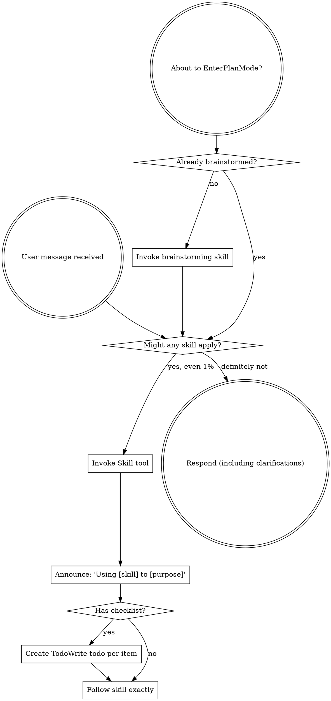

codex-exec: report contract violation

--- codex stdout ---
SPEC_VERDICT: fix_required
MISSING_REQUIREMENTS: `super-gsd/skills/sgsd-triage/SKILL.md` was not updated, so production still invokes the old single-shot CLI and never runs Claude-as-MCP staged transport; staged skip emits `reasonCode` not required `reason`; consume/finalize are not idempotent-safe because repeated invocations append duplicate routing/degradation rows.
EXTRA_SCOPE: none
VERIFICATION_MAPPING: Runtime adds plan/consume/finalize, contained/size/JSON response validation, fallback emission, and stage-before-codex gating; tests add healthy/null-reflection/garbage/oversized/no-codex scenarios and `all` dynamically includes them; `node --check` exits: runtime 0, tests 0; supplied suite says 33/33 pass; SKILL grep invariants fail because no `vtp-plan`, `vtp-consume`, `vtp-finalize`, or verbatim-transport prose exists.
ONE_LINER: Runtime mechanics are mostly present, but the required production protocol is not wired into the skill, so CRIT-1 remains unfixed.

--- codex stderr ---
OpenAI Codex v0.146.0
--------
workdir: $env:USERPROFILE\AppData\Roaming\warp\Warp\data\worktrees\GSDedits\cholla-racer
model: gpt-5.5
provider: openai
approval: never
sandbox: read-only
reasoning effort: xhigh
reasoning summaries: none
session id: 019fdec7-d7d7-7012-8f4b-33a6876a00dc
--------
user
# SPEC-COMPLIANCE REVIEW — 148-atcfix (staged MCP-transport protocol)

You are the SDD spec reviewer. Verify the diff below implements EXACTLY what the fix prompt required — no missing requirements, no extra scope. The executor died before reporting; the orchestrator verified the suite green (33/33). Do NOT trust any summary; judge the raw diff against the prompt.

Required report contract (exact lines):
SPEC_VERDICT: pass|fix_required|blocked
MISSING_REQUIREMENTS: none|<list>
EXTRA_SCOPE: none|<list>
VERIFICATION_MAPPING: <evidence per acceptance criterion>
ONE_LINER: <summary>

## The fix prompt (what was required)
```
# P148 phase-ATC fix — Claude is the MCP transport; the runtime is the brain

<intent milestone="v3.5">
Always-On Orchestration — governance as runtime mechanism in all session modes.
</intent>

SDD implementer: fresh context, THIS FIX ONLY. Files:
`super-gsd/scripts/sgsd-triage-runtime.cjs`,
`super-gsd/tests/triage-runtime/assert-real-triage-runtime.cjs`,
`super-gsd/skills/sgsd-triage/SKILL.md`. Nothing else.

## CRIT-1 — the CLI cannot reach VTP in production
`mcp__vtp-kb__*` tools are callable only inside CLAUDE'S SESSION — never by a
spawned node process. The runtime's VTP path exists solely via
`options.mcpInvoke`, which only tests inject. In real skill use `callVtp`
returns `no_mcp_invoke`: AC-148b is harness-only. (This is the milestone's
harness-vs-production seam at its deepest — the previous fix moved the seam
from "module vs CLI" to "CLI vs MCP reality".)

### Fix — file-protocol loop: runtime decides, Claude transports
Add a staged CLI protocol (keep the module API + mcpInvoke for tests):
1. `--stage vtp-plan` → runtime reads STATE/config/tier, emits structured
   JSON: {action:"invoke_mcp", tool:"vtp_route_and_retrieve", args:{...},
   response_file:"<contained path>"} — or {action:"skip", reason} when the
   toggle is off (existing row).
2. Claude (per SKILL prose) calls that MCP tool in-session VERBATIM, writes
   the raw JSON response to response_file, re-invokes:
3. `--stage vtp-consume --response-file <path>` → runtime validates + applies
   the EXACT fallback predicate to the REAL response. No fallback → finalize
   (evidence file + rows) and emit {action:"complete", ...}. Fallback needed →
   emit {action:"invoke_mcp", tool:"vtp_search_substrate", args:{raw query},
   response_file} + the degradation row; Claude calls it and re-invokes:
4. `--stage vtp-finalize --response-file <path>` → finalize with fallback
   evidence.
Rules: response files validated + contained (they are UNTRUSTED external
input — bound sizes, JSON-parse guarded, reason-coded rows on garbage);
every stage idempotent-safe and never-throw; the decision logic (predicate,
validation, rows, evidence composition) stays 100% in the runtime — the SKILL
prose instructs Claude to execute tool calls VERBATIM with zero judgment and
feed results back. Existing single-shot `mcpInvoke` path stays for tests and
programmatic callers.

## WARN-1 — misleading skip rows from stage-blind gating
A Step 0 (VTP-only) invocation currently evaluates the codex gate and logs
`codex_skipped_non_planning`. Gate evaluation must run ONLY at the codex
stage (Step 0.5 / reconciliation invocation) — a VTP-stage call must never
touch codex gating or write its rows.

## SKILL.md
Update Step 0/0.5 prose to the staged loop (concise — bullet the loop, don't
bloat; the file must stay lean). Claude's role stated plainly: "execute the
emitted MCP call verbatim, save the response, re-invoke — no interpretation."

## Tests
- Existing 28 scenarios keep passing (mcpInvoke path preserved).
- NEW: full staged-protocol scenario driving the REAL CLI through
  plan→consume(→finalize) with fixture response FILES: healthy (no fallback),
  null-reflection (fallback instruction emitted, then finalize), garbage
  response file (reason-coded row, exit 0), oversized response file (bounded,
  degraded).
- NEW: VTP-stage call writes NO codex-gate rows.

## Verify (report exact exit codes)
node --check both cjs; full suite (expect ~32; sandbox EPERM caveat → say
so); SKILL grep-invariants (staged loop present, verbatim-transport language,
no direct mcp call in Step 0 prose beyond executing the runtime's emitted
instruction).
SURGICAL CONSTRAINT. <250-word report.
```

## Verification output
```
node super-gsd/tests/triage-runtime/assert-real-triage-runtime.cjs --scenario all
[PASS] all (33 scenarios)
```

## Raw diff (working tree vs 98ce67e)
```diff
diff --git a/super-gsd/scripts/sgsd-triage-runtime.cjs b/super-gsd/scripts/sgsd-triage-runtime.cjs
index 18ff969..87b9fb8 100644
--- a/super-gsd/scripts/sgsd-triage-runtime.cjs
+++ b/super-gsd/scripts/sgsd-triage-runtime.cjs
@@ -25,6 +25,12 @@ const triageVerdictSchema = require('./lib/triage-verdict-schema.cjs');

 const ROUTE_TOOL = 'mcp__vtp-kb__vtp_route_and_retrieve';
 const SEARCH_TOOL = 'mcp__vtp-kb__vtp_search_substrate';
+const ROUTE_STAGE_TOOL = 'vtp_route_and_retrieve';
+const SEARCH_STAGE_TOOL = 'vtp_search_substrate';
+const VTP_STAGE_PLAN = 'vtp-plan';
+const VTP_STAGE_CONSUME = 'vtp-consume';
+const VTP_STAGE_FINALIZE = 'vtp-finalize';
+const VTP_RESPONSE_MAX_BYTES = 128 * 1024;
 const DEFAULT_SKILL_OR_AGENT = 'sgsd-triage-runtime';
 const TRIAGE_DEGRADED_SIGNAL = 'triage_vtp_degraded';
 const TRIAGE_CODEX_DEGRADED_SIGNAL = 'triage_codex_degraded';
@@ -48,12 +54,17 @@ function usage() {
     'Usage:',
     '  node super-gsd/scripts/sgsd-triage-runtime.cjs --query <text> [--cwd <dir>]',
     '  node super-gsd/scripts/sgsd-triage-runtime.cjs --query-file <relpath> [--cwd <dir>]',
+    '  node super-gsd/scripts/sgsd-triage-runtime.cjs --stage vtp-plan --query-file <relpath> [--cwd <dir>]',
+    '  node super-gsd/scripts/sgsd-triage-runtime.cjs --stage vtp-consume --response-file <relpath> --query-file <relpath> [--cwd <dir>]',
+    '  node super-gsd/scripts/sgsd-triage-runtime.cjs --stage vtp-finalize --response-file <relpath> --query-file <relpath> [--cwd <dir>]',
     '',
     'Options:',
     '  --query <text>        Operator triage query.',
     '  --query-file <path>   Repo-contained file containing the query.',
     '  --cwd <dir>           Start directory for SGSD root discovery.',
     '  --active-file <path>  Optional active file hint for VTP context.',
+    '  --stage <name>        VTP file protocol stage: vtp-plan, vtp-consume, or vtp-finalize.',
+    '  --response-file <path> Repo-contained raw MCP response file for staged VTP consume/finalize.',
     '  --trigger-source <s>  Planning gate source; only planning-triage dispatches Codex.',
     '  --claude-path <A-D>   Claude-side proposed triage path.',
     '  --claude-rationale <text> Claude-side rationale; required with --claude-path.',
@@ -71,6 +82,8 @@ function parseArgs(argv) {
     claudePath: null,
     claudeRationale: null,
     claudeVerdictFile: null,
+    stage: null,
+    responseFile: null,
   };
   for (let index = 0; index < argv.length; index += 1) {
     const arg = argv[index];
@@ -88,6 +101,12 @@ function parseArgs(argv) {
     } else if (arg === '--active-file') {
       out.activeFile = argv[index + 1] || '';
       index += 1;
+    } else if (arg === '--stage') {
+      out.stage = argv[index + 1] || '';
+      index += 1;
+    } else if (arg === '--response-file') {
+      out.responseFile = argv[index + 1] || '';
+      index += 1;
     } else if (arg === '--trigger-source') {
       out.triggerSource = argv[index + 1] || '';
       index += 1;
@@ -369,6 +388,403 @@ function buildContext(root, state, rawQuery, options) {
   return { ctx, triageSlice: project(ctx, 'triage') };
 }

+function vtpStageResponseRel(state, kind) {
+  const phase = normalizePhase(state && state.phase) || 'unknown';
+  const safeKind = safeSegment(kind) || 'response';
+  const stamp = new Date().toISOString().replace(/[^0-9A-Za-z]/g, '-');
+  return path.join('.planning', 'tmp', `sgsd-triage-vtp-${phase}-${process.pid}-${stamp}-${safeKind}-response.json`);
+}
+
+function vtpStageMetaRel(responseRel) {
+  const rel = String(responseRel || '').trim();
+  return rel ? `${rel}.meta.json` : null;
+}
+
+function ensureStageWriteTarget(root, rel) {
+  const target = resolveContainedPath(root, String(rel || ''));
+  if (!target) return null;
+  try {
+    fs.mkdirSync(path.dirname(target), { recursive: true });
+    return target;
+  } catch {
+    return null;
+  }
+}
+
+function shortStageTool(tool) {
+  if (tool === ROUTE_TOOL) return ROUTE_STAGE_TOOL;
+  if (tool === SEARCH_TOOL) return SEARCH_STAGE_TOOL;
+  return String(tool || '');
+}
+
+function stageInvokeResult(tool, args, responseRel, extras = {}) {
+  return {
+    stageProtocol: true,
+    exitCode: 0,
+    action: 'invoke_mcp',
+    tool: shortStageTool(tool),
+    mcp_tool: tool,
+    args,
+    response_file: responseRel.replace(/\\/g, '/'),
+    ...extras,
+  };
+}
+
+function stageEvidencePath(root, evidencePath, evidenceRel) {
+  if (evidenceRel) return evidenceRel.replace(/\\/g, '/');
+  return evidencePath ? relForRow(root, evidencePath) : null;
+}
+
+function stageCompleteResult(root, params = {}) {
+  return {
+    stageProtocol: true,
+    exitCode: 0,
+    action: params.action || 'complete',
+    reasonCode: params.reasonCode || null,
+    vtpMode: params.mode || null,
+    routeOk: params.routeOk === true,
+    fallbackAttempted: params.fallbackAttempted === true,
+    fallbackPredicate: params.fallbackPredicate || null,
+    degradationNotes: Array.isArray(params.degradationRows) ? params.degradationRows.map(summarizeDegradationRow) : [],
+    evidencePath: stageEvidencePath(root, params.evidencePath, params.evidenceRel),
+  };
+}
+
+function appendStagedVtpRoutingRow(root, params = {}) {
+  const fields = extractRouteFields(params.response || null);
+  const topDoc = fields.documents[0] && fields.documents[0].doc_id ? fields.documents[0].doc_id : null;
+  return appendRoutingRow(root, {
+    event: 'vtp_call',
+    status: params.status || (params.failureReason ? 'failure' : (fields.evidence_hit_count === 0 ? 'zero_hits' : 'success')),
+    tier: 'triage',
+    skill_or_agent: params.skillOrAgent || DEFAULT_SKILL_OR_AGENT,
+    raw_query: params.rawQuery || '',
+    selected_query: fields.selected_query,
+    retrieval_mode: fields.retrieval_mode,
+    reflection_verdict: fields.reflection_verdict,
+    evidence_hit_count: fields.evidence_hit_count,
+    top_doc_id: topDoc,
+    elapsed_ms: 0,
+    transport: 'claude_file_protocol',
+    tool: shortStageTool(params.tool),
+    failure_reason: params.failureReason || undefined,
+  });
+}
+
+function readStageResponseFile(root, responseFile) {
+  const rel = String(responseFile || '').trim();
+  const target = resolveContainedPath(root, rel);
+  if (!target) return { ok: false, reasonCode: 'vtp_response_file_uncontained', reason: 'response_file_not_contained' };
+  try {
+    const stat = fs.statSync(target);
+    if (!stat.isFile()) return { ok: false, reasonCode: 'vtp_response_file_missing', reason: 'response_file_not_regular' };
+    if (stat.size > VTP_RESPONSE_MAX_BYTES) {
+      return { ok: false, reasonCode: 'vtp_response_file_oversized', reason: `response_file_oversized:${stat.size}` };
+    }
+    const text = fs.readFileSync(target, 'utf8').replace(/^\uFEFF/, '');
+    const parsed = JSON.parse(text);
+    if (!parsed || typeof parsed !== 'object' || Array.isArray(parsed)) {
+      return { ok: false, reasonCode: 'vtp_response_file_invalid_shape', reason: 'response_json_not_object' };
+    }
+    return { ok: true, response: parsed, rel: rel.replace(/\\/g, '/'), target };
+  } catch (error) {
+    if (error && error.code === 'ENOENT') return { ok: false, reasonCode: 'vtp_response_file_missing', reason: 'response_file_missing' };
+    if (error instanceof SyntaxError) return { ok: false, reasonCode: 'vtp_response_file_invalid_json', reason: 'response_json_parse_failed' };
+    return { ok: false, reasonCode: 'vtp_response_file_unreadable', reason: reasonFromError(error, 'response_file_unreadable') };
+  }
+}
+
+function writeStageMeta(root, responseRel, meta) {
+  const rel = vtpStageMetaRel(responseRel);
+  const target = rel ? ensureStageWriteTarget(root, rel) : null;
+  if (!target) return null;
+  try {
+    fs.writeFileSync(target, `${JSON.stringify(meta)}\n`, 'utf8');
+    return rel;
+  } catch {
+    return null;
+  }
+}
+
+function readStageMeta(root, responseRel) {
+  const rel = vtpStageMetaRel(responseRel);
+  if (!rel) return null;
+  const result = readStageResponseFile(root, rel);
+  return result.ok ? result.response : null;
+}
+
+function completeStageDegraded(root, state, rawQuery, params = {}) {
+  const evidenceRel = params.evidenceRel || evidenceRelPath(root, state);
+  const degradationRows = [];
+  degradationRows.push(logDegradation(root, state, {
+    reasonCode: params.reasonCode,
+    rawQuery,
+    routeOk: params.routeOk === true,
+    fallbackPredicate: params.fallbackPredicate || null,
+    evidenceRel,
+    routeFailureReason: params.routeFailureReason || params.reasonCode,
+    fallbackFailureReason: params.fallbackFailureReason || null,
+    skillOrAgent: params.skillOrAgent,
+    silent: params.silent,
+    nextActionPayload: params.nextActionPayload || {
+      continue_evidence_less: true,
+      reason: params.reasonCode,
+    },
+  }));
+  const evidencePath = writeVtpEvidence(root, state, {
+    evidenceRel,
+    rawQuery,
+    mode: 'evidence_less',
+    selectedResponse: null,
+    routePayload: params.routePayload || null,
+    fallbackPayload: params.fallbackPayload || null,
+    routeResult: params.routeResult || { ok: false, reason: params.reasonCode, elapsed_ms: null },
+    fallbackResult: params.fallbackResult || null,
+    fallbackPredicate: params.fallbackPredicate || null,
+  });
+  return stageCompleteResult(root, {
+    reasonCode: params.reasonCode,
+    mode: 'evidence_less',
+    routeOk: params.routeOk === true,
+    fallbackAttempted: params.fallbackAttempted === true,
+    fallbackPredicate: params.fallbackPredicate || null,
+    evidencePath,
+    evidenceRel,
+    degradationRows: degradationRows.filter(Boolean),
+  });
+}
+
+async function runVtpStage(root, state, rawQuery, triageSlice, evidenceRel, options = {}) {
+  try {
+    const stage = String(options.stage || '').trim();
+    const routePayload = { raw_query: rawQuery, context: triageSlice };
+
+    if (stage === VTP_STAGE_PLAN) {
+      if (!readTriageVtpEnrichmentEnabled(root)) {
+        const degraded = completeStageDegraded(root, state, rawQuery, {
+          reasonCode: 'vtp_enrichment_disabled',
+          evidenceRel,
+          routePayload: null,
+          skillOrAgent: options.skillOrAgent,
+          silent: options.silent,
+          nextActionPayload: {
+            continue_evidence_less: true,
+            vtp_enrichment_disabled: true,
+          },
+        });
+        return { ...degraded, action: 'skip' };
+      }
+      const responseRel = vtpStageResponseRel(state, 'route');
+      if (!ensureStageWriteTarget(root, responseRel)) {
+        return completeStageDegraded(root, state, rawQuery, {
+          reasonCode: 'vtp_response_file_uncontained',
+          evidenceRel,
+          routePayload,
+          skillOrAgent: options.skillOrAgent,
+          silent: options.silent,
+        });
+      }
+      return stageInvokeResult(ROUTE_TOOL, routePayload, responseRel, { stage });
+    }
+
+    if (stage === VTP_STAGE_CONSUME) {
+      const loaded = readStageResponseFile(root, options.responseFile);
+      if (!loaded.ok) {
+        return completeStageDegraded(root, state, rawQuery, {
+          reasonCode: loaded.reasonCode,
+          routeFailureReason: loaded.reason,
+          evidenceRel,
+          routePayload,
+          skillOrAgent: options.skillOrAgent,
+          silent: options.silent,
+          nextActionPayload: {
+            continue_evidence_less: true,
+            response_file: String(options.responseFile || '').replace(/\\/g, '/'),
+            reason: loaded.reasonCode,
+          },
+        });
+      }
+
+      const routeResult = { ok: true, response: loaded.response, elapsed_ms: 0 };
+      appendStagedVtpRoutingRow(root, {
+        tool: ROUTE_TOOL,
+        response: loaded.response,
+        rawQuery,
+        skillOrAgent: options.skillOrAgent,
+      });
+      const predicate = fallbackPredicate(loaded.response);
+      if (predicate) {
+        const degradationRows = [];
+        degradationRows.push(logDegradation(root, state, {
+          reasonCode: predicate.reasonCode,
+          rawQuery,
+          routeOk: true,
+          fallbackPredicate: predicate.predicate,
+          evidenceHitCount: predicate.evidenceHitCount,
+          evidenceRel,
+          skillOrAgent: options.skillOrAgent,
+          silent: options.silent,
+          nextActionPayload: {
+            direct_search_attempted: true,
+            fallback_predicate: predicate.predicate,
+          },
+        }));
+        const fallbackPayload = {
+          raw_query: rawQuery,
+          query: rawQuery,
+          context: triageSlice,
+          fallback_reason: predicate.predicate,
+        };
+        const responseRel = vtpStageResponseRel(state, `fallback-${predicate.predicate}`);
+        if (!ensureStageWriteTarget(root, responseRel)) {
+          return completeStageDegraded(root, state, rawQuery, {
+            reasonCode: 'vtp_response_file_uncontained',
+            evidenceRel,
+            routeOk: true,
+            fallbackAttempted: true,
+            fallbackPredicate: predicate.predicate,
+            routePayload,
+            routeResult,
+            fallbackPayload,
+            degradationRows,
+            skillOrAgent: options.skillOrAgent,
+            silent: options.silent,
+          });
+        }
+        writeStageMeta(root, responseRel, {
+          routePayload,
+          routeResponse: loaded.response,
+          fallbackPayload,
+          fallbackPredicate: predicate.predicate,
+          evidenceRel,
+        });
+        return stageInvokeResult(SEARCH_TOOL, fallbackPayload, responseRel, {
+          stage,
+          fallbackAttempted: true,
+          fallbackPredicate: predicate.predicate,
+          degradationNotes: degradationRows.filter(Boolean).map(summarizeDegradationRow),
+        });
+      }
+
+      const evidencePath = writeVtpEvidence(root, state, {
+        evidenceRel,
+        rawQuery,
+        mode: 'route',
+        selectedResponse: loaded.response,
+        routePayload,
+        fallbackPayload: null,
+        routeResult,
+        fallbackResult: null,
+        fallbackPredicate: null,
+      });
+      return stageCompleteResult(root, {
+        mode: 'route',
+        routeOk: true,
+        fallbackAttempted: false,
+        evidencePath,
+        evidenceRel,
+        degradationRows: [],
+      });
+    }
+
+    if (stage === VTP_STAGE_FINALIZE) {
+      const meta = readStageMeta(root, options.responseFile) || {};
+      const fallbackPayload = meta.fallbackPayload || {
+        raw_query: rawQuery,
+        query: rawQuery,
+        context: triageSlice,
+        fallback_reason: meta.fallbackPredicate || null,
+      };
+      const loaded = readStageResponseFile(root, options.responseFile);
+      if (!loaded.ok) {
+        return completeStageDegraded(root, state, rawQuery, {
+          reasonCode: loaded.reasonCode,
+          routeFailureReason: null,
+          fallbackFailureReason: loaded.reason,
+          evidenceRel,
+          routeOk: Boolean(meta.routeResponse),
+          fallbackAttempted: true,
+          fallbackPredicate: meta.fallbackPredicate || null,
+          routePayload: meta.routePayload || routePayload,
+          routeResult: meta.routeResponse ? { ok: true, response: meta.routeResponse, elapsed_ms: 0 } : null,
+          fallbackPayload,
+          fallbackResult: { ok: false, reason: loaded.reasonCode, elapsed_ms: null },
+          skillOrAgent: options.skillOrAgent,
+          silent: options.silent,
+          nextActionPayload: {
+            continue_evidence_less: true,
+            response_file: String(options.responseFile || '').replace(/\\/g, '/'),
+            reason: loaded.reasonCode,
+          },
+        });
+      }
+
+      appendStagedVtpRoutingRow(root, {
+        tool: SEARCH_TOOL,
+        response: loaded.response,
+        rawQuery,
+        skillOrAgent: options.skillOrAgent,
+      });
+      const fallbackResult = { ok: true, response: loaded.response, elapsed_ms: 0 };
+      const evidencePath = writeVtpEvidence(root, state, {
+        evidenceRel,
+        rawQuery,
+        mode: 'fallback',
+        selectedResponse: loaded.response,
+        routePayload: meta.routePayload || routePayload,
+        fallbackPayload,
+        routeResult: meta.routeResponse ? { ok: true, response: meta.routeResponse, elapsed_ms: 0 } : null,
+        fallbackResult,
+        fallbackPredicate: meta.fallbackPredicate || null,
+      });
+      return stageCompleteResult(root, {
+        mode: 'fallback',
+        routeOk: Boolean(meta.routeResponse),
+        fallbackAttempted: true,
+        fallbackPredicate: meta.fallbackPredicate || null,
+        evidencePath,
+        evidenceRel,
+        degradationRows: [],
+      });
+    }
+
+    return { stageProtocol: true, exitCode: 0, action: 'skip', reasonCode: 'vtp_stage_unknown', vtpMode: null };
+  } catch (error) {
+    return completeStageDegraded(root, state, rawQuery, {
+      reasonCode: 'vtp_stage_exception',
+      routeFailureReason: reasonFromError(error, 'vtp_stage_exception'),
+      evidenceRel,
+      skillOrAgent: options.skillOrAgent,
+      silent: options.silent,
+    });
+  }
+}
+
+function serializeStageResult(result) {
+  const r = result && typeof result === 'object' ? result : {};
+  if (r.action === 'invoke_mcp') {
+    return {
+      action: 'invoke_mcp',
+      tool: boundedString(r.tool, 100),
+      mcp_tool: boundedString(r.mcp_tool, 150),
+      args: boundedValue(r.args || {}),
+      response_file: boundedString(r.response_file, 500),
+      fallbackAttempted: r.fallbackAttempted === true,
+      fallbackPredicate: boundedString(r.fallbackPredicate, 100),
+      degradationNotes: Array.isArray(r.degradationNotes) ? r.degradationNotes : [],
+    };
+  }
+  return {
+    action: boundedString(r.action || 'complete', 50),
+    reasonCode: boundedString(r.reasonCode || r.reason, 100),
+    vtpMode: boundedString(r.vtpMode || r.mode, 50),
+    routeOk: r.routeOk === true,
+    fallbackAttempted: r.fallbackAttempted === true,
+    fallbackPredicate: boundedString(r.fallbackPredicate, 100),
+    degradationNotes: Array.isArray(r.degradationNotes) ? r.degradationNotes : [],
+    evidencePath: boundedString(r.evidencePath, 500),
+  };
+}
 function readTriageVtpEnrichmentEnabled(root) {
   const reader = vtpContextComposer && vtpContextComposer._internal && vtpContextComposer._internal.readConfigToggle;
   if (typeof reader !== 'function') return true;
@@ -939,6 +1355,12 @@ async function runTriageRuntime(options = {}) {
   if (!rawQuery && options.queryFile) rawQuery = readQueryFile(root, options.queryFile);
   rawQuery = String(rawQuery || '').trim();

+  if (options.stage) {
+    const evidenceRel = evidenceRelPath(root, state);
+    const { triageSlice } = buildContext(root, state, rawQuery, options);
+    return runVtpStage(root, state, rawQuery, triageSlice, evidenceRel, options);
+  }
+
   const triggerSource = String(options.triggerSource || '').trim();
   const claudeCandidate = loadClaudeVerdict(root, options);
   const claudeValidation = validateClaudeVerdict(claudeCandidate);
@@ -1148,7 +1570,7 @@ async function main(argv = process.argv.slice(2)) {
     return 0;
   }
   const result = await runTriageRuntime(args);
-  console.log(JSON.stringify(serializeCliResult(result)));
+  console.log(JSON.stringify(result && result.stageProtocol ? serializeStageResult(result) : serializeCliResult(result)));
   return result.exitCode;
 }

@@ -1170,6 +1592,7 @@ module.exports = {
   parseArgs,
   runTriageRuntime,
   serializeCliResult,
+  serializeStageResult,
   TRIAGE_CODEX_DEGRADED_SIGNAL,
   TRIAGE_CODEX_SKIPPED_SIGNAL,
   TRIAGE_RECONCILIATION_SIGNAL,
diff --git a/super-gsd/tests/triage-runtime/assert-real-triage-runtime.cjs b/super-gsd/tests/triage-runtime/assert-real-triage-runtime.cjs
index f07af52..9c37903 100644
--- a/super-gsd/tests/triage-runtime/assert-real-triage-runtime.cjs
+++ b/super-gsd/tests/triage-runtime/assert-real-triage-runtime.cjs
@@ -67,6 +67,11 @@ function usage() {
     '  prompt-injection-closed-vocabulary',
     '  claude-invalid-refused',
     '  runtime-dispatch-reconciliation',
+    '  staged-vtp-healthy',
+    '  staged-vtp-null-reflection-fallback',
+    '  staged-vtp-garbage-response',
+    '  staged-vtp-oversized-response',
+    '  vtp-stage-no-codex-gate',
     '  all',
     '',
     'Plan aliases:',
@@ -246,6 +251,58 @@ function readJsonl(root, subpath) {
     .map((line) => JSON.parse(line));
 }

+function runRuntimeCli(args, options = {}) {
+  return childProcess.spawnSync(process.execPath, [runtimePath, ...args], {
+    cwd: repoRoot,
+    env: options.env || process.env,
+    encoding: 'utf8',
+    windowsHide: true,
+    maxBuffer: 1024 * 1024,
+  });
+}
+
+function parseRuntimeCliJson(cli, label) {
+  assert.strictEqual(cli.status, 0, `${label} should exit 0; stderr=${cli.stderr || cli.error || ''}`);
+  const stdout = String(cli.stdout || '').trim();
+  assert(stdout, `${label} must emit one JSON object`);
+  return JSON.parse(stdout);
+}
+
+function writeStageQuery(fixture, slug, rawQuery) {
+  const queryRel = path.join('.planning', 'tmp', `${slug}-query.txt`);
+  writeContainedFile(fixture.repoDir, queryRel, rawQuery);
+  return queryRel;
+}
+
+function invokeVtpPlanStage(fixture, queryRel, label) {
+  return parseRuntimeCliJson(runRuntimeCli([
+    '--stage', 'vtp-plan',
+    '--query-file', queryRel,
+    '--cwd', fixture.repoDir,
+  ]), label);
+}
+
+function invokeVtpConsumeStage(fixture, queryRel, responseFile, label) {
+  return parseRuntimeCliJson(runRuntimeCli([
+    '--stage', 'vtp-consume',
+    '--query-file', queryRel,
+    '--cwd', fixture.repoDir,
+    '--response-file', responseFile,
+  ]), label);
+}
+
+function invokeVtpFinalizeStage(fixture, queryRel, responseFile, label) {
+  return parseRuntimeCliJson(runRuntimeCli([
+    '--stage', 'vtp-finalize',
+    '--query-file', queryRel,
+    '--cwd', fixture.repoDir,
+    '--response-file', responseFile,
+  ]), label);
+}
+
+function writeStageResponse(fixture, responseFile, value) {
+  writeContainedFile(fixture.repoDir, responseFile, `${JSON.stringify(value)}\n`);
+}
 function assertContainedExistingFile(root, subpath) {
   const target = contained(root, subpath);
   assert.strictEqual(fs.existsSync(target), true, `${subpath} should exist`);
@@ -1310,6 +1367,127 @@ async function assertRuntimeDispatchReconciliation() {
   await assertPromptInjectionClosedVocabulary();
   await assertClaudeInvalidRefused();
 }
+async function assertStagedVtpHealthy() {
+  const fixture = createSgsdFixture({ repoId: 'staged-vtp-healthy' });
+  try {
+    const rawQuery = 'fixture staged healthy route 148';
+    const queryRel = writeStageQuery(fixture, 'staged-healthy', rawQuery);
+    const plan = invokeVtpPlanStage(fixture, queryRel, 'vtp-plan healthy');
+    assert.strictEqual(plan.action, 'invoke_mcp');
+    assert.strictEqual(plan.tool, 'vtp_route_and_retrieve');
+    assert.strictEqual(plan.args.raw_query, rawQuery);
+    assert(plan.args.context && typeof plan.args.context === 'object', 'plan must include runtime-built VTP context');
+    contained(fixture.repoDir, plan.response_file);
+
+    writeStageResponse(fixture, plan.response_file, routeResponse({ reflection: { verdict: 'sufficient' }, hits: 2, docPrefix: 'fixture-staged-route-doc' }));
+    const complete = invokeVtpConsumeStage(fixture, queryRel, plan.response_file, 'vtp-consume healthy');
+    assert.strictEqual(complete.action, 'complete');
+    assert.strictEqual(complete.vtpMode, 'route');
+    assert.strictEqual(complete.fallbackAttempted, false);
+    assert.strictEqual(complete.evidencePath, VTP_EVIDENCE_REL.replace(/\\/g, '/'));
+
+    const routingRows = readJsonl(fixture.repoDir, ROUTING_LOG_REL);
+    assert.strictEqual(routingRows.length, 1, 'healthy staged route should write one VTP routing row');
+    assert.strictEqual(routingRows[0].top_doc_id, 'fixture-staged-route-doc-1');
+    assert.strictEqual(gateRowsBySignal(fixture, 'triage_codex_skipped_gate').length, 0);
+    const evidence = readContainedFile(fixture.repoDir, VTP_EVIDENCE_REL);
+    assert.match(evidence, /fixture-staged-route-doc-1/);
+    assert.match(evidence, /Mode: route/);
+  } finally {
+    fixture.cleanup();
+  }
+}
+
+async function assertStagedVtpNullReflectionFallback() {
+  const fixture = createSgsdFixture({ repoId: 'staged-vtp-null-reflection' });
+  try {
+    const rawQuery = 'fixture staged null reflection route 148';
+    const queryRel = writeStageQuery(fixture, 'staged-null-reflection', rawQuery);
+    const plan = invokeVtpPlanStage(fixture, queryRel, 'vtp-plan null-reflection');
+    writeStageResponse(fixture, plan.response_file, routeResponse({ reflection: null, hits: 2, docPrefix: 'fixture-staged-route-null' }));
+
+    const fallbackInstruction = invokeVtpConsumeStage(fixture, queryRel, plan.response_file, 'vtp-consume null-reflection');
+    assert.strictEqual(fallbackInstruction.action, 'invoke_mcp');
+    assert.strictEqual(fallbackInstruction.tool, 'vtp_search_substrate');
+    assert.strictEqual(fallbackInstruction.args.raw_query, rawQuery);
+    assert.strictEqual(fallbackInstruction.args.query, rawQuery);
+    assert.strictEqual(fallbackInstruction.args.fallback_reason, 'reflection_null');
+    contained(fixture.repoDir, fallbackInstruction.response_file);
+
+    const rows = gateRowsWithReason(fixture, 'vtp_fallback_reflection_null');
+    assert.strictEqual(rows.length, 1, 'staged null reflection must append predicate degradation row during consume');
+    assert.strictEqual(rows[0].fallback_predicate, 'reflection_null');
+
+    writeStageResponse(fixture, fallbackInstruction.response_file, searchResponse({ hits: 2, docPrefix: 'fixture-staged-fallback-doc' }));
+    const complete = invokeVtpFinalizeStage(fixture, queryRel, fallbackInstruction.response_file, 'vtp-finalize null-reflection');
+    assert.strictEqual(complete.action, 'complete');
+    assert.strictEqual(complete.vtpMode, 'fallback');
+    assert.strictEqual(complete.fallbackAttempted, true);
+    assert.strictEqual(gateRowsBySignal(fixture, 'triage_codex_skipped_gate').length, 0);
+
+    const routingRows = readJsonl(fixture.repoDir, ROUTING_LOG_REL);
+    assert.strictEqual(routingRows.length, 2, 'staged fallback should write route and search routing rows');
+    assert.strictEqual(routingRows[1].top_doc_id, 'fixture-staged-fallback-doc-1');
+    const evidence = readContainedFile(fixture.repoDir, VTP_EVIDENCE_REL);
+    assert.match(evidence, /fixture-staged-fallback-doc-1/);
+    assert.match(evidence, /Mode: fallback/);
+  } finally {
+    fixture.cleanup();
+  }
+}
+
+async function assertStagedVtpGarbageResponse() {
+  const fixture = createSgsdFixture({ repoId: 'staged-vtp-garbage' });
+  try {
+    const queryRel = writeStageQuery(fixture, 'staged-garbage', 'fixture staged garbage response 148');
+    const plan = invokeVtpPlanStage(fixture, queryRel, 'vtp-plan garbage');
+    writeContainedFile(fixture.repoDir, plan.response_file, '{ definitely not json');
+
+    const complete = invokeVtpConsumeStage(fixture, queryRel, plan.response_file, 'vtp-consume garbage');
+    assert.strictEqual(complete.action, 'complete');
+    assert.strictEqual(complete.vtpMode, 'evidence_less');
+    assert.strictEqual(complete.reasonCode, 'vtp_response_file_invalid_json');
+    assert.strictEqual(gateRowsWithReason(fixture, 'vtp_response_file_invalid_json').length, 1);
+    assert.strictEqual(gateRowsBySignal(fixture, 'triage_codex_skipped_gate').length, 0);
+    const evidence = readContainedFile(fixture.repoDir, VTP_EVIDENCE_REL);
+    assert.match(evidence, /Mode: evidence_less/);
+  } finally {
+    fixture.cleanup();
+  }
+}
+
+async function assertStagedVtpOversizedResponse() {
+  const fixture = createSgsdFixture({ repoId: 'staged-vtp-oversized' });
+  try {
+    const queryRel = writeStageQuery(fixture, 'staged-oversized', 'fixture staged oversized response 148');
+    const plan = invokeVtpPlanStage(fixture, queryRel, 'vtp-plan oversized');
+    writeContainedFile(fixture.repoDir, plan.response_file, JSON.stringify({ payload: 'x'.repeat(300 * 1024) }));
+
+    const complete = invokeVtpConsumeStage(fixture, queryRel, plan.response_file, 'vtp-consume oversized');
+    assert.strictEqual(complete.action, 'complete');
+    assert.strictEqual(complete.vtpMode, 'evidence_less');
+    assert.strictEqual(complete.reasonCode, 'vtp_response_file_oversized');
+    assert.strictEqual(gateRowsWithReason(fixture, 'vtp_response_file_oversized').length, 1);
+    assert.strictEqual(gateRowsBySignal(fixture, 'triage_codex_skipped_gate').length, 0);
+    const evidence = readContainedFile(fixture.repoDir, VTP_EVIDENCE_REL);
+    assert.match(evidence, /No VTP documents available/);
+  } finally {
+    fixture.cleanup();
+  }
+}
+
+async function assertVtpStageNoCodexGate() {
+  const fixture = createSgsdFixture({ repoId: 'vtp-stage-no-codex-gate' });
+  try {
+    const queryRel = writeStageQuery(fixture, 'vtp-stage-no-codex-gate', 'fixture stage no codex gate 148');
+    const plan = invokeVtpPlanStage(fixture, queryRel, 'vtp-plan no-codex-gate');
+    assert.strictEqual(plan.action, 'invoke_mcp');
+    assert.strictEqual(gateRowsBySignal(fixture, 'triage_codex_skipped_gate').length, 0, 'VTP-only stage must not write Codex skip rows');
+    assert.strictEqual(gateRowsBySignal(fixture, 'triage_codex_degraded').length, 0, 'VTP-only stage must not write Codex degraded rows');
+  } finally {
+    fixture.cleanup();
+  }
+}
 async function assertCodexContractJsonSchema() {
   delete require.cache[require.resolve(triageVerdictSchemaPath)];
   const schema = require(triageVerdictSchemaPath);
@@ -1406,8 +1584,12 @@ const scenarios = Object.freeze({
   'prompt-injection-closed-vocabulary': assertPromptInjectionClosedVocabulary,
   'claude-invalid-refused': assertClaudeInvalidRefused,
   'runtime-dispatch-reconciliation': assertRuntimeDispatchReconciliation,
-  all: assertAllScenarioMatrix,
-});
+  'staged-vtp-healthy': assertStagedVtpHealthy,
+  'staged-vtp-null-reflection-fallback': assertStagedVtpNullReflectionFallback,
+  'staged-vtp-garbage-response': assertStagedVtpGarbageResponse,
+  'staged-vtp-oversized-response': assertStagedVtpOversizedResponse,
+  'vtp-stage-no-codex-gate': assertVtpStageNoCodexGate,
+  all: assertAllScenarioMatrix,});

 const scenarioAliases = Object.freeze({
   'ac-planning-codex-row': assertPlanningCodexVerdictRow,
@@ -1464,11 +1646,16 @@ module.exports = {
   assertPromptInjectionClosedVocabulary,
   assertClaudeInvalidRefused,
   assertRuntimeDispatchReconciliation,
-  assertAllScenarioMatrix,
-  assertLowHitFallback,
+  assertStagedVtpHealthy,
+  assertStagedVtpNullReflectionFallback,
+  assertStagedVtpGarbageResponse,
+  assertStagedVtpOversizedResponse,
+  assertVtpStageNoCodexGate,
+  assertAllScenarioMatrix,  assertLowHitFallback,
   assertNonSgsdNoWrite,
   assertVtpEnrichmentDisabled,
   assertVtpEnrichmentEnabled,
   assertNullReflectionFallback,
   assertRouteErrorFallback,
 };
+
```

exec
"C:\\WINDOWS\\System32\\WindowsPowerShell\\v1.0\\powershell.exe" -Command "Get-Content -Raw $env:USERPROFILE\\.codex\\skills\\using-superpowers\\SKILL.md" in $env:USERPROFILE\AppData\Roaming\warp\Warp\data\worktrees\GSDedits\cholla-racer
exec
"C:\\WINDOWS\\System32\\WindowsPowerShell\\v1.0\\powershell.exe" -Command "Get-Content -Raw $env:USERPROFILE\\.agents\\skills\\review\\SKILL.md" in $env:USERPROFILE\AppData\Roaming\warp\Warp\data\worktrees\GSDedits\cholla-racer
 succeeded in 3650ms:
---
name: review
description: Review code changes for security, performance, bugs, and quality. Reviews staged changes, unstaged changes, specific commits, or PR-ready diffs.
---

<objective>
Review code changes and provide structured feedback covering security, performance, bug risks, code quality, and test coverage gaps. This skill analyzes diffs and surrounding context to catch issues before they reach production.
</objective>

<context>
This skill reviews code changes at various stages of the development workflow. It can review staged changes before a commit, unstaged work-in-progress, a specific commit, or the full set of changes on a branch that are ready for a pull request.

The reviewer reads both the diff and the surrounding source files to understand intent and catch issues that only appear in context.
</context>

<core_principle>
**FIND REAL ISSUES, NOT STYLE NITS.** Focus on problems that cause bugs, security vulnerabilities, performance degradation, or maintainability pain. Avoid nitpicking formatting or subjective style preferences unless they harm readability.
</core_principle>

<analysis_only_rule>
**THIS SKILL IS READ-ONLY. DO NOT MODIFY CODE.**

The purpose is to review and report findings. Making changes during review conflates the reviewer and author roles. Present findings and let the user decide what to act on.
</analysis_only_rule>

<quick_start>

<determine_review_scope>

Parse the user's input to determine what to review:

1. **No arguments** - Review staged changes first. If nothing is staged, review unstaged changes.
   - Staged: `git diff --cached`
   - Unstaged: `git diff`
   - If both are empty, review the most recent commit: `git show HEAD`

2. **Commit hash argument** (e.g., `/review abc1234`) - Review that specific commit.
   - `git show <hash>`

3. **File path argument** (e.g., `/review src/foo.ts`) - Review unstaged changes in that file.
   - `git diff -- <path>` then fall back to `git diff --cached -- <path>`

4. **"pr" argument** (e.g., `/review pr`) - Review all changes since branching from main.
   - `git diff main...HEAD`
   - If on main, review `git diff HEAD~1`

After obtaining the diff, if it is empty, inform the user that there are no changes to review and stop.

</determine_review_scope>

<gather_context>

Before analyzing the diff:

1. **Read changed files in full** - Do not review a diff in isolation. Read each modified file to understand the surrounding code, imports, types, and control flow.
2. **Identify the tech stack** - Note languages, frameworks, and libraries in use. This affects what patterns are risky.
3. **Check for related test files** - For each changed source file, look for corresponding test files. Note whether tests were updated alongside the changes.
4. **Check for configuration changes** - If config files changed (env, CI, package.json, tsconfig, etc.), pay extra attention to side effects.

</gather_context>

<review_categories>

Analyze the changes against each category below. Only report findings that are actually present. Skip categories with no issues.

**A. Security Issues** (Severity: CRITICAL or HIGH)
- Injection vulnerabilities (SQL injection, command injection, template injection)
- Cross-site scripting (XSS) - unsanitized user input rendered in HTML
- Authentication and authorization flaws (missing auth checks, privilege escalation)
- Secrets or credentials hardcoded or logged
- Insecure deserialization or unsafe eval usage
- Path traversal or file access vulnerabilities
- Missing input validation on external data

**B. Performance Concerns** (Severity: HIGH or MEDIUM)
- N+1 query patterns in database access
- Unnecessary memory allocations in hot paths or loops
- Blocking operations on the main thread or in async contexts
- Missing pagination on unbounded queries
- Redundant computation that could be cached or memoized
- Large payloads without streaming or chunking

**C. Bug Risks** (Severity: HIGH or MEDIUM)
- Off-by-one errors in loops or array access
- Null/undefined dereferences without guards
- Race conditions in concurrent or async code
- Incorrect error handling (swallowed errors, wrong error types)
- Type mismatches or unsafe type assertions
- Logic errors in conditionals (inverted checks, missing cases)
- Resource leaks (unclosed connections, file handles, listeners)

**D. Code Quality** (Severity: MEDIUM or LOW)
- Unclear or misleading naming
- Significant code duplication that should be extracted
- Excessive complexity (deeply nested logic, functions doing too many things)
- Dead code or unreachable branches
- Missing or misleading comments on non-obvious logic
- Inconsistency with patterns used elsewhere in the codebase

**E. Test Coverage Gaps** (Severity: MEDIUM or LOW)
- New logic paths without corresponding test cases
- Changed behavior without updated tests
- Edge cases not covered (empty inputs, boundary values, error paths)
- Missing integration tests for new API endpoints or database changes

</review_categories>

<format_findings>

For each finding, use this structure:

```
### [SEVERITY] Category: Brief Title

**File**: `path/to/file.ext` (lines X-Y)

**Issue**: Clear description of the problem.

**Why it matters**: What could go wrong if this is not addressed.

**Suggestion**: How to fix it, with a code snippet if helpful.
```

Severity levels:
- **CRITICAL** - Must fix before merge. Security vulnerability or data loss risk.
- **HIGH** - Should fix before merge. Likely bug or significant performance issue.
- **MEDIUM** - Should fix soon. Code quality or moderate risk issue.
- **LOW** - Consider fixing. Minor improvement opportunity.

</format_findings>

</quick_start>

<critical_rules>

1. **READ THE FULL FILE**: Never review a diff without reading the complete source file for context
2. **NO FALSE ALARMS**: Only report issues you can explain concretely. Do not report vague concerns
3. **PRIORITIZE**: Lead with the most severe findings. Do not bury critical issues under style nits
4. **BE SPECIFIC**: Include file paths, line numbers, and code references for every finding
5. **EXPLAIN THE RISK**: For each finding, explain what could actually go wrong
6. **CHECK TESTS**: Always check whether changes have corresponding test updates
7. **CONSIDER THE STACK**: Apply language-specific and framework-specific knowledge to your review
8. **DO NOT MODIFY CODE**: Present findings only. The user decides what to act on

</critical_rules>

<output_format>

```markdown
## Code Review: [brief description of what was reviewed]

**Scope**: [staged changes | unstaged changes | commit abc1234 | PR changes from main]
**Files reviewed**: [count] files changed, [additions] additions, [deletions] deletions

---

### Findings

[Findings grouped by severity, highest first. Use the format from <format_findings>.]

---

### Summary

| Severity | Count |
|----------|-------|
| CRITICAL | X     |
| HIGH     | X     |
| MEDIUM   | X     |
| LOW      | X     |

### Recommended Actions

1. [Most important action to take]
2. [Next most important action]
3. [...]
```

If no issues are found:

```markdown
## Code Review: [brief description]

**Scope**: [what was reviewed]
**Files reviewed**: [count]

No significant issues found. The changes look good to merge.
```

</output_format>

<decision_gate>

**After presenting findings, ALWAYS offer these options:**

```
ƒ"?ƒ"?ƒ"?ƒ"?ƒ"?ƒ"?ƒ"?ƒ"?ƒ"?ƒ"?ƒ"?ƒ"?ƒ"?ƒ"?ƒ"?ƒ"?ƒ"?ƒ"?ƒ"?ƒ"?ƒ"?ƒ"?ƒ"?ƒ"?ƒ"?ƒ"?ƒ"?ƒ"?ƒ"?ƒ"?ƒ"?ƒ"?ƒ"?ƒ"?ƒ"?ƒ"?ƒ"?ƒ"?ƒ"?ƒ"?ƒ"?
REVIEW COMPLETE

What would you like to do?

1. **Fix issues** - I'll address the findings starting with the most critical
2. **Save review** - Export findings to a markdown file
3. **Review again** - Re-review with different scope or focus
4. **Discuss a finding** - Ask questions about a specific issue
5. **Other** - Tell me what you need
ƒ"?ƒ"?ƒ"?ƒ"?ƒ"?ƒ"?ƒ"?ƒ"?ƒ"?ƒ"?ƒ"?ƒ"?ƒ"?ƒ"?ƒ"?ƒ"?ƒ"?ƒ"?ƒ"?ƒ"?ƒ"?ƒ"?ƒ"?ƒ"?ƒ"?ƒ"?ƒ"?ƒ"?ƒ"?ƒ"?ƒ"?ƒ"?ƒ"?ƒ"?ƒ"?ƒ"?ƒ"?ƒ"?ƒ"?ƒ"?ƒ"?
```

**Wait for user response before taking any action.**

This gate is MANDATORY. Never skip it. Never auto-implement fixes.

</decision_gate>

$env:USERPROFILE\OneDrive - John Cullen Lighting\Documents\WindowsPowerShell\profile.ps1 : Cannot dot-source this
command because it was defined in a different language mode. To invoke this command without importing its contents,
omit the '.' operator.
At line:1 char:1
+ . '$env:USERPROFILE\OneDrive - John Cullen Lighting\Documents\Win ...
+ ~~~~~~~~~~~~~~~~~~~~~~~~~~~~~~~~~~~~~~~~~~~~~~~~~~~~~~~~~~~~~~~~~~~~~
    + CategoryInfo          : InvalidOperation: (:) [profile.ps1], NotSupportedException
    + FullyQualifiedErrorId : DotSourceNotSupported,profile.ps1

$env:USERPROFILE\OneDrive - John Cullen Lighting\Documents\WindowsPowerShell\Microsoft.PowerShell_profile.ps1 :
Cannot dot-source this command because it was defined in a different language mode. To invoke this command without
importing its contents, omit the '.' operator.
At line:1 char:1
+ . '$env:USERPROFILE\OneDrive - John Cullen Lighting\Documents\Win ...
+ ~~~~~~~~~~~~~~~~~~~~~~~~~~~~~~~~~~~~~~~~~~~~~~~~~~~~~~~~~~~~~~~~~~~~~
    + CategoryInfo          : InvalidOperation: (:) [Microsoft.PowerShell_profile.ps1], NotSupportedException
    + FullyQualifiedErrorId : DotSourceNotSupported,Microsoft.PowerShell_profile.ps1


 succeeded in 3669ms:
---
name: using-superpowers
description: Use when starting any conversation - establishes how to find and use skills, requiring Skill tool invocation before ANY response including clarifying questions
---

<SUBAGENT-STOP>
If you were dispatched as a subagent to execute a specific task, skip this skill.
</SUBAGENT-STOP>

<EXTREMELY-IMPORTANT>
If you think there is even a 1% chance a skill might apply to what you are doing, you ABSOLUTELY MUST invoke the skill.

IF A SKILL APPLIES TO YOUR TASK, YOU DO NOT HAVE A CHOICE. YOU MUST USE IT.

This is not negotiable. This is not optional. You cannot rationalize your way out of this.
</EXTREMELY-IMPORTANT>

## Instruction Priority

Superpowers skills override default system prompt behavior, but **user instructions always take precedence**:

1. **User's explicit instructions** (CLAUDE.md, GEMINI.md, AGENTS.md, direct requests) ƒ?" highest priority
2. **Superpowers skills** ƒ?" override default system behavior where they conflict
3. **Default system prompt** ƒ?" lowest priority

If CLAUDE.md, GEMINI.md, or AGENTS.md says "don't use TDD" and a skill says "always use TDD," follow the user's instructions. The user is in control.

## How to Access Skills

**In Claude Code:** Use the `Skill` tool. When you invoke a skill, its content is loaded and presented to youƒ?"follow it directly. Never use the Read tool on skill files.

**In Copilot CLI:** Use the `skill` tool. Skills are auto-discovered from installed plugins. The `skill` tool works the same as Claude Code's `Skill` tool.

**In Gemini CLI:** Skills activate via the `activate_skill` tool. Gemini loads skill metadata at session start and activates the full content on demand.

**In other environments:** Check your platform's documentation for how skills are loaded.

## Platform Adaptation

Skills use Claude Code tool names. Non-CC platforms: see `references/copilot-tools.md` (Copilot CLI), `references/codex-tools.md` (Codex) for tool equivalents. Gemini CLI users get the tool mapping loaded automatically via GEMINI.md.

# Using Skills

## The Rule

**Invoke relevant or requested skills BEFORE any response or action.** Even a 1% chance a skill might apply means that you should invoke the skill to check. If an invoked skill turns out to be wrong for the situation, you don't need to use it.



## Red Flags

These thoughts mean STOPƒ?"you're rationalizing:

| Thought | Reality |
|---------|---------|
| "This is just a simple question" | Questions are tasks. Check for skills. |
| "I need more context first" | Skill check comes BEFORE clarifying questions. |
| "Let me explore the codebase first" | Skills tell you HOW to explore. Check first. |
| "I can check git/files quickly" | Files lack conversation context. Check for skills. |
| "Let me gather information first" | Skills tell you HOW to gather information. |
| "This doesn't need a formal skill" | If a skill exists, use it. |
| "I remember this skill" | Skills evolve. Read current version. |
| "This doesn't count as a task" | Action = task. Check for skills. |
| "The skill is overkill" | Simple things become complex. Use it. |
| "I'll just do this one thing first" | Check BEFORE doing anything. |
| "This feels productive" | Undisciplined action wastes time. Skills prevent this. |
| "I know what that means" | Knowing the concept ƒ%ÿ using the skill. Invoke it. |

## Skill Priority

When multiple skills could apply, use this order:

1. **Process skills first** (brainstorming, debugging) - these determine HOW to approach the task
2. **Implementation skills second** (frontend-design, mcp-builder) - these guide execution

"Let's build X" ā' brainstorming first, then implementation skills.
"Fix this bug" ā' debugging first, then domain-specific skills.

## Skill Types

**Rigid** (TDD, debugging): Follow exactly. Don't adapt away discipline.

**Flexible** (patterns): Adapt principles to context.

The skill itself tells you which.

## User Instructions

Instructions say WHAT, not HOW. "Add X" or "Fix Y" doesn't mean skip workflows.

$env:USERPROFILE\OneDrive - John Cullen Lighting\Documents\WindowsPowerShell\profile.ps1 : Cannot dot-source this
command because it was defined in a different language mode. To invoke this command without importing its contents,
omit the '.' operator.
At line:1 char:1
+ . '$env:USERPROFILE\OneDrive - John Cullen Lighting\Documents\Win ...
+ ~~~~~~~~~~~~~~~~~~~~~~~~~~~~~~~~~~~~~~~~~~~~~~~~~~~~~~~~~~~~~~~~~~~~~
    + CategoryInfo          : InvalidOperation: (:) [profile.ps1], NotSupportedException
    + FullyQualifiedErrorId : DotSourceNotSupported,profile.ps1

$env:USERPROFILE\OneDrive - John Cullen Lighting\Documents\WindowsPowerShell\Microsoft.PowerShell_profile.ps1 :
Cannot dot-source this command because it was defined in a different language mode. To invoke this command without
importing its contents, omit the '.' operator.
At line:1 char:1
+ . '$env:USERPROFILE\OneDrive - John Cullen Lighting\Documents\Win ...
+ ~~~~~~~~~~~~~~~~~~~~~~~~~~~~~~~~~~~~~~~~~~~~~~~~~~~~~~~~~~~~~~~~~~~~~
    + CategoryInfo          : InvalidOperation: (:) [Microsoft.PowerShell_profile.ps1], NotSupportedException
    + FullyQualifiedErrorId : DotSourceNotSupported,Microsoft.PowerShell_profile.ps1


codex
Using `review` for a read-only spec compliance check. I’m treating the supplied diff as the source of truth and checking it against each acceptance criterion, not the reported green run.
codex
I’m going to read the affected files around the changed control flow and test matrix. The main questions are whether the staged protocol is actually complete, whether `all` covers the new scenarios, and whether the skill prose was updated.
exec
"C:\\WINDOWS\\System32\\WindowsPowerShell\\v1.0\\powershell.exe" -Command 'rg -n "function assertAllScenarioMatrix|const scenarios|all: assertAllScenarioMatrix|stage|runTriageRuntime|triggerSource|codex_skipped" super-gsd/tests/triage-runtime/assert-real-triage-runtime.cjs super-gsd/scripts/sgsd-triage-runtime.cjs' in $env:USERPROFILE\AppData\Roaming\warp\Warp\data\worktrees\GSDedits\cholla-racer
exec
"C:\\WINDOWS\\System32\\WindowsPowerShell\\v1.0\\powershell.exe" -Command "Get-Content -Raw super-gsd\\skills\\sgsd-triage\\SKILL.md" in $env:USERPROFILE\AppData\Roaming\warp\Warp\data\worktrees\GSDedits\cholla-racer
exec
"C:\\WINDOWS\\System32\\WindowsPowerShell\\v1.0\\powershell.exe" -Command 'git diff -- super-gsd/scripts/sgsd-triage-runtime.cjs super-gsd/tests/triage-runtime/assert-real-triage-runtime.cjs super-gsd/skills/sgsd-triage/SKILL.md' in $env:USERPROFILE\AppData\Roaming\warp\Warp\data\worktrees\GSDedits\cholla-racer
 succeeded in 865ms:
super-gsd/scripts/sgsd-triage-runtime.cjs:37:const TRIAGE_CODEX_SKIPPED_SIGNAL = 'triage_codex_skipped_gate';
super-gsd/scripts/sgsd-triage-runtime.cjs:49:const CODEX_SKIPPED_NON_PLANNING_REASON = 'codex_skipped_non_planning';
super-gsd/scripts/sgsd-triage-runtime.cjs:57:    '  node super-gsd/scripts/sgsd-triage-runtime.cjs --stage vtp-plan --query-file <relpath> [--cwd <dir>]',
super-gsd/scripts/sgsd-triage-runtime.cjs:58:    '  node super-gsd/scripts/sgsd-triage-runtime.cjs --stage vtp-consume --response-file <relpath> --query-file <relpath> [--cwd <dir>]',
super-gsd/scripts/sgsd-triage-runtime.cjs:59:    '  node super-gsd/scripts/sgsd-triage-runtime.cjs --stage vtp-finalize --response-file <relpath> --query-file <relpath> [--cwd <dir>]',
super-gsd/scripts/sgsd-triage-runtime.cjs:66:    '  --stage <name>        VTP file protocol stage: vtp-plan, vtp-consume, or vtp-finalize.',
super-gsd/scripts/sgsd-triage-runtime.cjs:67:    '  --response-file <path> Repo-contained raw MCP response file for staged VTP consume/finalize.',
super-gsd/scripts/sgsd-triage-runtime.cjs:81:    triggerSource: null,
super-gsd/scripts/sgsd-triage-runtime.cjs:85:    stage: null,
super-gsd/scripts/sgsd-triage-runtime.cjs:104:    } else if (arg === '--stage') {
super-gsd/scripts/sgsd-triage-runtime.cjs:105:      out.stage = argv[index + 1] || '';
super-gsd/scripts/sgsd-triage-runtime.cjs:111:      out.triggerSource = argv[index + 1] || '';
super-gsd/scripts/sgsd-triage-runtime.cjs:420:function stageInvokeResult(tool, args, responseRel, extras = {}) {
super-gsd/scripts/sgsd-triage-runtime.cjs:422:    stageProtocol: true,
super-gsd/scripts/sgsd-triage-runtime.cjs:433:function stageEvidencePath(root, evidencePath, evidenceRel) {
super-gsd/scripts/sgsd-triage-runtime.cjs:438:function stageCompleteResult(root, params = {}) {
super-gsd/scripts/sgsd-triage-runtime.cjs:440:    stageProtocol: true,
super-gsd/scripts/sgsd-triage-runtime.cjs:449:    evidencePath: stageEvidencePath(root, params.evidencePath, params.evidenceRel),
super-gsd/scripts/sgsd-triage-runtime.cjs:545:  return stageCompleteResult(root, {
super-gsd/scripts/sgsd-triage-runtime.cjs:559:    const stage = String(options.stage || '').trim();
super-gsd/scripts/sgsd-triage-runtime.cjs:562:    if (stage === VTP_STAGE_PLAN) {
super-gsd/scripts/sgsd-triage-runtime.cjs:587:      return stageInvokeResult(ROUTE_TOOL, routePayload, responseRel, { stage });
super-gsd/scripts/sgsd-triage-runtime.cjs:590:    if (stage === VTP_STAGE_CONSUME) {
super-gsd/scripts/sgsd-triage-runtime.cjs:661:        return stageInvokeResult(SEARCH_TOOL, fallbackPayload, responseRel, {
super-gsd/scripts/sgsd-triage-runtime.cjs:662:          stage,
super-gsd/scripts/sgsd-triage-runtime.cjs:680:      return stageCompleteResult(root, {
super-gsd/scripts/sgsd-triage-runtime.cjs:690:    if (stage === VTP_STAGE_FINALIZE) {
super-gsd/scripts/sgsd-triage-runtime.cjs:740:      return stageCompleteResult(root, {
super-gsd/scripts/sgsd-triage-runtime.cjs:751:    return { stageProtocol: true, exitCode: 0, action: 'skip', reasonCode: 'vtp_stage_unknown', vtpMode: null };
super-gsd/scripts/sgsd-triage-runtime.cjs:754:      reasonCode: 'vtp_stage_exception',
super-gsd/scripts/sgsd-triage-runtime.cjs:755:      routeFailureReason: reasonFromError(error, 'vtp_stage_exception'),
super-gsd/scripts/sgsd-triage-runtime.cjs:1026:    trigger_source: p.triggerSource || null,
super-gsd/scripts/sgsd-triage-runtime.cjs:1041:    next_action: JSON.stringify({ continue_single_model: true, trigger_source: p.triggerSource || null }),
super-gsd/scripts/sgsd-triage-runtime.cjs:1046:    trigger_source: p.triggerSource || null,
super-gsd/scripts/sgsd-triage-runtime.cjs:1273:function consumeCodexReport(root, state, rawQuery, promptInfo, dispatch, claudeVerdict, triggerSource) {
super-gsd/scripts/sgsd-triage-runtime.cjs:1280:      triggerSource,
super-gsd/scripts/sgsd-triage-runtime.cjs:1298:      triggerSource,
super-gsd/scripts/sgsd-triage-runtime.cjs:1312:      triggerSource,
super-gsd/scripts/sgsd-triage-runtime.cjs:1326:    trigger_source: triggerSource,
super-gsd/scripts/sgsd-triage-runtime.cjs:1344:async function runTriageRuntime(options = {}) {
super-gsd/scripts/sgsd-triage-runtime.cjs:1358:  if (options.stage) {
super-gsd/scripts/sgsd-triage-runtime.cjs:1364:  const triggerSource = String(options.triggerSource || '').trim();
super-gsd/scripts/sgsd-triage-runtime.cjs:1371:  if (triggerSource === PLANNING_TRIGGER_SOURCE && !claudeValidation.valid) {
super-gsd/scripts/sgsd-triage-runtime.cjs:1521:  if (triggerSource !== PLANNING_TRIGGER_SOURCE) {
super-gsd/scripts/sgsd-triage-runtime.cjs:1522:    logCodexSkipped(root, state, { rawQuery, triggerSource });
super-gsd/scripts/sgsd-triage-runtime.cjs:1538:      triggerSource,
super-gsd/scripts/sgsd-triage-runtime.cjs:1548:  const consumed = consumeCodexReport(root, state, rawQuery, promptInfo, dispatch, claudeValidation.value, triggerSource);
super-gsd/scripts/sgsd-triage-runtime.cjs:1572:  const result = await runTriageRuntime(args);
super-gsd/scripts/sgsd-triage-runtime.cjs:1573:  console.log(JSON.stringify(result && result.stageProtocol ? serializeStageResult(result) : serializeCliResult(result)));
super-gsd/scripts/sgsd-triage-runtime.cjs:1593:  runTriageRuntime,
super-gsd/tests/triage-runtime/assert-real-triage-runtime.cjs:38:const CODEX_SKIPPED_NON_PLANNING_REASON = 'codex_skipped_non_planning';
super-gsd/tests/triage-runtime/assert-real-triage-runtime.cjs:70:    '  staged-vtp-healthy',
super-gsd/tests/triage-runtime/assert-real-triage-runtime.cjs:71:    '  staged-vtp-null-reflection-fallback',
super-gsd/tests/triage-runtime/assert-real-triage-runtime.cjs:72:    '  staged-vtp-garbage-response',
super-gsd/tests/triage-runtime/assert-real-triage-runtime.cjs:73:    '  staged-vtp-oversized-response',
super-gsd/tests/triage-runtime/assert-real-triage-runtime.cjs:74:    '  vtp-stage-no-codex-gate',
super-gsd/tests/triage-runtime/assert-real-triage-runtime.cjs:279:    '--stage', 'vtp-plan',
super-gsd/tests/triage-runtime/assert-real-triage-runtime.cjs:287:    '--stage', 'vtp-consume',
super-gsd/tests/triage-runtime/assert-real-triage-runtime.cjs:296:    '--stage', 'vtp-finalize',
super-gsd/tests/triage-runtime/assert-real-triage-runtime.cjs:389:  assert.strictEqual(typeof runtime.runTriageRuntime, 'function', 'runtime must export runTriageRuntime');
super-gsd/tests/triage-runtime/assert-real-triage-runtime.cjs:390:  return captureStderrAsync(() => runtime.runTriageRuntime({
super-gsd/tests/triage-runtime/assert-real-triage-runtime.cjs:396:    triggerSource: options.triggerSource,
super-gsd/tests/triage-runtime/assert-real-triage-runtime.cjs:912:      triggerSource: 'planning-triage',
super-gsd/tests/triage-runtime/assert-real-triage-runtime.cjs:943:      triggerSource: 'planning-triage',
super-gsd/tests/triage-runtime/assert-real-triage-runtime.cjs:975:    assert.strictEqual(gateRowsBySignalReason(fixture, 'triage_codex_skipped_gate', CODEX_SKIPPED_NON_PLANNING_REASON).length, 0);
super-gsd/tests/triage-runtime/assert-real-triage-runtime.cjs:985:      triggerSource: 'execution',
super-gsd/tests/triage-runtime/assert-real-triage-runtime.cjs:994:    const skipped = gateRowsBySignalReason(control, 'triage_codex_skipped_gate', CODEX_SKIPPED_NON_PLANNING_REASON);
super-gsd/tests/triage-runtime/assert-real-triage-runtime.cjs:1010:      triggerSource: 'planning-triage',
super-gsd/tests/triage-runtime/assert-real-triage-runtime.cjs:1061:      triggerSource: 'planning-triage',
super-gsd/tests/triage-runtime/assert-real-triage-runtime.cjs:1153:      triggerSource: 'planning-triage',
super-gsd/tests/triage-runtime/assert-real-triage-runtime.cjs:1179:      triggerSource: 'planning-triage',
super-gsd/tests/triage-runtime/assert-real-triage-runtime.cjs:1203:      triggerSource: 'planning-triage',
super-gsd/tests/triage-runtime/assert-real-triage-runtime.cjs:1233:        triggerSource: 'planning-triage',
super-gsd/tests/triage-runtime/assert-real-triage-runtime.cjs:1263:      triggerSource: 'manual-triage',
super-gsd/tests/triage-runtime/assert-real-triage-runtime.cjs:1271:    const rows = gateRowsBySignalReason(fixture, 'triage_codex_skipped_gate', CODEX_SKIPPED_NON_PLANNING_REASON);
super-gsd/tests/triage-runtime/assert-real-triage-runtime.cjs:1284:      triggerSource: 'planning-triage',
super-gsd/tests/triage-runtime/assert-real-triage-runtime.cjs:1315:      triggerSource: 'planning-triage',
super-gsd/tests/triage-runtime/assert-real-triage-runtime.cjs:1341:      triggerSource: 'planning-triage',
super-gsd/tests/triage-runtime/assert-real-triage-runtime.cjs:1371:  const fixture = createSgsdFixture({ repoId: 'staged-vtp-healthy' });
super-gsd/tests/triage-runtime/assert-real-triage-runtime.cjs:1373:    const rawQuery = 'fixture staged healthy route 148';
super-gsd/tests/triage-runtime/assert-real-triage-runtime.cjs:1374:    const queryRel = writeStageQuery(fixture, 'staged-healthy', rawQuery);
super-gsd/tests/triage-runtime/assert-real-triage-runtime.cjs:1382:    writeStageResponse(fixture, plan.response_file, routeResponse({ reflection: { verdict: 'sufficient' }, hits: 2, docPrefix: 'fixture-staged-route-doc' }));
super-gsd/tests/triage-runtime/assert-real-triage-runtime.cjs:1390:    assert.strictEqual(routingRows.length, 1, 'healthy staged route should write one VTP routing row');
super-gsd/tests/triage-runtime/assert-real-triage-runtime.cjs:1391:    assert.strictEqual(routingRows[0].top_doc_id, 'fixture-staged-route-doc-1');
super-gsd/tests/triage-runtime/assert-real-triage-runtime.cjs:1392:    assert.strictEqual(gateRowsBySignal(fixture, 'triage_codex_skipped_gate').length, 0);
super-gsd/tests/triage-runtime/assert-real-triage-runtime.cjs:1394:    assert.match(evidence, /fixture-staged-route-doc-1/);
super-gsd/tests/triage-runtime/assert-real-triage-runtime.cjs:1402:  const fixture = createSgsdFixture({ repoId: 'staged-vtp-null-reflection' });
super-gsd/tests/triage-runtime/assert-real-triage-runtime.cjs:1404:    const rawQuery = 'fixture staged null reflection route 148';
super-gsd/tests/triage-runtime/assert-real-triage-runtime.cjs:1405:    const queryRel = writeStageQuery(fixture, 'staged-null-reflection', rawQuery);
super-gsd/tests/triage-runtime/assert-real-triage-runtime.cjs:1407:    writeStageResponse(fixture, plan.response_file, routeResponse({ reflection: null, hits: 2, docPrefix: 'fixture-staged-route-null' }));
super-gsd/tests/triage-runtime/assert-real-triage-runtime.cjs:1418:    assert.strictEqual(rows.length, 1, 'staged null reflection must append predicate degradation row during consume');
super-gsd/tests/triage-runtime/assert-real-triage-runtime.cjs:1421:    writeStageResponse(fixture, fallbackInstruction.response_file, searchResponse({ hits: 2, docPrefix: 'fixture-staged-fallback-doc' }));
super-gsd/tests/triage-runtime/assert-real-triage-runtime.cjs:1426:    assert.strictEqual(gateRowsBySignal(fixture, 'triage_codex_skipped_gate').length, 0);
super-gsd/tests/triage-runtime/assert-real-triage-runtime.cjs:1429:    assert.strictEqual(routingRows.length, 2, 'staged fallback should write route and search routing rows');
super-gsd/tests/triage-runtime/assert-real-triage-runtime.cjs:1430:    assert.strictEqual(routingRows[1].top_doc_id, 'fixture-staged-fallback-doc-1');
super-gsd/tests/triage-runtime/assert-real-triage-runtime.cjs:1432:    assert.match(evidence, /fixture-staged-fallback-doc-1/);
super-gsd/tests/triage-runtime/assert-real-triage-runtime.cjs:1440:  const fixture = createSgsdFixture({ repoId: 'staged-vtp-garbage' });
super-gsd/tests/triage-runtime/assert-real-triage-runtime.cjs:1442:    const queryRel = writeStageQuery(fixture, 'staged-garbage', 'fixture staged garbage response 148');
super-gsd/tests/triage-runtime/assert-real-triage-runtime.cjs:1451:    assert.strictEqual(gateRowsBySignal(fixture, 'triage_codex_skipped_gate').length, 0);
super-gsd/tests/triage-runtime/assert-real-triage-runtime.cjs:1460:  const fixture = createSgsdFixture({ repoId: 'staged-vtp-oversized' });
super-gsd/tests/triage-runtime/assert-real-triage-runtime.cjs:1462:    const queryRel = writeStageQuery(fixture, 'staged-oversized', 'fixture staged oversized response 148');
super-gsd/tests/triage-runtime/assert-real-triage-runtime.cjs:1471:    assert.strictEqual(gateRowsBySignal(fixture, 'triage_codex_skipped_gate').length, 0);
super-gsd/tests/triage-runtime/assert-real-triage-runtime.cjs:1480:  const fixture = createSgsdFixture({ repoId: 'vtp-stage-no-codex-gate' });
super-gsd/tests/triage-runtime/assert-real-triage-runtime.cjs:1482:    const queryRel = writeStageQuery(fixture, 'vtp-stage-no-codex-gate', 'fixture stage no codex gate 148');
super-gsd/tests/triage-runtime/assert-real-triage-runtime.cjs:1485:    assert.strictEqual(gateRowsBySignal(fixture, 'triage_codex_skipped_gate').length, 0, 'VTP-only stage must not write Codex skip rows');
super-gsd/tests/triage-runtime/assert-real-triage-runtime.cjs:1486:    assert.strictEqual(gateRowsBySignal(fixture, 'triage_codex_degraded').length, 0, 'VTP-only stage must not write Codex degraded rows');
super-gsd/tests/triage-runtime/assert-real-triage-runtime.cjs:1543:async function assertAllScenarioMatrix() {
super-gsd/tests/triage-runtime/assert-real-triage-runtime.cjs:1564:const scenarios = Object.freeze({
super-gsd/tests/triage-runtime/assert-real-triage-runtime.cjs:1587:  'staged-vtp-healthy': assertStagedVtpHealthy,
super-gsd/tests/triage-runtime/assert-real-triage-runtime.cjs:1588:  'staged-vtp-null-reflection-fallback': assertStagedVtpNullReflectionFallback,
super-gsd/tests/triage-runtime/assert-real-triage-runtime.cjs:1589:  'staged-vtp-garbage-response': assertStagedVtpGarbageResponse,
super-gsd/tests/triage-runtime/assert-real-triage-runtime.cjs:1590:  'staged-vtp-oversized-response': assertStagedVtpOversizedResponse,
super-gsd/tests/triage-runtime/assert-real-triage-runtime.cjs:1591:  'vtp-stage-no-codex-gate': assertVtpStageNoCodexGate,
super-gsd/tests/triage-runtime/assert-real-triage-runtime.cjs:1592:  all: assertAllScenarioMatrix,});
$env:USERPROFILE\OneDrive - John Cullen Lighting\Documents\WindowsPowerShell\profile.ps1 : Cannot dot-source this
command because it was defined in a different language mode. To invoke this command without importing its contents,
omit the '.' operator.
At line:1 char:1
+ . '$env:USERPROFILE\OneDrive - John Cullen Lighting\Documents\Win ...
+ ~~~~~~~~~~~~~~~~~~~~~~~~~~~~~~~~~~~~~~~~~~~~~~~~~~~~~~~~~~~~~~~~~~~~~
    + CategoryInfo          : InvalidOperation: (:) [profile.ps1], NotSupportedException
    + FullyQualifiedErrorId : DotSourceNotSupported,profile.ps1

$env:USERPROFILE\OneDrive - John Cullen Lighting\Documents\WindowsPowerShell\Microsoft.PowerShell_profile.ps1 :
Cannot dot-source this command because it was defined in a different language mode. To invoke this command without
importing its contents, omit the '.' operator.
At line:1 char:1
+ . '$env:USERPROFILE\OneDrive - John Cullen Lighting\Documents\Win ...
+ ~~~~~~~~~~~~~~~~~~~~~~~~~~~~~~~~~~~~~~~~~~~~~~~~~~~~~~~~~~~~~~~~~~~~~
    + CategoryInfo          : InvalidOperation: (:) [Microsoft.PowerShell_profile.ps1], NotSupportedException
    + FullyQualifiedErrorId : DotSourceNotSupported,Microsoft.PowerShell_profile.ps1


 succeeded in 910ms:
diff --git a/super-gsd/scripts/sgsd-triage-runtime.cjs b/super-gsd/scripts/sgsd-triage-runtime.cjs
index 18ff969..87b9fb8 100644
--- a/super-gsd/scripts/sgsd-triage-runtime.cjs
+++ b/super-gsd/scripts/sgsd-triage-runtime.cjs
@@ -25,6 +25,12 @@ const triageVerdictSchema = require('./lib/triage-verdict-schema.cjs');

 const ROUTE_TOOL = 'mcp__vtp-kb__vtp_route_and_retrieve';
 const SEARCH_TOOL = 'mcp__vtp-kb__vtp_search_substrate';
+const ROUTE_STAGE_TOOL = 'vtp_route_and_retrieve';
+const SEARCH_STAGE_TOOL = 'vtp_search_substrate';
+const VTP_STAGE_PLAN = 'vtp-plan';
+const VTP_STAGE_CONSUME = 'vtp-consume';
+const VTP_STAGE_FINALIZE = 'vtp-finalize';
+const VTP_RESPONSE_MAX_BYTES = 128 * 1024;
 const DEFAULT_SKILL_OR_AGENT = 'sgsd-triage-runtime';
 const TRIAGE_DEGRADED_SIGNAL = 'triage_vtp_degraded';
 const TRIAGE_CODEX_DEGRADED_SIGNAL = 'triage_codex_degraded';
@@ -48,12 +54,17 @@ function usage() {
     'Usage:',
     '  node super-gsd/scripts/sgsd-triage-runtime.cjs --query <text> [--cwd <dir>]',
     '  node super-gsd/scripts/sgsd-triage-runtime.cjs --query-file <relpath> [--cwd <dir>]',
+    '  node super-gsd/scripts/sgsd-triage-runtime.cjs --stage vtp-plan --query-file <relpath> [--cwd <dir>]',
+    '  node super-gsd/scripts/sgsd-triage-runtime.cjs --stage vtp-consume --response-file <relpath> --query-file <relpath> [--cwd <dir>]',
+    '  node super-gsd/scripts/sgsd-triage-runtime.cjs --stage vtp-finalize --response-file <relpath> --query-file <relpath> [--cwd <dir>]',
     '',
     'Options:',
     '  --query <text>        Operator triage query.',
     '  --query-file <path>   Repo-contained file containing the query.',
     '  --cwd <dir>           Start directory for SGSD root discovery.',
     '  --active-file <path>  Optional active file hint for VTP context.',
+    '  --stage <name>        VTP file protocol stage: vtp-plan, vtp-consume, or vtp-finalize.',
+    '  --response-file <path> Repo-contained raw MCP response file for staged VTP consume/finalize.',
     '  --trigger-source <s>  Planning gate source; only planning-triage dispatches Codex.',
     '  --claude-path <A-D>   Claude-side proposed triage path.',
     '  --claude-rationale <text> Claude-side rationale; required with --claude-path.',
@@ -71,6 +82,8 @@ function parseArgs(argv) {
     claudePath: null,
     claudeRationale: null,
     claudeVerdictFile: null,
+    stage: null,
+    responseFile: null,
   };
   for (let index = 0; index < argv.length; index += 1) {
     const arg = argv[index];
@@ -88,6 +101,12 @@ function parseArgs(argv) {
     } else if (arg === '--active-file') {
       out.activeFile = argv[index + 1] || '';
       index += 1;
+    } else if (arg === '--stage') {
+      out.stage = argv[index + 1] || '';
+      index += 1;
+    } else if (arg === '--response-file') {
+      out.responseFile = argv[index + 1] || '';
+      index += 1;
     } else if (arg === '--trigger-source') {
       out.triggerSource = argv[index + 1] || '';
       index += 1;
@@ -369,6 +388,403 @@ function buildContext(root, state, rawQuery, options) {
   return { ctx, triageSlice: project(ctx, 'triage') };
 }

+function vtpStageResponseRel(state, kind) {
+  const phase = normalizePhase(state && state.phase) || 'unknown';
+  const safeKind = safeSegment(kind) || 'response';
+  const stamp = new Date().toISOString().replace(/[^0-9A-Za-z]/g, '-');
+  return path.join('.planning', 'tmp', `sgsd-triage-vtp-${phase}-${process.pid}-${stamp}-${safeKind}-response.json`);
+}
+
+function vtpStageMetaRel(responseRel) {
+  const rel = String(responseRel || '').trim();
+  return rel ? `${rel}.meta.json` : null;
+}
+
+function ensureStageWriteTarget(root, rel) {
+  const target = resolveContainedPath(root, String(rel || ''));
+  if (!target) return null;
+  try {
+    fs.mkdirSync(path.dirname(target), { recursive: true });
+    return target;
+  } catch {
+    return null;
+  }
+}
+
+function shortStageTool(tool) {
+  if (tool === ROUTE_TOOL) return ROUTE_STAGE_TOOL;
+  if (tool === SEARCH_TOOL) return SEARCH_STAGE_TOOL;
+  return String(tool || '');
+}
+
+function stageInvokeResult(tool, args, responseRel, extras = {}) {
+  return {
+    stageProtocol: true,
+    exitCode: 0,
+    action: 'invoke_mcp',
+    tool: shortStageTool(tool),
+    mcp_tool: tool,
+    args,
+    response_file: responseRel.replace(/\\/g, '/'),
+    ...extras,
+  };
+}
+
+function stageEvidencePath(root, evidencePath, evidenceRel) {
+  if (evidenceRel) return evidenceRel.replace(/\\/g, '/');
+  return evidencePath ? relForRow(root, evidencePath) : null;
+}
+
+function stageCompleteResult(root, params = {}) {
+  return {
+    stageProtocol: true,
+    exitCode: 0,
+    action: params.action || 'complete',
+    reasonCode: params.reasonCode || null,
+    vtpMode: params.mode || null,
+    routeOk: params.routeOk === true,
+    fallbackAttempted: params.fallbackAttempted === true,
+    fallbackPredicate: params.fallbackPredicate || null,
+    degradationNotes: Array.isArray(params.degradationRows) ? params.degradationRows.map(summarizeDegradationRow) : [],
+    evidencePath: stageEvidencePath(root, params.evidencePath, params.evidenceRel),
+  };
+}
+
+function appendStagedVtpRoutingRow(root, params = {}) {
+  const fields = extractRouteFields(params.response || null);
+  const topDoc = fields.documents[0] && fields.documents[0].doc_id ? fields.documents[0].doc_id : null;
+  return appendRoutingRow(root, {
+    event: 'vtp_call',
+    status: params.status || (params.failureReason ? 'failure' : (fields.evidence_hit_count === 0 ? 'zero_hits' : 'success')),
+    tier: 'triage',
+    skill_or_agent: params.skillOrAgent || DEFAULT_SKILL_OR_AGENT,
+    raw_query: params.rawQuery || '',
+    selected_query: fields.selected_query,
+    retrieval_mode: fields.retrieval_mode,
+    reflection_verdict: fields.reflection_verdict,
+    evidence_hit_count: fields.evidence_hit_count,
+    top_doc_id: topDoc,
+    elapsed_ms: 0,
+    transport: 'claude_file_protocol',
+    tool: shortStageTool(params.tool),
+    failure_reason: params.failureReason || undefined,
+  });
+}
+
+function readStageResponseFile(root, responseFile) {
+  const rel = String(responseFile || '').trim();
+  const target = resolveContainedPath(root, rel);
+  if (!target) return { ok: false, reasonCode: 'vtp_response_file_uncontained', reason: 'response_file_not_contained' };
+  try {
+    const stat = fs.statSync(target);
+    if (!stat.isFile()) return { ok: false, reasonCode: 'vtp_response_file_missing', reason: 'response_file_not_regular' };
+    if (stat.size > VTP_RESPONSE_MAX_BYTES) {
+      return { ok: false, reasonCode: 'vtp_response_file_oversized', reason: `response_file_oversized:${stat.size}` };
+    }
+    const text = fs.readFileSync(target, 'utf8').replace(/^\uFEFF/, '');
+    const parsed = JSON.parse(text);
+    if (!parsed || typeof parsed !== 'object' || Array.isArray(parsed)) {
+      return { ok: false, reasonCode: 'vtp_response_file_invalid_shape', reason: 'response_json_not_object' };
+    }
+    return { ok: true, response: parsed, rel: rel.replace(/\\/g, '/'), target };
+  } catch (error) {
+    if (error && error.code === 'ENOENT') return { ok: false, reasonCode: 'vtp_response_file_missing', reason: 'response_file_missing' };
+    if (error instanceof SyntaxError) return { ok: false, reasonCode: 'vtp_response_file_invalid_json', reason: 'response_json_parse_failed' };
+    return { ok: false, reasonCode: 'vtp_response_file_unreadable', reason: reasonFromError(error, 'response_file_unreadable') };
+  }
+}
+
+function writeStageMeta(root, responseRel, meta) {
+  const rel = vtpStageMetaRel(responseRel);
+  const target = rel ? ensureStageWriteTarget(root, rel) : null;
+  if (!target) return null;
+  try {
+    fs.writeFileSync(target, `${JSON.stringify(meta)}\n`, 'utf8');
+    return rel;
+  } catch {
+    return null;
+  }
+}
+
+function readStageMeta(root, responseRel) {
+  const rel = vtpStageMetaRel(responseRel);
+  if (!rel) return null;
+  const result = readStageResponseFile(root, rel);
+  return result.ok ? result.response : null;
+}
+
+function completeStageDegraded(root, state, rawQuery, params = {}) {
+  const evidenceRel = params.evidenceRel || evidenceRelPath(root, state);
+  const degradationRows = [];
+  degradationRows.push(logDegradation(root, state, {
+    reasonCode: params.reasonCode,
+    rawQuery,
+    routeOk: params.routeOk === true,
+    fallbackPredicate: params.fallbackPredicate || null,
+    evidenceRel,
+    routeFailureReason: params.routeFailureReason || params.reasonCode,
+    fallbackFailureReason: params.fallbackFailureReason || null,
+    skillOrAgent: params.skillOrAgent,
+    silent: params.silent,
+    nextActionPayload: params.nextActionPayload || {
+      continue_evidence_less: true,
+      reason: params.reasonCode,
+    },
+  }));
+  const evidencePath = writeVtpEvidence(root, state, {
+    evidenceRel,
+    rawQuery,
+    mode: 'evidence_less',
+    selectedResponse: null,
+    routePayload: params.routePayload || null,
+    fallbackPayload: params.fallbackPayload || null,
+    routeResult: params.routeResult || { ok: false, reason: params.reasonCode, elapsed_ms: null },
+    fallbackResult: params.fallbackResult || null,
+    fallbackPredicate: params.fallbackPredicate || null,
+  });
+  return stageCompleteResult(root, {
+    reasonCode: params.reasonCode,
+    mode: 'evidence_less',
+    routeOk: params.routeOk === true,
+    fallbackAttempted: params.fallbackAttempted === true,
+    fallbackPredicate: params.fallbackPredicate || null,
+    evidencePath,
+    evidenceRel,
+    degradationRows: degradationRows.filter(Boolean),
+  });
+}
+
+async function runVtpStage(root, state, rawQuery, triageSlice, evidenceRel, options = {}) {
+  try {
+    const stage = String(options.stage || '').trim();
+    const routePayload = { raw_query: rawQuery, context: triageSlice };
+
+    if (stage === VTP_STAGE_PLAN) {
+      if (!readTriageVtpEnrichmentEnabled(root)) {
+        const degraded = completeStageDegraded(root, state, rawQuery, {
+          reasonCode: 'vtp_enrichment_disabled',
+          evidenceRel,
+          routePayload: null,
+          skillOrAgent: options.skillOrAgent,
+          silent: options.silent,
+          nextActionPayload: {
+            continue_evidence_less: true,
+            vtp_enrichment_disabled: true,
+          },
+        });
+        return { ...degraded, action: 'skip' };
+      }
+      const responseRel = vtpStageResponseRel(state, 'route');
+      if (!ensureStageWriteTarget(root, responseRel)) {
+        return completeStageDegraded(root, state, rawQuery, {
+          reasonCode: 'vtp_response_file_uncontained',
+          evidenceRel,
+          routePayload,
+          skillOrAgent: options.skillOrAgent,
+          silent: options.silent,
+        });
+      }
+      return stageInvokeResult(ROUTE_TOOL, routePayload, responseRel, { stage });
+    }
+
+    if (stage === VTP_STAGE_CONSUME) {
+      const loaded = readStageResponseFile(root, options.responseFile);
+      if (!loaded.ok) {
+        return completeStageDegraded(root, state, rawQuery, {
+          reasonCode: loaded.reasonCode,
+          routeFailureReason: loaded.reason,
+          evidenceRel,
+          routePayload,
+          skillOrAgent: options.skillOrAgent,
+          silent: options.silent,
+          nextActionPayload: {
+            continue_evidence_less: true,
+            response_file: String(options.responseFile || '').replace(/\\/g, '/'),
+            reason: loaded.reasonCode,
+          },
+        });
+      }
+
+      const routeResult = { ok: true, response: loaded.response, elapsed_ms: 0 };
+      appendStagedVtpRoutingRow(root, {
+        tool: ROUTE_TOOL,
+        response: loaded.response,
+        rawQuery,
+        skillOrAgent: options.skillOrAgent,
+      });
+      const predicate = fallbackPredicate(loaded.response);
+      if (predicate) {
+        const degradationRows = [];
+        degradationRows.push(logDegradation(root, state, {
+          reasonCode: predicate.reasonCode,
+          rawQuery,
+          routeOk: true,
+          fallbackPredicate: predicate.predicate,
+          evidenceHitCount: predicate.evidenceHitCount,
+          evidenceRel,
+          skillOrAgent: options.skillOrAgent,
+          silent: options.silent,
+          nextActionPayload: {
+            direct_search_attempted: true,
+            fallback_predicate: predicate.predicate,
+          },
+        }));
+        const fallbackPayload = {
+          raw_query: rawQuery,
+          query: rawQuery,
+          context: triageSlice,
+          fallback_reason: predicate.predicate,
+        };
+        const responseRel = vtpStageResponseRel(state, `fallback-${predicate.predicate}`);
+        if (!ensureStageWriteTarget(root, responseRel)) {
+          return completeStageDegraded(root, state, rawQuery, {
+            reasonCode: 'vtp_response_file_uncontained',
+            evidenceRel,
+            routeOk: true,
+            fallbackAttempted: true,
+            fallbackPredicate: predicate.predicate,
+            routePayload,
+            routeResult,
+            fallbackPayload,
+            degradationRows,
+            skillOrAgent: options.skillOrAgent,
+            silent: options.silent,
+          });
+        }
+        writeStageMeta(root, responseRel, {
+          routePayload,
+          routeResponse: loaded.response,
+          fallbackPayload,
+          fallbackPredicate: predicate.predicate,
+          evidenceRel,
+        });
+        return stageInvokeResult(SEARCH_TOOL, fallbackPayload, responseRel, {
+          stage,
+          fallbackAttempted: true,
+          fallbackPredicate: predicate.predicate,
+          degradationNotes: degradationRows.filter(Boolean).map(summarizeDegradationRow),
+        });
+      }
+
+      const evidencePath = writeVtpEvidence(root, state, {
+        evidenceRel,
+        rawQuery,
+        mode: 'route',
+        selectedResponse: loaded.response,
+        routePayload,
+        fallbackPayload: null,
+        routeResult,
+        fallbackResult: null,
+        fallbackPredicate: null,
+      });
+      return stageCompleteResult(root, {
+        mode: 'route',
+        routeOk: true,
+        fallbackAttempted: false,
+        evidencePath,
+        evidenceRel,
+        degradationRows: [],
+      });
+    }
+
+    if (stage === VTP_STAGE_FINALIZE) {
+      const meta = readStageMeta(root, options.responseFile) || {};
+      const fallbackPayload = meta.fallbackPayload || {
+        raw_query: rawQuery,
+        query: rawQuery,
+        context: triageSlice,
+        fallback_reason: meta.fallbackPredicate || null,
+      };
+      const loaded = readStageResponseFile(root, options.responseFile);
+      if (!loaded.ok) {
+        return completeStageDegraded(root, state, rawQuery, {
+          reasonCode: loaded.reasonCode,
+          routeFailureReason: null,
+          fallbackFailureReason: loaded.reason,
+          evidenceRel,
+          routeOk: Boolean(meta.routeResponse),
+          fallbackAttempted: true,
+          fallbackPredicate: meta.fallbackPredicate || null,
+          routePayload: meta.routePayload || routePayload,
+          routeResult: meta.routeResponse ? { ok: true, response: meta.routeResponse, elapsed_ms: 0 } : null,
+          fallbackPayload,
+          fallbackResult: { ok: false, reason: loaded.reasonCode, elapsed_ms: null },
+          skillOrAgent: options.skillOrAgent,
+          silent: options.silent,
+          nextActionPayload: {
+            continue_evidence_less: true,
+            response_file: String(options.responseFile || '').replace(/\\/g, '/'),
+            reason: loaded.reasonCode,
+          },
+        });
+      }
+
+      appendStagedVtpRoutingRow(root, {
+        tool: SEARCH_TOOL,
+        response: loaded.response,
+        rawQuery,
+        skillOrAgent: options.skillOrAgent,
+      });
+      const fallbackResult = { ok: true, response: loaded.response, elapsed_ms: 0 };
+      const evidencePath = writeVtpEvidence(root, state, {
+        evidenceRel,
+        rawQuery,
+        mode: 'fallback',
+        selectedResponse: loaded.response,
+        routePayload: meta.routePayload || routePayload,
+        fallbackPayload,
+        routeResult: meta.routeResponse ? { ok: true, response: meta.routeResponse, elapsed_ms: 0 } : null,
+        fallbackResult,
+        fallbackPredicate: meta.fallbackPredicate || null,
+      });
+      return stageCompleteResult(root, {
+        mode: 'fallback',
+        routeOk: Boolean(meta.routeResponse),
+        fallbackAttempted: true,
+        fallbackPredicate: meta.fallbackPredicate || null,
+        evidencePath,
+        evidenceRel,
+        degradationRows: [],
+      });
+    }
+
+    return { stageProtocol: true, exitCode: 0, action: 'skip', reasonCode: 'vtp_stage_unknown', vtpMode: null };
+  } catch (error) {
+    return completeStageDegraded(root, state, rawQuery, {
+      reasonCode: 'vtp_stage_exception',
+      routeFailureReason: reasonFromError(error, 'vtp_stage_exception'),
+      evidenceRel,
+      skillOrAgent: options.skillOrAgent,
+      silent: options.silent,
+    });
+  }
+}
+
+function serializeStageResult(result) {
+  const r = result && typeof result === 'object' ? result : {};
+  if (r.action === 'invoke_mcp') {
+    return {
+      action: 'invoke_mcp',
+      tool: boundedString(r.tool, 100),
+      mcp_tool: boundedString(r.mcp_tool, 150),
+      args: boundedValue(r.args || {}),
+      response_file: boundedString(r.response_file, 500),
+      fallbackAttempted: r.fallbackAttempted === true,
+      fallbackPredicate: boundedString(r.fallbackPredicate, 100),
+      degradationNotes: Array.isArray(r.degradationNotes) ? r.degradationNotes : [],
+    };
+  }
+  return {
+    action: boundedString(r.action || 'complete', 50),
+    reasonCode: boundedString(r.reasonCode || r.reason, 100),
+    vtpMode: boundedString(r.vtpMode || r.mode, 50),
+    routeOk: r.routeOk === true,
+    fallbackAttempted: r.fallbackAttempted === true,
+    fallbackPredicate: boundedString(r.fallbackPredicate, 100),
+    degradationNotes: Array.isArray(r.degradationNotes) ? r.degradationNotes : [],
+    evidencePath: boundedString(r.evidencePath, 500),
+  };
+}
 function readTriageVtpEnrichmentEnabled(root) {
   const reader = vtpContextComposer && vtpContextComposer._internal && vtpContextComposer._internal.readConfigToggle;
   if (typeof reader !== 'function') return true;
@@ -939,6 +1355,12 @@ async function runTriageRuntime(options = {}) {
   if (!rawQuery && options.queryFile) rawQuery = readQueryFile(root, options.queryFile);
   rawQuery = String(rawQuery || '').trim();

+  if (options.stage) {
+    const evidenceRel = evidenceRelPath(root, state);
+    const { triageSlice } = buildContext(root, state, rawQuery, options);
+    return runVtpStage(root, state, rawQuery, triageSlice, evidenceRel, options);
+  }
+
   const triggerSource = String(options.triggerSource || '').trim();
   const claudeCandidate = loadClaudeVerdict(root, options);
   const claudeValidation = validateClaudeVerdict(claudeCandidate);
@@ -1148,7 +1570,7 @@ async function main(argv = process.argv.slice(2)) {
     return 0;
   }
   const result = await runTriageRuntime(args);
-  console.log(JSON.stringify(serializeCliResult(result)));
+  console.log(JSON.stringify(result && result.stageProtocol ? serializeStageResult(result) : serializeCliResult(result)));
   return result.exitCode;
 }

@@ -1170,6 +1592,7 @@ module.exports = {
   parseArgs,
   runTriageRuntime,
   serializeCliResult,
+  serializeStageResult,
   TRIAGE_CODEX_DEGRADED_SIGNAL,
   TRIAGE_CODEX_SKIPPED_SIGNAL,
   TRIAGE_RECONCILIATION_SIGNAL,
diff --git a/super-gsd/tests/triage-runtime/assert-real-triage-runtime.cjs b/super-gsd/tests/triage-runtime/assert-real-triage-runtime.cjs
index f07af52..9c37903 100644
--- a/super-gsd/tests/triage-runtime/assert-real-triage-runtime.cjs
+++ b/super-gsd/tests/triage-runtime/assert-real-triage-runtime.cjs
@@ -67,6 +67,11 @@ function usage() {
     '  prompt-injection-closed-vocabulary',
     '  claude-invalid-refused',
     '  runtime-dispatch-reconciliation',
+    '  staged-vtp-healthy',
+    '  staged-vtp-null-reflection-fallback',
+    '  staged-vtp-garbage-response',
+    '  staged-vtp-oversized-response',
+    '  vtp-stage-no-codex-gate',
     '  all',
     '',
     'Plan aliases:',
@@ -246,6 +251,58 @@ function readJsonl(root, subpath) {
     .map((line) => JSON.parse(line));
 }

+function runRuntimeCli(args, options = {}) {
+  return childProcess.spawnSync(process.execPath, [runtimePath, ...args], {
+    cwd: repoRoot,
+    env: options.env || process.env,
+    encoding: 'utf8',
+    windowsHide: true,
+    maxBuffer: 1024 * 1024,
+  });
+}
+
+function parseRuntimeCliJson(cli, label) {
+  assert.strictEqual(cli.status, 0, `${label} should exit 0; stderr=${cli.stderr || cli.error || ''}`);
+  const stdout = String(cli.stdout || '').trim();
+  assert(stdout, `${label} must emit one JSON object`);
+  return JSON.parse(stdout);
+}
+
+function writeStageQuery(fixture, slug, rawQuery) {
+  const queryRel = path.join('.planning', 'tmp', `${slug}-query.txt`);
+  writeContainedFile(fixture.repoDir, queryRel, rawQuery);
+  return queryRel;
+}
+
+function invokeVtpPlanStage(fixture, queryRel, label) {
+  return parseRuntimeCliJson(runRuntimeCli([
+    '--stage', 'vtp-plan',
+    '--query-file', queryRel,
+    '--cwd', fixture.repoDir,
+  ]), label);
+}
+
+function invokeVtpConsumeStage(fixture, queryRel, responseFile, label) {
+  return parseRuntimeCliJson(runRuntimeCli([
+    '--stage', 'vtp-consume',
+    '--query-file', queryRel,
+    '--cwd', fixture.repoDir,
+    '--response-file', responseFile,
+  ]), label);
+}
+
+function invokeVtpFinalizeStage(fixture, queryRel, responseFile, label) {
+  return parseRuntimeCliJson(runRuntimeCli([
+    '--stage', 'vtp-finalize',
+    '--query-file', queryRel,
+    '--cwd', fixture.repoDir,
+    '--response-file', responseFile,
+  ]), label);
+}
+
+function writeStageResponse(fixture, responseFile, value) {
+  writeContainedFile(fixture.repoDir, responseFile, `${JSON.stringify(value)}\n`);
+}
 function assertContainedExistingFile(root, subpath) {
   const target = contained(root, subpath);
   assert.strictEqual(fs.existsSync(target), true, `${subpath} should exist`);
@@ -1310,6 +1367,127 @@ async function assertRuntimeDispatchReconciliation() {
   await assertPromptInjectionClosedVocabulary();
   await assertClaudeInvalidRefused();
 }
+async function assertStagedVtpHealthy() {
+  const fixture = createSgsdFixture({ repoId: 'staged-vtp-healthy' });
+  try {
+    const rawQuery = 'fixture staged healthy route 148';
+    const queryRel = writeStageQuery(fixture, 'staged-healthy', rawQuery);
+    const plan = invokeVtpPlanStage(fixture, queryRel, 'vtp-plan healthy');
+    assert.strictEqual(plan.action, 'invoke_mcp');
+    assert.strictEqual(plan.tool, 'vtp_route_and_retrieve');
+    assert.strictEqual(plan.args.raw_query, rawQuery);
+    assert(plan.args.context && typeof plan.args.context === 'object', 'plan must include runtime-built VTP context');
+    contained(fixture.repoDir, plan.response_file);
+
+    writeStageResponse(fixture, plan.response_file, routeResponse({ reflection: { verdict: 'sufficient' }, hits: 2, docPrefix: 'fixture-staged-route-doc' }));
+    const complete = invokeVtpConsumeStage(fixture, queryRel, plan.response_file, 'vtp-consume healthy');
+    assert.strictEqual(complete.action, 'complete');
+    assert.strictEqual(complete.vtpMode, 'route');
+    assert.strictEqual(complete.fallbackAttempted, false);
+    assert.strictEqual(complete.evidencePath, VTP_EVIDENCE_REL.replace(/\\/g, '/'));
+
+    const routingRows = readJsonl(fixture.repoDir, ROUTING_LOG_REL);
+    assert.strictEqual(routingRows.length, 1, 'healthy staged route should write one VTP routing row');
+    assert.strictEqual(routingRows[0].top_doc_id, 'fixture-staged-route-doc-1');
+    assert.strictEqual(gateRowsBySignal(fixture, 'triage_codex_skipped_gate').length, 0);
+    const evidence = readContainedFile(fixture.repoDir, VTP_EVIDENCE_REL);
+    assert.match(evidence, /fixture-staged-route-doc-1/);
+    assert.match(evidence, /Mode: route/);
+  } finally {
+    fixture.cleanup();
+  }
+}
+
+async function assertStagedVtpNullReflectionFallback() {
+  const fixture = createSgsdFixture({ repoId: 'staged-vtp-null-reflection' });
+  try {
+    const rawQuery = 'fixture staged null reflection route 148';
+    const queryRel = writeStageQuery(fixture, 'staged-null-reflection', rawQuery);
+    const plan = invokeVtpPlanStage(fixture, queryRel, 'vtp-plan null-reflection');
+    writeStageResponse(fixture, plan.response_file, routeResponse({ reflection: null, hits: 2, docPrefix: 'fixture-staged-route-null' }));
+
+    const fallbackInstruction = invokeVtpConsumeStage(fixture, queryRel, plan.response_file, 'vtp-consume null-reflection');
+    assert.strictEqual(fallbackInstruction.action, 'invoke_mcp');
+    assert.strictEqual(fallbackInstruction.tool, 'vtp_search_substrate');
+    assert.strictEqual(fallbackInstruction.args.raw_query, rawQuery);
+    assert.strictEqual(fallbackInstruction.args.query, rawQuery);
+    assert.strictEqual(fallbackInstruction.args.fallback_reason, 'reflection_null');
+    contained(fixture.repoDir, fallbackInstruction.response_file);
+
+    const rows = gateRowsWithReason(fixture, 'vtp_fallback_reflection_null');
+    assert.strictEqual(rows.length, 1, 'staged null reflection must append predicate degradation row during consume');
+    assert.strictEqual(rows[0].fallback_predicate, 'reflection_null');
+
+    writeStageResponse(fixture, fallbackInstruction.response_file, searchResponse({ hits: 2, docPrefix: 'fixture-staged-fallback-doc' }));
+    const complete = invokeVtpFinalizeStage(fixture, queryRel, fallbackInstruction.response_file, 'vtp-finalize null-reflection');
+    assert.strictEqual(complete.action, 'complete');
+    assert.strictEqual(complete.vtpMode, 'fallback');
+    assert.strictEqual(complete.fallbackAttempted, true);
+    assert.strictEqual(gateRowsBySignal(fixture, 'triage_codex_skipped_gate').length, 0);
+
+    const routingRows = readJsonl(fixture.repoDir, ROUTING_LOG_REL);
+    assert.strictEqual(routingRows.length, 2, 'staged fallback should write route and search routing rows');
+    assert.strictEqual(routingRows[1].top_doc_id, 'fixture-staged-fallback-doc-1');
+    const evidence = readContainedFile(fixture.repoDir, VTP_EVIDENCE_REL);
+    assert.match(evidence, /fixture-staged-fallback-doc-1/);
+    assert.match(evidence, /Mode: fallback/);
+  } finally {
+    fixture.cleanup();
+  }
+}
+
+async function assertStagedVtpGarbageResponse() {
+  const fixture = createSgsdFixture({ repoId: 'staged-vtp-garbage' });
+  try {
+    const queryRel = writeStageQuery(fixture, 'staged-garbage', 'fixture staged garbage response 148');
+    const plan = invokeVtpPlanStage(fixture, queryRel, 'vtp-plan garbage');
+    writeContainedFile(fixture.repoDir, plan.response_file, '{ definitely not json');
+
+    const complete = invokeVtpConsumeStage(fixture, queryRel, plan.response_file, 'vtp-consume garbage');
+    assert.strictEqual(complete.action, 'complete');
+    assert.strictEqual(complete.vtpMode, 'evidence_less');
+    assert.strictEqual(complete.reasonCode, 'vtp_response_file_invalid_json');
+    assert.strictEqual(gateRowsWithReason(fixture, 'vtp_response_file_invalid_json').length, 1);
+    assert.strictEqual(gateRowsBySignal(fixture, 'triage_codex_skipped_gate').length, 0);
+    const evidence = readContainedFile(fixture.repoDir, VTP_EVIDENCE_REL);
+    assert.match(evidence, /Mode: evidence_less/);
+  } finally {
+    fixture.cleanup();
+  }
+}
+
+async function assertStagedVtpOversizedResponse() {
+  const fixture = createSgsdFixture({ repoId: 'staged-vtp-oversized' });
+  try {
+    const queryRel = writeStageQuery(fixture, 'staged-oversized', 'fixture staged oversized response 148');
+    const plan = invokeVtpPlanStage(fixture, queryRel, 'vtp-plan oversized');
+    writeContainedFile(fixture.repoDir, plan.response_file, JSON.stringify({ payload: 'x'.repeat(300 * 1024) }));
+
+    const complete = invokeVtpConsumeStage(fixture, queryRel, plan.response_file, 'vtp-consume oversized');
+    assert.strictEqual(complete.action, 'complete');
+    assert.strictEqual(complete.vtpMode, 'evidence_less');
+    assert.strictEqual(complete.reasonCode, 'vtp_response_file_oversized');
+    assert.strictEqual(gateRowsWithReason(fixture, 'vtp_response_file_oversized').length, 1);
+    assert.strictEqual(gateRowsBySignal(fixture, 'triage_codex_skipped_gate').length, 0);
+    const evidence = readContainedFile(fixture.repoDir, VTP_EVIDENCE_REL);
+    assert.match(evidence, /No VTP documents available/);
+  } finally {
+    fixture.cleanup();
+  }
+}
+
+async function assertVtpStageNoCodexGate() {
+  const fixture = createSgsdFixture({ repoId: 'vtp-stage-no-codex-gate' });
+  try {
+    const queryRel = writeStageQuery(fixture, 'vtp-stage-no-codex-gate', 'fixture stage no codex gate 148');
+    const plan = invokeVtpPlanStage(fixture, queryRel, 'vtp-plan no-codex-gate');
+    assert.strictEqual(plan.action, 'invoke_mcp');
+    assert.strictEqual(gateRowsBySignal(fixture, 'triage_codex_skipped_gate').length, 0, 'VTP-only stage must not write Codex skip rows');
+    assert.strictEqual(gateRowsBySignal(fixture, 'triage_codex_degraded').length, 0, 'VTP-only stage must not write Codex degraded rows');
+  } finally {
+    fixture.cleanup();
+  }
+}
 async function assertCodexContractJsonSchema() {
   delete require.cache[require.resolve(triageVerdictSchemaPath)];
   const schema = require(triageVerdictSchemaPath);
@@ -1406,8 +1584,12 @@ const scenarios = Object.freeze({
   'prompt-injection-closed-vocabulary': assertPromptInjectionClosedVocabulary,
   'claude-invalid-refused': assertClaudeInvalidRefused,
   'runtime-dispatch-reconciliation': assertRuntimeDispatchReconciliation,
-  all: assertAllScenarioMatrix,
-});
+  'staged-vtp-healthy': assertStagedVtpHealthy,
+  'staged-vtp-null-reflection-fallback': assertStagedVtpNullReflectionFallback,
+  'staged-vtp-garbage-response': assertStagedVtpGarbageResponse,
+  'staged-vtp-oversized-response': assertStagedVtpOversizedResponse,
+  'vtp-stage-no-codex-gate': assertVtpStageNoCodexGate,
+  all: assertAllScenarioMatrix,});

 const scenarioAliases = Object.freeze({
   'ac-planning-codex-row': assertPlanningCodexVerdictRow,
@@ -1464,11 +1646,16 @@ module.exports = {
   assertPromptInjectionClosedVocabulary,
   assertClaudeInvalidRefused,
   assertRuntimeDispatchReconciliation,
-  assertAllScenarioMatrix,
-  assertLowHitFallback,
+  assertStagedVtpHealthy,
+  assertStagedVtpNullReflectionFallback,
+  assertStagedVtpGarbageResponse,
+  assertStagedVtpOversizedResponse,
+  assertVtpStageNoCodexGate,
+  assertAllScenarioMatrix,  assertLowHitFallback,
   assertNonSgsdNoWrite,
   assertVtpEnrichmentDisabled,
   assertVtpEnrichmentEnabled,
   assertNullReflectionFallback,
   assertRouteErrorFallback,
 };
+
$env:USERPROFILE\OneDrive - John Cullen Lighting\Documents\WindowsPowerShell\profile.ps1 : Cannot dot-source this
command because it was defined in a different language mode. To invoke this command without importing its contents,
omit the '.' operator.
At line:1 char:1
+ . '$env:USERPROFILE\OneDrive - John Cullen Lighting\Documents\Win ...
+ ~~~~~~~~~~~~~~~~~~~~~~~~~~~~~~~~~~~~~~~~~~~~~~~~~~~~~~~~~~~~~~~~~~~~~
    + CategoryInfo          : InvalidOperation: (:) [profile.ps1], NotSupportedException
    + FullyQualifiedErrorId : DotSourceNotSupported,profile.ps1

$env:USERPROFILE\OneDrive - John Cullen Lighting\Documents\WindowsPowerShell\Microsoft.PowerShell_profile.ps1 :
Cannot dot-source this command because it was defined in a different language mode. To invoke this command without
importing its contents, omit the '.' operator.
At line:1 char:1
+ . '$env:USERPROFILE\OneDrive - John Cullen Lighting\Documents\Win ...
+ ~~~~~~~~~~~~~~~~~~~~~~~~~~~~~~~~~~~~~~~~~~~~~~~~~~~~~~~~~~~~~~~~~~~~~
    + CategoryInfo          : InvalidOperation: (:) [Microsoft.PowerShell_profile.ps1], NotSupportedException
    + FullyQualifiedErrorId : DotSourceNotSupported,Microsoft.PowerShell_profile.ps1

warning: in the working copy of 'super-gsd/scripts/sgsd-triage-runtime.cjs', LF will be replaced by CRLF the next time Git touches it
warning: in the working copy of 'super-gsd/tests/triage-runtime/assert-real-triage-runtime.cjs', LF will be replaced by CRLF the next time Git touches it

 succeeded in 918ms:
---
name: sgsd-triage
description: "Planning-mode router. Detects when operator is figuring something out, invokes superpowers:brainstorming + superpowers:writing-plans, classifies the result, drafts the right artifact (brief / phase / audit invocation), and routes to /sgsd-deliberate OR /sgsd-discuss-phase + /sgsd-orchestrate OR /sgsd-muda-audit. Respects DELIBERATION-FLOOR. Use when the operator says things like 'I'm thinking about...', 'How should we...', 'Let's plan...', 'Design...', 'Evaluate...', or describes a problem without asking for execution."
allowed-tools:
  - Read
  - Write
  - Bash
  - Skill
  - AskUserQuestion
---

<trigger>

**Auto-invoke this skill when** the operator's most recent message contains planning/figuring-out intent. Explicit signals:

- Starts with phrases like *"I'm thinking about..."*, *"I want to figure out..."*, *"How should we..."*, *"What if we..."*, *"Let's plan..."*, *"Let's explore..."*, *"Design..."*, *"Architect..."*, *"Evaluate..."*, *"Should we..."*
- Describes a problem or ambition without asking for immediate execution (no *"build this now"*, *"ship it"*, *"fix the bug"*)
- Mentions tradeoffs, alternatives, or multiple valid approaches
- Asks a research-style question that the operator clearly wants thought through, not answered off-the-cuff

**Do NOT invoke when:**
- Operator asks a direct factual question (*"what's the current phase?"*, *"where does X live?"*)
- Operator explicitly requests execution (*"go"*, *"run /sgsd-orchestrate"*, *"ship the fix"*)
- Operator is mid-build and asking for a specific code change
- The question is trivial (<5 min inline answer, no skill chain needed)

Getting this detection right matters ƒ?" false-positive auto-invocation annoys; false-negative misses the whole point. When ambiguous, do NOT auto-invoke; ask the operator *"sounds like a planning question ƒ?" want me to run /sgsd-triage?"* first.
</trigger>

<objective>

Convert an ambiguous planning query into a structured artifact (deliberation brief, phase plan, or audit invocation), then route to the correct continuation skill.

Eliminates the *"ad-hoc planning, then realise I should have briefed the board / run MUDA / opened a phase"* pattern. Forces the planning discipline at message-one, then dispatches with the right primitive.
</objective>

<process>

## Step 0: Runtime VTP enrichment

Before brainstorming, hand the raw operator query to the runtime. Never pass the query inline through shell quoting.

1. Write the raw query verbatim to a repo-contained temp file: `.planning/tmp/sgsd-triage-query-{YYYYMMDDTHHMMSSZ}-{pid}.txt`.
2. Invoke the runtime with the relative file path:
   `node super-gsd/scripts/sgsd-triage-runtime.cjs --query-file .planning/tmp/sgsd-triage-query-{stamp}-{pid}.txt --cwd . [--active-file <relpath>]`
3. Read the one JSON object printed to stdout. It contains `mode`, `vtpMode`, `singleModel`, `codex`, `reconciliation`, `degradationNotes`, and `evidencePath`; do not infer from in-process objects.
4. The runtime reads STATE, applies `workflow.triage_vtp_enrichment`, and writes contained evidence/log rows. When `.planning/config.json` sets `workflow.triage_vtp_enrichment: false`, it skips VTP calls, emits `vtp_enrichment_disabled`, and continues evidence-less. Route failure emits `vtp_route_failed` and continues evidence-less; fallback is only for low-yield route predicates.

**Trigger exclusion (D-06):** Step 0 still relies on the existing `<trigger>` block's "Do NOT invoke when..." list (trivial questions, execution requests, mid-build fixes) to handle Path D style queries. No per-call flag - see D-06 rationale. System-wide disable via `workflow.triage_vtp_enrichment: false`.

## Step 0.5: Codex second-opinion gate

Codex second opinion is eligible only when the trigger source is exactly `planning-triage` from the P146 planning route. Pass the actual trigger source honestly; do not relabel manual, trivial, execution, or mid-build prompts. Before dispatch, the runtime prints one stderr line with `timeout_budget=300s` and `codex_live_output=.planning/metrics/codex-live-output.txt`; watch that path during the wait. The runtime owns gating, dispatch, timeout, contract validation, and single-model degradation; this skill renders only the stdout JSON result. Do not surface a Codex opinion until Step 3 has supplied Claude's classification and rationale.

## Step 1: Brainstorm (superpowers:brainstorming)

Invoke `superpowers:brainstorming` with the operator's query verbatim. Its job per its own description: *"explore user intent, requirements and design before implementation."*

This step is interactive ƒ?" brainstorming may ask the operator clarifying questions. Let it. Do not truncate. The output should be a sharper, de-ambiguated framing of the problem.

**Checkpoint after brainstorm:** is the problem now concrete enough that the operator's intent is captured? If still fuzzy, loop (second brainstorm pass) or escalate to the operator *"this feels exploratory ƒ?" should we keep brainstorming or park it and come back?"*

## Step 2: Plan (superpowers:writing-plans)

Feed the brainstorm output into `superpowers:writing-plans`. Its job per its description: *"Use when you have a spec or requirements for a multi-step task, before touching code."*

Output will be a structured multi-step plan ƒ?" steps, dependencies, acceptance criteria, risk flags.

**Checkpoint after plan:** is the plan executable? If the plan reveals fundamental uncertainty (*"we actually don't know which of A/B/C to pick"*), that's a signal that step 3 routes to deliberation, not execution.

## Step 3: Classify + route

Read the plan output and classify into one of four paths. Claude's classification is not valid unless it has both a closed-vocabulary path (`A`, `B`, `C`, or `D`) and a non-empty rationale; the runtime refuses reconciliation otherwise.

Write Claude's verdict to `.planning/tmp/sgsd-triage-claude-verdict-{stamp}-{pid}.json`:

```json
{"path":"B","rationale":"bounded implementation path because ..."}
```

Then invoke reconciliation with the same query file:

`node super-gsd/scripts/sgsd-triage-runtime.cjs --query-file .planning/tmp/sgsd-triage-query-{stamp}-{pid}.txt --cwd . --trigger-source <actual-trigger-source> --claude-verdict-file .planning/tmp/sgsd-triage-claude-verdict-{stamp}-{pid}.json`

Parse the one stdout JSON object from that CLI invocation. If `singleModel` is true, keep Claude's route and render `codex.reasonCode` plus any `degradationNotes` in Step 4. If `reconciliation` is present, render that object exactly; do not reinterpret Codex fields.

### Path A ƒ?" Architectural decision (deliberate-worthy)

**Indicators:**
- Cross-cutting change (touches ƒ%¾3 phases, multiple skills, or establishes precedent)
- Multiple valid approaches with genuine tradeoffs
- Invariants are at stake (DLB-02 kill discipline, DLB-03 structural-over-theatrical, etc.)
- No single obvious right answer

**But first ƒ?" DELIBERATION-FLOOR gate (DLB-06 / DELIBERATION-FLOOR.md):**
Estimate the Q1 implementation time for the decided path. If `< 2h` AND fully reversible via `git revert`:
- SKIP `/sgsd-deliberate` entirely
- Write a 1-paragraph decision note to `.planning/decisions/{YYYY-MM-DD}-{slug}.md`
- Route to Path B (orchestrate) instead

**Otherwise:**
1. Draft a brief at `.planning/briefs/{YYYY-MM-DD}-{slug}.md` using `super-gsd/templates/brief-template.md` as the skeleton
2. Fill Situation / Stakes / Constraints / Key Questions from the brainstorm + plan
3. Set `phases_affected` honestly (count from the plan)
4. Set `q1_impl_hours` + `q1_revertable` (these unlock the FLOOR gate check in /sgsd-deliberate Step 0a)
5. Report: *"Drafted brief at {path}. Ready to fire `/sgsd-deliberate {path}`?"*

### Path B ƒ?" Executable work (orchestrate-worthy)

**Indicators:**
- Clear acceptance criteria surfaced from brainstorm
- Implementation is the next step, not "decide what to do"
- Fits within existing phase scope OR is a crisp new phase
- Risks are known/bounded, not existential

**Route:**
1. If the plan fits in an existing phase's remaining work ā' suggest `/sgsd-discuss-phase {N}` to gather context before dispatch
2. If it's a new phase ā' draft `.planning/phases/{N}-{slug}/CONTEXT.md` with the plan as seed, then suggest `/sgsd-discuss-phase {N}`
3. After discuss ā' `/sgsd-orchestrate go` will pick it up via the orchestrator loop's dispatch rules

Report: *"Plan is executable. {discuss-then-orchestrate path}. Proceed?"*

### Path C ƒ?" Retrospective / analysis (muda-worthy)

**Indicators:**
- Question is about existing work, not new work (*"why did X happen"*, *"is Y producing value"*, *"audit Z"*)
- Named phase or milestone already exists
- Looking for waste, conformance drift, or process failures

**Route options (pick based on the question's shape):**
- *"is phase N producing what it should"* ā' `/sgsd-muda-audit {N}` + optionally `bash sgsd-conformance-check.sh {N}` (DLB-05 Wave B)
- *"did we build what the plan said"* ā' `bash sgsd-conformance-check.sh {N}` + `/sgsd-audit {N}`
- *"what went wrong in phase N"* ā' `/sgsd-audit {N}` (evidence gate)
- *"are we wasting tokens"* ā' `/sgsd-token-audit`
- *"should we retire skill X"* ƒ?" NOT a muda question, that's deliberation. Route to Path A.

Report: *"Retrospective mapped to {tool}. Run it?"*

### Path D ƒ?" Trivial / inline

**Indicators:**
- Single-line question
- Answer fits in <5 min of operator time
- No artifact needed
- No phase impact

**Route:**
Just answer inline. Do NOT invoke any skill. Report the answer directly in the conversation.

The cost of triage/deliberation/phase-spawn for a trivial question is the same anti-pattern DELIBERATION-FLOOR.md formalises at the decision-grain. The skill itself respects that floor.

## Step 4: Report + offer

After classification and runtime reconciliation, emit the matching concise shape from the parsed stdout JSON object. Include `degradationNotes` when present and cite `evidencePath` when the operator needs the artifact:

Agreement:

```
TRIAGE: {operator's one-line framing}
Agreement: Path {path}. Claude rationale: {claude rationale}. Codex rationale: {codex rationale}.
Route: {specific next skill or inline answer}
Ready to {fire the next skill | write the brief | continue inline}? (y/N)
```

Disagreement:

TRIAGE: {operator's one-line framing}

```
Claude classification: Path {claude.path} - {claude.rationale}
Codex verdict: Path {codex.path} - {codex.rationale}; risk_flags={...}; missed_context={...}; recommended_skills={...}
Recommendation: Path {recommendation.path} - {recommendation.why}. Operator decision: choose Claude path, Codex path, or revise?
```

Single-model degradation:

```
TRIAGE: {operator's one-line framing}
Brainstorm produced: {1 sentence}
Plan has N steps, M decision points, K risks.
Classification: {A/B/C/D} - {Claude rationale}
Codex second opinion: single_model ({codex.reasonCode}); degradation={degradationNotes}
Route: {specific next skill or inline answer}
Ready to {fire the next skill | write the brief | continue inline}? (y/N)
```

NEVER auto-fire the next skill. Never auto-fire on disagreement. The FLOOR invariant applies here too - operator decides. But have the artifact (brief, phase seed, audit invocation) ready to hand off.
</process>

<disciplines>

- **Respect DELIBERATION-FLOOR:** if the Q1 implementation is <2h and revertable, never route to `/sgsd-deliberate`. Route to Path B with a 1-paragraph decision note.
- **Respect evidence-before-machinery (DLB-02):** if the plan depends on data we don't have yet, route to Path C (retrospective) to gather evidence first, then come back.
- **Respect structural-over-theatrical (DLB-03):** don't route to a gate/check that the plan's structure already handles. If the plan is structurally safe, skip the governance layer.
- **Respect operator-decides-retirements (DLB-02/04 invariant):** never auto-fire the downstream skill. Always confirm.

</disciplines>

<examples>

**Example 1 ƒ?" deliberate path**
> Operator: "I'm thinking about how to handle credentials across multiple projects. Should they live in a shared store or stay per-project?"
>
> Triage ā' brainstorm (de-ambiguates: "shared read-only vs per-project write") ā' plan (lists 3 options) ā' classify as Path A (cross-cutting, invariants at stake, >2h impl) ā' drafts brief at `.planning/briefs/2026-04-21-credential-topology.md` ā' suggests `/sgsd-deliberate`.

**Example 2 ƒ?" orchestrate path**
> Operator: "Let's plan adding a BACKUP.md audit step to the phase-close gate chain."
>
> Triage ā' brainstorm ā' plan (3 tasks, clear acceptance) ā' classify Path B ā' drafts phase seed at `.planning/phases/09-backup-audit/CONTEXT.md` ā' suggests `/sgsd-discuss-phase 9`.

**Example 3 ƒ?" floor path (deliberation skipped)**
> Operator: "How should we rename the `TODO` marker in CLAUDE.md to `FIXME`?"
>
> Triage ā' brainstorm ā' plan (1 task, <30 min, revertable) ā' classify Path A but FLOOR-gate fires ā' drops to Path B with 1-paragraph decision note ā' skips `/sgsd-deliberate` per DLB-06.

**Example 4 ƒ?" muda path**
> Operator: "Why does the narrative dashboard keep crashing?"
>
> Triage ā' brainstorm ā' plan ā' classify Path C (retrospective) ā' suggests `/sgsd-audit <phase>` + `bash sgsd-conformance-check.sh` + recommends running the DLB-02 3-watchdog probes.

**Example 5 ƒ?" trivial / inline**
> Operator: "What's `phases_affected` default in a brief?"
>
> Triage detects <5-min question ā' Path D ā' answer inline (no skill chain): *"It's an integer the operator fills in. The deliberation gate requires >=3 to proceed."*

</examples>

<related>

- `.planning/decisions/DELIBERATION-FLOOR.md` ƒ?" the governance rule this skill respects
- `.planning/decisions/DLB-06-central-distribution.md` ƒ?" floor's origin deliberation
- `super-gsd/skills/sgsd-deliberate/SKILL.md` ƒ?" where Path A routes
- `super-gsd/skills/sgsd-orchestrate/SKILL.md` ƒ?" where Path B ultimately routes
- `super-gsd/skills/sgsd-muda-audit/SKILL.md` ƒ?" where Path C mostly routes
- `superpowers:brainstorming` ƒ?" Step 1 invoked
- `superpowers:writing-plans` ƒ?" Step 2 invoked
</related>

$env:USERPROFILE\OneDrive - John Cullen Lighting\Documents\WindowsPowerShell\profile.ps1 : Cannot dot-source this
command because it was defined in a different language mode. To invoke this command without importing its contents,
omit the '.' operator.
At line:1 char:1
+ . '$env:USERPROFILE\OneDrive - John Cullen Lighting\Documents\Win ...
+ ~~~~~~~~~~~~~~~~~~~~~~~~~~~~~~~~~~~~~~~~~~~~~~~~~~~~~~~~~~~~~~~~~~~~~
    + CategoryInfo          : InvalidOperation: (:) [profile.ps1], NotSupportedException
    + FullyQualifiedErrorId : DotSourceNotSupported,profile.ps1

$env:USERPROFILE\OneDrive - John Cullen Lighting\Documents\WindowsPowerShell\Microsoft.PowerShell_profile.ps1 :
Cannot dot-source this command because it was defined in a different language mode. To invoke this command without
importing its contents, omit the '.' operator.
At line:1 char:1
+ . '$env:USERPROFILE\OneDrive - John Cullen Lighting\Documents\Win ...
+ ~~~~~~~~~~~~~~~~~~~~~~~~~~~~~~~~~~~~~~~~~~~~~~~~~~~~~~~~~~~~~~~~~~~~~
    + CategoryInfo          : InvalidOperation: (:) [Microsoft.PowerShell_profile.ps1], NotSupportedException
    + FullyQualifiedErrorId : DotSourceNotSupported,Microsoft.PowerShell_profile.ps1


codex
The local diff matches the supplied diff: no `SKILL.md` change is present. I also found the staged tests were registered individually, but the `all` scenario matrix itself was not expanded in the shown change.
exec
"C:\\WINDOWS\\System32\\WindowsPowerShell\\v1.0\\powershell.exe" -Command '$lines=Get-Content super-gsd'"\\tests\\triage-runtime\\assert-real-triage-runtime.cjs; for("'$i=1538;$i -le 1563;$i++){ '"'{0}:{1}' -f ("'$i+1), $lines[$i] }' in $env:USERPROFILE\AppData\Roaming\warp\Warp\data\worktrees\GSDedits\cholla-racer
exec
"C:\\WINDOWS\\System32\\WindowsPowerShell\\v1.0\\powershell.exe" -Command "node --check super-gsd\\scripts\\sgsd-triage-runtime.cjs; "'$a=$LASTEXITCODE; node --check super-gsd'"\\tests\\triage-runtime\\assert-real-triage-runtime.cjs; "'$b=$LASTEXITCODE; Write-Output "runtime_check=$a"; Write-Output "test_check=$b"' in $env:USERPROFILE\AppData\Roaming\warp\Warp\data\worktrees\GSDedits\cholla-racer
exec
"C:\\WINDOWS\\System32\\WindowsPowerShell\\v1.0\\powershell.exe" -Command "Select-String -Path super-gsd\\skills\\sgsd-triage\\SKILL.md -Pattern \"vtp-plan|vtp-consume|vtp-finalize|verbatim|invoke_mcp|mcp\" -CaseSensitive:"'$false | ForEach-Object { "{0}:{1}" -f $_.LineNumber,$_.Line }' in $env:USERPROFILE\AppData\Roaming\warp\Warp\data\worktrees\GSDedits\cholla-racer
 succeeded in 1902ms:
1539:    fixture.cleanup();
1540:  }
1541:}
1542:
1543:async function assertAllScenarioMatrix() {
1544:  const entries = [
1545:    ...Object.entries(scenarios).filter(([name]) => name !== 'all'),
1546:    ...Object.entries(scenarioAliases),
1547:  ];
1548:  for (const [, scenario] of entries) {
1549:    await scenario();
1550:  }
1551:  return { count: entries.length };
1552:}
1553:
1554:async function assertAcNullReflectionFallback() {
1555:  await assertNullReflectionFallback();
1556:  await assertHealthyRouteNoFallback();
1557:}
1558:
1559:async function assertAcCodexUnavailableSingleModel() {
1560:  await assertCodexMissingSingleModel();
1561:  await assertCodexNonzeroSingleModel();
1562:}
1563:
1564:const scenarios = Object.freeze({
$env:USERPROFILE\OneDrive - John Cullen Lighting\Documents\WindowsPowerShell\profile.ps1 : Cannot dot-source this
command because it was defined in a different language mode. To invoke this command without importing its contents,
omit the '.' operator.
At line:1 char:1
+ . '$env:USERPROFILE\OneDrive - John Cullen Lighting\Documents\Win ...
+ ~~~~~~~~~~~~~~~~~~~~~~~~~~~~~~~~~~~~~~~~~~~~~~~~~~~~~~~~~~~~~~~~~~~~~
    + CategoryInfo          : InvalidOperation: (:) [profile.ps1], NotSupportedException
    + FullyQualifiedErrorId : DotSourceNotSupported,profile.ps1

$env:USERPROFILE\OneDrive - John Cullen Lighting\Documents\WindowsPowerShell\Microsoft.PowerShell_profile.ps1 :
Cannot dot-source this command because it was defined in a different language mode. To invoke this command without
importing its contents, omit the '.' operator.
At line:1 char:1
+ . '$env:USERPROFILE\OneDrive - John Cullen Lighting\Documents\Win ...
+ ~~~~~~~~~~~~~~~~~~~~~~~~~~~~~~~~~~~~~~~~~~~~~~~~~~~~~~~~~~~~~~~~~~~~~
    + CategoryInfo          : InvalidOperation: (:) [Microsoft.PowerShell_profile.ps1], NotSupportedException
    + FullyQualifiedErrorId : DotSourceNotSupported,Microsoft.PowerShell_profile.ps1


 succeeded in 2071ms:
43:1. Write the raw query verbatim to a repo-contained temp file: `.planning/tmp/sgsd-triage-query-{YYYYMMDDTHHMMSSZ}-{pid}.txt`.
57:Invoke `superpowers:brainstorming` with the operator's query verbatim. Its job per its own description: *"explore user intent, requirements and design before implementation."*
$env:USERPROFILE\OneDrive - John Cullen Lighting\Documents\WindowsPowerShell\profile.ps1 : Cannot dot-source this
command because it was defined in a different language mode. To invoke this command without importing its contents,
omit the '.' operator.
At line:1 char:1
+ . '$env:USERPROFILE\OneDrive - John Cullen Lighting\Documents\Win ...
+ ~~~~~~~~~~~~~~~~~~~~~~~~~~~~~~~~~~~~~~~~~~~~~~~~~~~~~~~~~~~~~~~~~~~~~
    + CategoryInfo          : InvalidOperation: (:) [profile.ps1], NotSupportedException
    + FullyQualifiedErrorId : DotSourceNotSupported,profile.ps1

$env:USERPROFILE\OneDrive - John Cullen Lighting\Documents\WindowsPowerShell\Microsoft.PowerShell_profile.ps1 :
Cannot dot-source this command because it was defined in a different language mode. To invoke this command without
importing its contents, omit the '.' operator.
At line:1 char:1
+ . '$env:USERPROFILE\OneDrive - John Cullen Lighting\Documents\Win ...
+ ~~~~~~~~~~~~~~~~~~~~~~~~~~~~~~~~~~~~~~~~~~~~~~~~~~~~~~~~~~~~~~~~~~~~~
    + CategoryInfo          : InvalidOperation: (:) [Microsoft.PowerShell_profile.ps1], NotSupportedException
    + FullyQualifiedErrorId : DotSourceNotSupported,Microsoft.PowerShell_profile.ps1


 succeeded in 2207ms:
runtime_check=0
test_check=0
$env:USERPROFILE\OneDrive - John Cullen Lighting\Documents\WindowsPowerShell\profile.ps1 : Cannot dot-source this
command because it was defined in a different language mode. To invoke this command without importing its contents,
omit the '.' operator.
At line:1 char:1
+ . '$env:USERPROFILE\OneDrive - John Cullen Lighting\Documents\Win ...
+ ~~~~~~~~~~~~~~~~~~~~~~~~~~~~~~~~~~~~~~~~~~~~~~~~~~~~~~~~~~~~~~~~~~~~~
    + CategoryInfo          : InvalidOperation: (:) [profile.ps1], NotSupportedException
    + FullyQualifiedErrorId : DotSourceNotSupported,profile.ps1

$env:USERPROFILE\OneDrive - John Cullen Lighting\Documents\WindowsPowerShell\Microsoft.PowerShell_profile.ps1 :
Cannot dot-source this command because it was defined in a different language mode. To invoke this command without
importing its contents, omit the '.' operator.
At line:1 char:1
+ . '$env:USERPROFILE\OneDrive - John Cullen Lighting\Documents\Win ...
+ ~~~~~~~~~~~~~~~~~~~~~~~~~~~~~~~~~~~~~~~~~~~~~~~~~~~~~~~~~~~~~~~~~~~~~
    + CategoryInfo          : InvalidOperation: (:) [Microsoft.PowerShell_profile.ps1], NotSupportedException
    + FullyQualifiedErrorId : DotSourceNotSupported,Microsoft.PowerShell_profile.ps1


codex
SPEC_VERDICT: fix_required
MISSING_REQUIREMENTS: `super-gsd/skills/sgsd-triage/SKILL.md` was not updated, so production still invokes the old single-shot CLI and never runs Claude-as-MCP staged transport; staged skip emits `reasonCode` not required `reason`; consume/finalize are not idempotent-safe because repeated invocations append duplicate routing/degradation rows.
EXTRA_SCOPE: none
VERIFICATION_MAPPING: Runtime adds plan/consume/finalize, contained/size/JSON response validation, fallback emission, and stage-before-codex gating; tests add healthy/null-reflection/garbage/oversized/no-codex scenarios and `all` dynamically includes them; `node --check` exits: runtime 0, tests 0; supplied suite says 33/33 pass; SKILL grep invariants fail because no `vtp-plan`, `vtp-consume`, `vtp-finalize`, or verbatim-transport prose exists.
ONE_LINER: Runtime mechanics are mostly present, but the required production protocol is not wired into the skill, so CRIT-1 remains unfixed.
tokens used
54,958
