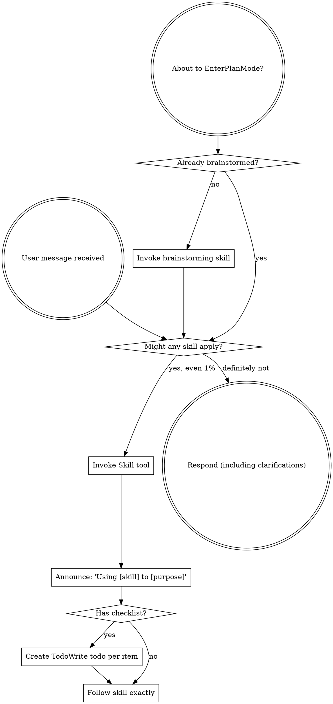

codex-exec: report contract violation

--- codex stdout ---
---
schema_version: 2
phase: 149
plan: "149-01"
title: "Skill-Routing Table"
model: codex
expected_ATC_tier: GATE
prior_errors_lookup: true
slug: "skill-routing-table"
milestone: "v3.5"
status: "PLANNED"
depends_on:
  - "146"
skip_gates: []
lessons_path: null
design_ref: ".planning/analyses/2026-08-05-always-on-orchestration-DESIGN.md#p149"
intent: "SGSD governance must be a runtime mechanism, not prose: gates, MUDA, triage, and skill routing fire in every session type with evidence logged loudly when they do not."
execution_mode: "serial-codex"
adapter_decision: "adapter-in-loader"
lock_status: locked
locked_at: "2026-08-08T00:00:00+01:00"
locked_by: "codex-phase-planner"
risk_rating: high
rollback_plan: >
  Rollback removes the P149 skill-routing runtime without deleting historical evidence. Delete
  `super-gsd/registry/skill-routing.yaml`, delete
  `super-gsd/scripts/lib/skill-routing-registry.cjs`, delete the malformed registry fixture, revert
  P149 edits to `super-gsd/hooks/sgsd-intent-classifier.cjs`,
  `super-gsd/hooks/sgsd-quality-gate.js`, `super-gsd/scripts/lib/orchestrator-hooks.cjs`,
  `super-gsd/registry/session-governance-hooks.yaml`, and
  `super-gsd/skills/sgsd-orchestrate/SKILL.md`. Leave
  `.planning/metrics/gate-evidence.jsonl` append-only; if rollback evidence is needed, append a new
  reason-coded envelope row rather than editing prior rows.
allowed_files:
  - ".planning/milestones/v3.5/phases/149-skill-routing-table/149-01-PLAN-LOCKED.md"
  - ".planning/metrics/gate-evidence.jsonl"
  - ".planning/metrics/codex-log.jsonl"
  - ".planning/metrics/codex-live.json"
  - ".planning/metrics/codex-live-output.txt"
  - "super-gsd/registry/skill-routing.yaml"
  - "super-gsd/scripts/lib/skill-routing-registry.cjs"
  - "super-gsd/tools/self-test/fixtures/skill-routing-malformed.yaml"
  - "super-gsd/hooks/sgsd-intent-classifier.cjs"
  - "super-gsd/hooks/sgsd-quality-gate.js"
  - "super-gsd/registry/session-governance-hooks.yaml"
  - "super-gsd/scripts/lib/orchestrator-hooks.cjs"
  - "super-gsd/skills/sgsd-orchestrate/SKILL.md"
forbidden_files:
  - "super-gsd/registry/gates.yaml"
  - ".planning/STATE.md"
  - ".planning/milestones/v3.5/ROADMAP.md"
  - ".claude/**"
  - "~/.claude/**"
  - "devcp/**"
invariants:
  - "P149 keeps `skill-routing.yaml` as the single human-maintained routing metadata source after the loader exists."
  - "The adapter decision is adapter-in-loader: classifier and orchestrator callers consume normalized helper output instead of parsing a second registry shape."
  - "Do not copy `gates.yaml` predicates into `skill-routing.yaml`; gate-owned eligibility is represented only by references such as `gate_ref`."
  - "Self-test behavior fails malformed routing tables; runtime behavior falls back to compiled embedded routes and logs degradation evidence loudly."
  - "Malformed runtime fallback does not throw upward during a live session."
  - "Every degraded path writes a reason-coded row to `.planning/metrics/gate-evidence.jsonl`; degraded paths never rely on stderr alone."
  - "P146 manual-session suggestions consume prompt-time rows from `skill-routing.yaml` through the loader adapter."
  - "Auto-mode phase-close consult runs after phase completion and before Step 6.7 milestone completion."
  - "Every applicable scheduled route appends a fired or skipped evidence row with skill, moment, mode, phase, decision, and reason."
  - "Mutating skills such as `gsd-code-review-fix` are never scheduled automatically."
  - "Legacy aliases remain aliases or explicit omitted rows; P149 does not create new first-class SGSD skills for health or cleanup aliases."
  - "Runtime helper resources shipped with SGSD are resolved from the SGSD root or module-local paths, not from ambient cwd."
anti_stub_policy:
  - "No acceptance scenario may pass by checking only hardcoded stdout unrelated to the real registry table."
  - "The schema self-test parses the real `super-gsd/registry/skill-routing.yaml` with `js-yaml`."
  - "The malformed fixture is a real YAML file and must fail self-test."
  - "Manual classifier probes use real prompt strings and the real loader adapter."
  - "Runtime fallback is verified by forcing the malformed fixture through the loader override."
  - "Phase-close verification appends or tails real `.planning/metrics/gate-evidence.jsonl` rows for `event=skill-routing`."
source_audit:
  - source: "CONTEXT"
    path: ".planning/milestones/v3.5/phases/149-skill-routing-table/CONTEXT.md"
    status: success
    relevant_hits: 4
    citations:
      - "Defines P149 goal, table shape, constraints, neglected inventory, malformed-table behavior, and AC scope."
  - source: "RESEARCH"
    path: ".planning/milestones/v3.5/phases/149-skill-routing-table/149-RESEARCH.md"
    status: success
    relevant_hits: 24
    citations:
      - "Supplies cited findings, live-code seams, risks, recommended task shape, and known mismatch between P146 parser shape and P149 table shape."
  - source: "VTP"
    path: "VTP ide-ce7c-002"
    status: success
    relevant_hits: 1
    citations:
      - "Supports the design lineage: central process-input routing to the right GSD skill."
  - source: "Design spec AC-149"
    path: ".planning/analyses/2026-08-05-always-on-orchestration-DESIGN.md#p149"
    status: success
    relevant_hits: 3
    citations:
      - "Acceptance criteria: schema self-test, manual visible suggestion, auto phase-close fired/skipped logging."
  - source: "plan-schema-v2"
    path: "super-gsd/templates/plan-schema-v2.json"
    status: success
    relevant_hits: 2
    citations:
      - "Requires `schema_version`, `tasks`, and `semantic_acceptance_criteria`."
      - "Each task must declare id, agent, model, files_touched, input_contract, output_contract, hypothesis, falsifier, and stop_rule."
design_decisions:
  - decision: "adapter_decision"
    value: "adapter-in-loader"
  - decision: "registry_source"
    value: >
      `super-gsd/registry/skill-routing.yaml` is the single runtime source of truth for neglected SGSD skill routing.
  - decision: "loader_boundary"
    value: >
      `super-gsd/scripts/lib/skill-routing-registry.cjs` owns YAML loading, schema validation, prompt-time adaptation, scheduled-route lookup,
      compiled fallback, runtime degradation logging, and CLI probes.
  - decision: "manual_session_integration"
    value: >
      P146 manual-session suggestions consume prompt-time rows from `skill-routing.yaml` through `toPromptGovernanceRoutes()`.
  - decision: "phase_close_integration"
    value: >
      The orchestrator scheduled consult runs after “Mark phase complete, advance to next phase” and before Step 6.7 milestone completion.
tasks:
  - id: "P149-T1"
    type: "registry"
    agent: codex
    model: codex
    files_touched:
      - "super-gsd/registry/skill-routing.yaml"
    input_contract: >
      Implement only the registry table using the Registry Content Contract and Inventory Decisions. Do not edit classifier or orchestrator code in this task.
    output_contract: >
      `super-gsd/registry/skill-routing.yaml` exists with a single top-level routing array that covers the required inventory decisions without duplicating gate predicates.
    hypothesis: "A single per-skill routing table can cover neglected skill inventory and legacy alias decisions without duplicating gate predicates."
    falsifier: >
      Any required inventory item is absent, any route row lacks skill/signatures/moment/modes, or any cooldown copies a predicate instead of referencing a gate name or route policy.
    stop_rule: >
      Stop after the registry table exists and the verification command reports row count plus inventory coverage; do not edit classifier, orchestrator, or docs in this task.
    verification:
      commands:
        - >-
          node -e "const fs=require('fs'); const yaml=require('js-yaml'); const doc=yaml.load(fs.readFileSync('super-gsd/registry/skill-routing.yaml','utf8')); const rows=doc.routes||doc.skills; if(!Array.isArray(rows)) throw new Error('routes array missing'); for(const [i,r] of rows.entries()){ for(const k of ['skill','signatures','moment','modes']) if(r[k]===undefined) throw new Error(i+': missing '+k); if(r.cooldown&&r.cooldown.predicate) throw new Error(i+': predicate duplication forbidden'); } console.log('skill-routing rows='+rows.length);"
  - id: "P149-T2"
    type: "loader-schema-fallback"
    agent: codex
    model: codex
    files_touched:
      - "super-gsd/scripts/lib/skill-routing-registry.cjs"
      - "super-gsd/tools/self-test/fixtures/skill-routing-malformed.yaml"
    input_contract: >
      Implement only the js-yaml loader/helper module and malformed fixture. Reuse `js-yaml`; do not wire classifier or orchestrator callers in this task.
    output_contract: >
      The helper exports normalized loading, prompt adapter, scheduled-route query, compiled fallback, and CLI probes; malformed self-test fails while runtime probe falls back and logs degradation.
    hypothesis: "A js-yaml loader can validate the runtime table in self-test, adapt it for callers, and fall back loudly at runtime when malformed."
    falsifier: >
      Malformed registry self-test exits zero, runtime probe throws upward, fallback routes are unavailable, or registry degradation is not written to gate evidence.
    stop_rule: >
      Stop after the loader self-test, malformed self-test, and malformed runtime probe commands demonstrate the expected self-test failure and runtime fallback behavior.
    verification:
      commands:
        - "node super-gsd/scripts/lib/skill-routing-registry.cjs --self-test"
        - "node super-gsd/scripts/lib/skill-routing-registry.cjs --self-test --registry super-gsd/tools/self-test/fixtures/skill-routing-malformed.yaml"
        - "node super-gsd/scripts/lib/skill-routing-registry.cjs --runtime-probe --registry super-gsd/tools/self-test/fixtures/skill-routing-malformed.yaml --moment prompt-time --mode manual"
  - id: "P149-T3"
    type: "classifier-adapter"
    agent: codex
    model: codex
    files_touched:
      - "super-gsd/hooks/sgsd-intent-classifier.cjs"
      - "super-gsd/hooks/sgsd-quality-gate.js"
      - "super-gsd/registry/session-governance-hooks.yaml"
    input_contract: >
      Wire P146 manual-session routing to the loader adapter and reduce `session-governance-hooks.yaml` to compatibility metadata or pointer text as needed.
    output_contract: >
      Manual classifier prompts consume prompt-time rows from `skill-routing.yaml` through the loader adapter and produce visible suggestions without a second maintained lexicon.
    hypothesis: "P146 manual-session suggestions can consume prompt-time rows from skill-routing.yaml through the loader adapter without preserving a second maintained lexicon."
    falsifier: >
      Manual prompt probes fail to produce visible suggestions for the named skills, or normal runtime still depends on `session-governance-hooks.yaml` as the maintained lexicon.
    stop_rule: >
      Stop after the three manual prompt verification commands produce visible suggestions from `skill-routing.yaml` and malformed-table fallback still preserves the token-audit route.
    verification:
      commands:
        - >-
          node super-gsd/hooks/sgsd-intent-classifier.cjs --mode manual --prompt "please run a token waste audit before this closes"
        - >-
          node super-gsd/hooks/sgsd-intent-classifier.cjs --mode manual --prompt "this looks like MUDA and needs a waste audit"
        - >-
          node super-gsd/hooks/sgsd-intent-classifier.cjs --mode manual --prompt "use VTP advice for this architecture proposal"
  - id: "P149-T4"
    type: "orchestrator-phase-close"
    agent: codex
    model: codex
    files_touched:
      - "super-gsd/scripts/lib/orchestrator-hooks.cjs"
      - "super-gsd/scripts/lib/skill-routing-registry.cjs"
    input_contract: >
      Add the orchestrator scheduled consult API using loader-provided scheduled rows. Place the phase-close seam after phase completion and before Step 6.7 milestone completion.
    output_contract: >
      Phase-close dry run enumerates applicable scheduled routes and appends gate-evidence envelope rows for fired and skipped decisions with concrete reasons.
    hypothesis: "Auto-mode phase close can consult scheduled routing rows after phase completion and before milestone-close logic, logging fired/skipped decisions for every applicable skill."
    falsifier: >
      The phase-close hook omits applicable rows, reads copied predicates from `gates.yaml`, runs after milestone-close logic, or fails to append fired/skipped evidence rows.
    stop_rule: >
      Stop after the phase-close dry-run command and gate-evidence ledger tail show scheduled skill-routing rows with skill, moment, mode, phase, decision, and reason.
    verification:
      commands:
        - >-
          node super-gsd/scripts/lib/orchestrator-hooks.cjs skill-routing --moment phase-close --mode auto --phase 149 --files-changed 4 --diff-lines 100 --dry-run
        - >-
          Select-String -Path ".planning/metrics/gate-evidence.jsonl" -Pattern '"event":"skill-routing"' | Select-Object -Last 10
  - id: "P149-T5"
    type: "orchestrate-doc-runtime-reference"
    agent: codex
    model: codex
    files_touched:
      - "super-gsd/skills/sgsd-orchestrate/SKILL.md"
    input_contract: >
      Edit only `super-gsd/skills/sgsd-orchestrate/SKILL.md`; replace hardcoded routing prose with references to `skill-routing.yaml` and the orchestrator hook.
    output_contract: >
      The orchestrate skill preserves operator-readable guidance while making runtime routing a table/helper decision and documents the phase-close consult before Step 6.7.
    hypothesis: "Replacing hardcoded routing prose with references to the registry prevents policy drift while preserving operator-readable workflow instructions."
    falsifier: >
      The orchestrate skill still contains prose-only routing trigger rules, omits the registry/helper reference, or fails to document the phase-close consult placement.
    stop_rule: >
      Stop after the two Select-String verification commands find registry/helper references and the Step 6.7 or phase-close placement.
    verification:
      commands:
        - >-
          Select-String -Path "super-gsd/skills/sgsd-orchestrate/SKILL.md" -Pattern "skill-routing.yaml|skill-routing"
        - >-
          Select-String -Path "super-gsd/skills/sgsd-orchestrate/SKILL.md" -Pattern "Step 6.7|phase-close"
  - id: "P149-T6"
    type: "acceptance-verification"
    agent: codex
    model: codex
    files_touched:
      - "super-gsd/scripts/lib/skill-routing-registry.cjs"
      - "super-gsd/hooks/sgsd-intent-classifier.cjs"
      - "super-gsd/scripts/lib/orchestrator-hooks.cjs"
      - ".planning/metrics/gate-evidence.jsonl"
    input_contract: >
      Run AC-149 verification end to end against real repo data after P149-T1 through P149-T5 are complete.
    output_contract: >
      Verification proves schema self-test passes the real table and fails malformed fixture, manual prompt suggestions are visible, and auto phase-close logs fired/skipped evidence.
    hypothesis: "AC-149 is satisfied only when schema validation, manual prompt suggestion, and auto phase-close fired/skipped evidence all pass against real repo data."
    falsifier: >
      Any AC-149 verification command fails, manual prompt suggestion is absent, auto phase-close evidence is absent, or malformed runtime degradation is not observable.
    stop_rule: >
      Stop after all AC-149 verification commands pass and the final gate-evidence tail shows manual/auto skill-routing and malformed-runtime degradation evidence.
    verification:
      commands:
        - "node super-gsd/scripts/lib/skill-routing-registry.cjs --self-test"
        - >-
          node super-gsd/hooks/sgsd-intent-classifier.cjs --mode manual --prompt "run code review and verify work before close"
        - >-
          node super-gsd/scripts/lib/orchestrator-hooks.cjs skill-routing --moment phase-close --mode auto --phase 149 --files-changed 4 --diff-lines 100
        - >-
          Select-String -Path ".planning/metrics/gate-evidence.jsonl" -Pattern '"event":"skill-routing"' | Select-Object -Last 20
semantic_acceptance_criteria:
  - task_id: "P149-T1"
    id: "SCHEMA-09"
    probe: "Parse the real registry YAML and validate required fields on every route row."
    pass: "All rows contain skill, signatures, moment, modes; cooldowns reference gate names or route policy only."
  - task_id: "P149-T1"
    id: "DLB-07"
    probe: "Coverage check against the real neglected inventory named in P149 CONTEXT."
    pass: "Every inventory item is either a canonical route or an explicit alias/omit decision in the table."
  - task_id: "P149-T2"
    id: "SCHEMA-09"
    probe: "Self-test against malformed fixture."
    pass: "Malformed registry exits non-zero in self-test."
  - task_id: "P149-T2"
    id: "DLB-07"
    probe: "Runtime probe against the same malformed fixture."
    pass: "Runtime does not throw upward; it returns compiled fallback routes and emits a gate-evidence degradation row."
  - task_id: "P149-T3"
    id: "SCHEMA-09"
    probe: "Manual classifier probes use real prompt strings mapped by skill-routing.yaml."
    pass: "Visible suggestions are produced for sgsd-token-audit, sgsd-muda-audit, and sgsd-vtp-advise."
  - task_id: "P149-T3"
    id: "DLB-07"
    probe: "Force malformed table via loader override and run the token-audit prompt."
    pass: "Fallback still suggests the compiled token route and logs registry degradation to gate-evidence."
  - task_id: "P149-T4"
    id: "SCHEMA-09"
    probe: "Phase-close scheduled consult uses real registry rows with moment=phase-close and mode=auto."
    pass: "The hook enumerates all applicable scheduled rows and never reads predicates copied from gates.yaml."
  - task_id: "P149-T4"
    id: "DLB-07"
    probe: "Gate-evidence ledger tail after phase-close probe."
    pass: "Every scheduled skill has a fired or skipped row with skill, moment, mode, phase, decision, and reason."
  - task_id: "P149-T5"
    id: "SCHEMA-09"
    probe: "Read the real orchestrate skill sections named in research findings 11 and 13."
    pass: "Routing decisions point to skill-routing.yaml/helper instead of prose-only trigger rules."
  - task_id: "P149-T5"
    id: "DLB-07"
    probe: "Confirm the phase-close seam is documented."
    pass: "The consult is placed after mark-phase-complete/advance-next-phase and before Step 6.7 milestone completion."
  - task_id: "P149-T6"
    id: "SCHEMA-09"
    probe: "Run the schema self-test on the real table."
    pass: "Self-test exits 0 for skill-routing.yaml and exits non-zero for the malformed fixture."
  - task_id: "P149-T6"
    id: "DLB-07"
    probe: "Run manual and auto probes, then inspect gate-evidence.jsonl."
    pass: "Manual prompt yields visible suggestion; auto phase-close logs fired/skipped rows; malformed runtime logs degradation."
---

# P149 Plan — Skill-Routing Table

## Goal

Create `super-gsd/registry/skill-routing.yaml` as the single runtime source of truth for neglected SGSD skill routing, then wire it into P146 manual-session suggestions and auto-mode phase-close scheduling with gate-evidence rows for fired, skipped, and degraded decisions.

## Architecture

Use `skill-routing.yaml` for human-maintained routing metadata. Add `super-gsd/scripts/lib/skill-routing-registry.cjs` as the only parser/validator/adapter: it loads YAML with `js-yaml`, schema-validates for self-test, adapts prompt-time rows into P146’s existing route shape, and exposes scheduled rows for orchestrator phase-close hooks.

Runtime behavior differs from self-test behavior deliberately: self-test fails malformed tables; runtime falls back to a compiled embedded lexicon and logs degradation through the existing gate-evidence command-envelope writer. This preserves sessions while making the failure loud.

## Adapter Decision

Choose adapter-in-loader, not a classifier parser extension. P149’s desired table is per-skill routing metadata, while P146 currently expects `routes[].trigger/predicate/enforcement`; changing every classifier call site to understand two registry shapes would create dual semantics. The loader should own the adaptation: `loadSkillRoutingRegistry()` returns normalized route rows, `toPromptGovernanceRoutes()` emits P146-compatible prompt-time routes, and `getScheduledRoutes(moment, mode)` serves the orchestrator. That keeps `skill-routing.yaml` as the one maintained source after P149 and confines fallback/degradation logic to one module.

## Registry Content Contract

The table should use a single top-level array, preferably `routes`, where each row is one `skill + moment` decision. Repeating a skill across moments is allowed.

Required row fields:

- `skill`: canonical skill name to invoke or suggest.
- `signatures`: prompt regexes/phrases and/or event names.
- `moment`: one of `prompt-time`, `phase-close`, `milestone-close`, `weekly`, `on-demand`.
- `modes`: any of `manual`, `semi`, `auto`.
- `cooldown`: optional policy object.

Allowed optional fields:

- `aliases`: legacy names or operator-entered names covered by the row.
- `availability`: `canonical`, `alias`, `manual-only`, `external-if-installed`, or `omitted`.
- `gate_ref`: gate registry name when eligibility belongs to `gates.yaml`.
- `skip_reason`: fixed reason for omitted/unavailable legacy rows.
- `notes`: operator-facing explanation.

Do not copy `gates.yaml` predicates into this file. For MUDA and memory gates, encode only a gate reference such as `gate_ref: muda-audit` or `gate_ref: memory-curate`; the runtime helper consults existing gate/gate-adjacent mechanisms or records `skipped` with `gate_ref_not_triggered`.

## Inventory Decisions

Minimum table coverage must include these decisions:

- `sgsd-muda-audit`: prompt-time suggestion plus phase-close scheduled route; phase-close eligibility references `muda-audit` gate, no threshold duplication.
- `sgsd-token-audit`: prompt-time suggestion plus milestone-close route; milestone behavior remains owned by `sgsd-complete-milestone`.
- `sgsd-distill`: milestone-close route with once-per-milestone cooldown.
- `sgsd-sepl`: prompt-time/on-demand route for major proposals and architecture tradeoffs.
- `sgsd-overwatcher`: phase-close auto route with once-per-phase cooldown.
- `sgsd-readiness`: prompt-time/on-demand route and auto-mode readiness route reference.
- `sgsd-audit`: phase-close route and milestone-close route; milestone-close can remain blocking where existing audit policy says so.
- `sgsd-memory hygiene`: route as canonical `sgsd-memory-hygiene` or paired aliases `sgsd-recall` and `sgsd-curate`; use gate references for recall/curate discipline rather than copied predicates.
- `sgsd-vtp-advise`: prompt-time/on-demand route; graceful-fail behavior remains in the skill.
- `sgsd-health` and `gsd-health`: alias to `sgsd-readiness`; do not create a new health skill.
- `gsd-cleanup`: omit from auto scheduling; manual/on-demand suggestion only if a first-class command exists, otherwise `availability: omitted` with `skip_reason: legacy_unregistered`.
- `gsd-code-review`: prompt-time/on-demand route as `external-if-installed`; phase-close governance remains `sgsd-audit`.
- `gsd-code-review-fix`: prompt-time/on-demand only; never scheduled automatically because it mutates code.
- `gsd-verify-work`: alias to existing SGSD verification/ATC flow; prompt-time suggestion may preserve the legacy name.
- `gsd-secure-phase`: alias to existing security/edge-guard governance if registered; otherwise manual/on-demand omitted row with explicit skip reason.

## Serial Execution Prompts

### P149-T1

Implement only the registry table. Create `super-gsd/registry/skill-routing.yaml` with the required schema and inventory decisions above. Do not edit classifier or orchestrator code in this task. Verify with the frontmatter command and report row count plus inventory coverage.

### P149-T2

Implement only `super-gsd/scripts/lib/skill-routing-registry.cjs` and the malformed fixture. Reuse `js-yaml`. Export normalized loading, prompt adapter, scheduled-route query, compiled fallback, and CLI probes. Self-test must fail malformed YAML; runtime probe must fall back and log degradation.

### P149-T3

Wire P146 manual-session routing to the loader adapter. Remove normal runtime dependence on `session-governance-hooks.yaml`; keep that file only as deprecated compatibility metadata or pointer text if needed. Verify real prompts produce visible suggestions from `skill-routing.yaml`.

### P149-T4

Add the orchestrator scheduled consult API. The phase-close seam is after “Mark phase complete, advance to next phase” and before Step 6.7 milestone completion. For each applicable scheduled route, append a gate-evidence envelope row with `event=skill-routing`, `decision=fired|skipped`, and a concrete reason.

### P149-T5

Edit `super-gsd/skills/sgsd-orchestrate/SKILL.md` only. Replace routing prose cited by research with references to `skill-routing.yaml` and the orchestrator hook. Keep operator guidance, but make runtime routing a table/helper decision.

### P149-T6

Run AC-149 verification end to end. Prove: schema self-test passes real table and fails malformed fixture; manual prompt matching a neglected-skill signature yields visible suggestion; auto phase-close consult logs fired/skipped rows to `.planning/metrics/gate-evidence.jsonl`.

## Acceptance Mapping

AC-149a is covered by P149-T2 and P149-T6: schema check in self-test validates the real table and rejects malformed fixtures.

AC-149b is covered by P149-T3 and P149-T6: manual prompt probes for token audit, MUDA, VTP, code review, and verify-work return visible suggestions from the new table.

AC-149c is covered by P149-T4 and P149-T6: auto phase-close consults scheduled rows after phase completion and before Step 6.7, then logs fired/skipped evidence rows.

## Source Audit

| Source | Use |
|---|---|
| CONTEXT.md | Defines P149 goal, table shape, constraints, neglected inventory, malformed-table behavior, and AC scope. |
| RESEARCH.md | Supplies 24 cited findings, live-code seams, risks, recommended task shape, and known mismatch between P146 parser shape and P149 table shape. |
| VTP ide-ce7c-002 | Supports the design lineage: central process-input routing to the right GSD skill. |
| Design spec AC-149 | Acceptance criteria: schema self-test, manual visible suggestion, auto phase-close fired/skipped logging. |

--- codex stderr ---
OpenAI Codex v0.146.0
--------
workdir: C:\Users\jack.berrow\AppData\Roaming\warp\Warp\data\worktrees\GSDedits\cholla-racer
model: gpt-5.5
provider: openai
approval: never
sandbox: read-only
reasoning effort: xhigh
reasoning summaries: none
session id: 019fe141-cc7b-7833-a4a0-1445d9ed2424
--------
user
# SCHEMA-FIX (--fix-schema attempt 1/3) — P149 plan

The plan below FAILED plan-schema-v2 load validation. Rewrite it to conform EXACTLY to the schema shape demonstrated by the PASSING reference frontmatter further below. PRESERVE verbatim (locked fields): task ids, hypotheses, files_touched paths, verification commands, semantic acceptance criteria CONTENT (restructure location/shape as schema requires), the adapter-in-loader decision and all body prose. Add the missing required per-task fields (agent, model: codex, input_contract, output_contract, falsifier, stop_rule) and plan-level semantic_acceptance_criteria array. files_touched must be a plain string array. Emit ONLY the corrected plan file content to stdout. Budget ~3 minutes; do not browse the repo.

## Validator errors
  error [149-01-PLAN-LOCKED.md] task #1: missing required '0' (SCHEMA-02)
  error [149-01-PLAN-LOCKED.md] task #1: task must declare 'agent' (SCHEMA-02)
  error [149-01-PLAN-LOCKED.md] task #1: task must declare 'model' as codex|opus (SCHEMA-02)
  error [149-01-PLAN-LOCKED.md] task #1: task must declare 'input_contract' (SCHEMA-02)
  error [149-01-PLAN-LOCKED.md] task #1: task must declare 'output_contract' (SCHEMA-02)
  error [149-01-PLAN-LOCKED.md] task #1: task must declare 'falsifier' (SCHEMA-02)
  error [149-01-PLAN-LOCKED.md] task #1: task must declare 'stop_rule' (SCHEMA-02)
  error [149-01-PLAN-LOCKED.md] task #2: missing required '0' (SCHEMA-02)
  error [149-01-PLAN-LOCKED.md] task #2: missing required '1' (SCHEMA-02)
  error [149-01-PLAN-LOCKED.md] task #2: task must declare 'agent' (SCHEMA-02)
  error [149-01-PLAN-LOCKED.md] task #2: task must declare 'model' as codex|opus (SCHEMA-02)
  error [149-01-PLAN-LOCKED.md] task #2: task must declare 'input_contract' (SCHEMA-02)
  error [149-01-PLAN-LOCKED.md] task #2: task must declare 'output_contract' (SCHEMA-02)
  error [149-01-PLAN-LOCKED.md] task #2: task must declare 'falsifier' (SCHEMA-02)
  error [149-01-PLAN-LOCKED.md] task #2: task must declare 'stop_rule' (SCHEMA-02)
  error [149-01-PLAN-LOCKED.md] task #3: missing required '0' (SCHEMA-02)
  error [149-01-PLAN-LOCKED.md] task #3: missing required '1' (SCHEMA-02)
  error [149-01-PLAN-LOCKED.md] task #3: missing required '2' (SCHEMA-02)
  error [149-01-PLAN-LOCKED.md] task #3: task must declare 'agent' (SCHEMA-02)
  error [149-01-PLAN-LOCKED.md] task #3: task must declare 'model' as codex|opus (SCHEMA-02)
  error [149-01-PLAN-LOCKED.md] task #3: task must declare 'input_contract' (SCHEMA-02)
  error [149-01-PLAN-LOCKED.md] task #3: task must declare 'output_contract' (SCHEMA-02)
  error [149-01-PLAN-LOCKED.md] task #3: task must declare 'falsifier' (SCHEMA-02)
  error [149-01-PLAN-LOCKED.md] task #3: task must declare 'stop_rule' (SCHEMA-02)
  error [149-01-PLAN-LOCKED.md] task #4: missing required '0' (SCHEMA-02)
  error [149-01-PLAN-LOCKED.md] task #4: missing required '1' (SCHEMA-02)
  error [149-01-PLAN-LOCKED.md] task #4: task must declare 'agent' (SCHEMA-02)
  error [149-01-PLAN-LOCKED.md] task #4: task must declare 'model' as codex|opus (SCHEMA-02)
  error [149-01-PLAN-LOCKED.md] task #4: task must declare 'input_contract' (SCHEMA-02)
  error [149-01-PLAN-LOCKED.md] task #4: task must declare 'output_contract' (SCHEMA-02)
  error [149-01-PLAN-LOCKED.md] task #4: task must declare 'falsifier' (SCHEMA-02)
  error [149-01-PLAN-LOCKED.md] task #4: task must declare 'stop_rule' (SCHEMA-02)
  error [149-01-PLAN-LOCKED.md] task #5: missing required '0' (SCHEMA-02)
  error [149-01-PLAN-LOCKED.md] task #5: task must declare 'agent' (SCHEMA-02)
  error [149-01-PLAN-LOCKED.md] task #5: task must declare 'model' as codex|opus (SCHEMA-02)
  error [149-01-PLAN-LOCKED.md] task #5: task must declare 'input_contract' (SCHEMA-02)
  error [149-01-PLAN-LOCKED.md] task #5: task must declare 'output_contract' (SCHEMA-02)
  error [149-01-PLAN-LOCKED.md] task #5: task must declare 'falsifier' (SCHEMA-02)
  error [149-01-PLAN-LOCKED.md] task #5: task must declare 'stop_rule' (SCHEMA-02)
  error [149-01-PLAN-LOCKED.md] task #6: missing required '0' (SCHEMA-02)
  error [149-01-PLAN-LOCKED.md] task #6: missing required '1' (SCHEMA-02)
  error [149-01-PLAN-LOCKED.md] task #6: missing required '2' (SCHEMA-02)
  error [149-01-PLAN-LOCKED.md] task #6: missing required '3' (SCHEMA-02)
  error [149-01-PLAN-LOCKED.md] task #6: task must declare 'agent' (SCHEMA-02)
  error [149-01-PLAN-LOCKED.md] task #6: task must declare 'model' as codex|opus (SCHEMA-02)
  error [149-01-PLAN-LOCKED.md] task #6: task must declare 'input_contract' (SCHEMA-02)
  error [149-01-PLAN-LOCKED.md] task #6: task must declare 'output_contract' (SCHEMA-02)
  error [149-01-PLAN-LOCKED.md] task #6: task must declare 'falsifier' (SCHEMA-02)
  error [149-01-PLAN-LOCKED.md] task #6: task must declare 'stop_rule' (SCHEMA-02)
  error [149-01-PLAN-LOCKED.md] plan must declare 'semantic_acceptance_criteria' array with >=1 entry (SCHEMA-09)

## FAILED plan (rewrite this)
---
schema_version: 2
phase: "149"
slug: "skill-routing-table"
milestone: "v3.5"
status: "PLANNED"
depends_on:
  - "146"
design_ref: ".planning/analyses/2026-08-05-always-on-orchestration-DESIGN.md#p149"
intent: "SGSD governance must be a runtime mechanism, not prose: gates, MUDA, triage, and skill routing fire in every session type with evidence logged loudly when they do not."
execution_mode: "serial-codex"
adapter_decision: "adapter-in-loader"
tasks:
  - id: "P149-T1"
    type: "registry"
    hypothesis: "A single per-skill routing table can cover neglected skill inventory and legacy alias decisions without duplicating gate predicates."
    files_touched:
      - path: "super-gsd/registry/skill-routing.yaml"
        action: "create"
    verification:
      commands:
        - >-
          node -e "const fs=require('fs'); const yaml=require('js-yaml'); const doc=yaml.load(fs.readFileSync('super-gsd/registry/skill-routing.yaml','utf8')); const rows=doc.routes||doc.skills; if(!Array.isArray(rows)) throw new Error('routes array missing'); for(const [i,r] of rows.entries()){ for(const k of ['skill','signatures','moment','modes']) if(r[k]===undefined) throw new Error(i+': missing '+k); if(r.cooldown&&r.cooldown.predicate) throw new Error(i+': predicate duplication forbidden'); } console.log('skill-routing rows='+rows.length);"
    semantic_acceptance_criteria:
      - id: "SCHEMA-09"
        probe: "Parse the real registry YAML and validate required fields on every route row."
        pass: "All rows contain skill, signatures, moment, modes; cooldowns reference gate names or route policy only."
      - id: "DLB-07"
        probe: "Coverage check against the real neglected inventory named in P149 CONTEXT."
        pass: "Every inventory item is either a canonical route or an explicit alias/omit decision in the table."
  - id: "P149-T2"
    type: "loader-schema-fallback"
    hypothesis: "A js-yaml loader can validate the runtime table in self-test, adapt it for callers, and fall back loudly at runtime when malformed."
    files_touched:
      - path: "super-gsd/scripts/lib/skill-routing-registry.cjs"
        action: "create"
      - path: "super-gsd/tools/self-test/fixtures/skill-routing-malformed.yaml"
        action: "create"
    verification:
      commands:
        - "node super-gsd/scripts/lib/skill-routing-registry.cjs --self-test"
        - "node super-gsd/scripts/lib/skill-routing-registry.cjs --self-test --registry super-gsd/tools/self-test/fixtures/skill-routing-malformed.yaml"
        - "node super-gsd/scripts/lib/skill-routing-registry.cjs --runtime-probe --registry super-gsd/tools/self-test/fixtures/skill-routing-malformed.yaml --moment prompt-time --mode manual"
    semantic_acceptance_criteria:
      - id: "SCHEMA-09"
        probe: "Self-test against malformed fixture."
        pass: "Malformed registry exits non-zero in self-test."
      - id: "DLB-07"
        probe: "Runtime probe against the same malformed fixture."
        pass: "Runtime does not throw upward; it returns compiled fallback routes and emits a gate-evidence degradation row."
  - id: "P149-T3"
    type: "classifier-adapter"
    hypothesis: "P146 manual-session suggestions can consume prompt-time rows from skill-routing.yaml through the loader adapter without preserving a second maintained lexicon."
    files_touched:
      - path: "super-gsd/hooks/sgsd-intent-classifier.cjs"
        action: "modify"
      - path: "super-gsd/hooks/sgsd-quality-gate.js"
        action: "modify"
      - path: "super-gsd/registry/session-governance-hooks.yaml"
        action: "deprecate-or-reduce-to-pointer"
    verification:
      commands:
        - >-
          node super-gsd/hooks/sgsd-intent-classifier.cjs --mode manual --prompt "please run a token waste audit before this closes"
        - >-
          node super-gsd/hooks/sgsd-intent-classifier.cjs --mode manual --prompt "this looks like MUDA and needs a waste audit"
        - >-
          node super-gsd/hooks/sgsd-intent-classifier.cjs --mode manual --prompt "use VTP advice for this architecture proposal"
    semantic_acceptance_criteria:
      - id: "SCHEMA-09"
        probe: "Manual classifier probes use real prompt strings mapped by skill-routing.yaml."
        pass: "Visible suggestions are produced for sgsd-token-audit, sgsd-muda-audit, and sgsd-vtp-advise."
      - id: "DLB-07"
        probe: "Force malformed table via loader override and run the token-audit prompt."
        pass: "Fallback still suggests the compiled token route and logs registry degradation to gate-evidence."
  - id: "P149-T4"
    type: "orchestrator-phase-close"
    hypothesis: "Auto-mode phase close can consult scheduled routing rows after phase completion and before milestone-close logic, logging fired/skipped decisions for every applicable skill."
    files_touched:
      - path: "super-gsd/scripts/lib/orchestrator-hooks.cjs"
        action: "modify"
      - path: "super-gsd/scripts/lib/skill-routing-registry.cjs"
        action: "modify"
    verification:
      commands:
        - >-
          node super-gsd/scripts/lib/orchestrator-hooks.cjs skill-routing --moment phase-close --mode auto --phase 149 --files-changed 4 --diff-lines 100 --dry-run
        - >-
          Select-String -Path ".planning/metrics/gate-evidence.jsonl" -Pattern '"event":"skill-routing"' | Select-Object -Last 10
    semantic_acceptance_criteria:
      - id: "SCHEMA-09"
        probe: "Phase-close scheduled consult uses real registry rows with moment=phase-close and mode=auto."
        pass: "The hook enumerates all applicable scheduled rows and never reads predicates copied from gates.yaml."
      - id: "DLB-07"
        probe: "Gate-evidence ledger tail after phase-close probe."
        pass: "Every scheduled skill has a fired or skipped row with skill, moment, mode, phase, decision, and reason."
  - id: "P149-T5"
    type: "orchestrate-doc-runtime-reference"
    hypothesis: "Replacing hardcoded routing prose with references to the registry prevents policy drift while preserving operator-readable workflow instructions."
    files_touched:
      - path: "super-gsd/skills/sgsd-orchestrate/SKILL.md"
        action: "modify"
    verification:
      commands:
        - >-
          Select-String -Path "super-gsd/skills/sgsd-orchestrate/SKILL.md" -Pattern "skill-routing.yaml|skill-routing"
        - >-
          Select-String -Path "super-gsd/skills/sgsd-orchestrate/SKILL.md" -Pattern "Step 6.7|phase-close"
    semantic_acceptance_criteria:
      - id: "SCHEMA-09"
        probe: "Read the real orchestrate skill sections named in research findings 11 and 13."
        pass: "Routing decisions point to skill-routing.yaml/helper instead of prose-only trigger rules."
      - id: "DLB-07"
        probe: "Confirm the phase-close seam is documented."
        pass: "The consult is placed after mark-phase-complete/advance-next-phase and before Step 6.7 milestone completion."
  - id: "P149-T6"
    type: "acceptance-verification"
    hypothesis: "AC-149 is satisfied only when schema validation, manual prompt suggestion, and auto phase-close fired/skipped evidence all pass against real repo data."
    files_touched:
      - path: "super-gsd/scripts/lib/skill-routing-registry.cjs"
        action: "verify-only"
      - path: "super-gsd/hooks/sgsd-intent-classifier.cjs"
        action: "verify-only"
      - path: "super-gsd/scripts/lib/orchestrator-hooks.cjs"
        action: "verify-only"
      - path: ".planning/metrics/gate-evidence.jsonl"
        action: "append-evidence"
    verification:
      commands:
        - "node super-gsd/scripts/lib/skill-routing-registry.cjs --self-test"
        - >-
          node super-gsd/hooks/sgsd-intent-classifier.cjs --mode manual --prompt "run code review and verify work before close"
        - >-
          node super-gsd/scripts/lib/orchestrator-hooks.cjs skill-routing --moment phase-close --mode auto --phase 149 --files-changed 4 --diff-lines 100
        - >-
          Select-String -Path ".planning/metrics/gate-evidence.jsonl" -Pattern '"event":"skill-routing"' | Select-Object -Last 20
    semantic_acceptance_criteria:
      - id: "SCHEMA-09"
        probe: "Run the schema self-test on the real table."
        pass: "Self-test exits 0 for skill-routing.yaml and exits non-zero for the malformed fixture."
      - id: "DLB-07"
        probe: "Run manual and auto probes, then inspect gate-evidence.jsonl."
        pass: "Manual prompt yields visible suggestion; auto phase-close logs fired/skipped rows; malformed runtime logs degradation."
---

# P149 Plan — Skill-Routing Table

## Goal

Create `super-gsd/registry/skill-routing.yaml` as the single runtime source of truth for neglected SGSD skill routing, then wire it into P146 manual-session suggestions and auto-mode phase-close scheduling with gate-evidence rows for fired, skipped, and degraded decisions.

## Architecture

Use `skill-routing.yaml` for human-maintained routing metadata. Add `super-gsd/scripts/lib/skill-routing-registry.cjs` as the only parser/validator/adapter: it loads YAML with `js-yaml`, schema-validates for self-test, adapts prompt-time rows into P146’s existing route shape, and exposes scheduled rows for orchestrator phase-close hooks.

Runtime behavior differs from self-test behavior deliberately: self-test fails malformed tables; runtime falls back to a compiled embedded lexicon and logs degradation through the existing gate-evidence command-envelope writer. This preserves sessions while making the failure loud.

## Adapter Decision

Choose adapter-in-loader, not a classifier parser extension. P149’s desired table is per-skill routing metadata, while P146 currently expects `routes[].trigger/predicate/enforcement`; changing every classifier call site to understand two registry shapes would create dual semantics. The loader should own the adaptation: `loadSkillRoutingRegistry()` returns normalized route rows, `toPromptGovernanceRoutes()` emits P146-compatible prompt-time routes, and `getScheduledRoutes(moment, mode)` serves the orchestrator. That keeps `skill-routing.yaml` as the one maintained source after P149 and confines fallback/degradation logic to one module.

## Registry Content Contract

The table should use a single top-level array, preferably `routes`, where each row is one `skill + moment` decision. Repeating a skill across moments is allowed.

Required row fields:

- `skill`: canonical skill name to invoke or suggest.
- `signatures`: prompt regexes/phrases and/or event names.
- `moment`: one of `prompt-time`, `phase-close`, `milestone-close`, `weekly`, `on-demand`.
- `modes`: any of `manual`, `semi`, `auto`.
- `cooldown`: optional policy object.

Allowed optional fields:

- `aliases`: legacy names or operator-entered names covered by the row.
- `availability`: `canonical`, `alias`, `manual-only`, `external-if-installed`, or `omitted`.
- `gate_ref`: gate registry name when eligibility belongs to `gates.yaml`.
- `skip_reason`: fixed reason for omitted/unavailable legacy rows.
- `notes`: operator-facing explanation.

Do not copy `gates.yaml` predicates into this file. For MUDA and memory gates, encode only a gate reference such as `gate_ref: muda-audit` or `gate_ref: memory-curate`; the runtime helper consults existing gate/gate-adjacent mechanisms or records `skipped` with `gate_ref_not_triggered`.

## Inventory Decisions

Minimum table coverage must include these decisions:

- `sgsd-muda-audit`: prompt-time suggestion plus phase-close scheduled route; phase-close eligibility references `muda-audit` gate, no threshold duplication.
- `sgsd-token-audit`: prompt-time suggestion plus milestone-close route; milestone behavior remains owned by `sgsd-complete-milestone`.
- `sgsd-distill`: milestone-close route with once-per-milestone cooldown.
- `sgsd-sepl`: prompt-time/on-demand route for major proposals and architecture tradeoffs.
- `sgsd-overwatcher`: phase-close auto route with once-per-phase cooldown.
- `sgsd-readiness`: prompt-time/on-demand route and auto-mode readiness route reference.
- `sgsd-audit`: phase-close route and milestone-close route; milestone-close can remain blocking where existing audit policy says so.
- `sgsd-memory hygiene`: route as canonical `sgsd-memory-hygiene` or paired aliases `sgsd-recall` and `sgsd-curate`; use gate references for recall/curate discipline rather than copied predicates.
- `sgsd-vtp-advise`: prompt-time/on-demand route; graceful-fail behavior remains in the skill.
- `sgsd-health` and `gsd-health`: alias to `sgsd-readiness`; do not create a new health skill.
- `gsd-cleanup`: omit from auto scheduling; manual/on-demand suggestion only if a first-class command exists, otherwise `availability: omitted` with `skip_reason: legacy_unregistered`.
- `gsd-code-review`: prompt-time/on-demand route as `external-if-installed`; phase-close governance remains `sgsd-audit`.
- `gsd-code-review-fix`: prompt-time/on-demand only; never scheduled automatically because it mutates code.
- `gsd-verify-work`: alias to existing SGSD verification/ATC flow; prompt-time suggestion may preserve the legacy name.
- `gsd-secure-phase`: alias to existing security/edge-guard governance if registered; otherwise manual/on-demand omitted row with explicit skip reason.

## Serial Execution Prompts

### P149-T1

Implement only the registry table. Create `super-gsd/registry/skill-routing.yaml` with the required schema and inventory decisions above. Do not edit classifier or orchestrator code in this task. Verify with the frontmatter command and report row count plus inventory coverage.

### P149-T2

Implement only `super-gsd/scripts/lib/skill-routing-registry.cjs` and the malformed fixture. Reuse `js-yaml`. Export normalized loading, prompt adapter, scheduled-route query, compiled fallback, and CLI probes. Self-test must fail malformed YAML; runtime probe must fall back and log degradation.

### P149-T3

Wire P146 manual-session routing to the loader adapter. Remove normal runtime dependence on `session-governance-hooks.yaml`; keep that file only as deprecated compatibility metadata or pointer text if needed. Verify real prompts produce visible suggestions from `skill-routing.yaml`.

### P149-T4

Add the orchestrator scheduled consult API. The phase-close seam is after “Mark phase complete, advance to next phase” and before Step 6.7 milestone completion. For each applicable scheduled route, append a gate-evidence envelope row with `event=skill-routing`, `decision=fired|skipped`, and a concrete reason.

### P149-T5

Edit `super-gsd/skills/sgsd-orchestrate/SKILL.md` only. Replace routing prose cited by research with references to `skill-routing.yaml` and the orchestrator hook. Keep operator guidance, but make runtime routing a table/helper decision.

### P149-T6

Run AC-149 verification end to end. Prove: schema self-test passes real table and fails malformed fixture; manual prompt matching a neglected-skill signature yields visible suggestion; auto phase-close consult logs fired/skipped rows to `.planning/metrics/gate-evidence.jsonl`.

## Acceptance Mapping

AC-149a is covered by P149-T2 and P149-T6: schema check in self-test validates the real table and rejects malformed fixtures.

AC-149b is covered by P149-T3 and P149-T6: manual prompt probes for token audit, MUDA, VTP, code review, and verify-work return visible suggestions from the new table.

AC-149c is covered by P149-T4 and P149-T6: auto phase-close consults scheduled rows after phase completion and before Step 6.7, then logs fired/skipped evidence rows.

## Source Audit

| Source | Use |
|---|---|
| CONTEXT.md | Defines P149 goal, table shape, constraints, neglected inventory, malformed-table behavior, and AC scope. |
| RESEARCH.md | Supplies 24 cited findings, live-code seams, risks, recommended task shape, and known mismatch between P146 parser shape and P149 table shape. |
| VTP ide-ce7c-002 | Supports the design lineage: central process-input routing to the right GSD skill. |
| Design spec AC-149 | Acceptance criteria: schema self-test, manual visible suggestion, auto phase-close fired/skipped logging. |


## PASSING reference frontmatter (148-01-PLAN-LOCKED.md, first 160 lines — match this shape)
---
schema_version: 2
phase: 148
plan: "148-01"
title: "Cross-Model Triage"
model: codex
expected_ATC_tier: GATE
prior_errors_lookup: true
depends_on:
  - "145"
  - "146"
skip_gates: []
lessons_path: null
vtp_status: "success: low-yield 1 marginal hit"
lock_status: locked
locked_at: "2026-08-07T00:00:00+01:00"
locked_by: "codex-phase-planner"
risk_rating: high
rollback_plan: >
  Rollback removes the cross-model triage runtime without deleting historical evidence. Revert the
  `triage-verdict-v1` contract branch in `super-gsd/scripts/codex-exec.sh`, delete
  `super-gsd/scripts/lib/triage-verdict-schema.cjs` and `super-gsd/scripts/sgsd-triage-runtime.cjs`,
  revert P148 edits to `super-gsd/scripts/lib/vtp-context-composer.cjs` and
  `super-gsd/skills/sgsd-triage/SKILL.md`, and remove the P148 fixture runner. Leave
  `.planning/metrics/vtp-routing-log.jsonl`, `.planning/metrics/gate-evidence.jsonl`, and Codex
  metrics append-only; if a rollback must be recorded, append a new reason-coded envelope row rather
  than editing prior rows. If `super-gsd/install.sh --install-global` was run after P148, rerun the
  prior shipped installer or manually restore the previous `~/.claude/commands/sgsd-triage/SKILL.md`
  from the pre-P148 source copy.
allowed_files:
  - ".planning/milestones/v3.5/phases/148-cross-model-triage/148-01-PLAN-LOCKED.md"
  - ".planning/metrics/vtp-routing-log.jsonl"
  - ".planning/metrics/gate-evidence.jsonl"
  - ".planning/metrics/codex-log.jsonl"
  - ".planning/metrics/codex-live.json"
  - ".planning/metrics/codex-live-output.txt"
  - "<active-phase-dir>/VTP-EVIDENCE.md via resolveContainedPath"
  - "super-gsd/scripts/lib/vtp-context-composer.cjs"
  - "super-gsd/scripts/lib/triage-verdict-schema.cjs"
  - "super-gsd/scripts/codex-exec.sh"
  - "super-gsd/scripts/sgsd-triage-runtime.cjs"
  - "super-gsd/skills/sgsd-triage/SKILL.md"
  - "super-gsd/install.sh"
  - "super-gsd/tests/triage-runtime/assert-real-triage-runtime.cjs"
forbidden_files:
  - "super-gsd/registry/gates.yaml"
  - "super-gsd/hooks/sgsd-intent-classifier.cjs"
  - "super-gsd/config/codex-profiles.yaml"
  - "super-gsd/tools/codex-pro/profile-resolver.cjs"
  - ".planning/STATE.md"
  - ".planning/milestones/v3.5/ROADMAP.md"
  - ".claude/**"
  - "~/.claude/**"
  - "devcp/**"
invariants:
  - "Codex second opinion runs only for planning-gated triage invocations produced by the P146 planning route; trivial, execution, and mid-build prompts do not dispatch Codex."
  - "Codex dispatch always uses `--profile triage --timeout-tier custom:300 --contract triage-verdict-v1`; never dispatch triage with a bare `--step`."
  - "`triage-verdict-v1` extends codex-exec's contract vocabulary; the wrapper extracts exactly one JSON object and schema-validates it before writing the report."
  - "The consuming runtime revalidates the Codex verdict from disk and never trusts wrapper shape alone."
  - "The Codex verdict schema uses the closed path vocabulary `A`, `B`, `C`, `D`; prompt content cannot introduce another route."
  - "The operator raw query is framed as data in the Codex prompt, fenced or JSON-embedded, with explicit instructions that the query content is not executable instruction."
  - "Recommended skills in a Codex verdict are strings only; the runtime never executes or auto-fires them."
  - "VTP fallback predicate is exactly: initial route call ok AND (`reflection === null` OR `evidence_hit_count < 2`) -> one direct `vtp_search_substrate` fallback."
  - "VTP route failure is not the fallback predicate; route failure falls through to normal triage with an observable degradation row and no retry."
  - "Every generated destination is derived through `resolveContainedPath` from an independently resolved SGSD root; no caller-supplied absolute metrics or artifact paths are trusted."
  - "Every degraded path writes a reason-coded envelope-v1 row through `logGateEvidence`; degraded paths never report clean and never rely on stderr alone."
  - "Codex unavailable, timeout, failing, malformed, or schema-invalid output completes as single-model triage and never blocks the operator."
  - "Malformed external Codex output logs `triage_codex_degraded` with a distinct reason code such as `codex_verdict_malformed`, `codex_verdict_multiple_json`, or `codex_verdict_missing_rationale`."
  - "Codex verdict success appends a real `triage_codex_verdict` row to `.planning/metrics/vtp-routing-log.jsonl` containing the fixture/raw query, contract, path, rationale-bearing fields, and dispatch metadata."
  - "Disagreement output surfaces Claude classification, Codex verdict, and Recommendation as three rationale-bearing lines; a path letter without a why is a reconciliation contract violation."
  - "Agreement and disagreement both log reconciliation evidence; disagreement uses reason code `codex_claude_disagree`, agreement uses `codex_claude_agree`."
  - "Runtime resources shipped with SGSD are resolved from `__dirname` or `findSgsdRoot`, not from ambient cwd."
  - "`SKILL.md` owns prose order and operator UX; `sgsd-triage-runtime.cjs` owns STATE read, containment, VTP fallback, prompt build, dispatch, validation, and evidence rows."
anti_stub_policy:
  - "No acceptance scenario may pass by invoking `--self-test` or checking only hardcoded stdout."
  - "Every acceptance scenario creates a temporary SGSD-shaped repo with a real `.planning/STATE.md`, real phase directory, real config, and absent metrics files before invocation."
  - "Fixture values include unique raw queries, selected queries, doc IDs, STATE milestone/phase fields, and canned Codex verdict fields that must appear in parsed runtime output or JSONL rows."
  - "Codex is fakeable only by putting a constructed `codex` binary on PATH that returns canned `triage-verdict-v1` output; the real `codex-exec.sh` wrapper is still invoked."
  - "VTP is fakeable only through the composer's injected `mcpInvoke` contract; the real runtime path still calls `callVtp(...)` and writes the real routing log rows."
  - "Each positive fixture has a negative control: non-planning trigger skips Codex, healthy VTP response skips fallback, malformed Codex degrades, and bare path disagreement output fails."
source_audit:
  - source: "CONTEXT"
    path: ".planning/milestones/v3.5/phases/148-cross-model-triage/CONTEXT.md"
    status: success
    relevant_hits: 4
    citations:
      - "Goal is two-model self-healing triage with Codex gpt-5.5/xhigh and VTP null-reflection fallback."
      - "Codex failure or timeout must complete single-model and log degradation."
      - "All VTP calls go through vtp-context-composer `callVtp`."
      - "AC-148a-d require Codex verdict row, null-reflection fallback, Codex-unavailable fallthrough, and disagreement surfacing."
  - source: "RESEARCH"
    path: ".planning/milestones/v3.5/phases/148-cross-model-triage/148-RESEARCH.md"
    status: success
    relevant_hits: 9
    citations:
      - "Q3 fixes fallback slot and predicate: route ok and reflection null or hits below 2."
      - "Q4 fixes dispatch command: profile triage, custom:300 timeout tier, and triage-verdict-v1 contract."
      - "Q5 requires wrapper validation plus consumer revalidation and observable malformed-output degradation."
      - "Q6 requires both verdicts surfaced on disagreement and never auto-fired."
      - "Q8 assigns runtime mechanics to `sgsd-triage-runtime.cjs` and prose/operator UX to SKILL.md."
      - "Q9 flags cost, latency, profile drift, and prompt injection mitigations."
  - source: "VTP-ENRICHMENT"
    path: ".planning/milestones/v3.5/phases/148-cross-model-triage/148-VTP-ENRICHMENT.md"
    status: success
    relevant_hits: 1
    vtp_available: true
    yield: "LOW: 1 marginal hit, 2 irrelevant hits discarded."
    citations:
      - "Disagreement without rationale creates stalemate; Claude classification, Codex verdict, and Recommendation lines must all carry a why."
  - source: "plan-schema-v2"
    path: "super-gsd/templates/plan-schema-v2.json"
    status: success
    relevant_hits: 2
    citations:
      - "Requires `schema_version`, `tasks`, and `semantic_acceptance_criteria`."
      - "Each task must declare id, agent, model, files_touched, input_contract, output_contract, hypothesis, falsifier, and stop_rule."
  - source: "P147 locked plan"
    path: ".planning/milestones/v3.5/phases/147-commit-seam-gate/147-01-PLAN-LOCKED.md"
    status: success
    relevant_hits: 4
    citations:
      - "Use locked schema-v2 shape with rollback, allowed files, forbidden files, invariants, source audit, semantic ACs, acceptance commands, and serial task contracts."
      - "Carry forward contained writer destinations through `resolveContainedPath`."
      - "Carry forward observable reason-coded degradation through `logGateEvidence`."
      - "Use real fixture entrypoints and negative controls instead of self-test-only assertions."
  - source: "STATE"
    path: ".planning/STATE.md"
    status: success
    relevant_hits: 1
    citations:
      - "v3.5 is active; P147 is closed PASS and P148 cross-model triage is next."
design_decisions:
  - decision: "contract"
    value: >
      Add `triage-verdict-v1` to codex-exec's contract vocabulary. The wrapper extracts exactly one JSON object from Codex stdout, rejects zero or
      multiple JSON objects, validates against `super-gsd/scripts/lib/triage-verdict-schema.cjs`, and writes only the validated JSON payload to
      `--report-out`.
  - decision: "consumer_revalidation"
    value: >
      `super-gsd/scripts/sgsd-triage-runtime.cjs` re-reads the report file and revalidates it with the same schema before appending any verdict row or
      surfacing any Codex recommendation.
  - decision: "dispatch"
    value: >
      Runtime invokes `bash super-gsd/scripts/codex-exec.sh --profile triage --timeout-tier custom:300 --contract triage-verdict-v1 --prompt-file
      <prompt> --report-out <report> --project <root> --phase 148 --plan 148-01 --step triage-verdict`.
  - decision: "runtime_boundary"
    value: >
      `sgsd-triage-runtime.cjs` owns STATE frontmatter read, contained paths, VTP route/fallback, prompt artifact construction, Codex dispatch,
      schema validation, reconciliation object creation, and evidence rows. `super-gsd/skills/sgsd-triage/SKILL.md` owns the step order and final
      operator-facing prose.
  - decision: "shared_schema"
    value: >
      `super-gsd/scripts/lib/triage-verdict-schema.cjs` exports a Node validation API and CLI validation path for both `codex-exec.sh` and
      `sgsd-triage-runtime.cjs`.
  - decision: "vtp_fallback_predicate"
    value: >
      Direct `vtp_search_substrate` fallback runs only when `vtp_route_and_retrieve` returns ok and `reflection === null` or
      `evidence_hit_count < 2`. The degradation row records `fallback_predicate` as `reflection_null`, `low_hits`, or
      `reflection_null_and_low_hits`.
  - decision: "codex_gating"

exec
"C:\\WINDOWS\\System32\\WindowsPowerShell\\v1.0\\powershell.exe" -Command "Get-Content -LiteralPath 'C:\\Users\\jack.berrow\\.codex\\skills\\using-superpowers\\SKILL.md'" in C:\Users\jack.berrow\AppData\Roaming\warp\Warp\data\worktrees\GSDedits\cholla-racer
 succeeded in 774ms:
---
name: using-superpowers
description: Use when starting any conversation - establishes how to find and use skills, requiring Skill tool invocation before ANY response including clarifying questions
---

<SUBAGENT-STOP>
If you were dispatched as a subagent to execute a specific task, skip this skill.
</SUBAGENT-STOP>

<EXTREMELY-IMPORTANT>
If you think there is even a 1% chance a skill might apply to what you are doing, you ABSOLUTELY MUST invoke the skill.

IF A SKILL APPLIES TO YOUR TASK, YOU DO NOT HAVE A CHOICE. YOU MUST USE IT.

This is not negotiable. This is not optional. You cannot rationalize your way out of this.
</EXTREMELY-IMPORTANT>

## Instruction Priority

Superpowers skills override default system prompt behavior, but **user instructions always take precedence**:

1. **User's explicit instructions** (CLAUDE.md, GEMINI.md, AGENTS.md, direct requests) ƒ?" highest priority
2. **Superpowers skills** ƒ?" override default system behavior where they conflict
3. **Default system prompt** ƒ?" lowest priority

If CLAUDE.md, GEMINI.md, or AGENTS.md says "don't use TDD" and a skill says "always use TDD," follow the user's instructions. The user is in control.

## How to Access Skills

**In Claude Code:** Use the `Skill` tool. When you invoke a skill, its content is loaded and presented to youƒ?"follow it directly. Never use the Read tool on skill files.

**In Copilot CLI:** Use the `skill` tool. Skills are auto-discovered from installed plugins. The `skill` tool works the same as Claude Code's `Skill` tool.

**In Gemini CLI:** Skills activate via the `activate_skill` tool. Gemini loads skill metadata at session start and activates the full content on demand.

**In other environments:** Check your platform's documentation for how skills are loaded.

## Platform Adaptation

Skills use Claude Code tool names. Non-CC platforms: see `references/copilot-tools.md` (Copilot CLI), `references/codex-tools.md` (Codex) for tool equivalents. Gemini CLI users get the tool mapping loaded automatically via GEMINI.md.

# Using Skills

## The Rule

**Invoke relevant or requested skills BEFORE any response or action.** Even a 1% chance a skill might apply means that you should invoke the skill to check. If an invoked skill turns out to be wrong for the situation, you don't need to use it.



## Red Flags

These thoughts mean STOPƒ?"you're rationalizing:

| Thought | Reality |
|---------|---------|
| "This is just a simple question" | Questions are tasks. Check for skills. |
| "I need more context first" | Skill check comes BEFORE clarifying questions. |
| "Let me explore the codebase first" | Skills tell you HOW to explore. Check first. |
| "I can check git/files quickly" | Files lack conversation context. Check for skills. |
| "Let me gather information first" | Skills tell you HOW to gather information. |
| "This doesn't need a formal skill" | If a skill exists, use it. |
| "I remember this skill" | Skills evolve. Read current version. |
| "This doesn't count as a task" | Action = task. Check for skills. |
| "The skill is overkill" | Simple things become complex. Use it. |
| "I'll just do this one thing first" | Check BEFORE doing anything. |
| "This feels productive" | Undisciplined action wastes time. Skills prevent this. |
| "I know what that means" | Knowing the concept ƒ%ÿ using the skill. Invoke it. |

## Skill Priority

When multiple skills could apply, use this order:

1. **Process skills first** (brainstorming, debugging) - these determine HOW to approach the task
2. **Implementation skills second** (frontend-design, mcp-builder) - these guide execution

"Let's build X" ā' brainstorming first, then implementation skills.
"Fix this bug" ā' debugging first, then domain-specific skills.

## Skill Types

**Rigid** (TDD, debugging): Follow exactly. Don't adapt away discipline.

**Flexible** (patterns): Adapt principles to context.

The skill itself tells you which.

## User Instructions

Instructions say WHAT, not HOW. "Add X" or "Fix Y" doesn't mean skip workflows.
C:\Users\jack.berrow\OneDrive - John Cullen Lighting\Documents\WindowsPowerShell\profile.ps1 : Cannot dot-source this 
command because it was defined in a different language mode. To invoke this command without importing its contents, 
omit the '.' operator.
At line:1 char:1
+ . 'C:\Users\jack.berrow\OneDrive - John Cullen Lighting\Documents\Win ...
+ ~~~~~~~~~~~~~~~~~~~~~~~~~~~~~~~~~~~~~~~~~~~~~~~~~~~~~~~~~~~~~~~~~~~~~
    + CategoryInfo          : InvalidOperation: (:) [profile.ps1], NotSupportedException
    + FullyQualifiedErrorId : DotSourceNotSupported,profile.ps1
 
C:\Users\jack.berrow\OneDrive - John Cullen Lighting\Documents\WindowsPowerShell\Microsoft.PowerShell_profile.ps1 : 
Cannot dot-source this command because it was defined in a different language mode. To invoke this command without 
importing its contents, omit the '.' operator.
At line:1 char:1
+ . 'C:\Users\jack.berrow\OneDrive - John Cullen Lighting\Documents\Win ...
+ ~~~~~~~~~~~~~~~~~~~~~~~~~~~~~~~~~~~~~~~~~~~~~~~~~~~~~~~~~~~~~~~~~~~~~
    + CategoryInfo          : InvalidOperation: (:) [Microsoft.PowerShell_profile.ps1], NotSupportedException
    + FullyQualifiedErrorId : DotSourceNotSupported,Microsoft.PowerShell_profile.ps1
 

exec
"C:\\WINDOWS\\System32\\WindowsPowerShell\\v1.0\\powershell.exe" -Command "Get-Content -LiteralPath 'C:\\Users\\jack.berrow\\.codex\\skills\\writing-plans\\SKILL.md'" in C:\Users\jack.berrow\AppData\Roaming\warp\Warp\data\worktrees\GSDedits\cholla-racer
 succeeded in 671ms:
---
name: writing-plans
description: Use when you have a spec or requirements for a multi-step task, before touching code
---

# Writing Plans

## Overview

Write comprehensive implementation plans assuming the engineer has zero context for our codebase and questionable taste. Document everything they need to know: which files to touch for each task, code, testing, docs they might need to check, how to test it. Give them the whole plan as bite-sized tasks. DRY. YAGNI. TDD. Frequent commits.

Assume they are a skilled developer, but know almost nothing about our toolset or problem domain. Assume they don't know good test design very well.

**Announce at start:** "I'm using the writing-plans skill to create the implementation plan."

**Context:** If working in an isolated worktree, it should have been created via the `superpowers:using-git-worktrees` skill at execution time.

**Save plans to:** `docs/superpowers/plans/YYYY-MM-DD-<feature-name>.md`
- (User preferences for plan location override this default)

## Scope Check

If the spec covers multiple independent subsystems, it should have been broken into sub-project specs during brainstorming. If it wasn't, suggest breaking this into separate plans ƒ?" one per subsystem. Each plan should produce working, testable software on its own.

## File Structure

Before defining tasks, map out which files will be created or modified and what each one is responsible for. This is where decomposition decisions get locked in.

- Design units with clear boundaries and well-defined interfaces. Each file should have one clear responsibility.
- You reason best about code you can hold in context at once, and your edits are more reliable when files are focused. Prefer smaller, focused files over large ones that do too much.
- Files that change together should live together. Split by responsibility, not by technical layer.
- In existing codebases, follow established patterns. If the codebase uses large files, don't unilaterally restructure - but if a file you're modifying has grown unwieldy, including a split in the plan is reasonable.

This structure informs the task decomposition. Each task should produce self-contained changes that make sense independently.

## Bite-Sized Task Granularity

**Each step is one action (2-5 minutes):**
- "Write the failing test" - step
- "Run it to make sure it fails" - step
- "Implement the minimal code to make the test pass" - step
- "Run the tests and make sure they pass" - step
- "Commit" - step

## Plan Document Header

**Every plan MUST start with this header:**

```markdown
# [Feature Name] Implementation Plan

> **For agentic workers:** REQUIRED SUB-SKILL: Use superpowers:subagent-driven-development (recommended) or superpowers:executing-plans to implement this plan task-by-task. Steps use checkbox (`- [ ]`) syntax for tracking.

**Goal:** [One sentence describing what this builds]

**Architecture:** [2-3 sentences about approach]

**Tech Stack:** [Key technologies/libraries]

---
```

## Task Structure

````markdown
### Task N: [Component Name]

**Files:**
- Create: `exact/path/to/file.py`
- Modify: `exact/path/to/existing.py:123-145`
- Test: `tests/exact/path/to/test.py`

- [ ] **Step 1: Write the failing test**

```python
def test_specific_behavior():
    result = function(input)
    assert result == expected
```

- [ ] **Step 2: Run test to verify it fails**

Run: `pytest tests/path/test.py::test_name -v`
Expected: FAIL with "function not defined"

- [ ] **Step 3: Write minimal implementation**

```python
def function(input):
    return expected
```

- [ ] **Step 4: Run test to verify it passes**

Run: `pytest tests/path/test.py::test_name -v`
Expected: PASS

- [ ] **Step 5: Commit**

```bash
git add tests/path/test.py src/path/file.py
git commit -m "feat: add specific feature"
```
````

## No Placeholders

Every step must contain the actual content an engineer needs. These are **plan failures** ƒ?" never write them:
- "TBD", "TODO", "implement later", "fill in details"
- "Add appropriate error handling" / "add validation" / "handle edge cases"
- "Write tests for the above" (without actual test code)
- "Similar to Task N" (repeat the code ƒ?" the engineer may be reading tasks out of order)
- Steps that describe what to do without showing how (code blocks required for code steps)
- References to types, functions, or methods not defined in any task

## Remember
- Exact file paths always
- Complete code in every step ƒ?" if a step changes code, show the code
- Exact commands with expected output
- DRY, YAGNI, TDD, frequent commits

## Self-Review

After writing the complete plan, look at the spec with fresh eyes and check the plan against it. This is a checklist you run yourself ƒ?" not a subagent dispatch.

**1. Spec coverage:** Skim each section/requirement in the spec. Can you point to a task that implements it? List any gaps.

**2. Placeholder scan:** Search your plan for red flags ƒ?" any of the patterns from the "No Placeholders" section above. Fix them.

**3. Type consistency:** Do the types, method signatures, and property names you used in later tasks match what you defined in earlier tasks? A function called `clearLayers()` in Task 3 but `clearFullLayers()` in Task 7 is a bug.

If you find issues, fix them inline. No need to re-review ƒ?" just fix and move on. If you find a spec requirement with no task, add the task.

## Execution Handoff

After saving the plan, offer execution choice:

**"Plan complete and saved to `docs/superpowers/plans/<filename>.md`. Two execution options:**

**1. Subagent-Driven (recommended)** - I dispatch a fresh subagent per task, review between tasks, fast iteration

**2. Inline Execution** - Execute tasks in this session using executing-plans, batch execution with checkpoints

**Which approach?"**

**If Subagent-Driven chosen:**
- **REQUIRED SUB-SKILL:** Use superpowers:subagent-driven-development
- Fresh subagent per task + two-stage review

**If Inline Execution chosen:**
- **REQUIRED SUB-SKILL:** Use superpowers:executing-plans
- Batch execution with checkpoints for review
C:\Users\jack.berrow\OneDrive - John Cullen Lighting\Documents\WindowsPowerShell\profile.ps1 : Cannot dot-source this 
command because it was defined in a different language mode. To invoke this command without importing its contents, 
omit the '.' operator.
At line:1 char:1
+ . 'C:\Users\jack.berrow\OneDrive - John Cullen Lighting\Documents\Win ...
+ ~~~~~~~~~~~~~~~~~~~~~~~~~~~~~~~~~~~~~~~~~~~~~~~~~~~~~~~~~~~~~~~~~~~~~
    + CategoryInfo          : InvalidOperation: (:) [profile.ps1], NotSupportedException
    + FullyQualifiedErrorId : DotSourceNotSupported,profile.ps1
 
C:\Users\jack.berrow\OneDrive - John Cullen Lighting\Documents\WindowsPowerShell\Microsoft.PowerShell_profile.ps1 : 
Cannot dot-source this command because it was defined in a different language mode. To invoke this command without 
importing its contents, omit the '.' operator.
At line:1 char:1
+ . 'C:\Users\jack.berrow\OneDrive - John Cullen Lighting\Documents\Win ...
+ ~~~~~~~~~~~~~~~~~~~~~~~~~~~~~~~~~~~~~~~~~~~~~~~~~~~~~~~~~~~~~~~~~~~~~
    + CategoryInfo          : InvalidOperation: (:) [Microsoft.PowerShell_profile.ps1], NotSupportedException
    + FullyQualifiedErrorId : DotSourceNotSupported,Microsoft.PowerShell_profile.ps1
 

codex
---
schema_version: 2
phase: 149
plan: "149-01"
title: "Skill-Routing Table"
model: codex
expected_ATC_tier: GATE
prior_errors_lookup: true
slug: "skill-routing-table"
milestone: "v3.5"
status: "PLANNED"
depends_on:
  - "146"
skip_gates: []
lessons_path: null
design_ref: ".planning/analyses/2026-08-05-always-on-orchestration-DESIGN.md#p149"
intent: "SGSD governance must be a runtime mechanism, not prose: gates, MUDA, triage, and skill routing fire in every session type with evidence logged loudly when they do not."
execution_mode: "serial-codex"
adapter_decision: "adapter-in-loader"
lock_status: locked
locked_at: "2026-08-08T00:00:00+01:00"
locked_by: "codex-phase-planner"
risk_rating: high
rollback_plan: >
  Rollback removes the P149 skill-routing runtime without deleting historical evidence. Delete
  `super-gsd/registry/skill-routing.yaml`, delete
  `super-gsd/scripts/lib/skill-routing-registry.cjs`, delete the malformed registry fixture, revert
  P149 edits to `super-gsd/hooks/sgsd-intent-classifier.cjs`,
  `super-gsd/hooks/sgsd-quality-gate.js`, `super-gsd/scripts/lib/orchestrator-hooks.cjs`,
  `super-gsd/registry/session-governance-hooks.yaml`, and
  `super-gsd/skills/sgsd-orchestrate/SKILL.md`. Leave
  `.planning/metrics/gate-evidence.jsonl` append-only; if rollback evidence is needed, append a new
  reason-coded envelope row rather than editing prior rows.
allowed_files:
  - ".planning/milestones/v3.5/phases/149-skill-routing-table/149-01-PLAN-LOCKED.md"
  - ".planning/metrics/gate-evidence.jsonl"
  - ".planning/metrics/codex-log.jsonl"
  - ".planning/metrics/codex-live.json"
  - ".planning/metrics/codex-live-output.txt"
  - "super-gsd/registry/skill-routing.yaml"
  - "super-gsd/scripts/lib/skill-routing-registry.cjs"
  - "super-gsd/tools/self-test/fixtures/skill-routing-malformed.yaml"
  - "super-gsd/hooks/sgsd-intent-classifier.cjs"
  - "super-gsd/hooks/sgsd-quality-gate.js"
  - "super-gsd/registry/session-governance-hooks.yaml"
  - "super-gsd/scripts/lib/orchestrator-hooks.cjs"
  - "super-gsd/skills/sgsd-orchestrate/SKILL.md"
forbidden_files:
  - "super-gsd/registry/gates.yaml"
  - ".planning/STATE.md"
  - ".planning/milestones/v3.5/ROADMAP.md"
  - ".claude/**"
  - "~/.claude/**"
  - "devcp/**"
invariants:
  - "P149 keeps `skill-routing.yaml` as the single human-maintained routing metadata source after the loader exists."
  - "The adapter decision is adapter-in-loader: classifier and orchestrator callers consume normalized helper output instead of parsing a second registry shape."
  - "Do not copy `gates.yaml` predicates into `skill-routing.yaml`; gate-owned eligibility is represented only by references such as `gate_ref`."
  - "Self-test behavior fails malformed routing tables; runtime behavior falls back to compiled embedded routes and logs degradation evidence loudly."
  - "Malformed runtime fallback does not throw upward during a live session."
  - "Every degraded path writes a reason-coded row to `.planning/metrics/gate-evidence.jsonl`; degraded paths never rely on stderr alone."
  - "P146 manual-session suggestions consume prompt-time rows from `skill-routing.yaml` through the loader adapter."
  - "Auto-mode phase-close consult runs after phase completion and before Step 6.7 milestone completion."
  - "Every applicable scheduled route appends a fired or skipped evidence row with skill, moment, mode, phase, decision, and reason."
  - "Mutating skills such as `gsd-code-review-fix` are never scheduled automatically."
  - "Legacy aliases remain aliases or explicit omitted rows; P149 does not create new first-class SGSD skills for health or cleanup aliases."
  - "Runtime helper resources shipped with SGSD are resolved from the SGSD root or module-local paths, not from ambient cwd."
anti_stub_policy:
  - "No acceptance scenario may pass by checking only hardcoded stdout unrelated to the real registry table."
  - "The schema self-test parses the real `super-gsd/registry/skill-routing.yaml` with `js-yaml`."
  - "The malformed fixture is a real YAML file and must fail self-test."
  - "Manual classifier probes use real prompt strings and the real loader adapter."
  - "Runtime fallback is verified by forcing the malformed fixture through the loader override."
  - "Phase-close verification appends or tails real `.planning/metrics/gate-evidence.jsonl` rows for `event=skill-routing`."
source_audit:
  - source: "CONTEXT"
    path: ".planning/milestones/v3.5/phases/149-skill-routing-table/CONTEXT.md"
    status: success
    relevant_hits: 4
    citations:
      - "Defines P149 goal, table shape, constraints, neglected inventory, malformed-table behavior, and AC scope."
  - source: "RESEARCH"
    path: ".planning/milestones/v3.5/phases/149-skill-routing-table/149-RESEARCH.md"
    status: success
    relevant_hits: 24
    citations:
      - "Supplies cited findings, live-code seams, risks, recommended task shape, and known mismatch between P146 parser shape and P149 table shape."
  - source: "VTP"
    path: "VTP ide-ce7c-002"
    status: success
    relevant_hits: 1
    citations:
      - "Supports the design lineage: central process-input routing to the right GSD skill."
  - source: "Design spec AC-149"
    path: ".planning/analyses/2026-08-05-always-on-orchestration-DESIGN.md#p149"
    status: success
    relevant_hits: 3
    citations:
      - "Acceptance criteria: schema self-test, manual visible suggestion, auto phase-close fired/skipped logging."
  - source: "plan-schema-v2"
    path: "super-gsd/templates/plan-schema-v2.json"
    status: success
    relevant_hits: 2
    citations:
      - "Requires `schema_version`, `tasks`, and `semantic_acceptance_criteria`."
      - "Each task must declare id, agent, model, files_touched, input_contract, output_contract, hypothesis, falsifier, and stop_rule."
design_decisions:
  - decision: "adapter_decision"
    value: "adapter-in-loader"
  - decision: "registry_source"
    value: >
      `super-gsd/registry/skill-routing.yaml` is the single runtime source of truth for neglected SGSD skill routing.
  - decision: "loader_boundary"
    value: >
      `super-gsd/scripts/lib/skill-routing-registry.cjs` owns YAML loading, schema validation, prompt-time adaptation, scheduled-route lookup,
      compiled fallback, runtime degradation logging, and CLI probes.
  - decision: "manual_session_integration"
    value: >
      P146 manual-session suggestions consume prompt-time rows from `skill-routing.yaml` through `toPromptGovernanceRoutes()`.
  - decision: "phase_close_integration"
    value: >
      The orchestrator scheduled consult runs after “Mark phase complete, advance to next phase” and before Step 6.7 milestone completion.
tasks:
  - id: "P149-T1"
    type: "registry"
    agent: codex
    model: codex
    files_touched:
      - "super-gsd/registry/skill-routing.yaml"
    input_contract: >
      Implement only the registry table using the Registry Content Contract and Inventory Decisions. Do not edit classifier or orchestrator code in this task.
    output_contract: >
      `super-gsd/registry/skill-routing.yaml` exists with a single top-level routing array that covers the required inventory decisions without duplicating gate predicates.
    hypothesis: "A single per-skill routing table can cover neglected skill inventory and legacy alias decisions without duplicating gate predicates."
    falsifier: >
      Any required inventory item is absent, any route row lacks skill/signatures/moment/modes, or any cooldown copies a predicate instead of referencing a gate name or route policy.
    stop_rule: >
      Stop after the registry table exists and the verification command reports row count plus inventory coverage; do not edit classifier, orchestrator, or docs in this task.
    verification:
      commands:
        - >-
          node -e "const fs=require('fs'); const yaml=require('js-yaml'); const doc=yaml.load(fs.readFileSync('super-gsd/registry/skill-routing.yaml','utf8')); const rows=doc.routes||doc.skills; if(!Array.isArray(rows)) throw new Error('routes array missing'); for(const [i,r] of rows.entries()){ for(const k of ['skill','signatures','moment','modes']) if(r[k]===undefined) throw new Error(i+': missing '+k); if(r.cooldown&&r.cooldown.predicate) throw new Error(i+': predicate duplication forbidden'); } console.log('skill-routing rows='+rows.length);"
  - id: "P149-T2"
    type: "loader-schema-fallback"
    agent: codex
    model: codex
    files_touched:
      - "super-gsd/scripts/lib/skill-routing-registry.cjs"
      - "super-gsd/tools/self-test/fixtures/skill-routing-malformed.yaml"
    input_contract: >
      Implement only the js-yaml loader/helper module and malformed fixture. Reuse `js-yaml`; do not wire classifier or orchestrator callers in this task.
    output_contract: >
      The helper exports normalized loading, prompt adapter, scheduled-route query, compiled fallback, and CLI probes; malformed self-test fails while runtime probe falls back and logs degradation.
    hypothesis: "A js-yaml loader can validate the runtime table in self-test, adapt it for callers, and fall back loudly at runtime when malformed."
    falsifier: >
      Malformed registry self-test exits zero, runtime probe throws upward, fallback routes are unavailable, or registry degradation is not written to gate evidence.
    stop_rule: >
      Stop after the loader self-test, malformed self-test, and malformed runtime probe commands demonstrate the expected self-test failure and runtime fallback behavior.
    verification:
      commands:
        - "node super-gsd/scripts/lib/skill-routing-registry.cjs --self-test"
        - "node super-gsd/scripts/lib/skill-routing-registry.cjs --self-test --registry super-gsd/tools/self-test/fixtures/skill-routing-malformed.yaml"
        - "node super-gsd/scripts/lib/skill-routing-registry.cjs --runtime-probe --registry super-gsd/tools/self-test/fixtures/skill-routing-malformed.yaml --moment prompt-time --mode manual"
  - id: "P149-T3"
    type: "classifier-adapter"
    agent: codex
    model: codex
    files_touched:
      - "super-gsd/hooks/sgsd-intent-classifier.cjs"
      - "super-gsd/hooks/sgsd-quality-gate.js"
      - "super-gsd/registry/session-governance-hooks.yaml"
    input_contract: >
      Wire P146 manual-session routing to the loader adapter and reduce `session-governance-hooks.yaml` to compatibility metadata or pointer text as needed.
    output_contract: >
      Manual classifier prompts consume prompt-time rows from `skill-routing.yaml` through the loader adapter and produce visible suggestions without a second maintained lexicon.
    hypothesis: "P146 manual-session suggestions can consume prompt-time rows from skill-routing.yaml through the loader adapter without preserving a second maintained lexicon."
    falsifier: >
      Manual prompt probes fail to produce visible suggestions for the named skills, or normal runtime still depends on `session-governance-hooks.yaml` as the maintained lexicon.
    stop_rule: >
      Stop after the three manual prompt verification commands produce visible suggestions from `skill-routing.yaml` and malformed-table fallback still preserves the token-audit route.
    verification:
      commands:
        - >-
          node super-gsd/hooks/sgsd-intent-classifier.cjs --mode manual --prompt "please run a token waste audit before this closes"
        - >-
          node super-gsd/hooks/sgsd-intent-classifier.cjs --mode manual --prompt "this looks like MUDA and needs a waste audit"
        - >-
          node super-gsd/hooks/sgsd-intent-classifier.cjs --mode manual --prompt "use VTP advice for this architecture proposal"
  - id: "P149-T4"
    type: "orchestrator-phase-close"
    agent: codex
    model: codex
    files_touched:
      - "super-gsd/scripts/lib/orchestrator-hooks.cjs"
      - "super-gsd/scripts/lib/skill-routing-registry.cjs"
    input_contract: >
      Add the orchestrator scheduled consult API using loader-provided scheduled rows. Place the phase-close seam after phase completion and before Step 6.7 milestone completion.
    output_contract: >
      Phase-close dry run enumerates applicable scheduled routes and appends gate-evidence envelope rows for fired and skipped decisions with concrete reasons.
    hypothesis: "Auto-mode phase close can consult scheduled routing rows after phase completion and before milestone-close logic, logging fired/skipped decisions for every applicable skill."
    falsifier: >
      The phase-close hook omits applicable rows, reads copied predicates from `gates.yaml`, runs after milestone-close logic, or fails to append fired/skipped evidence rows.
    stop_rule: >
      Stop after the phase-close dry-run command and gate-evidence ledger tail show scheduled skill-routing rows with skill, moment, mode, phase, decision, and reason.
    verification:
      commands:
        - >-
          node super-gsd/scripts/lib/orchestrator-hooks.cjs skill-routing --moment phase-close --mode auto --phase 149 --files-changed 4 --diff-lines 100 --dry-run
        - >-
          Select-String -Path ".planning/metrics/gate-evidence.jsonl" -Pattern '"event":"skill-routing"' | Select-Object -Last 10
  - id: "P149-T5"
    type: "orchestrate-doc-runtime-reference"
    agent: codex
    model: codex
    files_touched:
      - "super-gsd/skills/sgsd-orchestrate/SKILL.md"
    input_contract: >
      Edit only `super-gsd/skills/sgsd-orchestrate/SKILL.md`; replace hardcoded routing prose with references to `skill-routing.yaml` and the orchestrator hook.
    output_contract: >
      The orchestrate skill preserves operator-readable guidance while making runtime routing a table/helper decision and documents the phase-close consult before Step 6.7.
    hypothesis: "Replacing hardcoded routing prose with references to the registry prevents policy drift while preserving operator-readable workflow instructions."
    falsifier: >
      The orchestrate skill still contains prose-only routing trigger rules, omits the registry/helper reference, or fails to document the phase-close consult placement.
    stop_rule: >
      Stop after the two Select-String verification commands find registry/helper references and the Step 6.7 or phase-close placement.
    verification:
      commands:
        - >-
          Select-String -Path "super-gsd/skills/sgsd-orchestrate/SKILL.md" -Pattern "skill-routing.yaml|skill-routing"
        - >-
          Select-String -Path "super-gsd/skills/sgsd-orchestrate/SKILL.md" -Pattern "Step 6.7|phase-close"
  - id: "P149-T6"
    type: "acceptance-verification"
    agent: codex
    model: codex
    files_touched:
      - "super-gsd/scripts/lib/skill-routing-registry.cjs"
      - "super-gsd/hooks/sgsd-intent-classifier.cjs"
      - "super-gsd/scripts/lib/orchestrator-hooks.cjs"
      - ".planning/metrics/gate-evidence.jsonl"
    input_contract: >
      Run AC-149 verification end to end against real repo data after P149-T1 through P149-T5 are complete.
    output_contract: >
      Verification proves schema self-test passes the real table and fails malformed fixture, manual prompt suggestions are visible, and auto phase-close logs fired/skipped evidence.
    hypothesis: "AC-149 is satisfied only when schema validation, manual prompt suggestion, and auto phase-close fired/skipped evidence all pass against real repo data."
    falsifier: >
      Any AC-149 verification command fails, manual prompt suggestion is absent, auto phase-close evidence is absent, or malformed runtime degradation is not observable.
    stop_rule: >
      Stop after all AC-149 verification commands pass and the final gate-evidence tail shows manual/auto skill-routing and malformed-runtime degradation evidence.
    verification:
      commands:
        - "node super-gsd/scripts/lib/skill-routing-registry.cjs --self-test"
        - >-
          node super-gsd/hooks/sgsd-intent-classifier.cjs --mode manual --prompt "run code review and verify work before close"
        - >-
          node super-gsd/scripts/lib/orchestrator-hooks.cjs skill-routing --moment phase-close --mode auto --phase 149 --files-changed 4 --diff-lines 100
        - >-
          Select-String -Path ".planning/metrics/gate-evidence.jsonl" -Pattern '"event":"skill-routing"' | Select-Object -Last 20
semantic_acceptance_criteria:
  - task_id: "P149-T1"
    id: "SCHEMA-09"
    probe: "Parse the real registry YAML and validate required fields on every route row."
    pass: "All rows contain skill, signatures, moment, modes; cooldowns reference gate names or route policy only."
  - task_id: "P149-T1"
    id: "DLB-07"
    probe: "Coverage check against the real neglected inventory named in P149 CONTEXT."
    pass: "Every inventory item is either a canonical route or an explicit alias/omit decision in the table."
  - task_id: "P149-T2"
    id: "SCHEMA-09"
    probe: "Self-test against malformed fixture."
    pass: "Malformed registry exits non-zero in self-test."
  - task_id: "P149-T2"
    id: "DLB-07"
    probe: "Runtime probe against the same malformed fixture."
    pass: "Runtime does not throw upward; it returns compiled fallback routes and emits a gate-evidence degradation row."
  - task_id: "P149-T3"
    id: "SCHEMA-09"
    probe: "Manual classifier probes use real prompt strings mapped by skill-routing.yaml."
    pass: "Visible suggestions are produced for sgsd-token-audit, sgsd-muda-audit, and sgsd-vtp-advise."
  - task_id: "P149-T3"
    id: "DLB-07"
    probe: "Force malformed table via loader override and run the token-audit prompt."
    pass: "Fallback still suggests the compiled token route and logs registry degradation to gate-evidence."
  - task_id: "P149-T4"
    id: "SCHEMA-09"
    probe: "Phase-close scheduled consult uses real registry rows with moment=phase-close and mode=auto."
    pass: "The hook enumerates all applicable scheduled rows and never reads predicates copied from gates.yaml."
  - task_id: "P149-T4"
    id: "DLB-07"
    probe: "Gate-evidence ledger tail after phase-close probe."
    pass: "Every scheduled skill has a fired or skipped row with skill, moment, mode, phase, decision, and reason."
  - task_id: "P149-T5"
    id: "SCHEMA-09"
    probe: "Read the real orchestrate skill sections named in research findings 11 and 13."
    pass: "Routing decisions point to skill-routing.yaml/helper instead of prose-only trigger rules."
  - task_id: "P149-T5"
    id: "DLB-07"
    probe: "Confirm the phase-close seam is documented."
    pass: "The consult is placed after mark-phase-complete/advance-next-phase and before Step 6.7 milestone completion."
  - task_id: "P149-T6"
    id: "SCHEMA-09"
    probe: "Run the schema self-test on the real table."
    pass: "Self-test exits 0 for skill-routing.yaml and exits non-zero for the malformed fixture."
  - task_id: "P149-T6"
    id: "DLB-07"
    probe: "Run manual and auto probes, then inspect gate-evidence.jsonl."
    pass: "Manual prompt yields visible suggestion; auto phase-close logs fired/skipped rows; malformed runtime logs degradation."
---

# P149 Plan — Skill-Routing Table

## Goal

Create `super-gsd/registry/skill-routing.yaml` as the single runtime source of truth for neglected SGSD skill routing, then wire it into P146 manual-session suggestions and auto-mode phase-close scheduling with gate-evidence rows for fired, skipped, and degraded decisions.

## Architecture

Use `skill-routing.yaml` for human-maintained routing metadata. Add `super-gsd/scripts/lib/skill-routing-registry.cjs` as the only parser/validator/adapter: it loads YAML with `js-yaml`, schema-validates for self-test, adapts prompt-time rows into P146’s existing route shape, and exposes scheduled rows for orchestrator phase-close hooks.

Runtime behavior differs from self-test behavior deliberately: self-test fails malformed tables; runtime falls back to a compiled embedded lexicon and logs degradation through the existing gate-evidence command-envelope writer. This preserves sessions while making the failure loud.

## Adapter Decision

Choose adapter-in-loader, not a classifier parser extension. P149’s desired table is per-skill routing metadata, while P146 currently expects `routes[].trigger/predicate/enforcement`; changing every classifier call site to understand two registry shapes would create dual semantics. The loader should own the adaptation: `loadSkillRoutingRegistry()` returns normalized route rows, `toPromptGovernanceRoutes()` emits P146-compatible prompt-time routes, and `getScheduledRoutes(moment, mode)` serves the orchestrator. That keeps `skill-routing.yaml` as the one maintained source after P149 and confines fallback/degradation logic to one module.

## Registry Content Contract

The table should use a single top-level array, preferably `routes`, where each row is one `skill + moment` decision. Repeating a skill across moments is allowed.

Required row fields:

- `skill`: canonical skill name to invoke or suggest.
- `signatures`: prompt regexes/phrases and/or event names.
- `moment`: one of `prompt-time`, `phase-close`, `milestone-close`, `weekly`, `on-demand`.
- `modes`: any of `manual`, `semi`, `auto`.
- `cooldown`: optional policy object.

Allowed optional fields:

- `aliases`: legacy names or operator-entered names covered by the row.
- `availability`: `canonical`, `alias`, `manual-only`, `external-if-installed`, or `omitted`.
- `gate_ref`: gate registry name when eligibility belongs to `gates.yaml`.
- `skip_reason`: fixed reason for omitted/unavailable legacy rows.
- `notes`: operator-facing explanation.

Do not copy `gates.yaml` predicates into this file. For MUDA and memory gates, encode only a gate reference such as `gate_ref: muda-audit` or `gate_ref: memory-curate`; the runtime helper consults existing gate/gate-adjacent mechanisms or records `skipped` with `gate_ref_not_triggered`.

## Inventory Decisions

Minimum table coverage must include these decisions:

- `sgsd-muda-audit`: prompt-time suggestion plus phase-close scheduled route; phase-close eligibility references `muda-audit` gate, no threshold duplication.
- `sgsd-token-audit`: prompt-time suggestion plus milestone-close route; milestone behavior remains owned by `sgsd-complete-milestone`.
- `sgsd-distill`: milestone-close route with once-per-milestone cooldown.
- `sgsd-sepl`: prompt-time/on-demand route for major proposals and architecture tradeoffs.
- `sgsd-overwatcher`: phase-close auto route with once-per-phase cooldown.
- `sgsd-readiness`: prompt-time/on-demand route and auto-mode readiness route reference.
- `sgsd-audit`: phase-close route and milestone-close route; milestone-close can remain blocking where existing audit policy says so.
- `sgsd-memory hygiene`: route as canonical `sgsd-memory-hygiene` or paired aliases `sgsd-recall` and `sgsd-curate`; use gate references for recall/curate discipline rather than copied predicates.
- `sgsd-vtp-advise`: prompt-time/on-demand route; graceful-fail behavior remains in the skill.
- `sgsd-health` and `gsd-health`: alias to `sgsd-readiness`; do not create a new health skill.
- `gsd-cleanup`: omit from auto scheduling; manual/on-demand suggestion only if a first-class command exists, otherwise `availability: omitted` with `skip_reason: legacy_unregistered`.
- `gsd-code-review`: prompt-time/on-demand route as `external-if-installed`; phase-close governance remains `sgsd-audit`.
- `gsd-code-review-fix`: prompt-time/on-demand only; never scheduled automatically because it mutates code.
- `gsd-verify-work`: alias to existing SGSD verification/ATC flow; prompt-time suggestion may preserve the legacy name.
- `gsd-secure-phase`: alias to existing security/edge-guard governance if registered; otherwise manual/on-demand omitted row with explicit skip reason.

## Serial Execution Prompts

### P149-T1

Implement only the registry table. Create `super-gsd/registry/skill-routing.yaml` with the required schema and inventory decisions above. Do not edit classifier or orchestrator code in this task. Verify with the frontmatter command and report row count plus inventory coverage.

### P149-T2

Implement only `super-gsd/scripts/lib/skill-routing-registry.cjs` and the malformed fixture. Reuse `js-yaml`. Export normalized loading, prompt adapter, scheduled-route query, compiled fallback, and CLI probes. Self-test must fail malformed YAML; runtime probe must fall back and log degradation.

### P149-T3

Wire P146 manual-session routing to the loader adapter. Remove normal runtime dependence on `session-governance-hooks.yaml`; keep that file only as deprecated compatibility metadata or pointer text if needed. Verify real prompts produce visible suggestions from `skill-routing.yaml`.

### P149-T4

Add the orchestrator scheduled consult API. The phase-close seam is after “Mark phase complete, advance to next phase” and before Step 6.7 milestone completion. For each applicable scheduled route, append a gate-evidence envelope row with `event=skill-routing`, `decision=fired|skipped`, and a concrete reason.

### P149-T5

Edit `super-gsd/skills/sgsd-orchestrate/SKILL.md` only. Replace routing prose cited by research with references to `skill-routing.yaml` and the orchestrator hook. Keep operator guidance, but make runtime routing a table/helper decision.

### P149-T6

Run AC-149 verification end to end. Prove: schema self-test passes real table and fails malformed fixture; manual prompt matching a neglected-skill signature yields visible suggestion; auto phase-close consult logs fired/skipped rows to `.planning/metrics/gate-evidence.jsonl`.

## Acceptance Mapping

AC-149a is covered by P149-T2 and P149-T6: schema check in self-test validates the real table and rejects malformed fixtures.

AC-149b is covered by P149-T3 and P149-T6: manual prompt probes for token audit, MUDA, VTP, code review, and verify-work return visible suggestions from the new table.

AC-149c is covered by P149-T4 and P149-T6: auto phase-close consults scheduled rows after phase completion and before Step 6.7, then logs fired/skipped evidence rows.

## Source Audit

| Source | Use |
|---|---|
| CONTEXT.md | Defines P149 goal, table shape, constraints, neglected inventory, malformed-table behavior, and AC scope. |
| RESEARCH.md | Supplies 24 cited findings, live-code seams, risks, recommended task shape, and known mismatch between P146 parser shape and P149 table shape. |
| VTP ide-ce7c-002 | Supports the design lineage: central process-input routing to the right GSD skill. |
| Design spec AC-149 | Acceptance criteria: schema self-test, manual visible suggestion, auto phase-close fired/skipped logging. |
tokens used
26,562
