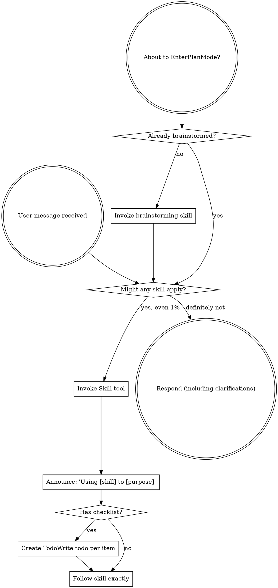

codex-exec: report contract violation

--- codex stdout ---
---
schema_version: 2
phase: "149"
slug: "skill-routing-table"
milestone: "v3.5"
status: "PLANNED"
depends_on:
  - "146"
design_ref: ".planning/analyses/2026-08-05-always-on-orchestration-DESIGN.md#p149"
intent: "SGSD governance must be a runtime mechanism, not prose: gates, MUDA, triage, and skill routing fire in every session type with evidence logged loudly when they do not."
execution_mode: "serial-codex"
adapter_decision: "adapter-in-loader"
tasks:
  - id: "P149-T1"
    type: "registry"
    hypothesis: "A single per-skill routing table can cover neglected skill inventory and legacy alias decisions without duplicating gate predicates."
    files_touched:
      - path: "super-gsd/registry/skill-routing.yaml"
        action: "create"
    verification:
      commands:
        - >-
          node -e "const fs=require('fs'); const yaml=require('js-yaml'); const doc=yaml.load(fs.readFileSync('super-gsd/registry/skill-routing.yaml','utf8')); const rows=doc.routes||doc.skills; if(!Array.isArray(rows)) throw new Error('routes array missing'); for(const [i,r] of rows.entries()){ for(const k of ['skill','signatures','moment','modes']) if(r[k]===undefined) throw new Error(i+': missing '+k); if(r.cooldown&&r.cooldown.predicate) throw new Error(i+': predicate duplication forbidden'); } console.log('skill-routing rows='+rows.length);"
    semantic_acceptance_criteria:
      - id: "SCHEMA-09"
        probe: "Parse the real registry YAML and validate required fields on every route row."
        pass: "All rows contain skill, signatures, moment, modes; cooldowns reference gate names or route policy only."
      - id: "DLB-07"
        probe: "Coverage check against the real neglected inventory named in P149 CONTEXT."
        pass: "Every inventory item is either a canonical route or an explicit alias/omit decision in the table."
  - id: "P149-T2"
    type: "loader-schema-fallback"
    hypothesis: "A js-yaml loader can validate the runtime table in self-test, adapt it for callers, and fall back loudly at runtime when malformed."
    files_touched:
      - path: "super-gsd/scripts/lib/skill-routing-registry.cjs"
        action: "create"
      - path: "super-gsd/tools/self-test/fixtures/skill-routing-malformed.yaml"
        action: "create"
    verification:
      commands:
        - "node super-gsd/scripts/lib/skill-routing-registry.cjs --self-test"
        - "node super-gsd/scripts/lib/skill-routing-registry.cjs --self-test --registry super-gsd/tools/self-test/fixtures/skill-routing-malformed.yaml"
        - "node super-gsd/scripts/lib/skill-routing-registry.cjs --runtime-probe --registry super-gsd/tools/self-test/fixtures/skill-routing-malformed.yaml --moment prompt-time --mode manual"
    semantic_acceptance_criteria:
      - id: "SCHEMA-09"
        probe: "Self-test against malformed fixture."
        pass: "Malformed registry exits non-zero in self-test."
      - id: "DLB-07"
        probe: "Runtime probe against the same malformed fixture."
        pass: "Runtime does not throw upward; it returns compiled fallback routes and emits a gate-evidence degradation row."
  - id: "P149-T3"
    type: "classifier-adapter"
    hypothesis: "P146 manual-session suggestions can consume prompt-time rows from skill-routing.yaml through the loader adapter without preserving a second maintained lexicon."
    files_touched:
      - path: "super-gsd/hooks/sgsd-intent-classifier.cjs"
        action: "modify"
      - path: "super-gsd/hooks/sgsd-quality-gate.js"
        action: "modify"
      - path: "super-gsd/registry/session-governance-hooks.yaml"
        action: "deprecate-or-reduce-to-pointer"
    verification:
      commands:
        - >-
          node super-gsd/hooks/sgsd-intent-classifier.cjs --mode manual --prompt "please run a token waste audit before this closes"
        - >-
          node super-gsd/hooks/sgsd-intent-classifier.cjs --mode manual --prompt "this looks like MUDA and needs a waste audit"
        - >-
          node super-gsd/hooks/sgsd-intent-classifier.cjs --mode manual --prompt "use VTP advice for this architecture proposal"
    semantic_acceptance_criteria:
      - id: "SCHEMA-09"
        probe: "Manual classifier probes use real prompt strings mapped by skill-routing.yaml."
        pass: "Visible suggestions are produced for sgsd-token-audit, sgsd-muda-audit, and sgsd-vtp-advise."
      - id: "DLB-07"
        probe: "Force malformed table via loader override and run the token-audit prompt."
        pass: "Fallback still suggests the compiled token route and logs registry degradation to gate-evidence."
  - id: "P149-T4"
    type: "orchestrator-phase-close"
    hypothesis: "Auto-mode phase close can consult scheduled routing rows after phase completion and before milestone-close logic, logging fired/skipped decisions for every applicable skill."
    files_touched:
      - path: "super-gsd/scripts/lib/orchestrator-hooks.cjs"
        action: "modify"
      - path: "super-gsd/scripts/lib/skill-routing-registry.cjs"
        action: "modify"
    verification:
      commands:
        - >-
          node super-gsd/scripts/lib/orchestrator-hooks.cjs skill-routing --moment phase-close --mode auto --phase 149 --files-changed 4 --diff-lines 100 --dry-run
        - >-
          Select-String -Path ".planning/metrics/gate-evidence.jsonl" -Pattern '"event":"skill-routing"' | Select-Object -Last 10
    semantic_acceptance_criteria:
      - id: "SCHEMA-09"
        probe: "Phase-close scheduled consult uses real registry rows with moment=phase-close and mode=auto."
        pass: "The hook enumerates all applicable scheduled rows and never reads predicates copied from gates.yaml."
      - id: "DLB-07"
        probe: "Gate-evidence ledger tail after phase-close probe."
        pass: "Every scheduled skill has a fired or skipped row with skill, moment, mode, phase, decision, and reason."
  - id: "P149-T5"
    type: "orchestrate-doc-runtime-reference"
    hypothesis: "Replacing hardcoded routing prose with references to the registry prevents policy drift while preserving operator-readable workflow instructions."
    files_touched:
      - path: "super-gsd/skills/sgsd-orchestrate/SKILL.md"
        action: "modify"
    verification:
      commands:
        - >-
          Select-String -Path "super-gsd/skills/sgsd-orchestrate/SKILL.md" -Pattern "skill-routing.yaml|skill-routing"
        - >-
          Select-String -Path "super-gsd/skills/sgsd-orchestrate/SKILL.md" -Pattern "Step 6.7|phase-close"
    semantic_acceptance_criteria:
      - id: "SCHEMA-09"
        probe: "Read the real orchestrate skill sections named in research findings 11 and 13."
        pass: "Routing decisions point to skill-routing.yaml/helper instead of prose-only trigger rules."
      - id: "DLB-07"
        probe: "Confirm the phase-close seam is documented."
        pass: "The consult is placed after mark-phase-complete/advance-next-phase and before Step 6.7 milestone completion."
  - id: "P149-T6"
    type: "acceptance-verification"
    hypothesis: "AC-149 is satisfied only when schema validation, manual prompt suggestion, and auto phase-close fired/skipped evidence all pass against real repo data."
    files_touched:
      - path: "super-gsd/scripts/lib/skill-routing-registry.cjs"
        action: "verify-only"
      - path: "super-gsd/hooks/sgsd-intent-classifier.cjs"
        action: "verify-only"
      - path: "super-gsd/scripts/lib/orchestrator-hooks.cjs"
        action: "verify-only"
      - path: ".planning/metrics/gate-evidence.jsonl"
        action: "append-evidence"
    verification:
      commands:
        - "node super-gsd/scripts/lib/skill-routing-registry.cjs --self-test"
        - >-
          node super-gsd/hooks/sgsd-intent-classifier.cjs --mode manual --prompt "run code review and verify work before close"
        - >-
          node super-gsd/scripts/lib/orchestrator-hooks.cjs skill-routing --moment phase-close --mode auto --phase 149 --files-changed 4 --diff-lines 100
        - >-
          Select-String -Path ".planning/metrics/gate-evidence.jsonl" -Pattern '"event":"skill-routing"' | Select-Object -Last 20
    semantic_acceptance_criteria:
      - id: "SCHEMA-09"
        probe: "Run the schema self-test on the real table."
        pass: "Self-test exits 0 for skill-routing.yaml and exits non-zero for the malformed fixture."
      - id: "DLB-07"
        probe: "Run manual and auto probes, then inspect gate-evidence.jsonl."
        pass: "Manual prompt yields visible suggestion; auto phase-close logs fired/skipped rows; malformed runtime logs degradation."
---

# P149 Plan — Skill-Routing Table

## Goal

Create `super-gsd/registry/skill-routing.yaml` as the single runtime source of truth for neglected SGSD skill routing, then wire it into P146 manual-session suggestions and auto-mode phase-close scheduling with gate-evidence rows for fired, skipped, and degraded decisions.

## Architecture

Use `skill-routing.yaml` for human-maintained routing metadata. Add `super-gsd/scripts/lib/skill-routing-registry.cjs` as the only parser/validator/adapter: it loads YAML with `js-yaml`, schema-validates for self-test, adapts prompt-time rows into P146’s existing route shape, and exposes scheduled rows for orchestrator phase-close hooks.

Runtime behavior differs from self-test behavior deliberately: self-test fails malformed tables; runtime falls back to a compiled embedded lexicon and logs degradation through the existing gate-evidence command-envelope writer. This preserves sessions while making the failure loud.

## Adapter Decision

Choose adapter-in-loader, not a classifier parser extension. P149’s desired table is per-skill routing metadata, while P146 currently expects `routes[].trigger/predicate/enforcement`; changing every classifier call site to understand two registry shapes would create dual semantics. The loader should own the adaptation: `loadSkillRoutingRegistry()` returns normalized route rows, `toPromptGovernanceRoutes()` emits P146-compatible prompt-time routes, and `getScheduledRoutes(moment, mode)` serves the orchestrator. That keeps `skill-routing.yaml` as the one maintained source after P149 and confines fallback/degradation logic to one module.

## Registry Content Contract

The table should use a single top-level array, preferably `routes`, where each row is one `skill + moment` decision. Repeating a skill across moments is allowed.

Required row fields:

- `skill`: canonical skill name to invoke or suggest.
- `signatures`: prompt regexes/phrases and/or event names.
- `moment`: one of `prompt-time`, `phase-close`, `milestone-close`, `weekly`, `on-demand`.
- `modes`: any of `manual`, `semi`, `auto`.
- `cooldown`: optional policy object.

Allowed optional fields:

- `aliases`: legacy names or operator-entered names covered by the row.
- `availability`: `canonical`, `alias`, `manual-only`, `external-if-installed`, or `omitted`.
- `gate_ref`: gate registry name when eligibility belongs to `gates.yaml`.
- `skip_reason`: fixed reason for omitted/unavailable legacy rows.
- `notes`: operator-facing explanation.

Do not copy `gates.yaml` predicates into this file. For MUDA and memory gates, encode only a gate reference such as `gate_ref: muda-audit` or `gate_ref: memory-curate`; the runtime helper consults existing gate/gate-adjacent mechanisms or records `skipped` with `gate_ref_not_triggered`.

## Inventory Decisions

Minimum table coverage must include these decisions:

- `sgsd-muda-audit`: prompt-time suggestion plus phase-close scheduled route; phase-close eligibility references `muda-audit` gate, no threshold duplication.
- `sgsd-token-audit`: prompt-time suggestion plus milestone-close route; milestone behavior remains owned by `sgsd-complete-milestone`.
- `sgsd-distill`: milestone-close route with once-per-milestone cooldown.
- `sgsd-sepl`: prompt-time/on-demand route for major proposals and architecture tradeoffs.
- `sgsd-overwatcher`: phase-close auto route with once-per-phase cooldown.
- `sgsd-readiness`: prompt-time/on-demand route and auto-mode readiness route reference.
- `sgsd-audit`: phase-close route and milestone-close route; milestone-close can remain blocking where existing audit policy says so.
- `sgsd-memory hygiene`: route as canonical `sgsd-memory-hygiene` or paired aliases `sgsd-recall` and `sgsd-curate`; use gate references for recall/curate discipline rather than copied predicates.
- `sgsd-vtp-advise`: prompt-time/on-demand route; graceful-fail behavior remains in the skill.
- `sgsd-health` and `gsd-health`: alias to `sgsd-readiness`; do not create a new health skill.
- `gsd-cleanup`: omit from auto scheduling; manual/on-demand suggestion only if a first-class command exists, otherwise `availability: omitted` with `skip_reason: legacy_unregistered`.
- `gsd-code-review`: prompt-time/on-demand route as `external-if-installed`; phase-close governance remains `sgsd-audit`.
- `gsd-code-review-fix`: prompt-time/on-demand only; never scheduled automatically because it mutates code.
- `gsd-verify-work`: alias to existing SGSD verification/ATC flow; prompt-time suggestion may preserve the legacy name.
- `gsd-secure-phase`: alias to existing security/edge-guard governance if registered; otherwise manual/on-demand omitted row with explicit skip reason.

## Serial Execution Prompts

### P149-T1

Implement only the registry table. Create `super-gsd/registry/skill-routing.yaml` with the required schema and inventory decisions above. Do not edit classifier or orchestrator code in this task. Verify with the frontmatter command and report row count plus inventory coverage.

### P149-T2

Implement only `super-gsd/scripts/lib/skill-routing-registry.cjs` and the malformed fixture. Reuse `js-yaml`. Export normalized loading, prompt adapter, scheduled-route query, compiled fallback, and CLI probes. Self-test must fail malformed YAML; runtime probe must fall back and log degradation.

### P149-T3

Wire P146 manual-session routing to the loader adapter. Remove normal runtime dependence on `session-governance-hooks.yaml`; keep that file only as deprecated compatibility metadata or pointer text if needed. Verify real prompts produce visible suggestions from `skill-routing.yaml`.

### P149-T4

Add the orchestrator scheduled consult API. The phase-close seam is after “Mark phase complete, advance to next phase” and before Step 6.7 milestone completion. For each applicable scheduled route, append a gate-evidence envelope row with `event=skill-routing`, `decision=fired|skipped`, and a concrete reason.

### P149-T5

Edit `super-gsd/skills/sgsd-orchestrate/SKILL.md` only. Replace routing prose cited by research with references to `skill-routing.yaml` and the orchestrator hook. Keep operator guidance, but make runtime routing a table/helper decision.

### P149-T6

Run AC-149 verification end to end. Prove: schema self-test passes real table and fails malformed fixture; manual prompt matching a neglected-skill signature yields visible suggestion; auto phase-close consult logs fired/skipped rows to `.planning/metrics/gate-evidence.jsonl`.

## Acceptance Mapping

AC-149a is covered by P149-T2 and P149-T6: schema check in self-test validates the real table and rejects malformed fixtures.

AC-149b is covered by P149-T3 and P149-T6: manual prompt probes for token audit, MUDA, VTP, code review, and verify-work return visible suggestions from the new table.

AC-149c is covered by P149-T4 and P149-T6: auto phase-close consults scheduled rows after phase completion and before Step 6.7, then logs fired/skipped evidence rows.

## Source Audit

| Source | Use |
|---|---|
| CONTEXT.md | Defines P149 goal, table shape, constraints, neglected inventory, malformed-table behavior, and AC scope. |
| RESEARCH.md | Supplies 24 cited findings, live-code seams, risks, recommended task shape, and known mismatch between P146 parser shape and P149 table shape. |
| VTP ide-ce7c-002 | Supports the design lineage: central process-input routing to the right GSD skill. |
| Design spec AC-149 | Acceptance criteria: schema self-test, manual visible suggestion, auto phase-close fired/skipped logging. |

--- codex stderr ---
OpenAI Codex v0.146.0
--------
workdir: C:\Users\jack.berrow\AppData\Roaming\warp\Warp\data\worktrees\GSDedits\cholla-racer
model: gpt-5.5
provider: openai
approval: never
sandbox: read-only
reasoning effort: xhigh
reasoning summaries: none
session id: 019fe13c-d9df-7723-be32-233304770e5b
--------
user
# P149 PLANNING — Skill-Routing Table (self-contained; do NOT browse the repo beyond the 3 files listed)

<intent milestone="v3.5">SGSD governance must be a runtime mechanism, not prose — gates/MUDA/triage/skill routing fire in every session type with evidence logged loudly when they do not.</intent>

You are the Codex planner (gpt-5.5/xhigh). EVERYTHING you need is inlined below — research already read the repo and cited findings; trust them. You MAY read only these 3 files if needed: super-gsd/hooks/sgsd-intent-classifier.cjs, super-gsd/scripts/lib/gates-registry.cjs, super-gsd/tools/dispatch-router/route.cjs. Emit ONLY the plan file content (YAML frontmatter schema_version: 2 + body) to stdout. Work fast; total budget ~4 minutes.

## CONTEXT.md (verbatim)
---
phase: "149"
slug: skill-routing-table
milestone: v3.5
status: PENDING
design_ref: ".planning/analyses/2026-08-05-always-on-orchestration-DESIGN.md#p149"
depends_on: ["146"]
---

# P149 Context — Skill-Routing Table (utilization)

## Goal

One source of truth — `super-gsd/registry/skill-routing.yaml` — maps intent
signatures to SGSD skills so the neglected inventory actually gets invoked.
Consumed by the P146 classifier (prompt-time suggestions in manual sessions)
and by the orchestrate loop (scheduled dispatch moments in auto mode). The
routing prose in sgsd-orchestrate SKILL.md is replaced by a reference to the
table (board addendum: routing is a runtime dispatch decision, not documentation).

## Table shape (per skill)

- `skill`: name
- `signatures`: trigger phrases/regexes (prompt-time) and/or event moments
- `moment`: prompt-time | phase-close | milestone-close | weekly | on-demand
- `modes`: [manual, semi, auto] applicability
- `cooldown`: optional (e.g. muda-audit fires at phase close only when
  files_changed>=4 OR diff_lines>=100 — existing rule, encoded not prosed)

## Neglected inventory to cover (minimum)

sgsd-muda-audit, sgsd-token-audit, sgsd-distill, sgsd-sepl, sgsd-overwatcher,
sgsd-readiness, sgsd-audit, sgsd-health/gsd-health, gsd-cleanup,
sgsd-memory hygiene (sgsd-recall/curate discipline), sgsd-vtp-advise,
gsd-code-review / gsd-code-review-fix, gsd-verify-work, gsd-secure-phase.

## Constraints

- Schema-validated in self-test; a malformed table fails self-test, not runtime
  (runtime falls back to embedded lexicon + logs).
- Orchestrate loop consumption: at phase close the loop MUST consult the table
  and log which scheduled skills fired or the reason skipped (AC-149c) — the
  log row is the enforcement.
- P146 ships with an embedded lexicon; this phase externalizes it — one source
  after P149, no dual maintenance.

## Acceptance criteria

AC-149 (a)(b)(c) from the design spec.

## RESEARCH (verbatim, 24 cited findings + AC-149 + risks + recommended shape)
---
phase: "149"
artifact: RESEARCH
provider: openai-codex (gpt-5.5/xhigh)
wrapper_exit: 6 (contract-vocab mismatch; body valid — stderr stream stripped)
---


## Findings

1. Canonical phase path is `.planning/milestones/v3.5/phases/149-skill-routing-table/CONTEXT.md`, not `149-skill-routing-table-style`; frontmatter sets phase `149`, slug `skill-routing-table`, status `PENDING`, and dependency `146` (`.planning/milestones/v3.5/phases/149-skill-routing-table/CONTEXT.md:1`).

2. P149’s required table source is `super-gsd/registry/skill-routing.yaml`; required fields are `skill`, `signatures`, `moment`, `modes`, and `cooldown` (`.planning/milestones/v3.5/phases/149-skill-routing-table/CONTEXT.md:12`, `.planning/milestones/v3.5/phases/149-skill-routing-table/CONTEXT.md:21`).

3. P146’s live classifier does not hold a JS `DEFAULT_SIGNATURES` lexicon; it points at `super-gsd/registry/session-governance-hooks.yaml` via `REGISTRY_SOURCE_PATH` (`super-gsd/hooks/sgsd-intent-classifier.cjs:20`) and parses `routes` with `trigger`, `predicate`, and `enforcement` sections (`super-gsd/hooks/sgsd-intent-classifier.cjs:127`, `super-gsd/registry/session-governance-hooks.yaml:1`).

4. The current neglected-skill prompt lexicon is in `session-governance-hooks.yaml`: `/sgsd-token-audit`, `/sgsd-muda-audit`, and `/sgsd-deliberate` are suggestion routes (`super-gsd/registry/session-governance-hooks.yaml:42`, `super-gsd/registry/session-governance-hooks.yaml:51`, `super-gsd/registry/session-governance-hooks.yaml:64`).

5. The “classifier swap = REGISTRY_SOURCE_PATH one-liner” claim is only true if P149 emits the old `routes[].trigger/predicate/enforcement` shape; the desired P149 shape is per-skill routing metadata, which the current parser and validator do not understand (`super-gsd/hooks/sgsd-intent-classifier.cjs:203`, `.planning/milestones/v3.5/phases/149-skill-routing-table/CONTEXT.md:21`).

6. `gates.yaml` registry precedent uses `js-yaml`, not a hand parser: `gates-registry.cjs` loads the pinned dependency, reads YAML, requires `parsed.gates` to be an array, caches by name, and validates repair/sampling fields (`super-gsd/scripts/lib/gates-registry.cjs:38`, `super-gsd/scripts/lib/gates-registry.cjs:55`, `super-gsd/scripts/lib/gates-registry.cjs:75`).

7. YAML parser dependency already exists in both root and plan-schema package manifests (`package.json:20`, `super-gsd/tools/plan-schema/package.json:7`). P149 should reuse `js-yaml`; the hand parser is classifier-local (`super-gsd/hooks/sgsd-intent-classifier.cjs:127`).

8. Closest runtime fallback analog is dispatch-router: malformed/missing YAML falls back to compiled routes (`super-gsd/tools/dispatch-router/route.cjs:140`, `super-gsd/tools/dispatch-router/route.cjs:319`). Gates registry is fail-fast, which fits gate policy but not P149 runtime fallback (`super-gsd/scripts/lib/gates-registry.cjs:40`).

9. Existing canonical ledger for fired/skipped rows should be `.planning/metrics/gate-evidence.jsonl`; its writer defines append-only command-envelope-v1 rows and explicitly says public APIs never throw upward (`super-gsd/scripts/lib/gate-evidence-log.cjs:1`, `super-gsd/scripts/lib/gate-evidence-log.cjs:87`).

10. P146 already logs routing decisions and degraded registry reads through gate-evidence rows (`super-gsd/hooks/sgsd-intent-classifier.cjs:35`, `super-gsd/hooks/sgsd-intent-classifier.cjs:368`).

11. Orchestrate phase-close seam is after “Mark phase complete, advance to next phase” and before Step 6.7 milestone completion; that is where AC-149c should consult `skill-routing.yaml` for phase-close scheduled rows (`super-gsd/skills/sgsd-orchestrate/SKILL.md:1822`, `super-gsd/skills/sgsd-orchestrate/SKILL.md:1824`).

12. `orchestrator-hooks.cjs` currently exposes only token-waste, context-packet, and self-test commands, so P149 needs a new hook/API for scheduled skill-routing consults (`super-gsd/scripts/lib/orchestrator-hooks.cjs:1`, `super-gsd/scripts/lib/orchestrator-hooks.cjs:40`, `super-gsd/scripts/lib/orchestrator-hooks.cjs:611`).

13. Routing prose superseded by the table includes memory recall/context selection (`super-gsd/skills/sgsd-orchestrate/SKILL.md:670`), MUDA phase-close routing (`super-gsd/skills/sgsd-orchestrate/SKILL.md:1475`), memory-governance phase-close processing (`super-gsd/skills/sgsd-orchestrate/SKILL.md:1767`), curate-learnings routing (`super-gsd/skills/sgsd-orchestrate/SKILL.md:2548`), and token-waste routing (`super-gsd/skills/sgsd-orchestrate/SKILL.md:2565`).

14. P149 malformed-table behavior is explicit: self-test fails, runtime falls back to embedded lexicon and logs degradation (`.planning/milestones/v3.5/phases/149-skill-routing-table/CONTEXT.md:37`, `.planning/milestones/v3.5/phases/149-skill-routing-table/CONTEXT.md:39`).

15. Neglected inventory status: `sgsd-muda-audit` trigger is already encoded in `gates.yaml` and skill docs: phase-close, files changed/diff threshold, non-blocking soft-warn (`super-gsd/registry/gates.yaml:136`, `super-gsd/skills/sgsd-muda-audit/SKILL.md:25`).

16. `sgsd-token-audit` has encoded milestone-close behavior via `sgsd-complete-milestone` and skill modes, plus prompt-time P146 suggestions (`super-gsd/skills/sgsd-token-audit/SKILL.md:17`, `super-gsd/skills/sgsd-complete-milestone/SKILL.md:72`, `super-gsd/registry/session-governance-hooks.yaml:42`).

17. `sgsd-distill` is encoded as milestone-close only in skill/script docs, but not in a central runtime routing registry (`super-gsd/skills/sgsd-distill/SKILL.md:12`, `super-gsd/scripts/sgsd-distill-milestone.sh:3`).

18. `sgsd-sepl` has “major proposal auto-advise” behavior in skill/script docs, but P149 must centralize its trigger/cooldown (`super-gsd/skills/sgsd-sepl/SKILL.md:24`, `super-gsd/scripts/sgsd-sepl-propose.sh:198`).

19. `sgsd-overwatcher` says it can auto-trigger after each phase completion, but that is advisory prose/config, not central routing (`super-gsd/skills/sgsd-overwatcher/SKILL.md:85`).

20. `sgsd-readiness` is already runtime Rule 0 in auto mode; manual entry point points to the same gate (`super-gsd/skills/sgsd-readiness/SKILL.md:14`, `super-gsd/skills/sgsd-orchestrate/SKILL.md:535`).

21. `sgsd-audit` docs say it should run every phase close and be milestone-close blocking, but current orchestrate prose does not expose it through P149’s runtime table (`super-gsd/skills/sgsd-audit/SKILL.md:2`, `super-gsd/skills/sgsd-audit/SKILL.md:418`).

22. `sgsd-memory hygiene` is partly encoded through recall/curate gates and scripts; P149 still needs a single cooldown/moment definition tying recall and curate discipline together (`super-gsd/registry/gates.yaml:106`, `super-gsd/registry/gates.yaml:186`, `super-gsd/scripts/sgsd-recall.sh:3`, `super-gsd/scripts/sgsd-curate.sh:3`).

23. `sgsd-vtp-advise` is ad hoc/operator-triggered, with graceful fail behavior and SEPL promotion path; it needs P149 prompt-time routing definition (`super-gsd/skills/sgsd-vtp-advise/SKILL.md:13`, `super-gsd/skills/sgsd-vtp-advise/SKILL.md:78`, `super-gsd/skills/sgsd-vtp-advise/SKILL.md:132`).

24. Legacy inventory items `sgsd-health/gsd-health`, `gsd-cleanup`, `gsd-code-review / gsd-code-review-fix`, `gsd-verify-work`, and `gsd-secure-phase` need aliases or availability decisions because current architecture skill/script inventory does not list them as first-class skills (`.planning/milestones/v3.5/phases/149-skill-routing-table/CONTEXT.md:33`, `super-gsd/docs/ARCHITECTURE.md:237`).

## AC-149 verbatim

`**AC-149:** (a) the table validates against a schema check in self-test; (b) a prompt matching a neglected-skill signature yields a visible suggestion in a manual session; (c) at phase close in auto mode the loop consults the table and logs which scheduled skills fired or why not.` (`.planning/analyses/2026-08-05-always-on-orchestration-DESIGN.md:142`)

## Risks

1. A pure `REGISTRY_SOURCE_PATH` swap will break unless `skill-routing.yaml` is adapted into P146’s old route shape.
2. Duplicating `gates.yaml` predicates in `skill-routing.yaml` would violate the repo rule against reimplementing gates.
3. Silent fallback would fail AC-149c; fallback must emit gate-evidence degradation and fired/skipped rows.
4. Legacy `gsd-*` inventory names may not be callable without aliasing to current SGSD mechanisms.

## Recommended plan shape

1. Add registry + loader.  
   `files_touched`: `super-gsd/registry/skill-routing.yaml`, `super-gsd/scripts/lib/skill-routing-registry.cjs`.

2. Add schema self-test and compiled fallback.  
   `files_touched`: `super-gsd/scripts/lib/skill-routing-registry.cjs`, optional fixture/self-test file.

3. Adapt P146 classifier to consume prompt-time rows from the new loader.  
   `files_touched`: `super-gsd/hooks/sgsd-intent-classifier.cjs`, `super-gsd/hooks/sgsd-quality-gate.js`, `super-gsd/registry/session-governance-hooks.yaml`.

4. Add orchestrate phase-close consult and gate-evidence logging.  
   `files_touched`: `super-gsd/scripts/lib/orchestrator-hooks.cjs`, `super-gsd/skills/sgsd-orchestrate/SKILL.md`.

5. Replace hardcoded routing prose with references to the runtime table/helper.  
   `files_touched`: `super-gsd/skills/sgsd-orchestrate/SKILL.md`.

6. Verify AC-149.  
   `files_touched`: self-test/CLI only; cover valid schema, malformed fallback + log, manual prompt suggestion, and auto phase-close fired/skipped log.


## VTP enrichment (lineage)
Prior completed VTP idea ide-ce7c-002 (meeting langchain-vs-langgraph 2026-04-09): central process-input node routing to right GSD skill. Cite in Source Audit.

## Plan requirements
- schema_version: 2 frontmatter with tasks[]: id, type, hypothesis, files_touched, verification commands, semantic_acceptance_criteria using REAL-DATA probes (SCHEMA-09/DLB-07).
- 5-6 tasks following the RESEARCH recommended plan shape; serial Codex execution; bounded per-task prompts.
- Resolve risk 1 explicitly: choose adapter-in-loader (skill-routing.yaml per-skill shape; loader adapts to P146 routes[] shape) or parser extension — justify in one paragraph.
- No gates.yaml predicate duplication — reference gate names.
- Runtime fallback: malformed table -> compiled embedded lexicon + gate-evidence degradation row; self-test is where malformed FAILS.
- AC-149c seam: after mark-phase-complete, before Step 6.7; log fired/skipped to gate-evidence.jsonl envelope.
- Legacy gsd-* names: alias-or-omit decision per skill in table content task.
- Source Audit section: CONTEXT / RESEARCH / VTP(ide-ce7c-002) / design-spec rows.

exec
"C:\\WINDOWS\\System32\\WindowsPowerShell\\v1.0\\powershell.exe" -Command "Get-Content -Raw -LiteralPath 'C:\\Users\\jack.berrow\\.codex\\skills\\using-superpowers\\SKILL.md'" in C:\Users\jack.berrow\AppData\Roaming\warp\Warp\data\worktrees\GSDedits\cholla-racer
exec
"C:\\WINDOWS\\System32\\WindowsPowerShell\\v1.0\\powershell.exe" -Command "Get-Content -Raw -LiteralPath 'C:\\Users\\jack.berrow\\.codex\\skills\\writing-plans\\SKILL.md'" in C:\Users\jack.berrow\AppData\Roaming\warp\Warp\data\worktrees\GSDedits\cholla-racer
 succeeded in 983ms:
---
name: using-superpowers
description: Use when starting any conversation - establishes how to find and use skills, requiring Skill tool invocation before ANY response including clarifying questions
---

<SUBAGENT-STOP>
If you were dispatched as a subagent to execute a specific task, skip this skill.
</SUBAGENT-STOP>

<EXTREMELY-IMPORTANT>
If you think there is even a 1% chance a skill might apply to what you are doing, you ABSOLUTELY MUST invoke the skill.

IF A SKILL APPLIES TO YOUR TASK, YOU DO NOT HAVE A CHOICE. YOU MUST USE IT.

This is not negotiable. This is not optional. You cannot rationalize your way out of this.
</EXTREMELY-IMPORTANT>

## Instruction Priority

Superpowers skills override default system prompt behavior, but **user instructions always take precedence**:

1. **User's explicit instructions** (CLAUDE.md, GEMINI.md, AGENTS.md, direct requests) ƒ?" highest priority
2. **Superpowers skills** ƒ?" override default system behavior where they conflict
3. **Default system prompt** ƒ?" lowest priority

If CLAUDE.md, GEMINI.md, or AGENTS.md says "don't use TDD" and a skill says "always use TDD," follow the user's instructions. The user is in control.

## How to Access Skills

**In Claude Code:** Use the `Skill` tool. When you invoke a skill, its content is loaded and presented to youƒ?"follow it directly. Never use the Read tool on skill files.

**In Copilot CLI:** Use the `skill` tool. Skills are auto-discovered from installed plugins. The `skill` tool works the same as Claude Code's `Skill` tool.

**In Gemini CLI:** Skills activate via the `activate_skill` tool. Gemini loads skill metadata at session start and activates the full content on demand.

**In other environments:** Check your platform's documentation for how skills are loaded.

## Platform Adaptation

Skills use Claude Code tool names. Non-CC platforms: see `references/copilot-tools.md` (Copilot CLI), `references/codex-tools.md` (Codex) for tool equivalents. Gemini CLI users get the tool mapping loaded automatically via GEMINI.md.

# Using Skills

## The Rule

**Invoke relevant or requested skills BEFORE any response or action.** Even a 1% chance a skill might apply means that you should invoke the skill to check. If an invoked skill turns out to be wrong for the situation, you don't need to use it.



## Red Flags

These thoughts mean STOPƒ?"you're rationalizing:

| Thought | Reality |
|---------|---------|
| "This is just a simple question" | Questions are tasks. Check for skills. |
| "I need more context first" | Skill check comes BEFORE clarifying questions. |
| "Let me explore the codebase first" | Skills tell you HOW to explore. Check first. |
| "I can check git/files quickly" | Files lack conversation context. Check for skills. |
| "Let me gather information first" | Skills tell you HOW to gather information. |
| "This doesn't need a formal skill" | If a skill exists, use it. |
| "I remember this skill" | Skills evolve. Read current version. |
| "This doesn't count as a task" | Action = task. Check for skills. |
| "The skill is overkill" | Simple things become complex. Use it. |
| "I'll just do this one thing first" | Check BEFORE doing anything. |
| "This feels productive" | Undisciplined action wastes time. Skills prevent this. |
| "I know what that means" | Knowing the concept ƒ%ÿ using the skill. Invoke it. |

## Skill Priority

When multiple skills could apply, use this order:

1. **Process skills first** (brainstorming, debugging) - these determine HOW to approach the task
2. **Implementation skills second** (frontend-design, mcp-builder) - these guide execution

"Let's build X" ā' brainstorming first, then implementation skills.
"Fix this bug" ā' debugging first, then domain-specific skills.

## Skill Types

**Rigid** (TDD, debugging): Follow exactly. Don't adapt away discipline.

**Flexible** (patterns): Adapt principles to context.

The skill itself tells you which.

## User Instructions

Instructions say WHAT, not HOW. "Add X" or "Fix Y" doesn't mean skip workflows.

C:\Users\jack.berrow\OneDrive - John Cullen Lighting\Documents\WindowsPowerShell\profile.ps1 : Cannot dot-source this 
command because it was defined in a different language mode. To invoke this command without importing its contents, 
omit the '.' operator.
At line:1 char:1
+ . 'C:\Users\jack.berrow\OneDrive - John Cullen Lighting\Documents\Win ...
+ ~~~~~~~~~~~~~~~~~~~~~~~~~~~~~~~~~~~~~~~~~~~~~~~~~~~~~~~~~~~~~~~~~~~~~
    + CategoryInfo          : InvalidOperation: (:) [profile.ps1], NotSupportedException
    + FullyQualifiedErrorId : DotSourceNotSupported,profile.ps1
 
C:\Users\jack.berrow\OneDrive - John Cullen Lighting\Documents\WindowsPowerShell\Microsoft.PowerShell_profile.ps1 : 
Cannot dot-source this command because it was defined in a different language mode. To invoke this command without 
importing its contents, omit the '.' operator.
At line:1 char:1
+ . 'C:\Users\jack.berrow\OneDrive - John Cullen Lighting\Documents\Win ...
+ ~~~~~~~~~~~~~~~~~~~~~~~~~~~~~~~~~~~~~~~~~~~~~~~~~~~~~~~~~~~~~~~~~~~~~
    + CategoryInfo          : InvalidOperation: (:) [Microsoft.PowerShell_profile.ps1], NotSupportedException
    + FullyQualifiedErrorId : DotSourceNotSupported,Microsoft.PowerShell_profile.ps1
 

 succeeded in 976ms:
---
name: writing-plans
description: Use when you have a spec or requirements for a multi-step task, before touching code
---

# Writing Plans

## Overview

Write comprehensive implementation plans assuming the engineer has zero context for our codebase and questionable taste. Document everything they need to know: which files to touch for each task, code, testing, docs they might need to check, how to test it. Give them the whole plan as bite-sized tasks. DRY. YAGNI. TDD. Frequent commits.

Assume they are a skilled developer, but know almost nothing about our toolset or problem domain. Assume they don't know good test design very well.

**Announce at start:** "I'm using the writing-plans skill to create the implementation plan."

**Context:** If working in an isolated worktree, it should have been created via the `superpowers:using-git-worktrees` skill at execution time.

**Save plans to:** `docs/superpowers/plans/YYYY-MM-DD-<feature-name>.md`
- (User preferences for plan location override this default)

## Scope Check

If the spec covers multiple independent subsystems, it should have been broken into sub-project specs during brainstorming. If it wasn't, suggest breaking this into separate plans ƒ?" one per subsystem. Each plan should produce working, testable software on its own.

## File Structure

Before defining tasks, map out which files will be created or modified and what each one is responsible for. This is where decomposition decisions get locked in.

- Design units with clear boundaries and well-defined interfaces. Each file should have one clear responsibility.
- You reason best about code you can hold in context at once, and your edits are more reliable when files are focused. Prefer smaller, focused files over large ones that do too much.
- Files that change together should live together. Split by responsibility, not by technical layer.
- In existing codebases, follow established patterns. If the codebase uses large files, don't unilaterally restructure - but if a file you're modifying has grown unwieldy, including a split in the plan is reasonable.

This structure informs the task decomposition. Each task should produce self-contained changes that make sense independently.

## Bite-Sized Task Granularity

**Each step is one action (2-5 minutes):**
- "Write the failing test" - step
- "Run it to make sure it fails" - step
- "Implement the minimal code to make the test pass" - step
- "Run the tests and make sure they pass" - step
- "Commit" - step

## Plan Document Header

**Every plan MUST start with this header:**

```markdown
# [Feature Name] Implementation Plan

> **For agentic workers:** REQUIRED SUB-SKILL: Use superpowers:subagent-driven-development (recommended) or superpowers:executing-plans to implement this plan task-by-task. Steps use checkbox (`- [ ]`) syntax for tracking.

**Goal:** [One sentence describing what this builds]

**Architecture:** [2-3 sentences about approach]

**Tech Stack:** [Key technologies/libraries]

---
```

## Task Structure

````markdown
### Task N: [Component Name]

**Files:**
- Create: `exact/path/to/file.py`
- Modify: `exact/path/to/existing.py:123-145`
- Test: `tests/exact/path/to/test.py`

- [ ] **Step 1: Write the failing test**

```python
def test_specific_behavior():
    result = function(input)
    assert result == expected
```

- [ ] **Step 2: Run test to verify it fails**

Run: `pytest tests/path/test.py::test_name -v`
Expected: FAIL with "function not defined"

- [ ] **Step 3: Write minimal implementation**

```python
def function(input):
    return expected
```

- [ ] **Step 4: Run test to verify it passes**

Run: `pytest tests/path/test.py::test_name -v`
Expected: PASS

- [ ] **Step 5: Commit**

```bash
git add tests/path/test.py src/path/file.py
git commit -m "feat: add specific feature"
```
````

## No Placeholders

Every step must contain the actual content an engineer needs. These are **plan failures** ƒ?" never write them:
- "TBD", "TODO", "implement later", "fill in details"
- "Add appropriate error handling" / "add validation" / "handle edge cases"
- "Write tests for the above" (without actual test code)
- "Similar to Task N" (repeat the code ƒ?" the engineer may be reading tasks out of order)
- Steps that describe what to do without showing how (code blocks required for code steps)
- References to types, functions, or methods not defined in any task

## Remember
- Exact file paths always
- Complete code in every step ƒ?" if a step changes code, show the code
- Exact commands with expected output
- DRY, YAGNI, TDD, frequent commits

## Self-Review

After writing the complete plan, look at the spec with fresh eyes and check the plan against it. This is a checklist you run yourself ƒ?" not a subagent dispatch.

**1. Spec coverage:** Skim each section/requirement in the spec. Can you point to a task that implements it? List any gaps.

**2. Placeholder scan:** Search your plan for red flags ƒ?" any of the patterns from the "No Placeholders" section above. Fix them.

**3. Type consistency:** Do the types, method signatures, and property names you used in later tasks match what you defined in earlier tasks? A function called `clearLayers()` in Task 3 but `clearFullLayers()` in Task 7 is a bug.

If you find issues, fix them inline. No need to re-review ƒ?" just fix and move on. If you find a spec requirement with no task, add the task.

## Execution Handoff

After saving the plan, offer execution choice:

**"Plan complete and saved to `docs/superpowers/plans/<filename>.md`. Two execution options:**

**1. Subagent-Driven (recommended)** - I dispatch a fresh subagent per task, review between tasks, fast iteration

**2. Inline Execution** - Execute tasks in this session using executing-plans, batch execution with checkpoints

**Which approach?"**

**If Subagent-Driven chosen:**
- **REQUIRED SUB-SKILL:** Use superpowers:subagent-driven-development
- Fresh subagent per task + two-stage review

**If Inline Execution chosen:**
- **REQUIRED SUB-SKILL:** Use superpowers:executing-plans
- Batch execution with checkpoints for review

C:\Users\jack.berrow\OneDrive - John Cullen Lighting\Documents\WindowsPowerShell\profile.ps1 : Cannot dot-source this 
command because it was defined in a different language mode. To invoke this command without importing its contents, 
omit the '.' operator.
At line:1 char:1
+ . 'C:\Users\jack.berrow\OneDrive - John Cullen Lighting\Documents\Win ...
+ ~~~~~~~~~~~~~~~~~~~~~~~~~~~~~~~~~~~~~~~~~~~~~~~~~~~~~~~~~~~~~~~~~~~~~
    + CategoryInfo          : InvalidOperation: (:) [profile.ps1], NotSupportedException
    + FullyQualifiedErrorId : DotSourceNotSupported,profile.ps1
 
C:\Users\jack.berrow\OneDrive - John Cullen Lighting\Documents\WindowsPowerShell\Microsoft.PowerShell_profile.ps1 : 
Cannot dot-source this command because it was defined in a different language mode. To invoke this command without 
importing its contents, omit the '.' operator.
At line:1 char:1
+ . 'C:\Users\jack.berrow\OneDrive - John Cullen Lighting\Documents\Win ...
+ ~~~~~~~~~~~~~~~~~~~~~~~~~~~~~~~~~~~~~~~~~~~~~~~~~~~~~~~~~~~~~~~~~~~~~
    + CategoryInfo          : InvalidOperation: (:) [Microsoft.PowerShell_profile.ps1], NotSupportedException
    + FullyQualifiedErrorId : DotSourceNotSupported,Microsoft.PowerShell_profile.ps1
 

codex
---
schema_version: 2
phase: "149"
slug: "skill-routing-table"
milestone: "v3.5"
status: "PLANNED"
depends_on:
  - "146"
design_ref: ".planning/analyses/2026-08-05-always-on-orchestration-DESIGN.md#p149"
intent: "SGSD governance must be a runtime mechanism, not prose: gates, MUDA, triage, and skill routing fire in every session type with evidence logged loudly when they do not."
execution_mode: "serial-codex"
adapter_decision: "adapter-in-loader"
tasks:
  - id: "P149-T1"
    type: "registry"
    hypothesis: "A single per-skill routing table can cover neglected skill inventory and legacy alias decisions without duplicating gate predicates."
    files_touched:
      - path: "super-gsd/registry/skill-routing.yaml"
        action: "create"
    verification:
      commands:
        - >-
          node -e "const fs=require('fs'); const yaml=require('js-yaml'); const doc=yaml.load(fs.readFileSync('super-gsd/registry/skill-routing.yaml','utf8')); const rows=doc.routes||doc.skills; if(!Array.isArray(rows)) throw new Error('routes array missing'); for(const [i,r] of rows.entries()){ for(const k of ['skill','signatures','moment','modes']) if(r[k]===undefined) throw new Error(i+': missing '+k); if(r.cooldown&&r.cooldown.predicate) throw new Error(i+': predicate duplication forbidden'); } console.log('skill-routing rows='+rows.length);"
    semantic_acceptance_criteria:
      - id: "SCHEMA-09"
        probe: "Parse the real registry YAML and validate required fields on every route row."
        pass: "All rows contain skill, signatures, moment, modes; cooldowns reference gate names or route policy only."
      - id: "DLB-07"
        probe: "Coverage check against the real neglected inventory named in P149 CONTEXT."
        pass: "Every inventory item is either a canonical route or an explicit alias/omit decision in the table."
  - id: "P149-T2"
    type: "loader-schema-fallback"
    hypothesis: "A js-yaml loader can validate the runtime table in self-test, adapt it for callers, and fall back loudly at runtime when malformed."
    files_touched:
      - path: "super-gsd/scripts/lib/skill-routing-registry.cjs"
        action: "create"
      - path: "super-gsd/tools/self-test/fixtures/skill-routing-malformed.yaml"
        action: "create"
    verification:
      commands:
        - "node super-gsd/scripts/lib/skill-routing-registry.cjs --self-test"
        - "node super-gsd/scripts/lib/skill-routing-registry.cjs --self-test --registry super-gsd/tools/self-test/fixtures/skill-routing-malformed.yaml"
        - "node super-gsd/scripts/lib/skill-routing-registry.cjs --runtime-probe --registry super-gsd/tools/self-test/fixtures/skill-routing-malformed.yaml --moment prompt-time --mode manual"
    semantic_acceptance_criteria:
      - id: "SCHEMA-09"
        probe: "Self-test against malformed fixture."
        pass: "Malformed registry exits non-zero in self-test."
      - id: "DLB-07"
        probe: "Runtime probe against the same malformed fixture."
        pass: "Runtime does not throw upward; it returns compiled fallback routes and emits a gate-evidence degradation row."
  - id: "P149-T3"
    type: "classifier-adapter"
    hypothesis: "P146 manual-session suggestions can consume prompt-time rows from skill-routing.yaml through the loader adapter without preserving a second maintained lexicon."
    files_touched:
      - path: "super-gsd/hooks/sgsd-intent-classifier.cjs"
        action: "modify"
      - path: "super-gsd/hooks/sgsd-quality-gate.js"
        action: "modify"
      - path: "super-gsd/registry/session-governance-hooks.yaml"
        action: "deprecate-or-reduce-to-pointer"
    verification:
      commands:
        - >-
          node super-gsd/hooks/sgsd-intent-classifier.cjs --mode manual --prompt "please run a token waste audit before this closes"
        - >-
          node super-gsd/hooks/sgsd-intent-classifier.cjs --mode manual --prompt "this looks like MUDA and needs a waste audit"
        - >-
          node super-gsd/hooks/sgsd-intent-classifier.cjs --mode manual --prompt "use VTP advice for this architecture proposal"
    semantic_acceptance_criteria:
      - id: "SCHEMA-09"
        probe: "Manual classifier probes use real prompt strings mapped by skill-routing.yaml."
        pass: "Visible suggestions are produced for sgsd-token-audit, sgsd-muda-audit, and sgsd-vtp-advise."
      - id: "DLB-07"
        probe: "Force malformed table via loader override and run the token-audit prompt."
        pass: "Fallback still suggests the compiled token route and logs registry degradation to gate-evidence."
  - id: "P149-T4"
    type: "orchestrator-phase-close"
    hypothesis: "Auto-mode phase close can consult scheduled routing rows after phase completion and before milestone-close logic, logging fired/skipped decisions for every applicable skill."
    files_touched:
      - path: "super-gsd/scripts/lib/orchestrator-hooks.cjs"
        action: "modify"
      - path: "super-gsd/scripts/lib/skill-routing-registry.cjs"
        action: "modify"
    verification:
      commands:
        - >-
          node super-gsd/scripts/lib/orchestrator-hooks.cjs skill-routing --moment phase-close --mode auto --phase 149 --files-changed 4 --diff-lines 100 --dry-run
        - >-
          Select-String -Path ".planning/metrics/gate-evidence.jsonl" -Pattern '"event":"skill-routing"' | Select-Object -Last 10
    semantic_acceptance_criteria:
      - id: "SCHEMA-09"
        probe: "Phase-close scheduled consult uses real registry rows with moment=phase-close and mode=auto."
        pass: "The hook enumerates all applicable scheduled rows and never reads predicates copied from gates.yaml."
      - id: "DLB-07"
        probe: "Gate-evidence ledger tail after phase-close probe."
        pass: "Every scheduled skill has a fired or skipped row with skill, moment, mode, phase, decision, and reason."
  - id: "P149-T5"
    type: "orchestrate-doc-runtime-reference"
    hypothesis: "Replacing hardcoded routing prose with references to the registry prevents policy drift while preserving operator-readable workflow instructions."
    files_touched:
      - path: "super-gsd/skills/sgsd-orchestrate/SKILL.md"
        action: "modify"
    verification:
      commands:
        - >-
          Select-String -Path "super-gsd/skills/sgsd-orchestrate/SKILL.md" -Pattern "skill-routing.yaml|skill-routing"
        - >-
          Select-String -Path "super-gsd/skills/sgsd-orchestrate/SKILL.md" -Pattern "Step 6.7|phase-close"
    semantic_acceptance_criteria:
      - id: "SCHEMA-09"
        probe: "Read the real orchestrate skill sections named in research findings 11 and 13."
        pass: "Routing decisions point to skill-routing.yaml/helper instead of prose-only trigger rules."
      - id: "DLB-07"
        probe: "Confirm the phase-close seam is documented."
        pass: "The consult is placed after mark-phase-complete/advance-next-phase and before Step 6.7 milestone completion."
  - id: "P149-T6"
    type: "acceptance-verification"
    hypothesis: "AC-149 is satisfied only when schema validation, manual prompt suggestion, and auto phase-close fired/skipped evidence all pass against real repo data."
    files_touched:
      - path: "super-gsd/scripts/lib/skill-routing-registry.cjs"
        action: "verify-only"
      - path: "super-gsd/hooks/sgsd-intent-classifier.cjs"
        action: "verify-only"
      - path: "super-gsd/scripts/lib/orchestrator-hooks.cjs"
        action: "verify-only"
      - path: ".planning/metrics/gate-evidence.jsonl"
        action: "append-evidence"
    verification:
      commands:
        - "node super-gsd/scripts/lib/skill-routing-registry.cjs --self-test"
        - >-
          node super-gsd/hooks/sgsd-intent-classifier.cjs --mode manual --prompt "run code review and verify work before close"
        - >-
          node super-gsd/scripts/lib/orchestrator-hooks.cjs skill-routing --moment phase-close --mode auto --phase 149 --files-changed 4 --diff-lines 100
        - >-
          Select-String -Path ".planning/metrics/gate-evidence.jsonl" -Pattern '"event":"skill-routing"' | Select-Object -Last 20
    semantic_acceptance_criteria:
      - id: "SCHEMA-09"
        probe: "Run the schema self-test on the real table."
        pass: "Self-test exits 0 for skill-routing.yaml and exits non-zero for the malformed fixture."
      - id: "DLB-07"
        probe: "Run manual and auto probes, then inspect gate-evidence.jsonl."
        pass: "Manual prompt yields visible suggestion; auto phase-close logs fired/skipped rows; malformed runtime logs degradation."
---

# P149 Plan — Skill-Routing Table

## Goal

Create `super-gsd/registry/skill-routing.yaml` as the single runtime source of truth for neglected SGSD skill routing, then wire it into P146 manual-session suggestions and auto-mode phase-close scheduling with gate-evidence rows for fired, skipped, and degraded decisions.

## Architecture

Use `skill-routing.yaml` for human-maintained routing metadata. Add `super-gsd/scripts/lib/skill-routing-registry.cjs` as the only parser/validator/adapter: it loads YAML with `js-yaml`, schema-validates for self-test, adapts prompt-time rows into P146’s existing route shape, and exposes scheduled rows for orchestrator phase-close hooks.

Runtime behavior differs from self-test behavior deliberately: self-test fails malformed tables; runtime falls back to a compiled embedded lexicon and logs degradation through the existing gate-evidence command-envelope writer. This preserves sessions while making the failure loud.

## Adapter Decision

Choose adapter-in-loader, not a classifier parser extension. P149’s desired table is per-skill routing metadata, while P146 currently expects `routes[].trigger/predicate/enforcement`; changing every classifier call site to understand two registry shapes would create dual semantics. The loader should own the adaptation: `loadSkillRoutingRegistry()` returns normalized route rows, `toPromptGovernanceRoutes()` emits P146-compatible prompt-time routes, and `getScheduledRoutes(moment, mode)` serves the orchestrator. That keeps `skill-routing.yaml` as the one maintained source after P149 and confines fallback/degradation logic to one module.

## Registry Content Contract

The table should use a single top-level array, preferably `routes`, where each row is one `skill + moment` decision. Repeating a skill across moments is allowed.

Required row fields:

- `skill`: canonical skill name to invoke or suggest.
- `signatures`: prompt regexes/phrases and/or event names.
- `moment`: one of `prompt-time`, `phase-close`, `milestone-close`, `weekly`, `on-demand`.
- `modes`: any of `manual`, `semi`, `auto`.
- `cooldown`: optional policy object.

Allowed optional fields:

- `aliases`: legacy names or operator-entered names covered by the row.
- `availability`: `canonical`, `alias`, `manual-only`, `external-if-installed`, or `omitted`.
- `gate_ref`: gate registry name when eligibility belongs to `gates.yaml`.
- `skip_reason`: fixed reason for omitted/unavailable legacy rows.
- `notes`: operator-facing explanation.

Do not copy `gates.yaml` predicates into this file. For MUDA and memory gates, encode only a gate reference such as `gate_ref: muda-audit` or `gate_ref: memory-curate`; the runtime helper consults existing gate/gate-adjacent mechanisms or records `skipped` with `gate_ref_not_triggered`.

## Inventory Decisions

Minimum table coverage must include these decisions:

- `sgsd-muda-audit`: prompt-time suggestion plus phase-close scheduled route; phase-close eligibility references `muda-audit` gate, no threshold duplication.
- `sgsd-token-audit`: prompt-time suggestion plus milestone-close route; milestone behavior remains owned by `sgsd-complete-milestone`.
- `sgsd-distill`: milestone-close route with once-per-milestone cooldown.
- `sgsd-sepl`: prompt-time/on-demand route for major proposals and architecture tradeoffs.
- `sgsd-overwatcher`: phase-close auto route with once-per-phase cooldown.
- `sgsd-readiness`: prompt-time/on-demand route and auto-mode readiness route reference.
- `sgsd-audit`: phase-close route and milestone-close route; milestone-close can remain blocking where existing audit policy says so.
- `sgsd-memory hygiene`: route as canonical `sgsd-memory-hygiene` or paired aliases `sgsd-recall` and `sgsd-curate`; use gate references for recall/curate discipline rather than copied predicates.
- `sgsd-vtp-advise`: prompt-time/on-demand route; graceful-fail behavior remains in the skill.
- `sgsd-health` and `gsd-health`: alias to `sgsd-readiness`; do not create a new health skill.
- `gsd-cleanup`: omit from auto scheduling; manual/on-demand suggestion only if a first-class command exists, otherwise `availability: omitted` with `skip_reason: legacy_unregistered`.
- `gsd-code-review`: prompt-time/on-demand route as `external-if-installed`; phase-close governance remains `sgsd-audit`.
- `gsd-code-review-fix`: prompt-time/on-demand only; never scheduled automatically because it mutates code.
- `gsd-verify-work`: alias to existing SGSD verification/ATC flow; prompt-time suggestion may preserve the legacy name.
- `gsd-secure-phase`: alias to existing security/edge-guard governance if registered; otherwise manual/on-demand omitted row with explicit skip reason.

## Serial Execution Prompts

### P149-T1

Implement only the registry table. Create `super-gsd/registry/skill-routing.yaml` with the required schema and inventory decisions above. Do not edit classifier or orchestrator code in this task. Verify with the frontmatter command and report row count plus inventory coverage.

### P149-T2

Implement only `super-gsd/scripts/lib/skill-routing-registry.cjs` and the malformed fixture. Reuse `js-yaml`. Export normalized loading, prompt adapter, scheduled-route query, compiled fallback, and CLI probes. Self-test must fail malformed YAML; runtime probe must fall back and log degradation.

### P149-T3

Wire P146 manual-session routing to the loader adapter. Remove normal runtime dependence on `session-governance-hooks.yaml`; keep that file only as deprecated compatibility metadata or pointer text if needed. Verify real prompts produce visible suggestions from `skill-routing.yaml`.

### P149-T4

Add the orchestrator scheduled consult API. The phase-close seam is after “Mark phase complete, advance to next phase” and before Step 6.7 milestone completion. For each applicable scheduled route, append a gate-evidence envelope row with `event=skill-routing`, `decision=fired|skipped`, and a concrete reason.

### P149-T5

Edit `super-gsd/skills/sgsd-orchestrate/SKILL.md` only. Replace routing prose cited by research with references to `skill-routing.yaml` and the orchestrator hook. Keep operator guidance, but make runtime routing a table/helper decision.

### P149-T6

Run AC-149 verification end to end. Prove: schema self-test passes real table and fails malformed fixture; manual prompt matching a neglected-skill signature yields visible suggestion; auto phase-close consult logs fired/skipped rows to `.planning/metrics/gate-evidence.jsonl`.

## Acceptance Mapping

AC-149a is covered by P149-T2 and P149-T6: schema check in self-test validates the real table and rejects malformed fixtures.

AC-149b is covered by P149-T3 and P149-T6: manual prompt probes for token audit, MUDA, VTP, code review, and verify-work return visible suggestions from the new table.

AC-149c is covered by P149-T4 and P149-T6: auto phase-close consults scheduled rows after phase completion and before Step 6.7, then logs fired/skipped evidence rows.

## Source Audit

| Source | Use |
|---|---|
| CONTEXT.md | Defines P149 goal, table shape, constraints, neglected inventory, malformed-table behavior, and AC scope. |
| RESEARCH.md | Supplies 24 cited findings, live-code seams, risks, recommended task shape, and known mismatch between P146 parser shape and P149 table shape. |
| VTP ide-ce7c-002 | Supports the design lineage: central process-input routing to the right GSD skill. |
| Design spec AC-149 | Acceptance criteria: schema self-test, manual visible suggestion, auto phase-close fired/skipped logging. |
tokens used
34,757
