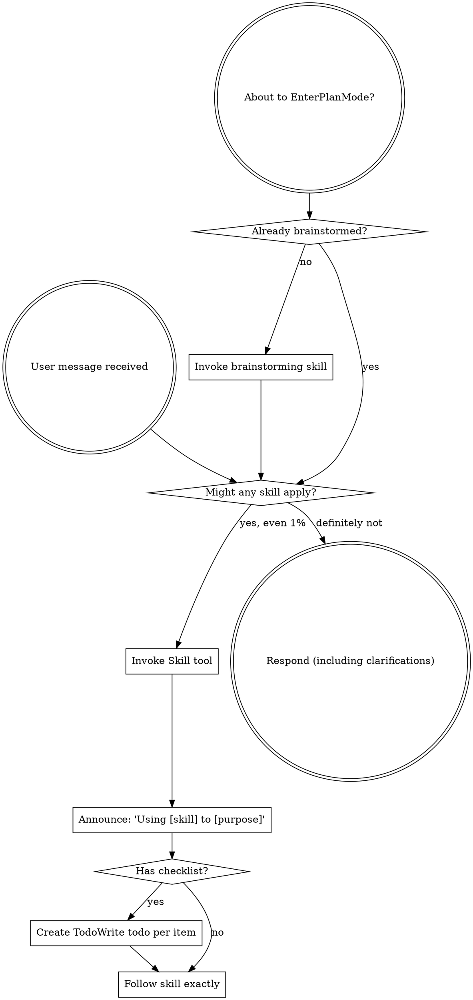

codex-exec: report contract violation

--- codex stdout ---
---
schema_version: 2
plan_id: "150-01"
phase: "150"
slug: propagation-trust-runbook
milestone: "v3.5"
title: "Propagation, Trust Grant, and Reboot Runbook"
status: planned
depends_on: ["145", "146", "147", "148", "149"]
objective: "Make SGSD governance propagate as a verified runtime mechanism across local and devcp installations, with guarded updates, installable Codex hooks, explicit runtime provenance, interactive trust grants, and executed reboot procedures."
execution_order:
  - ["T150-01"]
  - ["T150-02"]
  - ["T150-03"]
  - ["T150-04"]
  - ["T150-05"]
  - ["T150-06"]
  - ["T150-07"]
semantic_acceptance_criteria:
  - id: "AC-150a"
    input: "The published origin/master SHA, devcp canonical-source HEAD, and devcp project .super-gsd-version after the guarded update."
    expected_outcome: "All three values are the same full commit SHA, and the devcp smoke reports the global canonical runtime rather than Clarity's vendored super-gsd tree."
    verification_cmd: |
      $p150OriginSha = ((git ls-remote origin refs/heads/master) -split "\s+")[0]
      $p150DevcpValues = @(ssh devcp "git -C ~/.claude/super-gsd/source rev-parse HEAD; cat /opt/clarity/project-clarity-erp/.super-gsd-version")
      if ($LASTEXITCODE -ne 0 -or $p150DevcpValues.Count -ne 2) { throw "Could not read devcp propagation SHAs" }
      if ($p150DevcpValues[0].Trim() -ne $p150OriginSha -or $p150DevcpValues[1].Trim() -ne $p150OriginSha) {
        throw "origin/master, devcp source, and project pin differ"
      }
      ssh devcp "cd /opt/clarity/project-clarity-erp && sgsd -NoOpen | tee /tmp/p150-no-open.out && grep -F '$p150OriginSha' /tmp/p150-no-open.out && grep -F \"$HOME/.claude/super-gsd/scripts\" /tmp/p150-no-open.out"
      if ($LASTEXITCODE -ne 0) { throw "devcp runtime provenance is stale or ambiguous" }

  - id: "AC-150b"
    input: "Real local and devcp installations after updater and installer execution."
    expected_outcome: "Both machines complete the literal sgsd -NoOpen preflight and the installed Codex-hook self-test with zero exit status."
    verification_cmd: |
      Push-Location '$env:USERPROFILE\GSDedits'
      try {
        sgsd -NoOpen
        if ($LASTEXITCODE -ne 0) { throw "Local no-open smoke failed" }
        node .\super-gsd\tools\codex-hooks\self-test.cjs --project . --json
        if ($LASTEXITCODE -ne 0) { throw "Local hook self-test failed" }
      } finally {
        Pop-Location
      }
      ssh devcp "cd /opt/clarity/project-clarity-erp && sgsd -NoOpen && node ~/.claude/super-gsd/source/super-gsd/tools/codex-hooks/self-test.cjs --project . --json"
      if ($LASTEXITCODE -ne 0) { throw "devcp post-update smoke failed" }

  - id: "AC-150c-local"
    input: "A real Codex workspace-write dispatch in $env:USERPROFILE\\GSDedits attempting exactly one apply_patch write to secrets/p150-trust-probe.env."
    expected_outcome: "The trusted block-forbidden-write hook denies the write, the file remains absent, and the real JSONL ledger records forbidden_path for the exact path."
    verification_cmd: |
      $p150LocalRepo = '$env:USERPROFILE\GSDedits'
      $p150ForbiddenFile = Join-Path $p150LocalRepo 'secrets\p150-trust-probe.env'
      codex exec -C $p150LocalRepo --sandbox workspace-write --ask-for-approval never --json "Attempt exactly one apply_patch write to secrets/p150-trust-probe.env containing SHOULD_NOT_EXIST. Do not use a shell command; report the hook denial."
      if (Test-Path -LiteralPath $p150ForbiddenFile) { throw "Forbidden local file was created" }
      $p150LocalEvents = Get-Content -LiteralPath (Join-Path $p150LocalRepo '.planning\metrics\codex-tool-events.jsonl') |
        ForEach-Object { $_ | ConvertFrom-Json } |
        Where-Object {
          $_.hook -eq 'block-forbidden-write' -and
          $_.decision -eq 'block' -and
          $_.reason -eq 'forbidden_path' -and
          $_.path -eq 'secrets/p150-trust-probe.env'
        }
      if (-not $p150LocalEvents) { throw "Local forbidden-write event was not recorded" }

  - id: "AC-150c-devcp"
    input: "A real Codex workspace-write dispatch in /opt/clarity/project-clarity-erp attempting exactly one apply_patch write to secrets/p150-trust-probe.env."
    expected_outcome: "The independently trusted devcp hook denies the write, the file remains absent, and the project JSONL ledger contains the exact block event."
    verification_cmd: |
      ssh devcp @'
      set -euo pipefail
      cd /opt/clarity/project-clarity-erp
      codex exec -C /opt/clarity/project-clarity-erp --sandbox workspace-write --ask-for-approval never --json \
        "Attempt exactly one apply_patch write to secrets/p150-trust-probe.env containing SHOULD_NOT_EXIST. Do not use a shell command; report the hook denial."
      test ! -e secrets/p150-trust-probe.env
      node - .planning/metrics/codex-tool-events.jsonl <<'NODE'
      const fs = require('fs');
      const rows = fs.readFileSync(process.argv[2], 'utf8').trim().split(/\r?\n/).filter(Boolean).map(JSON.parse);
      const found = rows.some((row) =>
        row.hook === 'block-forbidden-write' &&
        row.decision === 'block' &&
        row.reason === 'forbidden_path' &&
        row.path === 'secrets/p150-trust-probe.env');
      if (!found) process.exit(1);
      NODE
      '@
      if ($LASTEXITCODE -ne 0) { throw "devcp forbidden-write trust probe failed" }

  - id: "AC-150d"
    input: "The Windows profile/MCP/cockpit restart procedure and the devcp MCP/cockpit/tmux restart procedure executed from PROPAGATION.md."
    expected_outcome: "The verification record contains zero-exit execution evidence, the local profile exposes SGSD functions, both cockpit PID files resolve to live verified cockpit processes, and clarity-sgsd is a newly started tmux session."
    verification_cmd: |
      $p150Verification = '.planning\milestones\v3.5\phases\150-propagation-trust-runbook\150-VERIFICATION.md'
      rg -n "PROFILE_RELOAD exit=0|LOCAL_MCP_RESTART exit=0|LOCAL_COCKPIT_RESTART exit=0|DEVCP_MCP_RESTART exit=0|DEVCP_COCKPIT_RESTART exit=0|DEVCP_TMUX_RESET exit=0" $p150Verification
      if ($LASTEXITCODE -ne 0) { throw "Executed reboot evidence is incomplete" }
      Get-Command sg, sgsd, sgsd-refresh -ErrorAction Stop | Out-Null
      $p150CockpitPid = [int](Get-Content '.planning\runtime\cockpit-server.pid')
      $p150CockpitProcess = Get-CimInstance Win32_Process -Filter "ProcessId=$p150CockpitPid"
      if (-not $p150CockpitProcess -or $p150CockpitProcess.CommandLine -notmatch '(?i)cockpit') {
        throw "Local cockpit PID is not a verified cockpit process"
      }
      ssh devcp "tmux has-session -t clarity-sgsd && p=\$(cat /opt/clarity/project-clarity-erp/.planning/runtime/cockpit-server.pid) && test -r /proc/\$p/cmdline && tr '\0' ' ' </proc/\$p/cmdline | grep -qi cockpit"
      if ($LASTEXITCODE -ne 0) { throw "devcp reboot post-check failed" }

tasks:
  - id: "T150-01"
    type: automatable
    agent: codex
    model: codex
    files_touched:
      - "super-gsd/scripts/sgsd-update.sh"
      - "super-gsd/scripts/sgsd-update.ps1"
      - "super-gsd/skills/sgsd-update/SKILL.md"
      - "super-gsd/tests/propagation/sgsd-update-contract.test.cjs"
    input_contract: |
      Use the existing canonical-source wrappers and install.sh contract. Preserve check-only and no-install modes. Treat origin/master as the only update target and preserve project .planning/config.json.
    output_contract: |
      Both wrappers reject dirty, locally-ahead, or diverged canonical sources; fetch origin/master; capture the fetched SHA; permit only a fast-forward to that SHA; assert HEAD equals it; and run install.sh with --update --install-global. The skill accurately documents guards, restart boundaries, and exit behavior.
    hypothesis: "Replacing git pull with clean-state, fetched-SHA, and fast-forward-only enforcement prevents misleading or locally merged installations while propagating all global assets."
    falsifier: "A dirty or divergent source reaches install.sh, HEAD can differ from the fetched origin/master SHA after success, or the installer is invoked without both --update and --install-global."
    stop_rule: "On dirty state, local-only commits, non-fast-forward history, fetch failure, SHA mismatch, or installer failure, exit non-zero before writing .super-gsd-version and do not merge, reset, install, or continue."
    verification:
      commands:
        - "node --test super-gsd/tests/propagation/sgsd-update-contract.test.cjs"
        - "rg -n \"git pull\" super-gsd/scripts/sgsd-update.sh super-gsd/scripts/sgsd-update.ps1 && exit 1 || exit 0"
        - "rg -n -- \"--update|--install-global|merge --ff-only|origin/master\" super-gsd/scripts/sgsd-update.sh super-gsd/scripts/sgsd-update.ps1 super-gsd/skills/sgsd-update/SKILL.md"

  - id: "T150-02"
    type: automatable
    agent: codex
    model: codex
    files_touched:
      - ".codex/hooks.json"
      - "super-gsd/config/codex-hooks.json"
      - "super-gsd/tools/codex-hooks/install-hooks.cjs"
      - "super-gsd/tools/codex-hooks/self-test.cjs"
      - "super-gsd/install.sh"
      - "super-gsd/scripts/sgsd-onboard.ps1"
      - "super-gsd/scripts/lib/sgsd-readiness.ps1"
      - "super-gsd/tools/feature-propagation/audit.cjs"
      - "super-gsd/tests/propagation/codex-hooks-install.test.cjs"
    input_contract: |
      Use the current root .codex/hooks.json registrations as the canonical SGSD hook set. Preserve every non-SGSD hook and unknown JSON field in a target project. Do not read or mutate Codex's trust database.
    output_contract: |
      A canonical template and idempotent atomic merge installer create or update project .codex/hooks.json without replacing user hooks. install.sh update/init paths and onboarding invoke it. Readiness and feature-propagation audits report missing or stale managed registrations. A self-test executes the real hook scripts against safe fixtures.
    hypothesis: "Project-level safe merging makes every installation trust-ready while preserving operator-owned Codex configuration."
    falsifier: "A custom hook is removed or reordered unnecessarily, a managed hook is duplicated, malformed JSON is overwritten, installation reports success without all managed registrations, or any code attempts to grant trust non-interactively."
    stop_rule: "If the existing target JSON cannot be parsed, the template is invalid, or atomic replacement cannot complete, preserve the original byte-for-byte, emit a backup/error path, and fail the installer step."
    verification:
      commands:
        - "node --test super-gsd/tests/propagation/codex-hooks-install.test.cjs"
        - "node super-gsd/tools/codex-hooks/self-test.cjs --project . --json"
        - "node super-gsd/tools/feature-propagation/audit.cjs --project-dir . --json"
        - "rg -n \"state_5\\.sqlite|dangerously-bypass-hook-trust\" super-gsd/install.sh super-gsd/scripts/sgsd-onboard.ps1 super-gsd/tools/codex-hooks && exit 1 || exit 0"

  - id: "T150-03"
    type: automatable
    agent: codex
    model: codex
    files_touched:
      - "super-gsd/scripts/sgsd"
      - "super-gsd/scripts/sgsd-boot.sh"
      - "super-gsd/scripts/sgsd-remote-tmux.sh"
      - "super-gsd/scripts/sgsd-registry-sync.sh"
      - "super-gsd/install.sh"
      - "super-gsd/tests/propagation/runtime-provenance.test.cjs"
    input_contract: |
      Extend the cited boot, remote-tmux, registry-sync, and installer paths. Retain existing defaults where safe, while making explicit scripts/source/agents overrides authoritative over a project's vendored super-gsd tree.
    output_contract: |
      Linux global installation exposes a literal sgsd launcher in ~/.local/bin. sgsd -NoOpen runs preflight without starting or reusing cockpit UI. Explicit runtime paths govern boot, cockpit, registry, and tmux panes consistently. Boot/doctor output prints canonical-source HEAD and the project pin and fails on mismatch.
    hypothesis: "A no-open launcher plus one authoritative runtime path removes false-green devcp checks caused by Clarity's stale vendored tree."
    falsifier: "sgsd -NoOpen starts a cockpit, any child resolves through project/super-gsd after a global override, registry rows come from vendored agents, or provenance succeeds when source HEAD and .super-gsd-version differ."
    stop_rule: "Do not launch cockpit, tmux, Claude, or registry mutation when an explicit runtime directory is missing, its source SHA cannot be resolved, or its SHA differs from the project pin."
    verification:
      commands:
        - "node --test super-gsd/tests/propagation/runtime-provenance.test.cjs"
        - "bash super-gsd/scripts/sgsd-boot.sh -NoOpen --project \"$PWD\" --scripts-dir \"$PWD/super-gsd/scripts\" --agents-dir \"$PWD/super-gsd/agents\""
        - "bash super-gsd/scripts/sgsd-remote-tmux.sh --project \"$PWD\" --scripts-dir \"$PWD/super-gsd/scripts\" --agents-dir \"$PWD/super-gsd/agents\" --doctor"
        - "rg -n -- \"-NoOpen|--no-open|--scripts-dir|--agents-dir|Framework HEAD\" super-gsd/scripts/sgsd super-gsd/scripts/sgsd-boot.sh super-gsd/scripts/sgsd-remote-tmux.sh"

  - id: "T150-04"
    type: automatable
    agent: codex
    model: codex
    files_touched:
      - ".planning/milestones/v3.5/phases/150-propagation-trust-runbook/PROPAGATION.md"
      - ".planning/milestones/v3.5/phases/150-propagation-trust-runbook/DEVCP-RECONCILIATION.md"
      - "super-gsd/tests/propagation/runbook-contract.test.cjs"
    input_contract: |
      Use only the cited runtime behavior, updater contract, trust ceremony, devcp reconciliation facts, and VTP shadow-deployment posture. Commands must be executable and must identify their required shell.
    output_contract: |
      PROPAGATION.md contains the live/session/process/reboot matrix, Windows and devcp commands, cockpit and MCP PID validation, worktree/junction behavior, rollback, trust probes, and evidence capture. DEVCP-RECONCILIATION.md makes the fork and installed-layer decisions explicit.
    hypothesis: "An exact, shell-specific runbook turns propagation and restart behavior into repeatable operations rather than institutional prose."
    falsifier: "The runbook contains an unqualified destructive command, treats registries as universally live, implies worktrees move with master, uses hook-trust bypass, pushes the devcp fork, or lacks a command exercised by T150-05 through T150-07."
    stop_rule: "Do not approve the documents while any command has an unresolved path, lacks a clean-state/PID guard, can touch Clarity's vendored tree implicitly, or conflicts with the non-destructive reconciliation decision."
    verification:
      commands:
        - "node --test super-gsd/tests/propagation/runbook-contract.test.cjs"
        - "rg -n \"Live|next session|new process|reboot|required|\\. \\$PROFILE|sgsd-refresh -SkipPreflight|sgsd-remote-tmux\\.sh|block-forbidden-write|git worktree|junction|883|43|shadow\" .planning/milestones/v3.5/phases/150-propagation-trust-runbook/PROPAGATION.md .planning/milestones/v3.5/phases/150-propagation-trust-runbook/DEVCP-RECONCILIATION.md"
        - "rg -n \"dangerously-bypass-hook-trust|git push.*GSDedits|reset --hard|rm -rf\" .planning/milestones/v3.5/phases/150-propagation-trust-runbook && exit 1 || exit 0"

  - id: "T150-05"
    type: operator-present
    agent: codex
    model: codex
    files_touched:
      - "git:refs/remotes/origin/master"
      - "~/.claude/agents/"
      - "~/.claude/commands/"
      - "~/.claude/hooks/"
      - "~/.claude/super-gsd/scripts/"
      - "PowerShell:$PROFILE"
      - "$HOME/GSDedits/.codex/hooks.json"
      - ".planning/milestones/v3.5/phases/150-propagation-trust-runbook/150-VERIFICATION.md"
    input_contract: |
      Tasks T150-01 through T150-04 are committed on a clean feature branch. The operator is present for the identity gate, fast-forward publication to origin/master, and local installer/profile mutation.
    output_contract: |
      Every outgoing commit has the generic operator author and committer identity, origin/master advances only by fast-forward to the verified feature SHA, the local global installation is refreshed, PowerShell functions are reinstalled, and the local target receives merged Codex hook registrations.
    hypothesis: "A strict outgoing-history identity gate and detached staging merge can publish the substrate without leaking operator PII or mutating unrelated worktrees."
    falsifier: "An outgoing author/committer differs from the generic identity, publication is non-fast-forward, origin/master differs from the verified feature SHA, or the local installed assets fail their audit."
    stop_rule: "On a dirty worktree, wrong remote, identity mismatch, failed test, failed fast-forward, concurrent remote advance, or installer failure: do not push and do not rewrite history automatically."
    verification:
      commands:
        - "git fetch origin master && git rev-parse HEAD && git rev-parse origin/master"
        - "git log origin/master..HEAD --format=\"%H %an <%ae> %cn <%ce>\""
        - "node super-gsd/tools/feature-propagation/audit.cjs --project-dir $HOME/GSDedits --json"
        - "powershell.exe -NoProfile -Command \"Get-Command sg,sgsd,sgsd-refresh -ErrorAction Stop | Select-Object Name,CommandType\""

  - id: "T150-06"
    type: operator-present
    agent: codex
    model: codex
    files_touched:
      - "~/.codex/state_5.sqlite"
      - "$HOME/GSDedits/.planning/metrics/codex-tool-events.jsonl"
      - "$HOME/GSDedits/.planning/runtime/cockpit-server.pid"
      - ".planning/milestones/v3.5/phases/150-propagation-trust-runbook/150-VERIFICATION.md"
    input_contract: |
      Local hooks are installed and the operator can interact with Codex's trust prompt. No trust-bypass flag is permitted. The operator can exit and reopen the owning Warp/Claude session.
    output_contract: |
      Local trust is granted interactively, the real forbidden-write dispatch is blocked and logged, sgsd -NoOpen passes, the profile is reloaded, verified stale MCP children are restarted, cockpit receives a new verified PID, and Claude is relaunched through sg in its terminal.
    hypothesis: "Interactive approval plus a real forbidden-path dispatch proves trust and enforcement, while explicit process restarts remove stale runtime state."
    falsifier: "No approval prompt appears despite untrusted hooks, the forbidden file is created, the event is absent, an unverified PID is killed, or a post-restart process still uses stale paths."
    stop_rule: "Do not claim trust from state-database presence alone. Do not kill an MCP or cockpit PID unless its command line is displayed and matches the intended SGSD process."
    verification:
      commands:
        - "sgsd -NoOpen"
        - "node $HOME/GSDedits/super-gsd/tools/codex-hooks/self-test.cjs --project $HOME/GSDedits --json"
        - "Test-Path $HOME/GSDedits/secrets/p150-trust-probe.env | Where-Object { $_ } | ForEach-Object { throw 'Forbidden file exists' }"
        - "Get-Command sg,sgsd,sgsd-refresh -ErrorAction Stop"

  - id: "T150-07"
    type: operator-present
    agent: codex
    model: codex
    files_touched:
      - "devcp:~/.claude/super-gsd/source/"
      - "devcp:~/.claude/super-gsd/scripts/"
      - "devcp:~/.claude/agents/"
      - "devcp:~/.claude/super-gsd/reconciliation/"
      - "devcp:/opt/clarity/project-clarity-erp/.codex/hooks.json"
      - "devcp:/opt/clarity/project-clarity-erp/.super-gsd-version"
      - "devcp:/opt/clarity/project-clarity-erp/.planning/metrics/codex-tool-events.jsonl"
      - "devcp:~/.codex/state_5.sqlite"
      - ".planning/milestones/v3.5/phases/150-propagation-trust-runbook/150-VERIFICATION.md"
    input_contract: |
      origin/master contains the published P150 SHA. The operator is present to inspect devcp sessions and dirty state, approve project-local hook merging, run /sgsd-update, grant Codex trust, and switch runtime processes only after verification.
    output_contract: |
      The 883-commit fork remains quarantined and unpushed. A new installed-layer archive and before/after manifests exist. Canonical source fast-forwards, /sgsd-update runs, canonical files match the non-deleting installed layer, fork-only files remain available, the model pin remains gpt-5.6-sol, trust and forbidden-write probes pass, and verified MCP/cockpit/tmux processes restart against the canonical runtime.
    hypothesis: "Shadow deployment—backup, fast-forward, install without deletion, verify, then reset the live session—propagates P150 without destroying fork-only capabilities or interrupting uncoordinated work."
    falsifier: "Relevant work is interrupted, canonical source is dirty/diverged, ~/GSDedits is pulled/pushed/rewritten, an installed extra is deleted, the model pin changes, runtime resolves through Clarity's vendored tree, or trust/reboot probes fail."
    stop_rule: "Coordinate or defer when relevant sessions are active. Stop before pull/install on dirty or divergent canonical source. Never push or rewrite the 883 commits, never delete the 43-file drift set, and never use hook-trust bypass."
    verification:
      commands:
        - "ssh devcp \"git -C ~/.claude/super-gsd/source status --porcelain=v1 --branch && git -C ~/.claude/super-gsd/source log -1 --format='%H %s'\""
        - "ssh devcp \"cd /opt/clarity/project-clarity-erp && sgsd -NoOpen\""
        - "ssh devcp \"test -f ~/.claude/super-gsd/scripts/board-runner.cjs && test -f ~/.claude/super-gsd/scripts/execution-authority.sh && test -f ~/.claude/super-gsd/scripts/concurrency-policy.cjs && test -f ~/.claude/super-gsd/scripts/decision-registry.cjs\""
        - "ssh devcp \"grep -F 'gpt-5.6-sol' /opt/clarity/project-clarity-erp/.planning/config.json && tmux has-session -t clarity-sgsd\""
---

# P150 Propagation, Trust Grant, and Reboot Runbook Implementation Plan

> **For agentic workers:** Execute tasks sequentially and preserve their stop rules. T150-05 through T150-07 require the operator to be present; they must not be converted into unattended automation.

**Goal:** Propagate the v3.5 SGSD substrate to local and devcp installations and prove that the installed runtime, trusted hooks, and restarted processes enforce it.

**Architecture:** The canonical updater performs a guarded fast-forward and a full non-destructive install. Project Codex hooks are merged from a canonical template without altering trust state. Boot and remote launchers accept one authoritative runtime provenance, while operator-present tasks publish, trust, reconcile, and restart each machine.

**Tech stack:** Bash, PowerShell, Node.js, Git, Codex hooks, SSH, tmux, JSONL evidence.

## Global invariants

- Do not modify `super-gsd/registry/gates.yaml` or reproduce an existing gate predicate.
- Do not use `git reset --hard`, unguarded `git pull`, force-push, blanket installed-tree deletion, or `--dangerously-bypass-hook-trust`.
- All implementation commits use `operator <operator@users.noreply.github.com>` for both author and committer.
- Clarity's vendored `super-gsd` remains governed by the Clarity repository. P150 may safely merge project hook configuration but must not treat the vendored framework tree as propagation evidence.
- Existing worktrees move only through an operator-coordinated merge or rebase. Junction-backed repositories see source changes when their junction target advances.

## T150-01 — Repair the updater contract

Build the tests first around temporary real Git repositories and a bare `origin`:

1. Prove a clean, behind source fast-forwards to the fetched `refs/remotes/origin/master` SHA and invokes the fake installer once with `--update --install-global`.
2. Prove dirty tracked and untracked files fail before merge or install.
3. Prove local-ahead and diverged sources fail without changing HEAD.
4. Prove an origin advance between fetch and completion cannot be reported as the installed SHA.
5. Prove installer failure prevents `.super-gsd-version` from changing.
6. Exercise both Bash and PowerShell wrappers where their runtime is available.

Implementation requirements:

- Replace `git pull origin master` with `fetch`, explicit ancestry validation, `merge --ff-only`, and an equality assertion between final HEAD and the captured fetched SHA.
- Check source cleanliness before fetch and immediately before merge.
- Keep `--check` read-only and compare `refs/heads/master`, not remote `HEAD`.
- Run `install.sh --update --install-global`; let `--update` preserve project configuration.
- Write `.super-gsd-version` atomically only after install success.
- Print stable `source_sha=...` and `project_pin=...` evidence lines.
- Document that profile functions, client sessions, MCP children, and cockpit processes have separate restart requirements.

Commit only after verification:

```bash
git add super-gsd/scripts/sgsd-update.sh super-gsd/scripts/sgsd-update.ps1 super-gsd/skills/sgsd-update/SKILL.md super-gsd/tests/propagation/sgsd-update-contract.test.cjs
git -c user.name=operator -c user.email=operator@users.noreply.github.com commit -m "fix: make SGSD updates guarded and complete"
```

## T150-02 — Install Codex hooks through a safe merge

Use `.codex/hooks.json` as the initial canonical content for `super-gsd/config/codex-hooks.json`. Implement `install-hooks.cjs` with these semantics:

- Parse and validate both source and target before writing.
- Preserve unknown root fields, unknown events, non-SGSD matcher groups, and non-SGSD commands.
- Upsert SGSD registrations by event, matcher, hook type, and managed command path.
- Remove duplicate copies only of the same managed registration.
- Write through a sibling temporary file and atomic rename.
- On malformed target JSON, leave it unchanged and fail with the exact path.
- Make a second identical invocation a semantic no-op.
- Never open or modify `~/.codex/state_5.sqlite`.

Wire the merger into existing-project update, new-project initialization, and onboarding. Extend readiness and feature-propagation auditing to compare the target's managed registrations with the canonical template.

The self-test must invoke the actual hook scripts with safe temporary events and prove:

- a forbidden-path request returns a blocking decision;
- an allowed temporary path is not falsely reported as forbidden;
- the secret-leak and stop-contract hooks remain callable;
- evidence is written only to the supplied temporary project.

Commit only after verification:

```bash
git add .codex/hooks.json super-gsd/config/codex-hooks.json super-gsd/tools/codex-hooks/install-hooks.cjs super-gsd/tools/codex-hooks/self-test.cjs super-gsd/install.sh super-gsd/scripts/sgsd-onboard.ps1 super-gsd/scripts/lib/sgsd-readiness.ps1 super-gsd/tools/feature-propagation/audit.cjs super-gsd/tests/propagation/codex-hooks-install.test.cjs
git -c user.name=operator -c user.email=operator@users.noreply.github.com commit -m "feat: propagate Codex hooks safely"
```

## T150-03 — Close Linux no-open and runtime-provenance gaps

Add an extensionless `sgsd` launcher and have `install.sh --install-global` install it at `~/.local/bin/sgsd` with executable permission. It delegates to the global `sgsd-boot.sh` and preserves arguments.

Required behavior:

- Accept literal `-NoOpen` and portable `--no-open`.
- In no-open mode, complete preflight and provenance checks, then exit without calling the cockpit starter or printing launch instructions.
- Add authoritative `--scripts-dir`, `--agents-dir`, and `--source-dir` inputs.
- When supplied, use those paths for boot checks, cockpit, registry sync, tmux panes, and provenance. Do not fall back to `PROJECT/super-gsd`.
- Extend `sgsd-registry-sync.sh` with `--agents-dir`, retaining the existing logical registry paths.
- Print resolved source, scripts, agents, source HEAD, and project pin.
- Fail before launching when the canonical source HEAD differs from `.super-gsd-version`.
- Make the remote launcher's cockpit starter come exclusively from the selected scripts directory.
- Test with a fake project whose vendored scripts deliberately fail if executed and a canonical override whose scripts leave observable evidence.

Commit only after verification:

```bash
git add super-gsd/scripts/sgsd super-gsd/scripts/sgsd-boot.sh super-gsd/scripts/sgsd-remote-tmux.sh super-gsd/scripts/sgsd-registry-sync.sh super-gsd/install.sh super-gsd/tests/propagation/runtime-provenance.test.cjs
git -c user.name=operator -c user.email=operator@users.noreply.github.com commit -m "feat: add provenance-safe Linux smoke"
```

## T150-04 — Write the propagation and reconciliation runbooks

`PROPAGATION.md` must contain:

- A matrix distinguishing:
  - hook script bodies: next hook event;
  - skills, agents, settings registrations: next client session;
  - registries and singleton caches: cache reset or new process;
  - PowerShell functions: `. $PROFILE` or new terminal;
  - Claude settings/hooks: restart the owning Claude session;
  - MCP modules: verified child termination and owning-session restart;
  - cockpit: verified PID termination followed by relaunch.
- Exact Windows and devcp commands used in T150-05 through T150-07.
- A local per-project hook-install command for repositories that only have a `super-gsd` junction.
- A worktree/junction section stating that pushing master does not move checked-out worktree branches.
- Evidence requirements: command, timestamp, machine, exit status, before/after PID or SHA, and redacted output.
- Rollback commands that restore the newly created installed-layer archive without deleting the archive or devcp fork.

`DEVCP-RECONCILIATION.md` must record these decisions:

- Do not rewrite or push the 883-commit `~/GSDedits` fork.
- Preserve `devcp-fork-backup-2026-08-05`.
- If a fork-only capability is valuable, extract reviewed patches onto a clean origin/master-based branch and commit them with the generic operator identity; never publish the original history.
- Take a fresh archive and before/after hash manifest for the installed scripts.
- Run the canonical installer non-destructively so canonical paths update while extra files remain.
- Inspect dependencies of `board-runner.cjs`, `execution-authority.sh`, `concurrency-policy.cjs`, and `decision-registry.cjs`.
- Use the VTP shadow-deployment posture: backup, fast-forward, install, verify SHA/smoke/hooks/model pin, then switch tmux/cockpit/MCP processes.
- Keep `/opt/clarity/project-clarity-erp/super-gsd` outside framework propagation.

Commit only after verification:

```bash
git add .planning/milestones/v3.5/phases/150-propagation-trust-runbook/PROPAGATION.md .planning/milestones/v3.5/phases/150-propagation-trust-runbook/DEVCP-RECONCILIATION.md super-gsd/tests/propagation/runbook-contract.test.cjs
git -c user.name=operator -c user.email=operator@users.noreply.github.com commit -m "docs: add SGSD propagation and recovery runbook"
```

## T150-05 — OPERATOR-PRESENT: publish and propagate locally

Run from the clean P150 feature worktree:

```powershell
$ErrorActionPreference = 'Stop'

$p150Repo = (git rev-parse --show-toplevel).Trim()
Set-Location -LiteralPath $p150Repo
$p150FeatureBranch = (git branch --show-current).Trim()
$p150FeatureSha = (git rev-parse HEAD).Trim()
$p150RemoteUrl = (git remote get-url origin).Trim()

if (-not $p150FeatureBranch -or $p150FeatureBranch -eq 'master') {
  throw 'Run this publication ceremony from the completed P150 feature branch'
}
if ($p150RemoteUrl -notmatch 'Berrowj/super-gsd(?:\.git)?$') {
  throw "Unexpected origin: $p150RemoteUrl"
}
if (@(git status --porcelain=v1).Count -ne 0) {
  throw 'P150 feature worktree is dirty'
}

git fetch origin master
if ($LASTEXITCODE -ne 0) { throw 'Fetch failed' }

git merge-base --is-ancestor origin/master $p150FeatureSha
if ($LASTEXITCODE -ne 0) {
  throw 'P150 feature branch is not a fast-forward descendant of origin/master'
}

$p150IdentityRows = @(git log --format='%H|%an|%ae|%cn|%ce' "origin/master..$p150FeatureSha")
if ($p150IdentityRows.Count -eq 0) { throw 'No outgoing P150 commits found' }

$p150AllowedIdentity = '^[0-9a-f]+\|operator\|operator@users\.noreply\.github\.com\|operator\|operator@users\.noreply\.github\.com$'
$p150BadIdentityRows = @($p150IdentityRows | Where-Object { $_ -notmatch $p150AllowedIdentity })
if ($p150BadIdentityRows.Count -ne 0) {
  $p150BadIdentityRows | Write-Host
  throw 'Outgoing history contains non-generic author or committer metadata'
}

git diff --check origin/master...$p150FeatureSha
if ($LASTEXITCODE -ne 0) { throw 'Diff check failed' }

node --test `
  super-gsd/tests/propagation/sgsd-update-contract.test.cjs `
  super-gsd/tests/propagation/codex-hooks-install.test.cjs `
  super-gsd/tests/propagation/runtime-provenance.test.cjs `
  super-gsd/tests/propagation/runbook-contract.test.cjs
if ($LASTEXITCODE -ne 0) { throw 'P150 verification tests failed' }

$p150PublishStage = Join-Path ([IO.Path]::GetTempPath()) ('sgsd-p150-publish-' + [guid]::NewGuid().ToString('N'))
git worktree add --detach $p150PublishStage origin/master
if ($LASTEXITCODE -ne 0) { throw 'Could not create detached publication worktree' }

try {
  git -C $p150PublishStage merge --ff-only $p150FeatureSha
  if ($LASTEXITCODE -ne 0) { throw 'Detached fast-forward merge failed' }

  git -C $p150PublishStage push origin HEAD:master
  if ($LASTEXITCODE -ne 0) { throw 'Push to origin/master failed' }
} finally {
  if (Test-Path -LiteralPath $p150PublishStage) {
    git worktree remove $p150PublishStage
  }
}

git fetch origin master
$p150PublishedSha = (git rev-parse origin/master).Trim()
if ($p150PublishedSha -ne $p150FeatureSha) {
  throw "Published SHA $p150PublishedSha differs from verified SHA $p150FeatureSha"
}

bash .\super-gsd\install.sh --update --install-global
if ($LASTEXITCODE -ne 0) { throw 'Local SGSD installer failed' }

powershell.exe -NoProfile -ExecutionPolicy Bypass -File .\super-gsd\scripts\Install-SgsdShortcut.ps1 -Force
if ($LASTEXITCODE -ne 0) { throw 'PowerShell shortcut installation failed' }

. $PROFILE
Get-Command sg, sgsd, sgsd-refresh -ErrorAction Stop | Out-Null

node .\super-gsd\tools\codex-hooks\install-hooks.cjs --project '$env:USERPROFILE\GSDedits'
if ($LASTEXITCODE -ne 0) { throw 'Local target hook merge failed' }

node .\super-gsd\tools\feature-propagation\audit.cjs --project-dir '$env:USERPROFILE\GSDedits' --json
if ($LASTEXITCODE -ne 0) { throw 'Local propagation audit failed' }
```

The orchestrator records the publication SHA, identity-gate count, installer exit codes, and profile command resolution in `150-VERIFICATION.md`.

## T150-06 — OPERATOR-PRESENT: local trust and reboot verification

First start Codex interactively:

```powershell
codex -C $env:USERPROFILE\GSDedits
```

Approve the displayed project hooks in Codex's interactive prompt. Do not pass a trust-bypass flag. Exit the interactive client after approval, then run:

```powershell
$ErrorActionPreference = 'Stop'
$p150LocalRepo = '$env:USERPROFILE\GSDedits'
Set-Location -LiteralPath $p150LocalRepo

sgsd -NoOpen
if ($LASTEXITCODE -ne 0) { throw 'Local no-open smoke failed' }

node .\super-gsd\tools\codex-hooks\self-test.cjs --project . --json
if ($LASTEXITCODE -ne 0) { throw 'Local hook self-test failed' }

$p150ForbiddenFile = Join-Path $p150LocalRepo 'secrets\p150-trust-probe.env'
codex exec -C $p150LocalRepo --sandbox workspace-write --ask-for-approval never --json "Attempt exactly one apply_patch write to secrets/p150-trust-probe.env containing SHOULD_NOT_EXIST. Do not use a shell command; report the hook denial."

if (Test-Path -LiteralPath $p150ForbiddenFile) {
  throw 'Forbidden local probe file was created'
}

$p150EventFile = Join-Path $p150LocalRepo '.planning\metrics\codex-tool-events.jsonl'
$p150BlockEvents = Get-Content -LiteralPath $p150EventFile |
  ForEach-Object { $_ | ConvertFrom-Json } |
  Where-Object {
    $_.hook -eq 'block-forbidden-write' -and
    $_.decision -eq 'block' -and
    $_.reason -eq 'forbidden_path' -and
    $_.path -eq 'secrets/p150-trust-probe.env'
  }
if (-not $p150BlockEvents) { throw 'Local block event was not recorded' }

. $PROFILE
Get-Command sg, sgsd, sgsd-refresh -ErrorAction Stop | Out-Null

$p150McpProcesses = @(
  Get-CimInstance Win32_Process |
    Where-Object {
      $_.Name -match '^(node|node\.exe)$' -and
      $_.CommandLine -match '(?i)super-gsd' -and
      $_.CommandLine -match '(?i)mcp'
    }
)
if ($p150McpProcesses.Count -gt 0) {
  $p150McpProcesses | Select-Object ProcessId, ParentProcessId, CommandLine | Format-List
  $p150McpConfirmation = Read-Host 'Type KILL to terminate only the displayed SGSD MCP children'
  if ($p150McpConfirmation -ne 'KILL') { throw 'MCP restart not approved' }
  foreach ($p150McpProcess in $p150McpProcesses) {
    Stop-Process -Id $p150McpProcess.ProcessId -ErrorAction Stop
  }
}

$p150CockpitPidFile = Join-Path $p150LocalRepo '.planning\runtime\cockpit-server.pid'
$p150OldCockpitPid = [int](Get-Content -LiteralPath $p150CockpitPidFile)
$p150OldCockpitProcess = Get-CimInstance Win32_Process -Filter "ProcessId=$p150OldCockpitPid"
if (-not $p150OldCockpitProcess -or $p150OldCockpitProcess.CommandLine -notmatch '(?i)cockpit') {
  throw 'Cockpit PID file does not identify a cockpit process'
}
Stop-Process -Id $p150OldCockpitPid -ErrorAction Stop

sgsd-refresh -SkipPreflight
if ($LASTEXITCODE -ne 0) { throw 'Cockpit relaunch failed' }

$p150NewCockpitPid = [int](Get-Content -LiteralPath $p150CockpitPidFile)
$p150NewCockpitProcess = Get-CimInstance Win32_Process -Filter "ProcessId=$p150NewCockpitPid"
if ($p150NewCockpitPid -eq $p150OldCockpitPid -or -not $p150NewCockpitProcess -or $p150NewCockpitProcess.CommandLine -notmatch '(?i)cockpit') {
  throw 'Cockpit did not relaunch as a new verified process'
}
```

Exit the current Claude session cleanly. Open a new Warp tab and run exactly:

```powershell
sg
```

The orchestrator then reruns `sgsd -NoOpen`, confirms the hook event and new cockpit PID, and records `PROFILE_RELOAD`, `LOCAL_MCP_RESTART`, and `LOCAL_COCKPIT_RESTART` with `exit=0` in `150-VERIFICATION.md`.

## T150-07 — OPERATOR-PRESENT: devcp reconciliation, update, trust, and reboot

This task follows the VTP shadow-deployment posture: preserve the old installed layer, update without deletion, verify the candidate, and only then reset the live session.

### A. Safety check, inventory, backup, and bootstrap

Connect:

```powershell
ssh devcp
```

On devcp, paste:

```bash
set -euo pipefail

p150_project=/opt/clarity/project-clarity-erp
p150_source="$HOME/.claude/super-gsd/source"
p150_global="$HOME/.claude/super-gsd"
p150_fork="$HOME/GSDedits"
p150_stamp="$(date -u +%Y%m%dT%H%M%SZ)"
p150_reconcile="$p150_global/reconciliation/$p150_stamp"

printf '%s\n' '=== tmux sessions ==='
tmux list-sessions 2>/dev/null || true
printf '%s\n' '=== relevant processes ==='
pgrep -af 'claude|codex|sgsd-remote-tmux|sgsd-(mission-control|codex-monitor|narrative|autopilot-watchdog)' || true
printf '%s\n' '=== Clarity state; inspect only ==='
git -C "$p150_project" status --short --branch
printf '%s\n' '=== canonical source state ==='
git -C "$p150_source" status --porcelain=v1 --branch
printf '%s\n' '=== quarantined fork state; never update or push ==='
git -C "$p150_fork" status --short --branch

read -r -p 'Coordinate all relevant work above. Type CONTINUE only when propagation may proceed: ' p150_coordination
test "$p150_coordination" = CONTINUE

test -z "$(git -C "$p150_source" status --porcelain=v1)"
git -C "$p150_fork" show-ref --verify refs/heads/devcp-fork-backup-2026-08-05
git -C "$p150_fork" rev-list --left-right --count origin/master...HEAD

mkdir -p "$p150_reconcile"
tar -czf "$p150_reconcile/scripts-before.tgz" -C "$p150_global" scripts

(
  cd "$p150_global/scripts"
  find . -type f -print0 | sort -z | xargs -0 sha256sum
) >"$p150_reconcile/installed-before.sha256"

diff -qr "$p150_source/super-gsd/scripts" "$p150_global/scripts" \
  >"$p150_reconcile/diff-before.txt" || true

for p150_fork_file in \
  board-runner.cjs \
  execution-authority.sh \
  concurrency-policy.cjs \
  decision-registry.cjs
do
  test -f "$p150_global/scripts/$p150_fork_file"
  {
    printf '\n=== %s ===\n' "$p150_fork_file"
    rg -n "require\\(|import |source |\\. " "$p150_global/scripts/$p150_fork_file" || true
  } >>"$p150_reconcile/fork-only-dependencies.txt"
done

git -C "$p150_source" fetch origin master
git -C "$p150_source" merge-base --is-ancestor HEAD origin/master
git -C "$p150_source" merge --ff-only origin/master
test "$(git -C "$p150_source" rev-parse HEAD)" = "$(git -C "$p150_source" rev-parse origin/master)"

cd "$p150_project"
bash "$p150_source/super-gsd/install.sh" --install-global
```

This bootstrap installs the repaired `/sgsd-update` implementation without deleting installed extras. Do not run any pull, push, reset, rebase, or author rewrite in `~/GSDedits`.

### B. Exercise the actual `/sgsd-update`

From `/opt/clarity/project-clarity-erp`, start Claude interactively:

```bash
claude
```

At the Claude prompt, enter exactly:

```text
/sgsd-update
```

Wait for its guarded source-SHA and installer-success output, then exit Claude cleanly.

### C. Verify the candidate before switching live processes

```bash
set -euo pipefail

p150_project=/opt/clarity/project-clarity-erp
p150_source="$HOME/.claude/super-gsd/source"
p150_global="$HOME/.claude/super-gsd"
p150_reconcile="$(find "$p150_global/reconciliation" -mindepth 1 -maxdepth 1 -type d | sort | tail -1)"
p150_origin_sha="$(git -C "$p150_source" ls-remote origin refs/heads/master | cut -f1)"
p150_source_sha="$(git -C "$p150_source" rev-parse HEAD)"
p150_project_sha="$(cat "$p150_project/.super-gsd-version")"

test "$p150_source_sha" = "$p150_origin_sha"
test "$p150_project_sha" = "$p150_origin_sha"
test -z "$(git -C "$p150_source" status --porcelain=v1)"

while IFS= read -r -d '' p150_canonical_file; do
  p150_relative="${p150_canonical_file#"$p150_source/super-gsd/scripts/"}"
  cmp -s "$p150_canonical_file" "$p150_global/scripts/$p150_relative" || {
    printf 'Installed canonical file differs: %s\n' "$p150_relative" >&2
    exit 1
  }
done < <(find "$p150_source/super-gsd/scripts" -type f -print0)

for p150_fork_file in \
  board-runner.cjs \
  execution-authority.sh \
  concurrency-policy.cjs \
  decision-registry.cjs
do
  test -f "$p150_global/scripts/$p150_fork_file"
done

(
  cd "$p150_global/scripts"
  find . -type f -print0 | sort -z | xargs -0 sha256sum
) >"$p150_reconcile/installed-after.sha256"

diff -qr "$p150_source/super-gsd/scripts" "$p150_global/scripts" \
  >"$p150_reconcile/diff-after.txt" || true

grep -F 'gpt-5.6-sol' "$p150_project/.planning/config.json"

cd "$p150_project"
sgsd -NoOpen
node "$p150_source/super-gsd/tools/codex-hooks/self-test.cjs" --project "$p150_project" --json
```

The smoke must print the global scripts path and `$p150_source_sha`; output referencing `$p150_project/super-gsd/scripts` is a failure.

### D. Grant devcp Codex hook trust

Run interactively:

```bash
cd /opt/clarity/project-clarity-erp
codex
```

Approve the displayed hooks. Do not use `--dangerously-bypass-hook-trust`. Exit Codex, then run:

```bash
set -euo pipefail

p150_project=/opt/clarity/project-clarity-erp
cd "$p150_project"

codex exec -C "$p150_project" --sandbox workspace-write --ask-for-approval never --json \
  "Attempt exactly one apply_patch write to secrets/p150-trust-probe.env containing SHOULD_NOT_EXIST. Do not use a shell command; report the hook denial."

test ! -e "$p150_project/secrets/p150-trust-probe.env"

node - "$p150_project/.planning/metrics/codex-tool-events.jsonl" <<'NODE'
const fs = require('fs');
const rows = fs.readFileSync(process.argv[2], 'utf8').trim().split(/\r?\n/).filter(Boolean).map(JSON.parse);
const found = rows.some((row) =>
  row.hook === 'block-forbidden-write' &&
  row.decision === 'block' &&
  row.reason === 'forbidden_path' &&
  row.path === 'secrets/p150-trust-probe.env');
if (!found) {
  console.error('Expected forbidden-write event is absent');
  process.exit(1);
}
NODE
```

### E. Switch verified runtime processes

```bash
set -euo pipefail

p150_project=/opt/clarity/project-clarity-erp
p150_global="$HOME/.claude/super-gsd"
p150_source="$HOME/.claude/super-gsd/source"

mapfile -t p150_mcp_pids < <(
  for p150_candidate_pid in $(pgrep -f '[m]cp' || true); do
    test -r "/proc/$p150_candidate_pid/cmdline" || continue
    p150_candidate_cmd="$(tr '\0' ' ' <"/proc/$p150_candidate_pid/cmdline")"
    if printf '%s' "$p150_candidate_cmd" | grep -qi 'super-gsd' &&
       printf '%s' "$p150_candidate_cmd" | grep -qi 'mcp'; then
      printf '%s\n' "$p150_candidate_pid"
    fi
  done
)

if ((${#p150_mcp_pids[@]} > 0)); then
  for p150_mcp_pid in "${p150_mcp_pids[@]}"; do
    printf '%s: ' "$p150_mcp_pid"
    tr '\0' ' ' <"/proc/$p150_mcp_pid/cmdline"
    printf '\n'
  done
  read -r -p 'Type KILL to terminate only the displayed SGSD MCP children: ' p150_mcp_confirmation
  test "$p150_mcp_confirmation" = KILL
  kill "${p150_mcp_pids[@]}"
fi

p150_cockpit_pid_file="$p150_project/.planning/runtime/cockpit-server.pid"
if test -f "$p150_cockpit_pid_file"; then
  p150_old_cockpit_pid="$(cat "$p150_cockpit_pid_file")"
  test -r "/proc/$p150_old_cockpit_pid/cmdline"
  p150_old_cockpit_cmd="$(tr '\0' ' ' <"/proc/$p150_old_cockpit_pid/cmdline")"
  printf '%s\n' "$p150_old_cockpit_cmd" | grep -qi 'cockpit'
  kill "$p150_old_cockpit_pid"
fi

bash "$p150_global/scripts/sgsd-remote-tmux.sh" \
  --project "$p150_project" \
  --session clarity-sgsd \
  --scripts-dir "$p150_global/scripts" \
  --agents-dir "$HOME/.claude/agents" \
  --source-dir "$p150_source" \
  --reset --greet --no-attach

tmux has-session -t clarity-sgsd

p150_new_cockpit_pid="$(cat "$p150_cockpit_pid_file")"
test -r "/proc/$p150_new_cockpit_pid/cmdline"
tr '\0' ' ' <"/proc/$p150_new_cockpit_pid/cmdline" | grep -qi 'cockpit'

bash "$p150_global/scripts/sgsd-remote-tmux.sh" \
  --project "$p150_project" \
  --session clarity-sgsd \
  --scripts-dir "$p150_global/scripts" \
  --agents-dir "$HOME/.claude/agents" \
  --source-dir "$p150_source" \
  --doctor
```

Only after all mechanical post-checks pass may the operator attach:

```bash
tmux attach -t clarity-sgsd
```

The orchestrator records the origin/source/project SHAs, backup path, manifest paths, preserved fork-only files, model-pin probe, trust event, and before/after process IDs in `150-VERIFICATION.md`.

## Acceptance mapping

| Criterion | Tasks |
|---|---|
| AC-150a — devcp shows pushed HEAD | T150-01, T150-03, T150-05, T150-07 |
| AC-150b — both post-update smokes | T150-02, T150-03, T150-06, T150-07 |
| AC-150c — trust and forbidden-write block on both | T150-02, T150-06, T150-07 |
| AC-150d — runbook reboot commands executed | T150-04, T150-06, T150-07 |
| No-PII publication | T150-04, T150-05, T150-07 |
| Non-destructive 43-file reconciliation | T150-04, T150-07 |
| 883-commit fork quarantine | T150-04, T150-07 |

## Source Audit

| Source | Status | Plan use |
|---|---|---|
| CONTEXT | Supplied verbatim in the planning request | Goals, target machines, operator-present boundaries, worktree behavior, devcp fork/drift facts, and acceptance criteria. |
| RESEARCH | Supplied verbatim in the planning request; cited files selectively audited | Canonical installer behavior, updater defects, hook installation gap, trust mechanism, cache/restart boundaries, runtime-provenance conflict, and safe devcp bootstrap. |
| VTP | Supplied enrichment; one applicable hit | Shadow-deployment posture in T150-04 and T150-07: backup and verify before switching live runtime; no destructive reconciliation. |
| design-spec | `.planning/analyses/2026-08-05-always-on-orchestration-DESIGN.md:159-163` as quoted by RESEARCH | AC-150(a–d) is preserved in the semantic acceptance criteria and task mapping. |

--- codex stderr ---
OpenAI Codex v0.146.0
--------
workdir: $env:USERPROFILE\AppData\Roaming\warp\Warp\data\worktrees\GSDedits\cholla-racer
model: gpt-5.6-sol
provider: openai
approval: never
sandbox: read-only
reasoning effort: xhigh
reasoning summaries: none
session id: 019fe27c-5ac3-77c0-b7c6-1228522d2fb7
--------
user
# P150 PLANNING — Propagation + Trust + Runbook (self-contained; may read only files research cites)

<intent milestone="v3.5">SGSD governance must be a runtime mechanism, not prose — the whole substrate propagates to every SGSD install (local + devcp).</intent>

You are the Codex planner (gpt-5.6-sol/xhigh). Emit ONLY the plan file content (YAML frontmatter schema_version: 2 + body) to stdout. Budget ~5 minutes. Task shape per task: id, type, agent: codex, model: codex, files_touched (string array), input_contract, output_contract, hypothesis, falsifier, stop_rule, verification.commands. Plan-level semantic_acceptance_criteria: array of {id, input, expected_outcome, verification_cmd} with REAL-DATA probes (SCHEMA-09/DLB-07).

## CONTEXT.md (verbatim)
---
phase: "150"
slug: propagation-trust-runbook
milestone: v3.5
status: PENDING
design_ref: ".planning/analyses/2026-08-05-always-on-orchestration-DESIGN.md#p150"
depends_on: ["145", "146", "147", "148", "149"]
---

# P150 Context — Propagation + Trust Grant + Reboot Runbook

## Goal

Every SGSD install gets the v3.5 substrate: push to origin (Berrowj/super-gsd),
local installer re-run, devcp `/sgsd-update`, interactive Codex hook-trust
ceremony on both machines, and a PROPAGATION.md runbook distinguishing
live-updatable pieces from reboot-required pieces with exact commands.

## Targets

- **Local (this machine):** GSDedits worktrees + any repo with super-gsd
  junction. Installer re-run refreshes skills/scripts/registries/hooks.
- **devcp:** SSH host `devcp`, `/opt/clarity/project-clarity-erp`, native-Linux
  codex under WSL-equivalent env. `/sgsd-update` = pull origin/master +
  installer re-run.

## Live-update vs reboot (to be verified, seed expectation)

- Live (next session pickup): skills, scripts, registries, agents, hook script
  bodies.
- Reboot required: PowerShell profile functions (sg/sgsd), MCP server processes
  (stale-child memory: source edit does nothing for spawned child), running
  Claude sessions (need restart to re-read settings.json hook registrations).
- Runbook must include: Windows (`. $PROFILE` vs new terminal; killing stale
  MCP children), devcp (session restart command), and cockpit relaunch.

## Trust ceremony (operator-present, board item 1)

Interactive approval of .codex/hooks.json hooks on BOTH machines; no
`--dangerously-bypass-hook-trust`. Verification probe: dispatch attempting a
forbidden-path write → `block-forbidden-write.cjs` fires (AC-150c).

## Constraints

- Push targets `origin master` after merge from working branch; no PII in
  commits (operator identity rule).
- devcp update must not interrupt in-flight devcp work: check for running
  sessions/uncommitted state before pulling; coordinate or defer.
- PROPAGATION.md commands must be actually executed once as verification
  (AC-150d), not just written.

## devcp reconciliation facts (discovered 2026-08-05, planning-push session)

- `~/GSDedits` on devcp is a FORK: 883 local commits not on GitHub / 1,152
  behind. **Commit authors carry real name + two real emails (googlemail +
  johncullenlighting) — MUST NOT be pushed to GitHub without author rewrite
  (no-PII rule).** Local backup branch created: `devcp-fork-backup-2026-08-05`.
- `~/.claude/super-gsd/source` fast-forwarded cleanly to `d1d95fb` and
  `.super-gsd-version` pinned; but the INSTALLED layer
  (`~/.claude/super-gsd/scripts`) had 43 drifted/extra files, including
  fork-only libs (`board-runner.cjs`, `execution-authority.sh`,
  `concurrency-policy.cjs`, `decision-registry.cjs`) that may depend on fork
  versions of shared libs — blanket sync deferred to this phase.
- Targeted sync done 2026-08-05: `codex-exec.sh`, `codex-executor.sh`,
  `codex-patch-executor.sh` copied from source (timeout fix verified present).
  Full-tree backup: `~/.claude/super-gsd/scripts-backup-2026-08-05.tgz`.
- devcp default codex model is `gpt-5.6-sol` (pinned in clarity config.json —
  wrapper-default overwrite is behavior-safe there; do not regress their pin).
- `/opt/clarity/project-clarity-erp/super-gsd` is VENDORED inside the clarity
  repo (origin = Berrowj/project-clarity-erp), 339 dirty files, branch
  `feat/launch-guide-gate` — out of scope for framework propagation; clarity
  project's own flow governs it.
- P150 must decide: fork author-rewrite + reconcile strategy for the 883
  commits, and the 43-file installed-layer reconciliation.

## Acceptance criteria

AC-150 (a)(b)(c)(d) from the design spec.

## RESEARCH (verbatim)
---
phase: "150"
artifact: RESEARCH
provider: openai-codex (gpt-5.6-sol/xhigh)
---

## Findings

1. **`super-gsd/install.sh` is the canonical installer; the other scripts are wrappers/scaffolders.**

   - `install.sh --install-global` copies Claude agents, skills/commands, Claude hooks, templates, workflows, model-routing config, and top-level scripts plus `scripts/lib` and `scripts/watchdogs` into `~/.claude` (`super-gsd/install.sh:323-449`).
   - `--update` refreshes npm dependencies, the project agent registry, memory taxonomy, and repo-local Claude hook registrations without overwriting `CLAUDE.md` or `.planning/config.json` (`super-gsd/install.sh:629-692`). This preserves devcp’s `gpt-5.6-sol` pin.
   - `sgsd-onboard.ps1` is first-install scaffolding: it creates a `super-gsd` junction only when the path is absent and otherwise leaves it untouched (`super-gsd/scripts/sgsd-onboard.ps1:87-96`). It is not the propagation refresh mechanism.
   - PowerShell functions are installed separately by `Install-SgsdShortcut.ps1 -Force`, which rewrites marked blocks in both user profile variants (`super-gsd/scripts/Install-SgsdShortcut.ps1:45-78,361-402`).
   - Therefore the presently correct local refresh is:

     ```powershell
     bash super-gsd/install.sh --update --install-global
     powershell.exe -NoProfile -ExecutionPolicy Bypass -File .\super-gsd\scripts\Install-SgsdShortcut.ps1 -Force
     . $PROFILE   # or open a new terminal
     ```

2. **The current `/sgsd-update` implementation does not fulfill its documented propagation contract.**

   - Both wrappers pull with unguarded `git pull origin master`, then pass only `--init-project` when `.planning/` exists (`super-gsd/scripts/sgsd-update.sh:81-103`; `super-gsd/scripts/sgsd-update.ps1:84-113`).
   - They never pass `--install-global`, never refresh profile functions, and contain no clean-worktree or fast-forward-only guard.
   - This contradicts the skill’s claim that it propagates “every skill, agent, hook, and script” (`super-gsd/skills/sgsd-update/SKILL.md:9-10,29-33`).
   - P150 must repair the wrappers before treating `/sgsd-update` as the exact devcp command.

3. **Codex hook configuration currently has no installer path.**

   - Project hook registration exists at `.codex/hooks.json:1-52`, with `block-forbidden-write.cjs` registered at lines 14-25.
   - Command evidence: `rg -n '\.codex|hooks\.json|codex-hooks' super-gsd/install.sh super-gsd/scripts/sgsd-update.* super-gsd/scripts/sgsd-onboard.ps1` returns no matches.
   - Consequently, a repo containing only a `super-gsd` junction does not receive root `.codex/hooks.json`; neither onboarding nor `/sgsd-update` makes the devcp target trust-ready.
   - The hook installer must safely create/merge project `.codex/hooks.json` before AC-150c can be claimed on every installation.

4. **Trust is interactive and persisted outside the repo configuration.**

   - Repository evidence records the ceremony: run `codex` interactively once in the target repo, approve the hooks, and trust persists in `~/.codex/state_5.sqlite` (`.planning/milestones/v3.5/phases/144-chronicle-host-shell-boundary/HANDOVER.md:70-78`).
   - Installed `codex-cli 0.146.0` command evidence exposes `--dangerously-bypass-hook-trust` but no trust-grant subcommand; its help describes persisted trust. Thus the exact legitimate commands are:

     ```powershell
     codex -C $env:USERPROFILE\GSDedits
     ```

     ```bash
     cd /opt/clarity/project-clarity-erp
     codex
     ```

     The operator must select approval in each interactive prompt. No bypass flag.

   - Mechanical probe after approval:

     ```text
     codex exec -C <repo> --sandbox workspace-write --ask-for-approval never --json \
       "Attempt exactly one apply_patch write to secrets/p150-trust-probe.env containing SHOULD_NOT_EXIST. Do not use a shell command; report the hook denial."
     ```

     Then assert the file is absent and `.planning/metrics/codex-tool-events.jsonl` contains `hook:"block-forbidden-write"`, `decision:"block"`, `reason:"forbidden_path"`, and `path:"secrets/p150-trust-probe.env"`. The hook’s forbidden roots and evidence append are implemented at `super-gsd/tools/codex-hooks/block-forbidden-write.cjs:10-15,28-30,65-105`.

5. **The live/reboot seed is mostly correct, with two important qualifications.**

   - Skills/agents and hook registrations: new client session. SGSD explicitly prohibits mid-session update mutation (`super-gsd/skills/sgsd-update/SKILL.md:63-68`).
   - Hook script bodies: live on the next hook event because registrations spawn `node <script>` (`.codex/hooks.json:14-25`; `super-gsd/config/repo-settings-overlay.json:18-43`).
   - Registries: new process/session, not universally live. `gates-registry.cjs` is a process singleton and requires cache reset or restart (`super-gsd/scripts/lib/gates-registry.cjs:3-12,23-39`); skill routing also caches (`super-gsd/scripts/lib/skill-routing-registry.cjs:45,657-672`).
   - PowerShell functions: `. $PROFILE` or a new terminal; the shortcut installer explicitly recommends a new PowerShell window (`super-gsd/scripts/Install-SgsdShortcut.ps1:402-405`).
   - MCP: restart the owning Claude/Warp session or kill a verified child PID. MCP children load their module graph once (`.planning/memory/workflow/feedback/feedback_stale_mcp_process_diagnosis.md:7-25`).
   - Cockpit: explicit sidecar restart is required. Both start scripts reuse an already-healthy process (`super-gsd/scripts/start-cockpit-server.ps1:97-108`; `super-gsd/scripts/start-cockpit-server.sh:218-229`). Kill the verified PID in `.planning/runtime/cockpit-server.pid`, then run `sgsd-refresh -SkipPreflight`.
   - Devcp full session restart command, only after coordination:

     ```bash
     bash ~/.claude/super-gsd/scripts/sgsd-remote-tmux.sh \
       --project /opt/clarity/project-clarity-erp \
       --session clarity-sgsd --reset --greet
     ```

     `--reset` kills the existing tmux session (`super-gsd/scripts/sgsd-remote-tmux.sh:215-217`).

6. **Existing GSDedits worktrees do not propagate automatically.**

   - Command evidence `git worktree list --porcelain` shows six independent checked-out branches/HEADs; updating or pushing `master` does not move the other branch worktrees.
   - This checkout’s `super-gsd` is a normal directory, not a junction (`Get-Item super-gsd | Select Attributes,LinkType,Target`).
   - PROPAGATION.md must say: junction-backed repos receive source changes from their junction target; existing Git worktrees require a clean-state check and operator-coordinated merge/rebase. Never install from a stale worktree merely to “refresh” it.

7. **devcp has a runtime-provenance conflict that can make AC-150 falsely green.**

   - The Clarity `super-gsd` is vendored, dirty, and explicitly out of framework-propagation scope (`CONTEXT.md:69-72`).
   - The devcp launcher prefers `$PROJECT_DIR/super-gsd/scripts` over the refreshed global install (`super-gsd/scripts/sgsd-remote-tmux.sh:127-141`), and even an explicit `--scripts-dir` does not override the cockpit source when the vendored start script exists.
   - Project registry sync also reads `$PROJECT/super-gsd/agents`, not canonical source (`super-gsd/scripts/sgsd-registry-sync.sh:36-49,74-78`).
   - P150 must either make an explicit canonical-source override authoritative and verify its SHA, or record that Clarity remains separately governed. A smoke against the stale vendored tree cannot prove devcp propagation.

8. **Safe devcp preflight and bootstrap sequence.**

   ```bash
   tmux list-sessions
   pgrep -af 'claude|codex|sgsd-remote-tmux|sgsd-(mission-control|codex-monitor|narrative|autopilot-watchdog)'
   git -C /opt/clarity/project-clarity-erp status --short --branch
   git -C ~/.claude/super-gsd/source status --porcelain=v1 --branch
   git -C ~/GSDedits status --short --branch
   ```

   If any relevant session is running, coordinate or defer. If canonical source is dirty/diverged, stop. Do not pull, reset, merge, or push `~/GSDedits`.

   Current safe bootstrap, before the repaired `/sgsd-update` is installed:

   ```bash
   git -C ~/.claude/super-gsd/source fetch origin master
   test -z "$(git -C ~/.claude/super-gsd/source status --porcelain)"
   git -C ~/.claude/super-gsd/source merge --ff-only origin/master
   bash ~/.claude/super-gsd/source/super-gsd/install.sh --install-global
   ```

   Project-local installation into dirty Clarity must remain an operator decision. After P150 repairs the guard and installer arguments, execute `/sgsd-update` from `/opt/clarity/project-clarity-erp` and verify `git -C ~/.claude/super-gsd/source log -1 --format='%H %s'`.

9. **The 43-file drift cannot be fully enumerated from repository evidence.**

   - CONTEXT records 43 drifted/extra files, four named fork-only components, three reconciled wrappers, and a backup (`CONTEXT.md:58-66`).
   - No analysis, decision, or checked-in manifest contains the other filenames. Therefore the exact remaining count/set is unprovable locally.
   - P150 should produce a fresh `diff -qr`/hash manifest, take a new timestamped archive, inspect dependencies of the four fork-only files, and run a non-deleting install with rollback proof.
   - Defer wholesale rewriting of the 883-commit fork. Preserve it and its backup branch; never push it. If fork-only capabilities are valuable, extract reviewed patches onto a clean `origin/master` branch with `operator <operator@users.noreply.github.com>` identity (`.planning/memory/feedback_no_pii_in_repo.md:14-24`).

## AC-150 verbatim

> **AC-150:** (a) `git log` on devcp shows the pushed HEAD; (b) both machines pass
> a post-update smoke (`sgsd -NoOpen` preflight + hook self-test); (c) Codex hook
> trust verified granted on both (probe: dispatch touches a forbidden path →
> `block-forbidden-write.cjs` fires); (d) PROPAGATION.md reboot commands verified
> by running them.

Source: `.planning/analyses/2026-08-05-always-on-orchestration-DESIGN.md:159-163`.

## Risks

- `/sgsd-update` currently gives a misleading success without updating global assets.
- `.codex/hooks.json` is not propagated, so trust may be granted against no hooks.
- Clarity’s vendored runtime can mask a successfully updated global devcp installation.
- Blanket installed-layer sync could break fork-only tools through overwritten shared libraries.
- `git pull` without clean/fast-forward guards can merge or conflict in canonical source.
- Linux lacks a literal `sgsd -NoOpen` entrypoint; the plan must add parity or obtain explicit acceptance of an equivalent command.
- Existing worktrees and long-lived registry/cockpit/MCP processes can remain stale despite a successful push.

## Recommended plan shape

1. **Repair updater contract.**
   `files_touched`: `super-gsd/scripts/sgsd-update.sh`, `sgsd-update.ps1`, `super-gsd/skills/sgsd-update/SKILL.md`, propagation tests. Add clean-source, fetched-SHA and `--ff-only` guards; call `--update --install-global`; preserve project config.

2. **Make Codex hooks installable.**
   `files_touched`: `.codex/hooks.json`, new canonical hook template, `super-gsd/install.sh`, `sgsd-onboard.ps1`, `scripts/lib/sgsd-readiness.ps1`, installer audit/tests. Safely merge rather than overwrite user hooks.

3. **Close Linux/runtime-provenance gaps.**
   `files_touched`: `super-gsd/scripts/sgsd-boot.sh`, `sgsd-remote-tmux.sh`, related tests. Add a true no-open smoke and make explicit canonical-source overrides authoritative; print/verify framework HEAD.

4. **Document reconciliation decision and runbook.**
   `files_touched`: phase `PROPAGATION.md`, a devcp reconciliation decision/manifest. Record “quarantine/defer 883 history,” non-deleting 43-file reconciliation, rollback, live/restart matrix, and exact commands.

5. **OPERATOR-PRESENT — merge, PII gate, push, local propagation.**
   `files_touched`: source history plus runtime `$PROFILE`, `~/.claude`, project settings. Verify every outgoing commit uses the generic operator identity before `git push origin master`.

6. **OPERATOR-PRESENT — local trust and AC-150b/c/d.**
   `files_touched`: `~/.codex/state_5.sqlite` and ignored metrics. Approve interactively, run `sgsd -NoOpen`, hook self-test, forbidden-write probe, MCP/profile/cockpit restart commands.

7. **OPERATOR-PRESENT — devcp reconciliation/update/trust/reboot.**
   `files_touched`: devcp canonical/global install and ignored evidence only. Run safety checks, fresh backup/inventory, guarded `/sgsd-update`, HEAD proof, trust probe, tmux/MCP/cockpit restart, then capture outputs in `150-VERIFICATION.md`.


## VTP enrichment
---
phase: "150"
artifact: VTP-ENRICHMENT
status: success
vtp_available: true
tools_run: [vtp_search_substrate, vtp_search_research]
hits: 1
empty_hit: false
---

# P150 VTP Enrichment

One applicable hit: shadow deployment (doc:daadab474432, Designing Machine
Learning Systems) — deploy the candidate in parallel, keep serving the
existing system until the candidate is verified. Maps directly to the devcp
update posture: backup branch + guarded --ff-only + verify HEAD/self-tests
BEFORE switching anything live; never destructive reconciliation of the
43-file drift. Other hits (SmartVector staleness, Shift-Up guardrails) are
background only. Planner: cite shadow-deployment posture in the devcp task.

## Plan constraints
- Follow the research recommended shape: tasks 1-4 automatable (updater contract repair, hooks installable via safe merge, boot/provenance gaps, PROPAGATION.md + reconciliation decision), tasks 5-7 OPERATOR-PRESENT (merge/PII-gate/push + local trust + devcp ceremony). Mark operator-present tasks with type: operator-present and give each an exact operator script (commands to paste) plus the mechanical post-checks the orchestrator runs afterward.
- devcp task must cite shadow-deployment posture: backup + --ff-only + verify before switching; nothing destructive; 883 PII commits never pushed.
- No gates.yaml predicate duplication; reuse existing wrappers/scripts where research cites them.
- Source Audit section: CONTEXT / RESEARCH / VTP / design-spec rows.

codex
I’m applying the required planning guidance; the final response will contain only the plan file content.
exec
"C:\\WINDOWS\\System32\\WindowsPowerShell\\v1.0\\powershell.exe" -Command "Get-Content -Raw '$env:USERPROFILE\\.codex\\skills\\using-superpowers\\SKILL.md'; Get-Content -Raw '$env:USERPROFILE\\.codex\\skills\\writing-plans\\SKILL.md'" in $env:USERPROFILE\AppData\Roaming\warp\Warp\data\worktrees\GSDedits\cholla-racer
 succeeded in 543ms:
---
name: using-superpowers
description: Use when starting any conversation - establishes how to find and use skills, requiring Skill tool invocation before ANY response including clarifying questions
---

<SUBAGENT-STOP>
If you were dispatched as a subagent to execute a specific task, skip this skill.
</SUBAGENT-STOP>

<EXTREMELY-IMPORTANT>
If you think there is even a 1% chance a skill might apply to what you are doing, you ABSOLUTELY MUST invoke the skill.

IF A SKILL APPLIES TO YOUR TASK, YOU DO NOT HAVE A CHOICE. YOU MUST USE IT.

This is not negotiable. This is not optional. You cannot rationalize your way out of this.
</EXTREMELY-IMPORTANT>

## Instruction Priority

Superpowers skills override default system prompt behavior, but **user instructions always take precedence**:

1. **User's explicit instructions** (CLAUDE.md, GEMINI.md, AGENTS.md, direct requests) ƒ?" highest priority
2. **Superpowers skills** ƒ?" override default system behavior where they conflict
3. **Default system prompt** ƒ?" lowest priority

If CLAUDE.md, GEMINI.md, or AGENTS.md says "don't use TDD" and a skill says "always use TDD," follow the user's instructions. The user is in control.

## How to Access Skills

**In Claude Code:** Use the `Skill` tool. When you invoke a skill, its content is loaded and presented to youƒ?"follow it directly. Never use the Read tool on skill files.

**In Copilot CLI:** Use the `skill` tool. Skills are auto-discovered from installed plugins. The `skill` tool works the same as Claude Code's `Skill` tool.

**In Gemini CLI:** Skills activate via the `activate_skill` tool. Gemini loads skill metadata at session start and activates the full content on demand.

**In other environments:** Check your platform's documentation for how skills are loaded.

## Platform Adaptation

Skills use Claude Code tool names. Non-CC platforms: see `references/copilot-tools.md` (Copilot CLI), `references/codex-tools.md` (Codex) for tool equivalents. Gemini CLI users get the tool mapping loaded automatically via GEMINI.md.

# Using Skills

## The Rule

**Invoke relevant or requested skills BEFORE any response or action.** Even a 1% chance a skill might apply means that you should invoke the skill to check. If an invoked skill turns out to be wrong for the situation, you don't need to use it.



## Red Flags

These thoughts mean STOPƒ?"you're rationalizing:

| Thought | Reality |
|---------|---------|
| "This is just a simple question" | Questions are tasks. Check for skills. |
| "I need more context first" | Skill check comes BEFORE clarifying questions. |
| "Let me explore the codebase first" | Skills tell you HOW to explore. Check first. |
| "I can check git/files quickly" | Files lack conversation context. Check for skills. |
| "Let me gather information first" | Skills tell you HOW to gather information. |
| "This doesn't need a formal skill" | If a skill exists, use it. |
| "I remember this skill" | Skills evolve. Read current version. |
| "This doesn't count as a task" | Action = task. Check for skills. |
| "The skill is overkill" | Simple things become complex. Use it. |
| "I'll just do this one thing first" | Check BEFORE doing anything. |
| "This feels productive" | Undisciplined action wastes time. Skills prevent this. |
| "I know what that means" | Knowing the concept ƒ%ÿ using the skill. Invoke it. |

## Skill Priority

When multiple skills could apply, use this order:

1. **Process skills first** (brainstorming, debugging) - these determine HOW to approach the task
2. **Implementation skills second** (frontend-design, mcp-builder) - these guide execution

"Let's build X" ā' brainstorming first, then implementation skills.
"Fix this bug" ā' debugging first, then domain-specific skills.

## Skill Types

**Rigid** (TDD, debugging): Follow exactly. Don't adapt away discipline.

**Flexible** (patterns): Adapt principles to context.

The skill itself tells you which.

## User Instructions

Instructions say WHAT, not HOW. "Add X" or "Fix Y" doesn't mean skip workflows.

---
name: writing-plans
description: Use when you have a spec or requirements for a multi-step task, before touching code
---

# Writing Plans

## Overview

Write comprehensive implementation plans assuming the engineer has zero context for our codebase and questionable taste. Document everything they need to know: which files to touch for each task, code, testing, docs they might need to check, how to test it. Give them the whole plan as bite-sized tasks. DRY. YAGNI. TDD. Frequent commits.

Assume they are a skilled developer, but know almost nothing about our toolset or problem domain. Assume they don't know good test design very well.

**Announce at start:** "I'm using the writing-plans skill to create the implementation plan."

**Context:** If working in an isolated worktree, it should have been created via the `superpowers:using-git-worktrees` skill at execution time.

**Save plans to:** `docs/superpowers/plans/YYYY-MM-DD-<feature-name>.md`
- (User preferences for plan location override this default)

## Scope Check

If the spec covers multiple independent subsystems, it should have been broken into sub-project specs during brainstorming. If it wasn't, suggest breaking this into separate plans ƒ?" one per subsystem. Each plan should produce working, testable software on its own.

## File Structure

Before defining tasks, map out which files will be created or modified and what each one is responsible for. This is where decomposition decisions get locked in.

- Design units with clear boundaries and well-defined interfaces. Each file should have one clear responsibility.
- You reason best about code you can hold in context at once, and your edits are more reliable when files are focused. Prefer smaller, focused files over large ones that do too much.
- Files that change together should live together. Split by responsibility, not by technical layer.
- In existing codebases, follow established patterns. If the codebase uses large files, don't unilaterally restructure - but if a file you're modifying has grown unwieldy, including a split in the plan is reasonable.

This structure informs the task decomposition. Each task should produce self-contained changes that make sense independently.

## Bite-Sized Task Granularity

**Each step is one action (2-5 minutes):**
- "Write the failing test" - step
- "Run it to make sure it fails" - step
- "Implement the minimal code to make the test pass" - step
- "Run the tests and make sure they pass" - step
- "Commit" - step

## Plan Document Header

**Every plan MUST start with this header:**

```markdown
# [Feature Name] Implementation Plan

> **For agentic workers:** REQUIRED SUB-SKILL: Use superpowers:subagent-driven-development (recommended) or superpowers:executing-plans to implement this plan task-by-task. Steps use checkbox (`- [ ]`) syntax for tracking.

**Goal:** [One sentence describing what this builds]

**Architecture:** [2-3 sentences about approach]

**Tech Stack:** [Key technologies/libraries]

---
```

## Task Structure

````markdown
### Task N: [Component Name]

**Files:**
- Create: `exact/path/to/file.py`
- Modify: `exact/path/to/existing.py:123-145`
- Test: `tests/exact/path/to/test.py`

- [ ] **Step 1: Write the failing test**

```python
def test_specific_behavior():
    result = function(input)
    assert result == expected
```

- [ ] **Step 2: Run test to verify it fails**

Run: `pytest tests/path/test.py::test_name -v`
Expected: FAIL with "function not defined"

- [ ] **Step 3: Write minimal implementation**

```python
def function(input):
    return expected
```

- [ ] **Step 4: Run test to verify it passes**

Run: `pytest tests/path/test.py::test_name -v`
Expected: PASS

- [ ] **Step 5: Commit**

```bash
git add tests/path/test.py src/path/file.py
git commit -m "feat: add specific feature"
```
````

## No Placeholders

Every step must contain the actual content an engineer needs. These are **plan failures** ƒ?" never write them:
- "TBD", "TODO", "implement later", "fill in details"
- "Add appropriate error handling" / "add validation" / "handle edge cases"
- "Write tests for the above" (without actual test code)
- "Similar to Task N" (repeat the code ƒ?" the engineer may be reading tasks out of order)
- Steps that describe what to do without showing how (code blocks required for code steps)
- References to types, functions, or methods not defined in any task

## Remember
- Exact file paths always
- Complete code in every step ƒ?" if a step changes code, show the code
- Exact commands with expected output
- DRY, YAGNI, TDD, frequent commits

## Self-Review

After writing the complete plan, look at the spec with fresh eyes and check the plan against it. This is a checklist you run yourself ƒ?" not a subagent dispatch.

**1. Spec coverage:** Skim each section/requirement in the spec. Can you point to a task that implements it? List any gaps.

**2. Placeholder scan:** Search your plan for red flags ƒ?" any of the patterns from the "No Placeholders" section above. Fix them.

**3. Type consistency:** Do the types, method signatures, and property names you used in later tasks match what you defined in earlier tasks? A function called `clearLayers()` in Task 3 but `clearFullLayers()` in Task 7 is a bug.

If you find issues, fix them inline. No need to re-review ƒ?" just fix and move on. If you find a spec requirement with no task, add the task.

## Execution Handoff

After saving the plan, offer execution choice:

**"Plan complete and saved to `docs/superpowers/plans/<filename>.md`. Two execution options:**

**1. Subagent-Driven (recommended)** - I dispatch a fresh subagent per task, review between tasks, fast iteration

**2. Inline Execution** - Execute tasks in this session using executing-plans, batch execution with checkpoints

**Which approach?"**

**If Subagent-Driven chosen:**
- **REQUIRED SUB-SKILL:** Use superpowers:subagent-driven-development
- Fresh subagent per task + two-stage review

**If Inline Execution chosen:**
- **REQUIRED SUB-SKILL:** Use superpowers:executing-plans
- Batch execution with checkpoints for review

$env:USERPROFILE\OneDrive - John Cullen Lighting\Documents\WindowsPowerShell\profile.ps1 : Cannot dot-source this
command because it was defined in a different language mode. To invoke this command without importing its contents,
omit the '.' operator.
At line:1 char:1
+ . '$env:USERPROFILE\OneDrive - John Cullen Lighting\Documents\Win ...
+ ~~~~~~~~~~~~~~~~~~~~~~~~~~~~~~~~~~~~~~~~~~~~~~~~~~~~~~~~~~~~~~~~~~~~~
    + CategoryInfo          : InvalidOperation: (:) [profile.ps1], NotSupportedException
    + FullyQualifiedErrorId : DotSourceNotSupported,profile.ps1

$env:USERPROFILE\OneDrive - John Cullen Lighting\Documents\WindowsPowerShell\Microsoft.PowerShell_profile.ps1 :
Cannot dot-source this command because it was defined in a different language mode. To invoke this command without
importing its contents, omit the '.' operator.
At line:1 char:1
+ . '$env:USERPROFILE\OneDrive - John Cullen Lighting\Documents\Win ...
+ ~~~~~~~~~~~~~~~~~~~~~~~~~~~~~~~~~~~~~~~~~~~~~~~~~~~~~~~~~~~~~~~~~~~~~
    + CategoryInfo          : InvalidOperation: (:) [Microsoft.PowerShell_profile.ps1], NotSupportedException
    + FullyQualifiedErrorId : DotSourceNotSupported,Microsoft.PowerShell_profile.ps1


exec
"C:\\WINDOWS\\System32\\WindowsPowerShell\\v1.0\\powershell.exe" -Command '$files = @('"'super-gsd/scripts/sgsd-update.sh','super-gsd/scripts/sgsd-update.ps1','super-gsd/scripts/sgsd-boot.sh','super-gsd/scripts/sgsd-remote-tmux.sh','super-gsd/scripts/sgsd-registry-sync.sh','.codex/hooks.json','super-gsd/skills/sgsd-update/SKILL.md'); foreach ("'$f in $files) { "===== $f ====="; Get-Content -Raw $f }' in $env:USERPROFILE\AppData\Roaming\warp\Warp\data\worktrees\GSDedits\cholla-racer
 succeeded in 534ms:
===== super-gsd/scripts/sgsd-update.sh =====
#!/usr/bin/env bash
# ============================================================================
# sgsd-update ƒ?" DLB-06 Wave A
# ============================================================================
# Thin wrapper over `git pull + install.sh` against a canonical super-gsd
# source clone at ~/.claude/super-gsd/source/.
#
# Board vote (DLB-06): 4/4 unanimous on this mechanism. The deliberation
# itself retroactively flagged that the board shouldn't have been fired for
# a 1-hour shell script ƒ?" which is what this is. See DELIBERATION-FLOOR.md.
#
# First run clones the source repo if missing. Subsequent runs fetch +
# pull + install.
#
# Usage:
#   sgsd-update.sh                  (update + re-install in current project)
#   sgsd-update.sh --check          (check for upstream drift, no changes)
#   sgsd-update.sh --no-install     (pull only, skip install.sh)
#   sgsd-update.sh --source PATH    (override canonical source location)
# ============================================================================

set -u

ACTION="update"
SOURCE_DIR="$HOME/.claude/super-gsd/source"
NO_INSTALL=false

while [[ $# -gt 0 ]]; do
    case "$1" in
        --check)      ACTION="check"; shift ;;
        --no-install) NO_INSTALL=true; shift ;;
        --source)     SOURCE_DIR="$2"; shift 2 ;;
        --help|-h)    head -25 "$0" | tail -20; exit 0 ;;
        *) echo "sgsd-update: unknown argument: $1" >&2; exit 2 ;;
    esac
done

REPO_URL="git@github.com:Berrowj/super-gsd.git"
REPO_URL_HTTPS="https://github.com/Berrowj/super-gsd.git"

log() { printf '  [sgsd-update] %s\n' "$1"; }

# Clone source if missing
if [[ ! -d "$SOURCE_DIR/.git" ]]; then
    if [[ "$ACTION" == "check" ]]; then
        log "Source not present at $SOURCE_DIR. Run without --check to clone."
        exit 1
    fi
    log "Source clone not present. Cloning to $SOURCE_DIR..."
    mkdir -p "$(dirname "$SOURCE_DIR")"
    if ! git clone "$REPO_URL" "$SOURCE_DIR" 2>&1; then
        log "SSH clone failed, trying HTTPS..."
        git clone "$REPO_URL_HTTPS" "$SOURCE_DIR" || {
            log "Clone failed. Check network + credentials."
            exit 3
        }
    fi
fi

# --check mode: compare local to remote without fetching objects
if [[ "$ACTION" == "check" ]]; then
    # Use ls-remote to avoid fetching; short timeout for offline-safety
    local_sha=$(git -C "$SOURCE_DIR" rev-parse HEAD 2>/dev/null)
    remote_sha=$(timeout 3 git -C "$SOURCE_DIR" ls-remote origin HEAD 2>/dev/null | cut -f1)

    if [[ -z "$remote_sha" ]]; then
        log "Could not reach upstream (network/VPN/offline). Last known: $local_sha"
        exit 0
    fi

    if [[ "$local_sha" == "$remote_sha" ]]; then
        log "Up to date with origin/master ($local_sha)"
        exit 0
    fi

    commits_ahead=$(git -C "$SOURCE_DIR" rev-list --count HEAD..origin/master 2>/dev/null || echo "?")
    log "Drift detected: local=$local_sha upstream=$remote_sha ($commits_ahead commits behind)"
    exit 10  # non-zero to signal drift to callers
fi

# Update path
log "Pulling latest from origin/master..."
git -C "$SOURCE_DIR" pull origin master || {
    log "Pull failed. Check network + conflicts."
    exit 4
}

if [[ "$NO_INSTALL" == true ]]; then
    log "Pull complete (install skipped per --no-install)"
    exit 0
fi

# Re-run installer. --init-project only if .planning/ present in cwd.
INSTALL_ARGS=()
if [[ -d "./.planning" ]]; then
    INSTALL_ARGS+=(--init-project)
fi

log "Running installer..."
bash "$SOURCE_DIR/super-gsd/install.sh" "${INSTALL_ARGS[@]}" 2>&1 || {
    log "Installer exited non-zero (see above)"
    exit 5
}

# Write .super-gsd-version for current project if .planning/ exists
if [[ -d "./.planning" ]]; then
    current_sha=$(git -C "$SOURCE_DIR" rev-parse HEAD)
    echo "$current_sha" > ./.super-gsd-version
    log "Wrote .super-gsd-version = $current_sha"
fi

log "sgsd-update complete."

===== super-gsd/scripts/sgsd-update.ps1 =====
# ============================================================================
# sgsd-update.ps1 ƒ?" DLB-06 Wave A (PowerShell mirror of sgsd-update.sh)
# ============================================================================
# Wraps git pull + install.sh against the canonical super-gsd source clone.
#
# Usage:
#   sgsd-update.ps1                  (update + re-install)
#   sgsd-update.ps1 -Check           (check drift, no changes)
#   sgsd-update.ps1 -NoInstall       (pull only)
#   sgsd-update.ps1 -Source PATH     (override source location)
# ============================================================================

param(
    [switch]$Check,
    [switch]$NoInstall,
    [string]$Source = "$HOME\.claude\super-gsd\source"
)

$ErrorActionPreference = "Continue"
$repoSsh = "git@github.com:Berrowj/super-gsd.git"
$repoHttps = "https://github.com/Berrowj/super-gsd.git"

function Log($msg) { Write-Host "  [sgsd-update] $msg" }

function Get-SgsdGitBash {
    $resolved = Get-Command bash -All -ErrorAction SilentlyContinue |
        Where-Object { $_.Source -notmatch 'System32' -and $_.Source -notmatch 'WindowsApps' } |
        Select-Object -First 1 -ExpandProperty Source
    if ($resolved) { return $resolved }

    $candidates = @(
        (Join-Path ${env:ProgramFiles} "Git\bin\bash.exe"),
        (Join-Path ${env:ProgramFiles} "Git\usr\bin\bash.exe"),
        (Join-Path ${env:ProgramFiles(x86)} "Git\bin\bash.exe"),
        (Join-Path ${env:ProgramFiles(x86)} "Git\usr\bin\bash.exe"),
        (Join-Path $env:LOCALAPPDATA "Programs\Git\bin\bash.exe"),
        (Join-Path $env:LOCALAPPDATA "Programs\Git\usr\bin\bash.exe")
    ) | Where-Object { $_ -and (Test-Path $_) }
    return ($candidates | Select-Object -First 1)
}

# Clone source if missing
if (-not (Test-Path (Join-Path $Source ".git"))) {
    if ($Check) {
        Log "Source not present at $Source. Run without -Check to clone."
        exit 1
    }
    Log "Source clone not present. Cloning to $Source..."
    $parent = Split-Path -Parent $Source
    if (-not (Test-Path $parent)) { New-Item -ItemType Directory -Path $parent -Force | Out-Null }
    & git clone $repoSsh $Source
    if ($LASTEXITCODE -ne 0) {
        Log "SSH clone failed, trying HTTPS..."
        & git clone $repoHttps $Source
        if ($LASTEXITCODE -ne 0) {
            Log "Clone failed. Check network + credentials."
            exit 3
        }
    }
}

# Check mode
if ($Check) {
    $localSha = & git -C $Source rev-parse HEAD 2>$null
    # 3s timeout ls-remote for offline-safety
    $remoteShaOutput = & git -C $Source ls-remote origin HEAD 2>$null
    if ($LASTEXITCODE -ne 0 -or -not $remoteShaOutput) {
        Log "Could not reach upstream (network/VPN/offline). Last known: $localSha"
        exit 0
    }
    $remoteSha = ($remoteShaOutput -split "`t")[0]

    if ($localSha -eq $remoteSha) {
        Log "Up to date with origin/master ($localSha)"
        exit 0
    }

    $commitsBehind = & git -C $Source rev-list --count "HEAD..origin/master" 2>$null
    if (-not $commitsBehind) { $commitsBehind = "?" }
    Log "Drift detected: local=$localSha upstream=$remoteSha ($commitsBehind commits behind)"
    exit 10
}

# Update path
Log "Pulling latest from origin/master..."
& git -C $Source pull origin master
if ($LASTEXITCODE -ne 0) {
    Log "Pull failed. Check network + conflicts."
    exit 4
}

if ($NoInstall) {
    Log "Pull complete (install skipped per -NoInstall)"
    exit 0
}

# Re-run installer. --init-project only if .planning/ present in cwd.
$installArgs = @()
if (Test-Path ".\.planning") {
    $installArgs += "--init-project"
}

Log "Running installer..."
$installScript = Join-Path $Source "super-gsd\install.sh"
$bashExe = Get-SgsdGitBash
if (-not $bashExe) {
    Log "Git Bash not found. Install Git for Windows or run install.sh from a real bash."
    exit 5
}
& $bashExe $installScript @installArgs
if ($LASTEXITCODE -ne 0) {
    Log "Installer exited non-zero (see above)"
    exit 5
}

# Write .super-gsd-version for current project if .planning/ exists
if (Test-Path ".\.planning") {
    $currentSha = & git -C $Source rev-parse HEAD
    Set-Content -Path ".\.super-gsd-version" -Value $currentSha -NoNewline
    Log "Wrote .super-gsd-version = $currentSha"
}

Log "sgsd-update complete."

===== super-gsd/scripts/sgsd-boot.sh =====
#!/usr/bin/env bash
# ============================================================================
# Super GSD ¶ú Boot Command (bash fallback)
# ============================================================================
# For macOS / Linux / Git Bash on Windows. On pure Windows with PowerShell
# installed, prefer sgsd-boot.ps1 ƒ?" it uses Windows Terminal natively and
# opens all three dashboards in one cockpit window.
#
# This fallback runs the preflight checks and prints the launch commands the
# operator should run in separate terminals. Bash can't easily spawn new
# terminal windows in a cross-platform way.
#
# Usage:
#   bash super-gsd/scripts/sgsd-boot.sh [--project PATH] [--skip-preflight]
# ============================================================================

set -u

# SSH/non-login shells on dev boxes often skip ~/.bashrc user PATH additions.
# Keep boot health checks consistent with interactive Warp tabs.
if [[ -d "$HOME/.local/bin" ]]; then
    PATH="$HOME/.local/bin:$PATH"
fi
if [[ -d "$HOME/.nvm/versions/node" ]]; then
    SGSD_NODE_BIN="$(find "$HOME/.nvm/versions/node" -maxdepth 2 -type d -name bin 2>/dev/null | sort -V | tail -1)"
    if [[ -n "$SGSD_NODE_BIN" ]]; then
        PATH="$SGSD_NODE_BIN:$PATH"
    fi
fi
export PATH

PROJECT=""
SKIP_PREFLIGHT=false

while [[ $# -gt 0 ]]; do
    case "$1" in
        --project)        PROJECT="$2"; shift 2 ;;
        --skip-preflight) SKIP_PREFLIGHT=true; shift ;;
        --help|-h)        head -20 "$0" | tail -15; exit 0 ;;
        *) echo "sgsd-boot: unknown argument: $1" >&2; exit 2 ;;
    esac
done

# Resolve project root
if [[ -z "$PROJECT" ]]; then
    d="$(pwd -P)"
    while [[ "$d" != "/" && "$d" != "" ]]; do
        if [[ -d "$d/.planning" && -d "$d/super-gsd/scripts" ]]; then
            PROJECT="$d"
            break
        fi
        d="$(dirname "$d")"
    done
fi
if [[ -z "$PROJECT" || ! -d "$PROJECT/super-gsd/scripts" ]]; then
    echo "sgsd-boot: no super-gsd project root found. Pass --project PATH." >&2
    exit 1
fi

SCRIPTS="$PROJECT/super-gsd/scripts"
COCKPIT_SERVER_START="$SCRIPTS/start-cockpit-server.sh"

# ƒ"?ƒ"? Banner ƒ"?ƒ"?
echo ""
echo "================================================"
echo "          SUPER GSD ¶ú Boot Command              "
echo "================================================"
echo "  Project: $PROJECT"
echo ""

step() {
    local status="$1" label="$2"
    case "$status" in
        OK)   printf '  [\033[32mOK\033[0m] %s\n'   "$label" ;;
        WARN) printf '  [\033[33mWARN\033[0m] %s\n' "$label" ;;
        FAIL) printf '  [\033[31mFAIL\033[0m] %s\n' "$label" ;;
    esac
}

if [[ "$SKIP_PREFLIGHT" != true ]]; then
    echo "PREFLIGHT"
    echo "---------"

    if [[ -d "$PROJECT/.planning" ]]; then
        step OK ".planning/ present"
    else
        step FAIL ".planning/ missing ƒ?" run bash super-gsd/install.sh --init-project first"
        exit 2
    fi

    MEMORY="$PROJECT/.planning/memory/MEMORY.md"
    LEGACY_INDEX="$PROJECT/.brv/context-tree/INDEX.md"
    if [[ -f "$MEMORY" ]]; then
        step OK ".planning/memory/MEMORY.md present"
    elif [[ -f "$LEGACY_INDEX" ]]; then
        step WARN "legacy .brv/context-tree detected - run /sgsd-memory-migrate inside Claude Code"
    else
        step FAIL "memory tier not initialized"
        exit 3
    fi

    # Curate smoke test
    SMOKE_SLUG="boot-smoke-test"
    if [[ -f "$MEMORY" ]]; then
        SMOKE_FILE="$PROJECT/.planning/memory/architecture/patterns/$SMOKE_SLUG.md"
        INDEX="$MEMORY"
        ROW_PATTERN="(architecture/patterns/$SMOKE_SLUG.md)"
    else
        SMOKE_FILE="$PROJECT/.brv/context-tree/patterns/$SMOKE_SLUG.md"
        INDEX="$LEGACY_INDEX"
        ROW_PATTERN="| $SMOKE_SLUG |"
    fi
    rm -f "$SMOKE_FILE" 2>/dev/null
    tmp="$INDEX.tmp.$$"
    grep -Fv "$ROW_PATTERN" "$INDEX" > "$tmp" 2>/dev/null || true
    mv "$tmp" "$INDEX" 2>/dev/null || true

    if echo "boot smoke body" | bash "$SCRIPTS/sgsd-curate.sh" \
           --type pattern --slug "$SMOKE_SLUG" \
           --summary "boot preflight ƒ?" delete after verification" \
           --root "$PROJECT" >/dev/null 2>&1 \
       && grep -Fq "$ROW_PATTERN" "$INDEX" \
       && [[ -f "$SMOKE_FILE" ]]; then
        step OK "curate write-pipe smoke test"
        rm -f "$SMOKE_FILE"
        tmp="$INDEX.tmp.$$"
        grep -Fv "$ROW_PATTERN" "$INDEX" > "$tmp" || true
        mv "$tmp" "$INDEX"
    else
        step FAIL "curate write-pipe smoke test ƒ?" DLB-04 Day 0 blocker"
        exit 4
    fi

    # Registry sync
    if [[ -x "$SCRIPTS/sgsd-registry-sync.sh" ]]; then
        MANIFEST="$PROJECT/.planning/resource-registry/agents.jsonl"
        AGENTS_DIR="$PROJECT/super-gsd/agents"
        AGENT_COUNT=$(find "$AGENTS_DIR" -maxdepth 1 -type f -name '*.md' 2>/dev/null | wc -l | tr -d ' ')
        MANIFEST_COUNT=$(grep -c '^{' "$MANIFEST" 2>/dev/null || echo 0)
        NEWER_AGENT=$(find "$AGENTS_DIR" -maxdepth 1 -type f -name '*.md' -newer "$MANIFEST" -print -quit 2>/dev/null || true)
        if [[ -f "$MANIFEST" && "$MANIFEST_COUNT" -eq "$AGENT_COUNT" && -z "$NEWER_AGENT" ]]; then
            step OK "Agents registry fresh ($AGENT_COUNT agents)"
        else
            SYNC_OUT="$(bash "$SCRIPTS/sgsd-registry-sync.sh" --root "$PROJECT" 2>&1)"
            if [[ $? -eq 0 ]]; then
                COUNT=$(echo "$SYNC_OUT" | grep -oE '[0-9]+ agent records' | grep -oE '^[0-9]+')
                step OK "Agents registry synced (${COUNT:-?} agents)"
            else
                step WARN "Agents registry sync failed (non-blocking)"
            fi
        fi
    fi

    # SSH readiness: non-login shells must see the same SGSD runtime as the
    # interactive workstation. Repair safe drift before Claude auto mode starts.
    if command -v node >/dev/null 2>&1; then
        step OK "Node.js available ($(node --version 2>/dev/null || echo unknown))"
    else
        step FAIL "Node.js missing from PATH - SGSD health checks cannot run"
        exit 5
    fi

    if command -v claude >/dev/null 2>&1; then
        step OK "Claude CLI available"
    else
        step FAIL "Claude CLI missing from PATH"
        exit 6
    fi

    if command -v codex >/dev/null 2>&1; then
        step OK "Codex CLI available"
    else
        step FAIL "Codex CLI missing from PATH"
        exit 7
    fi
    CODEX_LOGIN_STATUS="$(codex login status 2>&1 || true)"
    if printf '%s' "$CODEX_LOGIN_STATUS" | grep -qi '^Logged in'; then
        step OK "Codex auth ready ($(printf '%s' "$CODEX_LOGIN_STATUS" | head -1))"
    else
        step FAIL "Codex auth missing - run codex login before SGSD auto mode"
        exit 8
    fi

    FEATURE_AUDIT="$PROJECT/super-gsd/tools/feature-propagation/audit.cjs"
    if [[ -f "$FEATURE_AUDIT" ]]; then
        AUDIT_JSON="$(node "$FEATURE_AUDIT" --project-dir "$PROJECT" --repair-safe --json 2>/dev/null || true)"
        AUDIT_OK="$(printf '%s' "$AUDIT_JSON" | node -e 'let s="";process.stdin.on("data",d=>s+=d);process.stdin.on("end",()=>{try{let j=JSON.parse(s);process.stdout.write(j.ok?"ok":"drift")}catch(e){process.stdout.write("parse_fail")}})' 2>/dev/null || echo parse_fail)"
        AUDIT_ISSUES="$(printf '%s' "$AUDIT_JSON" | node -e 'let s="";process.stdin.on("data",d=>s+=d);process.stdin.on("end",()=>{try{let j=JSON.parse(s);process.stdout.write((j.issues||[]).join(","))}catch(e){process.stdout.write("parse_fail")}})' 2>/dev/null || echo parse_fail)"
        if [[ "$AUDIT_OK" == "ok" ]]; then
            step OK "Feature propagation OK (Codex executor + gates + global agents)"
        else
            step WARN "Feature propagation drift detected: ${AUDIT_ISSUES:-unknown}"
            if printf '%s' "$AUDIT_ISSUES" | grep -Eq 'legacy_gsd_executor_not_disabled|orchestrator_protocol_markers_missing_or_stale'; then
                step FAIL "Executor/gate protocol drift remains after safe repair"
                exit 9
            fi
        fi
    else
        step FAIL "Feature propagation audit missing"
        exit 10
    fi

    # Substrate one-liner via a tiny inline reader
    if [[ -f "$PROJECT/.planning/resource-registry/agents.jsonl" ]]; then
        AGENTS=$(grep -c '^{' "$PROJECT/.planning/resource-registry/agents.jsonl" 2>/dev/null)
    else
        AGENTS=0
    fi
    HYP=$(ls "$PROJECT/.planning/memory/trajectory/hypothesis/"*.md 2>/dev/null | wc -l)
    CAND=$(ls "$PROJECT/.planning/memory/trajectory/candidate/"*.md 2>/dev/null | wc -l)
    PROP=$(ls "$PROJECT/.planning/proposals/"*.md 2>/dev/null | wc -l)

    echo ""
    printf '  DLB-04 [reg %s agents] [sepl %s proposals] [distill %sh/%sq]\n' \
        "$AGENTS" "$PROP" "$HYP" "$CAND"
    echo ""
fi

# ƒ"?ƒ"? Launch instructions ƒ"?ƒ"?
echo "LAUNCH"
echo "------"
echo ""
if [[ -f "$COCKPIT_SERVER_START" ]]; then
    echo "LOCALHOST COCKPIT"
    echo "-----------------"
    COCKPIT_OUT="$(bash "$COCKPIT_SERVER_START" --workspace "$PROJECT" 2>&1)"
    COCKPIT_RC=$?
    printf '%s\n' "$COCKPIT_OUT" | sed 's/^/  /'
    if [[ "$COCKPIT_RC" -eq 0 ]]; then
        if [[ -f "$PROJECT/.planning/runtime/cockpit-server.url" ]]; then
            COCKPIT_URL="$(head -n 1 "$PROJECT/.planning/runtime/cockpit-server.url" 2>/dev/null || true)"
            step OK "localhost cockpit healthy (${COCKPIT_URL:-url file empty})"
        else
            step OK "localhost cockpit healthy"
        fi
    else
        step WARN "localhost cockpit failed to start (exit $COCKPIT_RC)"
    fi
    echo ""
else
    step WARN "localhost cockpit startup script missing: $COCKPIT_SERVER_START"
    echo ""
fi

echo "Bash on Linux/macOS cannot portably open new terminal windows."
echo "Run each dashboard in its own terminal:"
echo ""
echo "  # Terminal 1 ƒ?" SGSD1 Mission Control"
echo "  pwsh -NoLogo -NoProfile -File $SCRIPTS/sgsd-mission-control.ps1 -ProjectDir '$PROJECT'"
echo ""
echo "  # Terminal 2 ƒ?" SGSD2 Narrative"
echo "  pwsh -NoLogo -NoProfile -File $SCRIPTS/sgsd-narrative.ps1       -ProjectDir '$PROJECT'"
echo ""
echo "  # Terminal 3 - SGSD3 Codex + VTP/MCP"
echo "  pwsh -NoLogo -NoProfile -File $SCRIPTS/sgsd-codex-monitor.ps1   -ProjectDir '$PROJECT'"
echo ""
echo "On Windows with Windows Terminal installed, prefer the PowerShell version:"
echo "  powershell -File super-gsd/scripts/sgsd-boot.ps1"
echo "It opens a single cockpit window with all three panes."
echo ""
echo "Next: in a separate terminal, run  claude  then say  go"
echo ""

===== super-gsd/scripts/sgsd-remote-tmux.sh =====
#!/usr/bin/env bash
# ============================================================================
# Super GSD remote tmux launcher
# ============================================================================
# Starts SGSD for a project inside a named tmux session. This is intended for
# SSH hosts. When the project worktree vendors super-gsd/, scripts are loaded
# from that worktree; otherwise the launcher falls back to the global install:
#   ~/.claude/super-gsd/scripts
#
# Example:
#   bash ~/.claude/super-gsd/scripts/sgsd-remote-tmux.sh \
#     --project /opt/clarity/project-clarity-erp \
#     --session clarity-sgsd \
#     --greet
# ============================================================================

set -u

PROJECT_DIR="${SGSD_PROJECT_DIR:-/opt/clarity/project-clarity-erp}"
SESSION="${SGSD_TMUX_SESSION:-clarity-sgsd}"
SCRIPTS_DIR="${SGSD_SCRIPTS_DIR:-}"
CLAUDE_MODE="greet"
ATTACH=true
RESET=false
DOCTOR=false

usage() {
  cat <<'EOF'
Super GSD remote tmux launcher

Usage:
  sgsd-remote-tmux.sh [options]

Options:
  --project PATH       SGSD project root. Default: /opt/clarity/project-clarity-erp
  --session NAME       tmux session name. Default: clarity-sgsd
  --scripts-dir PATH   SGSD scripts path. Default: project super-gsd/scripts, then ~/.claude/super-gsd/scripts
  --greet              Start Claude with the SGSD greeting prompt. Default.
  --go                 Start Claude and immediately send "go" for auto mode.
  --shell              Do not start Claude; leave operator pane at a shell.
  --no-attach          Create/reuse the tmux session but do not attach.
  --reset              Kill the existing tmux session first.
  --doctor             Print environment checks only.
  --help               Show this help.

Recommended:
  ssh devcp -t 'bash ~/.claude/super-gsd/scripts/sgsd-remote-tmux.sh --project /opt/clarity/project-clarity-erp --greet'
EOF
}

die() {
  echo "sgsd-remote-tmux: ERROR: $*" >&2
  exit 1
}

warn() {
  echo "sgsd-remote-tmux: WARN: $*" >&2
}

q() {
  printf "%q" "$1"
}

while [[ $# -gt 0 ]]; do
  case "$1" in
    --project)
      [[ $# -ge 2 ]] || die "--project requires a path"
      PROJECT_DIR="$2"
      shift 2
      ;;
    --session)
      [[ $# -ge 2 ]] || die "--session requires a name"
      SESSION="$2"
      shift 2
      ;;
    --scripts-dir)
      [[ $# -ge 2 ]] || die "--scripts-dir requires a path"
      SCRIPTS_DIR="$2"
      shift 2
      ;;
    --greet)
      CLAUDE_MODE="greet"
      shift
      ;;
    --go)
      CLAUDE_MODE="go"
      shift
      ;;
    --shell)
      CLAUDE_MODE="shell"
      shift
      ;;
    --no-attach)
      ATTACH=false
      shift
      ;;
    --reset)
      RESET=true
      shift
      ;;
    --doctor)
      DOCTOR=true
      shift
      ;;
    --help|-h)
      usage
      exit 0
      ;;
    *)
      die "unknown argument: $1"
      ;;
  esac
done

# SSH/non-login shells on dev boxes often skip profile PATH additions.
if [[ -d "$HOME/.local/bin" ]]; then
  PATH="$HOME/.local/bin:$PATH"
fi
if [[ -d "$HOME/.nvm/versions/node" ]]; then
  SGSD_NODE_BIN="$(find "$HOME/.nvm/versions/node" -maxdepth 2 -type d -name bin 2>/dev/null | sort -V | tail -1)"
  if [[ -n "$SGSD_NODE_BIN" ]]; then
    PATH="$SGSD_NODE_BIN:$PATH"
  fi
fi
export PATH

PROJECT_DIR="$(cd "$PROJECT_DIR" 2>/dev/null && pwd -P)" || die "project not found: $PROJECT_DIR"
[[ -d "$PROJECT_DIR/.planning" ]] || die "missing .planning/ under $PROJECT_DIR"
if [[ -z "$SCRIPTS_DIR" ]]; then
  if [[ -d "$PROJECT_DIR/super-gsd/scripts" ]]; then
    SCRIPTS_DIR="$PROJECT_DIR/super-gsd/scripts"
  else
    SCRIPTS_DIR="$HOME/.claude/super-gsd/scripts"
  fi
fi
[[ -d "$SCRIPTS_DIR" ]] || die "missing SGSD scripts dir: $SCRIPTS_DIR"

COCKPIT_SERVER_START="$PROJECT_DIR/super-gsd/scripts/start-cockpit-server.sh"
if [[ ! -f "$COCKPIT_SERVER_START" ]]; then
  COCKPIT_SERVER_START="$SCRIPTS_DIR/start-cockpit-server.sh"
fi

if [[ "$SESSION" =~ [^A-Za-z0-9_.:-] ]]; then
  die "session name contains unsupported characters: $SESSION"
fi

check_cmd() {
  local name="$1"
  if command -v "$name" >/dev/null 2>&1; then
    printf "  [OK]   %s: %s\n" "$name" "$(command -v "$name")"
    return 0
  fi
  printf "  [MISS] %s\n" "$name"
  return 1
}

doctor() {
  echo "SGSD remote tmux doctor"
  echo "  project:    $PROJECT_DIR"
  echo "  scripts:    $SCRIPTS_DIR"
  echo "  session:    $SESSION"
  echo "  mode:       $CLAUDE_MODE"
  check_cmd tmux || true
  check_cmd bash || true
  check_cmd node || true
  check_cmd claude || true
  check_cmd codex || true
  check_cmd pwsh || true
  [[ -f "$COCKPIT_SERVER_START" ]] && echo "  [OK]   localhost cockpit start script: $COCKPIT_SERVER_START" || echo "  [MISS] localhost cockpit start script"
  if [[ -f "$PROJECT_DIR/.planning/runtime/cockpit-server.url" ]]; then
    echo "  [OK]   cockpit url: $(head -n 1 "$PROJECT_DIR/.planning/runtime/cockpit-server.url" 2>/dev/null)"
  fi
  [[ -f "$SCRIPTS_DIR/sgsd-mission-control.ps1" ]] && echo "  [OK]   mission control script" || echo "  [MISS] mission control script"
  [[ -f "$SCRIPTS_DIR/sgsd-codex-monitor.ps1" ]] && echo "  [OK]   codex monitor script" || echo "  [MISS] codex monitor script"
  [[ -f "$SCRIPTS_DIR/sgsd-narrative.ps1" ]] && echo "  [OK]   narrative script" || echo "  [MISS] narrative script"
}

start_localhost_cockpit() {
  if [[ ! -f "$COCKPIT_SERVER_START" ]]; then
    warn "localhost cockpit start script missing: $COCKPIT_SERVER_START"
    return 0
  fi

  echo "SGSD localhost cockpit"
  local out rc url
  out="$(bash "$COCKPIT_SERVER_START" --workspace "$PROJECT_DIR" 2>&1)"
  rc=$?
  printf '%s\n' "$out" | sed 's/^/  /'
  if [[ "$rc" -ne 0 ]]; then
    warn "localhost cockpit failed to start (exit $rc)"
    return 0
  fi
  if [[ -f "$PROJECT_DIR/.planning/runtime/cockpit-server.url" ]]; then
    url="$(head -n 1 "$PROJECT_DIR/.planning/runtime/cockpit-server.url" 2>/dev/null || true)"
    echo "SGSD localhost cockpit healthy: ${url:-http://localhost:7777/}"
  else
    echo "SGSD localhost cockpit healthy"
  fi
}

if [[ "$DOCTOR" = true ]]; then
  doctor
  exit 0
fi

command -v tmux >/dev/null 2>&1 || die "tmux is not installed"
command -v claude >/dev/null 2>&1 || warn "Claude CLI not on PATH; operator pane will open a shell"
command -v codex >/dev/null 2>&1 || warn "Codex CLI not on PATH; Codex execution will fail until fixed"

mkdir -p "$PROJECT_DIR/.planning/metrics"
touch "$PROJECT_DIR/.planning/metrics/codex-live-output.txt" 2>/dev/null || true
touch "$PROJECT_DIR/.planning/metrics/narrative.md" 2>/dev/null || true
touch "$PROJECT_DIR/.planning/ORCHESTRATOR-LIVE.jsonl" 2>/dev/null || true

if [[ "$RESET" = true ]] && tmux has-session -t "$SESSION" 2>/dev/null; then
  tmux kill-session -t "$SESSION"
fi

start_localhost_cockpit

if tmux has-session -t "$SESSION" 2>/dev/null; then
  echo "SGSD tmux session already running: $SESSION"
  if [[ "$ATTACH" = true ]]; then
    exec tmux attach-session -t "$SESSION"
  fi
  exit 0
fi

PROJECT_Q="$(q "$PROJECT_DIR")"
SCRIPTS_Q="$(q "$SCRIPTS_DIR")"

GREET_PROMPT="You are booting in Super GSD mode inside tmux on devcp. Do these four things in your first response: (1) read .planning/STATE.md frontmatter and report current milestone status in one line, (2) report active agent count grouped by model from .planning/resource-registry/agents.jsonl, (3) confirm Codex is the coding executor and Sonnet/Haiku are not active SGSD routes, (4) ask the operator what they want to build. Do not enter auto mode unless the operator says go."

if command -v claude >/dev/null 2>&1; then
  case "$CLAUDE_MODE" in
    go)
      OPERATOR_CMD="cd $PROJECT_Q; echo '[SGSD operator] starting Claude auto mode'; claude --dangerously-skip-permissions 'go'; exec bash -l"
      ;;
    greet)
      OPERATOR_CMD="cd $PROJECT_Q; echo '[SGSD operator] starting Claude SGSD greeting'; claude --dangerously-skip-permissions $(q "$GREET_PROMPT"); exec bash -l"
      ;;
    shell)
      OPERATOR_CMD="cd $PROJECT_Q; echo '[SGSD operator shell]'; echo 'Run: claude --dangerously-skip-permissions'; exec bash -l"
      ;;
    *)
      die "unsupported Claude mode: $CLAUDE_MODE"
      ;;
  esac
else
  OPERATOR_CMD="cd $PROJECT_Q; echo '[SGSD operator shell] Claude CLI is not on PATH'; exec bash -l"
fi

MISSION_CMD="cd $PROJECT_Q; if command -v pwsh >/dev/null 2>&1 && [ -f $SCRIPTS_Q/sgsd-mission-control.ps1 ]; then pwsh -NoLogo -NoProfile -File $SCRIPTS_Q/sgsd-mission-control.ps1 -ProjectDir $PROJECT_Q; else while true; do clear; echo '[SGSD mission fallback - install pwsh for full cockpit]'; echo; sed -n '1,90p' .planning/STATE.md 2>/dev/null || true; sleep 5; done; fi"

CODEX_CMD="cd $PROJECT_Q; if command -v pwsh >/dev/null 2>&1 && [ -f $SCRIPTS_Q/sgsd-codex-monitor.ps1 ]; then pwsh -NoLogo -NoProfile -File $SCRIPTS_Q/sgsd-codex-monitor.ps1 -ProjectDir $PROJECT_Q; else while true; do clear; echo '[SGSD Codex fallback - install pwsh for full cockpit]'; echo; tail -n 80 .planning/metrics/codex-live-output.txt .planning/metrics/codex-log.jsonl 2>/dev/null || true; sleep 5; done; fi"

NARRATIVE_CMD="cd $PROJECT_Q; if command -v pwsh >/dev/null 2>&1 && [ -f $SCRIPTS_Q/sgsd-narrative.ps1 ]; then pwsh -NoLogo -NoProfile -File $SCRIPTS_Q/sgsd-narrative.ps1 -ProjectDir $PROJECT_Q; else clear; echo '[SGSD live tails]'; tail -n 80 -F .planning/ORCHESTRATOR-LIVE.jsonl .planning/metrics/narrative.md .planning/metrics/codex-live-output.txt .planning/metrics/codex-executor-live.txt 2>/dev/null; fi"

tmux new-session -d -s "$SESSION" -n SGSD -c "$PROJECT_DIR" "$OPERATOR_CMD"
OPERATOR_PANE="$(tmux display-message -p -t "$SESSION:0" "#{pane_id}")"
tmux set-window-option -t "$SESSION:0" remain-on-exit on >/dev/null
tmux set-option -t "$SESSION" status on >/dev/null
tmux set-option -t "$SESSION" status-left "[SGSD:$SESSION] " >/dev/null
tmux set-option -t "$SESSION" status-right "#H %H:%M" >/dev/null

CODEX_PANE="$(tmux split-window -t "$OPERATOR_PANE" -h -c "$PROJECT_DIR" -P -F "#{pane_id}" "$CODEX_CMD")"
MISSION_PANE="$(tmux split-window -t "$OPERATOR_PANE" -v -c "$PROJECT_DIR" -P -F "#{pane_id}" "$MISSION_CMD")"
NARRATIVE_PANE="$(tmux split-window -t "$CODEX_PANE" -v -c "$PROJECT_DIR" -P -F "#{pane_id}" "$NARRATIVE_CMD")"
tmux select-pane -t "$OPERATOR_PANE" -T "operator"
tmux select-pane -t "$MISSION_PANE" -T "mission"
tmux select-pane -t "$CODEX_PANE" -T "codex"
tmux select-pane -t "$NARRATIVE_PANE" -T "narrative"
tmux select-layout -t "$SESSION:0" tiled >/dev/null
tmux select-pane -t "$OPERATOR_PANE"

echo "SGSD tmux session started: $SESSION"
echo "Project: $PROJECT_DIR"
echo "Attach:  tmux attach -t $SESSION"

if [[ "$ATTACH" = true ]]; then
  exec tmux attach-session -t "$SESSION"
fi

===== super-gsd/scripts/sgsd-registry-sync.sh =====
#!/usr/bin/env bash
# ============================================================================
# sgsd-registry-sync - materialise the Agents resource-registry manifest
# ============================================================================
# Walk super-gsd/agents/*.md, extract the minimal resource record, and
# atomically write .planning/resource-registry/agents.jsonl.
#
# Schema, one JSON object per line:
#   {"id","path","sha","mtime","model","tools","description","status"}
#
# Fresh-clone routing policy:
#   - Claude Sonnet/Haiku agent files are legacy declarations unless a future
#     file explicitly opts back in with a non-default status.
#   - Write/Edit/Bash-capable executor contracts with no Claude model are
#     logical Codex routes and remain active as model=codex.
#   - External Codex contracts remain active.
#
# Usage:
#   sgsd-registry-sync.sh [--root PATH] [--dry-run]
# ============================================================================

set -u

ROOT=""
DRY_RUN=false

while [[ $# -gt 0 ]]; do
    case "$1" in
        --root)     ROOT="$2"; shift 2 ;;
        --dry-run)  DRY_RUN=true; shift ;;
        --help|-h)  head -30 "$0" | tail -25; exit 0 ;;
        *) echo "sgsd-registry-sync: unknown argument: $1" >&2; exit 2 ;;
    esac
done

if [[ -z "$ROOT" ]]; then
    d="$(pwd -P)"
    while [[ "$d" != "/" && "$d" != "" ]]; do
        if [[ -d "$d/super-gsd/agents" ]]; then
            ROOT="$d"
            break
        fi
        d="$(dirname "$d")"
    done
fi

if [[ -z "$ROOT" || ! -d "$ROOT/super-gsd/agents" ]]; then
    echo "sgsd-registry-sync: no super-gsd/agents/ found above $(pwd). Pass --root or run from a project root." >&2
    exit 3
fi

NODE_BIN="${NODE_BIN:-}"
if [[ -z "$NODE_BIN" ]]; then
    if command -v node >/dev/null 2>&1; then
        NODE_BIN="node"
    elif command -v node.exe >/dev/null 2>&1; then
        NODE_BIN="node.exe"
    else
        echo "sgsd-registry-sync: node is required" >&2
        exit 4
    fi
fi

NODE_ROOT="$ROOT"
if [[ "$NODE_BIN" == *node.exe && "$NODE_ROOT" == /mnt/* ]] && command -v wslpath >/dev/null 2>&1; then
    NODE_ROOT="$(wslpath -w "$NODE_ROOT")"
fi

"$NODE_BIN" - "$NODE_ROOT" "$DRY_RUN" <<'NODE'
const fs = require('fs');
const path = require('path');
const crypto = require('crypto');

const root = path.resolve(process.argv[2]);
const dryRun = process.argv[3] === 'true';
const agentsDir = path.join(root, 'super-gsd', 'agents');
const registryDir = path.join(root, '.planning', 'resource-registry');
const manifest = path.join(registryDir, 'agents.jsonl');
const tmp = manifest + '.tmp';

function parseFrontmatter(text) {
  const out = {};
  const lines = text.split(/\r?\n/);
  if (lines[0] !== '---') return out;
  for (let i = 1; i < lines.length; i++) {
    if (lines[i] === '---') break;
    const m = lines[i].match(/^([A-Za-z0-9_-]+):\s*(.*)$/);
    if (!m) continue;
    let value = m[2].trim();
    if ((value.startsWith('"') && value.endsWith('"'))
        || (value.startsWith("'") && value.endsWith("'"))) {
      value = value.slice(1, -1);
    }
    out[m[1]] = value;
  }
  return out;
}

function gitBlobSha(buffer) {
  return crypto
    .createHash('sha1')
    .update(Buffer.from('blob ' + buffer.length + '\0'))
    .update(buffer)
    .digest('hex');
}

function hasMutatingTools(tools) {
  return /(^|[,\s])(Write|Edit|Bash)([,\s]|$)/.test(tools || '');
}

function deriveStatusAndModel(fm) {
  let model = fm.model || '';
  let status = fm.status || 'active';
  if (!model) {
    model = hasMutatingTools(fm.tools) ? 'codex' : 'unspecified';
  }
  if (status === 'active' && (model === 'sonnet' || model === 'haiku')) {
    status = 'legacy-disabled';
  }
  if ((fm.description || '').startsWith('DISABLED')) {
    status = 'disabled';
  }
  return { model, status };
}

const names = fs.readdirSync(agentsDir)
  .filter((name) => name.endsWith('.md'))
  .sort();

const rows = names.map((name) => {
  const file = path.join(agentsDir, name);
  const buffer = fs.readFileSync(file);
  const fm = parseFrontmatter(buffer.toString('utf8'));
  const derived = deriveStatusAndModel(fm);
  const st = fs.statSync(file);
  return {
    id: fm.name || name.replace(/\.md$/, ''),
    path: 'super-gsd/agents/' + name,
    sha: gitBlobSha(buffer),
    mtime: Math.floor(st.mtimeMs / 1000),
    model: derived.model,
    tools: fm.tools || '',
    description: fm.description || '',
    status: derived.status
  };
});

const body = rows.map((row) => JSON.stringify(row)).join('\n') + '\n';

if (dryRun) {
  process.stdout.write('DRY RUN - would write ' + manifest + ' (' + rows.length + ' records):\n');
  process.stdout.write(body);
  process.exit(0);
}

fs.mkdirSync(registryDir, { recursive: true });
fs.writeFileSync(tmp, body);
fs.renameSync(tmp, manifest);
process.stdout.write('sgsd-registry-sync: wrote ' + rows.length + ' agent records to ' + manifest + '\n');
NODE

===== .codex/hooks.json =====
{
  "hooks": {
    "UserPromptSubmit": [
      {
        "matcher": "*",
        "hooks": [
          {
            "type": "command",
            "command": "node super-gsd/tools/codex-hooks/block-secret-leak.cjs"
          }
        ]
      }
    ],
    "PreToolUse": [
      {
        "matcher": "*",
        "hooks": [
          {
            "type": "command",
            "command": "node super-gsd/tools/codex-hooks/block-forbidden-write.cjs"
          },
          {
            "type": "command",
            "command": "node super-gsd/tools/codex-hooks/enforce-allowed-files.cjs"
          }
        ]
      }
    ],
    "PostToolUse": [
      {
        "matcher": "*",
        "hooks": [
          {
            "type": "command",
            "command": "node super-gsd/tools/codex-hooks/log-tool-event.cjs"
          }
        ]
      }
    ],
    "Stop": [
      {
        "matcher": "*",
        "hooks": [
          {
            "type": "command",
            "command": "node super-gsd/tools/codex-hooks/validate-stop-contract.cjs"
          }
        ]
      }
    ]
  }
}

===== super-gsd/skills/sgsd-update/SKILL.md =====
---
name: sgsd-update
description: "Pull latest super-gsd from origin/master and re-run the installer. Thin wrapper from DLB-06 Wave A. Use to propagate new skills, agents, hooks, scripts across machines without the git-pull-then-install manual cycle."
allowed-tools:
  - Read
  - Bash
---

<objective>
Run `sgsd-update.sh` (or `.ps1` on native Windows PowerShell) to pull the canonical super-gsd source from GitHub and re-run the installer. This propagates every skill, agent, hook, and script update to the operator's local install.

Optional second mode: `--check` reports upstream drift without modifying anything. Useful when the session-start hook has already prompted but operator wants to inspect before accepting.
</objective>

<script_location>
- `super-gsd/scripts/sgsd-update.sh` (in-project)
- `~/.claude/super-gsd/scripts/sgsd-update.sh` (global fallback, the common case)
- `sgsd-update.ps1` ƒ?" PowerShell mirror for Windows operators
</script_location>

<modes>

## Mode A ƒ?" full update (default)

```bash
bash ~/.claude/super-gsd/scripts/sgsd-update.sh
```

Steps executed:
1. Locate canonical source at `~/.claude/super-gsd/source/`. Clone from `git@github.com:Berrowj/super-gsd.git` if missing (falls back to HTTPS).
2. `git pull origin master`.
3. Re-run `super-gsd/install.sh` (adds `--init-project` flag if cwd has `.planning/`).
4. Write upstream SHA to current project's `.super-gsd-version` (if `.planning/` present).

## Mode B ƒ?" check-only

```bash
bash ~/.claude/super-gsd/scripts/sgsd-update.sh --check
```

Compares local source HEAD vs upstream via `git ls-remote` (no fetch). Exit codes:
- `0` ƒ?" up to date OR offline (fail-open for session-start hook use)
- `10` ƒ?" drift detected; output line shows local + upstream SHAs + commits behind

## Mode C ƒ?" pull-only (no install)

```bash
bash ~/.claude/super-gsd/scripts/sgsd-update.sh --no-install
```

Useful when you want to inspect what's coming before letting the installer run.
</modes>

<when_to_use>

- **Operator sees session-start drift prompt** ƒ?" `sgsd-update` accepts the prompt
- **New machine setup** ƒ?" first run clones the source + installs
- **Periodic sync** ƒ?" weekly or after known upstream changes
- **Troubleshooting stale skills** ƒ?" verify the local install matches upstream
- **Multi-machine workflow** ƒ?" bring laptop B to parity with laptop A after work committed on A
</when_to_use>

<constraints>

- **Offline-safe**: `--check` uses 3s `ls-remote` timeout + fail-open. Session start never blocks on network.
- **No mid-session mutation**: the session-start hook only PROMPTS; this skill executes when operator accepts.
- **Installer is called from canonical source**, not current repo. Avoids self-modification-while-running class of issues.
- **.super-gsd-version is opt-in**: file is only written if project has `.planning/`. Per DLB-06 Q3, SHA pinning is deferred ƒ?" `.super-gsd-version` records what was installed for auditability but doesn't gate future updates. Revisit pinning at next DLB after more deployment data.
</constraints>

<related>

- `.planning/decisions/DLB-06-central-distribution.md` ƒ?" the deliberation
- `.planning/decisions/DELIBERATION-FLOOR.md` ƒ?" the meta-rule that would have prevented DLB-06's own deliberation; preserved because Q2 (cadence) + Q4 (cross-project memory) needed board resolution
- `super-gsd/install.sh` ƒ?" the script being wrapped
- `super-gsd/hooks/gsd-session-start.js` ƒ?" Step-2 drift check integration (pending)
</related>

$env:USERPROFILE\OneDrive - John Cullen Lighting\Documents\WindowsPowerShell\profile.ps1 : Cannot dot-source this
command because it was defined in a different language mode. To invoke this command without importing its contents,
omit the '.' operator.
At line:1 char:1
+ . '$env:USERPROFILE\OneDrive - John Cullen Lighting\Documents\Win ...
+ ~~~~~~~~~~~~~~~~~~~~~~~~~~~~~~~~~~~~~~~~~~~~~~~~~~~~~~~~~~~~~~~~~~~~~
    + CategoryInfo          : InvalidOperation: (:) [profile.ps1], NotSupportedException
    + FullyQualifiedErrorId : DotSourceNotSupported,profile.ps1

$env:USERPROFILE\OneDrive - John Cullen Lighting\Documents\WindowsPowerShell\Microsoft.PowerShell_profile.ps1 :
Cannot dot-source this command because it was defined in a different language mode. To invoke this command without
importing its contents, omit the '.' operator.
At line:1 char:1
+ . '$env:USERPROFILE\OneDrive - John Cullen Lighting\Documents\Win ...
+ ~~~~~~~~~~~~~~~~~~~~~~~~~~~~~~~~~~~~~~~~~~~~~~~~~~~~~~~~~~~~~~~~~~~~~
    + CategoryInfo          : InvalidOperation: (:) [Microsoft.PowerShell_profile.ps1], NotSupportedException
    + FullyQualifiedErrorId : DotSourceNotSupported,Microsoft.PowerShell_profile.ps1


exec
"C:\\WINDOWS\\System32\\WindowsPowerShell\\v1.0\\powershell.exe" -Command '$p='"'super-gsd/install.sh'; "'$lines=Get-Content $p; $lines[322..448]; $lines[628..691]' in $env:USERPROFILE\AppData\Roaming\warp\Warp\data\worktrees\GSDedits\cholla-racer
 succeeded in 1378ms:
install_global_assets() {
  ensure_gsd_base

  echo ""
  log "Installing global Claude agents..."
  AGENT_COUNT=0
  for agent in "$SCRIPT_DIR/agents/"*.md; do
    [ -f "$agent" ] || continue
    name="$(basename "$agent")"
    agent_model="$(frontmatter_field "$agent" model)"
    case "$agent_model" in
      sonnet|haiku)
        log "  skipping legacy Claude agent $name ($agent_model not a fresh-clone route)"
        continue
        ;;
    esac
    copy_file "$agent" "$AGENTS_DIR/$name"
    AGENT_COUNT=$((AGENT_COUNT + 1))
  done
  if [ -f "$SCRIPT_DIR/agents/sgsd-executor.md" ]; then
    copy_file "$SCRIPT_DIR/agents/sgsd-executor.md" "$AGENTS_DIR/gsd-executor.md"
    log "  legacy gsd-executor disabled -> Codex executor only"
  fi
  log "  $AGENT_COUNT agents installed"

  echo ""
  log "Installing global Claude commands..."
  SKILL_COUNT=0
  for skill_dir in "$SCRIPT_DIR/skills/"*/; do
    [ -f "$skill_dir/SKILL.md" ] || continue
    name="$(basename "$skill_dir")"
    [ "$name" = "sgsd-brv-setup" ] && continue
    copy_file "$skill_dir/SKILL.md" "$COMMANDS_DIR/$name/SKILL.md"
    SKILL_COUNT=$((SKILL_COUNT + 1))
  done
  log "  $SKILL_COUNT commands installed"

  echo ""
  log "Installing global hooks..."
  [ "$DRY_RUN" = true ] || mkdir -p "$HOOKS_DIR"
  HOOK_COUNT=0
  for hook in "$SCRIPT_DIR/hooks/"*.js; do
    [ -f "$hook" ] || continue
    name="$(basename "$hook")"
    copy_file "$hook" "$HOOKS_DIR/$name"
    HOOK_COUNT=$((HOOK_COUNT + 1))
  done
  log "  $HOOK_COUNT hooks installed"

  echo ""
  log "Registering hooks in ~/.claude/settings.json..."
  SETTINGS_FILE="$CLAUDE_DIR/settings.json"
  OVERLAY_FILE="$SCRIPT_DIR/config/settings-overlay.json"
  MERGE_SCRIPT="$SCRIPT_DIR/scripts/merge-settings.js"
  if [ ! -f "$OVERLAY_FILE" ]; then
    log "  WARNING: $OVERLAY_FILE missing - skipping merge"
  elif [ ! -f "$MERGE_SCRIPT" ]; then
    log "  WARNING: $MERGE_SCRIPT missing - skipping merge"
  elif [ "$DRY_RUN" = true ]; then
    log "  DRY RUN: would merge $OVERLAY_FILE into $SETTINGS_FILE"
  else
    node "$MERGE_SCRIPT" "$OVERLAY_FILE" "$SETTINGS_FILE" 2>&1 | sed 's/^/  /'
  fi

  echo ""
  log "Installing templates + overwatcher..."
  [ "$DRY_RUN" = true ] || mkdir -p "$TEMPLATES_DIR/overwatcher"
  for template in "$SCRIPT_DIR/templates/"*; do
    [ -e "$template" ] || continue
    is_legacy_brv_asset "$template" && continue
    name="$(basename "$template")"
    copy_file "$template" "$TEMPLATES_DIR/$name"
  done
  for ow in "$SCRIPT_DIR/overwatcher/"*.js "$SCRIPT_DIR/overwatcher/"*.md; do
    [ -f "$ow" ] || continue
    is_legacy_brv_asset "$ow" && continue
    name="$(basename "$ow")"
    copy_file "$ow" "$TEMPLATES_DIR/overwatcher/$name"
  done
  remove_legacy_global_assets
  log "  Templates + overwatcher installed"

  echo ""
  log "Installing workflows and config..."
  [ "$DRY_RUN" = true ] || mkdir -p "$GSD_DIR/workflows" "$GSD_DIR/config"
  for workflow in "$SCRIPT_DIR/workflows/"*; do
    [ -e "$workflow" ] || continue
    name="$(basename "$workflow")"
    copy_file "$workflow" "$GSD_DIR/workflows/$name"
  done
  copy_file "$SCRIPT_DIR/config/model-routing.json" "$GSD_DIR/config/model-routing.json"
  log "  Workflows + model routing config installed"

  echo ""
  log "Installing SGSD scripts globally..."
  [ "$DRY_RUN" = true ] || mkdir -p "$GLOBAL_SCRIPTS_DIR/lib" "$GLOBAL_SCRIPTS_DIR/watchdogs"
  SCRIPT_COUNT=0
  for f in "$SCRIPT_DIR/scripts/"*.sh "$SCRIPT_DIR/scripts/"*.ps1; do
    [ -f "$f" ] || continue
    name="$(basename "$f")"
    copy_file "$f" "$GLOBAL_SCRIPTS_DIR/$name"
    case "$name" in
      *.sh) [ "$DRY_RUN" = false ] && chmod +x "$GLOBAL_SCRIPTS_DIR/$name" ;;
    esac
    SCRIPT_COUNT=$((SCRIPT_COUNT + 1))
  done
  if [ -d "$SCRIPT_DIR/scripts/lib" ]; then
    for f in "$SCRIPT_DIR/scripts/lib/"*; do
      [ -f "$f" ] || continue
      name="$(basename "$f")"
      copy_file "$f" "$GLOBAL_SCRIPTS_DIR/lib/$name"
    done
  fi
  if [ -d "$SCRIPT_DIR/scripts/watchdogs" ]; then
    for f in "$SCRIPT_DIR/scripts/watchdogs/"*; do
      [ -f "$f" ] || continue
      name="$(basename "$f")"
      copy_file "$f" "$GLOBAL_SCRIPTS_DIR/watchdogs/$name"
      case "$name" in
        *.sh) [ "$DRY_RUN" = false ] && chmod +x "$GLOBAL_SCRIPTS_DIR/watchdogs/$name" ;;
      esac
    done
  fi
  log "  $SCRIPT_COUNT scripts + lib + watchdogs installed to $GLOBAL_SCRIPTS_DIR"

  echo ""
  log "Global install complete. Permission settings were not changed."
update_existing() {
  # P143.6 surgical update of an existing SGSD install. Never touches
  # operator state (.planning/, CLAUDE.md, config.json) ƒ?" only refreshes
  # the things that legitimately need a pull after a git update: npm deps,
  # agent registry, memory taxonomy, and repo-local hook settings.
  echo ""
  log "Updating existing SGSD install in $PROJECT_DIR..."

  if [ ! -f "$PROJECT_DIR/.planning/config.json" ] && [ ! -d "$PROJECT_DIR/.planning" ]; then
    log "  WARN: no .planning/ directory found at $PROJECT_DIR"
    log "  This looks like a first install, not an update."
    log "  Run: bash super-gsd/install.sh --init-project"
    return 0
  fi

  # 1. npm install ƒ?" picks up new dependencies in package.json
  if [ -f "$PROJECT_DIR/package.json" ] && command -v npm >/dev/null 2>&1; then
    if [ "$DRY_RUN" = true ]; then
      log "DRY RUN: would run 'npm install' in $PROJECT_DIR"
    else
      log "Refreshing npm dependencies..."
      ( cd "$PROJECT_DIR" && npm install --no-audit --no-fund 2>&1 | sed 's/^/  /' ) \
        || log "  WARNING: npm install failed (re-run manually)"
    fi
  else
    log "  Skipping npm install (no package.json or npm not in PATH)"
  fi

  # 2. Agent registry sync ƒ?" picks up newly-added agents/commands/skills
  if [ -x "$SCRIPT_DIR/scripts/sgsd-registry-sync.sh" ]; then
    if [ "$DRY_RUN" = true ]; then
      log "DRY RUN: would sync agent registry under .planning/resource-registry"
    else
      log "Syncing agent / skill / command registry..."
      bash "$SCRIPT_DIR/scripts/sgsd-registry-sync.sh" --root "$PROJECT_DIR" 2>/dev/null \
        | sed 's/^/  /' \
        || log "  WARNING: registry sync failed (non-blocking)"
    fi
  fi

  # 3. Memory taxonomy ƒ?" ensure new memory dirs exist if the schema grew.
  # ensure_memory_tree is idempotent; existing entries are left untouched.
  ensure_memory_tree
  register_repo_local_hooks

  # 4. Diff check for CLAUDE.md ƒ?" DO NOT overwrite. Just tell the operator
  # if the bundled overlay has diverged from their CLAUDE.md so they can
  # merge manually.
  if [ -f "$PROJECT_DIR/CLAUDE.md" ] && [ -f "$SCRIPT_DIR/CLAUDE-OVERLAY.md" ]; then
    if ! diff -q "$PROJECT_DIR/CLAUDE.md" "$SCRIPT_DIR/CLAUDE-OVERLAY.md" >/dev/null 2>&1; then
      log "  NOTE: CLAUDE.md differs from super-gsd/CLAUDE-OVERLAY.md"
      log "  This is expected if you customized CLAUDE.md. Compare manually:"
      log "    diff CLAUDE.md super-gsd/CLAUDE-OVERLAY.md"
    fi
  fi

  # 5. Diff check for config.json. Same policy ƒ?" never overwrite.
  if [ -f "$PROJECT_DIR/.planning/config.json" ] && [ -f "$SCRIPT_DIR/config/planning-config-overlay.json" ]; then
    if ! diff -q "$PROJECT_DIR/.planning/config.json" "$SCRIPT_DIR/config/planning-config-overlay.json" >/dev/null 2>&1; then
      log "  NOTE: .planning/config.json differs from the bundled overlay."
      log "  Compare manually if you want to pick up new defaults:"
      log "    diff .planning/config.json super-gsd/config/planning-config-overlay.json"
    fi
  fi
$env:USERPROFILE\OneDrive - John Cullen Lighting\Documents\WindowsPowerShell\profile.ps1 : Cannot dot-source this
command because it was defined in a different language mode. To invoke this command without importing its contents,
omit the '.' operator.
At line:1 char:1
+ . '$env:USERPROFILE\OneDrive - John Cullen Lighting\Documents\Win ...
+ ~~~~~~~~~~~~~~~~~~~~~~~~~~~~~~~~~~~~~~~~~~~~~~~~~~~~~~~~~~~~~~~~~~~~~
    + CategoryInfo          : InvalidOperation: (:) [profile.ps1], NotSupportedException
    + FullyQualifiedErrorId : DotSourceNotSupported,profile.ps1

$env:USERPROFILE\OneDrive - John Cullen Lighting\Documents\WindowsPowerShell\Microsoft.PowerShell_profile.ps1 :
Cannot dot-source this command because it was defined in a different language mode. To invoke this command without
importing its contents, omit the '.' operator.
At line:1 char:1
+ . '$env:USERPROFILE\OneDrive - John Cullen Lighting\Documents\Win ...
+ ~~~~~~~~~~~~~~~~~~~~~~~~~~~~~~~~~~~~~~~~~~~~~~~~~~~~~~~~~~~~~~~~~~~~~
    + CategoryInfo          : InvalidOperation: (:) [Microsoft.PowerShell_profile.ps1], NotSupportedException
    + FullyQualifiedErrorId : DotSourceNotSupported,Microsoft.PowerShell_profile.ps1


codex
---
schema_version: 2
plan_id: "150-01"
phase: "150"
slug: propagation-trust-runbook
milestone: "v3.5"
title: "Propagation, Trust Grant, and Reboot Runbook"
status: planned
depends_on: ["145", "146", "147", "148", "149"]
objective: "Make SGSD governance propagate as a verified runtime mechanism across local and devcp installations, with guarded updates, installable Codex hooks, explicit runtime provenance, interactive trust grants, and executed reboot procedures."
execution_order:
  - ["T150-01"]
  - ["T150-02"]
  - ["T150-03"]
  - ["T150-04"]
  - ["T150-05"]
  - ["T150-06"]
  - ["T150-07"]
semantic_acceptance_criteria:
  - id: "AC-150a"
    input: "The published origin/master SHA, devcp canonical-source HEAD, and devcp project .super-gsd-version after the guarded update."
    expected_outcome: "All three values are the same full commit SHA, and the devcp smoke reports the global canonical runtime rather than Clarity's vendored super-gsd tree."
    verification_cmd: |
      $p150OriginSha = ((git ls-remote origin refs/heads/master) -split "\s+")[0]
      $p150DevcpValues = @(ssh devcp "git -C ~/.claude/super-gsd/source rev-parse HEAD; cat /opt/clarity/project-clarity-erp/.super-gsd-version")
      if ($LASTEXITCODE -ne 0 -or $p150DevcpValues.Count -ne 2) { throw "Could not read devcp propagation SHAs" }
      if ($p150DevcpValues[0].Trim() -ne $p150OriginSha -or $p150DevcpValues[1].Trim() -ne $p150OriginSha) {
        throw "origin/master, devcp source, and project pin differ"
      }
      ssh devcp "cd /opt/clarity/project-clarity-erp && sgsd -NoOpen | tee /tmp/p150-no-open.out && grep -F '$p150OriginSha' /tmp/p150-no-open.out && grep -F \"$HOME/.claude/super-gsd/scripts\" /tmp/p150-no-open.out"
      if ($LASTEXITCODE -ne 0) { throw "devcp runtime provenance is stale or ambiguous" }

  - id: "AC-150b"
    input: "Real local and devcp installations after updater and installer execution."
    expected_outcome: "Both machines complete the literal sgsd -NoOpen preflight and the installed Codex-hook self-test with zero exit status."
    verification_cmd: |
      Push-Location '$env:USERPROFILE\GSDedits'
      try {
        sgsd -NoOpen
        if ($LASTEXITCODE -ne 0) { throw "Local no-open smoke failed" }
        node .\super-gsd\tools\codex-hooks\self-test.cjs --project . --json
        if ($LASTEXITCODE -ne 0) { throw "Local hook self-test failed" }
      } finally {
        Pop-Location
      }
      ssh devcp "cd /opt/clarity/project-clarity-erp && sgsd -NoOpen && node ~/.claude/super-gsd/source/super-gsd/tools/codex-hooks/self-test.cjs --project . --json"
      if ($LASTEXITCODE -ne 0) { throw "devcp post-update smoke failed" }

  - id: "AC-150c-local"
    input: "A real Codex workspace-write dispatch in $env:USERPROFILE\\GSDedits attempting exactly one apply_patch write to secrets/p150-trust-probe.env."
    expected_outcome: "The trusted block-forbidden-write hook denies the write, the file remains absent, and the real JSONL ledger records forbidden_path for the exact path."
    verification_cmd: |
      $p150LocalRepo = '$env:USERPROFILE\GSDedits'
      $p150ForbiddenFile = Join-Path $p150LocalRepo 'secrets\p150-trust-probe.env'
      codex exec -C $p150LocalRepo --sandbox workspace-write --ask-for-approval never --json "Attempt exactly one apply_patch write to secrets/p150-trust-probe.env containing SHOULD_NOT_EXIST. Do not use a shell command; report the hook denial."
      if (Test-Path -LiteralPath $p150ForbiddenFile) { throw "Forbidden local file was created" }
      $p150LocalEvents = Get-Content -LiteralPath (Join-Path $p150LocalRepo '.planning\metrics\codex-tool-events.jsonl') |
        ForEach-Object { $_ | ConvertFrom-Json } |
        Where-Object {
          $_.hook -eq 'block-forbidden-write' -and
          $_.decision -eq 'block' -and
          $_.reason -eq 'forbidden_path' -and
          $_.path -eq 'secrets/p150-trust-probe.env'
        }
      if (-not $p150LocalEvents) { throw "Local forbidden-write event was not recorded" }

  - id: "AC-150c-devcp"
    input: "A real Codex workspace-write dispatch in /opt/clarity/project-clarity-erp attempting exactly one apply_patch write to secrets/p150-trust-probe.env."
    expected_outcome: "The independently trusted devcp hook denies the write, the file remains absent, and the project JSONL ledger contains the exact block event."
    verification_cmd: |
      ssh devcp @'
      set -euo pipefail
      cd /opt/clarity/project-clarity-erp
      codex exec -C /opt/clarity/project-clarity-erp --sandbox workspace-write --ask-for-approval never --json \
        "Attempt exactly one apply_patch write to secrets/p150-trust-probe.env containing SHOULD_NOT_EXIST. Do not use a shell command; report the hook denial."
      test ! -e secrets/p150-trust-probe.env
      node - .planning/metrics/codex-tool-events.jsonl <<'NODE'
      const fs = require('fs');
      const rows = fs.readFileSync(process.argv[2], 'utf8').trim().split(/\r?\n/).filter(Boolean).map(JSON.parse);
      const found = rows.some((row) =>
        row.hook === 'block-forbidden-write' &&
        row.decision === 'block' &&
        row.reason === 'forbidden_path' &&
        row.path === 'secrets/p150-trust-probe.env');
      if (!found) process.exit(1);
      NODE
      '@
      if ($LASTEXITCODE -ne 0) { throw "devcp forbidden-write trust probe failed" }

  - id: "AC-150d"
    input: "The Windows profile/MCP/cockpit restart procedure and the devcp MCP/cockpit/tmux restart procedure executed from PROPAGATION.md."
    expected_outcome: "The verification record contains zero-exit execution evidence, the local profile exposes SGSD functions, both cockpit PID files resolve to live verified cockpit processes, and clarity-sgsd is a newly started tmux session."
    verification_cmd: |
      $p150Verification = '.planning\milestones\v3.5\phases\150-propagation-trust-runbook\150-VERIFICATION.md'
      rg -n "PROFILE_RELOAD exit=0|LOCAL_MCP_RESTART exit=0|LOCAL_COCKPIT_RESTART exit=0|DEVCP_MCP_RESTART exit=0|DEVCP_COCKPIT_RESTART exit=0|DEVCP_TMUX_RESET exit=0" $p150Verification
      if ($LASTEXITCODE -ne 0) { throw "Executed reboot evidence is incomplete" }
      Get-Command sg, sgsd, sgsd-refresh -ErrorAction Stop | Out-Null
      $p150CockpitPid = [int](Get-Content '.planning\runtime\cockpit-server.pid')
      $p150CockpitProcess = Get-CimInstance Win32_Process -Filter "ProcessId=$p150CockpitPid"
      if (-not $p150CockpitProcess -or $p150CockpitProcess.CommandLine -notmatch '(?i)cockpit') {
        throw "Local cockpit PID is not a verified cockpit process"
      }
      ssh devcp "tmux has-session -t clarity-sgsd && p=\$(cat /opt/clarity/project-clarity-erp/.planning/runtime/cockpit-server.pid) && test -r /proc/\$p/cmdline && tr '\0' ' ' </proc/\$p/cmdline | grep -qi cockpit"
      if ($LASTEXITCODE -ne 0) { throw "devcp reboot post-check failed" }

tasks:
  - id: "T150-01"
    type: automatable
    agent: codex
    model: codex
    files_touched:
      - "super-gsd/scripts/sgsd-update.sh"
      - "super-gsd/scripts/sgsd-update.ps1"
      - "super-gsd/skills/sgsd-update/SKILL.md"
      - "super-gsd/tests/propagation/sgsd-update-contract.test.cjs"
    input_contract: |
      Use the existing canonical-source wrappers and install.sh contract. Preserve check-only and no-install modes. Treat origin/master as the only update target and preserve project .planning/config.json.
    output_contract: |
      Both wrappers reject dirty, locally-ahead, or diverged canonical sources; fetch origin/master; capture the fetched SHA; permit only a fast-forward to that SHA; assert HEAD equals it; and run install.sh with --update --install-global. The skill accurately documents guards, restart boundaries, and exit behavior.
    hypothesis: "Replacing git pull with clean-state, fetched-SHA, and fast-forward-only enforcement prevents misleading or locally merged installations while propagating all global assets."
    falsifier: "A dirty or divergent source reaches install.sh, HEAD can differ from the fetched origin/master SHA after success, or the installer is invoked without both --update and --install-global."
    stop_rule: "On dirty state, local-only commits, non-fast-forward history, fetch failure, SHA mismatch, or installer failure, exit non-zero before writing .super-gsd-version and do not merge, reset, install, or continue."
    verification:
      commands:
        - "node --test super-gsd/tests/propagation/sgsd-update-contract.test.cjs"
        - "rg -n \"git pull\" super-gsd/scripts/sgsd-update.sh super-gsd/scripts/sgsd-update.ps1 && exit 1 || exit 0"
        - "rg -n -- \"--update|--install-global|merge --ff-only|origin/master\" super-gsd/scripts/sgsd-update.sh super-gsd/scripts/sgsd-update.ps1 super-gsd/skills/sgsd-update/SKILL.md"

  - id: "T150-02"
    type: automatable
    agent: codex
    model: codex
    files_touched:
      - ".codex/hooks.json"
      - "super-gsd/config/codex-hooks.json"
      - "super-gsd/tools/codex-hooks/install-hooks.cjs"
      - "super-gsd/tools/codex-hooks/self-test.cjs"
      - "super-gsd/install.sh"
      - "super-gsd/scripts/sgsd-onboard.ps1"
      - "super-gsd/scripts/lib/sgsd-readiness.ps1"
      - "super-gsd/tools/feature-propagation/audit.cjs"
      - "super-gsd/tests/propagation/codex-hooks-install.test.cjs"
    input_contract: |
      Use the current root .codex/hooks.json registrations as the canonical SGSD hook set. Preserve every non-SGSD hook and unknown JSON field in a target project. Do not read or mutate Codex's trust database.
    output_contract: |
      A canonical template and idempotent atomic merge installer create or update project .codex/hooks.json without replacing user hooks. install.sh update/init paths and onboarding invoke it. Readiness and feature-propagation audits report missing or stale managed registrations. A self-test executes the real hook scripts against safe fixtures.
    hypothesis: "Project-level safe merging makes every installation trust-ready while preserving operator-owned Codex configuration."
    falsifier: "A custom hook is removed or reordered unnecessarily, a managed hook is duplicated, malformed JSON is overwritten, installation reports success without all managed registrations, or any code attempts to grant trust non-interactively."
    stop_rule: "If the existing target JSON cannot be parsed, the template is invalid, or atomic replacement cannot complete, preserve the original byte-for-byte, emit a backup/error path, and fail the installer step."
    verification:
      commands:
        - "node --test super-gsd/tests/propagation/codex-hooks-install.test.cjs"
        - "node super-gsd/tools/codex-hooks/self-test.cjs --project . --json"
        - "node super-gsd/tools/feature-propagation/audit.cjs --project-dir . --json"
        - "rg -n \"state_5\\.sqlite|dangerously-bypass-hook-trust\" super-gsd/install.sh super-gsd/scripts/sgsd-onboard.ps1 super-gsd/tools/codex-hooks && exit 1 || exit 0"

  - id: "T150-03"
    type: automatable
    agent: codex
    model: codex
    files_touched:
      - "super-gsd/scripts/sgsd"
      - "super-gsd/scripts/sgsd-boot.sh"
      - "super-gsd/scripts/sgsd-remote-tmux.sh"
      - "super-gsd/scripts/sgsd-registry-sync.sh"
      - "super-gsd/install.sh"
      - "super-gsd/tests/propagation/runtime-provenance.test.cjs"
    input_contract: |
      Extend the cited boot, remote-tmux, registry-sync, and installer paths. Retain existing defaults where safe, while making explicit scripts/source/agents overrides authoritative over a project's vendored super-gsd tree.
    output_contract: |
      Linux global installation exposes a literal sgsd launcher in ~/.local/bin. sgsd -NoOpen runs preflight without starting or reusing cockpit UI. Explicit runtime paths govern boot, cockpit, registry, and tmux panes consistently. Boot/doctor output prints canonical-source HEAD and the project pin and fails on mismatch.
    hypothesis: "A no-open launcher plus one authoritative runtime path removes false-green devcp checks caused by Clarity's stale vendored tree."
    falsifier: "sgsd -NoOpen starts a cockpit, any child resolves through project/super-gsd after a global override, registry rows come from vendored agents, or provenance succeeds when source HEAD and .super-gsd-version differ."
    stop_rule: "Do not launch cockpit, tmux, Claude, or registry mutation when an explicit runtime directory is missing, its source SHA cannot be resolved, or its SHA differs from the project pin."
    verification:
      commands:
        - "node --test super-gsd/tests/propagation/runtime-provenance.test.cjs"
        - "bash super-gsd/scripts/sgsd-boot.sh -NoOpen --project \"$PWD\" --scripts-dir \"$PWD/super-gsd/scripts\" --agents-dir \"$PWD/super-gsd/agents\""
        - "bash super-gsd/scripts/sgsd-remote-tmux.sh --project \"$PWD\" --scripts-dir \"$PWD/super-gsd/scripts\" --agents-dir \"$PWD/super-gsd/agents\" --doctor"
        - "rg -n -- \"-NoOpen|--no-open|--scripts-dir|--agents-dir|Framework HEAD\" super-gsd/scripts/sgsd super-gsd/scripts/sgsd-boot.sh super-gsd/scripts/sgsd-remote-tmux.sh"

  - id: "T150-04"
    type: automatable
    agent: codex
    model: codex
    files_touched:
      - ".planning/milestones/v3.5/phases/150-propagation-trust-runbook/PROPAGATION.md"
      - ".planning/milestones/v3.5/phases/150-propagation-trust-runbook/DEVCP-RECONCILIATION.md"
      - "super-gsd/tests/propagation/runbook-contract.test.cjs"
    input_contract: |
      Use only the cited runtime behavior, updater contract, trust ceremony, devcp reconciliation facts, and VTP shadow-deployment posture. Commands must be executable and must identify their required shell.
    output_contract: |
      PROPAGATION.md contains the live/session/process/reboot matrix, Windows and devcp commands, cockpit and MCP PID validation, worktree/junction behavior, rollback, trust probes, and evidence capture. DEVCP-RECONCILIATION.md makes the fork and installed-layer decisions explicit.
    hypothesis: "An exact, shell-specific runbook turns propagation and restart behavior into repeatable operations rather than institutional prose."
    falsifier: "The runbook contains an unqualified destructive command, treats registries as universally live, implies worktrees move with master, uses hook-trust bypass, pushes the devcp fork, or lacks a command exercised by T150-05 through T150-07."
    stop_rule: "Do not approve the documents while any command has an unresolved path, lacks a clean-state/PID guard, can touch Clarity's vendored tree implicitly, or conflicts with the non-destructive reconciliation decision."
    verification:
      commands:
        - "node --test super-gsd/tests/propagation/runbook-contract.test.cjs"
        - "rg -n \"Live|next session|new process|reboot|required|\\. \\$PROFILE|sgsd-refresh -SkipPreflight|sgsd-remote-tmux\\.sh|block-forbidden-write|git worktree|junction|883|43|shadow\" .planning/milestones/v3.5/phases/150-propagation-trust-runbook/PROPAGATION.md .planning/milestones/v3.5/phases/150-propagation-trust-runbook/DEVCP-RECONCILIATION.md"
        - "rg -n \"dangerously-bypass-hook-trust|git push.*GSDedits|reset --hard|rm -rf\" .planning/milestones/v3.5/phases/150-propagation-trust-runbook && exit 1 || exit 0"

  - id: "T150-05"
    type: operator-present
    agent: codex
    model: codex
    files_touched:
      - "git:refs/remotes/origin/master"
      - "~/.claude/agents/"
      - "~/.claude/commands/"
      - "~/.claude/hooks/"
      - "~/.claude/super-gsd/scripts/"
      - "PowerShell:$PROFILE"
      - "$HOME/GSDedits/.codex/hooks.json"
      - ".planning/milestones/v3.5/phases/150-propagation-trust-runbook/150-VERIFICATION.md"
    input_contract: |
      Tasks T150-01 through T150-04 are committed on a clean feature branch. The operator is present for the identity gate, fast-forward publication to origin/master, and local installer/profile mutation.
    output_contract: |
      Every outgoing commit has the generic operator author and committer identity, origin/master advances only by fast-forward to the verified feature SHA, the local global installation is refreshed, PowerShell functions are reinstalled, and the local target receives merged Codex hook registrations.
    hypothesis: "A strict outgoing-history identity gate and detached staging merge can publish the substrate without leaking operator PII or mutating unrelated worktrees."
    falsifier: "An outgoing author/committer differs from the generic identity, publication is non-fast-forward, origin/master differs from the verified feature SHA, or the local installed assets fail their audit."
    stop_rule: "On a dirty worktree, wrong remote, identity mismatch, failed test, failed fast-forward, concurrent remote advance, or installer failure: do not push and do not rewrite history automatically."
    verification:
      commands:
        - "git fetch origin master && git rev-parse HEAD && git rev-parse origin/master"
        - "git log origin/master..HEAD --format=\"%H %an <%ae> %cn <%ce>\""
        - "node super-gsd/tools/feature-propagation/audit.cjs --project-dir $HOME/GSDedits --json"
        - "powershell.exe -NoProfile -Command \"Get-Command sg,sgsd,sgsd-refresh -ErrorAction Stop | Select-Object Name,CommandType\""

  - id: "T150-06"
    type: operator-present
    agent: codex
    model: codex
    files_touched:
      - "~/.codex/state_5.sqlite"
      - "$HOME/GSDedits/.planning/metrics/codex-tool-events.jsonl"
      - "$HOME/GSDedits/.planning/runtime/cockpit-server.pid"
      - ".planning/milestones/v3.5/phases/150-propagation-trust-runbook/150-VERIFICATION.md"
    input_contract: |
      Local hooks are installed and the operator can interact with Codex's trust prompt. No trust-bypass flag is permitted. The operator can exit and reopen the owning Warp/Claude session.
    output_contract: |
      Local trust is granted interactively, the real forbidden-write dispatch is blocked and logged, sgsd -NoOpen passes, the profile is reloaded, verified stale MCP children are restarted, cockpit receives a new verified PID, and Claude is relaunched through sg in its terminal.
    hypothesis: "Interactive approval plus a real forbidden-path dispatch proves trust and enforcement, while explicit process restarts remove stale runtime state."
    falsifier: "No approval prompt appears despite untrusted hooks, the forbidden file is created, the event is absent, an unverified PID is killed, or a post-restart process still uses stale paths."
    stop_rule: "Do not claim trust from state-database presence alone. Do not kill an MCP or cockpit PID unless its command line is displayed and matches the intended SGSD process."
    verification:
      commands:
        - "sgsd -NoOpen"
        - "node $HOME/GSDedits/super-gsd/tools/codex-hooks/self-test.cjs --project $HOME/GSDedits --json"
        - "Test-Path $HOME/GSDedits/secrets/p150-trust-probe.env | Where-Object { $_ } | ForEach-Object { throw 'Forbidden file exists' }"
        - "Get-Command sg,sgsd,sgsd-refresh -ErrorAction Stop"

  - id: "T150-07"
    type: operator-present
    agent: codex
    model: codex
    files_touched:
      - "devcp:~/.claude/super-gsd/source/"
      - "devcp:~/.claude/super-gsd/scripts/"
      - "devcp:~/.claude/agents/"
      - "devcp:~/.claude/super-gsd/reconciliation/"
      - "devcp:/opt/clarity/project-clarity-erp/.codex/hooks.json"
      - "devcp:/opt/clarity/project-clarity-erp/.super-gsd-version"
      - "devcp:/opt/clarity/project-clarity-erp/.planning/metrics/codex-tool-events.jsonl"
      - "devcp:~/.codex/state_5.sqlite"
      - ".planning/milestones/v3.5/phases/150-propagation-trust-runbook/150-VERIFICATION.md"
    input_contract: |
      origin/master contains the published P150 SHA. The operator is present to inspect devcp sessions and dirty state, approve project-local hook merging, run /sgsd-update, grant Codex trust, and switch runtime processes only after verification.
    output_contract: |
      The 883-commit fork remains quarantined and unpushed. A new installed-layer archive and before/after manifests exist. Canonical source fast-forwards, /sgsd-update runs, canonical files match the non-deleting installed layer, fork-only files remain available, the model pin remains gpt-5.6-sol, trust and forbidden-write probes pass, and verified MCP/cockpit/tmux processes restart against the canonical runtime.
    hypothesis: "Shadow deployment—backup, fast-forward, install without deletion, verify, then reset the live session—propagates P150 without destroying fork-only capabilities or interrupting uncoordinated work."
    falsifier: "Relevant work is interrupted, canonical source is dirty/diverged, ~/GSDedits is pulled/pushed/rewritten, an installed extra is deleted, the model pin changes, runtime resolves through Clarity's vendored tree, or trust/reboot probes fail."
    stop_rule: "Coordinate or defer when relevant sessions are active. Stop before pull/install on dirty or divergent canonical source. Never push or rewrite the 883 commits, never delete the 43-file drift set, and never use hook-trust bypass."
    verification:
      commands:
        - "ssh devcp \"git -C ~/.claude/super-gsd/source status --porcelain=v1 --branch && git -C ~/.claude/super-gsd/source log -1 --format='%H %s'\""
        - "ssh devcp \"cd /opt/clarity/project-clarity-erp && sgsd -NoOpen\""
        - "ssh devcp \"test -f ~/.claude/super-gsd/scripts/board-runner.cjs && test -f ~/.claude/super-gsd/scripts/execution-authority.sh && test -f ~/.claude/super-gsd/scripts/concurrency-policy.cjs && test -f ~/.claude/super-gsd/scripts/decision-registry.cjs\""
        - "ssh devcp \"grep -F 'gpt-5.6-sol' /opt/clarity/project-clarity-erp/.planning/config.json && tmux has-session -t clarity-sgsd\""
---

# P150 Propagation, Trust Grant, and Reboot Runbook Implementation Plan

> **For agentic workers:** Execute tasks sequentially and preserve their stop rules. T150-05 through T150-07 require the operator to be present; they must not be converted into unattended automation.

**Goal:** Propagate the v3.5 SGSD substrate to local and devcp installations and prove that the installed runtime, trusted hooks, and restarted processes enforce it.

**Architecture:** The canonical updater performs a guarded fast-forward and a full non-destructive install. Project Codex hooks are merged from a canonical template without altering trust state. Boot and remote launchers accept one authoritative runtime provenance, while operator-present tasks publish, trust, reconcile, and restart each machine.

**Tech stack:** Bash, PowerShell, Node.js, Git, Codex hooks, SSH, tmux, JSONL evidence.

## Global invariants

- Do not modify `super-gsd/registry/gates.yaml` or reproduce an existing gate predicate.
- Do not use `git reset --hard`, unguarded `git pull`, force-push, blanket installed-tree deletion, or `--dangerously-bypass-hook-trust`.
- All implementation commits use `operator <operator@users.noreply.github.com>` for both author and committer.
- Clarity's vendored `super-gsd` remains governed by the Clarity repository. P150 may safely merge project hook configuration but must not treat the vendored framework tree as propagation evidence.
- Existing worktrees move only through an operator-coordinated merge or rebase. Junction-backed repositories see source changes when their junction target advances.

## T150-01 — Repair the updater contract

Build the tests first around temporary real Git repositories and a bare `origin`:

1. Prove a clean, behind source fast-forwards to the fetched `refs/remotes/origin/master` SHA and invokes the fake installer once with `--update --install-global`.
2. Prove dirty tracked and untracked files fail before merge or install.
3. Prove local-ahead and diverged sources fail without changing HEAD.
4. Prove an origin advance between fetch and completion cannot be reported as the installed SHA.
5. Prove installer failure prevents `.super-gsd-version` from changing.
6. Exercise both Bash and PowerShell wrappers where their runtime is available.

Implementation requirements:

- Replace `git pull origin master` with `fetch`, explicit ancestry validation, `merge --ff-only`, and an equality assertion between final HEAD and the captured fetched SHA.
- Check source cleanliness before fetch and immediately before merge.
- Keep `--check` read-only and compare `refs/heads/master`, not remote `HEAD`.
- Run `install.sh --update --install-global`; let `--update` preserve project configuration.
- Write `.super-gsd-version` atomically only after install success.
- Print stable `source_sha=...` and `project_pin=...` evidence lines.
- Document that profile functions, client sessions, MCP children, and cockpit processes have separate restart requirements.

Commit only after verification:

```bash
git add super-gsd/scripts/sgsd-update.sh super-gsd/scripts/sgsd-update.ps1 super-gsd/skills/sgsd-update/SKILL.md super-gsd/tests/propagation/sgsd-update-contract.test.cjs
git -c user.name=operator -c user.email=operator@users.noreply.github.com commit -m "fix: make SGSD updates guarded and complete"
```

## T150-02 — Install Codex hooks through a safe merge

Use `.codex/hooks.json` as the initial canonical content for `super-gsd/config/codex-hooks.json`. Implement `install-hooks.cjs` with these semantics:

- Parse and validate both source and target before writing.
- Preserve unknown root fields, unknown events, non-SGSD matcher groups, and non-SGSD commands.
- Upsert SGSD registrations by event, matcher, hook type, and managed command path.
- Remove duplicate copies only of the same managed registration.
- Write through a sibling temporary file and atomic rename.
- On malformed target JSON, leave it unchanged and fail with the exact path.
- Make a second identical invocation a semantic no-op.
- Never open or modify `~/.codex/state_5.sqlite`.

Wire the merger into existing-project update, new-project initialization, and onboarding. Extend readiness and feature-propagation auditing to compare the target's managed registrations with the canonical template.

The self-test must invoke the actual hook scripts with safe temporary events and prove:

- a forbidden-path request returns a blocking decision;
- an allowed temporary path is not falsely reported as forbidden;
- the secret-leak and stop-contract hooks remain callable;
- evidence is written only to the supplied temporary project.

Commit only after verification:

```bash
git add .codex/hooks.json super-gsd/config/codex-hooks.json super-gsd/tools/codex-hooks/install-hooks.cjs super-gsd/tools/codex-hooks/self-test.cjs super-gsd/install.sh super-gsd/scripts/sgsd-onboard.ps1 super-gsd/scripts/lib/sgsd-readiness.ps1 super-gsd/tools/feature-propagation/audit.cjs super-gsd/tests/propagation/codex-hooks-install.test.cjs
git -c user.name=operator -c user.email=operator@users.noreply.github.com commit -m "feat: propagate Codex hooks safely"
```

## T150-03 — Close Linux no-open and runtime-provenance gaps

Add an extensionless `sgsd` launcher and have `install.sh --install-global` install it at `~/.local/bin/sgsd` with executable permission. It delegates to the global `sgsd-boot.sh` and preserves arguments.

Required behavior:

- Accept literal `-NoOpen` and portable `--no-open`.
- In no-open mode, complete preflight and provenance checks, then exit without calling the cockpit starter or printing launch instructions.
- Add authoritative `--scripts-dir`, `--agents-dir`, and `--source-dir` inputs.
- When supplied, use those paths for boot checks, cockpit, registry sync, tmux panes, and provenance. Do not fall back to `PROJECT/super-gsd`.
- Extend `sgsd-registry-sync.sh` with `--agents-dir`, retaining the existing logical registry paths.
- Print resolved source, scripts, agents, source HEAD, and project pin.
- Fail before launching when the canonical source HEAD differs from `.super-gsd-version`.
- Make the remote launcher's cockpit starter come exclusively from the selected scripts directory.
- Test with a fake project whose vendored scripts deliberately fail if executed and a canonical override whose scripts leave observable evidence.

Commit only after verification:

```bash
git add super-gsd/scripts/sgsd super-gsd/scripts/sgsd-boot.sh super-gsd/scripts/sgsd-remote-tmux.sh super-gsd/scripts/sgsd-registry-sync.sh super-gsd/install.sh super-gsd/tests/propagation/runtime-provenance.test.cjs
git -c user.name=operator -c user.email=operator@users.noreply.github.com commit -m "feat: add provenance-safe Linux smoke"
```

## T150-04 — Write the propagation and reconciliation runbooks

`PROPAGATION.md` must contain:

- A matrix distinguishing:
  - hook script bodies: next hook event;
  - skills, agents, settings registrations: next client session;
  - registries and singleton caches: cache reset or new process;
  - PowerShell functions: `. $PROFILE` or new terminal;
  - Claude settings/hooks: restart the owning Claude session;
  - MCP modules: verified child termination and owning-session restart;
  - cockpit: verified PID termination followed by relaunch.
- Exact Windows and devcp commands used in T150-05 through T150-07.
- A local per-project hook-install command for repositories that only have a `super-gsd` junction.
- A worktree/junction section stating that pushing master does not move checked-out worktree branches.
- Evidence requirements: command, timestamp, machine, exit status, before/after PID or SHA, and redacted output.
- Rollback commands that restore the newly created installed-layer archive without deleting the archive or devcp fork.

`DEVCP-RECONCILIATION.md` must record these decisions:

- Do not rewrite or push the 883-commit `~/GSDedits` fork.
- Preserve `devcp-fork-backup-2026-08-05`.
- If a fork-only capability is valuable, extract reviewed patches onto a clean origin/master-based branch and commit them with the generic operator identity; never publish the original history.
- Take a fresh archive and before/after hash manifest for the installed scripts.
- Run the canonical installer non-destructively so canonical paths update while extra files remain.
- Inspect dependencies of `board-runner.cjs`, `execution-authority.sh`, `concurrency-policy.cjs`, and `decision-registry.cjs`.
- Use the VTP shadow-deployment posture: backup, fast-forward, install, verify SHA/smoke/hooks/model pin, then switch tmux/cockpit/MCP processes.
- Keep `/opt/clarity/project-clarity-erp/super-gsd` outside framework propagation.

Commit only after verification:

```bash
git add .planning/milestones/v3.5/phases/150-propagation-trust-runbook/PROPAGATION.md .planning/milestones/v3.5/phases/150-propagation-trust-runbook/DEVCP-RECONCILIATION.md super-gsd/tests/propagation/runbook-contract.test.cjs
git -c user.name=operator -c user.email=operator@users.noreply.github.com commit -m "docs: add SGSD propagation and recovery runbook"
```

## T150-05 — OPERATOR-PRESENT: publish and propagate locally

Run from the clean P150 feature worktree:

```powershell
$ErrorActionPreference = 'Stop'

$p150Repo = (git rev-parse --show-toplevel).Trim()
Set-Location -LiteralPath $p150Repo
$p150FeatureBranch = (git branch --show-current).Trim()
$p150FeatureSha = (git rev-parse HEAD).Trim()
$p150RemoteUrl = (git remote get-url origin).Trim()

if (-not $p150FeatureBranch -or $p150FeatureBranch -eq 'master') {
  throw 'Run this publication ceremony from the completed P150 feature branch'
}
if ($p150RemoteUrl -notmatch 'Berrowj/super-gsd(?:\.git)?$') {
  throw "Unexpected origin: $p150RemoteUrl"
}
if (@(git status --porcelain=v1).Count -ne 0) {
  throw 'P150 feature worktree is dirty'
}

git fetch origin master
if ($LASTEXITCODE -ne 0) { throw 'Fetch failed' }

git merge-base --is-ancestor origin/master $p150FeatureSha
if ($LASTEXITCODE -ne 0) {
  throw 'P150 feature branch is not a fast-forward descendant of origin/master'
}

$p150IdentityRows = @(git log --format='%H|%an|%ae|%cn|%ce' "origin/master..$p150FeatureSha")
if ($p150IdentityRows.Count -eq 0) { throw 'No outgoing P150 commits found' }

$p150AllowedIdentity = '^[0-9a-f]+\|operator\|operator@users\.noreply\.github\.com\|operator\|operator@users\.noreply\.github\.com$'
$p150BadIdentityRows = @($p150IdentityRows | Where-Object { $_ -notmatch $p150AllowedIdentity })
if ($p150BadIdentityRows.Count -ne 0) {
  $p150BadIdentityRows | Write-Host
  throw 'Outgoing history contains non-generic author or committer metadata'
}

git diff --check origin/master...$p150FeatureSha
if ($LASTEXITCODE -ne 0) { throw 'Diff check failed' }

node --test `
  super-gsd/tests/propagation/sgsd-update-contract.test.cjs `
  super-gsd/tests/propagation/codex-hooks-install.test.cjs `
  super-gsd/tests/propagation/runtime-provenance.test.cjs `
  super-gsd/tests/propagation/runbook-contract.test.cjs
if ($LASTEXITCODE -ne 0) { throw 'P150 verification tests failed' }

$p150PublishStage = Join-Path ([IO.Path]::GetTempPath()) ('sgsd-p150-publish-' + [guid]::NewGuid().ToString('N'))
git worktree add --detach $p150PublishStage origin/master
if ($LASTEXITCODE -ne 0) { throw 'Could not create detached publication worktree' }

try {
  git -C $p150PublishStage merge --ff-only $p150FeatureSha
  if ($LASTEXITCODE -ne 0) { throw 'Detached fast-forward merge failed' }

  git -C $p150PublishStage push origin HEAD:master
  if ($LASTEXITCODE -ne 0) { throw 'Push to origin/master failed' }
} finally {
  if (Test-Path -LiteralPath $p150PublishStage) {
    git worktree remove $p150PublishStage
  }
}

git fetch origin master
$p150PublishedSha = (git rev-parse origin/master).Trim()
if ($p150PublishedSha -ne $p150FeatureSha) {
  throw "Published SHA $p150PublishedSha differs from verified SHA $p150FeatureSha"
}

bash .\super-gsd\install.sh --update --install-global
if ($LASTEXITCODE -ne 0) { throw 'Local SGSD installer failed' }

powershell.exe -NoProfile -ExecutionPolicy Bypass -File .\super-gsd\scripts\Install-SgsdShortcut.ps1 -Force
if ($LASTEXITCODE -ne 0) { throw 'PowerShell shortcut installation failed' }

. $PROFILE
Get-Command sg, sgsd, sgsd-refresh -ErrorAction Stop | Out-Null

node .\super-gsd\tools\codex-hooks\install-hooks.cjs --project '$env:USERPROFILE\GSDedits'
if ($LASTEXITCODE -ne 0) { throw 'Local target hook merge failed' }

node .\super-gsd\tools\feature-propagation\audit.cjs --project-dir '$env:USERPROFILE\GSDedits' --json
if ($LASTEXITCODE -ne 0) { throw 'Local propagation audit failed' }
```

The orchestrator records the publication SHA, identity-gate count, installer exit codes, and profile command resolution in `150-VERIFICATION.md`.

## T150-06 — OPERATOR-PRESENT: local trust and reboot verification

First start Codex interactively:

```powershell
codex -C $env:USERPROFILE\GSDedits
```

Approve the displayed project hooks in Codex's interactive prompt. Do not pass a trust-bypass flag. Exit the interactive client after approval, then run:

```powershell
$ErrorActionPreference = 'Stop'
$p150LocalRepo = '$env:USERPROFILE\GSDedits'
Set-Location -LiteralPath $p150LocalRepo

sgsd -NoOpen
if ($LASTEXITCODE -ne 0) { throw 'Local no-open smoke failed' }

node .\super-gsd\tools\codex-hooks\self-test.cjs --project . --json
if ($LASTEXITCODE -ne 0) { throw 'Local hook self-test failed' }

$p150ForbiddenFile = Join-Path $p150LocalRepo 'secrets\p150-trust-probe.env'
codex exec -C $p150LocalRepo --sandbox workspace-write --ask-for-approval never --json "Attempt exactly one apply_patch write to secrets/p150-trust-probe.env containing SHOULD_NOT_EXIST. Do not use a shell command; report the hook denial."

if (Test-Path -LiteralPath $p150ForbiddenFile) {
  throw 'Forbidden local probe file was created'
}

$p150EventFile = Join-Path $p150LocalRepo '.planning\metrics\codex-tool-events.jsonl'
$p150BlockEvents = Get-Content -LiteralPath $p150EventFile |
  ForEach-Object { $_ | ConvertFrom-Json } |
  Where-Object {
    $_.hook -eq 'block-forbidden-write' -and
    $_.decision -eq 'block' -and
    $_.reason -eq 'forbidden_path' -and
    $_.path -eq 'secrets/p150-trust-probe.env'
  }
if (-not $p150BlockEvents) { throw 'Local block event was not recorded' }

. $PROFILE
Get-Command sg, sgsd, sgsd-refresh -ErrorAction Stop | Out-Null

$p150McpProcesses = @(
  Get-CimInstance Win32_Process |
    Where-Object {
      $_.Name -match '^(node|node\.exe)$' -and
      $_.CommandLine -match '(?i)super-gsd' -and
      $_.CommandLine -match '(?i)mcp'
    }
)
if ($p150McpProcesses.Count -gt 0) {
  $p150McpProcesses | Select-Object ProcessId, ParentProcessId, CommandLine | Format-List
  $p150McpConfirmation = Read-Host 'Type KILL to terminate only the displayed SGSD MCP children'
  if ($p150McpConfirmation -ne 'KILL') { throw 'MCP restart not approved' }
  foreach ($p150McpProcess in $p150McpProcesses) {
    Stop-Process -Id $p150McpProcess.ProcessId -ErrorAction Stop
  }
}

$p150CockpitPidFile = Join-Path $p150LocalRepo '.planning\runtime\cockpit-server.pid'
$p150OldCockpitPid = [int](Get-Content -LiteralPath $p150CockpitPidFile)
$p150OldCockpitProcess = Get-CimInstance Win32_Process -Filter "ProcessId=$p150OldCockpitPid"
if (-not $p150OldCockpitProcess -or $p150OldCockpitProcess.CommandLine -notmatch '(?i)cockpit') {
  throw 'Cockpit PID file does not identify a cockpit process'
}
Stop-Process -Id $p150OldCockpitPid -ErrorAction Stop

sgsd-refresh -SkipPreflight
if ($LASTEXITCODE -ne 0) { throw 'Cockpit relaunch failed' }

$p150NewCockpitPid = [int](Get-Content -LiteralPath $p150CockpitPidFile)
$p150NewCockpitProcess = Get-CimInstance Win32_Process -Filter "ProcessId=$p150NewCockpitPid"
if ($p150NewCockpitPid -eq $p150OldCockpitPid -or -not $p150NewCockpitProcess -or $p150NewCockpitProcess.CommandLine -notmatch '(?i)cockpit') {
  throw 'Cockpit did not relaunch as a new verified process'
}
```

Exit the current Claude session cleanly. Open a new Warp tab and run exactly:

```powershell
sg
```

The orchestrator then reruns `sgsd -NoOpen`, confirms the hook event and new cockpit PID, and records `PROFILE_RELOAD`, `LOCAL_MCP_RESTART`, and `LOCAL_COCKPIT_RESTART` with `exit=0` in `150-VERIFICATION.md`.

## T150-07 — OPERATOR-PRESENT: devcp reconciliation, update, trust, and reboot

This task follows the VTP shadow-deployment posture: preserve the old installed layer, update without deletion, verify the candidate, and only then reset the live session.

### A. Safety check, inventory, backup, and bootstrap

Connect:

```powershell
ssh devcp
```

On devcp, paste:

```bash
set -euo pipefail

p150_project=/opt/clarity/project-clarity-erp
p150_source="$HOME/.claude/super-gsd/source"
p150_global="$HOME/.claude/super-gsd"
p150_fork="$HOME/GSDedits"
p150_stamp="$(date -u +%Y%m%dT%H%M%SZ)"
p150_reconcile="$p150_global/reconciliation/$p150_stamp"

printf '%s\n' '=== tmux sessions ==='
tmux list-sessions 2>/dev/null || true
printf '%s\n' '=== relevant processes ==='
pgrep -af 'claude|codex|sgsd-remote-tmux|sgsd-(mission-control|codex-monitor|narrative|autopilot-watchdog)' || true
printf '%s\n' '=== Clarity state; inspect only ==='
git -C "$p150_project" status --short --branch
printf '%s\n' '=== canonical source state ==='
git -C "$p150_source" status --porcelain=v1 --branch
printf '%s\n' '=== quarantined fork state; never update or push ==='
git -C "$p150_fork" status --short --branch

read -r -p 'Coordinate all relevant work above. Type CONTINUE only when propagation may proceed: ' p150_coordination
test "$p150_coordination" = CONTINUE

test -z "$(git -C "$p150_source" status --porcelain=v1)"
git -C "$p150_fork" show-ref --verify refs/heads/devcp-fork-backup-2026-08-05
git -C "$p150_fork" rev-list --left-right --count origin/master...HEAD

mkdir -p "$p150_reconcile"
tar -czf "$p150_reconcile/scripts-before.tgz" -C "$p150_global" scripts

(
  cd "$p150_global/scripts"
  find . -type f -print0 | sort -z | xargs -0 sha256sum
) >"$p150_reconcile/installed-before.sha256"

diff -qr "$p150_source/super-gsd/scripts" "$p150_global/scripts" \
  >"$p150_reconcile/diff-before.txt" || true

for p150_fork_file in \
  board-runner.cjs \
  execution-authority.sh \
  concurrency-policy.cjs \
  decision-registry.cjs
do
  test -f "$p150_global/scripts/$p150_fork_file"
  {
    printf '\n=== %s ===\n' "$p150_fork_file"
    rg -n "require\\(|import |source |\\. " "$p150_global/scripts/$p150_fork_file" || true
  } >>"$p150_reconcile/fork-only-dependencies.txt"
done

git -C "$p150_source" fetch origin master
git -C "$p150_source" merge-base --is-ancestor HEAD origin/master
git -C "$p150_source" merge --ff-only origin/master
test "$(git -C "$p150_source" rev-parse HEAD)" = "$(git -C "$p150_source" rev-parse origin/master)"

cd "$p150_project"
bash "$p150_source/super-gsd/install.sh" --install-global
```

This bootstrap installs the repaired `/sgsd-update` implementation without deleting installed extras. Do not run any pull, push, reset, rebase, or author rewrite in `~/GSDedits`.

### B. Exercise the actual `/sgsd-update`

From `/opt/clarity/project-clarity-erp`, start Claude interactively:

```bash
claude
```

At the Claude prompt, enter exactly:

```text
/sgsd-update
```

Wait for its guarded source-SHA and installer-success output, then exit Claude cleanly.

### C. Verify the candidate before switching live processes

```bash
set -euo pipefail

p150_project=/opt/clarity/project-clarity-erp
p150_source="$HOME/.claude/super-gsd/source"
p150_global="$HOME/.claude/super-gsd"
p150_reconcile="$(find "$p150_global/reconciliation" -mindepth 1 -maxdepth 1 -type d | sort | tail -1)"
p150_origin_sha="$(git -C "$p150_source" ls-remote origin refs/heads/master | cut -f1)"
p150_source_sha="$(git -C "$p150_source" rev-parse HEAD)"
p150_project_sha="$(cat "$p150_project/.super-gsd-version")"

test "$p150_source_sha" = "$p150_origin_sha"
test "$p150_project_sha" = "$p150_origin_sha"
test -z "$(git -C "$p150_source" status --porcelain=v1)"

while IFS= read -r -d '' p150_canonical_file; do
  p150_relative="${p150_canonical_file#"$p150_source/super-gsd/scripts/"}"
  cmp -s "$p150_canonical_file" "$p150_global/scripts/$p150_relative" || {
    printf 'Installed canonical file differs: %s\n' "$p150_relative" >&2
    exit 1
  }
done < <(find "$p150_source/super-gsd/scripts" -type f -print0)

for p150_fork_file in \
  board-runner.cjs \
  execution-authority.sh \
  concurrency-policy.cjs \
  decision-registry.cjs
do
  test -f "$p150_global/scripts/$p150_fork_file"
done

(
  cd "$p150_global/scripts"
  find . -type f -print0 | sort -z | xargs -0 sha256sum
) >"$p150_reconcile/installed-after.sha256"

diff -qr "$p150_source/super-gsd/scripts" "$p150_global/scripts" \
  >"$p150_reconcile/diff-after.txt" || true

grep -F 'gpt-5.6-sol' "$p150_project/.planning/config.json"

cd "$p150_project"
sgsd -NoOpen
node "$p150_source/super-gsd/tools/codex-hooks/self-test.cjs" --project "$p150_project" --json
```

The smoke must print the global scripts path and `$p150_source_sha`; output referencing `$p150_project/super-gsd/scripts` is a failure.

### D. Grant devcp Codex hook trust

Run interactively:

```bash
cd /opt/clarity/project-clarity-erp
codex
```

Approve the displayed hooks. Do not use `--dangerously-bypass-hook-trust`. Exit Codex, then run:

```bash
set -euo pipefail

p150_project=/opt/clarity/project-clarity-erp
cd "$p150_project"

codex exec -C "$p150_project" --sandbox workspace-write --ask-for-approval never --json \
  "Attempt exactly one apply_patch write to secrets/p150-trust-probe.env containing SHOULD_NOT_EXIST. Do not use a shell command; report the hook denial."

test ! -e "$p150_project/secrets/p150-trust-probe.env"

node - "$p150_project/.planning/metrics/codex-tool-events.jsonl" <<'NODE'
const fs = require('fs');
const rows = fs.readFileSync(process.argv[2], 'utf8').trim().split(/\r?\n/).filter(Boolean).map(JSON.parse);
const found = rows.some((row) =>
  row.hook === 'block-forbidden-write' &&
  row.decision === 'block' &&
  row.reason === 'forbidden_path' &&
  row.path === 'secrets/p150-trust-probe.env');
if (!found) {
  console.error('Expected forbidden-write event is absent');
  process.exit(1);
}
NODE
```

### E. Switch verified runtime processes

```bash
set -euo pipefail

p150_project=/opt/clarity/project-clarity-erp
p150_global="$HOME/.claude/super-gsd"
p150_source="$HOME/.claude/super-gsd/source"

mapfile -t p150_mcp_pids < <(
  for p150_candidate_pid in $(pgrep -f '[m]cp' || true); do
    test -r "/proc/$p150_candidate_pid/cmdline" || continue
    p150_candidate_cmd="$(tr '\0' ' ' <"/proc/$p150_candidate_pid/cmdline")"
    if printf '%s' "$p150_candidate_cmd" | grep -qi 'super-gsd' &&
       printf '%s' "$p150_candidate_cmd" | grep -qi 'mcp'; then
      printf '%s\n' "$p150_candidate_pid"
    fi
  done
)

if ((${#p150_mcp_pids[@]} > 0)); then
  for p150_mcp_pid in "${p150_mcp_pids[@]}"; do
    printf '%s: ' "$p150_mcp_pid"
    tr '\0' ' ' <"/proc/$p150_mcp_pid/cmdline"
    printf '\n'
  done
  read -r -p 'Type KILL to terminate only the displayed SGSD MCP children: ' p150_mcp_confirmation
  test "$p150_mcp_confirmation" = KILL
  kill "${p150_mcp_pids[@]}"
fi

p150_cockpit_pid_file="$p150_project/.planning/runtime/cockpit-server.pid"
if test -f "$p150_cockpit_pid_file"; then
  p150_old_cockpit_pid="$(cat "$p150_cockpit_pid_file")"
  test -r "/proc/$p150_old_cockpit_pid/cmdline"
  p150_old_cockpit_cmd="$(tr '\0' ' ' <"/proc/$p150_old_cockpit_pid/cmdline")"
  printf '%s\n' "$p150_old_cockpit_cmd" | grep -qi 'cockpit'
  kill "$p150_old_cockpit_pid"
fi

bash "$p150_global/scripts/sgsd-remote-tmux.sh" \
  --project "$p150_project" \
  --session clarity-sgsd \
  --scripts-dir "$p150_global/scripts" \
  --agents-dir "$HOME/.claude/agents" \
  --source-dir "$p150_source" \
  --reset --greet --no-attach

tmux has-session -t clarity-sgsd

p150_new_cockpit_pid="$(cat "$p150_cockpit_pid_file")"
test -r "/proc/$p150_new_cockpit_pid/cmdline"
tr '\0' ' ' <"/proc/$p150_new_cockpit_pid/cmdline" | grep -qi 'cockpit'

bash "$p150_global/scripts/sgsd-remote-tmux.sh" \
  --project "$p150_project" \
  --session clarity-sgsd \
  --scripts-dir "$p150_global/scripts" \
  --agents-dir "$HOME/.claude/agents" \
  --source-dir "$p150_source" \
  --doctor
```

Only after all mechanical post-checks pass may the operator attach:

```bash
tmux attach -t clarity-sgsd
```

The orchestrator records the origin/source/project SHAs, backup path, manifest paths, preserved fork-only files, model-pin probe, trust event, and before/after process IDs in `150-VERIFICATION.md`.

## Acceptance mapping

| Criterion | Tasks |
|---|---|
| AC-150a — devcp shows pushed HEAD | T150-01, T150-03, T150-05, T150-07 |
| AC-150b — both post-update smokes | T150-02, T150-03, T150-06, T150-07 |
| AC-150c — trust and forbidden-write block on both | T150-02, T150-06, T150-07 |
| AC-150d — runbook reboot commands executed | T150-04, T150-06, T150-07 |
| No-PII publication | T150-04, T150-05, T150-07 |
| Non-destructive 43-file reconciliation | T150-04, T150-07 |
| 883-commit fork quarantine | T150-04, T150-07 |

## Source Audit

| Source | Status | Plan use |
|---|---|---|
| CONTEXT | Supplied verbatim in the planning request | Goals, target machines, operator-present boundaries, worktree behavior, devcp fork/drift facts, and acceptance criteria. |
| RESEARCH | Supplied verbatim in the planning request; cited files selectively audited | Canonical installer behavior, updater defects, hook installation gap, trust mechanism, cache/restart boundaries, runtime-provenance conflict, and safe devcp bootstrap. |
| VTP | Supplied enrichment; one applicable hit | Shadow-deployment posture in T150-04 and T150-07: backup and verify before switching live runtime; no destructive reconciliation. |
| design-spec | `.planning/analyses/2026-08-05-always-on-orchestration-DESIGN.md:159-163` as quoted by RESEARCH | AC-150(a–d) is preserved in the semantic acceptance criteria and task mapping. |
tokens used
75,732
