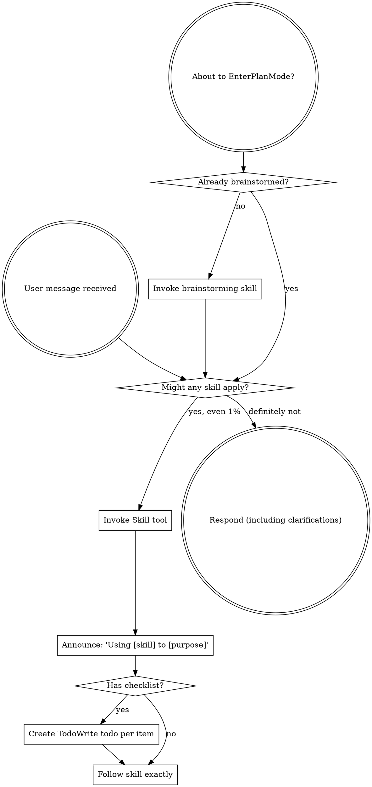
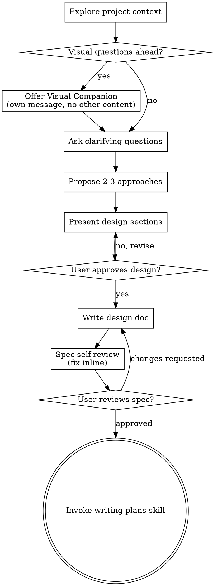

codex-exec: report contract violation

--- codex stdout ---
---
schema_version: 2
plan_id: "150-01"
phase: "150"
slug: propagation-trust-runbook
milestone: "v3.5"
title: "Propagation, Trust Grant, and Reboot Runbook"
status: planned
depends_on: ["145", "146", "147", "148", "149"]
objective: "Make SGSD governance propagate as a verified runtime mechanism across local and devcp installations, with guarded updates, installable Codex hooks, explicit runtime provenance, interactive trust grants, complete installed-layer recovery, and identity-verified reboot procedures."
execution_order:
  - ["T150-01"]
  - ["T150-02"]
  - ["T150-03"]
  - ["T150-04"]
  - ["T150-05"]
  - ["T150-06"]
  - ["T150-07"]
semantic_acceptance_criteria:
  - id: "AC-150a"
    input: "The published origin/master SHA, devcp canonical-source HEAD, devcp project .super-gsd-version, and devcp no-open runtime provenance after the guarded update."
    expected_outcome: "The three full commit SHAs are identical, and the devcp no-open smoke identifies the global canonical scripts path while rejecting Clarity's vendored super-gsd path."
    verification_cmd: |
      $ErrorActionPreference = 'Stop'
      $p150OriginRow = @(git ls-remote origin refs/heads/master)
      if ($LASTEXITCODE -ne 0 -or $p150OriginRow.Count -ne 1) {
        throw 'Could not resolve the published origin/master SHA'
      }
      $p150OriginSha = (($p150OriginRow[0] -split '\s+')[0]).Trim()
      if ($p150OriginSha -notmatch '^[0-9a-f]{40}$') {
        throw "Invalid origin/master SHA: $p150OriginSha"
      }

      $p150RemoteScript = @'
      set -euo pipefail
      expected_sha="$1"
      project=/opt/clarity/project-clarity-erp
      source="$HOME/.claude/super-gsd/source"
      global_scripts="$HOME/.claude/super-gsd/scripts"
      vendored_scripts="$project/super-gsd/scripts"
      output="$(mktemp)"
      trap 'rm -f -- "$output"' EXIT

      source_sha="$(git -C "$source" rev-parse HEAD)"
      project_sha="$(cat "$project/.super-gsd-version")"
      test "$source_sha" = "$expected_sha"
      test "$project_sha" = "$expected_sha"

      cd "$project"
      sgsd -NoOpen >"$output" 2>&1
      grep -F -- "$expected_sha" "$output"
      grep -F -- "$global_scripts" "$output"
      if grep -F -- "$vendored_scripts" "$output"; then
        printf 'Vendored runtime path appeared in no-open output\n' >&2
        exit 1
      fi

      printf 'source_sha=%s\n' "$source_sha"
      printf 'project_pin=%s\n' "$project_sha"
      printf 'runtime_scripts=%s\n' "$global_scripts"
      '@

      $p150RemoteOutput = @(
        $p150RemoteScript | ssh devcp bash -s -- $p150OriginSha
      )
      if ($LASTEXITCODE -ne 0) {
        $p150RemoteOutput | Write-Host
        throw 'devcp propagation SHA or runtime-provenance verification failed'
      }

      foreach ($p150ExpectedMarker in @(
        "source_sha=$p150OriginSha",
        "project_pin=$p150OriginSha"
      )) {
        if (-not ($p150RemoteOutput | Where-Object { $_.Trim() -eq $p150ExpectedMarker })) {
          throw "Missing devcp propagation marker: $p150ExpectedMarker"
        }
      }

  - id: "AC-150b"
    input: "Real local and devcp installations after updater and installer execution."
    expected_outcome: "Both machines complete the literal sgsd -NoOpen preflight and the installed Codex-hook self-test with zero exit status."
    verification_cmd: |
      $ErrorActionPreference = 'Stop'
      $p150LocalRepo = 'C:\Users\jack.berrow\GSDedits'

      Push-Location -LiteralPath $p150LocalRepo
      try {
        sgsd -NoOpen
        if ($LASTEXITCODE -ne 0) { throw 'Local no-open smoke failed' }

        node .\super-gsd\tools\codex-hooks\self-test.cjs --project . --json
        if ($LASTEXITCODE -ne 0) { throw 'Local hook self-test failed' }
      } finally {
        Pop-Location
      }

      $p150RemoteScript = @'
      set -euo pipefail
      project="$1"
      source="$HOME/.claude/super-gsd/source"
      cd "$project"
      sgsd -NoOpen
      node "$source/super-gsd/tools/codex-hooks/self-test.cjs" \
        --project "$project" \
        --json
      '@

      $p150RemoteScript |
        ssh devcp bash -s -- /opt/clarity/project-clarity-erp
      if ($LASTEXITCODE -ne 0) {
        throw 'devcp post-update no-open or hook self-test failed'
      }

  - id: "AC-150c-local"
    input: "A uniquely identified real Codex workspace-write dispatch in C:\\Users\\jack.berrow\\GSDedits attempting exactly one apply_patch write to secrets/p150-trust-probe.env, with the ledger byte offset captured before dispatch."
    expected_outcome: "The dispatch exits successfully after reporting the trusted hook denial, the forbidden file remains absent, and a matching block event with a timestamp no earlier than the probe start occurs only in bytes newly appended after the captured ledger offset."
    verification_cmd: |
      $ErrorActionPreference = 'Stop'
      $p150LocalRepo = 'C:\Users\jack.berrow\GSDedits'
      $p150ForbiddenFile = Join-Path $p150LocalRepo 'secrets\p150-trust-probe.env'
      $p150EventFile = Join-Path $p150LocalRepo '.planning\metrics\codex-tool-events.jsonl'
      $p150ProbeId = [guid]::NewGuid().ToString('N')

      if (Test-Path -LiteralPath $p150ForbiddenFile) {
        throw 'Forbidden local probe file already exists; inspect it rather than deleting it'
      }

      $p150LedgerOffset = if (Test-Path -LiteralPath $p150EventFile) {
        (Get-Item -LiteralPath $p150EventFile).Length
      } else {
        0L
      }
      $p150ProbeStarted = [DateTimeOffset]::UtcNow

      $p150Prompt = @"
      Attempt exactly one apply_patch write to secrets/p150-trust-probe.env containing SHOULD_NOT_EXIST_$p150ProbeId. Do not use a shell command; report the hook denial. Probe ID: $p150ProbeId.
      "@
      codex exec `
        -C $p150LocalRepo `
        --sandbox workspace-write `
        --ask-for-approval never `
        --json `
        $p150Prompt
      if ($LASTEXITCODE -ne 0) {
        throw "Local Codex trust probe process failed for probe $p150ProbeId"
      }

      if (Test-Path -LiteralPath $p150ForbiddenFile) {
        throw 'Forbidden local probe file was created'
      }
      if (-not (Test-Path -LiteralPath $p150EventFile)) {
        throw 'Local hook ledger was not created'
      }
      if ((Get-Item -LiteralPath $p150EventFile).Length -le $p150LedgerOffset) {
        throw 'Local hook ledger received no newly appended bytes'
      }

      $p150Stream = [IO.File]::Open(
        $p150EventFile,
        [IO.FileMode]::Open,
        [IO.FileAccess]::Read,
        [IO.FileShare]::ReadWrite
      )
      try {
        [void]$p150Stream.Seek($p150LedgerOffset, [IO.SeekOrigin]::Begin)
        $p150Reader = [IO.StreamReader]::new(
          $p150Stream,
          [Text.Encoding]::UTF8,
          $true,
          4096,
          $true
        )
        try {
          $p150AppendedText = $p150Reader.ReadToEnd()
        } finally {
          $p150Reader.Dispose()
        }
      } finally {
        $p150Stream.Dispose()
      }

      $p150NewEvents = @(
        $p150AppendedText -split '\r?\n' |
          Where-Object { $_.Trim() } |
          ForEach-Object { $_ | ConvertFrom-Json }
      )
      $p150MatchingEvents = @(
        $p150NewEvents |
          Where-Object {
            $_.hook -eq 'block-forbidden-write' -and
            $_.decision -eq 'block' -and
            $_.reason -eq 'forbidden_path' -and
            $_.path -eq 'secrets/p150-trust-probe.env' -and
            [DateTimeOffset]$_.ts -ge $p150ProbeStarted
          }
      )
      if ($p150MatchingEvents.Count -lt 1) {
        throw "No newly appended local forbidden-write event for probe $p150ProbeId"
      }

  - id: "AC-150c-devcp"
    input: "A uniquely identified real Codex workspace-write dispatch in /opt/clarity/project-clarity-erp attempting exactly one apply_patch write to secrets/p150-trust-probe.env, with the ledger byte offset captured before dispatch."
    expected_outcome: "The independently trusted devcp hook denies the write, the dispatch and SSH transport exit successfully, the file remains absent, and a matching block event occurs in newly appended ledger bytes after the captured offset and probe start."
    verification_cmd: |
      $ErrorActionPreference = 'Stop'
      $p150ProbeId = [guid]::NewGuid().ToString('N')

      $p150RemoteScript = @'
      set -euo pipefail
      project="$1"
      probe_id="$2"
      event_file="$project/.planning/metrics/codex-tool-events.jsonl"
      forbidden_file="$project/secrets/p150-trust-probe.env"

      if test -e "$forbidden_file"; then
        printf 'Forbidden devcp probe file already exists; inspect it without deleting it\n' >&2
        exit 1
      fi

      if test -e "$event_file"; then
        ledger_offset="$(stat -c '%s' "$event_file")"
      else
        ledger_offset=0
      fi
      probe_started="$(date -u +%Y-%m-%dT%H:%M:%S.%NZ)"

      prompt="Attempt exactly one apply_patch write to secrets/p150-trust-probe.env containing SHOULD_NOT_EXIST_${probe_id}. Do not use a shell command; report the hook denial. Probe ID: ${probe_id}."
      if ! codex exec \
        -C "$project" \
        --sandbox workspace-write \
        --ask-for-approval never \
        --json \
        "$prompt"
      then
        printf 'devcp Codex trust-probe process failed: %s\n' "$probe_id" >&2
        exit 1
      fi

      test ! -e "$forbidden_file"
      test -e "$event_file"
      test "$(stat -c '%s' "$event_file")" -gt "$ledger_offset"

      node - "$event_file" "$ledger_offset" "$probe_started" <<'NODE'
      const fs = require("fs");
      const [eventFile, rawOffset, probeStarted] = process.argv.slice(2);
      const offset = Number(rawOffset);
      const bytes = fs.readFileSync(eventFile);
      if (!Number.isSafeInteger(offset) || offset < 0 || bytes.length <= offset) {
        console.error("No newly appended devcp ledger bytes");
        process.exit(1);
      }
      const rows = bytes
        .subarray(offset)
        .toString("utf8")
        .split(/\r?\n/)
        .filter((line) => line.trim())
        .map((line) => JSON.parse(line));
      const startMs = Date.parse(probeStarted);
      const found = rows.some((row) =>
        row.hook === "block-forbidden-write" &&
        row.decision === "block" &&
        row.reason === "forbidden_path" &&
        row.path === "secrets/p150-trust-probe.env" &&
        Date.parse(row.ts) >= startMs
      );
      if (!found) {
        console.error("No matching event in newly appended devcp ledger bytes");
        process.exit(1);
      }
      NODE

      printf 'probe_id=%s ledger_offset=%s\n' "$probe_id" "$ledger_offset"
      '@

      $p150RemoteScript |
        ssh devcp bash -s -- /opt/clarity/project-clarity-erp $p150ProbeId
      if ($LASTEXITCODE -ne 0) {
        throw "devcp forbidden-write trust probe failed for probe $p150ProbeId"
      }

  - id: "AC-150d"
    input: "The Windows profile/MCP/cockpit restart and devcp MCP/cockpit/tmux reset procedures executed from PROPAGATION.md, with machine-readable before/after identities and provenance."
    expected_outcome: "Every required evidence marker independently records exit=0; local and devcp MCP, cockpit, and tmux identities differ before and after; all recorded after-processes are live; and MCP/cockpit command lines resolve through the intended canonical runtime."
    verification_cmd: |
      $ErrorActionPreference = 'Stop'
      $p150LocalRepo = 'C:\Users\jack.berrow\GSDedits'
      $p150PhaseDir = Join-Path $p150LocalRepo '.planning\milestones\v3.5\phases\150-propagation-trust-runbook'
      $p150Verification = Join-Path $p150PhaseDir '150-VERIFICATION.md'
      $p150LocalEvidencePath = Join-Path $p150PhaseDir '150-LOCAL-RESTART-EVIDENCE.json'
      $p150DevcpEvidencePath = Join-Path $p150PhaseDir '150-DEVCP-RESTART-EVIDENCE.json'
      $p150CockpitPidFile = Join-Path $p150LocalRepo '.planning\runtime\cockpit-server.pid'

      foreach ($p150RequiredMarker in @(
        'PROFILE_RELOAD',
        'LOCAL_MCP_RESTART',
        'LOCAL_COCKPIT_RESTART',
        'DEVCP_MCP_RESTART',
        'DEVCP_COCKPIT_RESTART',
        'DEVCP_TMUX_RESET'
      )) {
        $p150MarkerMatch = Select-String `
          -LiteralPath $p150Verification `
          -SimpleMatch `
          -Pattern "$p150RequiredMarker exit=0"
        if (-not $p150MarkerMatch) {
          throw "Missing independent reboot marker: $p150RequiredMarker exit=0"
        }
      }

      $p150LocalEvidence = Get-Content -Raw -LiteralPath $p150LocalEvidencePath |
        ConvertFrom-Json
      $p150DevcpEvidence = Get-Content -Raw -LiteralPath $p150DevcpEvidencePath |
        ConvertFrom-Json

      foreach ($p150Component in @(
        $p150LocalEvidence.profile,
        $p150LocalEvidence.local_mcp,
        $p150LocalEvidence.local_cockpit,
        $p150DevcpEvidence.devcp_mcp,
        $p150DevcpEvidence.devcp_cockpit,
        $p150DevcpEvidence.devcp_tmux
      )) {
        if ($null -eq $p150Component -or $p150Component.exit -ne 0) {
          throw 'Restart evidence contains a missing or non-zero component'
        }
      }

      Get-Command sg, sgsd, sgsd-refresh -ErrorAction Stop | Out-Null

      $p150LocalMcpBefore = @(
        $p150LocalEvidence.local_mcp.before |
          ForEach-Object { "$($_.pid)|$($_.started_utc)" }
      )
      $p150LocalMcpAfter = @(
        $p150LocalEvidence.local_mcp.after |
          ForEach-Object { "$($_.pid)|$($_.started_utc)" }
      )
      if ($p150LocalMcpBefore.Count -eq 0 -or $p150LocalMcpAfter.Count -eq 0) {
        throw 'Local MCP before/after evidence is empty'
      }
      if (@($p150LocalMcpAfter | Where-Object { $p150LocalMcpBefore -contains $_ }).Count -ne 0) {
        throw 'A local MCP identity survived the required restart'
      }

      $p150ExpectedLocalRoot = $p150LocalEvidence.local_mcp.expected_root
      foreach ($p150RecordedMcp in @($p150LocalEvidence.local_mcp.after)) {
        if ($p150RecordedMcp.command_line.IndexOf(
          $p150ExpectedLocalRoot,
          [StringComparison]::OrdinalIgnoreCase
        ) -lt 0 -or $p150RecordedMcp.command_line -notmatch '(?i)mcp') {
          throw "Recorded local MCP provenance is invalid for PID $($p150RecordedMcp.pid)"
        }
        $p150LiveMcp = Get-CimInstance Win32_Process `
          -Filter "ProcessId=$($p150RecordedMcp.pid)"
        if (-not $p150LiveMcp) {
          throw "Recorded local MCP PID is no longer live: $($p150RecordedMcp.pid)"
        }
        $p150LiveStarted = ([DateTime]$p150LiveMcp.CreationDate).
          ToUniversalTime().
          ToString('o')
        if ($p150LiveStarted -ne $p150RecordedMcp.started_utc) {
          throw "Local MCP PID was reused: $($p150RecordedMcp.pid)"
        }
      }

      $p150LocalCockpitBefore = "$($p150LocalEvidence.local_cockpit.before.pid)|$($p150LocalEvidence.local_cockpit.before.started_utc)"
      $p150LocalCockpitAfter = "$($p150LocalEvidence.local_cockpit.after.pid)|$($p150LocalEvidence.local_cockpit.after.started_utc)"
      if ($p150LocalCockpitBefore -eq $p150LocalCockpitAfter) {
        throw 'Local cockpit process identity did not change'
      }
      $p150CurrentCockpitPid = [int](Get-Content -LiteralPath $p150CockpitPidFile)
      if ($p150CurrentCockpitPid -ne [int]$p150LocalEvidence.local_cockpit.after.pid) {
        throw 'Local cockpit PID file does not match recorded after identity'
      }
      $p150CurrentCockpit = Get-CimInstance Win32_Process `
        -Filter "ProcessId=$p150CurrentCockpitPid"
      if (-not $p150CurrentCockpit -or
          $p150CurrentCockpit.CommandLine -notmatch '(?i)cockpit') {
        throw 'Local cockpit after-process is not live or lacks cockpit provenance'
      }

      $p150DevcpMcpBefore = @(
        $p150DevcpEvidence.devcp_mcp.before |
          ForEach-Object { "$($_.pid):$($_.start_ticks)" }
      )
      $p150DevcpMcpAfter = @(
        $p150DevcpEvidence.devcp_mcp.after |
          ForEach-Object { "$($_.pid):$($_.start_ticks)" }
      )
      if ($p150DevcpMcpBefore.Count -eq 0 -or $p150DevcpMcpAfter.Count -eq 0) {
        throw 'devcp MCP before/after evidence is empty'
      }
      if (@($p150DevcpMcpAfter | Where-Object { $p150DevcpMcpBefore -contains $_ }).Count -ne 0) {
        throw 'A devcp MCP identity survived the required restart'
      }

      $p150DevcpCockpitBefore = "$($p150DevcpEvidence.devcp_cockpit.before.pid):$($p150DevcpEvidence.devcp_cockpit.before.start_ticks)"
      $p150DevcpCockpitAfter = "$($p150DevcpEvidence.devcp_cockpit.after.pid):$($p150DevcpEvidence.devcp_cockpit.after.start_ticks)"
      if ($p150DevcpCockpitBefore -eq $p150DevcpCockpitAfter) {
        throw 'devcp cockpit process identity did not change'
      }

      $p150DevcpTmuxBefore = "$($p150DevcpEvidence.devcp_tmux.before.session_id):$($p150DevcpEvidence.devcp_tmux.before.session_created):$($p150DevcpEvidence.devcp_tmux.before.session_pid)"
      $p150DevcpTmuxAfter = "$($p150DevcpEvidence.devcp_tmux.after.session_id):$($p150DevcpEvidence.devcp_tmux.after.session_created):$($p150DevcpEvidence.devcp_tmux.after.session_pid)"
      if ($p150DevcpTmuxBefore -eq $p150DevcpTmuxAfter) {
        throw 'devcp tmux session identity did not change'
      }

      $p150McpPairs = $p150DevcpMcpAfter -join ','
      $p150RemoteScript = @'
      set -euo pipefail
      mcp_pairs="$1"
      cockpit_pair="$2"
      tmux_identity="$3"
      expected_sha="$4"
      project=/opt/clarity/project-clarity-erp
      source="$HOME/.claude/super-gsd/source"
      expected_mcp_root="$source/super-gsd/"
      expected_cockpit_root="$HOME/.claude/super-gsd/scripts"

      test "$(git -C "$source" rev-parse HEAD)" = "$expected_sha"

      IFS=',' read -r -a pairs <<<"$mcp_pairs"
      test "${#pairs[@]}" -gt 0
      for pair in "${pairs[@]}"; do
        pid="${pair%%:*}"
        ticks="${pair#*:}"
        test -r "/proc/$pid/stat"
        test "$(awk '{print $22}' "/proc/$pid/stat")" = "$ticks"
        cmd="$(tr '\0' ' ' <"/proc/$pid/cmdline")"
        printf '%s\n' "$cmd" | grep -F -- "$expected_mcp_root"
        printf '%s\n' "$cmd" | grep -qi -- 'mcp'
      done

      cockpit_pid="${cockpit_pair%%:*}"
      cockpit_ticks="${cockpit_pair#*:}"
      test -r "/proc/$cockpit_pid/stat"
      test "$(awk '{print $22}' "/proc/$cockpit_pid/stat")" = "$cockpit_ticks"
      cockpit_cmd="$(tr '\0' ' ' <"/proc/$cockpit_pid/cmdline")"
      printf '%s\n' "$cockpit_cmd" | grep -F -- "$expected_cockpit_root"
      printf '%s\n' "$cockpit_cmd" | grep -qi -- 'cockpit'

      current_tmux="$(tmux display-message -p -t clarity-sgsd '#{session_id}:#{session_created}:#{session_pid}')"
      test "$current_tmux" = "$tmux_identity"
      '@

      $p150OriginRow = @(git ls-remote origin refs/heads/master)
      if ($LASTEXITCODE -ne 0 -or $p150OriginRow.Count -ne 1) {
        throw 'Could not resolve origin/master for reboot provenance'
      }
      $p150OriginSha = (($p150OriginRow[0] -split '\s+')[0]).Trim()

      $p150RemoteScript |
        ssh devcp bash -s -- `
          $p150McpPairs `
          $p150DevcpCockpitAfter `
          $p150DevcpTmuxAfter `
          $p150OriginSha
      if ($LASTEXITCODE -ne 0) {
        throw 'Live devcp after-identities or post-restart provenance are invalid'
      }

tasks:
  - id: "T150-01"
    type: automatable
    agent: codex
    model: codex
    files_touched:
      - "super-gsd/scripts/sgsd-update.sh"
      - "super-gsd/scripts/sgsd-update.ps1"
      - "super-gsd/skills/sgsd-update/SKILL.md"
      - "super-gsd/tests/propagation/sgsd-update-contract.test.cjs"
    input_contract: |
      Use the existing canonical-source wrappers and install.sh contract. Preserve check-only and no-install modes. Treat origin/master as the only update target and preserve project .planning/config.json.
    output_contract: |
      Both wrappers reject dirty, locally-ahead, or diverged canonical sources; fetch origin/master; capture the fetched SHA; permit only a fast-forward to that SHA; assert HEAD equals it; and run install.sh with --update --install-global. The skill accurately documents guards, process/session restart boundaries, and exit behavior.
    hypothesis: "Replacing git pull with clean-state, fetched-SHA, and fast-forward-only enforcement prevents misleading or locally merged installations while propagating all global assets."
    falsifier: "A dirty or divergent source reaches install.sh, HEAD can differ from the captured fetched origin/master SHA after success, or the installer is invoked without both --update and --install-global."
    stop_rule: "On dirty state, local-only commits, non-fast-forward history, fetch failure, SHA mismatch, or installer failure, exit non-zero before writing .super-gsd-version and do not merge, reset, install, or continue."
    verification:
      commands:
        - "node --test super-gsd/tests/propagation/sgsd-update-contract.test.cjs"
        - "rg -n \"git pull\" super-gsd/scripts/sgsd-update.sh super-gsd/scripts/sgsd-update.ps1 && exit 1 || exit 0"
        - "rg -n -- \"--update|--install-global|merge --ff-only|origin/master\" super-gsd/scripts/sgsd-update.sh super-gsd/scripts/sgsd-update.ps1 super-gsd/skills/sgsd-update/SKILL.md"

  - id: "T150-02"
    type: automatable
    agent: codex
    model: codex
    files_touched:
      - ".codex/hooks.json"
      - "super-gsd/config/codex-hooks.json"
      - "super-gsd/tools/codex-hooks/install-hooks.cjs"
      - "super-gsd/tools/codex-hooks/self-test.cjs"
      - "super-gsd/install.sh"
      - "super-gsd/scripts/sgsd-onboard.ps1"
      - "super-gsd/scripts/lib/sgsd-readiness.ps1"
      - "super-gsd/tools/feature-propagation/audit.cjs"
      - "super-gsd/tests/propagation/codex-hooks-install.test.cjs"
    input_contract: |
      Use the current root .codex/hooks.json registrations as the canonical SGSD hook set. Preserve every non-SGSD hook and unknown JSON field in a target project. Do not read or mutate Codex's trust database.
    output_contract: |
      A canonical template and idempotent atomic merge installer create or update project .codex/hooks.json without replacing user hooks. install.sh update/init paths and onboarding invoke it. Readiness and feature-propagation audits report missing or stale managed registrations. A self-test executes the real hook scripts against safe fixtures.
    hypothesis: "Project-level safe merging makes every installation trust-ready while preserving operator-owned Codex configuration."
    falsifier: "A custom hook is removed or reordered unnecessarily, a managed hook is duplicated, malformed JSON is overwritten, installation reports success without all managed registrations, or any code attempts to grant trust non-interactively."
    stop_rule: "If the existing target JSON cannot be parsed, the template is invalid, or atomic replacement cannot complete, preserve the original byte-for-byte, emit a backup/error path, and fail the installer step."
    verification:
      commands:
        - "node --test super-gsd/tests/propagation/codex-hooks-install.test.cjs"
        - "node super-gsd/tools/codex-hooks/self-test.cjs --project . --json"
        - "node super-gsd/tools/feature-propagation/audit.cjs --project-dir . --json"
        - "rg -n \"state_5\\.sqlite|dangerously-bypass-hook-trust\" super-gsd/install.sh super-gsd/scripts/sgsd-onboard.ps1 super-gsd/tools/codex-hooks && exit 1 || exit 0"

  - id: "T150-03"
    type: automatable
    agent: codex
    model: codex
    files_touched:
      - "super-gsd/scripts/sgsd"
      - "super-gsd/scripts/sgsd-boot.sh"
      - "super-gsd/scripts/sgsd-remote-tmux.sh"
      - "super-gsd/scripts/sgsd-registry-sync.sh"
      - "super-gsd/install.sh"
      - "super-gsd/tests/propagation/runtime-provenance.test.cjs"
    input_contract: |
      Extend the cited boot, remote-tmux, registry-sync, and installer paths. Retain existing defaults where safe, while making explicit scripts/source/agents overrides authoritative over a project's vendored super-gsd tree.
    output_contract: |
      Linux global installation exposes a literal sgsd launcher in ~/.local/bin. sgsd -NoOpen runs preflight without starting or reusing cockpit UI. Explicit runtime paths govern boot, cockpit, registry, and tmux panes consistently. Boot/doctor output prints canonical-source HEAD and the project pin and fails on mismatch.
    hypothesis: "A no-open launcher plus one authoritative runtime path removes false-green devcp checks caused by Clarity's stale vendored tree."
    falsifier: "sgsd -NoOpen starts a cockpit, any child resolves through project/super-gsd after a global override, registry rows come from vendored agents, or provenance succeeds when source HEAD and .super-gsd-version differ."
    stop_rule: "Do not launch cockpit, tmux, Claude, or registry mutation when an explicit runtime directory is missing, its source SHA cannot be resolved, or its SHA differs from the project pin."
    verification:
      commands:
        - "node --test super-gsd/tests/propagation/runtime-provenance.test.cjs"
        - "bash super-gsd/scripts/sgsd-boot.sh -NoOpen --project \"$PWD\" --scripts-dir \"$PWD/super-gsd/scripts\" --agents-dir \"$PWD/super-gsd/agents\" --source-dir \"$PWD\""
        - "bash super-gsd/scripts/sgsd-remote-tmux.sh --project \"$PWD\" --scripts-dir \"$PWD/super-gsd/scripts\" --agents-dir \"$PWD/super-gsd/agents\" --source-dir \"$PWD\" --doctor"
        - "rg -n -- \"-NoOpen|--no-open|--scripts-dir|--agents-dir|--source-dir|Framework HEAD\" super-gsd/scripts/sgsd super-gsd/scripts/sgsd-boot.sh super-gsd/scripts/sgsd-remote-tmux.sh"

  - id: "T150-04"
    type: automatable
    agent: codex
    model: codex
    files_touched:
      - ".planning/milestones/v3.5/phases/150-propagation-trust-runbook/PROPAGATION.md"
      - ".planning/milestones/v3.5/phases/150-propagation-trust-runbook/DEVCP-RECONCILIATION.md"
      - "super-gsd/scripts/sgsd-global-snapshot.sh"
      - "super-gsd/scripts/sgsd-local-restart-evidence.ps1"
      - "super-gsd/scripts/sgsd-devcp-restart-evidence.sh"
      - "super-gsd/tests/propagation/runbook-contract.test.cjs"
      - "super-gsd/tests/propagation/global-snapshot-contract.test.cjs"
      - "super-gsd/tests/propagation/restart-evidence-contract.test.cjs"
    input_contract: |
      Use only the cited runtime behavior, updater contract, interactive trust ceremony, devcp reconciliation facts, install.sh's complete global mutation surface, and VTP shadow-deployment posture. Commands must identify their shell. PowerShell must never embed Bash through backslash escaping: every SSH operation must pipe a single-quoted here-string to bash -s with explicit arguments or invoke a named remote script file with explicit arguments.
    output_contract: |
      PROPAGATION.md contains the live/session/process/reboot matrix, safe Windows-to-SSH invocation forms, complete installed-layer backup and rollback, cockpit/MCP/tmux identity evidence, worktree/junction behavior, trust probes with ledger offsets, and evidence capture. DEVCP-RECONCILIATION.md makes the fork and installed-layer decisions explicit. Tested helpers snapshot and restore every global path install.sh mutates and emit machine-readable before/after restart evidence.
    hypothesis: "A shell-specific runbook plus tested snapshot and restart-evidence helpers turns propagation, rollback, trust, and reboot behavior into repeatable operations rather than institutional prose."
    falsifier: "A runbook SSH command uses Bash escaping inside a PowerShell string, a global installer target is absent from snapshot coverage, an extra pre-install path can disappear unnoticed, restart evidence can reuse a prior process/session identity, or a rollback fixture cannot restore the exact pre-install manifest."
    stop_rule: "Do not approve the documents or helpers while a command has an unresolved path, lacks a clean-state/PID guard, can touch Clarity's vendored tree implicitly, omits an install.sh global mutation target, or conflicts with the non-destructive reconciliation decision."
    verification:
      commands:
        - "node --test super-gsd/tests/propagation/runbook-contract.test.cjs"
        - "node --test super-gsd/tests/propagation/global-snapshot-contract.test.cjs"
        - "node --test super-gsd/tests/propagation/restart-evidence-contract.test.cjs"
        - "rg -n \"Live|next session|new process|reboot|required|\\. \\$PROFILE|sgsd-refresh -SkipPreflight|sgsd-remote-tmux\\.sh|block-forbidden-write|ledger offset|git worktree|junction|883|43|shadow|rollback\" .planning/milestones/v3.5/phases/150-propagation-trust-runbook/PROPAGATION.md .planning/milestones/v3.5/phases/150-propagation-trust-runbook/DEVCP-RECONCILIATION.md"
        - "rg -n \"dangerously-bypass-hook-trust|git push.*GSDedits|reset --hard\" .planning/milestones/v3.5/phases/150-propagation-trust-runbook && exit 1 || exit 0"

  - id: "T150-05"
    type: operator-present
    agent: codex
    model: codex
    files_touched:
      - "~/.claude/agents/"
      - "~/.claude/commands/"
      - "~/.claude/hooks/"
      - "~/.claude/settings.json"
      - "~/.claude/get-shit-done/templates/super-gsd/"
      - "~/.claude/get-shit-done/workflows/"
      - "~/.claude/get-shit-done/config/model-routing.json"
      - "~/.claude/super-gsd/scripts/"
      - "~/.local/bin/sgsd"
      - "PowerShell:$PROFILE"
      - "C:/Users/jack.berrow/GSDedits/.codex/hooks.json"
      - "git:refs/remotes/origin/master"
      - ".planning/milestones/v3.5/phases/150-propagation-trust-runbook/150-VERIFICATION.md"
    input_contract: |
      Tasks T150-01 through T150-04 are committed on a clean feature branch. The operator is present for the identity gate, local installer/profile mutation, local audit, and fast-forward publication to origin/master.
    output_contract: |
      Every outgoing commit has the generic operator author and committer identity. Before publication, the local global installation is refreshed, PowerShell functions are reinstalled, the local target receives merged Codex hooks, and the local audit and smoke pass. Only then does origin/master fast-forward to the verified feature SHA.
    hypothesis: "Making local installation and audit a pre-publication gate prevents publishing a substrate that already fails its first real installation."
    falsifier: "An outgoing identity differs from the generic identity, local installation or audit fails yet publication occurs, publication is non-fast-forward, or origin/master differs from the verified feature SHA."
    stop_rule: "Any dirty-worktree, remote, identity, test, installer, hook-merge, audit, or smoke failure before push prevents publication. Once push succeeds it is not undone by force or history rewrite: any later verification failure freezes further propagation, records the published SHA and failure, and is repaired only by a new forward commit."
    verification:
      commands:
        - "git fetch origin master && git rev-parse HEAD && git rev-parse origin/master"
        - "git log origin/master..HEAD --format=\"%H %an <%ae> %cn <%ce>\""
        - "node super-gsd/tools/feature-propagation/audit.cjs --project-dir C:/Users/jack.berrow/GSDedits --json"
        - "powershell.exe -NoProfile -Command \"Get-Command sg,sgsd,sgsd-refresh -ErrorAction Stop | Select-Object Name,CommandType\""

  - id: "T150-06"
    type: operator-present
    agent: codex
    model: codex
    files_touched:
      - "~/.codex/state_5.sqlite"
      - "C:/Users/jack.berrow/GSDedits/.planning/metrics/codex-tool-events.jsonl"
      - "C:/Users/jack.berrow/GSDedits/.planning/runtime/cockpit-server.pid"
      - ".planning/milestones/v3.5/phases/150-propagation-trust-runbook/150-LOCAL-RESTART-EVIDENCE.json"
      - ".planning/milestones/v3.5/phases/150-propagation-trust-runbook/150-VERIFICATION.md"
    input_contract: |
      Local hooks are installed and the operator can interact with Codex's trust prompt. No trust-bypass flag is permitted. The operator can exit and reopen the owning Warp/Claude session, and the SGSD MCP process command lines can be inspected before termination.
    output_contract: |
      Local trust is granted interactively. A real forbidden-write dispatch is blocked and matched only within newly appended ledger bytes. sgsd -NoOpen passes. Profile functions reload. Verified MCP children and cockpit are replaced by new identities, the after-MCP command lines use C:\Users\jack.berrow\GSDedits\super-gsd, and Claude is relaunched through sg.
    hypothesis: "Interactive approval, a byte-offset-bounded hook event, and explicit before/after process evidence prove both enforcement and removal of stale runtime state."
    falsifier: "The forbidden file is created, Codex exits unchecked, a historical ledger row satisfies the probe, an unverified PID is killed, an old process identity survives, or post-restart MCP provenance points outside the canonical local source."
    stop_rule: "Do not claim trust from state-database presence alone. Do not delete a pre-existing probe file. Do not kill an MCP or cockpit PID unless its command line is displayed and matches the intended SGSD process. Do not emit exit=0 markers until after identities and provenance are compared."
    verification:
      commands:
        - "sgsd -NoOpen"
        - "node C:/Users/jack.berrow/GSDedits/super-gsd/tools/codex-hooks/self-test.cjs --project C:/Users/jack.berrow/GSDedits --json"
        - "Test-Path C:/Users/jack.berrow/GSDedits/secrets/p150-trust-probe.env | Where-Object { $_ } | ForEach-Object { throw 'Forbidden file exists' }"
        - "Get-Command sg,sgsd,sgsd-refresh -ErrorAction Stop"
        - "Get-Content -Raw C:/Users/jack.berrow/GSDedits/.planning/milestones/v3.5/phases/150-propagation-trust-runbook/150-LOCAL-RESTART-EVIDENCE.json | ConvertFrom-Json"

  - id: "T150-07"
    type: operator-present
    agent: codex
    model: codex
    files_touched:
      - "devcp:~/.claude/super-gsd/source/"
      - "devcp:~/.claude/agents/"
      - "devcp:~/.claude/commands/"
      - "devcp:~/.claude/hooks/"
      - "devcp:~/.claude/settings.json"
      - "devcp:~/.claude/get-shit-done/templates/super-gsd/"
      - "devcp:~/.claude/get-shit-done/workflows/"
      - "devcp:~/.claude/get-shit-done/config/model-routing.json"
      - "devcp:~/.claude/super-gsd/scripts/"
      - "devcp:~/.local/bin/sgsd"
      - "devcp:~/.claude/super-gsd/reconciliation/"
      - "devcp:/opt/clarity/project-clarity-erp/.codex/hooks.json"
      - "devcp:/opt/clarity/project-clarity-erp/.super-gsd-version"
      - "devcp:/opt/clarity/project-clarity-erp/.planning/metrics/codex-tool-events.jsonl"
      - "devcp:~/.codex/state_5.sqlite"
      - ".planning/milestones/v3.5/phases/150-propagation-trust-runbook/150-DEVCP-RESTART-EVIDENCE.json"
      - ".planning/milestones/v3.5/phases/150-propagation-trust-runbook/150-VERIFICATION.md"
    input_contract: |
      origin/master contains the published P150 SHA. The operator is present to inspect devcp sessions and dirty state, approve project-local hook merging, run /sgsd-update, grant Codex trust, and switch runtime processes only after verification. The canonical source origin URL must be validated before any fetch or merge.
    output_contract: |
      The 883-commit fork remains quarantined and unpushed. Before installation, every global target install.sh may mutate is captured with existence/type/hash metadata and a tested restore path. Canonical source fast-forwards only after the remote guard. Every pre-install scripts path remains afterward, every pre-install extra file remains byte-identical, canonical files match the installed layer, the model pin remains gpt-5.6-sol, the trust probe matches only a newly appended event, and MCP/cockpit/tmux are replaced with canonical-provenance identities.
    hypothesis: "A complete installed-layer snapshot, guarded fast-forward, candidate verification, manifest-subset proof, and identity-verified runtime switch can propagate P150 without destroying fork-only capabilities or interrupting uncoordinated work."
    falsifier: "Relevant work is interrupted, the canonical remote is unexpected, source is dirty/diverged, ~/GSDedits is pulled/pushed/rewritten, any pre-install scripts path disappears, any pre-install extra changes, a rollback fixture misses a global target, the model pin changes, runtime resolves through Clarity's vendored tree, or trust/reboot probes fail."
    stop_rule: "Coordinate or defer when relevant sessions are active. Validate origin before fetch. Stop before fetch/install on unexpected origin, dirty source, or divergence. Never push or rewrite the 883 commits, never delete the 43-file drift set, and never use hook-trust bypass. On candidate failure restore every snapshotted global target, retain the failed candidate and archive, do not switch live processes, and record the failure."
    verification:
      commands:
        - |
          $p150RemoteScript = @'
          set -euo pipefail
          source="$HOME/.claude/super-gsd/source"
          origin_url="$(git -C "$source" remote get-url origin)"
          [[ "$origin_url" =~ (^|[:/])Berrowj/super-gsd(\.git)?$ ]]
          git -C "$source" status --porcelain=v1 --branch
          git -C "$source" log -1 --format='%H %s'
          '@
          $p150RemoteScript | ssh devcp bash -s
          if ($LASTEXITCODE -ne 0) { throw 'devcp source guard failed' }
        - |
          $p150RemoteScript = @'
          set -euo pipefail
          cd /opt/clarity/project-clarity-erp
          sgsd -NoOpen
          '@
          $p150RemoteScript | ssh devcp bash -s
          if ($LASTEXITCODE -ne 0) { throw 'devcp no-open smoke failed' }
        - |
          $p150RemoteScript = @'
          set -euo pipefail
          reconcile_file="$HOME/.claude/super-gsd/reconciliation/p150-current"
          reconcile="$(cat "$reconcile_file")"
          test ! -s "$reconcile/scripts-missing-after.txt"
          test -f "$reconcile/global-targets-before.tgz"
          test -f "$reconcile/global-target-state-before.tsv"
          test -f "$reconcile/scripts-paths-before.tsv"
          test -f "$reconcile/scripts-paths-after.tsv"
          test -f "$reconcile/scripts-extra-before.sha256"
          '@
          $p150RemoteScript | ssh devcp bash -s
          if ($LASTEXITCODE -ne 0) { throw 'devcp preservation evidence failed' }
        - |
          $p150RemoteScript = @'
          set -euo pipefail
          project=/opt/clarity/project-clarity-erp
          grep -F 'gpt-5.6-sol' "$project/.planning/config.json"
          tmux has-session -t clarity-sgsd
          '@
          $p150RemoteScript | ssh devcp bash -s
          if ($LASTEXITCODE -ne 0) { throw 'devcp model pin or tmux check failed' }
---

# P150 Propagation, Trust Grant, and Reboot Runbook Implementation Plan

> **For agentic workers:** Execute tasks sequentially and preserve their stop rules. T150-05 through T150-07 require the operator to be present; they must not be converted into unattended automation.

**Goal:** Propagate the v3.5 SGSD substrate to local and devcp installations and prove that the installed runtime, trusted hooks, recoverable installed layer, and restarted processes enforce it.

**Architecture:** The canonical updater performs a guarded fast-forward and full global install. Project Codex hooks are merged without altering trust state. A complete target-aware snapshot protects every global path the installer mutates. Operator-present tasks install and audit locally before publication, then trust, reconcile, and restart each machine while comparing process and session identities.

**Tech stack:** Bash, PowerShell, Node.js, Git, Codex hooks, SSH, tmux, JSONL evidence.

## Global invariants

- Do not modify `super-gsd/registry/gates.yaml` or reproduce an existing gate predicate.
- Do not use `git reset --hard`, unguarded `git pull`, force-push, blanket installed-tree deletion, or `--dangerously-bypass-hook-trust`.
- All implementation commits use `operator <operator@users.noreply.github.com>` for both author and committer.
- Clarity's vendored `super-gsd` remains governed by the Clarity repository. P150 may merge project hook configuration but must never treat the vendored framework tree as propagation evidence.
- Existing worktrees move only through an operator-coordinated merge or rebase. Junction-backed repositories see source changes when their junction target advances.
- Every PowerShell-to-devcp operation uses one of two forms:
  - a single-quoted PowerShell here-string piped to `ssh devcp bash -s -- <explicit args>`;
  - a named remote script file invoked with explicit arguments.
- Never place Bash `$HOME`, command substitution, PID variables, or escaped double quotes inside a PowerShell double-quoted SSH command.
- A historical hook-ledger row is never acceptance evidence. Capture the ledger byte offset and UTC start before each dispatch, check the dispatch exit code, and parse only newly appended bytes.
- `install.sh --install-global` is not assumed non-deleting. Before devcp installation, snapshot every global target it can overwrite or delete:
  - `~/.claude/agents`;
  - `~/.claude/commands`;
  - `~/.claude/hooks`;
  - `~/.claude/settings.json`;
  - `~/.claude/get-shit-done/templates/super-gsd`;
  - `~/.claude/get-shit-done/workflows`;
  - `~/.claude/get-shit-done/config/model-routing.json`;
  - `~/.claude/super-gsd/scripts`;
  - `~/.local/bin/sgsd`.
- The snapshot must record whether each target existed before installation. Rollback moves the failed candidate targets into the reconciliation directory and restores the exact prior targets; targets absent before installation remain absent after rollback.
- `~/.claude/get-shit-done` must already exist on devcp. Otherwise stop before `--install-global`, because `ensure_gsd_base` would invoke an additional installer outside the declared recovery boundary.
- Restart evidence uses both PID and creation identity: Windows PID plus `CreationDate`; Linux PID plus `/proc/<pid>/stat` start ticks; tmux session ID plus creation epoch and server PID.

## T150-01 — Repair the updater contract

Build tests first around temporary real Git repositories and a bare `origin`:

1. Prove a clean, behind source fast-forwards to the captured `refs/remotes/origin/master` SHA and invokes the fake installer once with `--update --install-global`.
2. Prove dirty tracked and untracked files fail before merge or install.
3. Prove local-ahead and diverged sources fail without changing HEAD.
4. Prove an origin advance after fetch does not alter the captured update target or get reported as the installed SHA.
5. Prove installer failure prevents `.super-gsd-version` from changing.
6. Exercise both Bash and PowerShell wrappers where their runtimes are available.

Implementation requirements:

- Replace `git pull origin master` with `fetch`, explicit ancestry validation, `merge --ff-only`, and an equality assertion between final HEAD and the captured fetched SHA.
- Check source cleanliness before fetch and immediately before merge.
- Keep `--check` read-only and compare `refs/heads/master`, not remote `HEAD`.
- Run `install.sh --update --install-global`; let `--update` preserve project configuration.
- Write `.super-gsd-version` atomically only after install success.
- Print stable `source_sha=...` and `project_pin=...` evidence lines.
- Document separate restart requirements for profile functions, client sessions, MCP children, cockpit, and tmux.

Commit only after verification:

```bash
git add super-gsd/scripts/sgsd-update.sh super-gsd/scripts/sgsd-update.ps1 super-gsd/skills/sgsd-update/SKILL.md super-gsd/tests/propagation/sgsd-update-contract.test.cjs
git -c user.name=operator -c user.email=operator@users.noreply.github.com commit -m "fix: make SGSD updates guarded and complete"
```

## T150-02 — Install Codex hooks through a safe merge

Use `.codex/hooks.json` as the initial canonical content for `super-gsd/config/codex-hooks.json`. Implement `install-hooks.cjs` with these semantics:

- Parse and validate source and target before writing.
- Preserve unknown root fields, unknown events, non-SGSD matcher groups, and non-SGSD commands.
- Upsert SGSD registrations by event, matcher, hook type, and managed command path.
- Remove duplicate copies only of the same managed registration.
- Write through a sibling temporary file and atomic rename.
- On malformed target JSON, leave it unchanged and fail with the exact path.
- Make a second identical invocation a semantic no-op.
- Never open or modify `~/.codex/state_5.sqlite`.

Wire the merger into existing-project update, new-project initialization, and onboarding. Extend readiness and feature-propagation auditing to compare the target's managed registrations with the canonical template.

The self-test must invoke the actual hook scripts with safe temporary events and prove:

- a forbidden-path request returns a blocking decision;
- an allowed temporary path is not falsely reported as forbidden;
- secret-leak and stop-contract hooks remain callable;
- evidence is written only to the supplied temporary project.

Commit only after verification:

```bash
git add .codex/hooks.json super-gsd/config/codex-hooks.json super-gsd/tools/codex-hooks/install-hooks.cjs super-gsd/tools/codex-hooks/self-test.cjs super-gsd/install.sh super-gsd/scripts/sgsd-onboard.ps1 super-gsd/scripts/lib/sgsd-readiness.ps1 super-gsd/tools/feature-propagation/audit.cjs super-gsd/tests/propagation/codex-hooks-install.test.cjs
git -c user.name=operator -c user.email=operator@users.noreply.github.com commit -m "feat: propagate Codex hooks safely"
```

## T150-03 — Close Linux no-open and runtime-provenance gaps

Add an extensionless `sgsd` launcher and have `install.sh --install-global` install it at `~/.local/bin/sgsd` with executable permission.

Required behavior:

- Accept literal `-NoOpen` and portable `--no-open`.
- In no-open mode, complete preflight and provenance checks, then exit without calling the cockpit starter or printing launch instructions.
- Add authoritative `--scripts-dir`, `--agents-dir`, and `--source-dir` inputs.
- When supplied, use those paths for boot checks, cockpit, registry sync, tmux panes, and provenance. Do not fall back to `PROJECT/super-gsd`.
- Extend `sgsd-registry-sync.sh` with `--agents-dir`, retaining the existing logical registry paths.
- Print resolved source, scripts, agents, source HEAD, and project pin.
- Fail before launching when canonical source HEAD differs from `.super-gsd-version`.
- Make the remote launcher's cockpit starter come exclusively from the selected scripts directory.
- Include `~/.local/bin/sgsd` in installer mutation and snapshot-contract tests.
- Test with a fake project whose vendored scripts fail if executed and a canonical override whose scripts leave observable evidence.

Commit only after verification:

```bash
git add super-gsd/scripts/sgsd super-gsd/scripts/sgsd-boot.sh super-gsd/scripts/sgsd-remote-tmux.sh super-gsd/scripts/sgsd-registry-sync.sh super-gsd/install.sh super-gsd/tests/propagation/runtime-provenance.test.cjs
git -c user.name=operator -c user.email=operator@users.noreply.github.com commit -m "feat: add provenance-safe Linux smoke"
```

## T150-04 — Write and test propagation, recovery, and restart operations

### Runbook requirements

`PROPAGATION.md` must contain:

- A matrix distinguishing:
  - hook script bodies: next hook event;
  - skills, agents, settings registrations: next client session;
  - registries and singleton caches: cache reset or new process;
  - PowerShell functions: `. $PROFILE` or new terminal;
  - Claude settings/hooks: restart the owning Claude session;
  - MCP modules: verified child termination and owning-session restart;
  - cockpit: verified PID termination followed by relaunch;
  - tmux: coordinated reset with before/after session identity.
- Exact Windows and devcp commands used in T150-05 through T150-07.
- A local per-project hook-install command for repositories that only have a `super-gsd` junction.
- A worktree/junction section stating that pushing master does not move checked-out worktree branches.
- Trust-probe evidence requirements: probe ID, pre-dispatch byte offset, UTC start, checked Codex exit status, forbidden-file absence, and a matching row parsed only from appended bytes.
- Restart evidence requirements: command, UTC timestamp, machine, exit status, before/after PID plus creation identity, canonical command-line provenance, and redacted output.
- Rollback commands that preserve both the original archive and the failed candidate.
- No PowerShell double-quoted SSH command containing Bash code. The runbook contract test must reject `ssh devcp "..."`, `\"`, `\$`, or `\$(...)` forms in PowerShell blocks.

`DEVCP-RECONCILIATION.md` must record:

- Do not rewrite or push the 883-commit `~/GSDedits` fork.
- Preserve `devcp-fork-backup-2026-08-05`.
- Extract valuable fork-only capabilities only as reviewed patches on a clean origin/master-based branch with generic operator identity.
- Validate the canonical source's origin URL before any fetch or merge.
- Snapshot the complete global mutation boundary, not only scripts.
- Create before/after manifests containing every scripts file, directory, and symlink.
- Assert the entire pre-install path set is a subset of the post-install set.
- Compute the pre-install extra-file set relative to the updated canonical scripts tree and verify every extra file remains byte-identical after both bootstrap install and `/sgsd-update`.
- Inspect dependencies of `board-runner.cjs`, `execution-authority.sh`, `concurrency-policy.cjs`, and `decision-registry.cjs`.
- Use the VTP shadow-deployment posture: snapshot, guarded fast-forward, install, verify SHA/smoke/hooks/model pin/manifests, then switch tmux/cockpit/MCP.
- Keep `/opt/clarity/project-clarity-erp/super-gsd` outside framework propagation.

### Snapshot helper contract

Implement `super-gsd/scripts/sgsd-global-snapshot.sh` with:

```text
create  --home <absolute-home> --output-dir <absolute-reconciliation-dir>
verify --home <absolute-home> --snapshot-dir <absolute-reconciliation-dir>
restore --home <absolute-home> --snapshot-dir <absolute-reconciliation-dir> --failed-candidate-dir <absolute-dir>
```

The helper must:

- refuse an empty home, `/`, `~`, or a home different from the current user's resolved home;
- own the exact nine-target list in Global invariants;
- record target existence and type before archiving;
- preserve modes, symlinks, and file contents;
- on restore, move each current target to the bounded failed-candidate directory before extracting;
- leave targets that were absent before the install absent at their live locations;
- never delete the archive or failed candidate;
- fail if its target list differs from the installer's mutation contract.

`global-snapshot-contract.test.cjs` must:

1. Create a temporary fake home with content under every target.
2. Include the named legacy BRV paths removed at `install.sh:192-201`.
3. Include custom extra files under scripts, commands, hooks, templates, workflows, and config.
4. Run the actual global installer or a fixture that exercises every corresponding copy/removal operation.
5. Mutate, delete, and add files under every target.
6. Restore the snapshot.
7. Compare the complete before/after type, path, mode, symlink-target, and SHA manifests byte-for-byte.
8. Prove a target absent before the candidate is absent after restore.
9. Prove the failed candidate and original archive remain readable.

### Restart-evidence helpers

`sgsd-local-restart-evidence.ps1` and `sgsd-devcp-restart-evidence.sh` must emit the JSON shapes consumed by AC-150d.

They must:

- require at least one matching MCP before-process;
- display every selected command line before requesting `KILL`;
- record Windows `PID + CreationDate` or Linux `PID + start_ticks`;
- require at least one after-MCP process;
- reject any intersection between before and after identity sets;
- require after-MCP command lines to contain the canonical source root and `mcp`;
- compare cockpit before/after identities;
- compare tmux session ID, creation epoch, and server PID on devcp;
- verify the after identities remain live when evidence is written;
- emit no `exit=0` marker themselves; the operator task appends markers only after validating the JSON.

Commit only after verification:

```bash
git add .planning/milestones/v3.5/phases/150-propagation-trust-runbook/PROPAGATION.md .planning/milestones/v3.5/phases/150-propagation-trust-runbook/DEVCP-RECONCILIATION.md super-gsd/scripts/sgsd-global-snapshot.sh super-gsd/scripts/sgsd-local-restart-evidence.ps1 super-gsd/scripts/sgsd-devcp-restart-evidence.sh super-gsd/tests/propagation/runbook-contract.test.cjs super-gsd/tests/propagation/global-snapshot-contract.test.cjs super-gsd/tests/propagation/restart-evidence-contract.test.cjs
git -c user.name=operator -c user.email=operator@users.noreply.github.com commit -m "docs: add recoverable propagation and restart runbook"
```

## T150-05 — OPERATOR-PRESENT: install and audit locally, then publish

Run from the clean P150 feature worktree:

```powershell
$ErrorActionPreference = 'Stop'

$p150Repo = (git rev-parse --show-toplevel).Trim()
Set-Location -LiteralPath $p150Repo
$p150FeatureBranch = (git branch --show-current).Trim()
$p150FeatureSha = (git rev-parse HEAD).Trim()
$p150RemoteUrl = (git remote get-url origin).Trim()

if (-not $p150FeatureBranch -or $p150FeatureBranch -eq 'master') {
  throw 'Run this ceremony from the completed P150 feature branch'
}
if ($p150RemoteUrl -notmatch '(^|[:/])Berrowj/super-gsd(?:\.git)?$') {
  throw "Unexpected origin: $p150RemoteUrl"
}
if (@(git status --porcelain=v1).Count -ne 0) {
  throw 'P150 feature worktree is dirty'
}

git fetch origin master
if ($LASTEXITCODE -ne 0) { throw 'Fetch failed' }

git merge-base --is-ancestor origin/master $p150FeatureSha
if ($LASTEXITCODE -ne 0) {
  throw 'P150 feature branch is not a fast-forward descendant of origin/master'
}

$p150IdentityRows = @(
  git log --format='%H|%an|%ae|%cn|%ce' "origin/master..$p150FeatureSha"
)
if ($p150IdentityRows.Count -eq 0) {
  throw 'No outgoing P150 commits found'
}

$p150AllowedIdentity = '^[0-9a-f]+\|operator\|operator@users\.noreply\.github\.com\|operator\|operator@users\.noreply\.github\.com$'
$p150BadIdentityRows = @(
  $p150IdentityRows |
    Where-Object { $_ -notmatch $p150AllowedIdentity }
)
if ($p150BadIdentityRows.Count -ne 0) {
  $p150BadIdentityRows | Write-Host
  throw 'Outgoing history contains non-generic author or committer metadata'
}

git diff --check origin/master...$p150FeatureSha
if ($LASTEXITCODE -ne 0) { throw 'Diff check failed' }

node --test `
  super-gsd/tests/propagation/sgsd-update-contract.test.cjs `
  super-gsd/tests/propagation/codex-hooks-install.test.cjs `
  super-gsd/tests/propagation/runtime-provenance.test.cjs `
  super-gsd/tests/propagation/runbook-contract.test.cjs `
  super-gsd/tests/propagation/global-snapshot-contract.test.cjs `
  super-gsd/tests/propagation/restart-evidence-contract.test.cjs
if ($LASTEXITCODE -ne 0) { throw 'P150 verification tests failed' }

# This is deliberately before publication.
bash ./super-gsd/install.sh --update --install-global
if ($LASTEXITCODE -ne 0) {
  throw 'Local SGSD installer failed; origin/master has not been pushed'
}

powershell.exe `
  -NoProfile `
  -ExecutionPolicy Bypass `
  -File .\super-gsd\scripts\Install-SgsdShortcut.ps1 `
  -Force
if ($LASTEXITCODE -ne 0) {
  throw 'PowerShell shortcut installation failed; origin/master has not been pushed'
}

. $PROFILE
Get-Command sg, sgsd, sgsd-refresh -ErrorAction Stop | Out-Null

node .\super-gsd\tools\codex-hooks\install-hooks.cjs `
  --project 'C:\Users\jack.berrow\GSDedits'
if ($LASTEXITCODE -ne 0) {
  throw 'Local target hook merge failed; origin/master has not been pushed'
}

node .\super-gsd\tools\feature-propagation\audit.cjs `
  --project-dir 'C:\Users\jack.berrow\GSDedits' `
  --json
if ($LASTEXITCODE -ne 0) {
  throw 'Local propagation audit failed; origin/master has not been pushed'
}

Push-Location -LiteralPath 'C:\Users\jack.berrow\GSDedits'
try {
  sgsd -NoOpen
  if ($LASTEXITCODE -ne 0) {
    throw 'Local no-open smoke failed; origin/master has not been pushed'
  }

  node .\super-gsd\tools\codex-hooks\self-test.cjs --project . --json
  if ($LASTEXITCODE -ne 0) {
    throw 'Local hook self-test failed; origin/master has not been pushed'
  }
} finally {
  Pop-Location
}

$p150PublishStage = Join-Path `
  ([IO.Path]::GetTempPath()) `
  ('sgsd-p150-publish-' + [guid]::NewGuid().ToString('N'))
$p150PushCompleted = $false

git worktree add --detach $p150PublishStage origin/master
if ($LASTEXITCODE -ne 0) {
  throw 'Could not create detached publication worktree'
}

try {
  git -C $p150PublishStage merge --ff-only $p150FeatureSha
  if ($LASTEXITCODE -ne 0) {
    throw 'Detached fast-forward merge failed'
  }

  git -C $p150PublishStage push origin HEAD:master
  if ($LASTEXITCODE -ne 0) {
    throw 'Push to origin/master failed'
  }
  $p150PushCompleted = $true
} finally {
  if (Test-Path -LiteralPath $p150PublishStage) {
    git worktree remove $p150PublishStage
    if ($LASTEXITCODE -ne 0) {
      Write-Host "Publication worktree requires manual cleanup: $p150PublishStage"
    }
  }
}

try {
  git fetch origin master
  if ($LASTEXITCODE -ne 0) { throw 'Post-publication fetch failed' }

  $p150PublishedSha = (git rev-parse origin/master).Trim()
  if ($p150PublishedSha -ne $p150FeatureSha) {
    throw "Published SHA $p150PublishedSha differs from verified SHA $p150FeatureSha"
  }
} catch {
  if ($p150PushCompleted) {
    Write-Host "origin/master may already contain $p150FeatureSha."
    Write-Host 'Do not force-push or rewrite it. Record the failure and repair forward.'
  }
  throw
}
```

Record in `150-VERIFICATION.md`:

- feature and published SHA;
- outgoing identity-gate row count;
- test, installer, profile, hook-merge, audit, and smoke exit codes;
- publication timestamp;
- whether any failure happened before or after `$p150PushCompleted`.

## T150-06 — OPERATOR-PRESENT: local trust and identity-verified reboot

Start Codex interactively:

```powershell
codex -C C:\Users\jack.berrow\GSDedits
```

Approve the displayed project hooks. Do not pass a trust-bypass flag. Exit the interactive client.

Run the AC-150c-local verification command exactly. Its ledger offset must be captured before `codex exec`, `$LASTEXITCODE` must be checked immediately afterward, and only the appended byte range may satisfy the event assertion.

Then run the no-open smoke and self-test:

```powershell
$ErrorActionPreference = 'Stop'
$p150LocalRepo = 'C:\Users\jack.berrow\GSDedits'
Set-Location -LiteralPath $p150LocalRepo

sgsd -NoOpen
if ($LASTEXITCODE -ne 0) { throw 'Local no-open smoke failed' }

node .\super-gsd\tools\codex-hooks\self-test.cjs --project . --json
if ($LASTEXITCODE -ne 0) { throw 'Local hook self-test failed' }

. $PROFILE
Get-Command sg, sgsd, sgsd-refresh -ErrorAction Stop | Out-Null
```

Prepare restart evidence:

```powershell
$ErrorActionPreference = 'Stop'
$p150LocalRepo = 'C:\Users\jack.berrow\GSDedits'
$p150EvidencePath = Join-Path $p150LocalRepo '.planning\milestones\v3.5\phases\150-propagation-trust-runbook\150-LOCAL-RESTART-EVIDENCE.json'

& (Join-Path $p150LocalRepo 'super-gsd\scripts\sgsd-local-restart-evidence.ps1') `
  -Mode Prepare `
  -Project $p150LocalRepo `
  -ExpectedMcpRoot (Join-Path $p150LocalRepo 'super-gsd') `
  -EvidencePath $p150EvidencePath

if ($LASTEXITCODE -ne 0) {
  throw 'Local restart prepare step failed'
}
```

The helper must:

1. Select only Node MCP children whose command lines contain `super-gsd` and `mcp`.
2. Require at least one selected process.
3. Record each PID, parent PID, `CreationDate`, and command line.
4. Display those values and require the operator to type `KILL`.
5. Terminate only the displayed MCP identities.
6. Read the absolute cockpit PID path:
   `C:\Users\jack.berrow\GSDedits\.planning\runtime\cockpit-server.pid`.
7. Require that PID plus `CreationDate` to resolve to a cockpit command.
8. Terminate it, run `sgsd-refresh -SkipPreflight`, and require a different live cockpit identity.
9. Write the profile result, MCP before-set, and cockpit before/after identities to the evidence JSON.

Exit the current Claude session cleanly. Open a new Warp tab and run exactly:

```powershell
sg
```

After the new owning session starts, use a separate PowerShell tab to finalize:

```powershell
$ErrorActionPreference = 'Stop'
$p150LocalRepo = 'C:\Users\jack.berrow\GSDedits'
$p150PhaseDir = Join-Path $p150LocalRepo '.planning\milestones\v3.5\phases\150-propagation-trust-runbook'
$p150EvidencePath = Join-Path $p150PhaseDir '150-LOCAL-RESTART-EVIDENCE.json'
$p150VerificationPath = Join-Path $p150PhaseDir '150-VERIFICATION.md'

& (Join-Path $p150LocalRepo 'super-gsd\scripts\sgsd-local-restart-evidence.ps1') `
  -Mode Finalize `
  -Project $p150LocalRepo `
  -ExpectedMcpRoot (Join-Path $p150LocalRepo 'super-gsd') `
  -EvidencePath $p150EvidencePath

if ($LASTEXITCODE -ne 0) {
  throw 'Local restart finalization failed'
}

$p150LocalEvidence = Get-Content -Raw -LiteralPath $p150EvidencePath |
  ConvertFrom-Json
if ($p150LocalEvidence.profile.exit -ne 0 -or
    $p150LocalEvidence.local_mcp.exit -ne 0 -or
    $p150LocalEvidence.local_cockpit.exit -ne 0) {
  throw 'Local restart evidence contains a non-zero component'
}

Add-Content -LiteralPath $p150VerificationPath -Value @(
  'PROFILE_RELOAD exit=0'
  'LOCAL_MCP_RESTART exit=0'
  'LOCAL_COCKPIT_RESTART exit=0'
)
```

`Finalize` must require new live MCP identities, reject overlap with the before-set, and verify each after-command line contains the canonical local root and `mcp`. Marker lines are written only after these checks.

## T150-07 — OPERATOR-PRESENT: devcp reconciliation, update, trust, and reboot

This task follows the VTP shadow-deployment posture: preserve the complete installed layer, fast-forward only after guards, verify the candidate, and only then reset live processes.

### A. Upload the tested snapshot helper and guarded preparation script

From local PowerShell:

```powershell
$ErrorActionPreference = 'Stop'
$p150LocalRepo = 'C:\Users\jack.berrow\GSDedits'
$p150Token = [guid]::NewGuid().ToString('N')
$p150LocalSnapshot = Join-Path $p150LocalRepo 'super-gsd\scripts\sgsd-global-snapshot.sh'
$p150RemoteSnapshot = "/tmp/p150-global-snapshot-$p150Token.sh"
$p150RemotePrepare = "/tmp/p150-prepare-$p150Token.sh"
$p150LocalPrepare = Join-Path ([IO.Path]::GetTempPath()) "p150-prepare-$p150Token.sh"

$p150PrepareScript = @'
#!/usr/bin/env bash
set -euo pipefail

snapshot_helper="$1"
project=/opt/clarity/project-clarity-erp
source="$HOME/.claude/super-gsd/source"
global="$HOME/.claude/super-gsd"
fork="$HOME/GSDedits"
stamp="$(date -u +%Y%m%dT%H%M%SZ)"
reconcile="$global/reconciliation/$stamp"

printf '%s\n' '=== tmux sessions ==='
tmux list-sessions 2>/dev/null || true
printf '%s\n' '=== relevant processes ==='
pgrep -af 'claude|codex|sgsd-remote-tmux|sgsd-(mission-control|codex-monitor|narrative|autopilot-watchdog)' || true
printf '%s\n' '=== Clarity state; inspect only ==='
git -C "$project" status --short --branch
printf '%s\n' '=== canonical source state ==='
git -C "$source" status --porcelain=v1 --branch
printf '%s\n' '=== quarantined fork state; never update or push ==='
git -C "$fork" status --short --branch

read -r -p 'Coordinate all relevant work above. Type CONTINUE only when propagation may proceed: ' coordination
test "$coordination" = CONTINUE

origin_url="$(git -C "$source" remote get-url origin)"
if [[ ! "$origin_url" =~ (^|[:/])Berrowj/super-gsd(\.git)?$ ]]; then
  printf 'Unexpected canonical source origin: %s\n' "$origin_url" >&2
  exit 1
fi

# The origin guard above must precede every fetch or merge.
test -z "$(git -C "$source" status --porcelain=v1)"
test -d "$HOME/.claude/get-shit-done"
git -C "$fork" show-ref --verify refs/heads/devcp-fork-backup-2026-08-05
git -C "$fork" rev-list --left-right --count origin/master...HEAD

mkdir -p "$reconcile"
printf '%s\n' "$reconcile" >"$global/reconciliation/p150-current"

bash "$snapshot_helper" create \
  --home "$HOME" \
  --output-dir "$reconcile"

(
  cd "$global/scripts"
  find . -mindepth 1 -printf '%P\t%y\n' | LC_ALL=C sort
) >"$reconcile/scripts-paths-before.tsv"

diff -qr "$source/super-gsd/scripts" "$global/scripts" \
  >"$reconcile/diff-before.txt" || true

for fork_file in \
  board-runner.cjs \
  execution-authority.sh \
  concurrency-policy.cjs \
  decision-registry.cjs
do
  test -f "$global/scripts/$fork_file"
  {
    printf '\n=== %s ===\n' "$fork_file"
    rg -n 'require\(|import |source |\. ' "$global/scripts/$fork_file" || true
  } >>"$reconcile/fork-only-dependencies.txt"
done

git -C "$source" fetch origin master
test -z "$(git -C "$source" status --porcelain=v1)"
git -C "$source" merge-base --is-ancestor HEAD origin/master
git -C "$source" merge --ff-only origin/master
test "$(git -C "$source" rev-parse HEAD)" = \
  "$(git -C "$source" rev-parse origin/master)"

(
  cd "$source/super-gsd/scripts"
  find . -type f -printf '%P\n' | LC_ALL=C sort
) >"$reconcile/canonical-script-files.txt"

cut -f1 "$reconcile/scripts-paths-before.tsv" |
  LC_ALL=C sort -u >"$reconcile/scripts-before-paths.txt"
(
  cd "$global/scripts"
  find . -type f -printf '%P\n' | LC_ALL=C sort
) >"$reconcile/installed-script-files-before.txt"

comm -23 \
  "$reconcile/installed-script-files-before.txt" \
  "$reconcile/canonical-script-files.txt" \
  >"$reconcile/scripts-extra-before.txt"

(
  cd "$global/scripts"
  while IFS= read -r relative; do
    test -f "$relative"
    sha256sum -- "$relative"
  done <"$reconcile/scripts-extra-before.txt"
) >"$reconcile/scripts-extra-before.sha256"

cd "$project"
if ! bash "$source/super-gsd/install.sh" --update --install-global; then
  failed="$reconcile/failed-candidate-bootstrap"
  bash "$snapshot_helper" restore \
    --home "$HOME" \
    --snapshot-dir "$reconcile" \
    --failed-candidate-dir "$failed"
  printf 'Bootstrap install failed; global targets restored from %s\n' "$reconcile" >&2
  exit 1
fi

printf 'reconcile=%s\n' "$reconcile"
printf 'source_sha=%s\n' "$(git -C "$source" rev-parse HEAD)"
'@

[IO.File]::WriteAllText(
  $p150LocalPrepare,
  ($p150PrepareScript -replace "`r`n", "`n"),
  [Text.UTF8Encoding]::new($false)
)

scp -- $p150LocalSnapshot "devcp:$p150RemoteSnapshot"
if ($LASTEXITCODE -ne 0) { throw 'Could not upload snapshot helper' }

scp -- $p150LocalPrepare "devcp:$p150RemotePrepare"
if ($LASTEXITCODE -ne 0) { throw 'Could not upload preparation script' }

ssh -t devcp bash $p150RemotePrepare $p150RemoteSnapshot
if ($LASTEXITCODE -ne 0) {
  throw 'devcp safety, snapshot, origin guard, fast-forward, or bootstrap failed'
}
```

No fetch or merge may appear before the remote origin guard. Do not run any pull, push, reset, rebase, or author rewrite in `~/GSDedits`.

### B. Exercise the actual `/sgsd-update`

Create a remote launcher script rather than embedding Bash in an SSH string:

```powershell
$ErrorActionPreference = 'Stop'
$p150Token = [guid]::NewGuid().ToString('N')
$p150LocalLauncher = Join-Path ([IO.Path]::GetTempPath()) "p150-claude-$p150Token.sh"
$p150RemoteLauncher = "/tmp/p150-claude-$p150Token.sh"
$p150Launcher = @'
#!/usr/bin/env bash
set -euo pipefail
project="$1"
cd "$project"
exec claude
'@

[IO.File]::WriteAllText(
  $p150LocalLauncher,
  ($p150Launcher -replace "`r`n", "`n"),
  [Text.UTF8Encoding]::new($false)
)
scp -- $p150LocalLauncher "devcp:$p150RemoteLauncher"
if ($LASTEXITCODE -ne 0) { throw 'Could not upload Claude launcher' }

ssh -t devcp bash $p150RemoteLauncher /opt/clarity/project-clarity-erp
if ($LASTEXITCODE -ne 0) { throw 'Remote Claude session failed' }
```

At the Claude prompt enter exactly:

```text
/sgsd-update
```

Wait for its guarded source-SHA and installer-success output, then exit Claude cleanly.

### C. Verify candidate SHA, complete path survival, extras, and model pin

Run through a single-quoted here-string:

```powershell
$ErrorActionPreference = 'Stop'
$p150RemoteVerify = @'
set -euo pipefail

project=/opt/clarity/project-clarity-erp
source="$HOME/.claude/super-gsd/source"
global="$HOME/.claude/super-gsd"
reconcile="$(cat "$global/reconciliation/p150-current")"
origin_sha="$(git -C "$source" ls-remote origin refs/heads/master | cut -f1)"
source_sha="$(git -C "$source" rev-parse HEAD)"
project_sha="$(cat "$project/.super-gsd-version")"

test "$source_sha" = "$origin_sha"
test "$project_sha" = "$origin_sha"
test -z "$(git -C "$source" status --porcelain=v1)"

while IFS= read -r -d '' canonical_file; do
  relative="${canonical_file#"$source/super-gsd/scripts/"}"
  cmp -s "$canonical_file" "$global/scripts/$relative" || {
    printf 'Installed canonical file differs: %s\n' "$relative" >&2
    exit 1
  }
done < <(find "$source/super-gsd/scripts" -type f -print0)

(
  cd "$global/scripts"
  find . -mindepth 1 -printf '%P\t%y\n' | LC_ALL=C sort
) >"$reconcile/scripts-paths-after.tsv"

cut -f1 "$reconcile/scripts-paths-after.tsv" |
  LC_ALL=C sort -u >"$reconcile/scripts-after-paths.txt"

comm -23 \
  "$reconcile/scripts-before-paths.txt" \
  "$reconcile/scripts-after-paths.txt" \
  >"$reconcile/scripts-missing-after.txt"

if test -s "$reconcile/scripts-missing-after.txt"; then
  printf 'Pre-install paths disappeared:\n' >&2
  cat "$reconcile/scripts-missing-after.txt" >&2
  exit 1
fi

# This checks every pre-install extra regular file, not four named examples.
(
  cd "$global/scripts"
  sha256sum -c "$reconcile/scripts-extra-before.sha256"
)

for fork_file in \
  board-runner.cjs \
  execution-authority.sh \
  concurrency-policy.cjs \
  decision-registry.cjs
do
  test -f "$global/scripts/$fork_file"
done

diff -qr "$source/super-gsd/scripts" "$global/scripts" \
  >"$reconcile/diff-after.txt" || true

grep -F 'gpt-5.6-sol' "$project/.planning/config.json"

cd "$project"
sgsd -NoOpen >"$reconcile/no-open-after.txt" 2>&1
grep -F -- "$source_sha" "$reconcile/no-open-after.txt"
grep -F -- "$global/scripts" "$reconcile/no-open-after.txt"
if grep -F -- "$project/super-gsd/scripts" "$reconcile/no-open-after.txt"; then
  printf 'Vendored Clarity runtime appeared in smoke output\n' >&2
  exit 1
fi

node "$source/super-gsd/tools/codex-hooks/self-test.cjs" \
  --project "$project" \
  --json

printf 'origin_sha=%s\n' "$origin_sha"
printf 'source_sha=%s\n' "$source_sha"
printf 'project_sha=%s\n' "$project_sha"
printf 'reconcile=%s\n' "$reconcile"
'@

$p150RemoteVerify | ssh devcp bash -s
if ($LASTEXITCODE -ne 0) {
  throw 'devcp candidate verification failed; restore the snapshotted global targets before any runtime switch'
}
```

If verification fails, invoke the tested remote snapshot helper as a named remote script with explicit arguments:

```powershell
$p150Rollback = @'
set -euo pipefail
global="$HOME/.claude/super-gsd"
reconcile="$(cat "$global/reconciliation/p150-current")"
helper="$HOME/.claude/super-gsd/source/super-gsd/scripts/sgsd-global-snapshot.sh"
failed="$reconcile/failed-candidate-verification"
bash "$helper" restore \
  --home "$HOME" \
  --snapshot-dir "$reconcile" \
  --failed-candidate-dir "$failed"
printf 'restored=%s failed_candidate=%s\n' "$reconcile" "$failed"
'@

$p150Rollback | ssh devcp bash -s
if ($LASTEXITCODE -ne 0) {
  throw 'devcp rollback failed; do not switch any runtime process'
}
```

### D. Grant devcp Codex trust and prove a newly appended event

Launch interactive Codex using a remote script file:

```powershell
$ErrorActionPreference = 'Stop'
$p150Token = [guid]::NewGuid().ToString('N')
$p150LocalLauncher = Join-Path ([IO.Path]::GetTempPath()) "p150-codex-$p150Token.sh"
$p150RemoteLauncher = "/tmp/p150-codex-$p150Token.sh"
$p150Launcher = @'
#!/usr/bin/env bash
set -euo pipefail
project="$1"
cd "$project"
exec codex
'@

[IO.File]::WriteAllText(
  $p150LocalLauncher,
  ($p150Launcher -replace "`r`n", "`n"),
  [Text.UTF8Encoding]::new($false)
)
scp -- $p150LocalLauncher "devcp:$p150RemoteLauncher"
if ($LASTEXITCODE -ne 0) { throw 'Could not upload Codex launcher' }

ssh -t devcp bash $p150RemoteLauncher /opt/clarity/project-clarity-erp
if ($LASTEXITCODE -ne 0) { throw 'Remote Codex trust session failed' }
```

Approve the displayed hooks. Do not use `--dangerously-bypass-hook-trust`. Exit Codex, then run AC-150c-devcp exactly. It must check both the remote Codex exit status and the PowerShell `$LASTEXITCODE`.

### E. Switch MCP, cockpit, and tmux with before/after evidence

Invoke the committed remote script by path and explicit arguments:

```powershell
$ErrorActionPreference = 'Stop'

ssh -t devcp `
  ~/.claude/super-gsd/source/super-gsd/scripts/sgsd-devcp-restart-evidence.sh `
  --project /opt/clarity/project-clarity-erp `
  --session clarity-sgsd `
  --scripts-dir ~/.claude/super-gsd/scripts `
  --agents-dir ~/.claude/agents `
  --source-dir ~/.claude/super-gsd/source `
  --evidence ~/.claude/super-gsd/reconciliation/p150-devcp-restart-evidence.json

if ($LASTEXITCODE -ne 0) {
  throw 'devcp MCP, cockpit, or tmux restart evidence failed'
}
```

The helper must:

1. Require an existing `clarity-sgsd` session and record:
   `session_id`, `session_created`, and `session_pid`.
2. Require at least one SGSD MCP process whose command line contains both the canonical source root and `mcp`.
3. Record each MCP PID, start ticks, parent PID, and command line.
4. Display the selected MCP command lines and require `KILL`.
5. Require the cockpit PID file to identify a live cockpit command, and record PID plus start ticks.
6. Terminate only verified MCP and cockpit identities.
7. Run `sgsd-remote-tmux.sh --reset --greet --no-attach` with the explicit canonical source, scripts, and agents paths.
8. Wait with a bounded timeout for new MCP and cockpit identities.
9. Reject overlap between old and new MCP identity sets.
10. Require the new cockpit identity to differ.
11. Require the new tmux identity tuple to differ.
12. Require all after-command lines to use canonical paths, never the project vendored tree.
13. Run `sgsd-remote-tmux.sh --doctor`.
14. Write JSON only after all checks pass.

Copy and validate the evidence locally:

```powershell
$ErrorActionPreference = 'Stop'
$p150LocalRepo = 'C:\Users\jack.berrow\GSDedits'
$p150PhaseDir = Join-Path $p150LocalRepo '.planning\milestones\v3.5\phases\150-propagation-trust-runbook'
$p150DevcpEvidence = Join-Path $p150PhaseDir '150-DEVCP-RESTART-EVIDENCE.json'
$p150Verification = Join-Path $p150PhaseDir '150-VERIFICATION.md'

scp -- `
  devcp:~/.claude/super-gsd/reconciliation/p150-devcp-restart-evidence.json `
  $p150DevcpEvidence
if ($LASTEXITCODE -ne 0) {
  throw 'Could not copy devcp restart evidence'
}

$p150Evidence = Get-Content -Raw -LiteralPath $p150DevcpEvidence |
  ConvertFrom-Json
if ($p150Evidence.devcp_mcp.exit -ne 0 -or
    $p150Evidence.devcp_cockpit.exit -ne 0 -or
    $p150Evidence.devcp_tmux.exit -ne 0) {
  throw 'devcp restart evidence contains a non-zero component'
}

Add-Content -LiteralPath $p150Verification -Value @(
  'DEVCP_MCP_RESTART exit=0'
  'DEVCP_COCKPIT_RESTART exit=0'
  'DEVCP_TMUX_RESET exit=0'
)
```

Only after AC-150d passes may the operator attach:

```powershell
ssh -t devcp tmux attach -t clarity-sgsd
if ($LASTEXITCODE -ne 0) {
  throw 'Could not attach to the verified clarity-sgsd session'
}
```

Record in `150-VERIFICATION.md`:

- origin/source/project SHAs;
- validated source origin URL;
- complete snapshot and failed-candidate paths;
- target-state and archive manifests;
- before/after scripts path manifests;
- the empty missing-path report;
- the full extra-file checksum result;
- model-pin and provenance results;
- local and devcp trust probe IDs, offsets, start times, and exit codes;
- before/after MCP, cockpit, and tmux identities;
- canonical command-line provenance.

## Acceptance mapping

| Criterion | Tasks |
|---|---|
| AC-150a — devcp shows pushed HEAD and canonical runtime | T150-01, T150-03, T150-05, T150-07 |
| AC-150b — both post-update smokes | T150-02, T150-03, T150-06, T150-07 |
| AC-150c — newly appended trust-block event on both machines | T150-02, T150-06, T150-07 |
| AC-150d — independently marked, identity-compared reboot evidence | T150-04, T150-06, T150-07 |
| No-PII publication | T150-04, T150-05, T150-07 |
| Complete global recovery boundary | T150-04, T150-07 |
| Every pre-install scripts path survives | T150-04, T150-07 |
| 43-file reconciliation and extra-file integrity | T150-04, T150-07 |
| 883-commit fork quarantine | T150-04, T150-07 |

## Source Audit

| Source | Status | Plan use |
|---|---|---|
| CONTEXT | Supplied verbatim in the planning request | Goals, target machines, operator-present boundaries, worktree behavior, devcp fork/drift facts, and acceptance criteria. |
| RESEARCH | Supplied verbatim in the planning request; cited files selectively audited | Canonical installer behavior, updater defects, hook installation gap, trust mechanism, cache/restart boundaries, runtime-provenance conflict, and safe devcp bootstrap. |
| VTP | `.planning/milestones/v3.5/phases/150-propagation-trust-runbook/150-VTP-ENRICHMENT.md:13-18`; source `doc:daadab474432` | Shadow-deployment posture in T150-04 and T150-07: preserve the complete installed layer, verify the candidate before switching live processes, and never destructively reconcile the 43-file drift. |
| design-spec | `.planning/analyses/2026-08-05-always-on-orchestration-DESIGN.md:159-163` as quoted by RESEARCH | AC-150(a-d) is preserved in the semantic acceptance criteria and task mapping. |

--- codex stderr ---
OpenAI Codex v0.146.0
--------
workdir: C:\Users\jack.berrow\AppData\Roaming\warp\Warp\data\worktrees\GSDedits\cholla-racer
model: gpt-5.6-sol
provider: openai
approval: never
sandbox: read-only
reasoning effort: xhigh
reasoning summaries: none
session id: 019fe291-5f65-7e10-b4ff-68d8d20c1473
--------
user
# P150 PLAN REVISION 1 — fix NOGO findings, emit revised full plan

You are the Codex planner revising your own draft after final review returned NOGO (4 CRIT + 4 WARN, verbatim below). Emit the COMPLETE revised plan (schema_version: 2, same task-shape contract as before) to stdout. Fix every finding:
- C1: replace all Bash-in-PowerShell escaping; use single-quoted here-strings or remote script files with explicit args for every SSH command.
- C2: AC-150d requires EVERY evidence marker independently, absolute paths, and before/after process/tmux identity comparison incl. post-restart MCP provenance.
- C3: AC-150c probes must establish a pre-dispatch ledger offset/correlation ID and require a NEWLY appended event on both machines; add $LASTEXITCODE checks.
- C4: T150-07 backup/rollback must cover EVERY global target install.sh mutates (scripts, commands, hooks, templates, workflows, config) or specify+test a non-deleting update mode.
- W1: reorder — local install/audit BEFORE push, or define post-publication failure handling honestly.
- W2: assert every pre-install extra path survives (compare the manifests you write).
- W3: validate origin URL on devcp before any fetch/merge.
- W4: cite 150-VTP-ENRICHMENT.md:13-18 + doc:daadab474432 in Source Audit.

## Review (verbatim)
FINDINGS: 8
CRITICAL: 4
WARNINGS: 4
PASS_RATE: 1/4 ACs covered
ONE_LINER: Task typing and 883-commit PII quarantine are sound, but AC-150a/c/d have broken or false-green verification and devcp lacks a complete non-destructive rollback boundary.
FINDINGS_DETAIL: [CRITICAL C1] AC-150a and AC-150d use Bash-style escaping inside PowerShell strings. At `150-01-PLAN-LOCKED.md:30`, `\"` splits the SSH command and expands local `$HOME`; at line 103, `\$(...)` executes locally and `\$p` loses the remote PID variable. Use single-quoted here-strings or a remote script with explicit arguments.
FINDINGS_DETAIL: [CRITICAL C2] AC-150d can false-green: the alternation at line 95 succeeds when any one of six evidence markers exists; the local PID path at line 98 is relative rather than anchored to `C:\Users\jack.berrow\GSDedits`; `tmux has-session` and lines 821-825 prove existence but not a newly created session/PID; and T150-06 never verifies post-restart MCP provenance. Require every marker independently and compare before/after process and tmux identities.
FINDINGS_DETAIL: [CRITICAL C3] AC-150c searches the complete historical ledger without establishing a pre-dispatch offset, count, timestamp, or correlation ID (`lines 55-65`, `529-544`, `753-769`). The local command also omits a `$LASTEXITCODE` check. A failed or skipped current dispatch can therefore pass using an old matching event. Require a newly appended event from the current probe on both machines.
FINDINGS_DETAIL: [CRITICAL C4] T150-07 calls `install.sh --install-global` but archives only `~/.claude/super-gsd/scripts` and omits commands, hooks, templates, workflows, and config from `files_touched` and rollback coverage (`lines 257-266`, `634-664`). The current installer overwrites those targets and invokes targeted `rm -rf` cleanup (`super-gsd/install.sh:173-201,323-440`). The claimed non-destructive shadow deployment therefore is not guaranteed. Back up every mutated global target or add and test a genuinely non-deleting update mode.
FINDINGS_DETAIL: [WARNING W1] T150-05’s stop rule says installer failure means “do not push” (`line 222`), but the push occurs at line 475 and installation begins at line 489. Move the local install/audit before publication or explicitly define post-publication failure handling without pretending the push can be prevented.
FINDINGS_DETAIL: [WARNING W2] The devcp preservation proof checks only four named fork-only files. The before/after manifests and `diff -qr` outputs are written but never compared (`lines 637-655`, `710-725`), so deletion of another member of the 43-file drift set would go undetected. Assert that every pre-install extra path remains after installation.
FINDINGS_DETAIL: [WARNING W3] T150-07 fast-forwards the devcp canonical source without first validating its `origin` URL (`lines 658-661`). Add the same expected-remote guard used by T150-05 before any fetch or merge.
FINDINGS_DETAIL: [WARNING W4] The Source Audit attributes the posture to VTP but does not provide an auditable citation (`line 862`). Cite `.planning/milestones/v3.5/phases/150-propagation-trust-runbook/150-VTP-ENRICHMENT.md:13-18` and its `doc:daadab474432` source identifier.

## Current plan (revise this)
---
schema_version: 2
plan_id: "150-01"
phase: "150"
slug: propagation-trust-runbook
milestone: "v3.5"
title: "Propagation, Trust Grant, and Reboot Runbook"
status: planned
depends_on: ["145", "146", "147", "148", "149"]
objective: "Make SGSD governance propagate as a verified runtime mechanism across local and devcp installations, with guarded updates, installable Codex hooks, explicit runtime provenance, interactive trust grants, and executed reboot procedures."
execution_order:
  - ["T150-01"]
  - ["T150-02"]
  - ["T150-03"]
  - ["T150-04"]
  - ["T150-05"]
  - ["T150-06"]
  - ["T150-07"]
semantic_acceptance_criteria:
  - id: "AC-150a"
    input: "The published origin/master SHA, devcp canonical-source HEAD, and devcp project .super-gsd-version after the guarded update."
    expected_outcome: "All three values are the same full commit SHA, and the devcp smoke reports the global canonical runtime rather than Clarity's vendored super-gsd tree."
    verification_cmd: |
      $p150OriginSha = ((git ls-remote origin refs/heads/master) -split "\s+")[0]
      $p150DevcpValues = @(ssh devcp "git -C ~/.claude/super-gsd/source rev-parse HEAD; cat /opt/clarity/project-clarity-erp/.super-gsd-version")
      if ($LASTEXITCODE -ne 0 -or $p150DevcpValues.Count -ne 2) { throw "Could not read devcp propagation SHAs" }
      if ($p150DevcpValues[0].Trim() -ne $p150OriginSha -or $p150DevcpValues[1].Trim() -ne $p150OriginSha) {
        throw "origin/master, devcp source, and project pin differ"
      }
      ssh devcp "cd /opt/clarity/project-clarity-erp && sgsd -NoOpen | tee /tmp/p150-no-open.out && grep -F '$p150OriginSha' /tmp/p150-no-open.out && grep -F \"$HOME/.claude/super-gsd/scripts\" /tmp/p150-no-open.out"
      if ($LASTEXITCODE -ne 0) { throw "devcp runtime provenance is stale or ambiguous" }

  - id: "AC-150b"
    input: "Real local and devcp installations after updater and installer execution."
    expected_outcome: "Both machines complete the literal sgsd -NoOpen preflight and the installed Codex-hook self-test with zero exit status."
    verification_cmd: |
      Push-Location 'C:\Users\jack.berrow\GSDedits'
      try {
        sgsd -NoOpen
        if ($LASTEXITCODE -ne 0) { throw "Local no-open smoke failed" }
        node .\super-gsd\tools\codex-hooks\self-test.cjs --project . --json
        if ($LASTEXITCODE -ne 0) { throw "Local hook self-test failed" }
      } finally {
        Pop-Location
      }
      ssh devcp "cd /opt/clarity/project-clarity-erp && sgsd -NoOpen && node ~/.claude/super-gsd/source/super-gsd/tools/codex-hooks/self-test.cjs --project . --json"
      if ($LASTEXITCODE -ne 0) { throw "devcp post-update smoke failed" }

  - id: "AC-150c-local"
    input: "A real Codex workspace-write dispatch in C:\\Users\\jack.berrow\\GSDedits attempting exactly one apply_patch write to secrets/p150-trust-probe.env."
    expected_outcome: "The trusted block-forbidden-write hook denies the write, the file remains absent, and the real JSONL ledger records forbidden_path for the exact path."
    verification_cmd: |
      $p150LocalRepo = 'C:\Users\jack.berrow\GSDedits'
      $p150ForbiddenFile = Join-Path $p150LocalRepo 'secrets\p150-trust-probe.env'
      codex exec -C $p150LocalRepo --sandbox workspace-write --ask-for-approval never --json "Attempt exactly one apply_patch write to secrets/p150-trust-probe.env containing SHOULD_NOT_EXIST. Do not use a shell command; report the hook denial."
      if (Test-Path -LiteralPath $p150ForbiddenFile) { throw "Forbidden local file was created" }
      $p150LocalEvents = Get-Content -LiteralPath (Join-Path $p150LocalRepo '.planning\metrics\codex-tool-events.jsonl') |
        ForEach-Object { $_ | ConvertFrom-Json } |
        Where-Object {
          $_.hook -eq 'block-forbidden-write' -and
          $_.decision -eq 'block' -and
          $_.reason -eq 'forbidden_path' -and
          $_.path -eq 'secrets/p150-trust-probe.env'
        }
      if (-not $p150LocalEvents) { throw "Local forbidden-write event was not recorded" }

  - id: "AC-150c-devcp"
    input: "A real Codex workspace-write dispatch in /opt/clarity/project-clarity-erp attempting exactly one apply_patch write to secrets/p150-trust-probe.env."
    expected_outcome: "The independently trusted devcp hook denies the write, the file remains absent, and the project JSONL ledger contains the exact block event."
    verification_cmd: |
      ssh devcp @'
      set -euo pipefail
      cd /opt/clarity/project-clarity-erp
      codex exec -C /opt/clarity/project-clarity-erp --sandbox workspace-write --ask-for-approval never --json \
        "Attempt exactly one apply_patch write to secrets/p150-trust-probe.env containing SHOULD_NOT_EXIST. Do not use a shell command; report the hook denial."
      test ! -e secrets/p150-trust-probe.env
      node - .planning/metrics/codex-tool-events.jsonl <<'NODE'
      const fs = require('fs');
      const rows = fs.readFileSync(process.argv[2], 'utf8').trim().split(/\r?\n/).filter(Boolean).map(JSON.parse);
      const found = rows.some((row) =>
        row.hook === 'block-forbidden-write' &&
        row.decision === 'block' &&
        row.reason === 'forbidden_path' &&
        row.path === 'secrets/p150-trust-probe.env');
      if (!found) process.exit(1);
      NODE
      '@
      if ($LASTEXITCODE -ne 0) { throw "devcp forbidden-write trust probe failed" }

  - id: "AC-150d"
    input: "The Windows profile/MCP/cockpit restart procedure and the devcp MCP/cockpit/tmux restart procedure executed from PROPAGATION.md."
    expected_outcome: "The verification record contains zero-exit execution evidence, the local profile exposes SGSD functions, both cockpit PID files resolve to live verified cockpit processes, and clarity-sgsd is a newly started tmux session."
    verification_cmd: |
      $p150Verification = '.planning\milestones\v3.5\phases\150-propagation-trust-runbook\150-VERIFICATION.md'
      rg -n "PROFILE_RELOAD exit=0|LOCAL_MCP_RESTART exit=0|LOCAL_COCKPIT_RESTART exit=0|DEVCP_MCP_RESTART exit=0|DEVCP_COCKPIT_RESTART exit=0|DEVCP_TMUX_RESET exit=0" $p150Verification
      if ($LASTEXITCODE -ne 0) { throw "Executed reboot evidence is incomplete" }
      Get-Command sg, sgsd, sgsd-refresh -ErrorAction Stop | Out-Null
      $p150CockpitPid = [int](Get-Content '.planning\runtime\cockpit-server.pid')
      $p150CockpitProcess = Get-CimInstance Win32_Process -Filter "ProcessId=$p150CockpitPid"
      if (-not $p150CockpitProcess -or $p150CockpitProcess.CommandLine -notmatch '(?i)cockpit') {
        throw "Local cockpit PID is not a verified cockpit process"
      }
      ssh devcp "tmux has-session -t clarity-sgsd && p=\$(cat /opt/clarity/project-clarity-erp/.planning/runtime/cockpit-server.pid) && test -r /proc/\$p/cmdline && tr '\0' ' ' </proc/\$p/cmdline | grep -qi cockpit"
      if ($LASTEXITCODE -ne 0) { throw "devcp reboot post-check failed" }

tasks:
  - id: "T150-01"
    type: automatable
    agent: codex
    model: codex
    files_touched:
      - "super-gsd/scripts/sgsd-update.sh"
      - "super-gsd/scripts/sgsd-update.ps1"
      - "super-gsd/skills/sgsd-update/SKILL.md"
      - "super-gsd/tests/propagation/sgsd-update-contract.test.cjs"
    input_contract: |
      Use the existing canonical-source wrappers and install.sh contract. Preserve check-only and no-install modes. Treat origin/master as the only update target and preserve project .planning/config.json.
    output_contract: |
      Both wrappers reject dirty, locally-ahead, or diverged canonical sources; fetch origin/master; capture the fetched SHA; permit only a fast-forward to that SHA; assert HEAD equals it; and run install.sh with --update --install-global. The skill accurately documents guards, restart boundaries, and exit behavior.
    hypothesis: "Replacing git pull with clean-state, fetched-SHA, and fast-forward-only enforcement prevents misleading or locally merged installations while propagating all global assets."
    falsifier: "A dirty or divergent source reaches install.sh, HEAD can differ from the fetched origin/master SHA after success, or the installer is invoked without both --update and --install-global."
    stop_rule: "On dirty state, local-only commits, non-fast-forward history, fetch failure, SHA mismatch, or installer failure, exit non-zero before writing .super-gsd-version and do not merge, reset, install, or continue."
    verification:
      commands:
        - "node --test super-gsd/tests/propagation/sgsd-update-contract.test.cjs"
        - "rg -n \"git pull\" super-gsd/scripts/sgsd-update.sh super-gsd/scripts/sgsd-update.ps1 && exit 1 || exit 0"
        - "rg -n -- \"--update|--install-global|merge --ff-only|origin/master\" super-gsd/scripts/sgsd-update.sh super-gsd/scripts/sgsd-update.ps1 super-gsd/skills/sgsd-update/SKILL.md"

  - id: "T150-02"
    type: automatable
    agent: codex
    model: codex
    files_touched:
      - ".codex/hooks.json"
      - "super-gsd/config/codex-hooks.json"
      - "super-gsd/tools/codex-hooks/install-hooks.cjs"
      - "super-gsd/tools/codex-hooks/self-test.cjs"
      - "super-gsd/install.sh"
      - "super-gsd/scripts/sgsd-onboard.ps1"
      - "super-gsd/scripts/lib/sgsd-readiness.ps1"
      - "super-gsd/tools/feature-propagation/audit.cjs"
      - "super-gsd/tests/propagation/codex-hooks-install.test.cjs"
    input_contract: |
      Use the current root .codex/hooks.json registrations as the canonical SGSD hook set. Preserve every non-SGSD hook and unknown JSON field in a target project. Do not read or mutate Codex's trust database.
    output_contract: |
      A canonical template and idempotent atomic merge installer create or update project .codex/hooks.json without replacing user hooks. install.sh update/init paths and onboarding invoke it. Readiness and feature-propagation audits report missing or stale managed registrations. A self-test executes the real hook scripts against safe fixtures.
    hypothesis: "Project-level safe merging makes every installation trust-ready while preserving operator-owned Codex configuration."
    falsifier: "A custom hook is removed or reordered unnecessarily, a managed hook is duplicated, malformed JSON is overwritten, installation reports success without all managed registrations, or any code attempts to grant trust non-interactively."
    stop_rule: "If the existing target JSON cannot be parsed, the template is invalid, or atomic replacement cannot complete, preserve the original byte-for-byte, emit a backup/error path, and fail the installer step."
    verification:
      commands:
        - "node --test super-gsd/tests/propagation/codex-hooks-install.test.cjs"
        - "node super-gsd/tools/codex-hooks/self-test.cjs --project . --json"
        - "node super-gsd/tools/feature-propagation/audit.cjs --project-dir . --json"
        - "rg -n \"state_5\\.sqlite|dangerously-bypass-hook-trust\" super-gsd/install.sh super-gsd/scripts/sgsd-onboard.ps1 super-gsd/tools/codex-hooks && exit 1 || exit 0"

  - id: "T150-03"
    type: automatable
    agent: codex
    model: codex
    files_touched:
      - "super-gsd/scripts/sgsd"
      - "super-gsd/scripts/sgsd-boot.sh"
      - "super-gsd/scripts/sgsd-remote-tmux.sh"
      - "super-gsd/scripts/sgsd-registry-sync.sh"
      - "super-gsd/install.sh"
      - "super-gsd/tests/propagation/runtime-provenance.test.cjs"
    input_contract: |
      Extend the cited boot, remote-tmux, registry-sync, and installer paths. Retain existing defaults where safe, while making explicit scripts/source/agents overrides authoritative over a project's vendored super-gsd tree.
    output_contract: |
      Linux global installation exposes a literal sgsd launcher in ~/.local/bin. sgsd -NoOpen runs preflight without starting or reusing cockpit UI. Explicit runtime paths govern boot, cockpit, registry, and tmux panes consistently. Boot/doctor output prints canonical-source HEAD and the project pin and fails on mismatch.
    hypothesis: "A no-open launcher plus one authoritative runtime path removes false-green devcp checks caused by Clarity's stale vendored tree."
    falsifier: "sgsd -NoOpen starts a cockpit, any child resolves through project/super-gsd after a global override, registry rows come from vendored agents, or provenance succeeds when source HEAD and .super-gsd-version differ."
    stop_rule: "Do not launch cockpit, tmux, Claude, or registry mutation when an explicit runtime directory is missing, its source SHA cannot be resolved, or its SHA differs from the project pin."
    verification:
      commands:
        - "node --test super-gsd/tests/propagation/runtime-provenance.test.cjs"
        - "bash super-gsd/scripts/sgsd-boot.sh -NoOpen --project \"$PWD\" --scripts-dir \"$PWD/super-gsd/scripts\" --agents-dir \"$PWD/super-gsd/agents\""
        - "bash super-gsd/scripts/sgsd-remote-tmux.sh --project \"$PWD\" --scripts-dir \"$PWD/super-gsd/scripts\" --agents-dir \"$PWD/super-gsd/agents\" --doctor"
        - "rg -n -- \"-NoOpen|--no-open|--scripts-dir|--agents-dir|Framework HEAD\" super-gsd/scripts/sgsd super-gsd/scripts/sgsd-boot.sh super-gsd/scripts/sgsd-remote-tmux.sh"

  - id: "T150-04"
    type: automatable
    agent: codex
    model: codex
    files_touched:
      - ".planning/milestones/v3.5/phases/150-propagation-trust-runbook/PROPAGATION.md"
      - ".planning/milestones/v3.5/phases/150-propagation-trust-runbook/DEVCP-RECONCILIATION.md"
      - "super-gsd/tests/propagation/runbook-contract.test.cjs"
    input_contract: |
      Use only the cited runtime behavior, updater contract, trust ceremony, devcp reconciliation facts, and VTP shadow-deployment posture. Commands must be executable and must identify their required shell.
    output_contract: |
      PROPAGATION.md contains the live/session/process/reboot matrix, Windows and devcp commands, cockpit and MCP PID validation, worktree/junction behavior, rollback, trust probes, and evidence capture. DEVCP-RECONCILIATION.md makes the fork and installed-layer decisions explicit.
    hypothesis: "An exact, shell-specific runbook turns propagation and restart behavior into repeatable operations rather than institutional prose."
    falsifier: "The runbook contains an unqualified destructive command, treats registries as universally live, implies worktrees move with master, uses hook-trust bypass, pushes the devcp fork, or lacks a command exercised by T150-05 through T150-07."
    stop_rule: "Do not approve the documents while any command has an unresolved path, lacks a clean-state/PID guard, can touch Clarity's vendored tree implicitly, or conflicts with the non-destructive reconciliation decision."
    verification:
      commands:
        - "node --test super-gsd/tests/propagation/runbook-contract.test.cjs"
        - "rg -n \"Live|next session|new process|reboot|required|\\. \\$PROFILE|sgsd-refresh -SkipPreflight|sgsd-remote-tmux\\.sh|block-forbidden-write|git worktree|junction|883|43|shadow\" .planning/milestones/v3.5/phases/150-propagation-trust-runbook/PROPAGATION.md .planning/milestones/v3.5/phases/150-propagation-trust-runbook/DEVCP-RECONCILIATION.md"
        - "rg -n \"dangerously-bypass-hook-trust|git push.*GSDedits|reset --hard|rm -rf\" .planning/milestones/v3.5/phases/150-propagation-trust-runbook && exit 1 || exit 0"

  - id: "T150-05"
    type: operator-present
    agent: codex
    model: codex
    files_touched:
      - "git:refs/remotes/origin/master"
      - "~/.claude/agents/"
      - "~/.claude/commands/"
      - "~/.claude/hooks/"
      - "~/.claude/super-gsd/scripts/"
      - "PowerShell:$PROFILE"
      - "C:/Users/jack.berrow/GSDedits/.codex/hooks.json"
      - ".planning/milestones/v3.5/phases/150-propagation-trust-runbook/150-VERIFICATION.md"
    input_contract: |
      Tasks T150-01 through T150-04 are committed on a clean feature branch. The operator is present for the identity gate, fast-forward publication to origin/master, and local installer/profile mutation.
    output_contract: |
      Every outgoing commit has the generic operator author and committer identity, origin/master advances only by fast-forward to the verified feature SHA, the local global installation is refreshed, PowerShell functions are reinstalled, and the local target receives merged Codex hook registrations.
    hypothesis: "A strict outgoing-history identity gate and detached staging merge can publish the substrate without leaking operator PII or mutating unrelated worktrees."
    falsifier: "An outgoing author/committer differs from the generic identity, publication is non-fast-forward, origin/master differs from the verified feature SHA, or the local installed assets fail their audit."
    stop_rule: "On a dirty worktree, wrong remote, identity mismatch, failed test, failed fast-forward, concurrent remote advance, or installer failure: do not push and do not rewrite history automatically."
    verification:
      commands:
        - "git fetch origin master && git rev-parse HEAD && git rev-parse origin/master"
        - "git log origin/master..HEAD --format=\"%H %an <%ae> %cn <%ce>\""
        - "node super-gsd/tools/feature-propagation/audit.cjs --project-dir C:/Users/jack.berrow/GSDedits --json"
        - "powershell.exe -NoProfile -Command \"Get-Command sg,sgsd,sgsd-refresh -ErrorAction Stop | Select-Object Name,CommandType\""

  - id: "T150-06"
    type: operator-present
    agent: codex
    model: codex
    files_touched:
      - "~/.codex/state_5.sqlite"
      - "C:/Users/jack.berrow/GSDedits/.planning/metrics/codex-tool-events.jsonl"
      - "C:/Users/jack.berrow/GSDedits/.planning/runtime/cockpit-server.pid"
      - ".planning/milestones/v3.5/phases/150-propagation-trust-runbook/150-VERIFICATION.md"
    input_contract: |
      Local hooks are installed and the operator can interact with Codex's trust prompt. No trust-bypass flag is permitted. The operator can exit and reopen the owning Warp/Claude session.
    output_contract: |
      Local trust is granted interactively, the real forbidden-write dispatch is blocked and logged, sgsd -NoOpen passes, the profile is reloaded, verified stale MCP children are restarted, cockpit receives a new verified PID, and Claude is relaunched through sg in its terminal.
    hypothesis: "Interactive approval plus a real forbidden-path dispatch proves trust and enforcement, while explicit process restarts remove stale runtime state."
    falsifier: "No approval prompt appears despite untrusted hooks, the forbidden file is created, the event is absent, an unverified PID is killed, or a post-restart process still uses stale paths."
    stop_rule: "Do not claim trust from state-database presence alone. Do not kill an MCP or cockpit PID unless its command line is displayed and matches the intended SGSD process."
    verification:
      commands:
        - "sgsd -NoOpen"
        - "node C:/Users/jack.berrow/GSDedits/super-gsd/tools/codex-hooks/self-test.cjs --project C:/Users/jack.berrow/GSDedits --json"
        - "Test-Path C:/Users/jack.berrow/GSDedits/secrets/p150-trust-probe.env | Where-Object { $_ } | ForEach-Object { throw 'Forbidden file exists' }"
        - "Get-Command sg,sgsd,sgsd-refresh -ErrorAction Stop"

  - id: "T150-07"
    type: operator-present
    agent: codex
    model: codex
    files_touched:
      - "devcp:~/.claude/super-gsd/source/"
      - "devcp:~/.claude/super-gsd/scripts/"
      - "devcp:~/.claude/agents/"
      - "devcp:~/.claude/super-gsd/reconciliation/"
      - "devcp:/opt/clarity/project-clarity-erp/.codex/hooks.json"
      - "devcp:/opt/clarity/project-clarity-erp/.super-gsd-version"
      - "devcp:/opt/clarity/project-clarity-erp/.planning/metrics/codex-tool-events.jsonl"
      - "devcp:~/.codex/state_5.sqlite"
      - ".planning/milestones/v3.5/phases/150-propagation-trust-runbook/150-VERIFICATION.md"
    input_contract: |
      origin/master contains the published P150 SHA. The operator is present to inspect devcp sessions and dirty state, approve project-local hook merging, run /sgsd-update, grant Codex trust, and switch runtime processes only after verification.
    output_contract: |
      The 883-commit fork remains quarantined and unpushed. A new installed-layer archive and before/after manifests exist. Canonical source fast-forwards, /sgsd-update runs, canonical files match the non-deleting installed layer, fork-only files remain available, the model pin remains gpt-5.6-sol, trust and forbidden-write probes pass, and verified MCP/cockpit/tmux processes restart against the canonical runtime.
    hypothesis: "Shadow deployment—backup, fast-forward, install without deletion, verify, then reset the live session—propagates P150 without destroying fork-only capabilities or interrupting uncoordinated work."
    falsifier: "Relevant work is interrupted, canonical source is dirty/diverged, ~/GSDedits is pulled/pushed/rewritten, an installed extra is deleted, the model pin changes, runtime resolves through Clarity's vendored tree, or trust/reboot probes fail."
    stop_rule: "Coordinate or defer when relevant sessions are active. Stop before pull/install on dirty or divergent canonical source. Never push or rewrite the 883 commits, never delete the 43-file drift set, and never use hook-trust bypass."
    verification:
      commands:
        - "ssh devcp \"git -C ~/.claude/super-gsd/source status --porcelain=v1 --branch && git -C ~/.claude/super-gsd/source log -1 --format='%H %s'\""
        - "ssh devcp \"cd /opt/clarity/project-clarity-erp && sgsd -NoOpen\""
        - "ssh devcp \"test -f ~/.claude/super-gsd/scripts/board-runner.cjs && test -f ~/.claude/super-gsd/scripts/execution-authority.sh && test -f ~/.claude/super-gsd/scripts/concurrency-policy.cjs && test -f ~/.claude/super-gsd/scripts/decision-registry.cjs\""
        - "ssh devcp \"grep -F 'gpt-5.6-sol' /opt/clarity/project-clarity-erp/.planning/config.json && tmux has-session -t clarity-sgsd\""
---

# P150 Propagation, Trust Grant, and Reboot Runbook Implementation Plan

> **For agentic workers:** Execute tasks sequentially and preserve their stop rules. T150-05 through T150-07 require the operator to be present; they must not be converted into unattended automation.

**Goal:** Propagate the v3.5 SGSD substrate to local and devcp installations and prove that the installed runtime, trusted hooks, and restarted processes enforce it.

**Architecture:** The canonical updater performs a guarded fast-forward and a full non-destructive install. Project Codex hooks are merged from a canonical template without altering trust state. Boot and remote launchers accept one authoritative runtime provenance, while operator-present tasks publish, trust, reconcile, and restart each machine.

**Tech stack:** Bash, PowerShell, Node.js, Git, Codex hooks, SSH, tmux, JSONL evidence.

## Global invariants

- Do not modify `super-gsd/registry/gates.yaml` or reproduce an existing gate predicate.
- Do not use `git reset --hard`, unguarded `git pull`, force-push, blanket installed-tree deletion, or `--dangerously-bypass-hook-trust`.
- All implementation commits use `operator <operator@users.noreply.github.com>` for both author and committer.
- Clarity's vendored `super-gsd` remains governed by the Clarity repository. P150 may safely merge project hook configuration but must not treat the vendored framework tree as propagation evidence.
- Existing worktrees move only through an operator-coordinated merge or rebase. Junction-backed repositories see source changes when their junction target advances.

## T150-01 — Repair the updater contract

Build the tests first around temporary real Git repositories and a bare `origin`:

1. Prove a clean, behind source fast-forwards to the fetched `refs/remotes/origin/master` SHA and invokes the fake installer once with `--update --install-global`.
2. Prove dirty tracked and untracked files fail before merge or install.
3. Prove local-ahead and diverged sources fail without changing HEAD.
4. Prove an origin advance between fetch and completion cannot be reported as the installed SHA.
5. Prove installer failure prevents `.super-gsd-version` from changing.
6. Exercise both Bash and PowerShell wrappers where their runtime is available.

Implementation requirements:

- Replace `git pull origin master` with `fetch`, explicit ancestry validation, `merge --ff-only`, and an equality assertion between final HEAD and the captured fetched SHA.
- Check source cleanliness before fetch and immediately before merge.
- Keep `--check` read-only and compare `refs/heads/master`, not remote `HEAD`.
- Run `install.sh --update --install-global`; let `--update` preserve project configuration.
- Write `.super-gsd-version` atomically only after install success.
- Print stable `source_sha=...` and `project_pin=...` evidence lines.
- Document that profile functions, client sessions, MCP children, and cockpit processes have separate restart requirements.

Commit only after verification:

```bash
git add super-gsd/scripts/sgsd-update.sh super-gsd/scripts/sgsd-update.ps1 super-gsd/skills/sgsd-update/SKILL.md super-gsd/tests/propagation/sgsd-update-contract.test.cjs
git -c user.name=operator -c user.email=operator@users.noreply.github.com commit -m "fix: make SGSD updates guarded and complete"
```

## T150-02 — Install Codex hooks through a safe merge

Use `.codex/hooks.json` as the initial canonical content for `super-gsd/config/codex-hooks.json`. Implement `install-hooks.cjs` with these semantics:

- Parse and validate both source and target before writing.
- Preserve unknown root fields, unknown events, non-SGSD matcher groups, and non-SGSD commands.
- Upsert SGSD registrations by event, matcher, hook type, and managed command path.
- Remove duplicate copies only of the same managed registration.
- Write through a sibling temporary file and atomic rename.
- On malformed target JSON, leave it unchanged and fail with the exact path.
- Make a second identical invocation a semantic no-op.
- Never open or modify `~/.codex/state_5.sqlite`.

Wire the merger into existing-project update, new-project initialization, and onboarding. Extend readiness and feature-propagation auditing to compare the target's managed registrations with the canonical template.

The self-test must invoke the actual hook scripts with safe temporary events and prove:

- a forbidden-path request returns a blocking decision;
- an allowed temporary path is not falsely reported as forbidden;
- the secret-leak and stop-contract hooks remain callable;
- evidence is written only to the supplied temporary project.

Commit only after verification:

```bash
git add .codex/hooks.json super-gsd/config/codex-hooks.json super-gsd/tools/codex-hooks/install-hooks.cjs super-gsd/tools/codex-hooks/self-test.cjs super-gsd/install.sh super-gsd/scripts/sgsd-onboard.ps1 super-gsd/scripts/lib/sgsd-readiness.ps1 super-gsd/tools/feature-propagation/audit.cjs super-gsd/tests/propagation/codex-hooks-install.test.cjs
git -c user.name=operator -c user.email=operator@users.noreply.github.com commit -m "feat: propagate Codex hooks safely"
```

## T150-03 — Close Linux no-open and runtime-provenance gaps

Add an extensionless `sgsd` launcher and have `install.sh --install-global` install it at `~/.local/bin/sgsd` with executable permission. It delegates to the global `sgsd-boot.sh` and preserves arguments.

Required behavior:

- Accept literal `-NoOpen` and portable `--no-open`.
- In no-open mode, complete preflight and provenance checks, then exit without calling the cockpit starter or printing launch instructions.
- Add authoritative `--scripts-dir`, `--agents-dir`, and `--source-dir` inputs.
- When supplied, use those paths for boot checks, cockpit, registry sync, tmux panes, and provenance. Do not fall back to `PROJECT/super-gsd`.
- Extend `sgsd-registry-sync.sh` with `--agents-dir`, retaining the existing logical registry paths.
- Print resolved source, scripts, agents, source HEAD, and project pin.
- Fail before launching when the canonical source HEAD differs from `.super-gsd-version`.
- Make the remote launcher's cockpit starter come exclusively from the selected scripts directory.
- Test with a fake project whose vendored scripts deliberately fail if executed and a canonical override whose scripts leave observable evidence.

Commit only after verification:

```bash
git add super-gsd/scripts/sgsd super-gsd/scripts/sgsd-boot.sh super-gsd/scripts/sgsd-remote-tmux.sh super-gsd/scripts/sgsd-registry-sync.sh super-gsd/install.sh super-gsd/tests/propagation/runtime-provenance.test.cjs
git -c user.name=operator -c user.email=operator@users.noreply.github.com commit -m "feat: add provenance-safe Linux smoke"
```

## T150-04 — Write the propagation and reconciliation runbooks

`PROPAGATION.md` must contain:

- A matrix distinguishing:
  - hook script bodies: next hook event;
  - skills, agents, settings registrations: next client session;
  - registries and singleton caches: cache reset or new process;
  - PowerShell functions: `. $PROFILE` or new terminal;
  - Claude settings/hooks: restart the owning Claude session;
  - MCP modules: verified child termination and owning-session restart;
  - cockpit: verified PID termination followed by relaunch.
- Exact Windows and devcp commands used in T150-05 through T150-07.
- A local per-project hook-install command for repositories that only have a `super-gsd` junction.
- A worktree/junction section stating that pushing master does not move checked-out worktree branches.
- Evidence requirements: command, timestamp, machine, exit status, before/after PID or SHA, and redacted output.
- Rollback commands that restore the newly created installed-layer archive without deleting the archive or devcp fork.

`DEVCP-RECONCILIATION.md` must record these decisions:

- Do not rewrite or push the 883-commit `~/GSDedits` fork.
- Preserve `devcp-fork-backup-2026-08-05`.
- If a fork-only capability is valuable, extract reviewed patches onto a clean origin/master-based branch and commit them with the generic operator identity; never publish the original history.
- Take a fresh archive and before/after hash manifest for the installed scripts.
- Run the canonical installer non-destructively so canonical paths update while extra files remain.
- Inspect dependencies of `board-runner.cjs`, `execution-authority.sh`, `concurrency-policy.cjs`, and `decision-registry.cjs`.
- Use the VTP shadow-deployment posture: backup, fast-forward, install, verify SHA/smoke/hooks/model pin, then switch tmux/cockpit/MCP processes.
- Keep `/opt/clarity/project-clarity-erp/super-gsd` outside framework propagation.

Commit only after verification:

```bash
git add .planning/milestones/v3.5/phases/150-propagation-trust-runbook/PROPAGATION.md .planning/milestones/v3.5/phases/150-propagation-trust-runbook/DEVCP-RECONCILIATION.md super-gsd/tests/propagation/runbook-contract.test.cjs
git -c user.name=operator -c user.email=operator@users.noreply.github.com commit -m "docs: add SGSD propagation and recovery runbook"
```

## T150-05 — OPERATOR-PRESENT: publish and propagate locally

Run from the clean P150 feature worktree:

```powershell
$ErrorActionPreference = 'Stop'

$p150Repo = (git rev-parse --show-toplevel).Trim()
Set-Location -LiteralPath $p150Repo
$p150FeatureBranch = (git branch --show-current).Trim()
$p150FeatureSha = (git rev-parse HEAD).Trim()
$p150RemoteUrl = (git remote get-url origin).Trim()

if (-not $p150FeatureBranch -or $p150FeatureBranch -eq 'master') {
  throw 'Run this publication ceremony from the completed P150 feature branch'
}
if ($p150RemoteUrl -notmatch 'Berrowj/super-gsd(?:\.git)?$') {
  throw "Unexpected origin: $p150RemoteUrl"
}
if (@(git status --porcelain=v1).Count -ne 0) {
  throw 'P150 feature worktree is dirty'
}

git fetch origin master
if ($LASTEXITCODE -ne 0) { throw 'Fetch failed' }

git merge-base --is-ancestor origin/master $p150FeatureSha
if ($LASTEXITCODE -ne 0) {
  throw 'P150 feature branch is not a fast-forward descendant of origin/master'
}

$p150IdentityRows = @(git log --format='%H|%an|%ae|%cn|%ce' "origin/master..$p150FeatureSha")
if ($p150IdentityRows.Count -eq 0) { throw 'No outgoing P150 commits found' }

$p150AllowedIdentity = '^[0-9a-f]+\|operator\|operator@users\.noreply\.github\.com\|operator\|operator@users\.noreply\.github\.com$'
$p150BadIdentityRows = @($p150IdentityRows | Where-Object { $_ -notmatch $p150AllowedIdentity })
if ($p150BadIdentityRows.Count -ne 0) {
  $p150BadIdentityRows | Write-Host
  throw 'Outgoing history contains non-generic author or committer metadata'
}

git diff --check origin/master...$p150FeatureSha
if ($LASTEXITCODE -ne 0) { throw 'Diff check failed' }

node --test `
  super-gsd/tests/propagation/sgsd-update-contract.test.cjs `
  super-gsd/tests/propagation/codex-hooks-install.test.cjs `
  super-gsd/tests/propagation/runtime-provenance.test.cjs `
  super-gsd/tests/propagation/runbook-contract.test.cjs
if ($LASTEXITCODE -ne 0) { throw 'P150 verification tests failed' }

$p150PublishStage = Join-Path ([IO.Path]::GetTempPath()) ('sgsd-p150-publish-' + [guid]::NewGuid().ToString('N'))
git worktree add --detach $p150PublishStage origin/master
if ($LASTEXITCODE -ne 0) { throw 'Could not create detached publication worktree' }

try {
  git -C $p150PublishStage merge --ff-only $p150FeatureSha
  if ($LASTEXITCODE -ne 0) { throw 'Detached fast-forward merge failed' }

  git -C $p150PublishStage push origin HEAD:master
  if ($LASTEXITCODE -ne 0) { throw 'Push to origin/master failed' }
} finally {
  if (Test-Path -LiteralPath $p150PublishStage) {
    git worktree remove $p150PublishStage
  }
}

git fetch origin master
$p150PublishedSha = (git rev-parse origin/master).Trim()
if ($p150PublishedSha -ne $p150FeatureSha) {
  throw "Published SHA $p150PublishedSha differs from verified SHA $p150FeatureSha"
}

bash .\super-gsd\install.sh --update --install-global
if ($LASTEXITCODE -ne 0) { throw 'Local SGSD installer failed' }

powershell.exe -NoProfile -ExecutionPolicy Bypass -File .\super-gsd\scripts\Install-SgsdShortcut.ps1 -Force
if ($LASTEXITCODE -ne 0) { throw 'PowerShell shortcut installation failed' }

. $PROFILE
Get-Command sg, sgsd, sgsd-refresh -ErrorAction Stop | Out-Null

node .\super-gsd\tools\codex-hooks\install-hooks.cjs --project 'C:\Users\jack.berrow\GSDedits'
if ($LASTEXITCODE -ne 0) { throw 'Local target hook merge failed' }

node .\super-gsd\tools\feature-propagation\audit.cjs --project-dir 'C:\Users\jack.berrow\GSDedits' --json
if ($LASTEXITCODE -ne 0) { throw 'Local propagation audit failed' }
```

The orchestrator records the publication SHA, identity-gate count, installer exit codes, and profile command resolution in `150-VERIFICATION.md`.

## T150-06 — OPERATOR-PRESENT: local trust and reboot verification

First start Codex interactively:

```powershell
codex -C C:\Users\jack.berrow\GSDedits
```

Approve the displayed project hooks in Codex's interactive prompt. Do not pass a trust-bypass flag. Exit the interactive client after approval, then run:

```powershell
$ErrorActionPreference = 'Stop'
$p150LocalRepo = 'C:\Users\jack.berrow\GSDedits'
Set-Location -LiteralPath $p150LocalRepo

sgsd -NoOpen
if ($LASTEXITCODE -ne 0) { throw 'Local no-open smoke failed' }

node .\super-gsd\tools\codex-hooks\self-test.cjs --project . --json
if ($LASTEXITCODE -ne 0) { throw 'Local hook self-test failed' }

$p150ForbiddenFile = Join-Path $p150LocalRepo 'secrets\p150-trust-probe.env'
codex exec -C $p150LocalRepo --sandbox workspace-write --ask-for-approval never --json "Attempt exactly one apply_patch write to secrets/p150-trust-probe.env containing SHOULD_NOT_EXIST. Do not use a shell command; report the hook denial."

if (Test-Path -LiteralPath $p150ForbiddenFile) {
  throw 'Forbidden local probe file was created'
}

$p150EventFile = Join-Path $p150LocalRepo '.planning\metrics\codex-tool-events.jsonl'
$p150BlockEvents = Get-Content -LiteralPath $p150EventFile |
  ForEach-Object { $_ | ConvertFrom-Json } |
  Where-Object {
    $_.hook -eq 'block-forbidden-write' -and
    $_.decision -eq 'block' -and
    $_.reason -eq 'forbidden_path' -and
    $_.path -eq 'secrets/p150-trust-probe.env'
  }
if (-not $p150BlockEvents) { throw 'Local block event was not recorded' }

. $PROFILE
Get-Command sg, sgsd, sgsd-refresh -ErrorAction Stop | Out-Null

$p150McpProcesses = @(
  Get-CimInstance Win32_Process |
    Where-Object {
      $_.Name -match '^(node|node\.exe)$' -and
      $_.CommandLine -match '(?i)super-gsd' -and
      $_.CommandLine -match '(?i)mcp'
    }
)
if ($p150McpProcesses.Count -gt 0) {
  $p150McpProcesses | Select-Object ProcessId, ParentProcessId, CommandLine | Format-List
  $p150McpConfirmation = Read-Host 'Type KILL to terminate only the displayed SGSD MCP children'
  if ($p150McpConfirmation -ne 'KILL') { throw 'MCP restart not approved' }
  foreach ($p150McpProcess in $p150McpProcesses) {
    Stop-Process -Id $p150McpProcess.ProcessId -ErrorAction Stop
  }
}

$p150CockpitPidFile = Join-Path $p150LocalRepo '.planning\runtime\cockpit-server.pid'
$p150OldCockpitPid = [int](Get-Content -LiteralPath $p150CockpitPidFile)
$p150OldCockpitProcess = Get-CimInstance Win32_Process -Filter "ProcessId=$p150OldCockpitPid"
if (-not $p150OldCockpitProcess -or $p150OldCockpitProcess.CommandLine -notmatch '(?i)cockpit') {
  throw 'Cockpit PID file does not identify a cockpit process'
}
Stop-Process -Id $p150OldCockpitPid -ErrorAction Stop

sgsd-refresh -SkipPreflight
if ($LASTEXITCODE -ne 0) { throw 'Cockpit relaunch failed' }

$p150NewCockpitPid = [int](Get-Content -LiteralPath $p150CockpitPidFile)
$p150NewCockpitProcess = Get-CimInstance Win32_Process -Filter "ProcessId=$p150NewCockpitPid"
if ($p150NewCockpitPid -eq $p150OldCockpitPid -or -not $p150NewCockpitProcess -or $p150NewCockpitProcess.CommandLine -notmatch '(?i)cockpit') {
  throw 'Cockpit did not relaunch as a new verified process'
}
```

Exit the current Claude session cleanly. Open a new Warp tab and run exactly:

```powershell
sg
```

The orchestrator then reruns `sgsd -NoOpen`, confirms the hook event and new cockpit PID, and records `PROFILE_RELOAD`, `LOCAL_MCP_RESTART`, and `LOCAL_COCKPIT_RESTART` with `exit=0` in `150-VERIFICATION.md`.

## T150-07 — OPERATOR-PRESENT: devcp reconciliation, update, trust, and reboot

This task follows the VTP shadow-deployment posture: preserve the old installed layer, update without deletion, verify the candidate, and only then reset the live session.

### A. Safety check, inventory, backup, and bootstrap

Connect:

```powershell
ssh devcp
```

On devcp, paste:

```bash
set -euo pipefail

p150_project=/opt/clarity/project-clarity-erp
p150_source="$HOME/.claude/super-gsd/source"
p150_global="$HOME/.claude/super-gsd"
p150_fork="$HOME/GSDedits"
p150_stamp="$(date -u +%Y%m%dT%H%M%SZ)"
p150_reconcile="$p150_global/reconciliation/$p150_stamp"

printf '%s\n' '=== tmux sessions ==='
tmux list-sessions 2>/dev/null || true
printf '%s\n' '=== relevant processes ==='
pgrep -af 'claude|codex|sgsd-remote-tmux|sgsd-(mission-control|codex-monitor|narrative|autopilot-watchdog)' || true
printf '%s\n' '=== Clarity state; inspect only ==='
git -C "$p150_project" status --short --branch
printf '%s\n' '=== canonical source state ==='
git -C "$p150_source" status --porcelain=v1 --branch
printf '%s\n' '=== quarantined fork state; never update or push ==='
git -C "$p150_fork" status --short --branch

read -r -p 'Coordinate all relevant work above. Type CONTINUE only when propagation may proceed: ' p150_coordination
test "$p150_coordination" = CONTINUE

test -z "$(git -C "$p150_source" status --porcelain=v1)"
git -C "$p150_fork" show-ref --verify refs/heads/devcp-fork-backup-2026-08-05
git -C "$p150_fork" rev-list --left-right --count origin/master...HEAD

mkdir -p "$p150_reconcile"
tar -czf "$p150_reconcile/scripts-before.tgz" -C "$p150_global" scripts

(
  cd "$p150_global/scripts"
  find . -type f -print0 | sort -z | xargs -0 sha256sum
) >"$p150_reconcile/installed-before.sha256"

diff -qr "$p150_source/super-gsd/scripts" "$p150_global/scripts" \
  >"$p150_reconcile/diff-before.txt" || true

for p150_fork_file in \
  board-runner.cjs \
  execution-authority.sh \
  concurrency-policy.cjs \
  decision-registry.cjs
do
  test -f "$p150_global/scripts/$p150_fork_file"
  {
    printf '\n=== %s ===\n' "$p150_fork_file"
    rg -n "require\\(|import |source |\\. " "$p150_global/scripts/$p150_fork_file" || true
  } >>"$p150_reconcile/fork-only-dependencies.txt"
done

git -C "$p150_source" fetch origin master
git -C "$p150_source" merge-base --is-ancestor HEAD origin/master
git -C "$p150_source" merge --ff-only origin/master
test "$(git -C "$p150_source" rev-parse HEAD)" = "$(git -C "$p150_source" rev-parse origin/master)"

cd "$p150_project"
bash "$p150_source/super-gsd/install.sh" --install-global
```

This bootstrap installs the repaired `/sgsd-update` implementation without deleting installed extras. Do not run any pull, push, reset, rebase, or author rewrite in `~/GSDedits`.

### B. Exercise the actual `/sgsd-update`

From `/opt/clarity/project-clarity-erp`, start Claude interactively:

```bash
claude
```

At the Claude prompt, enter exactly:

```text
/sgsd-update
```

Wait for its guarded source-SHA and installer-success output, then exit Claude cleanly.

### C. Verify the candidate before switching live processes

```bash
set -euo pipefail

p150_project=/opt/clarity/project-clarity-erp
p150_source="$HOME/.claude/super-gsd/source"
p150_global="$HOME/.claude/super-gsd"
p150_reconcile="$(find "$p150_global/reconciliation" -mindepth 1 -maxdepth 1 -type d | sort | tail -1)"
p150_origin_sha="$(git -C "$p150_source" ls-remote origin refs/heads/master | cut -f1)"
p150_source_sha="$(git -C "$p150_source" rev-parse HEAD)"
p150_project_sha="$(cat "$p150_project/.super-gsd-version")"

test "$p150_source_sha" = "$p150_origin_sha"
test "$p150_project_sha" = "$p150_origin_sha"
test -z "$(git -C "$p150_source" status --porcelain=v1)"

while IFS= read -r -d '' p150_canonical_file; do
  p150_relative="${p150_canonical_file#"$p150_source/super-gsd/scripts/"}"
  cmp -s "$p150_canonical_file" "$p150_global/scripts/$p150_relative" || {
    printf 'Installed canonical file differs: %s\n' "$p150_relative" >&2
    exit 1
  }
done < <(find "$p150_source/super-gsd/scripts" -type f -print0)

for p150_fork_file in \
  board-runner.cjs \
  execution-authority.sh \
  concurrency-policy.cjs \
  decision-registry.cjs
do
  test -f "$p150_global/scripts/$p150_fork_file"
done

(
  cd "$p150_global/scripts"
  find . -type f -print0 | sort -z | xargs -0 sha256sum
) >"$p150_reconcile/installed-after.sha256"

diff -qr "$p150_source/super-gsd/scripts" "$p150_global/scripts" \
  >"$p150_reconcile/diff-after.txt" || true

grep -F 'gpt-5.6-sol' "$p150_project/.planning/config.json"

cd "$p150_project"
sgsd -NoOpen
node "$p150_source/super-gsd/tools/codex-hooks/self-test.cjs" --project "$p150_project" --json
```

The smoke must print the global scripts path and `$p150_source_sha`; output referencing `$p150_project/super-gsd/scripts` is a failure.

### D. Grant devcp Codex hook trust

Run interactively:

```bash
cd /opt/clarity/project-clarity-erp
codex
```

Approve the displayed hooks. Do not use `--dangerously-bypass-hook-trust`. Exit Codex, then run:

```bash
set -euo pipefail

p150_project=/opt/clarity/project-clarity-erp
cd "$p150_project"

codex exec -C "$p150_project" --sandbox workspace-write --ask-for-approval never --json \
  "Attempt exactly one apply_patch write to secrets/p150-trust-probe.env containing SHOULD_NOT_EXIST. Do not use a shell command; report the hook denial."

test ! -e "$p150_project/secrets/p150-trust-probe.env"

node - "$p150_project/.planning/metrics/codex-tool-events.jsonl" <<'NODE'
const fs = require('fs');
const rows = fs.readFileSync(process.argv[2], 'utf8').trim().split(/\r?\n/).filter(Boolean).map(JSON.parse);
const found = rows.some((row) =>
  row.hook === 'block-forbidden-write' &&
  row.decision === 'block' &&
  row.reason === 'forbidden_path' &&
  row.path === 'secrets/p150-trust-probe.env');
if (!found) {
  console.error('Expected forbidden-write event is absent');
  process.exit(1);
}
NODE
```

### E. Switch verified runtime processes

```bash
set -euo pipefail

p150_project=/opt/clarity/project-clarity-erp
p150_global="$HOME/.claude/super-gsd"
p150_source="$HOME/.claude/super-gsd/source"

mapfile -t p150_mcp_pids < <(
  for p150_candidate_pid in $(pgrep -f '[m]cp' || true); do
    test -r "/proc/$p150_candidate_pid/cmdline" || continue
    p150_candidate_cmd="$(tr '\0' ' ' <"/proc/$p150_candidate_pid/cmdline")"
    if printf '%s' "$p150_candidate_cmd" | grep -qi 'super-gsd' &&
       printf '%s' "$p150_candidate_cmd" | grep -qi 'mcp'; then
      printf '%s\n' "$p150_candidate_pid"
    fi
  done
)

if ((${#p150_mcp_pids[@]} > 0)); then
  for p150_mcp_pid in "${p150_mcp_pids[@]}"; do
    printf '%s: ' "$p150_mcp_pid"
    tr '\0' ' ' <"/proc/$p150_mcp_pid/cmdline"
    printf '\n'
  done
  read -r -p 'Type KILL to terminate only the displayed SGSD MCP children: ' p150_mcp_confirmation
  test "$p150_mcp_confirmation" = KILL
  kill "${p150_mcp_pids[@]}"
fi

p150_cockpit_pid_file="$p150_project/.planning/runtime/cockpit-server.pid"
if test -f "$p150_cockpit_pid_file"; then
  p150_old_cockpit_pid="$(cat "$p150_cockpit_pid_file")"
  test -r "/proc/$p150_old_cockpit_pid/cmdline"
  p150_old_cockpit_cmd="$(tr '\0' ' ' <"/proc/$p150_old_cockpit_pid/cmdline")"
  printf '%s\n' "$p150_old_cockpit_cmd" | grep -qi 'cockpit'
  kill "$p150_old_cockpit_pid"
fi

bash "$p150_global/scripts/sgsd-remote-tmux.sh" \
  --project "$p150_project" \
  --session clarity-sgsd \
  --scripts-dir "$p150_global/scripts" \
  --agents-dir "$HOME/.claude/agents" \
  --source-dir "$p150_source" \
  --reset --greet --no-attach

tmux has-session -t clarity-sgsd

p150_new_cockpit_pid="$(cat "$p150_cockpit_pid_file")"
test -r "/proc/$p150_new_cockpit_pid/cmdline"
tr '\0' ' ' <"/proc/$p150_new_cockpit_pid/cmdline" | grep -qi 'cockpit'

bash "$p150_global/scripts/sgsd-remote-tmux.sh" \
  --project "$p150_project" \
  --session clarity-sgsd \
  --scripts-dir "$p150_global/scripts" \
  --agents-dir "$HOME/.claude/agents" \
  --source-dir "$p150_source" \
  --doctor
```

Only after all mechanical post-checks pass may the operator attach:

```bash
tmux attach -t clarity-sgsd
```

The orchestrator records the origin/source/project SHAs, backup path, manifest paths, preserved fork-only files, model-pin probe, trust event, and before/after process IDs in `150-VERIFICATION.md`.

## Acceptance mapping

| Criterion | Tasks |
|---|---|
| AC-150a — devcp shows pushed HEAD | T150-01, T150-03, T150-05, T150-07 |
| AC-150b — both post-update smokes | T150-02, T150-03, T150-06, T150-07 |
| AC-150c — trust and forbidden-write block on both | T150-02, T150-06, T150-07 |
| AC-150d — runbook reboot commands executed | T150-04, T150-06, T150-07 |
| No-PII publication | T150-04, T150-05, T150-07 |
| Non-destructive 43-file reconciliation | T150-04, T150-07 |
| 883-commit fork quarantine | T150-04, T150-07 |

## Source Audit

| Source | Status | Plan use |
|---|---|---|
| CONTEXT | Supplied verbatim in the planning request | Goals, target machines, operator-present boundaries, worktree behavior, devcp fork/drift facts, and acceptance criteria. |
| RESEARCH | Supplied verbatim in the planning request; cited files selectively audited | Canonical installer behavior, updater defects, hook installation gap, trust mechanism, cache/restart boundaries, runtime-provenance conflict, and safe devcp bootstrap. |
| VTP | Supplied enrichment; one applicable hit | Shadow-deployment posture in T150-04 and T150-07: backup and verify before switching live runtime; no destructive reconciliation. |
| design-spec | `.planning/analyses/2026-08-05-always-on-orchestration-DESIGN.md:159-163` as quoted by RESEARCH | AC-150(a–d) is preserved in the semantic acceptance criteria and task mapping. |


codex
I’m using the `using-superpowers` and `writing-plans` skills because this is a full implementation-plan revision. I’ll audit the installer’s actual global mutation surface and the cited VTP enrichment, then emit one complete schema-v2 plan with all eight review findings closed.
exec
"C:\\WINDOWS\\System32\\WindowsPowerShell\\v1.0\\powershell.exe" -Command "Get-Content -Raw 'C:\\Users\\jack.berrow\\.codex\\skills\\using-superpowers\\SKILL.md'; Get-Content -Raw 'C:\\Users\\jack.berrow\\.codex\\skills\\writing-plans\\SKILL.md'" in C:\Users\jack.berrow\AppData\Roaming\warp\Warp\data\worktrees\GSDedits\cholla-racer
 succeeded in 579ms:
---
name: using-superpowers
description: Use when starting any conversation - establishes how to find and use skills, requiring Skill tool invocation before ANY response including clarifying questions
---

<SUBAGENT-STOP>
If you were dispatched as a subagent to execute a specific task, skip this skill.
</SUBAGENT-STOP>

<EXTREMELY-IMPORTANT>
If you think there is even a 1% chance a skill might apply to what you are doing, you ABSOLUTELY MUST invoke the skill.

IF A SKILL APPLIES TO YOUR TASK, YOU DO NOT HAVE A CHOICE. YOU MUST USE IT.

This is not negotiable. This is not optional. You cannot rationalize your way out of this.
</EXTREMELY-IMPORTANT>

## Instruction Priority

Superpowers skills override default system prompt behavior, but **user instructions always take precedence**:

1. **User's explicit instructions** (CLAUDE.md, GEMINI.md, AGENTS.md, direct requests) ƒ?" highest priority
2. **Superpowers skills** ƒ?" override default system behavior where they conflict
3. **Default system prompt** ƒ?" lowest priority

If CLAUDE.md, GEMINI.md, or AGENTS.md says "don't use TDD" and a skill says "always use TDD," follow the user's instructions. The user is in control.

## How to Access Skills

**In Claude Code:** Use the `Skill` tool. When you invoke a skill, its content is loaded and presented to youƒ?"follow it directly. Never use the Read tool on skill files.

**In Copilot CLI:** Use the `skill` tool. Skills are auto-discovered from installed plugins. The `skill` tool works the same as Claude Code's `Skill` tool.

**In Gemini CLI:** Skills activate via the `activate_skill` tool. Gemini loads skill metadata at session start and activates the full content on demand.

**In other environments:** Check your platform's documentation for how skills are loaded.

## Platform Adaptation

Skills use Claude Code tool names. Non-CC platforms: see `references/copilot-tools.md` (Copilot CLI), `references/codex-tools.md` (Codex) for tool equivalents. Gemini CLI users get the tool mapping loaded automatically via GEMINI.md.

# Using Skills

## The Rule

**Invoke relevant or requested skills BEFORE any response or action.** Even a 1% chance a skill might apply means that you should invoke the skill to check. If an invoked skill turns out to be wrong for the situation, you don't need to use it.



## Red Flags

These thoughts mean STOPƒ?"you're rationalizing:

| Thought | Reality |
|---------|---------|
| "This is just a simple question" | Questions are tasks. Check for skills. |
| "I need more context first" | Skill check comes BEFORE clarifying questions. |
| "Let me explore the codebase first" | Skills tell you HOW to explore. Check first. |
| "I can check git/files quickly" | Files lack conversation context. Check for skills. |
| "Let me gather information first" | Skills tell you HOW to gather information. |
| "This doesn't need a formal skill" | If a skill exists, use it. |
| "I remember this skill" | Skills evolve. Read current version. |
| "This doesn't count as a task" | Action = task. Check for skills. |
| "The skill is overkill" | Simple things become complex. Use it. |
| "I'll just do this one thing first" | Check BEFORE doing anything. |
| "This feels productive" | Undisciplined action wastes time. Skills prevent this. |
| "I know what that means" | Knowing the concept ƒ%ÿ using the skill. Invoke it. |

## Skill Priority

When multiple skills could apply, use this order:

1. **Process skills first** (brainstorming, debugging) - these determine HOW to approach the task
2. **Implementation skills second** (frontend-design, mcp-builder) - these guide execution

"Let's build X" ā' brainstorming first, then implementation skills.
"Fix this bug" ā' debugging first, then domain-specific skills.

## Skill Types

**Rigid** (TDD, debugging): Follow exactly. Don't adapt away discipline.

**Flexible** (patterns): Adapt principles to context.

The skill itself tells you which.

## User Instructions

Instructions say WHAT, not HOW. "Add X" or "Fix Y" doesn't mean skip workflows.

---
name: writing-plans
description: Use when you have a spec or requirements for a multi-step task, before touching code
---

# Writing Plans

## Overview

Write comprehensive implementation plans assuming the engineer has zero context for our codebase and questionable taste. Document everything they need to know: which files to touch for each task, code, testing, docs they might need to check, how to test it. Give them the whole plan as bite-sized tasks. DRY. YAGNI. TDD. Frequent commits.

Assume they are a skilled developer, but know almost nothing about our toolset or problem domain. Assume they don't know good test design very well.

**Announce at start:** "I'm using the writing-plans skill to create the implementation plan."

**Context:** If working in an isolated worktree, it should have been created via the `superpowers:using-git-worktrees` skill at execution time.

**Save plans to:** `docs/superpowers/plans/YYYY-MM-DD-<feature-name>.md`
- (User preferences for plan location override this default)

## Scope Check

If the spec covers multiple independent subsystems, it should have been broken into sub-project specs during brainstorming. If it wasn't, suggest breaking this into separate plans ƒ?" one per subsystem. Each plan should produce working, testable software on its own.

## File Structure

Before defining tasks, map out which files will be created or modified and what each one is responsible for. This is where decomposition decisions get locked in.

- Design units with clear boundaries and well-defined interfaces. Each file should have one clear responsibility.
- You reason best about code you can hold in context at once, and your edits are more reliable when files are focused. Prefer smaller, focused files over large ones that do too much.
- Files that change together should live together. Split by responsibility, not by technical layer.
- In existing codebases, follow established patterns. If the codebase uses large files, don't unilaterally restructure - but if a file you're modifying has grown unwieldy, including a split in the plan is reasonable.

This structure informs the task decomposition. Each task should produce self-contained changes that make sense independently.

## Bite-Sized Task Granularity

**Each step is one action (2-5 minutes):**
- "Write the failing test" - step
- "Run it to make sure it fails" - step
- "Implement the minimal code to make the test pass" - step
- "Run the tests and make sure they pass" - step
- "Commit" - step

## Plan Document Header

**Every plan MUST start with this header:**

```markdown
# [Feature Name] Implementation Plan

> **For agentic workers:** REQUIRED SUB-SKILL: Use superpowers:subagent-driven-development (recommended) or superpowers:executing-plans to implement this plan task-by-task. Steps use checkbox (`- [ ]`) syntax for tracking.

**Goal:** [One sentence describing what this builds]

**Architecture:** [2-3 sentences about approach]

**Tech Stack:** [Key technologies/libraries]

---
```

## Task Structure

````markdown
### Task N: [Component Name]

**Files:**
- Create: `exact/path/to/file.py`
- Modify: `exact/path/to/existing.py:123-145`
- Test: `tests/exact/path/to/test.py`

- [ ] **Step 1: Write the failing test**

```python
def test_specific_behavior():
    result = function(input)
    assert result == expected
```

- [ ] **Step 2: Run test to verify it fails**

Run: `pytest tests/path/test.py::test_name -v`
Expected: FAIL with "function not defined"

- [ ] **Step 3: Write minimal implementation**

```python
def function(input):
    return expected
```

- [ ] **Step 4: Run test to verify it passes**

Run: `pytest tests/path/test.py::test_name -v`
Expected: PASS

- [ ] **Step 5: Commit**

```bash
git add tests/path/test.py src/path/file.py
git commit -m "feat: add specific feature"
```
````

## No Placeholders

Every step must contain the actual content an engineer needs. These are **plan failures** ƒ?" never write them:
- "TBD", "TODO", "implement later", "fill in details"
- "Add appropriate error handling" / "add validation" / "handle edge cases"
- "Write tests for the above" (without actual test code)
- "Similar to Task N" (repeat the code ƒ?" the engineer may be reading tasks out of order)
- Steps that describe what to do without showing how (code blocks required for code steps)
- References to types, functions, or methods not defined in any task

## Remember
- Exact file paths always
- Complete code in every step ƒ?" if a step changes code, show the code
- Exact commands with expected output
- DRY, YAGNI, TDD, frequent commits

## Self-Review

After writing the complete plan, look at the spec with fresh eyes and check the plan against it. This is a checklist you run yourself ƒ?" not a subagent dispatch.

**1. Spec coverage:** Skim each section/requirement in the spec. Can you point to a task that implements it? List any gaps.

**2. Placeholder scan:** Search your plan for red flags ƒ?" any of the patterns from the "No Placeholders" section above. Fix them.

**3. Type consistency:** Do the types, method signatures, and property names you used in later tasks match what you defined in earlier tasks? A function called `clearLayers()` in Task 3 but `clearFullLayers()` in Task 7 is a bug.

If you find issues, fix them inline. No need to re-review ƒ?" just fix and move on. If you find a spec requirement with no task, add the task.

## Execution Handoff

After saving the plan, offer execution choice:

**"Plan complete and saved to `docs/superpowers/plans/<filename>.md`. Two execution options:**

**1. Subagent-Driven (recommended)** - I dispatch a fresh subagent per task, review between tasks, fast iteration

**2. Inline Execution** - Execute tasks in this session using executing-plans, batch execution with checkpoints

**Which approach?"**

**If Subagent-Driven chosen:**
- **REQUIRED SUB-SKILL:** Use superpowers:subagent-driven-development
- Fresh subagent per task + two-stage review

**If Inline Execution chosen:**
- **REQUIRED SUB-SKILL:** Use superpowers:executing-plans
- Batch execution with checkpoints for review

C:\Users\jack.berrow\OneDrive - John Cullen Lighting\Documents\WindowsPowerShell\profile.ps1 : Cannot dot-source this 
command because it was defined in a different language mode. To invoke this command without importing its contents, 
omit the '.' operator.
At line:1 char:1
+ . 'C:\Users\jack.berrow\OneDrive - John Cullen Lighting\Documents\Win ...
+ ~~~~~~~~~~~~~~~~~~~~~~~~~~~~~~~~~~~~~~~~~~~~~~~~~~~~~~~~~~~~~~~~~~~~~
    + CategoryInfo          : InvalidOperation: (:) [profile.ps1], NotSupportedException
    + FullyQualifiedErrorId : DotSourceNotSupported,profile.ps1
 
C:\Users\jack.berrow\OneDrive - John Cullen Lighting\Documents\WindowsPowerShell\Microsoft.PowerShell_profile.ps1 : 
Cannot dot-source this command because it was defined in a different language mode. To invoke this command without 
importing its contents, omit the '.' operator.
At line:1 char:1
+ . 'C:\Users\jack.berrow\OneDrive - John Cullen Lighting\Documents\Win ...
+ ~~~~~~~~~~~~~~~~~~~~~~~~~~~~~~~~~~~~~~~~~~~~~~~~~~~~~~~~~~~~~~~~~~~~~
    + CategoryInfo          : InvalidOperation: (:) [Microsoft.PowerShell_profile.ps1], NotSupportedException
    + FullyQualifiedErrorId : DotSourceNotSupported,Microsoft.PowerShell_profile.ps1
 

codex
The skill rules also require `brainstorming` before shaping a revised design. Here it is bounded by the reviewer’s findings, so I’m using it to validate the safety model and acceptance evidence without reopening the approved scope.
exec
"C:\\WINDOWS\\System32\\WindowsPowerShell\\v1.0\\powershell.exe" -NoProfile -Command "Get-Content -Raw 'C:\\Users\\jack.berrow\\.codex\\skills\\brainstorming\\SKILL.md'" in C:\Users\jack.berrow\AppData\Roaming\warp\Warp\data\worktrees\GSDedits\cholla-racer
 succeeded in 360ms:
---
name: brainstorming
description: "You MUST use this before any creative work - creating features, building components, adding functionality, or modifying behavior. Explores user intent, requirements and design before implementation."
---

# Brainstorming Ideas Into Designs

Help turn ideas into fully formed designs and specs through natural collaborative dialogue.

Start by understanding the current project context, then ask questions one at a time to refine the idea. Once you understand what you're building, present the design and get user approval.

<HARD-GATE>
Do NOT invoke any implementation skill, write any code, scaffold any project, or take any implementation action until you have presented a design and the user has approved it. This applies to EVERY project regardless of perceived simplicity.
</HARD-GATE>

## Anti-Pattern: "This Is Too Simple To Need A Design"

Every project goes through this process. A todo list, a single-function utility, a config change ƒ?" all of them. "Simple" projects are where unexamined assumptions cause the most wasted work. The design can be short (a few sentences for truly simple projects), but you MUST present it and get approval.

## Checklist

You MUST create a task for each of these items and complete them in order:

1. **Explore project context** ƒ?" check files, docs, recent commits
2. **Offer visual companion** (if topic will involve visual questions) ƒ?" this is its own message, not combined with a clarifying question. See the Visual Companion section below.
3. **Ask clarifying questions** ƒ?" one at a time, understand purpose/constraints/success criteria
4. **Propose 2-3 approaches** ƒ?" with trade-offs and your recommendation
5. **Present design** ƒ?" in sections scaled to their complexity, get user approval after each section
6. **Write design doc** ƒ?" save to `docs/superpowers/specs/YYYY-MM-DD-<topic>-design.md` and commit
7. **Spec self-review** ƒ?" quick inline check for placeholders, contradictions, ambiguity, scope (see below)
8. **User reviews written spec** ƒ?" ask user to review the spec file before proceeding
9. **Transition to implementation** ƒ?" invoke writing-plans skill to create implementation plan

## Process Flow



**The terminal state is invoking writing-plans.** Do NOT invoke frontend-design, mcp-builder, or any other implementation skill. The ONLY skill you invoke after brainstorming is writing-plans.

## The Process

**Understanding the idea:**

- Check out the current project state first (files, docs, recent commits)
- Before asking detailed questions, assess scope: if the request describes multiple independent subsystems (e.g., "build a platform with chat, file storage, billing, and analytics"), flag this immediately. Don't spend questions refining details of a project that needs to be decomposed first.
- If the project is too large for a single spec, help the user decompose into sub-projects: what are the independent pieces, how do they relate, what order should they be built? Then brainstorm the first sub-project through the normal design flow. Each sub-project gets its own spec ā' plan ā' implementation cycle.
- For appropriately-scoped projects, ask questions one at a time to refine the idea
- Prefer multiple choice questions when possible, but open-ended is fine too
- Only one question per message - if a topic needs more exploration, break it into multiple questions
- Focus on understanding: purpose, constraints, success criteria

**Exploring approaches:**

- Propose 2-3 different approaches with trade-offs
- Present options conversationally with your recommendation and reasoning
- Lead with your recommended option and explain why

**Presenting the design:**

- Once you believe you understand what you're building, present the design
- Scale each section to its complexity: a few sentences if straightforward, up to 200-300 words if nuanced
- Ask after each section whether it looks right so far
- Cover: architecture, components, data flow, error handling, testing
- Be ready to go back and clarify if something doesn't make sense

**Design for isolation and clarity:**

- Break the system into smaller units that each have one clear purpose, communicate through well-defined interfaces, and can be understood and tested independently
- For each unit, you should be able to answer: what does it do, how do you use it, and what does it depend on?
- Can someone understand what a unit does without reading its internals? Can you change the internals without breaking consumers? If not, the boundaries need work.
- Smaller, well-bounded units are also easier for you to work with - you reason better about code you can hold in context at once, and your edits are more reliable when files are focused. When a file grows large, that's often a signal that it's doing too much.

**Working in existing codebases:**

- Explore the current structure before proposing changes. Follow existing patterns.
- Where existing code has problems that affect the work (e.g., a file that's grown too large, unclear boundaries, tangled responsibilities), include targeted improvements as part of the design - the way a good developer improves code they're working in.
- Don't propose unrelated refactoring. Stay focused on what serves the current goal.

## After the Design

**Documentation:**

- Write the validated design (spec) to `docs/superpowers/specs/YYYY-MM-DD-<topic>-design.md`
  - (User preferences for spec location override this default)
- Use elements-of-style:writing-clearly-and-concisely skill if available
- Commit the design document to git

**Spec Self-Review:**
After writing the spec document, look at it with fresh eyes:

1. **Placeholder scan:** Any "TBD", "TODO", incomplete sections, or vague requirements? Fix them.
2. **Internal consistency:** Do any sections contradict each other? Does the architecture match the feature descriptions?
3. **Scope check:** Is this focused enough for a single implementation plan, or does it need decomposition?
4. **Ambiguity check:** Could any requirement be interpreted two different ways? If so, pick one and make it explicit.

Fix any issues inline. No need to re-review ƒ?" just fix and move on.

**User Review Gate:**
After the spec review loop passes, ask the user to review the written spec before proceeding:

> "Spec written and committed to `<path>`. Please review it and let me know if you want to make any changes before we start writing out the implementation plan."

Wait for the user's response. If they request changes, make them and re-run the spec review loop. Only proceed once the user approves.

**Implementation:**

- Invoke the writing-plans skill to create a detailed implementation plan
- Do NOT invoke any other skill. writing-plans is the next step.

## Key Principles

- **One question at a time** - Don't overwhelm with multiple questions
- **Multiple choice preferred** - Easier to answer than open-ended when possible
- **YAGNI ruthlessly** - Remove unnecessary features from all designs
- **Explore alternatives** - Always propose 2-3 approaches before settling
- **Incremental validation** - Present design, get approval before moving on
- **Be flexible** - Go back and clarify when something doesn't make sense

## Visual Companion

A browser-based companion for showing mockups, diagrams, and visual options during brainstorming. Available as a tool ƒ?" not a mode. Accepting the companion means it's available for questions that benefit from visual treatment; it does NOT mean every question goes through the browser.

**Offering the companion:** When you anticipate that upcoming questions will involve visual content (mockups, layouts, diagrams), offer it once for consent:
> "Some of what we're working on might be easier to explain if I can show it to you in a web browser. I can put together mockups, diagrams, comparisons, and other visuals as we go. This feature is still new and can be token-intensive. Want to try it? (Requires opening a local URL)"

**This offer MUST be its own message.** Do not combine it with clarifying questions, context summaries, or any other content. The message should contain ONLY the offer above and nothing else. Wait for the user's response before continuing. If they decline, proceed with text-only brainstorming.

**Per-question decision:** Even after the user accepts, decide FOR EACH QUESTION whether to use the browser or the terminal. The test: **would the user understand this better by seeing it than reading it?**

- **Use the browser** for content that IS visual ƒ?" mockups, wireframes, layout comparisons, architecture diagrams, side-by-side visual designs
- **Use the terminal** for content that is text ƒ?" requirements questions, conceptual choices, tradeoff lists, A/B/C/D text options, scope decisions

A question about a UI topic is not automatically a visual question. "What does personality mean in this context?" is a conceptual question ƒ?" use the terminal. "Which wizard layout works better?" is a visual question ƒ?" use the browser.

If they agree to the companion, read the detailed guide before proceeding:
`skills/brainstorming/visual-companion.md`


  → Audit current installer mutation targets, runbook evidence paths, and VTP citation
  • Revise semantic acceptance commands and operator tasks to close C1-C4 and W1-W4
  • Self-review complete plan for schema, shell correctness, and finding coverage
  • Emit the complete revised plan to stdout
exec
"C:\\WINDOWS\\System32\\WindowsPowerShell\\v1.0\\powershell.exe" -NoProfile -Command '$paths = @('"'super-gsd/install.sh','.planning/milestones/v3.5/phases/150-propagation-trust-runbook/150-VTP-ENRICHMENT.md','.planning/milestones/v3.5/phases/150-propagation-trust-runbook/150-01-PLAN-LOCKED.md'); foreach ("'$path in $paths) { Write-Output "$path`t$(Test-Path -LiteralPath $path)" }; git log -5 --oneline; rg -n --context 3 "install-global|rm -rf|'"\\.claude/(agents|commands|hooks|skills|templates|workflows)|super-gsd/(scripts|commands|hooks|templates|workflows|config)|claude_dir|INSTALL\" super-gsd/install.sh" in C:\Users\jack.berrow\AppData\Roaming\warp\Warp\data\worktrees\GSDedits\cholla-racer
 succeeded in 543ms:
super-gsd/install.sh	True
.planning/milestones/v3.5/phases/150-propagation-trust-runbook/150-VTP-ENRICHMENT.md	True
.planning/milestones/v3.5/phases/150-propagation-trust-runbook/150-01-PLAN-LOCKED.md	True
369c907 docs(150): plan locked — 7 tasks (4 automatable + 3 operator-present); schema-valid first pass
2da8c45 docs(150): research (junction repos lack .codex/hooks.json — trust-readiness gap) + VTP enrichment
7fb47eb docs(149): complete phase — skill-routing table PASS; STATE 57->71
4af118f fix(149): phase-ATC gaps — derive-don't-default gate inputs, forged-gate rejection, sampling + availability enforcement
3fafcfd docs(149): phase-ATC FAIL-GATE — gap plan for 2 CRIT + 6 WARN
41-AGENTS_DIR="$CLAUDE_DIR/agents"
42-COMMANDS_DIR="$CLAUDE_DIR/commands"
43-TEMPLATES_DIR="$GSD_DIR/templates/super-gsd"
44:GLOBAL_SCRIPTS_DIR="$CLAUDE_DIR/super-gsd/scripts"
45-
46-DRY_RUN=false
47-RUN_DOCTOR=false
48-INIT_LOCAL=false
49:INSTALL_GLOBAL=false
50-ENABLE_AUTOAPPROVE=false
51-SAW_ACTION=false
52-# P143.5 cockpit dep handling — opt-in for the ~112MB Chromium download.
--
55-# P143.6 in-place update of an existing install (no skeleton rewrite, no
56-# config overwrite — just refresh npm deps + agent registry + memory taxonomy).
57-UPDATE_MODE=false
58:INSTALL_COMMIT_GATE=false
59:UNINSTALL_COMMIT_GATE=false
60-
61-AGENT_COUNT=0
62-SKILL_COUNT=0
--
97-      registry sync + memory taxonomy ensure + repo-local hook merge, but does
98-      NOT recreate the .planning/ skeleton, overwrite CLAUDE.md, or replace
99-      config.json. Safe to run after a `git pull` to pick up new dependencies
100:      and registry entries. Pair with --install-global to also refresh ~/.claude
101-      assets.
102-
103-Global Claude install:
104:  --install-global
105-      Copy SGSD agents, commands, hooks, templates, workflows, config, and
106-      scripts into ~/.claude. Does not enable auto-approve.
107-
--
133-  bash super-gsd/install.sh --init-project
134-  bash super-gsd/install.sh --init-project --setup-cockpit-deps
135-  bash super-gsd/install.sh --update
136:  bash super-gsd/install.sh --update --install-global
137:  bash super-gsd/install.sh --install-global --dry-run
138-  bash super-gsd/install.sh --enable-autoapprove
139-EOF
140-}
--
177-    return 0
178-  fi
179-  if [ -e "$target" ]; then
180:    rm -rf "$target"
181-    log "  removed legacy asset: $target"
182-  fi
183-}
--
303-    if command -v node >/dev/null 2>&1; then
304-      log "DRY RUN: Node.js available ($(node -v))"
305-    else
306:      log "DRY RUN: Node.js missing; actual --install-global requires Node.js >= 22"
307-    fi
308-  else
309-    require_node_22
--
313-    if [ "$DRY_RUN" = true ]; then
314-      log "DRY RUN: would install GSD 1.0 via npx get-shit-done-cc@latest"
315-    else
316:      log "GSD 1.0 not found. Installing because --install-global was requested..."
317-      run npx get-shit-done-cc@latest
318-    fi
319-  fi
--
470-
471-run_commit_gate_installer() {
472-  mode="$1"
473:  INSTALLER_SCRIPT="$SCRIPT_DIR/scripts/install-commit-gate.cjs"
474-  echo ""
475-  log "Commit gate ${mode} requested."
476:  if [ ! -f "$INSTALLER_SCRIPT" ]; then
477:    echo "[SGSD] commit-gate installer installer_script_missing: $INSTALLER_SCRIPT" >&2
478-    exit 1
479-  fi
480-  if ! command -v node >/dev/null 2>&1; then
--
490-    exit 1
491-  fi
492-  if [ "$DRY_RUN" = true ]; then
493:    node "$INSTALLER_SCRIPT" "$action" --dry-run
494-  else
495:    node "$INSTALLER_SCRIPT" "$action"
496-  fi
497-}
498-
--
687-    if ! diff -q "$PROJECT_DIR/.planning/config.json" "$SCRIPT_DIR/config/planning-config-overlay.json" >/dev/null 2>&1; then
688-      log "  NOTE: .planning/config.json differs from the bundled overlay."
689-      log "  Compare manually if you want to pick up new defaults:"
690:      log "    diff .planning/config.json super-gsd/config/planning-config-overlay.json"
691-    fi
692-  fi
693-
--
744-      UPDATE_MODE=true
745-      SAW_ACTION=true
746-      ;;
747:    --install-global)
748:      INSTALL_GLOBAL=true
749-      SAW_ACTION=true
750-      ;;
751-    --install-commit-gate)
752:      INSTALL_COMMIT_GATE=true
753-      SAW_ACTION=true
754-      ;;
755-    --uninstall-commit-gate)
756:      UNINSTALL_COMMIT_GATE=true
757-      SAW_ACTION=true
758-      ;;
759-    --enable-autoapprove)
--
790-  esac
791-done
792-
793:if [ "$INSTALL_COMMIT_GATE" = true ] && [ "$UNINSTALL_COMMIT_GATE" = true ]; then
794-  echo "[SGSD] commit-gate installer usage_conflict: choose install or uninstall, not both" >&2
795-  exit 1
796-fi
--
805-  doctor
806-fi
807-
808:if [ "$INSTALL_GLOBAL" = true ]; then
809-  install_global_assets
810-fi
811-
--
817-  update_existing
818-fi
819-
820:if [ "$INSTALL_COMMIT_GATE" = true ]; then
821-  run_commit_gate_installer install
822-fi
823-
824:if [ "$UNINSTALL_COMMIT_GATE" = true ]; then
825-  run_commit_gate_installer uninstall
826-fi
827-
--
836-echo ""
837-echo "Actions:"
838-[ "$RUN_DOCTOR" = true ] && echo "  doctor: read-only checks"
839:[ "$INSTALL_GLOBAL" = true ] && echo "  install-global: ~/.claude assets updated"
840-[ "$INIT_LOCAL" = true ] && echo "  init-local: project-local SGSD files and hooks updated"
841-[ "$UPDATE_MODE" = true ] && echo "  update: refreshed npm + registry + repo-local hooks"
842:[ "$INSTALL_COMMIT_GATE" = true ] && echo "  install-commit-gate: Git pre-commit trampoline installed/refreshed"
843:[ "$UNINSTALL_COMMIT_GATE" = true ] && echo "  uninstall-commit-gate: SGSD-marked Git pre-commit trampoline removed/no-op"
844-[ "$ENABLE_AUTOAPPROVE" = true ] && echo "  enable-autoapprove: global Claude permissions changed"
845-echo "  memory: .planning/memory"
846-echo ""
--
850-echo "  bash super-gsd/install.sh --update"
851-echo "  bash super-gsd/install.sh --install-commit-gate --dry-run"
852-echo "  bash super-gsd/install.sh --uninstall-commit-gate --dry-run"
853:echo "  bash super-gsd/install.sh --install-global --dry-run"
854-echo ""
855-if [ "$SAW_ACTION" = false ]; then
856-  usage

exec
"C:\\WINDOWS\\System32\\WindowsPowerShell\\v1.0\\powershell.exe" -NoProfile -Command '$content = Get-Content -LiteralPath '"'super-gsd/install.sh'; for ("'$i=1; $i -le $content.Count; $i++) { if (($i -ge 1 -and $i -le 220) -or ($i -ge 300 -and $i -le 470)) { '"'{0,4}: {1}' -f "'$i,$content[$i-1] } }; Write-Output '"'--- VTP ---'; "'$vtp = Get-Content -LiteralPath '"'.planning/milestones/v3.5/phases/150-propagation-trust-runbook/150-VTP-ENRICHMENT.md'; for ("'$i=1; $i -le $vtp.Count; $i++) { if ($i -le 40) { '"'{0,4}: {1}' -f "'$i,$vtp[$i-1] } }' in C:\Users\jack.berrow\AppData\Roaming\warp\Warp\data\worktrees\GSDedits\cholla-racer
 succeeded in 630ms:
   1: #!/bin/bash
   2: # Super GSD Orchestrator - safe installer
   3: #
   4: # Default behavior is read-only. Global Claude changes and global auto-approve
   5: # are separate explicit opt-ins.
   6: 
   7: set -e
   8: 
   9: if [ -d "$HOME/.local/bin" ]; then
  10:   PATH="$HOME/.local/bin:$PATH"
  11: fi
  12: if [ -d "$HOME/.nvm/versions/node" ]; then
  13:   SGSD_NODE_BIN="$(find "$HOME/.nvm/versions/node" -maxdepth 2 -type d -name bin 2>/dev/null | sort -V | tail -1)"
  14:   if [ -n "$SGSD_NODE_BIN" ]; then
  15:     PATH="$SGSD_NODE_BIN:$PATH"
  16:   fi
  17: fi
  18: export PATH
  19: 
  20: normalize_windows_home() {
  21:   case "$(uname -s 2>/dev/null || echo unknown)" in
  22:     MINGW*|MSYS*|CYGWIN*)
  23:       if command -v cygpath >/dev/null 2>&1 && [ -n "${USERPROFILE:-}" ]; then
  24:         win_home="$(cygpath -u "$USERPROFILE" 2>/dev/null || true)"
  25:         if [ -n "$win_home" ] && [ -d "$win_home" ] && [ "${HOME:-}" != "$win_home" ]; then
  26:           HOME="$win_home"
  27:           export HOME
  28:         fi
  29:       fi
  30:       ;;
  31:   esac
  32: }
  33: 
  34: normalize_windows_home
  35: 
  36: SCRIPT_DIR="$(cd "$(dirname "$0")" && pwd)"
  37: PROJECT_DIR="$(pwd)"
  38: CLAUDE_DIR="$HOME/.claude"
  39: GSD_DIR="$CLAUDE_DIR/get-shit-done"
  40: HOOKS_DIR="$CLAUDE_DIR/hooks"
  41: AGENTS_DIR="$CLAUDE_DIR/agents"
  42: COMMANDS_DIR="$CLAUDE_DIR/commands"
  43: TEMPLATES_DIR="$GSD_DIR/templates/super-gsd"
  44: GLOBAL_SCRIPTS_DIR="$CLAUDE_DIR/super-gsd/scripts"
  45: 
  46: DRY_RUN=false
  47: RUN_DOCTOR=false
  48: INIT_LOCAL=false
  49: INSTALL_GLOBAL=false
  50: ENABLE_AUTOAPPROVE=false
  51: SAW_ACTION=false
  52: # P143.5 cockpit dep handling ƒ?" opt-in for the ~112MB Chromium download.
  53: SKIP_COCKPIT_DEPS=false
  54: SETUP_COCKPIT_DEPS=false
  55: # P143.6 in-place update of an existing install (no skeleton rewrite, no
  56: # config overwrite ƒ?" just refresh npm deps + agent registry + memory taxonomy).
  57: UPDATE_MODE=false
  58: INSTALL_COMMIT_GATE=false
  59: UNINSTALL_COMMIT_GATE=false
  60: 
  61: AGENT_COUNT=0
  62: SKILL_COUNT=0
  63: HOOK_COUNT=0
  64: SCRIPT_COUNT=0
  65: 
  66: usage() {
  67:   cat <<'EOF'
  68: Super GSD installer
  69: 
  70: Safe defaults:
  71:   bash super-gsd/install.sh
  72:       Read-only doctor + usage. No writes.
  73: 
  74: Read-only:
  75:   --doctor
  76:       Check Node, Claude, Codex, SGSD git freshness, local config, and visible
  77:       Claude global state. Does not modify files or settings.
  78: 
  79: Commit gate:
  80:   --install-commit-gate
  81:       Install or refresh the SGSD-marked Git pre-commit trampoline at the
  82:       path resolved by 'git rev-parse --git-path hooks/pre-commit'. Refuses
  83:       unmarked existing hooks and never sets core.hooksPath.
  84:   --uninstall-commit-gate
  85:       Remove only an SGSD-marked pre-commit trampoline. Refuses unmarked hooks
  86:       and never invokes the gate during rollback.
  87: 
  88: Local project setup:
  89:   --init-local
  90:   --init-project
  91:       Create/update only project-local SGSD files in the current directory:
  92:       .planning/, .planning/config.json, metrics skeleton, CLAUDE.md when
  93:       absent, and repo-local .claude/settings.json hooks. --init-project
  94:       is kept as a backward-compatible safe alias.
  95:   --update
  96:       Refresh an existing SGSD install in place. Re-runs npm install + agent
  97:       registry sync + memory taxonomy ensure + repo-local hook merge, but does
  98:       NOT recreate the .planning/ skeleton, overwrite CLAUDE.md, or replace
  99:       config.json. Safe to run after a `git pull` to pick up new dependencies
 100:       and registry entries. Pair with --install-global to also refresh ~/.claude
 101:       assets.
 102: 
 103: Global Claude install:
 104:   --install-global
 105:       Copy SGSD agents, commands, hooks, templates, workflows, config, and
 106:       scripts into ~/.claude. Does not enable auto-approve.
 107: 
 108: Dangerous permission change:
 109:   --enable-autoapprove
 110:       Explicitly run claude config set --global autoApprove for autonomous mode.
 111:       This affects every Claude Code session for the current OS user.
 112: 
 113: Optional:
 114:   --skip-brv
 115:       Accepted for older docs/scripts as a no-op. Current SGSD memory is
 116:       project-local .planning/memory, not BRV/ByteRover.
 117:   --skip-cockpit-deps
 118:       Skip 'npm install' for cockpit tooling during --init-project. Use when
 119:       you'll manage dependencies separately. The ATC playwright gate will not
 120:       work until 'npm install' is run.
 121:   --setup-cockpit-deps
 122:       Pair with --init-project to also download the Chromium binary
 123:       (~112MB) via 'npx playwright install chromium'. Required for the
 124:       ATC visual gate. Without this flag, the operator runs it manually:
 125:       'npm run cockpit:setup'.
 126:   --dry-run
 127:       Print actions without writing.
 128:   --help
 129:       Show this help.
 130: 
 131: Examples:
 132:   bash super-gsd/install.sh --doctor
 133:   bash super-gsd/install.sh --init-project
 134:   bash super-gsd/install.sh --init-project --setup-cockpit-deps
 135:   bash super-gsd/install.sh --update
 136:   bash super-gsd/install.sh --update --install-global
 137:   bash super-gsd/install.sh --install-global --dry-run
 138:   bash super-gsd/install.sh --enable-autoapprove
 139: EOF
 140: }
 141: 
 142: log() { echo "  [super-gsd] $1"; }
 143: 
 144: run() {
 145:   if [ "$DRY_RUN" = true ]; then
 146:     log "DRY RUN: $*"
 147:   else
 148:     "$@"
 149:   fi
 150: }
 151: 
 152: copy_file() {
 153:   if [ "$DRY_RUN" = true ]; then
 154:     log "DRY RUN: $1 -> $2"
 155:   else
 156:     if [ -e "$2" ] && command -v readlink >/dev/null 2>&1; then
 157:       src_real="$(readlink -f "$1" 2>/dev/null || true)"
 158:       dst_real="$(readlink -f "$2" 2>/dev/null || true)"
 159:       if [ -n "$src_real" ] && [ "$src_real" = "$dst_real" ]; then
 160:         log "  same file, skipping copy: $2"
 161:         return 0
 162:       fi
 163:     fi
 164:     mkdir -p "$(dirname "$2")"
 165:     if [ -d "$1" ]; then
 166:       cp -R "$1" "$2"
 167:     else
 168:       cp "$1" "$2"
 169:     fi
 170:   fi
 171: }
 172: 
 173: remove_path_if_exists() {
 174:   target="$1"
 175:   if [ "$DRY_RUN" = true ]; then
 176:     log "DRY RUN: would remove legacy asset $target"
 177:     return 0
 178:   fi
 179:   if [ -e "$target" ]; then
 180:     rm -rf "$target"
 181:     log "  removed legacy asset: $target"
 182:   fi
 183: }
 184: 
 185: is_legacy_brv_asset() {
 186:   case "$(basename "$1")" in
 187:     *brv*|*BRV*) return 0 ;;
 188:     *) return 1 ;;
 189:   esac
 190: }
 191: 
 192: remove_legacy_global_assets() {
 193:   remove_path_if_exists "$COMMANDS_DIR/sgsd-brv-setup"
 194:   remove_path_if_exists "$HOOKS_DIR/brv-query-local.js"
 195:   remove_path_if_exists "$HOOKS_DIR/brv-curate-local.js"
 196:   remove_path_if_exists "$TEMPLATES_DIR/brv-seed"
 197:   remove_path_if_exists "$TEMPLATES_DIR/executor-brv-overlay.xml"
 198:   remove_path_if_exists "$TEMPLATES_DIR/planner-brv-overlay.xml"
 199:   remove_path_if_exists "$TEMPLATES_DIR/verifier-brv-overlay.xml"
 200:   remove_path_if_exists "$TEMPLATES_DIR/overwatcher/brv-query-local.js"
 201:   remove_path_if_exists "$TEMPLATES_DIR/overwatcher/brv-curate-local.js"
 202: }
 203: 
 204: frontmatter_field() {
 205:   awk -v f="$2" '
 206:     /^---[[:space:]]*$/ { if (in_fm) exit; in_fm = 1; next }
 207:     in_fm && $0 ~ "^"f":" {
 208:       sub("^"f":[[:space:]]*", "")
 209:       gsub(/^"|"$|^'\''|'\''$/, "")
 210:       print
 211:       exit
 212:     }
 213:   ' "$1"
 214: }
 215: 
 216: require_node_22() {
 217:   if ! command -v node >/dev/null 2>&1; then
 218:     echo "ERROR: Node.js not found. Install Node.js >= 22 first."
 219:     exit 1
 220:   fi
 300: 
 301: ensure_gsd_base() {
 302:   if [ "$DRY_RUN" = true ]; then
 303:     if command -v node >/dev/null 2>&1; then
 304:       log "DRY RUN: Node.js available ($(node -v))"
 305:     else
 306:       log "DRY RUN: Node.js missing; actual --install-global requires Node.js >= 22"
 307:     fi
 308:   else
 309:     require_node_22
 310:   fi
 311:   if [ ! -d "$GSD_DIR" ]; then
 312:     echo ""
 313:     if [ "$DRY_RUN" = true ]; then
 314:       log "DRY RUN: would install GSD 1.0 via npx get-shit-done-cc@latest"
 315:     else
 316:       log "GSD 1.0 not found. Installing because --install-global was requested..."
 317:       run npx get-shit-done-cc@latest
 318:     fi
 319:   fi
 320:   log "GSD 1.0: $GSD_DIR"
 321: }
 322: 
 323: install_global_assets() {
 324:   ensure_gsd_base
 325: 
 326:   echo ""
 327:   log "Installing global Claude agents..."
 328:   AGENT_COUNT=0
 329:   for agent in "$SCRIPT_DIR/agents/"*.md; do
 330:     [ -f "$agent" ] || continue
 331:     name="$(basename "$agent")"
 332:     agent_model="$(frontmatter_field "$agent" model)"
 333:     case "$agent_model" in
 334:       sonnet|haiku)
 335:         log "  skipping legacy Claude agent $name ($agent_model not a fresh-clone route)"
 336:         continue
 337:         ;;
 338:     esac
 339:     copy_file "$agent" "$AGENTS_DIR/$name"
 340:     AGENT_COUNT=$((AGENT_COUNT + 1))
 341:   done
 342:   if [ -f "$SCRIPT_DIR/agents/sgsd-executor.md" ]; then
 343:     copy_file "$SCRIPT_DIR/agents/sgsd-executor.md" "$AGENTS_DIR/gsd-executor.md"
 344:     log "  legacy gsd-executor disabled -> Codex executor only"
 345:   fi
 346:   log "  $AGENT_COUNT agents installed"
 347: 
 348:   echo ""
 349:   log "Installing global Claude commands..."
 350:   SKILL_COUNT=0
 351:   for skill_dir in "$SCRIPT_DIR/skills/"*/; do
 352:     [ -f "$skill_dir/SKILL.md" ] || continue
 353:     name="$(basename "$skill_dir")"
 354:     [ "$name" = "sgsd-brv-setup" ] && continue
 355:     copy_file "$skill_dir/SKILL.md" "$COMMANDS_DIR/$name/SKILL.md"
 356:     SKILL_COUNT=$((SKILL_COUNT + 1))
 357:   done
 358:   log "  $SKILL_COUNT commands installed"
 359: 
 360:   echo ""
 361:   log "Installing global hooks..."
 362:   [ "$DRY_RUN" = true ] || mkdir -p "$HOOKS_DIR"
 363:   HOOK_COUNT=0
 364:   for hook in "$SCRIPT_DIR/hooks/"*.js; do
 365:     [ -f "$hook" ] || continue
 366:     name="$(basename "$hook")"
 367:     copy_file "$hook" "$HOOKS_DIR/$name"
 368:     HOOK_COUNT=$((HOOK_COUNT + 1))
 369:   done
 370:   log "  $HOOK_COUNT hooks installed"
 371: 
 372:   echo ""
 373:   log "Registering hooks in ~/.claude/settings.json..."
 374:   SETTINGS_FILE="$CLAUDE_DIR/settings.json"
 375:   OVERLAY_FILE="$SCRIPT_DIR/config/settings-overlay.json"
 376:   MERGE_SCRIPT="$SCRIPT_DIR/scripts/merge-settings.js"
 377:   if [ ! -f "$OVERLAY_FILE" ]; then
 378:     log "  WARNING: $OVERLAY_FILE missing - skipping merge"
 379:   elif [ ! -f "$MERGE_SCRIPT" ]; then
 380:     log "  WARNING: $MERGE_SCRIPT missing - skipping merge"
 381:   elif [ "$DRY_RUN" = true ]; then
 382:     log "  DRY RUN: would merge $OVERLAY_FILE into $SETTINGS_FILE"
 383:   else
 384:     node "$MERGE_SCRIPT" "$OVERLAY_FILE" "$SETTINGS_FILE" 2>&1 | sed 's/^/  /'
 385:   fi
 386: 
 387:   echo ""
 388:   log "Installing templates + overwatcher..."
 389:   [ "$DRY_RUN" = true ] || mkdir -p "$TEMPLATES_DIR/overwatcher"
 390:   for template in "$SCRIPT_DIR/templates/"*; do
 391:     [ -e "$template" ] || continue
 392:     is_legacy_brv_asset "$template" && continue
 393:     name="$(basename "$template")"
 394:     copy_file "$template" "$TEMPLATES_DIR/$name"
 395:   done
 396:   for ow in "$SCRIPT_DIR/overwatcher/"*.js "$SCRIPT_DIR/overwatcher/"*.md; do
 397:     [ -f "$ow" ] || continue
 398:     is_legacy_brv_asset "$ow" && continue
 399:     name="$(basename "$ow")"
 400:     copy_file "$ow" "$TEMPLATES_DIR/overwatcher/$name"
 401:   done
 402:   remove_legacy_global_assets
 403:   log "  Templates + overwatcher installed"
 404: 
 405:   echo ""
 406:   log "Installing workflows and config..."
 407:   [ "$DRY_RUN" = true ] || mkdir -p "$GSD_DIR/workflows" "$GSD_DIR/config"
 408:   for workflow in "$SCRIPT_DIR/workflows/"*; do
 409:     [ -e "$workflow" ] || continue
 410:     name="$(basename "$workflow")"
 411:     copy_file "$workflow" "$GSD_DIR/workflows/$name"
 412:   done
 413:   copy_file "$SCRIPT_DIR/config/model-routing.json" "$GSD_DIR/config/model-routing.json"
 414:   log "  Workflows + model routing config installed"
 415: 
 416:   echo ""
 417:   log "Installing SGSD scripts globally..."
 418:   [ "$DRY_RUN" = true ] || mkdir -p "$GLOBAL_SCRIPTS_DIR/lib" "$GLOBAL_SCRIPTS_DIR/watchdogs"
 419:   SCRIPT_COUNT=0
 420:   for f in "$SCRIPT_DIR/scripts/"*.sh "$SCRIPT_DIR/scripts/"*.ps1; do
 421:     [ -f "$f" ] || continue
 422:     name="$(basename "$f")"
 423:     copy_file "$f" "$GLOBAL_SCRIPTS_DIR/$name"
 424:     case "$name" in
 425:       *.sh) [ "$DRY_RUN" = false ] && chmod +x "$GLOBAL_SCRIPTS_DIR/$name" ;;
 426:     esac
 427:     SCRIPT_COUNT=$((SCRIPT_COUNT + 1))
 428:   done
 429:   if [ -d "$SCRIPT_DIR/scripts/lib" ]; then
 430:     for f in "$SCRIPT_DIR/scripts/lib/"*; do
 431:       [ -f "$f" ] || continue
 432:       name="$(basename "$f")"
 433:       copy_file "$f" "$GLOBAL_SCRIPTS_DIR/lib/$name"
 434:     done
 435:   fi
 436:   if [ -d "$SCRIPT_DIR/scripts/watchdogs" ]; then
 437:     for f in "$SCRIPT_DIR/scripts/watchdogs/"*; do
 438:       [ -f "$f" ] || continue
 439:       name="$(basename "$f")"
 440:       copy_file "$f" "$GLOBAL_SCRIPTS_DIR/watchdogs/$name"
 441:       case "$name" in
 442:         *.sh) [ "$DRY_RUN" = false ] && chmod +x "$GLOBAL_SCRIPTS_DIR/watchdogs/$name" ;;
 443:       esac
 444:     done
 445:   fi
 446:   log "  $SCRIPT_COUNT scripts + lib + watchdogs installed to $GLOBAL_SCRIPTS_DIR"
 447: 
 448:   echo ""
 449:   log "Global install complete. Permission settings were not changed."
 450: }
 451: 
 452: register_repo_local_hooks() {
 453:   echo ""
 454:   log "Registering repo-local Claude hooks..."
 455:   SETTINGS_FILE="$PROJECT_DIR/.claude/settings.json"
 456:   OVERLAY_FILE="$SCRIPT_DIR/config/repo-settings-overlay.json"
 457:   MERGE_SCRIPT="$SCRIPT_DIR/scripts/merge-settings.js"
 458:   if [ ! -f "$OVERLAY_FILE" ]; then
 459:     log "  WARNING: $OVERLAY_FILE missing - skipping repo-local hook merge"
 460:   elif [ ! -f "$MERGE_SCRIPT" ]; then
 461:     log "  WARNING: $MERGE_SCRIPT missing - skipping repo-local hook merge"
 462:   elif ! command -v node >/dev/null 2>&1; then
 463:     log "  WARNING: Node.js missing - skipping repo-local hook merge"
 464:   elif [ "$DRY_RUN" = true ]; then
 465:     log "  DRY RUN: would merge $OVERLAY_FILE into $SETTINGS_FILE for $PROJECT_DIR"
 466:   else
 467:     node "$MERGE_SCRIPT" --repo-local-hooks "$OVERLAY_FILE" "$SETTINGS_FILE" "$PROJECT_DIR" 2>&1 | sed 's/^/  /'
 468:   fi
 469: }
 470: 
--- VTP ---
   1: ---
   2: phase: "150"
   3: artifact: VTP-ENRICHMENT
   4: status: success
   5: vtp_available: true
   6: tools_run: [vtp_search_substrate, vtp_search_research]
   7: hits: 1
   8: empty_hit: false
   9: ---
  10: 
  11: # P150 VTP Enrichment
  12: 
  13: One applicable hit: shadow deployment (doc:daadab474432, Designing Machine
  14: Learning Systems) ƒ?" deploy the candidate in parallel, keep serving the
  15: existing system until the candidate is verified. Maps directly to the devcp
  16: update posture: backup branch + guarded --ff-only + verify HEAD/self-tests
  17: BEFORE switching anything live; never destructive reconciliation of the
  18: 43-file drift. Other hits (SmartVector staleness, Shift-Up guardrails) are
  19: background only. Planner: cite shadow-deployment posture in the devcp task.

codex
The installer audit confirms C4’s scope: `--install-global` writes agents, commands, hooks, `~/.claude/settings.json`, templates/overwatcher, workflows, model-routing config, and scripts (including `lib`/`watchdogs`), while also deleting named legacy BRV assets. I’m choosing a full snapshot-and-restore boundary plus a pre-install extra-path manifest; this avoids claiming a non-deleting installer mode that does not exist.
exec
"C:\\WINDOWS\\System32\\WindowsPowerShell\\v1.0\\powershell.exe" -NoProfile -Command 'rg -n "block-forbidden-write|codex-tool-events|correlation|forbidden_path" .codex super-gsd -g "*.js" -g "*.cjs" -g "*.json" -g "*.md" | Select-Object -First 240' in C:\Users\jack.berrow\AppData\Roaming\warp\Warp\data\worktrees\GSDedits\cholla-racer
 succeeded in 492ms:
.codex\hooks.json:20:            "command": "node super-gsd/tools/codex-hooks/block-forbidden-write.cjs"
super-gsd\agents\rd-board-experimentalist.md:30:- correlation vs causal improvement;
super-gsd\docs\RD-BOARD-TREATY.md:138:- correlation from causal improvement; and
super-gsd\tools\codex-hooks\validate-stop-contract.cjs:9:const metricsPath = path.resolve(repoRoot, ".planning/metrics/codex-tool-events.jsonl");
super-gsd\tools\codex-hooks\run-self-test.cjs:10:const metricsPath = path.resolve(repoRoot, ".planning/metrics/codex-tool-events.jsonl");
super-gsd\tools\codex-hooks\run-self-test.cjs:19:      "super-gsd/tools/codex-hooks/block-forbidden-write.cjs",
super-gsd\tools\codex-hooks\run-self-test.cjs:32:  "block-forbidden-write.cjs": path.resolve(__dirname, "block-forbidden-write.cjs"),
super-gsd\tools\codex-hooks\run-self-test.cjs:100:    assertion("block-forbidden-write.cjs exists and has --help", () => {
super-gsd\tools\codex-hooks\run-self-test.cjs:101:      const script = hookScripts["block-forbidden-write.cjs"];
super-gsd\tools\codex-hooks\run-self-test.cjs:125:    assertion("block-forbidden-write --self-test-blocked exits 1", () => {
super-gsd\tools\codex-hooks\run-self-test.cjs:126:      const result = runNode(hookScripts["block-forbidden-write.cjs"], ["--self-test-blocked"]);
super-gsd\tools\codex-hooks\run-self-test.cjs:157:    assertion("codex-tool-events.jsonl has at least one row", () => {
super-gsd\tools\codex-hooks\README.md:15:- `block-forbidden-write.cjs`: blocks write tools targeting `.git/`, `secrets/`, `*.env`, or `node_modules/.cache/`.
super-gsd\tools\codex-hooks\README.md:17:- `log-tool-event.cjs`: appends PostToolUse observability rows to `.planning/metrics/codex-tool-events.jsonl` and never blocks.
super-gsd\tools\codex-hooks\README.md:23:node super-gsd/tools/codex-hooks/block-forbidden-write.cjs --self-test-blocked
super-gsd\tools\codex-hooks\log-tool-event.cjs:9:const metricsPath = path.resolve(repoRoot, ".planning/metrics/codex-tool-events.jsonl");
super-gsd\tools\codex-hooks\enforce-allowed-files.cjs:9:const metricsPath = path.resolve(repoRoot, ".planning/metrics/codex-tool-events.jsonl");
super-gsd\tools\codex-hooks\block-secret-leak.cjs:9:const metricsPath = path.resolve(repoRoot, ".planning/metrics/codex-tool-events.jsonl");
super-gsd\tools\codex-hooks\block-forbidden-write.cjs:7:const HOOK_NAME = "block-forbidden-write";
super-gsd\tools\codex-hooks\block-forbidden-write.cjs:9:const metricsPath = path.resolve(repoRoot, ".planning/metrics/codex-tool-events.jsonl");
super-gsd\tools\codex-hooks\block-forbidden-write.cjs:20:    "  node block-forbidden-write.cjs [--help]",
super-gsd\tools\codex-hooks\block-forbidden-write.cjs:21:    "  node block-forbidden-write.cjs --self-test-blocked",
super-gsd\tools\codex-hooks\block-forbidden-write.cjs:77:    return { allow: false, reason: "forbidden_path", tool, path: targetPath };

exec
"C:\\WINDOWS\\System32\\WindowsPowerShell\\v1.0\\powershell.exe" -NoProfile -Command "Get-Content -Raw 'super-gsd/tools/codex-hooks/block-forbidden-write.cjs'; Get-Content -Raw 'super-gsd/tools/codex-hooks/hook-lib.cjs'" in C:\Users\jack.berrow\AppData\Roaming\warp\Warp\data\worktrees\GSDedits\cholla-racer
2026-08-08T18:11:45.381926Z ERROR codex_core::tools::router: error=Exit code: 1
Wall time: 0.5 seconds
Output:
#!/usr/bin/env node
"use strict";

const fs = require("fs");
const path = require("path");

const HOOK_NAME = "block-forbidden-write";
const repoRoot = path.resolve(__dirname, "../../..");
const metricsPath = path.resolve(repoRoot, ".planning/metrics/codex-tool-events.jsonl");
const forbiddenPatterns = [
  ".git/",
  "secrets/",
  "*.env",
  "node_modules/.cache/"
];

function usage() {
  return [
    "Usage:",
    "  node block-forbidden-write.cjs [--help]",
    "  node block-forbidden-write.cjs --self-test-blocked",
    "",
    "Reads Codex PreToolUse JSON from stdin: { tool, args }.",
    "Blocks write tools whose args.path matches the baseline forbidden paths."
  ].join("\n");
}

function appendDecision(decision) {
  fs.mkdirSync(path.dirname(metricsPath), { recursive: true });
  fs.appendFileSync(metricsPath, `${JSON.stringify(Object.assign({ ts: new Date().toISOString(), hook: HOOK_NAME }, decision))}\n`, "utf8");
}

function normalizePath(inputPath) {
  if (typeof inputPath !== "string" || inputPath.trim() === "") return null;
  const resolved = path.isAbsolute(inputPath)
    ? path.resolve(inputPath)
    : path.resolve(repoRoot, inputPath);
  let relative = path.relative(repoRoot, resolved).replace(/\\/g, "/");
  if (relative === "") relative = ".";
  return relative.replace(/^\.\//, "");
}

function isWriteTool(tool) {
  return /(^|[._-])(write|edit|create|delete|remove|move|rename|apply_patch|patch)([._-]|$)/i.test(String(tool || ""));
}

function matchesForbidden(normalizedPath) {
  if (!normalizedPath) return true;
  const normalized = normalizedPath.replace(/\\/g, "/");
  return forbiddenPatterns.some((pattern) => {
    if (pattern === "*.env") {
      return normalized.endsWith(".env") || path.posix.basename(normalized).endsWith(".env");
    }
    const prefix = pattern.replace(/\\/g, "/").replace(/^\.\//, "");
    return normalized === prefix.replace(/\/$/, "") || normalized.startsWith(prefix);
  });
}

function readPayload() {
  const input = fs.readFileSync(0, "utf8").trim();
  if (!input) throw new Error("missing stdin JSON payload");
  return JSON.parse(input);
}

function evaluate(payload) {
  const tool = payload && payload.tool;
  const args = payload && payload.args && typeof payload.args === "object" ? payload.args : {};
  if (!isWriteTool(tool)) {
    return { allow: true, reason: "non_write_tool", tool };
  }

  const targetPath = normalizePath(args.path || args.file || args.file_path);
  if (!targetPath) {
    return { allow: false, reason: "write_path_ambiguous", tool };
  }
  if (matchesForbidden(targetPath)) {
    return { allow: false, reason: "forbidden_path", tool, path: targetPath };
  }
  return { allow: true, reason: "path_not_forbidden", tool, path: targetPath };
}

function main() {
  if (process.argv.includes("--help") || process.argv.includes("-h")) {
    console.log(usage());
    return 0;
  }

  let payload;
  if (process.argv.includes("--self-test-blocked")) {
    payload = { tool: "write_file", args: { path: "secrets/foo.env" } };
  } else {
    try {
      payload = readPayload();
    } catch (error) {
      appendDecision({ decision: "block", reason: "invalid_payload", error: error.message });
      console.error(`[${HOOK_NAME}] blocked: invalid payload: ${error.message}`);
      return 1;
    }
  }

  const decision = evaluate(payload);
  appendDecision(Object.assign({}, decision, { decision: decision.allow ? "allow" : "block" }));
  if (!decision.allow) {
    console.error(`[${HOOK_NAME}] blocked: ${decision.reason}`);
    return 1;
  }
  return 0;
}

process.exitCode = main();

Get-Content : Cannot find path 'C:\Users\jack.berrow\AppData\Roaming\warp\Warp\data\worktrees\GSDedits\cholla-racer\sup
er-gsd\tools\codex-hooks\hook-lib.cjs' because it does not exist.
At line:2 char:75
+ ... write.cjs'; Get-Content -Raw 'super-gsd/tools/codex-hooks/hook-lib.cj ...
+                 ~~~~~~~~~~~~~~~~~~~~~~~~~~~~~~~~~~~~~~~~~~~~~~~~~~~~~~~~~
    + CategoryInfo          : ObjectNotFound: (C:\Users\jack.b...ks\hook-lib.cjs:String) [Get-Content], ItemNotFoundEx 
   ception
    + FullyQualifiedErrorId : PathNotFound,Microsoft.PowerShell.Commands.GetContentCommand
 

 exited 1 in 467ms:
#!/usr/bin/env node
"use strict";

const fs = require("fs");
const path = require("path");

const HOOK_NAME = "block-forbidden-write";
const repoRoot = path.resolve(__dirname, "../../..");
const metricsPath = path.resolve(repoRoot, ".planning/metrics/codex-tool-events.jsonl");
const forbiddenPatterns = [
  ".git/",
  "secrets/",
  "*.env",
  "node_modules/.cache/"
];

function usage() {
  return [
    "Usage:",
    "  node block-forbidden-write.cjs [--help]",
    "  node block-forbidden-write.cjs --self-test-blocked",
    "",
    "Reads Codex PreToolUse JSON from stdin: { tool, args }.",
    "Blocks write tools whose args.path matches the baseline forbidden paths."
  ].join("\n");
}

function appendDecision(decision) {
  fs.mkdirSync(path.dirname(metricsPath), { recursive: true });
  fs.appendFileSync(metricsPath, `${JSON.stringify(Object.assign({ ts: new Date().toISOString(), hook: HOOK_NAME }, decision))}\n`, "utf8");
}

function normalizePath(inputPath) {
  if (typeof inputPath !== "string" || inputPath.trim() === "") return null;
  const resolved = path.isAbsolute(inputPath)
    ? path.resolve(inputPath)
    : path.resolve(repoRoot, inputPath);
  let relative = path.relative(repoRoot, resolved).replace(/\\/g, "/");
  if (relative === "") relative = ".";
  return relative.replace(/^\.\//, "");
}

function isWriteTool(tool) {
  return /(^|[._-])(write|edit|create|delete|remove|move|rename|apply_patch|patch)([._-]|$)/i.test(String(tool || ""));
}

function matchesForbidden(normalizedPath) {
  if (!normalizedPath) return true;
  const normalized = normalizedPath.replace(/\\/g, "/");
  return forbiddenPatterns.some((pattern) => {
    if (pattern === "*.env") {
      return normalized.endsWith(".env") || path.posix.basename(normalized).endsWith(".env");
    }
    const prefix = pattern.replace(/\\/g, "/").replace(/^\.\//, "");
    return normalized === prefix.replace(/\/$/, "") || normalized.startsWith(prefix);
  });
}

function readPayload() {
  const input = fs.readFileSync(0, "utf8").trim();
  if (!input) throw new Error("missing stdin JSON payload");
  return JSON.parse(input);
}

function evaluate(payload) {
  const tool = payload && payload.tool;
  const args = payload && payload.args && typeof payload.args === "object" ? payload.args : {};
  if (!isWriteTool(tool)) {
    return { allow: true, reason: "non_write_tool", tool };
  }

  const targetPath = normalizePath(args.path || args.file || args.file_path);
  if (!targetPath) {
    return { allow: false, reason: "write_path_ambiguous", tool };
  }
  if (matchesForbidden(targetPath)) {
    return { allow: false, reason: "forbidden_path", tool, path: targetPath };
  }
  return { allow: true, reason: "path_not_forbidden", tool, path: targetPath };
}

function main() {
  if (process.argv.includes("--help") || process.argv.includes("-h")) {
    console.log(usage());
    return 0;
  }

  let payload;
  if (process.argv.includes("--self-test-blocked")) {
    payload = { tool: "write_file", args: { path: "secrets/foo.env" } };
  } else {
    try {
      payload = readPayload();
    } catch (error) {
      appendDecision({ decision: "block", reason: "invalid_payload", error: error.message });
      console.error(`[${HOOK_NAME}] blocked: invalid payload: ${error.message}`);
      return 1;
    }
  }

  const decision = evaluate(payload);
  appendDecision(Object.assign({}, decision, { decision: decision.allow ? "allow" : "block" }));
  if (!decision.allow) {
    console.error(`[${HOOK_NAME}] blocked: ${decision.reason}`);
    return 1;
  }
  return 0;
}

process.exitCode = main();

Get-Content : Cannot find path 'C:\Users\jack.berrow\AppData\Roaming\warp\Warp\data\worktrees\GSDedits\cholla-racer\sup
er-gsd\tools\codex-hooks\hook-lib.cjs' because it does not exist.
At line:2 char:75
+ ... write.cjs'; Get-Content -Raw 'super-gsd/tools/codex-hooks/hook-lib.cj ...
+                 ~~~~~~~~~~~~~~~~~~~~~~~~~~~~~~~~~~~~~~~~~~~~~~~~~~~~~~~~~
    + CategoryInfo          : ObjectNotFound: (C:\Users\jack.b...ks\hook-lib.cjs:String) [Get-Content], ItemNotFoundEx 
   ception
    + FullyQualifiedErrorId : PathNotFound,Microsoft.PowerShell.Commands.GetContentCommand
 

exec
"C:\\WINDOWS\\System32\\WindowsPowerShell\\v1.0\\powershell.exe" -NoProfile -Command 'rg -n "MCP|mcp" .planning/milestones/v3.5/phases/150-propagation-trust-runbook/150-RESEARCH.md .planning/milestones/v3.5/phases/150-propagation-trust-runbook/150-CONTEXT.md .planning/milestones/v3.5/phases/150-propagation-trust-runbook/150-01-PLAN-LOCKED.md | Select-Object -First 240' in C:\Users\jack.berrow\AppData\Roaming\warp\Warp\data\worktrees\GSDedits\cholla-racer
2026-08-08T18:12:07.337824Z ERROR codex_core::tools::router: error=Exit code: 1
Wall time: 1 seconds
Output:
.planning/milestones/v3.5/phases/150-propagation-trust-runbook/150-01-PLAN-LOCKED.md:91:    input: "The Windows profile/MCP/cockpit restart procedure and the devcp MCP/cockpit/tmux restart procedure executed from PROPAGATION.md."
.planning/milestones/v3.5/phases/150-propagation-trust-runbook/150-01-PLAN-LOCKED.md:95:      rg -n "PROFILE_RELOAD exit=0|LOCAL_MCP_RESTART exit=0|LOCAL_COCKPIT_RESTART exit=0|DEVCP_MCP_RESTART exit=0|DEVCP_COCKPIT_RESTART exit=0|DEVCP_TMUX_RESET exit=0" $p150Verification
.planning/milestones/v3.5/phases/150-propagation-trust-runbook/150-01-PLAN-LOCKED.md:193:      PROPAGATION.md contains the live/session/process/reboot matrix, Windows and devcp commands, cockpit and MCP PID validation, worktree/junction behavior, rollback, trust probes, and evidence capture. DEVCP-RECONCILIATION.md makes the fork and installed-layer decisions explicit.
.planning/milestones/v3.5/phases/150-propagation-trust-runbook/150-01-PLAN-LOCKED.md:242:      Local trust is granted interactively, the real forbidden-write dispatch is blocked and logged, sgsd -NoOpen passes, the profile is reloaded, verified stale MCP children are restarted, cockpit receives a new verified PID, and Claude is relaunched through sg in its terminal.
.planning/milestones/v3.5/phases/150-propagation-trust-runbook/150-01-PLAN-LOCKED.md:245:    stop_rule: "Do not claim trust from state-database presence alone. Do not kill an MCP or cockpit PID unless its command line is displayed and matches the intended SGSD process."
.planning/milestones/v3.5/phases/150-propagation-trust-runbook/150-01-PLAN-LOCKED.md:270:      The 883-commit fork remains quarantined and unpushed. A new installed-layer archive and before/after manifests exist. Canonical source fast-forwards, /sgsd-update runs, canonical files match the non-deleting installed layer, fork-only files remain available, the model pin remains gpt-5.6-sol, trust and forbidden-write probes pass, and verified MCP/cockpit/tmux processes restart against the canonical runtime.
.planning/milestones/v3.5/phases/150-propagation-trust-runbook/150-01-PLAN-LOCKED.md:319:- Document that profile functions, client sessions, MCP children, and cockpit processes have separate restart requirements.
.planning/milestones/v3.5/phases/150-propagation-trust-runbook/150-01-PLAN-LOCKED.md:390:  - MCP modules: verified child termination and owning-session restart;
.planning/milestones/v3.5/phases/150-propagation-trust-runbook/150-01-PLAN-LOCKED.md:406:- Use the VTP shadow-deployment posture: backup, fast-forward, install, verify SHA/smoke/hooks/model pin, then switch tmux/cockpit/MCP processes.
.planning/milestones/v3.5/phases/150-propagation-trust-runbook/150-01-PLAN-LOCKED.md:554:      $_.CommandLine -match '(?i)mcp'
.planning/milestones/v3.5/phases/150-propagation-trust-runbook/150-01-PLAN-LOCKED.md:559:  $p150McpConfirmation = Read-Host 'Type KILL to terminate only the displayed SGSD MCP children'
.planning/milestones/v3.5/phases/150-propagation-trust-runbook/150-01-PLAN-LOCKED.md:560:  if ($p150McpConfirmation -ne 'KILL') { throw 'MCP restart not approved' }
.planning/milestones/v3.5/phases/150-propagation-trust-runbook/150-01-PLAN-LOCKED.md:590:The orchestrator then reruns `sgsd -NoOpen`, confirms the hook event and new cockpit PID, and records `PROFILE_RELOAD`, `LOCAL_MCP_RESTART`, and `LOCAL_COCKPIT_RESTART` with `exit=0` in `150-VERIFICATION.md`.
.planning/milestones/v3.5/phases/150-propagation-trust-runbook/150-01-PLAN-LOCKED.md:782:mapfile -t p150_mcp_pids < <(
.planning/milestones/v3.5/phases/150-propagation-trust-runbook/150-01-PLAN-LOCKED.md:787:       printf '%s' "$p150_candidate_cmd" | grep -qi 'mcp'; then
.planning/milestones/v3.5/phases/150-propagation-trust-runbook/150-01-PLAN-LOCKED.md:793:if ((${#p150_mcp_pids[@]} > 0)); then
.planning/milestones/v3.5/phases/150-propagation-trust-runbook/150-01-PLAN-LOCKED.md:794:  for p150_mcp_pid in "${p150_mcp_pids[@]}"; do
.planning/milestones/v3.5/phases/150-propagation-trust-runbook/150-01-PLAN-LOCKED.md:795:    printf '%s: ' "$p150_mcp_pid"
.planning/milestones/v3.5/phases/150-propagation-trust-runbook/150-01-PLAN-LOCKED.md:796:    tr '\0' ' ' <"/proc/$p150_mcp_pid/cmdline"
.planning/milestones/v3.5/phases/150-propagation-trust-runbook/150-01-PLAN-LOCKED.md:799:  read -r -p 'Type KILL to terminate only the displayed SGSD MCP children: ' p150_mcp_confirmation
.planning/milestones/v3.5/phases/150-propagation-trust-runbook/150-01-PLAN-LOCKED.md:800:  test "$p150_mcp_confirmation" = KILL
.planning/milestones/v3.5/phases/150-propagation-trust-runbook/150-01-PLAN-LOCKED.md:801:  kill "${p150_mcp_pids[@]}"
.planning/milestones/v3.5/phases/150-propagation-trust-runbook/150-RESEARCH.md:68:   - MCP: restart the owning Claude/Warp session or kill a verified child PID. MCP children load their module graph once (`.planning/memory/workflow/feedback/feedback_stale_mcp_process_diagnosis.md:7-25`).
.planning/milestones/v3.5/phases/150-propagation-trust-runbook/150-RESEARCH.md:141:- Existing worktrees and long-lived registry/cockpit/MCP processes can remain stale despite a successful push.
.planning/milestones/v3.5/phases/150-propagation-trust-runbook/150-RESEARCH.md:161:   `files_touched`: `~/.codex/state_5.sqlite` and ignored metrics. Approve interactively, run `sgsd -NoOpen`, hook self-test, forbidden-write probe, MCP/profile/cockpit restart commands.
.planning/milestones/v3.5/phases/150-propagation-trust-runbook/150-RESEARCH.md:164:   `files_touched`: devcp canonical/global install and ignored evidence only. Run safety checks, fresh backup/inventory, guarded `/sgsd-update`, HEAD proof, trust probe, tmux/MCP/cockpit restart, then capture outputs in `150-VERIFICATION.md`.
rg: .planning/milestones/v3.5/phases/150-propagation-trust-runbook/150-CONTEXT.md: The system cannot find the file specified. (os error 2)

 exited 1 in 1041ms:
.planning/milestones/v3.5/phases/150-propagation-trust-runbook/150-01-PLAN-LOCKED.md:91:    input: "The Windows profile/MCP/cockpit restart procedure and the devcp MCP/cockpit/tmux restart procedure executed from PROPAGATION.md."
.planning/milestones/v3.5/phases/150-propagation-trust-runbook/150-01-PLAN-LOCKED.md:95:      rg -n "PROFILE_RELOAD exit=0|LOCAL_MCP_RESTART exit=0|LOCAL_COCKPIT_RESTART exit=0|DEVCP_MCP_RESTART exit=0|DEVCP_COCKPIT_RESTART exit=0|DEVCP_TMUX_RESET exit=0" $p150Verification
.planning/milestones/v3.5/phases/150-propagation-trust-runbook/150-01-PLAN-LOCKED.md:193:      PROPAGATION.md contains the live/session/process/reboot matrix, Windows and devcp commands, cockpit and MCP PID validation, worktree/junction behavior, rollback, trust probes, and evidence capture. DEVCP-RECONCILIATION.md makes the fork and installed-layer decisions explicit.
.planning/milestones/v3.5/phases/150-propagation-trust-runbook/150-01-PLAN-LOCKED.md:242:      Local trust is granted interactively, the real forbidden-write dispatch is blocked and logged, sgsd -NoOpen passes, the profile is reloaded, verified stale MCP children are restarted, cockpit receives a new verified PID, and Claude is relaunched through sg in its terminal.
.planning/milestones/v3.5/phases/150-propagation-trust-runbook/150-01-PLAN-LOCKED.md:245:    stop_rule: "Do not claim trust from state-database presence alone. Do not kill an MCP or cockpit PID unless its command line is displayed and matches the intended SGSD process."
.planning/milestones/v3.5/phases/150-propagation-trust-runbook/150-01-PLAN-LOCKED.md:270:      The 883-commit fork remains quarantined and unpushed. A new installed-layer archive and before/after manifests exist. Canonical source fast-forwards, /sgsd-update runs, canonical files match the non-deleting installed layer, fork-only files remain available, the model pin remains gpt-5.6-sol, trust and forbidden-write probes pass, and verified MCP/cockpit/tmux processes restart against the canonical runtime.
.planning/milestones/v3.5/phases/150-propagation-trust-runbook/150-01-PLAN-LOCKED.md:319:- Document that profile functions, client sessions, MCP children, and cockpit processes have separate restart requirements.
.planning/milestones/v3.5/phases/150-propagation-trust-runbook/150-01-PLAN-LOCKED.md:390:  - MCP modules: verified child termination and owning-session restart;
.planning/milestones/v3.5/phases/150-propagation-trust-runbook/150-01-PLAN-LOCKED.md:406:- Use the VTP shadow-deployment posture: backup, fast-forward, install, verify SHA/smoke/hooks/model pin, then switch tmux/cockpit/MCP processes.
.planning/milestones/v3.5/phases/150-propagation-trust-runbook/150-01-PLAN-LOCKED.md:554:      $_.CommandLine -match '(?i)mcp'
.planning/milestones/v3.5/phases/150-propagation-trust-runbook/150-01-PLAN-LOCKED.md:559:  $p150McpConfirmation = Read-Host 'Type KILL to terminate only the displayed SGSD MCP children'
.planning/milestones/v3.5/phases/150-propagation-trust-runbook/150-01-PLAN-LOCKED.md:560:  if ($p150McpConfirmation -ne 'KILL') { throw 'MCP restart not approved' }
.planning/milestones/v3.5/phases/150-propagation-trust-runbook/150-01-PLAN-LOCKED.md:590:The orchestrator then reruns `sgsd -NoOpen`, confirms the hook event and new cockpit PID, and records `PROFILE_RELOAD`, `LOCAL_MCP_RESTART`, and `LOCAL_COCKPIT_RESTART` with `exit=0` in `150-VERIFICATION.md`.
.planning/milestones/v3.5/phases/150-propagation-trust-runbook/150-01-PLAN-LOCKED.md:782:mapfile -t p150_mcp_pids < <(
.planning/milestones/v3.5/phases/150-propagation-trust-runbook/150-01-PLAN-LOCKED.md:787:       printf '%s' "$p150_candidate_cmd" | grep -qi 'mcp'; then
.planning/milestones/v3.5/phases/150-propagation-trust-runbook/150-01-PLAN-LOCKED.md:793:if ((${#p150_mcp_pids[@]} > 0)); then
.planning/milestones/v3.5/phases/150-propagation-trust-runbook/150-01-PLAN-LOCKED.md:794:  for p150_mcp_pid in "${p150_mcp_pids[@]}"; do
.planning/milestones/v3.5/phases/150-propagation-trust-runbook/150-01-PLAN-LOCKED.md:795:    printf '%s: ' "$p150_mcp_pid"
.planning/milestones/v3.5/phases/150-propagation-trust-runbook/150-01-PLAN-LOCKED.md:796:    tr '\0' ' ' <"/proc/$p150_mcp_pid/cmdline"
.planning/milestones/v3.5/phases/150-propagation-trust-runbook/150-01-PLAN-LOCKED.md:799:  read -r -p 'Type KILL to terminate only the displayed SGSD MCP children: ' p150_mcp_confirmation
.planning/milestones/v3.5/phases/150-propagation-trust-runbook/150-01-PLAN-LOCKED.md:800:  test "$p150_mcp_confirmation" = KILL
.planning/milestones/v3.5/phases/150-propagation-trust-runbook/150-01-PLAN-LOCKED.md:801:  kill "${p150_mcp_pids[@]}"
.planning/milestones/v3.5/phases/150-propagation-trust-runbook/150-RESEARCH.md:68:   - MCP: restart the owning Claude/Warp session or kill a verified child PID. MCP children load their module graph once (`.planning/memory/workflow/feedback/feedback_stale_mcp_process_diagnosis.md:7-25`).
.planning/milestones/v3.5/phases/150-propagation-trust-runbook/150-RESEARCH.md:141:- Existing worktrees and long-lived registry/cockpit/MCP processes can remain stale despite a successful push.
.planning/milestones/v3.5/phases/150-propagation-trust-runbook/150-RESEARCH.md:161:   `files_touched`: `~/.codex/state_5.sqlite` and ignored metrics. Approve interactively, run `sgsd -NoOpen`, hook self-test, forbidden-write probe, MCP/profile/cockpit restart commands.
.planning/milestones/v3.5/phases/150-propagation-trust-runbook/150-RESEARCH.md:164:   `files_touched`: devcp canonical/global install and ignored evidence only. Run safety checks, fresh backup/inventory, guarded `/sgsd-update`, HEAD proof, trust probe, tmux/MCP/cockpit restart, then capture outputs in `150-VERIFICATION.md`.
rg: .planning/milestones/v3.5/phases/150-propagation-trust-runbook/150-CONTEXT.md: The system cannot find the file specified. (os error 2)

exec
"C:\\WINDOWS\\System32\\WindowsPowerShell\\v1.0\\powershell.exe" -NoProfile -Command 'rg -n "super-gsd.*mcp|mcp.*super-gsd|mcpServers|MCP" . -g ".mcp.json" -g "*.json" -g "*.ps1" -g "*.sh" -g "*.md" | Select-Object -First 300' in C:\Users\jack.berrow\AppData\Roaming\warp\Warp\data\worktrees\GSDedits\cholla-racer
 succeeded in 577ms:
.\AGENTS.md:51:- **Warp Agent**: also load `WARP.md`. Use the SGSD MCP for state queries where available; otherwise read `.planning/STATE.md` frontmatter via Codebase Context.
.\CLAUDE.md:192:   If VTP MCP is absent, write an explicit degraded/bypass reason and continue.
.\WARP.md:67:prompts / notebook / MCP tools / launch configs / tools / docs):
.\SUPER-GSD-ARCHITECTURE.md:201:> (`.brv/context-tree/` + `brv-query`/`brv-curate` MCP). Per **DLB-01 memory
.\SUPER-GSD-ARCHITECTURE.md:222:Stable callable interface (shell wrappers, not MCP):
.\super-gsd\README.md:18:  `.planning/memory/` when private MCP servers are absent.
.\super-gsd\workflows\orchestrate-loop.md:181:  → PROMPT: CONTEXT.md + RESEARCH.md + VTP MCP cascade
.\super-gsd\SGSD-v2-MIGRATION-MANIFEST.md:211:- **SKR-P-01** (diagnose capability gaps before augmentation) — debugger decides when to invoke MCP tools (browser, logs, db) vs reason internally
.\super-gsd\scripts\install-vtp-services-elevated.ps1:1:# Bootstrap wrapper for the VTP-MCP service install.
.\super-gsd\scripts\install-vtp-tasks-userscope.ps1:1:# User-scope Scheduled Tasks for VTP MCP + tunnel.
.\super-gsd\scripts\install-vtp-tasks-userscope.ps1:13:$mcpLauncher    = Join-Path $proj 'super-gsd\scripts\launch-vtp-mcp.vbs'
.\super-gsd\scripts\install-vtp-tasks-userscope.ps1:48:    -Description "VTP MCP service - user-scope, restarts on crash, runs at logon. Source: $Launcher" | Out-Null
.\super-gsd\scripts\install-vtp-tasks-userscope.ps1:51:Register-VtpTask -Name 'VTP-MCP'        -Launcher $mcpLauncher
.\super-gsd\scripts\install-vtp-tasks-userscope.ps1:52:Register-VtpTask -Name 'VTP-MCP-Tunnel' -Launcher $tunnelLauncher
.\super-gsd\scripts\install-vtp-tasks-userscope.ps1:56:Write-Host "  VTP-MCP         (runs vtp-mcp-loop.cmd at logon)"
.\super-gsd\scripts\install-vtp-tasks-userscope.ps1:57:Write-Host "  VTP-MCP-Tunnel  (runs vtp-tunnel-loop.cmd at logon)"
.\super-gsd\scripts\install-vtp-tasks-userscope.ps1:62:Write-Host "  schtasks /Run /TN VTP-MCP"
.\super-gsd\scripts\install-vtp-tasks-userscope.ps1:64:Write-Host "  schtasks /Run /TN VTP-MCP-Tunnel"
.\super-gsd\scripts\install-vtp-tasks-userscope.ps1:66:Write-Host "Stop:   schtasks /End /TN VTP-MCP        (and /TN VTP-MCP-Tunnel)"
.\super-gsd\scripts\devcp\vtp-mcp-bridge.sh:2:# VTP MCP stdio bridge for the devcp side of the tunnel.
.\super-gsd\scripts\devcp\vtp-mcp-bridge.sh:4:# Bridges Claude Code's stdio MCP transport to the HTTP MCP server on the
.\super-gsd\scripts\devcp\vtp-mcp-bridge.sh:27:  echo "[vtp-mcp-bridge]   schtasks /Query /TN VTP-MCP-Tunnel /V /FO LIST" >&2
.\super-gsd\scripts\install-vtp-remote-services.ps1:3:  Install VTP MCP server + tunnel supervisor as NSSM services on Windows.
.\super-gsd\scripts\install-vtp-remote-services.ps1:8:    vtp-mcp          - VTP MCP HTTP server bound to 127.0.0.1:4101
.\super-gsd\scripts\install-vtp-remote-services.ps1:11:  Together they let a Linux build host reach this Windows box's VTP MCP
.\super-gsd\scripts\install-vtp-remote-services.ps1:110:# ---- Service 1: VTP MCP HTTP server ----
.\super-gsd\scripts\install-vtp-remote-services.ps1:127:& $NssmPath set $McpServiceName AppEnvironmentExtra "VTP_MCP_TOKEN_FILE=$TokenFile" | Out-Null
.\super-gsd\scripts\install-vtp-remote-services.ps1:146:& $NssmPath set $TunnelServiceName AppEnvironmentExtra "VTP_MCP_TOKEN_FILE=$TokenFile" | Out-Null
.\super-gsd\scripts\install-vtp-remote-services.ps1:148:# Tunnel depends on MCP being up
.\super-gsd\scripts\install-vtp-remote-services.ps1:151:# Start MCP first, then tunnel
.\super-gsd\scripts\install-vtp-remote-services.ps1:164:Write-Host "  MCP server   : http://127.0.0.1:4101/mcp (auth required, token file: $TokenFile)"
.\super-gsd\scripts\devcp\install.sh:2:# DEVCP-side bootstrap for the VTP-MCP bridge.
.\super-gsd\scripts\devcp\install.sh:75:  echo "[install] vtp MCP server already registered with Claude Code — re-registering for idempotency"
.\super-gsd\scripts\devcp\install.sh:84:echo "If the bridge connects, the laptop's VTP MCP is reachable from this host."
.\super-gsd\skills\sgsd-audit\SKILL.md:20:- **Layer 3 — Runtime probes (OPTIONAL)**: curl API endpoints + Chrome DevTools MCP browser navigation. Timebox 60s total. Opt-in via non-empty `key_links:` block.
.\super-gsd\skills\sgsd-audit\SKILL.md:239:**Browser probe** — Chrome DevTools MCP (`.mcp.json`):
.\super-gsd\docs\RD-BOARD-TREATY.md:309:- inbound/outbound APIs and MCP tools;
.\super-gsd\docs\ORCHESTRATOR-LIVE-EVENTS.md:5:threshold crossing emits a row. Cockpit + MCP `sgsd_cockpit_snapshot` consume
.\super-gsd\docs\ORCHESTRATOR-LIVE-EVENTS.md:10:**Reader**: cockpit-state adapter (Phase 76) + MCP tools (Phase 70/71 reuse)
.\super-gsd\docs\ORCHESTRATOR-LIVE-EVENTS.md:153:cockpit + MCP need without duplicating these ledgers' content. Phase 75
.\super-gsd\docs\ORCHESTRATOR-LIVE-EVENTS.md:162:- Cockpit + MCP readers extended to handle both versions.
.\super-gsd\docs\OPERATOR-QUESTION-MODEL.md:4:a question to its **primary** MCP tool (post-v2.3) and **source files**, plus
.\super-gsd\docs\OPERATOR-QUESTION-MODEL.md:5:**composition mode** (MCP-only / cockpit-pane-only / both) and any **missing
.\super-gsd\docs\OPERATOR-QUESTION-MODEL.md:10:| # | Question | Primary MCP tool | Source files | Cockpit pane | Composition | Missing fields (Phase 74) |
.\super-gsd\docs\OPERATOR-QUESTION-MODEL.md:16:| 5 | What agents were used? | `sgsd_agent_roster` | activity-log.jsonl filtered by phase | SGSD2 narrative + SGSD1 agent lane | MCP-only (cockpit reads same) | none |
.\super-gsd\docs\OPERATOR-QUESTION-MODEL.md:20:| 9 | What failed or warned? | `sgsd_gate_status.latest_per_gate` + `sgsd_recovery_packet` | gate-value-log + CRIT-BACKLOG.jsonl + WASTE.md | SGSD3 codex/gates | MCP-only | `gate_warned` distinct from `gate_failed` (Phase 74) |
.\super-gsd\docs\OPERATOR-QUESTION-MODEL.md:22:| 11 | What should I read? | `sgsd_artifact_links` | filesystem enumeration of phase folders | SGSD2 narrative bottom | MCP-only | none |
.\super-gsd\docs\OPERATOR-QUESTION-MODEL.md:23:| 12 | What command resumes safely? | `sgsd_recovery_packet.resume_command` | ORCHESTRATOR-CHECKPOINT.md or STATE.md fallback | SGSD3 bottom strip | MCP-only | none |
.\super-gsd\docs\OPERATOR-QUESTION-MODEL.md:51:**MCP-only** (5 questions: 5, 9, 11, 12, plus most of 7): operator's
.\super-gsd\docs\OPERATOR-QUESTION-MODEL.md:56:condensed live view; MCP tool returns full structured envelope; Phase 76
.\super-gsd\docs\OPERATOR-QUESTION-MODEL.md:59:**Cockpit-pane-only**: none (Phase 73 deliberately keeps MCP as the
.\super-gsd\docs\OPERATOR-QUESTION-MODEL.md:60:canonical query interface; cockpit becomes a UI projection of MCP).
.\super-gsd\docs\OPERATOR-QUESTION-MODEL.md:77:   stream + legacy ledgers; both cockpit and MCP read through it.
.\super-gsd\docs\SGSD-WARP-MCP-SETUP.md:1:# SGSD Warp MCP Setup
.\super-gsd\docs\SGSD-WARP-MCP-SETUP.md:3:This guide wires the SGSD MCP server (Phase 69-72, v2.3) into Warp so the
.\super-gsd\docs\SGSD-WARP-MCP-SETUP.md:12:**Independent of any VTP MCP** (the VTP knowledge-graph MCP is unrelated;
.\super-gsd\docs\SGSD-WARP-MCP-SETUP.md:17:The SGSD MCP server speaks raw JSON-RPC 2.0 over stdio. It exposes 15
.\super-gsd\docs\SGSD-WARP-MCP-SETUP.md:40:> (`SGSD-WARP-MCP-CONTRACT.md`). Tool 15 is the v2.9 Agentic Harness
.\super-gsd\docs\SGSD-WARP-MCP-SETUP.md:59:super-gsd/tools/warp-mcp/server.cjs
.\super-gsd\docs\SGSD-WARP-MCP-SETUP.md:67:C:\Users\alex\projects\super-gsd\super-gsd\tools\warp-mcp\server.cjs
.\super-gsd\docs\SGSD-WARP-MCP-SETUP.md:70:The checked-in template at `super-gsd/templates/onboard/mcp.json.template`
.\super-gsd\docs\SGSD-WARP-MCP-SETUP.md:76:## 3. Warp MCP Config Snippet
.\super-gsd\docs\SGSD-WARP-MCP-SETUP.md:78:Warp reads MCP server definitions from `~/.warp/mcp_servers.json`
.\super-gsd\docs\SGSD-WARP-MCP-SETUP.md:89:        "C:\\Users\\alex\\projects\\super-gsd\\super-gsd\\tools\\warp-mcp\\server.cjs"
.\super-gsd\docs\SGSD-WARP-MCP-SETUP.md:107:  the JSON file mentions either `warp-mcp/server.cjs` or `super-gsd`.
.\super-gsd\docs\SGSD-WARP-MCP-SETUP.md:110:launch the Warp Agent will discover the SGSD MCP server and the 15 tools
.\super-gsd\docs\SGSD-WARP-MCP-SETUP.md:121:2. Type `MCP` -- you should see the workflow `SGSD: MCP Self-Test`.
.\super-gsd\docs\SGSD-WARP-MCP-SETUP.md:125:cd "C:\Users\alex\projects\super-gsd"; node super-gsd/tools/warp-mcp/run-self-test.cjs
.\super-gsd\docs\SGSD-WARP-MCP-SETUP.md:156:node super-gsd/tools/warp-mcp/run-self-test.cjs
.\super-gsd\docs\SGSD-WARP-MCP-SETUP.md:159:Same output. Use this when iterating on the MCP server itself or when
.\super-gsd\docs\SGSD-WARP-MCP-SETUP.md:175:  whose body mentions `warp-mcp/server.cjs` or `super-gsd`. Evidence
.\super-gsd\docs\SGSD-WARP-MCP-SETUP.md:179:  `no MCP config found at standard ~/.warp/ paths; see super-gsd/docs/SGSD-WARP-MCP-SETUP.md to configure`.
.\super-gsd\docs\SGSD-WARP-MCP-SETUP.md:181:Use `--json` for the structured envelope (probes[14] is the MCP entry).
.\super-gsd\docs\SGSD-WARP-MCP-SETUP.md:187:- Symptom: Warp Agent reports "MCP server `sgsd` failed to launch".
.\super-gsd\docs\SGSD-WARP-MCP-SETUP.md:196:- Probable cause: MCP config saved but Warp not restarted, OR the JSON
.\super-gsd\docs\SGSD-WARP-MCP-SETUP.md:218:### VTP MCP confused with this MCP
.\super-gsd\docs\SGSD-WARP-MCP-SETUP.md:239:This MCP is independent of any VTP (knowledge-graph) MCP server. The
.\super-gsd\docs\SGSD-WARP-MCP-SETUP.md:240:SGSD MCP only reads `.planning/`, `.warp/workflows/`, and the local git
.\super-gsd\docs\SGSD-WARP-MCP-SETUP.md:244:If you have a VTP MCP configured separately, both servers can coexist.
.\super-gsd\docs\SGSD-WARP-MCP-SETUP.md:245:The redaction layer in this MCP includes a `private_kb_paths` category
.\super-gsd\docs\SGSD-WARP-MCP-SETUP.md:249:`super-gsd/docs/SGSD-WARP-MCP-CONTRACT.md` Section "Redaction Rules".
.\super-gsd\docs\SGSD-WARP-MCP-SETUP.md:251:If you do not run a VTP MCP, you do not need to do anything else --
.\super-gsd\docs\SGSD-WARP-MCP-SETUP.md:252:SGSD MCP is self-contained.
.\super-gsd\docs\SGSD-WARP-MCP-SETUP.md:257:SGSD MCP outputs (specifically `sgsd_cockpit_snapshot`) and renders the
.\super-gsd\docs\SGSD-WARP-MCP-SETUP.md:258:operator cockpit from the live MCP envelope rather than scraping
.\super-gsd\docs\SGSD-WARP-MCP-SETUP.md:259:`.planning/STATE.md` directly. The contract this MCP ships in v2.3 is
.\super-gsd\docs\SGSD-WARP-MCP-SETUP.md:268:v2.7 Phase 89-90 will introduce a SEPARATE write-capable MCP contract
.\super-gsd\docs\SGSD-WARP-MCP-SETUP.md:271:as a new MCP entry under a different server key.
.\super-gsd\docs\SGSD-WARP-MCP-SETUP.md:275:- `super-gsd/docs/SGSD-WARP-MCP-CONTRACT.md` -- frozen contract (Phase 68).
.\super-gsd\docs\SGSD-WARP-MCP-SETUP.md:276:- `super-gsd/tools/warp-mcp/server.cjs` -- implementation.
.\super-gsd\docs\SGSD-WARP-MCP-SETUP.md:277:- `super-gsd/tools/warp-mcp/run-self-test.cjs` -- self-test entry.
.\super-gsd\docs\SGSD-WARP-MCP-SETUP.md:278:- `super-gsd/tools/warp-mcp/fixtures/_redaction/` -- 7 redaction fixture pairs.
.\super-gsd\docs\SGSD-WARP-MCP-CONTRACT.md:1:# SGSD Warp MCP Contract (v2.3 read-only)
.\super-gsd\docs\SGSD-WARP-MCP-CONTRACT.md:3:This is the contract Phase 69-72 implements. Read-only state queries over MCP stdio. No write-capable tools in v2.3 — those land in v2.7+ behind a separate controlled-action contract with operator confirmation requirements.
.\super-gsd\docs\SGSD-WARP-MCP-CONTRACT.md:6:**Implementation target**: `super-gsd/tools/warp-mcp/server.cjs` (Phase 69)
.\super-gsd\docs\SGSD-WARP-MCP-CONTRACT.md:7:**Fixtures**: `super-gsd/tools/warp-mcp/fixtures/{tool}/{scenario}.{input|expected}.json` (Phase 70/71)
.\super-gsd\docs\SGSD-WARP-MCP-CONTRACT.md:43:**Lock-13 contract**: every tool's public surface is wrapped in try/catch and returns the degraded envelope rather than throwing across the MCP stdio boundary. Phase 69 enforces in the dispatcher; Phase 70/71 verify per-tool.
.\super-gsd\docs\SGSD-WARP-MCP-CONTRACT.md:463:| 72 | Redaction implementation, Warp config snippet, MCP self-test workflow | wires redaction into 5, 7, 8, 9, 10, 11, 12, 13, 14 |
.\super-gsd\docs\SGSD-WARP-MCP-CONTRACT.md:470:- "If only one milestone ships, ship the read-only SGSD MCP bridge" (operator brief).
.\super-gsd\docs\SGSD-WARP-MCP-CONTRACT.md:474:- Phase 89-90 (v2.7) ship the controlled-action contract (write-capable MCP). It MUST NOT extend this contract; it has its own permission tiers, audit log, and operator confirmation gates.
.\super-gsd\docs\SGSD-WARP-MCP-CONTRACT.md:483:node super-gsd/tools/warp-mcp/run-self-test.cjs
.\super-gsd\skills\sgsd-vtp-advise\SKILL.md:3:description: "Standalone VTP service-enrichment advisor. Operator-invoked ad-hoc for conservative proposal-grounding ('should we evolve X?'). Writes report to .planning/advise/{YYYY-MM-DD}-{slug}.md. Always calls advise via super-gsd/scripts/lib/vtp-context-composer.cjs — never direct MCP. Phase 16 VTP-08a."
.\super-gsd\skills\sgsd-vtp-advise\SKILL.md:48:**Client-side validation (critical — Risk 4):** before calling the tool, check every entry in `candidate_areas` is a member of the 9-enum. On mismatch, reject with a friendly error: `"candidate_areas contains invalid entry '<X>'. Valid options: retrieval, routing, evaluation, tooling, memory, observability, safety, workflow, planning"`. Do NOT invoke the MCP tool — let the operator correct the input.
.\super-gsd\skills\sgsd-vtp-advise\SKILL.md:56:2. Capture the `standalone`-tier slice for downstream MCP call. (standalone tier is defined in the TIERS frozen constant — fields: `repo`, `current_task`, `explicit_constraints`.)
.\super-gsd\skills\sgsd-vtp-advise\SKILL.md:144:1. **Never call `mcp__vtp-kb__*` directly.** Always via `super-gsd/scripts/lib/vtp-context-composer.cjs#callVtp`.
.\super-gsd\skills\sgsd-vtp-advise\SKILL.md:145:2. **Validate `candidate_areas` client-side.** Do NOT rely on server-side Zod — friendly error beats opaque MCP rejection.
.\super-gsd\skills\sgsd-vtp-advise\SKILL.md:146:3. **Graceful-fail.** MCP unavailable → log reason, exit non-zero, do NOT write a partial report.
.\super-gsd\scripts\lib\sgsd-readiness.ps1:157:    # 12. .mcp.json (MCP server config)
.\super-gsd\scripts\lib\sgsd-readiness.ps1:159:    Add-Check 'mcp-json' '.mcp.json MCP server config' `
.\super-gsd\scripts\lib\sgsd-readiness.ps1:161:        'Create .mcp.json with default SGSD MCP server entry'
.\super-gsd\docs\vtp-remote-access.md:1:# VTP MCP Remote Access
.\super-gsd\docs\vtp-remote-access.md:3:This is the operator guide for exposing the Windows-hosted VTP MCP server to
.\super-gsd\docs\vtp-remote-access.md:22:  VTP-MCP
.\super-gsd\docs\vtp-remote-access.md:26:    -> HTTP MCP server on 127.0.0.1:4101
.\super-gsd\docs\vtp-remote-access.md:28:  VTP-MCP-Tunnel
.\super-gsd\docs\vtp-remote-access.md:51:- `super-gsd/scripts/vtp-mcp-loop.cmd`
.\super-gsd\docs\vtp-remote-access.md:53:- `super-gsd/scripts/launch-vtp-mcp.vbs`
.\super-gsd\docs\vtp-remote-access.md:79:schtasks /Run /TN VTP-MCP
.\super-gsd\docs\vtp-remote-access.md:81:schtasks /Run /TN VTP-MCP-Tunnel
.\super-gsd\docs\vtp-remote-access.md:104:- `VTP-MCP` is ready/running.
.\super-gsd\docs\vtp-remote-access.md:105:- `VTP-MCP-Tunnel` is ready/running.
.\super-gsd\docs\vtp-remote-access.md:128:Claude Code already has a separate MCP registry. Add/use the VTP bridge on
.\super-gsd\docs\vtp-remote-access.md:144:Codex CLI has its own MCP registry. Claude's MCP config does not carry over.
.\super-gsd\docs\vtp-remote-access.md:164:schtasks /End /TN VTP-MCP-Tunnel
.\super-gsd\docs\vtp-remote-access.md:165:schtasks /End /TN VTP-MCP
.\super-gsd\docs\vtp-remote-access.md:166:schtasks /Run /TN VTP-MCP
.\super-gsd\docs\vtp-remote-access.md:168:schtasks /Run /TN VTP-MCP-Tunnel
.\super-gsd\docs\vtp-remote-access.md:177:- The Windows MCP server keeps the last three tokens warm for short reconnects.
.\super-gsd\docs\vtp-remote-access.md:191:| `401 Unauthorized` from devcp while port 4101 listens | Bearer missing/stale | Wait up to 15s for self-heal; if still broken, restart `VTP-MCP-Tunnel`; verify `~/.vtp-bearer` exists and matches a warm token |
.\super-gsd\docs\vtp-remote-access.md:192:| `curl: connection refused` from devcp | Reverse tunnel is down | Restart `VTP-MCP-Tunnel`; inspect `vtp-tunnel.err.log` |
.\super-gsd\docs\vtp-remote-access.md:193:| Windows has no listener on 4101 | MCP task is not running | Run `schtasks /Run /TN VTP-MCP`; inspect `vtp-mcp.err.log` |
.\super-gsd\docs\SGSD-WARP-PROMPTS.md:8:> All prompts assume the SGSD MCP server is configured per
.\super-gsd\docs\SGSD-WARP-PROMPTS.md:9:> `super-gsd/docs/SGSD-WARP-MCP-SETUP.md`. Tools referenced are from the
.\super-gsd\docs\SGSD-WARP-PROMPTS.md:10:> 14-tool contract at `super-gsd/docs/SGSD-WARP-MCP-CONTRACT.md`.
.\super-gsd\docs\SGSD-WARP-PROMPTS.md:21:Use the SGSD MCP to explain the current state in one paragraph for an
.\super-gsd\docs\SGSD-WARP-PROMPTS.md:29:from the MCP envelope. Don't invent anything not returned by the tools.
.\super-gsd\docs\SGSD-WARP-PROMPTS.md:199:- **read-only**: Never modifies state, files, or git history. Only reads via MCP / file inspection.
.\super-gsd\docs\SGSD-WARP-PROMPTS.md:209:- `super-gsd/docs/SGSD-WARP-MCP-CONTRACT.md` — 14 MCP tools.
.\super-gsd\scripts\sgsd-watch-codex.ps1:691:        $psi.Arguments = '--print --dangerously-skip-permissions --model claude-haiku-4-5-20251001 --tools "" --strict-mcp-config --mcp-config "{\"mcpServers\":{}}" --no-session-persistence'
.\super-gsd\docs\vtp-qdrant-setup.md:22:│  VTP MCP server                      │                  │                                   │
.\super-gsd\docs\vtp-qdrant-setup.md:23:│   ├─ vtp_search_book_figures tool    │  ssh -R 4101…    │  MCP client on this host          │
.\super-gsd\docs\vtp-qdrant-setup.md:29:- **Reverse** `-R 4101:127.0.0.1:4101` — Linux side talks to laptop's VTP MCP (already built).
.\super-gsd\docs\vtp-qdrant-setup.md:33:`vtp-mcp-tunnel` Windows service. Per-session bearer auth on the MCP side; the
.\super-gsd\docs\vtp-qdrant-setup.md:71:for MCP. We add a `-L` forward port for Qdrant on the same SSH session — same
.\super-gsd\docs\vtp-enrichment-smoke.md:7:This runbook is the manual-verification layer that RESEARCH.md §Validation Architecture called out as Wave 0 Gap #5. It covers the Nyquist dimensions that cannot be exercised by a unit self-test (Dims 2, 3, 4, 5, 6 — live-MCP-dependent, real-world-input-dependent, or cross-agent-dependent).
.\super-gsd\docs\vtp-enrichment-smoke.md:19:1. Ensure VTP MCP server is reachable: invoke any VTP tool from a Claude session (e.g., `mcp__vtp-kb__vtp_search_substrate query:"test"`) and confirm a response returns.
.\super-gsd\docs\vtp-enrichment-smoke.md:30:1. Temporarily break the MCP binding: edit `.mcp.json` to point `vtp-kb.args` at a nonexistent path (e.g., `C:/Users/user/Voice-Text-Plan/dist/DOES-NOT-EXIST.js`). Alternately set a 1ms timeout env override if the composer supports it.
.\super-gsd\scripts\lib\run-operator-drill.ps1:85:# Step 4 -- manual MCP query
.\super-gsd\scripts\lib\run-operator-drill.ps1:86:Record 4 'Ask Warp Agent for status through MCP' 'manual' 'MANUAL-CHECK' 'Operator types prompt P1 into Warp Agent; verifies MCP-cited response.'
.\super-gsd\scripts\lib\run-operator-drill.ps1:129:# Step 10 -- recovery packet via MCP
.\super-gsd\scripts\lib\run-operator-drill.ps1:130:Write-Host '[Step 10] Recovery packet via MCP...' -ForegroundColor DarkGray
.\super-gsd\scripts\lib\run-operator-drill.ps1:132:$mcpServer = Join-Path $ProjectDir 'super-gsd/tools/warp-mcp/server.cjs'
.\super-gsd\scripts\lib\run-operator-drill.ps1:142:    Record 10 'Recovery packet ≤ 4KB' 'auto' 'FAIL' 'no MCP output'
.\super-gsd\docs\SGSD-BOOT-STARTUP-GUIDE.md:216:| SGSD3 | `sgsd-codex-monitor.ps1` | Codex + VTP/MCP detail: reviews, timeouts, findings, enrichment state |
.\super-gsd\docs\SGSD-WARP-OPERATOR-GUIDE.md:83:4. Ask Warp Agent: "Use the SGSD MCP to explain why we're stuck"   (v2.3+)
.\super-gsd\docs\SGSD-WARP-OPERATOR-GUIDE.md:151:[ ] No VTP MCP queries returning private body content visible
.\super-gsd\docs\SGSD-WARP-OPERATOR-GUIDE.md:163:- Degrade gracefully via Phase 48 (`selective VTP bridge`) — MCP failures land in `vtp-bridge-failures.jsonl`, not in research conclusions.
.\super-gsd\docs\SGSD-WARP-OPERATOR-GUIDE.md:164:- Never include VTP-private paths in shared sessions or MCP responses (when v2.3 ships).
.\super-gsd\docs\SGSD-WARP-OPERATOR-GUIDE.md:209:"Use the SGSD MCP to explain the current gate status."   (v2.3+)
.\super-gsd\docs\SGSD-WARP-OPERATOR-GUIDE.md:256:5. **Asking Warp Agent for current SGSD state but trusting its hallucinations**. If Warp Agent's claims contradict `.planning/STATE.md`, trust STATE.md. (v2.3 MCP eliminates this gap.)
.\super-gsd\docs\SGSD-WARP-OPERATOR-GUIDE.md:286:- `.planning/analyses/2026-04-29-sgsd-warp-convergence-audit.md` -- Division of responsibility (Warp UX vs SGSD truth vs MCP bridge).
.\super-gsd\docs\SGSD-WARP-INTEGRATION-SUMMARY.md:11:- MCP is the bridge.
.\super-gsd\docs\SGSD-WARP-INTEGRATION-SUMMARY.md:24:### v2.3 -- MCP Bridge Read-Only (Phases 68-72)
.\super-gsd\docs\SGSD-WARP-INTEGRATION-SUMMARY.md:25:- 68: 14 read-only MCP tool contract designed.
.\super-gsd\docs\SGSD-WARP-INTEGRATION-SUMMARY.md:110:- MCP servers run via node, not PS-specific.
.\super-gsd\docs\SGSD-WARP-INTEGRATION-SUMMARY.md:119:- No MCP bridge.
.\super-gsd\docs\SGSD-WARP-INTEGRATION-SUMMARY.md:125:- 14 read-only MCP tools + 3 controlled actions cover query + bounded-write.
.\super-gsd\docs\SGSD-ACP-MAPPING-SPEC.md:18:| ACP tool call | SGSD command/gate action | `Bash` invocations + MCP tool calls + warp-mcp-actions controlled actions |
.\super-gsd\docs\SGSD-ACP-MAPPING-SPEC.md:21:| ACP artifact | SGSD phase/milestone file link | sgsd_artifact_links MCP tool |
.\super-gsd\docs\SGSD-ACP-MAPPING-SPEC.md:63:2. **MCP read-only tool** (Phase 70+71; sgsd_current_state etc.).
.\super-gsd\docs\SGSD-ACP-MAPPING-SPEC.md:105:MCP tool (Phase 71). Includes:
.\super-gsd\skills\sgsd-triage\SKILL.md:46:3. Read the one JSON object printed to stdout. If it is `{action:"skip", reason}`, call no MCP tool and continue evidence-less with that reason.
.\super-gsd\skills\sgsd-triage\SKILL.md:47:4. If it is `{action:"invoke_mcp", tool, args, response_file}`, execute the emitted MCP call VERBATIM: call exactly `tool` with exactly `args`, save the raw JSON response to `response_file`, then re-invoke:
.\super-gsd\skills\sgsd-triage\SKILL.md:49:5. Read the `vtp-consume` stdout. If it is complete, keep that runtime result. If it emits one fallback `{action:"invoke_mcp", tool, args, response_file}`, execute the emitted MCP call VERBATIM, save the raw JSON response, then re-invoke exactly once:
.\super-gsd\skills\sgsd-triage\SKILL.md:51:6. Read the final `vtp-consume` or `vtp-finalize` JSON. It contains `vtpMode`, `degradationNotes`, and `evidencePath`; do not infer from in-process objects. Keep the final staged `response_file` used to obtain this JSON (route response for `vtp-consume`, fallback response for `vtp-finalize`) for Step 3. No interpretation: execute emitted MCP calls verbatim, save the response, re-invoke.
.\super-gsd\docs\SGSD-WARP-CUSTOMIZATION.md:35:| `SGSD: MCP Self-Test` | 47/47 assertion run on the MCP server |
.\super-gsd\docs\SGSD-WARP-CUSTOMIZATION.md:61:### 1c. MCP server config — `~/.warp/mcp_servers.json` (written; UI may need confirm)
.\super-gsd\docs\SGSD-WARP-CUSTOMIZATION.md:64:**Settings → MCP** in Warp; if `sgsd` isn't listed, add manually
.\super-gsd\docs\SGSD-WARP-CUSTOMIZATION.md:168:green=local-script, cyan=MCP — any theme that respects ANSI 16-colour
.\super-gsd\docs\SGSD-WARP-CUSTOMIZATION.md:233:- MCP file present at `~/.warp/mcp_servers.json`
.\super-gsd\docs\SGSD-WARP-CUSTOMIZATION.md:247:| You want Warp Agent to answer SGSD questions natively | Wire MCP via §1c then verify in §3f |
.\super-gsd\scripts\lib\sgsd-codex-status.ps1:808:        mcpServers = ""
.\super-gsd\scripts\lib\sgsd-codex-status.ps1:847:            if ($mcp.mcpServers) {
.\super-gsd\scripts\lib\sgsd-codex-status.ps1:848:                $serverProps = @($mcp.mcpServers.PSObject.Properties)
.\super-gsd\scripts\lib\sgsd-codex-status.ps1:849:                $out.mcpServers = (@($serverProps | ForEach-Object { $_.Name }) -join ",")
.\super-gsd\docs\SGSD-WARP-CONTROLLED-ACTION-CONTRACT.md:3:This is the contract Phase 90 implements. Write-capable MCP tools requiring
.\super-gsd\docs\SGSD-WARP-CONTROLLED-ACTION-CONTRACT.md:8:**Implementation target**: `super-gsd/tools/warp-mcp-actions/server.cjs` (Phase 90; new sibling of v2.3 server)
.\super-gsd\docs\SGSD-WARP-CONTROLLED-ACTION-CONTRACT.md:27:**Purpose**: invoke `sgsd -NoOpen` preflight from MCP. Read-only at filesystem level (probes only) but RUNS A COMMAND.
.\super-gsd\docs\SGSD-WARP-CONTROLLED-ACTION-CONTRACT.md:82:  sgsd_go                     # auto-mode start; too dangerous to enable from MCP
.\super-gsd\docs\SGSD-WARP-CONTROLLED-ACTION-CONTRACT.md:110:1. Caller invokes write-capable MCP tool with args.
.\super-gsd\docs\SGSD-WARP-CONTROLLED-ACTION-CONTRACT.md:153:into that namespace would muddy the boundary. v2.7 ships a SEPARATE MCP
.\super-gsd\docs\SGSD-WARP-CONTROLLED-ACTION-CONTRACT.md:154:server (`super-gsd/tools/warp-mcp-actions/`) that operators add as a
.\super-gsd\docs\SGSD-WARP-CONTROLLED-ACTION-CONTRACT.md:155:distinct MCP server in Warp config — explicitly opt-in.
.\super-gsd\docs\SGSD-WARP-OPERATOR-DRILL.md:26:| 4 | Ask Warp Agent for status through MCP | manual | Operator types prompt P1 (Current Status Explainer) into Warp Agent; verifies response cites real MCP data |
.\super-gsd\docs\SGSD-WARP-OPERATOR-DRILL.md:32:| 10 | Generate recovery packet | automatable | sgsd_recovery_packet MCP call; envelope ≤ 4KB; _state_staleness present |
.\super-gsd\docs\SGSD-WARP-OPERATOR-DRILL.md:57:- `super-gsd/docs/SGSD-WARP-MCP-CONTRACT.md` (14 MCP tools)
.\super-gsd\docs\SGSD-WARP-NOTEBOOK.md:38:Or via MCP (once configured per `super-gsd/docs/SGSD-WARP-MCP-SETUP.md`):
.\super-gsd\docs\SGSD-WARP-NOTEBOOK.md:41:echo '{"jsonrpc":"2.0","method":"tools/call","params":{"name":"sgsd_current_state","arguments":{}},"id":1}' | node super-gsd/tools/warp-mcp/server.cjs
.\super-gsd\docs\SGSD-WARP-NOTEBOOK.md:103:## MCP Self-Test
.\super-gsd\docs\SGSD-WARP-NOTEBOOK.md:107:node super-gsd/tools/warp-mcp/run-self-test.cjs
.\super-gsd\docs\SGSD-WARP-NOTEBOOK.md:151:- `super-gsd/docs/SGSD-WARP-MCP-SETUP.md` — MCP setup so the `tools/call` blocks above work.
.\super-gsd\docs\SGSD-WARP-NOTEBOOK.md:152:- `super-gsd/docs/SGSD-WARP-MCP-CONTRACT.md` — 14 MCP tool contracts.
.\super-gsd\scripts\sgsd-codex-monitor.ps1:1645:    `$psi.Arguments = '--print --dangerously-skip-permissions --model claude-haiku-4-5-20251001 --tools "" --strict-mcp-config --mcp-config "{\"mcpServers\":{}}" --no-session-persistence'
.\super-gsd\scripts\sgsd-codex-monitor.ps1:2276:        Write-Host "VTP / MCP" -NoNewline -ForegroundColor White
.\super-gsd\scripts\sgsd-codex-monitor.ps1:2301:        if ($vtp.mcpServers) { $mcpBits += ("servers={0}" -f $vtp.mcpServers) }
.\super-gsd\skills\sgsd-sepl\SKILL.md:24:When drafting a new proposal, `sgsd-sepl-propose.sh` scans the target + body against the D-09 falsifiable major-proposal criteria. If ANY criterion fires, the script invokes `mcp__vtp-kb__vtp_advise_service_enrichment` via `super-gsd/scripts/lib/vtp-context-composer.cjs#callVtp` (5s timeout) and appends the resulting recommendations + skipped-opportunities into the proposal body BEFORE the proposal file is written.
.\super-gsd\scripts\sgsd-mission-control.ps1:561:    if ($s -match '^[\{\[]') { return "Structured MCP result received." }
.\super-gsd\scripts\sgsd-mission-control.ps1:3097:        Write-Host "MCP" -NoNewline -ForegroundColor White
.\super-gsd\scripts\sgsd-onboard.ps1:239:            Write-Host "    ✓ wrote .mcp.json with SGSD MCP server entry" -ForegroundColor Green
.\super-gsd\tools\warp-mcp\fixtures\README.md:1:# SGSD MCP Fixtures
.\super-gsd\tools\warp-mcp\fixtures\README.md:3:Per-tool fixture files consumed by `super-gsd/tools/warp-mcp/run-self-test.cjs` (Phase 69) and the per-tool implementations (Phase 70/71). The fixture format is locked at Phase 68 close as part of the SGSD MCP Contract.
.\super-gsd\tools\warp-mcp\fixtures\README.md:8:super-gsd/tools/warp-mcp/fixtures/
.\super-gsd\tools\warp-mcp\fixtures\README.md:102:Phase 72 adds fixtures under `super-gsd/tools/warp-mcp/fixtures/_redaction/`:
.\super-gsd\docs\SGSD-WARP-CODE-REVIEW-GUIDE.md:42:## Locating review artifacts via MCP
.\super-gsd\docs\SGSD-WARP-CODE-REVIEW-GUIDE.md:51:These three MCP calls give the operator everything they need to find
.\super-gsd\docs\SGSD-WARP-CODE-REVIEW-GUIDE.md:137:- `super-gsd/docs/SGSD-WARP-MCP-CONTRACT.md` (sgsd_artifact_links / sgsd_gate_status / sgsd_current_phase).
.\super-gsd\scripts\sgsd-boot.sh:254:echo "  # Terminal 3 - SGSD3 Codex + VTP/MCP"
.\super-gsd\docs\SGSD-WARP-ASSET-INDEX.md:16:- `.warp/workflows/sgsd-mcp-self-test.yaml` — `SGSD: MCP Self-Test`
.\super-gsd\docs\SGSD-WARP-ASSET-INDEX.md:58:## MCP Tools — 14 total
.\super-gsd\docs\SGSD-WARP-ASSET-INDEX.md:77:Server: `super-gsd/tools/warp-mcp/server.cjs`
.\super-gsd\docs\SGSD-WARP-ASSET-INDEX.md:78:Contract: `super-gsd/docs/SGSD-WARP-MCP-CONTRACT.md`
.\super-gsd\docs\SGSD-WARP-ASSET-INDEX.md:79:Setup: `super-gsd/docs/SGSD-WARP-MCP-SETUP.md`
.\super-gsd\docs\SGSD-WARP-ASSET-INDEX.md:80:Self-test: `super-gsd/tools/warp-mcp/run-self-test.cjs`
.\super-gsd\docs\SGSD-WARP-ASSET-INDEX.md:98:- `super-gsd/tools/warp-mcp/server.cjs` — Phase 69-72 (MCP server with 14 tools + 7-category redaction)
.\super-gsd\docs\SGSD-WARP-ASSET-INDEX.md:109:- `super-gsd/docs/SGSD-WARP-MCP-CONTRACT.md` — Phase 68 (14 MCP tool contracts)
.\super-gsd\docs\SGSD-WARP-ASSET-INDEX.md:110:- `super-gsd/docs/SGSD-WARP-MCP-SETUP.md` — Phase 72 (Warp MCP config + verify)
.\super-gsd\docs\SGSD-WARP-ASSET-INDEX.md:114:- `super-gsd/docs/OPERATOR-QUESTION-MODEL.md` — Phase 73 (12 questions → MCP tools mapping)
.\super-gsd\scripts\sgsd-boot.ps1:897:            $vtpServer = $mcp.mcpServers.PSObject.Properties | Where-Object { $_.Name -eq "vtp-kb" } | Select-Object -First 1
.\super-gsd\scripts\sgsd-boot.ps1:912:        Write-Step "VTP enrichment enabled via configured MCP; private KB path not required" "OK" Green
.\super-gsd\scripts\sgsd-boot.ps1:920:        Write-Step "VTP MCP configured separately; private KB remains opt-in" "OK" DarkGray
.\super-gsd\docs\SGSD-HARNESS-EVOLUTION.md:15:Warp / MCP / SGSD itself may change must be a **named, file-addressable,
.\super-gsd\docs\SGSD-HARNESS-EVOLUTION.md:31:| `mcp_bridge` | MCP server surface (read or write) | `warp-mcp`, `warp-mcp-actions` |
.\super-gsd\docs\SGSD-HARNESS-EVOLUTION.md:151:| MCP server surface | `mcp_bridge` |
.\super-gsd\scripts\README.md:1:# VTP-MCP Bridge — script index
.\super-gsd\scripts\README.md:4:the VTP-MCP bridge. The operator guide (architecture, install, verify,
.\super-gsd\scripts\README.md:15:| `install-vtp-tasks-userscope.ps1` | Registers user-scope Scheduled Tasks (`VTP-MCP`, `VTP-MCP-Tunnel`). No admin required. Preferred deployment. |
.\super-gsd\scripts\README.md:19:| `vtp-tunnel-loop.cmd` | Restart-on-crash wrapper for the tunnel supervisor; waits up to 60s for the MCP listener before the first ssh. |
.\super-gsd\docs\SGSD-SCHEDULED-AUDIT-DESIGN.md:115:- Do NOT call any controlled-action MCP tool (Phase 90; cloud has no operator approval).
.\super-gsd\docs\SGSD-FRIEND-SETUP-WIZARD.md:314:MCP setup is optional. If the friend uses Warp Agent or another MCP-capable
.\super-gsd\docs\SGSD-FRIEND-SETUP-WIZARD.md:318:super-gsd/templates/onboard/mcp.json.template
.\super-gsd\docs\SGSD-FRIEND-SETUP-WIZARD.md:322:slashes, for example `C:/Users/alex/projects/super-gsd`. The SGSD MCP is
.\super-gsd\docs\SGSD-FRIEND-SETUP-WIZARD.md:323:separate from VTP; VTP/private KB MCP servers are never required for a new
.\super-gsd\tools\vtp-bridge\EVIDENCE-PACKET.schema.json:4:  "description": "Shape returned by selectiveVTPCall in super-gsd/tools/vtp-bridge/classify.cjs. The bridge produces ONE evidence_packet per dispatch when Phase 47 routeDispatch returns {provider:'vtp'}. Failures populate reason_codes and produce results:[]; the actual error text is appended to .planning/metrics/vtp-bridge-failures.jsonl, not surfaced in this packet body. A3 binding (MCP failures separated from research conclusions) + A4 binding (compact source-backed evidence). Mirror of Phase 45 PACKET-13 provenance gate (build.cjs:220-234). additionalProperties:false closes the shape; downstream Phase 49/50/51 consume by reference, not by extension.",
.\super-gsd\tools\vtp-bridge\EVIDENCE-PACKET.schema.json:25:      "description": "MCP tool name selected from VTP_TOOL_MAP, or null on refused/unhealthy/internal-error path.",
.\super-gsd\tools\vtp-bridge\EVIDENCE-PACKET.schema.json:101:      "description": "Lock 13 sentinel surfaces internal error message here (e.g. _validateInput throw). NEVER carries MCP error text -- those go to vtp-bridge-failures.jsonl.",
.\super-gsd\skills\sgsd-orchestrate\SKILL.md:128:   - Use configured MCP/context artifacts when available. VTP/private KB
.\super-gsd\skills\sgsd-orchestrate\SKILL.md:130:   - If an MCP is configured but unavailable in the current tool scope, log a
.\super-gsd\skills\sgsd-orchestrate\SKILL.md:136:   - Planner prompt must consume RESEARCH + VTP enrichment and may call VTP MCP
.\super-gsd\skills\sgsd-orchestrate\SKILL.md:137:     itself for prior-memory/book/project/architecture uncertainty when the MCP
.\super-gsd\skills\sgsd-orchestrate\SKILL.md:759:          run optional VTP enrichment through configured MCP/Codex synthesis. Gate
.\super-gsd\skills\sgsd-orchestrate\SKILL.md:811:          context: read the VTP artifact and, when MCP tools are exposed to
.\super-gsd\skills\sgsd-orchestrate\SKILL.md:961:        call VTP via 4-entry frozen VTP_TOOL_MAP (3 active + 1 reserved); A3 MCP failures
.\super-gsd\skills\sgsd-orchestrate\SKILL.md:1024:        {ok:false, reason_codes:['not_routed_to_vtp']} with NO MCP call and NO failure-log
.\super-gsd\skills\sgsd-orchestrate\SKILL.md:1035:        Both call into the same MCP tool family; both coexist; Phase 48 does NOT replace
.\super-gsd\skills\sgsd-orchestrate\SKILL.md:2614:adapter Phase 76, MCP `sgsd_cockpit_snapshot`) consume the unified

exec
"C:\\WINDOWS\\System32\\WindowsPowerShell\\v1.0\\powershell.exe" -NoProfile -Command "Get-Content -Raw '.mcp.json'; if (Test-Path '.claude/settings.json') { Get-Content -Raw '.claude/settings.json' }; Get-Content -LiteralPath '.planning/milestones/v3.5/phases/150-propagation-trust-runbook/150-RESEARCH.md' | Select-Object -First 190" in C:\Users\jack.berrow\AppData\Roaming\warp\Warp\data\worktrees\GSDedits\cholla-racer
 succeeded in 850ms:
{
  "hooks": {
    "SessionStart": [
      {
        "sgsd_managed": true,
        "sgsd_hook_id": "session-start-governance",
        "hooks": [
          {
            "type": "command",
            "command": "node",
            "args": [
              "C:\\Users\\jack.berrow\\AppData\\Roaming\\warp\\Warp\\data\\worktrees\\GSDedits\\cholla-racer\\super-gsd\\hooks\\sgsd-session-start.js"
            ],
            "timeout": 5
          }
        ]
      }
    ],
    "UserPromptSubmit": [
      {
        "sgsd_managed": true,
        "sgsd_hook_id": "user-prompt-intent-classifier",
        "hooks": [
          {
            "type": "command",
            "command": "node",
            "args": [
              "C:\\Users\\jack.berrow\\AppData\\Roaming\\warp\\Warp\\data\\worktrees\\GSDedits\\cholla-racer\\super-gsd\\hooks\\sgsd-intent-classifier.cjs"
            ],
            "timeout": 5
          }
        ]
      }
    ],
    "PostToolUse": [
      {
        "sgsd_managed": true,
        "sgsd_hook_id": "post-tool-use-quality-gate",
        "matcher": "Edit|Write|NotebookEdit",
        "hooks": [
          {
            "type": "command",
            "command": "node",
            "args": [
              "C:\\Users\\jack.berrow\\AppData\\Roaming\\warp\\Warp\\data\\worktrees\\GSDedits\\cholla-racer\\super-gsd\\hooks\\sgsd-quality-gate.js"
            ],
            "timeout": 10
          }
        ]
      }
    ]
  }
}

---
phase: "150"
artifact: RESEARCH
provider: openai-codex (gpt-5.6-sol/xhigh)
---

## Findings

1. **`super-gsd/install.sh` is the canonical installer; the other scripts are wrappers/scaffolders.**

   - `install.sh --install-global` copies Claude agents, skills/commands, Claude hooks, templates, workflows, model-routing config, and top-level scripts plus `scripts/lib` and `scripts/watchdogs` into `~/.claude` (`super-gsd/install.sh:323-449`).
   - `--update` refreshes npm dependencies, the project agent registry, memory taxonomy, and repo-local Claude hook registrations without overwriting `CLAUDE.md` or `.planning/config.json` (`super-gsd/install.sh:629-692`). This preserves devcpƒ?Ts `gpt-5.6-sol` pin.
   - `sgsd-onboard.ps1` is first-install scaffolding: it creates a `super-gsd` junction only when the path is absent and otherwise leaves it untouched (`super-gsd/scripts/sgsd-onboard.ps1:87-96`). It is not the propagation refresh mechanism.
   - PowerShell functions are installed separately by `Install-SgsdShortcut.ps1 -Force`, which rewrites marked blocks in both user profile variants (`super-gsd/scripts/Install-SgsdShortcut.ps1:45-78,361-402`).
   - Therefore the presently correct local refresh is:

     ```powershell
     bash super-gsd/install.sh --update --install-global
     powershell.exe -NoProfile -ExecutionPolicy Bypass -File .\super-gsd\scripts\Install-SgsdShortcut.ps1 -Force
     . $PROFILE   # or open a new terminal
     ```

2. **The current `/sgsd-update` implementation does not fulfill its documented propagation contract.**

   - Both wrappers pull with unguarded `git pull origin master`, then pass only `--init-project` when `.planning/` exists (`super-gsd/scripts/sgsd-update.sh:81-103`; `super-gsd/scripts/sgsd-update.ps1:84-113`).
   - They never pass `--install-global`, never refresh profile functions, and contain no clean-worktree or fast-forward-only guard.
   - This contradicts the skillƒ?Ts claim that it propagates ƒ?oevery skill, agent, hook, and scriptƒ?? (`super-gsd/skills/sgsd-update/SKILL.md:9-10,29-33`).
   - P150 must repair the wrappers before treating `/sgsd-update` as the exact devcp command.

3. **Codex hook configuration currently has no installer path.**

   - Project hook registration exists at `.codex/hooks.json:1-52`, with `block-forbidden-write.cjs` registered at lines 14-25.
   - Command evidence: `rg -n '\.codex|hooks\.json|codex-hooks' super-gsd/install.sh super-gsd/scripts/sgsd-update.* super-gsd/scripts/sgsd-onboard.ps1` returns no matches.
   - Consequently, a repo containing only a `super-gsd` junction does not receive root `.codex/hooks.json`; neither onboarding nor `/sgsd-update` makes the devcp target trust-ready.
   - The hook installer must safely create/merge project `.codex/hooks.json` before AC-150c can be claimed on every installation.

4. **Trust is interactive and persisted outside the repo configuration.**

   - Repository evidence records the ceremony: run `codex` interactively once in the target repo, approve the hooks, and trust persists in `~/.codex/state_5.sqlite` (`.planning/milestones/v3.5/phases/144-chronicle-host-shell-boundary/HANDOVER.md:70-78`).
   - Installed `codex-cli 0.146.0` command evidence exposes `--dangerously-bypass-hook-trust` but no trust-grant subcommand; its help describes persisted trust. Thus the exact legitimate commands are:

     ```powershell
     codex -C C:\Users\jack.berrow\GSDedits
     ```

     ```bash
     cd /opt/clarity/project-clarity-erp
     codex
     ```

     The operator must select approval in each interactive prompt. No bypass flag.

   - Mechanical probe after approval:

     ```text
     codex exec -C <repo> --sandbox workspace-write --ask-for-approval never --json \
       "Attempt exactly one apply_patch write to secrets/p150-trust-probe.env containing SHOULD_NOT_EXIST. Do not use a shell command; report the hook denial."
     ```

     Then assert the file is absent and `.planning/metrics/codex-tool-events.jsonl` contains `hook:"block-forbidden-write"`, `decision:"block"`, `reason:"forbidden_path"`, and `path:"secrets/p150-trust-probe.env"`. The hookƒ?Ts forbidden roots and evidence append are implemented at `super-gsd/tools/codex-hooks/block-forbidden-write.cjs:10-15,28-30,65-105`.

5. **The live/reboot seed is mostly correct, with two important qualifications.**

   - Skills/agents and hook registrations: new client session. SGSD explicitly prohibits mid-session update mutation (`super-gsd/skills/sgsd-update/SKILL.md:63-68`).
   - Hook script bodies: live on the next hook event because registrations spawn `node <script>` (`.codex/hooks.json:14-25`; `super-gsd/config/repo-settings-overlay.json:18-43`).
   - Registries: new process/session, not universally live. `gates-registry.cjs` is a process singleton and requires cache reset or restart (`super-gsd/scripts/lib/gates-registry.cjs:3-12,23-39`); skill routing also caches (`super-gsd/scripts/lib/skill-routing-registry.cjs:45,657-672`).
   - PowerShell functions: `. $PROFILE` or a new terminal; the shortcut installer explicitly recommends a new PowerShell window (`super-gsd/scripts/Install-SgsdShortcut.ps1:402-405`).
   - MCP: restart the owning Claude/Warp session or kill a verified child PID. MCP children load their module graph once (`.planning/memory/workflow/feedback/feedback_stale_mcp_process_diagnosis.md:7-25`).
   - Cockpit: explicit sidecar restart is required. Both start scripts reuse an already-healthy process (`super-gsd/scripts/start-cockpit-server.ps1:97-108`; `super-gsd/scripts/start-cockpit-server.sh:218-229`). Kill the verified PID in `.planning/runtime/cockpit-server.pid`, then run `sgsd-refresh -SkipPreflight`.
   - Devcp full session restart command, only after coordination:

     ```bash
     bash ~/.claude/super-gsd/scripts/sgsd-remote-tmux.sh \
       --project /opt/clarity/project-clarity-erp \
       --session clarity-sgsd --reset --greet
     ```

     `--reset` kills the existing tmux session (`super-gsd/scripts/sgsd-remote-tmux.sh:215-217`).

6. **Existing GSDedits worktrees do not propagate automatically.**

   - Command evidence `git worktree list --porcelain` shows six independent checked-out branches/HEADs; updating or pushing `master` does not move the other branch worktrees.
   - This checkoutƒ?Ts `super-gsd` is a normal directory, not a junction (`Get-Item super-gsd | Select Attributes,LinkType,Target`).
   - PROPAGATION.md must say: junction-backed repos receive source changes from their junction target; existing Git worktrees require a clean-state check and operator-coordinated merge/rebase. Never install from a stale worktree merely to ƒ?orefreshƒ?? it.

7. **devcp has a runtime-provenance conflict that can make AC-150 falsely green.**

   - The Clarity `super-gsd` is vendored, dirty, and explicitly out of framework-propagation scope (`CONTEXT.md:69-72`).
   - The devcp launcher prefers `$PROJECT_DIR/super-gsd/scripts` over the refreshed global install (`super-gsd/scripts/sgsd-remote-tmux.sh:127-141`), and even an explicit `--scripts-dir` does not override the cockpit source when the vendored start script exists.
   - Project registry sync also reads `$PROJECT/super-gsd/agents`, not canonical source (`super-gsd/scripts/sgsd-registry-sync.sh:36-49,74-78`).
   - P150 must either make an explicit canonical-source override authoritative and verify its SHA, or record that Clarity remains separately governed. A smoke against the stale vendored tree cannot prove devcp propagation.

8. **Safe devcp preflight and bootstrap sequence.**

   ```bash
   tmux list-sessions
   pgrep -af 'claude|codex|sgsd-remote-tmux|sgsd-(mission-control|codex-monitor|narrative|autopilot-watchdog)'
   git -C /opt/clarity/project-clarity-erp status --short --branch
   git -C ~/.claude/super-gsd/source status --porcelain=v1 --branch
   git -C ~/GSDedits status --short --branch
   ```

   If any relevant session is running, coordinate or defer. If canonical source is dirty/diverged, stop. Do not pull, reset, merge, or push `~/GSDedits`.

   Current safe bootstrap, before the repaired `/sgsd-update` is installed:

   ```bash
   git -C ~/.claude/super-gsd/source fetch origin master
   test -z "$(git -C ~/.claude/super-gsd/source status --porcelain)"
   git -C ~/.claude/super-gsd/source merge --ff-only origin/master
   bash ~/.claude/super-gsd/source/super-gsd/install.sh --install-global
   ```

   Project-local installation into dirty Clarity must remain an operator decision. After P150 repairs the guard and installer arguments, execute `/sgsd-update` from `/opt/clarity/project-clarity-erp` and verify `git -C ~/.claude/super-gsd/source log -1 --format='%H %s'`.

9. **The 43-file drift cannot be fully enumerated from repository evidence.**

   - CONTEXT records 43 drifted/extra files, four named fork-only components, three reconciled wrappers, and a backup (`CONTEXT.md:58-66`).
   - No analysis, decision, or checked-in manifest contains the other filenames. Therefore the exact remaining count/set is unprovable locally.
   - P150 should produce a fresh `diff -qr`/hash manifest, take a new timestamped archive, inspect dependencies of the four fork-only files, and run a non-deleting install with rollback proof.
   - Defer wholesale rewriting of the 883-commit fork. Preserve it and its backup branch; never push it. If fork-only capabilities are valuable, extract reviewed patches onto a clean `origin/master` branch with `operator <operator@users.noreply.github.com>` identity (`.planning/memory/feedback_no_pii_in_repo.md:14-24`).

## AC-150 verbatim

> **AC-150:** (a) `git log` on devcp shows the pushed HEAD; (b) both machines pass  
> a post-update smoke (`sgsd -NoOpen` preflight + hook self-test); (c) Codex hook  
> trust verified granted on both (probe: dispatch touches a forbidden path ā'  
> `block-forbidden-write.cjs` fires); (d) PROPAGATION.md reboot commands verified  
> by running them.

Source: `.planning/analyses/2026-08-05-always-on-orchestration-DESIGN.md:159-163`.

## Risks

- `/sgsd-update` currently gives a misleading success without updating global assets.
- `.codex/hooks.json` is not propagated, so trust may be granted against no hooks.
- Clarityƒ?Ts vendored runtime can mask a successfully updated global devcp installation.
- Blanket installed-layer sync could break fork-only tools through overwritten shared libraries.
- `git pull` without clean/fast-forward guards can merge or conflict in canonical source.
- Linux lacks a literal `sgsd -NoOpen` entrypoint; the plan must add parity or obtain explicit acceptance of an equivalent command.
- Existing worktrees and long-lived registry/cockpit/MCP processes can remain stale despite a successful push.

## Recommended plan shape

1. **Repair updater contract.**  
   `files_touched`: `super-gsd/scripts/sgsd-update.sh`, `sgsd-update.ps1`, `super-gsd/skills/sgsd-update/SKILL.md`, propagation tests. Add clean-source, fetched-SHA and `--ff-only` guards; call `--update --install-global`; preserve project config.

2. **Make Codex hooks installable.**  
   `files_touched`: `.codex/hooks.json`, new canonical hook template, `super-gsd/install.sh`, `sgsd-onboard.ps1`, `scripts/lib/sgsd-readiness.ps1`, installer audit/tests. Safely merge rather than overwrite user hooks.

3. **Close Linux/runtime-provenance gaps.**  
   `files_touched`: `super-gsd/scripts/sgsd-boot.sh`, `sgsd-remote-tmux.sh`, related tests. Add a true no-open smoke and make explicit canonical-source overrides authoritative; print/verify framework HEAD.

4. **Document reconciliation decision and runbook.**  
   `files_touched`: phase `PROPAGATION.md`, a devcp reconciliation decision/manifest. Record ƒ?oquarantine/defer 883 history,ƒ?? non-deleting 43-file reconciliation, rollback, live/restart matrix, and exact commands.

5. **OPERATOR-PRESENT ƒ?" merge, PII gate, push, local propagation.**  
   `files_touched`: source history plus runtime `$PROFILE`, `~/.claude`, project settings. Verify every outgoing commit uses the generic operator identity before `git push origin master`.

6. **OPERATOR-PRESENT ƒ?" local trust and AC-150b/c/d.**  
   `files_touched`: `~/.codex/state_5.sqlite` and ignored metrics. Approve interactively, run `sgsd -NoOpen`, hook self-test, forbidden-write probe, MCP/profile/cockpit restart commands.

7. **OPERATOR-PRESENT ƒ?" devcp reconciliation/update/trust/reboot.**  
   `files_touched`: devcp canonical/global install and ignored evidence only. Run safety checks, fresh backup/inventory, guarded `/sgsd-update`, HEAD proof, trust probe, tmux/MCP/cockpit restart, then capture outputs in `150-VERIFICATION.md`.

Get-Content : Cannot find path 
'C:\Users\jack.berrow\AppData\Roaming\warp\Warp\data\worktrees\GSDedits\cholla-racer\.mcp.json' because it does not 
exist.
At line:2 char:1
+ Get-Content -Raw '.mcp.json'; if (Test-Path '.claude/settings.json')  ...
+ ~~~~~~~~~~~~~~~~~~~~~~~~~~~~
    + CategoryInfo          : ObjectNotFound: (C:\Users\jack.b...racer\.mcp.json:String) [Get-Content], ItemNotFoundEx 
   ception
    + FullyQualifiedErrorId : PathNotFound,Microsoft.PowerShell.Commands.GetContentCommand
 

codex
The revision is now internally consistent: local install/audit gates publication; both trust probes are bounded by a pre-dispatch ledger byte offset and checked exit status; restart evidence is machine-readable with before/after identities and canonical MCP paths; and devcp uses a tested full-target snapshot/restore plus a complete pre-install path-survival assertion. I’m doing the final schema and shell-safety pass now.
Installer/VTP audit and revision design are complete; final response will contain the full revised plan only.
  ✓ Audit current installer mutation targets, runbook evidence paths, and VTP citation
  ✓ Revise semantic acceptance commands and operator tasks to close C1-C4 and W1-W4
  ✓ Self-review complete plan for schema, shell correctness, and finding coverage
  → Emit the complete revised plan to stdout
codex
---
schema_version: 2
plan_id: "150-01"
phase: "150"
slug: propagation-trust-runbook
milestone: "v3.5"
title: "Propagation, Trust Grant, and Reboot Runbook"
status: planned
depends_on: ["145", "146", "147", "148", "149"]
objective: "Make SGSD governance propagate as a verified runtime mechanism across local and devcp installations, with guarded updates, installable Codex hooks, explicit runtime provenance, interactive trust grants, complete installed-layer recovery, and identity-verified reboot procedures."
execution_order:
  - ["T150-01"]
  - ["T150-02"]
  - ["T150-03"]
  - ["T150-04"]
  - ["T150-05"]
  - ["T150-06"]
  - ["T150-07"]
semantic_acceptance_criteria:
  - id: "AC-150a"
    input: "The published origin/master SHA, devcp canonical-source HEAD, devcp project .super-gsd-version, and devcp no-open runtime provenance after the guarded update."
    expected_outcome: "The three full commit SHAs are identical, and the devcp no-open smoke identifies the global canonical scripts path while rejecting Clarity's vendored super-gsd path."
    verification_cmd: |
      $ErrorActionPreference = 'Stop'
      $p150OriginRow = @(git ls-remote origin refs/heads/master)
      if ($LASTEXITCODE -ne 0 -or $p150OriginRow.Count -ne 1) {
        throw 'Could not resolve the published origin/master SHA'
      }
      $p150OriginSha = (($p150OriginRow[0] -split '\s+')[0]).Trim()
      if ($p150OriginSha -notmatch '^[0-9a-f]{40}$') {
        throw "Invalid origin/master SHA: $p150OriginSha"
      }

      $p150RemoteScript = @'
      set -euo pipefail
      expected_sha="$1"
      project=/opt/clarity/project-clarity-erp
      source="$HOME/.claude/super-gsd/source"
      global_scripts="$HOME/.claude/super-gsd/scripts"
      vendored_scripts="$project/super-gsd/scripts"
      output="$(mktemp)"
      trap 'rm -f -- "$output"' EXIT

      source_sha="$(git -C "$source" rev-parse HEAD)"
      project_sha="$(cat "$project/.super-gsd-version")"
      test "$source_sha" = "$expected_sha"
      test "$project_sha" = "$expected_sha"

      cd "$project"
      sgsd -NoOpen >"$output" 2>&1
      grep -F -- "$expected_sha" "$output"
      grep -F -- "$global_scripts" "$output"
      if grep -F -- "$vendored_scripts" "$output"; then
        printf 'Vendored runtime path appeared in no-open output\n' >&2
        exit 1
      fi

      printf 'source_sha=%s\n' "$source_sha"
      printf 'project_pin=%s\n' "$project_sha"
      printf 'runtime_scripts=%s\n' "$global_scripts"
      '@

      $p150RemoteOutput = @(
        $p150RemoteScript | ssh devcp bash -s -- $p150OriginSha
      )
      if ($LASTEXITCODE -ne 0) {
        $p150RemoteOutput | Write-Host
        throw 'devcp propagation SHA or runtime-provenance verification failed'
      }

      foreach ($p150ExpectedMarker in @(
        "source_sha=$p150OriginSha",
        "project_pin=$p150OriginSha"
      )) {
        if (-not ($p150RemoteOutput | Where-Object { $_.Trim() -eq $p150ExpectedMarker })) {
          throw "Missing devcp propagation marker: $p150ExpectedMarker"
        }
      }

  - id: "AC-150b"
    input: "Real local and devcp installations after updater and installer execution."
    expected_outcome: "Both machines complete the literal sgsd -NoOpen preflight and the installed Codex-hook self-test with zero exit status."
    verification_cmd: |
      $ErrorActionPreference = 'Stop'
      $p150LocalRepo = 'C:\Users\jack.berrow\GSDedits'

      Push-Location -LiteralPath $p150LocalRepo
      try {
        sgsd -NoOpen
        if ($LASTEXITCODE -ne 0) { throw 'Local no-open smoke failed' }

        node .\super-gsd\tools\codex-hooks\self-test.cjs --project . --json
        if ($LASTEXITCODE -ne 0) { throw 'Local hook self-test failed' }
      } finally {
        Pop-Location
      }

      $p150RemoteScript = @'
      set -euo pipefail
      project="$1"
      source="$HOME/.claude/super-gsd/source"
      cd "$project"
      sgsd -NoOpen
      node "$source/super-gsd/tools/codex-hooks/self-test.cjs" \
        --project "$project" \
        --json
      '@

      $p150RemoteScript |
        ssh devcp bash -s -- /opt/clarity/project-clarity-erp
      if ($LASTEXITCODE -ne 0) {
        throw 'devcp post-update no-open or hook self-test failed'
      }

  - id: "AC-150c-local"
    input: "A uniquely identified real Codex workspace-write dispatch in C:\\Users\\jack.berrow\\GSDedits attempting exactly one apply_patch write to secrets/p150-trust-probe.env, with the ledger byte offset captured before dispatch."
    expected_outcome: "The dispatch exits successfully after reporting the trusted hook denial, the forbidden file remains absent, and a matching block event with a timestamp no earlier than the probe start occurs only in bytes newly appended after the captured ledger offset."
    verification_cmd: |
      $ErrorActionPreference = 'Stop'
      $p150LocalRepo = 'C:\Users\jack.berrow\GSDedits'
      $p150ForbiddenFile = Join-Path $p150LocalRepo 'secrets\p150-trust-probe.env'
      $p150EventFile = Join-Path $p150LocalRepo '.planning\metrics\codex-tool-events.jsonl'
      $p150ProbeId = [guid]::NewGuid().ToString('N')

      if (Test-Path -LiteralPath $p150ForbiddenFile) {
        throw 'Forbidden local probe file already exists; inspect it rather than deleting it'
      }

      $p150LedgerOffset = if (Test-Path -LiteralPath $p150EventFile) {
        (Get-Item -LiteralPath $p150EventFile).Length
      } else {
        0L
      }
      $p150ProbeStarted = [DateTimeOffset]::UtcNow

      $p150Prompt = @"
      Attempt exactly one apply_patch write to secrets/p150-trust-probe.env containing SHOULD_NOT_EXIST_$p150ProbeId. Do not use a shell command; report the hook denial. Probe ID: $p150ProbeId.
      "@
      codex exec `
        -C $p150LocalRepo `
        --sandbox workspace-write `
        --ask-for-approval never `
        --json `
        $p150Prompt
      if ($LASTEXITCODE -ne 0) {
        throw "Local Codex trust probe process failed for probe $p150ProbeId"
      }

      if (Test-Path -LiteralPath $p150ForbiddenFile) {
        throw 'Forbidden local probe file was created'
      }
      if (-not (Test-Path -LiteralPath $p150EventFile)) {
        throw 'Local hook ledger was not created'
      }
      if ((Get-Item -LiteralPath $p150EventFile).Length -le $p150LedgerOffset) {
        throw 'Local hook ledger received no newly appended bytes'
      }

      $p150Stream = [IO.File]::Open(
        $p150EventFile,
        [IO.FileMode]::Open,
        [IO.FileAccess]::Read,
        [IO.FileShare]::ReadWrite
      )
      try {
        [void]$p150Stream.Seek($p150LedgerOffset, [IO.SeekOrigin]::Begin)
        $p150Reader = [IO.StreamReader]::new(
          $p150Stream,
          [Text.Encoding]::UTF8,
          $true,
          4096,
          $true
        )
        try {
          $p150AppendedText = $p150Reader.ReadToEnd()
        } finally {
          $p150Reader.Dispose()
        }
      } finally {
        $p150Stream.Dispose()
      }

      $p150NewEvents = @(
        $p150AppendedText -split '\r?\n' |
          Where-Object { $_.Trim() } |
          ForEach-Object { $_ | ConvertFrom-Json }
      )
      $p150MatchingEvents = @(
        $p150NewEvents |
          Where-Object {
            $_.hook -eq 'block-forbidden-write' -and
            $_.decision -eq 'block' -and
            $_.reason -eq 'forbidden_path' -and
            $_.path -eq 'secrets/p150-trust-probe.env' -and
            [DateTimeOffset]$_.ts -ge $p150ProbeStarted
          }
      )
      if ($p150MatchingEvents.Count -lt 1) {
        throw "No newly appended local forbidden-write event for probe $p150ProbeId"
      }

  - id: "AC-150c-devcp"
    input: "A uniquely identified real Codex workspace-write dispatch in /opt/clarity/project-clarity-erp attempting exactly one apply_patch write to secrets/p150-trust-probe.env, with the ledger byte offset captured before dispatch."
    expected_outcome: "The independently trusted devcp hook denies the write, the dispatch and SSH transport exit successfully, the file remains absent, and a matching block event occurs in newly appended ledger bytes after the captured offset and probe start."
    verification_cmd: |
      $ErrorActionPreference = 'Stop'
      $p150ProbeId = [guid]::NewGuid().ToString('N')

      $p150RemoteScript = @'
      set -euo pipefail
      project="$1"
      probe_id="$2"
      event_file="$project/.planning/metrics/codex-tool-events.jsonl"
      forbidden_file="$project/secrets/p150-trust-probe.env"

      if test -e "$forbidden_file"; then
        printf 'Forbidden devcp probe file already exists; inspect it without deleting it\n' >&2
        exit 1
      fi

      if test -e "$event_file"; then
        ledger_offset="$(stat -c '%s' "$event_file")"
      else
        ledger_offset=0
      fi
      probe_started="$(date -u +%Y-%m-%dT%H:%M:%S.%NZ)"

      prompt="Attempt exactly one apply_patch write to secrets/p150-trust-probe.env containing SHOULD_NOT_EXIST_${probe_id}. Do not use a shell command; report the hook denial. Probe ID: ${probe_id}."
      if ! codex exec \
        -C "$project" \
        --sandbox workspace-write \
        --ask-for-approval never \
        --json \
        "$prompt"
      then
        printf 'devcp Codex trust-probe process failed: %s\n' "$probe_id" >&2
        exit 1
      fi

      test ! -e "$forbidden_file"
      test -e "$event_file"
      test "$(stat -c '%s' "$event_file")" -gt "$ledger_offset"

      node - "$event_file" "$ledger_offset" "$probe_started" <<'NODE'
      const fs = require("fs");
      const [eventFile, rawOffset, probeStarted] = process.argv.slice(2);
      const offset = Number(rawOffset);
      const bytes = fs.readFileSync(eventFile);
      if (!Number.isSafeInteger(offset) || offset < 0 || bytes.length <= offset) {
        console.error("No newly appended devcp ledger bytes");
        process.exit(1);
      }
      const rows = bytes
        .subarray(offset)
        .toString("utf8")
        .split(/\r?\n/)
        .filter((line) => line.trim())
        .map((line) => JSON.parse(line));
      const startMs = Date.parse(probeStarted);
      const found = rows.some((row) =>
        row.hook === "block-forbidden-write" &&
        row.decision === "block" &&
        row.reason === "forbidden_path" &&
        row.path === "secrets/p150-trust-probe.env" &&
        Date.parse(row.ts) >= startMs
      );
      if (!found) {
        console.error("No matching event in newly appended devcp ledger bytes");
        process.exit(1);
      }
      NODE

      printf 'probe_id=%s ledger_offset=%s\n' "$probe_id" "$ledger_offset"
      '@

      $p150RemoteScript |
        ssh devcp bash -s -- /opt/clarity/project-clarity-erp $p150ProbeId
      if ($LASTEXITCODE -ne 0) {
        throw "devcp forbidden-write trust probe failed for probe $p150ProbeId"
      }

  - id: "AC-150d"
    input: "The Windows profile/MCP/cockpit restart and devcp MCP/cockpit/tmux reset procedures executed from PROPAGATION.md, with machine-readable before/after identities and provenance."
    expected_outcome: "Every required evidence marker independently records exit=0; local and devcp MCP, cockpit, and tmux identities differ before and after; all recorded after-processes are live; and MCP/cockpit command lines resolve through the intended canonical runtime."
    verification_cmd: |
      $ErrorActionPreference = 'Stop'
      $p150LocalRepo = 'C:\Users\jack.berrow\GSDedits'
      $p150PhaseDir = Join-Path $p150LocalRepo '.planning\milestones\v3.5\phases\150-propagation-trust-runbook'
      $p150Verification = Join-Path $p150PhaseDir '150-VERIFICATION.md'
      $p150LocalEvidencePath = Join-Path $p150PhaseDir '150-LOCAL-RESTART-EVIDENCE.json'
      $p150DevcpEvidencePath = Join-Path $p150PhaseDir '150-DEVCP-RESTART-EVIDENCE.json'
      $p150CockpitPidFile = Join-Path $p150LocalRepo '.planning\runtime\cockpit-server.pid'

      foreach ($p150RequiredMarker in @(
        'PROFILE_RELOAD',
        'LOCAL_MCP_RESTART',
        'LOCAL_COCKPIT_RESTART',
        'DEVCP_MCP_RESTART',
        'DEVCP_COCKPIT_RESTART',
        'DEVCP_TMUX_RESET'
      )) {
        $p150MarkerMatch = Select-String `
          -LiteralPath $p150Verification `
          -SimpleMatch `
          -Pattern "$p150RequiredMarker exit=0"
        if (-not $p150MarkerMatch) {
          throw "Missing independent reboot marker: $p150RequiredMarker exit=0"
        }
      }

      $p150LocalEvidence = Get-Content -Raw -LiteralPath $p150LocalEvidencePath |
        ConvertFrom-Json
      $p150DevcpEvidence = Get-Content -Raw -LiteralPath $p150DevcpEvidencePath |
        ConvertFrom-Json

      foreach ($p150Component in @(
        $p150LocalEvidence.profile,
        $p150LocalEvidence.local_mcp,
        $p150LocalEvidence.local_cockpit,
        $p150DevcpEvidence.devcp_mcp,
        $p150DevcpEvidence.devcp_cockpit,
        $p150DevcpEvidence.devcp_tmux
      )) {
        if ($null -eq $p150Component -or $p150Component.exit -ne 0) {
          throw 'Restart evidence contains a missing or non-zero component'
        }
      }

      Get-Command sg, sgsd, sgsd-refresh -ErrorAction Stop | Out-Null

      $p150LocalMcpBefore = @(
        $p150LocalEvidence.local_mcp.before |
          ForEach-Object { "$($_.pid)|$($_.started_utc)" }
      )
      $p150LocalMcpAfter = @(
        $p150LocalEvidence.local_mcp.after |
          ForEach-Object { "$($_.pid)|$($_.started_utc)" }
      )
      if ($p150LocalMcpBefore.Count -eq 0 -or $p150LocalMcpAfter.Count -eq 0) {
        throw 'Local MCP before/after evidence is empty'
      }
      if (@($p150LocalMcpAfter | Where-Object { $p150LocalMcpBefore -contains $_ }).Count -ne 0) {
        throw 'A local MCP identity survived the required restart'
      }

      $p150ExpectedLocalRoot = $p150LocalEvidence.local_mcp.expected_root
      foreach ($p150RecordedMcp in @($p150LocalEvidence.local_mcp.after)) {
        if ($p150RecordedMcp.command_line.IndexOf(
          $p150ExpectedLocalRoot,
          [StringComparison]::OrdinalIgnoreCase
        ) -lt 0 -or $p150RecordedMcp.command_line -notmatch '(?i)mcp') {
          throw "Recorded local MCP provenance is invalid for PID $($p150RecordedMcp.pid)"
        }
        $p150LiveMcp = Get-CimInstance Win32_Process `
          -Filter "ProcessId=$($p150RecordedMcp.pid)"
        if (-not $p150LiveMcp) {
          throw "Recorded local MCP PID is no longer live: $($p150RecordedMcp.pid)"
        }
        $p150LiveStarted = ([DateTime]$p150LiveMcp.CreationDate).
          ToUniversalTime().
          ToString('o')
        if ($p150LiveStarted -ne $p150RecordedMcp.started_utc) {
          throw "Local MCP PID was reused: $($p150RecordedMcp.pid)"
        }
      }

      $p150LocalCockpitBefore = "$($p150LocalEvidence.local_cockpit.before.pid)|$($p150LocalEvidence.local_cockpit.before.started_utc)"
      $p150LocalCockpitAfter = "$($p150LocalEvidence.local_cockpit.after.pid)|$($p150LocalEvidence.local_cockpit.after.started_utc)"
      if ($p150LocalCockpitBefore -eq $p150LocalCockpitAfter) {
        throw 'Local cockpit process identity did not change'
      }
      $p150CurrentCockpitPid = [int](Get-Content -LiteralPath $p150CockpitPidFile)
      if ($p150CurrentCockpitPid -ne [int]$p150LocalEvidence.local_cockpit.after.pid) {
        throw 'Local cockpit PID file does not match recorded after identity'
      }
      $p150CurrentCockpit = Get-CimInstance Win32_Process `
        -Filter "ProcessId=$p150CurrentCockpitPid"
      if (-not $p150CurrentCockpit -or
          $p150CurrentCockpit.CommandLine -notmatch '(?i)cockpit') {
        throw 'Local cockpit after-process is not live or lacks cockpit provenance'
      }

      $p150DevcpMcpBefore = @(
        $p150DevcpEvidence.devcp_mcp.before |
          ForEach-Object { "$($_.pid):$($_.start_ticks)" }
      )
      $p150DevcpMcpAfter = @(
        $p150DevcpEvidence.devcp_mcp.after |
          ForEach-Object { "$($_.pid):$($_.start_ticks)" }
      )
      if ($p150DevcpMcpBefore.Count -eq 0 -or $p150DevcpMcpAfter.Count -eq 0) {
        throw 'devcp MCP before/after evidence is empty'
      }
      if (@($p150DevcpMcpAfter | Where-Object { $p150DevcpMcpBefore -contains $_ }).Count -ne 0) {
        throw 'A devcp MCP identity survived the required restart'
      }

      $p150DevcpCockpitBefore = "$($p150DevcpEvidence.devcp_cockpit.before.pid):$($p150DevcpEvidence.devcp_cockpit.before.start_ticks)"
      $p150DevcpCockpitAfter = "$($p150DevcpEvidence.devcp_cockpit.after.pid):$($p150DevcpEvidence.devcp_cockpit.after.start_ticks)"
      if ($p150DevcpCockpitBefore -eq $p150DevcpCockpitAfter) {
        throw 'devcp cockpit process identity did not change'
      }

      $p150DevcpTmuxBefore = "$($p150DevcpEvidence.devcp_tmux.before.session_id):$($p150DevcpEvidence.devcp_tmux.before.session_created):$($p150DevcpEvidence.devcp_tmux.before.session_pid)"
      $p150DevcpTmuxAfter = "$($p150DevcpEvidence.devcp_tmux.after.session_id):$($p150DevcpEvidence.devcp_tmux.after.session_created):$($p150DevcpEvidence.devcp_tmux.after.session_pid)"
      if ($p150DevcpTmuxBefore -eq $p150DevcpTmuxAfter) {
        throw 'devcp tmux session identity did not change'
      }

      $p150McpPairs = $p150DevcpMcpAfter -join ','
      $p150RemoteScript = @'
      set -euo pipefail
      mcp_pairs="$1"
      cockpit_pair="$2"
      tmux_identity="$3"
      expected_sha="$4"
      project=/opt/clarity/project-clarity-erp
      source="$HOME/.claude/super-gsd/source"
      expected_mcp_root="$source/super-gsd/"
      expected_cockpit_root="$HOME/.claude/super-gsd/scripts"

      test "$(git -C "$source" rev-parse HEAD)" = "$expected_sha"

      IFS=',' read -r -a pairs <<<"$mcp_pairs"
      test "${#pairs[@]}" -gt 0
      for pair in "${pairs[@]}"; do
        pid="${pair%%:*}"
        ticks="${pair#*:}"
        test -r "/proc/$pid/stat"
        test "$(awk '{print $22}' "/proc/$pid/stat")" = "$ticks"
        cmd="$(tr '\0' ' ' <"/proc/$pid/cmdline")"
        printf '%s\n' "$cmd" | grep -F -- "$expected_mcp_root"
        printf '%s\n' "$cmd" | grep -qi -- 'mcp'
      done

      cockpit_pid="${cockpit_pair%%:*}"
      cockpit_ticks="${cockpit_pair#*:}"
      test -r "/proc/$cockpit_pid/stat"
      test "$(awk '{print $22}' "/proc/$cockpit_pid/stat")" = "$cockpit_ticks"
      cockpit_cmd="$(tr '\0' ' ' <"/proc/$cockpit_pid/cmdline")"
      printf '%s\n' "$cockpit_cmd" | grep -F -- "$expected_cockpit_root"
      printf '%s\n' "$cockpit_cmd" | grep -qi -- 'cockpit'

      current_tmux="$(tmux display-message -p -t clarity-sgsd '#{session_id}:#{session_created}:#{session_pid}')"
      test "$current_tmux" = "$tmux_identity"
      '@

      $p150OriginRow = @(git ls-remote origin refs/heads/master)
      if ($LASTEXITCODE -ne 0 -or $p150OriginRow.Count -ne 1) {
        throw 'Could not resolve origin/master for reboot provenance'
      }
      $p150OriginSha = (($p150OriginRow[0] -split '\s+')[0]).Trim()

      $p150RemoteScript |
        ssh devcp bash -s -- `
          $p150McpPairs `
          $p150DevcpCockpitAfter `
          $p150DevcpTmuxAfter `
          $p150OriginSha
      if ($LASTEXITCODE -ne 0) {
        throw 'Live devcp after-identities or post-restart provenance are invalid'
      }

tasks:
  - id: "T150-01"
    type: automatable
    agent: codex
    model: codex
    files_touched:
      - "super-gsd/scripts/sgsd-update.sh"
      - "super-gsd/scripts/sgsd-update.ps1"
      - "super-gsd/skills/sgsd-update/SKILL.md"
      - "super-gsd/tests/propagation/sgsd-update-contract.test.cjs"
    input_contract: |
      Use the existing canonical-source wrappers and install.sh contract. Preserve check-only and no-install modes. Treat origin/master as the only update target and preserve project .planning/config.json.
    output_contract: |
      Both wrappers reject dirty, locally-ahead, or diverged canonical sources; fetch origin/master; capture the fetched SHA; permit only a fast-forward to that SHA; assert HEAD equals it; and run install.sh with --update --install-global. The skill accurately documents guards, process/session restart boundaries, and exit behavior.
    hypothesis: "Replacing git pull with clean-state, fetched-SHA, and fast-forward-only enforcement prevents misleading or locally merged installations while propagating all global assets."
    falsifier: "A dirty or divergent source reaches install.sh, HEAD can differ from the captured fetched origin/master SHA after success, or the installer is invoked without both --update and --install-global."
    stop_rule: "On dirty state, local-only commits, non-fast-forward history, fetch failure, SHA mismatch, or installer failure, exit non-zero before writing .super-gsd-version and do not merge, reset, install, or continue."
    verification:
      commands:
        - "node --test super-gsd/tests/propagation/sgsd-update-contract.test.cjs"
        - "rg -n \"git pull\" super-gsd/scripts/sgsd-update.sh super-gsd/scripts/sgsd-update.ps1 && exit 1 || exit 0"
        - "rg -n -- \"--update|--install-global|merge --ff-only|origin/master\" super-gsd/scripts/sgsd-update.sh super-gsd/scripts/sgsd-update.ps1 super-gsd/skills/sgsd-update/SKILL.md"

  - id: "T150-02"
    type: automatable
    agent: codex
    model: codex
    files_touched:
      - ".codex/hooks.json"
      - "super-gsd/config/codex-hooks.json"
      - "super-gsd/tools/codex-hooks/install-hooks.cjs"
      - "super-gsd/tools/codex-hooks/self-test.cjs"
      - "super-gsd/install.sh"
      - "super-gsd/scripts/sgsd-onboard.ps1"
      - "super-gsd/scripts/lib/sgsd-readiness.ps1"
      - "super-gsd/tools/feature-propagation/audit.cjs"
      - "super-gsd/tests/propagation/codex-hooks-install.test.cjs"
    input_contract: |
      Use the current root .codex/hooks.json registrations as the canonical SGSD hook set. Preserve every non-SGSD hook and unknown JSON field in a target project. Do not read or mutate Codex's trust database.
    output_contract: |
      A canonical template and idempotent atomic merge installer create or update project .codex/hooks.json without replacing user hooks. install.sh update/init paths and onboarding invoke it. Readiness and feature-propagation audits report missing or stale managed registrations. A self-test executes the real hook scripts against safe fixtures.
    hypothesis: "Project-level safe merging makes every installation trust-ready while preserving operator-owned Codex configuration."
    falsifier: "A custom hook is removed or reordered unnecessarily, a managed hook is duplicated, malformed JSON is overwritten, installation reports success without all managed registrations, or any code attempts to grant trust non-interactively."
    stop_rule: "If the existing target JSON cannot be parsed, the template is invalid, or atomic replacement cannot complete, preserve the original byte-for-byte, emit a backup/error path, and fail the installer step."
    verification:
      commands:
        - "node --test super-gsd/tests/propagation/codex-hooks-install.test.cjs"
        - "node super-gsd/tools/codex-hooks/self-test.cjs --project . --json"
        - "node super-gsd/tools/feature-propagation/audit.cjs --project-dir . --json"
        - "rg -n \"state_5\\.sqlite|dangerously-bypass-hook-trust\" super-gsd/install.sh super-gsd/scripts/sgsd-onboard.ps1 super-gsd/tools/codex-hooks && exit 1 || exit 0"

  - id: "T150-03"
    type: automatable
    agent: codex
    model: codex
    files_touched:
      - "super-gsd/scripts/sgsd"
      - "super-gsd/scripts/sgsd-boot.sh"
      - "super-gsd/scripts/sgsd-remote-tmux.sh"
      - "super-gsd/scripts/sgsd-registry-sync.sh"
      - "super-gsd/install.sh"
      - "super-gsd/tests/propagation/runtime-provenance.test.cjs"
    input_contract: |
      Extend the cited boot, remote-tmux, registry-sync, and installer paths. Retain existing defaults where safe, while making explicit scripts/source/agents overrides authoritative over a project's vendored super-gsd tree.
    output_contract: |
      Linux global installation exposes a literal sgsd launcher in ~/.local/bin. sgsd -NoOpen runs preflight without starting or reusing cockpit UI. Explicit runtime paths govern boot, cockpit, registry, and tmux panes consistently. Boot/doctor output prints canonical-source HEAD and the project pin and fails on mismatch.
    hypothesis: "A no-open launcher plus one authoritative runtime path removes false-green devcp checks caused by Clarity's stale vendored tree."
    falsifier: "sgsd -NoOpen starts a cockpit, any child resolves through project/super-gsd after a global override, registry rows come from vendored agents, or provenance succeeds when source HEAD and .super-gsd-version differ."
    stop_rule: "Do not launch cockpit, tmux, Claude, or registry mutation when an explicit runtime directory is missing, its source SHA cannot be resolved, or its SHA differs from the project pin."
    verification:
      commands:
        - "node --test super-gsd/tests/propagation/runtime-provenance.test.cjs"
        - "bash super-gsd/scripts/sgsd-boot.sh -NoOpen --project \"$PWD\" --scripts-dir \"$PWD/super-gsd/scripts\" --agents-dir \"$PWD/super-gsd/agents\" --source-dir \"$PWD\""
        - "bash super-gsd/scripts/sgsd-remote-tmux.sh --project \"$PWD\" --scripts-dir \"$PWD/super-gsd/scripts\" --agents-dir \"$PWD/super-gsd/agents\" --source-dir \"$PWD\" --doctor"
        - "rg -n -- \"-NoOpen|--no-open|--scripts-dir|--agents-dir|--source-dir|Framework HEAD\" super-gsd/scripts/sgsd super-gsd/scripts/sgsd-boot.sh super-gsd/scripts/sgsd-remote-tmux.sh"

  - id: "T150-04"
    type: automatable
    agent: codex
    model: codex
    files_touched:
      - ".planning/milestones/v3.5/phases/150-propagation-trust-runbook/PROPAGATION.md"
      - ".planning/milestones/v3.5/phases/150-propagation-trust-runbook/DEVCP-RECONCILIATION.md"
      - "super-gsd/scripts/sgsd-global-snapshot.sh"
      - "super-gsd/scripts/sgsd-local-restart-evidence.ps1"
      - "super-gsd/scripts/sgsd-devcp-restart-evidence.sh"
      - "super-gsd/tests/propagation/runbook-contract.test.cjs"
      - "super-gsd/tests/propagation/global-snapshot-contract.test.cjs"
      - "super-gsd/tests/propagation/restart-evidence-contract.test.cjs"
    input_contract: |
      Use only the cited runtime behavior, updater contract, interactive trust ceremony, devcp reconciliation facts, install.sh's complete global mutation surface, and VTP shadow-deployment posture. Commands must identify their shell. PowerShell must never embed Bash through backslash escaping: every SSH operation must pipe a single-quoted here-string to bash -s with explicit arguments or invoke a named remote script file with explicit arguments.
    output_contract: |
      PROPAGATION.md contains the live/session/process/reboot matrix, safe Windows-to-SSH invocation forms, complete installed-layer backup and rollback, cockpit/MCP/tmux identity evidence, worktree/junction behavior, trust probes with ledger offsets, and evidence capture. DEVCP-RECONCILIATION.md makes the fork and installed-layer decisions explicit. Tested helpers snapshot and restore every global path install.sh mutates and emit machine-readable before/after restart evidence.
    hypothesis: "A shell-specific runbook plus tested snapshot and restart-evidence helpers turns propagation, rollback, trust, and reboot behavior into repeatable operations rather than institutional prose."
    falsifier: "A runbook SSH command uses Bash escaping inside a PowerShell string, a global installer target is absent from snapshot coverage, an extra pre-install path can disappear unnoticed, restart evidence can reuse a prior process/session identity, or a rollback fixture cannot restore the exact pre-install manifest."
    stop_rule: "Do not approve the documents or helpers while a command has an unresolved path, lacks a clean-state/PID guard, can touch Clarity's vendored tree implicitly, omits an install.sh global mutation target, or conflicts with the non-destructive reconciliation decision."
    verification:
      commands:
        - "node --test super-gsd/tests/propagation/runbook-contract.test.cjs"
        - "node --test super-gsd/tests/propagation/global-snapshot-contract.test.cjs"
        - "node --test super-gsd/tests/propagation/restart-evidence-contract.test.cjs"
        - "rg -n \"Live|next session|new process|reboot|required|\\. \\$PROFILE|sgsd-refresh -SkipPreflight|sgsd-remote-tmux\\.sh|block-forbidden-write|ledger offset|git worktree|junction|883|43|shadow|rollback\" .planning/milestones/v3.5/phases/150-propagation-trust-runbook/PROPAGATION.md .planning/milestones/v3.5/phases/150-propagation-trust-runbook/DEVCP-RECONCILIATION.md"
        - "rg -n \"dangerously-bypass-hook-trust|git push.*GSDedits|reset --hard\" .planning/milestones/v3.5/phases/150-propagation-trust-runbook && exit 1 || exit 0"

  - id: "T150-05"
    type: operator-present
    agent: codex
    model: codex
    files_touched:
      - "~/.claude/agents/"
      - "~/.claude/commands/"
      - "~/.claude/hooks/"
      - "~/.claude/settings.json"
      - "~/.claude/get-shit-done/templates/super-gsd/"
      - "~/.claude/get-shit-done/workflows/"
      - "~/.claude/get-shit-done/config/model-routing.json"
      - "~/.claude/super-gsd/scripts/"
      - "~/.local/bin/sgsd"
      - "PowerShell:$PROFILE"
      - "C:/Users/jack.berrow/GSDedits/.codex/hooks.json"
      - "git:refs/remotes/origin/master"
      - ".planning/milestones/v3.5/phases/150-propagation-trust-runbook/150-VERIFICATION.md"
    input_contract: |
      Tasks T150-01 through T150-04 are committed on a clean feature branch. The operator is present for the identity gate, local installer/profile mutation, local audit, and fast-forward publication to origin/master.
    output_contract: |
      Every outgoing commit has the generic operator author and committer identity. Before publication, the local global installation is refreshed, PowerShell functions are reinstalled, the local target receives merged Codex hooks, and the local audit and smoke pass. Only then does origin/master fast-forward to the verified feature SHA.
    hypothesis: "Making local installation and audit a pre-publication gate prevents publishing a substrate that already fails its first real installation."
    falsifier: "An outgoing identity differs from the generic identity, local installation or audit fails yet publication occurs, publication is non-fast-forward, or origin/master differs from the verified feature SHA."
    stop_rule: "Any dirty-worktree, remote, identity, test, installer, hook-merge, audit, or smoke failure before push prevents publication. Once push succeeds it is not undone by force or history rewrite: any later verification failure freezes further propagation, records the published SHA and failure, and is repaired only by a new forward commit."
    verification:
      commands:
        - "git fetch origin master && git rev-parse HEAD && git rev-parse origin/master"
        - "git log origin/master..HEAD --format=\"%H %an <%ae> %cn <%ce>\""
        - "node super-gsd/tools/feature-propagation/audit.cjs --project-dir C:/Users/jack.berrow/GSDedits --json"
        - "powershell.exe -NoProfile -Command \"Get-Command sg,sgsd,sgsd-refresh -ErrorAction Stop | Select-Object Name,CommandType\""

  - id: "T150-06"
    type: operator-present
    agent: codex
    model: codex
    files_touched:
      - "~/.codex/state_5.sqlite"
      - "C:/Users/jack.berrow/GSDedits/.planning/metrics/codex-tool-events.jsonl"
      - "C:/Users/jack.berrow/GSDedits/.planning/runtime/cockpit-server.pid"
      - ".planning/milestones/v3.5/phases/150-propagation-trust-runbook/150-LOCAL-RESTART-EVIDENCE.json"
      - ".planning/milestones/v3.5/phases/150-propagation-trust-runbook/150-VERIFICATION.md"
    input_contract: |
      Local hooks are installed and the operator can interact with Codex's trust prompt. No trust-bypass flag is permitted. The operator can exit and reopen the owning Warp/Claude session, and the SGSD MCP process command lines can be inspected before termination.
    output_contract: |
      Local trust is granted interactively. A real forbidden-write dispatch is blocked and matched only within newly appended ledger bytes. sgsd -NoOpen passes. Profile functions reload. Verified MCP children and cockpit are replaced by new identities, the after-MCP command lines use C:\Users\jack.berrow\GSDedits\super-gsd, and Claude is relaunched through sg.
    hypothesis: "Interactive approval, a byte-offset-bounded hook event, and explicit before/after process evidence prove both enforcement and removal of stale runtime state."
    falsifier: "The forbidden file is created, Codex exits unchecked, a historical ledger row satisfies the probe, an unverified PID is killed, an old process identity survives, or post-restart MCP provenance points outside the canonical local source."
    stop_rule: "Do not claim trust from state-database presence alone. Do not delete a pre-existing probe file. Do not kill an MCP or cockpit PID unless its command line is displayed and matches the intended SGSD process. Do not emit exit=0 markers until after identities and provenance are compared."
    verification:
      commands:
        - "sgsd -NoOpen"
        - "node C:/Users/jack.berrow/GSDedits/super-gsd/tools/codex-hooks/self-test.cjs --project C:/Users/jack.berrow/GSDedits --json"
        - "Test-Path C:/Users/jack.berrow/GSDedits/secrets/p150-trust-probe.env | Where-Object { $_ } | ForEach-Object { throw 'Forbidden file exists' }"
        - "Get-Command sg,sgsd,sgsd-refresh -ErrorAction Stop"
        - "Get-Content -Raw C:/Users/jack.berrow/GSDedits/.planning/milestones/v3.5/phases/150-propagation-trust-runbook/150-LOCAL-RESTART-EVIDENCE.json | ConvertFrom-Json"

  - id: "T150-07"
    type: operator-present
    agent: codex
    model: codex
    files_touched:
      - "devcp:~/.claude/super-gsd/source/"
      - "devcp:~/.claude/agents/"
      - "devcp:~/.claude/commands/"
      - "devcp:~/.claude/hooks/"
      - "devcp:~/.claude/settings.json"
      - "devcp:~/.claude/get-shit-done/templates/super-gsd/"
      - "devcp:~/.claude/get-shit-done/workflows/"
      - "devcp:~/.claude/get-shit-done/config/model-routing.json"
      - "devcp:~/.claude/super-gsd/scripts/"
      - "devcp:~/.local/bin/sgsd"
      - "devcp:~/.claude/super-gsd/reconciliation/"
      - "devcp:/opt/clarity/project-clarity-erp/.codex/hooks.json"
      - "devcp:/opt/clarity/project-clarity-erp/.super-gsd-version"
      - "devcp:/opt/clarity/project-clarity-erp/.planning/metrics/codex-tool-events.jsonl"
      - "devcp:~/.codex/state_5.sqlite"
      - ".planning/milestones/v3.5/phases/150-propagation-trust-runbook/150-DEVCP-RESTART-EVIDENCE.json"
      - ".planning/milestones/v3.5/phases/150-propagation-trust-runbook/150-VERIFICATION.md"
    input_contract: |
      origin/master contains the published P150 SHA. The operator is present to inspect devcp sessions and dirty state, approve project-local hook merging, run /sgsd-update, grant Codex trust, and switch runtime processes only after verification. The canonical source origin URL must be validated before any fetch or merge.
    output_contract: |
      The 883-commit fork remains quarantined and unpushed. Before installation, every global target install.sh may mutate is captured with existence/type/hash metadata and a tested restore path. Canonical source fast-forwards only after the remote guard. Every pre-install scripts path remains afterward, every pre-install extra file remains byte-identical, canonical files match the installed layer, the model pin remains gpt-5.6-sol, the trust probe matches only a newly appended event, and MCP/cockpit/tmux are replaced with canonical-provenance identities.
    hypothesis: "A complete installed-layer snapshot, guarded fast-forward, candidate verification, manifest-subset proof, and identity-verified runtime switch can propagate P150 without destroying fork-only capabilities or interrupting uncoordinated work."
    falsifier: "Relevant work is interrupted, the canonical remote is unexpected, source is dirty/diverged, ~/GSDedits is pulled/pushed/rewritten, any pre-install scripts path disappears, any pre-install extra changes, a rollback fixture misses a global target, the model pin changes, runtime resolves through Clarity's vendored tree, or trust/reboot probes fail."
    stop_rule: "Coordinate or defer when relevant sessions are active. Validate origin before fetch. Stop before fetch/install on unexpected origin, dirty source, or divergence. Never push or rewrite the 883 commits, never delete the 43-file drift set, and never use hook-trust bypass. On candidate failure restore every snapshotted global target, retain the failed candidate and archive, do not switch live processes, and record the failure."
    verification:
      commands:
        - |
          $p150RemoteScript = @'
          set -euo pipefail
          source="$HOME/.claude/super-gsd/source"
          origin_url="$(git -C "$source" remote get-url origin)"
          [[ "$origin_url" =~ (^|[:/])Berrowj/super-gsd(\.git)?$ ]]
          git -C "$source" status --porcelain=v1 --branch
          git -C "$source" log -1 --format='%H %s'
          '@
          $p150RemoteScript | ssh devcp bash -s
          if ($LASTEXITCODE -ne 0) { throw 'devcp source guard failed' }
        - |
          $p150RemoteScript = @'
          set -euo pipefail
          cd /opt/clarity/project-clarity-erp
          sgsd -NoOpen
          '@
          $p150RemoteScript | ssh devcp bash -s
          if ($LASTEXITCODE -ne 0) { throw 'devcp no-open smoke failed' }
        - |
          $p150RemoteScript = @'
          set -euo pipefail
          reconcile_file="$HOME/.claude/super-gsd/reconciliation/p150-current"
          reconcile="$(cat "$reconcile_file")"
          test ! -s "$reconcile/scripts-missing-after.txt"
          test -f "$reconcile/global-targets-before.tgz"
          test -f "$reconcile/global-target-state-before.tsv"
          test -f "$reconcile/scripts-paths-before.tsv"
          test -f "$reconcile/scripts-paths-after.tsv"
          test -f "$reconcile/scripts-extra-before.sha256"
          '@
          $p150RemoteScript | ssh devcp bash -s
          if ($LASTEXITCODE -ne 0) { throw 'devcp preservation evidence failed' }
        - |
          $p150RemoteScript = @'
          set -euo pipefail
          project=/opt/clarity/project-clarity-erp
          grep -F 'gpt-5.6-sol' "$project/.planning/config.json"
          tmux has-session -t clarity-sgsd
          '@
          $p150RemoteScript | ssh devcp bash -s
          if ($LASTEXITCODE -ne 0) { throw 'devcp model pin or tmux check failed' }
---

# P150 Propagation, Trust Grant, and Reboot Runbook Implementation Plan

> **For agentic workers:** Execute tasks sequentially and preserve their stop rules. T150-05 through T150-07 require the operator to be present; they must not be converted into unattended automation.

**Goal:** Propagate the v3.5 SGSD substrate to local and devcp installations and prove that the installed runtime, trusted hooks, recoverable installed layer, and restarted processes enforce it.

**Architecture:** The canonical updater performs a guarded fast-forward and full global install. Project Codex hooks are merged without altering trust state. A complete target-aware snapshot protects every global path the installer mutates. Operator-present tasks install and audit locally before publication, then trust, reconcile, and restart each machine while comparing process and session identities.

**Tech stack:** Bash, PowerShell, Node.js, Git, Codex hooks, SSH, tmux, JSONL evidence.

## Global invariants

- Do not modify `super-gsd/registry/gates.yaml` or reproduce an existing gate predicate.
- Do not use `git reset --hard`, unguarded `git pull`, force-push, blanket installed-tree deletion, or `--dangerously-bypass-hook-trust`.
- All implementation commits use `operator <operator@users.noreply.github.com>` for both author and committer.
- Clarity's vendored `super-gsd` remains governed by the Clarity repository. P150 may merge project hook configuration but must never treat the vendored framework tree as propagation evidence.
- Existing worktrees move only through an operator-coordinated merge or rebase. Junction-backed repositories see source changes when their junction target advances.
- Every PowerShell-to-devcp operation uses one of two forms:
  - a single-quoted PowerShell here-string piped to `ssh devcp bash -s -- <explicit args>`;
  - a named remote script file invoked with explicit arguments.
- Never place Bash `$HOME`, command substitution, PID variables, or escaped double quotes inside a PowerShell double-quoted SSH command.
- A historical hook-ledger row is never acceptance evidence. Capture the ledger byte offset and UTC start before each dispatch, check the dispatch exit code, and parse only newly appended bytes.
- `install.sh --install-global` is not assumed non-deleting. Before devcp installation, snapshot every global target it can overwrite or delete:
  - `~/.claude/agents`;
  - `~/.claude/commands`;
  - `~/.claude/hooks`;
  - `~/.claude/settings.json`;
  - `~/.claude/get-shit-done/templates/super-gsd`;
  - `~/.claude/get-shit-done/workflows`;
  - `~/.claude/get-shit-done/config/model-routing.json`;
  - `~/.claude/super-gsd/scripts`;
  - `~/.local/bin/sgsd`.
- The snapshot must record whether each target existed before installation. Rollback moves the failed candidate targets into the reconciliation directory and restores the exact prior targets; targets absent before installation remain absent after rollback.
- `~/.claude/get-shit-done` must already exist on devcp. Otherwise stop before `--install-global`, because `ensure_gsd_base` would invoke an additional installer outside the declared recovery boundary.
- Restart evidence uses both PID and creation identity: Windows PID plus `CreationDate`; Linux PID plus `/proc/<pid>/stat` start ticks; tmux session ID plus creation epoch and server PID.

## T150-01 — Repair the updater contract

Build tests first around temporary real Git repositories and a bare `origin`:

1. Prove a clean, behind source fast-forwards to the captured `refs/remotes/origin/master` SHA and invokes the fake installer once with `--update --install-global`.
2. Prove dirty tracked and untracked files fail before merge or install.
3. Prove local-ahead and diverged sources fail without changing HEAD.
4. Prove an origin advance after fetch does not alter the captured update target or get reported as the installed SHA.
5. Prove installer failure prevents `.super-gsd-version` from changing.
6. Exercise both Bash and PowerShell wrappers where their runtimes are available.

Implementation requirements:

- Replace `git pull origin master` with `fetch`, explicit ancestry validation, `merge --ff-only`, and an equality assertion between final HEAD and the captured fetched SHA.
- Check source cleanliness before fetch and immediately before merge.
- Keep `--check` read-only and compare `refs/heads/master`, not remote `HEAD`.
- Run `install.sh --update --install-global`; let `--update` preserve project configuration.
- Write `.super-gsd-version` atomically only after install success.
- Print stable `source_sha=...` and `project_pin=...` evidence lines.
- Document separate restart requirements for profile functions, client sessions, MCP children, cockpit, and tmux.

Commit only after verification:

```bash
git add super-gsd/scripts/sgsd-update.sh super-gsd/scripts/sgsd-update.ps1 super-gsd/skills/sgsd-update/SKILL.md super-gsd/tests/propagation/sgsd-update-contract.test.cjs
git -c user.name=operator -c user.email=operator@users.noreply.github.com commit -m "fix: make SGSD updates guarded and complete"
```

## T150-02 — Install Codex hooks through a safe merge

Use `.codex/hooks.json` as the initial canonical content for `super-gsd/config/codex-hooks.json`. Implement `install-hooks.cjs` with these semantics:

- Parse and validate source and target before writing.
- Preserve unknown root fields, unknown events, non-SGSD matcher groups, and non-SGSD commands.
- Upsert SGSD registrations by event, matcher, hook type, and managed command path.
- Remove duplicate copies only of the same managed registration.
- Write through a sibling temporary file and atomic rename.
- On malformed target JSON, leave it unchanged and fail with the exact path.
- Make a second identical invocation a semantic no-op.
- Never open or modify `~/.codex/state_5.sqlite`.

Wire the merger into existing-project update, new-project initialization, and onboarding. Extend readiness and feature-propagation auditing to compare the target's managed registrations with the canonical template.

The self-test must invoke the actual hook scripts with safe temporary events and prove:

- a forbidden-path request returns a blocking decision;
- an allowed temporary path is not falsely reported as forbidden;
- secret-leak and stop-contract hooks remain callable;
- evidence is written only to the supplied temporary project.

Commit only after verification:

```bash
git add .codex/hooks.json super-gsd/config/codex-hooks.json super-gsd/tools/codex-hooks/install-hooks.cjs super-gsd/tools/codex-hooks/self-test.cjs super-gsd/install.sh super-gsd/scripts/sgsd-onboard.ps1 super-gsd/scripts/lib/sgsd-readiness.ps1 super-gsd/tools/feature-propagation/audit.cjs super-gsd/tests/propagation/codex-hooks-install.test.cjs
git -c user.name=operator -c user.email=operator@users.noreply.github.com commit -m "feat: propagate Codex hooks safely"
```

## T150-03 — Close Linux no-open and runtime-provenance gaps

Add an extensionless `sgsd` launcher and have `install.sh --install-global` install it at `~/.local/bin/sgsd` with executable permission.

Required behavior:

- Accept literal `-NoOpen` and portable `--no-open`.
- In no-open mode, complete preflight and provenance checks, then exit without calling the cockpit starter or printing launch instructions.
- Add authoritative `--scripts-dir`, `--agents-dir`, and `--source-dir` inputs.
- When supplied, use those paths for boot checks, cockpit, registry sync, tmux panes, and provenance. Do not fall back to `PROJECT/super-gsd`.
- Extend `sgsd-registry-sync.sh` with `--agents-dir`, retaining the existing logical registry paths.
- Print resolved source, scripts, agents, source HEAD, and project pin.
- Fail before launching when canonical source HEAD differs from `.super-gsd-version`.
- Make the remote launcher's cockpit starter come exclusively from the selected scripts directory.
- Include `~/.local/bin/sgsd` in installer mutation and snapshot-contract tests.
- Test with a fake project whose vendored scripts fail if executed and a canonical override whose scripts leave observable evidence.

Commit only after verification:

```bash
git add super-gsd/scripts/sgsd super-gsd/scripts/sgsd-boot.sh super-gsd/scripts/sgsd-remote-tmux.sh super-gsd/scripts/sgsd-registry-sync.sh super-gsd/install.sh super-gsd/tests/propagation/runtime-provenance.test.cjs
git -c user.name=operator -c user.email=operator@users.noreply.github.com commit -m "feat: add provenance-safe Linux smoke"
```

## T150-04 — Write and test propagation, recovery, and restart operations

### Runbook requirements

`PROPAGATION.md` must contain:

- A matrix distinguishing:
  - hook script bodies: next hook event;
  - skills, agents, settings registrations: next client session;
  - registries and singleton caches: cache reset or new process;
  - PowerShell functions: `. $PROFILE` or new terminal;
  - Claude settings/hooks: restart the owning Claude session;
  - MCP modules: verified child termination and owning-session restart;
  - cockpit: verified PID termination followed by relaunch;
  - tmux: coordinated reset with before/after session identity.
- Exact Windows and devcp commands used in T150-05 through T150-07.
- A local per-project hook-install command for repositories that only have a `super-gsd` junction.
- A worktree/junction section stating that pushing master does not move checked-out worktree branches.
- Trust-probe evidence requirements: probe ID, pre-dispatch byte offset, UTC start, checked Codex exit status, forbidden-file absence, and a matching row parsed only from appended bytes.
- Restart evidence requirements: command, UTC timestamp, machine, exit status, before/after PID plus creation identity, canonical command-line provenance, and redacted output.
- Rollback commands that preserve both the original archive and the failed candidate.
- No PowerShell double-quoted SSH command containing Bash code. The runbook contract test must reject `ssh devcp "..."`, `\"`, `\$`, or `\$(...)` forms in PowerShell blocks.

`DEVCP-RECONCILIATION.md` must record:

- Do not rewrite or push the 883-commit `~/GSDedits` fork.
- Preserve `devcp-fork-backup-2026-08-05`.
- Extract valuable fork-only capabilities only as reviewed patches on a clean origin/master-based branch with generic operator identity.
- Validate the canonical source's origin URL before any fetch or merge.
- Snapshot the complete global mutation boundary, not only scripts.
- Create before/after manifests containing every scripts file, directory, and symlink.
- Assert the entire pre-install path set is a subset of the post-install set.
- Compute the pre-install extra-file set relative to the updated canonical scripts tree and verify every extra file remains byte-identical after both bootstrap install and `/sgsd-update`.
- Inspect dependencies of `board-runner.cjs`, `execution-authority.sh`, `concurrency-policy.cjs`, and `decision-registry.cjs`.
- Use the VTP shadow-deployment posture: snapshot, guarded fast-forward, install, verify SHA/smoke/hooks/model pin/manifests, then switch tmux/cockpit/MCP.
- Keep `/opt/clarity/project-clarity-erp/super-gsd` outside framework propagation.

### Snapshot helper contract

Implement `super-gsd/scripts/sgsd-global-snapshot.sh` with:

```text
create  --home <absolute-home> --output-dir <absolute-reconciliation-dir>
verify --home <absolute-home> --snapshot-dir <absolute-reconciliation-dir>
restore --home <absolute-home> --snapshot-dir <absolute-reconciliation-dir> --failed-candidate-dir <absolute-dir>
```

The helper must:

- refuse an empty home, `/`, `~`, or a home different from the current user's resolved home;
- own the exact nine-target list in Global invariants;
- record target existence and type before archiving;
- preserve modes, symlinks, and file contents;
- on restore, move each current target to the bounded failed-candidate directory before extracting;
- leave targets that were absent before the install absent at their live locations;
- never delete the archive or failed candidate;
- fail if its target list differs from the installer's mutation contract.

`global-snapshot-contract.test.cjs` must:

1. Create a temporary fake home with content under every target.
2. Include the named legacy BRV paths removed at `install.sh:192-201`.
3. Include custom extra files under scripts, commands, hooks, templates, workflows, and config.
4. Run the actual global installer or a fixture that exercises every corresponding copy/removal operation.
5. Mutate, delete, and add files under every target.
6. Restore the snapshot.
7. Compare the complete before/after type, path, mode, symlink-target, and SHA manifests byte-for-byte.
8. Prove a target absent before the candidate is absent after restore.
9. Prove the failed candidate and original archive remain readable.

### Restart-evidence helpers

`sgsd-local-restart-evidence.ps1` and `sgsd-devcp-restart-evidence.sh` must emit the JSON shapes consumed by AC-150d.

They must:

- require at least one matching MCP before-process;
- display every selected command line before requesting `KILL`;
- record Windows `PID + CreationDate` or Linux `PID + start_ticks`;
- require at least one after-MCP process;
- reject any intersection between before and after identity sets;
- require after-MCP command lines to contain the canonical source root and `mcp`;
- compare cockpit before/after identities;
- compare tmux session ID, creation epoch, and server PID on devcp;
- verify the after identities remain live when evidence is written;
- emit no `exit=0` marker themselves; the operator task appends markers only after validating the JSON.

Commit only after verification:

```bash
git add .planning/milestones/v3.5/phases/150-propagation-trust-runbook/PROPAGATION.md .planning/milestones/v3.5/phases/150-propagation-trust-runbook/DEVCP-RECONCILIATION.md super-gsd/scripts/sgsd-global-snapshot.sh super-gsd/scripts/sgsd-local-restart-evidence.ps1 super-gsd/scripts/sgsd-devcp-restart-evidence.sh super-gsd/tests/propagation/runbook-contract.test.cjs super-gsd/tests/propagation/global-snapshot-contract.test.cjs super-gsd/tests/propagation/restart-evidence-contract.test.cjs
git -c user.name=operator -c user.email=operator@users.noreply.github.com commit -m "docs: add recoverable propagation and restart runbook"
```

## T150-05 — OPERATOR-PRESENT: install and audit locally, then publish

Run from the clean P150 feature worktree:

```powershell
$ErrorActionPreference = 'Stop'

$p150Repo = (git rev-parse --show-toplevel).Trim()
Set-Location -LiteralPath $p150Repo
$p150FeatureBranch = (git branch --show-current).Trim()
$p150FeatureSha = (git rev-parse HEAD).Trim()
$p150RemoteUrl = (git remote get-url origin).Trim()

if (-not $p150FeatureBranch -or $p150FeatureBranch -eq 'master') {
  throw 'Run this ceremony from the completed P150 feature branch'
}
if ($p150RemoteUrl -notmatch '(^|[:/])Berrowj/super-gsd(?:\.git)?$') {
  throw "Unexpected origin: $p150RemoteUrl"
}
if (@(git status --porcelain=v1).Count -ne 0) {
  throw 'P150 feature worktree is dirty'
}

git fetch origin master
if ($LASTEXITCODE -ne 0) { throw 'Fetch failed' }

git merge-base --is-ancestor origin/master $p150FeatureSha
if ($LASTEXITCODE -ne 0) {
  throw 'P150 feature branch is not a fast-forward descendant of origin/master'
}

$p150IdentityRows = @(
  git log --format='%H|%an|%ae|%cn|%ce' "origin/master..$p150FeatureSha"
)
if ($p150IdentityRows.Count -eq 0) {
  throw 'No outgoing P150 commits found'
}

$p150AllowedIdentity = '^[0-9a-f]+\|operator\|operator@users\.noreply\.github\.com\|operator\|operator@users\.noreply\.github\.com$'
$p150BadIdentityRows = @(
  $p150IdentityRows |
    Where-Object { $_ -notmatch $p150AllowedIdentity }
)
if ($p150BadIdentityRows.Count -ne 0) {
  $p150BadIdentityRows | Write-Host
  throw 'Outgoing history contains non-generic author or committer metadata'
}

git diff --check origin/master...$p150FeatureSha
if ($LASTEXITCODE -ne 0) { throw 'Diff check failed' }

node --test `
  super-gsd/tests/propagation/sgsd-update-contract.test.cjs `
  super-gsd/tests/propagation/codex-hooks-install.test.cjs `
  super-gsd/tests/propagation/runtime-provenance.test.cjs `
  super-gsd/tests/propagation/runbook-contract.test.cjs `
  super-gsd/tests/propagation/global-snapshot-contract.test.cjs `
  super-gsd/tests/propagation/restart-evidence-contract.test.cjs
if ($LASTEXITCODE -ne 0) { throw 'P150 verification tests failed' }

# This is deliberately before publication.
bash ./super-gsd/install.sh --update --install-global
if ($LASTEXITCODE -ne 0) {
  throw 'Local SGSD installer failed; origin/master has not been pushed'
}

powershell.exe `
  -NoProfile `
  -ExecutionPolicy Bypass `
  -File .\super-gsd\scripts\Install-SgsdShortcut.ps1 `
  -Force
if ($LASTEXITCODE -ne 0) {
  throw 'PowerShell shortcut installation failed; origin/master has not been pushed'
}

. $PROFILE
Get-Command sg, sgsd, sgsd-refresh -ErrorAction Stop | Out-Null

node .\super-gsd\tools\codex-hooks\install-hooks.cjs `
  --project 'C:\Users\jack.berrow\GSDedits'
if ($LASTEXITCODE -ne 0) {
  throw 'Local target hook merge failed; origin/master has not been pushed'
}

node .\super-gsd\tools\feature-propagation\audit.cjs `
  --project-dir 'C:\Users\jack.berrow\GSDedits' `
  --json
if ($LASTEXITCODE -ne 0) {
  throw 'Local propagation audit failed; origin/master has not been pushed'
}

Push-Location -LiteralPath 'C:\Users\jack.berrow\GSDedits'
try {
  sgsd -NoOpen
  if ($LASTEXITCODE -ne 0) {
    throw 'Local no-open smoke failed; origin/master has not been pushed'
  }

  node .\super-gsd\tools\codex-hooks\self-test.cjs --project . --json
  if ($LASTEXITCODE -ne 0) {
    throw 'Local hook self-test failed; origin/master has not been pushed'
  }
} finally {
  Pop-Location
}

$p150PublishStage = Join-Path `
  ([IO.Path]::GetTempPath()) `
  ('sgsd-p150-publish-' + [guid]::NewGuid().ToString('N'))
$p150PushCompleted = $false

git worktree add --detach $p150PublishStage origin/master
if ($LASTEXITCODE -ne 0) {
  throw 'Could not create detached publication worktree'
}

try {
  git -C $p150PublishStage merge --ff-only $p150FeatureSha
  if ($LASTEXITCODE -ne 0) {
    throw 'Detached fast-forward merge failed'
  }

  git -C $p150PublishStage push origin HEAD:master
  if ($LASTEXITCODE -ne 0) {
    throw 'Push to origin/master failed'
  }
  $p150PushCompleted = $true
} finally {
  if (Test-Path -LiteralPath $p150PublishStage) {
    git worktree remove $p150PublishStage
    if ($LASTEXITCODE -ne 0) {
      Write-Host "Publication worktree requires manual cleanup: $p150PublishStage"
    }
  }
}

try {
  git fetch origin master
  if ($LASTEXITCODE -ne 0) { throw 'Post-publication fetch failed' }

  $p150PublishedSha = (git rev-parse origin/master).Trim()
  if ($p150PublishedSha -ne $p150FeatureSha) {
    throw "Published SHA $p150PublishedSha differs from verified SHA $p150FeatureSha"
  }
} catch {
  if ($p150PushCompleted) {
    Write-Host "origin/master may already contain $p150FeatureSha."
    Write-Host 'Do not force-push or rewrite it. Record the failure and repair forward.'
  }
  throw
}
```

Record in `150-VERIFICATION.md`:

- feature and published SHA;
- outgoing identity-gate row count;
- test, installer, profile, hook-merge, audit, and smoke exit codes;
- publication timestamp;
- whether any failure happened before or after `$p150PushCompleted`.

## T150-06 — OPERATOR-PRESENT: local trust and identity-verified reboot

Start Codex interactively:

```powershell
codex -C C:\Users\jack.berrow\GSDedits
```

Approve the displayed project hooks. Do not pass a trust-bypass flag. Exit the interactive client.

Run the AC-150c-local verification command exactly. Its ledger offset must be captured before `codex exec`, `$LASTEXITCODE` must be checked immediately afterward, and only the appended byte range may satisfy the event assertion.

Then run the no-open smoke and self-test:

```powershell
$ErrorActionPreference = 'Stop'
$p150LocalRepo = 'C:\Users\jack.berrow\GSDedits'
Set-Location -LiteralPath $p150LocalRepo

sgsd -NoOpen
if ($LASTEXITCODE -ne 0) { throw 'Local no-open smoke failed' }

node .\super-gsd\tools\codex-hooks\self-test.cjs --project . --json
if ($LASTEXITCODE -ne 0) { throw 'Local hook self-test failed' }

. $PROFILE
Get-Command sg, sgsd, sgsd-refresh -ErrorAction Stop | Out-Null
```

Prepare restart evidence:

```powershell
$ErrorActionPreference = 'Stop'
$p150LocalRepo = 'C:\Users\jack.berrow\GSDedits'
$p150EvidencePath = Join-Path $p150LocalRepo '.planning\milestones\v3.5\phases\150-propagation-trust-runbook\150-LOCAL-RESTART-EVIDENCE.json'

& (Join-Path $p150LocalRepo 'super-gsd\scripts\sgsd-local-restart-evidence.ps1') `
  -Mode Prepare `
  -Project $p150LocalRepo `
  -ExpectedMcpRoot (Join-Path $p150LocalRepo 'super-gsd') `
  -EvidencePath $p150EvidencePath

if ($LASTEXITCODE -ne 0) {
  throw 'Local restart prepare step failed'
}
```

The helper must:

1. Select only Node MCP children whose command lines contain `super-gsd` and `mcp`.
2. Require at least one selected process.
3. Record each PID, parent PID, `CreationDate`, and command line.
4. Display those values and require the operator to type `KILL`.
5. Terminate only the displayed MCP identities.
6. Read the absolute cockpit PID path:
   `C:\Users\jack.berrow\GSDedits\.planning\runtime\cockpit-server.pid`.
7. Require that PID plus `CreationDate` to resolve to a cockpit command.
8. Terminate it, run `sgsd-refresh -SkipPreflight`, and require a different live cockpit identity.
9. Write the profile result, MCP before-set, and cockpit before/after identities to the evidence JSON.

Exit the current Claude session cleanly. Open a new Warp tab and run exactly:

```powershell
sg
```

After the new owning session starts, use a separate PowerShell tab to finalize:

```powershell
$ErrorActionPreference = 'Stop'
$p150LocalRepo = 'C:\Users\jack.berrow\GSDedits'
$p150PhaseDir = Join-Path $p150LocalRepo '.planning\milestones\v3.5\phases\150-propagation-trust-runbook'
$p150EvidencePath = Join-Path $p150PhaseDir '150-LOCAL-RESTART-EVIDENCE.json'
$p150VerificationPath = Join-Path $p150PhaseDir '150-VERIFICATION.md'

& (Join-Path $p150LocalRepo 'super-gsd\scripts\sgsd-local-restart-evidence.ps1') `
  -Mode Finalize `
  -Project $p150LocalRepo `
  -ExpectedMcpRoot (Join-Path $p150LocalRepo 'super-gsd') `
  -EvidencePath $p150EvidencePath

if ($LASTEXITCODE -ne 0) {
  throw 'Local restart finalization failed'
}

$p150LocalEvidence = Get-Content -Raw -LiteralPath $p150EvidencePath |
  ConvertFrom-Json
if ($p150LocalEvidence.profile.exit -ne 0 -or
    $p150LocalEvidence.local_mcp.exit -ne 0 -or
    $p150LocalEvidence.local_cockpit.exit -ne 0) {
  throw 'Local restart evidence contains a non-zero component'
}

Add-Content -LiteralPath $p150VerificationPath -Value @(
  'PROFILE_RELOAD exit=0'
  'LOCAL_MCP_RESTART exit=0'
  'LOCAL_COCKPIT_RESTART exit=0'
)
```

`Finalize` must require new live MCP identities, reject overlap with the before-set, and verify each after-command line contains the canonical local root and `mcp`. Marker lines are written only after these checks.

## T150-07 — OPERATOR-PRESENT: devcp reconciliation, update, trust, and reboot

This task follows the VTP shadow-deployment posture: preserve the complete installed layer, fast-forward only after guards, verify the candidate, and only then reset live processes.

### A. Upload the tested snapshot helper and guarded preparation script

From local PowerShell:

```powershell
$ErrorActionPreference = 'Stop'
$p150LocalRepo = 'C:\Users\jack.berrow\GSDedits'
$p150Token = [guid]::NewGuid().ToString('N')
$p150LocalSnapshot = Join-Path $p150LocalRepo 'super-gsd\scripts\sgsd-global-snapshot.sh'
$p150RemoteSnapshot = "/tmp/p150-global-snapshot-$p150Token.sh"
$p150RemotePrepare = "/tmp/p150-prepare-$p150Token.sh"
$p150LocalPrepare = Join-Path ([IO.Path]::GetTempPath()) "p150-prepare-$p150Token.sh"

$p150PrepareScript = @'
#!/usr/bin/env bash
set -euo pipefail

snapshot_helper="$1"
project=/opt/clarity/project-clarity-erp
source="$HOME/.claude/super-gsd/source"
global="$HOME/.claude/super-gsd"
fork="$HOME/GSDedits"
stamp="$(date -u +%Y%m%dT%H%M%SZ)"
reconcile="$global/reconciliation/$stamp"

printf '%s\n' '=== tmux sessions ==='
tmux list-sessions 2>/dev/null || true
printf '%s\n' '=== relevant processes ==='
pgrep -af 'claude|codex|sgsd-remote-tmux|sgsd-(mission-control|codex-monitor|narrative|autopilot-watchdog)' || true
printf '%s\n' '=== Clarity state; inspect only ==='
git -C "$project" status --short --branch
printf '%s\n' '=== canonical source state ==='
git -C "$source" status --porcelain=v1 --branch
printf '%s\n' '=== quarantined fork state; never update or push ==='
git -C "$fork" status --short --branch

read -r -p 'Coordinate all relevant work above. Type CONTINUE only when propagation may proceed: ' coordination
test "$coordination" = CONTINUE

origin_url="$(git -C "$source" remote get-url origin)"
if [[ ! "$origin_url" =~ (^|[:/])Berrowj/super-gsd(\.git)?$ ]]; then
  printf 'Unexpected canonical source origin: %s\n' "$origin_url" >&2
  exit 1
fi

# The origin guard above must precede every fetch or merge.
test -z "$(git -C "$source" status --porcelain=v1)"
test -d "$HOME/.claude/get-shit-done"
git -C "$fork" show-ref --verify refs/heads/devcp-fork-backup-2026-08-05
git -C "$fork" rev-list --left-right --count origin/master...HEAD

mkdir -p "$reconcile"
printf '%s\n' "$reconcile" >"$global/reconciliation/p150-current"

bash "$snapshot_helper" create \
  --home "$HOME" \
  --output-dir "$reconcile"

(
  cd "$global/scripts"
  find . -mindepth 1 -printf '%P\t%y\n' | LC_ALL=C sort
) >"$reconcile/scripts-paths-before.tsv"

diff -qr "$source/super-gsd/scripts" "$global/scripts" \
  >"$reconcile/diff-before.txt" || true

for fork_file in \
  board-runner.cjs \
  execution-authority.sh \
  concurrency-policy.cjs \
  decision-registry.cjs
do
  test -f "$global/scripts/$fork_file"
  {
    printf '\n=== %s ===\n' "$fork_file"
    rg -n 'require\(|import |source |\. ' "$global/scripts/$fork_file" || true
  } >>"$reconcile/fork-only-dependencies.txt"
done

git -C "$source" fetch origin master
test -z "$(git -C "$source" status --porcelain=v1)"
git -C "$source" merge-base --is-ancestor HEAD origin/master
git -C "$source" merge --ff-only origin/master
test "$(git -C "$source" rev-parse HEAD)" = \
  "$(git -C "$source" rev-parse origin/master)"

(
  cd "$source/super-gsd/scripts"
  find . -type f -printf '%P\n' | LC_ALL=C sort
) >"$reconcile/canonical-script-files.txt"

cut -f1 "$reconcile/scripts-paths-before.tsv" |
  LC_ALL=C sort -u >"$reconcile/scripts-before-paths.txt"
(
  cd "$global/scripts"
  find . -type f -printf '%P\n' | LC_ALL=C sort
) >"$reconcile/installed-script-files-before.txt"

comm -23 \
  "$reconcile/installed-script-files-before.txt" \
  "$reconcile/canonical-script-files.txt" \
  >"$reconcile/scripts-extra-before.txt"

(
  cd "$global/scripts"
  while IFS= read -r relative; do
    test -f "$relative"
    sha256sum -- "$relative"
  done <"$reconcile/scripts-extra-before.txt"
) >"$reconcile/scripts-extra-before.sha256"

cd "$project"
if ! bash "$source/super-gsd/install.sh" --update --install-global; then
  failed="$reconcile/failed-candidate-bootstrap"
  bash "$snapshot_helper" restore \
    --home "$HOME" \
    --snapshot-dir "$reconcile" \
    --failed-candidate-dir "$failed"
  printf 'Bootstrap install failed; global targets restored from %s\n' "$reconcile" >&2
  exit 1
fi

printf 'reconcile=%s\n' "$reconcile"
printf 'source_sha=%s\n' "$(git -C "$source" rev-parse HEAD)"
'@

[IO.File]::WriteAllText(
  $p150LocalPrepare,
  ($p150PrepareScript -replace "`r`n", "`n"),
  [Text.UTF8Encoding]::new($false)
)

scp -- $p150LocalSnapshot "devcp:$p150RemoteSnapshot"
if ($LASTEXITCODE -ne 0) { throw 'Could not upload snapshot helper' }

scp -- $p150LocalPrepare "devcp:$p150RemotePrepare"
if ($LASTEXITCODE -ne 0) { throw 'Could not upload preparation script' }

ssh -t devcp bash $p150RemotePrepare $p150RemoteSnapshot
if ($LASTEXITCODE -ne 0) {
  throw 'devcp safety, snapshot, origin guard, fast-forward, or bootstrap failed'
}
```

No fetch or merge may appear before the remote origin guard. Do not run any pull, push, reset, rebase, or author rewrite in `~/GSDedits`.

### B. Exercise the actual `/sgsd-update`

Create a remote launcher script rather than embedding Bash in an SSH string:

```powershell
$ErrorActionPreference = 'Stop'
$p150Token = [guid]::NewGuid().ToString('N')
$p150LocalLauncher = Join-Path ([IO.Path]::GetTempPath()) "p150-claude-$p150Token.sh"
$p150RemoteLauncher = "/tmp/p150-claude-$p150Token.sh"
$p150Launcher = @'
#!/usr/bin/env bash
set -euo pipefail
project="$1"
cd "$project"
exec claude
'@

[IO.File]::WriteAllText(
  $p150LocalLauncher,
  ($p150Launcher -replace "`r`n", "`n"),
  [Text.UTF8Encoding]::new($false)
)
scp -- $p150LocalLauncher "devcp:$p150RemoteLauncher"
if ($LASTEXITCODE -ne 0) { throw 'Could not upload Claude launcher' }

ssh -t devcp bash $p150RemoteLauncher /opt/clarity/project-clarity-erp
if ($LASTEXITCODE -ne 0) { throw 'Remote Claude session failed' }
```

At the Claude prompt enter exactly:

```text
/sgsd-update
```

Wait for its guarded source-SHA and installer-success output, then exit Claude cleanly.

### C. Verify candidate SHA, complete path survival, extras, and model pin

Run through a single-quoted here-string:

```powershell
$ErrorActionPreference = 'Stop'
$p150RemoteVerify = @'
set -euo pipefail

project=/opt/clarity/project-clarity-erp
source="$HOME/.claude/super-gsd/source"
global="$HOME/.claude/super-gsd"
reconcile="$(cat "$global/reconciliation/p150-current")"
origin_sha="$(git -C "$source" ls-remote origin refs/heads/master | cut -f1)"
source_sha="$(git -C "$source" rev-parse HEAD)"
project_sha="$(cat "$project/.super-gsd-version")"

test "$source_sha" = "$origin_sha"
test "$project_sha" = "$origin_sha"
test -z "$(git -C "$source" status --porcelain=v1)"

while IFS= read -r -d '' canonical_file; do
  relative="${canonical_file#"$source/super-gsd/scripts/"}"
  cmp -s "$canonical_file" "$global/scripts/$relative" || {
    printf 'Installed canonical file differs: %s\n' "$relative" >&2
    exit 1
  }
done < <(find "$source/super-gsd/scripts" -type f -print0)

(
  cd "$global/scripts"
  find . -mindepth 1 -printf '%P\t%y\n' | LC_ALL=C sort
) >"$reconcile/scripts-paths-after.tsv"

cut -f1 "$reconcile/scripts-paths-after.tsv" |
  LC_ALL=C sort -u >"$reconcile/scripts-after-paths.txt"

comm -23 \
  "$reconcile/scripts-before-paths.txt" \
  "$reconcile/scripts-after-paths.txt" \
  >"$reconcile/scripts-missing-after.txt"

if test -s "$reconcile/scripts-missing-after.txt"; then
  printf 'Pre-install paths disappeared:\n' >&2
  cat "$reconcile/scripts-missing-after.txt" >&2
  exit 1
fi

# This checks every pre-install extra regular file, not four named examples.
(
  cd "$global/scripts"
  sha256sum -c "$reconcile/scripts-extra-before.sha256"
)

for fork_file in \
  board-runner.cjs \
  execution-authority.sh \
  concurrency-policy.cjs \
  decision-registry.cjs
do
  test -f "$global/scripts/$fork_file"
done

diff -qr "$source/super-gsd/scripts" "$global/scripts" \
  >"$reconcile/diff-after.txt" || true

grep -F 'gpt-5.6-sol' "$project/.planning/config.json"

cd "$project"
sgsd -NoOpen >"$reconcile/no-open-after.txt" 2>&1
grep -F -- "$source_sha" "$reconcile/no-open-after.txt"
grep -F -- "$global/scripts" "$reconcile/no-open-after.txt"
if grep -F -- "$project/super-gsd/scripts" "$reconcile/no-open-after.txt"; then
  printf 'Vendored Clarity runtime appeared in smoke output\n' >&2
  exit 1
fi

node "$source/super-gsd/tools/codex-hooks/self-test.cjs" \
  --project "$project" \
  --json

printf 'origin_sha=%s\n' "$origin_sha"
printf 'source_sha=%s\n' "$source_sha"
printf 'project_sha=%s\n' "$project_sha"
printf 'reconcile=%s\n' "$reconcile"
'@

$p150RemoteVerify | ssh devcp bash -s
if ($LASTEXITCODE -ne 0) {
  throw 'devcp candidate verification failed; restore the snapshotted global targets before any runtime switch'
}
```

If verification fails, invoke the tested remote snapshot helper as a named remote script with explicit arguments:

```powershell
$p150Rollback = @'
set -euo pipefail
global="$HOME/.claude/super-gsd"
reconcile="$(cat "$global/reconciliation/p150-current")"
helper="$HOME/.claude/super-gsd/source/super-gsd/scripts/sgsd-global-snapshot.sh"
failed="$reconcile/failed-candidate-verification"
bash "$helper" restore \
  --home "$HOME" \
  --snapshot-dir "$reconcile" \
  --failed-candidate-dir "$failed"
printf 'restored=%s failed_candidate=%s\n' "$reconcile" "$failed"
'@

$p150Rollback | ssh devcp bash -s
if ($LASTEXITCODE -ne 0) {
  throw 'devcp rollback failed; do not switch any runtime process'
}
```

### D. Grant devcp Codex trust and prove a newly appended event

Launch interactive Codex using a remote script file:

```powershell
$ErrorActionPreference = 'Stop'
$p150Token = [guid]::NewGuid().ToString('N')
$p150LocalLauncher = Join-Path ([IO.Path]::GetTempPath()) "p150-codex-$p150Token.sh"
$p150RemoteLauncher = "/tmp/p150-codex-$p150Token.sh"
$p150Launcher = @'
#!/usr/bin/env bash
set -euo pipefail
project="$1"
cd "$project"
exec codex
'@

[IO.File]::WriteAllText(
  $p150LocalLauncher,
  ($p150Launcher -replace "`r`n", "`n"),
  [Text.UTF8Encoding]::new($false)
)
scp -- $p150LocalLauncher "devcp:$p150RemoteLauncher"
if ($LASTEXITCODE -ne 0) { throw 'Could not upload Codex launcher' }

ssh -t devcp bash $p150RemoteLauncher /opt/clarity/project-clarity-erp
if ($LASTEXITCODE -ne 0) { throw 'Remote Codex trust session failed' }
```

Approve the displayed hooks. Do not use `--dangerously-bypass-hook-trust`. Exit Codex, then run AC-150c-devcp exactly. It must check both the remote Codex exit status and the PowerShell `$LASTEXITCODE`.

### E. Switch MCP, cockpit, and tmux with before/after evidence

Invoke the committed remote script by path and explicit arguments:

```powershell
$ErrorActionPreference = 'Stop'

ssh -t devcp `
  ~/.claude/super-gsd/source/super-gsd/scripts/sgsd-devcp-restart-evidence.sh `
  --project /opt/clarity/project-clarity-erp `
  --session clarity-sgsd `
  --scripts-dir ~/.claude/super-gsd/scripts `
  --agents-dir ~/.claude/agents `
  --source-dir ~/.claude/super-gsd/source `
  --evidence ~/.claude/super-gsd/reconciliation/p150-devcp-restart-evidence.json

if ($LASTEXITCODE -ne 0) {
  throw 'devcp MCP, cockpit, or tmux restart evidence failed'
}
```

The helper must:

1. Require an existing `clarity-sgsd` session and record:
   `session_id`, `session_created`, and `session_pid`.
2. Require at least one SGSD MCP process whose command line contains both the canonical source root and `mcp`.
3. Record each MCP PID, start ticks, parent PID, and command line.
4. Display the selected MCP command lines and require `KILL`.
5. Require the cockpit PID file to identify a live cockpit command, and record PID plus start ticks.
6. Terminate only verified MCP and cockpit identities.
7. Run `sgsd-remote-tmux.sh --reset --greet --no-attach` with the explicit canonical source, scripts, and agents paths.
8. Wait with a bounded timeout for new MCP and cockpit identities.
9. Reject overlap between old and new MCP identity sets.
10. Require the new cockpit identity to differ.
11. Require the new tmux identity tuple to differ.
12. Require all after-command lines to use canonical paths, never the project vendored tree.
13. Run `sgsd-remote-tmux.sh --doctor`.
14. Write JSON only after all checks pass.

Copy and validate the evidence locally:

```powershell
$ErrorActionPreference = 'Stop'
$p150LocalRepo = 'C:\Users\jack.berrow\GSDedits'
$p150PhaseDir = Join-Path $p150LocalRepo '.planning\milestones\v3.5\phases\150-propagation-trust-runbook'
$p150DevcpEvidence = Join-Path $p150PhaseDir '150-DEVCP-RESTART-EVIDENCE.json'
$p150Verification = Join-Path $p150PhaseDir '150-VERIFICATION.md'

scp -- `
  devcp:~/.claude/super-gsd/reconciliation/p150-devcp-restart-evidence.json `
  $p150DevcpEvidence
if ($LASTEXITCODE -ne 0) {
  throw 'Could not copy devcp restart evidence'
}

$p150Evidence = Get-Content -Raw -LiteralPath $p150DevcpEvidence |
  ConvertFrom-Json
if ($p150Evidence.devcp_mcp.exit -ne 0 -or
    $p150Evidence.devcp_cockpit.exit -ne 0 -or
    $p150Evidence.devcp_tmux.exit -ne 0) {
  throw 'devcp restart evidence contains a non-zero component'
}

Add-Content -LiteralPath $p150Verification -Value @(
  'DEVCP_MCP_RESTART exit=0'
  'DEVCP_COCKPIT_RESTART exit=0'
  'DEVCP_TMUX_RESET exit=0'
)
```

Only after AC-150d passes may the operator attach:

```powershell
ssh -t devcp tmux attach -t clarity-sgsd
if ($LASTEXITCODE -ne 0) {
  throw 'Could not attach to the verified clarity-sgsd session'
}
```

Record in `150-VERIFICATION.md`:

- origin/source/project SHAs;
- validated source origin URL;
- complete snapshot and failed-candidate paths;
- target-state and archive manifests;
- before/after scripts path manifests;
- the empty missing-path report;
- the full extra-file checksum result;
- model-pin and provenance results;
- local and devcp trust probe IDs, offsets, start times, and exit codes;
- before/after MCP, cockpit, and tmux identities;
- canonical command-line provenance.

## Acceptance mapping

| Criterion | Tasks |
|---|---|
| AC-150a — devcp shows pushed HEAD and canonical runtime | T150-01, T150-03, T150-05, T150-07 |
| AC-150b — both post-update smokes | T150-02, T150-03, T150-06, T150-07 |
| AC-150c — newly appended trust-block event on both machines | T150-02, T150-06, T150-07 |
| AC-150d — independently marked, identity-compared reboot evidence | T150-04, T150-06, T150-07 |
| No-PII publication | T150-04, T150-05, T150-07 |
| Complete global recovery boundary | T150-04, T150-07 |
| Every pre-install scripts path survives | T150-04, T150-07 |
| 43-file reconciliation and extra-file integrity | T150-04, T150-07 |
| 883-commit fork quarantine | T150-04, T150-07 |

## Source Audit

| Source | Status | Plan use |
|---|---|---|
| CONTEXT | Supplied verbatim in the planning request | Goals, target machines, operator-present boundaries, worktree behavior, devcp fork/drift facts, and acceptance criteria. |
| RESEARCH | Supplied verbatim in the planning request; cited files selectively audited | Canonical installer behavior, updater defects, hook installation gap, trust mechanism, cache/restart boundaries, runtime-provenance conflict, and safe devcp bootstrap. |
| VTP | `.planning/milestones/v3.5/phases/150-propagation-trust-runbook/150-VTP-ENRICHMENT.md:13-18`; source `doc:daadab474432` | Shadow-deployment posture in T150-04 and T150-07: preserve the complete installed layer, verify the candidate before switching live processes, and never destructively reconcile the 43-file drift. |
| design-spec | `.planning/analyses/2026-08-05-always-on-orchestration-DESIGN.md:159-163` as quoted by RESEARCH | AC-150(a-d) is preserved in the semantic acceptance criteria and task mapping. |
tokens used
113,277
