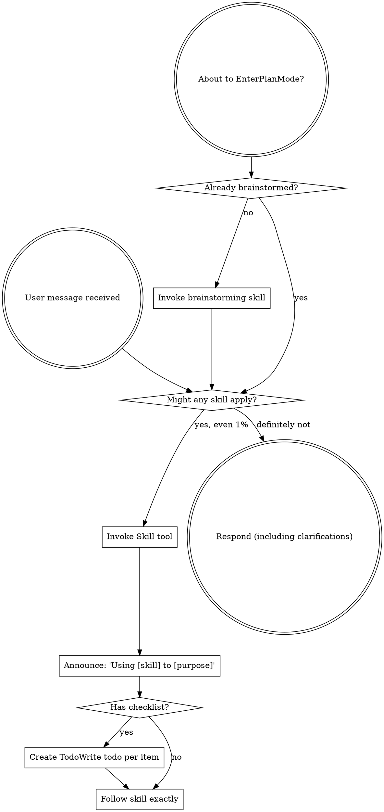

codex-exec: report contract violation

--- codex stdout ---
VERDICT: NOGO

SPEC CHECKS

1. PASS — `shadow` is excluded from enforcement kinds; directives are forbidden and `classifierUsable=false`.
2. PASS — shadow evaluation has no `safeStdout` path and cannot change classification output/return.
3. PASS — telemetry uses exactly the seven allowed fields; UUID and route IDs disclose no prompt text.
4. PASS — strong/weak/no-positive tiering is correctly ordered; both required prompts classify correctly.
5. PASS — diff adds no gate, alias, query logging, entity lookup, or global-skill mutation.

FINDINGS

1. **HIGH** — `latency_ms` is captured before UUID creation, serialization, and synchronous ledger writing; `runBench` never exercises the shadow path. The locked p95 added-latency metric is therefore invalid.
2. **HIGH** — `soft_path_action` is hard-coded to `would_route_vtp_query_triage`, not an observed soft-path action. The ledger cannot establish incremental catches missed by the soft path.
3. **MEDIUM (ATC)** — every prompt redundantly rereads/reparses the registry; the outer try/catch duplicates the function’s catch; `evaluateShadowRoutes` is unnecessarily exported. `matchesRoute` was correctly not reused.
4. **LOW** — tests omit true precedence cases such as `fix what did…` and `fix meeting`; the supplied “fixing” example is not start-anchored.

ONE_LINER: Injection/privacy behavior is sound, but the measurement instrument cannot support its promotion decision.

--- codex stderr ---
OpenAI Codex v0.146.0
--------
workdir: C:\Users\operator\AppData\Roaming\warp\Warp\data\worktrees\GSDedits\cholla-racer
model: gpt-5.6-sol
provider: openai
approval: never
sandbox: read-only
reasoning effort: xhigh
reasoning summaries: none
session id: 019ff717-6298-72d2-8a31-c4e9c3fa4fbb
--------
user
# Codex Spec-Compliance + ATC review — P152-T2 KB-triage shadow classifier

You are an INDEPENDENT reviewer. Do NOT trust the executor's self-summary. Judge
the raw artifacts only. Read:
- Plan/contract: `.planning/milestones/v3.6-vtp-bridge/phases/152-kb-triage-shadow/152-01-PLAN-LOCKED.md`
- Governing memo: `.planning/decisions/2026-08-12-kb-triage-gate-MEMO.md`
- Raw diff: `.planning/milestones/v3.6-vtp-bridge/phases/152-kb-triage-shadow/152-T2-DIFF.txt`
- Source as committed: `super-gsd/hooks/sgsd-intent-classifier.cjs`,
  `super-gsd/registry/session-governance-hooks.yaml`,
  `super-gsd/tests/kb-triage-shadow/assert-shadow.cjs`

## Spec-compliance checks (each PASS/FAIL with a one-line reason)
1. The shadow kind can NEVER inject: `shadow` is NOT in CLASSIFIER_ENFORCEMENT_KINDS;
   validateRouteShape's shadow branch forbids a directive and sets classifierUsable=false.
2. evaluateShadowRoutes never reaches stdout/the model (no safeStdout; wired in a
   try/catch that cannot alter emitClassification's return or output).
3. TEXT-FREE telemetry: the ledger row contains ONLY {ts, decision_id, matcher_version,
   matched_signature_ids, soft_path_action, latency_ms, operator_label}; decision_id is
   an opaque uuid; matched_signature_ids are ROUTE ids, never prompt substrings; no
   prompt text/excerpt/entity is written anywhere.
4. Matcher tiering: a STRONG KB positive matches even when a start-anchored verb
   (build|fix|run|test|file) opens the prompt; a WEAK positive is suppressed by that
   start-anchored verb; no positive never matches. Confirm "what did X say about fixing…"
   matches and "fix the failing test" does not.
5. Scope: no hard gate, no /triage alias, no raw-query logging, no KB entity lookup in
   the trigger; the global VTP skill is untouched.

## ATC (anti-slop) over the diff
Flag any: dead code, unused params, orphan functions, unjustified abstraction,
duplicated logic, ΔComplexity>0, or anything a senior would mass-delete. Note if the
shared matchesRoute was wrongly reused (it must NOT be — its exclusion-beats-trigger
semantics are inverted for shadow).

## Verdict
Return: `VERDICT: GO` or `VERDICT: NOGO`, then FINDINGS (numbered, most-severe first,
or "none"), then a one-line ONE_LINER. Under 250 words.

codex
I’m using the `using-superpowers` and `review` skills to structure this as an independent, evidence-first audit. I’ll judge only the locked plan, memo, raw diff, and committed source named in the request.
exec
"C:\\WINDOWS\\System32\\WindowsPowerShell\\v1.0\\powershell.exe" -Command "Get-Content -Raw 'C:\\Users\\operator\\.codex\\skills\\using-superpowers\\SKILL.md'" in C:\Users\operator\AppData\Roaming\warp\Warp\data\worktrees\GSDedits\cholla-racer
exec
"C:\\WINDOWS\\System32\\WindowsPowerShell\\v1.0\\powershell.exe" -Command "Get-Content -Raw 'C:\\Users\\operator\\.agents\\skills\\review\\SKILL.md'" in C:\Users\operator\AppData\Roaming\warp\Warp\data\worktrees\GSDedits\cholla-racer
 succeeded in 1239ms:
---
name: using-superpowers
description: Use when starting any conversation - establishes how to find and use skills, requiring Skill tool invocation before ANY response including clarifying questions
---

<SUBAGENT-STOP>
If you were dispatched as a subagent to execute a specific task, skip this skill.
</SUBAGENT-STOP>

<EXTREMELY-IMPORTANT>
If you think there is even a 1% chance a skill might apply to what you are doing, you ABSOLUTELY MUST invoke the skill.

IF A SKILL APPLIES TO YOUR TASK, YOU DO NOT HAVE A CHOICE. YOU MUST USE IT.

This is not negotiable. This is not optional. You cannot rationalize your way out of this.
</EXTREMELY-IMPORTANT>

## Instruction Priority

Superpowers skills override default system prompt behavior, but **user instructions always take precedence**:

1. **User's explicit instructions** (CLAUDE.md, GEMINI.md, AGENTS.md, direct requests) ƒ?" highest priority
2. **Superpowers skills** ƒ?" override default system behavior where they conflict
3. **Default system prompt** ƒ?" lowest priority

If CLAUDE.md, GEMINI.md, or AGENTS.md says "don't use TDD" and a skill says "always use TDD," follow the user's instructions. The user is in control.

## How to Access Skills

**In Claude Code:** Use the `Skill` tool. When you invoke a skill, its content is loaded and presented to youƒ?"follow it directly. Never use the Read tool on skill files.

**In Copilot CLI:** Use the `skill` tool. Skills are auto-discovered from installed plugins. The `skill` tool works the same as Claude Code's `Skill` tool.

**In Gemini CLI:** Skills activate via the `activate_skill` tool. Gemini loads skill metadata at session start and activates the full content on demand.

**In other environments:** Check your platform's documentation for how skills are loaded.

## Platform Adaptation

Skills use Claude Code tool names. Non-CC platforms: see `references/copilot-tools.md` (Copilot CLI), `references/codex-tools.md` (Codex) for tool equivalents. Gemini CLI users get the tool mapping loaded automatically via GEMINI.md.

# Using Skills

## The Rule

**Invoke relevant or requested skills BEFORE any response or action.** Even a 1% chance a skill might apply means that you should invoke the skill to check. If an invoked skill turns out to be wrong for the situation, you don't need to use it.



## Red Flags

These thoughts mean STOPƒ?"you're rationalizing:

| Thought | Reality |
|---------|---------|
| "This is just a simple question" | Questions are tasks. Check for skills. |
| "I need more context first" | Skill check comes BEFORE clarifying questions. |
| "Let me explore the codebase first" | Skills tell you HOW to explore. Check first. |
| "I can check git/files quickly" | Files lack conversation context. Check for skills. |
| "Let me gather information first" | Skills tell you HOW to gather information. |
| "This doesn't need a formal skill" | If a skill exists, use it. |
| "I remember this skill" | Skills evolve. Read current version. |
| "This doesn't count as a task" | Action = task. Check for skills. |
| "The skill is overkill" | Simple things become complex. Use it. |
| "I'll just do this one thing first" | Check BEFORE doing anything. |
| "This feels productive" | Undisciplined action wastes time. Skills prevent this. |
| "I know what that means" | Knowing the concept ƒ%ÿ using the skill. Invoke it. |

## Skill Priority

When multiple skills could apply, use this order:

1. **Process skills first** (brainstorming, debugging) - these determine HOW to approach the task
2. **Implementation skills second** (frontend-design, mcp-builder) - these guide execution

"Let's build X" ā' brainstorming first, then implementation skills.
"Fix this bug" ā' debugging first, then domain-specific skills.

## Skill Types

**Rigid** (TDD, debugging): Follow exactly. Don't adapt away discipline.

**Flexible** (patterns): Adapt principles to context.

The skill itself tells you which.

## User Instructions

Instructions say WHAT, not HOW. "Add X" or "Fix Y" doesn't mean skip workflows.

C:\Users\operator\OneDrive - REDACTED-ORG\Documents\WindowsPowerShell\profile.ps1 : Cannot dot-source this 
command because it was defined in a different language mode. To invoke this command without importing its contents, 
omit the '.' operator.
At line:1 char:1
+ . 'C:\Users\operator\OneDrive - REDACTED-ORG\Documents\Win ...
+ ~~~~~~~~~~~~~~~~~~~~~~~~~~~~~~~~~~~~~~~~~~~~~~~~~~~~~~~~~~~~~~~~~~~~~
    + CategoryInfo          : InvalidOperation: (:) [profile.ps1], NotSupportedException
    + FullyQualifiedErrorId : DotSourceNotSupported,profile.ps1
 
C:\Users\operator\OneDrive - REDACTED-ORG\Documents\WindowsPowerShell\Microsoft.PowerShell_profile.ps1 : 
Cannot dot-source this command because it was defined in a different language mode. To invoke this command without 
importing its contents, omit the '.' operator.
At line:1 char:1
+ . 'C:\Users\operator\OneDrive - REDACTED-ORG\Documents\Win ...
+ ~~~~~~~~~~~~~~~~~~~~~~~~~~~~~~~~~~~~~~~~~~~~~~~~~~~~~~~~~~~~~~~~~~~~~
    + CategoryInfo          : InvalidOperation: (:) [Microsoft.PowerShell_profile.ps1], NotSupportedException
    + FullyQualifiedErrorId : DotSourceNotSupported,Microsoft.PowerShell_profile.ps1
 

 succeeded in 1250ms:
---
name: review
description: Review code changes for security, performance, bugs, and quality. Reviews staged changes, unstaged changes, specific commits, or PR-ready diffs.
---

<objective>
Review code changes and provide structured feedback covering security, performance, bug risks, code quality, and test coverage gaps. This skill analyzes diffs and surrounding context to catch issues before they reach production.
</objective>

<context>
This skill reviews code changes at various stages of the development workflow. It can review staged changes before a commit, unstaged work-in-progress, a specific commit, or the full set of changes on a branch that are ready for a pull request.

The reviewer reads both the diff and the surrounding source files to understand intent and catch issues that only appear in context.
</context>

<core_principle>
**FIND REAL ISSUES, NOT STYLE NITS.** Focus on problems that cause bugs, security vulnerabilities, performance degradation, or maintainability pain. Avoid nitpicking formatting or subjective style preferences unless they harm readability.
</core_principle>

<analysis_only_rule>
**THIS SKILL IS READ-ONLY. DO NOT MODIFY CODE.**

The purpose is to review and report findings. Making changes during review conflates the reviewer and author roles. Present findings and let the user decide what to act on.
</analysis_only_rule>

<quick_start>

<determine_review_scope>

Parse the user's input to determine what to review:

1. **No arguments** - Review staged changes first. If nothing is staged, review unstaged changes.
   - Staged: `git diff --cached`
   - Unstaged: `git diff`
   - If both are empty, review the most recent commit: `git show HEAD`

2. **Commit hash argument** (e.g., `/review abc1234`) - Review that specific commit.
   - `git show <hash>`

3. **File path argument** (e.g., `/review src/foo.ts`) - Review unstaged changes in that file.
   - `git diff -- <path>` then fall back to `git diff --cached -- <path>`

4. **"pr" argument** (e.g., `/review pr`) - Review all changes since branching from main.
   - `git diff main...HEAD`
   - If on main, review `git diff HEAD~1`

After obtaining the diff, if it is empty, inform the user that there are no changes to review and stop.

</determine_review_scope>

<gather_context>

Before analyzing the diff:

1. **Read changed files in full** - Do not review a diff in isolation. Read each modified file to understand the surrounding code, imports, types, and control flow.
2. **Identify the tech stack** - Note languages, frameworks, and libraries in use. This affects what patterns are risky.
3. **Check for related test files** - For each changed source file, look for corresponding test files. Note whether tests were updated alongside the changes.
4. **Check for configuration changes** - If config files changed (env, CI, package.json, tsconfig, etc.), pay extra attention to side effects.

</gather_context>

<review_categories>

Analyze the changes against each category below. Only report findings that are actually present. Skip categories with no issues.

**A. Security Issues** (Severity: CRITICAL or HIGH)
- Injection vulnerabilities (SQL injection, command injection, template injection)
- Cross-site scripting (XSS) - unsanitized user input rendered in HTML
- Authentication and authorization flaws (missing auth checks, privilege escalation)
- Secrets or credentials hardcoded or logged
- Insecure deserialization or unsafe eval usage
- Path traversal or file access vulnerabilities
- Missing input validation on external data

**B. Performance Concerns** (Severity: HIGH or MEDIUM)
- N+1 query patterns in database access
- Unnecessary memory allocations in hot paths or loops
- Blocking operations on the main thread or in async contexts
- Missing pagination on unbounded queries
- Redundant computation that could be cached or memoized
- Large payloads without streaming or chunking

**C. Bug Risks** (Severity: HIGH or MEDIUM)
- Off-by-one errors in loops or array access
- Null/undefined dereferences without guards
- Race conditions in concurrent or async code
- Incorrect error handling (swallowed errors, wrong error types)
- Type mismatches or unsafe type assertions
- Logic errors in conditionals (inverted checks, missing cases)
- Resource leaks (unclosed connections, file handles, listeners)

**D. Code Quality** (Severity: MEDIUM or LOW)
- Unclear or misleading naming
- Significant code duplication that should be extracted
- Excessive complexity (deeply nested logic, functions doing too many things)
- Dead code or unreachable branches
- Missing or misleading comments on non-obvious logic
- Inconsistency with patterns used elsewhere in the codebase

**E. Test Coverage Gaps** (Severity: MEDIUM or LOW)
- New logic paths without corresponding test cases
- Changed behavior without updated tests
- Edge cases not covered (empty inputs, boundary values, error paths)
- Missing integration tests for new API endpoints or database changes

</review_categories>

<format_findings>

For each finding, use this structure:

```
### [SEVERITY] Category: Brief Title

**File**: `path/to/file.ext` (lines X-Y)

**Issue**: Clear description of the problem.

**Why it matters**: What could go wrong if this is not addressed.

**Suggestion**: How to fix it, with a code snippet if helpful.
```

Severity levels:
- **CRITICAL** - Must fix before merge. Security vulnerability or data loss risk.
- **HIGH** - Should fix before merge. Likely bug or significant performance issue.
- **MEDIUM** - Should fix soon. Code quality or moderate risk issue.
- **LOW** - Consider fixing. Minor improvement opportunity.

</format_findings>

</quick_start>

<critical_rules>

1. **READ THE FULL FILE**: Never review a diff without reading the complete source file for context
2. **NO FALSE ALARMS**: Only report issues you can explain concretely. Do not report vague concerns
3. **PRIORITIZE**: Lead with the most severe findings. Do not bury critical issues under style nits
4. **BE SPECIFIC**: Include file paths, line numbers, and code references for every finding
5. **EXPLAIN THE RISK**: For each finding, explain what could actually go wrong
6. **CHECK TESTS**: Always check whether changes have corresponding test updates
7. **CONSIDER THE STACK**: Apply language-specific and framework-specific knowledge to your review
8. **DO NOT MODIFY CODE**: Present findings only. The user decides what to act on

</critical_rules>

<output_format>

```markdown
## Code Review: [brief description of what was reviewed]

**Scope**: [staged changes | unstaged changes | commit abc1234 | PR changes from main]
**Files reviewed**: [count] files changed, [additions] additions, [deletions] deletions

---

### Findings

[Findings grouped by severity, highest first. Use the format from <format_findings>.]

---

### Summary

| Severity | Count |
|----------|-------|
| CRITICAL | X     |
| HIGH     | X     |
| MEDIUM   | X     |
| LOW      | X     |

### Recommended Actions

1. [Most important action to take]
2. [Next most important action]
3. [...]
```

If no issues are found:

```markdown
## Code Review: [brief description]

**Scope**: [what was reviewed]
**Files reviewed**: [count]

No significant issues found. The changes look good to merge.
```

</output_format>

<decision_gate>

**After presenting findings, ALWAYS offer these options:**

```
ƒ"?ƒ"?ƒ"?ƒ"?ƒ"?ƒ"?ƒ"?ƒ"?ƒ"?ƒ"?ƒ"?ƒ"?ƒ"?ƒ"?ƒ"?ƒ"?ƒ"?ƒ"?ƒ"?ƒ"?ƒ"?ƒ"?ƒ"?ƒ"?ƒ"?ƒ"?ƒ"?ƒ"?ƒ"?ƒ"?ƒ"?ƒ"?ƒ"?ƒ"?ƒ"?ƒ"?ƒ"?ƒ"?ƒ"?ƒ"?ƒ"?
REVIEW COMPLETE

What would you like to do?

1. **Fix issues** - I'll address the findings starting with the most critical
2. **Save review** - Export findings to a markdown file
3. **Review again** - Re-review with different scope or focus
4. **Discuss a finding** - Ask questions about a specific issue
5. **Other** - Tell me what you need
ƒ"?ƒ"?ƒ"?ƒ"?ƒ"?ƒ"?ƒ"?ƒ"?ƒ"?ƒ"?ƒ"?ƒ"?ƒ"?ƒ"?ƒ"?ƒ"?ƒ"?ƒ"?ƒ"?ƒ"?ƒ"?ƒ"?ƒ"?ƒ"?ƒ"?ƒ"?ƒ"?ƒ"?ƒ"?ƒ"?ƒ"?ƒ"?ƒ"?ƒ"?ƒ"?ƒ"?ƒ"?ƒ"?ƒ"?ƒ"?ƒ"?
```

**Wait for user response before taking any action.**

This gate is MANDATORY. Never skip it. Never auto-implement fixes.

</decision_gate>

C:\Users\operator\OneDrive - REDACTED-ORG\Documents\WindowsPowerShell\profile.ps1 : Cannot dot-source this 
command because it was defined in a different language mode. To invoke this command without importing its contents, 
omit the '.' operator.
At line:1 char:1
+ . 'C:\Users\operator\OneDrive - REDACTED-ORG\Documents\Win ...
+ ~~~~~~~~~~~~~~~~~~~~~~~~~~~~~~~~~~~~~~~~~~~~~~~~~~~~~~~~~~~~~~~~~~~~~
    + CategoryInfo          : InvalidOperation: (:) [profile.ps1], NotSupportedException
    + FullyQualifiedErrorId : DotSourceNotSupported,profile.ps1
 
C:\Users\operator\OneDrive - REDACTED-ORG\Documents\WindowsPowerShell\Microsoft.PowerShell_profile.ps1 : 
Cannot dot-source this command because it was defined in a different language mode. To invoke this command without 
importing its contents, omit the '.' operator.
At line:1 char:1
+ . 'C:\Users\operator\OneDrive - REDACTED-ORG\Documents\Win ...
+ ~~~~~~~~~~~~~~~~~~~~~~~~~~~~~~~~~~~~~~~~~~~~~~~~~~~~~~~~~~~~~~~~~~~~~
    + CategoryInfo          : InvalidOperation: (:) [Microsoft.PowerShell_profile.ps1], NotSupportedException
    + FullyQualifiedErrorId : DotSourceNotSupported,Microsoft.PowerShell_profile.ps1
 

  → Read the locked plan, governing memo, raw diff, and all committed source files in full
  • Trace each of the five spec-compliance checks against raw code and tests
  • Perform ATC anti-slop analysis over the diff
  • Return the requested sub-250-word verdict
exec
"C:\\WINDOWS\\System32\\WindowsPowerShell\\v1.0\\powershell.exe" -NoProfile -Command '$p='"'.planning/milestones/v3.6-vtp-bridge/phases/152-kb-triage-shadow/152-01-PLAN-LOCKED.md'; "'$i=Get-Item -LiteralPath $p; [pscustomobject]@{Path=$p; Bytes=$i.Length; Lines=(Get-Content -LiteralPath $p).Count}
$p='"'.planning/decisions/2026-08-12-kb-triage-gate-MEMO.md'; "'$i=Get-Item -LiteralPath $p; [pscustomobject]@{Path=$p; Bytes=$i.Length; Lines=(Get-Content -LiteralPath $p).Count}
$p='"'.planning/milestones/v3.6-vtp-bridge/phases/152-kb-triage-shadow/152-T2-DIFF.txt'; "'$i=Get-Item -LiteralPath $p; [pscustomobject]@{Path=$p; Bytes=$i.Length; Lines=(Get-Content -LiteralPath $p).Count}
$p='"'super-gsd/hooks/sgsd-intent-classifier.cjs'; "'$i=Get-Item -LiteralPath $p; [pscustomobject]@{Path=$p; Bytes=$i.Length; Lines=(Get-Content -LiteralPath $p).Count}
$p='"'super-gsd/registry/session-governance-hooks.yaml'; "'$i=Get-Item -LiteralPath $p; [pscustomobject]@{Path=$p; Bytes=$i.Length; Lines=(Get-Content -LiteralPath $p).Count}
$p='"'super-gsd/tests/kb-triage-shadow/assert-shadow.cjs'; "'$i=Get-Item -LiteralPath $p; [pscustomobject]@{Path=$p; Bytes=$i.Length; Lines=(Get-Content -LiteralPath $p).Count}' in C:\Users\operator\AppData\Roaming\warp\Warp\data\worktrees\GSDedits\cholla-racer
2026-08-12T17:49:52.199439Z ERROR codex_core::tools::router: error=Exit code: 1
Wall time: 0.8 seconds
Output:
Cannot convert value to type "System.Management.Automation.LanguagePrimitives+InternalPSCustomObject". Only core types 
are supported in this language mode.
At line:2 char:123
+ ... ralPath $p; [pscustomobject]@{Path=$p; Bytes=$i.Length; Lines=(Get-Co ...
+                 ~~~~~~~~~~~~~~~~~~~~~~~~~~~~~~~~~~~~~~~~~~~~~~~~~~~~~~~~~
    + CategoryInfo          : InvalidArgument: (:) [], RuntimeException
    + FullyQualifiedErrorId : ConversionSupportedOnlyToCoreTypes
 
Cannot convert value to type "System.Management.Automation.LanguagePrimitives+InternalPSCustomObject". Only core types 
are supported in this language mode.
At line:3 char:90
+ ... ralPath $p; [pscustomobject]@{Path=$p; Bytes=$i.Length; Lines=(Get-Co ...
+                 ~~~~~~~~~~~~~~~~~~~~~~~~~~~~~~~~~~~~~~~~~~~~~~~~~~~~~~~~~
    + CategoryInfo          : InvalidArgument: (:) [], RuntimeException
    + FullyQualifiedErrorId : ConversionSupportedOnlyToCoreTypes
 
Cannot convert value to type "System.Management.Automation.LanguagePrimitives+InternalPSCustomObject". Only core types 
are supported in this language mode.
At line:4 char:117
+ ... ralPath $p; [pscustomobject]@{Path=$p; Bytes=$i.Length; Lines=(Get-Co ...
+                 ~~~~~~~~~~~~~~~~~~~~~~~~~~~~~~~~~~~~~~~~~~~~~~~~~~~~~~~~~
    + CategoryInfo          : InvalidArgument: (:) [], RuntimeException
    + FullyQualifiedErrorId : ConversionSupportedOnlyToCoreTypes
 
Cannot convert value to type "System.Management.Automation.LanguagePrimitives+InternalPSCustomObject". Only core types 
are supported in this language mode.
At line:5 char:79
+ ... ralPath $p; [pscustomobject]@{Path=$p; Bytes=$i.Length; Lines=(Get-Co ...
+                 ~~~~~~~~~~~~~~~~~~~~~~~~~~~~~~~~~~~~~~~~~~~~~~~~~~~~~~~~~
    + CategoryInfo          : InvalidArgument: (:) [], RuntimeException
    + FullyQualifiedErrorId : ConversionSupportedOnlyToCoreTypes
 
Cannot convert value to type "System.Management.Automation.LanguagePrimitives+InternalPSCustomObject". Only core types 
are supported in this language mode.
At line:6 char:85
+ ... ralPath $p; [pscustomobject]@{Path=$p; Bytes=$i.Length; Lines=(Get-Co ...
+                 ~~~~~~~~~~~~~~~~~~~~~~~~~~~~~~~~~~~~~~~~~~~~~~~~~~~~~~~~~
    + CategoryInfo          : InvalidArgument: (:) [], RuntimeException
    + FullyQualifiedErrorId : ConversionSupportedOnlyToCoreTypes
 
Cannot convert value to type "System.Management.Automation.LanguagePrimitives+InternalPSCustomObject". Only core types 
are supported in this language mode.
At line:7 char:87
+ ... ralPath $p; [pscustomobject]@{Path=$p; Bytes=$i.Length; Lines=(Get-Co ...
+                 ~~~~~~~~~~~~~~~~~~~~~~~~~~~~~~~~~~~~~~~~~~~~~~~~~~~~~~~~~
    + CategoryInfo          : InvalidArgument: (:) [], RuntimeException
    + FullyQualifiedErrorId : ConversionSupportedOnlyToCoreTypes
 

 exited 1 in 777ms:
Cannot convert value to type "System.Management.Automation.LanguagePrimitives+InternalPSCustomObject". Only core types 
are supported in this language mode.
At line:2 char:123
+ ... ralPath $p; [pscustomobject]@{Path=$p; Bytes=$i.Length; Lines=(Get-Co ...
+                 ~~~~~~~~~~~~~~~~~~~~~~~~~~~~~~~~~~~~~~~~~~~~~~~~~~~~~~~~~
    + CategoryInfo          : InvalidArgument: (:) [], RuntimeException
    + FullyQualifiedErrorId : ConversionSupportedOnlyToCoreTypes
 
Cannot convert value to type "System.Management.Automation.LanguagePrimitives+InternalPSCustomObject". Only core types 
are supported in this language mode.
At line:3 char:90
+ ... ralPath $p; [pscustomobject]@{Path=$p; Bytes=$i.Length; Lines=(Get-Co ...
+                 ~~~~~~~~~~~~~~~~~~~~~~~~~~~~~~~~~~~~~~~~~~~~~~~~~~~~~~~~~
    + CategoryInfo          : InvalidArgument: (:) [], RuntimeException
    + FullyQualifiedErrorId : ConversionSupportedOnlyToCoreTypes
 
Cannot convert value to type "System.Management.Automation.LanguagePrimitives+InternalPSCustomObject". Only core types 
are supported in this language mode.
At line:4 char:117
+ ... ralPath $p; [pscustomobject]@{Path=$p; Bytes=$i.Length; Lines=(Get-Co ...
+                 ~~~~~~~~~~~~~~~~~~~~~~~~~~~~~~~~~~~~~~~~~~~~~~~~~~~~~~~~~
    + CategoryInfo          : InvalidArgument: (:) [], RuntimeException
    + FullyQualifiedErrorId : ConversionSupportedOnlyToCoreTypes
 
Cannot convert value to type "System.Management.Automation.LanguagePrimitives+InternalPSCustomObject". Only core types 
are supported in this language mode.
At line:5 char:79
+ ... ralPath $p; [pscustomobject]@{Path=$p; Bytes=$i.Length; Lines=(Get-Co ...
+                 ~~~~~~~~~~~~~~~~~~~~~~~~~~~~~~~~~~~~~~~~~~~~~~~~~~~~~~~~~
    + CategoryInfo          : InvalidArgument: (:) [], RuntimeException
    + FullyQualifiedErrorId : ConversionSupportedOnlyToCoreTypes
 
Cannot convert value to type "System.Management.Automation.LanguagePrimitives+InternalPSCustomObject". Only core types 
are supported in this language mode.
At line:6 char:85
+ ... ralPath $p; [pscustomobject]@{Path=$p; Bytes=$i.Length; Lines=(Get-Co ...
+                 ~~~~~~~~~~~~~~~~~~~~~~~~~~~~~~~~~~~~~~~~~~~~~~~~~~~~~~~~~
    + CategoryInfo          : InvalidArgument: (:) [], RuntimeException
    + FullyQualifiedErrorId : ConversionSupportedOnlyToCoreTypes
 
Cannot convert value to type "System.Management.Automation.LanguagePrimitives+InternalPSCustomObject". Only core types 
are supported in this language mode.
At line:7 char:87
+ ... ralPath $p; [pscustomobject]@{Path=$p; Bytes=$i.Length; Lines=(Get-Co ...
+                 ~~~~~~~~~~~~~~~~~~~~~~~~~~~~~~~~~~~~~~~~~~~~~~~~~~~~~~~~~
    + CategoryInfo          : InvalidArgument: (:) [], RuntimeException
    + FullyQualifiedErrorId : ConversionSupportedOnlyToCoreTypes
 

exec
"C:\\WINDOWS\\System32\\WindowsPowerShell\\v1.0\\powershell.exe" -NoProfile -Command '$p='"'.planning/milestones/v3.6-vtp-bridge/phases/152-kb-triage-shadow/152-01-PLAN-LOCKED.md'; "'$i=Get-Item -LiteralPath $p; Write-Output ($p + '"' | bytes=' + "'$i.Length + '"' | lines=' + (Get-Content -LiteralPath "'$p).Count)
$p='"'.planning/decisions/2026-08-12-kb-triage-gate-MEMO.md'; "'$i=Get-Item -LiteralPath $p; Write-Output ($p + '"' | bytes=' + "'$i.Length + '"' | lines=' + (Get-Content -LiteralPath "'$p).Count)
$p='"'.planning/milestones/v3.6-vtp-bridge/phases/152-kb-triage-shadow/152-T2-DIFF.txt'; "'$i=Get-Item -LiteralPath $p; Write-Output ($p + '"' | bytes=' + "'$i.Length + '"' | lines=' + (Get-Content -LiteralPath "'$p).Count)
$p='"'super-gsd/hooks/sgsd-intent-classifier.cjs'; "'$i=Get-Item -LiteralPath $p; Write-Output ($p + '"' | bytes=' + "'$i.Length + '"' | lines=' + (Get-Content -LiteralPath "'$p).Count)
$p='"'super-gsd/registry/session-governance-hooks.yaml'; "'$i=Get-Item -LiteralPath $p; Write-Output ($p + '"' | bytes=' + "'$i.Length + '"' | lines=' + (Get-Content -LiteralPath "'$p).Count)
$p='"'super-gsd/tests/kb-triage-shadow/assert-shadow.cjs'; "'$i=Get-Item -LiteralPath $p; Write-Output ($p + '"' | bytes=' + "'$i.Length + '"' | lines=' + (Get-Content -LiteralPath "'$p).Count)' in C:\Users\operator\AppData\Roaming\warp\Warp\data\worktrees\GSDedits\cholla-racer
 succeeded in 747ms:
.planning/milestones/v3.6-vtp-bridge/phases/152-kb-triage-shadow/152-01-PLAN-LOCKED.md | bytes=7386 | lines=103
.planning/decisions/2026-08-12-kb-triage-gate-MEMO.md | bytes=4352 | lines=81
.planning/milestones/v3.6-vtp-bridge/phases/152-kb-triage-shadow/152-T2-DIFF.txt | bytes=13458 | lines=321
super-gsd/hooks/sgsd-intent-classifier.cjs | bytes=28660 | lines=828
super-gsd/registry/session-governance-hooks.yaml | bytes=4446 | lines=82
super-gsd/tests/kb-triage-shadow/assert-shadow.cjs | bytes=3327 | lines=94

exec
"C:\\WINDOWS\\System32\\WindowsPowerShell\\v1.0\\powershell.exe" -NoProfile -Command "Get-Content -Raw -LiteralPath '.planning/milestones/v3.6-vtp-bridge/phases/152-kb-triage-shadow/152-01-PLAN-LOCKED.md'" in C:\Users\operator\AppData\Roaming\warp\Warp\data\worktrees\GSDedits\cholla-racer
exec
"C:\\WINDOWS\\System32\\WindowsPowerShell\\v1.0\\powershell.exe" -NoProfile -Command "Get-Content -Raw -LiteralPath '.planning/decisions/2026-08-12-kb-triage-gate-MEMO.md'" in C:\Users\operator\AppData\Roaming\warp\Warp\data\worktrees\GSDedits\cholla-racer
exec
"C:\\WINDOWS\\System32\\WindowsPowerShell\\v1.0\\powershell.exe" -NoProfile -Command "Get-Content -Raw -LiteralPath '.planning/milestones/v3.6-vtp-bridge/phases/152-kb-triage-shadow/152-T2-DIFF.txt'" in C:\Users\operator\AppData\Roaming\warp\Warp\data\worktrees\GSDedits\cholla-racer
 succeeded in 852ms:
---
decision: hard KB-triage gate
date: 2026-08-12
board: Architect SUPPORT-WITH-CONDITIONS / Contrarian OPPOSE (both conf 4)
verdict: BUILD SHADOW ONLY ƒ?" promotion to directive gated on measured data
status: PENDING CODEX CHALLENGE
---

# Decision Memo ƒ?" Hard KB-Triage Gate

## The real split
Architect: build directive gate (a), shadow-first. Contrarian: directive (a) is
NOT a hard gate (injects a string Claude can ignore = forgettable soft-invocation
moved down); soft path miss-rate unmeasured; the deletion beats the build.

## Ruling (CEO synthesis)
BUILD ONLY THE SAFE, MEASURED PART NOW. Do not ship a blind hard gate.

### Unanimous, adopted
1. KILL the "entity exists in KB" trigger ƒ?" poison pill (per-prompt KB coupling,
   guaranteed false-fires). Pure anchored-lexical only.
2. SHADOW / report_only first ƒ?" reuse P151 demand-baseline + the existing
   intent_routing_decision ledger. Logs "would-fire", fires nothing. Zero risk.
3. Mandatory exclude_regexes: build|fix|run|test|file-ops verbs. Anchor regexes;
   hold p95 via runBench.

### Build now (safe, ~0 risk, ~0 latency)
- New route in session-governance-hooks.yaml: KB-directed lexical trigger,
  enforcement: kind: report_only (SHADOW), signal logged to the routing ledger.
- Strengthen vtp-query-triage self-invocation description (Contrarian: operator
  may just want reliable self-invoke, not a hook).
- Manual /triage verb the operator can type on demand.

### Gated on data (do NOT build yet)
- Promotion report_only -> directive: ONLY after a shadow window publishes the
  soft-path miss rate + false-fire rate against real prompts, against an explicit
  PROMOTE-OR-KILL threshold set up front (e.g. >=N real KB prompts in 2 weeks the
  soft path demonstrably missed AND false-fire < X%). If the soft path already
  routes KB queries reliably -> KILL the gate (Contrarian wins).
- Option (b) pre-run-inject-result (the only TRULY deterministic form): build
  ONLY if shadow shows directive-inject is routinely IGNORED on true KB hits.

## Honest label
Do not sell directive-inject as "un-forgettable." It is MORE reliable than
CLAUDE.md (fresh injection every matching prompt) but Claude can still ignore it.
The truly-hard form is (b), deferred until data justifies its cost.

---

# Codex Challenge ƒ?" MEMO-UNSAFE (corrections adopted)

Independent Codex review found the shadow design "privacy-unsafe if made
measurable, unmeasurable if logged safely as written." Adopted corrections:

1. **Text-free telemetry (kills the privacy paradox).** Shadow logging must
   persist ONLY: opaque decision_id, matcher_version, matched signature IDs,
   soft-path action taken, latency, and a submission-time operator label. NO
   prompt text, NO excerpt, NO entity strings. (Kills raw-query logging.)
2. **Exclusions start-anchored AND subordinate to KB positives.** "what did Ada
   say about FIXING the customs flow" must still fire ƒ?" a strong KB positive
   overrides an imperative verb. Anywhere-in-prompt verb veto is killed.
3. **Freeze self-invocation BEFORE the window.** Strengthen vtp-query-triage's
   self-invocation description FIRST, then freeze it; changing it mid-window
   confounds the baseline.
4. **A real tested shadow classifier kind under a PLAN** ƒ?" prompt-time
   report_only is currently inert/filtered; needs its own shadow kind, tested.
5. **Locked PROMOTE-OR-KILL metric (no hand-waving):** promote report_only ->
   directive ONLY if, over a fixed 28-day window with >=20 adjudicated shadow
   fires: FP/(TP+FP) <= 5%; >=5 true incremental catches the soft path missed;
   incremental catches / TP >= 20%; p95 added latency <= 1 ms. Else KILL.
6. **Killed:** raw-query logging; anywhere-in-prompt verb vetoes; the unscoped
   /triage alias; and any "zero-risk / zero-latency" claim.

## Final converged design (board + 2x Codex challenge)
- FIRST: improve + FREEZE vtp-query-triage self-invocation description.
- BUILD (under a Plan): a text-free shadow classifier route ƒ?" pure anchored
  lexical KB trigger, start-anchored verb exclusions subordinate to KB positives,
  opaque telemetry only, its own tested shadow kind. Fires nothing.
- MEASURE: 28-day window against the locked metric.
- PROMOTE or KILL by the numbers. Hard directive gate is DEFERRED to data;
  option (b) pre-run-inject-result only if directive proves ignored.


 succeeded in 904ms:
---
schema_version: 2
phase: "152"
slug: "kb-triage-shadow"
milestone: "v3.6-vtp-bridge"
status: "PLANNED"
depends_on: ["151"]
intent: "Text-free shadow classifier that logs whether a KB-directed prompt WOULD route to vtp-query-triage, firing nothing; the measurement instrument gating any future hard gate. Board + 2x Codex challenge design; conditions non-negotiable."
execution_mode: "serial-codex"
tasks:
  - id: "P152-T1"
    type: "baseline-snapshot"
    agent: codex
    model: codex
    files_touched:
      - "super-gsd/docs/kb-triage-shadow/vtp-query-triage-baseline-2026-08-12.md"
    input_contract: >
      REPO-BOUNDARY SAFE. vtp-query-triage is a VTP product skill at the user-global ~/.claude/skills/vtp-query-triage/SKILL.md ѓ?" super-gsd neither owns nor versions it, so DO NOT edit it. Instead capture a read-only frozen baseline INSIDE super-gsd: copy the skill's current self-invocation / trigger prose verbatim into an in-repo snapshot file, record a sha256 content hash of that prose, and stamp FROZEN-BASELINE-2026-08-12. Note that strengthening the VTP skill itself is a separate VTP-lane change, deferred. No other files; no mutation of the global skill.
    output_contract: >
      super-gsd/docs/kb-triage-shadow/vtp-query-triage-baseline-2026-08-12.md contains the verbatim current self-invocation prose of the global vtp-query-triage skill, a sha256 hash of that prose, a FROZEN-BASELINE-2026-08-12 stamp, and a one-line note that VTP-side strengthening is deferred to the VTP lane. The global skill is byte-unchanged.
    hypothesis: "A read-only in-repo snapshot + hash of the soft path gives the 28-day shadow window a stable, version-controlled baseline without super-gsd mutating a VTP product file."
    falsifier: >
      The global ~/.claude/skills/vtp-query-triage/SKILL.md is modified; or the snapshot lacks the verbatim prose, the sha256 hash, or the FROZEN-BASELINE-2026-08-12 stamp; or the doc claims a hard gate ships now.
    stop_rule: >
      Stop after the in-repo baseline snapshot is written; never touch the global skill.
    verification:
      commands:
        - "grep -c 'FROZEN-BASELINE-2026-08-12' super-gsd/docs/kb-triage-shadow/vtp-query-triage-baseline-2026-08-12.md"
        - "grep -ciE 'sha256|[a-f0-9]{64}' super-gsd/docs/kb-triage-shadow/vtp-query-triage-baseline-2026-08-12.md"
  - id: "P152-T2"
    type: "shadow-classifier"
    agent: codex
    model: codex
    files_touched:
      - "super-gsd/hooks/sgsd-intent-classifier.cjs"
      - "super-gsd/registry/session-governance-hooks.yaml"
      - "super-gsd/tests/kb-triage-shadow/assert-shadow.cjs"
    input_contract: >
      Add a `shadow` enforcement kind to the classifier and a kb-lookup-triage route. The shadow kind evaluates the match and appends ONE text-free telemetry row, injecting NOTHING into the prompt. The route trigger is pure anchored-lexical for KB intent; verb exclusions (build|fix|run|test|file) are START-ANCHORED and SUBORDINATE to a strong KB positive.
    output_contract: >
      A prompt matching the kb-lookup-triage route emits zero prompt injection and appends a text-free row to .planning/metrics/kb-triage-shadow.jsonl containing ONLY {ts, decision_id, matcher_version, matched_signature_ids[], soft_path_action, latency_ms, operator_label(null)}. No prompt text, excerpt, or entity string is ever written. "what did Ada say about fixing the customs flow" MATCHES (KB positive beats the 'fix' exclusion); "fix the failing test" does NOT match.
    hypothesis: "A shadow kind can measure would-fire on KB intent with zero prompt injection and zero PII in telemetry, with KB positives overriding verb exclusions."
    falsifier: >
      Any prompt text/excerpt/entity string appears in the ledger; the shadow route injects anything into the prompt; a KB-positive-plus-verb prompt is suppressed; a pure imperative ("fix the test") matches; or p95 added latency is not bounded/anchored.
    stop_rule: >
      Stop after the shadow kind + route + text-free ledger + self-test pass; do NOT add a directive gate or /triage alias.
    verification:
      commands:
        - "node super-gsd/tests/kb-triage-shadow/assert-shadow.cjs"
        - "node super-gsd/hooks/sgsd-intent-classifier.cjs --self-test"
  - id: "P152-T3"
    type: "metric-doc"
    agent: codex
    model: codex
    files_touched:
      - "super-gsd/docs/KB-TRIAGE-SHADOW.md"
    input_contract: >
      Document the locked promote-or-kill metric and how to read the shadow ledger. Documentation only; no enforcement.
    output_contract: >
      KB-TRIAGE-SHADOW.md states the 28-day window, the exact promote thresholds (>=20 adjudicated shadow fires, FP/(TP+FP) <= 5%, >=5 true incremental catches missed by soft path, incremental catches/TP >= 20%, p95 added latency <= 1 ms), the KILL condition (soft path already reliable), the text-free telemetry schema, and that operator_label is how a shadow fire gets adjudicated.
    hypothesis: "A locked, numeric promote-or-kill contract prevents perpetual tuning and makes the gate decision falsifiable."
    falsifier: >
      Any threshold is hand-wavy/undefined, or the doc implies the hard gate ships before the window, or it describes logging prompt text.
    stop_rule: >
      Stop after the doc is written.
    verification:
      commands:
        - "grep -c 'promote' super-gsd/docs/KB-TRIAGE-SHADOW.md"
        - "test -f super-gsd/docs/KB-TRIAGE-SHADOW.md"
semantic_acceptance_criteria:
  - id: "SCHEMA-09"
    input: >
      The real prompt "what did Ada say about fixing the customs flow" and the real prompt "fix the failing test", run through the classifier shadow route.
    expected_outcome: >
      The first MATCHES (KB positive overrides the 'fix' verb exclusion) and logs a text-free row; the second does NOT match. Asserted in assert-shadow.cjs.
    verification_cmd: "node super-gsd/tests/kb-triage-shadow/assert-shadow.cjs"
  - id: "DLB-07"
    input: >
      The kb-triage-shadow.jsonl produced by a shadow fire.
    expected_outcome: >
      Every row contains ONLY opaque/structured fields (ts, decision_id, matcher_version, matched_signature_ids, soft_path_action, latency_ms, operator_label); grep finds no prompt text, excerpt, or entity string.
    verification_cmd: "node super-gsd/tests/kb-triage-shadow/assert-shadow.cjs"
  - id: "SCHEMA-09"
    input: >
      A prompt that matches the shadow route, run through the classifier.
    expected_outcome: >
      Zero characters are injected into the prompt/output by the shadow kind (it logs only). Asserted by the classifier self-test.
    verification_cmd: "node super-gsd/hooks/sgsd-intent-classifier.cjs --self-test"
---

## Goal
Ship the text-free KB-triage shadow classifier + frozen self-invocation baseline
+ locked metric doc. Fires nothing. Hard gate deferred to the 28-day data.

## Locked promote-or-kill metric (Codex challenge)
28-day window; PROMOTE report_onlyѓЕ'directive only if: ѓ%ѕ20 adjudicated shadow
fires; FP/(TP+FP) ѓ%П 5%; ѓ%ѕ5 true incremental catches the soft path missed;
incremental catches / TP ѓ%ѕ 20%; p95 added latency ѓ%П 1 ms. Else KILL.

## Source Audit
- CONTEXT.md (this phase dir).
- Decision Memo ѓ?" .planning/decisions/2026-08-12-kb-triage-gate-MEMO.md (board + 2x Codex challenge; all conditions).
- Board seats ѓ?" Architect (a/pure-lexical/shadow-first), Contrarian (measure-first/text-free).


 succeeded in 874ms:
commit acc58f4f27d7511743ef43c6fd3b3346dfbf0cc6
Author: operator <operator@users.noreply.github.com>
Date:   Wed Aug 12 18:47:37 2026 +0100

    feat(152-T2): KB-triage SHADOW classifier ƒ?" fires nothing, logs text-free
    
    New enforcement kind: shadow (classifierUsable=false, directive forbidden ƒ?" can
    never inject). kb-lookup-triage route with tiered matcher: strong KB positive
    overrides start-anchored verb exclusion; weak positive subject to it; no positive
    never fires. evaluateShadowRoutes is fire-and-forget, never calls safeStdout,
    appends one text-free row {ts,decision_id(uuid),matcher_version,matched_signature_ids,
    soft_path_action,latency_ms,operator_label} to kb-triage-shadow.jsonl.
    
    Verified independently: assert-shadow pass; classifier self-test 10/0; live
    behavioral proof ƒ?" 'what did Ada say about fixing the customs flow' fires yet
    injects [] to the model; 'fix the failing test' does not fire; ledger row carries
    zero prompt text. Codex executor gpt-5.6-sol, ~11min.
    
    Co-Authored-By: Claude Opus 4.8 <noreply@anthropic.com>

 super-gsd/hooks/sgsd-intent-classifier.cjs         | 92 +++++++++++++++++++++
 super-gsd/registry/session-governance-hooks.yaml   | 27 +++++++
 super-gsd/tests/kb-triage-shadow/assert-shadow.cjs | 94 ++++++++++++++++++++++
 3 files changed, 213 insertions(+)
commit acc58f4f27d7511743ef43c6fd3b3346dfbf0cc6
Author: operator <operator@users.noreply.github.com>
Date:   Wed Aug 12 18:47:37 2026 +0100

    feat(152-T2): KB-triage SHADOW classifier ƒ?" fires nothing, logs text-free
    
    New enforcement kind: shadow (classifierUsable=false, directive forbidden ƒ?" can
    never inject). kb-lookup-triage route with tiered matcher: strong KB positive
    overrides start-anchored verb exclusion; weak positive subject to it; no positive
    never fires. evaluateShadowRoutes is fire-and-forget, never calls safeStdout,
    appends one text-free row {ts,decision_id(uuid),matcher_version,matched_signature_ids,
    soft_path_action,latency_ms,operator_label} to kb-triage-shadow.jsonl.
    
    Verified independently: assert-shadow pass; classifier self-test 10/0; live
    behavioral proof ƒ?" 'what did Ada say about fixing the customs flow' fires yet
    injects [] to the model; 'fix the failing test' does not fire; ledger row carries
    zero prompt text. Codex executor gpt-5.6-sol, ~11min.
    
    Co-Authored-By: Claude Opus 4.8 <noreply@anthropic.com>

diff --git a/super-gsd/hooks/sgsd-intent-classifier.cjs b/super-gsd/hooks/sgsd-intent-classifier.cjs
index 880f397..7925fe9 100644
--- a/super-gsd/hooks/sgsd-intent-classifier.cjs
+++ b/super-gsd/hooks/sgsd-intent-classifier.cjs
@@ -39,6 +39,8 @@ const BENCH_SIGNAL = 'intent_classifier_bench';
 const DEGRADED_SIGNAL = 'intent_classifier_degraded';
 const ROUTING_DECISION_SIGNAL = 'intent_routing_decision';
 const CLASSIFIER_ENFORCEMENT_KINDS = Object.freeze(['directive', 'suggestion']);
+const KB_TRIAGE_SHADOW_SIGNAL = 'kb_triage_shadow';
+const KB_TRIAGE_MATCHER_VERSION = 'kb-shadow-v1';
 const REPORT_ONLY_SIGNALS = Object.freeze(['missing_plan']);
 
 function safeWarn(reason) {
@@ -255,6 +257,25 @@ function validateRouteShape(route) {
     };
   }
 
+  if (kind === 'shadow') {
+    const triggerCount = nonEmptyStrings(trigger.phrases).length
+      + validRegexStrings(trigger.regexes).length
+      + nonEmptyStrings(trigger.strong_kb_phrases).length
+      + validRegexStrings(trigger.strong_kb_regexes).length;
+    const signal = typeof enforcement.signal === 'string' ? enforcement.signal.trim() : '';
+    const directive = typeof enforcement.directive === 'string' ? enforcement.directive.trim() : '';
+    if (triggerCount === 0) reasons.push('shadow_trigger_missing');
+    if (signal !== KB_TRIAGE_SHADOW_SIGNAL) reasons.push('shadow_signal_invalid');
+    if (directive) reasons.push('shadow_directive_forbidden');
+    return {
+      route,
+      id: id || null,
+      usable: reasons.length === 0,
+      classifierUsable: false,
+      reason_codes: reasons,
+    };
+  }
+
   reasons.push('enforcement_kind_unknown');
   return { route, id: id || null, usable: false, classifierUsable: false, reason_codes: reasons };
 }
@@ -426,6 +447,61 @@ function matchesRoute(route, prompt, root, payload) {
     || regexHit(normalizedPrompt, trigger.regexes, root, payload);
 }
 
+function startAnchoredVerbHit(prompt, verbs) {
+  const vs = nonEmptyStrings(verbs);
+  if (vs.length === 0) return false;
+  const re = new RegExp('^\\s*(?:' + vs.map((v) => v.replace(/[.*+?^${}()|[\]\\]/g, '\\$&')).join('|') + ')\\b', 'i');
+  return re.test(prompt);
+}
+
+function matchesShadowRoute(route, prompt, root, payload) {
+  if (!route || !prompt.trim()) return false;
+  const trigger = route.trigger || {};
+  const predicate = route.predicate || {};
+  const strong = phraseHit(prompt, trigger.strong_kb_phrases)
+    || regexHit(prompt, trigger.strong_kb_regexes, root, payload);
+  if (strong) return true;
+  const weak = phraseHit(prompt, trigger.phrases)
+    || regexHit(prompt, trigger.regexes, root, payload);
+  if (!weak) return false;
+  if (startAnchoredVerbHit(prompt, predicate.exclude_start_verbs)) return false;
+  return true;
+}
+
+function kbTriageShadowLedgerPath(root) {
+  return path.resolve(root, '.planning', 'metrics', 'kb-triage-shadow.jsonl');
+}
+
+function evaluateShadowRoutes(root, payload, prompt) {
+  try {
+    const started = performance.now();
+    const registry = parseRegistryYaml(fs.readFileSync(REGISTRY_SOURCE_PATH, 'utf8'));
+    const all = Array.isArray(registry.routes) ? registry.routes : [];
+    const shadowRoutes = all.filter((route) => {
+      const validation = validateRouteShape(route);
+      return validation.usable
+        && route.enforcement
+        && route.enforcement.kind === 'shadow';
+    });
+    const matched = shadowRoutes.filter((route) => matchesShadowRoute(route, prompt, root, payload));
+    if (matched.length === 0) return;
+    const latency_ms = Number((performance.now() - started).toFixed(3));
+    const crypto = require('crypto');
+    const line = JSON.stringify({
+      ts: new Date().toISOString(),
+      decision_id: crypto.randomUUID(),
+      matcher_version: KB_TRIAGE_MATCHER_VERSION,
+      matched_signature_ids: matched.map((route) => route.id).filter(Boolean),
+      soft_path_action: 'would_route_vtp_query_triage',
+      latency_ms,
+      operator_label: null,
+    }) + '\n';
+    fs.appendFileSync(kbTriageShadowLedgerPath(root), line);
+  } catch {
+    // Fire-and-forget: shadow evaluation must never throw or affect injection.
+  }
+}
+
 function matchingRoutes(registry, prompt, root, payload) {
   const routes = registry && Array.isArray(registry.routes) ? registry.routes : [];
   return routes.filter((route) => matchesRoute(route, prompt, root, payload));
@@ -495,6 +571,7 @@ function emitClassification(root, payload, options) {
 
   const registry = readRegistry(root, payload, opts);
   const routes = matchingRoutes(registry, prompt, root, payload);
+  try { evaluateShadowRoutes(root, payload, prompt); } catch { /* never blocks */ }
   const mandatory = routeDirectives(routes, 'directive');
   if (mandatory.length > 0) {
     safeStdout(root, payload, mandatory.map((directive) => `SGSD directive: ${directive}`).join('\n'));
@@ -655,6 +732,17 @@ function selfTest() {
   assert('8. malformed-table fallback preserves token-audit suggestion',
     fallbackSuggestions.includes('/sgsd-token-audit'));
 
+  const shadowRoute = compatibilityRoutes.find((route) => route.id === 'kb-lookup-triage');
+  const shadowValidation = validateRouteShape(shadowRoute);
+  assert('9. KB triage route is usable shadow-only metadata',
+    shadowRoute
+      && shadowRoute.enforcement
+      && shadowRoute.enforcement.kind === 'shadow'
+      && shadowValidation.usable
+      && shadowValidation.classifierUsable === false);
+  assert('10. pure fix imperative does not match KB triage shadow route',
+    !matchesShadowRoute(shadowRoute, 'fix the failing test', null, payload));
+
   console.log(`intent-classifier self-test: ${pass} pass, ${fail} fail`);
   for (const item of failures) {
     console.error(`  FAIL: ${item.name}${item.detail ? ` -- ${item.detail}` : ''}`);
@@ -726,10 +814,14 @@ module.exports = {
   REGISTRY_SOURCE_PATH,
   SESSION_GOVERNANCE_REGISTRY_PATH,
   SKILL_ROUTING_REGISTRY_PATH,
+  KB_TRIAGE_MATCHER_VERSION,
   parseRegistryYaml,
   routeDirectives,
   directiveLines,
   matchingRoutes,
+  matchesShadowRoute,
+  evaluateShadowRoutes,
+  kbTriageShadowLedgerPath,
   readRegistry,
   emitClassification,
   selfTest,
diff --git a/super-gsd/registry/session-governance-hooks.yaml b/super-gsd/registry/session-governance-hooks.yaml
index ebce62b..047481d 100644
--- a/super-gsd/registry/session-governance-hooks.yaml
+++ b/super-gsd/registry/session-governance-hooks.yaml
@@ -53,3 +53,30 @@ routes:
     enforcement:
       kind: report_only
       signal: missing_plan
+
+  - id: kb-lookup-triage
+    trigger:
+      strong_kb_phrases:
+        - "last meeting with"
+        - "knowledge base"
+      strong_kb_regexes:
+        - "what did .+ (say|think|mean|decide)"
+        - "(the|my|our|last|latest|recent) meeting (with|about|on)"
+        - "look at .*(meeting|call|corpus|transcript|knowledge base|kb)\\b"
+        - "import .*(meeting|transcript|recording|brief)"
+        - "\\b(jcl|clarity)\\b .*(meeting|note|record|corpus)"
+      phrases:
+        - "meeting"
+        - "corpus"
+      regexes:
+        - "\\bmeetings?\\b"
+    predicate:
+      exclude_start_verbs:
+        - "build"
+        - "fix"
+        - "run"
+        - "test"
+        - "file"
+    enforcement:
+      kind: shadow
+      signal: kb_triage_shadow
diff --git a/super-gsd/tests/kb-triage-shadow/assert-shadow.cjs b/super-gsd/tests/kb-triage-shadow/assert-shadow.cjs
new file mode 100644
index 0000000..5d2f806
--- /dev/null
+++ b/super-gsd/tests/kb-triage-shadow/assert-shadow.cjs
@@ -0,0 +1,94 @@
+#!/usr/bin/env node
+'use strict';
+
+const assert = require('assert');
+const fs = require('fs');
+const os = require('os');
+const path = require('path');
+
+const classifier = require('../../hooks/sgsd-intent-classifier.cjs');
+
+const registry = classifier.parseRegistryYaml(
+  fs.readFileSync(classifier.REGISTRY_SOURCE_PATH, 'utf8'),
+);
+const route = registry.routes.find((candidate) => candidate.id === 'kb-lookup-triage');
+assert.ok(route, 'kb-lookup-triage shadow route must exist');
+
+const payload = { hook_event_name: 'UserPromptSubmit', mode: 'manual' };
+assert.strictEqual(
+  classifier.matchesShadowRoute(
+    route,
+    'what did ada say about fixing the customs flow',
+    null,
+    payload,
+  ),
+  true,
+  'strong KB positive must match even when the prompt mentions fixing work',
+);
+assert.strictEqual(
+  classifier.matchesShadowRoute(route, 'fix the failing test', null, payload),
+  false,
+  'a start-verb exclusion without a KB positive must not match',
+);
+assert.strictEqual(
+  classifier.matchesShadowRoute(route, 'last meeting with Ada Lovelace', null, payload),
+  true,
+  'a strong KB phrase must match',
+);
+assert.strictEqual(
+  classifier.matchesShadowRoute(route, 'build the auth module', null, payload),
+  false,
+  'a pure build imperative must not match',
+);
+assert.strictEqual(
+  classifier.matchesShadowRoute(route, 'import the last meeting i had with ada', null, payload),
+  true,
+  'a strong import signature must match',
+);
+
+const root = fs.mkdtempSync(path.join(os.tmpdir(), 'sgsd-kb-triage-shadow-'));
+fs.mkdirSync(path.join(root, '.planning', 'metrics'), { recursive: true });
+const prompt = 'what did ada say about fixing the customs flow';
+let stdout = '';
+const originalWrite = process.stdout.write;
+try {
+  process.stdout.write = (chunk) => {
+    stdout += String(chunk);
+    return true;
+  };
+  classifier.emitClassification(root, { ...payload, cwd: root, prompt }, {
+    recordEvidence: false,
+    logDegradation: false,
+  });
+} finally {
+  process.stdout.write = originalWrite;
+}
+
+assert.strictEqual(Buffer.byteLength(stdout, 'utf8'), 0, 'shadow evaluation must emit zero stdout bytes');
+const ledgerPath = classifier.kbTriageShadowLedgerPath(root);
+assert.ok(fs.existsSync(ledgerPath), 'shadow evaluation must append a ledger row');
+const rows = fs.readFileSync(ledgerPath, 'utf8').trim().split(/\r?\n/).map((line) => JSON.parse(line));
+assert.strictEqual(rows.length, 1, 'one matched prompt must append exactly one row');
+
+const row = rows[0];
+const expectedKeys = [
+  'decision_id',
+  'latency_ms',
+  'matched_signature_ids',
+  'matcher_version',
+  'operator_label',
+  'soft_path_action',
+  'ts',
+];
+assert.deepStrictEqual(Object.keys(row).sort(), expectedKeys, 'ledger row must contain only allowed keys');
+assert.strictEqual(row.operator_label, null, 'operator_label must start null');
+assert.strictEqual(row.matcher_version, classifier.KB_TRIAGE_MATCHER_VERSION);
+assert.deepStrictEqual(row.matched_signature_ids, ['kb-lookup-triage']);
+
+const serialized = JSON.stringify(row).toLowerCase();
+assert.ok(!serialized.includes(prompt), 'ledger row must not contain the prompt');
+for (const forbidden of ['ada', 'customs', 'flow']) {
+  assert.ok(!serialized.includes(forbidden), `ledger row must not contain entity text: ${forbidden}`);
+}
+
+console.log('kb-triage-shadow self-test: pass');


exec
"C:\\WINDOWS\\System32\\WindowsPowerShell\\v1.0\\powershell.exe" -NoProfile -Command "Get-Content -Raw -LiteralPath 'super-gsd/hooks/sgsd-intent-classifier.cjs'" in C:\Users\operator\AppData\Roaming\warp\Warp\data\worktrees\GSDedits\cholla-racer
exec
"C:\\WINDOWS\\System32\\WindowsPowerShell\\v1.0\\powershell.exe" -NoProfile -Command "Get-Content -Raw -LiteralPath 'super-gsd/registry/session-governance-hooks.yaml'" in C:\Users\operator\AppData\Roaming\warp\Warp\data\worktrees\GSDedits\cholla-racer
exec
"C:\\WINDOWS\\System32\\WindowsPowerShell\\v1.0\\powershell.exe" -NoProfile -Command "Get-Content -Raw -LiteralPath 'super-gsd/tests/kb-triage-shadow/assert-shadow.cjs'" in C:\Users\operator\AppData\Roaming\warp\Warp\data\worktrees\GSDedits\cholla-racer
 succeeded in 633ms:
#!/usr/bin/env node
'use strict';

// ============================================================================
// SGSD UserPromptSubmit intent classifier
// ============================================================================
// Local lexical router only: no LLM, no network, no prompt blocking.
// ============================================================================

const fs = require('fs');
const path = require('path');
const { performance } = require('perf_hooks');

const { findSgsdRoot, readState } = require('../scripts/lib/sgsd-state.cjs');
const {
  ledgerPath,
  logGateEvidence,
} = require('../scripts/lib/gate-evidence-log.cjs');
const {
  compiledFallbackRegistry,
  DEFAULT_REGISTRY_PATH,
  loadSkillRoutingRegistry,
  toPromptGovernanceRoutes,
  VALID_MODES,
} = require('../scripts/lib/skill-routing-registry.cjs');

const SESSION_GOVERNANCE_REGISTRY_PATH = path.resolve(__dirname, '..', 'registry', 'session-governance-hooks.yaml');
const REGISTRY_SOURCE_PATH = SESSION_GOVERNANCE_REGISTRY_PATH;
const SKILL_ROUTING_REGISTRY_PATH = DEFAULT_REGISTRY_PATH;
const MALFORMED_SKILL_ROUTING_FIXTURE = path.resolve(
  __dirname,
  '..',
  'tools',
  'self-test',
  'fixtures',
  'skill-routing-malformed.yaml',
);
const BENCH_SIGNAL = 'intent_classifier_bench';
const DEGRADED_SIGNAL = 'intent_classifier_degraded';
const ROUTING_DECISION_SIGNAL = 'intent_routing_decision';
const CLASSIFIER_ENFORCEMENT_KINDS = Object.freeze(['directive', 'suggestion']);
const KB_TRIAGE_SHADOW_SIGNAL = 'kb_triage_shadow';
const KB_TRIAGE_MATCHER_VERSION = 'kb-shadow-v1';
const REPORT_ONLY_SIGNALS = Object.freeze(['missing_plan']);

function safeWarn(reason) {
  try {
    process.stderr.write(`[SGSD] sgsd-intent-classifier ${String(reason || 'degraded')}\n`);
  } catch {
    // Error reporting must never become the error path.
  }
}

function appendFailureRow(root, reason, payload, extra) {
  safeWarn(reason);
  try {
    if (!root) return false;
    const state = readState(root) || {};
    return Boolean(logGateEvidence(root, {
      signal: DEGRADED_SIGNAL,
      status: 'fail',
      reason_codes: [String(reason || 'degraded')],
      artifacts: [{ kind: 'registry', path: REGISTRY_SOURCE_PATH }],
      evidence: [],
      next_action: 'Inspect the SGSD intent classifier hook degraded path.',
      risk: 'medium',
      duration_ms: null,
      phase: state.phase || null,
      milestone: state.milestone || null,
      hook_event_name: payload && payload.hook_event_name || null,
      session_id: payload && payload.session_id || null,
      ...(extra && typeof extra === 'object' ? extra : {}),
    }));
  } catch {
    return false;
  }
}

function safeStdout(root, payload, line) {
  try {
    if (line) process.stdout.write(line.endsWith('\n') ? line : `${line}\n`);
  } catch {
    appendFailureRow(root, 'stdout_write_failed', payload);
  }
}

function readStdin() {
  try {
    return fs.readFileSync(0, 'utf8');
  } catch {
    return '';
  }
}

function parsePayload(raw) {
  try {
    if (!raw || !String(raw).trim()) return {};
    const parsed = JSON.parse(String(raw));
    if (!parsed || typeof parsed !== 'object' || Array.isArray(parsed)) return {};
    return parsed;
  } catch {
    return {};
  }
}

function rootFromPayload(payload) {
  const cwd = payload && typeof payload.cwd === 'string' && payload.cwd.trim()
    ? payload.cwd
    : process.cwd();
  return findSgsdRoot(cwd);
}

function registryPath() {
  return SKILL_ROUTING_REGISTRY_PATH;
}

function unquote(value) {
  const raw = String(value || '').trim();
  if (!raw) return '';
  if ((raw.startsWith('"') && raw.endsWith('"')) || (raw.startsWith("'") && raw.endsWith("'"))) {
    try {
      return JSON.parse(raw);
    } catch {
      return raw.slice(1, -1);
    }
  }
  if (raw === 'none') return 'none';
  return raw;
}

function stripInlineComment(line) {
  let inSingle = false;
  let inDouble = false;
  for (let i = 0; i < line.length; i += 1) {
    const ch = line[i];
    const prev = i > 0 ? line[i - 1] : '';
    if (ch === "'" && !inDouble) inSingle = !inSingle;
    if (ch === '"' && !inSingle && prev !== '\\') inDouble = !inDouble;
    if (ch === '#' && !inSingle && !inDouble && (i === 0 || /\s/.test(prev))) {
      return line.slice(0, i);
    }
  }
  return line;
}

function parseRegistryYaml(text) {
  const routes = [];
  let route = null;
  let section = null;
  let listKey = null;

  function finishRoute() {
    if (route) routes.push(route);
  }

  for (const rawLine of String(text || '').split(/\r?\n/)) {
    const withoutComment = stripInlineComment(rawLine);
    if (!withoutComment.trim()) continue;

    const indent = withoutComment.match(/^ */)[0].length;
    const line = withoutComment.trim();

    if (indent === 2 && line.startsWith('- id:')) {
      finishRoute();
      route = { id: unquote(line.slice(5)), trigger: {}, predicate: {}, enforcement: {} };
      section = null;
      listKey = null;
      continue;
    }
    if (!route) continue;

    const kv = line.match(/^([A-Za-z_][A-Za-z0-9_-]*):\s*(.*)$/);
    if (kv) {
      const key = kv[1];
      const value = kv[2];
      if (indent === 4 && value === '') {
        section = key;
        if (!route[section] || typeof route[section] !== 'object') route[section] = {};
        listKey = null;
      } else if (indent === 4) {
        route[key] = unquote(value);
        section = null;
        listKey = null;
      } else if (indent === 6 && section) {
        if (value === '') {
          route[section][key] = [];
          listKey = key;
        } else {
          route[section][key] = unquote(value);
          listKey = null;
        }
      }
      continue;
    }

    if (line.startsWith('- ') && section && listKey && Array.isArray(route[section][listKey])) {
      route[section][listKey].push(unquote(line.slice(2)));
    }
  }

  finishRoute();
  return { routes };
}

function nonEmptyStrings(value) {
  return list(value).map((item) => item.trim()).filter(Boolean);
}

function validRegexStrings(value) {
  const out = [];
  for (const pattern of nonEmptyStrings(value)) {
    try {
      new RegExp(pattern, 'i');
      out.push(pattern);
    } catch {
      // Invalid regexes do not count as usable triggers at parse time.
    }
  }
  return out;
}

function validateRouteShape(route) {
  const reasons = [];
  const id = route && typeof route.id === 'string' ? route.id.trim() : '';
  if (!id) reasons.push('id_missing');

  const trigger = route && route.trigger && typeof route.trigger === 'object' ? route.trigger : {};
  const enforcement = route && route.enforcement && typeof route.enforcement === 'object' ? route.enforcement : {};
  const kind = typeof enforcement.kind === 'string' ? enforcement.kind.trim() : '';

  if (CLASSIFIER_ENFORCEMENT_KINDS.includes(kind)) {
    const triggerCount = nonEmptyStrings(trigger.phrases).length + validRegexStrings(trigger.regexes).length;
    const directive = typeof enforcement.directive === 'string' ? enforcement.directive.trim() : '';
    if (triggerCount === 0) reasons.push('trigger_missing');
    if (!directive || !directive.startsWith('/sgsd-')) reasons.push('directive_invalid');
    return {
      route,
      id: id || null,
      usable: reasons.length === 0,
      classifierUsable: reasons.length === 0,
      reason_codes: reasons,
    };
  }

  if (kind === 'report_only') {
    const hookEvent = typeof trigger.hook_event_name === 'string' ? trigger.hook_event_name.trim() : '';
    const toolNames = nonEmptyStrings(trigger.tool_names);
    const signal = typeof enforcement.signal === 'string' ? enforcement.signal.trim() : '';
    if (!hookEvent && toolNames.length === 0) reasons.push('report_trigger_missing');
    if (!REPORT_ONLY_SIGNALS.includes(signal)) reasons.push('report_signal_invalid');
    return {
      route,
      id: id || null,
      usable: reasons.length === 0,
      classifierUsable: false,
      reason_codes: reasons,
    };
  }

  if (kind === 'shadow') {
    const triggerCount = nonEmptyStrings(trigger.phrases).length
      + validRegexStrings(trigger.regexes).length
      + nonEmptyStrings(trigger.strong_kb_phrases).length
      + validRegexStrings(trigger.strong_kb_regexes).length;
    const signal = typeof enforcement.signal === 'string' ? enforcement.signal.trim() : '';
    const directive = typeof enforcement.directive === 'string' ? enforcement.directive.trim() : '';
    if (triggerCount === 0) reasons.push('shadow_trigger_missing');
    if (signal !== KB_TRIAGE_SHADOW_SIGNAL) reasons.push('shadow_signal_invalid');
    if (directive) reasons.push('shadow_directive_forbidden');
    return {
      route,
      id: id || null,
      usable: reasons.length === 0,
      classifierUsable: false,
      reason_codes: reasons,
    };
  }

  reasons.push('enforcement_kind_unknown');
  return { route, id: id || null, usable: false, classifierUsable: false, reason_codes: reasons };
}

function validateRegistryRoutes(routes) {
  const input = Array.isArray(routes) ? routes : [];
  const usableRoutes = [];
  const classifierRoutes = [];
  const invalidRoutes = [];
  for (const route of input) {
    const result = validateRouteShape(route);
    if (result.usable) {
      usableRoutes.push(route);
      if (result.classifierUsable) classifierRoutes.push(route);
    } else {
      invalidRoutes.push({ id: result.id, reason_codes: result.reason_codes.slice() });
    }
  }
  return {
    total_routes: input.length,
    usable_routes: usableRoutes,
    classifier_usable_routes: classifierRoutes,
    invalid_routes: invalidRoutes,
  };
}

function readCompatibilityRegistry(root, payload) {
  try {
    const file = SESSION_GOVERNANCE_REGISTRY_PATH;
    const text = fs.readFileSync(file, 'utf8');
    const registry = parseRegistryYaml(text);
    const routes = registry && Array.isArray(registry.routes) ? registry.routes : [];
    if (routes.length === 0) {
      const bytes = Buffer.byteLength(String(text || ''), 'utf8');
      appendFailureRow(root, bytes > 0 ? 'registry_unparsed' : 'registry_empty', payload, {
        registry_bytes: bytes,
      });
      return registry;
    }

    const validation = validateRegistryRoutes(routes);
    if (validation.invalid_routes.length > 0 || validation.classifier_usable_routes.length === 0) {
      appendFailureRow(root, 'registry_routes_invalid', payload, {
        registry_total_routes: validation.total_routes,
        registry_usable_routes: validation.classifier_usable_routes.length,
        registry_valid_routes: validation.usable_routes.length,
        registry_invalid_routes: validation.invalid_routes.length,
        registry_invalid_route_ids: validation.invalid_routes.map((route) => route.id).filter(Boolean),
      });
    }
    const enforcementRoutes = validation.classifier_usable_routes
      .filter((route) => route.enforcement && route.enforcement.kind === 'directive');

    return {
      ...registry,
      routes: enforcementRoutes
        .map((route) => ({ ...route, registry_path: file })),
      route_validation: {
        total_routes: validation.total_routes,
        usable_routes: enforcementRoutes.length,
        valid_routes: validation.usable_routes.length,
        invalid_routes: validation.invalid_routes.length,
      },
    };
  } catch {
    appendFailureRow(root, 'registry_unavailable', payload);
    return { routes: [] };
  }
}

function classifierMode(payload, options) {
  const requested = options && options.mode !== undefined
    ? options.mode
    : payload && payload.mode;
  return VALID_MODES.includes(requested) ? requested : 'manual';
}

function adaptPromptRoutes(root, payload, options) {
  const opts = options || {};
  const mode = classifierMode(payload, opts);
  const requestedPath = opts.registryPath || SKILL_ROUTING_REGISTRY_PATH;
  try {
    const registry = loadSkillRoutingRegistry({
      registryPath: requestedPath,
      runtime: true,
      root,
      moment: 'prompt-time',
      mode,
      logDegradation: opts.logDegradation,
      noCache: opts.noCache,
      runtimeContext: { moment: 'prompt-time', mode },
    });
    const sourcePath = registry.registry_path || requestedPath;
    return {
      routes: toPromptGovernanceRoutes(registry, { mode })
        .map((route) => ({ ...route, registry_path: sourcePath })),
      source: registry.source,
      degraded: Boolean(registry.degraded),
      degradation_reason: registry.degradation_reason || null,
      registry_path: sourcePath,
    };
  } catch (error) {
    appendFailureRow(root, 'skill_routing_adapter_failed', payload, {
      registry_path: path.resolve(String(requestedPath)),
      error_message: error && error.message ? error.message : String(error),
    });
    const registry = compiledFallbackRegistry();
    return {
      routes: toPromptGovernanceRoutes(registry, { mode })
        .map((route) => ({ ...route, registry_path: registry.registry_path })),
      source: registry.source,
      degraded: true,
      degradation_reason: 'skill_routing_adapter_failed',
      registry_path: registry.registry_path,
    };
  }
}

function readRegistry(root, payload, options) {
  const compatibility = readCompatibilityRegistry(root, payload);
  const promptRoutes = adaptPromptRoutes(root, payload, options);
  const compatibilityRoutes = Array.isArray(compatibility.routes) ? compatibility.routes : [];
  return {
    routes: compatibilityRoutes.concat(promptRoutes.routes),
    compatibility_route_validation: compatibility.route_validation || null,
    prompt_registry_source: promptRoutes.source,
    prompt_registry_degraded: promptRoutes.degraded,
    prompt_registry_degradation_reason: promptRoutes.degradation_reason,
    prompt_registry_path: promptRoutes.registry_path,
  };
}

function promptText(payload) {
  const raw = payload ? payload.prompt : '';
  if (raw === null || raw === undefined) return '';
  return String(raw).toLowerCase();
}

function list(value) {
  return Array.isArray(value) ? value.filter((v) => typeof v === 'string' && v) : [];
}

function phraseHit(prompt, phrases) {
  return list(phrases).some((phrase) => prompt.includes(phrase.toLowerCase()));
}

function regexHit(prompt, regexes, root, payload) {
  for (const pattern of list(regexes)) {
    try {
      if (new RegExp(pattern, 'i').test(prompt)) return true;
    } catch {
      appendFailureRow(root, 'registry_regex_invalid', payload, { regex_pattern: pattern });
    }
  }
  return false;
}

function matchesRoute(route, prompt, root, payload) {
  if (!route || !prompt.trim()) return false;
  // Normalize the common noun/verb variant before applying table-owned signatures.
  const normalizedPrompt = prompt.replace(/\badvice\b/g, 'advise');
  const trigger = route.trigger || {};
  const predicate = route.predicate || {};

  if (phraseHit(normalizedPrompt, predicate.exclude_phrases)) return false;
  if (regexHit(normalizedPrompt, predicate.exclude_regexes, root, payload)) return false;

  return phraseHit(normalizedPrompt, trigger.phrases)
    || regexHit(normalizedPrompt, trigger.regexes, root, payload);
}

function startAnchoredVerbHit(prompt, verbs) {
  const vs = nonEmptyStrings(verbs);
  if (vs.length === 0) return false;
  const re = new RegExp('^\\s*(?:' + vs.map((v) => v.replace(/[.*+?^${}()|[\]\\]/g, '\\$&')).join('|') + ')\\b', 'i');
  return re.test(prompt);
}

function matchesShadowRoute(route, prompt, root, payload) {
  if (!route || !prompt.trim()) return false;
  const trigger = route.trigger || {};
  const predicate = route.predicate || {};
  const strong = phraseHit(prompt, trigger.strong_kb_phrases)
    || regexHit(prompt, trigger.strong_kb_regexes, root, payload);
  if (strong) return true;
  const weak = phraseHit(prompt, trigger.phrases)
    || regexHit(prompt, trigger.regexes, root, payload);
  if (!weak) return false;
  if (startAnchoredVerbHit(prompt, predicate.exclude_start_verbs)) return false;
  return true;
}

function kbTriageShadowLedgerPath(root) {
  return path.resolve(root, '.planning', 'metrics', 'kb-triage-shadow.jsonl');
}

function evaluateShadowRoutes(root, payload, prompt) {
  try {
    const started = performance.now();
    const registry = parseRegistryYaml(fs.readFileSync(REGISTRY_SOURCE_PATH, 'utf8'));
    const all = Array.isArray(registry.routes) ? registry.routes : [];
    const shadowRoutes = all.filter((route) => {
      const validation = validateRouteShape(route);
      return validation.usable
        && route.enforcement
        && route.enforcement.kind === 'shadow';
    });
    const matched = shadowRoutes.filter((route) => matchesShadowRoute(route, prompt, root, payload));
    if (matched.length === 0) return;
    const latency_ms = Number((performance.now() - started).toFixed(3));
    const crypto = require('crypto');
    const line = JSON.stringify({
      ts: new Date().toISOString(),
      decision_id: crypto.randomUUID(),
      matcher_version: KB_TRIAGE_MATCHER_VERSION,
      matched_signature_ids: matched.map((route) => route.id).filter(Boolean),
      soft_path_action: 'would_route_vtp_query_triage',
      latency_ms,
      operator_label: null,
    }) + '\n';
    fs.appendFileSync(kbTriageShadowLedgerPath(root), line);
  } catch {
    // Fire-and-forget: shadow evaluation must never throw or affect injection.
  }
}

function matchingRoutes(registry, prompt, root, payload) {
  const routes = registry && Array.isArray(registry.routes) ? registry.routes : [];
  return routes.filter((route) => matchesRoute(route, prompt, root, payload));
}

function routeDirectives(routes, kind) {
  const seen = new Set();
  const out = [];
  for (const route of routes) {
    const enforcement = route.enforcement || {};
    if (enforcement.kind !== kind || typeof enforcement.directive !== 'string') continue;
    if (!enforcement.directive.startsWith('/sgsd-')) continue;
    if (seen.has(enforcement.directive)) continue;
    seen.add(enforcement.directive);
    out.push(enforcement.directive);
  }
  return out;
}

function directiveLines(routes, kind) {
  const prefix = kind === 'suggestion' ? 'SGSD skill suggestion' : 'SGSD directive';
  return routeDirectives(routes, kind).map((directive) => `${prefix}: ${directive}`);
}

function appendRoutingDecision(root, payload, routes, mandatory, suggestions, duration) {
  if (!Array.isArray(routes) || routes.length === 0) return;
  try {
    const state = readState(root) || {};
    const registryPaths = Array.from(new Set(
      routes.map((route) => route && route.registry_path).filter(Boolean),
    ));
    const row = logGateEvidence(root, {
      signal: ROUTING_DECISION_SIGNAL,
      status: 'ok',
      reason_codes: [],
      artifacts: (registryPaths.length > 0 ? registryPaths : [registryPath()])
        .map((registryPathValue) => ({ kind: 'registry', path: registryPathValue })),
      evidence: [],
      next_action: null,
      risk: 'low',
      duration_ms: Math.max(0, Math.round(duration || 0)),
      phase: state.phase || null,
      milestone: state.milestone || null,
      route_ids: routes.map((route) => route.id).filter(Boolean),
      directives: Array.isArray(mandatory) ? mandatory.slice() : [],
      suggestions: Array.isArray(suggestions) ? suggestions.slice() : [],
      hook_event_name: payload && payload.hook_event_name || null,
      session_id: payload && payload.session_id || null,
    });
    if (!row) {
      appendFailureRow(root, 'evidence_append_failed', payload, {
        failed_signal: ROUTING_DECISION_SIGNAL,
      });
    }
  } catch {
    appendFailureRow(root, 'evidence_append_failed', payload, {
      failed_signal: ROUTING_DECISION_SIGNAL,
    });
  }
}

function emitClassification(root, payload, options) {
  const opts = options || {};
  const started = performance.now();
  const prompt = promptText(payload);
  if (!prompt.trim()) return { routes: [], mandatory: [], suggestions: [] };

  const registry = readRegistry(root, payload, opts);
  const routes = matchingRoutes(registry, prompt, root, payload);
  try { evaluateShadowRoutes(root, payload, prompt); } catch { /* never blocks */ }
  const mandatory = routeDirectives(routes, 'directive');
  if (mandatory.length > 0) {
    safeStdout(root, payload, mandatory.map((directive) => `SGSD directive: ${directive}`).join('\n'));
  }

  const suggestions = routeDirectives(routes, 'suggestion');
  try {
    if (suggestions.length > 0) {
      safeStdout(root, payload, suggestions.map((directive) => `SGSD skill suggestion: ${directive}`).join('\n'));
    }
    if (opts.recordEvidence !== false) {
      appendRoutingDecision(root, payload, routes, mandatory, suggestions, performance.now() - started);
    }
  } catch {
    appendFailureRow(root, 'optional_suggestions_failed', payload);
  }
  return { routes, mandatory, suggestions };
}

function parseArgs(argv) {
  const args = {};
  for (let i = 0; i < argv.length; i += 1) {
    const item = argv[i];
    if (item === '--bench') {
      args.bench = true;
    } else if (item.startsWith('--')) {
      const key = item.slice(2);
      const next = argv[i + 1];
      if (next !== undefined && !next.startsWith('--')) {
        args[key] = next;
        i += 1;
      } else {
        args[key] = true;
      }
    }
  }
  return args;
}

function percentile95(samples) {
  if (!samples.length) return 0;
  const sorted = samples.slice().sort((a, b) => a - b);
  const idx = Math.min(sorted.length - 1, Math.ceil(sorted.length * 0.95) - 1);
  return sorted[idx];
}

function samePath(a, b) {
  if (!a || !b) return false;
  const left = path.normalize(a);
  const right = path.normalize(b);
  return process.platform === 'win32'
    ? left.toLowerCase() === right.toLowerCase()
    : left === right;
}

function recordTargetIsCanonical(root, recordArg) {
  try {
    if (!recordArg || typeof recordArg !== 'string') return false;
    const canonical = ledgerPath(root);
    if (!canonical) return false;
    const requested = path.resolve(root, recordArg);
    return samePath(requested, canonical);
  } catch {
    return false;
  }
}

function runBench(args) {
  const payload = { cwd: process.cwd(), prompt: String(args.prompt || ''), mode: args.mode || 'manual' };
  const root = rootFromPayload(payload);
  if (!root) return;
  if (!recordTargetIsCanonical(root, args.record)) return;

  const iterations = Math.max(1, Number.parseInt(String(args.iterations || '200'), 10) || 200);
  const registry = readRegistry(root, payload, { mode: payload.mode, registryPath: args.registry });
  const samples = [];
  for (let i = 0; i < iterations; i += 1) {
    const started = performance.now();
    matchingRoutes(registry, promptText(payload), root, payload);
    samples.push(performance.now() - started);
  }

  const state = readState(root) || {};
  const row = logGateEvidence(root, {
    signal: BENCH_SIGNAL,
    status: 'ok',
    reason_codes: [],
    artifacts: [{ kind: 'registry', path: registryPath() }],
    evidence: [],
    next_action: null,
    risk: 'low',
    duration_ms: Math.max(0, Math.round(samples.reduce((sum, n) => sum + n, 0))),
    phase: state.phase || null,
    milestone: state.milestone || null,
    iterations,
    p95_ms: Number(percentile95(samples).toFixed(3)),
  });
  if (!row) {
    appendFailureRow(root, 'evidence_append_failed', payload, {
      failed_signal: BENCH_SIGNAL,
    });
  }
}

function selfTest() {
  let pass = 0;
  let fail = 0;
  const failures = [];
  const assert = (name, condition, detail) => {
    if (condition) pass += 1;
    else {
      fail += 1;
      failures.push({ name, detail: detail || '' });
    }
  };

  const compatibilityRegistry = parseRegistryYaml(fs.readFileSync(REGISTRY_SOURCE_PATH, 'utf8'));
  const compatibilityRoutes = compatibilityRegistry.routes || [];
  assert('1. planning directive remains in compatibility registry',
    routeDirectives(compatibilityRoutes, 'directive').includes('/sgsd-triage'));
  assert('2. quality route remains in compatibility registry',
    compatibilityRoutes.some((route) => route.id === 'quality-gate-missing-plan'
      && route.enforcement && route.enforcement.kind === 'report_only'));
  assert('3. compatibility registry no longer maintains suggestion routes',
    routeDirectives(compatibilityRoutes, 'suggestion').length === 0);

  const payload = { cwd: process.cwd(), hook_event_name: 'UserPromptSubmit' };
  const registry = readRegistry(null, payload, {
    mode: 'manual',
    registryPath: SKILL_ROUTING_REGISTRY_PATH,
    logDegradation: false,
  });
  const suggestionFor = (prompt) => routeDirectives(
    matchingRoutes(registry, prompt.toLowerCase(), null, payload),
    'suggestion',
  );
  assert('4. token-audit suggestion is table sourced',
    suggestionFor('please run a token waste audit before this closes').includes('/sgsd-token-audit')
      && registry.routes.some((route) => route.skill === 'sgsd-token-audit' && route.source === 'yaml'));
  assert('5. MUDA suggestion is table sourced',
    suggestionFor('this looks like MUDA and needs a waste audit').includes('/sgsd-muda-audit')
      && registry.routes.some((route) => route.skill === 'sgsd-muda-audit' && route.source === 'yaml'));
  assert('6. VTP suggestion is table sourced',
    suggestionFor('use VTP advice for this architecture proposal').includes('/sgsd-vtp-advise')
      && registry.routes.some((route) => route.skill === 'sgsd-vtp-advise' && route.source === 'yaml'));

  const fallbackRegistry = readRegistry(null, payload, {
    mode: 'manual',
    registryPath: MALFORMED_SKILL_ROUTING_FIXTURE,
    logDegradation: false,
  });
  const fallbackSuggestions = routeDirectives(
    matchingRoutes(fallbackRegistry, 'please run a token waste audit before this closes', null, payload),
    'suggestion',
  );
  assert('7. malformed table uses compiled fallback routes',
    fallbackRegistry.routes.some((route) => route.source === 'compiled_fallback'));
  assert('8. malformed-table fallback preserves token-audit suggestion',
    fallbackSuggestions.includes('/sgsd-token-audit'));

  const shadowRoute = compatibilityRoutes.find((route) => route.id === 'kb-lookup-triage');
  const shadowValidation = validateRouteShape(shadowRoute);
  assert('9. KB triage route is usable shadow-only metadata',
    shadowRoute
      && shadowRoute.enforcement
      && shadowRoute.enforcement.kind === 'shadow'
      && shadowValidation.usable
      && shadowValidation.classifierUsable === false);
  assert('10. pure fix imperative does not match KB triage shadow route',
    !matchesShadowRoute(shadowRoute, 'fix the failing test', null, payload));

  console.log(`intent-classifier self-test: ${pass} pass, ${fail} fail`);
  for (const item of failures) {
    console.error(`  FAIL: ${item.name}${item.detail ? ` -- ${item.detail}` : ''}`);
  }
  return fail === 0 ? 0 : 1;
}

function main() {
  const args = parseArgs(process.argv.slice(2));
  if (args['self-test']) {
    try {
      process.exit(selfTest());
    } catch (error) {
      console.error(`intent-classifier self-test: unexpected error -- ${error && error.message ? error.message : String(error)}`);
      process.exit(1);
    }
  }
  if (args.bench) {
    try {
      runBench(args);
    } catch {
      const root = rootFromPayload({ cwd: process.cwd() });
      appendFailureRow(root, 'classifier_unexpected_error', null);
    }
    return;
  }

  if (args.prompt !== undefined) {
    let payload = {};
    let root = null;
    try {
      payload = {
        cwd: process.cwd(),
        hook_event_name: 'ManualPromptProbe',
        mode: classifierMode(null, { mode: args.mode }),
        prompt: String(args.prompt || ''),
      };
      root = rootFromPayload(payload);
      if (!root) return;
      emitClassification(root, payload, {
        mode: payload.mode,
        registryPath: args.registry,
        recordEvidence: false,
      });
    } catch {
      appendFailureRow(root, 'classifier_unexpected_error', payload);
    }
    return;
  }

  let payload = {};
  let root = null;
  try {
    payload = parsePayload(readStdin());
    root = rootFromPayload(payload);
    if (!root) return;
    emitClassification(root, payload);
  } catch {
    appendFailureRow(root, 'classifier_unexpected_error', payload);
  }
}

if (require.main === module) main();

module.exports = {
  BENCH_SIGNAL,
  DEGRADED_SIGNAL,
  ROUTING_DECISION_SIGNAL,
  REGISTRY_SOURCE_PATH,
  SESSION_GOVERNANCE_REGISTRY_PATH,
  SKILL_ROUTING_REGISTRY_PATH,
  KB_TRIAGE_MATCHER_VERSION,
  parseRegistryYaml,
  routeDirectives,
  directiveLines,
  matchingRoutes,
  matchesShadowRoute,
  evaluateShadowRoutes,
  kbTriageShadowLedgerPath,
  readRegistry,
  emitClassification,
  selfTest,
};


 succeeded in 604ms:
#!/usr/bin/env node
'use strict';

const assert = require('assert');
const fs = require('fs');
const os = require('os');
const path = require('path');

const classifier = require('../../hooks/sgsd-intent-classifier.cjs');

const registry = classifier.parseRegistryYaml(
  fs.readFileSync(classifier.REGISTRY_SOURCE_PATH, 'utf8'),
);
const route = registry.routes.find((candidate) => candidate.id === 'kb-lookup-triage');
assert.ok(route, 'kb-lookup-triage shadow route must exist');

const payload = { hook_event_name: 'UserPromptSubmit', mode: 'manual' };
assert.strictEqual(
  classifier.matchesShadowRoute(
    route,
    'what did ada say about fixing the customs flow',
    null,
    payload,
  ),
  true,
  'strong KB positive must match even when the prompt mentions fixing work',
);
assert.strictEqual(
  classifier.matchesShadowRoute(route, 'fix the failing test', null, payload),
  false,
  'a start-verb exclusion without a KB positive must not match',
);
assert.strictEqual(
  classifier.matchesShadowRoute(route, 'last meeting with Ada Lovelace', null, payload),
  true,
  'a strong KB phrase must match',
);
assert.strictEqual(
  classifier.matchesShadowRoute(route, 'build the auth module', null, payload),
  false,
  'a pure build imperative must not match',
);
assert.strictEqual(
  classifier.matchesShadowRoute(route, 'import the last meeting i had with ada', null, payload),
  true,
  'a strong import signature must match',
);

const root = fs.mkdtempSync(path.join(os.tmpdir(), 'sgsd-kb-triage-shadow-'));
fs.mkdirSync(path.join(root, '.planning', 'metrics'), { recursive: true });
const prompt = 'what did ada say about fixing the customs flow';
let stdout = '';
const originalWrite = process.stdout.write;
try {
  process.stdout.write = (chunk) => {
    stdout += String(chunk);
    return true;
  };
  classifier.emitClassification(root, { ...payload, cwd: root, prompt }, {
    recordEvidence: false,
    logDegradation: false,
  });
} finally {
  process.stdout.write = originalWrite;
}

assert.strictEqual(Buffer.byteLength(stdout, 'utf8'), 0, 'shadow evaluation must emit zero stdout bytes');
const ledgerPath = classifier.kbTriageShadowLedgerPath(root);
assert.ok(fs.existsSync(ledgerPath), 'shadow evaluation must append a ledger row');
const rows = fs.readFileSync(ledgerPath, 'utf8').trim().split(/\r?\n/).map((line) => JSON.parse(line));
assert.strictEqual(rows.length, 1, 'one matched prompt must append exactly one row');

const row = rows[0];
const expectedKeys = [
  'decision_id',
  'latency_ms',
  'matched_signature_ids',
  'matcher_version',
  'operator_label',
  'soft_path_action',
  'ts',
];
assert.deepStrictEqual(Object.keys(row).sort(), expectedKeys, 'ledger row must contain only allowed keys');
assert.strictEqual(row.operator_label, null, 'operator_label must start null');
assert.strictEqual(row.matcher_version, classifier.KB_TRIAGE_MATCHER_VERSION);
assert.deepStrictEqual(row.matched_signature_ids, ['kb-lookup-triage']);

const serialized = JSON.stringify(row).toLowerCase();
assert.ok(!serialized.includes(prompt), 'ledger row must not contain the prompt');
for (const forbidden of ['ada', 'customs', 'flow']) {
  assert.ok(!serialized.includes(forbidden), `ledger row must not contain entity text: ${forbidden}`);
}

console.log('kb-triage-shadow self-test: pass');


 succeeded in 630ms:
# ============================================================================
# SGSD session governance hook routing registry
# ============================================================================
# Compatibility registry for P146 enforcement and quality-hook metadata.
# Prompt-time skill suggestions are maintained only in skill-routing.yaml and
# adapted by scripts/lib/skill-routing-registry.cjs::toPromptGovernanceRoutes.
# Shape: trigger / predicate / enforcement.
# ============================================================================

routes:
  - id: planning-triage
    trigger:
      phrases:
        - "multiple valid approaches"
      regexes:
        - "^\\s*how\\s+should\\s+we\\s+architect(?![._/])\\b\\s+(?:the\\s+|a\\s+|an\\s+|our\\s+)?(?:retry|cache|migration|schema|evidence|gate|classifier|system|layer|roadmap|milestone|phase|architecture|design)\\b"
        - "^\\s*how\\s+would\\s+you\\s+approach\\s+(?:the\\s+|a\\s+|an\\s+|our\\s+)?(?:migration|milestone|phase|plan|implementation|architecture|schema|system|layer|roadmap)\\b"
        - "^\\s*(?:lets|let's)\\s+scope\\s+(?:the\\s+)?(?:next\\s+)?(?:milestone|phase|plan|implementation|project|work)\\b"
        - "^\\s*(?:lets|let's)\\s+plan\\s+(?:the\\s+)?(?:next\\s+)?(?:phase|milestone|implementation|migration|project|work)\\b"
        - "\\bcan\\s+you\\s+(?:make|draft|create)\\s+(?:a\\s+)?roadmap\\s+for\\s+[^\\s]+"
        - "^\\s*what\\s+are\\s+our\\s+options\\s+for\\s+(?:the\\s+|a\\s+|an\\s+|our\\s+)?(?:cache|migration|retry|schema|architecture|system|layer|phase|milestone|design)\\b"
        - "\\bhelp\\s+me\\s+decide\\s+between\\s+(?:the\\s+|these\\s+|those\\s+)?(?:two\\s+)?(?:designs?|approaches?|options?|architectures?|schemas?|strategies)\\b"
        - "^\\s*i(?:'m| am)\\s+thinking\\s+about\\s+(?:re)?designing(?![._/])\\b\\s+(?:the\\s+|a\\s+|an\\s+|our\\s+)?(?:gate|classifier|schema|architecture|system|layer|workflow|ledger|phase|milestone)\\b"
        - "^\\s*what\\s+if\\s+we\\s+(?:replaced|replace|rewrote|rewrite|split|merged|merge)\\s+(?:the\\s+|a\\s+|an\\s+|our\\s+)?(?:classifier|architecture|system|schema|layer|workflow|gate|ledger|phase|milestone)\\b"
        - "^\\s*should\\s+we\\s+split\\s+this\\s+into\\s+(?:two|three|[0-9]+)\\s+phases?\\b"
        - "\\bcan\\s+you\\s+plan\\s+(?:the\\s+)?(?:next\\s+)?phase\\b(?:[^\\r\\n]{0,120}\\bimplementation\\s+plan\\b)?"
        - "^\\s*design(?![._/])\\b\\s+(?:the\\s+|a\\s+|an\\s+|our\\s+)?(?:schema|architecture|api|interface|workflow|migration|retry|cache|gate|evidence|ledger|classifier|system|layer)\\b"
        - "^\\s*evaluate(?![._/])\\b\\s+(?:the\\s+)?(?:tradeoffs?|trade-offs?)\\s+between\\s+\\w+\\s+and\\s+\\w+\\b"
        - "^\\s*should\\s+we\\s+(?:choose|adopt|standardize|centralize|decentralize)\\b[^\\r\\n]{0,120}\\b(?:architecture|design|system|schema|approach|strategy|layer)\\b"
        - "\\b(?:plan|planning)\\b[^\\r\\n]{0,120}\\b(?:phase|implementation\\s+plan|approach|approaches|next)\\b"
        - "\\b(?:phase|implementation\\s+plan|approach|approaches|next)\\b[^\\r\\n]{0,120}\\b(?:plan|planning)\\b"
    predicate:
      exclude_phrases:
        - "build this now"
        - "ship it"
        - "fix the bug"
        - "run /sgsd-orchestrate"
        - "implement this"
        - "make the change"
    enforcement:
      kind: directive
      directive: "/sgsd-triage"

  - id: quality-gate-missing-plan
    trigger:
      hook_event_name: PostToolUse
      tool_names:
        - Edit
        - Write
        - NotebookEdit
    predicate:
      active_phase_plan_locked: missing
    enforcement:
      kind: report_only
      signal: missing_plan

  - id: kb-lookup-triage
    trigger:
      strong_kb_phrases:
        - "last meeting with"
        - "knowledge base"
      strong_kb_regexes:
        - "what did .+ (say|think|mean|decide)"
        - "(the|my|our|last|latest|recent) meeting (with|about|on)"
        - "look at .*(meeting|call|corpus|transcript|knowledge base|kb)\\b"
        - "import .*(meeting|transcript|recording|brief)"
        - "\\b(jcl|clarity)\\b .*(meeting|note|record|corpus)"
      phrases:
        - "meeting"
        - "corpus"
      regexes:
        - "\\bmeetings?\\b"
    predicate:
      exclude_start_verbs:
        - "build"
        - "fix"
        - "run"
        - "test"
        - "file"
    enforcement:
      kind: shadow
      signal: kb_triage_shadow


codex
The core isolation properties are present in the committed code. I’m now tracing symbol usage and the hot-path wiring, because the main remaining risk is whether the shadow instrument adds redundant synchronous work or records a field that cannot support the locked promote/kill metric.
exec
"C:\\WINDOWS\\System32\\WindowsPowerShell\\v1.0\\powershell.exe" -NoProfile -Command 'rg -n "CLASSIFIER_ENFORCEMENT_KINDS|KB_TRIAGE_SHADOW_SIGNAL|KB_TRIAGE_MATCHER_VERSION|startAnchoredVerbHit|matchesShadowRoute|kbTriageShadowLedgerPath|evaluateShadowRoutes|safeStdout|soft_path_action|operator_label|/triage|raw.query|prompt_excerpt|entity" super-gsd/hooks/sgsd-intent-classifier.cjs super-gsd/registry/session-governance-hooks.yaml super-gsd/tests/kb-triage-shadow/assert-shadow.cjs .planning/milestones/v3.6-vtp-bridge/phases/152-kb-triage-shadow/152-T2-DIFF.txt' in C:\Users\operator\AppData\Roaming\warp\Warp\data\worktrees\GSDedits\cholla-racer
 succeeded in 618ms:
super-gsd/tests/kb-triage-shadow/assert-shadow.cjs:19:  classifier.matchesShadowRoute(
super-gsd/tests/kb-triage-shadow/assert-shadow.cjs:29:  classifier.matchesShadowRoute(route, 'fix the failing test', null, payload),
super-gsd/tests/kb-triage-shadow/assert-shadow.cjs:34:  classifier.matchesShadowRoute(route, 'last meeting with Ada Lovelace', null, payload),
super-gsd/tests/kb-triage-shadow/assert-shadow.cjs:39:  classifier.matchesShadowRoute(route, 'build the auth module', null, payload),
super-gsd/tests/kb-triage-shadow/assert-shadow.cjs:44:  classifier.matchesShadowRoute(route, 'import the last meeting i had with ada', null, payload),
super-gsd/tests/kb-triage-shadow/assert-shadow.cjs:68:const ledgerPath = classifier.kbTriageShadowLedgerPath(root);
super-gsd/tests/kb-triage-shadow/assert-shadow.cjs:79:  'operator_label',
super-gsd/tests/kb-triage-shadow/assert-shadow.cjs:80:  'soft_path_action',
super-gsd/tests/kb-triage-shadow/assert-shadow.cjs:84:assert.strictEqual(row.operator_label, null, 'operator_label must start null');
super-gsd/tests/kb-triage-shadow/assert-shadow.cjs:85:assert.strictEqual(row.matcher_version, classifier.KB_TRIAGE_MATCHER_VERSION);
super-gsd/tests/kb-triage-shadow/assert-shadow.cjs:91:  assert.ok(!serialized.includes(forbidden), `ledger row must not contain entity text: ${forbidden}`);
.planning/milestones/v3.6-vtp-bridge/phases/152-kb-triage-shadow/152-T2-DIFF.txt:10:    never fires. evaluateShadowRoutes is fire-and-forget, never calls safeStdout,
.planning/milestones/v3.6-vtp-bridge/phases/152-kb-triage-shadow/152-T2-DIFF.txt:12:    soft_path_action,latency_ms,operator_label} to kb-triage-shadow.jsonl.
.planning/milestones/v3.6-vtp-bridge/phases/152-kb-triage-shadow/152-T2-DIFF.txt:34:    never fires. evaluateShadowRoutes is fire-and-forget, never calls safeStdout,
.planning/milestones/v3.6-vtp-bridge/phases/152-kb-triage-shadow/152-T2-DIFF.txt:36:    soft_path_action,latency_ms,operator_label} to kb-triage-shadow.jsonl.
.planning/milestones/v3.6-vtp-bridge/phases/152-kb-triage-shadow/152-T2-DIFF.txt:52: const CLASSIFIER_ENFORCEMENT_KINDS = Object.freeze(['directive', 'suggestion']);
.planning/milestones/v3.6-vtp-bridge/phases/152-kb-triage-shadow/152-T2-DIFF.txt:53:+const KB_TRIAGE_SHADOW_SIGNAL = 'kb_triage_shadow';
.planning/milestones/v3.6-vtp-bridge/phases/152-kb-triage-shadow/152-T2-DIFF.txt:54:+const KB_TRIAGE_MATCHER_VERSION = 'kb-shadow-v1';
.planning/milestones/v3.6-vtp-bridge/phases/152-kb-triage-shadow/152-T2-DIFF.txt:70:+    if (signal !== KB_TRIAGE_SHADOW_SIGNAL) reasons.push('shadow_signal_invalid');
.planning/milestones/v3.6-vtp-bridge/phases/152-kb-triage-shadow/152-T2-DIFF.txt:88:+function startAnchoredVerbHit(prompt, verbs) {
.planning/milestones/v3.6-vtp-bridge/phases/152-kb-triage-shadow/152-T2-DIFF.txt:95:+function matchesShadowRoute(route, prompt, root, payload) {
.planning/milestones/v3.6-vtp-bridge/phases/152-kb-triage-shadow/152-T2-DIFF.txt:105:+  if (startAnchoredVerbHit(prompt, predicate.exclude_start_verbs)) return false;
.planning/milestones/v3.6-vtp-bridge/phases/152-kb-triage-shadow/152-T2-DIFF.txt:109:+function kbTriageShadowLedgerPath(root) {
.planning/milestones/v3.6-vtp-bridge/phases/152-kb-triage-shadow/152-T2-DIFF.txt:113:+function evaluateShadowRoutes(root, payload, prompt) {
.planning/milestones/v3.6-vtp-bridge/phases/152-kb-triage-shadow/152-T2-DIFF.txt:124:+    const matched = shadowRoutes.filter((route) => matchesShadowRoute(route, prompt, root, payload));
.planning/milestones/v3.6-vtp-bridge/phases/152-kb-triage-shadow/152-T2-DIFF.txt:131:+      matcher_version: KB_TRIAGE_MATCHER_VERSION,
.planning/milestones/v3.6-vtp-bridge/phases/152-kb-triage-shadow/152-T2-DIFF.txt:133:+      soft_path_action: 'would_route_vtp_query_triage',
.planning/milestones/v3.6-vtp-bridge/phases/152-kb-triage-shadow/152-T2-DIFF.txt:135:+      operator_label: null,
.planning/milestones/v3.6-vtp-bridge/phases/152-kb-triage-shadow/152-T2-DIFF.txt:137:+    fs.appendFileSync(kbTriageShadowLedgerPath(root), line);
.planning/milestones/v3.6-vtp-bridge/phases/152-kb-triage-shadow/152-T2-DIFF.txt:150:+  try { evaluateShadowRoutes(root, payload, prompt); } catch { /* never blocks */ }
.planning/milestones/v3.6-vtp-bridge/phases/152-kb-triage-shadow/152-T2-DIFF.txt:153:     safeStdout(root, payload, mandatory.map((directive) => `SGSD directive: ${directive}`).join('\n'));
.planning/milestones/v3.6-vtp-bridge/phases/152-kb-triage-shadow/152-T2-DIFF.txt:167:+    !matchesShadowRoute(shadowRoute, 'fix the failing test', null, payload));
.planning/milestones/v3.6-vtp-bridge/phases/152-kb-triage-shadow/152-T2-DIFF.txt:176:+  KB_TRIAGE_MATCHER_VERSION,
.planning/milestones/v3.6-vtp-bridge/phases/152-kb-triage-shadow/152-T2-DIFF.txt:181:+  matchesShadowRoute,
.planning/milestones/v3.6-vtp-bridge/phases/152-kb-triage-shadow/152-T2-DIFF.txt:182:+  evaluateShadowRoutes,
.planning/milestones/v3.6-vtp-bridge/phases/152-kb-triage-shadow/152-T2-DIFF.txt:183:+  kbTriageShadowLedgerPath,
.planning/milestones/v3.6-vtp-bridge/phases/152-kb-triage-shadow/152-T2-DIFF.txt:246:+  classifier.matchesShadowRoute(
.planning/milestones/v3.6-vtp-bridge/phases/152-kb-triage-shadow/152-T2-DIFF.txt:256:+  classifier.matchesShadowRoute(route, 'fix the failing test', null, payload),
.planning/milestones/v3.6-vtp-bridge/phases/152-kb-triage-shadow/152-T2-DIFF.txt:261:+  classifier.matchesShadowRoute(route, 'last meeting with Ada Lovelace', null, payload),
.planning/milestones/v3.6-vtp-bridge/phases/152-kb-triage-shadow/152-T2-DIFF.txt:266:+  classifier.matchesShadowRoute(route, 'build the auth module', null, payload),
.planning/milestones/v3.6-vtp-bridge/phases/152-kb-triage-shadow/152-T2-DIFF.txt:271:+  classifier.matchesShadowRoute(route, 'import the last meeting i had with ada', null, payload),
.planning/milestones/v3.6-vtp-bridge/phases/152-kb-triage-shadow/152-T2-DIFF.txt:295:+const ledgerPath = classifier.kbTriageShadowLedgerPath(root);
.planning/milestones/v3.6-vtp-bridge/phases/152-kb-triage-shadow/152-T2-DIFF.txt:306:+  'operator_label',
.planning/milestones/v3.6-vtp-bridge/phases/152-kb-triage-shadow/152-T2-DIFF.txt:307:+  'soft_path_action',
.planning/milestones/v3.6-vtp-bridge/phases/152-kb-triage-shadow/152-T2-DIFF.txt:311:+assert.strictEqual(row.operator_label, null, 'operator_label must start null');
.planning/milestones/v3.6-vtp-bridge/phases/152-kb-triage-shadow/152-T2-DIFF.txt:312:+assert.strictEqual(row.matcher_version, classifier.KB_TRIAGE_MATCHER_VERSION);
.planning/milestones/v3.6-vtp-bridge/phases/152-kb-triage-shadow/152-T2-DIFF.txt:318:+  assert.ok(!serialized.includes(forbidden), `ledger row must not contain entity text: ${forbidden}`);
super-gsd/hooks/sgsd-intent-classifier.cjs:41:const CLASSIFIER_ENFORCEMENT_KINDS = Object.freeze(['directive', 'suggestion']);
super-gsd/hooks/sgsd-intent-classifier.cjs:42:const KB_TRIAGE_SHADOW_SIGNAL = 'kb_triage_shadow';
super-gsd/hooks/sgsd-intent-classifier.cjs:43:const KB_TRIAGE_MATCHER_VERSION = 'kb-shadow-v1';
super-gsd/hooks/sgsd-intent-classifier.cjs:79:function safeStdout(root, payload, line) {
super-gsd/hooks/sgsd-intent-classifier.cjs:231:  if (CLASSIFIER_ENFORCEMENT_KINDS.includes(kind)) {
super-gsd/hooks/sgsd-intent-classifier.cjs:268:    if (signal !== KB_TRIAGE_SHADOW_SIGNAL) reasons.push('shadow_signal_invalid');
super-gsd/hooks/sgsd-intent-classifier.cjs:450:function startAnchoredVerbHit(prompt, verbs) {
super-gsd/hooks/sgsd-intent-classifier.cjs:457:function matchesShadowRoute(route, prompt, root, payload) {
super-gsd/hooks/sgsd-intent-classifier.cjs:467:  if (startAnchoredVerbHit(prompt, predicate.exclude_start_verbs)) return false;
super-gsd/hooks/sgsd-intent-classifier.cjs:471:function kbTriageShadowLedgerPath(root) {
super-gsd/hooks/sgsd-intent-classifier.cjs:475:function evaluateShadowRoutes(root, payload, prompt) {
super-gsd/hooks/sgsd-intent-classifier.cjs:486:    const matched = shadowRoutes.filter((route) => matchesShadowRoute(route, prompt, root, payload));
super-gsd/hooks/sgsd-intent-classifier.cjs:493:      matcher_version: KB_TRIAGE_MATCHER_VERSION,
super-gsd/hooks/sgsd-intent-classifier.cjs:495:      soft_path_action: 'would_route_vtp_query_triage',
super-gsd/hooks/sgsd-intent-classifier.cjs:497:      operator_label: null,
super-gsd/hooks/sgsd-intent-classifier.cjs:499:    fs.appendFileSync(kbTriageShadowLedgerPath(root), line);
super-gsd/hooks/sgsd-intent-classifier.cjs:574:  try { evaluateShadowRoutes(root, payload, prompt); } catch { /* never blocks */ }
super-gsd/hooks/sgsd-intent-classifier.cjs:577:    safeStdout(root, payload, mandatory.map((directive) => `SGSD directive: ${directive}`).join('\n'));
super-gsd/hooks/sgsd-intent-classifier.cjs:583:      safeStdout(root, payload, suggestions.map((directive) => `SGSD skill suggestion: ${directive}`).join('\n'));
super-gsd/hooks/sgsd-intent-classifier.cjs:744:    !matchesShadowRoute(shadowRoute, 'fix the failing test', null, payload));
super-gsd/hooks/sgsd-intent-classifier.cjs:817:  KB_TRIAGE_MATCHER_VERSION,
super-gsd/hooks/sgsd-intent-classifier.cjs:822:  matchesShadowRoute,
super-gsd/hooks/sgsd-intent-classifier.cjs:823:  evaluateShadowRoutes,
super-gsd/hooks/sgsd-intent-classifier.cjs:824:  kbTriageShadowLedgerPath,

exec
"C:\\WINDOWS\\System32\\WindowsPowerShell\\v1.0\\powershell.exe" -NoProfile -Command 'git rev-parse HEAD
git show --format= --name-only acc58f4f27d7511743ef43c6fd3b3346dfbf0cc6
git diff --exit-code acc58f4f27d7511743ef43c6fd3b3346dfbf0cc6 -- super-gsd/hooks/sgsd-intent-classifier.cjs super-gsd/registry/session-governance-hooks.yaml super-gsd/tests/kb-triage-shadow/assert-shadow.cjs
git status --short' in C:\Users\operator\AppData\Roaming\warp\Warp\data\worktrees\GSDedits\cholla-racer
 succeeded in 767ms:
acc58f4f27d7511743ef43c6fd3b3346dfbf0cc6
super-gsd/hooks/sgsd-intent-classifier.cjs
super-gsd/registry/session-governance-hooks.yaml
super-gsd/tests/kb-triage-shadow/assert-shadow.cjs
?? .planning/milestones/v3.6-vtp-bridge/PHASE-INDEX.jsonl
?? .planning/milestones/v3.6-vtp-bridge/phases/152-kb-triage-shadow/152-T2-DIFF.txt
?? .planning/milestones/v3.6-vtp-bridge/phases/152-kb-triage-shadow/152-T2-REPORT.md
?? .planning/milestones/v3.6-vtp-bridge/phases/152-kb-triage-shadow/152-T2-SPECREVIEW-PROMPT.md
?? .planning/milestones/v3.6-vtp-bridge/phases/152-kb-triage-shadow/152-t2-detached.log
?? reports/sgsd/2026-08-10-sgsd-board-diagram.html
?? reports/sgsd/2026-08-10-sgsd-v3-5-complete-guide.html

exec
"C:\\WINDOWS\\System32\\WindowsPowerShell\\v1.0\\powershell.exe" -NoProfile -Command "node -e \"const fs=require('fs'); const c=require('./super-gsd/hooks/sgsd-intent-classifier.cjs'); const y=c.parseRegistryYaml(fs.readFileSync(c.REGISTRY_SOURCE_PATH,'utf8')); const r=y.routes.find(x=>x.id==='kb-lookup-triage'); const p={}; const qs=['what did ada say about fixing the customs flow','fix the failing test','fix what did ada say about customs','fix meeting','meeting','unrelated request']; console.log(JSON.stringify(qs.map(q=>[q,c.matchesShadowRoute(r,q,null,p)])));\"" in C:\Users\operator\AppData\Roaming\warp\Warp\data\worktrees\GSDedits\cholla-racer
 succeeded in 467ms:
[["what did ada say about fixing the customs flow",true],["fix the failing test",false],["fix what did ada say about customs",true],["fix meeting",false],["meeting",true],["unrelated request",false]]

exec
"C:\\WINDOWS\\System32\\WindowsPowerShell\\v1.0\\powershell.exe" -NoProfile -Command 'node super-gsd/hooks/sgsd-intent-classifier.cjs --self-test' in C:\Users\operator\AppData\Roaming\warp\Warp\data\worktrees\GSDedits\cholla-racer
 succeeded in 529ms:
intent-classifier self-test: 10 pass, 0 fail
[SGSD] skill-routing-registry skill_routing_registry_malformed: using compiled fallback

codex
I’m applying `verification-before-completion` before issuing the verdict. The behavioral matcher probes and classifier self-test pass; I’m separating those successful checks from two measurement-design defects visible in the raw code.
exec
"C:\\WINDOWS\\System32\\WindowsPowerShell\\v1.0\\powershell.exe" -NoProfile -Command "Get-Content -Raw 'C:\\Users\\operator\\.codex\\skills\\verification-before-completion\\SKILL.md'" in C:\Users\operator\AppData\Roaming\warp\Warp\data\worktrees\GSDedits\cholla-racer
 succeeded in 450ms:
---
name: verification-before-completion
description: Use when about to claim work is complete, fixed, or passing, before committing or creating PRs - requires running verification commands and confirming output before making any success claims; evidence before assertions always
---

# Verification Before Completion

## Overview

Claiming work is complete without verification is dishonesty, not efficiency.

**Core principle:** Evidence before claims, always.

**Violating the letter of this rule is violating the spirit of this rule.**

## The Iron Law

```
NO COMPLETION CLAIMS WITHOUT FRESH VERIFICATION EVIDENCE
```

If you haven't run the verification command in this message, you cannot claim it passes.

## The Gate Function

```
BEFORE claiming any status or expressing satisfaction:

1. IDENTIFY: What command proves this claim?
2. RUN: Execute the FULL command (fresh, complete)
3. READ: Full output, check exit code, count failures
4. VERIFY: Does output confirm the claim?
   - If NO: State actual status with evidence
   - If YES: State claim WITH evidence
5. ONLY THEN: Make the claim

Skip any step = lying, not verifying
```

## Common Failures

| Claim | Requires | Not Sufficient |
|-------|----------|----------------|
| Tests pass | Test command output: 0 failures | Previous run, "should pass" |
| Linter clean | Linter output: 0 errors | Partial check, extrapolation |
| Build succeeds | Build command: exit 0 | Linter passing, logs look good |
| Bug fixed | Test original symptom: passes | Code changed, assumed fixed |
| Regression test works | Red-green cycle verified | Test passes once |
| Agent completed | VCS diff shows changes | Agent reports "success" |
| Requirements met | Line-by-line checklist | Tests passing |

## Red Flags - STOP

- Using "should", "probably", "seems to"
- Expressing satisfaction before verification ("Great!", "Perfect!", "Done!", etc.)
- About to commit/push/PR without verification
- Trusting agent success reports
- Relying on partial verification
- Thinking "just this once"
- Tired and wanting work over
- **ANY wording implying success without having run verification**

## Rationalization Prevention

| Excuse | Reality |
|--------|---------|
| "Should work now" | RUN the verification |
| "I'm confident" | Confidence ѓ%я evidence |
| "Just this once" | No exceptions |
| "Linter passed" | Linter ѓ%я compiler |
| "Agent said success" | Verify independently |
| "I'm tired" | Exhaustion ѓ%я excuse |
| "Partial check is enough" | Partial proves nothing |
| "Different words so rule doesn't apply" | Spirit over letter |

## Key Patterns

**Tests:**
```
ѓo. [Run test command] [See: 34/34 pass] "All tests pass"
ѓ?O "Should pass now" / "Looks correct"
```

**Regression tests (TDD Red-Green):**
```
ѓo. Write ѓЕ' Run (pass) ѓЕ' Revert fix ѓЕ' Run (MUST FAIL) ѓЕ' Restore ѓЕ' Run (pass)
ѓ?O "I've written a regression test" (without red-green verification)
```

**Build:**
```
ѓo. [Run build] [See: exit 0] "Build passes"
ѓ?O "Linter passed" (linter doesn't check compilation)
```

**Requirements:**
```
ѓo. Re-read plan ѓЕ' Create checklist ѓЕ' Verify each ѓЕ' Report gaps or completion
ѓ?O "Tests pass, phase complete"
```

**Agent delegation:**
```
ѓo. Agent reports success ѓЕ' Check VCS diff ѓЕ' Verify changes ѓЕ' Report actual state
ѓ?O Trust agent report
```

## Why This Matters

From 24 failure memories:
- your human partner said "I don't believe you" - trust broken
- Undefined functions shipped - would crash
- Missing requirements shipped - incomplete features
- Time wasted on false completion ѓЕ' redirect ѓЕ' rework
- Violates: "Honesty is a core value. If you lie, you'll be replaced."

## When To Apply

**ALWAYS before:**
- ANY variation of success/completion claims
- ANY expression of satisfaction
- ANY positive statement about work state
- Committing, PR creation, task completion
- Moving to next task
- Delegating to agents

**Rule applies to:**
- Exact phrases
- Paraphrases and synonyms
- Implications of success
- ANY communication suggesting completion/correctness

## The Bottom Line

**No shortcuts for verification.**

Run the command. Read the output. THEN claim the result.

This is non-negotiable.


exec
"C:\\WINDOWS\\System32\\WindowsPowerShell\\v1.0\\powershell.exe" -NoProfile -Command 'node super-gsd/tests/kb-triage-shadow/assert-shadow.cjs' in C:\Users\operator\AppData\Roaming\warp\Warp\data\worktrees\GSDedits\cholla-racer
2026-08-12T17:52:03.487108Z ERROR codex_core::tools::router: error=Exit code: 1
Wall time: 0.6 seconds
Output:
node:fs:3054
  return binding.mkdtemp(prefix, options.encoding);
                 ^

Error: EPERM: operation not permitted, mkdtemp 'C:\Users\operator\AppData\Local\Temp\sgsd-kb-triage-shadow-XXXXXX'
    at Object.mkdtempSync (node:fs:3054:18)
    at Object.<anonymous> (C:\Users\operator\AppData\Roaming\warp\Warp\data\worktrees\GSDedits\cholla-racer\super-gsd\tests\kb-triage-shadow\assert-shadow.cjs:49:17)
    at Module._compile (node:internal/modules/cjs/loader:1781:14)
    at Object..js (node:internal/modules/cjs/loader:1913:10)
    at Module.load (node:internal/modules/cjs/loader:1505:32)
    at Function._load (node:internal/modules/cjs/loader:1309:12)
    at wrapModuleLoad (node:internal/modules/cjs/loader:254:19)
    at Function.executeUserEntryPoint [as runMain] (node:internal/modules/run_main:171:5)
    at node:internal/main/run_main_module:36:49 {
  errno: -4048,
  code: 'EPERM',
  syscall: 'mkdtemp',
  path: 'C:\\Users\\operator\\AppData\\Local\\Temp\\sgsd-kb-triage-shadow-XXXXXX'
}

Node.js v22.23.1

 exited 1 in 609ms:
node:fs:3054
  return binding.mkdtemp(prefix, options.encoding);
                 ^

Error: EPERM: operation not permitted, mkdtemp 'C:\Users\operator\AppData\Local\Temp\sgsd-kb-triage-shadow-XXXXXX'
    at Object.mkdtempSync (node:fs:3054:18)
    at Object.<anonymous> (C:\Users\operator\AppData\Roaming\warp\Warp\data\worktrees\GSDedits\cholla-racer\super-gsd\tests\kb-triage-shadow\assert-shadow.cjs:49:17)
    at Module._compile (node:internal/modules/cjs/loader:1781:14)
    at Object..js (node:internal/modules/cjs/loader:1913:10)
    at Module.load (node:internal/modules/cjs/loader:1505:32)
    at Function._load (node:internal/modules/cjs/loader:1309:12)
    at wrapModuleLoad (node:internal/modules/cjs/loader:254:19)
    at Function.executeUserEntryPoint [as runMain] (node:internal/modules/run_main:171:5)
    at node:internal/main/run_main_module:36:49 {
  errno: -4048,
  code: 'EPERM',
  syscall: 'mkdtemp',
  path: 'C:\\Users\\operator\\AppData\\Local\\Temp\\sgsd-kb-triage-shadow-XXXXXX'
}

Node.js v22.23.1

Raw artifacts and committed source were read in full; each requested check was traced, matcher behavior was independently probed, and ATC found two material measurement/hot-path defects.
  ✓ Read the locked plan, governing memo, raw diff, and all committed source files in full
  ✓ Trace each of the five spec-compliance checks against raw code and tests
  ✓ Perform ATC anti-slop analysis over the diff
  ✓ Return the requested sub-250-word verdict
codex
VERDICT: NOGO

SPEC CHECKS

1. PASS — `shadow` is excluded from enforcement kinds; directives are forbidden and `classifierUsable=false`.
2. PASS — shadow evaluation has no `safeStdout` path and cannot change classification output/return.
3. PASS — telemetry uses exactly the seven allowed fields; UUID and route IDs disclose no prompt text.
4. PASS — strong/weak/no-positive tiering is correctly ordered; both required prompts classify correctly.
5. PASS — diff adds no gate, alias, query logging, entity lookup, or global-skill mutation.

FINDINGS

1. **HIGH** — `latency_ms` is captured before UUID creation, serialization, and synchronous ledger writing; `runBench` never exercises the shadow path. The locked p95 added-latency metric is therefore invalid.
2. **HIGH** — `soft_path_action` is hard-coded to `would_route_vtp_query_triage`, not an observed soft-path action. The ledger cannot establish incremental catches missed by the soft path.
3. **MEDIUM (ATC)** — every prompt redundantly rereads/reparses the registry; the outer try/catch duplicates the function’s catch; `evaluateShadowRoutes` is unnecessarily exported. `matchesRoute` was correctly not reused.
4. **LOW** — tests omit true precedence cases such as `fix what did…` and `fix meeting`; the supplied “fixing” example is not start-anchored.

ONE_LINER: Injection/privacy behavior is sound, but the measurement instrument cannot support its promotion decision.
tokens used
73,523
