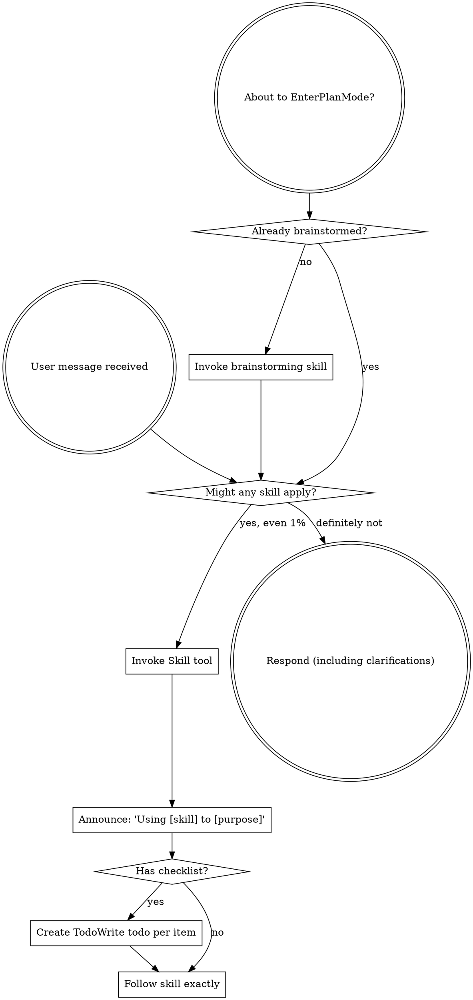

codex-exec: report contract violation

--- codex stdout ---
VERDICT: NOGO
CHANGE_1: PARTIAL — Rev 2 pins `.claude/settings.json`, requires `--repo-local-hooks`, and forbids global writes, but omits the complete executable command with overlay, target, and absolute repo-root arguments.
CHANGE_2: PARTIAL — Planning, no-match, secret, and benign ACs were added, but payload provenance is forgeable; no Claude debug-dispatch evidence exists, and P149/P152 lack specific live probes.
CHANGE_3: PARTIAL — T0 moved to P154, which requires authoritative schemas and a pre-fix-failing test, but its acceptance shape does not require successful post-fix real MCP calls.
CHANGE_4: ADDRESSED — T0 is split out; generic `block` was dropped; T2 registers the existing guard on Claude and requires both surfaces to resolve to one implementation.
PROVENANCE_SOUND: NO — A direct stdin spawn can submit `hook_event_name:"UserPromptSubmit"`, any stale `session_id`, and a copied existing Claude transcript path. Environment variables are unnecessary. Close this by having the verifier launch an actual Claude probe with a fresh nonce/session, capture Claude-generated debug hook-dispatch evidence, and correlate its nonce, session, transcript contents, timestamps, and new ledger row.
P149_COVERAGE: NEEDS_OWN_PROBE — The planning prompt matches compatibility route `planning-triage` (`/sgsd-triage`); P149 skill-routing is a separate concatenated registry and is not thereby exercised.
NEW_FINDINGS: 1. MAJOR — T1 says “do not bind any other hook event,” but the prescribed overlay contains SessionStart, UserPromptSubmit, and PostToolUse, and `merge-settings.js` merges every overlay event. On a clean target, the stop_rule is unreachable. Use a UserPromptSubmit-only overlay or explicitly permit all three.
BLAST_RADIUS: no — The prescribed repo-local mode requires exactly `<repo-root>/.claude/settings.json` and rejects home-global and escaping symlink targets. The global file was not inspected.
REMAINING_BLOCKERS: 1. Replace forgeable provenance with causally correlated Claude debug dispatch. 2. Add live P149 and P152 probes. 3. Resolve the three-event overlay contradiction. 4. State the full merge command. 5. Require real post-fix MCP calls in P154.

--- codex stderr ---
OpenAI Codex v0.146.0
--------
workdir: C:\Users\jack.berrow\AppData\Roaming\warp\Warp\data\worktrees\GSDedits\luminaria-hogback
model: gpt-5.6-sol
provider: openai
approval: never
sandbox: read-only
reasoning effort: xhigh
reasoning summaries: none
session id: 01a01521-a6ec-7d21-be44-496a3cb613ff
--------
user
# P153 Plan Review — ROUND 2 (post-NOGO re-review)

You reviewed rev 1 of this plan and returned NOGO. Rev 2 is now committed. Review it
again. Read only; do not modify any source file.

## Read these

- `.planning/milestones/v3.6-vtp-bridge/phases/153-hook-transport-completion/153-01-PLAN-LOCKED.md` (rev 2)
- `.planning/milestones/v3.6-vtp-bridge/phases/154-mcp-arg-contract/CONTEXT.md` (the split-out T0)
- `super-gsd/scripts/merge-settings.js`
- `super-gsd/config/repo-settings-overlay.json`
- `super-gsd/hooks/sgsd-intent-classifier.cjs`
- `super-gsd/tools/codex-hooks/block-secret-leak.cjs`

## Your four REQUIRED_CHANGES from round 1

1. Specify the exact target and command: preferably repo-local `--repo-local-hooks`;
   if global is mandatory, use a dedicated UserPromptSubmit-only overlay with an
   absolute installed script.
2. Require actual Claude-dispatched probes, with debug/provenance evidence, for
   planning, no-match, P149, P152, secret, and benign paths.
3. Validate T0 via authoritative schemas plus real MCP calls.
4. Split T0 and replace generic T2 with direct dual-surface guard registration, or
   justify a second current consumer.

## What rev 2 claims to have done

1. Pinned the target to `merge-settings.js --repo-local-hooks`; global settings
   explicitly forbidden and recorded as a known dead end.
2. Re-anchored the ACs on dispatch provenance — the route-decision row must carry
   `hook_event_name`, `session_id` and a `transcript_path` that RESOLVES ON DISK —
   plus a new control AC in which the classifier is spawned directly with the hook
   unregistered and the provenance assertion MUST FAIL.
3. T0 moved to P154 with an explicit acceptance note requiring authoritative schemas
   (not hand-copied duplicates) and a test that fails pre-fix.
4. T0 split out; the generic fifth `block` enforcement kind dropped entirely. T2 is
   now just: make the existing `block-secret-leak.cjs` exit 2 and register that same
   implementation on the Claude surface, with a `dual-surface-shared` AC asserting one
   shared implementation rather than a duplicated copy.

## Answer explicitly

**A. Change verification.** For EACH of your four required changes: ADDRESSED /
PARTIALLY ADDRESSED / NOT ADDRESSED, with the specific evidence you found in rev 2.

**B. Is the provenance mechanism sound?** Rev 2 asserts a harness spawn cannot supply
a `transcript_path` that resolves on disk. Attack that claim. Can a determined or
careless executor satisfy the provenance assertion without a genuine Claude dispatch —
for example by copying a real transcript path, reusing a stale session id, or setting
an env var? If yes, name the concrete bypass and say what would close it. This is the
single most important question in this review: rev 1 died on exactly this class of
defect and I need to know if rev 2 actually fixed it or just moved it.

**C. Coverage gap.** Your round-1 change #2 asked for probes covering P149 and P152
paths specifically. Rev 2's ACs cover planning-match, no-match, secret, benign,
dual-surface and P152-unchanged. Is the P149 skill-routing path adequately proven by
the planning-match AC, or does it need its own probe?

**D. Fresh adversarial pass.** Ignore round 1. Is there anything NEW wrong with rev 2 —
new complexity, a contradiction introduced by the revision, an AC that cannot actually
be implemented as written, or a task whose stop_rule is unreachable?

**E. Blast radius, re-checked.** With the target now repo-local, confirm the global
settings file cannot be touched by this plan as written. Note: the settings file
contains API keys in an env block — never read, print, echo or quote that block.

## Output format — exactly this, max 600 words

```
VERDICT: GO | GO-WITH-CHANGES | NOGO
CHANGE_1: ADDRESSED | PARTIAL | NOT — <evidence>
CHANGE_2: ADDRESSED | PARTIAL | NOT — <evidence>
CHANGE_3: ADDRESSED | PARTIAL | NOT — <evidence>
CHANGE_4: ADDRESSED | PARTIAL | NOT — <evidence>
PROVENANCE_SOUND: YES | NO — <concrete bypass if NO, and the fix>
P149_COVERAGE: SUFFICIENT | NEEDS_OWN_PROBE — <why>
NEW_FINDINGS: <numbered with severity CRIT|MAJOR|MINOR, or none>
BLAST_RADIUS: <can the global settings file be touched? yes/no + why>
REMAINING_BLOCKERS: <numbered, or none>
```

If rev 2 is good enough to execute, say GO. Do not manufacture findings to appear
rigorous — but do not wave through a provenance mechanism that does not actually
discriminate.

codex
I’m using the `using-superpowers` and `review` skills to structure this read-only re-review. I’ll inspect only the named plan/context and implementation files, and I will not read the global settings file or expose its env block.
exec
"C:\\WINDOWS\\System32\\WindowsPowerShell\\v1.0\\powershell.exe" -Command '$paths = @('"'C:\\Users\\jack.berrow\\.codex\\skills\\using-superpowers\\SKILL.md','C:\\Users\\jack.berrow\\.agents\\skills\\review\\SKILL.md'); foreach ("'$p in $paths) { "FILE: $p"; Get-Content -LiteralPath $p -Raw }' in C:\Users\jack.berrow\AppData\Roaming\warp\Warp\data\worktrees\GSDedits\luminaria-hogback
 succeeded in 1424ms:
FILE: C:\Users\jack.berrow\.codex\skills\using-superpowers\SKILL.md
---
name: using-superpowers
description: Use when starting any conversation - establishes how to find and use skills, requiring Skill tool invocation before ANY response including clarifying questions
---

<SUBAGENT-STOP>
If you were dispatched as a subagent to execute a specific task, skip this skill.
</SUBAGENT-STOP>

<EXTREMELY-IMPORTANT>
If you think there is even a 1% chance a skill might apply to what you are doing, you ABSOLUTELY MUST invoke the skill.

IF A SKILL APPLIES TO YOUR TASK, YOU DO NOT HAVE A CHOICE. YOU MUST USE IT.

This is not negotiable. This is not optional. You cannot rationalize your way out of this.
</EXTREMELY-IMPORTANT>

## Instruction Priority

Superpowers skills override default system prompt behavior, but **user instructions always take precedence**:

1. **User's explicit instructions** (CLAUDE.md, GEMINI.md, AGENTS.md, direct requests) ƒ?" highest priority
2. **Superpowers skills** ƒ?" override default system behavior where they conflict
3. **Default system prompt** ƒ?" lowest priority

If CLAUDE.md, GEMINI.md, or AGENTS.md says "don't use TDD" and a skill says "always use TDD," follow the user's instructions. The user is in control.

## How to Access Skills

**In Claude Code:** Use the `Skill` tool. When you invoke a skill, its content is loaded and presented to youƒ?"follow it directly. Never use the Read tool on skill files.

**In Copilot CLI:** Use the `skill` tool. Skills are auto-discovered from installed plugins. The `skill` tool works the same as Claude Code's `Skill` tool.

**In Gemini CLI:** Skills activate via the `activate_skill` tool. Gemini loads skill metadata at session start and activates the full content on demand.

**In other environments:** Check your platform's documentation for how skills are loaded.

## Platform Adaptation

Skills use Claude Code tool names. Non-CC platforms: see `references/copilot-tools.md` (Copilot CLI), `references/codex-tools.md` (Codex) for tool equivalents. Gemini CLI users get the tool mapping loaded automatically via GEMINI.md.

# Using Skills

## The Rule

**Invoke relevant or requested skills BEFORE any response or action.** Even a 1% chance a skill might apply means that you should invoke the skill to check. If an invoked skill turns out to be wrong for the situation, you don't need to use it.



## Red Flags

These thoughts mean STOPƒ?"you're rationalizing:

| Thought | Reality |
|---------|---------|
| "This is just a simple question" | Questions are tasks. Check for skills. |
| "I need more context first" | Skill check comes BEFORE clarifying questions. |
| "Let me explore the codebase first" | Skills tell you HOW to explore. Check first. |
| "I can check git/files quickly" | Files lack conversation context. Check for skills. |
| "Let me gather information first" | Skills tell you HOW to gather information. |
| "This doesn't need a formal skill" | If a skill exists, use it. |
| "I remember this skill" | Skills evolve. Read current version. |
| "This doesn't count as a task" | Action = task. Check for skills. |
| "The skill is overkill" | Simple things become complex. Use it. |
| "I'll just do this one thing first" | Check BEFORE doing anything. |
| "This feels productive" | Undisciplined action wastes time. Skills prevent this. |
| "I know what that means" | Knowing the concept ƒ%ÿ using the skill. Invoke it. |

## Skill Priority

When multiple skills could apply, use this order:

1. **Process skills first** (brainstorming, debugging) - these determine HOW to approach the task
2. **Implementation skills second** (frontend-design, mcp-builder) - these guide execution

"Let's build X" ā' brainstorming first, then implementation skills.
"Fix this bug" ā' debugging first, then domain-specific skills.

## Skill Types

**Rigid** (TDD, debugging): Follow exactly. Don't adapt away discipline.

**Flexible** (patterns): Adapt principles to context.

The skill itself tells you which.

## User Instructions

Instructions say WHAT, not HOW. "Add X" or "Fix Y" doesn't mean skip workflows.

FILE: C:\Users\jack.berrow\.agents\skills\review\SKILL.md
---
name: review
description: Review code changes for security, performance, bugs, and quality. Reviews staged changes, unstaged changes, specific commits, or PR-ready diffs.
---

<objective>
Review code changes and provide structured feedback covering security, performance, bug risks, code quality, and test coverage gaps. This skill analyzes diffs and surrounding context to catch issues before they reach production.
</objective>

<context>
This skill reviews code changes at various stages of the development workflow. It can review staged changes before a commit, unstaged work-in-progress, a specific commit, or the full set of changes on a branch that are ready for a pull request.

The reviewer reads both the diff and the surrounding source files to understand intent and catch issues that only appear in context.
</context>

<core_principle>
**FIND REAL ISSUES, NOT STYLE NITS.** Focus on problems that cause bugs, security vulnerabilities, performance degradation, or maintainability pain. Avoid nitpicking formatting or subjective style preferences unless they harm readability.
</core_principle>

<analysis_only_rule>
**THIS SKILL IS READ-ONLY. DO NOT MODIFY CODE.**

The purpose is to review and report findings. Making changes during review conflates the reviewer and author roles. Present findings and let the user decide what to act on.
</analysis_only_rule>

<quick_start>

<determine_review_scope>

Parse the user's input to determine what to review:

1. **No arguments** - Review staged changes first. If nothing is staged, review unstaged changes.
   - Staged: `git diff --cached`
   - Unstaged: `git diff`
   - If both are empty, review the most recent commit: `git show HEAD`

2. **Commit hash argument** (e.g., `/review abc1234`) - Review that specific commit.
   - `git show <hash>`

3. **File path argument** (e.g., `/review src/foo.ts`) - Review unstaged changes in that file.
   - `git diff -- <path>` then fall back to `git diff --cached -- <path>`

4. **"pr" argument** (e.g., `/review pr`) - Review all changes since branching from main.
   - `git diff main...HEAD`
   - If on main, review `git diff HEAD~1`

After obtaining the diff, if it is empty, inform the user that there are no changes to review and stop.

</determine_review_scope>

<gather_context>

Before analyzing the diff:

1. **Read changed files in full** - Do not review a diff in isolation. Read each modified file to understand the surrounding code, imports, types, and control flow.
2. **Identify the tech stack** - Note languages, frameworks, and libraries in use. This affects what patterns are risky.
3. **Check for related test files** - For each changed source file, look for corresponding test files. Note whether tests were updated alongside the changes.
4. **Check for configuration changes** - If config files changed (env, CI, package.json, tsconfig, etc.), pay extra attention to side effects.

</gather_context>

<review_categories>

Analyze the changes against each category below. Only report findings that are actually present. Skip categories with no issues.

**A. Security Issues** (Severity: CRITICAL or HIGH)
- Injection vulnerabilities (SQL injection, command injection, template injection)
- Cross-site scripting (XSS) - unsanitized user input rendered in HTML
- Authentication and authorization flaws (missing auth checks, privilege escalation)
- Secrets or credentials hardcoded or logged
- Insecure deserialization or unsafe eval usage
- Path traversal or file access vulnerabilities
- Missing input validation on external data

**B. Performance Concerns** (Severity: HIGH or MEDIUM)
- N+1 query patterns in database access
- Unnecessary memory allocations in hot paths or loops
- Blocking operations on the main thread or in async contexts
- Missing pagination on unbounded queries
- Redundant computation that could be cached or memoized
- Large payloads without streaming or chunking

**C. Bug Risks** (Severity: HIGH or MEDIUM)
- Off-by-one errors in loops or array access
- Null/undefined dereferences without guards
- Race conditions in concurrent or async code
- Incorrect error handling (swallowed errors, wrong error types)
- Type mismatches or unsafe type assertions
- Logic errors in conditionals (inverted checks, missing cases)
- Resource leaks (unclosed connections, file handles, listeners)

**D. Code Quality** (Severity: MEDIUM or LOW)
- Unclear or misleading naming
- Significant code duplication that should be extracted
- Excessive complexity (deeply nested logic, functions doing too many things)
- Dead code or unreachable branches
- Missing or misleading comments on non-obvious logic
- Inconsistency with patterns used elsewhere in the codebase

**E. Test Coverage Gaps** (Severity: MEDIUM or LOW)
- New logic paths without corresponding test cases
- Changed behavior without updated tests
- Edge cases not covered (empty inputs, boundary values, error paths)
- Missing integration tests for new API endpoints or database changes

</review_categories>

<format_findings>

For each finding, use this structure:

```
### [SEVERITY] Category: Brief Title

**File**: `path/to/file.ext` (lines X-Y)

**Issue**: Clear description of the problem.

**Why it matters**: What could go wrong if this is not addressed.

**Suggestion**: How to fix it, with a code snippet if helpful.
```

Severity levels:
- **CRITICAL** - Must fix before merge. Security vulnerability or data loss risk.
- **HIGH** - Should fix before merge. Likely bug or significant performance issue.
- **MEDIUM** - Should fix soon. Code quality or moderate risk issue.
- **LOW** - Consider fixing. Minor improvement opportunity.

</format_findings>

</quick_start>

<critical_rules>

1. **READ THE FULL FILE**: Never review a diff without reading the complete source file for context
2. **NO FALSE ALARMS**: Only report issues you can explain concretely. Do not report vague concerns
3. **PRIORITIZE**: Lead with the most severe findings. Do not bury critical issues under style nits
4. **BE SPECIFIC**: Include file paths, line numbers, and code references for every finding
5. **EXPLAIN THE RISK**: For each finding, explain what could actually go wrong
6. **CHECK TESTS**: Always check whether changes have corresponding test updates
7. **CONSIDER THE STACK**: Apply language-specific and framework-specific knowledge to your review
8. **DO NOT MODIFY CODE**: Present findings only. The user decides what to act on

</critical_rules>

<output_format>

```markdown
## Code Review: [brief description of what was reviewed]

**Scope**: [staged changes | unstaged changes | commit abc1234 | PR changes from main]
**Files reviewed**: [count] files changed, [additions] additions, [deletions] deletions

---

### Findings

[Findings grouped by severity, highest first. Use the format from <format_findings>.]

---

### Summary

| Severity | Count |
|----------|-------|
| CRITICAL | X     |
| HIGH     | X     |
| MEDIUM   | X     |
| LOW      | X     |

### Recommended Actions

1. [Most important action to take]
2. [Next most important action]
3. [...]
```

If no issues are found:

```markdown
## Code Review: [brief description]

**Scope**: [what was reviewed]
**Files reviewed**: [count]

No significant issues found. The changes look good to merge.
```

</output_format>

<decision_gate>

**After presenting findings, ALWAYS offer these options:**

```
ƒ"?ƒ"?ƒ"?ƒ"?ƒ"?ƒ"?ƒ"?ƒ"?ƒ"?ƒ"?ƒ"?ƒ"?ƒ"?ƒ"?ƒ"?ƒ"?ƒ"?ƒ"?ƒ"?ƒ"?ƒ"?ƒ"?ƒ"?ƒ"?ƒ"?ƒ"?ƒ"?ƒ"?ƒ"?ƒ"?ƒ"?ƒ"?ƒ"?ƒ"?ƒ"?ƒ"?ƒ"?ƒ"?ƒ"?ƒ"?ƒ"?
REVIEW COMPLETE

What would you like to do?

1. **Fix issues** - I'll address the findings starting with the most critical
2. **Save review** - Export findings to a markdown file
3. **Review again** - Re-review with different scope or focus
4. **Discuss a finding** - Ask questions about a specific issue
5. **Other** - Tell me what you need
ƒ"?ƒ"?ƒ"?ƒ"?ƒ"?ƒ"?ƒ"?ƒ"?ƒ"?ƒ"?ƒ"?ƒ"?ƒ"?ƒ"?ƒ"?ƒ"?ƒ"?ƒ"?ƒ"?ƒ"?ƒ"?ƒ"?ƒ"?ƒ"?ƒ"?ƒ"?ƒ"?ƒ"?ƒ"?ƒ"?ƒ"?ƒ"?ƒ"?ƒ"?ƒ"?ƒ"?ƒ"?ƒ"?ƒ"?ƒ"?ƒ"?
```

**Wait for user response before taking any action.**

This gate is MANDATORY. Never skip it. Never auto-implement fixes.

</decision_gate>

C:\Users\jack.berrow\OneDrive - John Cullen Lighting\Documents\WindowsPowerShell\profile.ps1 : Cannot dot-source this 
command because it was defined in a different language mode. To invoke this command without importing its contents, 
omit the '.' operator.
At line:1 char:1
+ . 'C:\Users\jack.berrow\OneDrive - John Cullen Lighting\Documents\Win ...
+ ~~~~~~~~~~~~~~~~~~~~~~~~~~~~~~~~~~~~~~~~~~~~~~~~~~~~~~~~~~~~~~~~~~~~~
    + CategoryInfo          : InvalidOperation: (:) [profile.ps1], NotSupportedException
    + FullyQualifiedErrorId : DotSourceNotSupported,profile.ps1
 
C:\Users\jack.berrow\OneDrive - John Cullen Lighting\Documents\WindowsPowerShell\Microsoft.PowerShell_profile.ps1 : 
Cannot dot-source this command because it was defined in a different language mode. To invoke this command without 
importing its contents, omit the '.' operator.
At line:1 char:1
+ . 'C:\Users\jack.berrow\OneDrive - John Cullen Lighting\Documents\Win ...
+ ~~~~~~~~~~~~~~~~~~~~~~~~~~~~~~~~~~~~~~~~~~~~~~~~~~~~~~~~~~~~~~~~~~~~~
    + CategoryInfo          : InvalidOperation: (:) [Microsoft.PowerShell_profile.ps1], NotSupportedException
    + FullyQualifiedErrorId : DotSourceNotSupported,Microsoft.PowerShell_profile.ps1
 

codex
The skills reinforce the user’s requested boundary: this is analysis-only, with findings limited to concrete execution or test defects. I’m now reading the six named files in full and tracing the repo-local merge behavior and hook payload handling; no global settings path will be opened.
exec
"C:\\WINDOWS\\System32\\WindowsPowerShell\\v1.0\\powershell.exe" -Command '$files = @('"'.planning/milestones/v3.6-vtp-bridge/phases/153-hook-transport-completion/153-01-PLAN-LOCKED.md','.planning/milestones/v3.6-vtp-bridge/phases/154-mcp-arg-contract/CONTEXT.md','super-gsd/scripts/merge-settings.js','super-gsd/config/repo-settings-overlay.json','super-gsd/hooks/sgsd-intent-classifier.cjs','super-gsd/tools/codex-hooks/block-secret-leak.cjs'); foreach ("'$f in $files) { $n = (Get-Content -LiteralPath $f).Count; "$f`t$n" }' in C:\Users\jack.berrow\AppData\Roaming\warp\Warp\data\worktrees\GSDedits\luminaria-hogback
 succeeded in 1274ms:
.planning/milestones/v3.6-vtp-bridge/phases/153-hook-transport-completion/153-01-PLAN-LOCKED.md	207
.planning/milestones/v3.6-vtp-bridge/phases/154-mcp-arg-contract/CONTEXT.md	60
super-gsd/scripts/merge-settings.js	770
super-gsd/config/repo-settings-overlay.json	48
super-gsd/hooks/sgsd-intent-classifier.cjs	855
super-gsd/tools/codex-hooks/block-secret-leak.cjs	80
C:\Users\jack.berrow\OneDrive - John Cullen Lighting\Documents\WindowsPowerShell\profile.ps1 : Cannot dot-source this 
command because it was defined in a different language mode. To invoke this command without importing its contents, 
omit the '.' operator.
At line:1 char:1
+ . 'C:\Users\jack.berrow\OneDrive - John Cullen Lighting\Documents\Win ...
+ ~~~~~~~~~~~~~~~~~~~~~~~~~~~~~~~~~~~~~~~~~~~~~~~~~~~~~~~~~~~~~~~~~~~~~
    + CategoryInfo          : InvalidOperation: (:) [profile.ps1], NotSupportedException
    + FullyQualifiedErrorId : DotSourceNotSupported,profile.ps1
 
C:\Users\jack.berrow\OneDrive - John Cullen Lighting\Documents\WindowsPowerShell\Microsoft.PowerShell_profile.ps1 : 
Cannot dot-source this command because it was defined in a different language mode. To invoke this command without 
importing its contents, omit the '.' operator.
At line:1 char:1
+ . 'C:\Users\jack.berrow\OneDrive - John Cullen Lighting\Documents\Win ...
+ ~~~~~~~~~~~~~~~~~~~~~~~~~~~~~~~~~~~~~~~~~~~~~~~~~~~~~~~~~~~~~~~~~~~~~
    + CategoryInfo          : InvalidOperation: (:) [Microsoft.PowerShell_profile.ps1], NotSupportedException
    + FullyQualifiedErrorId : DotSourceNotSupported,Microsoft.PowerShell_profile.ps1
 

exec
"C:\\WINDOWS\\System32\\WindowsPowerShell\\v1.0\\powershell.exe" -Command '$files = @('"'.planning/milestones/v3.6-vtp-bridge/phases/153-hook-transport-completion/153-01-PLAN-LOCKED.md','.planning/milestones/v3.6-vtp-bridge/phases/154-mcp-arg-contract/CONTEXT.md','super-gsd/config/repo-settings-overlay.json','super-gsd/tools/codex-hooks/block-secret-leak.cjs'); foreach ("'$f in $files) { "===== $f ====="; $i=0; Get-Content -LiteralPath $f | ForEach-Object { $i++; '"'{0,4}: {1}' -f "'$i, $_ } }' in C:\Users\jack.berrow\AppData\Roaming\warp\Warp\data\worktrees\GSDedits\luminaria-hogback
 succeeded in 1362ms:
===== .planning/milestones/v3.6-vtp-bridge/phases/153-hook-transport-completion/153-01-PLAN-LOCKED.md =====
   1: ---
   2: schema_version: 2
   3: phase: "153"
   4: slug: "hook-transport-completion"
   5: milestone: "v3.6-vtp-bridge"
   6: status: "PLANNED"
   7: revision: 2
   8: supersedes: "153-01-PLAN-LOCKED.md rev 1 (NOGO at plan review, 2026-08-18)"
   9: depends_on: ["149", "151", "152"]
  10: intent: "Register the UserPromptSubmit hook that P149/P151/P152 governance already depends on, repo-locally, and prove it fires under genuine Claude Code dispatch rather than under a harness spawn. Then make the existing secret-leak guard actually block. Rev 2 after Codex plan review returned NOGO: target ambiguity fixed to repo-local, ACs re-anchored on dispatch provenance, T0 split out to P154, generic block kind dropped."
  11: execution_mode: "serial-codex"
  12: expected_ATC_tier: "FULL"
  13: skip_gates: []
  14: lessons_path: null
  15: prior_errors_lookup: true
  16: semantic_acceptance_criteria:
  17:   - input: "The repo-local .claude/settings.json after merge-settings.js --repo-local-hooks has installed the overlay."
  18:     expected_outcome: "A UserPromptSubmit event is registered whose command resolves to sgsd-intent-classifier.cjs, and EVERY command in the hooks section resolves to a file that exists on disk (no broken repo-relative args). The assertion reads only the hooks section by key and never touches the env block."
  19:     verification_cmd: "node super-gsd/tests/hook-transport/assert-registration.cjs"
  20:   - input: "A planning-shaped prompt (how should we architect the retry layer) submitted in a genuine Claude Code session with the hook registered."
  21:     expected_outcome: "A route-decision row is appended that names the matched route AND carries dispatch provenance from the hook payload: hook_event_name equal to UserPromptSubmit, a session_id, and a transcript_path that exists on disk under the Claude projects directory. A row lacking a resolvable transcript_path fails, because a harness spawn cannot supply one."
  22:     verification_cmd: "node super-gsd/tests/hook-transport/assert-live-route-decision.cjs --direction positive --require-dispatch-provenance"
  23:   - input: "An execution-shaped prompt (fix the failing test in parser.cjs) submitted in the same genuine session."
  24:     expected_outcome: "A row is appended that explicitly records no match, carrying the same dispatch provenance. An absent row fails the assertion, because absence is indistinguishable from the hook never running."
  25:     verification_cmd: "node super-gsd/tests/hook-transport/assert-live-route-decision.cjs --direction negative --require-dispatch-provenance"
  26:   - input: "The same two prompts replayed by spawning sgsd-intent-classifier.cjs directly, with the hook deliberately unregistered."
  27:     expected_outcome: "The provenance assertion FAILS. This control run proves the falsifier discriminates genuine Claude dispatch from a harness spawn; if it passes, the falsifier is not falsifying and the task is incomplete."
  28:     verification_cmd: "node super-gsd/tests/hook-transport/assert-live-route-decision.cjs --control unregistered-must-fail"
  29:   - input: "A prompt containing a credential pattern such as an API_KEY assignment, submitted through the registered Claude Code UserPromptSubmit surface."
  30:     expected_outcome: "The hook process exits with code 2 and writes an operator-facing reason to stderr naming the matched trigger. The reason contains no secret material - not the captured value, not a substring of it. The assertion reads the real exit code of a spawned process, not a mocked return value."
  31:     verification_cmd: "node super-gsd/tests/hook-transport/assert-block-guard.cjs --case secret"
  32:   - input: "A benign prompt with no credential pattern submitted to the same surface."
  33:     expected_outcome: "The hook process exits 0, writes no block reason, and the prompt is not suppressed."
  34:     verification_cmd: "node super-gsd/tests/hook-transport/assert-block-guard.cjs --case benign"
  35:   - input: "The block-secret-leak implementation as invoked from both the Codex hook surface and the Claude Code hook surface."
  36:     expected_outcome: "Both surfaces execute the SAME implementation module - one file, two callers - and both produce identical block decisions for the identical payload. A duplicated second copy of the detection logic fails the assertion."
  37:     verification_cmd: "node super-gsd/tests/hook-transport/assert-block-guard.cjs --case dual-surface-shared"
  38:   - input: "The existing P152 kb-lookup-triage shadow route after this phase changes."
  39:     expected_outcome: "It remains enforcement kind shadow, injects nothing, and its text-free ledger contract is unchanged; the 28-day promote-or-kill metric is not pre-empted."
  40:     verification_cmd: "node super-gsd/tests/kb-triage-shadow/assert-shadow.cjs"
  41: known_deadends:
  42:   - "Merging repo-settings-overlay.json into the GLOBAL settings file. Verified 2026-08-18: that overlay declares THREE events (SessionStart, UserPromptSubmit, PostToolUse) with bare relative node commands, so a global merge installs two unrelated hooks with repo-relative args into every project. This is the install-vs-project seam (instance #6 class). Use merge-settings.js --repo-local-hooks."
  43:   - "Asserting the negative direction by checking that no telemetry row exists. Absence is indistinguishable from the hook never running. This made P150 trust probe report a false negative (seam instance #6)."
  44:   - "Proving the hook works by spawning the classifier directly after checking registration. That proves nothing about whether Claude Code dispatched it, and was the NOGO finding against rev 1 of this plan (seam instance #9). The falsifier must assert on payload provenance a direct spawn cannot supply."
  45:   - "Adding a generic fifth enforcement kind `block` to the classifier registry. Dropped at plan review as YAGNI: there is exactly one current consumer and it is a standalone guard, so the abstraction only anticipates a metric-locked P152 promotion. Revisit when a second real consumer exists."
  46:   - "Porting disler/claude-code-hooks-mastery Python/uv hooks. hooks.yaml sets timeout_sec 2 and uv cold-start on Windows exceeds it on every tool call. That repo has NO LICENSE (all-rights-reserved); only the Claude Code event taxonomy and exit-code semantics are used, which are facts about the platform rather than his code."
  47: tasks:
  48:   - id: "P153-T1"
  49:     type: "hook-registration"
  50:     agent: codex
  51:     model: codex
  52:     depends_on: []
  53:     files_touched:
  54:       - "super-gsd/config/repo-settings-overlay.json"
  55:       - "super-gsd/registry/hooks.yaml"
  56:       - "super-gsd/hooks/sgsd-intent-classifier.cjs"
  57:       - "super-gsd/tests/hook-transport/assert-registration.cjs"
  58:       - "super-gsd/tests/hook-transport/assert-live-route-decision.cjs"
  59:     input_contract: >
  60:       sgsd-intent-classifier.cjs self-declares as a UserPromptSubmit hook but no
  61:       UserPromptSubmit event is registered, so P149 skill-routing, P151 demand baseline and
  62:       P152 shadow never execute live. Register it REPO-LOCALLY using the existing
  63:       merge-settings.js --repo-local-hooks mode, which resolves script paths against the repo
  64:       root. Do NOT merge into the global settings file: the overlay declares three events with
  65:       bare relative node commands and a global merge would install unrelated hooks with
  66:       repo-relative args into every project. Add the corresponding UserPromptSubmit row to
  67:       hooks.yaml. Ensure the classifier captures dispatch provenance from the hook payload
  68:       (hook_event_name, session_id, transcript_path, cwd) into its route-decision row, and
  69:       ensure it appends an EXPLICIT no-match row when no route matches - if it does not do so
  70:       today, adding that row is part of this task. CRITICAL: never read, print or echo the
  71:       settings env block; inspect only the hooks section by key.
  72:     output_contract: >
  73:       UserPromptSubmit mapped to sgsd-intent-classifier.cjs is registered repo-locally and
  74:       reflected in hooks.yaml. assert-registration.cjs confirms registration and that every
  75:       hook command resolves to an existing file. assert-live-route-decision.cjs proves three
  76:       things: a planning-shaped prompt appends a row naming the matched route with valid
  77:       dispatch provenance; an execution-shaped prompt appends an explicit no-match row with
  78:       the same provenance; and a deliberate-unregistration direct-spawn control run FAILS the
  79:       provenance assertion.
  80:     hypothesis: "The mechanism is complete and merely unregistered; installing it repo-locally through the existing merge path makes P149/P151/P152 execute live, and asserting on payload provenance that only genuine Claude dispatch supplies makes the proof unfakeable by a harness spawn."
  81:     falsifier: >
  82:       The control run passes when the hook is unregistered and the classifier is spawned
  83:       directly, proving the assertion does not discriminate genuine dispatch; or registration
  84:       succeeds but no route-decision row appears for a planning-shaped prompt; or a hook
  85:       command in the merged settings points at a path that does not exist; or any assertion
  86:       reads the settings env block; or the global settings file is modified.
  87:     stop_rule: >
  88:       Stop when repo-local registration is confirmed, both directions write rows carrying
  89:       valid dispatch provenance, and the unregistered control run fails as required. Do not
  90:       bind any other hook event and do not touch the global settings file.
  91:     verification:
  92:       commands:
  93:         - "node super-gsd/tests/hook-transport/assert-registration.cjs"
  94:         - "node super-gsd/tests/hook-transport/assert-live-route-decision.cjs --direction positive --require-dispatch-provenance"
  95:         - "node super-gsd/tests/hook-transport/assert-live-route-decision.cjs --direction negative --require-dispatch-provenance"
  96:         - "node super-gsd/tests/hook-transport/assert-live-route-decision.cjs --control unregistered-must-fail"
  97:         - "node super-gsd/hooks/sgsd-intent-classifier.cjs --self-test"
  98:   - id: "P153-T2"
  99:     type: "blocking-guard"
 100:     agent: codex
 101:     model: codex
 102:     depends_on: ["P153-T1"]
 103:     files_touched:
 104:       - "super-gsd/tools/codex-hooks/block-secret-leak.cjs"
 105:       - "super-gsd/config/repo-settings-overlay.json"
 106:       - "super-gsd/tests/hook-transport/assert-block-guard.cjs"
 107:     input_contract: >
 108:       block-secret-leak.cjs already reads UserPromptSubmit JSON from stdin and detects
 109:       credential-bearing prompts, but it is wired only to the Codex hook surface and does not
 110:       block. Make it block by exiting 2 with an operator-facing stderr reason naming the
 111:       matched trigger, and register that SAME implementation on the Claude Code
 112:       UserPromptSubmit surface via the repo-local overlay. One implementation, two callers -
 113:       extend, do not duplicate the detection logic. Exit 2 is the documented Claude Code
 114:       contract for blocking a UserPromptSubmit hook. Do NOT add a generic fifth enforcement
 115:       kind to the classifier registry: that was dropped at plan review as YAGNI with only one
 116:       current consumer. HARD CONSTRAINT: the P152 kb-lookup-triage route stays kind shadow;
 117:       do not flip it, its 28-day metric has not unlocked. The stderr reason names the trigger
 118:       and MUST NOT contain the matched credential value or any substring of it.
 119:     output_contract: >
 120:       A credential-bearing prompt on the Claude Code surface exits 2 with a stderr reason
 121:       naming the trigger and containing no secret material; a benign prompt exits 0; both the
 122:       Codex and Claude Code surfaces invoke a single shared implementation and return
 123:       identical decisions for identical payloads. P152 remains shadow and assert-shadow.cjs
 124:       still passes.
 125:     hypothesis: "Warning-only enforcement does not change agent behaviour - the AHE paper records correct middleware warnings appended to tool output being ignored on the very next model turn, while hard-block at the shell layer produced the run's largest score jump - so making the existing guard exit 2 on the Claude surface is the smallest change that converts an inert detector into an actual control."
 126:     falsifier: >
 127:       A credential-bearing prompt is not blocked, or is blocked without a stderr reason naming
 128:       the trigger, or the reason leaks the matched secret or a substring of it; a benign prompt
 129:       is blocked; the two surfaces run separate copies of the detection logic; a generic block
 130:       kind is added to the classifier registry; or the P152 shadow route changes behaviour.
 131:     stop_rule: >
 132:       Stop when the guard blocks and passes correctly on real spawned processes from the Claude
 133:       surface, both surfaces share one implementation, and assert-shadow.cjs still passes. Do
 134:       not flip P152 and do not add further blocking routes.
 135:     verification:
 136:       commands:
 137:         - "node super-gsd/tests/hook-transport/assert-block-guard.cjs --case secret"
 138:         - "node super-gsd/tests/hook-transport/assert-block-guard.cjs --case benign"
 139:         - "node super-gsd/tests/hook-transport/assert-block-guard.cjs --case dual-surface-shared"
 140:         - "node super-gsd/tests/kb-triage-shadow/assert-shadow.cjs"
 141: ---
 142: 
 143: # P153 ƒ?" Hook Transport Completion (rev 2)
 144: 
 145: ## Goal
 146: 
 147: `sgsd-intent-classifier.cjs` self-declares as a UserPromptSubmit hook. No UserPromptSubmit
 148: event is registered, so the governance built across P149 (skill-routing), P151 (demand
 149: baseline) and P152 (KB-triage shadow) never executes in a live session. This phase
 150: registers the hook repo-locally, proves it fires under genuine Claude Code dispatch, and
 151: makes the existing secret-leak guard actually block.
 152: 
 153: ## Revision history
 154: 
 155: Rev 1 (commit `6aff797`) was returned **NOGO** by Codex plan review on 2026-08-18. Three
 156: findings were accepted and one refined:
 157: 
 158: - **CRIT, accepted.** Rev 1 said "merge the overlay" without naming the target. The overlay
 159:   declares three events with bare relative `node` commands, so a global merge would install
 160:   SessionStart and PostToolUse hooks with repo-relative args into every project. Rev 2 pins
 161:   the target to `merge-settings.js --repo-local-hooks`.
 162: - **All ACs fakeable, accepted.** Rev 1's "live falsifier" checked registration and then
 163:   spawned the classifier directly ƒ?" which proves nothing about whether Claude Code dispatched
 164:   it. That is the harness-green/production-dead pattern, instance #9, inside the plan meant
 165:   to fix instances #7 and #8. Rev 2 anchors the ACs on payload provenance and adds an
 166:   unregistered-control run that must fail.
 167: - **MUDA overproduction, accepted.** T0 (MCP arg contract) is a separate defect, not hook
 168:   transport. Split to P154.
 169: - **Refined.** The review demanded "actual Claude-dispatched probes" without a mechanism. A
 170:   test cannot drive a real session, but it can require `transcript_path` to resolve on disk ƒ?"
 171:   something a harness spawn cannot fabricate. That makes the requirement implementable.
 172: 
 173: The generic fifth `block` enforcement kind was dropped: one current consumer, and it is a
 174: standalone guard. Revisit when a second real consumer exists.
 175: 
 176: ## Tasks
 177: 
 178: **T1** registers the hook repo-locally, captures dispatch provenance, and adds the explicit
 179: no-match row. Its control run must fail, or the falsifier is not falsifying.
 180: 
 181: **T2** makes the existing guard exit 2 on the Claude surface from a single shared
 182: implementation. No new abstraction.
 183: 
 184: ## Orchestrator-owned (not a Codex task)
 185: 
 186: `STATE.md` frontmatter `current_phase` is stale at "150" while v3.6 has P151/P152 closed.
 187: This mis-targeted a runtime-derived evidence path during this phase's own triage. State
 188: files are orchestrator-owned per commit discipline, so the orchestrator corrects it at
 189: phase close.
 190: 
 191: ## Verification
 192: 
 193: Eight `semantic_acceptance_criteria`, all against real data: the real repo-local settings
 194: file, real spawned processes and their real exit codes, and route-decision rows carrying
 195: provenance that resolves on disk. No structural greps stand in for behaviour.
 196: 
 197: ## Success Criteria
 198: 
 199: - UserPromptSubmit registered repo-locally; every merged hook command resolves to an existing file.
 200: - Planning-shaped prompt writes a row naming the matched route with valid dispatch provenance.
 201: - Execution-shaped prompt writes an explicit no-match row with the same provenance.
 202: - The unregistered direct-spawn control run FAILS the provenance assertion.
 203: - Credential-bearing prompt exits 2 with a trigger-naming reason carrying no secret material.
 204: - Benign prompt exits 0.
 205: - Both hook surfaces share one implementation of the guard.
 206: - P152 remains shadow; `assert-shadow.cjs` passes.
 207: - The global settings file is unmodified.
===== .planning/milestones/v3.6-vtp-bridge/phases/154-mcp-arg-contract/CONTEXT.md =====
   1: ---
   2: phase: "154"
   3: slug: mcp-arg-contract
   4: milestone: v3.6-vtp-bridge
   5: status: PENDING
   6: depends_on: []
   7: split_from: "153"
   8: split_reason: "Codex plan review 2026-08-18 flagged this as MUDA overproduction bundled into P153 ƒ?" it is an MCP-contract defect, not hook transport."
   9: ---
  10: 
  11: # P154 Context ƒ?" Triage Runtime MCP Arg Contract
  12: 
  13: ## Goal
  14: `super-gsd/scripts/sgsd-triage-runtime.cjs` emits MCP call args that the target
  15: MCP tools reject, so the staged "runtime decides, Claude transports" protocol
  16: built in P148 cannot be executed verbatim as its own skill specifies. Every
  17: `/sgsd-triage` run therefore degrades silently.
  18: 
  19: ## Verified evidence (reproduced 2026-08-18 while running /sgsd-triage)
  20: 
  21: 1. **`vtp_route_and_retrieve`** ƒ?" the runtime emits `context.recent_turns` as an
  22:    array of bare strings. The tool schema requires an array of objects each
  23:    carrying a `text` string. Executing the emitted call verbatim returns a hard
  24:    `MCP error -32602: Input validation error ... expected object, received string`.
  25: 2. **`vtp_search_substrate`** ƒ?" the runtime emits `raw_query`, `context` and
  26:    `fallback_reason`. That tool's schema accepts only `query` plus optional typed
  27:    filters (`limit`, `source_types`, `entity_types`, `project_ids`,
  28:    `speaker_ids`, `topics`, `meeting_ids`).
  29: 
  30: Consequence: the skill instructs "execute the emitted MCP call VERBATIM ... No
  31: interpretation", but verbatim execution fails. The operator-facing effect is that
  32: triage silently falls back or degrades rather than enriching.
  33: 
  34: This is seam instance **#8** of `harness-production-seam-four-layers` ƒ?" and it sits
  35: inside the mechanism P148 built to fix seam bugs.
  36: 
  37: ## Scope
  38: Per-tool arg-shaper at the emission seam so every emitted call is schema-valid for
  39: its target tool, plus a conformance test that validates emitted args against each
  40: tool's authoritative schema.
  41: 
  42: Do NOT change routing logic, predicate evaluation, or which tool is selected. Only
  43: the shape of the emitted args changes.
  44: 
  45: ## Acceptance shape (for the planner)
  46: - Validate against the **authoritative** tool schemas, not a hand-copied local
  47:   duplicate that can drift. Codex plan review called this out explicitly against
  48:   P153 rev 1.
  49: - The conformance test MUST fail against the pre-fix runtime. A test that passes
  50:   both before and after does not exercise the defect.
  51: - Cover both the `vtp-plan` stage and the `vtp-consume` fallback stage.
  52: 
  53: ## Boundary
  54: - No change to route selection, predicates, or degradation policy.
  55: - No new MCP tools wired.
  56: - Does not depend on P153 and does not block it.
  57: 
  58: ## Provenance
  59: Split out of P153 at plan review (rev 1 NOGO, 2026-08-18). P153 rev 2 carries the
  60: hook-transport work only.
===== super-gsd/config/repo-settings-overlay.json =====
   1: {
   2:   "_comment": "Merge into <repo>/.claude/settings.json via super-gsd/scripts/merge-settings.js --repo-local-hooks. Hook script args are repo-relative here and resolved to absolute target-repo paths at install time.",
   3:   "hooks": {
   4:     "SessionStart": [
   5:       {
   6:         "sgsd_managed": true,
   7:         "sgsd_hook_id": "session-start-governance",
   8:         "hooks": [
   9:           {
  10:             "type": "command",
  11:             "command": "node",
  12:             "args": ["super-gsd/hooks/sgsd-session-start.js"],
  13:             "timeout": 5
  14:           }
  15:         ]
  16:       }
  17:     ],
  18:     "UserPromptSubmit": [
  19:       {
  20:         "sgsd_managed": true,
  21:         "sgsd_hook_id": "user-prompt-intent-classifier",
  22:         "hooks": [
  23:           {
  24:             "type": "command",
  25:             "command": "node",
  26:             "args": ["super-gsd/hooks/sgsd-intent-classifier.cjs"],
  27:             "timeout": 5
  28:           }
  29:         ]
  30:       }
  31:     ],
  32:     "PostToolUse": [
  33:       {
  34:         "sgsd_managed": true,
  35:         "sgsd_hook_id": "post-tool-use-quality-gate",
  36:         "matcher": "Edit|Write|NotebookEdit",
  37:         "hooks": [
  38:           {
  39:             "type": "command",
  40:             "command": "node",
  41:             "args": ["super-gsd/hooks/sgsd-quality-gate.js"],
  42:             "timeout": 10
  43:           }
  44:         ]
  45:       }
  46:     ]
  47:   }
  48: }
===== super-gsd/tools/codex-hooks/block-secret-leak.cjs =====
   1: #!/usr/bin/env node
   2: "use strict";
   3: 
   4: const fs = require("fs");
   5: const path = require("path");
   6: 
   7: const HOOK_NAME = "block-secret-leak";
   8: const repoRoot = path.resolve(__dirname, "../../..");
   9: const metricsPath = path.resolve(repoRoot, ".planning/metrics/codex-tool-events.jsonl");
  10: const secretPatterns = [
  11:   /API_KEY\s*=\s*[A-Za-z0-9_-]{8,}/,
  12:   /sk_[A-Za-z0-9_]{20,}/,
  13:   /BEGIN PRIVATE KEY/,
  14:   /password\s*=\s*[^\s]+/i,
  15:   /production\s+credential/i
  16: ];
  17: 
  18: function usage() {
  19:   return [
  20:     "Usage:",
  21:     "  node block-secret-leak.cjs [--help]",
  22:     "  node block-secret-leak.cjs --self-test-secret",
  23:     "",
  24:     "Reads Codex UserPromptSubmit JSON from stdin: { prompt }.",
  25:     "Blocks prompts that appear to include credentials or private keys."
  26:   ].join("\n");
  27: }
  28: 
  29: function appendDecision(decision) {
  30:   fs.mkdirSync(path.dirname(metricsPath), { recursive: true });
  31:   fs.appendFileSync(metricsPath, `${JSON.stringify(Object.assign({ ts: new Date().toISOString(), hook: HOOK_NAME }, decision))}\n`, "utf8");
  32: }
  33: 
  34: function readPayload() {
  35:   const input = fs.readFileSync(0, "utf8").trim();
  36:   if (!input) throw new Error("missing stdin JSON payload");
  37:   return JSON.parse(input);
  38: }
  39: 
  40: function evaluate(payload) {
  41:   const prompt = payload && typeof payload.prompt === "string" ? payload.prompt : null;
  42:   if (prompt === null) {
  43:     return { allow: false, reason: "prompt_missing" };
  44:   }
  45:   const matched = secretPatterns.find((pattern) => pattern.test(prompt));
  46:   if (matched) {
  47:     return { allow: false, reason: "secret_pattern_detected", pattern: String(matched) };
  48:   }
  49:   return { allow: true, reason: "no_secret_pattern" };
  50: }
  51: 
  52: function main() {
  53:   if (process.argv.includes("--help") || process.argv.includes("-h")) {
  54:     console.log(usage());
  55:     return 0;
  56:   }
  57: 
  58:   let payload;
  59:   if (process.argv.includes("--self-test-secret")) {
  60:     payload = { prompt: "deploy with API_KEY=sk_test123abc456def" };
  61:   } else {
  62:     try {
  63:       payload = readPayload();
  64:     } catch (error) {
  65:       appendDecision({ decision: "block", reason: "invalid_payload", error: error.message });
  66:       console.error(`[${HOOK_NAME}] blocked: invalid payload: ${error.message}`);
  67:       return 1;
  68:     }
  69:   }
  70: 
  71:   const decision = evaluate(payload);
  72:   appendDecision(Object.assign({}, decision, { decision: decision.allow ? "allow" : "block" }));
  73:   if (!decision.allow) {
  74:     console.error(`[${HOOK_NAME}] blocked: ${decision.reason}`);
  75:     return 1;
  76:   }
  77:   return 0;
  78: }
  79: 
  80: process.exitCode = main();
C:\Users\jack.berrow\OneDrive - John Cullen Lighting\Documents\WindowsPowerShell\profile.ps1 : Cannot dot-source this 
command because it was defined in a different language mode. To invoke this command without importing its contents, 
omit the '.' operator.
At line:1 char:1
+ . 'C:\Users\jack.berrow\OneDrive - John Cullen Lighting\Documents\Win ...
+ ~~~~~~~~~~~~~~~~~~~~~~~~~~~~~~~~~~~~~~~~~~~~~~~~~~~~~~~~~~~~~~~~~~~~~
    + CategoryInfo          : InvalidOperation: (:) [profile.ps1], NotSupportedException
    + FullyQualifiedErrorId : DotSourceNotSupported,profile.ps1
 
C:\Users\jack.berrow\OneDrive - John Cullen Lighting\Documents\WindowsPowerShell\Microsoft.PowerShell_profile.ps1 : 
Cannot dot-source this command because it was defined in a different language mode. To invoke this command without 
importing its contents, omit the '.' operator.
At line:1 char:1
+ . 'C:\Users\jack.berrow\OneDrive - John Cullen Lighting\Documents\Win ...
+ ~~~~~~~~~~~~~~~~~~~~~~~~~~~~~~~~~~~~~~~~~~~~~~~~~~~~~~~~~~~~~~~~~~~~~
    + CategoryInfo          : InvalidOperation: (:) [Microsoft.PowerShell_profile.ps1], NotSupportedException
    + FullyQualifiedErrorId : DotSourceNotSupported,Microsoft.PowerShell_profile.ps1
 

exec
"C:\\WINDOWS\\System32\\WindowsPowerShell\\v1.0\\powershell.exe" -Command '$f='"'super-gsd/scripts/merge-settings.js'; "'$lines=Get-Content -LiteralPath $f; foreach ($range in @(@(1,260),@(261,520),@(521,770))) { "===== $f $($range[0])-$($range[1]) ====="; for ($i=$range[0]; $i -le $range[1]; $i++) { '"'{0,4}: {1}' -f "'$i, $lines[$i-1] } }' in C:\Users\jack.berrow\AppData\Roaming\warp\Warp\data\worktrees\GSDedits\luminaria-hogback
 succeeded in 1314ms:
===== super-gsd/scripts/merge-settings.js 1-260 =====
   1: #!/usr/bin/env node
   2: /* eslint-disable */
   3: // ============================================================================
   4: // Super GSD ¶ú merge-settings.js
   5: // ============================================================================
   6: // Idempotent merge of Claude settings overlays into global or repo-local
   7: // settings.json targets. Invoked by install.sh.
   8: //
   9: // Fix for FINDING-17 (Phase 8 self-audit, severity: CRITICAL):
  10: //   install.sh copied hook .js files to ~/.claude/hooks/ but NEVER merged the
  11: //   overlay into settings.json, so every hook was installed-but-dormant. A
  12: //   fresh install had zero hooks active ƒ?" gsd-session-start, gsd-token-logger,
  13: //   gsd-stuck-detector, gsd-checkpoint-writer, gsd-context-monitor all silent.
  14: //
  15: // Merge strategy:
  16: //   - Deep-merge hooks object: for each event (SessionStart, PostToolUse, ...)
  17: //     append overlay entries to user's array.
  18: //   - Idempotent: entries matched by command string + matcher + type. If an
  19: //     identical entry already exists, skip. Running the installer twice does
  20: //     not produce duplicate hook registrations.
  21: //   - Preserves every existing user entry; only ADDS.
  22: //   - Expands hook commands under ~/.claude/hooks to absolute paths before
  23: //     writing settings.json. Claude Code may execute hook commands through cmd
  24: //     on Windows, where "~" is not expanded and Node treats it as a literal
  25: //     project-relative path.
  26: //   - Skips the _comment key from the overlay.
  27: //   - Atomic write: settings.json.tmp + rename.
  28: // ============================================================================
  29: 
  30: 'use strict';
  31: 
  32: const fs = require('fs');
  33: const path = require('path');
  34: const os = require('os');
  35: 
  36: const SELF_TEST_REPO_LOCAL = '--self-test-repo-local-hooks';
  37: const REPO_LOCAL_MODE = '--repo-local-hooks';
  38: 
  39: function usage() {
  40:     console.error('Usage: merge-settings.js <overlay.json> <target.json>');
  41:     console.error('       merge-settings.js --repo-local-hooks <overlay.json> <target.json> <repo-root>');
  42:     console.error('       merge-settings.js --self-test-repo-local-hooks');
  43:     console.error('  Idempotently merges the overlay\'s `hooks` block into the target.');
  44:     process.exit(2);
  45: }
  46: 
  47: function readJsonOrEmpty(p) {
  48:     if (!fs.existsSync(p)) return {};
  49:     const raw = fs.readFileSync(p, 'utf8').replace(/^\uFEFF/, '');
  50:     if (!raw.trim()) return {};
  51:     try {
  52:         return JSON.parse(raw);
  53:     } catch (e) {
  54:         console.error(`ERROR: ${p} is not valid JSON: ${e.message}`);
  55:         process.exit(3);
  56:     }
  57: }
  58: 
  59: function hookLaunchKey(hook, ignoreArgs) {
  60:     const command = normalizeCommand(hook && hook.command);
  61:     if (!command) return '';
  62:     if (ignoreArgs) return command;
  63:     const args = hook && Array.isArray(hook.args)
  64:         ? hook.args.map(arg => normalizeCommand(arg)).filter(Boolean)
  65:         : [];
  66:     return [command, ...args].join(' ');
  67: }
  68: 
  69: function repoLocalHookId(entry) {
  70:     if (!entry || entry.sgsd_managed !== true) return '';
  71:     const id = String(entry.sgsd_hook_id || '').trim();
  72:     return id ? id : '';
  73: }
  74: 
  75: function isSameEntry(a, b, options) {
  76:     const repoLocal = !!(options && options.repoLocal);
  77:     if (repoLocal) {
  78:         const idA = repoLocalHookId(a);
  79:         const idB = repoLocalHookId(b);
  80:         return !!idA && idA === idB;
  81:     }
  82:     const matcherSame = (a.matcher || '') === (b.matcher || '');
  83:     if (!matcherSame) return false;
  84:     const cmdsA = (a.hooks || []).map(hook => hookLaunchKey(hook, false)).filter(Boolean);
  85:     const cmdsB = (b.hooks || []).map(hook => hookLaunchKey(hook, false)).filter(Boolean);
  86:     if (cmdsA.length !== cmdsB.length) return false;
  87:     for (const c of cmdsA) {
  88:         if (!cmdsB.includes(c)) return false;
  89:     }
  90:     return true;
  91: }
  92: 
  93: function comparePathKey(p) {
  94:     const resolved = path.resolve(String(p || ''));
  95:     return process.platform === 'win32' ? resolved.toLowerCase() : resolved;
  96: }
  97: 
  98: function pathsEqual(a, b) {
  99:     return comparePathKey(a) === comparePathKey(b);
 100: }
 101: 
 102: function homeSlash() {
 103:     return os.homedir().replace(/\\/g, '/').replace(/\/+$/, '');
 104: }
 105: 
 106: function escapeRegex(s) {
 107:     return String(s).replace(/[.*+?^${}()|[\]\\]/g, '\\$&');
 108: }
 109: 
 110: function realizeCommand(command) {
 111:     const raw = String(command || '');
 112:     const home = homeSlash();
 113:     return raw.replace(
 114:         /node\s+["']?(~|\$HOME|%USERPROFILE%)[\\/]\.claude[\\/]hooks[\\/]([^"'\s]+)["']?/gi,
 115:         (_, _homeToken, hookPath) => `node "${home}/.claude/hooks/${String(hookPath).replace(/\\/g, '/')}"`
 116:     );
 117: }
 118: 
 119: function normalizeCommand(command) {
 120:     const home = escapeRegex(homeSlash());
 121:     return realizeCommand(command)
 122:         .replace(/"/g, '')
 123:         .replace(/\$HOME/g, '~')
 124:         .replace(/%USERPROFILE%/gi, '~')
 125:         .replace(/\\/g, '/')
 126:         .replace(new RegExp(home, 'gi'), '~')
 127:         .replace(/\s+/g, ' ')
 128:         .trim();
 129: }
 130: 
 131: function realizeCommands(value) {
 132:     if (Array.isArray(value)) return value.map(realizeCommands);
 133:     if (!value || typeof value !== 'object') return value;
 134:     const out = {};
 135:     for (const [key, child] of Object.entries(value)) {
 136:         out[key] = key === 'command' && typeof child === 'string'
 137:             ? realizeCommand(child)
 138:             : realizeCommands(child);
 139:     }
 140:     return out;
 141: }
 142: 
 143: function isSubpath(root, candidate) {
 144:     const rel = path.relative(comparePathKey(root), comparePathKey(candidate));
 145:     return rel === '' || (!!rel && !rel.startsWith('..') && !path.isAbsolute(rel));
 146: }
 147: 
 148: function isHomeClaudePath(candidate) {
 149:     const home = os.homedir();
 150:     if (!home) return false;
 151:     return isSubpath(path.join(home, '.claude'), candidate);
 152: }
 153: 
 154: function nearestExistingAncestor(candidate) {
 155:     let current = path.resolve(String(candidate || ''));
 156:     for (;;) {
 157:         try {
 158:             fs.lstatSync(current);
 159:             return current;
 160:         } catch (e) {
 161:             if (e && e.code !== 'ENOENT' && e.code !== 'ENOTDIR') throw e;
 162:             const parent = path.dirname(current);
 163:             if (parent === current) {
 164:                 throw new Error(`no existing ancestor for path: ${candidate}`);
 165:             }
 166:             current = parent;
 167:         }
 168:     }
 169: }
 170: 
 171: function resolveViaNearestExistingAncestor(candidate) {
 172:     const resolved = path.resolve(String(candidate || ''));
 173:     const existing = nearestExistingAncestor(resolved);
 174:     const realExisting = fs.realpathSync(existing);
 175:     return {
 176:         resolved,
 177:         existing,
 178:         realPath: path.resolve(realExisting, path.relative(existing, resolved))
 179:     };
 180: }
 181: 
 182: function existingPathChain(root, candidate) {
 183:     const resolvedRoot = path.resolve(root);
 184:     const resolvedCandidate = path.resolve(candidate);
 185:     const chain = [resolvedRoot];
 186:     const rel = path.relative(resolvedRoot, resolvedCandidate);
 187:     if (!rel || rel.startsWith('..') || path.isAbsolute(rel)) return chain;
 188:     let current = resolvedRoot;
 189:     for (const part of rel.split(/[\\/]+/).filter(Boolean)) {
 190:         current = path.join(current, part);
 191:         try {
 192:             fs.lstatSync(current);
 193:             chain.push(current);
 194:         } catch (e) {
 195:             if (e && e.code !== 'ENOENT' && e.code !== 'ENOTDIR') throw e;
 196:             break;
 197:         }
 198:     }
 199:     return chain;
 200: }
 201: 
 202: function assertNoEscapingSymlinkChain(root, candidate, realRepoRoot) {
 203:     for (const component of existingPathChain(root, candidate)) {
 204:         const st = fs.lstatSync(component);
 205:         if (!st.isSymbolicLink()) continue;
 206:         const realComponent = fs.realpathSync(component);
 207:         if (!isSubpath(realRepoRoot, realComponent)) {
 208:             throw new Error(`repo-local target symlink/junction escapes realpath repo root: ${component} -> ${realComponent}`);
 209:         }
 210:     }
 211: }
 212: 
 213: function validateRepoLocalTargetBoundary(repoLocal) {
 214:     const realRepoRoot = fs.realpathSync(repoLocal.repoRoot);
 215:     const claudeDir = path.dirname(repoLocal.targetPath);
 216:     assertNoEscapingSymlinkChain(repoLocal.repoRoot, claudeDir, realRepoRoot);
 217:     assertNoEscapingSymlinkChain(repoLocal.repoRoot, repoLocal.targetPath, realRepoRoot);
 218: 
 219:     const claudeReal = resolveViaNearestExistingAncestor(claudeDir).realPath;
 220:     const parentReal = resolveViaNearestExistingAncestor(path.dirname(repoLocal.targetPath)).realPath;
 221:     const targetReal = resolveViaNearestExistingAncestor(repoLocal.targetPath).realPath;
 222:     for (const candidate of [claudeReal, parentReal, targetReal]) {
 223:         if (!isSubpath(realRepoRoot, candidate)) {
 224:             throw new Error(`repo-local target realpath escapes repo root: ${candidate} is outside ${realRepoRoot}`);
 225:         }
 226:     }
 227:     if (isHomeClaudePath(targetReal)) {
 228:         throw new Error(`repo-local target under user home .claude is forbidden: ${targetReal}`);
 229:     }
 230: }
 231: 
 232: function resolveRepoLocalTarget(targetPath, repoRoot) {
 233:     const rawRoot = String(repoRoot || '');
 234:     if (!path.isAbsolute(rawRoot)) {
 235:         throw new Error(`repoRoot must be an absolute existing directory: ${rawRoot || '<empty>'}`);
 236:     }
 237:     const resolvedRepoRoot = path.resolve(rawRoot);
 238:     let stat;
 239:     try {
 240:         stat = fs.statSync(resolvedRepoRoot);
 241:     } catch (_e) {
 242:         throw new Error(`repoRoot must be an existing directory: ${resolvedRepoRoot}`);
 243:     }
 244:     if (!stat.isDirectory()) {
 245:         throw new Error(`repoRoot must be an existing directory: ${resolvedRepoRoot}`);
 246:     }
 247: 
 248:     const resolvedTarget = path.resolve(String(targetPath || ''));
 249:     if (isHomeClaudePath(resolvedTarget)) {
 250:         throw new Error(`repo-local target under user home .claude is forbidden: ${resolvedTarget}`);
 251:     }
 252: 
 253:     const derivedTarget = path.join(resolvedRepoRoot, '.claude', 'settings.json');
 254:     if (!pathsEqual(resolvedTarget, derivedTarget)) {
 255:         throw new Error(`repo-local target must be exactly ${derivedTarget}; refused ${resolvedTarget}`);
 256:     }
 257:     const repoLocal = { repoRoot: resolvedRepoRoot, targetPath: derivedTarget };
 258:     validateRepoLocalTargetBoundary(repoLocal);
 259:     return repoLocal;
 260: }
===== super-gsd/scripts/merge-settings.js 261-520 =====
 261: 
 262: function resolveRepoScriptArg(repoRoot, arg) {
 263:     const root = path.resolve(repoRoot);
 264:     const raw = String(arg || '');
 265:     if (!raw.trim()) return raw;
 266:     const resolved = path.resolve(root, raw);
 267:     if (!isSubpath(root, resolved)) {
 268:         throw new Error(`repo-local hook arg escapes target repo: ${raw}`);
 269:     }
 270:     return resolved;
 271: }
 272: 
 273: function realizeRepoLocalHookArgs(value, repoRoot) {
 274:     const root = path.resolve(repoRoot);
 275:     if (Array.isArray(value)) return value.map(child => realizeRepoLocalHookArgs(child, root));
 276:     if (!value || typeof value !== 'object') return value;
 277:     const out = {};
 278:     for (const [key, child] of Object.entries(value)) {
 279:         out[key] = realizeRepoLocalHookArgs(child, root);
 280:     }
 281:     if (out.type === 'command' && out.command === 'node' && Array.isArray(out.args) && out.args.length > 0) {
 282:         out.args = [resolveRepoScriptArg(root, out.args[0]), ...out.args.slice(1)];
 283:     }
 284:     return out;
 285: }
 286: 
 287: function listFiles(root) {
 288:     const out = [];
 289:     function walk(dir) {
 290:         if (!fs.existsSync(dir)) return;
 291:         for (const name of fs.readdirSync(dir).sort()) {
 292:             const p = path.join(dir, name);
 293:             const st = fs.statSync(p);
 294:             if (st.isDirectory()) {
 295:                 walk(p);
 296:             } else if (st.isFile()) {
 297:                 out.push(path.relative(root, p).replace(/\\/g, '/'));
 298:             }
 299:         }
 300:     }
 301:     walk(root);
 302:     return out;
 303: }
 304: 
 305: function snapshotFiles(root) {
 306:     const out = new Map();
 307:     for (const rel of listFiles(root)) {
 308:         out.set(rel, fs.readFileSync(path.join(root, rel), 'utf8'));
 309:     }
 310:     return out;
 311: }
 312: 
 313: function changedFiles(before, after) {
 314:     const keys = new Set([...before.keys(), ...after.keys()]);
 315:     return [...keys].filter(key => before.get(key) !== after.get(key)).sort();
 316: }
 317: 
 318: function assertSelfTest(condition, message) {
 319:     if (!condition) throw new Error(message);
 320: }
 321: 
 322: function matcherParts(value) {
 323:     return String(value || '').split('|').map(part => part.trim()).filter(Boolean).sort();
 324: }
 325: 
 326: function matcherKey(value) {
 327:     return matcherParts(value).join('|');
 328: }
 329: 
 330: function findHookEntriesByCommandMatcher(settings, event, command, matcher) {
 331:     const entries = settings.hooks && Array.isArray(settings.hooks[event])
 332:         ? settings.hooks[event]
 333:         : [];
 334:     const expectedCommand = normalizeCommand(command);
 335:     const expectedMatcher = matcherKey(matcher);
 336:     return entries.filter(entry => {
 337:         if (matcherKey(entry.matcher) !== expectedMatcher) return false;
 338:         return (entry.hooks || []).some(hook => normalizeCommand(hook && hook.command) === expectedCommand);
 339:     });
 340: }
 341: 
 342: function findRequiredHook(settings, event, relativeScript) {
 343:     const root = settings.__selfTestTargetRoot;
 344:     const expected = path.normalize(relativeScript);
 345:     const entries = settings.hooks && Array.isArray(settings.hooks[event])
 346:         ? settings.hooks[event]
 347:         : [];
 348:     const matches = [];
 349:     for (const entry of entries) {
 350:         for (const hook of entry.hooks || []) {
 351:             if (hook.type !== 'command' || hook.command !== 'node') continue;
 352:             if (!Array.isArray(hook.args) || hook.args.length < 1) continue;
 353:             const resolved = path.resolve(hook.args[0]);
 354:             if (!isSubpath(root, resolved)) continue;
 355:             if (path.normalize(path.relative(root, resolved)) !== expected) continue;
 356:             matches.push({ entry, hook });
 357:         }
 358:     }
 359:     return matches;
 360: }
 361: 
 362: function countRequiredHooks(settings, required) {
 363:     let count = 0;
 364:     for (const [event, rel] of Object.entries(required)) {
 365:         count += findRequiredHook(settings, event, rel).length;
 366:     }
 367:     return count;
 368: }
 369: 
 370: function runSelfTestRepoLocalHooks() {
 371:     const originalHome = process.env.HOME;
 372:     const originalUserprofile = process.env.USERPROFILE;
 373:     const tempRoot = fs.mkdtempSync(path.join(os.tmpdir(), 'sgsd-repo-hooks-'));
 374:     try {
 375:         const targetRepo = path.join(tempRoot, 'target repo with spaces');
 376:         const targetSettings = path.join(targetRepo, '.claude', 'settings.json');
 377:         const outsideTarget = path.join(tempRoot, 'outside-target', 'settings.json');
 378:         const fixtureHome = path.join(tempRoot, 'fixture-home');
 379:         const fixtureHomeSettings = path.join(fixtureHome, '.claude', 'settings.json');
 380:         const sentinelKey = 'FAKE_SENTINEL_KEY';
 381:         const sentinelValue = 't146-02-do-not-copy-me';
 382:         const overlayPath = path.resolve(__dirname, '..', 'config', 'repo-settings-overlay.json');
 383:         const envOverlayPath = path.join(tempRoot, 'overlay-with-env.json');
 384:         const oldRepo = path.join(tempRoot, 'old-repo');
 385:         const oldQualityGate = path.join(oldRepo, 'super-gsd', 'hooks', 'sgsd-quality-gate.js');
 386:         const unmarkedUserEntry = {
 387:             matcher: 'Write|Edit|NotebookEdit',
 388:             hooks: [
 389:                 {
 390:                     type: 'command',
 391:                     command: 'node',
 392:                     args: [oldQualityGate, '--operator-owned'],
 393:                     timeout: 10,
 394:                     user_setting: { keep: 'byte-identical' }
 395:                 }
 396:             ]
 397:         };
 398:         const markedStaleEntry = {
 399:             sgsd_managed: true,
 400:             sgsd_hook_id: 'post-tool-use-quality-gate',
 401:             matcher: 'Write|Edit|NotebookEdit',
 402:             hooks: [
 403:                 {
 404:                     type: 'command',
 405:                     command: 'node',
 406:                     args: [oldQualityGate, '--stale'],
 407:                     timeout: 10
 408:                 }
 409:             ]
 410:         };
 411:         const required = {
 412:             SessionStart: path.join('super-gsd', 'hooks', 'sgsd-session-start.js'),
 413:             UserPromptSubmit: path.join('super-gsd', 'hooks', 'sgsd-intent-classifier.cjs'),
 414:             PostToolUse: path.join('super-gsd', 'hooks', 'sgsd-quality-gate.js')
 415:         };
 416:         const runRepoLocalCli = (overlay, target, repoRoot) => {
 417:             const savedHome = process.env.HOME;
 418:             const savedUserprofile = process.env.USERPROFILE;
 419:             process.env.HOME = fixtureHome;
 420:             process.env.USERPROFILE = fixtureHome;
 421:             try {
 422:                 mergeSettingsFiles(overlay, target, repoRoot);
 423:                 return { status: 0, stderr: '' };
 424:             } catch (e) {
 425:                 return { status: 4, stderr: e.message };
 426:             } finally {
 427:                 restoreEnvVar('HOME', savedHome);
 428:                 restoreEnvVar('USERPROFILE', savedUserprofile);
 429:             }
 430:         };
 431: 
 432:         fs.mkdirSync(path.dirname(targetSettings), { recursive: true });
 433:         fs.mkdirSync(path.dirname(fixtureHomeSettings), { recursive: true });
 434:         fs.writeFileSync(fixtureHomeSettings, JSON.stringify({ env: { [sentinelKey]: sentinelValue } }, null, 2) + '\n', 'utf8');
 435:         const overlayWithEnv = readJsonOrEmpty(overlayPath);
 436:         overlayWithEnv.env = { [sentinelKey]: sentinelValue };
 437:         fs.writeFileSync(envOverlayPath, JSON.stringify(overlayWithEnv, null, 2) + '\n', 'utf8');
 438:         fs.writeFileSync(targetSettings, JSON.stringify({
 439:             unrelatedProjectKey: { survives: true },
 440:             hooks: {
 441:                 PostToolUse: [
 442:                     {
 443:                         matcher: 'Write|Edit|NotebookEdit',
 444:                         hooks: [
 445:                             {
 446:                                 type: 'command',
 447:                                 command: 'node',
 448:                                 args: [oldQualityGate],
 449:                                 timeout: 10
 450:                             }
 451:                         ]
 452:                     }
 453:                 ]
 454:             }
 455:         }, null, 2) + '\n', 'utf8');
 456: 
 457:         const beforeHome = fs.readFileSync(fixtureHomeSettings, 'utf8');
 458:         const outsideRun = runRepoLocalCli(overlayPath, outsideTarget, targetRepo);
 459:         assertSelfTest(outsideRun.status !== 0, 'outside repo-local target path was accepted');
 460:         assertSelfTest(outsideRun.stderr.includes('must be exactly'), 'outside repo-local target refusal message was unclear');
 461:         assertSelfTest(!fs.existsSync(outsideTarget), 'outside repo-local target path was created');
 462: 
 463:         const homeRun = runRepoLocalCli(overlayPath, fixtureHomeSettings, fixtureHome);
 464:         assertSelfTest(homeRun.status !== 0, 'fixture home .claude target was accepted');
 465:         assertSelfTest(homeRun.stderr.includes('home .claude'), 'fixture home .claude refusal message was unclear');
 466:         assertSelfTest(fs.readFileSync(fixtureHomeSettings, 'utf8') === beforeHome, 'fixture home settings changed');
 467: 
 468:         const linkRepo = path.join(tempRoot, 'link-repo');
 469:         const escapeClaude = path.join(tempRoot, 'escape-destination', '.claude');
 470:         const linkClaude = path.join(linkRepo, '.claude');
 471:         const linkTarget = path.join(linkClaude, 'settings.json');
 472:         fs.mkdirSync(linkRepo, { recursive: true });
 473:         fs.mkdirSync(escapeClaude, { recursive: true });
 474:         let linkCreated = false;
 475:         try {
 476:             fs.symlinkSync(escapeClaude, linkClaude, process.platform === 'win32' ? 'junction' : 'dir');
 477:             linkCreated = true;
 478:         } catch (e) {
 479:             console.log(`[merge-settings:self-test] SKIP symlink/junction escape assertion: ${e.code || e.message}`);
 480:         }
 481:         if (linkCreated) {
 482:             const linkRun = runRepoLocalCli(overlayPath, linkTarget, linkRepo);
 483:             assertSelfTest(linkRun.status !== 0, 'symlink/junction repo-local .claude target was accepted');
 484:             assertSelfTest(linkRun.stderr.includes('symlink') || linkRun.stderr.includes('junction') || linkRun.stderr.includes('realpath'), 'symlink/junction refusal message was unclear');
 485:             assertSelfTest(!fs.existsSync(path.join(escapeClaude, 'settings.json')), 'symlink/junction escape destination was written');
 486:             assertSelfTest(!fs.existsSync(path.join(escapeClaude, 'settings.json.tmp')), 'symlink/junction escape temp artifact was left behind');
 487:         }
 488: 
 489:         const before = snapshotFiles(tempRoot);
 490:         process.env.HOME = fixtureHome;
 491:         process.env.USERPROFILE = fixtureHome;
 492: 
 493:         fs.writeFileSync(targetSettings, JSON.stringify({
 494:             unrelatedProjectKey: { survives: true },
 495:             hooks: {
 496:                 PostToolUse: [
 497:                     unmarkedUserEntry,
 498:                     markedStaleEntry
 499:                 ]
 500:             }
 501:         }, null, 2) + '\n', 'utf8');
 502: 
 503:         mergeSettingsFiles(envOverlayPath, targetSettings, targetRepo);
 504:         const firstText = fs.readFileSync(targetSettings, 'utf8');
 505:         const firstSettings = JSON.parse(firstText);
 506:         firstSettings.__selfTestTargetRoot = path.resolve(targetRepo);
 507:         const firstCount = countRequiredHooks(firstSettings, required);
 508: 
 509:         mergeSettingsFiles(overlayPath, targetSettings, targetRepo);
 510:         const secondText = fs.readFileSync(targetSettings, 'utf8');
 511:         const secondSettings = JSON.parse(secondText);
 512:         secondSettings.__selfTestTargetRoot = path.resolve(targetRepo);
 513:         const secondCount = countRequiredHooks(secondSettings, required);
 514: 
 515:         const after = snapshotFiles(tempRoot);
 516:         const changed = changedFiles(before, after);
 517:         const targetRel = path.relative(tempRoot, targetSettings).replace(/\\/g, '/');
 518: 
 519:         assertSelfTest(changed.length === 1 && changed[0] === targetRel, 'repo-local install changed files outside target settings');
 520:         assertSelfTest(!Object.prototype.hasOwnProperty.call(secondSettings, 'env'), 'overlay env key propagated into target settings');
===== super-gsd/scripts/merge-settings.js 521-770 =====
 521:         assertSelfTest(!secondText.includes(sentinelKey) && !secondText.includes(sentinelValue), 'fixture sentinel leaked into target settings');
 522:         assertSelfTest(firstSettings.unrelatedProjectKey && firstSettings.unrelatedProjectKey.survives === true, 'unrelated target key was not preserved');
 523:         assertSelfTest(firstCount === 3 && secondCount === firstCount && secondText === firstText, 'repo-local install is not idempotent');
 524: 
 525:         const postCommandMatches = findHookEntriesByCommandMatcher(secondSettings, 'PostToolUse', 'node', 'Edit|Write|NotebookEdit');
 526:         assertSelfTest(postCommandMatches.length === 2, 'unmarked user hook was not preserved alongside SGSD hook');
 527:         const preservedUserHook = postCommandMatches.find(entry => !entry.sgsd_managed);
 528:         assertSelfTest(JSON.stringify(preservedUserHook) === JSON.stringify(unmarkedUserEntry), 'unmarked user hook was changed');
 529:         const managedPostHooks = postCommandMatches.filter(entry => entry.sgsd_managed === true && entry.sgsd_hook_id === 'post-tool-use-quality-gate');
 530:         assertSelfTest(managedPostHooks.length === 1, 'marked SGSD PostToolUse hook was duplicated or missing');
 531: 
 532:         for (const [event, rel] of Object.entries(required)) {
 533:             const matches = findRequiredHook(secondSettings, event, rel);
 534:             assertSelfTest(matches.length === 1, `${event} hook missing or duplicated`);
 535:             assertSelfTest(matches[0].entry.sgsd_managed === true && typeof matches[0].entry.sgsd_hook_id === 'string', `${event} SGSD hook marker missing`);
 536:             const hookPath = path.resolve(matches[0].hook.args[0]);
 537:             assertSelfTest(isSubpath(path.resolve(targetRepo), hookPath), `${event} hook arg is outside target repo`);
 538:         }
 539: 
 540:         const postMatches = findRequiredHook(secondSettings, 'PostToolUse', required.PostToolUse);
 541:         const postMatcher = matcherParts(postMatches[0].entry.matcher);
 542:         assertSelfTest(JSON.stringify(postMatcher) === JSON.stringify(['Edit', 'NotebookEdit', 'Write'].sort()), 'PostToolUse matcher set is wrong');
 543:         assertSelfTest(!postMatcher.includes('MultiEdit'), 'PostToolUse matcher includes MultiEdit');
 544: 
 545:         console.log('[merge-settings:self-test] repo-local hook install PASS');
 546:     } catch (e) {
 547:         console.error(`[merge-settings:self-test] FAIL: ${e.message}`);
 548:         process.exitCode = 1;
 549:     } finally {
 550:         restoreEnvVar('HOME', originalHome);
 551:         restoreEnvVar('USERPROFILE', originalUserprofile);
 552:         try {
 553:             assertSelfTest(process.env.HOME === originalHome, 'HOME was not restored after repo-local self-test');
 554:             assertSelfTest(process.env.USERPROFILE === originalUserprofile, 'USERPROFILE was not restored after repo-local self-test');
 555:         } catch (e) {
 556:             console.error(`[merge-settings:self-test] FAIL: ${e.message}`);
 557:             process.exitCode = 1;
 558:         }
 559:         fs.rmSync(tempRoot, { recursive: true, force: true });
 560:     }
 561: }
 562: 
 563: function restoreEnvVar(name, value) {
 564:     if (value === undefined) {
 565:         delete process.env[name];
 566:     } else {
 567:         process.env[name] = value;
 568:     }
 569: }
 570: 
 571: function mergeSettingsFiles(overlayPath, targetPath, repoRoot) {
 572:     let repoLocal = null;
 573:     if (repoRoot) {
 574:         repoLocal = resolveRepoLocalTarget(targetPath, repoRoot);
 575:         repoRoot = repoLocal.repoRoot;
 576:         targetPath = repoLocal.targetPath;
 577:     }
 578:     const overlay = repoRoot
 579:         ? realizeRepoLocalHookArgs(readJsonOrEmpty(overlayPath), repoRoot)
 580:         : realizeCommands(readJsonOrEmpty(overlayPath));
 581:     const target = repoRoot
 582:         ? readJsonOrEmpty(targetPath)
 583:         : realizeCommands(readJsonOrEmpty(targetPath));
 584: 
 585: let added = 0;
 586: let skipped = 0;
 587: let setScalars = 0;
 588: let upgraded = 0;
 589: let deduped = 0;
 590: let refreshed = 0;
 591: 
 592: function dedupeExistingHooks(settings, repoLocal) {
 593:     if (!settings.hooks || typeof settings.hooks !== 'object') return 0;
 594:     let removed = 0;
 595:     for (const event of Object.keys(settings.hooks)) {
 596:         const entries = settings.hooks[event];
 597:         if (!Array.isArray(entries)) continue;
 598:         const kept = [];
 599:         for (const entry of entries) {
 600:             if (kept.find(existing => isSameEntry(existing, entry, { repoLocal }))) {
 601:                 removed++;
 602:                 continue;
 603:             }
 604:             kept.push(entry);
 605:         }
 606:         settings.hooks[event] = kept;
 607:     }
 608:     return removed;
 609: }
 610: 
 611: function isSgsdStatusLine(value) {
 612:     const command = normalizeCommand(value && value.command);
 613:     return command.includes('/.claude/hooks/sgsd-statusline.js') ||
 614:         command.includes('sgsd-statusline.ps1');
 615: }
 616: 
 617: function isSameStatusLine(a, b) {
 618:     return normalizeCommand(a && a.command) === normalizeCommand(b && b.command);
 619: }
 620: 
 621: deduped += dedupeExistingHooks(target, !!repoRoot);
 622: 
 623: function isStopHandoffLauncher(entry) {
 624:     const cmds = (entry.hooks || []).map(h => normalizeCommand(h.command)).filter(Boolean);
 625:     return cmds.length === 1 && cmds[0] === 'node ~/.claude/hooks/sgsd-stop-handoff.js';
 626: }
 627: 
 628: function isLegacyStopHandoff(entry) {
 629:     const cmds = (entry.hooks || []).map(h => normalizeCommand(h.command)).filter(Boolean);
 630:     if (cmds.length !== 1) return false;
 631:     const command = cmds[0];
 632:     return command.includes('/.claude/super-gsd/scripts/sgsd-stop-handoff.sh') ||
 633:         command.includes('~/.claude/super-gsd/scripts/sgsd-stop-handoff.sh');
 634: }
 635: 
 636: function shouldUpgradeEntry(event, existing, overlayEntry) {
 637:     if (event !== 'Stop') return false;
 638:     if ((existing.matcher || '') !== (overlayEntry.matcher || '')) return false;
 639:     return isStopHandoffLauncher(overlayEntry) && isLegacyStopHandoff(existing);
 640: }
 641: 
 642: function refreshRepoLocalManagedEntry(existing, overlayEntry) {
 643:     const before = JSON.stringify(existing);
 644:     for (const key of Object.keys(existing)) {
 645:         delete existing[key];
 646:     }
 647:     for (const [key, value] of Object.entries(overlayEntry)) {
 648:         existing[key] = value;
 649:     }
 650:     return JSON.stringify(existing) !== before;
 651: }
 652: 
 653: // ƒ"?ƒ"? Merge scalar/object top-level keys (statusLine, env, etc.) ƒ"?ƒ"?
 654: // These are single-value keys, not arrays. Overlay overwrites target ONLY
 655: // if target doesn't already have the key. That way a user who has tuned
 656: // their statusLine config keeps their version on subsequent installs.
 657: for (const key of Object.keys(overlay)) {
 658:     if (key === '_comment' || key === 'hooks') continue;
 659:     if (key === 'env') {
 660:         console.error('[merge-settings] WARNING: top-level env key ignored from overlay');
 661:         skipped++;
 662:         continue;
 663:     }
 664:     if (Object.prototype.hasOwnProperty.call(target, key)) {
 665:         if (key === 'statusLine' && isSgsdStatusLine(target[key]) && !isSameStatusLine(target[key], overlay[key])) {
 666:             target[key] = overlay[key];
 667:             upgraded++;
 668:             continue;
 669:         }
 670:         skipped++;
 671:     } else {
 672:         target[key] = overlay[key];
 673:         setScalars++;
 674:     }
 675: }
 676: 
 677: // ƒ"?ƒ"? Merge hooks (array-typed per event) ƒ"?ƒ"?
 678: if (overlay.hooks && typeof overlay.hooks === 'object') {
 679:     if (!target.hooks || typeof target.hooks !== 'object') {
 680:         target.hooks = {};
 681:     }
 682:     for (const event of Object.keys(overlay.hooks)) {
 683:         if (event === '_comment') continue;
 684:         const overlayEntries = overlay.hooks[event] || [];
 685:         if (!Array.isArray(overlayEntries)) continue;
 686:         if (!Array.isArray(target.hooks[event])) target.hooks[event] = [];
 687: 
 688:         for (const entry of overlayEntries) {
 689:             const upgradeIndex = target.hooks[event].findIndex(existing => shouldUpgradeEntry(event, existing, entry));
 690:             if (upgradeIndex >= 0) {
 691:                 target.hooks[event][upgradeIndex] = entry;
 692:                 upgraded++;
 693:                 continue;
 694:             }
 695:             const dup = target.hooks[event].find(existing => isSameEntry(existing, entry, { repoLocal: !!repoRoot }));
 696:             if (dup) {
 697:                 if (repoRoot && refreshRepoLocalManagedEntry(dup, entry)) {
 698:                     refreshed++;
 699:                 } else {
 700:                     skipped++;
 701:                 }
 702:                 continue;
 703:             }
 704:             target.hooks[event].push(entry);
 705:             added++;
 706:         }
 707:     }
 708: }
 709: 
 710: // Atomic write
 711: const targetDir = path.dirname(targetPath);
 712: const tmpPath = path.join(targetDir, path.basename(targetPath) + '.tmp');
 713: fs.mkdirSync(targetDir, { recursive: true });
 714: if (repoLocal) validateRepoLocalTargetBoundary(repoLocal);
 715: fs.writeFileSync(tmpPath, JSON.stringify(target, null, 2) + '\n', 'utf8');
 716: try {
 717:     if (repoLocal) validateRepoLocalTargetBoundary(repoLocal);
 718:     fs.renameSync(tmpPath, targetPath);
 719: } catch (e) {
 720:     try {
 721:         if (fs.existsSync(tmpPath)) fs.unlinkSync(tmpPath);
 722:     } catch (_unlinkError) {
 723:         // Best-effort cleanup; preserve the boundary failure as the primary error.
 724:     }
 725:     throw e;
 726: }
 727: 
 728: if (upgraded > 0) {
 729:     console.log(`[merge-settings] ${upgraded} legacy hook-entries upgraded`);
 730: }
 731: if (deduped > 0) {
 732:     console.log(`[merge-settings] ${deduped} duplicate hook-entries removed`);
 733: }
 734: if (refreshed > 0) {
 735:     console.log(`[merge-settings] ${refreshed} repo-local hook-entries refreshed`);
 736: }
 737: 
 738: console.log(`[merge-settings] ${added} hook-entries added, ${setScalars} top-level keys set, ${skipped} already-present -> ${targetPath}`);
 739: }
 740: 
 741: function main() {
 742:     if (process.argv[2] === SELF_TEST_REPO_LOCAL) {
 743:         runSelfTestRepoLocalHooks();
 744:         process.exit(process.exitCode || 0);
 745:     }
 746: 
 747:     let overlayPath;
 748:     let targetPath;
 749:     let repoRoot = null;
 750: 
 751:     if (process.argv[2] === REPO_LOCAL_MODE) {
 752:         if (process.argv.length < 6) usage();
 753:         overlayPath = process.argv[3];
 754:         targetPath = process.argv[4];
 755:         repoRoot = process.argv[5];
 756:     } else {
 757:         if (process.argv.length < 4) usage();
 758:         overlayPath = process.argv[2];
 759:         targetPath = process.argv[3];
 760:     }
 761: 
 762:     try {
 763:         mergeSettingsFiles(overlayPath, targetPath, repoRoot);
 764:     } catch (e) {
 765:         console.error(`ERROR: ${e.message}`);
 766:         process.exit(4);
 767:     }
 768: }
 769: 
 770: main();
C:\Users\jack.berrow\OneDrive - John Cullen Lighting\Documents\WindowsPowerShell\profile.ps1 : Cannot dot-source this 
command because it was defined in a different language mode. To invoke this command without importing its contents, 
omit the '.' operator.
At line:1 char:1
+ . 'C:\Users\jack.berrow\OneDrive - John Cullen Lighting\Documents\Win ...
+ ~~~~~~~~~~~~~~~~~~~~~~~~~~~~~~~~~~~~~~~~~~~~~~~~~~~~~~~~~~~~~~~~~~~~~
    + CategoryInfo          : InvalidOperation: (:) [profile.ps1], NotSupportedException
    + FullyQualifiedErrorId : DotSourceNotSupported,profile.ps1
 
C:\Users\jack.berrow\OneDrive - John Cullen Lighting\Documents\WindowsPowerShell\Microsoft.PowerShell_profile.ps1 : 
Cannot dot-source this command because it was defined in a different language mode. To invoke this command without 
importing its contents, omit the '.' operator.
At line:1 char:1
+ . 'C:\Users\jack.berrow\OneDrive - John Cullen Lighting\Documents\Win ...
+ ~~~~~~~~~~~~~~~~~~~~~~~~~~~~~~~~~~~~~~~~~~~~~~~~~~~~~~~~~~~~~~~~~~~~~
    + CategoryInfo          : InvalidOperation: (:) [Microsoft.PowerShell_profile.ps1], NotSupportedException
    + FullyQualifiedErrorId : DotSourceNotSupported,Microsoft.PowerShell_profile.ps1
 

exec
"C:\\WINDOWS\\System32\\WindowsPowerShell\\v1.0\\powershell.exe" -Command '$f='"'super-gsd/hooks/sgsd-intent-classifier.cjs'; "'$lines=Get-Content -LiteralPath $f; foreach ($range in @(@(1,215),@(216,430),@(431,645),@(646,855))) { "===== $f $($range[0])-$($range[1]) ====="; for ($i=$range[0]; $i -le $range[1]; $i++) { '"'{0,4}: {1}' -f "'$i, $lines[$i-1] } }' in C:\Users\jack.berrow\AppData\Roaming\warp\Warp\data\worktrees\GSDedits\luminaria-hogback
 succeeded in 1170ms:
===== super-gsd/hooks/sgsd-intent-classifier.cjs 1-215 =====
   1: #!/usr/bin/env node
   2: 'use strict';
   3: 
   4: // ============================================================================
   5: // SGSD UserPromptSubmit intent classifier
   6: // ============================================================================
   7: // Local lexical router only: no LLM, no network, no prompt blocking.
   8: // ============================================================================
   9: 
  10: const fs = require('fs');
  11: const path = require('path');
  12: const { performance } = require('perf_hooks');
  13: 
  14: const { findSgsdRoot, readState } = require('../scripts/lib/sgsd-state.cjs');
  15: const {
  16:   ledgerPath,
  17:   logGateEvidence,
  18: } = require('../scripts/lib/gate-evidence-log.cjs');
  19: const {
  20:   compiledFallbackRegistry,
  21:   DEFAULT_REGISTRY_PATH,
  22:   loadSkillRoutingRegistry,
  23:   toPromptGovernanceRoutes,
  24:   VALID_MODES,
  25: } = require('../scripts/lib/skill-routing-registry.cjs');
  26: 
  27: const SESSION_GOVERNANCE_REGISTRY_PATH = path.resolve(__dirname, '..', 'registry', 'session-governance-hooks.yaml');
  28: const REGISTRY_SOURCE_PATH = SESSION_GOVERNANCE_REGISTRY_PATH;
  29: const SKILL_ROUTING_REGISTRY_PATH = DEFAULT_REGISTRY_PATH;
  30: const MALFORMED_SKILL_ROUTING_FIXTURE = path.resolve(
  31:   __dirname,
  32:   '..',
  33:   'tools',
  34:   'self-test',
  35:   'fixtures',
  36:   'skill-routing-malformed.yaml',
  37: );
  38: const BENCH_SIGNAL = 'intent_classifier_bench';
  39: const DEGRADED_SIGNAL = 'intent_classifier_degraded';
  40: const ROUTING_DECISION_SIGNAL = 'intent_routing_decision';
  41: const CLASSIFIER_ENFORCEMENT_KINDS = Object.freeze(['directive', 'suggestion']);
  42: const KB_TRIAGE_SHADOW_SIGNAL = 'kb_triage_shadow';
  43: const KB_TRIAGE_MATCHER_VERSION = 'kb-shadow-v1';
  44: const REPORT_ONLY_SIGNALS = Object.freeze(['missing_plan']);
  45: 
  46: let _govRegistryCache = null; // { key, parsed, bytes }
  47: 
  48: function safeWarn(reason) {
  49:   try {
  50:     process.stderr.write(`[SGSD] sgsd-intent-classifier ${String(reason || 'degraded')}\n`);
  51:   } catch {
  52:     // Error reporting must never become the error path.
  53:   }
  54: }
  55: 
  56: function appendFailureRow(root, reason, payload, extra) {
  57:   safeWarn(reason);
  58:   try {
  59:     if (!root) return false;
  60:     const state = readState(root) || {};
  61:     return Boolean(logGateEvidence(root, {
  62:       signal: DEGRADED_SIGNAL,
  63:       status: 'fail',
  64:       reason_codes: [String(reason || 'degraded')],
  65:       artifacts: [{ kind: 'registry', path: REGISTRY_SOURCE_PATH }],
  66:       evidence: [],
  67:       next_action: 'Inspect the SGSD intent classifier hook degraded path.',
  68:       risk: 'medium',
  69:       duration_ms: null,
  70:       phase: state.phase || null,
  71:       milestone: state.milestone || null,
  72:       hook_event_name: payload && payload.hook_event_name || null,
  73:       session_id: payload && payload.session_id || null,
  74:       ...(extra && typeof extra === 'object' ? extra : {}),
  75:     }));
  76:   } catch {
  77:     return false;
  78:   }
  79: }
  80: 
  81: function safeStdout(root, payload, line) {
  82:   try {
  83:     if (line) process.stdout.write(line.endsWith('\n') ? line : `${line}\n`);
  84:   } catch {
  85:     appendFailureRow(root, 'stdout_write_failed', payload);
  86:   }
  87: }
  88: 
  89: function readStdin() {
  90:   try {
  91:     return fs.readFileSync(0, 'utf8');
  92:   } catch {
  93:     return '';
  94:   }
  95: }
  96: 
  97: function parsePayload(raw) {
  98:   try {
  99:     if (!raw || !String(raw).trim()) return {};
 100:     const parsed = JSON.parse(String(raw));
 101:     if (!parsed || typeof parsed !== 'object' || Array.isArray(parsed)) return {};
 102:     return parsed;
 103:   } catch {
 104:     return {};
 105:   }
 106: }
 107: 
 108: function rootFromPayload(payload) {
 109:   const cwd = payload && typeof payload.cwd === 'string' && payload.cwd.trim()
 110:     ? payload.cwd
 111:     : process.cwd();
 112:   return findSgsdRoot(cwd);
 113: }
 114: 
 115: function registryPath() {
 116:   return SKILL_ROUTING_REGISTRY_PATH;
 117: }
 118: 
 119: function unquote(value) {
 120:   const raw = String(value || '').trim();
 121:   if (!raw) return '';
 122:   if ((raw.startsWith('"') && raw.endsWith('"')) || (raw.startsWith("'") && raw.endsWith("'"))) {
 123:     try {
 124:       return JSON.parse(raw);
 125:     } catch {
 126:       return raw.slice(1, -1);
 127:     }
 128:   }
 129:   if (raw === 'none') return 'none';
 130:   return raw;
 131: }
 132: 
 133: function stripInlineComment(line) {
 134:   let inSingle = false;
 135:   let inDouble = false;
 136:   for (let i = 0; i < line.length; i += 1) {
 137:     const ch = line[i];
 138:     const prev = i > 0 ? line[i - 1] : '';
 139:     if (ch === "'" && !inDouble) inSingle = !inSingle;
 140:     if (ch === '"' && !inSingle && prev !== '\\') inDouble = !inDouble;
 141:     if (ch === '#' && !inSingle && !inDouble && (i === 0 || /\s/.test(prev))) {
 142:       return line.slice(0, i);
 143:     }
 144:   }
 145:   return line;
 146: }
 147: 
 148: function parseRegistryYaml(text) {
 149:   const routes = [];
 150:   let route = null;
 151:   let section = null;
 152:   let listKey = null;
 153: 
 154:   function finishRoute() {
 155:     if (route) routes.push(route);
 156:   }
 157: 
 158:   for (const rawLine of String(text || '').split(/\r?\n/)) {
 159:     const withoutComment = stripInlineComment(rawLine);
 160:     if (!withoutComment.trim()) continue;
 161: 
 162:     const indent = withoutComment.match(/^ */)[0].length;
 163:     const line = withoutComment.trim();
 164: 
 165:     if (indent === 2 && line.startsWith('- id:')) {
 166:       finishRoute();
 167:       route = { id: unquote(line.slice(5)), trigger: {}, predicate: {}, enforcement: {} };
 168:       section = null;
 169:       listKey = null;
 170:       continue;
 171:     }
 172:     if (!route) continue;
 173: 
 174:     const kv = line.match(/^([A-Za-z_][A-Za-z0-9_-]*):\s*(.*)$/);
 175:     if (kv) {
 176:       const key = kv[1];
 177:       const value = kv[2];
 178:       if (indent === 4 && value === '') {
 179:         section = key;
 180:         if (!route[section] || typeof route[section] !== 'object') route[section] = {};
 181:         listKey = null;
 182:       } else if (indent === 4) {
 183:         route[key] = unquote(value);
 184:         section = null;
 185:         listKey = null;
 186:       } else if (indent === 6 && section) {
 187:         if (value === '') {
 188:           route[section][key] = [];
 189:           listKey = key;
 190:         } else {
 191:           route[section][key] = unquote(value);
 192:           listKey = null;
 193:         }
 194:       }
 195:       continue;
 196:     }
 197: 
 198:     if (line.startsWith('- ') && section && listKey && Array.isArray(route[section][listKey])) {
 199:       route[section][listKey].push(unquote(line.slice(2)));
 200:     }
 201:   }
 202: 
 203:   finishRoute();
 204:   return { routes };
 205: }
 206: 
 207: function readGovernanceRegistryCached() {
 208:   const registryPathValue = REGISTRY_SOURCE_PATH;
 209:   let key;
 210:   try {
 211:     key = registryPathValue + ':' + fs.statSync(registryPathValue).mtimeMs;
 212:   } catch {
 213:     key = registryPathValue + ':nostat';
 214:   }
 215:   if (_govRegistryCache && _govRegistryCache.key === key) {
===== super-gsd/hooks/sgsd-intent-classifier.cjs 216-430 =====
 216:     return _govRegistryCache.parsed;
 217:   }
 218: 
 219:   const text = fs.readFileSync(registryPathValue, 'utf8');
 220:   const parsed = parseRegistryYaml(text);
 221:   _govRegistryCache = {
 222:     key,
 223:     parsed,
 224:     bytes: Buffer.byteLength(String(text || ''), 'utf8'),
 225:   };
 226:   return parsed;
 227: }
 228: 
 229: function nonEmptyStrings(value) {
 230:   return list(value).map((item) => item.trim()).filter(Boolean);
 231: }
 232: 
 233: function validRegexStrings(value) {
 234:   const out = [];
 235:   for (const pattern of nonEmptyStrings(value)) {
 236:     try {
 237:       new RegExp(pattern, 'i');
 238:       out.push(pattern);
 239:     } catch {
 240:       // Invalid regexes do not count as usable triggers at parse time.
 241:     }
 242:   }
 243:   return out;
 244: }
 245: 
 246: function validateRouteShape(route) {
 247:   const reasons = [];
 248:   const id = route && typeof route.id === 'string' ? route.id.trim() : '';
 249:   if (!id) reasons.push('id_missing');
 250: 
 251:   const trigger = route && route.trigger && typeof route.trigger === 'object' ? route.trigger : {};
 252:   const enforcement = route && route.enforcement && typeof route.enforcement === 'object' ? route.enforcement : {};
 253:   const kind = typeof enforcement.kind === 'string' ? enforcement.kind.trim() : '';
 254: 
 255:   if (CLASSIFIER_ENFORCEMENT_KINDS.includes(kind)) {
 256:     const triggerCount = nonEmptyStrings(trigger.phrases).length + validRegexStrings(trigger.regexes).length;
 257:     const directive = typeof enforcement.directive === 'string' ? enforcement.directive.trim() : '';
 258:     if (triggerCount === 0) reasons.push('trigger_missing');
 259:     if (!directive || !directive.startsWith('/sgsd-')) reasons.push('directive_invalid');
 260:     return {
 261:       route,
 262:       id: id || null,
 263:       usable: reasons.length === 0,
 264:       classifierUsable: reasons.length === 0,
 265:       reason_codes: reasons,
 266:     };
 267:   }
 268: 
 269:   if (kind === 'report_only') {
 270:     const hookEvent = typeof trigger.hook_event_name === 'string' ? trigger.hook_event_name.trim() : '';
 271:     const toolNames = nonEmptyStrings(trigger.tool_names);
 272:     const signal = typeof enforcement.signal === 'string' ? enforcement.signal.trim() : '';
 273:     if (!hookEvent && toolNames.length === 0) reasons.push('report_trigger_missing');
 274:     if (!REPORT_ONLY_SIGNALS.includes(signal)) reasons.push('report_signal_invalid');
 275:     return {
 276:       route,
 277:       id: id || null,
 278:       usable: reasons.length === 0,
 279:       classifierUsable: false,
 280:       reason_codes: reasons,
 281:     };
 282:   }
 283: 
 284:   if (kind === 'shadow') {
 285:     const triggerCount = nonEmptyStrings(trigger.phrases).length
 286:       + validRegexStrings(trigger.regexes).length
 287:       + nonEmptyStrings(trigger.strong_kb_phrases).length
 288:       + validRegexStrings(trigger.strong_kb_regexes).length;
 289:     const signal = typeof enforcement.signal === 'string' ? enforcement.signal.trim() : '';
 290:     const directive = typeof enforcement.directive === 'string' ? enforcement.directive.trim() : '';
 291:     if (triggerCount === 0) reasons.push('shadow_trigger_missing');
 292:     if (signal !== KB_TRIAGE_SHADOW_SIGNAL) reasons.push('shadow_signal_invalid');
 293:     if (directive) reasons.push('shadow_directive_forbidden');
 294:     return {
 295:       route,
 296:       id: id || null,
 297:       usable: reasons.length === 0,
 298:       classifierUsable: false,
 299:       reason_codes: reasons,
 300:     };
 301:   }
 302: 
 303:   reasons.push('enforcement_kind_unknown');
 304:   return { route, id: id || null, usable: false, classifierUsable: false, reason_codes: reasons };
 305: }
 306: 
 307: function validateRegistryRoutes(routes) {
 308:   const input = Array.isArray(routes) ? routes : [];
 309:   const usableRoutes = [];
 310:   const classifierRoutes = [];
 311:   const invalidRoutes = [];
 312:   for (const route of input) {
 313:     const result = validateRouteShape(route);
 314:     if (result.usable) {
 315:       usableRoutes.push(route);
 316:       if (result.classifierUsable) classifierRoutes.push(route);
 317:     } else {
 318:       invalidRoutes.push({ id: result.id, reason_codes: result.reason_codes.slice() });
 319:     }
 320:   }
 321:   return {
 322:     total_routes: input.length,
 323:     usable_routes: usableRoutes,
 324:     classifier_usable_routes: classifierRoutes,
 325:     invalid_routes: invalidRoutes,
 326:   };
 327: }
 328: 
 329: function readCompatibilityRegistry(root, payload) {
 330:   try {
 331:     const file = SESSION_GOVERNANCE_REGISTRY_PATH;
 332:     const registry = readGovernanceRegistryCached();
 333:     const routes = registry && Array.isArray(registry.routes) ? registry.routes : [];
 334:     if (routes.length === 0) {
 335:       const bytes = _govRegistryCache ? _govRegistryCache.bytes : 0;
 336:       appendFailureRow(root, bytes > 0 ? 'registry_unparsed' : 'registry_empty', payload, {
 337:         registry_bytes: bytes,
 338:       });
 339:       return registry;
 340:     }
 341: 
 342:     const validation = validateRegistryRoutes(routes);
 343:     if (validation.invalid_routes.length > 0 || validation.classifier_usable_routes.length === 0) {
 344:       appendFailureRow(root, 'registry_routes_invalid', payload, {
 345:         registry_total_routes: validation.total_routes,
 346:         registry_usable_routes: validation.classifier_usable_routes.length,
 347:         registry_valid_routes: validation.usable_routes.length,
 348:         registry_invalid_routes: validation.invalid_routes.length,
 349:         registry_invalid_route_ids: validation.invalid_routes.map((route) => route.id).filter(Boolean),
 350:       });
 351:     }
 352:     const enforcementRoutes = validation.classifier_usable_routes
 353:       .filter((route) => route.enforcement && route.enforcement.kind === 'directive');
 354: 
 355:     return {
 356:       ...registry,
 357:       routes: enforcementRoutes
 358:         .map((route) => ({ ...route, registry_path: file })),
 359:       route_validation: {
 360:         total_routes: validation.total_routes,
 361:         usable_routes: enforcementRoutes.length,
 362:         valid_routes: validation.usable_routes.length,
 363:         invalid_routes: validation.invalid_routes.length,
 364:       },
 365:     };
 366:   } catch {
 367:     appendFailureRow(root, 'registry_unavailable', payload);
 368:     return { routes: [] };
 369:   }
 370: }
 371: 
 372: function classifierMode(payload, options) {
 373:   const requested = options && options.mode !== undefined
 374:     ? options.mode
 375:     : payload && payload.mode;
 376:   return VALID_MODES.includes(requested) ? requested : 'manual';
 377: }
 378: 
 379: function adaptPromptRoutes(root, payload, options) {
 380:   const opts = options || {};
 381:   const mode = classifierMode(payload, opts);
 382:   const requestedPath = opts.registryPath || SKILL_ROUTING_REGISTRY_PATH;
 383:   try {
 384:     const registry = loadSkillRoutingRegistry({
 385:       registryPath: requestedPath,
 386:       runtime: true,
 387:       root,
 388:       moment: 'prompt-time',
 389:       mode,
 390:       logDegradation: opts.logDegradation,
 391:       noCache: opts.noCache,
 392:       runtimeContext: { moment: 'prompt-time', mode },
 393:     });
 394:     const sourcePath = registry.registry_path || requestedPath;
 395:     return {
 396:       routes: toPromptGovernanceRoutes(registry, { mode })
 397:         .map((route) => ({ ...route, registry_path: sourcePath })),
 398:       source: registry.source,
 399:       degraded: Boolean(registry.degraded),
 400:       degradation_reason: registry.degradation_reason || null,
 401:       registry_path: sourcePath,
 402:     };
 403:   } catch (error) {
 404:     appendFailureRow(root, 'skill_routing_adapter_failed', payload, {
 405:       registry_path: path.resolve(String(requestedPath)),
 406:       error_message: error && error.message ? error.message : String(error),
 407:     });
 408:     const registry = compiledFallbackRegistry();
 409:     return {
 410:       routes: toPromptGovernanceRoutes(registry, { mode })
 411:         .map((route) => ({ ...route, registry_path: registry.registry_path })),
 412:       source: registry.source,
 413:       degraded: true,
 414:       degradation_reason: 'skill_routing_adapter_failed',
 415:       registry_path: registry.registry_path,
 416:     };
 417:   }
 418: }
 419: 
 420: function readRegistry(root, payload, options) {
 421:   const compatibility = readCompatibilityRegistry(root, payload);
 422:   const promptRoutes = adaptPromptRoutes(root, payload, options);
 423:   const compatibilityRoutes = Array.isArray(compatibility.routes) ? compatibility.routes : [];
 424:   return {
 425:     routes: compatibilityRoutes.concat(promptRoutes.routes),
 426:     compatibility_route_validation: compatibility.route_validation || null,
 427:     prompt_registry_source: promptRoutes.source,
 428:     prompt_registry_degraded: promptRoutes.degraded,
 429:     prompt_registry_degradation_reason: promptRoutes.degradation_reason,
 430:     prompt_registry_path: promptRoutes.registry_path,
===== super-gsd/hooks/sgsd-intent-classifier.cjs 431-645 =====
 431:   };
 432: }
 433: 
 434: function promptText(payload) {
 435:   const raw = payload ? payload.prompt : '';
 436:   if (raw === null || raw === undefined) return '';
 437:   return String(raw).toLowerCase();
 438: }
 439: 
 440: function list(value) {
 441:   return Array.isArray(value) ? value.filter((v) => typeof v === 'string' && v) : [];
 442: }
 443: 
 444: function phraseHit(prompt, phrases) {
 445:   return list(phrases).some((phrase) => prompt.includes(phrase.toLowerCase()));
 446: }
 447: 
 448: function regexHit(prompt, regexes, root, payload) {
 449:   for (const pattern of list(regexes)) {
 450:     try {
 451:       if (new RegExp(pattern, 'i').test(prompt)) return true;
 452:     } catch {
 453:       appendFailureRow(root, 'registry_regex_invalid', payload, { regex_pattern: pattern });
 454:     }
 455:   }
 456:   return false;
 457: }
 458: 
 459: function matchesRoute(route, prompt, root, payload) {
 460:   if (!route || !prompt.trim()) return false;
 461:   // Normalize the common noun/verb variant before applying table-owned signatures.
 462:   const normalizedPrompt = prompt.replace(/\badvice\b/g, 'advise');
 463:   const trigger = route.trigger || {};
 464:   const predicate = route.predicate || {};
 465: 
 466:   if (phraseHit(normalizedPrompt, predicate.exclude_phrases)) return false;
 467:   if (regexHit(normalizedPrompt, predicate.exclude_regexes, root, payload)) return false;
 468: 
 469:   return phraseHit(normalizedPrompt, trigger.phrases)
 470:     || regexHit(normalizedPrompt, trigger.regexes, root, payload);
 471: }
 472: 
 473: function startAnchoredVerbHit(prompt, verbs) {
 474:   const vs = nonEmptyStrings(verbs);
 475:   if (vs.length === 0) return false;
 476:   const re = new RegExp('^\\s*(?:' + vs.map((v) => v.replace(/[.*+?^${}()|[\]\\]/g, '\\$&')).join('|') + ')\\b', 'i');
 477:   return re.test(prompt);
 478: }
 479: 
 480: function matchesShadowRoute(route, prompt, root, payload) {
 481:   if (!route || !prompt.trim()) return false;
 482:   const trigger = route.trigger || {};
 483:   const predicate = route.predicate || {};
 484:   const strong = phraseHit(prompt, trigger.strong_kb_phrases)
 485:     || regexHit(prompt, trigger.strong_kb_regexes, root, payload);
 486:   if (strong) return true;
 487:   const weak = phraseHit(prompt, trigger.phrases)
 488:     || regexHit(prompt, trigger.regexes, root, payload);
 489:   if (!weak) return false;
 490:   if (startAnchoredVerbHit(prompt, predicate.exclude_start_verbs)) return false;
 491:   return true;
 492: }
 493: 
 494: function kbTriageShadowLedgerPath(root) {
 495:   return path.resolve(root, '.planning', 'metrics', 'kb-triage-shadow.jsonl');
 496: }
 497: 
 498: function evaluateShadowRoutes(root, payload, prompt) {
 499:   try {
 500:     const started = performance.now();
 501:     const registry = readGovernanceRegistryCached();
 502:     const all = Array.isArray(registry.routes) ? registry.routes : [];
 503:     const shadowRoutes = all.filter((route) => {
 504:       const validation = validateRouteShape(route);
 505:       return validation.usable
 506:         && route.enforcement
 507:         && route.enforcement.kind === 'shadow';
 508:     });
 509:     const matched = shadowRoutes.filter((route) => matchesShadowRoute(route, prompt, root, payload));
 510:     if (matched.length === 0) return;
 511:     const crypto = require('crypto');
 512:     const ledgerPathValue = kbTriageShadowLedgerPath(root);
 513:     const line = JSON.stringify({
 514:       ts: new Date().toISOString(),
 515:       decision_id: crypto.randomUUID(),
 516:       matcher_version: KB_TRIAGE_MATCHER_VERSION,
 517:       matched_signature_ids: matched.map((route) => route.id).filter(Boolean),
 518:       soft_path_action: 'would_route_vtp_query_triage',
 519:       latency_ms: null,
 520:       operator_label: null,
 521:     }) + '\n';
 522:     const latency_ms = Number((performance.now() - started).toFixed(3));
 523:     fs.appendFileSync(
 524:       ledgerPathValue,
 525:       line.replace('"latency_ms":null', '"latency_ms":' + latency_ms),
 526:     );
 527:   } catch {
 528:     // Fire-and-forget: shadow evaluation must never throw or affect injection.
 529:   }
 530: }
 531: 
 532: function matchingRoutes(registry, prompt, root, payload) {
 533:   const routes = registry && Array.isArray(registry.routes) ? registry.routes : [];
 534:   return routes.filter((route) => matchesRoute(route, prompt, root, payload));
 535: }
 536: 
 537: function routeDirectives(routes, kind) {
 538:   const seen = new Set();
 539:   const out = [];
 540:   for (const route of routes) {
 541:     const enforcement = route.enforcement || {};
 542:     if (enforcement.kind !== kind || typeof enforcement.directive !== 'string') continue;
 543:     if (!enforcement.directive.startsWith('/sgsd-')) continue;
 544:     if (seen.has(enforcement.directive)) continue;
 545:     seen.add(enforcement.directive);
 546:     out.push(enforcement.directive);
 547:   }
 548:   return out;
 549: }
 550: 
 551: function directiveLines(routes, kind) {
 552:   const prefix = kind === 'suggestion' ? 'SGSD skill suggestion' : 'SGSD directive';
 553:   return routeDirectives(routes, kind).map((directive) => `${prefix}: ${directive}`);
 554: }
 555: 
 556: function appendRoutingDecision(root, payload, routes, mandatory, suggestions, duration) {
 557:   if (!Array.isArray(routes) || routes.length === 0) return;
 558:   try {
 559:     const state = readState(root) || {};
 560:     const registryPaths = Array.from(new Set(
 561:       routes.map((route) => route && route.registry_path).filter(Boolean),
 562:     ));
 563:     const row = logGateEvidence(root, {
 564:       signal: ROUTING_DECISION_SIGNAL,
 565:       status: 'ok',
 566:       reason_codes: [],
 567:       artifacts: (registryPaths.length > 0 ? registryPaths : [registryPath()])
 568:         .map((registryPathValue) => ({ kind: 'registry', path: registryPathValue })),
 569:       evidence: [],
 570:       next_action: null,
 571:       risk: 'low',
 572:       duration_ms: Math.max(0, Math.round(duration || 0)),
 573:       phase: state.phase || null,
 574:       milestone: state.milestone || null,
 575:       route_ids: routes.map((route) => route.id).filter(Boolean),
 576:       directives: Array.isArray(mandatory) ? mandatory.slice() : [],
 577:       suggestions: Array.isArray(suggestions) ? suggestions.slice() : [],
 578:       hook_event_name: payload && payload.hook_event_name || null,
 579:       session_id: payload && payload.session_id || null,
 580:     });
 581:     if (!row) {
 582:       appendFailureRow(root, 'evidence_append_failed', payload, {
 583:         failed_signal: ROUTING_DECISION_SIGNAL,
 584:       });
 585:     }
 586:   } catch {
 587:     appendFailureRow(root, 'evidence_append_failed', payload, {
 588:       failed_signal: ROUTING_DECISION_SIGNAL,
 589:     });
 590:   }
 591: }
 592: 
 593: function emitClassification(root, payload, options) {
 594:   const opts = options || {};
 595:   const started = performance.now();
 596:   const prompt = promptText(payload);
 597:   if (!prompt.trim()) return { routes: [], mandatory: [], suggestions: [] };
 598: 
 599:   const registry = readRegistry(root, payload, opts);
 600:   const routes = matchingRoutes(registry, prompt, root, payload);
 601:   evaluateShadowRoutes(root, payload, prompt);
 602:   const mandatory = routeDirectives(routes, 'directive');
 603:   if (mandatory.length > 0) {
 604:     safeStdout(root, payload, mandatory.map((directive) => `SGSD directive: ${directive}`).join('\n'));
 605:   }
 606: 
 607:   const suggestions = routeDirectives(routes, 'suggestion');
 608:   try {
 609:     if (suggestions.length > 0) {
 610:       safeStdout(root, payload, suggestions.map((directive) => `SGSD skill suggestion: ${directive}`).join('\n'));
 611:     }
 612:     if (opts.recordEvidence !== false) {
 613:       appendRoutingDecision(root, payload, routes, mandatory, suggestions, performance.now() - started);
 614:     }
 615:   } catch {
 616:     appendFailureRow(root, 'optional_suggestions_failed', payload);
 617:   }
 618:   return { routes, mandatory, suggestions };
 619: }
 620: 
 621: function parseArgs(argv) {
 622:   const args = {};
 623:   for (let i = 0; i < argv.length; i += 1) {
 624:     const item = argv[i];
 625:     if (item === '--bench') {
 626:       args.bench = true;
 627:     } else if (item.startsWith('--')) {
 628:       const key = item.slice(2);
 629:       const next = argv[i + 1];
 630:       if (next !== undefined && !next.startsWith('--')) {
 631:         args[key] = next;
 632:         i += 1;
 633:       } else {
 634:         args[key] = true;
 635:       }
 636:     }
 637:   }
 638:   return args;
 639: }
 640: 
 641: function percentile95(samples) {
 642:   if (!samples.length) return 0;
 643:   const sorted = samples.slice().sort((a, b) => a - b);
 644:   const idx = Math.min(sorted.length - 1, Math.ceil(sorted.length * 0.95) - 1);
 645:   return sorted[idx];
===== super-gsd/hooks/sgsd-intent-classifier.cjs 646-855 =====
 646: }
 647: 
 648: function samePath(a, b) {
 649:   if (!a || !b) return false;
 650:   const left = path.normalize(a);
 651:   const right = path.normalize(b);
 652:   return process.platform === 'win32'
 653:     ? left.toLowerCase() === right.toLowerCase()
 654:     : left === right;
 655: }
 656: 
 657: function recordTargetIsCanonical(root, recordArg) {
 658:   try {
 659:     if (!recordArg || typeof recordArg !== 'string') return false;
 660:     const canonical = ledgerPath(root);
 661:     if (!canonical) return false;
 662:     const requested = path.resolve(root, recordArg);
 663:     return samePath(requested, canonical);
 664:   } catch {
 665:     return false;
 666:   }
 667: }
 668: 
 669: function runBench(args) {
 670:   const payload = { cwd: process.cwd(), prompt: String(args.prompt || ''), mode: args.mode || 'manual' };
 671:   const root = rootFromPayload(payload);
 672:   if (!root) return;
 673:   if (!recordTargetIsCanonical(root, args.record)) return;
 674: 
 675:   const iterations = Math.max(1, Number.parseInt(String(args.iterations || '200'), 10) || 200);
 676:   const registry = readRegistry(root, payload, { mode: payload.mode, registryPath: args.registry });
 677:   const samples = [];
 678:   for (let i = 0; i < iterations; i += 1) {
 679:     const started = performance.now();
 680:     matchingRoutes(registry, promptText(payload), root, payload);
 681:     samples.push(performance.now() - started);
 682:   }
 683: 
 684:   const state = readState(root) || {};
 685:   const row = logGateEvidence(root, {
 686:     signal: BENCH_SIGNAL,
 687:     status: 'ok',
 688:     reason_codes: [],
 689:     artifacts: [{ kind: 'registry', path: registryPath() }],
 690:     evidence: [],
 691:     next_action: null,
 692:     risk: 'low',
 693:     duration_ms: Math.max(0, Math.round(samples.reduce((sum, n) => sum + n, 0))),
 694:     phase: state.phase || null,
 695:     milestone: state.milestone || null,
 696:     iterations,
 697:     p95_ms: Number(percentile95(samples).toFixed(3)),
 698:   });
 699:   if (!row) {
 700:     appendFailureRow(root, 'evidence_append_failed', payload, {
 701:       failed_signal: BENCH_SIGNAL,
 702:     });
 703:   }
 704: }
 705: 
 706: function selfTest() {
 707:   let pass = 0;
 708:   let fail = 0;
 709:   const failures = [];
 710:   const assert = (name, condition, detail) => {
 711:     if (condition) pass += 1;
 712:     else {
 713:       fail += 1;
 714:       failures.push({ name, detail: detail || '' });
 715:     }
 716:   };
 717: 
 718:   const compatibilityRegistry = parseRegistryYaml(fs.readFileSync(REGISTRY_SOURCE_PATH, 'utf8'));
 719:   const compatibilityRoutes = compatibilityRegistry.routes || [];
 720:   assert('1. planning directive remains in compatibility registry',
 721:     routeDirectives(compatibilityRoutes, 'directive').includes('/sgsd-triage'));
 722:   assert('2. quality route remains in compatibility registry',
 723:     compatibilityRoutes.some((route) => route.id === 'quality-gate-missing-plan'
 724:       && route.enforcement && route.enforcement.kind === 'report_only'));
 725:   assert('3. compatibility registry no longer maintains suggestion routes',
 726:     routeDirectives(compatibilityRoutes, 'suggestion').length === 0);
 727: 
 728:   const payload = { cwd: process.cwd(), hook_event_name: 'UserPromptSubmit' };
 729:   const registry = readRegistry(null, payload, {
 730:     mode: 'manual',
 731:     registryPath: SKILL_ROUTING_REGISTRY_PATH,
 732:     logDegradation: false,
 733:   });
 734:   const suggestionFor = (prompt) => routeDirectives(
 735:     matchingRoutes(registry, prompt.toLowerCase(), null, payload),
 736:     'suggestion',
 737:   );
 738:   assert('4. token-audit suggestion is table sourced',
 739:     suggestionFor('please run a token waste audit before this closes').includes('/sgsd-token-audit')
 740:       && registry.routes.some((route) => route.skill === 'sgsd-token-audit' && route.source === 'yaml'));
 741:   assert('5. MUDA suggestion is table sourced',
 742:     suggestionFor('this looks like MUDA and needs a waste audit').includes('/sgsd-muda-audit')
 743:       && registry.routes.some((route) => route.skill === 'sgsd-muda-audit' && route.source === 'yaml'));
 744:   assert('6. VTP suggestion is table sourced',
 745:     suggestionFor('use VTP advice for this architecture proposal').includes('/sgsd-vtp-advise')
 746:       && registry.routes.some((route) => route.skill === 'sgsd-vtp-advise' && route.source === 'yaml'));
 747: 
 748:   const fallbackRegistry = readRegistry(null, payload, {
 749:     mode: 'manual',
 750:     registryPath: MALFORMED_SKILL_ROUTING_FIXTURE,
 751:     logDegradation: false,
 752:   });
 753:   const fallbackSuggestions = routeDirectives(
 754:     matchingRoutes(fallbackRegistry, 'please run a token waste audit before this closes', null, payload),
 755:     'suggestion',
 756:   );
 757:   assert('7. malformed table uses compiled fallback routes',
 758:     fallbackRegistry.routes.some((route) => route.source === 'compiled_fallback'));
 759:   assert('8. malformed-table fallback preserves token-audit suggestion',
 760:     fallbackSuggestions.includes('/sgsd-token-audit'));
 761: 
 762:   const shadowRoute = compatibilityRoutes.find((route) => route.id === 'kb-lookup-triage');
 763:   const shadowValidation = validateRouteShape(shadowRoute);
 764:   assert('9. KB triage route is usable shadow-only metadata',
 765:     shadowRoute
 766:       && shadowRoute.enforcement
 767:       && shadowRoute.enforcement.kind === 'shadow'
 768:       && shadowValidation.usable
 769:       && shadowValidation.classifierUsable === false);
 770:   assert('10. pure fix imperative does not match KB triage shadow route',
 771:     !matchesShadowRoute(shadowRoute, 'fix the failing test', null, payload));
 772: 
 773:   console.log(`intent-classifier self-test: ${pass} pass, ${fail} fail`);
 774:   for (const item of failures) {
 775:     console.error(`  FAIL: ${item.name}${item.detail ? ` -- ${item.detail}` : ''}`);
 776:   }
 777:   return fail === 0 ? 0 : 1;
 778: }
 779: 
 780: function main() {
 781:   const args = parseArgs(process.argv.slice(2));
 782:   if (args['self-test']) {
 783:     try {
 784:       process.exit(selfTest());
 785:     } catch (error) {
 786:       console.error(`intent-classifier self-test: unexpected error -- ${error && error.message ? error.message : String(error)}`);
 787:       process.exit(1);
 788:     }
 789:   }
 790:   if (args.bench) {
 791:     try {
 792:       runBench(args);
 793:     } catch {
 794:       const root = rootFromPayload({ cwd: process.cwd() });
 795:       appendFailureRow(root, 'classifier_unexpected_error', null);
 796:     }
 797:     return;
 798:   }
 799: 
 800:   if (args.prompt !== undefined) {
 801:     let payload = {};
 802:     let root = null;
 803:     try {
 804:       payload = {
 805:         cwd: process.cwd(),
 806:         hook_event_name: 'ManualPromptProbe',
 807:         mode: classifierMode(null, { mode: args.mode }),
 808:         prompt: String(args.prompt || ''),
 809:       };
 810:       root = rootFromPayload(payload);
 811:       if (!root) return;
 812:       emitClassification(root, payload, {
 813:         mode: payload.mode,
 814:         registryPath: args.registry,
 815:         recordEvidence: false,
 816:       });
 817:     } catch {
 818:       appendFailureRow(root, 'classifier_unexpected_error', payload);
 819:     }
 820:     return;
 821:   }
 822: 
 823:   let payload = {};
 824:   let root = null;
 825:   try {
 826:     payload = parsePayload(readStdin());
 827:     root = rootFromPayload(payload);
 828:     if (!root) return;
 829:     emitClassification(root, payload);
 830:   } catch {
 831:     appendFailureRow(root, 'classifier_unexpected_error', payload);
 832:   }
 833: }
 834: 
 835: if (require.main === module) main();
 836: 
 837: module.exports = {
 838:   BENCH_SIGNAL,
 839:   DEGRADED_SIGNAL,
 840:   ROUTING_DECISION_SIGNAL,
 841:   REGISTRY_SOURCE_PATH,
 842:   SESSION_GOVERNANCE_REGISTRY_PATH,
 843:   SKILL_ROUTING_REGISTRY_PATH,
 844:   KB_TRIAGE_MATCHER_VERSION,
 845:   parseRegistryYaml,
 846:   routeDirectives,
 847:   directiveLines,
 848:   matchingRoutes,
 849:   matchesShadowRoute,
 850:   evaluateShadowRoutes,
 851:   kbTriageShadowLedgerPath,
 852:   readRegistry,
 853:   emitClassification,
 854:   selfTest,
 855: };
C:\Users\jack.berrow\OneDrive - John Cullen Lighting\Documents\WindowsPowerShell\profile.ps1 : Cannot dot-source this 
command because it was defined in a different language mode. To invoke this command without importing its contents, 
omit the '.' operator.
At line:1 char:1
+ . 'C:\Users\jack.berrow\OneDrive - John Cullen Lighting\Documents\Win ...
+ ~~~~~~~~~~~~~~~~~~~~~~~~~~~~~~~~~~~~~~~~~~~~~~~~~~~~~~~~~~~~~~~~~~~~~
    + CategoryInfo          : InvalidOperation: (:) [profile.ps1], NotSupportedException
    + FullyQualifiedErrorId : DotSourceNotSupported,profile.ps1
 
C:\Users\jack.berrow\OneDrive - John Cullen Lighting\Documents\WindowsPowerShell\Microsoft.PowerShell_profile.ps1 : 
Cannot dot-source this command because it was defined in a different language mode. To invoke this command without 
importing its contents, omit the '.' operator.
At line:1 char:1
+ . 'C:\Users\jack.berrow\OneDrive - John Cullen Lighting\Documents\Win ...
+ ~~~~~~~~~~~~~~~~~~~~~~~~~~~~~~~~~~~~~~~~~~~~~~~~~~~~~~~~~~~~~~~~~~~~~
    + CategoryInfo          : InvalidOperation: (:) [Microsoft.PowerShell_profile.ps1], NotSupportedException
    + FullyQualifiedErrorId : DotSourceNotSupported,Microsoft.PowerShell_profile.ps1
 

codex
The central provenance claim does not survive adversarial analysis: those fields are caller-controlled JSON, so existence of a transcript file is not authenticity. I’ve also found a separate execution contradiction in the repo-local install path and am doing one narrow route-registry trace to determine whether the generic planning probe truly exercises P149.
exec
"C:\\WINDOWS\\System32\\WindowsPowerShell\\v1.0\\powershell.exe" -Command 'rg -n "DEFAULT_REGISTRY_PATH|skill-routing|planning|architect|retry|sgsd-triage|suggestion" super-gsd/scripts/lib/skill-routing-registry.cjs super-gsd/registry/session-governance-hooks.yaml super-gsd/registry -g "*.yaml" -g "*.cjs"' in C:\Users\jack.berrow\AppData\Roaming\warp\Warp\data\worktrees\GSDedits\luminaria-hogback
 succeeded in 2931ms:
super-gsd/registry/session-governance-hooks.yaml:5:# Prompt-time skill suggestions are maintained only in skill-routing.yaml and
super-gsd/registry/session-governance-hooks.yaml:6:# adapted by scripts/lib/skill-routing-registry.cjs::toPromptGovernanceRoutes.
super-gsd/registry/session-governance-hooks.yaml:11:  - id: planning-triage
super-gsd/registry/session-governance-hooks.yaml:16:        - "^\\s*how\\s+should\\s+we\\s+architect(?![._/])\\b\\s+(?:the\\s+|a\\s+|an\\s+|our\\s+)?(?:retry|cache|migration|schema|evidence|gate|classifier|system|layer|roadmap|milestone|phase|architecture|design)\\b"
super-gsd/registry/session-governance-hooks.yaml:17:        - "^\\s*how\\s+would\\s+you\\s+approach\\s+(?:the\\s+|a\\s+|an\\s+|our\\s+)?(?:migration|milestone|phase|plan|implementation|architecture|schema|system|layer|roadmap)\\b"
super-gsd/registry/session-governance-hooks.yaml:21:        - "^\\s*what\\s+are\\s+our\\s+options\\s+for\\s+(?:the\\s+|a\\s+|an\\s+|our\\s+)?(?:cache|migration|retry|schema|architecture|system|layer|phase|milestone|design)\\b"
super-gsd/registry/session-governance-hooks.yaml:22:        - "\\bhelp\\s+me\\s+decide\\s+between\\s+(?:the\\s+|these\\s+|those\\s+)?(?:two\\s+)?(?:designs?|approaches?|options?|architectures?|schemas?|strategies)\\b"
super-gsd/registry/session-governance-hooks.yaml:23:        - "^\\s*i(?:'m| am)\\s+thinking\\s+about\\s+(?:re)?designing(?![._/])\\b\\s+(?:the\\s+|a\\s+|an\\s+|our\\s+)?(?:gate|classifier|schema|architecture|system|layer|workflow|ledger|phase|milestone)\\b"
super-gsd/registry/session-governance-hooks.yaml:24:        - "^\\s*what\\s+if\\s+we\\s+(?:replaced|replace|rewrote|rewrite|split|merged|merge)\\s+(?:the\\s+|a\\s+|an\\s+|our\\s+)?(?:classifier|architecture|system|schema|layer|workflow|gate|ledger|phase|milestone)\\b"
super-gsd/registry/session-governance-hooks.yaml:27:        - "^\\s*design(?![._/])\\b\\s+(?:the\\s+|a\\s+|an\\s+|our\\s+)?(?:schema|architecture|api|interface|workflow|migration|retry|cache|gate|evidence|ledger|classifier|system|layer)\\b"
super-gsd/registry/session-governance-hooks.yaml:29:        - "^\\s*should\\s+we\\s+(?:choose|adopt|standardize|centralize|decentralize)\\b[^\\r\\n]{0,120}\\b(?:architecture|design|system|schema|approach|strategy|layer)\\b"
super-gsd/registry/session-governance-hooks.yaml:30:        - "\\b(?:plan|planning)\\b[^\\r\\n]{0,120}\\b(?:phase|implementation\\s+plan|approach|approaches|next)\\b"
super-gsd/registry/session-governance-hooks.yaml:31:        - "\\b(?:phase|implementation\\s+plan|approach|approaches|next)\\b[^\\r\\n]{0,120}\\b(?:plan|planning)\\b"
super-gsd/registry/session-governance-hooks.yaml:42:      directive: "/sgsd-triage"
super-gsd/scripts/lib/skill-routing-registry.cjs:4:// SGSD - skill-routing registry loader (P149-T2)
super-gsd/scripts/lib/skill-routing-registry.cjs:19:const DEFAULT_REGISTRY_PATH = path.resolve(__dirname, '..', '..', 'registry', 'skill-routing.yaml');
super-gsd/scripts/lib/skill-routing-registry.cjs:36:const SKILL_ROUTING_EVENT = 'skill-routing';
super-gsd/scripts/lib/skill-routing-registry.cjs:104:    phrases: ['major proposal', 'architecture tradeoff', 'architecture trade-off', 'strategic tradeoff', 'strategic trade-off', 'sets precedent'],
super-gsd/scripts/lib/skill-routing-registry.cjs:105:    regexes: ['\\b(?:architecture|system|governance)\\b.{0,120}\\b(?:tradeoffs?|trade-offs?|decision|proposal)\\b', '\\bshould\\s+we\\b.{0,160}\\b(?:choose|adopt|standardize|centralize|decentralize|replace)\\b'],
super-gsd/scripts/lib/skill-routing-registry.cjs:133:      '{milestone}', '--planning-dir', '{planning_dir}',
super-gsd/scripts/lib/skill-routing-registry.cjs:143:      '{milestone}', '--planning-dir', '{planning_dir}',
super-gsd/scripts/lib/skill-routing-registry.cjs:153:      '{milestone}', '--planning-dir', '{planning_dir}',
super-gsd/scripts/lib/skill-routing-registry.cjs:208:    process.stderr.write('[SGSD] skill-routing-registry ' + String(message || 'degraded') + '\n');
super-gsd/scripts/lib/skill-routing-registry.cjs:220:  return path.resolve(String(o.registryPath || o.registry || DEFAULT_REGISTRY_PATH));
super-gsd/scripts/lib/skill-routing-registry.cjs:225:  const start = o.planningDir || o.root || process.cwd();
super-gsd/scripts/lib/skill-routing-registry.cjs:562:  const err = new Error('skill-routing-registry schema invalid: ' + issues.slice(0, 12).join('; '));
super-gsd/scripts/lib/skill-routing-registry.cjs:640:    next_action: 'Inspect skill-routing.yaml; runtime used compiled fallback routes.',
super-gsd/scripts/lib/skill-routing-registry.cjs:772:        kind: 'suggestion',
super-gsd/scripts/lib/skill-routing-registry.cjs:827:  const gateEvidencePath = path.join(root, '.planning', 'metrics', 'gate-evidence.jsonl');
super-gsd/scripts/lib/skill-routing-registry.cjs:845:    console.error('skill-routing-registry self-test: 0 pass, 1 fail');
super-gsd/scripts/lib/skill-routing-registry.cjs:859:      && routes.every((route) => route.trigger && route.predicate && route.enforcement && route.enforcement.kind === 'suggestion')
super-gsd/scripts/lib/skill-routing-registry.cjs:902:  assert('10a. unavailable canonical, external, and manual-only suggestions are skipped with reasons', (() => {
super-gsd/scripts/lib/skill-routing-registry.cjs:923:    _loadStrict(path.resolve(__dirname, '..', '..', 'tools', 'self-test', 'fixtures', 'skill-routing-malformed.yaml'));
super-gsd/scripts/lib/skill-routing-registry.cjs:986:  console.log('skill-routing-registry self-test: ' + pass + ' pass, ' + fail + ' fail');
super-gsd/scripts/lib/skill-routing-registry.cjs:1015:  console.log('  node skill-routing-registry.cjs --self-test [--registry <path>]');
super-gsd/scripts/lib/skill-routing-registry.cjs:1016:  console.log('  node skill-routing-registry.cjs --runtime-probe --registry <path> --moment <moment> --mode <mode>');
super-gsd/scripts/lib/skill-routing-registry.cjs:1025:  const registryPath = args.registry || DEFAULT_REGISTRY_PATH;
super-gsd/scripts/lib/skill-routing-registry.cjs:1033:  const suggestionSkips = [];
super-gsd/scripts/lib/skill-routing-registry.cjs:1036:    onUnavailable: (route, reason, target) => suggestionSkips.push({
super-gsd/scripts/lib/skill-routing-registry.cjs:1060:    suggestion_skips: suggestionSkips,
super-gsd/scripts/lib/skill-routing-registry.cjs:1078:    console.error('skill-routing-registry CLI error: ' + (error && error.message ? error.message : String(error)));
super-gsd/scripts/lib/skill-routing-registry.cjs:1092:  DEFAULT_REGISTRY_PATH,
super-gsd/registry\agents.yaml:54:      - .planning/metrics/activity-log.jsonl
super-gsd/registry\agents.yaml:55:      - .planning/metrics/heartbeat.jsonl
super-gsd/registry\agents.yaml:56:      - .planning/metrics/token-log.jsonl
super-gsd/registry\agents.yaml:57:      - .planning/phases/{N}/commit-reviews.jsonl
super-gsd/registry\agents.yaml:76:      - .planning/metrics/activity-log.jsonl
super-gsd/registry\agents.yaml:77:      - .planning/metrics/heartbeat.jsonl
super-gsd/registry\agents.yaml:78:      - .planning/metrics/token-log.jsonl
super-gsd/registry\agents.yaml:79:      - .planning/phases/{N}/commit-reviews.jsonl
super-gsd/registry\agents.yaml:80:      - .planning/phases/{N}/{N}-BROWSER-REVIEW.md
super-gsd/registry\agents.yaml:99:      - .planning/metrics/activity-log.jsonl
super-gsd/registry\agents.yaml:100:      - .planning/metrics/heartbeat.jsonl
super-gsd/registry\agents.yaml:101:      - .planning/metrics/token-log.jsonl
super-gsd/registry\agents.yaml:102:      - .planning/phases/{N}/commit-reviews.jsonl
super-gsd/registry\agents.yaml:121:      - .planning/metrics/activity-log.jsonl
super-gsd/registry\agents.yaml:122:      - .planning/metrics/heartbeat.jsonl
super-gsd/registry\agents.yaml:123:      - .planning/metrics/token-log.jsonl
super-gsd/registry\agents.yaml:124:      - .planning/phases/{N}/commit-reviews.jsonl
super-gsd/registry\agents.yaml:143:      - .planning/metrics/activity-log.jsonl
super-gsd/registry\agents.yaml:144:      - .planning/metrics/heartbeat.jsonl
super-gsd/registry\agents.yaml:145:      - .planning/metrics/token-log.jsonl
super-gsd/registry\agents.yaml:146:      - .planning/phases/{N}/commit-reviews.jsonl
super-gsd/registry\agents.yaml:165:      - .planning/metrics/activity-log.jsonl
super-gsd/registry\agents.yaml:166:      - .planning/metrics/heartbeat.jsonl
super-gsd/registry\agents.yaml:167:      - .planning/metrics/token-log.jsonl
super-gsd/registry\agents.yaml:168:      - .planning/phases/{N}/commit-reviews.jsonl
super-gsd/registry\agents.yaml:187:      - .planning/metrics/activity-log.jsonl
super-gsd/registry\agents.yaml:188:      - .planning/metrics/heartbeat.jsonl
super-gsd/registry\agents.yaml:189:      - .planning/metrics/token-log.jsonl
super-gsd/registry\agents.yaml:208:      - .planning/metrics/activity-log.jsonl
super-gsd/registry\agents.yaml:209:      - .planning/metrics/heartbeat.jsonl
super-gsd/registry\agents.yaml:210:      - .planning/metrics/token-log.jsonl
super-gsd/registry\agents.yaml:211:      - .planning/phases/{N}/commit-reviews.jsonl
super-gsd/registry\agents.yaml:232:    - .planning/metrics/heartbeat.jsonl
super-gsd/registry\agents.yaml:233:    - .planning/metrics/activity-log.jsonl
super-gsd/registry\agents.yaml:234:    - .planning/phases/{N}/commit-reviews.jsonl
super-gsd/registry\board-members.yaml:15:  - name: sgsd-board-architect
super-gsd/registry\board-members.yaml:20:    expertise_ref: super-gsd/expertise/sgsd-board-architect.md
super-gsd/registry\board-members.yaml:21:    supersedes: sgsd-sgsd-board-architect
super-gsd/registry\board-members.yaml:28:      - "Is the proposed architecture sound?"
super-gsd/registry\board-members.yaml:112:    - sgsd-board-architect
super-gsd/registry\cockpit-sources.yaml:5:    write_path: ".planning/STATE.md"
super-gsd/registry\cockpit-sources.yaml:19:  - id: architecture
super-gsd/registry\cockpit-sources.yaml:20:    section_id: sec-architecture
super-gsd/registry\cockpit-sources.yaml:21:    write_path: ".planning/milestones/{milestone}/phases/{phase}/CONTEXT.md"
super-gsd/registry\cockpit-sources.yaml:29:    write_path: ".planning/milestones/{milestone}/INTENT.md"
super-gsd/registry\cockpit-sources.yaml:37:    write_path: ".planning/memory/MEMORY.md"
super-gsd/registry\cockpit-sources.yaml:45:    write_path: ".planning/metrics/"
super-gsd/registry\cockpit-sources.yaml:53:    write_path: ".planning/metrics/token-log.jsonl"
super-gsd/registry\codex-profiles.yaml:23:      - .planning/
super-gsd/registry\command-envelope-v1.yaml:25:        writes_to: .planning/metrics/codex-log.jsonl
super-gsd/registry\command-envelope-v1.yaml:33:        writes_to: .planning/metrics/audit-log.jsonl
super-gsd/registry\command-envelope-v1.yaml:41:        writes_to: .planning/metrics/readiness-log.jsonl
super-gsd/registry\command-envelope-v1.yaml:49:        writes_to: .planning/metrics/muda-log.jsonl
super-gsd/registry\command-envelope-v1.yaml:57:        writes_to: ".planning/milestones/*/phases/*/commit-reviews.jsonl"
super-gsd/registry\command-envelope-v1.yaml:65:        writes_to: .planning/metrics/edge-guard-log.jsonl
super-gsd/registry\command-envelope-v1.yaml:73:        writes_to: .planning/metrics/handoff-log.jsonl
super-gsd/registry\command-envelope-v1.yaml:82:        writes_to: .planning/metrics/crit-backlog.jsonl
super-gsd/registry\command-envelope-v1.yaml:87:        writes_to: .planning/metrics/token-log.jsonl
super-gsd/registry\command-envelope-v1.yaml:92:        writes_to: .planning/metrics/heartbeat.jsonl
super-gsd/registry\command-envelope-v1.yaml:162:      - code: edge_guard_retry_exhausted
super-gsd/registry\command-envelope-v1.yaml:164:        description: "Edge-guard retry budget exhausted; transition still blocked."
super-gsd/registry\decisions.yaml:37:    - all files in FILES_CHANGED are *.md or .planning/
super-gsd/registry\decisions.yaml:43:    - .planning/phases/{N}/commit-reviews.jsonl
super-gsd/registry\decisions.yaml:44:  evidence_file: .planning/phases/{N}/commit-reviews.jsonl
super-gsd/registry\gates.yaml:38:    repair_instruction: "Read the latest commit-reviews.jsonl row in `.planning/phases/{N}/`, address the CRIT verdict, re-commit, and re-dispatch the executor to refire ATC."
super-gsd/registry\gates.yaml:54:      - .planning/phases/{N}/commit-reviews.jsonl
super-gsd/registry\gates.yaml:61:    repair_instruction: "Read `.planning/milestones/{ms}/phases/{NN}-*/{NN}-ATC-REVIEW.md`. Address each WARN/CRIT in a follow-up commit; re-run gsd-verifier to refire phase-level-ATC."
super-gsd/registry\gates.yaml:70:      - .planning/phases/{N}/{N}-ATC-REVIEW.md
super-gsd/registry\gates.yaml:93:    repair_instruction: "Legacy gate name. Derive sgsd_recall_queries from plan evidence and retry with broader recall terms if empty."
super-gsd/registry\gates.yaml:137:    repair_instruction: "Run `bash super-gsd/scripts/sgsd-muda-audit.sh --phase {N}` and address findings in `.planning/phases/{N}/WASTE.md`; rerun until WARN-or-PASS."
super-gsd/registry\gates.yaml:156:      - .planning/phases/{N}/WASTE.md
super-gsd/registry\gates.yaml:180:      - .planning/phases/{N}/WASTE.md
super-gsd/registry\gates.yaml:187:    repair_instruction: "Run `bash super-gsd/scripts/sgsd-curate.sh` to write learnings under `.planning/memory/`; verify with `grep -r '<pattern>' .planning/memory/`."
super-gsd/registry\gates.yaml:212:    repair_instruction: "Append the missing token row to `.planning/metrics/token-log.jsonl` from the dispatch report; re-run the milestone token reconciliation script."
super-gsd/registry\gates.yaml:240:      - .planning/milestones/{version}/phases/{NN}-*/{NN}-VTP-ENRICHMENT.md
super-gsd/registry\gates.yaml:249:    repair_instruction: "Open `.planning/phases/{N}/{N}-verify.mjs`, fix the row-count mismatch (expected vs actual), and re-run `node {N}-verify.mjs`."
super-gsd/registry\handover-contract-v2.yaml:95:  - path: .planning/metrics/heartbeat.jsonl
super-gsd/registry\handover-contract-v2.yaml:98:  - path: .planning/metrics/activity-log.jsonl
super-gsd/registry\handover-contract-v2.yaml:101:  - path: .planning/metrics/orchestrator-pulse.jsonl
super-gsd/registry\handover-contract-v2.yaml:104:  - path: .planning/metrics/token-log.jsonl
super-gsd/registry\handover-contract-v2.yaml:107:  - path: .planning/phases/{N}/commit-reviews.jsonl
super-gsd/registry\handover-contract-v2.yaml:110:  - path: .planning/memory/architecture/patterns/
super-gsd/registry\handover-contract-v2.yaml:113:  - path: .planning/memory/architecture/anti-patterns/
super-gsd/registry\handover-contract-v2.yaml:116:  - path: .planning/phases/{N}/WASTE.md
super-gsd/registry\handover-contract-v2.yaml:119:  - path: .planning/phases/{N}/DEVIATIONS.md
super-gsd/registry\harness-components.yaml:147:      - node super-gsd/tools/harness-benchmark/sgsd-harness-benchmark.mjs --profile smoke --output-dir .planning/benchmarks/smoke
super-gsd/registry\harness-components.yaml:403:      - .planning/benchmarks/hidden
super-gsd/registry\harness-components.yaml:444:      - .planning/config.json
super-gsd/registry\harness-components.yaml:448:      - 'node -e "JSON.parse(require(''fs'').readFileSync(''.planning/config.json'',''utf8''))"'
super-gsd/registry\harness-components.yaml:455:      - .planning/metrics/token-log.jsonl
super-gsd/registry\hooks.yaml:26:    writes: .planning/metrics/heartbeat.jsonl
super-gsd/registry\hooks.yaml:40:    reads: [.planning/config.json, .planning/ORCHESTRATOR-CHECKPOINT.md, .planning/metrics/orchestrator-pulse.jsonl]
super-gsd/registry\hooks.yaml:41:    writes: .planning/metrics/handoff-log.jsonl
super-gsd/registry\hooks.yaml:54:    writes: .planning/metrics/activity-log.jsonl
super-gsd/registry\hooks.yaml:95:    reads: [.planning/STATE.md, .planning/ORCHESTRATOR-CHECKPOINT.md]
super-gsd/registry\hooks.yaml:108:    writes: .planning/metrics/token-log.jsonl
super-gsd/registry\hooks.yaml:119:    reads: [.planning/STATE.md, activity-log.jsonl tail]
super-gsd/registry\hooks.yaml:120:    writes: .planning/ORCHESTRATOR-CHECKPOINT.md
super-gsd/registry\rd-board-members.yaml:50:    seat: slot_architect
super-gsd/registry\rd-board-members.yaml:75:    seat: evidence_architect
super-gsd/registry\rd-board-members.yaml:128:    seat: leverage_architect
super-gsd/registry\rd-board-members.yaml:142:      - "Is there a better architecture than inserting another feature?"
super-gsd/registry\session-governance-hooks.yaml:5:# Prompt-time skill suggestions are maintained only in skill-routing.yaml and
super-gsd/registry\session-governance-hooks.yaml:6:# adapted by scripts/lib/skill-routing-registry.cjs::toPromptGovernanceRoutes.
super-gsd/registry\session-governance-hooks.yaml:11:  - id: planning-triage
super-gsd/registry\session-governance-hooks.yaml:16:        - "^\\s*how\\s+should\\s+we\\s+architect(?![._/])\\b\\s+(?:the\\s+|a\\s+|an\\s+|our\\s+)?(?:retry|cache|migration|schema|evidence|gate|classifier|system|layer|roadmap|milestone|phase|architecture|design)\\b"
super-gsd/registry\session-governance-hooks.yaml:17:        - "^\\s*how\\s+would\\s+you\\s+approach\\s+(?:the\\s+|a\\s+|an\\s+|our\\s+)?(?:migration|milestone|phase|plan|implementation|architecture|schema|system|layer|roadmap)\\b"
super-gsd/registry\session-governance-hooks.yaml:21:        - "^\\s*what\\s+are\\s+our\\s+options\\s+for\\s+(?:the\\s+|a\\s+|an\\s+|our\\s+)?(?:cache|migration|retry|schema|architecture|system|layer|phase|milestone|design)\\b"
super-gsd/registry\session-governance-hooks.yaml:22:        - "\\bhelp\\s+me\\s+decide\\s+between\\s+(?:the\\s+|these\\s+|those\\s+)?(?:two\\s+)?(?:designs?|approaches?|options?|architectures?|schemas?|strategies)\\b"
super-gsd/registry\session-governance-hooks.yaml:23:        - "^\\s*i(?:'m| am)\\s+thinking\\s+about\\s+(?:re)?designing(?![._/])\\b\\s+(?:the\\s+|a\\s+|an\\s+|our\\s+)?(?:gate|classifier|schema|architecture|system|layer|workflow|ledger|phase|milestone)\\b"
super-gsd/registry\session-governance-hooks.yaml:24:        - "^\\s*what\\s+if\\s+we\\s+(?:replaced|replace|rewrote|rewrite|split|merged|merge)\\s+(?:the\\s+|a\\s+|an\\s+|our\\s+)?(?:classifier|architecture|system|schema|layer|workflow|gate|ledger|phase|milestone)\\b"
super-gsd/registry\session-governance-hooks.yaml:27:        - "^\\s*design(?![._/])\\b\\s+(?:the\\s+|a\\s+|an\\s+|our\\s+)?(?:schema|architecture|api|interface|workflow|migration|retry|cache|gate|evidence|ledger|classifier|system|layer)\\b"
super-gsd/registry\session-governance-hooks.yaml:29:        - "^\\s*should\\s+we\\s+(?:choose|adopt|standardize|centralize|decentralize)\\b[^\\r\\n]{0,120}\\b(?:architecture|design|system|schema|approach|strategy|layer)\\b"
super-gsd/registry\session-governance-hooks.yaml:30:        - "\\b(?:plan|planning)\\b[^\\r\\n]{0,120}\\b(?:phase|implementation\\s+plan|approach|approaches|next)\\b"
super-gsd/registry\session-governance-hooks.yaml:31:        - "\\b(?:phase|implementation\\s+plan|approach|approaches|next)\\b[^\\r\\n]{0,120}\\b(?:plan|planning)\\b"
super-gsd/registry\session-governance-hooks.yaml:42:      directive: "/sgsd-triage"
super-gsd/registry\skill-routing.yaml:131:        - architecture tradeoff
super-gsd/registry\skill-routing.yaml:132:        - architecture trade-off
super-gsd/registry\skill-routing.yaml:137:        - '\b(?:architecture|system|governance)\b.{0,120}\b(?:tradeoffs?|trade-offs?|decision|proposal)\b'
super-gsd/registry\skill-routing.yaml:145:    notes: Suggest SEPL deliberation for major proposals and architecture tradeoffs.
super-gsd/registry\skill-routing.yaml:242:        - --planning-dir
super-gsd/registry\skill-routing.yaml:243:        - '{planning_dir}'
super-gsd/registry\skill-routing.yaml:270:        - --planning-dir
super-gsd/registry\skill-routing.yaml:271:        - '{planning_dir}'
super-gsd/registry\skill-routing.yaml:297:        - --planning-dir
super-gsd/registry\skill-routing.yaml:298:        - '{planning_dir}'
C:\Users\jack.berrow\OneDrive - John Cullen Lighting\Documents\WindowsPowerShell\profile.ps1 : Cannot dot-source this 
command because it was defined in a different language mode. To invoke this command without importing its contents, 
omit the '.' operator.
At line:1 char:1
+ . 'C:\Users\jack.berrow\OneDrive - John Cullen Lighting\Documents\Win ...
+ ~~~~~~~~~~~~~~~~~~~~~~~~~~~~~~~~~~~~~~~~~~~~~~~~~~~~~~~~~~~~~~~~~~~~~
    + CategoryInfo          : InvalidOperation: (:) [profile.ps1], NotSupportedException
    + FullyQualifiedErrorId : DotSourceNotSupported,profile.ps1
 
C:\Users\jack.berrow\OneDrive - John Cullen Lighting\Documents\WindowsPowerShell\Microsoft.PowerShell_profile.ps1 : 
Cannot dot-source this command because it was defined in a different language mode. To invoke this command without 
importing its contents, omit the '.' operator.
At line:1 char:1
+ . 'C:\Users\jack.berrow\OneDrive - John Cullen Lighting\Documents\Win ...
+ ~~~~~~~~~~~~~~~~~~~~~~~~~~~~~~~~~~~~~~~~~~~~~~~~~~~~~~~~~~~~~~~~~~~~~
    + CategoryInfo          : InvalidOperation: (:) [Microsoft.PowerShell_profile.ps1], NotSupportedException
    + FullyQualifiedErrorId : DotSourceNotSupported,Microsoft.PowerShell_profile.ps1
 

exec
"C:\\WINDOWS\\System32\\WindowsPowerShell\\v1.0\\powershell.exe" -Command '$f='"'super-gsd/registry/skill-routing.yaml'; "'$lines=Get-Content -LiteralPath $f; for ($i=105; $i -le 150; $i++) { '"'{0,4}: {1}' -f "'$i, $lines[$i-1] }' in C:\Users\jack.berrow\AppData\Roaming\warp\Warp\data\worktrees\GSDedits\luminaria-hogback
 succeeded in 1387ms:
 105:     modes:
 106:       - semi
 107:       - auto
 108:     availability: canonical
 109:     cooldown:
 110:       policy: once-per-milestone
 111:       scope: milestone
 112:     dispatch:
 113:       command: bash
 114:       args:
 115:         - '{sgsd_root}/scripts/sgsd-distill-milestone.sh'
 116:         - '{milestone}'
 117:         - --exclude-phase-type
 118:         - self-audit
 119:         - --root
 120:         - '{project_dir}'
 121:       timeout_ms: 120000
 122:       success_exits:
 123:         - 0
 124:       verdict_exits: []
 125:     notes: Distill milestone learnings once per milestone boundary.
 126: 
 127:   - skill: sgsd-sepl
 128:     signatures:
 129:       phrases:
 130:         - major proposal
 131:         - architecture tradeoff
 132:         - architecture trade-off
 133:         - strategic tradeoff
 134:         - strategic trade-off
 135:         - sets precedent
 136:       regexes:
 137:         - '\b(?:architecture|system|governance)\b.{0,120}\b(?:tradeoffs?|trade-offs?|decision|proposal)\b'
 138:         - '\bshould\s+we\b.{0,160}\b(?:choose|adopt|standardize|centralize|decentralize|replace)\b'
 139:     moment: prompt-time
 140:     modes:
 141:       - manual
 142:       - semi
 143:       - auto
 144:     availability: canonical
 145:     notes: Suggest SEPL deliberation for major proposals and architecture tradeoffs.
 146: 
 147:   - skill: sgsd-sepl
 148:     signatures:
 149:       phrases:
 150:         - sgsd-sepl
C:\Users\jack.berrow\OneDrive - John Cullen Lighting\Documents\WindowsPowerShell\profile.ps1 : Cannot dot-source this 
command because it was defined in a different language mode. To invoke this command without importing its contents, 
omit the '.' operator.
At line:1 char:1
+ . 'C:\Users\jack.berrow\OneDrive - John Cullen Lighting\Documents\Win ...
+ ~~~~~~~~~~~~~~~~~~~~~~~~~~~~~~~~~~~~~~~~~~~~~~~~~~~~~~~~~~~~~~~~~~~~~
    + CategoryInfo          : InvalidOperation: (:) [profile.ps1], NotSupportedException
    + FullyQualifiedErrorId : DotSourceNotSupported,profile.ps1
 
C:\Users\jack.berrow\OneDrive - John Cullen Lighting\Documents\WindowsPowerShell\Microsoft.PowerShell_profile.ps1 : 
Cannot dot-source this command because it was defined in a different language mode. To invoke this command without 
importing its contents, omit the '.' operator.
At line:1 char:1
+ . 'C:\Users\jack.berrow\OneDrive - John Cullen Lighting\Documents\Win ...
+ ~~~~~~~~~~~~~~~~~~~~~~~~~~~~~~~~~~~~~~~~~~~~~~~~~~~~~~~~~~~~~~~~~~~~~
    + CategoryInfo          : InvalidOperation: (:) [Microsoft.PowerShell_profile.ps1], NotSupportedException
    + FullyQualifiedErrorId : DotSourceNotSupported,Microsoft.PowerShell_profile.ps1
 

codex
VERDICT: NOGO
CHANGE_1: PARTIAL — Rev 2 pins `.claude/settings.json`, requires `--repo-local-hooks`, and forbids global writes, but omits the complete executable command with overlay, target, and absolute repo-root arguments.
CHANGE_2: PARTIAL — Planning, no-match, secret, and benign ACs were added, but payload provenance is forgeable; no Claude debug-dispatch evidence exists, and P149/P152 lack specific live probes.
CHANGE_3: PARTIAL — T0 moved to P154, which requires authoritative schemas and a pre-fix-failing test, but its acceptance shape does not require successful post-fix real MCP calls.
CHANGE_4: ADDRESSED — T0 is split out; generic `block` was dropped; T2 registers the existing guard on Claude and requires both surfaces to resolve to one implementation.
PROVENANCE_SOUND: NO — A direct stdin spawn can submit `hook_event_name:"UserPromptSubmit"`, any stale `session_id`, and a copied existing Claude transcript path. Environment variables are unnecessary. Close this by having the verifier launch an actual Claude probe with a fresh nonce/session, capture Claude-generated debug hook-dispatch evidence, and correlate its nonce, session, transcript contents, timestamps, and new ledger row.
P149_COVERAGE: NEEDS_OWN_PROBE — The planning prompt matches compatibility route `planning-triage` (`/sgsd-triage`); P149 skill-routing is a separate concatenated registry and is not thereby exercised.
NEW_FINDINGS: 1. MAJOR — T1 says “do not bind any other hook event,” but the prescribed overlay contains SessionStart, UserPromptSubmit, and PostToolUse, and `merge-settings.js` merges every overlay event. On a clean target, the stop_rule is unreachable. Use a UserPromptSubmit-only overlay or explicitly permit all three.
BLAST_RADIUS: no — The prescribed repo-local mode requires exactly `<repo-root>/.claude/settings.json` and rejects home-global and escaping symlink targets. The global file was not inspected.
REMAINING_BLOCKERS: 1. Replace forgeable provenance with causally correlated Claude debug dispatch. 2. Add live P149 and P152 probes. 3. Resolve the three-event overlay contradiction. 4. State the full merge command. 5. Require real post-fix MCP calls in P154.
tokens used
99,597
