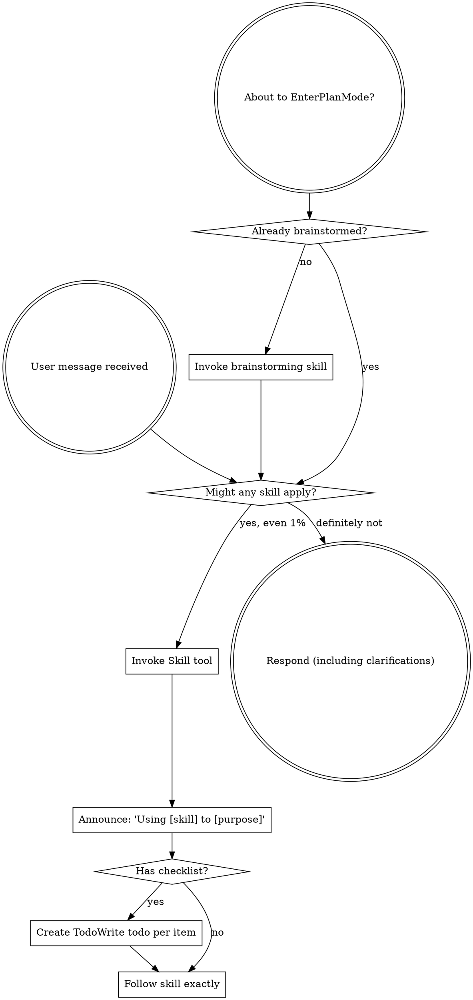

codex-exec: report contract violation

--- codex stdout ---
VERDICT: NOGO
PROBE_SOUND: NO — A real Claude run could dispatch some other UserPromptSubmit hook while the test directly spawns the classifier with that run’s nonce/session_id; the generic dispatch record plus forged ledger row would pass although the registered classifier never fired. Require `--setting-sources project`, a fresh `--session-id`, and evidence identifying the exact classifier command—not merely the event. Run the final probe from a verifier outside executor-writable files.
CLAUDE_P_DISPATCHES_REPO_LOCAL_HOOKS: YES — Claude documents that `-p` trusts the workspace and runs hooks from repository `.claude/settings.json`; project settings are a supported hook location. [Hooks reference](https://code.claude.com/docs/en/hooks)
DEBUG_FORMAT_ASSUMPTION: RISKY — Debug logs are documented textual diagnostics, not a stable structured schema, and the documented record does not carry the nonce or session_id. Also, the filter binds only as `--debug=hooks`; `--debug hooks` enables unfiltered debugging. Prefer `--output-format stream-json --verbose --include-hook-events`, plus an explicit `--session-id`; retain `--debug=hooks` only for exact-command evidence. [CLI reference](https://code.claude.com/docs/en/cli-usage)
NONCE_FRESHNESS: NOT_ENFORCED — “fresh random nonce” is stated but no assertion excludes replay. Generate `crypto.randomUUID()` inside every invocation, snapshot ledger byte offsets first, reject any pre-existing nonce, use an exclusive new output target, and inspect only post-snapshot rows.
BLOCKING_ISSUES: 1) The causal assertion can combine another hook’s genuine dispatch with a forged classifier row. 2) The mandated merge command passes `.` as repo-root, but `resolveRepoLocalTarget()` rejects every non-absolute root; it exits before merging. Pass `(Resolve-Path '.').Path`. 3) The debug record’s required session/nonce correlation is not available in the documented format.
RESIDUAL_RISK: Most likely, Codex edits the project hook configuration and immediately launches `claude -p` against a partial, invalid, or confounded settings state; print mode can silently ignore invalid settings, while valid repo hooks execute automatically. Validate the merged hooks section, freeze its hash, isolate project setting sources, and then run the trusted probe.

--- codex stderr ---
OpenAI Codex v0.146.0
--------
workdir: C:\Users\jack.berrow\AppData\Roaming\warp\Warp\data\worktrees\GSDedits\luminaria-hogback
model: gpt-5.6-sol
provider: openai
approval: never
sandbox: read-only
reasoning effort: xhigh
reasoning summaries: none
session id: 01a01529-ea6e-76b1-b1f4-12998d8a5ea5
--------
user
# P153 Plan Review — ROUND 3 (narrow: probe soundness + execution readiness)

You returned NOGO twice. Rev 3 is committed. This review is deliberately NARROW.
Do not re-litigate settled points. Read only; modify nothing.

## Read

- `.planning/milestones/v3.6-vtp-bridge/phases/153-hook-transport-completion/153-01-PLAN-LOCKED.md` (rev 3)
- `.planning/milestones/v3.6-vtp-bridge/phases/154-mcp-arg-contract/CONTEXT.md`
- `super-gsd/scripts/merge-settings.js`
- `super-gsd/hooks/sgsd-intent-classifier.cjs`

## Your five round-2 blockers and what rev 3 did

1. **Forgeable provenance.** Replaced entirely. The probe now launches a REAL headless
   Claude session with a fresh random nonce
   (`claude -p '<nonce> ...' --debug hooks --debug-file <tmp>`) and passes only when
   Claude's OWN debug record shows a UserPromptSubmit dispatch AND a new ledger row
   correlates to it by nonce and session_id. A `forged-spawn-must-fail` control asserts
   a direct stdin spawn with forged fields does NOT pass.
2. **P149/P152 probes.** Added as their own ACs, with the plan stating explicitly that
   the P146 compatibility `planning-triage` route is not coverage for the P149 registry.
3. **Overlay contradiction.** New dedicated `super-gsd/config/claude-ups-overlay.json`
   declaring ONLY UserPromptSubmit. `repo-settings-overlay.json` is now a known dead end.
4. **Full merge command** stated verbatim in T1's input_contract.
5. **P154** now requires successful post-fix REAL MCP calls, not just a pre-fix-failing test.

## Answer ONLY these

**A. Attack the causal probe.** This is the whole review. Rev 3 claims a direct spawn
cannot cause Claude to emit a hook-dispatch debug record, so the forged-spawn control
fails by construction. Is that TRUE? Consider concretely:
- Can an executor satisfy the probe without a genuine dispatch — by writing the debug
  file itself, reusing a debug file from an earlier genuine run, replaying a stale
  nonce, or having the test spawn `claude -p` but assert on something that would pass
  even if the hook never fired?
- Does `claude -p` with repo-local `.claude/settings.json` actually load and dispatch
  repo-local hooks? If it does NOT, the entire probe is unimplementable and this is a
  CRIT that must be caught now, before code is written.
- Is `--debug hooks` a real filter that emits a machine-parseable dispatch record, or
  is the plan assuming an output format that may not exist?
If any of these break the mechanism, say so plainly and name what would replace it.

**B. Nonce freshness.** Does the plan actually force a FRESH nonce per run, and would
a stale-nonce replay be caught? If not, name the fix.

**C. Execution readiness.** Ignoring style: is there anything in rev 3 that makes a task
unimplementable as written, or a stop_rule unreachable? Answer only if concrete.

**D. Residual risk if we execute now.** One paragraph: what is most likely to go wrong
during execution, given the executor is Codex gpt-5.6-sol with workspace-write on a repo
whose hook config is being modified?

## Output format — exactly this, max 450 words

```
VERDICT: GO | GO-WITH-CHANGES | NOGO
PROBE_SOUND: YES | NO — <the strongest concrete bypass or breakage you found, and the fix>
CLAUDE_P_DISPATCHES_REPO_LOCAL_HOOKS: YES | NO | UNVERIFIABLE — <evidence or what would settle it>
DEBUG_FORMAT_ASSUMPTION: SAFE | RISKY — <why>
NONCE_FRESHNESS: ENFORCED | NOT_ENFORCED — <fix if not>
BLOCKING_ISSUES: <numbered, or none>
RESIDUAL_RISK: <one paragraph>
```

If rev 3 is executable, say GO. Three NOGOs on a two-task phase would itself be a
finding about the review loop, so only withhold GO for something that would actually
break execution or produce a false pass.

codex
I’m using the mandatory skill-selection workflow, then I’ll inspect only the four named artifacts and validate the installed Claude CLI’s flags read-only.
exec
"C:\\WINDOWS\\System32\\WindowsPowerShell\\v1.0\\powershell.exe" -Command "Get-Content -Raw 'C:\\Users\\jack.berrow\\.codex\\skills\\using-superpowers\\SKILL.md'" in C:\Users\jack.berrow\AppData\Roaming\warp\Warp\data\worktrees\GSDedits\luminaria-hogback
 succeeded in 2067ms:
---
name: using-superpowers
description: Use when starting any conversation - establishes how to find and use skills, requiring Skill tool invocation before ANY response including clarifying questions
---

<SUBAGENT-STOP>
If you were dispatched as a subagent to execute a specific task, skip this skill.
</SUBAGENT-STOP>

<EXTREMELY-IMPORTANT>
If you think there is even a 1% chance a skill might apply to what you are doing, you ABSOLUTELY MUST invoke the skill.

IF A SKILL APPLIES TO YOUR TASK, YOU DO NOT HAVE A CHOICE. YOU MUST USE IT.

This is not negotiable. This is not optional. You cannot rationalize your way out of this.
</EXTREMELY-IMPORTANT>

## Instruction Priority

Superpowers skills override default system prompt behavior, but **user instructions always take precedence**:

1. **User's explicit instructions** (CLAUDE.md, GEMINI.md, AGENTS.md, direct requests) ƒ?" highest priority
2. **Superpowers skills** ƒ?" override default system behavior where they conflict
3. **Default system prompt** ƒ?" lowest priority

If CLAUDE.md, GEMINI.md, or AGENTS.md says "don't use TDD" and a skill says "always use TDD," follow the user's instructions. The user is in control.

## How to Access Skills

**In Claude Code:** Use the `Skill` tool. When you invoke a skill, its content is loaded and presented to youƒ?"follow it directly. Never use the Read tool on skill files.

**In Copilot CLI:** Use the `skill` tool. Skills are auto-discovered from installed plugins. The `skill` tool works the same as Claude Code's `Skill` tool.

**In Gemini CLI:** Skills activate via the `activate_skill` tool. Gemini loads skill metadata at session start and activates the full content on demand.

**In other environments:** Check your platform's documentation for how skills are loaded.

## Platform Adaptation

Skills use Claude Code tool names. Non-CC platforms: see `references/copilot-tools.md` (Copilot CLI), `references/codex-tools.md` (Codex) for tool equivalents. Gemini CLI users get the tool mapping loaded automatically via GEMINI.md.

# Using Skills

## The Rule

**Invoke relevant or requested skills BEFORE any response or action.** Even a 1% chance a skill might apply means that you should invoke the skill to check. If an invoked skill turns out to be wrong for the situation, you don't need to use it.



## Red Flags

These thoughts mean STOPƒ?"you're rationalizing:

| Thought | Reality |
|---------|---------|
| "This is just a simple question" | Questions are tasks. Check for skills. |
| "I need more context first" | Skill check comes BEFORE clarifying questions. |
| "Let me explore the codebase first" | Skills tell you HOW to explore. Check first. |
| "I can check git/files quickly" | Files lack conversation context. Check for skills. |
| "Let me gather information first" | Skills tell you HOW to gather information. |
| "This doesn't need a formal skill" | If a skill exists, use it. |
| "I remember this skill" | Skills evolve. Read current version. |
| "This doesn't count as a task" | Action = task. Check for skills. |
| "The skill is overkill" | Simple things become complex. Use it. |
| "I'll just do this one thing first" | Check BEFORE doing anything. |
| "This feels productive" | Undisciplined action wastes time. Skills prevent this. |
| "I know what that means" | Knowing the concept ƒ%ÿ using the skill. Invoke it. |

## Skill Priority

When multiple skills could apply, use this order:

1. **Process skills first** (brainstorming, debugging) - these determine HOW to approach the task
2. **Implementation skills second** (frontend-design, mcp-builder) - these guide execution

"Let's build X" ā' brainstorming first, then implementation skills.
"Fix this bug" ā' debugging first, then domain-specific skills.

## Skill Types

**Rigid** (TDD, debugging): Follow exactly. Don't adapt away discipline.

**Flexible** (patterns): Adapt principles to context.

The skill itself tells you which.

## User Instructions

Instructions say WHAT, not HOW. "Add X" or "Fix Y" doesn't mean skip workflows.

C:\Users\jack.berrow\OneDrive - John Cullen Lighting\Documents\WindowsPowerShell\profile.ps1 : Cannot dot-source this 
command because it was defined in a different language mode. To invoke this command without importing its contents, 
omit the '.' operator.
At line:1 char:1
+ . 'C:\Users\jack.berrow\OneDrive - John Cullen Lighting\Documents\Win ...
+ ~~~~~~~~~~~~~~~~~~~~~~~~~~~~~~~~~~~~~~~~~~~~~~~~~~~~~~~~~~~~~~~~~~~~~
    + CategoryInfo          : InvalidOperation: (:) [profile.ps1], NotSupportedException
    + FullyQualifiedErrorId : DotSourceNotSupported,profile.ps1
 
C:\Users\jack.berrow\OneDrive - John Cullen Lighting\Documents\WindowsPowerShell\Microsoft.PowerShell_profile.ps1 : 
Cannot dot-source this command because it was defined in a different language mode. To invoke this command without 
importing its contents, omit the '.' operator.
At line:1 char:1
+ . 'C:\Users\jack.berrow\OneDrive - John Cullen Lighting\Documents\Win ...
+ ~~~~~~~~~~~~~~~~~~~~~~~~~~~~~~~~~~~~~~~~~~~~~~~~~~~~~~~~~~~~~~~~~~~~~
    + CategoryInfo          : InvalidOperation: (:) [Microsoft.PowerShell_profile.ps1], NotSupportedException
    + FullyQualifiedErrorId : DotSourceNotSupported,Microsoft.PowerShell_profile.ps1
 

codex
The review skill applies because this is a go/no-go technical assessment; I’m using its evidence-first checks while keeping the scope strictly to probe soundness and execution readiness.
exec
"C:\\WINDOWS\\System32\\WindowsPowerShell\\v1.0\\powershell.exe" -Command "Get-Content -Raw 'C:\\Users\\jack.berrow\\.agents\\skills\\review\\SKILL.md'" in C:\Users\jack.berrow\AppData\Roaming\warp\Warp\data\worktrees\GSDedits\luminaria-hogback
 succeeded in 1376ms:
---
name: review
description: Review code changes for security, performance, bugs, and quality. Reviews staged changes, unstaged changes, specific commits, or PR-ready diffs.
---

<objective>
Review code changes and provide structured feedback covering security, performance, bug risks, code quality, and test coverage gaps. This skill analyzes diffs and surrounding context to catch issues before they reach production.
</objective>

<context>
This skill reviews code changes at various stages of the development workflow. It can review staged changes before a commit, unstaged work-in-progress, a specific commit, or the full set of changes on a branch that are ready for a pull request.

The reviewer reads both the diff and the surrounding source files to understand intent and catch issues that only appear in context.
</context>

<core_principle>
**FIND REAL ISSUES, NOT STYLE NITS.** Focus on problems that cause bugs, security vulnerabilities, performance degradation, or maintainability pain. Avoid nitpicking formatting or subjective style preferences unless they harm readability.
</core_principle>

<analysis_only_rule>
**THIS SKILL IS READ-ONLY. DO NOT MODIFY CODE.**

The purpose is to review and report findings. Making changes during review conflates the reviewer and author roles. Present findings and let the user decide what to act on.
</analysis_only_rule>

<quick_start>

<determine_review_scope>

Parse the user's input to determine what to review:

1. **No arguments** - Review staged changes first. If nothing is staged, review unstaged changes.
   - Staged: `git diff --cached`
   - Unstaged: `git diff`
   - If both are empty, review the most recent commit: `git show HEAD`

2. **Commit hash argument** (e.g., `/review abc1234`) - Review that specific commit.
   - `git show <hash>`

3. **File path argument** (e.g., `/review src/foo.ts`) - Review unstaged changes in that file.
   - `git diff -- <path>` then fall back to `git diff --cached -- <path>`

4. **"pr" argument** (e.g., `/review pr`) - Review all changes since branching from main.
   - `git diff main...HEAD`
   - If on main, review `git diff HEAD~1`

After obtaining the diff, if it is empty, inform the user that there are no changes to review and stop.

</determine_review_scope>

<gather_context>

Before analyzing the diff:

1. **Read changed files in full** - Do not review a diff in isolation. Read each modified file to understand the surrounding code, imports, types, and control flow.
2. **Identify the tech stack** - Note languages, frameworks, and libraries in use. This affects what patterns are risky.
3. **Check for related test files** - For each changed source file, look for corresponding test files. Note whether tests were updated alongside the changes.
4. **Check for configuration changes** - If config files changed (env, CI, package.json, tsconfig, etc.), pay extra attention to side effects.

</gather_context>

<review_categories>

Analyze the changes against each category below. Only report findings that are actually present. Skip categories with no issues.

**A. Security Issues** (Severity: CRITICAL or HIGH)
- Injection vulnerabilities (SQL injection, command injection, template injection)
- Cross-site scripting (XSS) - unsanitized user input rendered in HTML
- Authentication and authorization flaws (missing auth checks, privilege escalation)
- Secrets or credentials hardcoded or logged
- Insecure deserialization or unsafe eval usage
- Path traversal or file access vulnerabilities
- Missing input validation on external data

**B. Performance Concerns** (Severity: HIGH or MEDIUM)
- N+1 query patterns in database access
- Unnecessary memory allocations in hot paths or loops
- Blocking operations on the main thread or in async contexts
- Missing pagination on unbounded queries
- Redundant computation that could be cached or memoized
- Large payloads without streaming or chunking

**C. Bug Risks** (Severity: HIGH or MEDIUM)
- Off-by-one errors in loops or array access
- Null/undefined dereferences without guards
- Race conditions in concurrent or async code
- Incorrect error handling (swallowed errors, wrong error types)
- Type mismatches or unsafe type assertions
- Logic errors in conditionals (inverted checks, missing cases)
- Resource leaks (unclosed connections, file handles, listeners)

**D. Code Quality** (Severity: MEDIUM or LOW)
- Unclear or misleading naming
- Significant code duplication that should be extracted
- Excessive complexity (deeply nested logic, functions doing too many things)
- Dead code or unreachable branches
- Missing or misleading comments on non-obvious logic
- Inconsistency with patterns used elsewhere in the codebase

**E. Test Coverage Gaps** (Severity: MEDIUM or LOW)
- New logic paths without corresponding test cases
- Changed behavior without updated tests
- Edge cases not covered (empty inputs, boundary values, error paths)
- Missing integration tests for new API endpoints or database changes

</review_categories>

<format_findings>

For each finding, use this structure:

```
### [SEVERITY] Category: Brief Title

**File**: `path/to/file.ext` (lines X-Y)

**Issue**: Clear description of the problem.

**Why it matters**: What could go wrong if this is not addressed.

**Suggestion**: How to fix it, with a code snippet if helpful.
```

Severity levels:
- **CRITICAL** - Must fix before merge. Security vulnerability or data loss risk.
- **HIGH** - Should fix before merge. Likely bug or significant performance issue.
- **MEDIUM** - Should fix soon. Code quality or moderate risk issue.
- **LOW** - Consider fixing. Minor improvement opportunity.

</format_findings>

</quick_start>

<critical_rules>

1. **READ THE FULL FILE**: Never review a diff without reading the complete source file for context
2. **NO FALSE ALARMS**: Only report issues you can explain concretely. Do not report vague concerns
3. **PRIORITIZE**: Lead with the most severe findings. Do not bury critical issues under style nits
4. **BE SPECIFIC**: Include file paths, line numbers, and code references for every finding
5. **EXPLAIN THE RISK**: For each finding, explain what could actually go wrong
6. **CHECK TESTS**: Always check whether changes have corresponding test updates
7. **CONSIDER THE STACK**: Apply language-specific and framework-specific knowledge to your review
8. **DO NOT MODIFY CODE**: Present findings only. The user decides what to act on

</critical_rules>

<output_format>

```markdown
## Code Review: [brief description of what was reviewed]

**Scope**: [staged changes | unstaged changes | commit abc1234 | PR changes from main]
**Files reviewed**: [count] files changed, [additions] additions, [deletions] deletions

---

### Findings

[Findings grouped by severity, highest first. Use the format from <format_findings>.]

---

### Summary

| Severity | Count |
|----------|-------|
| CRITICAL | X     |
| HIGH     | X     |
| MEDIUM   | X     |
| LOW      | X     |

### Recommended Actions

1. [Most important action to take]
2. [Next most important action]
3. [...]
```

If no issues are found:

```markdown
## Code Review: [brief description]

**Scope**: [what was reviewed]
**Files reviewed**: [count]

No significant issues found. The changes look good to merge.
```

</output_format>

<decision_gate>

**After presenting findings, ALWAYS offer these options:**

```
ƒ"?ƒ"?ƒ"?ƒ"?ƒ"?ƒ"?ƒ"?ƒ"?ƒ"?ƒ"?ƒ"?ƒ"?ƒ"?ƒ"?ƒ"?ƒ"?ƒ"?ƒ"?ƒ"?ƒ"?ƒ"?ƒ"?ƒ"?ƒ"?ƒ"?ƒ"?ƒ"?ƒ"?ƒ"?ƒ"?ƒ"?ƒ"?ƒ"?ƒ"?ƒ"?ƒ"?ƒ"?ƒ"?ƒ"?ƒ"?ƒ"?
REVIEW COMPLETE

What would you like to do?

1. **Fix issues** - I'll address the findings starting with the most critical
2. **Save review** - Export findings to a markdown file
3. **Review again** - Re-review with different scope or focus
4. **Discuss a finding** - Ask questions about a specific issue
5. **Other** - Tell me what you need
ƒ"?ƒ"?ƒ"?ƒ"?ƒ"?ƒ"?ƒ"?ƒ"?ƒ"?ƒ"?ƒ"?ƒ"?ƒ"?ƒ"?ƒ"?ƒ"?ƒ"?ƒ"?ƒ"?ƒ"?ƒ"?ƒ"?ƒ"?ƒ"?ƒ"?ƒ"?ƒ"?ƒ"?ƒ"?ƒ"?ƒ"?ƒ"?ƒ"?ƒ"?ƒ"?ƒ"?ƒ"?ƒ"?ƒ"?ƒ"?ƒ"?
```

**Wait for user response before taking any action.**

This gate is MANDATORY. Never skip it. Never auto-implement fixes.

</decision_gate>

C:\Users\jack.berrow\OneDrive - John Cullen Lighting\Documents\WindowsPowerShell\profile.ps1 : Cannot dot-source this 
command because it was defined in a different language mode. To invoke this command without importing its contents, 
omit the '.' operator.
At line:1 char:1
+ . 'C:\Users\jack.berrow\OneDrive - John Cullen Lighting\Documents\Win ...
+ ~~~~~~~~~~~~~~~~~~~~~~~~~~~~~~~~~~~~~~~~~~~~~~~~~~~~~~~~~~~~~~~~~~~~~
    + CategoryInfo          : InvalidOperation: (:) [profile.ps1], NotSupportedException
    + FullyQualifiedErrorId : DotSourceNotSupported,profile.ps1
 
C:\Users\jack.berrow\OneDrive - John Cullen Lighting\Documents\WindowsPowerShell\Microsoft.PowerShell_profile.ps1 : 
Cannot dot-source this command because it was defined in a different language mode. To invoke this command without 
importing its contents, omit the '.' operator.
At line:1 char:1
+ . 'C:\Users\jack.berrow\OneDrive - John Cullen Lighting\Documents\Win ...
+ ~~~~~~~~~~~~~~~~~~~~~~~~~~~~~~~~~~~~~~~~~~~~~~~~~~~~~~~~~~~~~~~~~~~~~
    + CategoryInfo          : InvalidOperation: (:) [Microsoft.PowerShell_profile.ps1], NotSupportedException
    + FullyQualifiedErrorId : DotSourceNotSupported,Microsoft.PowerShell_profile.ps1
 

exec
"C:\\WINDOWS\\System32\\WindowsPowerShell\\v1.0\\powershell.exe" -Command "Get-Content -Raw '.planning\\milestones\\v3.6-vtp-bridge\\phases\\153-hook-transport-completion\\153-01-PLAN-LOCKED.md'" in C:\Users\jack.berrow\AppData\Roaming\warp\Warp\data\worktrees\GSDedits\luminaria-hogback
exec
"C:\\WINDOWS\\System32\\WindowsPowerShell\\v1.0\\powershell.exe" -Command "Get-Content -Raw '.planning\\milestones\\v3.6-vtp-bridge\\phases\\154-mcp-arg-contract\\CONTEXT.md'" in C:\Users\jack.berrow\AppData\Roaming\warp\Warp\data\worktrees\GSDedits\luminaria-hogback
exec
"C:\\WINDOWS\\System32\\WindowsPowerShell\\v1.0\\powershell.exe" -Command "Get-Content -Raw 'super-gsd\\hooks\\sgsd-intent-classifier.cjs'" in C:\Users\jack.berrow\AppData\Roaming\warp\Warp\data\worktrees\GSDedits\luminaria-hogback
exec
"C:\\WINDOWS\\System32\\WindowsPowerShell\\v1.0\\powershell.exe" -Command "Get-Content -Raw 'super-gsd\\scripts\\merge-settings.js'" in C:\Users\jack.berrow\AppData\Roaming\warp\Warp\data\worktrees\GSDedits\luminaria-hogback
 succeeded in 1652ms:
---
phase: "154"
slug: mcp-arg-contract
milestone: v3.6-vtp-bridge
status: PENDING
depends_on: []
split_from: "153"
split_reason: "Codex plan review 2026-08-18 flagged this as MUDA overproduction bundled into P153 ƒ?" it is an MCP-contract defect, not hook transport."
---

# P154 Context ƒ?" Triage Runtime MCP Arg Contract

## Goal
`super-gsd/scripts/sgsd-triage-runtime.cjs` emits MCP call args that the target
MCP tools reject, so the staged "runtime decides, Claude transports" protocol
built in P148 cannot be executed verbatim as its own skill specifies. Every
`/sgsd-triage` run therefore degrades silently.

## Verified evidence (reproduced 2026-08-18 while running /sgsd-triage)

1. **`vtp_route_and_retrieve`** ƒ?" the runtime emits `context.recent_turns` as an
   array of bare strings. The tool schema requires an array of objects each
   carrying a `text` string. Executing the emitted call verbatim returns a hard
   `MCP error -32602: Input validation error ... expected object, received string`.
2. **`vtp_search_substrate`** ƒ?" the runtime emits `raw_query`, `context` and
   `fallback_reason`. That tool's schema accepts only `query` plus optional typed
   filters (`limit`, `source_types`, `entity_types`, `project_ids`,
   `speaker_ids`, `topics`, `meeting_ids`).

Consequence: the skill instructs "execute the emitted MCP call VERBATIM ... No
interpretation", but verbatim execution fails. The operator-facing effect is that
triage silently falls back or degrades rather than enriching.

This is seam instance **#8** of `harness-production-seam-four-layers` ƒ?" and it sits
inside the mechanism P148 built to fix seam bugs.

## Scope
Per-tool arg-shaper at the emission seam so every emitted call is schema-valid for
its target tool, plus a conformance test that validates emitted args against each
tool's authoritative schema.

Do NOT change routing logic, predicate evaluation, or which tool is selected. Only
the shape of the emitted args changes.

## Acceptance shape (for the planner)
- Validate against the **authoritative** tool schemas, not a hand-copied local
  duplicate that can drift. Codex plan review called this out explicitly against
  P153 rev 1.
- The conformance test MUST fail against the pre-fix runtime. A test that passes
  both before and after does not exercise the defect.
- Cover both the `vtp-plan` stage and the `vtp-consume` fallback stage.
- **Schema conformance is necessary but not sufficient.** The phase must also
  demonstrate a successful POST-FIX real MCP call for each affected tool ƒ?" the
  emitted args accepted by the live tool, not merely validated against a schema.
  Added per Codex plan review round 2 (blocker #5): a locally-valid shape can
  still be rejected by the live server.

## Boundary
- No change to route selection, predicates, or degradation policy.
- No new MCP tools wired.
- Does not depend on P153 and does not block it.

## Provenance
Split out of P153 at plan review (rev 1 NOGO, 2026-08-18). P153 rev 2 carries the
hook-transport work only.

C:\Users\jack.berrow\OneDrive - John Cullen Lighting\Documents\WindowsPowerShell\profile.ps1 : Cannot dot-source this 
command because it was defined in a different language mode. To invoke this command without importing its contents, 
omit the '.' operator.
At line:1 char:1
+ . 'C:\Users\jack.berrow\OneDrive - John Cullen Lighting\Documents\Win ...
+ ~~~~~~~~~~~~~~~~~~~~~~~~~~~~~~~~~~~~~~~~~~~~~~~~~~~~~~~~~~~~~~~~~~~~~
    + CategoryInfo          : InvalidOperation: (:) [profile.ps1], NotSupportedException
    + FullyQualifiedErrorId : DotSourceNotSupported,profile.ps1
 
C:\Users\jack.berrow\OneDrive - John Cullen Lighting\Documents\WindowsPowerShell\Microsoft.PowerShell_profile.ps1 : 
Cannot dot-source this command because it was defined in a different language mode. To invoke this command without 
importing its contents, omit the '.' operator.
At line:1 char:1
+ . 'C:\Users\jack.berrow\OneDrive - John Cullen Lighting\Documents\Win ...
+ ~~~~~~~~~~~~~~~~~~~~~~~~~~~~~~~~~~~~~~~~~~~~~~~~~~~~~~~~~~~~~~~~~~~~~
    + CategoryInfo          : InvalidOperation: (:) [Microsoft.PowerShell_profile.ps1], NotSupportedException
    + FullyQualifiedErrorId : DotSourceNotSupported,Microsoft.PowerShell_profile.ps1
 

 succeeded in 1655ms:
#!/usr/bin/env node
'use strict';

// ============================================================================
// SGSD UserPromptSubmit intent classifier
// ============================================================================
// Local lexical router only: no LLM, no network, no prompt blocking.
// ============================================================================

const fs = require('fs');
const path = require('path');
const { performance } = require('perf_hooks');

const { findSgsdRoot, readState } = require('../scripts/lib/sgsd-state.cjs');
const {
  ledgerPath,
  logGateEvidence,
} = require('../scripts/lib/gate-evidence-log.cjs');
const {
  compiledFallbackRegistry,
  DEFAULT_REGISTRY_PATH,
  loadSkillRoutingRegistry,
  toPromptGovernanceRoutes,
  VALID_MODES,
} = require('../scripts/lib/skill-routing-registry.cjs');

const SESSION_GOVERNANCE_REGISTRY_PATH = path.resolve(__dirname, '..', 'registry', 'session-governance-hooks.yaml');
const REGISTRY_SOURCE_PATH = SESSION_GOVERNANCE_REGISTRY_PATH;
const SKILL_ROUTING_REGISTRY_PATH = DEFAULT_REGISTRY_PATH;
const MALFORMED_SKILL_ROUTING_FIXTURE = path.resolve(
  __dirname,
  '..',
  'tools',
  'self-test',
  'fixtures',
  'skill-routing-malformed.yaml',
);
const BENCH_SIGNAL = 'intent_classifier_bench';
const DEGRADED_SIGNAL = 'intent_classifier_degraded';
const ROUTING_DECISION_SIGNAL = 'intent_routing_decision';
const CLASSIFIER_ENFORCEMENT_KINDS = Object.freeze(['directive', 'suggestion']);
const KB_TRIAGE_SHADOW_SIGNAL = 'kb_triage_shadow';
const KB_TRIAGE_MATCHER_VERSION = 'kb-shadow-v1';
const REPORT_ONLY_SIGNALS = Object.freeze(['missing_plan']);

let _govRegistryCache = null; // { key, parsed, bytes }

function safeWarn(reason) {
  try {
    process.stderr.write(`[SGSD] sgsd-intent-classifier ${String(reason || 'degraded')}\n`);
  } catch {
    // Error reporting must never become the error path.
  }
}

function appendFailureRow(root, reason, payload, extra) {
  safeWarn(reason);
  try {
    if (!root) return false;
    const state = readState(root) || {};
    return Boolean(logGateEvidence(root, {
      signal: DEGRADED_SIGNAL,
      status: 'fail',
      reason_codes: [String(reason || 'degraded')],
      artifacts: [{ kind: 'registry', path: REGISTRY_SOURCE_PATH }],
      evidence: [],
      next_action: 'Inspect the SGSD intent classifier hook degraded path.',
      risk: 'medium',
      duration_ms: null,
      phase: state.phase || null,
      milestone: state.milestone || null,
      hook_event_name: payload && payload.hook_event_name || null,
      session_id: payload && payload.session_id || null,
      ...(extra && typeof extra === 'object' ? extra : {}),
    }));
  } catch {
    return false;
  }
}

function safeStdout(root, payload, line) {
  try {
    if (line) process.stdout.write(line.endsWith('\n') ? line : `${line}\n`);
  } catch {
    appendFailureRow(root, 'stdout_write_failed', payload);
  }
}

function readStdin() {
  try {
    return fs.readFileSync(0, 'utf8');
  } catch {
    return '';
  }
}

function parsePayload(raw) {
  try {
    if (!raw || !String(raw).trim()) return {};
    const parsed = JSON.parse(String(raw));
    if (!parsed || typeof parsed !== 'object' || Array.isArray(parsed)) return {};
    return parsed;
  } catch {
    return {};
  }
}

function rootFromPayload(payload) {
  const cwd = payload && typeof payload.cwd === 'string' && payload.cwd.trim()
    ? payload.cwd
    : process.cwd();
  return findSgsdRoot(cwd);
}

function registryPath() {
  return SKILL_ROUTING_REGISTRY_PATH;
}

function unquote(value) {
  const raw = String(value || '').trim();
  if (!raw) return '';
  if ((raw.startsWith('"') && raw.endsWith('"')) || (raw.startsWith("'") && raw.endsWith("'"))) {
    try {
      return JSON.parse(raw);
    } catch {
      return raw.slice(1, -1);
    }
  }
  if (raw === 'none') return 'none';
  return raw;
}

function stripInlineComment(line) {
  let inSingle = false;
  let inDouble = false;
  for (let i = 0; i < line.length; i += 1) {
    const ch = line[i];
    const prev = i > 0 ? line[i - 1] : '';
    if (ch === "'" && !inDouble) inSingle = !inSingle;
    if (ch === '"' && !inSingle && prev !== '\\') inDouble = !inDouble;
    if (ch === '#' && !inSingle && !inDouble && (i === 0 || /\s/.test(prev))) {
      return line.slice(0, i);
    }
  }
  return line;
}

function parseRegistryYaml(text) {
  const routes = [];
  let route = null;
  let section = null;
  let listKey = null;

  function finishRoute() {
    if (route) routes.push(route);
  }

  for (const rawLine of String(text || '').split(/\r?\n/)) {
    const withoutComment = stripInlineComment(rawLine);
    if (!withoutComment.trim()) continue;

    const indent = withoutComment.match(/^ */)[0].length;
    const line = withoutComment.trim();

    if (indent === 2 && line.startsWith('- id:')) {
      finishRoute();
      route = { id: unquote(line.slice(5)), trigger: {}, predicate: {}, enforcement: {} };
      section = null;
      listKey = null;
      continue;
    }
    if (!route) continue;

    const kv = line.match(/^([A-Za-z_][A-Za-z0-9_-]*):\s*(.*)$/);
    if (kv) {
      const key = kv[1];
      const value = kv[2];
      if (indent === 4 && value === '') {
        section = key;
        if (!route[section] || typeof route[section] !== 'object') route[section] = {};
        listKey = null;
      } else if (indent === 4) {
        route[key] = unquote(value);
        section = null;
        listKey = null;
      } else if (indent === 6 && section) {
        if (value === '') {
          route[section][key] = [];
          listKey = key;
        } else {
          route[section][key] = unquote(value);
          listKey = null;
        }
      }
      continue;
    }

    if (line.startsWith('- ') && section && listKey && Array.isArray(route[section][listKey])) {
      route[section][listKey].push(unquote(line.slice(2)));
    }
  }

  finishRoute();
  return { routes };
}

function readGovernanceRegistryCached() {
  const registryPathValue = REGISTRY_SOURCE_PATH;
  let key;
  try {
    key = registryPathValue + ':' + fs.statSync(registryPathValue).mtimeMs;
  } catch {
    key = registryPathValue + ':nostat';
  }
  if (_govRegistryCache && _govRegistryCache.key === key) {
    return _govRegistryCache.parsed;
  }

  const text = fs.readFileSync(registryPathValue, 'utf8');
  const parsed = parseRegistryYaml(text);
  _govRegistryCache = {
    key,
    parsed,
    bytes: Buffer.byteLength(String(text || ''), 'utf8'),
  };
  return parsed;
}

function nonEmptyStrings(value) {
  return list(value).map((item) => item.trim()).filter(Boolean);
}

function validRegexStrings(value) {
  const out = [];
  for (const pattern of nonEmptyStrings(value)) {
    try {
      new RegExp(pattern, 'i');
      out.push(pattern);
    } catch {
      // Invalid regexes do not count as usable triggers at parse time.
    }
  }
  return out;
}

function validateRouteShape(route) {
  const reasons = [];
  const id = route && typeof route.id === 'string' ? route.id.trim() : '';
  if (!id) reasons.push('id_missing');

  const trigger = route && route.trigger && typeof route.trigger === 'object' ? route.trigger : {};
  const enforcement = route && route.enforcement && typeof route.enforcement === 'object' ? route.enforcement : {};
  const kind = typeof enforcement.kind === 'string' ? enforcement.kind.trim() : '';

  if (CLASSIFIER_ENFORCEMENT_KINDS.includes(kind)) {
    const triggerCount = nonEmptyStrings(trigger.phrases).length + validRegexStrings(trigger.regexes).length;
    const directive = typeof enforcement.directive === 'string' ? enforcement.directive.trim() : '';
    if (triggerCount === 0) reasons.push('trigger_missing');
    if (!directive || !directive.startsWith('/sgsd-')) reasons.push('directive_invalid');
    return {
      route,
      id: id || null,
      usable: reasons.length === 0,
      classifierUsable: reasons.length === 0,
      reason_codes: reasons,
    };
  }

  if (kind === 'report_only') {
    const hookEvent = typeof trigger.hook_event_name === 'string' ? trigger.hook_event_name.trim() : '';
    const toolNames = nonEmptyStrings(trigger.tool_names);
    const signal = typeof enforcement.signal === 'string' ? enforcement.signal.trim() : '';
    if (!hookEvent && toolNames.length === 0) reasons.push('report_trigger_missing');
    if (!REPORT_ONLY_SIGNALS.includes(signal)) reasons.push('report_signal_invalid');
    return {
      route,
      id: id || null,
      usable: reasons.length === 0,
      classifierUsable: false,
      reason_codes: reasons,
    };
  }

  if (kind === 'shadow') {
    const triggerCount = nonEmptyStrings(trigger.phrases).length
      + validRegexStrings(trigger.regexes).length
      + nonEmptyStrings(trigger.strong_kb_phrases).length
      + validRegexStrings(trigger.strong_kb_regexes).length;
    const signal = typeof enforcement.signal === 'string' ? enforcement.signal.trim() : '';
    const directive = typeof enforcement.directive === 'string' ? enforcement.directive.trim() : '';
    if (triggerCount === 0) reasons.push('shadow_trigger_missing');
    if (signal !== KB_TRIAGE_SHADOW_SIGNAL) reasons.push('shadow_signal_invalid');
    if (directive) reasons.push('shadow_directive_forbidden');
    return {
      route,
      id: id || null,
      usable: reasons.length === 0,
      classifierUsable: false,
      reason_codes: reasons,
    };
  }

  reasons.push('enforcement_kind_unknown');
  return { route, id: id || null, usable: false, classifierUsable: false, reason_codes: reasons };
}

function validateRegistryRoutes(routes) {
  const input = Array.isArray(routes) ? routes : [];
  const usableRoutes = [];
  const classifierRoutes = [];
  const invalidRoutes = [];
  for (const route of input) {
    const result = validateRouteShape(route);
    if (result.usable) {
      usableRoutes.push(route);
      if (result.classifierUsable) classifierRoutes.push(route);
    } else {
      invalidRoutes.push({ id: result.id, reason_codes: result.reason_codes.slice() });
    }
  }
  return {
    total_routes: input.length,
    usable_routes: usableRoutes,
    classifier_usable_routes: classifierRoutes,
    invalid_routes: invalidRoutes,
  };
}

function readCompatibilityRegistry(root, payload) {
  try {
    const file = SESSION_GOVERNANCE_REGISTRY_PATH;
    const registry = readGovernanceRegistryCached();
    const routes = registry && Array.isArray(registry.routes) ? registry.routes : [];
    if (routes.length === 0) {
      const bytes = _govRegistryCache ? _govRegistryCache.bytes : 0;
      appendFailureRow(root, bytes > 0 ? 'registry_unparsed' : 'registry_empty', payload, {
        registry_bytes: bytes,
      });
      return registry;
    }

    const validation = validateRegistryRoutes(routes);
    if (validation.invalid_routes.length > 0 || validation.classifier_usable_routes.length === 0) {
      appendFailureRow(root, 'registry_routes_invalid', payload, {
        registry_total_routes: validation.total_routes,
        registry_usable_routes: validation.classifier_usable_routes.length,
        registry_valid_routes: validation.usable_routes.length,
        registry_invalid_routes: validation.invalid_routes.length,
        registry_invalid_route_ids: validation.invalid_routes.map((route) => route.id).filter(Boolean),
      });
    }
    const enforcementRoutes = validation.classifier_usable_routes
      .filter((route) => route.enforcement && route.enforcement.kind === 'directive');

    return {
      ...registry,
      routes: enforcementRoutes
        .map((route) => ({ ...route, registry_path: file })),
      route_validation: {
        total_routes: validation.total_routes,
        usable_routes: enforcementRoutes.length,
        valid_routes: validation.usable_routes.length,
        invalid_routes: validation.invalid_routes.length,
      },
    };
  } catch {
    appendFailureRow(root, 'registry_unavailable', payload);
    return { routes: [] };
  }
}

function classifierMode(payload, options) {
  const requested = options && options.mode !== undefined
    ? options.mode
    : payload && payload.mode;
  return VALID_MODES.includes(requested) ? requested : 'manual';
}

function adaptPromptRoutes(root, payload, options) {
  const opts = options || {};
  const mode = classifierMode(payload, opts);
  const requestedPath = opts.registryPath || SKILL_ROUTING_REGISTRY_PATH;
  try {
    const registry = loadSkillRoutingRegistry({
      registryPath: requestedPath,
      runtime: true,
      root,
      moment: 'prompt-time',
      mode,
      logDegradation: opts.logDegradation,
      noCache: opts.noCache,
      runtimeContext: { moment: 'prompt-time', mode },
    });
    const sourcePath = registry.registry_path || requestedPath;
    return {
      routes: toPromptGovernanceRoutes(registry, { mode })
        .map((route) => ({ ...route, registry_path: sourcePath })),
      source: registry.source,
      degraded: Boolean(registry.degraded),
      degradation_reason: registry.degradation_reason || null,
      registry_path: sourcePath,
    };
  } catch (error) {
    appendFailureRow(root, 'skill_routing_adapter_failed', payload, {
      registry_path: path.resolve(String(requestedPath)),
      error_message: error && error.message ? error.message : String(error),
    });
    const registry = compiledFallbackRegistry();
    return {
      routes: toPromptGovernanceRoutes(registry, { mode })
        .map((route) => ({ ...route, registry_path: registry.registry_path })),
      source: registry.source,
      degraded: true,
      degradation_reason: 'skill_routing_adapter_failed',
      registry_path: registry.registry_path,
    };
  }
}

function readRegistry(root, payload, options) {
  const compatibility = readCompatibilityRegistry(root, payload);
  const promptRoutes = adaptPromptRoutes(root, payload, options);
  const compatibilityRoutes = Array.isArray(compatibility.routes) ? compatibility.routes : [];
  return {
    routes: compatibilityRoutes.concat(promptRoutes.routes),
    compatibility_route_validation: compatibility.route_validation || null,
    prompt_registry_source: promptRoutes.source,
    prompt_registry_degraded: promptRoutes.degraded,
    prompt_registry_degradation_reason: promptRoutes.degradation_reason,
    prompt_registry_path: promptRoutes.registry_path,
  };
}

function promptText(payload) {
  const raw = payload ? payload.prompt : '';
  if (raw === null || raw === undefined) return '';
  return String(raw).toLowerCase();
}

function list(value) {
  return Array.isArray(value) ? value.filter((v) => typeof v === 'string' && v) : [];
}

function phraseHit(prompt, phrases) {
  return list(phrases).some((phrase) => prompt.includes(phrase.toLowerCase()));
}

function regexHit(prompt, regexes, root, payload) {
  for (const pattern of list(regexes)) {
    try {
      if (new RegExp(pattern, 'i').test(prompt)) return true;
    } catch {
      appendFailureRow(root, 'registry_regex_invalid', payload, { regex_pattern: pattern });
    }
  }
  return false;
}

function matchesRoute(route, prompt, root, payload) {
  if (!route || !prompt.trim()) return false;
  // Normalize the common noun/verb variant before applying table-owned signatures.
  const normalizedPrompt = prompt.replace(/\badvice\b/g, 'advise');
  const trigger = route.trigger || {};
  const predicate = route.predicate || {};

  if (phraseHit(normalizedPrompt, predicate.exclude_phrases)) return false;
  if (regexHit(normalizedPrompt, predicate.exclude_regexes, root, payload)) return false;

  return phraseHit(normalizedPrompt, trigger.phrases)
    || regexHit(normalizedPrompt, trigger.regexes, root, payload);
}

function startAnchoredVerbHit(prompt, verbs) {
  const vs = nonEmptyStrings(verbs);
  if (vs.length === 0) return false;
  const re = new RegExp('^\\s*(?:' + vs.map((v) => v.replace(/[.*+?^${}()|[\]\\]/g, '\\$&')).join('|') + ')\\b', 'i');
  return re.test(prompt);
}

function matchesShadowRoute(route, prompt, root, payload) {
  if (!route || !prompt.trim()) return false;
  const trigger = route.trigger || {};
  const predicate = route.predicate || {};
  const strong = phraseHit(prompt, trigger.strong_kb_phrases)
    || regexHit(prompt, trigger.strong_kb_regexes, root, payload);
  if (strong) return true;
  const weak = phraseHit(prompt, trigger.phrases)
    || regexHit(prompt, trigger.regexes, root, payload);
  if (!weak) return false;
  if (startAnchoredVerbHit(prompt, predicate.exclude_start_verbs)) return false;
  return true;
}

function kbTriageShadowLedgerPath(root) {
  return path.resolve(root, '.planning', 'metrics', 'kb-triage-shadow.jsonl');
}

function evaluateShadowRoutes(root, payload, prompt) {
  try {
    const started = performance.now();
    const registry = readGovernanceRegistryCached();
    const all = Array.isArray(registry.routes) ? registry.routes : [];
    const shadowRoutes = all.filter((route) => {
      const validation = validateRouteShape(route);
      return validation.usable
        && route.enforcement
        && route.enforcement.kind === 'shadow';
    });
    const matched = shadowRoutes.filter((route) => matchesShadowRoute(route, prompt, root, payload));
    if (matched.length === 0) return;
    const crypto = require('crypto');
    const ledgerPathValue = kbTriageShadowLedgerPath(root);
    const line = JSON.stringify({
      ts: new Date().toISOString(),
      decision_id: crypto.randomUUID(),
      matcher_version: KB_TRIAGE_MATCHER_VERSION,
      matched_signature_ids: matched.map((route) => route.id).filter(Boolean),
      soft_path_action: 'would_route_vtp_query_triage',
      latency_ms: null,
      operator_label: null,
    }) + '\n';
    const latency_ms = Number((performance.now() - started).toFixed(3));
    fs.appendFileSync(
      ledgerPathValue,
      line.replace('"latency_ms":null', '"latency_ms":' + latency_ms),
    );
  } catch {
    // Fire-and-forget: shadow evaluation must never throw or affect injection.
  }
}

function matchingRoutes(registry, prompt, root, payload) {
  const routes = registry && Array.isArray(registry.routes) ? registry.routes : [];
  return routes.filter((route) => matchesRoute(route, prompt, root, payload));
}

function routeDirectives(routes, kind) {
  const seen = new Set();
  const out = [];
  for (const route of routes) {
    const enforcement = route.enforcement || {};
    if (enforcement.kind !== kind || typeof enforcement.directive !== 'string') continue;
    if (!enforcement.directive.startsWith('/sgsd-')) continue;
    if (seen.has(enforcement.directive)) continue;
    seen.add(enforcement.directive);
    out.push(enforcement.directive);
  }
  return out;
}

function directiveLines(routes, kind) {
  const prefix = kind === 'suggestion' ? 'SGSD skill suggestion' : 'SGSD directive';
  return routeDirectives(routes, kind).map((directive) => `${prefix}: ${directive}`);
}

function appendRoutingDecision(root, payload, routes, mandatory, suggestions, duration) {
  if (!Array.isArray(routes) || routes.length === 0) return;
  try {
    const state = readState(root) || {};
    const registryPaths = Array.from(new Set(
      routes.map((route) => route && route.registry_path).filter(Boolean),
    ));
    const row = logGateEvidence(root, {
      signal: ROUTING_DECISION_SIGNAL,
      status: 'ok',
      reason_codes: [],
      artifacts: (registryPaths.length > 0 ? registryPaths : [registryPath()])
        .map((registryPathValue) => ({ kind: 'registry', path: registryPathValue })),
      evidence: [],
      next_action: null,
      risk: 'low',
      duration_ms: Math.max(0, Math.round(duration || 0)),
      phase: state.phase || null,
      milestone: state.milestone || null,
      route_ids: routes.map((route) => route.id).filter(Boolean),
      directives: Array.isArray(mandatory) ? mandatory.slice() : [],
      suggestions: Array.isArray(suggestions) ? suggestions.slice() : [],
      hook_event_name: payload && payload.hook_event_name || null,
      session_id: payload && payload.session_id || null,
    });
    if (!row) {
      appendFailureRow(root, 'evidence_append_failed', payload, {
        failed_signal: ROUTING_DECISION_SIGNAL,
      });
    }
  } catch {
    appendFailureRow(root, 'evidence_append_failed', payload, {
      failed_signal: ROUTING_DECISION_SIGNAL,
    });
  }
}

function emitClassification(root, payload, options) {
  const opts = options || {};
  const started = performance.now();
  const prompt = promptText(payload);
  if (!prompt.trim()) return { routes: [], mandatory: [], suggestions: [] };

  const registry = readRegistry(root, payload, opts);
  const routes = matchingRoutes(registry, prompt, root, payload);
  evaluateShadowRoutes(root, payload, prompt);
  const mandatory = routeDirectives(routes, 'directive');
  if (mandatory.length > 0) {
    safeStdout(root, payload, mandatory.map((directive) => `SGSD directive: ${directive}`).join('\n'));
  }

  const suggestions = routeDirectives(routes, 'suggestion');
  try {
    if (suggestions.length > 0) {
      safeStdout(root, payload, suggestions.map((directive) => `SGSD skill suggestion: ${directive}`).join('\n'));
    }
    if (opts.recordEvidence !== false) {
      appendRoutingDecision(root, payload, routes, mandatory, suggestions, performance.now() - started);
    }
  } catch {
    appendFailureRow(root, 'optional_suggestions_failed', payload);
  }
  return { routes, mandatory, suggestions };
}

function parseArgs(argv) {
  const args = {};
  for (let i = 0; i < argv.length; i += 1) {
    const item = argv[i];
    if (item === '--bench') {
      args.bench = true;
    } else if (item.startsWith('--')) {
      const key = item.slice(2);
      const next = argv[i + 1];
      if (next !== undefined && !next.startsWith('--')) {
        args[key] = next;
        i += 1;
      } else {
        args[key] = true;
      }
    }
  }
  return args;
}

function percentile95(samples) {
  if (!samples.length) return 0;
  const sorted = samples.slice().sort((a, b) => a - b);
  const idx = Math.min(sorted.length - 1, Math.ceil(sorted.length * 0.95) - 1);
  return sorted[idx];
}

function samePath(a, b) {
  if (!a || !b) return false;
  const left = path.normalize(a);
  const right = path.normalize(b);
  return process.platform === 'win32'
    ? left.toLowerCase() === right.toLowerCase()
    : left === right;
}

function recordTargetIsCanonical(root, recordArg) {
  try {
    if (!recordArg || typeof recordArg !== 'string') return false;
    const canonical = ledgerPath(root);
    if (!canonical) return false;
    const requested = path.resolve(root, recordArg);
    return samePath(requested, canonical);
  } catch {
    return false;
  }
}

function runBench(args) {
  const payload = { cwd: process.cwd(), prompt: String(args.prompt || ''), mode: args.mode || 'manual' };
  const root = rootFromPayload(payload);
  if (!root) return;
  if (!recordTargetIsCanonical(root, args.record)) return;

  const iterations = Math.max(1, Number.parseInt(String(args.iterations || '200'), 10) || 200);
  const registry = readRegistry(root, payload, { mode: payload.mode, registryPath: args.registry });
  const samples = [];
  for (let i = 0; i < iterations; i += 1) {
    const started = performance.now();
    matchingRoutes(registry, promptText(payload), root, payload);
    samples.push(performance.now() - started);
  }

  const state = readState(root) || {};
  const row = logGateEvidence(root, {
    signal: BENCH_SIGNAL,
    status: 'ok',
    reason_codes: [],
    artifacts: [{ kind: 'registry', path: registryPath() }],
    evidence: [],
    next_action: null,
    risk: 'low',
    duration_ms: Math.max(0, Math.round(samples.reduce((sum, n) => sum + n, 0))),
    phase: state.phase || null,
    milestone: state.milestone || null,
    iterations,
    p95_ms: Number(percentile95(samples).toFixed(3)),
  });
  if (!row) {
    appendFailureRow(root, 'evidence_append_failed', payload, {
      failed_signal: BENCH_SIGNAL,
    });
  }
}

function selfTest() {
  let pass = 0;
  let fail = 0;
  const failures = [];
  const assert = (name, condition, detail) => {
    if (condition) pass += 1;
    else {
      fail += 1;
      failures.push({ name, detail: detail || '' });
    }
  };

  const compatibilityRegistry = parseRegistryYaml(fs.readFileSync(REGISTRY_SOURCE_PATH, 'utf8'));
  const compatibilityRoutes = compatibilityRegistry.routes || [];
  assert('1. planning directive remains in compatibility registry',
    routeDirectives(compatibilityRoutes, 'directive').includes('/sgsd-triage'));
  assert('2. quality route remains in compatibility registry',
    compatibilityRoutes.some((route) => route.id === 'quality-gate-missing-plan'
      && route.enforcement && route.enforcement.kind === 'report_only'));
  assert('3. compatibility registry no longer maintains suggestion routes',
    routeDirectives(compatibilityRoutes, 'suggestion').length === 0);

  const payload = { cwd: process.cwd(), hook_event_name: 'UserPromptSubmit' };
  const registry = readRegistry(null, payload, {
    mode: 'manual',
    registryPath: SKILL_ROUTING_REGISTRY_PATH,
    logDegradation: false,
  });
  const suggestionFor = (prompt) => routeDirectives(
    matchingRoutes(registry, prompt.toLowerCase(), null, payload),
    'suggestion',
  );
  assert('4. token-audit suggestion is table sourced',
    suggestionFor('please run a token waste audit before this closes').includes('/sgsd-token-audit')
      && registry.routes.some((route) => route.skill === 'sgsd-token-audit' && route.source === 'yaml'));
  assert('5. MUDA suggestion is table sourced',
    suggestionFor('this looks like MUDA and needs a waste audit').includes('/sgsd-muda-audit')
      && registry.routes.some((route) => route.skill === 'sgsd-muda-audit' && route.source === 'yaml'));
  assert('6. VTP suggestion is table sourced',
    suggestionFor('use VTP advice for this architecture proposal').includes('/sgsd-vtp-advise')
      && registry.routes.some((route) => route.skill === 'sgsd-vtp-advise' && route.source === 'yaml'));

  const fallbackRegistry = readRegistry(null, payload, {
    mode: 'manual',
    registryPath: MALFORMED_SKILL_ROUTING_FIXTURE,
    logDegradation: false,
  });
  const fallbackSuggestions = routeDirectives(
    matchingRoutes(fallbackRegistry, 'please run a token waste audit before this closes', null, payload),
    'suggestion',
  );
  assert('7. malformed table uses compiled fallback routes',
    fallbackRegistry.routes.some((route) => route.source === 'compiled_fallback'));
  assert('8. malformed-table fallback preserves token-audit suggestion',
    fallbackSuggestions.includes('/sgsd-token-audit'));

  const shadowRoute = compatibilityRoutes.find((route) => route.id === 'kb-lookup-triage');
  const shadowValidation = validateRouteShape(shadowRoute);
  assert('9. KB triage route is usable shadow-only metadata',
    shadowRoute
      && shadowRoute.enforcement
      && shadowRoute.enforcement.kind === 'shadow'
      && shadowValidation.usable
      && shadowValidation.classifierUsable === false);
  assert('10. pure fix imperative does not match KB triage shadow route',
    !matchesShadowRoute(shadowRoute, 'fix the failing test', null, payload));

  console.log(`intent-classifier self-test: ${pass} pass, ${fail} fail`);
  for (const item of failures) {
    console.error(`  FAIL: ${item.name}${item.detail ? ` -- ${item.detail}` : ''}`);
  }
  return fail === 0 ? 0 : 1;
}

function main() {
  const args = parseArgs(process.argv.slice(2));
  if (args['self-test']) {
    try {
      process.exit(selfTest());
    } catch (error) {
      console.error(`intent-classifier self-test: unexpected error -- ${error && error.message ? error.message : String(error)}`);
      process.exit(1);
    }
  }
  if (args.bench) {
    try {
      runBench(args);
    } catch {
      const root = rootFromPayload({ cwd: process.cwd() });
      appendFailureRow(root, 'classifier_unexpected_error', null);
    }
    return;
  }

  if (args.prompt !== undefined) {
    let payload = {};
    let root = null;
    try {
      payload = {
        cwd: process.cwd(),
        hook_event_name: 'ManualPromptProbe',
        mode: classifierMode(null, { mode: args.mode }),
        prompt: String(args.prompt || ''),
      };
      root = rootFromPayload(payload);
      if (!root) return;
      emitClassification(root, payload, {
        mode: payload.mode,
        registryPath: args.registry,
        recordEvidence: false,
      });
    } catch {
      appendFailureRow(root, 'classifier_unexpected_error', payload);
    }
    return;
  }

  let payload = {};
  let root = null;
  try {
    payload = parsePayload(readStdin());
    root = rootFromPayload(payload);
    if (!root) return;
    emitClassification(root, payload);
  } catch {
    appendFailureRow(root, 'classifier_unexpected_error', payload);
  }
}

if (require.main === module) main();

module.exports = {
  BENCH_SIGNAL,
  DEGRADED_SIGNAL,
  ROUTING_DECISION_SIGNAL,
  REGISTRY_SOURCE_PATH,
  SESSION_GOVERNANCE_REGISTRY_PATH,
  SKILL_ROUTING_REGISTRY_PATH,
  KB_TRIAGE_MATCHER_VERSION,
  parseRegistryYaml,
  routeDirectives,
  directiveLines,
  matchingRoutes,
  matchesShadowRoute,
  evaluateShadowRoutes,
  kbTriageShadowLedgerPath,
  readRegistry,
  emitClassification,
  selfTest,
};

C:\Users\jack.berrow\OneDrive - John Cullen Lighting\Documents\WindowsPowerShell\profile.ps1 : Cannot dot-source this 
command because it was defined in a different language mode. To invoke this command without importing its contents, 
omit the '.' operator.
At line:1 char:1
+ . 'C:\Users\jack.berrow\OneDrive - John Cullen Lighting\Documents\Win ...
+ ~~~~~~~~~~~~~~~~~~~~~~~~~~~~~~~~~~~~~~~~~~~~~~~~~~~~~~~~~~~~~~~~~~~~~
    + CategoryInfo          : InvalidOperation: (:) [profile.ps1], NotSupportedException
    + FullyQualifiedErrorId : DotSourceNotSupported,profile.ps1
 
C:\Users\jack.berrow\OneDrive - John Cullen Lighting\Documents\WindowsPowerShell\Microsoft.PowerShell_profile.ps1 : 
Cannot dot-source this command because it was defined in a different language mode. To invoke this command without 
importing its contents, omit the '.' operator.
At line:1 char:1
+ . 'C:\Users\jack.berrow\OneDrive - John Cullen Lighting\Documents\Win ...
+ ~~~~~~~~~~~~~~~~~~~~~~~~~~~~~~~~~~~~~~~~~~~~~~~~~~~~~~~~~~~~~~~~~~~~~
    + CategoryInfo          : InvalidOperation: (:) [Microsoft.PowerShell_profile.ps1], NotSupportedException
    + FullyQualifiedErrorId : DotSourceNotSupported,Microsoft.PowerShell_profile.ps1
 

 succeeded in 1686ms:
---
schema_version: 2
phase: "153"
slug: "hook-transport-completion"
milestone: "v3.6-vtp-bridge"
status: "PLANNED"
revision: 3
supersedes: "rev 2 (NOGO at plan review round 2, 2026-08-18) and rev 1 (NOGO round 1)"
depends_on: ["149", "151", "152"]
intent: "Register the UserPromptSubmit hook that P149/P151/P152 governance already depends on, using a dedicated UserPromptSubmit-only overlay installed repo-locally, and prove it fires under genuine Claude Code dispatch by correlating a fresh nonce against Claude's own debug hook-dispatch record. Then make the existing secret-leak guard actually block. Rev 3 closes all five round-2 blockers."
execution_mode: "serial-codex"
expected_ATC_tier: "FULL"
skip_gates: []
lessons_path: null
prior_errors_lookup: true
semantic_acceptance_criteria:
  - input: "The repo-local .claude/settings.json after running: node super-gsd/scripts/merge-settings.js --repo-local-hooks super-gsd/config/claude-ups-overlay.json .claude/settings.json ."
    expected_outcome: "Exactly ONE new event is registered - UserPromptSubmit - because the dedicated overlay declares only that event. No SessionStart or PostToolUse entry is introduced by this merge. Every command in the hooks section resolves to a file that exists on disk. The assertion reads only the hooks section by key and never touches the env block."
    verification_cmd: "node super-gsd/tests/hook-transport/assert-registration.cjs"
  - input: "A headless Claude session launched by the verifier with a fresh random nonce embedded in a planning-shaped prompt: claude -p '<nonce> how should we architect the retry layer' --debug hooks --debug-file <tmp>"
    expected_outcome: "Claude's own debug file records a UserPromptSubmit hook dispatch, AND a new route-decision row appears naming the matched route, AND the row's session_id matches the session Claude reports in the debug record, AND the nonce ties the two together. Correlation of Claude-generated dispatch evidence with the new ledger row is what proves genuine dispatch."
    verification_cmd: "node super-gsd/tests/hook-transport/assert-live-dispatch.cjs --probe planning"
  - input: "A headless Claude session with a fresh nonce in an execution-shaped prompt: claude -p '<nonce> fix the failing test in parser.cjs' --debug hooks --debug-file <tmp>"
    expected_outcome: "Claude's debug file records the dispatch AND a row is appended that EXPLICITLY records no match, correlated by nonce and session_id. An absent row fails, because absence is indistinguishable from the hook never running."
    verification_cmd: "node super-gsd/tests/hook-transport/assert-live-dispatch.cjs --probe no-match"
  - input: "The classifier spawned directly on stdin with a forged payload supplying hook_event_name UserPromptSubmit, a stale session_id, and a copied real transcript_path, with no Claude session involved."
    expected_outcome: "The assertion FAILS, because no Claude-generated debug hook-dispatch record exists for that nonce and session. This control proves the probe discriminates genuine dispatch from a forged direct spawn; if it passes, the falsifier is not falsifying and the task is incomplete."
    verification_cmd: "node super-gsd/tests/hook-transport/assert-live-dispatch.cjs --control forged-spawn-must-fail"
  - input: "A headless Claude session with a fresh nonce in a prompt that targets a P149 skill-routing registry route specifically, not the P146 compatibility planning-triage route."
    expected_outcome: "A route-decision row is appended whose matched route originates from the P149 skill-routing registry, correlated by nonce and session_id, proving the P149 concatenated registry is exercised live and not merely the compatibility route."
    verification_cmd: "node super-gsd/tests/hook-transport/assert-live-dispatch.cjs --probe p149-skill-routing"
  - input: "A headless Claude session with a fresh nonce in a KB-directed prompt that matches the P152 kb-lookup-triage shadow route."
    expected_outcome: "A text-free shadow row is appended to the P152 ledger under genuine dispatch, and NOTHING is injected into the prompt. The row contains no prompt text, excerpt or entity string. P152 remains enforcement kind shadow."
    verification_cmd: "node super-gsd/tests/hook-transport/assert-live-dispatch.cjs --probe p152-shadow"
  - input: "A prompt containing a credential pattern such as an API_KEY assignment, delivered to the registered Claude Code UserPromptSubmit surface."
    expected_outcome: "The hook process exits with code 2 and writes an operator-facing reason to stderr naming the matched trigger. The reason contains no secret material - not the captured value, not a substring of it. The assertion reads the real exit code of a spawned process, not a mocked return value."
    verification_cmd: "node super-gsd/tests/hook-transport/assert-block-guard.cjs --case secret"
  - input: "A benign prompt with no credential pattern delivered to the same surface."
    expected_outcome: "The hook process exits 0, writes no block reason, and the prompt is not suppressed."
    verification_cmd: "node super-gsd/tests/hook-transport/assert-block-guard.cjs --case benign"
  - input: "The block-secret-leak implementation as invoked from both the Codex hook surface and the Claude Code hook surface."
    expected_outcome: "Both surfaces execute the SAME implementation module - one file, two callers - and produce identical block decisions for identical payloads. A duplicated second copy of the detection logic fails the assertion."
    verification_cmd: "node super-gsd/tests/hook-transport/assert-block-guard.cjs --case dual-surface-shared"
  - input: "The existing P152 kb-lookup-triage shadow route regression suite after this phase's changes."
    expected_outcome: "It remains enforcement kind shadow, injects nothing, and its text-free ledger contract is unchanged; the 28-day promote-or-kill metric is not pre-empted."
    verification_cmd: "node super-gsd/tests/kb-triage-shadow/assert-shadow.cjs"
known_deadends:
  - "Merging super-gsd/config/repo-settings-overlay.json for this phase. Verified 2026-08-18: it declares THREE events (SessionStart, UserPromptSubmit, PostToolUse) and merge-settings.js merges every event in the overlay, so using it contradicts a UserPromptSubmit-only stop_rule and, if targeted globally, installs unrelated hooks with repo-relative args into every project. Rev 3 uses a dedicated single-event overlay instead."
  - "Proving dispatch via payload provenance fields (hook_event_name, session_id, transcript_path). Refuted at plan review round 2: a direct stdin spawn can supply all three, including a copied real transcript path. Provenance fields are forgeable and prove nothing on their own."
  - "Asserting the negative direction by checking that no telemetry row exists. Absence is indistinguishable from the hook never running. This made P150's trust probe report a false negative (seam instance #6)."
  - "Treating the P146 compatibility planning-triage route as coverage for P149. They are separate registries; a planning-shaped prompt matching planning-triage does not exercise the P149 skill-routing table."
  - "Adding a generic fifth enforcement kind `block` to the classifier registry. Dropped as YAGNI: one current consumer, a standalone guard. Revisit when a second real consumer exists."
  - "Porting disler/claude-code-hooks-mastery Python/uv hooks. hooks.yaml sets timeout_sec 2 and uv cold-start on Windows exceeds it on every tool call. That repo has NO LICENSE (all-rights-reserved); only the Claude Code event taxonomy and exit-code semantics are used, which are facts about the platform rather than his code."
tasks:
  - id: "P153-T1"
    type: "hook-registration"
    agent: codex
    model: codex
    depends_on: []
    files_touched:
      - "super-gsd/config/claude-ups-overlay.json"
      - "super-gsd/registry/hooks.yaml"
      - "super-gsd/hooks/sgsd-intent-classifier.cjs"
      - "super-gsd/tests/hook-transport/assert-registration.cjs"
      - "super-gsd/tests/hook-transport/assert-live-dispatch.cjs"
    input_contract: >
      sgsd-intent-classifier.cjs self-declares as a UserPromptSubmit hook but no
      UserPromptSubmit event is registered, so P149 skill-routing, P151 demand baseline and
      P152 shadow never execute live. Create a NEW dedicated overlay
      super-gsd/config/claude-ups-overlay.json declaring ONLY the UserPromptSubmit event
      mapped to sgsd-intent-classifier.cjs. Do NOT reuse repo-settings-overlay.json - it
      declares three events and merge-settings.js merges all of them, which contradicts the
      single-event stop_rule. Install with exactly this command, run from the repo root:
      node super-gsd/scripts/merge-settings.js --repo-local-hooks super-gsd/config/claude-ups-overlay.json .claude/settings.json .
      Add the corresponding UserPromptSubmit row to hooks.yaml. Ensure the classifier appends
      an EXPLICIT no-match row when no route matches - if it does not today, adding it is part
      of this task - and that every row carries session_id so probes can correlate. Build
      assert-live-dispatch.cjs, which launches a real headless Claude session
      (claude -p '<nonce> ...' --debug hooks --debug-file <tmp>) and passes ONLY when Claude's
      own debug record shows a UserPromptSubmit dispatch AND a new ledger row correlates to it
      by nonce and session_id. CRITICAL: never read, print or echo the settings env block;
      inspect only the hooks section by key. Do not modify the global settings file.
    output_contract: >
      A dedicated single-event overlay exists and is installed repo-locally, adding exactly one
      event. hooks.yaml reflects it. assert-registration.cjs confirms registration and that every
      hook command resolves to an existing file. assert-live-dispatch.cjs proves five things under
      genuine dispatch: planning-match, explicit no-match, P149 skill-routing match, P152 shadow
      row with zero injection, and a forged-direct-spawn control that MUST FAIL.
    hypothesis: "The mechanism is complete and merely unregistered; installing a single-event overlay repo-locally makes P149/P151/P152 execute live, and correlating a fresh nonce against Claude's own debug hook-dispatch record proves genuine dispatch in a way forged payload fields cannot, because a direct spawn cannot cause Claude to emit a dispatch record."
    falsifier: >
      The forged-spawn control passes, proving the probe does not discriminate genuine dispatch;
      or the merge introduces any event other than UserPromptSubmit; or a hook command in the
      merged settings points at a path that does not exist; or the P149 probe matches only the
      P146 compatibility route rather than the P149 registry; or the P152 probe shows any prompt
      injection or any text in the shadow ledger; or any assertion reads the settings env block;
      or the global settings file is modified.
    stop_rule: >
      Stop when the single-event merge is confirmed, all four live probes pass under genuine
      headless-Claude dispatch, and the forged-spawn control fails as required. Do not bind any
      other hook event and do not touch the global settings file.
    verification:
      commands:
        - "node super-gsd/tests/hook-transport/assert-registration.cjs"
        - "node super-gsd/tests/hook-transport/assert-live-dispatch.cjs --probe planning"
        - "node super-gsd/tests/hook-transport/assert-live-dispatch.cjs --probe no-match"
        - "node super-gsd/tests/hook-transport/assert-live-dispatch.cjs --probe p149-skill-routing"
        - "node super-gsd/tests/hook-transport/assert-live-dispatch.cjs --probe p152-shadow"
        - "node super-gsd/tests/hook-transport/assert-live-dispatch.cjs --control forged-spawn-must-fail"
        - "node super-gsd/hooks/sgsd-intent-classifier.cjs --self-test"
  - id: "P153-T2"
    type: "blocking-guard"
    agent: codex
    model: codex
    depends_on: ["P153-T1"]
    files_touched:
      - "super-gsd/tools/codex-hooks/block-secret-leak.cjs"
      - "super-gsd/config/claude-ups-overlay.json"
      - "super-gsd/tests/hook-transport/assert-block-guard.cjs"
    input_contract: >
      block-secret-leak.cjs already reads UserPromptSubmit JSON from stdin and detects
      credential-bearing prompts, but it is wired only to the Codex hook surface and does not
      block. Make it block by exiting 2 with an operator-facing stderr reason naming the matched
      trigger, and register that SAME implementation on the Claude Code UserPromptSubmit surface
      by adding it to the dedicated overlay from T1. One implementation, two callers - extend, do
      not duplicate the detection logic. Exit 2 is the documented Claude Code contract for
      blocking a UserPromptSubmit hook. Do NOT add a generic fifth enforcement kind to the
      classifier registry: dropped at plan review as YAGNI with one current consumer. HARD
      CONSTRAINT: the P152 kb-lookup-triage route stays kind shadow; do not flip it, its 28-day
      metric has not unlocked. The stderr reason names the trigger and MUST NOT contain the
      matched credential value or any substring of it.
    output_contract: >
      A credential-bearing prompt on the Claude Code surface exits 2 with a stderr reason naming
      the trigger and containing no secret material; a benign prompt exits 0; both the Codex and
      Claude Code surfaces invoke a single shared implementation and return identical decisions
      for identical payloads. P152 remains shadow and assert-shadow.cjs still passes.
    hypothesis: "Warning-only enforcement does not change agent behaviour - the AHE paper records correct middleware warnings appended to tool output being ignored on the very next model turn, while hard-block at the shell layer produced the run's largest score jump - so making the existing guard exit 2 on the Claude surface is the smallest change that converts an inert detector into an actual control."
    falsifier: >
      A credential-bearing prompt is not blocked, or is blocked without a stderr reason naming the
      trigger, or the reason leaks the matched secret or a substring of it; a benign prompt is
      blocked; the two surfaces run separate copies of the detection logic; a generic block kind is
      added to the classifier registry; or the P152 shadow route changes behaviour.
    stop_rule: >
      Stop when the guard blocks and passes correctly on real spawned processes from the Claude
      surface, both surfaces share one implementation, and assert-shadow.cjs still passes. Do not
      flip P152 and do not add further blocking routes.
    verification:
      commands:
        - "node super-gsd/tests/hook-transport/assert-block-guard.cjs --case secret"
        - "node super-gsd/tests/hook-transport/assert-block-guard.cjs --case benign"
        - "node super-gsd/tests/hook-transport/assert-block-guard.cjs --case dual-surface-shared"
        - "node super-gsd/tests/kb-triage-shadow/assert-shadow.cjs"
---

# P153 ƒ?" Hook Transport Completion (rev 3)

## Goal

`sgsd-intent-classifier.cjs` self-declares as a UserPromptSubmit hook. No UserPromptSubmit
event is registered, so governance built across P149, P151 and P152 never executes in a live
session. This phase registers it repo-locally via a dedicated single-event overlay, proves it
fires under genuine Claude Code dispatch, and makes the existing secret-leak guard actually block.

## Revision history

**Rev 1 ā' NOGO.** Target unnamed; a global merge of the three-event overlay would have installed
unrelated hooks with repo-relative args into every project. All 9 ACs were satisfiable by
spawning the classifier directly after a registration check ƒ?" the harness-green/production-dead
pattern, instance #9, inside the plan meant to fix #7 and #8.

**Rev 2 ā' NOGO.** Pinned the target repo-local and re-anchored ACs on payload provenance
(`hook_event_name`, `session_id`, `transcript_path`). Review refuted the mechanism: a direct
stdin spawn can supply all three, including a copied real transcript path. Provenance fields are
forgeable. Review also caught a contradiction rev 2 introduced ƒ?" the stop_rule said "bind no
other event" while prescribing an overlay declaring three, which `merge-settings.js` merges in
full, making the stop_rule unreachable on a clean target.

**Rev 3 closes all five round-2 blockers:**

1. **Forgeable provenance ā' causal correlation.** The probe launches a real headless Claude
   session with a fresh nonce (`claude -p ... --debug hooks --debug-file`) and passes only when
   Claude's *own* debug dispatch record correlates with the new ledger row. A direct spawn cannot
   cause Claude to emit a dispatch record, so the forged-spawn control fails by construction.
2. **Live P149 and P152 probes added** as their own ACs. The compatibility `planning-triage`
   route is not coverage for the P149 skill-routing registry ƒ?" they are separate registries.
3. **Three-event overlay contradiction resolved** by a new dedicated
   `claude-ups-overlay.json` declaring only UserPromptSubmit.
4. **Full merge command stated verbatim** in T1's input contract.
5. **P154 acceptance tightened** to require successful post-fix real MCP calls, not just a
   pre-fix-failing test.

## Tasks

**T1** creates the single-event overlay, installs it repo-locally, adds the explicit no-match
row, and builds the causal dispatch probe with its forged-spawn control.

**T2** makes the existing guard exit 2 on the Claude surface from one shared implementation.

## Cost note

The live probes launch real headless Claude sessions and therefore consume quota on each
verification run. This is deliberate: it is the only mechanism that causally distinguishes
genuine dispatch from a forged spawn, which is precisely what rounds 1 and 2 died on.

## Orchestrator-owned (not a Codex task)

`STATE.md` frontmatter `current_phase` is stale at "150" while v3.6 has P151/P152 closed. State
files are orchestrator-owned per commit discipline; the orchestrator corrects it at phase close.

## Success Criteria

- Exactly one new event (UserPromptSubmit) registered repo-locally; every hook command resolves.
- Planning, no-match, P149 and P152 probes all pass under genuine headless-Claude dispatch,
  correlated by nonce and session_id against Claude's own debug record.
- The forged-direct-spawn control FAILS.
- P152 probe shows zero injection and a text-free shadow row.
- Credential-bearing prompt exits 2 with a trigger-naming reason carrying no secret material;
  benign prompt exits 0.
- Both hook surfaces share one implementation of the guard.
- `assert-shadow.cjs` passes; the global settings file is unmodified.

C:\Users\jack.berrow\OneDrive - John Cullen Lighting\Documents\WindowsPowerShell\profile.ps1 : Cannot dot-source this 
command because it was defined in a different language mode. To invoke this command without importing its contents, 
omit the '.' operator.
At line:1 char:1
+ . 'C:\Users\jack.berrow\OneDrive - John Cullen Lighting\Documents\Win ...
+ ~~~~~~~~~~~~~~~~~~~~~~~~~~~~~~~~~~~~~~~~~~~~~~~~~~~~~~~~~~~~~~~~~~~~~
    + CategoryInfo          : InvalidOperation: (:) [profile.ps1], NotSupportedException
    + FullyQualifiedErrorId : DotSourceNotSupported,profile.ps1
 
C:\Users\jack.berrow\OneDrive - John Cullen Lighting\Documents\WindowsPowerShell\Microsoft.PowerShell_profile.ps1 : 
Cannot dot-source this command because it was defined in a different language mode. To invoke this command without 
importing its contents, omit the '.' operator.
At line:1 char:1
+ . 'C:\Users\jack.berrow\OneDrive - John Cullen Lighting\Documents\Win ...
+ ~~~~~~~~~~~~~~~~~~~~~~~~~~~~~~~~~~~~~~~~~~~~~~~~~~~~~~~~~~~~~~~~~~~~~
    + CategoryInfo          : InvalidOperation: (:) [Microsoft.PowerShell_profile.ps1], NotSupportedException
    + FullyQualifiedErrorId : DotSourceNotSupported,Microsoft.PowerShell_profile.ps1
 

 succeeded in 1680ms:
#!/usr/bin/env node
/* eslint-disable */
// ============================================================================
// Super GSD ¶ú merge-settings.js
// ============================================================================
// Idempotent merge of Claude settings overlays into global or repo-local
// settings.json targets. Invoked by install.sh.
//
// Fix for FINDING-17 (Phase 8 self-audit, severity: CRITICAL):
//   install.sh copied hook .js files to ~/.claude/hooks/ but NEVER merged the
//   overlay into settings.json, so every hook was installed-but-dormant. A
//   fresh install had zero hooks active ƒ?" gsd-session-start, gsd-token-logger,
//   gsd-stuck-detector, gsd-checkpoint-writer, gsd-context-monitor all silent.
//
// Merge strategy:
//   - Deep-merge hooks object: for each event (SessionStart, PostToolUse, ...)
//     append overlay entries to user's array.
//   - Idempotent: entries matched by command string + matcher + type. If an
//     identical entry already exists, skip. Running the installer twice does
//     not produce duplicate hook registrations.
//   - Preserves every existing user entry; only ADDS.
//   - Expands hook commands under ~/.claude/hooks to absolute paths before
//     writing settings.json. Claude Code may execute hook commands through cmd
//     on Windows, where "~" is not expanded and Node treats it as a literal
//     project-relative path.
//   - Skips the _comment key from the overlay.
//   - Atomic write: settings.json.tmp + rename.
// ============================================================================

'use strict';

const fs = require('fs');
const path = require('path');
const os = require('os');

const SELF_TEST_REPO_LOCAL = '--self-test-repo-local-hooks';
const REPO_LOCAL_MODE = '--repo-local-hooks';

function usage() {
    console.error('Usage: merge-settings.js <overlay.json> <target.json>');
    console.error('       merge-settings.js --repo-local-hooks <overlay.json> <target.json> <repo-root>');
    console.error('       merge-settings.js --self-test-repo-local-hooks');
    console.error('  Idempotently merges the overlay\'s `hooks` block into the target.');
    process.exit(2);
}

function readJsonOrEmpty(p) {
    if (!fs.existsSync(p)) return {};
    const raw = fs.readFileSync(p, 'utf8').replace(/^\uFEFF/, '');
    if (!raw.trim()) return {};
    try {
        return JSON.parse(raw);
    } catch (e) {
        console.error(`ERROR: ${p} is not valid JSON: ${e.message}`);
        process.exit(3);
    }
}

function hookLaunchKey(hook, ignoreArgs) {
    const command = normalizeCommand(hook && hook.command);
    if (!command) return '';
    if (ignoreArgs) return command;
    const args = hook && Array.isArray(hook.args)
        ? hook.args.map(arg => normalizeCommand(arg)).filter(Boolean)
        : [];
    return [command, ...args].join(' ');
}

function repoLocalHookId(entry) {
    if (!entry || entry.sgsd_managed !== true) return '';
    const id = String(entry.sgsd_hook_id || '').trim();
    return id ? id : '';
}

function isSameEntry(a, b, options) {
    const repoLocal = !!(options && options.repoLocal);
    if (repoLocal) {
        const idA = repoLocalHookId(a);
        const idB = repoLocalHookId(b);
        return !!idA && idA === idB;
    }
    const matcherSame = (a.matcher || '') === (b.matcher || '');
    if (!matcherSame) return false;
    const cmdsA = (a.hooks || []).map(hook => hookLaunchKey(hook, false)).filter(Boolean);
    const cmdsB = (b.hooks || []).map(hook => hookLaunchKey(hook, false)).filter(Boolean);
    if (cmdsA.length !== cmdsB.length) return false;
    for (const c of cmdsA) {
        if (!cmdsB.includes(c)) return false;
    }
    return true;
}

function comparePathKey(p) {
    const resolved = path.resolve(String(p || ''));
    return process.platform === 'win32' ? resolved.toLowerCase() : resolved;
}

function pathsEqual(a, b) {
    return comparePathKey(a) === comparePathKey(b);
}

function homeSlash() {
    return os.homedir().replace(/\\/g, '/').replace(/\/+$/, '');
}

function escapeRegex(s) {
    return String(s).replace(/[.*+?^${}()|[\]\\]/g, '\\$&');
}

function realizeCommand(command) {
    const raw = String(command || '');
    const home = homeSlash();
    return raw.replace(
        /node\s+["']?(~|\$HOME|%USERPROFILE%)[\\/]\.claude[\\/]hooks[\\/]([^"'\s]+)["']?/gi,
        (_, _homeToken, hookPath) => `node "${home}/.claude/hooks/${String(hookPath).replace(/\\/g, '/')}"`
    );
}

function normalizeCommand(command) {
    const home = escapeRegex(homeSlash());
    return realizeCommand(command)
        .replace(/"/g, '')
        .replace(/\$HOME/g, '~')
        .replace(/%USERPROFILE%/gi, '~')
        .replace(/\\/g, '/')
        .replace(new RegExp(home, 'gi'), '~')
        .replace(/\s+/g, ' ')
        .trim();
}

function realizeCommands(value) {
    if (Array.isArray(value)) return value.map(realizeCommands);
    if (!value || typeof value !== 'object') return value;
    const out = {};
    for (const [key, child] of Object.entries(value)) {
        out[key] = key === 'command' && typeof child === 'string'
            ? realizeCommand(child)
            : realizeCommands(child);
    }
    return out;
}

function isSubpath(root, candidate) {
    const rel = path.relative(comparePathKey(root), comparePathKey(candidate));
    return rel === '' || (!!rel && !rel.startsWith('..') && !path.isAbsolute(rel));
}

function isHomeClaudePath(candidate) {
    const home = os.homedir();
    if (!home) return false;
    return isSubpath(path.join(home, '.claude'), candidate);
}

function nearestExistingAncestor(candidate) {
    let current = path.resolve(String(candidate || ''));
    for (;;) {
        try {
            fs.lstatSync(current);
            return current;
        } catch (e) {
            if (e && e.code !== 'ENOENT' && e.code !== 'ENOTDIR') throw e;
            const parent = path.dirname(current);
            if (parent === current) {
                throw new Error(`no existing ancestor for path: ${candidate}`);
            }
            current = parent;
        }
    }
}

function resolveViaNearestExistingAncestor(candidate) {
    const resolved = path.resolve(String(candidate || ''));
    const existing = nearestExistingAncestor(resolved);
    const realExisting = fs.realpathSync(existing);
    return {
        resolved,
        existing,
        realPath: path.resolve(realExisting, path.relative(existing, resolved))
    };
}

function existingPathChain(root, candidate) {
    const resolvedRoot = path.resolve(root);
    const resolvedCandidate = path.resolve(candidate);
    const chain = [resolvedRoot];
    const rel = path.relative(resolvedRoot, resolvedCandidate);
    if (!rel || rel.startsWith('..') || path.isAbsolute(rel)) return chain;
    let current = resolvedRoot;
    for (const part of rel.split(/[\\/]+/).filter(Boolean)) {
        current = path.join(current, part);
        try {
            fs.lstatSync(current);
            chain.push(current);
        } catch (e) {
            if (e && e.code !== 'ENOENT' && e.code !== 'ENOTDIR') throw e;
            break;
        }
    }
    return chain;
}

function assertNoEscapingSymlinkChain(root, candidate, realRepoRoot) {
    for (const component of existingPathChain(root, candidate)) {
        const st = fs.lstatSync(component);
        if (!st.isSymbolicLink()) continue;
        const realComponent = fs.realpathSync(component);
        if (!isSubpath(realRepoRoot, realComponent)) {
            throw new Error(`repo-local target symlink/junction escapes realpath repo root: ${component} -> ${realComponent}`);
        }
    }
}

function validateRepoLocalTargetBoundary(repoLocal) {
    const realRepoRoot = fs.realpathSync(repoLocal.repoRoot);
    const claudeDir = path.dirname(repoLocal.targetPath);
    assertNoEscapingSymlinkChain(repoLocal.repoRoot, claudeDir, realRepoRoot);
    assertNoEscapingSymlinkChain(repoLocal.repoRoot, repoLocal.targetPath, realRepoRoot);

    const claudeReal = resolveViaNearestExistingAncestor(claudeDir).realPath;
    const parentReal = resolveViaNearestExistingAncestor(path.dirname(repoLocal.targetPath)).realPath;
    const targetReal = resolveViaNearestExistingAncestor(repoLocal.targetPath).realPath;
    for (const candidate of [claudeReal, parentReal, targetReal]) {
        if (!isSubpath(realRepoRoot, candidate)) {
            throw new Error(`repo-local target realpath escapes repo root: ${candidate} is outside ${realRepoRoot}`);
        }
    }
    if (isHomeClaudePath(targetReal)) {
        throw new Error(`repo-local target under user home .claude is forbidden: ${targetReal}`);
    }
}

function resolveRepoLocalTarget(targetPath, repoRoot) {
    const rawRoot = String(repoRoot || '');
    if (!path.isAbsolute(rawRoot)) {
        throw new Error(`repoRoot must be an absolute existing directory: ${rawRoot || '<empty>'}`);
    }
    const resolvedRepoRoot = path.resolve(rawRoot);
    let stat;
    try {
        stat = fs.statSync(resolvedRepoRoot);
    } catch (_e) {
        throw new Error(`repoRoot must be an existing directory: ${resolvedRepoRoot}`);
    }
    if (!stat.isDirectory()) {
        throw new Error(`repoRoot must be an existing directory: ${resolvedRepoRoot}`);
    }

    const resolvedTarget = path.resolve(String(targetPath || ''));
    if (isHomeClaudePath(resolvedTarget)) {
        throw new Error(`repo-local target under user home .claude is forbidden: ${resolvedTarget}`);
    }

    const derivedTarget = path.join(resolvedRepoRoot, '.claude', 'settings.json');
    if (!pathsEqual(resolvedTarget, derivedTarget)) {
        throw new Error(`repo-local target must be exactly ${derivedTarget}; refused ${resolvedTarget}`);
    }
    const repoLocal = { repoRoot: resolvedRepoRoot, targetPath: derivedTarget };
    validateRepoLocalTargetBoundary(repoLocal);
    return repoLocal;
}

function resolveRepoScriptArg(repoRoot, arg) {
    const root = path.resolve(repoRoot);
    const raw = String(arg || '');
    if (!raw.trim()) return raw;
    const resolved = path.resolve(root, raw);
    if (!isSubpath(root, resolved)) {
        throw new Error(`repo-local hook arg escapes target repo: ${raw}`);
    }
    return resolved;
}

function realizeRepoLocalHookArgs(value, repoRoot) {
    const root = path.resolve(repoRoot);
    if (Array.isArray(value)) return value.map(child => realizeRepoLocalHookArgs(child, root));
    if (!value || typeof value !== 'object') return value;
    const out = {};
    for (const [key, child] of Object.entries(value)) {
        out[key] = realizeRepoLocalHookArgs(child, root);
    }
    if (out.type === 'command' && out.command === 'node' && Array.isArray(out.args) && out.args.length > 0) {
        out.args = [resolveRepoScriptArg(root, out.args[0]), ...out.args.slice(1)];
    }
    return out;
}

function listFiles(root) {
    const out = [];
    function walk(dir) {
        if (!fs.existsSync(dir)) return;
        for (const name of fs.readdirSync(dir).sort()) {
            const p = path.join(dir, name);
            const st = fs.statSync(p);
            if (st.isDirectory()) {
                walk(p);
            } else if (st.isFile()) {
                out.push(path.relative(root, p).replace(/\\/g, '/'));
            }
        }
    }
    walk(root);
    return out;
}

function snapshotFiles(root) {
    const out = new Map();
    for (const rel of listFiles(root)) {
        out.set(rel, fs.readFileSync(path.join(root, rel), 'utf8'));
    }
    return out;
}

function changedFiles(before, after) {
    const keys = new Set([...before.keys(), ...after.keys()]);
    return [...keys].filter(key => before.get(key) !== after.get(key)).sort();
}

function assertSelfTest(condition, message) {
    if (!condition) throw new Error(message);
}

function matcherParts(value) {
    return String(value || '').split('|').map(part => part.trim()).filter(Boolean).sort();
}

function matcherKey(value) {
    return matcherParts(value).join('|');
}

function findHookEntriesByCommandMatcher(settings, event, command, matcher) {
    const entries = settings.hooks && Array.isArray(settings.hooks[event])
        ? settings.hooks[event]
        : [];
    const expectedCommand = normalizeCommand(command);
    const expectedMatcher = matcherKey(matcher);
    return entries.filter(entry => {
        if (matcherKey(entry.matcher) !== expectedMatcher) return false;
        return (entry.hooks || []).some(hook => normalizeCommand(hook && hook.command) === expectedCommand);
    });
}

function findRequiredHook(settings, event, relativeScript) {
    const root = settings.__selfTestTargetRoot;
    const expected = path.normalize(relativeScript);
    const entries = settings.hooks && Array.isArray(settings.hooks[event])
        ? settings.hooks[event]
        : [];
    const matches = [];
    for (const entry of entries) {
        for (const hook of entry.hooks || []) {
            if (hook.type !== 'command' || hook.command !== 'node') continue;
            if (!Array.isArray(hook.args) || hook.args.length < 1) continue;
            const resolved = path.resolve(hook.args[0]);
            if (!isSubpath(root, resolved)) continue;
            if (path.normalize(path.relative(root, resolved)) !== expected) continue;
            matches.push({ entry, hook });
        }
    }
    return matches;
}

function countRequiredHooks(settings, required) {
    let count = 0;
    for (const [event, rel] of Object.entries(required)) {
        count += findRequiredHook(settings, event, rel).length;
    }
    return count;
}

function runSelfTestRepoLocalHooks() {
    const originalHome = process.env.HOME;
    const originalUserprofile = process.env.USERPROFILE;
    const tempRoot = fs.mkdtempSync(path.join(os.tmpdir(), 'sgsd-repo-hooks-'));
    try {
        const targetRepo = path.join(tempRoot, 'target repo with spaces');
        const targetSettings = path.join(targetRepo, '.claude', 'settings.json');
        const outsideTarget = path.join(tempRoot, 'outside-target', 'settings.json');
        const fixtureHome = path.join(tempRoot, 'fixture-home');
        const fixtureHomeSettings = path.join(fixtureHome, '.claude', 'settings.json');
        const sentinelKey = 'FAKE_SENTINEL_KEY';
        const sentinelValue = 't146-02-do-not-copy-me';
        const overlayPath = path.resolve(__dirname, '..', 'config', 'repo-settings-overlay.json');
        const envOverlayPath = path.join(tempRoot, 'overlay-with-env.json');
        const oldRepo = path.join(tempRoot, 'old-repo');
        const oldQualityGate = path.join(oldRepo, 'super-gsd', 'hooks', 'sgsd-quality-gate.js');
        const unmarkedUserEntry = {
            matcher: 'Write|Edit|NotebookEdit',
            hooks: [
                {
                    type: 'command',
                    command: 'node',
                    args: [oldQualityGate, '--operator-owned'],
                    timeout: 10,
                    user_setting: { keep: 'byte-identical' }
                }
            ]
        };
        const markedStaleEntry = {
            sgsd_managed: true,
            sgsd_hook_id: 'post-tool-use-quality-gate',
            matcher: 'Write|Edit|NotebookEdit',
            hooks: [
                {
                    type: 'command',
                    command: 'node',
                    args: [oldQualityGate, '--stale'],
                    timeout: 10
                }
            ]
        };
        const required = {
            SessionStart: path.join('super-gsd', 'hooks', 'sgsd-session-start.js'),
            UserPromptSubmit: path.join('super-gsd', 'hooks', 'sgsd-intent-classifier.cjs'),
            PostToolUse: path.join('super-gsd', 'hooks', 'sgsd-quality-gate.js')
        };
        const runRepoLocalCli = (overlay, target, repoRoot) => {
            const savedHome = process.env.HOME;
            const savedUserprofile = process.env.USERPROFILE;
            process.env.HOME = fixtureHome;
            process.env.USERPROFILE = fixtureHome;
            try {
                mergeSettingsFiles(overlay, target, repoRoot);
                return { status: 0, stderr: '' };
            } catch (e) {
                return { status: 4, stderr: e.message };
            } finally {
                restoreEnvVar('HOME', savedHome);
                restoreEnvVar('USERPROFILE', savedUserprofile);
            }
        };

        fs.mkdirSync(path.dirname(targetSettings), { recursive: true });
        fs.mkdirSync(path.dirname(fixtureHomeSettings), { recursive: true });
        fs.writeFileSync(fixtureHomeSettings, JSON.stringify({ env: { [sentinelKey]: sentinelValue } }, null, 2) + '\n', 'utf8');
        const overlayWithEnv = readJsonOrEmpty(overlayPath);
        overlayWithEnv.env = { [sentinelKey]: sentinelValue };
        fs.writeFileSync(envOverlayPath, JSON.stringify(overlayWithEnv, null, 2) + '\n', 'utf8');
        fs.writeFileSync(targetSettings, JSON.stringify({
            unrelatedProjectKey: { survives: true },
            hooks: {
                PostToolUse: [
                    {
                        matcher: 'Write|Edit|NotebookEdit',
                        hooks: [
                            {
                                type: 'command',
                                command: 'node',
                                args: [oldQualityGate],
                                timeout: 10
                            }
                        ]
                    }
                ]
            }
        }, null, 2) + '\n', 'utf8');

        const beforeHome = fs.readFileSync(fixtureHomeSettings, 'utf8');
        const outsideRun = runRepoLocalCli(overlayPath, outsideTarget, targetRepo);
        assertSelfTest(outsideRun.status !== 0, 'outside repo-local target path was accepted');
        assertSelfTest(outsideRun.stderr.includes('must be exactly'), 'outside repo-local target refusal message was unclear');
        assertSelfTest(!fs.existsSync(outsideTarget), 'outside repo-local target path was created');

        const homeRun = runRepoLocalCli(overlayPath, fixtureHomeSettings, fixtureHome);
        assertSelfTest(homeRun.status !== 0, 'fixture home .claude target was accepted');
        assertSelfTest(homeRun.stderr.includes('home .claude'), 'fixture home .claude refusal message was unclear');
        assertSelfTest(fs.readFileSync(fixtureHomeSettings, 'utf8') === beforeHome, 'fixture home settings changed');

        const linkRepo = path.join(tempRoot, 'link-repo');
        const escapeClaude = path.join(tempRoot, 'escape-destination', '.claude');
        const linkClaude = path.join(linkRepo, '.claude');
        const linkTarget = path.join(linkClaude, 'settings.json');
        fs.mkdirSync(linkRepo, { recursive: true });
        fs.mkdirSync(escapeClaude, { recursive: true });
        let linkCreated = false;
        try {
            fs.symlinkSync(escapeClaude, linkClaude, process.platform === 'win32' ? 'junction' : 'dir');
            linkCreated = true;
        } catch (e) {
            console.log(`[merge-settings:self-test] SKIP symlink/junction escape assertion: ${e.code || e.message}`);
        }
        if (linkCreated) {
            const linkRun = runRepoLocalCli(overlayPath, linkTarget, linkRepo);
            assertSelfTest(linkRun.status !== 0, 'symlink/junction repo-local .claude target was accepted');
            assertSelfTest(linkRun.stderr.includes('symlink') || linkRun.stderr.includes('junction') || linkRun.stderr.includes('realpath'), 'symlink/junction refusal message was unclear');
            assertSelfTest(!fs.existsSync(path.join(escapeClaude, 'settings.json')), 'symlink/junction escape destination was written');
            assertSelfTest(!fs.existsSync(path.join(escapeClaude, 'settings.json.tmp')), 'symlink/junction escape temp artifact was left behind');
        }

        const before = snapshotFiles(tempRoot);
        process.env.HOME = fixtureHome;
        process.env.USERPROFILE = fixtureHome;

        fs.writeFileSync(targetSettings, JSON.stringify({
            unrelatedProjectKey: { survives: true },
            hooks: {
                PostToolUse: [
                    unmarkedUserEntry,
                    markedStaleEntry
                ]
            }
        }, null, 2) + '\n', 'utf8');

        mergeSettingsFiles(envOverlayPath, targetSettings, targetRepo);
        const firstText = fs.readFileSync(targetSettings, 'utf8');
        const firstSettings = JSON.parse(firstText);
        firstSettings.__selfTestTargetRoot = path.resolve(targetRepo);
        const firstCount = countRequiredHooks(firstSettings, required);

        mergeSettingsFiles(overlayPath, targetSettings, targetRepo);
        const secondText = fs.readFileSync(targetSettings, 'utf8');
        const secondSettings = JSON.parse(secondText);
        secondSettings.__selfTestTargetRoot = path.resolve(targetRepo);
        const secondCount = countRequiredHooks(secondSettings, required);

        const after = snapshotFiles(tempRoot);
        const changed = changedFiles(before, after);
        const targetRel = path.relative(tempRoot, targetSettings).replace(/\\/g, '/');

        assertSelfTest(changed.length === 1 && changed[0] === targetRel, 'repo-local install changed files outside target settings');
        assertSelfTest(!Object.prototype.hasOwnProperty.call(secondSettings, 'env'), 'overlay env key propagated into target settings');
        assertSelfTest(!secondText.includes(sentinelKey) && !secondText.includes(sentinelValue), 'fixture sentinel leaked into target settings');
        assertSelfTest(firstSettings.unrelatedProjectKey && firstSettings.unrelatedProjectKey.survives === true, 'unrelated target key was not preserved');
        assertSelfTest(firstCount === 3 && secondCount === firstCount && secondText === firstText, 'repo-local install is not idempotent');

        const postCommandMatches = findHookEntriesByCommandMatcher(secondSettings, 'PostToolUse', 'node', 'Edit|Write|NotebookEdit');
        assertSelfTest(postCommandMatches.length === 2, 'unmarked user hook was not preserved alongside SGSD hook');
        const preservedUserHook = postCommandMatches.find(entry => !entry.sgsd_managed);
        assertSelfTest(JSON.stringify(preservedUserHook) === JSON.stringify(unmarkedUserEntry), 'unmarked user hook was changed');
        const managedPostHooks = postCommandMatches.filter(entry => entry.sgsd_managed === true && entry.sgsd_hook_id === 'post-tool-use-quality-gate');
        assertSelfTest(managedPostHooks.length === 1, 'marked SGSD PostToolUse hook was duplicated or missing');

        for (const [event, rel] of Object.entries(required)) {
            const matches = findRequiredHook(secondSettings, event, rel);
            assertSelfTest(matches.length === 1, `${event} hook missing or duplicated`);
            assertSelfTest(matches[0].entry.sgsd_managed === true && typeof matches[0].entry.sgsd_hook_id === 'string', `${event} SGSD hook marker missing`);
            const hookPath = path.resolve(matches[0].hook.args[0]);
            assertSelfTest(isSubpath(path.resolve(targetRepo), hookPath), `${event} hook arg is outside target repo`);
        }

        const postMatches = findRequiredHook(secondSettings, 'PostToolUse', required.PostToolUse);
        const postMatcher = matcherParts(postMatches[0].entry.matcher);
        assertSelfTest(JSON.stringify(postMatcher) === JSON.stringify(['Edit', 'NotebookEdit', 'Write'].sort()), 'PostToolUse matcher set is wrong');
        assertSelfTest(!postMatcher.includes('MultiEdit'), 'PostToolUse matcher includes MultiEdit');

        console.log('[merge-settings:self-test] repo-local hook install PASS');
    } catch (e) {
        console.error(`[merge-settings:self-test] FAIL: ${e.message}`);
        process.exitCode = 1;
    } finally {
        restoreEnvVar('HOME', originalHome);
        restoreEnvVar('USERPROFILE', originalUserprofile);
        try {
            assertSelfTest(process.env.HOME === originalHome, 'HOME was not restored after repo-local self-test');
            assertSelfTest(process.env.USERPROFILE === originalUserprofile, 'USERPROFILE was not restored after repo-local self-test');
        } catch (e) {
            console.error(`[merge-settings:self-test] FAIL: ${e.message}`);
            process.exitCode = 1;
        }
        fs.rmSync(tempRoot, { recursive: true, force: true });
    }
}

function restoreEnvVar(name, value) {
    if (value === undefined) {
        delete process.env[name];
    } else {
        process.env[name] = value;
    }
}

function mergeSettingsFiles(overlayPath, targetPath, repoRoot) {
    let repoLocal = null;
    if (repoRoot) {
        repoLocal = resolveRepoLocalTarget(targetPath, repoRoot);
        repoRoot = repoLocal.repoRoot;
        targetPath = repoLocal.targetPath;
    }
    const overlay = repoRoot
        ? realizeRepoLocalHookArgs(readJsonOrEmpty(overlayPath), repoRoot)
        : realizeCommands(readJsonOrEmpty(overlayPath));
    const target = repoRoot
        ? readJsonOrEmpty(targetPath)
        : realizeCommands(readJsonOrEmpty(targetPath));

let added = 0;
let skipped = 0;
let setScalars = 0;
let upgraded = 0;
let deduped = 0;
let refreshed = 0;

function dedupeExistingHooks(settings, repoLocal) {
    if (!settings.hooks || typeof settings.hooks !== 'object') return 0;
    let removed = 0;
    for (const event of Object.keys(settings.hooks)) {
        const entries = settings.hooks[event];
        if (!Array.isArray(entries)) continue;
        const kept = [];
        for (const entry of entries) {
            if (kept.find(existing => isSameEntry(existing, entry, { repoLocal }))) {
                removed++;
                continue;
            }
            kept.push(entry);
        }
        settings.hooks[event] = kept;
    }
    return removed;
}

function isSgsdStatusLine(value) {
    const command = normalizeCommand(value && value.command);
    return command.includes('/.claude/hooks/sgsd-statusline.js') ||
        command.includes('sgsd-statusline.ps1');
}

function isSameStatusLine(a, b) {
    return normalizeCommand(a && a.command) === normalizeCommand(b && b.command);
}

deduped += dedupeExistingHooks(target, !!repoRoot);

function isStopHandoffLauncher(entry) {
    const cmds = (entry.hooks || []).map(h => normalizeCommand(h.command)).filter(Boolean);
    return cmds.length === 1 && cmds[0] === 'node ~/.claude/hooks/sgsd-stop-handoff.js';
}

function isLegacyStopHandoff(entry) {
    const cmds = (entry.hooks || []).map(h => normalizeCommand(h.command)).filter(Boolean);
    if (cmds.length !== 1) return false;
    const command = cmds[0];
    return command.includes('/.claude/super-gsd/scripts/sgsd-stop-handoff.sh') ||
        command.includes('~/.claude/super-gsd/scripts/sgsd-stop-handoff.sh');
}

function shouldUpgradeEntry(event, existing, overlayEntry) {
    if (event !== 'Stop') return false;
    if ((existing.matcher || '') !== (overlayEntry.matcher || '')) return false;
    return isStopHandoffLauncher(overlayEntry) && isLegacyStopHandoff(existing);
}

function refreshRepoLocalManagedEntry(existing, overlayEntry) {
    const before = JSON.stringify(existing);
    for (const key of Object.keys(existing)) {
        delete existing[key];
    }
    for (const [key, value] of Object.entries(overlayEntry)) {
        existing[key] = value;
    }
    return JSON.stringify(existing) !== before;
}

// ƒ"?ƒ"? Merge scalar/object top-level keys (statusLine, env, etc.) ƒ"?ƒ"?
// These are single-value keys, not arrays. Overlay overwrites target ONLY
// if target doesn't already have the key. That way a user who has tuned
// their statusLine config keeps their version on subsequent installs.
for (const key of Object.keys(overlay)) {
    if (key === '_comment' || key === 'hooks') continue;
    if (key === 'env') {
        console.error('[merge-settings] WARNING: top-level env key ignored from overlay');
        skipped++;
        continue;
    }
    if (Object.prototype.hasOwnProperty.call(target, key)) {
        if (key === 'statusLine' && isSgsdStatusLine(target[key]) && !isSameStatusLine(target[key], overlay[key])) {
            target[key] = overlay[key];
            upgraded++;
            continue;
        }
        skipped++;
    } else {
        target[key] = overlay[key];
        setScalars++;
    }
}

// ƒ"?ƒ"? Merge hooks (array-typed per event) ƒ"?ƒ"?
if (overlay.hooks && typeof overlay.hooks === 'object') {
    if (!target.hooks || typeof target.hooks !== 'object') {
        target.hooks = {};
    }
    for (const event of Object.keys(overlay.hooks)) {
        if (event === '_comment') continue;
        const overlayEntries = overlay.hooks[event] || [];
        if (!Array.isArray(overlayEntries)) continue;
        if (!Array.isArray(target.hooks[event])) target.hooks[event] = [];

        for (const entry of overlayEntries) {
            const upgradeIndex = target.hooks[event].findIndex(existing => shouldUpgradeEntry(event, existing, entry));
            if (upgradeIndex >= 0) {
                target.hooks[event][upgradeIndex] = entry;
                upgraded++;
                continue;
            }
            const dup = target.hooks[event].find(existing => isSameEntry(existing, entry, { repoLocal: !!repoRoot }));
            if (dup) {
                if (repoRoot && refreshRepoLocalManagedEntry(dup, entry)) {
                    refreshed++;
                } else {
                    skipped++;
                }
                continue;
            }
            target.hooks[event].push(entry);
            added++;
        }
    }
}

// Atomic write
const targetDir = path.dirname(targetPath);
const tmpPath = path.join(targetDir, path.basename(targetPath) + '.tmp');
fs.mkdirSync(targetDir, { recursive: true });
if (repoLocal) validateRepoLocalTargetBoundary(repoLocal);
fs.writeFileSync(tmpPath, JSON.stringify(target, null, 2) + '\n', 'utf8');
try {
    if (repoLocal) validateRepoLocalTargetBoundary(repoLocal);
    fs.renameSync(tmpPath, targetPath);
} catch (e) {
    try {
        if (fs.existsSync(tmpPath)) fs.unlinkSync(tmpPath);
    } catch (_unlinkError) {
        // Best-effort cleanup; preserve the boundary failure as the primary error.
    }
    throw e;
}

if (upgraded > 0) {
    console.log(`[merge-settings] ${upgraded} legacy hook-entries upgraded`);
}
if (deduped > 0) {
    console.log(`[merge-settings] ${deduped} duplicate hook-entries removed`);
}
if (refreshed > 0) {
    console.log(`[merge-settings] ${refreshed} repo-local hook-entries refreshed`);
}

console.log(`[merge-settings] ${added} hook-entries added, ${setScalars} top-level keys set, ${skipped} already-present -> ${targetPath}`);
}

function main() {
    if (process.argv[2] === SELF_TEST_REPO_LOCAL) {
        runSelfTestRepoLocalHooks();
        process.exit(process.exitCode || 0);
    }

    let overlayPath;
    let targetPath;
    let repoRoot = null;

    if (process.argv[2] === REPO_LOCAL_MODE) {
        if (process.argv.length < 6) usage();
        overlayPath = process.argv[3];
        targetPath = process.argv[4];
        repoRoot = process.argv[5];
    } else {
        if (process.argv.length < 4) usage();
        overlayPath = process.argv[2];
        targetPath = process.argv[3];
    }

    try {
        mergeSettingsFiles(overlayPath, targetPath, repoRoot);
    } catch (e) {
        console.error(`ERROR: ${e.message}`);
        process.exit(4);
    }
}

main();

C:\Users\jack.berrow\OneDrive - John Cullen Lighting\Documents\WindowsPowerShell\profile.ps1 : Cannot dot-source this 
command because it was defined in a different language mode. To invoke this command without importing its contents, 
omit the '.' operator.
At line:1 char:1
+ . 'C:\Users\jack.berrow\OneDrive - John Cullen Lighting\Documents\Win ...
+ ~~~~~~~~~~~~~~~~~~~~~~~~~~~~~~~~~~~~~~~~~~~~~~~~~~~~~~~~~~~~~~~~~~~~~
    + CategoryInfo          : InvalidOperation: (:) [profile.ps1], NotSupportedException
    + FullyQualifiedErrorId : DotSourceNotSupported,profile.ps1
 
C:\Users\jack.berrow\OneDrive - John Cullen Lighting\Documents\WindowsPowerShell\Microsoft.PowerShell_profile.ps1 : 
Cannot dot-source this command because it was defined in a different language mode. To invoke this command without 
importing its contents, omit the '.' operator.
At line:1 char:1
+ . 'C:\Users\jack.berrow\OneDrive - John Cullen Lighting\Documents\Win ...
+ ~~~~~~~~~~~~~~~~~~~~~~~~~~~~~~~~~~~~~~~~~~~~~~~~~~~~~~~~~~~~~~~~~~~~~
    + CategoryInfo          : InvalidOperation: (:) [Microsoft.PowerShell_profile.ps1], NotSupportedException
    + FullyQualifiedErrorId : DotSourceNotSupported,Microsoft.PowerShell_profile.ps1
 

exec
"C:\\WINDOWS\\System32\\WindowsPowerShell\\v1.0\\powershell.exe" -Command "(Get-Content '.planning\\milestones\\v3.6-vtp-bridge\\phases\\154-mcp-arg-contract\\CONTEXT.md').Count" in C:\Users\jack.berrow\AppData\Roaming\warp\Warp\data\worktrees\GSDedits\luminaria-hogback
exec
"C:\\WINDOWS\\System32\\WindowsPowerShell\\v1.0\\powershell.exe" -Command "(Get-Content '.planning\\milestones\\v3.6-vtp-bridge\\phases\\153-hook-transport-completion\\153-01-PLAN-LOCKED.md').Count" in C:\Users\jack.berrow\AppData\Roaming\warp\Warp\data\worktrees\GSDedits\luminaria-hogback
exec
"C:\\WINDOWS\\System32\\WindowsPowerShell\\v1.0\\powershell.exe" -Command "(Get-Content 'super-gsd\\scripts\\merge-settings.js').Count" in C:\Users\jack.berrow\AppData\Roaming\warp\Warp\data\worktrees\GSDedits\luminaria-hogback
exec
"C:\\WINDOWS\\System32\\WindowsPowerShell\\v1.0\\powershell.exe" -Command "(Get-Content 'super-gsd\\hooks\\sgsd-intent-classifier.cjs').Count" in C:\Users\jack.berrow\AppData\Roaming\warp\Warp\data\worktrees\GSDedits\luminaria-hogback
 succeeded in 1810ms:
65
C:\Users\jack.berrow\OneDrive - John Cullen Lighting\Documents\WindowsPowerShell\profile.ps1 : Cannot dot-source this 
command because it was defined in a different language mode. To invoke this command without importing its contents, 
omit the '.' operator.
At line:1 char:1
+ . 'C:\Users\jack.berrow\OneDrive - John Cullen Lighting\Documents\Win ...
+ ~~~~~~~~~~~~~~~~~~~~~~~~~~~~~~~~~~~~~~~~~~~~~~~~~~~~~~~~~~~~~~~~~~~~~
    + CategoryInfo          : InvalidOperation: (:) [profile.ps1], NotSupportedException
    + FullyQualifiedErrorId : DotSourceNotSupported,profile.ps1
 
C:\Users\jack.berrow\OneDrive - John Cullen Lighting\Documents\WindowsPowerShell\Microsoft.PowerShell_profile.ps1 : 
Cannot dot-source this command because it was defined in a different language mode. To invoke this command without 
importing its contents, omit the '.' operator.
At line:1 char:1
+ . 'C:\Users\jack.berrow\OneDrive - John Cullen Lighting\Documents\Win ...
+ ~~~~~~~~~~~~~~~~~~~~~~~~~~~~~~~~~~~~~~~~~~~~~~~~~~~~~~~~~~~~~~~~~~~~~
    + CategoryInfo          : InvalidOperation: (:) [Microsoft.PowerShell_profile.ps1], NotSupportedException
    + FullyQualifiedErrorId : DotSourceNotSupported,Microsoft.PowerShell_profile.ps1
 

 succeeded in 1934ms:
770
C:\Users\jack.berrow\OneDrive - John Cullen Lighting\Documents\WindowsPowerShell\profile.ps1 : Cannot dot-source this 
command because it was defined in a different language mode. To invoke this command without importing its contents, 
omit the '.' operator.
At line:1 char:1
+ . 'C:\Users\jack.berrow\OneDrive - John Cullen Lighting\Documents\Win ...
+ ~~~~~~~~~~~~~~~~~~~~~~~~~~~~~~~~~~~~~~~~~~~~~~~~~~~~~~~~~~~~~~~~~~~~~
    + CategoryInfo          : InvalidOperation: (:) [profile.ps1], NotSupportedException
    + FullyQualifiedErrorId : DotSourceNotSupported,profile.ps1
 
C:\Users\jack.berrow\OneDrive - John Cullen Lighting\Documents\WindowsPowerShell\Microsoft.PowerShell_profile.ps1 : 
Cannot dot-source this command because it was defined in a different language mode. To invoke this command without 
importing its contents, omit the '.' operator.
At line:1 char:1
+ . 'C:\Users\jack.berrow\OneDrive - John Cullen Lighting\Documents\Win ...
+ ~~~~~~~~~~~~~~~~~~~~~~~~~~~~~~~~~~~~~~~~~~~~~~~~~~~~~~~~~~~~~~~~~~~~~
    + CategoryInfo          : InvalidOperation: (:) [Microsoft.PowerShell_profile.ps1], NotSupportedException
    + FullyQualifiedErrorId : DotSourceNotSupported,Microsoft.PowerShell_profile.ps1
 

 succeeded in 1931ms:
855
C:\Users\jack.berrow\OneDrive - John Cullen Lighting\Documents\WindowsPowerShell\profile.ps1 : Cannot dot-source this 
command because it was defined in a different language mode. To invoke this command without importing its contents, 
omit the '.' operator.
At line:1 char:1
+ . 'C:\Users\jack.berrow\OneDrive - John Cullen Lighting\Documents\Win ...
+ ~~~~~~~~~~~~~~~~~~~~~~~~~~~~~~~~~~~~~~~~~~~~~~~~~~~~~~~~~~~~~~~~~~~~~
    + CategoryInfo          : InvalidOperation: (:) [profile.ps1], NotSupportedException
    + FullyQualifiedErrorId : DotSourceNotSupported,profile.ps1
 
C:\Users\jack.berrow\OneDrive - John Cullen Lighting\Documents\WindowsPowerShell\Microsoft.PowerShell_profile.ps1 : 
Cannot dot-source this command because it was defined in a different language mode. To invoke this command without 
importing its contents, omit the '.' operator.
At line:1 char:1
+ . 'C:\Users\jack.berrow\OneDrive - John Cullen Lighting\Documents\Win ...
+ ~~~~~~~~~~~~~~~~~~~~~~~~~~~~~~~~~~~~~~~~~~~~~~~~~~~~~~~~~~~~~~~~~~~~~
    + CategoryInfo          : InvalidOperation: (:) [Microsoft.PowerShell_profile.ps1], NotSupportedException
    + FullyQualifiedErrorId : DotSourceNotSupported,Microsoft.PowerShell_profile.ps1
 

 succeeded in 1943ms:
219
C:\Users\jack.berrow\OneDrive - John Cullen Lighting\Documents\WindowsPowerShell\profile.ps1 : Cannot dot-source this 
command because it was defined in a different language mode. To invoke this command without importing its contents, 
omit the '.' operator.
At line:1 char:1
+ . 'C:\Users\jack.berrow\OneDrive - John Cullen Lighting\Documents\Win ...
+ ~~~~~~~~~~~~~~~~~~~~~~~~~~~~~~~~~~~~~~~~~~~~~~~~~~~~~~~~~~~~~~~~~~~~~
    + CategoryInfo          : InvalidOperation: (:) [profile.ps1], NotSupportedException
    + FullyQualifiedErrorId : DotSourceNotSupported,profile.ps1
 
C:\Users\jack.berrow\OneDrive - John Cullen Lighting\Documents\WindowsPowerShell\Microsoft.PowerShell_profile.ps1 : 
Cannot dot-source this command because it was defined in a different language mode. To invoke this command without 
importing its contents, omit the '.' operator.
At line:1 char:1
+ . 'C:\Users\jack.berrow\OneDrive - John Cullen Lighting\Documents\Win ...
+ ~~~~~~~~~~~~~~~~~~~~~~~~~~~~~~~~~~~~~~~~~~~~~~~~~~~~~~~~~~~~~~~~~~~~~
    + CategoryInfo          : InvalidOperation: (:) [Microsoft.PowerShell_profile.ps1], NotSupportedException
    + FullyQualifiedErrorId : DotSourceNotSupported,Microsoft.PowerShell_profile.ps1
 

exec
"C:\\WINDOWS\\System32\\WindowsPowerShell\\v1.0\\powershell.exe" -NoProfile -Command "Get-Content -Raw '.planning\\milestones\\v3.6-vtp-bridge\\phases\\154-mcp-arg-contract\\CONTEXT.md'" in C:\Users\jack.berrow\AppData\Roaming\warp\Warp\data\worktrees\GSDedits\luminaria-hogback
 succeeded in 945ms:
---
phase: "154"
slug: mcp-arg-contract
milestone: v3.6-vtp-bridge
status: PENDING
depends_on: []
split_from: "153"
split_reason: "Codex plan review 2026-08-18 flagged this as MUDA overproduction bundled into P153 ƒ?" it is an MCP-contract defect, not hook transport."
---

# P154 Context ƒ?" Triage Runtime MCP Arg Contract

## Goal
`super-gsd/scripts/sgsd-triage-runtime.cjs` emits MCP call args that the target
MCP tools reject, so the staged "runtime decides, Claude transports" protocol
built in P148 cannot be executed verbatim as its own skill specifies. Every
`/sgsd-triage` run therefore degrades silently.

## Verified evidence (reproduced 2026-08-18 while running /sgsd-triage)

1. **`vtp_route_and_retrieve`** ƒ?" the runtime emits `context.recent_turns` as an
   array of bare strings. The tool schema requires an array of objects each
   carrying a `text` string. Executing the emitted call verbatim returns a hard
   `MCP error -32602: Input validation error ... expected object, received string`.
2. **`vtp_search_substrate`** ƒ?" the runtime emits `raw_query`, `context` and
   `fallback_reason`. That tool's schema accepts only `query` plus optional typed
   filters (`limit`, `source_types`, `entity_types`, `project_ids`,
   `speaker_ids`, `topics`, `meeting_ids`).

Consequence: the skill instructs "execute the emitted MCP call VERBATIM ... No
interpretation", but verbatim execution fails. The operator-facing effect is that
triage silently falls back or degrades rather than enriching.

This is seam instance **#8** of `harness-production-seam-four-layers` ƒ?" and it sits
inside the mechanism P148 built to fix seam bugs.

## Scope
Per-tool arg-shaper at the emission seam so every emitted call is schema-valid for
its target tool, plus a conformance test that validates emitted args against each
tool's authoritative schema.

Do NOT change routing logic, predicate evaluation, or which tool is selected. Only
the shape of the emitted args changes.

## Acceptance shape (for the planner)
- Validate against the **authoritative** tool schemas, not a hand-copied local
  duplicate that can drift. Codex plan review called this out explicitly against
  P153 rev 1.
- The conformance test MUST fail against the pre-fix runtime. A test that passes
  both before and after does not exercise the defect.
- Cover both the `vtp-plan` stage and the `vtp-consume` fallback stage.
- **Schema conformance is necessary but not sufficient.** The phase must also
  demonstrate a successful POST-FIX real MCP call for each affected tool ƒ?" the
  emitted args accepted by the live tool, not merely validated against a schema.
  Added per Codex plan review round 2 (blocker #5): a locally-valid shape can
  still be rejected by the live server.

## Boundary
- No change to route selection, predicates, or degradation policy.
- No new MCP tools wired.
- Does not depend on P153 and does not block it.

## Provenance
Split out of P153 at plan review (rev 1 NOGO, 2026-08-18). P153 rev 2 carries the
hook-transport work only.


exec
"C:\\WINDOWS\\System32\\WindowsPowerShell\\v1.0\\powershell.exe" -NoProfile -Command "Get-Content 'super-gsd\\scripts\\merge-settings.js' | Select-Object -Skip 0 -First 260" in C:\Users\jack.berrow\AppData\Roaming\warp\Warp\data\worktrees\GSDedits\luminaria-hogback
 succeeded in 2315ms:
#!/usr/bin/env node
/* eslint-disable */
// ============================================================================
// Super GSD ¶ú merge-settings.js
// ============================================================================
// Idempotent merge of Claude settings overlays into global or repo-local
// settings.json targets. Invoked by install.sh.
//
// Fix for FINDING-17 (Phase 8 self-audit, severity: CRITICAL):
//   install.sh copied hook .js files to ~/.claude/hooks/ but NEVER merged the
//   overlay into settings.json, so every hook was installed-but-dormant. A
//   fresh install had zero hooks active ƒ?" gsd-session-start, gsd-token-logger,
//   gsd-stuck-detector, gsd-checkpoint-writer, gsd-context-monitor all silent.
//
// Merge strategy:
//   - Deep-merge hooks object: for each event (SessionStart, PostToolUse, ...)
//     append overlay entries to user's array.
//   - Idempotent: entries matched by command string + matcher + type. If an
//     identical entry already exists, skip. Running the installer twice does
//     not produce duplicate hook registrations.
//   - Preserves every existing user entry; only ADDS.
//   - Expands hook commands under ~/.claude/hooks to absolute paths before
//     writing settings.json. Claude Code may execute hook commands through cmd
//     on Windows, where "~" is not expanded and Node treats it as a literal
//     project-relative path.
//   - Skips the _comment key from the overlay.
//   - Atomic write: settings.json.tmp + rename.
// ============================================================================

'use strict';

const fs = require('fs');
const path = require('path');
const os = require('os');

const SELF_TEST_REPO_LOCAL = '--self-test-repo-local-hooks';
const REPO_LOCAL_MODE = '--repo-local-hooks';

function usage() {
    console.error('Usage: merge-settings.js <overlay.json> <target.json>');
    console.error('       merge-settings.js --repo-local-hooks <overlay.json> <target.json> <repo-root>');
    console.error('       merge-settings.js --self-test-repo-local-hooks');
    console.error('  Idempotently merges the overlay\'s `hooks` block into the target.');
    process.exit(2);
}

function readJsonOrEmpty(p) {
    if (!fs.existsSync(p)) return {};
    const raw = fs.readFileSync(p, 'utf8').replace(/^\uFEFF/, '');
    if (!raw.trim()) return {};
    try {
        return JSON.parse(raw);
    } catch (e) {
        console.error(`ERROR: ${p} is not valid JSON: ${e.message}`);
        process.exit(3);
    }
}

function hookLaunchKey(hook, ignoreArgs) {
    const command = normalizeCommand(hook && hook.command);
    if (!command) return '';
    if (ignoreArgs) return command;
    const args = hook && Array.isArray(hook.args)
        ? hook.args.map(arg => normalizeCommand(arg)).filter(Boolean)
        : [];
    return [command, ...args].join(' ');
}

function repoLocalHookId(entry) {
    if (!entry || entry.sgsd_managed !== true) return '';
    const id = String(entry.sgsd_hook_id || '').trim();
    return id ? id : '';
}

function isSameEntry(a, b, options) {
    const repoLocal = !!(options && options.repoLocal);
    if (repoLocal) {
        const idA = repoLocalHookId(a);
        const idB = repoLocalHookId(b);
        return !!idA && idA === idB;
    }
    const matcherSame = (a.matcher || '') === (b.matcher || '');
    if (!matcherSame) return false;
    const cmdsA = (a.hooks || []).map(hook => hookLaunchKey(hook, false)).filter(Boolean);
    const cmdsB = (b.hooks || []).map(hook => hookLaunchKey(hook, false)).filter(Boolean);
    if (cmdsA.length !== cmdsB.length) return false;
    for (const c of cmdsA) {
        if (!cmdsB.includes(c)) return false;
    }
    return true;
}

function comparePathKey(p) {
    const resolved = path.resolve(String(p || ''));
    return process.platform === 'win32' ? resolved.toLowerCase() : resolved;
}

function pathsEqual(a, b) {
    return comparePathKey(a) === comparePathKey(b);
}

function homeSlash() {
    return os.homedir().replace(/\\/g, '/').replace(/\/+$/, '');
}

function escapeRegex(s) {
    return String(s).replace(/[.*+?^${}()|[\]\\]/g, '\\$&');
}

function realizeCommand(command) {
    const raw = String(command || '');
    const home = homeSlash();
    return raw.replace(
        /node\s+["']?(~|\$HOME|%USERPROFILE%)[\\/]\.claude[\\/]hooks[\\/]([^"'\s]+)["']?/gi,
        (_, _homeToken, hookPath) => `node "${home}/.claude/hooks/${String(hookPath).replace(/\\/g, '/')}"`
    );
}

function normalizeCommand(command) {
    const home = escapeRegex(homeSlash());
    return realizeCommand(command)
        .replace(/"/g, '')
        .replace(/\$HOME/g, '~')
        .replace(/%USERPROFILE%/gi, '~')
        .replace(/\\/g, '/')
        .replace(new RegExp(home, 'gi'), '~')
        .replace(/\s+/g, ' ')
        .trim();
}

function realizeCommands(value) {
    if (Array.isArray(value)) return value.map(realizeCommands);
    if (!value || typeof value !== 'object') return value;
    const out = {};
    for (const [key, child] of Object.entries(value)) {
        out[key] = key === 'command' && typeof child === 'string'
            ? realizeCommand(child)
            : realizeCommands(child);
    }
    return out;
}

function isSubpath(root, candidate) {
    const rel = path.relative(comparePathKey(root), comparePathKey(candidate));
    return rel === '' || (!!rel && !rel.startsWith('..') && !path.isAbsolute(rel));
}

function isHomeClaudePath(candidate) {
    const home = os.homedir();
    if (!home) return false;
    return isSubpath(path.join(home, '.claude'), candidate);
}

function nearestExistingAncestor(candidate) {
    let current = path.resolve(String(candidate || ''));
    for (;;) {
        try {
            fs.lstatSync(current);
            return current;
        } catch (e) {
            if (e && e.code !== 'ENOENT' && e.code !== 'ENOTDIR') throw e;
            const parent = path.dirname(current);
            if (parent === current) {
                throw new Error(`no existing ancestor for path: ${candidate}`);
            }
            current = parent;
        }
    }
}

function resolveViaNearestExistingAncestor(candidate) {
    const resolved = path.resolve(String(candidate || ''));
    const existing = nearestExistingAncestor(resolved);
    const realExisting = fs.realpathSync(existing);
    return {
        resolved,
        existing,
        realPath: path.resolve(realExisting, path.relative(existing, resolved))
    };
}

function existingPathChain(root, candidate) {
    const resolvedRoot = path.resolve(root);
    const resolvedCandidate = path.resolve(candidate);
    const chain = [resolvedRoot];
    const rel = path.relative(resolvedRoot, resolvedCandidate);
    if (!rel || rel.startsWith('..') || path.isAbsolute(rel)) return chain;
    let current = resolvedRoot;
    for (const part of rel.split(/[\\/]+/).filter(Boolean)) {
        current = path.join(current, part);
        try {
            fs.lstatSync(current);
            chain.push(current);
        } catch (e) {
            if (e && e.code !== 'ENOENT' && e.code !== 'ENOTDIR') throw e;
            break;
        }
    }
    return chain;
}

function assertNoEscapingSymlinkChain(root, candidate, realRepoRoot) {
    for (const component of existingPathChain(root, candidate)) {
        const st = fs.lstatSync(component);
        if (!st.isSymbolicLink()) continue;
        const realComponent = fs.realpathSync(component);
        if (!isSubpath(realRepoRoot, realComponent)) {
            throw new Error(`repo-local target symlink/junction escapes realpath repo root: ${component} -> ${realComponent}`);
        }
    }
}

function validateRepoLocalTargetBoundary(repoLocal) {
    const realRepoRoot = fs.realpathSync(repoLocal.repoRoot);
    const claudeDir = path.dirname(repoLocal.targetPath);
    assertNoEscapingSymlinkChain(repoLocal.repoRoot, claudeDir, realRepoRoot);
    assertNoEscapingSymlinkChain(repoLocal.repoRoot, repoLocal.targetPath, realRepoRoot);

    const claudeReal = resolveViaNearestExistingAncestor(claudeDir).realPath;
    const parentReal = resolveViaNearestExistingAncestor(path.dirname(repoLocal.targetPath)).realPath;
    const targetReal = resolveViaNearestExistingAncestor(repoLocal.targetPath).realPath;
    for (const candidate of [claudeReal, parentReal, targetReal]) {
        if (!isSubpath(realRepoRoot, candidate)) {
            throw new Error(`repo-local target realpath escapes repo root: ${candidate} is outside ${realRepoRoot}`);
        }
    }
    if (isHomeClaudePath(targetReal)) {
        throw new Error(`repo-local target under user home .claude is forbidden: ${targetReal}`);
    }
}

function resolveRepoLocalTarget(targetPath, repoRoot) {
    const rawRoot = String(repoRoot || '');
    if (!path.isAbsolute(rawRoot)) {
        throw new Error(`repoRoot must be an absolute existing directory: ${rawRoot || '<empty>'}`);
    }
    const resolvedRepoRoot = path.resolve(rawRoot);
    let stat;
    try {
        stat = fs.statSync(resolvedRepoRoot);
    } catch (_e) {
        throw new Error(`repoRoot must be an existing directory: ${resolvedRepoRoot}`);
    }
    if (!stat.isDirectory()) {
        throw new Error(`repoRoot must be an existing directory: ${resolvedRepoRoot}`);
    }

    const resolvedTarget = path.resolve(String(targetPath || ''));
    if (isHomeClaudePath(resolvedTarget)) {
        throw new Error(`repo-local target under user home .claude is forbidden: ${resolvedTarget}`);
    }

    const derivedTarget = path.join(resolvedRepoRoot, '.claude', 'settings.json');
    if (!pathsEqual(resolvedTarget, derivedTarget)) {
        throw new Error(`repo-local target must be exactly ${derivedTarget}; refused ${resolvedTarget}`);
    }
    const repoLocal = { repoRoot: resolvedRepoRoot, targetPath: derivedTarget };
    validateRepoLocalTargetBoundary(repoLocal);
    return repoLocal;
}

exec
"C:\\WINDOWS\\System32\\WindowsPowerShell\\v1.0\\powershell.exe" -NoProfile -Command "Get-Content 'super-gsd\\scripts\\merge-settings.js' | Select-Object -Skip 260 -First 260" in C:\Users\jack.berrow\AppData\Roaming\warp\Warp\data\worktrees\GSDedits\luminaria-hogback
 succeeded in 1701ms:

function resolveRepoScriptArg(repoRoot, arg) {
    const root = path.resolve(repoRoot);
    const raw = String(arg || '');
    if (!raw.trim()) return raw;
    const resolved = path.resolve(root, raw);
    if (!isSubpath(root, resolved)) {
        throw new Error(`repo-local hook arg escapes target repo: ${raw}`);
    }
    return resolved;
}

function realizeRepoLocalHookArgs(value, repoRoot) {
    const root = path.resolve(repoRoot);
    if (Array.isArray(value)) return value.map(child => realizeRepoLocalHookArgs(child, root));
    if (!value || typeof value !== 'object') return value;
    const out = {};
    for (const [key, child] of Object.entries(value)) {
        out[key] = realizeRepoLocalHookArgs(child, root);
    }
    if (out.type === 'command' && out.command === 'node' && Array.isArray(out.args) && out.args.length > 0) {
        out.args = [resolveRepoScriptArg(root, out.args[0]), ...out.args.slice(1)];
    }
    return out;
}

function listFiles(root) {
    const out = [];
    function walk(dir) {
        if (!fs.existsSync(dir)) return;
        for (const name of fs.readdirSync(dir).sort()) {
            const p = path.join(dir, name);
            const st = fs.statSync(p);
            if (st.isDirectory()) {
                walk(p);
            } else if (st.isFile()) {
                out.push(path.relative(root, p).replace(/\\/g, '/'));
            }
        }
    }
    walk(root);
    return out;
}

function snapshotFiles(root) {
    const out = new Map();
    for (const rel of listFiles(root)) {
        out.set(rel, fs.readFileSync(path.join(root, rel), 'utf8'));
    }
    return out;
}

function changedFiles(before, after) {
    const keys = new Set([...before.keys(), ...after.keys()]);
    return [...keys].filter(key => before.get(key) !== after.get(key)).sort();
}

function assertSelfTest(condition, message) {
    if (!condition) throw new Error(message);
}

function matcherParts(value) {
    return String(value || '').split('|').map(part => part.trim()).filter(Boolean).sort();
}

function matcherKey(value) {
    return matcherParts(value).join('|');
}

function findHookEntriesByCommandMatcher(settings, event, command, matcher) {
    const entries = settings.hooks && Array.isArray(settings.hooks[event])
        ? settings.hooks[event]
        : [];
    const expectedCommand = normalizeCommand(command);
    const expectedMatcher = matcherKey(matcher);
    return entries.filter(entry => {
        if (matcherKey(entry.matcher) !== expectedMatcher) return false;
        return (entry.hooks || []).some(hook => normalizeCommand(hook && hook.command) === expectedCommand);
    });
}

function findRequiredHook(settings, event, relativeScript) {
    const root = settings.__selfTestTargetRoot;
    const expected = path.normalize(relativeScript);
    const entries = settings.hooks && Array.isArray(settings.hooks[event])
        ? settings.hooks[event]
        : [];
    const matches = [];
    for (const entry of entries) {
        for (const hook of entry.hooks || []) {
            if (hook.type !== 'command' || hook.command !== 'node') continue;
            if (!Array.isArray(hook.args) || hook.args.length < 1) continue;
            const resolved = path.resolve(hook.args[0]);
            if (!isSubpath(root, resolved)) continue;
            if (path.normalize(path.relative(root, resolved)) !== expected) continue;
            matches.push({ entry, hook });
        }
    }
    return matches;
}

function countRequiredHooks(settings, required) {
    let count = 0;
    for (const [event, rel] of Object.entries(required)) {
        count += findRequiredHook(settings, event, rel).length;
    }
    return count;
}

function runSelfTestRepoLocalHooks() {
    const originalHome = process.env.HOME;
    const originalUserprofile = process.env.USERPROFILE;
    const tempRoot = fs.mkdtempSync(path.join(os.tmpdir(), 'sgsd-repo-hooks-'));
    try {
        const targetRepo = path.join(tempRoot, 'target repo with spaces');
        const targetSettings = path.join(targetRepo, '.claude', 'settings.json');
        const outsideTarget = path.join(tempRoot, 'outside-target', 'settings.json');
        const fixtureHome = path.join(tempRoot, 'fixture-home');
        const fixtureHomeSettings = path.join(fixtureHome, '.claude', 'settings.json');
        const sentinelKey = 'FAKE_SENTINEL_KEY';
        const sentinelValue = 't146-02-do-not-copy-me';
        const overlayPath = path.resolve(__dirname, '..', 'config', 'repo-settings-overlay.json');
        const envOverlayPath = path.join(tempRoot, 'overlay-with-env.json');
        const oldRepo = path.join(tempRoot, 'old-repo');
        const oldQualityGate = path.join(oldRepo, 'super-gsd', 'hooks', 'sgsd-quality-gate.js');
        const unmarkedUserEntry = {
            matcher: 'Write|Edit|NotebookEdit',
            hooks: [
                {
                    type: 'command',
                    command: 'node',
                    args: [oldQualityGate, '--operator-owned'],
                    timeout: 10,
                    user_setting: { keep: 'byte-identical' }
                }
            ]
        };
        const markedStaleEntry = {
            sgsd_managed: true,
            sgsd_hook_id: 'post-tool-use-quality-gate',
            matcher: 'Write|Edit|NotebookEdit',
            hooks: [
                {
                    type: 'command',
                    command: 'node',
                    args: [oldQualityGate, '--stale'],
                    timeout: 10
                }
            ]
        };
        const required = {
            SessionStart: path.join('super-gsd', 'hooks', 'sgsd-session-start.js'),
            UserPromptSubmit: path.join('super-gsd', 'hooks', 'sgsd-intent-classifier.cjs'),
            PostToolUse: path.join('super-gsd', 'hooks', 'sgsd-quality-gate.js')
        };
        const runRepoLocalCli = (overlay, target, repoRoot) => {
            const savedHome = process.env.HOME;
            const savedUserprofile = process.env.USERPROFILE;
            process.env.HOME = fixtureHome;
            process.env.USERPROFILE = fixtureHome;
            try {
                mergeSettingsFiles(overlay, target, repoRoot);
                return { status: 0, stderr: '' };
            } catch (e) {
                return { status: 4, stderr: e.message };
            } finally {
                restoreEnvVar('HOME', savedHome);
                restoreEnvVar('USERPROFILE', savedUserprofile);
            }
        };

        fs.mkdirSync(path.dirname(targetSettings), { recursive: true });
        fs.mkdirSync(path.dirname(fixtureHomeSettings), { recursive: true });
        fs.writeFileSync(fixtureHomeSettings, JSON.stringify({ env: { [sentinelKey]: sentinelValue } }, null, 2) + '\n', 'utf8');
        const overlayWithEnv = readJsonOrEmpty(overlayPath);
        overlayWithEnv.env = { [sentinelKey]: sentinelValue };
        fs.writeFileSync(envOverlayPath, JSON.stringify(overlayWithEnv, null, 2) + '\n', 'utf8');
        fs.writeFileSync(targetSettings, JSON.stringify({
            unrelatedProjectKey: { survives: true },
            hooks: {
                PostToolUse: [
                    {
                        matcher: 'Write|Edit|NotebookEdit',
                        hooks: [
                            {
                                type: 'command',
                                command: 'node',
                                args: [oldQualityGate],
                                timeout: 10
                            }
                        ]
                    }
                ]
            }
        }, null, 2) + '\n', 'utf8');

        const beforeHome = fs.readFileSync(fixtureHomeSettings, 'utf8');
        const outsideRun = runRepoLocalCli(overlayPath, outsideTarget, targetRepo);
        assertSelfTest(outsideRun.status !== 0, 'outside repo-local target path was accepted');
        assertSelfTest(outsideRun.stderr.includes('must be exactly'), 'outside repo-local target refusal message was unclear');
        assertSelfTest(!fs.existsSync(outsideTarget), 'outside repo-local target path was created');

        const homeRun = runRepoLocalCli(overlayPath, fixtureHomeSettings, fixtureHome);
        assertSelfTest(homeRun.status !== 0, 'fixture home .claude target was accepted');
        assertSelfTest(homeRun.stderr.includes('home .claude'), 'fixture home .claude refusal message was unclear');
        assertSelfTest(fs.readFileSync(fixtureHomeSettings, 'utf8') === beforeHome, 'fixture home settings changed');

        const linkRepo = path.join(tempRoot, 'link-repo');
        const escapeClaude = path.join(tempRoot, 'escape-destination', '.claude');
        const linkClaude = path.join(linkRepo, '.claude');
        const linkTarget = path.join(linkClaude, 'settings.json');
        fs.mkdirSync(linkRepo, { recursive: true });
        fs.mkdirSync(escapeClaude, { recursive: true });
        let linkCreated = false;
        try {
            fs.symlinkSync(escapeClaude, linkClaude, process.platform === 'win32' ? 'junction' : 'dir');
            linkCreated = true;
        } catch (e) {
            console.log(`[merge-settings:self-test] SKIP symlink/junction escape assertion: ${e.code || e.message}`);
        }
        if (linkCreated) {
            const linkRun = runRepoLocalCli(overlayPath, linkTarget, linkRepo);
            assertSelfTest(linkRun.status !== 0, 'symlink/junction repo-local .claude target was accepted');
            assertSelfTest(linkRun.stderr.includes('symlink') || linkRun.stderr.includes('junction') || linkRun.stderr.includes('realpath'), 'symlink/junction refusal message was unclear');
            assertSelfTest(!fs.existsSync(path.join(escapeClaude, 'settings.json')), 'symlink/junction escape destination was written');
            assertSelfTest(!fs.existsSync(path.join(escapeClaude, 'settings.json.tmp')), 'symlink/junction escape temp artifact was left behind');
        }

        const before = snapshotFiles(tempRoot);
        process.env.HOME = fixtureHome;
        process.env.USERPROFILE = fixtureHome;

        fs.writeFileSync(targetSettings, JSON.stringify({
            unrelatedProjectKey: { survives: true },
            hooks: {
                PostToolUse: [
                    unmarkedUserEntry,
                    markedStaleEntry
                ]
            }
        }, null, 2) + '\n', 'utf8');

        mergeSettingsFiles(envOverlayPath, targetSettings, targetRepo);
        const firstText = fs.readFileSync(targetSettings, 'utf8');
        const firstSettings = JSON.parse(firstText);
        firstSettings.__selfTestTargetRoot = path.resolve(targetRepo);
        const firstCount = countRequiredHooks(firstSettings, required);

        mergeSettingsFiles(overlayPath, targetSettings, targetRepo);
        const secondText = fs.readFileSync(targetSettings, 'utf8');
        const secondSettings = JSON.parse(secondText);
        secondSettings.__selfTestTargetRoot = path.resolve(targetRepo);
        const secondCount = countRequiredHooks(secondSettings, required);

        const after = snapshotFiles(tempRoot);
        const changed = changedFiles(before, after);
        const targetRel = path.relative(tempRoot, targetSettings).replace(/\\/g, '/');

        assertSelfTest(changed.length === 1 && changed[0] === targetRel, 'repo-local install changed files outside target settings');
        assertSelfTest(!Object.prototype.hasOwnProperty.call(secondSettings, 'env'), 'overlay env key propagated into target settings');

exec
"C:\\WINDOWS\\System32\\WindowsPowerShell\\v1.0\\powershell.exe" -NoProfile -Command "Get-Content 'super-gsd\\scripts\\merge-settings.js' | Select-Object -Skip 520 -First 250" in C:\Users\jack.berrow\AppData\Roaming\warp\Warp\data\worktrees\GSDedits\luminaria-hogback
 succeeded in 1566ms:
        assertSelfTest(!secondText.includes(sentinelKey) && !secondText.includes(sentinelValue), 'fixture sentinel leaked into target settings');
        assertSelfTest(firstSettings.unrelatedProjectKey && firstSettings.unrelatedProjectKey.survives === true, 'unrelated target key was not preserved');
        assertSelfTest(firstCount === 3 && secondCount === firstCount && secondText === firstText, 'repo-local install is not idempotent');

        const postCommandMatches = findHookEntriesByCommandMatcher(secondSettings, 'PostToolUse', 'node', 'Edit|Write|NotebookEdit');
        assertSelfTest(postCommandMatches.length === 2, 'unmarked user hook was not preserved alongside SGSD hook');
        const preservedUserHook = postCommandMatches.find(entry => !entry.sgsd_managed);
        assertSelfTest(JSON.stringify(preservedUserHook) === JSON.stringify(unmarkedUserEntry), 'unmarked user hook was changed');
        const managedPostHooks = postCommandMatches.filter(entry => entry.sgsd_managed === true && entry.sgsd_hook_id === 'post-tool-use-quality-gate');
        assertSelfTest(managedPostHooks.length === 1, 'marked SGSD PostToolUse hook was duplicated or missing');

        for (const [event, rel] of Object.entries(required)) {
            const matches = findRequiredHook(secondSettings, event, rel);
            assertSelfTest(matches.length === 1, `${event} hook missing or duplicated`);
            assertSelfTest(matches[0].entry.sgsd_managed === true && typeof matches[0].entry.sgsd_hook_id === 'string', `${event} SGSD hook marker missing`);
            const hookPath = path.resolve(matches[0].hook.args[0]);
            assertSelfTest(isSubpath(path.resolve(targetRepo), hookPath), `${event} hook arg is outside target repo`);
        }

        const postMatches = findRequiredHook(secondSettings, 'PostToolUse', required.PostToolUse);
        const postMatcher = matcherParts(postMatches[0].entry.matcher);
        assertSelfTest(JSON.stringify(postMatcher) === JSON.stringify(['Edit', 'NotebookEdit', 'Write'].sort()), 'PostToolUse matcher set is wrong');
        assertSelfTest(!postMatcher.includes('MultiEdit'), 'PostToolUse matcher includes MultiEdit');

        console.log('[merge-settings:self-test] repo-local hook install PASS');
    } catch (e) {
        console.error(`[merge-settings:self-test] FAIL: ${e.message}`);
        process.exitCode = 1;
    } finally {
        restoreEnvVar('HOME', originalHome);
        restoreEnvVar('USERPROFILE', originalUserprofile);
        try {
            assertSelfTest(process.env.HOME === originalHome, 'HOME was not restored after repo-local self-test');
            assertSelfTest(process.env.USERPROFILE === originalUserprofile, 'USERPROFILE was not restored after repo-local self-test');
        } catch (e) {
            console.error(`[merge-settings:self-test] FAIL: ${e.message}`);
            process.exitCode = 1;
        }
        fs.rmSync(tempRoot, { recursive: true, force: true });
    }
}

function restoreEnvVar(name, value) {
    if (value === undefined) {
        delete process.env[name];
    } else {
        process.env[name] = value;
    }
}

function mergeSettingsFiles(overlayPath, targetPath, repoRoot) {
    let repoLocal = null;
    if (repoRoot) {
        repoLocal = resolveRepoLocalTarget(targetPath, repoRoot);
        repoRoot = repoLocal.repoRoot;
        targetPath = repoLocal.targetPath;
    }
    const overlay = repoRoot
        ? realizeRepoLocalHookArgs(readJsonOrEmpty(overlayPath), repoRoot)
        : realizeCommands(readJsonOrEmpty(overlayPath));
    const target = repoRoot
        ? readJsonOrEmpty(targetPath)
        : realizeCommands(readJsonOrEmpty(targetPath));

let added = 0;
let skipped = 0;
let setScalars = 0;
let upgraded = 0;
let deduped = 0;
let refreshed = 0;

function dedupeExistingHooks(settings, repoLocal) {
    if (!settings.hooks || typeof settings.hooks !== 'object') return 0;
    let removed = 0;
    for (const event of Object.keys(settings.hooks)) {
        const entries = settings.hooks[event];
        if (!Array.isArray(entries)) continue;
        const kept = [];
        for (const entry of entries) {
            if (kept.find(existing => isSameEntry(existing, entry, { repoLocal }))) {
                removed++;
                continue;
            }
            kept.push(entry);
        }
        settings.hooks[event] = kept;
    }
    return removed;
}

function isSgsdStatusLine(value) {
    const command = normalizeCommand(value && value.command);
    return command.includes('/.claude/hooks/sgsd-statusline.js') ||
        command.includes('sgsd-statusline.ps1');
}

function isSameStatusLine(a, b) {
    return normalizeCommand(a && a.command) === normalizeCommand(b && b.command);
}

deduped += dedupeExistingHooks(target, !!repoRoot);

function isStopHandoffLauncher(entry) {
    const cmds = (entry.hooks || []).map(h => normalizeCommand(h.command)).filter(Boolean);
    return cmds.length === 1 && cmds[0] === 'node ~/.claude/hooks/sgsd-stop-handoff.js';
}

function isLegacyStopHandoff(entry) {
    const cmds = (entry.hooks || []).map(h => normalizeCommand(h.command)).filter(Boolean);
    if (cmds.length !== 1) return false;
    const command = cmds[0];
    return command.includes('/.claude/super-gsd/scripts/sgsd-stop-handoff.sh') ||
        command.includes('~/.claude/super-gsd/scripts/sgsd-stop-handoff.sh');
}

function shouldUpgradeEntry(event, existing, overlayEntry) {
    if (event !== 'Stop') return false;
    if ((existing.matcher || '') !== (overlayEntry.matcher || '')) return false;
    return isStopHandoffLauncher(overlayEntry) && isLegacyStopHandoff(existing);
}

function refreshRepoLocalManagedEntry(existing, overlayEntry) {
    const before = JSON.stringify(existing);
    for (const key of Object.keys(existing)) {
        delete existing[key];
    }
    for (const [key, value] of Object.entries(overlayEntry)) {
        existing[key] = value;
    }
    return JSON.stringify(existing) !== before;
}

// ƒ"?ƒ"? Merge scalar/object top-level keys (statusLine, env, etc.) ƒ"?ƒ"?
// These are single-value keys, not arrays. Overlay overwrites target ONLY
// if target doesn't already have the key. That way a user who has tuned
// their statusLine config keeps their version on subsequent installs.
for (const key of Object.keys(overlay)) {
    if (key === '_comment' || key === 'hooks') continue;
    if (key === 'env') {
        console.error('[merge-settings] WARNING: top-level env key ignored from overlay');
        skipped++;
        continue;
    }
    if (Object.prototype.hasOwnProperty.call(target, key)) {
        if (key === 'statusLine' && isSgsdStatusLine(target[key]) && !isSameStatusLine(target[key], overlay[key])) {
            target[key] = overlay[key];
            upgraded++;
            continue;
        }
        skipped++;
    } else {
        target[key] = overlay[key];
        setScalars++;
    }
}

// ƒ"?ƒ"? Merge hooks (array-typed per event) ƒ"?ƒ"?
if (overlay.hooks && typeof overlay.hooks === 'object') {
    if (!target.hooks || typeof target.hooks !== 'object') {
        target.hooks = {};
    }
    for (const event of Object.keys(overlay.hooks)) {
        if (event === '_comment') continue;
        const overlayEntries = overlay.hooks[event] || [];
        if (!Array.isArray(overlayEntries)) continue;
        if (!Array.isArray(target.hooks[event])) target.hooks[event] = [];

        for (const entry of overlayEntries) {
            const upgradeIndex = target.hooks[event].findIndex(existing => shouldUpgradeEntry(event, existing, entry));
            if (upgradeIndex >= 0) {
                target.hooks[event][upgradeIndex] = entry;
                upgraded++;
                continue;
            }
            const dup = target.hooks[event].find(existing => isSameEntry(existing, entry, { repoLocal: !!repoRoot }));
            if (dup) {
                if (repoRoot && refreshRepoLocalManagedEntry(dup, entry)) {
                    refreshed++;
                } else {
                    skipped++;
                }
                continue;
            }
            target.hooks[event].push(entry);
            added++;
        }
    }
}

// Atomic write
const targetDir = path.dirname(targetPath);
const tmpPath = path.join(targetDir, path.basename(targetPath) + '.tmp');
fs.mkdirSync(targetDir, { recursive: true });
if (repoLocal) validateRepoLocalTargetBoundary(repoLocal);
fs.writeFileSync(tmpPath, JSON.stringify(target, null, 2) + '\n', 'utf8');
try {
    if (repoLocal) validateRepoLocalTargetBoundary(repoLocal);
    fs.renameSync(tmpPath, targetPath);
} catch (e) {
    try {
        if (fs.existsSync(tmpPath)) fs.unlinkSync(tmpPath);
    } catch (_unlinkError) {
        // Best-effort cleanup; preserve the boundary failure as the primary error.
    }
    throw e;
}

if (upgraded > 0) {
    console.log(`[merge-settings] ${upgraded} legacy hook-entries upgraded`);
}
if (deduped > 0) {
    console.log(`[merge-settings] ${deduped} duplicate hook-entries removed`);
}
if (refreshed > 0) {
    console.log(`[merge-settings] ${refreshed} repo-local hook-entries refreshed`);
}

console.log(`[merge-settings] ${added} hook-entries added, ${setScalars} top-level keys set, ${skipped} already-present -> ${targetPath}`);
}

function main() {
    if (process.argv[2] === SELF_TEST_REPO_LOCAL) {
        runSelfTestRepoLocalHooks();
        process.exit(process.exitCode || 0);
    }

    let overlayPath;
    let targetPath;
    let repoRoot = null;

    if (process.argv[2] === REPO_LOCAL_MODE) {
        if (process.argv.length < 6) usage();
        overlayPath = process.argv[3];
        targetPath = process.argv[4];
        repoRoot = process.argv[5];
    } else {
        if (process.argv.length < 4) usage();
        overlayPath = process.argv[2];
        targetPath = process.argv[3];
    }

    try {
        mergeSettingsFiles(overlayPath, targetPath, repoRoot);
    } catch (e) {
        console.error(`ERROR: ${e.message}`);
        process.exit(4);
    }
}

main();

codex
One concrete execution break has surfaced: the mandated merge command passes `.` as `repo-root`, but `merge-settings.js` rejects every non-absolute repo root before resolving it. I’m checking whether the Claude debug/dispatch assumptions add a second blocker.
exec
"C:\\WINDOWS\\System32\\WindowsPowerShell\\v1.0\\powershell.exe" -NoProfile -Command 'Get-Command claude | Format-List Name,Source,CommandType' in C:\Users\jack.berrow\AppData\Roaming\warp\Warp\data\worktrees\GSDedits\luminaria-hogback
 succeeded in 3321ms:


Name        : claude.ps1
Source      : C:\Users\jack.berrow\AppData\Roaming\npm\claude.ps1
CommandType : ExternalScript


exec
"C:\\WINDOWS\\System32\\WindowsPowerShell\\v1.0\\powershell.exe" -NoProfile -Command 'claude --version' in C:\Users\jack.berrow\AppData\Roaming\warp\Warp\data\worktrees\GSDedits\luminaria-hogback
 succeeded in 6800ms:
2.1.234 (Claude Code)

exec
"C:\\WINDOWS\\System32\\WindowsPowerShell\\v1.0\\powershell.exe" -NoProfile -Command 'claude --help' in C:\Users\jack.berrow\AppData\Roaming\warp\Warp\data\worktrees\GSDedits\luminaria-hogback
 succeeded in 3343ms:
Usage: claude [options] [command] [prompt]

Claude Code - starts an interactive session by default, use -p/--print for
non-interactive output

Arguments:
  prompt                                Your prompt

Options:
  --add-dir <directories...>            Additional directories to allow tool
                                        access to
  --agent <agent>                       Agent for the current session. Overrides
                                        the 'agent' setting.
  --agents <json>                       JSON object defining custom agents (e.g.
                                        '{"reviewer": {"description": "Reviews
                                        code", "prompt": "You are a code
                                        reviewer"}}')
  --allow-dangerously-skip-permissions  Enable bypassing all permission checks
                                        as an option, without it being enabled
                                        by default. Recommended only for
                                        sandboxes with no internet access.
  --allowedTools, --allowed-tools <tools...>
      Comma or space-separated list of tool names to allow (e.g. "Bash(git *)
      Edit")
  --append-system-prompt <prompt>       Append a system prompt to the default
                                        system prompt
  --autocompact <auto|tokens>           Auto-compact window size (auto, or
                                        100k–1M tokens)
  --ax-screen-reader                    Render screen-reader friendly output
                                        (flat text, no decorative borders or
                                        animations).
  --bg, --background                    Start the session as a background agent
                                        and return immediately (manage with
                                        `claude agents`)
  --bare                                Minimal mode: skip hooks, LSP, plugin
                                        sync, attribution, auto-memory,
                                        background prefetches, keychain reads,
                                        and CLAUDE.md auto-discovery. Sets
                                        CLAUDE_CODE_SIMPLE=1. Anthropic auth is
                                        strictly ANTHROPIC_API_KEY or
                                        apiKeyHelper via --settings (OAuth and
                                        keychain are never read). 3P providers
                                        (Bedrock/Vertex/Foundry) use their own
                                        credentials. Skills still resolve via
                                        /skill-name. Explicitly provide context
                                        via: --system-prompt[-file],
                                        --append-system-prompt[-file], --add-dir
                                        (CLAUDE.md dirs), --mcp-config,
                                        --settings, --agents, --plugin-dir.
  --betas <betas...>                    Beta headers to include in API requests
                                        (API key users only)
  --brief                               Enable SendUserMessage tool for
                                        agent-to-user communication
  --chrome                              Enable Claude in Chrome integration
  --cloud [description|session_id|url]  Create a cloud session with the given
                                        description, or attach to an existing
                                        one by session ID or claude.ai/code URL
  -c, --continue                        Continue the most recent conversation in
                                        the current directory
  --dangerously-skip-permissions        Bypass all permission checks.
                                        Recommended only for sandboxes with no
                                        internet access.
  -d, --debug [filter]                  Enable debug mode with optional category
                                        filtering (e.g., "api,hooks" or
                                        "!1p,!file")
  --debug-file <path>                   Write debug logs to a specific file path
                                        (implicitly enables debug mode)
  --disable-slash-commands              Disable all skills
  --disallowedTools, --disallowed-tools <tools...>
      Comma or space-separated list of tool names to deny (e.g. "Bash(git *)
      Edit")
  --effort <level>                      Effort level for the current session
                                        (low, medium, high, xhigh, max)
  --environment <environment_id>        Create a new cloud session that runs on
                                        the given self-hosted environment
                                        (ccpool_...).
  --exclude-dynamic-system-prompt-sections
      Move per-machine sections (cwd, env info, memory paths, git status) from
      the system prompt into the first user message. Improves cross-user
      prompt-cache reuse. Only applies with the default system prompt (ignored
      with --system-prompt). (default: false)
  --fallback-model <model>              Enable automatic fallback to specified
                                        model(s) when the default model is
                                        overloaded or not available. Accepts a
                                        comma-separated list to try each in
                                        order. Re-tries the primary at the start
                                        of each user turn. (only works with
                                        --print)
  --file <specs...>                     File resources to download at startup.
                                        Format: file_id:relative_path (e.g.,
                                        --file file_abc:doc.txt
                                        file_def:img.png)
  --fork-session                        When resuming, create a new session ID
                                        instead of reusing the original (use
                                        with --resume or --continue)
  --forward-subagent-text               Forward subagent text and thinking
                                        blocks as assistant/user messages with
                                        parent_tool_use_id set (only works with
                                        --print and --output-format=stream-json)
  --from-pr [value]                     Resume a session linked to a PR by PR
                                        number/URL, or open interactive picker
                                        with optional search term
  -h, --help                            Display help for command
  --ide                                 Automatically connect to IDE on startup
                                        if exactly one valid IDE is available
  --include-hook-events                 Include all hook lifecycle events in the
                                        output stream (only works with
                                        --output-format=stream-json)
  --include-partial-messages            Include partial message chunks as they
                                        arrive (only works with --print and
                                        --output-format=stream-json)
  --input-format <format>               Input format (only works with --print):
                                        "text" (default), or "stream-json"
                                        (realtime streaming input) (choices:
                                        "text", "stream-json")
  --json-schema <schema>                JSON Schema for structured output
                                        validation. Example:
                                        {"type":"object","properties":{"name":{"type":"string"}},"required":["name"]}
  --max-budget-usd <amount>             Maximum dollar amount to spend on API
                                        calls (only works with --print)
  --mcp-config <configs...>             Load MCP servers from JSON files or
                                        strings (space-separated)
  --model <model>                       Model for the current session. Provide
                                        an alias for the latest model (e.g.
                                        'fable', 'opus', or 'sonnet') or a
                                        model's full name (e.g.
                                        'claude-fable-5').
  -n, --name <name>                     Set a display name for this session
                                        (shown in the prompt box, /resume
                                        picker, and terminal title)
  --no-chrome                           Disable Claude in Chrome integration
  --no-session-persistence              Disable session persistence - sessions
                                        will not be saved to disk and cannot be
                                        resumed (only works with --print)
  --output-format <format>              Output format (only works with --print):
                                        "text" (default), "json" (single
                                        result), or "stream-json" (realtime
                                        streaming) (choices: "text", "json",
                                        "stream-json")
  --permission-mode <mode>              Permission mode to use for the session
                                        (choices: "acceptEdits", "auto",
                                        "bypassPermissions", "manual",
                                        "dontAsk", "plan")
  --plugin-dir <path>                   Load a plugin from a directory or .zip
                                        for this session only (repeatable:
                                        --plugin-dir A --plugin-dir B.zip)
                                        (default: [])
  --plugin-url <url>                    Fetch a plugin .zip from a URL for this
                                        session only (repeatable: --plugin-url A
                                        --plugin-url B) (default: [])
  -p, --print                           Print response and exit (useful for
                                        pipes). Note: The workspace trust dialog
                                        is skipped when Claude is run in
                                        non-interactive mode (via -p, or when
                                        stdout is not a TTY, e.g. piped or
                                        redirected output). Only use this in
                                        directories you trust. Settings files
                                        that fail validation are silently
                                        ignored in this mode (no error dialog is
                                        shown).
  --prompt-suggestions [value]          Enable prompt suggestions. In print/SDK
                                        mode, emits a prompt_suggestion message
                                        after each turn with a predicted next
                                        user prompt (choices: "true", "false",
                                        "1", "0", "yes", "no", "on", "off",
                                        preset: "true")
  --remote-control [name]               Start an interactive session with Remote
                                        Control enabled (optionally named)
  --remote-control-session-name-prefix <prefix>
      Prefix for auto-generated Remote Control session names (default: hostname)
  --replay-user-messages                Re-emit user messages from stdin back on
                                        stdout for acknowledgment (only works
                                        with --input-format=stream-json and
                                        --output-format=stream-json)
  -r, --resume [value]                  Resume a conversation by session ID, or
                                        open interactive picker with optional
                                        search term
  --safe-mode                           Start with all customizations
                                        (CLAUDE.md, skills, plugins, hooks, MCP
                                        servers, custom commands and agents,
                                        output styles, workflows, custom themes,
                                        keybindings, and more) disabled — useful
                                        for troubleshooting a broken
                                        configuration. Admin-managed (policy)
                                        settings still apply. Auth, model
                                        selection, built-in tools, and
                                        permissions work normally. Sets
                                        CLAUDE_CODE_SAFE_MODE=1.
  --session-id <uuid>                   Use a specific session ID for the
                                        conversation (must be a valid UUID)
  --setting-sources <sources>           Comma-separated list of setting sources
                                        to load (user, project, local).
  --settings <file-or-json>             Path to a settings JSON file or a JSON
                                        string to load additional settings from
  --strict-mcp-config                   Only use MCP servers from --mcp-config,
                                        ignoring all other MCP configurations
  --system-prompt <prompt>              System prompt to use for the session
  --teleport [session]                  Resume a teleport session, optionally
                                        specify session ID
  --tmux                                Create a tmux session for the worktree
                                        (requires --worktree). Uses iTerm2
                                        native panes when available; use
                                        --tmux=classic for traditional tmux.
  --tools <tools...>                    Specify the list of available tools from
                                        the built-in set. Use "" to disable all
                                        tools, "default" to use all tools, or
                                        specify tool names (e.g.
                                        "Bash,Edit,Read").
  --verbose                             Override verbose mode setting from
                                        config
  -v, --version                         Output the version number
  -w, --worktree [name]                 Create a new git worktree for this
                                        session (optionally specify a name)

Commands:
  agents [options]                      Manage background agents
  auth                                  Manage authentication
  auto-mode                             Inspect or reset auto mode classifier
                                        configuration
  doctor                                Check the health of your Claude Code
                                        installation. Reads settings files in
                                        the current directory without a trust
                                        prompt. For a full checkup that can also
                                        fix issues, run /doctor in a session.
  gateway [options]                     Run the enterprise auth/telemetry
                                        gateway
  import [options] [source]             Import config from another AI coding
                                        agent into Claude Code
  install [options] [target]            Install Claude Code native build. Use
                                        [target] to specify version (stable,
                                        latest, or specific version)
  mcp                                   Configure and manage MCP servers
  plugin|plugins                        Manage Claude Code plugins
  project                               Manage Claude Code project state
  setup-token                           Set up a long-lived authentication token
                                        (requires Claude subscription)
  ultrareview [options] [target]        Run a cloud-hosted multi-agent code
                                        review of the current branch (or a PR
                                        number / base branch) and print the
                                        findings
  update|upgrade                        Check for updates and install if
                                        available

codex
The installed CLI confirms `--debug [filter]` (including `hooks`) and `--debug-file` are real, but its help does not promise a stable or machine-parseable record schema. I’m checking the official hook/settings documentation for `-p` project-hook loading and supported observability.
web search: 
web search: site:code.claude.com/docs hooks UserPromptSubmit debug hooks debug-file project settings print mode Claude Code ...
web search: 
web search: site:code.claude.com/docs "debug record" "session_id" hooks ...
web search: 
web search: site:code.claude.com/docs SDKHookStartedMessage session_id hook_event includeHookEvents ...
web search: 
web search: 'SDKHookStartedMessage'
exec
"C:\\WINDOWS\\System32\\WindowsPowerShell\\v1.0\\powershell.exe" -NoProfile -Command "Get-Content 'super-gsd\\hooks\\sgsd-intent-classifier.cjs' | Select-Object -Skip 0 -First 215" in C:\Users\jack.berrow\AppData\Roaming\warp\Warp\data\worktrees\GSDedits\luminaria-hogback
 succeeded in 1725ms:
#!/usr/bin/env node
'use strict';

// ============================================================================
// SGSD UserPromptSubmit intent classifier
// ============================================================================
// Local lexical router only: no LLM, no network, no prompt blocking.
// ============================================================================

const fs = require('fs');
const path = require('path');
const { performance } = require('perf_hooks');

const { findSgsdRoot, readState } = require('../scripts/lib/sgsd-state.cjs');
const {
  ledgerPath,
  logGateEvidence,
} = require('../scripts/lib/gate-evidence-log.cjs');
const {
  compiledFallbackRegistry,
  DEFAULT_REGISTRY_PATH,
  loadSkillRoutingRegistry,
  toPromptGovernanceRoutes,
  VALID_MODES,
} = require('../scripts/lib/skill-routing-registry.cjs');

const SESSION_GOVERNANCE_REGISTRY_PATH = path.resolve(__dirname, '..', 'registry', 'session-governance-hooks.yaml');
const REGISTRY_SOURCE_PATH = SESSION_GOVERNANCE_REGISTRY_PATH;
const SKILL_ROUTING_REGISTRY_PATH = DEFAULT_REGISTRY_PATH;
const MALFORMED_SKILL_ROUTING_FIXTURE = path.resolve(
  __dirname,
  '..',
  'tools',
  'self-test',
  'fixtures',
  'skill-routing-malformed.yaml',
);
const BENCH_SIGNAL = 'intent_classifier_bench';
const DEGRADED_SIGNAL = 'intent_classifier_degraded';
const ROUTING_DECISION_SIGNAL = 'intent_routing_decision';
const CLASSIFIER_ENFORCEMENT_KINDS = Object.freeze(['directive', 'suggestion']);
const KB_TRIAGE_SHADOW_SIGNAL = 'kb_triage_shadow';
const KB_TRIAGE_MATCHER_VERSION = 'kb-shadow-v1';
const REPORT_ONLY_SIGNALS = Object.freeze(['missing_plan']);

let _govRegistryCache = null; // { key, parsed, bytes }

function safeWarn(reason) {
  try {
    process.stderr.write(`[SGSD] sgsd-intent-classifier ${String(reason || 'degraded')}\n`);
  } catch {
    // Error reporting must never become the error path.
  }
}

function appendFailureRow(root, reason, payload, extra) {
  safeWarn(reason);
  try {
    if (!root) return false;
    const state = readState(root) || {};
    return Boolean(logGateEvidence(root, {
      signal: DEGRADED_SIGNAL,
      status: 'fail',
      reason_codes: [String(reason || 'degraded')],
      artifacts: [{ kind: 'registry', path: REGISTRY_SOURCE_PATH }],
      evidence: [],
      next_action: 'Inspect the SGSD intent classifier hook degraded path.',
      risk: 'medium',
      duration_ms: null,
      phase: state.phase || null,
      milestone: state.milestone || null,
      hook_event_name: payload && payload.hook_event_name || null,
      session_id: payload && payload.session_id || null,
      ...(extra && typeof extra === 'object' ? extra : {}),
    }));
  } catch {
    return false;
  }
}

function safeStdout(root, payload, line) {
  try {
    if (line) process.stdout.write(line.endsWith('\n') ? line : `${line}\n`);
  } catch {
    appendFailureRow(root, 'stdout_write_failed', payload);
  }
}

function readStdin() {
  try {
    return fs.readFileSync(0, 'utf8');
  } catch {
    return '';
  }
}

function parsePayload(raw) {
  try {
    if (!raw || !String(raw).trim()) return {};
    const parsed = JSON.parse(String(raw));
    if (!parsed || typeof parsed !== 'object' || Array.isArray(parsed)) return {};
    return parsed;
  } catch {
    return {};
  }
}

function rootFromPayload(payload) {
  const cwd = payload && typeof payload.cwd === 'string' && payload.cwd.trim()
    ? payload.cwd
    : process.cwd();
  return findSgsdRoot(cwd);
}

function registryPath() {
  return SKILL_ROUTING_REGISTRY_PATH;
}

function unquote(value) {
  const raw = String(value || '').trim();
  if (!raw) return '';
  if ((raw.startsWith('"') && raw.endsWith('"')) || (raw.startsWith("'") && raw.endsWith("'"))) {
    try {
      return JSON.parse(raw);
    } catch {
      return raw.slice(1, -1);
    }
  }
  if (raw === 'none') return 'none';
  return raw;
}

function stripInlineComment(line) {
  let inSingle = false;
  let inDouble = false;
  for (let i = 0; i < line.length; i += 1) {
    const ch = line[i];
    const prev = i > 0 ? line[i - 1] : '';
    if (ch === "'" && !inDouble) inSingle = !inSingle;
    if (ch === '"' && !inSingle && prev !== '\\') inDouble = !inDouble;
    if (ch === '#' && !inSingle && !inDouble && (i === 0 || /\s/.test(prev))) {
      return line.slice(0, i);
    }
  }
  return line;
}

function parseRegistryYaml(text) {
  const routes = [];
  let route = null;
  let section = null;
  let listKey = null;

  function finishRoute() {
    if (route) routes.push(route);
  }

  for (const rawLine of String(text || '').split(/\r?\n/)) {
    const withoutComment = stripInlineComment(rawLine);
    if (!withoutComment.trim()) continue;

    const indent = withoutComment.match(/^ */)[0].length;
    const line = withoutComment.trim();

    if (indent === 2 && line.startsWith('- id:')) {
      finishRoute();
      route = { id: unquote(line.slice(5)), trigger: {}, predicate: {}, enforcement: {} };
      section = null;
      listKey = null;
      continue;
    }
    if (!route) continue;

    const kv = line.match(/^([A-Za-z_][A-Za-z0-9_-]*):\s*(.*)$/);
    if (kv) {
      const key = kv[1];
      const value = kv[2];
      if (indent === 4 && value === '') {
        section = key;
        if (!route[section] || typeof route[section] !== 'object') route[section] = {};
        listKey = null;
      } else if (indent === 4) {
        route[key] = unquote(value);
        section = null;
        listKey = null;
      } else if (indent === 6 && section) {
        if (value === '') {
          route[section][key] = [];
          listKey = key;
        } else {
          route[section][key] = unquote(value);
          listKey = null;
        }
      }
      continue;
    }

    if (line.startsWith('- ') && section && listKey && Array.isArray(route[section][listKey])) {
      route[section][listKey].push(unquote(line.slice(2)));
    }
  }

  finishRoute();
  return { routes };
}

function readGovernanceRegistryCached() {
  const registryPathValue = REGISTRY_SOURCE_PATH;
  let key;
  try {
    key = registryPathValue + ':' + fs.statSync(registryPathValue).mtimeMs;
  } catch {
    key = registryPathValue + ':nostat';
  }
  if (_govRegistryCache && _govRegistryCache.key === key) {

exec
"C:\\WINDOWS\\System32\\WindowsPowerShell\\v1.0\\powershell.exe" -NoProfile -Command "Get-Content 'super-gsd\\hooks\\sgsd-intent-classifier.cjs' | Select-Object -Skip 215 -First 215" in C:\Users\jack.berrow\AppData\Roaming\warp\Warp\data\worktrees\GSDedits\luminaria-hogback
 succeeded in 2890ms:
    return _govRegistryCache.parsed;
  }

  const text = fs.readFileSync(registryPathValue, 'utf8');
  const parsed = parseRegistryYaml(text);
  _govRegistryCache = {
    key,
    parsed,
    bytes: Buffer.byteLength(String(text || ''), 'utf8'),
  };
  return parsed;
}

function nonEmptyStrings(value) {
  return list(value).map((item) => item.trim()).filter(Boolean);
}

function validRegexStrings(value) {
  const out = [];
  for (const pattern of nonEmptyStrings(value)) {
    try {
      new RegExp(pattern, 'i');
      out.push(pattern);
    } catch {
      // Invalid regexes do not count as usable triggers at parse time.
    }
  }
  return out;
}

function validateRouteShape(route) {
  const reasons = [];
  const id = route && typeof route.id === 'string' ? route.id.trim() : '';
  if (!id) reasons.push('id_missing');

  const trigger = route && route.trigger && typeof route.trigger === 'object' ? route.trigger : {};
  const enforcement = route && route.enforcement && typeof route.enforcement === 'object' ? route.enforcement : {};
  const kind = typeof enforcement.kind === 'string' ? enforcement.kind.trim() : '';

  if (CLASSIFIER_ENFORCEMENT_KINDS.includes(kind)) {
    const triggerCount = nonEmptyStrings(trigger.phrases).length + validRegexStrings(trigger.regexes).length;
    const directive = typeof enforcement.directive === 'string' ? enforcement.directive.trim() : '';
    if (triggerCount === 0) reasons.push('trigger_missing');
    if (!directive || !directive.startsWith('/sgsd-')) reasons.push('directive_invalid');
    return {
      route,
      id: id || null,
      usable: reasons.length === 0,
      classifierUsable: reasons.length === 0,
      reason_codes: reasons,
    };
  }

  if (kind === 'report_only') {
    const hookEvent = typeof trigger.hook_event_name === 'string' ? trigger.hook_event_name.trim() : '';
    const toolNames = nonEmptyStrings(trigger.tool_names);
    const signal = typeof enforcement.signal === 'string' ? enforcement.signal.trim() : '';
    if (!hookEvent && toolNames.length === 0) reasons.push('report_trigger_missing');
    if (!REPORT_ONLY_SIGNALS.includes(signal)) reasons.push('report_signal_invalid');
    return {
      route,
      id: id || null,
      usable: reasons.length === 0,
      classifierUsable: false,
      reason_codes: reasons,
    };
  }

  if (kind === 'shadow') {
    const triggerCount = nonEmptyStrings(trigger.phrases).length
      + validRegexStrings(trigger.regexes).length
      + nonEmptyStrings(trigger.strong_kb_phrases).length
      + validRegexStrings(trigger.strong_kb_regexes).length;
    const signal = typeof enforcement.signal === 'string' ? enforcement.signal.trim() : '';
    const directive = typeof enforcement.directive === 'string' ? enforcement.directive.trim() : '';
    if (triggerCount === 0) reasons.push('shadow_trigger_missing');
    if (signal !== KB_TRIAGE_SHADOW_SIGNAL) reasons.push('shadow_signal_invalid');
    if (directive) reasons.push('shadow_directive_forbidden');
    return {
      route,
      id: id || null,
      usable: reasons.length === 0,
      classifierUsable: false,
      reason_codes: reasons,
    };
  }

  reasons.push('enforcement_kind_unknown');
  return { route, id: id || null, usable: false, classifierUsable: false, reason_codes: reasons };
}

function validateRegistryRoutes(routes) {
  const input = Array.isArray(routes) ? routes : [];
  const usableRoutes = [];
  const classifierRoutes = [];
  const invalidRoutes = [];
  for (const route of input) {
    const result = validateRouteShape(route);
    if (result.usable) {
      usableRoutes.push(route);
      if (result.classifierUsable) classifierRoutes.push(route);
    } else {
      invalidRoutes.push({ id: result.id, reason_codes: result.reason_codes.slice() });
    }
  }
  return {
    total_routes: input.length,
    usable_routes: usableRoutes,
    classifier_usable_routes: classifierRoutes,
    invalid_routes: invalidRoutes,
  };
}

function readCompatibilityRegistry(root, payload) {
  try {
    const file = SESSION_GOVERNANCE_REGISTRY_PATH;
    const registry = readGovernanceRegistryCached();
    const routes = registry && Array.isArray(registry.routes) ? registry.routes : [];
    if (routes.length === 0) {
      const bytes = _govRegistryCache ? _govRegistryCache.bytes : 0;
      appendFailureRow(root, bytes > 0 ? 'registry_unparsed' : 'registry_empty', payload, {
        registry_bytes: bytes,
      });
      return registry;
    }

    const validation = validateRegistryRoutes(routes);
    if (validation.invalid_routes.length > 0 || validation.classifier_usable_routes.length === 0) {
      appendFailureRow(root, 'registry_routes_invalid', payload, {
        registry_total_routes: validation.total_routes,
        registry_usable_routes: validation.classifier_usable_routes.length,
        registry_valid_routes: validation.usable_routes.length,
        registry_invalid_routes: validation.invalid_routes.length,
        registry_invalid_route_ids: validation.invalid_routes.map((route) => route.id).filter(Boolean),
      });
    }
    const enforcementRoutes = validation.classifier_usable_routes
      .filter((route) => route.enforcement && route.enforcement.kind === 'directive');

    return {
      ...registry,
      routes: enforcementRoutes
        .map((route) => ({ ...route, registry_path: file })),
      route_validation: {
        total_routes: validation.total_routes,
        usable_routes: enforcementRoutes.length,
        valid_routes: validation.usable_routes.length,
        invalid_routes: validation.invalid_routes.length,
      },
    };
  } catch {
    appendFailureRow(root, 'registry_unavailable', payload);
    return { routes: [] };
  }
}

function classifierMode(payload, options) {
  const requested = options && options.mode !== undefined
    ? options.mode
    : payload && payload.mode;
  return VALID_MODES.includes(requested) ? requested : 'manual';
}

function adaptPromptRoutes(root, payload, options) {
  const opts = options || {};
  const mode = classifierMode(payload, opts);
  const requestedPath = opts.registryPath || SKILL_ROUTING_REGISTRY_PATH;
  try {
    const registry = loadSkillRoutingRegistry({
      registryPath: requestedPath,
      runtime: true,
      root,
      moment: 'prompt-time',
      mode,
      logDegradation: opts.logDegradation,
      noCache: opts.noCache,
      runtimeContext: { moment: 'prompt-time', mode },
    });
    const sourcePath = registry.registry_path || requestedPath;
    return {
      routes: toPromptGovernanceRoutes(registry, { mode })
        .map((route) => ({ ...route, registry_path: sourcePath })),
      source: registry.source,
      degraded: Boolean(registry.degraded),
      degradation_reason: registry.degradation_reason || null,
      registry_path: sourcePath,
    };
  } catch (error) {
    appendFailureRow(root, 'skill_routing_adapter_failed', payload, {
      registry_path: path.resolve(String(requestedPath)),
      error_message: error && error.message ? error.message : String(error),
    });
    const registry = compiledFallbackRegistry();
    return {
      routes: toPromptGovernanceRoutes(registry, { mode })
        .map((route) => ({ ...route, registry_path: registry.registry_path })),
      source: registry.source,
      degraded: true,
      degradation_reason: 'skill_routing_adapter_failed',
      registry_path: registry.registry_path,
    };
  }
}

function readRegistry(root, payload, options) {
  const compatibility = readCompatibilityRegistry(root, payload);
  const promptRoutes = adaptPromptRoutes(root, payload, options);
  const compatibilityRoutes = Array.isArray(compatibility.routes) ? compatibility.routes : [];
  return {
    routes: compatibilityRoutes.concat(promptRoutes.routes),
    compatibility_route_validation: compatibility.route_validation || null,
    prompt_registry_source: promptRoutes.source,
    prompt_registry_degraded: promptRoutes.degraded,
    prompt_registry_degradation_reason: promptRoutes.degradation_reason,
    prompt_registry_path: promptRoutes.registry_path,

exec
"C:\\WINDOWS\\System32\\WindowsPowerShell\\v1.0\\powershell.exe" -NoProfile -Command "Get-Content 'super-gsd\\hooks\\sgsd-intent-classifier.cjs' | Select-Object -Skip 430 -First 215" in C:\Users\jack.berrow\AppData\Roaming\warp\Warp\data\worktrees\GSDedits\luminaria-hogback
 succeeded in 1502ms:
  };
}

function promptText(payload) {
  const raw = payload ? payload.prompt : '';
  if (raw === null || raw === undefined) return '';
  return String(raw).toLowerCase();
}

function list(value) {
  return Array.isArray(value) ? value.filter((v) => typeof v === 'string' && v) : [];
}

function phraseHit(prompt, phrases) {
  return list(phrases).some((phrase) => prompt.includes(phrase.toLowerCase()));
}

function regexHit(prompt, regexes, root, payload) {
  for (const pattern of list(regexes)) {
    try {
      if (new RegExp(pattern, 'i').test(prompt)) return true;
    } catch {
      appendFailureRow(root, 'registry_regex_invalid', payload, { regex_pattern: pattern });
    }
  }
  return false;
}

function matchesRoute(route, prompt, root, payload) {
  if (!route || !prompt.trim()) return false;
  // Normalize the common noun/verb variant before applying table-owned signatures.
  const normalizedPrompt = prompt.replace(/\badvice\b/g, 'advise');
  const trigger = route.trigger || {};
  const predicate = route.predicate || {};

  if (phraseHit(normalizedPrompt, predicate.exclude_phrases)) return false;
  if (regexHit(normalizedPrompt, predicate.exclude_regexes, root, payload)) return false;

  return phraseHit(normalizedPrompt, trigger.phrases)
    || regexHit(normalizedPrompt, trigger.regexes, root, payload);
}

function startAnchoredVerbHit(prompt, verbs) {
  const vs = nonEmptyStrings(verbs);
  if (vs.length === 0) return false;
  const re = new RegExp('^\\s*(?:' + vs.map((v) => v.replace(/[.*+?^${}()|[\]\\]/g, '\\$&')).join('|') + ')\\b', 'i');
  return re.test(prompt);
}

function matchesShadowRoute(route, prompt, root, payload) {
  if (!route || !prompt.trim()) return false;
  const trigger = route.trigger || {};
  const predicate = route.predicate || {};
  const strong = phraseHit(prompt, trigger.strong_kb_phrases)
    || regexHit(prompt, trigger.strong_kb_regexes, root, payload);
  if (strong) return true;
  const weak = phraseHit(prompt, trigger.phrases)
    || regexHit(prompt, trigger.regexes, root, payload);
  if (!weak) return false;
  if (startAnchoredVerbHit(prompt, predicate.exclude_start_verbs)) return false;
  return true;
}

function kbTriageShadowLedgerPath(root) {
  return path.resolve(root, '.planning', 'metrics', 'kb-triage-shadow.jsonl');
}

function evaluateShadowRoutes(root, payload, prompt) {
  try {
    const started = performance.now();
    const registry = readGovernanceRegistryCached();
    const all = Array.isArray(registry.routes) ? registry.routes : [];
    const shadowRoutes = all.filter((route) => {
      const validation = validateRouteShape(route);
      return validation.usable
        && route.enforcement
        && route.enforcement.kind === 'shadow';
    });
    const matched = shadowRoutes.filter((route) => matchesShadowRoute(route, prompt, root, payload));
    if (matched.length === 0) return;
    const crypto = require('crypto');
    const ledgerPathValue = kbTriageShadowLedgerPath(root);
    const line = JSON.stringify({
      ts: new Date().toISOString(),
      decision_id: crypto.randomUUID(),
      matcher_version: KB_TRIAGE_MATCHER_VERSION,
      matched_signature_ids: matched.map((route) => route.id).filter(Boolean),
      soft_path_action: 'would_route_vtp_query_triage',
      latency_ms: null,
      operator_label: null,
    }) + '\n';
    const latency_ms = Number((performance.now() - started).toFixed(3));
    fs.appendFileSync(
      ledgerPathValue,
      line.replace('"latency_ms":null', '"latency_ms":' + latency_ms),
    );
  } catch {
    // Fire-and-forget: shadow evaluation must never throw or affect injection.
  }
}

function matchingRoutes(registry, prompt, root, payload) {
  const routes = registry && Array.isArray(registry.routes) ? registry.routes : [];
  return routes.filter((route) => matchesRoute(route, prompt, root, payload));
}

function routeDirectives(routes, kind) {
  const seen = new Set();
  const out = [];
  for (const route of routes) {
    const enforcement = route.enforcement || {};
    if (enforcement.kind !== kind || typeof enforcement.directive !== 'string') continue;
    if (!enforcement.directive.startsWith('/sgsd-')) continue;
    if (seen.has(enforcement.directive)) continue;
    seen.add(enforcement.directive);
    out.push(enforcement.directive);
  }
  return out;
}

function directiveLines(routes, kind) {
  const prefix = kind === 'suggestion' ? 'SGSD skill suggestion' : 'SGSD directive';
  return routeDirectives(routes, kind).map((directive) => `${prefix}: ${directive}`);
}

function appendRoutingDecision(root, payload, routes, mandatory, suggestions, duration) {
  if (!Array.isArray(routes) || routes.length === 0) return;
  try {
    const state = readState(root) || {};
    const registryPaths = Array.from(new Set(
      routes.map((route) => route && route.registry_path).filter(Boolean),
    ));
    const row = logGateEvidence(root, {
      signal: ROUTING_DECISION_SIGNAL,
      status: 'ok',
      reason_codes: [],
      artifacts: (registryPaths.length > 0 ? registryPaths : [registryPath()])
        .map((registryPathValue) => ({ kind: 'registry', path: registryPathValue })),
      evidence: [],
      next_action: null,
      risk: 'low',
      duration_ms: Math.max(0, Math.round(duration || 0)),
      phase: state.phase || null,
      milestone: state.milestone || null,
      route_ids: routes.map((route) => route.id).filter(Boolean),
      directives: Array.isArray(mandatory) ? mandatory.slice() : [],
      suggestions: Array.isArray(suggestions) ? suggestions.slice() : [],
      hook_event_name: payload && payload.hook_event_name || null,
      session_id: payload && payload.session_id || null,
    });
    if (!row) {
      appendFailureRow(root, 'evidence_append_failed', payload, {
        failed_signal: ROUTING_DECISION_SIGNAL,
      });
    }
  } catch {
    appendFailureRow(root, 'evidence_append_failed', payload, {
      failed_signal: ROUTING_DECISION_SIGNAL,
    });
  }
}

function emitClassification(root, payload, options) {
  const opts = options || {};
  const started = performance.now();
  const prompt = promptText(payload);
  if (!prompt.trim()) return { routes: [], mandatory: [], suggestions: [] };

  const registry = readRegistry(root, payload, opts);
  const routes = matchingRoutes(registry, prompt, root, payload);
  evaluateShadowRoutes(root, payload, prompt);
  const mandatory = routeDirectives(routes, 'directive');
  if (mandatory.length > 0) {
    safeStdout(root, payload, mandatory.map((directive) => `SGSD directive: ${directive}`).join('\n'));
  }

  const suggestions = routeDirectives(routes, 'suggestion');
  try {
    if (suggestions.length > 0) {
      safeStdout(root, payload, suggestions.map((directive) => `SGSD skill suggestion: ${directive}`).join('\n'));
    }
    if (opts.recordEvidence !== false) {
      appendRoutingDecision(root, payload, routes, mandatory, suggestions, performance.now() - started);
    }
  } catch {
    appendFailureRow(root, 'optional_suggestions_failed', payload);
  }
  return { routes, mandatory, suggestions };
}

function parseArgs(argv) {
  const args = {};
  for (let i = 0; i < argv.length; i += 1) {
    const item = argv[i];
    if (item === '--bench') {
      args.bench = true;
    } else if (item.startsWith('--')) {
      const key = item.slice(2);
      const next = argv[i + 1];
      if (next !== undefined && !next.startsWith('--')) {
        args[key] = next;
        i += 1;
      } else {
        args[key] = true;
      }
    }
  }
  return args;
}

function percentile95(samples) {
  if (!samples.length) return 0;
  const sorted = samples.slice().sort((a, b) => a - b);
  const idx = Math.min(sorted.length - 1, Math.ceil(sorted.length * 0.95) - 1);
  return sorted[idx];

exec
"C:\\WINDOWS\\System32\\WindowsPowerShell\\v1.0\\powershell.exe" -NoProfile -Command "Get-Content 'super-gsd\\hooks\\sgsd-intent-classifier.cjs' | Select-Object -Skip 645 -First 210" in C:\Users\jack.berrow\AppData\Roaming\warp\Warp\data\worktrees\GSDedits\luminaria-hogback
 succeeded in 1467ms:
}

function samePath(a, b) {
  if (!a || !b) return false;
  const left = path.normalize(a);
  const right = path.normalize(b);
  return process.platform === 'win32'
    ? left.toLowerCase() === right.toLowerCase()
    : left === right;
}

function recordTargetIsCanonical(root, recordArg) {
  try {
    if (!recordArg || typeof recordArg !== 'string') return false;
    const canonical = ledgerPath(root);
    if (!canonical) return false;
    const requested = path.resolve(root, recordArg);
    return samePath(requested, canonical);
  } catch {
    return false;
  }
}

function runBench(args) {
  const payload = { cwd: process.cwd(), prompt: String(args.prompt || ''), mode: args.mode || 'manual' };
  const root = rootFromPayload(payload);
  if (!root) return;
  if (!recordTargetIsCanonical(root, args.record)) return;

  const iterations = Math.max(1, Number.parseInt(String(args.iterations || '200'), 10) || 200);
  const registry = readRegistry(root, payload, { mode: payload.mode, registryPath: args.registry });
  const samples = [];
  for (let i = 0; i < iterations; i += 1) {
    const started = performance.now();
    matchingRoutes(registry, promptText(payload), root, payload);
    samples.push(performance.now() - started);
  }

  const state = readState(root) || {};
  const row = logGateEvidence(root, {
    signal: BENCH_SIGNAL,
    status: 'ok',
    reason_codes: [],
    artifacts: [{ kind: 'registry', path: registryPath() }],
    evidence: [],
    next_action: null,
    risk: 'low',
    duration_ms: Math.max(0, Math.round(samples.reduce((sum, n) => sum + n, 0))),
    phase: state.phase || null,
    milestone: state.milestone || null,
    iterations,
    p95_ms: Number(percentile95(samples).toFixed(3)),
  });
  if (!row) {
    appendFailureRow(root, 'evidence_append_failed', payload, {
      failed_signal: BENCH_SIGNAL,
    });
  }
}

function selfTest() {
  let pass = 0;
  let fail = 0;
  const failures = [];
  const assert = (name, condition, detail) => {
    if (condition) pass += 1;
    else {
      fail += 1;
      failures.push({ name, detail: detail || '' });
    }
  };

  const compatibilityRegistry = parseRegistryYaml(fs.readFileSync(REGISTRY_SOURCE_PATH, 'utf8'));
  const compatibilityRoutes = compatibilityRegistry.routes || [];
  assert('1. planning directive remains in compatibility registry',
    routeDirectives(compatibilityRoutes, 'directive').includes('/sgsd-triage'));
  assert('2. quality route remains in compatibility registry',
    compatibilityRoutes.some((route) => route.id === 'quality-gate-missing-plan'
      && route.enforcement && route.enforcement.kind === 'report_only'));
  assert('3. compatibility registry no longer maintains suggestion routes',
    routeDirectives(compatibilityRoutes, 'suggestion').length === 0);

  const payload = { cwd: process.cwd(), hook_event_name: 'UserPromptSubmit' };
  const registry = readRegistry(null, payload, {
    mode: 'manual',
    registryPath: SKILL_ROUTING_REGISTRY_PATH,
    logDegradation: false,
  });
  const suggestionFor = (prompt) => routeDirectives(
    matchingRoutes(registry, prompt.toLowerCase(), null, payload),
    'suggestion',
  );
  assert('4. token-audit suggestion is table sourced',
    suggestionFor('please run a token waste audit before this closes').includes('/sgsd-token-audit')
      && registry.routes.some((route) => route.skill === 'sgsd-token-audit' && route.source === 'yaml'));
  assert('5. MUDA suggestion is table sourced',
    suggestionFor('this looks like MUDA and needs a waste audit').includes('/sgsd-muda-audit')
      && registry.routes.some((route) => route.skill === 'sgsd-muda-audit' && route.source === 'yaml'));
  assert('6. VTP suggestion is table sourced',
    suggestionFor('use VTP advice for this architecture proposal').includes('/sgsd-vtp-advise')
      && registry.routes.some((route) => route.skill === 'sgsd-vtp-advise' && route.source === 'yaml'));

  const fallbackRegistry = readRegistry(null, payload, {
    mode: 'manual',
    registryPath: MALFORMED_SKILL_ROUTING_FIXTURE,
    logDegradation: false,
  });
  const fallbackSuggestions = routeDirectives(
    matchingRoutes(fallbackRegistry, 'please run a token waste audit before this closes', null, payload),
    'suggestion',
  );
  assert('7. malformed table uses compiled fallback routes',
    fallbackRegistry.routes.some((route) => route.source === 'compiled_fallback'));
  assert('8. malformed-table fallback preserves token-audit suggestion',
    fallbackSuggestions.includes('/sgsd-token-audit'));

  const shadowRoute = compatibilityRoutes.find((route) => route.id === 'kb-lookup-triage');
  const shadowValidation = validateRouteShape(shadowRoute);
  assert('9. KB triage route is usable shadow-only metadata',
    shadowRoute
      && shadowRoute.enforcement
      && shadowRoute.enforcement.kind === 'shadow'
      && shadowValidation.usable
      && shadowValidation.classifierUsable === false);
  assert('10. pure fix imperative does not match KB triage shadow route',
    !matchesShadowRoute(shadowRoute, 'fix the failing test', null, payload));

  console.log(`intent-classifier self-test: ${pass} pass, ${fail} fail`);
  for (const item of failures) {
    console.error(`  FAIL: ${item.name}${item.detail ? ` -- ${item.detail}` : ''}`);
  }
  return fail === 0 ? 0 : 1;
}

function main() {
  const args = parseArgs(process.argv.slice(2));
  if (args['self-test']) {
    try {
      process.exit(selfTest());
    } catch (error) {
      console.error(`intent-classifier self-test: unexpected error -- ${error && error.message ? error.message : String(error)}`);
      process.exit(1);
    }
  }
  if (args.bench) {
    try {
      runBench(args);
    } catch {
      const root = rootFromPayload({ cwd: process.cwd() });
      appendFailureRow(root, 'classifier_unexpected_error', null);
    }
    return;
  }

  if (args.prompt !== undefined) {
    let payload = {};
    let root = null;
    try {
      payload = {
        cwd: process.cwd(),
        hook_event_name: 'ManualPromptProbe',
        mode: classifierMode(null, { mode: args.mode }),
        prompt: String(args.prompt || ''),
      };
      root = rootFromPayload(payload);
      if (!root) return;
      emitClassification(root, payload, {
        mode: payload.mode,
        registryPath: args.registry,
        recordEvidence: false,
      });
    } catch {
      appendFailureRow(root, 'classifier_unexpected_error', payload);
    }
    return;
  }

  let payload = {};
  let root = null;
  try {
    payload = parsePayload(readStdin());
    root = rootFromPayload(payload);
    if (!root) return;
    emitClassification(root, payload);
  } catch {
    appendFailureRow(root, 'classifier_unexpected_error', payload);
  }
}

if (require.main === module) main();

module.exports = {
  BENCH_SIGNAL,
  DEGRADED_SIGNAL,
  ROUTING_DECISION_SIGNAL,
  REGISTRY_SOURCE_PATH,
  SESSION_GOVERNANCE_REGISTRY_PATH,
  SKILL_ROUTING_REGISTRY_PATH,
  KB_TRIAGE_MATCHER_VERSION,
  parseRegistryYaml,
  routeDirectives,
  directiveLines,
  matchingRoutes,
  matchesShadowRoute,
  evaluateShadowRoutes,
  kbTriageShadowLedgerPath,
  readRegistry,
  emitClassification,
  selfTest,
};

codex
A second concrete risk is now under verification: the repo-local merge helper is built around `{command: "node", args: [...]}`, while current Claude hook examples use a single command string. If `args` is not accepted by Claude’s settings schema, `-p` silently ignores the invalid project settings and no probe can fire.
web search: 
web search: 'args'
web search: 
web search: 
web search: 
web search: '--include-hook-events'
codex
VERDICT: NOGO
PROBE_SOUND: NO — A real Claude run could dispatch some other UserPromptSubmit hook while the test directly spawns the classifier with that run’s nonce/session_id; the generic dispatch record plus forged ledger row would pass although the registered classifier never fired. Require `--setting-sources project`, a fresh `--session-id`, and evidence identifying the exact classifier command—not merely the event. Run the final probe from a verifier outside executor-writable files.
CLAUDE_P_DISPATCHES_REPO_LOCAL_HOOKS: YES — Claude documents that `-p` trusts the workspace and runs hooks from repository `.claude/settings.json`; project settings are a supported hook location. [Hooks reference](https://code.claude.com/docs/en/hooks)
DEBUG_FORMAT_ASSUMPTION: RISKY — Debug logs are documented textual diagnostics, not a stable structured schema, and the documented record does not carry the nonce or session_id. Also, the filter binds only as `--debug=hooks`; `--debug hooks` enables unfiltered debugging. Prefer `--output-format stream-json --verbose --include-hook-events`, plus an explicit `--session-id`; retain `--debug=hooks` only for exact-command evidence. [CLI reference](https://code.claude.com/docs/en/cli-usage)
NONCE_FRESHNESS: NOT_ENFORCED — “fresh random nonce” is stated but no assertion excludes replay. Generate `crypto.randomUUID()` inside every invocation, snapshot ledger byte offsets first, reject any pre-existing nonce, use an exclusive new output target, and inspect only post-snapshot rows.
BLOCKING_ISSUES: 1) The causal assertion can combine another hook’s genuine dispatch with a forged classifier row. 2) The mandated merge command passes `.` as repo-root, but `resolveRepoLocalTarget()` rejects every non-absolute root; it exits before merging. Pass `(Resolve-Path '.').Path`. 3) The debug record’s required session/nonce correlation is not available in the documented format.
RESIDUAL_RISK: Most likely, Codex edits the project hook configuration and immediately launches `claude -p` against a partial, invalid, or confounded settings state; print mode can silently ignore invalid settings, while valid repo hooks execute automatically. Validate the merged hooks section, freeze its hash, isolate project setting sources, and then run the trusted probe.
tokens used
119,209
