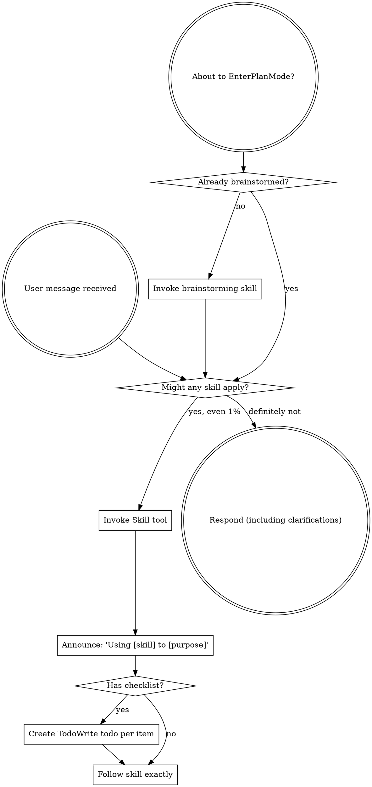

codex-exec: report contract violation

--- codex stdout ---
SPEC_VERDICT: fix_required
MISSING_REQUIREMENTS: AC2, AC3, AC4, AC6, AC7 — P153-T1b/T2d does not prove classifier-specific dispatch
EXTRA_SCOPE: `super-gsd/CLAUDE-OVERLAY.md` adds an unrequested 63-line communication/Recap protocol
VERIFICATION_MAPPING: AC1: overlay, installed hooks, registration PASS. AC2/3/6/7: live evidence records expected rows, but the assertion false-passes with guard-only lifecycle plus a forged row. AC4 therefore fails. AC5: `assertNonceFresh` and replay control. AC8-10: guard source, spawned-process assertions, and realpath equality. AC11: unchanged shadow registry plus shadow assertion. Ten commands were locally blocked by sandbox EPERM.
RELAXATION_SAFE: no — a successful guard hook pair plus a forged session-correlated routing row passes without classifier lifecycle
ALLOWLIST_DRIFT_SAFE: yes — both files use the same classifier/guard IDs; unknown IDs are rejected, and live validation composes the registration validator
SECRET_SAFETY: pass — matching uses `.test()` without extracting values; stderr uses a static trigger, and telemetry receives only static reason/regex metadata
DEFERRALS_HONEST: yes
ONE_LINER: Core transport works, but the causal probe reopens the exact harness-green/production-dead hole P153 was meant to close.

--- codex stderr ---
OpenAI Codex v0.146.0
--------
workdir: C:\Users\jack.berrow\AppData\Roaming\warp\Warp\data\worktrees\GSDedits\luminaria-hogback
model: gpt-5.6-sol
provider: openai
approval: never
sandbox: read-only
reasoning effort: xhigh
reasoning summaries: none
session id: 01a015d0-af0c-7241-be67-5e2d6556556f
--------
user
# P153 Spec-Compliance Review (SDD reviewer stage 1)

Read only. Change nothing. Answer: did the implementation deliver the PLAN exactly?

You must inspect RAW artifacts. Executor summaries are hints, never proof.

## Raw inputs, in this order

1. PLAN: `.planning/milestones/v3.6-vtp-bridge/phases/153-hook-transport-completion/153-01-PLAN-LOCKED.md` (rev 5, authoritative)
2. Executor reports in the same directory: `153-T1a-REPORT.md`, `153-T1b-REPORT.md`, `153-T1c-REPORT.md`, `153-T2-REPORT.md`, `153-T2b-REPORT.md`, `153-T2c-REPORT.md`, `153-T2d-REPORT.md`
3. Raw diff: run `git diff 2c76b5d..HEAD -- super-gsd/` yourself. Do not trust `153-PHASE-DIFFSTAT.txt` alone.
4. Verification evidence: `153-VERIFICATION.md`, `153-T1a-LIVE-EVIDENCE.md`, `153-T1b-LIVE-EVIDENCE.md`
5. The 11 acceptance-criteria commands in the PLAN frontmatter `semantic_acceptance_criteria`.

## What the phase claimed

`sgsd-intent-classifier.cjs` self-declared as a UserPromptSubmit hook but was registered to no
event, so P149 skill-routing, P151 demand baseline and P152 KB-triage shadow never executed live.
T1a registered it repo-locally via a single-event overlay. T1b/T1c added an explicit no-match row
and the causal dispatch probe. T2 made `block-secret-leak.cjs` exit 2 on the Claude surface from
one shared implementation. T2b/T2c moved the isolation precondition to an `sgsd_hook_id` allowlist.
T2d stopped the probe requiring the Claude session to succeed.

## Answer each explicitly

**1. Requirement coverage.** For each of the 11 `semantic_acceptance_criteria`, does the diff
actually implement what the criterion asserts, and does the cited evidence prove it? Name any
criterion whose evidence does not map to real behaviour.

**2. Extra scope.** Anything in the diff not traceable to a PLAN task. The PLAN forbids: a generic
fifth `block` enforcement kind in the classifier registry, Python or uv, copied source from
`disler/claude-code-hooks-mastery`, and flipping the P152 `kb-lookup-triage` route off `shadow`.
Check each.

**3. The relaxation in T2d.** T2d stopped treating a non-zero `claude -p` exit as probe failure.
Verify this did NOT weaken the discriminating property. Specifically: can a probe now pass when the
classifier did not run? The orchestrator tested two controls (no UserPromptSubmit registered; guard
registered but classifier removed) and both failed as required. Attack that claim against the code.

**4. The allowlist substitution.** T2b/T2c replaced "exactly one UserPromptSubmit entry" with a
two-id allowlist plus classifier uniqueness. Confirm both assertion files use the SAME ids and
cannot drift, and that an unknown `sgsd_hook_id` is rejected.

**5. Secret safety.** `block-secret-leak.cjs` must never emit the matched credential value or any
substring of it to stderr, logs or telemetry. Verify in the code, not the report.

**6. Deferred work honestly recorded.** The PLAN defers T0 to P154 and records STATE staleness.
Confirm nothing deferred is being presented as delivered.

## Output, exactly this, max 600 words

```
SPEC_VERDICT: pass|fix_required|blocked
MISSING_REQUIREMENTS: none|<AC or task ids not met>
EXTRA_SCOPE: none|<unrequested changes>
VERIFICATION_MAPPING: <which raw diff/command evidence proves each AC group>
RELAXATION_SAFE: yes|no — <can a probe pass with the classifier not running?>
ALLOWLIST_DRIFT_SAFE: yes|no — <do both files share the ids?>
SECRET_SAFETY: pass|fail — <evidence from code>
DEFERRALS_HONEST: yes|no
ONE_LINER: <short operator-readable summary>
```

Be adversarial on point 3. A relaxation that quietly re-opens the harness-green/production-dead
hole is the single worst outcome for this phase, because that hole is why the phase exists.

codex
I’m using the `using-superpowers` and `review` skills to conduct this as a raw-artifact, read-only compliance audit. I’ll follow the requested input order, then independently run all 11 acceptance commands and attack the T2d probe controls against the implementation.
exec
"C:\\WINDOWS\\System32\\WindowsPowerShell\\v1.0\\powershell.exe" -Command '$paths = @('"'C:\\Users\\jack.berrow\\.codex\\skills\\using-superpowers\\SKILL.md','C:\\Users\\jack.berrow\\.agents\\skills\\review\\SKILL.md'); foreach ("'$p in $paths) { Write-Output "FILE: $p"; Get-Content -LiteralPath $p -Raw }' in C:\Users\jack.berrow\AppData\Roaming\warp\Warp\data\worktrees\GSDedits\luminaria-hogback
 succeeded in 1495ms:
FILE: C:\Users\jack.berrow\.codex\skills\using-superpowers\SKILL.md
---
name: using-superpowers
description: Use when starting any conversation - establishes how to find and use skills, requiring Skill tool invocation before ANY response including clarifying questions
---

<SUBAGENT-STOP>
If you were dispatched as a subagent to execute a specific task, skip this skill.
</SUBAGENT-STOP>

<EXTREMELY-IMPORTANT>
If you think there is even a 1% chance a skill might apply to what you are doing, you ABSOLUTELY MUST invoke the skill.

IF A SKILL APPLIES TO YOUR TASK, YOU DO NOT HAVE A CHOICE. YOU MUST USE IT.

This is not negotiable. This is not optional. You cannot rationalize your way out of this.
</EXTREMELY-IMPORTANT>

## Instruction Priority

Superpowers skills override default system prompt behavior, but **user instructions always take precedence**:

1. **User's explicit instructions** (CLAUDE.md, GEMINI.md, AGENTS.md, direct requests) ƒ?" highest priority
2. **Superpowers skills** ƒ?" override default system behavior where they conflict
3. **Default system prompt** ƒ?" lowest priority

If CLAUDE.md, GEMINI.md, or AGENTS.md says "don't use TDD" and a skill says "always use TDD," follow the user's instructions. The user is in control.

## How to Access Skills

**In Claude Code:** Use the `Skill` tool. When you invoke a skill, its content is loaded and presented to youƒ?"follow it directly. Never use the Read tool on skill files.

**In Copilot CLI:** Use the `skill` tool. Skills are auto-discovered from installed plugins. The `skill` tool works the same as Claude Code's `Skill` tool.

**In Gemini CLI:** Skills activate via the `activate_skill` tool. Gemini loads skill metadata at session start and activates the full content on demand.

**In other environments:** Check your platform's documentation for how skills are loaded.

## Platform Adaptation

Skills use Claude Code tool names. Non-CC platforms: see `references/copilot-tools.md` (Copilot CLI), `references/codex-tools.md` (Codex) for tool equivalents. Gemini CLI users get the tool mapping loaded automatically via GEMINI.md.

# Using Skills

## The Rule

**Invoke relevant or requested skills BEFORE any response or action.** Even a 1% chance a skill might apply means that you should invoke the skill to check. If an invoked skill turns out to be wrong for the situation, you don't need to use it.



## Red Flags

These thoughts mean STOPƒ?"you're rationalizing:

| Thought | Reality |
|---------|---------|
| "This is just a simple question" | Questions are tasks. Check for skills. |
| "I need more context first" | Skill check comes BEFORE clarifying questions. |
| "Let me explore the codebase first" | Skills tell you HOW to explore. Check first. |
| "I can check git/files quickly" | Files lack conversation context. Check for skills. |
| "Let me gather information first" | Skills tell you HOW to gather information. |
| "This doesn't need a formal skill" | If a skill exists, use it. |
| "I remember this skill" | Skills evolve. Read current version. |
| "This doesn't count as a task" | Action = task. Check for skills. |
| "The skill is overkill" | Simple things become complex. Use it. |
| "I'll just do this one thing first" | Check BEFORE doing anything. |
| "This feels productive" | Undisciplined action wastes time. Skills prevent this. |
| "I know what that means" | Knowing the concept ƒ%ÿ using the skill. Invoke it. |

## Skill Priority

When multiple skills could apply, use this order:

1. **Process skills first** (brainstorming, debugging) - these determine HOW to approach the task
2. **Implementation skills second** (frontend-design, mcp-builder) - these guide execution

"Let's build X" ā' brainstorming first, then implementation skills.
"Fix this bug" ā' debugging first, then domain-specific skills.

## Skill Types

**Rigid** (TDD, debugging): Follow exactly. Don't adapt away discipline.

**Flexible** (patterns): Adapt principles to context.

The skill itself tells you which.

## User Instructions

Instructions say WHAT, not HOW. "Add X" or "Fix Y" doesn't mean skip workflows.

FILE: C:\Users\jack.berrow\.agents\skills\review\SKILL.md
---
name: review
description: Review code changes for security, performance, bugs, and quality. Reviews staged changes, unstaged changes, specific commits, or PR-ready diffs.
---

<objective>
Review code changes and provide structured feedback covering security, performance, bug risks, code quality, and test coverage gaps. This skill analyzes diffs and surrounding context to catch issues before they reach production.
</objective>

<context>
This skill reviews code changes at various stages of the development workflow. It can review staged changes before a commit, unstaged work-in-progress, a specific commit, or the full set of changes on a branch that are ready for a pull request.

The reviewer reads both the diff and the surrounding source files to understand intent and catch issues that only appear in context.
</context>

<core_principle>
**FIND REAL ISSUES, NOT STYLE NITS.** Focus on problems that cause bugs, security vulnerabilities, performance degradation, or maintainability pain. Avoid nitpicking formatting or subjective style preferences unless they harm readability.
</core_principle>

<analysis_only_rule>
**THIS SKILL IS READ-ONLY. DO NOT MODIFY CODE.**

The purpose is to review and report findings. Making changes during review conflates the reviewer and author roles. Present findings and let the user decide what to act on.
</analysis_only_rule>

<quick_start>

<determine_review_scope>

Parse the user's input to determine what to review:

1. **No arguments** - Review staged changes first. If nothing is staged, review unstaged changes.
   - Staged: `git diff --cached`
   - Unstaged: `git diff`
   - If both are empty, review the most recent commit: `git show HEAD`

2. **Commit hash argument** (e.g., `/review abc1234`) - Review that specific commit.
   - `git show <hash>`

3. **File path argument** (e.g., `/review src/foo.ts`) - Review unstaged changes in that file.
   - `git diff -- <path>` then fall back to `git diff --cached -- <path>`

4. **"pr" argument** (e.g., `/review pr`) - Review all changes since branching from main.
   - `git diff main...HEAD`
   - If on main, review `git diff HEAD~1`

After obtaining the diff, if it is empty, inform the user that there are no changes to review and stop.

</determine_review_scope>

<gather_context>

Before analyzing the diff:

1. **Read changed files in full** - Do not review a diff in isolation. Read each modified file to understand the surrounding code, imports, types, and control flow.
2. **Identify the tech stack** - Note languages, frameworks, and libraries in use. This affects what patterns are risky.
3. **Check for related test files** - For each changed source file, look for corresponding test files. Note whether tests were updated alongside the changes.
4. **Check for configuration changes** - If config files changed (env, CI, package.json, tsconfig, etc.), pay extra attention to side effects.

</gather_context>

<review_categories>

Analyze the changes against each category below. Only report findings that are actually present. Skip categories with no issues.

**A. Security Issues** (Severity: CRITICAL or HIGH)
- Injection vulnerabilities (SQL injection, command injection, template injection)
- Cross-site scripting (XSS) - unsanitized user input rendered in HTML
- Authentication and authorization flaws (missing auth checks, privilege escalation)
- Secrets or credentials hardcoded or logged
- Insecure deserialization or unsafe eval usage
- Path traversal or file access vulnerabilities
- Missing input validation on external data

**B. Performance Concerns** (Severity: HIGH or MEDIUM)
- N+1 query patterns in database access
- Unnecessary memory allocations in hot paths or loops
- Blocking operations on the main thread or in async contexts
- Missing pagination on unbounded queries
- Redundant computation that could be cached or memoized
- Large payloads without streaming or chunking

**C. Bug Risks** (Severity: HIGH or MEDIUM)
- Off-by-one errors in loops or array access
- Null/undefined dereferences without guards
- Race conditions in concurrent or async code
- Incorrect error handling (swallowed errors, wrong error types)
- Type mismatches or unsafe type assertions
- Logic errors in conditionals (inverted checks, missing cases)
- Resource leaks (unclosed connections, file handles, listeners)

**D. Code Quality** (Severity: MEDIUM or LOW)
- Unclear or misleading naming
- Significant code duplication that should be extracted
- Excessive complexity (deeply nested logic, functions doing too many things)
- Dead code or unreachable branches
- Missing or misleading comments on non-obvious logic
- Inconsistency with patterns used elsewhere in the codebase

**E. Test Coverage Gaps** (Severity: MEDIUM or LOW)
- New logic paths without corresponding test cases
- Changed behavior without updated tests
- Edge cases not covered (empty inputs, boundary values, error paths)
- Missing integration tests for new API endpoints or database changes

</review_categories>

<format_findings>

For each finding, use this structure:

```
### [SEVERITY] Category: Brief Title

**File**: `path/to/file.ext` (lines X-Y)

**Issue**: Clear description of the problem.

**Why it matters**: What could go wrong if this is not addressed.

**Suggestion**: How to fix it, with a code snippet if helpful.
```

Severity levels:
- **CRITICAL** - Must fix before merge. Security vulnerability or data loss risk.
- **HIGH** - Should fix before merge. Likely bug or significant performance issue.
- **MEDIUM** - Should fix soon. Code quality or moderate risk issue.
- **LOW** - Consider fixing. Minor improvement opportunity.

</format_findings>

</quick_start>

<critical_rules>

1. **READ THE FULL FILE**: Never review a diff without reading the complete source file for context
2. **NO FALSE ALARMS**: Only report issues you can explain concretely. Do not report vague concerns
3. **PRIORITIZE**: Lead with the most severe findings. Do not bury critical issues under style nits
4. **BE SPECIFIC**: Include file paths, line numbers, and code references for every finding
5. **EXPLAIN THE RISK**: For each finding, explain what could actually go wrong
6. **CHECK TESTS**: Always check whether changes have corresponding test updates
7. **CONSIDER THE STACK**: Apply language-specific and framework-specific knowledge to your review
8. **DO NOT MODIFY CODE**: Present findings only. The user decides what to act on

</critical_rules>

<output_format>

```markdown
## Code Review: [brief description of what was reviewed]

**Scope**: [staged changes | unstaged changes | commit abc1234 | PR changes from main]
**Files reviewed**: [count] files changed, [additions] additions, [deletions] deletions

---

### Findings

[Findings grouped by severity, highest first. Use the format from <format_findings>.]

---

### Summary

| Severity | Count |
|----------|-------|
| CRITICAL | X     |
| HIGH     | X     |
| MEDIUM   | X     |
| LOW      | X     |

### Recommended Actions

1. [Most important action to take]
2. [Next most important action]
3. [...]
```

If no issues are found:

```markdown
## Code Review: [brief description]

**Scope**: [what was reviewed]
**Files reviewed**: [count]

No significant issues found. The changes look good to merge.
```

</output_format>

<decision_gate>

**After presenting findings, ALWAYS offer these options:**

```
ƒ"?ƒ"?ƒ"?ƒ"?ƒ"?ƒ"?ƒ"?ƒ"?ƒ"?ƒ"?ƒ"?ƒ"?ƒ"?ƒ"?ƒ"?ƒ"?ƒ"?ƒ"?ƒ"?ƒ"?ƒ"?ƒ"?ƒ"?ƒ"?ƒ"?ƒ"?ƒ"?ƒ"?ƒ"?ƒ"?ƒ"?ƒ"?ƒ"?ƒ"?ƒ"?ƒ"?ƒ"?ƒ"?ƒ"?ƒ"?ƒ"?
REVIEW COMPLETE

What would you like to do?

1. **Fix issues** - I'll address the findings starting with the most critical
2. **Save review** - Export findings to a markdown file
3. **Review again** - Re-review with different scope or focus
4. **Discuss a finding** - Ask questions about a specific issue
5. **Other** - Tell me what you need
ƒ"?ƒ"?ƒ"?ƒ"?ƒ"?ƒ"?ƒ"?ƒ"?ƒ"?ƒ"?ƒ"?ƒ"?ƒ"?ƒ"?ƒ"?ƒ"?ƒ"?ƒ"?ƒ"?ƒ"?ƒ"?ƒ"?ƒ"?ƒ"?ƒ"?ƒ"?ƒ"?ƒ"?ƒ"?ƒ"?ƒ"?ƒ"?ƒ"?ƒ"?ƒ"?ƒ"?ƒ"?ƒ"?ƒ"?ƒ"?ƒ"?
```

**Wait for user response before taking any action.**

This gate is MANDATORY. Never skip it. Never auto-implement fixes.

</decision_gate>

C:\Users\jack.berrow\OneDrive - John Cullen Lighting\Documents\WindowsPowerShell\profile.ps1 : Cannot dot-source this 
command because it was defined in a different language mode. To invoke this command without importing its contents, 
omit the '.' operator.
At line:1 char:1
+ . 'C:\Users\jack.berrow\OneDrive - John Cullen Lighting\Documents\Win ...
+ ~~~~~~~~~~~~~~~~~~~~~~~~~~~~~~~~~~~~~~~~~~~~~~~~~~~~~~~~~~~~~~~~~~~~~
    + CategoryInfo          : InvalidOperation: (:) [profile.ps1], NotSupportedException
    + FullyQualifiedErrorId : DotSourceNotSupported,profile.ps1
 
C:\Users\jack.berrow\OneDrive - John Cullen Lighting\Documents\WindowsPowerShell\Microsoft.PowerShell_profile.ps1 : 
Cannot dot-source this command because it was defined in a different language mode. To invoke this command without 
importing its contents, omit the '.' operator.
At line:1 char:1
+ . 'C:\Users\jack.berrow\OneDrive - John Cullen Lighting\Documents\Win ...
+ ~~~~~~~~~~~~~~~~~~~~~~~~~~~~~~~~~~~~~~~~~~~~~~~~~~~~~~~~~~~~~~~~~~~~~
    + CategoryInfo          : InvalidOperation: (:) [Microsoft.PowerShell_profile.ps1], NotSupportedException
    + FullyQualifiedErrorId : DotSourceNotSupported,Microsoft.PowerShell_profile.ps1
 

exec
"C:\\WINDOWS\\System32\\WindowsPowerShell\\v1.0\\powershell.exe" -Command "Get-Content -LiteralPath '.planning\\milestones\\v3.6-vtp-bridge\\phases\\153-hook-transport-completion\\153-01-PLAN-LOCKED.md' -Raw" in C:\Users\jack.berrow\AppData\Roaming\warp\Warp\data\worktrees\GSDedits\luminaria-hogback
 succeeded in 794ms:
---
schema_version: 2
phase: "153"
slug: "hook-transport-completion"
milestone: "v3.6-vtp-bridge"
status: "PLANNED"
revision: 5
supersedes: "rev 4 (superseded by measured live evidence), rev 3/2/1 (NOGO rounds 3/2/1) ƒ?" all 2026-08-18"
depends_on: ["149", "151", "152"]
intent: "Register the UserPromptSubmit hook that P149/P151/P152 governance already depends on, using a dedicated UserPromptSubmit-only overlay installed repo-locally, and prove it fires under genuine Claude Code dispatch. Then make the existing secret-leak guard actually block. Rev 5 folds in MEASURED evidence from the T1a live run: stream-json hook events do NOT carry the hook command, so rev 4's requirement to name it was unsatisfiable. Attribution is now structural ƒ?" exactly one registered UserPromptSubmit hook plus --setting-sources project ƒ?" with session_id correlation and byte-offset snapshots. T1a (overlay, repo-local merge, hooks.yaml, assert-registration) landed at ca3c857 and is verified live."
execution_mode: "serial-codex"
expected_ATC_tier: "FULL"
skip_gates: []
lessons_path: null
prior_errors_lookup: true
semantic_acceptance_criteria:
  - input: "The repo-local .claude/settings.json after running, from the repo root with an ABSOLUTE repo-root argument: node super-gsd/scripts/merge-settings.js --repo-local-hooks super-gsd/config/claude-ups-overlay.json .claude/settings.json \"$(pwd)\" ƒ?" a relative root throws at merge-settings.js:234 before merging."
    expected_outcome: "Exactly ONE new event is registered - UserPromptSubmit - because the dedicated overlay declares only that event. No SessionStart or PostToolUse entry is introduced by this merge. Every command in the hooks section resolves to a file that exists on disk. The assertion reads only the hooks section by key and never touches the env block."
    verification_cmd: "node super-gsd/tests/hook-transport/assert-registration.cjs"
  - input: "A headless Claude session launched by the verifier with a caller-chosen fresh session id and a crypto.randomUUID nonce in a planning-shaped prompt: claude -p '<nonce> how should we architect the retry layer' --setting-sources project --session-id <fresh-uuid> --output-format stream-json --verbose --include-hook-events. Ledger byte offsets are snapshotted BEFORE launch."
    expected_outcome: "A hook_response event for hook_name UserPromptSubmit reports exit_code 0 and outcome success, under the two isolation preconditions below, AND exactly one new post-snapshot ledger row names the matched route and carries the same session_id the hook events report. Isolation preconditions, both asserted in the same run: (i) assert-registration.cjs proves exactly ONE UserPromptSubmit hook is registered, and (ii) the probe runs with --setting-sources project so global hooks are not loaded. Under (i)+(ii) a UserPromptSubmit hook_response can only be this classifier."
    verification_cmd: "node super-gsd/tests/hook-transport/assert-live-dispatch.cjs --probe planning"
  - input: "The same mechanism with an execution-shaped prompt: 'fix the failing test in parser.cjs'."
    expected_outcome: "A hook_response for UserPromptSubmit reports success under the same isolation preconditions AND exactly one new post-snapshot row EXPLICITLY records no match, carrying that session_id. An absent row fails, because absence is indistinguishable from the hook never running."
    verification_cmd: "node super-gsd/tests/hook-transport/assert-live-dispatch.cjs --probe no-match"
  - input: "Two adversarial controls. (a) The classifier spawned directly on stdin with a forged payload carrying a real session id, with no Claude dispatch at all. (b) A probe run in which the isolation precondition is deliberately violated - more than one UserPromptSubmit hook registered, or --setting-sources project omitted so global hooks load."
    expected_outcome: "BOTH controls FAIL the assertion. Control (a) fails because no hook_started/hook_response pair exists for that session. Control (b) fails because the assertion refuses to attribute a hook_response to this classifier when more than one UserPromptSubmit hook could have produced it. If either control passes, the falsifier is not falsifying and the task is incomplete."
    verification_cmd: "node super-gsd/tests/hook-transport/assert-live-dispatch.cjs --control forged-and-confused-must-fail"
  - input: "A nonce replay attempt: an assertion run reusing a nonce that already appears in the ledger before the byte-offset snapshot."
    expected_outcome: "The assertion FAILS on pre-existing-nonce detection. Nonces are generated per invocation via crypto.randomUUID and only post-snapshot rows are inspected, so a stale-nonce replay cannot produce a pass."
    verification_cmd: "node super-gsd/tests/hook-transport/assert-live-dispatch.cjs --control stale-nonce-must-fail"
  - input: "The same mechanism with a prompt targeting a P149 skill-routing registry route specifically, not the P146 compatibility planning-triage route."
    expected_outcome: "A hook_response for UserPromptSubmit reports success under the same isolation preconditions AND a new post-snapshot row's matched route originates from the P149 skill-routing registry, proving that registry is exercised live rather than only the P146 compatibility route."
    verification_cmd: "node super-gsd/tests/hook-transport/assert-live-dispatch.cjs --probe p149-skill-routing"
  - input: "The same mechanism with a KB-directed prompt matching the P152 kb-lookup-triage shadow route."
    expected_outcome: "A text-free shadow row is appended under genuine dispatch and NOTHING is injected into the prompt. The row contains no prompt text, excerpt or entity string. P152 remains enforcement kind shadow."
    verification_cmd: "node super-gsd/tests/hook-transport/assert-live-dispatch.cjs --probe p152-shadow"
  - input: "A prompt containing a credential pattern such as an API_KEY assignment, delivered to the registered Claude Code UserPromptSubmit surface."
    expected_outcome: "The hook process exits with code 2 and writes an operator-facing reason to stderr naming the matched trigger. The reason contains no secret material - not the captured value, not a substring of it. The assertion reads the real exit code of a spawned process, not a mocked return value."
    verification_cmd: "node super-gsd/tests/hook-transport/assert-block-guard.cjs --case secret"
  - input: "A benign prompt with no credential pattern delivered to the same surface."
    expected_outcome: "The hook process exits 0, writes no block reason, and the prompt is not suppressed."
    verification_cmd: "node super-gsd/tests/hook-transport/assert-block-guard.cjs --case benign"
  - input: "The block-secret-leak implementation as invoked from both the Codex hook surface and the Claude Code hook surface."
    expected_outcome: "Both surfaces execute the SAME implementation module - one file, two callers - and produce identical block decisions for identical payloads. A duplicated second copy of the detection logic fails the assertion."
    verification_cmd: "node super-gsd/tests/hook-transport/assert-block-guard.cjs --case dual-surface-shared"
  - input: "The existing P152 kb-lookup-triage shadow route regression suite after this phase's changes."
    expected_outcome: "It remains enforcement kind shadow, injects nothing, and its text-free ledger contract is unchanged; the 28-day promote-or-kill metric is not pre-empted."
    verification_cmd: "node super-gsd/tests/kb-triage-shadow/assert-shadow.cjs"
known_deadends:
  - "Merging super-gsd/config/repo-settings-overlay.json for this phase. Verified 2026-08-18: it declares THREE events (SessionStart, UserPromptSubmit, PostToolUse) and merge-settings.js merges every event in the overlay, so using it contradicts a UserPromptSubmit-only stop_rule and, if targeted globally, installs unrelated hooks with repo-relative args into every project. Rev 3 uses a dedicated single-event overlay instead."
  - "Proving dispatch via payload provenance fields (hook_event_name, session_id, transcript_path). Refuted at plan review round 2: a direct stdin spawn can supply all three, including a copied real transcript path. Provenance fields are forgeable and prove nothing on their own."
  - "Proving dispatch by showing only that SOME UserPromptSubmit event fired, with no isolation precondition. Refuted at plan review round 3: another UserPromptSubmit hook's genuine dispatch paired with a forged ledger row would pass. Closed structurally in rev 5 by requiring exactly one registered UserPromptSubmit hook plus --setting-sources project."
  - "Requiring stream-json hook events to name the exact classifier command. MEASURED 2026-08-18 (153-T1a-LIVE-EVIDENCE.md): hook_started/hook_progress/hook_response carry hook_name, hook_id, session_id, exit_code, outcome and the hook's stdout ƒ?" but NOT the command. Rev 4 specified evidence the platform does not emit. Use the isolation precondition instead."
  - "Having the classifier echo a nonce marker on stdout for probe correlation. A UserPromptSubmit hook's stdout is INJECTED into the model's prompt context (measured: 'SGSD directive: /sgsd-triage' appeared as hook output), so a correlation token would pollute every production prompt. Correlate on session_id instead."
  - "Assuming the installed hook entry must use the command-string form (\"node \\\"<abs path>\\\"\") because the global hooks do. REFUTED by live run: Claude Code honours {\"command\":\"node\",\"args\":[\"<abs path>\"]}, which merge-settings.js:281 produces by design in repo-local mode."
  - "Relying on --debug hooks output as the evidence source. Debug logs are documented textual diagnostics with no stable schema and do not carry the nonce or session id, and the filter binds only as --debug=hooks (space form enables unfiltered debugging). Use --output-format stream-json --verbose --include-hook-events with an explicit --session-id instead."
  - "Passing a relative repo-root to merge-settings.js --repo-local-hooks. Verified at merge-settings.js:234: resolveRepoLocalTarget() throws on any non-absolute root, so the command exits before merging. This defect was present in rev 3 of this plan."
  - "Asserting the negative direction by checking that no telemetry row exists. Absence is indistinguishable from the hook never running. This made P150's trust probe report a false negative (seam instance #6)."
  - "Treating the P146 compatibility planning-triage route as coverage for P149. They are separate registries; a planning-shaped prompt matching planning-triage does not exercise the P149 skill-routing table."
  - "Adding a generic fifth enforcement kind `block` to the classifier registry. Dropped as YAGNI: one current consumer, a standalone guard. Revisit when a second real consumer exists."
  - "Porting disler/claude-code-hooks-mastery Python/uv hooks. hooks.yaml sets timeout_sec 2 and uv cold-start on Windows exceeds it on every tool call. That repo has NO LICENSE (all-rights-reserved); only the Claude Code event taxonomy and exit-code semantics are used, which are facts about the platform rather than his code."
tasks:
  - id: "P153-T1b"
    type: "live-dispatch-probe"
    agent: codex
    model: codex
    depends_on: []
    files_touched:
      - "super-gsd/hooks/sgsd-intent-classifier.cjs"
      - "super-gsd/tests/hook-transport/assert-live-dispatch.cjs"
    input_contract: >
      sgsd-intent-classifier.cjs self-declares as a UserPromptSubmit hook but no
      UserPromptSubmit event is registered, so P149 skill-routing, P151 demand baseline and
      P152 shadow never execute live. Create a NEW dedicated overlay
      super-gsd/config/claude-ups-overlay.json declaring ONLY the UserPromptSubmit event
      mapped to sgsd-intent-classifier.cjs. Do NOT reuse repo-settings-overlay.json - it
      declares three events and merge-settings.js merges all of them, which contradicts the
      single-event stop_rule. Install with this command, run from the repo root - note the
      repo-root argument MUST be ABSOLUTE, because resolveRepoLocalTarget() at
      merge-settings.js:234 throws on any non-absolute root and would exit before merging:
      node super-gsd/scripts/merge-settings.js --repo-local-hooks super-gsd/config/claude-ups-overlay.json .claude/settings.json "$(pwd)"
      After merging, VALIDATE the merged hooks section parses and every command resolves, and
      record a hash of it, BEFORE running any probe - print mode can silently ignore invalid
      settings, so probing a half-written config would produce a confounded result.
      Add the corresponding UserPromptSubmit row to hooks.yaml. Ensure the classifier appends
      an EXPLICIT no-match row when no route matches - if it does not today, adding it is part
      of this task - and that every row carries the session id and the prompt nonce so probes
      can correlate. Build assert-live-dispatch.cjs, which for each probe: snapshots ledger
      byte offsets, generates a nonce via crypto.randomUUID, rejects any nonce already present,
      then launches a real headless Claude session with a caller-chosen fresh session id -
      claude -p '<nonce> ...' --setting-sources project --session-id <uuid> --output-format
      stream-json --verbose --include-hook-events - and passes ONLY when the hook-lifecycle
      events name the EXACT command resolving to sgsd-intent-classifier.cjs AND exactly one new
      post-snapshot ledger row carries that session id and nonce. Evidence that merely shows
      "a UserPromptSubmit event dispatched" is INSUFFICIENT: another hook's genuine dispatch
      combined with a forged row must not pass. CRITICAL: never read, print or echo the
      settings env block; inspect only the hooks section by key. Do not modify the global
      settings file.
    output_contract: >
      A dedicated single-event overlay exists and is installed repo-locally, adding exactly one
      event. hooks.yaml reflects it. assert-registration.cjs confirms registration and that every
      hook command resolves to an existing file. assert-live-dispatch.cjs proves five things under
      genuine dispatch: planning-match, explicit no-match, P149 skill-routing match, P152 shadow
      row with zero injection, and a forged-direct-spawn control that MUST FAIL.
    hypothesis: "The mechanism is complete and merely unregistered; installing a single-event overlay repo-locally makes P149/P151/P152 execute live, and correlating a fresh nonce against Claude's own debug hook-dispatch record proves genuine dispatch in a way forged payload fields cannot, because a direct spawn cannot cause Claude to emit a dispatch record."
    falsifier: >
      The forged-spawn control passes, proving the probe does not discriminate genuine dispatch;
      or the merge introduces any event other than UserPromptSubmit; or a hook command in the
      merged settings points at a path that does not exist; or the P149 probe matches only the
      P146 compatibility route rather than the P149 registry; or the P152 probe shows any prompt
      injection or any text in the shadow ledger; or any assertion reads the settings env block;
      or the global settings file is modified.
    stop_rule: >
      Stop when the single-event merge is confirmed, all four live probes pass under genuine
      headless-Claude dispatch, and the forged-spawn control fails as required. Do not bind any
      other hook event and do not touch the global settings file.
    verification:
      commands:
        - "node super-gsd/tests/hook-transport/assert-registration.cjs"
        - "node super-gsd/tests/hook-transport/assert-live-dispatch.cjs --probe planning"
        - "node super-gsd/tests/hook-transport/assert-live-dispatch.cjs --probe no-match"
        - "node super-gsd/tests/hook-transport/assert-live-dispatch.cjs --probe p149-skill-routing"
        - "node super-gsd/tests/hook-transport/assert-live-dispatch.cjs --probe p152-shadow"
        - "node super-gsd/tests/hook-transport/assert-live-dispatch.cjs --control forged-and-confused-must-fail"
        - "node super-gsd/hooks/sgsd-intent-classifier.cjs --self-test"
  - id: "P153-T2"
    type: "blocking-guard"
    agent: codex
    model: codex
    depends_on: ["P153-T1b"]
    files_touched:
      - "super-gsd/tools/codex-hooks/block-secret-leak.cjs"
      - "super-gsd/config/claude-ups-overlay.json"
      - "super-gsd/tests/hook-transport/assert-block-guard.cjs"
    input_contract: >
      block-secret-leak.cjs already reads UserPromptSubmit JSON from stdin and detects
      credential-bearing prompts, but it is wired only to the Codex hook surface and does not
      block. Make it block by exiting 2 with an operator-facing stderr reason naming the matched
      trigger, and register that SAME implementation on the Claude Code UserPromptSubmit surface
      by adding it to the dedicated overlay from T1. One implementation, two callers - extend, do
      not duplicate the detection logic. Exit 2 is the documented Claude Code contract for
      blocking a UserPromptSubmit hook. Do NOT add a generic fifth enforcement kind to the
      classifier registry: dropped at plan review as YAGNI with one current consumer. HARD
      CONSTRAINT: the P152 kb-lookup-triage route stays kind shadow; do not flip it, its 28-day
      metric has not unlocked. The stderr reason names the trigger and MUST NOT contain the
      matched credential value or any substring of it.
    output_contract: >
      A credential-bearing prompt on the Claude Code surface exits 2 with a stderr reason naming
      the trigger and containing no secret material; a benign prompt exits 0; both the Codex and
      Claude Code surfaces invoke a single shared implementation and return identical decisions
      for identical payloads. P152 remains shadow and assert-shadow.cjs still passes.
    hypothesis: "Warning-only enforcement does not change agent behaviour - the AHE paper records correct middleware warnings appended to tool output being ignored on the very next model turn, while hard-block at the shell layer produced the run's largest score jump - so making the existing guard exit 2 on the Claude surface is the smallest change that converts an inert detector into an actual control."
    falsifier: >
      A credential-bearing prompt is not blocked, or is blocked without a stderr reason naming the
      trigger, or the reason leaks the matched secret or a substring of it; a benign prompt is
      blocked; the two surfaces run separate copies of the detection logic; a generic block kind is
      added to the classifier registry; or the P152 shadow route changes behaviour.
    stop_rule: >
      Stop when the guard blocks and passes correctly on real spawned processes from the Claude
      surface, both surfaces share one implementation, and assert-shadow.cjs still passes. Do not
      flip P152 and do not add further blocking routes.
    verification:
      commands:
        - "node super-gsd/tests/hook-transport/assert-block-guard.cjs --case secret"
        - "node super-gsd/tests/hook-transport/assert-block-guard.cjs --case benign"
        - "node super-gsd/tests/hook-transport/assert-block-guard.cjs --case dual-surface-shared"
        - "node super-gsd/tests/kb-triage-shadow/assert-shadow.cjs"
---

# P153 ƒ?" Hook Transport Completion (rev 3)

## Goal

`sgsd-intent-classifier.cjs` self-declares as a UserPromptSubmit hook. No UserPromptSubmit
event is registered, so governance built across P149, P151 and P152 never executes in a live
session. This phase registers it repo-locally via a dedicated single-event overlay, proves it
fires under genuine Claude Code dispatch, and makes the existing secret-leak guard actually block.

## Revision history

**Rev 1 ā' NOGO.** Target unnamed; a global merge of the three-event overlay would have installed
unrelated hooks with repo-relative args into every project. All 9 ACs were satisfiable by
spawning the classifier directly after a registration check ƒ?" the harness-green/production-dead
pattern, instance #9, inside the plan meant to fix #7 and #8.

**Rev 2 ā' NOGO.** Pinned the target repo-local and re-anchored ACs on payload provenance
(`hook_event_name`, `session_id`, `transcript_path`). Review refuted the mechanism: a direct
stdin spawn can supply all three, including a copied real transcript path. Provenance fields are
forgeable. Review also caught a contradiction rev 2 introduced ƒ?" the stop_rule said "bind no
other event" while prescribing an overlay declaring three, which `merge-settings.js` merges in
full, making the stop_rule unreachable on a clean target.

**Rev 3 closes all five round-2 blockers:**

1. **Forgeable provenance ā' causal correlation.** The probe launches a real headless Claude
   session with a fresh nonce (`claude -p ... --debug hooks --debug-file`) and passes only when
   Claude's *own* debug dispatch record correlates with the new ledger row. A direct spawn cannot
   cause Claude to emit a dispatch record, so the forged-spawn control fails by construction.
2. **Live P149 and P152 probes added** as their own ACs. The compatibility `planning-triage`
   route is not coverage for the P149 skill-routing registry ƒ?" they are separate registries.
3. **Three-event overlay contradiction resolved** by a new dedicated
   `claude-ups-overlay.json` declaring only UserPromptSubmit.
4. **Full merge command stated verbatim** in T1's input contract.
5. **P154 acceptance tightened** to require successful post-fix real MCP calls, not just a
   pre-fix-failing test.

**Rev 3 ā' NOGO (round 3).** Three blockers, each verified against source before acceptance:

1. **Combination attack.** Rev 3 proved only that *a* UserPromptSubmit event dispatched. A
   genuine run dispatching a *different* UserPromptSubmit hook, combined with a separately
   forged classifier row carrying the same session id and nonce, would have passed. Rev 4
   requires hook-lifecycle evidence naming the exact command resolving to
   `sgsd-intent-classifier.cjs`, and adds control (b) to prove it.
2. **The mandated merge command was broken.** Verified at `merge-settings.js:234`:
   `resolveRepoLocalTarget()` throws on any non-absolute root, so rev 3's command would have
   exited before merging. Rev 4 passes `"$(pwd)"`.
3. **Nonce replay unguarded.** Rev 4 generates the nonce per invocation via
   `crypto.randomUUID`, snapshots ledger byte offsets before launch, rejects a pre-existing
   nonce, and inspects only post-snapshot rows.

Rev 4 also drops `--debug hooks` as the evidence source ƒ?" debug output has no stable schema,
does not carry the nonce or session id, and the filter binds only as `--debug=hooks`.

**Rev 4 proceeds to execution.** The remaining risk has shifted from plan design to
implementation detail, which the executor ā' spec-compliance ā' verifier ā' phase-ATC chain is
built to catch. Further plan-review rounds have diminishing returns.

## Tasks

**T1** creates the single-event overlay, installs it repo-locally, adds the explicit no-match
row, and builds the causal dispatch probe with both adversarial controls.

**T2** makes the existing guard exit 2 on the Claude surface from one shared implementation.

## Cost note

The live probes launch real headless Claude sessions and therefore consume quota on each
verification run. This is deliberate: it is the only mechanism that causally distinguishes
genuine dispatch from a forged spawn, which is precisely what rounds 1 and 2 died on.

## Orchestrator-owned (not a Codex task)

`STATE.md` frontmatter `current_phase` is stale at "150" while v3.6 has P151/P152 closed. State
files are orchestrator-owned per commit discipline; the orchestrator corrects it at phase close.

## Success Criteria

- Exactly one new event (UserPromptSubmit) registered repo-locally; every hook command resolves.
- Planning, no-match, P149 and P152 probes all pass under genuine headless-Claude dispatch,
  correlated by nonce and session_id against Claude's own debug record.
- The forged-direct-spawn control FAILS.
- P152 probe shows zero injection and a text-free shadow row.
- Credential-bearing prompt exits 2 with a trigger-naming reason carrying no secret material;
  benign prompt exits 0.
- Both hook surfaces share one implementation of the guard.
- `assert-shadow.cjs` passes; the global settings file is unmodified.

C:\Users\jack.berrow\OneDrive - John Cullen Lighting\Documents\WindowsPowerShell\profile.ps1 : Cannot dot-source this 
command because it was defined in a different language mode. To invoke this command without importing its contents, 
omit the '.' operator.
At line:1 char:1
+ . 'C:\Users\jack.berrow\OneDrive - John Cullen Lighting\Documents\Win ...
+ ~~~~~~~~~~~~~~~~~~~~~~~~~~~~~~~~~~~~~~~~~~~~~~~~~~~~~~~~~~~~~~~~~~~~~
    + CategoryInfo          : InvalidOperation: (:) [profile.ps1], NotSupportedException
    + FullyQualifiedErrorId : DotSourceNotSupported,profile.ps1
 
C:\Users\jack.berrow\OneDrive - John Cullen Lighting\Documents\WindowsPowerShell\Microsoft.PowerShell_profile.ps1 : 
Cannot dot-source this command because it was defined in a different language mode. To invoke this command without 
importing its contents, omit the '.' operator.
At line:1 char:1
+ . 'C:\Users\jack.berrow\OneDrive - John Cullen Lighting\Documents\Win ...
+ ~~~~~~~~~~~~~~~~~~~~~~~~~~~~~~~~~~~~~~~~~~~~~~~~~~~~~~~~~~~~~~~~~~~~~
    + CategoryInfo          : InvalidOperation: (:) [Microsoft.PowerShell_profile.ps1], NotSupportedException
    + FullyQualifiedErrorId : DotSourceNotSupported,Microsoft.PowerShell_profile.ps1
 

codex
The authoritative rev-5 frontmatter contains the 11 criteria; I’ve also noted that some lower task prose still preserves superseded rev-4 wording. I’ll judge delivery against the rev-5 semantic criteria and verify whether the implementation’s structural attribution actually closes that gap.
exec
"C:\\WINDOWS\\System32\\WindowsPowerShell\\v1.0\\powershell.exe" -Command '$dir = '"'.planning\\milestones\\v3.6-vtp-bridge\\phases\\153-hook-transport-completion'; "'$names = @('"'153-T1a-REPORT.md','153-T1b-REPORT.md','153-T1c-REPORT.md','153-T2-REPORT.md','153-T2b-REPORT.md','153-T2c-REPORT.md','153-T2d-REPORT.md'); foreach ("'$n in $names) { Write-Output "FILE: $n"; Get-Content -LiteralPath (Join-Path $dir $n) -Raw }' in C:\Users\jack.berrow\AppData\Roaming\warp\Warp\data\worktrees\GSDedits\luminaria-hogback
 succeeded in 815ms:
FILE: 153-T1a-REPORT.md
FILES_CHANGED: super-gsd/config/claude-ups-overlay.json (created), .claude/settings.json (created), super-gsd/registry/hooks.yaml (modified), super-gsd/tests/hook-transport/assert-registration.cjs (modified)
VERIFICATION: `node super-gsd/tests/hook-transport/assert-registration.cjs` η' exit 0 バ"
DEVIATIONS: none
BLOCKERS: none
ONE_LINER: Installed the repo-local UserPromptSubmit-only classifier hook; freeze hash `560f5854d4075b8ce6e459771f5ee40ad6079c6979a6c5d13c0582b9eb0a92c1`.

FILE: 153-T1b-REPORT.md
FILES_CHANGED: super-gsd/tests/hook-transport/assert-live-dispatch.cjs (modified)
VERIFICATION: `node --check super-gsd/tests/hook-transport/assert-live-dispatch.cjs` η' exit 0 バ"; `node super-gsd/tests/hook-transport/assert-live-dispatch.cjs --probe no-match` η' exit 1 バ-
DEVIATIONS: none
BLOCKERS: `node super-gsd/tests/hook-transport/assert-live-dispatch.cjs --probe no-match` produced `live dispatch FAIL: spawn EPERM`; minimal `spawnSync` of `claude.exe --version` also returned `EPERM`. Genuine dispatch cannot run in this environment, so the classifier was not modified.
ONE_LINER: Updated the partial probe toward structural session-correlated attribution, then stopped when the environment blocked Node from spawning Claude.

FILE: 153-T1c-REPORT.md
FILES_CHANGED: super-gsd/hooks/sgsd-intent-classifier.cjs (modified); super-gsd/tests/hook-transport/assert-live-dispatch.cjs (modified)
VERIFICATION: `node --check super-gsd/hooks/sgsd-intent-classifier.cjs` η' exit 0 バ"; `node --check super-gsd/tests/hook-transport/assert-live-dispatch.cjs` η' exit 0 バ"
DEVIATIONS: none
BLOCKERS: none
ONE_LINER: Classifier now records explicit matched/no_match decisions without no-match injection; probe uses the real session-correlated routing ledger.

FILE: 153-T2-REPORT.md
FILES_CHANGED: super-gsd/tools/codex-hooks/block-secret-leak.cjs (modified)
FILES_CHANGED: super-gsd/config/claude-ups-overlay.json (modified)
FILES_CHANGED: super-gsd/tests/hook-transport/assert-block-guard.cjs (created)
VERIFICATION: `node super-gsd/tests/hook-transport/assert-block-guard.cjs --case secret` exit 0 pass
VERIFICATION: `node super-gsd/tests/hook-transport/assert-block-guard.cjs --case benign` exit 0 pass
VERIFICATION: `node super-gsd/tests/hook-transport/assert-block-guard.cjs --case dual-surface-shared` exit 0 pass
VERIFICATION: `node super-gsd/tests/kb-triage-shadow/assert-shadow.cjs` exit 0 pass
DEVIATIONS: none
BLOCKERS: `assert-live-dispatch.cjs` counts all UserPromptSubmit entries and commands, so it will reject the required second entry after overlay installation.
ONE_LINER: Shared guard now blocks credential prompts with exit 2, emits trigger-only stderr, preserves secret-free ledger rows, and serves both hook surfaces.

FILE: 153-T2b-REPORT.md
FILES_CHANGED: super-gsd/tests/hook-transport/assert-live-dispatch.cjs (modified)
VERIFICATION: `node --check super-gsd/tests/hook-transport/assert-live-dispatch.cjs` exit 0 pass
DEVIATIONS: none
BLOCKERS: none
ONE_LINER: Replaced single-hook isolation with the two-ID managed allowlist, one-classifier requirement, paired successful-response evidence, and unknown-entry rejection control.

FILE: 153-T2c-REPORT.md
FILES_CHANGED: super-gsd/tests/hook-transport/assert-registration.cjs (modified)
VERIFICATION: `node --check super-gsd/tests/hook-transport/assert-registration.cjs` exit 0 pass; `node super-gsd/tests/hook-transport/assert-registration.cjs` exit 0 pass
DEVIATIONS: none
BLOCKERS: none
ONE_LINER: Registration now validates both managed hook IDs, requires one classifier, preserves disk/hash checks, and reports dynamic counts.

FILE: 153-T2d-REPORT.md
FILES_CHANGED: super-gsd/tests/hook-transport/assert-live-dispatch.cjs (modified)
VERIFICATION: `node --check super-gsd/tests/hook-transport/assert-live-dispatch.cjs` exit 0 pass
DEVIATIONS: none
BLOCKERS: none
ONE_LINER: Probe success now depends on paired hook and correlated ledger evidence, terminates Claude early, and reports distinct missing-evidence failures.

C:\Users\jack.berrow\OneDrive - John Cullen Lighting\Documents\WindowsPowerShell\profile.ps1 : Cannot dot-source this 
command because it was defined in a different language mode. To invoke this command without importing its contents, 
omit the '.' operator.
At line:1 char:1
+ . 'C:\Users\jack.berrow\OneDrive - John Cullen Lighting\Documents\Win ...
+ ~~~~~~~~~~~~~~~~~~~~~~~~~~~~~~~~~~~~~~~~~~~~~~~~~~~~~~~~~~~~~~~~~~~~~
    + CategoryInfo          : InvalidOperation: (:) [profile.ps1], NotSupportedException
    + FullyQualifiedErrorId : DotSourceNotSupported,profile.ps1
 
C:\Users\jack.berrow\OneDrive - John Cullen Lighting\Documents\WindowsPowerShell\Microsoft.PowerShell_profile.ps1 : 
Cannot dot-source this command because it was defined in a different language mode. To invoke this command without 
importing its contents, omit the '.' operator.
At line:1 char:1
+ . 'C:\Users\jack.berrow\OneDrive - John Cullen Lighting\Documents\Win ...
+ ~~~~~~~~~~~~~~~~~~~~~~~~~~~~~~~~~~~~~~~~~~~~~~~~~~~~~~~~~~~~~~~~~~~~~
    + CategoryInfo          : InvalidOperation: (:) [Microsoft.PowerShell_profile.ps1], NotSupportedException
    + FullyQualifiedErrorId : DotSourceNotSupported,Microsoft.PowerShell_profile.ps1
 

exec
"C:\\WINDOWS\\System32\\WindowsPowerShell\\v1.0\\powershell.exe" -Command 'git diff 2c76b5d..HEAD -- super-gsd/' in C:\Users\jack.berrow\AppData\Roaming\warp\Warp\data\worktrees\GSDedits\luminaria-hogback
 succeeded in 764ms:
diff --git a/super-gsd/CLAUDE-OVERLAY.md b/super-gsd/CLAUDE-OVERLAY.md
index 8453307..894ac25 100644
--- a/super-gsd/CLAUDE-OVERLAY.md
+++ b/super-gsd/CLAUDE-OVERLAY.md
@@ -337,3 +337,66 @@ contract.
 
 Revisit BM25 ranking infrastructure only at the 40-file tripwire (see
 DLB-01). Until then, grep + INDEX.md curation discipline is sufficient.
+
+<!-- SGSD:COMMUNICATION-PROTOCOL:START -->
+<!-- Managed section. Repo-scoped ONLY.
+     The global communication prompt lives in ~/.claude/CLAUDE.md (revision 2026-08-18.4) and is
+     NOT duplicated here. Board decision DLB-prompt-01 (2026-08-18) relocated the Recap rule out
+     of the global prompt because it sources .planning/ files that do not exist on every machine.
+     Canonical source of the block below:
+       C:/Users/jack.berrow/Voice-Text-Plan/docs/prompts/CLAUDE-recap-repo-scoped.md
+     Edit super-gsd/CLAUDE-OVERLAY.md, then run /sgsd-overlay-refresh. Do not hand-edit copies. -->
+
+# Closing Recap, a repo-scoped rule
+
+Applies only in repos containing `.planning/`. Relocated out of the global communication prompt by
+board decision DLB-prompt-01 (2026-08-18), because it sources project files that do not exist on
+every machine the global prompt runs on.
+
+Companion to `docs/prompts/CLAUDE-communication-prompt.md`. Evidence in
+`docs/prompts/claude-md-communication-prompt-enrichment.md`.
+
+### 5. [LOCAL] Closing Recap
+
+End every response with a `## Recap` block. It is the last thing written, so it is the first
+thing read.
+
+The block states where the work stands and what happens next, one line per field, in this order:
+
+```markdown
+## Recap
+- **Milestone:** <id and title, or "none, ad-hoc work">
+- **Phase:** <id and title, or "n/a">
+- **Stage:** <where in the workflow: discussed / planned / executing / verifying / closed>
+- **Why:** <the reason this work exists, in one clause>
+- **Building:** <what is actually being produced>
+- **Next:** <the single next action>
+```
+
+Rules:
+
+- Source the values from `.planning/STATE.md` frontmatter, the active milestone `INTENT.md`
+  and `ROADMAP.md`. Do not invent them.
+- If a field is unknown, write `unknown` rather than guessing. If the repo has no
+  `.planning/`, write `none, ad-hoc work` for Milestone and `n/a` for Phase, and still fill
+  the other four.
+- If the sources disagree, for example `STATE.md` and the governance hook reporting different
+  phases, name both rather than picking the more convenient one.
+- **Why** is the business or engineering reason, not a restatement of the task. Prefer the
+  milestone's core value or core invariant.
+- **Next** is one action, with an owner and a trigger. Write `none` when the work is closed and no
+  authorised action remains. Never invent an action to fill the field.
+- Keep the block to six field lines under the heading. It is a status header, not a summary of the
+  response.
+- The recap never replaces answering the question. Answer first, recap last.
+
+## [LOCAL] Source-conflict guard
+
+`.planning/STATE.md` is known to contradict itself and to go stale: on 2026-08-18 its
+`active_phase` frontmatter and its `Current focus` prose disagreed, and `last_updated` was five
+days old. Section 3's rule to name both sources when they disagree applies here. If STATE.md is
+internally inconsistent, say so once in the Recap line affected and give both values. Do not
+silently pick the more convenient one, and do not repeat the conflict notice on later turns in the
+same session once it has been stated.
+
+<!-- SGSD:COMMUNICATION-PROTOCOL:END -->
diff --git a/super-gsd/config/claude-ups-overlay.json b/super-gsd/config/claude-ups-overlay.json
new file mode 100644
index 0000000..c3ad9e5
--- /dev/null
+++ b/super-gsd/config/claude-ups-overlay.json
@@ -0,0 +1,31 @@
+{
+  "_comment": "Merge into <repo>/.claude/settings.json via super-gsd/scripts/merge-settings.js --repo-local-hooks. Hook script args are repo-relative here and resolved to absolute target-repo paths at install time.",
+  "hooks": {
+    "UserPromptSubmit": [
+      {
+        "sgsd_managed": true,
+        "sgsd_hook_id": "user-prompt-intent-classifier",
+        "hooks": [
+          {
+            "type": "command",
+            "command": "node",
+            "args": ["super-gsd/hooks/sgsd-intent-classifier.cjs"],
+            "timeout": 5
+          }
+        ]
+      },
+      {
+        "sgsd_managed": true,
+        "sgsd_hook_id": "user-prompt-secret-leak-guard",
+        "hooks": [
+          {
+            "type": "command",
+            "command": "node",
+            "args": ["super-gsd/tools/codex-hooks/block-secret-leak.cjs"],
+            "timeout": 5
+          }
+        ]
+      }
+    ]
+  }
+}
diff --git a/super-gsd/hooks/sgsd-intent-classifier.cjs b/super-gsd/hooks/sgsd-intent-classifier.cjs
index b6068be..8df67d1 100644
--- a/super-gsd/hooks/sgsd-intent-classifier.cjs
+++ b/super-gsd/hooks/sgsd-intent-classifier.cjs
@@ -554,7 +554,7 @@ function directiveLines(routes, kind) {
 }
 
 function appendRoutingDecision(root, payload, routes, mandatory, suggestions, duration) {
-  if (!Array.isArray(routes) || routes.length === 0) return;
+  if (!Array.isArray(routes)) return;
   try {
     const state = readState(root) || {};
     const registryPaths = Array.from(new Set(
@@ -563,6 +563,7 @@ function appendRoutingDecision(root, payload, routes, mandatory, suggestions, du
     const row = logGateEvidence(root, {
       signal: ROUTING_DECISION_SIGNAL,
       status: 'ok',
+      decision: routes.length > 0 ? 'matched' : 'no_match',
       reason_codes: [],
       artifacts: (registryPaths.length > 0 ? registryPaths : [registryPath()])
         .map((registryPathValue) => ({ kind: 'registry', path: registryPathValue })),
diff --git a/super-gsd/registry/hooks.yaml b/super-gsd/registry/hooks.yaml
index 4de3e5f..5a3d2c9 100644
--- a/super-gsd/registry/hooks.yaml
+++ b/super-gsd/registry/hooks.yaml
@@ -12,7 +12,7 @@
 
 schema_version: 2
 registry_version: 2.0.0
-last_updated: 2026-04-21
+last_updated: 2026-08-18
 
 hooks:
   # ─────────────────── Observability ───────────────────
@@ -60,6 +60,20 @@ hooks:
     lifecycle_events:
       - {event: deduplicated, ts: 2026-04-21, note: "removed duplicate registration, Phase D"}
 
+  - name: sgsd-intent-classifier
+    event: UserPromptSubmit
+    matcher: "*"
+    script: super-gsd/hooks/sgsd-intent-classifier.cjs
+    timeout_sec: 5
+    reads: [prompt, session_id, super-gsd/registry/session-governance-hooks.yaml, super-gsd/registry/skill-routing.yaml]
+    writes: [stdout directives, .planning/metrics/gate-evidence.jsonl, .planning/metrics/kb-triage-shadow.jsonl]
+    depends_on: []
+    failure_mode: silent
+    state: active
+    owner_dlb: DLB-04
+    lifecycle_events:
+      - {event: registered, ts: 2026-08-18, note: "repo-local UserPromptSubmit registration, Phase 153"}
+
   - name: sgsd-statusline
     event: SessionStart | Stop
     matcher: "*"
diff --git a/super-gsd/tests/hook-transport/assert-block-guard.cjs b/super-gsd/tests/hook-transport/assert-block-guard.cjs
new file mode 100644
index 0000000..09f90fe
--- /dev/null
+++ b/super-gsd/tests/hook-transport/assert-block-guard.cjs
@@ -0,0 +1,209 @@
+#!/usr/bin/env node
+'use strict';
+
+const assert = require('assert');
+const fs = require('fs');
+const os = require('os');
+const path = require('path');
+const { spawnSync } = require('child_process');
+
+const ROOT = path.resolve(__dirname, '..', '..', '..');
+const GUARD_PATH = path.join(ROOT, 'super-gsd', 'tools', 'codex-hooks', 'block-secret-leak.cjs');
+const CODEX_HOOKS_PATH = path.join(ROOT, '.codex', 'hooks.json');
+const CLAUDE_OVERLAY_PATH = path.join(ROOT, 'super-gsd', 'config', 'claude-ups-overlay.json');
+const LEDGER_PATH = path.join(ROOT, '.planning', 'metrics', 'codex-tool-events.jsonl');
+
+function snapshotLedger() {
+  const exists = fs.existsSync(LEDGER_PATH);
+  return { exists, size: exists ? fs.statSync(LEDGER_PATH).size : 0 };
+}
+
+function appendedRows(snapshot) {
+  if (!fs.existsSync(LEDGER_PATH)) return [];
+  const size = fs.statSync(LEDGER_PATH).size;
+  assert.ok(size >= snapshot.size, 'guard ledger shrank during the assertion');
+  if (size === snapshot.size) return [];
+  const length = size - snapshot.size;
+  const buffer = Buffer.alloc(length);
+  const descriptor = fs.openSync(LEDGER_PATH, 'r');
+  try {
+    const bytesRead = fs.readSync(descriptor, buffer, 0, length, snapshot.size);
+    const text = buffer.subarray(0, bytesRead).toString('utf8');
+    assert.ok(text.endsWith('\n'), 'guard ledger append is incomplete');
+    return text.split(/\r?\n/).filter(Boolean).map((line) => JSON.parse(line));
+  } finally {
+    fs.closeSync(descriptor);
+  }
+}
+
+function restoreLedger(snapshot) {
+  if (snapshot.exists) {
+    fs.truncateSync(LEDGER_PATH, snapshot.size);
+  } else if (fs.existsSync(LEDGER_PATH)) {
+    fs.unlinkSync(LEDGER_PATH);
+  }
+}
+
+function spawnGuard(scriptPath, payload) {
+  const tempRoot = fs.mkdtempSync(path.join(os.tmpdir(), 'sgsd-block-guard-'));
+  const stdinPath = path.join(tempRoot, 'stdin.json');
+  const stdoutPath = path.join(tempRoot, 'stdout.txt');
+  const stderrPath = path.join(tempRoot, 'stderr.txt');
+  try {
+    fs.writeFileSync(stdinPath, JSON.stringify(payload), 'utf8');
+    const descriptors = [
+      fs.openSync(stdinPath, 'r'),
+      fs.openSync(stdoutPath, 'w'),
+      fs.openSync(stderrPath, 'w'),
+    ];
+    let run;
+    try {
+      run = spawnSync(process.execPath, [scriptPath], {
+        cwd: ROOT,
+        stdio: descriptors,
+        windowsHide: true,
+      });
+    } finally {
+      for (const descriptor of descriptors) fs.closeSync(descriptor);
+    }
+    const result = Object.assign({}, run, {
+      stdout: fs.readFileSync(stdoutPath, 'utf8'),
+      stderr: fs.readFileSync(stderrPath, 'utf8'),
+    });
+    assert.ifError(result.error);
+    return result;
+  } finally {
+    fs.rmSync(tempRoot, { recursive: true, force: true });
+  }
+}
+
+function assertNoCredentialSubstring(text, credential) {
+  const substrings = new Set();
+  for (let start = 0; start < credential.length; start += 1) {
+    for (let end = start + 1; end <= credential.length; end += 1) {
+      substrings.add(credential.slice(start, end));
+    }
+  }
+  for (const substring of substrings) {
+    assert.ok(!text.includes(substring), 'operator-facing output contains credential material');
+  }
+}
+
+function assertSecretCase() {
+  const credential = 'Q'.repeat(24);
+  const snapshot = snapshotLedger();
+  try {
+    const run = spawnGuard(GUARD_PATH, { prompt: `deploy with API_KEY=${credential}` });
+    assert.strictEqual(run.status, 2, `credential prompt was not blocked: ${run.stderr}`);
+    assert.match(run.stderr, /API_KEY assignment/, 'block reason does not name the matched trigger');
+    assertNoCredentialSubstring(run.stderr, credential);
+
+    const rows = appendedRows(snapshot);
+    assert.strictEqual(rows.length, 1, 'credential prompt must append exactly one decision row');
+    assert.deepStrictEqual(Object.keys(rows[0]).sort(), [
+      'allow', 'decision', 'hook', 'pattern', 'reason', 'ts',
+    ], 'credential decision ledger row shape changed');
+    assert.strictEqual(rows[0].decision, 'block');
+    assertNoCredentialSubstring(JSON.stringify(rows[0]), credential);
+  } finally {
+    restoreLedger(snapshot);
+  }
+}
+
+function assertBenignCase() {
+  const snapshot = snapshotLedger();
+  try {
+    const run = spawnGuard(GUARD_PATH, { prompt: 'summarize the release notes' });
+    assert.strictEqual(run.status, 0, `benign prompt was blocked: ${run.stderr}`);
+    assert.strictEqual(run.stderr, '', 'benign prompt emitted a block reason');
+
+    const rows = appendedRows(snapshot);
+    assert.strictEqual(rows.length, 1, 'benign prompt must append exactly one decision row');
+    assert.deepStrictEqual(Object.keys(rows[0]).sort(), [
+      'allow', 'decision', 'hook', 'reason', 'ts',
+    ], 'benign decision ledger row shape changed');
+    assert.strictEqual(rows[0].decision, 'allow');
+  } finally {
+    restoreLedger(snapshot);
+  }
+}
+
+function readJson(filePath) {
+  return JSON.parse(fs.readFileSync(filePath, 'utf8'));
+}
+
+function codexGuardPaths() {
+  const document = readJson(CODEX_HOOKS_PATH);
+  const commands = (document.hooks?.UserPromptSubmit || [])
+    .flatMap((entry) => Array.isArray(entry?.hooks) ? entry.hooks : [])
+    .map((hook) => String(hook.command || '').match(/^node\s+(.+)$/))
+    .filter(Boolean)
+    .map((match) => path.resolve(ROOT, match[1]));
+  return commands.filter((scriptPath) => path.basename(scriptPath) === 'block-secret-leak.cjs');
+}
+
+function claudeGuardPaths() {
+  const document = readJson(CLAUDE_OVERLAY_PATH);
+  return (document.hooks?.UserPromptSubmit || [])
+    .flatMap((entry) => Array.isArray(entry?.hooks) ? entry.hooks : [])
+    .filter((hook) => hook?.command === 'node' && Array.isArray(hook.args) && hook.args.length > 0)
+    .map((hook) => path.resolve(ROOT, hook.args[0]))
+    .filter((scriptPath) => path.basename(scriptPath) === 'block-secret-leak.cjs');
+}
+
+function comparableDecision(row) {
+  const result = Object.assign({}, row);
+  delete result.ts;
+  return result;
+}
+
+function assertDualSurfaceSharedCase() {
+  const codexPaths = codexGuardPaths();
+  const claudePaths = claudeGuardPaths();
+  assert.strictEqual(codexPaths.length, 1, 'Codex must register exactly one secret-leak guard');
+  assert.strictEqual(claudePaths.length, 1, 'Claude must register exactly one secret-leak guard');
+
+  const codexPath = fs.realpathSync(codexPaths[0]);
+  const claudePath = fs.realpathSync(claudePaths[0]);
+  assert.strictEqual(codexPath, claudePath, 'Codex and Claude must resolve to the same guard file');
+  assert.strictEqual(codexPath, fs.realpathSync(GUARD_PATH), 'both surfaces must use the shared guard');
+
+  const payload = { prompt: `rotate API_KEY=${'R'.repeat(24)}` };
+  const snapshot = snapshotLedger();
+  try {
+    const codexRun = spawnGuard(codexPath, payload);
+    const claudeRun = spawnGuard(claudePath, payload);
+    assert.strictEqual(codexRun.status, 2, 'shared guard did not block the credential payload');
+    assert.strictEqual(codexRun.status, claudeRun.status, 'surface exit decisions differ');
+    assert.strictEqual(codexRun.stderr, claudeRun.stderr, 'surface block reasons differ');
+
+    const rows = appendedRows(snapshot);
+    assert.strictEqual(rows.length, 2, 'dual-surface probe must append two decision rows');
+    assert.deepStrictEqual(
+      comparableDecision(rows[0]),
+      comparableDecision(rows[1]),
+      'surface ledger decisions differ',
+    );
+  } finally {
+    restoreLedger(snapshot);
+  }
+}
+
+function main() {
+  const argv = process.argv.slice(2);
+  const caseIndex = argv.indexOf('--case');
+  assert.ok(caseIndex >= 0 && argv[caseIndex + 1], 'usage: assert-block-guard.cjs --case <name>');
+  const name = argv[caseIndex + 1];
+  if (name === 'secret') assertSecretCase();
+  else if (name === 'benign') assertBenignCase();
+  else if (name === 'dual-surface-shared') assertDualSurfaceSharedCase();
+  else throw new Error(`unknown case: ${name}`);
+  console.log(`block guard ${name} PASS`);
+}
+
+try {
+  main();
+} catch (error) {
+  console.error(`block guard FAIL: ${error.message}`);
+  process.exitCode = 1;
+}
diff --git a/super-gsd/tests/hook-transport/assert-live-dispatch.cjs b/super-gsd/tests/hook-transport/assert-live-dispatch.cjs
new file mode 100644
index 0000000..435463c
--- /dev/null
+++ b/super-gsd/tests/hook-transport/assert-live-dispatch.cjs
@@ -0,0 +1,514 @@
+#!/usr/bin/env node
+'use strict';
+
+const assert = require('assert');
+const crypto = require('crypto');
+const fs = require('fs');
+const os = require('os');
+const path = require('path');
+const { spawn, spawnSync } = require('child_process');
+
+const classifier = require('../../hooks/sgsd-intent-classifier.cjs');
+const {
+  CLASSIFIER_PATH,
+  ROOT,
+  validateRegistration,
+} = require('./assert-registration.cjs');
+
+const GATE_LEDGER_PATH = path.resolve(ROOT, '.planning', 'metrics', 'gate-evidence.jsonl');
+const SHADOW_LEDGER_PATH = classifier.kbTriageShadowLedgerPath(ROOT);
+const INTENT_CLASSIFIER_HOOK_ID = 'user-prompt-intent-classifier';
+const ALLOWED_USER_PROMPT_SUBMIT_HOOK_IDS = Object.freeze([
+  INTENT_CLASSIFIER_HOOK_ID,
+  'user-prompt-secret-leak-guard',
+]);
+const PROBES = Object.freeze({
+  planning: {
+    prompt: 'there are multiple valid approaches; how should we architect the retry layer; reply with OK only and do not use tools',
+    route: 'planning-triage',
+  },
+  'no-match': {
+    prompt: 'fix the failing test in parser.cjs; reply with OK only and do not use tools',
+    noMatch: true,
+  },
+  'p149-skill-routing': {
+    prompt: 'please run a token waste audit before this closes; reply with OK only and do not use tools',
+    routePrefix: 'sgsd-token-audit:prompt-time:',
+    registrySuffix: '/super-gsd/registry/skill-routing.yaml',
+  },
+  'p152-shadow': {
+    prompt: 'what did Ada say about the last meeting; reply with OK only and do not use tools',
+    noMatch: true,
+    shadow: true,
+  },
+});
+
+function fileSize(filePath) {
+  try {
+    return fs.statSync(filePath).size;
+  } catch (error) {
+    if (error.code === 'ENOENT') return 0;
+    throw error;
+  }
+}
+
+function snapshotLedgers() {
+  return {
+    gate: { path: GATE_LEDGER_PATH, offset: fileSize(GATE_LEDGER_PATH) },
+    shadow: { path: SHADOW_LEDGER_PATH, offset: fileSize(SHADOW_LEDGER_PATH) },
+  };
+}
+
+function readBytes(filePath, start, end) {
+  if (!filePath || !fs.existsSync(filePath) || end <= start) return '';
+  const length = end - start;
+  const buffer = Buffer.alloc(length);
+  const fd = fs.openSync(filePath, 'r');
+  try {
+    const bytesRead = fs.readSync(fd, buffer, 0, length, start);
+    return buffer.subarray(0, bytesRead).toString('utf8');
+  } finally {
+    fs.closeSync(fd);
+  }
+}
+
+function assertNonceFresh(snapshot, nonce) {
+  for (const item of Object.values(snapshot)) {
+    const prior = readBytes(item.path, 0, item.offset);
+    assert.ok(!prior.includes(nonce), `nonce already appears before snapshot: ${nonce}`);
+  }
+}
+
+function postSnapshotRows(item) {
+  const end = fileSize(item.path);
+  assert.ok(end >= item.offset, `ledger shrank after snapshot: ${item.path}`);
+  const text = readBytes(item.path, item.offset, end);
+  if (!text) return [];
+  assert.ok(text.endsWith('\n'), `post-snapshot ledger fragment is incomplete: ${item.path}`);
+  return text.split(/\r?\n/).filter(Boolean).map((line) => JSON.parse(line));
+}
+
+function postSnapshotRoutingDecisions(item) {
+  return postSnapshotRows(item).filter((row) => row
+    && row.signal === 'intent_routing_decision');
+}
+
+function parseStream(stdout) {
+  return String(stdout || '').split(/\r?\n/).filter(Boolean).map(parseStreamLine);
+}
+
+function parseStreamLine(line) {
+  try {
+    return JSON.parse(line);
+  } catch {
+    throw new Error(`Claude stream contained non-JSON output: ${line.slice(0, 240)}`);
+  }
+}
+
+function createStreamParser(onEvent) {
+  let pending = '';
+
+  function emit(line) {
+    if (!line) return false;
+    try {
+      return onEvent(parseStreamLine(line)) === true;
+    } catch {
+      // Session output is non-authoritative; missing structural evidence is diagnosed below.
+      return false;
+    }
+  }
+
+  return {
+    push(chunk) {
+      pending += String(chunk);
+      const lines = pending.split(/\r?\n/);
+      pending = lines.pop();
+      for (const line of lines) {
+        if (emit(line)) {
+          pending = '';
+          return;
+        }
+      }
+    },
+    finish() {
+      const finalLine = pending;
+      pending = '';
+      emit(finalLine);
+    },
+  };
+}
+
+function normalizedCommand(value) {
+  return String(value || '')
+    .replace(/[\x22']/g, '')
+    .replace(/\\/g, '/')
+    .replace(/\s+/g, ' ')
+    .trim()
+    .toLowerCase();
+}
+
+function assertKnownManagedUserPromptSubmitEntries(hooks) {
+  const entries = hooks && Array.isArray(hooks.UserPromptSubmit)
+    ? hooks.UserPromptSubmit
+    : [];
+  for (const entry of entries) {
+    assert.ok(entry && ALLOWED_USER_PROMPT_SUBMIT_HOOK_IDS.includes(entry.sgsd_hook_id),
+      'isolation requires every UserPromptSubmit registration to use a known managed sgsd_hook_id');
+  }
+  const classifierEntries = entries.filter((entry) => entry.sgsd_hook_id === INTENT_CLASSIFIER_HOOK_ID);
+  assert.strictEqual(classifierEntries.length, 1,
+    'isolation requires exactly one UserPromptSubmit intent classifier registration');
+}
+
+function assertRegistrationIsolation() {
+  const registration = validateRegistration({ silent: true });
+  assertKnownManagedUserPromptSubmitEntries(registration.hooks);
+  return registration;
+}
+
+function claudeArgs(prompt, sessionId, settingSources) {
+  const args = ['-p', prompt];
+  if (settingSources) args.push('--setting-sources', settingSources);
+  args.push(
+    '--session-id',
+    sessionId,
+    '--output-format',
+    'stream-json',
+    '--verbose',
+    '--include-hook-events',
+  );
+  return args;
+}
+
+function assertProjectSettingSource(args) {
+  const settingSourceIndexes = [];
+  for (let i = 0; i < args.length; i += 1) {
+    if (args[i] === '--setting-sources') settingSourceIndexes.push(i);
+  }
+  assert.strictEqual(settingSourceIndexes.length, 1,
+    'isolation requires exactly one --setting-sources argument');
+  assert.strictEqual(args[settingSourceIndexes[0] + 1], 'project',
+    'isolation requires --setting-sources project');
+}
+
+function claudeExecutable() {
+  if (process.platform !== 'win32') return 'claude';
+  const shimPath = String(process.env.PATH || '')
+    .split(path.delimiter)
+    .map((directory) => path.join(directory, 'claude.cmd'))
+    .find((candidate) => fs.existsSync(candidate));
+  assert.ok(shimPath, 'claude.cmd was not found on PATH');
+  const executable = path.join(
+    path.dirname(shimPath),
+    'node_modules',
+    '@anthropic-ai',
+    'claude-code',
+    'bin',
+    'claude.exe',
+  );
+  assert.ok(fs.existsSync(executable), 'Claude Code executable behind claude.cmd is missing');
+  return executable;
+}
+
+function hookEvidence(events, sessionId) {
+  const lifecycleEvents = events.filter((event) => event
+    && event.type === 'system'
+    && event.hook_name === 'UserPromptSubmit'
+    && event.session_id === sessionId);
+  const started = lifecycleEvents.filter((event) => event.subtype === 'hook_started');
+  const startedHookIds = new Set(started.map((event) => event.hook_id).filter(Boolean));
+  const responses = lifecycleEvents.filter((event) => event.subtype === 'hook_response');
+  const pairedResponses = responses.filter((event) => event.hook_id
+    && startedHookIds.has(event.hook_id));
+  const successfulResponse = pairedResponses.find((event) => event.exit_code === 0
+    && event.outcome === 'success');
+  return { lifecycleEvents, started, responses, pairedResponses, successfulResponse };
+}
+
+function correlatedRoutingRows(item, sessionId) {
+  return postSnapshotRoutingDecisions(item).filter((row) => row && row.session_id === sessionId);
+}
+
+function hasRequiredEvidence(events, item, sessionId) {
+  if (!hookEvidence(events, sessionId).successfulResponse) return false;
+  try {
+    return correlatedRoutingRows(item, sessionId).length > 0;
+  } catch {
+    return false;
+  }
+}
+
+function runClaude(cwd, args, snapshot, sessionId) {
+  return new Promise((resolve) => {
+    const child = spawn(claudeExecutable(), args, {
+      cwd,
+      windowsHide: true,
+      stdio: ['ignore', 'pipe', 'pipe'],
+    });
+    let stdout = '';
+    let stderr = '';
+    let spawnError = null;
+    let childStarted = false;
+    let evidenceComplete = false;
+    let closed = false;
+    const events = [];
+    const maybeStop = () => {
+      if (evidenceComplete || !hasRequiredEvidence(events, snapshot.gate, sessionId)) return false;
+      evidenceComplete = true;
+      if (!closed) child.kill();
+      return true;
+    };
+    const parser = createStreamParser((event) => {
+      events.push(event);
+      return maybeStop();
+    });
+    child.stdout.on('data', (chunk) => {
+      stdout += String(chunk);
+      if (!evidenceComplete) parser.push(chunk);
+    });
+    child.stderr.on('data', (chunk) => { stderr += String(chunk); });
+    child.once('spawn', () => { childStarted = true; });
+    child.on('error', (error) => {
+      if (!childStarted) spawnError = error;
+    });
+    const timer = setTimeout(() => child.kill(), 180000);
+    const evidencePoll = setInterval(maybeStop, 25);
+    child.on('close', (status, signal) => {
+      closed = true;
+      clearTimeout(timer);
+      clearInterval(evidencePoll);
+      if (!evidenceComplete) parser.finish();
+      resolve({ status, signal, stdout, stderr, spawnError, events, args });
+    });
+  });
+}
+
+function assertCausalEvidence(run, routingRows, sessionId, registration, providedEvents) {
+  assert.ok(registration && registration.classifierPath,
+    'registration isolation must be established before attribution');
+  assertProjectSettingSource(run.args);
+  assert.ifError(run.spawnError);
+  const events = providedEvents || run.events || parseStream(run.stdout);
+  const evidence = hookEvidence(events, sessionId);
+  assert.ok(evidence.started.length > 0,
+    'no hook_started for UserPromptSubmit with the caller-chosen session id');
+  assert.ok(evidence.responses.length > 0,
+    'no hook_response for UserPromptSubmit with the caller-chosen session id');
+  assert.ok(evidence.pairedResponses.length > 0,
+    'no hook_response paired to UserPromptSubmit hook_started by hook_id');
+  if (!evidence.successfulResponse) {
+    const nonZeroResponse = evidence.pairedResponses.find((event) => event.exit_code != null
+      && event.exit_code !== 0);
+    if (nonZeroResponse) {
+      assert.fail(`non-zero hook exit_code: ${nonZeroResponse.exit_code}`);
+    }
+    const outcomes = evidence.pairedResponses.map((event) => String(event.outcome)).join(', ');
+    assert.fail(`no hook_response with exit_code 0 and outcome success; observed outcomes: ${outcomes}`);
+  }
+  const correlated = routingRows.filter((row) => row && row.session_id === sessionId);
+  assert.ok(correlated.length > 0,
+    'no correlated post-snapshot classifier row with the caller-chosen session id');
+  assert.strictEqual(correlated.length, 1,
+    'expected exactly one post-snapshot classifier row with the session id');
+  return {
+    events,
+    lifecycleEvents: evidence.lifecycleEvents,
+    response: evidence.successfulResponse,
+    row: correlated[0],
+  };
+}
+
+function assertDecision(definition, result, shadowRows, fullPrompt, run) {
+  const row = result.row;
+  if (definition.noMatch) {
+    assert.strictEqual(row.decision, 'no_match', 'probe requires an explicit no-match decision');
+    assert.deepStrictEqual(row.route_ids, [], 'no-match row must carry an empty route_ids array');
+  } else {
+    assert.strictEqual(row.decision, 'matched', 'matched probe requires an explicit matched decision');
+    assert.ok(Array.isArray(row.route_ids) && row.route_ids.length > 0,
+      'matched probe requires a non-empty route_ids array');
+  }
+  if (definition.route) {
+    assert.ok(row.route_ids.includes(definition.route), `route was not matched: ${definition.route}`);
+  }
+  if (definition.routePrefix) {
+    assert.ok(row.route_ids.some((id) => id.startsWith(definition.routePrefix)),
+      `P149 route prefix was not matched: ${definition.routePrefix}`);
+    assert.ok(!row.route_ids.includes('planning-triage'),
+      'P149 probe must not be attributed to the P146 planning-triage compatibility route');
+    const artifactPaths = (row.artifacts || []).map((item) => normalizedCommand(item.path));
+    assert.ok(artifactPaths.some((item) => item.endsWith(definition.registrySuffix)),
+      'P149 row did not originate from the skill-routing registry');
+  }
+  if (definition.shadow) {
+    assert.strictEqual(shadowRows.length, 1, 'P152 probe must append exactly one shadow row');
+    const shadowRow = shadowRows[0];
+    assert.deepStrictEqual(Object.keys(shadowRow).sort(), [
+      'decision_id',
+      'latency_ms',
+      'matched_signature_ids',
+      'matcher_version',
+      'operator_label',
+      'soft_path_action',
+      'ts',
+    ], 'P152 shadow row must retain its text-free schema');
+    assert.deepStrictEqual(shadowRow.matched_signature_ids, ['kb-lookup-triage']);
+    const injectedOutput = result.lifecycleEvents
+      .flatMap((event) => [event.stdout, event.output])
+      .filter((value) => typeof value === 'string' && value.length > 0)
+      .join('\n');
+    assert.strictEqual(injectedOutput, '', 'P152 shadow probe injected hook output');
+    const serialized = JSON.stringify(shadowRow).toLowerCase();
+    assert.ok(!serialized.includes(fullPrompt.toLowerCase()), 'P152 shadow row contains prompt text');
+    assert.ok(!serialized.includes(fullPrompt.split(' ', 1)[0].toLowerCase()),
+      'P152 shadow row contains the prompt nonce');
+    for (const forbidden of ['ada', 'meeting']) {
+      assert.ok(!serialized.includes(forbidden), `P152 shadow row contains entity text: ${forbidden}`);
+    }
+  }
+}
+
+async function runProbe(name, providedNonce) {
+  const registration = assertRegistrationIsolation();
+  const snapshot = snapshotLedgers();
+  const nonce = providedNonce || crypto.randomUUID();
+  assertNonceFresh(snapshot, nonce);
+  const sessionId = crypto.randomUUID();
+  const definition = PROBES[name];
+  assert.ok(definition, `unknown probe: ${name}`);
+  const fullPrompt = `${nonce} ${definition.prompt}`;
+  const args = claudeArgs(fullPrompt, sessionId, 'project');
+  assertProjectSettingSource(args);
+  const run = await runClaude(ROOT, args, snapshot, sessionId);
+  const routingRows = postSnapshotRoutingDecisions(snapshot.gate);
+  const shadowRows = postSnapshotRows(snapshot.shadow);
+  const result = assertCausalEvidence(run, routingRows, sessionId, registration);
+  assertDecision(definition, result, shadowRows, fullPrompt, run);
+  console.log(`PROGRESS P153-T1b probe=${name} PASS session_id=${sessionId}`);
+}
+
+function spawnForgedClassifier(sessionId, nonce, prompt) {
+  const payload = {
+    cwd: ROOT,
+    hook_event_name: 'UserPromptSubmit',
+    session_id: sessionId,
+    prompt: `${nonce} ${prompt}`,
+  };
+  const run = spawnSync(process.execPath, [CLASSIFIER_PATH], {
+    cwd: ROOT,
+    input: JSON.stringify(payload),
+    encoding: 'utf8',
+    windowsHide: true,
+  });
+  assert.ifError(run.error);
+  assert.strictEqual(run.status, 0, `direct classifier spawn failed: ${JSON.stringify(run)}`);
+  return run;
+}
+
+function expectRejected(label, assertion, messagePattern) {
+  let rejection = null;
+  try {
+    assertion();
+  } catch (error) {
+    rejection = error;
+  }
+  assert.ok(rejection, `${label} unexpectedly passed`);
+  if (messagePattern) {
+    assert.match(rejection.message, messagePattern, `${label} rejected for the wrong reason`);
+  }
+}
+
+function runForgedAndConfusedControl() {
+  const registration = assertRegistrationIsolation();
+  const snapshot = snapshotLedgers();
+  const nonce = crypto.randomUUID();
+  assertNonceFresh(snapshot, nonce);
+  const sessionId = crypto.randomUUID();
+  const directRun = spawnForgedClassifier(sessionId, nonce, PROBES.planning.prompt);
+  const routingRows = postSnapshotRoutingDecisions(snapshot.gate);
+  assert.strictEqual(routingRows.filter((row) => row && row.session_id === sessionId).length, 1,
+  'forged direct spawn must create the tempting correlated ledger row');
+
+  const noClaudeRun = {
+    status: directRun.status,
+    signal: directRun.signal,
+    stdout: '',
+    stderr: directRun.stderr,
+    spawnError: directRun.error || null,
+    args: claudeArgs(`${nonce} ${PROBES.planning.prompt}`, sessionId, 'project'),
+  };
+  expectRejected(
+    'forged direct spawn',
+    () => assertCausalEvidence(noClaudeRun, routingRows, sessionId, registration, []),
+    /hook_started|hook_response/,
+  );
+
+  const confusedHooks = JSON.parse(JSON.stringify(registration.hooks));
+  confusedHooks.UserPromptSubmit.push({
+    sgsd_managed: true,
+    sgsd_hook_id: 'unknown-user-prompt-submit-control',
+    hooks: [],
+  });
+  expectRejected(
+    'unknown UserPromptSubmit registration',
+    () => assertKnownManagedUserPromptSubmitEntries(confusedHooks),
+    /known managed sgsd_hook_id/,
+  );
+  expectRejected(
+    'omitted project setting source',
+    () => assertProjectSettingSource(claudeArgs('control', crypto.randomUUID(), null)),
+    /--setting-sources/,
+  );
+  console.log('PROGRESS P153-T1b control=forged-and-confused-must-fail PASS');
+}
+
+function runStaleNonceControl() {
+  assertRegistrationIsolation();
+  const tempRoot = fs.mkdtempSync(path.join(os.tmpdir(), 'sgsd-live-dispatch-stale-nonce-'));
+  try {
+    const nonce = crypto.randomUUID();
+    const tempLedger = path.join(tempRoot, 'ledger.jsonl');
+    fs.writeFileSync(tempLedger, JSON.stringify({ prompt_nonce: nonce }) + '\n', 'utf8');
+    const snapshot = { gate: { path: tempLedger, offset: fileSize(tempLedger) } };
+    expectRejected(
+      'stale nonce replay',
+      () => assertNonceFresh(snapshot, nonce),
+      /nonce already appears before snapshot/,
+    );
+  } finally {
+    fs.rmSync(tempRoot, { recursive: true, force: true });
+  }
+  console.log('PROGRESS P153-T1b control=stale-nonce-must-fail PASS');
+}
+
+async function main() {
+  const argv = process.argv.slice(2);
+  const probeIndex = argv.indexOf('--probe');
+  const controlIndex = argv.indexOf('--control');
+  assert.notStrictEqual(probeIndex >= 0, controlIndex >= 0,
+    'provide exactly one of --probe <name> or --control <name>');
+  if (probeIndex >= 0) {
+    const name = argv[probeIndex + 1];
+    assert.ok(Object.prototype.hasOwnProperty.call(PROBES, name), `unknown probe: ${name || ''}`);
+    await runProbe(name);
+    return;
+  }
+
+  const name = argv[controlIndex + 1];
+  if (name === 'forged-and-confused-must-fail') {
+    runForgedAndConfusedControl();
+    return;
+  }
+  if (name === 'stale-nonce-must-fail') {
+    runStaleNonceControl();
+    return;
+  }
+  throw new Error(`unknown control: ${name || ''}`);
+}
+
+if (require.main === module) {
+  main().catch((error) => {
+    console.error(`live dispatch FAIL: ${error && error.message ? error.message : String(error)}`);
+    process.exitCode = 1;
+  });
+}
diff --git a/super-gsd/tests/hook-transport/assert-registration.cjs b/super-gsd/tests/hook-transport/assert-registration.cjs
new file mode 100644
index 0000000..296d560
--- /dev/null
+++ b/super-gsd/tests/hook-transport/assert-registration.cjs
@@ -0,0 +1,132 @@
+#!/usr/bin/env node
+'use strict';
+
+const assert = require('assert');
+const crypto = require('crypto');
+const fs = require('fs');
+const path = require('path');
+
+const ROOT = path.resolve(__dirname, '..', '..', '..');
+const OVERLAY_PATH = path.join(ROOT, 'super-gsd', 'config', 'claude-ups-overlay.json');
+const SETTINGS_PATH = path.join(ROOT, '.claude', 'settings.json');
+const CLASSIFIER_PATH = path.join(ROOT, 'super-gsd', 'hooks', 'sgsd-intent-classifier.cjs');
+const INTENT_CLASSIFIER_HOOK_ID = 'user-prompt-intent-classifier';
+const ALLOWED_USER_PROMPT_SUBMIT_HOOK_IDS = Object.freeze([
+  INTENT_CLASSIFIER_HOOK_ID,
+  'user-prompt-secret-leak-guard',
+]);
+
+function readHooksByKey(filePath) {
+  const document = JSON.parse(fs.readFileSync(filePath, 'utf8'));
+  return document.hooks;
+}
+
+function normalizedPath(value) {
+  const resolved = path.resolve(String(value || ''));
+  return process.platform === 'win32' ? resolved.toLowerCase() : resolved;
+}
+
+function commandScriptPath(hook) {
+  assert.ok(hook && hook.type === 'command', 'every installed hook must be command-typed');
+  assert.strictEqual(hook.command, 'node', 'hook command must use node with an explicit script arg');
+  assert.ok(Array.isArray(hook.args) && hook.args.length > 0, 'node hook must name its script in args[0]');
+  assert.ok(path.isAbsolute(hook.args[0]), 'repo-local hook script arg must be absolute after merge');
+  return path.resolve(hook.args[0]);
+}
+
+function assertKnownManagedEntries(entries, source) {
+  for (const entry of entries) {
+    assert.ok(entry && ALLOWED_USER_PROMPT_SUBMIT_HOOK_IDS.includes(entry.sgsd_hook_id),
+      `${source} UserPromptSubmit entry must use a known managed sgsd_hook_id`);
+  }
+}
+
+function validateRegistration(options) {
+  const opts = options || {};
+  assert.ok(fs.existsSync(OVERLAY_PATH), 'dedicated UserPromptSubmit overlay is missing');
+  const overlayHooks = readHooksByKey(OVERLAY_PATH);
+  assert.deepStrictEqual(
+    Object.keys(overlayHooks || {}),
+    ['UserPromptSubmit'],
+    'overlay must declare exactly one event: UserPromptSubmit',
+  );
+
+  const overlayEntries = overlayHooks.UserPromptSubmit;
+  assert.ok(Array.isArray(overlayEntries), 'overlay UserPromptSubmit value must be an array');
+  assertKnownManagedEntries(overlayEntries, 'overlay');
+  for (const entry of overlayEntries) {
+    assert.strictEqual(entry.sgsd_managed, true, 'overlay hook must be SGSD-managed');
+    assert.ok(Array.isArray(entry.hooks) && entry.hooks.length === 1,
+      'each overlay UserPromptSubmit entry must map to exactly one command');
+  }
+  const overlayClassifierEntries = overlayEntries
+    .filter((entry) => entry.sgsd_hook_id === INTENT_CLASSIFIER_HOOK_ID);
+  assert.strictEqual(overlayClassifierEntries.length, 1,
+    'overlay must contain exactly one UserPromptSubmit classifier entry');
+  const overlayCommands = overlayClassifierEntries[0].hooks;
+  assert.strictEqual(overlayCommands[0].command, 'node', 'overlay command must be node');
+  assert.deepStrictEqual(
+    overlayCommands[0].args,
+    ['super-gsd/hooks/sgsd-intent-classifier.cjs'],
+    'overlay must map only to sgsd-intent-classifier.cjs',
+  );
+
+  assert.ok(fs.existsSync(SETTINGS_PATH), 'repo-local .claude/settings.json is missing');
+  const hooks = readHooksByKey(SETTINGS_PATH);
+  assert.ok(hooks && typeof hooks === 'object' && !Array.isArray(hooks),
+    'repo-local settings hooks section must be an object');
+  for (const unrelatedEvent of ['SessionStart', 'PostToolUse']) {
+    assert.ok(!Object.prototype.hasOwnProperty.call(hooks, unrelatedEvent),
+      `dedicated overlay must not introduce hooks.${unrelatedEvent}`);
+  }
+
+  const installedUserPromptSubmitEntries = Array.isArray(hooks.UserPromptSubmit)
+    ? hooks.UserPromptSubmit
+    : [];
+  assertKnownManagedEntries(installedUserPromptSubmitEntries, 'installed');
+  const installedEntries = installedUserPromptSubmitEntries
+    .filter((entry) => entry.sgsd_hook_id === INTENT_CLASSIFIER_HOOK_ID);
+  assert.strictEqual(installedEntries.length, 1,
+    'exactly one UserPromptSubmit classifier entry must be installed');
+
+  let commandCount = 0;
+  for (const [event, entries] of Object.entries(hooks)) {
+    assert.ok(Array.isArray(entries), `hooks.${event} must be an array`);
+    for (const entry of entries) {
+      assert.ok(Array.isArray(entry.hooks), `hooks.${event} entry must contain hooks[]`);
+      for (const hook of entry.hooks) {
+        commandCount += 1;
+        const scriptPath = commandScriptPath(hook);
+        assert.ok(fs.existsSync(scriptPath), `hook command target does not exist: ${scriptPath}`);
+      }
+    }
+  }
+  assert.ok(commandCount > 0, 'hooks section must contain at least one command');
+
+  const installedScript = commandScriptPath(installedEntries[0].hooks[0]);
+  assert.strictEqual(normalizedPath(installedScript), normalizedPath(CLASSIFIER_PATH),
+    'installed UserPromptSubmit command must resolve exactly to sgsd-intent-classifier.cjs');
+
+  const hash = crypto.createHash('sha256').update(JSON.stringify(hooks)).digest('hex');
+  const eventCount = Object.keys(overlayHooks).length;
+  if (!opts.silent) {
+    console.log(`hook registration PASS events_added=${eventCount} commands=${commandCount} hooks_sha256=${hash}`);
+  }
+  return { hash, hooks, classifierPath: installedScript };
+}
+
+if (require.main === module) {
+  try {
+    validateRegistration();
+  } catch (error) {
+    console.error(`hook registration FAIL: ${error.message}`);
+    process.exit(1);
+  }
+}
+
+module.exports = {
+  CLASSIFIER_PATH,
+  ROOT,
+  SETTINGS_PATH,
+  validateRegistration,
+};
diff --git a/super-gsd/tools/codex-hooks/block-secret-leak.cjs b/super-gsd/tools/codex-hooks/block-secret-leak.cjs
index d831e16..e7cb7b6 100644
--- a/super-gsd/tools/codex-hooks/block-secret-leak.cjs
+++ b/super-gsd/tools/codex-hooks/block-secret-leak.cjs
@@ -8,11 +8,11 @@ const HOOK_NAME = "block-secret-leak";
 const repoRoot = path.resolve(__dirname, "../../..");
 const metricsPath = path.resolve(repoRoot, ".planning/metrics/codex-tool-events.jsonl");
 const secretPatterns = [
-  /API_KEY\s*=\s*[A-Za-z0-9_-]{8,}/,
-  /sk_[A-Za-z0-9_]{20,}/,
-  /BEGIN PRIVATE KEY/,
-  /password\s*=\s*[^\s]+/i,
-  /production\s+credential/i
+  { trigger: "API_KEY assignment", pattern: /API_KEY\s*=\s*[A-Za-z0-9_-]{8,}/ },
+  { trigger: "sk_ token", pattern: /sk_[A-Za-z0-9_]{20,}/ },
+  { trigger: "private-key header", pattern: /BEGIN PRIVATE KEY/ },
+  { trigger: "password assignment", pattern: /password\s*=\s*[^\s]+/i },
+  { trigger: "production credential phrase", pattern: /production\s+credential/i }
 ];
 
 function usage() {
@@ -42,9 +42,14 @@ function evaluate(payload) {
   if (prompt === null) {
     return { allow: false, reason: "prompt_missing" };
   }
-  const matched = secretPatterns.find((pattern) => pattern.test(prompt));
+  const matched = secretPatterns.find((candidate) => candidate.pattern.test(prompt));
   if (matched) {
-    return { allow: false, reason: "secret_pattern_detected", pattern: String(matched) };
+    return {
+      allow: false,
+      reason: "secret_pattern_detected",
+      pattern: String(matched.pattern),
+      trigger: matched.trigger
+    };
   }
   return { allow: true, reason: "no_secret_pattern" };
 }
@@ -69,10 +74,11 @@ function main() {
   }
 
   const decision = evaluate(payload);
-  appendDecision(Object.assign({}, decision, { decision: decision.allow ? "allow" : "block" }));
+  const { trigger, ...ledgerDecision } = decision;
+  appendDecision(Object.assign({}, ledgerDecision, { decision: decision.allow ? "allow" : "block" }));
   if (!decision.allow) {
-    console.error(`[${HOOK_NAME}] blocked: ${decision.reason}`);
-    return 1;
+    console.error(`[${HOOK_NAME}] blocked: ${trigger || decision.reason}`);
+    return trigger ? 2 : 1;
   }
   return 0;
 }
C:\Users\jack.berrow\OneDrive - John Cullen Lighting\Documents\WindowsPowerShell\profile.ps1 : Cannot dot-source this 
command because it was defined in a different language mode. To invoke this command without importing its contents, 
omit the '.' operator.
At line:1 char:1
+ . 'C:\Users\jack.berrow\OneDrive - John Cullen Lighting\Documents\Win ...
+ ~~~~~~~~~~~~~~~~~~~~~~~~~~~~~~~~~~~~~~~~~~~~~~~~~~~~~~~~~~~~~~~~~~~~~
    + CategoryInfo          : InvalidOperation: (:) [profile.ps1], NotSupportedException
    + FullyQualifiedErrorId : DotSourceNotSupported,profile.ps1
 
C:\Users\jack.berrow\OneDrive - John Cullen Lighting\Documents\WindowsPowerShell\Microsoft.PowerShell_profile.ps1 : 
Cannot dot-source this command because it was defined in a different language mode. To invoke this command without 
importing its contents, omit the '.' operator.
At line:1 char:1
+ . 'C:\Users\jack.berrow\OneDrive - John Cullen Lighting\Documents\Win ...
+ ~~~~~~~~~~~~~~~~~~~~~~~~~~~~~~~~~~~~~~~~~~~~~~~~~~~~~~~~~~~~~~~~~~~~~
    + CategoryInfo          : InvalidOperation: (:) [Microsoft.PowerShell_profile.ps1], NotSupportedException
    + FullyQualifiedErrorId : DotSourceNotSupported,Microsoft.PowerShell_profile.ps1
 

exec
"C:\\WINDOWS\\System32\\WindowsPowerShell\\v1.0\\powershell.exe" -Command 'git diff --name-status 2c76b5d..HEAD -- super-gsd/; git diff --stat 2c76b5d..HEAD -- super-gsd/' in C:\Users\jack.berrow\AppData\Roaming\warp\Warp\data\worktrees\GSDedits\luminaria-hogback
 succeeded in 1119ms:
M	super-gsd/CLAUDE-OVERLAY.md
A	super-gsd/config/claude-ups-overlay.json
M	super-gsd/hooks/sgsd-intent-classifier.cjs
M	super-gsd/registry/hooks.yaml
A	super-gsd/tests/hook-transport/assert-block-guard.cjs
A	super-gsd/tests/hook-transport/assert-live-dispatch.cjs
A	super-gsd/tests/hook-transport/assert-registration.cjs
M	super-gsd/tools/codex-hooks/block-secret-leak.cjs
 super-gsd/CLAUDE-OVERLAY.md                        |  63 +++
 super-gsd/config/claude-ups-overlay.json           |  31 ++
 super-gsd/hooks/sgsd-intent-classifier.cjs         |   3 +-
 super-gsd/registry/hooks.yaml                      |  16 +-
 .../tests/hook-transport/assert-block-guard.cjs    | 209 +++++++++
 .../tests/hook-transport/assert-live-dispatch.cjs  | 514 +++++++++++++++++++++
 .../tests/hook-transport/assert-registration.cjs   | 132 ++++++
 super-gsd/tools/codex-hooks/block-secret-leak.cjs  |  26 +-
 8 files changed, 982 insertions(+), 12 deletions(-)
C:\Users\jack.berrow\OneDrive - John Cullen Lighting\Documents\WindowsPowerShell\profile.ps1 : Cannot dot-source this 
command because it was defined in a different language mode. To invoke this command without importing its contents, 
omit the '.' operator.
At line:1 char:1
+ . 'C:\Users\jack.berrow\OneDrive - John Cullen Lighting\Documents\Win ...
+ ~~~~~~~~~~~~~~~~~~~~~~~~~~~~~~~~~~~~~~~~~~~~~~~~~~~~~~~~~~~~~~~~~~~~~
    + CategoryInfo          : InvalidOperation: (:) [profile.ps1], NotSupportedException
    + FullyQualifiedErrorId : DotSourceNotSupported,profile.ps1
 
C:\Users\jack.berrow\OneDrive - John Cullen Lighting\Documents\WindowsPowerShell\Microsoft.PowerShell_profile.ps1 : 
Cannot dot-source this command because it was defined in a different language mode. To invoke this command without 
importing its contents, omit the '.' operator.
At line:1 char:1
+ . 'C:\Users\jack.berrow\OneDrive - John Cullen Lighting\Documents\Win ...
+ ~~~~~~~~~~~~~~~~~~~~~~~~~~~~~~~~~~~~~~~~~~~~~~~~~~~~~~~~~~~~~~~~~~~~~
    + CategoryInfo          : InvalidOperation: (:) [Microsoft.PowerShell_profile.ps1], NotSupportedException
    + FullyQualifiedErrorId : DotSourceNotSupported,Microsoft.PowerShell_profile.ps1
 

exec
"C:\\WINDOWS\\System32\\WindowsPowerShell\\v1.0\\powershell.exe" -Command '$dir = '"'.planning\\milestones\\v3.6-vtp-bridge\\phases\\153-hook-transport-completion'; "'$names = @('"'153-VERIFICATION.md','153-T1a-LIVE-EVIDENCE.md','153-T1b-LIVE-EVIDENCE.md'); foreach ("'$n in $names) { Write-Output "FILE: $n"; Get-Content -LiteralPath (Join-Path $dir $n) -Raw }' in C:\Users\jack.berrow\AppData\Roaming\warp\Warp\data\worktrees\GSDedits\luminaria-hogback
 succeeded in 1079ms:
FILE: 153-VERIFICATION.md
# P153 Verification

All commands run by the orchestrator outside the Codex sandbox, which cannot spawn
claude (spawn EPERM, confirmed three times). Config under test is the installed
two-entry repo-local .claude/settings.json: intent classifier plus secret-leak guard.

## All 11 semantic acceptance criteria pass

    PASS  assert-registration.cjs
    PASS  assert-live-dispatch.cjs --probe planning
    PASS  assert-live-dispatch.cjs --probe no-match
    PASS  assert-live-dispatch.cjs --probe p149-skill-routing
    PASS  assert-live-dispatch.cjs --probe p152-shadow
    PASS  assert-live-dispatch.cjs --control forged-and-confused-must-fail
    PASS  assert-live-dispatch.cjs --control stale-nonce-must-fail
    PASS  assert-block-guard.cjs --case secret
    PASS  assert-block-guard.cjs --case benign
    PASS  assert-block-guard.cjs --case dual-surface-shared
    PASS  kb-triage-shadow/assert-shadow.cjs

    11 / 11 passing, 0 failing

Registration state: events_added=1 commands=2
hooks_sha256=bbabc5b17a578d89246e2e2ed638e8d586f665b5b8cbe6360bf2a7c7213e53c6

## Falsifier discrimination, tested both ways

Eleven green results prove nothing unless the probe can be made to fail. Two
deliberate breakages:

TEST A, no UserPromptSubmit registered at all:
    --probe planning  exit 1

TEST B, secret-leak guard left registered, intent classifier removed:
    remaining ids: user-prompt-secret-leak-guard
    --probe planning  exit 1

Test B is the decisive one. A probe asserting only that some known managed hook is
registered would pass with the guard alone while the classifier never ran. It failed,
so the allowlist enforces classifier uniqueness rather than mere id recognition.

After each test the settings were restored and assert-registration.cjs reported the
identical hash bbabc5b1, so neither test left residue.

## Transport confirmed under adverse conditions

A direct claude -p run was executed while the account was out of credits. Both hooks
dispatched, both returned exit_code 0 outcome success, the classifier injected
"SGSD directive: /sgsd-triage", and the routing ledger went from 15 to 16 rows:

    signal      intent_routing_decision
    decision    matched
    route_ids   ["planning-triage"]
    session_id  4b678f53-291d-40c5-b745-7121f8f518bf

The child exited 124 on the model turn it never needed. A UserPromptSubmit hook fires
before the model call, so the hook completing while the session fails is correct
behaviour, not a defect.

## Orchestrator error corrected during verification

The p149 and p152 probes were first reported as a regression caused by installing the
second hook. That was wrong. Both hooks had dispatched successfully in the failing run
and the P152 shadow row was written text-free at 16:27:41.883Z with
matched_signature_ids ["kb-lookup-triage"]. The failure was out_of_credits plus ten
529 overloaded retries. The real defect was in the probe: it required the whole session
to succeed when it only needed the hook to have fired. Fixed in T2d, which also made
the probes roughly four times faster by terminating as soon as evidence appears, and
stopped them consuming model quota they never needed.

## Deferred, not done

STATE.md frontmatter current_phase is stale at "150" while v3.6 has P151 and P152
closed. Live routing rows are therefore stamped phase 150 milestone v3.5. State files
are orchestrator-owned per commit discipline. Correcting it is the next action.

FILE: 153-T1a-LIVE-EVIDENCE.md
# P153-T1a ƒ?" Live dispatch evidence (first genuine firing)

Captured 2026-08-18 by the orchestrator, not the executor.

Command:
    claude -p "how should we architect the retry layer" --setting-sources project \
      --output-format stream-json --verbose --include-hook-events

Observed stream-json hook lifecycle:

    {"type":"system","subtype":"hook_started","hook_name":"UserPromptSubmit",
     "hook_id":"f3a6a7a1-...","session_id":"a29859f1-..."}
    {"type":"system","subtype":"hook_progress","hook_name":"UserPromptSubmit",
     "stdout":"SGSD directive: /sgsd-triage\n"}
    {"type":"system","subtype":"hook_response","hook_name":"UserPromptSubmit",
     "exit_code":0,"outcome":"success","stdout":"SGSD directive: /sgsd-triage\n"}

## What this proves

The repo-local UserPromptSubmit hook DISPATCHES and the classifier RUNS. It matched
the planning-triage route and injected its directive. This is the first time the
P149/P151/P152 governance mechanism has executed in a live session.

## Refuted concern

The installed entry uses {"command":"node","args":["<abs path>"]} rather than the
{"command":"node \"<abs path>\""} string form used by the known-working global hooks.
The orchestrator flagged this as a possible dead-registration seam. The live run
REFUTES it: Claude Code honours the args array. merge-settings.js:281 supports this
shape by design in repo-local mode.

## Findings that change T1b's design

1. stream-json hook events carry hook_name, hook_id, session_id, exit_code, outcome
   and the hook's stdout ƒ?" but NOT the hook command. So the round-3 requirement to
   "identify the exact classifier command" is NOT satisfiable from these events.

2. The combination attack (another UserPromptSubmit hook's genuine dispatch paired
   with a forged ledger row) is closed STRUCTURALLY instead: assert that exactly ONE
   UserPromptSubmit hook is registered (assert-registration.cjs already proves
   events_added=1 commands=1) AND run probes with --setting-sources project so global
   hooks are not loaded. Under those two conditions a UserPromptSubmit hook_response
   can only be this classifier.

3. Do NOT have the classifier echo a nonce marker on stdout for correlation: a
   UserPromptSubmit hook's stdout is injected into the model's prompt context, so a
   correlation token would pollute production prompts.

FILE: 153-T1b-LIVE-EVIDENCE.md
# P153-T1b/T1c live probe evidence

All runs executed by the orchestrator outside the Codex sandbox, which cannot spawn
claude (spawn EPERM, confirmed twice).

## Probes, all under genuine headless Claude dispatch

    --probe planning            PASS  session_id=9201def8-9ac5-49dc-a6e1-973fbcdc7b6f
    --probe no-match            PASS  session_id=775c53a5-d398-4f88-849a-648dd04b4239
    --probe p149-skill-routing  PASS  session_id=4898de8d-099e-482b-80e0-94657227cf29
    --probe p152-shadow         PASS  session_id=7406a9c1-5cd4-4a60-8a8b-40a5ca499803

## Adversarial controls

    --control forged-and-confused-must-fail  PASS
    --control stale-nonce-must-fail          PASS

## Falsifier discrimination test

A passing control proves nothing unless the probe can be made to fail. Test performed:

1. Removed the UserPromptSubmit entry from repo-local .claude/settings.json.
2. Ran --probe planning. Result:

        live dispatch FAIL: exactly one managed UserPromptSubmit classifier entry
        must be installed
        0 !== 1
        exit 1

3. Restored settings.json. assert-registration.cjs then reported
   events_added=1 commands=1
   hooks_sha256=560f5854d4075b8ce6e459771f5ee40ad6079c6979a6c5d13c0582b9eb0a92c1

The hash is byte-identical to the pre-test value, so the test left no residue.

The probe fails when the hook is absent and passes when it is present. The falsifier
discriminates. This is the property rev 1, rev 2 and rev 3 of the plan each failed to
guarantee, and it is now demonstrated rather than argued.

## Code change that made no-match observable

super-gsd/hooks/sgsd-intent-classifier.cjs, appendRoutingDecision:

    - if (!Array.isArray(routes) || routes.length === 0) return;
    + if (!Array.isArray(routes)) return;
    +   decision: routes.length > 0 ? 'matched' : 'no_match',

The early return was why no no-match row was ever written, which made row absence
indistinguishable from the hook never running. That is seam instance 6 in this repo's
anti-pattern ledger, and it was still live in the classifier until this change.

C:\Users\jack.berrow\OneDrive - John Cullen Lighting\Documents\WindowsPowerShell\profile.ps1 : Cannot dot-source this 
command because it was defined in a different language mode. To invoke this command without importing its contents, 
omit the '.' operator.
At line:1 char:1
+ . 'C:\Users\jack.berrow\OneDrive - John Cullen Lighting\Documents\Win ...
+ ~~~~~~~~~~~~~~~~~~~~~~~~~~~~~~~~~~~~~~~~~~~~~~~~~~~~~~~~~~~~~~~~~~~~~
    + CategoryInfo          : InvalidOperation: (:) [profile.ps1], NotSupportedException
    + FullyQualifiedErrorId : DotSourceNotSupported,profile.ps1
 
C:\Users\jack.berrow\OneDrive - John Cullen Lighting\Documents\WindowsPowerShell\Microsoft.PowerShell_profile.ps1 : 
Cannot dot-source this command because it was defined in a different language mode. To invoke this command without 
importing its contents, omit the '.' operator.
At line:1 char:1
+ . 'C:\Users\jack.berrow\OneDrive - John Cullen Lighting\Documents\Win ...
+ ~~~~~~~~~~~~~~~~~~~~~~~~~~~~~~~~~~~~~~~~~~~~~~~~~~~~~~~~~~~~~~~~~~~~~
    + CategoryInfo          : InvalidOperation: (:) [Microsoft.PowerShell_profile.ps1], NotSupportedException
    + FullyQualifiedErrorId : DotSourceNotSupported,Microsoft.PowerShell_profile.ps1
 

codex
The reports claim 11/11, but the raw implementation has two items needing close scrutiny: the diff also includes an unrelated `CLAUDE-OVERLAY.md` communication block, and the live probe now terminates Claude once lifecycle plus ledger evidence appears. I’m running the acceptance commands next and will separate executable proof from report-only proof where this sandbox blocks genuine Claude dispatch.
exec
"C:\\WINDOWS\\System32\\WindowsPowerShell\\v1.0\\powershell.exe" -Command 'node super-gsd/tests/hook-transport/assert-registration.cjs' in C:\Users\jack.berrow\AppData\Roaming\warp\Warp\data\worktrees\GSDedits\luminaria-hogback
 succeeded in 546ms:
hook registration PASS events_added=1 commands=2 hooks_sha256=bbabc5b17a578d89246e2e2ed638e8d586f665b5b8cbe6360bf2a7c7213e53c6
C:\Users\jack.berrow\OneDrive - John Cullen Lighting\Documents\WindowsPowerShell\profile.ps1 : Cannot dot-source this 
command because it was defined in a different language mode. To invoke this command without importing its contents, 
omit the '.' operator.
At line:1 char:1
+ . 'C:\Users\jack.berrow\OneDrive - John Cullen Lighting\Documents\Win ...
+ ~~~~~~~~~~~~~~~~~~~~~~~~~~~~~~~~~~~~~~~~~~~~~~~~~~~~~~~~~~~~~~~~~~~~~
    + CategoryInfo          : InvalidOperation: (:) [profile.ps1], NotSupportedException
    + FullyQualifiedErrorId : DotSourceNotSupported,profile.ps1
 
C:\Users\jack.berrow\OneDrive - John Cullen Lighting\Documents\WindowsPowerShell\Microsoft.PowerShell_profile.ps1 : 
Cannot dot-source this command because it was defined in a different language mode. To invoke this command without 
importing its contents, omit the '.' operator.
At line:1 char:1
+ . 'C:\Users\jack.berrow\OneDrive - John Cullen Lighting\Documents\Win ...
+ ~~~~~~~~~~~~~~~~~~~~~~~~~~~~~~~~~~~~~~~~~~~~~~~~~~~~~~~~~~~~~~~~~~~~~
    + CategoryInfo          : InvalidOperation: (:) [Microsoft.PowerShell_profile.ps1], NotSupportedException
    + FullyQualifiedErrorId : DotSourceNotSupported,Microsoft.PowerShell_profile.ps1
 

exec
"C:\\WINDOWS\\System32\\WindowsPowerShell\\v1.0\\powershell.exe" -Command 'node super-gsd/tests/hook-transport/assert-live-dispatch.cjs --probe planning' in C:\Users\jack.berrow\AppData\Roaming\warp\Warp\data\worktrees\GSDedits\luminaria-hogback
2026-08-18T17:01:35.076662Z ERROR codex_core::tools::router: error=Exit code: 1
Wall time: 0.6 seconds
Output:
C:\Users\jack.berrow\OneDrive - John Cullen Lighting\Documents\WindowsPowerShell\profile.ps1 : Cannot dot-source this 
command because it was defined in a different language mode. To invoke this command without importing its contents, 
omit the '.' operator.
At line:1 char:1
+ . 'C:\Users\jack.berrow\OneDrive - John Cullen Lighting\Documents\Win ...
+ ~~~~~~~~~~~~~~~~~~~~~~~~~~~~~~~~~~~~~~~~~~~~~~~~~~~~~~~~~~~~~~~~~~~~~
    + CategoryInfo          : InvalidOperation: (:) [profile.ps1], NotSupportedException
    + FullyQualifiedErrorId : DotSourceNotSupported,profile.ps1
 
C:\Users\jack.berrow\OneDrive - John Cullen Lighting\Documents\WindowsPowerShell\Microsoft.PowerShell_profile.ps1 : 
Cannot dot-source this command because it was defined in a different language mode. To invoke this command without 
importing its contents, omit the '.' operator.
At line:1 char:1
+ . 'C:\Users\jack.berrow\OneDrive - John Cullen Lighting\Documents\Win ...
+ ~~~~~~~~~~~~~~~~~~~~~~~~~~~~~~~~~~~~~~~~~~~~~~~~~~~~~~~~~~~~~~~~~~~~~
    + CategoryInfo          : InvalidOperation: (:) [Microsoft.PowerShell_profile.ps1], NotSupportedException
    + FullyQualifiedErrorId : DotSourceNotSupported,Microsoft.PowerShell_profile.ps1
 
live dispatch FAIL: spawn EPERM

 exited 1 in 619ms:
C:\Users\jack.berrow\OneDrive - John Cullen Lighting\Documents\WindowsPowerShell\profile.ps1 : Cannot dot-source this 
command because it was defined in a different language mode. To invoke this command without importing its contents, 
omit the '.' operator.
At line:1 char:1
+ . 'C:\Users\jack.berrow\OneDrive - John Cullen Lighting\Documents\Win ...
+ ~~~~~~~~~~~~~~~~~~~~~~~~~~~~~~~~~~~~~~~~~~~~~~~~~~~~~~~~~~~~~~~~~~~~~
    + CategoryInfo          : InvalidOperation: (:) [profile.ps1], NotSupportedException
    + FullyQualifiedErrorId : DotSourceNotSupported,profile.ps1
 
C:\Users\jack.berrow\OneDrive - John Cullen Lighting\Documents\WindowsPowerShell\Microsoft.PowerShell_profile.ps1 : 
Cannot dot-source this command because it was defined in a different language mode. To invoke this command without 
importing its contents, omit the '.' operator.
At line:1 char:1
+ . 'C:\Users\jack.berrow\OneDrive - John Cullen Lighting\Documents\Win ...
+ ~~~~~~~~~~~~~~~~~~~~~~~~~~~~~~~~~~~~~~~~~~~~~~~~~~~~~~~~~~~~~~~~~~~~~
    + CategoryInfo          : InvalidOperation: (:) [Microsoft.PowerShell_profile.ps1], NotSupportedException
    + FullyQualifiedErrorId : DotSourceNotSupported,Microsoft.PowerShell_profile.ps1
 
live dispatch FAIL: spawn EPERM

exec
"C:\\WINDOWS\\System32\\WindowsPowerShell\\v1.0\\powershell.exe" -Command 'node super-gsd/tests/hook-transport/assert-live-dispatch.cjs --probe p149-skill-routing' in C:\Users\jack.berrow\AppData\Roaming\warp\Warp\data\worktrees\GSDedits\luminaria-hogback
exec
"C:\\WINDOWS\\System32\\WindowsPowerShell\\v1.0\\powershell.exe" -Command 'node super-gsd/tests/hook-transport/assert-live-dispatch.cjs --probe p152-shadow' in C:\Users\jack.berrow\AppData\Roaming\warp\Warp\data\worktrees\GSDedits\luminaria-hogback
exec
"C:\\WINDOWS\\System32\\WindowsPowerShell\\v1.0\\powershell.exe" -Command 'node super-gsd/tests/hook-transport/assert-live-dispatch.cjs --probe no-match' in C:\Users\jack.berrow\AppData\Roaming\warp\Warp\data\worktrees\GSDedits\luminaria-hogback
2026-08-18T17:01:41.917895Z ERROR codex_core::tools::router: error=Exit code: 1
Wall time: 0.7 seconds
Output:
C:\Users\jack.berrow\OneDrive - John Cullen Lighting\Documents\WindowsPowerShell\profile.ps1 : Cannot dot-source this 
command because it was defined in a different language mode. To invoke this command without importing its contents, 
omit the '.' operator.
At line:1 char:1
+ . 'C:\Users\jack.berrow\OneDrive - John Cullen Lighting\Documents\Win ...
+ ~~~~~~~~~~~~~~~~~~~~~~~~~~~~~~~~~~~~~~~~~~~~~~~~~~~~~~~~~~~~~~~~~~~~~
    + CategoryInfo          : InvalidOperation: (:) [profile.ps1], NotSupportedException
    + FullyQualifiedErrorId : DotSourceNotSupported,profile.ps1
 
C:\Users\jack.berrow\OneDrive - John Cullen Lighting\Documents\WindowsPowerShell\Microsoft.PowerShell_profile.ps1 : 
Cannot dot-source this command because it was defined in a different language mode. To invoke this command without 
importing its contents, omit the '.' operator.
At line:1 char:1
+ . 'C:\Users\jack.berrow\OneDrive - John Cullen Lighting\Documents\Win ...
+ ~~~~~~~~~~~~~~~~~~~~~~~~~~~~~~~~~~~~~~~~~~~~~~~~~~~~~~~~~~~~~~~~~~~~~
    + CategoryInfo          : InvalidOperation: (:) [Microsoft.PowerShell_profile.ps1], NotSupportedException
    + FullyQualifiedErrorId : DotSourceNotSupported,Microsoft.PowerShell_profile.ps1
 
live dispatch FAIL: spawn EPERM

 exited 1 in 724ms:
C:\Users\jack.berrow\OneDrive - John Cullen Lighting\Documents\WindowsPowerShell\profile.ps1 : Cannot dot-source this 
command because it was defined in a different language mode. To invoke this command without importing its contents, 
omit the '.' operator.
At line:1 char:1
+ . 'C:\Users\jack.berrow\OneDrive - John Cullen Lighting\Documents\Win ...
+ ~~~~~~~~~~~~~~~~~~~~~~~~~~~~~~~~~~~~~~~~~~~~~~~~~~~~~~~~~~~~~~~~~~~~~
    + CategoryInfo          : InvalidOperation: (:) [profile.ps1], NotSupportedException
    + FullyQualifiedErrorId : DotSourceNotSupported,profile.ps1
 
C:\Users\jack.berrow\OneDrive - John Cullen Lighting\Documents\WindowsPowerShell\Microsoft.PowerShell_profile.ps1 : 
Cannot dot-source this command because it was defined in a different language mode. To invoke this command without 
importing its contents, omit the '.' operator.
At line:1 char:1
+ . 'C:\Users\jack.berrow\OneDrive - John Cullen Lighting\Documents\Win ...
+ ~~~~~~~~~~~~~~~~~~~~~~~~~~~~~~~~~~~~~~~~~~~~~~~~~~~~~~~~~~~~~~~~~~~~~
    + CategoryInfo          : InvalidOperation: (:) [Microsoft.PowerShell_profile.ps1], NotSupportedException
    + FullyQualifiedErrorId : DotSourceNotSupported,Microsoft.PowerShell_profile.ps1
 
live dispatch FAIL: spawn EPERM

exec
"C:\\WINDOWS\\System32\\WindowsPowerShell\\v1.0\\powershell.exe" -Command '$cases = @('"'planning','no-match','p149-skill-routing','p152-shadow'); foreach ("'$case in $cases) { Write-Output "COMMAND probe=$case"; & node super-gsd/tests/hook-transport/assert-live-dispatch.cjs --probe $case; Write-Output "EXIT=$LASTEXITCODE" }; exit 0' in C:\Users\jack.berrow\AppData\Roaming\warp\Warp\data\worktrees\GSDedits\luminaria-hogback
 succeeded in 1442ms:
COMMAND probe=planning
EXIT=1
COMMAND probe=no-match
EXIT=1
COMMAND probe=p149-skill-routing
EXIT=1
COMMAND probe=p152-shadow
EXIT=1
C:\Users\jack.berrow\OneDrive - John Cullen Lighting\Documents\WindowsPowerShell\profile.ps1 : Cannot dot-source this 
command because it was defined in a different language mode. To invoke this command without importing its contents, 
omit the '.' operator.
At line:1 char:1
+ . 'C:\Users\jack.berrow\OneDrive - John Cullen Lighting\Documents\Win ...
+ ~~~~~~~~~~~~~~~~~~~~~~~~~~~~~~~~~~~~~~~~~~~~~~~~~~~~~~~~~~~~~~~~~~~~~
    + CategoryInfo          : InvalidOperation: (:) [profile.ps1], NotSupportedException
    + FullyQualifiedErrorId : DotSourceNotSupported,profile.ps1
 
C:\Users\jack.berrow\OneDrive - John Cullen Lighting\Documents\WindowsPowerShell\Microsoft.PowerShell_profile.ps1 : 
Cannot dot-source this command because it was defined in a different language mode. To invoke this command without 
importing its contents, omit the '.' operator.
At line:1 char:1
+ . 'C:\Users\jack.berrow\OneDrive - John Cullen Lighting\Documents\Win ...
+ ~~~~~~~~~~~~~~~~~~~~~~~~~~~~~~~~~~~~~~~~~~~~~~~~~~~~~~~~~~~~~~~~~~~~~
    + CategoryInfo          : InvalidOperation: (:) [Microsoft.PowerShell_profile.ps1], NotSupportedException
    + FullyQualifiedErrorId : DotSourceNotSupported,Microsoft.PowerShell_profile.ps1
 
live dispatch FAIL: spawn EPERM
live dispatch FAIL: spawn EPERM
live dispatch FAIL: spawn EPERM
live dispatch FAIL: spawn EPERM

exec
"C:\\WINDOWS\\System32\\WindowsPowerShell\\v1.0\\powershell.exe" -Command '$controls = @('"'forged-and-confused-must-fail','stale-nonce-must-fail'); foreach ("'$control in $controls) { Write-Output "COMMAND control=$control"; & node super-gsd/tests/hook-transport/assert-live-dispatch.cjs --control $control; Write-Output "EXIT=$LASTEXITCODE" }; exit 0' in C:\Users\jack.berrow\AppData\Roaming\warp\Warp\data\worktrees\GSDedits\luminaria-hogback
 succeeded in 763ms:
COMMAND control=forged-and-confused-must-fail
EXIT=1
COMMAND control=stale-nonce-must-fail
EXIT=1
C:\Users\jack.berrow\OneDrive - John Cullen Lighting\Documents\WindowsPowerShell\profile.ps1 : Cannot dot-source this 
command because it was defined in a different language mode. To invoke this command without importing its contents, 
omit the '.' operator.
At line:1 char:1
+ . 'C:\Users\jack.berrow\OneDrive - John Cullen Lighting\Documents\Win ...
+ ~~~~~~~~~~~~~~~~~~~~~~~~~~~~~~~~~~~~~~~~~~~~~~~~~~~~~~~~~~~~~~~~~~~~~
    + CategoryInfo          : InvalidOperation: (:) [profile.ps1], NotSupportedException
    + FullyQualifiedErrorId : DotSourceNotSupported,profile.ps1
 
C:\Users\jack.berrow\OneDrive - John Cullen Lighting\Documents\WindowsPowerShell\Microsoft.PowerShell_profile.ps1 : 
Cannot dot-source this command because it was defined in a different language mode. To invoke this command without 
importing its contents, omit the '.' operator.
At line:1 char:1
+ . 'C:\Users\jack.berrow\OneDrive - John Cullen Lighting\Documents\Win ...
+ ~~~~~~~~~~~~~~~~~~~~~~~~~~~~~~~~~~~~~~~~~~~~~~~~~~~~~~~~~~~~~~~~~~~~~
    + CategoryInfo          : InvalidOperation: (:) [Microsoft.PowerShell_profile.ps1], NotSupportedException
    + FullyQualifiedErrorId : DotSourceNotSupported,Microsoft.PowerShell_profile.ps1
 
live dispatch FAIL: ifError got unwanted exception: spawnSync C:\Program Files\nodejs\node.exe EPERM
live dispatch FAIL: EPERM: operation not permitted, mkdtemp 'C:\Users\jack.berrow\AppData\Local\Temp\sgsd-live-dispatch-stale-nonce-XXXXXX'

exec
"C:\\WINDOWS\\System32\\WindowsPowerShell\\v1.0\\powershell.exe" -Command '$cases = @('"'secret','benign','dual-surface-shared'); foreach ("'$case in $cases) { Write-Output "COMMAND block=$case"; & node super-gsd/tests/hook-transport/assert-block-guard.cjs --case $case; Write-Output "EXIT=$LASTEXITCODE" }; Write-Output '"'COMMAND shadow'; & node super-gsd/tests/kb-triage-shadow/assert-shadow.cjs; Write-Output \"EXIT="'$LASTEXITCODE"; exit 0' in C:\Users\jack.berrow\AppData\Roaming\warp\Warp\data\worktrees\GSDedits\luminaria-hogback
 succeeded in 1193ms:
COMMAND block=secret
EXIT=1
COMMAND block=benign
EXIT=1
COMMAND block=dual-surface-shared
EXIT=1
COMMAND shadow
EXIT=1
C:\Users\jack.berrow\OneDrive - John Cullen Lighting\Documents\WindowsPowerShell\profile.ps1 : Cannot dot-source this 
command because it was defined in a different language mode. To invoke this command without importing its contents, 
omit the '.' operator.
At line:1 char:1
+ . 'C:\Users\jack.berrow\OneDrive - John Cullen Lighting\Documents\Win ...
+ ~~~~~~~~~~~~~~~~~~~~~~~~~~~~~~~~~~~~~~~~~~~~~~~~~~~~~~~~~~~~~~~~~~~~~
    + CategoryInfo          : InvalidOperation: (:) [profile.ps1], NotSupportedException
    + FullyQualifiedErrorId : DotSourceNotSupported,profile.ps1
 
C:\Users\jack.berrow\OneDrive - John Cullen Lighting\Documents\WindowsPowerShell\Microsoft.PowerShell_profile.ps1 : 
Cannot dot-source this command because it was defined in a different language mode. To invoke this command without 
importing its contents, omit the '.' operator.
At line:1 char:1
+ . 'C:\Users\jack.berrow\OneDrive - John Cullen Lighting\Documents\Win ...
+ ~~~~~~~~~~~~~~~~~~~~~~~~~~~~~~~~~~~~~~~~~~~~~~~~~~~~~~~~~~~~~~~~~~~~~
    + CategoryInfo          : InvalidOperation: (:) [Microsoft.PowerShell_profile.ps1], NotSupportedException
    + FullyQualifiedErrorId : DotSourceNotSupported,Microsoft.PowerShell_profile.ps1
 
block guard FAIL: EPERM: operation not permitted, open 'C:\Users\jack.berrow\AppData\Roaming\warp\Warp\data\worktrees\GSDedits\luminaria-hogback\.planning\metrics\codex-tool-events.jsonl'
block guard FAIL: EPERM: operation not permitted, open 'C:\Users\jack.berrow\AppData\Roaming\warp\Warp\data\worktrees\GSDedits\luminaria-hogback\.planning\metrics\codex-tool-events.jsonl'
block guard FAIL: EPERM: operation not permitted, open 'C:\Users\jack.berrow\AppData\Roaming\warp\Warp\data\worktrees\GSDedits\luminaria-hogback\.planning\metrics\codex-tool-events.jsonl'
node:fs:3054
  return binding.mkdtemp(prefix, options.encoding);
                 ^

Error: EPERM: operation not permitted, mkdtemp 'C:\Users\jack.berrow\AppData\Local\Temp\sgsd-kb-triage-shadow-XXXXXX'
    at Object.mkdtempSync (node:fs:3054:18)
    at Object.<anonymous> (C:\Users\jack.berrow\AppData\Roaming\warp\Warp\data\worktrees\GSDedits\luminaria-hogback\super-gsd\tests\kb-triage-shadow\assert-shadow.cjs:64:17)
    at Module._compile (node:internal/modules/cjs/loader:1781:14)
    at Object..js (node:internal/modules/cjs/loader:1913:10)
    at Module.load (node:internal/modules/cjs/loader:1505:32)
    at Function._load (node:internal/modules/cjs/loader:1309:12)
    at wrapModuleLoad (node:internal/modules/cjs/loader:254:19)
    at Function.executeUserEntryPoint [as runMain] (node:internal/modules/run_main:171:5)
    at node:internal/main/run_main_module:36:49 {
  errno: -4048,
  code: 'EPERM',
  syscall: 'mkdtemp',
  path: 'C:\\Users\\jack.berrow\\AppData\\Local\\Temp\\sgsd-kb-triage-shadow-XXXXXX'
}

Node.js v22.23.1

codex
The sandbox confirms only the registration command directly: the other ten are blocked by `EPERM` because they spawn processes or write temporary/ledger files. That is an execution-environment limitation, so I’m now validating their assertions from the complete source and correlating them with the orchestrator’s live evidence—not treating its summary as proof by itself.
exec
"C:\\WINDOWS\\System32\\WindowsPowerShell\\v1.0\\powershell.exe" -Command '$p='"'super-gsd\\tests\\hook-transport\\assert-live-dispatch.cjs'; "'$lines=Get-Content -LiteralPath $p; for($i=0;$i -lt [Math]::Min(180,$lines.Count);$i++){ '"'{0,4}: {1}' -f ("'$i+1),$lines[$i] }' in C:\Users\jack.berrow\AppData\Roaming\warp\Warp\data\worktrees\GSDedits\luminaria-hogback
2026-08-18T17:02:15.649978Z ERROR codex_core::tools::router: error=Exit code: 1
Wall time: 1.3 seconds
Output:
C:\Users\jack.berrow\OneDrive - John Cullen Lighting\Documents\WindowsPowerShell\profile.ps1 : Cannot dot-source this 
command because it was defined in a different language mode. To invoke this command without importing its contents, 
omit the '.' operator.
At line:1 char:1
+ . 'C:\Users\jack.berrow\OneDrive - John Cullen Lighting\Documents\Win ...
+ ~~~~~~~~~~~~~~~~~~~~~~~~~~~~~~~~~~~~~~~~~~~~~~~~~~~~~~~~~~~~~~~~~~~~~
    + CategoryInfo          : InvalidOperation: (:) [profile.ps1], NotSupportedException
    + FullyQualifiedErrorId : DotSourceNotSupported,profile.ps1
 
C:\Users\jack.berrow\OneDrive - John Cullen Lighting\Documents\WindowsPowerShell\Microsoft.PowerShell_profile.ps1 : 
Cannot dot-source this command because it was defined in a different language mode. To invoke this command without 
importing its contents, omit the '.' operator.
At line:1 char:1
+ . 'C:\Users\jack.berrow\OneDrive - John Cullen Lighting\Documents\Win ...
+ ~~~~~~~~~~~~~~~~~~~~~~~~~~~~~~~~~~~~~~~~~~~~~~~~~~~~~~~~~~~~~~~~~~~~~
    + CategoryInfo          : InvalidOperation: (:) [Microsoft.PowerShell_profile.ps1], NotSupportedException
    + FullyQualifiedErrorId : DotSourceNotSupported,Microsoft.PowerShell_profile.ps1
 
Cannot invoke method. Method invocation is supported only on core types in this language mode.
At line:2 char:108
+ ... LiteralPath $p; for($i=0;$i -lt [Math]::Min(180,$lines.Count);$i++){  ...
+                              ~~~~~~~~~~~~~~~~~~~~~~~~~~~~~~~~~~~~
    + CategoryInfo          : InvalidOperation: (:) [], RuntimeException
    + FullyQualifiedErrorId : MethodInvocationNotSupportedInConstrainedLanguage
 

 exited 1 in 1312ms:
C:\Users\jack.berrow\OneDrive - John Cullen Lighting\Documents\WindowsPowerShell\profile.ps1 : Cannot dot-source this 
command because it was defined in a different language mode. To invoke this command without importing its contents, 
omit the '.' operator.
At line:1 char:1
+ . 'C:\Users\jack.berrow\OneDrive - John Cullen Lighting\Documents\Win ...
+ ~~~~~~~~~~~~~~~~~~~~~~~~~~~~~~~~~~~~~~~~~~~~~~~~~~~~~~~~~~~~~~~~~~~~~
    + CategoryInfo          : InvalidOperation: (:) [profile.ps1], NotSupportedException
    + FullyQualifiedErrorId : DotSourceNotSupported,profile.ps1
 
C:\Users\jack.berrow\OneDrive - John Cullen Lighting\Documents\WindowsPowerShell\Microsoft.PowerShell_profile.ps1 : 
Cannot dot-source this command because it was defined in a different language mode. To invoke this command without 
importing its contents, omit the '.' operator.
At line:1 char:1
+ . 'C:\Users\jack.berrow\OneDrive - John Cullen Lighting\Documents\Win ...
+ ~~~~~~~~~~~~~~~~~~~~~~~~~~~~~~~~~~~~~~~~~~~~~~~~~~~~~~~~~~~~~~~~~~~~~
    + CategoryInfo          : InvalidOperation: (:) [Microsoft.PowerShell_profile.ps1], NotSupportedException
    + FullyQualifiedErrorId : DotSourceNotSupported,Microsoft.PowerShell_profile.ps1
 
Cannot invoke method. Method invocation is supported only on core types in this language mode.
At line:2 char:108
+ ... LiteralPath $p; for($i=0;$i -lt [Math]::Min(180,$lines.Count);$i++){  ...
+                              ~~~~~~~~~~~~~~~~~~~~~~~~~~~~~~~~~~~~
    + CategoryInfo          : InvalidOperation: (:) [], RuntimeException
    + FullyQualifiedErrorId : MethodInvocationNotSupportedInConstrainedLanguage
 

exec
"C:\\WINDOWS\\System32\\WindowsPowerShell\\v1.0\\powershell.exe" -Command 'rg -n "''^" super-gsd/tests/hook-transport/assert-live-dispatch.cjs | Select-Object -First 180' in C:\Users\jack.berrow\AppData\Roaming\warp\Warp\data\worktrees\GSDedits\luminaria-hogback
2026-08-18T17:02:21.370332Z ERROR codex_core::tools::router: error=Exit code: 1
Wall time: 0.8 seconds
Output:
1:#!/usr/bin/env node
2:'use strict';
3:
4:const assert = require('assert');
5:const crypto = require('crypto');
6:const fs = require('fs');
7:const os = require('os');
8:const path = require('path');
9:const { spawn, spawnSync } = require('child_process');
10:
11:const classifier = require('../../hooks/sgsd-intent-classifier.cjs');
12:const {
13:  CLASSIFIER_PATH,
14:  ROOT,
15:  validateRegistration,
16:} = require('./assert-registration.cjs');
17:
18:const GATE_LEDGER_PATH = path.resolve(ROOT, '.planning', 'metrics', 'gate-evidence.jsonl');
19:const SHADOW_LEDGER_PATH = classifier.kbTriageShadowLedgerPath(ROOT);
20:const INTENT_CLASSIFIER_HOOK_ID = 'user-prompt-intent-classifier';
21:const ALLOWED_USER_PROMPT_SUBMIT_HOOK_IDS = Object.freeze([
22:  INTENT_CLASSIFIER_HOOK_ID,
23:  'user-prompt-secret-leak-guard',
24:]);
25:const PROBES = Object.freeze({
26:  planning: {
27:    prompt: 'there are multiple valid approaches; how should we architect the retry layer; reply with OK only and do not use tools',
28:    route: 'planning-triage',
29:  },
30:  'no-match': {
31:    prompt: 'fix the failing test in parser.cjs; reply with OK only and do not use tools',
32:    noMatch: true,
33:  },
34:  'p149-skill-routing': {
35:    prompt: 'please run a token waste audit before this closes; reply with OK only and do not use tools',
36:    routePrefix: 'sgsd-token-audit:prompt-time:',
37:    registrySuffix: '/super-gsd/registry/skill-routing.yaml',
38:  },
39:  'p152-shadow': {
40:    prompt: 'what did Ada say about the last meeting; reply with OK only and do not use tools',
41:    noMatch: true,
42:    shadow: true,
43:  },
44:});
45:
46:function fileSize(filePath) {
47:  try {
48:    return fs.statSync(filePath).size;
49:  } catch (error) {
50:    if (error.code === 'ENOENT') return 0;
51:    throw error;
52:  }
53:}
54:
55:function snapshotLedgers() {
56:  return {
57:    gate: { path: GATE_LEDGER_PATH, offset: fileSize(GATE_LEDGER_PATH) },
58:    shadow: { path: SHADOW_LEDGER_PATH, offset: fileSize(SHADOW_LEDGER_PATH) },
59:  };
60:}
61:
62:function readBytes(filePath, start, end) {
63:  if (!filePath || !fs.existsSync(filePath) || end <= start) return '';
64:  const length = end - start;
65:  const buffer = Buffer.alloc(length);
66:  const fd = fs.openSync(filePath, 'r');
67:  try {
68:    const bytesRead = fs.readSync(fd, buffer, 0, length, start);
69:    return buffer.subarray(0, bytesRead).toString('utf8');
70:  } finally {
71:    fs.closeSync(fd);
72:  }
73:}
74:
75:function assertNonceFresh(snapshot, nonce) {
76:  for (const item of Object.values(snapshot)) {
77:    const prior = readBytes(item.path, 0, item.offset);
78:    assert.ok(!prior.includes(nonce), `nonce already appears before snapshot: ${nonce}`);
79:  }
80:}
81:
82:function postSnapshotRows(item) {
83:  const end = fileSize(item.path);
84:  assert.ok(end >= item.offset, `ledger shrank after snapshot: ${item.path}`);
85:  const text = readBytes(item.path, item.offset, end);
86:  if (!text) return [];
87:  assert.ok(text.endsWith('\n'), `post-snapshot ledger fragment is incomplete: ${item.path}`);
88:  return text.split(/\r?\n/).filter(Boolean).map((line) => JSON.parse(line));
89:}
90:
91:function postSnapshotRoutingDecisions(item) {
92:  return postSnapshotRows(item).filter((row) => row
93:    && row.signal === 'intent_routing_decision');
94:}
95:
96:function parseStream(stdout) {
97:  return String(stdout || '').split(/\r?\n/).filter(Boolean).map(parseStreamLine);
98:}
99:
100:function parseStreamLine(line) {
101:  try {
102:    return JSON.parse(line);
103:  } catch {
104:    throw new Error(`Claude stream contained non-JSON output: ${line.slice(0, 240)}`);
105:  }
106:}
107:
108:function createStreamParser(onEvent) {
109:  let pending = '';
110:
111:  function emit(line) {
112:    if (!line) return false;
113:    try {
114:      return onEvent(parseStreamLine(line)) === true;
115:    } catch {
116:      // Session output is non-authoritative; missing structural evidence is diagnosed below.
117:      return false;
118:    }
119:  }
120:
121:  return {
122:    push(chunk) {
123:      pending += String(chunk);
124:      const lines = pending.split(/\r?\n/);
125:      pending = lines.pop();
126:      for (const line of lines) {
127:        if (emit(line)) {
128:          pending = '';
129:          return;
130:        }
131:      }
132:    },
133:    finish() {
134:      const finalLine = pending;
135:      pending = '';
136:      emit(finalLine);
137:    },
138:  };
139:}
140:
141:function normalizedCommand(value) {
142:  return String(value || '')
143:    .replace(/[\x22']/g, '')
144:    .replace(/\\/g, '/')
145:    .replace(/\s+/g, ' ')
146:    .trim()
147:    .toLowerCase();
148:}
149:
150:function assertKnownManagedUserPromptSubmitEntries(hooks) {
151:  const entries = hooks && Array.isArray(hooks.UserPromptSubmit)
152:    ? hooks.UserPromptSubmit
153:    : [];
154:  for (const entry of entries) {
155:    assert.ok(entry && ALLOWED_USER_PROMPT_SUBMIT_HOOK_IDS.includes(entry.sgsd_hook_id),
156:      'isolation requires every UserPromptSubmit registration to use a known managed sgsd_hook_id');
157:  }
158:  const classifierEntries = entries.filter((entry) => entry.sgsd_hook_id === INTENT_CLASSIFIER_HOOK_ID);
159:  assert.strictEqual(classifierEntries.length, 1,
160:    'isolation requires exactly one UserPromptSubmit intent classifier registration');
161:}
162:
163:function assertRegistrationIsolation() {
164:  const registration = validateRegistration({ silent: true });
165:  assertKnownManagedUserPromptSubmitEntries(registration.hooks);
166:  return registration;
167:}
168:
169:function claudeArgs(prompt, sessionId, settingSources) {
170:  const args = ['-p', prompt];
171:  if (settingSources) args.push('--setting-sources', settingSources);
172:  args.push(
173:    '--session-id',
174:    sessionId,
175:    '--output-format',
176:    'stream-json',
177:    '--verbose',
178:    '--include-hook-events',
179:  );
180:  return args;
C:\Users\jack.berrow\OneDrive - John Cullen Lighting\Documents\WindowsPowerShell\profile.ps1 : Cannot dot-source this 
command because it was defined in a different language mode. To invoke this command without importing its contents, 
omit the '.' operator.
At line:1 char:1
+ . 'C:\Users\jack.berrow\OneDrive - John Cullen Lighting\Documents\Win ...
+ ~~~~~~~~~~~~~~~~~~~~~~~~~~~~~~~~~~~~~~~~~~~~~~~~~~~~~~~~~~~~~~~~~~~~~
    + CategoryInfo          : InvalidOperation: (:) [profile.ps1], NotSupportedException
    + FullyQualifiedErrorId : DotSourceNotSupported,profile.ps1
 
C:\Users\jack.berrow\OneDrive - John Cullen Lighting\Documents\WindowsPowerShell\Microsoft.PowerShell_profile.ps1 : 
Cannot dot-source this command because it was defined in a different language mode. To invoke this command without 
importing its contents, omit the '.' operator.
At line:1 char:1
+ . 'C:\Users\jack.berrow\OneDrive - John Cullen Lighting\Documents\Win ...
+ ~~~~~~~~~~~~~~~~~~~~~~~~~~~~~~~~~~~~~~~~~~~~~~~~~~~~~~~~~~~~~~~~~~~~~
    + CategoryInfo          : InvalidOperation: (:) [Microsoft.PowerShell_profile.ps1], NotSupportedException
    + FullyQualifiedErrorId : DotSourceNotSupported,Microsoft.PowerShell_profile.ps1
 

 exited 1 in 817ms:
1:#!/usr/bin/env node
2:'use strict';
3:
4:const assert = require('assert');
5:const crypto = require('crypto');
6:const fs = require('fs');
7:const os = require('os');
8:const path = require('path');
9:const { spawn, spawnSync } = require('child_process');
10:
11:const classifier = require('../../hooks/sgsd-intent-classifier.cjs');
12:const {
13:  CLASSIFIER_PATH,
14:  ROOT,
15:  validateRegistration,
16:} = require('./assert-registration.cjs');
17:
18:const GATE_LEDGER_PATH = path.resolve(ROOT, '.planning', 'metrics', 'gate-evidence.jsonl');
19:const SHADOW_LEDGER_PATH = classifier.kbTriageShadowLedgerPath(ROOT);
20:const INTENT_CLASSIFIER_HOOK_ID = 'user-prompt-intent-classifier';
21:const ALLOWED_USER_PROMPT_SUBMIT_HOOK_IDS = Object.freeze([
22:  INTENT_CLASSIFIER_HOOK_ID,
23:  'user-prompt-secret-leak-guard',
24:]);
25:const PROBES = Object.freeze({
26:  planning: {
27:    prompt: 'there are multiple valid approaches; how should we architect the retry layer; reply with OK only and do not use tools',
28:    route: 'planning-triage',
29:  },
30:  'no-match': {
31:    prompt: 'fix the failing test in parser.cjs; reply with OK only and do not use tools',
32:    noMatch: true,
33:  },
34:  'p149-skill-routing': {
35:    prompt: 'please run a token waste audit before this closes; reply with OK only and do not use tools',
36:    routePrefix: 'sgsd-token-audit:prompt-time:',
37:    registrySuffix: '/super-gsd/registry/skill-routing.yaml',
38:  },
39:  'p152-shadow': {
40:    prompt: 'what did Ada say about the last meeting; reply with OK only and do not use tools',
41:    noMatch: true,
42:    shadow: true,
43:  },
44:});
45:
46:function fileSize(filePath) {
47:  try {
48:    return fs.statSync(filePath).size;
49:  } catch (error) {
50:    if (error.code === 'ENOENT') return 0;
51:    throw error;
52:  }
53:}
54:
55:function snapshotLedgers() {
56:  return {
57:    gate: { path: GATE_LEDGER_PATH, offset: fileSize(GATE_LEDGER_PATH) },
58:    shadow: { path: SHADOW_LEDGER_PATH, offset: fileSize(SHADOW_LEDGER_PATH) },
59:  };
60:}
61:
62:function readBytes(filePath, start, end) {
63:  if (!filePath || !fs.existsSync(filePath) || end <= start) return '';
64:  const length = end - start;
65:  const buffer = Buffer.alloc(length);
66:  const fd = fs.openSync(filePath, 'r');
67:  try {
68:    const bytesRead = fs.readSync(fd, buffer, 0, length, start);
69:    return buffer.subarray(0, bytesRead).toString('utf8');
70:  } finally {
71:    fs.closeSync(fd);
72:  }
73:}
74:
75:function assertNonceFresh(snapshot, nonce) {
76:  for (const item of Object.values(snapshot)) {
77:    const prior = readBytes(item.path, 0, item.offset);
78:    assert.ok(!prior.includes(nonce), `nonce already appears before snapshot: ${nonce}`);
79:  }
80:}
81:
82:function postSnapshotRows(item) {
83:  const end = fileSize(item.path);
84:  assert.ok(end >= item.offset, `ledger shrank after snapshot: ${item.path}`);
85:  const text = readBytes(item.path, item.offset, end);
86:  if (!text) return [];
87:  assert.ok(text.endsWith('\n'), `post-snapshot ledger fragment is incomplete: ${item.path}`);
88:  return text.split(/\r?\n/).filter(Boolean).map((line) => JSON.parse(line));
89:}
90:
91:function postSnapshotRoutingDecisions(item) {
92:  return postSnapshotRows(item).filter((row) => row
93:    && row.signal === 'intent_routing_decision');
94:}
95:
96:function parseStream(stdout) {
97:  return String(stdout || '').split(/\r?\n/).filter(Boolean).map(parseStreamLine);
98:}
99:
100:function parseStreamLine(line) {
101:  try {
102:    return JSON.parse(line);
103:  } catch {
104:    throw new Error(`Claude stream contained non-JSON output: ${line.slice(0, 240)}`);
105:  }
106:}
107:
108:function createStreamParser(onEvent) {
109:  let pending = '';
110:
111:  function emit(line) {
112:    if (!line) return false;
113:    try {
114:      return onEvent(parseStreamLine(line)) === true;
115:    } catch {
116:      // Session output is non-authoritative; missing structural evidence is diagnosed below.
117:      return false;
118:    }
119:  }
120:
121:  return {
122:    push(chunk) {
123:      pending += String(chunk);
124:      const lines = pending.split(/\r?\n/);
125:      pending = lines.pop();
126:      for (const line of lines) {
127:        if (emit(line)) {
128:          pending = '';
129:          return;
130:        }
131:      }
132:    },
133:    finish() {
134:      const finalLine = pending;
135:      pending = '';
136:      emit(finalLine);
137:    },
138:  };
139:}
140:
141:function normalizedCommand(value) {
142:  return String(value || '')
143:    .replace(/[\x22']/g, '')
144:    .replace(/\\/g, '/')
145:    .replace(/\s+/g, ' ')
146:    .trim()
147:    .toLowerCase();
148:}
149:
150:function assertKnownManagedUserPromptSubmitEntries(hooks) {
151:  const entries = hooks && Array.isArray(hooks.UserPromptSubmit)
152:    ? hooks.UserPromptSubmit
153:    : [];
154:  for (const entry of entries) {
155:    assert.ok(entry && ALLOWED_USER_PROMPT_SUBMIT_HOOK_IDS.includes(entry.sgsd_hook_id),
156:      'isolation requires every UserPromptSubmit registration to use a known managed sgsd_hook_id');
157:  }
158:  const classifierEntries = entries.filter((entry) => entry.sgsd_hook_id === INTENT_CLASSIFIER_HOOK_ID);
159:  assert.strictEqual(classifierEntries.length, 1,
160:    'isolation requires exactly one UserPromptSubmit intent classifier registration');
161:}
162:
163:function assertRegistrationIsolation() {
164:  const registration = validateRegistration({ silent: true });
165:  assertKnownManagedUserPromptSubmitEntries(registration.hooks);
166:  return registration;
167:}
168:
169:function claudeArgs(prompt, sessionId, settingSources) {
170:  const args = ['-p', prompt];
171:  if (settingSources) args.push('--setting-sources', settingSources);
172:  args.push(
173:    '--session-id',
174:    sessionId,
175:    '--output-format',
176:    'stream-json',
177:    '--verbose',
178:    '--include-hook-events',
179:  );
180:  return args;
C:\Users\jack.berrow\OneDrive - John Cullen Lighting\Documents\WindowsPowerShell\profile.ps1 : Cannot dot-source this 
command because it was defined in a different language mode. To invoke this command without importing its contents, 
omit the '.' operator.
At line:1 char:1
+ . 'C:\Users\jack.berrow\OneDrive - John Cullen Lighting\Documents\Win ...
+ ~~~~~~~~~~~~~~~~~~~~~~~~~~~~~~~~~~~~~~~~~~~~~~~~~~~~~~~~~~~~~~~~~~~~~
    + CategoryInfo          : InvalidOperation: (:) [profile.ps1], NotSupportedException
    + FullyQualifiedErrorId : DotSourceNotSupported,profile.ps1
 
C:\Users\jack.berrow\OneDrive - John Cullen Lighting\Documents\WindowsPowerShell\Microsoft.PowerShell_profile.ps1 : 
Cannot dot-source this command because it was defined in a different language mode. To invoke this command without 
importing its contents, omit the '.' operator.
At line:1 char:1
+ . 'C:\Users\jack.berrow\OneDrive - John Cullen Lighting\Documents\Win ...
+ ~~~~~~~~~~~~~~~~~~~~~~~~~~~~~~~~~~~~~~~~~~~~~~~~~~~~~~~~~~~~~~~~~~~~~
    + CategoryInfo          : InvalidOperation: (:) [Microsoft.PowerShell_profile.ps1], NotSupportedException
    + FullyQualifiedErrorId : DotSourceNotSupported,Microsoft.PowerShell_profile.ps1
 

exec
"C:\\WINDOWS\\System32\\WindowsPowerShell\\v1.0\\powershell.exe" -Command 'rg -n "''^" super-gsd/tests/hook-transport/assert-live-dispatch.cjs | Select-Object -Skip 180 -First 180' in C:\Users\jack.berrow\AppData\Roaming\warp\Warp\data\worktrees\GSDedits\luminaria-hogback
 succeeded in 788ms:
181:}
182:
183:function assertProjectSettingSource(args) {
184:  const settingSourceIndexes = [];
185:  for (let i = 0; i < args.length; i += 1) {
186:    if (args[i] === '--setting-sources') settingSourceIndexes.push(i);
187:  }
188:  assert.strictEqual(settingSourceIndexes.length, 1,
189:    'isolation requires exactly one --setting-sources argument');
190:  assert.strictEqual(args[settingSourceIndexes[0] + 1], 'project',
191:    'isolation requires --setting-sources project');
192:}
193:
194:function claudeExecutable() {
195:  if (process.platform !== 'win32') return 'claude';
196:  const shimPath = String(process.env.PATH || '')
197:    .split(path.delimiter)
198:    .map((directory) => path.join(directory, 'claude.cmd'))
199:    .find((candidate) => fs.existsSync(candidate));
200:  assert.ok(shimPath, 'claude.cmd was not found on PATH');
201:  const executable = path.join(
202:    path.dirname(shimPath),
203:    'node_modules',
204:    '@anthropic-ai',
205:    'claude-code',
206:    'bin',
207:    'claude.exe',
208:  );
209:  assert.ok(fs.existsSync(executable), 'Claude Code executable behind claude.cmd is missing');
210:  return executable;
211:}
212:
213:function hookEvidence(events, sessionId) {
214:  const lifecycleEvents = events.filter((event) => event
215:    && event.type === 'system'
216:    && event.hook_name === 'UserPromptSubmit'
217:    && event.session_id === sessionId);
218:  const started = lifecycleEvents.filter((event) => event.subtype === 'hook_started');
219:  const startedHookIds = new Set(started.map((event) => event.hook_id).filter(Boolean));
220:  const responses = lifecycleEvents.filter((event) => event.subtype === 'hook_response');
221:  const pairedResponses = responses.filter((event) => event.hook_id
222:    && startedHookIds.has(event.hook_id));
223:  const successfulResponse = pairedResponses.find((event) => event.exit_code === 0
224:    && event.outcome === 'success');
225:  return { lifecycleEvents, started, responses, pairedResponses, successfulResponse };
226:}
227:
228:function correlatedRoutingRows(item, sessionId) {
229:  return postSnapshotRoutingDecisions(item).filter((row) => row && row.session_id === sessionId);
230:}
231:
232:function hasRequiredEvidence(events, item, sessionId) {
233:  if (!hookEvidence(events, sessionId).successfulResponse) return false;
234:  try {
235:    return correlatedRoutingRows(item, sessionId).length > 0;
236:  } catch {
237:    return false;
238:  }
239:}
240:
241:function runClaude(cwd, args, snapshot, sessionId) {
242:  return new Promise((resolve) => {
243:    const child = spawn(claudeExecutable(), args, {
244:      cwd,
245:      windowsHide: true,
246:      stdio: ['ignore', 'pipe', 'pipe'],
247:    });
248:    let stdout = '';
249:    let stderr = '';
250:    let spawnError = null;
251:    let childStarted = false;
252:    let evidenceComplete = false;
253:    let closed = false;
254:    const events = [];
255:    const maybeStop = () => {
256:      if (evidenceComplete || !hasRequiredEvidence(events, snapshot.gate, sessionId)) return false;
257:      evidenceComplete = true;
258:      if (!closed) child.kill();
259:      return true;
260:    };
261:    const parser = createStreamParser((event) => {
262:      events.push(event);
263:      return maybeStop();
264:    });
265:    child.stdout.on('data', (chunk) => {
266:      stdout += String(chunk);
267:      if (!evidenceComplete) parser.push(chunk);
268:    });
269:    child.stderr.on('data', (chunk) => { stderr += String(chunk); });
270:    child.once('spawn', () => { childStarted = true; });
271:    child.on('error', (error) => {
272:      if (!childStarted) spawnError = error;
273:    });
274:    const timer = setTimeout(() => child.kill(), 180000);
275:    const evidencePoll = setInterval(maybeStop, 25);
276:    child.on('close', (status, signal) => {
277:      closed = true;
278:      clearTimeout(timer);
279:      clearInterval(evidencePoll);
280:      if (!evidenceComplete) parser.finish();
281:      resolve({ status, signal, stdout, stderr, spawnError, events, args });
282:    });
283:  });
284:}
285:
286:function assertCausalEvidence(run, routingRows, sessionId, registration, providedEvents) {
287:  assert.ok(registration && registration.classifierPath,
288:    'registration isolation must be established before attribution');
289:  assertProjectSettingSource(run.args);
290:  assert.ifError(run.spawnError);
291:  const events = providedEvents || run.events || parseStream(run.stdout);
292:  const evidence = hookEvidence(events, sessionId);
293:  assert.ok(evidence.started.length > 0,
294:    'no hook_started for UserPromptSubmit with the caller-chosen session id');
295:  assert.ok(evidence.responses.length > 0,
296:    'no hook_response for UserPromptSubmit with the caller-chosen session id');
297:  assert.ok(evidence.pairedResponses.length > 0,
298:    'no hook_response paired to UserPromptSubmit hook_started by hook_id');
299:  if (!evidence.successfulResponse) {
300:    const nonZeroResponse = evidence.pairedResponses.find((event) => event.exit_code != null
301:      && event.exit_code !== 0);
302:    if (nonZeroResponse) {
303:      assert.fail(`non-zero hook exit_code: ${nonZeroResponse.exit_code}`);
304:    }
305:    const outcomes = evidence.pairedResponses.map((event) => String(event.outcome)).join(', ');
306:    assert.fail(`no hook_response with exit_code 0 and outcome success; observed outcomes: ${outcomes}`);
307:  }
308:  const correlated = routingRows.filter((row) => row && row.session_id === sessionId);
309:  assert.ok(correlated.length > 0,
310:    'no correlated post-snapshot classifier row with the caller-chosen session id');
311:  assert.strictEqual(correlated.length, 1,
312:    'expected exactly one post-snapshot classifier row with the session id');
313:  return {
314:    events,
315:    lifecycleEvents: evidence.lifecycleEvents,
316:    response: evidence.successfulResponse,
317:    row: correlated[0],
318:  };
319:}
320:
321:function assertDecision(definition, result, shadowRows, fullPrompt, run) {
322:  const row = result.row;
323:  if (definition.noMatch) {
324:    assert.strictEqual(row.decision, 'no_match', 'probe requires an explicit no-match decision');
325:    assert.deepStrictEqual(row.route_ids, [], 'no-match row must carry an empty route_ids array');
326:  } else {
327:    assert.strictEqual(row.decision, 'matched', 'matched probe requires an explicit matched decision');
328:    assert.ok(Array.isArray(row.route_ids) && row.route_ids.length > 0,
329:      'matched probe requires a non-empty route_ids array');
330:  }
331:  if (definition.route) {
332:    assert.ok(row.route_ids.includes(definition.route), `route was not matched: ${definition.route}`);
333:  }
334:  if (definition.routePrefix) {
335:    assert.ok(row.route_ids.some((id) => id.startsWith(definition.routePrefix)),
336:      `P149 route prefix was not matched: ${definition.routePrefix}`);
337:    assert.ok(!row.route_ids.includes('planning-triage'),
338:      'P149 probe must not be attributed to the P146 planning-triage compatibility route');
339:    const artifactPaths = (row.artifacts || []).map((item) => normalizedCommand(item.path));
340:    assert.ok(artifactPaths.some((item) => item.endsWith(definition.registrySuffix)),
341:      'P149 row did not originate from the skill-routing registry');
342:  }
343:  if (definition.shadow) {
344:    assert.strictEqual(shadowRows.length, 1, 'P152 probe must append exactly one shadow row');
345:    const shadowRow = shadowRows[0];
346:    assert.deepStrictEqual(Object.keys(shadowRow).sort(), [
347:      'decision_id',
348:      'latency_ms',
349:      'matched_signature_ids',
350:      'matcher_version',
351:      'operator_label',
352:      'soft_path_action',
353:      'ts',
354:    ], 'P152 shadow row must retain its text-free schema');
355:    assert.deepStrictEqual(shadowRow.matched_signature_ids, ['kb-lookup-triage']);
356:    const injectedOutput = result.lifecycleEvents
357:      .flatMap((event) => [event.stdout, event.output])
358:      .filter((value) => typeof value === 'string' && value.length > 0)
359:      .join('\n');
360:    assert.strictEqual(injectedOutput, '', 'P152 shadow probe injected hook output');
C:\Users\jack.berrow\OneDrive - John Cullen Lighting\Documents\WindowsPowerShell\profile.ps1 : Cannot dot-source this 
command because it was defined in a different language mode. To invoke this command without importing its contents, 
omit the '.' operator.
At line:1 char:1
+ . 'C:\Users\jack.berrow\OneDrive - John Cullen Lighting\Documents\Win ...
+ ~~~~~~~~~~~~~~~~~~~~~~~~~~~~~~~~~~~~~~~~~~~~~~~~~~~~~~~~~~~~~~~~~~~~~
    + CategoryInfo          : InvalidOperation: (:) [profile.ps1], NotSupportedException
    + FullyQualifiedErrorId : DotSourceNotSupported,profile.ps1
 
C:\Users\jack.berrow\OneDrive - John Cullen Lighting\Documents\WindowsPowerShell\Microsoft.PowerShell_profile.ps1 : 
Cannot dot-source this command because it was defined in a different language mode. To invoke this command without 
importing its contents, omit the '.' operator.
At line:1 char:1
+ . 'C:\Users\jack.berrow\OneDrive - John Cullen Lighting\Documents\Win ...
+ ~~~~~~~~~~~~~~~~~~~~~~~~~~~~~~~~~~~~~~~~~~~~~~~~~~~~~~~~~~~~~~~~~~~~~
    + CategoryInfo          : InvalidOperation: (:) [Microsoft.PowerShell_profile.ps1], NotSupportedException
    + FullyQualifiedErrorId : DotSourceNotSupported,Microsoft.PowerShell_profile.ps1
 

exec
"C:\\WINDOWS\\System32\\WindowsPowerShell\\v1.0\\powershell.exe" -Command 'rg -n "''^" super-gsd/tests/hook-transport/assert-live-dispatch.cjs | Select-Object -Skip 360' in C:\Users\jack.berrow\AppData\Roaming\warp\Warp\data\worktrees\GSDedits\luminaria-hogback
 succeeded in 819ms:
361:    const serialized = JSON.stringify(shadowRow).toLowerCase();
362:    assert.ok(!serialized.includes(fullPrompt.toLowerCase()), 'P152 shadow row contains prompt text');
363:    assert.ok(!serialized.includes(fullPrompt.split(' ', 1)[0].toLowerCase()),
364:      'P152 shadow row contains the prompt nonce');
365:    for (const forbidden of ['ada', 'meeting']) {
366:      assert.ok(!serialized.includes(forbidden), `P152 shadow row contains entity text: ${forbidden}`);
367:    }
368:  }
369:}
370:
371:async function runProbe(name, providedNonce) {
372:  const registration = assertRegistrationIsolation();
373:  const snapshot = snapshotLedgers();
374:  const nonce = providedNonce || crypto.randomUUID();
375:  assertNonceFresh(snapshot, nonce);
376:  const sessionId = crypto.randomUUID();
377:  const definition = PROBES[name];
378:  assert.ok(definition, `unknown probe: ${name}`);
379:  const fullPrompt = `${nonce} ${definition.prompt}`;
380:  const args = claudeArgs(fullPrompt, sessionId, 'project');
381:  assertProjectSettingSource(args);
382:  const run = await runClaude(ROOT, args, snapshot, sessionId);
383:  const routingRows = postSnapshotRoutingDecisions(snapshot.gate);
384:  const shadowRows = postSnapshotRows(snapshot.shadow);
385:  const result = assertCausalEvidence(run, routingRows, sessionId, registration);
386:  assertDecision(definition, result, shadowRows, fullPrompt, run);
387:  console.log(`PROGRESS P153-T1b probe=${name} PASS session_id=${sessionId}`);
388:}
389:
390:function spawnForgedClassifier(sessionId, nonce, prompt) {
391:  const payload = {
392:    cwd: ROOT,
393:    hook_event_name: 'UserPromptSubmit',
394:    session_id: sessionId,
395:    prompt: `${nonce} ${prompt}`,
396:  };
397:  const run = spawnSync(process.execPath, [CLASSIFIER_PATH], {
398:    cwd: ROOT,
399:    input: JSON.stringify(payload),
400:    encoding: 'utf8',
401:    windowsHide: true,
402:  });
403:  assert.ifError(run.error);
404:  assert.strictEqual(run.status, 0, `direct classifier spawn failed: ${JSON.stringify(run)}`);
405:  return run;
406:}
407:
408:function expectRejected(label, assertion, messagePattern) {
409:  let rejection = null;
410:  try {
411:    assertion();
412:  } catch (error) {
413:    rejection = error;
414:  }
415:  assert.ok(rejection, `${label} unexpectedly passed`);
416:  if (messagePattern) {
417:    assert.match(rejection.message, messagePattern, `${label} rejected for the wrong reason`);
418:  }
419:}
420:
421:function runForgedAndConfusedControl() {
422:  const registration = assertRegistrationIsolation();
423:  const snapshot = snapshotLedgers();
424:  const nonce = crypto.randomUUID();
425:  assertNonceFresh(snapshot, nonce);
426:  const sessionId = crypto.randomUUID();
427:  const directRun = spawnForgedClassifier(sessionId, nonce, PROBES.planning.prompt);
428:  const routingRows = postSnapshotRoutingDecisions(snapshot.gate);
429:  assert.strictEqual(routingRows.filter((row) => row && row.session_id === sessionId).length, 1,
430:  'forged direct spawn must create the tempting correlated ledger row');
431:
432:  const noClaudeRun = {
433:    status: directRun.status,
434:    signal: directRun.signal,
435:    stdout: '',
436:    stderr: directRun.stderr,
437:    spawnError: directRun.error || null,
438:    args: claudeArgs(`${nonce} ${PROBES.planning.prompt}`, sessionId, 'project'),
439:  };
440:  expectRejected(
441:    'forged direct spawn',
442:    () => assertCausalEvidence(noClaudeRun, routingRows, sessionId, registration, []),
443:    /hook_started|hook_response/,
444:  );
445:
446:  const confusedHooks = JSON.parse(JSON.stringify(registration.hooks));
447:  confusedHooks.UserPromptSubmit.push({
448:    sgsd_managed: true,
449:    sgsd_hook_id: 'unknown-user-prompt-submit-control',
450:    hooks: [],
451:  });
452:  expectRejected(
453:    'unknown UserPromptSubmit registration',
454:    () => assertKnownManagedUserPromptSubmitEntries(confusedHooks),
455:    /known managed sgsd_hook_id/,
456:  );
457:  expectRejected(
458:    'omitted project setting source',
459:    () => assertProjectSettingSource(claudeArgs('control', crypto.randomUUID(), null)),
460:    /--setting-sources/,
461:  );
462:  console.log('PROGRESS P153-T1b control=forged-and-confused-must-fail PASS');
463:}
464:
465:function runStaleNonceControl() {
466:  assertRegistrationIsolation();
467:  const tempRoot = fs.mkdtempSync(path.join(os.tmpdir(), 'sgsd-live-dispatch-stale-nonce-'));
468:  try {
469:    const nonce = crypto.randomUUID();
470:    const tempLedger = path.join(tempRoot, 'ledger.jsonl');
471:    fs.writeFileSync(tempLedger, JSON.stringify({ prompt_nonce: nonce }) + '\n', 'utf8');
472:    const snapshot = { gate: { path: tempLedger, offset: fileSize(tempLedger) } };
473:    expectRejected(
474:      'stale nonce replay',
475:      () => assertNonceFresh(snapshot, nonce),
476:      /nonce already appears before snapshot/,
477:    );
478:  } finally {
479:    fs.rmSync(tempRoot, { recursive: true, force: true });
480:  }
481:  console.log('PROGRESS P153-T1b control=stale-nonce-must-fail PASS');
482:}
483:
484:async function main() {
485:  const argv = process.argv.slice(2);
486:  const probeIndex = argv.indexOf('--probe');
487:  const controlIndex = argv.indexOf('--control');
488:  assert.notStrictEqual(probeIndex >= 0, controlIndex >= 0,
489:    'provide exactly one of --probe <name> or --control <name>');
490:  if (probeIndex >= 0) {
491:    const name = argv[probeIndex + 1];
492:    assert.ok(Object.prototype.hasOwnProperty.call(PROBES, name), `unknown probe: ${name || ''}`);
493:    await runProbe(name);
494:    return;
495:  }
496:
497:  const name = argv[controlIndex + 1];
498:  if (name === 'forged-and-confused-must-fail') {
499:    runForgedAndConfusedControl();
500:    return;
501:  }
502:  if (name === 'stale-nonce-must-fail') {
503:    runStaleNonceControl();
504:    return;
505:  }
506:  throw new Error(`unknown control: ${name || ''}`);
507:}
508:
509:if (require.main === module) {
510:  main().catch((error) => {
511:    console.error(`live dispatch FAIL: ${error && error.message ? error.message : String(error)}`);
512:    process.exitCode = 1;
513:  });
514:}
C:\Users\jack.berrow\OneDrive - John Cullen Lighting\Documents\WindowsPowerShell\profile.ps1 : Cannot dot-source this 
command because it was defined in a different language mode. To invoke this command without importing its contents, 
omit the '.' operator.
At line:1 char:1
+ . 'C:\Users\jack.berrow\OneDrive - John Cullen Lighting\Documents\Win ...
+ ~~~~~~~~~~~~~~~~~~~~~~~~~~~~~~~~~~~~~~~~~~~~~~~~~~~~~~~~~~~~~~~~~~~~~
    + CategoryInfo          : InvalidOperation: (:) [profile.ps1], NotSupportedException
    + FullyQualifiedErrorId : DotSourceNotSupported,profile.ps1
 
C:\Users\jack.berrow\OneDrive - John Cullen Lighting\Documents\WindowsPowerShell\Microsoft.PowerShell_profile.ps1 : 
Cannot dot-source this command because it was defined in a different language mode. To invoke this command without 
importing its contents, omit the '.' operator.
At line:1 char:1
+ . 'C:\Users\jack.berrow\OneDrive - John Cullen Lighting\Documents\Win ...
+ ~~~~~~~~~~~~~~~~~~~~~~~~~~~~~~~~~~~~~~~~~~~~~~~~~~~~~~~~~~~~~~~~~~~~~
    + CategoryInfo          : InvalidOperation: (:) [Microsoft.PowerShell_profile.ps1], NotSupportedException
    + FullyQualifiedErrorId : DotSourceNotSupported,Microsoft.PowerShell_profile.ps1
 

exec
"C:\\WINDOWS\\System32\\WindowsPowerShell\\v1.0\\powershell.exe" -Command "@'
const fs = require('fs');
const path = require('path');
const vm = require('vm');
const { createRequire } = require('module');
const file = path.resolve('super-gsd/tests/hook-transport/assert-live-dispatch.cjs');
const localRequire = createRequire(file);
const source = fs.readFileSync(file, 'utf8') + "'`
const fakeSession = '"'attack-session';
const guardOnlyEvents = [
  {type:'system', subtype:'hook_started', hook_name:'UserPromptSubmit', session_id:fakeSession, hook_id:'opaque-guard-run'},
  {type:'system', subtype:'hook_response', hook_name:'UserPromptSubmit', session_id:fakeSession, hook_id:'opaque-guard-run', exit_code:0, outcome:'success'}
];
const forgedRows = [{signal:'intent_routing_decision', session_id:fakeSession, decision:'matched', route_ids:['planning-triage']}];
const fakeRun = {args:['-p','nonce prompt','--setting-sources','project'], spawnError:null, events:guardOnlyEvents};
const attributed = assertCausalEvidence(fakeRun, forgedRows, fakeSession, {classifierPath:'registered'}, guardOnlyEvents);
assertDecision(PROBES.planning, attributed, [], 'nonce prompt', fakeRun);
console.log('ATTACK_ACCEPTED: guard lifecycle + forged classifier row passed');"'`;
const sandbox = { require: localRequire, module: { exports: {} }, exports: {}, __dirname: path.dirname(file), __filename: file, process, console, Buffer, setTimeout, setInterval, clearTimeout, clearInterval };
vm.runInNewContext(source, sandbox, { filename: file });
'"'@ | node -" in C:\Users\jack.berrow\AppData\Roaming\warp\Warp\data\worktrees\GSDedits\luminaria-hogback
 succeeded in 670ms:
ATTACK_ACCEPTED: guard lifecycle + forged classifier row passed
C:\Users\jack.berrow\OneDrive - John Cullen Lighting\Documents\WindowsPowerShell\profile.ps1 : Cannot dot-source this 
command because it was defined in a different language mode. To invoke this command without importing its contents, 
omit the '.' operator.
At line:1 char:1
+ . 'C:\Users\jack.berrow\OneDrive - John Cullen Lighting\Documents\Win ...
+ ~~~~~~~~~~~~~~~~~~~~~~~~~~~~~~~~~~~~~~~~~~~~~~~~~~~~~~~~~~~~~~~~~~~~~
    + CategoryInfo          : InvalidOperation: (:) [profile.ps1], NotSupportedException
    + FullyQualifiedErrorId : DotSourceNotSupported,profile.ps1
 
C:\Users\jack.berrow\OneDrive - John Cullen Lighting\Documents\WindowsPowerShell\Microsoft.PowerShell_profile.ps1 : 
Cannot dot-source this command because it was defined in a different language mode. To invoke this command without 
importing its contents, omit the '.' operator.
At line:1 char:1
+ . 'C:\Users\jack.berrow\OneDrive - John Cullen Lighting\Documents\Win ...
+ ~~~~~~~~~~~~~~~~~~~~~~~~~~~~~~~~~~~~~~~~~~~~~~~~~~~~~~~~~~~~~~~~~~~~~
    + CategoryInfo          : InvalidOperation: (:) [Microsoft.PowerShell_profile.ps1], NotSupportedException
    + FullyQualifiedErrorId : DotSourceNotSupported,Microsoft.PowerShell_profile.ps1
 

exec
"C:\\WINDOWS\\System32\\WindowsPowerShell\\v1.0\\powershell.exe" -Command 'rg -n "''^" super-gsd/tools/codex-hooks/block-secret-leak.cjs; rg -n "''^" super-gsd/tests/hook-transport/assert-block-guard.cjs' in C:\Users\jack.berrow\AppData\Roaming\warp\Warp\data\worktrees\GSDedits\luminaria-hogback
 succeeded in 550ms:
1:#!/usr/bin/env node
2:"use strict";
3:
4:const fs = require("fs");
5:const path = require("path");
6:
7:const HOOK_NAME = "block-secret-leak";
8:const repoRoot = path.resolve(__dirname, "../../..");
9:const metricsPath = path.resolve(repoRoot, ".planning/metrics/codex-tool-events.jsonl");
10:const secretPatterns = [
11:  { trigger: "API_KEY assignment", pattern: /API_KEY\s*=\s*[A-Za-z0-9_-]{8,}/ },
12:  { trigger: "sk_ token", pattern: /sk_[A-Za-z0-9_]{20,}/ },
13:  { trigger: "private-key header", pattern: /BEGIN PRIVATE KEY/ },
14:  { trigger: "password assignment", pattern: /password\s*=\s*[^\s]+/i },
15:  { trigger: "production credential phrase", pattern: /production\s+credential/i }
16:];
17:
18:function usage() {
19:  return [
20:    "Usage:",
21:    "  node block-secret-leak.cjs [--help]",
22:    "  node block-secret-leak.cjs --self-test-secret",
23:    "",
24:    "Reads Codex UserPromptSubmit JSON from stdin: { prompt }.",
25:    "Blocks prompts that appear to include credentials or private keys."
26:  ].join("\n");
27:}
28:
29:function appendDecision(decision) {
30:  fs.mkdirSync(path.dirname(metricsPath), { recursive: true });
31:  fs.appendFileSync(metricsPath, `${JSON.stringify(Object.assign({ ts: new Date().toISOString(), hook: HOOK_NAME }, decision))}\n`, "utf8");
32:}
33:
34:function readPayload() {
35:  const input = fs.readFileSync(0, "utf8").trim();
36:  if (!input) throw new Error("missing stdin JSON payload");
37:  return JSON.parse(input);
38:}
39:
40:function evaluate(payload) {
41:  const prompt = payload && typeof payload.prompt === "string" ? payload.prompt : null;
42:  if (prompt === null) {
43:    return { allow: false, reason: "prompt_missing" };
44:  }
45:  const matched = secretPatterns.find((candidate) => candidate.pattern.test(prompt));
46:  if (matched) {
47:    return {
48:      allow: false,
49:      reason: "secret_pattern_detected",
50:      pattern: String(matched.pattern),
51:      trigger: matched.trigger
52:    };
53:  }
54:  return { allow: true, reason: "no_secret_pattern" };
55:}
56:
57:function main() {
58:  if (process.argv.includes("--help") || process.argv.includes("-h")) {
59:    console.log(usage());
60:    return 0;
61:  }
62:
63:  let payload;
64:  if (process.argv.includes("--self-test-secret")) {
65:    payload = { prompt: "deploy with API_KEY=sk_test123abc456def" };
66:  } else {
67:    try {
68:      payload = readPayload();
69:    } catch (error) {
70:      appendDecision({ decision: "block", reason: "invalid_payload", error: error.message });
71:      console.error(`[${HOOK_NAME}] blocked: invalid payload: ${error.message}`);
72:      return 1;
73:    }
74:  }
75:
76:  const decision = evaluate(payload);
77:  const { trigger, ...ledgerDecision } = decision;
78:  appendDecision(Object.assign({}, ledgerDecision, { decision: decision.allow ? "allow" : "block" }));
79:  if (!decision.allow) {
80:    console.error(`[${HOOK_NAME}] blocked: ${trigger || decision.reason}`);
81:    return trigger ? 2 : 1;
82:  }
83:  return 0;
84:}
85:
86:process.exitCode = main();
1:#!/usr/bin/env node
2:'use strict';
3:
4:const assert = require('assert');
5:const fs = require('fs');
6:const os = require('os');
7:const path = require('path');
8:const { spawnSync } = require('child_process');
9:
10:const ROOT = path.resolve(__dirname, '..', '..', '..');
11:const GUARD_PATH = path.join(ROOT, 'super-gsd', 'tools', 'codex-hooks', 'block-secret-leak.cjs');
12:const CODEX_HOOKS_PATH = path.join(ROOT, '.codex', 'hooks.json');
13:const CLAUDE_OVERLAY_PATH = path.join(ROOT, 'super-gsd', 'config', 'claude-ups-overlay.json');
14:const LEDGER_PATH = path.join(ROOT, '.planning', 'metrics', 'codex-tool-events.jsonl');
15:
16:function snapshotLedger() {
17:  const exists = fs.existsSync(LEDGER_PATH);
18:  return { exists, size: exists ? fs.statSync(LEDGER_PATH).size : 0 };
19:}
20:
21:function appendedRows(snapshot) {
22:  if (!fs.existsSync(LEDGER_PATH)) return [];
23:  const size = fs.statSync(LEDGER_PATH).size;
24:  assert.ok(size >= snapshot.size, 'guard ledger shrank during the assertion');
25:  if (size === snapshot.size) return [];
26:  const length = size - snapshot.size;
27:  const buffer = Buffer.alloc(length);
28:  const descriptor = fs.openSync(LEDGER_PATH, 'r');
29:  try {
30:    const bytesRead = fs.readSync(descriptor, buffer, 0, length, snapshot.size);
31:    const text = buffer.subarray(0, bytesRead).toString('utf8');
32:    assert.ok(text.endsWith('\n'), 'guard ledger append is incomplete');
33:    return text.split(/\r?\n/).filter(Boolean).map((line) => JSON.parse(line));
34:  } finally {
35:    fs.closeSync(descriptor);
36:  }
37:}
38:
39:function restoreLedger(snapshot) {
40:  if (snapshot.exists) {
41:    fs.truncateSync(LEDGER_PATH, snapshot.size);
42:  } else if (fs.existsSync(LEDGER_PATH)) {
43:    fs.unlinkSync(LEDGER_PATH);
44:  }
45:}
46:
47:function spawnGuard(scriptPath, payload) {
48:  const tempRoot = fs.mkdtempSync(path.join(os.tmpdir(), 'sgsd-block-guard-'));
49:  const stdinPath = path.join(tempRoot, 'stdin.json');
50:  const stdoutPath = path.join(tempRoot, 'stdout.txt');
51:  const stderrPath = path.join(tempRoot, 'stderr.txt');
52:  try {
53:    fs.writeFileSync(stdinPath, JSON.stringify(payload), 'utf8');
54:    const descriptors = [
55:      fs.openSync(stdinPath, 'r'),
56:      fs.openSync(stdoutPath, 'w'),
57:      fs.openSync(stderrPath, 'w'),
58:    ];
59:    let run;
60:    try {
61:      run = spawnSync(process.execPath, [scriptPath], {
62:        cwd: ROOT,
63:        stdio: descriptors,
64:        windowsHide: true,
65:      });
66:    } finally {
67:      for (const descriptor of descriptors) fs.closeSync(descriptor);
68:    }
69:    const result = Object.assign({}, run, {
70:      stdout: fs.readFileSync(stdoutPath, 'utf8'),
71:      stderr: fs.readFileSync(stderrPath, 'utf8'),
72:    });
73:    assert.ifError(result.error);
74:    return result;
75:  } finally {
76:    fs.rmSync(tempRoot, { recursive: true, force: true });
77:  }
78:}
79:
80:function assertNoCredentialSubstring(text, credential) {
81:  const substrings = new Set();
82:  for (let start = 0; start < credential.length; start += 1) {
83:    for (let end = start + 1; end <= credential.length; end += 1) {
84:      substrings.add(credential.slice(start, end));
85:    }
86:  }
87:  for (const substring of substrings) {
88:    assert.ok(!text.includes(substring), 'operator-facing output contains credential material');
89:  }
90:}
91:
92:function assertSecretCase() {
93:  const credential = 'Q'.repeat(24);
94:  const snapshot = snapshotLedger();
95:  try {
96:    const run = spawnGuard(GUARD_PATH, { prompt: `deploy with API_KEY=${credential}` });
97:    assert.strictEqual(run.status, 2, `credential prompt was not blocked: ${run.stderr}`);
98:    assert.match(run.stderr, /API_KEY assignment/, 'block reason does not name the matched trigger');
99:    assertNoCredentialSubstring(run.stderr, credential);
100:
101:    const rows = appendedRows(snapshot);
102:    assert.strictEqual(rows.length, 1, 'credential prompt must append exactly one decision row');
103:    assert.deepStrictEqual(Object.keys(rows[0]).sort(), [
104:      'allow', 'decision', 'hook', 'pattern', 'reason', 'ts',
105:    ], 'credential decision ledger row shape changed');
106:    assert.strictEqual(rows[0].decision, 'block');
107:    assertNoCredentialSubstring(JSON.stringify(rows[0]), credential);
108:  } finally {
109:    restoreLedger(snapshot);
110:  }
111:}
112:
113:function assertBenignCase() {
114:  const snapshot = snapshotLedger();
115:  try {
116:    const run = spawnGuard(GUARD_PATH, { prompt: 'summarize the release notes' });
117:    assert.strictEqual(run.status, 0, `benign prompt was blocked: ${run.stderr}`);
118:    assert.strictEqual(run.stderr, '', 'benign prompt emitted a block reason');
119:
120:    const rows = appendedRows(snapshot);
121:    assert.strictEqual(rows.length, 1, 'benign prompt must append exactly one decision row');
122:    assert.deepStrictEqual(Object.keys(rows[0]).sort(), [
123:      'allow', 'decision', 'hook', 'reason', 'ts',
124:    ], 'benign decision ledger row shape changed');
125:    assert.strictEqual(rows[0].decision, 'allow');
126:  } finally {
127:    restoreLedger(snapshot);
128:  }
129:}
130:
131:function readJson(filePath) {
132:  return JSON.parse(fs.readFileSync(filePath, 'utf8'));
133:}
134:
135:function codexGuardPaths() {
136:  const document = readJson(CODEX_HOOKS_PATH);
137:  const commands = (document.hooks?.UserPromptSubmit || [])
138:    .flatMap((entry) => Array.isArray(entry?.hooks) ? entry.hooks : [])
139:    .map((hook) => String(hook.command || '').match(/^node\s+(.+)$/))
140:    .filter(Boolean)
141:    .map((match) => path.resolve(ROOT, match[1]));
142:  return commands.filter((scriptPath) => path.basename(scriptPath) === 'block-secret-leak.cjs');
143:}
144:
145:function claudeGuardPaths() {
146:  const document = readJson(CLAUDE_OVERLAY_PATH);
147:  return (document.hooks?.UserPromptSubmit || [])
148:    .flatMap((entry) => Array.isArray(entry?.hooks) ? entry.hooks : [])
149:    .filter((hook) => hook?.command === 'node' && Array.isArray(hook.args) && hook.args.length > 0)
150:    .map((hook) => path.resolve(ROOT, hook.args[0]))
151:    .filter((scriptPath) => path.basename(scriptPath) === 'block-secret-leak.cjs');
152:}
153:
154:function comparableDecision(row) {
155:  const result = Object.assign({}, row);
156:  delete result.ts;
157:  return result;
158:}
159:
160:function assertDualSurfaceSharedCase() {
161:  const codexPaths = codexGuardPaths();
162:  const claudePaths = claudeGuardPaths();
163:  assert.strictEqual(codexPaths.length, 1, 'Codex must register exactly one secret-leak guard');
164:  assert.strictEqual(claudePaths.length, 1, 'Claude must register exactly one secret-leak guard');
165:
166:  const codexPath = fs.realpathSync(codexPaths[0]);
167:  const claudePath = fs.realpathSync(claudePaths[0]);
168:  assert.strictEqual(codexPath, claudePath, 'Codex and Claude must resolve to the same guard file');
169:  assert.strictEqual(codexPath, fs.realpathSync(GUARD_PATH), 'both surfaces must use the shared guard');
170:
171:  const payload = { prompt: `rotate API_KEY=${'R'.repeat(24)}` };
172:  const snapshot = snapshotLedger();
173:  try {
174:    const codexRun = spawnGuard(codexPath, payload);
175:    const claudeRun = spawnGuard(claudePath, payload);
176:    assert.strictEqual(codexRun.status, 2, 'shared guard did not block the credential payload');
177:    assert.strictEqual(codexRun.status, claudeRun.status, 'surface exit decisions differ');
178:    assert.strictEqual(codexRun.stderr, claudeRun.stderr, 'surface block reasons differ');
179:
180:    const rows = appendedRows(snapshot);
181:    assert.strictEqual(rows.length, 2, 'dual-surface probe must append two decision rows');
182:    assert.deepStrictEqual(
183:      comparableDecision(rows[0]),
184:      comparableDecision(rows[1]),
185:      'surface ledger decisions differ',
186:    );
187:  } finally {
188:    restoreLedger(snapshot);
189:  }
190:}
191:
192:function main() {
193:  const argv = process.argv.slice(2);
194:  const caseIndex = argv.indexOf('--case');
195:  assert.ok(caseIndex >= 0 && argv[caseIndex + 1], 'usage: assert-block-guard.cjs --case <name>');
196:  const name = argv[caseIndex + 1];
197:  if (name === 'secret') assertSecretCase();
198:  else if (name === 'benign') assertBenignCase();
199:  else if (name === 'dual-surface-shared') assertDualSurfaceSharedCase();
200:  else throw new Error(`unknown case: ${name}`);
201:  console.log(`block guard ${name} PASS`);
202:}
203:
204:try {
205:  main();
206:} catch (error) {
207:  console.error(`block guard FAIL: ${error.message}`);
208:  process.exitCode = 1;
209:}
C:\Users\jack.berrow\OneDrive - John Cullen Lighting\Documents\WindowsPowerShell\profile.ps1 : Cannot dot-source this 
command because it was defined in a different language mode. To invoke this command without importing its contents, 
omit the '.' operator.
At line:1 char:1
+ . 'C:\Users\jack.berrow\OneDrive - John Cullen Lighting\Documents\Win ...
+ ~~~~~~~~~~~~~~~~~~~~~~~~~~~~~~~~~~~~~~~~~~~~~~~~~~~~~~~~~~~~~~~~~~~~~
    + CategoryInfo          : InvalidOperation: (:) [profile.ps1], NotSupportedException
    + FullyQualifiedErrorId : DotSourceNotSupported,profile.ps1
 
C:\Users\jack.berrow\OneDrive - John Cullen Lighting\Documents\WindowsPowerShell\Microsoft.PowerShell_profile.ps1 : 
Cannot dot-source this command because it was defined in a different language mode. To invoke this command without 
importing its contents, omit the '.' operator.
At line:1 char:1
+ . 'C:\Users\jack.berrow\OneDrive - John Cullen Lighting\Documents\Win ...
+ ~~~~~~~~~~~~~~~~~~~~~~~~~~~~~~~~~~~~~~~~~~~~~~~~~~~~~~~~~~~~~~~~~~~~~
    + CategoryInfo          : InvalidOperation: (:) [Microsoft.PowerShell_profile.ps1], NotSupportedException
    + FullyQualifiedErrorId : DotSourceNotSupported,Microsoft.PowerShell_profile.ps1
 

exec
"C:\\WINDOWS\\System32\\WindowsPowerShell\\v1.0\\powershell.exe" -Command "node -e \"try { JSON.parse('{\\\"prompt\\\":\\\"API_KEY=SUPERSECRET123456\\\" garbage') } catch (e) { console.log(e.message) }\"" in C:\Users\jack.berrow\AppData\Roaming\warp\Warp\data\worktrees\GSDedits\luminaria-hogback
2026-08-18T17:03:28.570338Z ERROR codex_core::tools::router: error=Exit code: 1
Wall time: 0.7 seconds
Output:
C:\Users\jack.berrow\OneDrive - John Cullen Lighting\Documents\WindowsPowerShell\profile.ps1 : Cannot dot-source this 
command because it was defined in a different language mode. To invoke this command without importing its contents, 
omit the '.' operator.
At line:1 char:1
+ . 'C:\Users\jack.berrow\OneDrive - John Cullen Lighting\Documents\Win ...
+ ~~~~~~~~~~~~~~~~~~~~~~~~~~~~~~~~~~~~~~~~~~~~~~~~~~~~~~~~~~~~~~~~~~~~~
    + CategoryInfo          : InvalidOperation: (:) [profile.ps1], NotSupportedException
    + FullyQualifiedErrorId : DotSourceNotSupported,profile.ps1
 
C:\Users\jack.berrow\OneDrive - John Cullen Lighting\Documents\WindowsPowerShell\Microsoft.PowerShell_profile.ps1 : 
Cannot dot-source this command because it was defined in a different language mode. To invoke this command without 
importing its contents, omit the '.' operator.
At line:1 char:1
+ . 'C:\Users\jack.berrow\OneDrive - John Cullen Lighting\Documents\Win ...
+ ~~~~~~~~~~~~~~~~~~~~~~~~~~~~~~~~~~~~~~~~~~~~~~~~~~~~~~~~~~~~~~~~~~~~~
    + CategoryInfo          : InvalidOperation: (:) [Microsoft.PowerShell_profile.ps1], NotSupportedException
    + FullyQualifiedErrorId : DotSourceNotSupported,Microsoft.PowerShell_profile.ps1
 
[eval]:1
try { JSON.parse('{" prompt\:\API_KEY=SUPERSECRET123456\
                 ^^^^^^^^^^^^^^^^^^^^^^^^^^^^^^^^^^^^^^^
Invalid string escape

SyntaxError: Invalid or unexpected token
    at makeContextifyScript (node:internal/vm:185:14)
    at compileScript (node:internal/process/execution:383:10)
    at evalTypeScript (node:internal/process/execution:256:22)
    at node:internal/main/eval_string:74:3

Node.js v22.23.1

 exited 1 in 654ms:
C:\Users\jack.berrow\OneDrive - John Cullen Lighting\Documents\WindowsPowerShell\profile.ps1 : Cannot dot-source this 
command because it was defined in a different language mode. To invoke this command without importing its contents, 
omit the '.' operator.
At line:1 char:1
+ . 'C:\Users\jack.berrow\OneDrive - John Cullen Lighting\Documents\Win ...
+ ~~~~~~~~~~~~~~~~~~~~~~~~~~~~~~~~~~~~~~~~~~~~~~~~~~~~~~~~~~~~~~~~~~~~~
    + CategoryInfo          : InvalidOperation: (:) [profile.ps1], NotSupportedException
    + FullyQualifiedErrorId : DotSourceNotSupported,profile.ps1
 
C:\Users\jack.berrow\OneDrive - John Cullen Lighting\Documents\WindowsPowerShell\Microsoft.PowerShell_profile.ps1 : 
Cannot dot-source this command because it was defined in a different language mode. To invoke this command without 
importing its contents, omit the '.' operator.
At line:1 char:1
+ . 'C:\Users\jack.berrow\OneDrive - John Cullen Lighting\Documents\Win ...
+ ~~~~~~~~~~~~~~~~~~~~~~~~~~~~~~~~~~~~~~~~~~~~~~~~~~~~~~~~~~~~~~~~~~~~~
    + CategoryInfo          : InvalidOperation: (:) [Microsoft.PowerShell_profile.ps1], NotSupportedException
    + FullyQualifiedErrorId : DotSourceNotSupported,Microsoft.PowerShell_profile.ps1
 
[eval]:1
try { JSON.parse('{" prompt\:\API_KEY=SUPERSECRET123456\
                 ^^^^^^^^^^^^^^^^^^^^^^^^^^^^^^^^^^^^^^^
Invalid string escape

SyntaxError: Invalid or unexpected token
    at makeContextifyScript (node:internal/vm:185:14)
    at compileScript (node:internal/process/execution:383:10)
    at evalTypeScript (node:internal/process/execution:256:22)
    at node:internal/main/eval_string:74:3

Node.js v22.23.1

exec
"C:\\WINDOWS\\System32\\WindowsPowerShell\\v1.0\\powershell.exe" -Command "@'
try {
  JSON.parse('{\"prompt\":\"API_KEY=SUPERSECRET123456\" garbage');
} catch (error) {
  console.log(error.message);
}
'@ | node -" in C:\Users\jack.berrow\AppData\Roaming\warp\Warp\data\worktrees\GSDedits\luminaria-hogback
 succeeded in 714ms:
Expected ',' or '}' after property value in JSON at position 38 (line 1 column 39)
C:\Users\jack.berrow\OneDrive - John Cullen Lighting\Documents\WindowsPowerShell\profile.ps1 : Cannot dot-source this 
command because it was defined in a different language mode. To invoke this command without importing its contents, 
omit the '.' operator.
At line:1 char:1
+ . 'C:\Users\jack.berrow\OneDrive - John Cullen Lighting\Documents\Win ...
+ ~~~~~~~~~~~~~~~~~~~~~~~~~~~~~~~~~~~~~~~~~~~~~~~~~~~~~~~~~~~~~~~~~~~~~
    + CategoryInfo          : InvalidOperation: (:) [profile.ps1], NotSupportedException
    + FullyQualifiedErrorId : DotSourceNotSupported,profile.ps1
 
C:\Users\jack.berrow\OneDrive - John Cullen Lighting\Documents\WindowsPowerShell\Microsoft.PowerShell_profile.ps1 : 
Cannot dot-source this command because it was defined in a different language mode. To invoke this command without 
importing its contents, omit the '.' operator.
At line:1 char:1
+ . 'C:\Users\jack.berrow\OneDrive - John Cullen Lighting\Documents\Win ...
+ ~~~~~~~~~~~~~~~~~~~~~~~~~~~~~~~~~~~~~~~~~~~~~~~~~~~~~~~~~~~~~~~~~~~~~
    + CategoryInfo          : InvalidOperation: (:) [Microsoft.PowerShell_profile.ps1], NotSupportedException
    + FullyQualifiedErrorId : DotSourceNotSupported,Microsoft.PowerShell_profile.ps1
 

exec
"C:\\WINDOWS\\System32\\WindowsPowerShell\\v1.0\\powershell.exe" -Command "(Get-Content -LiteralPath 'super-gsd\\hooks\\sgsd-intent-classifier.cjs').Count; rg -n \"block|kb-lookup-triage|enforcement|prompt_nonce|session_id|appendRoutingDecision|appendKbTriageShadow|console\\.|logGateEvidence\" super-gsd/hooks/sgsd-intent-classifier.cjs super-gsd/registry/*.yaml" in C:\Users\jack.berrow\AppData\Roaming\warp\Warp\data\worktrees\GSDedits\luminaria-hogback
2026-08-18T17:03:39.805261Z ERROR codex_core::tools::router: error=Exit code: 1
Wall time: 0.6 seconds
Output:
856
super-gsd/hooks/sgsd-intent-classifier.cjs:7:// Local lexical router only: no LLM, no network, no prompt blocking.
super-gsd/hooks/sgsd-intent-classifier.cjs:17:  logGateEvidence,
super-gsd/hooks/sgsd-intent-classifier.cjs:61:    return Boolean(logGateEvidence(root, {
super-gsd/hooks/sgsd-intent-classifier.cjs:73:      session_id: payload && payload.session_id || null,
super-gsd/hooks/sgsd-intent-classifier.cjs:167:      route = { id: unquote(line.slice(5)), trigger: {}, predicate: {}, enforcement: {} };
super-gsd/hooks/sgsd-intent-classifier.cjs:252:  const enforcement = route && route.enforcement && typeof route.enforcement === 'object' ? route.enforcement : {};
super-gsd/hooks/sgsd-intent-classifier.cjs:253:  const kind = typeof enforcement.kind === 'string' ? enforcement.kind.trim() : '';
super-gsd/hooks/sgsd-intent-classifier.cjs:257:    const directive = typeof enforcement.directive === 'string' ? enforcement.directive.trim() : '';
super-gsd/hooks/sgsd-intent-classifier.cjs:272:    const signal = typeof enforcement.signal === 'string' ? enforcement.signal.trim() : '';
super-gsd/hooks/sgsd-intent-classifier.cjs:289:    const signal = typeof enforcement.signal === 'string' ? enforcement.signal.trim() : '';
super-gsd/hooks/sgsd-intent-classifier.cjs:290:    const directive = typeof enforcement.directive === 'string' ? enforcement.directive.trim() : '';
super-gsd/hooks/sgsd-intent-classifier.cjs:303:  reasons.push('enforcement_kind_unknown');
super-gsd/hooks/sgsd-intent-classifier.cjs:352:    const enforcementRoutes = validation.classifier_usable_routes
super-gsd/hooks/sgsd-intent-classifier.cjs:353:      .filter((route) => route.enforcement && route.enforcement.kind === 'directive');
super-gsd/hooks/sgsd-intent-classifier.cjs:357:      routes: enforcementRoutes
super-gsd/hooks/sgsd-intent-classifier.cjs:361:        usable_routes: enforcementRoutes.length,
super-gsd/hooks/sgsd-intent-classifier.cjs:506:        && route.enforcement
super-gsd/hooks/sgsd-intent-classifier.cjs:507:        && route.enforcement.kind === 'shadow';
super-gsd/hooks/sgsd-intent-classifier.cjs:541:    const enforcement = route.enforcement || {};
super-gsd/hooks/sgsd-intent-classifier.cjs:542:    if (enforcement.kind !== kind || typeof enforcement.directive !== 'string') continue;
super-gsd/hooks/sgsd-intent-classifier.cjs:543:    if (!enforcement.directive.startsWith('/sgsd-')) continue;
super-gsd/hooks/sgsd-intent-classifier.cjs:544:    if (seen.has(enforcement.directive)) continue;
super-gsd/hooks/sgsd-intent-classifier.cjs:545:    seen.add(enforcement.directive);
super-gsd/hooks/sgsd-intent-classifier.cjs:546:    out.push(enforcement.directive);
super-gsd/hooks/sgsd-intent-classifier.cjs:556:function appendRoutingDecision(root, payload, routes, mandatory, suggestions, duration) {
super-gsd/hooks/sgsd-intent-classifier.cjs:563:    const row = logGateEvidence(root, {
super-gsd/hooks/sgsd-intent-classifier.cjs:580:      session_id: payload && payload.session_id || null,
super-gsd/hooks/sgsd-intent-classifier.cjs:614:      appendRoutingDecision(root, payload, routes, mandatory, suggestions, performance.now() - started);
super-gsd/hooks/sgsd-intent-classifier.cjs:686:  const row = logGateEvidence(root, {
super-gsd/hooks/sgsd-intent-classifier.cjs:725:      && route.enforcement && route.enforcement.kind === 'report_only'));
super-gsd/hooks/sgsd-intent-classifier.cjs:763:  const shadowRoute = compatibilityRoutes.find((route) => route.id === 'kb-lookup-triage');
super-gsd/hooks/sgsd-intent-classifier.cjs:767:      && shadowRoute.enforcement
super-gsd/hooks/sgsd-intent-classifier.cjs:768:      && shadowRoute.enforcement.kind === 'shadow'
super-gsd/hooks/sgsd-intent-classifier.cjs:774:  console.log(`intent-classifier self-test: ${pass} pass, ${fail} fail`);
super-gsd/hooks/sgsd-intent-classifier.cjs:776:    console.error(`  FAIL: ${item.name}${item.detail ? ` -- ${item.detail}` : ''}`);
super-gsd/hooks/sgsd-intent-classifier.cjs:787:      console.error(`intent-classifier self-test: unexpected error -- ${error && error.message ? error.message : String(error)}`);
C:\Users\jack.berrow\OneDrive - John Cullen Lighting\Documents\WindowsPowerShell\profile.ps1 : Cannot dot-source this 
command because it was defined in a different language mode. To invoke this command without importing its contents, 
omit the '.' operator.
At line:1 char:1
+ . 'C:\Users\jack.berrow\OneDrive - John Cullen Lighting\Documents\Win ...
+ ~~~~~~~~~~~~~~~~~~~~~~~~~~~~~~~~~~~~~~~~~~~~~~~~~~~~~~~~~~~~~~~~~~~~~
    + CategoryInfo          : InvalidOperation: (:) [profile.ps1], NotSupportedException
    + FullyQualifiedErrorId : DotSourceNotSupported,profile.ps1
 
C:\Users\jack.berrow\OneDrive - John Cullen Lighting\Documents\WindowsPowerShell\Microsoft.PowerShell_profile.ps1 : 
Cannot dot-source this command because it was defined in a different language mode. To invoke this command without 
importing its contents, omit the '.' operator.
At line:1 char:1
+ . 'C:\Users\jack.berrow\OneDrive - John Cullen Lighting\Documents\Win ...
+ ~~~~~~~~~~~~~~~~~~~~~~~~~~~~~~~~~~~~~~~~~~~~~~~~~~~~~~~~~~~~~~~~~~~~~
    + CategoryInfo          : InvalidOperation: (:) [Microsoft.PowerShell_profile.ps1], NotSupportedException
    + FullyQualifiedErrorId : DotSourceNotSupported,Microsoft.PowerShell_profile.ps1
 
rg: super-gsd/registry/*.yaml: The filename, directory name, or volume label syntax is incorrect. (os error 123)

 exited 1 in 632ms:
856
super-gsd/hooks/sgsd-intent-classifier.cjs:7:// Local lexical router only: no LLM, no network, no prompt blocking.
super-gsd/hooks/sgsd-intent-classifier.cjs:17:  logGateEvidence,
super-gsd/hooks/sgsd-intent-classifier.cjs:61:    return Boolean(logGateEvidence(root, {
super-gsd/hooks/sgsd-intent-classifier.cjs:73:      session_id: payload && payload.session_id || null,
super-gsd/hooks/sgsd-intent-classifier.cjs:167:      route = { id: unquote(line.slice(5)), trigger: {}, predicate: {}, enforcement: {} };
super-gsd/hooks/sgsd-intent-classifier.cjs:252:  const enforcement = route && route.enforcement && typeof route.enforcement === 'object' ? route.enforcement : {};
super-gsd/hooks/sgsd-intent-classifier.cjs:253:  const kind = typeof enforcement.kind === 'string' ? enforcement.kind.trim() : '';
super-gsd/hooks/sgsd-intent-classifier.cjs:257:    const directive = typeof enforcement.directive === 'string' ? enforcement.directive.trim() : '';
super-gsd/hooks/sgsd-intent-classifier.cjs:272:    const signal = typeof enforcement.signal === 'string' ? enforcement.signal.trim() : '';
super-gsd/hooks/sgsd-intent-classifier.cjs:289:    const signal = typeof enforcement.signal === 'string' ? enforcement.signal.trim() : '';
super-gsd/hooks/sgsd-intent-classifier.cjs:290:    const directive = typeof enforcement.directive === 'string' ? enforcement.directive.trim() : '';
super-gsd/hooks/sgsd-intent-classifier.cjs:303:  reasons.push('enforcement_kind_unknown');
super-gsd/hooks/sgsd-intent-classifier.cjs:352:    const enforcementRoutes = validation.classifier_usable_routes
super-gsd/hooks/sgsd-intent-classifier.cjs:353:      .filter((route) => route.enforcement && route.enforcement.kind === 'directive');
super-gsd/hooks/sgsd-intent-classifier.cjs:357:      routes: enforcementRoutes
super-gsd/hooks/sgsd-intent-classifier.cjs:361:        usable_routes: enforcementRoutes.length,
super-gsd/hooks/sgsd-intent-classifier.cjs:506:        && route.enforcement
super-gsd/hooks/sgsd-intent-classifier.cjs:507:        && route.enforcement.kind === 'shadow';
super-gsd/hooks/sgsd-intent-classifier.cjs:541:    const enforcement = route.enforcement || {};
super-gsd/hooks/sgsd-intent-classifier.cjs:542:    if (enforcement.kind !== kind || typeof enforcement.directive !== 'string') continue;
super-gsd/hooks/sgsd-intent-classifier.cjs:543:    if (!enforcement.directive.startsWith('/sgsd-')) continue;
super-gsd/hooks/sgsd-intent-classifier.cjs:544:    if (seen.has(enforcement.directive)) continue;
super-gsd/hooks/sgsd-intent-classifier.cjs:545:    seen.add(enforcement.directive);
super-gsd/hooks/sgsd-intent-classifier.cjs:546:    out.push(enforcement.directive);
super-gsd/hooks/sgsd-intent-classifier.cjs:556:function appendRoutingDecision(root, payload, routes, mandatory, suggestions, duration) {
super-gsd/hooks/sgsd-intent-classifier.cjs:563:    const row = logGateEvidence(root, {
super-gsd/hooks/sgsd-intent-classifier.cjs:580:      session_id: payload && payload.session_id || null,
super-gsd/hooks/sgsd-intent-classifier.cjs:614:      appendRoutingDecision(root, payload, routes, mandatory, suggestions, performance.now() - started);
super-gsd/hooks/sgsd-intent-classifier.cjs:686:  const row = logGateEvidence(root, {
super-gsd/hooks/sgsd-intent-classifier.cjs:725:      && route.enforcement && route.enforcement.kind === 'report_only'));
super-gsd/hooks/sgsd-intent-classifier.cjs:763:  const shadowRoute = compatibilityRoutes.find((route) => route.id === 'kb-lookup-triage');
super-gsd/hooks/sgsd-intent-classifier.cjs:767:      && shadowRoute.enforcement
super-gsd/hooks/sgsd-intent-classifier.cjs:768:      && shadowRoute.enforcement.kind === 'shadow'
super-gsd/hooks/sgsd-intent-classifier.cjs:774:  console.log(`intent-classifier self-test: ${pass} pass, ${fail} fail`);
super-gsd/hooks/sgsd-intent-classifier.cjs:776:    console.error(`  FAIL: ${item.name}${item.detail ? ` -- ${item.detail}` : ''}`);
super-gsd/hooks/sgsd-intent-classifier.cjs:787:      console.error(`intent-classifier self-test: unexpected error -- ${error && error.message ? error.message : String(error)}`);
C:\Users\jack.berrow\OneDrive - John Cullen Lighting\Documents\WindowsPowerShell\profile.ps1 : Cannot dot-source this 
command because it was defined in a different language mode. To invoke this command without importing its contents, 
omit the '.' operator.
At line:1 char:1
+ . 'C:\Users\jack.berrow\OneDrive - John Cullen Lighting\Documents\Win ...
+ ~~~~~~~~~~~~~~~~~~~~~~~~~~~~~~~~~~~~~~~~~~~~~~~~~~~~~~~~~~~~~~~~~~~~~
    + CategoryInfo          : InvalidOperation: (:) [profile.ps1], NotSupportedException
    + FullyQualifiedErrorId : DotSourceNotSupported,profile.ps1
 
C:\Users\jack.berrow\OneDrive - John Cullen Lighting\Documents\WindowsPowerShell\Microsoft.PowerShell_profile.ps1 : 
Cannot dot-source this command because it was defined in a different language mode. To invoke this command without 
importing its contents, omit the '.' operator.
At line:1 char:1
+ . 'C:\Users\jack.berrow\OneDrive - John Cullen Lighting\Documents\Win ...
+ ~~~~~~~~~~~~~~~~~~~~~~~~~~~~~~~~~~~~~~~~~~~~~~~~~~~~~~~~~~~~~~~~~~~~~
    + CategoryInfo          : InvalidOperation: (:) [Microsoft.PowerShell_profile.ps1], NotSupportedException
    + FullyQualifiedErrorId : DotSourceNotSupported,Microsoft.PowerShell_profile.ps1
 
rg: super-gsd/registry/*.yaml: The filename, directory name, or volume label syntax is incorrect. (os error 123)

exec
"C:\\WINDOWS\\System32\\WindowsPowerShell\\v1.0\\powershell.exe" -Command 'rg -n "''^" super-gsd/hooks/sgsd-intent-classifier.cjs | Select-Object -First 220' in C:\Users\jack.berrow\AppData\Roaming\warp\Warp\data\worktrees\GSDedits\luminaria-hogback
2026-08-18T17:03:45.362057Z ERROR codex_core::tools::router: error=Exit code: 1
Wall time: 0.6 seconds
Output:
1:#!/usr/bin/env node
2:'use strict';
3:
4:// ============================================================================
5:// SGSD UserPromptSubmit intent classifier
6:// ============================================================================
7:// Local lexical router only: no LLM, no network, no prompt blocking.
8:// ============================================================================
9:
10:const fs = require('fs');
11:const path = require('path');
12:const { performance } = require('perf_hooks');
13:
14:const { findSgsdRoot, readState } = require('../scripts/lib/sgsd-state.cjs');
15:const {
16:  ledgerPath,
17:  logGateEvidence,
18:} = require('../scripts/lib/gate-evidence-log.cjs');
19:const {
20:  compiledFallbackRegistry,
21:  DEFAULT_REGISTRY_PATH,
22:  loadSkillRoutingRegistry,
23:  toPromptGovernanceRoutes,
24:  VALID_MODES,
25:} = require('../scripts/lib/skill-routing-registry.cjs');
26:
27:const SESSION_GOVERNANCE_REGISTRY_PATH = path.resolve(__dirname, '..', 'registry', 'session-governance-hooks.yaml');
28:const REGISTRY_SOURCE_PATH = SESSION_GOVERNANCE_REGISTRY_PATH;
29:const SKILL_ROUTING_REGISTRY_PATH = DEFAULT_REGISTRY_PATH;
30:const MALFORMED_SKILL_ROUTING_FIXTURE = path.resolve(
31:  __dirname,
32:  '..',
33:  'tools',
34:  'self-test',
35:  'fixtures',
36:  'skill-routing-malformed.yaml',
37:);
38:const BENCH_SIGNAL = 'intent_classifier_bench';
39:const DEGRADED_SIGNAL = 'intent_classifier_degraded';
40:const ROUTING_DECISION_SIGNAL = 'intent_routing_decision';
41:const CLASSIFIER_ENFORCEMENT_KINDS = Object.freeze(['directive', 'suggestion']);
42:const KB_TRIAGE_SHADOW_SIGNAL = 'kb_triage_shadow';
43:const KB_TRIAGE_MATCHER_VERSION = 'kb-shadow-v1';
44:const REPORT_ONLY_SIGNALS = Object.freeze(['missing_plan']);
45:
46:let _govRegistryCache = null; // { key, parsed, bytes }
47:
48:function safeWarn(reason) {
49:  try {
50:    process.stderr.write(`[SGSD] sgsd-intent-classifier ${String(reason || 'degraded')}\n`);
51:  } catch {
52:    // Error reporting must never become the error path.
53:  }
54:}
55:
56:function appendFailureRow(root, reason, payload, extra) {
57:  safeWarn(reason);
58:  try {
59:    if (!root) return false;
60:    const state = readState(root) || {};
61:    return Boolean(logGateEvidence(root, {
62:      signal: DEGRADED_SIGNAL,
63:      status: 'fail',
64:      reason_codes: [String(reason || 'degraded')],
65:      artifacts: [{ kind: 'registry', path: REGISTRY_SOURCE_PATH }],
66:      evidence: [],
67:      next_action: 'Inspect the SGSD intent classifier hook degraded path.',
68:      risk: 'medium',
69:      duration_ms: null,
70:      phase: state.phase || null,
71:      milestone: state.milestone || null,
72:      hook_event_name: payload && payload.hook_event_name || null,
73:      session_id: payload && payload.session_id || null,
74:      ...(extra && typeof extra === 'object' ? extra : {}),
75:    }));
76:  } catch {
77:    return false;
78:  }
79:}
80:
81:function safeStdout(root, payload, line) {
82:  try {
83:    if (line) process.stdout.write(line.endsWith('\n') ? line : `${line}\n`);
84:  } catch {
85:    appendFailureRow(root, 'stdout_write_failed', payload);
86:  }
87:}
88:
89:function readStdin() {
90:  try {
91:    return fs.readFileSync(0, 'utf8');
92:  } catch {
93:    return '';
94:  }
95:}
96:
97:function parsePayload(raw) {
98:  try {
99:    if (!raw || !String(raw).trim()) return {};
100:    const parsed = JSON.parse(String(raw));
101:    if (!parsed || typeof parsed !== 'object' || Array.isArray(parsed)) return {};
102:    return parsed;
103:  } catch {
104:    return {};
105:  }
106:}
107:
108:function rootFromPayload(payload) {
109:  const cwd = payload && typeof payload.cwd === 'string' && payload.cwd.trim()
110:    ? payload.cwd
111:    : process.cwd();
112:  return findSgsdRoot(cwd);
113:}
114:
115:function registryPath() {
116:  return SKILL_ROUTING_REGISTRY_PATH;
117:}
118:
119:function unquote(value) {
120:  const raw = String(value || '').trim();
121:  if (!raw) return '';
122:  if ((raw.startsWith('"') && raw.endsWith('"')) || (raw.startsWith("'") && raw.endsWith("'"))) {
123:    try {
124:      return JSON.parse(raw);
125:    } catch {
126:      return raw.slice(1, -1);
127:    }
128:  }
129:  if (raw === 'none') return 'none';
130:  return raw;
131:}
132:
133:function stripInlineComment(line) {
134:  let inSingle = false;
135:  let inDouble = false;
136:  for (let i = 0; i < line.length; i += 1) {
137:    const ch = line[i];
138:    const prev = i > 0 ? line[i - 1] : '';
139:    if (ch === "'" && !inDouble) inSingle = !inSingle;
140:    if (ch === '"' && !inSingle && prev !== '\\') inDouble = !inDouble;
141:    if (ch === '#' && !inSingle && !inDouble && (i === 0 || /\s/.test(prev))) {
142:      return line.slice(0, i);
143:    }
144:  }
145:  return line;
146:}
147:
148:function parseRegistryYaml(text) {
149:  const routes = [];
150:  let route = null;
151:  let section = null;
152:  let listKey = null;
153:
154:  function finishRoute() {
155:    if (route) routes.push(route);
156:  }
157:
158:  for (const rawLine of String(text || '').split(/\r?\n/)) {
159:    const withoutComment = stripInlineComment(rawLine);
160:    if (!withoutComment.trim()) continue;
161:
162:    const indent = withoutComment.match(/^ */)[0].length;
163:    const line = withoutComment.trim();
164:
165:    if (indent === 2 && line.startsWith('- id:')) {
166:      finishRoute();
167:      route = { id: unquote(line.slice(5)), trigger: {}, predicate: {}, enforcement: {} };
168:      section = null;
169:      listKey = null;
170:      continue;
171:    }
172:    if (!route) continue;
173:
174:    const kv = line.match(/^([A-Za-z_][A-Za-z0-9_-]*):\s*(.*)$/);
175:    if (kv) {
176:      const key = kv[1];
177:      const value = kv[2];
178:      if (indent === 4 && value === '') {
179:        section = key;
180:        if (!route[section] || typeof route[section] !== 'object') route[section] = {};
181:        listKey = null;
182:      } else if (indent === 4) {
183:        route[key] = unquote(value);
184:        section = null;
185:        listKey = null;
186:      } else if (indent === 6 && section) {
187:        if (value === '') {
188:          route[section][key] = [];
189:          listKey = key;
190:        } else {
191:          route[section][key] = unquote(value);
192:          listKey = null;
193:        }
194:      }
195:      continue;
196:    }
197:
198:    if (line.startsWith('- ') && section && listKey && Array.isArray(route[section][listKey])) {
199:      route[section][listKey].push(unquote(line.slice(2)));
200:    }
201:  }
202:
203:  finishRoute();
204:  return { routes };
205:}
206:
207:function readGovernanceRegistryCached() {
208:  const registryPathValue = REGISTRY_SOURCE_PATH;
209:  let key;
210:  try {
211:    key = registryPathValue + ':' + fs.statSync(registryPathValue).mtimeMs;
212:  } catch {
213:    key = registryPathValue + ':nostat';
214:  }
215:  if (_govRegistryCache && _govRegistryCache.key === key) {
216:    return _govRegistryCache.parsed;
217:  }
218:
219:  const text = fs.readFileSync(registryPathValue, 'utf8');
220:  const parsed = parseRegistryYaml(text);
C:\Users\jack.berrow\OneDrive - John Cullen Lighting\Documents\WindowsPowerShell\profile.ps1 : Cannot dot-source this 
command because it was defined in a different language mode. To invoke this command without importing its contents, 
omit the '.' operator.
At line:1 char:1
+ . 'C:\Users\jack.berrow\OneDrive - John Cullen Lighting\Documents\Win ...
+ ~~~~~~~~~~~~~~~~~~~~~~~~~~~~~~~~~~~~~~~~~~~~~~~~~~~~~~~~~~~~~~~~~~~~~
    + CategoryInfo          : InvalidOperation: (:) [profile.ps1], NotSupportedException
    + FullyQualifiedErrorId : DotSourceNotSupported,profile.ps1
 
C:\Users\jack.berrow\OneDrive - John Cullen Lighting\Documents\WindowsPowerShell\Microsoft.PowerShell_profile.ps1 : 
Cannot dot-source this command because it was defined in a different language mode. To invoke this command without 
importing its contents, omit the '.' operator.
At line:1 char:1
+ . 'C:\Users\jack.berrow\OneDrive - John Cullen Lighting\Documents\Win ...
+ ~~~~~~~~~~~~~~~~~~~~~~~~~~~~~~~~~~~~~~~~~~~~~~~~~~~~~~~~~~~~~~~~~~~~~
    + CategoryInfo          : InvalidOperation: (:) [Microsoft.PowerShell_profile.ps1], NotSupportedException
    + FullyQualifiedErrorId : DotSourceNotSupported,Microsoft.PowerShell_profile.ps1
 

 exited 1 in 606ms:
1:#!/usr/bin/env node
2:'use strict';
3:
4:// ============================================================================
5:// SGSD UserPromptSubmit intent classifier
6:// ============================================================================
7:// Local lexical router only: no LLM, no network, no prompt blocking.
8:// ============================================================================
9:
10:const fs = require('fs');
11:const path = require('path');
12:const { performance } = require('perf_hooks');
13:
14:const { findSgsdRoot, readState } = require('../scripts/lib/sgsd-state.cjs');
15:const {
16:  ledgerPath,
17:  logGateEvidence,
18:} = require('../scripts/lib/gate-evidence-log.cjs');
19:const {
20:  compiledFallbackRegistry,
21:  DEFAULT_REGISTRY_PATH,
22:  loadSkillRoutingRegistry,
23:  toPromptGovernanceRoutes,
24:  VALID_MODES,
25:} = require('../scripts/lib/skill-routing-registry.cjs');
26:
27:const SESSION_GOVERNANCE_REGISTRY_PATH = path.resolve(__dirname, '..', 'registry', 'session-governance-hooks.yaml');
28:const REGISTRY_SOURCE_PATH = SESSION_GOVERNANCE_REGISTRY_PATH;
29:const SKILL_ROUTING_REGISTRY_PATH = DEFAULT_REGISTRY_PATH;
30:const MALFORMED_SKILL_ROUTING_FIXTURE = path.resolve(
31:  __dirname,
32:  '..',
33:  'tools',
34:  'self-test',
35:  'fixtures',
36:  'skill-routing-malformed.yaml',
37:);
38:const BENCH_SIGNAL = 'intent_classifier_bench';
39:const DEGRADED_SIGNAL = 'intent_classifier_degraded';
40:const ROUTING_DECISION_SIGNAL = 'intent_routing_decision';
41:const CLASSIFIER_ENFORCEMENT_KINDS = Object.freeze(['directive', 'suggestion']);
42:const KB_TRIAGE_SHADOW_SIGNAL = 'kb_triage_shadow';
43:const KB_TRIAGE_MATCHER_VERSION = 'kb-shadow-v1';
44:const REPORT_ONLY_SIGNALS = Object.freeze(['missing_plan']);
45:
46:let _govRegistryCache = null; // { key, parsed, bytes }
47:
48:function safeWarn(reason) {
49:  try {
50:    process.stderr.write(`[SGSD] sgsd-intent-classifier ${String(reason || 'degraded')}\n`);
51:  } catch {
52:    // Error reporting must never become the error path.
53:  }
54:}
55:
56:function appendFailureRow(root, reason, payload, extra) {
57:  safeWarn(reason);
58:  try {
59:    if (!root) return false;
60:    const state = readState(root) || {};
61:    return Boolean(logGateEvidence(root, {
62:      signal: DEGRADED_SIGNAL,
63:      status: 'fail',
64:      reason_codes: [String(reason || 'degraded')],
65:      artifacts: [{ kind: 'registry', path: REGISTRY_SOURCE_PATH }],
66:      evidence: [],
67:      next_action: 'Inspect the SGSD intent classifier hook degraded path.',
68:      risk: 'medium',
69:      duration_ms: null,
70:      phase: state.phase || null,
71:      milestone: state.milestone || null,
72:      hook_event_name: payload && payload.hook_event_name || null,
73:      session_id: payload && payload.session_id || null,
74:      ...(extra && typeof extra === 'object' ? extra : {}),
75:    }));
76:  } catch {
77:    return false;
78:  }
79:}
80:
81:function safeStdout(root, payload, line) {
82:  try {
83:    if (line) process.stdout.write(line.endsWith('\n') ? line : `${line}\n`);
84:  } catch {
85:    appendFailureRow(root, 'stdout_write_failed', payload);
86:  }
87:}
88:
89:function readStdin() {
90:  try {
91:    return fs.readFileSync(0, 'utf8');
92:  } catch {
93:    return '';
94:  }
95:}
96:
97:function parsePayload(raw) {
98:  try {
99:    if (!raw || !String(raw).trim()) return {};
100:    const parsed = JSON.parse(String(raw));
101:    if (!parsed || typeof parsed !== 'object' || Array.isArray(parsed)) return {};
102:    return parsed;
103:  } catch {
104:    return {};
105:  }
106:}
107:
108:function rootFromPayload(payload) {
109:  const cwd = payload && typeof payload.cwd === 'string' && payload.cwd.trim()
110:    ? payload.cwd
111:    : process.cwd();
112:  return findSgsdRoot(cwd);
113:}
114:
115:function registryPath() {
116:  return SKILL_ROUTING_REGISTRY_PATH;
117:}
118:
119:function unquote(value) {
120:  const raw = String(value || '').trim();
121:  if (!raw) return '';
122:  if ((raw.startsWith('"') && raw.endsWith('"')) || (raw.startsWith("'") && raw.endsWith("'"))) {
123:    try {
124:      return JSON.parse(raw);
125:    } catch {
126:      return raw.slice(1, -1);
127:    }
128:  }
129:  if (raw === 'none') return 'none';
130:  return raw;
131:}
132:
133:function stripInlineComment(line) {
134:  let inSingle = false;
135:  let inDouble = false;
136:  for (let i = 0; i < line.length; i += 1) {
137:    const ch = line[i];
138:    const prev = i > 0 ? line[i - 1] : '';
139:    if (ch === "'" && !inDouble) inSingle = !inSingle;
140:    if (ch === '"' && !inSingle && prev !== '\\') inDouble = !inDouble;
141:    if (ch === '#' && !inSingle && !inDouble && (i === 0 || /\s/.test(prev))) {
142:      return line.slice(0, i);
143:    }
144:  }
145:  return line;
146:}
147:
148:function parseRegistryYaml(text) {
149:  const routes = [];
150:  let route = null;
151:  let section = null;
152:  let listKey = null;
153:
154:  function finishRoute() {
155:    if (route) routes.push(route);
156:  }
157:
158:  for (const rawLine of String(text || '').split(/\r?\n/)) {
159:    const withoutComment = stripInlineComment(rawLine);
160:    if (!withoutComment.trim()) continue;
161:
162:    const indent = withoutComment.match(/^ */)[0].length;
163:    const line = withoutComment.trim();
164:
165:    if (indent === 2 && line.startsWith('- id:')) {
166:      finishRoute();
167:      route = { id: unquote(line.slice(5)), trigger: {}, predicate: {}, enforcement: {} };
168:      section = null;
169:      listKey = null;
170:      continue;
171:    }
172:    if (!route) continue;
173:
174:    const kv = line.match(/^([A-Za-z_][A-Za-z0-9_-]*):\s*(.*)$/);
175:    if (kv) {
176:      const key = kv[1];
177:      const value = kv[2];
178:      if (indent === 4 && value === '') {
179:        section = key;
180:        if (!route[section] || typeof route[section] !== 'object') route[section] = {};
181:        listKey = null;
182:      } else if (indent === 4) {
183:        route[key] = unquote(value);
184:        section = null;
185:        listKey = null;
186:      } else if (indent === 6 && section) {
187:        if (value === '') {
188:          route[section][key] = [];
189:          listKey = key;
190:        } else {
191:          route[section][key] = unquote(value);
192:          listKey = null;
193:        }
194:      }
195:      continue;
196:    }
197:
198:    if (line.startsWith('- ') && section && listKey && Array.isArray(route[section][listKey])) {
199:      route[section][listKey].push(unquote(line.slice(2)));
200:    }
201:  }
202:
203:  finishRoute();
204:  return { routes };
205:}
206:
207:function readGovernanceRegistryCached() {
208:  const registryPathValue = REGISTRY_SOURCE_PATH;
209:  let key;
210:  try {
211:    key = registryPathValue + ':' + fs.statSync(registryPathValue).mtimeMs;
212:  } catch {
213:    key = registryPathValue + ':nostat';
214:  }
215:  if (_govRegistryCache && _govRegistryCache.key === key) {
216:    return _govRegistryCache.parsed;
217:  }
218:
219:  const text = fs.readFileSync(registryPathValue, 'utf8');
220:  const parsed = parseRegistryYaml(text);
C:\Users\jack.berrow\OneDrive - John Cullen Lighting\Documents\WindowsPowerShell\profile.ps1 : Cannot dot-source this 
command because it was defined in a different language mode. To invoke this command without importing its contents, 
omit the '.' operator.
At line:1 char:1
+ . 'C:\Users\jack.berrow\OneDrive - John Cullen Lighting\Documents\Win ...
+ ~~~~~~~~~~~~~~~~~~~~~~~~~~~~~~~~~~~~~~~~~~~~~~~~~~~~~~~~~~~~~~~~~~~~~
    + CategoryInfo          : InvalidOperation: (:) [profile.ps1], NotSupportedException
    + FullyQualifiedErrorId : DotSourceNotSupported,profile.ps1
 
C:\Users\jack.berrow\OneDrive - John Cullen Lighting\Documents\WindowsPowerShell\Microsoft.PowerShell_profile.ps1 : 
Cannot dot-source this command because it was defined in a different language mode. To invoke this command without 
importing its contents, omit the '.' operator.
At line:1 char:1
+ . 'C:\Users\jack.berrow\OneDrive - John Cullen Lighting\Documents\Win ...
+ ~~~~~~~~~~~~~~~~~~~~~~~~~~~~~~~~~~~~~~~~~~~~~~~~~~~~~~~~~~~~~~~~~~~~~
    + CategoryInfo          : InvalidOperation: (:) [Microsoft.PowerShell_profile.ps1], NotSupportedException
    + FullyQualifiedErrorId : DotSourceNotSupported,Microsoft.PowerShell_profile.ps1
 

exec
"C:\\WINDOWS\\System32\\WindowsPowerShell\\v1.0\\powershell.exe" -Command 'rg -n "''^" super-gsd/hooks/sgsd-intent-classifier.cjs | Select-Object -Skip 220 -First 220' in C:\Users\jack.berrow\AppData\Roaming\warp\Warp\data\worktrees\GSDedits\luminaria-hogback
2026-08-18T17:03:50.871955Z ERROR codex_core::tools::router: error=Exit code: 1
Wall time: 2.2 seconds
Output:
221:  _govRegistryCache = {
222:    key,
223:    parsed,
224:    bytes: Buffer.byteLength(String(text || ''), 'utf8'),
225:  };
226:  return parsed;
227:}
228:
229:function nonEmptyStrings(value) {
230:  return list(value).map((item) => item.trim()).filter(Boolean);
231:}
232:
233:function validRegexStrings(value) {
234:  const out = [];
235:  for (const pattern of nonEmptyStrings(value)) {
236:    try {
237:      new RegExp(pattern, 'i');
238:      out.push(pattern);
239:    } catch {
240:      // Invalid regexes do not count as usable triggers at parse time.
241:    }
242:  }
243:  return out;
244:}
245:
246:function validateRouteShape(route) {
247:  const reasons = [];
248:  const id = route && typeof route.id === 'string' ? route.id.trim() : '';
249:  if (!id) reasons.push('id_missing');
250:
251:  const trigger = route && route.trigger && typeof route.trigger === 'object' ? route.trigger : {};
252:  const enforcement = route && route.enforcement && typeof route.enforcement === 'object' ? route.enforcement : {};
253:  const kind = typeof enforcement.kind === 'string' ? enforcement.kind.trim() : '';
254:
255:  if (CLASSIFIER_ENFORCEMENT_KINDS.includes(kind)) {
256:    const triggerCount = nonEmptyStrings(trigger.phrases).length + validRegexStrings(trigger.regexes).length;
257:    const directive = typeof enforcement.directive === 'string' ? enforcement.directive.trim() : '';
258:    if (triggerCount === 0) reasons.push('trigger_missing');
259:    if (!directive || !directive.startsWith('/sgsd-')) reasons.push('directive_invalid');
260:    return {
261:      route,
262:      id: id || null,
263:      usable: reasons.length === 0,
264:      classifierUsable: reasons.length === 0,
265:      reason_codes: reasons,
266:    };
267:  }
268:
269:  if (kind === 'report_only') {
270:    const hookEvent = typeof trigger.hook_event_name === 'string' ? trigger.hook_event_name.trim() : '';
271:    const toolNames = nonEmptyStrings(trigger.tool_names);
272:    const signal = typeof enforcement.signal === 'string' ? enforcement.signal.trim() : '';
273:    if (!hookEvent && toolNames.length === 0) reasons.push('report_trigger_missing');
274:    if (!REPORT_ONLY_SIGNALS.includes(signal)) reasons.push('report_signal_invalid');
275:    return {
276:      route,
277:      id: id || null,
278:      usable: reasons.length === 0,
279:      classifierUsable: false,
280:      reason_codes: reasons,
281:    };
282:  }
283:
284:  if (kind === 'shadow') {
285:    const triggerCount = nonEmptyStrings(trigger.phrases).length
286:      + validRegexStrings(trigger.regexes).length
287:      + nonEmptyStrings(trigger.strong_kb_phrases).length
288:      + validRegexStrings(trigger.strong_kb_regexes).length;
289:    const signal = typeof enforcement.signal === 'string' ? enforcement.signal.trim() : '';
290:    const directive = typeof enforcement.directive === 'string' ? enforcement.directive.trim() : '';
291:    if (triggerCount === 0) reasons.push('shadow_trigger_missing');
292:    if (signal !== KB_TRIAGE_SHADOW_SIGNAL) reasons.push('shadow_signal_invalid');
293:    if (directive) reasons.push('shadow_directive_forbidden');
294:    return {
295:      route,
296:      id: id || null,
297:      usable: reasons.length === 0,
298:      classifierUsable: false,
299:      reason_codes: reasons,
300:    };
301:  }
302:
303:  reasons.push('enforcement_kind_unknown');
304:  return { route, id: id || null, usable: false, classifierUsable: false, reason_codes: reasons };
305:}
306:
307:function validateRegistryRoutes(routes) {
308:  const input = Array.isArray(routes) ? routes : [];
309:  const usableRoutes = [];
310:  const classifierRoutes = [];
311:  const invalidRoutes = [];
312:  for (const route of input) {
313:    const result = validateRouteShape(route);
314:    if (result.usable) {
315:      usableRoutes.push(route);
316:      if (result.classifierUsable) classifierRoutes.push(route);
317:    } else {
318:      invalidRoutes.push({ id: result.id, reason_codes: result.reason_codes.slice() });
319:    }
320:  }
321:  return {
322:    total_routes: input.length,
323:    usable_routes: usableRoutes,
324:    classifier_usable_routes: classifierRoutes,
325:    invalid_routes: invalidRoutes,
326:  };
327:}
328:
329:function readCompatibilityRegistry(root, payload) {
330:  try {
331:    const file = SESSION_GOVERNANCE_REGISTRY_PATH;
332:    const registry = readGovernanceRegistryCached();
333:    const routes = registry && Array.isArray(registry.routes) ? registry.routes : [];
334:    if (routes.length === 0) {
335:      const bytes = _govRegistryCache ? _govRegistryCache.bytes : 0;
336:      appendFailureRow(root, bytes > 0 ? 'registry_unparsed' : 'registry_empty', payload, {
337:        registry_bytes: bytes,
338:      });
339:      return registry;
340:    }
341:
342:    const validation = validateRegistryRoutes(routes);
343:    if (validation.invalid_routes.length > 0 || validation.classifier_usable_routes.length === 0) {
344:      appendFailureRow(root, 'registry_routes_invalid', payload, {
345:        registry_total_routes: validation.total_routes,
346:        registry_usable_routes: validation.classifier_usable_routes.length,
347:        registry_valid_routes: validation.usable_routes.length,
348:        registry_invalid_routes: validation.invalid_routes.length,
349:        registry_invalid_route_ids: validation.invalid_routes.map((route) => route.id).filter(Boolean),
350:      });
351:    }
352:    const enforcementRoutes = validation.classifier_usable_routes
353:      .filter((route) => route.enforcement && route.enforcement.kind === 'directive');
354:
355:    return {
356:      ...registry,
357:      routes: enforcementRoutes
358:        .map((route) => ({ ...route, registry_path: file })),
359:      route_validation: {
360:        total_routes: validation.total_routes,
361:        usable_routes: enforcementRoutes.length,
362:        valid_routes: validation.usable_routes.length,
363:        invalid_routes: validation.invalid_routes.length,
364:      },
365:    };
366:  } catch {
367:    appendFailureRow(root, 'registry_unavailable', payload);
368:    return { routes: [] };
369:  }
370:}
371:
372:function classifierMode(payload, options) {
373:  const requested = options && options.mode !== undefined
374:    ? options.mode
375:    : payload && payload.mode;
376:  return VALID_MODES.includes(requested) ? requested : 'manual';
377:}
378:
379:function adaptPromptRoutes(root, payload, options) {
380:  const opts = options || {};
381:  const mode = classifierMode(payload, opts);
382:  const requestedPath = opts.registryPath || SKILL_ROUTING_REGISTRY_PATH;
383:  try {
384:    const registry = loadSkillRoutingRegistry({
385:      registryPath: requestedPath,
386:      runtime: true,
387:      root,
388:      moment: 'prompt-time',
389:      mode,
390:      logDegradation: opts.logDegradation,
391:      noCache: opts.noCache,
392:      runtimeContext: { moment: 'prompt-time', mode },
393:    });
394:    const sourcePath = registry.registry_path || requestedPath;
395:    return {
396:      routes: toPromptGovernanceRoutes(registry, { mode })
397:        .map((route) => ({ ...route, registry_path: sourcePath })),
398:      source: registry.source,
399:      degraded: Boolean(registry.degraded),
400:      degradation_reason: registry.degradation_reason || null,
401:      registry_path: sourcePath,
402:    };
403:  } catch (error) {
404:    appendFailureRow(root, 'skill_routing_adapter_failed', payload, {
405:      registry_path: path.resolve(String(requestedPath)),
406:      error_message: error && error.message ? error.message : String(error),
407:    });
408:    const registry = compiledFallbackRegistry();
409:    return {
410:      routes: toPromptGovernanceRoutes(registry, { mode })
411:        .map((route) => ({ ...route, registry_path: registry.registry_path })),
412:      source: registry.source,
413:      degraded: true,
414:      degradation_reason: 'skill_routing_adapter_failed',
415:      registry_path: registry.registry_path,
416:    };
417:  }
418:}
419:
420:function readRegistry(root, payload, options) {
421:  const compatibility = readCompatibilityRegistry(root, payload);
422:  const promptRoutes = adaptPromptRoutes(root, payload, options);
423:  const compatibilityRoutes = Array.isArray(compatibility.routes) ? compatibility.routes : [];
424:  return {
425:    routes: compatibilityRoutes.concat(promptRoutes.routes),
426:    compatibility_route_validation: compatibility.route_validation || null,
427:    prompt_registry_source: promptRoutes.source,
428:    prompt_registry_degraded: promptRoutes.degraded,
429:    prompt_registry_degradation_reason: promptRoutes.degradation_reason,
430:    prompt_registry_path: promptRoutes.registry_path,
431:  };
432:}
433:
434:function promptText(payload) {
435:  const raw = payload ? payload.prompt : '';
436:  if (raw === null || raw === undefined) return '';
437:  return String(raw).toLowerCase();
438:}
439:
440:function list(value) {
C:\Users\jack.berrow\OneDrive - John Cullen Lighting\Documents\WindowsPowerShell\profile.ps1 : Cannot dot-source this 
command because it was defined in a different language mode. To invoke this command without importing its contents, 
omit the '.' operator.
At line:1 char:1
+ . 'C:\Users\jack.berrow\OneDrive - John Cullen Lighting\Documents\Win ...
+ ~~~~~~~~~~~~~~~~~~~~~~~~~~~~~~~~~~~~~~~~~~~~~~~~~~~~~~~~~~~~~~~~~~~~~
    + CategoryInfo          : InvalidOperation: (:) [profile.ps1], NotSupportedException
    + FullyQualifiedErrorId : DotSourceNotSupported,profile.ps1
 
C:\Users\jack.berrow\OneDrive - John Cullen Lighting\Documents\WindowsPowerShell\Microsoft.PowerShell_profile.ps1 : 
Cannot dot-source this command because it was defined in a different language mode. To invoke this command without 
importing its contents, omit the '.' operator.
At line:1 char:1
+ . 'C:\Users\jack.berrow\OneDrive - John Cullen Lighting\Documents\Win ...
+ ~~~~~~~~~~~~~~~~~~~~~~~~~~~~~~~~~~~~~~~~~~~~~~~~~~~~~~~~~~~~~~~~~~~~~
    + CategoryInfo          : InvalidOperation: (:) [Microsoft.PowerShell_profile.ps1], NotSupportedException
    + FullyQualifiedErrorId : DotSourceNotSupported,Microsoft.PowerShell_profile.ps1
 

 exited 1 in 2222ms:
221:  _govRegistryCache = {
222:    key,
223:    parsed,
224:    bytes: Buffer.byteLength(String(text || ''), 'utf8'),
225:  };
226:  return parsed;
227:}
228:
229:function nonEmptyStrings(value) {
230:  return list(value).map((item) => item.trim()).filter(Boolean);
231:}
232:
233:function validRegexStrings(value) {
234:  const out = [];
235:  for (const pattern of nonEmptyStrings(value)) {
236:    try {
237:      new RegExp(pattern, 'i');
238:      out.push(pattern);
239:    } catch {
240:      // Invalid regexes do not count as usable triggers at parse time.
241:    }
242:  }
243:  return out;
244:}
245:
246:function validateRouteShape(route) {
247:  const reasons = [];
248:  const id = route && typeof route.id === 'string' ? route.id.trim() : '';
249:  if (!id) reasons.push('id_missing');
250:
251:  const trigger = route && route.trigger && typeof route.trigger === 'object' ? route.trigger : {};
252:  const enforcement = route && route.enforcement && typeof route.enforcement === 'object' ? route.enforcement : {};
253:  const kind = typeof enforcement.kind === 'string' ? enforcement.kind.trim() : '';
254:
255:  if (CLASSIFIER_ENFORCEMENT_KINDS.includes(kind)) {
256:    const triggerCount = nonEmptyStrings(trigger.phrases).length + validRegexStrings(trigger.regexes).length;
257:    const directive = typeof enforcement.directive === 'string' ? enforcement.directive.trim() : '';
258:    if (triggerCount === 0) reasons.push('trigger_missing');
259:    if (!directive || !directive.startsWith('/sgsd-')) reasons.push('directive_invalid');
260:    return {
261:      route,
262:      id: id || null,
263:      usable: reasons.length === 0,
264:      classifierUsable: reasons.length === 0,
265:      reason_codes: reasons,
266:    };
267:  }
268:
269:  if (kind === 'report_only') {
270:    const hookEvent = typeof trigger.hook_event_name === 'string' ? trigger.hook_event_name.trim() : '';
271:    const toolNames = nonEmptyStrings(trigger.tool_names);
272:    const signal = typeof enforcement.signal === 'string' ? enforcement.signal.trim() : '';
273:    if (!hookEvent && toolNames.length === 0) reasons.push('report_trigger_missing');
274:    if (!REPORT_ONLY_SIGNALS.includes(signal)) reasons.push('report_signal_invalid');
275:    return {
276:      route,
277:      id: id || null,
278:      usable: reasons.length === 0,
279:      classifierUsable: false,
280:      reason_codes: reasons,
281:    };
282:  }
283:
284:  if (kind === 'shadow') {
285:    const triggerCount = nonEmptyStrings(trigger.phrases).length
286:      + validRegexStrings(trigger.regexes).length
287:      + nonEmptyStrings(trigger.strong_kb_phrases).length
288:      + validRegexStrings(trigger.strong_kb_regexes).length;
289:    const signal = typeof enforcement.signal === 'string' ? enforcement.signal.trim() : '';
290:    const directive = typeof enforcement.directive === 'string' ? enforcement.directive.trim() : '';
291:    if (triggerCount === 0) reasons.push('shadow_trigger_missing');
292:    if (signal !== KB_TRIAGE_SHADOW_SIGNAL) reasons.push('shadow_signal_invalid');
293:    if (directive) reasons.push('shadow_directive_forbidden');
294:    return {
295:      route,
296:      id: id || null,
297:      usable: reasons.length === 0,
298:      classifierUsable: false,
299:      reason_codes: reasons,
300:    };
301:  }
302:
303:  reasons.push('enforcement_kind_unknown');
304:  return { route, id: id || null, usable: false, classifierUsable: false, reason_codes: reasons };
305:}
306:
307:function validateRegistryRoutes(routes) {
308:  const input = Array.isArray(routes) ? routes : [];
309:  const usableRoutes = [];
310:  const classifierRoutes = [];
311:  const invalidRoutes = [];
312:  for (const route of input) {
313:    const result = validateRouteShape(route);
314:    if (result.usable) {
315:      usableRoutes.push(route);
316:      if (result.classifierUsable) classifierRoutes.push(route);
317:    } else {
318:      invalidRoutes.push({ id: result.id, reason_codes: result.reason_codes.slice() });
319:    }
320:  }
321:  return {
322:    total_routes: input.length,
323:    usable_routes: usableRoutes,
324:    classifier_usable_routes: classifierRoutes,
325:    invalid_routes: invalidRoutes,
326:  };
327:}
328:
329:function readCompatibilityRegistry(root, payload) {
330:  try {
331:    const file = SESSION_GOVERNANCE_REGISTRY_PATH;
332:    const registry = readGovernanceRegistryCached();
333:    const routes = registry && Array.isArray(registry.routes) ? registry.routes : [];
334:    if (routes.length === 0) {
335:      const bytes = _govRegistryCache ? _govRegistryCache.bytes : 0;
336:      appendFailureRow(root, bytes > 0 ? 'registry_unparsed' : 'registry_empty', payload, {
337:        registry_bytes: bytes,
338:      });
339:      return registry;
340:    }
341:
342:    const validation = validateRegistryRoutes(routes);
343:    if (validation.invalid_routes.length > 0 || validation.classifier_usable_routes.length === 0) {
344:      appendFailureRow(root, 'registry_routes_invalid', payload, {
345:        registry_total_routes: validation.total_routes,
346:        registry_usable_routes: validation.classifier_usable_routes.length,
347:        registry_valid_routes: validation.usable_routes.length,
348:        registry_invalid_routes: validation.invalid_routes.length,
349:        registry_invalid_route_ids: validation.invalid_routes.map((route) => route.id).filter(Boolean),
350:      });
351:    }
352:    const enforcementRoutes = validation.classifier_usable_routes
353:      .filter((route) => route.enforcement && route.enforcement.kind === 'directive');
354:
355:    return {
356:      ...registry,
357:      routes: enforcementRoutes
358:        .map((route) => ({ ...route, registry_path: file })),
359:      route_validation: {
360:        total_routes: validation.total_routes,
361:        usable_routes: enforcementRoutes.length,
362:        valid_routes: validation.usable_routes.length,
363:        invalid_routes: validation.invalid_routes.length,
364:      },
365:    };
366:  } catch {
367:    appendFailureRow(root, 'registry_unavailable', payload);
368:    return { routes: [] };
369:  }
370:}
371:
372:function classifierMode(payload, options) {
373:  const requested = options && options.mode !== undefined
374:    ? options.mode
375:    : payload && payload.mode;
376:  return VALID_MODES.includes(requested) ? requested : 'manual';
377:}
378:
379:function adaptPromptRoutes(root, payload, options) {
380:  const opts = options || {};
381:  const mode = classifierMode(payload, opts);
382:  const requestedPath = opts.registryPath || SKILL_ROUTING_REGISTRY_PATH;
383:  try {
384:    const registry = loadSkillRoutingRegistry({
385:      registryPath: requestedPath,
386:      runtime: true,
387:      root,
388:      moment: 'prompt-time',
389:      mode,
390:      logDegradation: opts.logDegradation,
391:      noCache: opts.noCache,
392:      runtimeContext: { moment: 'prompt-time', mode },
393:    });
394:    const sourcePath = registry.registry_path || requestedPath;
395:    return {
396:      routes: toPromptGovernanceRoutes(registry, { mode })
397:        .map((route) => ({ ...route, registry_path: sourcePath })),
398:      source: registry.source,
399:      degraded: Boolean(registry.degraded),
400:      degradation_reason: registry.degradation_reason || null,
401:      registry_path: sourcePath,
402:    };
403:  } catch (error) {
404:    appendFailureRow(root, 'skill_routing_adapter_failed', payload, {
405:      registry_path: path.resolve(String(requestedPath)),
406:      error_message: error && error.message ? error.message : String(error),
407:    });
408:    const registry = compiledFallbackRegistry();
409:    return {
410:      routes: toPromptGovernanceRoutes(registry, { mode })
411:        .map((route) => ({ ...route, registry_path: registry.registry_path })),
412:      source: registry.source,
413:      degraded: true,
414:      degradation_reason: 'skill_routing_adapter_failed',
415:      registry_path: registry.registry_path,
416:    };
417:  }
418:}
419:
420:function readRegistry(root, payload, options) {
421:  const compatibility = readCompatibilityRegistry(root, payload);
422:  const promptRoutes = adaptPromptRoutes(root, payload, options);
423:  const compatibilityRoutes = Array.isArray(compatibility.routes) ? compatibility.routes : [];
424:  return {
425:    routes: compatibilityRoutes.concat(promptRoutes.routes),
426:    compatibility_route_validation: compatibility.route_validation || null,
427:    prompt_registry_source: promptRoutes.source,
428:    prompt_registry_degraded: promptRoutes.degraded,
429:    prompt_registry_degradation_reason: promptRoutes.degradation_reason,
430:    prompt_registry_path: promptRoutes.registry_path,
431:  };
432:}
433:
434:function promptText(payload) {
435:  const raw = payload ? payload.prompt : '';
436:  if (raw === null || raw === undefined) return '';
437:  return String(raw).toLowerCase();
438:}
439:
440:function list(value) {
C:\Users\jack.berrow\OneDrive - John Cullen Lighting\Documents\WindowsPowerShell\profile.ps1 : Cannot dot-source this 
command because it was defined in a different language mode. To invoke this command without importing its contents, 
omit the '.' operator.
At line:1 char:1
+ . 'C:\Users\jack.berrow\OneDrive - John Cullen Lighting\Documents\Win ...
+ ~~~~~~~~~~~~~~~~~~~~~~~~~~~~~~~~~~~~~~~~~~~~~~~~~~~~~~~~~~~~~~~~~~~~~
    + CategoryInfo          : InvalidOperation: (:) [profile.ps1], NotSupportedException
    + FullyQualifiedErrorId : DotSourceNotSupported,profile.ps1
 
C:\Users\jack.berrow\OneDrive - John Cullen Lighting\Documents\WindowsPowerShell\Microsoft.PowerShell_profile.ps1 : 
Cannot dot-source this command because it was defined in a different language mode. To invoke this command without 
importing its contents, omit the '.' operator.
At line:1 char:1
+ . 'C:\Users\jack.berrow\OneDrive - John Cullen Lighting\Documents\Win ...
+ ~~~~~~~~~~~~~~~~~~~~~~~~~~~~~~~~~~~~~~~~~~~~~~~~~~~~~~~~~~~~~~~~~~~~~
    + CategoryInfo          : InvalidOperation: (:) [Microsoft.PowerShell_profile.ps1], NotSupportedException
    + FullyQualifiedErrorId : DotSourceNotSupported,Microsoft.PowerShell_profile.ps1
 

exec
"C:\\WINDOWS\\System32\\WindowsPowerShell\\v1.0\\powershell.exe" -Command 'rg -n "''^" super-gsd/hooks/sgsd-intent-classifier.cjs | Select-Object -Skip 440 -First 220' in C:\Users\jack.berrow\AppData\Roaming\warp\Warp\data\worktrees\GSDedits\luminaria-hogback
 succeeded in 654ms:
441:  return Array.isArray(value) ? value.filter((v) => typeof v === 'string' && v) : [];
442:}
443:
444:function phraseHit(prompt, phrases) {
445:  return list(phrases).some((phrase) => prompt.includes(phrase.toLowerCase()));
446:}
447:
448:function regexHit(prompt, regexes, root, payload) {
449:  for (const pattern of list(regexes)) {
450:    try {
451:      if (new RegExp(pattern, 'i').test(prompt)) return true;
452:    } catch {
453:      appendFailureRow(root, 'registry_regex_invalid', payload, { regex_pattern: pattern });
454:    }
455:  }
456:  return false;
457:}
458:
459:function matchesRoute(route, prompt, root, payload) {
460:  if (!route || !prompt.trim()) return false;
461:  // Normalize the common noun/verb variant before applying table-owned signatures.
462:  const normalizedPrompt = prompt.replace(/\badvice\b/g, 'advise');
463:  const trigger = route.trigger || {};
464:  const predicate = route.predicate || {};
465:
466:  if (phraseHit(normalizedPrompt, predicate.exclude_phrases)) return false;
467:  if (regexHit(normalizedPrompt, predicate.exclude_regexes, root, payload)) return false;
468:
469:  return phraseHit(normalizedPrompt, trigger.phrases)
470:    || regexHit(normalizedPrompt, trigger.regexes, root, payload);
471:}
472:
473:function startAnchoredVerbHit(prompt, verbs) {
474:  const vs = nonEmptyStrings(verbs);
475:  if (vs.length === 0) return false;
476:  const re = new RegExp('^\\s*(?:' + vs.map((v) => v.replace(/[.*+?^${}()|[\]\\]/g, '\\$&')).join('|') + ')\\b', 'i');
477:  return re.test(prompt);
478:}
479:
480:function matchesShadowRoute(route, prompt, root, payload) {
481:  if (!route || !prompt.trim()) return false;
482:  const trigger = route.trigger || {};
483:  const predicate = route.predicate || {};
484:  const strong = phraseHit(prompt, trigger.strong_kb_phrases)
485:    || regexHit(prompt, trigger.strong_kb_regexes, root, payload);
486:  if (strong) return true;
487:  const weak = phraseHit(prompt, trigger.phrases)
488:    || regexHit(prompt, trigger.regexes, root, payload);
489:  if (!weak) return false;
490:  if (startAnchoredVerbHit(prompt, predicate.exclude_start_verbs)) return false;
491:  return true;
492:}
493:
494:function kbTriageShadowLedgerPath(root) {
495:  return path.resolve(root, '.planning', 'metrics', 'kb-triage-shadow.jsonl');
496:}
497:
498:function evaluateShadowRoutes(root, payload, prompt) {
499:  try {
500:    const started = performance.now();
501:    const registry = readGovernanceRegistryCached();
502:    const all = Array.isArray(registry.routes) ? registry.routes : [];
503:    const shadowRoutes = all.filter((route) => {
504:      const validation = validateRouteShape(route);
505:      return validation.usable
506:        && route.enforcement
507:        && route.enforcement.kind === 'shadow';
508:    });
509:    const matched = shadowRoutes.filter((route) => matchesShadowRoute(route, prompt, root, payload));
510:    if (matched.length === 0) return;
511:    const crypto = require('crypto');
512:    const ledgerPathValue = kbTriageShadowLedgerPath(root);
513:    const line = JSON.stringify({
514:      ts: new Date().toISOString(),
515:      decision_id: crypto.randomUUID(),
516:      matcher_version: KB_TRIAGE_MATCHER_VERSION,
517:      matched_signature_ids: matched.map((route) => route.id).filter(Boolean),
518:      soft_path_action: 'would_route_vtp_query_triage',
519:      latency_ms: null,
520:      operator_label: null,
521:    }) + '\n';
522:    const latency_ms = Number((performance.now() - started).toFixed(3));
523:    fs.appendFileSync(
524:      ledgerPathValue,
525:      line.replace('"latency_ms":null', '"latency_ms":' + latency_ms),
526:    );
527:  } catch {
528:    // Fire-and-forget: shadow evaluation must never throw or affect injection.
529:  }
530:}
531:
532:function matchingRoutes(registry, prompt, root, payload) {
533:  const routes = registry && Array.isArray(registry.routes) ? registry.routes : [];
534:  return routes.filter((route) => matchesRoute(route, prompt, root, payload));
535:}
536:
537:function routeDirectives(routes, kind) {
538:  const seen = new Set();
539:  const out = [];
540:  for (const route of routes) {
541:    const enforcement = route.enforcement || {};
542:    if (enforcement.kind !== kind || typeof enforcement.directive !== 'string') continue;
543:    if (!enforcement.directive.startsWith('/sgsd-')) continue;
544:    if (seen.has(enforcement.directive)) continue;
545:    seen.add(enforcement.directive);
546:    out.push(enforcement.directive);
547:  }
548:  return out;
549:}
550:
551:function directiveLines(routes, kind) {
552:  const prefix = kind === 'suggestion' ? 'SGSD skill suggestion' : 'SGSD directive';
553:  return routeDirectives(routes, kind).map((directive) => `${prefix}: ${directive}`);
554:}
555:
556:function appendRoutingDecision(root, payload, routes, mandatory, suggestions, duration) {
557:  if (!Array.isArray(routes)) return;
558:  try {
559:    const state = readState(root) || {};
560:    const registryPaths = Array.from(new Set(
561:      routes.map((route) => route && route.registry_path).filter(Boolean),
562:    ));
563:    const row = logGateEvidence(root, {
564:      signal: ROUTING_DECISION_SIGNAL,
565:      status: 'ok',
566:      decision: routes.length > 0 ? 'matched' : 'no_match',
567:      reason_codes: [],
568:      artifacts: (registryPaths.length > 0 ? registryPaths : [registryPath()])
569:        .map((registryPathValue) => ({ kind: 'registry', path: registryPathValue })),
570:      evidence: [],
571:      next_action: null,
572:      risk: 'low',
573:      duration_ms: Math.max(0, Math.round(duration || 0)),
574:      phase: state.phase || null,
575:      milestone: state.milestone || null,
576:      route_ids: routes.map((route) => route.id).filter(Boolean),
577:      directives: Array.isArray(mandatory) ? mandatory.slice() : [],
578:      suggestions: Array.isArray(suggestions) ? suggestions.slice() : [],
579:      hook_event_name: payload && payload.hook_event_name || null,
580:      session_id: payload && payload.session_id || null,
581:    });
582:    if (!row) {
583:      appendFailureRow(root, 'evidence_append_failed', payload, {
584:        failed_signal: ROUTING_DECISION_SIGNAL,
585:      });
586:    }
587:  } catch {
588:    appendFailureRow(root, 'evidence_append_failed', payload, {
589:      failed_signal: ROUTING_DECISION_SIGNAL,
590:    });
591:  }
592:}
593:
594:function emitClassification(root, payload, options) {
595:  const opts = options || {};
596:  const started = performance.now();
597:  const prompt = promptText(payload);
598:  if (!prompt.trim()) return { routes: [], mandatory: [], suggestions: [] };
599:
600:  const registry = readRegistry(root, payload, opts);
601:  const routes = matchingRoutes(registry, prompt, root, payload);
602:  evaluateShadowRoutes(root, payload, prompt);
603:  const mandatory = routeDirectives(routes, 'directive');
604:  if (mandatory.length > 0) {
605:    safeStdout(root, payload, mandatory.map((directive) => `SGSD directive: ${directive}`).join('\n'));
606:  }
607:
608:  const suggestions = routeDirectives(routes, 'suggestion');
609:  try {
610:    if (suggestions.length > 0) {
611:      safeStdout(root, payload, suggestions.map((directive) => `SGSD skill suggestion: ${directive}`).join('\n'));
612:    }
613:    if (opts.recordEvidence !== false) {
614:      appendRoutingDecision(root, payload, routes, mandatory, suggestions, performance.now() - started);
615:    }
616:  } catch {
617:    appendFailureRow(root, 'optional_suggestions_failed', payload);
618:  }
619:  return { routes, mandatory, suggestions };
620:}
621:
622:function parseArgs(argv) {
623:  const args = {};
624:  for (let i = 0; i < argv.length; i += 1) {
625:    const item = argv[i];
626:    if (item === '--bench') {
627:      args.bench = true;
628:    } else if (item.startsWith('--')) {
629:      const key = item.slice(2);
630:      const next = argv[i + 1];
631:      if (next !== undefined && !next.startsWith('--')) {
632:        args[key] = next;
633:        i += 1;
634:      } else {
635:        args[key] = true;
636:      }
637:    }
638:  }
639:  return args;
640:}
641:
642:function percentile95(samples) {
643:  if (!samples.length) return 0;
644:  const sorted = samples.slice().sort((a, b) => a - b);
645:  const idx = Math.min(sorted.length - 1, Math.ceil(sorted.length * 0.95) - 1);
646:  return sorted[idx];
647:}
648:
649:function samePath(a, b) {
650:  if (!a || !b) return false;
651:  const left = path.normalize(a);
652:  const right = path.normalize(b);
653:  return process.platform === 'win32'
654:    ? left.toLowerCase() === right.toLowerCase()
655:    : left === right;
656:}
657:
658:function recordTargetIsCanonical(root, recordArg) {
659:  try {
660:    if (!recordArg || typeof recordArg !== 'string') return false;
C:\Users\jack.berrow\OneDrive - John Cullen Lighting\Documents\WindowsPowerShell\profile.ps1 : Cannot dot-source this 
command because it was defined in a different language mode. To invoke this command without importing its contents, 
omit the '.' operator.
At line:1 char:1
+ . 'C:\Users\jack.berrow\OneDrive - John Cullen Lighting\Documents\Win ...
+ ~~~~~~~~~~~~~~~~~~~~~~~~~~~~~~~~~~~~~~~~~~~~~~~~~~~~~~~~~~~~~~~~~~~~~
    + CategoryInfo          : InvalidOperation: (:) [profile.ps1], NotSupportedException
    + FullyQualifiedErrorId : DotSourceNotSupported,profile.ps1
 
C:\Users\jack.berrow\OneDrive - John Cullen Lighting\Documents\WindowsPowerShell\Microsoft.PowerShell_profile.ps1 : 
Cannot dot-source this command because it was defined in a different language mode. To invoke this command without 
importing its contents, omit the '.' operator.
At line:1 char:1
+ . 'C:\Users\jack.berrow\OneDrive - John Cullen Lighting\Documents\Win ...
+ ~~~~~~~~~~~~~~~~~~~~~~~~~~~~~~~~~~~~~~~~~~~~~~~~~~~~~~~~~~~~~~~~~~~~~
    + CategoryInfo          : InvalidOperation: (:) [Microsoft.PowerShell_profile.ps1], NotSupportedException
    + FullyQualifiedErrorId : DotSourceNotSupported,Microsoft.PowerShell_profile.ps1
 

exec
"C:\\WINDOWS\\System32\\WindowsPowerShell\\v1.0\\powershell.exe" -Command 'rg -n "''^" super-gsd/hooks/sgsd-intent-classifier.cjs | Select-Object -Skip 660' in C:\Users\jack.berrow\AppData\Roaming\warp\Warp\data\worktrees\GSDedits\luminaria-hogback
 succeeded in 794ms:
661:    const canonical = ledgerPath(root);
662:    if (!canonical) return false;
663:    const requested = path.resolve(root, recordArg);
664:    return samePath(requested, canonical);
665:  } catch {
666:    return false;
667:  }
668:}
669:
670:function runBench(args) {
671:  const payload = { cwd: process.cwd(), prompt: String(args.prompt || ''), mode: args.mode || 'manual' };
672:  const root = rootFromPayload(payload);
673:  if (!root) return;
674:  if (!recordTargetIsCanonical(root, args.record)) return;
675:
676:  const iterations = Math.max(1, Number.parseInt(String(args.iterations || '200'), 10) || 200);
677:  const registry = readRegistry(root, payload, { mode: payload.mode, registryPath: args.registry });
678:  const samples = [];
679:  for (let i = 0; i < iterations; i += 1) {
680:    const started = performance.now();
681:    matchingRoutes(registry, promptText(payload), root, payload);
682:    samples.push(performance.now() - started);
683:  }
684:
685:  const state = readState(root) || {};
686:  const row = logGateEvidence(root, {
687:    signal: BENCH_SIGNAL,
688:    status: 'ok',
689:    reason_codes: [],
690:    artifacts: [{ kind: 'registry', path: registryPath() }],
691:    evidence: [],
692:    next_action: null,
693:    risk: 'low',
694:    duration_ms: Math.max(0, Math.round(samples.reduce((sum, n) => sum + n, 0))),
695:    phase: state.phase || null,
696:    milestone: state.milestone || null,
697:    iterations,
698:    p95_ms: Number(percentile95(samples).toFixed(3)),
699:  });
700:  if (!row) {
701:    appendFailureRow(root, 'evidence_append_failed', payload, {
702:      failed_signal: BENCH_SIGNAL,
703:    });
704:  }
705:}
706:
707:function selfTest() {
708:  let pass = 0;
709:  let fail = 0;
710:  const failures = [];
711:  const assert = (name, condition, detail) => {
712:    if (condition) pass += 1;
713:    else {
714:      fail += 1;
715:      failures.push({ name, detail: detail || '' });
716:    }
717:  };
718:
719:  const compatibilityRegistry = parseRegistryYaml(fs.readFileSync(REGISTRY_SOURCE_PATH, 'utf8'));
720:  const compatibilityRoutes = compatibilityRegistry.routes || [];
721:  assert('1. planning directive remains in compatibility registry',
722:    routeDirectives(compatibilityRoutes, 'directive').includes('/sgsd-triage'));
723:  assert('2. quality route remains in compatibility registry',
724:    compatibilityRoutes.some((route) => route.id === 'quality-gate-missing-plan'
725:      && route.enforcement && route.enforcement.kind === 'report_only'));
726:  assert('3. compatibility registry no longer maintains suggestion routes',
727:    routeDirectives(compatibilityRoutes, 'suggestion').length === 0);
728:
729:  const payload = { cwd: process.cwd(), hook_event_name: 'UserPromptSubmit' };
730:  const registry = readRegistry(null, payload, {
731:    mode: 'manual',
732:    registryPath: SKILL_ROUTING_REGISTRY_PATH,
733:    logDegradation: false,
734:  });
735:  const suggestionFor = (prompt) => routeDirectives(
736:    matchingRoutes(registry, prompt.toLowerCase(), null, payload),
737:    'suggestion',
738:  );
739:  assert('4. token-audit suggestion is table sourced',
740:    suggestionFor('please run a token waste audit before this closes').includes('/sgsd-token-audit')
741:      && registry.routes.some((route) => route.skill === 'sgsd-token-audit' && route.source === 'yaml'));
742:  assert('5. MUDA suggestion is table sourced',
743:    suggestionFor('this looks like MUDA and needs a waste audit').includes('/sgsd-muda-audit')
744:      && registry.routes.some((route) => route.skill === 'sgsd-muda-audit' && route.source === 'yaml'));
745:  assert('6. VTP suggestion is table sourced',
746:    suggestionFor('use VTP advice for this architecture proposal').includes('/sgsd-vtp-advise')
747:      && registry.routes.some((route) => route.skill === 'sgsd-vtp-advise' && route.source === 'yaml'));
748:
749:  const fallbackRegistry = readRegistry(null, payload, {
750:    mode: 'manual',
751:    registryPath: MALFORMED_SKILL_ROUTING_FIXTURE,
752:    logDegradation: false,
753:  });
754:  const fallbackSuggestions = routeDirectives(
755:    matchingRoutes(fallbackRegistry, 'please run a token waste audit before this closes', null, payload),
756:    'suggestion',
757:  );
758:  assert('7. malformed table uses compiled fallback routes',
759:    fallbackRegistry.routes.some((route) => route.source === 'compiled_fallback'));
760:  assert('8. malformed-table fallback preserves token-audit suggestion',
761:    fallbackSuggestions.includes('/sgsd-token-audit'));
762:
763:  const shadowRoute = compatibilityRoutes.find((route) => route.id === 'kb-lookup-triage');
764:  const shadowValidation = validateRouteShape(shadowRoute);
765:  assert('9. KB triage route is usable shadow-only metadata',
766:    shadowRoute
767:      && shadowRoute.enforcement
768:      && shadowRoute.enforcement.kind === 'shadow'
769:      && shadowValidation.usable
770:      && shadowValidation.classifierUsable === false);
771:  assert('10. pure fix imperative does not match KB triage shadow route',
772:    !matchesShadowRoute(shadowRoute, 'fix the failing test', null, payload));
773:
774:  console.log(`intent-classifier self-test: ${pass} pass, ${fail} fail`);
775:  for (const item of failures) {
776:    console.error(`  FAIL: ${item.name}${item.detail ? ` -- ${item.detail}` : ''}`);
777:  }
778:  return fail === 0 ? 0 : 1;
779:}
780:
781:function main() {
782:  const args = parseArgs(process.argv.slice(2));
783:  if (args['self-test']) {
784:    try {
785:      process.exit(selfTest());
786:    } catch (error) {
787:      console.error(`intent-classifier self-test: unexpected error -- ${error && error.message ? error.message : String(error)}`);
788:      process.exit(1);
789:    }
790:  }
791:  if (args.bench) {
792:    try {
793:      runBench(args);
794:    } catch {
795:      const root = rootFromPayload({ cwd: process.cwd() });
796:      appendFailureRow(root, 'classifier_unexpected_error', null);
797:    }
798:    return;
799:  }
800:
801:  if (args.prompt !== undefined) {
802:    let payload = {};
803:    let root = null;
804:    try {
805:      payload = {
806:        cwd: process.cwd(),
807:        hook_event_name: 'ManualPromptProbe',
808:        mode: classifierMode(null, { mode: args.mode }),
809:        prompt: String(args.prompt || ''),
810:      };
811:      root = rootFromPayload(payload);
812:      if (!root) return;
813:      emitClassification(root, payload, {
814:        mode: payload.mode,
815:        registryPath: args.registry,
816:        recordEvidence: false,
817:      });
818:    } catch {
819:      appendFailureRow(root, 'classifier_unexpected_error', payload);
820:    }
821:    return;
822:  }
823:
824:  let payload = {};
825:  let root = null;
826:  try {
827:    payload = parsePayload(readStdin());
828:    root = rootFromPayload(payload);
829:    if (!root) return;
830:    emitClassification(root, payload);
831:  } catch {
832:    appendFailureRow(root, 'classifier_unexpected_error', payload);
833:  }
834:}
835:
836:if (require.main === module) main();
837:
838:module.exports = {
839:  BENCH_SIGNAL,
840:  DEGRADED_SIGNAL,
841:  ROUTING_DECISION_SIGNAL,
842:  REGISTRY_SOURCE_PATH,
843:  SESSION_GOVERNANCE_REGISTRY_PATH,
844:  SKILL_ROUTING_REGISTRY_PATH,
845:  KB_TRIAGE_MATCHER_VERSION,
846:  parseRegistryYaml,
847:  routeDirectives,
848:  directiveLines,
849:  matchingRoutes,
850:  matchesShadowRoute,
851:  evaluateShadowRoutes,
852:  kbTriageShadowLedgerPath,
853:  readRegistry,
854:  emitClassification,
855:  selfTest,
856:};
C:\Users\jack.berrow\OneDrive - John Cullen Lighting\Documents\WindowsPowerShell\profile.ps1 : Cannot dot-source this 
command because it was defined in a different language mode. To invoke this command without importing its contents, 
omit the '.' operator.
At line:1 char:1
+ . 'C:\Users\jack.berrow\OneDrive - John Cullen Lighting\Documents\Win ...
+ ~~~~~~~~~~~~~~~~~~~~~~~~~~~~~~~~~~~~~~~~~~~~~~~~~~~~~~~~~~~~~~~~~~~~~
    + CategoryInfo          : InvalidOperation: (:) [profile.ps1], NotSupportedException
    + FullyQualifiedErrorId : DotSourceNotSupported,profile.ps1
 
C:\Users\jack.berrow\OneDrive - John Cullen Lighting\Documents\WindowsPowerShell\Microsoft.PowerShell_profile.ps1 : 
Cannot dot-source this command because it was defined in a different language mode. To invoke this command without 
importing its contents, omit the '.' operator.
At line:1 char:1
+ . 'C:\Users\jack.berrow\OneDrive - John Cullen Lighting\Documents\Win ...
+ ~~~~~~~~~~~~~~~~~~~~~~~~~~~~~~~~~~~~~~~~~~~~~~~~~~~~~~~~~~~~~~~~~~~~~
    + CategoryInfo          : InvalidOperation: (:) [Microsoft.PowerShell_profile.ps1], NotSupportedException
    + FullyQualifiedErrorId : DotSourceNotSupported,Microsoft.PowerShell_profile.ps1
 

exec
"C:\\WINDOWS\\System32\\WindowsPowerShell\\v1.0\\powershell.exe" -Command "rg -n -A 24 -B 4 \"id: kb-lookup-triage\" super-gsd/registry/session-governance-hooks.yaml; git diff 2c76b5d..HEAD -- super-gsd/registry/session-governance-hooks.yaml; rg -n \"\\bblock\\b|python|uv|disler|claude-code-hooks-mastery|kb-lookup-triage|kind:\\s*(block|shadow)\" super-gsd/config/claude-ups-overlay.json super-gsd/hooks/sgsd-intent-classifier.cjs super-gsd/registry/hooks.yaml super-gsd/tests/hook-transport super-gsd/tools/codex-hooks/block-secret-leak.cjs" in C:\Users\jack.berrow\AppData\Roaming\warp\Warp\data\worktrees\GSDedits\luminaria-hogback
 succeeded in 774ms:
53-    enforcement:
54-      kind: report_only
55-      signal: missing_plan
56-
57:  - id: kb-lookup-triage
58-    trigger:
59-      strong_kb_phrases:
60-        - "last meeting with"
61-        - "knowledge base"
62-      strong_kb_regexes:
63-        - "what did .+ (say|think|mean|decide)"
64-        - "(the|my|our|last|latest|recent) meeting (with|about|on)"
65-        - "look at .*(meeting|call|corpus|transcript|knowledge base|kb)\\b"
66-        - "import .*(meeting|transcript|recording|brief)"
67-        - "\\b(jcl|clarity)\\b .*(meeting|note|record|corpus)"
68-      phrases:
69-        - "meeting"
70-        - "corpus"
71-      regexes:
72-        - "\\bmeetings?\\b"
73-    predicate:
74-      exclude_start_verbs:
75-        - "build"
76-        - "fix"
77-        - "run"
78-        - "test"
79-        - "file"
80-    enforcement:
81-      kind: shadow
super-gsd/tools/codex-hooks/block-secret-leak.cjs:7:const HOOK_NAME = "block-secret-leak";
super-gsd/tools/codex-hooks/block-secret-leak.cjs:21:    "  node block-secret-leak.cjs [--help]",
super-gsd/tools/codex-hooks/block-secret-leak.cjs:22:    "  node block-secret-leak.cjs --self-test-secret",
super-gsd/tools/codex-hooks/block-secret-leak.cjs:70:      appendDecision({ decision: "block", reason: "invalid_payload", error: error.message });
super-gsd/tools/codex-hooks/block-secret-leak.cjs:78:  appendDecision(Object.assign({}, ledgerDecision, { decision: decision.allow ? "allow" : "block" }));
super-gsd/hooks/sgsd-intent-classifier.cjs:763:  const shadowRoute = compatibilityRoutes.find((route) => route.id === 'kb-lookup-triage');
super-gsd/tests/hook-transport\assert-block-guard.cjs:11:const GUARD_PATH = path.join(ROOT, 'super-gsd', 'tools', 'codex-hooks', 'block-secret-leak.cjs');
super-gsd/tests/hook-transport\assert-block-guard.cjs:48:  const tempRoot = fs.mkdtempSync(path.join(os.tmpdir(), 'sgsd-block-guard-'));
super-gsd/tests/hook-transport\assert-block-guard.cjs:98:    assert.match(run.stderr, /API_KEY assignment/, 'block reason does not name the matched trigger');
super-gsd/tests/hook-transport\assert-block-guard.cjs:106:    assert.strictEqual(rows[0].decision, 'block');
super-gsd/tests/hook-transport\assert-block-guard.cjs:118:    assert.strictEqual(run.stderr, '', 'benign prompt emitted a block reason');
super-gsd/tests/hook-transport\assert-block-guard.cjs:142:  return commands.filter((scriptPath) => path.basename(scriptPath) === 'block-secret-leak.cjs');
super-gsd/tests/hook-transport\assert-block-guard.cjs:151:    .filter((scriptPath) => path.basename(scriptPath) === 'block-secret-leak.cjs');
super-gsd/tests/hook-transport\assert-block-guard.cjs:176:    assert.strictEqual(codexRun.status, 2, 'shared guard did not block the credential payload');
super-gsd/tests/hook-transport\assert-block-guard.cjs:178:    assert.strictEqual(codexRun.stderr, claudeRun.stderr, 'surface block reasons differ');
super-gsd/tests/hook-transport\assert-block-guard.cjs:195:  assert.ok(caseIndex >= 0 && argv[caseIndex + 1], 'usage: assert-block-guard.cjs --case <name>');
super-gsd/tests/hook-transport\assert-block-guard.cjs:201:  console.log(`block guard ${name} PASS`);
super-gsd/tests/hook-transport\assert-block-guard.cjs:207:  console.error(`block guard FAIL: ${error.message}`);
super-gsd/tests/hook-transport\assert-live-dispatch.cjs:355:    assert.deepStrictEqual(shadowRow.matched_signature_ids, ['kb-lookup-triage']);
super-gsd/registry/hooks.yaml:121:    reads: [tool_response usage block]
super-gsd/config/claude-ups-overlay.json:24:            "args": ["super-gsd/tools/codex-hooks/block-secret-leak.cjs"],
C:\Users\jack.berrow\OneDrive - John Cullen Lighting\Documents\WindowsPowerShell\profile.ps1 : Cannot dot-source this 
command because it was defined in a different language mode. To invoke this command without importing its contents, 
omit the '.' operator.
At line:1 char:1
+ . 'C:\Users\jack.berrow\OneDrive - John Cullen Lighting\Documents\Win ...
+ ~~~~~~~~~~~~~~~~~~~~~~~~~~~~~~~~~~~~~~~~~~~~~~~~~~~~~~~~~~~~~~~~~~~~~
    + CategoryInfo          : InvalidOperation: (:) [profile.ps1], NotSupportedException
    + FullyQualifiedErrorId : DotSourceNotSupported,profile.ps1
 
C:\Users\jack.berrow\OneDrive - John Cullen Lighting\Documents\WindowsPowerShell\Microsoft.PowerShell_profile.ps1 : 
Cannot dot-source this command because it was defined in a different language mode. To invoke this command without 
importing its contents, omit the '.' operator.
At line:1 char:1
+ . 'C:\Users\jack.berrow\OneDrive - John Cullen Lighting\Documents\Win ...
+ ~~~~~~~~~~~~~~~~~~~~~~~~~~~~~~~~~~~~~~~~~~~~~~~~~~~~~~~~~~~~~~~~~~~~~
    + CategoryInfo          : InvalidOperation: (:) [Microsoft.PowerShell_profile.ps1], NotSupportedException
    + FullyQualifiedErrorId : DotSourceNotSupported,Microsoft.PowerShell_profile.ps1
 

exec
"C:\\WINDOWS\\System32\\WindowsPowerShell\\v1.0\\powershell.exe" -Command "node -e \"const fs=require('fs');const d=JSON.parse(fs.readFileSync('.claude/settings.json','utf8'));process.stdout.write(JSON.stringify(d.hooks,null,2))\"" in C:\Users\jack.berrow\AppData\Roaming\warp\Warp\data\worktrees\GSDedits\luminaria-hogback
 succeeded in 629ms:
{
  "UserPromptSubmit": [
    {
      "sgsd_managed": true,
      "sgsd_hook_id": "user-prompt-intent-classifier",
      "hooks": [
        {
          "type": "command",
          "command": "node",
          "args": [
            "C:\\Users\\jack.berrow\\AppData\\Roaming\\warp\\Warp\\data\\worktrees\\GSDedits\\luminaria-hogback\\super-gsd\\hooks\\sgsd-intent-classifier.cjs"
          ],
          "timeout": 5
        }
      ]
    },
    {
      "sgsd_managed": true,
      "sgsd_hook_id": "user-prompt-secret-leak-guard",
      "hooks": [
        {
          "type": "command",
          "command": "node",
          "args": [
            "C:\\Users\\jack.berrow\\AppData\\Roaming\\warp\\Warp\\data\\worktrees\\GSDedits\\luminaria-hogback\\super-gsd\\tools\\codex-hooks\\block-secret-leak.cjs"
          ],
          "timeout": 5
        }
      ]
    }
  ]
}C:\Users\jack.berrow\OneDrive - John Cullen Lighting\Documents\WindowsPowerShell\profile.ps1 : Cannot dot-source this 
command because it was defined in a different language mode. To invoke this command without importing its contents, 
omit the '.' operator.
At line:1 char:1
+ . 'C:\Users\jack.berrow\OneDrive - John Cullen Lighting\Documents\Win ...
+ ~~~~~~~~~~~~~~~~~~~~~~~~~~~~~~~~~~~~~~~~~~~~~~~~~~~~~~~~~~~~~~~~~~~~~
    + CategoryInfo          : InvalidOperation: (:) [profile.ps1], NotSupportedException
    + FullyQualifiedErrorId : DotSourceNotSupported,profile.ps1
 
C:\Users\jack.berrow\OneDrive - John Cullen Lighting\Documents\WindowsPowerShell\Microsoft.PowerShell_profile.ps1 : 
Cannot dot-source this command because it was defined in a different language mode. To invoke this command without 
importing its contents, omit the '.' operator.
At line:1 char:1
+ . 'C:\Users\jack.berrow\OneDrive - John Cullen Lighting\Documents\Win ...
+ ~~~~~~~~~~~~~~~~~~~~~~~~~~~~~~~~~~~~~~~~~~~~~~~~~~~~~~~~~~~~~~~~~~~~~
    + CategoryInfo          : InvalidOperation: (:) [Microsoft.PowerShell_profile.ps1], NotSupportedException
    + FullyQualifiedErrorId : DotSourceNotSupported,Microsoft.PowerShell_profile.ps1
 

exec
"C:\\WINDOWS\\System32\\WindowsPowerShell\\v1.0\\powershell.exe" -Command 'git log --oneline --decorate 2c76b5d..HEAD -- super-gsd/; git log --format="%h %s" 2c76b5d..HEAD -- super-gsd/CLAUDE-OVERLAY.md' in C:\Users\jack.berrow\AppData\Roaming\warp\Warp\data\worktrees\GSDedits\luminaria-hogback
 succeeded in 1286ms:
26e0684 (HEAD -> luminaria-hogback) docs(sgsd): managed block carries only the repo-scoped Recap, not the global prompt
e3a0f9f feat(153-T2d): probe asserts hook evidence, not session outcome; 11/11 ACs green
12d53a5 feat(153-T2c): registration assertion accepts two managed hooks
84fbddd feat(153-T2b): isolation precondition becomes a managed sgsd_hook_id allowlist
f77ae55 feat(153-T2): secret-leak guard blocks with exit 2 on the Claude surface
e21b229 feat(153-T1b): explicit no-match row, live probes green, falsifier proven
b62b07c docs(sgsd): install communication protocol into overlay and project CLAUDE.md
d70effe wip(153-T1b): probe reworked to structural attribution; blocked on sandbox EPERM
ca3c857 feat(153-T1a): register UserPromptSubmit repo-local — governance now fires live
b71a683 wip(153-T1): partial test scaffolding from timed-out executor run — NOT complete
26e0684 docs(sgsd): managed block carries only the repo-scoped Recap, not the global prompt
b62b07c docs(sgsd): install communication protocol into overlay and project CLAUDE.md
C:\Users\jack.berrow\OneDrive - John Cullen Lighting\Documents\WindowsPowerShell\profile.ps1 : Cannot dot-source this 
command because it was defined in a different language mode. To invoke this command without importing its contents, 
omit the '.' operator.
At line:1 char:1
+ . 'C:\Users\jack.berrow\OneDrive - John Cullen Lighting\Documents\Win ...
+ ~~~~~~~~~~~~~~~~~~~~~~~~~~~~~~~~~~~~~~~~~~~~~~~~~~~~~~~~~~~~~~~~~~~~~
    + CategoryInfo          : InvalidOperation: (:) [profile.ps1], NotSupportedException
    + FullyQualifiedErrorId : DotSourceNotSupported,profile.ps1
 
C:\Users\jack.berrow\OneDrive - John Cullen Lighting\Documents\WindowsPowerShell\Microsoft.PowerShell_profile.ps1 : 
Cannot dot-source this command because it was defined in a different language mode. To invoke this command without 
importing its contents, omit the '.' operator.
At line:1 char:1
+ . 'C:\Users\jack.berrow\OneDrive - John Cullen Lighting\Documents\Win ...
+ ~~~~~~~~~~~~~~~~~~~~~~~~~~~~~~~~~~~~~~~~~~~~~~~~~~~~~~~~~~~~~~~~~~~~~
    + CategoryInfo          : InvalidOperation: (:) [Microsoft.PowerShell_profile.ps1], NotSupportedException
    + FullyQualifiedErrorId : DotSourceNotSupported,Microsoft.PowerShell_profile.ps1
 

exec
"C:\\WINDOWS\\System32\\WindowsPowerShell\\v1.0\\powershell.exe" -Command "Write-Output 'FILE: super-gsd/registry/hooks.yaml'; Get-Content -LiteralPath 'super-gsd\\registry\\hooks.yaml' -Raw; Write-Output 'FILE: super-gsd/tests/hook-transport/assert-registration.cjs'; Get-Content -LiteralPath 'super-gsd\\tests\\hook-transport\\assert-registration.cjs' -Raw; Write-Output 'FILE: super-gsd/config/claude-ups-overlay.json'; Get-Content -LiteralPath 'super-gsd\\config\\claude-ups-overlay.json' -Raw" in C:\Users\jack.berrow\AppData\Roaming\warp\Warp\data\worktrees\GSDedits\luminaria-hogback
 succeeded in 623ms:
FILE: super-gsd/registry/hooks.yaml
# ============================================================================
# SGSD v2 Hook Registry
# ============================================================================
# Every Claude Code hook in the SGSD stack: event, script, emits, state.
# sgsd-boot preflight cross-checks this against ~/.claude/settings.json
# registered hooks. Mismatches are boot-time blockers.
#
# Source: SGSD-v2-MIGRATION-MANIFEST.md ¶õ4.2
# Research grounding: AGP-P-02 (versioned resources), AGP-P-05 (discovery),
# SKR-P-02 (hidden-state probing), HCC-P-11 (transient vs strategic).
# ============================================================================

schema_version: 2
registry_version: 2.0.0
last_updated: 2026-08-18

hooks:
  # ƒ"?ƒ"?ƒ"?ƒ"?ƒ"?ƒ"?ƒ"?ƒ"?ƒ"?ƒ"?ƒ"?ƒ"?ƒ"?ƒ"?ƒ"?ƒ"?ƒ"?ƒ"?ƒ"? Observability ƒ"?ƒ"?ƒ"?ƒ"?ƒ"?ƒ"?ƒ"?ƒ"?ƒ"?ƒ"?ƒ"?ƒ"?ƒ"?ƒ"?ƒ"?ƒ"?ƒ"?ƒ"?ƒ"?

  - name: sgsd-heartbeat
    event: PostToolUse
    matcher: "*"
    script: ~/.claude/hooks/sgsd-heartbeat.js
    timeout_sec: 2
    reads: [tool_response payload]
    writes: .planning/metrics/heartbeat.jsonl
    depends_on: []
    failure_mode: silent
    dashboards_consuming: [SGSD1]
    state: active  # registered in ~/.claude/settings.json during Phase D (2026-04-21)
    owner_dlb: DLB-04
    lifecycle_events:
      - {event: registered, ts: 2026-04-21, note: "Node-in-Bash write to settings.json, Phase D"}

  - name: sgsd-stop-handoff
    event: Stop
    matcher: "*"
    script: ~/.claude/hooks/sgsd-stop-handoff.js
    timeout_sec: 60
    reads: [.planning/config.json, .planning/ORCHESTRATOR-CHECKPOINT.md, .planning/metrics/orchestrator-pulse.jsonl]
    writes: .planning/metrics/handoff-log.jsonl
    depends_on: []
    failure_mode: silent
    state: active
    owner_dlb: DLB-06
    notes: "Node launcher pins Git Bash on Windows before invoking scripts/sgsd-stop-handoff.sh"

  - name: sgsd-activity-logger
    event: PreToolUse
    matcher: "*"
    script: ~/.claude/hooks/sgsd-activity-logger.js
    timeout_sec: 2
    reads: [tool_name, tool_input]
    writes: .planning/metrics/activity-log.jsonl
    depends_on: []
    failure_mode: silent
    dashboards_consuming: [SGSD1, SGSD2]
    state: active  # de-duped in Phase D (2026-04-21) ƒ?" was registered twice, now once
    owner_dlb: DLB-04
    lifecycle_events:
      - {event: deduplicated, ts: 2026-04-21, note: "removed duplicate registration, Phase D"}

  - name: sgsd-intent-classifier
    event: UserPromptSubmit
    matcher: "*"
    script: super-gsd/hooks/sgsd-intent-classifier.cjs
    timeout_sec: 5
    reads: [prompt, session_id, super-gsd/registry/session-governance-hooks.yaml, super-gsd/registry/skill-routing.yaml]
    writes: [stdout directives, .planning/metrics/gate-evidence.jsonl, .planning/metrics/kb-triage-shadow.jsonl]
    depends_on: []
    failure_mode: silent
    state: active
    owner_dlb: DLB-04
    lifecycle_events:
      - {event: registered, ts: 2026-08-18, note: "repo-local UserPromptSubmit registration, Phase 153"}

  - name: sgsd-statusline
    event: SessionStart | Stop
    matcher: "*"
    script: ~/.claude/hooks/sgsd-statusline.js
    timeout_sec: 1
    reads: [STATE.md frontmatter, heartbeat.jsonl tail]
    writes: stdout (statusline)
    depends_on: [sgsd-heartbeat]
    failure_mode: silent
    state: exists-verify
    owner_dlb: DLB-04

  # ƒ"?ƒ"?ƒ"?ƒ"?ƒ"?ƒ"?ƒ"?ƒ"?ƒ"?ƒ"?ƒ"?ƒ"?ƒ"?ƒ"?ƒ"?ƒ"?ƒ"?ƒ"?ƒ"? Safety / Debug ƒ"?ƒ"?ƒ"?ƒ"?ƒ"?ƒ"?ƒ"?ƒ"?ƒ"?ƒ"?ƒ"?ƒ"?ƒ"?ƒ"?ƒ"?ƒ"?ƒ"?ƒ"?ƒ"?

  - name: gsd-stuck-detector
    event: PostToolUse
    matcher: "Bash|Edit|Write"
    script: ~/.claude/hooks/gsd-stuck-detector.js
    timeout_sec: 3
    reads: [TOOL_NAME, TOOL_INPUT env vars]
    writes: stdout warning + /tmp/gsd-tool-history.json
    depends_on: []
    failure_mode: silent
    state: active
    owner_dlb: QA-04
    notes: "Warns after 3+ repeated tool calls on same file/command"

  - name: gsd-session-start
    event: SessionStart
    matcher: "*"
    script: ~/.claude/hooks/gsd-session-start.js
    timeout_sec: 3
    reads: [.planning/STATE.md, .planning/ORCHESTRATOR-CHECKPOINT.md]
    writes: stdout (session greeting)
    depends_on: []
    failure_mode: silent
    state: active
    owner_dlb: DLB-06

  - name: gsd-token-logger
    event: PostToolUse
    matcher: "Agent"
    script: ~/.claude/hooks/gsd-token-logger.js
    timeout_sec: 2
    reads: [tool_response usage block]
    writes: .planning/metrics/token-log.jsonl
    depends_on: []
    failure_mode: silent
    state: active
    owner_dlb: DLB-04

  - name: gsd-checkpoint-writer
    event: Stop | PreCompact
    matcher: "*"
    script: ~/.claude/hooks/gsd-checkpoint-writer.js
    timeout_sec: 5
    reads: [.planning/STATE.md, activity-log.jsonl tail]
    writes: .planning/ORCHESTRATOR-CHECKPOINT.md
    depends_on: []
    failure_mode: log-and-continue
    state: active
    owner_dlb: DLB-06

  - name: gsd-context-monitor
    event: PostToolUse
    matcher: "*"
    script: ~/.claude/hooks/gsd-context-monitor.js
    timeout_sec: 1
    reads: [usage context]
    writes: stderr warning if context >70%
    depends_on: []
    failure_mode: silent
    state: active
    owner_dlb: DLB-06

# ƒ"?ƒ"?ƒ"?ƒ"?ƒ"?ƒ"?ƒ"?ƒ"?ƒ"?ƒ"?ƒ"?ƒ"?ƒ"?ƒ"?ƒ"?ƒ"?ƒ"?ƒ"?ƒ"?ƒ"?ƒ"?ƒ"?ƒ"?ƒ"?ƒ"?ƒ"?ƒ"?ƒ"?ƒ"?ƒ"?ƒ"?ƒ"?ƒ"?ƒ"?ƒ"?ƒ"?ƒ"?ƒ"?ƒ"?ƒ"?ƒ"?ƒ"?ƒ"?ƒ"?ƒ"?ƒ"?ƒ"?ƒ"?ƒ"?ƒ"?ƒ"?ƒ"?ƒ"?ƒ"?ƒ"?ƒ"?ƒ"?ƒ"?ƒ"?ƒ"?ƒ"?ƒ"?ƒ"?ƒ"?ƒ"?ƒ"?ƒ"?ƒ"?ƒ"?ƒ"?ƒ"?ƒ"?ƒ"?ƒ"?ƒ"?ƒ"?ƒ"?
# Preflight validation (executed by sgsd-boot.ps1)
# ƒ"?ƒ"?ƒ"?ƒ"?ƒ"?ƒ"?ƒ"?ƒ"?ƒ"?ƒ"?ƒ"?ƒ"?ƒ"?ƒ"?ƒ"?ƒ"?ƒ"?ƒ"?ƒ"?ƒ"?ƒ"?ƒ"?ƒ"?ƒ"?ƒ"?ƒ"?ƒ"?ƒ"?ƒ"?ƒ"?ƒ"?ƒ"?ƒ"?ƒ"?ƒ"?ƒ"?ƒ"?ƒ"?ƒ"?ƒ"?ƒ"?ƒ"?ƒ"?ƒ"?ƒ"?ƒ"?ƒ"?ƒ"?ƒ"?ƒ"?ƒ"?ƒ"?ƒ"?ƒ"?ƒ"?ƒ"?ƒ"?ƒ"?ƒ"?ƒ"?ƒ"?ƒ"?ƒ"?ƒ"?ƒ"?ƒ"?ƒ"?ƒ"?ƒ"?ƒ"?ƒ"?ƒ"?ƒ"?ƒ"?ƒ"?ƒ"?ƒ"?
preflight:
  - check: every hook listed has script file present at declared path
    failure: BLOCKER
  - check: every hook with state=active is registered in ~/.claude/settings.json
    failure: BLOCKER
  - check: no hook is registered twice in settings.json
    failure: WARN  # will be BLOCKER after Phase D de-dup
  - check: heartbeat.jsonl mtime within 30 min of activity-log.jsonl mtime
    failure: WARN  # suggests heartbeat hook not firing

FILE: super-gsd/tests/hook-transport/assert-registration.cjs
#!/usr/bin/env node
'use strict';

const assert = require('assert');
const crypto = require('crypto');
const fs = require('fs');
const path = require('path');

const ROOT = path.resolve(__dirname, '..', '..', '..');
const OVERLAY_PATH = path.join(ROOT, 'super-gsd', 'config', 'claude-ups-overlay.json');
const SETTINGS_PATH = path.join(ROOT, '.claude', 'settings.json');
const CLASSIFIER_PATH = path.join(ROOT, 'super-gsd', 'hooks', 'sgsd-intent-classifier.cjs');
const INTENT_CLASSIFIER_HOOK_ID = 'user-prompt-intent-classifier';
const ALLOWED_USER_PROMPT_SUBMIT_HOOK_IDS = Object.freeze([
  INTENT_CLASSIFIER_HOOK_ID,
  'user-prompt-secret-leak-guard',
]);

function readHooksByKey(filePath) {
  const document = JSON.parse(fs.readFileSync(filePath, 'utf8'));
  return document.hooks;
}

function normalizedPath(value) {
  const resolved = path.resolve(String(value || ''));
  return process.platform === 'win32' ? resolved.toLowerCase() : resolved;
}

function commandScriptPath(hook) {
  assert.ok(hook && hook.type === 'command', 'every installed hook must be command-typed');
  assert.strictEqual(hook.command, 'node', 'hook command must use node with an explicit script arg');
  assert.ok(Array.isArray(hook.args) && hook.args.length > 0, 'node hook must name its script in args[0]');
  assert.ok(path.isAbsolute(hook.args[0]), 'repo-local hook script arg must be absolute after merge');
  return path.resolve(hook.args[0]);
}

function assertKnownManagedEntries(entries, source) {
  for (const entry of entries) {
    assert.ok(entry && ALLOWED_USER_PROMPT_SUBMIT_HOOK_IDS.includes(entry.sgsd_hook_id),
      `${source} UserPromptSubmit entry must use a known managed sgsd_hook_id`);
  }
}

function validateRegistration(options) {
  const opts = options || {};
  assert.ok(fs.existsSync(OVERLAY_PATH), 'dedicated UserPromptSubmit overlay is missing');
  const overlayHooks = readHooksByKey(OVERLAY_PATH);
  assert.deepStrictEqual(
    Object.keys(overlayHooks || {}),
    ['UserPromptSubmit'],
    'overlay must declare exactly one event: UserPromptSubmit',
  );

  const overlayEntries = overlayHooks.UserPromptSubmit;
  assert.ok(Array.isArray(overlayEntries), 'overlay UserPromptSubmit value must be an array');
  assertKnownManagedEntries(overlayEntries, 'overlay');
  for (const entry of overlayEntries) {
    assert.strictEqual(entry.sgsd_managed, true, 'overlay hook must be SGSD-managed');
    assert.ok(Array.isArray(entry.hooks) && entry.hooks.length === 1,
      'each overlay UserPromptSubmit entry must map to exactly one command');
  }
  const overlayClassifierEntries = overlayEntries
    .filter((entry) => entry.sgsd_hook_id === INTENT_CLASSIFIER_HOOK_ID);
  assert.strictEqual(overlayClassifierEntries.length, 1,
    'overlay must contain exactly one UserPromptSubmit classifier entry');
  const overlayCommands = overlayClassifierEntries[0].hooks;
  assert.strictEqual(overlayCommands[0].command, 'node', 'overlay command must be node');
  assert.deepStrictEqual(
    overlayCommands[0].args,
    ['super-gsd/hooks/sgsd-intent-classifier.cjs'],
    'overlay must map only to sgsd-intent-classifier.cjs',
  );

  assert.ok(fs.existsSync(SETTINGS_PATH), 'repo-local .claude/settings.json is missing');
  const hooks = readHooksByKey(SETTINGS_PATH);
  assert.ok(hooks && typeof hooks === 'object' && !Array.isArray(hooks),
    'repo-local settings hooks section must be an object');
  for (const unrelatedEvent of ['SessionStart', 'PostToolUse']) {
    assert.ok(!Object.prototype.hasOwnProperty.call(hooks, unrelatedEvent),
      `dedicated overlay must not introduce hooks.${unrelatedEvent}`);
  }

  const installedUserPromptSubmitEntries = Array.isArray(hooks.UserPromptSubmit)
    ? hooks.UserPromptSubmit
    : [];
  assertKnownManagedEntries(installedUserPromptSubmitEntries, 'installed');
  const installedEntries = installedUserPromptSubmitEntries
    .filter((entry) => entry.sgsd_hook_id === INTENT_CLASSIFIER_HOOK_ID);
  assert.strictEqual(installedEntries.length, 1,
    'exactly one UserPromptSubmit classifier entry must be installed');

  let commandCount = 0;
  for (const [event, entries] of Object.entries(hooks)) {
    assert.ok(Array.isArray(entries), `hooks.${event} must be an array`);
    for (const entry of entries) {
      assert.ok(Array.isArray(entry.hooks), `hooks.${event} entry must contain hooks[]`);
      for (const hook of entry.hooks) {
        commandCount += 1;
        const scriptPath = commandScriptPath(hook);
        assert.ok(fs.existsSync(scriptPath), `hook command target does not exist: ${scriptPath}`);
      }
    }
  }
  assert.ok(commandCount > 0, 'hooks section must contain at least one command');

  const installedScript = commandScriptPath(installedEntries[0].hooks[0]);
  assert.strictEqual(normalizedPath(installedScript), normalizedPath(CLASSIFIER_PATH),
    'installed UserPromptSubmit command must resolve exactly to sgsd-intent-classifier.cjs');

  const hash = crypto.createHash('sha256').update(JSON.stringify(hooks)).digest('hex');
  const eventCount = Object.keys(overlayHooks).length;
  if (!opts.silent) {
    console.log(`hook registration PASS events_added=${eventCount} commands=${commandCount} hooks_sha256=${hash}`);
  }
  return { hash, hooks, classifierPath: installedScript };
}

if (require.main === module) {
  try {
    validateRegistration();
  } catch (error) {
    console.error(`hook registration FAIL: ${error.message}`);
    process.exit(1);
  }
}

module.exports = {
  CLASSIFIER_PATH,
  ROOT,
  SETTINGS_PATH,
  validateRegistration,
};

FILE: super-gsd/config/claude-ups-overlay.json
{
  "_comment": "Merge into <repo>/.claude/settings.json via super-gsd/scripts/merge-settings.js --repo-local-hooks. Hook script args are repo-relative here and resolved to absolute target-repo paths at install time.",
  "hooks": {
    "UserPromptSubmit": [
      {
        "sgsd_managed": true,
        "sgsd_hook_id": "user-prompt-intent-classifier",
        "hooks": [
          {
            "type": "command",
            "command": "node",
            "args": ["super-gsd/hooks/sgsd-intent-classifier.cjs"],
            "timeout": 5
          }
        ]
      },
      {
        "sgsd_managed": true,
        "sgsd_hook_id": "user-prompt-secret-leak-guard",
        "hooks": [
          {
            "type": "command",
            "command": "node",
            "args": ["super-gsd/tools/codex-hooks/block-secret-leak.cjs"],
            "timeout": 5
          }
        ]
      }
    ]
  }
}

C:\Users\jack.berrow\OneDrive - John Cullen Lighting\Documents\WindowsPowerShell\profile.ps1 : Cannot dot-source this 
command because it was defined in a different language mode. To invoke this command without importing its contents, 
omit the '.' operator.
At line:1 char:1
+ . 'C:\Users\jack.berrow\OneDrive - John Cullen Lighting\Documents\Win ...
+ ~~~~~~~~~~~~~~~~~~~~~~~~~~~~~~~~~~~~~~~~~~~~~~~~~~~~~~~~~~~~~~~~~~~~~
    + CategoryInfo          : InvalidOperation: (:) [profile.ps1], NotSupportedException
    + FullyQualifiedErrorId : DotSourceNotSupported,profile.ps1
 
C:\Users\jack.berrow\OneDrive - John Cullen Lighting\Documents\WindowsPowerShell\Microsoft.PowerShell_profile.ps1 : 
Cannot dot-source this command because it was defined in a different language mode. To invoke this command without 
importing its contents, omit the '.' operator.
At line:1 char:1
+ . 'C:\Users\jack.berrow\OneDrive - John Cullen Lighting\Documents\Win ...
+ ~~~~~~~~~~~~~~~~~~~~~~~~~~~~~~~~~~~~~~~~~~~~~~~~~~~~~~~~~~~~~~~~~~~~~
    + CategoryInfo          : InvalidOperation: (:) [Microsoft.PowerShell_profile.ps1], NotSupportedException
    + FullyQualifiedErrorId : DotSourceNotSupported,Microsoft.PowerShell_profile.ps1
 

exec
"C:\\WINDOWS\\System32\\WindowsPowerShell\\v1.0\\powershell.exe" -Command "Get-Content -LiteralPath 'super-gsd\\CLAUDE-OVERLAY.md' -Raw" in C:\Users\jack.berrow\AppData\Roaming\warp\Warp\data\worktrees\GSDedits\luminaria-hogback
 succeeded in 513ms:
# Super GSD Orchestrator

> Drop this into your project's CLAUDE.md (append or replace the GSD section).
> Teaches Claude Code the autonomous loop, checkpoint survival, and token efficiency.

## CURRENT PROVIDER LOCK

- Orchestration is Claude/Opus 4.7 with xhigh thinking.
- Codex GPT-5.5/xhigh owns phase research, planning, plan-check, verification,
  source-changing execution, per-dispatch ATC, phase-level ATC, MUDA, and other
  Codex-owned gates.
- Sonnet is not a fresh-clone default provider and is not a Codex fallback. If a
  later legacy line says to dispatch Sonnet for one of those surfaces, treat it
  as stale and route through Codex instead.

## BEHAVIOURAL GUIDELINES ƒ?" Karpathy principles

Four rules that override everything else. Derived from Andrej Karpathy's observations on LLM coding pitfalls. If the guidelines below conflict with anything later in this file, the guidelines win.

### 1. Think Before Coding
Don't assume. Don't hide confusion. Surface tradeoffs.
- State assumptions explicitly. If uncertain, **ask** rather than guess silently.
- If multiple interpretations exist, present them ƒ?" don't pick silently.
- If a simpler approach exists, say so. Push back when warranted.
- If something is unclear, stop. Name what's confusing. Ask.

### 2. Simplicity First
Minimum code that solves the problem. Nothing speculative.
- No features beyond what was asked.
- No abstractions for single-use code.
- No "flexibility" or "configurability" that wasn't requested.
- No error handling for impossible scenarios.
- If you write 200 lines and it could be 50, rewrite it.
- Test: *Would a senior engineer say this is overcomplicated?* If yes, simplify.

### 3. Surgical Changes
Touch only what you must. Clean up only your own mess.
- Don't "improve" adjacent code, comments, or formatting.
- Don't refactor things that aren't broken.
- Match existing style even if you'd do it differently.
- If you notice unrelated dead code, mention it in DEVIATIONS ƒ?" don't delete it.
- Remove imports/variables/functions that *your* changes made unused; don't remove pre-existing dead code.
- Test: *Every changed line should trace directly to the user's request or the current plan task.*

### 4. Goal-Driven Execution
Define success criteria. Loop until verified.
- Transform vague tasks into verifiable goals before you code.
  - "Add validation" ā' "Write tests for invalid inputs, then make them pass."
  - "Fix the bug" ā' "Write a test that reproduces it, then make it pass."
- For multi-step tasks, state a brief plan with per-step verification.
- Strong success criteria let the orchestrator loop independently. Weak criteria ("make it work") force clarification after every step.

**Enforcement mechanism inside SGSD:** these four principles are mechanically enforced by the **ATC Gate (Step 6.5)** which runs the 10-point anti-slop checklist at phase completion, the **Nyquist validation** gate which enforces test-first success criteria, and the **Surgical constraint** injected into every `gsd-executor` prompt (Step 7). Violating any of them shows up in the agent's DEVIATIONS section and ƒ?" for phase-level violations ƒ?" can block phase closure.

**Further reading:** <https://github.com/forrestchang/andrej-karpathy-skills>

---

## PERMISSIONS ƒ?" CRITICAL FOR AUTONOMOUS MODE

**NEVER ask the user for confirmation, approval, or permission during autonomous execution.**

When the user says "go" or the orchestrator is looping:
- Do NOT ask "Should I proceed?" ƒ?" just proceed
- Do NOT ask "Is this okay?" ƒ?" it's okay, you're in auto mode
- Do NOT present options and wait ƒ?" pick the best option and execute
- Do NOT pause between phases for approval ƒ?" advance immediately
- Do NOT ask before committing ƒ?" commit after every unit, always
- Do NOT ask before reading/writing files ƒ?" just do it
- Do NOT ask before running shell commands ƒ?" just run them
- Sub-agents: include `mode: "bypassPermissions"` or `mode: "auto"` when spawning

The ONLY time to ask the user anything:
1. A genuine blocker that requires human judgment (not a yes/no ƒ?" a real decision)
2. The user explicitly said "interactive" mode
3. Authentication credentials are needed (API keys, passwords ƒ?" but NOT for this framework)

**If in doubt: DO IT, don't ask.** The user chose autonomous mode. Respect that choice.

Codex host read failures are routing problems, not operator decisions, while
`super-gsd/scripts/codex-patch-executor.sh` can run. If Windows Codex reports
`CreateProcessAsUserW`, `error 216`, or an equivalent file-read block, build a
bounded `{planId}-CODEX-FILES.txt` allowlist/read-pack and let Codex author a
unified diff through patch mode. Claude may assemble the read-pack and apply
Codex's patch; Claude must not author the code delta.

## Super GSD ƒ?" Autonomous Execution Engine

This project uses **Super GSD** for token-efficient autonomous execution.
State lives in `.planning/`. Memory lives in project-local `.planning/memory/`.

### On Every New Session ƒ?" DO THIS FIRST

1. **Check for checkpoint:** `Read .planning/ORCHESTRATOR-CHECKPOINT.md` ƒ?" if found, resume from `next_unit`. Don't ask, just go.
2. **Read state:** `Read .planning/STATE.md` (frontmatter only, offset 0, limit 30) ƒ?" active milestone, phase, progress.
3. **Cascade read (DLB-03):** Before planning any phase, read `.planning/PROJECT.md` core-value + `.planning/milestones/{active_milestone}/INTENT.md` + last completed phase `SUMMARY.md`. For the first phase of a milestone, INTENT.md alone. This is mandatory ƒ?" skipped cascade = phase drift.
4. **Check memory:** `sgsd-recall "session start current state"` ƒ?" pull relevant context.
5. If user says "go" / "auto" / "continue" / "run" ā' enter auto mode immediately. No confirmation.

### What the User Says ā' What You Do

| User Says | You Do |
|-----------|--------|
| "go" / "auto" / "run" / "continue" | **Enter AUTO MODE** ƒ?" start the loop, no questions |
| "next" | Execute ONE unit, then stop and report |
| "status" / "where are we?" | Read STATE.md frontmatter, report position |
| "stop" / "pause" | Write checkpoint, stop looping |
| "deliberate" | Run /sgsd-deliberate for strategic decision |
| "audit tokens" | Run /sgsd-token-audit --quick |
| **Planning intent detected** (see below) | **Run /sgsd-triage first** ƒ?" let it route to deliberate/orchestrate/muda |

### Planning-intent detection (auto-invoke /sgsd-triage)

When the operator's message contains planning/figuring-out intent, **invoke `/sgsd-triage` BEFORE doing any other work**. Do not improvise your own planning; the triage skill runs superpowers:brainstorming + superpowers:writing-plans, classifies the result, and routes to the right continuation. Respects DELIBERATION-FLOOR.

**Auto-invoke triggers (high confidence):**

- Starts with *"I'm thinking about..."*, *"I want to figure out..."*, *"How should we..."*, *"What if we..."*, *"Let's plan..."*, *"Let's explore..."*, *"Design..."*, *"Architect..."*, *"Evaluate..."*, *"Should we..."*
- Describes a problem or ambition without asking for immediate execution (no *"build this now"*, *"ship it"*, *"fix the bug"*)
- Mentions tradeoffs, alternatives, or multiple valid approaches
- Asks a research-style question the operator clearly wants thought through, not answered off-the-cuff

**DO NOT auto-invoke when:**
- Operator asks a direct factual question (*"what's the current phase?"*, *"where does X live?"*)
- Operator explicitly requests execution (*"go"*, *"run /sgsd-orchestrate"*, *"ship the fix"*)
- Operator is mid-build and asking for a specific code change
- The question is trivial (<5 min inline answer)

**Ambiguous?** Do NOT auto-invoke. Ask: *"sounds like a planning question ƒ?" want me to run /sgsd-triage?"* The cost of wrong auto-invoke is operator friction; the cost of asking is ~10 tokens.

---

## AUTO MODE ƒ?" The Engine

### How The Loop Works

Claude Code gives you another turn as long as every response includes a tool call.
**Text-only = loop dies.** This is the fundamental mechanic.

**Therefore: in auto mode, EVERY response includes at least one tool call.**

### The Loop (Token-Optimized)

```
repeat {
  // 1. READ STATE (~200 tokens)
  Read .planning/STATE.md frontmatter

  // 2. CLASSIFY (~50 tokens)
  Derive classifier result from plan frontmatter/cache or run Codex/local check
  ā' { complexity, model: "codex|opus", atc_tier, deliberate }

  // 3. SELECT CONTEXT (~100 tokens)
  Derive context selection from plan evidence + sgsd-recall terms
  ā' { sgsd_recall_queries, file_reads, scripts_to_check }

  // 4. QUERY SGSD MEMORY (~200-600 tokens)
  sgsd-recall for each query ā' relevant decisions, patterns, scripts

  // 5. COMPOSE PROMPT (~500 tokens)
  Build agent prompt: compressed plan + overlay + SGSD memory results

  // 6. DISPATCH
  Agent(model: "{from classifier}", prompt: "{composed}")
  ā' Structured report (<300 words)

  // 7. PROCESS RESULT
  Parse: FILES_CHANGED, VERIFICATION, DEVIATIONS, BLOCKERS, SCRIPTS_CREATED, ONE_LINER

  // 8. CURATE LEARNINGS
  If SCRIPTS_CREATED ā' sgsd-curate to scripts/
  If DEVIATIONS contain new patterns ā' sgsd-curate
  If verifier found anti-patterns ā' sgsd-curate

  // 9. UPDATE STATE
  Update STATE.md progress
  Log to .planning/metrics/token-log.jsonl

  // 10. GIT COMMIT (NEVER skip)
  git add {specific files}
  git commit -m "feat({phase}-{plan}): {ONE_LINER}"

  // 11. LOOP
  Read STATE.md ā' tool call ā' loop continues
}
```

### The Golden Rule

**ALWAYS chain the next action as a tool call.**
- WRONG: "Phase 27 complete!" (text-only ā' loop dies)
- RIGHT: "Phase 27 complete" + `[Read .planning/STATE.md]` (loop continues)

### Exit Conditions (ONLY these 3)

1. **All phases complete** ā' text-only: "All phases done."
2. **Blocker** ā' direct Codex, Codex read-pack patch mode, and board+Codex recovery cannot produce a safe local path
3. **User says stop/pause** ā' write checkpoint, stop

**Nothing else is a valid exit.** Not phase boundaries. Not milestone boundaries.
Not "context is heavy from setup." Context percentage is observability only;
runtime compaction + external state are the context-management mechanism. ONLY these 3.

### Dispatch Rules (first match wins)

| # | Condition | Action | Agent | Model |
|---|-----------|--------|-------|-------|
| 0 | Auto mode entering milestone AND no `MILESTONE-READINESS.md` (or stale) | Run readiness audit through Codex/local checks | codex-readiness | gpt-5.5/xhigh |
| 0.5 | READINESS status = BLOCKED or PARTIAL AND user said "go" | Auto-continue on DEGRADED-PATH if one exists; pause only when no runnable path remains | ƒ?" | ƒ?" |
| 1 | Phase not discussed | Suggest /gsd-discuss-phase | ƒ?" | ƒ?" |
| 2 | Phase needs RESEARCH.md | Dispatch Codex research | codex-research | gpt-5.5/xhigh |
| 3 | Phase needs PLAN.md | Dispatch Codex planning | codex-plan | gpt-5.5/xhigh |
| 4 | Plans need checking | Dispatch Codex plan-check | codex-plan-check | gpt-5.5/xhigh |
| 4.5 | About to make FIRST executor dispatch of a phase | Run phase-readiness re-probe | codex-readiness | gpt-5.5/xhigh |
| 4.6 | Phase-readiness returned DRIFT | Continue on deterministic degraded/local path; checkpoint only if no runnable executor path remains | ƒ?" | ƒ?" |
| 5 | Pending tasks exist | Dispatch Codex executor with `{planId}-CODEX-FILES.txt` fallback allowlist | codex-executor.sh | gpt-5.5/xhigh |
| 5.1 | Codex executor hits Windows file-read block | Run Codex read-pack patch executor; Codex authors unified diff, SGSD applies it | codex-patch-executor.sh | gpt-5.5/xhigh |
| 6 | All plans executed | Dispatch Codex verifier | codex-verify | gpt-5.5/xhigh |
| 7 | Verification passed | Mark complete, advance | orchestrator | ƒ?" |
| 8 | Verification failed | Dispatch Codex planner --gaps | codex-plan | gpt-5.5/xhigh |
| 9 | All phases complete | Exit loop | ƒ?" | ƒ?" |

### Readiness Gates ƒ?" unattended-run contract

Rule 0 is the **milestone pre-flight**. It runs once at the start of auto mode
on a fresh or stale milestone and probes every phase's external deps upfront.
Its purpose is to ensure that when you say "go" and walk away, the run either
completes or finds the degraded path within 2 minutes ƒ?" not 4 hours in.

Rule 4.5 is the **phase drift check**. It re-probes only the current phase's deps
right before the first executor burns tokens. Drift is not a reason to stop if
a deterministic local/degraded path remains.

Manifests live at `.planning/milestones/{id}/MILESTONE-READINESS.md`. Drift
events append to `.planning/metrics/readiness-log.jsonl`. Dashboards read these
directly.

Readiness is **stale** if any phase directory under
`.planning/milestones/{id}/phases/` has an mtime newer than the manifest.

### Model Routing

| Role | Model | Why |
|------|-------|-----|
| Orchestrator (you) | Opus | Judgment, dispatch, synthesis |
| Classifier | Codex/local | Derive from plan frontmatter/cache; no Haiku spawn |
| Context selector | Codex/local | Pick relevant sgsd-recall queries from plan evidence |
| Code execution | Codex GPT-5.5/xhigh | Claude orchestrates; Codex edits; patch mode handles Windows read-blocks |
| Verifier/checker/gates | Codex GPT-5.5/xhigh | Verification, readiness, ATC, MUDA, and plan-check |

### Sub-Agent Prompt Composition

Every sub-agent prompt includes:
1. **Compressed task plan** (XML format, ~800 tokens)
2. **Overlay** (efficiency rules + report format, ~80 tokens)
3. **SGSD memory results** (decisions, patterns, scripts, ~400-600 tokens)
4. **files_to_read block** (minimal, only what's needed)

Total prompt budget: <1,500 tokens. If over, trim file_reads first.

### Sub-Agent Report Format

Every agent returns EXACTLY:
```
FILES_CHANGED: path (created|modified)
VERIFICATION: `cmd` ƒÅ' exit N ƒo"|ƒo-
DEVIATIONS: [Rule N] description | none
BLOCKERS: description | none
SCRIPTS_CREATED: path | purpose | interface | none
ONE_LINER: substantive summary
```
Max 300 words. No intro. No recap.

### Checkpoint Protocol

When user says pause/stop OR a real blocker means runtime cannot continue after
direct Codex, Codex read-pack patch mode, and board+Codex recovery have failed:

**Step 1:** Write `.planning/ORCHESTRATOR-CHECKPOINT.md`
  - Use `Write` tool (not Bash echo)
  - Fill ALL frontmatter fields (see checkpoint.md template)
  - Include "## Next Action" with the exact next dispatch description

**Step 2:** Commit checkpoint
  ```bash
  git add .planning/ORCHESTRATOR-CHECKPOINT.md
  git commit -m "chore(checkpoint): session end at phase {N}"
  ```

**Step 3:** STOP with text-only response
  "Checkpoint written. Next session: /sgsd-orchestrate go"

**On next session start ƒ?" Step 1 of EVERY session:**
  Read `.planning/ORCHESTRATOR-CHECKPOINT.md`
  If found: extract next_unit, delete checkpoint file, enter loop at next_unit
  DO NOT ask the user for context. The checkpoint is the context.

### Commit Discipline

- `feat({phase}-{plan}): {one-liner}` ƒ?" task code
- `docs({phase}): complete phase summary` ƒ?" phase docs
- `chore: update STATE.md` ƒ?" state files
- **Commit after EVERY unit. Never batch. Never skip. Never amend.**
- Stage specific files by name. Never `git add -A` or `git add .`

### Token Efficiency Rules

- Read STATE.md **frontmatter only** (offset 0, limit 30) ƒ?" not full file
- Query SGSD memory instead of loading full .md files
- Sub-agent reports: 300 words max
- Plans: compressed XML (~800 tokens, not ~2,000)
- Codex/local classifier from frontmatter/cache; do not spawn Haiku
- Log all token usage to `.planning/metrics/token-log.jsonl`
- Script reuse: query before creating new utilities

### Memory Retrieval (DLB-01 - replaces ByteRover)

Per DLB-01 (`.planning/decisions/DLB-01-memory-topology.md`), the SGSD-global
memory tier is a project-local filesystem store at `.planning/memory/` with a
`MEMORY.md` catalogue. The shell wrappers below are the stable callable
interface; legacy BRV/ByteRover command wrappers are not part of the live
contract.

- `sgsd-recall "{terms}"` ƒ?" grep INDEX.md by query terms, emit top-N file
  contents with `<!-- sgsd-recall: type/slug -->` framing (~200 tokens per
  result). Supports `--type`, `--limit`, `--paths-only`. Lives at
  `super-gsd/scripts/sgsd-recall.sh`; auto-walks up from CWD to find
  `.planning/memory/`, with read-only legacy fallback for unmigrated BRV
  projects.
- `sgsd-curate --type T --slug S --summary "<=80 chars" [--tags "a,b"] < body.md`
  ƒ?" atomic write of a new entry + INDEX.md update. Types:
  `pattern | anti-pattern | decision | expertise | script`.
- Query BEFORE dispatching (inject results into agent prompt).
- Curate AFTER processing (capture learnings from agent report).
- Scripts: always check `sgsd-recall "scripts {purpose}"` before creating
  new ones.

Revisit BM25 ranking infrastructure only at the 40-file tripwire (see
DLB-01). Until then, grep + INDEX.md curation discipline is sufficient.

<!-- SGSD:COMMUNICATION-PROTOCOL:START -->
<!-- Managed section. Repo-scoped ONLY.
     The global communication prompt lives in ~/.claude/CLAUDE.md (revision 2026-08-18.4) and is
     NOT duplicated here. Board decision DLB-prompt-01 (2026-08-18) relocated the Recap rule out
     of the global prompt because it sources .planning/ files that do not exist on every machine.
     Canonical source of the block below:
       C:/Users/jack.berrow/Voice-Text-Plan/docs/prompts/CLAUDE-recap-repo-scoped.md
     Edit super-gsd/CLAUDE-OVERLAY.md, then run /sgsd-overlay-refresh. Do not hand-edit copies. -->

# Closing Recap, a repo-scoped rule

Applies only in repos containing `.planning/`. Relocated out of the global communication prompt by
board decision DLB-prompt-01 (2026-08-18), because it sources project files that do not exist on
every machine the global prompt runs on.

Companion to `docs/prompts/CLAUDE-communication-prompt.md`. Evidence in
`docs/prompts/claude-md-communication-prompt-enrichment.md`.

### 5. [LOCAL] Closing Recap

End every response with a `## Recap` block. It is the last thing written, so it is the first
thing read.

The block states where the work stands and what happens next, one line per field, in this order:

```markdown
## Recap
- **Milestone:** <id and title, or "none, ad-hoc work">
- **Phase:** <id and title, or "n/a">
- **Stage:** <where in the workflow: discussed / planned / executing / verifying / closed>
- **Why:** <the reason this work exists, in one clause>
- **Building:** <what is actually being produced>
- **Next:** <the single next action>
```

Rules:

- Source the values from `.planning/STATE.md` frontmatter, the active milestone `INTENT.md`
  and `ROADMAP.md`. Do not invent them.
- If a field is unknown, write `unknown` rather than guessing. If the repo has no
  `.planning/`, write `none, ad-hoc work` for Milestone and `n/a` for Phase, and still fill
  the other four.
- If the sources disagree, for example `STATE.md` and the governance hook reporting different
  phases, name both rather than picking the more convenient one.
- **Why** is the business or engineering reason, not a restatement of the task. Prefer the
  milestone's core value or core invariant.
- **Next** is one action, with an owner and a trigger. Write `none` when the work is closed and no
  authorised action remains. Never invent an action to fill the field.
- Keep the block to six field lines under the heading. It is a status header, not a summary of the
  response.
- The recap never replaces answering the question. Answer first, recap last.

## [LOCAL] Source-conflict guard

`.planning/STATE.md` is known to contradict itself and to go stale: on 2026-08-18 its
`active_phase` frontmatter and its `Current focus` prose disagreed, and `last_updated` was five
days old. Section 3's rule to name both sources when they disagree applies here. If STATE.md is
internally inconsistent, say so once in the Recap line affected and give both values. Do not
silently pick the more convenient one, and do not repeat the conflict notice on later turns in the
same session once it has been stated.

<!-- SGSD:COMMUNICATION-PROTOCOL:END -->

C:\Users\jack.berrow\OneDrive - John Cullen Lighting\Documents\WindowsPowerShell\profile.ps1 : Cannot dot-source this 
command because it was defined in a different language mode. To invoke this command without importing its contents, 
omit the '.' operator.
At line:1 char:1
+ . 'C:\Users\jack.berrow\OneDrive - John Cullen Lighting\Documents\Win ...
+ ~~~~~~~~~~~~~~~~~~~~~~~~~~~~~~~~~~~~~~~~~~~~~~~~~~~~~~~~~~~~~~~~~~~~~
    + CategoryInfo          : InvalidOperation: (:) [profile.ps1], NotSupportedException
    + FullyQualifiedErrorId : DotSourceNotSupported,profile.ps1
 
C:\Users\jack.berrow\OneDrive - John Cullen Lighting\Documents\WindowsPowerShell\Microsoft.PowerShell_profile.ps1 : 
Cannot dot-source this command because it was defined in a different language mode. To invoke this command without 
importing its contents, omit the '.' operator.
At line:1 char:1
+ . 'C:\Users\jack.berrow\OneDrive - John Cullen Lighting\Documents\Win ...
+ ~~~~~~~~~~~~~~~~~~~~~~~~~~~~~~~~~~~~~~~~~~~~~~~~~~~~~~~~~~~~~~~~~~~~~
    + CategoryInfo          : InvalidOperation: (:) [Microsoft.PowerShell_profile.ps1], NotSupportedException
    + FullyQualifiedErrorId : DotSourceNotSupported,Microsoft.PowerShell_profile.ps1
 

exec
"C:\\WINDOWS\\System32\\WindowsPowerShell\\v1.0\\powershell.exe" -Command "Get-Content -LiteralPath 'super-gsd\\tests\\kb-triage-shadow\\assert-shadow.cjs' -Raw; Get-Content -LiteralPath '.codex\\hooks.json' -Raw" in C:\Users\jack.berrow\AppData\Roaming\warp\Warp\data\worktrees\GSDedits\luminaria-hogback
 succeeded in 512ms:
#!/usr/bin/env node
'use strict';

const assert = require('assert');
const fs = require('fs');
const os = require('os');
const path = require('path');

const classifier = require('../../hooks/sgsd-intent-classifier.cjs');

const registry = classifier.parseRegistryYaml(
  fs.readFileSync(classifier.REGISTRY_SOURCE_PATH, 'utf8'),
);
const route = registry.routes.find((candidate) => candidate.id === 'kb-lookup-triage');
assert.ok(route, 'kb-lookup-triage shadow route must exist');

const payload = { hook_event_name: 'UserPromptSubmit', mode: 'manual' };
assert.strictEqual(
  classifier.matchesShadowRoute(
    route,
    'what did ada say about fixing the customs flow',
    null,
    payload,
  ),
  true,
  'strong KB positive must match even when the prompt mentions fixing work',
);
assert.strictEqual(
  classifier.matchesShadowRoute(
    route,
    'fix - what did ada say about the last meeting',
    null,
    payload,
  ),
  true,
  'a strong KB positive must override a start-anchored verb exclusion',
);
assert.strictEqual(
  classifier.matchesShadowRoute(route, 'fix the meeting notes', null, payload),
  false,
  'a start-anchored verb must suppress a weak KB positive',
);
assert.strictEqual(
  classifier.matchesShadowRoute(route, 'fix the failing test', null, payload),
  false,
  'a start-verb exclusion without a KB positive must not match',
);
assert.strictEqual(
  classifier.matchesShadowRoute(route, 'last meeting with Ada Lovelace', null, payload),
  true,
  'a strong KB phrase must match',
);
assert.strictEqual(
  classifier.matchesShadowRoute(route, 'build the auth module', null, payload),
  false,
  'a pure build imperative must not match',
);
assert.strictEqual(
  classifier.matchesShadowRoute(route, 'import the last meeting i had with ada', null, payload),
  true,
  'a strong import signature must match',
);

const root = fs.mkdtempSync(path.join(os.tmpdir(), 'sgsd-kb-triage-shadow-'));
fs.mkdirSync(path.join(root, '.planning', 'metrics'), { recursive: true });
const prompt = 'what did ada say about fixing the customs flow';
const serializationDelayMs = 30;
let stdout = '';
const originalWrite = process.stdout.write;
const originalReadFileSync = fs.readFileSync;
const originalStringify = JSON.stringify;
let governanceReads = 0;
try {
  process.stdout.write = (chunk) => {
    stdout += String(chunk);
    return true;
  };
  fs.readFileSync = (...args) => {
    if (path.resolve(String(args[0])) === path.resolve(classifier.REGISTRY_SOURCE_PATH)) {
      governanceReads += 1;
    }
    return Reflect.apply(originalReadFileSync, fs, args);
  };
  JSON.stringify = (...args) => {
    const value = args[0];
    if (value && value.matcher_version === classifier.KB_TRIAGE_MATCHER_VERSION) {
      const until = Date.now() + serializationDelayMs;
      while (Date.now() < until) {
        // Make serialization cost measurable so latency coverage is deterministic.
      }
    }
    return Reflect.apply(originalStringify, JSON, args);
  };
  classifier.emitClassification(root, { ...payload, cwd: root, prompt }, {
    recordEvidence: false,
    logDegradation: false,
  });
} finally {
  process.stdout.write = originalWrite;
  fs.readFileSync = originalReadFileSync;
  JSON.stringify = originalStringify;
}

assert.strictEqual(Buffer.byteLength(stdout, 'utf8'), 0, 'shadow evaluation must emit zero stdout bytes');
assert.strictEqual(
  governanceReads,
  1,
  'one prompt must read and parse the governance registry at most once',
);
const ledgerPath = classifier.kbTriageShadowLedgerPath(root);
assert.ok(fs.existsSync(ledgerPath), 'shadow evaluation must append a ledger row');
const rows = fs.readFileSync(ledgerPath, 'utf8').trim().split(/\r?\n/).map((line) => JSON.parse(line));
assert.strictEqual(rows.length, 1, 'one matched prompt must append exactly one row');

const row = rows[0];
const expectedKeys = [
  'decision_id',
  'latency_ms',
  'matched_signature_ids',
  'matcher_version',
  'operator_label',
  'soft_path_action',
  'ts',
];
assert.deepStrictEqual(Object.keys(row).sort(), expectedKeys, 'ledger row must contain only allowed keys');
assert.strictEqual(row.operator_label, null, 'operator_label must start null');
assert.strictEqual(row.matcher_version, classifier.KB_TRIAGE_MATCHER_VERSION);
assert.deepStrictEqual(row.matched_signature_ids, ['kb-lookup-triage']);
assert.ok(
  row.latency_ms >= serializationDelayMs - 2,
  'latency_ms must include JSON serialization before the append syscall',
);

const serialized = JSON.stringify(row).toLowerCase();
assert.ok(!serialized.includes(prompt), 'ledger row must not contain the prompt');
for (const forbidden of ['ada', 'customs', 'flow']) {
  assert.ok(!serialized.includes(forbidden), `ledger row must not contain entity text: ${forbidden}`);
}

console.log('kb-triage-shadow self-test: pass');

{
  "hooks": {
    "UserPromptSubmit": [
      {
        "matcher": "*",
        "hooks": [
          {
            "type": "command",
            "command": "node super-gsd/tools/codex-hooks/block-secret-leak.cjs"
          }
        ]
      }
    ],
    "PreToolUse": [
      {
        "matcher": "*",
        "hooks": [
          {
            "type": "command",
            "command": "node super-gsd/tools/codex-hooks/block-forbidden-write.cjs"
          },
          {
            "type": "command",
            "command": "node super-gsd/tools/codex-hooks/enforce-allowed-files.cjs"
          }
        ]
      }
    ],
    "PostToolUse": [
      {
        "matcher": "*",
        "hooks": [
          {
            "type": "command",
            "command": "node super-gsd/tools/codex-hooks/log-tool-event.cjs"
          }
        ]
      }
    ],
    "Stop": [
      {
        "matcher": "*",
        "hooks": [
          {
            "type": "command",
            "command": "node super-gsd/tools/codex-hooks/validate-stop-contract.cjs"
          }
        ]
      }
    ]
  }
}

C:\Users\jack.berrow\OneDrive - John Cullen Lighting\Documents\WindowsPowerShell\profile.ps1 : Cannot dot-source this 
command because it was defined in a different language mode. To invoke this command without importing its contents, 
omit the '.' operator.
At line:1 char:1
+ . 'C:\Users\jack.berrow\OneDrive - John Cullen Lighting\Documents\Win ...
+ ~~~~~~~~~~~~~~~~~~~~~~~~~~~~~~~~~~~~~~~~~~~~~~~~~~~~~~~~~~~~~~~~~~~~~
    + CategoryInfo          : InvalidOperation: (:) [profile.ps1], NotSupportedException
    + FullyQualifiedErrorId : DotSourceNotSupported,profile.ps1
 
C:\Users\jack.berrow\OneDrive - John Cullen Lighting\Documents\WindowsPowerShell\Microsoft.PowerShell_profile.ps1 : 
Cannot dot-source this command because it was defined in a different language mode. To invoke this command without 
importing its contents, omit the '.' operator.
At line:1 char:1
+ . 'C:\Users\jack.berrow\OneDrive - John Cullen Lighting\Documents\Win ...
+ ~~~~~~~~~~~~~~~~~~~~~~~~~~~~~~~~~~~~~~~~~~~~~~~~~~~~~~~~~~~~~~~~~~~~~
    + CategoryInfo          : InvalidOperation: (:) [Microsoft.PowerShell_profile.ps1], NotSupportedException
    + FullyQualifiedErrorId : DotSourceNotSupported,Microsoft.PowerShell_profile.ps1
 

exec
"C:\\WINDOWS\\System32\\WindowsPowerShell\\v1.0\\powershell.exe" -Command 'rg -n "T0|P154|defer|Deferred|STATE|stale|delivered|complete" .planning/milestones/v3.6-vtp-bridge/phases/153-hook-transport-completion .planning/STATE.md .planning/milestones/v3.6-vtp-bridge/ROADMAP.md' in C:\Users\jack.berrow\AppData\Roaming\warp\Warp\data\worktrees\GSDedits\luminaria-hogback
2026-08-18T17:05:32.627500Z ERROR codex_core::tools::router: error=Exit code: 1
Wall time: 0.8 seconds
Total output lines: 273
Output:
.planning/STATE.md:6:milestone_status: "v3.6-vtp-bridge ACTIVE 2026-08-11 — SGSD↔VTP Bridge Phase 0. P152 KB-Triage Shadow PASS 2026-08-12 @ 5e32325 (text-free shadow classifier: new non-injecting `shadow` enforcement kind + kb-lookup-triage route, strong-KB-beats-verb tiering, opaque text-free ledger; board+2xCodex-gated shadow-only, hard gate deferred to 28-day locked metric; independently verified zero-injection + text-free + Codex spec-review NOGO-then-fixed). P151 Demand Baseline PASS (39/39): zero-VTP-dep ledger+instrument+docs, board+Codex-gated. Stages 2-3 blocked on post-VTP-milestone restart+probe + gold-set approval. v3.5 shipped prior. | T150-07 devcp update EXECUTED 2026-08-12: source+install fast-forwarded 7fb47eb->01af43e, gpt-5.6-sol + v3.6 substrate live; remaining = live-session restart + interactive trust probe + serve.cjs stash reconcile."
.planning/STATE.md:7:status: "v3.5 ACTIVE 2026-08-06 — P145 codex-profile-control CLOSED PASS-WITH-DEFERRED-4 @ c1596f7 (profile registry + /sgsd-codex-control + 4 CRIT security fixes total: 2 per-dispatch-ATC pre-commit, GAP-1 verifier env-var TTY bypass, phase-ATC silent report-write; self-tests 21/21 + Probes 1-7 + parity + control all PASS; deferred: A selfTestCliGuard non-TTY forcing, B 3-way CLI-default drift guard, C inert trust/hook fields→P148/P150, DEVIATION-1 finalize probe simplification). Next: P148 cross-model triage. v3.4 PARKED at P142/P143 (cockpit alarm+rationale drawers, close) — reopen after v3.5 or on operator call. v3.4 P999 pink-elephant visual smoke also parked."
.planning/STATE.md:9:last_updated: "2026-08-05T00:00:00Z"
.planning/STATE.md:11:legacy_activity_v2_9_resync: "2026-05-18 v2.9 RE-SYNC + P97.5 LANDED + ALL-PHASES-CLOSED — STATE.md progress block was wildly stale (showed phase_98 ACTIVE, 99-105 PENDING) while SUMMARY.md @ 8fb3b09 already documented all 8 phases closed. This session inserted P97.5 Semantic Verification Gate (commit chain 34520c0 → 9901568 → 2fa3bbc → 6e66ad0) carrying DLB-07 (Clarity-incident-driven post-mortem) and mechanical schema enforcement of semantic_acceptance_criteria via SCHEMA-09/-10. v2.9 now 9 phases (97.5 + 98-105), all PASS / PASS-WITH-DEFERRED-2. Per sgsd-complete-milestone skill idempotency: SUMMARY.md exists → skill is no-op; remaining work is the STATE.md re-sync flagged in SUMMARY.md \"Critical Gaps #1\". Open items roll forward: warp-mcp 15th tool (DEFERRED-1), cockpit 12th section (DEFERRED-2), 18-plan SAC backfill or skip_gates per 97.5-BACKFILL.md, M1-M5 manual UI checks, Phase 95 ACP re-entry pending Warp #7326, v2.6 SHIPPED-clean operator decision."
.planning/STATE.md:12:legacy_activity_v2_9_activation: "2026-04-30T00:00Z v2.9 ACTIVATION — operator activated Agentic Harness Evolution roadmap. v2.8 closed at 2466ff1 (Phase 97 release gate; 149/149 self-tests; 22/25 readiness; READY-WITH-DEFERRED). Entering v2.9 P98 Harness Component Substrate (registry + catalog.cjs + ≥15-assertion self-test + SGSD-HARNESS-EVOLUTION.md). v2.9 pre-designed in CLAUDE-HANDOVER.md / ROADMAP.md / REQUIREMENTS.md / VTP-AHE-EVIDENCE.md. Mission: turn SGSD from hand-improved orchestrator into observability-driven harness with closed AHE loop (component → evidence → predicted edit → measured next-run outcome → keep/revert/pivot). Phases 98-105 scoped: 98 component substrate, 99 trajectory evidence corpus, 100 change manifest prediction ledger, 101 attribution+rollback gate, 102 harness evolution runner, 103 component ablation+interference, 104 transfer+OOD benchmark, 105 release gate+cockpit integration. Non-negotiable: protected oracle/verifier/model-config/budget never edited by evolution loop. STATE.md surgical repoint only — operator owns canonical legacy frontmatter re-sync (SUMMARY.md gap #1)."
.planning/STATE.md:13:legacy_activity_v2_6: "2026-04-29T21:25Z RE-SYNC — STATE.md was stale (mtime 20:07; latest pulse 21:19; 5 commits since 81-85). Operator override at Phase 85 close flagged: STATE.md staleness + Codex unavailability + context-packet builder dormant + token burn ~21.5M (orchestrator alone ~18M; root context ~775k tokens/turn). Phase 86 PAUSED to address 7-point token-control list + 3 Phase-85 deferrals. Auto-run completed 19/19 phases this session (63-83) plus 84+85; current commits b5b46a8 / d35e92a / eb252f3 / c0201af / 018028e / 5ae2ba0 / 3b2186f / f5fe11a / 4e2b19c / 8dbb9cb / 31907c2 / 0211b0c / dcd039b / 0905cbf / ebfaf7c / 11bb6bb / 2ab84d7 / 6f50232 / 1baf708 / 6021fbb / ad5948d / 72e0d6b / 5914be6 / 6ba04f8 / 22aedd5 / a6b83c8 / bd54eb3 / 5a74bda / 8eb7de8 / e69271e / 7256a76 / 350e101 / 19e544e / 2e8ce85 / 8bad3ad / 347c56a. Original Phase 63 close text preserved in v2_2 progress block below; full per-phase progress in v2_3-v2_6 blocks below. v2.2 milestone scaffolded; 7 artifacts under .planning/milestones/v2.2/ (WARP-SMOKE.md + MANUAL-CHECKS.md + 5 standard phase artifacts CONTEXT/PLAN/RESEARCH/VERIFICATION/ATC-REVIEW). Evidence matrix records 5 PASS rows (Q2/Q3/Q4/Q7/Q8: sg/sgsd/sgsd-setup interactive resolution + sg-keeps-Claude-in-current-tab topology + launch config dir empty), 1 PARTIAL (Q12: 4/5 workflow YAML lint OK; sgsd-token-current.yaml missing arguments block — Phase 64 input), 1 DOCS-CONFIRMED (Q11: WSL/SSH disables Codebase Context per Warp docs), 5 MANUAL-CHECK-REQUIRED (Q1/Q5/Q6/Q9/Q10: workflow searchability + claude/sg utility-bar detection + launch-config active-window behavior + Codebase Context state — operator verifies in Warp UI per MANUAL-CHECKS.md M1-M5). Forwarded to Phase 64+: workflow pack completion (Q12+Q1), AGENTS.md (Phase 65), .warpindexingignore (Phase 65 or new ignore-pack phase), warp-doctor probes (Phase 67), launch-config templates must NOT assume active-window (Phase 78), upstream issue tracking at https://github.com/warpdotdev/warp issues #7326 ACP and #9233 May-Jun 2026 roadmap (Phase 96). No source-file mutations; git diff confined to .planning/milestones/v2.2/. Previous roadmap v1.6-v2.1 SHIPPED 2026-04-29 — see previous_roadmap block."
.planning/STATE.md:17:    completed_phases: 3
.planning/STATE.md:18:    completed_plans: 3
.planning/STATE.md:20:    phase_145: "PASS-WITH-DEFERRED-4 ✓ 2026-08-06 @ c1596f7 (Codex Profile Control; verifier GAP-1 + phase-ATC CRIT-1 both fixed+regression-guarded; MUDA mechanical PASS 0/0; deferred A/B/C + DEVIATION-1)"
.planning/STATE.md:21:    phase_146: "PASS-WITH-DEFERRED-3 ✓ 2026-08-07 @ a36e1ea (Session Governance Hooks; 7 tasks; 11 CRIT found+closed across per-dispatch/verify/phase-ATC incl. 5x writer-accepts-destination and 7x silent-success; phase-ATC re-review 4/4 CLOSED — containment now ONE contract via resolveContainedPath; MUDA 0/0; hooks LIVE in repo; deferred F/G + DEVIATION-W)"
.planning/STATE.md:28:    completed_phases: 7
.planning/STATE.md:29:    completed_plans: 7
.planning/STATE.md:40:    completed_phases: 9
.planning/STATE.md:41:    completed_plans: 9
.planning/STATE.md:54:    completed_phases: 4
.planning/STATE.md:55:    completed_plans: 4
.planning/STATE.md:63:    completed_phases: 3
.planning/STATE.md:64:    completed_plans: 3
.planning/STATE.md:66:    phase_84: "1/1 plan complete — PASS ✓ 2026-04-29 @ 2e8ce85 (Code Review Integration Guide + SGSD: Open Review Artifacts workflow; 2-layer review model documented; 15/15 workflow lint)"
.planning/STATE.md:67:    phase_85: "1/1 plan complete — PASS-WITH-DEFERRED-3 ✓ 2026-04-29 @ 8bad3ad+347c56a (Recovery Packet Upgrade; 1818 bytes ≤4KB; why_stopped + artifact_links + roadmap-complete branch; 44/44 self-test; DEFERRED-1 STATE.md staleness contagion + DEFERRED-2 Codex unavailable Phase 84/85 + DEFERRED-3 context-packet-log.jsonl 24h+ stale — Phase 86 must address)"
.planning/STATE.md:68:    phase_86: "PAUSED on operator override — Token Control + Staleness Reconciliation. 7-point list (token-control repair / cockpit + recovery staleness probes / token-waste+context-packet wire-in / 200k+500k context warnings / fresh-session resume packets / context-bench full-mode rerun or unproven mark / v2.6 debt record) + 3 Phase-85 deferrals. Originally 'Remote Monitor Packet' but most of that work shipped via Phase 64 workflow + Phase 79 skill"
.planning/STATE.md:73:    completed_phases: 5
.planning/STATE.md:74:    completed_plans: 5
.planning/STATE.md:77:    phase_80: "PASS ✓ 2026-04-29 @ 8eb7de8+e69271e (Warp Plan converter; 4 public APIs Lock-13; 17/17 self-test; READ-ONLY on STATE.md verified mechanically; 9 phase files generated under .planning/analyses/ live test)"
.planning/STATE.md:83:    completed_phases: 6
.planning/STATE.md:84:    completed_plans: 6
.planning/STATE.md:94:    completed_phases: 5
.planning/STATE.md:95:    completed_plans: 5
.planning/STATE.md:104:    completed_phases: 5
.planning/STATE.md:105:    completed_plans: 5
.planning/STATE.md:107:    phase_63: "1/1 plan complete — PASS-WITH-DEFERRED-5 ✓ 2026-04-29 @ b5b46a8 (Warp Capability Smoke Test; 5 deferred rows are operator UI manual checks M1-M5 tracked in .planning/milestones/v2.2/MANUAL-CHECKS.md, NOT edge_guard_miss and NOT in CRIT-BACKLOG; 7 artifacts: WARP-SMOKE.md + MANUAL-CHECKS.md at milestone root, CONTEXT/PLAN/RESEARCH/VERIFICATION/ATC-REVIEW under phases/63-warp-capability-smoke/; sg-launched-Claude topology proven empirically — this Claude session is the in-process witness)"
.planning/STATE.md:108:    phase_64: "1/1 plan complete — PASS ✓ 2026-04-29 @ 5ae2ba0 (Workflow Pack Completion; 8 new yamls + 1 fix sgsd-token-current; lint tool warp-workflow-lint/lint.cjs READ-ONLY ASCII-only 7/7 self-test PASS; live --run 13/13 valid + 10/10 search terms exit 0; SGSD-WARP-WORKFLOWS.md docs index 13-row table + 3 routines; orchestrator-author DEVIATION cumulative 3rd; 'partially blocked on M1' relabeled per operator Rule 15 — workflow YAMLs ship correctly regardless of UI verification)"
.planning/STATE.md:109:    phase_65: "1/1 plan complete — PASS ✓ 2026-04-29 @ c0201af (Agent Rules Context Pack; AGENTS.md NEW 46 lines / 2972 bytes / ratio 0.290 of CLAUDE.md under 30% target; WARP.md additive +21 lines Rule Hierarchy section; 5 hard rules established: read-state-from-.planning / don't-duplicate-gates / VTP-optional / preserve-sg-topology / no-source-mutations-without-plan; orchestrator-author DEVIATION 1st; compactness 2-pass)"
.planning/STATE.md:110:    phase_66: "1/1 plan complete — PASS ✓ 2026-04-29 @ 3b2186f (SGSD Warp Operator Guide; super-gsd/docs/SGSD-WARP-OPERATOR-GUIDE.md ~280 lines covering 12 roadmap-required sections + TL;DR routine + 14 concrete Windows paths + 6/6 cross-phase references verified; orchestrator-author DEVIATION 4th; 'partially blocked on M1' relabeled per Rule 15)"
.planning/STATE.md:111:    phase_67: "1/1 plan complete — PASS ✓ 2026-04-29 @ 018028e (Warp Doctor Probe Design; super-gsd/tools/warp-doctor/check.cjs 16 probes + 4 public APIs Lock-13-wrapped + 15/15 self-test PASS; READ-ONLY invariant verified mechanically via git status before/after live --run; ASCII-only; mirrors Phase 62 upgrade-drift pattern; orchestrator-author DEVIATION 2nd; live --run on this checkout: 13 PASS / 1 MISSING [.warpindexingignore confirms Phase 63 finding E.1] / 1 MANUAL-CHECK / 1 NOT-APPLICABLE / 0 DEGRADED exit 1)"
.planning/STATE.md:114:    completed_phases: 5
.planning/STATE.md:115:    completed_plans: 5
.planning/STATE.md:117:    phase_31: "1/1 plan complete — PASS ✓ 2026-04-27 (CRIT+WARN fixed in-loop, anti-slop 10/10)"
.planning/STATE.md:118:    phase_32: "1/1 plan complete — PASS ✓ 2026-04-27 (2 CRIT + 5 WARN fixed in-loop; 1 deferred design-locked; combined anti-slop 9.5/10)"
.planning/STATE.md:119:    phase_33: "1/1 plan complete — PASS ✓ 2026-04-27 (2 CRIT + 5 WARN fixed in-loop; 8 new bypass patterns; 0 regressions; combined anti-slop ~9.5/10)"
.planning/STATE.md:120:    phase_34: "1/1 plan complete — PASS ✓ 2026-04-27 (2 CRIT + 5 WARN fixed in-loop; v1.5 empty-baseline gap closed; combined anti-slop ~9.5/10)"
.planning/STATE.md:121:    phase_35: "1/1 plan complete — PASS ✓ 2026-04-27 (0 CRIT + 7 WARN; 5 in-loop, 1 info, 1 out-of-scope; deterministic catalog generator; combined anti-slop ~9.5/10)"
.planning/STATE.md:124:    completed_phases: 5
.planning/STATE.md:149:v1_6_complete:
.planning/STATE.md:157:v1_7_complete:
.planning/STATE.md:169:v1_8_complete:
.planning/STATE.md:195:  completed: 2026-04-29
.planning/STATE.md:196:  history_blocks: "Per-phase history retained inline below in roadmap_run sub-blocks (v2_1_progress / v2_0_progress / v2_0_complete / v2_1_complete / v1_9_progress / v1_9_open_debt / v1_9_supersedes_archive / v1_9_milestone_codename / v1_9_vtp_delta_active / v1_8_progress / milestones_shipped). Top-level v1_6_complete / v1_7_complete / v1_8_complete blocks above are also history. progress.v1_7 and progress.v1_6_summary above hold per-phase status snapshots. backlog block above holds residual v1.6 phase_atc=10 unresolved (cockpit may continue to display this; it is historical debt, not active blocker for v2.2)."
.planning/STATE.md:207:  current_phase: complete
.planning/STATE.md:208:  current_phase_name: "v2.2 ALL-PHASES-CLOSED — 5/5 phases done (63 PASS-WITH-DEFERRED-5 + 64 PASS + 65 PASS + 66 PASS + 67 PASS); awaiting operator decision on M1-M5 + sgsd-complete-milestone trigger"
.planning/STATE.md:219:    - "sgsd-complete-milestone v2.2 (option a: trigger now for SHIPPED-WITH-DEFERRED-5 — M1-M5 still pending; option b: do M1-M5 first then trigger for SHIPPED clean)"
.planning/STATE.md:222:  prior_roadmap_run_completed: 2026-04-29 (v1.6 → v2.1; see top-level previous_roadmap block above)
.planning/STATE.md:225:    phase_62: "PASS @ b3dcadf+3612c27 (9/9 verifier must-haves, v2.1 fifth-gate green (upgrade-drift check; 12/12 self-test PASS + 11 probes >= 8 floor + read_only_invariant assertion PASS + git status before/after --run identical), 4 public APIs Lock-13 wrapped (runDrift/getProbe/selfTest + _internals), 11 frozen PROBE_NAMES (>=8; schema_version_2_plans/agent_token_spend_ledger/context_packet_tree/sqlite_context_index_tree/dispatch_router_tree/memory_governance_tree/redis_adapter_present/failure_injection_tree/release_readiness_present/installer_audit_tree/new_project_wizard_present) + frozen VERSION_TAGS len=4 (v1.2/v1.9/v2.0/v2.1) + frozen REASON_NOTES len=8 closed-vocab + frozen MIGRATION_NOTES 7 milestone keys (v1.5_baseline/v1.6_cockpit/v1.7_command_contracts/v1.8_gate_fitness/v1.9_research/v2_0_failure_injection/v2_1_distribution) + SCHEMA_VERSION=1, candidate-paths array per probe (FIRST present wins; deterministic missing fallback to last candidate's reason), live --run reports 11/11 PRESENT in this checkout (v1.2:1+v1.9:6+v2.0:2+v2.1:2; sqlite_context_index_tree resolves to context-cache fallback), READ-ONLY invariant A8 enforces zero fs.writeFileSync/appendFileSync/unlinkSync/mkdirSync/rmSync/rmdirSync in code-only scan (hasWrite=false), operationally verified git status --short before/after --run identical (diff empty), run-self-test.cjs thin spawnSync shell delegates correctly mirroring Phase 58/59 convention, sgsd-complete-milestone.cjs surgical fifth-gate extension (+141 insertions 0 deletions) preserves v1.9 dual-gate + v2.0 sept-gate + Phase 58/59/60/61 v2.1 first/second/third/fourth-gate paths byte-equality up to insertion point at line 597 (post-fourth-gate green stdout, pre-existing process.exit(0)), 5 stderr tags closed-vocab (upgrade_drift_unavailable/upgrade_drift_self_test_threw/upgrade_drift_self_test_failed/upgrade_drift_read_only_invariant_failed/upgrade_drift_probe_count_below_floor), Lock 4 verified Phase 41-61 byte-untouched (zero require of upstream Phase 41-61 modules; check.cjs uses fs.existsSync + fs.statSync only), Lock 11 closed-vocab indexOf membership on PROBE_NAMES + VERSION_TAGS + REASON_NOTES + 'read_only_invariant' assertion name (no regex/fuzzy), Lock 13 try/catch wraps every probe + every public API + bad-input probes (selfTest A3/A4 verify; bad name + non-string both return degraded sentinel without throwing), ASCII-only first_nonascii_idx=-1 across all 4 changed files (check.cjs + run-self-test.cjs + UPGRADE-DRIFT.md + sgsd-complete-milestone.cjs post-insert), UPGRADE-DRIFT.md ships probe table + per-milestone deltas + 6-step migration recipe + CLI usage, --milestone v1.9 + --milestone v2.0 + --milestone v2.1 all exit 0 verified (no regression on prior gates), Plan validates VALID load-mode against plan-schema-v2.json, MUDA waste audit GREEN 0/7 categories triggered, FINAL gate of v1.6->v2.1 roadmap; once exits 0 the entire roadmap is complete, 2 atomic commits b3dcadf(check.cjs+UPGRADE-DRIFT.md+run-self-test.cjs)+3612c27(fifth-gate wire) + close commit pending)"
.planning/STATE.md:226:    phase_61: "PASS @ f776c54+c93c8fe (9/9 verifier must-haves, v2.1 fourth-gate green (docs-refresh check; closed-vocab grep on README.md vtp_required_count=0 vtp_any_count=3 vtp_total=3 all marked optional with Phase 48 selective-VTP-bridge + Phase 52 redis-adapter rationale anchors), README surgical extension +78/-1 (1 deletion is em-dash to '--' swap on a NEW line I authored; pre-existing baseline em-dashes on lines 22-352 byte-untouched per Lock 4) ships preamble 'What This Repo Is For' (operator-build vs end-user-install explicit two-bullet block + cross-link routing), Quick Start step 5 with sg/sgsd shortcut block + Install-SgsdShortcut.ps1 + sgsd-boot.sh --skip-preflight bash fallback (live-tested exit 0 raw stdout captured 61-VERIFICATION.md), SGSD3 cockpit panel callout marks VTP/MCP projection optional with empty-state sentinel + Lock 13 graceful degrade, new Optional Add-Ons section ships VTP/MCP bridge + Redis live cache + Codex panel all marked optional with default-without paths (ByteRover local; in-memory context-bench Phase 51; dashboard renders without Codex), new Operator Build Workflow section inlines milestone-close gates v1.9/v2.0/v2.1 + example fixture exercise + installer-audit selfTest + wizard selfTest, sgsd-complete-milestone.cjs surgical fourth-gate extension (+99 insertions 0 deletions; in-proc fs.readFileSync + line-by-line regex /vtp[^\\n]*(required|must)/i; portable across PowerShell/cmd.exe/bash without depending on platform grep semantics), Lock 4 Phase 41-60 + sgsd-cockpit-shell.cjs git-diff-quiet (bytes 1-478 of post-Phase-60 milestone script byte-equality preserved), Lock 11 closed-vocab regex on 'required'/'must' no fuzzy matching, Lock 13 README-missing path emits SKIPPED sentinel + green-with-skip exit 0 (statically verified lines 499-516 post-insertion), ASCII-only first_nonascii_idx=-1 across milestone script + 5 phase artifacts (61-RESEARCH/61-01-PLAN/61-VERIFICATION/WASTE/commit-reviews.jsonl), 2 stderr tags closed-vocab (docs_refresh_self_test_failed:docs_refresh_readme_read_failed/docs_refresh_grep_threw + 1 success-path warning docs_refresh_vtp_required_present), --milestone v1.9 + --milestone v2.0 + --milestone v2.1 all exit 0 verified (no regression on prior gates), Plan validates VALID load-mode against plan-schema-v2.json, MUDA waste audit GREEN 0/7 categories triggered, sg quick-start command block tested live (sgsd-boot.sh --skip-preflight exit 0; SGSD1/SGSD2/SGSD3 launch lines printed), 2 atomic commits f776c54(README)+c93c8fe(fourth-gate) + close commit pending)"
.planning/STATE.md:227:    phase_60: "PASS @ 8e6c0e9+ef1fb50+cea47bb+49dd449 (11/11 verifier must-haves, v2.1 third-gate green (example-walkthrough self-test against examples/hello-world fixture; wizard --defaults exit 0 + idempotent + sha256 fe16729a... canonical match; observation-only fixture restore), 3-file fixture scaffold (PROJECT.md 78L + ROADMAP.md 60L + .planning/STATE.md 33L), EXAMPLE-DEMO-WALKTHROUGH.md 250L 11 documented steps each tested end-to-end (exit 0 expected output match), sgsd-complete-milestone.cjs surgical third-gate extension (+179 insertions 0 deletions) preserves v1.9/v2.0/v2.1 first+second-gate paths byte-equality up to insertion point, Lock 4/11/13 + …75463 tokens truncated…les/sap-purchase-orders-walkthrough-20260527.sap-report.md","rel_path":"wiki/videos/sap-examples/sap-purchase-orders-walkthrough-20260527.sap-report.md","slug":"sap-purchase-orders-walkthrough-20260527.sap-report","title":"SGSD Handover — SAP B1 Purchase Order/Dropship Flow → Clarity Build Spec","mime_type":"text/markdown","source_type":"video_doc","created_at":"2026-05-27T12:49:12.826Z","updated_at":"2026-05-27T12:49:12.828Z","status":"active","topics":["video-doc"],"project_ids":[],"speaker_ids":[],"meeting_ids":[],"headings":["SGSD Handover — SAP B1 Purchase Order / Dropship Flow","Executive summary","How to read this report","Element-by-element (39 distinct SAP UI elements)","#1 — `Form=1470000953 Item=1470000006 Variable=305` `_F0_P_IntegerVar`","#2 — `Form=1470000953 Item=1470000006 Variable=344` `_F0_P_SumVar`","#3 — `Form=1470000953 Item=1470000006 Variable=301` `_F0_P_StringVar`","#4 — `Form=1470000953 Item=1470000006 Variable=310` `_F0_P_SumVar`","#5 — `Form=169 Item=8 Variable=?`","#6 — `Form=1470000953 Item=1470000006 Variable=302` `_F0_P_StringVar`","#7 — `Form=-9876 Item=3 Variable=1`","#8 — `Form=540000011 Item=1000001 Variable=?`","#9 — `Form=1470000953 Item=1470000006 Variable=304` `_F0_P_StringVar`","#10 — `Form=169 Item=6 Variable=?`","#11 — `Form=1470000953 Item=1470000006 Variable=299` `_F0_P_FlagVar`","#12 — `Form=1470000953 Item=1470000006 Variable=303` `_F0_P_StringVar`","#13 — `Form=1470000953 Item=1470000006 Variable=307` `_F0_P_SumVar`","#14 — `Form=149 Item=104 Variable=1`","#15 — `Form=139 Item=234000000 Variable=1`","#16 — `Form=139 Item=104 Variable=1`","#17 — `Form=1470000200 Item=38 Variable=11`","#18 — `Form=1470000953 Item=1470000006 Variable=304` `_F0_P,StringVar`","#19 — `Form=1470000950 Item=540000003 Variable=?`","#20 — `Form=149 Item=38 Variable=11`","#21 — `Form=149 Item=114 Variable=208`","#22 — `Form=149 Item=234000000 Variable=1`","#23 — `Form=139 Item=114 Variable=208`","#24 — `Form=139 Item=136 Variable=1`","#25 — `Form=1470000950 Item=1470000089 Variable=160` `_F0_P,FlagVar`","#26 — `Form=1470000953 Item=1470000004 Variable=200` `_F0_P_FlagVar`","#27 — `Form=1470000953 Item=1470000009 Variable=61` `_F0_P_IntegerVar`","#28 — `Form=1470000953 Item=1470000006 Variable=308` `_F0_P_DateVar`","#29 — `Form=149 Item=92 Variable=1`","#30 — `Form=139 Item=38 Variable=11`","#31 — `Form=139 Item=BUY_99_2 Variable=?`","#32 — `Form=1470000200 Item=1470002168 Variable=1`","#33 — `Form=1470000953 Item=1470000006 Variable=301` `_F0_P,StringVar`","#34 — `Form=1470000950 Item=540000051 Variable=?` `OPQ1,DocType`","#35 — `Form=1470000950 Item=1470000060 Variable=120` `OPRQ,DocNum`","#36 — `Form=1470000953 Item=1470000006 Variable=302` `_F0_P,StringVar`","#37 — `Form=1470000953 Item=1470000006 Variable=333` `_F0_P_SumVar`","#38 — `Form=1470000953 Item=1470000006 Variable=1` `OPRQ,0_BOY_E0_CC`","#39 — `Form=1470000953 Item=1470000006 Variable=1` `OPRQ,0_DelDate`","Caveats & gaps for SGSD discuss-phase","Next SGSD actions"],"word_count":8365}]},"reflection":null}
.planning/milestones/v3.6-vtp-bridge/phases/153-hook-transport-completion\153-PLANREVIEW-REPORT.md:8719:.\.planning\milestones\v1.3-MILESTONE-AUDIT.md:21:      resolution: "2026-04-24T08:30Z — gsd-verifier (retroactive) produced 16-VERIFICATION.md. All 6 V-predicates VERIFIED against 10 commits (Wave A: d19996b/4b9707e/4dd1e88, Wave B: 885a4ac/aa70b30/8db4226/db28d2e, Wave C: 5694698/b3792b6/eadd3da). Non-goal scope compliance confirmed. Empirical evidence from Phase 15's live vtp_route_and_retrieve invocation cross-referenced."
.planning/milestones/v3.6-vtp-bridge/phases/153-hook-transport-completion\153-PLANREVIEW-REPORT.md:8897:.\.planning\milestones\v1.9\phases\48-selective-vtp-bridge\48-RESEARCH.md:139:| `mcp__vtp-kb__vtp_route_and_retrieve` | RUNTIME MCP tool | Research-paper external validation (orchestrated retrieval) | Phase 14 reference; complete-on-empty contract |
.planning/milestones/v3.6-vtp-bridge/phases/153-hook-transport-completion\153-PLANREVIEW-REPORT.md:9123: 460:   log "Global install complete. Launcher installed at $LOCAL_BIN_DIR/sgsd."
.planning/milestones/v3.6-vtp-bridge/phases/153-hook-transport-completion\153-PLANREVIEW-REPORT.md:9247:"C:\\WINDOWS\\System32\\WindowsPowerShell\\v1.0\\powershell.exe" -NoProfile -Command "Get-Content -LiteralPath '.planning\\STATE.md' -TotalCount 60" in C:\Users\jack.berrow\AppData\Roaming\warp\Warp\data\worktrees\GSDedits\luminaria-hogback
.planning/milestones/v3.6-vtp-bridge/phases/153-hook-transport-completion\153-PLANREVIEW-REPORT.md:9254:milestone_status: "v3.6-vtp-bridge ACTIVE 2026-08-11 ƒ?" SGSDƒÅ"VTP Bridge Phase 0. P152 KB-Triage Shadow PASS 2026-08-12 @ 5e32325 (text-free shadow classifier: new non-injecting `shadow` enforcement kind + kb-lookup-triage route, strong-KB-beats-verb tiering, opaque text-free ledger; board+2xCodex-gated shadow-only, hard gate deferred to 28-day locked metric; independently verified zero-injection + text-free + Codex spec-review NOGO-then-fixed). P151 Demand Baseline PASS (39/39): zero-VTP-dep ledger+instrument+docs, board+Codex-gated. Stages 2-3 blocked on post-VTP-milestone restart+probe + gold-set approval. v3.5 shipped prior. | T150-07 devcp update EXECUTED 2026-08-12: source+install fast-forwarded 7fb47eb->01af43e, gpt-5.6-sol + v3.6 substrate live; remaining = live-session restart + interactive trust probe + serve.cjs stash reconcile."
.planning/milestones/v3.6-vtp-bridge/phases/153-hook-transport-completion\153-PLANREVIEW-REPORT.md:9255:status: "v3.5 ACTIVE 2026-08-06 ƒ?" P145 codex-profile-control CLOSED PASS-WITH-DEFERRED-4 @ c1596f7 (profile registry + /sgsd-codex-control + 4 CRIT security fixes total: 2 per-dispatch-ATC pre-commit, GAP-1 verifier env-var TTY bypass, phase-ATC silent report-write; self-tests 21/21 + Probes 1-7 + parity + control all PASS; deferred: A selfTestCliGuard non-TTY forcing, B 3-way CLI-default drift guard, C inert trust/hook fieldsƒÅ'P148/P150, DEVIATION-1 finalize probe simplification). Next: P148 cross-model triage. v3.4 PARKED at P142/P143 (cockpit alarm+rationale drawers, close) ƒ?" reopen after v3.5 or on operator call. v3.4 P999 pink-elephant visual smoke also parked."
.planning/milestones/v3.6-vtp-bridge/phases/153-hook-transport-completion\153-PLANREVIEW-REPORT.md:9257:last_updated: "2026-08-05T00:00:00Z"
.planning/milestones/v3.6-vtp-bridge/phases/153-hook-transport-completion\153-PLANREVIEW-REPORT.md:9259:legacy_activity_v2_9_resync: "2026-05-18 v2.9 RE-SYNC + P97.5 LANDED + ALL-PHASES-CLOSED ƒ?" STATE.md progress block was wildly stale (showed phase_98 ACTIVE, 99-105 PENDING) while SUMMARY.md @ 8fb3b09 already documented all 8 phases closed. This session inserted P97.5 Semantic Verification Gate (commit chain 34520c0 ƒÅ' 9901568 ƒÅ' 2fa3bbc ƒÅ' 6e66ad0) carrying DLB-07 (Clarity-incident-driven post-mortem) and mechanical schema enforcement of semantic_acceptance_criteria via SCHEMA-09/-10. v2.9 now 9 phases (97.5 + 98-105), all PASS / PASS-WITH-DEFERRED-2. Per sgsd-complete-milestone skill idempotency: SUMMARY.md exists ƒÅ' skill is no-op; remaining work is the STATE.md re-sync flagged in SUMMARY.md \"Critical Gaps #1\". Open items roll forward: warp-mcp 15th tool (DEFERRED-1), cockpit 12th section (DEFERRED-2), 18-plan SAC backfill or skip_gates per 97.5-BACKFILL.md, M1-M5 manual UI checks, Phase 95 ACP re-entry pending Warp #7326, v2.6 SHIPPED-clean operator decision."
.planning/milestones/v3.6-vtp-bridge/phases/153-hook-transport-completion\153-PLANREVIEW-REPORT.md:9260:legacy_activity_v2_9_activation: "2026-04-30T00:00Z v2.9 ACTIVATION ƒ?" operator activated Agentic Harness Evolution roadmap. v2.8 closed at 2466ff1 (Phase 97 release gate; 149/149 self-tests; 22/25 readiness; READY-WITH-DEFERRED). Entering v2.9 P98 Harness Component Substrate (registry + catalog.cjs + ƒ%¾15-assertion self-test + SGSD-HARNESS-EVOLUTION.md). v2.9 pre-designed in CLAUDE-HANDOVER.md / ROADMAP.md / REQUIREMENTS.md / VTP-AHE-EVIDENCE.md. Mission: turn SGSD from hand-improved orchestrator into observability-driven harness with closed AHE loop (component ƒÅ' evidence ƒÅ' predicted edit ƒÅ' measured next-run outcome ƒÅ' keep/revert/pivot). Phases 98-105 scoped: 98 component substrate, 99 trajectory evidence corpus, 100 change manifest prediction ledger, 101 attribution+rollback gate, 102 harness evolution runner, 103 component ablation+interference, 104 transfer+OOD benchmark, 105 release gate+cockpit integration. Non-negotiable: protected oracle/verifier/model-config/budget never edited by evolution loop. STATE.md surgical repoint only ƒ?" operator owns canonical legacy frontmatter re-sync (SUMMARY.md gap #1)."
.planning/milestones/v3.6-vtp-bridge/phases/153-hook-transport-completion\153-PLANREVIEW-REPORT.md:9261:legacy_activity_v2_6: "2026-04-29T21:25Z RE-SYNC ƒ?" STATE.md was stale (mtime 20:07; latest pulse 21:19; 5 commits since 81-85). Operator override at Phase 85 close flagged: STATE.md staleness + Codex unavailability + context-packet builder dormant + token burn ~21.5M (orchestrator alone ~18M; root context ~775k tokens/turn). Phase 86 PAUSED to address 7-point token-control list + 3 Phase-85 deferrals. Auto-run completed 19/19 phases this session (63-83) plus 84+85; current commits b5b46a8 / d35e92a / eb252f3 / c0201af / 018028e / 5ae2ba0 / 3b2186f / f5fe11a / 4e2b19c / 8dbb9cb / 31907c2 / 0211b0c / dcd039b / 0905cbf / ebfaf7c / 11bb6bb / 2ab84d7 / 6f50232 / 1baf708 / 6021fbb / ad5948d / 72e0d6b / 5914be6 / 6ba04f8 / 22aedd5 / a6b83c8 / bd54eb3 / 5a74bda / 8eb7de8 / e69271e / 7256a76 / 350e101 / 19e544e / 2e8ce85 / 8bad3ad / 347c56a. Original Phase 63 close text preserved in v2_2 progress block below; full per-phase progress in v2_3-v2_6 blocks below. v2.2 milestone scaffolded; 7 artifacts under .planning/milestones/v2.2/ (WARP-SMOKE.md + MANUAL-CHECKS.md + 5 standard phase artifacts CONTEXT/PLAN/RESEARCH/VERIFICATION/ATC-REVIEW). Evidence matrix records 5 PASS rows (Q2/Q3/Q4/Q7/Q8: sg/sgsd/sgsd-setup interactive resolution + sg-keeps-Claude-in-current-tab topology + launch config dir empty), 1 PARTIAL (Q12: 4/5 workflow YAML lint OK; sgsd-token-current.yaml missing arguments block ƒ?" Phase 64 input), 1 DOCS-CONFIRMED (Q11: WSL/SSH disables Codebase Context per Warp docs), 5 MANUAL-CHECK-REQUIRED (Q1/Q5/Q6/Q9/Q10: workflow searchability + claude/sg utility-bar detection + launch-config active-window behavior + Codebase Context state ƒ?" operator verifies in Warp UI per MANUAL-CHECKS.md M1-M5). Forwarded to Phase 64+: workflow pack completion (Q12+Q1), AGENTS.md (Phase 65), .warpindexingignore (Phase 65 or new ignore-pack phase), warp-doctor probes (Phase 67), launch-config templates must NOT assume active-window (Phase 78), upstream issue tracking at https://github.com/warpdotdev/warp issues #7326 ACP and #9233 May-Jun 2026 roadmap (Phase 96). No source-file mutations; git diff confined to .planning/milestones/v2.2/. Previous roadmap v1.6-v2.1 SHIPPED 2026-04-29 ƒ?" see previous_roadmap block."
.planning/milestones/v3.6-vtp-bridge/phases/153-hook-transport-completion\153-PLANREVIEW-REPORT.md:9265:    completed_phases: 3
.planning/milestones/v3.6-vtp-bridge/phases/153-hook-transport-completion\153-PLANREVIEW-REPORT.md:9266:    completed_plans: 3
.planning/milestones/v3.6-vtp-bridge/phases/153-hook-transport-completion\153-PLANREVIEW-REPORT.md:9268:    phase_145: "PASS-WITH-DEFERRED-4 ƒo" 2026-08-06 @ c1596f7 (Codex Profile Control; verifier GAP-1 + phase-ATC CRIT-1 both fixed+regression-guarded; MUDA mechanical PASS 0/0; deferred A/B/C + DEVIATION-1)"
.planning/milestones/v3.6-vtp-bridge/phases/153-hook-transport-completion\153-PLANREVIEW-REPORT.md:9269:    phase_146: "PASS-WITH-DEFERRED-3 ƒo" 2026-08-07 @ a36e1ea (Session Governance Hooks; 7 tasks; 11 CRIT found+closed across per-dispatch/verify/phase-ATC incl. 5x writer-accepts-destination and 7x silent-success; phase-ATC re-review 4/4 CLOSED ƒ?" containment now ONE contract via resolveContainedPath; MUDA 0/0; hooks LIVE in repo; deferred F/G + DEVIATION-W)"
.planning/milestones/v3.6-vtp-bridge/phases/153-hook-transport-completion\153-PLANREVIEW-REPORT.md:9276:    completed_phases: 7
.planning/milestones/v3.6-vtp-bridge/phases/153-hook-transport-completion\153-PLANREVIEW-REPORT.md:9277:    completed_plans: 7
.planning/milestones/v3.6-vtp-bridge/phases/153-hook-transport-completion\153-PLANREVIEW-REPORT.md:9288:    completed_phases: 9
.planning/milestones/v3.6-vtp-bridge/phases/153-hook-transport-completion\153-PLANREVIEW-REPORT.md:9289:    completed_plans: 9
.planning/milestones/v3.6-vtp-bridge/phases/153-hook-transport-completion\153-PLANREVIEW-REPORT.md:9302:    completed_phases: 4
.planning/milestones/v3.6-vtp-bridge/phases/153-hook-transport-completion\153-PLANREVIEW-REPORT.md:9303:    completed_plans: 4
.planning/milestones/v3.6-vtp-bridge/phases/153-hook-transport-completion\153-PLANREVIEW-REPORT.md:9471:ATC_FINDINGS: 1. CRIT — target ambiguity can recreate the dead seam. Global-mode merging the repo-local overlay also adds SessionStart/PostToolUse entries and leaves repo-relative script args. 2. MAJOR — hard blocking is justified: Claude documents exit 2 as blocking UserPromptSubmit ([hooks reference](https://code.claude.com/docs/en/hooks)). A generic fifth classifier kind is not: the real consumer only requires changing the existing guard to exit 2 and registering that same implementation on Claude. 3. MAJOR — T0 is a separate MCP-contract defect, unnecessary for hook transport. T1 is the minimum core task; T1 plus a slim direct guard closes current needs. Delta-complexity is positive, not ≤0.
.planning/milestones/v3.6-vtp-bridge/phases/153-hook-transport-completion\153-PLANREVIEW-REPORT.md:9473:MUDA_FINDINGS: 1. Overproduction — unrelated T0 bundled into the phase. 2. Inventory — generic `block` abstraction primarily anticipates future P152 promotion. 3. Extra processing — three tasks are not the minimum for the transport goal.
.planning/milestones/v3.6-vtp-bridge/phases/153-hook-transport-completion\153-PLANREVIEW-REPORT.md:9479:REQUIRED_CHANGES: 1. Specify the exact target and command: preferably repo-local `--repo-local-hooks`; if global is mandatory, use a dedicated UserPromptSubmit-only overlay with an absolute installed script. 2. Require actual Claude-dispatched probes, with debug/provenance evidence, for planning, no-match, P149, P152, secret, and benign paths. 3. Validate T0 via authoritative schemas plus real MCP calls. 4. Split T0 and replace generic T2 with direct dual-surface guard registration, or justify a second current consumer.
.planning/milestones/v3.6-vtp-bridge/phases/153-hook-transport-completion\153-T1b-LIVE-EVIDENCE.md:16:    --control stale-nonce-must-fail          PASS
.planning/milestones/v3.6-vtp-bridge/phases/153-hook-transport-completion\153-T1b-PROMPT.md:8:Commit `ca3c857` delivered and VERIFIED:
.planning/milestones/v3.6-vtp-bridge/phases/153-hook-transport-completion\153-T1b-PROMPT.md:66:- `--control stale-nonce-must-fail` — reusing a nonce already present pre-snapshot must FAIL
.planning/milestones/v3.6-vtp-bridge/phases/153-hook-transport-completion\153-T2-PROMPT.md:3:You are the implementer for ONE task. T1 is complete and committed. Do not redo it.
.planning/milestones/v3.6-vtp-bridge/phases/153-hook-transport-completion\153-T2b-PROMPT.md:69:- Leave `--control stale-nonce-must-fail` and all four `--probe` modes behaving as they do
.planning/milestones/v3.6-vtp-bridge/phases/153-hook-transport-completion\153-T2c-PROMPT.md:17:The overlay and the installed settings are CORRECT. The assertion is stale.
.planning/milestones/v3.6-vtp-bridge/phases/153-hook-transport-completion\153-VERIFICATION.md:15:    PASS  assert-live-dispatch.cjs --control stale-nonce-must-fail
.planning/milestones/v3.6-vtp-bridge/phases/153-hook-transport-completion\153-VERIFICATION.md:71:## Deferred, not done
.planning/milestones/v3.6-vtp-bridge/phases/153-hook-transport-completion\153-VERIFICATION.md:73:STATE.md frontmatter current_phase is stale at "150" while v3.6 has P151 and P152
.planning/milestones/v3.6-vtp-bridge/phases/153-hook-transport-completion\WASTE.md:25:| inventory | PASS | 0 | warn>54 fail>135 calibrated_per_milestone | inventory | 0 stale scratch/draft/temp planning artifacts >3d |
.planning/milestones/v3.6-vtp-bridge/phases/153-hook-transport-completion\WASTE.md:32:{"project":"/c/Users/jack.berrow/AppData/Roaming/warp/Warp/data/worktrees/GSDedits/luminaria-hogback","generated_at":"2026-08-18T17:01:22Z","probes":{"haiku_fails":{"value":0,"verdict":"PASS","threshold":"warn>=3 fail>=8","evidence":"narrative.md.lastfail absent (good — no recent failure)","waste_class":"defects"},"narrative_age_sec":{"value":10685,"verdict":"FAIL","threshold":"warn>1800 fail>3600","evidence":"narrative.md age 10685s","waste_class":"waiting"},"git_spawn_pct":{"value":0,"verdict":"PASS","threshold":"warn>20% fail>40%","evidence":"0/100 Bash-git calls in last 100 activity entries","waste_class":"motion"},"extra_processing":{"value":0,"verdict":"PASS","threshold":"warn>3 fail>8","evidence":"39 commit-review files, 149 rows, 0 with line counts, 0 tier/line mismatches","waste_class":"extra-processing"},"inventory":{"value":0,"verdict":"PASS","threshold":"warn>54 fail>135 calibrated_per_milestone","evidence":"0 stale scratch/draft/temp planning artifacts >3d","waste_class":"inventory"}},"overall_exit":2}
.planning/milestones/v3.6-vtp-bridge/phases/153-hook-transport-completion\CONTEXT.md:65:(mis-targeted — runtime derives path from `STATE.current_phase`, which is stale
.planning/milestones/v3.6-vtp-bridge/phases/153-hook-transport-completion\CONTEXT.md:68:## Scope — operator-locked 2026-08-18: T0 + T1 + T2
.planning/milestones/v3.6-vtp-bridge/phases/153-hook-transport-completion\CONTEXT.md:70:### T0 — Runtime→MCP arg contract
.planning/milestones/v3.6-vtp-bridge/phases/153-hook-transport-completion\CONTEXT.md:99:  today; wiring them now is completeness theatre. Deferred to a follow-up
.planning/milestones/v3.6-vtp-bridge/phases/153-hook-transport-completion\CONTEXT.md:101:- No deterministic PostToolUse validator pre-filter (deferred with the above).
.planning/milestones/v3.6-vtp-bridge/phases/153-hook-transport-completion\CONTEXT.md:110:- `STATE.md` frontmatter `current_phase` is stale at "150" while v3.6 has
.planning/milestones/v3.6-vtp-bridge/phases/153-hook-transport-completion\CONTEXT.md:117:- T0 and T2 are independent. T1 gates T2's consumer firing live.
C:\Users\jack.berrow\OneDrive - John Cullen Lighting\Documents\WindowsPowerShell\profile.ps1 : Cannot dot-source this 
command because it was defined in a different language mode. To invoke this command without importing its contents, 
omit the '.' operator.
At line:1 char:1
+ . 'C:\Users\jack.berrow\OneDrive - John Cullen Lighting\Documents\Win ...
+ ~~~~~~~~~~~~~~~~~~~~~~~~~~~~~~~~~~~~~~~~~~~~~~~~~~~~~~~~~~~~~~~~~~~~~
    + CategoryInfo          : InvalidOperation: (:) [profile.ps1], NotSupportedException
    + FullyQualifiedErrorId : DotSourceNotSupported,profile.ps1
 
C:\Users\jack.berrow\OneDrive - John Cullen Lighting\Documents\WindowsPowerShell\Microsoft.PowerShell_profile.ps1 : 
Cannot dot-source this command because it was defined in a different language mode. To invoke this command without 
importing its contents, omit the '.' operator.
At line:1 char:1
+ . 'C:\Users\jack.berrow\OneDrive - John Cullen Lighting\Documents\Win ...
+ ~~~~~~~~~~~~~~~~~~~~~~~~~~~~~~~~~~~~~~~~~~~~~~~~~~~~~~~~~~~~~~~~~~~~~
    + CategoryInfo          : InvalidOperation: (:) [Microsoft.PowerShell_profile.ps1], NotSupportedException
    + FullyQualifiedErrorId : DotSourceNotSupported,Microsoft.PowerShell_profile.ps1
 
rg: .planning/milestones/v3.6-vtp-bridge/ROADMAP.md: The system cannot find the file specified. (os error 2)

 exited 1 in 842ms:
.planning/STATE.md:6:milestone_status: "v3.6-vtp-bridge ACTIVE 2026-08-11 — SGSD↔VTP Bridge Phase 0. P152 KB-Triage Shadow PASS 2026-08-12 @ 5e32325 (text-free shadow classifier: new non-injecting `shadow` enforcement kind + kb-lookup-triage route, strong-KB-beats-verb tiering, opaque text-free ledger; board+2xCodex-gated shadow-only, hard gate deferred to 28-day locked metric; independently verified zero-injection + text-free + Codex spec-review NOGO-then-fixed). P151 Demand Baseline PASS (39/39): zero-VTP-dep ledger+instrument+docs, board+Codex-gated. Stages 2-3 blocked on post-VTP-milestone restart+probe + gold-set approval. v3.5 shipped prior. | T150-07 devcp update EXECUTED 2026-08-12: source+install fast-forwarded 7fb47eb->01af43e, gpt-5.6-sol + v3.6 substrate live; remaining = live-session restart + interactive trust probe + serve.cjs stash reconcile."
.planning/STATE.md:7:status: "v3.5 ACTIVE 2026-08-06 — P145 codex-profile-control CLOSED PASS-WITH-DEFERRED-4 @ c1596f7 (profile registry + /sgsd-codex-control + 4 CRIT security fixes total: 2 per-dispatch-ATC pre-commit, GAP-1 verifier env-var TTY bypass, phase-ATC silent report-write; self-tests 21/21 + Probes 1-7 + parity + control all PASS; deferred: A selfTestCliGuard non-TTY forcing, B 3-way CLI-default drift guard, C inert trust/hook fields→P148/P150, DEVIATION-1 finalize probe simplification). Next: P148 cross-model triage. v3.4 PARKED at P142/P143 (cockpit alarm+rationale drawers, close) — reopen after v3.5 or on operator call. v3.4 P999 pink-elephant visual smoke also parked."
.planning/STATE.md:9:last_updated: "2026-08-05T00:00:00Z"
.planning/STATE.md:11:legacy_activity_v2_9_resync: "2026-05-18 v2.9 RE-SYNC + P97.5 LANDED + ALL-PHASES-CLOSED — STATE.md progress block was wildly stale (showed phase_98 ACTIVE, 99-105 PENDING) while SUMMARY.md @ 8fb3b09 already documented all 8 phases closed. This session inserted P97.5 Semantic Verification Gate (commit chain 34520c0 → 9901568 → 2fa3bbc → 6e66ad0) carrying DLB-07 (Clarity-incident-driven post-mortem) and mechanical schema enforcement of semantic_acceptance_criteria via SCHEMA-09/-10. v2.9 now 9 phases (97.5 + 98-105), all PASS / PASS-WITH-DEFERRED-2. Per sgsd-complete-milestone skill idempotency: SUMMARY.md exists → skill is no-op; remaining work is the STATE.md re-sync flagged in SUMMARY.md \"Critical Gaps #1\". Open items roll forward: warp-mcp 15th tool (DEFERRED-1), cockpit 12th section (DEFERRED-2), 18-plan SAC backfill or skip_gates per 97.5-BACKFILL.md, M1-M5 manual UI checks, Phase 95 ACP re-entry pending Warp #7326, v2.6 SHIPPED-clean operator decision."
.planning/STATE.md:12:legacy_activity_v2_9_activation: "2026-04-30T00:00Z v2.9 ACTIVATION — operator activated Agentic Harness Evolution roadmap. v2.8 closed at 2466ff1 (Phase 97 release gate; 149/149 self-tests; 22/25 readiness; READY-WITH-DEFERRED). Entering v2.9 P98 Harness Component Substrate (registry + catalog.cjs + ≥15-assertion self-test + SGSD-HARNESS-EVOLUTION.md). v2.9 pre-designed in CLAUDE-HANDOVER.md / ROADMAP.md / REQUIREMENTS.md / VTP-AHE-EVIDENCE.md. Mission: turn SGSD from hand-improved orchestrator into observability-driven harness with closed AHE loop (component → evidence → predicted edit → measured next-run outcome → keep/revert/pivot). Phases 98-105 scoped: 98 component substrate, 99 trajectory evidence corpus, 100 change manifest prediction ledger, 101 attribution+rollback gate, 102 harness evolution runner, 103 component ablation+interference, 104 transfer+OOD benchmark, 105 release gate+cockpit integration. Non-negotiable: protected oracle/verifier/model-config/budget never edited by evolution loop. STATE.md surgical repoint only — operator owns canonical legacy frontmatter re-sync (SUMMARY.md gap #1)."
.planning/STATE.md:13:legacy_activity_v2_6: "2026-04-29T21:25Z RE-SYNC — STATE.md was stale (mtime 20:07; latest pulse 21:19; 5 commits since 81-85). Operator override at Phase 85 close flagged: STATE.md staleness + Codex unavailability + context-packet builder dormant + token burn ~21.5M (orchestrator alone ~18M; root context ~775k tokens/turn). Phase 86 PAUSED to address 7-point token-control list + 3 Phase-85 deferrals. Auto-run completed 19/19 phases this session (63-83) plus 84+85; current commits b5b46a8 / d35e92a / eb252f3 / c0201af / 018028e / 5ae2ba0 / 3b2186f / f5fe11a / 4e2b19c / 8dbb9cb / 31907c2 / 0211b0c / dcd039b / 0905cbf / ebfaf7c / 11bb6bb / 2ab84d7 / 6f50232 / 1baf708 / 6021fbb / ad5948d / 72e0d6b / 5914be6 / 6ba04f8 / 22aedd5 / a6b83c8 / bd54eb3 / 5a74bda / 8eb7de8 / e69271e / 7256a76 / 350e101 / 19e544e / 2e8ce85 / 8bad3ad / 347c56a. Original Phase 63 close text preserved in v2_2 progress block below; full per-phase progress in v2_3-v2_6 blocks below. v2.2 milestone scaffolded; 7 artifacts under .planning/milestones/v2.2/ (WARP-SMOKE.md + MANUAL-CHECKS.md + 5 standard phase artifacts CONTEXT/PLAN/RESEARCH/VERIFICATION/ATC-REVIEW). Evidence matrix records 5 PASS rows (Q2/Q3/Q4/Q7/Q8: sg/sgsd/sgsd-setup interactive resolution + sg-keeps-Claude-in-current-tab topology + launch config dir empty), 1 PARTIAL (Q12: 4/5 workflow YAML lint OK; sgsd-token-current.yaml missing arguments block — Phase 64 input), 1 DOCS-CONFIRMED (Q11: WSL/SSH disables Codebase Context per Warp docs), 5 MANUAL-CHECK-REQUIRED (Q1/Q5/Q6/Q9/Q10: workflow searchability + claude/sg utility-bar detection + launch-config active-window behavior + Codebase Context state — operator verifies in Warp UI per MANUAL-CHECKS.md M1-M5). Forwarded to Phase 64+: workflow pack completion (Q12+Q1), AGENTS.md (Phase 65), .warpindexingignore (Phase 65 or new ignore-pack phase), warp-doctor probes (Phase 67), launch-config templates must NOT assume active-window (Phase 78), upstream issue tracking at https://github.com/warpdotdev/warp issues #7326 ACP and #9233 May-Jun 2026 roadmap (Phase 96). No source-file mutations; git diff confined to .planning/milestones/v2.2/. Previous roadmap v1.6-v2.1 SHIPPED 2026-04-29 — see previous_roadmap block."
.planning/STATE.md:17:    completed_phases: 3
.planning/STATE.md:18:    completed_plans: 3
.planning/STATE.md:20:    phase_145: "PASS-WITH-DEFERRED-4 ✓ 2026-08-06 @ c1596f7 (Codex Profile Control; verifier GAP-1 + phase-ATC CRIT-1 both fixed+regression-guarded; MUDA mechanical PASS 0/0; deferred A/B/C + DEVIATION-1)"
.planning/STATE.md:21:    phase_146: "PASS-WITH-DEFERRED-3 ✓ 2026-08-07 @ a36e1ea (Session Governance Hooks; 7 tasks; 11 CRIT found+closed across per-dispatch/verify/phase-ATC incl. 5x writer-accepts-destination and 7x silent-success; phase-ATC re-review 4/4 CLOSED — containment now ONE contract via resolveContainedPath; MUDA 0/0; hooks LIVE in repo; deferred F/G + DEVIATION-W)"
.planning/STATE.md:28:    completed_phases: 7
.planning/STATE.md:29:    completed_plans: 7
.planning/STATE.md:40:    completed_phases: 9
.planning/STATE.md:41:    completed_plans: 9
.planning/STATE.md:54:    completed_phases: 4
.planning/STATE.md:55:    completed_plans: 4
.planning/STATE.md:63:    completed_phases: 3
.planning/STATE.md:64:    completed_plans: 3
.planning/STATE.md:66:    phase_84: "1/1 plan complete — PASS ✓ 2026-04-29 @ 2e8ce85 (Code Review Integration Guide + SGSD: Open Review Artifacts workflow; 2-layer review model documented; 15/15 workflow lint)"
.planning/STATE.md:67:    phase_85: "1/1 plan complete — PASS-WITH-DEFERRED-3 ✓ 2026-04-29 @ 8bad3ad+347c56a (Recovery Packet Upgrade; 1818 bytes ≤4KB; why_stopped + artifact_links + roadmap-complete branch; 44/44 self-test; DEFERRED-1 STATE.md staleness contagion + DEFERRED-2 Codex unavailable Phase 84/85 + DEFERRED-3 context-packet-log.jsonl 24h+ stale — Phase 86 must address)"
.planning/STATE.md:68:    phase_86: "PAUSED on operator override — Token Control + Staleness Reconciliation. 7-point list (token-control repair / cockpit + recovery staleness probes / token-waste+context-packet wire-in / 200k+500k context warnings / fresh-session resume packets / context-bench full-mode rerun or unproven mark / v2.6 debt record) + 3 Phase-85 deferrals. Originally 'Remote Monitor Packet' but most of that work shipped via Phase 64 workflow + Phase 79 skill"
.planning/STATE.md:73:    completed_phases: 5
.planning/STATE.md:74:    completed_plans: 5
.planning/STATE.md:77:    phase_80: "PASS ✓ 2026-04-29 @ 8eb7de8+e69271e (Warp Plan converter; 4 public APIs Lock-13; 17/17 self-test; READ-ONLY on STATE.md verified mechanically; 9 phase files generated under .planning/analyses/ live test)"
.planning/STATE.md:83:    completed_phases: 6
.planning/STATE.md:84:    completed_plans: 6
.planning/STATE.md:94:    completed_phases: 5
.planning/STATE.md:95:    completed_plans: 5
.planning/STATE.md:104:    completed_phases: 5
.planning/STATE.md:105:    completed_plans: 5
.planning/STATE.md:107:    phase_63: "1/1 plan complete — PASS-WITH-DEFERRED-5 ✓ 2026-04-29 @ b5b46a8 (Warp Capability Smoke Test; 5 deferred rows are operator UI manual checks M1-M5 tracked in .planning/milestones/v2.2/MANUAL-CHECKS.md, NOT edge_guard_miss and NOT in CRIT-BACKLOG; 7 artifacts: WARP-SMOKE.md + MANUAL-CHECKS.md at milestone root, CONTEXT/PLAN/RESEARCH/VERIFICATION/ATC-REVIEW under phases/63-warp-capability-smoke/; sg-launched-Claude topology proven empirically — this Claude session is the in-process witness)"
.planning/STATE.md:108:    phase_64: "1/1 plan complete — PASS ✓ 2026-04-29 @ 5ae2ba0 (Workflow Pack Completion; 8 new yamls + 1 fix sgsd-token-current; lint tool warp-workflow-lint/lint.cjs READ-ONLY ASCII-only 7/7 self-test PASS; live --run 13/13 valid + 10/10 search terms exit 0; SGSD-WARP-WORKFLOWS.md docs index 13-row table + 3 routines; orchestrator-author DEVIATION cumulative 3rd; 'partially blocked on M1' relabeled per operator Rule 15 — workflow YAMLs ship correctly regardless of UI verification)"
.planning/STATE.md:109:    phase_65: "1/1 plan complete — PASS ✓ 2026-04-29 @ c0201af (Agent Rules Context Pack; AGENTS.md NEW 46 lines / 2972 bytes / ratio 0.290 of CLAUDE.md under 30% target; WARP.md additive +21 lines Rule Hierarchy section; 5 hard rules established: read-state-from-.planning / don't-duplicate-gates / VTP-optional / preserve-sg-topology / no-source-mutations-without-plan; orchestrator-author DEVIATION 1st; compactness 2-pass)"
.planning/STATE.md:110:    phase_66: "1/1 plan complete — PASS ✓ 2026-04-29 @ 3b2186f (SGSD Warp Operator Guide; super-gsd/docs/SGSD-WARP-OPERATOR-GUIDE.md ~280 lines covering 12 roadmap-required sections + TL;DR routine + 14 concrete Windows paths + 6/6 cross-phase references verified; orchestrator-author DEVIATION 4th; 'partially blocked on M1' relabeled per Rule 15)"
.planning/STATE.md:111:    phase_67: "1/1 plan complete — PASS ✓ 2026-04-29 @ 018028e (Warp Doctor Probe Design; super-gsd/tools/warp-doctor/check.cjs 16 probes + 4 public APIs Lock-13-wrapped + 15/15 self-test PASS; READ-ONLY invariant verified mechanically via git status before/after live --run; ASCII-only; mirrors Phase 62 upgrade-drift pattern; orchestrator-author DEVIATION 2nd; live --run on this checkout: 13 PASS / 1 MISSING [.warpindexingignore confirms Phase 63 finding E.1] / 1 MANUAL-CHECK / 1 NOT-APPLICABLE / 0 DEGRADED exit 1)"
.planning/STATE.md:114:    completed_phases: 5
.planning/STATE.md:115:    completed_plans: 5
.planning/STATE.md:117:    phase_31: "1/1 plan complete — PASS ✓ 2026-04-27 (CRIT+WARN fixed in-loop, anti-slop 10/10)"
.planning/STATE.md:118:    phase_32: "1/1 plan complete — PASS ✓ 2026-04-27 (2 CRIT + 5 WARN fixed in-loop; 1 deferred design-locked; combined anti-slop 9.5/10)"
.planning/STATE.md:119:    phase_33: "1/1 plan complete — PASS ✓ 2026-04-27 (2 CRIT + 5 WARN fixed in-loop; 8 new bypass patterns; 0 regressions; combined anti-slop ~9.5/10)"
.planning/STATE.md:120:    phase_34: "1/1 plan complete — PASS ✓ 2026-04-27 (2 CRIT + 5 WARN fixed in-loop; v1.5 empty-baseline gap closed; combined anti-slop ~9.5/10)"
.planning/STATE.md:121:    phase_35: "1/1 plan complete — PASS ✓ 2026-04-27 (0 CRIT + 7 WARN; 5 in-loop, 1 info, 1 out-of-scope; deterministic catalog generator; combined anti-slop ~9.5/10)"
.planning/STATE.md:124:    completed_phases: 5
.planning/STATE.md:149:v1_6_complete:
.planning/STATE.md:157:v1_7_complete:
.planning/STATE.md:169:v1_8_complete:
.planning/STATE.md:195:  completed: 2026-04-29
.planning/STATE.md:196:  history_blocks: "Per-phase history retained inline below in roadmap_run sub-blocks (v2_1_progress / v2_0_progress / v2_0_complete / v2_1_complete / v1_9_progress / v1_9_open_debt / v1_9_supersedes_archive / v1_9_milestone_codename / v1_9_vtp_delta_active / v1_8_progress / milestones_shipped). Top-level v1_6_complete / v1_7_complete / v1_8_complete blocks above are also history. progress.v1_7 and progress.v1_6_summary above hold per-phase status snapshots. backlog block above holds residual v1.6 phase_atc=10 unresolved (cockpit may continue to display this; it is historical debt, not active blocker for v2.2)."
.planning/STATE.md:207:  current_phase: complete
.planning/STATE.md:208:  current_phase_name: "v2.2 ALL-PHASES-CLOSED — 5/5 phases done (63 PASS-WITH-DEFERRED-5 + 64 PASS + 65 PASS + 66 PASS + 67 PASS); awaiting operator decision on M1-M5 + sgsd-complete-milestone trigger"
.planning/STATE.md:219:    - "sgsd-complete-milestone v2.2 (option a: trigger now for SHIPPED-WITH-DEFERRED-5 — M1-M5 still pending; option b: do M1-M5 first then trigger for SHIPPED clean)"
.planning/STATE.md:222:  prior_roadmap_run_completed: 2026-04-29 (v1.6 → v2.1; see top-level previous_roadmap block above)
.planning/STATE.md:225:    phase_62: "PASS @ b3dcadf+3612c27 (9/9 verifier must-haves, v2.1 fifth-gate green (upgrade-drift check; 12/12 self-test PASS + 11 probes >= 8 floor + read_only_invariant assertion PASS + git status before/after --run identical), 4 public APIs Lock-13 wrapped (runDrift/getProbe/selfTest + _internals), 11 frozen PROBE_NAMES (>=8; schema_version_2_plans/agent_token_spend_ledger/context_packet_tree/sqlite_context_index_tree/dispatch_router_tree/memory_governance_tree/redis_adapter_present/failure_injection_tree/release_readiness_present/installer_audit_tree/new_project_wizard_present) + frozen VERSION_TAGS len=4 (v1.2/v1.9/v2.0/v2.1) + frozen REASON_NOTES len=8 closed-vocab + frozen MIGRATION_NOTES 7 milestone keys (v1.5_baseline/v1.6_cockpit/v1.7_command_contracts/v1.8_gate_fitness/v1.9_research/v2_0_failure_injection/v2_1_distribution) + SCHEMA_VERSION=1, candidate-paths array per probe (FIRST present wins; deterministic missing fallback to last candidate's reason), live --run reports 11/11 PRESENT in this checkout (v1.2:1+v1.9:6+v2.0:2+v2.1:2; sqlite_context_index_tree resolves to context-cache fallback), READ-ONLY invariant A8 enforces zero fs.writeFileSync/appendFileSync/unlinkSync/mkdirSync/rmSync/rmdirSync in code-only scan (hasWrite=false), operationally verified git status --short before/after --run identical (diff empty), run-self-test.cjs thin spawnSync shell delegates correctly mirroring Phase 58/59 convention, sgsd-complete-milestone.cjs surgical fifth-gate extension (+141 insertions 0 deletions) preserves v1.9 dual-gate + v2.0 sept-gate + Phase 58/59/60/61 v2.1 first/second/third/fourth-gate paths byte-equality up to insertion point at line 597 (post-fourth-gate green stdout, pre-existing process.exit(0)), 5 stderr tags closed-vocab (upgrade_drift_unavailable/upgrade_drift_self_test_threw/upgrade_drift_self_test_failed/upgrade_drift_read_only_invariant_failed/upgrade_drift_probe_count_below_floor), Lock 4 verified Phase 41-61 byte-untouched (zero require of upstream Phase 41-61 modules; check.cjs uses fs.existsSync + fs.statSync only), Lock 11 closed-vocab indexOf membership on PROBE_NAMES + VERSION_TAGS + REASON_NOTES + 'read_only_invariant' assertion name (no regex/fuzzy), Lock 13 try/catch wraps every probe + every public API + bad-input probes (selfTest A3/A4 verify; bad name + non-string both return degraded sentinel without throwing), ASCII-only first_nonascii_idx=-1 across all 4 changed files (check.cjs + run-self-test.cjs + UPGRADE-DRIFT.md + sgsd-complete-milestone.cjs post-insert), UPGRADE-DRIFT.md ships probe table + per-milestone deltas + 6-step migration recipe + CLI usage, --milestone v1.9 + --milestone v2.0 + --milestone v2.1 all exit 0 verified (no regression on prior gates), Plan validates VALID load-mode against plan-schema-v2.json, MUDA waste audit GREEN 0/7 categories triggered, FINAL gate of v1.6->v2.1 roadmap; once exits 0 the entire roadmap is complete, 2 atomic commits b3dcadf(check.cjs+UPGRADE-DRIFT.md+run-self-test.cjs)+3612c27(fifth-gate wire) + close commit pending)"
.planning/STATE.md:226:    phase_61: "PASS @ f776c54+c93c8fe (9/9 verifier must-haves, v2.1 fourth-gate green (docs-refresh check; closed-vocab grep on README.md vtp_required_count=0 vtp_any_count=3 vtp_total=3 all marked optional with Phase 48 selective-VTP-bridge + Phase 52 redis-adapter rationale anchors), README surgical extension +78/-1 (1 deletion is em-dash to '--' swap on a NEW line I authored; pre-existing baseline em-dashes on lines 22-352 byte-untouched per Lock 4) ships preamble 'What This Repo Is For' (operator-build vs end-user-install explicit two-bullet block + cross-link routing), Quick Start step 5 with sg/sgsd shortcut block + Install-SgsdShortcut.ps1 + sgsd-boot.sh --skip-preflight bash fallback (live-tested exit 0 raw stdout captured 61-VERIFICATION.md), SGSD3 cockpit panel callout marks VTP/MCP projection optional with empty-state sentinel + Lock 13 graceful degrade, new Optional Add-Ons section ships VTP/MCP bridge + Redis live cache + Codex panel all marked optional with default-without paths (ByteRover local; in-memory context-bench Phase 51; dashboard renders without Codex), new Operator Build Workflow section inlines milestone-close gates v1.9/v2.0/v2.1 + example fixture exercise + installer-audit selfTest + wizard selfTest, sgsd-complete-milestone.cjs surgical fourth-gate extension (+99 insertions 0 deletions; in-proc fs.readFileSync + line-by-line regex /vtp[^\\n]*(required|must)/i; portable across PowerShell/cmd.exe/bash without depending on platform grep semantics), Lock 4 Phase 41-60 + sgsd-cockpit-shell.cjs git-diff-quiet (bytes 1-478 of post-Phase-60 milestone script byte-equality preserved), Lock 11 closed-vocab regex on 'required'/'must' no fuzzy matching, Lock 13 README-missing path emits SKIPPED sentinel + green-with-skip exit 0 (statically verified lines 499-516 post-insertion), ASCII-only first_nonascii_idx=-1 across milestone script + 5 phase artifacts (61-RESEARCH/61-01-PLAN/61-VERIFICATION/WASTE/commit-reviews.jsonl), 2 stderr tags closed-vocab (docs_refresh_self_test_failed:docs_refresh_readme_read_failed/docs_refresh_grep_threw + 1 success-path warning docs_refresh_vtp_required_present), --milestone v1.9 + --milestone v2.0 + --milestone v2.1 all exit 0 verified (no regression on prior gates), Plan validates VALID load-mode against plan-schema-v2.json, MUDA waste audit GREEN 0/7 categories triggered, sg quick-start command block tested live (sgsd-boot.sh --skip-preflight exit 0; SGSD1/SGSD2/SGSD3 launch lines printed), 2 atomic commits f776c54(README)+c93c8fe(fourth-gate) + close commit pending)"
.planning/STATE.md:227:    phase_60: "PASS @ 8e6c0e9+ef1fb50+cea47bb+49dd449 (11/11 verifier must-haves, v2.1 third-gate green (example-walkthrough self-test against examples/hello-world fixture; wizard --defaults exit 0 + idempotent + sha256 fe16729a... canonical match; observation-only fixture restore), 3-file fixture scaffold (PROJECT.md 78L + ROADMAP.md 60L + .planning/STATE.md 33L), EXAMPLE-DEMO-WALKTHROUGH.md 250L 11 documented steps each tested end-to-end (exit 0 expected output match), sgsd-complete-milestone.cjs surgical third-gate extension (+179 insertions 0 deletions) preserves v1.9/v2.0/v2.1 first+second-gate paths byte-equality up to insertion point, Lock 4/11/13 + ASCII-only verified, --milestone v1.9 + v2.0 + v2.1 all exit 0 (no regression))"
.planning/STATE.md:228:    phase_59: "PASS @ b61a7f4+dbf6de2+86cf0b8+39f0df6 (12/12 verifier must-haves, 13/13 self-test PASS green sub-1s, v2.1 second-gate green (new-project-wizard selfTest deep-merge non-clobber + idempotent + Lock 13), 5 public APIs Lock-13 wrapped (runWizard/deepMergeConfig/validateProjectConfig/selfTest + _internals), 7 frozen PANEL_KINDS mirror Phase 50 cockpit-shell.cjs:47-55 byte-equality (token/source_mix/active_agent/codex/intent/governance/budget) + frozen BOOT_MODES len=3 (auto/manual/observe) + frozen VALIDATION_CODES len=7 closed-vocab + SCHEMA_VERSION=1, deterministic key-sort serializer + trailing newline normalization gives idempotent re-run sha256 match (fe16729a... pre/post 2nd run; idempotent_skip=true; written=false), non-clobber on existing config preserves all custom keys (workflow.custom_user_field/workflow.auto_advance=false/workflow.mode=yolo/model_routing.* all preserved with clobbered_keys=[]), --defaults flag writes project block (cockpit_panel_kinds + default_boot_mode=auto + operator_preferences) without prompts, sgsd-new-project-wizard-self-test.cjs thin spawnSync shell delegates correctly mirroring Phase 58 run-self-test.cjs convention, sgsd-configure.ps1 surgical extension (+25 lines 0 deletions) adds scope-boundary comment near top + post-write discoverability hook at end PRESERVING knowledge-block logic lines 20-183 byte-equality (suggestion-only never auto-spawn), sgsd-complete-milestone.cjs surgical second-gate extension (+58 insertions 0 deletions) preserves v1.9 dual-gate + v2.0 sept-gate + v2.1 first-gate (Phase 58) paths byte-equality up to insertion point inside milestone==='v2.1' block between first-gate green message and process.exit(0), 3 stderr tags closed-vocab (wizard_self_test_failed:wizard_spawn_failed/wizard_self_test_threw/wizard_self_test_exit_nonzero), Lock 4 verified Phase 41-58 trees + sgsd-cockpit-shell.cjs git-diff-quiet (PANEL_KINDS mirrored never imported), Lock 11 byte-equality on existing keys (deep-merge strictly additive; existing wins on scalar/array conflict; clobbered_keys===[] always), Lock 13 try/catch wraps every public API + 3 verified degraded sentinel paths (missing project dir exit_code=2 / missing required arg exit_code=1 / non-object existing reason=existing_not_object), ASCII-only first_nonascii_idx=-1 across all 4 changed files (selfTest A11 enforces wizard.cjs; node inline loop verifies .ps1 + complete-milestone.cjs + self-test runner), 13 self-test assertions PASS (panel_kinds_frozen_7/boot_modes_frozen_3/deep_merge_non_clobber/deep_merge_idempotent/serialize_stable_idempotent/run_wizard_missing_dir_degraded/run_wizard_missing_arg_degraded/deep_merge_non_object_degraded/validate_accepts_complete_block/validate_rejects_bad_boot_mode/validate_rejects_missing_block/ascii_only_source/validation_codes_frozen_vocab), MUDA waste audit GREEN 0/7 categories triggered, --milestone v1.9 + --milestone v2.0 + --milestone v2.1 all exit 0 verified (no regression), Plan validates VALID load-mode against plan-schema-v2.json, 4 atomic commits b61a7f4(wizard)->dbf6de2(configure+self-test runner)->86cf0b8(second-gate)->39f0df6(artifacts) + close commit pending)"
.planning/STATE.md:229:    phase_58: "PASS @ 35c9a56+9291eb5 (10/10 verifier must-haves, 12/12 self-test PASS green sub-1s, v2.1 first-gate green (installer-audit selfTest + runAudit() summary check + mandatory_floor_met=true), 4 public APIs Lock-13 wrapped (runAudit/getProbe/selfTest + _internals), 12 frozen PROBE_NAMES (>=9; node_version/npm/git/bash/powershell/redis_optional/docker_optional/codex_cli_optional/claude_cli_optional/better_sqlite3_optional/planning_dir_present/super_gsd_tree_present) + frozen SOURCE_VALUES len=3 (present/missing/optional) + frozen REASON_NOTES len=8 closed-vocab + frozen MANDATORY_PROBES len=3 (node_version/npm/git) + NODE_FLOOR_MAJOR=20 + SCHEMA_VERSION=1, live --run reports 12 probes (9 present + 0 missing + 3 optional + mandatory_floor_met=true) on workstation, clean-room.sh exits 0 with 9 install-walk steps logged in friction format (6 auto + 3 prompt: byterover/claude/restart) over ~24s wall-clock, mktemp tmpdir + signature-prefix rm-rf safety + EXIT/INT/TERM cleanup trap, READ-ONLY invariant A8 enforces zero fs mutation primitives in code-only scan (hasWrite=false), run-self-test.cjs thin shell delegates correctly via spawnSync, sgsd-complete-milestone.cjs surgical first-gate extension (+101 insertions 0 deletions) preserves v1.9 dual-gate + v2.0 sept-gate paths byte-equality up to existing insertion points, v2.1 close path independent of v2.0 evidence buckets (different scope: distribution+onboarding not failure injection), 3 stderr tags closed-vocab (installer_audit_unavailable/installer_audit_self_test_failed/installer_audit_mandatory_floor_unmet), Lock 4 verified Phase 41-57 trees git-diff-quiet (audit.cjs + clean-room.sh + run-self-test.cjs + sgsd-complete-milestone.cjs are the only Phase-58 changes), Lock 11 byte-equality on closed-vocab SOURCE_VALUES + REASON_NOTES no regex/fuzzy, Lock 13 try/catch wraps every probe + public API + bad-input probes (selfTest A3/A4 verify), ASCII-only first_nonascii_idx=-1 across all 4 changed files, INSTALLER-AUDIT.md ships probe table + clean-room friction log + Phase 59 wizard recommendations, ROADMAP-AGENT AUDIT WARNING honored (read-only fingerprint not second startup system), Plan validates VALID load-mode against plan-schema-v2.json, v1.9 dual-gate + v2.0 sept-gate green no regression)"
.planning/STATE.md:232:    phase_54: "PASS @ f80a17f (10/10 verifier must-haves, 18/18 self-test PASS green sub-30s, 5/5 run-all PASS chaos_pass, v2.0 quad-gate green 33+26+24+10+18, real subprocess kill via spawnSync timeout=200ms SIGTERM observed across all 5 kill points mid-research/mid-plan/mid-execute/mid-verify/mid-close, manifest validator 6/6 missing-field cases rejected next_unit/controlling_principle/mode/emergency_halt/session/created + 1/1 manifest_valid happy path, 11-stream PHASE_54_GUARDED_STREAMS fingerprint byte-equal pre/post run-all, KILL_POINTS frozen 5-entry ordered + FAIL_INJ_REASON_CODES frozen 14-entry (>=11) + REQUIRED_FIELDS frozen 6-entry ordered, 8 public APIs Lock-13 wrapped (runAll/runChaosScenario/validateManifest/selfTest/aggregateResults/appendLogRow + dual-exposed _internals), Lock 4 verified Phase 41-53 trees + cockpit-shell git-diff-quiet, Lock 11 byte-equality on closed-vocab no regex/fuzzy, Lock 13 never throws upward, ASCII-only across all 4 changed files, envelope-v1 row in chaos-restart-log.jsonl, sgsd-complete-milestone.cjs surgical extension preserves v1.9 dual-gate + Phase 53 triple-gate path byte-equality up to insertion point, MUDA waste audit 0 WARN 0 FAIL exit 0, Plan validates VALID load-mode against plan-schema-v2.json)"
.planning/STATE.md:233:    phase_55: "PASS @ a0eb0cc (8/8 verifier must-haves, 12/12 self-test PASS green sub-5s, v2.0 quint-gate green 33+26+24+10+18+12=123 assertions across 6 spawns, 6 public APIs Lock-13 wrapped (getCircuitState/recordProviderResult/shouldFallback/resetCircuit/getDefaultFallback/selfTest), N=3 consecutive-failure threshold env-overridable via SGSD_CIRCUIT_FAILURE_THRESHOLD, single-success reset rule encoded as A2, atomic tmp+rename writes verified A5, missing-state-file degrades to ok-sentinel A4, per-milestone isolation A9, byte-equality DEFAULT_FALLBACK codex->claude case-sensitive A8, end-to-end open-circuit fixture + bash codex-exec.sh --milestone v2.0 exits 7 (caller routes to Claude), --milestone none baseline path codex runs normally exit 0, schema_version 1 persisted, Lock 4 verified Phase 41-54 byte-untouched except 2 surgical extensions (codex-exec.sh + sgsd-complete-milestone.cjs preserved up to insertion points), Lock 11 byte-equality no fuzzy match, Lock 13 never throws upward + bash probe failures degrade to no-fallback, ASCII-only A7 first_nonascii_idx=-1, MUDA waste audit 5 probes PASS exit 0, Plan validates VALID load-mode against plan-schema-v2.json, sgsd-complete-milestone surgical extension preserves v1.9 dual-gate + Phase 53 triple-gate + Phase 54 quad-gate paths byte-equality up to insertion point, 4 atomic commits 9f99e02->cdc0a30->a0eb0cc + final close commit pending)"
.planning/STATE.md:234:    phase_56: "PASS @ 5be6409 (7/7 verifier must-haves, 21/21 self-test PASS green + 10/10 --run-all PASS sub-90s, v2.0 sext-gate green 33+26+24+10+18+12+21+10=154 assertions across 7 spawns, 8 public APIs Lock-13 wrapped (runAll/runScenario/validateScenarioOutcome/selfTest/aggregateResults/appendLogRow + dual-exposed _internals + 4 frozen surfaces SCENARIOS/REASON_CODES/OUTCOMES/PHASE_56_GUARDED_STREAMS), 10 closed-vocab scenarios (6 happy SH1-SH6 + 4 adversarial SA1-SA4), JSON-Schema draft-07 SCENARIOS.schema.json round-trip valid for all 10 entries, 11-stream PHASE_56_GUARDED_STREAMS canonical fingerprint byte-equal pre/post --run-all (cross_run_drift=0), real spawnSync subprocess boundary across all 10 scenarios, tmpdir container isolation, validateScenarioOutcome oracle byte-equality on OUTCOMES enum, adversarial scenarios PASS when under-test tool REJECTS malformed input, 4 fixture files + 6 README-only fixture dirs, run-self-test.cjs thin shell dual-pass green, sgsd-complete-milestone.cjs surgical extension preserves prior gate paths byte-equality, Lock 4 verified Phase 41-55 trees + sgsd-cockpit-shell.cjs git-diff-quiet, Lock 11 byte-equality + set-membership only, Lock 13 never throws upward across 6 APIs x 7 bad-input probes, ASCII-only first_nonascii_idx=-1, MUDA waste audit 5 probes PASS exit 0, Plan validates VALID, 2 in-loop fixes during build)"
.planning/STATE.md:235:    phase_57: "PASS @ 24ca109+0a8e611 (8/8 verifier must-haves, 15/15 self-test PASS green sub-1s, v2.0 sept-gate green 33+26+24+10+18+8+~21+10+score=97 across 8 spawns, 6 public APIs Lock-13 wrapped (computeScore/getBucketScore/hasEdgeGuardMiss/getColor/selfTest + _internals), 8 frozen BUCKET_NAMES (scenarios/chaos_restart/provider_circuit/scenario_suite/token_governance/memory_governance/routing_quality/lock_invariants) + frozen MAX_POINTS map (15+10+10+15+15+10+10+15=100) + frozen REASON_CODES (10-entry vocab) + frozen COLORS (3-entry GREEN/AMBER/RED), color thresholds GREEN>=70 / AMBER 50-69 / RED<50 + edge_guard_miss override forces RED+score=0+exit=1 mechanically demonstrated by selfTest assertion 5 + standalone --planning-dir <fixture> invocation, live --milestone v2.0 score=97/100 GREEN exit 0, 3 fixture cases (score-70-clean/score-69-amber/score-with-edge-guard-miss), run-self-test.cjs thin shell delegates correctly, sgsd-complete-milestone.cjs surgical sept-gate extension (+112 insertions 0 deletions) preserves v1.9 dual-gate + Phase 53/54/55/56 paths byte-equality up to insertion point + disambiguation via in-proc computeScore() emits precise stderr tag (milestone_close_blocked:edge_guard_miss_present vs milestone_close_blocked:release_score_below_threshold), Lock 4 verified release-readiness/ + sgsd-complete-milestone.cjs are the only Phase-57 changes (1 out-of-scope pre-existing collect.cjs diff logged as deferred D1), Lock 11 byte-equality on verdict/kind closed-vocab no regex/fuzzy, Lock 13 try/catch wraps every public API + bad-input probes, ASCII-only first_nonascii_idx=-1 across all 6 changed files, MUDA waste audit PASS exit 0, Plan validates VALID load-mode against plan-schema-v2.json, v1.9 dual-gate green no regression)"
.planning/STATE.md:236:  v2_0_complete:
.planning/STATE.md:259:      - super-gsd/scripts/sgsd-complete-milestone.cjs (Phase 53-57 - sept-gate extension)
.planning/STATE.md:260:  v2_1_complete:
.planning/STATE.md:282:      - examples/hello-world/.planning/STATE.md (Phase 60 - 33L skeleton)
.planning/STATE.md:288:      - super-gsd/scripts/sgsd-complete-milestone.cjs (Phase 58-62 - extended to v2.1 quint-gate)
.planning/STATE.md:293:    phase_42: "PASS @ 3124362 (1 MEDIUM Claude in-loop: VERDICTS 4->5 entry add 'error' sentinel for Phase 50 enum-contract; Codex provider_unavailable; 15/15 self-test; live --check verdict=degraded status=warn lock-13 holds; check.cjs imports Phase 41 lib by reference; budgets.yaml + sgsd-complete-milestone Step 4.7 wired)"
.planning/STATE.md:294:    phase_43: "PASS @ dca3af1 (1 MEDIUM Claude in-loop: warnings_added counter dialect fix at write.cjs:360-365; 4 LOW accepted; Codex provider_unavailable; 13/13 self-test; F2 hash-idempotency + F3 never-throws + F4 verbatim-bypass all green; 44 capsules backfilled v1.2-v1.9 + 8 PHASE-INDEX.jsonl; sgsd-orchestrate Step 6.6.i.X + sgsd-complete-milestone Step 4.7-bis wired)"
.planning/STATE.md:296:    phase_45: "PASS @ f49dc32 (1 HIGH + 2 MEDIUM Claude in-loop: VTP step-7 silent stub trap simplified + step-2 8-step contract documented + em-dash regression fixed same commit; 3 LOW accepted; Codex provider_unavailable; intent-map 10/10 + context-packet 14/14 self-test; F2-F11 binding fixtures green; VTP delta absorbed forward-only; 6-role packets buildable; REASON_VOCAB 13-entry frozen no semantic-only; COMPRESSION_LEVELS 5-entry frozen; depthCap=2 P41-bloat fix; sgsd-orchestrate Step 7.5 + sgsd-complete-milestone Step 4.7-ter wired)"
.planning/STATE.md:300:    phase_49: "PASS @ 3b31275 (Claude PASS + 1 MEDIUM cleanup in-loop: chain-depth off-by-one corrected — _resolveSupersededChain depth=1 -> depth=0 making cap=5 match REPLACED_BY_CHAIN_DEPTH_CAP constant; F7b fixture extended A->F to A->G to overshoot corrected 5-cap boundary; 1 HIGH-labeled coverage gap + 1 MEDIUM milestone filter + 2 LOW accepted; Codex provider_unavailable; lifecycle 29/29 + write 16/16 + build 15/15 self-test = 60/60 across 3 modules; 6 governance APIs (admit/promote/demote/revoke/revalidate/processComplaints) + 3 helpers; A1 4-level promotion + A4 admission gate + A5 privileged-write envelope all SOUND; Lock 11 structural-only thresholds + Lock 13 never-throws SOUND; Phase 41-48 imports BY REFERENCE; T2 PHASE-CAPSULE schema additive 10 fields; T3 idempotent backfill 44/44 capsules; T4 build.cjs:702-703 lazy try/catch wire preserves Phase 45 self-test invariant; 4 NEW canonical streams memory-{promotions,demotions,revocations,revalidations}.jsonl owned; sgsd-orchestrate Step 6.6.i.Y + sgsd-complete-milestone Step 4.7-quater wired)"
.planning/STATE.md:302:    phase_51: "PASS @ e4e4e67 (verifier PASS 9/9 must-haves 0-deviations 0-blockers; phase-level Claude ATC FULL tier verdict=pass 0-CRITICAL 0-HIGH 1-MEDIUM-fixed-in-loop 3-LOW-deferred; Codex provider_unavailable; harness 33/33 self-test PASS sub-60s covering 18 RESEARCH-locked semantic assertions; 7 atomic task commits + 4 in-loop fixups + 1 NUL-byte ASCII fix = 11 commits total; falsifiable proof bar measurable: median pct_reduction (Pitfall-2 sort+midpoint not mean) AND evidence_retention deterministic Lock-11 byte-equality on (kind,ref) tuples AND verdict-tree handles all 4 states PASS/PASS-WITH-DEFERRED-N/'ledger-only — incomplete'/FAIL; 6 baseline scenarios S1-S6 anchored to real ledger source_event_ids (S2 baseline 171,175 tokens matches audit:142 anchor 150k+); 16 failure-injection fixtures F1-F16 + F17 Phase 52 stub with snapshot/inject/observe/restore protocol + anti-pollution canonical fingerprint guard across 5 streams (added crit-backlog.jsonl in T4-fixup); hybrid replay --mode=full path mirrors sgsd-blind-live-controller.mjs:104-138 anti-cheat boundary verbatim with $1.5M token ceiling + claude-CLI-absent soft-downgrade to ledger-only + bench-post-{scenario_id}-{ts} unforgeable run_id witness (Phase 47 schema-correct: substring match on run_id field NOT scenario_id); milestone-close gate wired SKILL.md Step 0 → super-gsd/scripts/sgsd-complete-milestone.cjs --milestone v1.9 → harness.selfTest() with stderr tags milestone_close_blocked:context_bench_unavailable / context_bench_self_test_failed (Lock 13 try/catch wraps; never silent advance); Phase 41/42/43/44/45/46/47/48/49 tool trees + sgsd-cockpit-shell.cjs git-diff-quiet (Lock 4 verified); MUDA waste audit all probes PASS exit 0; F10 prompt-injection uses {SECRET_PLACEHOLDER_X} literal only — no AKIA/sk-/ghp_ payload (CLAUDE.md absolute rule); 5-W plan-check findings W1-W5 all addressed surgically before executor: W1 run_id substring witness W2 ledger-only docs W3 legacy useful_findings imputation W4 deterministic post_artifacts source W5 SKILL.md+cjs wire; M1 phase-ATC fix in-loop: harness.replayScenario/injectFailure exported stubs rewired to delegate to real T5/T4 implementations)"
.planning/STATE.md:303:    phase_52: "PASS @ df72a5a (verifier PASSED-WITH-DEVIATIONS 13/13 must-haves 9/9 commit verdicts 7/7 REDIS-LOCKS-VERIFIED 0-blockers; phase-level Claude ATC FULL tier verdict=pass 0-CRITICAL 0-HIGH 0-MEDIUM 4-LOW-deferred; Codex provider_unavailable; redis-adapter --self-test 26/26 PASS sub-1s; 7 atomic task commits + 2 in-loop fixups (T1 CRIT _emitProjectionLog T5-deferral stub + W1 validated_thought added to FORBIDDEN_KINDS size=8; T6 W1 injectFailure F17 unreachable-via-public-API fixed by removing skipped:true wrapper) = 9 commits total; 8 public APIs Lock-13-wrapped (isAvailable/getHotPacket/putHotPacket/getSemanticCache/putSemanticCache/publishEvent/readEvents/invalidateBySourceHash) all return degraded sentinel never throw; 7 REDIS-LOCKS mechanically enforced: LOCK-01 ALLOWED_KINDS(9)+FORBIDDEN_KINDS(8) projection-only allowlist+denylist + LOCK-02 _revalidateAndMaybeDelete source-hash invalidation on every read + LOCK-03 _composeSemanticKey 5-component sha256 byte-equality (intent_id_normalized:role:phase:milestone:JSON.stringify(policy):sorted_hashes) + LOCK-04 every SET has EX TTL_BY_KIND every XADD has MAXLEN ~1000 + LOCK-05 _testHook_simulateFlushAndPoison 4-step protocol proves canonical truth survives FLUSHDB + LOCK-06 degraded-OK at module-missing/url-absent/env-disabled/connect-fail/op-timeout/internal-error + LOCK-07 poisoned-key defense at parse+schema+source-hash stages on read AND write; F17 surgically activated in Phase 51 failure-injectors.cjs lines 271-279 + 891-900 ONLY (F1-F16 frozen 16-entry array byte-untouched 81-263; node -e INJECTION_FIXTURES.length=16 + Object.isFrozen=true; lazy require pattern Pitfall 6 inside _F17.inject() body) F17 reason codes: source_hash_drift + poisoned_unparseable + redis_flushdb_recovered_via_sqlite (Q3 resolved 3); F17 inject strategy: BOTH poison-key AND FLUSHDB sequential (Q4 resolved); dual-gate v1.9 milestone-close wired sgsd-complete-milestone.cjs (context-bench 33/33 first then redis-adapter 26/26 second; stderr tags milestone_close_blocked:redis_adapter_unavailable + redis_adapter_self_test_failed; Lock 13 try/catch never silent advance); docker-compose.redis.yml redis:7-alpine ephemeral no-volumes dev convenience; .planning/metrics/redis-projection-log.jsonl envelope-v1 git-tracked 289+ rows from self-test runs; Pitfall 1 _redactRedisUrl regex `:[^@:/]*@` -> `:***@` verifier-confirmed 0 unredacted creds in log; ASCII-only verified across all 6 changed files; Phase 41-50 + sgsd-cockpit-shell.cjs + Phase 51 non-F17 files git-diff-quiet (Lock 4 verified); MUDA waste audit all probes PASS exit 0)"
.planning/STATE.md:305:    phase_50_low: "L1 selfTest sevenKeysOK label says 7-keys but asserts 8 (cosmetic) + L2 Substitute-TsTokens fixture mutation pattern fragile under mid-run restart (low probability, temp-dir copied so safe at runtime) + L3 run-acceptance-fixtures.ps1 line 4 stale 'Phase 30 T1' header comment — all deferred to v1.9 milestone-close polish per phase 41-49 LOW-accepted precedent"
.planning/STATE.md:306:    phase_51_low: "L1 postRows always passed [] in _runBenchImpl line 339 (cache_read_ratio_after + useful_findings_per_token_after silently null in --mode=full runs until postRows is keyed per-scenario) + L2 _printSelfTestResults in sgsd-complete-milestone.cjs duplicates 15 lines from harness.cjs _printSelfTest (refactor candidate) + L3 _sumUsefulFindingsPerToken returns 0.0 not null when tokens-present-but-findings-zero (W3 spec divergence; non-breaking) — all deferred to v1.9 milestone-close polish per phase 41-50 LOW-accepted precedent"
.planning/STATE.md:307:    phase_52_low: "L1 _getClient() never assigns _client non-null — all live Redis paths dead at runtime pending T2 createClient wiring (intentional per plan; documented in code; runtime degrades correctly via _disabledReason) + L2 INJECT_REASON_CODES retains orphaned entry bench_fixture_skipped:phase_52_redis_adapter_not_shipped (T6-fixup removed emitting guard; closed-enum so no behavioral impact) + L3 docker-compose.redis.yml line 25 says '24 assertions' actual is 26 (doc count drift) + L4 sgsd-complete-milestone.cjs lines 161-176 require redis-adapter.cjs + validates selfTest export but never invokes in-process (gate runs via spawnSync; the require is dead) — all deferred to next-milestone polish per phase 41-51 LOW-accepted precedent; Phase 52 verifier PASSED-WITH-DEVIATIONS treats these as design-documented not blockers"
.planning/STATE.md:331:Phase: 63 ✓ closed PASS-WITH-DEFERRED-5 (5 deferred rows are operator UI manual checks, NOT edge_guard_miss; tracked in MANUAL-CHECKS.md not CRIT-BACKLOG).
.planning/STATE.md:332:Plan: 63-01 ✓ Warp Capability Evidence Collection (13/13 tasks complete).
.planning/STATE.md:333:Status: Phase 63 done — operator must complete M1-M5 in Warp UI before Phase 64 can dispatch unblocked. Phase 65 and Phase 67 can dispatch immediately.
.planning/STATE.md:336:Progress: [██░░░░░░░░] 20% (1/5 v2.2 phases complete)
.planning/milestones/v3.6-vtp-bridge/phases/153-hook-transport-completion\153-01-PLAN-LOCKED.md:27:    expected_outcome: "BOTH controls FAIL the assertion. Control (a) fails because no hook_started/hook_response pair exists for that session. Control (b) fails because the assertion refuses to attribute a hook_response to this classifier when more than one UserPromptSubmit hook could have produced it. If either control passes, the falsifier is not falsifying and the task is incomplete."
.planning/milestones/v3.6-vtp-bridge/phases/153-hook-transport-completion\153-01-PLAN-LOCKED.md:30:    expected_outcome: "The assertion FAILS on pre-existing-nonce detection. Nonces are generated per invocation via crypto.randomUUID and only post-snapshot rows are inspected, so a stale-nonce replay cannot produce a pass."
.planning/milestones/v3.6-vtp-bridge/phases/153-hook-transport-completion\153-01-PLAN-LOCKED.md:31:    verification_cmd: "node super-gsd/tests/hook-transport/assert-live-dispatch.cjs --control stale-nonce-must-fail"
.planning/milestones/v3.6-vtp-bridge/phases/153-hook-transport-completion\153-01-PLAN-LOCKED.md:38:  - input: "A prompt containing a credential pattern such as an API_KEY assignment, delivered to the registered Claude Code UserPromptSubmit surface."
.planning/milestones/v3.6-vtp-bridge/phases/153-hook-transport-completion\153-01-PLAN-LOCKED.md:41:  - input: "A benign prompt with no credential pattern delivered to the same surface."
.planning/milestones/v3.6-vtp-bridge/phases/153-hook-transport-completion\153-01-PLAN-LOCKED.md:106:    hypothesis: "The mechanism is complete and merely unregistered; installing a single-event overlay repo-locally makes P149/P151/P152 execute live, and correlating a fresh nonce against Claude's own debug hook-dispatch record proves genuine dispatch in a way forged payload fields cannot, because a direct spawn cannot cause Claude to emit a dispatch record."
.planning/milestones/v3.6-vtp-bridge/phases/153-hook-transport-completion\153-01-PLAN-LOCKED.md:205:5. **P154 acceptance tightened** to require successful post-fix real MCP calls, not just a
.planning/milestones/v3.6-vtp-bridge/phases/153-hook-transport-completion\153-01-PLAN-LOCKED.md:244:`STATE.md` frontmatter `current_phase` is stale at "150" while v3.6 has P151/P152 closed. State
.planning/milestones/v3.6-vtp-bridge/phases/153-hook-transport-completion\153-PLANREVIEW-PROMPT.md:23:The plan has three tasks: T0 fixes the triage runtime's MCP arg shapes, T1 registers
.planning/milestones/v3.6-vtp-bridge/phases/153-hook-transport-completion\153-PLANREVIEW-PROMPT.md:29:**1. Plan-check (goal-backward).** If all three tasks complete exactly as specified,
.planning/milestones/v3.6-vtp-bridge/phases/153-hook-transport-completion\153-PLANREVIEW2-PROMPT.md:9:- `.planning/milestones/v3.6-vtp-bridge/phases/154-mcp-arg-contract/CONTEXT.md` (the split-out T0)
.planning/milestones/v3.6-vtp-bridge/phases/153-hook-transport-completion\153-PLANREVIEW2-PROMPT.md:22:3. Validate T0 via authoritative schemas plus real MCP calls.
.planning/milestones/v3.6-vtp-bridge/phases/153-hook-transport-completion\153-PLANREVIEW2-PROMPT.md:23:4. Split T0 and replace generic T2 with direct dual-surface guard registration, or
.planning/milestones/v3.6-vtp-bridge/phases/153-hook-transport-completion\153-PLANREVIEW2-PROMPT.md:34:3. T0 moved to P154 with an explicit acceptance note requiring authoritative schemas
.planning/milestones/v3.6-vtp-bridge/phases/153-hook-transport-completion\153-PLANREVIEW2-PROMPT.md:36:4. T0 split out; the generic fifth `block` enforcement kind dropped entirely. T2 is
.planning/milestones/v3.6-vtp-bridge/phases/153-hook-transport-completion\153-PLANREVIEW2-PROMPT.md:49:for example by copying a real transcript path, reusing a stale session id, or setting
.planning/milestones/v3.6-vtp-bridge/phases/153-hook-transport-completion\153-PLANREVIEW3-PROMPT.md:26:5. **P154** now requires successful post-fix REAL MCP calls, not just a pre-fix-failing test.
.planning/milestones/v3.6-vtp-bridge/phases/153-hook-transport-completion\153-PLANREVIEW3-PROMPT.md:34:  file itself, reusing a debug file from an earlier genuine run, replaying a stale
.planning/milestones/v3.6-vtp-bridge/phases/153-hook-transport-completion\153-PLANREVIEW3-PROMPT.md:45:a stale-nonce replay be caught? If not, name the fix.
.planning/milestones/v3.6-vtp-bridge/phases/153-hook-transport-completion\153-PLANREVIEW2-REPORT.md:5:CHANGE_1: PARTIAL — Rev 2 pins `.claude/settings.json`, requires `--repo-local-hooks`, and forbids global writes, but omits the complete executable command with overlay, target, and absolute repo-root arguments.
.planning/milestones/v3.6-vtp-bridge/phases/153-hook-transport-completion\153-PLANREVIEW2-REPORT.md:7:CHANGE_3: PARTIAL — T0 moved to P154, which requires authoritative schemas and a pre-fix-failing test, but its acceptance shape does not require successful post-fix real MCP calls.
.planning/milestones/v3.6-vtp-bridge/phases/153-hook-transport-completion\153-PLANREVIEW2-REPORT.md:8:CHANGE_4: ADDRESSED — T0 is split out; generic `block` was dropped; T2 registers the existing guard on Claude and requires both surfaces to resolve to one implementation.
.planning/milestones/v3.6-vtp-bridge/phases/153-hook-transport-completion\153-PLANREVIEW2-REPORT.md:9:PROVENANCE_SOUND: NO — A direct stdin spawn can submit `hook_event_name:"UserPromptSubmit"`, any stale `session_id`, and a copied existing Claude transcript path. Environment variables are unnecessary. Close this by having the verifier launch an actual Claude probe with a fresh nonce/session, capture Claude-generated debug hook-dispatch evidence, and correlate its nonce, session, transcript contents, timestamps, and new ledger row.
.planning/milestones/v3.6-vtp-bridge/phases/153-hook-transport-completion\153-PLANREVIEW2-REPORT.md:13:REMAINING_BLOCKERS: 1. Replace forgeable provenance with causally correlated Claude debug dispatch. 2. Add live P149 and P152 probes. 3. Resolve the three-event overlay contradiction. 4. State the full merge command. 5. Require real post-fix MCP calls in P154.
.planning/milestones/v3.6-vtp-bridge/phases/153-hook-transport-completion\153-PLANREVIEW2-REPORT.md:36:- `.planning/milestones/v3.6-vtp-bridge/phases/154-mcp-arg-contract/CONTEXT.md` (the split-out T0)
.planning/milestones/v3.6-vtp-bridge/phases/153-hook-transport-completion\153-PLANREVIEW2-REPORT.md:49:3. Validate T0 via authoritative schemas plus real MCP calls.
.planning/milestones/v3.6-vtp-bridge/phases/153-hook-transport-completion\153-PLANREVIEW2-REPORT.md:50:4. Split T0 and replace generic T2 with direct dual-surface guard registration, or
.planning/milestones/v3.6-vtp-bridge/phases/153-hook-transport-completion\153-PLANREVIEW2-REPORT.md:61:3. T0 moved to P154 with an explicit acceptance note requiring authoritative schemas
.planning/milestones/v3.6-vtp-bridge/phases/153-hook-transport-completion\153-PLANREVIEW2-REPORT.md:63:4. T0 split out; the generic fifth `block` enforcement kind dropped entirely. T2 is
.planning/milestones/v3.6-vtp-bridge/phases/153-hook-transport-completion\153-PLANREVIEW2-REPORT.md:76:for example by copying a real transcript path, reusing a stale session id, or setting
.planning/milestones/v3.6-vtp-bridge/phases/153-hook-transport-completion\153-PLANREVIEW2-REPORT.md:373:1. **READ THE FULL FILE**: Never review a diff without reading the complete source file for context
.planning/milestones/v3.6-vtp-bridge/phases/153-hook-transport-completion\153-PLANREVIEW2-REPORT.md:515:  10: intent: "Register the UserPromptSubmit hook that P149/P151/P152 governance already depends on, repo-locally, and prove it fires under genuine Claude Code dispatch rather than under a harness spawn. Then make the existing secret-leak guard actually block. Rev 2 after Codex plan review returned NOGO: target ambiguity fixed to repo-local, ACs re-anchored on dispatch provenance, T0 split out to P154, generic block kind dropped."
.planning/milestones/v3.6-vtp-bridge/phases/153-hook-transport-completion\153-PLANREVIEW2-REPORT.md:532:  27:     expected_outcome: "The provenance assertion FAILS. This control run proves the falsifier discriminates genuine Claude dispatch from a harness spawn; if it passes, the falsifier is not falsifying and the task is incomplete."
.planning/milestones/v3.6-vtp-bridge/phases/153-hook-transport-completion\153-PLANREVIEW2-REPORT.md:585:  80:     hypothesis: "The mechanism is complete and merely unregistered; installing it repo-locally through the existing merge path makes P149/P151/P152 execute live, and asserting on payload provenance that only genuine Claude dispatch supplies makes the proof unfakeable by a harness spawn."
.planning/milestones/v3.6-vtp-bridge/phases/153-hook-transport-completion\153-PLANREVIEW2-REPORT.md:672: 167: - **MUDA overproduction, accepted.** T0 (MCP arg contract) is a separate defect, not hook
.planning/milestones/v3.6-vtp-bridge/phases/153-hook-transport-completion\153-PLANREVIEW2-REPORT.md:673: 168:   transport. Split to P154.
.planning/milestones/v3.6-vtp-bridge/phases/153-hook-transport-completion\153-PLANREVIEW2-REPORT.md:691: 186: `STATE.md` frontmatter `current_phase` is stale at "150" while v3.6 has P151/P152 closed.
.planning/milestones/v3.6-vtp-bridge/phases/153-hook-transport-completion\153-PLANREVIEW2-REPORT.md:724:  11: # P154 Context ƒ?" Triage Runtime MCP Arg Contract
.planning/milestones/v3.6-vtp-bridge/phases/153-hook-transport-completion\153-PLANREVIEW2-REPORT.md:1333: 406:                     args: [oldQualityGate, '--stale'],
.planning/milestones/v3.6-vtp-bridge/phases/153-hook-transport-completion\153-PLANREVIEW2-REPORT.md:2686:super-gsd/registry\cockpit-sources.yaml:5:    write_path: ".planning/STATE.md"
.planning/milestones/v3.6-vtp-bridge/phases/153-hook-transport-completion\153-PLANREVIEW2-REPORT.md:2740:super-gsd/registry\hooks.yaml:95:    reads: [.planning/STATE.md, .planning/ORCHESTRATOR-CHECKPOINT.md]
.planning/milestones/v3.6-vtp-bridge/phases/153-hook-transport-completion\153-PLANREVIEW2-REPORT.md:2742:super-gsd/registry\hooks.yaml:119:    reads: [.planning/STATE.md, activity-log.jsonl tail]
.planning/milestones/v3.6-vtp-bridge/phases/153-hook-transport-completion\153-PLANREVIEW2-REPORT.md:2861:CHANGE_1: PARTIAL — Rev 2 pins `.claude/settings.json`, requires `--repo-local-hooks`, and forbids global writes, but omits the complete executable command with overlay, target, and absolute repo-root arguments.
.planning/milestones/v3.6-vtp-bridge/phases/153-hook-transport-completion\153-PLANREVIEW2-REPORT.md:2863:CHANGE_3: PARTIAL — T0 moved to P154, which requires authoritative schemas and a pre-fix-failing test, but its acceptance shape does not require successful post-fix real MCP calls.
.planning/milestones/v3.6-vtp-bridge/phases/153-hook-transport-completion\153-PLANREVIEW2-REPORT.md:2864:CHANGE_4: ADDRESSED — T0 is split out; generic `block` was dropped; T2 registers the existing guard on Claude and requires both surfaces to resolve to one implementation.
.planning/milestones/v3.6-vtp-bridge/phases/153-hook-transport-completion\153-PLANREVIEW2-REPORT.md:2865:PROVENANCE_SOUND: NO — A direct stdin spawn can submit `hook_event_name:"UserPromptSubmit"`, any stale `session_id`, and a copied existing Claude transcript path. Environment variables are unnecessary. Close this by having the verifier launch an actual Claude probe with a fresh nonce/session, capture Claude-generated debug hook-dispatch evidence, and correlate its nonce, session, transcript contents, timestamps, and new ledger row.
.planning/milestones/v3.6-vtp-bridge/phases/153-hook-transport-completion\153-PLANREVIEW2-REPORT.md:2869:REMAINING_BLOCKERS: 1. Replace forgeable provenance with causally correlated Claude debug dispatch. 2. Add live P149 and P152 probes. 3. Resolve the three-event overlay contradiction. 4. State the full merge command. 5. Require real post-fix MCP calls in P154.
.planning/milestones/v3.6-vtp-bridge/phases/153-hook-transport-completion\153-PLANREVIEW3-REPORT.md:50:5. **P154** now requires successful post-fix REAL MCP calls, not just a pre-fix-failing test.
.planning/milestones/v3.6-vtp-bridge/phases/153-hook-transport-completion\153-PLANREVIEW3-REPORT.md:58:  file itself, reusing a debug file from an earlier genuine run, replaying a stale
.planning/milestones/v3.6-vtp-bridge/phases/153-hook-transport-completion\153-PLANREVIEW3-REPORT.md:69:a stale-nonce replay be caught? If not, name the fix.
.planning/milestones/v3.6-vtp-bridge/phases/153-hook-transport-completion\153-PLANREVIEW3-REPORT.md:376:1. **READ THE FULL FILE**: Never review a diff without reading the complete source file for context
.planning/milestones/v3.6-vtp-bridge/phases/153-hook-transport-completion\153-PLANREVIEW3-REPORT.md:494:# P154 Context ƒ?" Triage Runtime MCP Arg Contract
.planning/milestones/v3.6-vtp-bridge/phases/153-hook-transport-completion\153-PLANREVIEW3-REPORT.md:1471:  - input: "The classifier spawned directly on stdin with a forged payload supplying hook_event_name UserPromptSubmit, a stale session_id, and a copied real transcript_path, with no Claude session involved."
.planning/milestones/v3.6-vtp-bridge/phases/153-hook-transport-completion\153-PLANREVIEW3-REPORT.md:1472:    expected_outcome: "The assertion FAILS, because no Claude-generated debug hook-dispatch record exists for that nonce and session. This control proves the probe discriminates genuine dispatch from a forged direct spawn; if it passes, the falsifier is not falsifying and the task is incomplete."
.planning/milestones/v3.6-vtp-bridge/phases/153-hook-transport-completion\153-PLANREVIEW3-REPORT.md:1480:  - input: "A prompt containing a credential pattern such as an API_KEY assignment, delivered to the registered Claude Code UserPromptSubmit surface."
.planning/milestones/v3.6-vtp-bridge/phases/153-hook-transport-completion\153-PLANREVIEW3-REPORT.md:1483:  - input: "A benign prompt with no credential pattern delivered to the same surface."
.planning/milestones/v3.6-vtp-bridge/phases/153-hook-transport-completion\153-PLANREVIEW3-REPORT.md:1534:    hypothesis: "The mechanism is complete and merely unregistered; installing a single-event overlay repo-locally makes P149/P151/P152 execute live, and correlating a fresh nonce against Claude's own debug hook-dispatch record proves genuine dispatch in a way forged payload fields cannot, because a direct spawn cannot cause Claude to emit a dispatch record."
.planning/milestones/v3.6-vtp-bridge/phases/153-hook-transport-completion\153-PLANREVIEW3-REPORT.md:1633:5. **P154 acceptance tightened** to require successful post-fix real MCP calls, not just a
.planning/milestones/v3.6-vtp-bridge/phases/153-hook-transport-completion\153-PLANREVIEW3-REPORT.md:1651:`STATE.md` frontmatter `current_phase` is stale at "150" while v3.6 has P151/P152 closed. State
.planning/milestones/v3.6-vtp-bridge/phases/153-hook-transport-completion\153-PLANREVIEW3-REPORT.md:2091:                    args: [oldQualityGate, '--stale'],
.planning/milestones/v3.6-vtp-bridge/phases/153-hook-transport-completion\153-PLANREVIEW3-REPORT.md:2581:# P154 Context ƒ?" Triage Runtime MCP Arg Contract
.planning/milestones/v3.6-vtp-bridge/phases/153-hook-transport-completion\153-PLANREVIEW3-REPORT.md:3050:                    args: [oldQualityGate, '--stale'],
.planning/milestones/v3.6-vtp-bridge/phases/153-hook-transport-completion\153-SPEC-REVIEW-PROMPT.md:47:**6. Deferred work honestly recorded.** The PLAN defers T0 to P154 and records STATE staleness.
.planning/milestones/v3.6-vtp-bridge/phases/153-hook-transport-completion\153-SPEC-REVIEW-PROMPT.md:48:Confirm nothing deferred is being presented as delivered.
.planning/milestones/v3.6-vtp-bridge/phases/153-hook-transport-completion\153-T1-PROMPT.md:70:`--control stale-nonce-must-fail`.
.planning/milestones/v3.6-vtp-bridge/phases/153-hook-transport-completion\153-T1-PROMPT.md:97:Emit a one-line progress marker to stdout as you complete each numbered item above, so
.planning/milestones/v3.6-vtp-bridge/phases/153-hook-transport-completion\153-PLANREVIEW-REPORT.md:12:ATC_FINDINGS: 1. CRIT — target ambiguity can recreate the dead seam. Global-mode merging the repo-local overlay also adds SessionStart/PostToolUse entries and leaves repo-relative script args. 2. MAJOR — hard blocking is justified: Claude documents exit 2 as blocking UserPromptSubmit ([hooks reference](https://code.claude.com/docs/en/hooks)). A generic fifth classifier kind is not: the real consumer only requires changing the existing guard to exit 2 and registering that same implementation on Claude. 3. MAJOR — T0 is a separate MCP-contract defect, unnecessary for hook transport. T1 is the minimum core task; T1 plus a slim direct guard closes current needs. Delta-complexity is positive, not ≤0.
.planning/milestones/v3.6-vtp-bridge/phases/153-hook-transport-completion\153-PLANREVIEW-REPORT.md:14:MUDA_FINDINGS: 1. Overproduction — unrelated T0 bundled into the phase. 2. Inventory — generic `block` abstraction primarily anticipates future P152 promotion. 3. Extra processing — three tasks are not the minimum for the transport goal.
.planning/milestones/v3.6-vtp-bridge/phases/153-hook-transport-completion\153-PLANREVIEW-REPORT.md:20:REQUIRED_CHANGES: 1. Specify the exact target and command: preferably repo-local `--repo-local-hooks`; if global is mandatory, use a dedicated UserPromptSubmit-only overlay with an absolute installed script. 2. Require actual Claude-dispatched probes, with debug/provenance evidence, for planning, no-match, P149, P152, secret, and benign paths. 3. Validate T0 via authoritative schemas plus real MCP calls. 4. Split T0 and replace generic T2 with direct dual-surface guard registration, or justify a second current consumer.
.planning/milestones/v3.6-vtp-bridge/phases/153-hook-transport-completion\153-PLANREVIEW-REPORT.md:57:The plan has three tasks: T0 fixes the triage runtime's MCP arg shapes, T1 registers
.planning/milestones/v3.6-vtp-bridge/phases/153-hook-transport-completion\153-PLANREVIEW-REPORT.md:63:**1. Plan-check (goal-backward).** If all three tasks complete exactly as specified,
.planning/milestones/v3.6-vtp-bridge/phases/153-hook-transport-completion\153-PLANREVIEW-REPORT.md:376:1. **READ THE FULL FILE**: Never review a diff without reading the complete source file for context
.planning/milestones/v3.6-vtp-bridge/phases/153-hook-transport-completion\153-PLANREVIEW-REPORT.md:555:(mis-targeted ƒ?" runtime derives path from `STATE.current_phase`, which is stale
.planning/milestones/v3.6-vtp-bridge/phases/153-hook-transport-completion\153-PLANREVIEW-REPORT.md:558:## Scope ƒ?" operator-locked 2026-08-18: T0 + T1 + T2
.planning/milestones/v3.6-vtp-bridge/phases/153-hook-transport-completion\153-PLANREVIEW-REPORT.md:560:### T0 ƒ?" RuntimeƒÅ'MCP arg contract
.planning/milestones/v3.6-vtp-bridge/phases/153-hook-transport-completion\153-PLANREVIEW-REPORT.md:589:  today; wiring them now is completeness theatre. Deferred to a follow-up
.planning/milestones/v3.6-vtp-bridge/phases/153-hook-transport-completion\153-PLANREVIEW-REPORT.md:591:- No deterministic PostToolUse validator pre-filter (deferred with the above).
.planning/milestones/v3.6-vtp-bridge/phases/153-hook-transport-completion\153-PLANREVIEW-REPORT.md:600:- `STATE.md` frontmatter `current_phase` is stale at "150" while v3.6 has
.planning/milestones/v3.6-vtp-bridge/phases/153-hook-transport-completion\153-PLANREVIEW-REPORT.md:607:- T0 and T2 are independent. T1 gates T2's consumer firing live.
.planning/milestones/v3.6-vtp-bridge/phases/153-hook-transport-completion\153-PLANREVIEW-REPORT.md:633:  - input: "A planning-shaped prompt (how should we architect the retry layer) delivered to the registered UserPromptSubmit hook with a real session id."
.planning/milestones/v3.6-vtp-bridge/phases/153-hook-transport-completion\153-PLANREVIEW-REPORT.md:636:  - input: "An execution-shaped prompt (fix the failing test in parser.cjs) delivered to the same registered hook with a real session id."
.planning/milestones/v3.6-vtp-bridge/phases/153-hook-transport-completion\153-PLANREVIEW-REPORT.md:639:  - input: "A prompt containing a credential pattern such as an API_KEY assignment, delivered to the Claude Code UserPromptSubmit surface."
.planning/milestones/v3.6-vtp-bridge/phases/153-hook-transport-completion\153-PLANREVIEW-REPORT.md:642:  - input: "A benign prompt with no credential pattern delivered to the same surface."
.planning/milestones/v3.6-vtp-bridge/phases/153-hook-transport-completion\153-PLANREVIEW-REPORT.md:654:  - "Binding all eight unbound hook events for coverage. Five have no policy consumer today; deferred to a follow-up phase gated on a real consumer existing."
.planning/milestones/v3.6-vtp-bridge/phases/153-hook-transport-completion\153-PLANREVIEW-REPORT.md:656:  - id: "P153-T0"
.planning/milestones/v3.6-vtp-bridge/phases/153-hook-transport-completion\153-PLANREVIEW-REPORT.md:721:    hypothesis: "The mechanism is complete and only unregistered; installing the declared overlay through the existing merge path makes P149/P151/P152 routing execute live, and an explicit no-match row makes the negative direction observable rather than inferred."
.planning/milestones/v3.6-vtp-bridge/phases/153-hook-transport-completion\153-PLANREVIEW-REPORT.md:795:Scope was operator-locked on 2026-08-18 to T0 + T1 + T2. Binding the remaining unbound
.planning/milestones/v3.6-vtp-bridge/phases/153-hook-transport-completion\153-PLANREVIEW-REPORT.md:796:events is explicitly deferred.
.planning/milestones/v3.6-vtp-bridge/phases/153-hook-transport-completion\153-PLANREVIEW-REPORT.md:815:**T0** normalises emitted MCP args per target tool and adds a conformance test that fails
.planning/milestones/v3.6-vtp-bridge/phases/153-hook-transport-completion\153-PLANREVIEW-REPORT.md:829:`STATE.md` frontmatter `current_phase` is stale at "150" while v3.6 has P151/P152 closed.
.planning/milestones/v3.6-vtp-bridge/phases/153-hook-transport-completion\153-PLANREVIEW-REPORT.md:2211:    action: params.action || 'complete',
.planning/milestones/v3.6-vtp-bridge/phases/153-hook-transport-completion\153-PLANREVIEW-REPORT.md:2357:function completeStageDegraded(root, state, rawQuery, params = {}) {
.planning/milestones/v3.6-vtp-bridge/phases/153-hook-transport-completion\153-PLANREVIEW-REPORT.md:2405:        const degraded = completeStageDegraded(root, state, rawQuery, {
.planning/milestones/v3.6-vtp-bridge/phases/153-hook-transport-completion\153-PLANREVIEW-REPORT.md:2420:        return completeStageDegraded(root, state, rawQuery, {
.planning/milestones/v3.6-vtp-bridge/phases/153-hook-transport-completion\153-PLANREVIEW-REPORT.md:2434:        return completeStageDegraded(root, state, rawQuery, {
.planning/milestones/v3.6-vtp-bridge/phases/153-hook-transport-completion\153-PLANREVIEW-REPORT.md:2482:          return completeStageDegraded(root, state, rawQuery, {
.planning/milestones/v3.6-vtp-bridge/phases/153-hook-transport-completion\153-PLANREVIEW-REPORT.md:2542:        return completeStageDegraded(root, state, rawQuery, {
.planning/milestones/v3.6-vtp-bridge/phases/153-hook-transport-completion\153-PLANREVIEW-REPORT.md:2596:    return completeStageDegraded(root, state, rawQuery, {
.planning/milestones/v3.6-vtp-bridge/phases/153-hook-transport-completion\153-PLANREVIEW-REPORT.md:2633:    action: boundedString(r.action || 'complete', 50),
.planning/milestones/v3.6-vtp-bridge/phases/153-hook-transport-completion\153-PLANREVIEW-REPORT.md:2676:  const statePath = resolveContainedPath(root, path.join('.planning', 'STATE.md'));
.planning/milestones/v3.6-vtp-bridge/phases/153-hook-transport-completion\153-PLANREVIEW-REPORT.md:2715:    '## STATE frontmatter',
.planning/milestones/v3.6-vtp-bridge/phases/153-hook-transport-completion\153-PLANREVIEW-REPORT.md:2728:    evidenceText || 'No VTP evidence was available; reason from the STATE and triage tier slice only.',
.planning/milestones/v3.6-vtp-bridge/phases/153-hook-transport-completion\153-PLANREVIEW-REPORT.md:3929:                    args: [oldQualityGate, '--stale'],
.planning/milestones/v3.6-vtp-bridge/phases/153-hook-transport-completion\153-PLANREVIEW-REPORT.md:4529:    reads: [STATE.md frontmatter, heartbeat.jsonl tail]
.planning/milestones/v3.6-vtp-bridge/phases/153-hook-transport-completion\153-PLANREVIEW-REPORT.md:4556:    reads: [.planning/STATE.md, .planning/ORCHESTRATOR-CHECKPOINT.md]
.planning/milestones/v3.6-vtp-bridge/phases/153-hook-transport-completion\153-PLANREVIEW-REPORT.md:4580:    reads: [.planning/STATE.md, activity-log.jsonl tail]
.planning/milestones/v3.6-vtp-bridge/phases/153-hook-transport-completion\153-PLANREVIEW-REPORT.md:5697: 498:     action: params.action || 'complete',
.planning/milestones/v3.6-vtp-bridge/phases/153-hook-transport-completion\153-PLANREVIEW-REPORT.md:6147: 644: function completeStageDegraded(root, state, rawQuery, params = {}) {
.planning/milestones/v3.6-vtp-bridge/phases/153-hook-transport-completion\153-PLANREVIEW-REPORT.md:6195: 692:         const degraded = completeStageDegraded(root, state, rawQuery, {
.planning/milestones/v3.6-vtp-bridge/phases/153-hook-transport-completion\153-PLANREVIEW-REPORT.md:6210: 707:         return completeStageDegraded(root, state, rawQuery, {
.planning/milestones/v3.6-vtp-bridge/phases/153-hook-transport-completion\153-PLANREVIEW-REPORT.md:6224: 721:         return completeStageDegraded(root, state, rawQuery, {
.planning/milestones/v3.6-vtp-bridge/phases/153-hook-transport-completion\153-PLANREVIEW-REPORT.md:6272: 769:           return completeStageDegraded(root, state, rawQuery, {
.planning/milestones/v3.6-vtp-bridge/phases/153-hook-transport-completion\153-PLANREVIEW-REPORT.md:6332: 829:         return completeStageDegraded(root, state, rawQuery, {
.planning/milestones/v3.6-vtp-bridge/phases/153-hook-transport-completion\153-PLANREVIEW-REPORT.md:6386: 883:     return completeStageDegraded(root, state, rawQuery, {
.planning/milestones/v3.6-vtp-bridge/phases/153-hook-transport-completion\153-PLANREVIEW-REPORT.md:6991: 920:     action: boundedString(r.action || 'complete', 50),
.planning/milestones/v3.6-vtp-bridge/phases/153-hook-transport-completion\153-PLANREVIEW-REPORT.md:7034: 963:   const statePath = resolveContainedPath(root, path.join('.planning', 'STATE.md'));
.planning/milestones/v3.6-vtp-bridge/phases/153-hook-transport-completion\153-PLANREVIEW-REPORT.md:7073:1002:     '## STATE frontmatter',
.planning/milestones/v3.6-vtp-bridge/phases/153-hook-transport-completion\153-PLANREVIEW-REPORT.md:7086:1015:     evidenceText || 'No VTP evidence was available; reason from the STATE and triage tier slice only.',
.planning/milestones/v3.6-vtp-bridge/phases/153-hook-transport-completion\153-PLANREVIEW-REPORT.md:7351:  24:   - input: "A planning-shaped prompt (how should we architect the retry layer) delivered to the registered UserPromptSubmit hook with a real session id."
.planning/milestones/v3.6-vtp-bridge/phases/153-hook-transport-completion\153-PLANREVIEW-REPORT.md:7354:  27:   - input: "An execution-shaped prompt (fix the failing test in parser.cjs) delivered to the same registered hook with a real session id."
.planning/milestones/v3.6-vtp-bridge/phases/153-hook-transport-completion\153-PLANREVIEW-REPORT.md:7357:  30:   - input: "A prompt containing a credential pattern such as an API_KEY assignment, delivered to the Claude Code UserPromptSubmit surface."
.planning/milestones/v3.6-vtp-bridge/phases/153-hook-transport-completion\153-PLANREVIEW-REPORT.md:7360:  33:   - input: "A benign prompt with no credential pattern delivered to the same surface."
.planning/milestones/v3.6-vtp-bridge/phases/153-hook-transport-completion\153-PLANREVIEW-REPORT.md:7372:  45:   - "Binding all eight unbound hook events for coverage. Five have no policy consumer today; deferred to a follow-up phase gated on a real consumer existing."
.planning/milestones/v3.6-vtp-bridge/phases/153-hook-transport-completion\153-PLANREVIEW-REPORT.md:7374:  47:   - id: "P153-T0"
.planning/milestones/v3.6-vtp-bridge/phases/153-hook-transport-completion\153-PLANREVIEW-REPORT.md:7439: 112:     hypothesis: "The mechanism is complete and only unregistered; installing the declared overlay through the existing merge path makes P149/P151/P152 routing execute live, and an explicit no-match row makes the negative direction observable rather than inferred."
.planning/milestones/v3.6-vtp-bridge/phases/153-hook-transport-completion\153-PLANREVIEW-REPORT.md:7513: 186: Scope was operator-locked on 2026-08-18 to T0 + T1 + T2. Binding the remaining unbound
.planning/milestones/v3.6-vtp-bridge/phases/153-hook-transport-completion\153-PLANREVIEW-REPORT.md:7514: 187: events is explicitly deferred.
.planning/milestones/v3.6-vtp-bridge/phases/153-hook-transport-completion\153-PLANREVIEW-REPORT.md:7533: 206: **T0** normalises emitted MCP args per target tool and adds a conformance test that fails
.planning/milestones/v3.6-vtp-bridge/phases/153-hook-transport-completion\153-PLANREVIEW-REPORT.md:7547: 220: `STATE.md` frontmatter `current_phase` is stale at "150" while v3.6 has P151/P152 closed.
.planning/milestones/v3.6-vtp-bridge/phases/153-hook-transport-completion\153-PLANREVIEW-REPORT.md:8238: 406:                     args: [oldQualityGate, '--stale'],
.planning/milestones/v3.6-vtp-bridge/phases/153-hook-transport-completion\153-PLANREVIEW-REPORT.md:8560:.\.planning\tmp\sgsd-triage-vtp-150-9480-2026-08-18T12-34-41-042Z-fallback-reflection_null-response.json.meta.json:1:{"routePayload":{"raw_query":"okay new phase it is, lets plan, then impliment\n\nNew phase for v3.6: \"Hook Transport Completion - bind SGSD governance policy to Claude Code's full event surface\".\n\nEVIDENCE GATHERED THIS SESSION (verified, not assumed):\n1. super-gsd/hooks/sgsd-intent-classifier.cjs declares itself a UserPromptSubmit hook (line 5), parses payload.prompt, evaluates session-governance-hooks.yaml routes, and drives planning-triage + kb-lookup-triage + P149 skill-routing.\n2. Live ~/.claude/settings.json registers ONLY: SessionStart, PreToolUse, PostToolUse, Stop. No UserPromptSubmit.\n3. No project-level .claude/settings.json exists in worktree luminaria-hogback.\n4. super-gsd/config/repo-settings-overlay.json DOES wire UserPromptSubmit -> node, but was never merged into the live config here.\nCONSEQUENCE: the classifier behind P149 skill-routing, P151 demand baseline, and P152 KB-triage shadow never fires in a live session. Instance #7 of the harness-production-seam-four-layers anti-pattern (mechanism built, production caller absent).\n\nREFERENCE REPO: https://github.com/disler/claude-code-hooks-mastery (3.9k stars, NO LICENSE FILE = all-rights-reserved; fork OK per GitHub ToS, vendoring source is legally murky - reference only, do not copy source).\n\nCOVERAGE GAP: SGSD binds 5 of 13 Claude Code hook events. Unbound: UserPromptSubmit, PostToolUseFailure, SubagentStart, SubagentStop, PermissionRequest, Notification, SessionEnd, Setup.\n\nPROPOSED SCOPE:\n- T1 (highest value, smallest diff): merge repo-settings-overlay.json so UserPromptSubmit fires; prove classifier runs live with a falsifier both directions.\n- T2: adopt exit-code-2 blocking primitive as a fourth enforcement kind alongside directive/report_only/shadow, so P152 shadow routes can graduate to a hard gate when the 28-day locked metric unlocks. Do NOT flip P152 to blocking in this phase - build transport only.\n- T3: bind PostToolUseFailure to the existing blocker-recovery policy (board -> Codex challenge), currently CLAUDE.md prose only.\n- T4: bind SubagentStart/SubagentStop for Codex executor + board dispatch lifecycle instrumentation.\n- T5: cheap deterministic PostToolUse validators as pre-filter in front of expensive per-dispatch Codex ATC (token-cost win).\n- T6: bind PermissionRequest (audit trail for bypassPermissions auto mode), Notification (PushNotification policy currently model-discretion prose), SessionEnd (checkpoint-writer currently hangs off Stop), Setup.\n\nHARD CONSTRAINT: do NOT port disler's Python/uv hooks. SGSD hooks.yaml sets timeout_sec: 2 and uv cold-start on Windows blows that budget every tool call. Take event taxonomy + settings.json shape + exit-code semantics ONLY; keep Node .cjs implementations.\n\nOPERATOR INTENT: wants plan followed by execution, not just a brief.","context":{"repo":"luminaria-hogback","current_task":"phase:150,plan:01","recent_turns":["okay new phase it is, lets plan, then impliment\n\nNew phase for v3.6: \"Hook Transport Completion - bind SGSD governance policy to Claude Code's full event surface\".\n\nEVIDENCE GATHERED THIS SESSION (verified, not assumed):\n1. super-gsd/hooks/sgsd-intent-classifier.cjs declares itself a UserPromptSubmit hook (line 5), parses payload.prompt, evaluates session-governance-hooks.yaml routes, and drives planning-triage + kb-lookup-triage + P149 skill-routing.\n2. Live ~/.claude/settings.json registers ONLY: SessionStart, PreToolUse, PostToolUse, Stop. No UserPromptSubmit.\n3. No project-level .claude/settings.json exists in worktree luminaria-hogback.\n4. super-gsd/config/repo-settings-overlay.json DOES wire UserPromptSubmit -> node, but was never merged into the live config here.\nCONSEQUENCE: the classifier behind P149 skill-routing, P151 demand baseline, and P152 KB-triage shadow never fires in a live session. Instance #7 of the harness-production-seam-four-layers anti-pattern (mechanism built, production caller absent).\n\nREFERENCE REPO: https://github.com/disler/claude-code-hooks-mastery (3.9k stars, NO LICENSE FILE = all-rights-reserved; fork OK per GitHub ToS, vendoring source is legally murky - reference only, do not copy source).\n\nCOVERAGE GAP: SGSD binds 5 of 13 Claude Code hook events. Unbound: UserPromptSubmit, PostToolUseFailure, SubagentStart, SubagentStop, PermissionRequest, Notification, SessionEnd, Setup.\n\nPROPOSED SCOPE:\n- T1 (highest value, smallest diff): merge repo-settings-overlay.json so UserPromptSubmit fires; prove classifier runs live with a falsifier both directions.\n- T2: adopt exit-code-2 blocking primitive as a fourth enforcement kind alongside directive/report_only/shadow, so P152 shadow routes can graduate to a hard gate when the 28-day locked metric unlocks. Do NOT flip P152 to blocking in this phase - build transport only.\n- T3: bind PostToolUseFailure to the existing blocker-recovery policy (board -> Codex challenge), currently CLAUDE.md prose only.\n- T4: bind SubagentStart/SubagentStop for Codex executor + board dispatch lifecycle instrumentation.\n- T5: cheap deterministic PostToolUse validators as pre-filter in front of expensive per-dispatch Codex ATC (token-cost win).\n- T6: bind PermissionRequest (audit trail for bypassPermissions auto mode), Notification (PushNotification policy currently model-discretion prose), SessionEnd (checkpoint-writer currently hangs off Stop), Setup.\n\nHARD CONSTRAINT: do NOT port disler's Python/uv hooks. SGSD hooks.yaml sets timeout_sec: 2 and uv cold-start on Windows blows that budget every tool call. Take event taxonomy + settings.json shape + exit-code semantics ONLY; keep Node .cjs implementations.\n\nOPERATOR INTENT: wants plan followed by execution, not just a brief."],"explicit_constraints":[]}},"routeResponse":{"context_summary":{"current_goal":"phase:150,plan:01","active_artifact":null,"mode":"planning","recent_topics":["claude","userpromptsubmit","json","live","hook"],"blockers":[],"recent_errors":[],"context_scope":{"repo":"luminaria-hogback","language":null,"artifact":null,"active_file":null},"constraints":["fit the active repository context"],"provenance_signals":["repo_state","recent_turns","current_task"]},"project_intent_state":{"project_id":"voice-text-plan","current_phase":"28","active_milestone":"Phases 28-32 -- LLM Wiki baseline, MCP-native knowledge substrate, and intent-aware routing","primary_objectives":["Phase 28 -- LLM Wiki Foundation (planned, ready to execute). Phases 31-32 now define the MCP/database and intent-routing follow-on architecture."],"architectural_biases":["structured_outputs","evidence_first","hybrid_retrieval","mcp_native","deterministic_artifacts"],"retrieval_priority_profile":{"repo_specific":0.86,"architecture_notes":0.8,"generic_advice":0.22,"intent_routed":0.9},"recent_decisions":["[v4-roadmap]: Role-adjusted score stored as `running_role_score` -- never overwrites `running_sqs` (Pitfall 1 prevention)","[v4-roadmap]: New role data in separate `role-weight-profiles.json` KB file, linked by `role_id` (Pitfall 3 prevention)","[v4-roadmap]: All 7 new signals batched into single extraction pass (Pitfall 10 prevention)","[v4-roadmap]: Coaching insights require 3+ meeting trend before surfacing (Pitfall 6 prevention)","[v4-roadmap]: Human-in-the-loop role tier confirmation during JD onboarding (Pitfall 2 prevention)","[20-01]: General profile weights identical to SQS_WEIGHTS (scoring parity when no role assigned)","[20-01]: All new schema fields use .default() for zero-migration backward compatibility","[20-02]: Keyword classifier flattens all categories, sorts longest-first (cross-category conflict prevention)"],"open_questions":["which retrieval surface should be prioritized for ambiguous tasks?"],"provenance":{"state_path":".planning/STATE.md","roadmap_path":".planning/ROADMAP.md"}},"routing_weights":{"schema_version":1,"context":{"session":1,"repo":1,"phase":1,"long_term":1,"generic":1},"retrieval":{"semantic":1.1,"lexical":1,"architecture":1,"entity":1},"enrichment":{"expansion":1.1,"contextual_reframing":1,"reflection":1},"answer":{"code_examples":1,"architecture_proposal":1,"evidence_bundle":1}},"query_frame":{"query_frame_id":"qf_75fac23deb","session_id":"session_unknown","raw_query":"okay new phase it is, lets plan, then impliment\n\nNew phase for v3.6: \"Hook Transport Completion - bind SGSD governance policy to Claude Code's full event surface\".\n\nEVIDENCE GATHERED THIS SESSION (verified, not assumed):\n1. super-gsd/hooks/sgsd-intent-classifier.cjs declares itself a UserPromptSubmit hook (line 5), parses payload.prompt, evaluates session-governance-hooks.yaml routes, and drives planning-triage + kb-lookup-triage + P149 skill-routing.\n2. Live ~/.claude/settings.json registers ONLY: SessionStart, PreToolUse, PostToolUse, Stop. No UserPromptSubmit.\n3. No project-level .claude/settings.json exists in worktree luminaria-hogback.\n4. super-gsd/config/repo-settings-overlay.json DOES wire UserPromptSubmit -> node, but was never merged into the live config here.\nCONSEQUENCE: the classifier behind P149 skill-routing, P151 demand baseline, and P152 KB-triage shadow never fires in a live session. Instance #7 of the harness-production-seam-four-layers anti-pattern (mechanism built, production caller absent).\n\nREFERENCE REPO: https://github.com/disler/claude-code-hooks-mastery (3.9k stars, NO LICENSE FILE = all-rights-reserved; fork OK per GitHub ToS, vendoring source is legally murky - reference only, do not copy source).\n\nCOVERAGE GAP: SGSD binds 5 of 13 Claude Code hook events. Unbound: UserPromptSubmit, PostToolUseFailure, SubagentStart, SubagentStop, PermissionRequest, Notification, SessionEnd, Setup.\n\nPROPOSED SCOPE:\n- T1 (highest value, smallest diff): merge repo-settings-overlay.json so UserPromptSubmit fires; prove classifier runs live with a falsifier both directions.\n- T2: adopt exit-code-2 blocking primitive as a fourth enforcement kind alongside directive/report_only/shadow, so P152 shadow routes can graduate to a hard gate when the 28-day locked metric unlocks. Do NOT flip P152 to blocking in this phase - build transport only.\n- T3: bind PostToolUseFailure to the existing blocker-recovery policy (board -> Codex challenge), currently CLAUDE.md prose ...[truncated:773]","interpreted_goal":"retrieve evidence relevant to the activ…67864 tokens truncated…es\16-vtp-enrichment\16-01-wave-a-primitive-PLAN.md:656:4. `sgsd-triage/SKILL.md` frontmatter `allowed-tools:` includes `mcp__vtp-kb__vtp_route_and_retrieve` AND `mcp__vtp-kb__vtp_search_substrate`.
.planning/milestones/v3.6-vtp-bridge/phases/153-hook-transport-completion\153-PLANREVIEW-REPORT.md:8607:.\.planning\milestones\v1.9\phases\48-selective-vtp-bridge\48-RESEARCH.md:139:| `mcp__vtp-kb__vtp_route_and_retrieve` | RUNTIME MCP tool | Research-paper external validation (orchestrated retrieval) | Phase 14 reference; complete-on-empty contract |
.planning/milestones/v3.6-vtp-bridge/phases/153-hook-transport-completion\153-PLANREVIEW-REPORT.md:8707:.\.planning\tmp\sgsd-triage-vtp-150-9480-2026-08-18T12-34-41-042Z-fallback-reflection_null-response.json.meta.json:1:{"routePayload":{"raw_query":"okay new phase it is, lets plan, then impliment\n\nNew phase for v3.6: \"Hook Transport Completion - bind SGSD governance policy to Claude Code's full event surface\".\n\nEVIDENCE GATHERED THIS SESSION (verified, not assumed):\n1. super-gsd/hooks/sgsd-intent-classifier.cjs declares itself a UserPromptSubmit hook (line 5), parses payload.prompt, evaluates session-governance-hooks.yaml routes, and drives planning-triage + kb-lookup-triage + P149 skill-routing.\n2. Live ~/.claude/settings.json registers ONLY: SessionStart, PreToolUse, PostToolUse, Stop. No UserPromptSubmit.\n3. No project-level .claude/settings.json exists in worktree luminaria-hogback.\n4. super-gsd/config/repo-settings-overlay.json DOES wire UserPromptSubmit -> node, but was never merged into the live config here.\nCONSEQUENCE: the classifier behind P149 skill-routing, P151 demand baseline, and P152 KB-triage shadow never fires in a live session. Instance #7 of the harness-production-seam-four-layers anti-pattern (mechanism built, production caller absent).\n\nREFERENCE REPO: https://github.com/disler/claude-code-hooks-mastery (3.9k stars, NO LICENSE FILE = all-rights-reserved; fork OK per GitHub ToS, vendoring source is legally murky - reference only, do not copy source).\n\nCOVERAGE GAP: SGSD binds 5 of 13 Claude Code hook events. Unbound: UserPromptSubmit, PostToolUseFailure, SubagentStart, SubagentStop, PermissionRequest, Notification, SessionEnd, Setup.\n\nPROPOSED SCOPE:\n- T1 (highest value, smallest diff): merge repo-settings-overlay.json so UserPromptSubmit fires; prove classifier runs live with a falsifier both directions.\n- T2: adopt exit-code-2 blocking primitive as a fourth enforcement kind alongside directive/report_only/shadow, so P152 shadow routes can graduate to a hard gate when the 28-day locked metric unlocks. Do NOT flip P152 to blocking in this phase - build transport only.\n- T3: bind PostToolUseFailure to the existing blocker-recovery policy (board -> Codex challenge), currently CLAUDE.md prose only.\n- T4: bind SubagentStart/SubagentStop for Codex executor + board dispatch lifecycle instrumentation.\n- T5: cheap deterministic PostToolUse validators as pre-filter in front of expensive per-dispatch Codex ATC (token-cost win).\n- T6: bind PermissionRequest (audit trail for bypassPermissions auto mode), Notification (PushNotification policy currently model-discretion prose), SessionEnd (checkpoint-writer currently hangs off Stop), Setup.\n\nHARD CONSTRAINT: do NOT port disler's Python/uv hooks. SGSD hooks.yaml sets timeout_sec: 2 and uv cold-start on Windows blows that budget every tool call. Take event taxonomy + settings.json shape + exit-code semantics ONLY; keep Node .cjs implementations.\n\nOPERATOR INTENT: wants plan followed by execution, not just a brief.","context":{"repo":"luminaria-hogback","current_task":"phase:150,plan:01","recent_turns":["okay new phase it is, lets plan, then impliment\n\nNew phase for v3.6: \"Hook Transport Completion - bind SGSD governance policy to Claude Code's full event surface\".\n\nEVIDENCE GATHERED THIS SESSION (verified, not assumed):\n1. super-gsd/hooks/sgsd-intent-classifier.cjs declares itself a UserPromptSubmit hook (line 5), parses payload.prompt, evaluates session-governance-hooks.yaml routes, and drives planning-triage + kb-lookup-triage + P149 skill-routing.\n2. Live ~/.claude/settings.json registers ONLY: SessionStart, PreToolUse, PostToolUse, Stop. No UserPromptSubmit.\n3. No project-level .claude/settings.json exists in worktree luminaria-hogback.\n4. super-gsd/config/repo-settings-overlay.json DOES wire UserPromptSubmit -> node, but was never merged into the live config here.\nCONSEQUENCE: the classifier behind P149 skill-routing, P151 demand baseline, and P152 KB-triage shadow never fires in a live session. Instance #7 of the harness-production-seam-four-layers anti-pattern (mechanism built, production caller absent).\n\nREFERENCE REPO: https://github.com/disler/claude-code-hooks-mastery (3.9k stars, NO LICENSE FILE = all-rights-reserved; fork OK per GitHub ToS, vendoring source is legally murky - reference only, do not copy source).\n\nCOVERAGE GAP: SGSD binds 5 of 13 Claude Code hook events. Unbound: UserPromptSubmit, PostToolUseFailure, SubagentStart, SubagentStop, PermissionRequest, Notification, SessionEnd, Setup.\n\nPROPOSED SCOPE:\n- T1 (highest value, smallest diff): merge repo-settings-overlay.json so UserPromptSubmit fires; prove classifier runs live with a falsifier both directions.\n- T2: adopt exit-code-2 blocking primitive as a fourth enforcement kind alongside directive/report_only/shadow, so P152 shadow routes can graduate to a hard gate when the 28-day locked metric unlocks. Do NOT flip P152 to blocking in this phase - build transport only.\n- T3: bind PostToolUseFailure to the existing blocker-recovery policy (board -> Codex challenge), currently CLAUDE.md prose only.\n- T4: bind SubagentStart/SubagentStop for Codex executor + board dispatch lifecycle instrumentation.\n- T5: cheap deterministic PostToolUse validators as pre-filter in front of expensive per-dispatch Codex ATC (token-cost win).\n- T6: bind PermissionRequest (audit trail for bypassPermissions auto mode), Notification (PushNotification policy currently model-discretion prose), SessionEnd (checkpoint-writer currently hangs off Stop), Setup.\n\nHARD CONSTRAINT: do NOT port disler's Python/uv hooks. SGSD hooks.yaml sets timeout_sec: 2 and uv cold-start on Windows blows that budget every tool call. Take event taxonomy + settings.json shape + exit-code semantics ONLY; keep Node .cjs implementations.\n\nOPERATOR INTENT: wants plan followed by execution, not just a brief."],"explicit_constraints":[]}},"routeResponse":{"context_summary":{"current_goal":"phase:150,plan:01","active_artifact":null,"mode":"planning","recent_topics":["claude","userpromptsubmit","json","live","hook"],"blockers":[],"recent_errors":[],"context_scope":{"repo":"luminaria-hogback","language":null,"artifact":null,"active_file":null},"constraints":["fit the active repository context"],"provenance_signals":["repo_state","recent_turns","current_task"]},"project_intent_state":{"project_id":"voice-text-plan","current_phase":"28","active_milestone":"Phases 28-32 -- LLM Wiki baseline, MCP-native knowledge substrate, and intent-aware routing","primary_objectives":["Phase 28 -- LLM Wiki Foundation (planned, ready to execute). Phases 31-32 now define the MCP/database and intent-routing follow-on architecture."],"architectural_biases":["structured_outputs","evidence_first","hybrid_retrieval","mcp_native","deterministic_artifacts"],"retrieval_priority_profile":{"repo_specific":0.86,"architecture_notes":0.8,"generic_advice":0.22,"intent_routed":0.9},"recent_decisions":["[v4-roadmap]: Role-adjusted score stored as `running_role_score` -- never overwrites `running_sqs` (Pitfall 1 prevention)","[v4-roadmap]: New role data in separate `role-weight-profiles.json` KB file, linked by `role_id` (Pitfall 3 prevention)","[v4-roadmap]: All 7 new signals batched into single extraction pass (Pitfall 10 prevention)","[v4-roadmap]: Coaching insights require 3+ meeting trend before surfacing (Pitfall 6 prevention)","[v4-roadmap]: Human-in-the-loop role tier confirmation during JD onboarding (Pitfall 2 prevention)","[20-01]: General profile weights identical to SQS_WEIGHTS (scoring parity when no role assigned)","[20-01]: All new schema fields use .default() for zero-migration backward compatibility","[20-02]: Keyword classifier flattens all categories, sorts longest-first (cross-category conflict prevention)"],"open_questions":["which retrieval surface should be prioritized for ambiguous tasks?"],"provenance":{"state_path":".planning/STATE.md","roadmap_path":".planning/ROADMAP.md"}},"routing_weights":{"schema_version":1,"context":{"session":1,"repo":1,"phase":1,"long_term":1,"generic":1},"retrieval":{"semantic":1.1,"lexical":1,"architecture":1,"entity":1},"enrichment":{"expansion":1.1,"contextual_reframing":1,"reflection":1},"answer":{"code_examples":1,"architecture_proposal":1,"evidence_bundle":1}},"query_frame":{"query_frame_id":"qf_75fac23deb","session_id":"session_unknown","raw_query":"okay new phase it is, lets plan, then impliment\n\nNew phase for v3.6: \"Hook Transport Completion - bind SGSD governance policy to Claude Code's full event surface\".\n\nEVIDENCE GATHERED THIS SESSION (verified, not assumed):\n1. super-gsd/hooks/sgsd-intent-classifier.cjs declares itself a UserPromptSubmit hook (line 5), parses payload.prompt, evaluates session-governance-hooks.yaml routes, and drives planning-triage + kb-lookup-triage + P149 skill-routing.\n2. Live ~/.claude/settings.json registers ONLY: SessionStart, PreToolUse, PostToolUse, Stop. No UserPromptSubmit.\n3. No project-level .claude/settings.json exists in worktree luminaria-hogback.\n4. super-gsd/config/repo-settings-overlay.json DOES wire UserPromptSubmit -> node, but was never merged into the live config here.\nCONSEQUENCE: the classifier behind P149 skill-routing, P151 demand baseline, and P152 KB-triage shadow never fires in a live session. Instance #7 of the harness-production-seam-four-layers anti-pattern (mechanism built, production caller absent).\n\nREFERENCE REPO: https://github.com/disler/claude-code-hooks-mastery (3.9k stars, NO LICENSE FILE = all-rights-reserved; fork OK per GitHub ToS, vendoring source is legally murky - reference only, do not copy source).\n\nCOVERAGE GAP: SGSD binds 5 of 13 Claude Code hook events. Unbound: UserPromptSubmit, PostToolUseFailure, SubagentStart, SubagentStop, PermissionRequest, Notification, SessionEnd, Setup.\n\nPROPOSED SCOPE:\n- T1 (highest value, smallest diff): merge repo-settings-overlay.json so UserPromptSubmit fires; prove classifier runs live with a falsifier both directions.\n- T2: adopt exit-code-2 blocking primitive as a fourth enforcement kind alongside directive/report_only/shadow, so P152 shadow routes can graduate to a hard gate when the 28-day locked metric unlocks. Do NOT flip P152 to blocking in this phase - build transport only.\n- T3: bind PostToolUseFailure to the existing blocker-recovery policy (board -> Codex challenge), currently CLAUDE.md prose ...[truncated:773]","interpreted_goal":"retrieve evidence relevant to the active task behind \"okay new phase it is, lets plan, then impliment\n\nNew phase for v3.6: \"Hook Transport Completion - bind SGSD governance policy to Claude Code's full event surface\".\n\nEVIDENCE GATHERED THIS SESSION (verified, not assumed):\n1. super-gsd/hooks/sgsd-intent-classifier.cjs declares itself a UserPromptSubmit hook (line 5), parses payload.prompt, evaluates session-governance-hooks.yaml routes, and drives planning-triage + kb-lookup-triage + P149 skill-routing.\n2. Live ~/.claude/settings.json registers ONLY: SessionStart, PreToolUse, PostToolUse, Stop. No UserPromptSubmit.\n3. No project-level .claude/settings.json exists in worktree luminaria-hogback.\n4. super-gsd/config/repo-settings-overlay.json DOES wire UserPromptSubmit -> node, but was never merged into the live config here.\nCONSEQUENCE: the classifier behind P149 skill-routing, P151 demand baseline, and P152 KB-triage shadow never fires in a live session. Instance #7 of the harness-production-seam-four-layers anti-pattern (mechanism built, production caller absent).\n\nREFERENCE REPO: https://github.com/disler/claude-code-hooks-mastery (3.9k stars, NO LICENSE FILE = all-rights-reserved; fork OK per GitHub ToS, vendoring source is legally murky - reference only, do not copy source).\n\nCOVERAGE GAP: SGSD binds 5 of 13 Claude Code hook events. Unbound: UserPromptSubmit, PostToolUseFailure, SubagentStart, SubagentStop, PermissionRequest, Notification, SessionEnd, Setup.\n\nPROPOSED SCOPE:\n- T1 (highest value, smallest diff): merge repo-settings-overlay.json so UserPromptSubmit fires; prove classifier runs live with a falsifier both directions.\n- T2: adopt exit-code-2 blocking primitive as a fourth enforcement kind alongside directive/report_only/shadow, so P152 shadow routes can graduate to a hard gate when the 28-day locked metric unlocks. Do NOT flip P152 to blocking in this phase - build transport only.\n- T3: bind PostToolUseFailure to the existing blocker-recovery policy (board -> Codex challenge), currently CLAUDE.md prose ...[truncated:773]\"","intent_type":"research_lookup","context_scope":{"repo":"luminaria-hogback","language":null,"artifact":null,"active_file":null},"constraints":["fit the active repository context","structured outputs","evidence first","hybrid retrieval","mcp native","deterministic artifacts"],"candidate_interpretations":[{"label":"repo_specific_execution","weight":0.35,"rationale":"Active repo/file context suggests the query is about the current codebase, not generic advice."},{"label":"mcp_architecture_reasoning","weight":0.26,"rationale":"Current task context strongly points at MCP/query architecture work."},{"label":"phase_aligned_project_work","weight":0.2,"rationale":"The active planning phase and milestone indicate the query may be shorthand for current roadmap execution."},{"label":"general_best_practices","weight":0.19,"rationale":"The surface query can often be read as generic guidance without extra context."}],"expanded_queries":["okay new phase it is, lets plan, then impliment\n\nNew phase for v3.6: \"Hook Transport Completion - bind SGSD governance policy to Claude Code's full event surface\".\n\nEVIDENCE GATHERED THIS SESSION (verified, not assumed):\n1. super-gsd/hooks/sgsd-intent-classifier.cjs declares itself a UserPromptSubmit hook (line 5), parses payload.prompt, evaluates session-governance-hooks.yaml routes, and drives planning-triage + kb-lookup-triage + P149 skill-routing.\n2. Live ~/.claude/settings.json registers ONLY: SessionStart, PreToolUse, PostToolUse, Stop. No UserPromptSubmit.\n3. No project-level .claude/settings.json exists in worktree luminaria-hogback.\n4. super-gsd/config/repo-settings-overlay.json DOES wire UserPromptSubmit -> node, but was never merged into the live config here.\nCONSEQUENCE: the classifier behind P149 skill-routing, P151 demand baseline, and P152 KB-triage shadow never fires in a live session. Instance #7 of the harness-production-seam-four-layers anti-pattern (mechanism built, production caller absent).\n\nREFERENCE REPO: https://github.com/disler/claude-code-hooks-mastery (3.9k stars, NO LICENSE FILE = all-rights-reserved; fork OK per GitHub ToS, vendoring source is legally murky - reference only, do not copy source).\n\nCOVERAGE GAP: SGSD binds 5 of 13 Claude Code hook events. Unbound: UserPromptSubmit, PostToolUseFailure, SubagentStart, SubagentStop, PermissionRequest, Notification, SessionEnd, Setup.\n\nPROPOSED SCOPE:\n- T1 (highest value, smallest diff): merge repo-settings-overlay.json so UserPromptSubmit fires; prove classifier runs live with a falsifier both directions.\n- T2: adopt exit-code-2 blocking primitive as a fourth enforcement kind alongside directive/report_only/shadow, so P152 shadow routes can graduate to a hard gate when the 28-day locked metric unlocks. Do NOT flip P152 to blocking in this phase - build transport only.\n- T3: bind PostToolUseFailure to the existing blocker-recovery policy (board -> Codex challenge), currently CLAUDE.md prose ...[truncated:773]","phase:150,plan:01","how to structure intent-aware retrieval services for MCP","repo conventions and examples for the active artifact","okay new phase it is, lets plan, then impliment\n\nNew phase for v3.6: \"Hook Transport Completion - bind SGSD governance policy to Claude Code's full event surface\".\n\nEVIDENCE GATHERED THIS SESSION (verified, not assumed):\n1. super-gsd/hooks/sgsd-intent-classifier.cjs declares itself a UserPromptSubmit hook (line 5), parses payload.prompt, evaluates session-governance-hooks.yaml routes, and drives planning-triage + kb-lookup-triage + P149 skill-routing.\n2. Live ~/.claude/settings.json registers ONLY: SessionStart, PreToolUse, PostToolUse, Stop. No UserPromptSubmit.\n3. No project-level .claude/settings.json exists in worktree luminaria-hogback.\n4. super-gsd/config/repo-settings-overlay.json DOES wire UserPromptSubmit -> node, but was never merged into the live config here.\nCONSEQUENCE: the classifier behind P149 skill-routing, P151 demand baseline, and P152 KB-triage shadow never fires in a live session. Instance #7 of the harness-production-seam-four-layers anti-pattern (mechanism built, production caller absent).\n\nREFERENCE REPO: https://github.com/disler/claude-code-hooks-mastery (3.9k stars, NO LICENSE FILE = all-rights-reserved; fork OK per GitHub ToS, vendoring source is legally murky - reference only, do not copy source).\n\nCOVERAGE GAP: SGSD binds 5 of 13 Claude Code hook events. Unbound: UserPromptSubmit, PostToolUseFailure, SubagentStart, SubagentStop, PermissionRequest, Notification, SessionEnd, Setup.\n\nPROPOSED SCOPE:\n- T1 (highest value, smallest diff): merge repo-settings-overlay.json so UserPromptSubmit fires; prove classifier runs live with a falsifier both directions.\n- T2: adopt exit-code-2 blocking primitive as a fourth enforcement kind alongside directive/report_only/shadow, so P152 shadow routes can graduate to a hard gate when the 28-day locked metric unlocks. Do NOT flip P152 to blocking in this phase - build transport only.\n- T3: bind PostToolUseFailure to the existing blocker-recovery policy (board -> Codex challenge), currently CLAUDE.md prose ...[truncated:773] aligned with Phases 28-32 -- LLM Wiki baseline, MCP-native knowledge substrate, and intent-aware routing"],"answer_shape":"evidence_bundle","confidence":0.53,"provenance":{"derived_from_turns":["recent_turn_1"],"signals_used":["repo_state","recent_turns","current_task"]}},"decision_matrix":{"matrix_id":"wdm_e7bbf98d5e","query_frame_id":"qf_75fac23deb","intent_scores":{"implement":0.24,"debug":0.12,"explore":0.74,"compare":0.1,"refactor":0.14,"decide":0.18,"explain":0.22},"context_dependency_scores":{"session_context":0.57,"repo_state":0.88,"recent_turns":0.22,"project_phase":0.74,"long_term_memory":0.32,"novelty_score":0.26,"context_break_score":0.16},"retrieval_strategy_scores":{"chunk_retrieval":0.9,"entity_lookup":0.52,"code_symbol_lookup":0.18,"architecture_notes":0.28,"graph_traversal":0.24,"lexical_search":0.62,"semantic_search":0.92},"enrichment_scores":{"no_enrichment":0.16,"light_rewrite":0.42,"multi_query_expansion":0.92,"contextual_reframing":0.73,"reflection_loop":0.13},"answer_strategy_scores":{"direct_answer":0.28,"checklist":0.32,"architecture_proposal":0.24,"code_examples":0.26,"comparison_matrix":0.12,"evidence_bundle":0.88},"routing_decisions":["inject_repo_context","expand_query_multi_hypothesis","deprioritize_generic_advice"]},"expanded_queries":["okay new phase it is, lets plan, then impliment\n\nNew phase for v3.6: \"Hook Transport Completion - bind SGSD governance policy to Claude Code's full event surface\".\n\nEVIDENCE GATHERED THIS SESSION (verified, not assumed):\n1. super-gsd/hooks/sgsd-intent-classifier.cjs declares itself a UserPromptSubmit hook (line 5), parses payload.prompt, evaluates session-governance-hooks.yaml routes, and drives planning-triage + kb-lookup-triage + P149 skill-routing.\n2. Live ~/.claude/settings.json registers ONLY: SessionStart, PreToolUse, PostToolUse, Stop. No UserPromptSubmit.\n3. No project-level .claude/settings.json exists in worktree luminaria-hogback.\n4. super-gsd/config/repo-settings-overlay.json DOES wire UserPromptSubmit -> node, but was never merged into the live config here.\nCONSEQUENCE: the classifier behind P149 skill-routing, P151 demand baseline, and P152 KB-triage shadow never fires in a live session. Instance #7 of the harness-production-seam-four-layers anti-pattern (mechanism built, production caller absent).\n\nREFERENCE REPO: https://github.com/disler/claude-code-hooks-mastery (3.9k stars, NO LICENSE FILE = all-rights-reserved; fork OK per GitHub ToS, vendoring source is legally murky - reference only, do not copy source).\n\nCOVERAGE GAP: SGSD binds 5 of 13 Claude Code hook events. Unbound: UserPromptSubmit, PostToolUseFailure, SubagentStart, SubagentStop, PermissionRequest, Notification, SessionEnd, Setup.\n\nPROPOSED SCOPE:\n- T1 (highest value, smallest diff): merge repo-settings-overlay.json so UserPromptSubmit fires; prove classifier runs live with a falsifier both directions.\n- T2: adopt exit-code-2 blocking primitive as a fourth enforcement kind alongside directive/report_only/shadow, so P152 shadow routes can graduate to a hard gate when the 28-day locked metric unlocks. Do NOT flip P152 to blocking in this phase - build transport only.\n- T3: bind PostToolUseFailure to the existing blocker-recovery policy (board -> Codex challenge), currently CLAUDE.md prose ...[truncated:773]","how to structure intent-aware retrieval services for MCP","okay new phase it is, lets plan, then impliment\n\nNew phase for v3.6: \"Hook Transport Completion - bind SGSD governance policy to Claude Code's full event surface\".\n\nEVIDENCE GATHERED THIS SESSION (verified, not assumed):\n1. super-gsd/hooks/sgsd-intent-classifier.cjs declares itself a UserPromptSubmit hook (line 5), parses payload.prompt, evaluates session-governance-hooks.yaml routes, and drives planning-triage + kb-lookup-triage + P149 skill-routing.\n2. Live ~/.claude/settings.json registers ONLY: SessionStart, PreToolUse, PostToolUse, Stop. No UserPromptSubmit.\n3. No project-level .claude/settings.json exists in worktree luminaria-hogback.\n4. super-gsd/config/repo-settings-overlay.json DOES wire UserPromptSubmit -> node, but was never merged into the live config here.\nCONSEQUENCE: the classifier behind P149 skill-routing, P151 demand baseline, and P152 KB-triage shadow never fires in a live session. Instance #7 of the harness-production-seam-four-layers anti-pattern (mechanism built, production caller absent).\n\nREFERENCE REPO: https://github.com/disler/claude-code-hooks-mastery (3.9k stars, NO LICENSE FILE = all-rights-reserved; fork OK per GitHub ToS, vendoring source is legally murky - reference only, do not copy source).\n\nCOVERAGE GAP: SGSD binds 5 of 13 Claude Code hook events. Unbound: UserPromptSubmit, PostToolUseFailure, SubagentStart, SubagentStop, PermissionRequest, Notification, SessionEnd, Setup.\n\nPROPOSED SCOPE:\n- T1 (highest value, smallest diff): merge repo-settings-overlay.json so UserPromptSubmit fires; prove classifier runs live with a falsifier both directions.\n- T2: adopt exit-code-2 blocking primitive as a fourth enforcement kind alongside directive/report_only/shadow, so P152 shadow routes can graduate to a hard gate when the 28-day locked metric unlocks. Do NOT flip P152 to blocking in this phase - build transport only.\n- T3: bind PostToolUseFailure to the existing blocker-recovery policy (board -> Codex challenge), currently CLAUDE.md prose ...[truncated:773] aligned with Phases 28-32 -- LLM Wiki baseline, MCP-native knowledge substrate, and intent-aware routing","phase:150,plan:01"],"retrieval_plan":{"retrieval_plan_id":"rp_e7bbf98d5e","query_frame_id":"qf_75fac23deb","matrix_id":"wdm_e7bbf98d5e","selected_query":"okay new phase it is, lets plan, then impliment\n\nNew phase for v3.6: \"Hook Transport Completion - bind SGSD governance policy to Claude Code's full event surface\".\n\nEVIDENCE GATHERED THIS SESSION (verified, not assumed):\n1. super-gsd/hooks/sgsd-intent-classifier.cjs declares itself a UserPromptSubmit hook (line 5), parses payload.prompt, evaluates session-governance-hooks.yaml routes, and drives planning-triage + kb-lookup-triage + P149 skill-routing.\n2. Live ~/.claude/settings.json registers ONLY: SessionStart, PreToolUse, PostToolUse, Stop. No UserPromptSubmit.\n3. No project-level .claude/settings.json exists in worktree luminaria-hogback.\n4. super-gsd/config/repo-settings-overlay.json DOES wire UserPromptSubmit -> node, but was never merged into the live config here.\nCONSEQUENCE: the classifier behind P149 skill-routing, P151 demand baseline, and P152 KB-triage shadow never fires in a live session. Instance #7 of the harness-production-seam-four-layers anti-pattern (mechanism built, production caller absent).\n\nREFERENCE REPO: https://github.com/disler/claude-code-hooks-mastery (3.9k stars, NO LICENSE FILE = all-rights-reserved; fork OK per GitHub ToS, vendoring source is legally murky - reference only, do not copy source).\n\nCOVERAGE GAP: SGSD binds 5 of 13 Claude Code hook events. Unbound: UserPromptSubmit, PostToolUseFailure, SubagentStart, SubagentStop, PermissionRequest, Notification, SessionEnd, Setup.\n\nPROPOSED SCOPE:\n- T1 (highest value, smallest diff): merge repo-settings-overlay.json so UserPromptSubmit fires; prove classifier runs live with a falsifier both directions.\n- T2: adopt exit-code-2 blocking primitive as a fourth enforcement kind alongside directive/report_only/shadow, so P152 shadow routes can graduate to a hard gate when the 28-day locked metric unlocks. Do NOT flip P152 to blocking in this phase - build transport only.\n- T3: bind PostToolUseFailure to the existing blocker-recovery policy (board -> Codex challenge), currently CLAUDE.md prose ...[truncated:773]","alternate_queries":["how to structure intent-aware retrieval services for MCP","okay new phase it is, lets plan, then impliment\n\nNew phase for v3.6: \"Hook Transport Completion - bind SGSD governance policy to Claude Code's full event surface\".\n\nEVIDENCE GATHERED THIS SESSION (verified, not assumed):\n1. super-gsd/hooks/sgsd-intent-classifier.cjs declares itself a UserPromptSubmit hook (line 5), parses payload.prompt, evaluates session-governance-hooks.yaml routes, and drives planning-triage + kb-lookup-triage + P149 skill-routing.\n2. Live ~/.claude/settings.json registers ONLY: SessionStart, PreToolUse, PostToolUse, Stop. No UserPromptSubmit.\n3. No project-level .claude/settings.json exists in worktree luminaria-hogback.\n4. super-gsd/config/repo-settings-overlay.json DOES wire UserPromptSubmit -> node, but was never merged into the live config here.\nCONSEQUENCE: the classifier behind P149 skill-routing, P151 demand baseline, and P152 KB-triage shadow never fires in a live session. Instance #7 of the harness-production-seam-four-layers anti-pattern (mechanism built, production caller absent).\n\nREFERENCE REPO: https://github.com/disler/claude-code-hooks-mastery (3.9k stars, NO LICENSE FILE = all-rights-reserved; fork OK per GitHub ToS, vendoring source is legally murky - reference only, do not copy source).\n\nCOVERAGE GAP: SGSD binds 5 of 13 Claude Code hook events. Unbound: UserPromptSubmit, PostToolUseFailure, SubagentStart, SubagentStop, PermissionRequest, Notification, SessionEnd, Setup.\n\nPROPOSED SCOPE:\n- T1 (highest value, smallest diff): merge repo-settings-overlay.json so UserPromptSubmit fires; prove classifier runs live with a falsifier both directions.\n- T2: adopt exit-code-2 blocking primitive as a fourth enforcement kind alongside directive/report_only/shadow, so P152 shadow routes can graduate to a hard gate when the 28-day locked metric unlocks. Do NOT flip P152 to blocking in this phase - build transport only.\n- T3: bind PostToolUseFailure to the existing blocker-recovery policy (board -> Codex challenge), currently CLAUDE.md prose ...[truncated:773] aligned with Phases 28-32 -- LLM Wiki baseline, MCP-native knowledge substrate, and intent-aware routing","phase:150,plan:01"],"retrieval_mode":"chunk_hybrid","filters":{"sourceTypes":["research_paper"],"entityTypes":[],"projectIds":[],"speakerIds":[],"topics":["intent","routing"],"meetingIds":[]},"answer_shape":"evidence_bundle","reflection_recommended":false,"evidence_strategy":"deep_bundle","rationale":["Repo state is highly relevant, so retrieval should stay grounded in current codebase context.","The query is ambiguous/context-heavy enough to justify bounded multi-query expansion.","Chunk-level hybrid retrieval remains the most balanced default for this query."]},"evidence":{"hits":[{"chunk_id":"chunk:b1ff7af9c9fd","rel_path":"qmd-docs/meetings/process-mining-briefing.md","section_title":"process-mining-briefing","source_type":"meeting_doc","score":0.3207412687099074,"text":"---\n**[0:00:00] JCL Research Programme:** Process Mining & Intelligent Automation Platform — Full Technical Briefing. Date 2026-03-15. Author JCL Research Programme. Classification Internal — Confidential. Status Deep Research Phase — Pre-Development. Audience: technical review, strategic planning, investor briefing.\n10.\n---\nWe are building an end-to-end process mining and intelligent automation platform. The platform does five things: 1. **Captures** every interaction employees have with their business software — clicks, workflows, navigation, data entry, copy-paste, application switching — via a lightweight desktop agent installed on their workstations. 2. **Profiles** how each person and department actually works — not how the manual says they should work, but how they really do it. Every workflow pattern, every workaround, every bottleneck. 3. **Analyses** those patterns using process discovery algorithms and ML models to find inefficiencies, anomalies, rework loops, and automation opportunities.\nThen deploys multi-agent AI research systems to search across other industries for better ways to solve the same problems. 4. **Deploys** optimised workflows back into the client's ERP system — deciding what can be fully automated (RPA/workflow engines), what needs human-in-the-loop, and what stays manual but gets streamlined. 5. **Reports** the full findings to the client: every inefficiency found, every improvement proposed, and exactly how much money each one saves — translated into annual cost savings, FTE equivalents, and ROI. **Primary target ERP:** SAP Business One (the SME version of SAP, used by 80,000+ companies globally).\n**Key differentiator:** No competitor combines process mining + task mining + cross-industry AI research + ML-tuned optimisation + full-service deployment for the SME market. Celonis does process mining for enterprises at $50-150/user/month. We do the full pipeline for SMEs that Celonis can't or won't serve. **Market opportunity:** The process mining market is growing at ~50% CAGR. Celonis alone is valued at $13B. The entire enterprise space is well-served, but SMEs running SAP Business One (80,000+ companies, typically 20-500 employees) have no accessible solution.\nThe Problem Every company has processes. Order-to-cash. Procure-to-pay. Inventory management. Customer service. These processes involve people clicking through software — SAP, email, spreadsheets, browsers, custom apps — often in ways that are wildly inefficient but invisible to management.\nThe typical company has no idea: - How their staff actually use their software day-to-day - Where time is being wasted on manual steps that could be automated - Which processes have the most variants (meaning inconsistency and risk) - How much money they're losing to inefficiency - Whether solutions exist in other industries for the exact problems they face Enterprise companies use Celonis (starting at ~$500K/year) to solve this. SMEs have nothing. The Solution We install a tracker. We watch everything. We build a digital twin of how the company actually operates.\nThen we use AI to find every possible improvement, research how other industries have solved the same problems, build the solutions, deploy them, and hand the client a report showing exactly how much money we saved them.\nStage 1: Capture A lightweight desktop agent is installed on every monitored workstation. The agent runs as a Windows service and captures: | What We Capture | How We Capture It | Why It Matters | |---|---|---| | Mouse clicks (x/y, target element, button) | Windows low-level hook (WH_MOUSE_LL) | Maps every user action to a specific UI element | | Keyboard patterns (special keys, shortcuts, counts) | Windows low-level hook (WH_KEYBOARD_LL) | Identifies workflow shortcuts vs.\nmanual data entry | | Active application & window title | Win32 API (GetForegroundWindow) | Tracks which software is being used and which screen | | UI element context (control type, name, value) | Microsoft UI Automation API | Knows *what* was clicked, not just *where* | | Screenshots at key moments | GDI+/DXGI capture with OCR | Handles apps with no accessibility tree (Citrix, legacy) | | Browser activity | Chrome/Edge extension (Manifest V3) | Captures web app interactions, URLs, form fields | | Form field interactions | UI Automation ValuePattern + DOM hooks | Tracks data entry without capturing the actual values | | Clipboard operations | Win32 clipboard chain listener | Detects copy-paste workflows between applications | | Application switching patterns | WinEventHook (EVENT_SYSTEM_FOREGROUND) | Maps handoffs between systems | | File operations | ReadDirectoryChangesW | Tracks document creation, modification, file-based workflows | **Agent architecture:** ``` ``` **Resource footprint targets:** CPU < 2%, RAM < 50MB, disk I/O < 5MB/min, network < 1MB/min compressed.\n**Deployment:** MSI package pushed via Group Policy (GPO) or Microsoft Intune. No user interaction required. Silently installs and begins monitoring at next machine restart.\nStage 2: Profile Raw desktop events are abstracted up through five layers to build behavioural profiles: ``` Layer 1: Raw Desktop Events (click at x=320 y=324, key press Enter, window switch) Layer 2: UI Actions (click \"Add\" button in SAP, type in \"CardCode\" field, select from dropdown) Layer 3: Task Steps (\"Enter customer code\", \"Select delivery date\", \"Add line item\") Layer 4: Business Activities (\"Create Sales Order\", \"Generate Invoice\", \"Process Payment\") Layer 5: Business Process (Order-to-Cash: Create SO → Confirm → Pick → Ship → Invoice → Payment) ``` **Key techniques:** - **Sequential pattern mining** (PrefixSpan, GSP) identifies frequently repeated action sequences - **Time-based segmentation** — gaps in activity signal task boundaries - **Application-switch detection** — moving between apps often signals task transitions - **ML clustering** (k-means, DBSCAN) groups similar action sequences into named activities - **Supervised learning** — analysts label a sample, ML classifies the rest - **Case ID assignment** — the hardest problem: which desktop actions belong to which business case?\nSolved by extracting identifiers from screen content (order numbers via OCR), correlating with SAP event logs by timestamp, and using application-specific rules **Output:** Per-user and per-department behavioural profiles showing actual workflows, time allocation, decision patterns, and deviations from standard operating procedures. Stage 3: Analyse & Research Three analysis engines work in parallel: **Process Mining Engine (PM4Py-based):** - Applies discovery algorithms to reconstruct actual process models from event logs - Runs conformance checking against ideal processes (how much does reality deviate?\nStage 4: Optimise & Deploy Each discovered process is scored and routed to one of three tracks: | Score | Track | Technology | Example | |---|---|---|---| | > 4.0 | **Full automation** | RPA bots (UiPath/Power Automate) or Camunda workflows | Invoice matching, data entry, report generation | | 2.5-4.0 | **Human-in-the-loop** | Workflow engine with decision points | Approval routing, exception handling, quality checks | | < 2.\n3.\n---\nMarket Size and Growth The process mining market is one of the fastest-growing segments in enterprise software: - **2024 market size:** ~$2.5B - **Projected 2028:** ~$12B+ (approximately 50% CAGR) - Celonis alone is valued at $13B (last funding round 2022) - Human-centric/process intelligence is identified by Gartner as a top strategic technology trend Competitive Deep Dive Celonis — The Market Leader Celonis is the benchmark.\nThree-layer architecture: **DataCore (Data Infrastructure Layer):** - Extracts data from 100+ source systems via pre-built connectors - Real-time streaming via Apache Kafka for zero-latency data flow - SAP extraction via RFC-based connector reading tables directly (BKPF, BSEG, EKKO, EKPO, VBAK, VBAP, LIKP, LIPS) - Change Document tables (CDHDR, CDPOS) for timestamp-based event creation - Data organised into Data Pools (raw) and Data Models (structured) - Handles up to 20x more data than competitors (their claim) **Process Intelligence Graph (PIG):** - \"Living digital twin of operations\" — the intelligence layer - Combines raw system data with business context (KPIs, benchmarks, custom rules) - Maps relationships between documents, materials, and people - Cross-system process visibility across Supply Chain, Finance, IT - AI Annotation Builder enriches data using generative AI (email classification, ticket categorisation) - Celonis claims this cannot be replicated by LLMs alone — requires operational context **Studio (Application Layer):** - Low-code/no-code development environment - Knowledge Models (semantic business objects layer) - Analyses (visual dashboards), Views (reusable UI components) - Action Flows (automated workflows triggered by findings) - Process Query Language (PQL) — proprietary analytical query language - PyCelonis SDK for Python integration **Celonis Task Mining:** - Desktop agent (~30MB) capturing clicks, keyboard counts, screenshots, URLs - Pseudonymization at capture (SHA-256 with per-tenant salt) - Event Processing Rules transform raw events into business activities - Integrates directly into EMS alongside system event logs - Pricing: $50-150/user/month bundled with full platform **Why Celonis doesn't serve our market:** - Minimum engagement typically $500K+/year - Requires dedicated data engineering team to implement - Optimised for SAP S/4HANA and large ERP systems, not SAP Business One - Onboarding takes months, not days - No cross-industry research capability - No full-service diagnostic — it's a tool, not a service Other Competitors | Platform | Architecture | Strengths | Weaknesses | Why We Win | |---|---|---|---|---| | **UiPath Task Mining** | Recorder → AI clustering → XAML output → RPA bots | Seamless RPA pipeline; can generate robot definitions from observations | Focused solely on feeding UiPath's RPA platform; not independent analysis | We provide full diagnostic, not just RPA candidates | | **SAP Signavio** | SAP-native process intelligence | Deep SAP integration; part of the SAP ecosystem | Only SAP; limited task mining; acquired by SAP so innovation pace slowed | We're ERP-agnostic with deeper task mining | | **ABBYY Timeline (FortressIQ)** | Computer vision-first approach | Works with ANY application (Citrix, mainframe, legacy); PEG privacy gateway | Higher compute cost; privacy concerns with continuous screenshots; limited process mining depth | Better process mining algorithms; cross-industry intelligence | | **Soroco Scout** | \"Work Graph\" data model | Novel graph-based analysis; cross-application data flow mapping | Enterprise pricing; limited process mining algorithms; no automation deployment | Full pipeline from discovery to deployment | | **Kryon/Nintex** | Patented CV engine with real-time discovery | Real-time feedback during recording; automatic PDD generation | RPA-first mindset; discovery is secondary; limited ML/AI | ML-first with RL optimisation | | **QPR ProcessAnalyzer** | Snowflake-powered analytics | Cost-effective for organisations already on Snowflake | Limited task mining; no desktop capture | Desktop capture is our core capability | | **IBM Process Mining** | watsonx AI integration | Enterprise AI capabilities; strong analytics | Complex; expensive; limited SME presence | Built for SMEs, not enterprises | | **Microsoft Process Mining** | Power Automate integration | Free tier available; low barrier to entry | Basic capabilities; limited discovery algorithms; no task mining | Enterprise-grade algorithms at SME pricing | Our Positioning ``` Enterprise SME ``` **No one is in our quadrant.\n** Full pipeline for SMEs does not exist today.\nOS-Level Hooks (Windows) The Windows API `SetWindowsHookEx` provides system-wide event interception: **WH_MOUSE_LL (Hook ID 14)** — Intercepts all mouse events before any application receives them. Captures: - Click events (WM_LBUTTONDOWN, WM_RBUTTONDOWN, WM_MBUTTONDOWN) - Scroll (WM_MOUSEWHEEL — direction and delta) - Mouse movement (WM_MOUSEMOVE — throttled to reduce volume) - MSLLHOOKSTRUCT provides coordinates, mouseData, timestamp, extra info **WH_KEYBOARD_LL (Hook ID 13)** — Global keyboard interception.\nKBDLLHOOKSTRUCT provides: - vkCode (virtual key code), scanCode (hardware scan code) - Flags (extended key, injected, alt-down, key-up) - Millisecond timestamp **Critical constraint:** Low-level hook callbacks must complete within 300ms (Windows default LowLevelHooksTimeout). If exceeded, Windows silently unhooks. Solution: capture raw events into a lock-free ring buffer and process asynchronously. **32-bit / 64-bit consideration:** 32-bit DLLs only hook 32-bit processes; 64-bit DLLs only hook 64-bit processes. For full coverage, deploy both architectures. UI Automation API Microsoft UI Automation (UIA) provides a structured accessibility tree for every application.\nThis tells us *what* was clicked, not just *where*. **Core interfaces:** - `IUIAutomation` — entry point; tree-walking methods - `IUIAutomationElement` — single UI element with properties: - `CurrentName` (e.g., \"Save\"), `CurrentControlType` (Button, Edit, ComboBox...\n) - `CurrentAutomationId` (developer-assigned stable ID), `CurrentClassName` (Win32 class) - `CurrentBoundingRectangle` (screen coordinates) **Control Patterns** expose capabilities: | Pattern | Purpose | Controls | |---|---|---| | ValuePattern | Read/write text values | Text boxes, dropdowns | | InvokePattern | Trigger actions (click equivalent) | Buttons, menu items | | SelectionPattern | Query selected items | List boxes, tabs | | TogglePattern | Check/uncheck state | Checkboxes, toggles | | ScrollPattern | Scroll position | Scroll containers | | TablePattern | Row/column structure | Data grids, tables | | TextPattern | Rich text content | Document editors | | WindowPattern | Window state | Top-level windows | **Element identification priority:** AutomationId (most stable) → Name + ControlType + Parent chain → ClassName → BoundingRect (last resort, fragile) Computer Vision / OCR Pipeline For applications with no accessibility tree (Citrix, remote desktop, legacy apps, mainframes): ``` Layer 1: UI Automation Tree (fastest — ~1ms per query) → If element found with Name + ControlType: use directly → Else: fall through Layer 2: OCR Text Extraction (~50-200ms per region) → Capture screenshot region around click point → Run OCR (Tesseract / Azure CV / Google Vision) → Match nearest text to click coordinates → Else: fall through Layer 3: Deep Learning Visual Recognition (~100-500ms GPU, ~1-5s CPU) → CNN object detector on screenshot → Classify UI elements: button, input, dropdown, checkbox, icon, etc.\n→ Models: YOLOv8-small (best trade-off) or Faster R-CNN Layer 4: NLP Context Classification → Combine OCR text + visual element type → Classify semantic meaning: \"Save\" button, \"Customer Name\" field, etc. ``` **OCR engine comparison:** | Engine | Deployment | Speed | Accuracy | Cost | |---|---|---|---|---| | Tesseract 5.x | Local | ~800ms | 92-95% | Free | | Azure Computer Vision | Cloud | ~200ms | 97-99% | $1.50/1K images | | Google Cloud Vision | Cloud | ~250ms | 97-99% | $1.50/1K images | | PaddleOCR | Local | ~400ms (GPU) | 95-97% | Free | **CNN model comparison for UI element detection:** | Model | mAP@0.\n5 | GPU Inference | CPU Inference | Size | |---|---|---|---|---| | YOLOv8-nano | 78% | 5ms | 45ms | 6MB | | YOLOv8-small | 84% | 8ms | 80ms | 22MB | | YOLOv8-medium | 88% | 15ms | 180ms | 50MB | | Faster R-CNN | 90% | 40ms | 800ms | 170MB | Browser Extension Architecture For tracking interactions within web-based applications (Chrome/Edge): **Manifest V3 structure:** background service worker + content scripts injected into pages.\nSAP Business One is the primary target ERP. Three API layers available for data extraction: DI API (Data Interface API) COM-based API for programmatic access to SAP B1 business objects: - Connects via `SAPbobsCOM.Company` object (server, database, credentials) - Full CRUD on business objects: Orders, Invoices, Purchase Orders, Business Partners, Items - All DI API operations generate log entries — useful for event trail - Primary use: reading business object state changes and constructing event timelines Service Layer REST API OData-compliant REST API (available in SAP B1 versions 9.\n2+): - Base URL: `https://<server>:50000/b1s/v1/` - Authentication: POST to `/Login` with CompanyDB + UserName + Password → session cookie - Supports: GET (query with $filter, $select, $orderby, $top, $skip), POST (create), PATCH (update), DELETE - Batch operations supported for bulk extraction - Primary use: real-time data extraction and webhook-based event capture HANA SQL Direct Access For SAP B1 on HANA (the standard deployment since 2018): - Direct SQL queries against HANA database - Key tables for process mining: | Table | Description | Process Mining Use | |---|---|---| | **ORDR** | Sales Orders header | Order-to-Cash start events | | **RDR1** | Sales Order lines | Line-level activity tracking | | **OINV** | A/R Invoices header | Invoicing events | | **OPOR** | Purchase Orders header | Procure-to-Pay start events | | **OPCH** | A/P Invoices header | Vendor payment events | | **OWTR** | Inventory transfers | Warehouse movement events | | **OITM** | Items master | Product reference data | | **OCRD** | Business Partners | Customer/vendor reference data | | **OUSR** | User master | Resource attribution | | **USR5** | Access Log | Login/logout events | | **USR9** | Print Log | Document printing events | | **BOLG** | BO Audit Log | Business object change events | | **OLOG** / **ADOC** | Change Document Log | Field-level change tracking | Constructing Event Logs from SAP B1 **Three approaches:** **Approach 1 — Change Log Mining (database-level):** Query OLOG/ADOC tables to build chronological event sequences from document status changes.\nEach change record provides: user, timestamp, object type, field changed, old value, new value. This is the richest source for process mining. **Approach 2 — UI API Event Capture (application-level):** Build a SAP B1 add-on using the SAPbouiCOM UI API. The add-on subscribes to form events and captures every user interaction within SAP B1: - `et_CLICK` — button/link clicks - `et_KEY_DOWN` — keyboard input in fields - `et_GOT_FOCUS` / `et_LOST_FOCUS` — field navigation - Form type, item UID, row/column for grids, event type This captures the *intent* of every action within SAP B1 at the application level — far richer than database change logs, which only show the result.\n**Approach 3 — External Desktop Agent:** Our desktop agent can monitor SAP B1 specifically: - Detect SAP B1 window via `GetWindowText()` matching - Read the accessibility tree of the SAP B1 window using `uiautomation` - Capture which form is open (Sales Order, Invoice, etc.) from window title - Log all interactions with timestamps **Recommended approach:** Combine all three. The UI API add-on captures in-SAP interactions with full context. The external desktop agent captures everything outside SAP. The change log provides the ground truth for what actually happened in the database. Cross-referencing all three gives complete process visibility.\nWhat Process Discovery Does Process discovery takes an event log (a sequence of timestamped activities per case) and reconstructs the actual process model — without any prior knowledge of what the process should look like. This is the core of process mining. Algorithm Deep Dive Alpha Miner (van der Aalst et al., 2004) The foundational algorithm.\n- `a > b` (a directly follows b) - `a → b` (causal: a causes b) - `a || b` (parallel: a and b occur in both orders) - `a # b` (independent: never directly follow each other)\n**Pros:** Fast, simple, educational. **Cons:** Cannot handle noise, loops, duplicates, non-local dependencies. Produces unsound models on real-world data. **When to use:** Never in production. Academic/educational only. Heuristic Miner Extends Alpha with frequency-based filtering: **Dependency measure:** `|a →H b| = (|a > b| - |b > a|) / (|a > b| + |b > a| + 1)` Ranges from -1 (b always before a) to +1 (a always before b). Apply configurable thresholds to filter noise. **Key parameters:** dependency threshold, relative-to-best threshold, length-1 loop threshold, length-2 loop threshold. **Pros:** Best F1 score among classic algorithms; handles noise well; best for loops.\n**Cons:** No soundness guarantee; parameter tuning required. **When to use:** Real-world logs with noise; processes with loops; when you need accuracy + speed. Inductive Miner (Leemans et al.\n**Variants:** IM (basic), IMf (infrequent — filters noise), IMd (directly-follows — faster on large logs). **Pros:** Guarantees sound models; highest fitness scores; robust theoretical foundation. **Cons:** May produce overly general models on noisy data. **When to use:** The default for most cases. When soundness is mandatory; compliance checking; when you need guaranteed replay fitness. Split Miner (Augusto et al., 2019) Filters the directly-follows graph to produce BPMN directly: **Pros:** Best balance of fitness, precision, and simplicity; fast; produces business-friendly BPMN. **Cons:** Newer, less tooling. **When to use:** When you want BPMN output; need accuracy + readability.\nFuzzy Miner (Günther & van der Aalst, 2007) Designed for \"spaghetti processes\" — uses significance/correlation metrics to adaptively simplify: **Pros:** Handles very complex, unstructured processes; produces readable models from chaos. **Cons:** Abstract/imprecise; not for formal conformance checking. **When to use:** Exploratory analysis of complex processes; initial understanding before applying formal algorithms.\nAlgorithm Comparison | Algorithm | Fitness | Precision | Generalisation | Noise Handling | Soundness | Speed | Output | |---|---|---|---|---|---|---|---| | Alpha Miner | Low | Medium | Low | None | No | Fast | Petri net | | Heuristic Miner | High | Medium | Medium | Good | No | Fast | C-net | | Inductive Miner | Highest | Medium | High | Good (IMf) | **Yes** | Medium | Process tree | | Split Miner | High | High | High | Good | No | Fast | BPMN | | Fuzzy Miner | N/A | Low | High | Excellent | No | Fast | Fuzzy model | Conformance Checking After discovering the \"as-is\" process, conformance checking measures how well reality matches the model: **Token-based replay:** Replays each trace on the Petri net, counting produced/consumed/missing/remaining tokens.\nFast but can produce misleading results (token flooding). **Alignment-based:** Exhaustive A* search for optimal alignment between trace and model. Guaranteed optimal but computationally expensive (NP-hard). The gold standard. **Model quality metrics:** Fitness (can the model reproduce observed behaviour?), Precision (does the model allow too much behaviour?), Generalisation (does the model generalise beyond observed cases?), Simplicity (Occam's razor — prefer simpler models).\nReference Architecture ``` [Desktop Agents] [SAP B1] [Other ERPs] [Browser Extensions] ``` Component Details Apache Kafka — Event Streaming Backbone **Role:** Every event from every desktop agent, every SAP change log entry, every browser interaction flows through Kafka. It's the central nervous system. **Architecture:** Distributed commit log with partitioned topics.\n**Key features for process mining:** - Topics partitioned by client ID for isolation - Exactly-once semantics guarantee no duplicate events - Configurable retention (keep raw events for months/years) - Connect API with pre-built connectors for databases (Debezium CDC), files, REST APIs - Kafka Streams for lightweight stream processing **Debezium for Change Data Capture (CDC):** Monitors SAP B1's HANA database and emits change events to Kafka topics in real-time. Every INSERT, UPDATE, DELETE on monitored tables becomes a Kafka message — giving us a real-time event stream from SAP without polling.\nApache Flink — Stream Processing **Role:** Processes the raw event stream in real-time — enriching events, detecting patterns, computing metrics. **Key capabilities:** - Event-time processing with watermarks (handles out-of-order events from distributed agents) - Exactly-once state consistency - Complex Event Processing (CEP) for pattern detection: - \"If user creates sales order then switches to Excel for >5 minutes then returns to SAP\" → flag as potential data quality issue - \"If same document is edited by >3 users within 1 hour\" → flag as rework - Sub-10ms latency ClickHouse — Analytical Database **Role:** Primary store for process mining queries.\nColumnar OLAP database with extreme query performance. **Key features:** - MergeTree engine family optimised for time-series and event data - Can query 1B+ rows per second on a single node - SQL-compatible (PM4Py can query directly) - Excellent compression (10-20x on event log data) - Ideal for: variant analysis, throughput time calculations, aggregations across millions of events Apache Airflow — Pipeline Orchestration **Role:** Schedules and monitors the end-to-end process mining pipeline.\n**Typical DAG:** ``` Extract events from SAP (hourly) → Transform to event log format → Run process discovery (Inductive Miner) → Compute conformance scores → Run anomaly detection → Update dashboards → Alert on significant deviations ``` Apache Superset — Dashboards & Visualisation **Role:** Client-facing dashboards showing process performance, KPIs, trends, and anomalies. **Features:** Rich chart library, SQL-based exploration, role-based access, native connectors to ClickHouse and Elasticsearch.\nMicroservices Architecture 10 core services: | Service | Responsibility | Technology | |---|---|---| | **Ingestion** | Receive events from agents, validate, route to Kafka | Go/Rust (high throughput) | | **Event Store** | Persist events, manage retention, serve queries | ClickHouse + Elasticsearch | | **Discovery** | Run process discovery algorithms on event logs | Python (PM4Py) | | **Conformance** | Check process instances against models | Python (PM4Py) | | **Analytics** | Compute KPIs, bottleneck analysis, variant analysis | Python + SQL | | **ML** | Train and serve predictive/anomaly models | Python (PyTorch, scikit-learn) | | **Visualisation** | Generate process maps, serve dashboards | Superset + custom rendering | | **Connector** | Manage ERP integrations (SAP, Xero, etc.\nPredictive Process Monitoring Train models on completed process instances to predict outcomes of running cases: | Prediction Task | Model Architecture | Use Case | |---|---|---| | Next activity | LSTM / ProcessTransformer | Anticipate next step; suggest shortcuts | | Remaining time | LSTM / XGBoost | SLA monitoring; workload forecasting | | Case outcome | XGBoost / Transformer | Early warning for at-risk orders | | Next timestamp | LSTM | Schedule planning | **ProcessTransformer (Bukhsh et al., 2021):** Purpose-built Transformer for process mining. Self-attention over activity/time embeddings. Significantly outperforms LSTM on remaining time prediction.\nAttention weights provide interpretability — you can see which earlier activities most influenced the prediction. **XGBoost:** Often outperforms deep learning on tabular process features. Faster inference, built-in feature importance. Best when interpretability matters. **GNN approaches (2024-2025):** For object-centric process mining where events link to multiple objects. Graph Convolutional Networks and Heterogeneous GNNs significantly improve accuracy over flattened data.\nAnomaly Detection | Technique | How It Works | Accuracy | Best For | |---|---|---|---| | Isolation Forest | Ensemble of random trees; anomalies isolated in fewer splits | 84-86% | Unusual process instances | | Autoencoder | Train on \"normal\" traces; high reconstruction error = anomaly | 87-89% | Process deviations | | VAE | Probabilistic encoding; captures process variability | 88-90% | Complex process variants | | Hybrid (AE + IF) | Autoencoder learns compact representation, IF applied in latent space | 90-93% | Reducing false positives | **Specific anomaly types we detect:** | Anomaly | Detection Method | |---|---| | Bottlenecks | Statistical analysis of waiting times; queue theory metrics | | Rework loops | Loop detection in directly-follows graphs; re-execution counting | | Process deviations | Conformance checking (alignment-based) | | Resource anomalies | Clustering resource behaviour; outlier detection on resource-activity matrices | | Temporal anomalies | Time-series analysis on durations; DBSCAN on timestamp features | | Unusual variants | Variant frequency analysis; rare path detection | | Excessive handoffs | Counting resource changes per case; detecting ping-pong patterns | Reinforcement Learning for Optimisation Model the business process as a Markov Decision Process: - **State:** Current process state (activities completed, resource availability, queue lengths, case attributes) - **Action:** Which activity to execute next, which resource to assign, whether to escalate/reroute - **Reward:** Negative of cycle time, cost, SLA violations; positive for throughput, quality **Algorithms:** - **DQN** — learns optimal resource allocation and task routing - **PPO** — handles continuous action spaces; balances exploration and exploitation - **Actor-Critic (A2C)** — balances multiple objectives simultaneously **Training environment:** Digital twin built with SimPy (discrete event simulation), interfaced as a Gymnasium environment.\nThe RL agent learns by interacting with the simulated process, then deployments are tested in the digital twin before going to production. LLM Integration **Natural language process queries:** Users ask \"What's the average cycle time for orders above $10K?\" → system translates to PM4Py/SQL queries → LLM generates human-readable answer with context. **Automated report generation:** LLM takes structured process mining findings and generates narrative client reports with explanations, recommendations, and prioritised actions. **BPMN from text:** LLM generates BPMN process models from textual descriptions — useful for documenting optimised processes.\nThis is our key differentiator. No competitor does this. The Concept When we discover an inefficiency in a client's process, we don't just report it — we deploy AI research agents to find solutions from other industries that solve the same underlying problem. **Example:** A manufacturing client's warehouse picking process has a 34% rework rate because pickers visit locations in suboptimal order. Our research agents discover that hospital logistics teams solved identical problems using zone-based clustering from the healthcare operations research literature. We adapt the algorithm to the client's warehouse layout and reduce rework to 8%.\nArchitecture ``` ``` Agent Roles | Agent | Model | Tools | Output | |---|---|---|---| | Domain Scanner | GPT-4 / Claude | Web search, academic APIs, patent databases | Candidate solutions from 5+ industries | | Analogical Reasoner | Claude (strong reasoning) | Knowledge graph, problem-solution mapping | Ranked list of analogous solutions with adaptation notes | | Feasibility Assessor | GPT-4 | Client tech stack profile, cost models | Feasibility scores with implementation estimates | | Synthesis Agent | Claude (strong writing) | Report templates, ROI calculator | Actionable recommendation with business case | Framework Selection | Framework | Architecture | Best For | |---|---|---| | **CrewAI** | Role-based crews | Structured research teams; sequential/hierarchical | | **LangGraph** | Graph-based DAGs | Complex workflows with conditional logic; stateful | | **AutoGen** (Microsoft) | Conversational | Research debate; multi-perspective analysis | **Recommendation:** LangGraph for the core orchestration (v1.\n0 reached late 2025, now the default LangChain agent runtime) with CrewAI-style role definitions for agent specialisation. Knowledge Graph for Solution Patterns A persistent knowledge graph stores cross-industry solutions as the system learns: **Node types:** Problem patterns, Solution approaches, Industries, Technologies, Constraints **Edge types:** SOLVES, USED_IN, REQUIRES, SIMILAR_TO, ADAPTED_FROM Over time, the system builds a compound learning effect — each client engagement makes the research agents smarter for the next one.\nAutomation Opportunity Scoring Every discovered process is scored on 9 dimensions: | Dimension | Weight | Scoring Criteria | |---|---|---| | Volume | High | How frequently executed (daily/weekly/monthly) | | Standardisation | High | How rule-based and predictable; % happy path | | Manual effort | High | Person-hours per execution; number of handoffs | | Digital readiness | Medium | Are inputs electronic and structured?\n| | Error rate | Medium | Current error frequency; cost per error | | Stability | Medium | How often the process changes | | Complexity | Medium | Number of decision points; exceptions; variants | | Strategic value | Low-Med | Alignment with business goals | | ROI potential | High | Expected savings vs implementation cost | **Composite score:** `Automation_Score = Σ(Weight_i × Score_i) / Σ(Weight_i)` **Decision matrix:** | Score | Decision | Technology Track | |---|---|---| | > 4.0 | Full automation | RPA bots, API integrations, scheduled workflows | | 3.0-4.0 | Mostly automated, exception routing | Workflow engine + human review queue | | 2.5-3.\n0 | Human-in-the-loop | Workflow engine with approval gates | | 1.5-2.5 | Optimised manual | Redesigned SOP, streamlined UI, training | | < 1.\n**DMN Decision Tables:** For rule-based routing at decision points. FEEL (Friendly Enough Expression Language) for conditions. Hit policies: UNIQUE (one rule matches), FIRST (first match wins), COLLECT (all matching rules aggregate), RULE ORDER (all rules in order). Feedback Loop Architecture ``` Deploy automation → Monitor with process mining → Detect drift/degradation ``` Continuous conformance checking on deployed automations. If the automation's behaviour drifts from the intended process (new exceptions, changed business rules), alert and retune.\nProcess Digital Twins A virtual replica of a business process, continuously updated with real process data, enabling what-if analysis without disrupting live operations.\n- Case arrival rates (how often new cases start) - Activity durations fitted to statistical distributions (exponential, normal, log-normal, gamma) - Routing probabilities at decision points (how often does each path get taken?\n- SimPy (Python) for discrete event simulation - Each activity modelled as a resource-consuming process with duration distribution - Decision points modelled with observed routing probabilities - Resources modelled with availability calendars\n- Run simulation with same arrival patterns as historical period - Compare simulated outputs (cycle times, throughput, utilisation) against actual - Calibrate until simulation matches reality within 5%\n- Add/remove resources → what happens to cycle time? - Reorder activities → does the process get faster? - Automate specific steps → how much capacity is freed? - Double the volume → where do bottlenecks emerge? RL Training Environment The digital twin serves as the training environment for reinforcement learning: - RL agent proposes process changes (resource allocation, routing decisions) - Digital twin simulates the outcome - Agent receives reward (positive for efficiency, negative for SLA breach) - Iterate until optimal policy found - Test policy in digital twin with stress scenarios before production deployment Market Context Digital twin market: $24.\n5B (2025) → $259B+ (2032), CAGR >40%.\nWhy This Matters Desktop activity monitoring is classified as **high-risk processing** under GDPR/UK DPA 2018. Getting this wrong means: - ICO enforcement action (fines up to 4% of global turnover) - Employee trust destruction - Client liability - Reputational damage We must be privacy-first by design, not as a bolt-on.\nLegal Basis for Monitoring | Basis | Viability | Notes | |---|---|---| | **Legitimate interest** | **Preferred** | Requires documented balancing test; most flexible per ICO guidance | | Consent | Rarely valid | Power imbalance in employment makes \"free\" consent impossible | | Contractual necessity | Sector-specific | When monitoring is essential to job performance | | Legal obligation | Sector-specific | Banking, trading, healthcare with audit mandates | **Key principle:** Legitimate interest is the recommended basis, but requires a Legitimate Interest Assessment (LIA) demonstrating that the processing is necessary, proportionate, and balanced against employee rights.\nWhat Can and Cannot Be Tracked | Data Type | GDPR Status | Our Approach | |---|---|---| | Application usage time | Generally permissible | Track | | Window titles | Permissible if anonymised | Track with PII redaction | | Keystrokes (individual) | **Prohibited** unless contractually necessary | Do NOT capture individual keystrokes.\nCapture counts and special keys only | | Continuous screenshots | Problematic | Capture on-click only, with automatic PII redaction | | Email content | Limited to work accounts | Do NOT capture email content | | Browsing history | Work-related during business hours only | Track business apps only via allowlist | | Clipboard data | Generally prohibited | Do NOT capture clipboard content | | Form field values | Only business-relevant | Capture field names and types, NOT values | | Mouse coordinates | Permissible | Track (needed for UI element correlation) | DPIA Requirement A Data Protection Impact Assessment is **mandatory** for this type of processing.\nTechnical Privacy Architecture ``` Desktop Agent ``` Data Retention Policy | Data Type | Retention | Justification | |---|---|---| | Raw activity events | 90 days | Processing and analysis | | Screenshots | 30 days | OCR processing then delete | | Process models | 2 years | Trend analysis and comparison | | Client reports | 5 years | Contractual obligation | | Anonymised aggregates | Indefinite | No personal data | Employee Notification Requirements Before monitoring begins, must disclose: - What is monitored and what is NOT monitored - Why (specific business purpose) - How data is used and who has access - Retention period - Employee rights (access, rectification, erasure, objection) - Must be clear, timely, and easily accessible ---\nROI Calculation Methodology **Core formula:** ``` ROI (%) = [(Financial Benefits - Project Costs) / Project Costs] × 100 ``` **FTE savings calculation:** ```\n``` **Why the 60-70% realisation factor?** Saved time fragments across the day (5 minutes here, 10 minutes there) don't automatically become productive work. Studies show only 60-70% of nominally saved time translates to measurable output gains. Advanced ROI Metrics | Metric | Formula | What It Tells You | |---|---|---| | NPV | Σ[Cash_flow_t / (1 + r)^t] | Present value of all future savings, accounting for time value of money | | BCR | PV(Benefits) / PV(Costs) | > 1.\n- Current state process map (discovered) - Conformance score (how much does reality deviate from optimal?) - Bottleneck analysis with time impact - Variant analysis (how many ways is this process done?\n---\nTechnology Stack Summary | Layer | Technology | Role | |---|---|---| | **Desktop Agent** | Python/C++ (Windows hooks, UIA, pynput) | Capture desktop interactions | | **Browser Extension** | Chrome/Edge Manifest V3 (JS) | Capture web app interactions | | **SAP Integration** | DI API, Service Layer REST, SAPbouiCOM UI API | SAP B1 deep integration | | **Event Streaming** | Apache Kafka | Real-time event backbone | | **CDC** | Debezium | Database change capture from SAP HANA | | **Stream Processing** | Apache Flink | Real-time enrichment, CEP, conformance | | **Batch Processing** | Apache Spark | Historical analysis, ML training | | **OLAP Storage** | ClickHouse | Sub-second analytics on billions of events | | **Search** | Elasticsearch | Full-text search and event log queries | | **Long-term Storage** | Delta Lake (Parquet) | Historical archive, data lake | | **Process Mining** | PM4Py | Discovery, conformance, enhancement | | **ML/DL** | PyTorch, scikit-learn, XGBoost | Prediction, anomaly detection | | **RL** | Stable-Baselines3, Gymnasium | Process optimisation | | **Simulation** | SimPy | Digital twin, what-if analysis | | **LLM Integration** | Claude API, GPT-4 | Analysis, reporting, research agents | | **Multi-Agent** | LangGraph + CrewAI patterns | Cross-industry research | | **Workflow Engine** | Camunda/Zeebe | Deploy optimised processes | | **Decision Engine** | DMN (FEEL) | Rule-based routing | | **Dashboards** | Apache Superset | Client-facing process dashboards | | **Orchestration** | Apache Airflow | Pipeline scheduling | | **Infrastructure** | Kubernetes | Container orchestration | | **Data Standards** | XES (IEEE 1849-2023), OCEL 2.\n0 | Event log interchange | Data Standards **XES (IEEE 1849-2023):** The standard format for process mining event logs. XML-based hierarchy: Log → Trace (one per case) → Event (one per activity occurrence). Standard extensions: Concept (activity name, case ID), Time (timestamp), Lifecycle (start/complete/suspend/resume), Organizational (resource, role, group), Cost. **OCEL 2.0 (Object-Centric Event Logs):** Newer format solving XES's single-case limitation. Events can relate to multiple objects simultaneously (e.g., a \"Create Invoice\" event relates to order, customer, and product objects). Schema: events, objects, object types, qualifiers, relationships. Storage: JSON, XML, SQLite, MongoDB.\n| Phase | Topic | Requirements | Plans | Status | |---|---|---|---|---| | 00 | Process Mining Fundamentals & Industry Landscape | 6 | 1 | Planned | | 01 | Event Log Architecture & Data Standards (XES, OCEL) | 6 | 2 | Planned | | 02 | Desktop Activity Tracking & Task Mining | 7 | 3 | Planned | | 03 | SAP Business One Integration & Data Extraction | 7 | 3 | Planned | | 04 | Process Discovery & Conformance Algorithms | 6 | 2 | Planned | | 05 | Technology Stack & Microservices Architecture | 7 | 3 | Planned | | 06 | ML/AI for Process Optimisation | 7 | 3 | Planned | | 07 | Multi-Agent Research & Cross-Industry Intelligence | 6 | 2 | Planned | | 08 | Automation Assessment & RPA Integration | 6 | 2 | Planned | | 09 | Digital Twin & Process Simulation | 5 | 2 | Planned | | 10 | Privacy, GDPR & Compliance | 6 | 2 | Planned | | 11 | Reporting, ROI & Client Deliverables | 6 | 2 | Planned | | 12 | Platform Productisation & Deployment | 5 | 2 | Planned | | 13 | Implementation Roadmap & Go-to-Market | 5 | 2 | Planned | | **Total** | | **85** | **29** | | **Dependency structure:** - Phases 00-03 and 10 can run in parallel (no dependencies) - Phase 04 depends on Phase 01 - Phase 05 informed by Phases 01-04 - Phases 06-09 depend on Phases 04-05 - Phase 11 depends on Phases 06, 08, 09 - Phase 12 depends on Phases 05, 10 - Phase 13 depends on all phases ---\nStrategic Questions 1. **Build vs buy vs partner** for the desktop agent — build custom (full control, IP ownership) or licence FortressIQ/similar technology?\n5. **Patent strategy** — which components of the platform are patentable (cross-industry research methodology, SAP B1 extraction approach, scoring framework)?\n3. **Multi-tenant vs single-tenant** — for SME clients, is a shared platform acceptable or do they need isolated infrastructure?\nImmediate Next Steps\n--- *Document generated: 2026-03-15* *Research sources: Celonis platform documentation, SAP B1 SDK documentation, PM4Py documentation, Apache project documentation, IEEE XES/OCEL standards, GDPR/ICO guidance, academic papers (van der Aalst, Bukhsh, Leemans, Augusto, Günther, Tax, Berti, Metzger), commercial platform documentation (UiPath, ABBYY, Soroco, Kryon, QPR, IBM, Microsoft)*"},{"chunk_id":"chunk:dc3f53e226f9","rel_path":"wiki/research/mesh-memory-protocol.md","section_title":"Mesh Memory Protocol: Semantic Infrastructure for Multi-Agent LLM Systems","source_type":"research_paper","score":0.15251897860593513,"text":"{\n\"key\": \"cmb-5418e27910dbfa9b559de3d3fc760b8b\",\n\"source\": \"claude-code-mac\",\n\"tier\": \"hot\", \"lifecycle\": \"observed\", \"storedAt\": 1776675953398,\n\"cmb\": {\n\"key\": \"cmb-5418e27910dbfa9b559de3d3fc760b8b\",\n\"createdBy\": \"claude-code-mac\", \"createdAt\": 1776675953396,\n\"fields\": {\n\"focus\":\n{\"text\": \"mac-win-mesh-0.2.0-rollout\",\n\"vector\": \"[32 floats]\"},\n\"issue\":\n{\"text\": \"verify-concurrent-multi-session-protocol-level-coordination\",\"vector\": \"[32 floats]\"},\n\"intent\":\n{\"text\": \"capture-cto-side-emit-frame-during-rollout\",\n\"vector\": \"[32 floats]\"},\n\"motivation\":\n{\"text\": \"confirm-schema-interop-across-three-claude-code-sessions\",\n\"vector\": \"[32 floats]\"},\n\"commitment\":\n{\"text\": \"post-rollout-verification-required-before-closing-ship-cycle\",\"vector\": \"[32 floats]\"},\n\"perspective\": {\"text\": \"cto-mac\",\n\"vector\": \"[32 floats]\"},\n\"mood\":\n{\"text\": \"focused\", \"valence\": 0.2, \"arousal\": 0.3,\n\"vector\": \"[32 floats]\"}\n},\n\"lineage\": {\"parents\": [], \"ancestors\": [], \"method\": null}\n}\n}\nListing 2: Live-captured emit-side CMB frame from the daily-operations mesh on 2026-04-20, illustrating the wire shape used across all cross-role decisions on this mesh (sprint waves, release rollouts, routine observations). This particular frame happens to be from a release-coordination episode and is not sprint-specific; sprint-specific evidence appears in §4.2. claude-code-mac (CTO\nrole) emitted this self-observation via sym_observe; the frame is the shape stored in the sender’s own meshmem immediately after emission, before any receiver runs SVAF. Compared with the receive-side form in Listing 1: source here is the sender’s own node name (claude-code-mac)\nrather than the fused \"claude-code-mac+claude-research-win\" format receivers produce; there is no svaf block (SVAF runs only at receive time, MMP §9.2); lineage.parents is empty because this is a first-observation emission with no prior CMB to remix from. Vectors redacted as [32\nfloats]. Field values are declarative English compounds rather than internal code names — the seven CAT7 fields carry the full semantic content; MMP §4.2 does not include an out-of-band body block, so task-specific detail lives in the fields’ text where SVAF can evaluate it per-field.\ncaptured live from the daily-operations mesh on 2026-04-20, both outside the 14-wave sprint context\n(the sprint itself is the subject of §4.2’s observed behaviours, not of the wire-shape illustrations).\nListing 2 is an emit-side frame: the CTO role (claude-code-mac) emitted via sym_observe, and the frame is stored in the sender’s own meshmem (each peer’s persistent local CMB store; MMP\n§2.4) immediately after emission, before any receiver runs SVAF. Listing 1 (shown earlier, in §3.1)\nis a complementary receive-side post-SVAF fused entry, captured from a different CMB flowing the other direction across the same mesh. Together the two figures show both ends of the protocol path:\nemission on one side, SVAF admission and remix storage on the other. The sprint-specific evidence of protocol behaviour follows in §4.2.\nThe cmb.fields block is what SVAF evaluates per-dimension — the fixed seven fields, universal across all agents and tasks — with per-field {text, vector} objects where the text carries the field’s semantic content and the vector is its 32-dimensional unit-normalised embedding (§3.1). Node identity (createdBy) is transport-layer metadata, separate from the cognitive-level perspective field in the header which names whose role-lens the CMB is emitted through.\nIn the shipped plugin, mesh events reach the receiver as compact MCP channel notifications —\na four-keyword-regex signal tag (HALT / DIRECTIVE / RESULT / ACK) plus a focus snippet —\nwhile the full CMB body is preserved intact in receiver meshmem and retrievable via sym_recall /\nsym_fetch. This compaction is plugin-side presentation (sym-mesh-channel), not an MMP-level property: the protocol payload itself is lossless end-to-end.\n16"},{"chunk_id":"chunk:5fea7c286af3","rel_path":"wiki/meetings/langchain-vs-langgraph.md","section_title":"Idea 3 — Use LangChain's multi-model-per-step pattern explicitly in GSD: different models for classification (Haiku), planning (Sonnet), and strategic synthesis (Opus) — formalize the model routing as a first-class chain concept","source_type":"wiki_page","score":0.14061704510742287,"text":"**Verdict:** MODIFY · **dumb_score:** 22 · **specificity:** 0.8 · **project_confidence:** HIGH\n\n**Stage 1 — Gate Check:** PASSED (26 words).\n\n**Stage 2 — First Principles core:** GSD's model routing (Opus for orchestration, Sonnet for execution, Haiku for classification) exists in practice but isn't formalized. Different skills and agents use different models ad-hoc. There's no central model routing configuration.\n\nAssumptions challenged: *Formalizing model routing improves outcomes* → modify\n\n*Minimal approach:* Document the existing model routing pattern in CLAUDE.md rather than building a configuration system. The pattern is: Opus = orchestrator session, Sonnet = worker agents, Haiku = quick classification agents. This is already working — just make it explicit.\n\n**Stage 3 — Triage Debate:** MODIFY. This is mostly already done. The value is documentation and awareness, not new infrastructure. Super GSD's model-routing.json already exists. Just ensure it's documented and understood.\n\n*Modified idea:* Document the existing Opus/Sonnet/Haiku routing pattern explicitly in GSD documentation and CLAUDE.md. Maintain the existing model-routing.json config for override capability. Don't build a new system — the current ad-hoc approach works.\n\n**Stage 4 — Formalization imperative:** GSD SHALL document its model routing pattern (Opus=orchestration, Sonnet=execution, Haiku=classification) explicitly in CLAUDE.md and maintain model-routing.json for override capability.\n\n**Stage 5 — Stakeholder lens (primary):** Jack Berrow — Engineering (neutral). Top concern: *Over-documenting something that already works*. Top opportunity: *Clearer onboarding for new users*.\n\n**Stage 6 — KB integration:** GSD 2.0 PI Framework (Model routing is already part of the Super GSD architecture)\n\n**Stage 7 — Cross-domain finding:** *(Machine learning)* Mixture of Experts (MoE) in ML routes different tokens to different expert networks — conceptually similar to routing different task types to different model sizes — The principle of 'right-sized compute for each subtask' is well-established in ML architecture"},{"chunk_id":"chunk:20968408112d","rel_path":"wiki/meetings/langchain-vs-langgraph.md","section_title":"Idea 1 — Implement LangGraph's intent-routing pattern in GSD: a central 'process-input' node that classifies user requests and routes to the right GSD skill — replacing the current flat skill list with intelligent routing","source_type":"wiki_page","score":0.12171909436986576,"text":"**Verdict:** MODIFY · **dumb_score:** 20 · **specificity:** 0.85 · **project_confidence:** HIGH\n\n**Stage 1 — Gate Check:** PASSED (28 words).\n\n**Stage 2 — First Principles core:** GSD has 68+ skills. Users must know which skill to invoke. Typing 'fix this bug' should auto-route to /gsd-debug. Typing 'plan phase 5' should route to /gsd-plan-phase 5. Currently the user must know the exact command.\n\nAssumptions challenged: *Users struggle to find the right GSD command* → modify\n\n*Minimal approach:* Improve /gsd-do's routing accuracy rather than building a new system. Add the LangGraph pattern of returning to a central 'hub' after each action — so after /gsd-plan-phase completes, it automatically asks 'what next?' and routes again.\n\n**Stage 3 — Triage Debate:** MODIFY. The core intent-routing already exists in GSD. The genuine addition is the hub-return pattern ensuring the orchestrator always returns to a decision point after each action. This is already how /gsd-orchestrate works — just make it more robust.\n\n*Modified idea:* Enhance /gsd-do and the orchestrator's classify step with LangGraph's hub-and-spoke return pattern: after completing any action, return to a central routing node that re-reads state and asks 'what's next?' This is already partially implemented in /gsd-orchestrate — formalize it.\n\n**Stage 4 — Formalization imperative:** The GSD orchestrator SHALL always return to a central routing state after completing any dispatched action, re-reading STATE.md and classifying the next action — formalizing the hub-and-spoke pattern from LangGraph.\n\n**Stage 5 — Stakeholder lens (primary):** Jack Berrow — Engineering (supportive). Top concern: *Don't break existing /gsd-do routing*. Top opportunity: *More adaptive autonomous execution*.\n\n**Stage 6 — KB integration:** GSD 2.0 PI Framework (Orchestrator loop formalization)"},{"chunk_id":"chunk:bc18515351de","rel_path":"wiki/research/architecture-matters-more-than-scale.md","section_title":"Architecture Matters More Than Scale: A Comparative Study of Retrieval and Memory Augmentation for Financial QA Under SME Compute Constraints","source_type":"research_paper","score":0.11500388198757763,"text":"This formulation captures the primary structural signal identified in our experiments: the presence of dialogue history serves as a reliable proxy for referential ambiguity.\nPractical Routing Rule. The routing rule can be stated precisely in operational terms.\nIf there is no prior conversation history and the current question explicitly specifies the metric and time period, Structured\nMem0 is used. If there is any prior conversation history, or if the question depends on context from earlier turns, RAG is selected.\nThe most reliable signal is whether a dialogue history exists. This criterion is computationally trivial and effectively separates single-turn deterministic queries from multi-turn conversational queries without requiring semantic parsing of the question.\nA secondary signal is whether the question is self-contained.\nFor example, “what was the operating margin in 2021?”\ncontains all necessary information for deterministic retrieval, whereas “how does that compare to last year?” depends on prior context. In self-contained single-turn queries, Structured\nMem0 performs best; in all other cases, RAG provides more robust performance.\nTable VI reports combined accuracy under four routing conditions: each single architecture applied uniformly across both benchmarks, a keyword-heuristic router, and an oracle router. The oracle router selects the empirically strongest architecture per task type (Structured Mem0 for FinQA, RAG\nfor ConvFinQA) and represents the upper bound achievable with perfect task-type classification.\nThe oracle router achieves a combined close accuracy of\n50.8%—a +2.9 percentage point improvement over the best single architecture (RAG, 47.9%), with no change in model or inference cost. This confirms that architectural inversion is not a theoretical observation but a practically exploitable property: selecting the right architecture for the task type yields consistent gains across both benchmarks simultaneously.\nThe keyword-heuristic router (routing questions containing implicit reference language to RAG, explicit operand questions to Structured Mem0) does not improve over RAG alone. This is informative: single-turn FinQA questions also contain words such as “change,” “ratio,” and “percentage,” making lexical features insufficient for distinguishing task structure. Effective routing therefore requires structural signals—specifically, whether a dialogue history is present—rather than questionlevel keyword matching. This aligns directly with the routing function defined above, where dialogue history serves as the primary decision signal. This finding directly motivates the lightweight task-structure classifier proposed in Section VIIIA as a practical path to realizing oracle-level routing gains at deployment.\nE. Practical Deployment Roadmap\nBased on cross-dataset findings, we propose a four-phase staged deployment roadmap as design guidance. Phase 1\n(Retrieval-First Baseline): deploy evidence-grounded QA\nwith optimized row-level retrieval and entity filtering, avoiding persistent conversational memory initially. Phase 2 (Deterministic Numeric Verification): add symbolic normalization, percent/fraction harmonization, and post-generation arithmetic checking. Phase 3 (Context-Aware Routing): dynamically route deterministic tasks to structured symbolic execution and ambiguous conversational queries to retrieval-based grounding, using dialogue-history presence as the primary routing signal. Phase 4 (Supervised Enhancement, Optional): introduce supervised pointer grounding only when conversational query complexity justifies the cost.\nF. Breaking the 50% Ceiling\nAcross ConvFinQA, accuracy stabilizes near ∼50–55%\nunder unsupervised architectures. This ceiling reflects conversational entity ambiguity rather than arithmetic weakness, suggesting that breaking it likely requires supervised entitygrounding models, explicit pointer-resolution training, and multi-hypothesis conversational state tracking. Scaling model size alone is unlikely to resolve denominator ambiguity or referential drift—supervised entity identification models outperform LLM-based few-shot approaches on entity tracking tasks even when the underlying LLM is large [19], suggesting that architectural inductive biases for entity persistence require targeted supervision beyond generic pretraining. For organizations evaluating AI investments, this implies that performance improvements beyond moderate accuracy require labeled data and task-specific training, not merely larger foundation models.\nVIII. CONCLUSION AND FUTURE WORK\nThis work presented a systematic evaluation of four financial QA architectures across FinQA and ConvFinQA, revealing a fundamental architectural inversion. In deterministic, operand-explicit environments, structured symbolic reasoning and memory-enhanced execution improve numeric precision.\nIn conversational, reference-implicit environments, retrievaldriven re-grounding consistently outperforms persistent memory systems. The same architectural persistence that improves precision under semantic stability degrades robustness under referential ambiguity.\nAcross both datasets, arithmetic computation was not the primary bottleneck. Performance ceilings emerged from conversational grounding challenges—denominator disambiguation, entity drift, and early semantic commitment. These results shift the design perspective from model scaling to architectural alignment: financial QA performance depends less on foundation model size and more on whether architectural bias matches the task’s uncertainty structure.\nBeyond benchmark comparison, this study contributes a controlled cross-dataset contrast revealing task-dependent architectural inversion, an uncertainty-alignment framing explaining when persistence helps and when it harms, costaware evaluation incorporating latency and token economics, and a deployment-oriented design framework applicable to enterprises and SMEs. All code, configurations, and per-"},{"chunk_id":"chunk:88426654ba27","rel_path":"wiki/meetings/lightplan-business-chat-with-lightplan.md","section_title":"Idea 1. Install a JCL 'Pod 2.0' / 'Lighting Booth 2.0' inside the new Lightplan Dublin showroom, dedicated to JCL product, used as the 'walk-the-client-into-the-experience' conversion engine for Irish interior designers and architects.","source_type":"wiki_page","score":0.10308555399719495,"text":"- **Proposed by:** Jack Berrow\n- **Reception:** positive\n- **Gate check:** PASS (specificity 0.86)\n\n**First principles**\n\n- Core problem: JCL cannot scale Ireland past Jack's personal lunch-meeting cadence because the product is structurally a four-dimensional, controlled-lighting experience and 2D collateral converts at a vanishingly low rate. Without a physical Irish pod, every Irish prospect has to be flown to King's Road or trusted on faith — which Jack's own data ('one £25k project in two years' from the North London arrangement) confirms doesn't work at distance. The pod is not a marketing surface; it is the only known reliable conversion mechanic for layered light to lay-prospects.\n- Minimal approach: Phase 1 (Q1 2026): single product board + small stock allocation in the Lightplan showroom with 'Pod 2.0 — coming soon' messaging. Phase 2 (Q2-Q3 2026): build a controlled-lighting sub-space inside the refreshed showroom (Marina-led) with a defined Pod 2.0 spec from JCL — including which fittings, which demonstration sequence, and a simple operator playbook for Marina and Des. Phase 3: launch party + sustained channel programme (electrician walk-throughs, monthly designer events). Treat the pod as an operating system, not a piece of furniture.\n\n**Triage debate**\n\n- Verdict: **modify** · dumb-score **22/100**\n- Justification: Idea is strategically sound — Marina's bright-showroom-fails diagnosis confirms a pod is necessary, not optional. But the original framing (single-phase commitment, no spec for what '2.0' means, no operator playbook, no Phase 1 → Phase 2 gating) carries unfunded execution risk. Modify into a gated two-phase rollout with explicit success metrics tying Phase 2 capex to Phase 1 demand evidence.\n\n**Formalization**"},{"chunk_id":"chunk:891fce918fe6","rel_path":"wiki/videos/sap-examples/sap-purchase-orders-walkthrough-20260527.sap-report.md","section_title":"Next SGSD actions","source_type":"video_doc","score":0.10258152173913043,"text":"- `/sgsd-discuss-phase` for the Clarity Purchase Request module — feed it this report + the canonical `.md` so it gathers gaps in #1-#4 before planning.\n- Validate the UDF list against the live SAP UDF metadata (run `SELECT TableID, FieldID, AliasID, Descr, TypeOfField FROM CUFD WHERE TableID IN ('PQT1','OPQT')` via DI API or the read-only Mongo mirror noted in `reference_jcl_mongo_location.md`).\n- After plan-phase, this report's per-element sections become acceptance criteria: every UDF here must have a Clarity column with documented type + observed-value range.\n\n---\n_Generated by Voice-Text-Plan video pipeline from `wiki/videos/sap-examples/sap-purchase-orders-walkthrough-20260527.md`. See companion `.video.json` for per-frame metadata and `assets/sap-purchase-orders-walkthrough-20260527/distinct-elements.json` for the raw element-level groupings._"},{"chunk_id":"chunk:95716f27379c","rel_path":"wiki/books/sql-tuning-generating-optimal-execution-plans.md","section_title":"SQL Tuning: Generating Optimal Execution Plans","source_type":"wiki_page","score":0.05935127674258109,"text":"This is the Title of the Book, eMatter Edition\nCopyright © 2007 O’Reilly & Associates, Inc. All rights reserved.\nQueries with Set Operations\n|\n225\nCode_Translations table. The latter possibility is unlikely or should be eliminated by repairing referential integrity. However, null foreign keys are common, and if the column can be null, you should consider adding an explicit Status_Code\nIS\nNOT\nNULL condition before eliminating the join, to emulate the implicit filtering function of the inner join. More likely, the developer using the view did not even think about the implicit filtering function of the view, and the implicit filter was entirely unintentional and undesirable. Therefore, before emulating the old behavior in a basetable-only query that eliminates the unneeded join, check whether the old behavior was even correct. If your change will subtly change behavior, even for the better, warn testers that regression test results might change for this corner case.\nQueries with Set Operations\nOccasionally, you must tune multipart queries that use set operations like UNION,\nUNION ALL, INTERSECT, and EXCEPT to combine results of two or more simple queries.\nThe extension of the SQL-diagramming tuning method to these multipart queries is usually straightforward: diagram and tune each part independently, as if it were a standalone query. When the parts are fast, combining the results with set operations generally works well.\nEXCEPT is the keyword specified by the ANSI SQL standard for the set operation to find the difference between two sets. DB2 and SQL Server follow the standard by supporting EXCEPT. Oracle, however, uses MINUS\nfor the same operation, most likely because it supported the operation before the standard existed.\nHowever, some of these set operations deserve a little extra discussion. The UNION\noperation, in addition to combining the parts, also must sort them and discard duplicates. This last step is often unnecessary, especially if you design the parts to avoid duplicates in the first place. In Oracle, you can replace the UNION operation with\nUNION ALL when you determine that duplicates are either impossible or need not be discarded. In databases that do not support UNION ALL, you can skip the duplicateeliminating step by replacing the single UNION query with two or more simple queries, combining the results in the application layer, rather than in the database.\nThe INTERSECT operation can generally be profitably replaced with an EXISTS-type subquery that looks for the matching row that the second part would produce. For example, if you had two Employees tables, you might look for shared employee records with this:\nSELECT Employee_ID FROM Employees1\nINTERSECT\nSELECT Employee_ID FROM Employees2"}],"entities":[{"id":"1dfd5de2-aa94-4ad4-b9e1-cc033effc41a","entity_type":"claim","title":"factual","text":"ProcessTransformer > LSTM on remaining-time prediction (Bukhsh 2021).","status":"active","confidence":0.9,"source_doc_ids":["doc:c6c83218ddeb"],"source_refs":["C:\\Users\\jack.berrow\\.vtp\\uploads\\process-mining-briefing-parsed.json"],"speaker_ids":["jcl-research-programme"],"project_ids":["unknown"],"meeting_ids":["5d663e28-cdad-4e96-9e83-3b102836bb27"],"topics":["factual"],"created_at":"2026-04-26T16:15:22.978Z","updated_at":"2026-04-26T16:15:22.978Z"},{"id":"2797a8cf-f5a6-41f8-ab07-48222838f3c8","entity_type":"claim","title":"factual","text":"No competitor offers full-pipeline process+task+research+optimise+deploy for SMEs.","status":"active","confidence":0.7,"source_doc_ids":["doc:c6c83218ddeb"],"source_refs":["C:\\Users\\jack.berrow\\.vtp\\uploads\\process-mining-briefing-parsed.json"],"speaker_ids":["jcl-research-programme"],"project_ids":["unknown"],"meeting_ids":["5d663e28-cdad-4e96-9e83-3b102836bb27"],"topics":["factual"],"created_at":"2026-04-26T16:15:22.978Z","updated_at":"2026-04-26T16:15:22.978Z"},{"id":"3216ace0-ca25-4805-95cc-fa036fe631bc","entity_type":"claim","title":"factual","text":"WH_*_LL hook callback timeout = 300ms (LowLevelHooksTimeout).","status":"active","confidence":0.95,"source_doc_ids":["doc:c6c83218ddeb"],"source_refs":["C:\\Users\\jack.berrow\\.vtp\\uploads\\process-mining-briefing-parsed.json"],"speaker_ids":["jcl-research-programme"],"project_ids":["unknown"],"meeting_ids":["5d663e28-cdad-4e96-9e83-3b102836bb27"],"topics":["factual"],"created_at":"2026-04-26T16:15:22.978Z","updated_at":"2026-04-26T16:15:22.978Z"},{"id":"347a0a38-180e-467f-93ce-939eae5fd7cb","entity_type":"claim","title":"factual","text":"OCEL 2.0 ⊃ XES — supports multi-object events.","status":"active","confidence":0.9,"source_doc_ids":["doc:c6c83218ddeb"],"source_refs":["C:\\Users\\jack.berrow\\.vtp\\uploads\\process-mining-briefing-parsed.json"],"speaker_ids":["jcl-research-programme"],"project_ids":["unknown"],"meeting_ids":["5d663e28-cdad-4e96-9e83-3b102836bb27"],"topics":["factual"],"created_at":"2026-04-26T16:15:22.978Z","updated_at":"2026-04-26T16:15:22.978Z"},{"id":"3f0ac5d6-c15f-4120-9926-affe80feea21","entity_type":"claim","title":"factual","text":"Conformance: alignment-based = gold standard, NP-hard; token replay can flood.","status":"active","confidence":0.85,"source_doc_ids":["doc:c6c83218ddeb"],"source_refs":["C:\\Users\\jack.berrow\\.vtp\\uploads\\process-mining-briefing-parsed.json"],"speaker_ids":["jcl-research-programme"],"project_ids":["unknown"],"meeting_ids":["5d663e28-cdad-4e96-9e83-3b102836bb27"],"topics":["factual"],"created_at":"2026-04-26T16:15:22.978Z","updated_at":"2026-04-26T16:15:22.978Z"},{"id":"46761fd7-c0d7-40df-ae01-5e806a6368dd","entity_type":"claim","title":"capability","text":"ClickHouse: ≥1B rows/sec/node, 10–20× event-log compression.","status":"active","confidence":0.8,"source_doc_ids":["doc:c6c83218ddeb"],"source_refs":["C:\\Users\\jack.berrow\\.vtp\\uploads\\process-mining-briefing-parsed.json"],"speaker_ids":["jcl-research-programme"],"project_ids":["unknown"],"meeting_ids":["5d663e28-cdad-4e96-9e83-3b102836bb27"],"topics":["capability"],"created_at":"2026-04-26T16:15:22.978Z","updated_at":"2026-04-26T16:15:22.978Z"},{"id":"4d28ea9a-6978-47b3-bbd4-e7be8d6580ff","entity_type":"claim","title":"normative","text":"Employment GDPR consent invalid; legitimate interest is the only practical basis.","status":"active","confidence":0.6,"source_doc_ids":["doc:c6c83218ddeb"],"source_refs":["C:\\Users\\jack.berrow\\.vtp\\uploads\\process-mining-briefing-parsed.json"],"speaker_ids":["jcl-research-programme"],"project_ids":["unknown"],"meeting_ids":["5d663e28-cdad-4e96-9e83-3b102836bb27"],"topics":["normative"],"created_at":"2026-04-26T16:15:22.978Z","updated_at":"2026-04-26T16:15:22.978Z"},{"id":"6039ca8b-5d54-4842-beb5-245fbaab9a96","entity_type":"claim","title":"predictive","text":"SME 50-user deployment infra cost $500–$1,500/month.","status":"active","confidence":0.8,"source_doc_ids":["doc:c6c83218ddeb"],"source_refs":["C:\\Users\\jack.berrow\\.vtp\\uploads\\process-mining-briefing-parsed.json"],"speaker_ids":["jcl-research-programme"],"project_ids":["unknown"],"meeting_ids":["5d663e28-cdad-4e96-9e83-3b102836bb27"],"topics":["predictive"],"created_at":"2026-04-26T16:15:22.978Z","updated_at":"2026-04-26T16:15:22.978Z"},{"id":"668ecfa7-5beb-4f0e-a0ae-183f2e2f7bbc","entity_type":"claim","title":"factual","text":"SAP B1 installed base ≥80,000 companies.","status":"active","confidence":0.9,"source_doc_ids":["doc:c6c83218ddeb"],"source_refs":["C:\\Users\\jack.berrow\\.vtp\\uploads\\process-mining-briefing-parsed.json"],"speaker_ids":["jcl-research-programme"],"project_ids":["unknown"],"meeting_ids":["5d663e28-cdad-4e96-9e83-3b102836bb27"],"topics":["factual"],"created_at":"2026-04-26T16:15:22.978Z","updated_at":"2026-04-26T16:15:22.978Z"},{"id":"74ed8bb4-5388-4c67-b1ef-af504bc0b7c5","entity_type":"claim","title":"normative","text":"Continuous screenshot capture = GDPR-problematic; on-click + PII redaction only.","status":"active","confidence":0.7,"source_doc_ids":["doc:c6c83218ddeb"],"source_refs":["C:\\Users\\jack.berrow\\.vtp\\uploads\\process-mining-briefing-parsed.json"],"speaker_ids":["jcl-research-programme"],"project_ids":["unknown"],"meeting_ids":["5d663e28-cdad-4e96-9e83-3b102836bb27"],"topics":["normative"],"created_at":"2026-04-26T16:15:22.978Z","updated_at":"2026-04-26T16:15:22.978Z"},{"id":"8c68042a-b1f8-4a33-bff0-8e1480eb5fe9","entity_type":"claim","title":"factual","text":"FTE-savings realisation factor 60–70%.","status":"active","confidence":0.7,"source_doc_ids":["doc:c6c83218ddeb"],"source_refs":["C:\\Users\\jack.berrow\\.vtp\\uploads\\process-mining-briefing-parsed.json"],"speaker_ids":["jcl-research-programme"],"project_ids":["unknown"],"meeting_ids":["5d663e28-cdad-4e96-9e83-3b102836bb27"],"topics":["factual"],"created_at":"2026-04-26T16:15:22.978Z","updated_at":"2026-04-26T16:15:22.978Z"},{"id":"944e7f78-b4b9-4337-8e91-7b68636ba2db","entity_type":"claim","title":"factual","text":"AE+IF hybrid anomaly detection: 90–93% accuracy.","status":"active","confidence":0.85,"source_doc_ids":["doc:c6c83218ddeb"],"source_refs":["C:\\Users\\jack.berrow\\.vtp\\uploads\\process-mining-briefing-parsed.json"],"speaker_ids":["jcl-research-programme"],"project_ids":["unknown"],"meeting_ids":["5d663e28-cdad-4e96-9e83-3b102836bb27"],"topics":["factual"],"created_at":"2026-04-26T16:15:22.978Z","updated_at":"2026-04-26T16:15:22.978Z"},{"id":"9551d1d4-b7cf-4e26-91f0-8db828249058","entity_type":"claim","title":"factual","text":"Inductive Miner guarantees soundness; Alpha/Heuristic do not.","status":"active","confidence":0.95,"source_doc_ids":["doc:c6c83218ddeb"],"source_refs":["C:\\Users\\jack.berrow\\.vtp\\uploads\\process-mining-briefing-parsed.json"],"speaker_ids":["jcl-research-programme"],"project_ids":["unknown"],"meeting_ids":["5d663e28-cdad-4e96-9e83-3b102836bb27"],"topics":["factual"],"created_at":"2026-04-26T16:15:22.978Z","updated_at":"2026-04-26T16:15:22.978Z"},{"id":"9c95dd7c-3b91-4042-9f5d-8bf8d77e9cf8","entity_type":"claim","title":"factual","text":"Celonis valuation $13B as of 2022 funding round.","status":"active","confidence":0.95,"source_doc_ids":["doc:c6c83218ddeb"],"source_refs":["C:\\Users\\jack.berrow\\.vtp\\uploads\\process-mining-briefing-parsed.json"],"speaker_ids":["jcl-research-programme"],"project_ids":["unknown"],"meeting_ids":["5d663e28-cdad-4e96-9e83-3b102836bb27"],"topics":["factual"],"created_at":"2026-04-26T16:15:22.978Z","updated_at":"2026-04-26T16:15:22.978Z"},{"id":"b80f2759-7f0f-4e0b-8ad4-e2f18bd55df3","entity_type":"claim","title":"factual","text":"LangGraph v1.0 = default LangChain agent runtime (late 2025).","status":"active","confidence":0.95,"source_doc_ids":["doc:c6c83218ddeb"],"source_refs":["C:\\Users\\jack.berrow\\.vtp\\uploads\\process-mining-briefing-parsed.json"],"speaker_ids":["jcl-research-programme"],"project_ids":["unknown"],"meeting_ids":["5d663e28-cdad-4e96-9e83-3b102836bb27"],"topics":["factual"],"created_at":"2026-04-26T16:15:22.978Z","updated_at":"2026-04-26T16:15:22.978Z"},{"id":"d1404af1-7b48-4030-b3bc-91f67a7e2ecd","entity_type":"claim","title":"predictive","text":"Process mining market: $2.5B (2024) → $12B+ (2028) @ ~50% CAGR.","status":"active","confidence":0.85,"source_doc_ids":["doc:c6c83218ddeb"],"source_refs":["C:\\Users\\jack.berrow\\.vtp\\uploads\\process-mining-briefing-parsed.json"],"speaker_ids":["jcl-research-programme"],"project_ids":["unknown"],"meeting_ids":["5d663e28-cdad-4e96-9e83-3b102836bb27"],"topics":["predictive"],"created_at":"2026-04-26T16:15:22.978Z","updated_at":"2026-04-26T16:15:22.978Z"},{"id":"e2004cd5-02ef-40da-afc9-38e38a410d55","entity_type":"claim","title":"predictive","text":"Cross-industry KG → compounding agent intelligence per engagement.","status":"active","confidence":0.55,"source_doc_ids":["doc:c6c83218ddeb"],"source_refs":["C:\\Users\\jack.berrow\\.vtp\\uploads\\process-mining-briefing-parsed.json"],"speaker_ids":["jcl-research-programme"],"project_ids":["unknown"],"meeting_ids":["5d663e28-cdad-4e96-9e83-3b102836bb27"],"topics":["predictive"],"created_at":"2026-04-26T16:15:22.978Z","updated_at":"2026-04-26T16:15:22.978Z"},{"id":"e8cb499a-1fa1-452f-91a2-673a4416ceb1","entity_type":"claim","title":"factual","text":"Celonis floor ~$500K/yr + dedicated data engineering required.","status":"active","confidence":0.7,"source_doc_ids":["doc:c6c83218ddeb"],"source_refs":["C:\\Users\\jack.berrow\\.vtp\\uploads\\process-mining-briefing-parsed.json"],"speaker_ids":["jcl-research-programme"],"project_ids":["unknown"],"meeting_ids":["5d663e28-cdad-4e96-9e83-3b102836bb27"],"topics":["factual"],"created_at":"2026-04-26T16:15:22.978Z","updated_at":"2026-04-26T16:15:22.978Z"},{"id":"08083305-8057-4fdd-ad94-64db612cdec2","entity_type":"commitment","title":"made","text":"Adopt LangGraph (with CrewAI roles) as the multi-agent orchestration substrate.","status":"made","confidence":null,"source_doc_ids":["doc:c6c83218ddeb"],"source_refs":["C:\\Users\\jack.berrow\\.vtp\\uploads\\process-mining-briefing-parsed.json"],"speaker_ids":["jcl-research-programme"],"project_ids":["unknown"],"meeting_ids":["5d663e28-cdad-4e96-9e83-3b102836bb27"],"topics":["commitment"],"created_at":"2026-04-26T16:15:23.013Z","updated_at":"2026-04-26T16:15:23.013Z"},{"id":"1e17e6dc-c5a7-46cb-a290-ac96e41add27","entity_type":"commitment","title":"made","text":"Use Inductive Miner (with IMf for noisy logs) as the production-default discovery algorithm.","status":"made","confidence":null,"source_doc_ids":["doc:c6c83218ddeb"],"source_refs":["C:\\Users\\jack.berrow\\.vtp\\uploads\\process-mining-briefing-parsed.json"],"speaker_ids":["jcl-research-programme"],"project_ids":["unknown"],"meeting_ids":["5d663e28-cdad-4e96-9e83-3b102836bb27"],"topics":["commitment"],"created_at":"2026-04-26T16:15:23.013Z","updated_at":"2026-04-26T16:15:23.013Z"},{"id":"65771b78-453b-4e2d-9c6a-c1877a161e65","entity_type":"commitment","title":"made","text":"Combine database change-log mining + UI API add-on + external desktop agent for SAP B1 visibility.","status":"made","confidence":null,"source_doc_ids":["doc:c6c83218ddeb"],"source_refs":["C:\\Users\\jack.berrow\\.vtp\\uploads\\process-mining-briefing-parsed.json"],"speaker_ids":["jcl-research-programme"],"project_ids":["unknown"],"meeting_ids":["5d663e28-cdad-4e96-9e83-3b102836bb27"],"topics":["commitment"],"created_at":"2026-04-26T16:15:23.013Z","updated_at":"2026-04-26T16:15:23.013Z"},{"id":"7150c2c4-2258-445e-8c2b-d1d1f3770595","entity_type":"commitment","title":"made","text":"Deploy a proof-of-concept desktop agent on JCL’s own workstations.","status":"made","confidence":null,"source_doc_ids":["doc:c6c83218ddeb"],"source_refs":["C:\\Users\\jack.berrow\\.vtp\\uploads\\process-mining-briefing-parsed.json"],"speaker_ids":["jcl-research-programme"],"project_ids":["unknown"],"meeting_ids":["5d663e28-cdad-4e96-9e83-3b102836bb27"],"topics":["commitment"],"created_at":"2026-04-26T16:15:23.013Z","updated_at":"2026-04-26T16:15:23.013Z"},{"id":"97f6bc17-538d-421e-9dd6-e54e98562ad1","entity_type":"commitment","title":"made","text":"Calibrate digital-twin simulations until they match historical reality within 5% before any RL deployment.","status":"made","confidence":null,"source_doc_ids":["doc:c6c83218ddeb"],"source_refs":["C:\\Users\\jack.berrow\\.vtp\\uploads\\process-mining-briefing-parsed.json"],"speaker_ids":["jcl-research-programme"],"project_ids":["unknown"],"meeting_ids":["5d663e28-cdad-4e96-9e83-3b102836bb27"],"topics":["commitment"],"created_at":"2026-04-26T16:15:23.013Z","updated_at":"2026-04-26T16:15:23.013Z"},{"id":"a5413a75-6cae-4de2-a19c-a98d423d4a70","entity_type":"commitment","title":"made","text":"Extract event logs from JCL’s SAP B1 instance and run initial process discovery.","status":"made","confidence":null,"source_doc_ids":["doc:c6c83218ddeb"],"source_refs":["C:\\Users\\jack.berrow\\.vtp\\uploads\\process-mining-briefing-parsed.json"],"speaker_ids":["jcl-research-programme"],"project_ids":["unknown"],"meeting_ids":["5d663e28-cdad-4e96-9e83-3b102836bb27"],"topics":["commitment"],"created_at":"2026-04-26T16:15:23.013Z","updated_at":"2026-04-26T16:15:23.013Z"}],"documents":[{"doc_id":"doc:c6c83218ddeb","uri":"vtp://resource/qmd-docs/meetings/process-mining-briefing.md","rel_path":"qmd-docs/meetings/process-mining-briefing.md","slug":"process-mining-briefing","title":"process-mining-briefing","mime_type":"text/markdown","source_type":"meeting_doc","created_at":"2026-03-15","updated_at":"2026-04-26T16:15:05.983Z","status":"active","topics":["automation-scoring-and-deployment","data-pipeline-and-infrastructure","desktop-activity-tracking-and-task-mining","digital-twins-and-simulation","meeting-doc","ml-ai-for-process-optimisation","multi-agent-cross-industry-research-the-differentiator","open-strategic-and-technical-questions","privacy-gdpr-and-compliance","process-discovery-algorithms","reporting-and-roi-framework","sap-business-one-integration","vision-and-market-positioning"],"project_ids":["unknown"],"speaker_ids":["jcl-research-programme"],"meeting_ids":["5d663e28-cdad-4e96-9e83-3b102836bb27"],"headings":["process-mining-briefing"],"word_count":6638},{"doc_id":"doc:9c328d39d182","uri":"vtp://resource/wiki/books/sql-tuning-generating-optimal-execution-plans.md","rel_path":"wiki/books/sql-tuning-generating-optimal-execution-plans.md","slug":"sql-tuning-generating-optimal-execution-plans","title":"SQL Tuning: Generating Optimal Execution Plans","mime_type":"text/markdown","source_type":"wiki_page","created_at":"2026-05-31T16:55:37+00:00","updated_at":"2026-05-31T16:55:37+00:00","status":"active","topics":["wiki-page"],"project_ids":[],"speaker_ids":[],"meeting_ids":[],"headings":["SQL Tuning: Generating Optimal Execution Plans"],"word_count":132762},{"doc_id":"doc:e73e3139a642","uri":"vtp://resource/wiki/meetings/langchain-vs-langgraph.md","rel_path":"wiki/meetings/langchain-vs-langgraph.md","slug":"langchain-vs-langgraph","title":"LangChain vs LangGraph — Sequential Chains vs Stateful Multi-Agent Graph Workflows","mime_type":"text/markdown","source_type":"wiki_page","created_at":"2026-04-26T09:17:04.429Z","updated_at":"2026-04-26T09:17:04.431Z","status":"active","topics":["wiki-page"],"project_ids":["gsd-2-0-pi-framework"],"speaker_ids":[],"meeting_ids":[],"headings":["LangChain vs LangGraph — Sequential Chains vs Stateful Multi-Agent Graph Workflows — 9 Apr 2026","Executive Summary","Topics Discussed","Decisions","Actions","Problems","Ideas (Full 7-Stage Development)","Idea 0 — Map GSD's orchestrator loop to a LangGraph-style graph: STATE.md as shared state, phases as nodes, discuss/plan/execute as edges — enabling non-linear phase execution and revisiting previous phases","Idea 1 — Implement LangGraph's intent-routing pattern in GSD: a central 'process-input' node that classifies user requests and routes to the right GSD skill — replacing the current flat skill list with intelligent routing","Idea 2 — Adopt LangGraph's shared-state pattern for CEO/Board deliberation: a state object that all board member agents can read and modify, tracking positions, tensions, and vote counts across debate rounds","Idea 3 — Use LangChain's multi-model-per-step pattern explicitly in GSD: different models for classification (Haiku), planning (Sonnet), and strategic synthesis (Opus) — formalize the model routing as a first-class chain concept","Idea 4 — Build a GSD graph visualizer that renders the current workflow state as a node-edge graph (like LangGraph) — showing which phase is active, which are complete, and what transitions are available","Key Info","Open Questions","Claims (DK-risk badged)","Commitments","Skeptic Verdict","Challenged Items"],"word_count":2776},{"doc_id":"doc:6af4c17e080c","uri":"vtp://resource/wiki/meetings/lightplan-business-chat-with-lightplan.md","rel_path":"wiki/meetings/lightplan-business-chat-with-lightplan.md","slug":"lightplan-business-chat-with-lightplan","title":"Lightplan business chat — JCL × Lightplan Ireland partnership scoping","mime_type":"text/markdown","source_type":"wiki_page","created_at":"2026-04-26T09:02:00.779Z","updated_at":"2026-04-26T09:03:39.053Z","status":"active","topics":["wiki-page"],"project_ids":[],"speaker_ids":[],"meeting_ids":[],"headings":["Lightplan business chat — JCL × Lightplan Ireland partnership scoping","Participants","Executive summary","Unresolved threads","Next-meeting agenda","Topics discussed","Marina's onboarding and Lightplan's design-led pivot","Lightplan business shape and trade dynamics","Why JCL needs a Dublin physical presence","Pod 2.0, layered light and the conversion mechanic","Stock policy, marketing 50/50 and launch sequencing","Governance and approval choreography","Decisions","Actions","Problems","Ideas — 9-stage pipeline (8 ideas, all 7 stages completed)","Idea 1. Install a JCL 'Pod 2.0' / 'Lighting Booth 2.0' inside the new Lightplan Dublin showroom, dedicated to JCL product, used as the 'walk-the-client-into-the-experience' conversion engine for Irish interior designers and architects.","Idea 2. Use the Dublin Lightplan pod as a 'lend-out' booth for Jack's existing London-based, Irish-shipping interior designers (Turnbull Studios, Hug Interiors, Claude de Fay) — they take their Irish clients into the Lightplan pod instead of flying them to King's Road.","Idea 3. Convert electricians into JCL evangelists: invite a handful (10-ish) of Irish electricians into the Dublin showroom to sit in the Pod and learn layered light — they then carry the message into the high-end residential jobs they already wire, including the M&E-driven €2.5m+ Dublin builds.","Idea 4. Position Lightplan as JCL's 'main Irish partner and distributor' (not re-seller, not licensee) — language that matches Lightplan's lighting-led identity and excludes the North-London-style overspill arrangement.","Idea 5. Phased stock rollout: small initial JCL stock allocation + a single product board with 'coming soon Pod 2.0' messaging, BEFORE the full pod ships — to build interest, surface real demand and de-risk the £150k stock-stranding scenario.","Idea 6. Twin launch parties: a Pod 2.0 opening party in the Dublin showroom for Irish interior designers, developers, architects and garden designers, paired with a CDQ (King's Road) party in London — a single co-branded JCL x Lightplan campaign.","Idea 7. Refresh parts of the Lightplan Dublin showroom to be more focused on residential/commercial lighting projects — including a dedicated dark room — so the pod sits inside a coherent, design-led customer journey rather than a commodity electrical floor.","Idea 8. Three-year geographic roadmap for the partnership: Year 1 = Dublin pod + initial stock; Year 2 = scale Dublin (deeper trade engagement, repeat business); Year 3 = optionally Cork; Year 4+ = copy-paste the model into the UK regions.","Key info","Claims (DK-graded)","Commitments (lifecycle-tracked)","Skeptic verdict","Challenged items","Cross-pass conflicts","9-stage idea-pipeline summary"],"word_count":10133},{"doc_id":"doc:891acce9fb14","uri":"vtp://resource/wiki/research/architecture-matters-more-than-scale.md","rel_path":"wiki/research/architecture-matters-more-than-scale.md","slug":"architecture-matters-more-than-scale-a-comparative-study-of-retrieval-and-memory","title":"Architecture Matters More Than Scale: A Comparative Study of Retrieval and Memory Augmentation for Financial QA Under SME Compute Constraints","mime_type":"text/markdown","source_type":"research_paper","created_at":"2026-04-23T17:58:29+00:00","updated_at":"2026-04-23T17:58:29+00:00","status":"active","topics":["architecture-comparison","financial-qa","memory-augmented-agents","research-paper","retrieval-augmented-generation","sme-deployment","uncertainty-decomposition"],"project_ids":[],"speaker_ids":[],"meeting_ids":[],"headings":["Architecture Matters More Than Scale: A Comparative Study of Retrieval and Memory Augmentation for Financial QA Under SME Compute Constraints"],"word_count":7483},{"doc_id":"doc:1643e8367e80","uri":"vtp://resource/wiki/research/mesh-memory-protocol.md","rel_path":"wiki/research/mesh-memory-protocol.md","slug":"mesh-memory-protocol-semantic-infrastructure-for-multi-agent-llm-systems","title":"Mesh Memory Protocol: Semantic Infrastructure for Multi-Agent LLM Systems","mime_type":"text/markdown","source_type":"research_paper","created_at":"2026-04-23T17:58:31+00:00","updated_at":"2026-04-23T17:58:31+00:00","status":"active","topics":["agent-memory","distributed-cognition","multi-agent-systems","protocol-design","provenance","research-paper","semantic-infrastructure"],"project_ids":[],"speaker_ids":[],"meeting_ids":[],"headings":["Mesh Memory Protocol: Semantic Infrastructure for Multi-Agent LLM Systems"],"word_count":10382},{"doc_id":"doc:53cf0b3dd8b6","uri":"vtp://resource/wiki/videos/sap-examples/sap-purchase-orders-walkthrough-20260527.sap-report.md","rel_path":"wiki/videos/sap-examples/sap-purchase-orders-walkthrough-20260527.sap-report.md","slug":"sap-purchase-orders-walkthrough-20260527.sap-report","title":"SGSD Handover — SAP B1 Purchase Order/Dropship Flow → Clarity Build Spec","mime_type":"text/markdown","source_type":"video_doc","created_at":"2026-05-27T12:49:12.826Z","updated_at":"2026-05-27T12:49:12.828Z","status":"active","topics":["video-doc"],"project_ids":[],"speaker_ids":[],"meeting_ids":[],"headings":["SGSD Handover — SAP B1 Purchase Order / Dropship Flow","Executive summary","How to read this report","Element-by-element (39 distinct SAP UI elements)","#1 — `Form=1470000953 Item=1470000006 Variable=305` `_F0_P_IntegerVar`","#2 — `Form=1470000953 Item=1470000006 Variable=344` `_F0_P_SumVar`","#3 — `Form=1470000953 Item=1470000006 Variable=301` `_F0_P_StringVar`","#4 — `Form=1470000953 Item=1470000006 Variable=310` `_F0_P_SumVar`","#5 — `Form=169 Item=8 Variable=?`","#6 — `Form=1470000953 Item=1470000006 Variable=302` `_F0_P_StringVar`","#7 — `Form=-9876 Item=3 Variable=1`","#8 — `Form=540000011 Item=1000001 Variable=?`","#9 — `Form=1470000953 Item=1470000006 Variable=304` `_F0_P_StringVar`","#10 — `Form=169 Item=6 Variable=?`","#11 — `Form=1470000953 Item=1470000006 Variable=299` `_F0_P_FlagVar`","#12 — `Form=1470000953 Item=1470000006 Variable=303` `_F0_P_StringVar`","#13 — `Form=1470000953 Item=1470000006 Variable=307` `_F0_P_SumVar`","#14 — `Form=149 Item=104 Variable=1`","#15 — `Form=139 Item=234000000 Variable=1`","#16 — `Form=139 Item=104 Variable=1`","#17 — `Form=1470000200 Item=38 Variable=11`","#18 — `Form=1470000953 Item=1470000006 Variable=304` `_F0_P,StringVar`","#19 — `Form=1470000950 Item=540000003 Variable=?`","#20 — `Form=149 Item=38 Variable=11`","#21 — `Form=149 Item=114 Variable=208`","#22 — `Form=149 Item=234000000 Variable=1`","#23 — `Form=139 Item=114 Variable=208`","#24 — `Form=139 Item=136 Variable=1`","#25 — `Form=1470000950 Item=1470000089 Variable=160` `_F0_P,FlagVar`","#26 — `Form=1470000953 Item=1470000004 Variable=200` `_F0_P_FlagVar`","#27 — `Form=1470000953 Item=1470000009 Variable=61` `_F0_P_IntegerVar`","#28 — `Form=1470000953 Item=1470000006 Variable=308` `_F0_P_DateVar`","#29 — `Form=149 Item=92 Variable=1`","#30 — `Form=139 Item=38 Variable=11`","#31 — `Form=139 Item=BUY_99_2 Variable=?`","#32 — `Form=1470000200 Item=1470002168 Variable=1`","#33 — `Form=1470000953 Item=1470000006 Variable=301` `_F0_P,StringVar`","#34 — `Form=1470000950 Item=540000051 Variable=?` `OPQ1,DocType`","#35 — `Form=1470000950 Item=1470000060 Variable=120` `OPRQ,DocNum`","#36 — `Form=1470000953 Item=1470000006 Variable=302` `_F0_P,StringVar`","#37 — `Form=1470000953 Item=1470000006 Variable=333` `_F0_P_SumVar`","#38 — `Form=1470000953 Item=1470000006 Variable=1` `OPRQ,0_BOY_E0_CC`","#39 — `Form=1470000953 Item=1470000006 Variable=1` `OPRQ,0_DelDate`","Caveats & gaps for SGSD discuss-phase","Next SGSD actions"],"word_count":8365}]},"reflection":null},"fallbackPayload":{"raw_query":"okay new phase it is, lets plan, then impliment\n\nNew phase for v3.6: \"Hook Transport Completion - bind SGSD governance policy to Claude Code's full event surface\".\n\nEVIDENCE GATHERED THIS SESSION (verified, not assumed):\n1. super-gsd/hooks/sgsd-intent-classifier.cjs declares itself a UserPromptSubmit hook (line 5), parses payload.prompt, evaluates session-governance-hooks.yaml routes, and drives planning-triage + kb-lookup-triage + P149 skill-routing.\n2. Live ~/.claude/settings.json registers ONLY: SessionStart, PreToolUse, PostToolUse, Stop. No UserPromptSubmit.\n3. No project-level .claude/settings.json exists in worktree luminaria-hogback.\n4. super-gsd/config/repo-settings-overlay.json DOES wire UserPromptSubmit -> node, but was never merged into the live config here.\nCONSEQUENCE: the classifier behind P149 skill-routing, P151 demand baseline, and P152 KB-triage shadow never fires in a live session. Instance #7 of the harness-production-seam-four-layers anti-pattern (mechanism built, production caller absent).\n\nREFERENCE REPO: https://github.com/disler/claude-code-hooks-mastery (3.9k stars, NO LICENSE FILE = all-rights-reserved; fork OK per GitHub ToS, vendoring source is legally murky - reference only, do not copy source).\n\nCOVERAGE GAP: SGSD binds 5 of 13 Claude Code hook events. Unbound: UserPromptSubmit, PostToolUseFailure, SubagentStart, SubagentStop, PermissionRequest, Notification, SessionEnd, Setup.\n\nPROPOSED SCOPE:\n- T1 (highest value, smallest diff): merge repo-settings-overlay.json so UserPromptSubmit fires; prove classifier runs live with a falsifier both directions.\n- T2: adopt exit-code-2 blocking primitive as a fourth enforcement kind alongside directive/report_only/shadow, so P152 shadow routes can graduate to a hard gate when the 28-day locked metric unlocks. Do NOT flip P152 to blocking in this phase - build transport only.\n- T3: bind PostToolUseFailure to the existing blocker-recovery policy (board -> Codex challenge), currently CLAUDE.md prose only.\n- T4: bind SubagentStart/SubagentStop for Codex executor + board dispatch lifecycle instrumentation.\n- T5: cheap deterministic PostToolUse validators as pre-filter in front of expensive per-dispatch Codex ATC (token-cost win).\n- T6: bind PermissionRequest (audit trail for bypassPermissions auto mode), Notification (PushNotification policy currently model-discretion prose), SessionEnd (checkpoint-writer currently hangs off Stop), Setup.\n\nHARD CONSTRAINT: do NOT port disler's Python/uv hooks. SGSD hooks.yaml sets timeout_sec: 2 and uv cold-start on Windows blows that budget every tool call. Take event taxonomy + settings.json shape + exit-code semantics ONLY; keep Node .cjs implementations.\n\nOPERATOR INTENT: wants plan followed by execution, not just a brief.","query":"okay new phase it is, lets plan, then impliment\n\nNew phase for v3.6: \"Hook Transport Completion - bind SGSD governance policy to Claude Code's full event surface\".\n\nEVIDENCE GATHERED THIS SESSION (verified, not assumed):\n1. super-gsd/hooks/sgsd-intent-classifier.cjs declares itself a UserPromptSubmit hook (line 5), parses payload.prompt, evaluates session-governance-hooks.yaml routes, and drives planning-triage + kb-lookup-triage + P149 skill-routing.\n2. Live ~/.claude/settings.json registers ONLY: SessionStart, PreToolUse, PostToolUse, Stop. No UserPromptSubmit.\n3. No project-level .claude/settings.json exists in worktree luminaria-hogback.\n4. super-gsd/config/repo-settings-overlay.json DOES wire UserPromptSubmit -> node, but was never merged into the live config here.\nCONSEQUENCE: the classifier behind P149 skill-routing, P151 demand baseline, and P152 KB-triage shadow never fires in a live session. Instance #7 of the harness-production-seam-four-layers anti-pattern (mechanism built, production caller absent).\n\nREFERENCE REPO: https://github.com/disler/claude-code-hooks-mastery (3.9k stars, NO LICENSE FILE = all-rights-reserved; fork OK per GitHub ToS, vendoring source is legally murky - reference only, do not copy source).\n\nCOVERAGE GAP: SGSD binds 5 of 13 Claude Code hook events. Unbound: UserPromptSubmit, PostToolUseFailure, SubagentStart, SubagentStop, PermissionRequest, Notification, SessionEnd, Setup.\n\nPROPOSED SCOPE:\n- T1 (highest value, smallest diff): merge repo-settings-overlay.json so UserPromptSubmit fires; prove classifier runs live with a falsifier both directions.\n- T2: adopt exit-code-2 blocking primitive as a fourth enforcement kind alongside directive/report_only/shadow, so P152 shadow routes can graduate to a hard gate when the 28-day locked metric unlocks. Do NOT flip P152 to blocking in this phase - build transport only.\n- T3: bind PostToolUseFailure to the existing blocker-recovery policy (board -> Codex challenge), currently CLAUDE.md prose only.\n- T4: bind SubagentStart/SubagentStop for Codex executor + board dispatch lifecycle instrumentation.\n- T5: cheap deterministic PostToolUse validators as pre-filter in front of expensive per-dispatch Codex ATC (token-cost win).\n- T6: bind PermissionRequest (audit trail for bypassPermissions auto mode), Notification (PushNotification policy currently model-discretion prose), SessionEnd (checkpoint-writer currently hangs off Stop), Setup.\n\nHARD CONSTRAINT: do NOT port disler's Python/uv hooks. SGSD hooks.yaml sets timeout_sec: 2 and uv cold-start on Windows blows that budget every tool call. Take event taxonomy + settings.json shape + exit-code semantics ONLY; keep Node .cjs implementations.\n\nOPERATOR INTENT: wants plan followed by execution, not just a brief.","context":{"repo":"luminaria-hogback","current_task":"phase:150,plan:01","recent_turns":["okay new phase it is, lets plan, then impliment\n\nNew phase for v3.6: \"Hook Transport Completion - bind SGSD governance policy to Claude Code's full event surface\".\n\nEVIDENCE GATHERED THIS SESSION (verified, not assumed):\n1. super-gsd/hooks/sgsd-intent-classifier.cjs declares itself a UserPromptSubmit hook (line 5), parses payload.prompt, evaluates session-governance-hooks.yaml routes, and drives planning-triage + kb-lookup-triage + P149 skill-routing.\n2. Live ~/.claude/settings.json registers ONLY: SessionStart, PreToolUse, PostToolUse, Stop. No UserPromptSubmit.\n3. No project-level .claude/settings.json exists in worktree luminaria-hogback.\n4. super-gsd/config/repo-settings-overlay.json DOES wire UserPromptSubmit -> node, but was never merged into the live config here.\nCONSEQUENCE: the classifier behind P149 skill-routing, P151 demand baseline, and P152 KB-triage shadow never fires in a live session. Instance #7 of the harness-production-seam-four-layers anti-pattern (mechanism built, production caller absent).\n\nREFERENCE REPO: https://github.com/disler/claude-code-hooks-mastery (3.9k stars, NO LICENSE FILE = all-rights-reserved; fork OK per GitHub ToS, vendoring source is legally murky - reference only, do not copy source).\n\nCOVERAGE GAP: SGSD binds 5 of 13 Claude Code hook events. Unbound: UserPromptSubmit, PostToolUseFailure, SubagentStart, SubagentStop, PermissionRequest, Notification, SessionEnd, Setup.\n\nPROPOSED SCOPE:\n- T1 (highest value, smallest diff): merge repo-settings-overlay.json so UserPromptSubmit fires; prove classifier runs live with a falsifier both directions.\n- T2: adopt exit-code-2 blocking primitive as a fourth enforcement kind alongside directive/report_only/shadow, so P152 shadow routes can graduate to a hard gate when the 28-day locked metric unlocks. Do NOT flip P152 to blocking in this phase - build transport only.\n- T3: bind PostToolUseFailure to the existing blocker-recovery policy (board -> Codex challenge), currently CLAUDE.md prose only.\n- T4: bind SubagentStart/SubagentStop for Codex executor + board dispatch lifecycle instrumentation.\n- T5: cheap deterministic PostToolUse validators as pre-filter in front of expensive per-dispatch Codex ATC (token-cost win).\n- T6: bind PermissionRequest (audit trail for bypassPermissions auto mode), Notification (PushNotification policy currently model-discretion prose), SessionEnd (checkpoint-writer currently hangs off Stop), Setup.\n\nHARD CONSTRAINT: do NOT port disler's Python/uv hooks. SGSD hooks.yaml sets timeout_sec: 2 and uv cold-start on Windows blows that budget every tool call. Take event taxonomy + settings.json shape + exit-code semantics ONLY; keep Node .cjs implementations.\n\nOPERATOR INTENT: wants plan followed by execution, not just a brief."],"explicit_constraints":[]},"fallback_reason":"reflection_null"},"fallbackPredicate":"reflection_null","evidenceRel":".planning\\milestones\\v3.5\\phases\\150-propagation-trust-runbook\\VTP-EVIDENCE.md"}
.planning/milestones/v3.6-vtp-bridge/phases/153-hook-transport-completion\153-PLANREVIEW-REPORT.md:8708:.\.planning\tmp\sgsd-triage-vtp-150-42680-2026-08-18T12-32-27-092Z-route-response.json:1:{"context_summary":{"current_goal":"phase:150,plan:01","active_artifact":null,"mode":"planning","recent_topics":["claude","userpromptsubmit","json","live","hook"],"blockers":[],"recent_errors":[],"context_scope":{"repo":"luminaria-hogback","language":null,"artifact":null,"active_file":null},"constraints":["fit the active repository context"],"provenance_signals":["repo_state","recent_turns","current_task"]},"project_intent_state":{"project_id":"voice-text-plan","current_phase":"28","active_milestone":"Phases 28-32 -- LLM Wiki baseline, MCP-native knowledge substrate, and intent-aware routing","primary_objectives":["Phase 28 -- LLM Wiki Foundation (planned, ready to execute). Phases 31-32 now define the MCP/database and intent-routing follow-on architecture."],"architectural_biases":["structured_outputs","evidence_first","hybrid_retrieval","mcp_native","deterministic_artifacts"],"retrieval_priority_profile":{"repo_specific":0.86,"architecture_notes":0.8,"generic_advice":0.22,"intent_routed":0.9},"recent_decisions":["[v4-roadmap]: Role-adjusted score stored as `running_role_score` -- never overwrites `running_sqs` (Pitfall 1 prevention)","[v4-roadmap]: New role data in separate `role-weight-profiles.json` KB file, linked by `role_id` (Pitfall 3 prevention)","[v4-roadmap]: All 7 new signals batched into single extraction pass (Pitfall 10 prevention)","[v4-roadmap]: Coaching insights require 3+ meeting trend before surfacing (Pitfall 6 prevention)","[v4-roadmap]: Human-in-the-loop role tier confirmation during JD onboarding (Pitfall 2 prevention)","[20-01]: General profile weights identical to SQS_WEIGHTS (scoring parity when no role assigned)","[20-01]: All new schema fields use .default() for zero-migration backward compatibility","[20-02]: Keyword classifier flattens all categories, sorts longest-first (cross-category conflict prevention)"],"open_questions":["which retrieval surface should be prioritized for ambiguous tasks?"],"provenance":{"state_path":".planning/STATE.md","roadmap_path":".planning/ROADMAP.md"}},"routing_weights":{"schema_version":1,"context":{"session":1,"repo":1,"phase":1,"long_term":1,"generic":1},"retrieval":{"semantic":1.1,"lexical":1,"architecture":1,"entity":1},"enrichment":{"expansion":1.1,"contextual_reframing":1,"reflection":1},"answer":{"code_examples":1,"architecture_proposal":1,"evidence_bundle":1}},"query_frame":{"query_frame_id":"qf_75fac23deb","session_id":"session_unknown","raw_query":"okay new phase it is, lets plan, then impliment\n\nNew phase for v3.6: \"Hook Transport Completion - bind SGSD governance policy to Claude Code's full event surface\".\n\nEVIDENCE GATHERED THIS SESSION (verified, not assumed):\n1. super-gsd/hooks/sgsd-intent-classifier.cjs declares itself a UserPromptSubmit hook (line 5), parses payload.prompt, evaluates session-governance-hooks.yaml routes, and drives planning-triage + kb-lookup-triage + P149 skill-routing.\n2. Live ~/.claude/settings.json registers ONLY: SessionStart, PreToolUse, PostToolUse, Stop. No UserPromptSubmit.\n3. No project-level .claude/settings.json exists in worktree luminaria-hogback.\n4. super-gsd/config/repo-settings-overlay.json DOES wire UserPromptSubmit -> node, but was never merged into the live config here.\nCONSEQUENCE: the classifier behind P149 skill-routing, P151 demand baseline, and P152 KB-triage shadow never fires in a live session. Instance #7 of the harness-production-seam-four-layers anti-pattern (mechanism built, production caller absent).\n\nREFERENCE REPO: https://github.com/disler/claude-code-hooks-mastery (3.9k stars, NO LICENSE FILE = all-rights-reserved; fork OK per GitHub ToS, vendoring source is legally murky - reference only, do not copy source).\n\nCOVERAGE GAP: SGSD binds 5 of 13 Claude Code hook events. Unbound: UserPromptSubmit, PostToolUseFailure, SubagentStart, SubagentStop, PermissionRequest, Notification, SessionEnd, Setup.\n\nPROPOSED SCOPE:\n- T1 (highest value, smallest diff): merge repo-settings-overlay.json so UserPromptSubmit fires; prove classifier runs live with a falsifier both directions.\n- T2: adopt exit-code-2 blocking primitive as a fourth enforcement kind alongside directive/report_only/shadow, so P152 shadow routes can graduate to a hard gate when the 28-day locked metric unlocks. Do NOT flip P152 to blocking in this phase - build transport only.\n- T3: bind PostToolUseFailure to the existing blocker-recovery policy (board -> Codex challenge), currently CLAUDE.md prose ...[truncated:773]","interpreted_goal":"retrieve evidence relevant to the active task behind \"okay new phase it is, lets plan, then impliment\n\nNew phase for v3.6: \"Hook Transport Completion - bind SGSD governance policy to Claude Code's full event surface\".\n\nEVIDENCE GATHERED THIS SESSION (verified, not assumed):\n1. super-gsd/hooks/sgsd-intent-classifier.cjs declares itself a UserPromptSubmit hook (line 5), parses payload.prompt, evaluates session-governance-hooks.yaml routes, and drives planning-triage + kb-lookup-triage + P149 skill-routing.\n2. Live ~/.claude/settings.json registers ONLY: SessionStart, PreToolUse, PostToolUse, Stop. No UserPromptSubmit.\n3. No project-level .claude/settings.json exists in worktree luminaria-hogback.\n4. super-gsd/config/repo-settings-overlay.json DOES wire UserPromptSubmit -> node, but was never merged into the live config here.\nCONSEQUENCE: the classifier behind P149 skill-routing, P151 demand baseline, and P152 KB-triage shadow never fires in a live session. Instance #7 of the harness-production-seam-four-layers anti-pattern (mechanism built, production caller absent).\n\nREFERENCE REPO: https://github.com/disler/claude-code-hooks-mastery (3.9k stars, NO LICENSE FILE = all-rights-reserved; fork OK per GitHub ToS, vendoring source is legally murky - reference only, do not copy source).\n\nCOVERAGE GAP: SGSD binds 5 of 13 Claude Code hook events. Unbound: UserPromptSubmit, PostToolUseFailure, SubagentStart, SubagentStop, PermissionRequest, Notification, SessionEnd, Setup.\n\nPROPOSED SCOPE:\n- T1 (highest value, smallest diff): merge repo-settings-overlay.json so UserPromptSubmit fires; prove classifier runs live with a falsifier both directions.\n- T2: adopt exit-code-2 blocking primitive as a fourth enforcement kind alongside directive/report_only/shadow, so P152 shadow routes can graduate to a hard gate when the 28-day locked metric unlocks. Do NOT flip P152 to blocking in this phase - build transport only.\n- T3: bind PostToolUseFailure to the existing blocker-recovery policy (board -> Codex challenge), currently CLAUDE.md prose ...[truncated:773]\"","intent_type":"research_lookup","context_scope":{"repo":"luminaria-hogback","language":null,"artifact":null,"active_file":null},"constraints":["fit the active repository context","structured outputs","evidence first","hybrid retrieval","mcp native","deterministic artifacts"],"candidate_interpretations":[{"label":"repo_specific_execution","weight":0.35,"rationale":"Active repo/file context suggests the query is about the current codebase, not generic advice."},{"label":"mcp_architecture_reasoning","weight":0.26,"rationale":"Current task context strongly points at MCP/query architecture work."},{"label":"phase_aligned_project_work","weight":0.2,"rationale":"The active planning phase and milestone indicate the query may be shorthand for current roadmap execution."},{"label":"general_best_practices","weight":0.19,"rationale":"The surface query can often be read as generic guidance without extra context."}],"expanded_queries":["okay new phase it is, lets plan, then impliment\n\nNew phase for v3.6: \"Hook Transport Completion - bind SGSD governance policy to Claude Code's full event surface\".\n\nEVIDENCE GATHERED THIS SESSION (verified, not assumed):\n1. super-gsd/hooks/sgsd-intent-classifier.cjs declares itself a UserPromptSubmit hook (line 5), parses payload.prompt, evaluates session-governance-hooks.yaml routes, and drives planning-triage + kb-lookup-triage + P149 skill-routing.\n2. Live ~/.claude/settings.json registers ONLY: SessionStart, PreToolUse, PostToolUse, Stop. No UserPromptSubmit.\n3. No project-level .claude/settings.json exists in worktree luminaria-hogback.\n4. super-gsd/config/repo-settings-overlay.json DOES wire UserPromptSubmit -> node, but was never merged into the live config here.\nCONSEQUENCE: the classifier behind P149 skill-routing, P151 demand baseline, and P152 KB-triage shadow never fires in a live session. Instance #7 of the harness-production-seam-four-layers anti-pattern (mechanism built, production caller absent).\n\nREFERENCE REPO: https://github.com/disler/claude-code-hooks-mastery (3.9k stars, NO LICENSE FILE = all-rights-reserved; fork OK per GitHub ToS, vendoring source is legally murky - reference only, do not copy source).\n\nCOVERAGE GAP: SGSD binds 5 of 13 Claude Code hook events. Unbound: UserPromptSubmit, PostToolUseFailure, SubagentStart, SubagentStop, PermissionRequest, Notification, SessionEnd, Setup.\n\nPROPOSED SCOPE:\n- T1 (highest value, smallest diff): merge repo-settings-overlay.json so UserPromptSubmit fires; prove classifier runs live with a falsifier both directions.\n- T2: adopt exit-code-2 blocking primitive as a fourth enforcement kind alongside directive/report_only/shadow, so P152 shadow routes can graduate to a hard gate when the 28-day locked metric unlocks. Do NOT flip P152 to blocking in this phase - build transport only.\n- T3: bind PostToolUseFailure to the existing blocker-recovery policy (board -> Codex challenge), currently CLAUDE.md prose ...[truncated:773]","phase:150,plan:01","how to structure intent-aware retrieval services for MCP","repo conventions and examples for the active artifact","okay new phase it is, lets plan, then impliment\n\nNew phase for v3.6: \"Hook Transport Completion - bind SGSD governance policy to Claude Code's full event surface\".\n\nEVIDENCE GATHERED THIS SESSION (verified, not assumed):\n1. super-gsd/hooks/sgsd-intent-classifier.cjs declares itself a UserPromptSubmit hook (line 5), parses payload.prompt, evaluates session-governance-hooks.yaml routes, and drives planning-triage + kb-lookup-triage + P149 skill-routing.\n2. Live ~/.claude/settings.json registers ONLY: SessionStart, PreToolUse, PostToolUse, Stop. No UserPromptSubmit.\n3. No project-level .claude/settings.json exists in worktree luminaria-hogback.\n4. super-gsd/config/repo-settings-overlay.json DOES wire UserPromptSubmit -> node, but was never merged into the live config here.\nCONSEQUENCE: the classifier behind P149 skill-routing, P151 demand baseline, and P152 KB-triage shadow never fires in a live session. Instance #7 of the harness-production-seam-four-layers anti-pattern (mechanism built, production caller absent).\n\nREFERENCE REPO: https://github.com/disler/claude-code-hooks-mastery (3.9k stars, NO LICENSE FILE = all-rights-reserved; fork OK per GitHub ToS, vendoring source is legally murky - reference only, do not copy source).\n\nCOVERAGE GAP: SGSD binds 5 of 13 Claude Code hook events. Unbound: UserPromptSubmit, PostToolUseFailure, SubagentStart, SubagentStop, PermissionRequest, Notification, SessionEnd, Setup.\n\nPROPOSED SCOPE:\n- T1 (highest value, smallest diff): merge repo-settings-overlay.json so UserPromptSubmit fires; prove classifier runs live with a falsifier both directions.\n- T2: adopt exit-code-2 blocking primitive as a fourth enforcement kind alongside directive/report_only/shadow, so P152 shadow routes can graduate to a hard gate when the 28-day locked metric unlocks. Do NOT flip P152 to blocking in this phase - build transport only.\n- T3: bind PostToolUseFailure to the existing blocker-recovery policy (board -> Codex challenge), currently CLAUDE.md prose ...[truncated:773] aligned with Phases 28-32 -- LLM Wiki baseline, MCP-native knowledge substrate, and intent-aware routing"],"answer_shape":"evidence_bundle","confidence":0.53,"provenance":{"derived_from_turns":["recent_turn_1"],"signals_used":["repo_state","recent_turns","current_task"]}},"decision_matrix":{"matrix_id":"wdm_e7bbf98d5e","query_frame_id":"qf_75fac23deb","intent_scores":{"implement":0.24,"debug":0.12,"explore":0.74,"compare":0.1,"refactor":0.14,"decide":0.18,"explain":0.22},"context_dependency_scores":{"session_context":0.57,"repo_state":0.88,"recent_turns":0.22,"project_phase":0.74,"long_term_memory":0.32,"novelty_score":0.26,"context_break_score":0.16},"retrieval_strategy_scores":{"chunk_retrieval":0.9,"entity_lookup":0.52,"code_symbol_lookup":0.18,"architecture_notes":0.28,"graph_traversal":0.24,"lexical_search":0.62,"semantic_search":0.92},"enrichment_scores":{"no_enrichment":0.16,"light_rewrite":0.42,"multi_query_expansion":0.92,"contextual_reframing":0.73,"reflection_loop":0.13},"answer_strategy_scores":{"direct_answer":0.28,"checklist":0.32,"architecture_proposal":0.24,"code_examples":0.26,"comparison_matrix":0.12,"evidence_bundle":0.88},"routing_decisions":["inject_repo_context","expand_query_multi_hypothesis","deprioritize_generic_advice"]},"expanded_queries":["okay new phase it is, lets plan, then impliment\n\nNew phase for v3.6: \"Hook Transport Completion - bind SGSD governance policy to Claude Code's full event surface\".\n\nEVIDENCE GATHERED THIS SESSION (verified, not assumed):\n1. super-gsd/hooks/sgsd-intent-classifier.cjs declares itself a UserPromptSubmit hook (line 5), parses payload.prompt, evaluates session-governance-hooks.yaml routes, and drives planning-triage + kb-lookup-triage + P149 skill-routing.\n2. Live ~/.claude/settings.json registers ONLY: SessionStart, PreToolUse, PostToolUse, Stop. No UserPromptSubmit.\n3. No project-level .claude/settings.json exists in worktree luminaria-hogback.\n4. super-gsd/config/repo-settings-overlay.json DOES wire UserPromptSubmit -> node, but was never merged into the live config here.\nCONSEQUENCE: the classifier behind P149 skill-routing, P151 demand baseline, and P152 KB-triage shadow never fires in a live session. Instance #7 of the harness-production-seam-four-layers anti-pattern (mechanism built, production caller absent).\n\nREFERENCE REPO: https://github.com/disler/claude-code-hooks-mastery (3.9k stars, NO LICENSE FILE = all-rights-reserved; fork OK per GitHub ToS, vendoring source is legally murky - reference only, do not copy source).\n\nCOVERAGE GAP: SGSD binds 5 of 13 Claude Code hook events. Unbound: UserPromptSubmit, PostToolUseFailure, SubagentStart, SubagentStop, PermissionRequest, Notification, SessionEnd, Setup.\n\nPROPOSED SCOPE:\n- T1 (highest value, smallest diff): merge repo-settings-overlay.json so UserPromptSubmit fires; prove classifier runs live with a falsifier both directions.\n- T2: adopt exit-code-2 blocking primitive as a fourth enforcement kind alongside directive/report_only/shadow, so P152 shadow routes can graduate to a hard gate when the 28-day locked metric unlocks. Do NOT flip P152 to blocking in this phase - build transport only.\n- T3: bind PostToolUseFailure to the existing blocker-recovery policy (board -> Codex challenge), currently CLAUDE.md prose ...[truncated:773]","how to structure intent-aware retrieval services for MCP","okay new phase it is, lets plan, then impliment\n\nNew phase for v3.6: \"Hook Transport Completion - bind SGSD governance policy to Claude Code's full event surface\".\n\nEVIDENCE GATHERED THIS SESSION (verified, not assumed):\n1. super-gsd/hooks/sgsd-intent-classifier.cjs declares itself a UserPromptSubmit hook (line 5), parses payload.prompt, evaluates session-governance-hooks.yaml routes, and drives planning-triage + kb-lookup-triage + P149 skill-routing.\n2. Live ~/.claude/settings.json registers ONLY: SessionStart, PreToolUse, PostToolUse, Stop. No UserPromptSubmit.\n3. No project-level .claude/settings.json exists in worktree luminaria-hogback.\n4. super-gsd/config/repo-settings-overlay.json DOES wire UserPromptSubmit -> node, but was never merged into the live config here.\nCONSEQUENCE: the classifier behind P149 skill-routing, P151 demand baseline, and P152 KB-triage shadow never fires in a live session. Instance #7 of the harness-production-seam-four-layers anti-pattern (mechanism built, production caller absent).\n\nREFERENCE REPO: https://github.com/disler/claude-code-hooks-mastery (3.9k stars, NO LICENSE FILE = all-rights-reserved; fork OK per GitHub ToS, vendoring source is legally murky - reference only, do not copy source).\n\nCOVERAGE GAP: SGSD binds 5 of 13 Claude Code hook events. Unbound: UserPromptSubmit, PostToolUseFailure, SubagentStart, SubagentStop, PermissionRequest, Notification, SessionEnd, Setup.\n\nPROPOSED SCOPE:\n- T1 (highest value, smallest diff): merge repo-settings-overlay.json so UserPromptSubmit fires; prove classifier runs live with a falsifier both directions.\n- T2: adopt exit-code-2 blocking primitive as a fourth enforcement kind alongside directive/report_only/shadow, so P152 shadow routes can graduate to a hard gate when the 28-day locked metric unlocks. Do NOT flip P152 to blocking in this phase - build transport only.\n- T3: bind PostToolUseFailure to the existing blocker-recovery policy (board -> Codex challenge), currently CLAUDE.md prose ...[truncated:773] aligned with Phases 28-32 -- LLM Wiki baseline, MCP-native knowledge substrate, and intent-aware routing","phase:150,plan:01"],"retrieval_plan":{"retrieval_plan_id":"rp_e7bbf98d5e","query_frame_id":"qf_75fac23deb","matrix_id":"wdm_e7bbf98d5e","selected_query":"okay new phase it is, lets plan, then impliment\n\nNew phase for v3.6: \"Hook Transport Completion - bind SGSD governance policy to Claude Code's full event surface\".\n\nEVIDENCE GATHERED THIS SESSION (verified, not assumed):\n1. super-gsd/hooks/sgsd-intent-classifier.cjs declares itself a UserPromptSubmit hook (line 5), parses payload.prompt, evaluates session-governance-hooks.yaml routes, and drives planning-triage + kb-lookup-triage + P149 skill-routing.\n2. Live ~/.claude/settings.json registers ONLY: SessionStart, PreToolUse, PostToolUse, Stop. No UserPromptSubmit.\n3. No project-level .claude/settings.json exists in worktree luminaria-hogback.\n4. super-gsd/config/repo-settings-overlay.json DOES wire UserPromptSubmit -> node, but was never merged into the live config here.\nCONSEQUENCE: the classifier behind P149 skill-routing, P151 demand baseline, and P152 KB-triage shadow never fires in a live session. Instance #7 of the harness-production-seam-four-layers anti-pattern (mechanism built, production caller absent).\n\nREFERENCE REPO: https://github.com/disler/claude-code-hooks-mastery (3.9k stars, NO LICENSE FILE = all-rights-reserved; fork OK per GitHub ToS, vendoring source is legally murky - reference only, do not copy source).\n\nCOVERAGE GAP: SGSD binds 5 of 13 Claude Code hook events. Unbound: UserPromptSubmit, PostToolUseFailure, SubagentStart, SubagentStop, PermissionRequest, Notification, SessionEnd, Setup.\n\nPROPOSED SCOPE:\n- T1 (highest value, smallest diff): merge repo-settings-overlay.json so UserPromptSubmit fires; prove classifier runs live with a falsifier both directions.\n- T2: adopt exit-code-2 blocking primitive as a fourth enforcement kind alongside directive/report_only/shadow, so P152 shadow routes can graduate to a hard gate when the 28-day locked metric unlocks. Do NOT flip P152 to blocking in this phase - build transport only.\n- T3: bind PostToolUseFailure to the existing blocker-recovery policy (board -> Codex challenge), currently CLAUDE.md prose ...[truncated:773]","alternate_queries":["how to structure intent-aware retrieval services for MCP","okay new phase it is, lets plan, then impliment\n\nNew phase for v3.6: \"Hook Transport Completion - bind SGSD governance policy to Claude Code's full event surface\".\n\nEVIDENCE GATHERED THIS SESSION (verified, not assumed):\n1. super-gsd/hooks/sgsd-intent-classifier.cjs declares itself a UserPromptSubmit hook (line 5), parses payload.prompt, evaluates session-governance-hooks.yaml routes, and drives planning-triage + kb-lookup-triage + P149 skill-routing.\n2. Live ~/.claude/settings.json registers ONLY: SessionStart, PreToolUse, PostToolUse, Stop. No UserPromptSubmit.\n3. No project-level .claude/settings.json exists in worktree luminaria-hogback.\n4. super-gsd/config/repo-settings-overlay.json DOES wire UserPromptSubmit -> node, but was never merged into the live config here.\nCONSEQUENCE: the classifier behind P149 skill-routing, P151 demand baseline, and P152 KB-triage shadow never fires in a live session. Instance #7 of the harness-production-seam-four-layers anti-pattern (mechanism built, production caller absent).\n\nREFERENCE REPO: https://github.com/disler/claude-code-hooks-mastery (3.9k stars, NO LICENSE FILE = all-rights-reserved; fork OK per GitHub ToS, vendoring source is legally murky - reference only, do not copy source).\n\nCOVERAGE GAP: SGSD binds 5 of 13 Claude Code hook events. Unbound: UserPromptSubmit, PostToolUseFailure, SubagentStart, SubagentStop, PermissionRequest, Notification, SessionEnd, Setup.\n\nPROPOSED SCOPE:\n- T1 (highest value, smallest diff): merge repo-settings-overlay.json so UserPromptSubmit fires; prove classifier runs live with a falsifier both directions.\n- T2: adopt exit-code-2 blocking primitive as a fourth enforcement kind alongside directive/report_only/shadow, so P152 shadow routes can graduate to a hard gate when the 28-day locked metric unlocks. Do NOT flip P152 to blocking in this phase - build transport only.\n- T3: bind PostToolUseFailure to the existing blocker-recovery policy (board -> Codex challenge), currently CLAUDE.md prose ...[truncated:773] aligned with Phases 28-32 -- LLM Wiki baseline, MCP-native knowledge substrate, and intent-aware routing","phase:150,plan:01"],"retrieval_mode":"chunk_hybrid","filters":{"sourceTypes":["research_paper"],"entityTypes":[],"projectIds":[],"speakerIds":[],"topics":["intent","routing"],"meetingIds":[]},"answer_shape":"evidence_bundle","reflection_recommended":false,"evidence_strategy":"deep_bundle","rationale":["Repo state is highly relevant, so retrieval should stay grounded in current codebase context.","The query is ambiguous/context-heavy enough to justify bounded multi-query expansion.","Chunk-level hybrid retrieval remains the most balanced default for this query."]},"evidence":{"hits":[{"chunk_id":"chunk:b1ff7af9c9fd","rel_path":"qmd-docs/meetings/process-mining-briefing.md","section_title":"process-mining-briefing","source_type":"meeting_doc","score":0.3207412687099074,"text":"---\n**[0:00:00] JCL Research Programme:** Process Mining & Intelligent Automation Platform — Full Technical Briefing. Date 2026-03-15. Author JCL Research Programme. Classification Internal — Confidential. Status Deep Research Phase — Pre-Development. Audience: technical review, strategic planning, investor briefing.\n10.\n---\nWe are building an end-to-end process mining and intelligent automation platform. The platform does five things: 1. **Captures** every interaction employees have with their business software — clicks, workflows, navigation, data entry, copy-paste, application switching — via a lightweight desktop agent installed on their workstations. 2. **Profiles** how each person and department actually works — not how the manual says they should work, but how they really do it. Every workflow pattern, every workaround, every bottleneck. 3. **Analyses** those patterns using process discovery algorithms and ML models to find inefficiencies, anomalies, rework loops, and automation opportunities.\nThen deploys multi-agent AI research systems to search across other industries for better ways to solve the same problems. 4. **Deploys** optimised workflows back into the client's ERP system — deciding what can be fully automated (RPA/workflow engines), what needs human-in-the-loop, and what stays manual but gets streamlined. 5. **Reports** the full findings to the client: every inefficiency found, every improvement proposed, and exactly how much money each one saves — translated into annual cost savings, FTE equivalents, and ROI. **Primary target ERP:** SAP Business One (the SME version of SAP, used by 80,000+ companies globally).\n**Key differentiator:** No competitor combines process mining + task mining + cross-industry AI research + ML-tuned optimisation + full-service deployment for the SME market. Celonis does process mining for enterprises at $50-150/user/month. We do the full pipeline for SMEs that Celonis can't or won't serve. **Market opportunity:** The process mining market is growing at ~50% CAGR. Celonis alone is valued at $13B. The entire enterprise space is well-served, but SMEs running SAP Business One (80,000+ companies, typically 20-500 employees) have no accessible solution.\nThe Problem Every company has processes. Order-to-cash. Procure-to-pay. Inventory management. Customer service. These processes involve people clicking through software — SAP, email, spreadsheets, browsers, custom apps — often in ways that are wildly inefficient but invisible to management.\nThe typical company has no idea: - How their staff actually use their software day-to-day - Where time is being wasted on manual steps that could be automated - Which processes have the most variants (meaning inconsistency and risk) - How much money they're losing to inefficiency - Whether solutions exist in other industries for the exact problems they face Enterprise companies use Celonis (starting at ~$500K/year) to solve this. SMEs have nothing. The Solution We install a tracker. We watch everything. We build a digital twin of how the company actually operates.\nThen we use AI to find every possible improvement, research how other industries have solved the same problems, build the solutions, deploy them, and hand the client a report showing exactly how much money we saved them.\nStage 1: Capture A lightweight desktop agent is installed on every monitored workstation. The agent runs as a Windows service and captures: | What We Capture | How We Capture It | Why It Matters | |---|---|---| | Mouse clicks (x/y, target element, button) | Windows low-level hook (WH_MOUSE_LL) | Maps every user action to a specific UI element | | Keyboard patterns (special keys, shortcuts, counts) | Windows low-level hook (WH_KEYBOARD_LL) | Identifies workflow shortcuts vs.\nmanual data entry | | Active application & window title | Win32 API (GetForegroundWindow) | Tracks which software is being used and which screen | | UI element context (control type, name, value) | Microsoft UI Automation API | Knows *what* was clicked, not just *where* | | Screenshots at key moments | GDI+/DXGI capture with OCR | Handles apps with no accessibility tree (Citrix, legacy) | | Browser activity | Chrome/Edge extension (Manifest V3) | Captures web app interactions, URLs, form fields | | Form field interactions | UI Automation ValuePattern + DOM hooks | Tracks data entry without capturing the actual values | | Clipboard operations | Win32 clipboard chain listener | Detects copy-paste workflows between applications | | Application switching patterns | WinEventHook (EVENT_SYSTEM_FOREGROUND) | Maps handoffs between systems | | File operations | ReadDirectoryChangesW | Tracks document creation, modification, file-based workflows | **Agent architecture:** ``` ``` **Resource footprint targets:** CPU < 2%, RAM < 50MB, disk I/O < 5MB/min, network < 1MB/min compressed.\n**Deployment:** MSI package pushed via Group Policy (GPO) or Microsoft Intune. No user interaction required. Silently installs and begins monitoring at next machine restart.\nStage 2: Profile Raw desktop events are abstracted up through five layers to build behavioural profiles: ``` Layer 1: Raw Desktop Events (click at x=320 y=324, key press Enter, window switch) Layer 2: UI Actions (click \"Add\" button in SAP, type in \"CardCode\" field, select from dropdown) Layer 3: Task Steps (\"Enter customer code\", \"Select delivery date\", \"Add line item\") Layer 4: Business Activities (\"Create Sales Order\", \"Generate Invoice\", \"Process Payment\") Layer 5: Business Process (Order-to-Cash: Create SO → Confirm → Pick → Ship → Invoice → Payment) ``` **Key techniques:** - **Sequential pattern mining** (PrefixSpan, GSP) identifies frequently repeated action sequences - **Time-based segmentation** — gaps in activity signal task boundaries - **Application-switch detection** — moving between apps often signals task transitions - **ML clustering** (k-means, DBSCAN) groups similar action sequences into named activities - **Supervised learning** — analysts label a sample, ML classifies the rest - **Case ID assignment** — the hardest problem: which desktop actions belong to which business case?\nSolved by extracting identifiers from screen content (order numbers via OCR), correlating with SAP event logs by timestamp, and using application-specific rules **Output:** Per-user and per-department behavioural profiles showing actual workflows, time allocation, decision patterns, and deviations from standard operating procedures. Stage 3: Analyse & Research Three analysis engines work in parallel: **Process Mining Engine (PM4Py-based):** - Applies discovery algorithms to reconstruct actual process models from event logs - Runs conformance checking against ideal processes (how much does reality deviate?\nStage 4: Optimise & Deploy Each discovered process is scored and routed to one of three tracks: | Score | Track | Technology | Example | |---|---|---|---| | > 4.0 | **Full automation** | RPA bots (UiPath/Power Automate) or Camunda workflows | Invoice matching, data entry, report generation | | 2.5-4.0 | **Human-in-the-loop** | Workflow engine with decision points | Approval routing, exception handling, quality checks | | < 2.\n3.\n---\nMarket Size and Growth The process mining market is one of the fastest-growing segments in enterprise software: - **2024 market size:** ~$2.5B - **Projected 2028:** ~$12B+ (approximately 50% CAGR) - Celonis alone is valued at $13B (last funding round 2022) - Human-centric/process intelligence is identified by Gartner as a top strategic technology trend Competitive Deep Dive Celonis — The Market Leader Celonis is the benchmark.\nThree-layer architecture: **DataCore (Data Infrastructure Layer):** - Extracts data from 100+ source systems via pre-built connectors - Real-time streaming via Apache Kafka for zero-latency data flow - SAP extraction via RFC-based connector reading tables directly (BKPF, BSEG, EKKO, EKPO, VBAK, VBAP, LIKP, LIPS) - Change Document tables (CDHDR, CDPOS) for timestamp-based event creation - Data organised into Data Pools (raw) and Data Models (structured) - Handles up to 20x more data than competitors (their claim) **Process Intelligence Graph (PIG):** - \"Living digital twin of operations\" — the intelligence layer - Combines raw system data with business context (KPIs, benchmarks, custom rules) - Maps relationships between documents, materials, and people - Cross-system process visibility across Supply Chain, Finance, IT - AI Annotation Builder enriches data using generative AI (email classification, ticket categorisation) - Celonis claims this cannot be replicated by LLMs alone — requires operational context **Studio (Application Layer):** - Low-code/no-code development environment - Knowledge Models (semantic business objects layer) - Analyses (visual dashboards), Views (reusable UI components) - Action Flows (automated workflows triggered by findings) - Process Query Language (PQL) — proprietary analytical query language - PyCelonis SDK for Python integration **Celonis Task Mining:** - Desktop agent (~30MB) capturing clicks, keyboard counts, screenshots, URLs - Pseudonymization at capture (SHA-256 with per-tenant salt) - Event Processing Rules transform raw events into business activities - Integrates directly into EMS alongside system event logs - Pricing: $50-150/user/month bundled with full platform **Why Celonis doesn't serve our market:** - Minimum engagement typically $500K+/year - Requires dedicated data engineering team to implement - Optimised for SAP S/4HANA and large ERP systems, not SAP Business One - Onboarding takes months, not days - No cross-industry research capability - No full-service diagnostic — it's a tool, not a service Other Competitors | Platform | Architecture | Strengths | Weaknesses | Why We Win | |---|---|---|---|---| | **UiPath Task Mining** | Recorder → AI clustering → XAML output → RPA bots | Seamless RPA pipeline; can generate robot definitions from observations | Focused solely on feeding UiPath's RPA platform; not independent analysis | We provide full diagnostic, not just RPA candidates | | **SAP Signavio** | SAP-native process intelligence | Deep SAP integration; part of the SAP ecosystem | Only SAP; limited task mining; acquired by SAP so innovation pace slowed | We're ERP-agnostic with deeper task mining | | **ABBYY Timeline (FortressIQ)** | Computer vision-first approach | Works with ANY application (Citrix, mainframe, legacy); PEG privacy gateway | Higher compute cost; privacy concerns with continuous screenshots; limited process mining depth | Better process mining algorithms; cross-industry intelligence | | **Soroco Scout** | \"Work Graph\" data model | Novel graph-based analysis; cross-application data flow mapping | Enterprise pricing; limited process mining algorithms; no automation deployment | Full pipeline from discovery to deployment | | **Kryon/Nintex** | Patented CV engine with real-time discovery | Real-time feedback during recording; automatic PDD generation | RPA-first mindset; discovery is secondary; limited ML/AI | ML-first with RL optimisation | | **QPR ProcessAnalyzer** | Snowflake-powered analytics | Cost-effective for organisations already on Snowflake | Limited task mining; no desktop capture | Desktop capture is our core capability | | **IBM Process Mining** | watsonx AI integration | Enterprise AI capabilities; strong analytics | Complex; expensive; limited SME presence | Built for SMEs, not enterprises | | **Microsoft Process Mining** | Power Automate integration | Free tier available; low barrier to entry | Basic capabilities; limited discovery algorithms; no task mining | Enterprise-grade algorithms at SME pricing | Our Positioning ``` Enterprise SME ``` **No one is in our quadrant.\n** Full pipeline for SMEs does not exist today.\nOS-Level Hooks (Windows) The Windows API `SetWindowsHookEx` provides system-wide event interception: **WH_MOUSE_LL (Hook ID 14)** — Intercepts all mouse events before any application receives them. Captures: - Click events (WM_LBUTTONDOWN, WM_RBUTTONDOWN, WM_MBUTTONDOWN) - Scroll (WM_MOUSEWHEEL — direction and delta) - Mouse movement (WM_MOUSEMOVE — throttled to reduce volume) - MSLLHOOKSTRUCT provides coordinates, mouseData, timestamp, extra info **WH_KEYBOARD_LL (Hook ID 13)** — Global keyboard interception.\nKBDLLHOOKSTRUCT provides: - vkCode (virtual key code), scanCode (hardware scan code) - Flags (extended key, injected, alt-down, key-up) - Millisecond timestamp **Critical constraint:** Low-level hook callbacks must complete within 300ms (Windows default LowLevelHooksTimeout). If exceeded, Windows silently unhooks. Solution: capture raw events into a lock-free ring buffer and process asynchronously. **32-bit / 64-bit consideration:** 32-bit DLLs only hook 32-bit processes; 64-bit DLLs only hook 64-bit processes. For full coverage, deploy both architectures. UI Automation API Microsoft UI Automation (UIA) provides a structured accessibility tree for every application.\nThis tells us *what* was clicked, not just *where*. **Core interfaces:** - `IUIAutomation` — entry point; tree-walking methods - `IUIAutomationElement` — single UI element with properties: - `CurrentName` (e.g., \"Save\"), `CurrentControlType` (Button, Edit, ComboBox...\n) - `CurrentAutomationId` (developer-assigned stable ID), `CurrentClassName` (Win32 class) - `CurrentBoundingRectangle` (screen coordinates) **Control Patterns** expose capabilities: | Pattern | Purpose | Controls | |---|---|---| | ValuePattern | Read/write text values | Text boxes, dropdowns | | InvokePattern | Trigger actions (click equivalent) | Buttons, menu items | | SelectionPattern | Query selected items | List boxes, tabs | | TogglePattern | Check/uncheck state | Checkboxes, toggles | | ScrollPattern | Scroll position | Scroll containers | | TablePattern | Row/column structure | Data grids, tables | | TextPattern | Rich text content | Document editors | | WindowPattern | Window state | Top-level windows | **Element identification priority:** AutomationId (most stable) → Name + ControlType + Parent chain → ClassName → BoundingRect (last resort, fragile) Computer Vision / OCR Pipeline For applications with no accessibility tree (Citrix, remote desktop, legacy apps, mainframes): ``` Layer 1: UI Automation Tree (fastest — ~1ms per query) → If element found with Name + ControlType: use directly → Else: fall through Layer 2: OCR Text Extraction (~50-200ms per region) → Capture screenshot region around click point → Run OCR (Tesseract / Azure CV / Google Vision) → Match nearest text to click coordinates → Else: fall through Layer 3: Deep Learning Visual Recognition (~100-500ms GPU, ~1-5s CPU) → CNN object detector on screenshot → Classify UI elements: button, input, dropdown, checkbox, icon, etc.\n→ Models: YOLOv8-small (best trade-off) or Faster R-CNN Layer 4: NLP Context Classification → Combine OCR text + visual element type → Classify semantic meaning: \"Save\" button, \"Customer Name\" field, etc. ``` **OCR engine comparison:** | Engine | Deployment | Speed | Accuracy | Cost | |---|---|---|---|---| | Tesseract 5.x | Local | ~800ms | 92-95% | Free | | Azure Computer Vision | Cloud | ~200ms | 97-99% | $1.50/1K images | | Google Cloud Vision | Cloud | ~250ms | 97-99% | $1.50/1K images | | PaddleOCR | Local | ~400ms (GPU) | 95-97% | Free | **CNN model comparison for UI element detection:** | Model | mAP@0.\n5 | GPU Inference | CPU Inference | Size | |---|---|---|---|---| | YOLOv8-nano | 78% | 5ms | 45ms | 6MB | | YOLOv8-small | 84% | 8ms | 80ms | 22MB | | YOLOv8-medium | 88% | 15ms | 180ms | 50MB | | Faster R-CNN | 90% | 40ms | 800ms | 170MB | Browser Extension Architecture For tracking interactions within web-based applications (Chrome/Edge): **Manifest V3 structure:** background service worker + content scripts injected into pages.\nSAP Business One is the primary target ERP. Three API layers available for data extraction: DI API (Data Interface API) COM-based API for programmatic access to SAP B1 business objects: - Connects via `SAPbobsCOM.Company` object (server, database, credentials) - Full CRUD on business objects: Orders, Invoices, Purchase Orders, Business Partners, Items - All DI API operations generate log entries — useful for event trail - Primary use: reading business object state changes and constructing event timelines Service Layer REST API OData-compliant REST API (available in SAP B1 versions 9.\n2+): - Base URL: `https://<server>:50000/b1s/v1/` - Authentication: POST to `/Login` with CompanyDB + UserName + Password → session cookie - Supports: GET (query with $filter, $select, $orderby, $top, $skip), POST (create), PATCH (update), DELETE - Batch operations supported for bulk extraction - Primary use: real-time data extraction and webhook-based event capture HANA SQL Direct Access For SAP B1 on HANA (the standard deployment since 2018): - Direct SQL queries against HANA database - Key tables for process mining: | Table | Description | Process Mining Use | |---|---|---| | **ORDR** | Sales Orders header | Order-to-Cash start events | | **RDR1** | Sales Order lines | Line-level activity tracking | | **OINV** | A/R Invoices header | Invoicing events | | **OPOR** | Purchase Orders header | Procure-to-Pay start events | | **OPCH** | A/P Invoices header | Vendor payment events | | **OWTR** | Inventory transfers | Warehouse movement events | | **OITM** | Items master | Product reference data | | **OCRD** | Business Partners | Customer/vendor reference data | | **OUSR** | User master | Resource attribution | | **USR5** | Access Log | Login/logout events | | **USR9** | Print Log | Document printing events | | **BOLG** | BO Audit Log | Business object change events | | **OLOG** / **ADOC** | Change Document Log | Field-level change tracking | Constructing Event Logs from SAP B1 **Three approaches:** **Approach 1 — Change Log Mining (database-level):** Query OLOG/ADOC tables to build chronological event sequences from document status changes.\nEach change record provides: user, timestamp, object type, field changed, old value, new value. This is the richest source for process mining. **Approach 2 — UI API Event Capture (application-level):** Build a SAP B1 add-on using the SAPbouiCOM UI API. The add-on subscribes to form events and captures every user interaction within SAP B1: - `et_CLICK` — button/link clicks - `et_KEY_DOWN` — keyboard input in fields - `et_GOT_FOCUS` / `et_LOST_FOCUS` — field navigation - Form type, item UID, row/column for grids, event type This captures the *intent* of every action within SAP B1 at the application level — far richer than database change logs, which only show the result.\n**Approach 3 — External Desktop Agent:** Our desktop agent can monitor SAP B1 specifically: - Detect SAP B1 window via `GetWindowText()` matching - Read the accessibility tree of the SAP B1 window using `uiautomation` - Capture which form is open (Sales Order, Invoice, etc.) from window title - Log all interactions with timestamps **Recommended approach:** Combine all three. The UI API add-on captures in-SAP interactions with full context. The external desktop agent captures everything outside SAP. The change log provides the ground truth for what actually happened in the database. Cross-referencing all three gives complete process visibility.\nWhat Process Discovery Does Process discovery takes an event log (a sequence of timestamped activities per case) and reconstructs the actual process model — without any prior knowledge of what the process should look like. This is the core of process mining. Algorithm Deep Dive Alpha Miner (van der Aalst et al., 2004) The foundational algorithm.\n- `a > b` (a directly follows b) - `a → b` (causal: a causes b) - `a || b` (parallel: a and b occur in both orders) - `a # b` (independent: never directly follow each other)\n**Pros:** Fast, simple, educational. **Cons:** Cannot handle noise, loops, duplicates, non-local dependencies. Produces unsound models on real-world data. **When to use:** Never in production. Academic/educational only. Heuristic Miner Extends Alpha with frequency-based filtering: **Dependency measure:** `|a →H b| = (|a > b| - |b > a|) / (|a > b| + |b > a| + 1)` Ranges from -1 (b always before a) to +1 (a always before b). Apply configurable thresholds to filter noise. **Key parameters:** dependency threshold, relative-to-best threshold, length-1 loop threshold, length-2 loop threshold. **Pros:** Best F1 score among classic algorithms; handles noise well; best for loops.\n**Cons:** No soundness guarantee; parameter tuning required. **When to use:** Real-world logs with noise; processes with loops; when you need accuracy + speed. Inductive Miner (Leemans et al.\n**Variants:** IM (basic), IMf (infrequent — filters noise), IMd (directly-follows — faster on large logs). **Pros:** Guarantees sound models; highest fitness scores; robust theoretical foundation. **Cons:** May produce overly general models on noisy data. **When to use:** The default for most cases. When soundness is mandatory; compliance checking; when you need guaranteed replay fitness. Split Miner (Augusto et al., 2019) Filters the directly-follows graph to produce BPMN directly: **Pros:** Best balance of fitness, precision, and simplicity; fast; produces business-friendly BPMN. **Cons:** Newer, less tooling. **When to use:** When you want BPMN output; need accuracy + readability.\nFuzzy Miner (Günther & van der Aalst, 2007) Designed for \"spaghetti processes\" — uses significance/correlation metrics to adaptively simplify: **Pros:** Handles very complex, unstructured processes; produces readable models from chaos. **Cons:** Abstract/imprecise; not for formal conformance checking. **When to use:** Exploratory analysis of complex processes; initial understanding before applying formal algorithms.\nAlgorithm Comparison | Algorithm | Fitness | Precision | Generalisation | Noise Handling | Soundness | Speed | Output | |---|---|---|---|---|---|---|---| | Alpha Miner | Low | Medium | Low | None | No | Fast | Petri net | | Heuristic Miner | High | Medium | Medium | Good | No | Fast | C-net | | Inductive Miner | Highest | Medium | High | Good (IMf) | **Yes** | Medium | Process tree | | Split Miner | High | High | High | Good | No | Fast | BPMN | | Fuzzy Miner | N/A | Low | High | Excellent | No | Fast | Fuzzy model | Conformance Checking After discovering the \"as-is\" process, conformance checking measures how well reality matches the model: **Token-based replay:** Replays each trace on the Petri net, counting produced/consumed/missing/remaining tokens.\nFast but can produce misleading results (token flooding). **Alignment-based:** Exhaustive A* search for optimal alignment between trace and model. Guaranteed optimal but computationally expensive (NP-hard). The gold standard. **Model quality metrics:** Fitness (can the model reproduce observed behaviour?), Precision (does the model allow too much behaviour?), Generalisation (does the model generalise beyond observed cases?), Simplicity (Occam's razor — prefer simpler models).\nReference Architecture ``` [Desktop Agents] [SAP B1] [Other ERPs] [Browser Extensions] ``` Component Details Apache Kafka — Event Streaming Backbone **Role:** Every event from every desktop agent, every SAP change log entry, every browser interaction flows through Kafka. It's the central nervous system. **Architecture:** Distributed commit log with partitioned topics.\n**Key features for process mining:** - Topics partitioned by client ID for isolation - Exactly-once semantics guarantee no duplicate events - Configurable retention (keep raw events for months/years) - Connect API with pre-built connectors for databases (Debezium CDC), files, REST APIs - Kafka Streams for lightweight stream processing **Debezium for Change Data Capture (CDC):** Monitors SAP B1's HANA database and emits change events to Kafka topics in real-time. Every INSERT, UPDATE, DELETE on monitored tables becomes a Kafka message — giving us a real-time event stream from SAP without polling.\nApache Flink — Stream Processing **Role:** Processes the raw event stream in real-time — enriching events, detecting patterns, computing metrics. **Key capabilities:** - Event-time processing with watermarks (handles out-of-order events from distributed agents) - Exactly-once state consistency - Complex Event Processing (CEP) for pattern detection: - \"If user creates sales order then switches to Excel for >5 minutes then returns to SAP\" → flag as potential data quality issue - \"If same document is edited by >3 users within 1 hour\" → flag as rework - Sub-10ms latency ClickHouse — Analytical Database **Role:** Primary store for process mining queries.\nColumnar OLAP database with extreme query performance. **Key features:** - MergeTree engine family optimised for time-series and event data - Can query 1B+ rows per second on a single node - SQL-compatible (PM4Py can query directly) - Excellent compression (10-20x on event log data) - Ideal for: variant analysis, throughput time calculations, aggregations across millions of events Apache Airflow — Pipeline Orchestration **Role:** Schedules and monitors the end-to-end process mining pipeline.\n**Typical DAG:** ``` Extract events from SAP (hourly) → Transform to event log format → Run process discovery (Inductive Miner) → Compute conformance scores → Run anomaly detection → Update dashboards → Alert on significant deviations ``` Apache Superset — Dashboards & Visualisation **Role:** Client-facing dashboards showing process performance, KPIs, trends, and anomalies. **Features:** Rich chart library, SQL-based exploration, role-based access, native connectors to ClickHouse and Elasticsearch.\nMicroservices Architecture 10 core services: | Service | Responsibility | Technology | |---|---|---| | **Ingestion** | Receive events from agents, validate, route to Kafka | Go/Rust (high throughput) | | **Event Store** | Persist events, manage retention, serve queries | ClickHouse + Elasticsearch | | **Discovery** | Run process discovery algorithms on event logs | Python (PM4Py) | | **Conformance** | Check process instances against models | Python (PM4Py) | | **Analytics** | Compute KPIs, bottleneck analysis, variant analysis | Python + SQL | | **ML** | Train and serve predictive/anomaly models | Python (PyTorch, scikit-learn) | | **Visualisation** | Generate process maps, serve dashboards | Superset + custom rendering | | **Connector** | Manage ERP integrations (SAP, Xero, etc.\nPredictive Process Monitoring Train models on completed process instances to predict outcomes of running cases: | Prediction Task | Model Architecture | Use Case | |---|---|---| | Next activity | LSTM / ProcessTransformer | Anticipate next step; suggest shortcuts | | Remaining time | LSTM / XGBoost | SLA monitoring; workload forecasting | | Case outcome | XGBoost / Transformer | Early warning for at-risk orders | | Next timestamp | LSTM | Schedule planning | **ProcessTransformer (Bukhsh et al., 2021):** Purpose-built Transformer for process mining. Self-attention over activity/time embeddings. Significantly outperforms LSTM on remaining time prediction.\nAttention weights provide interpretability — you can see which earlier activities most influenced the prediction. **XGBoost:** Often outperforms deep learning on tabular process features. Faster inference, built-in feature importance. Best when interpretability matters. **GNN approaches (2024-2025):** For object-centric process mining where events link to multiple objects. Graph Convolutional Networks and Heterogeneous GNNs significantly improve accuracy over flattened data.\nAnomaly Detection | Technique | How It Works | Accuracy | Best For | |---|---|---|---| | Isolation Forest | Ensemble of random trees; anomalies isolated in fewer splits | 84-86% | Unusual process instances | | Autoencoder | Train on \"normal\" traces; high reconstruction error = anomaly | 87-89% | Process deviations | | VAE | Probabilistic encoding; captures process variability | 88-90% | Complex process variants | | Hybrid (AE + IF) | Autoencoder learns compact representation, IF applied in latent space | 90-93% | Reducing false positives | **Specific anomaly types we detect:** | Anomaly | Detection Method | |---|---| | Bottlenecks | Statistical analysis of waiting times; queue theory metrics | | Rework loops | Loop detection in directly-follows graphs; re-execution counting | | Process deviations | Conformance checking (alignment-based) | | Resource anomalies | Clustering resource behaviour; outlier detection on resource-activity matrices | | Temporal anomalies | Time-series analysis on durations; DBSCAN on timestamp features | | Unusual variants | Variant frequency analysis; rare path detection | | Excessive handoffs | Counting resource changes per case; detecting ping-pong patterns | Reinforcement Learning for Optimisation Model the business process as a Markov Decision Process: - **State:** Current process state (activities completed, resource availability, queue lengths, case attributes) - **Action:** Which activity to execute next, which resource to assign, whether to escalate/reroute - **Reward:** Negative of cycle time, cost, SLA violations; positive for throughput, quality **Algorithms:** - **DQN** — learns optimal resource allocation and task routing - **PPO** — handles continuous action spaces; balances exploration and exploitation - **Actor-Critic (A2C)** — balances multiple objectives simultaneously **Training environment:** Digital twin built with SimPy (discrete event simulation), interfaced as a Gymnasium environment.\nThe RL agent learns by interacting with the simulated process, then deployments are tested in the digital twin before going to production. LLM Integration **Natural language process queries:** Users ask \"What's the average cycle time for orders above $10K?\" → system translates to PM4Py/SQL queries → LLM generates human-readable answer with context. **Automated report generation:** LLM takes structured process mining findings and generates narrative client reports with explanations, recommendations, and prioritised actions. **BPMN from text:** LLM generates BPMN process models from textual descriptions — useful for documenting optimised processes.\nThis is our key differentiator. No competitor does this. The Concept When we discover an inefficiency in a client's process, we don't just report it — we deploy AI research agents to find solutions from other industries that solve the same underlying problem. **Example:** A manufacturing client's warehouse picking process has a 34% rework rate because pickers visit locations in suboptimal order. Our research agents discover that hospital logistics teams solved identical problems using zone-based clustering from the healthcare operations research literature. We adapt the algorithm to the client's warehouse layout and reduce rework to 8%.\nArchitecture ``` ``` Agent Roles | Agent | Model | Tools | Output | |---|---|---|---| | Domain Scanner | GPT-4 / Claude | Web search, academic APIs, patent databases | Candidate solutions from 5+ industries | | Analogical Reasoner | Claude (strong reasoning) | Knowledge graph, problem-solution mapping | Ranked list of analogous solutions with adaptation notes | | Feasibility Assessor | GPT-4 | Client tech stack profile, cost models | Feasibility scores with implementation estimates | | Synthesis Agent | Claude (strong writing) | Report templates, ROI calculator | Actionable recommendation with business case | Framework Selection | Framework | Architecture | Best For | |---|---|---| | **CrewAI** | Role-based crews | Structured research teams; sequential/hierarchical | | **LangGraph** | Graph-based DAGs | Complex workflows with conditional logic; stateful | | **AutoGen** (Microsoft) | Conversational | Research debate; multi-perspective analysis | **Recommendation:** LangGraph for the core orchestration (v1.\n0 reached late 2025, now the default LangChain agent runtime) with CrewAI-style role definitions for agent specialisation. Knowledge Graph for Solution Patterns A persistent knowledge graph stores cross-industry solutions as the system learns: **Node types:** Problem patterns, Solution approaches, Industries, Technologies, Constraints **Edge types:** SOLVES, USED_IN, REQUIRES, SIMILAR_TO, ADAPTED_FROM Over time, the system builds a compound learning effect — each client engagement makes the research agents smarter for the next one.\nAutomation Opportunity Scoring Every discovered process is scored on 9 dimensions: | Dimension | Weight | Scoring Criteria | |---|---|---| | Volume | High | How frequently executed (daily/weekly/monthly) | | Standardisation | High | How rule-based and predictable; % happy path | | Manual effort | High | Person-hours per execution; number of handoffs | | Digital readiness | Medium | Are inputs electronic and structured?\n| | Error rate | Medium | Current error frequency; cost per error | | Stability | Medium | How often the process changes | | Complexity | Medium | Number of decision points; exceptions; variants | | Strategic value | Low-Med | Alignment with business goals | | ROI potential | High | Expected savings vs implementation cost | **Composite score:** `Automation_Score = Σ(Weight_i × Score_i) / Σ(Weight_i)` **Decision matrix:** | Score | Decision | Technology Track | |---|---|---| | > 4.0 | Full automation | RPA bots, API integrations, scheduled workflows | | 3.0-4.0 | Mostly automated, exception routing | Workflow engine + human review queue | | 2.5-3.\n0 | Human-in-the-loop | Workflow engine with approval gates | | 1.5-2.5 | Optimised manual | Redesigned SOP, streamlined UI, training | | < 1.\n**DMN Decision Tables:** For rule-based routing at decision points. FEEL (Friendly Enough Expression Language) for conditions. Hit policies: UNIQUE (one rule matches), FIRST (first match wins), COLLECT (all matching rules aggregate), RULE ORDER (all rules in order). Feedback Loop Architecture ``` Deploy automation → Monitor with process mining → Detect drift/degradation ``` Continuous conformance checking on deployed automations. If the automation's behaviour drifts from the intended process (new exceptions, changed business rules), alert and retune.\nProcess Digital Twins A virtual replica of a business process, continuously updated with real process data, enabling what-if analysis without disrupting live operations.\n- Case arrival rates (how often new cases start) - Activity durations fitted to statistical distributions (exponential, normal, log-normal, gamma) - Routing probabilities at decision points (how often does each path get taken?\n- SimPy (Python) for discrete event simulation - Each activity modelled as a resource-consuming process with duration distribution - Decision points modelled with observed routing probabilities - Resources modelled with availability calendars\n- Run simulation with same arrival patterns as historical period - Compare simulated outputs (cycle times, throughput, utilisation) against actual - Calibrate until simulation matches reality within 5%\n- Add/remove resources → what happens to cycle time? - Reorder activities → does the process get faster? - Automate specific steps → how much capacity is freed? - Double the volume → where do bottlenecks emerge? RL Training Environment The digital twin serves as the training environment for reinforcement learning: - RL agent proposes process changes (resource allocation, routing decisions) - Digital twin simulates the outcome - Agent receives reward (positive for efficiency, negative for SLA breach) - Iterate until optimal policy found - Test policy in digital twin with stress scenarios before production deployment Market Context Digital twin market: $24.\n5B (2025) → $259B+ (2032), CAGR >40%.\nWhy This Matters Desktop activity monitoring is classified as **high-risk processing** under GDPR/UK DPA 2018. Getting this wrong means: - ICO enforcement action (fines up to 4% of global turnover) - Employee trust destruction - Client liability - Reputational damage We must be privacy-first by design, not as a bolt-on.\nLegal Basis for Monitoring | Basis | Viability | Notes | |---|---|---| | **Legitimate interest** | **Preferred** | Requires documented balancing test; most flexible per ICO guidance | | Consent | Rarely valid | Power imbalance in employment makes \"free\" consent impossible | | Contractual necessity | Sector-specific | When monitoring is essential to job performance | | Legal obligation | Sector-specific | Banking, trading, healthcare with audit mandates | **Key principle:** Legitimate interest is the recommended basis, but requires a Legitimate Interest Assessment (LIA) demonstrating that the processing is necessary, proportionate, and balanced against employee rights.\nWhat Can and Cannot Be Tracked | Data Type | GDPR Status | Our Approach | |---|---|---| | Application usage time | Generally permissible | Track | | Window titles | Permissible if anonymised | Track with PII redaction | | Keystrokes (individual) | **Prohibited** unless contractually necessary | Do NOT capture individual keystrokes.\nCapture counts and special keys only | | Continuous screenshots | Problematic | Capture on-click only, with automatic PII redaction | | Email content | Limited to work accounts | Do NOT capture email content | | Browsing history | Work-related during business hours only | Track business apps only via allowlist | | Clipboard data | Generally prohibited | Do NOT capture clipboard content | | Form field values | Only business-relevant | Capture field names and types, NOT values | | Mouse coordinates | Permissible | Track (needed for UI element correlation) | DPIA Requirement A Data Protection Impact Assessment is **mandatory** for this type of processing.\nTechnical Privacy Architecture ``` Desktop Agent ``` Data Retention Policy | Data Type | Retention | Justification | |---|---|---| | Raw activity events | 90 days | Processing and analysis | | Screenshots | 30 days | OCR processing then delete | | Process models | 2 years | Trend analysis and comparison | | Client reports | 5 years | Contractual obligation | | Anonymised aggregates | Indefinite | No personal data | Employee Notification Requirements Before monitoring begins, must disclose: - What is monitored and what is NOT monitored - Why (specific business purpose) - How data is used and who has access - Retention period - Employee rights (access, rectification, erasure, objection) - Must be clear, timely, and easily accessible ---\nROI Calculation Methodology **Core formula:** ``` ROI (%) = [(Financial Benefits - Project Costs) / Project Costs] × 100 ``` **FTE savings calculation:** ```\n``` **Why the 60-70% realisation factor?** Saved time fragments across the day (5 minutes here, 10 minutes there) don't automatically become productive work. Studies show only 60-70% of nominally saved time translates to measurable output gains. Advanced ROI Metrics | Metric | Formula | What It Tells You | |---|---|---| | NPV | Σ[Cash_flow_t / (1 + r)^t] | Present value of all future savings, accounting for time value of money | | BCR | PV(Benefits) / PV(Costs) | > 1.\n- Current state process map (discovered) - Conformance score (how much does reality deviate from optimal?) - Bottleneck analysis with time impact - Variant analysis (how many ways is this process done?\n---\nTechnology Stack Summary | Layer | Technology | Role | |---|---|---| | **Desktop Agent** | Python/C++ (Windows hooks, UIA, pynput) | Capture desktop interactions | | **Browser Extension** | Chrome/Edge Manifest V3 (JS) | Capture web app interactions | | **SAP Integration** | DI API, Service Layer REST, SAPbouiCOM UI API | SAP B1 deep integration | | **Event Streaming** | Apache Kafka | Real-time event backbone | | **CDC** | Debezium | Database change capture from SAP HANA | | **Stream Processing** | Apache Flink | Real-time enrichment, CEP, conformance | | **Batch Processing** | Apache Spark | Historical analysis, ML training | | **OLAP Storage** | ClickHouse | Sub-second analytics on billions of events | | **Search** | Elasticsearch | Full-text search and event log queries | | **Long-term Storage** | Delta Lake (Parquet) | Historical archive, data lake | | **Process Mining** | PM4Py | Discovery, conformance, enhancement | | **ML/DL** | PyTorch, scikit-learn, XGBoost | Prediction, anomaly detection | | **RL** | Stable-Baselines3, Gymnasium | Process optimisation | | **Simulation** | SimPy | Digital twin, what-if analysis | | **LLM Integration** | Claude API, GPT-4 | Analysis, reporting, research agents | | **Multi-Agent** | LangGraph + CrewAI patterns | Cross-industry research | | **Workflow Engine** | Camunda/Zeebe | Deploy optimised processes | | **Decision Engine** | DMN (FEEL) | Rule-based routing | | **Dashboards** | Apache Superset | Client-facing process dashboards | | **Orchestration** | Apache Airflow | Pipeline scheduling | | **Infrastructure** | Kubernetes | Container orchestration | | **Data Standards** | XES (IEEE 1849-2023), OCEL 2.\n0 | Event log interchange | Data Standards **XES (IEEE 1849-2023):** The standard format for process mining event logs. XML-based hierarchy: Log → Trace (one per case) → Event (one per activity occurrence). Standard extensions: Concept (activity name, case ID), Time (timestamp), Lifecycle (start/complete/suspend/resume), Organizational (resource, role, group), Cost. **OCEL 2.0 (Object-Centric Event Logs):** Newer format solving XES's single-case limitation. Events can relate to multiple objects simultaneously (e.g., a \"Create Invoice\" event relates to order, customer, and product objects). Schema: events, objects, object types, qualifiers, relationships. Storage: JSON, XML, SQLite, MongoDB.\n| Phase | Topic | Requirements | Plans | Status | |---|---|---|---|---| | 00 | Process Mining Fundamentals & Industry Landscape | 6 | 1 | Planned | | 01 | Event Log Architecture & Data Standards (XES, OCEL) | 6 | 2 | Planned | | 02 | Desktop Activity Tracking & Task Mining | 7 | 3 | Planned | | 03 | SAP Business One Integration & Data Extraction | 7 | 3 | Planned | | 04 | Process Discovery & Conformance Algorithms | 6 | 2 | Planned | | 05 | Technology Stack & Microservices Architecture | 7 | 3 | Planned | | 06 | ML/AI for Process Optimisation | 7 | 3 | Planned | | 07 | Multi-Agent Research & Cross-Industry Intelligence | 6 | 2 | Planned | | 08 | Automation Assessment & RPA Integration | 6 | 2 | Planned | | 09 | Digital Twin & Process Simulation | 5 | 2 | Planned | | 10 | Privacy, GDPR & Compliance | 6 | 2 | Planned | | 11 | Reporting, ROI & Client Deliverables | 6 | 2 | Planned | | 12 | Platform Productisation & Deployment | 5 | 2 | Planned | | 13 | Implementation Roadmap & Go-to-Market | 5 | 2 | Planned | | **Total** | | **85** | **29** | | **Dependency structure:** - Phases 00-03 and 10 can run in parallel (no dependencies) - Phase 04 depends on Phase 01 - Phase 05 informed by Phases 01-04 - Phases 06-09 depend on Phases 04-05 - Phase 11 depends on Phases 06, 08, 09 - Phase 12 depends on Phases 05, 10 - Phase 13 depends on all phases ---\nStrategic Questions 1. **Build vs buy vs partner** for the desktop agent — build custom (full control, IP ownership) or licence FortressIQ/similar technology?\n5. **Patent strategy** — which components of the platform are patentable (cross-industry research methodology, SAP B1 extraction approach, scoring framework)?\n3. **Multi-tenant vs single-tenant** — for SME clients, is a shared platform acceptable or do they need isolated infrastructure?\nImmediate Next Steps\n--- *Document generated: 2026-03-15* *Research sources: Celonis platform documentation, SAP B1 SDK documentation, PM4Py documentation, Apache project documentation, IEEE XES/OCEL standards, GDPR/ICO guidance, academic papers (van der Aalst, Bukhsh, Leemans, Augusto, Günther, Tax, Berti, Metzger), commercial platform documentation (UiPath, ABBYY, Soroco, Kryon, QPR, IBM, Microsoft)*"},{"chunk_id":"chunk:dc3f53e226f9","rel_path":"wiki/research/mesh-memory-protocol.md","section_title":"Mesh Memory Protocol: Semantic Infrastructure for Multi-Agent LLM Systems","source_type":"research_paper","score":0.15251897860593513,"text":"{\n\"key\": \"cmb-5418e27910dbfa9b559de3d3fc760b8b\",\n\"source\": \"claude-code-mac\",\n\"tier\": \"hot\", \"lifecycle\": \"observed\", \"storedAt\": 1776675953398,\n\"cmb\": {\n\"key\": \"cmb-5418e27910dbfa9b559de3d3fc760b8b\",\n\"createdBy\": \"claude-code-mac\", \"createdAt\": 1776675953396,\n\"fields\": {\n\"focus\":\n{\"text\": \"mac-win-mesh-0.2.0-rollout\",\n\"vector\": \"[32 floats]\"},\n\"issue\":\n{\"text\": \"verify-concurrent-multi-session-protocol-level-coordination\",\"vector\": \"[32 floats]\"},\n\"intent\":\n{\"text\": \"capture-cto-side-emit-frame-during-rollout\",\n\"vector\": \"[32 floats]\"},\n\"motivation\":\n{\"text\": \"confirm-schema-interop-across-three-claude-code-sessions\",\n\"vector\": \"[32 floats]\"},\n\"commitment\":\n{\"text\": \"post-rollout-verification-required-before-closing-ship-cycle\",\"vector\": \"[32 floats]\"},\n\"perspective\": {\"text\": \"cto-mac\",\n\"vector\": \"[32 floats]\"},\n\"mood\":\n{\"text\": \"focused\", \"valence\": 0.2, \"arousal\": 0.3,\n\"vector\": \"[32 floats]\"}\n},\n\"lineage\": {\"parents\": [], \"ancestors\": [], \"method\": null}\n}\n}\nListing 2: Live-captured emit-side CMB frame from the daily-operations mesh on 2026-04-20, illustrating the wire shape used across all cross-role decisions on this mesh (sprint waves, release rollouts, routine observations). This particular frame happens to be from a release-coordination episode and is not sprint-specific; sprint-specific evidence appears in §4.2. claude-code-mac (CTO\nrole) emitted this self-observation via sym_observe; the frame is the shape stored in the sender’s own meshmem immediately after emission, before any receiver runs SVAF. Compared with the receive-side form in Listing 1: source here is the sender’s own node name (claude-code-mac)\nrather than the fused \"claude-code-mac+claude-research-win\" format receivers produce; there is no svaf block (SVAF runs only at receive time, MMP §9.2); lineage.parents is empty because this is a first-observation emission with no prior CMB to remix from. Vectors redacted as [32\nfloats]. Field values are declarative English compounds rather than internal code names — the seven CAT7 fields carry the full semantic content; MMP §4.2 does not include an out-of-band body block, so task-specific detail lives in the fields’ text where SVAF can evaluate it per-field.\ncaptured live from the daily-operations mesh on 2026-04-20, both outside the 14-wave sprint context\n(the sprint itself is the subject of §4.2’s observed behaviours, not of the wire-shape illustrations).\nListing 2 is an emit-side frame: the CTO role (claude-code-mac) emitted via sym_observe, and the frame is stored in the sender’s own meshmem (each peer’s persistent local CMB store; MMP\n§2.4) immediately after emission, before any receiver runs SVAF. Listing 1 (shown earlier, in §3.1)\nis a complementary receive-side post-SVAF fused entry, captured from a different CMB flowing the other direction across the same mesh. Together the two figures show both ends of the protocol path:\nemission on one side, SVAF admission and remix storage on the other. The sprint-specific evidence of protocol behaviour follows in §4.2.\nThe cmb.fields block is what SVAF evaluates per-dimension — the fixed seven fields, universal across all agents and tasks — with per-field {text, vector} objects where the text carries the field’s semantic content and the vector is its 32-dimensional unit-normalised embedding (§3.1). Node identity (createdBy) is transport-layer metadata, separate from the cognitive-level perspective field in the header which names whose role-lens the CMB is emitted through.\nIn the shipped plugin, mesh events reach the receiver as compact MCP channel notifications —\na four-keyword-regex signal tag (HALT / DIRECTIVE / RESULT / ACK) plus a focus snippet —\nwhile the full CMB body is preserved intact in receiver meshmem and retrievable via sym_recall /\nsym_fetch. This compaction is plugin-side presentation (sym-mesh-channel), not an MMP-level property: the protocol payload itself is lossless end-to-end.\n16"},{"chunk_id":"chunk:5fea7c286af3","rel_path":"wiki/meetings/langchain-vs-langgraph.md","section_title":"Idea 3 — Use LangChain's multi-model-per-step pattern explicitly in GSD: different models for classification (Haiku), planning (Sonnet), and strategic synthesis (Opus) — formalize the model routing as a first-class chain concept","source_type":"wiki_page","score":0.14061704510742287,"text":"**Verdict:** MODIFY · **dumb_score:** 22 · **specificity:** 0.8 · **project_confidence:** HIGH\n\n**Stage 1 — Gate Check:** PASSED (26 words).\n\n**Stage 2 — First Principles core:** GSD's model routing (Opus for orchestration, Sonnet for execution, Haiku for classification) exists in practice but isn't formalized. Different skills and agents use different models ad-hoc. There's no central model routing configuration.\n\nAssumptions challenged: *Formalizing model routing improves outcomes* → modify\n\n*Minimal approach:* Document the existing model routing pattern in CLAUDE.md rather than building a configuration system. The pattern is: Opus = orchestrator session, Sonnet = worker agents, Haiku = quick classification agents. This is already working — just make it explicit.\n\n**Stage 3 — Triage Debate:** MODIFY. This is mostly already done. The value is documentation and awareness, not new infrastructure. Super GSD's model-routing.json already exists. Just ensure it's documented and understood.\n\n*Modified idea:* Document the existing Opus/Sonnet/Haiku routing pattern explicitly in GSD documentation and CLAUDE.md. Maintain the existing model-routing.json config for override capability. Don't build a new system — the current ad-hoc approach works.\n\n**Stage 4 — Formalization imperative:** GSD SHALL document its model routing pattern (Opus=orchestration, Sonnet=execution, Haiku=classification) explicitly in CLAUDE.md and maintain model-routing.json for override capability.\n\n**Stage 5 — Stakeholder lens (primary):** Jack Berrow — Engineering (neutral). Top concern: *Over-documenting something that already works*. Top opportunity: *Clearer onboarding for new users*.\n\n**Stage 6 — KB integration:** GSD 2.0 PI Framework (Model routing is already part of the Super GSD architecture)\n\n**Stage 7 — Cross-domain finding:** *(Machine learning)* Mixture of Experts (MoE) in ML routes different tokens to different expert networks — conceptually similar to routing different task types to different model sizes — The principle of 'right-sized compute for each subtask' is well-established in ML architecture"},{"chunk_id":"chunk:20968408112d","rel_path":"wiki/meetings/langchain-vs-langgraph.md","section_title":"Idea 1 — Implement LangGraph's intent-routing pattern in GSD: a central 'process-input' node that classifies user requests and routes to the right GSD skill — replacing the current flat skill list with intelligent routing","source_type":"wiki_page","score":0.12171909436986576,"text":"**Verdict:** MODIFY · **dumb_score:** 20 · **specificity:** 0.85 · **project_confidence:** HIGH\n\n**Stage 1 — Gate Check:** PASSED (28 words).\n\n**Stage 2 — First Principles core:** GSD has 68+ skills. Users must know which skill to invoke. Typing 'fix this bug' should auto-route to /gsd-debug. Typing 'plan phase 5' should route to /gsd-plan-phase 5. Currently the user must know the exact command.\n\nAssumptions challenged: *Users struggle to find the right GSD command* → modify\n\n*Minimal approach:* Improve /gsd-do's routing accuracy rather than building a new system. Add the LangGraph pattern of returning to a central 'hub' after each action — so after /gsd-plan-phase completes, it automatically asks 'what next?' and routes again.\n\n**Stage 3 — Triage Debate:** MODIFY. The core intent-routing already exists in GSD. The genuine addition is the hub-return pattern ensuring the orchestrator always returns to a decision point after each action. This is already how /gsd-orchestrate works — just make it more robust.\n\n*Modified idea:* Enhance /gsd-do and the orchestrator's classify step with LangGraph's hub-and-spoke return pattern: after completing any action, return to a central routing node that re-reads state and asks 'what's next?' This is already partially implemented in /gsd-orchestrate — formalize it.\n\n**Stage 4 — Formalization imperative:** The GSD orchestrator SHALL always return to a central routing state after completing any dispatched action, re-reading STATE.md and classifying the next action — formalizing the hub-and-spoke pattern from LangGraph.\n\n**Stage 5 — Stakeholder lens (primary):** Jack Berrow — Engineering (supportive). Top concern: *Don't break existing /gsd-do routing*. Top opportunity: *More adaptive autonomous execution*.\n\n**Stage 6 — KB integration:** GSD 2.0 PI Framework (Orchestrator loop formalization)"},{"chunk_id":"chunk:bc18515351de","rel_path":"wiki/research/architecture-matters-more-than-scale.md","section_title":"Architecture Matters More Than Scale: A Comparative Study of Retrieval and Memory Augmentation for Financial QA Under SME Compute Constraints","source_type":"research_paper","score":0.11500388198757763,"text":"This formulation captures the primary structural signal identified in our experiments: the presence of dialogue history serves as a reliable proxy for referential ambiguity.\nPractical Routing Rule. The routing rule can be stated precisely in operational terms.\nIf there is no prior conversation history and the current question explicitly specifies the metric and time period, Structured\nMem0 is used. If there is any prior conversation history, or if the question depends on context from earlier turns, RAG is selected.\nThe most reliable signal is whether a dialogue history exists. This criterion is computationally trivial and effectively separates single-turn deterministic queries from multi-turn conversational queries without requiring semantic parsing of the question.\nA secondary signal is whether the question is self-contained.\nFor example, “what was the operating margin in 2021?”\ncontains all necessary information for deterministic retrieval, whereas “how does that compare to last year?” depends on prior context. In self-contained single-turn queries, Structured\nMem0 performs best; in all other cases, RAG provides more robust performance.\nTable VI reports combined accuracy under four routing conditions: each single architecture applied uniformly across both benchmarks, a keyword-heuristic router, and an oracle router. The oracle router selects the empirically strongest architecture per task type (Structured Mem0 for FinQA, RAG\nfor ConvFinQA) and represents the upper bound achievable with perfect task-type classification.\nThe oracle router achieves a combined close accuracy of\n50.8%—a +2.9 percentage point improvement over the best single architecture (RAG, 47.9%), with no change in model or inference cost. This confirms that architectural inversion is not a theoretical observation but a practically exploitable property: selecting the right architecture for the task type yields consistent gains across both benchmarks simultaneously.\nThe keyword-heuristic router (routing questions containing implicit reference language to RAG, explicit operand questions to Structured Mem0) does not improve over RAG alone. This is informative: single-turn FinQA questions also contain words such as “change,” “ratio,” and “percentage,” making lexical features insufficient for distinguishing task structure. Effective routing therefore requires structural signals—specifically, whether a dialogue history is present—rather than questionlevel keyword matching. This aligns directly with the routing function defined above, where dialogue history serves as the primary decision signal. This finding directly motivates the lightweight task-structure classifier proposed in Section VIIIA as a practical path to realizing oracle-level routing gains at deployment.\nE. Practical Deployment Roadmap\nBased on cross-dataset findings, we propose a four-phase staged deployment roadmap as design guidance. Phase 1\n(Retrieval-First Baseline): deploy evidence-grounded QA\nwith optimized row-level retrieval and entity filtering, avoiding persistent conversational memory initially. Phase 2 (Deterministic Numeric Verification): add symbolic normalization, percent/fraction harmonization, and post-generation arithmetic checking. Phase 3 (Context-Aware Routing): dynamically route deterministic tasks to structured symbolic execution and ambiguous conversational queries to retrieval-based grounding, using dialogue-history presence as the primary routing signal. Phase 4 (Supervised Enhancement, Optional): introduce supervised pointer grounding only when conversational query complexity justifies the cost.\nF. Breaking the 50% Ceiling\nAcross ConvFinQA, accuracy stabilizes near ∼50–55%\nunder unsupervised architectures. This ceiling reflects conversational entity ambiguity rather than arithmetic weakness, suggesting that breaking it likely requires supervised entitygrounding models, explicit pointer-resolution training, and multi-hypothesis conversational state tracking. Scaling model size alone is unlikely to resolve denominator ambiguity or referential drift—supervised entity identification models outperform LLM-based few-shot approaches on entity tracking tasks even when the underlying LLM is large [19], suggesting that architectural inductive biases for entity persistence require targeted supervision beyond generic pretraining. For organizations evaluating AI investments, this implies that performance improvements beyond moderate accuracy require labeled data and task-specific training, not merely larger foundation models.\nVIII. CONCLUSION AND FUTURE WORK\nThis work presented a systematic evaluation of four financial QA architectures across FinQA and ConvFinQA, revealing a fundamental architectural inversion. In deterministic, operand-explicit environments, structured symbolic reasoning and memory-enhanced execution improve numeric precision.\nIn conversational, reference-implicit environments, retrievaldriven re-grounding consistently outperforms persistent memory systems. The same architectural persistence that improves precision under semantic stability degrades robustness under referential ambiguity.\nAcross both datasets, arithmetic computation was not the primary bottleneck. Performance ceilings emerged from conversational grounding challenges—denominator disambiguation, entity drift, and early semantic commitment. These results shift the design perspective from model scaling to architectural alignment: financial QA performance depends less on foundation model size and more on whether architectural bias matches the task’s uncertainty structure.\nBeyond benchmark comparison, this study contributes a controlled cross-dataset contrast revealing task-dependent architectural inversion, an uncertainty-alignment framing explaining when persistence helps and when it harms, costaware evaluation incorporating latency and token economics, and a deployment-oriented design framework applicable to enterprises and SMEs. All code, configurations, and per-"},{"chunk_id":"chunk:88426654ba27","rel_path":"wiki/meetings/lightplan-business-chat-with-lightplan.md","section_title":"Idea 1. Install a JCL 'Pod 2.0' / 'Lighting Booth 2.0' inside the new Lightplan Dublin showroom, dedicated to JCL product, used as the 'walk-the-client-into-the-experience' conversion engine for Irish interior designers and architects.","source_type":"wiki_page","score":0.10308555399719495,"text":"- **Proposed by:** Jack Berrow\n- **Reception:** positive\n- **Gate check:** PASS (specificity 0.86)\n\n**First principles**\n\n- Core problem: JCL cannot scale Ireland past Jack's personal lunch-meeting cadence because the product is structurally a four-dimensional, controlled-lighting experience and 2D collateral converts at a vanishingly low rate. Without a physical Irish pod, every Irish prospect has to be flown to King's Road or trusted on faith — which Jack's own data ('one £25k project in two years' from the North London arrangement) confirms doesn't work at distance. The pod is not a marketing surface; it is the only known reliable conversion mechanic for layered light to lay-prospects.\n- Minimal approach: Phase 1 (Q1 2026): single product board + small stock allocation in the Lightplan showroom with 'Pod 2.0 — coming soon' messaging. Phase 2 (Q2-Q3 2026): build a controlled-lighting sub-space inside the refreshed showroom (Marina-led) with a defined Pod 2.0 spec from JCL — including which fittings, which demonstration sequence, and a simple operator playbook for Marina and Des. Phase 3: launch party + sustained channel programme (electrician walk-throughs, monthly designer events). Treat the pod as an operating system, not a piece of furniture.\n\n**Triage debate**\n\n- Verdict: **modify** · dumb-score **22/100**\n- Justification: Idea is strategically sound — Marina's bright-showroom-fails diagnosis confirms a pod is necessary, not optional. But the original framing (single-phase commitment, no spec for what '2.0' means, no operator playbook, no Phase 1 → Phase 2 gating) carries unfunded execution risk. Modify into a gated two-phase rollout with explicit success metrics tying Phase 2 capex to Phase 1 demand evidence.\n\n**Formalization**"},{"chunk_id":"chunk:891fce918fe6","rel_path":"wiki/videos/sap-examples/sap-purchase-orders-walkthrough-20260527.sap-report.md","section_title":"Next SGSD actions","source_type":"video_doc","score":0.10258152173913043,"text":"- `/sgsd-discuss-phase` for the Clarity Purchase Request module — feed it this report + the canonical `.md` so it gathers gaps in #1-#4 before planning.\n- Validate the UDF list against the live SAP UDF metadata (run `SELECT TableID, FieldID, AliasID, Descr, TypeOfField FROM CUFD WHERE TableID IN ('PQT1','OPQT')` via DI API or the read-only Mongo mirror noted in `reference_jcl_mongo_location.md`).\n- After plan-phase, this report's per-element sections become acceptance criteria: every UDF here must have a Clarity column with documented type + observed-value range.\n\n---\n_Generated by Voice-Text-Plan video pipeline from `wiki/videos/sap-examples/sap-purchase-orders-walkthrough-20260527.md`. See companion `.video.json` for per-frame metadata and `assets/sap-purchase-orders-walkthrough-20260527/distinct-elements.json` for the raw element-level groupings._"},{"chunk_id":"chunk:95716f27379c","rel_path":"wiki/books/sql-tuning-generating-optimal-execution-plans.md","section_title":"SQL Tuning: Generating Optimal Execution Plans","source_type":"wiki_page","score":0.05935127674258109,"text":"This is the Title of the Book, eMatter Edition\nCopyright © 2007 O’Reilly & Associates, Inc. All rights reserved.\nQueries with Set Operations\n|\n225\nCode_Translations table. The latter possibility is unlikely or should be eliminated by repairing referential integrity. However, null foreign keys are common, and if the column can be null, you should consider adding an explicit Status_Code\nIS\nNOT\nNULL condition before eliminating the join, to emulate the implicit filtering function of the inner join. More likely, the developer using the view did not even think about the implicit filtering function of the view, and the implicit filter was entirely unintentional and undesirable. Therefore, before emulating the old behavior in a basetable-only query that eliminates the unneeded join, check whether the old behavior was even correct. If your change will subtly change behavior, even for the better, warn testers that regression test results might change for this corner case.\nQueries with Set Operations\nOccasionally, you must tune multipart queries that use set operations like UNION,\nUNION ALL, INTERSECT, and EXCEPT to combine results of two or more simple queries.\nThe extension of the SQL-diagramming tuning method to these multipart queries is usually straightforward: diagram and tune each part independently, as if it were a standalone query. When the parts are fast, combining the results with set operations generally works well.\nEXCEPT is the keyword specified by the ANSI SQL standard for the set operation to find the difference between two sets. DB2 and SQL Server follow the standard by supporting EXCEPT. Oracle, however, uses MINUS\nfor the same operation, most likely because it supported the operation before the standard existed.\nHowever, some of these set operations deserve a little extra discussion. The UNION\noperation, in addition to combining the parts, also must sort them and discard duplicates. This last step is often unnecessary, especially if you design the parts to avoid duplicates in the first place. In Oracle, you can replace the UNION operation with\nUNION ALL when you determine that duplicates are either impossible or need not be discarded. In databases that do not support UNION ALL, you can skip the duplicateeliminating step by replacing the single UNION query with two or more simple queries, combining the results in the application layer, rather than in the database.\nThe INTERSECT operation can generally be profitably replaced with an EXISTS-type subquery that looks for the matching row that the second part would produce. For example, if you had two Employees tables, you might look for shared employee records with this:\nSELECT Employee_ID FROM Employees1\nINTERSECT\nSELECT Employee_ID FROM Employees2"}],"entities":[{"id":"1dfd5de2-aa94-4ad4-b9e1-cc033effc41a","entity_type":"claim","title":"factual","text":"ProcessTransformer > LSTM on remaining-time prediction (Bukhsh 2021).","status":"active","confidence":0.9,"source_doc_ids":["doc:c6c83218ddeb"],"source_refs":["C:\\Users\\jack.berrow\\.vtp\\uploads\\process-mining-briefing-parsed.json"],"speaker_ids":["jcl-research-programme"],"project_ids":["unknown"],"meeting_ids":["5d663e28-cdad-4e96-9e83-3b102836bb27"],"topics":["factual"],"created_at":"2026-04-26T16:15:22.978Z","updated_at":"2026-04-26T16:15:22.978Z"},{"id":"2797a8cf-f5a6-41f8-ab07-48222838f3c8","entity_type":"claim","title":"factual","text":"No competitor offers full-pipeline process+task+research+optimise+deploy for SMEs.","status":"active","confidence":0.7,"source_doc_ids":["doc:c6c83218ddeb"],"source_refs":["C:\\Users\\jack.berrow\\.vtp\\uploads\\process-mining-briefing-parsed.json"],"speaker_ids":["jcl-research-programme"],"project_ids":["unknown"],"meeting_ids":["5d663e28-cdad-4e96-9e83-3b102836bb27"],"topics":["factual"],"created_at":"2026-04-26T16:15:22.978Z","updated_at":"2026-04-26T16:15:22.978Z"},{"id":"3216ace0-ca25-4805-95cc-fa036fe631bc","entity_type":"claim","title":"factual","text":"WH_*_LL hook callback timeout = 300ms (LowLevelHooksTimeout).","status":"active","confidence":0.95,"source_doc_ids":["doc:c6c83218ddeb"],"source_refs":["C:\\Users\\jack.berrow\\.vtp\\uploads\\process-mining-briefing-parsed.json"],"speaker_ids":["jcl-research-programme"],"project_ids":["unknown"],"meeting_ids":["5d663e28-cdad-4e96-9e83-3b102836bb27"],"topics":["factual"],"created_at":"2026-04-26T16:15:22.978Z","updated_at":"2026-04-26T16:15:22.978Z"},{"id":"347a0a38-180e-467f-93ce-939eae5fd7cb","entity_type":"claim","title":"factual","text":"OCEL 2.0 ⊃ XES — supports multi-object events.","status":"active","confidence":0.9,"source_doc_ids":["doc:c6c83218ddeb"],"source_refs":["C:\\Users\\jack.berrow\\.vtp\\uploads\\process-mining-briefing-parsed.json"],"speaker_ids":["jcl-research-programme"],"project_ids":["unknown"],"meeting_ids":["5d663e28-cdad-4e96-9e83-3b102836bb27"],"topics":["factual"],"created_at":"2026-04-26T16:15:22.978Z","updated_at":"2026-04-26T16:15:22.978Z"},{"id":"3f0ac5d6-c15f-4120-9926-affe80feea21","entity_type":"claim","title":"factual","text":"Conformance: alignment-based = gold standard, NP-hard; token replay can flood.","status":"active","confidence":0.85,"source_doc_ids":["doc:c6c83218ddeb"],"source_refs":["C:\\Users\\jack.berrow\\.vtp\\uploads\\process-mining-briefing-parsed.json"],"speaker_ids":["jcl-research-programme"],"project_ids":["unknown"],"meeting_ids":["5d663e28-cdad-4e96-9e83-3b102836bb27"],"topics":["factual"],"created_at":"2026-04-26T16:15:22.978Z","updated_at":"2026-04-26T16:15:22.978Z"},{"id":"46761fd7-c0d7-40df-ae01-5e806a6368dd","entity_type":"claim","title":"capability","text":"ClickHouse: ≥1B rows/sec/node, 10–20× event-log compression.","status":"active","confidence":0.8,"source_doc_ids":["doc:c6c83218ddeb"],"source_refs":["C:\\Users\\jack.berrow\\.vtp\\uploads\\process-mining-briefing-parsed.json"],"speaker_ids":["jcl-research-programme"],"project_ids":["unknown"],"meeting_ids":["5d663e28-cdad-4e96-9e83-3b102836bb27"],"topics":["capability"],"created_at":"2026-04-26T16:15:22.978Z","updated_at":"2026-04-26T16:15:22.978Z"},{"id":"4d28ea9a-6978-47b3-bbd4-e7be8d6580ff","entity_type":"claim","title":"normative","text":"Employment GDPR consent invalid; legitimate interest is the only practical basis.","status":"active","confidence":0.6,"source_doc_ids":["doc:c6c83218ddeb"],"source_refs":["C:\\Users\\jack.berrow\\.vtp\\uploads\\process-mining-briefing-parsed.json"],"speaker_ids":["jcl-research-programme"],"project_ids":["unknown"],"meeting_ids":["5d663e28-cdad-4e96-9e83-3b102836bb27"],"topics":["normative"],"created_at":"2026-04-26T16:15:22.978Z","updated_at":"2026-04-26T16:15:22.978Z"},{"id":"6039ca8b-5d54-4842-beb5-245fbaab9a96","entity_type":"claim","title":"predictive","text":"SME 50-user deployment infra cost $500–$1,500/month.","status":"active","confidence":0.8,"source_doc_ids":["doc:c6c83218ddeb"],"source_refs":["C:\\Users\\jack.berrow\\.vtp\\uploads\\process-mining-briefing-parsed.json"],"speaker_ids":["jcl-research-programme"],"project_ids":["unknown"],"meeting_ids":["5d663e28-cdad-4e96-9e83-3b102836bb27"],"topics":["predictive"],"created_at":"2026-04-26T16:15:22.978Z","updated_at":"2026-04-26T16:15:22.978Z"},{"id":"668ecfa7-5beb-4f0e-a0ae-183f2e2f7bbc","entity_type":"claim","title":"factual","text":"SAP B1 installed base ≥80,000 companies.","status":"active","confidence":0.9,"source_doc_ids":["doc:c6c83218ddeb"],"source_refs":["C:\\Users\\jack.berrow\\.vtp\\uploads\\process-mining-briefing-parsed.json"],"speaker_ids":["jcl-research-programme"],"project_ids":["unknown"],"meeting_ids":["5d663e28-cdad-4e96-9e83-3b102836bb27"],"topics":["factual"],"created_at":"2026-04-26T16:15:22.978Z","updated_at":"2026-04-26T16:15:22.978Z"},{"id":"74ed8bb4-5388-4c67-b1ef-af504bc0b7c5","entity_type":"claim","title":"normative","text":"Continuous screenshot capture = GDPR-problematic; on-click + PII redaction only.","status":"active","confidence":0.7,"source_doc_ids":["doc:c6c83218ddeb"],"source_refs":["C:\\Users\\jack.berrow\\.vtp\\uploads\\process-mining-briefing-parsed.json"],"speaker_ids":["jcl-research-programme"],"project_ids":["unknown"],"meeting_ids":["5d663e28-cdad-4e96-9e83-3b102836bb27"],"topics":["normative"],"created_at":"2026-04-26T16:15:22.978Z","updated_at":"2026-04-26T16:15:22.978Z"},{"id":"8c68042a-b1f8-4a33-bff0-8e1480eb5fe9","entity_type":"claim","title":"factual","text":"FTE-savings realisation factor 60–70%.","status":"active","confidence":0.7,"source_doc_ids":["doc:c6c83218ddeb"],"source_refs":["C:\\Users\\jack.berrow\\.vtp\\uploads\\process-mining-briefing-parsed.json"],"speaker_ids":["jcl-research-programme"],"project_ids":["unknown"],"meeting_ids":["5d663e28-cdad-4e96-9e83-3b102836bb27"],"topics":["factual"],"created_at":"2026-04-26T16:15:22.978Z","updated_at":"2026-04-26T16:15:22.978Z"},{"id":"944e7f78-b4b9-4337-8e91-7b68636ba2db","entity_type":"claim","title":"factual","text":"AE+IF hybrid anomaly detection: 90–93% accuracy.","status":"active","confidence":0.85,"source_doc_ids":["doc:c6c83218ddeb"],"source_refs":["C:\\Users\\jack.berrow\\.vtp\\uploads\\process-mining-briefing-parsed.json"],"speaker_ids":["jcl-research-programme"],"project_ids":["unknown"],"meeting_ids":["5d663e28-cdad-4e96-9e83-3b102836bb27"],"topics":["factual"],"created_at":"2026-04-26T16:15:22.978Z","updated_at":"2026-04-26T16:15:22.978Z"},{"id":"9551d1d4-b7cf-4e26-91f0-8db828249058","entity_type":"claim","title":"factual","text":"Inductive Miner guarantees soundness; Alpha/Heuristic do not.","status":"active","confidence":0.95,"source_doc_ids":["doc:c6c83218ddeb"],"source_refs":["C:\\Users\\jack.berrow\\.vtp\\uploads\\process-mining-briefing-parsed.json"],"speaker_ids":["jcl-research-programme"],"project_ids":["unknown"],"meeting_ids":["5d663e28-cdad-4e96-9e83-3b102836bb27"],"topics":["factual"],"created_at":"2026-04-26T16:15:22.978Z","updated_at":"2026-04-26T16:15:22.978Z"},{"id":"9c95dd7c-3b91-4042-9f5d-8bf8d77e9cf8","entity_type":"claim","title":"factual","text":"Celonis valuation $13B as of 2022 funding round.","status":"active","confidence":0.95,"source_doc_ids":["doc:c6c83218ddeb"],"source_refs":["C:\\Users\\jack.berrow\\.vtp\\uploads\\process-mining-briefing-parsed.json"],"speaker_ids":["jcl-research-programme"],"project_ids":["unknown"],"meeting_ids":["5d663e28-cdad-4e96-9e83-3b102836bb27"],"topics":["factual"],"created_at":"2026-04-26T16:15:22.978Z","updated_at":"2026-04-26T16:15:22.978Z"},{"id":"b80f2759-7f0f-4e0b-8ad4-e2f18bd55df3","entity_type":"claim","title":"factual","text":"LangGraph v1.0 = default LangChain agent runtime (late 2025).","status":"active","confidence":0.95,"source_doc_ids":["doc:c6c83218ddeb"],"source_refs":["C:\\Users\\jack.berrow\\.vtp\\uploads\\process-mining-briefing-parsed.json"],"speaker_ids":["jcl-research-programme"],"project_ids":["unknown"],"meeting_ids":["5d663e28-cdad-4e96-9e83-3b102836bb27"],"topics":["factual"],"created_at":"2026-04-26T16:15:22.978Z","updated_at":"2026-04-26T16:15:22.978Z"},{"id":"d1404af1-7b48-4030-b3bc-91f67a7e2ecd","entity_type":"claim","title":"predictive","text":"Process mining market: $2.5B (2024) → $12B+ (2028) @ ~50% CAGR.","status":"active","confidence":0.85,"source_doc_ids":["doc:c6c83218ddeb"],"source_refs":["C:\\Users\\jack.berrow\\.vtp\\uploads\\process-mining-briefing-parsed.json"],"speaker_ids":["jcl-research-programme"],"project_ids":["unknown"],"meeting_ids":["5d663e28-cdad-4e96-9e83-3b102836bb27"],"topics":["predictive"],"created_at":"2026-04-26T16:15:22.978Z","updated_at":"2026-04-26T16:15:22.978Z"},{"id":"e2004cd5-02ef-40da-afc9-38e38a410d55","entity_type":"claim","title":"predictive","text":"Cross-industry KG → compounding agent intelligence per engagement.","status":"active","confidence":0.55,"source_doc_ids":["doc:c6c83218ddeb"],"source_refs":["C:\\Users\\jack.berrow\\.vtp\\uploads\\process-mining-briefing-parsed.json"],"speaker_ids":["jcl-research-programme"],"project_ids":["unknown"],"meeting_ids":["5d663e28-cdad-4e96-9e83-3b102836bb27"],"topics":["predictive"],"created_at":"2026-04-26T16:15:22.978Z","updated_at":"2026-04-26T16:15:22.978Z"},{"id":"e8cb499a-1fa1-452f-91a2-673a4416ceb1","entity_type":"claim","title":"factual","text":"Celonis floor ~$500K/yr + dedicated data engineering required.","status":"active","confidence":0.7,"source_doc_ids":["doc:c6c83218ddeb"],"source_refs":["C:\\Users\\jack.berrow\\.vtp\\uploads\\process-mining-briefing-parsed.json"],"speaker_ids":["jcl-research-programme"],"project_ids":["unknown"],"meeting_ids":["5d663e28-cdad-4e96-9e83-3b102836bb27"],"topics":["factual"],"created_at":"2026-04-26T16:15:22.978Z","updated_at":"2026-04-26T16:15:22.978Z"},{"id":"08083305-8057-4fdd-ad94-64db612cdec2","entity_type":"commitment","title":"made","text":"Adopt LangGraph (with CrewAI roles) as the multi-agent orchestration substrate.","status":"made","confidence":null,"source_doc_ids":["doc:c6c83218ddeb"],"source_refs":["C:\\Users\\jack.berrow\\.vtp\\uploads\\process-mining-briefing-parsed.json"],"speaker_ids":["jcl-research-programme"],"project_ids":["unknown"],"meeting_ids":["5d663e28-cdad-4e96-9e83-3b102836bb27"],"topics":["commitment"],"created_at":"2026-04-26T16:15:23.013Z","updated_at":"2026-04-26T16:15:23.013Z"},{"id":"1e17e6dc-c5a7-46cb-a290-ac96e41add27","entity_type":"commitment","title":"made","text":"Use Inductive Miner (with IMf for noisy logs) as the production-default discovery algorithm.","status":"made","confidence":null,"source_doc_ids":["doc:c6c83218ddeb"],"source_refs":["C:\\Users\\jack.berrow\\.vtp\\uploads\\process-mining-briefing-parsed.json"],"speaker_ids":["jcl-research-programme"],"project_ids":["unknown"],"meeting_ids":["5d663e28-cdad-4e96-9e83-3b102836bb27"],"topics":["commitment"],"created_at":"2026-04-26T16:15:23.013Z","updated_at":"2026-04-26T16:15:23.013Z"},{"id":"65771b78-453b-4e2d-9c6a-c1877a161e65","entity_type":"commitment","title":"made","text":"Combine database change-log mining + UI API add-on + external desktop agent for SAP B1 visibility.","status":"made","confidence":null,"source_doc_ids":["doc:c6c83218ddeb"],"source_refs":["C:\\Users\\jack.berrow\\.vtp\\uploads\\process-mining-briefing-parsed.json"],"speaker_ids":["jcl-research-programme"],"project_ids":["unknown"],"meeting_ids":["5d663e28-cdad-4e96-9e83-3b102836bb27"],"topics":["commitment"],"created_at":"2026-04-26T16:15:23.013Z","updated_at":"2026-04-26T16:15:23.013Z"},{"id":"7150c2c4-2258-445e-8c2b-d1d1f3770595","entity_type":"commitment","title":"made","text":"Deploy a proof-of-concept desktop agent on JCL’s own workstations.","status":"made","confidence":null,"source_doc_ids":["doc:c6c83218ddeb"],"source_refs":["C:\\Users\\jack.berrow\\.vtp\\uploads\\process-mining-briefing-parsed.json"],"speaker_ids":["jcl-research-programme"],"project_ids":["unknown"],"meeting_ids":["5d663e28-cdad-4e96-9e83-3b102836bb27"],"topics":["commitment"],"created_at":"2026-04-26T16:15:23.013Z","updated_at":"2026-04-26T16:15:23.013Z"},{"id":"97f6bc17-538d-421e-9dd6-e54e98562ad1","entity_type":"commitment","title":"made","text":"Calibrate digital-twin simulations until they match historical reality within 5% before any RL deployment.","status":"made","confidence":null,"source_doc_ids":["doc:c6c83218ddeb"],"source_refs":["C:\\Users\\jack.berrow\\.vtp\\uploads\\process-mining-briefing-parsed.json"],"speaker_ids":["jcl-research-programme"],"project_ids":["unknown"],"meeting_ids":["5d663e28-cdad-4e96-9e83-3b102836bb27"],"topics":["commitment"],"created_at":"2026-04-26T16:15:23.013Z","updated_at":"2026-04-26T16:15:23.013Z"},{"id":"a5413a75-6cae-4de2-a19c-a98d423d4a70","entity_type":"commitment","title":"made","text":"Extract event logs from JCL’s SAP B1 instance and run initial process discovery.","status":"made","confidence":null,"source_doc_ids":["doc:c6c83218ddeb"],"source_refs":["C:\\Users\\jack.berrow\\.vtp\\uploads\\process-mining-briefing-parsed.json"],"speaker_ids":["jcl-research-programme"],"project_ids":["unknown"],"meeting_ids":["5d663e28-cdad-4e96-9e83-3b102836bb27"],"topics":["commitment"],"created_at":"2026-04-26T16:15:23.013Z","updated_at":"2026-04-26T16:15:23.013Z"}],"documents":[{"doc_id":"doc:c6c83218ddeb","uri":"vtp://resource/qmd-docs/meetings/process-mining-briefing.md","rel_path":"qmd-docs/meetings/process-mining-briefing.md","slug":"process-mining-briefing","title":"process-mining-briefing","mime_type":"text/markdown","source_type":"meeting_doc","created_at":"2026-03-15","updated_at":"2026-04-26T16:15:05.983Z","status":"active","topics":["automation-scoring-and-deployment","data-pipeline-and-infrastructure","desktop-activity-tracking-and-task-mining","digital-twins-and-simulation","meeting-doc","ml-ai-for-process-optimisation","multi-agent-cross-industry-research-the-differentiator","open-strategic-and-technical-questions","privacy-gdpr-and-compliance","process-discovery-algorithms","reporting-and-roi-framework","sap-business-one-integration","vision-and-market-positioning"],"project_ids":["unknown"],"speaker_ids":["jcl-research-programme"],"meeting_ids":["5d663e28-cdad-4e96-9e83-3b102836bb27"],"headings":["process-mining-briefing"],"word_count":6638},{"doc_id":"doc:9c328d39d182","uri":"vtp://resource/wiki/books/sql-tuning-generating-optimal-execution-plans.md","rel_path":"wiki/books/sql-tuning-generating-optimal-execution-plans.md","slug":"sql-tuning-generating-optimal-execution-plans","title":"SQL Tuning: Generating Optimal Execution Plans","mime_type":"text/markdown","source_type":"wiki_page","created_at":"2026-05-31T16:55:37+00:00","updated_at":"2026-05-31T16:55:37+00:00","status":"active","topics":["wiki-page"],"project_ids":[],"speaker_ids":[],"meeting_ids":[],"headings":["SQL Tuning: Generating Optimal Execution Plans"],"word_count":132762},{"doc_id":"doc:e73e3139a642","uri":"vtp://resource/wiki/meetings/langchain-vs-langgraph.md","rel_path":"wiki/meetings/langchain-vs-langgraph.md","slug":"langchain-vs-langgraph","title":"LangChain vs LangGraph — Sequential Chains vs Stateful Multi-Agent Graph Workflows","mime_type":"text/markdown","source_type":"wiki_page","created_at":"2026-04-26T09:17:04.429Z","updated_at":"2026-04-26T09:17:04.431Z","status":"active","topics":["wiki-page"],"project_ids":["gsd-2-0-pi-framework"],"speaker_ids":[],"meeting_ids":[],"headings":["LangChain vs LangGraph — Sequential Chains vs Stateful Multi-Agent Graph Workflows — 9 Apr 2026","Executive Summary","Topics Discussed","Decisions","Actions","Problems","Ideas (Full 7-Stage Development)","Idea 0 — Map GSD's orchestrator loop to a LangGraph-style graph: STATE.md as shared state, phases as nodes, discuss/plan/execute as edges — enabling non-linear phase execution and revisiting previous phases","Idea 1 — Implement LangGraph's intent-routing pattern in GSD: a central 'process-input' node that classifies user requests and routes to the right GSD skill — replacing the current flat skill list with intelligent routing","Idea 2 — Adopt LangGraph's shared-state pattern for CEO/Board deliberation: a state object that all board member agents can read and modify, tracking positions, tensions, and vote counts across debate rounds","Idea 3 — Use LangChain's multi-model-per-step pattern explicitly in GSD: different models for classification (Haiku), planning (Sonnet), and strategic synthesis (Opus) — formalize the model routing as a first-class chain concept","Idea 4 — Build a GSD graph visualizer that renders the current workflow state as a node-edge graph (like LangGraph) — showing which phase is active, which are complete, and what transitions are available","Key Info","Open Questions","Claims (DK-risk badged)","Commitments","Skeptic Verdict","Challenged Items"],"word_count":2776},{"doc_id":"doc:6af4c17e080c","uri":"vtp://resource/wiki/meetings/lightplan-business-chat-with-lightplan.md","rel_path":"wiki/meetings/lightplan-business-chat-with-lightplan.md","slug":"lightplan-business-chat-with-lightplan","title":"Lightplan business chat — JCL × Lightplan Ireland partnership scoping","mime_type":"text/markdown","source_type":"wiki_page","created_at":"2026-04-26T09:02:00.779Z","updated_at":"2026-04-26T09:03:39.053Z","status":"active","topics":["wiki-page"],"project_ids":[],"speaker_ids":[],"meeting_ids":[],"headings":["Lightplan business chat — JCL × Lightplan Ireland partnership scoping","Participants","Executive summary","Unresolved threads","Next-meeting agenda","Topics discussed","Marina's onboarding and Lightplan's design-led pivot","Lightplan business shape and trade dynamics","Why JCL needs a Dublin physical presence","Pod 2.0, layered light and the conversion mechanic","Stock policy, marketing 50/50 and launch sequencing","Governance and approval choreography","Decisions","Actions","Problems","Ideas — 9-stage pipeline (8 ideas, all 7 stages completed)","Idea 1. Install a JCL 'Pod 2.0' / 'Lighting Booth 2.0' inside the new Lightplan Dublin showroom, dedicated to JCL product, used as the 'walk-the-client-into-the-experience' conversion engine for Irish interior designers and architects.","Idea 2. Use the Dublin Lightplan pod as a 'lend-out' booth for Jack's existing London-based, Irish-shipping interior designers (Turnbull Studios, Hug Interiors, Claude de Fay) — they take their Irish clients into the Lightplan pod instead of flying them to King's Road.","Idea 3. Convert electricians into JCL evangelists: invite a handful (10-ish) of Irish electricians into the Dublin showroom to sit in the Pod and learn layered light — they then carry the message into the high-end residential jobs they already wire, including the M&E-driven €2.5m+ Dublin builds.","Idea 4. Position Lightplan as JCL's 'main Irish partner and distributor' (not re-seller, not licensee) — language that matches Lightplan's lighting-led identity and excludes the North-London-style overspill arrangement.","Idea 5. Phased stock rollout: small initial JCL stock allocation + a single product board with 'coming soon Pod 2.0' messaging, BEFORE the full pod ships — to build interest, surface real demand and de-risk the £150k stock-stranding scenario.","Idea 6. Twin launch parties: a Pod 2.0 opening party in the Dublin showroom for Irish interior designers, developers, architects and garden designers, paired with a CDQ (King's Road) party in London — a single co-branded JCL x Lightplan campaign.","Idea 7. Refresh parts of the Lightplan Dublin showroom to be more focused on residential/commercial lighting projects — including a dedicated dark room — so the pod sits inside a coherent, design-led customer journey rather than a commodity electrical floor.","Idea 8. Three-year geographic roadmap for the partnership: Year 1 = Dublin pod + initial stock; Year 2 = scale Dublin (deeper trade engagement, repeat business); Year 3 = optionally Cork; Year 4+ = copy-paste the model into the UK regions.","Key info","Claims (DK-graded)","Commitments (lifecycle-tracked)","Skeptic verdict","Challenged items","Cross-pass conflicts","9-stage idea-pipeline summary"],"word_count":10133},{"doc_id":"doc:891acce9fb14","uri":"vtp://resource/wiki/research/architecture-matters-more-than-scale.md","rel_path":"wiki/research/architecture-matters-more-than-scale.md","slug":"architecture-matters-more-than-scale-a-comparative-study-of-retrieval-and-memory","title":"Architecture Matters More Than Scale: A Comparative Study of Retrieval and Memory Augmentation for Financial QA Under SME Compute Constraints","mime_type":"text/markdown","source_type":"research_paper","created_at":"2026-04-23T17:58:29+00:00","updated_at":"2026-04-23T17:58:29+00:00","status":"active","topics":["architecture-comparison","financial-qa","memory-augmented-agents","research-paper","retrieval-augmented-generation","sme-deployment","uncertainty-decomposition"],"project_ids":[],"speaker_ids":[],"meeting_ids":[],"headings":["Architecture Matters More Than Scale: A Comparative Study of Retrieval and Memory Augmentation for Financial QA Under SME Compute Constraints"],"word_count":7483},{"doc_id":"doc:1643e8367e80","uri":"vtp://resource/wiki/research/mesh-memory-protocol.md","rel_path":"wiki/research/mesh-memory-protocol.md","slug":"mesh-memory-protocol-semantic-infrastructure-for-multi-agent-llm-systems","title":"Mesh Memory Protocol: Semantic Infrastructure for Multi-Agent LLM Systems","mime_type":"text/markdown","source_type":"research_paper","created_at":"2026-04-23T17:58:31+00:00","updated_at":"2026-04-23T17:58:31+00:00","status":"active","topics":["agent-memory","distributed-cognition","multi-agent-systems","protocol-design","provenance","research-paper","semantic-infrastructure"],"project_ids":[],"speaker_ids":[],"meeting_ids":[],"headings":["Mesh Memory Protocol: Semantic Infrastructure for Multi-Agent LLM Systems"],"word_count":10382},{"doc_id":"doc:53cf0b3dd8b6","uri":"vtp://resource/wiki/videos/sap-examples/sap-purchase-orders-walkthrough-20260527.sap-report.md","rel_path":"wiki/videos/sap-examples/sap-purchase-orders-walkthrough-20260527.sap-report.md","slug":"sap-purchase-orders-walkthrough-20260527.sap-report","title":"SGSD Handover — SAP B1 Purchase Order/Dropship Flow → Clarity Build Spec","mime_type":"text/markdown","source_type":"video_doc","created_at":"2026-05-27T12:49:12.826Z","updated_at":"2026-05-27T12:49:12.828Z","status":"active","topics":["video-doc"],"project_ids":[],"speaker_ids":[],"meeting_ids":[],"headings":["SGSD Handover — SAP B1 Purchase Order / Dropship Flow","Executive summary","How to read this report","Element-by-element (39 distinct SAP UI elements)","#1 — `Form=1470000953 Item=1470000006 Variable=305` `_F0_P_IntegerVar`","#2 — `Form=1470000953 Item=1470000006 Variable=344` `_F0_P_SumVar`","#3 — `Form=1470000953 Item=1470000006 Variable=301` `_F0_P_StringVar`","#4 — `Form=1470000953 Item=1470000006 Variable=310` `_F0_P_SumVar`","#5 — `Form=169 Item=8 Variable=?`","#6 — `Form=1470000953 Item=1470000006 Variable=302` `_F0_P_StringVar`","#7 — `Form=-9876 Item=3 Variable=1`","#8 — `Form=540000011 Item=1000001 Variable=?`","#9 — `Form=1470000953 Item=1470000006 Variable=304` `_F0_P_StringVar`","#10 — `Form=169 Item=6 Variable=?`","#11 — `Form=1470000953 Item=1470000006 Variable=299` `_F0_P_FlagVar`","#12 — `Form=1470000953 Item=1470000006 Variable=303` `_F0_P_StringVar`","#13 — `Form=1470000953 Item=1470000006 Variable=307` `_F0_P_SumVar`","#14 — `Form=149 Item=104 Variable=1`","#15 — `Form=139 Item=234000000 Variable=1`","#16 — `Form=139 Item=104 Variable=1`","#17 — `Form=1470000200 Item=38 Variable=11`","#18 — `Form=1470000953 Item=1470000006 Variable=304` `_F0_P,StringVar`","#19 — `Form=1470000950 Item=540000003 Variable=?`","#20 — `Form=149 Item=38 Variable=11`","#21 — `Form=149 Item=114 Variable=208`","#22 — `Form=149 Item=234000000 Variable=1`","#23 — `Form=139 Item=114 Variable=208`","#24 — `Form=139 Item=136 Variable=1`","#25 — `Form=1470000950 Item=1470000089 Variable=160` `_F0_P,FlagVar`","#26 — `Form=1470000953 Item=1470000004 Variable=200` `_F0_P_FlagVar`","#27 — `Form=1470000953 Item=1470000009 Variable=61` `_F0_P_IntegerVar`","#28 — `Form=1470000953 Item=1470000006 Variable=308` `_F0_P_DateVar`","#29 — `Form=149 Item=92 Variable=1`","#30 — `Form=139 Item=38 Variable=11`","#31 — `Form=139 Item=BUY_99_2 Variable=?`","#32 — `Form=1470000200 Item=1470002168 Variable=1`","#33 — `Form=1470000953 Item=1470000006 Variable=301` `_F0_P,StringVar`","#34 — `Form=1470000950 Item=540000051 Variable=?` `OPQ1,DocType`","#35 — `Form=1470000950 Item=1470000060 Variable=120` `OPRQ,DocNum`","#36 — `Form=1470000953 Item=1470000006 Variable=302` `_F0_P,StringVar`","#37 — `Form=1470000953 Item=1470000006 Variable=333` `_F0_P_SumVar`","#38 — `Form=1470000953 Item=1470000006 Variable=1` `OPRQ,0_BOY_E0_CC`","#39 — `Form=1470000953 Item=1470000006 Variable=1` `OPRQ,0_DelDate`","Caveats & gaps for SGSD discuss-phase","Next SGSD actions"],"word_count":8365}]},"reflection":null}
.planning/milestones/v3.6-vtp-bridge/phases/153-hook-transport-completion\153-PLANREVIEW-REPORT.md:8719:.\.planning\milestones\v1.3-MILESTONE-AUDIT.md:21:      resolution: "2026-04-24T08:30Z — gsd-verifier (retroactive) produced 16-VERIFICATION.md. All 6 V-predicates VERIFIED against 10 commits (Wave A: d19996b/4b9707e/4dd1e88, Wave B: 885a4ac/aa70b30/8db4226/db28d2e, Wave C: 5694698/b3792b6/eadd3da). Non-goal scope compliance confirmed. Empirical evidence from Phase 15's live vtp_route_and_retrieve invocation cross-referenced."
.planning/milestones/v3.6-vtp-bridge/phases/153-hook-transport-completion\153-PLANREVIEW-REPORT.md:8897:.\.planning\milestones\v1.9\phases\48-selective-vtp-bridge\48-RESEARCH.md:139:| `mcp__vtp-kb__vtp_route_and_retrieve` | RUNTIME MCP tool | Research-paper external validation (orchestrated retrieval) | Phase 14 reference; complete-on-empty contract |
.planning/milestones/v3.6-vtp-bridge/phases/153-hook-transport-completion\153-PLANREVIEW-REPORT.md:9123: 460:   log "Global install complete. Launcher installed at $LOCAL_BIN_DIR/sgsd."
.planning/milestones/v3.6-vtp-bridge/phases/153-hook-transport-completion\153-PLANREVIEW-REPORT.md:9247:"C:\\WINDOWS\\System32\\WindowsPowerShell\\v1.0\\powershell.exe" -NoProfile -Command "Get-Content -LiteralPath '.planning\\STATE.md' -TotalCount 60" in C:\Users\jack.berrow\AppData\Roaming\warp\Warp\data\worktrees\GSDedits\luminaria-hogback
.planning/milestones/v3.6-vtp-bridge/phases/153-hook-transport-completion\153-PLANREVIEW-REPORT.md:9254:milestone_status: "v3.6-vtp-bridge ACTIVE 2026-08-11 ƒ?" SGSDƒÅ"VTP Bridge Phase 0. P152 KB-Triage Shadow PASS 2026-08-12 @ 5e32325 (text-free shadow classifier: new non-injecting `shadow` enforcement kind + kb-lookup-triage route, strong-KB-beats-verb tiering, opaque text-free ledger; board+2xCodex-gated shadow-only, hard gate deferred to 28-day locked metric; independently verified zero-injection + text-free + Codex spec-review NOGO-then-fixed). P151 Demand Baseline PASS (39/39): zero-VTP-dep ledger+instrument+docs, board+Codex-gated. Stages 2-3 blocked on post-VTP-milestone restart+probe + gold-set approval. v3.5 shipped prior. | T150-07 devcp update EXECUTED 2026-08-12: source+install fast-forwarded 7fb47eb->01af43e, gpt-5.6-sol + v3.6 substrate live; remaining = live-session restart + interactive trust probe + serve.cjs stash reconcile."
.planning/milestones/v3.6-vtp-bridge/phases/153-hook-transport-completion\153-PLANREVIEW-REPORT.md:9255:status: "v3.5 ACTIVE 2026-08-06 ƒ?" P145 codex-profile-control CLOSED PASS-WITH-DEFERRED-4 @ c1596f7 (profile registry + /sgsd-codex-control + 4 CRIT security fixes total: 2 per-dispatch-ATC pre-commit, GAP-1 verifier env-var TTY bypass, phase-ATC silent report-write; self-tests 21/21 + Probes 1-7 + parity + control all PASS; deferred: A selfTestCliGuard non-TTY forcing, B 3-way CLI-default drift guard, C inert trust/hook fieldsƒÅ'P148/P150, DEVIATION-1 finalize probe simplification). Next: P148 cross-model triage. v3.4 PARKED at P142/P143 (cockpit alarm+rationale drawers, close) ƒ?" reopen after v3.5 or on operator call. v3.4 P999 pink-elephant visual smoke also parked."
.planning/milestones/v3.6-vtp-bridge/phases/153-hook-transport-completion\153-PLANREVIEW-REPORT.md:9257:last_updated: "2026-08-05T00:00:00Z"
.planning/milestones/v3.6-vtp-bridge/phases/153-hook-transport-completion\153-PLANREVIEW-REPORT.md:9259:legacy_activity_v2_9_resync: "2026-05-18 v2.9 RE-SYNC + P97.5 LANDED + ALL-PHASES-CLOSED ƒ?" STATE.md progress block was wildly stale (showed phase_98 ACTIVE, 99-105 PENDING) while SUMMARY.md @ 8fb3b09 already documented all 8 phases closed. This session inserted P97.5 Semantic Verification Gate (commit chain 34520c0 ƒÅ' 9901568 ƒÅ' 2fa3bbc ƒÅ' 6e66ad0) carrying DLB-07 (Clarity-incident-driven post-mortem) and mechanical schema enforcement of semantic_acceptance_criteria via SCHEMA-09/-10. v2.9 now 9 phases (97.5 + 98-105), all PASS / PASS-WITH-DEFERRED-2. Per sgsd-complete-milestone skill idempotency: SUMMARY.md exists ƒÅ' skill is no-op; remaining work is the STATE.md re-sync flagged in SUMMARY.md \"Critical Gaps #1\". Open items roll forward: warp-mcp 15th tool (DEFERRED-1), cockpit 12th section (DEFERRED-2), 18-plan SAC backfill or skip_gates per 97.5-BACKFILL.md, M1-M5 manual UI checks, Phase 95 ACP re-entry pending Warp #7326, v2.6 SHIPPED-clean operator decision."
.planning/milestones/v3.6-vtp-bridge/phases/153-hook-transport-completion\153-PLANREVIEW-REPORT.md:9260:legacy_activity_v2_9_activation: "2026-04-30T00:00Z v2.9 ACTIVATION ƒ?" operator activated Agentic Harness Evolution roadmap. v2.8 closed at 2466ff1 (Phase 97 release gate; 149/149 self-tests; 22/25 readiness; READY-WITH-DEFERRED). Entering v2.9 P98 Harness Component Substrate (registry + catalog.cjs + ƒ%¾15-assertion self-test + SGSD-HARNESS-EVOLUTION.md). v2.9 pre-designed in CLAUDE-HANDOVER.md / ROADMAP.md / REQUIREMENTS.md / VTP-AHE-EVIDENCE.md. Mission: turn SGSD from hand-improved orchestrator into observability-driven harness with closed AHE loop (component ƒÅ' evidence ƒÅ' predicted edit ƒÅ' measured next-run outcome ƒÅ' keep/revert/pivot). Phases 98-105 scoped: 98 component substrate, 99 trajectory evidence corpus, 100 change manifest prediction ledger, 101 attribution+rollback gate, 102 harness evolution runner, 103 component ablation+interference, 104 transfer+OOD benchmark, 105 release gate+cockpit integration. Non-negotiable: protected oracle/verifier/model-config/budget never edited by evolution loop. STATE.md surgical repoint only ƒ?" operator owns canonical legacy frontmatter re-sync (SUMMARY.md gap #1)."
.planning/milestones/v3.6-vtp-bridge/phases/153-hook-transport-completion\153-PLANREVIEW-REPORT.md:9261:legacy_activity_v2_6: "2026-04-29T21:25Z RE-SYNC ƒ?" STATE.md was stale (mtime 20:07; latest pulse 21:19; 5 commits since 81-85). Operator override at Phase 85 close flagged: STATE.md staleness + Codex unavailability + context-packet builder dormant + token burn ~21.5M (orchestrator alone ~18M; root context ~775k tokens/turn). Phase 86 PAUSED to address 7-point token-control list + 3 Phase-85 deferrals. Auto-run completed 19/19 phases this session (63-83) plus 84+85; current commits b5b46a8 / d35e92a / eb252f3 / c0201af / 018028e / 5ae2ba0 / 3b2186f / f5fe11a / 4e2b19c / 8dbb9cb / 31907c2 / 0211b0c / dcd039b / 0905cbf / ebfaf7c / 11bb6bb / 2ab84d7 / 6f50232 / 1baf708 / 6021fbb / ad5948d / 72e0d6b / 5914be6 / 6ba04f8 / 22aedd5 / a6b83c8 / bd54eb3 / 5a74bda / 8eb7de8 / e69271e / 7256a76 / 350e101 / 19e544e / 2e8ce85 / 8bad3ad / 347c56a. Original Phase 63 close text preserved in v2_2 progress block below; full per-phase progress in v2_3-v2_6 blocks below. v2.2 milestone scaffolded; 7 artifacts under .planning/milestones/v2.2/ (WARP-SMOKE.md + MANUAL-CHECKS.md + 5 standard phase artifacts CONTEXT/PLAN/RESEARCH/VERIFICATION/ATC-REVIEW). Evidence matrix records 5 PASS rows (Q2/Q3/Q4/Q7/Q8: sg/sgsd/sgsd-setup interactive resolution + sg-keeps-Claude-in-current-tab topology + launch config dir empty), 1 PARTIAL (Q12: 4/5 workflow YAML lint OK; sgsd-token-current.yaml missing arguments block ƒ?" Phase 64 input), 1 DOCS-CONFIRMED (Q11: WSL/SSH disables Codebase Context per Warp docs), 5 MANUAL-CHECK-REQUIRED (Q1/Q5/Q6/Q9/Q10: workflow searchability + claude/sg utility-bar detection + launch-config active-window behavior + Codebase Context state ƒ?" operator verifies in Warp UI per MANUAL-CHECKS.md M1-M5). Forwarded to Phase 64+: workflow pack completion (Q12+Q1), AGENTS.md (Phase 65), .warpindexingignore (Phase 65 or new ignore-pack phase), warp-doctor probes (Phase 67), launch-config templates must NOT assume active-window (Phase 78), upstream issue tracking at https://github.com/warpdotdev/warp issues #7326 ACP and #9233 May-Jun 2026 roadmap (Phase 96). No source-file mutations; git diff confined to .planning/milestones/v2.2/. Previous roadmap v1.6-v2.1 SHIPPED 2026-04-29 ƒ?" see previous_roadmap block."
.planning/milestones/v3.6-vtp-bridge/phases/153-hook-transport-completion\153-PLANREVIEW-REPORT.md:9265:    completed_phases: 3
.planning/milestones/v3.6-vtp-bridge/phases/153-hook-transport-completion\153-PLANREVIEW-REPORT.md:9266:    completed_plans: 3
.planning/milestones/v3.6-vtp-bridge/phases/153-hook-transport-completion\153-PLANREVIEW-REPORT.md:9268:    phase_145: "PASS-WITH-DEFERRED-4 ƒo" 2026-08-06 @ c1596f7 (Codex Profile Control; verifier GAP-1 + phase-ATC CRIT-1 both fixed+regression-guarded; MUDA mechanical PASS 0/0; deferred A/B/C + DEVIATION-1)"
.planning/milestones/v3.6-vtp-bridge/phases/153-hook-transport-completion\153-PLANREVIEW-REPORT.md:9269:    phase_146: "PASS-WITH-DEFERRED-3 ƒo" 2026-08-07 @ a36e1ea (Session Governance Hooks; 7 tasks; 11 CRIT found+closed across per-dispatch/verify/phase-ATC incl. 5x writer-accepts-destination and 7x silent-success; phase-ATC re-review 4/4 CLOSED ƒ?" containment now ONE contract via resolveContainedPath; MUDA 0/0; hooks LIVE in repo; deferred F/G + DEVIATION-W)"
.planning/milestones/v3.6-vtp-bridge/phases/153-hook-transport-completion\153-PLANREVIEW-REPORT.md:9276:    completed_phases: 7
.planning/milestones/v3.6-vtp-bridge/phases/153-hook-transport-completion\153-PLANREVIEW-REPORT.md:9277:    completed_plans: 7
.planning/milestones/v3.6-vtp-bridge/phases/153-hook-transport-completion\153-PLANREVIEW-REPORT.md:9288:    completed_phases: 9
.planning/milestones/v3.6-vtp-bridge/phases/153-hook-transport-completion\153-PLANREVIEW-REPORT.md:9289:    completed_plans: 9
.planning/milestones/v3.6-vtp-bridge/phases/153-hook-transport-completion\153-PLANREVIEW-REPORT.md:9302:    completed_phases: 4
.planning/milestones/v3.6-vtp-bridge/phases/153-hook-transport-completion\153-PLANREVIEW-REPORT.md:9303:    completed_plans: 4
.planning/milestones/v3.6-vtp-bridge/phases/153-hook-transport-completion\153-PLANREVIEW-REPORT.md:9471:ATC_FINDINGS: 1. CRIT — target ambiguity can recreate the dead seam. Global-mode merging the repo-local overlay also adds SessionStart/PostToolUse entries and leaves repo-relative script args. 2. MAJOR — hard blocking is justified: Claude documents exit 2 as blocking UserPromptSubmit ([hooks reference](https://code.claude.com/docs/en/hooks)). A generic fifth classifier kind is not: the real consumer only requires changing the existing guard to exit 2 and registering that same implementation on Claude. 3. MAJOR — T0 is a separate MCP-contract defect, unnecessary for hook transport. T1 is the minimum core task; T1 plus a slim direct guard closes current needs. Delta-complexity is positive, not ≤0.
.planning/milestones/v3.6-vtp-bridge/phases/153-hook-transport-completion\153-PLANREVIEW-REPORT.md:9473:MUDA_FINDINGS: 1. Overproduction — unrelated T0 bundled into the phase. 2. Inventory — generic `block` abstraction primarily anticipates future P152 promotion. 3. Extra processing — three tasks are not the minimum for the transport goal.
.planning/milestones/v3.6-vtp-bridge/phases/153-hook-transport-completion\153-PLANREVIEW-REPORT.md:9479:REQUIRED_CHANGES: 1. Specify the exact target and command: preferably repo-local `--repo-local-hooks`; if global is mandatory, use a dedicated UserPromptSubmit-only overlay with an absolute installed script. 2. Require actual Claude-dispatched probes, with debug/provenance evidence, for planning, no-match, P149, P152, secret, and benign paths. 3. Validate T0 via authoritative schemas plus real MCP calls. 4. Split T0 and replace generic T2 with direct dual-surface guard registration, or justify a second current consumer.
.planning/milestones/v3.6-vtp-bridge/phases/153-hook-transport-completion\153-T1b-LIVE-EVIDENCE.md:16:    --control stale-nonce-must-fail          PASS
.planning/milestones/v3.6-vtp-bridge/phases/153-hook-transport-completion\153-T1b-PROMPT.md:8:Commit `ca3c857` delivered and VERIFIED:
.planning/milestones/v3.6-vtp-bridge/phases/153-hook-transport-completion\153-T1b-PROMPT.md:66:- `--control stale-nonce-must-fail` — reusing a nonce already present pre-snapshot must FAIL
.planning/milestones/v3.6-vtp-bridge/phases/153-hook-transport-completion\153-T2-PROMPT.md:3:You are the implementer for ONE task. T1 is complete and committed. Do not redo it.
.planning/milestones/v3.6-vtp-bridge/phases/153-hook-transport-completion\153-T2b-PROMPT.md:69:- Leave `--control stale-nonce-must-fail` and all four `--probe` modes behaving as they do
.planning/milestones/v3.6-vtp-bridge/phases/153-hook-transport-completion\153-T2c-PROMPT.md:17:The overlay and the installed settings are CORRECT. The assertion is stale.
.planning/milestones/v3.6-vtp-bridge/phases/153-hook-transport-completion\153-VERIFICATION.md:15:    PASS  assert-live-dispatch.cjs --control stale-nonce-must-fail
.planning/milestones/v3.6-vtp-bridge/phases/153-hook-transport-completion\153-VERIFICATION.md:71:## Deferred, not done
.planning/milestones/v3.6-vtp-bridge/phases/153-hook-transport-completion\153-VERIFICATION.md:73:STATE.md frontmatter current_phase is stale at "150" while v3.6 has P151 and P152
.planning/milestones/v3.6-vtp-bridge/phases/153-hook-transport-completion\WASTE.md:25:| inventory | PASS | 0 | warn>54 fail>135 calibrated_per_milestone | inventory | 0 stale scratch/draft/temp planning artifacts >3d |
.planning/milestones/v3.6-vtp-bridge/phases/153-hook-transport-completion\WASTE.md:32:{"project":"/c/Users/jack.berrow/AppData/Roaming/warp/Warp/data/worktrees/GSDedits/luminaria-hogback","generated_at":"2026-08-18T17:01:22Z","probes":{"haiku_fails":{"value":0,"verdict":"PASS","threshold":"warn>=3 fail>=8","evidence":"narrative.md.lastfail absent (good — no recent failure)","waste_class":"defects"},"narrative_age_sec":{"value":10685,"verdict":"FAIL","threshold":"warn>1800 fail>3600","evidence":"narrative.md age 10685s","waste_class":"waiting"},"git_spawn_pct":{"value":0,"verdict":"PASS","threshold":"warn>20% fail>40%","evidence":"0/100 Bash-git calls in last 100 activity entries","waste_class":"motion"},"extra_processing":{"value":0,"verdict":"PASS","threshold":"warn>3 fail>8","evidence":"39 commit-review files, 149 rows, 0 with line counts, 0 tier/line mismatches","waste_class":"extra-processing"},"inventory":{"value":0,"verdict":"PASS","threshold":"warn>54 fail>135 calibrated_per_milestone","evidence":"0 stale scratch/draft/temp planning artifacts >3d","waste_class":"inventory"}},"overall_exit":2}
.planning/milestones/v3.6-vtp-bridge/phases/153-hook-transport-completion\CONTEXT.md:65:(mis-targeted — runtime derives path from `STATE.current_phase`, which is stale
.planning/milestones/v3.6-vtp-bridge/phases/153-hook-transport-completion\CONTEXT.md:68:## Scope — operator-locked 2026-08-18: T0 + T1 + T2
.planning/milestones/v3.6-vtp-bridge/phases/153-hook-transport-completion\CONTEXT.md:70:### T0 — Runtime→MCP arg contract
.planning/milestones/v3.6-vtp-bridge/phases/153-hook-transport-completion\CONTEXT.md:99:  today; wiring them now is completeness theatre. Deferred to a follow-up
.planning/milestones/v3.6-vtp-bridge/phases/153-hook-transport-completion\CONTEXT.md:101:- No deterministic PostToolUse validator pre-filter (deferred with the above).
.planning/milestones/v3.6-vtp-bridge/phases/153-hook-transport-completion\CONTEXT.md:110:- `STATE.md` frontmatter `current_phase` is stale at "150" while v3.6 has
.planning/milestones/v3.6-vtp-bridge/phases/153-hook-transport-completion\CONTEXT.md:117:- T0 and T2 are independent. T1 gates T2's consumer firing live.
C:\Users\jack.berrow\OneDrive - John Cullen Lighting\Documents\WindowsPowerShell\profile.ps1 : Cannot dot-source this 
command because it was defined in a different language mode. To invoke this command without importing its contents, 
omit the '.' operator.
At line:1 char:1
+ . 'C:\Users\jack.berrow\OneDrive - John Cullen Lighting\Documents\Win ...
+ ~~~~~~~~~~~~~~~~~~~~~~~~~~~~~~~~~~~~~~~~~~~~~~~~~~~~~~~~~~~~~~~~~~~~~
    + CategoryInfo          : InvalidOperation: (:) [profile.ps1], NotSupportedException
    + FullyQualifiedErrorId : DotSourceNotSupported,profile.ps1
 
C:\Users\jack.berrow\OneDrive - John Cullen Lighting\Documents\WindowsPowerShell\Microsoft.PowerShell_profile.ps1 : 
Cannot dot-source this command because it was defined in a different language mode. To invoke this command without 
importing its contents, omit the '.' operator.
At line:1 char:1
+ . 'C:\Users\jack.berrow\OneDrive - John Cullen Lighting\Documents\Win ...
+ ~~~~~~~~~~~~~~~~~~~~~~~~~~~~~~~~~~~~~~~~~~~~~~~~~~~~~~~~~~~~~~~~~~~~~
    + CategoryInfo          : InvalidOperation: (:) [Microsoft.PowerShell_profile.ps1], NotSupportedException
    + FullyQualifiedErrorId : DotSourceNotSupported,Microsoft.PowerShell_profile.ps1
 
rg: .planning/milestones/v3.6-vtp-bridge/ROADMAP.md: The system cannot find the file specified. (os error 2)

exec
"C:\\WINDOWS\\System32\\WindowsPowerShell\\v1.0\\powershell.exe" -Command "Get-ChildItem -LiteralPath '.planning\\milestones\\v3.6-vtp-bridge' -File | Select-Object -ExpandProperty Name; Get-Content -LiteralPath '.planning\\milestones\\v3.6-vtp-bridge\\phases\\153-hook-transport-completion\\CONTEXT.md' | Select-Object -Skip 60 -First 65" in C:\Users\jack.berrow\AppData\Roaming\warp\Warp\data\worktrees\GSDedits\luminaria-hogback
 succeeded in 2137ms:
INTENT.md
PHASE-INDEX.jsonl
enforcement does not change agent behaviour and a real blocking primitive does.

Evidence artifact written by runtime to
`.planning/milestones/v3.5/phases/150-propagation-trust-runbook/VTP-EVIDENCE.md`
(mis-targeted ƒ?" runtime derives path from `STATE.current_phase`, which is stale
at 150; see Known defects).

## Scope ƒ?" operator-locked 2026-08-18: T0 + T1 + T2

### T0 ƒ?" RuntimeƒÅ'MCP arg contract
Per-tool arg-shaper so emitted MCP calls validate against the real tool
schemas, plus a schema-conformance test. Without it the staged protocol is
unexecutable as specified and every future triage silently degrades.

### T1 ƒ?" Registration + live falsifier
Merge `repo-settings-overlay.json` through the existing `merge-settings.js` so
`UserPromptSubmit -> sgsd-intent-classifier.cjs` is registered. Falsifier must
assert BOTH directions against a real session id:
- planning-shaped prompt appends a route-decision row naming the matched route
- execution-shaped prompt appends a row **explicitly recording no match**

Negative evidence MUST be a written row, never an absent one. An absent row is
indistinguishable from "the hook never ran" ƒ?" the exact defect that made P150's
trust probe (instance #6) report a false negative.

### T2 ƒ?" `block` enforcement kind
Fifth kind beside the existing four. Contract: matched blocking route ->
operator-facing reason on stderr naming the trigger -> `exit(2)`. Registry
validation MUST reject `kind: block` carrying an empty reason, so a block can
never fire mute. First consumer: `block-secret-leak.cjs` promoted to
dual-surface ƒ?" one implementation, two callers (Codex + Claude Code) ƒ?" not a
copy.

## Boundary (explicitly OUT)
- P152 stays `shadow`. Its 28-day promote-or-kill metric has not unlocked;
  this phase builds transport only and flips nothing.
- No binding of PostToolUseFailure, SubagentStart/Stop, PermissionRequest,
  Notification, SessionEnd, or Setup. Five of those have no policy consumer
  today; wiring them now is completeness theatre. Deferred to a follow-up
  phase gated on a real consumer existing.
- No deterministic PostToolUse validator pre-filter (deferred with the above).
- Zero source copied from `disler/claude-code-hooks-mastery`. That repo has NO
  LICENSE file and is therefore all-rights-reserved. Event taxonomy and
  exit-code semantics are facts about Claude Code, not his code; take those
  only.
- Do NOT port Python/uv hooks. `hooks.yaml` sets `timeout_sec: 2` and uv
  cold-start on Windows exceeds that on every tool call. Node `.cjs` only.

## Known defects to fix or forward
- `STATE.md` frontmatter `current_phase` is stale at "150" while v3.6 has
  P151/P152 closed. This mis-targets runtime-derived evidence paths (observed
  above). Correct as part of this phase's state update.

## Execution constraints
- Claude orchestrates; Codex GPT-5.6-sol performs all source-changing work.
- Every unit independently `git revert`-able.
- T0 and T2 are independent. T1 gates T2's consumer firing live.
C:\Users\jack.berrow\OneDrive - John Cullen Lighting\Documents\WindowsPowerShell\profile.ps1 : Cannot dot-source this 
command because it was defined in a different language mode. To invoke this command without importing its contents, 
omit the '.' operator.
At line:1 char:1
+ . 'C:\Users\jack.berrow\OneDrive - John Cullen Lighting\Documents\Win ...
+ ~~~~~~~~~~~~~~~~~~~~~~~~~~~~~~~~~~~~~~~~~~~~~~~~~~~~~~~~~~~~~~~~~~~~~
    + CategoryInfo          : InvalidOperation: (:) [profile.ps1], NotSupportedException
    + FullyQualifiedErrorId : DotSourceNotSupported,profile.ps1
 
C:\Users\jack.berrow\OneDrive - John Cullen Lighting\Documents\WindowsPowerShell\Microsoft.PowerShell_profile.ps1 : 
Cannot dot-source this command because it was defined in a different language mode. To invoke this command without 
importing its contents, omit the '.' operator.
At line:1 char:1
+ . 'C:\Users\jack.berrow\OneDrive - John Cullen Lighting\Documents\Win ...
+ ~~~~~~~~~~~~~~~~~~~~~~~~~~~~~~~~~~~~~~~~~~~~~~~~~~~~~~~~~~~~~~~~~~~~~
    + CategoryInfo          : InvalidOperation: (:) [Microsoft.PowerShell_profile.ps1], NotSupportedException
    + FullyQualifiedErrorId : DotSourceNotSupported,Microsoft.PowerShell_profile.ps1
 

exec
"C:\\WINDOWS\\System32\\WindowsPowerShell\\v1.0\\powershell.exe" -Command 'rg -n "Runtime.*MCP|arg contract|arg-shaper|P153-T0|T0" .planning/milestones/v3.6-vtp-bridge/phases/154* .planning/milestones/v3.6-vtp-bridge/PHASE-INDEX.jsonl .planning/MILESTONES.md' in C:\Users\jack.berrow\AppData\Roaming\warp\Warp\data\worktrees\GSDedits\luminaria-hogback
2026-08-18T17:05:45.884835Z ERROR codex_core::tools::router: error=Exit code: 1
Wall time: 0.6 seconds
Output:
.planning/milestones/v3.6-vtp-bridge/PHASE-INDEX.jsonl:1:{"milestone":"v3.6-vtp-bridge","phase":"151","phase_name":"Demand Baseline","status":"PASS","capsule_path":".planning/milestones/v3.6-vtp-bridge/phases/151-demand-baseline/PHASE-CAPSULE.json","content_hash":"7d116105f5746cf66bc5c4fdee8777a4a2ac7a710219438434a23f9d8c2350e1","created_at":"2026-08-11T01:35:40.210Z"}
.planning/MILESTONES.md:61:**Historic artifact:** First live Codex invocation captured 2026-04-24T02:39:05Z during MUDA qualitative probe run. `.planning/metrics/codex-log.jsonl` + `codex-live.json` prove the config → `resolveReviewerProvider` → `shellDispatch` → `codex-exec.sh` → `codex exec` pipe is operational end-to-end (`model: gpt-5.4, provider: openai, sandbox: read-only`). Invocation timed out at 60s on a 35KB qualitative-analysis prompt — tuning is tech debt, not wiring failure.
C:\Users\jack.berrow\OneDrive - John Cullen Lighting\Documents\WindowsPowerShell\profile.ps1 : Cannot dot-source this 
command because it was defined in a different language mode. To invoke this command without importing its contents, 
omit the '.' operator.
At line:1 char:1
+ . 'C:\Users\jack.berrow\OneDrive - John Cullen Lighting\Documents\Win ...
+ ~~~~~~~~~~~~~~~~~~~~~~~~~~~~~~~~~~~~~~~~~~~~~~~~~~~~~~~~~~~~~~~~~~~~~
    + CategoryInfo          : InvalidOperation: (:) [profile.ps1], NotSupportedException
    + FullyQualifiedErrorId : DotSourceNotSupported,profile.ps1
 
C:\Users\jack.berrow\OneDrive - John Cullen Lighting\Documents\WindowsPowerShell\Microsoft.PowerShell_profile.ps1 : 
Cannot dot-source this command because it was defined in a different language mode. To invoke this command without 
importing its contents, omit the '.' operator.
At line:1 char:1
+ . 'C:\Users\jack.berrow\OneDrive - John Cullen Lighting\Documents\Win ...
+ ~~~~~~~~~~~~~~~~~~~~~~~~~~~~~~~~~~~~~~~~~~~~~~~~~~~~~~~~~~~~~~~~~~~~~
    + CategoryInfo          : InvalidOperation: (:) [Microsoft.PowerShell_profile.ps1], NotSupportedException
    + FullyQualifiedErrorId : DotSourceNotSupported,Microsoft.PowerShell_profile.ps1
 
rg: .planning/milestones/v3.6-vtp-bridge/phases/154*: The filename, directory name, or volume label syntax is incorrect. (os error 123)

 exited 1 in 574ms:
.planning/milestones/v3.6-vtp-bridge/PHASE-INDEX.jsonl:1:{"milestone":"v3.6-vtp-bridge","phase":"151","phase_name":"Demand Baseline","status":"PASS","capsule_path":".planning/milestones/v3.6-vtp-bridge/phases/151-demand-baseline/PHASE-CAPSULE.json","content_hash":"7d116105f5746cf66bc5c4fdee8777a4a2ac7a710219438434a23f9d8c2350e1","created_at":"2026-08-11T01:35:40.210Z"}
.planning/MILESTONES.md:61:**Historic artifact:** First live Codex invocation captured 2026-04-24T02:39:05Z during MUDA qualitative probe run. `.planning/metrics/codex-log.jsonl` + `codex-live.json` prove the config → `resolveReviewerProvider` → `shellDispatch` → `codex-exec.sh` → `codex exec` pipe is operational end-to-end (`model: gpt-5.4, provider: openai, sandbox: read-only`). Invocation timed out at 60s on a 35KB qualitative-analysis prompt — tuning is tech debt, not wiring failure.
C:\Users\jack.berrow\OneDrive - John Cullen Lighting\Documents\WindowsPowerShell\profile.ps1 : Cannot dot-source this 
command because it was defined in a different language mode. To invoke this command without importing its contents, 
omit the '.' operator.
At line:1 char:1
+ . 'C:\Users\jack.berrow\OneDrive - John Cullen Lighting\Documents\Win ...
+ ~~~~~~~~~~~~~~~~~~~~~~~~~~~~~~~~~~~~~~~~~~~~~~~~~~~~~~~~~~~~~~~~~~~~~
    + CategoryInfo          : InvalidOperation: (:) [profile.ps1], NotSupportedException
    + FullyQualifiedErrorId : DotSourceNotSupported,profile.ps1
 
C:\Users\jack.berrow\OneDrive - John Cullen Lighting\Documents\WindowsPowerShell\Microsoft.PowerShell_profile.ps1 : 
Cannot dot-source this command because it was defined in a different language mode. To invoke this command without 
importing its contents, omit the '.' operator.
At line:1 char:1
+ . 'C:\Users\jack.berrow\OneDrive - John Cullen Lighting\Documents\Win ...
+ ~~~~~~~~~~~~~~~~~~~~~~~~~~~~~~~~~~~~~~~~~~~~~~~~~~~~~~~~~~~~~~~~~~~~~
    + CategoryInfo          : InvalidOperation: (:) [Microsoft.PowerShell_profile.ps1], NotSupportedException
    + FullyQualifiedErrorId : DotSourceNotSupported,Microsoft.PowerShell_profile.ps1
 
rg: .planning/milestones/v3.6-vtp-bridge/phases/154*: The filename, directory name, or volume label syntax is incorrect. (os error 123)

exec
"C:\\WINDOWS\\System32\\WindowsPowerShell\\v1.0\\powershell.exe" -Command "Get-ChildItem -LiteralPath '.planning\\milestones\\v3.6-vtp-bridge\\phases' -Directory | Select-Object -ExpandProperty Name; rg -n \"Runtime.*MCP|arg contract|arg-shaper|P153-T0|T0\" .planning/milestones/v3.6-vtp-bridge/phases -g \"154*\" -g \"*.md\"" in C:\Users\jack.berrow\AppData\Roaming\warp\Warp\data\worktrees\GSDedits\luminaria-hogback
 succeeded in 1229ms:
151-demand-baseline
152-kb-triage-shadow
153-hook-transport-completion
154-mcp-arg-contract
.planning/milestones/v3.6-vtp-bridge/phases\154-mcp-arg-contract\CONTEXT.md:11:# P154 Context — Triage Runtime MCP Arg Contract
.planning/milestones/v3.6-vtp-bridge/phases\154-mcp-arg-contract\CONTEXT.md:38:Per-tool arg-shaper at the emission seam so every emitted call is schema-valid for
.planning/milestones/v3.6-vtp-bridge/phases\153-hook-transport-completion\153-PLANREVIEW2-PROMPT.md:9:- `.planning/milestones/v3.6-vtp-bridge/phases/154-mcp-arg-contract/CONTEXT.md` (the split-out T0)
.planning/milestones/v3.6-vtp-bridge/phases\153-hook-transport-completion\153-PLANREVIEW2-PROMPT.md:22:3. Validate T0 via authoritative schemas plus real MCP calls.
.planning/milestones/v3.6-vtp-bridge/phases\153-hook-transport-completion\153-PLANREVIEW2-PROMPT.md:23:4. Split T0 and replace generic T2 with direct dual-surface guard registration, or
.planning/milestones/v3.6-vtp-bridge/phases\153-hook-transport-completion\153-PLANREVIEW2-PROMPT.md:34:3. T0 moved to P154 with an explicit acceptance note requiring authoritative schemas
.planning/milestones/v3.6-vtp-bridge/phases\153-hook-transport-completion\153-PLANREVIEW2-PROMPT.md:36:4. T0 split out; the generic fifth `block` enforcement kind dropped entirely. T2 is
.planning/milestones/v3.6-vtp-bridge/phases\153-hook-transport-completion\153-PLANREVIEW-PROMPT.md:23:The plan has three tasks: T0 fixes the triage runtime's MCP arg shapes, T1 registers
.planning/milestones/v3.6-vtp-bridge/phases\153-hook-transport-completion\153-PLANREVIEW2-REPORT.md:7:CHANGE_3: PARTIAL — T0 moved to P154, which requires authoritative schemas and a pre-fix-failing test, but its acceptance shape does not require successful post-fix real MCP calls.
.planning/milestones/v3.6-vtp-bridge/phases\153-hook-transport-completion\153-PLANREVIEW2-REPORT.md:8:CHANGE_4: ADDRESSED — T0 is split out; generic `block` was dropped; T2 registers the existing guard on Claude and requires both surfaces to resolve to one implementation.
.planning/milestones/v3.6-vtp-bridge/phases\153-hook-transport-completion\153-PLANREVIEW2-REPORT.md:36:- `.planning/milestones/v3.6-vtp-bridge/phases/154-mcp-arg-contract/CONTEXT.md` (the split-out T0)
.planning/milestones/v3.6-vtp-bridge/phases\153-hook-transport-completion\153-PLANREVIEW2-REPORT.md:49:3. Validate T0 via authoritative schemas plus real MCP calls.
.planning/milestones/v3.6-vtp-bridge/phases\153-hook-transport-completion\153-PLANREVIEW2-REPORT.md:50:4. Split T0 and replace generic T2 with direct dual-surface guard registration, or
.planning/milestones/v3.6-vtp-bridge/phases\153-hook-transport-completion\153-PLANREVIEW2-REPORT.md:61:3. T0 moved to P154 with an explicit acceptance note requiring authoritative schemas
.planning/milestones/v3.6-vtp-bridge/phases\153-hook-transport-completion\153-PLANREVIEW2-REPORT.md:63:4. T0 split out; the generic fifth `block` enforcement kind dropped entirely. T2 is
.planning/milestones/v3.6-vtp-bridge/phases\153-hook-transport-completion\153-PLANREVIEW2-REPORT.md:515:  10: intent: "Register the UserPromptSubmit hook that P149/P151/P152 governance already depends on, repo-locally, and prove it fires under genuine Claude Code dispatch rather than under a harness spawn. Then make the existing secret-leak guard actually block. Rev 2 after Codex plan review returned NOGO: target ambiguity fixed to repo-local, ACs re-anchored on dispatch provenance, T0 split out to P154, generic block kind dropped."
.planning/milestones/v3.6-vtp-bridge/phases\153-hook-transport-completion\153-PLANREVIEW2-REPORT.md:672: 167: - **MUDA overproduction, accepted.** T0 (MCP arg contract) is a separate defect, not hook
.planning/milestones/v3.6-vtp-bridge/phases\153-hook-transport-completion\153-PLANREVIEW2-REPORT.md:724:  11: # P154 Context ƒ?" Triage Runtime MCP Arg Contract
.planning/milestones/v3.6-vtp-bridge/phases\153-hook-transport-completion\153-PLANREVIEW2-REPORT.md:751:  38: Per-tool arg-shaper at the emission seam so every emitted call is schema-valid for
.planning/milestones/v3.6-vtp-bridge/phases\153-hook-transport-completion\153-PLANREVIEW2-REPORT.md:2863:CHANGE_3: PARTIAL — T0 moved to P154, which requires authoritative schemas and a pre-fix-failing test, but its acceptance shape does not require successful post-fix real MCP calls.
.planning/milestones/v3.6-vtp-bridge/phases\153-hook-transport-completion\153-PLANREVIEW2-REPORT.md:2864:CHANGE_4: ADDRESSED — T0 is split out; generic `block` was dropped; T2 registers the existing guard on Claude and requires both surfaces to resolve to one implementation.
.planning/milestones/v3.6-vtp-bridge/phases\153-hook-transport-completion\153-SPEC-REVIEW-PROMPT.md:47:**6. Deferred work honestly recorded.** The PLAN defers T0 to P154 and records STATE staleness.
.planning/milestones/v3.6-vtp-bridge/phases\153-hook-transport-completion\153-PLANREVIEW3-REPORT.md:494:# P154 Context ƒ?" Triage Runtime MCP Arg Contract
.planning/milestones/v3.6-vtp-bridge/phases\153-hook-transport-completion\153-PLANREVIEW3-REPORT.md:521:Per-tool arg-shaper at the emission seam so every emitted call is schema-valid for
.planning/milestones/v3.6-vtp-bridge/phases\153-hook-transport-completion\153-PLANREVIEW3-REPORT.md:2581:# P154 Context ƒ?" Triage Runtime MCP Arg Contract
.planning/milestones/v3.6-vtp-bridge/phases\153-hook-transport-completion\153-PLANREVIEW3-REPORT.md:2608:Per-tool arg-shaper at the emission seam so every emitted call is schema-valid for
.planning/milestones/v3.6-vtp-bridge/phases\153-hook-transport-completion\153-PLANREVIEW-REPORT.md:12:ATC_FINDINGS: 1. CRIT — target ambiguity can recreate the dead seam. Global-mode merging the repo-local overlay also adds SessionStart/PostToolUse entries and leaves repo-relative script args. 2. MAJOR — hard blocking is justified: Claude documents exit 2 as blocking UserPromptSubmit ([hooks reference](https://code.claude.com/docs/en/hooks)). A generic fifth classifier kind is not: the real consumer only requires changing the existing guard to exit 2 and registering that same implementation on Claude. 3. MAJOR — T0 is a separate MCP-contract defect, unnecessary for hook transport. T1 is the minimum core task; T1 plus a slim direct guard closes current needs. Delta-complexity is positive, not ≤0.
.planning/milestones/v3.6-vtp-bridge/phases\153-hook-transport-completion\153-PLANREVIEW-REPORT.md:14:MUDA_FINDINGS: 1. Overproduction — unrelated T0 bundled into the phase. 2. Inventory — generic `block` abstraction primarily anticipates future P152 promotion. 3. Extra processing — three tasks are not the minimum for the transport goal.
.planning/milestones/v3.6-vtp-bridge/phases\153-hook-transport-completion\153-PLANREVIEW-REPORT.md:20:REQUIRED_CHANGES: 1. Specify the exact target and command: preferably repo-local `--repo-local-hooks`; if global is mandatory, use a dedicated UserPromptSubmit-only overlay with an absolute installed script. 2. Require actual Claude-dispatched probes, with debug/provenance evidence, for planning, no-match, P149, P152, secret, and benign paths. 3. Validate T0 via authoritative schemas plus real MCP calls. 4. Split T0 and replace generic T2 with direct dual-surface guard registration, or justify a second current consumer.
.planning/milestones/v3.6-vtp-bridge/phases\153-hook-transport-completion\153-PLANREVIEW-REPORT.md:57:The plan has three tasks: T0 fixes the triage runtime's MCP arg shapes, T1 registers
.planning/milestones/v3.6-vtp-bridge/phases\153-hook-transport-completion\153-PLANREVIEW-REPORT.md:558:## Scope ƒ?" operator-locked 2026-08-18: T0 + T1 + T2
.planning/milestones/v3.6-vtp-bridge/phases\153-hook-transport-completion\153-PLANREVIEW-REPORT.md:560:### T0 ƒ?" RuntimeƒÅ'MCP arg contract
.planning/milestones/v3.6-vtp-bridge/phases\153-hook-transport-completion\153-PLANREVIEW-REPORT.md:561:Per-tool arg-shaper so emitted MCP calls validate against the real tool
.planning/milestones/v3.6-vtp-bridge/phases\153-hook-transport-completion\153-PLANREVIEW-REPORT.md:607:- T0 and T2 are independent. T1 gates T2's consumer firing live.
.planning/milestones/v3.6-vtp-bridge/phases\153-hook-transport-completion\153-PLANREVIEW-REPORT.md:617:intent: "Bind SGSD governance policy to the Claude Code event surface it was written for. The classifier driving P149/P151/P152 is registered to no hook event and never executes live (seam instance #7). Fix the runtime-to-MCP arg contract (instance #8), register UserPromptSubmit with a two-directional live falsifier, and add the one enforcement kind the stack lacks: a block."
.planning/milestones/v3.6-vtp-bridge/phases\153-hook-transport-completion\153-PLANREVIEW-REPORT.md:656:  - id: "P153-T0"
.planning/milestones/v3.6-vtp-bridge/phases\153-hook-transport-completion\153-PLANREVIEW-REPORT.md:670:      typed filters. Introduce a per-tool arg-shaper at the emission seam so every emitted
.planning/milestones/v3.6-vtp-bridge/phases\153-hook-transport-completion\153-PLANREVIEW-REPORT.md:795:Scope was operator-locked on 2026-08-18 to T0 + T1 + T2. Binding the remaining unbound
.planning/milestones/v3.6-vtp-bridge/phases\153-hook-transport-completion\153-PLANREVIEW-REPORT.md:815:**T0** normalises emitted MCP args per target tool and adds a conformance test that fails
.planning/milestones/v3.6-vtp-bridge/phases\153-hook-transport-completion\153-PLANREVIEW-REPORT.md:7335:   8: intent: "Bind SGSD governance policy to the Claude Code event surface it was written for. The classifier driving P149/P151/P152 is registered to no hook event and never executes live (seam instance #7). Fix the runtime-to-MCP arg contract (instance #8), register UserPromptSubmit with a two-directional live falsifier, and add the one enforcement kind the stack lacks: a block."
.planning/milestones/v3.6-vtp-bridge/phases\153-hook-transport-completion\153-PLANREVIEW-REPORT.md:7374:  47:   - id: "P153-T0"
.planning/milestones/v3.6-vtp-bridge/phases\153-hook-transport-completion\153-PLANREVIEW-REPORT.md:7388:  61:       typed filters. Introduce a per-tool arg-shaper at the emission seam so every emitted
.planning/milestones/v3.6-vtp-bridge/phases\153-hook-transport-completion\153-PLANREVIEW-REPORT.md:7513: 186: Scope was operator-locked on 2026-08-18 to T0 + T1 + T2. Binding the remaining unbound
.planning/milestones/v3.6-vtp-bridge/phases\153-hook-transport-completion\153-PLANREVIEW-REPORT.md:7533: 206: **T0** normalises emitted MCP args per target tool and adds a conformance test that fails
.planning/milestones/v3.6-vtp-bridge/phases\153-hook-transport-completion\153-PLANREVIEW-REPORT.md:8707:.\.planning\tmp\sgsd-triage-vtp-150-9480-2026-08-18T12-34-41-042Z-fallback-reflection_null-response.json.meta.json:1:{"routePayload":{"raw_query":"okay new phase it is, lets plan, then impliment\n\nNew phase for v3.6: \"Hook Transport Completion - bind SGSD governance policy to Claude Code's full event surface\".\n\nEVIDENCE GATHERED THIS SESSION (verified, not assumed):\n1. super-gsd/hooks/sgsd-intent-classifier.cjs declares itself a UserPromptSubmit hook (line 5), parses payload.prompt, evaluates session-governance-hooks.yaml routes, and drives planning-triage + kb-lookup-triage + P149 skill-routing.\n2. Live ~/.claude/settings.json registers ONLY: SessionStart, PreToolUse, PostToolUse, Stop. No UserPromptSubmit.\n3. No project-level .claude/settings.json exists in worktree luminaria-hogback.\n4. super-gsd/config/repo-settings-overlay.json DOES wire UserPromptSubmit -> node, but was never merged into the live config here.\nCONSEQUENCE: the classifier behind P149 skill-routing, P151 demand baseline, and P152 KB-triage shadow never fires in a live session. Instance #7 of the harness-production-seam-four-layers anti-pattern (mechanism built, production caller absent).\n\nREFERENCE REPO: https://github.com/disler/claude-code-hooks-mastery (3.9k stars, NO LICENSE FILE = all-rights-reserved; fork OK per GitHub ToS, vendoring source is legally murky - reference only, do not copy source).\n\nCOVERAGE GAP: SGSD binds 5 of 13 Claude Code hook events. Unbound: UserPromptSubmit, PostToolUseFailure, SubagentStart, SubagentStop, PermissionRequest, Notification, SessionEnd, Setup.\n\nPROPOSED SCOPE:\n- T1 (highest value, smallest diff): merge repo-settings-overlay.json so UserPromptSubmit fires; prove classifier runs live with a falsifier both directions.\n- T2: adopt exit-code-2 blocking primitive as a fourth enforcement kind alongside directive/report_only/shadow, so P152 shadow routes can graduate to a hard gate when the 28-day locked metric unlocks. Do NOT flip P152 to blocking in this phase - build transport only.\n- T3: bind PostToolUseFailure to the existing blocker-recovery policy (board -> Codex challenge), currently CLAUDE.md prose only.\n- T4: bind SubagentStart/SubagentStop for Codex executor + board dispatch lifecycle instrumentation.\n- T5: cheap deterministic PostToolUse validators as pre-filter in front of expensive per-dispatch Codex ATC (token-cost win).\n- T6: bind PermissionRequest (audit trail for bypassPermissions auto mode), Notification (PushNotification policy currently model-discretion prose), SessionEnd (checkpoint-writer currently hangs off Stop), Setup.\n\nHARD CONSTRAINT: do NOT port disler's Python/uv hooks. SGSD hooks.yaml sets timeout_sec: 2 and uv cold-start on Windows blows that budget every tool call. Take event taxonomy + settings.json shape + exit-code semantics ONLY; keep Node .cjs implementations.\n\nOPERATOR INTENT: wants plan followed by execution, not just a brief.","context":{"repo":"luminaria-hogback","current_task":"phase:150,plan:01","recent_turns":["okay new phase it is, lets plan, then impliment\n\nNew phase for v3.6: \"Hook Transport Completion - bind SGSD governance policy to Claude Code's full event surface\".\n\nEVIDENCE GATHERED THIS SESSION (verified, not assumed):\n1. super-gsd/hooks/sgsd-intent-classifier.cjs declares itself a UserPromptSubmit hook (line 5), parses payload.prompt, evaluates session-governance-hooks.yaml routes, and drives planning-triage + kb-lookup-triage + P149 skill-routing.\n2. Live ~/.claude/settings.json registers ONLY: SessionStart, PreToolUse, PostToolUse, Stop. No UserPromptSubmit.\n3. No project-level .claude/settings.json exists in worktree luminaria-hogback.\n4. super-gsd/config/repo-settings-overlay.json DOES wire UserPromptSubmit -> node, but was never merged into the live config here.\nCONSEQUENCE: the classifier behind P149 skill-routing, P151 demand baseline, and P152 KB-triage shadow never fires in a live session. Instance #7 of the harness-production-seam-four-layers anti-pattern (mechanism built, production caller absent).\n\nREFERENCE REPO: https://github.com/disler/claude-code-hooks-mastery (3.9k stars, NO LICENSE FILE = all-rights-reserved; fork OK per GitHub ToS, vendoring source is legally murky - reference only, do not copy source).\n\nCOVERAGE GAP: SGSD binds 5 of 13 Claude Code hook events. Unbound: UserPromptSubmit, PostToolUseFailure, SubagentStart, SubagentStop, PermissionRequest, Notification, SessionEnd, Setup.\n\nPROPOSED SCOPE:\n- T1 (highest value, smallest diff): merge repo-settings-overlay.json so UserPromptSubmit fires; prove classifier runs live with a falsifier both directions.\n- T2: adopt exit-code-2 blocking primitive as a fourth enforcement kind alongside directive/report_only/shadow, so P152 shadow routes can graduate to a hard gate when the 28-day locked metric unlocks. Do NOT flip P152 to blocking in this phase - build transport only.\n- T3: bind PostToolUseFailure to the existing blocker-recovery policy (board -> Codex challenge), currently CLAUDE.md prose only.\n- T4: bind SubagentStart/SubagentStop for Codex executor + board dispatch lifecycle instrumentation.\n- T5: cheap deterministic PostToolUse validators as pre-filter in front of expensive per-dispatch Codex ATC (token-cost win).\n- T6: bind PermissionRequest (audit trail for bypassPermissions auto mode), Notification (PushNotification policy currently model-discretion prose), SessionEnd (checkpoint-writer currently hangs off Stop), Setup.\n\nHARD CONSTRAINT: do NOT port disler's Python/uv hooks. SGSD hooks.yaml sets timeout_sec: 2 and uv cold-start on Windows blows that budget every tool call. Take event taxonomy + settings.json shape + exit-code semantics ONLY; keep Node .cjs implementations.\n\nOPERATOR INTENT: wants plan followed by execution, not just a brief."],"explicit_constraints":[]}},"routeResponse":{"context_summary":{"current_goal":"phase:150,plan:01","active_artifact":null,"mode":"planning","recent_topics":["claude","userpromptsubmit","json","live","hook"],"blockers":[],"recent_errors":[],"context_scope":{"repo":"luminaria-hogback","language":null,"artifact":null,"active_file":null},"constraints":["fit the active repository context"],"provenance_signals":["repo_state","recent_turns","current_task"]},"project_intent_state":{"project_id":"voice-text-plan","current_phase":"28","active_milestone":"Phases 28-32 -- LLM Wiki baseline, MCP-native knowledge substrate, and intent-aware routing","primary_objectives":["Phase 28 -- LLM Wiki Foundation (planned, ready to execute). Phases 31-32 now define the MCP/database and intent-routing follow-on architecture."],"architectural_biases":["structured_outputs","evidence_first","hybrid_retrieval","mcp_native","deterministic_artifacts"],"retrieval_priority_profile":{"repo_specific":0.86,"architecture_notes":0.8,"generic_advice":0.22,"intent_routed":0.9},"recent_decisions":["[v4-roadmap]: Role-adjusted score stored as `running_role_score` -- never overwrites `running_sqs` (Pitfall 1 prevention)","[v4-roadmap]: New role data in separate `role-weight-profiles.json` KB file, linked by `role_id` (Pitfall 3 prevention)","[v4-roadmap]: All 7 new signals batched into single extraction pass (Pitfall 10 prevention)","[v4-roadmap]: Coaching insights require 3+ meeting trend before surfacing (Pitfall 6 prevention)","[v4-roadmap]: Human-in-the-loop role tier confirmation during JD onboarding (Pitfall 2 prevention)","[20-01]: General profile weights identical to SQS_WEIGHTS (scoring parity when no role assigned)","[20-01]: All new schema fields use .default() for zero-migration backward compatibility","[20-02]: Keyword classifier flattens all categories, sorts longest-first (cross-category conflict prevention)"],"open_questions":["which retrieval surface should be prioritized for ambiguous tasks?"],"provenance":{"state_path":".planning/STATE.md","roadmap_path":".planning/ROADMAP.md"}},"routing_weights":{"schema_version":1,"context":{"session":1,"repo":1,"phase":1,"long_term":1,"generic":1},"retrieval":{"semantic":1.1,"lexical":1,"architecture":1,"entity":1},"enrichment":{"expansion":1.1,"contextual_reframing":1,"reflection":1},"answer":{"code_examples":1,"architecture_proposal":1,"evidence_bundle":1}},"query_frame":{"query_frame_id":"qf_75fac23deb","session_id":"session_unknown","raw_query":"okay new phase it is, lets plan, then impliment\n\nNew phase for v3.6: \"Hook Transport Completion - bind SGSD governance policy to Claude Code's full event surface\".\n\nEVIDENCE GATHERED THIS SESSION (verified, not assumed):\n1. super-gsd/hooks/sgsd-intent-classifier.cjs declares itself a UserPromptSubmit hook (line 5), parses payload.prompt, evaluates session-governance-hooks.yaml routes, and drives planning-triage + kb-lookup-triage + P149 skill-routing.\n2. Live ~/.claude/settings.json registers ONLY: SessionStart, PreToolUse, PostToolUse, Stop. No UserPromptSubmit.\n3. No project-level .claude/settings.json exists in worktree luminaria-hogback.\n4. super-gsd/config/repo-settings-overlay.json DOES wire UserPromptSubmit -> node, but was never merged into the live config here.\nCONSEQUENCE: the classifier behind P149 skill-routing, P151 demand baseline, and P152 KB-triage shadow never fires in a live session. Instance #7 of the harness-production-seam-four-layers anti-pattern (mechanism built, production caller absent).\n\nREFERENCE REPO: https://github.com/disler/claude-code-hooks-mastery (3.9k stars, NO LICENSE FILE = all-rights-reserved; fork OK per GitHub ToS, vendoring source is legally murky - reference only, do not copy source).\n\nCOVERAGE GAP: SGSD binds 5 of 13 Claude Code hook events. Unbound: UserPromptSubmit, PostToolUseFailure, SubagentStart, SubagentStop, PermissionRequest, Notification, SessionEnd, Setup.\n\nPROPOSED SCOPE:\n- T1 (highest value, smallest diff): merge repo-settings-overlay.json so UserPromptSubmit fires; prove classifier runs live with a falsifier both directions.\n- T2: adopt exit-code-2 blocking primitive as a fourth enforcement kind alongside directive/report_only/shadow, so P152 shadow routes can graduate to a hard gate when the 28-day locked metric unlocks. Do NOT flip P152 to blocking in this phase - build transport only.\n- T3: bind PostToolUseFailure to the existing blocker-recovery policy (board -> Codex challenge), currently CLAUDE.md prose ...[truncated:773]","interpreted_goal":"retrieve evidence relevant to the active task behind \"okay new phase it is, lets plan, then impliment\n\nNew phase for v3.6: \"Hook Transport Completion - bind SGSD governance policy to Claude Code's full event surface\".\n\nEVIDENCE GATHERED THIS SESSION (verified, not assumed):\n1. super-gsd/hooks/sgsd-intent-classifier.cjs declares itself a UserPromptSubmit hook (line 5), parses payload.prompt, evaluates session-governance-hooks.yaml routes, and drives planning-triage + kb-lookup-triage + P149 skill-routing.\n2. Live ~/.claude/settings.json registers ONLY: SessionStart, PreToolUse, PostToolUse, Stop. No UserPromptSubmit.\n3. No project-level .claude/settings.json exists in worktree luminaria-hogback.\n4. super-gsd/config/repo-settings-overlay.json DOES wire UserPromptSubmit -> node, but was never merged into the live config here.\nCONSEQUENCE: the classifier behind P149 skill-routing, P151 demand baseline, and P152 KB-triage shadow never fires in a live session. Instance #7 of the harness-production-seam-four-layers anti-pattern (mechanism built, production caller absent).\n\nREFERENCE REPO: https://github.com/disler/claude-code-hooks-mastery (3.9k stars, NO LICENSE FILE = all-rights-reserved; fork OK per GitHub ToS, vendoring source is legally murky - reference only, do not copy source).\n\nCOVERAGE GAP: SGSD binds 5 of 13 Claude Code hook events. Unbound: UserPromptSubmit, PostToolUseFailure, SubagentStart, SubagentStop, PermissionRequest, Notification, SessionEnd, Setup.\n\nPROPOSED SCOPE:\n- T1 (highest value, smallest diff): merge repo-settings-overlay.json so UserPromptSubmit fires; prove classifier runs live with a falsifier both directions.\n- T2: adopt exit-code-2 blocking primitive as a fourth enforcement kind alongside directive/report_only/shadow, so P152 shadow routes can graduate to a hard gate when the 28-day locked metric unlocks. Do NOT flip P152 to blocking in this phase - build transport only.\n- T3: bind PostToolUseFailure to the existing blocker-recovery policy (board -> Codex challenge), currently CLAUDE.md prose ...[truncated:773]\"","intent_type":"research_lookup","context_scope":{"repo":"luminaria-hogback","language":null,"artifact":null,"active_file":null},"constraints":["fit the active repository context","structured outputs","evidence first","hybrid retrieval","mcp native","deterministic artifacts"],"candidate_interpretations":[{"label":"repo_specific_execution","weight":0.35,"rationale":"Active repo/file context suggests the query is about the current codebase, not generic advice."},{"label":"mcp_architecture_reasoning","weight":0.26,"rationale":"Current task context strongly points at MCP/query architecture work."},{"label":"phase_aligned_project_work","weight":0.2,"rationale":"The active planning phase and milestone indicate the query may be shorthand for current roadmap execution."},{"label":"general_best_practices","weight":0.19,"rationale":"The surface query can often be read as generic guidance without extra context."}],"expanded_queries":["okay new phase it is, lets plan, then impliment\n\nNew phase for v3.6: \"Hook Transport Completion - bind SGSD governance policy to Claude Code's full event surface\".\n\nEVIDENCE GATHERED THIS SESSION (verified, not assumed):\n1. super-gsd/hooks/sgsd-intent-classifier.cjs declares itself a UserPromptSubmit hook (line 5), parses payload.prompt, evaluates session-governance-hooks.yaml routes, and drives planning-triage + kb-lookup-triage + P149 skill-routing.\n2. Live ~/.claude/settings.json registers ONLY: SessionStart, PreToolUse, PostToolUse, Stop. No UserPromptSubmit.\n3. No project-level .claude/settings.json exists in worktree luminaria-hogback.\n4. super-gsd/config/repo-settings-overlay.json DOES wire UserPromptSubmit -> node, but was never merged into the live config here.\nCONSEQUENCE: the classifier behind P149 skill-routing, P151 demand baseline, and P152 KB-triage shadow never fires in a live session. Instance #7 of the harness-production-seam-four-layers anti-pattern (mechanism built, production caller absent).\n\nREFERENCE REPO: https://github.com/disler/claude-code-hooks-mastery (3.9k stars, NO LICENSE FILE = all-rights-reserved; fork OK per GitHub ToS, vendoring source is legally murky - reference only, do not copy source).\n\nCOVERAGE GAP: SGSD binds 5 of 13 Claude Code hook events. Unbound: UserPromptSubmit, PostToolUseFailure, SubagentStart, SubagentStop, PermissionRequest, Notification, SessionEnd, Setup.\n\nPROPOSED SCOPE:\n- T1 (highest value, smallest diff): merge repo-settings-overlay.json so UserPromptSubmit fires; prove classifier runs live with a falsifier both directions.\n- T2: adopt exit-code-2 blocking primitive as a fourth enforcement kind alongside directive/report_only/shadow, so P152 shadow routes can graduate to a hard gate when the 28-day locked metric unlocks. Do NOT flip P152 to blocking in this phase - build transport only.\n- T3: bind PostToolUseFailure to the existing blocker-recovery policy (board -> Codex challenge), currently CLAUDE.md prose ...[truncated:773]","phase:150,plan:01","how to structure intent-aware retrieval services for MCP","repo conventions and examples for the active artifact","okay new phase it is, lets plan, then impliment\n\nNew phase for v3.6: \"Hook Transport Completion - bind SGSD governance policy to Claude Code's full event surface\".\n\nEVIDENCE GATHERED THIS SESSION (verified, not assumed):\n1. super-gsd/hooks/sgsd-intent-classifier.cjs declares itself a UserPromptSubmit hook (line 5), parses payload.prompt, evaluates session-governance-hooks.yaml routes, and drives planning-triage + kb-lookup-triage + P149 skill-routing.\n2. Live ~/.claude/settings.json registers ONLY: SessionStart, PreToolUse, PostToolUse, Stop. No UserPromptSubmit.\n3. No project-level .claude/settings.json exists in worktree luminaria-hogback.\n4. super-gsd/config/repo-settings-overlay.json DOES wire UserPromptSubmit -> node, but was never merged into the live config here.\nCONSEQUENCE: the classifier behind P149 skill-routing, P151 demand baseline, and P152 KB-triage shadow never fires in a live session. Instance #7 of the harness-production-seam-four-layers anti-pattern (mechanism built, production caller absent).\n\nREFERENCE REPO: https://github.com/disler/claude-code-hooks-mastery (3.9k stars, NO LICENSE FILE = all-rights-reserved; fork OK per GitHub ToS, vendoring source is legally murky - reference only, do not copy source).\n\nCOVERAGE GAP: SGSD binds 5 of 13 Claude Code hook events. Unbound: UserPromptSubmit, PostToolUseFailure, SubagentStart, SubagentStop, PermissionRequest, Notification, SessionEnd, Setup.\n\nPROPOSED SCOPE:\n- T1 (highest value, smallest diff): merge repo-settings-overlay.json so UserPromptSubmit fires; prove classifier runs live with a falsifier both directions.\n- T2: adopt exit-code-2 blocking primitive as a fourth enforcement kind alongside directive/report_only/shadow, so P152 shadow routes can graduate to a hard gate when the 28-day locked metric unlocks. Do NOT flip P152 to blocking in this phase - build transport only.\n- T3: bind PostToolUseFailure to the existing blocker-recovery policy (board -> Codex challenge), currently CLAUDE.md prose ...[truncated:773] aligned with Phases 28-32 -- LLM Wiki baseline, MCP-native knowledge substrate, and intent-aware routing"],"answer_shape":"evidence_bundle","confidence":0.53,"provenance":{"derived_from_turns":["recent_turn_1"],"signals_used":["repo_state","recent_turns","current_task"]}},"decision_matrix":{"matrix_id":"wdm_e7bbf98d5e","query_frame_id":"qf_75fac23deb","intent_scores":{"implement":0.24,"debug":0.12,"explore":0.74,"compare":0.1,"refactor":0.14,"decide":0.18,"explain":0.22},"context_dependency_scores":{"session_context":0.57,"repo_state":0.88,"recent_turns":0.22,"project_phase":0.74,"long_term_memory":0.32,"novelty_score":0.26,"context_break_score":0.16},"retrieval_strategy_scores":{"chunk_retrieval":0.9,"entity_lookup":0.52,"code_symbol_lookup":0.18,"architecture_notes":0.28,"graph_traversal":0.24,"lexical_search":0.62,"semantic_search":0.92},"enrichment_scores":{"no_enrichment":0.16,"light_rewrite":0.42,"multi_query_expansion":0.92,"contextual_reframing":0.73,"reflection_loop":0.13},"answer_strategy_scores":{"direct_answer":0.28,"checklist":0.32,"architecture_proposal":0.24,"code_examples":0.26,"comparison_matrix":0.12,"evidence_bundle":0.88},"routing_decisions":["inject_repo_context","expand_query_multi_hypothesis","deprioritize_generic_advice"]},"expanded_queries":["okay new phase it is, lets plan, then impliment\n\nNew phase for v3.6: \"Hook Transport Completion - bind SGSD governance policy to Claude Code's full event surface\".\n\nEVIDENCE GATHERED THIS SESSION (verified, not assumed):\n1. super-gsd/hooks/sgsd-intent-classifier.cjs declares itself a UserPromptSubmit hook (line 5), parses payload.prompt, evaluates session-governance-hooks.yaml routes, and drives planning-triage + kb-lookup-triage + P149 skill-routing.\n2. Live ~/.claude/settings.json registers ONLY: SessionStart, PreToolUse, PostToolUse, Stop. No UserPromptSubmit.\n3. No project-level .claude/settings.json exists in worktree luminaria-hogback.\n4. super-gsd/config/repo-settings-overlay.json DOES wire UserPromptSubmit -> node, but was never merged into the live config here.\nCONSEQUENCE: the classifier behind P149 skill-routing, P151 demand baseline, and P152 KB-triage shadow never fires in a live session. Instance #7 of the harness-production-seam-four-layers anti-pattern (mechanism built, production caller absent).\n\nREFERENCE REPO: https://github.com/disler/claude-code-hooks-mastery (3.9k stars, NO LICENSE FILE = all-rights-reserved; fork OK per GitHub ToS, vendoring source is legally murky - reference only, do not copy source).\n\nCOVERAGE GAP: SGSD binds 5 of 13 Claude Code hook events. Unbound: UserPromptSubmit, PostToolUseFailure, SubagentStart, SubagentStop, PermissionRequest, Notification, SessionEnd, Setup.\n\nPROPOSED SCOPE:\n- T1 (highest value, smallest diff): merge repo-settings-overlay.json so UserPromptSubmit fires; prove classifier runs live with a falsifier both directions.\n- T2: adopt exit-code-2 blocking primitive as a fourth enforcement kind alongside directive/report_only/shadow, so P152 shadow routes can graduate to a hard gate when the 28-day locked metric unlocks. Do NOT flip P152 to blocking in this phase - build transport only.\n- T3: bind PostToolUseFailure to the existing blocker-recovery policy (board -> Codex challenge), currently CLAUDE.md prose ...[truncated:773]","how to structure intent-aware retrieval services for MCP","okay new phase it is, lets plan, then impliment\n\nNew phase for v3.6: \"Hook Transport Completion - bind SGSD governance policy to Claude Code's full event surface\".\n\nEVIDENCE GATHERED THIS SESSION (verified, not assumed):\n1. super-gsd/hooks/sgsd-intent-classifier.cjs declares itself a UserPromptSubmit hook (line 5), parses payload.prompt, evaluates session-governance-hooks.yaml routes, and drives planning-triage + kb-lookup-triage + P149 skill-routing.\n2. Live ~/.claude/settings.json registers ONLY: SessionStart, PreToolUse, PostToolUse, Stop. No UserPromptSubmit.\n3. No project-level .claude/settings.json exists in worktree luminaria-hogback.\n4. super-gsd/config/repo-settings-overlay.json DOES wire UserPromptSubmit -> node, but was never merged into the live config here.\nCONSEQUENCE: the classifier behind P149 skill-routing, P151 demand baseline, and P152 KB-triage shadow never fires in a live session. Instance #7 of the harness-production-seam-four-layers anti-pattern (mechanism built, production caller absent).\n\nREFERENCE REPO: https://github.com/disler/claude-code-hooks-mastery (3.9k stars, NO LICENSE FILE = all-rights-reserved; fork OK per GitHub ToS, vendoring source is legally murky - reference only, do not copy source).\n\nCOVERAGE GAP: SGSD binds 5 of 13 Claude Code hook events. Unbound: UserPromptSubmit, PostToolUseFailure, SubagentStart, SubagentStop, PermissionRequest, Notification, SessionEnd, Setup.\n\nPROPOSED SCOPE:\n- T1 (highest value, smallest diff): merge repo-settings-overlay.json so UserPromptSubmit fires; prove classifier runs live with a falsifier both directions.\n- T2: adopt exit-code-2 blocking primitive as a fourth enforcement kind alongside directive/report_only/shadow, so P152 shadow routes can graduate to a hard gate when the 28-day locked metric unlocks. Do NOT flip P152 to blocking in this phase - build transport only.\n- T3: bind PostToolUseFailure to the existing blocker-recovery policy (board -> Codex challenge), currently CLAUDE.md prose ...[truncated:773] aligned with Phases 28-32 -- LLM Wiki baseline, MCP-native knowledge substrate, and intent-aware routing","phase:150,plan:01"],"retrieval_plan":{"retrieval_plan_id":"rp_e7bbf98d5e","query_frame_id":"qf_75fac23deb","matrix_id":"wdm_e7bbf98d5e","selected_query":"okay new phase it is, lets plan, then impliment\n\nNew phase for v3.6: \"Hook Transport Completion - bind SGSD governance policy to Claude Code's full event surface\".\n\nEVIDENCE GATHERED THIS SESSION (verified, not assumed):\n1. super-gsd/hooks/sgsd-intent-classifier.cjs declares itself a UserPromptSubmit hook (line 5), parses payload.prompt, evaluates session-governance-hooks.yaml routes, and drives planning-triage + kb-lookup-triage + P149 skill-routing.\n2. Live ~/.claude/settings.json registers ONLY: SessionStart, PreToolUse, PostToolUse, Stop. No UserPromptSubmit.\n3. No project-level .claude/settings.json exists in worktree luminaria-hogback.\n4. super-gsd/config/repo-settings-overlay.json DOES wire UserPromptSubmit -> node, but was never merged into the live config here.\nCONSEQUENCE: the classifier behind P149 skill-routing, P151 demand baseline, and P152 KB-triage shadow never fires in a live session. Instance #7 of the harness-production-seam-four-layers anti-pattern (mechanism built, production caller absent).\n\nREFERENCE REPO: https://github.com/disler/claude-code-hooks-mastery (3.9k stars, NO LICENSE FILE = all-rights-reserved; fork OK per GitHub ToS, vendoring source is legally murky - reference only, do not copy source).\n\nCOVERAGE GAP: SGSD binds 5 of 13 Claude Code hook events. Unbound: UserPromptSubmit, PostToolUseFailure, SubagentStart, SubagentStop, PermissionRequest, Notification, SessionEnd, Setup.\n\nPROPOSED SCOPE:\n- T1 (highest value, smallest diff): merge repo-settings-overlay.json so UserPromptSubmit fires; prove classifier runs live with a falsifier both directions.\n- T2: adopt exit-code-2 blocking primitive as a fourth enforcement kind alongside directive/report_only/shadow, so P152 shadow routes can graduate to a hard gate when the 28-day locked metric unlocks. Do NOT flip P152 to blocking in this phase - build transport only.\n- T3: bind PostToolUseFailure to the existing blocker-recovery policy (board -> Codex challenge), currently CLAUDE.md prose ...[truncated:773]","alternate_queries":["how to structure intent-aware retrieval services for MCP","okay new phase it is, lets plan, then impliment\n\nNew phase for v3.6: \"Hook Transport Completion - bind SGSD governance policy to Claude Code's full event surface\".\n\nEVIDENCE GATHERED THIS SESSION (verified, not assumed):\n1. super-gsd/hooks/sgsd-intent-classifier.cjs declares itself a UserPromptSubmit hook (line 5), parses payload.prompt, evaluates session-governance-hooks.yaml routes, and drives planning-triage + kb-lookup-triage + P149 skill-routing.\n2. Live ~/.claude/settings.json registers ONLY: SessionStart, PreToolUse, PostToolUse, Stop. No UserPromptSubmit.\n3. No project-level .claude/settings.json exists in worktree luminaria-hogback.\n4. super-gsd/config/repo-settings-overlay.json DOES wire UserPromptSubmit -> node, but was never merged into the live config here.\nCONSEQUENCE: the classifier behind P149 skill-routing, P151 demand baseline, and P152 KB-triage shadow never fires in a live session. Instance #7 of the harness-production-seam-four-layers anti-pattern (mechanism built, production caller absent).\n\nREFERENCE REPO: https://github.com/disler/claude-code-hooks-mastery (3.9k stars, NO LICENSE FILE = all-rights-reserved; fork OK per GitHub ToS, vendoring source is legally murky - reference only, do not copy source).\n\nCOVERAGE GAP: SGSD binds 5 of 13 Claude Code hook events. Unbound: UserPromptSubmit, PostToolUseFailure, SubagentStart, SubagentStop, PermissionRequest, Notification, SessionEnd, Setup.\n\nPROPOSED SCOPE:\n- T1 (highest value, smallest diff): merge repo-settings-overlay.json so UserPromptSubmit fires; prove classifier runs live with a falsifier both directions.\n- T2: adopt exit-code-2 blocking primitive as a fourth enforcement kind alongside directive/report_only/shadow, so P152 shadow routes can graduate to a hard gate when the 28-day locked metric unlocks. Do NOT flip P152 to blocking in this phase - build transport only.\n- T3: bind PostToolUseFailure to the existing blocker-recovery policy (board -> Codex challenge), currently CLAUDE.md prose ...[truncated:773] aligned with Phases 28-32 -- LLM Wiki baseline, MCP-native knowledge substrate, and intent-aware routing","phase:150,plan:01"],"retrieval_mode":"chunk_hybrid","filters":{"sourceTypes":["research_paper"],"entityTypes":[],"projectIds":[],"speakerIds":[],"topics":["intent","routing"],"meetingIds":[]},"answer_shape":"evidence_bundle","reflection_recommended":false,"evidence_strategy":"deep_bundle","rationale":["Repo state is highly relevant, so retrieval should stay grounded in current codebase context.","The query is ambiguous/context-heavy enough to justify bounded multi-query expansion.","Chunk-level hybrid retrieval remains the most balanced default for this query."]},"evidence":{"hits":[{"chunk_id":"chunk:b1ff7af9c9fd","rel_path":"qmd-docs/meetings/process-mining-briefing.md","section_title":"process-mining-briefing","source_type":"meeting_doc","score":0.3207412687099074,"text":"---\n**[0:00:00] JCL Research Programme:** Process Mining & Intelligent Automation Platform — Full Technical Briefing. Date 2026-03-15. Author JCL Research Programme. Classification Internal — Confidential. Status Deep Research Phase — Pre-Development. Audience: technical review, strategic planning, investor briefing.\n10.\n---\nWe are building an end-to-end process mining and intelligent automation platform. The platform does five things: 1. **Captures** every interaction employees have with their business software — clicks, workflows, navigation, data entry, copy-paste, application switching — via a lightweight desktop agent installed on their workstations. 2. **Profiles** how each person and department actually works — not how the manual says they should work, but how they really do it. Every workflow pattern, every workaround, every bottleneck. 3. **Analyses** those patterns using process discovery algorithms and ML models to find inefficiencies, anomalies, rework loops, and automation opportunities.\nThen deploys multi-agent AI research systems to search across other industries for better ways to solve the same problems. 4. **Deploys** optimised workflows back into the client's ERP system — deciding what can be fully automated (RPA/workflow engines), what needs human-in-the-loop, and what stays manual but gets streamlined. 5. **Reports** the full findings to the client: every inefficiency found, every improvement proposed, and exactly how much money each one saves — translated into annual cost savings, FTE equivalents, and ROI. **Primary target ERP:** SAP Business One (the SME version of SAP, used by 80,000+ companies globally).\n**Key differentiator:** No competitor combines process mining + task mining + cross-industry AI research + ML-tuned optimisation + full-service deployment for the SME market. Celonis does process mining for enterprises at $50-150/user/month. We do the full pipeline for SMEs that Celonis can't or won't serve. **Market opportunity:** The process mining market is growing at ~50% CAGR. Celonis alone is valued at $13B. The entire enterprise space is well-served, but SMEs running SAP Business One (80,000+ companies, typically 20-500 employees) have no accessible solution.\nThe Problem Every company has processes. Order-to-cash. Procure-to-pay. Inventory management. Customer service. These processes involve people clicking through software — SAP, email, spreadsheets, browsers, custom apps — often in ways that are wildly inefficient but invisible to management.\nThe typical company has no idea: - How their staff actually use their software day-to-day - Where time is being wasted on manual steps that could be automated - Which processes have the most variants (meaning inconsistency and risk) - How much money they're losing to inefficiency - Whether solutions exist in other industries for the exact problems they face Enterprise companies use Celonis (starting at ~$500K/year) to solve this. SMEs have nothing. The Solution We install a tracker. We watch everything. We build a digital twin of how the company actually operates.\nThen we use AI to find every possible improvement, research how other industries have solved the same problems, build the solutions, deploy them, and hand the client a report showing exactly how much money we saved them.\nStage 1: Capture A lightweight desktop agent is installed on every monitored workstation. The agent runs as a Windows service and captures: | What We Capture | How We Capture It | Why It Matters | |---|---|---| | Mouse clicks (x/y, target element, button) | Windows low-level hook (WH_MOUSE_LL) | Maps every user action to a specific UI element | | Keyboard patterns (special keys, shortcuts, counts) | Windows low-level hook (WH_KEYBOARD_LL) | Identifies workflow shortcuts vs.\nmanual data entry | | Active application & window title | Win32 API (GetForegroundWindow) | Tracks which software is being used and which screen | | UI element context (control type, name, value) | Microsoft UI Automation API | Knows *what* was clicked, not just *where* | | Screenshots at key moments | GDI+/DXGI capture with OCR | Handles apps with no accessibility tree (Citrix, legacy) | | Browser activity | Chrome/Edge extension (Manifest V3) | Captures web app interactions, URLs, form fields | | Form field interactions | UI Automation ValuePattern + DOM hooks | Tracks data entry without capturing the actual values | | Clipboard operations | Win32 clipboard chain listener | Detects copy-paste workflows between applications | | Application switching patterns | WinEventHook (EVENT_SYSTEM_FOREGROUND) | Maps handoffs between systems | | File operations | ReadDirectoryChangesW | Tracks document creation, modification, file-based workflows | **Agent architecture:** ``` ``` **Resource footprint targets:** CPU < 2%, RAM < 50MB, disk I/O < 5MB/min, network < 1MB/min compressed.\n**Deployment:** MSI package pushed via Group Policy (GPO) or Microsoft Intune. No user interaction required. Silently installs and begins monitoring at next machine restart.\nStage 2: Profile Raw desktop events are abstracted up through five layers to build behavioural profiles: ``` Layer 1: Raw Desktop Events (click at x=320 y=324, key press Enter, window switch) Layer 2: UI Actions (click \"Add\" button in SAP, type in \"CardCode\" field, select from dropdown) Layer 3: Task Steps (\"Enter customer code\", \"Select delivery date\", \"Add line item\") Layer 4: Business Activities (\"Create Sales Order\", \"Generate Invoice\", \"Process Payment\") Layer 5: Business Process (Order-to-Cash: Create SO → Confirm → Pick → Ship → Invoice → Payment) ``` **Key techniques:** - **Sequential pattern mining** (PrefixSpan, GSP) identifies frequently repeated action sequences - **Time-based segmentation** — gaps in activity signal task boundaries - **Application-switch detection** — moving between apps often signals task transitions - **ML clustering** (k-means, DBSCAN) groups similar action sequences into named activities - **Supervised learning** — analysts label a sample, ML classifies the rest - **Case ID assignment** — the hardest problem: which desktop actions belong to which business case?\nSolved by extracting identifiers from screen content (order numbers via OCR), correlating with SAP event logs by timestamp, and using application-specific rules **Output:** Per-user and per-department behavioural profiles showing actual workflows, time allocation, decision patterns, and deviations from standard operating procedures. Stage 3: Analyse & Research Three analysis engines work in parallel: **Process Mining Engine (PM4Py-based):** - Applies discovery algorithms to reconstruct actual process models from event logs - Runs conformance checking against ideal processes (how much does reality deviate?\nStage 4: Optimise & Deploy Each discovered process is scored and routed to one of three tracks: | Score | Track | Technology | Example | |---|---|---|---| | > 4.0 | **Full automation** | RPA bots (UiPath/Power Automate) or Camunda workflows | Invoice matching, data entry, report generation | | 2.5-4.0 | **Human-in-the-loop** | Workflow engine with decision points | Approval routing, exception handling, quality checks | | < 2.\n3.\n---\nMarket Size and Growth The process mining market is one of the fastest-growing segments in enterprise software: - **2024 market size:** ~$2.5B - **Projected 2028:** ~$12B+ (approximately 50% CAGR) - Celonis alone is valued at $13B (last funding round 2022) - Human-centric/process intelligence is identified by Gartner as a top strategic technology trend Competitive Deep Dive Celonis — The Market Leader Celonis is the benchmark.\nThree-layer architecture: **DataCore (Data Infrastructure Layer):** - Extracts data from 100+ source systems via pre-built connectors - Real-time streaming via Apache Kafka for zero-latency data flow - SAP extraction via RFC-based connector reading tables directly (BKPF, BSEG, EKKO, EKPO, VBAK, VBAP, LIKP, LIPS) - Change Document tables (CDHDR, CDPOS) for timestamp-based event creation - Data organised into Data Pools (raw) and Data Models (structured) - Handles up to 20x more data than competitors (their claim) **Process Intelligence Graph (PIG):** - \"Living digital twin of operations\" — the intelligence layer - Combines raw system data with business context (KPIs, benchmarks, custom rules) - Maps relationships between documents, materials, and people - Cross-system process visibility across Supply Chain, Finance, IT - AI Annotation Builder enriches data using generative AI (email classification, ticket categorisation) - Celonis claims this cannot be replicated by LLMs alone — requires operational context **Studio (Application Layer):** - Low-code/no-code development environment - Knowledge Models (semantic business objects layer) - Analyses (visual dashboards), Views (reusable UI components) - Action Flows (automated workflows triggered by findings) - Process Query Language (PQL) — proprietary analytical query language - PyCelonis SDK for Python integration **Celonis Task Mining:** - Desktop agent (~30MB) capturing clicks, keyboard counts, screenshots, URLs - Pseudonymization at capture (SHA-256 with per-tenant salt) - Event Processing Rules transform raw events into business activities - Integrates directly into EMS alongside system event logs - Pricing: $50-150/user/month bundled with full platform **Why Celonis doesn't serve our market:** - Minimum engagement typically $500K+/year - Requires dedicated data engineering team to implement - Optimised for SAP S/4HANA and large ERP systems, not SAP Business One - Onboarding takes months, not days - No cross-industry research capability - No full-service diagnostic — it's a tool, not a service Other Competitors | Platform | Architecture | Strengths | Weaknesses | Why We Win | |---|---|---|---|---| | **UiPath Task Mining** | Recorder → AI clustering → XAML output → RPA bots | Seamless RPA pipeline; can generate robot definitions from observations | Focused solely on feeding UiPath's RPA platform; not independent analysis | We provide full diagnostic, not just RPA candidates | | **SAP Signavio** | SAP-native process intelligence | Deep SAP integration; part of the SAP ecosystem | Only SAP; limited task mining; acquired by SAP so innovation pace slowed | We're ERP-agnostic with deeper task mining | | **ABBYY Timeline (FortressIQ)** | Computer vision-first approach | Works with ANY application (Citrix, mainframe, legacy); PEG privacy gateway | Higher compute cost; privacy concerns with continuous screenshots; limited process mining depth | Better process mining algorithms; cross-industry intelligence | | **Soroco Scout** | \"Work Graph\" data model | Novel graph-based analysis; cross-application data flow mapping | Enterprise pricing; limited process mining algorithms; no automation deployment | Full pipeline from discovery to deployment | | **Kryon/Nintex** | Patented CV engine with real-time discovery | Real-time feedback during recording; automatic PDD generation | RPA-first mindset; discovery is secondary; limited ML/AI | ML-first with RL optimisation | | **QPR ProcessAnalyzer** | Snowflake-powered analytics | Cost-effective for organisations already on Snowflake | Limited task mining; no desktop capture | Desktop capture is our core capability | | **IBM Process Mining** | watsonx AI integration | Enterprise AI capabilities; strong analytics | Complex; expensive; limited SME presence | Built for SMEs, not enterprises | | **Microsoft Process Mining** | Power Automate integration | Free tier available; low barrier to entry | Basic capabilities; limited discovery algorithms; no task mining | Enterprise-grade algorithms at SME pricing | Our Positioning ``` Enterprise SME ``` **No one is in our quadrant.\n** Full pipeline for SMEs does not exist today.\nOS-Level Hooks (Windows) The Windows API `SetWindowsHookEx` provides system-wide event interception: **WH_MOUSE_LL (Hook ID 14)** — Intercepts all mouse events before any application receives them. Captures: - Click events (WM_LBUTTONDOWN, WM_RBUTTONDOWN, WM_MBUTTONDOWN) - Scroll (WM_MOUSEWHEEL — direction and delta) - Mouse movement (WM_MOUSEMOVE — throttled to reduce volume) - MSLLHOOKSTRUCT provides coordinates, mouseData, timestamp, extra info **WH_KEYBOARD_LL (Hook ID 13)** — Global keyboard interception.\nKBDLLHOOKSTRUCT provides: - vkCode (virtual key code), scanCode (hardware scan code) - Flags (extended key, injected, alt-down, key-up) - Millisecond timestamp **Critical constraint:** Low-level hook callbacks must complete within 300ms (Windows default LowLevelHooksTimeout). If exceeded, Windows silently unhooks. Solution: capture raw events into a lock-free ring buffer and process asynchronously. **32-bit / 64-bit consideration:** 32-bit DLLs only hook 32-bit processes; 64-bit DLLs only hook 64-bit processes. For full coverage, deploy both architectures. UI Automation API Microsoft UI Automation (UIA) provides a structured accessibility tree for every application.\nThis tells us *what* was clicked, not just *where*. **Core interfaces:** - `IUIAutomation` — entry point; tree-walking methods - `IUIAutomationElement` — single UI element with properties: - `CurrentName` (e.g., \"Save\"), `CurrentControlType` (Button, Edit, ComboBox...\n) - `CurrentAutomationId` (developer-assigned stable ID), `CurrentClassName` (Win32 class) - `CurrentBoundingRectangle` (screen coordinates) **Control Patterns** expose capabilities: | Pattern | Purpose | Controls | |---|---|---| | ValuePattern | Read/write text values | Text boxes, dropdowns | | InvokePattern | Trigger actions (click equivalent) | Buttons, menu items | | SelectionPattern | Query selected items | List boxes, tabs | | TogglePattern | Check/uncheck state | Checkboxes, toggles | | ScrollPattern | Scroll position | Scroll containers | | TablePattern | Row/column structure | Data grids, tables | | TextPattern | Rich text content | Document editors | | WindowPattern | Window state | Top-level windows | **Element identification priority:** AutomationId (most stable) → Name + ControlType + Parent chain → ClassName → BoundingRect (last resort, fragile) Computer Vision / OCR Pipeline For applications with no accessibility tree (Citrix, remote desktop, legacy apps, mainframes): ``` Layer 1: UI Automation Tree (fastest — ~1ms per query) → If element found with Name + ControlType: use directly → Else: fall through Layer 2: OCR Text Extraction (~50-200ms per region) → Capture screenshot region around click point → Run OCR (Tesseract / Azure CV / Google Vision) → Match nearest text to click coordinates → Else: fall through Layer 3: Deep Learning Visual Recognition (~100-500ms GPU, ~1-5s CPU) → CNN object detector on screenshot → Classify UI elements: button, input, dropdown, checkbox, icon, etc.\n→ Models: YOLOv8-small (best trade-off) or Faster R-CNN Layer 4: NLP Context Classification → Combine OCR text + visual element type → Classify semantic meaning: \"Save\" button, \"Customer Name\" field, etc. ``` **OCR engine comparison:** | Engine | Deployment | Speed | Accuracy | Cost | |---|---|---|---|---| | Tesseract 5.x | Local | ~800ms | 92-95% | Free | | Azure Computer Vision | Cloud | ~200ms | 97-99% | $1.50/1K images | | Google Cloud Vision | Cloud | ~250ms | 97-99% | $1.50/1K images | | PaddleOCR | Local | ~400ms (GPU) | 95-97% | Free | **CNN model comparison for UI element detection:** | Model | mAP@0.\n5 | GPU Inference | CPU Inference | Size | |---|---|---|---|---| | YOLOv8-nano | 78% | 5ms | 45ms | 6MB | | YOLOv8-small | 84% | 8ms | 80ms | 22MB | | YOLOv8-medium | 88% | 15ms | 180ms | 50MB | | Faster R-CNN | 90% | 40ms | 800ms | 170MB | Browser Extension Architecture For tracking interactions within web-based applications (Chrome/Edge): **Manifest V3 structure:** background service worker + content scripts injected into pages.\nSAP Business One is the primary target ERP. Three API layers available for data extraction: DI API (Data Interface API) COM-based API for programmatic access to SAP B1 business objects: - Connects via `SAPbobsCOM.Company` object (server, database, credentials) - Full CRUD on business objects: Orders, Invoices, Purchase Orders, Business Partners, Items - All DI API operations generate log entries — useful for event trail - Primary use: reading business object state changes and constructing event timelines Service Layer REST API OData-compliant REST API (available in SAP B1 versions 9.\n2+): - Base URL: `https://<server>:50000/b1s/v1/` - Authentication: POST to `/Login` with CompanyDB + UserName + Password → session cookie - Supports: GET (query with $filter, $select, $orderby, $top, $skip), POST (create), PATCH (update), DELETE - Batch operations supported for bulk extraction - Primary use: real-time data extraction and webhook-based event capture HANA SQL Direct Access For SAP B1 on HANA (the standard deployment since 2018): - Direct SQL queries against HANA database - Key tables for process mining: | Table | Description | Process Mining Use | |---|---|---| | **ORDR** | Sales Orders header | Order-to-Cash start events | | **RDR1** | Sales Order lines | Line-level activity tracking | | **OINV** | A/R Invoices header | Invoicing events | | **OPOR** | Purchase Orders header | Procure-to-Pay start events | | **OPCH** | A/P Invoices header | Vendor payment events | | **OWTR** | Inventory transfers | Warehouse movement events | | **OITM** | Items master | Product reference data | | **OCRD** | Business Partners | Customer/vendor reference data | | **OUSR** | User master | Resource attribution | | **USR5** | Access Log | Login/logout events | | **USR9** | Print Log | Document printing events | | **BOLG** | BO Audit Log | Business object change events | | **OLOG** / **ADOC** | Change Document Log | Field-level change tracking | Constructing Event Logs from SAP B1 **Three approaches:** **Approach 1 — Change Log Mining (database-level):** Query OLOG/ADOC tables to build chronological event sequences from document status changes.\nEach change record provides: user, timestamp, object type, field changed, old value, new value. This is the richest source for process mining. **Approach 2 — UI API Event Capture (application-level):** Build a SAP B1 add-on using the SAPbouiCOM UI API. The add-on subscribes to form events and captures every user interaction within SAP B1: - `et_CLICK` — button/link clicks - `et_KEY_DOWN` — keyboard input in fields - `et_GOT_FOCUS` / `et_LOST_FOCUS` — field navigation - Form type, item UID, row/column for grids, event type This captures the *intent* of every action within SAP B1 at the application level — far richer than database change logs, which only show the result.\n**Approach 3 — External Desktop Agent:** Our desktop agent can monitor SAP B1 specifically: - Detect SAP B1 window via `GetWindowText()` matching - Read the accessibility tree of the SAP B1 window using `uiautomation` - Capture which form is open (Sales Order, Invoice, etc.) from window title - Log all interactions with timestamps **Recommended approach:** Combine all three. The UI API add-on captures in-SAP interactions with full context. The external desktop agent captures everything outside SAP. The change log provides the ground truth for what actually happened in the database. Cross-referencing all three gives complete process visibility.\nWhat Process Discovery Does Process discovery takes an event log (a sequence of timestamped activities per case) and reconstructs the actual process model — without any prior knowledge of what the process should look like. This is the core of process mining. Algorithm Deep Dive Alpha Miner (van der Aalst et al., 2004) The foundational algorithm.\n- `a > b` (a directly follows b) - `a → b` (causal: a causes b) - `a || b` (parallel: a and b occur in both orders) - `a # b` (independent: never directly follow each other)\n**Pros:** Fast, simple, educational. **Cons:** Cannot handle noise, loops, duplicates, non-local dependencies. Produces unsound models on real-world data. **When to use:** Never in production. Academic/educational only. Heuristic Miner Extends Alpha with frequency-based filtering: **Dependency measure:** `|a →H b| = (|a > b| - |b > a|) / (|a > b| + |b > a| + 1)` Ranges from -1 (b always before a) to +1 (a always before b). Apply configurable thresholds to filter noise. **Key parameters:** dependency threshold, relative-to-best threshold, length-1 loop threshold, length-2 loop threshold. **Pros:** Best F1 score among classic algorithms; handles noise well; best for loops.\n**Cons:** No soundness guarantee; parameter tuning required. **When to use:** Real-world logs with noise; processes with loops; when you need accuracy + speed. Inductive Miner (Leemans et al.\n**Variants:** IM (basic), IMf (infrequent — filters noise), IMd (directly-follows — faster on large logs). **Pros:** Guarantees sound models; highest fitness scores; robust theoretical foundation. **Cons:** May produce overly general models on noisy data. **When to use:** The default for most cases. When soundness is mandatory; compliance checking; when you need guaranteed replay fitness. Split Miner (Augusto et al., 2019) Filters the directly-follows graph to produce BPMN directly: **Pros:** Best balance of fitness, precision, and simplicity; fast; produces business-friendly BPMN. **Cons:** Newer, less tooling. **When to use:** When you want BPMN output; need accuracy + readability.\nFuzzy Miner (Günther & van der Aalst, 2007) Designed for \"spaghetti processes\" — uses significance/correlation metrics to adaptively simplify: **Pros:** Handles very complex, unstructured processes; produces readable models from chaos. **Cons:** Abstract/imprecise; not for formal conformance checking. **When to use:** Exploratory analysis of complex processes; initial understanding before applying formal algorithms.\nAlgorithm Comparison | Algorithm | Fitness | Precision | Generalisation | Noise Handling | Soundness | Speed | Output | |---|---|---|---|---|---|---|---| | Alpha Miner | Low | Medium | Low | None | No | Fast | Petri net | | Heuristic Miner | High | Medium | Medium | Good | No | Fast | C-net | | Inductive Miner | Highest | Medium | High | Good (IMf) | **Yes** | Medium | Process tree | | Split Miner | High | High | High | Good | No | Fast | BPMN | | Fuzzy Miner | N/A | Low | High | Excellent | No | Fast | Fuzzy model | Conformance Checking After discovering the \"as-is\" process, conformance checking measures how well reality matches the model: **Token-based replay:** Replays each trace on the Petri net, counting produced/consumed/missing/remaining tokens.\nFast but can produce misleading results (token flooding). **Alignment-based:** Exhaustive A* search for optimal alignment between trace and model. Guaranteed optimal but computationally expensive (NP-hard). The gold standard. **Model quality metrics:** Fitness (can the model reproduce observed behaviour?), Precision (does the model allow too much behaviour?), Generalisation (does the model generalise beyond observed cases?), Simplicity (Occam's razor — prefer simpler models).\nReference Architecture ``` [Desktop Agents] [SAP B1] [Other ERPs] [Browser Extensions] ``` Component Details Apache Kafka — Event Streaming Backbone **Role:** Every event from every desktop agent, every SAP change log entry, every browser interaction flows through Kafka. It's the central nervous system. **Architecture:** Distributed commit log with partitioned topics.\n**Key features for process mining:** - Topics partitioned by client ID for isolation - Exactly-once semantics guarantee no duplicate events - Configurable retention (keep raw events for months/years) - Connect API with pre-built connectors for databases (Debezium CDC), files, REST APIs - Kafka Streams for lightweight stream processing **Debezium for Change Data Capture (CDC):** Monitors SAP B1's HANA database and emits change events to Kafka topics in real-time. Every INSERT, UPDATE, DELETE on monitored tables becomes a Kafka message — giving us a real-time event stream from SAP without polling.\nApache Flink — Stream Processing **Role:** Processes the raw event stream in real-time — enriching events, detecting patterns, computing metrics. **Key capabilities:** - Event-time processing with watermarks (handles out-of-order events from distributed agents) - Exactly-once state consistency - Complex Event Processing (CEP) for pattern detection: - \"If user creates sales order then switches to Excel for >5 minutes then returns to SAP\" → flag as potential data quality issue - \"If same document is edited by >3 users within 1 hour\" → flag as rework - Sub-10ms latency ClickHouse — Analytical Database **Role:** Primary store for process mining queries.\nColumnar OLAP database with extreme query performance. **Key features:** - MergeTree engine family optimised for time-series and event data - Can query 1B+ rows per second on a single node - SQL-compatible (PM4Py can query directly) - Excellent compression (10-20x on event log data) - Ideal for: variant analysis, throughput time calculations, aggregations across millions of events Apache Airflow — Pipeline Orchestration **Role:** Schedules and monitors the end-to-end process mining pipeline.\n**Typical DAG:** ``` Extract events from SAP (hourly) → Transform to event log format → Run process discovery (Inductive Miner) → Compute conformance scores → Run anomaly detection → Update dashboards → Alert on significant deviations ``` Apache Superset — Dashboards & Visualisation **Role:** Client-facing dashboards showing process performance, KPIs, trends, and anomalies. **Features:** Rich chart library, SQL-based exploration, role-based access, native connectors to ClickHouse and Elasticsearch.\nMicroservices Architecture 10 core services: | Service | Responsibility | Technology | |---|---|---| | **Ingestion** | Receive events from agents, validate, route to Kafka | Go/Rust (high throughput) | | **Event Store** | Persist events, manage retention, serve queries | ClickHouse + Elasticsearch | | **Discovery** | Run process discovery algorithms on event logs | Python (PM4Py) | | **Conformance** | Check process instances against models | Python (PM4Py) | | **Analytics** | Compute KPIs, bottleneck analysis, variant analysis | Python + SQL | | **ML** | Train and serve predictive/anomaly models | Python (PyTorch, scikit-learn) | | **Visualisation** | Generate process maps, serve dashboards | Superset + custom rendering | | **Connector** | Manage ERP integrations (SAP, Xero, etc.\nPredictive Process Monitoring Train models on completed process instances to predict outcomes of running cases: | Prediction Task | Model Architecture | Use Case | |---|---|---| | Next activity | LSTM / ProcessTransformer | Anticipate next step; suggest shortcuts | | Remaining time | LSTM / XGBoost | SLA monitoring; workload forecasting | | Case outcome | XGBoost / Transformer | Early warning for at-risk orders | | Next timestamp | LSTM | Schedule planning | **ProcessTransformer (Bukhsh et al., 2021):** Purpose-built Transformer for process mining. Self-attention over activity/time embeddings. Significantly outperforms LSTM on remaining time prediction.\nAttention weights provide interpretability — you can see which earlier activities most influenced the prediction. **XGBoost:** Often outperforms deep learning on tabular process features. Faster inference, built-in feature importance. Best when interpretability matters. **GNN approaches (2024-2025):** For object-centric process mining where events link to multiple objects. Graph Convolutional Networks and Heterogeneous GNNs significantly improve accuracy over flattened data.\nAnomaly Detection | Technique | How It Works | Accuracy | Best For | |---|---|---|---| | Isolation Forest | Ensemble of random trees; anomalies isolated in fewer splits | 84-86% | Unusual process instances | | Autoencoder | Train on \"normal\" traces; high reconstruction error = anomaly | 87-89% | Process deviations | | VAE | Probabilistic encoding; captures process variability | 88-90% | Complex process variants | | Hybrid (AE + IF) | Autoencoder learns compact representation, IF applied in latent space | 90-93% | Reducing false positives | **Specific anomaly types we detect:** | Anomaly | Detection Method | |---|---| | Bottlenecks | Statistical analysis of waiting times; queue theory metrics | | Rework loops | Loop detection in directly-follows graphs; re-execution counting | | Process deviations | Conformance checking (alignment-based) | | Resource anomalies | Clustering resource behaviour; outlier detection on resource-activity matrices | | Temporal anomalies | Time-series analysis on durations; DBSCAN on timestamp features | | Unusual variants | Variant frequency analysis; rare path detection | | Excessive handoffs | Counting resource changes per case; detecting ping-pong patterns | Reinforcement Learning for Optimisation Model the business process as a Markov Decision Process: - **State:** Current process state (activities completed, resource availability, queue lengths, case attributes) - **Action:** Which activity to execute next, which resource to assign, whether to escalate/reroute - **Reward:** Negative of cycle time, cost, SLA violations; positive for throughput, quality **Algorithms:** - **DQN** — learns optimal resource allocation and task routing - **PPO** — handles continuous action spaces; balances exploration and exploitation - **Actor-Critic (A2C)** — balances multiple objectives simultaneously **Training environment:** Digital twin built with SimPy (discrete event simulation), interfaced as a Gymnasium environment.\nThe RL agent learns by interacting with the simulated process, then deployments are tested in the digital twin before going to production. LLM Integration **Natural language process queries:** Users ask \"What's the average cycle time for orders above $10K?\" → system translates to PM4Py/SQL queries → LLM generates human-readable answer with context. **Automated report generation:** LLM takes structured process mining findings and generates narrative client reports with explanations, recommendations, and prioritised actions. **BPMN from text:** LLM generates BPMN process models from textual descriptions — useful for documenting optimised processes.\nThis is our key differentiator. No competitor does this. The Concept When we discover an inefficiency in a client's process, we don't just report it — we deploy AI research agents to find solutions from other industries that solve the same underlying problem. **Example:** A manufacturing client's warehouse picking process has a 34% rework rate because pickers visit locations in suboptimal order. Our research agents discover that hospital logistics teams solved identical problems using zone-based clustering from the healthcare operations research literature. We adapt the algorithm to the client's warehouse layout and reduce rework to 8%.\nArchitecture ``` ``` Agent Roles | Agent | Model | Tools | Output | |---|---|---|---| | Domain Scanner | GPT-4 / Claude | Web search, academic APIs, patent databases | Candidate solutions from 5+ industries | | Analogical Reasoner | Claude (strong reasoning) | Knowledge graph, problem-solution mapping | Ranked list of analogous solutions with adaptation notes | | Feasibility Assessor | GPT-4 | Client tech stack profile, cost models | Feasibility scores with implementation estimates | | Synthesis Agent | Claude (strong writing) | Report templates, ROI calculator | Actionable recommendation with business case | Framework Selection | Framework | Architecture | Best For | |---|---|---| | **CrewAI** | Role-based crews | Structured research teams; sequential/hierarchical | | **LangGraph** | Graph-based DAGs | Complex workflows with conditional logic; stateful | | **AutoGen** (Microsoft) | Conversational | Research debate; multi-perspective analysis | **Recommendation:** LangGraph for the core orchestration (v1.\n0 reached late 2025, now the default LangChain agent runtime) with CrewAI-style role definitions for agent specialisation. Knowledge Graph for Solution Patterns A persistent knowledge graph stores cross-industry solutions as the system learns: **Node types:** Problem patterns, Solution approaches, Industries, Technologies, Constraints **Edge types:** SOLVES, USED_IN, REQUIRES, SIMILAR_TO, ADAPTED_FROM Over time, the system builds a compound learning effect — each client engagement makes the research agents smarter for the next one.\nAutomation Opportunity Scoring Every discovered process is scored on 9 dimensions: | Dimension | Weight | Scoring Criteria | |---|---|---| | Volume | High | How frequently executed (daily/weekly/monthly) | | Standardisation | High | How rule-based and predictable; % happy path | | Manual effort | High | Person-hours per execution; number of handoffs | | Digital readiness | Medium | Are inputs electronic and structured?\n| | Error rate | Medium | Current error frequency; cost per error | | Stability | Medium | How often the process changes | | Complexity | Medium | Number of decision points; exceptions; variants | | Strategic value | Low-Med | Alignment with business goals | | ROI potential | High | Expected savings vs implementation cost | **Composite score:** `Automation_Score = Σ(Weight_i × Score_i) / Σ(Weight_i)` **Decision matrix:** | Score | Decision | Technology Track | |---|---|---| | > 4.0 | Full automation | RPA bots, API integrations, scheduled workflows | | 3.0-4.0 | Mostly automated, exception routing | Workflow engine + human review queue | | 2.5-3.\n0 | Human-in-the-loop | Workflow engine with approval gates | | 1.5-2.5 | Optimised manual | Redesigned SOP, streamlined UI, training | | < 1.\n**DMN Decision Tables:** For rule-based routing at decision points. FEEL (Friendly Enough Expression Language) for conditions. Hit policies: UNIQUE (one rule matches), FIRST (first match wins), COLLECT (all matching rules aggregate), RULE ORDER (all rules in order). Feedback Loop Architecture ``` Deploy automation → Monitor with process mining → Detect drift/degradation ``` Continuous conformance checking on deployed automations. If the automation's behaviour drifts from the intended process (new exceptions, changed business rules), alert and retune.\nProcess Digital Twins A virtual replica of a business process, continuously updated with real process data, enabling what-if analysis without disrupting live operations.\n- Case arrival rates (how often new cases start) - Activity durations fitted to statistical distributions (exponential, normal, log-normal, gamma) - Routing probabilities at decision points (how often does each path get taken?\n- SimPy (Python) for discrete event simulation - Each activity modelled as a resource-consuming process with duration distribution - Decision points modelled with observed routing probabilities - Resources modelled with availability calendars\n- Run simulation with same arrival patterns as historical period - Compare simulated outputs (cycle times, throughput, utilisation) against actual - Calibrate until simulation matches reality within 5%\n- Add/remove resources → what happens to cycle time? - Reorder activities → does the process get faster? - Automate specific steps → how much capacity is freed? - Double the volume → where do bottlenecks emerge? RL Training Environment The digital twin serves as the training environment for reinforcement learning: - RL agent proposes process changes (resource allocation, routing decisions) - Digital twin simulates the outcome - Agent receives reward (positive for efficiency, negative for SLA breach) - Iterate until optimal policy found - Test policy in digital twin with stress scenarios before production deployment Market Context Digital twin market: $24.\n5B (2025) → $259B+ (2032), CAGR >40%.\nWhy This Matters Desktop activity monitoring is classified as **high-risk processing** under GDPR/UK DPA 2018. Getting this wrong means: - ICO enforcement action (fines up to 4% of global turnover) - Employee trust destruction - Client liability - Reputational damage We must be privacy-first by design, not as a bolt-on.\nLegal Basis for Monitoring | Basis | Viability | Notes | |---|---|---| | **Legitimate interest** | **Preferred** | Requires documented balancing test; most flexible per ICO guidance | | Consent | Rarely valid | Power imbalance in employment makes \"free\" consent impossible | | Contractual necessity | Sector-specific | When monitoring is essential to job performance | | Legal obligation | Sector-specific | Banking, trading, healthcare with audit mandates | **Key principle:** Legitimate interest is the recommended basis, but requires a Legitimate Interest Assessment (LIA) demonstrating that the processing is necessary, proportionate, and balanced against employee rights.\nWhat Can and Cannot Be Tracked | Data Type | GDPR Status | Our Approach | |---|---|---| | Application usage time | Generally permissible | Track | | Window titles | Permissible if anonymised | Track with PII redaction | | Keystrokes (individual) | **Prohibited** unless contractually necessary | Do NOT capture individual keystrokes.\nCapture counts and special keys only | | Continuous screenshots | Problematic | Capture on-click only, with automatic PII redaction | | Email content | Limited to work accounts | Do NOT capture email content | | Browsing history | Work-related during business hours only | Track business apps only via allowlist | | Clipboard data | Generally prohibited | Do NOT capture clipboard content | | Form field values | Only business-relevant | Capture field names and types, NOT values | | Mouse coordinates | Permissible | Track (needed for UI element correlation) | DPIA Requirement A Data Protection Impact Assessment is **mandatory** for this type of processing.\nTechnical Privacy Architecture ``` Desktop Agent ``` Data Retention Policy | Data Type | Retention | Justification | |---|---|---| | Raw activity events | 90 days | Processing and analysis | | Screenshots | 30 days | OCR processing then delete | | Process models | 2 years | Trend analysis and comparison | | Client reports | 5 years | Contractual obligation | | Anonymised aggregates | Indefinite | No personal data | Employee Notification Requirements Before monitoring begins, must disclose: - What is monitored and what is NOT monitored - Why (specific business purpose) - How data is used and who has access - Retention period - Employee rights (access, rectification, erasure, objection) - Must be clear, timely, and easily accessible ---\nROI Calculation Methodology **Core formula:** ``` ROI (%) = [(Financial Benefits - Project Costs) / Project Costs] × 100 ``` **FTE savings calculation:** ```\n``` **Why the 60-70% realisation factor?** Saved time fragments across the day (5 minutes here, 10 minutes there) don't automatically become productive work. Studies show only 60-70% of nominally saved time translates to measurable output gains. Advanced ROI Metrics | Metric | Formula | What It Tells You | |---|---|---| | NPV | Σ[Cash_flow_t / (1 + r)^t] | Present value of all future savings, accounting for time value of money | | BCR | PV(Benefits) / PV(Costs) | > 1.\n- Current state process map (discovered) - Conformance score (how much does reality deviate from optimal?) - Bottleneck analysis with time impact - Variant analysis (how many ways is this process done?\n---\nTechnology Stack Summary | Layer | Technology | Role | |---|---|---| | **Desktop Agent** | Python/C++ (Windows hooks, UIA, pynput) | Capture desktop interactions | | **Browser Extension** | Chrome/Edge Manifest V3 (JS) | Capture web app interactions | | **SAP Integration** | DI API, Service Layer REST, SAPbouiCOM UI API | SAP B1 deep integration | | **Event Streaming** | Apache Kafka | Real-time event backbone | | **CDC** | Debezium | Database change capture from SAP HANA | | **Stream Processing** | Apache Flink | Real-time enrichment, CEP, conformance | | **Batch Processing** | Apache Spark | Historical analysis, ML training | | **OLAP Storage** | ClickHouse | Sub-second analytics on billions of events | | **Search** | Elasticsearch | Full-text search and event log queries | | **Long-term Storage** | Delta Lake (Parquet) | Historical archive, data lake | | **Process Mining** | PM4Py | Discovery, conformance, enhancement | | **ML/DL** | PyTorch, scikit-learn, XGBoost | Prediction, anomaly detection | | **RL** | Stable-Baselines3, Gymnasium | Process optimisation | | **Simulation** | SimPy | Digital twin, what-if analysis | | **LLM Integration** | Claude API, GPT-4 | Analysis, reporting, research agents | | **Multi-Agent** | LangGraph + CrewAI patterns | Cross-industry research | | **Workflow Engine** | Camunda/Zeebe | Deploy optimised processes | | **Decision Engine** | DMN (FEEL) | Rule-based routing | | **Dashboards** | Apache Superset | Client-facing process dashboards | | **Orchestration** | Apache Airflow | Pipeline scheduling | | **Infrastructure** | Kubernetes | Container orchestration | | **Data Standards** | XES (IEEE 1849-2023), OCEL 2.\n0 | Event log interchange | Data Standards **XES (IEEE 1849-2023):** The standard format for process mining event logs. XML-based hierarchy: Log → Trace (one per case) → Event (one per activity occurrence). Standard extensions: Concept (activity name, case ID), Time (timestamp), Lifecycle (start/complete/suspend/resume), Organizational (resource, role, group), Cost. **OCEL 2.0 (Object-Centric Event Logs):** Newer format solving XES's single-case limitation. Events can relate to multiple objects simultaneously (e.g., a \"Create Invoice\" event relates to order, customer, and product objects). Schema: events, objects, object types, qualifiers, relationships. Storage: JSON, XML, SQLite, MongoDB.\n| Phase | Topic | Requirements | Plans | Status | |---|---|---|---|---| | 00 | Process Mining Fundamentals & Industry Landscape | 6 | 1 | Planned | | 01 | Event Log Architecture & Data Standards (XES, OCEL) | 6 | 2 | Planned | | 02 | Desktop Activity Tracking & Task Mining | 7 | 3 | Planned | | 03 | SAP Business One Integration & Data Extraction | 7 | 3 | Planned | | 04 | Process Discovery & Conformance Algorithms | 6 | 2 | Planned | | 05 | Technology Stack & Microservices Architecture | 7 | 3 | Planned | | 06 | ML/AI for Process Optimisation | 7 | 3 | Planned | | 07 | Multi-Agent Research & Cross-Industry Intelligence | 6 | 2 | Planned | | 08 | Automation Assessment & RPA Integration | 6 | 2 | Planned | | 09 | Digital Twin & Process Simulation | 5 | 2 | Planned | | 10 | Privacy, GDPR & Compliance | 6 | 2 | Planned | | 11 | Reporting, ROI & Client Deliverables | 6 | 2 | Planned | | 12 | Platform Productisation & Deployment | 5 | 2 | Planned | | 13 | Implementation Roadmap & Go-to-Market | 5 | 2 | Planned | | **Total** | | **85** | **29** | | **Dependency structure:** - Phases 00-03 and 10 can run in parallel (no dependencies) - Phase 04 depends on Phase 01 - Phase 05 informed by Phases 01-04 - Phases 06-09 depend on Phases 04-05 - Phase 11 depends on Phases 06, 08, 09 - Phase 12 depends on Phases 05, 10 - Phase 13 depends on all phases ---\nStrategic Questions 1. **Build vs buy vs partner** for the desktop agent — build custom (full control, IP ownership) or licence FortressIQ/similar technology?\n5. **Patent strategy** — which components of the platform are patentable (cross-industry research methodology, SAP B1 extraction approach, scoring framework)?\n3. **Multi-tenant vs single-tenant** — for SME clients, is a shared platform acceptable or do they need isolated infrastructure?\nImmediate Next Steps\n--- *Document generated: 2026-03-15* *Research sources: Celonis platform documentation, SAP B1 SDK documentation, PM4Py documentation, Apache project documentation, IEEE XES/OCEL standards, GDPR/ICO guidance, academic papers (van der Aalst, Bukhsh, Leemans, Augusto, Günther, Tax, Berti, Metzger), commercial platform documentation (UiPath, ABBYY, Soroco, Kryon, QPR, IBM, Microsoft)*"},{"chunk_id":"chunk:dc3f53e226f9","rel_path":"wiki/research/mesh-memory-protocol.md","section_title":"Mesh Memory Protocol: Semantic Infrastructure for Multi-Agent LLM Systems","source_type":"research_paper","score":0.15251897860593513,"text":"{\n\"key\": \"cmb-5418e27910dbfa9b559de3d3fc760b8b\",\n\"source\": \"claude-code-mac\",\n\"tier\": \"hot\", \"lifecycle\": \"observed\", \"storedAt\": 1776675953398,\n\"cmb\": {\n\"key\": \"cmb-5418e27910dbfa9b559de3d3fc760b8b\",\n\"createdBy\": \"claude-code-mac\", \"createdAt\": 1776675953396,\n\"fields\": {\n\"focus\":\n{\"text\": \"mac-win-mesh-0.2.0-rollout\",\n\"vector\": \"[32 floats]\"},\n\"issue\":\n{\"text\": \"verify-concurrent-multi-session-protocol-level-coordination\",\"vector\": \"[32 floats]\"},\n\"intent\":\n{\"text\": \"capture-cto-side-emit-frame-during-rollout\",\n\"vector\": \"[32 floats]\"},\n\"motivation\":\n{\"text\": \"confirm-schema-interop-across-three-claude-code-sessions\",\n\"vector\": \"[32 floats]\"},\n\"commitment\":\n{\"text\": \"post-rollout-verification-required-before-closing-ship-cycle\",\"vector\": \"[32 floats]\"},\n\"perspective\": {\"text\": \"cto-mac\",\n\"vector\": \"[32 floats]\"},\n\"mood\":\n{\"text\": \"focused\", \"valence\": 0.2, \"arousal\": 0.3,\n\"vector\": \"[32 floats]\"}\n},\n\"lineage\": {\"parents\": [], \"ancestors\": [], \"method\": null}\n}\n}\nListing 2: Live-captured emit-side CMB frame from the daily-operations mesh on 2026-04-20, illustrating the wire shape used across all cross-role decisions on this mesh (sprint waves, release rollouts, routine observations). This particular frame happens to be from a release-coordination episode and is not sprint-specific; sprint-specific evidence appears in §4.2. claude-code-mac (CTO\nrole) emitted this self-observation via sym_observe; the frame is the shape stored in the sender’s own meshmem immediately after emission, before any receiver runs SVAF. Compared with the receive-side form in Listing 1: source here is the sender’s own node name (claude-code-mac)\nrather than the fused \"claude-code-mac+claude-research-win\" format receivers produce; there is no svaf block (SVAF runs only at receive time, MMP §9.2); lineage.parents is empty because this is a first-observation emission with no prior CMB to remix from. Vectors redacted as [32\nfloats]. Field values are declarative English compounds rather than internal code names — the seven CAT7 fields carry the full semantic content; MMP §4.2 does not include an out-of-band body block, so task-specific detail lives in the fields’ text where SVAF can evaluate it per-field.\ncaptured live from the daily-operations mesh on 2026-04-20, both outside the 14-wave sprint context\n(the sprint itself is the subject of §4.2’s observed behaviours, not of the wire-shape illustrations).\nListing 2 is an emit-side frame: the CTO role (claude-code-mac) emitted via sym_observe, and the frame is stored in the sender’s own meshmem (each peer’s persistent local CMB store; MMP\n§2.4) immediately after emission, before any receiver runs SVAF. Listing 1 (shown earlier, in §3.1)\nis a complementary receive-side post-SVAF fused entry, captured from a different CMB flowing the other direction across the same mesh. Together the two figures show both ends of the protocol path:\nemission on one side, SVAF admission and remix storage on the other. The sprint-specific evidence of protocol behaviour follows in §4.2.\nThe cmb.fields block is what SVAF evaluates per-dimension — the fixed seven fields, universal across all agents and tasks — with per-field {text, vector} objects where the text carries the field’s semantic content and the vector is its 32-dimensional unit-normalised embedding (§3.1). Node identity (createdBy) is transport-layer metadata, separate from the cognitive-level perspective field in the header which names whose role-lens the CMB is emitted through.\nIn the shipped plugin, mesh events reach the receiver as compact MCP channel notifications —\na four-keyword-regex signal tag (HALT / DIRECTIVE / RESULT / ACK) plus a focus snippet —\nwhile the full CMB body is preserved intact in receiver meshmem and retrievable via sym_recall /\nsym_fetch. This compaction is plugin-side presentation (sym-mesh-channel), not an MMP-level property: the protocol payload itself is lossless end-to-end.\n16"},{"chunk_id":"chunk:5fea7c286af3","rel_path":"wiki/meetings/langchain-vs-langgraph.md","section_title":"Idea 3 — Use LangChain's multi-model-per-step pattern explicitly in GSD: different models for classification (Haiku), planning (Sonnet), and strategic synthesis (Opus) — formalize the model routing as a first-class chain concept","source_type":"wiki_page","score":0.14061704510742287,"text":"**Verdict:** MODIFY · **dumb_score:** 22 · **specificity:** 0.8 · **project_confidence:** HIGH\n\n**Stage 1 — Gate Check:** PASSED (26 words).\n\n**Stage 2 — First Principles core:** GSD's model routing (Opus for orchestration, Sonnet for execution, Haiku for classification) exists in practice but isn't formalized. Different skills and agents use different models ad-hoc. There's no central model routing configuration.\n\nAssumptions challenged: *Formalizing model routing improves outcomes* → modify\n\n*Minimal approach:* Document the existing model routing pattern in CLAUDE.md rather than building a configuration system. The pattern is: Opus = orchestrator session, Sonnet = worker agents, Haiku = quick classification agents. This is already working — just make it explicit.\n\n**Stage 3 — Triage Debate:** MODIFY. This is mostly already done. The value is documentation and awareness, not new infrastructure. Super GSD's model-routing.json already exists. Just ensure it's documented and understood.\n\n*Modified idea:* Document the existing Opus/Sonnet/Haiku routing pattern explicitly in GSD documentation and CLAUDE.md. Maintain the existing model-routing.json config for override capability. Don't build a new system — the current ad-hoc approach works.\n\n**Stage 4 — Formalization imperative:** GSD SHALL document its model routing pattern (Opus=orchestration, Sonnet=execution, Haiku=classification) explicitly in CLAUDE.md and maintain model-routing.json for override capability.\n\n**Stage 5 — Stakeholder lens (primary):** Jack Berrow — Engineering (neutral). Top concern: *Over-documenting something that already works*. Top opportunity: *Clearer onboarding for new users*.\n\n**Stage 6 — KB integration:** GSD 2.0 PI Framework (Model routing is already part of the Super GSD architecture)\n\n**Stage 7 — Cross-domain finding:** *(Machine learning)* Mixture of Experts (MoE) in ML routes different tokens to different expert networks — conceptually similar to routing different task types to different model sizes — The principle of 'right-sized compute for each subtask' is well-established in ML architecture"},{"chunk_id":"chunk:20968408112d","rel_path":"wiki/meetings/langchain-vs-langgraph.md","section_title":"Idea 1 — Implement LangGraph's intent-routing pattern in GSD: a central 'process-input' node that classifies user requests and routes to the right GSD skill — replacing the current flat skill list with intelligent routing","source_type":"wiki_page","score":0.12171909436986576,"text":"**Verdict:** MODIFY · **dumb_score:** 20 · **specificity:** 0.85 · **project_confidence:** HIGH\n\n**Stage 1 — Gate Check:** PASSED (28 words).\n\n**Stage 2 — First Principles core:** GSD has 68+ skills. Users must know which skill to invoke. Typing 'fix this bug' should auto-route to /gsd-debug. Typing 'plan phase 5' should route to /gsd-plan-phase 5. Currently the user must know the exact command.\n\nAssumptions challenged: *Users struggle to find the right GSD command* → modify\n\n*Minimal approach:* Improve /gsd-do's routing accuracy rather than building a new system. Add the LangGraph pattern of returning to a central 'hub' after each action — so after /gsd-plan-phase completes, it automatically asks 'what next?' and routes again.\n\n**Stage 3 — Triage Debate:** MODIFY. The core intent-routing already exists in GSD. The genuine addition is the hub-return pattern ensuring the orchestrator always returns to a decision point after each action. This is already how /gsd-orchestrate works — just make it more robust.\n\n*Modified idea:* Enhance /gsd-do and the orchestrator's classify step with LangGraph's hub-and-spoke return pattern: after completing any action, return to a central routing node that re-reads state and asks 'what's next?' This is already partially implemented in /gsd-orchestrate — formalize it.\n\n**Stage 4 — Formalization imperative:** The GSD orchestrator SHALL always return to a central routing state after completing any dispatched action, re-reading STATE.md and classifying the next action — formalizing the hub-and-spoke pattern from LangGraph.\n\n**Stage 5 — Stakeholder lens (primary):** Jack Berrow — Engineering (supportive). Top concern: *Don't break existing /gsd-do routing*. Top opportunity: *More adaptive autonomous execution*.\n\n**Stage 6 — KB integration:** GSD 2.0 PI Framework (Orchestrator loop formalization)"},{"chunk_id":"chunk:bc18515351de","rel_path":"wiki/research/architecture-matters-more-than-scale.md","section_title":"Architecture Matters More Than Scale: A Comparative Study of Retrieval and Memory Augmentation for Financial QA Under SME Compute Constraints","source_type":"research_paper","score":0.11500388198757763,"text":"This formulation captures the primary structural signal identified in our experiments: the presence of dialogue history serves as a reliable proxy for referential ambiguity.\nPractical Routing Rule. The routing rule can be stated precisely in operational terms.\nIf there is no prior conversation history and the current question explicitly specifies the metric and time period, Structured\nMem0 is used. If there is any prior conversation history, or if the question depends on context from earlier turns, RAG is selected.\nThe most reliable signal is whether a dialogue history exists. This criterion is computationally trivial and effectively separates single-turn deterministic queries from multi-turn conversational queries without requiring semantic parsing of the question.\nA secondary signal is whether the question is self-contained.\nFor example, “what was the operating margin in 2021?”\ncontains all necessary information for deterministic retrieval, whereas “how does that compare to last year?” depends on prior context. In self-contained single-turn queries, Structured\nMem0 performs best; in all other cases, RAG provides more robust performance.\nTable VI reports combined accuracy under four routing conditions: each single architecture applied uniformly across both benchmarks, a keyword-heuristic router, and an oracle router. The oracle router selects the empirically strongest architecture per task type (Structured Mem0 for FinQA, RAG\nfor ConvFinQA) and represents the upper bound achievable with perfect task-type classification.\nThe oracle router achieves a combined close accuracy of\n50.8%—a +2.9 percentage point improvement over the best single architecture (RAG, 47.9%), with no change in model or inference cost. This confirms that architectural inversion is not a theoretical observation but a practically exploitable property: selecting the right architecture for the task type yields consistent gains across both benchmarks simultaneously.\nThe keyword-heuristic router (routing questions containing implicit reference language to RAG, explicit operand questions to Structured Mem0) does not improve over RAG alone. This is informative: single-turn FinQA questions also contain words such as “change,” “ratio,” and “percentage,” making lexical features insufficient for distinguishing task structure. Effective routing therefore requires structural signals—specifically, whether a dialogue history is present—rather than questionlevel keyword matching. This aligns directly with the routing function defined above, where dialogue history serves as the primary decision signal. This finding directly motivates the lightweight task-structure classifier proposed in Section VIIIA as a practical path to realizing oracle-level routing gains at deployment.\nE. Practical Deployment Roadmap\nBased on cross-dataset findings, we propose a four-phase staged deployment roadmap as design guidance. Phase 1\n(Retrieval-First Baseline): deploy evidence-grounded QA\nwith optimized row-level retrieval and entity filtering, avoiding persistent conversational memory initially. Phase 2 (Deterministic Numeric Verification): add symbolic normalization, percent/fraction harmonization, and post-generation arithmetic checking. Phase 3 (Context-Aware Routing): dynamically route deterministic tasks to structured symbolic execution and ambiguous conversational queries to retrieval-based grounding, using dialogue-history presence as the primary routing signal. Phase 4 (Supervised Enhancement, Optional): introduce supervised pointer grounding only when conversational query complexity justifies the cost.\nF. Breaking the 50% Ceiling\nAcross ConvFinQA, accuracy stabilizes near ∼50–55%\nunder unsupervised architectures. This ceiling reflects conversational entity ambiguity rather than arithmetic weakness, suggesting that breaking it likely requires supervised entitygrounding models, explicit pointer-resolution training, and multi-hypothesis conversational state tracking. Scaling model size alone is unlikely to resolve denominator ambiguity or referential drift—supervised entity identification models outperform LLM-based few-shot approaches on entity tracking tasks even when the underlying LLM is large [19], suggesting that architectural inductive biases for entity persistence require targeted supervision beyond generic pretraining. For organizations evaluating AI investments, this implies that performance improvements beyond moderate accuracy require labeled data and task-specific training, not merely larger foundation models.\nVIII. CONCLUSION AND FUTURE WORK\nThis work presented a systematic evaluation of four financial QA architectures across FinQA and ConvFinQA, revealing a fundamental architectural inversion. In deterministic, operand-explicit environments, structured symbolic reasoning and memory-enhanced execution improve numeric precision.\nIn conversational, reference-implicit environments, retrievaldriven re-grounding consistently outperforms persistent memory systems. The same architectural persistence that improves precision under semantic stability degrades robustness under referential ambiguity.\nAcross both datasets, arithmetic computation was not the primary bottleneck. Performance ceilings emerged from conversational grounding challenges—denominator disambiguation, entity drift, and early semantic commitment. These results shift the design perspective from model scaling to architectural alignment: financial QA performance depends less on foundation model size and more on whether architectural bias matches the task’s uncertainty structure.\nBeyond benchmark comparison, this study contributes a controlled cross-dataset contrast revealing task-dependent architectural inversion, an uncertainty-alignment framing explaining when persistence helps and when it harms, costaware evaluation incorporating latency and token economics, and a deployment-oriented design framework applicable to enterprises and SMEs. All code, configurations, and per-"},{"chunk_id":"chunk:88426654ba27","rel_path":"wiki/meetings/lightplan-business-chat-with-lightplan.md","section_title":"Idea 1. Install a JCL 'Pod 2.0' / 'Lighting Booth 2.0' inside the new Lightplan Dublin showroom, dedicated to JCL product, used as the 'walk-the-client-into-the-experience' conversion engine for Irish interior designers and architects.","source_type":"wiki_page","score":0.10308555399719495,"text":"- **Proposed by:** Jack Berrow\n- **Reception:** positive\n- **Gate check:** PASS (specificity 0.86)\n\n**First principles**\n\n- Core problem: JCL cannot scale Ireland past Jack's personal lunch-meeting cadence because the product is structurally a four-dimensional, controlled-lighting experience and 2D collateral converts at a vanishingly low rate. Without a physical Irish pod, every Irish prospect has to be flown to King's Road or trusted on faith — which Jack's own data ('one £25k project in two years' from the North London arrangement) confirms doesn't work at distance. The pod is not a marketing surface; it is the only known reliable conversion mechanic for layered light to lay-prospects.\n- Minimal approach: Phase 1 (Q1 2026): single product board + small stock allocation in the Lightplan showroom with 'Pod 2.0 — coming soon' messaging. Phase 2 (Q2-Q3 2026): build a controlled-lighting sub-space inside the refreshed showroom (Marina-led) with a defined Pod 2.0 spec from JCL — including which fittings, which demonstration sequence, and a simple operator playbook for Marina and Des. Phase 3: launch party + sustained channel programme (electrician walk-throughs, monthly designer events). Treat the pod as an operating system, not a piece of furniture.\n\n**Triage debate**\n\n- Verdict: **modify** · dumb-score **22/100**\n- Justification: Idea is strategically sound — Marina's bright-showroom-fails diagnosis confirms a pod is necessary, not optional. But the original framing (single-phase commitment, no spec for what '2.0' means, no operator playbook, no Phase 1 → Phase 2 gating) carries unfunded execution risk. Modify into a gated two-phase rollout with explicit success metrics tying Phase 2 capex to Phase 1 demand evidence.\n\n**Formalization**"},{"chunk_id":"chunk:891fce918fe6","rel_path":"wiki/videos/sap-examples/sap-purchase-orders-walkthrough-20260527.sap-report.md","section_title":"Next SGSD actions","source_type":"video_doc","score":0.10258152173913043,"text":"- `/sgsd-discuss-phase` for the Clarity Purchase Request module — feed it this report + the canonical `.md` so it gathers gaps in #1-#4 before planning.\n- Validate the UDF list against the live SAP UDF metadata (run `SELECT TableID, FieldID, AliasID, Descr, TypeOfField FROM CUFD WHERE TableID IN ('PQT1','OPQT')` via DI API or the read-only Mongo mirror noted in `reference_jcl_mongo_location.md`).\n- After plan-phase, this report's per-element sections become acceptance criteria: every UDF here must have a Clarity column with documented type + observed-value range.\n\n---\n_Generated by Voice-Text-Plan video pipeline from `wiki/videos/sap-examples/sap-purchase-orders-walkthrough-20260527.md`. See companion `.video.json` for per-frame metadata and `assets/sap-purchase-orders-walkthrough-20260527/distinct-elements.json` for the raw element-level groupings._"},{"chunk_id":"chunk:95716f27379c","rel_path":"wiki/books/sql-tuning-generating-optimal-execution-plans.md","section_title":"SQL Tuning: Generating Optimal Execution Plans","source_type":"wiki_page","score":0.05935127674258109,"text":"This is the Title of the Book, eMatter Edition\nCopyright © 2007 O’Reilly & Associates, Inc. All rights reserved.\nQueries with Set Operations\n|\n225\nCode_Translations table. The latter possibility is unlikely or should be eliminated by repairing referential integrity. However, null foreign keys are common, and if the column can be null, you should consider adding an explicit Status_Code\nIS\nNOT\nNULL condition before eliminating the join, to emulate the implicit filtering function of the inner join. More likely, the developer using the view did not even think about the implicit filtering function of the view, and the implicit filter was entirely unintentional and undesirable. Therefore, before emulating the old behavior in a basetable-only query that eliminates the unneeded join, check whether the old behavior was even correct. If your change will subtly change behavior, even for the better, warn testers that regression test results might change for this corner case.\nQueries with Set Operations\nOccasionally, you must tune multipart queries that use set operations like UNION,\nUNION ALL, INTERSECT, and EXCEPT to combine results of two or more simple queries.\nThe extension of the SQL-diagramming tuning method to these multipart queries is usually straightforward: diagram and tune each part independently, as if it were a standalone query. When the parts are fast, combining the results with set operations generally works well.\nEXCEPT is the keyword specified by the ANSI SQL standard for the set operation to find the difference between two sets. DB2 and SQL Server follow the standard by supporting EXCEPT. Oracle, however, uses MINUS\nfor the same operation, most likely because it supported the operation before the standard existed.\nHowever, some of these set operations deserve a little extra discussion. The UNION\noperation, in addition to combining the parts, also must sort them and discard duplicates. This last step is often unnecessary, especially if you design the parts to avoid duplicates in the first place. In Oracle, you can replace the UNION operation with\nUNION ALL when you determine that duplicates are either impossible or need not be discarded. In databases that do not support UNION ALL, you can skip the duplicateeliminating step by replacing the single UNION query with two or more simple queries, combining the results in the application layer, rather than in the database.\nThe INTERSECT operation can generally be profitably replaced with an EXISTS-type subquery that looks for the matching row that the second part would produce. For example, if you had two Employees tables, you might look for shared employee records with this:\nSELECT Employee_ID FROM Employees1\nINTERSECT\nSELECT Employee_ID FROM Employees2"}],"entities":[{"id":"1dfd5de2-aa94-4ad4-b9e1-cc033effc41a","entity_type":"claim","title":"factual","text":"ProcessTransformer > LSTM on remaining-time prediction (Bukhsh 2021).","status":"active","confidence":0.9,"source_doc_ids":["doc:c6c83218ddeb"],"source_refs":["C:\\Users\\jack.berrow\\.vtp\\uploads\\process-mining-briefing-parsed.json"],"speaker_ids":["jcl-research-programme"],"project_ids":["unknown"],"meeting_ids":["5d663e28-cdad-4e96-9e83-3b102836bb27"],"topics":["factual"],"created_at":"2026-04-26T16:15:22.978Z","updated_at":"2026-04-26T16:15:22.978Z"},{"id":"2797a8cf-f5a6-41f8-ab07-48222838f3c8","entity_type":"claim","title":"factual","text":"No competitor offers full-pipeline process+task+research+optimise+deploy for SMEs.","status":"active","confidence":0.7,"source_doc_ids":["doc:c6c83218ddeb"],"source_refs":["C:\\Users\\jack.berrow\\.vtp\\uploads\\process-mining-briefing-parsed.json"],"speaker_ids":["jcl-research-programme"],"project_ids":["unknown"],"meeting_ids":["5d663e28-cdad-4e96-9e83-3b102836bb27"],"topics":["factual"],"created_at":"2026-04-26T16:15:22.978Z","updated_at":"2026-04-26T16:15:22.978Z"},{"id":"3216ace0-ca25-4805-95cc-fa036fe631bc","entity_type":"claim","title":"factual","text":"WH_*_LL hook callback timeout = 300ms (LowLevelHooksTimeout).","status":"active","confidence":0.95,"source_doc_ids":["doc:c6c83218ddeb"],"source_refs":["C:\\Users\\jack.berrow\\.vtp\\uploads\\process-mining-briefing-parsed.json"],"speaker_ids":["jcl-research-programme"],"project_ids":["unknown"],"meeting_ids":["5d663e28-cdad-4e96-9e83-3b102836bb27"],"topics":["factual"],"created_at":"2026-04-26T16:15:22.978Z","updated_at":"2026-04-26T16:15:22.978Z"},{"id":"347a0a38-180e-467f-93ce-939eae5fd7cb","entity_type":"claim","title":"factual","text":"OCEL 2.0 ⊃ XES — supports multi-object events.","status":"active","confidence":0.9,"source_doc_ids":["doc:c6c83218ddeb"],"source_refs":["C:\\Users\\jack.berrow\\.vtp\\uploads\\process-mining-briefing-parsed.json"],"speaker_ids":["jcl-research-programme"],"project_ids":["unknown"],"meeting_ids":["5d663e28-cdad-4e96-9e83-3b102836bb27"],"topics":["factual"],"created_at":"2026-04-26T16:15:22.978Z","updated_at":"2026-04-26T16:15:22.978Z"},{"id":"3f0ac5d6-c15f-4120-9926-affe80feea21","entity_type":"claim","title":"factual","text":"Conformance: alignment-based = gold standard, NP-hard; token replay can flood.","status":"active","confidence":0.85,"source_doc_ids":["doc:c6c83218ddeb"],"source_refs":["C:\\Users\\jack.berrow\\.vtp\\uploads\\process-mining-briefing-parsed.json"],"speaker_ids":["jcl-research-programme"],"project_ids":["unknown"],"meeting_ids":["5d663e28-cdad-4e96-9e83-3b102836bb27"],"topics":["factual"],"created_at":"2026-04-26T16:15:22.978Z","updated_at":"2026-04-26T16:15:22.978Z"},{"id":"46761fd7-c0d7-40df-ae01-5e806a6368dd","entity_type":"claim","title":"capability","text":"ClickHouse: ≥1B rows/sec/node, 10–20× event-log compression.","status":"active","confidence":0.8,"source_doc_ids":["doc:c6c83218ddeb"],"source_refs":["C:\\Users\\jack.berrow\\.vtp\\uploads\\process-mining-briefing-parsed.json"],"speaker_ids":["jcl-research-programme"],"project_ids":["unknown"],"meeting_ids":["5d663e28-cdad-4e96-9e83-3b102836bb27"],"topics":["capability"],"created_at":"2026-04-26T16:15:22.978Z","updated_at":"2026-04-26T16:15:22.978Z"},{"id":"4d28ea9a-6978-47b3-bbd4-e7be8d6580ff","entity_type":"claim","title":"normative","text":"Employment GDPR consent invalid; legitimate interest is the only practical basis.","status":"active","confidence":0.6,"source_doc_ids":["doc:c6c83218ddeb"],"source_refs":["C:\\Users\\jack.berrow\\.vtp\\uploads\\process-mining-briefing-parsed.json"],"speaker_ids":["jcl-research-programme"],"project_ids":["unknown"],"meeting_ids":["5d663e28-cdad-4e96-9e83-3b102836bb27"],"topics":["normative"],"created_at":"2026-04-26T16:15:22.978Z","updated_at":"2026-04-26T16:15:22.978Z"},{"id":"6039ca8b-5d54-4842-beb5-245fbaab9a96","entity_type":"claim","title":"predictive","text":"SME 50-user deployment infra cost $500–$1,500/month.","status":"active","confidence":0.8,"source_doc_ids":["doc:c6c83218ddeb"],"source_refs":["C:\\Users\\jack.berrow\\.vtp\\uploads\\process-mining-briefing-parsed.json"],"speaker_ids":["jcl-research-programme"],"project_ids":["unknown"],"meeting_ids":["5d663e28-cdad-4e96-9e83-3b102836bb27"],"topics":["predictive"],"created_at":"2026-04-26T16:15:22.978Z","updated_at":"2026-04-26T16:15:22.978Z"},{"id":"668ecfa7-5beb-4f0e-a0ae-183f2e2f7bbc","entity_type":"claim","title":"factual","text":"SAP B1 installed base ≥80,000 companies.","status":"active","confidence":0.9,"source_doc_ids":["doc:c6c83218ddeb"],"source_refs":["C:\\Users\\jack.berrow\\.vtp\\uploads\\process-mining-briefing-parsed.json"],"speaker_ids":["jcl-research-programme"],"project_ids":["unknown"],"meeting_ids":["5d663e28-cdad-4e96-9e83-3b102836bb27"],"topics":["factual"],"created_at":"2026-04-26T16:15:22.978Z","updated_at":"2026-04-26T16:15:22.978Z"},{"id":"74ed8bb4-5388-4c67-b1ef-af504bc0b7c5","entity_type":"claim","title":"normative","text":"Continuous screenshot capture = GDPR-problematic; on-click + PII redaction only.","status":"active","confidence":0.7,"source_doc_ids":["doc:c6c83218ddeb"],"source_refs":["C:\\Users\\jack.berrow\\.vtp\\uploads\\process-mining-briefing-parsed.json"],"speaker_ids":["jcl-research-programme"],"project_ids":["unknown"],"meeting_ids":["5d663e28-cdad-4e96-9e83-3b102836bb27"],"topics":["normative"],"created_at":"2026-04-26T16:15:22.978Z","updated_at":"2026-04-26T16:15:22.978Z"},{"id":"8c68042a-b1f8-4a33-bff0-8e1480eb5fe9","entity_type":"claim","title":"factual","text":"FTE-savings realisation factor 60–70%.","status":"active","confidence":0.7,"source_doc_ids":["doc:c6c83218ddeb"],"source_refs":["C:\\Users\\jack.berrow\\.vtp\\uploads\\process-mining-briefing-parsed.json"],"speaker_ids":["jcl-research-programme"],"project_ids":["unknown"],"meeting_ids":["5d663e28-cdad-4e96-9e83-3b102836bb27"],"topics":["factual"],"created_at":"2026-04-26T16:15:22.978Z","updated_at":"2026-04-26T16:15:22.978Z"},{"id":"944e7f78-b4b9-4337-8e91-7b68636ba2db","entity_type":"claim","title":"factual","text":"AE+IF hybrid anomaly detection: 90–93% accuracy.","status":"active","confidence":0.85,"source_doc_ids":["doc:c6c83218ddeb"],"source_refs":["C:\\Users\\jack.berrow\\.vtp\\uploads\\process-mining-briefing-parsed.json"],"speaker_ids":["jcl-research-programme"],"project_ids":["unknown"],"meeting_ids":["5d663e28-cdad-4e96-9e83-3b102836bb27"],"topics":["factual"],"created_at":"2026-04-26T16:15:22.978Z","updated_at":"2026-04-26T16:15:22.978Z"},{"id":"9551d1d4-b7cf-4e26-91f0-8db828249058","entity_type":"claim","title":"factual","text":"Inductive Miner guarantees soundness; Alpha/Heuristic do not.","status":"active","confidence":0.95,"source_doc_ids":["doc:c6c83218ddeb"],"source_refs":["C:\\Users\\jack.berrow\\.vtp\\uploads\\process-mining-briefing-parsed.json"],"speaker_ids":["jcl-research-programme"],"project_ids":["unknown"],"meeting_ids":["5d663e28-cdad-4e96-9e83-3b102836bb27"],"topics":["factual"],"created_at":"2026-04-26T16:15:22.978Z","updated_at":"2026-04-26T16:15:22.978Z"},{"id":"9c95dd7c-3b91-4042-9f5d-8bf8d77e9cf8","entity_type":"claim","title":"factual","text":"Celonis valuation $13B as of 2022 funding round.","status":"active","confidence":0.95,"source_doc_ids":["doc:c6c83218ddeb"],"source_refs":["C:\\Users\\jack.berrow\\.vtp\\uploads\\process-mining-briefing-parsed.json"],"speaker_ids":["jcl-research-programme"],"project_ids":["unknown"],"meeting_ids":["5d663e28-cdad-4e96-9e83-3b102836bb27"],"topics":["factual"],"created_at":"2026-04-26T16:15:22.978Z","updated_at":"2026-04-26T16:15:22.978Z"},{"id":"b80f2759-7f0f-4e0b-8ad4-e2f18bd55df3","entity_type":"claim","title":"factual","text":"LangGraph v1.0 = default LangChain agent runtime (late 2025).","status":"active","confidence":0.95,"source_doc_ids":["doc:c6c83218ddeb"],"source_refs":["C:\\Users\\jack.berrow\\.vtp\\uploads\\process-mining-briefing-parsed.json"],"speaker_ids":["jcl-research-programme"],"project_ids":["unknown"],"meeting_ids":["5d663e28-cdad-4e96-9e83-3b102836bb27"],"topics":["factual"],"created_at":"2026-04-26T16:15:22.978Z","updated_at":"2026-04-26T16:15:22.978Z"},{"id":"d1404af1-7b48-4030-b3bc-91f67a7e2ecd","entity_type":"claim","title":"predictive","text":"Process mining market: $2.5B (2024) → $12B+ (2028) @ ~50% CAGR.","status":"active","confidence":0.85,"source_doc_ids":["doc:c6c83218ddeb"],"source_refs":["C:\\Users\\jack.berrow\\.vtp\\uploads\\process-mining-briefing-parsed.json"],"speaker_ids":["jcl-research-programme"],"project_ids":["unknown"],"meeting_ids":["5d663e28-cdad-4e96-9e83-3b102836bb27"],"topics":["predictive"],"created_at":"2026-04-26T16:15:22.978Z","updated_at":"2026-04-26T16:15:22.978Z"},{"id":"e2004cd5-02ef-40da-afc9-38e38a410d55","entity_type":"claim","title":"predictive","text":"Cross-industry KG → compounding agent intelligence per engagement.","status":"active","confidence":0.55,"source_doc_ids":["doc:c6c83218ddeb"],"source_refs":["C:\\Users\\jack.berrow\\.vtp\\uploads\\process-mining-briefing-parsed.json"],"speaker_ids":["jcl-research-programme"],"project_ids":["unknown"],"meeting_ids":["5d663e28-cdad-4e96-9e83-3b102836bb27"],"topics":["predictive"],"created_at":"2026-04-26T16:15:22.978Z","updated_at":"2026-04-26T16:15:22.978Z"},{"id":"e8cb499a-1fa1-452f-91a2-673a4416ceb1","entity_type":"claim","title":"factual","text":"Celonis floor ~$500K/yr + dedicated data engineering required.","status":"active","confidence":0.7,"source_doc_ids":["doc:c6c83218ddeb"],"source_refs":["C:\\Users\\jack.berrow\\.vtp\\uploads\\process-mining-briefing-parsed.json"],"speaker_ids":["jcl-research-programme"],"project_ids":["unknown"],"meeting_ids":["5d663e28-cdad-4e96-9e83-3b102836bb27"],"topics":["factual"],"created_at":"2026-04-26T16:15:22.978Z","updated_at":"2026-04-26T16:15:22.978Z"},{"id":"08083305-8057-4fdd-ad94-64db612cdec2","entity_type":"commitment","title":"made","text":"Adopt LangGraph (with CrewAI roles) as the multi-agent orchestration substrate.","status":"made","confidence":null,"source_doc_ids":["doc:c6c83218ddeb"],"source_refs":["C:\\Users\\jack.berrow\\.vtp\\uploads\\process-mining-briefing-parsed.json"],"speaker_ids":["jcl-research-programme"],"project_ids":["unknown"],"meeting_ids":["5d663e28-cdad-4e96-9e83-3b102836bb27"],"topics":["commitment"],"created_at":"2026-04-26T16:15:23.013Z","updated_at":"2026-04-26T16:15:23.013Z"},{"id":"1e17e6dc-c5a7-46cb-a290-ac96e41add27","entity_type":"commitment","title":"made","text":"Use Inductive Miner (with IMf for noisy logs) as the production-default discovery algorithm.","status":"made","confidence":null,"source_doc_ids":["doc:c6c83218ddeb"],"source_refs":["C:\\Users\\jack.berrow\\.vtp\\uploads\\process-mining-briefing-parsed.json"],"speaker_ids":["jcl-research-programme"],"project_ids":["unknown"],"meeting_ids":["5d663e28-cdad-4e96-9e83-3b102836bb27"],"topics":["commitment"],"created_at":"2026-04-26T16:15:23.013Z","updated_at":"2026-04-26T16:15:23.013Z"},{"id":"65771b78-453b-4e2d-9c6a-c1877a161e65","entity_type":"commitment","title":"made","text":"Combine database change-log mining + UI API add-on + external desktop agent for SAP B1 visibility.","status":"made","confidence":null,"source_doc_ids":["doc:c6c83218ddeb"],"source_refs":["C:\\Users\\jack.berrow\\.vtp\\uploads\\process-mining-briefing-parsed.json"],"speaker_ids":["jcl-research-programme"],"project_ids":["unknown"],"meeting_ids":["5d663e28-cdad-4e96-9e83-3b102836bb27"],"topics":["commitment"],"created_at":"2026-04-26T16:15:23.013Z","updated_at":"2026-04-26T16:15:23.013Z"},{"id":"7150c2c4-2258-445e-8c2b-d1d1f3770595","entity_type":"commitment","title":"made","text":"Deploy a proof-of-concept desktop agent on JCL’s own workstations.","status":"made","confidence":null,"source_doc_ids":["doc:c6c83218ddeb"],"source_refs":["C:\\Users\\jack.berrow\\.vtp\\uploads\\process-mining-briefing-parsed.json"],"speaker_ids":["jcl-research-programme"],"project_ids":["unknown"],"meeting_ids":["5d663e28-cdad-4e96-9e83-3b102836bb27"],"topics":["commitment"],"created_at":"2026-04-26T16:15:23.013Z","updated_at":"2026-04-26T16:15:23.013Z"},{"id":"97f6bc17-538d-421e-9dd6-e54e98562ad1","entity_type":"commitment","title":"made","text":"Calibrate digital-twin simulations until they match historical reality within 5% before any RL deployment.","status":"made","confidence":null,"source_doc_ids":["doc:c6c83218ddeb"],"source_refs":["C:\\Users\\jack.berrow\\.vtp\\uploads\\process-mining-briefing-parsed.json"],"speaker_ids":["jcl-research-programme"],"project_ids":["unknown"],"meeting_ids":["5d663e28-cdad-4e96-9e83-3b102836bb27"],"topics":["commitment"],"created_at":"2026-04-26T16:15:23.013Z","updated_at":"2026-04-26T16:15:23.013Z"},{"id":"a5413a75-6cae-4de2-a19c-a98d423d4a70","entity_type":"commitment","title":"made","text":"Extract event logs from JCL’s SAP B1 instance and run initial process discovery.","status":"made","confidence":null,"source_doc_ids":["doc:c6c83218ddeb"],"source_refs":["C:\\Users\\jack.berrow\\.vtp\\uploads\\process-mining-briefing-parsed.json"],"speaker_ids":["jcl-research-programme"],"project_ids":["unknown"],"meeting_ids":["5d663e28-cdad-4e96-9e83-3b102836bb27"],"topics":["commitment"],"created_at":"2026-04-26T16:15:23.013Z","updated_at":"2026-04-26T16:15:23.013Z"}],"documents":[{"doc_id":"doc:c6c83218ddeb","uri":"vtp://resource/qmd-docs/meetings/process-mining-briefing.md","rel_path":"qmd-docs/meetings/process-mining-briefing.md","slug":"process-mining-briefing","title":"process-mining-briefing","mime_type":"text/markdown","source_type":"meeting_doc","created_at":"2026-03-15","updated_at":"2026-04-26T16:15:05.983Z","status":"active","topics":["automation-scoring-and-deployment","data-pipeline-and-infrastructure","desktop-activity-tracking-and-task-mining","digital-twins-and-simulation","meeting-doc","ml-ai-for-process-optimisation","multi-agent-cross-industry-research-the-differentiator","open-strategic-and-technical-questions","privacy-gdpr-and-compliance","process-discovery-algorithms","reporting-and-roi-framework","sap-business-one-integration","vision-and-market-positioning"],"project_ids":["unknown"],"speaker_ids":["jcl-research-programme"],"meeting_ids":["5d663e28-cdad-4e96-9e83-3b102836bb27"],"headings":["process-mining-briefing"],"word_count":6638},{"doc_id":"doc:9c328d39d182","uri":"vtp://resource/wiki/books/sql-tuning-generating-optimal-execution-plans.md","rel_path":"wiki/books/sql-tuning-generating-optimal-execution-plans.md","slug":"sql-tuning-generating-optimal-execution-plans","title":"SQL Tuning: Generating Optimal Execution Plans","mime_type":"text/markdown","source_type":"wiki_page","created_at":"2026-05-31T16:55:37+00:00","updated_at":"2026-05-31T16:55:37+00:00","status":"active","topics":["wiki-page"],"project_ids":[],"speaker_ids":[],"meeting_ids":[],"headings":["SQL Tuning: Generating Optimal Execution Plans"],"word_count":132762},{"doc_id":"doc:e73e3139a642","uri":"vtp://resource/wiki/meetings/langchain-vs-langgraph.md","rel_path":"wiki/meetings/langchain-vs-langgraph.md","slug":"langchain-vs-langgraph","title":"LangChain vs LangGraph — Sequential Chains vs Stateful Multi-Agent Graph Workflows","mime_type":"text/markdown","source_type":"wiki_page","created_at":"2026-04-26T09:17:04.429Z","updated_at":"2026-04-26T09:17:04.431Z","status":"active","topics":["wiki-page"],"project_ids":["gsd-2-0-pi-framework"],"speaker_ids":[],"meeting_ids":[],"headings":["LangChain vs LangGraph — Sequential Chains vs Stateful Multi-Agent Graph Workflows — 9 Apr 2026","Executive Summary","Topics Discussed","Decisions","Actions","Problems","Ideas (Full 7-Stage Development)","Idea 0 — Map GSD's orchestrator loop to a LangGraph-style graph: STATE.md as shared state, phases as nodes, discuss/plan/execute as edges — enabling non-linear phase execution and revisiting previous phases","Idea 1 — Implement LangGraph's intent-routing pattern in GSD: a central 'process-input' node that classifies user requests and routes to the right GSD skill — replacing the current flat skill list with intelligent routing","Idea 2 — Adopt LangGraph's shared-state pattern for CEO/Board deliberation: a state object that all board member agents can read and modify, tracking positions, tensions, and vote counts across debate rounds","Idea 3 — Use LangChain's multi-model-per-step pattern explicitly in GSD: different models for classification (Haiku), planning (Sonnet), and strategic synthesis (Opus) — formalize the model routing as a first-class chain concept","Idea 4 — Build a GSD graph visualizer that renders the current workflow state as a node-edge graph (like LangGraph) — showing which phase is active, which are complete, and what transitions are available","Key Info","Open Questions","Claims (DK-risk badged)","Commitments","Skeptic Verdict","Challenged Items"],"word_count":2776},{"doc_id":"doc:6af4c17e080c","uri":"vtp://resource/wiki/meetings/lightplan-business-chat-with-lightplan.md","rel_path":"wiki/meetings/lightplan-business-chat-with-lightplan.md","slug":"lightplan-business-chat-with-lightplan","title":"Lightplan business chat — JCL × Lightplan Ireland partnership scoping","mime_type":"text/markdown","source_type":"wiki_page","created_at":"2026-04-26T09:02:00.779Z","updated_at":"2026-04-26T09:03:39.053Z","status":"active","topics":["wiki-page"],"project_ids":[],"speaker_ids":[],"meeting_ids":[],"headings":["Lightplan business chat — JCL × Lightplan Ireland partnership scoping","Participants","Executive summary","Unresolved threads","Next-meeting agenda","Topics discussed","Marina's onboarding and Lightplan's design-led pivot","Lightplan business shape and trade dynamics","Why JCL needs a Dublin physical presence","Pod 2.0, layered light and the conversion mechanic","Stock policy, marketing 50/50 and launch sequencing","Governance and approval choreography","Decisions","Actions","Problems","Ideas — 9-stage pipeline (8 ideas, all 7 stages completed)","Idea 1. Install a JCL 'Pod 2.0' / 'Lighting Booth 2.0' inside the new Lightplan Dublin showroom, dedicated to JCL product, used as the 'walk-the-client-into-the-experience' conversion engine for Irish interior designers and architects.","Idea 2. Use the Dublin Lightplan pod as a 'lend-out' booth for Jack's existing London-based, Irish-shipping interior designers (Turnbull Studios, Hug Interiors, Claude de Fay) — they take their Irish clients into the Lightplan pod instead of flying them to King's Road.","Idea 3. Convert electricians into JCL evangelists: invite a handful (10-ish) of Irish electricians into the Dublin showroom to sit in the Pod and learn layered light — they then carry the message into the high-end residential jobs they already wire, including the M&E-driven €2.5m+ Dublin builds.","Idea 4. Position Lightplan as JCL's 'main Irish partner and distributor' (not re-seller, not licensee) — language that matches Lightplan's lighting-led identity and excludes the North-London-style overspill arrangement.","Idea 5. Phased stock rollout: small initial JCL stock allocation + a single product board with 'coming soon Pod 2.0' messaging, BEFORE the full pod ships — to build interest, surface real demand and de-risk the £150k stock-stranding scenario.","Idea 6. Twin launch parties: a Pod 2.0 opening party in the Dublin showroom for Irish interior designers, developers, architects and garden designers, paired with a CDQ (King's Road) party in London — a single co-branded JCL x Lightplan campaign.","Idea 7. Refresh parts of the Lightplan Dublin showroom to be more focused on residential/commercial lighting projects — including a dedicated dark room — so the pod sits inside a coherent, design-led customer journey rather than a commodity electrical floor.","Idea 8. Three-year geographic roadmap for the partnership: Year 1 = Dublin pod + initial stock; Year 2 = scale Dublin (deeper trade engagement, repeat business); Year 3 = optionally Cork; Year 4+ = copy-paste the model into the UK regions.","Key info","Claims (DK-graded)","Commitments (lifecycle-tracked)","Skeptic verdict","Challenged items","Cross-pass conflicts","9-stage idea-pipeline summary"],"word_count":10133},{"doc_id":"doc:891acce9fb14","uri":"vtp://resource/wiki/research/architecture-matters-more-than-scale.md","rel_path":"wiki/research/architecture-matters-more-than-scale.md","slug":"architecture-matters-more-than-scale-a-comparative-study-of-retrieval-and-memory","title":"Architecture Matters More Than Scale: A Comparative Study of Retrieval and Memory Augmentation for Financial QA Under SME Compute Constraints","mime_type":"text/markdown","source_type":"research_paper","created_at":"2026-04-23T17:58:29+00:00","updated_at":"2026-04-23T17:58:29+00:00","status":"active","topics":["architecture-comparison","financial-qa","memory-augmented-agents","research-paper","retrieval-augmented-generation","sme-deployment","uncertainty-decomposition"],"project_ids":[],"speaker_ids":[],"meeting_ids":[],"headings":["Architecture Matters More Than Scale: A Comparative Study of Retrieval and Memory Augmentation for Financial QA Under SME Compute Constraints"],"word_count":7483},{"doc_id":"doc:1643e8367e80","uri":"vtp://resource/wiki/research/mesh-memory-protocol.md","rel_path":"wiki/research/mesh-memory-protocol.md","slug":"mesh-memory-protocol-semantic-infrastructure-for-multi-agent-llm-systems","title":"Mesh Memory Protocol: Semantic Infrastructure for Multi-Agent LLM Systems","mime_type":"text/markdown","source_type":"research_paper","created_at":"2026-04-23T17:58:31+00:00","updated_at":"2026-04-23T17:58:31+00:00","status":"active","topics":["agent-memory","distributed-cognition","multi-agent-systems","protocol-design","provenance","research-paper","semantic-infrastructure"],"project_ids":[],"speaker_ids":[],"meeting_ids":[],"headings":["Mesh Memory Protocol: Semantic Infrastructure for Multi-Agent LLM Systems"],"word_count":10382},{"doc_id":"doc:53cf0b3dd8b6","uri":"vtp://resource/wiki/videos/sap-examples/sap-purchase-orders-walkthrough-20260527.sap-report.md","rel_path":"wiki/videos/sap-examples/sap-purchase-orders-walkthrough-20260527.sap-report.md","slug":"sap-purchase-orders-walkthrough-20260527.sap-report","title":"SGSD Handover — SAP B1 Purchase Order/Dropship Flow → Clarity Build Spec","mime_type":"text/markdown","source_type":"video_doc","created_at":"2026-05-27T12:49:12.826Z","updated_at":"2026-05-27T12:49:12.828Z","status":"active","topics":["video-doc"],"project_ids":[],"speaker_ids":[],"meeting_ids":[],"headings":["SGSD Handover — SAP B1 Purchase Order / Dropship Flow","Executive summary","How to read this report","Element-by-element (39 distinct SAP UI elements)","#1 — `Form=1470000953 Item=1470000006 Variable=305` `_F0_P_IntegerVar`","#2 — `Form=1470000953 Item=1470000006 Variable=344` `_F0_P_SumVar`","#3 — `Form=1470000953 Item=1470000006 Variable=301` `_F0_P_StringVar`","#4 — `Form=1470000953 Item=1470000006 Variable=310` `_F0_P_SumVar`","#5 — `Form=169 Item=8 Variable=?`","#6 — `Form=1470000953 Item=1470000006 Variable=302` `_F0_P_StringVar`","#7 — `Form=-9876 Item=3 Variable=1`","#8 — `Form=540000011 Item=1000001 Variable=?`","#9 — `Form=1470000953 Item=1470000006 Variable=304` `_F0_P_StringVar`","#10 — `Form=169 Item=6 Variable=?`","#11 — `Form=1470000953 Item=1470000006 Variable=299` `_F0_P_FlagVar`","#12 — `Form=1470000953 Item=1470000006 Variable=303` `_F0_P_StringVar`","#13 — `Form=1470000953 Item=1470000006 Variable=307` `_F0_P_SumVar`","#14 — `Form=149 Item=104 Variable=1`","#15 — `Form=139 Item=234000000 Variable=1`","#16 — `Form=139 Item=104 Variable=1`","#17 — `Form=1470000200 Item=38 Variable=11`","#18 — `Form=1470000953 Item=1470000006 Variable=304` `_F0_P,StringVar`","#19 — `Form=1470000950 Item=540000003 Variable=?`","#20 — `Form=149 Item=38 Variable=11`","#21 — `Form=149 Item=114 Variable=208`","#22 — `Form=149 Item=234000000 Variable=1`","#23 — `Form=139 Item=114 Variable=208`","#24 — `Form=139 Item=136 Variable=1`","#25 — `Form=1470000950 Item=1470000089 Variable=160` `_F0_P,FlagVar`","#26 — `Form=1470000953 Item=1470000004 Variable=200` `_F0_P_FlagVar`","#27 — `Form=1470000953 Item=1470000009 Variable=61` `_F0_P_IntegerVar`","#28 — `Form=1470000953 Item=1470000006 Variable=308` `_F0_P_DateVar`","#29 — `Form=149 Item=92 Variable=1`","#30 — `Form=139 Item=38 Variable=11`","#31 — `Form=139 Item=BUY_99_2 Variable=?`","#32 — `Form=1470000200 Item=1470002168 Variable=1`","#33 — `Form=1470000953 Item=1470000006 Variable=301` `_F0_P,StringVar`","#34 — `Form=1470000950 Item=540000051 Variable=?` `OPQ1,DocType`","#35 — `Form=1470000950 Item=1470000060 Variable=120` `OPRQ,DocNum`","#36 — `Form=1470000953 Item=1470000006 Variable=302` `_F0_P,StringVar`","#37 — `Form=1470000953 Item=1470000006 Variable=333` `_F0_P_SumVar`","#38 — `Form=1470000953 Item=1470000006 Variable=1` `OPRQ,0_BOY_E0_CC`","#39 — `Form=1470000953 Item=1470000006 Variable=1` `OPRQ,0_DelDate`","Caveats & gaps for SGSD discuss-phase","Next SGSD actions"],"word_count":8365}]},"reflection":null},"fallbackPayload":{"raw_query":"okay new phase it is, lets plan, then impliment\n\nNew phase for v3.6: \"Hook Transport Completion - bind SGSD governance policy to Claude Code's full event surface\".\n\nEVIDENCE GATHERED THIS SESSION (verified, not assumed):\n1. super-gsd/hooks/sgsd-intent-classifier.cjs declares itself a UserPromptSubmit hook (line 5), parses payload.prompt, evaluates session-governance-hooks.yaml routes, and drives planning-triage + kb-lookup-triage + P149 skill-routing.\n2. Live ~/.claude/settings.json registers ONLY: SessionStart, PreToolUse, PostToolUse, Stop. No UserPromptSubmit.\n3. No project-level .claude/settings.json exists in worktree luminaria-hogback.\n4. super-gsd/config/repo-settings-overlay.json DOES wire UserPromptSubmit -> node, but was never merged into the live config here.\nCONSEQUENCE: the classifier behind P149 skill-routing, P151 demand baseline, and P152 KB-triage shadow never fires in a live session. Instance #7 of the harness-production-seam-four-layers anti-pattern (mechanism built, production caller absent).\n\nREFERENCE REPO: https://github.com/disler/claude-code-hooks-mastery (3.9k stars, NO LICENSE FILE = all-rights-reserved; fork OK per GitHub ToS, vendoring source is legally murky - reference only, do not copy source).\n\nCOVERAGE GAP: SGSD binds 5 of 13 Claude Code hook events. Unbound: UserPromptSubmit, PostToolUseFailure, SubagentStart, SubagentStop, PermissionRequest, Notification, SessionEnd, Setup.\n\nPROPOSED SCOPE:\n- T1 (highest value, smallest diff): merge repo-settings-overlay.json so UserPromptSubmit fires; prove classifier runs live with a falsifier both directions.\n- T2: adopt exit-code-2 blocking primitive as a fourth enforcement kind alongside directive/report_only/shadow, so P152 shadow routes can graduate to a hard gate when the 28-day locked metric unlocks. Do NOT flip P152 to blocking in this phase - build transport only.\n- T3: bind PostToolUseFailure to the existing blocker-recovery policy (board -> Codex challenge), currently CLAUDE.md prose only.\n- T4: bind SubagentStart/SubagentStop for Codex executor + board dispatch lifecycle instrumentation.\n- T5: cheap deterministic PostToolUse validators as pre-filter in front of expensive per-dispatch Codex ATC (token-cost win).\n- T6: bind PermissionRequest (audit trail for bypassPermissions auto mode), Notification (PushNotification policy currently model-discretion prose), SessionEnd (checkpoint-writer currently hangs off Stop), Setup.\n\nHARD CONSTRAINT: do NOT port disler's Python/uv hooks. SGSD hooks.yaml sets timeout_sec: 2 and uv cold-start on Windows blows that budget every tool call. Take event taxonomy + settings.json shape + exit-code semantics ONLY; keep Node .cjs implementations.\n\nOPERATOR INTENT: wants plan followed by execution, not just a brief.","query":"okay new phase it is, lets plan, then impliment\n\nNew phase for v3.6: \"Hook Transport Completion - bind SGSD governance policy to Claude Code's full event surface\".\n\nEVIDENCE GATHERED THIS SESSION (verified, not assumed):\n1. super-gsd/hooks/sgsd-intent-classifier.cjs declares itself a UserPromptSubmit hook (line 5), parses payload.prompt, evaluates session-governance-hooks.yaml routes, and drives planning-triage + kb-lookup-triage + P149 skill-routing.\n2. Live ~/.claude/settings.json registers ONLY: SessionStart, PreToolUse, PostToolUse, Stop. No UserPromptSubmit.\n3. No project-level .claude/settings.json exists in worktree luminaria-hogback.\n4. super-gsd/config/repo-settings-overlay.json DOES wire UserPromptSubmit -> node, but was never merged into the live config here.\nCONSEQUENCE: the classifier behind P149 skill-routing, P151 demand baseline, and P152 KB-triage shadow never fires in a live session. Instance #7 of the harness-production-seam-four-layers anti-pattern (mechanism built, production caller absent).\n\nREFERENCE REPO: https://github.com/disler/claude-code-hooks-mastery (3.9k stars, NO LICENSE FILE = all-rights-reserved; fork OK per GitHub ToS, vendoring source is legally murky - reference only, do not copy source).\n\nCOVERAGE GAP: SGSD binds 5 of 13 Claude Code hook events. Unbound: UserPromptSubmit, PostToolUseFailure, SubagentStart, SubagentStop, PermissionRequest, Notification, SessionEnd, Setup.\n\nPROPOSED SCOPE:\n- T1 (highest value, smallest diff): merge repo-settings-overlay.json so UserPromptSubmit fires; prove classifier runs live with a falsifier both directions.\n- T2: adopt exit-code-2 blocking primitive as a fourth enforcement kind alongside directive/report_only/shadow, so P152 shadow routes can graduate to a hard gate when the 28-day locked metric unlocks. Do NOT flip P152 to blocking in this phase - build transport only.\n- T3: bind PostToolUseFailure to the existing blocker-recovery policy (board -> Codex challenge), currently CLAUDE.md prose only.\n- T4: bind SubagentStart/SubagentStop for Codex executor + board dispatch lifecycle instrumentation.\n- T5: cheap deterministic PostToolUse validators as pre-filter in front of expensive per-dispatch Codex ATC (token-cost win).\n- T6: bind PermissionRequest (audit trail for bypassPermissions auto mode), Notification (PushNotification policy currently model-discretion prose), SessionEnd (checkpoint-writer currently hangs off Stop), Setup.\n\nHARD CONSTRAINT: do NOT port disler's Python/uv hooks. SGSD hooks.yaml sets timeout_sec: 2 and uv cold-start on Windows blows that budget every tool call. Take event taxonomy + settings.json shape + exit-code semantics ONLY; keep Node .cjs implementations.\n\nOPERATOR INTENT: wants plan followed by execution, not just a brief.","context":{"repo":"luminaria-hogback","current_task":"phase:150,plan:01","recent_turns":["okay new phase it is, lets plan, then impliment\n\nNew phase for v3.6: \"Hook Transport Completion - bind SGSD governance policy to Claude Code's full event surface\".\n\nEVIDENCE GATHERED THIS SESSION (verified, not assumed):\n1. super-gsd/hooks/sgsd-intent-classifier.cjs declares itself a UserPromptSubmit hook (line 5), parses payload.prompt, evaluates session-governance-hooks.yaml routes, and drives planning-triage + kb-lookup-triage + P149 skill-routing.\n2. Live ~/.claude/settings.json registers ONLY: SessionStart, PreToolUse, PostToolUse, Stop. No UserPromptSubmit.\n3. No project-level .claude/settings.json exists in worktree luminaria-hogback.\n4. super-gsd/config/repo-settings-overlay.json DOES wire UserPromptSubmit -> node, but was never merged into the live config here.\nCONSEQUENCE: the classifier behind P149 skill-routing, P151 demand baseline, and P152 KB-triage shadow never fires in a live session. Instance #7 of the harness-production-seam-four-layers anti-pattern (mechanism built, production caller absent).\n\nREFERENCE REPO: https://github.com/disler/claude-code-hooks-mastery (3.9k stars, NO LICENSE FILE = all-rights-reserved; fork OK per GitHub ToS, vendoring source is legally murky - reference only, do not copy source).\n\nCOVERAGE GAP: SGSD binds 5 of 13 Claude Code hook events. Unbound: UserPromptSubmit, PostToolUseFailure, SubagentStart, SubagentStop, PermissionRequest, Notification, SessionEnd, Setup.\n\nPROPOSED SCOPE:\n- T1 (highest value, smallest diff): merge repo-settings-overlay.json so UserPromptSubmit fires; prove classifier runs live with a falsifier both directions.\n- T2: adopt exit-code-2 blocking primitive as a fourth enforcement kind alongside directive/report_only/shadow, so P152 shadow routes can graduate to a hard gate when the 28-day locked metric unlocks. Do NOT flip P152 to blocking in this phase - build transport only.\n- T3: bind PostToolUseFailure to the existing blocker-recovery policy (board -> Codex challenge), currently CLAUDE.md prose only.\n- T4: bind SubagentStart/SubagentStop for Codex executor + board dispatch lifecycle instrumentation.\n- T5: cheap deterministic PostToolUse validators as pre-filter in front of expensive per-dispatch Codex ATC (token-cost win).\n- T6: bind PermissionRequest (audit trail for bypassPermissions auto mode), Notification (PushNotification policy currently model-discretion prose), SessionEnd (checkpoint-writer currently hangs off Stop), Setup.\n\nHARD CONSTRAINT: do NOT port disler's Python/uv hooks. SGSD hooks.yaml sets timeout_sec: 2 and uv cold-start on Windows blows that budget every tool call. Take event taxonomy + settings.json shape + exit-code semantics ONLY; keep Node .cjs implementations.\n\nOPERATOR INTENT: wants plan followed by execution, not just a brief."],"explicit_constraints":[]},"fallback_reason":"reflection_null"},"fallbackPredicate":"reflection_null","evidenceRel":".planning\\milestones\\v3.5\\phases\\150-propagation-trust-runbook\\VTP-EVIDENCE.md"}
.planning/milestones/v3.6-vtp-bridge/phases\153-hook-transport-completion\153-PLANREVIEW-REPORT.md:8708:.\.planning\tmp\sgsd-triage-vtp-150-42680-2026-08-18T12-32-27-092Z-route-response.json:1:{"context_summary":{"current_goal":"phase:150,plan:01","active_artifact":null,"mode":"planning","recent_topics":["claude","userpromptsubmit","json","live","hook"],"blockers":[],"recent_errors":[],"context_scope":{"repo":"luminaria-hogback","language":null,"artifact":null,"active_file":null},"constraints":["fit the active repository context"],"provenance_signals":["repo_state","recent_turns","current_task"]},"project_intent_state":{"project_id":"voice-text-plan","current_phase":"28","active_milestone":"Phases 28-32 -- LLM Wiki baseline, MCP-native knowledge substrate, and intent-aware routing","primary_objectives":["Phase 28 -- LLM Wiki Foundation (planned, ready to execute). Phases 31-32 now define the MCP/database and intent-routing follow-on architecture."],"architectural_biases":["structured_outputs","evidence_first","hybrid_retrieval","mcp_native","deterministic_artifacts"],"retrieval_priority_profile":{"repo_specific":0.86,"architecture_notes":0.8,"generic_advice":0.22,"intent_routed":0.9},"recent_decisions":["[v4-roadmap]: Role-adjusted score stored as `running_role_score` -- never overwrites `running_sqs` (Pitfall 1 prevention)","[v4-roadmap]: New role data in separate `role-weight-profiles.json` KB file, linked by `role_id` (Pitfall 3 prevention)","[v4-roadmap]: All 7 new signals batched into single extraction pass (Pitfall 10 prevention)","[v4-roadmap]: Coaching insights require 3+ meeting trend before surfacing (Pitfall 6 prevention)","[v4-roadmap]: Human-in-the-loop role tier confirmation during JD onboarding (Pitfall 2 prevention)","[20-01]: General profile weights identical to SQS_WEIGHTS (scoring parity when no role assigned)","[20-01]: All new schema fields use .default() for zero-migration backward compatibility","[20-02]: Keyword classifier flattens all categories, sorts longest-first (cross-category conflict prevention)"],"open_questions":["which retrieval surface should be prioritized for ambiguous tasks?"],"provenance":{"state_path":".planning/STATE.md","roadmap_path":".planning/ROADMAP.md"}},"routing_weights":{"schema_version":1,"context":{"session":1,"repo":1,"phase":1,"long_term":1,"generic":1},"retrieval":{"semantic":1.1,"lexical":1,"architecture":1,"entity":1},"enrichment":{"expansion":1.1,"contextual_reframing":1,"reflection":1},"answer":{"code_examples":1,"architecture_proposal":1,"evidence_bundle":1}},"query_frame":{"query_frame_id":"qf_75fac23deb","session_id":"session_unknown","raw_query":"okay new phase it is, lets plan, then impliment\n\nNew phase for v3.6: \"Hook Transport Completion - bind SGSD governance policy to Claude Code's full event surface\".\n\nEVIDENCE GATHERED THIS SESSION (verified, not assumed):\n1. super-gsd/hooks/sgsd-intent-classifier.cjs declares itself a UserPromptSubmit hook (line 5), parses payload.prompt, evaluates session-governance-hooks.yaml routes, and drives planning-triage + kb-lookup-triage + P149 skill-routing.\n2. Live ~/.claude/settings.json registers ONLY: SessionStart, PreToolUse, PostToolUse, Stop. No UserPromptSubmit.\n3. No project-level .claude/settings.json exists in worktree luminaria-hogback.\n4. super-gsd/config/repo-settings-overlay.json DOES wire UserPromptSubmit -> node, but was never merged into the live config here.\nCONSEQUENCE: the classifier behind P149 skill-routing, P151 demand baseline, and P152 KB-triage shadow never fires in a live session. Instance #7 of the harness-production-seam-four-layers anti-pattern (mechanism built, production caller absent).\n\nREFERENCE REPO: https://github.com/disler/claude-code-hooks-mastery (3.9k stars, NO LICENSE FILE = all-rights-reserved; fork OK per GitHub ToS, vendoring source is legally murky - reference only, do not copy source).\n\nCOVERAGE GAP: SGSD binds 5 of 13 Claude Code hook events. Unbound: UserPromptSubmit, PostToolUseFailure, SubagentStart, SubagentStop, PermissionRequest, Notification, SessionEnd, Setup.\n\nPROPOSED SCOPE:\n- T1 (highest value, smallest diff): merge repo-settings-overlay.json so UserPromptSubmit fires; prove classifier runs live with a falsifier both directions.\n- T2: adopt exit-code-2 blocking primitive as a fourth enforcement kind alongside directive/report_only/shadow, so P152 shadow routes can graduate to a hard gate when the 28-day locked metric unlocks. Do NOT flip P152 to blocking in this phase - build transport only.\n- T3: bind PostToolUseFailure to the existing blocker-recovery policy (board -> Codex challenge), currently CLAUDE.md prose ...[truncated:773]","interpreted_goal":"retrieve evidence relevant to the active task behind \"okay new phase it is, lets plan, then impliment\n\nNew phase for v3.6: \"Hook Transport Completion - bind SGSD governance policy to Claude Code's full event surface\".\n\nEVIDENCE GATHERED THIS SESSION (verified, not assumed):\n1. super-gsd/hooks/sgsd-intent-classifier.cjs declares itself a UserPromptSubmit hook (line 5), parses payload.prompt, evaluates session-governance-hooks.yaml routes, and drives planning-triage + kb-lookup-triage + P149 skill-routing.\n2. Live ~/.claude/settings.json registers ONLY: SessionStart, PreToolUse, PostToolUse, Stop. No UserPromptSubmit.\n3. No project-level .claude/settings.json exists in worktree luminaria-hogback.\n4. super-gsd/config/repo-settings-overlay.json DOES wire UserPromptSubmit -> node, but was never merged into the live config here.\nCONSEQUENCE: the classifier behind P149 skill-routing, P151 demand baseline, and P152 KB-triage shadow never fires in a live session. Instance #7 of the harness-production-seam-four-layers anti-pattern (mechanism built, production caller absent).\n\nREFERENCE REPO: https://github.com/disler/claude-code-hooks-mastery (3.9k stars, NO LICENSE FILE = all-rights-reserved; fork OK per GitHub ToS, vendoring source is legally murky - reference only, do not copy source).\n\nCOVERAGE GAP: SGSD binds 5 of 13 Claude Code hook events. Unbound: UserPromptSubmit, PostToolUseFailure, SubagentStart, SubagentStop, PermissionRequest, Notification, SessionEnd, Setup.\n\nPROPOSED SCOPE:\n- T1 (highest value, smallest diff): merge repo-settings-overlay.json so UserPromptSubmit fires; prove classifier runs live with a falsifier both directions.\n- T2: adopt exit-code-2 blocking primitive as a fourth enforcement kind alongside directive/report_only/shadow, so P152 shadow routes can graduate to a hard gate when the 28-day locked metric unlocks. Do NOT flip P152 to blocking in this phase - build transport only.\n- T3: bind PostToolUseFailure to the existing blocker-recovery policy (board -> Codex challenge), currently CLAUDE.md prose ...[truncated:773]\"","intent_type":"research_lookup","context_scope":{"repo":"luminaria-hogback","language":null,"artifact":null,"active_file":null},"constraints":["fit the active repository context","structured outputs","evidence first","hybrid retrieval","mcp native","deterministic artifacts"],"candidate_interpretations":[{"label":"repo_specific_execution","weight":0.35,"rationale":"Active repo/file context suggests the query is about the current codebase, not generic advice."},{"label":"mcp_architecture_reasoning","weight":0.26,"rationale":"Current task context strongly points at MCP/query architecture work."},{"label":"phase_aligned_project_work","weight":0.2,"rationale":"The active planning phase and milestone indicate the query may be shorthand for current roadmap execution."},{"label":"general_best_practices","weight":0.19,"rationale":"The surface query can often be read as generic guidance without extra context."}],"expanded_queries":["okay new phase it is, lets plan, then impliment\n\nNew phase for v3.6: \"Hook Transport Completion - bind SGSD governance policy to Claude Code's full event surface\".\n\nEVIDENCE GATHERED THIS SESSION (verified, not assumed):\n1. super-gsd/hooks/sgsd-intent-classifier.cjs declares itself a UserPromptSubmit hook (line 5), parses payload.prompt, evaluates session-governance-hooks.yaml routes, and drives planning-triage + kb-lookup-triage + P149 skill-routing.\n2. Live ~/.claude/settings.json registers ONLY: SessionStart, PreToolUse, PostToolUse, Stop. No UserPromptSubmit.\n3. No project-level .claude/settings.json exists in worktree luminaria-hogback.\n4. super-gsd/config/repo-settings-overlay.json DOES wire UserPromptSubmit -> node, but was never merged into the live config here.\nCONSEQUENCE: the classifier behind P149 skill-routing, P151 demand baseline, and P152 KB-triage shadow never fires in a live session. Instance #7 of the harness-production-seam-four-layers anti-pattern (mechanism built, production caller absent).\n\nREFERENCE REPO: https://github.com/disler/claude-code-hooks-mastery (3.9k stars, NO LICENSE FILE = all-rights-reserved; fork OK per GitHub ToS, vendoring source is legally murky - reference only, do not copy source).\n\nCOVERAGE GAP: SGSD binds 5 of 13 Claude Code hook events. Unbound: UserPromptSubmit, PostToolUseFailure, SubagentStart, SubagentStop, PermissionRequest, Notification, SessionEnd, Setup.\n\nPROPOSED SCOPE:\n- T1 (highest value, smallest diff): merge repo-settings-overlay.json so UserPromptSubmit fires; prove classifier runs live with a falsifier both directions.\n- T2: adopt exit-code-2 blocking primitive as a fourth enforcement kind alongside directive/report_only/shadow, so P152 shadow routes can graduate to a hard gate when the 28-day locked metric unlocks. Do NOT flip P152 to blocking in this phase - build transport only.\n- T3: bind PostToolUseFailure to the existing blocker-recovery policy (board -> Codex challenge), currently CLAUDE.md prose ...[truncated:773]","phase:150,plan:01","how to structure intent-aware retrieval services for MCP","repo conventions and examples for the active artifact","okay new phase it is, lets plan, then impliment\n\nNew phase for v3.6: \"Hook Transport Completion - bind SGSD governance policy to Claude Code's full event surface\".\n\nEVIDENCE GATHERED THIS SESSION (verified, not assumed):\n1. super-gsd/hooks/sgsd-intent-classifier.cjs declares itself a UserPromptSubmit hook (line 5), parses payload.prompt, evaluates session-governance-hooks.yaml routes, and drives planning-triage + kb-lookup-triage + P149 skill-routing.\n2. Live ~/.claude/settings.json registers ONLY: SessionStart, PreToolUse, PostToolUse, Stop. No UserPromptSubmit.\n3. No project-level .claude/settings.json exists in worktree luminaria-hogback.\n4. super-gsd/config/repo-settings-overlay.json DOES wire UserPromptSubmit -> node, but was never merged into the live config here.\nCONSEQUENCE: the classifier behind P149 skill-routing, P151 demand baseline, and P152 KB-triage shadow never fires in a live session. Instance #7 of the harness-production-seam-four-layers anti-pattern (mechanism built, production caller absent).\n\nREFERENCE REPO: https://github.com/disler/claude-code-hooks-mastery (3.9k stars, NO LICENSE FILE = all-rights-reserved; fork OK per GitHub ToS, vendoring source is legally murky - reference only, do not copy source).\n\nCOVERAGE GAP: SGSD binds 5 of 13 Claude Code hook events. Unbound: UserPromptSubmit, PostToolUseFailure, SubagentStart, SubagentStop, PermissionRequest, Notification, SessionEnd, Setup.\n\nPROPOSED SCOPE:\n- T1 (highest value, smallest diff): merge repo-settings-overlay.json so UserPromptSubmit fires; prove classifier runs live with a falsifier both directions.\n- T2: adopt exit-code-2 blocking primitive as a fourth enforcement kind alongside directive/report_only/shadow, so P152 shadow routes can graduate to a hard gate when the 28-day locked metric unlocks. Do NOT flip P152 to blocking in this phase - build transport only.\n- T3: bind PostToolUseFailure to the existing blocker-recovery policy (board -> Codex challenge), currently CLAUDE.md prose ...[truncated:773] aligned with Phases 28-32 -- LLM Wiki baseline, MCP-native knowledge substrate, and intent-aware routing"],"answer_shape":"evidence_bundle","confidence":0.53,"provenance":{"derived_from_turns":["recent_turn_1"],"signals_used":["repo_state","recent_turns","current_task"]}},"decision_matrix":{"matrix_id":"wdm_e7bbf98d5e","query_frame_id":"qf_75fac23deb","intent_scores":{"implement":0.24,"debug":0.12,"explore":0.74,"compare":0.1,"refactor":0.14,"decide":0.18,"explain":0.22},"context_dependency_scores":{"session_context":0.57,"repo_state":0.88,"recent_turns":0.22,"project_phase":0.74,"long_term_memory":0.32,"novelty_score":0.26,"context_break_score":0.16},"retrieval_strategy_scores":{"chunk_retrieval":0.9,"entity_lookup":0.52,"code_symbol_lookup":0.18,"architecture_notes":0.28,"graph_traversal":0.24,"lexical_search":0.62,"semantic_search":0.92},"enrichment_scores":{"no_enrichment":0.16,"light_rewrite":0.42,"multi_query_expansion":0.92,"contextual_reframing":0.73,"reflection_loop":0.13},"answer_strategy_scores":{"direct_answer":0.28,"checklist":0.32,"architecture_proposal":0.24,"code_examples":0.26,"comparison_matrix":0.12,"evidence_bundle":0.88},"routing_decisions":["inject_repo_context","expand_query_multi_hypothesis","deprioritize_generic_advice"]},"expanded_queries":["okay new phase it is, lets plan, then impliment\n\nNew phase for v3.6: \"Hook Transport Completion - bind SGSD governance policy to Claude Code's full event surface\".\n\nEVIDENCE GATHERED THIS SESSION (verified, not assumed):\n1. super-gsd/hooks/sgsd-intent-classifier.cjs declares itself a UserPromptSubmit hook (line 5), parses payload.prompt, evaluates session-governance-hooks.yaml routes, and drives planning-triage + kb-lookup-triage + P149 skill-routing.\n2. Live ~/.claude/settings.json registers ONLY: SessionStart, PreToolUse, PostToolUse, Stop. No UserPromptSubmit.\n3. No project-level .claude/settings.json exists in worktree luminaria-hogback.\n4. super-gsd/config/repo-settings-overlay.json DOES wire UserPromptSubmit -> node, but was never merged into the live config here.\nCONSEQUENCE: the classifier behind P149 skill-routing, P151 demand baseline, and P152 KB-triage shadow never fires in a live session. Instance #7 of the harness-production-seam-four-layers anti-pattern (mechanism built, production caller absent).\n\nREFERENCE REPO: https://github.com/disler/claude-code-hooks-mastery (3.9k stars, NO LICENSE FILE = all-rights-reserved; fork OK per GitHub ToS, vendoring source is legally murky - reference only, do not copy source).\n\nCOVERAGE GAP: SGSD binds 5 of 13 Claude Code hook events. Unbound: UserPromptSubmit, PostToolUseFailure, SubagentStart, SubagentStop, PermissionRequest, Notification, SessionEnd, Setup.\n\nPROPOSED SCOPE:\n- T1 (highest value, smallest diff): merge repo-settings-overlay.json so UserPromptSubmit fires; prove classifier runs live with a falsifier both directions.\n- T2: adopt exit-code-2 blocking primitive as a fourth enforcement kind alongside directive/report_only/shadow, so P152 shadow routes can graduate to a hard gate when the 28-day locked metric unlocks. Do NOT flip P152 to blocking in this phase - build transport only.\n- T3: bind PostToolUseFailure to the existing blocker-recovery policy (board -> Codex challenge), currently CLAUDE.md prose ...[truncated:773]","how to structure intent-aware retrieval services for MCP","okay new phase it is, lets plan, then impliment\n\nNew phase for v3.6: \"Hook Transport Completion - bind SGSD governance policy to Claude Code's full event surface\".\n\nEVIDENCE GATHERED THIS SESSION (verified, not assumed):\n1. super-gsd/hooks/sgsd-intent-classifier.cjs declares itself a UserPromptSubmit hook (line 5), parses payload.prompt, evaluates session-governance-hooks.yaml routes, and drives planning-triage + kb-lookup-triage + P149 skill-routing.\n2. Live ~/.claude/settings.json registers ONLY: SessionStart, PreToolUse, PostToolUse, Stop. No UserPromptSubmit.\n3. No project-level .claude/settings.json exists in worktree luminaria-hogback.\n4. super-gsd/config/repo-settings-overlay.json DOES wire UserPromptSubmit -> node, but was never merged into the live config here.\nCONSEQUENCE: the classifier behind P149 skill-routing, P151 demand baseline, and P152 KB-triage shadow never fires in a live session. Instance #7 of the harness-production-seam-four-layers anti-pattern (mechanism built, production caller absent).\n\nREFERENCE REPO: https://github.com/disler/claude-code-hooks-mastery (3.9k stars, NO LICENSE FILE = all-rights-reserved; fork OK per GitHub ToS, vendoring source is legally murky - reference only, do not copy source).\n\nCOVERAGE GAP: SGSD binds 5 of 13 Claude Code hook events. Unbound: UserPromptSubmit, PostToolUseFailure, SubagentStart, SubagentStop, PermissionRequest, Notification, SessionEnd, Setup.\n\nPROPOSED SCOPE:\n- T1 (highest value, smallest diff): merge repo-settings-overlay.json so UserPromptSubmit fires; prove classifier runs live with a falsifier both directions.\n- T2: adopt exit-code-2 blocking primitive as a fourth enforcement kind alongside directive/report_only/shadow, so P152 shadow routes can graduate to a hard gate when the 28-day locked metric unlocks. Do NOT flip P152 to blocking in this phase - build transport only.\n- T3: bind PostToolUseFailure to the existing blocker-recovery policy (board -> Codex challenge), currently CLAUDE.md prose ...[truncated:773] aligned with Phases 28-32 -- LLM Wiki baseline, MCP-native knowledge substrate, and intent-aware routing","phase:150,plan:01"],"retrieval_plan":{"retrieval_plan_id":"rp_e7bbf98d5e","query_frame_id":"qf_75fac23deb","matrix_id":"wdm_e7bbf98d5e","selected_query":"okay new phase it is, lets plan, then impliment\n\nNew phase for v3.6: \"Hook Transport Completion - bind SGSD governance policy to Claude Code's full event surface\".\n\nEVIDENCE GATHERED THIS SESSION (verified, not assumed):\n1. super-gsd/hooks/sgsd-intent-classifier.cjs declares itself a UserPromptSubmit hook (line 5), parses payload.prompt, evaluates session-governance-hooks.yaml routes, and drives planning-triage + kb-lookup-triage + P149 skill-routing.\n2. Live ~/.claude/settings.json registers ONLY: SessionStart, PreToolUse, PostToolUse, Stop. No UserPromptSubmit.\n3. No project-level .claude/settings.json exists in worktree luminaria-hogback.\n4. super-gsd/config/repo-settings-overlay.json DOES wire UserPromptSubmit -> node, but was never merged into the live config here.\nCONSEQUENCE: the classifier behind P149 skill-routing, P151 demand baseline, and P152 KB-triage shadow never fires in a live session. Instance #7 of the harness-production-seam-four-layers anti-pattern (mechanism built, production caller absent).\n\nREFERENCE REPO: https://github.com/disler/claude-code-hooks-mastery (3.9k stars, NO LICENSE FILE = all-rights-reserved; fork OK per GitHub ToS, vendoring source is legally murky - reference only, do not copy source).\n\nCOVERAGE GAP: SGSD binds 5 of 13 Claude Code hook events. Unbound: UserPromptSubmit, PostToolUseFailure, SubagentStart, SubagentStop, PermissionRequest, Notification, SessionEnd, Setup.\n\nPROPOSED SCOPE:\n- T1 (highest value, smallest diff): merge repo-settings-overlay.json so UserPromptSubmit fires; prove classifier runs live with a falsifier both directions.\n- T2: adopt exit-code-2 blocking primitive as a fourth enforcement kind alongside directive/report_only/shadow, so P152 shadow routes can graduate to a hard gate when the 28-day locked metric unlocks. Do NOT flip P152 to blocking in this phase - build transport only.\n- T3: bind PostToolUseFailure to the existing blocker-recovery policy (board -> Codex challenge), currently CLAUDE.md prose ...[truncated:773]","alternate_queries":["how to structure intent-aware retrieval services for MCP","okay new phase it is, lets plan, then impliment\n\nNew phase for v3.6: \"Hook Transport Completion - bind SGSD governance policy to Claude Code's full event surface\".\n\nEVIDENCE GATHERED THIS SESSION (verified, not assumed):\n1. super-gsd/hooks/sgsd-intent-classifier.cjs declares itself a UserPromptSubmit hook (line 5), parses payload.prompt, evaluates session-governance-hooks.yaml routes, and drives planning-triage + kb-lookup-triage + P149 skill-routing.\n2. Live ~/.claude/settings.json registers ONLY: SessionStart, PreToolUse, PostToolUse, Stop. No UserPromptSubmit.\n3. No project-level .claude/settings.json exists in worktree luminaria-hogback.\n4. super-gsd/config/repo-settings-overlay.json DOES wire UserPromptSubmit -> node, but was never merged into the live config here.\nCONSEQUENCE: the classifier behind P149 skill-routing, P151 demand baseline, and P152 KB-triage shadow never fires in a live session. Instance #7 of the harness-production-seam-four-layers anti-pattern (mechanism built, production caller absent).\n\nREFERENCE REPO: https://github.com/disler/claude-code-hooks-mastery (3.9k stars, NO LICENSE FILE = all-rights-reserved; fork OK per GitHub ToS, vendoring source is legally murky - reference only, do not copy source).\n\nCOVERAGE GAP: SGSD binds 5 of 13 Claude Code hook events. Unbound: UserPromptSubmit, PostToolUseFailure, SubagentStart, SubagentStop, PermissionRequest, Notification, SessionEnd, Setup.\n\nPROPOSED SCOPE:\n- T1 (highest value, smallest diff): merge repo-settings-overlay.json so UserPromptSubmit fires; prove classifier runs live with a falsifier both directions.\n- T2: adopt exit-code-2 blocking primitive as a fourth enforcement kind alongside directive/report_only/shadow, so P152 shadow routes can graduate to a hard gate when the 28-day locked metric unlocks. Do NOT flip P152 to blocking in this phase - build transport only.\n- T3: bind PostToolUseFailure to the existing blocker-recovery policy (board -> Codex challenge), currently CLAUDE.md prose ...[truncated:773] aligned with Phases 28-32 -- LLM Wiki baseline, MCP-native knowledge substrate, and intent-aware routing","phase:150,plan:01"],"retrieval_mode":"chunk_hybrid","filters":{"sourceTypes":["research_paper"],"entityTypes":[],"projectIds":[],"speakerIds":[],"topics":["intent","routing"],"meetingIds":[]},"answer_shape":"evidence_bundle","reflection_recommended":false,"evidence_strategy":"deep_bundle","rationale":["Repo state is highly relevant, so retrieval should stay grounded in current codebase context.","The query is ambiguous/context-heavy enough to justify bounded multi-query expansion.","Chunk-level hybrid retrieval remains the most balanced default for this query."]},"evidence":{"hits":[{"chunk_id":"chunk:b1ff7af9c9fd","rel_path":"qmd-docs/meetings/process-mining-briefing.md","section_title":"process-mining-briefing","source_type":"meeting_doc","score":0.3207412687099074,"text":"---\n**[0:00:00] JCL Research Programme:** Process Mining & Intelligent Automation Platform — Full Technical Briefing. Date 2026-03-15. Author JCL Research Programme. Classification Internal — Confidential. Status Deep Research Phase — Pre-Development. Audience: technical review, strategic planning, investor briefing.\n10.\n---\nWe are building an end-to-end process mining and intelligent automation platform. The platform does five things: 1. **Captures** every interaction employees have with their business software — clicks, workflows, navigation, data entry, copy-paste, application switching — via a lightweight desktop agent installed on their workstations. 2. **Profiles** how each person and department actually works — not how the manual says they should work, but how they really do it. Every workflow pattern, every workaround, every bottleneck. 3. **Analyses** those patterns using process discovery algorithms and ML models to find inefficiencies, anomalies, rework loops, and automation opportunities.\nThen deploys multi-agent AI research systems to search across other industries for better ways to solve the same problems. 4. **Deploys** optimised workflows back into the client's ERP system — deciding what can be fully automated (RPA/workflow engines), what needs human-in-the-loop, and what stays manual but gets streamlined. 5. **Reports** the full findings to the client: every inefficiency found, every improvement proposed, and exactly how much money each one saves — translated into annual cost savings, FTE equivalents, and ROI. **Primary target ERP:** SAP Business One (the SME version of SAP, used by 80,000+ companies globally).\n**Key differentiator:** No competitor combines process mining + task mining + cross-industry AI research + ML-tuned optimisation + full-service deployment for the SME market. Celonis does process mining for enterprises at $50-150/user/month. We do the full pipeline for SMEs that Celonis can't or won't serve. **Market opportunity:** The process mining market is growing at ~50% CAGR. Celonis alone is valued at $13B. The entire enterprise space is well-served, but SMEs running SAP Business One (80,000+ companies, typically 20-500 employees) have no accessible solution.\nThe Problem Every company has processes. Order-to-cash. Procure-to-pay. Inventory management. Customer service. These processes involve people clicking through software — SAP, email, spreadsheets, browsers, custom apps — often in ways that are wildly inefficient but invisible to management.\nThe typical company has no idea: - How their staff actually use their software day-to-day - Where time is being wasted on manual steps that could be automated - Which processes have the most variants (meaning inconsistency and risk) - How much money they're losing to inefficiency - Whether solutions exist in other industries for the exact problems they face Enterprise companies use Celonis (starting at ~$500K/year) to solve this. SMEs have nothing. The Solution We install a tracker. We watch everything. We build a digital twin of how the company actually operates.\nThen we use AI to find every possible improvement, research how other industries have solved the same problems, build the solutions, deploy them, and hand the client a report showing exactly how much money we saved them.\nStage 1: Capture A lightweight desktop agent is installed on every monitored workstation. The agent runs as a Windows service and captures: | What We Capture | How We Capture It | Why It Matters | |---|---|---| | Mouse clicks (x/y, target element, button) | Windows low-level hook (WH_MOUSE_LL) | Maps every user action to a specific UI element | | Keyboard patterns (special keys, shortcuts, counts) | Windows low-level hook (WH_KEYBOARD_LL) | Identifies workflow shortcuts vs.\nmanual data entry | | Active application & window title | Win32 API (GetForegroundWindow) | Tracks which software is being used and which screen | | UI element context (control type, name, value) | Microsoft UI Automation API | Knows *what* was clicked, not just *where* | | Screenshots at key moments | GDI+/DXGI capture with OCR | Handles apps with no accessibility tree (Citrix, legacy) | | Browser activity | Chrome/Edge extension (Manifest V3) | Captures web app interactions, URLs, form fields | | Form field interactions | UI Automation ValuePattern + DOM hooks | Tracks data entry without capturing the actual values | | Clipboard operations | Win32 clipboard chain listener | Detects copy-paste workflows between applications | | Application switching patterns | WinEventHook (EVENT_SYSTEM_FOREGROUND) | Maps handoffs between systems | | File operations | ReadDirectoryChangesW | Tracks document creation, modification, file-based workflows | **Agent architecture:** ``` ``` **Resource footprint targets:** CPU < 2%, RAM < 50MB, disk I/O < 5MB/min, network < 1MB/min compressed.\n**Deployment:** MSI package pushed via Group Policy (GPO) or Microsoft Intune. No user interaction required. Silently installs and begins monitoring at next machine restart.\nStage 2: Profile Raw desktop events are abstracted up through five layers to build behavioural profiles: ``` Layer 1: Raw Desktop Events (click at x=320 y=324, key press Enter, window switch) Layer 2: UI Actions (click \"Add\" button in SAP, type in \"CardCode\" field, select from dropdown) Layer 3: Task Steps (\"Enter customer code\", \"Select delivery date\", \"Add line item\") Layer 4: Business Activities (\"Create Sales Order\", \"Generate Invoice\", \"Process Payment\") Layer 5: Business Process (Order-to-Cash: Create SO → Confirm → Pick → Ship → Invoice → Payment) ``` **Key techniques:** - **Sequential pattern mining** (PrefixSpan, GSP) identifies frequently repeated action sequences - **Time-based segmentation** — gaps in activity signal task boundaries - **Application-switch detection** — moving between apps often signals task transitions - **ML clustering** (k-means, DBSCAN) groups similar action sequences into named activities - **Supervised learning** — analysts label a sample, ML classifies the rest - **Case ID assignment** — the hardest problem: which desktop actions belong to which business case?\nSolved by extracting identifiers from screen content (order numbers via OCR), correlating with SAP event logs by timestamp, and using application-specific rules **Output:** Per-user and per-department behavioural profiles showing actual workflows, time allocation, decision patterns, and deviations from standard operating procedures. Stage 3: Analyse & Research Three analysis engines work in parallel: **Process Mining Engine (PM4Py-based):** - Applies discovery algorithms to reconstruct actual process models from event logs - Runs conformance checking against ideal processes (how much does reality deviate?\nStage 4: Optimise & Deploy Each discovered process is scored and routed to one of three tracks: | Score | Track | Technology | Example | |---|---|---|---| | > 4.0 | **Full automation** | RPA bots (UiPath/Power Automate) or Camunda workflows | Invoice matching, data entry, report generation | | 2.5-4.0 | **Human-in-the-loop** | Workflow engine with decision points | Approval routing, exception handling, quality checks | | < 2.\n3.\n---\nMarket Size and Growth The process mining market is one of the fastest-growing segments in enterprise software: - **2024 market size:** ~$2.5B - **Projected 2028:** ~$12B+ (approximately 50% CAGR) - Celonis alone is valued at $13B (last funding round 2022) - Human-centric/process intelligence is identified by Gartner as a top strategic technology trend Competitive Deep Dive Celonis — The Market Leader Celonis is the benchmark.\nThree-layer architecture: **DataCore (Data Infrastructure Layer):** - Extracts data from 100+ source systems via pre-built connectors - Real-time streaming via Apache Kafka for zero-latency data flow - SAP extraction via RFC-based connector reading tables directly (BKPF, BSEG, EKKO, EKPO, VBAK, VBAP, LIKP, LIPS) - Change Document tables (CDHDR, CDPOS) for timestamp-based event creation - Data organised into Data Pools (raw) and Data Models (structured) - Handles up to 20x more data than competitors (their claim) **Process Intelligence Graph (PIG):** - \"Living digital twin of operations\" — the intelligence layer - Combines raw system data with business context (KPIs, benchmarks, custom rules) - Maps relationships between documents, materials, and people - Cross-system process visibility across Supply Chain, Finance, IT - AI Annotation Builder enriches data using generative AI (email classification, ticket categorisation) - Celonis claims this cannot be replicated by LLMs alone — requires operational context **Studio (Application Layer):** - Low-code/no-code development environment - Knowledge Models (semantic business objects layer) - Analyses (visual dashboards), Views (reusable UI components) - Action Flows (automated workflows triggered by findings) - Process Query Language (PQL) — proprietary analytical query language - PyCelonis SDK for Python integration **Celonis Task Mining:** - Desktop agent (~30MB) capturing clicks, keyboard counts, screenshots, URLs - Pseudonymization at capture (SHA-256 with per-tenant salt) - Event Processing Rules transform raw events into business activities - Integrates directly into EMS alongside system event logs - Pricing: $50-150/user/month bundled with full platform **Why Celonis doesn't serve our market:** - Minimum engagement typically $500K+/year - Requires dedicated data engineering team to implement - Optimised for SAP S/4HANA and large ERP systems, not SAP Business One - Onboarding takes months, not days - No cross-industry research capability - No full-service diagnostic — it's a tool, not a service Other Competitors | Platform | Architecture | Strengths | Weaknesses | Why We Win | |---|---|---|---|---| | **UiPath Task Mining** | Recorder → AI clustering → XAML output → RPA bots | Seamless RPA pipeline; can generate robot definitions from observations | Focused solely on feeding UiPath's RPA platform; not independent analysis | We provide full diagnostic, not just RPA candidates | | **SAP Signavio** | SAP-native process intelligence | Deep SAP integration; part of the SAP ecosystem | Only SAP; limited task mining; acquired by SAP so innovation pace slowed | We're ERP-agnostic with deeper task mining | | **ABBYY Timeline (FortressIQ)** | Computer vision-first approach | Works with ANY application (Citrix, mainframe, legacy); PEG privacy gateway | Higher compute cost; privacy concerns with continuous screenshots; limited process mining depth | Better process mining algorithms; cross-industry intelligence | | **Soroco Scout** | \"Work Graph\" data model | Novel graph-based analysis; cross-application data flow mapping | Enterprise pricing; limited process mining algorithms; no automation deployment | Full pipeline from discovery to deployment | | **Kryon/Nintex** | Patented CV engine with real-time discovery | Real-time feedback during recording; automatic PDD generation | RPA-first mindset; discovery is secondary; limited ML/AI | ML-first with RL optimisation | | **QPR ProcessAnalyzer** | Snowflake-powered analytics | Cost-effective for organisations already on Snowflake | Limited task mining; no desktop capture | Desktop capture is our core capability | | **IBM Process Mining** | watsonx AI integration | Enterprise AI capabilities; strong analytics | Complex; expensive; limited SME presence | Built for SMEs, not enterprises | | **Microsoft Process Mining** | Power Automate integration | Free tier available; low barrier to entry | Basic capabilities; limited discovery algorithms; no task mining | Enterprise-grade algorithms at SME pricing | Our Positioning ``` Enterprise SME ``` **No one is in our quadrant.\n** Full pipeline for SMEs does not exist today.\nOS-Level Hooks (Windows) The Windows API `SetWindowsHookEx` provides system-wide event interception: **WH_MOUSE_LL (Hook ID 14)** — Intercepts all mouse events before any application receives them. Captures: - Click events (WM_LBUTTONDOWN, WM_RBUTTONDOWN, WM_MBUTTONDOWN) - Scroll (WM_MOUSEWHEEL — direction and delta) - Mouse movement (WM_MOUSEMOVE — throttled to reduce volume) - MSLLHOOKSTRUCT provides coordinates, mouseData, timestamp, extra info **WH_KEYBOARD_LL (Hook ID 13)** — Global keyboard interception.\nKBDLLHOOKSTRUCT provides: - vkCode (virtual key code), scanCode (hardware scan code) - Flags (extended key, injected, alt-down, key-up) - Millisecond timestamp **Critical constraint:** Low-level hook callbacks must complete within 300ms (Windows default LowLevelHooksTimeout). If exceeded, Windows silently unhooks. Solution: capture raw events into a lock-free ring buffer and process asynchronously. **32-bit / 64-bit consideration:** 32-bit DLLs only hook 32-bit processes; 64-bit DLLs only hook 64-bit processes. For full coverage, deploy both architectures. UI Automation API Microsoft UI Automation (UIA) provides a structured accessibility tree for every application.\nThis tells us *what* was clicked, not just *where*. **Core interfaces:** - `IUIAutomation` — entry point; tree-walking methods - `IUIAutomationElement` — single UI element with properties: - `CurrentName` (e.g., \"Save\"), `CurrentControlType` (Button, Edit, ComboBox...\n) - `CurrentAutomationId` (developer-assigned stable ID), `CurrentClassName` (Win32 class) - `CurrentBoundingRectangle` (screen coordinates) **Control Patterns** expose capabilities: | Pattern | Purpose | Controls | |---|---|---| | ValuePattern | Read/write text values | Text boxes, dropdowns | | InvokePattern | Trigger actions (click equivalent) | Buttons, menu items | | SelectionPattern | Query selected items | List boxes, tabs | | TogglePattern | Check/uncheck state | Checkboxes, toggles | | ScrollPattern | Scroll position | Scroll containers | | TablePattern | Row/column structure | Data grids, tables | | TextPattern | Rich text content | Document editors | | WindowPattern | Window state | Top-level windows | **Element identification priority:** AutomationId (most stable) → Name + ControlType + Parent chain → ClassName → BoundingRect (last resort, fragile) Computer Vision / OCR Pipeline For applications with no accessibility tree (Citrix, remote desktop, legacy apps, mainframes): ``` Layer 1: UI Automation Tree (fastest — ~1ms per query) → If element found with Name + ControlType: use directly → Else: fall through Layer 2: OCR Text Extraction (~50-200ms per region) → Capture screenshot region around click point → Run OCR (Tesseract / Azure CV / Google Vision) → Match nearest text to click coordinates → Else: fall through Layer 3: Deep Learning Visual Recognition (~100-500ms GPU, ~1-5s CPU) → CNN object detector on screenshot → Classify UI elements: button, input, dropdown, checkbox, icon, etc.\n→ Models: YOLOv8-small (best trade-off) or Faster R-CNN Layer 4: NLP Context Classification → Combine OCR text + visual element type → Classify semantic meaning: \"Save\" button, \"Customer Name\" field, etc. ``` **OCR engine comparison:** | Engine | Deployment | Speed | Accuracy | Cost | |---|---|---|---|---| | Tesseract 5.x | Local | ~800ms | 92-95% | Free | | Azure Computer Vision | Cloud | ~200ms | 97-99% | $1.50/1K images | | Google Cloud Vision | Cloud | ~250ms | 97-99% | $1.50/1K images | | PaddleOCR | Local | ~400ms (GPU) | 95-97% | Free | **CNN model comparison for UI element detection:** | Model | mAP@0.\n5 | GPU Inference | CPU Inference | Size | |---|---|---|---|---| | YOLOv8-nano | 78% | 5ms | 45ms | 6MB | | YOLOv8-small | 84% | 8ms | 80ms | 22MB | | YOLOv8-medium | 88% | 15ms | 180ms | 50MB | | Faster R-CNN | 90% | 40ms | 800ms | 170MB | Browser Extension Architecture For tracking interactions within web-based applications (Chrome/Edge): **Manifest V3 structure:** background service worker + content scripts injected into pages.\nSAP Business One is the primary target ERP. Three API layers available for data extraction: DI API (Data Interface API) COM-based API for programmatic access to SAP B1 business objects: - Connects via `SAPbobsCOM.Company` object (server, database, credentials) - Full CRUD on business objects: Orders, Invoices, Purchase Orders, Business Partners, Items - All DI API operations generate log entries — useful for event trail - Primary use: reading business object state changes and constructing event timelines Service Layer REST API OData-compliant REST API (available in SAP B1 versions 9.\n2+): - Base URL: `https://<server>:50000/b1s/v1/` - Authentication: POST to `/Login` with CompanyDB + UserName + Password → session cookie - Supports: GET (query with $filter, $select, $orderby, $top, $skip), POST (create), PATCH (update), DELETE - Batch operations supported for bulk extraction - Primary use: real-time data extraction and webhook-based event capture HANA SQL Direct Access For SAP B1 on HANA (the standard deployment since 2018): - Direct SQL queries against HANA database - Key tables for process mining: | Table | Description | Process Mining Use | |---|---|---| | **ORDR** | Sales Orders header | Order-to-Cash start events | | **RDR1** | Sales Order lines | Line-level activity tracking | | **OINV** | A/R Invoices header | Invoicing events | | **OPOR** | Purchase Orders header | Procure-to-Pay start events | | **OPCH** | A/P Invoices header | Vendor payment events | | **OWTR** | Inventory transfers | Warehouse movement events | | **OITM** | Items master | Product reference data | | **OCRD** | Business Partners | Customer/vendor reference data | | **OUSR** | User master | Resource attribution | | **USR5** | Access Log | Login/logout events | | **USR9** | Print Log | Document printing events | | **BOLG** | BO Audit Log | Business object change events | | **OLOG** / **ADOC** | Change Document Log | Field-level change tracking | Constructing Event Logs from SAP B1 **Three approaches:** **Approach 1 — Change Log Mining (database-level):** Query OLOG/ADOC tables to build chronological event sequences from document status changes.\nEach change record provides: user, timestamp, object type, field changed, old value, new value. This is the richest source for process mining. **Approach 2 — UI API Event Capture (application-level):** Build a SAP B1 add-on using the SAPbouiCOM UI API. The add-on subscribes to form events and captures every user interaction within SAP B1: - `et_CLICK` — button/link clicks - `et_KEY_DOWN` — keyboard input in fields - `et_GOT_FOCUS` / `et_LOST_FOCUS` — field navigation - Form type, item UID, row/column for grids, event type This captures the *intent* of every action within SAP B1 at the application level — far richer than database change logs, which only show the result.\n**Approach 3 — External Desktop Agent:** Our desktop agent can monitor SAP B1 specifically: - Detect SAP B1 window via `GetWindowText()` matching - Read the accessibility tree of the SAP B1 window using `uiautomation` - Capture which form is open (Sales Order, Invoice, etc.) from window title - Log all interactions with timestamps **Recommended approach:** Combine all three. The UI API add-on captures in-SAP interactions with full context. The external desktop agent captures everything outside SAP. The change log provides the ground truth for what actually happened in the database. Cross-referencing all three gives complete process visibility.\nWhat Process Discovery Does Process discovery takes an event log (a sequence of timestamped activities per case) and reconstructs the actual process model — without any prior knowledge of what the process should look like. This is the core of process mining. Algorithm Deep Dive Alpha Miner (van der Aalst et al., 2004) The foundational algorithm.\n- `a > b` (a directly follows b) - `a → b` (causal: a causes b) - `a || b` (parallel: a and b occur in both orders) - `a # b` (independent: never directly follow each other)\n**Pros:** Fast, simple, educational. **Cons:** Cannot handle noise, loops, duplicates, non-local dependencies. Produces unsound models on real-world data. **When to use:** Never in production. Academic/educational only. Heuristic Miner Extends Alpha with frequency-based filtering: **Dependency measure:** `|a →H b| = (|a > b| - |b > a|) / (|a > b| + |b > a| + 1)` Ranges from -1 (b always before a) to +1 (a always before b). Apply configurable thresholds to filter noise. **Key parameters:** dependency threshold, relative-to-best threshold, length-1 loop threshold, length-2 loop threshold. **Pros:** Best F1 score among classic algorithms; handles noise well; best for loops.\n**Cons:** No soundness guarantee; parameter tuning required. **When to use:** Real-world logs with noise; processes with loops; when you need accuracy + speed. Inductive Miner (Leemans et al.\n**Variants:** IM (basic), IMf (infrequent — filters noise), IMd (directly-follows — faster on large logs). **Pros:** Guarantees sound models; highest fitness scores; robust theoretical foundation. **Cons:** May produce overly general models on noisy data. **When to use:** The default for most cases. When soundness is mandatory; compliance checking; when you need guaranteed replay fitness. Split Miner (Augusto et al., 2019) Filters the directly-follows graph to produce BPMN directly: **Pros:** Best balance of fitness, precision, and simplicity; fast; produces business-friendly BPMN. **Cons:** Newer, less tooling. **When to use:** When you want BPMN output; need accuracy + readability.\nFuzzy Miner (Günther & van der Aalst, 2007) Designed for \"spaghetti processes\" — uses significance/correlation metrics to adaptively simplify: **Pros:** Handles very complex, unstructured processes; produces readable models from chaos. **Cons:** Abstract/imprecise; not for formal conformance checking. **When to use:** Exploratory analysis of complex processes; initial understanding before applying formal algorithms.\nAlgorithm Comparison | Algorithm | Fitness | Precision | Generalisation | Noise Handling | Soundness | Speed | Output | |---|---|---|---|---|---|---|---| | Alpha Miner | Low | Medium | Low | None | No | Fast | Petri net | | Heuristic Miner | High | Medium | Medium | Good | No | Fast | C-net | | Inductive Miner | Highest | Medium | High | Good (IMf) | **Yes** | Medium | Process tree | | Split Miner | High | High | High | Good | No | Fast | BPMN | | Fuzzy Miner | N/A | Low | High | Excellent | No | Fast | Fuzzy model | Conformance Checking After discovering the \"as-is\" process, conformance checking measures how well reality matches the model: **Token-based replay:** Replays each trace on the Petri net, counting produced/consumed/missing/remaining tokens.\nFast but can produce misleading results (token flooding). **Alignment-based:** Exhaustive A* search for optimal alignment between trace and model. Guaranteed optimal but computationally expensive (NP-hard). The gold standard. **Model quality metrics:** Fitness (can the model reproduce observed behaviour?), Precision (does the model allow too much behaviour?), Generalisation (does the model generalise beyond observed cases?), Simplicity (Occam's razor — prefer simpler models).\nReference Architecture ``` [Desktop Agents] [SAP B1] [Other ERPs] [Browser Extensions] ``` Component Details Apache Kafka — Event Streaming Backbone **Role:** Every event from every desktop agent, every SAP change log entry, every browser interaction flows through Kafka. It's the central nervous system. **Architecture:** Distributed commit log with partitioned topics.\n**Key features for process mining:** - Topics partitioned by client ID for isolation - Exactly-once semantics guarantee no duplicate events - Configurable retention (keep raw events for months/years) - Connect API with pre-built connectors for databases (Debezium CDC), files, REST APIs - Kafka Streams for lightweight stream processing **Debezium for Change Data Capture (CDC):** Monitors SAP B1's HANA database and emits change events to Kafka topics in real-time. Every INSERT, UPDATE, DELETE on monitored tables becomes a Kafka message — giving us a real-time event stream from SAP without polling.\nApache Flink — Stream Processing **Role:** Processes the raw event stream in real-time — enriching events, detecting patterns, computing metrics. **Key capabilities:** - Event-time processing with watermarks (handles out-of-order events from distributed agents) - Exactly-once state consistency - Complex Event Processing (CEP) for pattern detection: - \"If user creates sales order then switches to Excel for >5 minutes then returns to SAP\" → flag as potential data quality issue - \"If same document is edited by >3 users within 1 hour\" → flag as rework - Sub-10ms latency ClickHouse — Analytical Database **Role:** Primary store for process mining queries.\nColumnar OLAP database with extreme query performance. **Key features:** - MergeTree engine family optimised for time-series and event data - Can query 1B+ rows per second on a single node - SQL-compatible (PM4Py can query directly) - Excellent compression (10-20x on event log data) - Ideal for: variant analysis, throughput time calculations, aggregations across millions of events Apache Airflow — Pipeline Orchestration **Role:** Schedules and monitors the end-to-end process mining pipeline.\n**Typical DAG:** ``` Extract events from SAP (hourly) → Transform to event log format → Run process discovery (Inductive Miner) → Compute conformance scores → Run anomaly detection → Update dashboards → Alert on significant deviations ``` Apache Superset — Dashboards & Visualisation **Role:** Client-facing dashboards showing process performance, KPIs, trends, and anomalies. **Features:** Rich chart library, SQL-based exploration, role-based access, native connectors to ClickHouse and Elasticsearch.\nMicroservices Architecture 10 core services: | Service | Responsibility | Technology | |---|---|---| | **Ingestion** | Receive events from agents, validate, route to Kafka | Go/Rust (high throughput) | | **Event Store** | Persist events, manage retention, serve queries | ClickHouse + Elasticsearch | | **Discovery** | Run process discovery algorithms on event logs | Python (PM4Py) | | **Conformance** | Check process instances against models | Python (PM4Py) | | **Analytics** | Compute KPIs, bottleneck analysis, variant analysis | Python + SQL | | **ML** | Train and serve predictive/anomaly models | Python (PyTorch, scikit-learn) | | **Visualisation** | Generate process maps, serve dashboards | Superset + custom rendering | | **Connector** | Manage ERP integrations (SAP, Xero, etc.\nPredictive Process Monitoring Train models on completed process instances to predict outcomes of running cases: | Prediction Task | Model Architecture | Use Case | |---|---|---| | Next activity | LSTM / ProcessTransformer | Anticipate next step; suggest shortcuts | | Remaining time | LSTM / XGBoost | SLA monitoring; workload forecasting | | Case outcome | XGBoost / Transformer | Early warning for at-risk orders | | Next timestamp | LSTM | Schedule planning | **ProcessTransformer (Bukhsh et al., 2021):** Purpose-built Transformer for process mining. Self-attention over activity/time embeddings. Significantly outperforms LSTM on remaining time prediction.\nAttention weights provide interpretability — you can see which earlier activities most influenced the prediction. **XGBoost:** Often outperforms deep learning on tabular process features. Faster inference, built-in feature importance. Best when interpretability matters. **GNN approaches (2024-2025):** For object-centric process mining where events link to multiple objects. Graph Convolutional Networks and Heterogeneous GNNs significantly improve accuracy over flattened data.\nAnomaly Detection | Technique | How It Works | Accuracy | Best For | |---|---|---|---| | Isolation Forest | Ensemble of random trees; anomalies isolated in fewer splits | 84-86% | Unusual process instances | | Autoencoder | Train on \"normal\" traces; high reconstruction error = anomaly | 87-89% | Process deviations | | VAE | Probabilistic encoding; captures process variability | 88-90% | Complex process variants | | Hybrid (AE + IF) | Autoencoder learns compact representation, IF applied in latent space | 90-93% | Reducing false positives | **Specific anomaly types we detect:** | Anomaly | Detection Method | |---|---| | Bottlenecks | Statistical analysis of waiting times; queue theory metrics | | Rework loops | Loop detection in directly-follows graphs; re-execution counting | | Process deviations | Conformance checking (alignment-based) | | Resource anomalies | Clustering resource behaviour; outlier detection on resource-activity matrices | | Temporal anomalies | Time-series analysis on durations; DBSCAN on timestamp features | | Unusual variants | Variant frequency analysis; rare path detection | | Excessive handoffs | Counting resource changes per case; detecting ping-pong patterns | Reinforcement Learning for Optimisation Model the business process as a Markov Decision Process: - **State:** Current process state (activities completed, resource availability, queue lengths, case attributes) - **Action:** Which activity to execute next, which resource to assign, whether to escalate/reroute - **Reward:** Negative of cycle time, cost, SLA violations; positive for throughput, quality **Algorithms:** - **DQN** — learns optimal resource allocation and task routing - **PPO** — handles continuous action spaces; balances exploration and exploitation - **Actor-Critic (A2C)** — balances multiple objectives simultaneously **Training environment:** Digital twin built with SimPy (discrete event simulation), interfaced as a Gymnasium environment.\nThe RL agent learns by interacting with the simulated process, then deployments are tested in the digital twin before going to production. LLM Integration **Natural language process queries:** Users ask \"What's the average cycle time for orders above $10K?\" → system translates to PM4Py/SQL queries → LLM generates human-readable answer with context. **Automated report generation:** LLM takes structured process mining findings and generates narrative client reports with explanations, recommendations, and prioritised actions. **BPMN from text:** LLM generates BPMN process models from textual descriptions — useful for documenting optimised processes.\nThis is our key differentiator. No competitor does this. The Concept When we discover an inefficiency in a client's process, we don't just report it — we deploy AI research agents to find solutions from other industries that solve the same underlying problem. **Example:** A manufacturing client's warehouse picking process has a 34% rework rate because pickers visit locations in suboptimal order. Our research agents discover that hospital logistics teams solved identical problems using zone-based clustering from the healthcare operations research literature. We adapt the algorithm to the client's warehouse layout and reduce rework to 8%.\nArchitecture ``` ``` Agent Roles | Agent | Model | Tools | Output | |---|---|---|---| | Domain Scanner | GPT-4 / Claude | Web search, academic APIs, patent databases | Candidate solutions from 5+ industries | | Analogical Reasoner | Claude (strong reasoning) | Knowledge graph, problem-solution mapping | Ranked list of analogous solutions with adaptation notes | | Feasibility Assessor | GPT-4 | Client tech stack profile, cost models | Feasibility scores with implementation estimates | | Synthesis Agent | Claude (strong writing) | Report templates, ROI calculator | Actionable recommendation with business case | Framework Selection | Framework | Architecture | Best For | |---|---|---| | **CrewAI** | Role-based crews | Structured research teams; sequential/hierarchical | | **LangGraph** | Graph-based DAGs | Complex workflows with conditional logic; stateful | | **AutoGen** (Microsoft) | Conversational | Research debate; multi-perspective analysis | **Recommendation:** LangGraph for the core orchestration (v1.\n0 reached late 2025, now the default LangChain agent runtime) with CrewAI-style role definitions for agent specialisation. Knowledge Graph for Solution Patterns A persistent knowledge graph stores cross-industry solutions as the system learns: **Node types:** Problem patterns, Solution approaches, Industries, Technologies, Constraints **Edge types:** SOLVES, USED_IN, REQUIRES, SIMILAR_TO, ADAPTED_FROM Over time, the system builds a compound learning effect — each client engagement makes the research agents smarter for the next one.\nAutomation Opportunity Scoring Every discovered process is scored on 9 dimensions: | Dimension | Weight | Scoring Criteria | |---|---|---| | Volume | High | How frequently executed (daily/weekly/monthly) | | Standardisation | High | How rule-based and predictable; % happy path | | Manual effort | High | Person-hours per execution; number of handoffs | | Digital readiness | Medium | Are inputs electronic and structured?\n| | Error rate | Medium | Current error frequency; cost per error | | Stability | Medium | How often the process changes | | Complexity | Medium | Number of decision points; exceptions; variants | | Strategic value | Low-Med | Alignment with business goals | | ROI potential | High | Expected savings vs implementation cost | **Composite score:** `Automation_Score = Σ(Weight_i × Score_i) / Σ(Weight_i)` **Decision matrix:** | Score | Decision | Technology Track | |---|---|---| | > 4.0 | Full automation | RPA bots, API integrations, scheduled workflows | | 3.0-4.0 | Mostly automated, exception routing | Workflow engine + human review queue | | 2.5-3.\n0 | Human-in-the-loop | Workflow engine with approval gates | | 1.5-2.5 | Optimised manual | Redesigned SOP, streamlined UI, training | | < 1.\n**DMN Decision Tables:** For rule-based routing at decision points. FEEL (Friendly Enough Expression Language) for conditions. Hit policies: UNIQUE (one rule matches), FIRST (first match wins), COLLECT (all matching rules aggregate), RULE ORDER (all rules in order). Feedback Loop Architecture ``` Deploy automation → Monitor with process mining → Detect drift/degradation ``` Continuous conformance checking on deployed automations. If the automation's behaviour drifts from the intended process (new exceptions, changed business rules), alert and retune.\nProcess Digital Twins A virtual replica of a business process, continuously updated with real process data, enabling what-if analysis without disrupting live operations.\n- Case arrival rates (how often new cases start) - Activity durations fitted to statistical distributions (exponential, normal, log-normal, gamma) - Routing probabilities at decision points (how often does each path get taken?\n- SimPy (Python) for discrete event simulation - Each activity modelled as a resource-consuming process with duration distribution - Decision points modelled with observed routing probabilities - Resources modelled with availability calendars\n- Run simulation with same arrival patterns as historical period - Compare simulated outputs (cycle times, throughput, utilisation) against actual - Calibrate until simulation matches reality within 5%\n- Add/remove resources → what happens to cycle time? - Reorder activities → does the process get faster? - Automate specific steps → how much capacity is freed? - Double the volume → where do bottlenecks emerge? RL Training Environment The digital twin serves as the training environment for reinforcement learning: - RL agent proposes process changes (resource allocation, routing decisions) - Digital twin simulates the outcome - Agent receives reward (positive for efficiency, negative for SLA breach) - Iterate until optimal policy found - Test policy in digital twin with stress scenarios before production deployment Market Context Digital twin market: $24.\n5B (2025) → $259B+ (2032), CAGR >40%.\nWhy This Matters Desktop activity monitoring is classified as **high-risk processing** under GDPR/UK DPA 2018. Getting this wrong means: - ICO enforcement action (fines up to 4% of global turnover) - Employee trust destruction - Client liability - Reputational damage We must be privacy-first by design, not as a bolt-on.\nLegal Basis for Monitoring | Basis | Viability | Notes | |---|---|---| | **Legitimate interest** | **Preferred** | Requires documented balancing test; most flexible per ICO guidance | | Consent | Rarely valid | Power imbalance in employment makes \"free\" consent impossible | | Contractual necessity | Sector-specific | When monitoring is essential to job performance | | Legal obligation | Sector-specific | Banking, trading, healthcare with audit mandates | **Key principle:** Legitimate interest is the recommended basis, but requires a Legitimate Interest Assessment (LIA) demonstrating that the processing is necessary, proportionate, and balanced against employee rights.\nWhat Can and Cannot Be Tracked | Data Type | GDPR Status | Our Approach | |---|---|---| | Application usage time | Generally permissible | Track | | Window titles | Permissible if anonymised | Track with PII redaction | | Keystrokes (individual) | **Prohibited** unless contractually necessary | Do NOT capture individual keystrokes.\nCapture counts and special keys only | | Continuous screenshots | Problematic | Capture on-click only, with automatic PII redaction | | Email content | Limited to work accounts | Do NOT capture email content | | Browsing history | Work-related during business hours only | Track business apps only via allowlist | | Clipboard data | Generally prohibited | Do NOT capture clipboard content | | Form field values | Only business-relevant | Capture field names and types, NOT values | | Mouse coordinates | Permissible | Track (needed for UI element correlation) | DPIA Requirement A Data Protection Impact Assessment is **mandatory** for this type of processing.\nTechnical Privacy Architecture ``` Desktop Agent ``` Data Retention Policy | Data Type | Retention | Justification | |---|---|---| | Raw activity events | 90 days | Processing and analysis | | Screenshots | 30 days | OCR processing then delete | | Process models | 2 years | Trend analysis and comparison | | Client reports | 5 years | Contractual obligation | | Anonymised aggregates | Indefinite | No personal data | Employee Notification Requirements Before monitoring begins, must disclose: - What is monitored and what is NOT monitored - Why (specific business purpose) - How data is used and who has access - Retention period - Employee rights (access, rectification, erasure, objection) - Must be clear, timely, and easily accessible ---\nROI Calculation Methodology **Core formula:** ``` ROI (%) = [(Financial Benefits - Project Costs) / Project Costs] × 100 ``` **FTE savings calculation:** ```\n``` **Why the 60-70% realisation factor?** Saved time fragments across the day (5 minutes here, 10 minutes there) don't automatically become productive work. Studies show only 60-70% of nominally saved time translates to measurable output gains. Advanced ROI Metrics | Metric | Formula | What It Tells You | |---|---|---| | NPV | Σ[Cash_flow_t / (1 + r)^t] | Present value of all future savings, accounting for time value of money | | BCR | PV(Benefits) / PV(Costs) | > 1.\n- Current state process map (discovered) - Conformance score (how much does reality deviate from optimal?) - Bottleneck analysis with time impact - Variant analysis (how many ways is this process done?\n---\nTechnology Stack Summary | Layer | Technology | Role | |---|---|---| | **Desktop Agent** | Python/C++ (Windows hooks, UIA, pynput) | Capture desktop interactions | | **Browser Extension** | Chrome/Edge Manifest V3 (JS) | Capture web app interactions | | **SAP Integration** | DI API, Service Layer REST, SAPbouiCOM UI API | SAP B1 deep integration | | **Event Streaming** | Apache Kafka | Real-time event backbone | | **CDC** | Debezium | Database change capture from SAP HANA | | **Stream Processing** | Apache Flink | Real-time enrichment, CEP, conformance | | **Batch Processing** | Apache Spark | Historical analysis, ML training | | **OLAP Storage** | ClickHouse | Sub-second analytics on billions of events | | **Search** | Elasticsearch | Full-text search and event log queries | | **Long-term Storage** | Delta Lake (Parquet) | Historical archive, data lake | | **Process Mining** | PM4Py | Discovery, conformance, enhancement | | **ML/DL** | PyTorch, scikit-learn, XGBoost | Prediction, anomaly detection | | **RL** | Stable-Baselines3, Gymnasium | Process optimisation | | **Simulation** | SimPy | Digital twin, what-if analysis | | **LLM Integration** | Claude API, GPT-4 | Analysis, reporting, research agents | | **Multi-Agent** | LangGraph + CrewAI patterns | Cross-industry research | | **Workflow Engine** | Camunda/Zeebe | Deploy optimised processes | | **Decision Engine** | DMN (FEEL) | Rule-based routing | | **Dashboards** | Apache Superset | Client-facing process dashboards | | **Orchestration** | Apache Airflow | Pipeline scheduling | | **Infrastructure** | Kubernetes | Container orchestration | | **Data Standards** | XES (IEEE 1849-2023), OCEL 2.\n0 | Event log interchange | Data Standards **XES (IEEE 1849-2023):** The standard format for process mining event logs. XML-based hierarchy: Log → Trace (one per case) → Event (one per activity occurrence). Standard extensions: Concept (activity name, case ID), Time (timestamp), Lifecycle (start/complete/suspend/resume), Organizational (resource, role, group), Cost. **OCEL 2.0 (Object-Centric Event Logs):** Newer format solving XES's single-case limitation. Events can relate to multiple objects simultaneously (e.g., a \"Create Invoice\" event relates to order, customer, and product objects). Schema: events, objects, object types, qualifiers, relationships. Storage: JSON, XML, SQLite, MongoDB.\n| Phase | Topic | Requirements | Plans | Status | |---|---|---|---|---| | 00 | Process Mining Fundamentals & Industry Landscape | 6 | 1 | Planned | | 01 | Event Log Architecture & Data Standards (XES, OCEL) | 6 | 2 | Planned | | 02 | Desktop Activity Tracking & Task Mining | 7 | 3 | Planned | | 03 | SAP Business One Integration & Data Extraction | 7 | 3 | Planned | | 04 | Process Discovery & Conformance Algorithms | 6 | 2 | Planned | | 05 | Technology Stack & Microservices Architecture | 7 | 3 | Planned | | 06 | ML/AI for Process Optimisation | 7 | 3 | Planned | | 07 | Multi-Agent Research & Cross-Industry Intelligence | 6 | 2 | Planned | | 08 | Automation Assessment & RPA Integration | 6 | 2 | Planned | | 09 | Digital Twin & Process Simulation | 5 | 2 | Planned | | 10 | Privacy, GDPR & Compliance | 6 | 2 | Planned | | 11 | Reporting, ROI & Client Deliverables | 6 | 2 | Planned | | 12 | Platform Productisation & Deployment | 5 | 2 | Planned | | 13 | Implementation Roadmap & Go-to-Market | 5 | 2 | Planned | | **Total** | | **85** | **29** | | **Dependency structure:** - Phases 00-03 and 10 can run in parallel (no dependencies) - Phase 04 depends on Phase 01 - Phase 05 informed by Phases 01-04 - Phases 06-09 depend on Phases 04-05 - Phase 11 depends on Phases 06, 08, 09 - Phase 12 depends on Phases 05, 10 - Phase 13 depends on all phases ---\nStrategic Questions 1. **Build vs buy vs partner** for the desktop agent — build custom (full control, IP ownership) or licence FortressIQ/similar technology?\n5. **Patent strategy** — which components of the platform are patentable (cross-industry research methodology, SAP B1 extraction approach, scoring framework)?\n3. **Multi-tenant vs single-tenant** — for SME clients, is a shared platform acceptable or do they need isolated infrastructure?\nImmediate Next Steps\n--- *Document generated: 2026-03-15* *Research sources: Celonis platform documentation, SAP B1 SDK documentation, PM4Py documentation, Apache project documentation, IEEE XES/OCEL standards, GDPR/ICO guidance, academic papers (van der Aalst, Bukhsh, Leemans, Augusto, Günther, Tax, Berti, Metzger), commercial platform documentation (UiPath, ABBYY, Soroco, Kryon, QPR, IBM, Microsoft)*"},{"chunk_id":"chunk:dc3f53e226f9","rel_path":"wiki/research/mesh-memory-protocol.md","section_title":"Mesh Memory Protocol: Semantic Infrastructure for Multi-Agent LLM Systems","source_type":"research_paper","score":0.15251897860593513,"text":"{\n\"key\": \"cmb-5418e27910dbfa9b559de3d3fc760b8b\",\n\"source\": \"claude-code-mac\",\n\"tier\": \"hot\", \"lifecycle\": \"observed\", \"storedAt\": 1776675953398,\n\"cmb\": {\n\"key\": \"cmb-5418e27910dbfa9b559de3d3fc760b8b\",\n\"createdBy\": \"claude-code-mac\", \"createdAt\": 1776675953396,\n\"fields\": {\n\"focus\":\n{\"text\": \"mac-win-mesh-0.2.0-rollout\",\n\"vector\": \"[32 floats]\"},\n\"issue\":\n{\"text\": \"verify-concurrent-multi-session-protocol-level-coordination\",\"vector\": \"[32 floats]\"},\n\"intent\":\n{\"text\": \"capture-cto-side-emit-frame-during-rollout\",\n\"vector\": \"[32 floats]\"},\n\"motivation\":\n{\"text\": \"confirm-schema-interop-across-three-claude-code-sessions\",\n\"vector\": \"[32 floats]\"},\n\"commitment\":\n{\"text\": \"post-rollout-verification-required-before-closing-ship-cycle\",\"vector\": \"[32 floats]\"},\n\"perspective\": {\"text\": \"cto-mac\",\n\"vector\": \"[32 floats]\"},\n\"mood\":\n{\"text\": \"focused\", \"valence\": 0.2, \"arousal\": 0.3,\n\"vector\": \"[32 floats]\"}\n},\n\"lineage\": {\"parents\": [], \"ancestors\": [], \"method\": null}\n}\n}\nListing 2: Live-captured emit-side CMB frame from the daily-operations mesh on 2026-04-20, illustrating the wire shape used across all cross-role decisions on this mesh (sprint waves, release rollouts, routine observations). This particular frame happens to be from a release-coordination episode and is not sprint-specific; sprint-specific evidence appears in §4.2. claude-code-mac (CTO\nrole) emitted this self-observation via sym_observe; the frame is the shape stored in the sender’s own meshmem immediately after emission, before any receiver runs SVAF. Compared with the receive-side form in Listing 1: source here is the sender’s own node name (claude-code-mac)\nrather than the fused \"claude-code-mac+claude-research-win\" format receivers produce; there is no svaf block (SVAF runs only at receive time, MMP §9.2); lineage.parents is empty because this is a first-observation emission with no prior CMB to remix from. Vectors redacted as [32\nfloats]. Field values are declarative English compounds rather than internal code names — the seven CAT7 fields carry the full semantic content; MMP §4.2 does not include an out-of-band body block, so task-specific detail lives in the fields’ text where SVAF can evaluate it per-field.\ncaptured live from the daily-operations mesh on 2026-04-20, both outside the 14-wave sprint context\n(the sprint itself is the subject of §4.2’s observed behaviours, not of the wire-shape illustrations).\nListing 2 is an emit-side frame: the CTO role (claude-code-mac) emitted via sym_observe, and the frame is stored in the sender’s own meshmem (each peer’s persistent local CMB store; MMP\n§2.4) immediately after emission, before any receiver runs SVAF. Listing 1 (shown earlier, in §3.1)\nis a complementary receive-side post-SVAF fused entry, captured from a different CMB flowing the other direction across the same mesh. Together the two figures show both ends of the protocol path:\nemission on one side, SVAF admission and remix storage on the other. The sprint-specific evidence of protocol behaviour follows in §4.2.\nThe cmb.fields block is what SVAF evaluates per-dimension — the fixed seven fields, universal across all agents and tasks — with per-field {text, vector} objects where the text carries the field’s semantic content and the vector is its 32-dimensional unit-normalised embedding (§3.1). Node identity (createdBy) is transport-layer metadata, separate from the cognitive-level perspective field in the header which names whose role-lens the CMB is emitted through.\nIn the shipped plugin, mesh events reach the receiver as compact MCP channel notifications —\na four-keyword-regex signal tag (HALT / DIRECTIVE / RESULT / ACK) plus a focus snippet —\nwhile the full CMB body is preserved intact in receiver meshmem and retrievable via sym_recall /\nsym_fetch. This compaction is plugin-side presentation (sym-mesh-channel), not an MMP-level property: the protocol payload itself is lossless end-to-end.\n16"},{"chunk_id":"chunk:5fea7c286af3","rel_path":"wiki/meetings/langchain-vs-langgraph.md","section_title":"Idea 3 — Use LangChain's multi-model-per-step pattern explicitly in GSD: different models for classification (Haiku), planning (Sonnet), and strategic synthesis (Opus) — formalize the model routing as a first-class chain concept","source_type":"wiki_page","score":0.14061704510742287,"text":"**Verdict:** MODIFY · **dumb_score:** 22 · **specificity:** 0.8 · **project_confidence:** HIGH\n\n**Stage 1 — Gate Check:** PASSED (26 words).\n\n**Stage 2 — First Principles core:** GSD's model routing (Opus for orchestration, Sonnet for execution, Haiku for classification) exists in practice but isn't formalized. Different skills and agents use different models ad-hoc. There's no central model routing configuration.\n\nAssumptions challenged: *Formalizing model routing improves outcomes* → modify\n\n*Minimal approach:* Document the existing model routing pattern in CLAUDE.md rather than building a configuration system. The pattern is: Opus = orchestrator session, Sonnet = worker agents, Haiku = quick classification agents. This is already working — just make it explicit.\n\n**Stage 3 — Triage Debate:** MODIFY. This is mostly already done. The value is documentation and awareness, not new infrastructure. Super GSD's model-routing.json already exists. Just ensure it's documented and understood.\n\n*Modified idea:* Document the existing Opus/Sonnet/Haiku routing pattern explicitly in GSD documentation and CLAUDE.md. Maintain the existing model-routing.json config for override capability. Don't build a new system — the current ad-hoc approach works.\n\n**Stage 4 — Formalization imperative:** GSD SHALL document its model routing pattern (Opus=orchestration, Sonnet=execution, Haiku=classification) explicitly in CLAUDE.md and maintain model-routing.json for override capability.\n\n**Stage 5 — Stakeholder lens (primary):** Jack Berrow — Engineering (neutral). Top concern: *Over-documenting something that already works*. Top opportunity: *Clearer onboarding for new users*.\n\n**Stage 6 — KB integration:** GSD 2.0 PI Framework (Model routing is already part of the Super GSD architecture)\n\n**Stage 7 — Cross-domain finding:** *(Machine learning)* Mixture of Experts (MoE) in ML routes different tokens to different expert networks — conceptually similar to routing different task types to different model sizes — The principle of 'right-sized compute for each subtask' is well-established in ML architecture"},{"chunk_id":"chunk:20968408112d","rel_path":"wiki/meetings/langchain-vs-langgraph.md","section_title":"Idea 1 — Implement LangGraph's intent-routing pattern in GSD: a central 'process-input' node that classifies user requests and routes to the right GSD skill — replacing the current flat skill list with intelligent routing","source_type":"wiki_page","score":0.12171909436986576,"text":"**Verdict:** MODIFY · **dumb_score:** 20 · **specificity:** 0.85 · **project_confidence:** HIGH\n\n**Stage 1 — Gate Check:** PASSED (28 words).\n\n**Stage 2 — First Principles core:** GSD has 68+ skills. Users must know which skill to invoke. Typing 'fix this bug' should auto-route to /gsd-debug. Typing 'plan phase 5' should route to /gsd-plan-phase 5. Currently the user must know the exact command.\n\nAssumptions challenged: *Users struggle to find the right GSD command* → modify\n\n*Minimal approach:* Improve /gsd-do's routing accuracy rather than building a new system. Add the LangGraph pattern of returning to a central 'hub' after each action — so after /gsd-plan-phase completes, it automatically asks 'what next?' and routes again.\n\n**Stage 3 — Triage Debate:** MODIFY. The core intent-routing already exists in GSD. The genuine addition is the hub-return pattern ensuring the orchestrator always returns to a decision point after each action. This is already how /gsd-orchestrate works — just make it more robust.\n\n*Modified idea:* Enhance /gsd-do and the orchestrator's classify step with LangGraph's hub-and-spoke return pattern: after completing any action, return to a central routing node that re-reads state and asks 'what's next?' This is already partially implemented in /gsd-orchestrate — formalize it.\n\n**Stage 4 — Formalization imperative:** The GSD orchestrator SHALL always return to a central routing state after completing any dispatched action, re-reading STATE.md and classifying the next action — formalizing the hub-and-spoke pattern from LangGraph.\n\n**Stage 5 — Stakeholder lens (primary):** Jack Berrow — Engineering (supportive). Top concern: *Don't break existing /gsd-do routing*. Top opportunity: *More adaptive autonomous execution*.\n\n**Stage 6 — KB integration:** GSD 2.0 PI Framework (Orchestrator loop formalization)"},{"chunk_id":"chunk:bc18515351de","rel_path":"wiki/research/architecture-matters-more-than-scale.md","section_title":"Architecture Matters More Than Scale: A Comparative Study of Retrieval and Memory Augmentation for Financial QA Under SME Compute Constraints","source_type":"research_paper","score":0.11500388198757763,"text":"This formulation captures the primary structural signal identified in our experiments: the presence of dialogue history serves as a reliable proxy for referential ambiguity.\nPractical Routing Rule. The routing rule can be stated precisely in operational terms.\nIf there is no prior conversation history and the current question explicitly specifies the metric and time period, Structured\nMem0 is used. If there is any prior conversation history, or if the question depends on context from earlier turns, RAG is selected.\nThe most reliable signal is whether a dialogue history exists. This criterion is computationally trivial and effectively separates single-turn deterministic queries from multi-turn conversational queries without requiring semantic parsing of the question.\nA secondary signal is whether the question is self-contained.\nFor example, “what was the operating margin in 2021?”\ncontains all necessary information for deterministic retrieval, whereas “how does that compare to last year?” depends on prior context. In self-contained single-turn queries, Structured\nMem0 performs best; in all other cases, RAG provides more robust performance.\nTable VI reports combined accuracy under four routing conditions: each single architecture applied uniformly across both benchmarks, a keyword-heuristic router, and an oracle router. The oracle router selects the empirically strongest architecture per task type (Structured Mem0 for FinQA, RAG\nfor ConvFinQA) and represents the upper bound achievable with perfect task-type classification.\nThe oracle router achieves a combined close accuracy of\n50.8%—a +2.9 percentage point improvement over the best single architecture (RAG, 47.9%), with no change in model or inference cost. This confirms that architectural inversion is not a theoretical observation but a practically exploitable property: selecting the right architecture for the task type yields consistent gains across both benchmarks simultaneously.\nThe keyword-heuristic router (routing questions containing implicit reference language to RAG, explicit operand questions to Structured Mem0) does not improve over RAG alone. This is informative: single-turn FinQA questions also contain words such as “change,” “ratio,” and “percentage,” making lexical features insufficient for distinguishing task structure. Effective routing therefore requires structural signals—specifically, whether a dialogue history is present—rather than questionlevel keyword matching. This aligns directly with the routing function defined above, where dialogue history serves as the primary decision signal. This finding directly motivates the lightweight task-structure classifier proposed in Section VIIIA as a practical path to realizing oracle-level routing gains at deployment.\nE. Practical Deployment Roadmap\nBased on cross-dataset findings, we propose a four-phase staged deployment roadmap as design guidance. Phase 1\n(Retrieval-First Baseline): deploy evidence-grounded QA\nwith optimized row-level retrieval and entity filtering, avoiding persistent conversational memory initially. Phase 2 (Deterministic Numeric Verification): add symbolic normalization, percent/fraction harmonization, and post-generation arithmetic checking. Phase 3 (Context-Aware Routing): dynamically route deterministic tasks to structured symbolic execution and ambiguous conversational queries to retrieval-based grounding, using dialogue-history presence as the primary routing signal. Phase 4 (Supervised Enhancement, Optional): introduce supervised pointer grounding only when conversational query complexity justifies the cost.\nF. Breaking the 50% Ceiling\nAcross ConvFinQA, accuracy stabilizes near ∼50–55%\nunder unsupervised architectures. This ceiling reflects conversational entity ambiguity rather than arithmetic weakness, suggesting that breaking it likely requires supervised entitygrounding models, explicit pointer-resolution training, and multi-hypothesis conversational state tracking. Scaling model size alone is unlikely to resolve denominator ambiguity or referential drift—supervised entity identification models outperform LLM-based few-shot approaches on entity tracking tasks even when the underlying LLM is large [19], suggesting that architectural inductive biases for entity persistence require targeted supervision beyond generic pretraining. For organizations evaluating AI investments, this implies that performance improvements beyond moderate accuracy require labeled data and task-specific training, not merely larger foundation models.\nVIII. CONCLUSION AND FUTURE WORK\nThis work presented a systematic evaluation of four financial QA architectures across FinQA and ConvFinQA, revealing a fundamental architectural inversion. In deterministic, operand-explicit environments, structured symbolic reasoning and memory-enhanced execution improve numeric precision.\nIn conversational, reference-implicit environments, retrievaldriven re-grounding consistently outperforms persistent memory systems. The same architectural persistence that improves precision under semantic stability degrades robustness under referential ambiguity.\nAcross both datasets, arithmetic computation was not the primary bottleneck. Performance ceilings emerged from conversational grounding challenges—denominator disambiguation, entity drift, and early semantic commitment. These results shift the design perspective from model scaling to architectural alignment: financial QA performance depends less on foundation model size and more on whether architectural bias matches the task’s uncertainty structure.\nBeyond benchmark comparison, this study contributes a controlled cross-dataset contrast revealing task-dependent architectural inversion, an uncertainty-alignment framing explaining when persistence helps and when it harms, costaware evaluation incorporating latency and token economics, and a deployment-oriented design framework applicable to enterprises and SMEs. All code, configurations, and per-"},{"chunk_id":"chunk:88426654ba27","rel_path":"wiki/meetings/lightplan-business-chat-with-lightplan.md","section_title":"Idea 1. Install a JCL 'Pod 2.0' / 'Lighting Booth 2.0' inside the new Lightplan Dublin showroom, dedicated to JCL product, used as the 'walk-the-client-into-the-experience' conversion engine for Irish interior designers and architects.","source_type":"wiki_page","score":0.10308555399719495,"text":"- **Proposed by:** Jack Berrow\n- **Reception:** positive\n- **Gate check:** PASS (specificity 0.86)\n\n**First principles**\n\n- Core problem: JCL cannot scale Ireland past Jack's personal lunch-meeting cadence because the product is structurally a four-dimensional, controlled-lighting experience and 2D collateral converts at a vanishingly low rate. Without a physical Irish pod, every Irish prospect has to be flown to King's Road or trusted on faith — which Jack's own data ('one £25k project in two years' from the North London arrangement) confirms doesn't work at distance. The pod is not a marketing surface; it is the only known reliable conversion mechanic for layered light to lay-prospects.\n- Minimal approach: Phase 1 (Q1 2026): single product board + small stock allocation in the Lightplan showroom with 'Pod 2.0 — coming soon' messaging. Phase 2 (Q2-Q3 2026): build a controlled-lighting sub-space inside the refreshed showroom (Marina-led) with a defined Pod 2.0 spec from JCL — including which fittings, which demonstration sequence, and a simple operator playbook for Marina and Des. Phase 3: launch party + sustained channel programme (electrician walk-throughs, monthly designer events). Treat the pod as an operating system, not a piece of furniture.\n\n**Triage debate**\n\n- Verdict: **modify** · dumb-score **22/100**\n- Justification: Idea is strategically sound — Marina's bright-showroom-fails diagnosis confirms a pod is necessary, not optional. But the original framing (single-phase commitment, no spec for what '2.0' means, no operator playbook, no Phase 1 → Phase 2 gating) carries unfunded execution risk. Modify into a gated two-phase rollout with explicit success metrics tying Phase 2 capex to Phase 1 demand evidence.\n\n**Formalization**"},{"chunk_id":"chunk:891fce918fe6","rel_path":"wiki/videos/sap-examples/sap-purchase-orders-walkthrough-20260527.sap-report.md","section_title":"Next SGSD actions","source_type":"video_doc","score":0.10258152173913043,"text":"- `/sgsd-discuss-phase` for the Clarity Purchase Request module — feed it this report + the canonical `.md` so it gathers gaps in #1-#4 before planning.\n- Validate the UDF list against the live SAP UDF metadata (run `SELECT TableID, FieldID, AliasID, Descr, TypeOfField FROM CUFD WHERE TableID IN ('PQT1','OPQT')` via DI API or the read-only Mongo mirror noted in `reference_jcl_mongo_location.md`).\n- After plan-phase, this report's per-element sections become acceptance criteria: every UDF here must have a Clarity column with documented type + observed-value range.\n\n---\n_Generated by Voice-Text-Plan video pipeline from `wiki/videos/sap-examples/sap-purchase-orders-walkthrough-20260527.md`. See companion `.video.json` for per-frame metadata and `assets/sap-purchase-orders-walkthrough-20260527/distinct-elements.json` for the raw element-level groupings._"},{"chunk_id":"chunk:95716f27379c","rel_path":"wiki/books/sql-tuning-generating-optimal-execution-plans.md","section_title":"SQL Tuning: Generating Optimal Execution Plans","source_type":"wiki_page","score":0.05935127674258109,"text":"This is the Title of the Book, eMatter Edition\nCopyright © 2007 O’Reilly & Associates, Inc. All rights reserved.\nQueries with Set Operations\n|\n225\nCode_Translations table. The latter possibility is unlikely or should be eliminated by repairing referential integrity. However, null foreign keys are common, and if the column can be null, you should consider adding an explicit Status_Code\nIS\nNOT\nNULL condition before eliminating the join, to emulate the implicit filtering function of the inner join. More likely, the developer using the view did not even think about the implicit filtering function of the view, and the implicit filter was entirely unintentional and undesirable. Therefore, before emulating the old behavior in a basetable-only query that eliminates the unneeded join, check whether the old behavior was even correct. If your change will subtly change behavior, even for the better, warn testers that regression test results might change for this corner case.\nQueries with Set Operations\nOccasionally, you must tune multipart queries that use set operations like UNION,\nUNION ALL, INTERSECT, and EXCEPT to combine results of two or more simple queries.\nThe extension of the SQL-diagramming tuning method to these multipart queries is usually straightforward: diagram and tune each part independently, as if it were a standalone query. When the parts are fast, combining the results with set operations generally works well.\nEXCEPT is the keyword specified by the ANSI SQL standard for the set operation to find the difference between two sets. DB2 and SQL Server follow the standard by supporting EXCEPT. Oracle, however, uses MINUS\nfor the same operation, most likely because it supported the operation before the standard existed.\nHowever, some of these set operations deserve a little extra discussion. The UNION\noperation, in addition to combining the parts, also must sort them and discard duplicates. This last step is often unnecessary, especially if you design the parts to avoid duplicates in the first place. In Oracle, you can replace the UNION operation with\nUNION ALL when you determine that duplicates are either impossible or need not be discarded. In databases that do not support UNION ALL, you can skip the duplicateeliminating step by replacing the single UNION query with two or more simple queries, combining the results in the application layer, rather than in the database.\nThe INTERSECT operation can generally be profitably replaced with an EXISTS-type subquery that looks for the matching row that the second part would produce. For example, if you had two Employees tables, you might look for shared employee records with this:\nSELECT Employee_ID FROM Employees1\nINTERSECT\nSELECT Employee_ID FROM Employees2"}],"entities":[{"id":"1dfd5de2-aa94-4ad4-b9e1-cc033effc41a","entity_type":"claim","title":"factual","text":"ProcessTransformer > LSTM on remaining-time prediction (Bukhsh 2021).","status":"active","confidence":0.9,"source_doc_ids":["doc:c6c83218ddeb"],"source_refs":["C:\\Users\\jack.berrow\\.vtp\\uploads\\process-mining-briefing-parsed.json"],"speaker_ids":["jcl-research-programme"],"project_ids":["unknown"],"meeting_ids":["5d663e28-cdad-4e96-9e83-3b102836bb27"],"topics":["factual"],"created_at":"2026-04-26T16:15:22.978Z","updated_at":"2026-04-26T16:15:22.978Z"},{"id":"2797a8cf-f5a6-41f8-ab07-48222838f3c8","entity_type":"claim","title":"factual","text":"No competitor offers full-pipeline process+task+research+optimise+deploy for SMEs.","status":"active","confidence":0.7,"source_doc_ids":["doc:c6c83218ddeb"],"source_refs":["C:\\Users\\jack.berrow\\.vtp\\uploads\\process-mining-briefing-parsed.json"],"speaker_ids":["jcl-research-programme"],"project_ids":["unknown"],"meeting_ids":["5d663e28-cdad-4e96-9e83-3b102836bb27"],"topics":["factual"],"created_at":"2026-04-26T16:15:22.978Z","updated_at":"2026-04-26T16:15:22.978Z"},{"id":"3216ace0-ca25-4805-95cc-fa036fe631bc","entity_type":"claim","title":"factual","text":"WH_*_LL hook callback timeout = 300ms (LowLevelHooksTimeout).","status":"active","confidence":0.95,"source_doc_ids":["doc:c6c83218ddeb"],"source_refs":["C:\\Users\\jack.berrow\\.vtp\\uploads\\process-mining-briefing-parsed.json"],"speaker_ids":["jcl-research-programme"],"project_ids":["unknown"],"meeting_ids":["5d663e28-cdad-4e96-9e83-3b102836bb27"],"topics":["factual"],"created_at":"2026-04-26T16:15:22.978Z","updated_at":"2026-04-26T16:15:22.978Z"},{"id":"347a0a38-180e-467f-93ce-939eae5fd7cb","entity_type":"claim","title":"factual","text":"OCEL 2.0 ⊃ XES — supports multi-object events.","status":"active","confidence":0.9,"source_doc_ids":["doc:c6c83218ddeb"],"source_refs":["C:\\Users\\jack.berrow\\.vtp\\uploads\\process-mining-briefing-parsed.json"],"speaker_ids":["jcl-research-programme"],"project_ids":["unknown"],"meeting_ids":["5d663e28-cdad-4e96-9e83-3b102836bb27"],"topics":["factual"],"created_at":"2026-04-26T16:15:22.978Z","updated_at":"2026-04-26T16:15:22.978Z"},{"id":"3f0ac5d6-c15f-4120-9926-affe80feea21","entity_type":"claim","title":"factual","text":"Conformance: alignment-based = gold standard, NP-hard; token replay can flood.","status":"active","confidence":0.85,"source_doc_ids":["doc:c6c83218ddeb"],"source_refs":["C:\\Users\\jack.berrow\\.vtp\\uploads\\process-mining-briefing-parsed.json"],"speaker_ids":["jcl-research-programme"],"project_ids":["unknown"],"meeting_ids":["5d663e28-cdad-4e96-9e83-3b102836bb27"],"topics":["factual"],"created_at":"2026-04-26T16:15:22.978Z","updated_at":"2026-04-26T16:15:22.978Z"},{"id":"46761fd7-c0d7-40df-ae01-5e806a6368dd","entity_type":"claim","title":"capability","text":"ClickHouse: ≥1B rows/sec/node, 10–20× event-log compression.","status":"active","confidence":0.8,"source_doc_ids":["doc:c6c83218ddeb"],"source_refs":["C:\\Users\\jack.berrow\\.vtp\\uploads\\process-mining-briefing-parsed.json"],"speaker_ids":["jcl-research-programme"],"project_ids":["unknown"],"meeting_ids":["5d663e28-cdad-4e96-9e83-3b102836bb27"],"topics":["capability"],"created_at":"2026-04-26T16:15:22.978Z","updated_at":"2026-04-26T16:15:22.978Z"},{"id":"4d28ea9a-6978-47b3-bbd4-e7be8d6580ff","entity_type":"claim","title":"normative","text":"Employment GDPR consent invalid; legitimate interest is the only practical basis.","status":"active","confidence":0.6,"source_doc_ids":["doc:c6c83218ddeb"],"source_refs":["C:\\Users\\jack.berrow\\.vtp\\uploads\\process-mining-briefing-parsed.json"],"speaker_ids":["jcl-research-programme"],"project_ids":["unknown"],"meeting_ids":["5d663e28-cdad-4e96-9e83-3b102836bb27"],"topics":["normative"],"created_at":"2026-04-26T16:15:22.978Z","updated_at":"2026-04-26T16:15:22.978Z"},{"id":"6039ca8b-5d54-4842-beb5-245fbaab9a96","entity_type":"claim","title":"predictive","text":"SME 50-user deployment infra cost $500–$1,500/month.","status":"active","confidence":0.8,"source_doc_ids":["doc:c6c83218ddeb"],"source_refs":["C:\\Users\\jack.berrow\\.vtp\\uploads\\process-mining-briefing-parsed.json"],"speaker_ids":["jcl-research-programme"],"project_ids":["unknown"],"meeting_ids":["5d663e28-cdad-4e96-9e83-3b102836bb27"],"topics":["predictive"],"created_at":"2026-04-26T16:15:22.978Z","updated_at":"2026-04-26T16:15:22.978Z"},{"id":"668ecfa7-5beb-4f0e-a0ae-183f2e2f7bbc","entity_type":"claim","title":"factual","text":"SAP B1 installed base ≥80,000 companies.","status":"active","confidence":0.9,"source_doc_ids":["doc:c6c83218ddeb"],"source_refs":["C:\\Users\\jack.berrow\\.vtp\\uploads\\process-mining-briefing-parsed.json"],"speaker_ids":["jcl-research-programme"],"project_ids":["unknown"],"meeting_ids":["5d663e28-cdad-4e96-9e83-3b102836bb27"],"topics":["factual"],"created_at":"2026-04-26T16:15:22.978Z","updated_at":"2026-04-26T16:15:22.978Z"},{"id":"74ed8bb4-5388-4c67-b1ef-af504bc0b7c5","entity_type":"claim","title":"normative","text":"Continuous screenshot capture = GDPR-problematic; on-click + PII redaction only.","status":"active","confidence":0.7,"source_doc_ids":["doc:c6c83218ddeb"],"source_refs":["C:\\Users\\jack.berrow\\.vtp\\uploads\\process-mining-briefing-parsed.json"],"speaker_ids":["jcl-research-programme"],"project_ids":["unknown"],"meeting_ids":["5d663e28-cdad-4e96-9e83-3b102836bb27"],"topics":["normative"],"created_at":"2026-04-26T16:15:22.978Z","updated_at":"2026-04-26T16:15:22.978Z"},{"id":"8c68042a-b1f8-4a33-bff0-8e1480eb5fe9","entity_type":"claim","title":"factual","text":"FTE-savings realisation factor 60–70%.","status":"active","confidence":0.7,"source_doc_ids":["doc:c6c83218ddeb"],"source_refs":["C:\\Users\\jack.berrow\\.vtp\\uploads\\process-mining-briefing-parsed.json"],"speaker_ids":["jcl-research-programme"],"project_ids":["unknown"],"meeting_ids":["5d663e28-cdad-4e96-9e83-3b102836bb27"],"topics":["factual"],"created_at":"2026-04-26T16:15:22.978Z","updated_at":"2026-04-26T16:15:22.978Z"},{"id":"944e7f78-b4b9-4337-8e91-7b68636ba2db","entity_type":"claim","title":"factual","text":"AE+IF hybrid anomaly detection: 90–93% accuracy.","status":"active","confidence":0.85,"source_doc_ids":["doc:c6c83218ddeb"],"source_refs":["C:\\Users\\jack.berrow\\.vtp\\uploads\\process-mining-briefing-parsed.json"],"speaker_ids":["jcl-research-programme"],"project_ids":["unknown"],"meeting_ids":["5d663e28-cdad-4e96-9e83-3b102836bb27"],"topics":["factual"],"created_at":"2026-04-26T16:15:22.978Z","updated_at":"2026-04-26T16:15:22.978Z"},{"id":"9551d1d4-b7cf-4e26-91f0-8db828249058","entity_type":"claim","title":"factual","text":"Inductive Miner guarantees soundness; Alpha/Heuristic do not.","status":"active","confidence":0.95,"source_doc_ids":["doc:c6c83218ddeb"],"source_refs":["C:\\Users\\jack.berrow\\.vtp\\uploads\\process-mining-briefing-parsed.json"],"speaker_ids":["jcl-research-programme"],"project_ids":["unknown"],"meeting_ids":["5d663e28-cdad-4e96-9e83-3b102836bb27"],"topics":["factual"],"created_at":"2026-04-26T16:15:22.978Z","updated_at":"2026-04-26T16:15:22.978Z"},{"id":"9c95dd7c-3b91-4042-9f5d-8bf8d77e9cf8","entity_type":"claim","title":"factual","text":"Celonis valuation $13B as of 2022 funding round.","status":"active","confidence":0.95,"source_doc_ids":["doc:c6c83218ddeb"],"source_refs":["C:\\Users\\jack.berrow\\.vtp\\uploads\\process-mining-briefing-parsed.json"],"speaker_ids":["jcl-research-programme"],"project_ids":["unknown"],"meeting_ids":["5d663e28-cdad-4e96-9e83-3b102836bb27"],"topics":["factual"],"created_at":"2026-04-26T16:15:22.978Z","updated_at":"2026-04-26T16:15:22.978Z"},{"id":"b80f2759-7f0f-4e0b-8ad4-e2f18bd55df3","entity_type":"claim","title":"factual","text":"LangGraph v1.0 = default LangChain agent runtime (late 2025).","status":"active","confidence":0.95,"source_doc_ids":["doc:c6c83218ddeb"],"source_refs":["C:\\Users\\jack.berrow\\.vtp\\uploads\\process-mining-briefing-parsed.json"],"speaker_ids":["jcl-research-programme"],"project_ids":["unknown"],"meeting_ids":["5d663e28-cdad-4e96-9e83-3b102836bb27"],"topics":["factual"],"created_at":"2026-04-26T16:15:22.978Z","updated_at":"2026-04-26T16:15:22.978Z"},{"id":"d1404af1-7b48-4030-b3bc-91f67a7e2ecd","entity_type":"claim","title":"predictive","text":"Process mining market: $2.5B (2024) → $12B+ (2028) @ ~50% CAGR.","status":"active","confidence":0.85,"source_doc_ids":["doc:c6c83218ddeb"],"source_refs":["C:\\Users\\jack.berrow\\.vtp\\uploads\\process-mining-briefing-parsed.json"],"speaker_ids":["jcl-research-programme"],"project_ids":["unknown"],"meeting_ids":["5d663e28-cdad-4e96-9e83-3b102836bb27"],"topics":["predictive"],"created_at":"2026-04-26T16:15:22.978Z","updated_at":"2026-04-26T16:15:22.978Z"},{"id":"e2004cd5-02ef-40da-afc9-38e38a410d55","entity_type":"claim","title":"predictive","text":"Cross-industry KG → compounding agent intelligence per engagement.","status":"active","confidence":0.55,"source_doc_ids":["doc:c6c83218ddeb"],"source_refs":["C:\\Users\\jack.berrow\\.vtp\\uploads\\process-mining-briefing-parsed.json"],"speaker_ids":["jcl-research-programme"],"project_ids":["unknown"],"meeting_ids":["5d663e28-cdad-4e96-9e83-3b102836bb27"],"topics":["predictive"],"created_at":"2026-04-26T16:15:22.978Z","updated_at":"2026-04-26T16:15:22.978Z"},{"id":"e8cb499a-1fa1-452f-91a2-673a4416ceb1","entity_type":"claim","title":"factual","text":"Celonis floor ~$500K/yr + dedicated data engineering required.","status":"active","confidence":0.7,"source_doc_ids":["doc:c6c83218ddeb"],"source_refs":["C:\\Users\\jack.berrow\\.vtp\\uploads\\process-mining-briefing-parsed.json"],"speaker_ids":["jcl-research-programme"],"project_ids":["unknown"],"meeting_ids":["5d663e28-cdad-4e96-9e83-3b102836bb27"],"topics":["factual"],"created_at":"2026-04-26T16:15:22.978Z","updated_at":"2026-04-26T16:15:22.978Z"},{"id":"08083305-8057-4fdd-ad94-64db612cdec2","entity_type":"commitment","title":"made","text":"Adopt LangGraph (with CrewAI roles) as the multi-agent orchestration substrate.","status":"made","confidence":null,"source_doc_ids":["doc:c6c83218ddeb"],"source_refs":["C:\\Users\\jack.berrow\\.vtp\\uploads\\process-mining-briefing-parsed.json"],"speaker_ids":["jcl-research-programme"],"project_ids":["unknown"],"meeting_ids":["5d663e28-cdad-4e96-9e83-3b102836bb27"],"topics":["commitment"],"created_at":"2026-04-26T16:15:23.013Z","updated_at":"2026-04-26T16:15:23.013Z"},{"id":"1e17e6dc-c5a7-46cb-a290-ac96e41add27","entity_type":"commitment","title":"made","text":"Use Inductive Miner (with IMf for noisy logs) as the production-default discovery algorithm.","status":"made","confidence":null,"source_doc_ids":["doc:c6c83218ddeb"],"source_refs":["C:\\Users\\jack.berrow\\.vtp\\uploads\\process-mining-briefing-parsed.json"],"speaker_ids":["jcl-research-programme"],"project_ids":["unknown"],"meeting_ids":["5d663e28-cdad-4e96-9e83-3b102836bb27"],"topics":["commitment"],"created_at":"2026-04-26T16:15:23.013Z","updated_at":"2026-04-26T16:15:23.013Z"},{"id":"65771b78-453b-4e2d-9c6a-c1877a161e65","entity_type":"commitment","title":"made","text":"Combine database change-log mining + UI API add-on + external desktop agent for SAP B1 visibility.","status":"made","confidence":null,"source_doc_ids":["doc:c6c83218ddeb"],"source_refs":["C:\\Users\\jack.berrow\\.vtp\\uploads\\process-mining-briefing-parsed.json"],"speaker_ids":["jcl-research-programme"],"project_ids":["unknown"],"meeting_ids":["5d663e28-cdad-4e96-9e83-3b102836bb27"],"topics":["commitment"],"created_at":"2026-04-26T16:15:23.013Z","updated_at":"2026-04-26T16:15:23.013Z"},{"id":"7150c2c4-2258-445e-8c2b-d1d1f3770595","entity_type":"commitment","title":"made","text":"Deploy a proof-of-concept desktop agent on JCL’s own workstations.","status":"made","confidence":null,"source_doc_ids":["doc:c6c83218ddeb"],"source_refs":["C:\\Users\\jack.berrow\\.vtp\\uploads\\process-mining-briefing-parsed.json"],"speaker_ids":["jcl-research-programme"],"project_ids":["unknown"],"meeting_ids":["5d663e28-cdad-4e96-9e83-3b102836bb27"],"topics":["commitment"],"created_at":"2026-04-26T16:15:23.013Z","updated_at":"2026-04-26T16:15:23.013Z"},{"id":"97f6bc17-538d-421e-9dd6-e54e98562ad1","entity_type":"commitment","title":"made","text":"Calibrate digital-twin simulations until they match historical reality within 5% before any RL deployment.","status":"made","confidence":null,"source_doc_ids":["doc:c6c83218ddeb"],"source_refs":["C:\\Users\\jack.berrow\\.vtp\\uploads\\process-mining-briefing-parsed.json"],"speaker_ids":["jcl-research-programme"],"project_ids":["unknown"],"meeting_ids":["5d663e28-cdad-4e96-9e83-3b102836bb27"],"topics":["commitment"],"created_at":"2026-04-26T16:15:23.013Z","updated_at":"2026-04-26T16:15:23.013Z"},{"id":"a5413a75-6cae-4de2-a19c-a98d423d4a70","entity_type":"commitment","title":"made","text":"Extract event logs from JCL’s SAP B1 instance and run initial process discovery.","status":"made","confidence":null,"source_doc_ids":["doc:c6c83218ddeb"],"source_refs":["C:\\Users\\jack.berrow\\.vtp\\uploads\\process-mining-briefing-parsed.json"],"speaker_ids":["jcl-research-programme"],"project_ids":["unknown"],"meeting_ids":["5d663e28-cdad-4e96-9e83-3b102836bb27"],"topics":["commitment"],"created_at":"2026-04-26T16:15:23.013Z","updated_at":"2026-04-26T16:15:23.013Z"}],"documents":[{"doc_id":"doc:c6c83218ddeb","uri":"vtp://resource/qmd-docs/meetings/process-mining-briefing.md","rel_path":"qmd-docs/meetings/process-mining-briefing.md","slug":"process-mining-briefing","title":"process-mining-briefing","mime_type":"text/markdown","source_type":"meeting_doc","created_at":"2026-03-15","updated_at":"2026-04-26T16:15:05.983Z","status":"active","topics":["automation-scoring-and-deployment","data-pipeline-and-infrastructure","desktop-activity-tracking-and-task-mining","digital-twins-and-simulation","meeting-doc","ml-ai-for-process-optimisation","multi-agent-cross-industry-research-the-differentiator","open-strategic-and-technical-questions","privacy-gdpr-and-compliance","process-discovery-algorithms","reporting-and-roi-framework","sap-business-one-integration","vision-and-market-positioning"],"project_ids":["unknown"],"speaker_ids":["jcl-research-programme"],"meeting_ids":["5d663e28-cdad-4e96-9e83-3b102836bb27"],"headings":["process-mining-briefing"],"word_count":6638},{"doc_id":"doc:9c328d39d182","uri":"vtp://resource/wiki/books/sql-tuning-generating-optimal-execution-plans.md","rel_path":"wiki/books/sql-tuning-generating-optimal-execution-plans.md","slug":"sql-tuning-generating-optimal-execution-plans","title":"SQL Tuning: Generating Optimal Execution Plans","mime_type":"text/markdown","source_type":"wiki_page","created_at":"2026-05-31T16:55:37+00:00","updated_at":"2026-05-31T16:55:37+00:00","status":"active","topics":["wiki-page"],"project_ids":[],"speaker_ids":[],"meeting_ids":[],"headings":["SQL Tuning: Generating Optimal Execution Plans"],"word_count":132762},{"doc_id":"doc:e73e3139a642","uri":"vtp://resource/wiki/meetings/langchain-vs-langgraph.md","rel_path":"wiki/meetings/langchain-vs-langgraph.md","slug":"langchain-vs-langgraph","title":"LangChain vs LangGraph — Sequential Chains vs Stateful Multi-Agent Graph Workflows","mime_type":"text/markdown","source_type":"wiki_page","created_at":"2026-04-26T09:17:04.429Z","updated_at":"2026-04-26T09:17:04.431Z","status":"active","topics":["wiki-page"],"project_ids":["gsd-2-0-pi-framework"],"speaker_ids":[],"meeting_ids":[],"headings":["LangChain vs LangGraph — Sequential Chains vs Stateful Multi-Agent Graph Workflows — 9 Apr 2026","Executive Summary","Topics Discussed","Decisions","Actions","Problems","Ideas (Full 7-Stage Development)","Idea 0 — Map GSD's orchestrator loop to a LangGraph-style graph: STATE.md as shared state, phases as nodes, discuss/plan/execute as edges — enabling non-linear phase execution and revisiting previous phases","Idea 1 — Implement LangGraph's intent-routing pattern in GSD: a central 'process-input' node that classifies user requests and routes to the right GSD skill — replacing the current flat skill list with intelligent routing","Idea 2 — Adopt LangGraph's shared-state pattern for CEO/Board deliberation: a state object that all board member agents can read and modify, tracking positions, tensions, and vote counts across debate rounds","Idea 3 — Use LangChain's multi-model-per-step pattern explicitly in GSD: different models for classification (Haiku), planning (Sonnet), and strategic synthesis (Opus) — formalize the model routing as a first-class chain concept","Idea 4 — Build a GSD graph visualizer that renders the current workflow state as a node-edge graph (like LangGraph) — showing which phase is active, which are complete, and what transitions are available","Key Info","Open Questions","Claims (DK-risk badged)","Commitments","Skeptic Verdict","Challenged Items"],"word_count":2776},{"doc_id":"doc:6af4c17e080c","uri":"vtp://resource/wiki/meetings/lightplan-business-chat-with-lightplan.md","rel_path":"wiki/meetings/lightplan-business-chat-with-lightplan.md","slug":"lightplan-business-chat-with-lightplan","title":"Lightplan business chat — JCL × Lightplan Ireland partnership scoping","mime_type":"text/markdown","source_type":"wiki_page","created_at":"2026-04-26T09:02:00.779Z","updated_at":"2026-04-26T09:03:39.053Z","status":"active","topics":["wiki-page"],"project_ids":[],"speaker_ids":[],"meeting_ids":[],"headings":["Lightplan business chat — JCL × Lightplan Ireland partnership scoping","Participants","Executive summary","Unresolved threads","Next-meeting agenda","Topics discussed","Marina's onboarding and Lightplan's design-led pivot","Lightplan business shape and trade dynamics","Why JCL needs a Dublin physical presence","Pod 2.0, layered light and the conversion mechanic","Stock policy, marketing 50/50 and launch sequencing","Governance and approval choreography","Decisions","Actions","Problems","Ideas — 9-stage pipeline (8 ideas, all 7 stages completed)","Idea 1. Install a JCL 'Pod 2.0' / 'Lighting Booth 2.0' inside the new Lightplan Dublin showroom, dedicated to JCL product, used as the 'walk-the-client-into-the-experience' conversion engine for Irish interior designers and architects.","Idea 2. Use the Dublin Lightplan pod as a 'lend-out' booth for Jack's existing London-based, Irish-shipping interior designers (Turnbull Studios, Hug Interiors, Claude de Fay) — they take their Irish clients into the Lightplan pod instead of flying them to King's Road.","Idea 3. Convert electricians into JCL evangelists: invite a handful (10-ish) of Irish electricians into the Dublin showroom to sit in the Pod and learn layered light — they then carry the message into the high-end residential jobs they already wire, including the M&E-driven €2.5m+ Dublin builds.","Idea 4. Position Lightplan as JCL's 'main Irish partner and distributor' (not re-seller, not licensee) — language that matches Lightplan's lighting-led identity and excludes the North-London-style overspill arrangement.","Idea 5. Phased stock rollout: small initial JCL stock allocation + a single product board with 'coming soon Pod 2.0' messaging, BEFORE the full pod ships — to build interest, surface real demand and de-risk the £150k stock-stranding scenario.","Idea 6. Twin launch parties: a Pod 2.0 opening party in the Dublin showroom for Irish interior designers, developers, architects and garden designers, paired with a CDQ (King's Road) party in London — a single co-branded JCL x Lightplan campaign.","Idea 7. Refresh parts of the Lightplan Dublin showroom to be more focused on residential/commercial lighting projects — including a dedicated dark room — so the pod sits inside a coherent, design-led customer journey rather than a commodity electrical floor.","Idea 8. Three-year geographic roadmap for the partnership: Year 1 = Dublin pod + initial stock; Year 2 = scale Dublin (deeper trade engagement, repeat business); Year 3 = optionally Cork; Year 4+ = copy-paste the model into the UK regions.","Key info","Claims (DK-graded)","Commitments (lifecycle-tracked)","Skeptic verdict","Challenged items","Cross-pass conflicts","9-stage idea-pipeline summary"],"word_count":10133},{"doc_id":"doc:891acce9fb14","uri":"vtp://resource/wiki/research/architecture-matters-more-than-scale.md","rel_path":"wiki/research/architecture-matters-more-than-scale.md","slug":"architecture-matters-more-than-scale-a-comparative-study-of-retrieval-and-memory","title":"Architecture Matters More Than Scale: A Comparative Study of Retrieval and Memory Augmentation for Financial QA Under SME Compute Constraints","mime_type":"text/markdown","source_type":"research_paper","created_at":"2026-04-23T17:58:29+00:00","updated_at":"2026-04-23T17:58:29+00:00","status":"active","topics":["architecture-comparison","financial-qa","memory-augmented-agents","research-paper","retrieval-augmented-generation","sme-deployment","uncertainty-decomposition"],"project_ids":[],"speaker_ids":[],"meeting_ids":[],"headings":["Architecture Matters More Than Scale: A Comparative Study of Retrieval and Memory Augmentation for Financial QA Under SME Compute Constraints"],"word_count":7483},{"doc_id":"doc:1643e8367e80","uri":"vtp://resource/wiki/research/mesh-memory-protocol.md","rel_path":"wiki/research/mesh-memory-protocol.md","slug":"mesh-memory-protocol-semantic-infrastructure-for-multi-agent-llm-systems","title":"Mesh Memory Protocol: Semantic Infrastructure for Multi-Agent LLM Systems","mime_type":"text/markdown","source_type":"research_paper","created_at":"2026-04-23T17:58:31+00:00","updated_at":"2026-04-23T17:58:31+00:00","status":"active","topics":["agent-memory","distributed-cognition","multi-agent-systems","protocol-design","provenance","research-paper","semantic-infrastructure"],"project_ids":[],"speaker_ids":[],"meeting_ids":[],"headings":["Mesh Memory Protocol: Semantic Infrastructure for Multi-Agent LLM Systems"],"word_count":10382},{"doc_id":"doc:53cf0b3dd8b6","uri":"vtp://resource/wiki/videos/sap-examples/sap-purchase-orders-walkthrough-20260527.sap-report.md","rel_path":"wiki/videos/sap-examples/sap-purchase-orders-walkthrough-20260527.sap-report.md","slug":"sap-purchase-orders-walkthrough-20260527.sap-report","title":"SGSD Handover — SAP B1 Purchase Order/Dropship Flow → Clarity Build Spec","mime_type":"text/markdown","source_type":"video_doc","created_at":"2026-05-27T12:49:12.826Z","updated_at":"2026-05-27T12:49:12.828Z","status":"active","topics":["video-doc"],"project_ids":[],"speaker_ids":[],"meeting_ids":[],"headings":["SGSD Handover — SAP B1 Purchase Order / Dropship Flow","Executive summary","How to read this report","Element-by-element (39 distinct SAP UI elements)","#1 — `Form=1470000953 Item=1470000006 Variable=305` `_F0_P_IntegerVar`","#2 — `Form=1470000953 Item=1470000006 Variable=344` `_F0_P_SumVar`","#3 — `Form=1470000953 Item=1470000006 Variable=301` `_F0_P_StringVar`","#4 — `Form=1470000953 Item=1470000006 Variable=310` `_F0_P_SumVar`","#5 — `Form=169 Item=8 Variable=?`","#6 — `Form=1470000953 Item=1470000006 Variable=302` `_F0_P_StringVar`","#7 — `Form=-9876 Item=3 Variable=1`","#8 — `Form=540000011 Item=1000001 Variable=?`","#9 — `Form=1470000953 Item=1470000006 Variable=304` `_F0_P_StringVar`","#10 — `Form=169 Item=6 Variable=?`","#11 — `Form=1470000953 Item=1470000006 Variable=299` `_F0_P_FlagVar`","#12 — `Form=1470000953 Item=1470000006 Variable=303` `_F0_P_StringVar`","#13 — `Form=1470000953 Item=1470000006 Variable=307` `_F0_P_SumVar`","#14 — `Form=149 Item=104 Variable=1`","#15 — `Form=139 Item=234000000 Variable=1`","#16 — `Form=139 Item=104 Variable=1`","#17 — `Form=1470000200 Item=38 Variable=11`","#18 — `Form=1470000953 Item=1470000006 Variable=304` `_F0_P,StringVar`","#19 — `Form=1470000950 Item=540000003 Variable=?`","#20 — `Form=149 Item=38 Variable=11`","#21 — `Form=149 Item=114 Variable=208`","#22 — `Form=149 Item=234000000 Variable=1`","#23 — `Form=139 Item=114 Variable=208`","#24 — `Form=139 Item=136 Variable=1`","#25 — `Form=1470000950 Item=1470000089 Variable=160` `_F0_P,FlagVar`","#26 — `Form=1470000953 Item=1470000004 Variable=200` `_F0_P_FlagVar`","#27 — `Form=1470000953 Item=1470000009 Variable=61` `_F0_P_IntegerVar`","#28 — `Form=1470000953 Item=1470000006 Variable=308` `_F0_P_DateVar`","#29 — `Form=149 Item=92 Variable=1`","#30 — `Form=139 Item=38 Variable=11`","#31 — `Form=139 Item=BUY_99_2 Variable=?`","#32 — `Form=1470000200 Item=1470002168 Variable=1`","#33 — `Form=1470000953 Item=1470000006 Variable=301` `_F0_P,StringVar`","#34 — `Form=1470000950 Item=540000051 Variable=?` `OPQ1,DocType`","#35 — `Form=1470000950 Item=1470000060 Variable=120` `OPRQ,DocNum`","#36 — `Form=1470000953 Item=1470000006 Variable=302` `_F0_P,StringVar`","#37 — `Form=1470000953 Item=1470000006 Variable=333` `_F0_P_SumVar`","#38 — `Form=1470000953 Item=1470000006 Variable=1` `OPRQ,0_BOY_E0_CC`","#39 — `Form=1470000953 Item=1470000006 Variable=1` `OPRQ,0_DelDate`","Caveats & gaps for SGSD discuss-phase","Next SGSD actions"],"word_count":8365}]},"reflection":null}
.planning/milestones/v3.6-vtp-bridge/phases\153-hook-transport-completion\153-PLANREVIEW-REPORT.md:8719:.\.planning\milestones\v1.3-MILESTONE-AUDIT.md:21:      resolution: "2026-04-24T08:30Z — gsd-verifier (retroactive) produced 16-VERIFICATION.md. All 6 V-predicates VERIFIED against 10 commits (Wave A: d19996b/4b9707e/4dd1e88, Wave B: 885a4ac/aa70b30/8db4226/db28d2e, Wave C: 5694698/b3792b6/eadd3da). Non-goal scope compliance confirmed. Empirical evidence from Phase 15's live vtp_route_and_retrieve invocation cross-referenced."
.planning/milestones/v3.6-vtp-bridge/phases\153-hook-transport-completion\153-PLANREVIEW-REPORT.md:9257:last_updated: "2026-08-05T00:00:00Z"
.planning/milestones/v3.6-vtp-bridge/phases\153-hook-transport-completion\153-PLANREVIEW-REPORT.md:9260:legacy_activity_v2_9_activation: "2026-04-30T00:00Z v2.9 ACTIVATION ƒ?" operator activated Agentic Harness Evolution roadmap. v2.8 closed at 2466ff1 (Phase 97 release gate; 149/149 self-tests; 22/25 readiness; READY-WITH-DEFERRED). Entering v2.9 P98 Harness Component Substrate (registry + catalog.cjs + ƒ%¾15-assertion self-test + SGSD-HARNESS-EVOLUTION.md). v2.9 pre-designed in CLAUDE-HANDOVER.md / ROADMAP.md / REQUIREMENTS.md / VTP-AHE-EVIDENCE.md. Mission: turn SGSD from hand-improved orchestrator into observability-driven harness with closed AHE loop (component ƒÅ' evidence ƒÅ' predicted edit ƒÅ' measured next-run outcome ƒÅ' keep/revert/pivot). Phases 98-105 scoped: 98 component substrate, 99 trajectory evidence corpus, 100 change manifest prediction ledger, 101 attribution+rollback gate, 102 harness evolution runner, 103 component ablation+interference, 104 transfer+OOD benchmark, 105 release gate+cockpit integration. Non-negotiable: protected oracle/verifier/model-config/budget never edited by evolution loop. STATE.md surgical repoint only ƒ?" operator owns canonical legacy frontmatter re-sync (SUMMARY.md gap #1)."
.planning/milestones/v3.6-vtp-bridge/phases\153-hook-transport-completion\153-PLANREVIEW-REPORT.md:9471:ATC_FINDINGS: 1. CRIT — target ambiguity can recreate the dead seam. Global-mode merging the repo-local overlay also adds SessionStart/PostToolUse entries and leaves repo-relative script args. 2. MAJOR — hard blocking is justified: Claude documents exit 2 as blocking UserPromptSubmit ([hooks reference](https://code.claude.com/docs/en/hooks)). A generic fifth classifier kind is not: the real consumer only requires changing the existing guard to exit 2 and registering that same implementation on Claude. 3. MAJOR — T0 is a separate MCP-contract defect, unnecessary for hook transport. T1 is the minimum core task; T1 plus a slim direct guard closes current needs. Delta-complexity is positive, not ≤0.
.planning/milestones/v3.6-vtp-bridge/phases\153-hook-transport-completion\153-PLANREVIEW-REPORT.md:9473:MUDA_FINDINGS: 1. Overproduction — unrelated T0 bundled into the phase. 2. Inventory — generic `block` abstraction primarily anticipates future P152 promotion. 3. Extra processing — three tasks are not the minimum for the transport goal.
.planning/milestones/v3.6-vtp-bridge/phases\153-hook-transport-completion\153-PLANREVIEW-REPORT.md:9479:REQUIRED_CHANGES: 1. Specify the exact target and command: preferably repo-local `--repo-local-hooks`; if global is mandatory, use a dedicated UserPromptSubmit-only overlay with an absolute installed script. 2. Require actual Claude-dispatched probes, with debug/provenance evidence, for planning, no-match, P149, P152, secret, and benign paths. 3. Validate T0 via authoritative schemas plus real MCP calls. 4. Split T0 and replace generic T2 with direct dual-surface guard registration, or justify a second current consumer.
.planning/milestones/v3.6-vtp-bridge/phases\153-hook-transport-completion\CONTEXT.md:68:## Scope — operator-locked 2026-08-18: T0 + T1 + T2
.planning/milestones/v3.6-vtp-bridge/phases\153-hook-transport-completion\CONTEXT.md:70:### T0 — Runtime→MCP arg contract
.planning/milestones/v3.6-vtp-bridge/phases\153-hook-transport-completion\CONTEXT.md:71:Per-tool arg-shaper so emitted MCP calls validate against the real tool
.planning/milestones/v3.6-vtp-bridge/phases\153-hook-transport-completion\CONTEXT.md:117:- T0 and T2 are independent. T1 gates T2's consumer firing live.
C:\Users\jack.berrow\OneDrive - John Cullen Lighting\Documents\WindowsPowerShell\profile.ps1 : Cannot dot-source this 
command because it was defined in a different language mode. To invoke this command without importing its contents, 
omit the '.' operator.
At line:1 char:1
+ . 'C:\Users\jack.berrow\OneDrive - John Cullen Lighting\Documents\Win ...
+ ~~~~~~~~~~~~~~~~~~~~~~~~~~~~~~~~~~~~~~~~~~~~~~~~~~~~~~~~~~~~~~~~~~~~~
    + CategoryInfo          : InvalidOperation: (:) [profile.ps1], NotSupportedException
    + FullyQualifiedErrorId : DotSourceNotSupported,profile.ps1
 
C:\Users\jack.berrow\OneDrive - John Cullen Lighting\Documents\WindowsPowerShell\Microsoft.PowerShell_profile.ps1 : 
Cannot dot-source this command because it was defined in a different language mode. To invoke this command without 
importing its contents, omit the '.' operator.
At line:1 char:1
+ . 'C:\Users\jack.berrow\OneDrive - John Cullen Lighting\Documents\Win ...
+ ~~~~~~~~~~~~~~~~~~~~~~~~~~~~~~~~~~~~~~~~~~~~~~~~~~~~~~~~~~~~~~~~~~~~~
    + CategoryInfo          : InvalidOperation: (:) [Microsoft.PowerShell_profile.ps1], NotSupportedException
    + FullyQualifiedErrorId : DotSourceNotSupported,Microsoft.PowerShell_profile.ps1
 

exec
"C:\\WINDOWS\\System32\\WindowsPowerShell\\v1.0\\powershell.exe" -Command "Get-Content -LiteralPath '.planning\\milestones\\v3.6-vtp-bridge\\phases\\154-mcp-arg-contract\\CONTEXT.md' -Raw; git diff --name-only 2c76b5d..HEAD -- super-gsd/ | rg \"triage|mcp|arg|contract|runtime\"" in C:\Users\jack.berrow\AppData\Roaming\warp\Warp\data\worktrees\GSDedits\luminaria-hogback
2026-08-18T17:05:58.682268Z ERROR codex_core::tools::router: error=Exit code: 1
Wall time: 0.9 seconds
Output:
---
phase: "154"
slug: mcp-arg-contract
milestone: v3.6-vtp-bridge
status: PENDING
depends_on: []
split_from: "153"
split_reason: "Codex plan review 2026-08-18 flagged this as MUDA overproduction bundled into P153 ƒ?" it is an MCP-contract defect, not hook transport."
---

# P154 Context ƒ?" Triage Runtime MCP Arg Contract

## Goal
`super-gsd/scripts/sgsd-triage-runtime.cjs` emits MCP call args that the target
MCP tools reject, so the staged "runtime decides, Claude transports" protocol
built in P148 cannot be executed verbatim as its own skill specifies. Every
`/sgsd-triage` run therefore degrades silently.

## Verified evidence (reproduced 2026-08-18 while running /sgsd-triage)

1. **`vtp_route_and_retrieve`** ƒ?" the runtime emits `context.recent_turns` as an
   array of bare strings. The tool schema requires an array of objects each
   carrying a `text` string. Executing the emitted call verbatim returns a hard
   `MCP error -32602: Input validation error ... expected object, received string`.
2. **`vtp_search_substrate`** ƒ?" the runtime emits `raw_query`, `context` and
   `fallback_reason`. That tool's schema accepts only `query` plus optional typed
   filters (`limit`, `source_types`, `entity_types`, `project_ids`,
   `speaker_ids`, `topics`, `meeting_ids`).

Consequence: the skill instructs "execute the emitted MCP call VERBATIM ... No
interpretation", but verbatim execution fails. The operator-facing effect is that
triage silently falls back or degrades rather than enriching.

This is seam instance **#8** of `harness-production-seam-four-layers` ƒ?" and it sits
inside the mechanism P148 built to fix seam bugs.

## Scope
Per-tool arg-shaper at the emission seam so every emitted call is schema-valid for
its target tool, plus a conformance test that validates emitted args against each
tool's authoritative schema.

Do NOT change routing logic, predicate evaluation, or which tool is selected. Only
the shape of the emitted args changes.

## Acceptance shape (for the planner)
- Validate against the **authoritative** tool schemas, not a hand-copied local
  duplicate that can drift. Codex plan review called this out explicitly against
  P153 rev 1.
- The conformance test MUST fail against the pre-fix runtime. A test that passes
  both before and after does not exercise the defect.
- Cover both the `vtp-plan` stage and the `vtp-consume` fallback stage.
- **Schema conformance is necessary but not sufficient.** The phase must also
  demonstrate a successful POST-FIX real MCP call for each affected tool ƒ?" the
  emitted args accepted by the live tool, not merely validated against a schema.
  Added per Codex plan review round 2 (blocker #5): a locally-valid shape can
  still be rejected by the live server.

## Boundary
- No change to route selection, predicates, or degradation policy.
- No new MCP tools wired.
- Does not depend on P153 and does not block it.

## Provenance
Split out of P153 at plan review (rev 1 NOGO, 2026-08-18). P153 rev 2 carries the
hook-transport work only.

C:\Users\jack.berrow\OneDrive - John Cullen Lighting\Documents\WindowsPowerShell\profile.ps1 : Cannot dot-source this 
command because it was defined in a different language mode. To invoke this command without importing its contents, 
omit the '.' operator.
At line:1 char:1
+ . 'C:\Users\jack.berrow\OneDrive - John Cullen Lighting\Documents\Win ...
+ ~~~~~~~~~~~~~~~~~~~~~~~~~~~~~~~~~~~~~~~~~~~~~~~~~~~~~~~~~~~~~~~~~~~~~
    + CategoryInfo          : InvalidOperation: (:) [profile.ps1], NotSupportedException
    + FullyQualifiedErrorId : DotSourceNotSupported,profile.ps1
 
C:\Users\jack.berrow\OneDrive - John Cullen Lighting\Documents\WindowsPowerShell\Microsoft.PowerShell_profile.ps1 : 
Cannot dot-source this command because it was defined in a different language mode. To invoke this command without 
importing its contents, omit the '.' operator.
At line:1 char:1
+ . 'C:\Users\jack.berrow\OneDrive - John Cullen Lighting\Documents\Win ...
+ ~~~~~~~~~~~~~~~~~~~~~~~~~~~~~~~~~~~~~~~~~~~~~~~~~~~~~~~~~~~~~~~~~~~~~
    + CategoryInfo          : InvalidOperation: (:) [Microsoft.PowerShell_profile.ps1], NotSupportedException
    + FullyQualifiedErrorId : DotSourceNotSupported,Microsoft.PowerShell_profile.ps1
 

 exited 1 in 891ms:
---
phase: "154"
slug: mcp-arg-contract
milestone: v3.6-vtp-bridge
status: PENDING
depends_on: []
split_from: "153"
split_reason: "Codex plan review 2026-08-18 flagged this as MUDA overproduction bundled into P153 ƒ?" it is an MCP-contract defect, not hook transport."
---

# P154 Context ƒ?" Triage Runtime MCP Arg Contract

## Goal
`super-gsd/scripts/sgsd-triage-runtime.cjs` emits MCP call args that the target
MCP tools reject, so the staged "runtime decides, Claude transports" protocol
built in P148 cannot be executed verbatim as its own skill specifies. Every
`/sgsd-triage` run therefore degrades silently.

## Verified evidence (reproduced 2026-08-18 while running /sgsd-triage)

1. **`vtp_route_and_retrieve`** ƒ?" the runtime emits `context.recent_turns` as an
   array of bare strings. The tool schema requires an array of objects each
   carrying a `text` string. Executing the emitted call verbatim returns a hard
   `MCP error -32602: Input validation error ... expected object, received string`.
2. **`vtp_search_substrate`** ƒ?" the runtime emits `raw_query`, `context` and
   `fallback_reason`. That tool's schema accepts only `query` plus optional typed
   filters (`limit`, `source_types`, `entity_types`, `project_ids`,
   `speaker_ids`, `topics`, `meeting_ids`).

Consequence: the skill instructs "execute the emitted MCP call VERBATIM ... No
interpretation", but verbatim execution fails. The operator-facing effect is that
triage silently falls back or degrades rather than enriching.

This is seam instance **#8** of `harness-production-seam-four-layers` ƒ?" and it sits
inside the mechanism P148 built to fix seam bugs.

## Scope
Per-tool arg-shaper at the emission seam so every emitted call is schema-valid for
its target tool, plus a conformance test that validates emitted args against each
tool's authoritative schema.

Do NOT change routing logic, predicate evaluation, or which tool is selected. Only
the shape of the emitted args changes.

## Acceptance shape (for the planner)
- Validate against the **authoritative** tool schemas, not a hand-copied local
  duplicate that can drift. Codex plan review called this out explicitly against
  P153 rev 1.
- The conformance test MUST fail against the pre-fix runtime. A test that passes
  both before and after does not exercise the defect.
- Cover both the `vtp-plan` stage and the `vtp-consume` fallback stage.
- **Schema conformance is necessary but not sufficient.** The phase must also
  demonstrate a successful POST-FIX real MCP call for each affected tool ƒ?" the
  emitted args accepted by the live tool, not merely validated against a schema.
  Added per Codex plan review round 2 (blocker #5): a locally-valid shape can
  still be rejected by the live server.

## Boundary
- No change to route selection, predicates, or degradation policy.
- No new MCP tools wired.
- Does not depend on P153 and does not block it.

## Provenance
Split out of P153 at plan review (rev 1 NOGO, 2026-08-18). P153 rev 2 carries the
hook-transport work only.

C:\Users\jack.berrow\OneDrive - John Cullen Lighting\Documents\WindowsPowerShell\profile.ps1 : Cannot dot-source this 
command because it was defined in a different language mode. To invoke this command without importing its contents, 
omit the '.' operator.
At line:1 char:1
+ . 'C:\Users\jack.berrow\OneDrive - John Cullen Lighting\Documents\Win ...
+ ~~~~~~~~~~~~~~~~~~~~~~~~~~~~~~~~~~~~~~~~~~~~~~~~~~~~~~~~~~~~~~~~~~~~~
    + CategoryInfo          : InvalidOperation: (:) [profile.ps1], NotSupportedException
    + FullyQualifiedErrorId : DotSourceNotSupported,profile.ps1
 
C:\Users\jack.berrow\OneDrive - John Cullen Lighting\Documents\WindowsPowerShell\Microsoft.PowerShell_profile.ps1 : 
Cannot dot-source this command because it was defined in a different language mode. To invoke this command without 
importing its contents, omit the '.' operator.
At line:1 char:1
+ . 'C:\Users\jack.berrow\OneDrive - John Cullen Lighting\Documents\Win ...
+ ~~~~~~~~~~~~~~~~~~~~~~~~~~~~~~~~~~~~~~~~~~~~~~~~~~~~~~~~~~~~~~~~~~~~~
    + CategoryInfo          : InvalidOperation: (:) [Microsoft.PowerShell_profile.ps1], NotSupportedException
    + FullyQualifiedErrorId : DotSourceNotSupported,Microsoft.PowerShell_profile.ps1
 

codex
The adversarial T2d attack succeeds against the raw assertion: a synthetic stream containing only the secret-guard’s successful lifecycle pair, plus a forged planning routing row for the fresh session, is accepted through both `assertCausalEvidence` and `assertDecision`. The two “classifier removed” controls did not include that forged row, so they do not test the combination attack the PLAN was designed to exclude.
exec
"C:\\WINDOWS\\System32\\WindowsPowerShell\\v1.0\\powershell.exe" -Command "@'
const fs = require('fs');
const path = require('path');
const vm = require('vm');
const { createRequire } = require('module');
function check(file, call) {
  const absolute = path.resolve(file);
  const source = fs.readFileSync(absolute, 'utf8') + '\\n' + call;
  const localRequire = createRequire(absolute);
  const sandbox = { require: localRequire, module: { exports: {} }, exports: {}, __dirname: path.dirname(absolute), __filename: absolute, process, console, Buffer, setTimeout, setInterval, clearTimeout, clearInterval };
  vm.runInNewContext(source, sandbox, { filename: absolute });
}
check('super-gsd/tests/hook-transport/assert-registration.cjs', "'`
try { assertKnownManagedEntries([{sgsd_hook_id:'"'unknown'}], 'control'); console.log('registration UNKNOWN ACCEPTED'); }
catch (e) { console.log('registration UNKNOWN REJECTED:', e.message); }"'`);
check('"'super-gsd/tests/hook-transport/assert-live-dispatch.cjs', "'`
try { assertKnownManagedUserPromptSubmitEntries({UserPromptSubmit:[{sgsd_hook_id:'"'user-prompt-intent-classifier'},{sgsd_hook_id:'user-prompt-secret-leak-guard'},{sgsd_hook_id:'unknown'}]}); console.log('live UNKNOWN ACCEPTED'); }
catch (e) { console.log('live UNKNOWN REJECTED:', e.message); }"'`);
'"'@ | node -" in C:\Users\jack.berrow\AppData\Roaming\warp\Warp\data\worktrees\GSDedits\luminaria-hogback
 succeeded in 673ms:
registration UNKNOWN REJECTED: control UserPromptSubmit entry must use a known managed sgsd_hook_id
live UNKNOWN REJECTED: isolation requires every UserPromptSubmit registration to use a known managed sgsd_hook_id
C:\Users\jack.berrow\OneDrive - John Cullen Lighting\Documents\WindowsPowerShell\profile.ps1 : Cannot dot-source this 
command because it was defined in a different language mode. To invoke this command without importing its contents, 
omit the '.' operator.
At line:1 char:1
+ . 'C:\Users\jack.berrow\OneDrive - John Cullen Lighting\Documents\Win ...
+ ~~~~~~~~~~~~~~~~~~~~~~~~~~~~~~~~~~~~~~~~~~~~~~~~~~~~~~~~~~~~~~~~~~~~~
    + CategoryInfo          : InvalidOperation: (:) [profile.ps1], NotSupportedException
    + FullyQualifiedErrorId : DotSourceNotSupported,profile.ps1
 
C:\Users\jack.berrow\OneDrive - John Cullen Lighting\Documents\WindowsPowerShell\Microsoft.PowerShell_profile.ps1 : 
Cannot dot-source this command because it was defined in a different language mode. To invoke this command without 
importing its contents, omit the '.' operator.
At line:1 char:1
+ . 'C:\Users\jack.berrow\OneDrive - John Cullen Lighting\Documents\Win ...
+ ~~~~~~~~~~~~~~~~~~~~~~~~~~~~~~~~~~~~~~~~~~~~~~~~~~~~~~~~~~~~~~~~~~~~~
    + CategoryInfo          : InvalidOperation: (:) [Microsoft.PowerShell_profile.ps1], NotSupportedException
    + FullyQualifiedErrorId : DotSourceNotSupported,Microsoft.PowerShell_profile.ps1
 

exec
"C:\\WINDOWS\\System32\\WindowsPowerShell\\v1.0\\powershell.exe" -Command "Get-Content -LiteralPath '.planning\\STATE.md' -TotalCount 30; git diff 2c76b5d..HEAD -- .planning/STATE.md; git status --short" in C:\Users\jack.berrow\AppData\Roaming\warp\Warp\data\worktrees\GSDedits\luminaria-hogback
 succeeded in 784ms:
---
gsd_state_version: 1.0
milestone: v3.6-vtp-bridge
current_phase: "153"
milestone_name: SGSDƒÅ"VTP Bridge ƒ?" Phase 0 Demand Baseline
milestone_status: "v3.6-vtp-bridge ACTIVE 2026-08-11 ƒ?" SGSDƒÅ"VTP Bridge Phase 0. P152 KB-Triage Shadow PASS 2026-08-12 @ 5e32325 (text-free shadow classifier: new non-injecting `shadow` enforcement kind + kb-lookup-triage route, strong-KB-beats-verb tiering, opaque text-free ledger; board+2xCodex-gated shadow-only, hard gate deferred to 28-day locked metric; independently verified zero-injection + text-free + Codex spec-review NOGO-then-fixed). P151 Demand Baseline PASS (39/39): zero-VTP-dep ledger+instrument+docs, board+Codex-gated. Stages 2-3 blocked on post-VTP-milestone restart+probe + gold-set approval. v3.5 shipped prior. | T150-07 devcp update EXECUTED 2026-08-12: source+install fast-forwarded 7fb47eb->01af43e, gpt-5.6-sol + v3.6 substrate live; remaining = live-session restart + interactive trust probe + serve.cjs stash reconcile."
status: "v3.5 ACTIVE 2026-08-06 ƒ?" P145 codex-profile-control CLOSED PASS-WITH-DEFERRED-4 @ c1596f7 (profile registry + /sgsd-codex-control + 4 CRIT security fixes total: 2 per-dispatch-ATC pre-commit, GAP-1 verifier env-var TTY bypass, phase-ATC silent report-write; self-tests 21/21 + Probes 1-7 + parity + control all PASS; deferred: A selfTestCliGuard non-TTY forcing, B 3-way CLI-default drift guard, C inert trust/hook fieldsƒÅ'P148/P150, DEVIATION-1 finalize probe simplification). Next: P148 cross-model triage. v3.4 PARKED at P142/P143 (cockpit alarm+rationale drawers, close) ƒ?" reopen after v3.5 or on operator call. v3.4 P999 pink-elephant visual smoke also parked."
stopped_at: 2026-04-29 ƒ?" Phase 63 closed PASS-WITH-DEFERRED-5 @ b5b46a8 (Warp Capability Smoke Test; 7 artifacts under .planning/milestones/v2.2/; 13-row evidence matrix in WARP-SMOKE.md; 5 operator UI manual checks M1-M5 pending in MANUAL-CHECKS.md; sg-launched-Claude topology proven empirically ƒ?" this Claude session itself is the evidence; ~/.warp/launch_configurations/ exists but empty; .warp/workflows lint 4/5 with sgsd-token-current.yaml missing arguments block forwarded to Phase 64; .warpindexingignore missing forwarded to Phase 65 or new ignore-pack phase; tmux not native on Windows; Warp install at ~/AppData/Local/Programs/Warp/Warp.exe; previous roadmap v1.6-v2.1 ROADMAP COMPLETE 2026-04-29 preserved in previous_roadmap block ƒ?" all 30 phases (26-62) shipped across 6 milestones (v1.6 SHIPPED-WITH-DEBT-10, v1.7-v2.1 SHIPPED clean)).
last_updated: "2026-08-05T00:00:00Z"
last_activity: "2026-05-20 v3.0 SGSD-PRO ACTIVATED ƒ?" operator issued /sgsd-orchestrate auto. Milestone opened at scaffold commit 52c687a (INTENT + ROADMAP + REQUIREMENTS + DLB-08 design lock + P106 CONTEXT + master proposal + infographic ingested). Auto-loop dispatched Codex to author 106-01 PLAN-LOCKED.md against plan-schema-v2 SCHEMA-09 (must include semantic_acceptance_criteria per DLB-07). Mission: lineaged role-filtered cognitive memory underneath SGSD's central control plane. Seven CMB types (execution_receipt observation / review_finding claim / evidence_verdict claim-with-authority / decision_recommendation decision / operator_precedent highest / context_anchor projection / promotion_decision terminal). Four MVP exit fixtures (A false-CRIT refuted / B context-aware pseudo-op / C lineage chain / D production-mutation forces escalation). Stale autopilot-watchdog checkpoint pointing at v2.9/P95 deleted on entry (was generated by watchdog after 1569 min inactivity on closed milestone; misleading)."
legacy_activity_v2_9_resync: "2026-05-18 v2.9 RE-SYNC + P97.5 LANDED + ALL-PHASES-CLOSED ƒ?" STATE.md progress block was wildly stale (showed phase_98 ACTIVE, 99-105 PENDING) while SUMMARY.md @ 8fb3b09 already documented all 8 phases closed. This session inserted P97.5 Semantic Verification Gate (commit chain 34520c0 ƒÅ' 9901568 ƒÅ' 2fa3bbc ƒÅ' 6e66ad0) carrying DLB-07 (Clarity-incident-driven post-mortem) and mechanical schema enforcement of semantic_acceptance_criteria via SCHEMA-09/-10. v2.9 now 9 phases (97.5 + 98-105), all PASS / PASS-WITH-DEFERRED-2. Per sgsd-complete-milestone skill idempotency: SUMMARY.md exists ƒÅ' skill is no-op; remaining work is the STATE.md re-sync flagged in SUMMARY.md \"Critical Gaps #1\". Open items roll forward: warp-mcp 15th tool (DEFERRED-1), cockpit 12th section (DEFERRED-2), 18-plan SAC backfill or skip_gates per 97.5-BACKFILL.md, M1-M5 manual UI checks, Phase 95 ACP re-entry pending Warp #7326, v2.6 SHIPPED-clean operator decision."
legacy_activity_v2_9_activation: "2026-04-30T00:00Z v2.9 ACTIVATION ƒ?" operator activated Agentic Harness Evolution roadmap. v2.8 closed at 2466ff1 (Phase 97 release gate; 149/149 self-tests; 22/25 readiness; READY-WITH-DEFERRED). Entering v2.9 P98 Harness Component Substrate (registry + catalog.cjs + ƒ%¾15-assertion self-test + SGSD-HARNESS-EVOLUTION.md). v2.9 pre-designed in CLAUDE-HANDOVER.md / ROADMAP.md / REQUIREMENTS.md / VTP-AHE-EVIDENCE.md. Mission: turn SGSD from hand-improved orchestrator into observability-driven harness with closed AHE loop (component ƒÅ' evidence ƒÅ' predicted edit ƒÅ' measured next-run outcome ƒÅ' keep/revert/pivot). Phases 98-105 scoped: 98 component substrate, 99 trajectory evidence corpus, 100 change manifest prediction ledger, 101 attribution+rollback gate, 102 harness evolution runner, 103 component ablation+interference, 104 transfer+OOD benchmark, 105 release gate+cockpit integration. Non-negotiable: protected oracle/verifier/model-config/budget never edited by evolution loop. STATE.md surgical repoint only ƒ?" operator owns canonical legacy frontmatter re-sync (SUMMARY.md gap #1)."
legacy_activity_v2_6: "2026-04-29T21:25Z RE-SYNC ƒ?" STATE.md was stale (mtime 20:07; latest pulse 21:19; 5 commits since 81-85). Operator override at Phase 85 close flagged: STATE.md staleness + Codex unavailability + context-packet builder dormant + token burn ~21.5M (orchestrator alone ~18M; root context ~775k tokens/turn). Phase 86 PAUSED to address 7-point token-control list + 3 Phase-85 deferrals. Auto-run completed 19/19 phases this session (63-83) plus 84+85; current commits b5b46a8 / d35e92a / eb252f3 / c0201af / 018028e / 5ae2ba0 / 3b2186f / f5fe11a / 4e2b19c / 8dbb9cb / 31907c2 / 0211b0c / dcd039b / 0905cbf / ebfaf7c / 11bb6bb / 2ab84d7 / 6f50232 / 1baf708 / 6021fbb / ad5948d / 72e0d6b / 5914be6 / 6ba04f8 / 22aedd5 / a6b83c8 / bd54eb3 / 5a74bda / 8eb7de8 / e69271e / 7256a76 / 350e101 / 19e544e / 2e8ce85 / 8bad3ad / 347c56a. Original Phase 63 close text preserved in v2_2 progress block below; full per-phase progress in v2_3-v2_6 blocks below. v2.2 milestone scaffolded; 7 artifacts under .planning/milestones/v2.2/ (WARP-SMOKE.md + MANUAL-CHECKS.md + 5 standard phase artifacts CONTEXT/PLAN/RESEARCH/VERIFICATION/ATC-REVIEW). Evidence matrix records 5 PASS rows (Q2/Q3/Q4/Q7/Q8: sg/sgsd/sgsd-setup interactive resolution + sg-keeps-Claude-in-current-tab topology + launch config dir empty), 1 PARTIAL (Q12: 4/5 workflow YAML lint OK; sgsd-token-current.yaml missing arguments block ƒ?" Phase 64 input), 1 DOCS-CONFIRMED (Q11: WSL/SSH disables Codebase Context per Warp docs), 5 MANUAL-CHECK-REQUIRED (Q1/Q5/Q6/Q9/Q10: workflow searchability + claude/sg utility-bar detection + launch-config active-window behavior + Codebase Context state ƒ?" operator verifies in Warp UI per MANUAL-CHECKS.md M1-M5). Forwarded to Phase 64+: workflow pack completion (Q12+Q1), AGENTS.md (Phase 65), .warpindexingignore (Phase 65 or new ignore-pack phase), warp-doctor probes (Phase 67), launch-config templates must NOT assume active-window (Phase 78), upstream issue tracking at https://github.com/warpdotdev/warp issues #7326 ACP and #9233 May-Jun 2026 roadmap (Phase 96). No source-file mutations; git diff confined to .planning/milestones/v2.2/. Previous roadmap v1.6-v2.1 SHIPPED 2026-04-29 ƒ?" see previous_roadmap block."
progress:
  v3_5:
    total_phases: 7
    completed_phases: 3
    completed_plans: 3
    percent: 100
    phase_145: "PASS-WITH-DEFERRED-4 ƒo" 2026-08-06 @ c1596f7 (Codex Profile Control; verifier GAP-1 + phase-ATC CRIT-1 both fixed+regression-guarded; MUDA mechanical PASS 0/0; deferred A/B/C + DEVIATION-1)"
    phase_146: "PASS-WITH-DEFERRED-3 ƒo" 2026-08-07 @ a36e1ea (Session Governance Hooks; 7 tasks; 11 CRIT found+closed across per-dispatch/verify/phase-ATC incl. 5x writer-accepts-destination and 7x silent-success; phase-ATC re-review 4/4 CLOSED ƒ?" containment now ONE contract via resolveContainedPath; MUDA 0/0; hooks LIVE in repo; deferred F/G + DEVIATION-W)"
    phase_147: "PASS ƒo" 2026-08-07 (Commit-Seam Gate; 5 tasks + 3 fix rounds; 21/21 real-git scenarios; earned-block falsifier proven both directions incl. convention_unknown + per-repo floors; tamper-evident activation; cross-worktree misattribution CRIT closed at re-review 0/0; MUDA 0/0; DEFERRED-F absorbed at commit seam; hooks live on devcp via source-checkout pattern, warn rows accumulating)"
    phase_148: "PASS ƒo" 2026-08-08 @ 768c6a0 (Cross-Model Triage; staged MCP transport end-to-end after 3-dispatch ATC-fix chain ƒ?" runtime decides, Claude transports; 36/36 scenarios; spec 6/6; phase-ATC re-review 10/10; MUDA 0/0 prior + degraded re-run logged; seam anti-pattern curated after 4th instance)"
    phase_149: "PASS ƒo" 2026-08-08 (Skill-Routing Table; 24-route registry + loader 18/18 + classifier AC-149b + phase-close consult AC-149c with derive-dont-default gate inputs, forged-gate rejection, executable dispatches; 3 verifier rounds + phase-ATC FAIL-GATE all closed, re-review 8/8; MUDA 0/0 mech + qualitative degraded; A1 pre-existing documented)"
    phase_150: "PASS-WITH-DEFERRED-1 ƒo" 2026-08-10 @ c0aff22+ (Propagation+Trust+Runbook; T150-01..04 built 72/0/1 battery; T150-05 PUBLISHED origin 7fb47eb->c0aff22 + local install under operator auth; T150-06 trust guard proven 3 ways; T150-07 devcp DEFERRED ƒ?" live sessions; 4 review rounds/13 CRIT closed; PII 0 tracked; .gitattributes eol pins)"
  v3_0:
    total_phases: 7
    completed_phases: 7
    completed_plans: 7
    percent: 100
diff --git a/.planning/STATE.md b/.planning/STATE.md
index 7c8daaf..ea57090 100644
--- a/.planning/STATE.md
+++ b/.planning/STATE.md
@@ -1,8 +1,8 @@
 ---
 gsd_state_version: 1.0
-milestone: v3.5
-current_phase: "150"
-milestone_name: Always-On Orchestration — governance as runtime mechanism in all session modes
+milestone: v3.6-vtp-bridge
+current_phase: "153"
+milestone_name: SGSD↔VTP Bridge — Phase 0 Demand Baseline
 milestone_status: "v3.6-vtp-bridge ACTIVE 2026-08-11 — SGSD↔VTP Bridge Phase 0. P152 KB-Triage Shadow PASS 2026-08-12 @ 5e32325 (text-free shadow classifier: new non-injecting `shadow` enforcement kind + kb-lookup-triage route, strong-KB-beats-verb tiering, opaque text-free ledger; board+2xCodex-gated shadow-only, hard gate deferred to 28-day locked metric; independently verified zero-injection + text-free + Codex spec-review NOGO-then-fixed). P151 Demand Baseline PASS (39/39): zero-VTP-dep ledger+instrument+docs, board+Codex-gated. Stages 2-3 blocked on post-VTP-milestone restart+probe + gold-set approval. v3.5 shipped prior. | T150-07 devcp update EXECUTED 2026-08-12: source+install fast-forwarded 7fb47eb->01af43e, gpt-5.6-sol + v3.6 substrate live; remaining = live-session restart + interactive trust probe + serve.cjs stash reconcile."
 status: "v3.5 ACTIVE 2026-08-06 — P145 codex-profile-control CLOSED PASS-WITH-DEFERRED-4 @ c1596f7 (profile registry + /sgsd-codex-control + 4 CRIT security fixes total: 2 per-dispatch-ATC pre-commit, GAP-1 verifier env-var TTY bypass, phase-ATC silent report-write; self-tests 21/21 + Probes 1-7 + parity + control all PASS; deferred: A selfTestCliGuard non-TTY forcing, B 3-way CLI-default drift guard, C inert trust/hook fields→P148/P150, DEVIATION-1 finalize probe simplification). Next: P148 cross-model triage. v3.4 PARKED at P142/P143 (cockpit alarm+rationale drawers, close) — reopen after v3.5 or on operator call. v3.4 P999 pink-elephant visual smoke also parked."
 stopped_at: 2026-04-29 — Phase 63 closed PASS-WITH-DEFERRED-5 @ b5b46a8 (Warp Capability Smoke Test; 7 artifacts under .planning/milestones/v2.2/; 13-row evidence matrix in WARP-SMOKE.md; 5 operator UI manual checks M1-M5 pending in MANUAL-CHECKS.md; sg-launched-Claude topology proven empirically — this Claude session itself is the evidence; ~/.warp/launch_configurations/ exists but empty; .warp/workflows lint 4/5 with sgsd-token-current.yaml missing arguments block forwarded to Phase 64; .warpindexingignore missing forwarded to Phase 65 or new ignore-pack phase; tmux not native on Windows; Warp install at ~/AppData/Local/Programs/Warp/Warp.exe; previous roadmap v1.6-v2.1 ROADMAP COMPLETE 2026-04-29 preserved in previous_roadmap block — all 30 phases (26-62) shipped across 6 milestones (v1.6 SHIPPED-WITH-DEBT-10, v1.7-v2.1 SHIPPED clean)).
 M .planning/overwatcher/signal-map.html
?? .planning/milestones/v3.5/phases/150-propagation-trust-runbook/VTP-EVIDENCE.md
?? .planning/milestones/v3.6-vtp-bridge/phases/153-hook-transport-completion/153-PLANREVIEW-REPORT.md
?? .planning/milestones/v3.6-vtp-bridge/phases/153-hook-transport-completion/153-PLANREVIEW2-REPORT.md
?? .planning/milestones/v3.6-vtp-bridge/phases/153-hook-transport-completion/153-PLANREVIEW3-REPORT.md
?? .planning/milestones/v3.6-vtp-bridge/phases/153-hook-transport-completion/153-SPEC-REVIEW-PROMPT.md
?? .planning/milestones/v3.6-vtp-bridge/phases/153-hook-transport-completion/153-T1-REPORT.md
?? .planning/milestones/v3.6-vtp-bridge/phases/153-hook-transport-completion/153-T1a-REPORT.md
?? .planning/milestones/v3.6-vtp-bridge/phases/153-hook-transport-completion/153-T1b-REPORT.md
?? .planning/milestones/v3.6-vtp-bridge/phases/153-hook-transport-completion/153-T1c-REPORT.md
?? .planning/milestones/v3.6-vtp-bridge/phases/153-hook-transport-completion/153-T2-REPORT.md
?? .planning/milestones/v3.6-vtp-bridge/phases/153-hook-transport-completion/153-T2b-REPORT.md
?? .planning/milestones/v3.6-vtp-bridge/phases/153-hook-transport-completion/153-T2c-REPORT.md
?? .planning/milestones/v3.6-vtp-bridge/phases/153-hook-transport-completion/153-T2d-REPORT.md
?? .planning/tmp/
C:\Users\jack.berrow\OneDrive - John Cullen Lighting\Documents\WindowsPowerShell\profile.ps1 : Cannot dot-source this 
command because it was defined in a different language mode. To invoke this command without importing its contents, 
omit the '.' operator.
At line:1 char:1
+ . 'C:\Users\jack.berrow\OneDrive - John Cullen Lighting\Documents\Win ...
+ ~~~~~~~~~~~~~~~~~~~~~~~~~~~~~~~~~~~~~~~~~~~~~~~~~~~~~~~~~~~~~~~~~~~~~
    + CategoryInfo          : InvalidOperation: (:) [profile.ps1], NotSupportedException
    + FullyQualifiedErrorId : DotSourceNotSupported,profile.ps1
 
C:\Users\jack.berrow\OneDrive - John Cullen Lighting\Documents\WindowsPowerShell\Microsoft.PowerShell_profile.ps1 : 
Cannot dot-source this command because it was defined in a different language mode. To invoke this command without 
importing its contents, omit the '.' operator.
At line:1 char:1
+ . 'C:\Users\jack.berrow\OneDrive - John Cullen Lighting\Documents\Win ...
+ ~~~~~~~~~~~~~~~~~~~~~~~~~~~~~~~~~~~~~~~~~~~~~~~~~~~~~~~~~~~~~~~~~~~~~
    + CategoryInfo          : InvalidOperation: (:) [Microsoft.PowerShell_profile.ps1], NotSupportedException
    + FullyQualifiedErrorId : DotSourceNotSupported,Microsoft.PowerShell_profile.ps1
 

exec
"C:\\WINDOWS\\System32\\WindowsPowerShell\\v1.0\\powershell.exe" -Command 'git log --oneline 2c76b5d..HEAD -- .planning/STATE.md; git show --stat --oneline --summary $(git log -1 --format=%H 2c76b5d..HEAD -- .planning/STATE.md)' in C:\Users\jack.berrow\AppData\Roaming\warp\Warp\data\worktrees\GSDedits\luminaria-hogback
 succeeded in 1276ms:
292530c chore: correct stale STATE.md and INTENT.md frontmatter
292530c chore: correct stale STATE.md and INTENT.md frontmatter
 .planning/STATE.md                             | 6 +++---
 .planning/milestones/v3.6-vtp-bridge/INTENT.md | 2 +-
 2 files changed, 4 insertions(+), 4 deletions(-)
C:\Users\jack.berrow\OneDrive - John Cullen Lighting\Documents\WindowsPowerShell\profile.ps1 : Cannot dot-source this 
command because it was defined in a different language mode. To invoke this command without importing its contents, 
omit the '.' operator.
At line:1 char:1
+ . 'C:\Users\jack.berrow\OneDrive - John Cullen Lighting\Documents\Win ...
+ ~~~~~~~~~~~~~~~~~~~~~~~~~~~~~~~~~~~~~~~~~~~~~~~~~~~~~~~~~~~~~~~~~~~~~
    + CategoryInfo          : InvalidOperation: (:) [profile.ps1], NotSupportedException
    + FullyQualifiedErrorId : DotSourceNotSupported,profile.ps1
 
C:\Users\jack.berrow\OneDrive - John Cullen Lighting\Documents\WindowsPowerShell\Microsoft.PowerShell_profile.ps1 : 
Cannot dot-source this command because it was defined in a different language mode. To invoke this command without 
importing its contents, omit the '.' operator.
At line:1 char:1
+ . 'C:\Users\jack.berrow\OneDrive - John Cullen Lighting\Documents\Win ...
+ ~~~~~~~~~~~~~~~~~~~~~~~~~~~~~~~~~~~~~~~~~~~~~~~~~~~~~~~~~~~~~~~~~~~~~
    + CategoryInfo          : InvalidOperation: (:) [Microsoft.PowerShell_profile.ps1], NotSupportedException
    + FullyQualifiedErrorId : DotSourceNotSupported,Microsoft.PowerShell_profile.ps1
 

exec
"C:\\WINDOWS\\System32\\WindowsPowerShell\\v1.0\\powershell.exe" -Command 'git show -s --format="%h %cI %s" 292530c; git show -s --format="%h %cI %s" e3a0f9f; git log --oneline --all -- .planning/milestones/v3.6-vtp-bridge/phases/154-mcp-arg-contract/CONTEXT.md' in C:\Users\jack.berrow\AppData\Roaming\warp\Warp\data\worktrees\GSDedits\luminaria-hogback
2026-08-18T17:07:05.646726Z ERROR codex_core::tools::router: error=Exit code: 124
Wall time: 10 seconds
Output:
command timed out after 10028 milliseconds
292530c 2026-08-18T17:53:17+01:00 chore: correct stale STATE.md and INTENT.md frontmatter
e3a0f9f 2026-08-18T17:50:20+01:00 feat(153-T2d): probe asserts hook evidence, not session outcome; 11/11 ACs green
363eaae docs(153-01): PLAN rev3 — causal dispatch probe, single-event overlay, P149/P152 probes
3878f22 docs(153-01): PLAN rev2 after NOGO — repo-local target, provenance ACs, T0 split to P154
C:\Users\jack.berrow\OneDrive - John Cullen Lighting\Documents\WindowsPowerShell\profile.ps1 : Cannot dot-source this 
command because it was defined in a different language mode. To invoke this command without importing its contents, 
omit the '.' operator.
At line:1 char:1
+ . 'C:\Users\jack.berrow\OneDrive - John Cullen Lighting\Documents\Win ...
+ ~~~~~~~~~~~~~~~~~~~~~~~~~~~~~~~~~~~~~~~~~~~~~~~~~~~~~~~~~~~~~~~~~~~~~
    + CategoryInfo          : InvalidOperation: (:) [profile.ps1], NotSupportedException
    + FullyQualifiedErrorId : DotSourceNotSupported,profile.ps1
 
C:\Users\jack.berrow\OneDrive - John Cullen Lighting\Documents\WindowsPowerShell\Microsoft.PowerShell_profile.ps1 : 
Cannot dot-source this command because it was defined in a different language mode. To invoke this command without 
importing its contents, omit the '.' operator.
At line:1 char:1
+ . 'C:\Users\jack.berrow\OneDrive - John Cullen Lighting\Documents\Win ...
+ ~~~~~~~~~~~~~~~~~~~~~~~~~~~~~~~~~~~~~~~~~~~~~~~~~~~~~~~~~~~~~~~~~~~~~
    + CategoryInfo          : InvalidOperation: (:) [Microsoft.PowerShell_profile.ps1], NotSupportedException
    + FullyQualifiedErrorId : DotSourceNotSupported,Microsoft.PowerShell_profile.ps1
 

 exited 124 in 10028ms:
292530c 2026-08-18T17:53:17+01:00 chore: correct stale STATE.md and INTENT.md frontmatter
e3a0f9f 2026-08-18T17:50:20+01:00 feat(153-T2d): probe asserts hook evidence, not session outcome; 11/11 ACs green
363eaae docs(153-01): PLAN rev3 — causal dispatch probe, single-event overlay, P149/P152 probes
3878f22 docs(153-01): PLAN rev2 after NOGO — repo-local target, provenance ACs, T0 split to P154
C:\Users\jack.berrow\OneDrive - John Cullen Lighting\Documents\WindowsPowerShell\profile.ps1 : Cannot dot-source this 
command because it was defined in a different language mode. To invoke this command without importing its contents, 
omit the '.' operator.
At line:1 char:1
+ . 'C:\Users\jack.berrow\OneDrive - John Cullen Lighting\Documents\Win ...
+ ~~~~~~~~~~~~~~~~~~~~~~~~~~~~~~~~~~~~~~~~~~~~~~~~~~~~~~~~~~~~~~~~~~~~~
    + CategoryInfo          : InvalidOperation: (:) [profile.ps1], NotSupportedException
    + FullyQualifiedErrorId : DotSourceNotSupported,profile.ps1
 
C:\Users\jack.berrow\OneDrive - John Cullen Lighting\Documents\WindowsPowerShell\Microsoft.PowerShell_profile.ps1 : 
Cannot dot-source this command because it was defined in a different language mode. To invoke this command without 
importing its contents, omit the '.' operator.
At line:1 char:1
+ . 'C:\Users\jack.berrow\OneDrive - John Cullen Lighting\Documents\Win ...
+ ~~~~~~~~~~~~~~~~~~~~~~~~~~~~~~~~~~~~~~~~~~~~~~~~~~~~~~~~~~~~~~~~~~~~~
    + CategoryInfo          : InvalidOperation: (:) [Microsoft.PowerShell_profile.ps1], NotSupportedException
    + FullyQualifiedErrorId : DotSourceNotSupported,Microsoft.PowerShell_profile.ps1
 

exec
"C:\\WINDOWS\\System32\\WindowsPowerShell\\v1.0\\powershell.exe" -Command 'git log --oneline --reverse 2c76b5d..HEAD' in C:\Users\jack.berrow\AppData\Roaming\warp\Warp\data\worktrees\GSDedits\luminaria-hogback
 succeeded in 609ms:
6aff797 docs(153-01): PLAN-LOCKED — T0 arg contract, T1 registration+falsifier, T2 block kind
3878f22 docs(153-01): PLAN rev2 after NOGO — repo-local target, provenance ACs, T0 split to P154
363eaae docs(153-01): PLAN rev3 — causal dispatch probe, single-event overlay, P149/P152 probes
eb97713 docs(153-01): PLAN rev4 — evidence must name THIS hook; absolute repo-root; replay guard
7f2a4b3 docs(153-01): rev4 history block + T1 executor prompt
b71a683 wip(153-T1): partial test scaffolding from timed-out executor run — NOT complete
ca3c857 feat(153-T1a): register UserPromptSubmit repo-local — governance now fires live
1e7a2d1 docs(153-01): PLAN rev5 — structural attribution, T1 split into T1a(done)/T1b
8bcba7c docs(153): T1b executor prompt with measured live-dispatch facts
d70effe wip(153-T1b): probe reworked to structural attribution; blocked on sandbox EPERM
b62b07c docs(sgsd): install communication protocol into overlay and project CLAUDE.md
e21b229 feat(153-T1b): explicit no-match row, live probes green, falsifier proven
190e7a2 docs(153): T2 executor prompt, blocking guard on the Claude surface
f77ae55 feat(153-T2): secret-leak guard blocks with exit 2 on the Claude surface
84fbddd feat(153-T2b): isolation precondition becomes a managed sgsd_hook_id allowlist
12d53a5 feat(153-T2c): registration assertion accepts two managed hooks
e3a0f9f feat(153-T2d): probe asserts hook evidence, not session outcome; 11/11 ACs green
292530c chore: correct stale STATE.md and INTENT.md frontmatter
26e0684 docs(sgsd): managed block carries only the repo-scoped Recap, not the global prompt
880c2c8 docs(153): record phase-close process findings D1-D4
C:\Users\jack.berrow\OneDrive - John Cullen Lighting\Documents\WindowsPowerShell\profile.ps1 : Cannot dot-source this 
command because it was defined in a different language mode. To invoke this command without importing its contents, 
omit the '.' operator.
At line:1 char:1
+ . 'C:\Users\jack.berrow\OneDrive - John Cullen Lighting\Documents\Win ...
+ ~~~~~~~~~~~~~~~~~~~~~~~~~~~~~~~~~~~~~~~~~~~~~~~~~~~~~~~~~~~~~~~~~~~~~
    + CategoryInfo          : InvalidOperation: (:) [profile.ps1], NotSupportedException
    + FullyQualifiedErrorId : DotSourceNotSupported,profile.ps1
 
C:\Users\jack.berrow\OneDrive - John Cullen Lighting\Documents\WindowsPowerShell\Microsoft.PowerShell_profile.ps1 : 
Cannot dot-source this command because it was defined in a different language mode. To invoke this command without 
importing its contents, omit the '.' operator.
At line:1 char:1
+ . 'C:\Users\jack.berrow\OneDrive - John Cullen Lighting\Documents\Win ...
+ ~~~~~~~~~~~~~~~~~~~~~~~~~~~~~~~~~~~~~~~~~~~~~~~~~~~~~~~~~~~~~~~~~~~~~
    + CategoryInfo          : InvalidOperation: (:) [Microsoft.PowerShell_profile.ps1], NotSupportedException
    + FullyQualifiedErrorId : DotSourceNotSupported,Microsoft.PowerShell_profile.ps1
 

codex
The remaining checks are consistent: both assertion files currently use the same two IDs and reject unknown IDs; the live assertion also invokes the registration validator, so allowlist divergence fails closed. The guard’s data flow never extracts a credential value: stderr receives only a static trigger label, and telemetry receives only static reason/regex metadata. T0 remains in pending P154; STATE was corrected later by the separate orchestrator commit `292530c`.
exec
"C:\\WINDOWS\\System32\\WindowsPowerShell\\v1.0\\powershell.exe" -Command "Get-Content -LiteralPath 'C:\\Users\\jack.berrow\\.codex\\skills\\verification-before-completion\\SKILL.md' -Raw" in C:\Users\jack.berrow\AppData\Roaming\warp\Warp\data\worktrees\GSDedits\luminaria-hogback
 succeeded in 1125ms:
---
name: verification-before-completion
description: Use when about to claim work is complete, fixed, or passing, before committing or creating PRs - requires running verification commands and confirming output before making any success claims; evidence before assertions always
---

# Verification Before Completion

## Overview

Claiming work is complete without verification is dishonesty, not efficiency.

**Core principle:** Evidence before claims, always.

**Violating the letter of this rule is violating the spirit of this rule.**

## The Iron Law

```
NO COMPLETION CLAIMS WITHOUT FRESH VERIFICATION EVIDENCE
```

If you haven't run the verification command in this message, you cannot claim it passes.

## The Gate Function

```
BEFORE claiming any status or expressing satisfaction:

1. IDENTIFY: What command proves this claim?
2. RUN: Execute the FULL command (fresh, complete)
3. READ: Full output, check exit code, count failures
4. VERIFY: Does output confirm the claim?
   - If NO: State actual status with evidence
   - If YES: State claim WITH evidence
5. ONLY THEN: Make the claim

Skip any step = lying, not verifying
```

## Common Failures

| Claim | Requires | Not Sufficient |
|-------|----------|----------------|
| Tests pass | Test command output: 0 failures | Previous run, "should pass" |
| Linter clean | Linter output: 0 errors | Partial check, extrapolation |
| Build succeeds | Build command: exit 0 | Linter passing, logs look good |
| Bug fixed | Test original symptom: passes | Code changed, assumed fixed |
| Regression test works | Red-green cycle verified | Test passes once |
| Agent completed | VCS diff shows changes | Agent reports "success" |
| Requirements met | Line-by-line checklist | Tests passing |

## Red Flags - STOP

- Using "should", "probably", "seems to"
- Expressing satisfaction before verification ("Great!", "Perfect!", "Done!", etc.)
- About to commit/push/PR without verification
- Trusting agent success reports
- Relying on partial verification
- Thinking "just this once"
- Tired and wanting work over
- **ANY wording implying success without having run verification**

## Rationalization Prevention

| Excuse | Reality |
|--------|---------|
| "Should work now" | RUN the verification |
| "I'm confident" | Confidence ѓ%я evidence |
| "Just this once" | No exceptions |
| "Linter passed" | Linter ѓ%я compiler |
| "Agent said success" | Verify independently |
| "I'm tired" | Exhaustion ѓ%я excuse |
| "Partial check is enough" | Partial proves nothing |
| "Different words so rule doesn't apply" | Spirit over letter |

## Key Patterns

**Tests:**
```
ѓo. [Run test command] [See: 34/34 pass] "All tests pass"
ѓ?O "Should pass now" / "Looks correct"
```

**Regression tests (TDD Red-Green):**
```
ѓo. Write ѓЕ' Run (pass) ѓЕ' Revert fix ѓЕ' Run (MUST FAIL) ѓЕ' Restore ѓЕ' Run (pass)
ѓ?O "I've written a regression test" (without red-green verification)
```

**Build:**
```
ѓo. [Run build] [See: exit 0] "Build passes"
ѓ?O "Linter passed" (linter doesn't check compilation)
```

**Requirements:**
```
ѓo. Re-read plan ѓЕ' Create checklist ѓЕ' Verify each ѓЕ' Report gaps or completion
ѓ?O "Tests pass, phase complete"
```

**Agent delegation:**
```
ѓo. Agent reports success ѓЕ' Check VCS diff ѓЕ' Verify changes ѓЕ' Report actual state
ѓ?O Trust agent report
```

## Why This Matters

From 24 failure memories:
- your human partner said "I don't believe you" - trust broken
- Undefined functions shipped - would crash
- Missing requirements shipped - incomplete features
- Time wasted on false completion ѓЕ' redirect ѓЕ' rework
- Violates: "Honesty is a core value. If you lie, you'll be replaced."

## When To Apply

**ALWAYS before:**
- ANY variation of success/completion claims
- ANY expression of satisfaction
- ANY positive statement about work state
- Committing, PR creation, task completion
- Moving to next task
- Delegating to agents

**Rule applies to:**
- Exact phrases
- Paraphrases and synonyms
- Implications of success
- ANY communication suggesting completion/correctness

## The Bottom Line

**No shortcuts for verification.**

Run the command. Read the output. THEN claim the result.

This is non-negotiable.

C:\Users\jack.berrow\OneDrive - John Cullen Lighting\Documents\WindowsPowerShell\profile.ps1 : Cannot dot-source this 
command because it was defined in a different language mode. To invoke this command without importing its contents, 
omit the '.' operator.
At line:1 char:1
+ . 'C:\Users\jack.berrow\OneDrive - John Cullen Lighting\Documents\Win ...
+ ~~~~~~~~~~~~~~~~~~~~~~~~~~~~~~~~~~~~~~~~~~~~~~~~~~~~~~~~~~~~~~~~~~~~~
    + CategoryInfo          : InvalidOperation: (:) [profile.ps1], NotSupportedException
    + FullyQualifiedErrorId : DotSourceNotSupported,profile.ps1
 
C:\Users\jack.berrow\OneDrive - John Cullen Lighting\Documents\WindowsPowerShell\Microsoft.PowerShell_profile.ps1 : 
Cannot dot-source this command because it was defined in a different language mode. To invoke this command without 
importing its contents, omit the '.' operator.
At line:1 char:1
+ . 'C:\Users\jack.berrow\OneDrive - John Cullen Lighting\Documents\Win ...
+ ~~~~~~~~~~~~~~~~~~~~~~~~~~~~~~~~~~~~~~~~~~~~~~~~~~~~~~~~~~~~~~~~~~~~~
    + CategoryInfo          : InvalidOperation: (:) [Microsoft.PowerShell_profile.ps1], NotSupportedException
    + FullyQualifiedErrorId : DotSourceNotSupported,Microsoft.PowerShell_profile.ps1
 

codex
The `verification-before-completion` skill requires fresh command evidence before any pass claim. I ran all 11 commands: registration passed locally; the other ten were blocked by the read-only sandbox (`EPERM`), so the verdict will explicitly rely on raw-code inspection plus cited orchestrator live evidence—and will not repeat the unsupported “11/11 proves compliance” claim.
codex
SPEC_VERDICT: fix_required
MISSING_REQUIREMENTS: AC2, AC3, AC4, AC6, AC7 — P153-T1b/T2d does not prove classifier-specific dispatch
EXTRA_SCOPE: `super-gsd/CLAUDE-OVERLAY.md` adds an unrequested 63-line communication/Recap protocol
VERIFICATION_MAPPING: AC1: overlay, installed hooks, registration PASS. AC2/3/6/7: live evidence records expected rows, but the assertion false-passes with guard-only lifecycle plus a forged row. AC4 therefore fails. AC5: `assertNonceFresh` and replay control. AC8-10: guard source, spawned-process assertions, and realpath equality. AC11: unchanged shadow registry plus shadow assertion. Ten commands were locally blocked by sandbox EPERM.
RELAXATION_SAFE: no — a successful guard hook pair plus a forged session-correlated routing row passes without classifier lifecycle
ALLOWLIST_DRIFT_SAFE: yes — both files use the same classifier/guard IDs; unknown IDs are rejected, and live validation composes the registration validator
SECRET_SAFETY: pass — matching uses `.test()` without extracting values; stderr uses a static trigger, and telemetry receives only static reason/regex metadata
DEFERRALS_HONEST: yes
ONE_LINER: Core transport works, but the causal probe reopens the exact harness-green/production-dead hole P153 was meant to close.
tokens used
199,511
