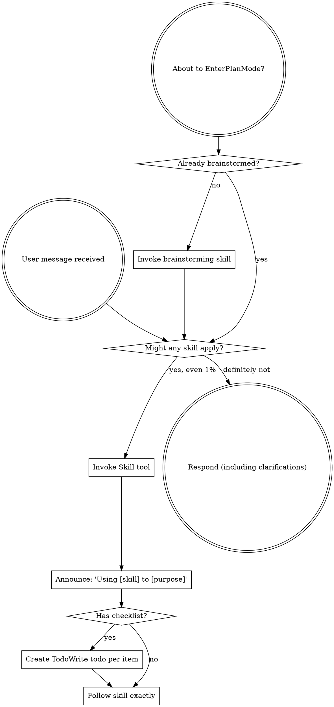

codex-exec: report contract violation

--- codex stdout ---
UNSAFE

1. Yes. The installer actually selects `repairSubstrateCapability: true`, not `repair: true` ([audit.cjs:1584](<HOME>/AppData/Roaming/warp/Warp/data/worktrees/GSDedits/luminaria-hogback/super-gsd/tools/feature-propagation/audit.cjs:1584)). That path:

   - Copies substrate hook/runtime files via `installSubstrateRuntime` → `copyFile` ([audit.cjs:572](<HOME>/AppData/Roaming/warp/Warp/data/worktrees/GSDedits/luminaria-hogback/super-gsd/tools/feature-propagation/audit.cjs:572), [audit.cjs:846](<HOME>/AppData/Roaming/warp/Warp/data/worktrees/GSDedits/luminaria-hogback/super-gsd/tools/feature-propagation/audit.cjs:846)).
   - Provisions a persistent witness key at `provisionWitnessKey`; the write is `fs.writeFileSync` ([witness-store.cjs:116](<HOME>/AppData/Roaming/warp/Warp/data/worktrees/GSDedits/luminaria-hogback/super-gsd/scripts/lib/substrate-invocation-witness-store.cjs:116), [witness-store.cjs:124](<HOME>/AppData/Roaming/warp/Warp/data/worktrees/GSDedits/luminaria-hogback/super-gsd/scripts/lib/substrate-invocation-witness-store.cjs:124)).
   - Applies the overlay to project `.claude/settings.json`; `mergeSettingsFiles` writes and renames at lines 759–767 ([merge-settings.js:604](<HOME>/AppData/Roaming/warp/Warp/data/worktrees/GSDedits/luminaria-hogback/super-gsd/scripts/merge-settings.js:604)).
   - Writes the upstream manifest and broker grant into `.mcp.json` or `.claude/settings.local.json` through `atomicPrivateJson`/`saveChangedScopeDocuments` ([audit.cjs:667](<HOME>/AppData/Roaming/warp/Warp/data/worktrees/GSDedits/luminaria-hogback/super-gsd/tools/feature-propagation/audit.cjs:667), [audit.cjs:796](<HOME>/AppData/Roaming/warp/Warp/data/worktrees/GSDedits/luminaria-hogback/super-gsd/tools/feature-propagation/audit.cjs:796), [audit.cjs:804](<HOME>/AppData/Roaming/warp/Warp/data/worktrees/GSDedits/luminaria-hogback/super-gsd/tools/feature-propagation/audit.cjs:804)). With `--install-global`, it can additionally rewrite `~/.claude/settings.json` and global agents ([audit.cjs:596](<HOME>/AppData/Roaming/warp/Warp/data/worktrees/GSDedits/luminaria-hogback/super-gsd/tools/feature-propagation/audit.cjs:596), [audit.cjs:919](<HOME>/AppData/Roaming/warp/Warp/data/worktrees/GSDedits/luminaria-hogback/super-gsd/tools/feature-propagation/audit.cjs:919)). The source overlay itself is not edited.

2. This is a real safety regression: persistent capability-related state can be committed after a fatal Codex-distribution refusal, without rollback, leaving Codex hooks unregistered.

3. No exit-0 bypass exists. Both callers immediately sequence distribution, unguarded repair, registration ([install.sh:895](<HOME>/AppData/Roaming/warp/Warp/data/worktrees/GSDedits/luminaria-hogback/super-gsd/install.sh:895), [install.sh:993](<HOME>/AppData/Roaming/warp/Warp/data/worktrees/GSDedits/luminaria-hogback/super-gsd/install.sh:993)). A repair failure returns 1 and `set -e` aborts; success reaches `register_codex_hooks`, which exits 1.

4. No stale cross-call leak occurs currently: init runs first, and a true flag terminates the process before update. The global variable is nevertheless not reset or intrinsically reentrant.

Collect every refusal, then abort before substrate repair. Run any witness-hook completeness check non-mutatingly before that boundary; repair only after the combined refusal set is empty.

--- codex stderr ---
OpenAI Codex v0.146.0
--------
workdir: <HOME>\AppData\Roaming\warp\Warp\data\worktrees\GSDedits\luminaria-hogback
model: gpt-5.6-sol
provider: openai
approval: never
sandbox: read-only
reasoning effort: xhigh
reasoning summaries: none
session id: 01a0365e-c5cf-7690-9df1-dd616e4d315c
--------
user
# Adversarial review: does the deferred install refusal weaken production?

Review ONE change for safety. Do not review anything else. Do not edit files.

## The change (super-gsd/install.sh)

In `distribute_project_hooks`, when Codex hook entries are missing, the immediate
`exit 1` was replaced with `CODEX_HOOK_DISTRIBUTION_INCOMPLETE=true`. The exit now
happens at the top of `register_codex_hooks`.

Call order in BOTH `init_local_project` (lines ~895-897) and `update_existing`
(lines ~993-995) is:

    distribute_project_hooks      <- refusal is now only recorded, not acted on
    repair_substrate_capability   <- RUNS `node <audit> --repair ...`, mutating state
    register_codex_hooks          <- refusal finally fires here

Before this change, an incomplete Codex hook distribution aborted the install BEFORE
`repair_substrate_capability` executed. After it, the repair runs first.

## The question you must answer with evidence from the code

1. Does `repair_substrate_capability` (install.sh ~line 432) plus the audit script it
   invokes (`super-gsd/tools/feature-propagation/audit.cjs`, `runAudit` with
   `repair: true`) perform ANY persistent mutation: writing settings.json, copying
   hooks, granting agent capability, editing overlays, touching ~/.claude or the
   project's .claude? Cite the exact functions and line numbers that write.
2. If yes, the change leaves a half-installed project on a path that previously
   refused cleanly: substrate repair applied, Codex hooks unregistered, exit 1.
   Say plainly whether that is a real safety regression or benign, and why.
3. Is there any path where `CODEX_HOOK_DISTRIBUTION_INCOMPLETE` is set but
   `register_codex_hooks` is never reached, so the install exits 0 despite an
   incomplete hook distribution? Check every caller and every early return between
   the two points, including `repair_substrate_capability` returning 1 and how that
   return is handled at the call sites (there is no `||` guard on lines 896 / 994).
4. Is the variable safe against a stale value leaking across the two call sites when
   both `--init-project` and `--update` run in one invocation?

## Constraint on your verdict

The motivation for the change was legitimate: guard case `vendored-nine-hook` requires
the installer to name EVERY missing registration, not just the first. Collecting all
refusals is the right behaviour. The question is only whether collecting them by
deferring past a mutating repair step is a safe way to achieve it.

If it is unsafe, state the minimal safer alternative in two or three sentences
(for example: collect refusals but exit before `repair_substrate_capability`, having
the witness-hook refusal emitted by a non-mutating check). Do not write the patch.

Verdict must be exactly one of: SAFE, UNSAFE, or SAFE-WITH-CAVEAT, on its own line.
Max 400 words.

codex
I’m using the `using-superpowers` and `review` skills to keep this strictly scoped to the deferred-refusal change. I’ll inspect only the installer call paths and the repair audit’s mutation points; no files will be edited.
exec
"C:\\WINDOWS\\System32\\WindowsPowerShell\\v1.0\\powershell.exe" -Command "Get-Content -Raw 'C:\\Users\\operator\\.codex\\skills\\using-superpowers\\SKILL.md'; Get-Content -Raw 'C:\\Users\\operator\\.agents\\skills\\review\\SKILL.md'" in <HOME>\AppData\Roaming\warp\Warp\data\worktrees\GSDedits\luminaria-hogback
 succeeded in 1336ms:
---
name: using-superpowers
description: Use when starting any conversation - establishes how to find and use skills, requiring Skill tool invocation before ANY response including clarifying questions
---

<SUBAGENT-STOP>
If you were dispatched as a subagent to execute a specific task, skip this skill.
</SUBAGENT-STOP>

<EXTREMELY-IMPORTANT>
If you think there is even a 1% chance a skill might apply to what you are doing, you ABSOLUTELY MUST invoke the skill.

IF A SKILL APPLIES TO YOUR TASK, YOU DO NOT HAVE A CHOICE. YOU MUST USE IT.

This is not negotiable. This is not optional. You cannot rationalize your way out of this.
</EXTREMELY-IMPORTANT>

## Instruction Priority

Superpowers skills override default system prompt behavior, but **user instructions always take precedence**:

1. **User's explicit instructions** (CLAUDE.md, GEMINI.md, AGENTS.md, direct requests) ƒ?" highest priority
2. **Superpowers skills** ƒ?" override default system behavior where they conflict
3. **Default system prompt** ƒ?" lowest priority

If CLAUDE.md, GEMINI.md, or AGENTS.md says "don't use TDD" and a skill says "always use TDD," follow the user's instructions. The user is in control.

## How to Access Skills

**In Claude Code:** Use the `Skill` tool. When you invoke a skill, its content is loaded and presented to youƒ?"follow it directly. Never use the Read tool on skill files.

**In Copilot CLI:** Use the `skill` tool. Skills are auto-discovered from installed plugins. The `skill` tool works the same as Claude Code's `Skill` tool.

**In Gemini CLI:** Skills activate via the `activate_skill` tool. Gemini loads skill metadata at session start and activates the full content on demand.

**In other environments:** Check your platform's documentation for how skills are loaded.

## Platform Adaptation

Skills use Claude Code tool names. Non-CC platforms: see `references/copilot-tools.md` (Copilot CLI), `references/codex-tools.md` (Codex) for tool equivalents. Gemini CLI users get the tool mapping loaded automatically via GEMINI.md.

# Using Skills

## The Rule

**Invoke relevant or requested skills BEFORE any response or action.** Even a 1% chance a skill might apply means that you should invoke the skill to check. If an invoked skill turns out to be wrong for the situation, you don't need to use it.



## Red Flags

These thoughts mean STOPƒ?"you're rationalizing:

| Thought | Reality |
|---------|---------|
| "This is just a simple question" | Questions are tasks. Check for skills. |
| "I need more context first" | Skill check comes BEFORE clarifying questions. |
| "Let me explore the codebase first" | Skills tell you HOW to explore. Check first. |
| "I can check git/files quickly" | Files lack conversation context. Check for skills. |
| "Let me gather information first" | Skills tell you HOW to gather information. |
| "This doesn't need a formal skill" | If a skill exists, use it. |
| "I remember this skill" | Skills evolve. Read current version. |
| "This doesn't count as a task" | Action = task. Check for skills. |
| "The skill is overkill" | Simple things become complex. Use it. |
| "I'll just do this one thing first" | Check BEFORE doing anything. |
| "This feels productive" | Undisciplined action wastes time. Skills prevent this. |
| "I know what that means" | Knowing the concept ƒ%ÿ using the skill. Invoke it. |

## Skill Priority

When multiple skills could apply, use this order:

1. **Process skills first** (brainstorming, debugging) - these determine HOW to approach the task
2. **Implementation skills second** (frontend-design, mcp-builder) - these guide execution

"Let's build X" ā' brainstorming first, then implementation skills.
"Fix this bug" ā' debugging first, then domain-specific skills.

## Skill Types

**Rigid** (TDD, debugging): Follow exactly. Don't adapt away discipline.

**Flexible** (patterns): Adapt principles to context.

The skill itself tells you which.

## User Instructions

Instructions say WHAT, not HOW. "Add X" or "Fix Y" doesn't mean skip workflows.

---
name: review
description: Review code changes for security, performance, bugs, and quality. Reviews staged changes, unstaged changes, specific commits, or PR-ready diffs.
---

<objective>
Review code changes and provide structured feedback covering security, performance, bug risks, code quality, and test coverage gaps. This skill analyzes diffs and surrounding context to catch issues before they reach production.
</objective>

<context>
This skill reviews code changes at various stages of the development workflow. It can review staged changes before a commit, unstaged work-in-progress, a specific commit, or the full set of changes on a branch that are ready for a pull request.

The reviewer reads both the diff and the surrounding source files to understand intent and catch issues that only appear in context.
</context>

<core_principle>
**FIND REAL ISSUES, NOT STYLE NITS.** Focus on problems that cause bugs, security vulnerabilities, performance degradation, or maintainability pain. Avoid nitpicking formatting or subjective style preferences unless they harm readability.
</core_principle>

<analysis_only_rule>
**THIS SKILL IS READ-ONLY. DO NOT MODIFY CODE.**

The purpose is to review and report findings. Making changes during review conflates the reviewer and author roles. Present findings and let the user decide what to act on.
</analysis_only_rule>

<quick_start>

<determine_review_scope>

Parse the user's input to determine what to review:

1. **No arguments** - Review staged changes first. If nothing is staged, review unstaged changes.
   - Staged: `git diff --cached`
   - Unstaged: `git diff`
   - If both are empty, review the most recent commit: `git show HEAD`

2. **Commit hash argument** (e.g., `/review abc1234`) - Review that specific commit.
   - `git show <hash>`

3. **File path argument** (e.g., `/review src/foo.ts`) - Review unstaged changes in that file.
   - `git diff -- <path>` then fall back to `git diff --cached -- <path>`

4. **"pr" argument** (e.g., `/review pr`) - Review all changes since branching from main.
   - `git diff main...HEAD`
   - If on main, review `git diff HEAD~1`

After obtaining the diff, if it is empty, inform the user that there are no changes to review and stop.

</determine_review_scope>

<gather_context>

Before analyzing the diff:

1. **Read changed files in full** - Do not review a diff in isolation. Read each modified file to understand the surrounding code, imports, types, and control flow.
2. **Identify the tech stack** - Note languages, frameworks, and libraries in use. This affects what patterns are risky.
3. **Check for related test files** - For each changed source file, look for corresponding test files. Note whether tests were updated alongside the changes.
4. **Check for configuration changes** - If config files changed (env, CI, package.json, tsconfig, etc.), pay extra attention to side effects.

</gather_context>

<review_categories>

Analyze the changes against each category below. Only report findings that are actually present. Skip categories with no issues.

**A. Security Issues** (Severity: CRITICAL or HIGH)
- Injection vulnerabilities (SQL injection, command injection, template injection)
- Cross-site scripting (XSS) - unsanitized user input rendered in HTML
- Authentication and authorization flaws (missing auth checks, privilege escalation)
- Secrets or credentials hardcoded or logged
- Insecure deserialization or unsafe eval usage
- Path traversal or file access vulnerabilities
- Missing input validation on external data

**B. Performance Concerns** (Severity: HIGH or MEDIUM)
- N+1 query patterns in database access
- Unnecessary memory allocations in hot paths or loops
- Blocking operations on the main thread or in async contexts
- Missing pagination on unbounded queries
- Redundant computation that could be cached or memoized
- Large payloads without streaming or chunking

**C. Bug Risks** (Severity: HIGH or MEDIUM)
- Off-by-one errors in loops or array access
- Null/undefined dereferences without guards
- Race conditions in concurrent or async code
- Incorrect error handling (swallowed errors, wrong error types)
- Type mismatches or unsafe type assertions
- Logic errors in conditionals (inverted checks, missing cases)
- Resource leaks (unclosed connections, file handles, listeners)

**D. Code Quality** (Severity: MEDIUM or LOW)
- Unclear or misleading naming
- Significant code duplication that should be extracted
- Excessive complexity (deeply nested logic, functions doing too many things)
- Dead code or unreachable branches
- Missing or misleading comments on non-obvious logic
- Inconsistency with patterns used elsewhere in the codebase

**E. Test Coverage Gaps** (Severity: MEDIUM or LOW)
- New logic paths without corresponding test cases
- Changed behavior without updated tests
- Edge cases not covered (empty inputs, boundary values, error paths)
- Missing integration tests for new API endpoints or database changes

</review_categories>

<format_findings>

For each finding, use this structure:

```
### [SEVERITY] Category: Brief Title

**File**: `path/to/file.ext` (lines X-Y)

**Issue**: Clear description of the problem.

**Why it matters**: What could go wrong if this is not addressed.

**Suggestion**: How to fix it, with a code snippet if helpful.
```

Severity levels:
- **CRITICAL** - Must fix before merge. Security vulnerability or data loss risk.
- **HIGH** - Should fix before merge. Likely bug or significant performance issue.
- **MEDIUM** - Should fix soon. Code quality or moderate risk issue.
- **LOW** - Consider fixing. Minor improvement opportunity.

</format_findings>

</quick_start>

<critical_rules>

1. **READ THE FULL FILE**: Never review a diff without reading the complete source file for context
2. **NO FALSE ALARMS**: Only report issues you can explain concretely. Do not report vague concerns
3. **PRIORITIZE**: Lead with the most severe findings. Do not bury critical issues under style nits
4. **BE SPECIFIC**: Include file paths, line numbers, and code references for every finding
5. **EXPLAIN THE RISK**: For each finding, explain what could actually go wrong
6. **CHECK TESTS**: Always check whether changes have corresponding test updates
7. **CONSIDER THE STACK**: Apply language-specific and framework-specific knowledge to your review
8. **DO NOT MODIFY CODE**: Present findings only. The user decides what to act on

</critical_rules>

<output_format>

```markdown
## Code Review: [brief description of what was reviewed]

**Scope**: [staged changes | unstaged changes | commit abc1234 | PR changes from main]
**Files reviewed**: [count] files changed, [additions] additions, [deletions] deletions

---

### Findings

[Findings grouped by severity, highest first. Use the format from <format_findings>.]

---

### Summary

| Severity | Count |
|----------|-------|
| CRITICAL | X     |
| HIGH     | X     |
| MEDIUM   | X     |
| LOW      | X     |

### Recommended Actions

1. [Most important action to take]
2. [Next most important action]
3. [...]
```

If no issues are found:

```markdown
## Code Review: [brief description]

**Scope**: [what was reviewed]
**Files reviewed**: [count]

No significant issues found. The changes look good to merge.
```

</output_format>

<decision_gate>

**After presenting findings, ALWAYS offer these options:**

```
ƒ"?ƒ"?ƒ"?ƒ"?ƒ"?ƒ"?ƒ"?ƒ"?ƒ"?ƒ"?ƒ"?ƒ"?ƒ"?ƒ"?ƒ"?ƒ"?ƒ"?ƒ"?ƒ"?ƒ"?ƒ"?ƒ"?ƒ"?ƒ"?ƒ"?ƒ"?ƒ"?ƒ"?ƒ"?ƒ"?ƒ"?ƒ"?ƒ"?ƒ"?ƒ"?ƒ"?ƒ"?ƒ"?ƒ"?ƒ"?ƒ"?
REVIEW COMPLETE

What would you like to do?

1. **Fix issues** - I'll address the findings starting with the most critical
2. **Save review** - Export findings to a markdown file
3. **Review again** - Re-review with different scope or focus
4. **Discuss a finding** - Ask questions about a specific issue
5. **Other** - Tell me what you need
ƒ"?ƒ"?ƒ"?ƒ"?ƒ"?ƒ"?ƒ"?ƒ"?ƒ"?ƒ"?ƒ"?ƒ"?ƒ"?ƒ"?ƒ"?ƒ"?ƒ"?ƒ"?ƒ"?ƒ"?ƒ"?ƒ"?ƒ"?ƒ"?ƒ"?ƒ"?ƒ"?ƒ"?ƒ"?ƒ"?ƒ"?ƒ"?ƒ"?ƒ"?ƒ"?ƒ"?ƒ"?ƒ"?ƒ"?ƒ"?ƒ"?
```

**Wait for user response before taking any action.**

This gate is MANDATORY. Never skip it. Never auto-implement fixes.

</decision_gate>

<HOME>\OneDrive - <ORG>\Documents\WindowsPowerShell\profile.ps1 : Cannot dot-source this 
command because it was defined in a different language mode. To invoke this command without importing its contents, 
omit the '.' operator.
At line:1 char:1
+ . '<HOME>\OneDrive - <ORG>\Documents\Win ...
+ ~~~~~~~~~~~~~~~~~~~~~~~~~~~~~~~~~~~~~~~~~~~~~~~~~~~~~~~~~~~~~~~~~~~~~
    + CategoryInfo          : InvalidOperation: (:) [profile.ps1], NotSupportedException
    + FullyQualifiedErrorId : DotSourceNotSupported,profile.ps1
 
<HOME>\OneDrive - <ORG>\Documents\WindowsPowerShell\Microsoft.PowerShell_profile.ps1 : 
Cannot dot-source this command because it was defined in a different language mode. To invoke this command without 
importing its contents, omit the '.' operator.
At line:1 char:1
+ . '<HOME>\OneDrive - <ORG>\Documents\Win ...
+ ~~~~~~~~~~~~~~~~~~~~~~~~~~~~~~~~~~~~~~~~~~~~~~~~~~~~~~~~~~~~~~~~~~~~~
    + CategoryInfo          : InvalidOperation: (:) [Microsoft.PowerShell_profile.ps1], NotSupportedException
    + FullyQualifiedErrorId : DotSourceNotSupported,Microsoft.PowerShell_profile.ps1
 

exec
"C:\\WINDOWS\\System32\\WindowsPowerShell\\v1.0\\powershell.exe" -Command "git diff -- super-gsd/install.sh; git diff --cached -- super-gsd/install.sh; (Get-Content 'super-gsd/install.sh').Count; (Get-Content 'super-gsd/tools/feature-propagation/audit.cjs').Count; rg -n \"distribute_project_hooks|repair_substrate_capability|register_codex_hooks|CODEX_HOOK_DISTRIBUTION_INCOMPLETE|init_local_project|update_existing|runAudit|repair\" super-gsd/install.sh super-gsd/tools/feature-propagation/audit.cjs" in <HOME>\AppData\Roaming\warp\Warp\data\worktrees\GSDedits\luminaria-hogback
 succeeded in 1582ms:
diff --git a/super-gsd/install.sh b/super-gsd/install.sh
index 673be97..5040393 100644
--- a/super-gsd/install.sh
+++ b/super-gsd/install.sh
@@ -449,6 +449,19 @@ repair_substrate_capability() {
   [ "$INIT_LOCAL" = true ] && repair_args+=(--init-local)
   [ "$UPDATE_MODE" = true ] && repair_args+=(--update)
   if ! repair_output="$(node "$audit_script" "${repair_args[@]}" 2>&1)"; then
+    local repair_detail
+    repair_detail="$(printf '%s\n' "$repair_output" | node -e '
+let input = "";
+process.stdin.setEncoding("utf8");
+process.stdin.on("data", (chunk) => { input += chunk; });
+process.stdin.on("end", () => {
+  try {
+    const parsed = JSON.parse(input);
+    if (parsed && typeof parsed.detail === "string") process.stdout.write(parsed.detail);
+  } catch (_) {}
+});
+')" || repair_detail=""
+    [ -z "$repair_detail" ] || printf '%s\n' "$repair_detail" | sed 's/^/  /' >&2
     [ -z "$repair_output" ] || printf '%s\n' "$repair_output" | sed 's/^/  /' >&2
     echo "ERROR: substrate enforcement was not current; refusing grant-bearing agent installation" >&2
     return 1
@@ -725,7 +738,7 @@ $target_entry"
       [[ -n "$missing_target" ]] || continue
       printf '%s\n' "hook_registration_missing $missing_target [Codex/project-entry]" >&2
     done <<< "$CODEX_HOOK_MISSING_TARGETS"
-    exit 1
+    CODEX_HOOK_DISTRIBUTION_INCOMPLETE=true
   fi
   log "  $PROJECT_HOOK_COUNT Claude hooks and $CODEX_HOOK_COUNT Codex entries distributed"
 }
@@ -754,6 +767,9 @@ preflight_existing_repo_local_hooks() {
 register_codex_hooks() {
   echo ""
   log "Registering project-local Codex hooks..."
+  if [[ "${CODEX_HOOK_DISTRIBUTION_INCOMPLETE:-false}" == true ]]; then
+    exit 1
+  fi
   CODEX_HOOK_INSTALLER="$SCRIPT_DIR/tools/codex-hooks/install-hooks.cjs"
   if [ ! -f "$CODEX_HOOK_INSTALLER" ]; then
     echo "ERROR: Codex hook installer missing: $CODEX_HOOK_INSTALLER" >&2
1180
1651
super-gsd/install.sh:432:repair_substrate_capability() {
super-gsd/install.sh:446:  local repair_output
super-gsd/install.sh:447:  local -a repair_args=(--repair-substrate-capability --project-dir "$PROJECT_DIR")
super-gsd/install.sh:448:  [ "$INSTALL_GLOBAL" = true ] && repair_args+=(--install-global)
super-gsd/install.sh:449:  [ "$INIT_LOCAL" = true ] && repair_args+=(--init-local)
super-gsd/install.sh:450:  [ "$UPDATE_MODE" = true ] && repair_args+=(--update)
super-gsd/install.sh:451:  if ! repair_output="$(node "$audit_script" "${repair_args[@]}" 2>&1)"; then
super-gsd/install.sh:452:    local repair_detail
super-gsd/install.sh:453:    repair_detail="$(printf '%s\n' "$repair_output" | node -e '
super-gsd/install.sh:463:')" || repair_detail=""
super-gsd/install.sh:464:    [ -z "$repair_detail" ] || printf '%s\n' "$repair_detail" | sed 's/^/  /' >&2
super-gsd/install.sh:465:    [ -z "$repair_output" ] || printf '%s\n' "$repair_output" | sed 's/^/  /' >&2
super-gsd/install.sh:469:  [ -z "$repair_output" ] || printf '%s\n' "$repair_output" | sed 's/^/  /'
super-gsd/install.sh:648:    repair_substrate_capability
super-gsd/install.sh:680:distribute_project_hooks() {
super-gsd/install.sh:741:    CODEX_HOOK_DISTRIBUTION_INCOMPLETE=true
super-gsd/install.sh:767:register_codex_hooks() {
super-gsd/install.sh:770:  if [[ "${CODEX_HOOK_DISTRIBUTION_INCOMPLETE:-false}" == true ]]; then
super-gsd/install.sh:854:init_local_project() {
super-gsd/install.sh:895:  distribute_project_hooks
super-gsd/install.sh:896:  repair_substrate_capability
super-gsd/install.sh:897:  register_codex_hooks
super-gsd/install.sh:948:update_existing() {
super-gsd/install.sh:993:  distribute_project_hooks
super-gsd/install.sh:994:  repair_substrate_capability
super-gsd/install.sh:995:  register_codex_hooks
super-gsd/install.sh:1136:  init_local_project
super-gsd/install.sh:1140:  update_existing
super-gsd/tools/feature-propagation/audit.cjs:3:// SGSD feature propagation audit + repair
super-gsd/tools/feature-propagation/audit.cjs:14://   --repair-safe install/refresh global SGSD agents, project config, substrate
super-gsd/tools/feature-propagation/audit.cjs:16://   --repair      repair-safe plus backup project-local agent shadows
super-gsd/tools/feature-propagation/audit.cjs:19:// The tool never deletes project-local agent files. Full repair moves shadowing
super-gsd/tools/feature-propagation/audit.cjs:637:function repairClaudeSubstrateWitness(ctx, actions, options = {}) {
super-gsd/tools/feature-propagation/audit.cjs:643:    if (options.repairProjectHooks) smokeRepoHookOverlay(ctx);
super-gsd/tools/feature-propagation/audit.cjs:654:        managedHookIds: options.repairProjectHooks ? undefined : [
super-gsd/tools/feature-propagation/audit.cjs:663:    return { ok: false, reasons: ['witness_repair_failed'], detail: error && error.message ? error.message : 'unknown' };
super-gsd/tools/feature-propagation/audit.cjs:667:function repairClaudeSubstrateCapability(ctx, actions, options = {}) {
super-gsd/tools/feature-propagation/audit.cjs:671:  if (scopes.some((scope) => scope.malformed)) return { ok: false, reasons: ['broker_repair_failed'] };
super-gsd/tools/feature-propagation/audit.cjs:770:      return { ok: false, reasons: ['broker_repair_failed'] };
super-gsd/tools/feature-propagation/audit.cjs:773:    if (!saveDocumentsOrFail()) return { ok: false, reasons: ['broker_repair_failed'] };
super-gsd/tools/feature-propagation/audit.cjs:782:    if (!saveDocumentsOrFail()) return { ok: false, reasons: ['broker_repair_failed'] };
super-gsd/tools/feature-propagation/audit.cjs:788:    if (!saveDocumentsOrFail()) return { ok: false, reasons: ['broker_repair_failed'] };
super-gsd/tools/feature-propagation/audit.cjs:807:    return { ok: false, reasons: ['broker_repair_failed'] };
super-gsd/tools/feature-propagation/audit.cjs:922:  const repaired = [];
super-gsd/tools/feature-propagation/audit.cjs:933:      repaired.push(name);
super-gsd/tools/feature-propagation/audit.cjs:941:      repaired.push('gsd-executor.md');
super-gsd/tools/feature-propagation/audit.cjs:944:  return repaired;
super-gsd/tools/feature-propagation/audit.cjs:948:  const repaired = [];
super-gsd/tools/feature-propagation/audit.cjs:949:  if (!exists(ctx.canonicalSkillsDir)) return repaired;
super-gsd/tools/feature-propagation/audit.cjs:959:      repaired.push(name);
super-gsd/tools/feature-propagation/audit.cjs:962:  return repaired;
super-gsd/tools/feature-propagation/audit.cjs:966:  const repaired = [];
super-gsd/tools/feature-propagation/audit.cjs:995:      repaired.push(spec.name);
super-gsd/tools/feature-propagation/audit.cjs:998:  return repaired;
super-gsd/tools/feature-propagation/audit.cjs:1306:function runAudit(opts) {
super-gsd/tools/feature-propagation/audit.cjs:1309:  const repairMode = opts && opts.repair === true;
super-gsd/tools/feature-propagation/audit.cjs:1310:  const safeRepair = repairMode || (opts && opts.repairSafe === true);
super-gsd/tools/feature-propagation/audit.cjs:1311:  const substrateRepair = opts && opts.repairSubstrateCapability === true;
super-gsd/tools/feature-propagation/audit.cjs:1312:  const repairCapability = safeRepair || substrateRepair;
super-gsd/tools/feature-propagation/audit.cjs:1314:  const repairGlobalAgents = safeRepair || (substrateRepair && allowGlobalRepair);
super-gsd/tools/feature-propagation/audit.cjs:1316:  let repairedGlobalAgents = [];
super-gsd/tools/feature-propagation/audit.cjs:1317:  let repairedGlobalSkills = [];
super-gsd/tools/feature-propagation/audit.cjs:1318:  let repairedLegacyAgents = [];
super-gsd/tools/feature-propagation/audit.cjs:1319:  if (repairGlobalAgents) {
super-gsd/tools/feature-propagation/audit.cjs:1320:    repairedGlobalAgents = installGlobalSgsdAgents(ctx, actions, false, SUBSTRATE_GLOBAL_AGENT_NAMES);
super-gsd/tools/feature-propagation/audit.cjs:1321:    repairedLegacyAgents = installGlobalLegacyAgentPatches(ctx, actions, false, SUBSTRATE_LEGACY_AGENT_NAMES);
super-gsd/tools/feature-propagation/audit.cjs:1326:  if (repairCapability) {
super-gsd/tools/feature-propagation/audit.cjs:1327:    witnessRepair = repairClaudeSubstrateWitness(ctx, actions, {
super-gsd/tools/feature-propagation/audit.cjs:1329:      repairProjectHooks: opts && opts.repairProjectHooks === true,
super-gsd/tools/feature-propagation/audit.cjs:1333:  if (repairCapability && claudeSubstrateWitness.ready) {
super-gsd/tools/feature-propagation/audit.cjs:1334:    capabilityRepair = repairClaudeSubstrateCapability(ctx, actions, {
super-gsd/tools/feature-propagation/audit.cjs:1352:  if (repairGlobalAgents) {
super-gsd/tools/feature-propagation/audit.cjs:1353:    repairedGlobalAgents = [...new Set([
super-gsd/tools/feature-propagation/audit.cjs:1354:      ...repairedGlobalAgents,
super-gsd/tools/feature-propagation/audit.cjs:1363:  if (safeRepair) repairedGlobalSkills = installGlobalSgsdSkills(ctx, actions);
super-gsd/tools/feature-propagation/audit.cjs:1364:  if (repairGlobalAgents) {
super-gsd/tools/feature-propagation/audit.cjs:1365:    repairedLegacyAgents = [...new Set([
super-gsd/tools/feature-propagation/audit.cjs:1366:      ...repairedLegacyAgents,
super-gsd/tools/feature-propagation/audit.cjs:1381:  if (repairMode) {
super-gsd/tools/feature-propagation/audit.cjs:1429:    mode: repairMode ? 'repair' : (safeRepair ? 'repair-safe' : (substrateRepair ? 'repair-substrate-capability' : 'audit')),
super-gsd/tools/feature-propagation/audit.cjs:1466:    repaired: {
super-gsd/tools/feature-propagation/audit.cjs:1467:      global_agents: repairedGlobalAgents,
super-gsd/tools/feature-propagation/audit.cjs:1468:      global_skills: repairedGlobalSkills,
super-gsd/tools/feature-propagation/audit.cjs:1469:      global_legacy_agents: repairedLegacyAgents,
super-gsd/tools/feature-propagation/audit.cjs:1471:      substrate_witness_repair_detail: witnessRepair.detail || null,
super-gsd/tools/feature-propagation/audit.cjs:1502:      snap = runAudit({ projectDir: sgsdRoot() });
super-gsd/tools/feature-propagation/audit.cjs:1512:    add('repair_actions_array', snap && snap.repaired && Array.isArray(snap.repaired.actions), '');
super-gsd/tools/feature-propagation/audit.cjs:1568:  if (snap.repaired.actions.length) {
super-gsd/tools/feature-propagation/audit.cjs:1569:    process.stdout.write('actions=' + snap.repaired.actions.length + '\n');
super-gsd/tools/feature-propagation/audit.cjs:1584:  if (args.indexOf('--repair-substrate-capability') !== -1) {
super-gsd/tools/feature-propagation/audit.cjs:1585:    const snap = runAudit({
super-gsd/tools/feature-propagation/audit.cjs:1587:      repairSubstrateCapability: true,
super-gsd/tools/feature-propagation/audit.cjs:1589:      repairProjectHooks: args.indexOf('--init-local') !== -1 || args.indexOf('--update') !== -1,
super-gsd/tools/feature-propagation/audit.cjs:1592:      'witness_repair_failed',
super-gsd/tools/feature-propagation/audit.cjs:1593:      'broker_repair_failed',
super-gsd/tools/feature-propagation/audit.cjs:1609:      detail: snap.repaired.substrate_witness_repair_detail,
super-gsd/tools/feature-propagation/audit.cjs:1615:  const snap = runAudit({
super-gsd/tools/feature-propagation/audit.cjs:1617:    repair: args.indexOf('--repair') !== -1,
super-gsd/tools/feature-propagation/audit.cjs:1618:    repairSafe: args.indexOf('--repair-safe') !== -1,
super-gsd/tools/feature-propagation/audit.cjs:1631:  runAudit,
super-gsd/tools/feature-propagation/audit.cjs:1644:    repairClaudeSubstrateWitness,
super-gsd/tools/feature-propagation/audit.cjs:1645:    repairClaudeSubstrateCapability,
<HOME>\OneDrive - <ORG>\Documents\WindowsPowerShell\profile.ps1 : Cannot dot-source this 
command because it was defined in a different language mode. To invoke this command without importing its contents, 
omit the '.' operator.
At line:1 char:1
+ . '<HOME>\OneDrive - <ORG>\Documents\Win ...
+ ~~~~~~~~~~~~~~~~~~~~~~~~~~~~~~~~~~~~~~~~~~~~~~~~~~~~~~~~~~~~~~~~~~~~~
    + CategoryInfo          : InvalidOperation: (:) [profile.ps1], NotSupportedException
    + FullyQualifiedErrorId : DotSourceNotSupported,profile.ps1
 
<HOME>\OneDrive - <ORG>\Documents\WindowsPowerShell\Microsoft.PowerShell_profile.ps1 : 
Cannot dot-source this command because it was defined in a different language mode. To invoke this command without 
importing its contents, omit the '.' operator.
At line:1 char:1
+ . '<HOME>\OneDrive - <ORG>\Documents\Win ...
+ ~~~~~~~~~~~~~~~~~~~~~~~~~~~~~~~~~~~~~~~~~~~~~~~~~~~~~~~~~~~~~~~~~~~~~
    + CategoryInfo          : InvalidOperation: (:) [Microsoft.PowerShell_profile.ps1], NotSupportedException
    + FullyQualifiedErrorId : DotSourceNotSupported,Microsoft.PowerShell_profile.ps1
 

exec
"C:\\WINDOWS\\System32\\WindowsPowerShell\\v1.0\\powershell.exe" -Command "Get-Item 'super-gsd/install.sh','super-gsd/tools/feature-propagation/audit.cjs' | Select-Object FullName,Length" in <HOME>\AppData\Roaming\warp\Warp\data\worktrees\GSDedits\luminaria-hogback
 succeeded in 1603ms:

FullName                                                                                                               
--------                                                                                                               
<HOME>\AppData\Roaming\warp\Warp\data\worktrees\GSDedits\luminaria-hogback\super-gsd\install.sh          
<HOME>\AppData\Roaming\warp\Warp\data\worktrees\GSDedits\luminaria-hogback\super-gsd\tools\feature-pro...


<HOME>\OneDrive - <ORG>\Documents\WindowsPowerShell\profile.ps1 : Cannot dot-source this 
command because it was defined in a different language mode. To invoke this command without importing its contents, 
omit the '.' operator.
At line:1 char:1
+ . '<HOME>\OneDrive - <ORG>\Documents\Win ...
+ ~~~~~~~~~~~~~~~~~~~~~~~~~~~~~~~~~~~~~~~~~~~~~~~~~~~~~~~~~~~~~~~~~~~~~
    + CategoryInfo          : InvalidOperation: (:) [profile.ps1], NotSupportedException
    + FullyQualifiedErrorId : DotSourceNotSupported,profile.ps1
 
<HOME>\OneDrive - <ORG>\Documents\WindowsPowerShell\Microsoft.PowerShell_profile.ps1 : 
Cannot dot-source this command because it was defined in a different language mode. To invoke this command without 
importing its contents, omit the '.' operator.
At line:1 char:1
+ . '<HOME>\OneDrive - <ORG>\Documents\Win ...
+ ~~~~~~~~~~~~~~~~~~~~~~~~~~~~~~~~~~~~~~~~~~~~~~~~~~~~~~~~~~~~~~~~~~~~~
    + CategoryInfo          : InvalidOperation: (:) [Microsoft.PowerShell_profile.ps1], NotSupportedException
    + FullyQualifiedErrorId : DotSourceNotSupported,Microsoft.PowerShell_profile.ps1
 

exec
"C:\\WINDOWS\\System32\\WindowsPowerShell\\v1.0\\powershell.exe" -NoProfile -Command "Get-Item 'super-gsd/install.sh','super-gsd/tools/feature-propagation/audit.cjs' | ForEach-Object { \"{0}"'`t{1}" -f $_.Length,$_.FullName }' in <HOME>\AppData\Roaming\warp\Warp\data\worktrees\GSDedits\luminaria-hogback
 succeeded in 746ms:
41882	<HOME>\AppData\Roaming\warp\Warp\data\worktrees\GSDedits\luminaria-hogback\super-gsd\install.sh
71486	<HOME>\AppData\Roaming\warp\Warp\data\worktrees\GSDedits\luminaria-hogback\super-gsd\tools\feature-propagation\audit.cjs

codex
The control flow is exactly as described: both operational callers invoke distribution, then substrate repair, then Codex registration. I’m now tracing every repair write and the shell’s failure/continuation semantics, including whether either mode can bypass the final refusal.
exec
"C:\\WINDOWS\\System32\\WindowsPowerShell\\v1.0\\powershell.exe" -NoProfile -Command "Get-Content -Raw 'super-gsd/install.sh'" in <HOME>\AppData\Roaming\warp\Warp\data\worktrees\GSDedits\luminaria-hogback
 succeeded in 451ms:
#!/bin/bash
# Super GSD Orchestrator - safe installer
#
# Default behavior is read-only. Global Claude changes and global auto-approve
# are separate explicit opt-ins.

set -e

if [ -d "$HOME/.local/bin" ]; then
  PATH="$HOME/.local/bin:$PATH"
fi
if [ -d "$HOME/.nvm/versions/node" ]; then
  SGSD_NODE_BIN="$(find "$HOME/.nvm/versions/node" -maxdepth 2 -type d -name bin 2>/dev/null | sort -V | tail -1)"
  if [ -n "$SGSD_NODE_BIN" ]; then
    PATH="$SGSD_NODE_BIN:$PATH"
  fi
fi
export PATH

normalize_windows_home() {
  case "$(uname -s 2>/dev/null || echo unknown)" in
    MINGW*|MSYS*|CYGWIN*)
      if command -v cygpath >/dev/null 2>&1 && [ -n "${USERPROFILE:-}" ]; then
        win_home="$(cygpath -u "$USERPROFILE" 2>/dev/null || true)"
        if [ -n "$win_home" ] && [ -d "$win_home" ] && [ "${HOME:-}" != "$win_home" ]; then
          HOME="$win_home"
          export HOME
        fi
      fi
      ;;
  esac
}

normalize_windows_home

SCRIPT_DIR="$(cd "$(dirname "$0")" && pwd)"
PROJECT_DIR="$(pwd)"
CLAUDE_DIR="$HOME/.claude"
GSD_DIR="$CLAUDE_DIR/get-shit-done"
HOOKS_DIR="$CLAUDE_DIR/hooks"
AGENTS_DIR="$CLAUDE_DIR/agents"
COMMANDS_DIR="$CLAUDE_DIR/commands"
TEMPLATES_DIR="$GSD_DIR/templates/super-gsd"
GLOBAL_SCRIPTS_DIR="$CLAUDE_DIR/super-gsd/scripts"
LOCAL_BIN_DIR="$HOME/.local/bin"

# event|hook-id|interpreter|installed filename|registered timeout seconds
# Smoke contract only: distribution independently copies every regular file in
# hooks/. The first fourteen rows mirror config/settings-overlay.json. The final
# row is the tracked auxiliary PostToolUse hook and is not registered there.
GLOBAL_HOOK_DEPLOYMENT_MANIFEST='statusLine|status-line|node|sgsd-statusline.js|
SessionStart|session-start-context|node|gsd-session-start.js|5
SessionStart|session-state|bash|gsd-session-state.sh|5
SessionStart|vtp-pending|node|sgsd-vtp-pending.js|5
SessionStart|session-start-governance|node|sgsd-session-start.js|5
PreToolUse|activity-logger|node|sgsd-activity-logger.js|2
UserPromptSubmit|intent-classifier|node|sgsd-intent-classifier.cjs|5
PostToolUse|heartbeat|node|sgsd-heartbeat.js|2
PostToolUse|token-logger|node|gsd-token-logger.js|3
PostToolUse|stuck-detector|node|gsd-stuck-detector.js|3
PostToolUse|checkpoint-writer|node|gsd-checkpoint-writer.js|3
PostToolUse|context-monitor|node|gsd-context-monitor.js|3
PostToolUse|quality-gate|node|sgsd-quality-gate.js|10
Stop|stop-handoff|node|sgsd-stop-handoff.js|60
PostToolUse|phase-boundary-auxiliary|bash|gsd-phase-boundary.sh|5'

DRY_RUN=false
RUN_DOCTOR=false
INIT_LOCAL=false
INSTALL_GLOBAL=false
ENABLE_AUTOAPPROVE=false
SAW_ACTION=false
# P143.5 cockpit dep handling ƒ?" opt-in for the ~112MB Chromium download.
SKIP_COCKPIT_DEPS=false
SETUP_COCKPIT_DEPS=false
# P143.6 in-place update of an existing install (no skeleton rewrite, no
# config overwrite ƒ?" just refresh npm deps + agent registry + memory taxonomy).
UPDATE_MODE=false
INSTALL_COMMIT_GATE=false
UNINSTALL_COMMIT_GATE=false

AGENT_COUNT=0
SKILL_COUNT=0
HOOK_COUNT=0
SCRIPT_COUNT=0

usage() {
  cat <<'EOF'
Super GSD installer

Safe defaults:
  bash super-gsd/install.sh
      Read-only doctor + usage. No writes.

Read-only:
  --doctor
      Check Node, Claude, Codex, SGSD git freshness, local config, and visible
      Claude global state. Does not modify files or settings.

Commit gate:
  --install-commit-gate
      Install or refresh the SGSD-marked Git pre-commit trampoline at the
      path resolved by 'git rev-parse --git-path hooks/pre-commit'. Refuses
      unmarked existing hooks and never sets core.hooksPath.
  --uninstall-commit-gate
      Remove only an SGSD-marked pre-commit trampoline. Refuses unmarked hooks
      and never invokes the gate during rollback.

Local project setup:
  --init-local
  --init-project
      Create/update only project-local SGSD files in the current directory:
      .planning/, .planning/config.json, metrics skeleton, CLAUDE.md when
      absent, repo-local .claude/settings.json hooks, and safely merged
      project .codex/hooks.json registrations. --init-project
      is kept as a backward-compatible safe alias.
  --update
      Refresh an existing SGSD install in place. Re-runs npm install + agent
      registry sync + memory taxonomy ensure + repo-local Claude/Codex hook
      merges, but does
      NOT recreate the .planning/ skeleton, overwrite CLAUDE.md, or replace
      config.json. Safe to run after a `git pull` to pick up new dependencies
      and registry entries. Pair with --install-global to also refresh ~/.claude
      assets.

Global Claude install:
  --install-global
      Copy SGSD agents, commands, hooks, templates, workflows, config, and
      scripts into ~/.claude. Does not enable auto-approve.

Dangerous permission change:
  --enable-autoapprove
      Explicitly run claude config set --global autoApprove for autonomous mode.
      This affects every Claude Code session for the current OS user.

Optional:
  --skip-brv
      Accepted for older docs/scripts as a no-op. Current SGSD memory is
      project-local .planning/memory, not BRV/ByteRover.
  --skip-cockpit-deps
      Skip 'npm install' for cockpit tooling during --init-project. Use when
      you'll manage dependencies separately. The ATC playwright gate will not
      work until 'npm install' is run.
  --setup-cockpit-deps
      Pair with --init-project to also download the Chromium binary
      (~112MB) via 'npx playwright install chromium'. Required for the
      ATC visual gate. Without this flag, the operator runs it manually:
      'npm run cockpit:setup'.
  --dry-run
      Print actions without writing.
  --help
      Show this help.

Examples:
  bash super-gsd/install.sh --doctor
  bash super-gsd/install.sh --init-project
  bash super-gsd/install.sh --init-project --setup-cockpit-deps
  bash super-gsd/install.sh --update
  bash super-gsd/install.sh --update --install-global
  bash super-gsd/install.sh --install-global --dry-run
  bash super-gsd/install.sh --enable-autoapprove
EOF
}

log() { echo "  [super-gsd] $1"; }

run() {
  if [ "$DRY_RUN" = true ]; then
    log "DRY RUN: $*"
  else
    "$@"
  fi
}

copy_file() {
  local source_path="$1"
  local target_path="$2"
  local target_parent
  if [[ "$DRY_RUN" == true ]]; then
    log "DRY RUN: $1 -> $2"
  else
    if [[ -e "$target_path" && "$source_path" -ef "$target_path" ]]; then
      log "  same file, skipping copy: $target_path"
      return 0
    fi
    target_parent="${target_path%/*}"
    [[ "$target_parent" == "$target_path" ]] && target_parent="."
    mkdir -p "$target_parent"
    if [[ -d "$source_path" ]]; then
      cp -R "$source_path" "$target_path"
    else
      cp "$source_path" "$target_path"
    fi
  fi
}

copy_files_to_root() {
  local target_root="$1"
  shift
  local source_path target_path
  local -a copy_sources=()

  for source_path in "$@"; do
    [[ -f "$source_path" ]] || continue
    target_path="$target_root/${source_path##*/}"
    if [[ -e "$target_path" && "$source_path" -ef "$target_path" ]]; then
      log "  same file, skipping copy: $target_path"
      continue
    fi
    if [[ "$DRY_RUN" == true ]]; then
      log "DRY RUN: $source_path -> $target_path"
    else
      copy_sources+=("$source_path")
    fi
  done

  if [[ "$DRY_RUN" == false ]]; then
    mkdir -p "$target_root"
    if ((${#copy_sources[@]} > 0)); then
      cp "${copy_sources[@]}" "$target_root/"
    fi
  fi
}

copy_entries_to_root() {
  local target_root="$1"
  shift
  local source_path target_path
  local -a copy_sources=()

  for source_path in "$@"; do
    [[ -e "$source_path" ]] || continue
    target_path="$target_root/${source_path##*/}"
    if [[ -e "$target_path" && "$source_path" -ef "$target_path" ]]; then
      log "  same file, skipping copy: $target_path"
      continue
    fi
    if [[ "$DRY_RUN" == true ]]; then
      log "DRY RUN: $source_path -> $target_path"
    else
      copy_sources+=("$source_path")
    fi
  done

  if [[ "$DRY_RUN" == false ]]; then
    mkdir -p "$target_root"
    if ((${#copy_sources[@]} > 0)); then
      cp -R "${copy_sources[@]}" "$target_root/"
    fi
  fi
}

copy_tree_files() {
  local source_root="$1"
  local target_root="$2"
  if [[ ! -d "$source_root" ]]; then
    echo "ERROR: required runtime directory missing: $source_root" >&2
    exit 1
  fi
  if [[ "$DRY_RUN" == true ]]; then
    log "DRY RUN: $source_root/. -> $target_root"
  elif [[ -e "$target_root" && "$source_root" -ef "$target_root" ]]; then
    log "  same directory, skipping copy: $target_root"
  else
    mkdir -p "$target_root"
    cp -R "$source_root/." "$target_root/"
  fi
}

remove_path_if_exists() {
  target="$1"
  if [ "$DRY_RUN" = true ]; then
    log "DRY RUN: would remove legacy asset $target"
    return 0
  fi
  if [ -e "$target" ]; then
    rm -rf "$target"
    log "  removed legacy asset: $target"
  fi
}

is_legacy_brv_asset() {
  case "${1##*/}" in
    *brv*|*BRV*) return 0 ;;
    *) return 1 ;;
  esac
}

remove_legacy_global_assets() {
  remove_path_if_exists "$COMMANDS_DIR/sgsd-brv-setup"
  remove_path_if_exists "$HOOKS_DIR/brv-query-local.js"
  remove_path_if_exists "$HOOKS_DIR/brv-curate-local.js"
  remove_path_if_exists "$TEMPLATES_DIR/brv-seed"
  remove_path_if_exists "$TEMPLATES_DIR/executor-brv-overlay.xml"
  remove_path_if_exists "$TEMPLATES_DIR/planner-brv-overlay.xml"
  remove_path_if_exists "$TEMPLATES_DIR/verifier-brv-overlay.xml"
  remove_path_if_exists "$TEMPLATES_DIR/overwatcher/brv-query-local.js"
  remove_path_if_exists "$TEMPLATES_DIR/overwatcher/brv-curate-local.js"
}

frontmatter_field() {
  local field="$2"
  local line value
  local in_frontmatter=false
  FRONTMATTER_VALUE=""
  while IFS= read -r line; do
    if [[ "$line" =~ ^---[[:space:]]*$ ]]; then
      [[ "$in_frontmatter" == true ]] && return 0
      in_frontmatter=true
      continue
    fi
    if [[ "$in_frontmatter" == true && "$line" == "$field:"* ]]; then
      value="${line#"$field:"}"
      while [[ "$value" == [[:space:]]* ]]; do value="${value#?}"; done
      [[ "$value" == \"* ]] && value="${value#\"}"
      [[ "$value" == *\" ]] && value="${value%\"}"
      [[ "$value" == \'* ]] && value="${value#\'}"
      [[ "$value" == *\' ]] && value="${value%\'}"
      FRONTMATTER_VALUE="$value"
      return 0
    fi
  done < "$1"
}

require_node_22() {
  if ! command -v node >/dev/null 2>&1; then
    echo "ERROR: Node.js not found. Install Node.js >= 22 first."
    exit 1
  fi
  NODE_MAJOR="$(node -v | sed 's/v//' | cut -d. -f1)"
  if [ "$NODE_MAJOR" -lt 22 ]; then
    echo "ERROR: Node.js >= 22 required (found $(node -v))"
    exit 1
  fi
}

print_banner() {
  echo ""
  echo "========================================"
  echo "   Super GSD Orchestrator - Installer   "
  echo "========================================"
  echo ""
}

doctor() {
  echo ""
  log "Doctor mode is read-only."

  if command -v node >/dev/null 2>&1; then
    log "Node.js: $(node -v)"
  else
    log "Node.js: missing"
  fi

  if command -v claude >/dev/null 2>&1; then
    CLAUDE_VERSION="$(claude --version 2>/dev/null | head -1 || true)"
    log "Claude CLI: ${CLAUDE_VERSION:-found}"
    AUTOAPPROVE="$(claude config get --global autoApprove 2>/dev/null || true)"
    if [ -n "$AUTOAPPROVE" ]; then
      log "Claude global autoApprove: $AUTOAPPROVE"
    else
      log "Claude global autoApprove: empty or unavailable"
    fi
  else
    log "Claude CLI: missing"
  fi

  if command -v codex >/dev/null 2>&1; then
    CODEX_VERSION="$(codex --version 2>/dev/null | head -1 || true)"
    log "Codex CLI: ${CODEX_VERSION:-found}"
    CODEX_STATUS="$(codex login status 2>&1 || true)"
    if echo "$CODEX_STATUS" | grep -qi "logged in"; then
      log "Codex login: available"
    else
      log "Codex login: not ready ($CODEX_STATUS)"
    fi
  else
    log "Codex CLI: missing"
  fi

  if [ -d "$PROJECT_DIR/.git" ]; then
    LOCAL_HEAD="$( ( cd "$PROJECT_DIR" && git rev-parse HEAD ) 2>/dev/null || true )"
    REMOTE_HEAD="$(git ls-remote https://github.com/Berrowj/super-gsd.git refs/heads/master 2>/dev/null | awk '{print $1}' || true)"
    log "Project git HEAD: ${LOCAL_HEAD:-unknown}"
    log "SGSD GitHub master: ${REMOTE_HEAD:-unavailable}"
    if [ -n "$LOCAL_HEAD" ] && [ -n "$REMOTE_HEAD" ] && [ "$LOCAL_HEAD" = "$REMOTE_HEAD" ]; then
      log "Freshness: local repo matches SGSD GitHub master"
    elif [ -n "$REMOTE_HEAD" ]; then
      log "Freshness: local repo differs from SGSD GitHub master"
    fi
  else
    log "Project git HEAD: not a git repo"
  fi

  if [ -f "$PROJECT_DIR/.planning/config.json" ]; then
    log "Project .planning/config.json: present"
    if command -v node >/dev/null 2>&1; then
      node -e "JSON.parse(require('fs').readFileSync(process.argv[1],'utf8')); console.log('  [super-gsd] Project config JSON: valid')" "$PROJECT_DIR/.planning/config.json" 2>/dev/null || \
        log "Project config JSON: invalid"
    fi
  else
    log "Project .planning/config.json: missing"
  fi

  [ -d "$AGENTS_DIR" ] && log "Global agents dir: present ($AGENTS_DIR)" || log "Global agents dir: missing"
  [ -d "$COMMANDS_DIR" ] && log "Global commands dir: present ($COMMANDS_DIR)" || log "Global commands dir: missing"
  [ -d "$HOOKS_DIR" ] && log "Global hooks dir: present ($HOOKS_DIR)" || log "Global hooks dir: missing"
}

ensure_gsd_base() {
  if [ "$DRY_RUN" = true ]; then
    if command -v node >/dev/null 2>&1; then
      log "DRY RUN: Node.js available ($(node -v))"
    else
      log "DRY RUN: Node.js missing; actual --install-global requires Node.js >= 22"
    fi
  else
    require_node_22
  fi
  if [ ! -d "$GSD_DIR" ]; then
    echo ""
    if [ "$DRY_RUN" = true ]; then
      log "DRY RUN: would install GSD 1.0 via npx get-shit-done-cc@latest"
    else
      log "GSD 1.0 not found. Installing because --install-global was requested..."
      run npx get-shit-done-cc@latest
    fi
  fi
  log "GSD 1.0: $GSD_DIR"
}

repair_substrate_capability() {
  local audit_script="$SCRIPT_DIR/tools/feature-propagation/audit.cjs"
  if [ ! -f "$audit_script" ]; then
    echo "ERROR: substrate capability audit missing: $audit_script" >&2
    return 1
  fi
  if ! command -v node >/dev/null 2>&1; then
    echo "ERROR: Node.js is required to provision the substrate witness capability" >&2
    return 1
  fi
  if [ "$DRY_RUN" = true ]; then
    log "DRY RUN: would provision the witness key, merge project Pre/Post hooks, broker vtp-kb, then derive installed grants"
    return 0
  fi
  local repair_output
  local -a repair_args=(--repair-substrate-capability --project-dir "$PROJECT_DIR")
  [ "$INSTALL_GLOBAL" = true ] && repair_args+=(--install-global)
  [ "$INIT_LOCAL" = true ] && repair_args+=(--init-local)
  [ "$UPDATE_MODE" = true ] && repair_args+=(--update)
  if ! repair_output="$(node "$audit_script" "${repair_args[@]}" 2>&1)"; then
    local repair_detail
    repair_detail="$(printf '%s\n' "$repair_output" | node -e '
let input = "";
process.stdin.setEncoding("utf8");
process.stdin.on("data", (chunk) => { input += chunk; });
process.stdin.on("end", () => {
  try {
    const parsed = JSON.parse(input);
    if (parsed && typeof parsed.detail === "string") process.stdout.write(parsed.detail);
  } catch (_) {}
});
')" || repair_detail=""
    [ -z "$repair_detail" ] || printf '%s\n' "$repair_detail" | sed 's/^/  /' >&2
    [ -z "$repair_output" ] || printf '%s\n' "$repair_output" | sed 's/^/  /' >&2
    echo "ERROR: substrate enforcement was not current; refusing grant-bearing agent installation" >&2
    return 1
  fi
  [ -z "$repair_output" ] || printf '%s\n' "$repair_output" | sed 's/^/  /'
}

install_global_assets() {
  ensure_gsd_base
  local -a global_executable_targets=()

  echo ""
  log "Installing global Claude agents..."
  AGENT_COUNT=0
  local -a agent_sources=()
  for agent in "$SCRIPT_DIR/agents/"*.md; do
    [[ -f "$agent" ]] || continue
    name="${agent##*/}"
    frontmatter_field "$agent" model
    agent_model="$FRONTMATTER_VALUE"
    case "$agent_model" in
      sonnet|haiku)
        log "  skipping legacy Claude agent $name ($agent_model not a fresh-clone route)"
        continue
        ;;
    esac
    agent_sources+=("$agent")
    AGENT_COUNT=$((AGENT_COUNT + 1))
  done
  copy_files_to_root "$AGENTS_DIR" "${agent_sources[@]}"
  if [[ -f "$SCRIPT_DIR/agents/sgsd-executor.md" ]]; then
    copy_file "$SCRIPT_DIR/agents/sgsd-executor.md" "$AGENTS_DIR/gsd-executor.md"
    log "  legacy gsd-executor disabled -> Codex executor only"
  fi
  log "  $AGENT_COUNT agents installed"

  echo ""
  log "Installing global Claude commands..."
  SKILL_COUNT=0
  local -a skill_sources=()
  for skill_dir in "$SCRIPT_DIR/skills/"*/; do
    [[ -f "$skill_dir/SKILL.md" ]] || continue
    skill_dir="${skill_dir%/}"
    name="${skill_dir##*/}"
    [[ "$name" == "sgsd-brv-setup" ]] && continue
    skill_sources+=("$skill_dir")
    SKILL_COUNT=$((SKILL_COUNT + 1))
  done
  copy_entries_to_root "$COMMANDS_DIR" "${skill_sources[@]}"
  log "  $SKILL_COUNT commands installed"

  echo ""
  log "Installing global hooks..."
  HOOK_COUNT=0
  local -a hook_sources=()
  for hook in "$SCRIPT_DIR/hooks/"*; do
    [[ -f "$hook" ]] || continue
    name="${hook##*/}"
    hook_sources+=("$hook")
    case "$name" in
      *.sh) global_executable_targets+=("$HOOKS_DIR/$name") ;;
    esac
    HOOK_COUNT=$((HOOK_COUNT + 1))
  done
  copy_files_to_root "$HOOKS_DIR" "${hook_sources[@]}"
  log "  $HOOK_COUNT hooks installed"

  echo ""
  log "Installing templates + overwatcher..."
  local -a template_sources=()
  for template in "$SCRIPT_DIR/templates/"*; do
    [[ -e "$template" ]] || continue
    is_legacy_brv_asset "$template" && continue
    template_sources+=("$template")
  done
  copy_entries_to_root "$TEMPLATES_DIR" "${template_sources[@]}"
  local -a overwatcher_sources=()
  for ow in "$SCRIPT_DIR/overwatcher/"*.js "$SCRIPT_DIR/overwatcher/"*.md; do
    [[ -f "$ow" ]] || continue
    is_legacy_brv_asset "$ow" && continue
    overwatcher_sources+=("$ow")
  done
  copy_files_to_root "$TEMPLATES_DIR/overwatcher" "${overwatcher_sources[@]}"
  remove_legacy_global_assets
  log "  Templates + overwatcher installed"

  echo ""
  log "Installing workflows and config..."
  local -a workflow_sources=()
  for workflow in "$SCRIPT_DIR/workflows/"*; do
    [[ -e "$workflow" ]] || continue
    workflow_sources+=("$workflow")
  done
  copy_entries_to_root "$GSD_DIR/workflows" "${workflow_sources[@]}"
  copy_file "$SCRIPT_DIR/config/model-routing.json" "$GSD_DIR/config/model-routing.json"
  log "  Workflows + model routing config installed"

  echo ""
  log "Installing SGSD scripts globally..."
  SCRIPT_COUNT=0
  local -a script_sources=()
  for f in "$SCRIPT_DIR/scripts/"*.sh "$SCRIPT_DIR/scripts/"*.ps1; do
    [[ -f "$f" ]] || continue
    name="${f##*/}"
    script_sources+=("$f")
    case "$name" in
      *.sh) global_executable_targets+=("$GLOBAL_SCRIPTS_DIR/$name") ;;
    esac
    SCRIPT_COUNT=$((SCRIPT_COUNT + 1))
  done
  if [[ -f "$SCRIPT_DIR/scripts/sgsd" ]]; then
    script_sources+=("$SCRIPT_DIR/scripts/sgsd")
    global_executable_targets+=("$GLOBAL_SCRIPTS_DIR/sgsd" "$LOCAL_BIN_DIR/sgsd")
    SCRIPT_COUNT=$((SCRIPT_COUNT + 1))
  fi
  copy_files_to_root "$GLOBAL_SCRIPTS_DIR" "${script_sources[@]}"
  if [[ -f "$SCRIPT_DIR/scripts/sgsd" ]]; then
    copy_file "$SCRIPT_DIR/scripts/sgsd" "$LOCAL_BIN_DIR/sgsd"
  fi
  local -a script_lib_sources=()
  if [[ -d "$SCRIPT_DIR/scripts/lib" ]]; then
    for f in "$SCRIPT_DIR/scripts/lib/"*; do
      [[ -f "$f" ]] || continue
      script_lib_sources+=("$f")
    done
  fi
  copy_files_to_root "$GLOBAL_SCRIPTS_DIR/lib" "${script_lib_sources[@]}"
  if [[ -f "$SCRIPT_DIR/tools/state-resolver/resolve.cjs" ]]; then
    copy_file "$SCRIPT_DIR/tools/state-resolver/resolve.cjs" "$CLAUDE_DIR/super-gsd/tools/state-resolver/resolve.cjs"
  fi
  local -a watchdog_sources=()
  if [[ -d "$SCRIPT_DIR/scripts/watchdogs" ]]; then
    for f in "$SCRIPT_DIR/scripts/watchdogs/"*; do
      [[ -f "$f" ]] || continue
      name="${f##*/}"
      watchdog_sources+=("$f")
      case "$name" in
        *.sh) global_executable_targets+=("$GLOBAL_SCRIPTS_DIR/watchdogs/$name") ;;
      esac
    done
  fi
  copy_files_to_root "$GLOBAL_SCRIPTS_DIR/watchdogs" "${watchdog_sources[@]}"
  if [[ "$DRY_RUN" == false && ${#global_executable_targets[@]} -gt 0 ]]; then
    chmod +x "${global_executable_targets[@]}"
  fi
  log "  $SCRIPT_COUNT scripts + lib + watchdogs installed to $GLOBAL_SCRIPTS_DIR"

  echo ""
  log "Installing sibling runtime for flat global hooks..."
  copy_tree_files "$SCRIPT_DIR/scripts/lib" "$CLAUDE_DIR/scripts/lib"
  copy_tree_files "$SCRIPT_DIR/registry" "$CLAUDE_DIR/registry"
  copy_tree_files "$SCRIPT_DIR/tools/vtp-readiness" "$CLAUDE_DIR/tools/vtp-readiness"
  log "  Hook scripts/lib, registry, and VTP readiness runtime installed"

  echo ""
  log "Smoke-testing and registering hooks in ~/.claude/settings.json..."
  SETTINGS_FILE="$CLAUDE_DIR/settings.json"
  OVERLAY_FILE="$SCRIPT_DIR/config/settings-overlay.json"
  MERGE_SCRIPT="$SCRIPT_DIR/scripts/merge-settings.js"
  PREFLIGHT_SCRIPT="$SCRIPT_DIR/scripts/lib/hook-registration-preflight.cjs"
  if [ ! -f "$OVERLAY_FILE" ]; then
    log "  WARNING: $OVERLAY_FILE missing - skipping merge"
  elif [ ! -f "$MERGE_SCRIPT" ]; then
    log "  WARNING: $MERGE_SCRIPT missing - skipping merge"
  elif [ ! -f "$PREFLIGHT_SCRIPT" ]; then
    echo "ERROR: hook smoke helper missing: $PREFLIGHT_SCRIPT" >&2
    exit 1
  elif [ "$DRY_RUN" = true ]; then
    log "  DRY RUN: would smoke every global deployment-manifest hook"
    log "  DRY RUN: would merge $OVERLAY_FILE into $SETTINGS_FILE"
  else
    printf '%s\n' "$GLOBAL_HOOK_DEPLOYMENT_MANIFEST" \
      | node "$PREFLIGHT_SCRIPT" --smoke-manifest "$HOOKS_DIR" "$SCRIPT_DIR/hooks"
    if MERGE_OUTPUT="$(node "$MERGE_SCRIPT" "$OVERLAY_FILE" "$SETTINGS_FILE" 2>&1)"; then
      [ -z "$MERGE_OUTPUT" ] || printf '%s\n' "$MERGE_OUTPUT" | sed 's/^/  /'
    else
      MERGE_STATUS=$?
      [ -z "$MERGE_OUTPUT" ] || printf '%s\n' "$MERGE_OUTPUT" | sed 's/^/  /' >&2
      exit "$MERGE_STATUS"
    fi
  fi

  if [ -d "$PROJECT_DIR/.planning" ] && [ "$INIT_LOCAL" = false ] && [ "$UPDATE_MODE" = false ]; then
    repair_substrate_capability
  fi

  echo ""
  log "Global install complete. Launcher installed at $LOCAL_BIN_DIR/sgsd."
}

configured_codex_hook_entry_names() {
  node - "$1" <<'NODE'
const fs = require('fs');
const config = JSON.parse(fs.readFileSync(process.argv[2], 'utf8'));
const names = new Set();

function visit(value) {
  if (Array.isArray(value)) {
    value.forEach(visit);
    return;
  }
  if (!value || typeof value !== 'object') return;
  if (typeof value.command === 'string') {
    const match = value.command.match(/^node\s+super-gsd\/tools\/codex-hooks\/([^/\s]+)$/);
    if (!match) throw new Error('unsupported Codex hook command: ' + value.command);
    names.add(match[1]);
  }
  Object.values(value).forEach(visit);
}

visit(config);
process.stdout.write([...names].sort().join('\n'));
NODE
}

distribute_project_hooks() {
  echo ""
  log "Distributing project-local Claude and Codex hook entries..."
  PROJECT_HOOKS_DIR="$PROJECT_DIR/super-gsd/hooks"
  PROJECT_HOOK_COUNT=0
  local name hook source_entry target_entry
  local -a project_hook_sources=()
  local -a project_executable_targets=()
  for hook in "$SCRIPT_DIR/hooks/"*; do
    [[ -f "$hook" ]] || continue
    name="${hook##*/}"
    project_hook_sources+=("$hook")
    case "$name" in
      *.sh) project_executable_targets+=("$PROJECT_HOOKS_DIR/$name") ;;
    esac
    PROJECT_HOOK_COUNT=$((PROJECT_HOOK_COUNT + 1))
  done
  copy_files_to_root "$PROJECT_HOOKS_DIR" "${project_hook_sources[@]}"
  if [[ "$DRY_RUN" == false && ${#project_executable_targets[@]} -gt 0 ]]; then
    chmod +x "${project_executable_targets[@]}"
  fi

  CODEX_HOOK_CONFIG="$SCRIPT_DIR/config/codex-hooks.json"
  if [[ ! -f "$CODEX_HOOK_CONFIG" ]]; then
    echo "ERROR: Codex hook config missing: $CODEX_HOOK_CONFIG" >&2
    exit 1
  fi
  if ! command -v node >/dev/null 2>&1; then
    echo "ERROR: Node.js is required to resolve project Codex hook entries" >&2
    exit 1
  fi
  CODEX_ENTRY_NAMES="$(configured_codex_hook_entry_names "$CODEX_HOOK_CONFIG")"
  if [[ -z "$CODEX_ENTRY_NAMES" ]]; then
    echo "ERROR: Codex hook config contains no executable entries: $CODEX_HOOK_CONFIG" >&2
    exit 1
  fi
  CODEX_HOOK_COUNT=0
  CODEX_HOOK_MISSING_TARGETS=""
  local -a codex_entry_sources=()
  while IFS= read -r name; do
    [[ -n "$name" ]] || continue
    source_entry="$SCRIPT_DIR/tools/codex-hooks/$name"
    target_entry="$PROJECT_DIR/super-gsd/tools/codex-hooks/$name"
    if [[ ! -f "$source_entry" ]]; then
      if [[ -n "$CODEX_HOOK_MISSING_TARGETS" ]]; then
        CODEX_HOOK_MISSING_TARGETS="$CODEX_HOOK_MISSING_TARGETS
$target_entry"
      else
        CODEX_HOOK_MISSING_TARGETS="$target_entry"
      fi
      continue
    fi
    codex_entry_sources+=("$source_entry")
    CODEX_HOOK_COUNT=$((CODEX_HOOK_COUNT + 1))
  done <<< "$CODEX_ENTRY_NAMES"
  copy_files_to_root "$PROJECT_DIR/super-gsd/tools/codex-hooks" "${codex_entry_sources[@]}"
  if [[ -n "$CODEX_HOOK_MISSING_TARGETS" ]]; then
    while IFS= read -r missing_target; do
      [[ -n "$missing_target" ]] || continue
      printf '%s\n' "hook_registration_missing $missing_target [Codex/project-entry]" >&2
    done <<< "$CODEX_HOOK_MISSING_TARGETS"
    CODEX_HOOK_DISTRIBUTION_INCOMPLETE=true
  fi
  log "  $PROJECT_HOOK_COUNT Claude hooks and $CODEX_HOOK_COUNT Codex entries distributed"
}

preflight_existing_repo_local_hooks() {
  EXISTING_SETTINGS_FILE="$PROJECT_DIR/.claude/settings.json"
  GLOBAL_SETTINGS_FILE="$CLAUDE_DIR/settings.json"
  EXISTING_PREFLIGHT_SCRIPT="$SCRIPT_DIR/scripts/lib/hook-registration-preflight.cjs"
  if [[ ! -f "$EXISTING_SETTINGS_FILE" ]]; then
    return 0
  fi
  if [[ ! -f "$EXISTING_PREFLIGHT_SCRIPT" ]]; then
    echo "ERROR: hook preflight helper missing: $EXISTING_PREFLIGHT_SCRIPT" >&2
    return 1
  fi
  if ! command -v node >/dev/null 2>&1; then
    echo "ERROR: Node.js is required to preflight existing repo-local hooks" >&2
    return 1
  fi
  log "Preflighting existing managed repo-local hooks before distribution..."
  node "$EXISTING_PREFLIGHT_SCRIPT" \
    --preflight-project-settings "$EXISTING_SETTINGS_FILE" "$GLOBAL_SETTINGS_FILE" \
    >/dev/null
}

register_codex_hooks() {
  echo ""
  log "Registering project-local Codex hooks..."
  if [[ "${CODEX_HOOK_DISTRIBUTION_INCOMPLETE:-false}" == true ]]; then
    exit 1
  fi
  CODEX_HOOK_INSTALLER="$SCRIPT_DIR/tools/codex-hooks/install-hooks.cjs"
  if [ ! -f "$CODEX_HOOK_INSTALLER" ]; then
    echo "ERROR: Codex hook installer missing: $CODEX_HOOK_INSTALLER" >&2
    exit 1
  fi
  if ! command -v node >/dev/null 2>&1; then
    echo "ERROR: Node.js is required to install project Codex hooks" >&2
    exit 1
  fi
  if [ "$DRY_RUN" = true ]; then
    log "DRY RUN: would safely merge SGSD registrations into $PROJECT_DIR/.codex/hooks.json"
  else
    node "$CODEX_HOOK_INSTALLER" --project "$PROJECT_DIR"
  fi
}

run_commit_gate_installer() {
  mode="$1"
  INSTALLER_SCRIPT="$SCRIPT_DIR/scripts/install-commit-gate.cjs"
  echo ""
  log "Commit gate ${mode} requested."
  if [ ! -f "$INSTALLER_SCRIPT" ]; then
    echo "[SGSD] commit-gate installer installer_script_missing: $INSTALLER_SCRIPT" >&2
    exit 1
  fi
  if ! command -v node >/dev/null 2>&1; then
    echo "[SGSD] commit-gate installer installer_node_missing: Node.js is required to ${mode} the commit gate" >&2
    exit 1
  fi
  if [ "$mode" = "install" ]; then
    action="--install"
  elif [ "$mode" = "uninstall" ]; then
    action="--uninstall"
  else
    echo "[SGSD] commit-gate installer usage_unknown_action: $mode" >&2
    exit 1
  fi
  if [ "$DRY_RUN" = true ]; then
    node "$INSTALLER_SCRIPT" "$action" --dry-run
  else
    node "$INSTALLER_SCRIPT" "$action"
  fi
}

ensure_memory_tree() {
  echo ""
  log "Ensuring project-local .planning/memory store..."
  if [ "$DRY_RUN" = true ]; then
    log "DRY RUN: would create .planning/memory taxonomy + MEMORY.md"
    return 0
  fi

  mkdir -p "$PROJECT_DIR/.planning/memory/architecture/patterns" \
           "$PROJECT_DIR/.planning/memory/architecture/anti-patterns" \
           "$PROJECT_DIR/.planning/memory/architecture/decisions" \
           "$PROJECT_DIR/.planning/memory/architecture/expertise" \
           "$PROJECT_DIR/.planning/memory/code" \
           "$PROJECT_DIR/.planning/memory/domain" \
           "$PROJECT_DIR/.planning/memory/workflow/user" \
           "$PROJECT_DIR/.planning/memory/workflow/feedback" \
           "$PROJECT_DIR/.planning/memory/workflow/preferences" \
           "$PROJECT_DIR/.planning/memory/project" \
           "$PROJECT_DIR/.planning/memory/reference" \
           "$PROJECT_DIR/.planning/memory/errors" \
           "$PROJECT_DIR/.planning/memory/trajectory/hypothesis" \
           "$PROJECT_DIR/.planning/memory/trajectory/candidate" \
           "$PROJECT_DIR/.planning/memory/trajectory/lesson"

  MEMORY_MD="$PROJECT_DIR/.planning/memory/MEMORY.md"
  if [ ! -f "$MEMORY_MD" ]; then
    cat > "$MEMORY_MD" <<'EOF'
# Memory Index

Format: one markdown list item per file, readable by auto-memory and sgsd-recall.
EOF
    log "  Created .planning/memory/MEMORY.md"
  else
    log "  .planning/memory/MEMORY.md already exists"
  fi
}

init_local_project() {
  echo ""
  log "Initializing project-local SGSD files only..."
  if [ "$DRY_RUN" = true ]; then
    log "DRY RUN: would create .planning skeleton under $PROJECT_DIR"
  else
    mkdir -p "$PROJECT_DIR/.planning/metrics" \
             "$PROJECT_DIR/.planning/briefs" \
             "$PROJECT_DIR/.planning/decisions" \
             "$PROJECT_DIR/.planning/deliberations" \
             "$PROJECT_DIR/.planning/overwatcher"
  fi

  if [ ! -f "$PROJECT_DIR/.planning/config.json" ]; then
    copy_file "$SCRIPT_DIR/config/planning-config-overlay.json" "$PROJECT_DIR/.planning/config.json"
  else
    log "  .planning/config.json already exists - leaving untouched"
  fi

  if [ "$DRY_RUN" = true ]; then
    log "DRY RUN: would ensure .planning/metrics/token-log.jsonl exists"
  else
    touch "$PROJECT_DIR/.planning/metrics/token-log.jsonl"
  fi

  if [ ! -f "$PROJECT_DIR/CLAUDE.md" ]; then
    copy_file "$SCRIPT_DIR/CLAUDE-OVERLAY.md" "$PROJECT_DIR/CLAUDE.md"
    log "  Created CLAUDE.md from overlay"
  else
    log "  CLAUDE.md already exists - append super-gsd/CLAUDE-OVERLAY.md manually"
  fi

  if [ -x "$SCRIPT_DIR/scripts/sgsd-registry-sync.sh" ] && [ "$DRY_RUN" = false ]; then
    bash "$SCRIPT_DIR/scripts/sgsd-registry-sync.sh" --root "$PROJECT_DIR" 2>/dev/null \
      | sed 's/^/  /' \
      || log "  WARNING: registry sync failed (non-blocking)"
  elif [ -x "$SCRIPT_DIR/scripts/sgsd-registry-sync.sh" ]; then
    log "DRY RUN: would sync agent registry under .planning/resource-registry"
  fi

  ensure_memory_tree
  distribute_project_hooks
  repair_substrate_capability
  register_codex_hooks

  # P143.5: cockpit dependencies. Skipped if no package.json at PROJECT_DIR
  # (operators using SGSD as an embedded subdir of a different project don't
  # have a root package.json and shouldn't be forced into one). Skipped if
  # --skip-cockpit-deps was passed. The chromium binary is ~112MB; running it
  # requires explicit operator consent on bandwidth-constrained machines, so
  # we print the command and only run it when --setup-cockpit-deps is given.
  if [ "$SKIP_COCKPIT_DEPS" = true ]; then
    log "Skipping cockpit dep install (--skip-cockpit-deps)."
  elif [ -f "$PROJECT_DIR/package.json" ] && command -v npm >/dev/null 2>&1; then
    if [ "$DRY_RUN" = true ]; then
      log "DRY RUN: would run 'npm install' in $PROJECT_DIR"
      log "DRY RUN: would run 'npm run cockpit:setup' (downloads ~112MB Chromium)"
    else
      log "Installing cockpit npm deps (includes Playwright for ATC visual gate)..."
      ( cd "$PROJECT_DIR" && npm install --no-audit --no-fund 2>&1 | sed 's/^/  /' ) \
        || log "  WARNING: npm install failed (run manually: npm install)"
      if [ "$SETUP_COCKPIT_DEPS" = true ]; then
        # P143.6 ƒ?" on Linux, Chromium needs apt-installed system libs to
        # actually launch (libnss3, libatk-bridge2.0-0, etc.). The Linux
        # variant uses `--with-deps`; it requires sudo. On Windows/macOS
        # the binary download alone is sufficient.
        if [ "$(uname -s 2>/dev/null)" = "Linux" ]; then
          log "Detected Linux. Chromium needs system libs (libnss3 etc.)."
          if [ "$EUID" = "0" ] || [ "$(id -u)" = "0" ]; then
            log "Running 'npm run cockpit:setup-linux' (apt-installs deps + downloads Chromium)..."
            ( cd "$PROJECT_DIR" && npm run --silent cockpit:setup-linux 2>&1 | sed 's/^/  /' ) \
              || log "  WARNING: chromium install failed"
          else
            log "  Not running as root. Run manually with sudo:"
            log "    sudo npm run cockpit:setup-linux"
            log "  Or skip system libs (Chromium will fail to launch without them):"
            log "    npm run cockpit:setup"
          fi
        else
          log "Downloading Chromium binary for Playwright (one-time, ~112MB)..."
          ( cd "$PROJECT_DIR" && npm run --silent cockpit:setup 2>&1 | sed 's/^/  /' ) \
            || log "  WARNING: chromium install failed (run manually: npm run cockpit:setup)"
        fi
      else
        log "  Chromium binary NOT downloaded. Run manually when ready:"
        log "    cd $PROJECT_DIR && npm run cockpit:setup"
        log "  (~112MB; required for the ATC playwright gate to work)"
      fi
    fi
  fi

  log "Project-local initialization complete."
}

update_existing() {
  # P143.6 surgical update of an existing SGSD install. Never touches
  # operator state (.planning/, CLAUDE.md, config.json) ƒ?" only refreshes
  # the things that legitimately need a pull after a git update: npm deps,
  # agent registry, memory taxonomy, and repo-local hook settings.
  echo ""
  log "Updating existing SGSD install in $PROJECT_DIR..."

  if [ ! -f "$PROJECT_DIR/.planning/config.json" ] && [ ! -d "$PROJECT_DIR/.planning" ]; then
    log "  WARN: no .planning/ directory found at $PROJECT_DIR"
    log "  This looks like a first install, not an update."
    log "  Run: bash super-gsd/install.sh --init-project"
    return 0
  fi

  preflight_existing_repo_local_hooks || return $?

  # 1. npm install ƒ?" picks up new dependencies in package.json
  if [ -f "$PROJECT_DIR/package.json" ] && command -v npm >/dev/null 2>&1; then
    if [ "$DRY_RUN" = true ]; then
      log "DRY RUN: would run 'npm install' in $PROJECT_DIR"
    else
      log "Refreshing npm dependencies..."
      ( cd "$PROJECT_DIR" && npm install --no-audit --no-fund 2>&1 | sed 's/^/  /' ) \
        || log "  WARNING: npm install failed (re-run manually)"
    fi
  else
    log "  Skipping npm install (no package.json or npm not in PATH)"
  fi

  # 2. Agent registry sync ƒ?" picks up newly-added agents/commands/skills
  if [ -x "$SCRIPT_DIR/scripts/sgsd-registry-sync.sh" ]; then
    if [ "$DRY_RUN" = true ]; then
      log "DRY RUN: would sync agent registry under .planning/resource-registry"
    else
      log "Syncing agent / skill / command registry..."
      bash "$SCRIPT_DIR/scripts/sgsd-registry-sync.sh" --root "$PROJECT_DIR" 2>/dev/null \
        | sed 's/^/  /' \
        || log "  WARNING: registry sync failed (non-blocking)"
    fi
  fi

  # 3. Memory taxonomy ƒ?" ensure new memory dirs exist if the schema grew.
  # ensure_memory_tree is idempotent; existing entries are left untouched.
  ensure_memory_tree
  distribute_project_hooks
  repair_substrate_capability
  register_codex_hooks

  # 4. Diff check for CLAUDE.md ƒ?" DO NOT overwrite. Just tell the operator
  # if the bundled overlay has diverged from their CLAUDE.md so they can
  # merge manually.
  if [ -f "$PROJECT_DIR/CLAUDE.md" ] && [ -f "$SCRIPT_DIR/CLAUDE-OVERLAY.md" ]; then
    if ! diff -q "$PROJECT_DIR/CLAUDE.md" "$SCRIPT_DIR/CLAUDE-OVERLAY.md" >/dev/null 2>&1; then
      log "  NOTE: CLAUDE.md differs from super-gsd/CLAUDE-OVERLAY.md"
      log "  This is expected if you customized CLAUDE.md. Compare manually:"
      log "    diff CLAUDE.md super-gsd/CLAUDE-OVERLAY.md"
    fi
  fi

  # 5. Diff check for config.json. Same policy ƒ?" never overwrite.
  if [ -f "$PROJECT_DIR/.planning/config.json" ] && [ -f "$SCRIPT_DIR/config/planning-config-overlay.json" ]; then
    if ! diff -q "$PROJECT_DIR/.planning/config.json" "$SCRIPT_DIR/config/planning-config-overlay.json" >/dev/null 2>&1; then
      log "  NOTE: .planning/config.json differs from the bundled overlay."
      log "  Compare manually if you want to pick up new defaults:"
      log "    diff .planning/config.json super-gsd/config/planning-config-overlay.json"
    fi
  fi

  # 6. Cockpit deps (Chromium) ƒ?" opt-in same as --init-project.
  if [ "$SETUP_COCKPIT_DEPS" = true ] && [ -f "$PROJECT_DIR/package.json" ]; then
    if [ "$DRY_RUN" = true ]; then
      log "DRY RUN: would run cockpit:setup (Linux uses --with-deps under sudo)"
    elif [ "$(uname -s 2>/dev/null)" = "Linux" ]; then
      if [ "$EUID" = "0" ] || [ "$(id -u)" = "0" ]; then
        log "Detected Linux + root. Running 'npm run cockpit:setup-linux'..."
        ( cd "$PROJECT_DIR" && npm run --silent cockpit:setup-linux 2>&1 | sed 's/^/  /' ) \
          || log "  WARNING: chromium install failed"
      else
        log "Detected Linux. Run as root for system libs:"
        log "  sudo npm run cockpit:setup-linux"
      fi
    else
      log "Downloading Chromium binary for Playwright..."
      ( cd "$PROJECT_DIR" && npm run --silent cockpit:setup 2>&1 | sed 's/^/  /' ) \
        || log "  WARNING: chromium install failed"
    fi
  fi

  log "Update complete. Operator state (.planning/, CLAUDE.md, config.json) untouched."
}

enable_autoapprove() {
  echo ""
  log "Enabling global Claude autoApprove because --enable-autoapprove was requested."
  log "This affects every Claude Code session for this OS user."
  if [ "$DRY_RUN" = true ]; then
    log "DRY RUN: would run claude config set --global autoApprove \"Bash,Read,Write,Edit,Glob,Grep,Agent,WebFetch,WebSearch\""
    return 0
  fi
  if ! command -v claude >/dev/null 2>&1; then
    echo "ERROR: claude CLI not found. Cannot set autoApprove."
    exit 1
  fi
  claude config set --global autoApprove "Bash,Read,Write,Edit,Glob,Grep,Agent,WebFetch,WebSearch"
  log "Global autoApprove enabled."
}

for arg in "$@"; do
  case "$arg" in
    --doctor)
      RUN_DOCTOR=true
      SAW_ACTION=true
      ;;
    --init-local|--init-project)
      INIT_LOCAL=true
      SAW_ACTION=true
      ;;
    --update)
      UPDATE_MODE=true
      SAW_ACTION=true
      ;;
    --install-global)
      INSTALL_GLOBAL=true
      SAW_ACTION=true
      ;;
    --install-commit-gate)
      INSTALL_COMMIT_GATE=true
      SAW_ACTION=true
      ;;
    --uninstall-commit-gate)
      UNINSTALL_COMMIT_GATE=true
      SAW_ACTION=true
      ;;
    --enable-autoapprove)
      ENABLE_AUTOAPPROVE=true
      SAW_ACTION=true
      ;;
    --skip-brv)
      log "--skip-brv accepted as a no-op; current SGSD uses .planning/memory."
      ;;
    --skip-cockpit-deps)
      SKIP_COCKPIT_DEPS=true
      ;;
    --setup-cockpit-deps)
      # Opt-in for the ~112MB Chromium download as part of --init-project.
      SETUP_COCKPIT_DEPS=true
      ;;
    --with-brv)
      echo "ERROR: --with-brv is no longer supported. Current SGSD uses .planning/memory; run sgsd-memory-migrate for legacy BRV projects."
      exit 1
      ;;
    --dry-run)
      DRY_RUN=true
      ;;
    --help|-h)
      usage
      exit 0
      ;;
    *)
      echo "ERROR: unknown argument '$arg'"
      echo ""
      usage
      exit 1
      ;;
  esac
done

if [ "$INSTALL_COMMIT_GATE" = true ] && [ "$UNINSTALL_COMMIT_GATE" = true ]; then
  echo "[SGSD] commit-gate installer usage_conflict: choose install or uninstall, not both" >&2
  exit 1
fi

if [ "$SAW_ACTION" = false ]; then
  RUN_DOCTOR=true
fi

print_banner

if [ "$RUN_DOCTOR" = true ]; then
  doctor
fi

if [ "$INSTALL_GLOBAL" = true ]; then
  install_global_assets
fi

if [ "$INIT_LOCAL" = true ]; then
  init_local_project
fi

if [ "$UPDATE_MODE" = true ]; then
  update_existing
fi

if [ "$INSTALL_COMMIT_GATE" = true ]; then
  run_commit_gate_installer install
fi

if [ "$UNINSTALL_COMMIT_GATE" = true ]; then
  run_commit_gate_installer uninstall
fi

if [ "$ENABLE_AUTOAPPROVE" = true ]; then
  enable_autoapprove
fi

echo ""
echo "========================================"
echo "       SGSD Installer Summary           "
echo "========================================"
echo ""
echo "Actions:"
[ "$RUN_DOCTOR" = true ] && echo "  doctor: read-only checks"
[ "$INSTALL_GLOBAL" = true ] && echo "  install-global: ~/.claude assets updated"
[ "$INIT_LOCAL" = true ] && echo "  init-local: project-local SGSD files and Claude/Codex hooks updated"
[ "$UPDATE_MODE" = true ] && echo "  update: refreshed npm + registry + repo-local Claude/Codex hooks"
[ "$INSTALL_COMMIT_GATE" = true ] && echo "  install-commit-gate: Git pre-commit trampoline installed/refreshed"
[ "$UNINSTALL_COMMIT_GATE" = true ] && echo "  uninstall-commit-gate: SGSD-marked Git pre-commit trampoline removed/no-op"
[ "$ENABLE_AUTOAPPROVE" = true ] && echo "  enable-autoapprove: global Claude permissions changed"
echo "  memory: .planning/memory"
echo ""
echo "Next safe commands:"
echo "  bash super-gsd/install.sh --doctor"
echo "  bash super-gsd/install.sh --init-project"
echo "  bash super-gsd/install.sh --update"
echo "  bash super-gsd/install.sh --install-commit-gate --dry-run"
echo "  bash super-gsd/install.sh --uninstall-commit-gate --dry-run"
echo "  bash super-gsd/install.sh --install-global --dry-run"
echo ""
if [ "$SAW_ACTION" = false ]; then
  usage
fi


exec
"C:\\WINDOWS\\System32\\WindowsPowerShell\\v1.0\\powershell.exe" -NoProfile -Command "rg -n \"writeFileSync|copyFileSync|mkdirSync|renameSync|rmSync|unlinkSync|appendFileSync|chmodSync|settings\\.json|overlay|saveDocumentsOrFail|smokeRepoHookOverlay|installGlobal|backup|managedHookIds|capabil\" super-gsd/tools/feature-propagation/audit.cjs" in <HOME>\AppData\Roaming\warp\Warp\data\worktrees\GSDedits\luminaria-hogback
 succeeded in 558ms:
15://                 witness source/hooks/key, brokered capability, and derived grants
16://   --repair      repair-safe plus backup project-local agent shadows
20:// files into .claude/agents/.sgsd-shadow-backup/<timestamp>/ so the global or
35:const REPO_HOOK_OVERLAY = path.resolve(__dirname, '..', '..', 'config', 'repo-settings-overlay.json');
44:const BROKER_RELATIVE_PATH = path.join('super-gsd', 'tools', 'substrate-capability-broker.cjs');
275:  fs.mkdirSync(p, { recursive: true });
294:  fs.writeFileSync(p, JSON.stringify(obj, null, 2) + '\n', 'utf8');
324:  fs.writeFileSync(temporary, serialized, { encoding: 'utf8', mode: 0o600 });
325:  if (process.platform !== 'win32') fs.chmodSync(temporary, 0o600);
326:  fs.renameSync(temporary, filePath);
327:  if (process.platform !== 'win32') fs.chmodSync(filePath, 0o600);
335:  fs.writeFileSync(temporary, serialized, 'utf8');
336:  fs.renameSync(temporary, filePath);
377:    && path.basename(value.args[0]).toLowerCase() === 'substrate-capability-broker.cjs');
436:  const settings = readJson(path.join(ctx.projectDir, '.claude', 'settings.json'));
437:  const globalSettingsPath = path.join(homeDir(), '.claude', 'settings.json');
575:    path.join('tools', 'substrate-capability-broker.cjs'),
597:  const settingsPath = path.join(homeDir(), '.claude', 'settings.json');
617:function smokeRepoHookOverlay(ctx) {
621:    [REPO_HOOK_PREFLIGHT, '--smoke-repo-overlay', REPO_HOOK_OVERLAY, ctx.projectDir],
643:    if (options.repairProjectHooks) smokeRepoHookOverlay(ctx);
646:      path.join(ctx.projectDir, '.claude', 'settings.json'),
654:        managedHookIds: options.repairProjectHooks ? undefined : [
660:    actions.push({ action: 'merge_substrate_witness_hooks', target: path.join(ctx.projectDir, '.claude', 'settings.json') });
681:          if (exists(filePath)) fs.unlinkSync(filePath);
684:          fs.writeFileSync(filePath, bytes, 'utf8');
696:  function saveDocumentsOrFail() {
766:        fs.chmodSync(paths.upstream_manifest_path, 0o600);
773:    if (!saveDocumentsOrFail()) return { ok: false, reasons: ['broker_repair_failed'] };
782:    if (!saveDocumentsOrFail()) return { ok: false, reasons: ['broker_repair_failed'] };
788:    if (!saveDocumentsOrFail()) return { ok: false, reasons: ['broker_repair_failed'] };
794:      fs.chmodSync(paths.upstream_manifest_path, 0o600);
809:  actions.push({ action: 'broker_substrate_capability', scopes: scopes.filter((scope) => scopeDefinition(scope) !== undefined).map((scope) => scope.id) });
848:  fs.copyFileSync(src, dst);
867:  fs.renameSync(src, dst);
919:function installGlobalSgsdAgents(ctx, actions, substrateGranted, names) {
931:      fs.writeFileSync(dst, expected, 'utf8');
947:function installGlobalSgsdSkills(ctx, actions) {
965:function installGlobalLegacyAgentPatches(ctx, actions, substrateGranted, names) {
993:      fs.writeFileSync(p, txt, 'utf8');
1152:function backupProjectAgentShadows(ctx, shadows, actions) {
1153:  const backupRoot = path.join(ctx.projectDir, '.claude', 'agents', '.sgsd-shadow-backup', timestampSlug());
1159:    const dst = path.join(backupRoot, row.name);
1320:    repairedGlobalAgents = installGlobalSgsdAgents(ctx, actions, false, SUBSTRATE_GLOBAL_AGENT_NAMES);
1321:    repairedLegacyAgents = installGlobalLegacyAgentPatches(ctx, actions, false, SUBSTRATE_LEGACY_AGENT_NAMES);
1324:  let capabilityRepair = { ok: true, reasons: [] };
1334:    capabilityRepair = repairClaudeSubstrateCapability(ctx, actions, {
1339:  if (!witnessRepair.ok || !capabilityRepair.ok) {
1347:        ...capabilityRepair.reasons,
1355:      ...installGlobalSgsdAgents(
1363:  if (safeRepair) repairedGlobalSkills = installGlobalSgsdSkills(ctx, actions);
1367:      ...installGlobalLegacyAgentPatches(
1382:    backedUpLocalShadows = backupProjectAgentShadows(ctx, localShadows, actions);
1429:    mode: repairMode ? 'repair' : (safeRepair ? 'repair-safe' : (substrateRepair ? 'repair-substrate-capability' : 'audit')),
1450:      claude_substrate_capability_issues: claudeSubstrateCapability.reasons.length,
1465:    claude_substrate_capability: claudeSubstrateCapability,
1552:  process.stdout.write('claude_substrate_capability_status=' + snap.claude_substrate_capability.status + '\n');
1584:  if (args.indexOf('--repair-substrate-capability') !== -1) {
1600:      || snap.claude_substrate_capability.reasons.some((reason) => hardReasons.has(reason));
1604:      capability_status: snap.claude_substrate_capability.status,
1607:        ...snap.claude_substrate_capability.reasons,
1610:      substrate_granted: snap.claude_substrate_witness.ready && snap.claude_substrate_capability.ready,

exec
"C:\\WINDOWS\\System32\\WindowsPowerShell\\v1.0\\powershell.exe" -NoProfile -Command '$lines = Get-Content '"'super-gsd/tools/feature-propagation/audit.cjs'; for ("'$i=0; $i -lt 420; $i++) { '"'{0,5}: {1}' -f ("'$i+1), $lines[$i] }' in <HOME>\AppData\Roaming\warp\Warp\data\worktrees\GSDedits\luminaria-hogback
 succeeded in 566ms:
    1: #!/usr/bin/env node
    2: // ============================================================================
    3: // SGSD feature propagation audit + repair
    4: // ============================================================================
    5: //
    6: // Purpose:
    7: //   Catch the exact failure class where one repo silently misses SGSD features
    8: //   because it has stale project-local agents, missing global SGSD agents,
    9: //   missing Codex/VTP config defaults, stale standalone super-gsd copies, or
   10: //   stale shell helper installs.
   11: //
   12: // Modes:
   13: //   --audit        read-only, default
   14: //   --repair-safe install/refresh global SGSD agents, project config, substrate
   15: //                 witness source/hooks/key, brokered capability, and derived grants
   16: //   --repair      repair-safe plus backup project-local agent shadows
   17: //   --self-test   deterministic assertions
   18: //
   19: // The tool never deletes project-local agent files. Full repair moves shadowing
   20: // files into .claude/agents/.sgsd-shadow-backup/<timestamp>/ so the global or
   21: // canonical agent becomes visible again.
   22: // ============================================================================
   23: 
   24: 'use strict';
   25: 
   26: const fs = require('fs');
   27: const path = require('path');
   28: const os = require('os');
   29: const crypto = require('crypto');
   30: const { spawnSync } = require('child_process');
   31: const { mergeSettingsFiles } = require('../../scripts/merge-settings.js');
   32: const witnessStore = require('../../scripts/lib/substrate-invocation-witness-store.cjs');
   33: 
   34: const CODEX_HOOK_INSTALLER = path.resolve(__dirname, '..', 'codex-hooks', 'install-hooks.cjs');
   35: const REPO_HOOK_OVERLAY = path.resolve(__dirname, '..', '..', 'config', 'repo-settings-overlay.json');
   36: const REPO_HOOK_PREFLIGHT = path.resolve(
   37:   __dirname,
   38:   '..',
   39:   '..',
   40:   'scripts',
   41:   'lib',
   42:   'hook-registration-preflight.cjs',
   43: );
   44: const BROKER_RELATIVE_PATH = path.join('super-gsd', 'tools', 'substrate-capability-broker.cjs');
   45: const P167_MARKER = '<sgsd_vtp_substrate_witness_p167>';
   46: const P167_END_MARKER = '</sgsd_vtp_substrate_witness_p167>';
   47: 
   48: const SCHEMA_VERSION = 1;
   49: const CODEX_MODEL = 'gpt-5.6-sol';
   50: const CODEX_EFFORT = 'xhigh';
   51: const DISABLED_EXECUTOR_MARKER = 'Claude executor disabled';
   52: const REQUIRED_CLAUDE_MD_MARKERS = Object.freeze([
   53:   { code: 'karpathy_principles_missing', text: 'Karpathy principles' },
   54:   { code: 'dlb03_cascade_read_missing', text: 'Cascade read (DLB-03)' },
   55:   { code: 'session_start_sgsd_recall_missing', text: 'sgsd-recall "session start current state"' },
   56:   { code: 'planning_intent_triage_missing', text: 'Planning-intent detection' },
   57:   { code: 'sgsd_triage_command_missing', text: '/sgsd-triage' },
   58:   { code: 'loop_force_missing', text: 'Text-only = loop dies' },
   59:   { code: 'golden_rule_missing', text: 'ALWAYS chain the next action as a tool call' },
   60:   { code: 'dlb01_memory_missing', text: 'Memory Retrieval (DLB-01' },
   61:   { code: 'sgsd_curate_missing', text: 'sgsd-curate' },
   62:   { code: 'auto_command_missing', text: '/sgsd-orchestrate auto' },
   63:   { code: 'codex_research_missing', text: 'Research with Codex GPT-5.5/xhigh' },
   64:   { code: 'vtp_after_research_missing', text: 'Run VTP enrichment after research' },
   65:   { code: 'codex_planner_missing', text: 'Dispatch Codex planning' },
   66:   { code: 'codex_plan_review_missing', text: 'Codex plan review' },
   67:   { code: 'board_recovery_missing', text: 'Blocker recovery policy' },
   68:   { code: 'separate_codex_challenge_missing', text: 'separate Codex' },
   69: ]);
   70: const REQUIRED_VTP_AGENTS = Object.freeze([
   71:   'sgsd-vtp-enrichment.md',
   72:   'sgsd-board-researcher.md',
   73: ]);
   74: 
   75: function buildP166LegacyPromptPatch(opts) {
   76:   const intent = opts.intent;
   77:   const markerSuffix = opts.markerSuffix;
   78:   const substrateTool = opts.substrateTool;
   79:   const p166Marker = '<sgsd_vtp_substrate_policy_p166_' + markerSuffix + '>';
   80:   const p166T2Marker = '<sgsd_vtp_substrate_policy_p166_t2_' + markerSuffix + '>';
   81:   return {
   82:     p166Marker,
   83:     p166Append: [
   84:       '',
   85:       p166Marker,
   86:       '## SGSD P166 Substrate Call Policy',
   87:       '',
   88:       'Use Bash to write a contained JSON query input under .planning/tmp, then run:',
   89:       'node super-gsd/scripts/lib/vtp-context-composer.cjs --prepare-substrate-call --intent ' + intent + ' --input-file <relative-json-path>',
   90:       'Save the returned envelope to a contained <prepared-call-json-path>.',
   91:       'Pass the returned payload verbatim to ' + substrateTool + '.',
   92:       'Write the exact substrate_call_record to a contained <record-json-path>, then run:',
   93:       'node super-gsd/scripts/lib/vtp-context-composer.cjs --accept-substrate-call-record --intent ' + intent + ' --prepared-call-file <prepared-call-json-path> --record-file <record-json-path>',
   94:       'The production acceptance command must exit zero before the prompt can succeed.',
   95:       'If preparation or acceptance fails, do not accept the substrate-backed output.',
   96:       '</sgsd_vtp_substrate_policy_p166_' + markerSuffix + '>',
   97:       '',
   98:     ].join('\n'),
   99:     p166T2Marker,
  100:     p166T2Append: [
  101:       '',
  102:       p166T2Marker,
  103:       '## SGSD P166 T2 Degraded Retrieval Policy',
  104:       '',
  105:       'Immediately after raw substrate transport and before synthesis, inspect top-level hits and evidence.hits. For each string hit.text longer than 16000 JavaScript characters, record its original length, truncate it in memory to its first 16000 JavaScript characters, and append degradation_notes with reason_code vtp_substrate_hit_truncated, zero-based hit_index, identity, doc_id, rel_path, chunk_id, original_chars, and retained_chars set to 16000. Resolve identity from doc_id, rel_path, chunk_id, then hit-<one-based-index>.',
  106:       'Carry degradation_notes into the normal output and visibly name doc_id and rel_path with original and retained character counts; use an empty array when no hit was truncated. Do not retry with unfiltered arguments; do not convert truncation to failure or paste or write discarded text.',
  107:       '</sgsd_vtp_substrate_policy_p166_t2_' + markerSuffix + '>',
  108:       '',
  109:     ].join('\n'),
  110:   };
  111: }
  112: 
  113: const REQUIRED_LEGACY_AGENT_PATCHES = Object.freeze([
  114:   {
  115:     name: 'gsd-planner.md',
  116:     marker: '<sgsd_vtp_enrichment_contract>',
  117:     ...buildP166LegacyPromptPatch({
  118:       intent: 'planning',
  119:       markerSuffix: 'planning',
  120:       substrateTool: 'mcp__vtp-kb__vtp_search_substrate',
  121:     }),
  122:     tools: Object.freeze([
  123:       'Bash',
  124:       'mcp__vtp-kb__vtp_route_and_retrieve',
  125:       'mcp__vtp-kb__vtp_search',
  126:       'mcp__vtp-kb__vtp_search_substrate',
  127:       'mcp__vtp-kb__vtp_search_research',
  128:       'mcp__vtp-kb__vtp_get_document',
  129:     ]),
  130:     append: `
  131: 
  132: <sgsd_vtp_enrichment_contract>
  133: ## SGSD VTP / Private-KB Planning Contract
  134: 
  135: When working inside an SGSD project, read .planning/config.json before drafting
  136: plans. If vtp_enrichment.enabled is true:
  137: 
  138: 1. Look in the current phase directory for {phaseNum}-VTP-ENRICHMENT.md.
  139: 2. If present, Read it before writing plans and include VTP as a source row in
  140:    the multi-source coverage audit.
  141: 3. If absent, do not silently continue. Return BLOCKER:
  142:    VTP_ENRICHMENT_MISSING_BEFORE_PLANNING and ask the orchestrator to dispatch
  143:    sgsd-vtp-enrichment, unless the prompt explicitly provides VTP_STATUS:
  144:    unavailable_or_bypassed with a reason.
  145: 4. If the planning question involves prior-memory lookup, book/research
  146:    precedent, project precedent, or architecture challenge, use available
  147:    mcp__vtp-kb__* tools when exposed to this agent. If MCP tools are unavailable,
  148:    report that as a deviation rather than inventing VTP findings.
  149: 
  150: Never claim a plan used VTP/private-KB evidence unless you read the artifact or
  151: called an mcp__vtp-kb__* tool in this dispatch.
  152: </sgsd_vtp_enrichment_contract>
  153: `,
  154:   },
  155:   {
  156:     name: 'gsd-phase-researcher.md',
  157:     marker: '<sgsd_vtp_research_contract>',
  158:     ...buildP166LegacyPromptPatch({
  159:       intent: 'phase_research',
  160:       markerSuffix: 'phase_research',
  161:       substrateTool: 'mcp__vtp-kb__vtp_search_substrate',
  162:     }),
  163:     tools: Object.freeze([
  164:       'Bash',
  165:       'mcp__vtp-kb__vtp_route_and_retrieve',
  166:       'mcp__vtp-kb__vtp_search',
  167:       'mcp__vtp-kb__vtp_search_substrate',
  168:       'mcp__vtp-kb__vtp_search_research',
  169:       'mcp__vtp-kb__vtp_get_document',
  170:     ]),
  171:     append: `
  172: 
  173: <sgsd_vtp_research_contract>
  174: ## SGSD VTP / Private-KB Research Contract
  175: 
  176: When working inside an SGSD project with .planning/config.json
  177: vtp_enrichment.enabled=true, include a "## VTP / Private KB Findings" section in
  178: RESEARCH.md. Use VTP for prior-project precedent, book/research principles,
  179: meeting-derived business context, and architecture challenge framing.
  180: 
  181: Preferred tools when available:
  182: - mcp__vtp-kb__vtp_route_and_retrieve
  183: - mcp__vtp-kb__vtp_search
  184: - mcp__vtp-kb__vtp_search_substrate
  185: - mcp__vtp-kb__vtp_search_research
  186: 
  187: If VTP MCP tools are unavailable, write "VTP unavailable in this agent context"
  188: with the observed reason. Do not treat absence of a VTP call as evidence that no
  189: prior knowledge exists.
  190: </sgsd_vtp_research_contract>
  191: `,
  192:   },
  193:   {
  194:     name: 'gsd-plan-checker.md',
  195:     marker: '<sgsd_vtp_plan_check_contract>',
  196:     tools: Object.freeze([]),
  197:     append: `
  198: 
  199: <sgsd_vtp_plan_check_contract>
  200: ## SGSD VTP / Private-KB Plan-Check Contract
  201: 
  202: Before scoring plans in an SGSD project, read .planning/config.json. If
  203: vtp_enrichment.enabled=true, verify the current phase has either:
  204: 
  205: 1. {phaseNum}-VTP-ENRICHMENT.md in the phase directory; or
  206: 2. an explicit VTP_STATUS unavailable_or_bypassed reason in the prompt.
  207: 
  208: If neither exists, return NOGO with blocker:
  209: vtp_enrichment_missing_before_planning.
  210: 
  211: If the VTP artifact exists but none of the plans mention it in required reading,
  212: context inputs, source audit, or provenance, return NOGO. Planning without
  213: threading configured VTP evidence is a source-fidelity failure.
  214: </sgsd_vtp_plan_check_contract>
  215: `,
  216:   },
  217: ]);
  218: const SUBSTRATE_GLOBAL_AGENT_NAMES = REQUIRED_VTP_AGENTS;
  219: const SUBSTRATE_LEGACY_AGENT_NAMES = Object.freeze(
  220:   REQUIRED_LEGACY_AGENT_PATCHES
  221:     .filter((spec) => spec.tools.includes(witnessStore.TARGET_TOOL))
  222:     .map((spec) => spec.name),
  223: );
  224: const CORE_CONFIG_DEFAULTS = Object.freeze({
  225:   review_providers: Object.freeze({
  226:     executor_provider: 'codex',
  227:     codex_executor_model: CODEX_MODEL,
  228:     codex_executor_reasoning_effort: CODEX_EFFORT,
  229:   }),
  230:   workflow: Object.freeze({
  231:     research: true,
  232:     triage_vtp_enrichment: true,
  233:     planner_model: 'codex',
  234:     planner_reasoning_effort: 'xhigh',
  235:     plan_final_codex_review: true,
  236:     plan_final_muda_review: true,
  237:     auto_continue_until_roadmap_complete: true,
  238:     planning_pipeline_enforced: true,
  239:   }),
  240:   vtp_enrichment: Object.freeze({
  241:     enabled: true,
  242:     challenger_mode: false,
  243:     empty_hit_policy: 'continue',
  244:     granularity: 'tier-based',
  245:     max_queries_per_gate: 5,
  246:     query_seed_max_tokens: 800,
  247:   }),
  248: });
  249: 
  250: function isoNow() {
  251:   return new Date().toISOString();
  252: }
  253: 
  254: function timestampSlug() {
  255:   return isoNow().replace(/[-:]/g, '').replace(/\..+$/, '').replace('T', '-');
  256: }
  257: 
  258: function homeDir() {
  259:   return process.env.USERPROFILE || os.homedir();
  260: }
  261: 
  262: function sgsdRoot() {
  263:   return path.resolve(__dirname, '..', '..');
  264: }
  265: 
  266: function norm(p) {
  267:   return path.resolve(String(p || '')).replace(/[\\/]+$/, '').toLowerCase();
  268: }
  269: 
  270: function exists(p) {
  271:   try { return fs.existsSync(p); } catch (_e) { return false; }
  272: }
  273: 
  274: function ensureDir(p) {
  275:   fs.mkdirSync(p, { recursive: true });
  276: }
  277: 
  278: function readText(p) {
  279:   try { return fs.readFileSync(p, 'utf8'); } catch (_e) { return null; }
  280: }
  281: 
  282: function readJson(p) {
  283:   try {
  284:     const s = readText(p);
  285:     if (!s) return null;
  286:     return JSON.parse(s);
  287:   } catch (_e) {
  288:     return null;
  289:   }
  290: }
  291: 
  292: function writeJson(p, obj) {
  293:   ensureDir(path.dirname(p));
  294:   fs.writeFileSync(p, JSON.stringify(obj, null, 2) + '\n', 'utf8');
  295: }
  296: 
  297: function sha256(p) {
  298:   try {
  299:     return crypto.createHash('sha256').update(fs.readFileSync(p)).digest('hex');
  300:   } catch (_e) {
  301:     return null;
  302:   }
  303: }
  304: 
  305: function sha256Bytes(value) {
  306:   return crypto.createHash('sha256').update(value).digest('hex');
  307: }
  308: 
  309: function stableValue(value) {
  310:   if (Array.isArray(value)) return value.map(stableValue);
  311:   if (!value || typeof value !== 'object') return value;
  312:   return Object.fromEntries(Object.keys(value).sort().map((key) => [key, stableValue(value[key])]));
  313: }
  314: 
  315: function definitionDigest(value) {
  316:   return sha256Bytes(Buffer.from(JSON.stringify(stableValue(value)), 'utf8'));
  317: }
  318: 
  319: function atomicPrivateJson(filePath, value) {
  320:   ensureDir(path.dirname(filePath));
  321:   const serialized = JSON.stringify(value, null, 2) + '\n';
  322:   if (exists(filePath) && fs.readFileSync(filePath, 'utf8') === serialized) return;
  323:   const temporary = filePath + '.tmp';
  324:   fs.writeFileSync(temporary, serialized, { encoding: 'utf8', mode: 0o600 });
  325:   if (process.platform !== 'win32') fs.chmodSync(temporary, 0o600);
  326:   fs.renameSync(temporary, filePath);
  327:   if (process.platform !== 'win32') fs.chmodSync(filePath, 0o600);
  328: }
  329: 
  330: function atomicJson(filePath, value) {
  331:   ensureDir(path.dirname(filePath));
  332:   const serialized = JSON.stringify(value, null, 2) + '\n';
  333:   if (exists(filePath) && fs.readFileSync(filePath, 'utf8') === serialized) return;
  334:   const temporary = filePath + '.tmp';
  335:   fs.writeFileSync(temporary, serialized, 'utf8');
  336:   fs.renameSync(temporary, filePath);
  337: }
  338: 
  339: function readMcpDocument(filePath) {
  340:   if (!exists(filePath)) return { doc: {}, malformed: false };
  341:   try {
  342:     const value = JSON.parse(fs.readFileSync(filePath, 'utf8').replace(/^\uFEFF/, ''));
  343:     if (!value || typeof value !== 'object' || Array.isArray(value)) return { doc: {}, malformed: true };
  344:     return { doc: value, malformed: false };
  345:   } catch (_) {
  346:     return { doc: {}, malformed: true };
  347:   }
  348: }
  349: 
  350: function samePath(left, right) {
  351:   return norm(left) === norm(right);
  352: }
  353: 
  354: function brokerDefinition(ctx) {
  355:   const brokerPath = path.join(ctx.projectDir, BROKER_RELATIVE_PATH);
  356:   const manifestPath = witnessStore.resolveWitnessPaths(ctx.projectDir, process.env).upstream_manifest_path;
  357:   return {
  358:     command: 'node',
  359:     args: [brokerPath, '--project-root', ctx.projectDir, '--upstream-manifest', manifestPath],
  360:   };
  361: }
  362: 
  363: function isBrokerDefinition(value, expected) {
  364:   return Boolean(value && typeof value === 'object' && !Array.isArray(value)
  365:     && Object.keys(value).sort().join(',') === 'args,command'
  366:     && value.command === expected.command
  367:     && Array.isArray(value.args)
  368:     && value.args.length === expected.args.length
  369:     && value.args.every((arg, index) => index === 0 || index === 2 || index === 4
  370:       ? samePath(arg, expected.args[index])
  371:       : arg === expected.args[index]));
  372: }
  373: 
  374: function isAnyBrokerDefinition(value) {
  375:   return Boolean(value && value.command === 'node' && Array.isArray(value.args)
  376:     && typeof value.args[0] === 'string'
  377:     && path.basename(value.args[0]).toLowerCase() === 'substrate-capability-broker.cjs');
  378: }
  379: 
  380: function mcpScopeDocuments(ctx) {
  381:   const projectPath = path.join(ctx.projectDir, '.mcp.json');
  382:   const localPath = path.join(ctx.projectDir, '.claude', 'settings.local.json');
  383:   const profilePath = path.join(homeDir(), '.claude.json');
  384:   const projectRead = readMcpDocument(projectPath);
  385:   const localRead = readMcpDocument(localPath);
  386:   const profileRead = readMcpDocument(profilePath);
  387:   const projectDoc = projectRead.doc;
  388:   const localDoc = localRead.doc;
  389:   const profileDoc = profileRead.doc;
  390:   const projects = profileDoc.projects && typeof profileDoc.projects === 'object' && !Array.isArray(profileDoc.projects)
  391:     ? profileDoc.projects : null;
  392:   const projectKey = projects && Object.keys(projects).find((key) => samePath(key, ctx.projectDir));
  393:   const scopes = [
  394:     { id: 'local-settings', path: localPath, doc: localDoc, owner: localDoc, rank: 1, malformed: localRead.malformed },
  395:     { id: 'project', path: projectPath, doc: projectDoc, owner: projectDoc, rank: 2, malformed: projectRead.malformed },
  396:     { id: 'user', path: profilePath, doc: profileDoc, owner: profileDoc, rank: 3, malformed: profileRead.malformed },
  397:   ];
  398:   if (projectKey && projects[projectKey] && typeof projects[projectKey] === 'object') {
  399:     scopes.unshift({ id: 'local', path: profilePath, doc: profileDoc, owner: projects[projectKey], rank: 0, malformed: profileRead.malformed });
  400:   }
  401:   return scopes;
  402: }
  403: 
  404: function scopeDefinition(scope) {
  405:   const servers = scope.owner && scope.owner.mcpServers;
  406:   return servers && typeof servers === 'object' && !Array.isArray(servers) ? servers['vtp-kb'] : undefined;
  407: }
  408: 
  409: function setScopeDefinition(scope, value) {
  410:   const before = scopeDefinition(scope);
  411:   if (value === undefined && before === undefined) return;
  412:   if (value !== undefined && before !== undefined
  413:       && JSON.stringify(stableValue(before)) === JSON.stringify(stableValue(value))) return;
  414:   if (!scope.owner.mcpServers || typeof scope.owner.mcpServers !== 'object' || Array.isArray(scope.owner.mcpServers)) {
  415:     scope.owner.mcpServers = {};
  416:   }
  417:   if (value === undefined) delete scope.owner.mcpServers['vtp-kb'];
  418:   else scope.owner.mcpServers['vtp-kb'] = value;
  419:   scope.dirty = true;
  420: }

exec
"C:\\WINDOWS\\System32\\WindowsPowerShell\\v1.0\\powershell.exe" -NoProfile -Command '$lines = Get-Content '"'super-gsd/tools/feature-propagation/audit.cjs'; for ("'$i=420; $i -lt 830; $i++) { '"'{0,5}: {1}' -f ("'$i+1), $lines[$i] }' in <HOME>\AppData\Roaming\warp\Warp\data\worktrees\GSDedits\luminaria-hogback
 succeeded in 672ms:
  421: 
  422: function saveChangedScopeDocuments(scopes, beforeByPath) {
  423:   const written = new Set();
  424:   for (const scope of scopes) {
  425:     if (written.has(scope.path) || !scopes.some((candidate) => candidate.path === scope.path && candidate.dirty)) continue;
  426:     written.add(scope.path);
  427:     const after = JSON.stringify(scope.doc, null, 2) + '\n';
  428:     if (after !== beforeByPath.get(scope.path)) atomicJson(scope.path, scope.doc);
  429:   }
  430: }
  431: 
  432: function auditClaudeSubstrateWitness(ctx) {
  433:   const readiness = witnessStore.inspectWitnessReadiness(ctx.projectDir, process.env);
  434:   let ready = readiness.ready;
  435:   let reason = readiness.reason;
  436:   const settings = readJson(path.join(ctx.projectDir, '.claude', 'settings.json'));
  437:   const globalSettingsPath = path.join(homeDir(), '.claude', 'settings.json');
  438:   const globalSettings = readJson(globalSettingsPath);
  439:   const allManaged = [];
  440:   for (const [event, entries] of Object.entries((settings && settings.hooks) || {})) {
  441:     for (const entry of entries || []) allManaged.push({ event, entry });
  442:   }
  443:   const preIds = allManaged.filter(({ entry }) => entry && entry.sgsd_hook_id === witnessStore.PRE_HOOK_ID);
  444:   const postIds = allManaged.filter(({ entry }) => entry && entry.sgsd_hook_id === witnessStore.POST_HOOK_ID);
  445:   if (preIds.length > 1) { reason = 'pretooluse_duplicate'; ready = false; }
  446:   else if (postIds.length > 1) { reason = 'posttooluse_duplicate'; ready = false; }
  447:   else if (preIds.length === 1 && preIds[0].event !== 'PreToolUse') { reason = 'pretooluse_stale'; ready = false; }
  448:   else if (postIds.length === 1 && postIds[0].event !== 'PostToolUse') { reason = 'posttooluse_stale'; ready = false; }
  449:   if (exists(globalSettingsPath) && !globalSettings) { reason = 'global_settings_malformed'; ready = false; }
  450:   for (const entries of Object.values((globalSettings && globalSettings.hooks) || {})) {
  451:     if ((entries || []).some((entry) => entry && (
  452:       entry.sgsd_hook_id === witnessStore.PRE_HOOK_ID || entry.sgsd_hook_id === witnessStore.POST_HOOK_ID
  453:     ))) {
  454:       reason = 'global_registration_present';
  455:       ready = false;
  456:       break;
  457:     }
  458:   }
  459:   const installedSource = path.join(ctx.projectDir, witnessStore.HOOK_RELATIVE_PATH);
  460:   const canonicalSource = path.join(ctx.sgsdRoot, witnessStore.HOOK_RELATIVE_PATH.replace(/^super-gsd[\\/]/, ''));
  461:   if (!samePath(installedSource, canonicalSource)
  462:       && (!exists(canonicalSource) || sha256(installedSource) !== sha256(canonicalSource))) {
  463:     reason = 'source_drift';
  464:     ready = false;
  465:   }
  466:   if (!readiness.ready && /stale$/.test(reason || '')) {
  467:     const sourceDigest = sha256(installedSource);
  468:     const managed = [];
  469:     for (const event of ['PreToolUse', 'PostToolUse']) {
  470:       for (const entry of ((settings && settings.hooks && settings.hooks[event]) || [])) {
  471:         if (entry && (entry.sgsd_hook_id === witnessStore.PRE_HOOK_ID || entry.sgsd_hook_id === witnessStore.POST_HOOK_ID)) managed.push(entry);
  472:       }
  473:     }
  474:     if (sourceDigest && managed.some((entry) => entry.sgsd_source_sha256 !== sourceDigest)) reason = 'source_drift';
  475:   }
  476:   if (reason === 'key_unavailable') {
  477:     const keyPath = witnessStore.resolveWitnessPaths(ctx.projectDir, process.env).key_path;
  478:     if (!exists(keyPath)) reason = 'key_missing';
  479:     else reason = 'key_invalid';
  480:   }
  481:   return {
  482:     status: ready ? 'current' : 'missing_or_stale',
  483:     ready,
  484:     reasons: ready ? [] : [reason],
  485:     source_digest: readiness.source_digest || null,
  486:     trust_level: 'local_hmac',
  487:     enforcement_scope: 'supported_sgsd_brokered_mcp_grant',
  488:     residual: 'same_user_can_restore_direct_mcp_or_replace_broker',
  489:     managed_policy: 'available_on_windows_but_not_deployed_or_writable_by_current_non_admin_operator',
  490:   };
  491: }
  492: 
  493: function readUpstreamManifest(ctx) {
  494:   const paths = witnessStore.resolveWitnessPaths(ctx.projectDir, process.env);
  495:   const manifest = readJson(paths.upstream_manifest_path);
  496:   return { paths, manifest };
  497: }
  498: 
  499: function validateUpstreamManifest(ctx, manifest, options = {}) {
  500:   const brokerPath = path.join(ctx.projectDir, BROKER_RELATIVE_PATH);
  501:   const hookPath = path.join(ctx.projectDir, witnessStore.HOOK_RELATIVE_PATH);
  502:   const manifestPath = witnessStore.resolveWitnessPaths(ctx.projectDir, process.env).upstream_manifest_path;
  503:   if (!manifest || manifest.schema_version !== witnessStore.UPSTREAM_MANIFEST_SCHEMA_VERSION
  504:       || manifest.project_digest !== witnessStore.resolveWitnessPaths(ctx.projectDir, process.env).project_digest
  505:       || manifest.broker_sha256 !== sha256(brokerPath)
  506:       || manifest.witness_source_sha256 !== sha256(hookPath)
  507:       || typeof manifest.active_scope !== 'string' || !manifest.servers
  508:       || typeof manifest.servers !== 'object' || Array.isArray(manifest.servers)) {
  509:     return 'upstream_drift';
  510:   }
  511:   if (!options.skipFilesystem && process.platform !== 'win32' && exists(manifestPath)
  512:       && (fs.statSync(manifestPath).mode & 0o077) !== 0) {
  513:     return 'upstream_drift';
  514:   }
  515:   let hasUnsupportedRecovery = false;
  516:   if (manifest.recovery_servers !== undefined) {
  517:     if (!manifest.recovery_servers || typeof manifest.recovery_servers !== 'object'
  518:         || Array.isArray(manifest.recovery_servers)) return 'upstream_drift';
  519:     for (const entry of Object.values(manifest.recovery_servers)) {
  520:       if (!entry || entry.transport !== 'unsupported' || !entry.definition
  521:           || definitionDigest(entry.definition) !== entry.definition_sha256) return 'upstream_drift';
  522:     }
  523:     hasUnsupportedRecovery = Object.keys(manifest.recovery_servers).length > 0;
  524:   }
  525:   for (const entry of Object.values(manifest.servers)) {
  526:     if (!entry || entry.transport !== 'stdio' || !entry.definition
  527:         || definitionDigest(entry.definition) !== entry.definition_sha256) return 'upstream_drift';
  528:   }
  529:   if (hasUnsupportedRecovery) return 'unsupported_upstream_transport';
  530:   const active = manifest.servers[manifest.active_scope];
  531:   if (!active) return 'upstream_missing';
  532:   return null;
  533: }
  534: 
  535: function auditClaudeSubstrateCapability(ctx, witnessAudit) {
  536:   const scopes = mcpScopeDocuments(ctx);
  537:   const expected = brokerDefinition(ctx);
  538:   const discovered = scopes.filter((scope) => scopeDefinition(scope) !== undefined);
  539:   const reasons = [];
  540:   if (scopes.some((scope) => scope.malformed)) reasons.push('upstream_drift');
  541:   if (discovered.some((scope) => !isAnyBrokerDefinition(scopeDefinition(scope)))) reasons.push('direct_grant');
  542:   if (!discovered.length) reasons.push('broker_missing');
  543:   if (discovered.some((scope) => isAnyBrokerDefinition(scopeDefinition(scope))
  544:       && !isBrokerDefinition(scopeDefinition(scope), expected))) reasons.push('broker_drift');
  545:   if (discovered.some((scope) => {
  546:     const value = scopeDefinition(scope);
  547:     return !isAnyBrokerDefinition(value) && (!value || (value.type && value.type !== 'stdio')
  548:       || typeof value.command !== 'string' || !Array.isArray(value.args));
  549:   })) reasons.push('unsupported_upstream_transport');
  550:   const targetBroker = expected.args[0];
  551:   const sourceBroker = path.join(ctx.sgsdRoot, BROKER_RELATIVE_PATH.replace(/^super-gsd[\\/]/, ''));
  552:   if (!exists(targetBroker)) reasons.push('broker_missing');
  553:   else if (exists(sourceBroker) && sha256(targetBroker) !== sha256(sourceBroker)) reasons.push('broker_drift');
  554:   const { manifest } = readUpstreamManifest(ctx);
  555:   const manifestReason = manifest ? validateUpstreamManifest(ctx, manifest) : 'upstream_missing';
  556:   if (manifestReason) reasons.push(manifestReason);
  557:   if (discovered.some((scope) => isBrokerDefinition(scopeDefinition(scope), expected)) && !witnessAudit.ready) {
  558:     reasons.push('grant_with_witness_unready');
  559:   }
  560:   const unique = [...new Set(reasons)];
  561:   return {
  562:     status: unique.length === 0 ? 'current' : 'missing_or_stale',
  563:     ready: unique.length === 0,
  564:     reasons: unique,
  565:     scopes: discovered.map((scope) => scope.id),
  566:     trust_level: 'local_hmac',
  567:     enforcement_scope: 'supported_sgsd_brokered_mcp_grant',
  568:     residual: 'same_user_can_restore_direct_mcp_or_replace_broker',
  569:   };
  570: }
  571: 
  572: function installSubstrateRuntime(ctx, actions) {
  573:   const relatives = new Set([
  574:     path.join('hooks', 'sgsd-substrate-invocation-witness.cjs'),
  575:     path.join('tools', 'substrate-capability-broker.cjs'),
  576:     path.join('scripts', 'lib', 'substrate-invocation-witness-store.cjs'),
  577:   ]);
  578:   for (const relative of relatives) {
  579:     const source = path.join(ctx.sgsdRoot, relative);
  580:     const target = path.join(ctx.projectDir, 'super-gsd', relative);
  581:     if (!exists(source) || samePath(source, target) || sha256(source) === sha256(target)) continue;
  582:     copyFile(source, target, actions);
  583:   }
  584: }
  585: 
  586: function inProcessNodeCheck(scriptPath) {
  587:   try {
  588:     const source = fs.readFileSync(scriptPath, 'utf8').replace(/^#![^\n]*(?:\n|$)/, '');
  589:     Function(source);
  590:     return { status: 0 };
  591:   } catch (_) {
  592:     return { status: 1 };
  593:   }
  594: }
  595: 
  596: function removeGlobalWitnessRegistrations(actions) {
  597:   const settingsPath = path.join(homeDir(), '.claude', 'settings.json');
  598:   const settings = readJson(settingsPath);
  599:   if (exists(settingsPath) && !settings) throw new Error('global Claude settings are malformed');
  600:   if (!settings || !settings.hooks || typeof settings.hooks !== 'object') return;
  601:   let removed = 0;
  602:   for (const [event, entries] of Object.entries(settings.hooks)) {
  603:     if (!Array.isArray(entries)) continue;
  604:     settings.hooks[event] = entries.filter((entry) => {
  605:       const witness = entry && (
  606:         entry.sgsd_hook_id === witnessStore.PRE_HOOK_ID || entry.sgsd_hook_id === witnessStore.POST_HOOK_ID
  607:       );
  608:       if (witness) removed += 1;
  609:       return !witness;
  610:     });
  611:   }
  612:   if (!removed) return;
  613:   atomicJson(settingsPath, settings);
  614:   actions.push({ action: 'remove_global_substrate_witness_registrations', removed });
  615: }
  616: 
  617: function smokeRepoHookOverlay(ctx) {
  618:   if (!exists(REPO_HOOK_PREFLIGHT)) throw new Error('hook smoke helper missing: ' + REPO_HOOK_PREFLIGHT);
  619:   const result = spawnSync(
  620:     process.execPath,
  621:     [REPO_HOOK_PREFLIGHT, '--smoke-repo-overlay', REPO_HOOK_OVERLAY, ctx.projectDir],
  622:     {
  623:       cwd: ctx.projectDir,
  624:       encoding: 'utf8',
  625:       shell: false,
  626:       timeout: 90_000,
  627:       windowsHide: true,
  628:     },
  629:   );
  630:   if (result.error) throw result.error;
  631:   if (result.status !== 0) {
  632:     const detail = String(result.stderr || result.stdout || 'hook smoke failed').trim();
  633:     throw new Error(detail);
  634:   }
  635: }
  636: 
  637: function repairClaudeSubstrateWitness(ctx, actions, options = {}) {
  638:   try {
  639:     installSubstrateRuntime(ctx, actions);
  640:     const key = witnessStore.provisionWitnessKey(ctx.projectDir, process.env);
  641:     if (key.created) actions.push({ action: 'provision_substrate_witness_key', status: 'created' });
  642:     if (options.allowGlobalRepair) removeGlobalWitnessRegistrations(actions);
  643:     if (options.repairProjectHooks) smokeRepoHookOverlay(ctx);
  644:     mergeSettingsFiles(
  645:       REPO_HOOK_OVERLAY,
  646:       path.join(ctx.projectDir, '.claude', 'settings.json'),
  647:       ctx.projectDir,
  648:       {
  649:         preflightAdapters: {
  650:           isFile: (scriptPath) => exists(scriptPath) && fs.statSync(scriptPath).isFile(),
  651:           nodeCheck: inProcessNodeCheck,
  652:           shellCheck: () => ({ status: 1 }),
  653:         },
  654:         managedHookIds: options.repairProjectHooks ? undefined : [
  655:           witnessStore.PRE_HOOK_ID,
  656:           witnessStore.POST_HOOK_ID,
  657:         ],
  658:       },
  659:     );
  660:     actions.push({ action: 'merge_substrate_witness_hooks', target: path.join(ctx.projectDir, '.claude', 'settings.json') });
  661:     return { ok: true, reasons: [] };
  662:   } catch (error) {
  663:     return { ok: false, reasons: ['witness_repair_failed'], detail: error && error.message ? error.message : 'unknown' };
  664:   }
  665: }
  666: 
  667: function repairClaudeSubstrateCapability(ctx, actions, options = {}) {
  668:   const scopes = mcpScopeDocuments(ctx).filter((scope) => (
  669:     options.allowGlobalRepair || (scope.id !== 'user' && scope.id !== 'local')
  670:   ));
  671:   if (scopes.some((scope) => scope.malformed)) return { ok: false, reasons: ['broker_repair_failed'] };
  672:   const beforeByPath = new Map();
  673:   for (const scope of scopes) {
  674:     if (!beforeByPath.has(scope.path)) beforeByPath.set(scope.path, exists(scope.path) ? readText(scope.path) : null);
  675:   }
  676:   function restoreOriginalDocuments() {
  677:     const failures = [];
  678:     for (const [filePath, bytes] of beforeByPath) {
  679:       try {
  680:         if (bytes === null) {
  681:           if (exists(filePath)) fs.unlinkSync(filePath);
  682:         } else {
  683:           ensureDir(path.dirname(filePath));
  684:           fs.writeFileSync(filePath, bytes, 'utf8');
  685:         }
  686:       } catch (error) {
  687:         failures.push({ filePath, error });
  688:       }
  689:     }
  690:     if (failures.length) {
  691:       throw new Error('MCP document rollback failed: ' + failures.map(({ filePath, error }) => (
  692:         filePath + ': ' + (error && error.message ? error.message : String(error))
  693:       )).join('; '));
  694:     }
  695:   }
  696:   function saveDocumentsOrFail() {
  697:     try {
  698:       saveChangedScopeDocuments(scopes, beforeByPath);
  699:       return true;
  700:     } catch (_) {
  701:       restoreOriginalDocuments();
  702:       return false;
  703:     }
  704:   }
  705: 
  706:   const expected = brokerDefinition(ctx);
  707:   const discovered = scopes.filter((scope) => scopeDefinition(scope) !== undefined);
  708:   const direct = discovered.filter((scope) => !isAnyBrokerDefinition(scopeDefinition(scope)));
  709:   const unsupported = direct.filter((scope) => {
  710:     const definition = scopeDefinition(scope);
  711:     return !definition || (definition.type && definition.type !== 'stdio')
  712:       || typeof definition.command !== 'string' || !definition.command
  713:       || !Array.isArray(definition.args) || definition.args.some((arg) => typeof arg !== 'string');
  714:   });
  715:   const supported = direct.filter((scope) => !unsupported.includes(scope));
  716: 
  717:   const { paths, manifest: prior } = readUpstreamManifest(ctx);
  718:   const manifest = prior && prior.schema_version === witnessStore.UPSTREAM_MANIFEST_SCHEMA_VERSION
  719:     && prior.project_digest === paths.project_digest && prior.servers
  720:     && typeof prior.servers === 'object' && !Array.isArray(prior.servers)
  721:     ? prior
  722:     : {
  723:       schema_version: witnessStore.UPSTREAM_MANIFEST_SCHEMA_VERSION,
  724:       project_digest: paths.project_digest,
  725:       broker_sha256: null,
  726:       witness_source_sha256: null,
  727:       active_scope: '',
  728:       servers: {},
  729:     };
  730:   manifest.broker_sha256 = sha256(expected.args[0]);
  731:   manifest.witness_source_sha256 = sha256(path.join(ctx.projectDir, witnessStore.HOOK_RELATIVE_PATH));
  732:   for (const scope of supported) {
  733:     const definition = scopeDefinition(scope);
  734:     manifest.servers[scope.id] = {
  735:       transport: 'stdio',
  736:       definition,
  737:       definition_sha256: definitionDigest(definition),
  738:     };
  739:   }
  740:   if (supported.length) manifest.active_scope = [...supported].sort((a, b) => a.rank - b.rank)[0].id;
  741:   if (unsupported.length) {
  742:     if (!manifest.recovery_servers || typeof manifest.recovery_servers !== 'object'
  743:         || Array.isArray(manifest.recovery_servers)) manifest.recovery_servers = {};
  744:     for (const scope of unsupported) {
  745:       const definition = scopeDefinition(scope);
  746:       delete manifest.servers[scope.id];
  747:       if (manifest.active_scope === scope.id) manifest.active_scope = '';
  748:       manifest.recovery_servers[scope.id] = {
  749:         transport: 'unsupported',
  750:         definition,
  751:         definition_sha256: definitionDigest(definition),
  752:       };
  753:     }
  754:   }
  755: 
  756:   const hasUnsupportedRecovery = Boolean(manifest.recovery_servers
  757:     && typeof manifest.recovery_servers === 'object'
  758:     && !Array.isArray(manifest.recovery_servers)
  759:     && Object.keys(manifest.recovery_servers).length);
  760:   if (unsupported.length || hasUnsupportedRecovery) {
  761:     if (validateUpstreamManifest(ctx, manifest, { skipFilesystem: true }) !== 'unsupported_upstream_transport') {
  762:       return { ok: false, reasons: ['upstream_drift'] };
  763:     }
  764:     try {
  765:       if (process.platform !== 'win32' && exists(paths.upstream_manifest_path)) {
  766:         fs.chmodSync(paths.upstream_manifest_path, 0o600);
  767:       }
  768:       atomicPrivateJson(paths.upstream_manifest_path, manifest);
  769:     } catch (_) {
  770:       return { ok: false, reasons: ['broker_repair_failed'] };
  771:     }
  772:     for (const scope of discovered) setScopeDefinition(scope, undefined);
  773:     if (!saveDocumentsOrFail()) return { ok: false, reasons: ['broker_repair_failed'] };
  774:     if (discovered.length) {
  775:       actions.push({ action: 'withdraw_unsupported_substrate_grant', scopes: discovered.map((scope) => scope.id) });
  776:     }
  777:     return { ok: false, reasons: ['unsupported_upstream_transport'] };
  778:   }
  779: 
  780:   if (!manifest.active_scope || !manifest.servers[manifest.active_scope]) {
  781:     for (const scope of discovered) setScopeDefinition(scope, undefined);
  782:     if (!saveDocumentsOrFail()) return { ok: false, reasons: ['broker_repair_failed'] };
  783:     return { ok: false, reasons: ['upstream_missing'] };
  784:   }
  785:   const manifestReason = validateUpstreamManifest(ctx, manifest, { skipFilesystem: true });
  786:   if (manifestReason) {
  787:     for (const scope of discovered) setScopeDefinition(scope, undefined);
  788:     if (!saveDocumentsOrFail()) return { ok: false, reasons: ['broker_repair_failed'] };
  789:     return { ok: false, reasons: [manifestReason] };
  790:   }
  791: 
  792:   try {
  793:     if (process.platform !== 'win32' && exists(paths.upstream_manifest_path)) {
  794:       fs.chmodSync(paths.upstream_manifest_path, 0o600);
  795:     }
  796:     atomicPrivateJson(paths.upstream_manifest_path, manifest);
  797:     for (const scope of scopes) {
  798:       if (scopeDefinition(scope) !== undefined) setScopeDefinition(scope, expected);
  799:     }
  800:     if (!scopes.some((scope) => scopeDefinition(scope) !== undefined)) {
  801:       const projectScope = scopes.find((scope) => scope.id === 'project');
  802:       setScopeDefinition(projectScope, expected);
  803:     }
  804:     saveChangedScopeDocuments(scopes, beforeByPath);
  805:   } catch (_) {
  806:     restoreOriginalDocuments();
  807:     return { ok: false, reasons: ['broker_repair_failed'] };
  808:   }
  809:   actions.push({ action: 'broker_substrate_capability', scopes: scopes.filter((scope) => scopeDefinition(scope) !== undefined).map((scope) => scope.id) });
  810:   return { ok: true, reasons: [] };
  811: }
  812: 
  813: function setFrontmatterTool(source, tool, granted) {
  814:   const lines = source.split(/\r?\n/);
  815:   const index = lines.findIndex((line) => /^tools:\s*/.test(line));
  816:   if (index < 0) return source;
  817:   const tools = lines[index].replace(/^tools:\s*/, '').split(',').map((value) => value.trim()).filter(Boolean);
  818:   const filtered = tools.filter((value) => value !== tool);
  819:   if (granted) filtered.push(tool);
  820:   lines[index] = 'tools: ' + filtered.join(', ');
  821:   return lines.join('\n');
  822: }
  823: 
  824: function canonicalAgentText(ctx, name, granted) {
  825:   const source = readText(path.join(ctx.canonicalAgentsDir, name)) || '';
  826:   return REQUIRED_VTP_AGENTS.includes(name)
  827:     ? setFrontmatterTool(source, witnessStore.TARGET_TOOL, granted)
  828:     : source;
  829: }
  830: 

exec
"C:\\WINDOWS\\System32\\WindowsPowerShell\\v1.0\\powershell.exe" -NoProfile -Command '$lines = Get-Content '"'super-gsd/tools/feature-propagation/audit.cjs'; for ("'$i=830; $i -lt 1010; $i++) { '"'{0,5}: {1}' -f ("'$i+1), $lines[$i] }' in <HOME>\AppData\Roaming\warp\Warp\data\worktrees\GSDedits\luminaria-hogback
 succeeded in 727ms:
  831: function p167Contract(ctx) {
  832:   const source = readText(path.join(ctx.canonicalAgentsDir, 'sgsd-vtp-enrichment.md')) || '';
  833:   const start = source.indexOf(P167_MARKER);
  834:   const end = source.indexOf(P167_END_MARKER, start);
  835:   return start >= 0 && end >= start ? source.slice(start, end + P167_END_MARKER.length) : '';
  836: }
  837: 
  838: function replaceMarkerBlock(source, startMarker, endMarker, replacement) {
  839:   const start = source.indexOf(startMarker);
  840:   if (start < 0) return source + '\n' + replacement + '\n';
  841:   const end = source.indexOf(endMarker, start);
  842:   if (end < 0) return source;
  843:   return source.slice(0, start) + replacement + source.slice(end + endMarker.length);
  844: }
  845: 
  846: function copyFile(src, dst, actions) {
  847:   ensureDir(path.dirname(dst));
  848:   fs.copyFileSync(src, dst);
  849:   actions.push({ action: 'copy', from: src, to: dst });
  850: }
  851: 
  852: function copyDir(srcDir, dstDir, actions) {
  853:   ensureDir(dstDir);
  854:   for (const ent of fs.readdirSync(srcDir, { withFileTypes: true })) {
  855:     const src = path.join(srcDir, ent.name);
  856:     const dst = path.join(dstDir, ent.name);
  857:     if (ent.isDirectory()) {
  858:       copyDir(src, dst, actions);
  859:     } else if (ent.isFile()) {
  860:       copyFile(src, dst, actions);
  861:     }
  862:   }
  863: }
  864: 
  865: function moveFile(src, dst, actions) {
  866:   ensureDir(path.dirname(dst));
  867:   fs.renameSync(src, dst);
  868:   actions.push({ action: 'move', from: src, to: dst });
  869: }
  870: 
  871: function listMarkdownFiles(dir) {
  872:   try {
  873:     if (!exists(dir)) return [];
  874:     return fs.readdirSync(dir)
  875:       .filter((n) => n.toLowerCase().endsWith('.md'))
  876:       .sort();
  877:   } catch (_e) {
  878:     return [];
  879:   }
  880: }
  881: 
  882: function findPlanningRoot(start) {
  883:   let cur = path.resolve(start || process.cwd());
  884:   for (let i = 0; i < 10; i++) {
  885:     if (exists(path.join(cur, '.planning'))) return cur;
  886:     const parent = path.dirname(cur);
  887:     if (parent === cur) break;
  888:     cur = parent;
  889:   }
  890:   return path.resolve(start || process.cwd());
  891: }
  892: 
  893: function detectVtpConfigured(projectDir) {
  894:   const candidates = [
  895:     path.join(projectDir, '.mcp.json'),
  896:     path.join(homeDir(), '.mcp.json'),
  897:   ];
  898:   for (const p of candidates) {
  899:     const j = readJson(p);
  900:     if (!j || !j.mcpServers) continue;
  901:     if (Object.prototype.hasOwnProperty.call(j.mcpServers, 'vtp-kb')) {
  902:       return { configured: true, source: p };
  903:     }
  904:   }
  905:   return { configured: false, source: null };
  906: }
  907: 
  908: function profilePaths() {
  909:   const docs = path.join(homeDir(), 'OneDrive - <ORG>', 'Documents', 'WindowsPowerShell');
  910:   const localDocs = path.join(homeDir(), 'Documents', 'WindowsPowerShell');
  911:   return Array.from(new Set([
  912:     path.join(docs, 'profile.ps1'),
  913:     path.join(docs, 'Microsoft.PowerShell_profile.ps1'),
  914:     path.join(localDocs, 'profile.ps1'),
  915:     path.join(localDocs, 'Microsoft.PowerShell_profile.ps1'),
  916:   ]));
  917: }
  918: 
  919: function installGlobalSgsdAgents(ctx, actions, substrateGranted, names) {
  920:   const canonical = ctx.canonicalAgentsDir;
  921:   const globalDir = ctx.globalAgentsDir;
  922:   const repaired = [];
  923:   for (const name of listMarkdownFiles(canonical)) {
  924:     if (!name.startsWith('sgsd-')) continue;
  925:     if (names && !names.includes(name)) continue;
  926:     const src = path.join(canonical, name);
  927:     const dst = path.join(globalDir, name);
  928:     const expected = canonicalAgentText(ctx, name, substrateGranted);
  929:     if (expected && readText(dst) !== expected) {
  930:       ensureDir(path.dirname(dst));
  931:       fs.writeFileSync(dst, expected, 'utf8');
  932:       actions.push({ action: 'install_agent', from: src, to: dst, substrate_granted: REQUIRED_VTP_AGENTS.includes(name) ? substrateGranted : null });
  933:       repaired.push(name);
  934:     }
  935:   }
  936:   if (!names) {
  937:     const disabledExecutor = path.join(canonical, 'sgsd-executor.md');
  938:     const legacyExecutor = path.join(globalDir, 'gsd-executor.md');
  939:     if (exists(disabledExecutor) && sha256(disabledExecutor) !== sha256(legacyExecutor)) {
  940:       copyFile(disabledExecutor, legacyExecutor, actions);
  941:       repaired.push('gsd-executor.md');
  942:     }
  943:   }
  944:   return repaired;
  945: }
  946: 
  947: function installGlobalSgsdSkills(ctx, actions) {
  948:   const repaired = [];
  949:   if (!exists(ctx.canonicalSkillsDir)) return repaired;
  950:   for (const name of fs.readdirSync(ctx.canonicalSkillsDir).sort()) {
  951:     if (!name.startsWith('sgsd-')) continue;
  952:     const srcDir = path.join(ctx.canonicalSkillsDir, name);
  953:     const srcSkill = path.join(srcDir, 'SKILL.md');
  954:     if (!exists(srcSkill)) continue;
  955:     const dstDir = path.join(ctx.globalCommandsDir, name);
  956:     const dstSkill = path.join(dstDir, 'SKILL.md');
  957:     if (sha256(srcSkill) !== sha256(dstSkill)) {
  958:       copyDir(srcDir, dstDir, actions);
  959:       repaired.push(name);
  960:     }
  961:   }
  962:   return repaired;
  963: }
  964: 
  965: function installGlobalLegacyAgentPatches(ctx, actions, substrateGranted, names) {
  966:   const repaired = [];
  967:   for (const spec of REQUIRED_LEGACY_AGENT_PATCHES) {
  968:     if (names && !names.includes(spec.name)) continue;
  969:     const p = path.join(ctx.globalAgentsDir, spec.name);
  970:     let txt = readText(p);
  971:     if (!txt) continue;
  972:     const original = txt;
  973:     const desiredTools = (spec.tools || []).filter((tool) => tool !== witnessStore.TARGET_TOOL || substrateGranted);
  974:     for (const tool of spec.tools || []) txt = setFrontmatterTool(txt, tool, desiredTools.includes(tool));
  975: 
  976:     if (txt.indexOf(spec.marker) === -1) {
  977:       txt += spec.append;
  978:     }
  979:     if (spec.p166Marker && txt.indexOf(spec.p166Marker) === -1) {
  980:       txt += spec.p166Append;
  981:     }
  982:     if (spec.p166T2Marker && txt.indexOf(spec.p166T2Marker) === -1) {
  983:       txt += spec.p166T2Append;
  984:     }
  985:     if (spec.p166T2Marker) {
  986:       const suffix = spec.p166T2Marker.slice(1, -1);
  987:       const replacement = spec.p166T2Marker + '\nP167 supersedes the prompt-owned response cap. Preserve only hook-authored degradation_notes after successful production acceptance; do not manually truncate or retry raw substrate output.\n</' + suffix + '>';
  988:       txt = replaceMarkerBlock(txt, spec.p166T2Marker, '</' + suffix + '>', replacement);
  989:       const contract = p167Contract(ctx);
  990:       if (contract) txt = replaceMarkerBlock(txt, P167_MARKER, P167_END_MARKER, contract);
  991:     }
  992:     if (txt !== original) {
  993:       fs.writeFileSync(p, txt, 'utf8');
  994:       actions.push({ action: 'patch_legacy_agent', to: p, substrate_granted: substrateGranted });
  995:       repaired.push(spec.name);
  996:     }
  997:   }
  998:   return repaired;
  999: }
 1000: 
 1001: function auditGlobalSgsdAgents(ctx, substrateGranted) {
 1002:   const rows = [];
 1003:   for (const name of listMarkdownFiles(ctx.canonicalAgentsDir)) {
 1004:     if (!name.startsWith('sgsd-')) continue;
 1005:     const src = path.join(ctx.canonicalAgentsDir, name);
 1006:     const dst = path.join(ctx.globalAgentsDir, name);
 1007:     const expected = canonicalAgentText(ctx, name, substrateGranted);
 1008:     const srcHash = expected ? sha256Bytes(Buffer.from(expected, 'utf8')) : null;
 1009:     const dstHash = sha256(dst);
 1010:     rows.push({

exec
"C:\\WINDOWS\\System32\\WindowsPowerShell\\v1.0\\powershell.exe" -NoProfile -Command '$lines = Get-Content '"'super-gsd/tools/feature-propagation/audit.cjs'; for ("'$i=1280; $i -lt 1420; $i++) { '"'{0,5}: {1}' -f ("'$i+1), $lines[$i] }; for ($i=1570; $i -lt 1626; $i++) { '"'{0,5}: {1}' -f ("'$i+1), $lines[$i] }' in <HOME>\AppData\Roaming\warp\Warp\data\worktrees\GSDedits\luminaria-hogback
 succeeded in 624ms:
 1281:       status: 'audit-error',
 1282:       target: path.join(ctx.projectDir, '.codex', 'hooks.json'),
 1283:       target_exists: exists(path.join(ctx.projectDir, '.codex', 'hooks.json')),
 1284:       managed_registrations: 0,
 1285:       missing: [],
 1286:       stale: [],
 1287:       duplicates: [],
 1288:       error: error.message,
 1289:       error_path: CODEX_HOOK_INSTALLER,
 1290:     };
 1291:   }
 1292: }
 1293: 
 1294: function mkContext(projectDir) {
 1295:   const root = sgsdRoot();
 1296:   return {
 1297:     projectDir: findPlanningRoot(projectDir || process.cwd()),
 1298:     sgsdRoot: root,
 1299:     canonicalAgentsDir: path.join(root, 'agents'),
 1300:     canonicalSkillsDir: path.join(root, 'skills'),
 1301:     globalAgentsDir: path.join(homeDir(), '.claude', 'agents'),
 1302:     globalCommandsDir: path.join(homeDir(), '.claude', 'commands'),
 1303:   };
 1304: }
 1305: 
 1306: function runAudit(opts) {
 1307:   const actions = [];
 1308:   const ctx = mkContext(opts && opts.projectDir);
 1309:   const repairMode = opts && opts.repair === true;
 1310:   const safeRepair = repairMode || (opts && opts.repairSafe === true);
 1311:   const substrateRepair = opts && opts.repairSubstrateCapability === true;
 1312:   const repairCapability = safeRepair || substrateRepair;
 1313:   const allowGlobalRepair = safeRepair || (opts && opts.allowGlobalRepair === true);
 1314:   const repairGlobalAgents = safeRepair || (substrateRepair && allowGlobalRepair);
 1315: 
 1316:   let repairedGlobalAgents = [];
 1317:   let repairedGlobalSkills = [];
 1318:   let repairedLegacyAgents = [];
 1319:   if (repairGlobalAgents) {
 1320:     repairedGlobalAgents = installGlobalSgsdAgents(ctx, actions, false, SUBSTRATE_GLOBAL_AGENT_NAMES);
 1321:     repairedLegacyAgents = installGlobalLegacyAgentPatches(ctx, actions, false, SUBSTRATE_LEGACY_AGENT_NAMES);
 1322:   }
 1323:   let witnessRepair = { ok: true, reasons: [] };
 1324:   let capabilityRepair = { ok: true, reasons: [] };
 1325:   let claudeSubstrateWitness = auditClaudeSubstrateWitness(ctx);
 1326:   if (repairCapability) {
 1327:     witnessRepair = repairClaudeSubstrateWitness(ctx, actions, {
 1328:       allowGlobalRepair,
 1329:       repairProjectHooks: opts && opts.repairProjectHooks === true,
 1330:     });
 1331:   }
 1332:   claudeSubstrateWitness = auditClaudeSubstrateWitness(ctx);
 1333:   if (repairCapability && claudeSubstrateWitness.ready) {
 1334:     capabilityRepair = repairClaudeSubstrateCapability(ctx, actions, {
 1335:       allowGlobalRepair,
 1336:     });
 1337:   }
 1338:   let claudeSubstrateCapability = auditClaudeSubstrateCapability(ctx, claudeSubstrateWitness);
 1339:   if (!witnessRepair.ok || !capabilityRepair.ok) {
 1340:     claudeSubstrateCapability = {
 1341:       ...claudeSubstrateCapability,
 1342:       status: 'missing_or_stale',
 1343:       ready: false,
 1344:       reasons: [...new Set([
 1345:         ...claudeSubstrateCapability.reasons,
 1346:         ...witnessRepair.reasons,
 1347:         ...capabilityRepair.reasons,
 1348:       ])],
 1349:     };
 1350:   }
 1351:   const substrateGranted = claudeSubstrateWitness.ready && claudeSubstrateCapability.ready;
 1352:   if (repairGlobalAgents) {
 1353:     repairedGlobalAgents = [...new Set([
 1354:       ...repairedGlobalAgents,
 1355:       ...installGlobalSgsdAgents(
 1356:         ctx,
 1357:         actions,
 1358:         substrateGranted,
 1359:         substrateRepair ? SUBSTRATE_GLOBAL_AGENT_NAMES : undefined,
 1360:       ),
 1361:     ])];
 1362:   }
 1363:   if (safeRepair) repairedGlobalSkills = installGlobalSgsdSkills(ctx, actions);
 1364:   if (repairGlobalAgents) {
 1365:     repairedLegacyAgents = [...new Set([
 1366:       ...repairedLegacyAgents,
 1367:       ...installGlobalLegacyAgentPatches(
 1368:         ctx,
 1369:         actions,
 1370:         substrateGranted,
 1371:         substrateRepair ? SUBSTRATE_LEGACY_AGENT_NAMES : undefined,
 1372:       ),
 1373:     ])];
 1374:   }
 1375: 
 1376:   const globalAgents = auditGlobalSgsdAgents(ctx, substrateGranted);
 1377:   const globalSkills = auditGlobalSgsdSkills(ctx);
 1378:   const globalLegacyAgents = auditGlobalLegacyAgentPatches(ctx, substrateGranted);
 1379:   let localShadows = auditProjectAgentShadows(ctx);
 1380:   let backedUpLocalShadows = [];
 1381:   if (repairMode) {
 1382:     backedUpLocalShadows = backupProjectAgentShadows(ctx, localShadows, actions);
 1383:     localShadows = auditProjectAgentShadows(ctx);
 1384:   }
 1385: 
 1386:   const config = ensureConfigDefaults(ctx, actions, safeRepair);
 1387:   const superGsdTree = auditSuperGsdTree(ctx);
 1388:   const telemetry = auditTelemetry(ctx);
 1389:   const profiles = auditProfiles();
 1390:   const codexHooks = auditCodexHooks(ctx);
 1391:   const orchestratorProtocol = auditOrchestratorProtocol(ctx);
 1392:   const projectClaudeMd = auditProjectClaudeMd(ctx);
 1393: 
 1394:   const missingGlobal = globalAgents.filter((r) => !r.installed || r.drifted);
 1395:   const staleLegacyExecutor = globalAgents.filter((r) => r.name === 'gsd-executor.md' && (!r.installed || r.drifted || !r.disabled_legacy_executor));
 1396:   const missingGlobalSkills = globalSkills.filter((r) => !r.installed || r.drifted);
 1397:   const missingLegacyPatches = globalLegacyAgents.filter((r) => (
 1398:     !r.installed || !r.patched || !r.p166_patched || !r.p166_t2_patched
 1399:       || !r.p167_patched || !r.substrate_grant_current || (r.missing_tools || []).length
 1400:   ));
 1401:   const missingVtpAgents = globalAgents.filter((r) => r.required_vtp_agent && !r.installed);
 1402:   const driftedLocal = localShadows.filter((r) => r.drifted);
 1403:   const activeLocalShadows = localShadows.filter((r) => r.shadow_type !== 'project_only');
 1404:   const missingConfig = config.missing || [];
 1405:   const missingProfileWatch = profiles.filter((r) => r.present && r.has_sgsd && !r.has_watch_codex);
 1406: 
 1407:   const issues = [];
 1408:   if (missingGlobal.length) issues.push('global_sgsd_agents_missing_or_drifted');
 1409:   if (staleLegacyExecutor.length) issues.push('legacy_gsd_executor_not_disabled');
 1410:   if (missingGlobalSkills.length) issues.push('global_sgsd_skills_missing_or_drifted');
 1411:   if (missingLegacyPatches.length) issues.push('global_legacy_gsd_agents_missing_sgsd_vtp_contracts');
 1412:   if (missingVtpAgents.length) issues.push('vtp_agents_not_installed');
 1413:   if (driftedLocal.length) issues.push('project_local_agent_shadow_drift');
 1414:   if (activeLocalShadows.length) issues.push('project_local_agent_shadows_present');
 1415:   if (missingConfig.length) issues.push('project_config_missing_feature_defaults');
 1416:   if (superGsdTree.stale_copy) issues.push('stale_standalone_super_gsd_tree');
 1417:   if (missingProfileWatch.length) issues.push('powershell_profile_missing_sgsd_watch_codex');
 1418:   if (!orchestratorProtocol.ok) issues.push('orchestrator_protocol_markers_missing_or_stale');
 1419:   if (!projectClaudeMd.ok) issues.push('project_claude_md_missing_or_stale');
 1420:   if (!codexHooks.ok) issues.push('project_codex_hooks_missing_or_stale');
 1571: }
 1572: 
 1573: function main(argv) {
 1574:   const args = argv.slice(2);
 1575:   if (args.indexOf('--self-test') !== -1) {
 1576:     const out = selfTest();
 1577:     for (const r of out.results) {
 1578:       process.stdout.write((r.ok ? 'PASS ' : 'FAIL ') + r.name + ' ' + r.detail + '\n');
 1579:     }
 1580:     process.exit(out.ok ? 0 : 1);
 1581:     return;
 1582:   }
 1583:   const projectDir = argValue(args, '--project-dir') || process.cwd();
 1584:   if (args.indexOf('--repair-substrate-capability') !== -1) {
 1585:     const snap = runAudit({
 1586:       projectDir,
 1587:       repairSubstrateCapability: true,
 1588:       allowGlobalRepair: args.indexOf('--install-global') !== -1,
 1589:       repairProjectHooks: args.indexOf('--init-local') !== -1 || args.indexOf('--update') !== -1,
 1590:     });
 1591:     const hardReasons = new Set([
 1592:       'witness_repair_failed',
 1593:       'broker_repair_failed',
 1594:       'direct_grant',
 1595:       'broker_drift',
 1596:       'upstream_drift',
 1597:       'grant_with_witness_unready',
 1598:     ]);
 1599:     const refused = !snap.claude_substrate_witness.ready
 1600:       || snap.claude_substrate_capability.reasons.some((reason) => hardReasons.has(reason));
 1601:     process.stdout.write(JSON.stringify({
 1602:       ok: !refused,
 1603:       witness_status: snap.claude_substrate_witness.status,
 1604:       capability_status: snap.claude_substrate_capability.status,
 1605:       reasons: [...new Set([
 1606:         ...snap.claude_substrate_witness.reasons,
 1607:         ...snap.claude_substrate_capability.reasons,
 1608:       ])],
 1609:       detail: snap.repaired.substrate_witness_repair_detail,
 1610:       substrate_granted: snap.claude_substrate_witness.ready && snap.claude_substrate_capability.ready,
 1611:     }) + '\n');
 1612:     process.exit(refused ? 2 : 0);
 1613:     return;
 1614:   }
 1615:   const snap = runAudit({
 1616:     projectDir,
 1617:     repair: args.indexOf('--repair') !== -1,
 1618:     repairSafe: args.indexOf('--repair-safe') !== -1,
 1619:   });
 1620:   if (args.indexOf('--json') !== -1) {
 1621:     process.stdout.write(JSON.stringify(snap, null, 2) + '\n');
 1622:   } else {
 1623:     printHuman(snap);
 1624:   }
 1625:   process.exit(snap.ok ? 0 : 2);
 1626: }

exec
"C:\\WINDOWS\\System32\\WindowsPowerShell\\v1.0\\powershell.exe" -NoProfile -Command 'rg -n "function provisionWitnessKey|provisionWitnessKey|writeFileSync|mkdirSync|renameSync|chmodSync|key_path|upstream_manifest" super-gsd/scripts/lib/substrate-invocation-witness-store.cjs; rg -n "function mergeSettingsFiles|mergeSettingsFiles|writeFileSync|renameSync|mkdirSync|settings" super-gsd/scripts/merge-settings.js; rg -n "smoke-repo-overlay|writeFileSync|renameSync|mkdirSync|copyFileSync|unlinkSync" super-gsd/scripts/lib/hook-registration-preflight.cjs' in <HOME>\AppData\Roaming\warp\Warp\data\worktrees\GSDedits\luminaria-hogback
 succeeded in 730ms:
88:    key_path: path.join(authorityRoot, 'key.bin'),
90:    upstream_manifest_path: path.join(projectAuthorityRoot, 'upstream-manifest.json'),
97:  fs.mkdirSync(directory, { recursive: true, mode: 0o700 });
98:  if (process.platform !== 'win32') fs.chmodSync(directory, 0o700);
104:    key = fs.readFileSync(paths.key_path);
110:  if (process.platform !== 'win32' && (fs.statSync(paths.key_path).mode & 0o077) !== 0) {
116:function provisionWitnessKey(projectRoot, env = process.env) {
119:  ensurePrivateDirectory(path.dirname(paths.key_path));
122:    const descriptor = fs.openSync(paths.key_path, 'wx', 0o600);
124:      fs.writeFileSync(descriptor, crypto.randomBytes(32));
133:  if (process.platform !== 'win32') fs.chmodSync(paths.key_path, 0o600);
310:    fs.writeFileSync(descriptor, bytes);
315:  if (process.platform !== 'win32') fs.chmodSync(filePath, 0o600);
322:    fs.renameSync(temporary, filePath);
347:  fs.mkdirSync(path.dirname(paths.mirror_path), { recursive: true });
352:  if (process.platform !== 'win32') fs.chmodSync(paths.mirror_path, 0o600);
538:    fs.renameSync(selected.filePath, claimPath);
561:      fs.renameSync(claimPath, selected.filePath);
572:      try { fs.renameSync(claimPath, selected.filePath); } catch (_) {}
591:      process.stdout.write(JSON.stringify(provisionWitnessKey(projectRoot, env)) + '\n');
618:  provisionWitnessKey,
4:// Super GSD · merge-settings.js
6:// Idempotent merge of Claude settings overlays into global or repo-local
7:// settings.json targets. Invoked by install.sh.
11://   overlay into settings.json, so every hook was installed-but-dormant. A
23://     writing settings.json. Claude Code may execute hook commands through cmd
27://   - Atomic write: settings.json.tmp + rename.
41:    console.error('Usage: merge-settings.js <overlay.json> <target.json>');
42:    console.error('       merge-settings.js --repo-local-hooks <overlay.json> <target.json> <repo-root>');
43:    console.error('       merge-settings.js --self-test-repo-local-hooks');
255:    const derivedTarget = path.join(resolvedRepoRoot, '.claude', 'settings.json');
332:function findHookEntriesByCommandMatcher(settings, event, command, matcher) {
333:    const entries = settings.hooks && Array.isArray(settings.hooks[event])
334:        ? settings.hooks[event]
344:function findRequiredHook(settings, event, relativeScript) {
345:    const root = settings.__selfTestTargetRoot;
347:    const entries = settings.hooks && Array.isArray(settings.hooks[event])
348:        ? settings.hooks[event]
364:function countRequiredHooks(settings, required) {
367:        count += findRequiredHook(settings, event, rel).length;
378:        const targetSettings = path.join(targetRepo, '.claude', 'settings.json');
379:        const outsideTarget = path.join(tempRoot, 'outside-target', 'settings.json');
381:        const fixtureHomeSettings = path.join(fixtureHome, '.claude', 'settings.json');
384:        const overlayPath = path.resolve(__dirname, '..', 'config', 'repo-settings-overlay.json');
424:                mergeSettingsFiles(overlay, target, repoRoot);
434:        fs.mkdirSync(path.dirname(targetSettings), { recursive: true });
435:        fs.mkdirSync(path.dirname(fixtureHomeSettings), { recursive: true });
436:        fs.writeFileSync(fixtureHomeSettings, JSON.stringify({ env: { [sentinelKey]: sentinelValue } }, null, 2) + '\n', 'utf8');
439:        fs.writeFileSync(envOverlayPath, JSON.stringify(overlayWithEnv, null, 2) + '\n', 'utf8');
447:            fs.mkdirSync(path.dirname(stubPath), { recursive: true });
448:            fs.writeFileSync(stubPath, "'use strict';\n", 'utf8');
450:        fs.writeFileSync(targetSettings, JSON.stringify({
478:        assertSelfTest(fs.readFileSync(fixtureHomeSettings, 'utf8') === beforeHome, 'fixture home settings changed');
483:        const linkTarget = path.join(linkClaude, 'settings.json');
484:        fs.mkdirSync(linkRepo, { recursive: true });
485:        fs.mkdirSync(escapeClaude, { recursive: true });
491:            console.log(`[merge-settings:self-test] SKIP symlink/junction escape assertion: ${e.code || e.message}`);
497:            assertSelfTest(!fs.existsSync(path.join(escapeClaude, 'settings.json')), 'symlink/junction escape destination was written');
498:            assertSelfTest(!fs.existsSync(path.join(escapeClaude, 'settings.json.tmp')), 'symlink/junction escape temp artifact was left behind');
505:        fs.writeFileSync(targetSettings, JSON.stringify({
515:        mergeSettingsFiles(envOverlayPath, targetSettings, targetRepo);
521:        mergeSettingsFiles(overlayPath, targetSettings, targetRepo);
531:        assertSelfTest(changed.length === 1 && changed[0] === targetRel, 'repo-local install changed files outside target settings');
532:        assertSelfTest(!Object.prototype.hasOwnProperty.call(secondSettings, 'env'), 'overlay env key propagated into target settings');
533:        assertSelfTest(!secondText.includes(sentinelKey) && !secondText.includes(sentinelValue), 'fixture sentinel leaked into target settings');
557:        console.log('[merge-settings:self-test] repo-local hook install PASS');
559:        console.error(`[merge-settings:self-test] FAIL: ${e.message}`);
568:            console.error(`[merge-settings:self-test] FAIL: ${e.message}`);
583:function reconcileRepoLocalManagedIds(settings, overlay) {
592:    for (const [event, entries] of Object.entries((settings && settings.hooks) || {})) {
594:        settings.hooks[event] = entries.filter((entry) => {
604:function mergeSettingsFiles(overlayPath, targetPath, repoRoot, options = {}) {
636:function dedupeExistingHooks(settings, repoLocal, scopedIds) {
637:    if (!settings.hooks || typeof settings.hooks !== 'object') return 0;
639:    for (const event of Object.keys(settings.hooks)) {
640:        const entries = settings.hooks[event];
654:        settings.hooks[event] = kept;
709:        console.error('[merge-settings] WARNING: top-level env key ignored from overlay');
762:fs.mkdirSync(targetDir, { recursive: true });
764:fs.writeFileSync(tmpPath, JSON.stringify(target, null, 2) + '\n', 'utf8');
767:    fs.renameSync(tmpPath, targetPath);
778:    console.log(`[merge-settings] ${upgraded} legacy hook-entries upgraded`);
781:    console.log(`[merge-settings] ${deduped} duplicate hook-entries removed`);
784:    console.log(`[merge-settings] ${refreshed} repo-local hook-entries refreshed`);
787:console.log(`[merge-settings] ${added} hook-entries added, ${setScalars} top-level keys set, ${skipped} already-present -> ${targetPath}`);
812:        mergeSettingsFiles(overlayPath, targetPath, repoRoot);
822:    mergeSettingsFiles,
14:const SMOKE_REPO_OVERLAY_MODE = '--smoke-repo-overlay';
642:      + '       hook-registration-preflight.cjs --smoke-repo-overlay <overlay.json> <repo-root> [warned-descriptors-json]\n'

exec
"C:\\WINDOWS\\System32\\WindowsPowerShell\\v1.0\\powershell.exe" -NoProfile -Command '$lines = Get-Content '"'super-gsd/scripts/lib/substrate-invocation-witness-store.cjs'; for ("'$i=55; $i -lt 145; $i++) { '"'{0,5}: {1}' -f ("'$i+1), $lines[$i] }; $merge = Get-Content '"'super-gsd/scripts/merge-settings.js'; for ("'$i=570; $i -lt 790; $i++) { '"'{0,5}: {1}' -f ("'$i+1), $merge[$i] }; $pre = Get-Content '"'super-gsd/scripts/lib/hook-registration-preflight.cjs'; for ("'$i=560; $i -lt 690; $i++) { '"'{0,5}: {1}' -f ("'$i+1), $pre[$i] }' in <HOME>\AppData\Roaming\warp\Warp\data\worktrees\GSDedits\luminaria-hogback
 succeeded in 596ms:
   56:   let existing = path.resolve(value);
   57:   const tail = [];
   58:   while (!fs.existsSync(existing)) {
   59:     const parent = path.dirname(existing);
   60:     if (parent === existing) return path.resolve(value);
   61:     tail.unshift(path.basename(existing));
   62:     existing = parent;
   63:   }
   64:   return path.resolve(fs.realpathSync.native(existing), ...tail);
   65: }
   66: 
   67: function assertPathOutsideProject(projectRoot, candidate, reason) {
   68:   const project = realPathWithMissingTail(projectRoot);
   69:   const target = realPathWithMissingTail(candidate);
   70:   const relative = path.relative(project, target);
   71:   if (relative === ''
   72:     || (relative !== '..'
   73:       && !relative.startsWith('..' + path.sep)
   74:       && !path.isAbsolute(relative))) {
   75:     throw new Error(reason);
   76:   }
   77:   return target;
   78: }
   79: 
   80: function resolveWitnessPaths(projectRoot, env = process.env) {
   81:   const digest = projectDigest(projectRoot);
   82:   const authorityRoot = path.join(userConfigRoot(env), 'super-gsd', 'substrate-invocation-witness');
   83:   assertPathOutsideProject(projectRoot, authorityRoot, 'witness_authority_inside_project');
   84:   const projectAuthorityRoot = path.join(authorityRoot, 'projects', digest);
   85:   return {
   86:     authority_root: authorityRoot,
   87:     project_authority_root: projectAuthorityRoot,
   88:     key_path: path.join(authorityRoot, 'key.bin'),
   89:     spool_dir: path.join(projectAuthorityRoot, 'spool'),
   90:     upstream_manifest_path: path.join(projectAuthorityRoot, 'upstream-manifest.json'),
   91:     mirror_path: path.join(path.resolve(projectRoot), MIRROR_RELATIVE_PATH),
   92:     project_digest: digest,
   93:   };
   94: }
   95: 
   96: function ensurePrivateDirectory(directory) {
   97:   fs.mkdirSync(directory, { recursive: true, mode: 0o700 });
   98:   if (process.platform !== 'win32') fs.chmodSync(directory, 0o700);
   99: }
  100: 
  101: function readKey(paths) {
  102:   let key;
  103:   try {
  104:     key = fs.readFileSync(paths.key_path);
  105:   } catch (error) {
  106:     if (error && error.code === 'ENOENT') throw new Error('witness_key_missing');
  107:     throw new Error('witness_key_unreadable');
  108:   }
  109:   if (key.length !== 32) throw new Error('witness_key_invalid');
  110:   if (process.platform !== 'win32' && (fs.statSync(paths.key_path).mode & 0o077) !== 0) {
  111:     throw new Error('witness_key_permissions_invalid');
  112:   }
  113:   return key;
  114: }
  115: 
  116: function provisionWitnessKey(projectRoot, env = process.env) {
  117:   const paths = resolveWitnessPaths(projectRoot, env);
  118:   ensurePrivateDirectory(paths.authority_root);
  119:   ensurePrivateDirectory(path.dirname(paths.key_path));
  120:   let created = false;
  121:   try {
  122:     const descriptor = fs.openSync(paths.key_path, 'wx', 0o600);
  123:     try {
  124:       fs.writeFileSync(descriptor, crypto.randomBytes(32));
  125:       fs.fsyncSync(descriptor);
  126:       created = true;
  127:     } finally {
  128:       fs.closeSync(descriptor);
  129:     }
  130:   } catch (error) {
  131:     if (!error || error.code !== 'EEXIST') throw error;
  132:   }
  133:   if (process.platform !== 'win32') fs.chmodSync(paths.key_path, 0o600);
  134:   readKey(paths);
  135:   return { key_status: 'ready', created, project_digest: paths.project_digest };
  136: }
  137: 
  138: function samePath(left, right) {
  139:   const a = path.resolve(left);
  140:   const b = path.resolve(right);
  141:   return process.platform === 'win32' ? a.toLowerCase() === b.toLowerCase() : a === b;
  142: }
  143: 
  144: function expectedRegistration(event, projectRoot, digest) {
  145:   return {
  571:         fs.rmSync(tempRoot, { recursive: true, force: true });
  572:     }
  573: }
  574: 
  575: function restoreEnvVar(name, value) {
  576:     if (value === undefined) {
  577:         delete process.env[name];
  578:     } else {
  579:         process.env[name] = value;
  580:     }
  581: }
  582: 
  583: function reconcileRepoLocalManagedIds(settings, overlay) {
  584:     const expectedEvents = new Map();
  585:     for (const [event, entries] of Object.entries((overlay && overlay.hooks) || {})) {
  586:         for (const entry of entries || []) {
  587:             const id = repoLocalHookId(entry);
  588:             if (id) expectedEvents.set(id, event);
  589:         }
  590:     }
  591:     let removed = 0;
  592:     for (const [event, entries] of Object.entries((settings && settings.hooks) || {})) {
  593:         if (!Array.isArray(entries)) continue;
  594:         settings.hooks[event] = entries.filter((entry) => {
  595:             const id = repoLocalHookId(entry);
  596:             if (!id || !expectedEvents.has(id) || expectedEvents.get(id) === event) return true;
  597:             removed++;
  598:             return false;
  599:         });
  600:     }
  601:     return removed;
  602: }
  603: 
  604: function mergeSettingsFiles(overlayPath, targetPath, repoRoot, options = {}) {
  605:     let repoLocal = null;
  606:     if (repoRoot) {
  607:         repoLocal = resolveRepoLocalTarget(targetPath, repoRoot);
  608:         repoRoot = repoLocal.repoRoot;
  609:         targetPath = repoLocal.targetPath;
  610:     }
  611:     const overlay = repoRoot
  612:         ? realizeRepoLocalHookArgs(readJsonOrEmpty(overlayPath), repoRoot)
  613:         : realizeCommands(readJsonOrEmpty(overlayPath));
  614:     const managedHookIds = repoRoot && Array.isArray(options.managedHookIds)
  615:         ? new Set(options.managedHookIds)
  616:         : null;
  617:     if (managedHookIds) {
  618:         for (const [event, entries] of Object.entries(overlay.hooks || {})) {
  619:             const selected = (entries || []).filter(entry => managedHookIds.has(repoLocalHookId(entry)));
  620:             if (selected.length) overlay.hooks[event] = selected;
  621:             else delete overlay.hooks[event];
  622:         }
  623:     }
  624:     preflightHookRegistrations(overlay, options.preflightAdapters || {});
  625:     const target = repoRoot
  626:         ? readJsonOrEmpty(targetPath)
  627:         : realizeCommands(readJsonOrEmpty(targetPath));
  628: 
  629: let added = 0;
  630: let skipped = 0;
  631: let setScalars = 0;
  632: let upgraded = 0;
  633: let deduped = 0;
  634: let refreshed = 0;
  635: 
  636: function dedupeExistingHooks(settings, repoLocal, scopedIds) {
  637:     if (!settings.hooks || typeof settings.hooks !== 'object') return 0;
  638:     let removed = 0;
  639:     for (const event of Object.keys(settings.hooks)) {
  640:         const entries = settings.hooks[event];
  641:         if (!Array.isArray(entries)) continue;
  642:         const kept = [];
  643:         for (const entry of entries) {
  644:             if (scopedIds && !scopedIds.has(repoLocalHookId(entry))) {
  645:                 kept.push(entry);
  646:                 continue;
  647:             }
  648:             if (kept.find(existing => isSameEntry(existing, entry, { repoLocal }))) {
  649:                 removed++;
  650:                 continue;
  651:             }
  652:             kept.push(entry);
  653:         }
  654:         settings.hooks[event] = kept;
  655:     }
  656:     return removed;
  657: }
  658: 
  659: function isSgsdStatusLine(value) {
  660:     const command = normalizeCommand(value && value.command);
  661:     return command.includes('/.claude/hooks/sgsd-statusline.js') ||
  662:         command.includes('sgsd-statusline.ps1');
  663: }
  664: 
  665: function isSameStatusLine(a, b) {
  666:     return normalizeCommand(a && a.command) === normalizeCommand(b && b.command);
  667: }
  668: 
  669: deduped += dedupeExistingHooks(target, !!repoRoot, managedHookIds);
  670: if (repoRoot) deduped += reconcileRepoLocalManagedIds(target, overlay);
  671: 
  672: function isStopHandoffLauncher(entry) {
  673:     const cmds = (entry.hooks || []).map(h => normalizeCommand(h.command)).filter(Boolean);
  674:     return cmds.length === 1 && cmds[0] === 'node ~/.claude/hooks/sgsd-stop-handoff.js';
  675: }
  676: 
  677: function isLegacyStopHandoff(entry) {
  678:     const cmds = (entry.hooks || []).map(h => normalizeCommand(h.command)).filter(Boolean);
  679:     if (cmds.length !== 1) return false;
  680:     const command = cmds[0];
  681:     return command.includes('/.claude/super-gsd/scripts/sgsd-stop-handoff.sh') ||
  682:         command.includes('~/.claude/super-gsd/scripts/sgsd-stop-handoff.sh');
  683: }
  684: 
  685: function shouldUpgradeEntry(event, existing, overlayEntry) {
  686:     if (event !== 'Stop') return false;
  687:     if ((existing.matcher || '') !== (overlayEntry.matcher || '')) return false;
  688:     return isStopHandoffLauncher(overlayEntry) && isLegacyStopHandoff(existing);
  689: }
  690: 
  691: function refreshRepoLocalManagedEntry(existing, overlayEntry) {
  692:     const before = JSON.stringify(existing);
  693:     for (const key of Object.keys(existing)) {
  694:         delete existing[key];
  695:     }
  696:     for (const [key, value] of Object.entries(overlayEntry)) {
  697:         existing[key] = value;
  698:     }
  699:     return JSON.stringify(existing) !== before;
  700: }
  701: 
  702: // ƒ"?ƒ"? Merge scalar/object top-level keys (statusLine, env, etc.) ƒ"?ƒ"?
  703: // These are single-value keys, not arrays. Overlay overwrites target ONLY
  704: // if target doesn't already have the key. That way a user who has tuned
  705: // their statusLine config keeps their version on subsequent installs.
  706: for (const key of Object.keys(overlay)) {
  707:     if (key === '_comment' || key === 'hooks') continue;
  708:     if (key === 'env') {
  709:         console.error('[merge-settings] WARNING: top-level env key ignored from overlay');
  710:         skipped++;
  711:         continue;
  712:     }
  713:     if (Object.prototype.hasOwnProperty.call(target, key)) {
  714:         if (key === 'statusLine' && isSgsdStatusLine(target[key]) && !isSameStatusLine(target[key], overlay[key])) {
  715:             target[key] = overlay[key];
  716:             upgraded++;
  717:             continue;
  718:         }
  719:         skipped++;
  720:     } else {
  721:         target[key] = overlay[key];
  722:         setScalars++;
  723:     }
  724: }
  725: 
  726: // ƒ"?ƒ"? Merge hooks (array-typed per event) ƒ"?ƒ"?
  727: if (overlay.hooks && typeof overlay.hooks === 'object') {
  728:     if (!target.hooks || typeof target.hooks !== 'object') {
  729:         target.hooks = {};
  730:     }
  731:     for (const event of Object.keys(overlay.hooks)) {
  732:         if (event === '_comment') continue;
  733:         const overlayEntries = overlay.hooks[event] || [];
  734:         if (!Array.isArray(overlayEntries)) continue;
  735:         if (!Array.isArray(target.hooks[event])) target.hooks[event] = [];
  736: 
  737:         for (const entry of overlayEntries) {
  738:             const upgradeIndex = target.hooks[event].findIndex(existing => shouldUpgradeEntry(event, existing, entry));
  739:             if (upgradeIndex >= 0) {
  740:                 target.hooks[event][upgradeIndex] = entry;
  741:                 upgraded++;
  742:                 continue;
  743:             }
  744:             const dup = target.hooks[event].find(existing => isSameEntry(existing, entry, { repoLocal: !!repoRoot }));
  745:             if (dup) {
  746:                 if (repoRoot && refreshRepoLocalManagedEntry(dup, entry)) {
  747:                     refreshed++;
  748:                 } else {
  749:                     skipped++;
  750:                 }
  751:                 continue;
  752:             }
  753:             target.hooks[event].push(entry);
  754:             added++;
  755:         }
  756:     }
  757: }
  758: 
  759: // Atomic write
  760: const targetDir = path.dirname(targetPath);
  761: const tmpPath = path.join(targetDir, path.basename(targetPath) + '.tmp');
  762: fs.mkdirSync(targetDir, { recursive: true });
  763: if (repoLocal) validateRepoLocalTargetBoundary(repoLocal);
  764: fs.writeFileSync(tmpPath, JSON.stringify(target, null, 2) + '\n', 'utf8');
  765: try {
  766:     if (repoLocal) validateRepoLocalTargetBoundary(repoLocal);
  767:     fs.renameSync(tmpPath, targetPath);
  768: } catch (e) {
  769:     try {
  770:         if (fs.existsSync(tmpPath)) fs.unlinkSync(tmpPath);
  771:     } catch (_unlinkError) {
  772:         // Best-effort cleanup; preserve the boundary failure as the primary error.
  773:     }
  774:     throw e;
  775: }
  776: 
  777: if (upgraded > 0) {
  778:     console.log(`[merge-settings] ${upgraded} legacy hook-entries upgraded`);
  779: }
  780: if (deduped > 0) {
  781:     console.log(`[merge-settings] ${deduped} duplicate hook-entries removed`);
  782: }
  783: if (refreshed > 0) {
  784:     console.log(`[merge-settings] ${refreshed} repo-local hook-entries refreshed`);
  785: }
  786: 
  787: console.log(`[merge-settings] ${added} hook-entries added, ${setScalars} top-level keys set, ${skipped} already-present -> ${targetPath}`);
  788: }
  789: 
  790: function main() {
  561:   });
  562: }
  563: 
  564: async function mapWithConcurrency(items, concurrency, task) {
  565:   const results = new Array(items.length);
  566:   let nextIndex = 0;
  567:   async function worker() {
  568:     while (nextIndex < items.length) {
  569:       const index = nextIndex;
  570:       nextIndex += 1;
  571:       results[index] = await task(items[index]);
  572:     }
  573:   }
  574:   const workerCount = Math.min(concurrency, items.length);
  575:   await Promise.all(Array.from({ length: workerCount }, () => worker()));
  576:   return results;
  577: }
  578: 
  579: async function smokeHookRegistrations(descriptors, adapters = {}) {
  580:   const checked = preflightHookDescriptors(descriptors, adapters);
  581:   const spawnProcess = adapters.spawn || spawn;
  582:   const nodePath = adapters.nodePath || process.execPath;
  583:   const bashPath = adapters.bashPath || process.env.SGSD_BASH_PATH || 'bash';
  584:   const home = path.resolve(adapters.home || os.homedir());
  585:   const ownsCwd = !adapters.cwd;
  586:   const cwd = adapters.cwd
  587:     ? path.resolve(adapters.cwd)
  588:     : fs.mkdtempSync(path.join(os.tmpdir(), 'sgsd-hook-smoke-'));
  589: 
  590:   try {
  591:     const results = await mapWithConcurrency(checked, SMOKE_CONCURRENCY, (descriptor) => (
  592:       spawnSmokeHook(descriptor, { bashPath, cwd, home, nodePath, spawnProcess })
  593:     ));
  594:     const failedIndex = results.findIndex((passed) => !passed);
  595:     if (failedIndex >= 0) throw new HookSmokeError(checked[failedIndex]);
  596:   } finally {
  597:     if (ownsCwd) {
  598:       try {
  599:         fs.rmSync(cwd, { recursive: true, force: true });
  600:       } catch (_error) {
  601:         // Preserve the hook result as the primary installer outcome.
  602:       }
  603:     }
  604:   }
  605:   return checked;
  606: }
  607: 
  608: async function smokeCli(argv) {
  609:   const mode = argv[0];
  610:   if (mode === PREFLIGHT_PROJECT_SETTINGS_MODE && argv.length === 3) {
  611:     const projectSettings = fs.existsSync(argv[1])
  612:       ? JSON.parse(fs.readFileSync(argv[1], 'utf8'))
  613:       : {};
  614:     const globalSettings = fs.existsSync(argv[2])
  615:       ? JSON.parse(fs.readFileSync(argv[2], 'utf8'))
  616:       : {};
  617:     const result = preflightProjectManagedRegistrations(projectSettings, globalSettings);
  618:     for (const warning of result.warnings) {
  619:       const location = warning.event + '/' + warning.hookId;
  620:       process.stderr.write(
  621:         'WARN ' + warning.code + ' ' + warning.scriptPath
  622:         + ' [' + location + '] (global=' + warning.globalScriptPath + ')\n',
  623:       );
  624:     }
  625:     process.stdout.write(JSON.stringify(result.warnedDescriptors));
  626:     return 0;
  627:   }
  628: 
  629:   let descriptors;
  630:   if (mode === SMOKE_MANIFEST_MODE && argv.length === 3) {
  631:     descriptors = parseHookSmokeManifest(fs.readFileSync(0, 'utf8'), argv[1]);
  632:     preflightHookDeploymentSources(descriptors, argv[2]);
  633:   } else if (mode === SMOKE_REPO_OVERLAY_MODE && (argv.length === 3 || argv.length === 4)) {
  634:     const overlay = JSON.parse(fs.readFileSync(argv[1], 'utf8'));
  635:     descriptors = enumerateHookRegistrations(realizeRepoLocalHookOverlay(overlay, argv[2]));
  636:     if (argv.length === 4) {
  637:       descriptors = filterWarnedHookDescriptors(descriptors, JSON.parse(argv[3]));
  638:     }
  639:   } else {
  640:     process.stderr.write(
  641:       'Usage: hook-registration-preflight.cjs --smoke-manifest <installed-hooks-root> <source-hooks-root>\n'
  642:       + '       hook-registration-preflight.cjs --smoke-repo-overlay <overlay.json> <repo-root> [warned-descriptors-json]\n'
  643:       + '       hook-registration-preflight.cjs --preflight-project-settings <project-settings.json> <global-settings.json>\n',
  644:     );
  645:     return 64;
  646:   }
  647:   await smokeHookRegistrations(descriptors);
  648:   return 0;
  649: }
  650: 
  651: if (require.main === module) {
  652:   smokeCli(process.argv.slice(2)).then((exitCode) => {
  653:     process.exitCode = exitCode;
  654:   }, (error) => {
  655:     process.stderr.write('ERROR: ' + error.message + '\n');
  656:     process.exitCode = 4;
  657:   });
  658: }
  659: 
  660: module.exports = {
  661:   CHECK_TIMEOUT_MS,
  662:   SMOKE_CONCURRENCY,
  663:   SMOKE_TIMEOUT_FLOOR_MS,
  664:   SMOKE_TIMEOUT_MS,
  665:   HookRegistrationPreflightError,
  666:   HookSmokeError,
  667:   enumerateGlobalManifestCoverage,
  668:   enumerateHookRegistrations,
  669:   enumerateProjectManagedHookRegistrations,
  670:   filterWarnedHookDescriptors,
  671:   parseHookSmokeManifest,
  672:   preflightHookDeploymentSources,
  673:   preflightHookDescriptors,
  674:   preflightHookRegistrations,
  675:   preflightProjectManagedRegistrations,
  676:   realizeRepoLocalHookOverlay,
  677:   smokeHookRegistrations,
  678: };
  679: 
  680: 
  681: 
  682: 
  683: 
  684: 
  685: 
  686: 
  687: 
  688: 
  689: 
  690: 

exec
"C:\\WINDOWS\\System32\\WindowsPowerShell\\v1.0\\powershell.exe" -NoProfile -Command '$lines = Get-Content '"'super-gsd/scripts/lib/substrate-invocation-witness-store.cjs'; for ("'$i=0; $i -lt 56; $i++) { '"'{0,5}: {1}' -f ("'$i+1), $lines[$i] }' in <HOME>\AppData\Roaming\warp\Warp\data\worktrees\GSDedits\luminaria-hogback
 succeeded in 618ms:
    1: 'use strict';
    2: 
    3: const crypto = require('crypto');
    4: const fs = require('fs');
    5: const os = require('os');
    6: const path = require('path');
    7: 
    8: const WITNESS_SCHEMA_VERSION = 1;
    9: const UPSTREAM_MANIFEST_SCHEMA_VERSION = 1;
   10: const WITNESS_TTL_MS = 15 * 60 * 1000;
   11: const TARGET_TOOL = ['mcp__vtp-kb__vtp', 'search', 'substrate'].join('_');
   12: const PRE_HOOK_ID = 'pre-tool-use-substrate-invocation-witness';
   13: const POST_HOOK_ID = 'post-tool-use-substrate-invocation-witness';
   14: const HOOK_TIMEOUT_SECONDS = 5;
   15: const HOOK_RELATIVE_PATH = path.join('super-gsd', 'hooks', 'sgsd-substrate-invocation-witness.cjs');
   16: const MIRROR_RELATIVE_PATH = path.join('.planning', 'metrics', 'substrate-invocation-witness.jsonl');
   17: 
   18: function sha256(value) {
   19:   return crypto.createHash('sha256').update(value).digest('hex');
   20: }
   21: 
   22: function hmac(key, value) {
   23:   return crypto.createHmac('sha256', key).update(value).digest('hex');
   24: }
   25: 
   26: function canonicalize(value) {
   27:   if (Array.isArray(value)) return value.map(canonicalize);
   28:   if (!value || typeof value !== 'object') return value;
   29:   const result = {};
   30:   for (const key of Object.keys(value).sort()) result[key] = canonicalize(value[key]);
   31:   return result;
   32: }
   33: 
   34: function canonicalRecordBytes(record) {
   35:   return Buffer.from(JSON.stringify(canonicalize(record)), 'utf8');
   36: }
   37: 
   38: function normalizedProjectPath(projectRoot) {
   39:   const resolved = path.resolve(projectRoot);
   40:   const normalized = resolved.replace(/\\/g, '/');
   41:   return process.platform === 'win32' ? normalized.toLowerCase() : normalized;
   42: }
   43: 
   44: function projectDigest(projectRoot) {
   45:   return sha256(Buffer.from(normalizedProjectPath(projectRoot), 'utf8'));
   46: }
   47: 
   48: function userConfigRoot(env = process.env) {
   49:   if (env.XDG_CONFIG_HOME) return path.resolve(env.XDG_CONFIG_HOME);
   50:   if (process.platform === 'win32' && env.APPDATA) return path.resolve(env.APPDATA);
   51:   const home = env.USERPROFILE || env.HOME || os.homedir();
   52:   return path.join(path.resolve(home), '.config');
   53: }
   54: 
   55: function realPathWithMissingTail(value) {
   56:   let existing = path.resolve(value);

exec
"C:\\WINDOWS\\System32\\WindowsPowerShell\\v1.0\\powershell.exe" -NoProfile -Command '$lines = Get-Content '"'super-gsd/install.sh'; foreach ("'$range in @(@(1,12),@(425,475),@(635,655),@(675,780),@(845,910),@(940,1005),@(1125,1150))) { for ($i=$range[0]-1; $i -lt $range[1]; $i++) { '"'{0,5}: {1}' -f ("'$i+1), $lines[$i] }; '"'' }" in <HOME>\AppData\Roaming\warp\Warp\data\worktrees\GSDedits\luminaria-hogback
 succeeded in 648ms:
    1: #!/bin/bash
    2: # Super GSD Orchestrator - safe installer
    3: #
    4: # Default behavior is read-only. Global Claude changes and global auto-approve
    5: # are separate explicit opt-ins.
    6: 
    7: set -e
    8: 
    9: if [ -d "$HOME/.local/bin" ]; then
   10:   PATH="$HOME/.local/bin:$PATH"
   11: fi
   12: if [ -d "$HOME/.nvm/versions/node" ]; then

  425:       log "GSD 1.0 not found. Installing because --install-global was requested..."
  426:       run npx get-shit-done-cc@latest
  427:     fi
  428:   fi
  429:   log "GSD 1.0: $GSD_DIR"
  430: }
  431: 
  432: repair_substrate_capability() {
  433:   local audit_script="$SCRIPT_DIR/tools/feature-propagation/audit.cjs"
  434:   if [ ! -f "$audit_script" ]; then
  435:     echo "ERROR: substrate capability audit missing: $audit_script" >&2
  436:     return 1
  437:   fi
  438:   if ! command -v node >/dev/null 2>&1; then
  439:     echo "ERROR: Node.js is required to provision the substrate witness capability" >&2
  440:     return 1
  441:   fi
  442:   if [ "$DRY_RUN" = true ]; then
  443:     log "DRY RUN: would provision the witness key, merge project Pre/Post hooks, broker vtp-kb, then derive installed grants"
  444:     return 0
  445:   fi
  446:   local repair_output
  447:   local -a repair_args=(--repair-substrate-capability --project-dir "$PROJECT_DIR")
  448:   [ "$INSTALL_GLOBAL" = true ] && repair_args+=(--install-global)
  449:   [ "$INIT_LOCAL" = true ] && repair_args+=(--init-local)
  450:   [ "$UPDATE_MODE" = true ] && repair_args+=(--update)
  451:   if ! repair_output="$(node "$audit_script" "${repair_args[@]}" 2>&1)"; then
  452:     local repair_detail
  453:     repair_detail="$(printf '%s\n' "$repair_output" | node -e '
  454: let input = "";
  455: process.stdin.setEncoding("utf8");
  456: process.stdin.on("data", (chunk) => { input += chunk; });
  457: process.stdin.on("end", () => {
  458:   try {
  459:     const parsed = JSON.parse(input);
  460:     if (parsed && typeof parsed.detail === "string") process.stdout.write(parsed.detail);
  461:   } catch (_) {}
  462: });
  463: ')" || repair_detail=""
  464:     [ -z "$repair_detail" ] || printf '%s\n' "$repair_detail" | sed 's/^/  /' >&2
  465:     [ -z "$repair_output" ] || printf '%s\n' "$repair_output" | sed 's/^/  /' >&2
  466:     echo "ERROR: substrate enforcement was not current; refusing grant-bearing agent installation" >&2
  467:     return 1
  468:   fi
  469:   [ -z "$repair_output" ] || printf '%s\n' "$repair_output" | sed 's/^/  /'
  470: }
  471: 
  472: install_global_assets() {
  473:   ensure_gsd_base
  474:   local -a global_executable_targets=()
  475: 

  635:   else
  636:     printf '%s\n' "$GLOBAL_HOOK_DEPLOYMENT_MANIFEST" \
  637:       | node "$PREFLIGHT_SCRIPT" --smoke-manifest "$HOOKS_DIR" "$SCRIPT_DIR/hooks"
  638:     if MERGE_OUTPUT="$(node "$MERGE_SCRIPT" "$OVERLAY_FILE" "$SETTINGS_FILE" 2>&1)"; then
  639:       [ -z "$MERGE_OUTPUT" ] || printf '%s\n' "$MERGE_OUTPUT" | sed 's/^/  /'
  640:     else
  641:       MERGE_STATUS=$?
  642:       [ -z "$MERGE_OUTPUT" ] || printf '%s\n' "$MERGE_OUTPUT" | sed 's/^/  /' >&2
  643:       exit "$MERGE_STATUS"
  644:     fi
  645:   fi
  646: 
  647:   if [ -d "$PROJECT_DIR/.planning" ] && [ "$INIT_LOCAL" = false ] && [ "$UPDATE_MODE" = false ]; then
  648:     repair_substrate_capability
  649:   fi
  650: 
  651:   echo ""
  652:   log "Global install complete. Launcher installed at $LOCAL_BIN_DIR/sgsd."
  653: }
  654: 
  655: configured_codex_hook_entry_names() {

  675: visit(config);
  676: process.stdout.write([...names].sort().join('\n'));
  677: NODE
  678: }
  679: 
  680: distribute_project_hooks() {
  681:   echo ""
  682:   log "Distributing project-local Claude and Codex hook entries..."
  683:   PROJECT_HOOKS_DIR="$PROJECT_DIR/super-gsd/hooks"
  684:   PROJECT_HOOK_COUNT=0
  685:   local name hook source_entry target_entry
  686:   local -a project_hook_sources=()
  687:   local -a project_executable_targets=()
  688:   for hook in "$SCRIPT_DIR/hooks/"*; do
  689:     [[ -f "$hook" ]] || continue
  690:     name="${hook##*/}"
  691:     project_hook_sources+=("$hook")
  692:     case "$name" in
  693:       *.sh) project_executable_targets+=("$PROJECT_HOOKS_DIR/$name") ;;
  694:     esac
  695:     PROJECT_HOOK_COUNT=$((PROJECT_HOOK_COUNT + 1))
  696:   done
  697:   copy_files_to_root "$PROJECT_HOOKS_DIR" "${project_hook_sources[@]}"
  698:   if [[ "$DRY_RUN" == false && ${#project_executable_targets[@]} -gt 0 ]]; then
  699:     chmod +x "${project_executable_targets[@]}"
  700:   fi
  701: 
  702:   CODEX_HOOK_CONFIG="$SCRIPT_DIR/config/codex-hooks.json"
  703:   if [[ ! -f "$CODEX_HOOK_CONFIG" ]]; then
  704:     echo "ERROR: Codex hook config missing: $CODEX_HOOK_CONFIG" >&2
  705:     exit 1
  706:   fi
  707:   if ! command -v node >/dev/null 2>&1; then
  708:     echo "ERROR: Node.js is required to resolve project Codex hook entries" >&2
  709:     exit 1
  710:   fi
  711:   CODEX_ENTRY_NAMES="$(configured_codex_hook_entry_names "$CODEX_HOOK_CONFIG")"
  712:   if [[ -z "$CODEX_ENTRY_NAMES" ]]; then
  713:     echo "ERROR: Codex hook config contains no executable entries: $CODEX_HOOK_CONFIG" >&2
  714:     exit 1
  715:   fi
  716:   CODEX_HOOK_COUNT=0
  717:   CODEX_HOOK_MISSING_TARGETS=""
  718:   local -a codex_entry_sources=()
  719:   while IFS= read -r name; do
  720:     [[ -n "$name" ]] || continue
  721:     source_entry="$SCRIPT_DIR/tools/codex-hooks/$name"
  722:     target_entry="$PROJECT_DIR/super-gsd/tools/codex-hooks/$name"
  723:     if [[ ! -f "$source_entry" ]]; then
  724:       if [[ -n "$CODEX_HOOK_MISSING_TARGETS" ]]; then
  725:         CODEX_HOOK_MISSING_TARGETS="$CODEX_HOOK_MISSING_TARGETS
  726: $target_entry"
  727:       else
  728:         CODEX_HOOK_MISSING_TARGETS="$target_entry"
  729:       fi
  730:       continue
  731:     fi
  732:     codex_entry_sources+=("$source_entry")
  733:     CODEX_HOOK_COUNT=$((CODEX_HOOK_COUNT + 1))
  734:   done <<< "$CODEX_ENTRY_NAMES"
  735:   copy_files_to_root "$PROJECT_DIR/super-gsd/tools/codex-hooks" "${codex_entry_sources[@]}"
  736:   if [[ -n "$CODEX_HOOK_MISSING_TARGETS" ]]; then
  737:     while IFS= read -r missing_target; do
  738:       [[ -n "$missing_target" ]] || continue
  739:       printf '%s\n' "hook_registration_missing $missing_target [Codex/project-entry]" >&2
  740:     done <<< "$CODEX_HOOK_MISSING_TARGETS"
  741:     CODEX_HOOK_DISTRIBUTION_INCOMPLETE=true
  742:   fi
  743:   log "  $PROJECT_HOOK_COUNT Claude hooks and $CODEX_HOOK_COUNT Codex entries distributed"
  744: }
  745: 
  746: preflight_existing_repo_local_hooks() {
  747:   EXISTING_SETTINGS_FILE="$PROJECT_DIR/.claude/settings.json"
  748:   GLOBAL_SETTINGS_FILE="$CLAUDE_DIR/settings.json"
  749:   EXISTING_PREFLIGHT_SCRIPT="$SCRIPT_DIR/scripts/lib/hook-registration-preflight.cjs"
  750:   if [[ ! -f "$EXISTING_SETTINGS_FILE" ]]; then
  751:     return 0
  752:   fi
  753:   if [[ ! -f "$EXISTING_PREFLIGHT_SCRIPT" ]]; then
  754:     echo "ERROR: hook preflight helper missing: $EXISTING_PREFLIGHT_SCRIPT" >&2
  755:     return 1
  756:   fi
  757:   if ! command -v node >/dev/null 2>&1; then
  758:     echo "ERROR: Node.js is required to preflight existing repo-local hooks" >&2
  759:     return 1
  760:   fi
  761:   log "Preflighting existing managed repo-local hooks before distribution..."
  762:   node "$EXISTING_PREFLIGHT_SCRIPT" \
  763:     --preflight-project-settings "$EXISTING_SETTINGS_FILE" "$GLOBAL_SETTINGS_FILE" \
  764:     >/dev/null
  765: }
  766: 
  767: register_codex_hooks() {
  768:   echo ""
  769:   log "Registering project-local Codex hooks..."
  770:   if [[ "${CODEX_HOOK_DISTRIBUTION_INCOMPLETE:-false}" == true ]]; then
  771:     exit 1
  772:   fi
  773:   CODEX_HOOK_INSTALLER="$SCRIPT_DIR/tools/codex-hooks/install-hooks.cjs"
  774:   if [ ! -f "$CODEX_HOOK_INSTALLER" ]; then
  775:     echo "ERROR: Codex hook installer missing: $CODEX_HOOK_INSTALLER" >&2
  776:     exit 1
  777:   fi
  778:   if ! command -v node >/dev/null 2>&1; then
  779:     echo "ERROR: Node.js is required to install project Codex hooks" >&2
  780:     exit 1

  845: 
  846: Format: one markdown list item per file, readable by auto-memory and sgsd-recall.
  847: EOF
  848:     log "  Created .planning/memory/MEMORY.md"
  849:   else
  850:     log "  .planning/memory/MEMORY.md already exists"
  851:   fi
  852: }
  853: 
  854: init_local_project() {
  855:   echo ""
  856:   log "Initializing project-local SGSD files only..."
  857:   if [ "$DRY_RUN" = true ]; then
  858:     log "DRY RUN: would create .planning skeleton under $PROJECT_DIR"
  859:   else
  860:     mkdir -p "$PROJECT_DIR/.planning/metrics" \
  861:              "$PROJECT_DIR/.planning/briefs" \
  862:              "$PROJECT_DIR/.planning/decisions" \
  863:              "$PROJECT_DIR/.planning/deliberations" \
  864:              "$PROJECT_DIR/.planning/overwatcher"
  865:   fi
  866: 
  867:   if [ ! -f "$PROJECT_DIR/.planning/config.json" ]; then
  868:     copy_file "$SCRIPT_DIR/config/planning-config-overlay.json" "$PROJECT_DIR/.planning/config.json"
  869:   else
  870:     log "  .planning/config.json already exists - leaving untouched"
  871:   fi
  872: 
  873:   if [ "$DRY_RUN" = true ]; then
  874:     log "DRY RUN: would ensure .planning/metrics/token-log.jsonl exists"
  875:   else
  876:     touch "$PROJECT_DIR/.planning/metrics/token-log.jsonl"
  877:   fi
  878: 
  879:   if [ ! -f "$PROJECT_DIR/CLAUDE.md" ]; then
  880:     copy_file "$SCRIPT_DIR/CLAUDE-OVERLAY.md" "$PROJECT_DIR/CLAUDE.md"
  881:     log "  Created CLAUDE.md from overlay"
  882:   else
  883:     log "  CLAUDE.md already exists - append super-gsd/CLAUDE-OVERLAY.md manually"
  884:   fi
  885: 
  886:   if [ -x "$SCRIPT_DIR/scripts/sgsd-registry-sync.sh" ] && [ "$DRY_RUN" = false ]; then
  887:     bash "$SCRIPT_DIR/scripts/sgsd-registry-sync.sh" --root "$PROJECT_DIR" 2>/dev/null \
  888:       | sed 's/^/  /' \
  889:       || log "  WARNING: registry sync failed (non-blocking)"
  890:   elif [ -x "$SCRIPT_DIR/scripts/sgsd-registry-sync.sh" ]; then
  891:     log "DRY RUN: would sync agent registry under .planning/resource-registry"
  892:   fi
  893: 
  894:   ensure_memory_tree
  895:   distribute_project_hooks
  896:   repair_substrate_capability
  897:   register_codex_hooks
  898: 
  899:   # P143.5: cockpit dependencies. Skipped if no package.json at PROJECT_DIR
  900:   # (operators using SGSD as an embedded subdir of a different project don't
  901:   # have a root package.json and shouldn't be forced into one). Skipped if
  902:   # --skip-cockpit-deps was passed. The chromium binary is ~112MB; running it
  903:   # requires explicit operator consent on bandwidth-constrained machines, so
  904:   # we print the command and only run it when --setup-cockpit-deps is given.
  905:   if [ "$SKIP_COCKPIT_DEPS" = true ]; then
  906:     log "Skipping cockpit dep install (--skip-cockpit-deps)."
  907:   elif [ -f "$PROJECT_DIR/package.json" ] && command -v npm >/dev/null 2>&1; then
  908:     if [ "$DRY_RUN" = true ]; then
  909:       log "DRY RUN: would run 'npm install' in $PROJECT_DIR"
  910:       log "DRY RUN: would run 'npm run cockpit:setup' (downloads ~112MB Chromium)"

  940:         log "  (~112MB; required for the ATC playwright gate to work)"
  941:       fi
  942:     fi
  943:   fi
  944: 
  945:   log "Project-local initialization complete."
  946: }
  947: 
  948: update_existing() {
  949:   # P143.6 surgical update of an existing SGSD install. Never touches
  950:   # operator state (.planning/, CLAUDE.md, config.json) ƒ?" only refreshes
  951:   # the things that legitimately need a pull after a git update: npm deps,
  952:   # agent registry, memory taxonomy, and repo-local hook settings.
  953:   echo ""
  954:   log "Updating existing SGSD install in $PROJECT_DIR..."
  955: 
  956:   if [ ! -f "$PROJECT_DIR/.planning/config.json" ] && [ ! -d "$PROJECT_DIR/.planning" ]; then
  957:     log "  WARN: no .planning/ directory found at $PROJECT_DIR"
  958:     log "  This looks like a first install, not an update."
  959:     log "  Run: bash super-gsd/install.sh --init-project"
  960:     return 0
  961:   fi
  962: 
  963:   preflight_existing_repo_local_hooks || return $?
  964: 
  965:   # 1. npm install ƒ?" picks up new dependencies in package.json
  966:   if [ -f "$PROJECT_DIR/package.json" ] && command -v npm >/dev/null 2>&1; then
  967:     if [ "$DRY_RUN" = true ]; then
  968:       log "DRY RUN: would run 'npm install' in $PROJECT_DIR"
  969:     else
  970:       log "Refreshing npm dependencies..."
  971:       ( cd "$PROJECT_DIR" && npm install --no-audit --no-fund 2>&1 | sed 's/^/  /' ) \
  972:         || log "  WARNING: npm install failed (re-run manually)"
  973:     fi
  974:   else
  975:     log "  Skipping npm install (no package.json or npm not in PATH)"
  976:   fi
  977: 
  978:   # 2. Agent registry sync ƒ?" picks up newly-added agents/commands/skills
  979:   if [ -x "$SCRIPT_DIR/scripts/sgsd-registry-sync.sh" ]; then
  980:     if [ "$DRY_RUN" = true ]; then
  981:       log "DRY RUN: would sync agent registry under .planning/resource-registry"
  982:     else
  983:       log "Syncing agent / skill / command registry..."
  984:       bash "$SCRIPT_DIR/scripts/sgsd-registry-sync.sh" --root "$PROJECT_DIR" 2>/dev/null \
  985:         | sed 's/^/  /' \
  986:         || log "  WARNING: registry sync failed (non-blocking)"
  987:     fi
  988:   fi
  989: 
  990:   # 3. Memory taxonomy ƒ?" ensure new memory dirs exist if the schema grew.
  991:   # ensure_memory_tree is idempotent; existing entries are left untouched.
  992:   ensure_memory_tree
  993:   distribute_project_hooks
  994:   repair_substrate_capability
  995:   register_codex_hooks
  996: 
  997:   # 4. Diff check for CLAUDE.md ƒ?" DO NOT overwrite. Just tell the operator
  998:   # if the bundled overlay has diverged from their CLAUDE.md so they can
  999:   # merge manually.
 1000:   if [ -f "$PROJECT_DIR/CLAUDE.md" ] && [ -f "$SCRIPT_DIR/CLAUDE-OVERLAY.md" ]; then
 1001:     if ! diff -q "$PROJECT_DIR/CLAUDE.md" "$SCRIPT_DIR/CLAUDE-OVERLAY.md" >/dev/null 2>&1; then
 1002:       log "  NOTE: CLAUDE.md differs from super-gsd/CLAUDE-OVERLAY.md"
 1003:       log "  This is expected if you customized CLAUDE.md. Compare manually:"
 1004:       log "    diff CLAUDE.md super-gsd/CLAUDE-OVERLAY.md"
 1005:     fi

 1125: print_banner
 1126: 
 1127: if [ "$RUN_DOCTOR" = true ]; then
 1128:   doctor
 1129: fi
 1130: 
 1131: if [ "$INSTALL_GLOBAL" = true ]; then
 1132:   install_global_assets
 1133: fi
 1134: 
 1135: if [ "$INIT_LOCAL" = true ]; then
 1136:   init_local_project
 1137: fi
 1138: 
 1139: if [ "$UPDATE_MODE" = true ]; then
 1140:   update_existing
 1141: fi
 1142: 
 1143: if [ "$INSTALL_COMMIT_GATE" = true ]; then
 1144:   run_commit_gate_installer install
 1145: fi
 1146: 
 1147: if [ "$UNINSTALL_COMMIT_GATE" = true ]; then
 1148:   run_commit_gate_installer uninstall
 1149: fi
 1150: 


exec
"C:\\WINDOWS\\System32\\WindowsPowerShell\\v1.0\\powershell.exe" -NoProfile -Command 'rg -n "vendored-nine-hook|CODEX_HOOK_DISTRIBUTION_INCOMPLETE|hook_registration_missing|repair_substrate_capability|deferred" super-gsd test tests .github 2>$null' in <HOME>\AppData\Roaming\warp\Warp\data\worktrees\GSDedits\luminaria-hogback
2026-08-25T00:46:23.776976Z ERROR codex_core::tools::router: error=Exit code: 1
Wall time: 4.8 seconds
Output:
super-gsd\install.sh:432:repair_substrate_capability() {
super-gsd\install.sh:648:    repair_substrate_capability
super-gsd\install.sh:739:      printf '%s\n' "hook_registration_missing $missing_target [Codex/project-entry]" >&2
super-gsd\install.sh:741:    CODEX_HOOK_DISTRIBUTION_INCOMPLETE=true
super-gsd\install.sh:770:  if [[ "${CODEX_HOOK_DISTRIBUTION_INCOMPLETE:-false}" == true ]]; then
super-gsd\install.sh:896:  repair_substrate_capability
super-gsd\install.sh:994:  repair_substrate_capability
super-gsd\scripts\sgsd-stop-handoff.sh:317:    # CRIT-fix: row construction now deferred until we know lock outcome, so
super-gsd\scripts\sgsd-codex-monitor.ps1:1166:        [pscustomobject]@{ code="F"; name="Fixes"; explain="findings are repaired, deferred, or proven irrelevant" },
super-gsd\scripts\sgsd-local-restart-evidence.ps1:374:        redacted_output           = 'MCP after-evidence is intentionally deferred to Finalize.'
super-gsd\scripts\codex-exec.sh:391:                # Secondary oracle deferred to Probe 4 (contract canary).
super-gsd\scripts\codex-exec.sh:393:                ST_AUTH_METHOD="deferred_to_canary"
super-gsd\scripts\codex-exec.sh:414:    # Also serves as the secondary auth oracle when Probe 2 deferred to canary.
super-gsd\scripts\codex-exec.sh:420:        # Run canary even if Probe 2 deferred (EXIT_CODE may be 0 with ST_AUTH=false
super-gsd\scripts\codex-exec.sh:421:        # in deferred_to_canary mode). Canary success retroactively sets ST_AUTH=true.
super-gsd\scripts\codex-exec.sh:440:            # Retroactive auth confirmation: if Probe 2 deferred, canary success
super-gsd\scripts\codex-exec.sh:442:            if [[ "$ST_AUTH" == false ]] && [[ "${ST_AUTH_METHOD:-}" == "deferred_to_canary" ]]; then
super-gsd\scripts\codex-exec.sh:448:            # Canary failed. If Probe 2 deferred, this is the FAIL.
super-gsd\scripts\codex-exec.sh:449:            if [[ "${ST_AUTH_METHOD:-}" == "deferred_to_canary" ]]; then
super-gsd\scripts\lib\review-ledger.cjs:5:// No rendered .md view in v1.7 (per 34-RESEARCH.md Section 11 Q8: deferred).
super-gsd\scripts\lib\skill-routing-registry.cjs:855:          ? { available: true, reason: 'availability_deferred', target }
super-gsd\scripts\lib\orchestrator-hooks.cjs:9://   Phase 86 deferred this wire-in -- Phase 87 ships it.
super-gsd\scripts\lib\sgsd-complete-milestone-self-test.cjs:134:          + 'wire-in deferred to Phase 87.',
super-gsd\scripts\lib\muda-deletion-candidates.cjs:25:// (sgsd-muda-audit.sh wire-in + --self-test) plus a Phase 39 deferred consumer.
super-gsd\scripts\lib\hook-registration-preflight.cjs:210:        code: 'hook_registration_missing',
super-gsd\scripts\lib\hook-registration-preflight.cjs:295:        code: 'hook_registration_missing',
super-gsd\scripts\lib\hook-registration-preflight.cjs:471:        const coverage = issue.code === 'hook_registration_missing'
super-gsd\scripts\lib\hook-registration-preflight.cjs:478:            code: 'project_hook_registration_missing_global_covered',
super-gsd\scripts\lib\gate-value-log.cjs:5:// No rendered .md view in v1.8 (per 36-RESEARCH.md sec 9 / Q13 lock: deferred).
super-gsd\scripts\lib\route-ledger.cjs:5:// No rendered .md view in v1.7 (per 32-RESEARCH.md 9.5: deferred).
super-gsd\SGSD-v2-MIGRATION-MANIFEST.md:569:| R-Q5 resource protocol | All of Phase A (but scope-refinement deferred) | Partially — scaffold now, extensions per board |
super-gsd\skills\sgsd-orchestrate\SKILL.md:1646:            during the NEXT phase's dispatch; if write is deferred to
super-gsd\skills\sgsd-muda-audit\SKILL.md:12:This is the write-path-only form. Read path (classifier consulting findings pre-dispatch) is deferred per DLB-02 until 2 milestones of recurrence data exist.
super-gsd\docs\ARCHITECTURE-v1.2.html:484:.deferred {
super-gsd\docs\ARCHITECTURE-v1.2.html:624:  <p class="subtitle">DLB-04 layer shipped: scoped Agents resource manifest, operator-gated SEPL loop, and milestone-close trajectory distillation with a triple-layered hallucination gate. Narrow adoption of Autogenesis (RSPL/SEPL) + EvolveR (trajectory distillation) — vocabulary borrowed, AGP spec conformance explicitly deferred. First live v1.1 distillation pass produced 7 hypotheses + 3 quarantined candidates.</p>
super-gsd\docs\ARCHITECTURE-v1.2.html:645:  <a href="#deferred">10. Explicitly Deferred</a>
super-gsd\docs\ARCHITECTURE-v1.2.html:672:      <div class="q-reason">Manifest only. Scoped to <strong>Agents</strong> — MUDA classifier named as the concrete v1.2 consumer. Prompts stay in SKILL.md (DLB-03). Environments deferred (no consumer).</div>
super-gsd\docs\ARCHITECTURE-v1.2.html:831:  <p class="section-subtitle">Manifest-only — no state machine, no lifecycle FSM. Just <code>{type, id, path, sha, mtime, model, type, status}</code> per record. The v1.2 consumer is the MUDA classifier's pre-dispatch query. If MUDA's read-path slips out of v1.2, the registry is deferred alongside it (strict coupling).</p>
super-gsd\docs\ARCHITECTURE-v1.2.html:1118:<section id="deferred">
super-gsd\docs\ARCHITECTURE-v1.2.html:1121:  <div class="deferred">
super-gsd\skills\sgsd-update\SKILL.md:71:- **.super-gsd-version is opt-in**: file is only written if project has `.planning/`. Per DLB-06 Q3, SHA pinning is deferred — `.super-gsd-version` records what was installed for auditability but doesn't gate future updates. Revisit pinning at next DLB after more deployment data.
super-gsd\skills\sgsd-update\SKILL.md:80:sgsd-update never performs deletion. During an update, a missing project-local `sgsd_managed` path emits the named `WARN project_hook_registration_missing_global_covered` line only when a live global registration covers the same event and script. Without that live global coverage, the preflight still refuses.
super-gsd\skills\sgsd-sepl\SKILL.md:50:- A future `sgsd-sepl-advise-enrich.sh` post-hook could retry (deferred to a follow-on phase).
super-gsd\templates\MILESTONE-CONTEXT.template.yaml:30:# Non-goals prevent retrieval and execution from treating deferred ideas as scope.
super-gsd\docs\ARCHITECTURE.html:856:  <p class="section-subtitle">Two DLBs. Both write paths live. Read paths (classifier consult) intentionally deferred until evidence justifies wiring.</p>
super-gsd\docs\COCKPIT-ACCEPTANCE-EVIDENCE.md:172:## Backlog (deferred to v1.7)
super-gsd\tools\warp-mcp\server.cjs:778:      // Compute deferred_count from progress.{milestone}.phase_* PASS-WITH-DEFERRED-N
super-gsd\tools\warp-mcp\server.cjs:779:      var deferredCount = 0;
super-gsd\tools\warp-mcp\server.cjs:780:      var deferredSummary = null;
super-gsd\tools\warp-mcp\server.cjs:793:              deferredCount += parseInt(m[1], 10) || 0;
super-gsd\tools\warp-mcp\server.cjs:796:          if (deferredCount > 0) {
super-gsd\tools\warp-mcp\server.cjs:797:            deferredSummary = deferredCount + ' deferred items across milestone phases';
super-gsd\tools\warp-mcp\server.cjs:808:        deferred_count: deferredCount,
super-gsd\tools\warp-mcp\server.cjs:809:        deferred_summary: deferredSummary,
super-gsd\tools\warp-mcp\server.cjs:865:      deferred_count: 0,
super-gsd\tools\warp-mcp\server.cjs:866:      deferred_summary: null,
super-gsd\tests\substrate-invocation-witness\capture-live-runtime.cjs:2414:    const actual = requireObject(hooks.registrations[event], 'hook_registration_missing:' + event);
super-gsd\tools\memory-governance\lifecycle.cjs:1963:            deferred_added: 0, carried_forward_total: 0 },
super-gsd\tools\harness-evolution\README.md:20:| `--apply-candidate` | Route-only stub; no code edit unless `--commit` (deferred) | Appends to `harness-evolution-log.jsonl` |
super-gsd\tools\warp-mcp\fixtures\sgsd_current_phase\roadmap-complete.expected.json:9:    "deferred_count": 5
super-gsd\tools\failure-injection\harness.cjs:108://      (Pitfall 10: edge_guard_miss > deferred-N) + envelope-v1 JSONL
super-gsd\tools\failure-injection\harness.cjs:282:  'aggregate_pass_with_deferred',
super-gsd\tools\failure-injection\harness.cjs:558:      deferred_count: 0,
super-gsd\tools\failure-injection\harness.cjs:3113:  //     22. F2_aggregate_pass_with_deferred_when_9_of_10_no_edge_miss
super-gsd\tools\failure-injection\harness.cjs:3120:  //                                                       deferred-N]
super-gsd\tools\failure-injection\harness.cjs:4036:  // 'PASS', edge_guard_miss_count=0, deferred_count=0, exit_code=0.
super-gsd\tools\failure-injection\harness.cjs:4056:                f1Agg.deferred_count === 0 &&
super-gsd\tools\failure-injection\harness.cjs:4063:      + ' deferred=' + (f1Agg && f1Agg.deferred_count)
super-gsd\tools\failure-injection\harness.cjs:4071:  // F2: aggregate_pass_with_deferred_when_9_of_10_no_edge_miss. 9 PASS
super-gsd\tools\failure-injection\harness.cjs:4073:  // verdict 'PASS-WITH-DEFERRED-1', exit_code=0, deferred=1, edge_miss=0.
super-gsd\tools\failure-injection\harness.cjs:4106:                f2Agg.deferred_count === 1 &&
super-gsd\tools\failure-injection\harness.cjs:4112:      + ' deferred=' + (f2Agg && f2Agg.deferred_count)
super-gsd\tools\failure-injection\harness.cjs:4119:  check('F2_aggregate_pass_with_deferred_when_9_of_10_no_edge_miss',
super-gsd\tools\failure-injection\harness.cjs:4305:  var deferredCount = 0;
super-gsd\tools\failure-injection\harness.cjs:4311:    deferredCount = failCount;
super-gsd\tools\failure-injection\harness.cjs:4315:    deferredCount = 0;
super-gsd\tools\failure-injection\harness.cjs:4319:    deferredCount = 1;
super-gsd\tools\failure-injection\harness.cjs:4323:    deferredCount = failCount;
super-gsd\tools\failure-injection\harness.cjs:4332:    deferred_count: deferredCount,
super-gsd\tools\upgrade-drift\check.cjs:467:    'shipped with debt-10 (5 phase-ATC cosmetic items deferred)',
super-gsd\tools\token-waste\check.cjs:1069:      // 11. Canonical-stream fingerprint guard (deferred to end of self-test).
super-gsd\tools\context-bench\scoring.cjs:658:  const deferredSection = isDeferred
super-gsd\tools\context-bench\scoring.cjs:706:  markdown = markdown.split('{{deferred_debt_section}}').join(deferredSection);
super-gsd\tools\shared\sgsd-design-system.css:1873:   Full orthogonal-SVG diagrams deferred to v3.5 polish.
super-gsd\skills\sgsd-complete-milestone\SKILL.md:123:  '> Locked decision 39=B: auto-execute kills are deferred to operator.\n\n' +
super-gsd\tools\shared\design-rules.json:172:      "description": "When ELI5 text is present in the artifact, eli5-lint.lintEli5(text).out_of_list_count <= 5 (informational warn; binding promotion deferred)."
super-gsd\tools\context-bench\harness.cjs:836:  //           + check 't6_pass_with_deferred_requires_injection_success' (T6.6)
super-gsd\tools\context-bench\harness.cjs:2020:      + ' in_deferred_band=' + inDeferredBand;
super-gsd\tools\context-bench\harness.cjs:2024:  check('t6_pass_with_deferred_requires_injection_success',
super-gsd\tools\context-bench\BENCHMARK-REPORT.template.md:35:{{deferred_debt_section}}
super-gsd\tools\scenario-suite\SCENARIOS.schema.json:37:              "deferred-debt-pass",
super-gsd\tools\scenario-suite\scenarios.json:18:      "id": "deferred-debt-pass",
super-gsd\tools\scenario-suite\scenarios.json:25:        "scenario_pass_with_deferred"
super-gsd\tools\scenario-suite\harness.cjs:58://     SH2 deferred-debt-pass
super-gsd\tools\scenario-suite\harness.cjs:165:  'scenario_pass_with_deferred',
super-gsd\tools\scenario-suite\harness.cjs:175:  'aggregate_pass_with_deferred',
super-gsd\tools\scenario-suite\harness.cjs:561:  if (outcome === 'PASS-WITH-DEFERRED-1') return 'scenario_pass_with_deferred';
super-gsd\tools\scenario-suite\harness.cjs:618:// SH2 deferred-debt-pass - append a single LOW debt row via crit-backlog
super-gsd\tools\scenario-suite\harness.cjs:637:        ? ['scenario_pass_with_deferred'] : [],
super-gsd\tools\scenario-suite\harness.cjs:1075:    if (sid === 'deferred-debt-pass') return _runScenario_SH2(scenario, tmpdir);
super-gsd\tools\scenario-suite\harness.cjs:1176:               reason: 'aggregate_pass_with_deferred', exit_code: 0,
super-gsd\tools\scenario-suite\fixtures\deferred-debt-pass\README.md:1:# Fixture: deferred-debt-pass (SH2, happy)
super-gsd\tools\phase-capsule\write.cjs:352:    deferred_added: 0,
super-gsd\tools\phase-capsule\write.cjs:356:  // critical_added + deferred_added: count rows in crit-backlog.jsonl
super-gsd\tools\phase-capsule\write.cjs:368:          debt.deferred_added++;
super-gsd\tools\phase-capsule\write.cjs:772:    if (debt && debt.deferred_added > 0) {
super-gsd\tools\phase-capsule\write.cjs:836:      deferred_added: 0,
super-gsd\tools\phase-capsule\write.cjs:945:  for (const k of ['critical_added', 'warnings_added', 'edge_guard_miss_added', 'deferred_added', 'carried_forward_total']) {
super-gsd\tools\phase-capsule\write.cjs:1263:      debt = { critical_added: 0, warnings_added: null, edge_guard_miss_added: 0, deferred_added: 0, carried_forward_total: 0 };
super-gsd\tools\phase-capsule\write.cjs:1373:    if (debt && debt.deferred_added > 0 && status === 'PASS-WITH-DEFERRED-N') {
super-gsd\tools\phase-capsule\write.cjs:1376:      // debt.deferred_added.
super-gsd\tools\phase-capsule\PHASE-CAPSULE.schema.json:163:        "deferred_added",
super-gsd\tools\phase-capsule\PHASE-CAPSULE.schema.json:170:        "deferred_added": { "type": ["integer", "null"] },
super-gsd\tools\chronicle\templates\chronicle-gold-reference.html:240:          <p class="muted" style="font-size:13px;margin-top:10px;">Confidence: HIGH — all 56 self-test assertions green, zero deferred items, zero hard blockers.</p>
super-gsd\tools\chronicle\templates\chronicle-gold-reference.html:401:        <p>Real VTP-MCP wiring was deliberately out of scope — <code>storage-vtp.cjs</code> stays a stub until v3.2. Cockpit integration deferred to P118.</p></div>
super-gsd\tools\chronicle\templates\chronicle-gold-reference.html:553:          <li><span class="strong">Hand-author a v3.0 retrospective chronicle</span> — deferred to P119 by the forward-only backport policy.</li>
super-gsd\tools\chronicle\storage-vtp.cjs:82:    throw new Error('vtp_stub: real wiring deferred');
super-gsd\tests\skill-routing-expansion\assert-skill-routing-expansion.cjs:346:    const deferredRoutes = routingRegistry.toPromptGovernanceRoutes(registry, {
super-gsd\tests\skill-routing-expansion\assert-skill-routing-expansion.cjs:357:      deferredRoutes.length === 1 && deferredRoutes[0].enforcement.directive === '/create-quote',
super-gsd\tests\skill-routing-expansion\assert-skill-routing-expansion.cjs:358:      JSON.stringify(deferredRoutes),
super-gsd\tools\autopilot-watchdog\check.cjs:450:  const phaseComplete = /^(pass|passed|pass-with-deferred|candidate|candidate-with-debt)/i.test(vStatus);
super-gsd\skills\sgsd-audit\SKILL.md:177:- "eventually", "future", "out of scope", "deferred" → STUB
super-gsd\tests\installer-registration-guard\assert-installer-registration-guard.cjs:743:  assert.match(refusal.message, /hook_registration_missing/);
super-gsd\tests\installer-registration-guard\assert-installer-registration-guard.cjs:1018:  assert.match(aggregateError.message, /hook_registration_missing/);
super-gsd\tests\installer-registration-guard\assert-installer-registration-guard.cjs:1095:  assert.equal(covered.warnings[0].code, 'project_hook_registration_missing_global_covered');
super-gsd\tests\installer-registration-guard\assert-installer-registration-guard.cjs:1179:  const codexMissingRefusal = installer.indexOf('hook_registration_missing $missing_target', codexDistribution);
super-gsd\tests\installer-registration-guard\assert-installer-registration-guard.cjs:1187:    const repairCall = installer.indexOf('  repair_substrate_capability', functionStart);
super-gsd\tests\installer-registration-guard\assert-installer-registration-guard.cjs:1335:  assert.match(sourceError.message, /hook_registration_missing/);
super-gsd\tests\installer-registration-guard\assert-installer-registration-guard.cjs:1413:    const before = seedTarget(fixture.repoSettings, 'vendored-nine-hook');
super-gsd\tests\installer-registration-guard\assert-installer-registration-guard.cjs:1418:    assertRefused(result, fixture.repoSettings, before, ['hook_registration_missing', ...missing]);
super-gsd\tests\installer-registration-guard\assert-installer-registration-guard.cjs:1447:      ? 'hook_registration_missing'
super-gsd\tests\installer-registration-guard\assert-installer-registration-guard.cjs:1819:    assert.ok(output.includes('hook_registration_missing'), 'broken control omitted missing code for ' + hookId);
super-gsd\tests\installer-registration-guard\assert-installer-registration-guard.cjs:1877:      && issueCodes.every((code) => code === 'hook_registration_missing'),
super-gsd\tests\installer-registration-guard\assert-installer-registration-guard.cjs:1912:    .filter((line) => line.includes('WARN project_hook_registration_missing_global_covered'));
super-gsd\tests\installer-registration-guard\assert-installer-registration-guard.cjs:2041:  assert.match(installer, /repair_substrate_capability\(\)/);
super-gsd\tests\installer-registration-guard\assert-installer-registration-guard.cjs:2047:    const repairIndex = installer.indexOf('  repair_substrate_capability', start);
super-gsd\tests\installer-registration-guard\assert-installer-registration-guard.cjs:2266:  'vendored-nine-hook': runVendoredNineHook,
super-gsd\docs\KB-TRIAGE-SHADOW.md:115:- No hard gate / no prompt injection (deferred to the promote decision).
super-gsd\docs\SGSD-DASHBOARDS.html:78:<div class="why"><strong>How it helps you understand the project:</strong> this is the <em>ship / don't ship</em> board. It converts scattered review artifacts into a single verdict view so you can see instantly whether the current phase cleared its gates, which artifacts are still missing, and whether anything was deferred. If Mission Control is the map and Narrative is the live camera, Gate Verdict is the flight recorder + control tower telling you whether the approach is safe.</div>
super-gsd\docs\SGSD-FRIEND-SETUP-WIZARD.md:539:| 5 | Verdict | Phase status is written honestly: PASS, deferred, or candidate |
super-gsd\docs\SGSD-WARP-INTEGRATION-SUMMARY.md:96:3. **v1.9 CONTEXT-BENCH full-mode rerun** -- deferred since Phase 87.
super-gsd\docs\SGSD-WARP-INTEGRATION-SUMMARY.md:140:The operator now owns the deferred items listed above. SGSD continues to
super-gsd\docs\SGSD-WARP-MCP-CONTRACT.md:136:    "deferred_count": 5,
super-gsd\docs\SGSD-WARP-MCP-CONTRACT.md:137:    "deferred_summary": "5 operator UI manual checks M1-M5"
super-gsd\docs\SGSD-WARP-UPSTREAM-PROPOSAL.md:51:  "status": "running|passed|failed|warned|deferred|skipped",
super-gsd\docs\SGSD-WARP-UPSTREAM-PROPOSAL.md:62:- deferred / skipped -> grey
super-gsd\docs\UPGRADE-DRIFT.md:97:- Shipped with debt-10 (5 phase-ATC cosmetic items deferred; tracked in
super-gsd\docs\VTP-BRIDGE-PHASE0.md:71:2. **sgsd-taste-feedback** *(deferred until stable artefact IDs + v2 records +

 exited 1 in 4753ms:
super-gsd\install.sh:432:repair_substrate_capability() {
super-gsd\install.sh:648:    repair_substrate_capability
super-gsd\install.sh:739:      printf '%s\n' "hook_registration_missing $missing_target [Codex/project-entry]" >&2
super-gsd\install.sh:741:    CODEX_HOOK_DISTRIBUTION_INCOMPLETE=true
super-gsd\install.sh:770:  if [[ "${CODEX_HOOK_DISTRIBUTION_INCOMPLETE:-false}" == true ]]; then
super-gsd\install.sh:896:  repair_substrate_capability
super-gsd\install.sh:994:  repair_substrate_capability
super-gsd\scripts\sgsd-stop-handoff.sh:317:    # CRIT-fix: row construction now deferred until we know lock outcome, so
super-gsd\scripts\sgsd-codex-monitor.ps1:1166:        [pscustomobject]@{ code="F"; name="Fixes"; explain="findings are repaired, deferred, or proven irrelevant" },
super-gsd\scripts\sgsd-local-restart-evidence.ps1:374:        redacted_output           = 'MCP after-evidence is intentionally deferred to Finalize.'
super-gsd\scripts\codex-exec.sh:391:                # Secondary oracle deferred to Probe 4 (contract canary).
super-gsd\scripts\codex-exec.sh:393:                ST_AUTH_METHOD="deferred_to_canary"
super-gsd\scripts\codex-exec.sh:414:    # Also serves as the secondary auth oracle when Probe 2 deferred to canary.
super-gsd\scripts\codex-exec.sh:420:        # Run canary even if Probe 2 deferred (EXIT_CODE may be 0 with ST_AUTH=false
super-gsd\scripts\codex-exec.sh:421:        # in deferred_to_canary mode). Canary success retroactively sets ST_AUTH=true.
super-gsd\scripts\codex-exec.sh:440:            # Retroactive auth confirmation: if Probe 2 deferred, canary success
super-gsd\scripts\codex-exec.sh:442:            if [[ "$ST_AUTH" == false ]] && [[ "${ST_AUTH_METHOD:-}" == "deferred_to_canary" ]]; then
super-gsd\scripts\codex-exec.sh:448:            # Canary failed. If Probe 2 deferred, this is the FAIL.
super-gsd\scripts\codex-exec.sh:449:            if [[ "${ST_AUTH_METHOD:-}" == "deferred_to_canary" ]]; then
super-gsd\scripts\lib\review-ledger.cjs:5:// No rendered .md view in v1.7 (per 34-RESEARCH.md Section 11 Q8: deferred).
super-gsd\scripts\lib\skill-routing-registry.cjs:855:          ? { available: true, reason: 'availability_deferred', target }
super-gsd\scripts\lib\orchestrator-hooks.cjs:9://   Phase 86 deferred this wire-in -- Phase 87 ships it.
super-gsd\scripts\lib\sgsd-complete-milestone-self-test.cjs:134:          + 'wire-in deferred to Phase 87.',
super-gsd\scripts\lib\muda-deletion-candidates.cjs:25:// (sgsd-muda-audit.sh wire-in + --self-test) plus a Phase 39 deferred consumer.
super-gsd\scripts\lib\hook-registration-preflight.cjs:210:        code: 'hook_registration_missing',
super-gsd\scripts\lib\hook-registration-preflight.cjs:295:        code: 'hook_registration_missing',
super-gsd\scripts\lib\hook-registration-preflight.cjs:471:        const coverage = issue.code === 'hook_registration_missing'
super-gsd\scripts\lib\hook-registration-preflight.cjs:478:            code: 'project_hook_registration_missing_global_covered',
super-gsd\scripts\lib\gate-value-log.cjs:5:// No rendered .md view in v1.8 (per 36-RESEARCH.md sec 9 / Q13 lock: deferred).
super-gsd\scripts\lib\route-ledger.cjs:5:// No rendered .md view in v1.7 (per 32-RESEARCH.md 9.5: deferred).
super-gsd\SGSD-v2-MIGRATION-MANIFEST.md:569:| R-Q5 resource protocol | All of Phase A (but scope-refinement deferred) | Partially — scaffold now, extensions per board |
super-gsd\skills\sgsd-orchestrate\SKILL.md:1646:            during the NEXT phase's dispatch; if write is deferred to
super-gsd\skills\sgsd-muda-audit\SKILL.md:12:This is the write-path-only form. Read path (classifier consulting findings pre-dispatch) is deferred per DLB-02 until 2 milestones of recurrence data exist.
super-gsd\docs\ARCHITECTURE-v1.2.html:484:.deferred {
super-gsd\docs\ARCHITECTURE-v1.2.html:624:  <p class="subtitle">DLB-04 layer shipped: scoped Agents resource manifest, operator-gated SEPL loop, and milestone-close trajectory distillation with a triple-layered hallucination gate. Narrow adoption of Autogenesis (RSPL/SEPL) + EvolveR (trajectory distillation) — vocabulary borrowed, AGP spec conformance explicitly deferred. First live v1.1 distillation pass produced 7 hypotheses + 3 quarantined candidates.</p>
super-gsd\docs\ARCHITECTURE-v1.2.html:645:  <a href="#deferred">10. Explicitly Deferred</a>
super-gsd\docs\ARCHITECTURE-v1.2.html:672:      <div class="q-reason">Manifest only. Scoped to <strong>Agents</strong> — MUDA classifier named as the concrete v1.2 consumer. Prompts stay in SKILL.md (DLB-03). Environments deferred (no consumer).</div>
super-gsd\docs\ARCHITECTURE-v1.2.html:831:  <p class="section-subtitle">Manifest-only — no state machine, no lifecycle FSM. Just <code>{type, id, path, sha, mtime, model, type, status}</code> per record. The v1.2 consumer is the MUDA classifier's pre-dispatch query. If MUDA's read-path slips out of v1.2, the registry is deferred alongside it (strict coupling).</p>
super-gsd\docs\ARCHITECTURE-v1.2.html:1118:<section id="deferred">
super-gsd\docs\ARCHITECTURE-v1.2.html:1121:  <div class="deferred">
super-gsd\skills\sgsd-update\SKILL.md:71:- **.super-gsd-version is opt-in**: file is only written if project has `.planning/`. Per DLB-06 Q3, SHA pinning is deferred — `.super-gsd-version` records what was installed for auditability but doesn't gate future updates. Revisit pinning at next DLB after more deployment data.
super-gsd\skills\sgsd-update\SKILL.md:80:sgsd-update never performs deletion. During an update, a missing project-local `sgsd_managed` path emits the named `WARN project_hook_registration_missing_global_covered` line only when a live global registration covers the same event and script. Without that live global coverage, the preflight still refuses.
super-gsd\skills\sgsd-sepl\SKILL.md:50:- A future `sgsd-sepl-advise-enrich.sh` post-hook could retry (deferred to a follow-on phase).
super-gsd\templates\MILESTONE-CONTEXT.template.yaml:30:# Non-goals prevent retrieval and execution from treating deferred ideas as scope.
super-gsd\docs\ARCHITECTURE.html:856:  <p class="section-subtitle">Two DLBs. Both write paths live. Read paths (classifier consult) intentionally deferred until evidence justifies wiring.</p>
super-gsd\docs\COCKPIT-ACCEPTANCE-EVIDENCE.md:172:## Backlog (deferred to v1.7)
super-gsd\tools\warp-mcp\server.cjs:778:      // Compute deferred_count from progress.{milestone}.phase_* PASS-WITH-DEFERRED-N
super-gsd\tools\warp-mcp\server.cjs:779:      var deferredCount = 0;
super-gsd\tools\warp-mcp\server.cjs:780:      var deferredSummary = null;
super-gsd\tools\warp-mcp\server.cjs:793:              deferredCount += parseInt(m[1], 10) || 0;
super-gsd\tools\warp-mcp\server.cjs:796:          if (deferredCount > 0) {
super-gsd\tools\warp-mcp\server.cjs:797:            deferredSummary = deferredCount + ' deferred items across milestone phases';
super-gsd\tools\warp-mcp\server.cjs:808:        deferred_count: deferredCount,
super-gsd\tools\warp-mcp\server.cjs:809:        deferred_summary: deferredSummary,
super-gsd\tools\warp-mcp\server.cjs:865:      deferred_count: 0,
super-gsd\tools\warp-mcp\server.cjs:866:      deferred_summary: null,
super-gsd\tests\substrate-invocation-witness\capture-live-runtime.cjs:2414:    const actual = requireObject(hooks.registrations[event], 'hook_registration_missing:' + event);
super-gsd\tools\memory-governance\lifecycle.cjs:1963:            deferred_added: 0, carried_forward_total: 0 },
super-gsd\tools\harness-evolution\README.md:20:| `--apply-candidate` | Route-only stub; no code edit unless `--commit` (deferred) | Appends to `harness-evolution-log.jsonl` |
super-gsd\tools\warp-mcp\fixtures\sgsd_current_phase\roadmap-complete.expected.json:9:    "deferred_count": 5
super-gsd\tools\failure-injection\harness.cjs:108://      (Pitfall 10: edge_guard_miss > deferred-N) + envelope-v1 JSONL
super-gsd\tools\failure-injection\harness.cjs:282:  'aggregate_pass_with_deferred',
super-gsd\tools\failure-injection\harness.cjs:558:      deferred_count: 0,
super-gsd\tools\failure-injection\harness.cjs:3113:  //     22. F2_aggregate_pass_with_deferred_when_9_of_10_no_edge_miss
super-gsd\tools\failure-injection\harness.cjs:3120:  //                                                       deferred-N]
super-gsd\tools\failure-injection\harness.cjs:4036:  // 'PASS', edge_guard_miss_count=0, deferred_count=0, exit_code=0.
super-gsd\tools\failure-injection\harness.cjs:4056:                f1Agg.deferred_count === 0 &&
super-gsd\tools\failure-injection\harness.cjs:4063:      + ' deferred=' + (f1Agg && f1Agg.deferred_count)
super-gsd\tools\failure-injection\harness.cjs:4071:  // F2: aggregate_pass_with_deferred_when_9_of_10_no_edge_miss. 9 PASS
super-gsd\tools\failure-injection\harness.cjs:4073:  // verdict 'PASS-WITH-DEFERRED-1', exit_code=0, deferred=1, edge_miss=0.
super-gsd\tools\failure-injection\harness.cjs:4106:                f2Agg.deferred_count === 1 &&
super-gsd\tools\failure-injection\harness.cjs:4112:      + ' deferred=' + (f2Agg && f2Agg.deferred_count)
super-gsd\tools\failure-injection\harness.cjs:4119:  check('F2_aggregate_pass_with_deferred_when_9_of_10_no_edge_miss',
super-gsd\tools\failure-injection\harness.cjs:4305:  var deferredCount = 0;
super-gsd\tools\failure-injection\harness.cjs:4311:    deferredCount = failCount;
super-gsd\tools\failure-injection\harness.cjs:4315:    deferredCount = 0;
super-gsd\tools\failure-injection\harness.cjs:4319:    deferredCount = 1;
super-gsd\tools\failure-injection\harness.cjs:4323:    deferredCount = failCount;
super-gsd\tools\failure-injection\harness.cjs:4332:    deferred_count: deferredCount,
super-gsd\tools\upgrade-drift\check.cjs:467:    'shipped with debt-10 (5 phase-ATC cosmetic items deferred)',
super-gsd\tools\token-waste\check.cjs:1069:      // 11. Canonical-stream fingerprint guard (deferred to end of self-test).
super-gsd\tools\context-bench\scoring.cjs:658:  const deferredSection = isDeferred
super-gsd\tools\context-bench\scoring.cjs:706:  markdown = markdown.split('{{deferred_debt_section}}').join(deferredSection);
super-gsd\tools\shared\sgsd-design-system.css:1873:   Full orthogonal-SVG diagrams deferred to v3.5 polish.
super-gsd\skills\sgsd-complete-milestone\SKILL.md:123:  '> Locked decision 39=B: auto-execute kills are deferred to operator.\n\n' +
super-gsd\tools\shared\design-rules.json:172:      "description": "When ELI5 text is present in the artifact, eli5-lint.lintEli5(text).out_of_list_count <= 5 (informational warn; binding promotion deferred)."
super-gsd\tools\context-bench\harness.cjs:836:  //           + check 't6_pass_with_deferred_requires_injection_success' (T6.6)
super-gsd\tools\context-bench\harness.cjs:2020:      + ' in_deferred_band=' + inDeferredBand;
super-gsd\tools\context-bench\harness.cjs:2024:  check('t6_pass_with_deferred_requires_injection_success',
super-gsd\tools\context-bench\BENCHMARK-REPORT.template.md:35:{{deferred_debt_section}}
super-gsd\tools\scenario-suite\SCENARIOS.schema.json:37:              "deferred-debt-pass",
super-gsd\tools\scenario-suite\scenarios.json:18:      "id": "deferred-debt-pass",
super-gsd\tools\scenario-suite\scenarios.json:25:        "scenario_pass_with_deferred"
super-gsd\tools\scenario-suite\harness.cjs:58://     SH2 deferred-debt-pass
super-gsd\tools\scenario-suite\harness.cjs:165:  'scenario_pass_with_deferred',
super-gsd\tools\scenario-suite\harness.cjs:175:  'aggregate_pass_with_deferred',
super-gsd\tools\scenario-suite\harness.cjs:561:  if (outcome === 'PASS-WITH-DEFERRED-1') return 'scenario_pass_with_deferred';
super-gsd\tools\scenario-suite\harness.cjs:618:// SH2 deferred-debt-pass - append a single LOW debt row via crit-backlog
super-gsd\tools\scenario-suite\harness.cjs:637:        ? ['scenario_pass_with_deferred'] : [],
super-gsd\tools\scenario-suite\harness.cjs:1075:    if (sid === 'deferred-debt-pass') return _runScenario_SH2(scenario, tmpdir);
super-gsd\tools\scenario-suite\harness.cjs:1176:               reason: 'aggregate_pass_with_deferred', exit_code: 0,
super-gsd\tools\scenario-suite\fixtures\deferred-debt-pass\README.md:1:# Fixture: deferred-debt-pass (SH2, happy)
super-gsd\tools\phase-capsule\write.cjs:352:    deferred_added: 0,
super-gsd\tools\phase-capsule\write.cjs:356:  // critical_added + deferred_added: count rows in crit-backlog.jsonl
super-gsd\tools\phase-capsule\write.cjs:368:          debt.deferred_added++;
super-gsd\tools\phase-capsule\write.cjs:772:    if (debt && debt.deferred_added > 0) {
super-gsd\tools\phase-capsule\write.cjs:836:      deferred_added: 0,
super-gsd\tools\phase-capsule\write.cjs:945:  for (const k of ['critical_added', 'warnings_added', 'edge_guard_miss_added', 'deferred_added', 'carried_forward_total']) {
super-gsd\tools\phase-capsule\write.cjs:1263:      debt = { critical_added: 0, warnings_added: null, edge_guard_miss_added: 0, deferred_added: 0, carried_forward_total: 0 };
super-gsd\tools\phase-capsule\write.cjs:1373:    if (debt && debt.deferred_added > 0 && status === 'PASS-WITH-DEFERRED-N') {
super-gsd\tools\phase-capsule\write.cjs:1376:      // debt.deferred_added.
super-gsd\tools\phase-capsule\PHASE-CAPSULE.schema.json:163:        "deferred_added",
super-gsd\tools\phase-capsule\PHASE-CAPSULE.schema.json:170:        "deferred_added": { "type": ["integer", "null"] },
super-gsd\tools\chronicle\templates\chronicle-gold-reference.html:240:          <p class="muted" style="font-size:13px;margin-top:10px;">Confidence: HIGH — all 56 self-test assertions green, zero deferred items, zero hard blockers.</p>
super-gsd\tools\chronicle\templates\chronicle-gold-reference.html:401:        <p>Real VTP-MCP wiring was deliberately out of scope — <code>storage-vtp.cjs</code> stays a stub until v3.2. Cockpit integration deferred to P118.</p></div>
super-gsd\tools\chronicle\templates\chronicle-gold-reference.html:553:          <li><span class="strong">Hand-author a v3.0 retrospective chronicle</span> — deferred to P119 by the forward-only backport policy.</li>
super-gsd\tools\chronicle\storage-vtp.cjs:82:    throw new Error('vtp_stub: real wiring deferred');
super-gsd\tests\skill-routing-expansion\assert-skill-routing-expansion.cjs:346:    const deferredRoutes = routingRegistry.toPromptGovernanceRoutes(registry, {
super-gsd\tests\skill-routing-expansion\assert-skill-routing-expansion.cjs:357:      deferredRoutes.length === 1 && deferredRoutes[0].enforcement.directive === '/create-quote',
super-gsd\tests\skill-routing-expansion\assert-skill-routing-expansion.cjs:358:      JSON.stringify(deferredRoutes),
super-gsd\tools\autopilot-watchdog\check.cjs:450:  const phaseComplete = /^(pass|passed|pass-with-deferred|candidate|candidate-with-debt)/i.test(vStatus);
super-gsd\skills\sgsd-audit\SKILL.md:177:- "eventually", "future", "out of scope", "deferred" → STUB
super-gsd\tests\installer-registration-guard\assert-installer-registration-guard.cjs:743:  assert.match(refusal.message, /hook_registration_missing/);
super-gsd\tests\installer-registration-guard\assert-installer-registration-guard.cjs:1018:  assert.match(aggregateError.message, /hook_registration_missing/);
super-gsd\tests\installer-registration-guard\assert-installer-registration-guard.cjs:1095:  assert.equal(covered.warnings[0].code, 'project_hook_registration_missing_global_covered');
super-gsd\tests\installer-registration-guard\assert-installer-registration-guard.cjs:1179:  const codexMissingRefusal = installer.indexOf('hook_registration_missing $missing_target', codexDistribution);
super-gsd\tests\installer-registration-guard\assert-installer-registration-guard.cjs:1187:    const repairCall = installer.indexOf('  repair_substrate_capability', functionStart);
super-gsd\tests\installer-registration-guard\assert-installer-registration-guard.cjs:1335:  assert.match(sourceError.message, /hook_registration_missing/);
super-gsd\tests\installer-registration-guard\assert-installer-registration-guard.cjs:1413:    const before = seedTarget(fixture.repoSettings, 'vendored-nine-hook');
super-gsd\tests\installer-registration-guard\assert-installer-registration-guard.cjs:1418:    assertRefused(result, fixture.repoSettings, before, ['hook_registration_missing', ...missing]);
super-gsd\tests\installer-registration-guard\assert-installer-registration-guard.cjs:1447:      ? 'hook_registration_missing'
super-gsd\tests\installer-registration-guard\assert-installer-registration-guard.cjs:1819:    assert.ok(output.includes('hook_registration_missing'), 'broken control omitted missing code for ' + hookId);
super-gsd\tests\installer-registration-guard\assert-installer-registration-guard.cjs:1877:      && issueCodes.every((code) => code === 'hook_registration_missing'),
super-gsd\tests\installer-registration-guard\assert-installer-registration-guard.cjs:1912:    .filter((line) => line.includes('WARN project_hook_registration_missing_global_covered'));
super-gsd\tests\installer-registration-guard\assert-installer-registration-guard.cjs:2041:  assert.match(installer, /repair_substrate_capability\(\)/);
super-gsd\tests\installer-registration-guard\assert-installer-registration-guard.cjs:2047:    const repairIndex = installer.indexOf('  repair_substrate_capability', start);
super-gsd\tests\installer-registration-guard\assert-installer-registration-guard.cjs:2266:  'vendored-nine-hook': runVendoredNineHook,
super-gsd\docs\KB-TRIAGE-SHADOW.md:115:- No hard gate / no prompt injection (deferred to the promote decision).
super-gsd\docs\SGSD-DASHBOARDS.html:78:<div class="why"><strong>How it helps you understand the project:</strong> this is the <em>ship / don't ship</em> board. It converts scattered review artifacts into a single verdict view so you can see instantly whether the current phase cleared its gates, which artifacts are still missing, and whether anything was deferred. If Mission Control is the map and Narrative is the live camera, Gate Verdict is the flight recorder + control tower telling you whether the approach is safe.</div>
super-gsd\docs\SGSD-FRIEND-SETUP-WIZARD.md:539:| 5 | Verdict | Phase status is written honestly: PASS, deferred, or candidate |
super-gsd\docs\SGSD-WARP-INTEGRATION-SUMMARY.md:96:3. **v1.9 CONTEXT-BENCH full-mode rerun** -- deferred since Phase 87.
super-gsd\docs\SGSD-WARP-INTEGRATION-SUMMARY.md:140:The operator now owns the deferred items listed above. SGSD continues to
super-gsd\docs\SGSD-WARP-MCP-CONTRACT.md:136:    "deferred_count": 5,
super-gsd\docs\SGSD-WARP-MCP-CONTRACT.md:137:    "deferred_summary": "5 operator UI manual checks M1-M5"
super-gsd\docs\SGSD-WARP-UPSTREAM-PROPOSAL.md:51:  "status": "running|passed|failed|warned|deferred|skipped",
super-gsd\docs\SGSD-WARP-UPSTREAM-PROPOSAL.md:62:- deferred / skipped -> grey
super-gsd\docs\UPGRADE-DRIFT.md:97:- Shipped with debt-10 (5 phase-ATC cosmetic items deferred; tracked in
super-gsd\docs\VTP-BRIDGE-PHASE0.md:71:2. **sgsd-taste-feedback** *(deferred until stable artefact IDs + v2 records +

exec
"C:\\WINDOWS\\System32\\WindowsPowerShell\\v1.0\\powershell.exe" -NoProfile -Command '$lines = Get-Content '"'super-gsd/tests/installer-registration-guard/assert-installer-registration-guard.cjs'; foreach ("'$range in @(@(1160,1205),@(1395,1430),@(2030,2060),@(2240,2280))) { for ($i=$range[0]-1; $i -lt $range[1]; $i++) { '"'{0,5}: {1}' -f ("'$i+1), $lines[$i] }; '"'' }" in <HOME>\AppData\Roaming\warp\Warp\data\worktrees\GSDedits\luminaria-hogback
 succeeded in 723ms:
 1160:   assert.ok(scriptsReady < globalSmoke, 'global smoke runs before script dependencies are deployed');
 1161:   for (const dependencyCopy of [
 1162:     'copy_tree_files ' + quote + '$SCRIPT_DIR/scripts/lib' + quote + ' ' + quote + '$CLAUDE_DIR/scripts/lib' + quote,
 1163:     'copy_tree_files ' + quote + '$SCRIPT_DIR/registry' + quote + ' ' + quote + '$CLAUDE_DIR/registry' + quote,
 1164:     'copy_tree_files ' + quote + '$SCRIPT_DIR/tools/vtp-readiness' + quote + ' ' + quote + '$CLAUDE_DIR/tools/vtp-readiness' + quote,
 1165:   ]) {
 1166:     const dependencyIndex = installer.indexOf(dependencyCopy);
 1167:     assert.ok(dependencyIndex >= 0 && dependencyIndex < globalSmoke, `${dependencyCopy} runs after global smoke`);
 1168:   }
 1169:   assert.ok(globalSmoke < globalMerge, 'global settings merge runs before hook smoke');
 1170:   assert.match(
 1171:     installer,
 1172:     /--smoke-manifest \x22\$HOOKS_DIR\x22 \x22\$SCRIPT_DIR\/hooks\x22/,
 1173:     'global smoke does not validate the deployment source before registration',
 1174:   );
 1175: 
 1176:   const distributionFunction = installer.indexOf('distribute_project_hooks()');
 1177:   const repoDistribution = installer.indexOf(projectHookBatch, distributionFunction);
 1178:   const codexDistribution = installer.indexOf('$PROJECT_DIR/super-gsd/tools/codex-hooks/$name', distributionFunction);
 1179:   const codexMissingRefusal = installer.indexOf('hook_registration_missing $missing_target', codexDistribution);
 1180:   assert.ok(distributionFunction >= 0 && distributionFunction < repoDistribution, 'repo regular-file hook distribution is missing');
 1181:   assert.ok(repoDistribution < codexDistribution, 'Codex entries are copied before the repo hook inventory');
 1182:   assert.ok(codexDistribution < codexMissingRefusal, 'Codex distribution refusal does not name missing targets');
 1183:   assert.doesNotMatch(installer, /register_repo_local_hooks/, 'installer retained a second repo settings merge path');
 1184:   for (const functionName of ['init_local_project()', 'update_existing()']) {
 1185:     const functionStart = installer.indexOf(functionName);
 1186:     const distributionCall = installer.indexOf('  distribute_project_hooks', functionStart);
 1187:     const repairCall = installer.indexOf('  repair_substrate_capability', functionStart);
 1188:     const codexCall = installer.indexOf('  register_codex_hooks', functionStart);
 1189:     assert.ok(
 1190:       functionStart >= 0 && functionStart < distributionCall
 1191:         && distributionCall < repairCall && repairCall < codexCall,
 1192:       `${functionName} does not perform one distribution and repair before Codex registration`,
 1193:     );
 1194:   }
 1195:   assert.doesNotMatch(
 1196:     installer,
 1197:     /\$SCRIPT_DIR\/hooks\/\x22?\*\.(?:js|cjs|sh)/,
 1198:     'hook distribution reverted to an extension-filtered glob',
 1199:   );
 1200:   assert.match(installer, /copy_files_to_root\(\)/, 'installer lost its batched regular-file copier');
 1201:   assert.match(installer, /copy_entries_to_root\(\)/, 'installer lost its batched recursive-entry copier');
 1202:   assert.doesNotMatch(installer, /copy_file \x22\$source_file\x22/, 'runtime trees reverted to per-file copies');
 1203:   assert.doesNotMatch(installer, /\$\(basename\s/, 'installer reverted to forked basename calls');
 1204:   assert.doesNotMatch(installer, /\$\(frontmatter_field\s/, 'agent filtering reverted to a per-file subshell');
 1205:   assert.match(

 1395:       'tool_input', 'tool_name', 'tool_response',
 1396:     ]);
 1397:     assert.equal(payload.hook_event_name, descriptor.event);
 1398:     assert.equal(payload.cwd, smokeCwd);
 1399:     assert.equal(payload.session_id, 'sgsd-installer-hook-smoke');
 1400:     assert.equal(payload.prompt, 'SGSD installer dependency smoke');
 1401:     assert.equal(payload.tool_name, 'Read');
 1402:     assert.deepEqual(payload.tool_input, { file_path: 'sgsd-hook-smoke.txt' });
 1403:     assert.deepEqual(payload.tool_response, { ok: true });
 1404:   });
 1405: 
 1406:   await assertSmokeFailures(repoDescriptors[0], smokeCwd, smokeHome, smokeHookRegistrations);
 1407: }
 1408: 
 1409: function runVendoredNineHook() {
 1410:   const fixture = createFixture('vendored-nine');
 1411:   try {
 1412:     retainClarityNine(fixture.vendoredRoot);
 1413:     const before = seedTarget(fixture.repoSettings, 'vendored-nine-hook');
 1414:     const missing = REPO_REGISTRATIONS
 1415:       .filter(([, hookId]) => hookId !== 'session-start-governance')
 1416:       .map(([, , relative]) => path.resolve(fixture.projectRoot, relative));
 1417:     const result = runInstaller(fixture, ['--init-project', '--skip-cockpit-deps']);
 1418:     assertRefused(result, fixture.repoSettings, before, ['hook_registration_missing', ...missing]);
 1419:     const settings = JSON.parse(readBytes(fixture.repoSettings).toString('utf8'));
 1420:     for (const [event, hookId] of REPO_REGISTRATIONS) {
 1421:       assert.equal(countManagedHook(settings, event, hookId), 0, `${hookId} was partially registered`);
 1422:     }
 1423:   } finally {
 1424:     removeFixture(fixture);
 1425:   }
 1426: }
 1427: 
 1428: function runFailureDirection(label, site, failure) {
 1429:   const fixture = createFixture(`${site}-${failure}`);
 1430:   try {

 2030:   assert.match(mergeSource, /if \(require\.main === module\) main\(\);/);
 2031:   const merge = require(path.join(SUPER_GSD_ROOT, 'scripts', 'merge-settings.js'));
 2032:   assert.equal(typeof merge.mergeSettingsFiles, 'function');
 2033:   const auditPath = path.join(SUPER_GSD_ROOT, 'tools', 'feature-propagation', 'audit.cjs');
 2034:   const auditSource = fs.readFileSync(auditPath, 'utf8');
 2035:   const audit = require(auditPath);
 2036:   assert.equal(typeof audit._internals.auditClaudeSubstrateWitness, 'function');
 2037:   assert.equal(typeof audit._internals.auditClaudeSubstrateCapability, 'function');
 2038:   assert.match(auditSource, /--smoke-repo-overlay/, 'substrate repair omits the deployed hook smoke');
 2039: 
 2040:   const installer = fs.readFileSync(INSTALL_PATH, 'utf8');
 2041:   assert.match(installer, /repair_substrate_capability\(\)/);
 2042:   assert.match(installer, /refusing grant-bearing agent installation/);
 2043:   assert.match(installer, /repair_args\+=\(--install-global\)/, 'global substrate mutation is not gated by the global opt-in');
 2044:   for (const functionName of ['init_local_project()', 'update_existing()']) {
 2045:     const start = installer.indexOf(functionName);
 2046:     const distributionIndex = installer.indexOf('  distribute_project_hooks', start);
 2047:     const repairIndex = installer.indexOf('  repair_substrate_capability', start);
 2048:     const codexIndex = installer.indexOf('  register_codex_hooks', start);
 2049:     assert.ok(
 2050:       start >= 0 && distributionIndex > start && repairIndex > distributionIndex && codexIndex > repairIndex,
 2051:       `${functionName} does not perform one distribution and substrate repair sequence`,
 2052:     );
 2053:   }
 2054: 
 2055:   const fixture = createDistributionFixture('brokered-substrate-capability');
 2056:   try {
 2057:     const secret = 'P167_INSTALLER_PRIVATE_UPSTREAM_VALUE';
 2058:     const repoSeed = sentinelSettings('p167-repo');
 2059:     const stalePre = deepClone(overlay.hooks.PreToolUse[0]);
 2060:     stalePre.hooks[0].command = 'node-stale';

 2240:     runFixtureGit(
 2241:       ['--git-dir', gitFixture.bareRoot, 'update-ref', 'refs/heads/master', gitFixture.fixedSha],
 2242:       fixtureRoot,
 2243:       'advance bare upstream to repaired SHA',
 2244:     );
 2245:     assertRepairedClarityUpdate(
 2246:       runUpdater(),
 2247:       project,
 2248:       gitFixture.sourceRoot,
 2249:       gitFixture.fixedSha,
 2250:     );
 2251:     assert.ok(
 2252:       fs.readFileSync(gitFixture.sshLogPath, 'utf8').trim().length > 0,
 2253:       'fixture SSH transport was not exercised',
 2254:     );
 2255:     assertClarityRecoveryRunbook();
 2256:   } finally {
 2257:     removeFixture({ root: fixtureRoot });
 2258:   }
 2259: }
 2260: 
 2261: const CASES = Object.freeze({
 2262:   'preflight-static': runPreflightStatic,
 2263:   'smoke-static': runSmokeStatic,
 2264:   'bundled-overlay-static': runBundledOverlayStatic,
 2265:   'bundled-overlay-current': runBundledOverlayCurrent,
 2266:   'vendored-nine-hook': runVendoredNineHook,
 2267:   'node-check-both-sites': runNodeCheckBothSites,
 2268:   'deployed-hook-smoke': runDeployedHookSmoke,
 2269:   'hook-distribution-all-types': runHookDistributionAllTypes,
 2270:   'hook-manifest-completeness': runHookManifestCompleteness,
 2271:   'brokered-substrate-capability': runBrokeredSubstrateCapability,
 2272:   'sgsd-update-clarity-shape': runSgsdUpdateClarityRecovery,
 2273:   'sgsd-update-clarity-recovery': runSgsdUpdateClarityRecovery,
 2274: });
 2275: 
 2276: async function main(argv) {
 2277:   const caseIndex = argv.indexOf('--case');
 2278:   const caseName = caseIndex >= 0 ? argv[caseIndex + 1] : null;
 2279:   if (!caseName || !CASES[caseName]) {
 2280:     process.stderr.write(`Usage: ${path.basename(__filename)} --case ${Object.keys(CASES).join('|')}\n`);


exec
"C:\\WINDOWS\\System32\\WindowsPowerShell\\v1.0\\powershell.exe" -NoProfile -Command 'rg -n "function assertRefused|function runInstaller|function createFixture|retainClarityNine|createDistributionFixture" super-gsd/tests/installer-registration-guard/assert-installer-registration-guard.cjs' in <HOME>\AppData\Roaming\warp\Warp\data\worktrees\GSDedits\luminaria-hogback
 succeeded in 475ms:
213:function createFixture(label) {
644:function createDistributionFixture(label) {
752:function retainClarityNine(vendoredRoot) {
761:function runInstaller(fixture, args, timeoutMs = DEFAULT_INSTALLER_SPAWN_TIMEOUT_MS) {
848:function assertRefused(result, targetPath, before, expectedFragments) {
1412:    retainClarityNine(fixture.vendoredRoot);
1523:  const fixture = createDistributionFixture('all-hook-types');
1585:  const fixture = createDistributionFixture('deployed-hook-smoke');
2055:  const fixture = createDistributionFixture('brokered-substrate-capability');

exec
"C:\\WINDOWS\\System32\\WindowsPowerShell\\v1.0\\powershell.exe" -NoProfile -Command '$lines = Get-Content '"'super-gsd/tests/installer-registration-guard/assert-installer-registration-guard.cjs'; foreach ("'$range in @(@(200,280),@(630,680),@(740,870))) { for ($i=$range[0]-1; $i -lt $range[1]; $i++) { '"'{0,5}: {1}' -f ("'$i+1), $lines[$i] }; '"'' }" in <HOME>\AppData\Roaming\warp\Warp\data\worktrees\GSDedits\luminaria-hogback
 succeeded in 717ms:
  200:     path.join('tools', 'feature-propagation'),
  201:     path.join('tools', 'state-resolver'),
  202:     path.join('tools', 'vtp-readiness'),
  203:   ]) {
  204:     fs.cpSync(path.join(SUPER_GSD_ROOT, relative), path.join(vendoredRoot, relative), { recursive: true });
  205:   }
  206:   fs.copyFileSync(
  207:     path.join(SUPER_GSD_ROOT, 'tools', 'substrate-capability-broker.cjs'),
  208:     path.join(vendoredRoot, 'tools', 'substrate-capability-broker.cjs'),
  209:   );
  210:   return vendoredRoot;
  211: }
  212: 
  213: function createFixture(label) {
  214:   const root = fs.mkdtempSync(path.join(os.tmpdir(), `sgsd-registration-${label}-`));
  215:   const projectRoot = path.join(root, 'target project');
  216:   const homeRoot = path.join(root, 'fixture home');
  217:   fs.mkdirSync(projectRoot, { recursive: true });
  218:   fs.mkdirSync(path.join(homeRoot, '.claude', 'get-shit-done'), { recursive: true });
  219:   const vendoredRoot = copyFixtureSupport(projectRoot);
  220:   return {
  221:     root,
  222:     projectRoot,
  223:     homeRoot,
  224:     vendoredRoot,
  225:     repoSettings: path.join(projectRoot, '.claude', 'settings.json'),
  226:     globalSettings: path.join(homeRoot, '.claude', 'settings.json'),
  227:   };
  228: }
  229: 
  230: function boundGlobalSmokeFixture(fixture, scriptNames) {
  231:   const installerPath = path.join(fixture.vendoredRoot, 'install.sh');
  232:   const installer = fs.readFileSync(installerPath, 'utf8');
  233:   const manifestMatch = installer.match(/GLOBAL_HOOK_DEPLOYMENT_MANIFEST='([\s\S]*?)'\r?\n/);
  234:   assert.ok(manifestMatch, 'fixture installer lost the global hook manifest');
  235:   const selected = manifestMatch[1].split(/\r?\n/).filter((row) => {
  236:     const fields = row.split('|');
  237:     return scriptNames.includes(fields[3]);
  238:   });
  239:   assert.equal(selected.length, scriptNames.length, 'bounded fixture smoke selection is incomplete');
  240:   assert.equal(selected.every((row) => row.split('|')[2] === 'node'), true, 'bounded fixture smoke must remain node-only');
  241:   const replacement = 'GLOBAL_HOOK_DEPLOYMENT_MANIFEST=\'' + selected.join('\n') + '\'\n';
  242:   fs.writeFileSync(installerPath, installer.replace(manifestMatch[0], replacement), 'utf8');
  243: 
  244:   const installedHooksRoot = path.join(fixture.homeRoot, '.claude', 'hooks');
  245:   fs.mkdirSync(installedHooksRoot, { recursive: true });
  246:   for (const name of GLOBAL_SCRIPT_NAMES) {
  247:     fs.copyFileSync(
  248:       path.join(fixture.vendoredRoot, 'hooks', name),
  249:       path.join(installedHooksRoot, name),
  250:     );
  251:   }
  252: }
  253: 
  254: function removeFixture(fixture) {
  255:   try {
  256:     fs.rmSync(fixture.root, {
  257:       recursive: true,
  258:       force: true,
  259:       maxRetries: 5,
  260:       retryDelay: 100,
  261:     });
  262:   } catch (error) {
  263:     process.stderr.write(
  264:       `[installer-registration-guard] WARN: fixture cleanup failed for ${fixture.root}: ${error.message}\n`,
  265:     );
  266:   }
  267: }
  268: 
  269: function hookFiles(hooksRoot) {
  270:   return fs.readdirSync(hooksRoot)
  271:     .filter((name) => fs.statSync(path.join(hooksRoot, name)).isFile())
  272:     .sort();
  273: }
  274: 
  275: function relativeFiles(root) {
  276:   const files = [];
  277:   function visit(current, prefix) {
  278:     for (const entry of fs.readdirSync(current, { withFileTypes: true })) {
  279:       const relative = prefix ? path.join(prefix, entry.name) : entry.name;
  280:       const absolute = path.join(current, entry.name);

  630:     fixture.globalOverlay.hooks.PostToolUse.push(deepClone(quality));
  631:   }, 'hook_manifest_registration_unexpected', 'hooks/sgsd-quality-gate.js', 'claude-global hooks');
  632:   assertManifestMutationRefused(snapshot, (fixture) => {
  633:     fixture.globalOverlay.hooks.PostToolUse.push({
  634:       matcher: '*',
  635:       hooks: [{ type: 'command', command: 'node ~/.claude/hooks/not-shipped.js', timeout: 5 }],
  636:     });
  637:   }, 'hook_manifest_registration_unexpected', 'hooks/not-shipped.js', 'claude-global hooks');
  638:   assertManifestMutationRefused(snapshot, (fixture) => {
  639:     fixture.shippedInventory = fixture.shippedInventory
  640:       .filter((sourcePath) => sourcePath !== 'tools/codex-hooks/block-forbidden-write.cjs');
  641:   }, 'hook_manifest_registration_unexpected', 'tools/codex-hooks/block-forbidden-write.cjs', 'codex-project');
  642: }
  643: 
  644: function createDistributionFixture(label) {
  645:   const root = fs.mkdtempSync(path.join(os.tmpdir(), `sgsd-registration-${label}-`));
  646:   const sourceCheckout = path.join(root, 'source checkout');
  647:   const projectRoot = path.join(root, 'target project');
  648:   const homeRoot = path.join(root, 'fixture home');
  649:   fs.mkdirSync(projectRoot, { recursive: true });
  650:   fs.mkdirSync(path.join(homeRoot, '.claude', 'get-shit-done'), { recursive: true });
  651:   const vendoredRoot = copyFixtureSupport(sourceCheckout);
  652: 
  653:   const projectSgsdRoot = path.join(projectRoot, 'super-gsd');
  654:   for (const relative of [
  655:     path.join('scripts', 'lib'),
  656:     'registry',
  657:     path.join('tools', 'vtp-readiness'),
  658:   ]) {
  659:     const target = path.join(projectSgsdRoot, relative);
  660:     fs.mkdirSync(path.dirname(target), { recursive: true });
  661:     fs.cpSync(path.join(vendoredRoot, relative), target, { recursive: true });
  662:   }
  663: 
  664:   const systemdRoot = path.join(projectSgsdRoot, 'hooks', 'systemd');
  665:   const systemdSentinel = path.join(systemdRoot, 'operator-owned.service');
  666:   fs.mkdirSync(systemdRoot, { recursive: true });
  667:   fs.writeFileSync(systemdSentinel, 'operator-owned-systemd-sentinel\n', 'utf8');
  668:   assert.deepEqual(
  669:     fs.readdirSync(path.dirname(systemdRoot)).sort(),
  670:     ['systemd'],
  671:     'distribution target did not start with only systemd/',
  672:   );
  673: 
  674:   return {
  675:     root,
  676:     sourceCheckout,
  677:     projectRoot,
  678:     homeRoot,
  679:     vendoredRoot,
  680:     systemdSentinel,

  740:     refusal = error;
  741:   }
  742:   assert.ok(refusal, 'undistributed project unexpectedly passed registration preflight');
  743:   assert.match(refusal.message, /hook_registration_missing/);
  744:   for (const [, , relative] of REPO_REGISTRATIONS) {
  745:     assert.ok(
  746:       refusal.message.includes(path.resolve(projectRoot, relative)),
  747:       `pre-fix refusal omitted ${relative}`,
  748:     );
  749:   }
  750: }
  751: 
  752: function retainClarityNine(vendoredRoot) {
  753:   const hooksRoot = path.join(vendoredRoot, 'hooks');
  754:   for (const name of hookFiles(hooksRoot)) {
  755:     if (!CLARITY_NINE_HOOKS.includes(name)) fs.rmSync(path.join(hooksRoot, name));
  756:   }
  757:   fs.rmSync(path.join(vendoredRoot, 'tools', 'codex-hooks', 'block-secret-leak.cjs'));
  758:   assert.deepEqual(hookFiles(hooksRoot), [...CLARITY_NINE_HOOKS].sort(), 'fixture is not the exact Clarity nine-hook shape');
  759: }
  760: 
  761: function runInstaller(fixture, args, timeoutMs = DEFAULT_INSTALLER_SPAWN_TIMEOUT_MS) {
  762:   const bash = process.env.SGSD_TEST_BASH || 'bash';
  763:   return spawnSync(
  764:     bash,
  765:     [path.join(fixture.vendoredRoot, 'install.sh'), ...args],
  766:     {
  767:       cwd: fixture.projectRoot,
  768:       env: {
  769:         ...process.env,
  770:         HOME: fixture.homeRoot,
  771:         USERPROFILE: fixture.homeRoot,
  772:         APPDATA: path.join(fixture.homeRoot, 'AppData', 'Roaming'),
  773:         XDG_CONFIG_HOME: path.join(fixture.homeRoot, '.config'),
  774:       },
  775:       encoding: 'utf8',
  776:       shell: false,
  777:       timeout: timeoutMs,
  778:       windowsHide: true,
  779:     },
  780:   );
  781: }
  782: 
  783: function runFixtureProcess(command, args, options = {}) {
  784:   return spawnSync(command, args, {
  785:     cwd: options.cwd,
  786:     env: options.env || process.env,
  787:     encoding: 'utf8',
  788:     shell: false,
  789:     timeout: options.timeoutMs || FIXTURE_GIT_SPAWN_TIMEOUT_MS,
  790:     windowsHide: true,
  791:   });
  792: }
  793: 
  794: function assertFixtureProcessOk(result, label) {
  795:   if (result.error) throw result.error;
  796:   assert.equal(result.status, 0, `${label} failed:\n${result.stderr || ''}\n${result.stdout || ''}`);
  797:   return String(result.stdout || '').trim();
  798: }
  799: 
  800: function runFixtureGit(args, cwd, label) {
  801:   return assertFixtureProcessOk(
  802:     runFixtureProcess(process.env.SGSD_TEST_GIT || 'git', args, { cwd }),
  803:     label,
  804:   );
  805: }
  806: 
  807: function removeBrokenGlobalCoverage(sourceRoot, missingGlobalNames) {
  808:   const overlayPath = path.join(sourceRoot, 'super-gsd', 'config', 'settings-overlay.json');
  809:   const overlay = JSON.parse(fs.readFileSync(overlayPath, 'utf8'));
  810:   for (const event of Object.keys(overlay.hooks || {})) {
  811:     overlay.hooks[event] = overlay.hooks[event].filter((entry) => !(entry.hooks || []).some((hook) => {
  812:       const launch = [hook.command, ...(hook.args || [])].join(' ');
  813:       return missingGlobalNames.some((name) => launch.includes(name));
  814:     }));
  815:   }
  816:   writeJson(overlayPath, overlay);
  817: 
  818:   const installerPath = path.join(sourceRoot, 'super-gsd', 'install.sh');
  819:   let installer = fs.readFileSync(installerPath, 'utf8');
  820:   const currentPreflightCall = '  preflight_existing_repo_local_hooks || return $?\n';
  821:   assert.ok(installer.includes(currentPreflightCall), 'production installer lost existing-project preflight');
  822:   installer = installer.replace(currentPreflightCall, '');
  823:   const manifestMatch = installer.match(/GLOBAL_HOOK_DEPLOYMENT_MANIFEST='([\s\S]*?)'\r?\n/);
  824:   assert.ok(manifestMatch, 'broken control lost the global deployment manifest');
  825:   const rows = manifestMatch[1].split(/\r?\n/).filter((row) => {
  826:     const fileName = row.split('|')[3];
  827:     return !missingGlobalNames.includes(fileName);
  828:   });
  829:   const replacement = `GLOBAL_HOOK_DEPLOYMENT_MANIFEST='${rows.join('\n')}'\n`;
  830:   fs.writeFileSync(installerPath, installer.replace(manifestMatch[0], replacement), 'utf8');
  831: }
  832: 
  833: function assertNoUpdaterTemp(projectRoot, settingsPath) {
  834:   assert.equal(fs.existsSync(`${settingsPath}.tmp`), false, 'settings temp artifact remains');
  835:   assert.equal(
  836:     fs.readdirSync(projectRoot).some((name) => name.startsWith('.super-gsd-version.tmp.')),
  837:     false,
  838:     'project pin temp artifact remains',
  839:   );
  840: }
  841: 
  842: function seedTarget(filePath, label) {
  843:   writeJson(filePath, sentinelSettings(label));
  844:   const bytes = readBytes(filePath);
  845:   return { bytes, hash: sha256(bytes) };
  846: }
  847: 
  848: function assertRefused(result, targetPath, before, expectedFragments) {
  849:   if (result.error) throw result.error;
  850:   const output = `${result.stderr || ''}\n${result.stdout || ''}`;
  851:   assert.notEqual(result.status, 0, `installer unexpectedly succeeded:\n${output}`);
  852:   for (const fragment of expectedFragments) {
  853:     assert.ok(output.includes(fragment), `refusal did not name ${fragment}:\n${output}`);
  854:   }
  855:   const after = readBytes(targetPath);
  856:   assert.equal(sha256(after), before.hash, `settings hash changed at ${targetPath}`);
  857:   assert.deepEqual(after, before.bytes, `settings bytes changed at ${targetPath}`);
  858:   assert.equal(fs.existsSync(`${targetPath}.tmp`), false, `temporary settings artifact remains at ${targetPath}.tmp`);
  859: }
  860: 
  861: function countManagedHook(settings, event, hookId) {
  862:   return ((settings.hooks && settings.hooks[event]) || [])
  863:     .filter((entry) => entry.sgsd_managed === true && entry.sgsd_hook_id === hookId)
  864:     .length;
  865: }
  866: 
  867: function providerLockRange(overlay) {
  868:   const heading = /^## CURRENT PROVIDER LOCK\s*$/m;
  869:   const match = heading.exec(overlay);
  870:   assert.ok(match, 'bundled overlay lost CURRENT PROVIDER LOCK');


codex
The repair is mutating. It can provision a persistent witness key, copy substrate runtime files, rewrite project Claude settings, and broker `vtp-kb` through project MCP configuration; with `--install-global`, it can also rewrite global Claude settings/agents. I’m doing a final caller-and-line verification before issuing the constrained verdict.
exec
"C:\\WINDOWS\\System32\\WindowsPowerShell\\v1.0\\powershell.exe" -NoProfile -Command "Get-Content -Raw 'C:\\Users\\operator\\.codex\\skills\\verification-before-completion\\SKILL.md'" in <HOME>\AppData\Roaming\warp\Warp\data\worktrees\GSDedits\luminaria-hogback
 succeeded in 1900ms:
---
name: verification-before-completion
description: Use when about to claim work is complete, fixed, or passing, before committing or creating PRs - requires running verification commands and confirming output before making any success claims; evidence before assertions always
---

# Verification Before Completion

## Overview

Claiming work is complete without verification is dishonesty, not efficiency.

**Core principle:** Evidence before claims, always.

**Violating the letter of this rule is violating the spirit of this rule.**

## The Iron Law

```
NO COMPLETION CLAIMS WITHOUT FRESH VERIFICATION EVIDENCE
```

If you haven't run the verification command in this message, you cannot claim it passes.

## The Gate Function

```
BEFORE claiming any status or expressing satisfaction:

1. IDENTIFY: What command proves this claim?
2. RUN: Execute the FULL command (fresh, complete)
3. READ: Full output, check exit code, count failures
4. VERIFY: Does output confirm the claim?
   - If NO: State actual status with evidence
   - If YES: State claim WITH evidence
5. ONLY THEN: Make the claim

Skip any step = lying, not verifying
```

## Common Failures

| Claim | Requires | Not Sufficient |
|-------|----------|----------------|
| Tests pass | Test command output: 0 failures | Previous run, "should pass" |
| Linter clean | Linter output: 0 errors | Partial check, extrapolation |
| Build succeeds | Build command: exit 0 | Linter passing, logs look good |
| Bug fixed | Test original symptom: passes | Code changed, assumed fixed |
| Regression test works | Red-green cycle verified | Test passes once |
| Agent completed | VCS diff shows changes | Agent reports "success" |
| Requirements met | Line-by-line checklist | Tests passing |

## Red Flags - STOP

- Using "should", "probably", "seems to"
- Expressing satisfaction before verification ("Great!", "Perfect!", "Done!", etc.)
- About to commit/push/PR without verification
- Trusting agent success reports
- Relying on partial verification
- Thinking "just this once"
- Tired and wanting work over
- **ANY wording implying success without having run verification**

## Rationalization Prevention

| Excuse | Reality |
|--------|---------|
| "Should work now" | RUN the verification |
| "I'm confident" | Confidence ѓ%я evidence |
| "Just this once" | No exceptions |
| "Linter passed" | Linter ѓ%я compiler |
| "Agent said success" | Verify independently |
| "I'm tired" | Exhaustion ѓ%я excuse |
| "Partial check is enough" | Partial proves nothing |
| "Different words so rule doesn't apply" | Spirit over letter |

## Key Patterns

**Tests:**
```
ѓo. [Run test command] [See: 34/34 pass] "All tests pass"
ѓ?O "Should pass now" / "Looks correct"
```

**Regression tests (TDD Red-Green):**
```
ѓo. Write ѓЕ' Run (pass) ѓЕ' Revert fix ѓЕ' Run (MUST FAIL) ѓЕ' Restore ѓЕ' Run (pass)
ѓ?O "I've written a regression test" (without red-green verification)
```

**Build:**
```
ѓo. [Run build] [See: exit 0] "Build passes"
ѓ?O "Linter passed" (linter doesn't check compilation)
```

**Requirements:**
```
ѓo. Re-read plan ѓЕ' Create checklist ѓЕ' Verify each ѓЕ' Report gaps or completion
ѓ?O "Tests pass, phase complete"
```

**Agent delegation:**
```
ѓo. Agent reports success ѓЕ' Check VCS diff ѓЕ' Verify changes ѓЕ' Report actual state
ѓ?O Trust agent report
```

## Why This Matters

From 24 failure memories:
- your human partner said "I don't believe you" - trust broken
- Undefined functions shipped - would crash
- Missing requirements shipped - incomplete features
- Time wasted on false completion ѓЕ' redirect ѓЕ' rework
- Violates: "Honesty is a core value. If you lie, you'll be replaced."

## When To Apply

**ALWAYS before:**
- ANY variation of success/completion claims
- ANY expression of satisfaction
- ANY positive statement about work state
- Committing, PR creation, task completion
- Moving to next task
- Delegating to agents

**Rule applies to:**
- Exact phrases
- Paraphrases and synonyms
- Implications of success
- ANY communication suggesting completion/correctness

## The Bottom Line

**No shortcuts for verification.**

Run the command. Read the output. THEN claim the result.

This is non-negotiable.


exec
"C:\\WINDOWS\\System32\\WindowsPowerShell\\v1.0\\powershell.exe" -NoProfile -Command "bash -c 'set -e; repair(){ return 1; }; caller(){ echo before; repair; echo after; }; if true; then caller; fi; echo survived'; "'$status=$LASTEXITCODE; "bash_errexit_status=$status"; rg -n "''^[[:space:]]*(distribute_project_hooks|repair_substrate_capability|register_codex_hooks)([[:space:]]|$)|CODEX_HOOK_DISTRIBUTION_INCOMPLETE|''^set -e$" super-gsd/install.sh; rg -n "fs'"\\.(writeFileSync|copyFileSync|renameSync|unlinkSync|chmodSync)|mergeSettingsFiles\\(|provisionWitnessKey\\(|saveChangedScopeDocuments\\(|installGlobalSgsdAgents\\(|installGlobalLegacyAgentPatches\\(\" super-gsd/tools/feature-propagation/audit.cjs super-gsd/scripts/merge-settings.js super-gsd/scripts/lib/substrate-invocation-witness-store.cjs" in <HOME>\AppData\Roaming\warp\Warp\data\worktrees\GSDedits\luminaria-hogback
 succeeded in 697ms:
bash_errexit_status=256
7:set -e
648:    repair_substrate_capability
741:    CODEX_HOOK_DISTRIBUTION_INCOMPLETE=true
770:  if [[ "${CODEX_HOOK_DISTRIBUTION_INCOMPLETE:-false}" == true ]]; then
895:  distribute_project_hooks
896:  repair_substrate_capability
897:  register_codex_hooks
993:  distribute_project_hooks
994:  repair_substrate_capability
995:  register_codex_hooks
super-gsd/tools/feature-propagation/audit.cjs:294:  fs.writeFileSync(p, JSON.stringify(obj, null, 2) + '\n', 'utf8');
super-gsd/tools/feature-propagation/audit.cjs:324:  fs.writeFileSync(temporary, serialized, { encoding: 'utf8', mode: 0o600 });
super-gsd/tools/feature-propagation/audit.cjs:325:  if (process.platform !== 'win32') fs.chmodSync(temporary, 0o600);
super-gsd/tools/feature-propagation/audit.cjs:326:  fs.renameSync(temporary, filePath);
super-gsd/tools/feature-propagation/audit.cjs:327:  if (process.platform !== 'win32') fs.chmodSync(filePath, 0o600);
super-gsd/tools/feature-propagation/audit.cjs:335:  fs.writeFileSync(temporary, serialized, 'utf8');
super-gsd/tools/feature-propagation/audit.cjs:336:  fs.renameSync(temporary, filePath);
super-gsd/tools/feature-propagation/audit.cjs:422:function saveChangedScopeDocuments(scopes, beforeByPath) {
super-gsd/tools/feature-propagation/audit.cjs:640:    const key = witnessStore.provisionWitnessKey(ctx.projectDir, process.env);
super-gsd/tools/feature-propagation/audit.cjs:644:    mergeSettingsFiles(
super-gsd/tools/feature-propagation/audit.cjs:681:          if (exists(filePath)) fs.unlinkSync(filePath);
super-gsd/tools/feature-propagation/audit.cjs:684:          fs.writeFileSync(filePath, bytes, 'utf8');
super-gsd/tools/feature-propagation/audit.cjs:698:      saveChangedScopeDocuments(scopes, beforeByPath);
super-gsd/tools/feature-propagation/audit.cjs:766:        fs.chmodSync(paths.upstream_manifest_path, 0o600);
super-gsd/tools/feature-propagation/audit.cjs:794:      fs.chmodSync(paths.upstream_manifest_path, 0o600);
super-gsd/tools/feature-propagation/audit.cjs:804:    saveChangedScopeDocuments(scopes, beforeByPath);
super-gsd/tools/feature-propagation/audit.cjs:848:  fs.copyFileSync(src, dst);
super-gsd/tools/feature-propagation/audit.cjs:867:  fs.renameSync(src, dst);
super-gsd/tools/feature-propagation/audit.cjs:919:function installGlobalSgsdAgents(ctx, actions, substrateGranted, names) {
super-gsd/tools/feature-propagation/audit.cjs:931:      fs.writeFileSync(dst, expected, 'utf8');
super-gsd/tools/feature-propagation/audit.cjs:965:function installGlobalLegacyAgentPatches(ctx, actions, substrateGranted, names) {
super-gsd/tools/feature-propagation/audit.cjs:993:      fs.writeFileSync(p, txt, 'utf8');
super-gsd/tools/feature-propagation/audit.cjs:1320:    repairedGlobalAgents = installGlobalSgsdAgents(ctx, actions, false, SUBSTRATE_GLOBAL_AGENT_NAMES);
super-gsd/tools/feature-propagation/audit.cjs:1321:    repairedLegacyAgents = installGlobalLegacyAgentPatches(ctx, actions, false, SUBSTRATE_LEGACY_AGENT_NAMES);
super-gsd/tools/feature-propagation/audit.cjs:1355:      ...installGlobalSgsdAgents(
super-gsd/tools/feature-propagation/audit.cjs:1367:      ...installGlobalLegacyAgentPatches(
super-gsd/scripts/lib/substrate-invocation-witness-store.cjs:98:  if (process.platform !== 'win32') fs.chmodSync(directory, 0o700);
super-gsd/scripts/lib/substrate-invocation-witness-store.cjs:116:function provisionWitnessKey(projectRoot, env = process.env) {
super-gsd/scripts/lib/substrate-invocation-witness-store.cjs:124:      fs.writeFileSync(descriptor, crypto.randomBytes(32));
super-gsd/scripts/lib/substrate-invocation-witness-store.cjs:133:  if (process.platform !== 'win32') fs.chmodSync(paths.key_path, 0o600);
super-gsd/scripts/lib/substrate-invocation-witness-store.cjs:310:    fs.writeFileSync(descriptor, bytes);
super-gsd/scripts/lib/substrate-invocation-witness-store.cjs:315:  if (process.platform !== 'win32') fs.chmodSync(filePath, 0o600);
super-gsd/scripts/lib/substrate-invocation-witness-store.cjs:322:    fs.renameSync(temporary, filePath);
super-gsd/scripts/lib/substrate-invocation-witness-store.cjs:324:    try { fs.unlinkSync(temporary); } catch (_) {}
super-gsd/scripts/lib/substrate-invocation-witness-store.cjs:352:  if (process.platform !== 'win32') fs.chmodSync(paths.mirror_path, 0o600);
super-gsd/scripts/lib/substrate-invocation-witness-store.cjs:395:    try { fs.unlinkSync(recordPath); } catch (_) {}
super-gsd/scripts/lib/substrate-invocation-witness-store.cjs:538:    fs.renameSync(selected.filePath, claimPath);
super-gsd/scripts/lib/substrate-invocation-witness-store.cjs:560:      fs.unlinkSync(selected.filePath);
super-gsd/scripts/lib/substrate-invocation-witness-store.cjs:561:      fs.renameSync(claimPath, selected.filePath);
super-gsd/scripts/lib/substrate-invocation-witness-store.cjs:564:    try { fs.unlinkSync(claimPath); } catch (_) {}
super-gsd/scripts/lib/substrate-invocation-witness-store.cjs:572:      try { fs.renameSync(claimPath, selected.filePath); } catch (_) {}
super-gsd/scripts/lib/substrate-invocation-witness-store.cjs:591:      process.stdout.write(JSON.stringify(provisionWitnessKey(projectRoot, env)) + '\n');
super-gsd/scripts/merge-settings.js:424:                mergeSettingsFiles(overlay, target, repoRoot);
super-gsd/scripts/merge-settings.js:436:        fs.writeFileSync(fixtureHomeSettings, JSON.stringify({ env: { [sentinelKey]: sentinelValue } }, null, 2) + '\n', 'utf8');
super-gsd/scripts/merge-settings.js:439:        fs.writeFileSync(envOverlayPath, JSON.stringify(overlayWithEnv, null, 2) + '\n', 'utf8');
super-gsd/scripts/merge-settings.js:448:            fs.writeFileSync(stubPath, "'use strict';\n", 'utf8');
super-gsd/scripts/merge-settings.js:450:        fs.writeFileSync(targetSettings, JSON.stringify({
super-gsd/scripts/merge-settings.js:505:        fs.writeFileSync(targetSettings, JSON.stringify({
super-gsd/scripts/merge-settings.js:515:        mergeSettingsFiles(envOverlayPath, targetSettings, targetRepo);
super-gsd/scripts/merge-settings.js:521:        mergeSettingsFiles(overlayPath, targetSettings, targetRepo);
super-gsd/scripts/merge-settings.js:604:function mergeSettingsFiles(overlayPath, targetPath, repoRoot, options = {}) {
super-gsd/scripts/merge-settings.js:764:fs.writeFileSync(tmpPath, JSON.stringify(target, null, 2) + '\n', 'utf8');
super-gsd/scripts/merge-settings.js:767:    fs.renameSync(tmpPath, targetPath);
super-gsd/scripts/merge-settings.js:770:        if (fs.existsSync(tmpPath)) fs.unlinkSync(tmpPath);
super-gsd/scripts/merge-settings.js:812:        mergeSettingsFiles(overlayPath, targetPath, repoRoot);
      0 [main] bash (23468) <HOME>\AppData\Local\Programs\Git\usr\bin\bash.exe: *** fatal error - CreateFileMapping S-1-5-21-3105850219-380137883-2485014236-3187.1, Win32 error 5.  Terminating.

codex
UNSAFE

1. Yes. The installer actually selects `repairSubstrateCapability: true`, not `repair: true` ([audit.cjs:1584](<HOME>/AppData/Roaming/warp/Warp/data/worktrees/GSDedits/luminaria-hogback/super-gsd/tools/feature-propagation/audit.cjs:1584)). That path:

   - Copies substrate hook/runtime files via `installSubstrateRuntime` → `copyFile` ([audit.cjs:572](<HOME>/AppData/Roaming/warp/Warp/data/worktrees/GSDedits/luminaria-hogback/super-gsd/tools/feature-propagation/audit.cjs:572), [audit.cjs:846](<HOME>/AppData/Roaming/warp/Warp/data/worktrees/GSDedits/luminaria-hogback/super-gsd/tools/feature-propagation/audit.cjs:846)).
   - Provisions a persistent witness key at `provisionWitnessKey`; the write is `fs.writeFileSync` ([witness-store.cjs:116](<HOME>/AppData/Roaming/warp/Warp/data/worktrees/GSDedits/luminaria-hogback/super-gsd/scripts/lib/substrate-invocation-witness-store.cjs:116), [witness-store.cjs:124](<HOME>/AppData/Roaming/warp/Warp/data/worktrees/GSDedits/luminaria-hogback/super-gsd/scripts/lib/substrate-invocation-witness-store.cjs:124)).
   - Applies the overlay to project `.claude/settings.json`; `mergeSettingsFiles` writes and renames at lines 759–767 ([merge-settings.js:604](<HOME>/AppData/Roaming/warp/Warp/data/worktrees/GSDedits/luminaria-hogback/super-gsd/scripts/merge-settings.js:604)).
   - Writes the upstream manifest and broker grant into `.mcp.json` or `.claude/settings.local.json` through `atomicPrivateJson`/`saveChangedScopeDocuments` ([audit.cjs:667](<HOME>/AppData/Roaming/warp/Warp/data/worktrees/GSDedits/luminaria-hogback/super-gsd/tools/feature-propagation/audit.cjs:667), [audit.cjs:796](<HOME>/AppData/Roaming/warp/Warp/data/worktrees/GSDedits/luminaria-hogback/super-gsd/tools/feature-propagation/audit.cjs:796), [audit.cjs:804](<HOME>/AppData/Roaming/warp/Warp/data/worktrees/GSDedits/luminaria-hogback/super-gsd/tools/feature-propagation/audit.cjs:804)). With `--install-global`, it can additionally rewrite `~/.claude/settings.json` and global agents ([audit.cjs:596](<HOME>/AppData/Roaming/warp/Warp/data/worktrees/GSDedits/luminaria-hogback/super-gsd/tools/feature-propagation/audit.cjs:596), [audit.cjs:919](<HOME>/AppData/Roaming/warp/Warp/data/worktrees/GSDedits/luminaria-hogback/super-gsd/tools/feature-propagation/audit.cjs:919)). The source overlay itself is not edited.

2. This is a real safety regression: persistent capability-related state can be committed after a fatal Codex-distribution refusal, without rollback, leaving Codex hooks unregistered.

3. No exit-0 bypass exists. Both callers immediately sequence distribution, unguarded repair, registration ([install.sh:895](<HOME>/AppData/Roaming/warp/Warp/data/worktrees/GSDedits/luminaria-hogback/super-gsd/install.sh:895), [install.sh:993](<HOME>/AppData/Roaming/warp/Warp/data/worktrees/GSDedits/luminaria-hogback/super-gsd/install.sh:993)). A repair failure returns 1 and `set -e` aborts; success reaches `register_codex_hooks`, which exits 1.

4. No stale cross-call leak occurs currently: init runs first, and a true flag terminates the process before update. The global variable is nevertheless not reset or intrinsically reentrant.

Collect every refusal, then abort before substrate repair. Run any witness-hook completeness check non-mutatingly before that boundary; repair only after the combined refusal set is empty.
tokens used
101,320
