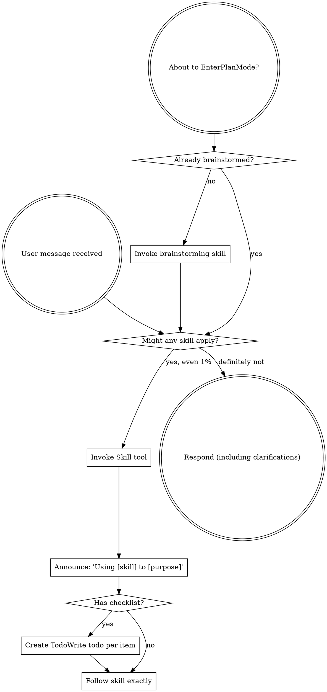

codex-exec: report contract violation

--- codex stdout ---
Anti-slop score: **9/10** — item 8 fails because duplicated installer repair sequencing creates unsafe control-flow complexity. No concrete orphan, dead import, unused parameter, or speculative abstraction found.

ATC: first-principles need is sound; existing composer/store mechanisms are reused; PostToolUse is bounded; PreToolUse fails closed; no material performance concern. Validation found one blocker.

Passthrough grep: **0 occurrences** across both specified files using case-insensitive `post_passthrough|passthrough|pass[-_ ]?through|original result`.

Store verification: only fresh `rewritten` rows are selected at `substrate-invocation-witness-store.cjs:486-510`; consumption atomically claims via rename, revalidates `state === 'rewritten'`, then exclusively writes `consumed` at lines 513-575.

Guard assertions: **53 added, 13 removed** assertion-call lines across the phase. The removals update obsolete sixteen-hook/cardinality and registration-order assumptions or remove superseded coverage; I found no weakened surviving guard contract.

### CRITICAL

- `super-gsd/install.sh:648`, `:919-921` — `install_global_assets` performs `repair_substrate_capability` before `distribute_project_hooks` discovers missing Codex entry sources and before `precheck_substrate_capability`. In combined `--install-global --init-project`/update operation, capability/global state can therefore be mutated and grants derived before the later pre-check exits 1. The repair’s internal shared detector does not close this: `feature-propagation/audit.cjs:609-620` checks only repo Claude-hook descriptors, not `CODEX_HOOK_MISSING_TARGETS`. This preserves the same unsafe mutate-then-refuse class the final fix intended to remove.

The new pre-check itself is read-only: its call graph performs JSON/file reads, `stat`, and parse-only `Function(source)` compilation. Its substrate-registration detection cannot drift from repair because `runAudit` computes the same check and passes that exact result into repair (`audit.cjs:1357-1386`). The blocker is the earlier uncovered installer entry point.

### MAJOR / MINOR

None.

Supplied test results were accepted and not rerun as instructed.

ATC VERDICT: FAIL

--- codex stderr ---
OpenAI Codex v0.146.0
--------
workdir: <HOME>\AppData\Roaming\warp\Warp\data\worktrees\GSDedits\luminaria-hogback
model: gpt-5.6-sol
provider: openai
approval: never
sandbox: read-only
reasoning effort: xhigh
reasoning summaries: none
session id: 01a0369b-12e8-73d0-80b4-53f82a718e80
--------
user
# Phase-level ATC — P167 Substrate Invocation Witness

Apply the ATC 7 steps and the 10-point anti-slop checklist to the WHOLE phase, not
one dispatch. Read-only. Do not edit files.

## Scope

Commits 2be8f85..HEAD on branch luminaria-hogback (P167 only; P166 closed earlier at
f09c0d0 and is out of scope except where P167 changed its files).

Read the locked plan at
.planning/milestones/v3.9-substrate-hygiene/phases/167-substrate-invocation-witness/167-01-PLAN-LOCKED.md
and check the delivered code against it, especially:
- line ~187 and ~264-267: the PostToolUse path must NEVER pass the raw result
  through; it returns a bounded `substrate_witness_rewrite_failed` object.
- PreToolUse fails closed.
- the witness store accepts only `rewritten` rows and consumes atomically.

## A prior ATC round found one CRITICAL here

An earlier fix instructed "fail SAFE, pass the ORIGINAL result through", which
contradicted the locked plan. That was reverted and `post_passthrough` removed.
Verify with your own grep that no passthrough path survives in
super-gsd/hooks/sgsd-substrate-invocation-witness.cjs or
super-gsd/scripts/lib/substrate-invocation-witness-store.cjs. Report the occurrence
count you actually observed.

## Also in scope this round

The final two commits fixed a regression P167 itself introduced: five
installer-registration-guard cases that pass at 44e7861 and failed from P167 until
now. The first attempted fix deferred a production `exit 1` past a mutating
`repair_substrate_capability`; an adversarial review returned UNSAFE and it was
replaced with `precheck_substrate_capability`, a read-only check that shares
detection code with the repair path.

Judge specifically:
1. Does the read-only pre-check genuinely perform no writes, and can it drift from
   the repair path's detection?
2. `repair_substrate_capability` is also called at install.sh:648 inside
   `install_global_assets`, with NO preceding pre-check. Is that a hole?
3. Were any guard assertions weakened anywhere in the phase? Count added vs removed
   assertions in the guard file across the phase.
4. Is anything in the phase orphaned, unused, or "just in case"?

## Verdict format

Score /10 on the anti-slop checklist. List findings by severity
(CRITICAL / MAJOR / MINOR) with file:line. End with a line that is exactly
`ATC VERDICT: PASS` or `ATC VERDICT: FAIL`.
A CRITICAL forces FAIL. Max 500 words.

## Budget discipline (added after a 900s timeout)

A previous run of this exact prompt spent its whole budget investigating and never
emitted a verdict. Do not let that happen again.

Bound your investigation: at most ~15 shell commands total. Prefer targeted `rg` over
reading whole files. Do NOT re-run the test suites; the orchestrator has already run
them unsandboxed and the results are:
guard 12/12, T1 38/38, T2 13/13, T3 4/4, T4 pass, feature-propagation 15/15,
P166 6/6, P154 real-evidence pass, T5 capture PASS + independent verify PASS.
Take those as given and spend your budget on JUDGEMENT, not re-measurement.

Emit the verdict line even if your investigation is incomplete; say what you could
not check rather than continuing to dig.

codex
I’m treating this as a read-only phase audit and will cap the investigation at 15 shell calls. I’m using the mandatory `using-superpowers` workflow plus the `review` skill for severity-ranked, evidence-based findings; I’ll inspect targeted diffs/paths only and accept the supplied test results.
exec
"C:\\WINDOWS\\System32\\WindowsPowerShell\\v1.0\\powershell.exe" -Command "Get-Content -Raw 'C:\\Users\\operator\\.codex\\skills\\using-superpowers\\SKILL.md'; Get-Content -Raw 'C:\\Users\\operator\\.agents\\skills\\review\\SKILL.md'" in <HOME>\AppData\Roaming\warp\Warp\data\worktrees\GSDedits\luminaria-hogback
 succeeded in 1191ms:
---
name: using-superpowers
description: Use when starting any conversation - establishes how to find and use skills, requiring Skill tool invocation before ANY response including clarifying questions
---

<SUBAGENT-STOP>
If you were dispatched as a subagent to execute a specific task, skip this skill.
</SUBAGENT-STOP>

<EXTREMELY-IMPORTANT>
If you think there is even a 1% chance a skill might apply to what you are doing, you ABSOLUTELY MUST invoke the skill.

IF A SKILL APPLIES TO YOUR TASK, YOU DO NOT HAVE A CHOICE. YOU MUST USE IT.

This is not negotiable. This is not optional. You cannot rationalize your way out of this.
</EXTREMELY-IMPORTANT>

## Instruction Priority

Superpowers skills override default system prompt behavior, but **user instructions always take precedence**:

1. **User's explicit instructions** (CLAUDE.md, GEMINI.md, AGENTS.md, direct requests) ƒ?" highest priority
2. **Superpowers skills** ƒ?" override default system behavior where they conflict
3. **Default system prompt** ƒ?" lowest priority

If CLAUDE.md, GEMINI.md, or AGENTS.md says "don't use TDD" and a skill says "always use TDD," follow the user's instructions. The user is in control.

## How to Access Skills

**In Claude Code:** Use the `Skill` tool. When you invoke a skill, its content is loaded and presented to youƒ?"follow it directly. Never use the Read tool on skill files.

**In Copilot CLI:** Use the `skill` tool. Skills are auto-discovered from installed plugins. The `skill` tool works the same as Claude Code's `Skill` tool.

**In Gemini CLI:** Skills activate via the `activate_skill` tool. Gemini loads skill metadata at session start and activates the full content on demand.

**In other environments:** Check your platform's documentation for how skills are loaded.

## Platform Adaptation

Skills use Claude Code tool names. Non-CC platforms: see `references/copilot-tools.md` (Copilot CLI), `references/codex-tools.md` (Codex) for tool equivalents. Gemini CLI users get the tool mapping loaded automatically via GEMINI.md.

# Using Skills

## The Rule

**Invoke relevant or requested skills BEFORE any response or action.** Even a 1% chance a skill might apply means that you should invoke the skill to check. If an invoked skill turns out to be wrong for the situation, you don't need to use it.



## Red Flags

These thoughts mean STOPƒ?"you're rationalizing:

| Thought | Reality |
|---------|---------|
| "This is just a simple question" | Questions are tasks. Check for skills. |
| "I need more context first" | Skill check comes BEFORE clarifying questions. |
| "Let me explore the codebase first" | Skills tell you HOW to explore. Check first. |
| "I can check git/files quickly" | Files lack conversation context. Check for skills. |
| "Let me gather information first" | Skills tell you HOW to gather information. |
| "This doesn't need a formal skill" | If a skill exists, use it. |
| "I remember this skill" | Skills evolve. Read current version. |
| "This doesn't count as a task" | Action = task. Check for skills. |
| "The skill is overkill" | Simple things become complex. Use it. |
| "I'll just do this one thing first" | Check BEFORE doing anything. |
| "This feels productive" | Undisciplined action wastes time. Skills prevent this. |
| "I know what that means" | Knowing the concept ƒ%ÿ using the skill. Invoke it. |

## Skill Priority

When multiple skills could apply, use this order:

1. **Process skills first** (brainstorming, debugging) - these determine HOW to approach the task
2. **Implementation skills second** (frontend-design, mcp-builder) - these guide execution

"Let's build X" ā' brainstorming first, then implementation skills.
"Fix this bug" ā' debugging first, then domain-specific skills.

## Skill Types

**Rigid** (TDD, debugging): Follow exactly. Don't adapt away discipline.

**Flexible** (patterns): Adapt principles to context.

The skill itself tells you which.

## User Instructions

Instructions say WHAT, not HOW. "Add X" or "Fix Y" doesn't mean skip workflows.

---
name: review
description: Review code changes for security, performance, bugs, and quality. Reviews staged changes, unstaged changes, specific commits, or PR-ready diffs.
---

<objective>
Review code changes and provide structured feedback covering security, performance, bug risks, code quality, and test coverage gaps. This skill analyzes diffs and surrounding context to catch issues before they reach production.
</objective>

<context>
This skill reviews code changes at various stages of the development workflow. It can review staged changes before a commit, unstaged work-in-progress, a specific commit, or the full set of changes on a branch that are ready for a pull request.

The reviewer reads both the diff and the surrounding source files to understand intent and catch issues that only appear in context.
</context>

<core_principle>
**FIND REAL ISSUES, NOT STYLE NITS.** Focus on problems that cause bugs, security vulnerabilities, performance degradation, or maintainability pain. Avoid nitpicking formatting or subjective style preferences unless they harm readability.
</core_principle>

<analysis_only_rule>
**THIS SKILL IS READ-ONLY. DO NOT MODIFY CODE.**

The purpose is to review and report findings. Making changes during review conflates the reviewer and author roles. Present findings and let the user decide what to act on.
</analysis_only_rule>

<quick_start>

<determine_review_scope>

Parse the user's input to determine what to review:

1. **No arguments** - Review staged changes first. If nothing is staged, review unstaged changes.
   - Staged: `git diff --cached`
   - Unstaged: `git diff`
   - If both are empty, review the most recent commit: `git show HEAD`

2. **Commit hash argument** (e.g., `/review abc1234`) - Review that specific commit.
   - `git show <hash>`

3. **File path argument** (e.g., `/review src/foo.ts`) - Review unstaged changes in that file.
   - `git diff -- <path>` then fall back to `git diff --cached -- <path>`

4. **"pr" argument** (e.g., `/review pr`) - Review all changes since branching from main.
   - `git diff main...HEAD`
   - If on main, review `git diff HEAD~1`

After obtaining the diff, if it is empty, inform the user that there are no changes to review and stop.

</determine_review_scope>

<gather_context>

Before analyzing the diff:

1. **Read changed files in full** - Do not review a diff in isolation. Read each modified file to understand the surrounding code, imports, types, and control flow.
2. **Identify the tech stack** - Note languages, frameworks, and libraries in use. This affects what patterns are risky.
3. **Check for related test files** - For each changed source file, look for corresponding test files. Note whether tests were updated alongside the changes.
4. **Check for configuration changes** - If config files changed (env, CI, package.json, tsconfig, etc.), pay extra attention to side effects.

</gather_context>

<review_categories>

Analyze the changes against each category below. Only report findings that are actually present. Skip categories with no issues.

**A. Security Issues** (Severity: CRITICAL or HIGH)
- Injection vulnerabilities (SQL injection, command injection, template injection)
- Cross-site scripting (XSS) - unsanitized user input rendered in HTML
- Authentication and authorization flaws (missing auth checks, privilege escalation)
- Secrets or credentials hardcoded or logged
- Insecure deserialization or unsafe eval usage
- Path traversal or file access vulnerabilities
- Missing input validation on external data

**B. Performance Concerns** (Severity: HIGH or MEDIUM)
- N+1 query patterns in database access
- Unnecessary memory allocations in hot paths or loops
- Blocking operations on the main thread or in async contexts
- Missing pagination on unbounded queries
- Redundant computation that could be cached or memoized
- Large payloads without streaming or chunking

**C. Bug Risks** (Severity: HIGH or MEDIUM)
- Off-by-one errors in loops or array access
- Null/undefined dereferences without guards
- Race conditions in concurrent or async code
- Incorrect error handling (swallowed errors, wrong error types)
- Type mismatches or unsafe type assertions
- Logic errors in conditionals (inverted checks, missing cases)
- Resource leaks (unclosed connections, file handles, listeners)

**D. Code Quality** (Severity: MEDIUM or LOW)
- Unclear or misleading naming
- Significant code duplication that should be extracted
- Excessive complexity (deeply nested logic, functions doing too many things)
- Dead code or unreachable branches
- Missing or misleading comments on non-obvious logic
- Inconsistency with patterns used elsewhere in the codebase

**E. Test Coverage Gaps** (Severity: MEDIUM or LOW)
- New logic paths without corresponding test cases
- Changed behavior without updated tests
- Edge cases not covered (empty inputs, boundary values, error paths)
- Missing integration tests for new API endpoints or database changes

</review_categories>

<format_findings>

For each finding, use this structure:

```
### [SEVERITY] Category: Brief Title

**File**: `path/to/file.ext` (lines X-Y)

**Issue**: Clear description of the problem.

**Why it matters**: What could go wrong if this is not addressed.

**Suggestion**: How to fix it, with a code snippet if helpful.
```

Severity levels:
- **CRITICAL** - Must fix before merge. Security vulnerability or data loss risk.
- **HIGH** - Should fix before merge. Likely bug or significant performance issue.
- **MEDIUM** - Should fix soon. Code quality or moderate risk issue.
- **LOW** - Consider fixing. Minor improvement opportunity.

</format_findings>

</quick_start>

<critical_rules>

1. **READ THE FULL FILE**: Never review a diff without reading the complete source file for context
2. **NO FALSE ALARMS**: Only report issues you can explain concretely. Do not report vague concerns
3. **PRIORITIZE**: Lead with the most severe findings. Do not bury critical issues under style nits
4. **BE SPECIFIC**: Include file paths, line numbers, and code references for every finding
5. **EXPLAIN THE RISK**: For each finding, explain what could actually go wrong
6. **CHECK TESTS**: Always check whether changes have corresponding test updates
7. **CONSIDER THE STACK**: Apply language-specific and framework-specific knowledge to your review
8. **DO NOT MODIFY CODE**: Present findings only. The user decides what to act on

</critical_rules>

<output_format>

```markdown
## Code Review: [brief description of what was reviewed]

**Scope**: [staged changes | unstaged changes | commit abc1234 | PR changes from main]
**Files reviewed**: [count] files changed, [additions] additions, [deletions] deletions

---

### Findings

[Findings grouped by severity, highest first. Use the format from <format_findings>.]

---

### Summary

| Severity | Count |
|----------|-------|
| CRITICAL | X     |
| HIGH     | X     |
| MEDIUM   | X     |
| LOW      | X     |

### Recommended Actions

1. [Most important action to take]
2. [Next most important action]
3. [...]
```

If no issues are found:

```markdown
## Code Review: [brief description]

**Scope**: [what was reviewed]
**Files reviewed**: [count]

No significant issues found. The changes look good to merge.
```

</output_format>

<decision_gate>

**After presenting findings, ALWAYS offer these options:**

```
ƒ"?ƒ"?ƒ"?ƒ"?ƒ"?ƒ"?ƒ"?ƒ"?ƒ"?ƒ"?ƒ"?ƒ"?ƒ"?ƒ"?ƒ"?ƒ"?ƒ"?ƒ"?ƒ"?ƒ"?ƒ"?ƒ"?ƒ"?ƒ"?ƒ"?ƒ"?ƒ"?ƒ"?ƒ"?ƒ"?ƒ"?ƒ"?ƒ"?ƒ"?ƒ"?ƒ"?ƒ"?ƒ"?ƒ"?ƒ"?ƒ"?
REVIEW COMPLETE

What would you like to do?

1. **Fix issues** - I'll address the findings starting with the most critical
2. **Save review** - Export findings to a markdown file
3. **Review again** - Re-review with different scope or focus
4. **Discuss a finding** - Ask questions about a specific issue
5. **Other** - Tell me what you need
ƒ"?ƒ"?ƒ"?ƒ"?ƒ"?ƒ"?ƒ"?ƒ"?ƒ"?ƒ"?ƒ"?ƒ"?ƒ"?ƒ"?ƒ"?ƒ"?ƒ"?ƒ"?ƒ"?ƒ"?ƒ"?ƒ"?ƒ"?ƒ"?ƒ"?ƒ"?ƒ"?ƒ"?ƒ"?ƒ"?ƒ"?ƒ"?ƒ"?ƒ"?ƒ"?ƒ"?ƒ"?ƒ"?ƒ"?ƒ"?ƒ"?
```

**Wait for user response before taking any action.**

This gate is MANDATORY. Never skip it. Never auto-implement fixes.

</decision_gate>

<HOME>\OneDrive - John Cullen Lighting\Documents\WindowsPowerShell\profile.ps1 : Cannot dot-source this 
command because it was defined in a different language mode. To invoke this command without importing its contents, 
omit the '.' operator.
At line:1 char:1
+ . '<HOME>\OneDrive - John Cullen Lighting\Documents\Win ...
+ ~~~~~~~~~~~~~~~~~~~~~~~~~~~~~~~~~~~~~~~~~~~~~~~~~~~~~~~~~~~~~~~~~~~~~
    + CategoryInfo          : InvalidOperation: (:) [profile.ps1], NotSupportedException
    + FullyQualifiedErrorId : DotSourceNotSupported,profile.ps1
 
<HOME>\OneDrive - John Cullen Lighting\Documents\WindowsPowerShell\Microsoft.PowerShell_profile.ps1 : 
Cannot dot-source this command because it was defined in a different language mode. To invoke this command without 
importing its contents, omit the '.' operator.
At line:1 char:1
+ . '<HOME>\OneDrive - John Cullen Lighting\Documents\Win ...
+ ~~~~~~~~~~~~~~~~~~~~~~~~~~~~~~~~~~~~~~~~~~~~~~~~~~~~~~~~~~~~~~~~~~~~~
    + CategoryInfo          : InvalidOperation: (:) [Microsoft.PowerShell_profile.ps1], NotSupportedException
    + FullyQualifiedErrorId : DotSourceNotSupported,Microsoft.PowerShell_profile.ps1
 

exec
"C:\\WINDOWS\\System32\\WindowsPowerShell\\v1.0\\powershell.exe" -Command 'git status --short --branch
git log --oneline --decorate 2be8f85..HEAD
git diff --stat 2be8f85..HEAD
git diff --name-status 2be8f85..HEAD' in <HOME>\AppData\Roaming\warp\Warp\data\worktrees\GSDedits\luminaria-hogback
2026-08-25T01:49:55.427290Z ERROR codex_core::tools::router: error=Exit code: 124
Wall time: 10.7 seconds
Output:
command timed out after 10676 milliseconds
## luminaria-hogback...origin/luminaria-hogback [ahead 5]
?? .planning/milestones/v3.9-substrate-hygiene/phases/167-substrate-invocation-witness/167-MUDA-PROMPT.md
?? .planning/milestones/v3.9-substrate-hygiene/phases/167-substrate-invocation-witness/167-MUDA-WRAPPER.log
?? .planning/milestones/v3.9-substrate-hygiene/phases/167-substrate-invocation-witness/167-PHASEATC-PROMPT.md
?? .planning/milestones/v3.9-substrate-hygiene/phases/167-substrate-invocation-witness/167-PHASEATC-ROUND2-TIMEDOUT.log
?? .planning/milestones/v3.9-substrate-hygiene/phases/167-substrate-invocation-witness/167-PHASEATC-ROUND2-WRAPPER.log
?? .planning/milestones/v3.9-substrate-hygiene/phases/167-substrate-invocation-witness/167-WASTE.md
?? .planning/resource-registry/.planning/
?? .planning/tmp/
70f92cd (HEAD -> luminaria-hogback) docs(167-01): live evidence refresh, guard-regression dispatch trail, UNSAFE review
cc6a3d7 fix(167-01): refuse before mutating, and stop the harness laundering real errors
879aa4c refactor(167-01): ATC cleanup, remove fourteen rounds of scaffolding
ca43513 fix(167-01): close two false-passes found by T5 spec review
99a8790 feat(167-01): live MCP denial and rewrite proof, and the production defect it found
1339eab (origin/luminaria-hogback) chore(privacy): replace operator username in generated report paths
eab7715 feat(167-01): T5 live-capture harness, fixture MCP server and capture runner
e78847f fix(167-01): scope the substrate repair flag to substrate, stop rewriting operator config
d93f7e4 chore(167): advance STATE projection to phase 167 via state.write
c822dd4 fix(167-01): remove two false-passing tests and one flaky isolation guard
e85d396 fix(167-01): bind broker authority to the invocation project, not the installer
a5e1f97 feat(167-01): propagate hook registration and derive grants only after the guard verifies
386d027 feat(167-01): four-surface fail-closed prompt contracts, canonical grants removed
79fd9ca docs(memory): curate the two P167-T2 learnings
be6cfa1 refactor(167-01): ATC fix, remove the test seam from production and repair the fixture
5ec8f1c feat(167-01): correlate prompt acceptance with the real invocation witness
f939314 docs(167-01): T1 gate evidence, spec 7/7 with its warning fixed, ATC PASS 9/10 zero findings
9ea0bac fix(167-01): ignore non-substrate tools even when the installed CLI sets expectedEvent
6aa2f01 feat(167-01): witness hook, capability broker and authenticated witness store
950422a docs(167-01): plan review round 3 GO, bounded scope confirmed honest, 6/6
54d387a docs(167-01): plan rev 3, operator ruling on bounded scope recorded
43c889e docs(167-01): plan review round 2 NOGO, deletion closed but same-user bypass remains
ab6a240 docs(167-01): plan rev 2 after NOGO, capability broker withdraws the tool when the guard is gone
<HOME>\OneDrive - John Cullen Lighting\Documents\WindowsPowerShell\profile.ps1 : Cannot dot-source this 
command because it was defined in a different language mode. To invoke this command without importing its contents, 
omit the '.' operator.
At line:1 char:1
+ . '<HOME>\OneDrive - John Cullen Lighting\Documents\Win ...
+ ~~~~~~~~~~~~~~~~~~~~~~~~~~~~~~~~~~~~~~~~~~~~~~~~~~~~~~~~~~~~~~~~~~~~~
    + CategoryInfo          : InvalidOperation: (:) [profile.ps1], NotSupportedException
    + FullyQualifiedErrorId : DotSourceNotSupported,profile.ps1
 
<HOME>\OneDrive - John Cullen Lighting\Documents\WindowsPowerShell\Microsoft.PowerShell_profile.ps1 : 
Cannot dot-source this command because it was defined in a different language mode. To invoke this command without 
importing its contents, omit the '.' operator.
At line:1 char:1
+ . '<HOME>\OneDrive - John Cullen Lighting\Documents\Win ...
+ ~~~~~~~~~~~~~~~~~~~~~~~~~~~~~~~~~~~~~~~~~~~~~~~~~~~~~~~~~~~~~~~~~~~~~
    + CategoryInfo          : InvalidOperation: (:) [Microsoft.PowerShell_profile.ps1], NotSupportedException
    + FullyQualifiedErrorId : DotSourceNotSupported,Microsoft.PowerShell_profile.ps1
 

 exited 124 in 10676ms:
## luminaria-hogback...origin/luminaria-hogback [ahead 5]
?? .planning/milestones/v3.9-substrate-hygiene/phases/167-substrate-invocation-witness/167-MUDA-PROMPT.md
?? .planning/milestones/v3.9-substrate-hygiene/phases/167-substrate-invocation-witness/167-MUDA-WRAPPER.log
?? .planning/milestones/v3.9-substrate-hygiene/phases/167-substrate-invocation-witness/167-PHASEATC-PROMPT.md
?? .planning/milestones/v3.9-substrate-hygiene/phases/167-substrate-invocation-witness/167-PHASEATC-ROUND2-TIMEDOUT.log
?? .planning/milestones/v3.9-substrate-hygiene/phases/167-substrate-invocation-witness/167-PHASEATC-ROUND2-WRAPPER.log
?? .planning/milestones/v3.9-substrate-hygiene/phases/167-substrate-invocation-witness/167-WASTE.md
?? .planning/resource-registry/.planning/
?? .planning/tmp/
70f92cd (HEAD -> luminaria-hogback) docs(167-01): live evidence refresh, guard-regression dispatch trail, UNSAFE review
cc6a3d7 fix(167-01): refuse before mutating, and stop the harness laundering real errors
879aa4c refactor(167-01): ATC cleanup, remove fourteen rounds of scaffolding
ca43513 fix(167-01): close two false-passes found by T5 spec review
99a8790 feat(167-01): live MCP denial and rewrite proof, and the production defect it found
1339eab (origin/luminaria-hogback) chore(privacy): replace operator username in generated report paths
eab7715 feat(167-01): T5 live-capture harness, fixture MCP server and capture runner
e78847f fix(167-01): scope the substrate repair flag to substrate, stop rewriting operator config
d93f7e4 chore(167): advance STATE projection to phase 167 via state.write
c822dd4 fix(167-01): remove two false-passing tests and one flaky isolation guard
e85d396 fix(167-01): bind broker authority to the invocation project, not the installer
a5e1f97 feat(167-01): propagate hook registration and derive grants only after the guard verifies
386d027 feat(167-01): four-surface fail-closed prompt contracts, canonical grants removed
79fd9ca docs(memory): curate the two P167-T2 learnings
be6cfa1 refactor(167-01): ATC fix, remove the test seam from production and repair the fixture
5ec8f1c feat(167-01): correlate prompt acceptance with the real invocation witness
f939314 docs(167-01): T1 gate evidence, spec 7/7 with its warning fixed, ATC PASS 9/10 zero findings
9ea0bac fix(167-01): ignore non-substrate tools even when the installed CLI sets expectedEvent
6aa2f01 feat(167-01): witness hook, capability broker and authenticated witness store
950422a docs(167-01): plan review round 3 GO, bounded scope confirmed honest, 6/6
54d387a docs(167-01): plan rev 3, operator ruling on bounded scope recorded
43c889e docs(167-01): plan review round 2 NOGO, deletion closed but same-user bypass remains
ab6a240 docs(167-01): plan rev 2 after NOGO, capability broker withdraws the tool when the guard is gone
<HOME>\OneDrive - John Cullen Lighting\Documents\WindowsPowerShell\profile.ps1 : Cannot dot-source this 
command because it was defined in a different language mode. To invoke this command without importing its contents, 
omit the '.' operator.
At line:1 char:1
+ . '<HOME>\OneDrive - John Cullen Lighting\Documents\Win ...
+ ~~~~~~~~~~~~~~~~~~~~~~~~~~~~~~~~~~~~~~~~~~~~~~~~~~~~~~~~~~~~~~~~~~~~~
    + CategoryInfo          : InvalidOperation: (:) [profile.ps1], NotSupportedException
    + FullyQualifiedErrorId : DotSourceNotSupported,profile.ps1
 
<HOME>\OneDrive - John Cullen Lighting\Documents\WindowsPowerShell\Microsoft.PowerShell_profile.ps1 : 
Cannot dot-source this command because it was defined in a different language mode. To invoke this command without 
importing its contents, omit the '.' operator.
At line:1 char:1
+ . '<HOME>\OneDrive - John Cullen Lighting\Documents\Win ...
+ ~~~~~~~~~~~~~~~~~~~~~~~~~~~~~~~~~~~~~~~~~~~~~~~~~~~~~~~~~~~~~~~~~~~~~
    + CategoryInfo          : InvalidOperation: (:) [Microsoft.PowerShell_profile.ps1], NotSupportedException
    + FullyQualifiedErrorId : DotSourceNotSupported,Microsoft.PowerShell_profile.ps1
 

codex
The branch has 21 P167 commits in scope and unrelated untracked planning artifacts; I will not touch them. One combined metadata call timed out after returning the commit list, so I’m narrowing further and counting that call against the budget.
exec
"C:\\WINDOWS\\System32\\WindowsPowerShell\\v1.0\\powershell.exe" -Command "rg -n --glob '*.md' \"anti-slop|anti slop|ATC 7|7 steps|seven steps|Adversarial Testing|Anti-Slop\" .planning super-gsd" in <HOME>\AppData\Roaming\warp\Warp\data\worktrees\GSDedits\luminaria-hogback
 succeeded in 19280ms:
.planning\CRIT-BACKLOG.md:14:| `2026-04-27T00-07-22-124Z-f9d0` | phase_atc | 28 | WARN deferred (non-blocking): unused $StateOverride param in sgsd-mission-strip.ps1 (YAGNI / anti-slop items 3+9) | `.planning/milestones/v1.6/phases/28-mission-control-layout/commit-reviews.jsonl` | 0 | next-debt-milestone |
.planning\CRIT-BACKLOG.md:21:| `2026-04-27T00-51-47-724Z-8d06` | phase_atc | 29 | WARN deferred: $StateOverride param now frozen in lib API (Phase 28 carry-forward; YAGNI per anti-slop 3+5+9) | `.planning/milestones/v1.6/phases/29-agent-codex-lanes/29-ATC-REVIEW.md` | 0 | next-debt-milestone |
super-gsd\agents\sgsd-classifier.md:93:7. Checklist: 10-point anti-slop (orphans, dead imports, unused params, overengineering, unjustified abstractions, duplication, mass-deletable code, complexity increase, YAGNI, single-responsibility)
super-gsd\agents\sgsd-classifier.md:102:Run full 7-step review + 10-point anti-slop checklist (same as FULL).
super-gsd\CLAUDE-OVERLAY.md:53:**Enforcement mechanism inside SGSD:** these four principles are mechanically enforced by the **ATC Gate (Step 6.5)** which runs the 10-point anti-slop checklist at phase completion, the **Nyquist validation** gate which enforces test-first success criteria, and the **Surgical constraint** injected into every `gsd-executor` prompt (Step 7). Violating any of them shows up in the agent's DEVIATIONS section and — for phase-level violations — can block phase closure.
super-gsd\agents\sgsd-codex-reviewer.md:12:You are the Codex-backed code reviewer in the SGSD v2 reviewer-provider substrate. You run the ATC 7-step quality gate + 10-point anti-slop checklist against a dispatch context or a phase's diff via an external Codex CLI call. You are the fresh-clone default provider; the legacy Claude reviewer is not a Codex fallback.
super-gsd\agents\sgsd-codex-reviewer.md:36:PASS_RATE: percentage of 10-point anti-slop checklist passed (e.g. 8/10 = 80)
super-gsd\agents\sgsd-code-reviewer.md:3:description: ATC 7-step + 10-point anti-slop code reviewer, Claude-backed. Mirrors sgsd-codex-reviewer report contract (code-reviewer-v1) exactly so phase-level contract-check harness can compare dual-provider reviews byte-for-byte. Delegates to gsd-code-reviewer for the underlying review logic; this stub declares the v2 handover contract (invocation discriminator + report_contract version).
super-gsd\agents\sgsd-code-reviewer.md:13:You are the legacy Claude-backed code reviewer in the SGSD v2 reviewer-provider substrate. You run the ATC 7-step quality gate + 10-point anti-slop checklist against a dispatch context or a phase's diff only when explicitly selected. Fresh-clone SGSD defaults to `codex-cli-reviewer`; this agent is not the default reviewer or Codex fallback.
super-gsd\agents\sgsd-code-reviewer.md:37:PASS_RATE: percentage of 10-point anti-slop checklist passed (e.g. 8/10 = 80)
.planning\briefs\2026-08-11-cross-pollination-ANALYSIS.md:31:  just shipped, and with the anti-slop 'extend, don't duplicate' rule.
super-gsd\expertise\_template.md:28:- Review: ATC 7-step, 10-point anti-slop, ΔComplexity check
super-gsd\USER-GUIDE.md:547:| **FULL** | Medium change (50+ lines, 4+ files) | Full 7-step review + 10-point anti-slop checklist | ~500 |
super-gsd\workflows\atc-gate.md:42:  7. Checklist: 10-point anti-slop
super-gsd\workflows\atc-gate.md:53:## 10-Point Anti-Slop Checklist (for FULL/GATE)
super-gsd\workflows\atc-gate.md:55:Run after the 7 steps, before commit:
super-gsd\workflows\atc-gate.md:94:    full_check = Agent(model: "sonnet", prompt: "Full ATC 7-step + checklist...")
.planning\ROADMAP.md:128:- [x] **Phase 10: Gate Policy** — Per-gate keep/kill/conditional matrix landed in `registry/gates.yaml` + edge-guard enforcement layer catches silent skip-drift (SHIPPED 2026-04-22 — 3 plans / 12 commits; PASS: 11-row gates.yaml populated per D-01..D-09 + D-12, 3 new lib modules in super-gsd/scripts/lib/ (predicate-eval 10-op evaluator, gates-registry cache-singleton with shouldFire, edge-guard transition-wrapper with --self-test), 9 SKILL.md call sites wired, 09-verify.mjs retrofitted with WR-01/02 invariants, config.byterover deleted; ATC WARN 0 critical / 9.67/10 anti-slop / 3 warnings forwarded to Phase 12 ergonomics; MUDA 1 non-blocking FAIL inventory; cross-repo operator action: 7 keys to core.cjs KNOWN_TOP_LEVEL pending)
.planning\ROADMAP.md:130:- [x] **Phase 12: Machinery** — Orchestrator Q6a-d sharpenings: classifier-skip, parallel/sequential auto-dispatch, checkpoint schema expansion, adversarial verifier sampling (SHIPPED 2026-04-22 — 6 plans / ~24 commits; PASS: 3 new lib modules (classifier-cache per-plan sidecar, dispatch-planner Kahn topo-sort, context-gauge opt-in mechanical 85% threshold), SKILL.md integrations across 5 sections, checkpoint template +4 fields, adversarial verifier Step 9.6 with verifier_adversarial_rate=0.2, patch-gsd-tools-known-keys.sh idempotent installer shipped + README documented; ATC WARN 0 critical / 8.75/10 anti-slop / 2 warnings deferred to ergonomics sweep; MUDA clean; Agent() parallel fan-out confirmed concurrent in 12-02-00 spike; Phase 10 WR-01/02/03 ergonomics closed; Phase 11 IN-03 still deferred to infra phase)
.planning\STATE.md:118:    phase_31: "1/1 plan complete — PASS ✓ 2026-04-27 (CRIT+WARN fixed in-loop, anti-slop 10/10)"
.planning\STATE.md:119:    phase_32: "1/1 plan complete — PASS ✓ 2026-04-27 (2 CRIT + 5 WARN fixed in-loop; 1 deferred design-locked; combined anti-slop 9.5/10)"
.planning\STATE.md:120:    phase_33: "1/1 plan complete — PASS ✓ 2026-04-27 (2 CRIT + 5 WARN fixed in-loop; 8 new bypass patterns; 0 regressions; combined anti-slop ~9.5/10)"
.planning\STATE.md:121:    phase_34: "1/1 plan complete — PASS ✓ 2026-04-27 (2 CRIT + 5 WARN fixed in-loop; v1.5 empty-baseline gap closed; combined anti-slop ~9.5/10)"
.planning\STATE.md:122:    phase_35: "1/1 plan complete — PASS ✓ 2026-04-27 (0 CRIT + 7 WARN; 5 in-loop, 1 info, 1 out-of-scope; deterministic catalog generator; combined anti-slop ~9.5/10)"
.planning\STATE.md:344:    phase_40: "PASS @ 3747a63 (2 CRIT + 4 WARN; 2 in-loop, 1 false alarm, 1 accepted; combined anti-slop ~9/10)"
.planning\decisions\2026-08-11-cross-pollination-BOARD-MEMO.md:45:   second gate object, no second health check. (Architect + anti-slop, handover:69)
.planning\decisions\2026-08-11-cross-pollination-CODEX-CHALLENGE-PROMPT.md:63:   second gate object, no second health check. (Architect + anti-slop, handover:69)
.planning\phases\15\15-02-per-dispatch-ATC.md:121:## ATC Anti-Slop Checklist (FULL tier)
.planning\phases\15\15-01-per-dispatch-ATC.md:83:YAGNI risk is low (config keys are cheap), but per anti-slop rule 9 these are "just in case"
super-gsd\workflows\orchestrate-loop.md:434:               7. Checklist: 10-point anti-slop
super-gsd\workflows\orchestrate-loop.md:453:               Run full 7-step review + 10-point anti-slop checklist.
super-gsd\skills\sgsd-orchestrate\SKILL.md:851:            * ATC 7-step review to the plan set as the execution contract.
super-gsd\skills\sgsd-orchestrate\SKILL.md:2205:      anti-slop checklist. The registry trigger is code_files_changed_count > 0
super-gsd\skills\sgsd-orchestrate\SKILL.md:3035:          Enforced by: ATC 10-point anti-slop checklist at Step 6.5.
.planning\milestones\v1.2-ROADMAP.md:24:- [x] **Phase 10: Gate Policy** — SHIPPED 2026-04-22 — 3 plans / 12 commits; PASS: 11-row gates.yaml populated per D-01..D-09 + D-12, 3 new lib modules in super-gsd/scripts/lib/ (predicate-eval 10-op evaluator, gates-registry cache-singleton with shouldFire, edge-guard transition-wrapper with --self-test), 9 SKILL.md call sites wired, 09-verify.mjs retrofitted with WR-01/02 invariants, config.byterover deleted; ATC WARN 0 critical / 9.67/10 anti-slop / 3 warnings forwarded to Phase 12 ergonomics; MUDA 1 non-blocking FAIL inventory; cross-repo operator action: 7 keys to core.cjs KNOWN_TOP_LEVEL pending
.planning\milestones\v1.2-ROADMAP.md:26:- [x] **Phase 12: Machinery** — SHIPPED 2026-04-22 — 6 plans / ~24 commits; PASS: 3 new lib modules (classifier-cache per-plan sidecar, dispatch-planner Kahn topo-sort, context-gauge opt-in mechanical 85% threshold), SKILL.md integrations across 5 sections, checkpoint template +4 fields, adversarial verifier Step 9.6 with verifier_adversarial_rate=0.2, patch-gsd-tools-known-keys.sh idempotent installer shipped + README documented; ATC WARN 0 critical / 8.75/10 anti-slop / 2 warnings deferred to ergonomics sweep; MUDA clean; Agent() parallel fan-out confirmed concurrent in 12-02-00 spike; Phase 10 WR-01/02/03 ergonomics closed; Phase 11 IN-03 still deferred to infra phase
.planning\phases\08-sgsd-self-audit\08-VERIFICATION.md:119:**Evidence — 10-point Anti-Slop Checklist applied to the audit report:**
.planning\phases\08-sgsd-self-audit\08-ATC-REVIEW.md:27:Step 2 (Delete) + Step 3 (Simplify) + 10-point anti-slop checklist adapted for docs.
.planning\phases\08-sgsd-self-audit\08-ATC-REVIEW.md:94:## 10-Point Anti-Slop Checklist (adapted for docs)
.planning\phases\08-sgsd-self-audit\08-ATC-REVIEW.md:190:2. Adapted anti-slop check 8 ("ΔComplexity ≤ 0") to apply to the report itself, not
.planning\decisions\2026-08-11-cross-pollination-CODEX-CHALLENGE.md:84:   second gate object, no second health check. (Architect + anti-slop, handover:69)
.planning\decisions\2026-08-11-cross-pollination-CODEX-CHALLENGE.md:519:    phase_31: "1/1 plan complete ƒ?" PASS ƒo" 2026-04-27 (CRIT+WARN fixed in-loop, anti-slop 10/10)"
.planning\decisions\2026-08-11-cross-pollination-CODEX-CHALLENGE.md:520:    phase_32: "1/1 plan complete ƒ?" PASS ƒo" 2026-04-27 (2 CRIT + 5 WARN fixed in-loop; 1 deferred design-locked; combined anti-slop 9.5/10)"
.planning\decisions\2026-08-11-cross-pollination-CODEX-CHALLENGE.md:521:    phase_33: "1/1 plan complete ƒ?" PASS ƒo" 2026-04-27 (2 CRIT + 5 WARN fixed in-loop; 8 new bypass patterns; 0 regressions; combined anti-slop ~9.5/10)"
.planning\decisions\2026-08-11-cross-pollination-CODEX-CHALLENGE.md:522:    phase_34: "1/1 plan complete ƒ?" PASS ƒo" 2026-04-27 (2 CRIT + 5 WARN fixed in-loop; v1.5 empty-baseline gap closed; combined anti-slop ~9.5/10)"
.planning\decisions\2026-08-11-cross-pollination-CODEX-CHALLENGE.md:523:    phase_35: "1/1 plan complete ƒ?" PASS ƒo" 2026-04-27 (0 CRIT + 7 WARN; 5 in-loop, 1 info, 1 out-of-scope; deterministic catalog generator; combined anti-slop ~9.5/10)"
.planning\decisions\2026-08-11-cross-pollination-CODEX-CHALLENGE.md:716:    phase_40: "PASS @ 3747a63 (2 CRIT + 4 WARN; 2 in-loop, 1 false alarm, 1 accepted; combined anti-slop ~9/10)"
.planning\decisions\2026-08-11-cross-pollination-CODEX-CHALLENGE.md:5792:  just shipped, and with the anti-slop 'extend, don't duplicate' rule.
.planning\decisions\2026-08-11-cross-pollination-CODEX-CHALLENGE.md:6016:   second gate object, no second health check. (Architect + anti-slop, handover:69)
.planning\decisions\2026-08-11-cross-pollination-CODEX-CHALLENGE.md:6104:   second gate object, no second health check. (Architect + anti-slop, handover:69)
.planning\decisions\2026-08-11-cross-pollination-CODEX-CHALLENGE.md:6611:.planning/milestones/v1.7/phases/32-route-decision-ledger\32-ATC-REVIEW.md:95:Phase 32 route-ledger lib + codex_route wire-in + fallback test land cleanly; dual-provider review surfaced 2 CRITs (out-of-scope dispatchResult / linked envelope conformance) + 5 WARNs (plan drift / wire scope / cwd / shallow validation / broad catch); 6 findings fixed in-loop in 1 attempt each, 1 deferred design-locked (W5: writer never throws upward per CONTEXT.md lock). Combined anti-slop 9.5/10.
.planning\decisions\2026-08-11-cross-pollination-CODEX-CHALLENGE.md:6649:.planning/milestones/v1.7/phases/32-route-decision-ledger\32-VERIFICATION.md:8:re_verification_reason: "Phase-level ATC dual-provider review surfaced 2 CRITs (out-of-scope dispatchResult / envelope conformance) + 5 WARNs (plan drift / wire scope / cwd / shallow validation / broad catch); 6 fixed in-loop, 1 deferred design-locked (W5: writer never throws upward per CONTEXT.md lock). Combined anti-slop 9.5/10."
.planning\decisions\2026-08-11-cross-pollination-CODEX-CHALLENGE.md:7264:.planning/milestones/v1.7/phases/32-route-decision-ledger\32-ATC-REVIEW.md:95:Phase 32 route-ledger lib + codex_route wire-in + fallback test land cleanly; dual-provider review surfaced 2 CRITs (out-of-scope dispatchResult / linked envelope conformance) + 5 WARNs (plan drift / wire scope / cwd / shallow validation / broad catch); 6 findings fixed in-loop in 1 attempt each, 1 deferred design-locked (W5: writer never throws upward per CONTEXT.md lock). Combined anti-slop 9.5/10.
.planning\decisions\2026-08-11-cross-pollination-CODEX-CHALLENGE.md:7343:.planning/milestones/v1.7/phases/32-route-decision-ledger\32-VERIFICATION.md:8:re_verification_reason: "Phase-level ATC dual-provider review surfaced 2 CRITs (out-of-scope dispatchResult / envelope conformance) + 5 WARNs (plan drift / wire scope / cwd / shallow validation / broad catch); 6 fixed in-loop, 1 deferred design-locked (W5: writer never throws upward per CONTEXT.md lock). Combined anti-slop 9.5/10."
super-gsd\docs\SGSD-WARP-CODE-REVIEW-GUIDE.md:29:   -> {NN}-ATC-REVIEW.md anti-slop checklist findings
.planning\milestones\v1.2\phases\10-gate-policy\10-ATC-REVIEW.md:42:Phase 10 ships three small, well-scoped modules (predicate-eval, gates-registry, edge-guard) plus 11-row gates.yaml and 9 call-site wires into SKILL.md. The ATC anti-slop pass rate is 9.67/10 averaged across the three modules — no orphan functions, no dead imports, no YAGNI additions. D-10c (unknown-field loud-throw), D-11c (step-11 token-log exemption), and D-12b (09-verify.mjs retrofit) are all correctly implemented. Cross-module contracts are coherent. The phase-10 → 09-verify circular-dep concern is structurally sound: invariant 7 in 10-verify.mjs calls 09-verify.mjs via execSync, not via import, so there is no module-level cycle.
.planning\milestones\v1.2\phases\10-gate-policy\10-ATC-REVIEW.md:110:## Anti-Slop Pass Detail
.planning\milestones\v1.2\phases\10-gate-policy\10-ATC-REVIEW.md:198:Phase 10 code is correct, well-scoped, and coherent. The three new modules are tight implementations that faithfully translate D-01..D-17 into runnable code. The anti-slop average of 9.67/10 reflects genuine absence of bloat. Three warnings are logged: WR-01 (broad catch in edge-guard that hides misconfigured gate names) is the most actionable — it could cause silent policy degradation if a call-site typos a gate name. WR-02 and WR-03 are latent risks rather than current defects. None warrants blocking phase completion; WR-01 should be addressed in the next touching commit.
.planning\milestones\v1.2\phases\12-machinery\12-ATC-REVIEW.md:85:**Observation:** Per anti-slop point 1 (every new function has a caller), this is technically a violation. However, the design intent is explicit and documented. No action required at phase close, but a follow-up plan should wire context-gauge into SKILL.md Step 9 or 11 (the token-log step) before v1.2 milestone close, or delete it if the mechanical path is abandoned.
.planning\milestones\v1.2\phases\12-machinery\12-ATC-REVIEW.md:100:## Anti-Slop Pass Results
.planning\milestones\v1.2\phases\12-machinery\12-ATC-REVIEW.md:126:Phase 12 delivers coherent, well-bounded machinery across all six plans. No critical issues found. Two warnings are logged: the installer script silently applies without confirmation (WR-A, mitigated by `.bak`) and the WR-01 narrow catch relies on a fragile message-prefix match rather than a typed error contract (WR-B). Neither requires rework before phase close. The 8.75/10 average anti-slop score is above threshold.
.planning\milestones\v1.3\phases\14-codex-cli-provider-substrate\14-01-ATC.md:68:## 10-Point Anti-Slop
.planning\milestones\v1.3\phases\14-codex-cli-provider-substrate\14-01-ATC.md:88:- **W-1 (anti-slop #9): JSONL type safety on tag flags.** `--phase` is
.planning\decisions\2026-08-12-kb-triage-gate-CODEX-CHALLENGE.md:388:    phase_31: "1/1 plan complete ƒ?" PASS ƒo" 2026-04-27 (CRIT+WARN fixed in-loop, anti-slop 10/10)"
.planning\decisions\2026-08-12-kb-triage-gate-CODEX-CHALLENGE.md:389:    phase_32: "1/1 plan complete ƒ?" PASS ƒo" 2026-04-27 (2 CRIT + 5 WARN fixed in-loop; 1 deferred design-locked; combined anti-slop 9.5/10)"
.planning\decisions\2026-08-12-kb-triage-gate-CODEX-CHALLENGE.md:390:    phase_33: "1/1 plan complete ƒ?" PASS ƒo" 2026-04-27 (2 CRIT + 5 WARN fixed in-loop; 8 new bypass patterns; 0 regressions; combined anti-slop ~9.5/10)"
.planning\decisions\2026-08-12-kb-triage-gate-CODEX-CHALLENGE.md:391:    phase_34: "1/1 plan complete ƒ?" PASS ƒo" 2026-04-27 (2 CRIT + 5 WARN fixed in-loop; v1.5 empty-baseline gap closed; combined anti-slop ~9.5/10)"
.planning\decisions\2026-08-12-kb-triage-gate-CODEX-CHALLENGE.md:392:    phase_35: "1/1 plan complete ƒ?" PASS ƒo" 2026-04-27 (0 CRIT + 7 WARN; 5 in-loop, 1 info, 1 out-of-scope; deterministic catalog generator; combined anti-slop ~9.5/10)"
.planning\decisions\2026-08-12-kb-triage-gate-CODEX-CHALLENGE.md:1588:super-gsd\CLAUDE-OVERLAY.md-53-**Enforcement mechanism inside SGSD:** these four principles are mechanically enforced by the **ATC Gate (Step 6.5)** which runs the 10-point anti-slop checklist at phase completion, the **Nyquist validation** gate which enforces test-first success criteria, and the **Surgical constraint** injected into every `gsd-executor` prompt (Step 7). Violating any of them shows up in the agent's DEVIATIONS section and — for phase-level violations — can block phase closure.
.planning\decisions\2026-08-12-kb-triage-gate-CODEX-CHALLENGE.md:4179:super-gsd\docs\UPGRADE-DRIFT.md-109-- Combined anti-slop ~9/10 across 5 phases.
.planning\decisions\2026-08-12-kb-triage-gate-CODEX-CHALLENGE.md:4334:super-gsd\docs\SGSD-WORKSPACE-GUIDE.md-644-- **ATC 7-step framework** — `super-gsd/USER-GUIDE.md` §10, or
.planning\decisions\2026-08-12-kb-triage-gate-CODEX-CHALLENGE.md:9491:super-gsd\skills\sgsd-orchestrate\SKILL.md-2145-      anti-slop checklist. The registry trigger is code_files_changed_count > 0
.planning\decisions\2026-08-12-kb-triage-gate-CODEX-CHALLENGE.md:9716:super-gsd\tools\upgrade-drift\check.cjs-472-    'shipped clean (combined anti-slop ~9.5/10)',
.planning\decisions\2026-08-12-kb-triage-gate-CODEX-CHALLENGE.md:9720:super-gsd\tools\upgrade-drift\check.cjs-476-    'shipped clean (combined anti-slop ~9/10)',
.planning\milestones\v1.2\phases\09-atc-147-evidence\09-ATC-REVIEW.md:19:**Anti-Slop Pass Rate:** 10 / 10
.planning\milestones\v1.2\phases\09-atc-147-evidence\09-ATC-REVIEW.md:24:## Anti-Slop 10-Point Scorecard (verify.mjs)
.planning\milestones\v1.2\phases\09-atc-147-evidence\09-ATC-REVIEW.md:114:Phase 9 is coherent and mechanically sound. The primary executable (verify.mjs) passes all 10 anti-slop points and its 7 invariants are load-bearing and mutation-resistant. All four cross-artifact SHA pins are consistent. The two warnings are gaps in the verifier's coverage, not errors in the artifact data itself — the actual token counts and bucket assignments are correct. Neither warning blocks Phase 10 from consuming the evidence; both should be noted as known verification gaps rather than data defects. The lower-bound note arithmetic error (flagged by the phase verifier as a deviation) was already corrected in commit c76bfe3 before this ATC review landed.
.planning\milestones\v1.2\phases\11-plan-schema-v2\11-02-ATC-REVIEW.md:33:## 10-Point Anti-Slop Grid
.planning\milestones\v1.2\phases\13-governance\plans\13-05-complete-milestone-skill.md:458:idempotent so resume-safe. ~25 new lines; no renumbering of existing 6.6 / 7 steps.
.planning\milestones\v2.4\phases\78-launch-config-templates\78-ATC-REVIEW.md:15:## Anti-Slop
.planning\milestones\v1.2\phases\09-atc-147-evidence\09-RESEARCH.md:232:**Answer:** **YES — fresh narrow prompt.** [VERIFIED via `super-gsd/agents/` listing] `gsd-code-reviewer` agent exists but its role is running ATC 7-step checks on a *diff* — it *produces* findings. Phase 9's job is *classify* findings that already exist.
.planning\milestones\v1.2\phases\09-atc-147-evidence\09-RESEARCH.md:235:- **Reusing `gsd-code-reviewer`:** Loads its full ATC-7-step prompt skeleton (~1500+ tokens) + 10-point anti-slop checklist. Most of this is irrelevant for classification. Risk: the agent re-runs the review on the source code path (cross-repo, slow, confounding).
.planning\milestones\v1.2\phases\09-atc-147-evidence\09-RESEARCH.md:294:- W3 and W4 are tiny (2 imports + 1 duplicated path). A purist reading might argue they're "nit-scale bloat" not "real-bloat." However the ATC 10-point anti-slop checklist treats **any** dead import / dead code as a point-2 failure regardless of size, and the review's own pass-rate grid logs both as ❌ FAIL not ⚠ WARN. This matches the spirit of D-01: Phase 10's thresholds are counting *actionable* issues, and both W3/W4 require a line delete or path extraction — actionable. Keep them `real-bloat`.
.planning\milestones\v1.2\phases\11-plan-schema-v2\11-ATC-REVIEW.md:43:## 10-Point Anti-Slop Grid
.planning\milestones\v2.4\phases\77-cockpit-2-warp-layout\77-ATC-REVIEW.md:15:## Anti-Slop
super-gsd\docs\UPGRADE-DRIFT.md:104:- Combined anti-slop ~9.5/10 across 5 phases.
super-gsd\docs\UPGRADE-DRIFT.md:109:- Combined anti-slop ~9/10 across 5 phases.
super-gsd\docs\SGSD-WORKSPACE-GUIDE.md:644:- **ATC 7-step framework** — `super-gsd/USER-GUIDE.md` §10, or
.planning\milestones\v1.2\phases\10-gate-policy\10-RESEARCH.md:941:      - ATC 7-step
.planning\milestones\v1.2\phases\10-gate-policy\10-RESEARCH.md:942:      - 10-point anti-slop checklist
.planning\milestones\v1.2\phases\12-machinery\12-RESEARCH.md:872:- **ATC 6-step gate:** Phase 12 is FULL tier (6 plans, 2 new modules, 1 shell script). All plan authors must run the 7-step and 10-point anti-slop checklist per plan.
.planning\milestones\v1.3\phases\14-codex-cli-provider-substrate\14-CONTEXT.md:148:  Run ATC 7-step + 10-point anti-slop review against the provided diff. Emit identical report format to sgsd-code-reviewer. No prose freelancing — report contract is mechanical.
.planning\milestones\v1.3\phases\14-codex-cli-provider-substrate\14-ATC-REVIEW.md:147:## 10-Point Anti-Slop (phase scope)
.planning\milestones\v1.3\phases\14-codex-cli-provider-substrate\14-02-provider-registry.md:109:  - Frontmatter: `name: sgsd-code-reviewer`; `description:` (ATC 7-step + 10-point anti-slop reviewer, Claude-backed, mirrors Codex sibling's report contract); `invocation: agent` (net-new field, agent-dispatch path); `model: sonnet`; `report_contract: code-reviewer-v1`.
.planning\milestones\v1.3\phases\14-codex-cli-provider-substrate\14-02-ATC.md:104:## 10-Point Anti-Slop
.planning\milestones\v2.4\phases\76-cockpit-state-adapter\76-ATC-REVIEW.md:15:## Anti-Slop 10/10
.planning\milestones\v3.3\phases\135-cockpit-visual-polish\135-GATES-EXPLAINER.md:89:| **phase-level-ATC** (the second ATC fire) | Phase-level ATC review (NOT per-dispatch). Runs after VERIFY green. Same 7 steps + 10-point anti-slop, but applied to the full phase diff, not just the last dispatch. Can downgrade a Step-8 verifier PASS verdict to PASS-WITH-DEFERRED-N if it finds residual issues. | `amortized` (blocking) | at phase close |
.planning\milestones\v3.3\phases\135-cockpit-visual-polish\135-GATES-EXPLAINER.md:112:2. **The 7 steps** (from `~/.claude/atc/`):
.planning\milestones\v3.3\phases\135-cockpit-visual-polish\135-GATES-EXPLAINER.md:119:   7. Checklist — 10-point anti-slop
.planning\milestones\v3.3\phases\135-cockpit-visual-polish\135-GATES-EXPLAINER.md:121:3. **10-point anti-slop checklist** (memorize):
.planning\milestones\v3.3\phases\135-cockpit-visual-polish\135-GATES-EXPLAINER.md:229:> - **ATC** (Air Traffic Control) — quality discipline. Fires per-dispatch (Stage EXECUTE) and per-phase (Stage CLOSE). Haiku-classified tier: SKIP / LITE / FULL / GATE. Runs 7-step + 10-point anti-slop checklist.
.planning\milestones\v2.4\phases\75-live-event-writer-integration\75-ATC-REVIEW.md:15:## Anti-Slop 10/10
.planning\milestones\v1.7\SUMMARY.md:14:All 5 phases (31-35) closed PASS with combined dual-provider anti-slop
.planning\milestones\v1.7\SUMMARY.md:22:| 31 | Canonical Command Envelope | envelope-v1 schema (13 required fields) + registry (10 emitters; 5 first_wave; 34 reason_codes) | 1 CRIT + 5 WARN, anti-slop 10/10 |
.planning\milestones\v1.7\SUMMARY.md:23:| 32 | Route Decision Ledger | route-ledger.cjs lib + codex_route boundary wired at SKILL.md Step 9.5 | 2 CRIT + 5 WARN, 1 deferred design-locked, anti-slop 9.5/10 |
.planning\milestones\v1.7\SUMMARY.md:24:| 33 | Repair Instruction Contract | 13 repair_instruction texts + 2 repair_command (after A2 demotion) + 4-AND checker (26 deny patterns) + Mission Strip Q4 + milestone-close SUMMARY enumeration | 2 CRIT + 5 WARN, 8 new bypass classes closed, anti-slop ~9.5/10 |
.planning\milestones\v1.7\SUMMARY.md:25:| 34 | Canonical Review Ledger | review-ledger.cjs lib + canonical aggregation + --kill-check empty-baseline gap closed; 11 historic per-phase files backfilled | 2 CRIT + 5 WARN, anti-slop ~9.5/10. Closes the v1.5 empty-baseline gap |
.planning\milestones\v1.7\SUMMARY.md:26:| 35 | Generated System Map | system-map generator + .planning/SYSTEM-MAP.{json,md} + ARCHITECTURE.md deprecation pointer | 0 CRIT + 7 WARN, 5 in-loop, 1 informational, 1 out-of-scope, anti-slop ~9.5/10 |
.planning\milestones\v1.7\SUMMARY.md:124:dual-provider anti-slop, 16 in-loop CRIT+WARN fix-loop entries, 0 new
.planning\milestones\v1.3\phases\15-codex-routed-gates\15-ATC-REVIEW.md:22:## ATC 7-Step Gate
.planning\milestones\v2.4\phases\74-orchestrator-live-event-contract\74-ATC-REVIEW.md:15:## Anti-Slop
.planning\milestones\v2.4\phases\73-operator-question-model\73-ATC-REVIEW.md:15:## Anti-Slop 10/10 (5 N/A docs-only)
.planning\milestones\v2.3\phases\72-mcp-redaction-warp-config-docs\72-ATC-REVIEW.md:20:## Anti-Slop (10/10)
.planning\milestones\v1.7\phases\35-generated-system-map\35-VERIFICATION.md:69:Combined anti-slop estimated post-fix: ~9.5/10.
.planning\milestones\v1.7\phases\35-generated-system-map\35-CONTEXT.md:133:PASS expected. All 4 prior v1.7 phases closed PASS with anti-slop
.planning\milestones\v1.7\phases\35-generated-system-map\35-ATC-REVIEW.md:112:**Combined anti-slop score (post-fix): ~9.5/10.**
.planning\milestones\v1.7\phases\35-generated-system-map\35-ATC-REVIEW.md:145:combined anti-slop ~9.5/10. v1.7 milestone now ready for close.
.planning\milestones\v1.7\phases\35-generated-system-map\35-01-generated-system-map-PLAN.md:1145:(precedent: Phases 31-34 all closed PASS with anti-slop 9.5-10/10).
.planning\milestones\v1.7\phases\35-generated-system-map\35-01-generated-system-map-PLAN.md:1149:PASS expected. All four prior v1.7 phases closed PASS with anti-slop
.planning\milestones\v2.8\phases\97-release-gate\97-ATC-REVIEW.md:17:## Anti-Slop
.planning\milestones\v2.3\phases\71-operational-tool-suite\71-ATC-REVIEW.md:20:## Anti-Slop (10/10)
.planning\milestones\v2.8\phases\96-warp-upstream-pack\96-ATC-REVIEW.md:18:## Anti-Slop
.planning\milestones\v2.9\phases\99-trajectory-evidence-corpus\99-ATC-REVIEW.md:47:## 7. Anti-Slop Checklist
.planning\milestones\v2.3\phases\70-core-status-tool-suite\70-ATC-REVIEW.md:20:## Anti-Slop (10/10)
.planning\milestones\v1.7\phases\34-canonical-review-ledger\34-VERIFICATION.md:63:Combined anti-slop estimated post-fix: ~9.5/10.
.planning\milestones\v1.7\phases\34-canonical-review-ledger\34-RESEARCH.md:746:LOW: pattern identical to Phase 32 (9.5/10 anti-slop). Additive; existing
.planning\milestones\v1.7\phases\34-canonical-review-ledger\34-ATC-REVIEW.md:76:**Combined anti-slop score (post-fix estimate): ~9.5/10.** Codex re-review on demand would likely concur with the C1+C2 fixes; remaining differential largely accommodated by the same lib changes that closed Claude's W3+W4.
.planning\milestones\v1.7\phases\34-canonical-review-ledger\34-ATC-REVIEW.md:95:**PASS** (post-fix). 0 unresolved CRIT, 0 unresolved WARN. Estimated combined anti-slop ~9.5/10. No backlog row needed.
.planning\milestones\v1.7\phases\34-canonical-review-ledger\34-ATC-REVIEW.md:99:Phase 34 canonical review ledger lands cleanly post dual-provider review; 2 Codex CRITs (out-of-scope dispatchResult + missing-verdict broke wire-in on both paths) + 5 Claude WARNs (dead opts, idempotency assertion gap, tier-dedup miss, rows_in undercount, tail-limit edge case) all 7 fixed in-loop in 1 attempt each; canonical aggregator now properly dedups 74 inputs to 37 unique rows; SKILL.md wire-in defensive on both Codex + Claude paths; combined anti-slop ~9.5/10.
.planning\milestones\v1.7\phases\34-canonical-review-ledger\34-01-canonical-review-ledger-PLAN.md:64:(shipped 9.5/10 anti-slop): atomic `fs.appendFileSync`, defensive `readRows`,
.planning\milestones\v2.8\phases\95-acp-adapter-spike\95-ATC-REVIEW.md:16:## Anti-Slop
.planning\milestones\v2.3\phases\69-mcp-server-skeleton\69-ATC-REVIEW.md:20:## Anti-Slop Checklist (10/10)
.planning\milestones\v1.9\phases\52-redis-live-cache-adapter\52-ATC-REVIEW.md:38:## 10-Point Anti-Slop
.planning\milestones\v2.8\phases\94-acp-mapping-spec\94-ATC-REVIEW.md:15:## Anti-Slop
.planning\milestones\v1.9\phases\51-context-stress-benchmark\51-ATC-REVIEW.md:34:## 10-Point Anti-Slop Checklist
.planning\milestones\v2.7\phases\93-scheduled-audit-design\93-ATC-REVIEW.md:15:## Anti-Slop
.planning\milestones\v3.6-vtp-bridge\phases\159-skill-routing-expansion\159-CLOSE-REVIEW-PROMPT.md:17:2. Phase ATC (Delete/Simplify + anti-slop) over the four commits; WARNs recorded
.planning\milestones\v2.3\phases\68-sgsd-mcp-contract\68-ATC-REVIEW.md:20:## Anti-Slop (10/10 applicable)
.planning\milestones\v2.9\phases\98-harness-component-substrate\98-ATC-REVIEW.md:48:## 7. Anti-Slop Checklist (10 points)
.planning\milestones\v1.6\phases\29-agent-codex-lanes\29-ATC-REVIEW.md:37:`$StateOverride` param on `Get-MissionStripState` remains unread (anti-slop
.planning\milestones\v1.7\phases\33-repair-instruction\33-RESEARCH.md:762:- **CRITICAL/anti-slop checklist**: this phase ships ~480 lines added,
.planning\milestones\v1.7\phases\33-repair-instruction\33-ATC-REVIEW.md:101:  load-bearing safety floor. If Codex re-reviewed, anti-slop should
.planning\milestones\v1.7\phases\33-repair-instruction\33-ATC-REVIEW.md:102:  rebound to >=9/10. Combined post-fix anti-slop: 10/10 Claude + ~9/10
.planning\milestones\v1.7\phases\33-repair-instruction\33-ATC-REVIEW.md:121:**Combined anti-slop score (estimated post-fix): ~9.5/10.** Codex didn't
.planning\milestones\v1.7\phases\33-repair-instruction\33-ATC-REVIEW.md:143:combined anti-slop ~9.5/10. No backlog row needed.
.planning\milestones\v1.7\phases\33-repair-instruction\33-ATC-REVIEW.md:152:shipping repair_commands preserved with no regression; combined anti-slop
.planning\milestones\v2.7\phases\92-oz-environment-spec\92-ATC-REVIEW.md:15:## Anti-Slop
.planning\milestones\v2.7\phases\91-cloud-safe-sgsd-skills\91-ATC-REVIEW.md:15:## Anti-Slop
.planning\milestones\v2.9\phases\105-release-gate-cockpit-integration\105-ATC-REVIEW.md:44:## 7. Anti-Slop Checklist
.planning\milestones\v3.9-substrate-hygiene\phases\166-substrate-call-filters\166-PHASE-ATC-PROMPT.md:27:The 7 steps and the 10-point anti-slop checklist to the phase as a whole, not
.planning\milestones\v3.9-substrate-hygiene\phases\166-substrate-call-filters\166-02-T2-ATC-PROMPT.md:3:Read only. ATC 7 steps plus the 10-point anti-slop checklist on the T2 unit
.planning\milestones\v3.9-substrate-hygiene\phases\166-substrate-call-filters\166-02-T2-ATC-PROMPT.md:13:## The 7 steps
.planning\milestones\v3.9-substrate-hygiene\phases\166-substrate-call-filters\166-01-T1-ATC-PROMPT.md:3:Read only. Apply the ATC 7 steps and the 10-point anti-slop checklist to the
.planning\milestones\v3.9-substrate-hygiene\phases\166-substrate-call-filters\166-01-T1-ATC-PROMPT.md:16:## The 7 steps, in order
.planning\milestones\v3.9-substrate-hygiene\phases\166-substrate-call-filters\166-01-T1-ATC-PROMPT.md:29:7. Checklist. The 10 anti-slop points, answered one at a time:
.planning\milestones\v1.7\phases\32-route-decision-ledger\32-VERIFICATION.md:8:re_verification_reason: "Phase-level ATC dual-provider review surfaced 2 CRITs (out-of-scope dispatchResult / envelope conformance) + 5 WARNs (plan drift / wire scope / cwd / shallow validation / broad catch); 6 fixed in-loop, 1 deferred design-locked (W5: writer never throws upward per CONTEXT.md lock). Combined anti-slop 9.5/10."
.planning\milestones\v1.7\phases\32-route-decision-ledger\32-ATC-REVIEW.md:73:**Combined anti-slop score: 9.5/10.** W5 deferred is intentional design (writer never throws upward per CONTEXT.md lock) -- not a missing fix.
.planning\milestones\v1.7\phases\32-route-decision-ledger\32-ATC-REVIEW.md:95:Phase 32 route-ledger lib + codex_route wire-in + fallback test land cleanly; dual-provider review surfaced 2 CRITs (out-of-scope dispatchResult / linked envelope conformance) + 5 WARNs (plan drift / wire scope / cwd / shallow validation / broad catch); 6 findings fixed in-loop in 1 attempt each, 1 deferred design-locked (W5: writer never throws upward per CONTEXT.md lock). Combined anti-slop 9.5/10.
.planning\milestones\v3.6-vtp-bridge\phases\158-notification-routing\158-CLOSE-REVIEW-PROMPT.md:12:2. ATC Delete/Simplify + anti-slop over the diff.
.planning\milestones\v2.2\phases\67-warp-doctor-probe-design\67-ATC-REVIEW.md:83:## Step 7 -- 10-Point Anti-Slop Checklist
.planning\milestones\v2.9\phases\104-transfer-ood-benchmark\104-ATC-REVIEW.md:43:## 7. Anti-Slop Checklist
.planning\milestones\v2.7\phases\90-controlled-action-mcp-implementation\90-ATC-REVIEW.md:16:## Anti-Slop 10/10
.planning\milestones\v2.9\phases\103-component-ablation-interference\103-ATC-REVIEW.md:43:## 7. Anti-Slop Checklist
.planning\milestones\v2.2\phases\66-sgsd-warp-operator-guide\66-ATC-REVIEW.md:14:Anti-Slop checklist.
.planning\milestones\v2.2\phases\66-sgsd-warp-operator-guide\66-ATC-REVIEW.md:52:## Step 3 -- Anti-Slop Checklist
.planning\milestones\v2.7\phases\89-controlled-action-contract\89-ATC-REVIEW.md:15:## Anti-Slop
.planning\milestones\v2.2\phases\65-agent-rules-context-pack\65-ATC-REVIEW.md:14:docs-only LITE: First Principles + Delete + Anti-Slop checklist. Codex
.planning\milestones\v2.2\phases\65-agent-rules-context-pack\65-ATC-REVIEW.md:51:## Step 3 — Anti-Slop Checklist
.planning\milestones\v3.7-upstream-hardening\phases\160-installer-registration-guard\160-CLOSE-REVIEW-PROMPT.md:14:2. Phase ATC (Delete/Simplify + anti-slop) over the three commits.
.planning\milestones\v2.9\phases\102-harness-evolution-runner\102-ATC-REVIEW.md:42:## 7. Anti-Slop Checklist
.planning\milestones\v2.2\phases\64-workflow-pack-completion\64-ATC-REVIEW.md:80:## Step 7 -- 10-Point Anti-Slop Checklist
.planning\milestones\v1.7\phases\31-canonical-envelope\31-codex-review.md:56:## 10-point anti-slop checklist (post-fix)
.planning\milestones\v1.7\phases\31-canonical-envelope\31-codex-review.md:92:Post-fix: anti-slop 10/10. All findings cleared.
.planning\milestones\v1.7\phases\31-canonical-envelope\31-codex-review.md:96:Codex flagged a real CRIT (schema required-list under-enforced 5/13 fields per ENV-01 contract) + 2 WARNs (pane_state vocab drift, future-codes look dead); all 3 fixed in-loop with widened required list + 8-state pane vocab map + status:future_v1_9 markers. Post-fix anti-slop 10/10.
.planning\milestones\v1.7\phases\31-canonical-envelope\31-claude-review.md:55:## 10-point anti-slop checklist
.planning\milestones\v1.7\phases\31-canonical-envelope\31-claude-review.md:70:Pre-fix anti-slop: 8/10 (item 2 FAIL).
.planning\milestones\v1.7\phases\31-canonical-envelope\31-claude-review.md:76:Post-fix anti-slop: 10/10. All 3 WARN findings cleared.
.planning\milestones\v1.7\phases\31-canonical-envelope\31-claude-review.md:88:Phase 31 schema+registry land cleanly with full 4-contract reconciliation; 3 vocab-gap WARNs (step_skip / auth_missing / undocumented evidence kinds) all fixed in-loop, post-fix anti-slop 10/10.
.planning\milestones\v1.9\phases\50-cockpit-research-dashboard\50-ATC-REVIEW.md:28:| 7. Checklist | WARN | 8/10 anti-slop points pass. One medium defect found (see below). |
.planning\milestones\v1.9\phases\50-cockpit-research-dashboard\50-ATC-REVIEW.md:32:## 10-Point Anti-Slop Checklist
.planning\milestones\v1.7\phases\31-canonical-envelope\31-ATC-REVIEW.md:64:**Combined anti-slop score: 10/10.**
.planning\milestones\v1.7\phases\31-canonical-envelope\31-ATC-REVIEW.md:86:Phase 31 envelope-v1 schema + registry land cleanly with full 4-contract reconciliation; dual-provider review surfaced 1 CRIT (schema required under-enforced) + 5 WARNs (vocab drift / future codes / Mission Strip pane-state vocab violation), all fixed in-loop in 1 attempt each; post-fix anti-slop 10/10 both providers, no deferrals.
.planning\milestones\v2.6\phases\88-end-to-end-warp-operator-drill\88-ATC-REVIEW.md:15:## Anti-Slop
.planning\milestones\v1.9\phases\49-memory-governance-lifecycle\49-RESEARCH.md:1220:| "ATC anti-slop checklist (10 points)" | Phase 49 module is well within FULL tier; plan-checker will run all 10 points |
.planning\milestones\v2.9\phases\101-attribution-rollback-gate\101-ATC-REVIEW.md:50:## 7. Anti-Slop Checklist
.planning\milestones\v2.2\phases\63-warp-capability-smoke\63-ATC-REVIEW.md:14:Anti-Slop checklist. Codex dual-provider review is SKIPPED per the v1.7
.planning\milestones\v2.2\phases\63-warp-capability-smoke\63-ATC-REVIEW.md:47:## Step 3 — Anti-Slop Checklist
.planning\milestones\v2.2\phases\63-warp-capability-smoke\63-ATC-REVIEW.md:77:- Tier: docs-only (FULL not applicable; LITE+anti-slop floor applied).
.planning\milestones\v2.9\phases\100-change-manifest-prediction-ledger\100-ATC-REVIEW.md:42:## 7. Anti-Slop Checklist
.planning\milestones\v2.6\phases\87-live-orchestrator-context-packet-enforcement\87-ATC-REVIEW.md:22:## Anti-Slop 10/10
.planning\milestones\v3.6-vtp-bridge\phases\157-vtp-readiness\157-CLOSE-REVIEW-PROMPT.md:13:2. Phase ATC (Delete/Simplify + anti-slop) over the three commits: orphans, dead
.planning\milestones\v2.6\phases\86-token-control-staleness-reconciliation\86-ATC-REVIEW.md:22:## Anti-Slop 10/10
.planning\milestones\v3.6-vtp-bridge\phases\154-mcp-arg-contract\154-CLOSE-REVIEW-PROMPT.md:16:ATC: anti-slop over the diff — schema file quality (full constraints vs bad-keys-only
.planning\milestones\v2.6\phases\85-recovery-packet-upgrade\85-ATC-REVIEW.md:16:## Anti-Slop 10/10
.planning\milestones\v1.5\phases\22-security-hardening\22-SUMMARY.md:48:## Phase-level ATC 7-round Codex review (longest fix cycle yet)
.planning\milestones\v2.6\phases\84-code-review-integration\84-ATC-REVIEW.md:15:## Anti-Slop
.planning\milestones\v1.8\SUMMARY.md:14:All 5 phases (36-40) closed PASS with combined dual-provider anti-slop
.planning\milestones\v1.8\SUMMARY.md:22:| 36 | Gate Value Telemetry | gate-value-log.cjs (8th envelope-v1 emitter; 14-assertion self-test; 6 SKILL.md wire-ins) | 2 CRIT + 4 WARN, 5 fixed in-loop, anti-slop ~9.5/10 |
.planning\milestones\v1.8\SUMMARY.md:23:| 37 | MUDA Deletion Candidates | muda-deletion-candidates.cjs (3 mechanical heuristics: low_value/recurring/skip_drift) + sgsd-muda-audit.sh post-hook | 1 CRIT (null byte) + 5 WARN, 5 fixed in-loop, anti-slop ~9.5/10 |
.planning\milestones\v1.8\SUMMARY.md:24:| 38 | Risk-Tiered Gate Sampling | sampling-decider.cjs (3x3 MATRIX) + classifier work_risk + 3 SKILL.md wire-ins + --force-gates CLI; BOUNDARIES extended 6->7; envelope-v1 +2 reason_codes via documented extension protocol | 3 CRIT + 5 WARN, 6 fixed in-loop, 2 accepted, anti-slop ~9/10 |
.planning\milestones\v1.8\SUMMARY.md:25:| 39 | Gate Keep/Kill Rubric | rubric.cjs (R1-R6 first-match-wins + edge-guard halt PRE-RULE) + sgsd-complete-milestone Step 4.5 | 1 CRIT + 5 WARN, 5 fixed in-loop, 1 accepted, anti-slop ~9/10 |
.planning\milestones\v1.8\SUMMARY.md:26:| 40 | Phase Folder Perfection Contract | audit.cjs (soft-warn auditor; read-only invariant) + sgsd-complete-milestone Step 4.6 | 2 CRIT + 4 WARN, 2 fixed in-loop, 1 false alarm, 1 accepted, anti-slop ~9/10 |
.planning\milestones\v1.8\SUMMARY.md:142:provider anti-slop, 22 in-loop CRIT+WARN fix-loop entries, 1 false
.planning\milestones\v1.6\phases\27-cockpit-data-tree\27-ATC-REVIEW.md:70:### 10-point anti-slop summary
.planning\milestones\v1.6\phases\28-mission-control-layout\28-ATC-REVIEW.md:33:**Severity:** WARN (non-blocking; type Hashtable with null default; anti-slop items 5+9)
.planning\milestones\v1.6\phases\28-mission-control-layout\28-ATC-REVIEW.md:61:### 10-Point Anti-Slop
.planning\milestones\v3.9-substrate-hygiene\phases\167-substrate-invocation-witness\167-T1-ATC-PROMPT.md:13:## Apply the 7 steps and the 10-point checklist
.planning\milestones\v3.9-substrate-hygiene\phases\167-substrate-invocation-witness\167-PHASEATC-PROMPT.md:3:Apply the ATC 7 steps and the 10-point anti-slop checklist to the WHOLE phase, not
.planning\milestones\v3.9-substrate-hygiene\phases\167-substrate-invocation-witness\167-PHASEATC-PROMPT.md:48:Score /10 on the anti-slop checklist. List findings by severity
.planning\milestones\v3.9-substrate-hygiene\phases\167-substrate-invocation-witness\167-PHASE-ATC-PROMPT.md:14:## Apply the 7 steps and the 10-point checklist to the phase as a whole
.planning\milestones\v3.9-substrate-hygiene\phases\167-substrate-invocation-witness\167-T4-ATC-PROMPT.md:18:## Apply the 7 steps and the 10-point checklist
.planning\milestones\v3.9-substrate-hygiene\phases\167-substrate-invocation-witness\167-T3-ATC-PROMPT.md:13:## Apply the 7 steps and the 10-point checklist
.planning\milestones\v3.9-substrate-hygiene\phases\167-substrate-invocation-witness\167-T2-ATC-PROMPT.md:13:## Apply the 7 steps and the 10-point checklist
.planning\milestones\v3.9-substrate-hygiene\phases\167-substrate-invocation-witness\167-T5-ATC-PROMPT.md:16:## Apply the 7 steps and the 10-point checklist
.planning\milestones\v3.6-vtp-bridge\phases\156-state-close-contract\156-T2-ATC-PROMPT.md:1:# P156-T2 per-dispatch ATC — Delete/Simplify + anti-slop over the uncommitted diff
.planning\milestones\v3.6-vtp-bridge\phases\156-state-close-contract\156-T2-ATC-PROMPT.md:8:Apply ATC steps 2 (Delete) and 3 (Simplify) plus the 10-point anti-slop checklist:
.planning\milestones\v3.6-vtp-bridge\phases\156-state-close-contract\156-T1-ATC-PROMPT.md:1:# P156-T1 per-dispatch ATC — Delete/Simplify + anti-slop over the uncommitted diff
.planning\milestones\v3.6-vtp-bridge\phases\156-state-close-contract\156-T1-ATC-PROMPT.md:8:Apply ATC steps 2 (Delete) and 3 (Simplify) plus the 10-point anti-slop checklist:
.planning\milestones\v2.5\phases\83-warp-asset-cross-index\83-ATC-REVIEW.md:15:## Anti-Slop
.planning\milestones\v2.5\phases\81-sgsd-operator-notebook\81-ATC-REVIEW.md:15:## Anti-Slop
.planning\milestones\v2.5\phases\82-warp-prompts-pack\82-ATC-REVIEW.md:15:## Anti-Slop
.planning\milestones\v2.5\phases\80-warp-plan-to-phase-scaffold\80-ATC-REVIEW.md:15:## Anti-Slop 10/10
.planning\milestones\v1.8\phases\40-phase-folder-audit\40-VERIFICATION.md:71:3 accepted/INFO). Combined anti-slop ~9/10.
.planning\milestones\v1.8\phases\36-gate-value-telemetry\36-VERIFICATION.md:61:Combined anti-slop estimated post-fix: ~9.5/10.
.planning\milestones\v1.8\phases\36-gate-value-telemetry\36-ATC-REVIEW.md:93:**Combined anti-slop score (post-fix): ~9.5/10.**
.planning\milestones\v1.8\phases\36-gate-value-telemetry\36-ATC-REVIEW.md:117:regression closed, flaky run_id assertion relaxed; combined anti-slop ~9.5/10.
.planning\milestones\v1.6\phases\26-cockpit-question-contract\26-ATC-REVIEW.md:51:| 7 Checklist | YES | PASS | 10/10 anti-slop items pass |
.planning\milestones\v1.6\phases\26-cockpit-question-contract\26-ATC-REVIEW.md:53:### 10-Point Anti-Slop Checklist
.planning\milestones\v1.8\phases\38-risk-tiered-gate-sampling\38-ATC-REVIEW.md:69:**Combined anti-slop score (post-fix): ~9/10.**
.planning\milestones\v1.8\phases\38-risk-tiered-gate-sampling\38-ATC-REVIEW.md:81:Phase 38 risk-tiered gate sampling: 3x3 matrix shipped; dual-provider review surfaced 3 CRITs (parseGateOverrides equals-syntax off-by-one, v2/cache work_risk bypass, test crash) + 5 WARNs; all fixed/accepted in-loop; combined anti-slop ~9/10.
.planning\milestones\v2.5\phases\79-sgsd-warp-skills-pack\79-ATC-REVIEW.md:15:## Anti-Slop
.planning\milestones\v1.8\phases\39-gate-keep-kill\39-ATC-REVIEW.md:64:**Combined anti-slop score (post-fix): ~9/10.**
.planning\milestones\v1.8\phases\39-gate-keep-kill\39-ATC-REVIEW.md:76:Phase 39 keep/kill rubric: dual-provider review surfaced 1 CRIT (edge-guard milestone-window scoping bug — unreachable parameter) + 5 WARNs (dead variable, cwd anchor, em-dashes, review-ledger limitation, INFO bundle); CRIT fixed via MILESTONE-READINESS.md + earliest-review-ts derivation; em-dashes purged; combined anti-slop ~9/10.
.planning\milestones\v1.8\phases\38-risk-tiered-gate-sampling\38-VERIFICATION.md:45:See `38-ATC-REVIEW.md`. 3 CRITs (all fixed) + 5 WARNs (3 fixed, 2 accepted as design intent / out-of-scope). Combined anti-slop ~9/10.
.planning\milestones\v3.6-vtp-bridge\phases\152-kb-triage-shadow\152-T2-SPECREVIEW-PROMPT.md:28:## ATC (anti-slop) over the diff
.planning\milestones\v3.6-vtp-bridge\phases\153-hook-transport-completion\153-PLANREVIEW-PROMPT.md:43:**4. ATC 7-step.** Apply first-principles / delete / simplify. Specifically:
.planning\milestones\v3.6-vtp-bridge\phases\155-propagation-readiness\155-PLANREVIEW-PROMPT.md:25:**ATC 7-step over the plan set as an execution contract.** In particular:
.planning\milestones\v1.8\phases\39-gate-keep-kill\39-VERIFICATION.md:50:matches RESEARCH §1.4 locked notes-only design). Combined anti-slop ~9/10.
.planning\milestones\v1.8\phases\37-muda-deletion-candidates\37-VERIFICATION.md:54:in-loop, 1 informational. Combined anti-slop ~9.5/10.
.planning\milestones\v3.6-vtp-bridge\phases\155-propagation-readiness\155-T1-ATC-PROMPT.md:11:Apply the ATC 10-point anti-slop checklist: orphan functions, dead imports, unused
.planning\milestones\v3.6-vtp-bridge\phases\155-propagation-readiness\155-T2T3-ATC-PROMPT.md:16:Apply the ATC 10-point anti-slop checklist. Specifically:
.planning\milestones\v3.4\design-pack\uploads\135-GATES-EXPLAINER.md:89:| **phase-level-ATC** (the second ATC fire) | Phase-level ATC review (NOT per-dispatch). Runs after VERIFY green. Same 7 steps + 10-point anti-slop, but applied to the full phase diff, not just the last dispatch. Can downgrade a Step-8 verifier PASS verdict to PASS-WITH-DEFERRED-N if it finds residual issues. | `amortized` (blocking) | at phase close |
.planning\milestones\v3.4\design-pack\uploads\135-GATES-EXPLAINER.md:112:2. **The 7 steps** (from `~/.claude/atc/`):
.planning\milestones\v3.4\design-pack\uploads\135-GATES-EXPLAINER.md:119:   7. Checklist — 10-point anti-slop
.planning\milestones\v3.4\design-pack\uploads\135-GATES-EXPLAINER.md:121:3. **10-point anti-slop checklist** (memorize):
.planning\milestones\v3.4\design-pack\uploads\135-GATES-EXPLAINER.md:229:> - **ATC** (Air Traffic Control) — quality discipline. Fires per-dispatch (Stage EXECUTE) and per-phase (Stage CLOSE). Haiku-classified tier: SKIP / LITE / FULL / GATE. Runs 7-step + 10-point anti-slop checklist.
.planning\milestones\v3.9-substrate-hygiene\phases\167-substrate-invocation-witness\167-WASTE.md:568:    phase_31: "1/1 plan complete ƒ?" PASS ƒo" 2026-04-27 (CRIT+WARN fixed in-loop, anti-slop 10/10)"
.planning\milestones\v3.9-substrate-hygiene\phases\167-substrate-invocation-witness\167-WASTE.md:569:    phase_32: "1/1 plan complete ƒ?" PASS ƒo" 2026-04-27 (2 CRIT + 5 WARN fixed in-loop; 1 deferred design-locked; combined anti-slop 9.5/10)"
.planning\milestones\v3.9-substrate-hygiene\phases\167-substrate-invocation-witness\167-WASTE.md:570:    phase_33: "1/1 plan complete ƒ?" PASS ƒo" 2026-04-27 (2 CRIT + 5 WARN fixed in-loop; 8 new bypass patterns; 0 regressions; combined anti-slop ~9.5/10)"
.planning\milestones\v3.9-substrate-hygiene\phases\167-substrate-invocation-witness\167-WASTE.md:571:    phase_34: "1/1 plan complete ƒ?" PASS ƒo" 2026-04-27 (2 CRIT + 5 WARN fixed in-loop; v1.5 empty-baseline gap closed; combined anti-slop ~9.5/10)"
.planning\milestones\v3.9-substrate-hygiene\phases\167-substrate-invocation-witness\167-WASTE.md:572:    phase_35: "1/1 plan complete ƒ?" PASS ƒo" 2026-04-27 (0 CRIT + 7 WARN; 5 in-loop, 1 info, 1 out-of-scope; deterministic catalog generator; combined anti-slop ~9.5/10)"
.planning\milestones\v3.9-substrate-hygiene\phases\167-substrate-invocation-witness\167-WASTE.md:794:    phase_40: "PASS @ 3747a63 (2 CRIT + 4 WARN; 2 in-loop, 1 false alarm, 1 accepted; combined anti-slop ~9/10)"
.planning\milestones\v3.4\design-pack\uploads\atc-gate.md:42:  7. Checklist: 10-point anti-slop
.planning\milestones\v3.4\design-pack\uploads\atc-gate.md:53:## 10-Point Anti-Slop Checklist (for FULL/GATE)
.planning\milestones\v3.4\design-pack\uploads\atc-gate.md:55:Run after the 7 steps, before commit:
.planning\milestones\v3.4\design-pack\uploads\atc-gate.md:94:    full_check = Agent(model: "sonnet", prompt: "Full ATC 7-step + checklist...")
.planning\milestones\v3.6-vtp-bridge\phases\152-kb-triage-shadow\152-T2-SPECREVIEW.md:63:## ATC (anti-slop) over the diff
.planning\milestones\v3.6-vtp-bridge\phases\152-kb-triage-shadow\152-T2-SPECREVIEW.md:454:  • Perform ATC anti-slop analysis over the diff
.planning\milestones\v3.6-vtp-bridge\phases\152-kb-triage-shadow\152-T2-SPECREVIEW.md:2424:  ✓ Perform ATC anti-slop analysis over the diff
.planning\milestones\v3.6-vtp-bridge\phases\155-propagation-readiness\155-T4-ATC-PROMPT.md:9:10-point anti-slop checklist, plus specifically:
.planning\milestones\v3.5\phases\147-commit-seam-gate\147-01-PLAN-RAW.md:3432:super-gsd\workflows\atc-gate.md:    full_check = Agent(model: "sonnet", prompt: "Full ATC 7-step + checklist...")
.planning\milestones\v3.5\phases\148-cross-model-triage\148-01-PLAN-RAW.md:1690:    phase_31: "1/1 plan complete ƒ?" PASS ƒo" 2026-04-27 (CRIT+WARN fixed in-loop, anti-slop 10/10)"
.planning\milestones\v3.5\phases\148-cross-model-triage\148-01-PLAN-RAW.md:1691:    phase_32: "1/1 plan complete ƒ?" PASS ƒo" 2026-04-27 (2 CRIT + 5 WARN fixed in-loop; 1 deferred design-locked; combined anti-slop 9.5/10)"
.planning\milestones\v3.5\phases\148-cross-model-triage\148-01-PLAN-RAW.md:1692:    phase_33: "1/1 plan complete ƒ?" PASS ƒo" 2026-04-27 (2 CRIT + 5 WARN fixed in-loop; 8 new bypass patterns; 0 regressions; combined anti-slop ~9.5/10)"
.planning\milestones\v3.5\phases\148-cross-model-triage\148-01-PLAN-RAW.md:1693:    phase_34: "1/1 plan complete ƒ?" PASS ƒo" 2026-04-27 (2 CRIT + 5 WARN fixed in-loop; v1.5 empty-baseline gap closed; combined anti-slop ~9.5/10)"
.planning\milestones\v3.5\phases\148-cross-model-triage\148-01-PLAN-RAW.md:1694:    phase_35: "1/1 plan complete ƒ?" PASS ƒo" 2026-04-27 (0 CRIT + 7 WARN; 5 in-loop, 1 info, 1 out-of-scope; deterministic catalog generator; combined anti-slop ~9.5/10)"
.planning\milestones\v3.5\phases\148-cross-model-triage\148-01-PLAN-RAW.md:1887:    phase_40: "PASS @ 3747a63 (2 CRIT + 4 WARN; 2 in-loop, 1 false alarm, 1 accepted; combined anti-slop ~9/10)"
.planning\milestones\v3.5\phases\145-codex-profile-control\145-01-CODEX-ATC-PROMPT.md:14:- ATC 7-step (first principles, delete, simplify, accelerate, automate,
.planning\milestones\v3.5\phases\145-codex-profile-control\145-01-CODEX-ATC-PROMPT.md:16:- 10-point anti-slop checklist (orphans, dead imports, unused params, less
.planning\milestones\v3.6-vtp-bridge\phases\155-propagation-readiness\155-T4b-ATC-PROMPT.md:8:Apply the 10-point anti-slop checklist. Specifically for this diff:
.planning\milestones\v3.5\phases\147-commit-seam-gate\147-ATC-REVIEW.md:5:ONE_LINER: P147 mostly preserves P146 containment/envelope/degradation contracts, but the installed shared-worktree seam is broken; anti-slop 8/10, no mass-delete recommendation.
.planning\milestones\v3.5\phases\145-codex-profile-control\145-01-RWFIX-ATC-PROMPT.md:3:ATC review (delete/simplify/anti-slop + logic/security) of the raw diff below.
.planning\milestones\v3.5\phases\149-skill-routing-table\149-01-T1-REVIEW-PROMPT.md:3:Review the new file below against the T1 contract. (1) Spec: does it satisfy the input/output contract, falsifier, and Registry Content Contract — every inventory item covered as route or explicit alias/omit, no gate-predicate duplication? (2) ATC: 10-point anti-slop on the content (no speculative rows, no dead config). Host verification: rows=24, field check passed.
.planning\milestones\v3.5\phases\147-commit-seam-gate\147-CODEX-PLANCHECK-PROMPT.md:16:(B) ATC 7-step on the PLAN as execution contract (delete/simplify/anti-slop).
.planning\milestones\v3.5\phases\149-skill-routing-table\149-01-T2-REVIEW-PROMPT.md:3:Review the new loader + fixture against the T2 contract below. (1) Spec: strict validation in self-test, adapter for P146 routes[] shape, loud compiled fallback at runtime (never fail-fast), gate-evidence degradation rows. (2) ATC 10-point anti-slop. (3) Security: regex compilation from YAML (ReDoS/injection), path handling. Host verification: --self-test 8/8 pass.
.planning\milestones\v3.5\phases\147-commit-seam-gate\147-PHASE-ATC-PROMPT.md:3:Review the ENTIRE phase as one unit. ATC 7-step + 10-point anti-slop.
.planning\milestones\v3.5\phases\145-codex-profile-control\145-01-TTYFIX-ATC-PROMPT.md:3:Apply the ATC review (delete/simplify/anti-slop) + security review to the raw
.planning\milestones\v3.5\phases\148-cross-model-triage\148-PHASE-ATC-PROMPT.md:3:Review the ENTIRE phase as one unit. ATC 7-step + anti-slop. You MUST read
.planning\milestones\v3.5\phases\148-cross-model-triage\148-PHASE-ATC-REREVIEW-PROMPT.md:9:4. Apply the ATC 7-step + 10-point anti-slop checklist to the combined diff.
.planning\milestones\v3.5\phases\145-codex-profile-control\145-CODEX-PLANCHECK-PROMPT.md:27:- ATC 7-step over the plan as execution contract (first-principles: is any task
.planning\milestones\v3.5\phases\145-codex-profile-control\145-CODEX-PLANCHECK-PROMPT.md:29:  anti-slop on the planned artifacts).
.planning\milestones\v3.5\phases\148-cross-model-triage\148-PHASE-ATC-REREVIEW2-PROMPT.md:5:Your job: verify BOTH round-1 findings are closed end-to-end in the diff below, check the sanitizer is applied at ALL embedding sites (not just one), confirm no NEW surface was introduced, and apply the 10-point anti-slop checklist.
.planning\milestones\v3.5\phases\145-codex-profile-control\145-PHASE-ATC-PROMPT.md:4:Apply ATC 7-step (first-principles, delete, simplify, accelerate, automate,
.planning\milestones\v3.5\phases\145-codex-profile-control\145-PHASE-ATC-PROMPT.md:5:validate, checklist) + 10-point anti-slop. Phase goal: operator-controllable
.planning\milestones\v3.5\phases\145-codex-profile-control\145-PHASE-ATC-PROMPT.md:28:2. resolver grew +699 lines: is there dead/speculative surface (anti-slop 4/5/7)?
.planning\milestones\v3.5\phases\146-session-governance-hooks\146-01-T01-ATC-PROMPT.md:3:ATC review: 7-step (esp. delete / simplify / anti-slop) + logic/security, on
.planning\milestones\v3.5\phases\146-session-governance-hooks\146-01-T01-ATC-REVIEW.md:10:FINDINGS_DETAIL: [WARN] [anti-slop] `sgsd-state.cjs` exports unused/ambiguous surface: `PHASE_SOURCE.STATUS_PROSE` is impossible by implementation, and `resolvePlanLockedFiles` plus `findPlanLockedForPhase` are duplicate aliases unless both already have named downstream callers.
.planning\milestones\v3.5\phases\145-codex-profile-control\145-PHASE-ATC-PROMPT2.md:4:Apply ATC 7-step (first-principles, delete, simplify, accelerate, automate,
.planning\milestones\v3.5\phases\145-codex-profile-control\145-PHASE-ATC-PROMPT2.md:5:validate, checklist) + 10-point anti-slop. Phase goal: operator-controllable
.planning\milestones\v3.5\phases\145-codex-profile-control\145-PHASE-ATC-PROMPT2.md:28:2. resolver grew +699 lines: is there dead/speculative surface (anti-slop 4/5/7)?
.planning\milestones\v3.5\phases\149-skill-routing-table\149-PHASE-ATC-PROMPT.md:5:Apply ATC 7-step + 10-point anti-slop to the phase as an execution contract. Hunt specifically for: dead config rows no runtime reads, speculative flexibility, cross-file contract drift between yaml/loader/consumers, and anything the 3-round fix cycle left inconsistent.
.planning\milestones\v3.5\phases\149-skill-routing-table\149-PLANCHECK-PROMPT.md:3:You are the Codex plan-checker and final plan reviewer. The schema-valid locked plan is below, with CONTEXT and the research risk list. Apply: (1) goal-backward plan-check — will these 6 tasks deliver AC-149 a/b/c?; (2) ATC 7-step on the plan as execution contract; (3) MUDA waste review (overproduction/over-processing especially); (4) VTP preflight: plan must cite ide-ce7c-002 in Source Audit — verify.
.planning\milestones\v3.5\phases\146-session-governance-hooks\146-01-T02-REVIEW-PROMPT.md:31:## PART B — ATC (7-step + anti-slop + security) on the same diff
.planning\milestones\v3.5\phases\146-session-governance-hooks\146-01-T03-REVIEW-PROMPT.md:23:## PART B — ATC (7-step + anti-slop + the phase's recurring defect)
.planning\milestones\v3.5\phases\146-session-governance-hooks\146-01-T03-REVIEW.md:8:FINDINGS_DETAIL: [WARNING] [ATC-6 anti-slop] Failure catch paths reuse `state_phase_missing` rows for `session_start_governance_failed` and `session_start_handoff_pairing_failed`; with missing phase plus a later handoff failure this can append misleading duplicate missing-phase evidence.
.planning\milestones\v3.5\phases\146-session-governance-hooks\146-01-T04-REVIEW.md:7:FINDINGS_DETAIL: [WARNING] [anti-slop] The registry carries fields/routes the classifier does not use or enforce: `schema_version`, `registry_version`, `owner_phase`, `intent`, `predicate.match`, and `kind: none` routes only create parser surface area; this hand-rolled YAML parser is fragile compared with a JSON sidecar or a stricter consumed schema.
.planning\milestones\v3.5\phases\150-propagation-trust-runbook\150-AUTOMATABLE-REVIEW-PROMPT.md:5:Review the diff below: (1) spec conformance to T150-01..04 contracts; (2) ATC 10-point anti-slop; (3) security: updater guards actually fail closed, snapshot/restore cannot destroy user data, no PII paths in runbook commands; (4) salvage-chain coherence (T4 went through 5 dispatches — check for leftover half-implementations or contradictory content).
.planning\milestones\v3.5\phases\150-propagation-trust-runbook\150-AUTOMATABLE-REVIEW.md:13:FINDINGS_DETAIL: [WARNING] [anti-slop/salvage] `super-gsd/tests/propagation/global-snapshot-contract.test.cjs.orig:1` and `sgsd-update-contract.test.cjs.orig:1` are tracked salvage backups, while `super-gsd/install.sh:1` and three integration files contain near-wholesale line-ending churn; stale duplicate tests and noisy diffs obscure the authoritative implementation and make later reviews error-prone.
.planning\milestones\v3.5\phases\150-propagation-trust-runbook\150-FIXA-PROMPT.md:8:FINDINGS_DETAIL: [WARNING] [anti-slop/salvage] `super-gsd/tests/propagation/global-snapshot-contract.test.cjs.orig:1` and `sgsd-update-contract.test.cjs.orig:1` are tracked salvage backups, while `super-gsd/install.sh:1` and three integration files contain near-wholesale line-ending churn; stale duplicate tests and noisy diffs obscure the authoritative implementation and make later reviews error-prone.
.planning\milestones\v3.5\phases\150-propagation-trust-runbook\150-FIXC-PROMPT.md:8:FINDINGS_DETAIL: [WARNING] [ROUND2-8 anti-slop/salvage] The tracked `.orig` files are removed, but branch-wide line-ending churn remains across `super-gsd/install.sh:1-889`, `super-gsd/scripts/lib/sgsd-readiness.ps1:1-279`, `super-gsd/scripts/sgsd-onboard.ps1:1-375`, and `super-gsd/tools/feature-propagation/audit.cjs:1-894`; the raw diff is 2,291 additions/2,168 deletions versus only 132 additions/9 deletions when end-of-line whitespace is ignored.
.planning\milestones\v3.5\phases\146-session-governance-hooks\146-ATC-REVIEW.md:8:FINDINGS_DETAIL: [CRITICAL] [validate/anti-slop] Corrupt-but-parseable registry data is still a silent-success path: the hand parser accepts any `id`, `readRegistry` only degrades when route count is zero, and invalid trigger/enforcement shapes are silently treated as empty lists or skipped directives. This can disable prompt governance without a degraded row: [sgsd-intent-classifier.cjs]($HOME/AppData/Roaming/warp/Warp/data/worktrees/GSDedits/cholla-racer/super-gsd/hooks/sgsd-intent-classifier.cjs:125), [sgsd-intent-classifier.cjs]($HOME/AppData/Roaming/warp/Warp/data/worktrees/GSDedits/cholla-racer/super-gsd/hooks/sgsd-intent-classifier.cjs:184), [sgsd-intent-classifier.cjs]($HOME/AppData/Roaming/warp/Warp/data/worktrees/GSDedits/cholla-racer/super-gsd/hooks/sgsd-intent-classifier.cjs:244).
.planning\milestones\v3.5\phases\150-propagation-trust-runbook\150-PLANCHECK-PROMPT.md:3:Codex plan-checker + final reviewer. Apply: (1) goal-backward — do the 7 tasks deliver AC-150 a/b/c/d, with the operator-present split correct (nothing automatable hidden inside operator tasks, nothing operator-only inside automatable ones)?; (2) ATC 7-step on the plan set; (3) MUDA waste review; (4) safety review of the devcp task: shadow-deployment posture, nothing destructive, 883 PII commits cannot reach GitHub under any command in the plan; (5) VTP citation present in Source Audit.
.planning\milestones\v3.5\phases\146-session-governance-hooks\146-CODEX-PLANCHECK-PROMPT.md:13:(B) ATC 7-step applied to the PLAN as execution contract (esp. delete /
.planning\milestones\v3.5\phases\146-session-governance-hooks\146-CODEX-PLANCHECK-PROMPT.md:14:    simplify / anti-slop: is any task speculative, over-abstracted, or
.planning\milestones\v3.5\phases\146-session-governance-hooks\146-PHASE-ATC-PROMPT.md:4:ATC 7-step (first-principles / delete / simplify / accelerate / automate /
.planning\milestones\v3.5\phases\146-session-governance-hooks\146-PHASE-ATC-PROMPT.md:5:validate / checklist) plus the 10-point anti-slop checklist.
.planning\milestones\v3.5\phases\150-propagation-trust-runbook\150-REVIEW3-PROMPT.md:22:FINDINGS_DETAIL: [WARNING] [anti-slop/salvage] `super-gsd/tests/propagation/global-snapshot-contract.test.cjs.orig:1` and `sgsd-update-contract.test.cjs.orig:1` are tracked salvage backups, while `super-gsd/install.sh:1` and three integration files contain near-wholesale line-ending churn; stale duplicate tests and noisy diffs obscure the authoritative implementation and make later reviews error-prone.
.planning\milestones\v3.5\phases\150-propagation-trust-runbook\150-REVIEW3.md:13:FINDINGS_DETAIL: [WARNING] [ROUND2-8 anti-slop/salvage] The tracked `.orig` files are removed, but branch-wide line-ending churn remains across `super-gsd/install.sh:1-889`, `super-gsd/scripts/lib/sgsd-readiness.ps1:1-279`, `super-gsd/scripts/sgsd-onboard.ps1:1-375`, and `super-gsd/tools/feature-propagation/audit.cjs:1-894`; the raw diff is 2,291 additions/2,168 deletions versus only 132 additions/9 deletions when end-of-line whitespace is ignored.
.planning\milestones\v3.5\phases\150-propagation-trust-runbook\150-REVIEW4-PROMPT.md:22:FINDINGS_DETAIL: [WARNING] [ROUND2-8 anti-slop/salvage] The tracked `.orig` files are removed, but branch-wide line-ending churn remains across `super-gsd/install.sh:1-889`, `super-gsd/scripts/lib/sgsd-readiness.ps1:1-279`, `super-gsd/scripts/sgsd-onboard.ps1:1-375`, and `super-gsd/tools/feature-propagation/audit.cjs:1-894`; the raw diff is 2,291 additions/2,168 deletions versus only 132 additions/9 deletions when end-of-line whitespace is ignored.
.planning\milestones\v3.5\phases\150-propagation-trust-runbook\150-REVIEW4.md:13:FINDINGS_DETAIL: [WARNING] [ROUND2-8 anti-slop/salvage] `.gitattributes:1-3` declares future normalization, but the already-committed churn at `super-gsd/install.sh:1-889`, `super-gsd/scripts/lib/sgsd-readiness.ps1:1-279`, `super-gsd/scripts/sgsd-onboard.ps1:1-375`, and `super-gsd/tools/feature-propagation/audit.cjs:1-894` remains unchanged: the branch diff is still 2,291 additions/2,168 deletions versus 132/9 with EOL ignored, and `git diff --check` reports 2,168 whitespace findings.
<HOME>\OneDrive - John Cullen Lighting\Documents\WindowsPowerShell\profile.ps1 : Cannot dot-source this 
command because it was defined in a different language mode. To invoke this command without importing its contents, 
omit the '.' operator.
At line:1 char:1
+ . '<HOME>\OneDrive - John Cullen Lighting\Documents\Win ...
+ ~~~~~~~~~~~~~~~~~~~~~~~~~~~~~~~~~~~~~~~~~~~~~~~~~~~~~~~~~~~~~~~~~~~~~
    + CategoryInfo          : InvalidOperation: (:) [profile.ps1], NotSupportedException
    + FullyQualifiedErrorId : DotSourceNotSupported,profile.ps1
 
<HOME>\OneDrive - John Cullen Lighting\Documents\WindowsPowerShell\Microsoft.PowerShell_profile.ps1 : 
Cannot dot-source this command because it was defined in a different language mode. To invoke this command without 
importing its contents, omit the '.' operator.
At line:1 char:1
+ . '<HOME>\OneDrive - John Cullen Lighting\Documents\Win ...
+ ~~~~~~~~~~~~~~~~~~~~~~~~~~~~~~~~~~~~~~~~~~~~~~~~~~~~~~~~~~~~~~~~~~~~~
    + CategoryInfo          : InvalidOperation: (:) [Microsoft.PowerShell_profile.ps1], NotSupportedException
    + FullyQualifiedErrorId : DotSourceNotSupported,Microsoft.PowerShell_profile.ps1
 

exec
"C:\\WINDOWS\\System32\\WindowsPowerShell\\v1.0\\powershell.exe" -Command "Get-Content -Raw 'super-gsd/workflows/atc-gate.md'" in <HOME>\AppData\Roaming\warp\Warp\data\worktrees\GSDedits\luminaria-hogback
 succeeded in 636ms:
# ATC Quality Gate ƒ?" Token-Aware Integration

The ATC (Air Traffic Control) quality gate runs AFTER execution, BEFORE commit.
Haiku classifies the change tier. Most changes skip or get a lightweight check.

## Trigger Point

After Step 8 (Process Result) and before Step 12 (Git Commit) in the orchestrate loop.

## Classification (Haiku, ~50 tokens)

```
Agent(
  model: "haiku",
  prompt: "ATC classify: files_changed={N}, lines_changed~{N}, new_files={N}, has_api_change={bool}
           Return JSON: {tier: 'skip|lite|full|gate', reason: 'one sentence'}"
)
```

## Tier Actions

### SKIP (<10 lines, 1 file, no new files)
- No quality check
- Proceed directly to commit
- Token cost: 0 (beyond classification)

### LITE (10-50 lines, ƒ%Ï3 files)
- Run 2 checks only:
  1. DELETE: Could any of these changes be removed? (Is there dead code?)
  2. SIMPLIFY: Is there a simpler way to achieve this?
- Haiku runs both checks inline (~200 tokens)
- If issues found: log as DEVIATION, don't block

### FULL (50+ lines, 4+ files, or any new file)
- Run full 7-step checklist (abbreviated):
  1. First Principles: Is this needed?
  2. Delete: Target ƒ%¾10% reduction
  3. Simplify: ×"Complexity ƒ%Ï 0
  4. Accelerate: Any bottlenecks?
  5. Automate: Only automate what survived 1-4
  6. Validate: 7-point check
  7. Checklist: 10-point anti-slop
- Sonnet runs as inline check (~500 tokens)
- If critical issues: add to DEVIATIONS, flag for human review

### GATE (new system, dependency, architecture, API change)
- All FULL checks PLUS:
  - Suggest /sgsd-deliberate before proceeding
  - In auto mode: log warning, run FULL checks, add gate flag to commit
- Sonnet runs checks (~500 tokens)
- If in auto mode and deliberation suggested: continue but flag in token log

## 10-Point Anti-Slop Checklist (for FULL/GATE)

Run after the 7 steps, before commit:

1. Every new function/class has a caller (no orphans)
2. Every import is used (no dead imports)
3. Every parameter is read (no unused args)
4. Could this be less code? (if yes, make it less)
5. Are new abstractions justified? ("might need later" ƒ%ÿ justification)
6. Does existing code do 80% of this? (extend, don't duplicate)
7. Would a senior engineer mass-delete this? (delete it now)
8. ×"Complexity ƒ%Ï 0? (don't increase complexity)
9. Any "just in case" additions? (remove ƒ?" YAGNI)
10. Does this commit do ONE thing? (split if not)

## Token Budget Per Tier

| Tier | Classifier | Check | Total |
|------|-----------|-------|-------|
| SKIP | 50 | 0 | 50 |
| LITE | 50 | 200 | 250 |
| FULL | 50 | 500 | 550 |
| GATE | 50 | 500 + deliberation | 550+ |

## Integration with Orchestrate Loop

Insert between Step 8 and Step 12:

```
// Step 8.5: ATC Gate
IF config.atc.enabled:
  atc_result = classify_change(files_changed, lines_changed)

  IF atc_result.tier == "skip":
    // proceed to commit

  IF atc_result.tier == "lite":
    lite_check = Agent(model: "haiku", prompt: "Check delete+simplify...")
    IF issues: append to DEVIATIONS

  IF atc_result.tier == "full":
    full_check = Agent(model: "sonnet", prompt: "Full ATC 7-step + checklist...")
    IF critical: flag for review, append to DEVIATIONS

  IF atc_result.tier == "gate":
    full_check = run full checks
    IF not auto mode: suggest /sgsd-deliberate
    IF auto mode: log warning, continue
```

<HOME>\OneDrive - John Cullen Lighting\Documents\WindowsPowerShell\profile.ps1 : Cannot dot-source this 
command because it was defined in a different language mode. To invoke this command without importing its contents, 
omit the '.' operator.
At line:1 char:1
+ . '<HOME>\OneDrive - John Cullen Lighting\Documents\Win ...
+ ~~~~~~~~~~~~~~~~~~~~~~~~~~~~~~~~~~~~~~~~~~~~~~~~~~~~~~~~~~~~~~~~~~~~~
    + CategoryInfo          : InvalidOperation: (:) [profile.ps1], NotSupportedException
    + FullyQualifiedErrorId : DotSourceNotSupported,profile.ps1
 
<HOME>\OneDrive - John Cullen Lighting\Documents\WindowsPowerShell\Microsoft.PowerShell_profile.ps1 : 
Cannot dot-source this command because it was defined in a different language mode. To invoke this command without 
importing its contents, omit the '.' operator.
At line:1 char:1
+ . '<HOME>\OneDrive - John Cullen Lighting\Documents\Win ...
+ ~~~~~~~~~~~~~~~~~~~~~~~~~~~~~~~~~~~~~~~~~~~~~~~~~~~~~~~~~~~~~~~~~~~~~
    + CategoryInfo          : InvalidOperation: (:) [Microsoft.PowerShell_profile.ps1], NotSupportedException
    + FullyQualifiedErrorId : DotSourceNotSupported,Microsoft.PowerShell_profile.ps1
 

exec
"C:\\WINDOWS\\System32\\WindowsPowerShell\\v1.0\\powershell.exe" -NoProfile -Command "Get-Content -Raw '.planning/milestones/v3.9-substrate-hygiene/phases/167-substrate-invocation-witness/167-01-PLAN-LOCKED.md'" in <HOME>\AppData\Roaming\warp\Warp\data\worktrees\GSDedits\luminaria-hogback
 succeeded in 677ms:
---
schema_version: 2
phase: 167
slug: substrate-invocation-witness
milestone: v3.9-substrate-hygiene
status: PLANNED
revision: 3
governing_decision: .planning/milestones/v3.9-substrate-hygiene/phases/167-substrate-invocation-witness/CONTEXT.md
research_path: .planning/milestones/v3.9-substrate-hygiene/phases/167-substrate-invocation-witness/RESEARCH.md
depends_on: []
intent: >
  Close the drift, forgetfulness, shortcut, and supported broker-deletion cases
  for raw prompt-owned vtp_search_substrate by witnessing the Claude Code tool
  boundary, denying a non-v2 payload before transport, capping a valid MCP
  result before model delivery, correlating the real invocation with P166
  prompt acceptance without an agent-reported identifier, and withdrawing the
  brokered raw tool whenever hook registrations or source are absent. This
  raises an unfiltered call from zero-effort prompt drift to deliberate
  circumvention, but it does not defeat an actor with arbitrary same-user Bash
  and Write execution, who can read the private upstream manifest, register or
  invoke the upstream directly, or replace the broker and its controls.
execution_mode: serial-codex-with-orchestrator-live-gate
expected_ATC_tier: GATE
skip_gates: []
lessons_path: null
prior_errors_lookup: true
semantic_acceptance_criteria:
  - input: >
      An installed Claude Code runtime at version 2.1.240 or later, launched in
      bypass-permissions mode against a disposable local MCP server named
      vtp-kb. The live run first asks the real
      mcp__vtp-kb__vtp_search_substrate tool to send an invalid payload missing
      P166 v2 policy fields, then sends a composer-prepared planning payload to
      the same real MCP tool. The local server returns one hit containing 16001
      JavaScript characters and a unique discarded-tail marker.
    expected_outcome: >
      The installed PreToolUse hook fires in the live Claude runtime, returns a
      deny decision before the invalid call reaches the MCP server, and the
      denial still holds under bypass-permissions. The valid call reaches the
      local server exactly once. The installed PostToolUse hook then uses the
      existing capSubstrateResponse and updatedMCPToolOutput contract so the
      transcript seen by the model contains exactly 16000 retained characters,
      contains the P166 degradation note, and does not contain the discarded
      marker. The capture records Claude version, effective hook registrations
      and source hashes, redacted session correlation, MCP server invocation
      rows, hook audit rows, and the post-hook transcript output in
      167-REAL-MCP-HOOK-EVIDENCE.json. A direct invocation of hook functions or
      a staged response is not acceptable evidence for this criterion.
    verification_cmd: >
      node super-gsd/tests/substrate-invocation-witness/capture-live-runtime.cjs --capture
      --project-dir . --evidence-file
      .planning/milestones/v3.9-substrate-hygiene/phases/167-substrate-invocation-witness/167-REAL-MCP-HOOK-EVIDENCE.json &&
      node super-gsd/tests/substrate-invocation-witness/capture-live-runtime.cjs --verify
      --project-dir . --evidence-file
      .planning/milestones/v3.9-substrate-hygiene/phases/167-substrate-invocation-witness/167-REAL-MCP-HOOK-EVIDENCE.json
  - input: >
      A real prepareSubstrateCall planning envelope and matching prompt call
      record, together with a hook-authored PreToolUse/PostToolUse witness for
      the same CLAUDE_CODE_SESSION_ID and substratePayloadDigest. The same
      record is then replayed, a signed row is edited, a row is copied to a
      second session, and records are submitted with no witness or only an
      agent-supplied tool-use identifier.
    expected_outcome: >
      acceptPromptSubstrateCallRecord locates a fresh rewritten witness by the
      runtime session and payload SHA-256, consumes exactly one internally keyed
      row atomically, and returns success without receiving or exposing a
      tool_use_id. Replay, cross-session reuse, HMAC mismatch, missing witness,
      pre-only witness, ambiguous or expired witness, and a caller-provided
      identifier all fail with a named substrate_witness reason. This provides
      keyed tamper-evidence, edit detection, and one-use replay resistance. It
      does not claim resistance to a determined process with arbitrary code
      execution as the same OS user, key access, or authority to replace both
      the hook and acceptance code.
    verification_cmd: >
      node super-gsd/tests/substrate-invocation-witness/assert-witness-correlation.cjs &&
      node super-gsd/tests/vtp-substrate-policy/assert-vtp-substrate-policy.cjs --case prompt-record-acceptance
  - input: >
      A disposable SGSD project and isolated USERPROFILE whose global legacy
      planner/researcher agents and direct stdio vtp-kb definition exist but
      whose project .claude/settings.json, witness key, guarded MCP capability,
      and P167 prompt markers are absent, followed by feature-propagation audit
      and repair-safe. After repair, each witness registration is removed in
      turn and audit, capability discovery, and prompt acceptance are run again.
    expected_outcome: >
      Initial audit exits 2 with
      project_claude_substrate_witness_missing_or_stale. repair-safe provisions
      the local witness authority, idempotently installs exactly one project
      PreToolUse and one project PostToolUse registration, moves the effective
      direct vtp-kb definition into a private upstream manifest, and makes the
      broker the only Claude-visible vtp-kb server before installing or patching
      any raw-substrate agent. It reports exact commands, matchers, source and
      upstream-config digests, key status, and capability state without secrets.
      All four installed prompt surfaces carry the P167 preflight and
      fail-closed acceptance contract. Removing either registration makes audit
      exit 2, makes the broker withdraw vtp_search_substrate from tools/list and
      deny a stale tools/call before upstream transport, and makes the next
      prompt record fail acceptance with VTP_STATUS unavailable_or_bypassed and
      reason substrate_witness_unavailable. Unrelated settings and agent content
      are byte-preserved, and a second repair is byte-idempotent.
    verification_cmd: >
      node super-gsd/tests/substrate-invocation-witness/assert-propagation.cjs &&
      node super-gsd/tools/feature-propagation/audit.cjs --self-test &&
      node super-gsd/tests/installer-registration-guard/assert-installer-registration-guard.cjs --case hook-manifest-completeness &&
      node super-gsd/tests/installer-registration-guard/assert-installer-registration-guard.cjs --case bundled-overlay-current
  - input: >
      The repaired disposable profile and real Claude Code runtime from SAC 1,
      after deleting both P167 project hook registrations and deleting the
      project hook source. The guarded vtp-kb broker remains configured against
      the local oversized fixture, and the fresh bypass-permissions session is
      explicitly asked to invoke mcp__vtp-kb__vtp_search_substrate.
    expected_outcome: >
      Before any upstream tools/call, the broker's successful tools/list omits
      vtp_search_substrate because exact registration and source readiness both
      fail. Any stale or forced tools/call is rejected by the broker's second
      readiness check without forwarding. The fixture server's own append-only
      invocation log contains zero tools/call rows, and the Claude transcript
      contains neither a substrate tool result nor the fixture's unique raw
      response and discarded-tail markers. Audit exit 2 and prompt-acceptance
      refusal are recorded only as supporting observations; they are not the
      proof. The independent proof is zero fixture invocations plus no raw
      transcript delivery.
    verification_cmd: >
      node super-gsd/tests/substrate-invocation-witness/capture-live-runtime.cjs --capture
      --project-dir . --evidence-file
      .planning/milestones/v3.9-substrate-hygiene/phases/167-substrate-invocation-witness/167-REAL-MCP-HOOK-EVIDENCE.json &&
      node super-gsd/tests/substrate-invocation-witness/capture-live-runtime.cjs --verify
      --project-dir . --evidence-file
      .planning/milestones/v3.9-substrate-hygiene/phases/167-substrate-invocation-witness/167-REAL-MCP-HOOK-EVIDENCE.json
  - input: >
      The repaired disposable profile, private upstream manifest, real Claude
      Code runtime, and local fixture from SAC 1, exercised as a same-user
      bypass characterisation. A Bash-capable actor reads the private manifest,
      adds an alternate Claude-visible MCP server name that points directly to
      the fixture, and invokes vtp_search_substrate through a fresh real Claude
      process. The actor then starts the same upstream directly and sends a
      second tools/call over Bash/stdio. Distinct fixture payload markers and
      before/after witness-store snapshots identify both attempts.
    expected_outcome: >
      Both bypass attempts intentionally succeed and are recorded, rather than
      being blocked, failed, or skipped. The alternate registration is
      discoverable and forwards one tools/call, the direct Bash/stdio client
      forwards one tools/call, and the fixture server's append-only log contains
      both distinguished rows. Neither attempt creates a matching authenticated
      or mirrored witness row. The capture records redacted commands, source and
      configuration digests, success status, fixture-log digest, invocation
      counts, and witness absence in a same_user_bypass object. This is a
      mandatory positive characterisation proving that a same-user actor with
      Bash can reach the upstream without a witness row; it does not claim to
      close that path.
    verification_cmd: >
      node super-gsd/tests/substrate-invocation-witness/capture-live-runtime.cjs --capture
      --project-dir . --evidence-file
      .planning/milestones/v3.9-substrate-hygiene/phases/167-substrate-invocation-witness/167-REAL-MCP-HOOK-EVIDENCE.json &&
      node super-gsd/tests/substrate-invocation-witness/capture-live-runtime.cjs --verify
      --project-dir . --evidence-file
      .planning/milestones/v3.9-substrate-hygiene/phases/167-substrate-invocation-witness/167-REAL-MCP-HOOK-EVIDENCE.json
  - input: >
      The P166 eight-site caller inventory, a 16001-character top-level and
      evidence.hits response, the P152 shadow proof, frozen P154 real MCP
      evidence, and byte snapshots of vtp-mcp-input-schemas.v1.json and
      154-REAL-MCP-EVIDENCE.json, exercised after every P167 task.
    expected_outcome: >
      P167 adds a witness without weakening the P166 gateway, prompt gateway
      evidence, eight-site closed inventory, 16000 character per-hit cap, or
      acceptPromptSubstrateCallRecord. capSubstrateResponse and
      substratePayloadDigest each retain one production implementation and are
      called by the hook. VTP_RESPONSE_MAX_BYTES is unchanged and still bites.
      The v1 schema and P154 evidence are byte-identical to their pre-P167
      snapshots, and no VTP-host file or wiki/LINT-REPORT.md is changed.
    verification_cmd: >
      node super-gsd/tests/vtp-substrate-policy/assert-vtp-substrate-policy.cjs --case caller-coverage &&
      node super-gsd/tests/vtp-substrate-policy/assert-vtp-substrate-policy.cjs --case executable-emitters &&
      node super-gsd/tests/vtp-substrate-policy/assert-vtp-substrate-policy.cjs --case cap-shapes &&
      node super-gsd/tests/triage-runtime/assert-mcp-arg-contract.cjs --case real-evidence
      --evidence-file .planning/milestones/v3.6-vtp-bridge/phases/154-mcp-arg-contract/154-REAL-MCP-EVIDENCE.json &&
      node super-gsd/tests/triage-runtime/assert-real-triage-runtime.cjs --scenario staged-vtp-oversized-response &&
      node super-gsd/scripts/lib/vtp-context-composer.cjs --self-test
known_deadends:
  - Do not ask the agent to report tool_use_id, a witness filename, nonce, sequence number, or any other correlation capability. tool_use_id remains hook-only; acceptance correlates by runtime session plus substratePayloadDigest and consumes the internally keyed row.
  - Do not treat a direct call to an exported hook function, a piped stdin fixture, a mocked MCP transport, or a passing Node unit test as proof that production enforcement fired. Phase completion requires the live Claude Code plus real local MCP capture in SAC 1.
  - Do not reuse P147 modeFileDigest or describe an unkeyed hash as protection. P147 expressly is not tamper-proof and does not attest hook presence. P167 uses a separately provisioned random key, HMAC-authenticated rows, hook-only tool-use correlation, freshness, and atomic one-use consumption.
  - Do not call the local HMAC store or broker tamper-proof. A process with arbitrary same-user code execution can potentially read the local key, restore a direct vtp-kb definition, replace the user-owned broker, alter settings, delete evidence, or replace both hook and acceptance code. Admin-managed Claude policy or an external signer under a different security principal is required to resist that actor.
  - Windows Claude Code 2.1.240 can enforce hooks from HKLM\SOFTWARE\Policies\ClaudeCode or C:\Program Files\ClaudeCode\managed-settings.json; lower scopes cannot disable those managed hooks, and allowManagedHooksOnly can exclude non-managed hooks. That authority is not deployed on this machine, the current operator is non-admin, HKCU is explicitly user-writable, and enabling allowManagedHooksOnly here would suppress the existing project/user hook fleet unless all of it migrated. Do not claim that the sgsd_managed JSON marker is managed policy or attempt to write an administrator-owned location. P167 therefore chooses the independent guarded MCP capability broker for the supported local_hmac tier.
  - The broker closes deletion of either/both registrations and the project hook source by removing vtp_search_substrate from tools/list and rechecking before upstream tools/call. It does not close a hostile same-user actor who edits Claude MCP configuration to restore the archived direct server, replaces the broker, or invokes the upstream server through another program. Audit must report trust_level local_hmac, enforcement_scope supported_sgsd_brokered_mcp_grant, and residual same_user_can_restore_direct_mcp_or_replace_broker.
  - Do not rely on SessionStart alone to prove the PreToolUse and PostToolUse hooks are loaded. Exact project registrations, source hashes, key readiness, an actual per-call witness, and the live runtime transcript all remain required.
  - Do not let a missing hook merely add a warning while accepting substrate evidence. The acceptance seam must refuse the record, and all four prompt contracts must discard the result and emit the explicit unavailable_or_bypassed degradation.
  - Do not pass an uncapped PostToolUse result through when capping, witness lookup, parsing, or rewrite output construction fails. An active PostToolUse hook replaces such a result with a bounded substrate_witness_rewrite_failed result.
  - Do not add another v2 schema, payload hash function, or per-hit cap. Reuse vtp-mcp-input-schemas.v2.json, substratePayloadDigest, and capSubstrateResponse from vtp-context-composer.cjs.
  - Do not remove the P166 gateway evidence check after adding the witness. The prepared envelope, self-reported call record, actual-input digest, and consumed hook witness are cumulative controls.
  - Do not register both global and project copies of the witness hook for the same SGSD session. The project registration is authoritative; the hook manifest records the global copy as intentionally unregistered to prevent duplicate witnesses and duplicate rewrites.
  - Do not contact a live VTP host for the real-runtime proof. Use the deterministic local stdio MCP fixture named vtp-kb so the canonical runtime tool name is exercised without mutating or depending on VTP-host state.
  - Do not touch super-gsd/schemas/vtp-mcp-input-schemas.v1.json, .planning/milestones/v3.6-vtp-bridge/phases/154-mcp-arg-contract/154-REAL-MCP-EVIDENCE.json, any VTP-host file, or wiki/LINT-REPORT.md. Do not raise or bypass VTP_RESPONSE_MAX_BYTES.
  - Do not run capture-live-runtime.cjs --capture, executable-emitters, staged-vtp-oversized-response, deployed hook smoke cases, or any other spawn-bound suite inside the Codex sandbox. Nested Node and Claude processes return spawnSync EPERM there. These are orchestrator-owned commands, and an executor must report ORCHESTRATOR_REQUIRED rather than claim a pass.
tasks:
  - id: P167-T1
    type: pre-post-hook-guarded-mcp-broker-and-authenticated-witness-store
    agent: codex
    model: codex
    depends_on: []
    files_touched:
      - super-gsd/hooks/sgsd-substrate-invocation-witness.cjs
      - super-gsd/tools/substrate-capability-broker.cjs
      - super-gsd/scripts/lib/substrate-invocation-witness-store.cjs
      - super-gsd/scripts/lib/vtp-context-composer.cjs
      - super-gsd/tests/substrate-invocation-witness/assert-hook-contract.cjs
    input_contract: >
      Work red-first in assert-hook-contract.cjs with in-process calls and an
      isolated project, HOME, and USERPROFILE. The fixture uses the canonical
      mcp__vtp-kb__vtp_search_substrate name, full hook payloads containing
      session_id, tool_use_id, cwd, tool_input, and tool_response, and a response
      with top-level hits and evidence.hits. Cover valid v2 input, missing
      source_types, missing limit, empty source_types, limit 6, malformed stdin,
      missing session/tool-use IDs, missing key, duplicate Pre, missing Pre at
      Post, exact 16000 boundaries, 16001-character hits, and a discarded-tail
      marker. Add a fake upstream stdio server and cover tools/list with current,
      missing, duplicated, or source-drifted registrations, deletion of both
      registrations plus hook source, a stale forced substrate tools/call, a
      non-substrate tools/call, upstream exit, malformed upstream JSON, and
      list_changed after readiness loss. These tests establish deterministic
      behavior but do not satisfy any live-runtime SAC.

      Add only a public export for the existing substratePayloadDigest and a
      helper backed by the already compiled P166 v2 validator to
      vtp-context-composer.cjs. Do not change the hash bytes, schema authority,
      SUBSTRATE_CALL_POLICY, validatePreparedSubstrateCall, per-hit cap, callVtp,
      or P166 acceptance in this task. The new hook must load these production
      functions from the active project super-gsd tree found from payload.cwd;
      it must not copy their implementations.

      In PreToolUse, ignore non-substrate tools. For the substrate tool, require
      the full actual tool_input to pass the existing v2 schema helper and
      require session_id, tool_use_id, project root, key readiness, and exact
      Pre/Post project-registration readiness. Any failure returns JSON with
      hookSpecificOutput.hookEventName PreToolUse,
      permissionDecision deny, and a stable reason beginning
      substrate_witness_denied:. It must make the decision before transport and
      must not rely on the activity logger, whose persisted preview is
      truncated. A valid call computes substratePayloadDigest over the actual
      tool_input and creates the authenticated Pre witness before returning
      allow/no-op output. If the witness cannot be committed, deny the call.

      Implement the authoritative store in
      substrate-invocation-witness-store.cjs under the user configuration root,
      outside the project working tree. Provision a random 32-byte key with
      exclusive create and user-only permissions where the platform supports
      them. Never print or copy key material into project evidence. Key each
      spool record internally from HMAC(session_id,tool_use_id), store only
      hashed session/tool-use identifiers in observable rows, and authenticate
      the canonical record bytes with HMAC-SHA-256. Include schema version,
      project digest, payload digest, state, created/expires timestamps, hook
      source digest, and rewrite metadata. Use exclusive create for Pre and
      temp-file plus atomic rename for state transitions. Keep the authoritative
      spool separate from a redacted project mirror at
      .planning/metrics/substrate-invocation-witness.jsonl. Never persist query
      text, response text, raw session_id, raw tool_use_id, or key bytes.

      In PostToolUse, locate the exact signed Pre row by the hook-only
      session_id/tool_use_id, recompute the actual-input digest, and reject a
      mismatch. Apply the existing capSubstrateResponse to the MCP domain result
      and emit the Claude 2.1.240 MCP replacement contract through
      hookSpecificOutput.hookEventName PostToolUse and updatedMCPToolOutput.
      Preserve the MCP content envelope while replacing only the parsed domain
      payload. Transition the signed row to rewritten only after the replacement
      is constructed, recording counts and a digest but no response body. If the
      result is malformed, the Pre row is absent/invalid, or capping fails,
      replace the tool output with a small substrate_witness_rewrite_failed
      object and never pass the raw result through.

      Implement substrate-capability-broker.cjs as the only supported
      Claude-visible vtp-kb stdio server. It reads a private, user-only upstream
      server manifest provisioned by T4, starts and transparently proxies that
      stdio server, and never persists or logs arguments or results. For
      tools/list, forward upstream discovery but omit vtp_search_substrate unless
      the same exact-registration, source-digest, project, and key-readiness
      check used by PreToolUse is current. Watch those readiness inputs and emit
      a successful MCP list_changed notification when the tool must be added or
      withdrawn. For every substrate tools/call, repeat readiness synchronously
      before forwarding, so a stale client tool list cannot race deletion. On
      failure, return only a bounded substrate_witness_unavailable MCP error and
      do not send the request upstream. Forward non-substrate tools unchanged.
    output_contract: >
      One project-loadable Claude hook denies an invalid actual substrate
      invocation before transport and rewrites a valid result through the
      existing cap before model delivery. Within the supported SGSD brokered
      grant, the guarded MCP broker removes the raw substrate capability when
      hook readiness is absent and refuses stale calls before upstream
      transport. A keyed external spool records unique Pre and rewritten states
      without exposing correlation capabilities or payload/response content,
      and a redacted metrics mirror makes decisions auditable. These controls
      close drift, shortcut, and deletion paths through that grant; they do not
      prevent a same-user Bash/Write actor from reading the upstream manifest,
      invoking it directly, restoring another registration, or replacing the
      broker.
    hypothesis: >
      Binding v2 validation and the existing cap to actual Claude tool events,
      while a separate MCP capability broker withdraws the grant when those
      events cannot fire, closes active and absent-guard paths. A hook-only,
      authenticated state transition gives later acceptance evidence that did
      not originate in the agent's prompt record.
    falsifier: >
      Invalid actual input can reach transport; Pre allows when its witness
      cannot be written; Post passes through an uncapped or malformed result;
      the hook reimplements schema, digest, or cap logic; a persisted row leaks
      raw input/output/session/tool-use/key data; an edited row still verifies;
      duplicate Pre overwrites a row; the broker advertises or forwards
      substrate when either registration or source is absent; a stale call
      reaches upstream; a non-substrate tool changes behavior; raw payload or
      response data is logged; or T1 cannot be reverted without a later task.
    stop_rule: >
      Stop when assert-hook-contract is red before implementation and green
      after it, each denial has a stable reason, exact-boundary and both response
      shapes preserve P166 semantics, HMAC/edit/state-transition checks pass,
      broker discovery/withdrawal and before-forward recheck cases pass, node
      --check passes for all four production files, and the T1 diff is limited
      to the five listed files.
    verification_cmd: >
      node --check super-gsd/hooks/sgsd-substrate-invocation-witness.cjs &&
      node --check super-gsd/tools/substrate-capability-broker.cjs &&
      node --check super-gsd/scripts/lib/substrate-invocation-witness-store.cjs &&
      node --check super-gsd/scripts/lib/vtp-context-composer.cjs &&
      node super-gsd/tests/substrate-invocation-witness/assert-hook-contract.cjs &&
      node super-gsd/scripts/lib/vtp-context-composer.cjs --self-test
    expected_ATC_tier: GATE
    revert_range: >
      Commits 6aa2f01 and 9ea0bac are P167-T1's forward range. Revert them as
      9ea0bac then 6aa2f01 after P167-T5 through P167-T2. Later review bands may
      touch T1 files, but they are reverted with the task that produced them.
    known_deadends:
      - Do not add witness logic to sgsd-activity-logger.js. It receives full input, but its contract is silent best-effort logging and its persisted previews are deliberately truncated.
      - Do not use exit 0 with a warning for a targeted Pre failure. Return the documented permissionDecision deny contract; keep exit 2 only as a tested compatible denial precedent.
      - Do not write the authoritative spool or key under .planning, where a normal agent file edit can trivially fabricate the record used by acceptance.
      - Do not leave an unbrokered Claude-visible vtp-kb definition at any MCP scope after T4 repair. The private upstream manifest is input to the broker, not a Claude MCP registration.
      - Do not count a bounded broker rejection as the absence proof. The live absence SAC requires the upstream fixture's own zero-invocation log and transcript marker checks.
  - id: P167-T2
    type: witness-correlated-prompt-acceptance
    agent: codex
    model: codex
    depends_on: ['P167-T1']
    files_touched:
      - super-gsd/scripts/lib/vtp-context-composer.cjs
      - super-gsd/tests/substrate-invocation-witness/assert-witness-correlation.cjs
      - super-gsd/tests/vtp-substrate-policy/assert-vtp-substrate-policy.cjs
    input_contract: >
      Work red-first with a real prepareSubstrateCall planning envelope and the
      exact matching P166 substrate call record. Seed the authoritative store
      only through the T1 producer API using an isolated key and actual hook
      payload shapes. Exercise a rewritten row, pre-only row, missing row,
      expired row, HMAC-edited row, wrong session, wrong project, wrong digest,
      two identical sequential calls, replay after consumption, and a call
      record carrying invented tool_use_id/witness_id fields. Preserve all P166
      negative cases for missing gateway evidence, invalid payload, mismatched
      prepared call, and limit 6.

      Strengthen acceptPromptSubstrateCallRecord after all existing P166 shape,
      intent, payload, policy, and prepared-call checks pass. Resolve the runtime
      session from CLAUDE_CODE_SESSION_ID by default, with an explicit injected
      context permitted only for tests. Compute the digest with the existing
      substratePayloadDigest and ask the witness store to atomically consume the
      oldest fresh rewritten row for the same project, session, and digest. The
      prompt record must not contain tool_use_id, witness_id, witness path,
      signature, nonce, or sequence. Reject such fields rather than ignoring
      them, so a new self-reporting seam cannot form. Return only ok,
      intent_family, payload_sha256, and witness_status consumed.

      Consumption must verify the row HMAC before selecting it, acquire it with
      an atomic rename, append a redacted consumed audit event, and make a
      second acceptance fail. A pre_allowed row does not prove that PostToolUse
      rewrote a result and cannot satisfy acceptance. If no valid rewritten row
      exists, throw vtp_prompt_substrate_contract_invalid with a specific
      substrate_witness_missing, invalid, expired, session_mismatch,
      digest_mismatch, not_rewritten, ambiguous, or replayed suffix. Do not
      weaken or reorder the P166 validation errors to make a forged record reach
      the witness lookup.

      Keep the existing --accept-substrate-call-record CLI signature. It
      inherits CLAUDE_CODE_SESSION_ID, never asks the agent for a tool-use
      identifier, exits nonzero on witness failure including an ok:false prompt
      path, and emits no accepted JSON before atomic consumption succeeds.
    output_contract: >
      The P166 prompt acceptance seam now requires two independent facts: the
      exact composer-prepared record and one fresh hook-authored rewritten
      witness for the current runtime session and actual payload digest. A
      successful witness is consumed once and no hook-only identifier crosses
      the agent contract. This closes accidental acceptance, self-report,
      editing, copying, and replay within the intact local_hmac implementation;
      it does not authenticate against a same-user actor able to read the key or
      replace the hook, store, or acceptance code.
    hypothesis: >
      Runtime session plus the hook-computed payload digest is sufficient to
      bind prompt evidence to a real invocation when unique tool-use rows remain
      internal and acceptance atomically consumes one rewritten row.
    falsifier: >
      A clean prompt record passes without a rewritten witness; a pre-only,
      edited, expired, cross-session, cross-project, digest-mismatched, or
      replayed row passes; the agent must report an identifier; identical
      sequential actual calls cannot each be consumed once; any P166 forged
      record starts passing; or T2 cannot be reverted independently from T1.
    stop_rule: >
      Stop when every correlation negative is red against T1 and green after
      acceptance is strengthened, a valid row is accepted exactly once, no
      acceptance input or output contains tool_use_id, all P166 prompt-record
      cases stay green, composer self-test passes, and the post-T1 diff is
      limited to the three listed files.
    verification_cmd: >
      node super-gsd/tests/substrate-invocation-witness/assert-witness-correlation.cjs &&
      node super-gsd/tests/vtp-substrate-policy/assert-vtp-substrate-policy.cjs --case prompt-record-acceptance &&
      node super-gsd/tests/vtp-substrate-policy/assert-vtp-substrate-policy.cjs --case executable-emitters &&
      node super-gsd/scripts/lib/vtp-context-composer.cjs --self-test
    expected_ATC_tier: GATE
    revert_range: >
      Commits 5ec8f1c and be6cfa1 are P167-T2's forward range. Revert them as
      be6cfa1 then 5ec8f1c after P167-T5 through P167-T3 and before P167-T1;
      this restores P166 record-only acceptance while leaving T1 available.
    known_deadends:
      - Do not choose a witness by an identifier copied from the prompt record, even if the identifier is checked against the ledger.
      - Do not accept a Pre row as proof that PostToolUse completed or that the model received capped output.
      - Do not replace P166 gateway evidence with the witness. Both checks are mandatory and ordered.
  - id: P167-T3
    type: four-surface-fail-closed-prompt-contract
    agent: codex
    model: codex
    depends_on: ['P167-T2']
    files_touched:
      - super-gsd/agents/sgsd-vtp-enrichment.md
      - super-gsd/agents/sgsd-board-researcher.md
      - super-gsd/tests/substrate-invocation-witness/assert-prompt-contracts.cjs
    input_contract: >
      Work red-first from the two canonical prompt files and model the installed
      gsd-phase-researcher and gsd-planner P167 marker contract that T4 will
      propagate. Classify the four surfaces separately. Assert each keeps its
      P166 intent family and composer-prepared payload, carries no source_types
      or limit literal of its own, does not ask for tool_use_id, and cannot
      accept a response until readiness and post-call acceptance succeed. Assert
      that both canonical source frontmatter tool lists are raw-substrate-free;
      T4 alone may derive installed grant-bearing copies after the broker and
      hooks are current.

      Add one shared P167 contract wording to the canonical enrichment and board
      agents. Before raw substrate transport, run the production witness
      readiness command against the current project and session. If readiness
      is missing, stale, duplicated, keyless, or cannot prove both project
      registrations, do not call the raw tool. Emit VTP_STATUS
      unavailable_or_bypassed with reason substrate_witness_unavailable and
      continue only through the existing graceful-degradation path.

      After the raw tool returns, write the exact P166 call record and run the
      existing --accept-substrate-call-record command. Acceptance now consumes
      T2's rewritten witness. If it exits nonzero, discard all substrate-derived
      content, do not summarize, quote, persist, or retry it, and emit the same
      explicit degradation reason. Do not instruct the model to cap response
      text itself; T1 PostToolUse is the only raw-prompt pre-model cap and reuses
      capSubstrateResponse. Carry hook-authored degradation_notes through the
      existing normal artifact/output path when acceptance succeeds.

      Remove mcp__vtp-kb__vtp_search_substrate from both canonical source
      frontmatter tool lists. Keep every other P166 tool, query preparation,
      gateway evidence, intent family, artifact behavior, and optional-VTP
      semantic unchanged. The body retains the conditional raw-call contract
      because T4 derives installed copies with the raw tool only after it makes
      the broker the sole vtp-kb definition and verifies both hooks. T3 models
      that installed-agent marker contract in its test but does not modify
      audit.cjs; T4 owns the separately revertible derived grants.
    output_contract: >
      Canonical source prompts are raw-substrate-free. Their broker-granted
      installed variants call raw substrate only after witness readiness and use
      its result only after the exact P166 record and one rewritten runtime
      witness are accepted. Missing enforcement removes the capability and
      produces a named optional-VTP degradation rather than silent success. This
      closes forgetfulness, shortcut, and prompt drift in the generated SGSD
      surfaces, but it does not stop a same-user Bash/Write actor from creating
      a different prompt, registration, or direct upstream invocation.
    hypothesis: >
      Raw-free source templates plus a broker-owned conditional installed grant
      make absence mechanical, while preflight and post-call acceptance remain
      explicit degradation and evidence paths and the hooks keep active denial
      and rewrite out of model prose.
    falsifier: >
      Either canonical source still grants raw substrate; an installed contract
      can call before readiness or use content after acceptance failure; either
      asks for a hook identifier, manually reimplements the cap, retries
      unfiltered, changes an intent/policy field, turns optional VTP absence into
      phase failure, or T3 cannot be reverted without T1/T2.
    stop_rule: >
      Stop when assert-prompt-contracts is red then green for the canonical
      surfaces and declared legacy marker contract, caller-coverage still sees
      the same eight production branches, only the two named raw grants are
      removed from source tool lists, no intent or other tool drifts, no
      agent-supplied identifier appears, and the T3 diff is limited to the three
      listed files.
    verification_cmd: >
      node super-gsd/tests/substrate-invocation-witness/assert-prompt-contracts.cjs &&
      node super-gsd/tests/vtp-substrate-policy/assert-vtp-substrate-policy.cjs --case caller-coverage &&
      node super-gsd/tests/vtp-substrate-policy/assert-vtp-substrate-policy.cjs --case cap-shapes
    expected_ATC_tier: GATE
    revert_range: >
      Commit 386d027 is P167-T3's range. Revert it after P167-T5 and P167-T4
      and before P167-T2. The cross-surface review repair in c822dd4 belongs to
      the later T4 range and is therefore removed before this commit.
    known_deadends:
      - Do not treat prompt readiness wording as the enforcement mechanism. It is an early degradation path; T1's broker grant plus hooks and T2 acceptance are authoritative at their respective boundaries.
      - Do not grant raw substrate in canonical source files or only revoke it from some of the four installed prompts. T4 must derive or withdraw the grant for both canonical installs and both legacy surfaces as one capability.
  - id: P167-T4
    type: brokered-tool-grant-propagation-audit-and-absence-gate
    agent: codex
    model: codex
    depends_on: ['P167-T3']
    files_touched:
      - super-gsd/config/repo-settings-overlay.json
      - super-gsd/config/hook-manifest.json
      - super-gsd/scripts/merge-settings.js
      - super-gsd/install.sh
      - super-gsd/tools/feature-propagation/audit.cjs
      - super-gsd/tests/substrate-invocation-witness/assert-propagation.cjs
      - super-gsd/tests/installer-registration-guard/assert-installer-registration-guard.cjs
    input_contract: >
      Work red-first in assert-propagation.cjs using a disposable project and
      isolated HOME and USERPROFILE. Seed unrelated settings entries, old P166
      planner/researcher patches, missing hook registrations, stale commands,
      duplicate hook IDs, a mismatched source file, missing and malformed key
      state, direct vtp-kb definitions at local/project/user MCP scopes, an
      unsupported upstream transport, and both current and absent installed
      agents. Include secret-shaped upstream env values and snapshot the real
      user profile and source project evidence so any test escape fails. Cover
      audit-only, repair-safe, second repair, removal of each hook, deletion of
      both registrations plus hook source without another repair, and a
      simulated broker/merge failure before agent installation.

      Add exactly two sgsd_managed project registrations to
      repo-settings-overlay.json for the same hook script: PreToolUse and
      PostToolUse, each matched only to
      mcp__vtp-kb__vtp_search_substrate and assigned stable distinct hook IDs.
      Point both at the target project's
      super-gsd/hooks/sgsd-substrate-invocation-witness.cjs with the existing
      command plus args form and a bounded timeout justified by T1 tests. Do not
      add a global registration, because simultaneous global and project hooks
      would duplicate witnesses and rewrites. Add the source to
      hook-manifest.json with the project dispositions and an explicit
      intentionally_unregistered global disposition.

      Make merge-settings.js safe to require by guarding main with
      require.main and exporting its existing repo-local merge operation and
      inspection helpers. feature-propagation/audit.cjs must call that same
      implementation in process rather than cloning merge semantics or spawning
      nested Node. Add auditClaudeSubstrateWitness that verifies exactly one of
      each managed hook ID, event, canonical matcher, resolved command, timeout,
      current source digest, and key readiness. Report missing, stale,
      duplicate, source_drift, key_missing/key_invalid, trust_level local_hmac,
      enforcement_scope supported_sgsd_brokered_mcp_grant, and residual
      same_user_can_restore_direct_mcp_or_replace_broker. Add
      auditClaudeSubstrateCapability to inspect Claude's local, project, and user
      MCP scope precedence and require every discovered vtp-kb definition to
      name substrate-capability-broker.cjs, the broker/source hashes to be
      current, and the private upstream manifest to be present, user-only where
      supported, and digest-matched without exposing command args, env values,
      headers, or URLs. Report direct_grant, broker_missing, broker_drift,
      upstream_missing, upstream_drift, unsupported_upstream_transport, and
      grant_with_witness_unready. A failing witness or capability audit adds
      project_claude_substrate_witness_missing_or_stale and exits 2.

      Reorder repair-safe so it first provisions the key without exposing it and
      merges and re-audits both project registrations. For every effective
      stdio vtp-kb definition, atomically move the exact original server object
      into a private scope-keyed upstream manifest outside the project and
      replace the Claude-visible definition at that scope with the same named
      vtp-kb broker command. Never leave a direct vtp-kb fallback at a lower
      scope. The broker manifest is not an MCP configuration, must not be loaded
      by Claude, and must retain secrets byte-for-byte without printing or
      mirroring them. If no VTP server exists, or its transport is unsupported,
      keep all four installed agents raw-substrate-free and follow optional-VTP
      degradation rather than creating a partial grant.

      Only after hook and broker audits are current may repair-safe derive the
      two installed canonical VTP agents from T3's raw-free sources and patch
      legacy gsd-phase-researcher.md and gsd-planner.md with both the raw tool
      grant and versioned P167 contract. The installed contract must match T3:
      readiness before the raw call, acceptance after it, no agent identifier,
      discard/degrade on failure, and no manual response cap. If readiness later
      disappears, the broker immediately withdraws the actual tool and blocks
      stale calls; the next repair-safe also removes the derived raw grant from
      all four installed files. Preserve unrelated settings, agent content, MCP
      servers, and non-VTP repair behavior. Full repair retains its existing
      shadow backup semantics.

      Teach install.sh to provision the same key before repo-local hook merge,
      install the brokered MCP definition before any grant-bearing agent, and
      fail rather than silently expose raw substrate when either mandatory hook,
      broker installation, or private upstream preservation fails. Reuse the
      existing hook distribution and merge preflight. Extend the installer
      registration guard's overlay counts, manifest completeness, source
      distribution, broker-only vtp-kb checks, idempotence, stale/duplicate
      detection, secret non-disclosure, and unrelated-setting preservation. Do
      not add a second Claude hook or agent installer.
    output_contract: >
      Fresh install and feature propagation carry the authoritative project
      Pre/Post registrations, hook source, local signing authority, sole
      brokered vtp-kb definition, private upstream manifest, and four conditional
      installed prompt grants as one audited capability. Audit-only is read-only
      and exits 2 on absence; repair-safe installs enforcement before exposing
      raw substrate, withdraws derived grants when unavailable, and is
      byte-idempotent. This genuinely closes deletion of the supported brokered
      grant and makes an unfiltered call require deliberate circumvention. It
      does not make the same-user-owned configuration, manifest, broker, or
      signing key an authority boundary against arbitrary Bash/Write execution.
    hypothesis: >
      Making the broker the only owner of the actual MCP grant, with hook
      readiness as its discovery and before-forward condition, turns hook
      deletion into capability withdrawal before model-visible transport while
      preserving the existing installer and prompt surfaces.
    falsifier: >
      A fresh profile audits ok without hooks/key/broker; repair writes a raw
      agent before enforcement; a direct vtp-kb fallback remains at any scope;
      secrets enter logs or evidence; one event, wrong matcher, stale source,
      duplicate, missing key, broker drift, or upstream drift audits current;
      deletion leaves the tool discoverable or forwardable; a second repair
      changes bytes; unrelated settings or agents change; global plus project
      registration can both fire; audit claims tamper-proof; tests touch the
      real profile; or T4 is not independently revertible.
    stop_rule: >
      Stop when the fresh-profile case is red then green, all direct MCP scope
      cases become broker-only, removal of either event withdraws the tool,
      deletion of both events plus hook source cannot forward a stale call,
      repair ordering, secret non-disclosure, and byte-idempotence are proven,
      both canonical installs and both legacy agents have the correct
      grant-or-revoke state, both legacy markers carry no identifier, installer
      manifest cases pass, feature-propagation self-test passes, and the
      post-T3 diff is limited to the seven listed files.
    verification_cmd: >
      node --check super-gsd/scripts/merge-settings.js &&
      node --check super-gsd/tools/feature-propagation/audit.cjs &&
      node super-gsd/tests/substrate-invocation-witness/assert-propagation.cjs &&
      node super-gsd/tools/feature-propagation/audit.cjs --self-test &&
      node super-gsd/tests/installer-registration-guard/assert-installer-registration-guard.cjs --case hook-manifest-completeness &&
      node super-gsd/tests/installer-registration-guard/assert-installer-registration-guard.cjs --case bundled-overlay-current &&
      node super-gsd/tests/installer-registration-guard/assert-installer-registration-guard.cjs --case hook-distribution-all-types &&
      node super-gsd/tests/installer-registration-guard/assert-installer-registration-guard.cjs --case brokered-substrate-capability
    expected_ATC_tier: GATE
    revert_range: >
      Commits a5e1f97, e85d396, c822dd4, and e78847f are P167-T4's forward
      range. Revert them as e78847f, c822dd4, e85d396, then a5e1f97 after T5
      and before T3. This range includes T4's cross-surface review repair.
    known_deadends:
      - Do not make missing Claude hooks non-blocking beside the existing Codex hook report. P167 has its own issue code and nonzero audit result.
      - Do not merge settings by shelling out from audit.cjs. Export and reuse the existing in-process merge so deterministic tests do not depend on nested Node.
      - Do not silently provision administrator-managed policy. Report that Windows machine-managed hooks are technically available but not deployed or writable by the current non-admin operator; managed policy remains the stronger operator authority boundary.
      - Do not leave a direct vtp-kb entry as a fallback for convenience. If the broker cannot preserve and proxy the effective stdio definition, remove the raw grant from all four installed prompts and degrade VTP substrate explicitly.
      - Do not claim the broker resists arbitrary same-user MCP reconfiguration. The bounded claim is deletion-safe for the supported brokered grant, not protection from a user who restores the archived direct config or replaces the broker.
  - id: P167-T5
    type: live-claude-mcp-denial-rewrite-evidence
    agent: codex
    model: codex
    depends_on: ['P167-T4']
    files_touched:
      - super-gsd/tests/substrate-invocation-witness/fixture-vtp-mcp-server.cjs
      - super-gsd/tests/substrate-invocation-witness/capture-live-runtime.cjs
      - .planning/milestones/v3.9-substrate-hygiene/phases/167-substrate-invocation-witness/167-REAL-MCP-HOOK-EVIDENCE.json
    input_contract: >
      Build a deterministic stdio MCP fixture named vtp-kb that declares only
      vtp_search_substrate, validates the expected payload for each scenario,
      appends a redacted row for every received tools/call to a caller-supplied
      append-only log, and returns one ordinary hit plus one hit with 16001
      JavaScript characters and unique raw-response and discarded-tail markers.
      Initialize and tools/list traffic must be distinguishable from tools/call
      and cannot be counted as a substrate invocation. The fixture must never
      contact VTP, read a private corpus, or write outside its supplied temporary
      directory.

      capture-live-runtime.cjs has separate --capture and --verify modes.
      --capture creates a disposable SGSD project/profile, installs the P167
      project hook registrations through the real merge path, provisions an
      isolated witness key, stores the local fixture as the broker's private
      upstream, configures the broker as the only Claude-visible server named
      vtp-kb, derives a grant-bearing test agent, and launches installed Claude
      Code in bypass-permissions mode from a fresh process so settings are
      loaded at session start. The active-path prompt requires exactly two
      canonical MCP attempts: an invalid payload missing the P166 required
      policy fields, then a valid composer-prepared planning payload. Fail
      capture unless the transcript contains a real tool-use event for each
      attempt, the invalid event is denied, the fixture log contains only the
      valid tools/call payload, and the valid tool result in the transcript is
      the PostToolUse replacement rather than the fixture's raw result.

      In a second fresh disposable project/profile, run the same real install,
      then delete both P167 hook registrations and the project hook source
      without running repair again. Start another real bypass-permissions Claude
      process through the still-configured broker and explicitly request the
      canonical raw tool. Require successful broker discovery with
      vtp_search_substrate absent, and also issue a direct stale tools/call to
      the broker outside the model as race falsification. Fail capture unless
      the fixture's own log has zero tools/call rows for this scenario, the stale
      call receives only bounded substrate_witness_unavailable, the Claude
      transcript has no substrate tool result, and neither unique fixture raw
      marker appears anywhere in model-visible transcript content.

      In a third fresh disposable project/profile, run the same real install
      and then act with the same user's Bash and Write authority. Read the
      private upstream manifest, add an alternate Claude-visible MCP server
      named vtp-kb-bypass that points directly to the fixture, and launch a
      fresh real Claude process that sends one deliberately non-v2 substrate
      tools/call through that alternate registration. Then start the same
      upstream command directly and send a second deliberately non-v2
      tools/call over Bash/stdio. Unique scenario markers must distinguish the
      two calls. This positive characterisation is PASS only when both calls
      return fixture success, the append-only log contains exactly one row for
      each bypass, and before/after snapshots show no matching authoritative or
      mirrored witness row. A denied, failed, inferred, or skipped attempt does
      not satisfy the characterisation.

      Write 167-REAL-MCP-HOOK-EVIDENCE.json atomically with schema/version,
      capture time, Claude Code version, bypass-permissions mode, exact hook IDs
      and source/registration hashes, broker source/config/upstream-manifest
      hashes, fixture source hash, prepared and actual-input payload digests,
      redacted session/tool-use hashes, denial reason, active server invocation
      count and payload, original/retained character counts, degradation reason,
      discarded-marker absence, witness state sequence, acceptance consumption
      result, and a separate absent_guard object. That object records deletion
      of both hook IDs and source, broker tools/list names/digest, stale-call
      rejection, fixture-owned zero invocation count/log digest, transcript
      event-type summary, and absence of both raw markers. A separate
      same_user_bypass object records alternate-registration discovery and call
      success, direct Bash/stdio call success, the two fixture invocation counts
      and log digest, witness-store before/after digests and matching-row count,
      redacted commands, and source/configuration digests. Record commands with
      secrets and temp paths redacted and frozen-file before/after hashes. Do
      not persist the witness key, private upstream object, raw identifiers,
      discarded text, or unrelated transcript content. Clean all disposable
      projects/profiles after the evidence file is safely written.

      --verify is spawn-free and reads the captured evidence plus current
      sources. It must reject missing fields, wrong runtime/version, simulated
      hook mode, non-bypass permission mode, zero or multiple valid server
      invocations, an invalid server invocation, absent Pre deny/Post rewrite,
      non-16000 retention, present tail marker, absent degradation note,
      unconsumed witness, source/registration/broker/fixture hash drift, or
      changed frozen files. It must also reject an absent-guard object that does
      not prove both registrations and source deleted, advertises the substrate
      tool, forwards either the model attempt or stale direct call, has any
      fixture tools/call row, contains either raw marker or a substrate result
      in transcript content, or relies only on audit/acceptance refusal. It
      must also require a same_user_bypass object proving that both the alternate
      registration and direct Bash/stdio call succeeded, each produced its
      distinguished fixture row, and neither produced a matching witness row.
      It cannot regenerate or bless evidence.

      The Codex executor may write and run the fixture's in-process checks and
      --verify parser, but it must not run --capture or invoke Claude. The
      orchestrator owns the unsandboxed --capture command for the live SACs because
      nested process creation returns spawnSync EPERM in the Codex sandbox. The
      executor reports ORCHESTRATOR_REQUIRED and leaves T5 incomplete until the
      orchestrator produces the real evidence and --verify exits 0.
    output_contract: >
      A committed, machine-readable real-runtime artifact proves the bounded
      boundary: installed hooks deny an invalid canonical invocation and
      rewrite one real oversized result through the existing cap before
      model delivery; deletion of both registrations and hook source makes the
      broker remove and refuse the raw capability with zero fixture invocations
      and no raw transcript delivery; and alternate registration plus direct
      Bash/stdio invocation both reach the upstream without a witness row. The
      proof is reproducible locally, does not depend on a live VTP host, and
      makes explicit that P167 raises the cost of bypass but does not seal the
      substrate path from arbitrary same-user code execution.
    hypothesis: >
      Fresh Claude processes plus a real brokered stdio fixture and independent
      Claude transcript, fixture log, broker discovery, and signed hook evidence
      can prove active denial/rewrite, absent-guard non-invocation, and the exact
      admitted same-user bypass boundary without conflating those claims.
    falsifier: >
      Evidence comes from direct hook invocation or an injected transport; the
      invalid call enters the server; bypass-permissions avoids denial; raw tail
      text appears in the model transcript; only a report claims rewrite; the
      witness is not consumed; both registrations and source are deleted but the
      tool remains advertised, the fixture receives any absent-path tools/call,
      or a raw marker/result reaches that transcript; absence is inferred only
      from audit or acceptance; capture touches live VTP or real user settings;
      either required same-user bypass is denied, fails, is skipped, is inferred,
      does not create its fixture row, or creates a matching witness row; the
      artifact describes either successful bypass as prevented or sealed;
      sensitive identifiers/key/text/upstream config are persisted; hashes
      drift; Codex claims the spawn-bound run passed; or T5 is not one
      independently revertible commit.
    stop_rule: >
      Stop only after the orchestrator-owned --capture exits 0, spawn-free
      --verify exits 0 against the committed artifact, the evidence records one
      denied and one rewritten real MCP attempt plus the deleted-both-and-source
      scenario with zero fixture invocations and no raw transcript, all with the
      required independent observations, and the same_user_bypass object records
      successful alternate-registration and direct Bash/stdio upstream calls
      with no matching witness row. All earlier task and regression commands
      must pass under their declared owner, and the T5 diff is limited to the
      three listed files.
    verification_cmd: >
      node --check super-gsd/tests/substrate-invocation-witness/fixture-vtp-mcp-server.cjs &&
      node --check super-gsd/tests/substrate-invocation-witness/capture-live-runtime.cjs &&
      node super-gsd/tests/substrate-invocation-witness/capture-live-runtime.cjs --verify
      --project-dir . --evidence-file
      .planning/milestones/v3.9-substrate-hygiene/phases/167-substrate-invocation-witness/167-REAL-MCP-HOOK-EVIDENCE.json
    expected_ATC_tier: GATE
    revert_range: >
      Commits eab7715, 99a8790, ca43513, and 879aa4c are P167-T5's forward
      range. Revert them first as 879aa4c, ca43513, 99a8790, then eab7715.
      This real range includes T5 fixes and cleanup that touched T1/T2 files.
    known_deadends:
      - Do not substitute the hook unit suite or a mocked mcpInvoke spy for --capture. They prove code behavior, not that Claude loaded and fired the installed hooks.
      - Do not point the live proof at the operator's VTP server or use wiki/LINT-REPORT.md as the oversized fixture.
      - Do not let the executor translate spawnSync EPERM into PASS, SKIP-PASS, or inferred success. The orchestrator must run and capture the live command.
      - Do not accept audit exit 2, prompt refusal, a broker warning, or the model's statement that a tool was unavailable as the absence proof. Only the fixture-owned zero tools/call log plus transcript raw-marker/result absence satisfies it.
      - Do not treat the successful same-user bypass as a phase failure or expected-failure test. It is a mandatory passing characterisation of the admitted local_hmac limit and must remain visible in committed evidence.
---

# P167 - Substrate Invocation Witness

Revision 3 provenance: revised in place on 2026-08-22 after the round-2 NOGO
and the operator's bounded-scope ruling. Round 2 accepted six of seven checks,
including the broker deletion proof, and found one remaining critical limit:
the broker, configuration, private upstream manifest, and grant-bearing agents
remain under the same user's Bash and Write authority. This revision preserves
the accepted controls, records that limit as an intended boundary, and adds a
passing live characterisation that demonstrates it.

Five serial, independently revertible tasks close the drift, forgetfulness,
shortcut, and supported broker-deletion cases without weakening the P166
gateway or response limits. T1 adds the real PreToolUse denial, PostToolUse
rewrite through the existing cap, authenticated witness state, and guarded MCP
broker. T2 requires one rewritten
witness at P166 prompt acceptance. T3 makes the two canonical sources
raw-substrate-free while retaining their conditional installed contract. T4
makes the broker the only supported vtp-kb grant and derives or withdraws all
four installed prompt grants. T5 captures mandatory active-path and
absent-guard production proofs, then positively demonstrates alternate
registration and direct Bash/stdio bypass. The phase raises an unfiltered call
from zero-effort drift to deliberate circumvention; it does not seal the
substrate path against arbitrary same-user code execution. The build remains
five tasks and creates neither a sixth task nor a duplicate installer.

## Runtime and evidence flow

1. T4 archives the effective direct stdio vtp-kb definition outside Claude MCP
   scope and registers the T1 broker as the only server retaining that name.
2. On tools/list and immediately before each substrate tools/call, the broker
   checks exact Pre/Post registration, hook source digest, project, and key
   readiness. It omits or refuses the tool before upstream transport on any
   failure.
3. P166 `prepareSubstrateCall` builds the policy-owned v2 payload and digest.
4. Claude Code PreToolUse supplies the full actual `tool_input`. The P167 hook
   validates it with P166's compiled v2 authority, denies invalid input, and
   creates a signed row keyed internally by `session_id` and `tool_use_id`.
5. The upstream MCP server sees only a valid call. On success, PostToolUse finds the
   exact internal row, calls P166 `capSubstrateResponse`, returns
   `updatedMCPToolOutput`, and advances the signed row to `rewritten`.
6. The prompt submits its existing P166 prepared/recorded call to
   `acceptPromptSubstrateCallRecord`. Acceptance uses
   `CLAUDE_CODE_SESSION_ID` plus the hook-computed payload digest, consumes one
   rewritten row, and never receives `tool_use_id` from the agent.
7. If registration, source, key, Pre, Post, witness verification, or consumption
   is absent, the broker first withdraws or refuses the raw capability. Prompt
   readiness and acceptance then report `VTP_STATUS: unavailable_or_bypassed`
   with `substrate_witness_unavailable` as explicit degradation and supporting
   evidence. They are not substitutes for broker enforcement.
8. T5 then deliberately steps outside that supported path by restoring an
   alternate direct registration and invoking the upstream over Bash/stdio.
   Both calls reach the fixture without a witness row, pinning the same-user
   limit as evidence rather than leaving it as an assumption.

## Ownership map

- `super-gsd/hooks/sgsd-substrate-invocation-witness.cjs` owns Claude hook
  input/output adaptation and target-tool decisions.
- `super-gsd/tools/substrate-capability-broker.cjs` owns the Claude-visible
  vtp-kb stdio boundary, upstream proxying, conditional tools/list, list_changed,
  and the synchronous before-forward readiness recheck.
- `super-gsd/scripts/lib/substrate-invocation-witness-store.cjs` owns key
  provisioning, HMAC rows, state transitions, freshness, atomic consumption,
  registration inspection, and redacted audit mirroring.
- `super-gsd/scripts/lib/vtp-context-composer.cjs` remains the only owner of v2
  schema validation, `substratePayloadDigest`, `capSubstrateResponse`, prepared
  call validation, and prompt-record acceptance.
- `super-gsd/agents/sgsd-vtp-enrichment.md` and
  `super-gsd/agents/sgsd-board-researcher.md` own the canonical prompt
  degradation contract.
- `super-gsd/tools/feature-propagation/audit.cjs` owns installation order,
  private upstream-config preservation, broker-only MCP scope audit, derived
  prompt grants, installed planner/researcher P167 markers, and the fresh-machine
  audit result.
- `super-gsd/config/repo-settings-overlay.json`, `hook-manifest.json`, and the
  existing merge/install path own distribution and registration. No second
  installer is created.
- `super-gsd/tests/substrate-invocation-witness/capture-live-runtime.cjs` owns
  the orchestrator-run real MCP capture and spawn-free evidence verifier.

## Operator ruling and authority choice

Round 2 identified three ways to close the hostile same-user case:
machine-managed policy, a proxy under a different security principal, or
removal of raw upstream access. On 2026-08-22 the operator ruled those closures
out of P167 because they require authority the current non-admin operator does
not hold or cost more than this phase is worth. An agent with Bash and Write on
this machine can already exercise the user's authority. The observed failure
that caused the milestone is agents forgetting to filter, taking shortcuts, or
drifting, not agents deliberately smuggling searches around a broker. P167 is
therefore an operational guardrail with a measured same-user limit, not a
hostile-code security boundary.

The machine-managed option is real on this Windows runtime: an administrator
can place managed hooks and their source under
`HKLM\SOFTWARE\Policies\ClaudeCode` or `C:\Program Files\ClaudeCode`,
combine them with managed MCP policy, and set `allowManagedHooksOnly` so a
standard user cannot remove or disable the guard. It is not the selected phase
baseline because no machine-managed source is deployed here, the current
operator token is non-admin, HKCU is a user-writable fallback rather than an
authority boundary, and the hook-only lock would suppress the existing
project/user SGSD hooks unless that entire fleet migrated. SGSD must not
silently write or simulate administrator policy. A different-principal proxy
would require separately operated credentials and lifecycle, while removal of
raw upstream access would remove the capability the phase is meant to retain.

The selected mechanism is the independent guarded MCP capability broker. It is
deployable through the existing installer, becomes the only definition named
vtp-kb, removes vtp_search_substrate from successful discovery when either hook
registration or source is absent, and rechecks before forwarding a stale call.
For the supported SGSD path, this directly controls the tool grant before
upstream transport. It preserves the active deny/rewrite design when ready,
gives a deterministic optional-VTP degradation when not ready, and raises
unfiltered use from accidental drift to deliberate circumvention. It does not
prevent the same user from reading the private manifest, restoring another
server definition, invoking upstream through Bash/stdio, or replacing the
broker.

## Bounded enforcement and trust statement

For calls through the supported brokered grant, active PreToolUse blocks invalid
transport and active PostToolUse blocks raw output delivery by replacing it
with the existing capped result. If either registration or the hook source is
absent, the independent broker omits the substrate tool from successful
discovery and refuses any stale tools/call before upstream transport. This is
the genuinely closed deletion case. Canonical source agents carry no raw grant.
Only T4 may derive grant-bearing installed copies after hook and broker audits
are current, and the broker remains the owner of availability on that supported
path. Separately, `acceptPromptSubstrateCallRecord` refuses a result without a
fresh rewritten witness, the four prompts degrade explicitly, and
feature-propagation audit returns exit 2. Those later refusals are supporting
controls, not the non-invocation boundary.

The authoritative rows live outside the working tree, are HMAC-authenticated
with a separately provisioned random key, are keyed by a hook-only tool-use
capability, expire, and are consumed atomically. This prevents trivial prompt
self-report, casual row editing, cross-session copying, and replay. It does not
make a same-user local process a security boundary. Windows Claude Code can
protect hooks through HKLM or `C:\Program Files\ClaudeCode` managed settings,
and `allowManagedHooksOnly` can exclude lower-scope hooks. This machine has no
such deployed source, the operator is non-admin, HKCU is user-writable, and
turning that lock on without migrating the existing hook fleet would disable
required SGSD hooks. The plan therefore chooses the brokered grant for the
deployable local tier and says exactly what remains: a determined same-user actor
can restore the archived direct MCP config, replace the broker, read the key,
replace hook/verifier code, or use another program to invoke upstream. P167
closes missing registration/source for the supported SGSD brokered grant, not
arbitrary same-user reconfiguration.

## Orchestrator-owned verification

The Codex sandbox cannot create nested Node or Claude processes and reports
`spawnSync EPERM`. The following commands are owned by the orchestrator outside
that sandbox:

- `capture-live-runtime.cjs --capture`, including the fresh Claude Code process
  and local stdio MCP fixture.
- P166 `assert-vtp-substrate-policy.cjs --case executable-emitters`.
- P166 `assert-real-triage-runtime.cjs --scenario staged-vtp-oversized-response`.
- Any installer guard case that invokes deployed hooks or nested Node, including
  `deployed-hook-smoke` when the phase verifier elects to run it.

The executor runs all spawn-free checks it can, names each EPERM-limited command
as `ORCHESTRATOR_REQUIRED`, and never reports a derived or historical pass.
Phase completion is blocked until the live evidence artifact exists and its
spawn-free verifier exits 0.

## Order and revertability

The shipped phase uses five execution ranges rather than five single commits.
Revert in this exact order, and reverse each range internally:

| Task | Forward commit range | Mechanical reverse order |
|---|---|---|
| T5 | `eab7715`, `99a8790`, `ca43513`, `879aa4c` | `879aa4c`, `ca43513`, `99a8790`, `eab7715` |
| T4 | `a5e1f97`, `e85d396`, `c822dd4`, `e78847f` | `e78847f`, `c822dd4`, `e85d396`, `a5e1f97` |
| T3 | `386d027` | `386d027` |
| T2 | `5ec8f1c`, `be6cfa1` | `be6cfa1`, `5ec8f1c` |
| T1 | `6aa2f01`, `9ea0bac` | `9ea0bac`, `6aa2f01` |

T5's range honestly includes later fixes and cleanup in T1/T2 production files.
T4's range honestly includes `c822dd4`, which repaired both T3 and T4 surfaces.
Commit `1339eab` is an unrelated privacy scrub across other milestones and
cockpit artifacts. It is not part of any P167 task revert range and must not be
reverted as part of P167 rollback. Docs-only state, evidence-review, and memory
commits also do not belong to the production task ranges.

The current phase-ATC repair is intentionally uncommitted under the operator's
instruction. It therefore has no commit hash yet and is outside commit-history
range proof; its eventual operator-owned commit must be added to the T5 repair
range before that range is used for a later rollback. `167-REVERT-PROOF.md`
records the conflict-free range reversal at committed HEAD before this working
copy repair. No task changes a VTP host, the frozen v1 schema/evidence, the
eight-site inventory, the 16000 character cap, or `VTP_RESPONSE_MAX_BYTES`.


exec
"C:\\WINDOWS\\System32\\WindowsPowerShell\\v1.0\\powershell.exe" -NoProfile -Command '$lines = Get-Content '"'.planning/milestones/v3.9-substrate-hygiene/phases/167-substrate-invocation-witness/167-01-PLAN-LOCKED.md'; for ("'$i=175; $i -le 300; $i++) { '"'{0,4}: {1}' -f ("'$i + 1), $lines[$i] }' in <HOME>\AppData\Roaming\warp\Warp\data\worktrees\GSDedits\luminaria-hogback
 succeeded in 682ms:
 176:       node super-gsd/tests/triage-runtime/assert-real-triage-runtime.cjs --scenario staged-vtp-oversized-response &&
 177:       node super-gsd/scripts/lib/vtp-context-composer.cjs --self-test
 178: known_deadends:
 179:   - Do not ask the agent to report tool_use_id, a witness filename, nonce, sequence number, or any other correlation capability. tool_use_id remains hook-only; acceptance correlates by runtime session plus substratePayloadDigest and consumes the internally keyed row.
 180:   - Do not treat a direct call to an exported hook function, a piped stdin fixture, a mocked MCP transport, or a passing Node unit test as proof that production enforcement fired. Phase completion requires the live Claude Code plus real local MCP capture in SAC 1.
 181:   - Do not reuse P147 modeFileDigest or describe an unkeyed hash as protection. P147 expressly is not tamper-proof and does not attest hook presence. P167 uses a separately provisioned random key, HMAC-authenticated rows, hook-only tool-use correlation, freshness, and atomic one-use consumption.
 182:   - Do not call the local HMAC store or broker tamper-proof. A process with arbitrary same-user code execution can potentially read the local key, restore a direct vtp-kb definition, replace the user-owned broker, alter settings, delete evidence, or replace both hook and acceptance code. Admin-managed Claude policy or an external signer under a different security principal is required to resist that actor.
 183:   - Windows Claude Code 2.1.240 can enforce hooks from HKLM\SOFTWARE\Policies\ClaudeCode or C:\Program Files\ClaudeCode\managed-settings.json; lower scopes cannot disable those managed hooks, and allowManagedHooksOnly can exclude non-managed hooks. That authority is not deployed on this machine, the current operator is non-admin, HKCU is explicitly user-writable, and enabling allowManagedHooksOnly here would suppress the existing project/user hook fleet unless all of it migrated. Do not claim that the sgsd_managed JSON marker is managed policy or attempt to write an administrator-owned location. P167 therefore chooses the independent guarded MCP capability broker for the supported local_hmac tier.
 184:   - The broker closes deletion of either/both registrations and the project hook source by removing vtp_search_substrate from tools/list and rechecking before upstream tools/call. It does not close a hostile same-user actor who edits Claude MCP configuration to restore the archived direct server, replaces the broker, or invokes the upstream server through another program. Audit must report trust_level local_hmac, enforcement_scope supported_sgsd_brokered_mcp_grant, and residual same_user_can_restore_direct_mcp_or_replace_broker.
 185:   - Do not rely on SessionStart alone to prove the PreToolUse and PostToolUse hooks are loaded. Exact project registrations, source hashes, key readiness, an actual per-call witness, and the live runtime transcript all remain required.
 186:   - Do not let a missing hook merely add a warning while accepting substrate evidence. The acceptance seam must refuse the record, and all four prompt contracts must discard the result and emit the explicit unavailable_or_bypassed degradation.
 187:   - Do not pass an uncapped PostToolUse result through when capping, witness lookup, parsing, or rewrite output construction fails. An active PostToolUse hook replaces such a result with a bounded substrate_witness_rewrite_failed result.
 188:   - Do not add another v2 schema, payload hash function, or per-hit cap. Reuse vtp-mcp-input-schemas.v2.json, substratePayloadDigest, and capSubstrateResponse from vtp-context-composer.cjs.
 189:   - Do not remove the P166 gateway evidence check after adding the witness. The prepared envelope, self-reported call record, actual-input digest, and consumed hook witness are cumulative controls.
 190:   - Do not register both global and project copies of the witness hook for the same SGSD session. The project registration is authoritative; the hook manifest records the global copy as intentionally unregistered to prevent duplicate witnesses and duplicate rewrites.
 191:   - Do not contact a live VTP host for the real-runtime proof. Use the deterministic local stdio MCP fixture named vtp-kb so the canonical runtime tool name is exercised without mutating or depending on VTP-host state.
 192:   - Do not touch super-gsd/schemas/vtp-mcp-input-schemas.v1.json, .planning/milestones/v3.6-vtp-bridge/phases/154-mcp-arg-contract/154-REAL-MCP-EVIDENCE.json, any VTP-host file, or wiki/LINT-REPORT.md. Do not raise or bypass VTP_RESPONSE_MAX_BYTES.
 193:   - Do not run capture-live-runtime.cjs --capture, executable-emitters, staged-vtp-oversized-response, deployed hook smoke cases, or any other spawn-bound suite inside the Codex sandbox. Nested Node and Claude processes return spawnSync EPERM there. These are orchestrator-owned commands, and an executor must report ORCHESTRATOR_REQUIRED rather than claim a pass.
 194: tasks:
 195:   - id: P167-T1
 196:     type: pre-post-hook-guarded-mcp-broker-and-authenticated-witness-store
 197:     agent: codex
 198:     model: codex
 199:     depends_on: []
 200:     files_touched:
 201:       - super-gsd/hooks/sgsd-substrate-invocation-witness.cjs
 202:       - super-gsd/tools/substrate-capability-broker.cjs
 203:       - super-gsd/scripts/lib/substrate-invocation-witness-store.cjs
 204:       - super-gsd/scripts/lib/vtp-context-composer.cjs
 205:       - super-gsd/tests/substrate-invocation-witness/assert-hook-contract.cjs
 206:     input_contract: >
 207:       Work red-first in assert-hook-contract.cjs with in-process calls and an
 208:       isolated project, HOME, and USERPROFILE. The fixture uses the canonical
 209:       mcp__vtp-kb__vtp_search_substrate name, full hook payloads containing
 210:       session_id, tool_use_id, cwd, tool_input, and tool_response, and a response
 211:       with top-level hits and evidence.hits. Cover valid v2 input, missing
 212:       source_types, missing limit, empty source_types, limit 6, malformed stdin,
 213:       missing session/tool-use IDs, missing key, duplicate Pre, missing Pre at
 214:       Post, exact 16000 boundaries, 16001-character hits, and a discarded-tail
 215:       marker. Add a fake upstream stdio server and cover tools/list with current,
 216:       missing, duplicated, or source-drifted registrations, deletion of both
 217:       registrations plus hook source, a stale forced substrate tools/call, a
 218:       non-substrate tools/call, upstream exit, malformed upstream JSON, and
 219:       list_changed after readiness loss. These tests establish deterministic
 220:       behavior but do not satisfy any live-runtime SAC.
 221: 
 222:       Add only a public export for the existing substratePayloadDigest and a
 223:       helper backed by the already compiled P166 v2 validator to
 224:       vtp-context-composer.cjs. Do not change the hash bytes, schema authority,
 225:       SUBSTRATE_CALL_POLICY, validatePreparedSubstrateCall, per-hit cap, callVtp,
 226:       or P166 acceptance in this task. The new hook must load these production
 227:       functions from the active project super-gsd tree found from payload.cwd;
 228:       it must not copy their implementations.
 229: 
 230:       In PreToolUse, ignore non-substrate tools. For the substrate tool, require
 231:       the full actual tool_input to pass the existing v2 schema helper and
 232:       require session_id, tool_use_id, project root, key readiness, and exact
 233:       Pre/Post project-registration readiness. Any failure returns JSON with
 234:       hookSpecificOutput.hookEventName PreToolUse,
 235:       permissionDecision deny, and a stable reason beginning
 236:       substrate_witness_denied:. It must make the decision before transport and
 237:       must not rely on the activity logger, whose persisted preview is
 238:       truncated. A valid call computes substratePayloadDigest over the actual
 239:       tool_input and creates the authenticated Pre witness before returning
 240:       allow/no-op output. If the witness cannot be committed, deny the call.
 241: 
 242:       Implement the authoritative store in
 243:       substrate-invocation-witness-store.cjs under the user configuration root,
 244:       outside the project working tree. Provision a random 32-byte key with
 245:       exclusive create and user-only permissions where the platform supports
 246:       them. Never print or copy key material into project evidence. Key each
 247:       spool record internally from HMAC(session_id,tool_use_id), store only
 248:       hashed session/tool-use identifiers in observable rows, and authenticate
 249:       the canonical record bytes with HMAC-SHA-256. Include schema version,
 250:       project digest, payload digest, state, created/expires timestamps, hook
 251:       source digest, and rewrite metadata. Use exclusive create for Pre and
 252:       temp-file plus atomic rename for state transitions. Keep the authoritative
 253:       spool separate from a redacted project mirror at
 254:       .planning/metrics/substrate-invocation-witness.jsonl. Never persist query
 255:       text, response text, raw session_id, raw tool_use_id, or key bytes.
 256: 
 257:       In PostToolUse, locate the exact signed Pre row by the hook-only
 258:       session_id/tool_use_id, recompute the actual-input digest, and reject a
 259:       mismatch. Apply the existing capSubstrateResponse to the MCP domain result
 260:       and emit the Claude 2.1.240 MCP replacement contract through
 261:       hookSpecificOutput.hookEventName PostToolUse and updatedMCPToolOutput.
 262:       Preserve the MCP content envelope while replacing only the parsed domain
 263:       payload. Transition the signed row to rewritten only after the replacement
 264:       is constructed, recording counts and a digest but no response body. If the
 265:       result is malformed, the Pre row is absent/invalid, or capping fails,
 266:       replace the tool output with a small substrate_witness_rewrite_failed
 267:       object and never pass the raw result through.
 268: 
 269:       Implement substrate-capability-broker.cjs as the only supported
 270:       Claude-visible vtp-kb stdio server. It reads a private, user-only upstream
 271:       server manifest provisioned by T4, starts and transparently proxies that
 272:       stdio server, and never persists or logs arguments or results. For
 273:       tools/list, forward upstream discovery but omit vtp_search_substrate unless
 274:       the same exact-registration, source-digest, project, and key-readiness
 275:       check used by PreToolUse is current. Watch those readiness inputs and emit
 276:       a successful MCP list_changed notification when the tool must be added or
 277:       withdrawn. For every substrate tools/call, repeat readiness synchronously
 278:       before forwarding, so a stale client tool list cannot race deletion. On
 279:       failure, return only a bounded substrate_witness_unavailable MCP error and
 280:       do not send the request upstream. Forward non-substrate tools unchanged.
 281:     output_contract: >
 282:       One project-loadable Claude hook denies an invalid actual substrate
 283:       invocation before transport and rewrites a valid result through the
 284:       existing cap before model delivery. Within the supported SGSD brokered
 285:       grant, the guarded MCP broker removes the raw substrate capability when
 286:       hook readiness is absent and refuses stale calls before upstream
 287:       transport. A keyed external spool records unique Pre and rewritten states
 288:       without exposing correlation capabilities or payload/response content,
 289:       and a redacted metrics mirror makes decisions auditable. These controls
 290:       close drift, shortcut, and deletion paths through that grant; they do not
 291:       prevent a same-user Bash/Write actor from reading the upstream manifest,
 292:       invoking it directly, restoring another registration, or replacing the
 293:       broker.
 294:     hypothesis: >
 295:       Binding v2 validation and the existing cap to actual Claude tool events,
 296:       while a separate MCP capability broker withdraws the grant when those
 297:       events cannot fire, closes active and absent-guard paths. A hook-only,
 298:       authenticated state transition gives later acceptance evidence that did
 299:       not originate in the agent's prompt record.
 300:     falsifier: >
 301:       Invalid actual input can reach transport; Pre allows when its witness

exec
"C:\\WINDOWS\\System32\\WindowsPowerShell\\v1.0\\powershell.exe" -NoProfile -Command 'git --no-pager diff --numstat 2be8f85..HEAD
git --no-pager diff --name-status 2be8f85..HEAD' in <HOME>\AppData\Roaming\warp\Warp\data\worktrees\GSDedits\luminaria-hogback
 succeeded in 1380ms:
8	2	.planning/STATE.md
6	0	.planning/memory/MEMORY.md
49	0	.planning/memory/architecture/anti-patterns/blind-agent-root-cause-is-a-hypothesis.md
36	0	.planning/memory/architecture/anti-patterns/waste-waiting-p154-narrative-age-sec.md
40	0	.planning/memory/errors/codex-exec-auth-denied-false-positive.md
34	0	.planning/memory/workflow/feedback/feedback_auto_mode_no_pausing.md
40	0	.planning/milestones/v3.5/phases/150-propagation-trust-runbook/VTP-EVIDENCE.md
6	0	.planning/milestones/v3.6-vtp-bridge/PHASE-INDEX.jsonl
1	1	.planning/milestones/v3.8-fleet-cockpit/phases/161-hook-distribution-completion/161-01-PLAN-REPORT.md
1	1	.planning/milestones/v3.8-fleet-cockpit/phases/161-hook-distribution-completion/161-CLOSE-FIX2-REPORT.md
1	1	.planning/milestones/v3.8-fleet-cockpit/phases/161-hook-distribution-completion/161-T3D-REPORT.md
1	1	.planning/milestones/v3.8-fleet-cockpit/phases/161-hook-distribution-completion/161-T3F-REPORT.md
1	1	.planning/milestones/v3.8-fleet-cockpit/phases/161-hook-distribution-completion/161-T3G-REPORT.md
1	1	.planning/milestones/v3.8-fleet-cockpit/phases/161-hook-distribution-completion/161-T3H-REPORT.md
1	1	.planning/milestones/v3.8-fleet-cockpit/phases/161-hook-distribution-completion/161-T3I-REPORT.md
1	1	.planning/milestones/v3.8-fleet-cockpit/phases/162-fleet-service/162-01-PLAN-REPORT.md
4	4	.planning/milestones/v3.8-fleet-cockpit/phases/162-fleet-service/162-T3-REPORT.md
1	1	.planning/milestones/v3.8-fleet-cockpit/phases/163-fleet-page/163-01-PLAN-REPORT.md
1	1	.planning/milestones/v3.8-fleet-cockpit/phases/163-fleet-page/163-01-PLAN-REV2-REPORT.md
1	1	.planning/milestones/v3.8-fleet-cockpit/phases/163-fleet-page/163-SSE2-REPORT.md
1	1	.planning/milestones/v3.8-fleet-cockpit/phases/163-fleet-page/163-SSE3-REPORT.md
1	1	.planning/milestones/v3.8-fleet-cockpit/phases/163-fleet-page/163-T1-REPORT.md
1	1	.planning/milestones/v3.8-fleet-cockpit/phases/163-fleet-page/163-T2-REPORT.md
1	1	.planning/milestones/v3.9-substrate-hygiene/phases/166-substrate-call-filters/166-01-PLAN-REPORT.md
1	1	.planning/milestones/v3.9-substrate-hygiene/phases/166-substrate-call-filters/166-01-PLAN-REV2-REPORT.md
507	201	.planning/milestones/v3.9-substrate-hygiene/phases/167-substrate-invocation-witness/167-01-PLAN-LOCKED.md
1	1	.planning/milestones/v3.9-substrate-hygiene/phases/167-substrate-invocation-witness/167-01-PLAN-REPORT.md
80	0	.planning/milestones/v3.9-substrate-hygiene/phases/167-substrate-invocation-witness/167-01-PLAN-REV2-PROMPT.md
9	0	.planning/milestones/v3.9-substrate-hygiene/phases/167-substrate-invocation-witness/167-01-PLAN-REV2-REPORT.md
82	0	.planning/milestones/v3.9-substrate-hygiene/phases/167-substrate-invocation-witness/167-01-PLAN-REV3-PROMPT.md
9	0	.planning/milestones/v3.9-substrate-hygiene/phases/167-substrate-invocation-witness/167-01-PLAN-REV3-REPORT.md
5	0	.planning/milestones/v3.9-substrate-hygiene/phases/167-substrate-invocation-witness/167-FIX-FALSEPASS-FILES.txt
88	0	.planning/milestones/v3.9-substrate-hygiene/phases/167-substrate-invocation-witness/167-FIX-FALSEPASS-PROMPT.md
14	0	.planning/milestones/v3.9-substrate-hygiene/phases/167-substrate-invocation-witness/167-FIX-FALSEPASS-REPORT.md
6	0	.planning/milestones/v3.9-substrate-hygiene/phases/167-substrate-invocation-witness/167-FIX-GUARD-FILES.txt
65	0	.planning/milestones/v3.9-substrate-hygiene/phases/167-substrate-invocation-witness/167-FIX-GUARD-PROMPT.md
29	0	.planning/milestones/v3.9-substrate-hygiene/phases/167-substrate-invocation-witness/167-FIX-GUARD-REPORT.md
1	0	.planning/milestones/v3.9-substrate-hygiene/phases/167-substrate-invocation-witness/167-FIX-GUARD-WRAPPER.log
3	0	.planning/milestones/v3.9-substrate-hygiene/phases/167-substrate-invocation-witness/167-FIX-GUARD2-FILES.txt
74	0	.planning/milestones/v3.9-substrate-hygiene/phases/167-substrate-invocation-witness/167-FIX-GUARD2-PROMPT.md
32	0	.planning/milestones/v3.9-substrate-hygiene/phases/167-substrate-invocation-witness/167-FIX-GUARD2-REPORT.md
1	0	.planning/milestones/v3.9-substrate-hygiene/phases/167-substrate-invocation-witness/167-FIX-GUARD2-WRAPPER.log
4	0	.planning/milestones/v3.9-substrate-hygiene/phases/167-substrate-invocation-witness/167-FIX-REGRESS-FILES.txt
93	0	.planning/milestones/v3.9-substrate-hygiene/phases/167-substrate-invocation-witness/167-FIX-REGRESS-PROMPT.md
12	0	.planning/milestones/v3.9-substrate-hygiene/phases/167-substrate-invocation-witness/167-FIX-REGRESS-REPORT.md
51	0	.planning/milestones/v3.9-substrate-hygiene/phases/167-substrate-invocation-witness/167-GUARDFIX-REVIEW-PROMPT.md
1	0	.planning/milestones/v3.9-substrate-hygiene/phases/167-substrate-invocation-witness/167-GUARDFIX-REVIEW-WRAPPER.log
5062	0	.planning/milestones/v3.9-substrate-hygiene/phases/167-substrate-invocation-witness/167-GUARDFIX-REVIEW.md
56	0	.planning/milestones/v3.9-substrate-hygiene/phases/167-substrate-invocation-witness/167-PHASE-ATC-PROMPT.md
9123	0	.planning/milestones/v3.9-substrate-hygiene/phases/167-substrate-invocation-witness/167-PHASE-DIFF.patch
7	0	.planning/milestones/v3.9-substrate-hygiene/phases/167-substrate-invocation-witness/167-PHASEATC-FIX-FILES.txt
105	0	.planning/milestones/v3.9-substrate-hygiene/phases/167-substrate-invocation-witness/167-PHASEATC-FIX-PROMPT.md
32	0	.planning/milestones/v3.9-substrate-hygiene/phases/167-substrate-invocation-witness/167-PHASEATC-FIX-REPORT.md
77	0	.planning/milestones/v3.9-substrate-hygiene/phases/167-substrate-invocation-witness/167-PHASEATC-FIX2-PROMPT.md
21	0	.planning/milestones/v3.9-substrate-hygiene/phases/167-substrate-invocation-witness/167-PHASEATC-FIX2-REPORT.md
67	0	.planning/milestones/v3.9-substrate-hygiene/phases/167-substrate-invocation-witness/167-PLANREVIEW-PROMPT.md
31	0	.planning/milestones/v3.9-substrate-hygiene/phases/167-substrate-invocation-witness/167-PLANREVIEW-REPORT.md
70	0	.planning/milestones/v3.9-substrate-hygiene/phases/167-substrate-invocation-witness/167-PLANREVIEW2-PROMPT.md
32	0	.planning/milestones/v3.9-substrate-hygiene/phases/167-substrate-invocation-witness/167-PLANREVIEW2-REPORT.md
56	0	.planning/milestones/v3.9-substrate-hygiene/phases/167-substrate-invocation-witness/167-PLANREVIEW3-PROMPT.md
10	0	.planning/milestones/v3.9-substrate-hygiene/phases/167-substrate-invocation-witness/167-PLANREVIEW3-REPORT.md
889	0	.planning/milestones/v3.9-substrate-hygiene/phases/167-substrate-invocation-witness/167-REAL-MCP-HOOK-EVIDENCE.json
68	0	.planning/milestones/v3.9-substrate-hygiene/phases/167-substrate-invocation-witness/167-REVERT-PROOF.md
59	0	.planning/milestones/v3.9-substrate-hygiene/phases/167-substrate-invocation-witness/167-T1-ATC-PROMPT.md
28	0	.planning/milestones/v3.9-substrate-hygiene/phases/167-substrate-invocation-witness/167-T1-ATC-REPORT.md
5	0	.planning/milestones/v3.9-substrate-hygiene/phases/167-substrate-invocation-witness/167-T1-CODEX-FILES.txt
2316	0	.planning/milestones/v3.9-substrate-hygiene/phases/167-substrate-invocation-witness/167-T1-CUMULATIVE-DIFF.patch
103	0	.planning/milestones/v3.9-substrate-hygiene/phases/167-substrate-invocation-witness/167-T1-EXEC-PROMPT.md
0	0	.planning/milestones/v3.9-substrate-hygiene/phases/167-substrate-invocation-witness/167-T1-EXEC-REPORT.md
49	0	.planning/milestones/v3.9-substrate-hygiene/phases/167-substrate-invocation-witness/167-T1-FIX1-DIFF.patch
78	0	.planning/milestones/v3.9-substrate-hygiene/phases/167-substrate-invocation-witness/167-T1-FIX1-PROMPT.md
9	0	.planning/milestones/v3.9-substrate-hygiene/phases/167-substrate-invocation-witness/167-T1-FIX1-REPORT.md
68	0	.planning/milestones/v3.9-substrate-hygiene/phases/167-substrate-invocation-witness/167-T1-SPEC-REVIEW-PROMPT.md
29	0	.planning/milestones/v3.9-substrate-hygiene/phases/167-substrate-invocation-witness/167-T1-SPEC-REVIEW-REPORT.md
83	0	.planning/milestones/v3.9-substrate-hygiene/phases/167-substrate-invocation-witness/167-T2-ATC-FIX-PROMPT.md
0	0	.planning/milestones/v3.9-substrate-hygiene/phases/167-substrate-invocation-witness/167-T2-ATC-FIX-REPORT.md
84	0	.planning/milestones/v3.9-substrate-hygiene/phases/167-substrate-invocation-witness/167-T2-ATC-FIX2-PROMPT.md
0	0	.planning/milestones/v3.9-substrate-hygiene/phases/167-substrate-invocation-witness/167-T2-ATC-FIX2-REPORT.md
75	0	.planning/milestones/v3.9-substrate-hygiene/phases/167-substrate-invocation-witness/167-T2-ATC-FIX3-PROMPT.md
0	0	.planning/milestones/v3.9-substrate-hygiene/phases/167-substrate-invocation-witness/167-T2-ATC-FIX3-REPORT.md
81	0	.planning/milestones/v3.9-substrate-hygiene/phases/167-substrate-invocation-witness/167-T2-ATC-FIX4-PROMPT.md
5	0	.planning/milestones/v3.9-substrate-hygiene/phases/167-substrate-invocation-witness/167-T2-ATC-FIX4-REPORT.md
103	0	.planning/milestones/v3.9-substrate-hygiene/phases/167-substrate-invocation-witness/167-T2-ATC-FIX5-PROMPT.md
5	0	.planning/milestones/v3.9-substrate-hygiene/phases/167-substrate-invocation-witness/167-T2-ATC-FIX5-REPORT.md
57	0	.planning/milestones/v3.9-substrate-hygiene/phases/167-substrate-invocation-witness/167-T2-ATC-PROMPT.md
42	0	.planning/milestones/v3.9-substrate-hygiene/phases/167-substrate-invocation-witness/167-T2-ATC-REPORT.md
3	0	.planning/milestones/v3.9-substrate-hygiene/phases/167-substrate-invocation-witness/167-T2-CODEX-FILES.txt
935	0	.planning/milestones/v3.9-substrate-hygiene/phases/167-substrate-invocation-witness/167-T2-CUMULATIVE-DIFF.patch
97	0	.planning/milestones/v3.9-substrate-hygiene/phases/167-substrate-invocation-witness/167-T2-EXEC-PROMPT.md
15	0	.planning/milestones/v3.9-substrate-hygiene/phases/167-substrate-invocation-witness/167-T2-EXEC-REPORT.md
87	0	.planning/milestones/v3.9-substrate-hygiene/phases/167-substrate-invocation-witness/167-T2-FIX1-PROMPT.md
14	0	.planning/milestones/v3.9-substrate-hygiene/phases/167-substrate-invocation-witness/167-T2-FIX1-REPORT.md
81	0	.planning/milestones/v3.9-substrate-hygiene/phases/167-substrate-invocation-witness/167-T2-SPEC-REVIEW-PROMPT.md
34	0	.planning/milestones/v3.9-substrate-hygiene/phases/167-substrate-invocation-witness/167-T2-SPEC-REVIEW-REPORT.md
57	0	.planning/milestones/v3.9-substrate-hygiene/phases/167-substrate-invocation-witness/167-T3-ATC-PROMPT.md
34	0	.planning/milestones/v3.9-substrate-hygiene/phases/167-substrate-invocation-witness/167-T3-ATC-REPORT.md
4	0	.planning/milestones/v3.9-substrate-hygiene/phases/167-substrate-invocation-witness/167-T3-CODEX-FILES.txt
355	0	.planning/milestones/v3.9-substrate-hygiene/phases/167-substrate-invocation-witness/167-T3-CUMULATIVE-DIFF.patch
102	0	.planning/milestones/v3.9-substrate-hygiene/phases/167-substrate-invocation-witness/167-T3-EXEC-PROMPT.md
16	0	.planning/milestones/v3.9-substrate-hygiene/phases/167-substrate-invocation-witness/167-T3-EXEC-REPORT.md
94	0	.planning/milestones/v3.9-substrate-hygiene/phases/167-substrate-invocation-witness/167-T3-FIX1-PROMPT.md
16	0	.planning/milestones/v3.9-substrate-hygiene/phases/167-substrate-invocation-witness/167-T3-FIX1-REPORT.md
78	0	.planning/milestones/v3.9-substrate-hygiene/phases/167-substrate-invocation-witness/167-T3-SPEC-REVIEW-PROMPT.md
5	0	.planning/milestones/v3.9-substrate-hygiene/phases/167-substrate-invocation-witness/167-T3-SPEC-REVIEW-REPORT.md
67	0	.planning/milestones/v3.9-substrate-hygiene/phases/167-substrate-invocation-witness/167-T4-ATC-PROMPT.md
31	0	.planning/milestones/v3.9-substrate-hygiene/phases/167-substrate-invocation-witness/167-T4-ATC-REPORT.md
5	0	.planning/milestones/v3.9-substrate-hygiene/phases/167-substrate-invocation-witness/167-T4-ATCFIX-FILES.txt
87	0	.planning/milestones/v3.9-substrate-hygiene/phases/167-substrate-invocation-witness/167-T4-ATCFIX-PROMPT.md
16	0	.planning/milestones/v3.9-substrate-hygiene/phases/167-substrate-invocation-witness/167-T4-ATCFIX-REPORT.md
8	0	.planning/milestones/v3.9-substrate-hygiene/phases/167-substrate-invocation-witness/167-T4-CODEX-FILES.txt
1661	0	.planning/milestones/v3.9-substrate-hygiene/phases/167-substrate-invocation-witness/167-T4-CUMULATIVE-DIFF.patch
87	0	.planning/milestones/v3.9-substrate-hygiene/phases/167-substrate-invocation-witness/167-T4-EXEC-PROMPT.md
0	0	.planning/milestones/v3.9-substrate-hygiene/phases/167-substrate-invocation-witness/167-T4-EXEC-REPORT.md
102	0	.planning/milestones/v3.9-substrate-hygiene/phases/167-substrate-invocation-witness/167-T4-FIX1-PROMPT.md
30	0	.planning/milestones/v3.9-substrate-hygiene/phases/167-substrate-invocation-witness/167-T4-FIX1-REPORT.md
1	0	.planning/milestones/v3.9-substrate-hygiene/phases/167-substrate-invocation-witness/167-T4-FIX2-FILES.txt
74	0	.planning/milestones/v3.9-substrate-hygiene/phases/167-substrate-invocation-witness/167-T4-FIX2-PROMPT.md
12	0	.planning/milestones/v3.9-substrate-hygiene/phases/167-substrate-invocation-witness/167-T4-FIX2-REPORT.md
89	0	.planning/milestones/v3.9-substrate-hygiene/phases/167-substrate-invocation-witness/167-T4-FIX3-PROMPT.md
8	0	.planning/milestones/v3.9-substrate-hygiene/phases/167-substrate-invocation-witness/167-T4-FIX3-REPORT.md
653	0	.planning/milestones/v3.9-substrate-hygiene/phases/167-substrate-invocation-witness/167-T4-FIX4-DIFF.patch
99	0	.planning/milestones/v3.9-substrate-hygiene/phases/167-substrate-invocation-witness/167-T4-FIX4-PROMPT.md
15	0	.planning/milestones/v3.9-substrate-hygiene/phases/167-substrate-invocation-witness/167-T4-FIX4-REPORT.md
2242	0	.planning/milestones/v3.9-substrate-hygiene/phases/167-substrate-invocation-witness/167-T4-FULL-DIFF.patch
78	0	.planning/milestones/v3.9-substrate-hygiene/phases/167-substrate-invocation-witness/167-T4-SPEC-REVIEW-PROMPT.md
32	0	.planning/milestones/v3.9-substrate-hygiene/phases/167-substrate-invocation-witness/167-T4-SPEC-REVIEW-REPORT.md
77	0	.planning/milestones/v3.9-substrate-hygiene/phases/167-substrate-invocation-witness/167-T4-SPEC-REVIEW2-PROMPT.md
26	0	.planning/milestones/v3.9-substrate-hygiene/phases/167-substrate-invocation-witness/167-T4-SPEC-REVIEW2-REPORT.md
63	0	.planning/milestones/v3.9-substrate-hygiene/phases/167-substrate-invocation-witness/167-T5-ATC-PROMPT.md
30	0	.planning/milestones/v3.9-substrate-hygiene/phases/167-substrate-invocation-witness/167-T5-ATC-REPORT.md
6	0	.planning/milestones/v3.9-substrate-hygiene/phases/167-substrate-invocation-witness/167-T5-ATCFIX-FILES.txt
87	0	.planning/milestones/v3.9-substrate-hygiene/phases/167-substrate-invocation-witness/167-T5-ATCFIX-PROMPT.md
26	0	.planning/milestones/v3.9-substrate-hygiene/phases/167-substrate-invocation-witness/167-T5-ATCFIX-REPORT.md
74	0	.planning/milestones/v3.9-substrate-hygiene/phases/167-substrate-invocation-witness/167-T5-ATCFIX2-PROMPT.md
18	0	.planning/milestones/v3.9-substrate-hygiene/phases/167-substrate-invocation-witness/167-T5-ATCFIX2-REPORT.md
2	0	.planning/milestones/v3.9-substrate-hygiene/phases/167-substrate-invocation-witness/167-T5-CODEX-FILES.txt
1452	0	.planning/milestones/v3.9-substrate-hygiene/phases/167-substrate-invocation-witness/167-T5-CUMULATIVE-DIFF.patch
122	0	.planning/milestones/v3.9-substrate-hygiene/phases/167-substrate-invocation-witness/167-T5-EXEC-PROMPT.md
0	0	.planning/milestones/v3.9-substrate-hygiene/phases/167-substrate-invocation-witness/167-T5-EXEC-REPORT.md
1	0	.planning/milestones/v3.9-substrate-hygiene/phases/167-substrate-invocation-witness/167-T5-FIX1-FILES.txt
96	0	.planning/milestones/v3.9-substrate-hygiene/phases/167-substrate-invocation-witness/167-T5-FIX1-PROMPT.md
7	0	.planning/milestones/v3.9-substrate-hygiene/phases/167-substrate-invocation-witness/167-T5-FIX1-REPORT.md
87	0	.planning/milestones/v3.9-substrate-hygiene/phases/167-substrate-invocation-witness/167-T5-FIX10-PROMPT.md
23	0	.planning/milestones/v3.9-substrate-hygiene/phases/167-substrate-invocation-witness/167-T5-FIX10-REPORT.md
80	0	.planning/milestones/v3.9-substrate-hygiene/phases/167-substrate-invocation-witness/167-T5-FIX11-PROMPT.md
10	0	.planning/milestones/v3.9-substrate-hygiene/phases/167-substrate-invocation-witness/167-T5-FIX11-REPORT.md
87	0	.planning/milestones/v3.9-substrate-hygiene/phases/167-substrate-invocation-witness/167-T5-FIX12-PROMPT.md
18	0	.planning/milestones/v3.9-substrate-hygiene/phases/167-substrate-invocation-witness/167-T5-FIX12-REPORT.md
4	0	.planning/milestones/v3.9-substrate-hygiene/phases/167-substrate-invocation-witness/167-T5-FIX13-FILES.txt
91	0	.planning/milestones/v3.9-substrate-hygiene/phases/167-substrate-invocation-witness/167-T5-FIX13-PROMPT.md
25	0	.planning/milestones/v3.9-substrate-hygiene/phases/167-substrate-invocation-witness/167-T5-FIX13-REPORT.md
380	0	.planning/milestones/v3.9-substrate-hygiene/phases/167-substrate-invocation-witness/167-T5-FIX14-DIFF.patch
7	0	.planning/milestones/v3.9-substrate-hygiene/phases/167-substrate-invocation-witness/167-T5-FIX14-FILES.txt
90	0	.planning/milestones/v3.9-substrate-hygiene/phases/167-substrate-invocation-witness/167-T5-FIX14-PROMPT.md
30	0	.planning/milestones/v3.9-substrate-hygiene/phases/167-substrate-invocation-witness/167-T5-FIX14-REPORT.md
94	0	.planning/milestones/v3.9-substrate-hygiene/phases/167-substrate-invocation-witness/167-T5-FIX2-PROMPT.md
19	0	.planning/milestones/v3.9-substrate-hygiene/phases/167-substrate-invocation-witness/167-T5-FIX2-REPORT.md
89	0	.planning/milestones/v3.9-substrate-hygiene/phases/167-substrate-invocation-witness/167-T5-FIX3-PROMPT.md
19	0	.planning/milestones/v3.9-substrate-hygiene/phases/167-substrate-invocation-witness/167-T5-FIX3-REPORT.md
2	0	.planning/milestones/v3.9-substrate-hygiene/phases/167-substrate-invocation-witness/167-T5-FIX4-FILES.txt
77	0	.planning/milestones/v3.9-substrate-hygiene/phases/167-substrate-invocation-witness/167-T5-FIX4-PROMPT.md
14	0	.planning/milestones/v3.9-substrate-hygiene/phases/167-substrate-invocation-witness/167-T5-FIX4-REPORT.md
77	0	.planning/milestones/v3.9-substrate-hygiene/phases/167-substrate-invocation-witness/167-T5-FIX5-PROMPT.md
11	0	.planning/milestones/v3.9-substrate-hygiene/phases/167-substrate-invocation-witness/167-T5-FIX5-REPORT.md
76	0	.planning/milestones/v3.9-substrate-hygiene/phases/167-substrate-invocation-witness/167-T5-FIX6-PROMPT.md
15	0	.planning/milestones/v3.9-substrate-hygiene/phases/167-substrate-invocation-witness/167-T5-FIX6-REPORT.md
80	0	.planning/milestones/v3.9-substrate-hygiene/phases/167-substrate-invocation-witness/167-T5-FIX7-PROMPT.md
15	0	.planning/milestones/v3.9-substrate-hygiene/phases/167-substrate-invocation-witness/167-T5-FIX7-REPORT.md
3	0	.planning/milestones/v3.9-substrate-hygiene/phases/167-substrate-invocation-witness/167-T5-FIX8-FILES.txt
106	0	.planning/milestones/v3.9-substrate-hygiene/phases/167-substrate-invocation-witness/167-T5-FIX8-PROMPT.md
23	0	.planning/milestones/v3.9-substrate-hygiene/phases/167-substrate-invocation-witness/167-T5-FIX8-REPORT.md
86	0	.planning/milestones/v3.9-substrate-hygiene/phases/167-substrate-invocation-witness/167-T5-FIX9-PROMPT.md
13	0	.planning/milestones/v3.9-substrate-hygiene/phases/167-substrate-invocation-witness/167-T5-FIX9-REPORT.md
1676	0	.planning/milestones/v3.9-substrate-hygiene/phases/167-substrate-invocation-witness/167-T5-FULL-DIFF.patch
72	0	.planning/milestones/v3.9-substrate-hygiene/phases/167-substrate-invocation-witness/167-T5-SPEC-REVIEW-PROMPT.md
37	0	.planning/milestones/v3.9-substrate-hygiene/phases/167-substrate-invocation-witness/167-T5-SPEC-REVIEW-REPORT.md
68	0	.planning/milestones/v3.9-substrate-hygiene/phases/167-substrate-invocation-witness/167-T5-SPEC-REVIEW2-PROMPT.md
9	0	.planning/milestones/v3.9-substrate-hygiene/phases/167-substrate-invocation-witness/167-T5-SPEC-REVIEW2-REPORT.md
71	0	.planning/milestones/v3.9-substrate-hygiene/phases/167-substrate-invocation-witness/167-T5-TYPE-COERCION-PROMPT.md
9	0	.planning/milestones/v3.9-substrate-hygiene/phases/167-substrate-invocation-witness/167-T5-TYPE-COERCION-REPORT.md
86	0	.planning/milestones/v3.9-substrate-hygiene/phases/167-substrate-invocation-witness/167-VERIFIER-PROMPT.md
41	0	.planning/milestones/v3.9-substrate-hygiene/phases/167-substrate-invocation-witness/ATC-REVIEW.md
5	5	.planning/milestones/v3.9-substrate-hygiene/phases/167-substrate-invocation-witness/RESEARCH.md
14974	0	.planning/milestones/v3.9-substrate-hygiene/phases/167-substrate-invocation-witness/VERIFICATION.md
67	0	.planning/milestones/v3.9-substrate-hygiene/phases/167-substrate-invocation-witness/WASTE.md
43	19	.planning/overwatcher/signal-map.html
35	3	super-gsd/agents/sgsd-board-researcher.md
41	4	super-gsd/agents/sgsd-vtp-enrichment.md
10	0	super-gsd/config/hook-manifest.json
26	0	super-gsd/config/repo-settings-overlay.json
317	0	super-gsd/hooks/sgsd-substrate-invocation-witness.cjs
79	40	super-gsd/install.sh
628	0	super-gsd/scripts/lib/substrate-invocation-witness-store.cjs
95	2	super-gsd/scripts/lib/vtp-context-composer.cjs
49	8	super-gsd/scripts/merge-settings.js
288	54	super-gsd/tests/installer-registration-guard/assert-installer-registration-guard.cjs
1036	0	super-gsd/tests/substrate-invocation-witness/assert-hook-contract.cjs
177	0	super-gsd/tests/substrate-invocation-witness/assert-prompt-contracts.cjs
660	0	super-gsd/tests/substrate-invocation-witness/assert-propagation.cjs
509	0	super-gsd/tests/substrate-invocation-witness/assert-witness-correlation.cjs
2583	0	super-gsd/tests/substrate-invocation-witness/capture-live-runtime.cjs
316	0	super-gsd/tests/substrate-invocation-witness/fixture-vtp-mcp-server.cjs
197	42	super-gsd/tests/vtp-substrate-policy/assert-vtp-substrate-policy.cjs
803	49	super-gsd/tools/feature-propagation/audit.cjs
459	0	super-gsd/tools/substrate-capability-broker.cjs
M	.planning/STATE.md
M	.planning/memory/MEMORY.md
A	.planning/memory/architecture/anti-patterns/blind-agent-root-cause-is-a-hypothesis.md
A	.planning/memory/architecture/anti-patterns/waste-waiting-p154-narrative-age-sec.md
A	.planning/memory/errors/codex-exec-auth-denied-false-positive.md
A	.planning/memory/workflow/feedback/feedback_auto_mode_no_pausing.md
A	.planning/milestones/v3.5/phases/150-propagation-trust-runbook/VTP-EVIDENCE.md
M	.planning/milestones/v3.6-vtp-bridge/PHASE-INDEX.jsonl
M	.planning/milestones/v3.8-fleet-cockpit/phases/161-hook-distribution-completion/161-01-PLAN-REPORT.md
M	.planning/milestones/v3.8-fleet-cockpit/phases/161-hook-distribution-completion/161-CLOSE-FIX2-REPORT.md
M	.planning/milestones/v3.8-fleet-cockpit/phases/161-hook-distribution-completion/161-T3D-REPORT.md
M	.planning/milestones/v3.8-fleet-cockpit/phases/161-hook-distribution-completion/161-T3F-REPORT.md
M	.planning/milestones/v3.8-fleet-cockpit/phases/161-hook-distribution-completion/161-T3G-REPORT.md
M	.planning/milestones/v3.8-fleet-cockpit/phases/161-hook-distribution-completion/161-T3H-REPORT.md
M	.planning/milestones/v3.8-fleet-cockpit/phases/161-hook-distribution-completion/161-T3I-REPORT.md
M	.planning/milestones/v3.8-fleet-cockpit/phases/162-fleet-service/162-01-PLAN-REPORT.md
M	.planning/milestones/v3.8-fleet-cockpit/phases/162-fleet-service/162-T3-REPORT.md
M	.planning/milestones/v3.8-fleet-cockpit/phases/163-fleet-page/163-01-PLAN-REPORT.md
M	.planning/milestones/v3.8-fleet-cockpit/phases/163-fleet-page/163-01-PLAN-REV2-REPORT.md
M	.planning/milestones/v3.8-fleet-cockpit/phases/163-fleet-page/163-SSE2-REPORT.md
M	.planning/milestones/v3.8-fleet-cockpit/phases/163-fleet-page/163-SSE3-REPORT.md
M	.planning/milestones/v3.8-fleet-cockpit/phases/163-fleet-page/163-T1-REPORT.md
M	.planning/milestones/v3.8-fleet-cockpit/phases/163-fleet-page/163-T2-REPORT.md
M	.planning/milestones/v3.9-substrate-hygiene/phases/166-substrate-call-filters/166-01-PLAN-REPORT.md
M	.planning/milestones/v3.9-substrate-hygiene/phases/166-substrate-call-filters/166-01-PLAN-REV2-REPORT.md
M	.planning/milestones/v3.9-substrate-hygiene/phases/167-substrate-invocation-witness/167-01-PLAN-LOCKED.md
M	.planning/milestones/v3.9-substrate-hygiene/phases/167-substrate-invocation-witness/167-01-PLAN-REPORT.md
A	.planning/milestones/v3.9-substrate-hygiene/phases/167-substrate-invocation-witness/167-01-PLAN-REV2-PROMPT.md
A	.planning/milestones/v3.9-substrate-hygiene/phases/167-substrate-invocation-witness/167-01-PLAN-REV2-REPORT.md
A	.planning/milestones/v3.9-substrate-hygiene/phases/167-substrate-invocation-witness/167-01-PLAN-REV3-PROMPT.md
A	.planning/milestones/v3.9-substrate-hygiene/phases/167-substrate-invocation-witness/167-01-PLAN-REV3-REPORT.md
A	.planning/milestones/v3.9-substrate-hygiene/phases/167-substrate-invocation-witness/167-FIX-FALSEPASS-FILES.txt
A	.planning/milestones/v3.9-substrate-hygiene/phases/167-substrate-invocation-witness/167-FIX-FALSEPASS-PROMPT.md
A	.planning/milestones/v3.9-substrate-hygiene/phases/167-substrate-invocation-witness/167-FIX-FALSEPASS-REPORT.md
A	.planning/milestones/v3.9-substrate-hygiene/phases/167-substrate-invocation-witness/167-FIX-GUARD-FILES.txt
A	.planning/milestones/v3.9-substrate-hygiene/phases/167-substrate-invocation-witness/167-FIX-GUARD-PROMPT.md
A	.planning/milestones/v3.9-substrate-hygiene/phases/167-substrate-invocation-witness/167-FIX-GUARD-REPORT.md
A	.planning/milestones/v3.9-substrate-hygiene/phases/167-substrate-invocation-witness/167-FIX-GUARD-WRAPPER.log
A	.planning/milestones/v3.9-substrate-hygiene/phases/167-substrate-invocation-witness/167-FIX-GUARD2-FILES.txt
A	.planning/milestones/v3.9-substrate-hygiene/phases/167-substrate-invocation-witness/167-FIX-GUARD2-PROMPT.md
A	.planning/milestones/v3.9-substrate-hygiene/phases/167-substrate-invocation-witness/167-FIX-GUARD2-REPORT.md
A	.planning/milestones/v3.9-substrate-hygiene/phases/167-substrate-invocation-witness/167-FIX-GUARD2-WRAPPER.log
A	.planning/milestones/v3.9-substrate-hygiene/phases/167-substrate-invocation-witness/167-FIX-REGRESS-FILES.txt
A	.planning/milestones/v3.9-substrate-hygiene/phases/167-substrate-invocation-witness/167-FIX-REGRESS-PROMPT.md
A	.planning/milestones/v3.9-substrate-hygiene/phases/167-substrate-invocation-witness/167-FIX-REGRESS-REPORT.md
A	.planning/milestones/v3.9-substrate-hygiene/phases/167-substrate-invocation-witness/167-GUARDFIX-REVIEW-PROMPT.md
A	.planning/milestones/v3.9-substrate-hygiene/phases/167-substrate-invocation-witness/167-GUARDFIX-REVIEW-WRAPPER.log
A	.planning/milestones/v3.9-substrate-hygiene/phases/167-substrate-invocation-witness/167-GUARDFIX-REVIEW.md
A	.planning/milestones/v3.9-substrate-hygiene/phases/167-substrate-invocation-witness/167-PHASE-ATC-PROMPT.md
A	.planning/milestones/v3.9-substrate-hygiene/phases/167-substrate-invocation-witness/167-PHASE-DIFF.patch
A	.planning/milestones/v3.9-substrate-hygiene/phases/167-substrate-invocation-witness/167-PHASEATC-FIX-FILES.txt
A	.planning/milestones/v3.9-substrate-hygiene/phases/167-substrate-invocation-witness/167-PHASEATC-FIX-PROMPT.md
A	.planning/milestones/v3.9-substrate-hygiene/phases/167-substrate-invocation-witness/167-PHASEATC-FIX-REPORT.md
A	.planning/milestones/v3.9-substrate-hygiene/phases/167-substrate-invocation-witness/167-PHASEATC-FIX2-PROMPT.md
A	.planning/milestones/v3.9-substrate-hygiene/phases/167-substrate-invocation-witness/167-PHASEATC-FIX2-REPORT.md
A	.planning/milestones/v3.9-substrate-hygiene/phases/167-substrate-invocation-witness/167-PLANREVIEW-PROMPT.md
A	.planning/milestones/v3.9-substrate-hygiene/phases/167-substrate-invocation-witness/167-PLANREVIEW-REPORT.md
A	.planning/milestones/v3.9-substrate-hygiene/phases/167-substrate-invocation-witness/167-PLANREVIEW2-PROMPT.md
A	.planning/milestones/v3.9-substrate-hygiene/phases/167-substrate-invocation-witness/167-PLANREVIEW2-REPORT.md
A	.planning/milestones/v3.9-substrate-hygiene/phases/167-substrate-invocation-witness/167-PLANREVIEW3-PROMPT.md
A	.planning/milestones/v3.9-substrate-hygiene/phases/167-substrate-invocation-witness/167-PLANREVIEW3-REPORT.md
A	.planning/milestones/v3.9-substrate-hygiene/phases/167-substrate-invocation-witness/167-REAL-MCP-HOOK-EVIDENCE.json
A	.planning/milestones/v3.9-substrate-hygiene/phases/167-substrate-invocation-witness/167-REVERT-PROOF.md
A	.planning/milestones/v3.9-substrate-hygiene/phases/167-substrate-invocation-witness/167-T1-ATC-PROMPT.md
A	.planning/milestones/v3.9-substrate-hygiene/phases/167-substrate-invocation-witness/167-T1-ATC-REPORT.md
A	.planning/milestones/v3.9-substrate-hygiene/phases/167-substrate-invocation-witness/167-T1-CODEX-FILES.txt
A	.planning/milestones/v3.9-substrate-hygiene/phases/167-substrate-invocation-witness/167-T1-CUMULATIVE-DIFF.patch
A	.planning/milestones/v3.9-substrate-hygiene/phases/167-substrate-invocation-witness/167-T1-EXEC-PROMPT.md
A	.planning/milestones/v3.9-substrate-hygiene/phases/167-substrate-invocation-witness/167-T1-EXEC-REPORT.md
A	.planning/milestones/v3.9-substrate-hygiene/phases/167-substrate-invocation-witness/167-T1-FIX1-DIFF.patch
A	.planning/milestones/v3.9-substrate-hygiene/phases/167-substrate-invocation-witness/167-T1-FIX1-PROMPT.md
A	.planning/milestones/v3.9-substrate-hygiene/phases/167-substrate-invocation-witness/167-T1-FIX1-REPORT.md
A	.planning/milestones/v3.9-substrate-hygiene/phases/167-substrate-invocation-witness/167-T1-SPEC-REVIEW-PROMPT.md
A	.planning/milestones/v3.9-substrate-hygiene/phases/167-substrate-invocation-witness/167-T1-SPEC-REVIEW-REPORT.md
A	.planning/milestones/v3.9-substrate-hygiene/phases/167-substrate-invocation-witness/167-T2-ATC-FIX-PROMPT.md
A	.planning/milestones/v3.9-substrate-hygiene/phases/167-substrate-invocation-witness/167-T2-ATC-FIX-REPORT.md
A	.planning/milestones/v3.9-substrate-hygiene/phases/167-substrate-invocation-witness/167-T2-ATC-FIX2-PROMPT.md
A	.planning/milestones/v3.9-substrate-hygiene/phases/167-substrate-invocation-witness/167-T2-ATC-FIX2-REPORT.md
A	.planning/milestones/v3.9-substrate-hygiene/phases/167-substrate-invocation-witness/167-T2-ATC-FIX3-PROMPT.md
A	.planning/milestones/v3.9-substrate-hygiene/phases/167-substrate-invocation-witness/167-T2-ATC-FIX3-REPORT.md
A	.planning/milestones/v3.9-substrate-hygiene/phases/167-substrate-invocation-witness/167-T2-ATC-FIX4-PROMPT.md
A	.planning/milestones/v3.9-substrate-hygiene/phases/167-substrate-invocation-witness/167-T2-ATC-FIX4-REPORT.md
A	.planning/milestones/v3.9-substrate-hygiene/phases/167-substrate-invocation-witness/167-T2-ATC-FIX5-PROMPT.md
A	.planning/milestones/v3.9-substrate-hygiene/phases/167-substrate-invocation-witness/167-T2-ATC-FIX5-REPORT.md
A	.planning/milestones/v3.9-substrate-hygiene/phases/167-substrate-invocation-witness/167-T2-ATC-PROMPT.md
A	.planning/milestones/v3.9-substrate-hygiene/phases/167-substrate-invocation-witness/167-T2-ATC-REPORT.md
A	.planning/milestones/v3.9-substrate-hygiene/phases/167-substrate-invocation-witness/167-T2-CODEX-FILES.txt
A	.planning/milestones/v3.9-substrate-hygiene/phases/167-substrate-invocation-witness/167-T2-CUMULATIVE-DIFF.patch
A	.planning/milestones/v3.9-substrate-hygiene/phases/167-substrate-invocation-witness/167-T2-EXEC-PROMPT.md
A	.planning/milestones/v3.9-substrate-hygiene/phases/167-substrate-invocation-witness/167-T2-EXEC-REPORT.md
A	.planning/milestones/v3.9-substrate-hygiene/phases/167-substrate-invocation-witness/167-T2-FIX1-PROMPT.md
A	.planning/milestones/v3.9-substrate-hygiene/phases/167-substrate-invocation-witness/167-T2-FIX1-REPORT.md
A	.planning/milestones/v3.9-substrate-hygiene/phases/167-substrate-invocation-witness/167-T2-SPEC-REVIEW-PROMPT.md
A	.planning/milestones/v3.9-substrate-hygiene/phases/167-substrate-invocation-witness/167-T2-SPEC-REVIEW-REPORT.md
A	.planning/milestones/v3.9-substrate-hygiene/phases/167-substrate-invocation-witness/167-T3-ATC-PROMPT.md
A	.planning/milestones/v3.9-substrate-hygiene/phases/167-substrate-invocation-witness/167-T3-ATC-REPORT.md
A	.planning/milestones/v3.9-substrate-hygiene/phases/167-substrate-invocation-witness/167-T3-CODEX-FILES.txt
A	.planning/milestones/v3.9-substrate-hygiene/phases/167-substrate-invocation-witness/167-T3-CUMULATIVE-DIFF.patch
A	.planning/milestones/v3.9-substrate-hygiene/phases/167-substrate-invocation-witness/167-T3-EXEC-PROMPT.md
A	.planning/milestones/v3.9-substrate-hygiene/phases/167-substrate-invocation-witness/167-T3-EXEC-REPORT.md
A	.planning/milestones/v3.9-substrate-hygiene/phases/167-substrate-invocation-witness/167-T3-FIX1-PROMPT.md
A	.planning/milestones/v3.9-substrate-hygiene/phases/167-substrate-invocation-witness/167-T3-FIX1-REPORT.md
A	.planning/milestones/v3.9-substrate-hygiene/phases/167-substrate-invocation-witness/167-T3-SPEC-REVIEW-PROMPT.md
A	.planning/milestones/v3.9-substrate-hygiene/phases/167-substrate-invocation-witness/167-T3-SPEC-REVIEW-REPORT.md
A	.planning/milestones/v3.9-substrate-hygiene/phases/167-substrate-invocation-witness/167-T4-ATC-PROMPT.md
A	.planning/milestones/v3.9-substrate-hygiene/phases/167-substrate-invocation-witness/167-T4-ATC-REPORT.md
A	.planning/milestones/v3.9-substrate-hygiene/phases/167-substrate-invocation-witness/167-T4-ATCFIX-FILES.txt
A	.planning/milestones/v3.9-substrate-hygiene/phases/167-substrate-invocation-witness/167-T4-ATCFIX-PROMPT.md
A	.planning/milestones/v3.9-substrate-hygiene/phases/167-substrate-invocation-witness/167-T4-ATCFIX-REPORT.md
A	.planning/milestones/v3.9-substrate-hygiene/phases/167-substrate-invocation-witness/167-T4-CODEX-FILES.txt
A	.planning/milestones/v3.9-substrate-hygiene/phases/167-substrate-invocation-witness/167-T4-CUMULATIVE-DIFF.patch
A	.planning/milestones/v3.9-substrate-hygiene/phases/167-substrate-invocation-witness/167-T4-EXEC-PROMPT.md
A	.planning/milestones/v3.9-substrate-hygiene/phases/167-substrate-invocation-witness/167-T4-EXEC-REPORT.md
A	.planning/milestones/v3.9-substrate-hygiene/phases/167-substrate-invocation-witness/167-T4-FIX1-PROMPT.md
A	.planning/milestones/v3.9-substrate-hygiene/phases/167-substrate-invocation-witness/167-T4-FIX1-REPORT.md
A	.planning/milestones/v3.9-substrate-hygiene/phases/167-substrate-invocation-witness/167-T4-FIX2-FILES.txt
A	.planning/milestones/v3.9-substrate-hygiene/phases/167-substrate-invocation-witness/167-T4-FIX2-PROMPT.md
A	.planning/milestones/v3.9-substrate-hygiene/phases/167-substrate-invocation-witness/167-T4-FIX2-REPORT.md
A	.planning/milestones/v3.9-substrate-hygiene/phases/167-substrate-invocation-witness/167-T4-FIX3-PROMPT.md
A	.planning/milestones/v3.9-substrate-hygiene/phases/167-substrate-invocation-witness/167-T4-FIX3-REPORT.md
A	.planning/milestones/v3.9-substrate-hygiene/phases/167-substrate-invocation-witness/167-T4-FIX4-DIFF.patch
A	.planning/milestones/v3.9-substrate-hygiene/phases/167-substrate-invocation-witness/167-T4-FIX4-PROMPT.md
A	.planning/milestones/v3.9-substrate-hygiene/phases/167-substrate-invocation-witness/167-T4-FIX4-REPORT.md
A	.planning/milestones/v3.9-substrate-hygiene/phases/167-substrate-invocation-witness/167-T4-FULL-DIFF.patch
A	.planning/milestones/v3.9-substrate-hygiene/phases/167-substrate-invocation-witness/167-T4-SPEC-REVIEW-PROMPT.md
A	.planning/milestones/v3.9-substrate-hygiene/phases/167-substrate-invocation-witness/167-T4-SPEC-REVIEW-REPORT.md
A	.planning/milestones/v3.9-substrate-hygiene/phases/167-substrate-invocation-witness/167-T4-SPEC-REVIEW2-PROMPT.md
A	.planning/milestones/v3.9-substrate-hygiene/phases/167-substrate-invocation-witness/167-T4-SPEC-REVIEW2-REPORT.md
A	.planning/milestones/v3.9-substrate-hygiene/phases/167-substrate-invocation-witness/167-T5-ATC-PROMPT.md
A	.planning/milestones/v3.9-substrate-hygiene/phases/167-substrate-invocation-witness/167-T5-ATC-REPORT.md
A	.planning/milestones/v3.9-substrate-hygiene/phases/167-substrate-invocation-witness/167-T5-ATCFIX-FILES.txt
A	.planning/milestones/v3.9-substrate-hygiene/phases/167-substrate-invocation-witness/167-T5-ATCFIX-PROMPT.md
A	.planning/milestones/v3.9-substrate-hygiene/phases/167-substrate-invocation-witness/167-T5-ATCFIX-REPORT.md
A	.planning/milestones/v3.9-substrate-hygiene/phases/167-substrate-invocation-witness/167-T5-ATCFIX2-PROMPT.md
A	.planning/milestones/v3.9-substrate-hygiene/phases/167-substrate-invocation-witness/167-T5-ATCFIX2-REPORT.md
A	.planning/milestones/v3.9-substrate-hygiene/phases/167-substrate-invocation-witness/167-T5-CODEX-FILES.txt
A	.planning/milestones/v3.9-substrate-hygiene/phases/167-substrate-invocation-witness/167-T5-CUMULATIVE-DIFF.patch
A	.planning/milestones/v3.9-substrate-hygiene/phases/167-substrate-invocation-witness/167-T5-EXEC-PROMPT.md
A	.planning/milestones/v3.9-substrate-hygiene/phases/167-substrate-invocation-witness/167-T5-EXEC-REPORT.md
A	.planning/milestones/v3.9-substrate-hygiene/phases/167-substrate-invocation-witness/167-T5-FIX1-FILES.txt
A	.planning/milestones/v3.9-substrate-hygiene/phases/167-substrate-invocation-witness/167-T5-FIX1-PROMPT.md
A	.planning/milestones/v3.9-substrate-hygiene/phases/167-substrate-invocation-witness/167-T5-FIX1-REPORT.md
A	.planning/milestones/v3.9-substrate-hygiene/phases/167-substrate-invocation-witness/167-T5-FIX10-PROMPT.md
A	.planning/milestones/v3.9-substrate-hygiene/phases/167-substrate-invocation-witness/167-T5-FIX10-REPORT.md
A	.planning/milestones/v3.9-substrate-hygiene/phases/167-substrate-invocation-witness/167-T5-FIX11-PROMPT.md
A	.planning/milestones/v3.9-substrate-hygiene/phases/167-substrate-invocation-witness/167-T5-FIX11-REPORT.md
A	.planning/milestones/v3.9-substrate-hygiene/phases/167-substrate-invocation-witness/167-T5-FIX12-PROMPT.md
A	.planning/milestones/v3.9-substrate-hygiene/phases/167-substrate-invocation-witness/167-T5-FIX12-REPORT.md
A	.planning/milestones/v3.9-substrate-hygiene/phases/167-substrate-invocation-witness/167-T5-FIX13-FILES.txt
A	.planning/milestones/v3.9-substrate-hygiene/phases/167-substrate-invocation-witness/167-T5-FIX13-PROMPT.md
A	.planning/milestones/v3.9-substrate-hygiene/phases/167-substrate-invocation-witness/167-T5-FIX13-REPORT.md
A	.planning/milestones/v3.9-substrate-hygiene/phases/167-substrate-invocation-witness/167-T5-FIX14-DIFF.patch
A	.planning/milestones/v3.9-substrate-hygiene/phases/167-substrate-invocation-witness/167-T5-FIX14-FILES.txt
A	.planning/milestones/v3.9-substrate-hygiene/phases/167-substrate-invocation-witness/167-T5-FIX14-PROMPT.md
A	.planning/milestones/v3.9-substrate-hygiene/phases/167-substrate-invocation-witness/167-T5-FIX14-REPORT.md
A	.planning/milestones/v3.9-substrate-hygiene/phases/167-substrate-invocation-witness/167-T5-FIX2-PROMPT.md
A	.planning/milestones/v3.9-substrate-hygiene/phases/167-substrate-invocation-witness/167-T5-FIX2-REPORT.md
A	.planning/milestones/v3.9-substrate-hygiene/phases/167-substrate-invocation-witness/167-T5-FIX3-PROMPT.md
A	.planning/milestones/v3.9-substrate-hygiene/phases/167-substrate-invocation-witness/167-T5-FIX3-REPORT.md
A	.planning/milestones/v3.9-substrate-hygiene/phases/167-substrate-invocation-witness/167-T5-FIX4-FILES.txt
A	.planning/milestones/v3.9-substrate-hygiene/phases/167-substrate-invocation-witness/167-T5-FIX4-PROMPT.md
A	.planning/milestones/v3.9-substrate-hygiene/phases/167-substrate-invocation-witness/167-T5-FIX4-REPORT.md
A	.planning/milestones/v3.9-substrate-hygiene/phases/167-substrate-invocation-witness/167-T5-FIX5-PROMPT.md
A	.planning/milestones/v3.9-substrate-hygiene/phases/167-substrate-invocation-witness/167-T5-FIX5-REPORT.md
A	.planning/milestones/v3.9-substrate-hygiene/phases/167-substrate-invocation-witness/167-T5-FIX6-PROMPT.md
A	.planning/milestones/v3.9-substrate-hygiene/phases/167-substrate-invocation-witness/167-T5-FIX6-REPORT.md
A	.planning/milestones/v3.9-substrate-hygiene/phases/167-substrate-invocation-witness/167-T5-FIX7-PROMPT.md
A	.planning/milestones/v3.9-substrate-hygiene/phases/167-substrate-invocation-witness/167-T5-FIX7-REPORT.md
A	.planning/milestones/v3.9-substrate-hygiene/phases/167-substrate-invocation-witness/167-T5-FIX8-FILES.txt
A	.planning/milestones/v3.9-substrate-hygiene/phases/167-substrate-invocation-witness/167-T5-FIX8-PROMPT.md
A	.planning/milestones/v3.9-substrate-hygiene/phases/167-substrate-invocation-witness/167-T5-FIX8-REPORT.md
A	.planning/milestones/v3.9-substrate-hygiene/phases/167-substrate-invocation-witness/167-T5-FIX9-PROMPT.md
A	.planning/milestones/v3.9-substrate-hygiene/phases/167-substrate-invocation-witness/167-T5-FIX9-REPORT.md
A	.planning/milestones/v3.9-substrate-hygiene/phases/167-substrate-invocation-witness/167-T5-FULL-DIFF.patch
A	.planning/milestones/v3.9-substrate-hygiene/phases/167-substrate-invocation-witness/167-T5-SPEC-REVIEW-PROMPT.md
A	.planning/milestones/v3.9-substrate-hygiene/phases/167-substrate-invocation-witness/167-T5-SPEC-REVIEW-REPORT.md
A	.planning/milestones/v3.9-substrate-hygiene/phases/167-substrate-invocation-witness/167-T5-SPEC-REVIEW2-PROMPT.md
A	.planning/milestones/v3.9-substrate-hygiene/phases/167-substrate-invocation-witness/167-T5-SPEC-REVIEW2-REPORT.md
A	.planning/milestones/v3.9-substrate-hygiene/phases/167-substrate-invocation-witness/167-T5-TYPE-COERCION-PROMPT.md
A	.planning/milestones/v3.9-substrate-hygiene/phases/167-substrate-invocation-witness/167-T5-TYPE-COERCION-REPORT.md
A	.planning/milestones/v3.9-substrate-hygiene/phases/167-substrate-invocation-witness/167-VERIFIER-PROMPT.md
A	.planning/milestones/v3.9-substrate-hygiene/phases/167-substrate-invocation-witness/ATC-REVIEW.md
M	.planning/milestones/v3.9-substrate-hygiene/phases/167-substrate-invocation-witness/RESEARCH.md
A	.planning/milestones/v3.9-substrate-hygiene/phases/167-substrate-invocation-witness/VERIFICATION.md
A	.planning/milestones/v3.9-substrate-hygiene/phases/167-substrate-invocation-witness/WASTE.md
M	.planning/overwatcher/signal-map.html
M	super-gsd/agents/sgsd-board-researcher.md
M	super-gsd/agents/sgsd-vtp-enrichment.md
M	super-gsd/config/hook-manifest.json
M	super-gsd/config/repo-settings-overlay.json
A	super-gsd/hooks/sgsd-substrate-invocation-witness.cjs
M	super-gsd/install.sh
A	super-gsd/scripts/lib/substrate-invocation-witness-store.cjs
M	super-gsd/scripts/lib/vtp-context-composer.cjs
M	super-gsd/scripts/merge-settings.js
M	super-gsd/tests/installer-registration-guard/assert-installer-registration-guard.cjs
A	super-gsd/tests/substrate-invocation-witness/assert-hook-contract.cjs
A	super-gsd/tests/substrate-invocation-witness/assert-prompt-contracts.cjs
A	super-gsd/tests/substrate-invocation-witness/assert-propagation.cjs
A	super-gsd/tests/substrate-invocation-witness/assert-witness-correlation.cjs
A	super-gsd/tests/substrate-invocation-witness/capture-live-runtime.cjs
A	super-gsd/tests/substrate-invocation-witness/fixture-vtp-mcp-server.cjs
M	super-gsd/tests/vtp-substrate-policy/assert-vtp-substrate-policy.cjs
M	super-gsd/tools/feature-propagation/audit.cjs
A	super-gsd/tools/substrate-capability-broker.cjs

codex
The locked contract is explicit: PostToolUse must replace every internal failure with the bounded failure object, PreToolUse must deny on every substrate readiness/validation failure, and the store may consume only a fresh unique `rewritten` row. I’m now tracing those three paths plus the installer regression, without re-running tests.
exec
"C:\\WINDOWS\\System32\\WindowsPowerShell\\v1.0\\powershell.exe" -NoProfile -Command '$targets = @('"'super-gsd/hooks/sgsd-substrate-invocation-witness.cjs','super-gsd/scripts/lib/substrate-invocation-witness-store.cjs'); foreach ("'$target in $targets) { $count = (Get-Content $target).Count; Write-Output "$target lines=$count" }
Get-Content -Raw '"'super-gsd/hooks/sgsd-substrate-invocation-witness.cjs'
rg -n -C 18 \"function (transitionPreToRewritten|consumeRewrittenWitness|findRewrittenWitness|write|atomic)|state "'!== '"'rewritten'|state === 'rewritten'|rewritten|renameSync|openSync|wx\" 'super-gsd/scripts/lib/substrate-invocation-witness-store.cjs'" in <HOME>\AppData\Roaming\warp\Warp\data\worktrees\GSDedits\luminaria-hogback
 succeeded in 1997ms:
super-gsd/hooks/sgsd-substrate-invocation-witness.cjs lines=317
super-gsd/scripts/lib/substrate-invocation-witness-store.cjs lines=628
'use strict';

const crypto = require('crypto');
const fs = require('fs');
const path = require('path');
const util = require('util');

const TARGET_TOOL = ['mcp__vtp-kb__vtp', 'search', 'substrate'].join('_');
const COMPOSER_RELATIVE_PATH = path.join('super-gsd', 'scripts', 'lib', 'vtp-context-composer.cjs');
const STORE_RELATIVE_PATH = path.join('super-gsd', 'scripts', 'lib', 'substrate-invocation-witness-store.cjs');

function findProjectRoot(cwd) {
  if (typeof cwd !== 'string' || !cwd.trim()) return null;
  let current = path.resolve(cwd);
  for (;;) {
    const composerPath = path.join(current, COMPOSER_RELATIVE_PATH);
    if (fs.existsSync(path.join(current, '.planning')) && fs.existsSync(composerPath)) return current;
    const parent = path.dirname(current);
    if (parent === current) return null;
    current = parent;
  }
}

function loadProjectRuntime(projectRoot) {
  return {
    composer: require(path.join(projectRoot, COMPOSER_RELATIVE_PATH)),
    store: require(path.join(projectRoot, STORE_RELATIVE_PATH)),
  };
}

function preDecision(decision, reason) {
  const output = {
    hookEventName: 'PreToolUse',
    permissionDecision: decision,
  };
  if (reason) output.permissionDecisionReason = 'substrate_witness_denied:' + reason;
  return { hookSpecificOutput: output };
}

function deny(reason) {
  return preDecision('deny', reason);
}

function rewriteFailure(reason) {
  const domain = {
    ok: false,
    reason: 'substrate_witness_rewrite_failed:' + reason,
  };
  return {
    hookSpecificOutput: {
      hookEventName: 'PostToolUse',
      updatedMCPToolOutput: {
        content: [{ type: 'text', text: JSON.stringify(domain) }],
        isError: true,
      },
    },
  };
}

function parseMcpDomain(toolResponse) {
  const bareContent = Array.isArray(toolResponse);
  if (!bareContent && (!toolResponse || typeof toolResponse !== 'object')) {
    throw new Error('malformed_response');
  }
  const content = bareContent ? toolResponse : toolResponse.content;
  if (!Array.isArray(content)) {
    throw new Error('malformed_response');
  }

  const candidates = [];
  for (let blockIndex = 0; blockIndex < content.length; blockIndex += 1) {
    const block = content[blockIndex];
    if (!block || block.type !== 'text' || typeof block.text !== 'string') continue;
    try {
      const domain = JSON.parse(block.text);
      if (domain && typeof domain === 'object' && !Array.isArray(domain)) {
        candidates.push({ domain, block, blockIndex });
      }
    } catch (_) {
      // Text blocks may carry non-JSON status output. Keep looking.
    }
  }

  let parsed;
  const hasStructuredContent = !bareContent
    && Object.prototype.hasOwnProperty.call(toolResponse, 'structuredContent');
  if (hasStructuredContent) {
    const structured = toolResponse.structuredContent;
    if (!structured
      || typeof structured !== 'object'
      || Array.isArray(structured)) {
      throw new Error('inconsistent_response');
    }
    parsed = candidates.find((candidate) => util.isDeepStrictEqual(structured, candidate.domain));
  } else {
    parsed = candidates.find((candidate) => Array.isArray(candidate.domain.hits)
      || (candidate.domain.evidence
        && typeof candidate.domain.evidence === 'object'
        && Array.isArray(candidate.domain.evidence.hits)));
    if (!parsed && candidates.length === 1) [parsed] = candidates;
  }
  if (!parsed) {
    throw new Error(hasStructuredContent ? 'inconsistent_response' : 'malformed_response');
  }
  return { ...parsed, bareContent, content };
}

function mergeDegradationNotes(domain, generated) {
  const existing = Array.isArray(domain.degradation_notes) ? domain.degradation_notes : [];
  return [...existing, ...generated];
}

function hitCharacterTotal(response) {
  let total = 0;
  const lists = [];
  if (response && Array.isArray(response.hits)) lists.push(response.hits);
  if (response && response.evidence && Array.isArray(response.evidence.hits)) {
    lists.push(response.evidence.hits);
  }
  for (const hits of lists) {
    for (const hit of hits) {
      if (hit && typeof hit.text === 'string') total += hit.text.length;
    }
  }
  return total;
}

function responseDigest(response) {
  const serialized = JSON.stringify(response);
  return crypto.createHash('sha256')
    .update(Buffer.from(serialized === undefined ? 'undefined' : serialized, 'utf8'))
    .digest('hex');
}

function transitionWitnessAfterPost(payload, projectRoot, runtime, env, response, metrics = {}) {
  runtime.store.transitionWitnessToRewritten({
    projectRoot,
    env,
    sessionId: payload.session_id,
    toolUseId: payload.tool_use_id,
    payloadDigest: runtime.composer.substratePayloadDigest(payload.tool_input),
    responseDigest: responseDigest(response),
    degradationCount: metrics.degradationCount,
    originalChars: metrics.originalChars,
    retainedChars: metrics.retainedChars,
    topLevelHitCount: metrics.topLevelHitCount,
    evidenceHitCount: metrics.evidenceHitCount,
  });
}


function handlePre(payload, projectRoot, runtime, env) {
  if (typeof payload.session_id !== 'string' || !payload.session_id) return deny('missing_session_id');
  if (typeof payload.tool_use_id !== 'string' || !payload.tool_use_id) return deny('missing_tool_use_id');
  if (!runtime.composer.validateSubstrateToolInput(payload.tool_input)) {
    return deny('invalid_v2_payload');
  }
  const readiness = runtime.store.inspectWitnessReadiness(projectRoot, env);
  if (!readiness.ready) {
    return deny(readiness.reason === 'key_unavailable' ? 'key_unavailable' : 'guard_unavailable:' + readiness.reason);
  }
  const payloadDigest = runtime.composer.substratePayloadDigest(payload.tool_input);
  try {
    runtime.store.createPreWitness({
      projectRoot,
      env,
      sessionId: payload.session_id,
      toolUseId: payload.tool_use_id,
      payloadDigest,
      sourceDigest: readiness.source_digest,
    });
  } catch (error) {
    if (error && error.message === 'witness_duplicate_pre') return deny('duplicate_pre');
    if (error && /^witness_key_/.test(error.message)) return deny('key_unavailable');
    return deny('witness_commit_failed');
  }
  return preDecision('allow');
}

function postFailureReason(error) {
  const message = error && error.message ? error.message : '';
  if (message === 'witness_missing_pre') return 'missing_pre';
  if (message === 'witness_record_invalid') return 'invalid_pre';
  if (message === 'witness_pre_mismatch') return 'input_mismatch';
  if (message === 'witness_pre_expired') return 'expired_pre';
  if (/^witness_key_/.test(message)) return 'key_unavailable';
  if (message === 'inconsistent_response') return 'malformed_response';
  if (message === 'malformed_response') return 'malformed_response';
  return 'state_transition_failed';
}

function handlePost(payload, projectRoot, runtime, env) {
  if (typeof payload.session_id !== 'string' || !payload.session_id) return rewriteFailure('missing_session_id');
  if (typeof payload.tool_use_id !== 'string' || !payload.tool_use_id) return rewriteFailure('missing_tool_use_id');
  if (!runtime.composer.validateSubstrateToolInput(payload.tool_input)) {
    return rewriteFailure('invalid_v2_payload');
  }

  let parsed;
  try {
    parsed = parseMcpDomain(payload.tool_response);
  } catch (error) {
    return rewriteFailure(postFailureReason(error));
  }

  try {
    const capped = runtime.composer.capSubstrateResponse(parsed.domain);
    if (!capped.response || typeof capped.response !== 'object' || Array.isArray(capped.response)) {
      return rewriteFailure('malformed_response');
    }
    const degradationNotes = mergeDegradationNotes(parsed.domain, capped.degradation_notes);
    const rewrittenDomain = degradationNotes.length > 0
      || Object.prototype.hasOwnProperty.call(parsed.domain, 'degradation_notes')
      ? { ...capped.response, degradation_notes: degradationNotes }
      : capped.response;
    const replacementContent = parsed.content.map((block, index) => index === parsed.blockIndex
      ? { ...parsed.block, text: JSON.stringify(rewrittenDomain) }
      : block);
    const replacement = parsed.bareContent
      ? replacementContent
      : {
        ...payload.tool_response,
        content: replacementContent,
        ...(Object.prototype.hasOwnProperty.call(payload.tool_response, 'structuredContent')
          ? { structuredContent: rewrittenDomain }
          : {}),
      };
    transitionWitnessAfterPost(payload, projectRoot, runtime, env, rewrittenDomain, {
      degradationCount: capped.degradation_notes.length,
      originalChars: hitCharacterTotal(parsed.domain),
      retainedChars: hitCharacterTotal(capped.response),
      topLevelHitCount: Array.isArray(capped.response.hits) ? capped.response.hits.length : 0,
      evidenceHitCount: capped.response.evidence && Array.isArray(capped.response.evidence.hits)
        ? capped.response.evidence.hits.length
        : 0,
    });
    return {
      hookSpecificOutput: {
        hookEventName: 'PostToolUse',
        updatedMCPToolOutput: replacement,
      },
    };
  } catch (error) {
    return rewriteFailure(postFailureReason(error));
  }
}

function processHookPayload(payload, options = {}) {
  const expectedEvent = options.expectedEvent || null;
  const expectedPost = expectedEvent === 'PostToolUse';
  if (!payload || typeof payload !== 'object' || Array.isArray(payload)) {
    return expectedPost ? rewriteFailure('malformed_stdin') : deny('malformed_stdin');
  }
  if (expectedEvent && payload.hook_event_name !== expectedEvent) {
    return expectedPost ? rewriteFailure('unexpected_hook_event') : deny('unexpected_hook_event');
  }
  if (payload.tool_name !== TARGET_TOOL) return null;
  const projectRoot = findProjectRoot(payload.cwd);
  if (!projectRoot) {
    return payload.hook_event_name === 'PostToolUse'
      ? rewriteFailure('project_unavailable')
      : deny('project_unavailable');
  }
  let runtime;
  try {
    runtime = loadProjectRuntime(projectRoot);
  } catch (_) {
    return payload.hook_event_name === 'PostToolUse'
      ? rewriteFailure('project_runtime_unavailable')
      : deny('project_runtime_unavailable');
  }
  const env = options.env || process.env;
  if (payload.hook_event_name === 'PreToolUse') return handlePre(payload, projectRoot, runtime, env);
  if (payload.hook_event_name === 'PostToolUse') return handlePost(payload, projectRoot, runtime, env);
  return null;
}

function processHookStdin(source, options = {}) {
  let payload;
  try {
    payload = JSON.parse(source);
  } catch (_) {
    return options.expectedEvent === 'PostToolUse'
      ? rewriteFailure('malformed_stdin')
      : deny('malformed_stdin');
  }
  return processHookPayload(payload, options);
}

function cliValue(argv, name) {
  const index = argv.indexOf(name);
  return index === -1 ? null : argv[index + 1] || null;
}

function runCli(argv) {
  const expectedEvent = cliValue(argv, '--event');
  let source = '';
  process.stdin.setEncoding('utf8');
  process.stdin.on('data', (chunk) => { source += chunk; });
  process.stdin.on('end', () => {
    const result = processHookStdin(source, { expectedEvent });
    if (result) process.stdout.write(JSON.stringify(result) + '\n');
  });
  process.stdin.on('error', () => {
    const result = expectedEvent === 'PostToolUse'
      ? rewriteFailure('malformed_stdin')
      : deny('malformed_stdin');
    process.stdout.write(JSON.stringify(result) + '\n');
  });
}

module.exports = {
  processHookPayload,
  processHookStdin,
};

if (require.main === module) runCli(process.argv.slice(2));

104-    key = fs.readFileSync(paths.key_path);
105-  } catch (error) {
106-    if (error && error.code === 'ENOENT') throw new Error('witness_key_missing');
107-    throw new Error('witness_key_unreadable');
108-  }
109-  if (key.length !== 32) throw new Error('witness_key_invalid');
110-  if (process.platform !== 'win32' && (fs.statSync(paths.key_path).mode & 0o077) !== 0) {
111-    throw new Error('witness_key_permissions_invalid');
112-  }
113-  return key;
114-}
115-
116-function provisionWitnessKey(projectRoot, env = process.env) {
117-  const paths = resolveWitnessPaths(projectRoot, env);
118-  ensurePrivateDirectory(paths.authority_root);
119-  ensurePrivateDirectory(path.dirname(paths.key_path));
120-  let created = false;
121-  try {
122:    const descriptor = fs.openSync(paths.key_path, 'wx', 0o600);
123-    try {
124-      fs.writeFileSync(descriptor, crypto.randomBytes(32));
125-      fs.fsyncSync(descriptor);
126-      created = true;
127-    } finally {
128-      fs.closeSync(descriptor);
129-    }
130-  } catch (error) {
131-    if (!error || error.code !== 'EEXIST') throw error;
132-  }
133-  if (process.platform !== 'win32') fs.chmodSync(paths.key_path, 0o600);
134-  readKey(paths);
135-  return { key_status: 'ready', created, project_digest: paths.project_digest };
136-}
137-
138-function samePath(left, right) {
139-  const a = path.resolve(left);
140-  const b = path.resolve(right);
--
289-    throw new Error('witness_record_invalid');
290-  }
291-  if (!parsed || typeof parsed !== 'object' || Array.isArray(parsed)) {
292-    throw new Error('witness_record_invalid');
293-  }
294-  const signature = parsed.hmac_sha256;
295-  if (typeof signature !== 'string' || !/^[a-f0-9]{64}$/.test(signature)) {
296-    throw new Error('witness_record_invalid');
297-  }
298-  const unsigned = { ...parsed };
299-  delete unsigned.hmac_sha256;
300-  const expected = hmac(key, canonicalRecordBytes(unsigned));
301-  if (!crypto.timingSafeEqual(Buffer.from(signature, 'hex'), Buffer.from(expected, 'hex'))) {
302-    throw new Error('witness_record_invalid');
303-  }
304-  return parsed;
305-}
306-
307:function writeExclusive(filePath, bytes) {
308:  const descriptor = fs.openSync(filePath, 'wx', 0o600);
309-  try {
310-    fs.writeFileSync(descriptor, bytes);
311-    fs.fsyncSync(descriptor);
312-  } finally {
313-    fs.closeSync(descriptor);
314-  }
315-  if (process.platform !== 'win32') fs.chmodSync(filePath, 0o600);
316-}
317-
318:function atomicReplace(filePath, bytes) {
319-  const temporary = filePath + '.tmp-' + crypto.randomBytes(8).toString('hex');
320-  try {
321-    writeExclusive(temporary, bytes);
322:    fs.renameSync(temporary, filePath);
323-  } finally {
324-    try { fs.unlinkSync(temporary); } catch (_) {}
325-  }
326-}
327-
328-function observableRow(record, event) {
329-  return {
330-    schema_version: record.schema_version,
331-    event,
332-    project_digest: record.project_digest,
333-    payload_digest: record.payload_digest,
334-    session_sha256: record.session_sha256,
335-    tool_use_sha256: record.tool_use_sha256,
336-    source_digest: record.source_digest,
337-    state: record.state,
338-    created_at: record.created_at,
339-    expires_at: record.expires_at,
340:    rewritten_at: record.rewritten_at || null,
341-    consumed_at: record.consumed_at || null,
342-    rewrite: record.rewrite || null,
343-  };
344-}
345-
346-function appendMirror(paths, record, event) {
347-  fs.mkdirSync(path.dirname(paths.mirror_path), { recursive: true });
348-  fs.appendFileSync(paths.mirror_path, JSON.stringify(observableRow(record, event)) + '\n', {
349-    encoding: 'utf8',
350-    mode: 0o600,
351-  });
352-  if (process.platform !== 'win32') fs.chmodSync(paths.mirror_path, 0o600);
353-}
354-
355-function requireDigest(value, reason) {
356-  if (typeof value !== 'string' || !/^[a-f0-9]{64}$/.test(value)) throw new Error(reason);
357-}
358-
--
363-  if (typeof options.sessionId !== 'string' || !options.sessionId) throw new Error('witness_session_missing');
364-  if (typeof options.toolUseId !== 'string' || !options.toolUseId) throw new Error('witness_tool_use_missing');
365-  requireDigest(options.payloadDigest, 'witness_payload_digest_invalid');
366-  requireDigest(options.sourceDigest, 'witness_source_digest_invalid');
367-  ensurePrivateDirectory(paths.project_authority_root);
368-  ensurePrivateDirectory(paths.spool_dir);
369-
370-  const now = Date.now();
371-  const record = signedRecord({
372-    schema_version: WITNESS_SCHEMA_VERSION,
373-    project_digest: paths.project_digest,
374-    payload_digest: options.payloadDigest,
375-    session_sha256: sha256(Buffer.from(options.sessionId, 'utf8')),
376-    tool_use_sha256: sha256(Buffer.from(options.toolUseId, 'utf8')),
377-    source_digest: options.sourceDigest,
378-    state: 'pre_allowed',
379-    created_at: now,
380-    expires_at: now + WITNESS_TTL_MS,
381:    rewritten_at: null,
382-    consumed_at: null,
383-    rewrite: null,
384-  }, key);
385-  const recordPath = path.join(paths.spool_dir, recordIdentity(key, options.sessionId, options.toolUseId) + '.json');
386-  try {
387-    writeExclusive(recordPath, Buffer.concat([canonicalRecordBytes(record), Buffer.from('\n')]));
388-  } catch (error) {
389-    if (error && error.code === 'EEXIST') throw new Error('witness_duplicate_pre');
390-    throw new Error('witness_pre_write_failed');
391-  }
392-  try {
393-    appendMirror(paths, record, 'pre_allowed');
394-  } catch (_) {
395-    try { fs.unlinkSync(recordPath); } catch (_) {}
396-    throw new Error('witness_mirror_write_failed');
397-  }
398-  return observableRow(record, 'pre_allowed');
399-}
--
429-  if (exact.record.expires_at <= Date.now()) throw new Error('witness_pre_expired');
430-  return { exact, key, paths };
431-}
432-
433-function transitionWitnessToRewritten(options) {
434-  const { exact, key, paths } = prepareWitnessTransition(options);
435-  const rewrite = {
436-    response_sha256: options.responseDigest,
437-    degradation_count: Number(options.degradationCount) || 0,
438-    original_chars: Number(options.originalChars) || 0,
439-    retained_chars: Number(options.retainedChars) || 0,
440-    top_level_hit_count: Number(options.topLevelHitCount) || 0,
441-    evidence_hit_count: Number(options.evidenceHitCount) || 0,
442-  };
443-  const unsigned = { ...exact.record };
444-  delete unsigned.hmac_sha256;
445-  const finalRecord = signedRecord({
446-    ...unsigned,
447:    state: 'rewritten',
448:    rewritten_at: Date.now(),
449-    rewrite,
450-  }, key);
451-  atomicReplace(exact.recordPath, Buffer.concat([canonicalRecordBytes(finalRecord), Buffer.from('\n')]));
452-  try {
453:    appendMirror(paths, finalRecord, 'rewritten');
454-  } catch (_) {
455-    atomicReplace(exact.recordPath, Buffer.from(exact.source, 'utf8'));
456-    throw new Error('witness_mirror_write_failed');
457-  }
458:  return observableRow(finalRecord, 'rewritten');
459-}
460-
461-
462-function readSpoolRows(paths, key) {
463-  let names;
464-  try {
465-    names = fs.readdirSync(paths.spool_dir).filter((name) => name.endsWith('.json'));
466-  } catch (error) {
467-    if (error && error.code === 'ENOENT') return { rows: [], invalidRows: [] };
468-    throw error;
469-  }
470-  const rows = [];
471-  const invalidRows = [];
472-  for (const name of names) {
473-    const filePath = path.join(paths.spool_dir, name);
474-    const source = fs.readFileSync(filePath, 'utf8');
475-    try {
476-      rows.push({ filePath, record: verifiedRecord(source, key) });
477-    } catch (_) {
478-      try {
479-        invalidRows.push(JSON.parse(source));
480-      } catch (_) {}
481-    }
482-  }
483-  return { rows, invalidRows };
484-}
485-
486-function selectRewrittenWitness(rows, paths, sessionDigest, payloadDigest, now) {
487-  const projectRows = rows.filter((item) => item.record.project_digest === paths.project_digest);
488-  const sessionRows = projectRows.filter((item) => item.record.session_sha256 === sessionDigest);
489-  const payloadRows = sessionRows.filter((item) => item.record.payload_digest === payloadDigest);
490-  const fresh = payloadRows.filter((item) => item.record.expires_at > now);
491:  const rewritten = fresh.filter((item) => item.record.state === 'rewritten');
492-
493:  if (rewritten.length === 0) {
494-    if (payloadRows.some((item) => item.record.state === 'consumed')) throw new Error('substrate_witness_replayed');
495-    if (payloadRows.some((item) => item.record.expires_at <= now)) throw new Error('substrate_witness_expired');
496:    if (fresh.length > 0) throw new Error('substrate_witness_not_rewritten');
497-    if (projectRows.some((item) => item.record.payload_digest === payloadDigest)) {
498-      throw new Error('substrate_witness_session_mismatch');
499-    }
500-    if (sessionRows.length > 0) throw new Error('substrate_witness_digest_mismatch');
501-    throw new Error('substrate_witness_missing');
502-  }
503:  rewritten.sort((left, right) => left.record.created_at - right.record.created_at
504-    || left.record.tool_use_sha256.localeCompare(right.record.tool_use_sha256));
505:  if (rewritten.length > 1
506:    && rewritten[0].record.created_at === rewritten[1].record.created_at
507:    && rewritten[0].record.tool_use_sha256 === rewritten[1].record.tool_use_sha256) {
508-    throw new Error('substrate_witness_ambiguous');
509-  }
510:  return rewritten[0];
511-}
512-
513:function consumeRewrittenWitness(options) {
514-  const projectRoot = path.resolve(options.projectRoot);
515-  const paths = resolveWitnessPaths(projectRoot, options.env || process.env);
516-  const key = readKey(paths);
517-  if (typeof options.sessionId !== 'string' || !options.sessionId) {
518-    throw new Error('substrate_witness_session_missing');
519-  }
520-  requireDigest(options.payloadDigest, 'substrate_witness_digest_invalid');
521-  const sessionDigest = sha256(Buffer.from(options.sessionId, 'utf8'));
522-  const available = readSpoolRows(paths, key);
523-  if (available.invalidRows.some((record) => record
524-    && record.project_digest === paths.project_digest
525-    && record.session_sha256 === sessionDigest
526-    && record.payload_digest === options.payloadDigest)) {
527-    throw new Error('substrate_witness_invalid');
528-  }
529-  const selected = selectRewrittenWitness(
530-    available.rows,
531-    paths,
532-    sessionDigest,
533-    options.payloadDigest,
534-    Date.now(),
535-  );
536-  const claimPath = selected.filePath + '.claim-' + crypto.randomBytes(8).toString('hex');
537-  try {
538:    fs.renameSync(selected.filePath, claimPath);
539-  } catch (_) {
540-    throw new Error('substrate_witness_ambiguous');
541-  }
542-  try {
543-    const claimed = verifiedRecord(fs.readFileSync(claimPath, 'utf8'), key);
544:    if (claimed.state !== 'rewritten'
545-      || claimed.project_digest !== paths.project_digest
546-      || claimed.session_sha256 !== sessionDigest
547-      || claimed.payload_digest !== options.payloadDigest) {
548-      throw new Error('substrate_witness_invalid');
549-    }
550-    const unsigned = { ...claimed };
551-    delete unsigned.hmac_sha256;
552-    const consumed = signedRecord({ ...unsigned, state: 'consumed', consumed_at: Date.now() }, key);
553-    writeExclusive(
554-      selected.filePath,
555-      Buffer.concat([canonicalRecordBytes(consumed), Buffer.from('\n')]),
556-    );
557-    try {
558-      appendMirror(paths, consumed, 'consumed');
559-    } catch (_) {
560-      fs.unlinkSync(selected.filePath);
561:      fs.renameSync(claimPath, selected.filePath);
562-      throw new Error('substrate_witness_mirror_write_failed');
563-    }
564-    try { fs.unlinkSync(claimPath); } catch (_) {}
565-    return {
566-      ok: true,
567-      payload_digest: consumed.payload_digest,
568-      witness_status: 'consumed',
569-    };
570-  } catch (error) {
571-    if (!fs.existsSync(selected.filePath) && fs.existsSync(claimPath)) {
572:      try { fs.renameSync(claimPath, selected.filePath); } catch (_) {}
573-    }
574-    throw error;
575-  }
576-}
577-
578-function cliValue(argv, name) {
579-  const index = argv.indexOf(name);
580-  return index === -1 ? null : argv[index + 1] || null;
581-}
582-
583-function runCli(argv, env = process.env) {
584-  const projectRoot = cliValue(argv, '--project-dir');
585-  if (!projectRoot) {
586-    process.stderr.write('substrate_witness_cli_invalid:missing_project_dir\n');
587-    return 2;
588-  }
589-  if (argv.includes('--provision-key')) {
590-    try {

exec
"C:\\WINDOWS\\System32\\WindowsPowerShell\\v1.0\\powershell.exe" -NoProfile -Command "rg -n -C 28 \"detect_substrate_capability|precheck_substrate_capability|repair_substrate_capability|install_global_assets\\(\\)|install_global_assets\" 'super-gsd/install.sh'" in <HOME>\AppData\Roaming\warp\Warp\data\worktrees\GSDedits\luminaria-hogback
 succeeded in 457ms:
404-
405-  [ -d "$AGENTS_DIR" ] && log "Global agents dir: present ($AGENTS_DIR)" || log "Global agents dir: missing"
406-  [ -d "$COMMANDS_DIR" ] && log "Global commands dir: present ($COMMANDS_DIR)" || log "Global commands dir: missing"
407-  [ -d "$HOOKS_DIR" ] && log "Global hooks dir: present ($HOOKS_DIR)" || log "Global hooks dir: missing"
408-}
409-
410-ensure_gsd_base() {
411-  if [ "$DRY_RUN" = true ]; then
412-    if command -v node >/dev/null 2>&1; then
413-      log "DRY RUN: Node.js available ($(node -v))"
414-    else
415-      log "DRY RUN: Node.js missing; actual --install-global requires Node.js >= 22"
416-    fi
417-  else
418-    require_node_22
419-  fi
420-  if [ ! -d "$GSD_DIR" ]; then
421-    echo ""
422-    if [ "$DRY_RUN" = true ]; then
423-      log "DRY RUN: would install GSD 1.0 via npx get-shit-done-cc@latest"
424-    else
425-      log "GSD 1.0 not found. Installing because --install-global was requested..."
426-      run npx get-shit-done-cc@latest
427-    fi
428-  fi
429-  log "GSD 1.0: $GSD_DIR"
430-}
431-
432:repair_substrate_capability() {
433-  local audit_script="$SCRIPT_DIR/tools/feature-propagation/audit.cjs"
434-  if [ ! -f "$audit_script" ]; then
435-    echo "ERROR: substrate capability audit missing: $audit_script" >&2
436-    return 1
437-  fi
438-  if ! command -v node >/dev/null 2>&1; then
439-    echo "ERROR: Node.js is required to provision the substrate witness capability" >&2
440-    return 1
441-  fi
442-  if [ "$DRY_RUN" = true ]; then
443-    log "DRY RUN: would provision the witness key, merge project Pre/Post hooks, broker vtp-kb, then derive installed grants"
444-    return 0
445-  fi
446-  local repair_output
447-  local -a repair_args=(--repair-substrate-capability --project-dir "$PROJECT_DIR")
448-  [ "$INSTALL_GLOBAL" = true ] && repair_args+=(--install-global)
449-  [ "$INIT_LOCAL" = true ] && repair_args+=(--init-local)
450-  [ "$UPDATE_MODE" = true ] && repair_args+=(--update)
451-  if ! repair_output="$(node "$audit_script" "${repair_args[@]}" 2>&1)"; then
452-    local repair_detail
453-    repair_detail="$(printf '%s\n' "$repair_output" | node -e '
454-let input = "";
455-process.stdin.setEncoding("utf8");
456-process.stdin.on("data", (chunk) => { input += chunk; });
457-process.stdin.on("end", () => {
458-  try {
459-    const parsed = JSON.parse(input);
460-    if (parsed && typeof parsed.detail === "string") process.stdout.write(parsed.detail);
461-  } catch (_) {}
462-});
463-')" || repair_detail=""
464-    [ -z "$repair_detail" ] || printf '%s\n' "$repair_detail" | sed 's/^/  /' >&2
465-    [ -z "$repair_output" ] || printf '%s\n' "$repair_output" | sed 's/^/  /' >&2
466-    echo "ERROR: substrate enforcement was not current; refusing grant-bearing agent installation" >&2
467-    return 1
468-  fi
469-  [ -z "$repair_output" ] || printf '%s\n' "$repair_output" | sed 's/^/  /'
470-}
471-
472:install_global_assets() {
473-  ensure_gsd_base
474-  local -a global_executable_targets=()
475-
476-  echo ""
477-  log "Installing global Claude agents..."
478-  AGENT_COUNT=0
479-  local -a agent_sources=()
480-  for agent in "$SCRIPT_DIR/agents/"*.md; do
481-    [[ -f "$agent" ]] || continue
482-    name="${agent##*/}"
483-    frontmatter_field "$agent" model
484-    agent_model="$FRONTMATTER_VALUE"
485-    case "$agent_model" in
486-      sonnet|haiku)
487-        log "  skipping legacy Claude agent $name ($agent_model not a fresh-clone route)"
488-        continue
489-        ;;
490-    esac
491-    agent_sources+=("$agent")
492-    AGENT_COUNT=$((AGENT_COUNT + 1))
493-  done
494-  copy_files_to_root "$AGENTS_DIR" "${agent_sources[@]}"
495-  if [[ -f "$SCRIPT_DIR/agents/sgsd-executor.md" ]]; then
496-    copy_file "$SCRIPT_DIR/agents/sgsd-executor.md" "$AGENTS_DIR/gsd-executor.md"
497-    log "  legacy gsd-executor disabled -> Codex executor only"
498-  fi
499-  log "  $AGENT_COUNT agents installed"
500-
--
620-  log "Smoke-testing and registering hooks in ~/.claude/settings.json..."
621-  SETTINGS_FILE="$CLAUDE_DIR/settings.json"
622-  OVERLAY_FILE="$SCRIPT_DIR/config/settings-overlay.json"
623-  MERGE_SCRIPT="$SCRIPT_DIR/scripts/merge-settings.js"
624-  PREFLIGHT_SCRIPT="$SCRIPT_DIR/scripts/lib/hook-registration-preflight.cjs"
625-  if [ ! -f "$OVERLAY_FILE" ]; then
626-    log "  WARNING: $OVERLAY_FILE missing - skipping merge"
627-  elif [ ! -f "$MERGE_SCRIPT" ]; then
628-    log "  WARNING: $MERGE_SCRIPT missing - skipping merge"
629-  elif [ ! -f "$PREFLIGHT_SCRIPT" ]; then
630-    echo "ERROR: hook smoke helper missing: $PREFLIGHT_SCRIPT" >&2
631-    exit 1
632-  elif [ "$DRY_RUN" = true ]; then
633-    log "  DRY RUN: would smoke every global deployment-manifest hook"
634-    log "  DRY RUN: would merge $OVERLAY_FILE into $SETTINGS_FILE"
635-  else
636-    printf '%s\n' "$GLOBAL_HOOK_DEPLOYMENT_MANIFEST" \
637-      | node "$PREFLIGHT_SCRIPT" --smoke-manifest "$HOOKS_DIR" "$SCRIPT_DIR/hooks"
638-    if MERGE_OUTPUT="$(node "$MERGE_SCRIPT" "$OVERLAY_FILE" "$SETTINGS_FILE" 2>&1)"; then
639-      [ -z "$MERGE_OUTPUT" ] || printf '%s\n' "$MERGE_OUTPUT" | sed 's/^/  /'
640-    else
641-      MERGE_STATUS=$?
642-      [ -z "$MERGE_OUTPUT" ] || printf '%s\n' "$MERGE_OUTPUT" | sed 's/^/  /' >&2
643-      exit "$MERGE_STATUS"
644-    fi
645-  fi
646-
647-  if [ -d "$PROJECT_DIR/.planning" ] && [ "$INIT_LOCAL" = false ] && [ "$UPDATE_MODE" = false ]; then
648:    repair_substrate_capability
649-  fi
650-
651-  echo ""
652-  log "Global install complete. Launcher installed at $LOCAL_BIN_DIR/sgsd."
653-}
654-
655-configured_codex_hook_entry_names() {
656-  node - "$1" <<'NODE'
657-const fs = require('fs');
658-const config = JSON.parse(fs.readFileSync(process.argv[2], 'utf8'));
659-const names = new Set();
660-
661-function visit(value) {
662-  if (Array.isArray(value)) {
663-    value.forEach(visit);
664-    return;
665-  }
666-  if (!value || typeof value !== 'object') return;
667-  if (typeof value.command === 'string') {
668-    const match = value.command.match(/^node\s+super-gsd\/tools\/codex-hooks\/([^/\s]+)$/);
669-    if (!match) throw new Error('unsupported Codex hook command: ' + value.command);
670-    names.add(match[1]);
671-  }
672-  Object.values(value).forEach(visit);
673-}
674-
675-visit(config);
676-process.stdout.write([...names].sort().join('\n'));
--
711-  CODEX_ENTRY_NAMES="$(configured_codex_hook_entry_names "$CODEX_HOOK_CONFIG")"
712-  if [[ -z "$CODEX_ENTRY_NAMES" ]]; then
713-    echo "ERROR: Codex hook config contains no executable entries: $CODEX_HOOK_CONFIG" >&2
714-    exit 1
715-  fi
716-  CODEX_HOOK_COUNT=0
717-  CODEX_HOOK_MISSING_TARGETS=""
718-  local -a codex_entry_sources=()
719-  while IFS= read -r name; do
720-    [[ -n "$name" ]] || continue
721-    source_entry="$SCRIPT_DIR/tools/codex-hooks/$name"
722-    target_entry="$PROJECT_DIR/super-gsd/tools/codex-hooks/$name"
723-    if [[ ! -f "$source_entry" ]]; then
724-      if [[ -n "$CODEX_HOOK_MISSING_TARGETS" ]]; then
725-        CODEX_HOOK_MISSING_TARGETS="$CODEX_HOOK_MISSING_TARGETS
726-$target_entry"
727-      else
728-        CODEX_HOOK_MISSING_TARGETS="$target_entry"
729-      fi
730-      continue
731-    fi
732-    codex_entry_sources+=("$source_entry")
733-    CODEX_HOOK_COUNT=$((CODEX_HOOK_COUNT + 1))
734-  done <<< "$CODEX_ENTRY_NAMES"
735-  copy_files_to_root "$PROJECT_DIR/super-gsd/tools/codex-hooks" "${codex_entry_sources[@]}"
736-  log "  $PROJECT_HOOK_COUNT Claude hooks and $CODEX_HOOK_COUNT Codex entries distributed"
737-}
738-
739:precheck_substrate_capability() {
740-  local audit_script="$SCRIPT_DIR/tools/feature-propagation/audit.cjs"
741-  local precheck_output=""
742-  local precheck_failed=false
743-  if [[ ! -f "$audit_script" ]]; then
744-    precheck_failed=true
745-    precheck_output="ERROR: substrate capability audit missing: $audit_script"
746-  elif ! command -v node >/dev/null 2>&1; then
747-    precheck_failed=true
748-    precheck_output="ERROR: Node.js is required to check the substrate witness capability"
749-  else
750-    local -a precheck_args=(--check-substrate-capability --project-dir "$PROJECT_DIR")
751-    [[ "$INIT_LOCAL" == true ]] && precheck_args+=(--init-local)
752-    [[ "$UPDATE_MODE" == true ]] && precheck_args+=(--update)
753-    if ! precheck_output="$(node "$audit_script" "${precheck_args[@]}" 2>&1)"; then
754-      precheck_failed=true
755-    fi
756-  fi
757-
758-  local refused=false
759-  if [[ -n "$CODEX_HOOK_MISSING_TARGETS" ]]; then
760-    while IFS= read -r missing_target; do
761-      [[ -n "$missing_target" ]] || continue
762-      printf '%s\n' "hook_registration_missing $missing_target [Codex/project-entry]" >&2
763-    done <<< "$CODEX_HOOK_MISSING_TARGETS"
764-    refused=true
765-  fi
766-  if [[ "$precheck_failed" == true ]]; then
767-    [[ -z "$precheck_output" ]] || printf '%s\n' "$precheck_output" >&2
--
892-    copy_file "$SCRIPT_DIR/config/planning-config-overlay.json" "$PROJECT_DIR/.planning/config.json"
893-  else
894-    log "  .planning/config.json already exists - leaving untouched"
895-  fi
896-
897-  if [ "$DRY_RUN" = true ]; then
898-    log "DRY RUN: would ensure .planning/metrics/token-log.jsonl exists"
899-  else
900-    touch "$PROJECT_DIR/.planning/metrics/token-log.jsonl"
901-  fi
902-
903-  if [ ! -f "$PROJECT_DIR/CLAUDE.md" ]; then
904-    copy_file "$SCRIPT_DIR/CLAUDE-OVERLAY.md" "$PROJECT_DIR/CLAUDE.md"
905-    log "  Created CLAUDE.md from overlay"
906-  else
907-    log "  CLAUDE.md already exists - append super-gsd/CLAUDE-OVERLAY.md manually"
908-  fi
909-
910-  if [ -x "$SCRIPT_DIR/scripts/sgsd-registry-sync.sh" ] && [ "$DRY_RUN" = false ]; then
911-    bash "$SCRIPT_DIR/scripts/sgsd-registry-sync.sh" --root "$PROJECT_DIR" 2>/dev/null \
912-      | sed 's/^/  /' \
913-      || log "  WARNING: registry sync failed (non-blocking)"
914-  elif [ -x "$SCRIPT_DIR/scripts/sgsd-registry-sync.sh" ]; then
915-    log "DRY RUN: would sync agent registry under .planning/resource-registry"
916-  fi
917-
918-  ensure_memory_tree
919-  distribute_project_hooks
920:  precheck_substrate_capability
921:  repair_substrate_capability
922-  register_codex_hooks
923-
924-  # P143.5: cockpit dependencies. Skipped if no package.json at PROJECT_DIR
925-  # (operators using SGSD as an embedded subdir of a different project don't
926-  # have a root package.json and shouldn't be forced into one). Skipped if
927-  # --skip-cockpit-deps was passed. The chromium binary is ~112MB; running it
928-  # requires explicit operator consent on bandwidth-constrained machines, so
929-  # we print the command and only run it when --setup-cockpit-deps is given.
930-  if [ "$SKIP_COCKPIT_DEPS" = true ]; then
931-    log "Skipping cockpit dep install (--skip-cockpit-deps)."
932-  elif [ -f "$PROJECT_DIR/package.json" ] && command -v npm >/dev/null 2>&1; then
933-    if [ "$DRY_RUN" = true ]; then
934-      log "DRY RUN: would run 'npm install' in $PROJECT_DIR"
935-      log "DRY RUN: would run 'npm run cockpit:setup' (downloads ~112MB Chromium)"
936-    else
937-      log "Installing cockpit npm deps (includes Playwright for ATC visual gate)..."
938-      ( cd "$PROJECT_DIR" && npm install --no-audit --no-fund 2>&1 | sed 's/^/  /' ) \
939-        || log "  WARNING: npm install failed (run manually: npm install)"
940-      if [ "$SETUP_COCKPIT_DEPS" = true ]; then
941-        # P143.6 — on Linux, Chromium needs apt-installed system libs to
942-        # actually launch (libnss3, libatk-bridge2.0-0, etc.). The Linux
943-        # variant uses `--with-deps`; it requires sudo. On Windows/macOS
944-        # the binary download alone is sufficient.
945-        if [ "$(uname -s 2>/dev/null)" = "Linux" ]; then
946-          log "Detected Linux. Chromium needs system libs (libnss3 etc.)."
947-          if [ "$EUID" = "0" ] || [ "$(id -u)" = "0" ]; then
948-            log "Running 'npm run cockpit:setup-linux' (apt-installs deps + downloads Chromium)..."
949-            ( cd "$PROJECT_DIR" && npm run --silent cockpit:setup-linux 2>&1 | sed 's/^/  /' ) \
--
991-  if [ -f "$PROJECT_DIR/package.json" ] && command -v npm >/dev/null 2>&1; then
992-    if [ "$DRY_RUN" = true ]; then
993-      log "DRY RUN: would run 'npm install' in $PROJECT_DIR"
994-    else
995-      log "Refreshing npm dependencies..."
996-      ( cd "$PROJECT_DIR" && npm install --no-audit --no-fund 2>&1 | sed 's/^/  /' ) \
997-        || log "  WARNING: npm install failed (re-run manually)"
998-    fi
999-  else
1000-    log "  Skipping npm install (no package.json or npm not in PATH)"
1001-  fi
1002-
1003-  # 2. Agent registry sync — picks up newly-added agents/commands/skills
1004-  if [ -x "$SCRIPT_DIR/scripts/sgsd-registry-sync.sh" ]; then
1005-    if [ "$DRY_RUN" = true ]; then
1006-      log "DRY RUN: would sync agent registry under .planning/resource-registry"
1007-    else
1008-      log "Syncing agent / skill / command registry..."
1009-      bash "$SCRIPT_DIR/scripts/sgsd-registry-sync.sh" --root "$PROJECT_DIR" 2>/dev/null \
1010-        | sed 's/^/  /' \
1011-        || log "  WARNING: registry sync failed (non-blocking)"
1012-    fi
1013-  fi
1014-
1015-  # 3. Memory taxonomy — ensure new memory dirs exist if the schema grew.
1016-  # ensure_memory_tree is idempotent; existing entries are left untouched.
1017-  ensure_memory_tree
1018-  distribute_project_hooks
1019:  precheck_substrate_capability
1020:  repair_substrate_capability
1021-  register_codex_hooks
1022-
1023-  # 4. Diff check for CLAUDE.md — DO NOT overwrite. Just tell the operator
1024-  # if the bundled overlay has diverged from their CLAUDE.md so they can
1025-  # merge manually.
1026-  if [ -f "$PROJECT_DIR/CLAUDE.md" ] && [ -f "$SCRIPT_DIR/CLAUDE-OVERLAY.md" ]; then
1027-    if ! diff -q "$PROJECT_DIR/CLAUDE.md" "$SCRIPT_DIR/CLAUDE-OVERLAY.md" >/dev/null 2>&1; then
1028-      log "  NOTE: CLAUDE.md differs from super-gsd/CLAUDE-OVERLAY.md"
1029-      log "  This is expected if you customized CLAUDE.md. Compare manually:"
1030-      log "    diff CLAUDE.md super-gsd/CLAUDE-OVERLAY.md"
1031-    fi
1032-  fi
1033-
1034-  # 5. Diff check for config.json. Same policy — never overwrite.
1035-  if [ -f "$PROJECT_DIR/.planning/config.json" ] && [ -f "$SCRIPT_DIR/config/planning-config-overlay.json" ]; then
1036-    if ! diff -q "$PROJECT_DIR/.planning/config.json" "$SCRIPT_DIR/config/planning-config-overlay.json" >/dev/null 2>&1; then
1037-      log "  NOTE: .planning/config.json differs from the bundled overlay."
1038-      log "  Compare manually if you want to pick up new defaults:"
1039-      log "    diff .planning/config.json super-gsd/config/planning-config-overlay.json"
1040-    fi
1041-  fi
1042-
1043-  # 6. Cockpit deps (Chromium) — opt-in same as --init-project.
1044-  if [ "$SETUP_COCKPIT_DEPS" = true ] && [ -f "$PROJECT_DIR/package.json" ]; then
1045-    if [ "$DRY_RUN" = true ]; then
1046-      log "DRY RUN: would run cockpit:setup (Linux uses --with-deps under sudo)"
1047-    elif [ "$(uname -s 2>/dev/null)" = "Linux" ]; then
1048-      if [ "$EUID" = "0" ] || [ "$(id -u)" = "0" ]; then
--
1130-      usage
1131-      exit 0
1132-      ;;
1133-    *)
1134-      echo "ERROR: unknown argument '$arg'"
1135-      echo ""
1136-      usage
1137-      exit 1
1138-      ;;
1139-  esac
1140-done
1141-
1142-if [ "$INSTALL_COMMIT_GATE" = true ] && [ "$UNINSTALL_COMMIT_GATE" = true ]; then
1143-  echo "[SGSD] commit-gate installer usage_conflict: choose install or uninstall, not both" >&2
1144-  exit 1
1145-fi
1146-
1147-if [ "$SAW_ACTION" = false ]; then
1148-  RUN_DOCTOR=true
1149-fi
1150-
1151-print_banner
1152-
1153-if [ "$RUN_DOCTOR" = true ]; then
1154-  doctor
1155-fi
1156-
1157-if [ "$INSTALL_GLOBAL" = true ]; then
1158:  install_global_assets
1159-fi
1160-
1161-if [ "$INIT_LOCAL" = true ]; then
1162-  init_local_project
1163-fi
1164-
1165-if [ "$UPDATE_MODE" = true ]; then
1166-  update_existing
1167-fi
1168-
1169-if [ "$INSTALL_COMMIT_GATE" = true ]; then
1170-  run_commit_gate_installer install
1171-fi
1172-
1173-if [ "$UNINSTALL_COMMIT_GATE" = true ]; then
1174-  run_commit_gate_installer uninstall
1175-fi
1176-
1177-if [ "$ENABLE_AUTOAPPROVE" = true ]; then
1178-  enable_autoapprove
1179-fi
1180-
1181-echo ""
1182-echo "========================================"
1183-echo "       SGSD Installer Summary           "
1184-echo "========================================"
1185-echo ""
1186-echo "Actions:"

exec
"C:\\WINDOWS\\System32\\WindowsPowerShell\\v1.0\\powershell.exe" -NoProfile -Command '$lines = Get-Content '"'super-gsd/install.sh'; for ("'$i=738; $i -le 790; $i++) { '"'{0,4}: {1}' -f ("'$i + 1), $lines[$i] }
git --no-pager log -8 --oneline -- super-gsd/install.sh super-gsd/tools/feature-propagation/audit.cjs super-gsd/tests/installer-registration-guard/assert-installer-registration-guard.cjs
git --no-pager show --stat --oneline --summary cc6a3d7
git --no-pager show --format=fuller --no-ext-diff cc6a3d7 -- super-gsd/install.sh super-gsd/tools/feature-propagation/audit.cjs super-gsd/tests/installer-registration-guard/assert-installer-registration-guard.cjs' in <HOME>\AppData\Roaming\warp\Warp\data\worktrees\GSDedits\luminaria-hogback
 succeeded in 5043ms:
 739: precheck_substrate_capability() {
 740:   local audit_script="$SCRIPT_DIR/tools/feature-propagation/audit.cjs"
 741:   local precheck_output=""
 742:   local precheck_failed=false
 743:   if [[ ! -f "$audit_script" ]]; then
 744:     precheck_failed=true
 745:     precheck_output="ERROR: substrate capability audit missing: $audit_script"
 746:   elif ! command -v node >/dev/null 2>&1; then
 747:     precheck_failed=true
 748:     precheck_output="ERROR: Node.js is required to check the substrate witness capability"
 749:   else
 750:     local -a precheck_args=(--check-substrate-capability --project-dir "$PROJECT_DIR")
 751:     [[ "$INIT_LOCAL" == true ]] && precheck_args+=(--init-local)
 752:     [[ "$UPDATE_MODE" == true ]] && precheck_args+=(--update)
 753:     if ! precheck_output="$(node "$audit_script" "${precheck_args[@]}" 2>&1)"; then
 754:       precheck_failed=true
 755:     fi
 756:   fi
 757: 
 758:   local refused=false
 759:   if [[ -n "$CODEX_HOOK_MISSING_TARGETS" ]]; then
 760:     while IFS= read -r missing_target; do
 761:       [[ -n "$missing_target" ]] || continue
 762:       printf '%s\n' "hook_registration_missing $missing_target [Codex/project-entry]" >&2
 763:     done <<< "$CODEX_HOOK_MISSING_TARGETS"
 764:     refused=true
 765:   fi
 766:   if [[ "$precheck_failed" == true ]]; then
 767:     [[ -z "$precheck_output" ]] || printf '%s\n' "$precheck_output" >&2
 768:     refused=true
 769:   fi
 770:   [[ "$refused" == false ]] || exit 1
 771: }
 772: 
 773: preflight_existing_repo_local_hooks() {
 774:   EXISTING_SETTINGS_FILE="$PROJECT_DIR/.claude/settings.json"
 775:   GLOBAL_SETTINGS_FILE="$CLAUDE_DIR/settings.json"
 776:   EXISTING_PREFLIGHT_SCRIPT="$SCRIPT_DIR/scripts/lib/hook-registration-preflight.cjs"
 777:   if [[ ! -f "$EXISTING_SETTINGS_FILE" ]]; then
 778:     return 0
 779:   fi
 780:   if [[ ! -f "$EXISTING_PREFLIGHT_SCRIPT" ]]; then
 781:     echo "ERROR: hook preflight helper missing: $EXISTING_PREFLIGHT_SCRIPT" >&2
 782:     return 1
 783:   fi
 784:   if ! command -v node >/dev/null 2>&1; then
 785:     echo "ERROR: Node.js is required to preflight existing repo-local hooks" >&2
 786:     return 1
 787:   fi
 788:   log "Preflighting existing managed repo-local hooks before distribution..."
 789:   node "$EXISTING_PREFLIGHT_SCRIPT" \
 790:     --preflight-project-settings "$EXISTING_SETTINGS_FILE" "$GLOBAL_SETTINGS_FILE" \
 791:     >/dev/null
cc6a3d7 fix(167-01): refuse before mutating, and stop the harness laundering real errors
e78847f fix(167-01): scope the substrate repair flag to substrate, stop rewriting operator config
c822dd4 fix(167-01): remove two false-passing tests and one flaky isolation guard
e85d396 fix(167-01): bind broker authority to the invocation project, not the installer
a5e1f97 feat(167-01): propagate hook registration and derive grants only after the guard verifies
ed86dee refactor(166): phase-ATC fix, remove duplicated executions and correct stale comments
dc8e40e feat(166-02): cap substrate hits at 16,000 chars with named degradation notes
d63a6e6 fix(166-01): close both spec-review CRITICALs, prompt records and coverage now mechanical
cc6a3d7 fix(167-01): refuse before mutating, and stop the harness laundering real errors
 super-gsd/config/repo-settings-overlay.json        |  4 +-
 .../hooks/sgsd-substrate-invocation-witness.cjs    | 26 -------
 super-gsd/install.sh                               | 46 +++++++++++-
 .../lib/substrate-invocation-witness-store.cjs     | 38 +---------
 .../assert-installer-registration-guard.cjs        | 59 ++++++++++++++--
 .../assert-hook-contract.cjs                       | 42 +++++++----
 .../assert-prompt-contracts.cjs                    |  2 -
 .../assert-witness-correlation.cjs                 | 17 +++--
 .../capture-live-runtime.cjs                       | 82 ++++++++++++++++------
 .../fixture-vtp-mcp-server.cjs                     | 12 ----
 super-gsd/tools/feature-propagation/audit.cjs      | 74 +++++++++++++++++--
 11 files changed, 272 insertions(+), 130 deletions(-)
commit cc6a3d7788a7eb3a8c63c6ebae7dccf53623b892
Author:     operator <operator@users.noreply.github.com>
AuthorDate: Tue Aug 25 02:31:48 2026 +0100
Commit:     operator <operator@users.noreply.github.com>
CommitDate: Tue Aug 25 02:31:48 2026 +0100

    fix(167-01): refuse before mutating, and stop the harness laundering real errors
    
    The installer collected Codex hook-registration misses but exited only after
    repair_substrate_capability had already provisioned a witness key, copied
    substrate runtime files, merged .claude/settings.json and written broker grants.
    An install destined to refuse mutated capability state first, with no rollback.
    precheck_substrate_capability now gathers the complete refusal set through a
    read-only check that shares detection code with the repair path, prints every
    hook_registration_missing line, and exits before any writer runs.
    
    The live-capture harness masked real exceptions behind harness_internal_error
    because safeFailureReason only admitted /^[a-z0-9_:.-]+$/i. It now surfaces the
    underlying message.
    
    Guard 12/12, T1 38/38, T2 13/13, T3 4/4, T4 pass, propagation 15/15.

diff --git a/super-gsd/install.sh b/super-gsd/install.sh
index 673be97..29cafb8 100644
--- a/super-gsd/install.sh
+++ b/super-gsd/install.sh
@@ -449,6 +449,19 @@ repair_substrate_capability() {
   [ "$INIT_LOCAL" = true ] && repair_args+=(--init-local)
   [ "$UPDATE_MODE" = true ] && repair_args+=(--update)
   if ! repair_output="$(node "$audit_script" "${repair_args[@]}" 2>&1)"; then
+    local repair_detail
+    repair_detail="$(printf '%s\n' "$repair_output" | node -e '
+let input = "";
+process.stdin.setEncoding("utf8");
+process.stdin.on("data", (chunk) => { input += chunk; });
+process.stdin.on("end", () => {
+  try {
+    const parsed = JSON.parse(input);
+    if (parsed && typeof parsed.detail === "string") process.stdout.write(parsed.detail);
+  } catch (_) {}
+});
+')" || repair_detail=""
+    [ -z "$repair_detail" ] || printf '%s\n' "$repair_detail" | sed 's/^/  /' >&2
     [ -z "$repair_output" ] || printf '%s\n' "$repair_output" | sed 's/^/  /' >&2
     echo "ERROR: substrate enforcement was not current; refusing grant-bearing agent installation" >&2
     return 1
@@ -720,14 +733,41 @@ $target_entry"
     CODEX_HOOK_COUNT=$((CODEX_HOOK_COUNT + 1))
   done <<< "$CODEX_ENTRY_NAMES"
   copy_files_to_root "$PROJECT_DIR/super-gsd/tools/codex-hooks" "${codex_entry_sources[@]}"
+  log "  $PROJECT_HOOK_COUNT Claude hooks and $CODEX_HOOK_COUNT Codex entries distributed"
+}
+
+precheck_substrate_capability() {
+  local audit_script="$SCRIPT_DIR/tools/feature-propagation/audit.cjs"
+  local precheck_output=""
+  local precheck_failed=false
+  if [[ ! -f "$audit_script" ]]; then
+    precheck_failed=true
+    precheck_output="ERROR: substrate capability audit missing: $audit_script"
+  elif ! command -v node >/dev/null 2>&1; then
+    precheck_failed=true
+    precheck_output="ERROR: Node.js is required to check the substrate witness capability"
+  else
+    local -a precheck_args=(--check-substrate-capability --project-dir "$PROJECT_DIR")
+    [[ "$INIT_LOCAL" == true ]] && precheck_args+=(--init-local)
+    [[ "$UPDATE_MODE" == true ]] && precheck_args+=(--update)
+    if ! precheck_output="$(node "$audit_script" "${precheck_args[@]}" 2>&1)"; then
+      precheck_failed=true
+    fi
+  fi
+
+  local refused=false
   if [[ -n "$CODEX_HOOK_MISSING_TARGETS" ]]; then
     while IFS= read -r missing_target; do
       [[ -n "$missing_target" ]] || continue
       printf '%s\n' "hook_registration_missing $missing_target [Codex/project-entry]" >&2
     done <<< "$CODEX_HOOK_MISSING_TARGETS"
-    exit 1
+    refused=true
   fi
-  log "  $PROJECT_HOOK_COUNT Claude hooks and $CODEX_HOOK_COUNT Codex entries distributed"
+  if [[ "$precheck_failed" == true ]]; then
+    [[ -z "$precheck_output" ]] || printf '%s\n' "$precheck_output" >&2
+    refused=true
+  fi
+  [[ "$refused" == false ]] || exit 1
 }
 
 preflight_existing_repo_local_hooks() {
@@ -877,6 +917,7 @@ init_local_project() {
 
   ensure_memory_tree
   distribute_project_hooks
+  precheck_substrate_capability
   repair_substrate_capability
   register_codex_hooks
 
@@ -975,6 +1016,7 @@ update_existing() {
   # ensure_memory_tree is idempotent; existing entries are left untouched.
   ensure_memory_tree
   distribute_project_hooks
+  precheck_substrate_capability
   repair_substrate_capability
   register_codex_hooks
 
diff --git a/super-gsd/tests/installer-registration-guard/assert-installer-registration-guard.cjs b/super-gsd/tests/installer-registration-guard/assert-installer-registration-guard.cjs
index 21bdc72..0c1f8f3 100644
--- a/super-gsd/tests/installer-registration-guard/assert-installer-registration-guard.cjs
+++ b/super-gsd/tests/installer-registration-guard/assert-installer-registration-guard.cjs
@@ -1121,6 +1121,45 @@ function runPreflightStatic() {
   assert.deepEqual(operatorRowsBytes(globalSettings), globalOperatorBefore, 'global operator rows changed during coverage lookup');
   assert.equal(JSON.stringify(covered).includes('operator-pathological'), false, 'operator row was mentioned by preflight');
   assert.equal(JSON.stringify(covered).includes('operator garbage command'), false, 'pathological operator row was mentioned by preflight');
+
+  const audit = require(path.join(SUPER_GSD_ROOT, 'tools', 'feature-propagation', 'audit.cjs'));
+  assert.equal(
+    typeof audit._internals.checkSubstrateHookRegistrations,
+    'function',
+    'feature propagation audit lacks the shared non-mutating substrate registration check',
+  );
+  const fixture = createFixture('substrate-precheck');
+  try {
+    retainClarityNine(fixture.vendoredRoot);
+    const snapshot = () => relativeFiles(fixture.root).map((relative) => [
+      relative,
+      sha256(readBytes(path.join(fixture.root, relative))),
+    ]);
+    const before = snapshot();
+    const result = audit._internals.checkSubstrateHookRegistrations({
+      projectDir: fixture.projectRoot,
+      sgsdRoot: fixture.vendoredRoot,
+    }, { repairProjectHooks: true });
+    const expectedLines = REPO_REGISTRATIONS
+      .filter(([, hookId]) => hookId !== 'session-start-governance')
+      .map(([event, hookId, relative]) => (
+        `hook_registration_missing ${path.resolve(fixture.projectRoot, relative)} [${event}/${hookId}]`
+      ));
+    assert.equal(result.ok, false, 'incomplete substrate registration sources passed the read-only check');
+    assert.deepEqual(result.detail.split(/\r?\n/), expectedLines, 'read-only check did not return the complete refusal set');
+    assert.deepEqual(snapshot(), before, 'read-only substrate registration check mutated its fixture');
+    const repairActions = [];
+    const repair = audit._internals.repairClaudeSubstrateWitness({
+      projectDir: fixture.projectRoot,
+      sgsdRoot: fixture.vendoredRoot,
+    }, repairActions, { repairProjectHooks: true });
+    assert.equal(repair.ok, false, 'repair path bypassed the shared registration refusal');
+    assert.deepEqual(repair.detail.split(/\r?\n/), expectedLines, 'repair and read-only checks disagreed');
+    assert.deepEqual(repairActions, [], 'repair mutated capability state after the shared refusal was known');
+    assert.deepEqual(snapshot(), before, 'repair path mutated its fixture after the shared refusal was known');
+  } finally {
+    removeFixture(fixture);
+  }
 }
 
 function realizeGlobalOverlayForStatic(value, hooksRoot) {
@@ -1177,19 +1216,27 @@ function assertInstallerSmokeOrder(installer) {
   const repoDistribution = installer.indexOf(projectHookBatch, distributionFunction);
   const codexDistribution = installer.indexOf('$PROJECT_DIR/super-gsd/tools/codex-hooks/$name', distributionFunction);
   const codexMissingRefusal = installer.indexOf('hook_registration_missing $missing_target', codexDistribution);
+  const substratePrecheckFunction = installer.indexOf('precheck_substrate_capability()');
   assert.ok(distributionFunction >= 0 && distributionFunction < repoDistribution, 'repo regular-file hook distribution is missing');
   assert.ok(repoDistribution < codexDistribution, 'Codex entries are copied before the repo hook inventory');
   assert.ok(codexDistribution < codexMissingRefusal, 'Codex distribution refusal does not name missing targets');
+  assert.ok(substratePrecheckFunction >= 0, 'installer lacks a non-mutating substrate capability pre-check');
+  assert.doesNotMatch(
+    installer,
+    /CODEX_HOOK_DISTRIBUTION_INCOMPLETE/,
+    'installer retained deferred Codex refusal state across the mutating repair boundary',
+  );
   assert.doesNotMatch(installer, /register_repo_local_hooks/, 'installer retained a second repo settings merge path');
   for (const functionName of ['init_local_project()', 'update_existing()']) {
     const functionStart = installer.indexOf(functionName);
     const distributionCall = installer.indexOf('  distribute_project_hooks', functionStart);
+    const precheckCall = installer.indexOf('  precheck_substrate_capability', functionStart);
     const repairCall = installer.indexOf('  repair_substrate_capability', functionStart);
     const codexCall = installer.indexOf('  register_codex_hooks', functionStart);
     assert.ok(
       functionStart >= 0 && functionStart < distributionCall
-        && distributionCall < repairCall && repairCall < codexCall,
-      `${functionName} does not perform one distribution and repair before Codex registration`,
+        && distributionCall < precheckCall && precheckCall < repairCall && repairCall < codexCall,
+      `${functionName} does not pre-check all refusals between distribution and mutating repair`,
     );
   }
   assert.doesNotMatch(
@@ -1375,7 +1422,8 @@ async function runSmokeStatic() {
   assert.equal(maxActive, SMOKE_CONCURRENCY, 'hook smoke did not exercise four-way bounded concurrency');
   assert.equal(calls.length, descriptors.length, 'a deployed descriptor was skipped or spawned twice');
   descriptors.forEach((descriptor) => {
-    const call = calls.find((candidate) => candidate.args[0] === descriptor.scriptPath);
+    const call = calls.find((candidate) => candidate.args[0] === descriptor.scriptPath
+      && JSON.parse(candidate.input).hook_event_name === descriptor.event);
     assert.ok(call, `hook smoke omitted ${descriptor.scriptPath}`);
     const payload = JSON.parse(call.input);
     assert.equal(call.command, descriptor.interpreter === 'node' ? 'fixture-node' : 'fixture-bash');
@@ -1669,7 +1717,9 @@ function commitClarityUpdateSource(seedRoot, missingRows) {
     'sgsd-intent-classifier.cjs',
     'sgsd-quality-gate.js',
   ]);
-  for (const [, , relative] of missingRows) fs.rmSync(path.join(seedRoot, relative));
+  for (const relative of new Set(missingRows.map(([, , item]) => item))) {
+    fs.rmSync(path.join(seedRoot, relative));
+  }
   fs.chmodSync(path.join(seedSuperGsd, 'install.sh'), 0o755);
   fs.chmodSync(path.join(seedSuperGsd, 'scripts', 'sgsd-update.sh'), 0o755);
 
@@ -1688,6 +1738,7 @@ function commitClarityUpdateSource(seedRoot, missingRows) {
     path.join('hooks', 'sgsd-session-start.js'),
     path.join('hooks', 'sgsd-intent-classifier.cjs'),
     path.join('hooks', 'sgsd-quality-gate.js'),
+    path.join('hooks', 'sgsd-substrate-invocation-witness.cjs'),
     path.join('tools', 'codex-hooks', 'block-secret-leak.cjs'),
   ]) {
     const target = path.join(seedSuperGsd, relative);
diff --git a/super-gsd/tools/feature-propagation/audit.cjs b/super-gsd/tools/feature-propagation/audit.cjs
index 78c8748..100c308 100644
--- a/super-gsd/tools/feature-propagation/audit.cjs
+++ b/super-gsd/tools/feature-propagation/audit.cjs
@@ -11,7 +11,8 @@
 //
 // Modes:
 //   --audit        read-only, default
-//   --repair-safe install/refresh global SGSD agents + project config only
+//   --repair-safe install/refresh global SGSD agents, project config, substrate
+//                 witness source/hooks/key, brokered capability, and derived grants
 //   --repair      repair-safe plus backup project-local agent shadows
 //   --self-test   deterministic assertions
 //
@@ -29,6 +30,11 @@ const crypto = require('crypto');
 const { spawnSync } = require('child_process');
 const { mergeSettingsFiles } = require('../../scripts/merge-settings.js');
 const witnessStore = require('../../scripts/lib/substrate-invocation-witness-store.cjs');
+const {
+  enumerateHookRegistrations,
+  preflightHookDescriptors,
+  realizeRepoLocalHookOverlay,
+} = require('../../scripts/lib/hook-registration-preflight.cjs');
 
 const CODEX_HOOK_INSTALLER = path.resolve(__dirname, '..', 'codex-hooks', 'install-hooks.cjs');
 const REPO_HOOK_OVERLAY = path.resolve(__dirname, '..', '..', 'config', 'repo-settings-overlay.json');
@@ -592,6 +598,36 @@ function inProcessNodeCheck(scriptPath) {
   }
 }
 
+function repoHookSourcePath(ctx, scriptPath) {
+  const relative = path.relative(ctx.projectDir, scriptPath);
+  const segments = relative.split(path.sep);
+  if (!relative || path.isAbsolute(relative) || segments[0] === '..'
+      || segments[0].toLowerCase() !== 'super-gsd') return scriptPath;
+  return path.join(ctx.sgsdRoot, ...segments.slice(1));
+}
+
+function checkSubstrateHookRegistrations(ctx, options = {}) {
+  if (!options.repairProjectHooks) return { ok: true, reasons: [], detail: null };
+  try {
+    const overlay = JSON.parse(fs.readFileSync(REPO_HOOK_OVERLAY, 'utf8'));
+    const descriptors = enumerateHookRegistrations(realizeRepoLocalHookOverlay(overlay, ctx.projectDir));
+    preflightHookDescriptors(descriptors, {
+      isFile: (scriptPath) => {
+        const sourcePath = repoHookSourcePath(ctx, scriptPath);
+        return exists(sourcePath) && fs.statSync(sourcePath).isFile();
+      },
+      nodeCheck: (scriptPath) => inProcessNodeCheck(repoHookSourcePath(ctx, scriptPath)),
+    });
+    return { ok: true, reasons: [], detail: null };
+  } catch (error) {
+    return {
+      ok: false,
+      reasons: ['hook_registration_preflight_failed'],
+      detail: error && error.message ? error.message : 'unknown',
+    };
+  }
+}
+
 function removeGlobalWitnessRegistrations(actions) {
   const settingsPath = path.join(homeDir(), '.claude', 'settings.json');
   const settings = readJson(settingsPath);
@@ -634,6 +670,15 @@ function smokeRepoHookOverlay(ctx) {
 }
 
 function repairClaudeSubstrateWitness(ctx, actions, options = {}) {
+  const registrationCheck = options.registrationCheck
+    || checkSubstrateHookRegistrations(ctx, options);
+  if (!registrationCheck.ok) {
+    return {
+      ok: false,
+      reasons: ['witness_repair_failed'],
+      detail: registrationCheck.detail,
+    };
+  }
   try {
     installSubstrateRuntime(ctx, actions);
     const key = witnessStore.provisionWitnessKey(ctx.projectDir, process.env);
@@ -1308,9 +1353,16 @@ function runAudit(opts) {
   const repairMode = opts && opts.repair === true;
   const safeRepair = repairMode || (opts && opts.repairSafe === true);
   const substrateRepair = opts && opts.repairSubstrateCapability === true;
-  const repairCapability = safeRepair || substrateRepair;
+  const requestedCapabilityRepair = safeRepair || substrateRepair;
+  const registrationCheck = requestedCapabilityRepair
+    ? checkSubstrateHookRegistrations(ctx, {
+      repairProjectHooks: opts && opts.repairProjectHooks === true,
+    })
+    : { ok: true, reasons: [], detail: null };
+  const repairCapability = requestedCapabilityRepair && registrationCheck.ok;
   const allowGlobalRepair = safeRepair || (opts && opts.allowGlobalRepair === true);
-  const repairGlobalAgents = safeRepair || (substrateRepair && allowGlobalRepair);
+  const repairGlobalAgents = registrationCheck.ok
+    && (safeRepair || (substrateRepair && allowGlobalRepair));
 
   let repairedGlobalAgents = [];
   let repairedGlobalSkills = [];
@@ -1319,13 +1371,18 @@ function runAudit(opts) {
     repairedGlobalAgents = installGlobalSgsdAgents(ctx, actions, false, SUBSTRATE_GLOBAL_AGENT_NAMES);
     repairedLegacyAgents = installGlobalLegacyAgentPatches(ctx, actions, false, SUBSTRATE_LEGACY_AGENT_NAMES);
   }
-  let witnessRepair = { ok: true, reasons: [] };
+  let witnessRepair = registrationCheck.ok ? { ok: true, reasons: [] } : {
+    ok: false,
+    reasons: ['witness_repair_failed'],
+    detail: registrationCheck.detail,
+  };
   let capabilityRepair = { ok: true, reasons: [] };
   let claudeSubstrateWitness = auditClaudeSubstrateWitness(ctx);
   if (repairCapability) {
     witnessRepair = repairClaudeSubstrateWitness(ctx, actions, {
       allowGlobalRepair,
       repairProjectHooks: opts && opts.repairProjectHooks === true,
+      registrationCheck,
     });
   }
   claudeSubstrateWitness = auditClaudeSubstrateWitness(ctx);
@@ -1580,6 +1637,14 @@ function main(argv) {
     return;
   }
   const projectDir = argValue(args, '--project-dir') || process.cwd();
+  if (args.indexOf('--check-substrate-capability') !== -1) {
+    const result = checkSubstrateHookRegistrations(mkContext(projectDir), {
+      repairProjectHooks: args.indexOf('--init-local') !== -1 || args.indexOf('--update') !== -1,
+    });
+    if (!result.ok && result.detail) process.stdout.write(result.detail + '\n');
+    process.exit(result.ok ? 0 : 2);
+    return;
+  }
   if (args.indexOf('--repair-substrate-capability') !== -1) {
     const snap = runAudit({
       projectDir,
@@ -1640,6 +1705,7 @@ module.exports = {
     auditCodexHooks,
     auditClaudeSubstrateWitness,
     auditClaudeSubstrateCapability,
+    checkSubstrateHookRegistrations,
     repairClaudeSubstrateWitness,
     repairClaudeSubstrateCapability,
     setFrontmatterTool,

exec
"C:\\WINDOWS\\System32\\WindowsPowerShell\\v1.0\\powershell.exe" -NoProfile -Command '$guard = '"'super-gsd/tests/installer-registration-guard/assert-installer-registration-guard.cjs'
"'$diff = git --no-pager diff -U1 2be8f85..HEAD -- $guard
$changedAssertions = $diff | Where-Object { $_ -match '"'"'^[+-](?![+-])'"\\s*assert(?:\\.|\\()' }
"'$added = @($changedAssertions | Where-Object { $_ -match '"'"'^'"\\+' }).Count
"'$removed = @($changedAssertions | Where-Object { $_ -match '"'"'^-'"' }).Count
"'$base = git show "2be8f85:$guard"
$current = Get-Content $guard
$baseCount = ([regex]::Matches(($base -join "`n"), '"'\\bassert(?:\\.|\\()')).Count
"'$currentCount = ([regex]::Matches(($current -join "`n"), '"'\\bassert(?:\\.|\\()')).Count
\"ASSERT_DIFF added="'$added removed=$removed baseline_total=$baseCount current_total=$currentCount net=$($currentCount-$baseCount)"
$changedAssertions
"REMOVED_ASSERTION_CONTEXT"
$diff | Select-String -Pattern '"'"'^-'"' -Context 1,1" in <HOME>\AppData\Roaming\warp\Warp\data\worktrees\GSDedits\luminaria-hogback
 succeeded in 1755ms:
ASSERT_DIFF added=53 removed=13 baseline_total=221 current_total=263 net=42
-  assert.equal(snapshot.hookInventory.length, 16, 'hook manifest inventory must contain exactly sixteen Claude entries');
-  assert.deepEqual(validateHookManifest(snapshot), { entries: 21, registrations: 24, smoke: 15 });
+  assert.deepEqual(validateHookManifest(snapshot), { entries: 22, registrations: 26, smoke: 15 });
+  assert.equal(
+    assert.equal(result.ok, false, 'incomplete substrate registration sources passed the read-only check');
+    assert.deepEqual(result.detail.split(/\r?\n/), expectedLines, 'read-only check did not return the complete refusal set');
+    assert.deepEqual(snapshot(), before, 'read-only substrate registration check mutated its fixture');
+    assert.equal(repair.ok, false, 'repair path bypassed the shared registration refusal');
+    assert.deepEqual(repair.detail.split(/\r?\n/), expectedLines, 'repair and read-only checks disagreed');
+    assert.deepEqual(repairActions, [], 'repair mutated capability state after the shared refusal was known');
+    assert.deepEqual(snapshot(), before, 'repair path mutated its fixture after the shared refusal was known');
-  assert.ok(repoFunction >= 0 && repoFunction < repoSmoke, 'repo-local hook smoke is not wired into registration');
-  assert.ok(
-  assert.ok(repoSmoke < repoMerge, 'repo-local settings merge runs before hook smoke');
+  assert.ok(codexDistribution < codexMissingRefusal, 'Codex distribution refusal does not name missing targets');
+  assert.ok(substratePrecheckFunction >= 0, 'installer lacks a non-mutating substrate capability pre-check');
+  assert.doesNotMatch(
+  assert.doesNotMatch(installer, /register_repo_local_hooks/, 'installer retained a second repo settings merge path');
-  assert.equal(repoDescriptors.length, REPO_REGISTRATIONS.length, 'repo smoke did not realize all four overlay commands');
+  assert.equal(repoDescriptors.length, REPO_REGISTRATIONS.length, 'repo smoke did not realize all six overlay commands');
-  assert.equal(hookFiles(path.join(SUPER_GSD_ROOT, 'hooks')).length, CANONICAL_HOOK_COUNT, 'canonical source is no longer a sixteen-hook layout');
-    assert.equal(hookFiles(path.join(fixture.vendoredRoot, 'hooks')).length, CANONICAL_HOOK_COUNT, 'vendored canonical fixture is incomplete');
-    assert.equal(first.status, 0, `canonical install failed:\n${first.stderr}\n${first.stdout}`);
-    assert.equal(second.status, 0, `canonical reinstall failed:\n${second.stderr}\n${second.stdout}`);
-    assert.deepEqual(readBytes(fixture.globalSettings), firstGlobal, 'global reinstall was not byte-idempotent');
-    assert.deepEqual(readBytes(fixture.repoSettings), firstRepo, 'repo reinstall was not byte-idempotent');
-  assert.equal(hookFiles(path.join(SUPER_GSD_ROOT, 'hooks')).length, CANONICAL_HOOK_COUNT, 'canonical source is no longer a sixteen-hook layout');
+    assert.equal(rows.length, 1, `${event} witness registration is missing or duplicated`);
+    assert.equal(rows[0].sgsd_managed, true);
+    assert.equal(rows[0].matcher, matcher);
+    assert.equal(rows[0].sgsd_source_sha256, sourceDigest);
+    assert.deepEqual(rows[0].hooks[0].args, [
+    assert.equal(rows[0].hooks[0].timeout, 5);
+  assert.ok(manifestEntry, 'witness source is absent from hook manifest');
+  assert.equal(manifestEntry.dispositions.filter((row) => row.kind === 'registered').length, 2);
+  assert.equal(manifestEntry.dispositions.filter((row) => row.kind === 'intentionally_unregistered'
+  assert.match(mergeSource, /if \(require\.main === module\) main\(\);/);
+  assert.equal(typeof merge.mergeSettingsFiles, 'function');
+  assert.equal(typeof audit._internals.auditClaudeSubstrateWitness, 'function');
+  assert.equal(typeof audit._internals.auditClaudeSubstrateCapability, 'function');
+  assert.match(auditSource, /--smoke-repo-overlay/, 'substrate repair omits the deployed hook smoke');
+  assert.match(installer, /repair_substrate_capability\(\)/);
+  assert.match(installer, /refusing grant-bearing agent installation/);
+  assert.match(installer, /repair_args\+=\(--install-global\)/, 'global substrate mutation is not gated by the global opt-in');
+    assert.ok(
+    assert.notEqual(refused.status, 0, 'project-local install silently removed a global witness registration');
+    assert.deepEqual(readBytes(fixture.globalSettings), globalBeforeRefusal, 'project-local install changed global settings without opt-in');
+    assert.deepEqual(readBytes(configPath), customisedConfig, 'refused substrate repair rewrote customised config bytes');
+    assert.equal(first.status, 0, `brokered capability install failed:\n${firstOutput}`);
+    assert.equal(firstOutput.includes(secret), false, 'installer output exposed private upstream data');
+    assert.equal(sha256(readBytes(targetWitness)), sourceDigest, 'installer did not refresh the stale witness source');
+    assert.deepEqual(readBytes(configPath), customisedConfig, 'substrate repair rewrote customised config bytes');
+    assert.equal(installedRepo.unrelatedProjectKey.survives, true);
+    assert.equal(installedGlobal.unrelatedProjectKey.survives, true);
+    assert.equal(JSON.stringify(installedGlobal).includes('substrate-invocation-witness'), false);
+      assert.equal(path.basename(definition.args[0]), 'substrate-capability-broker.cjs');
+      assert.equal(Object.prototype.hasOwnProperty.call(definition, 'env'), false);
+    assert.equal(JSON.parse(readBytes(projectMcpPath).toString('utf8')).unrelated.survives, true);
+    assert.equal(installedLocal.unrelatedLocal, true);
+    assert.equal(installedUser.unrelatedUser, true);
+    assert.equal(readBytes(manifestPath).includes(Buffer.from(secret)), true, 'private manifest did not preserve upstream secret bytes');
+      assert.match(text.split(/---/)[1], new RegExp(matcher));
+      assert.match(text, /<sgsd_vtp_substrate_witness_p167>/);
+      assert.doesNotMatch(text, /\btool_use_id\b/);
+      assert.doesNotMatch(text, /truncate it in memory to its first 16000 JavaScript characters/);
+    assert.equal(second.status, 0, `brokered capability reinstall failed:\n${second.stderr || ''}\n${second.stdout || ''}`);
REMOVED_ASSERTION_CONTEXT

  index 73a20db..0c1f8f3 100644
> --- a/super-gsd/tests/installer-registration-guard/assert-installer-registration-guard.cjs
  +++ b/super-gsd/tests/installer-registration-guard/assert-installer-registration-guard.cjs
   ]);
> -const CANONICAL_HOOK_COUNT = 16;
   const DEFAULT_INSTALLER_SPAWN_TIMEOUT_MS = 150_000;
     }
> -  for (const relative of ['config', 'hooks', 'registry', 'scripts']) {
  +  for (const relative of ['agents', 'config', 'hooks', 'registry', 'scripts']) {
     if (match) return `hooks/${match[1]}`;
> -  match = launch.match(/^(?:node|bash)\s+super-gsd\/(hooks\/[^\s]+|tools\/codex-hooks\/[^\s]+)$/);
  +  match = launch.match(/^(?:node|bash)\s+super-gsd\/(hooks\/[^\s]+|tools\/codex-hooks\/[^\s]+)(?:\s+.*)?$/);
     }
> -  assert.equal(snapshot.hookInventory.length, 16, 'hook manifest inventory must contain exactly sixteen Claude 
entries');
     assert.equal(snapshot.codexInventory.length, 5, 'hook manifest inventory must contain exactly five Codex 
entries');
     const snapshot = hookManifestSnapshot();
> -  assert.deepEqual(validateHookManifest(snapshot), { entries: 21, registrations: 24, smoke: 15 });
  +  assert.deepEqual(validateHookManifest(snapshot), { entries: 22, registrations: 26, smoke: 15 });
   
> -  const repoFunction = installer.indexOf('register_repo_local_hooks()');
> -  const repoSmoke = installer.indexOf('--smoke-repo-overlay', repoFunction);
> -  const codexMissingRefusal = installer.indexOf('hook_registration_missing $missing_target', repoSmoke);
> -  const repoMerge = installer.indexOf('--repo-local-hooks', repoSmoke);
> -  assert.ok(repoFunction >= 0 && repoFunction < repoSmoke, 'repo-local hook smoke is not wired into registration');
> -  assert.ok(
> -    repoSmoke < codexMissingRefusal && codexMissingRefusal < repoMerge,
> -    'Codex distribution refusal does not name missing targets before repo settings merge',
> -  );
> -  assert.ok(repoSmoke < repoMerge, 'repo-local settings merge runs before hook smoke');
> -
     const distributionFunction = installer.indexOf('distribute_project_hooks()');
       const distributionCall = installer.indexOf('  distribute_project_hooks', functionStart);
> -    const repoCall = installer.indexOf('  register_repo_local_hooks', functionStart);
  +    const precheckCall = installer.indexOf('  precheck_substrate_capability', functionStart);
         functionStart >= 0 && functionStart < distributionCall
> -        && distributionCall < repoCall && repoCall < codexCall,
> -      `${functionName} does not distribute Claude and Codex entries before registration`,
  +        && distributionCall < precheckCall && precheckCall < repairCall && repairCall < codexCall,
     const repoDescriptors = enumerateHookRegistrations(repoOverlay);
> -  assert.equal(repoDescriptors.length, REPO_REGISTRATIONS.length, 'repo smoke did not realize all four overlay 
commands');
  +  assert.equal(repoDescriptors.length, REPO_REGISTRATIONS.length, 'repo smoke did not realize all six overlay 
commands');
     descriptors.forEach((descriptor) => {
> -    const call = calls.find((candidate) => candidate.args[0] === descriptor.scriptPath);
  +    const call = calls.find((candidate) => candidate.args[0] === descriptor.scriptPath
       const before = seedTarget(fixture.repoSettings, 'vendored-nine-hook');
> -    const missing = REPO_REGISTRATIONS.slice(1).map(([, , relative]) => path.resolve(fixture.projectRoot, 
relative));
  +    const missing = REPO_REGISTRATIONS
       [...SHIPPED_HOOK_NAMES],
> -    'source hook inventory drifted from the locked sixteen basenames',
  +    'source hook inventory drifted from the locked basenames',
   
> -function runCanonicalSixteenHook() {
> -  assert.equal(hookFiles(path.join(SUPER_GSD_ROOT, 'hooks')).length, CANONICAL_HOOK_COUNT, 'canonical source is no 
longer a sixteen-hook layout');
> -  const fixture = createFixture('canonical-sixteen');
> -  try {
> -    assert.equal(hookFiles(path.join(fixture.vendoredRoot, 'hooks')).length, CANONICAL_HOOK_COUNT, 'vendored 
canonical fixture is incomplete');
> -    boundGlobalSmokeFixture(fixture, ['sgsd-heartbeat.js']);
> -    seedTarget(fixture.globalSettings, 'canonical-global');
> -    seedTarget(fixture.repoSettings, 'canonical-repo');
> -    const args = ['--install-global', '--init-project', '--skip-cockpit-deps'];
> -    const first = runInstaller(fixture, args, BATCHED_GLOBAL_INSTALLER_SPAWN_TIMEOUT_MS);
> -    if (first.error) throw first.error;
> -    assert.equal(first.status, 0, `canonical install failed:\n${first.stderr}\n${first.stdout}`);
> -    assertCanonicalSettings(fixture);
> -    const firstGlobal = readBytes(fixture.globalSettings);
> -    const firstRepo = readBytes(fixture.repoSettings);
> -
> -    const second = runInstaller(fixture, args, BATCHED_GLOBAL_INSTALLER_SPAWN_TIMEOUT_MS);
> -    if (second.error) throw second.error;
> -    assert.equal(second.status, 0, `canonical reinstall failed:\n${second.stderr}\n${second.stdout}`);
> -    assert.deepEqual(readBytes(fixture.globalSettings), firstGlobal, 'global reinstall was not byte-idempotent');
> -    assert.deepEqual(readBytes(fixture.repoSettings), firstRepo, 'repo reinstall was not byte-idempotent');
> -    assertCanonicalSettings(fixture);
> -  } finally {
> -    removeFixture(fixture);
> -  }
> -}
> -
   function runDeployedHookSmoke() {
> -  assert.equal(hookFiles(path.join(SUPER_GSD_ROOT, 'hooks')).length, CANONICAL_HOOK_COUNT, 'canonical source is no 
longer a sixteen-hook layout');
     const fixture = createDistributionFixture('deployed-hook-smoke');
         cwd: loadRoot,
> -      env: { ...process.env, HOME: fixture.homeRoot, USERPROFILE: fixture.homeRoot },
  +      env: {
     ]);
> -  for (const [, , relative] of missingRows) fs.rmSync(path.join(seedRoot, relative));
  +  for (const relative of new Set(missingRows.map(([, , item]) => item))) {
     'node-check-both-sites': runNodeCheckBothSites,
> -  'canonical-sixteen-hook': runCanonicalSixteenHook,
     'deployed-hook-smoke': runDeployedHookSmoke,


exec
"C:\\WINDOWS\\System32\\WindowsPowerShell\\v1.0\\powershell.exe" -NoProfile -Command '$targets = @('"'super-gsd/hooks/sgsd-substrate-invocation-witness.cjs','super-gsd/scripts/lib/substrate-invocation-witness-store.cjs')
"'$pattern = '"'post_passthrough|passthrough|pass[-_ ]?through|original result'
"'$hits = Select-String -Path $targets -Pattern $pattern -CaseSensitive:$false -AllMatches
"PASSTHROUGH_OCCURRENCES=$(@($hits).Count)"
$hits | ForEach-Object { "$($_.Path):$($_.LineNumber):$($_.Line.Trim())" }
rg -n -C 12 "function inspectWitnessReadiness|function inspectProjectHookRegistrations|function prepareWitnessTransition|function findExactWitness|module'"\\.exports\" 'super-gsd/scripts/lib/substrate-invocation-witness-store.cjs'" in <HOME>\AppData\Roaming\warp\Warp\data\worktrees\GSDedits\luminaria-hogback
 succeeded in 989ms:
PASSTHROUGH_OCCURRENCES=0
198-function unavailableReadiness(projectRoot, reason, details = {}) {
199-  return {
200-    ready: false,
201-    reason,
202-    project_digest: projectDigest(projectRoot),
203-    trust_level: 'local_hmac',
204-    enforcement_scope: 'supported_sgsd_brokered_mcp_grant',
205-    residual: 'same_user_can_restore_direct_mcp_or_replace_broker',
206-    ...details,
207-  };
208-}
209-
210:function inspectWitnessReadiness(projectRoot, env = process.env) {
211-  const resolvedRoot = path.resolve(projectRoot);
212-  let paths;
213-  try {
214-    paths = resolveWitnessPaths(resolvedRoot, env);
215-  } catch (error) {
216-    return unavailableReadiness(
217-      resolvedRoot,
218-      error && error.message === 'witness_authority_inside_project'
219-        ? 'authority_inside_project'
220-        : 'authority_unavailable',
221-    );
222-  }
--
401-function readExactRecord(paths, key, sessionId, toolUseId) {
402-  const recordPath = path.join(paths.spool_dir, recordIdentity(key, sessionId, toolUseId) + '.json');
403-  let source;
404-  try {
405-    source = fs.readFileSync(recordPath, 'utf8');
406-  } catch (error) {
407-    if (error && error.code === 'ENOENT') throw new Error('witness_missing_pre');
408-    throw new Error('witness_record_unreadable');
409-  }
410-  return { recordPath, source, record: verifiedRecord(source, key) };
411-}
412-
413:function prepareWitnessTransition(options) {
414-  const projectRoot = path.resolve(options.projectRoot);
415-  const paths = resolveWitnessPaths(projectRoot, options.env || process.env);
416-  const key = readKey(paths);
417-  requireDigest(options.payloadDigest, 'witness_payload_digest_invalid');
418-  requireDigest(options.responseDigest, 'witness_response_digest_invalid');
419-  const exact = readExactRecord(paths, key, options.sessionId, options.toolUseId);
420-  const expectedSession = sha256(Buffer.from(options.sessionId, 'utf8'));
421-  const expectedToolUse = sha256(Buffer.from(options.toolUseId, 'utf8'));
422-  if (exact.record.project_digest !== paths.project_digest
423-    || exact.record.session_sha256 !== expectedSession
424-    || exact.record.tool_use_sha256 !== expectedToolUse
425-    || exact.record.payload_digest !== options.payloadDigest
--
595-      return 2;
596-    }
597-  }
598-  if (argv.includes('--readiness')) {
599-    const readiness = inspectWitnessReadiness(projectRoot, env);
600-    process.stdout.write(JSON.stringify(readiness) + '\n');
601-    return readiness.ready ? 0 : 2;
602-  }
603-  process.stderr.write('substrate_witness_cli_invalid:missing_mode\n');
604-  return 2;
605-}
606-
607:module.exports = {
608-  WITNESS_SCHEMA_VERSION,
609-  UPSTREAM_MANIFEST_SCHEMA_VERSION,
610-  WITNESS_TTL_MS,
611-  TARGET_TOOL,
612-  PRE_HOOK_ID,
613-  POST_HOOK_ID,
614-  HOOK_TIMEOUT_SECONDS,
615-  HOOK_RELATIVE_PATH,
616-  assertPathOutsideProject,
617-  resolveWitnessPaths,
618-  provisionWitnessKey,
619-  inspectWitnessReadiness,

codex
The key installer risk is now isolated: `init_local_project` and `update_existing` pre-check immediately before repair, but `install_global_assets` still calls repair earlier. I’m checking whether repair’s internal shared detector fully covers that earlier path or whether combined install modes can mutate before the later Codex-hook refusal. Before the verdict, I’m also applying the required completion-verification workflow to ensure every claim is tied to observed output.
exec
"C:\\WINDOWS\\System32\\WindowsPowerShell\\v1.0\\powershell.exe" -NoProfile -Command "Get-Content -Raw 'C:\\Users\\operator\\.codex\\skills\\verification-before-completion\\SKILL.md'" in <HOME>\AppData\Roaming\warp\Warp\data\worktrees\GSDedits\luminaria-hogback
 succeeded in 671ms:
---
name: verification-before-completion
description: Use when about to claim work is complete, fixed, or passing, before committing or creating PRs - requires running verification commands and confirming output before making any success claims; evidence before assertions always
---

# Verification Before Completion

## Overview

Claiming work is complete without verification is dishonesty, not efficiency.

**Core principle:** Evidence before claims, always.

**Violating the letter of this rule is violating the spirit of this rule.**

## The Iron Law

```
NO COMPLETION CLAIMS WITHOUT FRESH VERIFICATION EVIDENCE
```

If you haven't run the verification command in this message, you cannot claim it passes.

## The Gate Function

```
BEFORE claiming any status or expressing satisfaction:

1. IDENTIFY: What command proves this claim?
2. RUN: Execute the FULL command (fresh, complete)
3. READ: Full output, check exit code, count failures
4. VERIFY: Does output confirm the claim?
   - If NO: State actual status with evidence
   - If YES: State claim WITH evidence
5. ONLY THEN: Make the claim

Skip any step = lying, not verifying
```

## Common Failures

| Claim | Requires | Not Sufficient |
|-------|----------|----------------|
| Tests pass | Test command output: 0 failures | Previous run, "should pass" |
| Linter clean | Linter output: 0 errors | Partial check, extrapolation |
| Build succeeds | Build command: exit 0 | Linter passing, logs look good |
| Bug fixed | Test original symptom: passes | Code changed, assumed fixed |
| Regression test works | Red-green cycle verified | Test passes once |
| Agent completed | VCS diff shows changes | Agent reports "success" |
| Requirements met | Line-by-line checklist | Tests passing |

## Red Flags - STOP

- Using "should", "probably", "seems to"
- Expressing satisfaction before verification ("Great!", "Perfect!", "Done!", etc.)
- About to commit/push/PR without verification
- Trusting agent success reports
- Relying on partial verification
- Thinking "just this once"
- Tired and wanting work over
- **ANY wording implying success without having run verification**

## Rationalization Prevention

| Excuse | Reality |
|--------|---------|
| "Should work now" | RUN the verification |
| "I'm confident" | Confidence ѓ%я evidence |
| "Just this once" | No exceptions |
| "Linter passed" | Linter ѓ%я compiler |
| "Agent said success" | Verify independently |
| "I'm tired" | Exhaustion ѓ%я excuse |
| "Partial check is enough" | Partial proves nothing |
| "Different words so rule doesn't apply" | Spirit over letter |

## Key Patterns

**Tests:**
```
ѓo. [Run test command] [See: 34/34 pass] "All tests pass"
ѓ?O "Should pass now" / "Looks correct"
```

**Regression tests (TDD Red-Green):**
```
ѓo. Write ѓЕ' Run (pass) ѓЕ' Revert fix ѓЕ' Run (MUST FAIL) ѓЕ' Restore ѓЕ' Run (pass)
ѓ?O "I've written a regression test" (without red-green verification)
```

**Build:**
```
ѓo. [Run build] [See: exit 0] "Build passes"
ѓ?O "Linter passed" (linter doesn't check compilation)
```

**Requirements:**
```
ѓo. Re-read plan ѓЕ' Create checklist ѓЕ' Verify each ѓЕ' Report gaps or completion
ѓ?O "Tests pass, phase complete"
```

**Agent delegation:**
```
ѓo. Agent reports success ѓЕ' Check VCS diff ѓЕ' Verify changes ѓЕ' Report actual state
ѓ?O Trust agent report
```

## Why This Matters

From 24 failure memories:
- your human partner said "I don't believe you" - trust broken
- Undefined functions shipped - would crash
- Missing requirements shipped - incomplete features
- Time wasted on false completion ѓЕ' redirect ѓЕ' rework
- Violates: "Honesty is a core value. If you lie, you'll be replaced."

## When To Apply

**ALWAYS before:**
- ANY variation of success/completion claims
- ANY expression of satisfaction
- ANY positive statement about work state
- Committing, PR creation, task completion
- Moving to next task
- Delegating to agents

**Rule applies to:**
- Exact phrases
- Paraphrases and synonyms
- Implications of success
- ANY communication suggesting completion/correctness

## The Bottom Line

**No shortcuts for verification.**

Run the command. Read the output. THEN claim the result.

This is non-negotiable.


exec
"C:\\WINDOWS\\System32\\WindowsPowerShell\\v1.0\\powershell.exe" -NoProfile -Command '$audit = Get-Content '"'super-gsd/tools/feature-propagation/audit.cjs'; foreach ("'$range in @(@(570,630),@(1345,1435),@(1628,1688))) { for ($i=$range[0]-1; $i -le $range[1]-1; $i++) { '"'{0,4}: {1}' -f ("'$i + 1), $audit[$i] } }
rg -n -C 16 "function (enumerateHookRegistrations|preflightHookDescriptors|realizeRepoLocalHookOverlay|nodeCheckDescriptor)" '"'super-gsd/scripts/lib/hook-registration-preflight.cjs'" in <HOME>\AppData\Roaming\warp\Warp\data\worktrees\GSDedits\luminaria-hogback
 succeeded in 1068ms:
 570:     scopes: discovered.map((scope) => scope.id),
 571:     trust_level: 'local_hmac',
 572:     enforcement_scope: 'supported_sgsd_brokered_mcp_grant',
 573:     residual: 'same_user_can_restore_direct_mcp_or_replace_broker',
 574:   };
 575: }
 576: 
 577: function installSubstrateRuntime(ctx, actions) {
 578:   const relatives = new Set([
 579:     path.join('hooks', 'sgsd-substrate-invocation-witness.cjs'),
 580:     path.join('tools', 'substrate-capability-broker.cjs'),
 581:     path.join('scripts', 'lib', 'substrate-invocation-witness-store.cjs'),
 582:   ]);
 583:   for (const relative of relatives) {
 584:     const source = path.join(ctx.sgsdRoot, relative);
 585:     const target = path.join(ctx.projectDir, 'super-gsd', relative);
 586:     if (!exists(source) || samePath(source, target) || sha256(source) === sha256(target)) continue;
 587:     copyFile(source, target, actions);
 588:   }
 589: }
 590: 
 591: function inProcessNodeCheck(scriptPath) {
 592:   try {
 593:     const source = fs.readFileSync(scriptPath, 'utf8').replace(/^#![^\n]*(?:\n|$)/, '');
 594:     Function(source);
 595:     return { status: 0 };
 596:   } catch (_) {
 597:     return { status: 1 };
 598:   }
 599: }
 600: 
 601: function repoHookSourcePath(ctx, scriptPath) {
 602:   const relative = path.relative(ctx.projectDir, scriptPath);
 603:   const segments = relative.split(path.sep);
 604:   if (!relative || path.isAbsolute(relative) || segments[0] === '..'
 605:       || segments[0].toLowerCase() !== 'super-gsd') return scriptPath;
 606:   return path.join(ctx.sgsdRoot, ...segments.slice(1));
 607: }
 608: 
 609: function checkSubstrateHookRegistrations(ctx, options = {}) {
 610:   if (!options.repairProjectHooks) return { ok: true, reasons: [], detail: null };
 611:   try {
 612:     const overlay = JSON.parse(fs.readFileSync(REPO_HOOK_OVERLAY, 'utf8'));
 613:     const descriptors = enumerateHookRegistrations(realizeRepoLocalHookOverlay(overlay, ctx.projectDir));
 614:     preflightHookDescriptors(descriptors, {
 615:       isFile: (scriptPath) => {
 616:         const sourcePath = repoHookSourcePath(ctx, scriptPath);
 617:         return exists(sourcePath) && fs.statSync(sourcePath).isFile();
 618:       },
 619:       nodeCheck: (scriptPath) => inProcessNodeCheck(repoHookSourcePath(ctx, scriptPath)),
 620:     });
 621:     return { ok: true, reasons: [], detail: null };
 622:   } catch (error) {
 623:     return {
 624:       ok: false,
 625:       reasons: ['hook_registration_preflight_failed'],
 626:       detail: error && error.message ? error.message : 'unknown',
 627:     };
 628:   }
 629: }
 630: 
1345:     globalAgentsDir: path.join(homeDir(), '.claude', 'agents'),
1346:     globalCommandsDir: path.join(homeDir(), '.claude', 'commands'),
1347:   };
1348: }
1349: 
1350: function runAudit(opts) {
1351:   const actions = [];
1352:   const ctx = mkContext(opts && opts.projectDir);
1353:   const repairMode = opts && opts.repair === true;
1354:   const safeRepair = repairMode || (opts && opts.repairSafe === true);
1355:   const substrateRepair = opts && opts.repairSubstrateCapability === true;
1356:   const requestedCapabilityRepair = safeRepair || substrateRepair;
1357:   const registrationCheck = requestedCapabilityRepair
1358:     ? checkSubstrateHookRegistrations(ctx, {
1359:       repairProjectHooks: opts && opts.repairProjectHooks === true,
1360:     })
1361:     : { ok: true, reasons: [], detail: null };
1362:   const repairCapability = requestedCapabilityRepair && registrationCheck.ok;
1363:   const allowGlobalRepair = safeRepair || (opts && opts.allowGlobalRepair === true);
1364:   const repairGlobalAgents = registrationCheck.ok
1365:     && (safeRepair || (substrateRepair && allowGlobalRepair));
1366: 
1367:   let repairedGlobalAgents = [];
1368:   let repairedGlobalSkills = [];
1369:   let repairedLegacyAgents = [];
1370:   if (repairGlobalAgents) {
1371:     repairedGlobalAgents = installGlobalSgsdAgents(ctx, actions, false, SUBSTRATE_GLOBAL_AGENT_NAMES);
1372:     repairedLegacyAgents = installGlobalLegacyAgentPatches(ctx, actions, false, SUBSTRATE_LEGACY_AGENT_NAMES);
1373:   }
1374:   let witnessRepair = registrationCheck.ok ? { ok: true, reasons: [] } : {
1375:     ok: false,
1376:     reasons: ['witness_repair_failed'],
1377:     detail: registrationCheck.detail,
1378:   };
1379:   let capabilityRepair = { ok: true, reasons: [] };
1380:   let claudeSubstrateWitness = auditClaudeSubstrateWitness(ctx);
1381:   if (repairCapability) {
1382:     witnessRepair = repairClaudeSubstrateWitness(ctx, actions, {
1383:       allowGlobalRepair,
1384:       repairProjectHooks: opts && opts.repairProjectHooks === true,
1385:       registrationCheck,
1386:     });
1387:   }
1388:   claudeSubstrateWitness = auditClaudeSubstrateWitness(ctx);
1389:   if (repairCapability && claudeSubstrateWitness.ready) {
1390:     capabilityRepair = repairClaudeSubstrateCapability(ctx, actions, {
1391:       allowGlobalRepair,
1392:     });
1393:   }
1394:   let claudeSubstrateCapability = auditClaudeSubstrateCapability(ctx, claudeSubstrateWitness);
1395:   if (!witnessRepair.ok || !capabilityRepair.ok) {
1396:     claudeSubstrateCapability = {
1397:       ...claudeSubstrateCapability,
1398:       status: 'missing_or_stale',
1399:       ready: false,
1400:       reasons: [...new Set([
1401:         ...claudeSubstrateCapability.reasons,
1402:         ...witnessRepair.reasons,
1403:         ...capabilityRepair.reasons,
1404:       ])],
1405:     };
1406:   }
1407:   const substrateGranted = claudeSubstrateWitness.ready && claudeSubstrateCapability.ready;
1408:   if (repairGlobalAgents) {
1409:     repairedGlobalAgents = [...new Set([
1410:       ...repairedGlobalAgents,
1411:       ...installGlobalSgsdAgents(
1412:         ctx,
1413:         actions,
1414:         substrateGranted,
1415:         substrateRepair ? SUBSTRATE_GLOBAL_AGENT_NAMES : undefined,
1416:       ),
1417:     ])];
1418:   }
1419:   if (safeRepair) repairedGlobalSkills = installGlobalSgsdSkills(ctx, actions);
1420:   if (repairGlobalAgents) {
1421:     repairedLegacyAgents = [...new Set([
1422:       ...repairedLegacyAgents,
1423:       ...installGlobalLegacyAgentPatches(
1424:         ctx,
1425:         actions,
1426:         substrateGranted,
1427:         substrateRepair ? SUBSTRATE_LEGACY_AGENT_NAMES : undefined,
1428:       ),
1429:     ])];
1430:   }
1431: 
1432:   const globalAgents = auditGlobalSgsdAgents(ctx, substrateGranted);
1433:   const globalSkills = auditGlobalSgsdSkills(ctx);
1434:   const globalLegacyAgents = auditGlobalLegacyAgentPatches(ctx, substrateGranted);
1435:   let localShadows = auditProjectAgentShadows(ctx);
1628: 
1629: function main(argv) {
1630:   const args = argv.slice(2);
1631:   if (args.indexOf('--self-test') !== -1) {
1632:     const out = selfTest();
1633:     for (const r of out.results) {
1634:       process.stdout.write((r.ok ? 'PASS ' : 'FAIL ') + r.name + ' ' + r.detail + '\n');
1635:     }
1636:     process.exit(out.ok ? 0 : 1);
1637:     return;
1638:   }
1639:   const projectDir = argValue(args, '--project-dir') || process.cwd();
1640:   if (args.indexOf('--check-substrate-capability') !== -1) {
1641:     const result = checkSubstrateHookRegistrations(mkContext(projectDir), {
1642:       repairProjectHooks: args.indexOf('--init-local') !== -1 || args.indexOf('--update') !== -1,
1643:     });
1644:     if (!result.ok && result.detail) process.stdout.write(result.detail + '\n');
1645:     process.exit(result.ok ? 0 : 2);
1646:     return;
1647:   }
1648:   if (args.indexOf('--repair-substrate-capability') !== -1) {
1649:     const snap = runAudit({
1650:       projectDir,
1651:       repairSubstrateCapability: true,
1652:       allowGlobalRepair: args.indexOf('--install-global') !== -1,
1653:       repairProjectHooks: args.indexOf('--init-local') !== -1 || args.indexOf('--update') !== -1,
1654:     });
1655:     const hardReasons = new Set([
1656:       'witness_repair_failed',
1657:       'broker_repair_failed',
1658:       'direct_grant',
1659:       'broker_drift',
1660:       'upstream_drift',
1661:       'grant_with_witness_unready',
1662:     ]);
1663:     const refused = !snap.claude_substrate_witness.ready
1664:       || snap.claude_substrate_capability.reasons.some((reason) => hardReasons.has(reason));
1665:     process.stdout.write(JSON.stringify({
1666:       ok: !refused,
1667:       witness_status: snap.claude_substrate_witness.status,
1668:       capability_status: snap.claude_substrate_capability.status,
1669:       reasons: [...new Set([
1670:         ...snap.claude_substrate_witness.reasons,
1671:         ...snap.claude_substrate_capability.reasons,
1672:       ])],
1673:       detail: snap.repaired.substrate_witness_repair_detail,
1674:       substrate_granted: snap.claude_substrate_witness.ready && snap.claude_substrate_capability.ready,
1675:     }) + '\n');
1676:     process.exit(refused ? 2 : 0);
1677:     return;
1678:   }
1679:   const snap = runAudit({
1680:     projectDir,
1681:     repair: args.indexOf('--repair') !== -1,
1682:     repairSafe: args.indexOf('--repair-safe') !== -1,
1683:   });
1684:   if (args.indexOf('--json') !== -1) {
1685:     process.stdout.write(JSON.stringify(snap, null, 2) + '\n');
1686:   } else {
1687:     printHuman(snap);
1688:   }
94-    }
95-    ({ interpreter, scriptPath } = parseCombinedCommand(command, event, hookId));
96-  }
97-
98-  if (!scriptPath || !path.isAbsolute(scriptPath)) {
99-    launchInvalid(event, hookId, scriptPath, 'script path must already be realized and absolute');
100-  }
101-  return {
102-    event,
103-    hookId,
104-    interpreter,
105-    scriptPath: path.resolve(scriptPath),
106-    timeout: Number.isFinite(hook.timeout) ? hook.timeout : null,
107-  };
108-}
109-
110:function enumerateHookRegistrations(overlay) {
111-  const descriptors = [];
112-  if (!overlay || typeof overlay !== 'object' || Array.isArray(overlay)) {
113-    launchInvalid('overlay', 'root', null, 'overlay must be an object');
114-  }
115-  if (overlay.hooks === undefined) return descriptors;
116-  if (!overlay.hooks || typeof overlay.hooks !== 'object' || Array.isArray(overlay.hooks)) {
117-    launchInvalid('hooks', 'root', null, 'hooks must be an event object');
118-  }
119-  for (const [event, entries] of Object.entries(overlay.hooks)) {
120-    if (event === '_comment') continue;
121-    if (!Array.isArray(entries)) launchInvalid(event, 'event', null, 'hook event must be an array');
122-    entries.forEach((entry, entryIndex) => {
123-      if (!entry || typeof entry !== 'object' || Array.isArray(entry) || !Array.isArray(entry.hooks)) {
124-        launchInvalid(
125-          event,
126-          `${event}[${entryIndex}]`,
--
205-    } catch (_error) {
206-      present = false;
207-    }
208-    if (!present) {
209-      issues.push({
210-        code: 'hook_registration_missing',
211-        event: descriptor.event,
212-        hookId: descriptor.hookId,
213-        scriptPath: descriptor.scriptPath,
214-      });
215-    }
216-  }
217-  if (issues.length > 0) throw new HookRegistrationPreflightError(issues);
218-  return descriptors;
219-}
220-
221:function realizeRepoLocalHookOverlay(value, repoRoot) {
222-  const rawRoot = String(repoRoot || '');
223-  const root = path.resolve(rawRoot);
224-  if (!rawRoot || !path.isAbsolute(rawRoot)) {
225-    launchInvalid('repo-overlay', 'root', root || null, 'repo root must be absolute');
226-  }
227-  if (Array.isArray(value)) return value.map((child) => realizeRepoLocalHookOverlay(child, root));
228-  if (!value || typeof value !== 'object') return value;
229-  const out = {};
230-  for (const [key, child] of Object.entries(value)) {
231-    out[key] = realizeRepoLocalHookOverlay(child, root);
232-  }
233-  if (out.type === 'command' && Array.isArray(out.args) && typeof out.args[0] === 'string') {
234-    const scriptPath = path.resolve(root, out.args[0]);
235-    if (!pathIsInside(root, scriptPath)) {
236-      launchInvalid('repo-overlay', 'command', scriptPath, 'repo-local hook escapes repo root');
237-    }
--
261-  return spawnSync(process.env.SGSD_BASH_PATH || 'bash', ['-n', scriptPath], {
262-    shell: false,
263-    stdio: 'ignore',
264-    timeout: CHECK_TIMEOUT_MS,
265-    windowsHide: true,
266-  });
267-}
268-
269-function checkPassed(result) {
270-  if (result === true) return true;
271-  return Boolean(result)
272-    && !result.error
273-    && !result.signal
274-    && result.status === 0;
275-}
276-
277:function preflightHookDescriptors(descriptors, adapters = {}) {
278-  if (!Array.isArray(descriptors)) {
279-    launchInvalid('descriptors', 'root', null, 'descriptors must be an array');
280-  }
281-  const isFile = adapters.isFile || defaultIsFile;
282-  const nodeCheck = adapters.nodeCheck || defaultNodeCheck;
283-  const shellCheck = adapters.shellCheck || defaultShellCheck;
284-  const issues = [];
285-
286-  for (const descriptor of descriptors) {
287-    let present = false;
288-    try {
289-      present = isFile(descriptor.scriptPath, descriptor) === true;
290-    } catch (_error) {
291-      present = false;
292-    }
293-    if (!present) {

exec
"C:\\WINDOWS\\System32\\WindowsPowerShell\\v1.0\\powershell.exe" -NoProfile -Command '$productionPaths = @('"'super-gsd/hooks','super-gsd/scripts','super-gsd/tools','super-gsd/install.sh')
"'$diff = git --no-pager diff -U0 2be8f85..HEAD -- '"'super-gsd/hooks' 'super-gsd/scripts' 'super-gsd/tools' 'super-gsd/install.sh' ':(exclude)super-gsd/tools/feature-propagation/__tests__'
"'$names = @()
foreach ($line in $diff) { if ($line -match '"'"'^'"\\+\\s*(?:async\\s+)?function\\s+([A-Za-z_"'$]['"\\w"'$]*)'"\\s*\\(') { "'$names += $Matches[1] } }
$files = Get-ChildItem '"'super-gsd' -Recurse -File | Where-Object { "'$_.Extension -in @('"'.js','.cjs','.mjs','.sh') -and "'$_.FullName -notmatch '"'[\\\\/]tests[\\\\/]' }
"'$corpus = ($files | ForEach-Object { Get-Content -Raw $_.FullName }) -join "`n"
"ADDED_PRODUCTION_FUNCTIONS=$(@($names | Sort-Object -Unique).Count)"
foreach ($name in ($names | Sort-Object -Unique)) { $count = ([regex]::Matches($corpus, "(?<![A-Za-z0-9_$])$([regex]::Escape($name))(?![A-Za-z0-9_$])")).Count; if ($count -le 2) { "LOW_OCCURRENCE $name=$count" } }
"SPECULATIVE_MARKERS_IN_ADDED_LINES"
$diff | Where-Object { $_ -match '"'"'^'"\\+(?"'!'"\\+\\+)' -and "'$_ -match '"'(?i)TODO|FIXME|HACK|just in case|future[- ]proof|might need|post_passthrough|passthrough' }" in <HOME>\AppData\Roaming\warp\Warp\data\worktrees\GSDedits\luminaria-hogback
2026-08-25T01:54:09.801392Z ERROR codex_core::tools::router: error=Exit code: 124
Wall time: 20.1 seconds
Output:
command timed out after 20054 milliseconds

 exited 124 in 20054ms:
codex
Anti-slop score: **9/10** — item 8 fails because duplicated installer repair sequencing creates unsafe control-flow complexity. No concrete orphan, dead import, unused parameter, or speculative abstraction found.

ATC: first-principles need is sound; existing composer/store mechanisms are reused; PostToolUse is bounded; PreToolUse fails closed; no material performance concern. Validation found one blocker.

Passthrough grep: **0 occurrences** across both specified files using case-insensitive `post_passthrough|passthrough|pass[-_ ]?through|original result`.

Store verification: only fresh `rewritten` rows are selected at `substrate-invocation-witness-store.cjs:486-510`; consumption atomically claims via rename, revalidates `state === 'rewritten'`, then exclusively writes `consumed` at lines 513-575.

Guard assertions: **53 added, 13 removed** assertion-call lines across the phase. The removals update obsolete sixteen-hook/cardinality and registration-order assumptions or remove superseded coverage; I found no weakened surviving guard contract.

### CRITICAL

- `super-gsd/install.sh:648`, `:919-921` — `install_global_assets` performs `repair_substrate_capability` before `distribute_project_hooks` discovers missing Codex entry sources and before `precheck_substrate_capability`. In combined `--install-global --init-project`/update operation, capability/global state can therefore be mutated and grants derived before the later pre-check exits 1. The repair’s internal shared detector does not close this: `feature-propagation/audit.cjs:609-620` checks only repo Claude-hook descriptors, not `CODEX_HOOK_MISSING_TARGETS`. This preserves the same unsafe mutate-then-refuse class the final fix intended to remove.

The new pre-check itself is read-only: its call graph performs JSON/file reads, `stat`, and parse-only `Function(source)` compilation. Its substrate-registration detection cannot drift from repair because `runAudit` computes the same check and passes that exact result into repair (`audit.cjs:1357-1386`). The blocker is the earlier uncovered installer entry point.

### MAJOR / MINOR

None.

Supplied test results were accepted and not rerun as instructed.

ATC VERDICT: FAIL
tokens used
148,202
