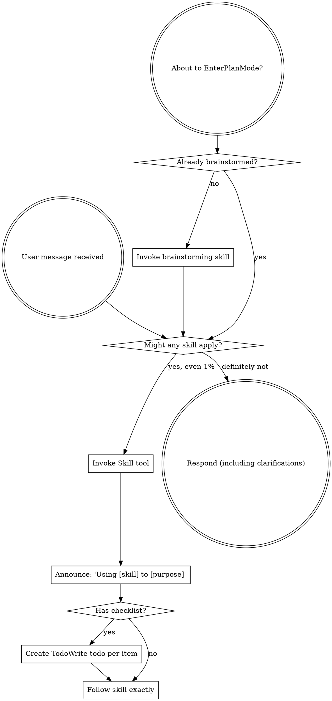

codex-exec: report contract violation

--- codex stdout ---
Anti-slop score: **9/10**. Items 1–3, 5–8, and 10 pass; items 4/9 lose one point for redundant defensive pre-checks.

CRITICAL: None.

MAJOR: None.

MINOR:

- `super-gsd/install.sh:729,938,1038` — Codex/substrate detection is repeated after the new entry-point pre-check. This is harmless defense-in-depth, but technically “just in case” duplication; no orphaned or unused P167 production path was found.

Round 2 CRITICAL is closed:

- `install.sh:473` pre-checks before `ensure_gsd_base`.
- `install.sh:896` pre-checks before project initialization writers.
- `install.sh:1006` pre-checks before update writers.
- Flags are fully parsed before fixed dispatch at `install.sh:1176-1185`; therefore argument ordering, including `--install-global --update` and `--install-global --init-project`, cannot bypass the combined refusal set. Each selected entry point repeats it before writing.

The substrate pre-check at `audit.cjs:609` is genuinely read-only: it reads/parses the overlay and source files and performs in-process syntax/preflight checks, with no write, copy, rename, chmod, spawn, or repair operation. Repair calls the same `checkSubstrateHookRegistrations` implementation and passes that result into the repair path, preventing detector drift.

`mkContext` callers checked:

- `runAudit` API callers, including installer audit and explicit fixture/project roots: exact resolution is intended.
- `sgsd-complete-milestone.cjs:582` passes no destination, so walk-up remains.
- CLI check/repair/audit paths at `audit.cjs:1643,1651,1681`: omitted `--project-dir` retains walk-up; explicit values resolve exactly.
- P167, propagation, Codex-hook, policy, and guard tests pass explicit fixture roots. No broken caller found.

Passthrough grep across the hook and store found **0 occurrences**. Targeted PostToolUse failures all return bounded `substrate_witness_rewrite_failed`; PreToolUse failures deny. Consumption filters for `state === 'rewritten'`, atomically claims with rename, re-verifies the claimed row, and exclusively writes the consumed state.

Guard delta across the phase: **66 assertion lines added, 14 removed**. The latest removed assertion was restored against the actual Codex copy operation with the identical message; no guard contract was weakened.

ATC VERDICT: PASS

--- codex stderr ---
OpenAI Codex v0.146.0
--------
workdir: <HOME>\AppData\Roaming\warp\Warp\data\worktrees\GSDedits\luminaria-hogback
model: gpt-5.6-sol
provider: openai
approval: never
sandbox: read-only
reasoning effort: xhigh
reasoning summaries: none
session id: 01a036cf-fd99-7202-8878-42293e6d86f5
--------
user
# Phase-level ATC — P167 Substrate Invocation Witness

Apply the ATC 7 steps and the 10-point anti-slop checklist to the WHOLE phase, not
one dispatch. Read-only. Do not edit files.

## Scope

Commits 2be8f85..HEAD on branch luminaria-hogback (P167 only; P166 closed earlier at
f09c0d0 and is out of scope except where P167 changed its files).

Read the locked plan at
.planning/milestones/v3.9-substrate-hygiene/phases/167-substrate-invocation-witness/167-01-PLAN-LOCKED.md
and check the delivered code against it, especially:
- line ~187 and ~264-267: the PostToolUse path must NEVER pass the raw result
  through; it returns a bounded `substrate_witness_rewrite_failed` object.
- PreToolUse fails closed.
- the witness store accepts only `rewritten` rows and consumes atomically.

## A prior ATC round found one CRITICAL here

An earlier fix instructed "fail SAFE, pass the ORIGINAL result through", which
contradicted the locked plan. That was reverted and `post_passthrough` removed.
Verify with your own grep that no passthrough path survives in
super-gsd/hooks/sgsd-substrate-invocation-witness.cjs or
super-gsd/scripts/lib/substrate-invocation-witness-store.cjs. Report the occurrence
count you actually observed.

## Also in scope this round

The final two commits fixed a regression P167 itself introduced: five
installer-registration-guard cases that pass at 44e7861 and failed from P167 until
now. The first attempted fix deferred a production `exit 1` past a mutating
`repair_substrate_capability`; an adversarial review returned UNSAFE and it was
replaced with `precheck_substrate_capability`, a read-only check that shares
detection code with the repair path.

Judge specifically:
1. Does the read-only pre-check genuinely perform no writes, and can it drift from
   the repair path's detection?
2. `repair_substrate_capability` is also called at install.sh:648 inside
   `install_global_assets`, with NO preceding pre-check. Is that a hole?
3. Were any guard assertions weakened anywhere in the phase? Count added vs removed
   assertions in the guard file across the phase.
4. Is anything in the phase orphaned, unused, or "just in case"?

## Verdict format

Score /10 on the anti-slop checklist. List findings by severity
(CRITICAL / MAJOR / MINOR) with file:line. End with a line that is exactly
`ATC VERDICT: PASS` or `ATC VERDICT: FAIL`.
A CRITICAL forces FAIL. Max 500 words.

## Budget discipline (added after a 900s timeout)

A previous run of this exact prompt spent its whole budget investigating and never
emitted a verdict. Do not let that happen again.

Bound your investigation: at most ~15 shell commands total. Prefer targeted `rg` over
reading whole files. Do NOT re-run the test suites; the orchestrator has already run
them unsandboxed and the results are:
guard 12/12, T1 38/38, T2 13/13, T3 4/4, T4 pass, feature-propagation 15/15,
P166 6/6, P154 real-evidence pass, T5 capture PASS + independent verify PASS.
Take those as given and spend your budget on JUDGEMENT, not re-measurement.

Emit the verdict line even if your investigation is incomplete; say what you could
not check rather than continuing to dig.

## Round 2 result and what changed since

Round 2 scored 9/10 and returned FAIL on ONE CRITICAL:

> `install.sh:648`, `:919-921` — `install_global_assets` performs
> `repair_substrate_capability` before `distribute_project_hooks` discovers missing
> Codex entry sources and before `precheck_substrate_capability` ... capability/global
> state can be mutated and grants derived before the later pre-check exits 1.

Two commits since address it:

- `2c237ef` adds `precheck_installation_refusals`, running the shared Codex-entry
  detector and the substrate pre-check together ahead of every writer on every entry
  point, `install_global_assets` included.
- The same commit fixes a defect that fix exposed: `mkContext` walked up to the nearest
  ancestor `.planning` even when given an explicit `--project-dir`, so the pre-check
  inspected the ambient home tree instead of the target project. An explicit
  destination is now `path.resolve`d exactly; walk-up applies only when no destination
  is supplied.

Verify the CRITICAL is actually closed, and specifically judge:

1. Can any writer still run before the combined refusal set on ANY flag ordering,
   including `--install-global --update` and `--install-global --init-project`?
2. The `mkContext` change alters behaviour for every existing caller that passes
   `--project-dir` and previously relied on walk-up. Is any caller broken by exact
   resolution? Enumerate the callers you checked.
3. Round 2 counted 53 assertions added and 13 removed. The latest change removed one
   more and restored it retargeted to the actual Codex copy call with the same message.
   Confirm no guard contract was weakened.

Orchestrator-run results, take as given, do not re-run:
guard 12/12 unsandboxed, audit self-test 15/15, T1 38/38, T2 13/13, T3 4/4, T4 pass,
P166 6/6, P154 real-evidence pass, T5 capture PASS and independent verify PASS,
bash -n install.sh clean, node --check clean.

Bound yourself to ~15 shell commands and emit the verdict line even if incomplete.

codex
I’m applying the `using-superpowers` and `review` skills because this is a read-only, phase-wide change review. I’ll stay within the ~15-command budget, use the supplied test results, and focus on the locked contract and the Round 2 critical.
exec
"C:\\WINDOWS\\System32\\WindowsPowerShell\\v1.0\\powershell.exe" -Command "Get-Content -Raw 'C:\\Users\\operator\\.codex\\skills\\using-superpowers\\SKILL.md'; Get-Content -Raw 'C:\\Users\\operator\\.agents\\skills\\review\\SKILL.md'" in <HOME>\AppData\Roaming\warp\Warp\data\worktrees\GSDedits\luminaria-hogback
 succeeded in 852ms:
---
name: using-superpowers
description: Use when starting any conversation - establishes how to find and use skills, requiring Skill tool invocation before ANY response including clarifying questions
---

<SUBAGENT-STOP>
If you were dispatched as a subagent to execute a specific task, skip this skill.
</SUBAGENT-STOP>

<EXTREMELY-IMPORTANT>
If you think there is even a 1% chance a skill might apply to what you are doing, you ABSOLUTELY MUST invoke the skill.

IF A SKILL APPLIES TO YOUR TASK, YOU DO NOT HAVE A CHOICE. YOU MUST USE IT.

This is not negotiable. This is not optional. You cannot rationalize your way out of this.
</EXTREMELY-IMPORTANT>

## Instruction Priority

Superpowers skills override default system prompt behavior, but **user instructions always take precedence**:

1. **User's explicit instructions** (CLAUDE.md, GEMINI.md, AGENTS.md, direct requests) ƒ?" highest priority
2. **Superpowers skills** ƒ?" override default system behavior where they conflict
3. **Default system prompt** ƒ?" lowest priority

If CLAUDE.md, GEMINI.md, or AGENTS.md says "don't use TDD" and a skill says "always use TDD," follow the user's instructions. The user is in control.

## How to Access Skills

**In Claude Code:** Use the `Skill` tool. When you invoke a skill, its content is loaded and presented to youƒ?"follow it directly. Never use the Read tool on skill files.

**In Copilot CLI:** Use the `skill` tool. Skills are auto-discovered from installed plugins. The `skill` tool works the same as Claude Code's `Skill` tool.

**In Gemini CLI:** Skills activate via the `activate_skill` tool. Gemini loads skill metadata at session start and activates the full content on demand.

**In other environments:** Check your platform's documentation for how skills are loaded.

## Platform Adaptation

Skills use Claude Code tool names. Non-CC platforms: see `references/copilot-tools.md` (Copilot CLI), `references/codex-tools.md` (Codex) for tool equivalents. Gemini CLI users get the tool mapping loaded automatically via GEMINI.md.

# Using Skills

## The Rule

**Invoke relevant or requested skills BEFORE any response or action.** Even a 1% chance a skill might apply means that you should invoke the skill to check. If an invoked skill turns out to be wrong for the situation, you don't need to use it.



## Red Flags

These thoughts mean STOPƒ?"you're rationalizing:

| Thought | Reality |
|---------|---------|
| "This is just a simple question" | Questions are tasks. Check for skills. |
| "I need more context first" | Skill check comes BEFORE clarifying questions. |
| "Let me explore the codebase first" | Skills tell you HOW to explore. Check first. |
| "I can check git/files quickly" | Files lack conversation context. Check for skills. |
| "Let me gather information first" | Skills tell you HOW to gather information. |
| "This doesn't need a formal skill" | If a skill exists, use it. |
| "I remember this skill" | Skills evolve. Read current version. |
| "This doesn't count as a task" | Action = task. Check for skills. |
| "The skill is overkill" | Simple things become complex. Use it. |
| "I'll just do this one thing first" | Check BEFORE doing anything. |
| "This feels productive" | Undisciplined action wastes time. Skills prevent this. |
| "I know what that means" | Knowing the concept ƒ%ÿ using the skill. Invoke it. |

## Skill Priority

When multiple skills could apply, use this order:

1. **Process skills first** (brainstorming, debugging) - these determine HOW to approach the task
2. **Implementation skills second** (frontend-design, mcp-builder) - these guide execution

"Let's build X" ā' brainstorming first, then implementation skills.
"Fix this bug" ā' debugging first, then domain-specific skills.

## Skill Types

**Rigid** (TDD, debugging): Follow exactly. Don't adapt away discipline.

**Flexible** (patterns): Adapt principles to context.

The skill itself tells you which.

## User Instructions

Instructions say WHAT, not HOW. "Add X" or "Fix Y" doesn't mean skip workflows.

---
name: review
description: Review code changes for security, performance, bugs, and quality. Reviews staged changes, unstaged changes, specific commits, or PR-ready diffs.
---

<objective>
Review code changes and provide structured feedback covering security, performance, bug risks, code quality, and test coverage gaps. This skill analyzes diffs and surrounding context to catch issues before they reach production.
</objective>

<context>
This skill reviews code changes at various stages of the development workflow. It can review staged changes before a commit, unstaged work-in-progress, a specific commit, or the full set of changes on a branch that are ready for a pull request.

The reviewer reads both the diff and the surrounding source files to understand intent and catch issues that only appear in context.
</context>

<core_principle>
**FIND REAL ISSUES, NOT STYLE NITS.** Focus on problems that cause bugs, security vulnerabilities, performance degradation, or maintainability pain. Avoid nitpicking formatting or subjective style preferences unless they harm readability.
</core_principle>

<analysis_only_rule>
**THIS SKILL IS READ-ONLY. DO NOT MODIFY CODE.**

The purpose is to review and report findings. Making changes during review conflates the reviewer and author roles. Present findings and let the user decide what to act on.
</analysis_only_rule>

<quick_start>

<determine_review_scope>

Parse the user's input to determine what to review:

1. **No arguments** - Review staged changes first. If nothing is staged, review unstaged changes.
   - Staged: `git diff --cached`
   - Unstaged: `git diff`
   - If both are empty, review the most recent commit: `git show HEAD`

2. **Commit hash argument** (e.g., `/review abc1234`) - Review that specific commit.
   - `git show <hash>`

3. **File path argument** (e.g., `/review src/foo.ts`) - Review unstaged changes in that file.
   - `git diff -- <path>` then fall back to `git diff --cached -- <path>`

4. **"pr" argument** (e.g., `/review pr`) - Review all changes since branching from main.
   - `git diff main...HEAD`
   - If on main, review `git diff HEAD~1`

After obtaining the diff, if it is empty, inform the user that there are no changes to review and stop.

</determine_review_scope>

<gather_context>

Before analyzing the diff:

1. **Read changed files in full** - Do not review a diff in isolation. Read each modified file to understand the surrounding code, imports, types, and control flow.
2. **Identify the tech stack** - Note languages, frameworks, and libraries in use. This affects what patterns are risky.
3. **Check for related test files** - For each changed source file, look for corresponding test files. Note whether tests were updated alongside the changes.
4. **Check for configuration changes** - If config files changed (env, CI, package.json, tsconfig, etc.), pay extra attention to side effects.

</gather_context>

<review_categories>

Analyze the changes against each category below. Only report findings that are actually present. Skip categories with no issues.

**A. Security Issues** (Severity: CRITICAL or HIGH)
- Injection vulnerabilities (SQL injection, command injection, template injection)
- Cross-site scripting (XSS) - unsanitized user input rendered in HTML
- Authentication and authorization flaws (missing auth checks, privilege escalation)
- Secrets or credentials hardcoded or logged
- Insecure deserialization or unsafe eval usage
- Path traversal or file access vulnerabilities
- Missing input validation on external data

**B. Performance Concerns** (Severity: HIGH or MEDIUM)
- N+1 query patterns in database access
- Unnecessary memory allocations in hot paths or loops
- Blocking operations on the main thread or in async contexts
- Missing pagination on unbounded queries
- Redundant computation that could be cached or memoized
- Large payloads without streaming or chunking

**C. Bug Risks** (Severity: HIGH or MEDIUM)
- Off-by-one errors in loops or array access
- Null/undefined dereferences without guards
- Race conditions in concurrent or async code
- Incorrect error handling (swallowed errors, wrong error types)
- Type mismatches or unsafe type assertions
- Logic errors in conditionals (inverted checks, missing cases)
- Resource leaks (unclosed connections, file handles, listeners)

**D. Code Quality** (Severity: MEDIUM or LOW)
- Unclear or misleading naming
- Significant code duplication that should be extracted
- Excessive complexity (deeply nested logic, functions doing too many things)
- Dead code or unreachable branches
- Missing or misleading comments on non-obvious logic
- Inconsistency with patterns used elsewhere in the codebase

**E. Test Coverage Gaps** (Severity: MEDIUM or LOW)
- New logic paths without corresponding test cases
- Changed behavior without updated tests
- Edge cases not covered (empty inputs, boundary values, error paths)
- Missing integration tests for new API endpoints or database changes

</review_categories>

<format_findings>

For each finding, use this structure:

```
### [SEVERITY] Category: Brief Title

**File**: `path/to/file.ext` (lines X-Y)

**Issue**: Clear description of the problem.

**Why it matters**: What could go wrong if this is not addressed.

**Suggestion**: How to fix it, with a code snippet if helpful.
```

Severity levels:
- **CRITICAL** - Must fix before merge. Security vulnerability or data loss risk.
- **HIGH** - Should fix before merge. Likely bug or significant performance issue.
- **MEDIUM** - Should fix soon. Code quality or moderate risk issue.
- **LOW** - Consider fixing. Minor improvement opportunity.

</format_findings>

</quick_start>

<critical_rules>

1. **READ THE FULL FILE**: Never review a diff without reading the complete source file for context
2. **NO FALSE ALARMS**: Only report issues you can explain concretely. Do not report vague concerns
3. **PRIORITIZE**: Lead with the most severe findings. Do not bury critical issues under style nits
4. **BE SPECIFIC**: Include file paths, line numbers, and code references for every finding
5. **EXPLAIN THE RISK**: For each finding, explain what could actually go wrong
6. **CHECK TESTS**: Always check whether changes have corresponding test updates
7. **CONSIDER THE STACK**: Apply language-specific and framework-specific knowledge to your review
8. **DO NOT MODIFY CODE**: Present findings only. The user decides what to act on

</critical_rules>

<output_format>

```markdown
## Code Review: [brief description of what was reviewed]

**Scope**: [staged changes | unstaged changes | commit abc1234 | PR changes from main]
**Files reviewed**: [count] files changed, [additions] additions, [deletions] deletions

---

### Findings

[Findings grouped by severity, highest first. Use the format from <format_findings>.]

---

### Summary

| Severity | Count |
|----------|-------|
| CRITICAL | X     |
| HIGH     | X     |
| MEDIUM   | X     |
| LOW      | X     |

### Recommended Actions

1. [Most important action to take]
2. [Next most important action]
3. [...]
```

If no issues are found:

```markdown
## Code Review: [brief description]

**Scope**: [what was reviewed]
**Files reviewed**: [count]

No significant issues found. The changes look good to merge.
```

</output_format>

<decision_gate>

**After presenting findings, ALWAYS offer these options:**

```
ƒ"?ƒ"?ƒ"?ƒ"?ƒ"?ƒ"?ƒ"?ƒ"?ƒ"?ƒ"?ƒ"?ƒ"?ƒ"?ƒ"?ƒ"?ƒ"?ƒ"?ƒ"?ƒ"?ƒ"?ƒ"?ƒ"?ƒ"?ƒ"?ƒ"?ƒ"?ƒ"?ƒ"?ƒ"?ƒ"?ƒ"?ƒ"?ƒ"?ƒ"?ƒ"?ƒ"?ƒ"?ƒ"?ƒ"?ƒ"?ƒ"?
REVIEW COMPLETE

What would you like to do?

1. **Fix issues** - I'll address the findings starting with the most critical
2. **Save review** - Export findings to a markdown file
3. **Review again** - Re-review with different scope or focus
4. **Discuss a finding** - Ask questions about a specific issue
5. **Other** - Tell me what you need
ƒ"?ƒ"?ƒ"?ƒ"?ƒ"?ƒ"?ƒ"?ƒ"?ƒ"?ƒ"?ƒ"?ƒ"?ƒ"?ƒ"?ƒ"?ƒ"?ƒ"?ƒ"?ƒ"?ƒ"?ƒ"?ƒ"?ƒ"?ƒ"?ƒ"?ƒ"?ƒ"?ƒ"?ƒ"?ƒ"?ƒ"?ƒ"?ƒ"?ƒ"?ƒ"?ƒ"?ƒ"?ƒ"?ƒ"?ƒ"?ƒ"?
```

**Wait for user response before taking any action.**

This gate is MANDATORY. Never skip it. Never auto-implement fixes.

</decision_gate>

<HOME>\OneDrive - <ORG>\Documents\WindowsPowerShell\profile.ps1 : Cannot dot-source this 
command because it was defined in a different language mode. To invoke this command without importing its contents, 
omit the '.' operator.
At line:1 char:1
+ . '<HOME>\OneDrive - <ORG>\Documents\Win ...
+ ~~~~~~~~~~~~~~~~~~~~~~~~~~~~~~~~~~~~~~~~~~~~~~~~~~~~~~~~~~~~~~~~~~~~~
    + CategoryInfo          : InvalidOperation: (:) [profile.ps1], NotSupportedException
    + FullyQualifiedErrorId : DotSourceNotSupported,profile.ps1
 
<HOME>\OneDrive - <ORG>\Documents\WindowsPowerShell\Microsoft.PowerShell_profile.ps1 : 
Cannot dot-source this command because it was defined in a different language mode. To invoke this command without 
importing its contents, omit the '.' operator.
At line:1 char:1
+ . '<HOME>\OneDrive - <ORG>\Documents\Win ...
+ ~~~~~~~~~~~~~~~~~~~~~~~~~~~~~~~~~~~~~~~~~~~~~~~~~~~~~~~~~~~~~~~~~~~~~
    + CategoryInfo          : InvalidOperation: (:) [Microsoft.PowerShell_profile.ps1], NotSupportedException
    + FullyQualifiedErrorId : DotSourceNotSupported,Microsoft.PowerShell_profile.ps1
 

exec
"C:\\WINDOWS\\System32\\WindowsPowerShell\\v1.0\\powershell.exe" -Command 'git status --short --branch; git log --oneline --decorate 2be8f85..HEAD; git diff --stat 2be8f85..HEAD; git diff --name-status 2be8f85..HEAD' in <HOME>\AppData\Roaming\warp\Warp\data\worktrees\GSDedits\luminaria-hogback
2026-08-25T02:47:34.715244Z ERROR codex_core::tools::router: error=Exit code: 124
Wall time: 10.1 seconds
Output:
command timed out after 10144 milliseconds
## luminaria-hogback...origin/luminaria-hogback [ahead 7]
?? .planning/milestones/v3.9-substrate-hygiene/phases/167-substrate-invocation-witness/167-PHASEATC-R3-PROMPT.md
?? .planning/milestones/v3.9-substrate-hygiene/phases/167-substrate-invocation-witness/167-PHASEATC-R3-WRAPPER.log
?? .planning/resource-registry/.planning/
?? .planning/tmp/
86b6d1f (HEAD -> luminaria-hogback) chore(privacy): replace operator username in P167 Codex report paths
2c237ef fix(167-01): honour the explicit install destination, and refuse before the global writer too
70f92cd docs(167-01): live evidence refresh, guard-regression dispatch trail, UNSAFE review
cc6a3d7 fix(167-01): refuse before mutating, and stop the harness laundering real errors
879aa4c refactor(167-01): ATC cleanup, remove fourteen rounds of scaffolding
ca43513 fix(167-01): close two false-passes found by T5 spec review
99a8790 feat(167-01): live MCP denial and rewrite proof, and the production defect it found
1339eab (origin/luminaria-hogback) chore(privacy): replace operator username in generated report paths
eab7715 feat(167-01): T5 live-capture harness, fixture MCP server and capture runner
e78847f fix(167-01): scope the substrate repair flag to substrate, stop rewriting operator config
d93f7e4 chore(167): advance STATE projection to phase 167 via state.write
c822dd4 fix(167-01): remove two false-passing tests and one flaky isolation guard
e85d396 fix(167-01): bind broker authority to the invocation project, not the installer
a5e1f97 feat(167-01): propagate hook registration and derive grants only after the guard verifies
386d027 feat(167-01): four-surface fail-closed prompt contracts, canonical grants removed
79fd9ca docs(memory): curate the two P167-T2 learnings
be6cfa1 refactor(167-01): ATC fix, remove the test seam from production and repair the fixture
5ec8f1c feat(167-01): correlate prompt acceptance with the real invocation witness
f939314 docs(167-01): T1 gate evidence, spec 7/7 with its warning fixed, ATC PASS 9/10 zero findings
9ea0bac fix(167-01): ignore non-substrate tools even when the installed CLI sets expectedEvent
6aa2f01 feat(167-01): witness hook, capability broker and authenticated witness store
950422a docs(167-01): plan review round 3 GO, bounded scope confirmed honest, 6/6
54d387a docs(167-01): plan rev 3, operator ruling on bounded scope recorded
43c889e docs(167-01): plan review round 2 NOGO, deletion closed but same-user bypass remains
ab6a240 docs(167-01): plan rev 2 after NOGO, capability broker withdraws the tool when the guard is gone
<HOME>\OneDrive - <ORG>\Documents\WindowsPowerShell\profile.ps1 : Cannot dot-source this 
command because it was defined in a different language mode. To invoke this command without importing its contents, 
omit the '.' operator.
At line:1 char:1
+ . '<HOME>\OneDrive - <ORG>\Documents\Win ...
+ ~~~~~~~~~~~~~~~~~~~~~~~~~~~~~~~~~~~~~~~~~~~~~~~~~~~~~~~~~~~~~~~~~~~~~
    + CategoryInfo          : InvalidOperation: (:) [profile.ps1], NotSupportedException
    + FullyQualifiedErrorId : DotSourceNotSupported,profile.ps1
 
<HOME>\OneDrive - <ORG>\Documents\WindowsPowerShell\Microsoft.PowerShell_profile.ps1 : 
Cannot dot-source this command because it was defined in a different language mode. To invoke this command without 
importing its contents, omit the '.' operator.
At line:1 char:1
+ . '<HOME>\OneDrive - <ORG>\Documents\Win ...
+ ~~~~~~~~~~~~~~~~~~~~~~~~~~~~~~~~~~~~~~~~~~~~~~~~~~~~~~~~~~~~~~~~~~~~~
    + CategoryInfo          : InvalidOperation: (:) [Microsoft.PowerShell_profile.ps1], NotSupportedException
    + FullyQualifiedErrorId : DotSourceNotSupported,Microsoft.PowerShell_profile.ps1
 

 exited 124 in 10144ms:
## luminaria-hogback...origin/luminaria-hogback [ahead 7]
?? .planning/milestones/v3.9-substrate-hygiene/phases/167-substrate-invocation-witness/167-PHASEATC-R3-PROMPT.md
?? .planning/milestones/v3.9-substrate-hygiene/phases/167-substrate-invocation-witness/167-PHASEATC-R3-WRAPPER.log
?? .planning/resource-registry/.planning/
?? .planning/tmp/
86b6d1f (HEAD -> luminaria-hogback) chore(privacy): replace operator username in P167 Codex report paths
2c237ef fix(167-01): honour the explicit install destination, and refuse before the global writer too
70f92cd docs(167-01): live evidence refresh, guard-regression dispatch trail, UNSAFE review
cc6a3d7 fix(167-01): refuse before mutating, and stop the harness laundering real errors
879aa4c refactor(167-01): ATC cleanup, remove fourteen rounds of scaffolding
ca43513 fix(167-01): close two false-passes found by T5 spec review
99a8790 feat(167-01): live MCP denial and rewrite proof, and the production defect it found
1339eab (origin/luminaria-hogback) chore(privacy): replace operator username in generated report paths
eab7715 feat(167-01): T5 live-capture harness, fixture MCP server and capture runner
e78847f fix(167-01): scope the substrate repair flag to substrate, stop rewriting operator config
d93f7e4 chore(167): advance STATE projection to phase 167 via state.write
c822dd4 fix(167-01): remove two false-passing tests and one flaky isolation guard
e85d396 fix(167-01): bind broker authority to the invocation project, not the installer
a5e1f97 feat(167-01): propagate hook registration and derive grants only after the guard verifies
386d027 feat(167-01): four-surface fail-closed prompt contracts, canonical grants removed
79fd9ca docs(memory): curate the two P167-T2 learnings
be6cfa1 refactor(167-01): ATC fix, remove the test seam from production and repair the fixture
5ec8f1c feat(167-01): correlate prompt acceptance with the real invocation witness
f939314 docs(167-01): T1 gate evidence, spec 7/7 with its warning fixed, ATC PASS 9/10 zero findings
9ea0bac fix(167-01): ignore non-substrate tools even when the installed CLI sets expectedEvent
6aa2f01 feat(167-01): witness hook, capability broker and authenticated witness store
950422a docs(167-01): plan review round 3 GO, bounded scope confirmed honest, 6/6
54d387a docs(167-01): plan rev 3, operator ruling on bounded scope recorded
43c889e docs(167-01): plan review round 2 NOGO, deletion closed but same-user bypass remains
ab6a240 docs(167-01): plan rev 2 after NOGO, capability broker withdraws the tool when the guard is gone
<HOME>\OneDrive - <ORG>\Documents\WindowsPowerShell\profile.ps1 : Cannot dot-source this 
command because it was defined in a different language mode. To invoke this command without importing its contents, 
omit the '.' operator.
At line:1 char:1
+ . '<HOME>\OneDrive - <ORG>\Documents\Win ...
+ ~~~~~~~~~~~~~~~~~~~~~~~~~~~~~~~~~~~~~~~~~~~~~~~~~~~~~~~~~~~~~~~~~~~~~
    + CategoryInfo          : InvalidOperation: (:) [profile.ps1], NotSupportedException
    + FullyQualifiedErrorId : DotSourceNotSupported,profile.ps1
 
<HOME>\OneDrive - <ORG>\Documents\WindowsPowerShell\Microsoft.PowerShell_profile.ps1 : 
Cannot dot-source this command because it was defined in a different language mode. To invoke this command without 
importing its contents, omit the '.' operator.
At line:1 char:1
+ . '<HOME>\OneDrive - <ORG>\Documents\Win ...
+ ~~~~~~~~~~~~~~~~~~~~~~~~~~~~~~~~~~~~~~~~~~~~~~~~~~~~~~~~~~~~~~~~~~~~~
    + CategoryInfo          : InvalidOperation: (:) [Microsoft.PowerShell_profile.ps1], NotSupportedException
    + FullyQualifiedErrorId : DotSourceNotSupported,Microsoft.PowerShell_profile.ps1
 

exec
"C:\\WINDOWS\\System32\\WindowsPowerShell\\v1.0\\powershell.exe" -NoProfile -Command "Get-Content -Raw '.planning\\STATE.md'; Get-Content -Raw '.planning\\milestones\\v3.9-substrate-hygiene\\phases\\167-substrate-invocation-witness\\167-01-PLAN-LOCKED.md'" in <HOME>\AppData\Roaming\warp\Warp\data\worktrees\GSDedits\luminaria-hogback
 succeeded in 796ms:
---
gsd_state_version: 1.0
milestone: v3.9-substrate-hygiene
current_phase: "167"
milestone_name: Substrate Hygiene
milestone_status: "v3.9-substrate-hygiene ACTIVE 2026-08-22. P166 Substrate Call Filters CLOSED PASS-WITH-DEFERRED-1 @ ed86dee: one composer-owned SUBSTRATE_CALL_POLICY builds and v2-validates every substrate payload immediately before mcpInvoke so unfiltered calls cannot reach transport; eight production sites enumerated and individually classified with fail-closed grep coverage; capSubstrateResponse bounds each hit at 16,000 chars with named degradation notes propagated through enrichment, triage and the Phase-48 bridge; v1 schema and P154 evidence byte-unchanged. 17/17 suites green unsandboxed plus four falsification probes. Six fix rounds across five review gates. DEFERRED-1: four markdown-agent prompt surfaces keep the raw MCP tool and their gateway evidence is self-reported, so nothing witnesses the actual invocation; adjudicated DECISION C, seeded as P167 substrate-invocation-witness. v3.6/v3.5 history preserved in legacy_milestone_status below."
legacy_milestone_status_v3_6: "v3.6-vtp-bridge ACTIVE 2026-08-11 ƒ?" SGSDƒÅ"VTP Bridge Phase 0. P152 KB-Triage Shadow PASS 2026-08-12 @ 5e32325 (text-free shadow classifier: new non-injecting `shadow` enforcement kind + kb-lookup-triage route, strong-KB-beats-verb tiering, opaque text-free ledger; board+2xCodex-gated shadow-only, hard gate deferred to 28-day locked metric; independently verified zero-injection + text-free + Codex spec-review NOGO-then-fixed). P151 Demand Baseline PASS (39/39): zero-VTP-dep ledger+instrument+docs, board+Codex-gated. Stages 2-3 blocked on post-VTP-milestone restart+probe + gold-set approval. v3.5 shipped prior. | T150-07 devcp update EXECUTED 2026-08-12: source+install fast-forwarded 7fb47eb->01af43e, gpt-5.6-sol + v3.6 substrate live; remaining = live-session restart + interactive trust probe + serve.cjs stash reconcile."
status: "v3.5 ACTIVE 2026-08-06 ƒ?" P145 codex-profile-control CLOSED PASS-WITH-DEFERRED-4 @ c1596f7 (profile registry + /sgsd-codex-control + 4 CRIT security fixes total: 2 per-dispatch-ATC pre-commit, GAP-1 verifier env-var TTY bypass, phase-ATC silent report-write; self-tests 21/21 + Probes 1-7 + parity + control all PASS; deferred: A selfTestCliGuard non-TTY forcing, B 3-way CLI-default drift guard, C inert trust/hook fieldsƒÅ'P148/P150, DEVIATION-1 finalize probe simplification). Next: P148 cross-model triage. v3.4 PARKED at P142/P143 (cockpit alarm+rationale drawers, close) ƒ?" reopen after v3.5 or on operator call. v3.4 P999 pink-elephant visual smoke also parked."
stopped_at: 2026-04-29 ƒ?" Phase 63 closed PASS-WITH-DEFERRED-5 @ b5b46a8 (Warp Capability Smoke Test; 7 artifacts under .planning/milestones/v2.2/; 13-row evidence matrix in WARP-SMOKE.md; 5 operator UI manual checks M1-M5 pending in MANUAL-CHECKS.md; sg-launched-Claude topology proven empirically ƒ?" this Claude session itself is the evidence; ~/.warp/launch_configurations/ exists but empty; .warp/workflows lint 4/5 with sgsd-token-current.yaml missing arguments block forwarded to Phase 64; .warpindexingignore missing forwarded to Phase 65 or new ignore-pack phase; tmux not native on Windows; Warp install at ~/AppData/Local/Programs/Warp/Warp.exe; previous roadmap v1.6-v2.1 ROADMAP COMPLETE 2026-04-29 preserved in previous_roadmap block ƒ?" all 30 phases (26-62) shipped across 6 milestones (v1.6 SHIPPED-WITH-DEBT-10, v1.7-v2.1 SHIPPED clean)).
last_updated: "2026-08-23"
last_activity: "2026-05-20 v3.0 SGSD-PRO ACTIVATED ƒ?" operator issued /sgsd-orchestrate auto. Milestone opened at scaffold commit 52c687a (INTENT + ROADMAP + REQUIREMENTS + DLB-08 design lock + P106 CONTEXT + master proposal + infographic ingested). Auto-loop dispatched Codex to author 106-01 PLAN-LOCKED.md against plan-schema-v2 SCHEMA-09 (must include semantic_acceptance_criteria per DLB-07). Mission: lineaged role-filtered cognitive memory underneath SGSD's central control plane. Seven CMB types (execution_receipt observation / review_finding claim / evidence_verdict claim-with-authority / decision_recommendation decision / operator_precedent highest / context_anchor projection / promotion_decision terminal). Four MVP exit fixtures (A false-CRIT refuted / B context-aware pseudo-op / C lineage chain / D production-mutation forces escalation). Stale autopilot-watchdog checkpoint pointing at v2.9/P95 deleted on entry (was generated by watchdog after 1569 min inactivity on closed milestone; misleading)."
legacy_activity_v2_9_resync: "2026-05-18 v2.9 RE-SYNC + P97.5 LANDED + ALL-PHASES-CLOSED ƒ?" STATE.md progress block was wildly stale (showed phase_98 ACTIVE, 99-105 PENDING) while SUMMARY.md @ 8fb3b09 already documented all 8 phases closed. This session inserted P97.5 Semantic Verification Gate (commit chain 34520c0 ƒÅ' 9901568 ƒÅ' 2fa3bbc ƒÅ' 6e66ad0) carrying DLB-07 (Clarity-incident-driven post-mortem) and mechanical schema enforcement of semantic_acceptance_criteria via SCHEMA-09/-10. v2.9 now 9 phases (97.5 + 98-105), all PASS / PASS-WITH-DEFERRED-2. Per sgsd-complete-milestone skill idempotency: SUMMARY.md exists ƒÅ' skill is no-op; remaining work is the STATE.md re-sync flagged in SUMMARY.md \"Critical Gaps #1\". Open items roll forward: warp-mcp 15th tool (DEFERRED-1), cockpit 12th section (DEFERRED-2), 18-plan SAC backfill or skip_gates per 97.5-BACKFILL.md, M1-M5 manual UI checks, Phase 95 ACP re-entry pending Warp #7326, v2.6 SHIPPED-clean operator decision."
legacy_activity_v2_9_activation: "2026-04-30T00:00Z v2.9 ACTIVATION ƒ?" operator activated Agentic Harness Evolution roadmap. v2.8 closed at 2466ff1 (Phase 97 release gate; 149/149 self-tests; 22/25 readiness; READY-WITH-DEFERRED). Entering v2.9 P98 Harness Component Substrate (registry + catalog.cjs + ƒ%¾15-assertion self-test + SGSD-HARNESS-EVOLUTION.md). v2.9 pre-designed in CLAUDE-HANDOVER.md / ROADMAP.md / REQUIREMENTS.md / VTP-AHE-EVIDENCE.md. Mission: turn SGSD from hand-improved orchestrator into observability-driven harness with closed AHE loop (component ƒÅ' evidence ƒÅ' predicted edit ƒÅ' measured next-run outcome ƒÅ' keep/revert/pivot). Phases 98-105 scoped: 98 component substrate, 99 trajectory evidence corpus, 100 change manifest prediction ledger, 101 attribution+rollback gate, 102 harness evolution runner, 103 component ablation+interference, 104 transfer+OOD benchmark, 105 release gate+cockpit integration. Non-negotiable: protected oracle/verifier/model-config/budget never edited by evolution loop. STATE.md surgical repoint only ƒ?" operator owns canonical legacy frontmatter re-sync (SUMMARY.md gap #1)."
legacy_activity_v2_6: "2026-04-29T21:25Z RE-SYNC ƒ?" STATE.md was stale (mtime 20:07; latest pulse 21:19; 5 commits since 81-85). Operator override at Phase 85 close flagged: STATE.md staleness + Codex unavailability + context-packet builder dormant + token burn ~21.5M (orchestrator alone ~18M; root context ~775k tokens/turn). Phase 86 PAUSED to address 7-point token-control list + 3 Phase-85 deferrals. Auto-run completed 19/19 phases this session (63-83) plus 84+85; current commits b5b46a8 / d35e92a / eb252f3 / c0201af / 018028e / 5ae2ba0 / 3b2186f / f5fe11a / 4e2b19c / 8dbb9cb / 31907c2 / 0211b0c / dcd039b / 0905cbf / ebfaf7c / 11bb6bb / 2ab84d7 / 6f50232 / 1baf708 / 6021fbb / ad5948d / 72e0d6b / 5914be6 / 6ba04f8 / 22aedd5 / a6b83c8 / bd54eb3 / 5a74bda / 8eb7de8 / e69271e / 7256a76 / 350e101 / 19e544e / 2e8ce85 / 8bad3ad / 347c56a. Original Phase 63 close text preserved in v2_2 progress block below; full per-phase progress in v2_3-v2_6 blocks below. v2.2 milestone scaffolded; 7 artifacts under .planning/milestones/v2.2/ (WARP-SMOKE.md + MANUAL-CHECKS.md + 5 standard phase artifacts CONTEXT/PLAN/RESEARCH/VERIFICATION/ATC-REVIEW). Evidence matrix records 5 PASS rows (Q2/Q3/Q4/Q7/Q8: sg/sgsd/sgsd-setup interactive resolution + sg-keeps-Claude-in-current-tab topology + launch config dir empty), 1 PARTIAL (Q12: 4/5 workflow YAML lint OK; sgsd-token-current.yaml missing arguments block ƒ?" Phase 64 input), 1 DOCS-CONFIRMED (Q11: WSL/SSH disables Codebase Context per Warp docs), 5 MANUAL-CHECK-REQUIRED (Q1/Q5/Q6/Q9/Q10: workflow searchability + claude/sg utility-bar detection + launch-config active-window behavior + Codebase Context state ƒ?" operator verifies in Warp UI per MANUAL-CHECKS.md M1-M5). Forwarded to Phase 64+: workflow pack completion (Q12+Q1), AGENTS.md (Phase 65), .warpindexingignore (Phase 65 or new ignore-pack phase), warp-doctor probes (Phase 67), launch-config templates must NOT assume active-window (Phase 78), upstream issue tracking at https://github.com/warpdotdev/warp issues #7326 ACP and #9233 May-Jun 2026 roadmap (Phase 96). No source-file mutations; git diff confined to .planning/milestones/v2.2/. Previous roadmap v1.6-v2.1 SHIPPED 2026-04-29 ƒ?" see previous_roadmap block."
progress:
  v3_5:
    total_phases: 7
    completed_phases: 3
    completed_plans: 3
    percent: 100
    phase_145: "PASS-WITH-DEFERRED-4 ƒo" 2026-08-06 @ c1596f7 (Codex Profile Control; verifier GAP-1 + phase-ATC CRIT-1 both fixed+regression-guarded; MUDA mechanical PASS 0/0; deferred A/B/C + DEVIATION-1)"
    phase_146: "PASS-WITH-DEFERRED-3 ƒo" 2026-08-07 @ a36e1ea (Session Governance Hooks; 7 tasks; 11 CRIT found+closed across per-dispatch/verify/phase-ATC incl. 5x writer-accepts-destination and 7x silent-success; phase-ATC re-review 4/4 CLOSED ƒ?" containment now ONE contract via resolveContainedPath; MUDA 0/0; hooks LIVE in repo; deferred F/G + DEVIATION-W)"
    phase_147: "PASS ƒo" 2026-08-07 (Commit-Seam Gate; 5 tasks + 3 fix rounds; 21/21 real-git scenarios; earned-block falsifier proven both directions incl. convention_unknown + per-repo floors; tamper-evident activation; cross-worktree misattribution CRIT closed at re-review 0/0; MUDA 0/0; DEFERRED-F absorbed at commit seam; hooks live on devcp via source-checkout pattern, warn rows accumulating)"
    phase_148: "PASS ƒo" 2026-08-08 @ 768c6a0 (Cross-Model Triage; staged MCP transport end-to-end after 3-dispatch ATC-fix chain ƒ?" runtime decides, Claude transports; 36/36 scenarios; spec 6/6; phase-ATC re-review 10/10; MUDA 0/0 prior + degraded re-run logged; seam anti-pattern curated after 4th instance)"
    phase_149: "PASS ƒo" 2026-08-08 (Skill-Routing Table; 24-route registry + loader 18/18 + classifier AC-149b + phase-close consult AC-149c with derive-dont-default gate inputs, forged-gate rejection, executable dispatches; 3 verifier rounds + phase-ATC FAIL-GATE all closed, re-review 8/8; MUDA 0/0 mech + qualitative degraded; A1 pre-existing documented)"
    phase_150: "PASS-WITH-DEFERRED-1 ƒo" 2026-08-10 @ c0aff22+ (Propagation+Trust+Runbook; T150-01..04 built 72/0/1 battery; T150-05 PUBLISHED origin 7fb47eb->c0aff22 + local install under operator auth; T150-06 trust guard proven 3 ways; T150-07 devcp DEFERRED ƒ?" live sessions; 4 review rounds/13 CRIT closed; PII 0 tracked; .gitattributes eol pins)"
  v3_0:
    total_phases: 7
    completed_phases: 7
    completed_plans: 7
    percent: 100
    phase_106: "PASS ƒo" 2026-05-20 @ 390ef1a (Mesh CMB Schema; DLB-08.1; 14/14)"
    phase_107: "PASS ƒo" 2026-05-20 @ c45c24c (cmb-validate + cmb-hash + writers; DLB-08.2+.3; 20/20)"
    phase_108: "PASS ƒo" 2026-05-20 @ cf03b53 (lineage + evidence-validator + echo-detector + sgsd-audit wire-in; DLB-08.4+.5; 49/49)"
    phase_109: "PASS ƒo" 2026-05-20 (escalation_gate + pseudo_operator_peer; DLB-08.6+.7; 102/102; Fixture D PROVED; DLB-08 LAYER COMPLETE)"
    phase_110: "PASS ƒo" 2026-05-20 (Codex Pro Mode profile-resolver + stoplight + native-review-runner; DLB-09.1; 15/15)"
    phase_111: "PASS ƒo" 2026-05-20 (PLAN-LOCKED schema + validator + .codex/hooks.json + 5 hooks; DLB-09.2; 15/15)"
    phase_112: "PASS ƒo" 2026-05-21 (Context Authority capsule ƒ?" 6 templates + writer + composer + v3.0 dogfood instances; DLB-10.1; 17/17; FINAL v3.0 phase)"
  v2_9:
    total_phases: 9
    completed_phases: 9
    completed_plans: 9
    percent: 100
    phase_97_5: "PASS ƒo" 2026-05-18 @ 6e66ad0 (Semantic Verification Gate; DLB-07 + plan-schema-v2 enforces semantic_acceptance_criteria via SCHEMA-09/-10; 5/5 fixture tests green; 97.5-BACKFILL.md surfaces 18 plans needing backfill or skip_gates)"
    phase_98: "PASS ƒo" @ a4f8539 (Harness Component Substrate; 35-row registry across 14 frozen classes incl. 5 protected; Lock-13 catalog.cjs; 21/21 self-test)"
    phase_99: "PASS ƒo" @ 6f7a478 (Trajectory Evidence Corpus; distill.cjs 7 JSONL surfaces ƒÅ' OVERVIEW ƒ%Ï4KB + INDEX; 11 frozen root-cause labels; 18/18 self-test)"
    phase_100: "PASS ƒo" @ eba47ba (Change Manifest Prediction Ledger; MANIFEST.schema.json 14 required fields incl. predicted_fixes ƒ%¾1 + predicted_regressions; append-only JSONL; 21/21 self-test)"
    phase_101: "PASS ƒo" @ d1066a4 (Attribution And Rollback Gate; attribute.cjs 6-verdict closed vocab; fix + regression metrics independent; structured rollback recommendation; v2.9 close-gate added; 18/18 self-test)"
    phase_102: "PASS ƒo" @ 827d9bc (Harness Evolution Runner; run.cjs 4 modes dry-run/proposal/apply/attribute; protected-oracle boundary; 17/17 self-test)"
    phase_103: "PASS ƒo" @ 5122d95 (Component Ablation And Interference; ablate.cjs tmpdir isolation; 3 frozen interference rules duplicate/redundant/inversion; requires_transfer_eval=true; 18/18 self-test)"
    phase_104: "PASS ƒo" @ f6d3073 (Transfer And OOD Benchmark; evaluate.cjs frozen-before-run rule; 3 critical-regression rules; 8 transfer axes; 18/18 self-test)"
    phase_105: "PASS-WITH-DEFERRED-2 ƒo" @ 8fb3b09 (Release Gate And Cockpit Integration; v2.9 close gate extended with AHE-EVAL-03/05; SUMMARY.md + SGSD-HARNESS-EVOLUTION.md ship; DEFERRED-1 warp-mcp 15th tool / DEFERRED-2 cockpit-state 12th section ƒ?" both lock-13 frozen-array updates)"
  v2_8:
    total_phases: 4
    completed_phases: 4
    completed_plans: 4
    percent: 100
    phase_94: "PASS ƒo" 2026-04-29 @ 649898d (ACP Mapping Spec; 7 concepts + 11-row event mapping)"
    phase_95: "SKIPPED-WAITING-FOR-UPSTREAM ƒo" 2026-04-29 @ 9bbcdf8 (ACP Adapter Spike; Warp #7326 open)"
    phase_96: "PASS ƒo" 2026-04-29 @ cfff32a (Warp Upstream Pack; telemetry-panel target picked 19/20; draft-only)"
    phase_97: "PASS ƒo" 2026-04-29 @ 2466ff1 (Release Gate; 149/149 self-tests; 22/25 readiness; SUMMARY.md ships v2.2-v2.8 retrospective)"
  v2_6:
    total_phases: 5
    completed_phases: 3
    completed_plans: 3
    percent: 40
    phase_84: "1/1 plan complete ƒ?" PASS ƒo" 2026-04-29 @ 2e8ce85 (Code Review Integration Guide + SGSD: Open Review Artifacts workflow; 2-layer review model documented; 15/15 workflow lint)"
    phase_85: "1/1 plan complete ƒ?" PASS-WITH-DEFERRED-3 ƒo" 2026-04-29 @ 8bad3ad+347c56a (Recovery Packet Upgrade; 1818 bytes ƒ%Ï4KB; why_stopped + artifact_links + roadmap-complete branch; 44/44 self-test; DEFERRED-1 STATE.md staleness contagion + DEFERRED-2 Codex unavailable Phase 84/85 + DEFERRED-3 context-packet-log.jsonl 24h+ stale ƒ?" Phase 86 must address)"
    phase_86: "PAUSED on operator override ƒ?" Token Control + Staleness Reconciliation. 7-point list (token-control repair / cockpit + recovery staleness probes / token-waste+context-packet wire-in / 200k+500k context warnings / fresh-session resume packets / context-bench full-mode rerun or unproven mark / v2.6 debt record) + 3 Phase-85 deferrals. Originally 'Remote Monitor Packet' but most of that work shipped via Phase 64 workflow + Phase 79 skill"
    phase_87: "PENDING ƒ?" Watchdog And Attention Alerts (originally; may re-scope after Phase 86)"
    phase_88: "PENDING ƒ?" End-To-End Warp Operator Drill"
  v2_5:
    total_phases: 5
    completed_phases: 5
    completed_plans: 5
    percent: 100
    phase_79: "PASS ƒo" 2026-04-29 @ 5a74bda (7 SGSD Warp skills under .agents/skills/; read-only by design)"
    phase_80: "PASS ƒo" 2026-04-29 @ 8eb7de8+e69271e (Warp Plan converter; 4 public APIs Lock-13; 17/17 self-test; READ-ONLY on STATE.md verified mechanically; 9 phase files generated under .planning/analyses/ live test)"
    phase_81: "PASS ƒo" 2026-04-29 @ 7256a76 (SGSD Warp Operator Notebook; 10 runnable PowerShell blocks)"
    phase_82: "PASS ƒo" 2026-04-29 @ 350e101 (7 Warp Agent prompts; mode declared per prompt; none auto-modify)"
    phase_83: "PASS ƒo" 2026-04-29 @ 19e544e (asset cross-index; 47 paths cited 0 missing; validator 5/5 self-test)"
  v2_4:
    total_phases: 6
    completed_phases: 6
    completed_plans: 6
    percent: 100
    phase_73: "PASS ƒo" 2026-04-29 @ 6021fbb (12 operator questions mapped to MCP tools; 16 event types frozen for Phase 74)"
    phase_74: "PASS ƒo" 2026-04-29 @ ad5948d (ORCHESTRATOR-LIVE.jsonl contract + writer helper; 9/9 self-test; Lock-13)"
    phase_75: "PASS ƒo" 2026-04-29 @ 72e0d6b+5914be6 (writer integration; --emit CLI + READ-ONLY reader 12/12 self-test + SKILL.md wire-in section)"
    phase_76: "PASS ƒo" 2026-04-29 @ 6ba04f8+22aedd5 (cockpit-state adapter; 10-section snapshot; 4 fixtures; MCP tool 12 unification; warp-mcp 42/42 regression PASS)"
    phase_77: "PASS ƒo" 2026-04-29 @ a6b83c8 (cockpit render helper; PSParser 0 errors; existing 3 cockpit panes UNTOUCHED ƒ?" operator parallel work preserved)"
    phase_78: "PASS ƒo" 2026-04-29 @ bd54eb3 (Warp launch config templates ƒ?" operator-workspace + cockpit-only + README; M4 caveat documented)"
  v2_3:
    total_phases: 5
    completed_phases: 5
    completed_plans: 5
    percent: 100
    phase_68: "PASS ƒo" 2026-04-29 @ 31907c2 (SGSD MCP read-only contract; 14 tools; ERROR_CODES len=11; REDACTION_CATEGORIES len=7)"
    phase_69: "PASS ƒo" 2026-04-29 @ 0211b0c+dcd039b (MCP server skeleton; JSON-RPC 2.0 stdio; 14 tool stubs; 15/15 self-test)"
    phase_70: "PASS ƒo" 2026-04-29 @ 0905cbf+ebfaf7c (5 core status tools ƒ?" current_state/current_phase/milestone_status/watchdog/recovery_packet; 21/21 self-test; 10 fixture pairs)"
    phase_71: "PASS ƒo" 2026-04-29 @ 11bb6bb+2ab84d7 (9 operational tools ƒ?" gate/agent/codex/token/context-bench/commits/cockpit-snapshot/artifact-links/warp-doctor; 30/30 self-test; 28 fixture pairs; live hash-match against git log -1)"
    phase_72: "PASS ƒo" 2026-04-29 @ 6f50232+1baf708 (MCP redaction 7 categories wired into all 14 tools; ERROR_CODES extended len=13; warp-doctor probe 15 upgraded; SGSD-WARP-MCP-SETUP.md; sgsd-mcp-self-test workflow)"
  v2_2:
    total_phases: 5
    completed_phases: 5
    completed_plans: 5
    percent: 100
    phase_63: "1/1 plan complete ƒ?" PASS-WITH-DEFERRED-5 ƒo" 2026-04-29 @ b5b46a8 (Warp Capability Smoke Test; 5 deferred rows are operator UI manual checks M1-M5 tracked in .planning/milestones/v2.2/MANUAL-CHECKS.md, NOT edge_guard_miss and NOT in CRIT-BACKLOG; 7 artifacts: WARP-SMOKE.md + MANUAL-CHECKS.md at milestone root, CONTEXT/PLAN/RESEARCH/VERIFICATION/ATC-REVIEW under phases/63-warp-capability-smoke/; sg-launched-Claude topology proven empirically ƒ?" this Claude session is the in-process witness)"
    phase_64: "1/1 plan complete ƒ?" PASS ƒo" 2026-04-29 @ 5ae2ba0 (Workflow Pack Completion; 8 new yamls + 1 fix sgsd-token-current; lint tool warp-workflow-lint/lint.cjs READ-ONLY ASCII-only 7/7 self-test PASS; live --run 13/13 valid + 10/10 search terms exit 0; SGSD-WARP-WORKFLOWS.md docs index 13-row table + 3 routines; orchestrator-author DEVIATION cumulative 3rd; 'partially blocked on M1' relabeled per operator Rule 15 ƒ?" workflow YAMLs ship correctly regardless of UI verification)"
    phase_65: "1/1 plan complete ƒ?" PASS ƒo" 2026-04-29 @ c0201af (Agent Rules Context Pack; AGENTS.md NEW 46 lines / 2972 bytes / ratio 0.290 of CLAUDE.md under 30% target; WARP.md additive +21 lines Rule Hierarchy section; 5 hard rules established: read-state-from-.planning / don't-duplicate-gates / VTP-optional / preserve-sg-topology / no-source-mutations-without-plan; orchestrator-author DEVIATION 1st; compactness 2-pass)"
    phase_66: "1/1 plan complete ƒ?" PASS ƒo" 2026-04-29 @ 3b2186f (SGSD Warp Operator Guide; super-gsd/docs/SGSD-WARP-OPERATOR-GUIDE.md ~280 lines covering 12 roadmap-required sections + TL;DR routine + 14 concrete Windows paths + 6/6 cross-phase references verified; orchestrator-author DEVIATION 4th; 'partially blocked on M1' relabeled per Rule 15)"
    phase_67: "1/1 plan complete ƒ?" PASS ƒo" 2026-04-29 @ 018028e (Warp Doctor Probe Design; super-gsd/tools/warp-doctor/check.cjs 16 probes + 4 public APIs Lock-13-wrapped + 15/15 self-test PASS; READ-ONLY invariant verified mechanically via git status before/after live --run; ASCII-only; mirrors Phase 62 upgrade-drift pattern; orchestrator-author DEVIATION 2nd; live --run on this checkout: 13 PASS / 1 MISSING [.warpindexingignore confirms Phase 63 finding E.1] / 1 MANUAL-CHECK / 1 NOT-APPLICABLE / 0 DEGRADED exit 1)"
  v1_7:
    total_phases: 5
    completed_phases: 5
    completed_plans: 5
    percent: 100
    phase_31: "1/1 plan complete ƒ?" PASS ƒo" 2026-04-27 (CRIT+WARN fixed in-loop, anti-slop 10/10)"
    phase_32: "1/1 plan complete ƒ?" PASS ƒo" 2026-04-27 (2 CRIT + 5 WARN fixed in-loop; 1 deferred design-locked; combined anti-slop 9.5/10)"
    phase_33: "1/1 plan complete ƒ?" PASS ƒo" 2026-04-27 (2 CRIT + 5 WARN fixed in-loop; 8 new bypass patterns; 0 regressions; combined anti-slop ~9.5/10)"
    phase_34: "1/1 plan complete ƒ?" PASS ƒo" 2026-04-27 (2 CRIT + 5 WARN fixed in-loop; v1.5 empty-baseline gap closed; combined anti-slop ~9.5/10)"
    phase_35: "1/1 plan complete ƒ?" PASS ƒo" 2026-04-27 (0 CRIT + 7 WARN; 5 in-loop, 1 info, 1 out-of-scope; deterministic catalog generator; combined anti-slop ~9.5/10)"
  v1_6_summary:
    total_phases: 5
    completed_phases: 5
    percent: 100
    phase_26: "PASS ƒo" 2026-04-26"
    phase_27: "PASS ƒo" 2026-04-26"
    phase_28: "PASS-WITH-DEFERRED-5 ƒo" 2026-04-26"
    phase_29: "PASS-WITH-DEFERRED-3 ƒo" 2026-04-27"
    phase_30: "PASS-WITH-DEFERRED-2 ƒo" 2026-04-27"
  v3_6:
    total_phases: 9
    completed_phases: 9
    completed_plans: 9
    percent: 100
    phase_156: "PASS-WITH-DEFERRED-4 2026-08-20 @ db74df5 (state.write primitive + SUMMARY close-gate on the actual route; 42/42 + 36/36)"
    phase_157: "PASS-WITH-DEFERRED-4 2026-08-20 @ 7b882b4 (vtp-services registry + dual-surface probes + SessionStart depth; 140/140)"
    phase_158: "PASS-WITH-DEFERRED-1 2026-08-20 @ 8aa16c8 (automated-turn origin gate; classifier 25/25)"
    phase_159: "PASS-WITH-DEFERRED-3 2026-08-20 @ 26edb1f (skill+VTP tool-family routing, availability-guarded shadow-first)"
  v3_7:
    total_phases: 1
    completed_phases: 1
    completed_plans: 1
    percent: 100
    phase_160: "PASS-WITH-DEFERRED-2 2026-08-20 @ 6f5a06a (installer registration guard; 8/8 twice under production launch)"
  v3_8:
    total_phases: 5
    completed_phases: 3
    completed_plans: 3
    percent: 60
    phase_161: "PASS-WITH-DEFERRED-3 2026-08-21 @ 44e7861 (hook distribution complete; installer 3.3x faster; recovery proven 12/12)"
    phase_162: "PASS-WITH-DEFERRED-2 2026-08-21 @ 8410974 (fleet service; suite 229/229; port-collision decision deferred)"
    phase_163: "PASS-WITH-DEFERRED-3 2026-08-21 @ e590ca4+ (fleet page; suite 589/589; HARD STOP before gated P164/P165)"
  v3_9:
    total_phases: 2
    completed_phases: 1
    completed_plans: 1
    percent: 50
    phase_167: "IN-PROGRESS 2026-08-23 ƒ?" T1 witness hook/broker/store, T2 witness-correlated acceptance, T3 four-surface fail-closed prompts, T4 propagation with invocation-bound broker authority; T5 live proof pending"
backlog:
  total_unresolved: 10
  by_kind:
    verifier_fail: 0
    phase_atc: 10
    edge_guard_miss: 0
  by_phase:
    "26": 0
    "27": 0
    "28": 5
    "29": 3
    "30": 2
    "31": 0
    "32": 0
    "33": 0
    "34": 0
    "35": 0
  cleared_post_rerun: 8
v1_6_complete:
  shipped: 2026-04-27
  status: SHIPPED-WITH-DEBT-10
  initial_backlog: 18
  cleared_post_rerun: 8
  remaining_unresolved: 10
  phases: 5
  plans: 8
v1_7_complete:
  shipped: 2026-04-27
  status: SHIPPED
  initial_backlog: 0
  cleared_in_loop: 16
  remaining_unresolved: 0
  phases: 5
  plans: 5
  combined_anti_slop_estimated: "~9.5/10"
  controlling_principle_held: "Autonomy continues; evidence tells the truth"
  v1_5_empty_baseline_gap: "CLOSED at Phase 34"
  summary: .planning/milestones/v1.7/SUMMARY.md
v1_8_complete:
  shipped: 2026-04-27
  status: SHIPPED
  initial_backlog: 0
  cleared_in_loop: 22
  accepted: 2
  false_alarm: 1
  remaining_unresolved: 0
  phases: 5
  plans: 5
  combined_anti_slop_estimated: "~9/10"
  controlling_principle_held: "Autonomy continues; evidence tells the truth"
  summary: .planning/milestones/v1.8/SUMMARY.md
  generated_artifacts:
    - .planning/milestones/v1.8/gate-keep-kill.md (Phase 39 rubric)
    - .planning/milestones/v1.8/phase-folder-audit.md (Phase 40 audit)
checkpoint: .planning/ORCHESTRATOR-CHECKPOINT.md (no checkpoint open; Phase 63 closed PASS-WITH-DEFERRED-5)
previous_roadmap:
  scope: v1.6 ā' v2.1 (phases 26-62)
  status: ROADMAP COMPLETE 2026-04-29
  shipped_milestones: "v1.6 SHIPPED-WITH-DEBT-10 @ d510e32, v1.7 SHIPPED @ 5690c38, v1.8 SHIPPED, v1.9 SHIPPED, v2.0 SHIPPED (release-readiness 97 GREEN), v2.1 SHIPPED (final milestone of prior roadmap)"
  controlling_contract: .planning/ROADMAP-AGENT.md
  locked_decisions: .planning/discussions/2026-04-26-mass-discuss.md
  total_phases_shipped: 30
  total_milestones_shipped: 6
  started: 2026-04-26
  completed: 2026-04-29
  history_blocks: "Per-phase history retained inline below in roadmap_run sub-blocks (v2_1_progress / v2_0_progress / v2_0_complete / v2_1_complete / v1_9_progress / v1_9_open_debt / v1_9_supersedes_archive / v1_9_milestone_codename / v1_9_vtp_delta_active / v1_8_progress / milestones_shipped). Top-level v1_6_complete / v1_7_complete / v1_8_complete blocks above are also history. progress.v1_7 and progress.v1_6_summary above hold per-phase status snapshots. backlog block above holds residual v1.6 phase_atc=10 unresolved (cockpit may continue to display this; it is historical debt, not active blocker for v2.2)."
  notes: "Active roadmap (v2.2-v2.8 SGSD Warp Integration) operates against .planning/milestones/warp-integration/ROADMAP.md per .planning/milestones/warp-integration/CLAUDE-HANDOVER.md."
roadmap_run:
  mode: operator-led (Phase 63 closed; awaiting operator instruction or M1-M5 manual-check completion before next dispatch)
  scope: v2.2 ā' v2.8 (SGSD Warp Integration; phases 63-97; Phase 63 closed; Phases 64-67 ready to dispatch)
  controlling_contract: .planning/milestones/warp-integration/ROADMAP.md
  controlling_handover: .planning/milestones/warp-integration/CLAUDE-HANDOVER.md
  locked_decisions: "Phase 63 D63.1-D63.5 in 63-CONTEXT.md; no roadmap-wide DISCUSS file authored (per-phase decisions go in each {NN}-CONTEXT.md per the lighter-weight per-phase contract used in v2.2-v2.8)"
  backlog_canonical: .planning/metrics/crit-backlog.jsonl (carries v1.6-v2.1 history; v2.2 has zero rows so far)
  started: 2026-04-29
  current_milestone: v2.2
  current_phase: complete
  current_phase_name: "v2.2 ALL-PHASES-CLOSED ƒ?" 5/5 phases done (63 PASS-WITH-DEFERRED-5 + 64 PASS + 65 PASS + 66 PASS + 67 PASS); awaiting operator decision on M1-M5 + sgsd-complete-milestone trigger"
  current_phase_status: ALL-PHASES-CLOSED
  current_phase_close_commit: 3b2186f
  v2_2_phase_close_commits:
    phase_63: b5b46a8
    phase_64: 5ae2ba0
    phase_65: c0201af
    phase_66: 3b2186f
    phase_67: 018028e
  next_dispatch_candidates:
    - "M1-M5 operator UI manual checks (.planning/milestones/v2.2/MANUAL-CHECKS.md + .planning/todos/pending/2026-04-29-warp-m{1,2,3,4,5}-*.md) ƒ?" operator-only, blocks v2.2 SHIPPED-clean status"
    - "sgsd-complete-milestone v2.2 (option a: trigger now for SHIPPED-WITH-DEFERRED-5 ƒ?" M1-M5 still pending; option b: do M1-M5 first then trigger for SHIPPED clean)"
    - "v2.3 Phase 68 ƒ?" SGSD MCP Contract (the central unlock per operator brief; UNBLOCKED ƒ?" does not depend on M1-M5)"
    - "Operator review: 4-deviation orchestrator-authoring count this auto-run; rebalance dispatch policy for v2.3 MCP work (substantial code, ~600 lines, clearly warrants Sonnet dispatch)"
  prior_roadmap_run_completed: 2026-04-29 (v1.6 ā' v2.1; see top-level previous_roadmap block above)
  prior_milestone_shipped: v2.1 SHIPPED 2026-04-29 (FINAL milestone of prior roadmap; was v2.0 SHIPPED 2026-04-29)
  v2_1_progress:
    phase_62: "PASS @ b3dcadf+3612c27 (9/9 verifier must-haves, v2.1 fifth-gate green (upgrade-drift check; 12/12 self-test PASS + 11 probes >= 8 floor + read_only_invariant assertion PASS + git status before/after --run identical), 4 public APIs Lock-13 wrapped (runDrift/getProbe/selfTest + _internals), 11 frozen PROBE_NAMES (>=8; schema_version_2_plans/agent_token_spend_ledger/context_packet_tree/sqlite_context_index_tree/dispatch_router_tree/memory_governance_tree/redis_adapter_present/failure_injection_tree/release_readiness_present/installer_audit_tree/new_project_wizard_present) + frozen VERSION_TAGS len=4 (v1.2/v1.9/v2.0/v2.1) + frozen REASON_NOTES len=8 closed-vocab + frozen MIGRATION_NOTES 7 milestone keys (v1.5_baseline/v1.6_cockpit/v1.7_command_contracts/v1.8_gate_fitness/v1.9_research/v2_0_failure_injection/v2_1_distribution) + SCHEMA_VERSION=1, candidate-paths array per probe (FIRST present wins; deterministic missing fallback to last candidate's reason), live --run reports 11/11 PRESENT in this checkout (v1.2:1+v1.9:6+v2.0:2+v2.1:2; sqlite_context_index_tree resolves to context-cache fallback), READ-ONLY invariant A8 enforces zero fs.writeFileSync/appendFileSync/unlinkSync/mkdirSync/rmSync/rmdirSync in code-only scan (hasWrite=false), operationally verified git status --short before/after --run identical (diff empty), run-self-test.cjs thin spawnSync shell delegates correctly mirroring Phase 58/59 convention, sgsd-complete-milestone.cjs surgical fifth-gate extension (+141 insertions 0 deletions) preserves v1.9 dual-gate + v2.0 sept-gate + Phase 58/59/60/61 v2.1 first/second/third/fourth-gate paths byte-equality up to insertion point at line 597 (post-fourth-gate green stdout, pre-existing process.exit(0)), 5 stderr tags closed-vocab (upgrade_drift_unavailable/upgrade_drift_self_test_threw/upgrade_drift_self_test_failed/upgrade_drift_read_only_invariant_failed/upgrade_drift_probe_count_below_floor), Lock 4 verified Phase 41-61 byte-untouched (zero require of upstream Phase 41-61 modules; check.cjs uses fs.existsSync + fs.statSync only), Lock 11 closed-vocab indexOf membership on PROBE_NAMES + VERSION_TAGS + REASON_NOTES + 'read_only_invariant' assertion name (no regex/fuzzy), Lock 13 try/catch wraps every probe + every public API + bad-input probes (selfTest A3/A4 verify; bad name + non-string both return degraded sentinel without throwing), ASCII-only first_nonascii_idx=-1 across all 4 changed files (check.cjs + run-self-test.cjs + UPGRADE-DRIFT.md + sgsd-complete-milestone.cjs post-insert), UPGRADE-DRIFT.md ships probe table + per-milestone deltas + 6-step migration recipe + CLI usage, --milestone v1.9 + --milestone v2.0 + --milestone v2.1 all exit 0 verified (no regression on prior gates), Plan validates VALID load-mode against plan-schema-v2.json, MUDA waste audit GREEN 0/7 categories triggered, FINAL gate of v1.6->v2.1 roadmap; once exits 0 the entire roadmap is complete, 2 atomic commits b3dcadf(check.cjs+UPGRADE-DRIFT.md+run-self-test.cjs)+3612c27(fifth-gate wire) + close commit pending)"
    phase_61: "PASS @ f776c54+c93c8fe (9/9 verifier must-haves, v2.1 fourth-gate green (docs-refresh check; closed-vocab grep on README.md vtp_required_count=0 vtp_any_count=3 vtp_total=3 all marked optional with Phase 48 selective-VTP-bridge + Phase 52 redis-adapter rationale anchors), README surgical extension +78/-1 (1 deletion is em-dash to '--' swap on a NEW line I authored; pre-existing baseline em-dashes on lines 22-352 byte-untouched per Lock 4) ships preamble 'What This Repo Is For' (operator-build vs end-user-install explicit two-bullet block + cross-link routing), Quick Start step 5 with sg/sgsd shortcut block + Install-SgsdShortcut.ps1 + sgsd-boot.sh --skip-preflight bash fallback (live-tested exit 0 raw stdout captured 61-VERIFICATION.md), SGSD3 cockpit panel callout marks VTP/MCP projection optional with empty-state sentinel + Lock 13 graceful degrade, new Optional Add-Ons section ships VTP/MCP bridge + Redis live cache + Codex panel all marked optional with default-without paths (ByteRover local; in-memory context-bench Phase 51; dashboard renders without Codex), new Operator Build Workflow section inlines milestone-close gates v1.9/v2.0/v2.1 + example fixture exercise + installer-audit selfTest + wizard selfTest, sgsd-complete-milestone.cjs surgical fourth-gate extension (+99 insertions 0 deletions; in-proc fs.readFileSync + line-by-line regex /vtp[^\\n]*(required|must)/i; portable across PowerShell/cmd.exe/bash without depending on platform grep semantics), Lock 4 Phase 41-60 + sgsd-cockpit-shell.cjs git-diff-quiet (bytes 1-478 of post-Phase-60 milestone script byte-equality preserved), Lock 11 closed-vocab regex on 'required'/'must' no fuzzy matching, Lock 13 README-missing path emits SKIPPED sentinel + green-with-skip exit 0 (statically verified lines 499-516 post-insertion), ASCII-only first_nonascii_idx=-1 across milestone script + 5 phase artifacts (61-RESEARCH/61-01-PLAN/61-VERIFICATION/WASTE/commit-reviews.jsonl), 2 stderr tags closed-vocab (docs_refresh_self_test_failed:docs_refresh_readme_read_failed/docs_refresh_grep_threw + 1 success-path warning docs_refresh_vtp_required_present), --milestone v1.9 + --milestone v2.0 + --milestone v2.1 all exit 0 verified (no regression on prior gates), Plan validates VALID load-mode against plan-schema-v2.json, MUDA waste audit GREEN 0/7 categories triggered, sg quick-start command block tested live (sgsd-boot.sh --skip-preflight exit 0; SGSD1/SGSD2/SGSD3 launch lines printed), 2 atomic commits f776c54(README)+c93c8fe(fourth-gate) + close commit pending)"
    phase_60: "PASS @ 8e6c0e9+ef1fb50+cea47bb+49dd449 (11/11 verifier must-haves, v2.1 third-gate green (example-walkthrough self-test against examples/hello-world fixture; wizard --defaults exit 0 + idempotent + sha256 fe16729a... canonical match; observation-only fixture restore), 3-file fixture scaffold (PROJECT.md 78L + ROADMAP.md 60L + .planning/STATE.md 33L), EXAMPLE-DEMO-WALKTHROUGH.md 250L 11 documented steps each tested end-to-end (exit 0 expected output match), sgsd-complete-milestone.cjs surgical third-gate extension (+179 insertions 0 deletions) preserves v1.9/v2.0/v2.1 first+second-gate paths byte-equality up to insertion point, Lock 4/11/13 + ASCII-only verified, --milestone v1.9 + v2.0 + v2.1 all exit 0 (no regression))"
    phase_59: "PASS @ b61a7f4+dbf6de2+86cf0b8+39f0df6 (12/12 verifier must-haves, 13/13 self-test PASS green sub-1s, v2.1 second-gate green (new-project-wizard selfTest deep-merge non-clobber + idempotent + Lock 13), 5 public APIs Lock-13 wrapped (runWizard/deepMergeConfig/validateProjectConfig/selfTest + _internals), 7 frozen PANEL_KINDS mirror Phase 50 cockpit-shell.cjs:47-55 byte-equality (token/source_mix/active_agent/codex/intent/governance/budget) + frozen BOOT_MODES len=3 (auto/manual/observe) + frozen VALIDATION_CODES len=7 closed-vocab + SCHEMA_VERSION=1, deterministic key-sort serializer + trailing newline normalization gives idempotent re-run sha256 match (fe16729a... pre/post 2nd run; idempotent_skip=true; written=false), non-clobber on existing config preserves all custom keys (workflow.custom_user_field/workflow.auto_advance=false/workflow.mode=yolo/model_routing.* all preserved with clobbered_keys=[]), --defaults flag writes project block (cockpit_panel_kinds + default_boot_mode=auto + operator_preferences) without prompts, sgsd-new-project-wizard-self-test.cjs thin spawnSync shell delegates correctly mirroring Phase 58 run-self-test.cjs convention, sgsd-configure.ps1 surgical extension (+25 lines 0 deletions) adds scope-boundary comment near top + post-write discoverability hook at end PRESERVING knowledge-block logic lines 20-183 byte-equality (suggestion-only never auto-spawn), sgsd-complete-milestone.cjs surgical second-gate extension (+58 insertions 0 deletions) preserves v1.9 dual-gate + v2.0 sept-gate + v2.1 first-gate (Phase 58) paths byte-equality up to insertion point inside milestone==='v2.1' block between first-gate green message and process.exit(0), 3 stderr tags closed-vocab (wizard_self_test_failed:wizard_spawn_failed/wizard_self_test_threw/wizard_self_test_exit_nonzero), Lock 4 verified Phase 41-58 trees + sgsd-cockpit-shell.cjs git-diff-quiet (PANEL_KINDS mirrored never imported), Lock 11 byte-equality on existing keys (deep-merge strictly additive; existing wins on scalar/array conflict; clobbered_keys===[] always), Lock 13 try/catch wraps every public API + 3 verified degraded sentinel paths (missing project dir exit_code=2 / missing required arg exit_code=1 / non-object existing reason=existing_not_object), ASCII-only first_nonascii_idx=-1 across all 4 changed files (selfTest A11 enforces wizard.cjs; node inline loop verifies .ps1 + complete-milestone.cjs + self-test runner), 13 self-test assertions PASS (panel_kinds_frozen_7/boot_modes_frozen_3/deep_merge_non_clobber/deep_merge_idempotent/serialize_stable_idempotent/run_wizard_missing_dir_degraded/run_wizard_missing_arg_degraded/deep_merge_non_object_degraded/validate_accepts_complete_block/validate_rejects_bad_boot_mode/validate_rejects_missing_block/ascii_only_source/validation_codes_frozen_vocab), MUDA waste audit GREEN 0/7 categories triggered, --milestone v1.9 + --milestone v2.0 + --milestone v2.1 all exit 0 verified (no regression), Plan validates VALID load-mode against plan-schema-v2.json, 4 atomic commits b61a7f4(wizard)->dbf6de2(configure+self-test runner)->86cf0b8(second-gate)->39f0df6(artifacts) + close commit pending)"
    phase_58: "PASS @ 35c9a56+9291eb5 (10/10 verifier must-haves, 12/12 self-test PASS green sub-1s, v2.1 first-gate green (installer-audit selfTest + runAudit() summary check + mandatory_floor_met=true), 4 public APIs Lock-13 wrapped (runAudit/getProbe/selfTest + _internals), 12 frozen PROBE_NAMES (>=9; node_version/npm/git/bash/powershell/redis_optional/docker_optional/codex_cli_optional/claude_cli_optional/better_sqlite3_optional/planning_dir_present/super_gsd_tree_present) + frozen SOURCE_VALUES len=3 (present/missing/optional) + frozen REASON_NOTES len=8 closed-vocab + frozen MANDATORY_PROBES len=3 (node_version/npm/git) + NODE_FLOOR_MAJOR=20 + SCHEMA_VERSION=1, live --run reports 12 probes (9 present + 0 missing + 3 optional + mandatory_floor_met=true) on workstation, clean-room.sh exits 0 with 9 install-walk steps logged in friction format (6 auto + 3 prompt: byterover/claude/restart) over ~24s wall-clock, mktemp tmpdir + signature-prefix rm-rf safety + EXIT/INT/TERM cleanup trap, READ-ONLY invariant A8 enforces zero fs mutation primitives in code-only scan (hasWrite=false), run-self-test.cjs thin shell delegates correctly via spawnSync, sgsd-complete-milestone.cjs surgical first-gate extension (+101 insertions 0 deletions) preserves v1.9 dual-gate + v2.0 sept-gate paths byte-equality up to existing insertion points, v2.1 close path independent of v2.0 evidence buckets (different scope: distribution+onboarding not failure injection), 3 stderr tags closed-vocab (installer_audit_unavailable/installer_audit_self_test_failed/installer_audit_mandatory_floor_unmet), Lock 4 verified Phase 41-57 trees git-diff-quiet (audit.cjs + clean-room.sh + run-self-test.cjs + sgsd-complete-milestone.cjs are the only Phase-58 changes), Lock 11 byte-equality on closed-vocab SOURCE_VALUES + REASON_NOTES no regex/fuzzy, Lock 13 try/catch wraps every probe + public API + bad-input probes (selfTest A3/A4 verify), ASCII-only first_nonascii_idx=-1 across all 4 changed files, INSTALLER-AUDIT.md ships probe table + clean-room friction log + Phase 59 wizard recommendations, ROADMAP-AGENT AUDIT WARNING honored (read-only fingerprint not second startup system), Plan validates VALID load-mode against plan-schema-v2.json, v1.9 dual-gate + v2.0 sept-gate green no regression)"
  v2_0_progress:
    phase_53: "PASS @ 5680d14 (10/10 verifier must-haves, 24/24 self-test, 10/10 run-all in 5.4s, v2.0 triple-gate green 33+26+24+10, F1-F16 frozen byte-untouched, Lock 4/11/13 + Pitfalls 1/2/4/10 verified)"
    phase_54: "PASS @ f80a17f (10/10 verifier must-haves, 18/18 self-test PASS green sub-30s, 5/5 run-all PASS chaos_pass, v2.0 quad-gate green 33+26+24+10+18, real subprocess kill via spawnSync timeout=200ms SIGTERM observed across all 5 kill points mid-research/mid-plan/mid-execute/mid-verify/mid-close, manifest validator 6/6 missing-field cases rejected next_unit/controlling_principle/mode/emergency_halt/session/created + 1/1 manifest_valid happy path, 11-stream PHASE_54_GUARDED_STREAMS fingerprint byte-equal pre/post run-all, KILL_POINTS frozen 5-entry ordered + FAIL_INJ_REASON_CODES frozen 14-entry (>=11) + REQUIRED_FIELDS frozen 6-entry ordered, 8 public APIs Lock-13 wrapped (runAll/runChaosScenario/validateManifest/selfTest/aggregateResults/appendLogRow + dual-exposed _internals), Lock 4 verified Phase 41-53 trees + cockpit-shell git-diff-quiet, Lock 11 byte-equality on closed-vocab no regex/fuzzy, Lock 13 never throws upward, ASCII-only across all 4 changed files, envelope-v1 row in chaos-restart-log.jsonl, sgsd-complete-milestone.cjs surgical extension preserves v1.9 dual-gate + Phase 53 triple-gate path byte-equality up to insertion point, MUDA waste audit 0 WARN 0 FAIL exit 0, Plan validates VALID load-mode against plan-schema-v2.json)"
    phase_55: "PASS @ a0eb0cc (8/8 verifier must-haves, 12/12 self-test PASS green sub-5s, v2.0 quint-gate green 33+26+24+10+18+12=123 assertions across 6 spawns, 6 public APIs Lock-13 wrapped (getCircuitState/recordProviderResult/shouldFallback/resetCircuit/getDefaultFallback/selfTest), N=3 consecutive-failure threshold env-overridable via SGSD_CIRCUIT_FAILURE_THRESHOLD, single-success reset rule encoded as A2, atomic tmp+rename writes verified A5, missing-state-file degrades to ok-sentinel A4, per-milestone isolation A9, byte-equality DEFAULT_FALLBACK codex->claude case-sensitive A8, end-to-end open-circuit fixture + bash codex-exec.sh --milestone v2.0 exits 7 (caller routes to Claude), --milestone none baseline path codex runs normally exit 0, schema_version 1 persisted, Lock 4 verified Phase 41-54 byte-untouched except 2 surgical extensions (codex-exec.sh + sgsd-complete-milestone.cjs preserved up to insertion points), Lock 11 byte-equality no fuzzy match, Lock 13 never throws upward + bash probe failures degrade to no-fallback, ASCII-only A7 first_nonascii_idx=-1, MUDA waste audit 5 probes PASS exit 0, Plan validates VALID load-mode against plan-schema-v2.json, sgsd-complete-milestone surgical extension preserves v1.9 dual-gate + Phase 53 triple-gate + Phase 54 quad-gate paths byte-equality up to insertion point, 4 atomic commits 9f99e02->cdc0a30->a0eb0cc + final close commit pending)"
    phase_56: "PASS @ 5be6409 (7/7 verifier must-haves, 21/21 self-test PASS green + 10/10 --run-all PASS sub-90s, v2.0 sext-gate green 33+26+24+10+18+12+21+10=154 assertions across 7 spawns, 8 public APIs Lock-13 wrapped (runAll/runScenario/validateScenarioOutcome/selfTest/aggregateResults/appendLogRow + dual-exposed _internals + 4 frozen surfaces SCENARIOS/REASON_CODES/OUTCOMES/PHASE_56_GUARDED_STREAMS), 10 closed-vocab scenarios (6 happy SH1-SH6 + 4 adversarial SA1-SA4), JSON-Schema draft-07 SCENARIOS.schema.json round-trip valid for all 10 entries, 11-stream PHASE_56_GUARDED_STREAMS canonical fingerprint byte-equal pre/post --run-all (cross_run_drift=0), real spawnSync subprocess boundary across all 10 scenarios, tmpdir container isolation, validateScenarioOutcome oracle byte-equality on OUTCOMES enum, adversarial scenarios PASS when under-test tool REJECTS malformed input, 4 fixture files + 6 README-only fixture dirs, run-self-test.cjs thin shell dual-pass green, sgsd-complete-milestone.cjs surgical extension preserves prior gate paths byte-equality, Lock 4 verified Phase 41-55 trees + sgsd-cockpit-shell.cjs git-diff-quiet, Lock 11 byte-equality + set-membership only, Lock 13 never throws upward across 6 APIs x 7 bad-input probes, ASCII-only first_nonascii_idx=-1, MUDA waste audit 5 probes PASS exit 0, Plan validates VALID, 2 in-loop fixes during build)"
    phase_57: "PASS @ 24ca109+0a8e611 (8/8 verifier must-haves, 15/15 self-test PASS green sub-1s, v2.0 sept-gate green 33+26+24+10+18+8+~21+10+score=97 across 8 spawns, 6 public APIs Lock-13 wrapped (computeScore/getBucketScore/hasEdgeGuardMiss/getColor/selfTest + _internals), 8 frozen BUCKET_NAMES (scenarios/chaos_restart/provider_circuit/scenario_suite/token_governance/memory_governance/routing_quality/lock_invariants) + frozen MAX_POINTS map (15+10+10+15+15+10+10+15=100) + frozen REASON_CODES (10-entry vocab) + frozen COLORS (3-entry GREEN/AMBER/RED), color thresholds GREEN>=70 / AMBER 50-69 / RED<50 + edge_guard_miss override forces RED+score=0+exit=1 mechanically demonstrated by selfTest assertion 5 + standalone --planning-dir <fixture> invocation, live --milestone v2.0 score=97/100 GREEN exit 0, 3 fixture cases (score-70-clean/score-69-amber/score-with-edge-guard-miss), run-self-test.cjs thin shell delegates correctly, sgsd-complete-milestone.cjs surgical sept-gate extension (+112 insertions 0 deletions) preserves v1.9 dual-gate + Phase 53/54/55/56 paths byte-equality up to insertion point + disambiguation via in-proc computeScore() emits precise stderr tag (milestone_close_blocked:edge_guard_miss_present vs milestone_close_blocked:release_score_below_threshold), Lock 4 verified release-readiness/ + sgsd-complete-milestone.cjs are the only Phase-57 changes (1 out-of-scope pre-existing collect.cjs diff logged as deferred D1), Lock 11 byte-equality on verdict/kind closed-vocab no regex/fuzzy, Lock 13 try/catch wraps every public API + bad-input probes, ASCII-only first_nonascii_idx=-1 across all 6 changed files, MUDA waste audit PASS exit 0, Plan validates VALID load-mode against plan-schema-v2.json, v1.9 dual-gate green no regression)"
  v2_0_complete:
    shipped: 2026-04-29
    status: SHIPPED
    initial_backlog: 0
    cleared_in_loop: 6
    accepted: 0
    false_alarm: 0
    remaining_unresolved: 0
    phases: 5
    plans: 5
    sept_gate: green
    release_readiness_score: 97
    release_readiness_color: GREEN
    edge_guard_miss_count: 0
    summary: .planning/milestones/v2.0/SUMMARY.md
    generated_artifacts:
      - .planning/metrics/failure-injection-log.jsonl (Phase 53 - 1500+ envelope-v1 rows)
      - .planning/metrics/chaos-restart-log.jsonl (Phase 54 - aggregate per --run-all)
      - .planning/metrics/provider-circuit.json (Phase 55 - schema_version 1)
      - .planning/metrics/scenario-suite-log.jsonl (Phase 56 - per-scenario envelope-v1)
      - super-gsd/tools/release-readiness/score.cjs (Phase 57 - 8-bucket scorer)
      - super-gsd/tools/release-readiness/run-self-test.cjs (Phase 57 - thin shell)
      - super-gsd/tools/release-readiness/fixtures/score-with-edge-guard-miss/crit-backlog.jsonl (Phase 57 - synthetic)
      - super-gsd/scripts/sgsd-complete-milestone.cjs (Phase 53-57 - sept-gate extension)
  v2_1_complete:
    shipped: 2026-04-29
    status: SHIPPED
    initial_backlog: 0
    cleared_in_loop: 0
    accepted: 0
    false_alarm: 0
    remaining_unresolved: 0
    phases: 5
    plans: 5
    quint_gate: green
    final_milestone_of_roadmap: true
    summary: .planning/milestones/v2.1/SUMMARY.md
    generated_artifacts:
      - super-gsd/tools/installer-audit/audit.cjs (Phase 58 - 12 probes + 4 public APIs)
      - super-gsd/tools/installer-audit/clean-room.sh (Phase 58 - 9-step install walk)
      - super-gsd/tools/installer-audit/run-self-test.cjs (Phase 58 - thin shell)
      - super-gsd/scripts/sgsd-new-project-wizard.cjs (Phase 59 - 5 public APIs + deep-merge non-clobber + idempotent)
      - super-gsd/scripts/sgsd-new-project-wizard-self-test.cjs (Phase 59 - thin spawnSync shell)
      - super-gsd/scripts/sgsd-configure.ps1 (Phase 59 - surgical extension; +25 lines 0 deletions)
      - examples/hello-world/PROJECT.md (Phase 60 - 78L)
      - examples/hello-world/ROADMAP.md (Phase 60 - 60L)
      - examples/hello-world/.planning/STATE.md (Phase 60 - 33L skeleton)
      - super-gsd/docs/EXAMPLE-DEMO-WALKTHROUGH.md (Phase 60 - 250L; 11 documented steps)
      - README.md (Phase 61 - +78/-1 surgical extension)
      - super-gsd/tools/upgrade-drift/check.cjs (Phase 62 - 11 probes + 12 self-test + 4 public APIs Lock-13 wrapped)
      - super-gsd/tools/upgrade-drift/run-self-test.cjs (Phase 62 - thin shell)
      - super-gsd/docs/UPGRADE-DRIFT.md (Phase 62 - probe table + per-milestone deltas + migration recipe)
      - super-gsd/scripts/sgsd-complete-milestone.cjs (Phase 58-62 - extended to v2.1 quint-gate)
  v1_9_milestone_codename: SGSD-Research
  v1_9_vtp_delta_active: ".planning/milestones/v1.9/VTP-RESEARCH-DELTA.md (commit 2d8ea5a) ƒ?" forward-only addendum applies to Phases 45+, 49, 51, 52. Phases 41-44 LOCKED."
  v1_9_progress:
    phase_41: "PASS @ ef90751 (1 MEDIUM Claude REVISE-fix in-loop: BLOAT_THRESHOLDS 8->4 keys per CONTEXT spec; Codex provider_unavailable timeout 180s tier; 11,294 row ledger; baseline-token-spend.md 7 sections; LOCK 6 honored 96.3% orchestrator)"
    phase_42: "PASS @ 3124362 (1 MEDIUM Claude in-loop: VERDICTS 4->5 entry add 'error' sentinel for Phase 50 enum-contract; Codex provider_unavailable; 15/15 self-test; live --check verdict=degraded status=warn lock-13 holds; check.cjs imports Phase 41 lib by reference; budgets.yaml + sgsd-complete-milestone Step 4.7 wired)"
    phase_43: "PASS @ dca3af1 (1 MEDIUM Claude in-loop: warnings_added counter dialect fix at write.cjs:360-365; 4 LOW accepted; Codex provider_unavailable; 13/13 self-test; F2 hash-idempotency + F3 never-throws + F4 verbatim-bypass all green; 44 capsules backfilled v1.2-v1.9 + 8 PHASE-INDEX.jsonl; sgsd-orchestrate Step 6.6.i.X + sgsd-complete-milestone Step 4.7-bis wired)"
    phase_44: "PASS @ 64bee5e (1 HIGH + 1 MEDIUM Claude in-loop: phase41 dependency-gate dead-branch removal + PHASE43_CMD symbolic deref; 3 LOW accepted; Codex provider_unavailable; 13/13 self-test; F1-F4 binding fixtures green; legal-keys.json 8 ROADMAP categories + 2 derived from 13 canonical sources; content_hash b0a8024bc... stable across 4 runs; 44/44 PHASE-CAPSULE.json consumers[] validate clean)"
    phase_45: "PASS @ f49dc32 (1 HIGH + 2 MEDIUM Claude in-loop: VTP step-7 silent stub trap simplified + step-2 8-step contract documented + em-dash regression fixed same commit; 3 LOW accepted; Codex provider_unavailable; intent-map 10/10 + context-packet 14/14 self-test; F2-F11 binding fixtures green; VTP delta absorbed forward-only; 6-role packets buildable; REASON_VOCAB 13-entry frozen no semantic-only; COMPRESSION_LEVELS 5-entry frozen; depthCap=2 P41-bloat fix; sgsd-orchestrate Step 7.5 + sgsd-complete-milestone Step 4.7-ter wired)"
    phase_46: "PASS @ 095e668 (Claude PASS verdict + 1 MEDIUM cleanup in-loop: dead ternary at rebuild.cjs:340 collapsed; 2 LOW accepted; Codex provider_unavailable; 15/15 self-test; F1-F8 + S9-S13 + ASCII binding fixtures green; manifest_hash d764fb5c... A3-idempotent across delete+rebuild; 145 docs indexed (capsule:44, decision:32, file_summary:56, gate_definition:13); better-sqlite3@^12.9.0 in dependencies; *.db .gitignored; Phase 49 GOV-02 owns step-6 wire-in)"
    phase_47: "PASS @ 8c701a2 (1 HIGH + 2 MEDIUM Claude in-loop: ROUTE_DECISION_REASONS enum gap closed 17->18 entries adding 'context_pressure_high' + header doc count fix; 1 LOW accepted; Codex provider_unavailable; dispatch-router 15/15 + route-ledger 14/14 self-test; F1-F8 binding fixtures green; A4 VTP 3-entry whitelist mechanically enforced; Lock 11 no-semantic-similarity routeInput; KAIROS context-pressure bias active; Phase 41 PROVIDERS + Phase 42 BUDGETS + Phase 32 logRouteDecision imported BY REFERENCE; route-ledger BOUNDARIES extended 7->8 with 'dispatch_route'; sgsd-orchestrate Step 6.d.6 wire emits envelope per Agent dispatch)"
    phase_48: "PASS @ ad8583c (1 CRITICAL + 1 HIGH + 2 MEDIUM Claude in-loop: ok=true-on-empty bug fixed (would have leaked null context as success) + _callVtpToolShim rename clarifying timeout-not-enforced contract; 2 MEDIUM + 2 LOW accepted; Codex provider_unavailable; classify 11/11 + route-ledger 15/15 + dispatch-router 15/15 self-test = 41/41 across all 3 modules; F1-F10 + assertion 11 defense-in-depth; A3 MCP failures separated to vtp-bridge-failures.jsonl; A4 5000-token cap + mandatory provenance; Phase 47 VTP_WHITELIST imported BY REFERENCE; route-ledger BOUNDARIES extended 8->9 with 'vtp_bridge'; Phase 45 context-packet/build.cjs UNCHANGED; sgsd-orchestrate Step d.7 consumer wire)"
    phase_49: "PASS @ 3b31275 (Claude PASS + 1 MEDIUM cleanup in-loop: chain-depth off-by-one corrected ƒ?" _resolveSupersededChain depth=1 -> depth=0 making cap=5 match REPLACED_BY_CHAIN_DEPTH_CAP constant; F7b fixture extended A->F to A->G to overshoot corrected 5-cap boundary; 1 HIGH-labeled coverage gap + 1 MEDIUM milestone filter + 2 LOW accepted; Codex provider_unavailable; lifecycle 29/29 + write 16/16 + build 15/15 self-test = 60/60 across 3 modules; 6 governance APIs (admit/promote/demote/revoke/revalidate/processComplaints) + 3 helpers; A1 4-level promotion + A4 admission gate + A5 privileged-write envelope all SOUND; Lock 11 structural-only thresholds + Lock 13 never-throws SOUND; Phase 41-48 imports BY REFERENCE; T2 PHASE-CAPSULE schema additive 10 fields; T3 idempotent backfill 44/44 capsules; T4 build.cjs:702-703 lazy try/catch wire preserves Phase 45 self-test invariant; 4 NEW canonical streams memory-{promotions,demotions,revocations,revalidations}.jsonl owned; sgsd-orchestrate Step 6.6.i.Y + sgsd-complete-milestone Step 4.7-quater wired)"
    phase_50: "PASS @ ae6d151 (verifier PASS 0-deviations 0-blockers; phase-level Claude ATC FULL tier verdict=warn 0-CRITICAL 0-HIGH 1-MEDIUM-fixed-in-loop 3-LOW-accepted; Codex provider_unavailable; cockpit-shell.cjs --self-test 8/8 PASS PANEL_KINDS-frozen + CONTEXT_SOURCE_MIX_KEYS-frozen + Phase-41/42/49-by-reference + 8-key-snapshot + canonical-stream-fingerprint-stable; M1 in-loop: compact-path A2 panel was passing duplicate -Active/-History + empty -ToolStream ƒ?" full-render data-prep mirrored at line ~1885 so 1366x768 laptop viewport now sees real history roster + Get-LastMcpSummary tool stream; SGSD 6 atomic commits + 4 operator parallel commits preserved (e2d07af 0c1baf2 5db05d7 42d8ea3); Phase 41/42/45/49 tool trees git-diff-quiet (untouched); Lock 11 grep-clean; Lock 13 never-throws; read-only invariant grep-clean writeFile/appendFile; single-pane Codex one-liner block removed at 1845 comment; 40-row compact threshold confirmed line 1495; MUDA waste audit all probes PASS exit 0)"
    phase_51: "PASS @ e4e4e67 (verifier PASS 9/9 must-haves 0-deviations 0-blockers; phase-level Claude ATC FULL tier verdict=pass 0-CRITICAL 0-HIGH 1-MEDIUM-fixed-in-loop 3-LOW-deferred; Codex provider_unavailable; harness 33/33 self-test PASS sub-60s covering 18 RESEARCH-locked semantic assertions; 7 atomic task commits + 4 in-loop fixups + 1 NUL-byte ASCII fix = 11 commits total; falsifiable proof bar measurable: median pct_reduction (Pitfall-2 sort+midpoint not mean) AND evidence_retention deterministic Lock-11 byte-equality on (kind,ref) tuples AND verdict-tree handles all 4 states PASS/PASS-WITH-DEFERRED-N/'ledger-only ƒ?" incomplete'/FAIL; 6 baseline scenarios S1-S6 anchored to real ledger source_event_ids (S2 baseline 171,175 tokens matches audit:142 anchor 150k+); 16 failure-injection fixtures F1-F16 + F17 Phase 52 stub with snapshot/inject/observe/restore protocol + anti-pollution canonical fingerprint guard across 5 streams (added crit-backlog.jsonl in T4-fixup); hybrid replay --mode=full path mirrors sgsd-blind-live-controller.mjs:104-138 anti-cheat boundary verbatim with $1.5M token ceiling + claude-CLI-absent soft-downgrade to ledger-only + bench-post-{scenario_id}-{ts} unforgeable run_id witness (Phase 47 schema-correct: substring match on run_id field NOT scenario_id); milestone-close gate wired SKILL.md Step 0 ƒÅ' super-gsd/scripts/sgsd-complete-milestone.cjs --milestone v1.9 ƒÅ' harness.selfTest() with stderr tags milestone_close_blocked:context_bench_unavailable / context_bench_self_test_failed (Lock 13 try/catch wraps; never silent advance); Phase 41/42/43/44/45/46/47/48/49 tool trees + sgsd-cockpit-shell.cjs git-diff-quiet (Lock 4 verified); MUDA waste audit all probes PASS exit 0; F10 prompt-injection uses {SECRET_PLACEHOLDER_X} literal only ƒ?" no AKIA/sk-/ghp_ payload (CLAUDE.md absolute rule); 5-W plan-check findings W1-W5 all addressed surgically before executor: W1 run_id substring witness W2 ledger-only docs W3 legacy useful_findings imputation W4 deterministic post_artifacts source W5 SKILL.md+cjs wire; M1 phase-ATC fix in-loop: harness.replayScenario/injectFailure exported stubs rewired to delegate to real T5/T4 implementations)"
    phase_52: "PASS @ df72a5a (verifier PASSED-WITH-DEVIATIONS 13/13 must-haves 9/9 commit verdicts 7/7 REDIS-LOCKS-VERIFIED 0-blockers; phase-level Claude ATC FULL tier verdict=pass 0-CRITICAL 0-HIGH 0-MEDIUM 4-LOW-deferred; Codex provider_unavailable; redis-adapter --self-test 26/26 PASS sub-1s; 7 atomic task commits + 2 in-loop fixups (T1 CRIT _emitProjectionLog T5-deferral stub + W1 validated_thought added to FORBIDDEN_KINDS size=8; T6 W1 injectFailure F17 unreachable-via-public-API fixed by removing skipped:true wrapper) = 9 commits total; 8 public APIs Lock-13-wrapped (isAvailable/getHotPacket/putHotPacket/getSemanticCache/putSemanticCache/publishEvent/readEvents/invalidateBySourceHash) all return degraded sentinel never throw; 7 REDIS-LOCKS mechanically enforced: LOCK-01 ALLOWED_KINDS(9)+FORBIDDEN_KINDS(8) projection-only allowlist+denylist + LOCK-02 _revalidateAndMaybeDelete source-hash invalidation on every read + LOCK-03 _composeSemanticKey 5-component sha256 byte-equality (intent_id_normalized:role:phase:milestone:JSON.stringify(policy):sorted_hashes) + LOCK-04 every SET has EX TTL_BY_KIND every XADD has MAXLEN ~1000 + LOCK-05 _testHook_simulateFlushAndPoison 4-step protocol proves canonical truth survives FLUSHDB + LOCK-06 degraded-OK at module-missing/url-absent/env-disabled/connect-fail/op-timeout/internal-error + LOCK-07 poisoned-key defense at parse+schema+source-hash stages on read AND write; F17 surgically activated in Phase 51 failure-injectors.cjs lines 271-279 + 891-900 ONLY (F1-F16 frozen 16-entry array byte-untouched 81-263; node -e INJECTION_FIXTURES.length=16 + Object.isFrozen=true; lazy require pattern Pitfall 6 inside _F17.inject() body) F17 reason codes: source_hash_drift + poisoned_unparseable + redis_flushdb_recovered_via_sqlite (Q3 resolved 3); F17 inject strategy: BOTH poison-key AND FLUSHDB sequential (Q4 resolved); dual-gate v1.9 milestone-close wired sgsd-complete-milestone.cjs (context-bench 33/33 first then redis-adapter 26/26 second; stderr tags milestone_close_blocked:redis_adapter_unavailable + redis_adapter_self_test_failed; Lock 13 try/catch never silent advance); docker-compose.redis.yml redis:7-alpine ephemeral no-volumes dev convenience; .planning/metrics/redis-projection-log.jsonl envelope-v1 git-tracked 289+ rows from self-test runs; Pitfall 1 _redactRedisUrl regex `:[^@:/]*@` -> `:***@` verifier-confirmed 0 unredacted creds in log; ASCII-only verified across all 6 changed files; Phase 41-50 + sgsd-cockpit-shell.cjs + Phase 51 non-F17 files git-diff-quiet (Lock 4 verified); MUDA waste audit all probes PASS exit 0)"
  v1_9_open_debt:
    phase_50_low: "L1 selfTest sevenKeysOK label says 7-keys but asserts 8 (cosmetic) + L2 Substitute-TsTokens fixture mutation pattern fragile under mid-run restart (low probability, temp-dir copied so safe at runtime) + L3 run-acceptance-fixtures.ps1 line 4 stale 'Phase 30 T1' header comment ƒ?" all deferred to v1.9 milestone-close polish per phase 41-49 LOW-accepted precedent"
    phase_51_low: "L1 postRows always passed [] in _runBenchImpl line 339 (cache_read_ratio_after + useful_findings_per_token_after silently null in --mode=full runs until postRows is keyed per-scenario) + L2 _printSelfTestResults in sgsd-complete-milestone.cjs duplicates 15 lines from harness.cjs _printSelfTest (refactor candidate) + L3 _sumUsefulFindingsPerToken returns 0.0 not null when tokens-present-but-findings-zero (W3 spec divergence; non-breaking) ƒ?" all deferred to v1.9 milestone-close polish per phase 41-50 LOW-accepted precedent"
    phase_52_low: "L1 _getClient() never assigns _client non-null ƒ?" all live Redis paths dead at runtime pending T2 createClient wiring (intentional per plan; documented in code; runtime degrades correctly via _disabledReason) + L2 INJECT_REASON_CODES retains orphaned entry bench_fixture_skipped:phase_52_redis_adapter_not_shipped (T6-fixup removed emitting guard; closed-enum so no behavioral impact) + L3 docker-compose.redis.yml line 25 says '24 assertions' actual is 26 (doc count drift) + L4 sgsd-complete-milestone.cjs lines 161-176 require redis-adapter.cjs + validates selfTest export but never invokes in-process (gate runs via spawnSync; the require is dead) ƒ?" all deferred to next-milestone polish per phase 41-51 LOW-accepted precedent; Phase 52 verifier PASSED-WITH-DEVIATIONS treats these as design-documented not blockers"
  v1_9_supersedes_archive: .planning/archive/superseded/v1.9-knowledge-memory-governance/
  v1_8_progress:
    phase_36: "PASS @ d6c402f"
    phase_37: "PASS @ 9f9759d"
    phase_38: "PASS @ f265d64"
    phase_39: "PASS @ 3d9c37e"
    phase_40: "PASS @ 3747a63 (2 CRIT + 4 WARN; 2 in-loop, 1 false alarm, 1 accepted; combined anti-slop ~9/10)"
  milestones_shipped: ["v1.6 SHIPPED-WITH-DEBT-10 @ d510e32", "v1.7 SHIPPED @ 5690c38", "v1.8 SHIPPED @ <pending>", "v1.9 SHIPPED @ <pending>", "v2.0 SHIPPED @ <pending>"]
---

# Project State

## Project Reference

See: .planning/PROJECT.md (updated 2026-04-21)

**Core value:** Ship an autonomous framework that any Claude Code Max plan user can install with one command and immediately start building software
**Current focus:** v2.2 ƒ?" Phase 63 closed PASS-WITH-DEFERRED-5 @ b5b46a8 (Warp Capability Smoke Test). 5 operator UI manual checks (M1-M5) pending in `.planning/milestones/v2.2/MANUAL-CHECKS.md`. Phase 64-67 ready to dispatch (64 + 66 partially blocked on M1; 65 + 67 unblocked).

## Current Position

Roadmap: v2.2 ā' v2.8 SGSD Warp Integration (phases 63-97). Prior roadmap v1.6 ā' v2.1 SHIPPED 2026-04-29 (see frontmatter `previous_roadmap` block).
Milestone: v2.2 ƒ?" Warp Discovery And Operator Baseline (5 phases: 63 ƒo" closed, 64-67 ready to dispatch).
Phase: 63 ƒo" closed PASS-WITH-DEFERRED-5 (5 deferred rows are operator UI manual checks, NOT edge_guard_miss; tracked in MANUAL-CHECKS.md not CRIT-BACKLOG).
Plan: 63-01 ƒo" Warp Capability Evidence Collection (13/13 tasks complete).
Status: Phase 63 done ƒ?" operator must complete M1-M5 in Warp UI before Phase 64 can dispatch unblocked. Phase 65 and Phase 67 can dispatch immediately.
Last activity: 2026-04-29 ƒ?" Phase 63 closed @ b5b46a8 (7 artifacts under .planning/milestones/v2.2/; sg-launched-Claude topology proven empirically; ~/.warp/launch_configurations/ exists empty; .warp/workflows lint 4/5; .warpindexingignore missing forwarded to Phase 65).

Progress: [ƒ-^ƒ-^ƒ-'ƒ-'ƒ-'ƒ-'ƒ-'ƒ-'ƒ-'ƒ-'] 20% (1/5 v2.2 phases complete)
Roadmap progress: [ƒ-^ƒ-^ƒ-'ƒ-'ƒ-'ƒ-'ƒ-'ƒ-'ƒ-'ƒ-'ƒ-'ƒ-'ƒ-'ƒ-'ƒ-'ƒ-'ƒ-'ƒ-'ƒ-'ƒ-'ƒ-'ƒ-'ƒ-'ƒ-'ƒ-'ƒ-'ƒ-'ƒ-'ƒ-'ƒ-'ƒ-'ƒ-'ƒ-'ƒ-'ƒ-'] 1/35 (1/5 v2.2 + 0/5 v2.3 + 0/6 v2.4 + 0/5 v2.5 + 0/5 v2.6 + 0/5 v2.7 + 0/4 v2.8)

## Accumulated Context

### Decisions (from v1.1 ƒ?" retained)

- D001: Opus orchestrates, Sonnet executes, Haiku classifies
- D002: Compressed XML plans (~800 tokens vs ~2,000 prose)
- D003: Structured 300-word agent reports
- D004: JSONL token logging
- D005: Frontmatter-only reads + brv-query-local
- D006: No API keys ƒ?" Max plan OAuth only
- D007 (DLB-01): Git-native filesystem memory tier, no MCP, 40-file tripwire
- D008 (DLB-02): MUDA write-path only with kill condition
- D009 (DLB-03): Structural intent injection + cascade rule + coverage kill check
- D010 (DLB-04): Scoped Agents manifest + operator-gated SEPL + trajectory-hypothesis distillation
- D011 (retro): FLOOR gate operates per-brief; cascade does not trigger re-inheritance
- D012 (retro): AGP-P-02 resource-protocol scope is a floor, not a ceiling
- D013 (retro): Lightweight decision-note format `YYYY-MM-DD-slug.md` sits alongside `DLB-NN`
- D014 (20-03): sgsd-session-start.js created as new sgsd-prefixed hook; path.join(process.cwd(),...) throughout ƒ?" no toUnixPath
- D015 (20-03): cumulative_runtime_s moved from _log_row base template to extra param ƒ?" avoids duplicate JSON keys on spawned rows
- D016 (20-03): --MilestoneCloseCheck inserted before __sgsd_fail in sgsd-gate-verdict.ps1 ƒ?" exits 0 without requiring valid ProjectDir
- D017 (21-04): sgsd-board-researcher model=sonnet consistent with all 4 existing board members; board.includes guard in sgsd-ceo ensures backward compat; vote-math expressed as >N/2 (majority) ƒ?" survives any board.length
- D018 (22-01): canonicalize_path uses module-scope _CANON_RESOLVED flag (not subshell exit-code) to track fallback ƒ?" avoids variable-leak across subshells; helper placed after _detect_root() so it's defined before path vars are set

### Open Dependencies (v2.2 scoping-time)

- **Phase 63** (Warp Capability Smoke Test) ƒ?" ƒo. CLOSED PASS-WITH-DEFERRED-5 @ b5b46a8. 7 artifacts under .planning/milestones/v2.2/. Forwarded inputs to Phase 64+: workflow pack defect (sgsd-token-current.yaml missing arguments block), missing .warpindexingignore, warp-doctor probe set, launch-config active-window caveat, GitHub upstream tracking URL.
- **Phase 64** (Workflow Pack Completion) ƒ?" partially blocked on operator manual check **M1** (Warp Command Search discoverability of workflow pack). Phase 63 forwarded the sgsd-token-current.yaml `arguments:`-block defect as a known input. 8 missing workflows enumerated in roadmap.
- **Phase 65** (Agent Rules Context Pack) ƒ?" UNBLOCKED. Author AGENTS.md (tool-neutral), tighten WARP.md (operator-facing), establish rule hierarchy AGENTS.md = all-agent / WARP.md = Warp daily / CLAUDE.md = Claude Code orchestrator contract.
- **Phase 66** (SGSD Warp Operator Guide) ƒ?" partially blocked on operator manual check **M1**. Guide assumes workflows are searchable.
- **Phase 67** (Warp Doctor Probe Design) ƒ?" UNBLOCKED. Phase 63 audit produced the canonical probe set (env scan + command resolution + launch config dir + workflow lint + .warpindexingignore presence).

### Pending Todos

- **M1-M5** (operator UI manual checks) ƒ?" see `.planning/milestones/v2.2/MANUAL-CHECKS.md`. Operator records results back into `.planning/milestones/v2.2/WARP-SMOKE.md` rows Q1, Q5, Q6, Q9, Q10.
- Decide next dispatch: Phase 64 (waits on M1), Phase 65 (immediate), or Phase 67 (immediate). Roadmap order is 63 ā' 64 ā' 65 ā' 66 ā' 67; operator may reorder around the M1 blocker.
- After v2.2 close: dispatch v2.3 Phase 68 ƒ?" SGSD MCP Contract (read-only). Per operator brief: "If only one milestone ships, ship the read-only SGSD MCP bridge."
- Track upstream Warp issues at https://github.com/warpdotdev/warp ƒ?" #7326 (ACP) and #9233 (May-Jun 2026 roadmap incl. Warp CLI / tmux control mode / wrapper command detection). Surfaced in Phase 96.

### Blockers/Concerns

- **No active hard blockers.** Phase 63 closed cleanly; v2.2 dispatch path is operator-led.
- **Soft blocker M1**: Phase 64 design assumes Warp Command Search surfaces the 5 existing workflows. If M1 fails, file upstream issue and forward to Phase 96.
- **Carried debt**: 10 phase_atc rows in CRIT-BACKLOG from v1.6 (frontmatter `backlog:` block). Tagged to phases 28/29/30 ƒ?" not active blockers for v2.2; cockpit may continue to display this historical debt.
- **Note**: 4 modified telemetry ledgers in working tree (.planning/metrics/{activity-log.jsonl, narrative.md, token-attribution.jsonl, token-waste-status.jsonl}) are ambient cockpit churn, unrelated to Phase 63. Will commit separately as `chore(metrics): cockpit telemetry churn` if needed.

## Session Continuity

Last session: 2026-04-29T19:00:00.000Z
Stopped at: Phase 63 closed PASS-WITH-DEFERRED-5 @ b5b46a8 ƒ?" operator pending on M1-M5 manual UI checks; Phase 65/67 dispatchable immediately if operator chooses to advance.
Resume file: .planning/milestones/v2.2/phases/63-warp-capability-smoke/63-VERIFICATION.md (Phase 63 close evidence) + .planning/milestones/v2.2/MANUAL-CHECKS.md (operator UI checklist)
Active roadmap contract: .planning/milestones/warp-integration/ROADMAP.md
Active roadmap handover: .planning/milestones/warp-integration/CLAUDE-HANDOVER.md
Previous roadmap (history): .planning/ROADMAP-AGENT.md (v1.6 ā' v2.1 SHIPPED)

---
schema_version: 2
phase: 167
slug: substrate-invocation-witness
milestone: v3.9-substrate-hygiene
status: PLANNED
revision: 3
governing_decision: .planning/milestones/v3.9-substrate-hygiene/phases/167-substrate-invocation-witness/CONTEXT.md
research_path: .planning/milestones/v3.9-substrate-hygiene/phases/167-substrate-invocation-witness/RESEARCH.md
depends_on: []
intent: >
  Close the drift, forgetfulness, shortcut, and supported broker-deletion cases
  for raw prompt-owned vtp_search_substrate by witnessing the Claude Code tool
  boundary, denying a non-v2 payload before transport, capping a valid MCP
  result before model delivery, correlating the real invocation with P166
  prompt acceptance without an agent-reported identifier, and withdrawing the
  brokered raw tool whenever hook registrations or source are absent. This
  raises an unfiltered call from zero-effort prompt drift to deliberate
  circumvention, but it does not defeat an actor with arbitrary same-user Bash
  and Write execution, who can read the private upstream manifest, register or
  invoke the upstream directly, or replace the broker and its controls.
execution_mode: serial-codex-with-orchestrator-live-gate
expected_ATC_tier: GATE
skip_gates: []
lessons_path: null
prior_errors_lookup: true
semantic_acceptance_criteria:
  - input: >
      An installed Claude Code runtime at version 2.1.240 or later, launched in
      bypass-permissions mode against a disposable local MCP server named
      vtp-kb. The live run first asks the real
      mcp__vtp-kb__vtp_search_substrate tool to send an invalid payload missing
      P166 v2 policy fields, then sends a composer-prepared planning payload to
      the same real MCP tool. The local server returns one hit containing 16001
      JavaScript characters and a unique discarded-tail marker.
    expected_outcome: >
      The installed PreToolUse hook fires in the live Claude runtime, returns a
      deny decision before the invalid call reaches the MCP server, and the
      denial still holds under bypass-permissions. The valid call reaches the
      local server exactly once. The installed PostToolUse hook then uses the
      existing capSubstrateResponse and updatedMCPToolOutput contract so the
      transcript seen by the model contains exactly 16000 retained characters,
      contains the P166 degradation note, and does not contain the discarded
      marker. The capture records Claude version, effective hook registrations
      and source hashes, redacted session correlation, MCP server invocation
      rows, hook audit rows, and the post-hook transcript output in
      167-REAL-MCP-HOOK-EVIDENCE.json. A direct invocation of hook functions or
      a staged response is not acceptable evidence for this criterion.
    verification_cmd: >
      node super-gsd/tests/substrate-invocation-witness/capture-live-runtime.cjs --capture
      --project-dir . --evidence-file
      .planning/milestones/v3.9-substrate-hygiene/phases/167-substrate-invocation-witness/167-REAL-MCP-HOOK-EVIDENCE.json &&
      node super-gsd/tests/substrate-invocation-witness/capture-live-runtime.cjs --verify
      --project-dir . --evidence-file
      .planning/milestones/v3.9-substrate-hygiene/phases/167-substrate-invocation-witness/167-REAL-MCP-HOOK-EVIDENCE.json
  - input: >
      A real prepareSubstrateCall planning envelope and matching prompt call
      record, together with a hook-authored PreToolUse/PostToolUse witness for
      the same CLAUDE_CODE_SESSION_ID and substratePayloadDigest. The same
      record is then replayed, a signed row is edited, a row is copied to a
      second session, and records are submitted with no witness or only an
      agent-supplied tool-use identifier.
    expected_outcome: >
      acceptPromptSubstrateCallRecord locates a fresh rewritten witness by the
      runtime session and payload SHA-256, consumes exactly one internally keyed
      row atomically, and returns success without receiving or exposing a
      tool_use_id. Replay, cross-session reuse, HMAC mismatch, missing witness,
      pre-only witness, ambiguous or expired witness, and a caller-provided
      identifier all fail with a named substrate_witness reason. This provides
      keyed tamper-evidence, edit detection, and one-use replay resistance. It
      does not claim resistance to a determined process with arbitrary code
      execution as the same OS user, key access, or authority to replace both
      the hook and acceptance code.
    verification_cmd: >
      node super-gsd/tests/substrate-invocation-witness/assert-witness-correlation.cjs &&
      node super-gsd/tests/vtp-substrate-policy/assert-vtp-substrate-policy.cjs --case prompt-record-acceptance
  - input: >
      A disposable SGSD project and isolated USERPROFILE whose global legacy
      planner/researcher agents and direct stdio vtp-kb definition exist but
      whose project .claude/settings.json, witness key, guarded MCP capability,
      and P167 prompt markers are absent, followed by feature-propagation audit
      and repair-safe. After repair, each witness registration is removed in
      turn and audit, capability discovery, and prompt acceptance are run again.
    expected_outcome: >
      Initial audit exits 2 with
      project_claude_substrate_witness_missing_or_stale. repair-safe provisions
      the local witness authority, idempotently installs exactly one project
      PreToolUse and one project PostToolUse registration, moves the effective
      direct vtp-kb definition into a private upstream manifest, and makes the
      broker the only Claude-visible vtp-kb server before installing or patching
      any raw-substrate agent. It reports exact commands, matchers, source and
      upstream-config digests, key status, and capability state without secrets.
      All four installed prompt surfaces carry the P167 preflight and
      fail-closed acceptance contract. Removing either registration makes audit
      exit 2, makes the broker withdraw vtp_search_substrate from tools/list and
      deny a stale tools/call before upstream transport, and makes the next
      prompt record fail acceptance with VTP_STATUS unavailable_or_bypassed and
      reason substrate_witness_unavailable. Unrelated settings and agent content
      are byte-preserved, and a second repair is byte-idempotent.
    verification_cmd: >
      node super-gsd/tests/substrate-invocation-witness/assert-propagation.cjs &&
      node super-gsd/tools/feature-propagation/audit.cjs --self-test &&
      node super-gsd/tests/installer-registration-guard/assert-installer-registration-guard.cjs --case hook-manifest-completeness &&
      node super-gsd/tests/installer-registration-guard/assert-installer-registration-guard.cjs --case bundled-overlay-current
  - input: >
      The repaired disposable profile and real Claude Code runtime from SAC 1,
      after deleting both P167 project hook registrations and deleting the
      project hook source. The guarded vtp-kb broker remains configured against
      the local oversized fixture, and the fresh bypass-permissions session is
      explicitly asked to invoke mcp__vtp-kb__vtp_search_substrate.
    expected_outcome: >
      Before any upstream tools/call, the broker's successful tools/list omits
      vtp_search_substrate because exact registration and source readiness both
      fail. Any stale or forced tools/call is rejected by the broker's second
      readiness check without forwarding. The fixture server's own append-only
      invocation log contains zero tools/call rows, and the Claude transcript
      contains neither a substrate tool result nor the fixture's unique raw
      response and discarded-tail markers. Audit exit 2 and prompt-acceptance
      refusal are recorded only as supporting observations; they are not the
      proof. The independent proof is zero fixture invocations plus no raw
      transcript delivery.
    verification_cmd: >
      node super-gsd/tests/substrate-invocation-witness/capture-live-runtime.cjs --capture
      --project-dir . --evidence-file
      .planning/milestones/v3.9-substrate-hygiene/phases/167-substrate-invocation-witness/167-REAL-MCP-HOOK-EVIDENCE.json &&
      node super-gsd/tests/substrate-invocation-witness/capture-live-runtime.cjs --verify
      --project-dir . --evidence-file
      .planning/milestones/v3.9-substrate-hygiene/phases/167-substrate-invocation-witness/167-REAL-MCP-HOOK-EVIDENCE.json
  - input: >
      The repaired disposable profile, private upstream manifest, real Claude
      Code runtime, and local fixture from SAC 1, exercised as a same-user
      bypass characterisation. A Bash-capable actor reads the private manifest,
      adds an alternate Claude-visible MCP server name that points directly to
      the fixture, and invokes vtp_search_substrate through a fresh real Claude
      process. The actor then starts the same upstream directly and sends a
      second tools/call over Bash/stdio. Distinct fixture payload markers and
      before/after witness-store snapshots identify both attempts.
    expected_outcome: >
      Both bypass attempts intentionally succeed and are recorded, rather than
      being blocked, failed, or skipped. The alternate registration is
      discoverable and forwards one tools/call, the direct Bash/stdio client
      forwards one tools/call, and the fixture server's append-only log contains
      both distinguished rows. Neither attempt creates a matching authenticated
      or mirrored witness row. The capture records redacted commands, source and
      configuration digests, success status, fixture-log digest, invocation
      counts, and witness absence in a same_user_bypass object. This is a
      mandatory positive characterisation proving that a same-user actor with
      Bash can reach the upstream without a witness row; it does not claim to
      close that path.
    verification_cmd: >
      node super-gsd/tests/substrate-invocation-witness/capture-live-runtime.cjs --capture
      --project-dir . --evidence-file
      .planning/milestones/v3.9-substrate-hygiene/phases/167-substrate-invocation-witness/167-REAL-MCP-HOOK-EVIDENCE.json &&
      node super-gsd/tests/substrate-invocation-witness/capture-live-runtime.cjs --verify
      --project-dir . --evidence-file
      .planning/milestones/v3.9-substrate-hygiene/phases/167-substrate-invocation-witness/167-REAL-MCP-HOOK-EVIDENCE.json
  - input: >
      The P166 eight-site caller inventory, a 16001-character top-level and
      evidence.hits response, the P152 shadow proof, frozen P154 real MCP
      evidence, and byte snapshots of vtp-mcp-input-schemas.v1.json and
      154-REAL-MCP-EVIDENCE.json, exercised after every P167 task.
    expected_outcome: >
      P167 adds a witness without weakening the P166 gateway, prompt gateway
      evidence, eight-site closed inventory, 16000 character per-hit cap, or
      acceptPromptSubstrateCallRecord. capSubstrateResponse and
      substratePayloadDigest each retain one production implementation and are
      called by the hook. VTP_RESPONSE_MAX_BYTES is unchanged and still bites.
      The v1 schema and P154 evidence are byte-identical to their pre-P167
      snapshots, and no VTP-host file or wiki/LINT-REPORT.md is changed.
    verification_cmd: >
      node super-gsd/tests/vtp-substrate-policy/assert-vtp-substrate-policy.cjs --case caller-coverage &&
      node super-gsd/tests/vtp-substrate-policy/assert-vtp-substrate-policy.cjs --case executable-emitters &&
      node super-gsd/tests/vtp-substrate-policy/assert-vtp-substrate-policy.cjs --case cap-shapes &&
      node super-gsd/tests/triage-runtime/assert-mcp-arg-contract.cjs --case real-evidence
      --evidence-file .planning/milestones/v3.6-vtp-bridge/phases/154-mcp-arg-contract/154-REAL-MCP-EVIDENCE.json &&
      node super-gsd/tests/triage-runtime/assert-real-triage-runtime.cjs --scenario staged-vtp-oversized-response &&
      node super-gsd/scripts/lib/vtp-context-composer.cjs --self-test
known_deadends:
  - Do not ask the agent to report tool_use_id, a witness filename, nonce, sequence number, or any other correlation capability. tool_use_id remains hook-only; acceptance correlates by runtime session plus substratePayloadDigest and consumes the internally keyed row.
  - Do not treat a direct call to an exported hook function, a piped stdin fixture, a mocked MCP transport, or a passing Node unit test as proof that production enforcement fired. Phase completion requires the live Claude Code plus real local MCP capture in SAC 1.
  - Do not reuse P147 modeFileDigest or describe an unkeyed hash as protection. P147 expressly is not tamper-proof and does not attest hook presence. P167 uses a separately provisioned random key, HMAC-authenticated rows, hook-only tool-use correlation, freshness, and atomic one-use consumption.
  - Do not call the local HMAC store or broker tamper-proof. A process with arbitrary same-user code execution can potentially read the local key, restore a direct vtp-kb definition, replace the user-owned broker, alter settings, delete evidence, or replace both hook and acceptance code. Admin-managed Claude policy or an external signer under a different security principal is required to resist that actor.
  - Windows Claude Code 2.1.240 can enforce hooks from HKLM\SOFTWARE\Policies\ClaudeCode or C:\Program Files\ClaudeCode\managed-settings.json; lower scopes cannot disable those managed hooks, and allowManagedHooksOnly can exclude non-managed hooks. That authority is not deployed on this machine, the current operator is non-admin, HKCU is explicitly user-writable, and enabling allowManagedHooksOnly here would suppress the existing project/user hook fleet unless all of it migrated. Do not claim that the sgsd_managed JSON marker is managed policy or attempt to write an administrator-owned location. P167 therefore chooses the independent guarded MCP capability broker for the supported local_hmac tier.
  - The broker closes deletion of either/both registrations and the project hook source by removing vtp_search_substrate from tools/list and rechecking before upstream tools/call. It does not close a hostile same-user actor who edits Claude MCP configuration to restore the archived direct server, replaces the broker, or invokes the upstream server through another program. Audit must report trust_level local_hmac, enforcement_scope supported_sgsd_brokered_mcp_grant, and residual same_user_can_restore_direct_mcp_or_replace_broker.
  - Do not rely on SessionStart alone to prove the PreToolUse and PostToolUse hooks are loaded. Exact project registrations, source hashes, key readiness, an actual per-call witness, and the live runtime transcript all remain required.
  - Do not let a missing hook merely add a warning while accepting substrate evidence. The acceptance seam must refuse the record, and all four prompt contracts must discard the result and emit the explicit unavailable_or_bypassed degradation.
  - Do not pass an uncapped PostToolUse result through when capping, witness lookup, parsing, or rewrite output construction fails. An active PostToolUse hook replaces such a result with a bounded substrate_witness_rewrite_failed result.
  - Do not add another v2 schema, payload hash function, or per-hit cap. Reuse vtp-mcp-input-schemas.v2.json, substratePayloadDigest, and capSubstrateResponse from vtp-context-composer.cjs.
  - Do not remove the P166 gateway evidence check after adding the witness. The prepared envelope, self-reported call record, actual-input digest, and consumed hook witness are cumulative controls.
  - Do not register both global and project copies of the witness hook for the same SGSD session. The project registration is authoritative; the hook manifest records the global copy as intentionally unregistered to prevent duplicate witnesses and duplicate rewrites.
  - Do not contact a live VTP host for the real-runtime proof. Use the deterministic local stdio MCP fixture named vtp-kb so the canonical runtime tool name is exercised without mutating or depending on VTP-host state.
  - Do not touch super-gsd/schemas/vtp-mcp-input-schemas.v1.json, .planning/milestones/v3.6-vtp-bridge/phases/154-mcp-arg-contract/154-REAL-MCP-EVIDENCE.json, any VTP-host file, or wiki/LINT-REPORT.md. Do not raise or bypass VTP_RESPONSE_MAX_BYTES.
  - Do not run capture-live-runtime.cjs --capture, executable-emitters, staged-vtp-oversized-response, deployed hook smoke cases, or any other spawn-bound suite inside the Codex sandbox. Nested Node and Claude processes return spawnSync EPERM there. These are orchestrator-owned commands, and an executor must report ORCHESTRATOR_REQUIRED rather than claim a pass.
tasks:
  - id: P167-T1
    type: pre-post-hook-guarded-mcp-broker-and-authenticated-witness-store
    agent: codex
    model: codex
    depends_on: []
    files_touched:
      - super-gsd/hooks/sgsd-substrate-invocation-witness.cjs
      - super-gsd/tools/substrate-capability-broker.cjs
      - super-gsd/scripts/lib/substrate-invocation-witness-store.cjs
      - super-gsd/scripts/lib/vtp-context-composer.cjs
      - super-gsd/tests/substrate-invocation-witness/assert-hook-contract.cjs
    input_contract: >
      Work red-first in assert-hook-contract.cjs with in-process calls and an
      isolated project, HOME, and USERPROFILE. The fixture uses the canonical
      mcp__vtp-kb__vtp_search_substrate name, full hook payloads containing
      session_id, tool_use_id, cwd, tool_input, and tool_response, and a response
      with top-level hits and evidence.hits. Cover valid v2 input, missing
      source_types, missing limit, empty source_types, limit 6, malformed stdin,
      missing session/tool-use IDs, missing key, duplicate Pre, missing Pre at
      Post, exact 16000 boundaries, 16001-character hits, and a discarded-tail
      marker. Add a fake upstream stdio server and cover tools/list with current,
      missing, duplicated, or source-drifted registrations, deletion of both
      registrations plus hook source, a stale forced substrate tools/call, a
      non-substrate tools/call, upstream exit, malformed upstream JSON, and
      list_changed after readiness loss. These tests establish deterministic
      behavior but do not satisfy any live-runtime SAC.

      Add only a public export for the existing substratePayloadDigest and a
      helper backed by the already compiled P166 v2 validator to
      vtp-context-composer.cjs. Do not change the hash bytes, schema authority,
      SUBSTRATE_CALL_POLICY, validatePreparedSubstrateCall, per-hit cap, callVtp,
      or P166 acceptance in this task. The new hook must load these production
      functions from the active project super-gsd tree found from payload.cwd;
      it must not copy their implementations.

      In PreToolUse, ignore non-substrate tools. For the substrate tool, require
      the full actual tool_input to pass the existing v2 schema helper and
      require session_id, tool_use_id, project root, key readiness, and exact
      Pre/Post project-registration readiness. Any failure returns JSON with
      hookSpecificOutput.hookEventName PreToolUse,
      permissionDecision deny, and a stable reason beginning
      substrate_witness_denied:. It must make the decision before transport and
      must not rely on the activity logger, whose persisted preview is
      truncated. A valid call computes substratePayloadDigest over the actual
      tool_input and creates the authenticated Pre witness before returning
      allow/no-op output. If the witness cannot be committed, deny the call.

      Implement the authoritative store in
      substrate-invocation-witness-store.cjs under the user configuration root,
      outside the project working tree. Provision a random 32-byte key with
      exclusive create and user-only permissions where the platform supports
      them. Never print or copy key material into project evidence. Key each
      spool record internally from HMAC(session_id,tool_use_id), store only
      hashed session/tool-use identifiers in observable rows, and authenticate
      the canonical record bytes with HMAC-SHA-256. Include schema version,
      project digest, payload digest, state, created/expires timestamps, hook
      source digest, and rewrite metadata. Use exclusive create for Pre and
      temp-file plus atomic rename for state transitions. Keep the authoritative
      spool separate from a redacted project mirror at
      .planning/metrics/substrate-invocation-witness.jsonl. Never persist query
      text, response text, raw session_id, raw tool_use_id, or key bytes.

      In PostToolUse, locate the exact signed Pre row by the hook-only
      session_id/tool_use_id, recompute the actual-input digest, and reject a
      mismatch. Apply the existing capSubstrateResponse to the MCP domain result
      and emit the Claude 2.1.240 MCP replacement contract through
      hookSpecificOutput.hookEventName PostToolUse and updatedMCPToolOutput.
      Preserve the MCP content envelope while replacing only the parsed domain
      payload. Transition the signed row to rewritten only after the replacement
      is constructed, recording counts and a digest but no response body. If the
      result is malformed, the Pre row is absent/invalid, or capping fails,
      replace the tool output with a small substrate_witness_rewrite_failed
      object and never pass the raw result through.

      Implement substrate-capability-broker.cjs as the only supported
      Claude-visible vtp-kb stdio server. It reads a private, user-only upstream
      server manifest provisioned by T4, starts and transparently proxies that
      stdio server, and never persists or logs arguments or results. For
      tools/list, forward upstream discovery but omit vtp_search_substrate unless
      the same exact-registration, source-digest, project, and key-readiness
      check used by PreToolUse is current. Watch those readiness inputs and emit
      a successful MCP list_changed notification when the tool must be added or
      withdrawn. For every substrate tools/call, repeat readiness synchronously
      before forwarding, so a stale client tool list cannot race deletion. On
      failure, return only a bounded substrate_witness_unavailable MCP error and
      do not send the request upstream. Forward non-substrate tools unchanged.
    output_contract: >
      One project-loadable Claude hook denies an invalid actual substrate
      invocation before transport and rewrites a valid result through the
      existing cap before model delivery. Within the supported SGSD brokered
      grant, the guarded MCP broker removes the raw substrate capability when
      hook readiness is absent and refuses stale calls before upstream
      transport. A keyed external spool records unique Pre and rewritten states
      without exposing correlation capabilities or payload/response content,
      and a redacted metrics mirror makes decisions auditable. These controls
      close drift, shortcut, and deletion paths through that grant; they do not
      prevent a same-user Bash/Write actor from reading the upstream manifest,
      invoking it directly, restoring another registration, or replacing the
      broker.
    hypothesis: >
      Binding v2 validation and the existing cap to actual Claude tool events,
      while a separate MCP capability broker withdraws the grant when those
      events cannot fire, closes active and absent-guard paths. A hook-only,
      authenticated state transition gives later acceptance evidence that did
      not originate in the agent's prompt record.
    falsifier: >
      Invalid actual input can reach transport; Pre allows when its witness
      cannot be written; Post passes through an uncapped or malformed result;
      the hook reimplements schema, digest, or cap logic; a persisted row leaks
      raw input/output/session/tool-use/key data; an edited row still verifies;
      duplicate Pre overwrites a row; the broker advertises or forwards
      substrate when either registration or source is absent; a stale call
      reaches upstream; a non-substrate tool changes behavior; raw payload or
      response data is logged; or T1 cannot be reverted without a later task.
    stop_rule: >
      Stop when assert-hook-contract is red before implementation and green
      after it, each denial has a stable reason, exact-boundary and both response
      shapes preserve P166 semantics, HMAC/edit/state-transition checks pass,
      broker discovery/withdrawal and before-forward recheck cases pass, node
      --check passes for all four production files, and the T1 diff is limited
      to the five listed files.
    verification_cmd: >
      node --check super-gsd/hooks/sgsd-substrate-invocation-witness.cjs &&
      node --check super-gsd/tools/substrate-capability-broker.cjs &&
      node --check super-gsd/scripts/lib/substrate-invocation-witness-store.cjs &&
      node --check super-gsd/scripts/lib/vtp-context-composer.cjs &&
      node super-gsd/tests/substrate-invocation-witness/assert-hook-contract.cjs &&
      node super-gsd/scripts/lib/vtp-context-composer.cjs --self-test
    expected_ATC_tier: GATE
    revert_range: >
      Commits 6aa2f01 and 9ea0bac are P167-T1's forward range. Revert them as
      9ea0bac then 6aa2f01 after P167-T5 through P167-T2. Later review bands may
      touch T1 files, but they are reverted with the task that produced them.
    known_deadends:
      - Do not add witness logic to sgsd-activity-logger.js. It receives full input, but its contract is silent best-effort logging and its persisted previews are deliberately truncated.
      - Do not use exit 0 with a warning for a targeted Pre failure. Return the documented permissionDecision deny contract; keep exit 2 only as a tested compatible denial precedent.
      - Do not write the authoritative spool or key under .planning, where a normal agent file edit can trivially fabricate the record used by acceptance.
      - Do not leave an unbrokered Claude-visible vtp-kb definition at any MCP scope after T4 repair. The private upstream manifest is input to the broker, not a Claude MCP registration.
      - Do not count a bounded broker rejection as the absence proof. The live absence SAC requires the upstream fixture's own zero-invocation log and transcript marker checks.
  - id: P167-T2
    type: witness-correlated-prompt-acceptance
    agent: codex
    model: codex
    depends_on: ['P167-T1']
    files_touched:
      - super-gsd/scripts/lib/vtp-context-composer.cjs
      - super-gsd/tests/substrate-invocation-witness/assert-witness-correlation.cjs
      - super-gsd/tests/vtp-substrate-policy/assert-vtp-substrate-policy.cjs
    input_contract: >
      Work red-first with a real prepareSubstrateCall planning envelope and the
      exact matching P166 substrate call record. Seed the authoritative store
      only through the T1 producer API using an isolated key and actual hook
      payload shapes. Exercise a rewritten row, pre-only row, missing row,
      expired row, HMAC-edited row, wrong session, wrong project, wrong digest,
      two identical sequential calls, replay after consumption, and a call
      record carrying invented tool_use_id/witness_id fields. Preserve all P166
      negative cases for missing gateway evidence, invalid payload, mismatched
      prepared call, and limit 6.

      Strengthen acceptPromptSubstrateCallRecord after all existing P166 shape,
      intent, payload, policy, and prepared-call checks pass. Resolve the runtime
      session from CLAUDE_CODE_SESSION_ID by default, with an explicit injected
      context permitted only for tests. Compute the digest with the existing
      substratePayloadDigest and ask the witness store to atomically consume the
      oldest fresh rewritten row for the same project, session, and digest. The
      prompt record must not contain tool_use_id, witness_id, witness path,
      signature, nonce, or sequence. Reject such fields rather than ignoring
      them, so a new self-reporting seam cannot form. Return only ok,
      intent_family, payload_sha256, and witness_status consumed.

      Consumption must verify the row HMAC before selecting it, acquire it with
      an atomic rename, append a redacted consumed audit event, and make a
      second acceptance fail. A pre_allowed row does not prove that PostToolUse
      rewrote a result and cannot satisfy acceptance. If no valid rewritten row
      exists, throw vtp_prompt_substrate_contract_invalid with a specific
      substrate_witness_missing, invalid, expired, session_mismatch,
      digest_mismatch, not_rewritten, ambiguous, or replayed suffix. Do not
      weaken or reorder the P166 validation errors to make a forged record reach
      the witness lookup.

      Keep the existing --accept-substrate-call-record CLI signature. It
      inherits CLAUDE_CODE_SESSION_ID, never asks the agent for a tool-use
      identifier, exits nonzero on witness failure including an ok:false prompt
      path, and emits no accepted JSON before atomic consumption succeeds.
    output_contract: >
      The P166 prompt acceptance seam now requires two independent facts: the
      exact composer-prepared record and one fresh hook-authored rewritten
      witness for the current runtime session and actual payload digest. A
      successful witness is consumed once and no hook-only identifier crosses
      the agent contract. This closes accidental acceptance, self-report,
      editing, copying, and replay within the intact local_hmac implementation;
      it does not authenticate against a same-user actor able to read the key or
      replace the hook, store, or acceptance code.
    hypothesis: >
      Runtime session plus the hook-computed payload digest is sufficient to
      bind prompt evidence to a real invocation when unique tool-use rows remain
      internal and acceptance atomically consumes one rewritten row.
    falsifier: >
      A clean prompt record passes without a rewritten witness; a pre-only,
      edited, expired, cross-session, cross-project, digest-mismatched, or
      replayed row passes; the agent must report an identifier; identical
      sequential actual calls cannot each be consumed once; any P166 forged
      record starts passing; or T2 cannot be reverted independently from T1.
    stop_rule: >
      Stop when every correlation negative is red against T1 and green after
      acceptance is strengthened, a valid row is accepted exactly once, no
      acceptance input or output contains tool_use_id, all P166 prompt-record
      cases stay green, composer self-test passes, and the post-T1 diff is
      limited to the three listed files.
    verification_cmd: >
      node super-gsd/tests/substrate-invocation-witness/assert-witness-correlation.cjs &&
      node super-gsd/tests/vtp-substrate-policy/assert-vtp-substrate-policy.cjs --case prompt-record-acceptance &&
      node super-gsd/tests/vtp-substrate-policy/assert-vtp-substrate-policy.cjs --case executable-emitters &&
      node super-gsd/scripts/lib/vtp-context-composer.cjs --self-test
    expected_ATC_tier: GATE
    revert_range: >
      Commits 5ec8f1c and be6cfa1 are P167-T2's forward range. Revert them as
      be6cfa1 then 5ec8f1c after P167-T5 through P167-T3 and before P167-T1;
      this restores P166 record-only acceptance while leaving T1 available.
    known_deadends:
      - Do not choose a witness by an identifier copied from the prompt record, even if the identifier is checked against the ledger.
      - Do not accept a Pre row as proof that PostToolUse completed or that the model received capped output.
      - Do not replace P166 gateway evidence with the witness. Both checks are mandatory and ordered.
  - id: P167-T3
    type: four-surface-fail-closed-prompt-contract
    agent: codex
    model: codex
    depends_on: ['P167-T2']
    files_touched:
      - super-gsd/agents/sgsd-vtp-enrichment.md
      - super-gsd/agents/sgsd-board-researcher.md
      - super-gsd/tests/substrate-invocation-witness/assert-prompt-contracts.cjs
    input_contract: >
      Work red-first from the two canonical prompt files and model the installed
      gsd-phase-researcher and gsd-planner P167 marker contract that T4 will
      propagate. Classify the four surfaces separately. Assert each keeps its
      P166 intent family and composer-prepared payload, carries no source_types
      or limit literal of its own, does not ask for tool_use_id, and cannot
      accept a response until readiness and post-call acceptance succeed. Assert
      that both canonical source frontmatter tool lists are raw-substrate-free;
      T4 alone may derive installed grant-bearing copies after the broker and
      hooks are current.

      Add one shared P167 contract wording to the canonical enrichment and board
      agents. Before raw substrate transport, run the production witness
      readiness command against the current project and session. If readiness
      is missing, stale, duplicated, keyless, or cannot prove both project
      registrations, do not call the raw tool. Emit VTP_STATUS
      unavailable_or_bypassed with reason substrate_witness_unavailable and
      continue only through the existing graceful-degradation path.

      After the raw tool returns, write the exact P166 call record and run the
      existing --accept-substrate-call-record command. Acceptance now consumes
      T2's rewritten witness. If it exits nonzero, discard all substrate-derived
      content, do not summarize, quote, persist, or retry it, and emit the same
      explicit degradation reason. Do not instruct the model to cap response
      text itself; T1 PostToolUse is the only raw-prompt pre-model cap and reuses
      capSubstrateResponse. Carry hook-authored degradation_notes through the
      existing normal artifact/output path when acceptance succeeds.

      Remove mcp__vtp-kb__vtp_search_substrate from both canonical source
      frontmatter tool lists. Keep every other P166 tool, query preparation,
      gateway evidence, intent family, artifact behavior, and optional-VTP
      semantic unchanged. The body retains the conditional raw-call contract
      because T4 derives installed copies with the raw tool only after it makes
      the broker the sole vtp-kb definition and verifies both hooks. T3 models
      that installed-agent marker contract in its test but does not modify
      audit.cjs; T4 owns the separately revertible derived grants.
    output_contract: >
      Canonical source prompts are raw-substrate-free. Their broker-granted
      installed variants call raw substrate only after witness readiness and use
      its result only after the exact P166 record and one rewritten runtime
      witness are accepted. Missing enforcement removes the capability and
      produces a named optional-VTP degradation rather than silent success. This
      closes forgetfulness, shortcut, and prompt drift in the generated SGSD
      surfaces, but it does not stop a same-user Bash/Write actor from creating
      a different prompt, registration, or direct upstream invocation.
    hypothesis: >
      Raw-free source templates plus a broker-owned conditional installed grant
      make absence mechanical, while preflight and post-call acceptance remain
      explicit degradation and evidence paths and the hooks keep active denial
      and rewrite out of model prose.
    falsifier: >
      Either canonical source still grants raw substrate; an installed contract
      can call before readiness or use content after acceptance failure; either
      asks for a hook identifier, manually reimplements the cap, retries
      unfiltered, changes an intent/policy field, turns optional VTP absence into
      phase failure, or T3 cannot be reverted without T1/T2.
    stop_rule: >
      Stop when assert-prompt-contracts is red then green for the canonical
      surfaces and declared legacy marker contract, caller-coverage still sees
      the same eight production branches, only the two named raw grants are
      removed from source tool lists, no intent or other tool drifts, no
      agent-supplied identifier appears, and the T3 diff is limited to the three
      listed files.
    verification_cmd: >
      node super-gsd/tests/substrate-invocation-witness/assert-prompt-contracts.cjs &&
      node super-gsd/tests/vtp-substrate-policy/assert-vtp-substrate-policy.cjs --case caller-coverage &&
      node super-gsd/tests/vtp-substrate-policy/assert-vtp-substrate-policy.cjs --case cap-shapes
    expected_ATC_tier: GATE
    revert_range: >
      Commit 386d027 is P167-T3's range. Revert it after P167-T5 and P167-T4
      and before P167-T2. The cross-surface review repair in c822dd4 belongs to
      the later T4 range and is therefore removed before this commit.
    known_deadends:
      - Do not treat prompt readiness wording as the enforcement mechanism. It is an early degradation path; T1's broker grant plus hooks and T2 acceptance are authoritative at their respective boundaries.
      - Do not grant raw substrate in canonical source files or only revoke it from some of the four installed prompts. T4 must derive or withdraw the grant for both canonical installs and both legacy surfaces as one capability.
  - id: P167-T4
    type: brokered-tool-grant-propagation-audit-and-absence-gate
    agent: codex
    model: codex
    depends_on: ['P167-T3']
    files_touched:
      - super-gsd/config/repo-settings-overlay.json
      - super-gsd/config/hook-manifest.json
      - super-gsd/scripts/merge-settings.js
      - super-gsd/install.sh
      - super-gsd/tools/feature-propagation/audit.cjs
      - super-gsd/tests/substrate-invocation-witness/assert-propagation.cjs
      - super-gsd/tests/installer-registration-guard/assert-installer-registration-guard.cjs
    input_contract: >
      Work red-first in assert-propagation.cjs using a disposable project and
      isolated HOME and USERPROFILE. Seed unrelated settings entries, old P166
      planner/researcher patches, missing hook registrations, stale commands,
      duplicate hook IDs, a mismatched source file, missing and malformed key
      state, direct vtp-kb definitions at local/project/user MCP scopes, an
      unsupported upstream transport, and both current and absent installed
      agents. Include secret-shaped upstream env values and snapshot the real
      user profile and source project evidence so any test escape fails. Cover
      audit-only, repair-safe, second repair, removal of each hook, deletion of
      both registrations plus hook source without another repair, and a
      simulated broker/merge failure before agent installation.

      Add exactly two sgsd_managed project registrations to
      repo-settings-overlay.json for the same hook script: PreToolUse and
      PostToolUse, each matched only to
      mcp__vtp-kb__vtp_search_substrate and assigned stable distinct hook IDs.
      Point both at the target project's
      super-gsd/hooks/sgsd-substrate-invocation-witness.cjs with the existing
      command plus args form and a bounded timeout justified by T1 tests. Do not
      add a global registration, because simultaneous global and project hooks
      would duplicate witnesses and rewrites. Add the source to
      hook-manifest.json with the project dispositions and an explicit
      intentionally_unregistered global disposition.

      Make merge-settings.js safe to require by guarding main with
      require.main and exporting its existing repo-local merge operation and
      inspection helpers. feature-propagation/audit.cjs must call that same
      implementation in process rather than cloning merge semantics or spawning
      nested Node. Add auditClaudeSubstrateWitness that verifies exactly one of
      each managed hook ID, event, canonical matcher, resolved command, timeout,
      current source digest, and key readiness. Report missing, stale,
      duplicate, source_drift, key_missing/key_invalid, trust_level local_hmac,
      enforcement_scope supported_sgsd_brokered_mcp_grant, and residual
      same_user_can_restore_direct_mcp_or_replace_broker. Add
      auditClaudeSubstrateCapability to inspect Claude's local, project, and user
      MCP scope precedence and require every discovered vtp-kb definition to
      name substrate-capability-broker.cjs, the broker/source hashes to be
      current, and the private upstream manifest to be present, user-only where
      supported, and digest-matched without exposing command args, env values,
      headers, or URLs. Report direct_grant, broker_missing, broker_drift,
      upstream_missing, upstream_drift, unsupported_upstream_transport, and
      grant_with_witness_unready. A failing witness or capability audit adds
      project_claude_substrate_witness_missing_or_stale and exits 2.

      Reorder repair-safe so it first provisions the key without exposing it and
      merges and re-audits both project registrations. For every effective
      stdio vtp-kb definition, atomically move the exact original server object
      into a private scope-keyed upstream manifest outside the project and
      replace the Claude-visible definition at that scope with the same named
      vtp-kb broker command. Never leave a direct vtp-kb fallback at a lower
      scope. The broker manifest is not an MCP configuration, must not be loaded
      by Claude, and must retain secrets byte-for-byte without printing or
      mirroring them. If no VTP server exists, or its transport is unsupported,
      keep all four installed agents raw-substrate-free and follow optional-VTP
      degradation rather than creating a partial grant.

      Only after hook and broker audits are current may repair-safe derive the
      two installed canonical VTP agents from T3's raw-free sources and patch
      legacy gsd-phase-researcher.md and gsd-planner.md with both the raw tool
      grant and versioned P167 contract. The installed contract must match T3:
      readiness before the raw call, acceptance after it, no agent identifier,
      discard/degrade on failure, and no manual response cap. If readiness later
      disappears, the broker immediately withdraws the actual tool and blocks
      stale calls; the next repair-safe also removes the derived raw grant from
      all four installed files. Preserve unrelated settings, agent content, MCP
      servers, and non-VTP repair behavior. Full repair retains its existing
      shadow backup semantics.

      Teach install.sh to provision the same key before repo-local hook merge,
      install the brokered MCP definition before any grant-bearing agent, and
      fail rather than silently expose raw substrate when either mandatory hook,
      broker installation, or private upstream preservation fails. Reuse the
      existing hook distribution and merge preflight. Extend the installer
      registration guard's overlay counts, manifest completeness, source
      distribution, broker-only vtp-kb checks, idempotence, stale/duplicate
      detection, secret non-disclosure, and unrelated-setting preservation. Do
      not add a second Claude hook or agent installer.
    output_contract: >
      Fresh install and feature propagation carry the authoritative project
      Pre/Post registrations, hook source, local signing authority, sole
      brokered vtp-kb definition, private upstream manifest, and four conditional
      installed prompt grants as one audited capability. Audit-only is read-only
      and exits 2 on absence; repair-safe installs enforcement before exposing
      raw substrate, withdraws derived grants when unavailable, and is
      byte-idempotent. This genuinely closes deletion of the supported brokered
      grant and makes an unfiltered call require deliberate circumvention. It
      does not make the same-user-owned configuration, manifest, broker, or
      signing key an authority boundary against arbitrary Bash/Write execution.
    hypothesis: >
      Making the broker the only owner of the actual MCP grant, with hook
      readiness as its discovery and before-forward condition, turns hook
      deletion into capability withdrawal before model-visible transport while
      preserving the existing installer and prompt surfaces.
    falsifier: >
      A fresh profile audits ok without hooks/key/broker; repair writes a raw
      agent before enforcement; a direct vtp-kb fallback remains at any scope;
      secrets enter logs or evidence; one event, wrong matcher, stale source,
      duplicate, missing key, broker drift, or upstream drift audits current;
      deletion leaves the tool discoverable or forwardable; a second repair
      changes bytes; unrelated settings or agents change; global plus project
      registration can both fire; audit claims tamper-proof; tests touch the
      real profile; or T4 is not independently revertible.
    stop_rule: >
      Stop when the fresh-profile case is red then green, all direct MCP scope
      cases become broker-only, removal of either event withdraws the tool,
      deletion of both events plus hook source cannot forward a stale call,
      repair ordering, secret non-disclosure, and byte-idempotence are proven,
      both canonical installs and both legacy agents have the correct
      grant-or-revoke state, both legacy markers carry no identifier, installer
      manifest cases pass, feature-propagation self-test passes, and the
      post-T3 diff is limited to the seven listed files.
    verification_cmd: >
      node --check super-gsd/scripts/merge-settings.js &&
      node --check super-gsd/tools/feature-propagation/audit.cjs &&
      node super-gsd/tests/substrate-invocation-witness/assert-propagation.cjs &&
      node super-gsd/tools/feature-propagation/audit.cjs --self-test &&
      node super-gsd/tests/installer-registration-guard/assert-installer-registration-guard.cjs --case hook-manifest-completeness &&
      node super-gsd/tests/installer-registration-guard/assert-installer-registration-guard.cjs --case bundled-overlay-current &&
      node super-gsd/tests/installer-registration-guard/assert-installer-registration-guard.cjs --case hook-distribution-all-types &&
      node super-gsd/tests/installer-registration-guard/assert-installer-registration-guard.cjs --case brokered-substrate-capability
    expected_ATC_tier: GATE
    revert_range: >
      Commits a5e1f97, e85d396, c822dd4, and e78847f are P167-T4's forward
      range. Revert them as e78847f, c822dd4, e85d396, then a5e1f97 after T5
      and before T3. This range includes T4's cross-surface review repair.
    known_deadends:
      - Do not make missing Claude hooks non-blocking beside the existing Codex hook report. P167 has its own issue code and nonzero audit result.
      - Do not merge settings by shelling out from audit.cjs. Export and reuse the existing in-process merge so deterministic tests do not depend on nested Node.
      - Do not silently provision administrator-managed policy. Report that Windows machine-managed hooks are technically available but not deployed or writable by the current non-admin operator; managed policy remains the stronger operator authority boundary.
      - Do not leave a direct vtp-kb entry as a fallback for convenience. If the broker cannot preserve and proxy the effective stdio definition, remove the raw grant from all four installed prompts and degrade VTP substrate explicitly.
      - Do not claim the broker resists arbitrary same-user MCP reconfiguration. The bounded claim is deletion-safe for the supported brokered grant, not protection from a user who restores the archived direct config or replaces the broker.
  - id: P167-T5
    type: live-claude-mcp-denial-rewrite-evidence
    agent: codex
    model: codex
    depends_on: ['P167-T4']
    files_touched:
      - super-gsd/tests/substrate-invocation-witness/fixture-vtp-mcp-server.cjs
      - super-gsd/tests/substrate-invocation-witness/capture-live-runtime.cjs
      - .planning/milestones/v3.9-substrate-hygiene/phases/167-substrate-invocation-witness/167-REAL-MCP-HOOK-EVIDENCE.json
    input_contract: >
      Build a deterministic stdio MCP fixture named vtp-kb that declares only
      vtp_search_substrate, validates the expected payload for each scenario,
      appends a redacted row for every received tools/call to a caller-supplied
      append-only log, and returns one ordinary hit plus one hit with 16001
      JavaScript characters and unique raw-response and discarded-tail markers.
      Initialize and tools/list traffic must be distinguishable from tools/call
      and cannot be counted as a substrate invocation. The fixture must never
      contact VTP, read a private corpus, or write outside its supplied temporary
      directory.

      capture-live-runtime.cjs has separate --capture and --verify modes.
      --capture creates a disposable SGSD project/profile, installs the P167
      project hook registrations through the real merge path, provisions an
      isolated witness key, stores the local fixture as the broker's private
      upstream, configures the broker as the only Claude-visible server named
      vtp-kb, derives a grant-bearing test agent, and launches installed Claude
      Code in bypass-permissions mode from a fresh process so settings are
      loaded at session start. The active-path prompt requires exactly two
      canonical MCP attempts: an invalid payload missing the P166 required
      policy fields, then a valid composer-prepared planning payload. Fail
      capture unless the transcript contains a real tool-use event for each
      attempt, the invalid event is denied, the fixture log contains only the
      valid tools/call payload, and the valid tool result in the transcript is
      the PostToolUse replacement rather than the fixture's raw result.

      In a second fresh disposable project/profile, run the same real install,
      then delete both P167 hook registrations and the project hook source
      without running repair again. Start another real bypass-permissions Claude
      process through the still-configured broker and explicitly request the
      canonical raw tool. Require successful broker discovery with
      vtp_search_substrate absent, and also issue a direct stale tools/call to
      the broker outside the model as race falsification. Fail capture unless
      the fixture's own log has zero tools/call rows for this scenario, the stale
      call receives only bounded substrate_witness_unavailable, the Claude
      transcript has no substrate tool result, and neither unique fixture raw
      marker appears anywhere in model-visible transcript content.

      In a third fresh disposable project/profile, run the same real install
      and then act with the same user's Bash and Write authority. Read the
      private upstream manifest, add an alternate Claude-visible MCP server
      named vtp-kb-bypass that points directly to the fixture, and launch a
      fresh real Claude process that sends one deliberately non-v2 substrate
      tools/call through that alternate registration. Then start the same
      upstream command directly and send a second deliberately non-v2
      tools/call over Bash/stdio. Unique scenario markers must distinguish the
      two calls. This positive characterisation is PASS only when both calls
      return fixture success, the append-only log contains exactly one row for
      each bypass, and before/after snapshots show no matching authoritative or
      mirrored witness row. A denied, failed, inferred, or skipped attempt does
      not satisfy the characterisation.

      Write 167-REAL-MCP-HOOK-EVIDENCE.json atomically with schema/version,
      capture time, Claude Code version, bypass-permissions mode, exact hook IDs
      and source/registration hashes, broker source/config/upstream-manifest
      hashes, fixture source hash, prepared and actual-input payload digests,
      redacted session/tool-use hashes, denial reason, active server invocation
      count and payload, original/retained character counts, degradation reason,
      discarded-marker absence, witness state sequence, acceptance consumption
      result, and a separate absent_guard object. That object records deletion
      of both hook IDs and source, broker tools/list names/digest, stale-call
      rejection, fixture-owned zero invocation count/log digest, transcript
      event-type summary, and absence of both raw markers. A separate
      same_user_bypass object records alternate-registration discovery and call
      success, direct Bash/stdio call success, the two fixture invocation counts
      and log digest, witness-store before/after digests and matching-row count,
      redacted commands, and source/configuration digests. Record commands with
      secrets and temp paths redacted and frozen-file before/after hashes. Do
      not persist the witness key, private upstream object, raw identifiers,
      discarded text, or unrelated transcript content. Clean all disposable
      projects/profiles after the evidence file is safely written.

      --verify is spawn-free and reads the captured evidence plus current
      sources. It must reject missing fields, wrong runtime/version, simulated
      hook mode, non-bypass permission mode, zero or multiple valid server
      invocations, an invalid server invocation, absent Pre deny/Post rewrite,
      non-16000 retention, present tail marker, absent degradation note,
      unconsumed witness, source/registration/broker/fixture hash drift, or
      changed frozen files. It must also reject an absent-guard object that does
      not prove both registrations and source deleted, advertises the substrate
      tool, forwards either the model attempt or stale direct call, has any
      fixture tools/call row, contains either raw marker or a substrate result
      in transcript content, or relies only on audit/acceptance refusal. It
      must also require a same_user_bypass object proving that both the alternate
      registration and direct Bash/stdio call succeeded, each produced its
      distinguished fixture row, and neither produced a matching witness row.
      It cannot regenerate or bless evidence.

      The Codex executor may write and run the fixture's in-process checks and
      --verify parser, but it must not run --capture or invoke Claude. The
      orchestrator owns the unsandboxed --capture command for the live SACs because
      nested process creation returns spawnSync EPERM in the Codex sandbox. The
      executor reports ORCHESTRATOR_REQUIRED and leaves T5 incomplete until the
      orchestrator produces the real evidence and --verify exits 0.
    output_contract: >
      A committed, machine-readable real-runtime artifact proves the bounded
      boundary: installed hooks deny an invalid canonical invocation and
      rewrite one real oversized result through the existing cap before
      model delivery; deletion of both registrations and hook source makes the
      broker remove and refuse the raw capability with zero fixture invocations
      and no raw transcript delivery; and alternate registration plus direct
      Bash/stdio invocation both reach the upstream without a witness row. The
      proof is reproducible locally, does not depend on a live VTP host, and
      makes explicit that P167 raises the cost of bypass but does not seal the
      substrate path from arbitrary same-user code execution.
    hypothesis: >
      Fresh Claude processes plus a real brokered stdio fixture and independent
      Claude transcript, fixture log, broker discovery, and signed hook evidence
      can prove active denial/rewrite, absent-guard non-invocation, and the exact
      admitted same-user bypass boundary without conflating those claims.
    falsifier: >
      Evidence comes from direct hook invocation or an injected transport; the
      invalid call enters the server; bypass-permissions avoids denial; raw tail
      text appears in the model transcript; only a report claims rewrite; the
      witness is not consumed; both registrations and source are deleted but the
      tool remains advertised, the fixture receives any absent-path tools/call,
      or a raw marker/result reaches that transcript; absence is inferred only
      from audit or acceptance; capture touches live VTP or real user settings;
      either required same-user bypass is denied, fails, is skipped, is inferred,
      does not create its fixture row, or creates a matching witness row; the
      artifact describes either successful bypass as prevented or sealed;
      sensitive identifiers/key/text/upstream config are persisted; hashes
      drift; Codex claims the spawn-bound run passed; or T5 is not one
      independently revertible commit.
    stop_rule: >
      Stop only after the orchestrator-owned --capture exits 0, spawn-free
      --verify exits 0 against the committed artifact, the evidence records one
      denied and one rewritten real MCP attempt plus the deleted-both-and-source
      scenario with zero fixture invocations and no raw transcript, all with the
      required independent observations, and the same_user_bypass object records
      successful alternate-registration and direct Bash/stdio upstream calls
      with no matching witness row. All earlier task and regression commands
      must pass under their declared owner, and the T5 diff is limited to the
      three listed files.
    verification_cmd: >
      node --check super-gsd/tests/substrate-invocation-witness/fixture-vtp-mcp-server.cjs &&
      node --check super-gsd/tests/substrate-invocation-witness/capture-live-runtime.cjs &&
      node super-gsd/tests/substrate-invocation-witness/capture-live-runtime.cjs --verify
      --project-dir . --evidence-file
      .planning/milestones/v3.9-substrate-hygiene/phases/167-substrate-invocation-witness/167-REAL-MCP-HOOK-EVIDENCE.json
    expected_ATC_tier: GATE
    revert_range: >
      Commits eab7715, 99a8790, ca43513, and 879aa4c are P167-T5's forward
      range. Revert them first as 879aa4c, ca43513, 99a8790, then eab7715.
      This real range includes T5 fixes and cleanup that touched T1/T2 files.
    known_deadends:
      - Do not substitute the hook unit suite or a mocked mcpInvoke spy for --capture. They prove code behavior, not that Claude loaded and fired the installed hooks.
      - Do not point the live proof at the operator's VTP server or use wiki/LINT-REPORT.md as the oversized fixture.
      - Do not let the executor translate spawnSync EPERM into PASS, SKIP-PASS, or inferred success. The orchestrator must run and capture the live command.
      - Do not accept audit exit 2, prompt refusal, a broker warning, or the model's statement that a tool was unavailable as the absence proof. Only the fixture-owned zero tools/call log plus transcript raw-marker/result absence satisfies it.
      - Do not treat the successful same-user bypass as a phase failure or expected-failure test. It is a mandatory passing characterisation of the admitted local_hmac limit and must remain visible in committed evidence.
---

# P167 - Substrate Invocation Witness

Revision 3 provenance: revised in place on 2026-08-22 after the round-2 NOGO
and the operator's bounded-scope ruling. Round 2 accepted six of seven checks,
including the broker deletion proof, and found one remaining critical limit:
the broker, configuration, private upstream manifest, and grant-bearing agents
remain under the same user's Bash and Write authority. This revision preserves
the accepted controls, records that limit as an intended boundary, and adds a
passing live characterisation that demonstrates it.

Five serial, independently revertible tasks close the drift, forgetfulness,
shortcut, and supported broker-deletion cases without weakening the P166
gateway or response limits. T1 adds the real PreToolUse denial, PostToolUse
rewrite through the existing cap, authenticated witness state, and guarded MCP
broker. T2 requires one rewritten
witness at P166 prompt acceptance. T3 makes the two canonical sources
raw-substrate-free while retaining their conditional installed contract. T4
makes the broker the only supported vtp-kb grant and derives or withdraws all
four installed prompt grants. T5 captures mandatory active-path and
absent-guard production proofs, then positively demonstrates alternate
registration and direct Bash/stdio bypass. The phase raises an unfiltered call
from zero-effort drift to deliberate circumvention; it does not seal the
substrate path against arbitrary same-user code execution. The build remains
five tasks and creates neither a sixth task nor a duplicate installer.

## Runtime and evidence flow

1. T4 archives the effective direct stdio vtp-kb definition outside Claude MCP
   scope and registers the T1 broker as the only server retaining that name.
2. On tools/list and immediately before each substrate tools/call, the broker
   checks exact Pre/Post registration, hook source digest, project, and key
   readiness. It omits or refuses the tool before upstream transport on any
   failure.
3. P166 `prepareSubstrateCall` builds the policy-owned v2 payload and digest.
4. Claude Code PreToolUse supplies the full actual `tool_input`. The P167 hook
   validates it with P166's compiled v2 authority, denies invalid input, and
   creates a signed row keyed internally by `session_id` and `tool_use_id`.
5. The upstream MCP server sees only a valid call. On success, PostToolUse finds the
   exact internal row, calls P166 `capSubstrateResponse`, returns
   `updatedMCPToolOutput`, and advances the signed row to `rewritten`.
6. The prompt submits its existing P166 prepared/recorded call to
   `acceptPromptSubstrateCallRecord`. Acceptance uses
   `CLAUDE_CODE_SESSION_ID` plus the hook-computed payload digest, consumes one
   rewritten row, and never receives `tool_use_id` from the agent.
7. If registration, source, key, Pre, Post, witness verification, or consumption
   is absent, the broker first withdraws or refuses the raw capability. Prompt
   readiness and acceptance then report `VTP_STATUS: unavailable_or_bypassed`
   with `substrate_witness_unavailable` as explicit degradation and supporting
   evidence. They are not substitutes for broker enforcement.
8. T5 then deliberately steps outside that supported path by restoring an
   alternate direct registration and invoking the upstream over Bash/stdio.
   Both calls reach the fixture without a witness row, pinning the same-user
   limit as evidence rather than leaving it as an assumption.

## Ownership map

- `super-gsd/hooks/sgsd-substrate-invocation-witness.cjs` owns Claude hook
  input/output adaptation and target-tool decisions.
- `super-gsd/tools/substrate-capability-broker.cjs` owns the Claude-visible
  vtp-kb stdio boundary, upstream proxying, conditional tools/list, list_changed,
  and the synchronous before-forward readiness recheck.
- `super-gsd/scripts/lib/substrate-invocation-witness-store.cjs` owns key
  provisioning, HMAC rows, state transitions, freshness, atomic consumption,
  registration inspection, and redacted audit mirroring.
- `super-gsd/scripts/lib/vtp-context-composer.cjs` remains the only owner of v2
  schema validation, `substratePayloadDigest`, `capSubstrateResponse`, prepared
  call validation, and prompt-record acceptance.
- `super-gsd/agents/sgsd-vtp-enrichment.md` and
  `super-gsd/agents/sgsd-board-researcher.md` own the canonical prompt
  degradation contract.
- `super-gsd/tools/feature-propagation/audit.cjs` owns installation order,
  private upstream-config preservation, broker-only MCP scope audit, derived
  prompt grants, installed planner/researcher P167 markers, and the fresh-machine
  audit result.
- `super-gsd/config/repo-settings-overlay.json`, `hook-manifest.json`, and the
  existing merge/install path own distribution and registration. No second
  installer is created.
- `super-gsd/tests/substrate-invocation-witness/capture-live-runtime.cjs` owns
  the orchestrator-run real MCP capture and spawn-free evidence verifier.

## Operator ruling and authority choice

Round 2 identified three ways to close the hostile same-user case:
machine-managed policy, a proxy under a different security principal, or
removal of raw upstream access. On 2026-08-22 the operator ruled those closures
out of P167 because they require authority the current non-admin operator does
not hold or cost more than this phase is worth. An agent with Bash and Write on
this machine can already exercise the user's authority. The observed failure
that caused the milestone is agents forgetting to filter, taking shortcuts, or
drifting, not agents deliberately smuggling searches around a broker. P167 is
therefore an operational guardrail with a measured same-user limit, not a
hostile-code security boundary.

The machine-managed option is real on this Windows runtime: an administrator
can place managed hooks and their source under
`HKLM\SOFTWARE\Policies\ClaudeCode` or `C:\Program Files\ClaudeCode`,
combine them with managed MCP policy, and set `allowManagedHooksOnly` so a
standard user cannot remove or disable the guard. It is not the selected phase
baseline because no machine-managed source is deployed here, the current
operator token is non-admin, HKCU is a user-writable fallback rather than an
authority boundary, and the hook-only lock would suppress the existing
project/user SGSD hooks unless that entire fleet migrated. SGSD must not
silently write or simulate administrator policy. A different-principal proxy
would require separately operated credentials and lifecycle, while removal of
raw upstream access would remove the capability the phase is meant to retain.

The selected mechanism is the independent guarded MCP capability broker. It is
deployable through the existing installer, becomes the only definition named
vtp-kb, removes vtp_search_substrate from successful discovery when either hook
registration or source is absent, and rechecks before forwarding a stale call.
For the supported SGSD path, this directly controls the tool grant before
upstream transport. It preserves the active deny/rewrite design when ready,
gives a deterministic optional-VTP degradation when not ready, and raises
unfiltered use from accidental drift to deliberate circumvention. It does not
prevent the same user from reading the private manifest, restoring another
server definition, invoking upstream through Bash/stdio, or replacing the
broker.

## Bounded enforcement and trust statement

For calls through the supported brokered grant, active PreToolUse blocks invalid
transport and active PostToolUse blocks raw output delivery by replacing it
with the existing capped result. If either registration or the hook source is
absent, the independent broker omits the substrate tool from successful
discovery and refuses any stale tools/call before upstream transport. This is
the genuinely closed deletion case. Canonical source agents carry no raw grant.
Only T4 may derive grant-bearing installed copies after hook and broker audits
are current, and the broker remains the owner of availability on that supported
path. Separately, `acceptPromptSubstrateCallRecord` refuses a result without a
fresh rewritten witness, the four prompts degrade explicitly, and
feature-propagation audit returns exit 2. Those later refusals are supporting
controls, not the non-invocation boundary.

The authoritative rows live outside the working tree, are HMAC-authenticated
with a separately provisioned random key, are keyed by a hook-only tool-use
capability, expire, and are consumed atomically. This prevents trivial prompt
self-report, casual row editing, cross-session copying, and replay. It does not
make a same-user local process a security boundary. Windows Claude Code can
protect hooks through HKLM or `C:\Program Files\ClaudeCode` managed settings,
and `allowManagedHooksOnly` can exclude lower-scope hooks. This machine has no
such deployed source, the operator is non-admin, HKCU is user-writable, and
turning that lock on without migrating the existing hook fleet would disable
required SGSD hooks. The plan therefore chooses the brokered grant for the
deployable local tier and says exactly what remains: a determined same-user actor
can restore the archived direct MCP config, replace the broker, read the key,
replace hook/verifier code, or use another program to invoke upstream. P167
closes missing registration/source for the supported SGSD brokered grant, not
arbitrary same-user reconfiguration.

## Orchestrator-owned verification

The Codex sandbox cannot create nested Node or Claude processes and reports
`spawnSync EPERM`. The following commands are owned by the orchestrator outside
that sandbox:

- `capture-live-runtime.cjs --capture`, including the fresh Claude Code process
  and local stdio MCP fixture.
- P166 `assert-vtp-substrate-policy.cjs --case executable-emitters`.
- P166 `assert-real-triage-runtime.cjs --scenario staged-vtp-oversized-response`.
- Any installer guard case that invokes deployed hooks or nested Node, including
  `deployed-hook-smoke` when the phase verifier elects to run it.

The executor runs all spawn-free checks it can, names each EPERM-limited command
as `ORCHESTRATOR_REQUIRED`, and never reports a derived or historical pass.
Phase completion is blocked until the live evidence artifact exists and its
spawn-free verifier exits 0.

## Order and revertability

The shipped phase uses five execution ranges rather than five single commits.
Revert in this exact order, and reverse each range internally:

| Task | Forward commit range | Mechanical reverse order |
|---|---|---|
| T5 | `eab7715`, `99a8790`, `ca43513`, `879aa4c` | `879aa4c`, `ca43513`, `99a8790`, `eab7715` |
| T4 | `a5e1f97`, `e85d396`, `c822dd4`, `e78847f` | `e78847f`, `c822dd4`, `e85d396`, `a5e1f97` |
| T3 | `386d027` | `386d027` |
| T2 | `5ec8f1c`, `be6cfa1` | `be6cfa1`, `5ec8f1c` |
| T1 | `6aa2f01`, `9ea0bac` | `9ea0bac`, `6aa2f01` |

T5's range honestly includes later fixes and cleanup in T1/T2 production files.
T4's range honestly includes `c822dd4`, which repaired both T3 and T4 surfaces.
Commit `1339eab` is an unrelated privacy scrub across other milestones and
cockpit artifacts. It is not part of any P167 task revert range and must not be
reverted as part of P167 rollback. Docs-only state, evidence-review, and memory
commits also do not belong to the production task ranges.

The current phase-ATC repair is intentionally uncommitted under the operator's
instruction. It therefore has no commit hash yet and is outside commit-history
range proof; its eventual operator-owned commit must be added to the T5 repair
range before that range is used for a later rollback. `167-REVERT-PROOF.md`
records the conflict-free range reversal at committed HEAD before this working
copy repair. No task changes a VTP host, the frozen v1 schema/evidence, the
eight-site inventory, the 16000 character cap, or `VTP_RESPONSE_MAX_BYTES`.


exec
"C:\\WINDOWS\\System32\\WindowsPowerShell\\v1.0\\powershell.exe" -NoProfile -Command '$p='"'.planning\\milestones\\v3.9-substrate-hygiene\\phases\\167-substrate-invocation-witness\\167-01-PLAN-LOCKED.md'; "'$c=Get-Content $p; "LINES=$($c.Count)"; for($i=0;$i -lt [Math]::Min(360,$c.Count);$i++){ '"'{0,4}: {1}' -f ("'$i+1),$c[$i] }' in <HOME>\AppData\Roaming\warp\Warp\data\worktrees\GSDedits\luminaria-hogback
2026-08-25T02:47:52.466571Z ERROR codex_core::tools::router: error=Exit code: 1
Wall time: 1.4 seconds
Output:
LINES=1002
Cannot invoke method. Method invocation is supported only on core types in this language mode.
At line:2 char:162
+ ... LINES=$($c.Count)"; for($i=0;$i -lt [Math]::Min(360,$c.Count);$i++){  ...
+                                  ~~~~~~~~~~~~~~~~~~~~~~~~~~~~~~~~
    + CategoryInfo          : InvalidOperation: (:) [], RuntimeException
    + FullyQualifiedErrorId : MethodInvocationNotSupportedInConstrainedLanguage
 

 exited 1 in 1352ms:
LINES=1002
Cannot invoke method. Method invocation is supported only on core types in this language mode.
At line:2 char:162
+ ... LINES=$($c.Count)"; for($i=0;$i -lt [Math]::Min(360,$c.Count);$i++){  ...
+                                  ~~~~~~~~~~~~~~~~~~~~~~~~~~~~~~~~
    + CategoryInfo          : InvalidOperation: (:) [], RuntimeException
    + FullyQualifiedErrorId : MethodInvocationNotSupportedInConstrainedLanguage
 

exec
"C:\\WINDOWS\\System32\\WindowsPowerShell\\v1.0\\powershell.exe" -NoProfile -Command "Get-Content '.planning\\milestones\\v3.9-substrate-hygiene\\phases\\167-substrate-invocation-witness\\167-01-PLAN-LOCKED.md' | Select-Object -First 360" in <HOME>\AppData\Roaming\warp\Warp\data\worktrees\GSDedits\luminaria-hogback
 succeeded in 1196ms:
---
schema_version: 2
phase: 167
slug: substrate-invocation-witness
milestone: v3.9-substrate-hygiene
status: PLANNED
revision: 3
governing_decision: .planning/milestones/v3.9-substrate-hygiene/phases/167-substrate-invocation-witness/CONTEXT.md
research_path: .planning/milestones/v3.9-substrate-hygiene/phases/167-substrate-invocation-witness/RESEARCH.md
depends_on: []
intent: >
  Close the drift, forgetfulness, shortcut, and supported broker-deletion cases
  for raw prompt-owned vtp_search_substrate by witnessing the Claude Code tool
  boundary, denying a non-v2 payload before transport, capping a valid MCP
  result before model delivery, correlating the real invocation with P166
  prompt acceptance without an agent-reported identifier, and withdrawing the
  brokered raw tool whenever hook registrations or source are absent. This
  raises an unfiltered call from zero-effort prompt drift to deliberate
  circumvention, but it does not defeat an actor with arbitrary same-user Bash
  and Write execution, who can read the private upstream manifest, register or
  invoke the upstream directly, or replace the broker and its controls.
execution_mode: serial-codex-with-orchestrator-live-gate
expected_ATC_tier: GATE
skip_gates: []
lessons_path: null
prior_errors_lookup: true
semantic_acceptance_criteria:
  - input: >
      An installed Claude Code runtime at version 2.1.240 or later, launched in
      bypass-permissions mode against a disposable local MCP server named
      vtp-kb. The live run first asks the real
      mcp__vtp-kb__vtp_search_substrate tool to send an invalid payload missing
      P166 v2 policy fields, then sends a composer-prepared planning payload to
      the same real MCP tool. The local server returns one hit containing 16001
      JavaScript characters and a unique discarded-tail marker.
    expected_outcome: >
      The installed PreToolUse hook fires in the live Claude runtime, returns a
      deny decision before the invalid call reaches the MCP server, and the
      denial still holds under bypass-permissions. The valid call reaches the
      local server exactly once. The installed PostToolUse hook then uses the
      existing capSubstrateResponse and updatedMCPToolOutput contract so the
      transcript seen by the model contains exactly 16000 retained characters,
      contains the P166 degradation note, and does not contain the discarded
      marker. The capture records Claude version, effective hook registrations
      and source hashes, redacted session correlation, MCP server invocation
      rows, hook audit rows, and the post-hook transcript output in
      167-REAL-MCP-HOOK-EVIDENCE.json. A direct invocation of hook functions or
      a staged response is not acceptable evidence for this criterion.
    verification_cmd: >
      node super-gsd/tests/substrate-invocation-witness/capture-live-runtime.cjs --capture
      --project-dir . --evidence-file
      .planning/milestones/v3.9-substrate-hygiene/phases/167-substrate-invocation-witness/167-REAL-MCP-HOOK-EVIDENCE.json &&
      node super-gsd/tests/substrate-invocation-witness/capture-live-runtime.cjs --verify
      --project-dir . --evidence-file
      .planning/milestones/v3.9-substrate-hygiene/phases/167-substrate-invocation-witness/167-REAL-MCP-HOOK-EVIDENCE.json
  - input: >
      A real prepareSubstrateCall planning envelope and matching prompt call
      record, together with a hook-authored PreToolUse/PostToolUse witness for
      the same CLAUDE_CODE_SESSION_ID and substratePayloadDigest. The same
      record is then replayed, a signed row is edited, a row is copied to a
      second session, and records are submitted with no witness or only an
      agent-supplied tool-use identifier.
    expected_outcome: >
      acceptPromptSubstrateCallRecord locates a fresh rewritten witness by the
      runtime session and payload SHA-256, consumes exactly one internally keyed
      row atomically, and returns success without receiving or exposing a
      tool_use_id. Replay, cross-session reuse, HMAC mismatch, missing witness,
      pre-only witness, ambiguous or expired witness, and a caller-provided
      identifier all fail with a named substrate_witness reason. This provides
      keyed tamper-evidence, edit detection, and one-use replay resistance. It
      does not claim resistance to a determined process with arbitrary code
      execution as the same OS user, key access, or authority to replace both
      the hook and acceptance code.
    verification_cmd: >
      node super-gsd/tests/substrate-invocation-witness/assert-witness-correlation.cjs &&
      node super-gsd/tests/vtp-substrate-policy/assert-vtp-substrate-policy.cjs --case prompt-record-acceptance
  - input: >
      A disposable SGSD project and isolated USERPROFILE whose global legacy
      planner/researcher agents and direct stdio vtp-kb definition exist but
      whose project .claude/settings.json, witness key, guarded MCP capability,
      and P167 prompt markers are absent, followed by feature-propagation audit
      and repair-safe. After repair, each witness registration is removed in
      turn and audit, capability discovery, and prompt acceptance are run again.
    expected_outcome: >
      Initial audit exits 2 with
      project_claude_substrate_witness_missing_or_stale. repair-safe provisions
      the local witness authority, idempotently installs exactly one project
      PreToolUse and one project PostToolUse registration, moves the effective
      direct vtp-kb definition into a private upstream manifest, and makes the
      broker the only Claude-visible vtp-kb server before installing or patching
      any raw-substrate agent. It reports exact commands, matchers, source and
      upstream-config digests, key status, and capability state without secrets.
      All four installed prompt surfaces carry the P167 preflight and
      fail-closed acceptance contract. Removing either registration makes audit
      exit 2, makes the broker withdraw vtp_search_substrate from tools/list and
      deny a stale tools/call before upstream transport, and makes the next
      prompt record fail acceptance with VTP_STATUS unavailable_or_bypassed and
      reason substrate_witness_unavailable. Unrelated settings and agent content
      are byte-preserved, and a second repair is byte-idempotent.
    verification_cmd: >
      node super-gsd/tests/substrate-invocation-witness/assert-propagation.cjs &&
      node super-gsd/tools/feature-propagation/audit.cjs --self-test &&
      node super-gsd/tests/installer-registration-guard/assert-installer-registration-guard.cjs --case hook-manifest-completeness &&
      node super-gsd/tests/installer-registration-guard/assert-installer-registration-guard.cjs --case bundled-overlay-current
  - input: >
      The repaired disposable profile and real Claude Code runtime from SAC 1,
      after deleting both P167 project hook registrations and deleting the
      project hook source. The guarded vtp-kb broker remains configured against
      the local oversized fixture, and the fresh bypass-permissions session is
      explicitly asked to invoke mcp__vtp-kb__vtp_search_substrate.
    expected_outcome: >
      Before any upstream tools/call, the broker's successful tools/list omits
      vtp_search_substrate because exact registration and source readiness both
      fail. Any stale or forced tools/call is rejected by the broker's second
      readiness check without forwarding. The fixture server's own append-only
      invocation log contains zero tools/call rows, and the Claude transcript
      contains neither a substrate tool result nor the fixture's unique raw
      response and discarded-tail markers. Audit exit 2 and prompt-acceptance
      refusal are recorded only as supporting observations; they are not the
      proof. The independent proof is zero fixture invocations plus no raw
      transcript delivery.
    verification_cmd: >
      node super-gsd/tests/substrate-invocation-witness/capture-live-runtime.cjs --capture
      --project-dir . --evidence-file
      .planning/milestones/v3.9-substrate-hygiene/phases/167-substrate-invocation-witness/167-REAL-MCP-HOOK-EVIDENCE.json &&
      node super-gsd/tests/substrate-invocation-witness/capture-live-runtime.cjs --verify
      --project-dir . --evidence-file
      .planning/milestones/v3.9-substrate-hygiene/phases/167-substrate-invocation-witness/167-REAL-MCP-HOOK-EVIDENCE.json
  - input: >
      The repaired disposable profile, private upstream manifest, real Claude
      Code runtime, and local fixture from SAC 1, exercised as a same-user
      bypass characterisation. A Bash-capable actor reads the private manifest,
      adds an alternate Claude-visible MCP server name that points directly to
      the fixture, and invokes vtp_search_substrate through a fresh real Claude
      process. The actor then starts the same upstream directly and sends a
      second tools/call over Bash/stdio. Distinct fixture payload markers and
      before/after witness-store snapshots identify both attempts.
    expected_outcome: >
      Both bypass attempts intentionally succeed and are recorded, rather than
      being blocked, failed, or skipped. The alternate registration is
      discoverable and forwards one tools/call, the direct Bash/stdio client
      forwards one tools/call, and the fixture server's append-only log contains
      both distinguished rows. Neither attempt creates a matching authenticated
      or mirrored witness row. The capture records redacted commands, source and
      configuration digests, success status, fixture-log digest, invocation
      counts, and witness absence in a same_user_bypass object. This is a
      mandatory positive characterisation proving that a same-user actor with
      Bash can reach the upstream without a witness row; it does not claim to
      close that path.
    verification_cmd: >
      node super-gsd/tests/substrate-invocation-witness/capture-live-runtime.cjs --capture
      --project-dir . --evidence-file
      .planning/milestones/v3.9-substrate-hygiene/phases/167-substrate-invocation-witness/167-REAL-MCP-HOOK-EVIDENCE.json &&
      node super-gsd/tests/substrate-invocation-witness/capture-live-runtime.cjs --verify
      --project-dir . --evidence-file
      .planning/milestones/v3.9-substrate-hygiene/phases/167-substrate-invocation-witness/167-REAL-MCP-HOOK-EVIDENCE.json
  - input: >
      The P166 eight-site caller inventory, a 16001-character top-level and
      evidence.hits response, the P152 shadow proof, frozen P154 real MCP
      evidence, and byte snapshots of vtp-mcp-input-schemas.v1.json and
      154-REAL-MCP-EVIDENCE.json, exercised after every P167 task.
    expected_outcome: >
      P167 adds a witness without weakening the P166 gateway, prompt gateway
      evidence, eight-site closed inventory, 16000 character per-hit cap, or
      acceptPromptSubstrateCallRecord. capSubstrateResponse and
      substratePayloadDigest each retain one production implementation and are
      called by the hook. VTP_RESPONSE_MAX_BYTES is unchanged and still bites.
      The v1 schema and P154 evidence are byte-identical to their pre-P167
      snapshots, and no VTP-host file or wiki/LINT-REPORT.md is changed.
    verification_cmd: >
      node super-gsd/tests/vtp-substrate-policy/assert-vtp-substrate-policy.cjs --case caller-coverage &&
      node super-gsd/tests/vtp-substrate-policy/assert-vtp-substrate-policy.cjs --case executable-emitters &&
      node super-gsd/tests/vtp-substrate-policy/assert-vtp-substrate-policy.cjs --case cap-shapes &&
      node super-gsd/tests/triage-runtime/assert-mcp-arg-contract.cjs --case real-evidence
      --evidence-file .planning/milestones/v3.6-vtp-bridge/phases/154-mcp-arg-contract/154-REAL-MCP-EVIDENCE.json &&
      node super-gsd/tests/triage-runtime/assert-real-triage-runtime.cjs --scenario staged-vtp-oversized-response &&
      node super-gsd/scripts/lib/vtp-context-composer.cjs --self-test
known_deadends:
  - Do not ask the agent to report tool_use_id, a witness filename, nonce, sequence number, or any other correlation capability. tool_use_id remains hook-only; acceptance correlates by runtime session plus substratePayloadDigest and consumes the internally keyed row.
  - Do not treat a direct call to an exported hook function, a piped stdin fixture, a mocked MCP transport, or a passing Node unit test as proof that production enforcement fired. Phase completion requires the live Claude Code plus real local MCP capture in SAC 1.
  - Do not reuse P147 modeFileDigest or describe an unkeyed hash as protection. P147 expressly is not tamper-proof and does not attest hook presence. P167 uses a separately provisioned random key, HMAC-authenticated rows, hook-only tool-use correlation, freshness, and atomic one-use consumption.
  - Do not call the local HMAC store or broker tamper-proof. A process with arbitrary same-user code execution can potentially read the local key, restore a direct vtp-kb definition, replace the user-owned broker, alter settings, delete evidence, or replace both hook and acceptance code. Admin-managed Claude policy or an external signer under a different security principal is required to resist that actor.
  - Windows Claude Code 2.1.240 can enforce hooks from HKLM\SOFTWARE\Policies\ClaudeCode or C:\Program Files\ClaudeCode\managed-settings.json; lower scopes cannot disable those managed hooks, and allowManagedHooksOnly can exclude non-managed hooks. That authority is not deployed on this machine, the current operator is non-admin, HKCU is explicitly user-writable, and enabling allowManagedHooksOnly here would suppress the existing project/user hook fleet unless all of it migrated. Do not claim that the sgsd_managed JSON marker is managed policy or attempt to write an administrator-owned location. P167 therefore chooses the independent guarded MCP capability broker for the supported local_hmac tier.
  - The broker closes deletion of either/both registrations and the project hook source by removing vtp_search_substrate from tools/list and rechecking before upstream tools/call. It does not close a hostile same-user actor who edits Claude MCP configuration to restore the archived direct server, replaces the broker, or invokes the upstream server through another program. Audit must report trust_level local_hmac, enforcement_scope supported_sgsd_brokered_mcp_grant, and residual same_user_can_restore_direct_mcp_or_replace_broker.
  - Do not rely on SessionStart alone to prove the PreToolUse and PostToolUse hooks are loaded. Exact project registrations, source hashes, key readiness, an actual per-call witness, and the live runtime transcript all remain required.
  - Do not let a missing hook merely add a warning while accepting substrate evidence. The acceptance seam must refuse the record, and all four prompt contracts must discard the result and emit the explicit unavailable_or_bypassed degradation.
  - Do not pass an uncapped PostToolUse result through when capping, witness lookup, parsing, or rewrite output construction fails. An active PostToolUse hook replaces such a result with a bounded substrate_witness_rewrite_failed result.
  - Do not add another v2 schema, payload hash function, or per-hit cap. Reuse vtp-mcp-input-schemas.v2.json, substratePayloadDigest, and capSubstrateResponse from vtp-context-composer.cjs.
  - Do not remove the P166 gateway evidence check after adding the witness. The prepared envelope, self-reported call record, actual-input digest, and consumed hook witness are cumulative controls.
  - Do not register both global and project copies of the witness hook for the same SGSD session. The project registration is authoritative; the hook manifest records the global copy as intentionally unregistered to prevent duplicate witnesses and duplicate rewrites.
  - Do not contact a live VTP host for the real-runtime proof. Use the deterministic local stdio MCP fixture named vtp-kb so the canonical runtime tool name is exercised without mutating or depending on VTP-host state.
  - Do not touch super-gsd/schemas/vtp-mcp-input-schemas.v1.json, .planning/milestones/v3.6-vtp-bridge/phases/154-mcp-arg-contract/154-REAL-MCP-EVIDENCE.json, any VTP-host file, or wiki/LINT-REPORT.md. Do not raise or bypass VTP_RESPONSE_MAX_BYTES.
  - Do not run capture-live-runtime.cjs --capture, executable-emitters, staged-vtp-oversized-response, deployed hook smoke cases, or any other spawn-bound suite inside the Codex sandbox. Nested Node and Claude processes return spawnSync EPERM there. These are orchestrator-owned commands, and an executor must report ORCHESTRATOR_REQUIRED rather than claim a pass.
tasks:
  - id: P167-T1
    type: pre-post-hook-guarded-mcp-broker-and-authenticated-witness-store
    agent: codex
    model: codex
    depends_on: []
    files_touched:
      - super-gsd/hooks/sgsd-substrate-invocation-witness.cjs
      - super-gsd/tools/substrate-capability-broker.cjs
      - super-gsd/scripts/lib/substrate-invocation-witness-store.cjs
      - super-gsd/scripts/lib/vtp-context-composer.cjs
      - super-gsd/tests/substrate-invocation-witness/assert-hook-contract.cjs
    input_contract: >
      Work red-first in assert-hook-contract.cjs with in-process calls and an
      isolated project, HOME, and USERPROFILE. The fixture uses the canonical
      mcp__vtp-kb__vtp_search_substrate name, full hook payloads containing
      session_id, tool_use_id, cwd, tool_input, and tool_response, and a response
      with top-level hits and evidence.hits. Cover valid v2 input, missing
      source_types, missing limit, empty source_types, limit 6, malformed stdin,
      missing session/tool-use IDs, missing key, duplicate Pre, missing Pre at
      Post, exact 16000 boundaries, 16001-character hits, and a discarded-tail
      marker. Add a fake upstream stdio server and cover tools/list with current,
      missing, duplicated, or source-drifted registrations, deletion of both
      registrations plus hook source, a stale forced substrate tools/call, a
      non-substrate tools/call, upstream exit, malformed upstream JSON, and
      list_changed after readiness loss. These tests establish deterministic
      behavior but do not satisfy any live-runtime SAC.

      Add only a public export for the existing substratePayloadDigest and a
      helper backed by the already compiled P166 v2 validator to
      vtp-context-composer.cjs. Do not change the hash bytes, schema authority,
      SUBSTRATE_CALL_POLICY, validatePreparedSubstrateCall, per-hit cap, callVtp,
      or P166 acceptance in this task. The new hook must load these production
      functions from the active project super-gsd tree found from payload.cwd;
      it must not copy their implementations.

      In PreToolUse, ignore non-substrate tools. For the substrate tool, require
      the full actual tool_input to pass the existing v2 schema helper and
      require session_id, tool_use_id, project root, key readiness, and exact
      Pre/Post project-registration readiness. Any failure returns JSON with
      hookSpecificOutput.hookEventName PreToolUse,
      permissionDecision deny, and a stable reason beginning
      substrate_witness_denied:. It must make the decision before transport and
      must not rely on the activity logger, whose persisted preview is
      truncated. A valid call computes substratePayloadDigest over the actual
      tool_input and creates the authenticated Pre witness before returning
      allow/no-op output. If the witness cannot be committed, deny the call.

      Implement the authoritative store in
      substrate-invocation-witness-store.cjs under the user configuration root,
      outside the project working tree. Provision a random 32-byte key with
      exclusive create and user-only permissions where the platform supports
      them. Never print or copy key material into project evidence. Key each
      spool record internally from HMAC(session_id,tool_use_id), store only
      hashed session/tool-use identifiers in observable rows, and authenticate
      the canonical record bytes with HMAC-SHA-256. Include schema version,
      project digest, payload digest, state, created/expires timestamps, hook
      source digest, and rewrite metadata. Use exclusive create for Pre and
      temp-file plus atomic rename for state transitions. Keep the authoritative
      spool separate from a redacted project mirror at
      .planning/metrics/substrate-invocation-witness.jsonl. Never persist query
      text, response text, raw session_id, raw tool_use_id, or key bytes.

      In PostToolUse, locate the exact signed Pre row by the hook-only
      session_id/tool_use_id, recompute the actual-input digest, and reject a
      mismatch. Apply the existing capSubstrateResponse to the MCP domain result
      and emit the Claude 2.1.240 MCP replacement contract through
      hookSpecificOutput.hookEventName PostToolUse and updatedMCPToolOutput.
      Preserve the MCP content envelope while replacing only the parsed domain
      payload. Transition the signed row to rewritten only after the replacement
      is constructed, recording counts and a digest but no response body. If the
      result is malformed, the Pre row is absent/invalid, or capping fails,
      replace the tool output with a small substrate_witness_rewrite_failed
      object and never pass the raw result through.

      Implement substrate-capability-broker.cjs as the only supported
      Claude-visible vtp-kb stdio server. It reads a private, user-only upstream
      server manifest provisioned by T4, starts and transparently proxies that
      stdio server, and never persists or logs arguments or results. For
      tools/list, forward upstream discovery but omit vtp_search_substrate unless
      the same exact-registration, source-digest, project, and key-readiness
      check used by PreToolUse is current. Watch those readiness inputs and emit
      a successful MCP list_changed notification when the tool must be added or
      withdrawn. For every substrate tools/call, repeat readiness synchronously
      before forwarding, so a stale client tool list cannot race deletion. On
      failure, return only a bounded substrate_witness_unavailable MCP error and
      do not send the request upstream. Forward non-substrate tools unchanged.
    output_contract: >
      One project-loadable Claude hook denies an invalid actual substrate
      invocation before transport and rewrites a valid result through the
      existing cap before model delivery. Within the supported SGSD brokered
      grant, the guarded MCP broker removes the raw substrate capability when
      hook readiness is absent and refuses stale calls before upstream
      transport. A keyed external spool records unique Pre and rewritten states
      without exposing correlation capabilities or payload/response content,
      and a redacted metrics mirror makes decisions auditable. These controls
      close drift, shortcut, and deletion paths through that grant; they do not
      prevent a same-user Bash/Write actor from reading the upstream manifest,
      invoking it directly, restoring another registration, or replacing the
      broker.
    hypothesis: >
      Binding v2 validation and the existing cap to actual Claude tool events,
      while a separate MCP capability broker withdraws the grant when those
      events cannot fire, closes active and absent-guard paths. A hook-only,
      authenticated state transition gives later acceptance evidence that did
      not originate in the agent's prompt record.
    falsifier: >
      Invalid actual input can reach transport; Pre allows when its witness
      cannot be written; Post passes through an uncapped or malformed result;
      the hook reimplements schema, digest, or cap logic; a persisted row leaks
      raw input/output/session/tool-use/key data; an edited row still verifies;
      duplicate Pre overwrites a row; the broker advertises or forwards
      substrate when either registration or source is absent; a stale call
      reaches upstream; a non-substrate tool changes behavior; raw payload or
      response data is logged; or T1 cannot be reverted without a later task.
    stop_rule: >
      Stop when assert-hook-contract is red before implementation and green
      after it, each denial has a stable reason, exact-boundary and both response
      shapes preserve P166 semantics, HMAC/edit/state-transition checks pass,
      broker discovery/withdrawal and before-forward recheck cases pass, node
      --check passes for all four production files, and the T1 diff is limited
      to the five listed files.
    verification_cmd: >
      node --check super-gsd/hooks/sgsd-substrate-invocation-witness.cjs &&
      node --check super-gsd/tools/substrate-capability-broker.cjs &&
      node --check super-gsd/scripts/lib/substrate-invocation-witness-store.cjs &&
      node --check super-gsd/scripts/lib/vtp-context-composer.cjs &&
      node super-gsd/tests/substrate-invocation-witness/assert-hook-contract.cjs &&
      node super-gsd/scripts/lib/vtp-context-composer.cjs --self-test
    expected_ATC_tier: GATE
    revert_range: >
      Commits 6aa2f01 and 9ea0bac are P167-T1's forward range. Revert them as
      9ea0bac then 6aa2f01 after P167-T5 through P167-T2. Later review bands may
      touch T1 files, but they are reverted with the task that produced them.
    known_deadends:
      - Do not add witness logic to sgsd-activity-logger.js. It receives full input, but its contract is silent best-effort logging and its persisted previews are deliberately truncated.
      - Do not use exit 0 with a warning for a targeted Pre failure. Return the documented permissionDecision deny contract; keep exit 2 only as a tested compatible denial precedent.
      - Do not write the authoritative spool or key under .planning, where a normal agent file edit can trivially fabricate the record used by acceptance.
      - Do not leave an unbrokered Claude-visible vtp-kb definition at any MCP scope after T4 repair. The private upstream manifest is input to the broker, not a Claude MCP registration.
      - Do not count a bounded broker rejection as the absence proof. The live absence SAC requires the upstream fixture's own zero-invocation log and transcript marker checks.
  - id: P167-T2
    type: witness-correlated-prompt-acceptance
    agent: codex
    model: codex
    depends_on: ['P167-T1']
    files_touched:
      - super-gsd/scripts/lib/vtp-context-composer.cjs
      - super-gsd/tests/substrate-invocation-witness/assert-witness-correlation.cjs
      - super-gsd/tests/vtp-substrate-policy/assert-vtp-substrate-policy.cjs
    input_contract: >
      Work red-first with a real prepareSubstrateCall planning envelope and the
      exact matching P166 substrate call record. Seed the authoritative store
      only through the T1 producer API using an isolated key and actual hook
      payload shapes. Exercise a rewritten row, pre-only row, missing row,
      expired row, HMAC-edited row, wrong session, wrong project, wrong digest,
      two identical sequential calls, replay after consumption, and a call
      record carrying invented tool_use_id/witness_id fields. Preserve all P166
      negative cases for missing gateway evidence, invalid payload, mismatched
      prepared call, and limit 6.

      Strengthen acceptPromptSubstrateCallRecord after all existing P166 shape,
      intent, payload, policy, and prepared-call checks pass. Resolve the runtime
      session from CLAUDE_CODE_SESSION_ID by default, with an explicit injected
      context permitted only for tests. Compute the digest with the existing
      substratePayloadDigest and ask the witness store to atomically consume the
      oldest fresh rewritten row for the same project, session, and digest. The
      prompt record must not contain tool_use_id, witness_id, witness path,

exec
"C:\\WINDOWS\\System32\\WindowsPowerShell\\v1.0\\powershell.exe" -NoProfile -Command "Get-Content '.planning\\milestones\\v3.9-substrate-hygiene\\phases\\167-substrate-invocation-witness\\167-01-PLAN-LOCKED.md' | Select-Object -Skip 360 -First 360" in <HOME>\AppData\Roaming\warp\Warp\data\worktrees\GSDedits\luminaria-hogback
 succeeded in 2034ms:
      signature, nonce, or sequence. Reject such fields rather than ignoring
      them, so a new self-reporting seam cannot form. Return only ok,
      intent_family, payload_sha256, and witness_status consumed.

      Consumption must verify the row HMAC before selecting it, acquire it with
      an atomic rename, append a redacted consumed audit event, and make a
      second acceptance fail. A pre_allowed row does not prove that PostToolUse
      rewrote a result and cannot satisfy acceptance. If no valid rewritten row
      exists, throw vtp_prompt_substrate_contract_invalid with a specific
      substrate_witness_missing, invalid, expired, session_mismatch,
      digest_mismatch, not_rewritten, ambiguous, or replayed suffix. Do not
      weaken or reorder the P166 validation errors to make a forged record reach
      the witness lookup.

      Keep the existing --accept-substrate-call-record CLI signature. It
      inherits CLAUDE_CODE_SESSION_ID, never asks the agent for a tool-use
      identifier, exits nonzero on witness failure including an ok:false prompt
      path, and emits no accepted JSON before atomic consumption succeeds.
    output_contract: >
      The P166 prompt acceptance seam now requires two independent facts: the
      exact composer-prepared record and one fresh hook-authored rewritten
      witness for the current runtime session and actual payload digest. A
      successful witness is consumed once and no hook-only identifier crosses
      the agent contract. This closes accidental acceptance, self-report,
      editing, copying, and replay within the intact local_hmac implementation;
      it does not authenticate against a same-user actor able to read the key or
      replace the hook, store, or acceptance code.
    hypothesis: >
      Runtime session plus the hook-computed payload digest is sufficient to
      bind prompt evidence to a real invocation when unique tool-use rows remain
      internal and acceptance atomically consumes one rewritten row.
    falsifier: >
      A clean prompt record passes without a rewritten witness; a pre-only,
      edited, expired, cross-session, cross-project, digest-mismatched, or
      replayed row passes; the agent must report an identifier; identical
      sequential actual calls cannot each be consumed once; any P166 forged
      record starts passing; or T2 cannot be reverted independently from T1.
    stop_rule: >
      Stop when every correlation negative is red against T1 and green after
      acceptance is strengthened, a valid row is accepted exactly once, no
      acceptance input or output contains tool_use_id, all P166 prompt-record
      cases stay green, composer self-test passes, and the post-T1 diff is
      limited to the three listed files.
    verification_cmd: >
      node super-gsd/tests/substrate-invocation-witness/assert-witness-correlation.cjs &&
      node super-gsd/tests/vtp-substrate-policy/assert-vtp-substrate-policy.cjs --case prompt-record-acceptance &&
      node super-gsd/tests/vtp-substrate-policy/assert-vtp-substrate-policy.cjs --case executable-emitters &&
      node super-gsd/scripts/lib/vtp-context-composer.cjs --self-test
    expected_ATC_tier: GATE
    revert_range: >
      Commits 5ec8f1c and be6cfa1 are P167-T2's forward range. Revert them as
      be6cfa1 then 5ec8f1c after P167-T5 through P167-T3 and before P167-T1;
      this restores P166 record-only acceptance while leaving T1 available.
    known_deadends:
      - Do not choose a witness by an identifier copied from the prompt record, even if the identifier is checked against the ledger.
      - Do not accept a Pre row as proof that PostToolUse completed or that the model received capped output.
      - Do not replace P166 gateway evidence with the witness. Both checks are mandatory and ordered.
  - id: P167-T3
    type: four-surface-fail-closed-prompt-contract
    agent: codex
    model: codex
    depends_on: ['P167-T2']
    files_touched:
      - super-gsd/agents/sgsd-vtp-enrichment.md
      - super-gsd/agents/sgsd-board-researcher.md
      - super-gsd/tests/substrate-invocation-witness/assert-prompt-contracts.cjs
    input_contract: >
      Work red-first from the two canonical prompt files and model the installed
      gsd-phase-researcher and gsd-planner P167 marker contract that T4 will
      propagate. Classify the four surfaces separately. Assert each keeps its
      P166 intent family and composer-prepared payload, carries no source_types
      or limit literal of its own, does not ask for tool_use_id, and cannot
      accept a response until readiness and post-call acceptance succeed. Assert
      that both canonical source frontmatter tool lists are raw-substrate-free;
      T4 alone may derive installed grant-bearing copies after the broker and
      hooks are current.

      Add one shared P167 contract wording to the canonical enrichment and board
      agents. Before raw substrate transport, run the production witness
      readiness command against the current project and session. If readiness
      is missing, stale, duplicated, keyless, or cannot prove both project
      registrations, do not call the raw tool. Emit VTP_STATUS
      unavailable_or_bypassed with reason substrate_witness_unavailable and
      continue only through the existing graceful-degradation path.

      After the raw tool returns, write the exact P166 call record and run the
      existing --accept-substrate-call-record command. Acceptance now consumes
      T2's rewritten witness. If it exits nonzero, discard all substrate-derived
      content, do not summarize, quote, persist, or retry it, and emit the same
      explicit degradation reason. Do not instruct the model to cap response
      text itself; T1 PostToolUse is the only raw-prompt pre-model cap and reuses
      capSubstrateResponse. Carry hook-authored degradation_notes through the
      existing normal artifact/output path when acceptance succeeds.

      Remove mcp__vtp-kb__vtp_search_substrate from both canonical source
      frontmatter tool lists. Keep every other P166 tool, query preparation,
      gateway evidence, intent family, artifact behavior, and optional-VTP
      semantic unchanged. The body retains the conditional raw-call contract
      because T4 derives installed copies with the raw tool only after it makes
      the broker the sole vtp-kb definition and verifies both hooks. T3 models
      that installed-agent marker contract in its test but does not modify
      audit.cjs; T4 owns the separately revertible derived grants.
    output_contract: >
      Canonical source prompts are raw-substrate-free. Their broker-granted
      installed variants call raw substrate only after witness readiness and use
      its result only after the exact P166 record and one rewritten runtime
      witness are accepted. Missing enforcement removes the capability and
      produces a named optional-VTP degradation rather than silent success. This
      closes forgetfulness, shortcut, and prompt drift in the generated SGSD
      surfaces, but it does not stop a same-user Bash/Write actor from creating
      a different prompt, registration, or direct upstream invocation.
    hypothesis: >
      Raw-free source templates plus a broker-owned conditional installed grant
      make absence mechanical, while preflight and post-call acceptance remain
      explicit degradation and evidence paths and the hooks keep active denial
      and rewrite out of model prose.
    falsifier: >
      Either canonical source still grants raw substrate; an installed contract
      can call before readiness or use content after acceptance failure; either
      asks for a hook identifier, manually reimplements the cap, retries
      unfiltered, changes an intent/policy field, turns optional VTP absence into
      phase failure, or T3 cannot be reverted without T1/T2.
    stop_rule: >
      Stop when assert-prompt-contracts is red then green for the canonical
      surfaces and declared legacy marker contract, caller-coverage still sees
      the same eight production branches, only the two named raw grants are
      removed from source tool lists, no intent or other tool drifts, no
      agent-supplied identifier appears, and the T3 diff is limited to the three
      listed files.
    verification_cmd: >
      node super-gsd/tests/substrate-invocation-witness/assert-prompt-contracts.cjs &&
      node super-gsd/tests/vtp-substrate-policy/assert-vtp-substrate-policy.cjs --case caller-coverage &&
      node super-gsd/tests/vtp-substrate-policy/assert-vtp-substrate-policy.cjs --case cap-shapes
    expected_ATC_tier: GATE
    revert_range: >
      Commit 386d027 is P167-T3's range. Revert it after P167-T5 and P167-T4
      and before P167-T2. The cross-surface review repair in c822dd4 belongs to
      the later T4 range and is therefore removed before this commit.
    known_deadends:
      - Do not treat prompt readiness wording as the enforcement mechanism. It is an early degradation path; T1's broker grant plus hooks and T2 acceptance are authoritative at their respective boundaries.
      - Do not grant raw substrate in canonical source files or only revoke it from some of the four installed prompts. T4 must derive or withdraw the grant for both canonical installs and both legacy surfaces as one capability.
  - id: P167-T4
    type: brokered-tool-grant-propagation-audit-and-absence-gate
    agent: codex
    model: codex
    depends_on: ['P167-T3']
    files_touched:
      - super-gsd/config/repo-settings-overlay.json
      - super-gsd/config/hook-manifest.json
      - super-gsd/scripts/merge-settings.js
      - super-gsd/install.sh
      - super-gsd/tools/feature-propagation/audit.cjs
      - super-gsd/tests/substrate-invocation-witness/assert-propagation.cjs
      - super-gsd/tests/installer-registration-guard/assert-installer-registration-guard.cjs
    input_contract: >
      Work red-first in assert-propagation.cjs using a disposable project and
      isolated HOME and USERPROFILE. Seed unrelated settings entries, old P166
      planner/researcher patches, missing hook registrations, stale commands,
      duplicate hook IDs, a mismatched source file, missing and malformed key
      state, direct vtp-kb definitions at local/project/user MCP scopes, an
      unsupported upstream transport, and both current and absent installed
      agents. Include secret-shaped upstream env values and snapshot the real
      user profile and source project evidence so any test escape fails. Cover
      audit-only, repair-safe, second repair, removal of each hook, deletion of
      both registrations plus hook source without another repair, and a
      simulated broker/merge failure before agent installation.

      Add exactly two sgsd_managed project registrations to
      repo-settings-overlay.json for the same hook script: PreToolUse and
      PostToolUse, each matched only to
      mcp__vtp-kb__vtp_search_substrate and assigned stable distinct hook IDs.
      Point both at the target project's
      super-gsd/hooks/sgsd-substrate-invocation-witness.cjs with the existing
      command plus args form and a bounded timeout justified by T1 tests. Do not
      add a global registration, because simultaneous global and project hooks
      would duplicate witnesses and rewrites. Add the source to
      hook-manifest.json with the project dispositions and an explicit
      intentionally_unregistered global disposition.

      Make merge-settings.js safe to require by guarding main with
      require.main and exporting its existing repo-local merge operation and
      inspection helpers. feature-propagation/audit.cjs must call that same
      implementation in process rather than cloning merge semantics or spawning
      nested Node. Add auditClaudeSubstrateWitness that verifies exactly one of
      each managed hook ID, event, canonical matcher, resolved command, timeout,
      current source digest, and key readiness. Report missing, stale,
      duplicate, source_drift, key_missing/key_invalid, trust_level local_hmac,
      enforcement_scope supported_sgsd_brokered_mcp_grant, and residual
      same_user_can_restore_direct_mcp_or_replace_broker. Add
      auditClaudeSubstrateCapability to inspect Claude's local, project, and user
      MCP scope precedence and require every discovered vtp-kb definition to
      name substrate-capability-broker.cjs, the broker/source hashes to be
      current, and the private upstream manifest to be present, user-only where
      supported, and digest-matched without exposing command args, env values,
      headers, or URLs. Report direct_grant, broker_missing, broker_drift,
      upstream_missing, upstream_drift, unsupported_upstream_transport, and
      grant_with_witness_unready. A failing witness or capability audit adds
      project_claude_substrate_witness_missing_or_stale and exits 2.

      Reorder repair-safe so it first provisions the key without exposing it and
      merges and re-audits both project registrations. For every effective
      stdio vtp-kb definition, atomically move the exact original server object
      into a private scope-keyed upstream manifest outside the project and
      replace the Claude-visible definition at that scope with the same named
      vtp-kb broker command. Never leave a direct vtp-kb fallback at a lower
      scope. The broker manifest is not an MCP configuration, must not be loaded
      by Claude, and must retain secrets byte-for-byte without printing or
      mirroring them. If no VTP server exists, or its transport is unsupported,
      keep all four installed agents raw-substrate-free and follow optional-VTP
      degradation rather than creating a partial grant.

      Only after hook and broker audits are current may repair-safe derive the
      two installed canonical VTP agents from T3's raw-free sources and patch
      legacy gsd-phase-researcher.md and gsd-planner.md with both the raw tool
      grant and versioned P167 contract. The installed contract must match T3:
      readiness before the raw call, acceptance after it, no agent identifier,
      discard/degrade on failure, and no manual response cap. If readiness later
      disappears, the broker immediately withdraws the actual tool and blocks
      stale calls; the next repair-safe also removes the derived raw grant from
      all four installed files. Preserve unrelated settings, agent content, MCP
      servers, and non-VTP repair behavior. Full repair retains its existing
      shadow backup semantics.

      Teach install.sh to provision the same key before repo-local hook merge,
      install the brokered MCP definition before any grant-bearing agent, and
      fail rather than silently expose raw substrate when either mandatory hook,
      broker installation, or private upstream preservation fails. Reuse the
      existing hook distribution and merge preflight. Extend the installer
      registration guard's overlay counts, manifest completeness, source
      distribution, broker-only vtp-kb checks, idempotence, stale/duplicate
      detection, secret non-disclosure, and unrelated-setting preservation. Do
      not add a second Claude hook or agent installer.
    output_contract: >
      Fresh install and feature propagation carry the authoritative project
      Pre/Post registrations, hook source, local signing authority, sole
      brokered vtp-kb definition, private upstream manifest, and four conditional
      installed prompt grants as one audited capability. Audit-only is read-only
      and exits 2 on absence; repair-safe installs enforcement before exposing
      raw substrate, withdraws derived grants when unavailable, and is
      byte-idempotent. This genuinely closes deletion of the supported brokered
      grant and makes an unfiltered call require deliberate circumvention. It
      does not make the same-user-owned configuration, manifest, broker, or
      signing key an authority boundary against arbitrary Bash/Write execution.
    hypothesis: >
      Making the broker the only owner of the actual MCP grant, with hook
      readiness as its discovery and before-forward condition, turns hook
      deletion into capability withdrawal before model-visible transport while
      preserving the existing installer and prompt surfaces.
    falsifier: >
      A fresh profile audits ok without hooks/key/broker; repair writes a raw
      agent before enforcement; a direct vtp-kb fallback remains at any scope;
      secrets enter logs or evidence; one event, wrong matcher, stale source,
      duplicate, missing key, broker drift, or upstream drift audits current;
      deletion leaves the tool discoverable or forwardable; a second repair
      changes bytes; unrelated settings or agents change; global plus project
      registration can both fire; audit claims tamper-proof; tests touch the
      real profile; or T4 is not independently revertible.
    stop_rule: >
      Stop when the fresh-profile case is red then green, all direct MCP scope
      cases become broker-only, removal of either event withdraws the tool,
      deletion of both events plus hook source cannot forward a stale call,
      repair ordering, secret non-disclosure, and byte-idempotence are proven,
      both canonical installs and both legacy agents have the correct
      grant-or-revoke state, both legacy markers carry no identifier, installer
      manifest cases pass, feature-propagation self-test passes, and the
      post-T3 diff is limited to the seven listed files.
    verification_cmd: >
      node --check super-gsd/scripts/merge-settings.js &&
      node --check super-gsd/tools/feature-propagation/audit.cjs &&
      node super-gsd/tests/substrate-invocation-witness/assert-propagation.cjs &&
      node super-gsd/tools/feature-propagation/audit.cjs --self-test &&
      node super-gsd/tests/installer-registration-guard/assert-installer-registration-guard.cjs --case hook-manifest-completeness &&
      node super-gsd/tests/installer-registration-guard/assert-installer-registration-guard.cjs --case bundled-overlay-current &&
      node super-gsd/tests/installer-registration-guard/assert-installer-registration-guard.cjs --case hook-distribution-all-types &&
      node super-gsd/tests/installer-registration-guard/assert-installer-registration-guard.cjs --case brokered-substrate-capability
    expected_ATC_tier: GATE
    revert_range: >
      Commits a5e1f97, e85d396, c822dd4, and e78847f are P167-T4's forward
      range. Revert them as e78847f, c822dd4, e85d396, then a5e1f97 after T5
      and before T3. This range includes T4's cross-surface review repair.
    known_deadends:
      - Do not make missing Claude hooks non-blocking beside the existing Codex hook report. P167 has its own issue code and nonzero audit result.
      - Do not merge settings by shelling out from audit.cjs. Export and reuse the existing in-process merge so deterministic tests do not depend on nested Node.
      - Do not silently provision administrator-managed policy. Report that Windows machine-managed hooks are technically available but not deployed or writable by the current non-admin operator; managed policy remains the stronger operator authority boundary.
      - Do not leave a direct vtp-kb entry as a fallback for convenience. If the broker cannot preserve and proxy the effective stdio definition, remove the raw grant from all four installed prompts and degrade VTP substrate explicitly.
      - Do not claim the broker resists arbitrary same-user MCP reconfiguration. The bounded claim is deletion-safe for the supported brokered grant, not protection from a user who restores the archived direct config or replaces the broker.
  - id: P167-T5
    type: live-claude-mcp-denial-rewrite-evidence
    agent: codex
    model: codex
    depends_on: ['P167-T4']
    files_touched:
      - super-gsd/tests/substrate-invocation-witness/fixture-vtp-mcp-server.cjs
      - super-gsd/tests/substrate-invocation-witness/capture-live-runtime.cjs
      - .planning/milestones/v3.9-substrate-hygiene/phases/167-substrate-invocation-witness/167-REAL-MCP-HOOK-EVIDENCE.json
    input_contract: >
      Build a deterministic stdio MCP fixture named vtp-kb that declares only
      vtp_search_substrate, validates the expected payload for each scenario,
      appends a redacted row for every received tools/call to a caller-supplied
      append-only log, and returns one ordinary hit plus one hit with 16001
      JavaScript characters and unique raw-response and discarded-tail markers.
      Initialize and tools/list traffic must be distinguishable from tools/call
      and cannot be counted as a substrate invocation. The fixture must never
      contact VTP, read a private corpus, or write outside its supplied temporary
      directory.

      capture-live-runtime.cjs has separate --capture and --verify modes.
      --capture creates a disposable SGSD project/profile, installs the P167
      project hook registrations through the real merge path, provisions an
      isolated witness key, stores the local fixture as the broker's private
      upstream, configures the broker as the only Claude-visible server named
      vtp-kb, derives a grant-bearing test agent, and launches installed Claude
      Code in bypass-permissions mode from a fresh process so settings are
      loaded at session start. The active-path prompt requires exactly two
      canonical MCP attempts: an invalid payload missing the P166 required
      policy fields, then a valid composer-prepared planning payload. Fail
      capture unless the transcript contains a real tool-use event for each
      attempt, the invalid event is denied, the fixture log contains only the
      valid tools/call payload, and the valid tool result in the transcript is
      the PostToolUse replacement rather than the fixture's raw result.

      In a second fresh disposable project/profile, run the same real install,
      then delete both P167 hook registrations and the project hook source
      without running repair again. Start another real bypass-permissions Claude
      process through the still-configured broker and explicitly request the
      canonical raw tool. Require successful broker discovery with
      vtp_search_substrate absent, and also issue a direct stale tools/call to
      the broker outside the model as race falsification. Fail capture unless
      the fixture's own log has zero tools/call rows for this scenario, the stale
      call receives only bounded substrate_witness_unavailable, the Claude
      transcript has no substrate tool result, and neither unique fixture raw
      marker appears anywhere in model-visible transcript content.

      In a third fresh disposable project/profile, run the same real install
      and then act with the same user's Bash and Write authority. Read the
      private upstream manifest, add an alternate Claude-visible MCP server
      named vtp-kb-bypass that points directly to the fixture, and launch a
      fresh real Claude process that sends one deliberately non-v2 substrate
      tools/call through that alternate registration. Then start the same
      upstream command directly and send a second deliberately non-v2
      tools/call over Bash/stdio. Unique scenario markers must distinguish the
      two calls. This positive characterisation is PASS only when both calls
      return fixture success, the append-only log contains exactly one row for
      each bypass, and before/after snapshots show no matching authoritative or
      mirrored witness row. A denied, failed, inferred, or skipped attempt does
      not satisfy the characterisation.

      Write 167-REAL-MCP-HOOK-EVIDENCE.json atomically with schema/version,
      capture time, Claude Code version, bypass-permissions mode, exact hook IDs
      and source/registration hashes, broker source/config/upstream-manifest
      hashes, fixture source hash, prepared and actual-input payload digests,
      redacted session/tool-use hashes, denial reason, active server invocation
      count and payload, original/retained character counts, degradation reason,
      discarded-marker absence, witness state sequence, acceptance consumption
      result, and a separate absent_guard object. That object records deletion
      of both hook IDs and source, broker tools/list names/digest, stale-call
      rejection, fixture-owned zero invocation count/log digest, transcript
      event-type summary, and absence of both raw markers. A separate
      same_user_bypass object records alternate-registration discovery and call
      success, direct Bash/stdio call success, the two fixture invocation counts

exec
"C:\\WINDOWS\\System32\\WindowsPowerShell\\v1.0\\powershell.exe" -NoProfile -Command "Get-Content '.planning\\milestones\\v3.9-substrate-hygiene\\phases\\167-substrate-invocation-witness\\167-01-PLAN-LOCKED.md' | Select-Object -Skip 720" in <HOME>\AppData\Roaming\warp\Warp\data\worktrees\GSDedits\luminaria-hogback
 succeeded in 714ms:
      and log digest, witness-store before/after digests and matching-row count,
      redacted commands, and source/configuration digests. Record commands with
      secrets and temp paths redacted and frozen-file before/after hashes. Do
      not persist the witness key, private upstream object, raw identifiers,
      discarded text, or unrelated transcript content. Clean all disposable
      projects/profiles after the evidence file is safely written.

      --verify is spawn-free and reads the captured evidence plus current
      sources. It must reject missing fields, wrong runtime/version, simulated
      hook mode, non-bypass permission mode, zero or multiple valid server
      invocations, an invalid server invocation, absent Pre deny/Post rewrite,
      non-16000 retention, present tail marker, absent degradation note,
      unconsumed witness, source/registration/broker/fixture hash drift, or
      changed frozen files. It must also reject an absent-guard object that does
      not prove both registrations and source deleted, advertises the substrate
      tool, forwards either the model attempt or stale direct call, has any
      fixture tools/call row, contains either raw marker or a substrate result
      in transcript content, or relies only on audit/acceptance refusal. It
      must also require a same_user_bypass object proving that both the alternate
      registration and direct Bash/stdio call succeeded, each produced its
      distinguished fixture row, and neither produced a matching witness row.
      It cannot regenerate or bless evidence.

      The Codex executor may write and run the fixture's in-process checks and
      --verify parser, but it must not run --capture or invoke Claude. The
      orchestrator owns the unsandboxed --capture command for the live SACs because
      nested process creation returns spawnSync EPERM in the Codex sandbox. The
      executor reports ORCHESTRATOR_REQUIRED and leaves T5 incomplete until the
      orchestrator produces the real evidence and --verify exits 0.
    output_contract: >
      A committed, machine-readable real-runtime artifact proves the bounded
      boundary: installed hooks deny an invalid canonical invocation and
      rewrite one real oversized result through the existing cap before
      model delivery; deletion of both registrations and hook source makes the
      broker remove and refuse the raw capability with zero fixture invocations
      and no raw transcript delivery; and alternate registration plus direct
      Bash/stdio invocation both reach the upstream without a witness row. The
      proof is reproducible locally, does not depend on a live VTP host, and
      makes explicit that P167 raises the cost of bypass but does not seal the
      substrate path from arbitrary same-user code execution.
    hypothesis: >
      Fresh Claude processes plus a real brokered stdio fixture and independent
      Claude transcript, fixture log, broker discovery, and signed hook evidence
      can prove active denial/rewrite, absent-guard non-invocation, and the exact
      admitted same-user bypass boundary without conflating those claims.
    falsifier: >
      Evidence comes from direct hook invocation or an injected transport; the
      invalid call enters the server; bypass-permissions avoids denial; raw tail
      text appears in the model transcript; only a report claims rewrite; the
      witness is not consumed; both registrations and source are deleted but the
      tool remains advertised, the fixture receives any absent-path tools/call,
      or a raw marker/result reaches that transcript; absence is inferred only
      from audit or acceptance; capture touches live VTP or real user settings;
      either required same-user bypass is denied, fails, is skipped, is inferred,
      does not create its fixture row, or creates a matching witness row; the
      artifact describes either successful bypass as prevented or sealed;
      sensitive identifiers/key/text/upstream config are persisted; hashes
      drift; Codex claims the spawn-bound run passed; or T5 is not one
      independently revertible commit.
    stop_rule: >
      Stop only after the orchestrator-owned --capture exits 0, spawn-free
      --verify exits 0 against the committed artifact, the evidence records one
      denied and one rewritten real MCP attempt plus the deleted-both-and-source
      scenario with zero fixture invocations and no raw transcript, all with the
      required independent observations, and the same_user_bypass object records
      successful alternate-registration and direct Bash/stdio upstream calls
      with no matching witness row. All earlier task and regression commands
      must pass under their declared owner, and the T5 diff is limited to the
      three listed files.
    verification_cmd: >
      node --check super-gsd/tests/substrate-invocation-witness/fixture-vtp-mcp-server.cjs &&
      node --check super-gsd/tests/substrate-invocation-witness/capture-live-runtime.cjs &&
      node super-gsd/tests/substrate-invocation-witness/capture-live-runtime.cjs --verify
      --project-dir . --evidence-file
      .planning/milestones/v3.9-substrate-hygiene/phases/167-substrate-invocation-witness/167-REAL-MCP-HOOK-EVIDENCE.json
    expected_ATC_tier: GATE
    revert_range: >
      Commits eab7715, 99a8790, ca43513, and 879aa4c are P167-T5's forward
      range. Revert them first as 879aa4c, ca43513, 99a8790, then eab7715.
      This real range includes T5 fixes and cleanup that touched T1/T2 files.
    known_deadends:
      - Do not substitute the hook unit suite or a mocked mcpInvoke spy for --capture. They prove code behavior, not that Claude loaded and fired the installed hooks.
      - Do not point the live proof at the operator's VTP server or use wiki/LINT-REPORT.md as the oversized fixture.
      - Do not let the executor translate spawnSync EPERM into PASS, SKIP-PASS, or inferred success. The orchestrator must run and capture the live command.
      - Do not accept audit exit 2, prompt refusal, a broker warning, or the model's statement that a tool was unavailable as the absence proof. Only the fixture-owned zero tools/call log plus transcript raw-marker/result absence satisfies it.
      - Do not treat the successful same-user bypass as a phase failure or expected-failure test. It is a mandatory passing characterisation of the admitted local_hmac limit and must remain visible in committed evidence.
---

# P167 - Substrate Invocation Witness

Revision 3 provenance: revised in place on 2026-08-22 after the round-2 NOGO
and the operator's bounded-scope ruling. Round 2 accepted six of seven checks,
including the broker deletion proof, and found one remaining critical limit:
the broker, configuration, private upstream manifest, and grant-bearing agents
remain under the same user's Bash and Write authority. This revision preserves
the accepted controls, records that limit as an intended boundary, and adds a
passing live characterisation that demonstrates it.

Five serial, independently revertible tasks close the drift, forgetfulness,
shortcut, and supported broker-deletion cases without weakening the P166
gateway or response limits. T1 adds the real PreToolUse denial, PostToolUse
rewrite through the existing cap, authenticated witness state, and guarded MCP
broker. T2 requires one rewritten
witness at P166 prompt acceptance. T3 makes the two canonical sources
raw-substrate-free while retaining their conditional installed contract. T4
makes the broker the only supported vtp-kb grant and derives or withdraws all
four installed prompt grants. T5 captures mandatory active-path and
absent-guard production proofs, then positively demonstrates alternate
registration and direct Bash/stdio bypass. The phase raises an unfiltered call
from zero-effort drift to deliberate circumvention; it does not seal the
substrate path against arbitrary same-user code execution. The build remains
five tasks and creates neither a sixth task nor a duplicate installer.

## Runtime and evidence flow

1. T4 archives the effective direct stdio vtp-kb definition outside Claude MCP
   scope and registers the T1 broker as the only server retaining that name.
2. On tools/list and immediately before each substrate tools/call, the broker
   checks exact Pre/Post registration, hook source digest, project, and key
   readiness. It omits or refuses the tool before upstream transport on any
   failure.
3. P166 `prepareSubstrateCall` builds the policy-owned v2 payload and digest.
4. Claude Code PreToolUse supplies the full actual `tool_input`. The P167 hook
   validates it with P166's compiled v2 authority, denies invalid input, and
   creates a signed row keyed internally by `session_id` and `tool_use_id`.
5. The upstream MCP server sees only a valid call. On success, PostToolUse finds the
   exact internal row, calls P166 `capSubstrateResponse`, returns
   `updatedMCPToolOutput`, and advances the signed row to `rewritten`.
6. The prompt submits its existing P166 prepared/recorded call to
   `acceptPromptSubstrateCallRecord`. Acceptance uses
   `CLAUDE_CODE_SESSION_ID` plus the hook-computed payload digest, consumes one
   rewritten row, and never receives `tool_use_id` from the agent.
7. If registration, source, key, Pre, Post, witness verification, or consumption
   is absent, the broker first withdraws or refuses the raw capability. Prompt
   readiness and acceptance then report `VTP_STATUS: unavailable_or_bypassed`
   with `substrate_witness_unavailable` as explicit degradation and supporting
   evidence. They are not substitutes for broker enforcement.
8. T5 then deliberately steps outside that supported path by restoring an
   alternate direct registration and invoking the upstream over Bash/stdio.
   Both calls reach the fixture without a witness row, pinning the same-user
   limit as evidence rather than leaving it as an assumption.

## Ownership map

- `super-gsd/hooks/sgsd-substrate-invocation-witness.cjs` owns Claude hook
  input/output adaptation and target-tool decisions.
- `super-gsd/tools/substrate-capability-broker.cjs` owns the Claude-visible
  vtp-kb stdio boundary, upstream proxying, conditional tools/list, list_changed,
  and the synchronous before-forward readiness recheck.
- `super-gsd/scripts/lib/substrate-invocation-witness-store.cjs` owns key
  provisioning, HMAC rows, state transitions, freshness, atomic consumption,
  registration inspection, and redacted audit mirroring.
- `super-gsd/scripts/lib/vtp-context-composer.cjs` remains the only owner of v2
  schema validation, `substratePayloadDigest`, `capSubstrateResponse`, prepared
  call validation, and prompt-record acceptance.
- `super-gsd/agents/sgsd-vtp-enrichment.md` and
  `super-gsd/agents/sgsd-board-researcher.md` own the canonical prompt
  degradation contract.
- `super-gsd/tools/feature-propagation/audit.cjs` owns installation order,
  private upstream-config preservation, broker-only MCP scope audit, derived
  prompt grants, installed planner/researcher P167 markers, and the fresh-machine
  audit result.
- `super-gsd/config/repo-settings-overlay.json`, `hook-manifest.json`, and the
  existing merge/install path own distribution and registration. No second
  installer is created.
- `super-gsd/tests/substrate-invocation-witness/capture-live-runtime.cjs` owns
  the orchestrator-run real MCP capture and spawn-free evidence verifier.

## Operator ruling and authority choice

Round 2 identified three ways to close the hostile same-user case:
machine-managed policy, a proxy under a different security principal, or
removal of raw upstream access. On 2026-08-22 the operator ruled those closures
out of P167 because they require authority the current non-admin operator does
not hold or cost more than this phase is worth. An agent with Bash and Write on
this machine can already exercise the user's authority. The observed failure
that caused the milestone is agents forgetting to filter, taking shortcuts, or
drifting, not agents deliberately smuggling searches around a broker. P167 is
therefore an operational guardrail with a measured same-user limit, not a
hostile-code security boundary.

The machine-managed option is real on this Windows runtime: an administrator
can place managed hooks and their source under
`HKLM\SOFTWARE\Policies\ClaudeCode` or `C:\Program Files\ClaudeCode`,
combine them with managed MCP policy, and set `allowManagedHooksOnly` so a
standard user cannot remove or disable the guard. It is not the selected phase
baseline because no machine-managed source is deployed here, the current
operator token is non-admin, HKCU is a user-writable fallback rather than an
authority boundary, and the hook-only lock would suppress the existing
project/user SGSD hooks unless that entire fleet migrated. SGSD must not
silently write or simulate administrator policy. A different-principal proxy
would require separately operated credentials and lifecycle, while removal of
raw upstream access would remove the capability the phase is meant to retain.

The selected mechanism is the independent guarded MCP capability broker. It is
deployable through the existing installer, becomes the only definition named
vtp-kb, removes vtp_search_substrate from successful discovery when either hook
registration or source is absent, and rechecks before forwarding a stale call.
For the supported SGSD path, this directly controls the tool grant before
upstream transport. It preserves the active deny/rewrite design when ready,
gives a deterministic optional-VTP degradation when not ready, and raises
unfiltered use from accidental drift to deliberate circumvention. It does not
prevent the same user from reading the private manifest, restoring another
server definition, invoking upstream through Bash/stdio, or replacing the
broker.

## Bounded enforcement and trust statement

For calls through the supported brokered grant, active PreToolUse blocks invalid
transport and active PostToolUse blocks raw output delivery by replacing it
with the existing capped result. If either registration or the hook source is
absent, the independent broker omits the substrate tool from successful
discovery and refuses any stale tools/call before upstream transport. This is
the genuinely closed deletion case. Canonical source agents carry no raw grant.
Only T4 may derive grant-bearing installed copies after hook and broker audits
are current, and the broker remains the owner of availability on that supported
path. Separately, `acceptPromptSubstrateCallRecord` refuses a result without a
fresh rewritten witness, the four prompts degrade explicitly, and
feature-propagation audit returns exit 2. Those later refusals are supporting
controls, not the non-invocation boundary.

The authoritative rows live outside the working tree, are HMAC-authenticated
with a separately provisioned random key, are keyed by a hook-only tool-use
capability, expire, and are consumed atomically. This prevents trivial prompt
self-report, casual row editing, cross-session copying, and replay. It does not
make a same-user local process a security boundary. Windows Claude Code can
protect hooks through HKLM or `C:\Program Files\ClaudeCode` managed settings,
and `allowManagedHooksOnly` can exclude lower-scope hooks. This machine has no
such deployed source, the operator is non-admin, HKCU is user-writable, and
turning that lock on without migrating the existing hook fleet would disable
required SGSD hooks. The plan therefore chooses the brokered grant for the
deployable local tier and says exactly what remains: a determined same-user actor
can restore the archived direct MCP config, replace the broker, read the key,
replace hook/verifier code, or use another program to invoke upstream. P167
closes missing registration/source for the supported SGSD brokered grant, not
arbitrary same-user reconfiguration.

## Orchestrator-owned verification

The Codex sandbox cannot create nested Node or Claude processes and reports
`spawnSync EPERM`. The following commands are owned by the orchestrator outside
that sandbox:

- `capture-live-runtime.cjs --capture`, including the fresh Claude Code process
  and local stdio MCP fixture.
- P166 `assert-vtp-substrate-policy.cjs --case executable-emitters`.
- P166 `assert-real-triage-runtime.cjs --scenario staged-vtp-oversized-response`.
- Any installer guard case that invokes deployed hooks or nested Node, including
  `deployed-hook-smoke` when the phase verifier elects to run it.

The executor runs all spawn-free checks it can, names each EPERM-limited command
as `ORCHESTRATOR_REQUIRED`, and never reports a derived or historical pass.
Phase completion is blocked until the live evidence artifact exists and its
spawn-free verifier exits 0.

## Order and revertability

The shipped phase uses five execution ranges rather than five single commits.
Revert in this exact order, and reverse each range internally:

| Task | Forward commit range | Mechanical reverse order |
|---|---|---|
| T5 | `eab7715`, `99a8790`, `ca43513`, `879aa4c` | `879aa4c`, `ca43513`, `99a8790`, `eab7715` |
| T4 | `a5e1f97`, `e85d396`, `c822dd4`, `e78847f` | `e78847f`, `c822dd4`, `e85d396`, `a5e1f97` |
| T3 | `386d027` | `386d027` |
| T2 | `5ec8f1c`, `be6cfa1` | `be6cfa1`, `5ec8f1c` |
| T1 | `6aa2f01`, `9ea0bac` | `9ea0bac`, `6aa2f01` |

T5's range honestly includes later fixes and cleanup in T1/T2 production files.
T4's range honestly includes `c822dd4`, which repaired both T3 and T4 surfaces.
Commit `1339eab` is an unrelated privacy scrub across other milestones and
cockpit artifacts. It is not part of any P167 task revert range and must not be
reverted as part of P167 rollback. Docs-only state, evidence-review, and memory
commits also do not belong to the production task ranges.

The current phase-ATC repair is intentionally uncommitted under the operator's
instruction. It therefore has no commit hash yet and is outside commit-history
range proof; its eventual operator-owned commit must be added to the T5 repair
range before that range is used for a later rollback. `167-REVERT-PROOF.md`
records the conflict-free range reversal at committed HEAD before this working
copy repair. No task changes a VTP host, the frozen v1 schema/evidence, the
eight-site inventory, the 16000 character cap, or `VTP_RESPONSE_MAX_BYTES`.

codex
The locked contract is clear: PostToolUse must replace every targeted failure with a bounded failure object, PreToolUse must deny, and only authenticated `rewritten` rows may be atomically consumed. I’m now tracing the installer entry-point ordering and the exact-resolution caller set, then I’ll reconcile guard-assertion deltas and dead-code signals.
exec
"C:\\WINDOWS\\System32\\WindowsPowerShell\\v1.0\\powershell.exe" -NoProfile -Command 'git diff --stat 2be8f85..HEAD -- super-gsd; git diff --name-only 2be8f85..HEAD -- super-gsd; git show --stat --oneline 2c237ef; git show --format=fuller --find-renames --find-copies 2c237ef -- super-gsd/install.sh super-gsd/tools/feature-propagation/audit.cjs super-gsd/tests/installer-registration-guard/assert-installer-registration-guard.cjs super-gsd/tests/substrate-invocation-witness/assert-propagation.cjs' in <HOME>\AppData\Roaming\warp\Warp\data\worktrees\GSDedits\luminaria-hogback
 succeeded in 2873ms:
 super-gsd/agents/sgsd-board-researcher.md          |   38 +-
 super-gsd/agents/sgsd-vtp-enrichment.md            |   45 +-
 super-gsd/config/hook-manifest.json                |   10 +
 super-gsd/config/repo-settings-overlay.json        |   26 +
 .../hooks/sgsd-substrate-invocation-witness.cjs    |  317 +++
 super-gsd/install.sh                               |  188 +-
 .../lib/substrate-invocation-witness-store.cjs     |  628 +++++
 super-gsd/scripts/lib/vtp-context-composer.cjs     |   97 +-
 super-gsd/scripts/merge-settings.js                |   57 +-
 .../assert-installer-registration-guard.cjs        |  415 +++-
 .../assert-hook-contract.cjs                       | 1036 ++++++++
 .../assert-prompt-contracts.cjs                    |  177 ++
 .../assert-propagation.cjs                         |  660 +++++
 .../assert-witness-correlation.cjs                 |  509 ++++
 .../capture-live-runtime.cjs                       | 2583 ++++++++++++++++++++
 .../fixture-vtp-mcp-server.cjs                     |  316 +++
 .../assert-vtp-substrate-policy.cjs                |  239 +-
 super-gsd/tools/feature-propagation/audit.cjs      |  860 ++++++-
 super-gsd/tools/substrate-capability-broker.cjs    |  459 ++++
 19 files changed, 8428 insertions(+), 232 deletions(-)
super-gsd/agents/sgsd-board-researcher.md
super-gsd/agents/sgsd-vtp-enrichment.md
super-gsd/config/hook-manifest.json
super-gsd/config/repo-settings-overlay.json
super-gsd/hooks/sgsd-substrate-invocation-witness.cjs
super-gsd/install.sh
super-gsd/scripts/lib/substrate-invocation-witness-store.cjs
super-gsd/scripts/lib/vtp-context-composer.cjs
super-gsd/scripts/merge-settings.js
super-gsd/tests/installer-registration-guard/assert-installer-registration-guard.cjs
super-gsd/tests/substrate-invocation-witness/assert-hook-contract.cjs
super-gsd/tests/substrate-invocation-witness/assert-prompt-contracts.cjs
super-gsd/tests/substrate-invocation-witness/assert-propagation.cjs
super-gsd/tests/substrate-invocation-witness/assert-witness-correlation.cjs
super-gsd/tests/substrate-invocation-witness/capture-live-runtime.cjs
super-gsd/tests/substrate-invocation-witness/fixture-vtp-mcp-server.cjs
super-gsd/tests/vtp-substrate-policy/assert-vtp-substrate-policy.cjs
super-gsd/tools/feature-propagation/audit.cjs
super-gsd/tools/substrate-capability-broker.cjs
2c237ef fix(167-01): honour the explicit install destination, and refuse before the global writer too
 super-gsd/install.sh                               | 83 +++++++++++++---------
 .../assert-installer-registration-guard.cjs        | 75 ++++++++++++++++++-
 super-gsd/tools/feature-propagation/audit.cjs      |  8 ++-
 3 files changed, 128 insertions(+), 38 deletions(-)
commit 2c237efe1327af16e8d49acf65251c89766f4baf
Author:     operator <operator@users.noreply.github.com>
AuthorDate: Tue Aug 25 03:45:54 2026 +0100
Commit:     operator <operator@users.noreply.github.com>
CommitDate: Tue Aug 25 03:45:54 2026 +0100

    fix(167-01): honour the explicit install destination, and refuse before the global writer too
    
    Phase ATC found the global path still mutating before it could refuse:
    install_global_assets called repair_substrate_capability before
    distribute_project_hooks had discovered missing Codex entry sources, so
    --install-global combined with --init-project or --update could derive grants
    and then exit 1. precheck_installation_refusals now runs the shared Codex-entry
    detector and the substrate pre-check together, ahead of every writer on every
    entry point.
    
    Fixing that exposed a second defect. mkContext walked up to the nearest
    ancestor .planning even when the caller passed an explicit --project-dir, so
    the pre-check inspected the operator's own home tree rather than the project
    being installed into: it could refuse over a file irrelevant to the install, or
    pass because the ambient tree happened to be complete. An explicit destination
    is now resolved exactly; walk-up discovery applies only when no destination is
    supplied, and an assertion fails if that is ever overridden again.
    
    Guard 12/12 unsandboxed, audit self-test 15/15, T1 38/38, T2 13/13, T3 4/4, T4 pass.

diff --git a/super-gsd/install.sh b/super-gsd/install.sh
index 29cafb8..c2bfd93 100644
--- a/super-gsd/install.sh
+++ b/super-gsd/install.sh
@@ -470,6 +470,7 @@ process.stdin.on("end", () => {
 }
 
 install_global_assets() {
+  precheck_installation_refusals
   ensure_gsd_base
   local -a global_executable_targets=()
 
@@ -677,28 +678,7 @@ process.stdout.write([...names].sort().join('\n'));
 NODE
 }
 
-distribute_project_hooks() {
-  echo ""
-  log "Distributing project-local Claude and Codex hook entries..."
-  PROJECT_HOOKS_DIR="$PROJECT_DIR/super-gsd/hooks"
-  PROJECT_HOOK_COUNT=0
-  local name hook source_entry target_entry
-  local -a project_hook_sources=()
-  local -a project_executable_targets=()
-  for hook in "$SCRIPT_DIR/hooks/"*; do
-    [[ -f "$hook" ]] || continue
-    name="${hook##*/}"
-    project_hook_sources+=("$hook")
-    case "$name" in
-      *.sh) project_executable_targets+=("$PROJECT_HOOKS_DIR/$name") ;;
-    esac
-    PROJECT_HOOK_COUNT=$((PROJECT_HOOK_COUNT + 1))
-  done
-  copy_files_to_root "$PROJECT_HOOKS_DIR" "${project_hook_sources[@]}"
-  if [[ "$DRY_RUN" == false && ${#project_executable_targets[@]} -gt 0 ]]; then
-    chmod +x "${project_executable_targets[@]}"
-  fi
-
+detect_codex_hook_entry_sources() {
   CODEX_HOOK_CONFIG="$SCRIPT_DIR/config/codex-hooks.json"
   if [[ ! -f "$CODEX_HOOK_CONFIG" ]]; then
     echo "ERROR: Codex hook config missing: $CODEX_HOOK_CONFIG" >&2
@@ -713,9 +693,11 @@ distribute_project_hooks() {
     echo "ERROR: Codex hook config contains no executable entries: $CODEX_HOOK_CONFIG" >&2
     exit 1
   fi
+
   CODEX_HOOK_COUNT=0
   CODEX_HOOK_MISSING_TARGETS=""
-  local -a codex_entry_sources=()
+  CODEX_HOOK_ENTRY_SOURCES=()
+  local name source_entry target_entry
   while IFS= read -r name; do
     [[ -n "$name" ]] || continue
     source_entry="$SCRIPT_DIR/tools/codex-hooks/$name"
@@ -729,10 +711,46 @@ $target_entry"
       fi
       continue
     fi
-    codex_entry_sources+=("$source_entry")
+    CODEX_HOOK_ENTRY_SOURCES+=("$source_entry")
     CODEX_HOOK_COUNT=$((CODEX_HOOK_COUNT + 1))
   done <<< "$CODEX_ENTRY_NAMES"
-  copy_files_to_root "$PROJECT_DIR/super-gsd/tools/codex-hooks" "${codex_entry_sources[@]}"
+}
+
+refuse_missing_codex_hook_entry_sources() {
+  [[ -n "$CODEX_HOOK_MISSING_TARGETS" ]] || return 0
+  while IFS= read -r missing_target; do
+    [[ -n "$missing_target" ]] || continue
+    printf '%s\n' "hook_registration_missing $missing_target [Codex/project-entry]" >&2
+  done <<< "$CODEX_HOOK_MISSING_TARGETS"
+  return 1
+}
+
+distribute_project_hooks() {
+  detect_codex_hook_entry_sources
+  refuse_missing_codex_hook_entry_sources || exit 1
+
+  echo ""
+  log "Distributing project-local Claude and Codex hook entries..."
+  PROJECT_HOOKS_DIR="$PROJECT_DIR/super-gsd/hooks"
+  PROJECT_HOOK_COUNT=0
+  local name hook
+  local -a project_hook_sources=()
+  local -a project_executable_targets=()
+  for hook in "$SCRIPT_DIR/hooks/"*; do
+    [[ -f "$hook" ]] || continue
+    name="${hook##*/}"
+    project_hook_sources+=("$hook")
+    case "$name" in
+      *.sh) project_executable_targets+=("$PROJECT_HOOKS_DIR/$name") ;;
+    esac
+    PROJECT_HOOK_COUNT=$((PROJECT_HOOK_COUNT + 1))
+  done
+  copy_files_to_root "$PROJECT_HOOKS_DIR" "${project_hook_sources[@]}"
+  if [[ "$DRY_RUN" == false && ${#project_executable_targets[@]} -gt 0 ]]; then
+    chmod +x "${project_executable_targets[@]}"
+  fi
+
+  copy_files_to_root "$PROJECT_DIR/super-gsd/tools/codex-hooks" "${CODEX_HOOK_ENTRY_SOURCES[@]}"
   log "  $PROJECT_HOOK_COUNT Claude hooks and $CODEX_HOOK_COUNT Codex entries distributed"
 }
 
@@ -756,13 +774,7 @@ precheck_substrate_capability() {
   fi
 
   local refused=false
-  if [[ -n "$CODEX_HOOK_MISSING_TARGETS" ]]; then
-    while IFS= read -r missing_target; do
-      [[ -n "$missing_target" ]] || continue
-      printf '%s\n' "hook_registration_missing $missing_target [Codex/project-entry]" >&2
-    done <<< "$CODEX_HOOK_MISSING_TARGETS"
-    refused=true
-  fi
+  refuse_missing_codex_hook_entry_sources || refused=true
   if [[ "$precheck_failed" == true ]]; then
     [[ -z "$precheck_output" ]] || printf '%s\n' "$precheck_output" >&2
     refused=true
@@ -770,6 +782,11 @@ precheck_substrate_capability() {
   [[ "$refused" == false ]] || exit 1
 }
 
+precheck_installation_refusals() {
+  detect_codex_hook_entry_sources
+  precheck_substrate_capability
+}
+
 preflight_existing_repo_local_hooks() {
   EXISTING_SETTINGS_FILE="$PROJECT_DIR/.claude/settings.json"
   GLOBAL_SETTINGS_FILE="$CLAUDE_DIR/settings.json"
@@ -876,6 +893,7 @@ EOF
 }
 
 init_local_project() {
+  precheck_installation_refusals
   echo ""
   log "Initializing project-local SGSD files only..."
   if [ "$DRY_RUN" = true ]; then
@@ -985,6 +1003,7 @@ update_existing() {
     return 0
   fi
 
+  precheck_installation_refusals
   preflight_existing_repo_local_hooks || return $?
 
   # 1. npm install — picks up new dependencies in package.json
diff --git a/super-gsd/tests/installer-registration-guard/assert-installer-registration-guard.cjs b/super-gsd/tests/installer-registration-guard/assert-installer-registration-guard.cjs
index 0c1f8f3..c07ca88 100644
--- a/super-gsd/tests/installer-registration-guard/assert-installer-registration-guard.cjs
+++ b/super-gsd/tests/installer-registration-guard/assert-installer-registration-guard.cjs
@@ -1130,6 +1130,12 @@ function runPreflightStatic() {
   );
   const fixture = createFixture('substrate-precheck');
   try {
+    fs.mkdirSync(path.join(fixture.root, '.planning'), { recursive: true });
+    assert.equal(
+      audit.runAudit({ projectDir: fixture.projectRoot }).project_dir,
+      path.resolve(fixture.projectRoot),
+      'explicit project destination was overridden by ancestor .planning discovery',
+    );
     retainClarityNine(fixture.vendoredRoot);
     const snapshot = () => relativeFiles(fixture.root).map((relative) => [
       relative,
@@ -1214,13 +1220,41 @@ function assertInstallerSmokeOrder(installer) {
 
   const distributionFunction = installer.indexOf('distribute_project_hooks()');
   const repoDistribution = installer.indexOf(projectHookBatch, distributionFunction);
-  const codexDistribution = installer.indexOf('$PROJECT_DIR/super-gsd/tools/codex-hooks/$name', distributionFunction);
+  const codexDetectorDefinitions = installer.match(/^detect_codex_hook_entry_sources\(\) \{/gm) || [];
+  const codexDetectorFunction = installer.indexOf('detect_codex_hook_entry_sources()');
+  const codexDistribution = installer.indexOf('$PROJECT_DIR/super-gsd/tools/codex-hooks/$name', codexDetectorFunction);
+  const codexCopy = installer.indexOf(
+    'copy_files_to_root ' + quote + '$PROJECT_DIR/super-gsd/tools/codex-hooks' + quote
+      + ' ' + quote + '${CODEX_HOOK_ENTRY_SOURCES[@]}' + quote,
+    distributionFunction,
+  );
   const codexMissingRefusal = installer.indexOf('hook_registration_missing $missing_target', codexDistribution);
+  const distributionDetectorCall = installer.indexOf('  detect_codex_hook_entry_sources', distributionFunction);
+  const distributionRefusalCall = installer.indexOf('  refuse_missing_codex_hook_entry_sources', distributionFunction);
   const substratePrecheckFunction = installer.indexOf('precheck_substrate_capability()');
+  const combinedPrecheckFunction = installer.indexOf('precheck_installation_refusals()');
+  const combinedPrecheckEnd = installer.indexOf('\n}\n', combinedPrecheckFunction);
+  const combinedDetectorCall = installer.indexOf('  detect_codex_hook_entry_sources', combinedPrecheckFunction);
+  const combinedSubstrateCall = installer.indexOf('  precheck_substrate_capability', combinedPrecheckFunction);
   assert.ok(distributionFunction >= 0 && distributionFunction < repoDistribution, 'repo regular-file hook distribution is missing');
-  assert.ok(repoDistribution < codexDistribution, 'Codex entries are copied before the repo hook inventory');
+  assert.equal(codexDetectorDefinitions.length, 1, 'Codex hook entry source detector is missing or duplicated');
+  assert.ok(codexDetectorFunction >= 0 && codexDetectorFunction < codexDistribution, 'shared Codex entry detector lacks its source inventory');
   assert.ok(codexDistribution < codexMissingRefusal, 'Codex distribution refusal does not name missing targets');
+  assert.ok(repoDistribution < codexCopy, 'Codex entries are copied before the repo hook inventory');
+  assert.ok(
+    distributionFunction < distributionDetectorCall
+      && distributionDetectorCall < distributionRefusalCall
+      && distributionRefusalCall < repoDistribution,
+    'project hook distribution does not detect and refuse missing Codex entries before its first writer',
+  );
   assert.ok(substratePrecheckFunction >= 0, 'installer lacks a non-mutating substrate capability pre-check');
+  assert.ok(
+    combinedPrecheckFunction >= 0
+      && combinedPrecheckFunction < combinedDetectorCall
+      && combinedDetectorCall < combinedSubstrateCall
+      && combinedSubstrateCall < combinedPrecheckEnd,
+    'combined refusal pre-check does not share Codex detection before substrate detection',
+  );
   assert.doesNotMatch(
     installer,
     /CODEX_HOOK_DISTRIBUTION_INCOMPLETE/,
@@ -1230,7 +1264,7 @@ function assertInstallerSmokeOrder(installer) {
   for (const functionName of ['init_local_project()', 'update_existing()']) {
     const functionStart = installer.indexOf(functionName);
     const distributionCall = installer.indexOf('  distribute_project_hooks', functionStart);
-    const precheckCall = installer.indexOf('  precheck_substrate_capability', functionStart);
+    const precheckCall = installer.indexOf('  precheck_substrate_capability', distributionCall);
     const repairCall = installer.indexOf('  repair_substrate_capability', functionStart);
     const codexCall = installer.indexOf('  register_codex_hooks', functionStart);
     assert.ok(
@@ -1239,6 +1273,41 @@ function assertInstallerSmokeOrder(installer) {
       `${functionName} does not pre-check all refusals between distribution and mutating repair`,
     );
   }
+  const repairPaths = [
+    ['install_global_assets()', '  ensure_gsd_base'],
+    ['init_local_project()', '  echo'],
+    ['update_existing()', '  preflight_existing_repo_local_hooks'],
+  ];
+  const repairCalls = installer.match(/^[ \t]+repair_substrate_capability$/gm) || [];
+  assert.equal(repairCalls.length, repairPaths.length, 'installer has an unenumerated substrate repair entry point');
+  for (const [functionName, firstWriterBoundary] of repairPaths) {
+    const functionStart = installer.indexOf(functionName);
+    const functionEnd = installer.indexOf('\n}\n', functionStart);
+    const combinedPrecheckCall = installer.indexOf('  precheck_installation_refusals', functionStart);
+    const firstWriter = installer.indexOf(firstWriterBoundary, functionStart);
+    const repairCall = installer.indexOf('repair_substrate_capability', functionStart);
+    assert.ok(
+      functionStart >= 0 && functionEnd > functionStart
+        && combinedPrecheckCall > functionStart && combinedPrecheckCall < firstWriter
+        && firstWriter < functionEnd && repairCall > combinedPrecheckCall && repairCall < functionEnd,
+      `${functionName} can reach substrate repair before the complete refusal set precedes its first writer`,
+    );
+  }
+  assert.match(
+    installer,
+    /install_global_assets\(\) \{\r?\n  precheck_installation_refusals\r?\n  ensure_gsd_base/,
+    'global installation does not make the combined refusal pre-check unconditional before its first writer',
+  );
+  assert.match(
+    installer,
+    /init_local_project\(\) \{\r?\n  precheck_installation_refusals\r?\n  echo/,
+    'project initialization does not make the combined refusal pre-check unconditional before its first writer',
+  );
+  assert.match(
+    installer,
+    /return 0\r?\n  fi\r?\n\r?\n  precheck_installation_refusals\r?\n  preflight_existing_repo_local_hooks/,
+    'project update can pass its no-project return and write before the combined refusal pre-check',
+  );
   assert.doesNotMatch(
     installer,
     /\$SCRIPT_DIR\/hooks\/\x22?\*\.(?:js|cjs|sh)/,
diff --git a/super-gsd/tools/feature-propagation/audit.cjs b/super-gsd/tools/feature-propagation/audit.cjs
index 100c308..7f4dfc9 100644
--- a/super-gsd/tools/feature-propagation/audit.cjs
+++ b/super-gsd/tools/feature-propagation/audit.cjs
@@ -1335,10 +1335,12 @@ function auditCodexHooks(ctx) {
   }
 }
 
-function mkContext(projectDir) {
+function mkContext(explicitProjectDir) {
   const root = sgsdRoot();
   return {
-    projectDir: findPlanningRoot(projectDir || process.cwd()),
+    projectDir: explicitProjectDir == null
+      ? findPlanningRoot(process.cwd())
+      : path.resolve(explicitProjectDir),
     sgsdRoot: root,
     canonicalAgentsDir: path.join(root, 'agents'),
     canonicalSkillsDir: path.join(root, 'skills'),
@@ -1636,7 +1638,7 @@ function main(argv) {
     process.exit(out.ok ? 0 : 1);
     return;
   }
-  const projectDir = argValue(args, '--project-dir') || process.cwd();
+  const projectDir = argValue(args, '--project-dir');
   if (args.indexOf('--check-substrate-capability') !== -1) {
     const result = checkSubstrateHookRegistrations(mkContext(projectDir), {
       repairProjectHooks: args.indexOf('--init-local') !== -1 || args.indexOf('--update') !== -1,

exec
"C:\\WINDOWS\\System32\\WindowsPowerShell\\v1.0\\powershell.exe" -NoProfile -Command 'rg -n "''^(install_global_assets|detect_codex_hook_entry_sources|refuse_missing_codex_hook_entry_sources|distribute_project_hooks|precheck_substrate_capability|precheck_installation_refusals|repair_substrate_capability|init_local_project|update_existing|main)'"\\(\\)|precheck_installation_refusals|repair_substrate_capability|install_global_assets|init_local_project|update_existing|--install-global|--update|--init-project|ensure_gsd_base|copy_files_to_root|preflight_existing_repo_local_hooks\" super-gsd/install.sh; Get-Content 'super-gsd/install.sh' | Select-Object -Skip 430 -First 390; Get-Content 'super-gsd/install.sh' | Select-Object -Skip 850 -First 330" in <HOME>\AppData\Roaming\warp\Warp\data\worktrees\GSDedits\luminaria-hogback
 succeeded in 972ms:
111:  --init-project
115:      project .codex/hooks.json registrations. --init-project
117:  --update
123:      and registry entries. Pair with --install-global to also refresh ~/.claude
127:  --install-global
141:      Skip 'npm install' for cockpit tooling during --init-project. Use when
145:      Pair with --init-project to also download the Chromium binary
156:  bash super-gsd/install.sh --init-project
157:  bash super-gsd/install.sh --init-project --setup-cockpit-deps
158:  bash super-gsd/install.sh --update
159:  bash super-gsd/install.sh --update --install-global
160:  bash super-gsd/install.sh --install-global --dry-run
197:copy_files_to_root() {
410:ensure_gsd_base() {
415:      log "DRY RUN: Node.js missing; actual --install-global requires Node.js >= 22"
425:      log "GSD 1.0 not found. Installing because --install-global was requested..."
432:repair_substrate_capability() {
448:  [ "$INSTALL_GLOBAL" = true ] && repair_args+=(--install-global)
450:  [ "$UPDATE_MODE" = true ] && repair_args+=(--update)
472:install_global_assets() {
473:  precheck_installation_refusals
474:  ensure_gsd_base
495:  copy_files_to_root "$AGENTS_DIR" "${agent_sources[@]}"
530:  copy_files_to_root "$HOOKS_DIR" "${hook_sources[@]}"
548:  copy_files_to_root "$TEMPLATES_DIR/overwatcher" "${overwatcher_sources[@]}"
581:  copy_files_to_root "$GLOBAL_SCRIPTS_DIR" "${script_sources[@]}"
592:  copy_files_to_root "$GLOBAL_SCRIPTS_DIR/lib" "${script_lib_sources[@]}"
607:  copy_files_to_root "$GLOBAL_SCRIPTS_DIR/watchdogs" "${watchdog_sources[@]}"
649:    repair_substrate_capability
681:detect_codex_hook_entry_sources() {
719:refuse_missing_codex_hook_entry_sources() {
728:distribute_project_hooks() {
748:  copy_files_to_root "$PROJECT_HOOKS_DIR" "${project_hook_sources[@]}"
753:  copy_files_to_root "$PROJECT_DIR/super-gsd/tools/codex-hooks" "${CODEX_HOOK_ENTRY_SOURCES[@]}"
757:precheck_substrate_capability() {
770:    [[ "$UPDATE_MODE" == true ]] && precheck_args+=(--update)
785:precheck_installation_refusals() {
790:preflight_existing_repo_local_hooks() {
895:init_local_project() {
896:  precheck_installation_refusals
939:  repair_substrate_capability
991:update_existing() {
1002:    log "  Run: bash super-gsd/install.sh --init-project"
1006:  precheck_installation_refusals
1007:  preflight_existing_repo_local_hooks || return $?
1039:  repair_substrate_capability
1062:  # 6. Cockpit deps (Chromium) тАФ opt-in same as --init-project.
1107:    --init-local|--init-project)
1111:    --update)
1115:    --install-global)
1138:      # Opt-in for the ~112MB Chromium download as part of --init-project.
1177:  install_global_assets
1181:  init_local_project
1185:  update_existing
1217:echo "  bash super-gsd/install.sh --init-project"
1218:echo "  bash super-gsd/install.sh --update"
1221:echo "  bash super-gsd/install.sh --install-global --dry-run"

repair_substrate_capability() {
  local audit_script="$SCRIPT_DIR/tools/feature-propagation/audit.cjs"
  if [ ! -f "$audit_script" ]; then
    echo "ERROR: substrate capability audit missing: $audit_script" >&2
    return 1
  fi
  if ! command -v node >/dev/null 2>&1; then
    echo "ERROR: Node.js is required to provision the substrate witness capability" >&2
    return 1
  fi
  if [ "$DRY_RUN" = true ]; then
    log "DRY RUN: would provision the witness key, merge project Pre/Post hooks, broker vtp-kb, then derive installed grants"
    return 0
  fi
  local repair_output
  local -a repair_args=(--repair-substrate-capability --project-dir "$PROJECT_DIR")
  [ "$INSTALL_GLOBAL" = true ] && repair_args+=(--install-global)
  [ "$INIT_LOCAL" = true ] && repair_args+=(--init-local)
  [ "$UPDATE_MODE" = true ] && repair_args+=(--update)
  if ! repair_output="$(node "$audit_script" "${repair_args[@]}" 2>&1)"; then
    local repair_detail
    repair_detail="$(printf '%s\n' "$repair_output" | node -e '
let input = "";
process.stdin.setEncoding("utf8");
process.stdin.on("data", (chunk) => { input += chunk; });
process.stdin.on("end", () => {
  try {
    const parsed = JSON.parse(input);
    if (parsed && typeof parsed.detail === "string") process.stdout.write(parsed.detail);
  } catch (_) {}
});
')" || repair_detail=""
    [ -z "$repair_detail" ] || printf '%s\n' "$repair_detail" | sed 's/^/  /' >&2
    [ -z "$repair_output" ] || printf '%s\n' "$repair_output" | sed 's/^/  /' >&2
    echo "ERROR: substrate enforcement was not current; refusing grant-bearing agent installation" >&2
    return 1
  fi
  [ -z "$repair_output" ] || printf '%s\n' "$repair_output" | sed 's/^/  /'
}

install_global_assets() {
  precheck_installation_refusals
  ensure_gsd_base
  local -a global_executable_targets=()

  echo ""
  log "Installing global Claude agents..."
  AGENT_COUNT=0
  local -a agent_sources=()
  for agent in "$SCRIPT_DIR/agents/"*.md; do
    [[ -f "$agent" ]] || continue
    name="${agent##*/}"
    frontmatter_field "$agent" model
    agent_model="$FRONTMATTER_VALUE"
    case "$agent_model" in
      sonnet|haiku)
        log "  skipping legacy Claude agent $name ($agent_model not a fresh-clone route)"
        continue
        ;;
    esac
    agent_sources+=("$agent")
    AGENT_COUNT=$((AGENT_COUNT + 1))
  done
  copy_files_to_root "$AGENTS_DIR" "${agent_sources[@]}"
  if [[ -f "$SCRIPT_DIR/agents/sgsd-executor.md" ]]; then
    copy_file "$SCRIPT_DIR/agents/sgsd-executor.md" "$AGENTS_DIR/gsd-executor.md"
    log "  legacy gsd-executor disabled -> Codex executor only"
  fi
  log "  $AGENT_COUNT agents installed"

  echo ""
  log "Installing global Claude commands..."
  SKILL_COUNT=0
  local -a skill_sources=()
  for skill_dir in "$SCRIPT_DIR/skills/"*/; do
    [[ -f "$skill_dir/SKILL.md" ]] || continue
    skill_dir="${skill_dir%/}"
    name="${skill_dir##*/}"
    [[ "$name" == "sgsd-brv-setup" ]] && continue
    skill_sources+=("$skill_dir")
    SKILL_COUNT=$((SKILL_COUNT + 1))
  done
  copy_entries_to_root "$COMMANDS_DIR" "${skill_sources[@]}"
  log "  $SKILL_COUNT commands installed"

  echo ""
  log "Installing global hooks..."
  HOOK_COUNT=0
  local -a hook_sources=()
  for hook in "$SCRIPT_DIR/hooks/"*; do
    [[ -f "$hook" ]] || continue
    name="${hook##*/}"
    hook_sources+=("$hook")
    case "$name" in
      *.sh) global_executable_targets+=("$HOOKS_DIR/$name") ;;
    esac
    HOOK_COUNT=$((HOOK_COUNT + 1))
  done
  copy_files_to_root "$HOOKS_DIR" "${hook_sources[@]}"
  log "  $HOOK_COUNT hooks installed"

  echo ""
  log "Installing templates + overwatcher..."
  local -a template_sources=()
  for template in "$SCRIPT_DIR/templates/"*; do
    [[ -e "$template" ]] || continue
    is_legacy_brv_asset "$template" && continue
    template_sources+=("$template")
  done
  copy_entries_to_root "$TEMPLATES_DIR" "${template_sources[@]}"
  local -a overwatcher_sources=()
  for ow in "$SCRIPT_DIR/overwatcher/"*.js "$SCRIPT_DIR/overwatcher/"*.md; do
    [[ -f "$ow" ]] || continue
    is_legacy_brv_asset "$ow" && continue
    overwatcher_sources+=("$ow")
  done
  copy_files_to_root "$TEMPLATES_DIR/overwatcher" "${overwatcher_sources[@]}"
  remove_legacy_global_assets
  log "  Templates + overwatcher installed"

  echo ""
  log "Installing workflows and config..."
  local -a workflow_sources=()
  for workflow in "$SCRIPT_DIR/workflows/"*; do
    [[ -e "$workflow" ]] || continue
    workflow_sources+=("$workflow")
  done
  copy_entries_to_root "$GSD_DIR/workflows" "${workflow_sources[@]}"
  copy_file "$SCRIPT_DIR/config/model-routing.json" "$GSD_DIR/config/model-routing.json"
  log "  Workflows + model routing config installed"

  echo ""
  log "Installing SGSD scripts globally..."
  SCRIPT_COUNT=0
  local -a script_sources=()
  for f in "$SCRIPT_DIR/scripts/"*.sh "$SCRIPT_DIR/scripts/"*.ps1; do
    [[ -f "$f" ]] || continue
    name="${f##*/}"
    script_sources+=("$f")
    case "$name" in
      *.sh) global_executable_targets+=("$GLOBAL_SCRIPTS_DIR/$name") ;;
    esac
    SCRIPT_COUNT=$((SCRIPT_COUNT + 1))
  done
  if [[ -f "$SCRIPT_DIR/scripts/sgsd" ]]; then
    script_sources+=("$SCRIPT_DIR/scripts/sgsd")
    global_executable_targets+=("$GLOBAL_SCRIPTS_DIR/sgsd" "$LOCAL_BIN_DIR/sgsd")
    SCRIPT_COUNT=$((SCRIPT_COUNT + 1))
  fi
  copy_files_to_root "$GLOBAL_SCRIPTS_DIR" "${script_sources[@]}"
  if [[ -f "$SCRIPT_DIR/scripts/sgsd" ]]; then
    copy_file "$SCRIPT_DIR/scripts/sgsd" "$LOCAL_BIN_DIR/sgsd"
  fi
  local -a script_lib_sources=()
  if [[ -d "$SCRIPT_DIR/scripts/lib" ]]; then
    for f in "$SCRIPT_DIR/scripts/lib/"*; do
      [[ -f "$f" ]] || continue
      script_lib_sources+=("$f")
    done
  fi
  copy_files_to_root "$GLOBAL_SCRIPTS_DIR/lib" "${script_lib_sources[@]}"
  if [[ -f "$SCRIPT_DIR/tools/state-resolver/resolve.cjs" ]]; then
    copy_file "$SCRIPT_DIR/tools/state-resolver/resolve.cjs" "$CLAUDE_DIR/super-gsd/tools/state-resolver/resolve.cjs"
  fi
  local -a watchdog_sources=()
  if [[ -d "$SCRIPT_DIR/scripts/watchdogs" ]]; then
    for f in "$SCRIPT_DIR/scripts/watchdogs/"*; do
      [[ -f "$f" ]] || continue
      name="${f##*/}"
      watchdog_sources+=("$f")
      case "$name" in
        *.sh) global_executable_targets+=("$GLOBAL_SCRIPTS_DIR/watchdogs/$name") ;;
      esac
    done
  fi
  copy_files_to_root "$GLOBAL_SCRIPTS_DIR/watchdogs" "${watchdog_sources[@]}"
  if [[ "$DRY_RUN" == false && ${#global_executable_targets[@]} -gt 0 ]]; then
    chmod +x "${global_executable_targets[@]}"
  fi
  log "  $SCRIPT_COUNT scripts + lib + watchdogs installed to $GLOBAL_SCRIPTS_DIR"

  echo ""
  log "Installing sibling runtime for flat global hooks..."
  copy_tree_files "$SCRIPT_DIR/scripts/lib" "$CLAUDE_DIR/scripts/lib"
  copy_tree_files "$SCRIPT_DIR/registry" "$CLAUDE_DIR/registry"
  copy_tree_files "$SCRIPT_DIR/tools/vtp-readiness" "$CLAUDE_DIR/tools/vtp-readiness"
  log "  Hook scripts/lib, registry, and VTP readiness runtime installed"

  echo ""
  log "Smoke-testing and registering hooks in ~/.claude/settings.json..."
  SETTINGS_FILE="$CLAUDE_DIR/settings.json"
  OVERLAY_FILE="$SCRIPT_DIR/config/settings-overlay.json"
  MERGE_SCRIPT="$SCRIPT_DIR/scripts/merge-settings.js"
  PREFLIGHT_SCRIPT="$SCRIPT_DIR/scripts/lib/hook-registration-preflight.cjs"
  if [ ! -f "$OVERLAY_FILE" ]; then
    log "  WARNING: $OVERLAY_FILE missing - skipping merge"
  elif [ ! -f "$MERGE_SCRIPT" ]; then
    log "  WARNING: $MERGE_SCRIPT missing - skipping merge"
  elif [ ! -f "$PREFLIGHT_SCRIPT" ]; then
    echo "ERROR: hook smoke helper missing: $PREFLIGHT_SCRIPT" >&2
    exit 1
  elif [ "$DRY_RUN" = true ]; then
    log "  DRY RUN: would smoke every global deployment-manifest hook"
    log "  DRY RUN: would merge $OVERLAY_FILE into $SETTINGS_FILE"
  else
    printf '%s\n' "$GLOBAL_HOOK_DEPLOYMENT_MANIFEST" \
      | node "$PREFLIGHT_SCRIPT" --smoke-manifest "$HOOKS_DIR" "$SCRIPT_DIR/hooks"
    if MERGE_OUTPUT="$(node "$MERGE_SCRIPT" "$OVERLAY_FILE" "$SETTINGS_FILE" 2>&1)"; then
      [ -z "$MERGE_OUTPUT" ] || printf '%s\n' "$MERGE_OUTPUT" | sed 's/^/  /'
    else
      MERGE_STATUS=$?
      [ -z "$MERGE_OUTPUT" ] || printf '%s\n' "$MERGE_OUTPUT" | sed 's/^/  /' >&2
      exit "$MERGE_STATUS"
    fi
  fi

  if [ -d "$PROJECT_DIR/.planning" ] && [ "$INIT_LOCAL" = false ] && [ "$UPDATE_MODE" = false ]; then
    repair_substrate_capability
  fi

  echo ""
  log "Global install complete. Launcher installed at $LOCAL_BIN_DIR/sgsd."
}

configured_codex_hook_entry_names() {
  node - "$1" <<'NODE'
const fs = require('fs');
const config = JSON.parse(fs.readFileSync(process.argv[2], 'utf8'));
const names = new Set();

function visit(value) {
  if (Array.isArray(value)) {
    value.forEach(visit);
    return;
  }
  if (!value || typeof value !== 'object') return;
  if (typeof value.command === 'string') {
    const match = value.command.match(/^node\s+super-gsd\/tools\/codex-hooks\/([^/\s]+)$/);
    if (!match) throw new Error('unsupported Codex hook command: ' + value.command);
    names.add(match[1]);
  }
  Object.values(value).forEach(visit);
}

visit(config);
process.stdout.write([...names].sort().join('\n'));
NODE
}

detect_codex_hook_entry_sources() {
  CODEX_HOOK_CONFIG="$SCRIPT_DIR/config/codex-hooks.json"
  if [[ ! -f "$CODEX_HOOK_CONFIG" ]]; then
    echo "ERROR: Codex hook config missing: $CODEX_HOOK_CONFIG" >&2
    exit 1
  fi
  if ! command -v node >/dev/null 2>&1; then
    echo "ERROR: Node.js is required to resolve project Codex hook entries" >&2
    exit 1
  fi
  CODEX_ENTRY_NAMES="$(configured_codex_hook_entry_names "$CODEX_HOOK_CONFIG")"
  if [[ -z "$CODEX_ENTRY_NAMES" ]]; then
    echo "ERROR: Codex hook config contains no executable entries: $CODEX_HOOK_CONFIG" >&2
    exit 1
  fi

  CODEX_HOOK_COUNT=0
  CODEX_HOOK_MISSING_TARGETS=""
  CODEX_HOOK_ENTRY_SOURCES=()
  local name source_entry target_entry
  while IFS= read -r name; do
    [[ -n "$name" ]] || continue
    source_entry="$SCRIPT_DIR/tools/codex-hooks/$name"
    target_entry="$PROJECT_DIR/super-gsd/tools/codex-hooks/$name"
    if [[ ! -f "$source_entry" ]]; then
      if [[ -n "$CODEX_HOOK_MISSING_TARGETS" ]]; then
        CODEX_HOOK_MISSING_TARGETS="$CODEX_HOOK_MISSING_TARGETS
$target_entry"
      else
        CODEX_HOOK_MISSING_TARGETS="$target_entry"
      fi
      continue
    fi
    CODEX_HOOK_ENTRY_SOURCES+=("$source_entry")
    CODEX_HOOK_COUNT=$((CODEX_HOOK_COUNT + 1))
  done <<< "$CODEX_ENTRY_NAMES"
}

refuse_missing_codex_hook_entry_sources() {
  [[ -n "$CODEX_HOOK_MISSING_TARGETS" ]] || return 0
  while IFS= read -r missing_target; do
    [[ -n "$missing_target" ]] || continue
    printf '%s\n' "hook_registration_missing $missing_target [Codex/project-entry]" >&2
  done <<< "$CODEX_HOOK_MISSING_TARGETS"
  return 1
}

distribute_project_hooks() {
  detect_codex_hook_entry_sources
  refuse_missing_codex_hook_entry_sources || exit 1

  echo ""
  log "Distributing project-local Claude and Codex hook entries..."
  PROJECT_HOOKS_DIR="$PROJECT_DIR/super-gsd/hooks"
  PROJECT_HOOK_COUNT=0
  local name hook
  local -a project_hook_sources=()
  local -a project_executable_targets=()
  for hook in "$SCRIPT_DIR/hooks/"*; do
    [[ -f "$hook" ]] || continue
    name="${hook##*/}"
    project_hook_sources+=("$hook")
    case "$name" in
      *.sh) project_executable_targets+=("$PROJECT_HOOKS_DIR/$name") ;;
    esac
    PROJECT_HOOK_COUNT=$((PROJECT_HOOK_COUNT + 1))
  done
  copy_files_to_root "$PROJECT_HOOKS_DIR" "${project_hook_sources[@]}"
  if [[ "$DRY_RUN" == false && ${#project_executable_targets[@]} -gt 0 ]]; then
    chmod +x "${project_executable_targets[@]}"
  fi

  copy_files_to_root "$PROJECT_DIR/super-gsd/tools/codex-hooks" "${CODEX_HOOK_ENTRY_SOURCES[@]}"
  log "  $PROJECT_HOOK_COUNT Claude hooks and $CODEX_HOOK_COUNT Codex entries distributed"
}

precheck_substrate_capability() {
  local audit_script="$SCRIPT_DIR/tools/feature-propagation/audit.cjs"
  local precheck_output=""
  local precheck_failed=false
  if [[ ! -f "$audit_script" ]]; then
    precheck_failed=true
    precheck_output="ERROR: substrate capability audit missing: $audit_script"
  elif ! command -v node >/dev/null 2>&1; then
    precheck_failed=true
    precheck_output="ERROR: Node.js is required to check the substrate witness capability"
  else
    local -a precheck_args=(--check-substrate-capability --project-dir "$PROJECT_DIR")
    [[ "$INIT_LOCAL" == true ]] && precheck_args+=(--init-local)
    [[ "$UPDATE_MODE" == true ]] && precheck_args+=(--update)
    if ! precheck_output="$(node "$audit_script" "${precheck_args[@]}" 2>&1)"; then
      precheck_failed=true
    fi
  fi

  local refused=false
  refuse_missing_codex_hook_entry_sources || refused=true
  if [[ "$precheck_failed" == true ]]; then
    [[ -z "$precheck_output" ]] || printf '%s\n' "$precheck_output" >&2
    refused=true
  fi
  [[ "$refused" == false ]] || exit 1
}

precheck_installation_refusals() {
  detect_codex_hook_entry_sources
  precheck_substrate_capability
}

preflight_existing_repo_local_hooks() {
  EXISTING_SETTINGS_FILE="$PROJECT_DIR/.claude/settings.json"
  GLOBAL_SETTINGS_FILE="$CLAUDE_DIR/settings.json"
  EXISTING_PREFLIGHT_SCRIPT="$SCRIPT_DIR/scripts/lib/hook-registration-preflight.cjs"
  if [[ ! -f "$EXISTING_SETTINGS_FILE" ]]; then
    return 0
  fi
  if [[ ! -f "$EXISTING_PREFLIGHT_SCRIPT" ]]; then
    echo "ERROR: hook preflight helper missing: $EXISTING_PREFLIGHT_SCRIPT" >&2
    return 1
  fi
  if ! command -v node >/dev/null 2>&1; then
    echo "ERROR: Node.js is required to preflight existing repo-local hooks" >&2
    return 1
  fi
  log "Preflighting existing managed repo-local hooks before distribution..."
  node "$EXISTING_PREFLIGHT_SCRIPT" \
    --preflight-project-settings "$EXISTING_SETTINGS_FILE" "$GLOBAL_SETTINGS_FILE" \
    >/dev/null
}

register_codex_hooks() {
  echo ""
  log "Registering project-local Codex hooks..."
  CODEX_HOOK_INSTALLER="$SCRIPT_DIR/tools/codex-hooks/install-hooks.cjs"
  if [ ! -f "$CODEX_HOOK_INSTALLER" ]; then
    echo "ERROR: Codex hook installer missing: $CODEX_HOOK_INSTALLER" >&2
    exit 1
  fi
  if ! command -v node >/dev/null 2>&1; then
    echo "ERROR: Node.js is required to install project Codex hooks" >&2
  if [ "$DRY_RUN" = true ]; then
    node "$INSTALLER_SCRIPT" "$action" --dry-run
  else
    node "$INSTALLER_SCRIPT" "$action"
  fi
}

ensure_memory_tree() {
  echo ""
  log "Ensuring project-local .planning/memory store..."
  if [ "$DRY_RUN" = true ]; then
    log "DRY RUN: would create .planning/memory taxonomy + MEMORY.md"
    return 0
  fi

  mkdir -p "$PROJECT_DIR/.planning/memory/architecture/patterns" \
           "$PROJECT_DIR/.planning/memory/architecture/anti-patterns" \
           "$PROJECT_DIR/.planning/memory/architecture/decisions" \
           "$PROJECT_DIR/.planning/memory/architecture/expertise" \
           "$PROJECT_DIR/.planning/memory/code" \
           "$PROJECT_DIR/.planning/memory/domain" \
           "$PROJECT_DIR/.planning/memory/workflow/user" \
           "$PROJECT_DIR/.planning/memory/workflow/feedback" \
           "$PROJECT_DIR/.planning/memory/workflow/preferences" \
           "$PROJECT_DIR/.planning/memory/project" \
           "$PROJECT_DIR/.planning/memory/reference" \
           "$PROJECT_DIR/.planning/memory/errors" \
           "$PROJECT_DIR/.planning/memory/trajectory/hypothesis" \
           "$PROJECT_DIR/.planning/memory/trajectory/candidate" \
           "$PROJECT_DIR/.planning/memory/trajectory/lesson"

  MEMORY_MD="$PROJECT_DIR/.planning/memory/MEMORY.md"
  if [ ! -f "$MEMORY_MD" ]; then
    cat > "$MEMORY_MD" <<'EOF'
# Memory Index

Format: one markdown list item per file, readable by auto-memory and sgsd-recall.
EOF
    log "  Created .planning/memory/MEMORY.md"
  else
    log "  .planning/memory/MEMORY.md already exists"
  fi
}

init_local_project() {
  precheck_installation_refusals
  echo ""
  log "Initializing project-local SGSD files only..."
  if [ "$DRY_RUN" = true ]; then
    log "DRY RUN: would create .planning skeleton under $PROJECT_DIR"
  else
    mkdir -p "$PROJECT_DIR/.planning/metrics" \
             "$PROJECT_DIR/.planning/briefs" \
             "$PROJECT_DIR/.planning/decisions" \
             "$PROJECT_DIR/.planning/deliberations" \
             "$PROJECT_DIR/.planning/overwatcher"
  fi

  if [ ! -f "$PROJECT_DIR/.planning/config.json" ]; then
    copy_file "$SCRIPT_DIR/config/planning-config-overlay.json" "$PROJECT_DIR/.planning/config.json"
  else
    log "  .planning/config.json already exists - leaving untouched"
  fi

  if [ "$DRY_RUN" = true ]; then
    log "DRY RUN: would ensure .planning/metrics/token-log.jsonl exists"
  else
    touch "$PROJECT_DIR/.planning/metrics/token-log.jsonl"
  fi

  if [ ! -f "$PROJECT_DIR/CLAUDE.md" ]; then
    copy_file "$SCRIPT_DIR/CLAUDE-OVERLAY.md" "$PROJECT_DIR/CLAUDE.md"
    log "  Created CLAUDE.md from overlay"
  else
    log "  CLAUDE.md already exists - append super-gsd/CLAUDE-OVERLAY.md manually"
  fi

  if [ -x "$SCRIPT_DIR/scripts/sgsd-registry-sync.sh" ] && [ "$DRY_RUN" = false ]; then
    bash "$SCRIPT_DIR/scripts/sgsd-registry-sync.sh" --root "$PROJECT_DIR" 2>/dev/null \
      | sed 's/^/  /' \
      || log "  WARNING: registry sync failed (non-blocking)"
  elif [ -x "$SCRIPT_DIR/scripts/sgsd-registry-sync.sh" ]; then
    log "DRY RUN: would sync agent registry under .planning/resource-registry"
  fi

  ensure_memory_tree
  distribute_project_hooks
  precheck_substrate_capability
  repair_substrate_capability
  register_codex_hooks

  # P143.5: cockpit dependencies. Skipped if no package.json at PROJECT_DIR
  # (operators using SGSD as an embedded subdir of a different project don't
  # have a root package.json and shouldn't be forced into one). Skipped if
  # --skip-cockpit-deps was passed. The chromium binary is ~112MB; running it
  # requires explicit operator consent on bandwidth-constrained machines, so
  # we print the command and only run it when --setup-cockpit-deps is given.
  if [ "$SKIP_COCKPIT_DEPS" = true ]; then
    log "Skipping cockpit dep install (--skip-cockpit-deps)."
  elif [ -f "$PROJECT_DIR/package.json" ] && command -v npm >/dev/null 2>&1; then
    if [ "$DRY_RUN" = true ]; then
      log "DRY RUN: would run 'npm install' in $PROJECT_DIR"
      log "DRY RUN: would run 'npm run cockpit:setup' (downloads ~112MB Chromium)"
    else
      log "Installing cockpit npm deps (includes Playwright for ATC visual gate)..."
      ( cd "$PROJECT_DIR" && npm install --no-audit --no-fund 2>&1 | sed 's/^/  /' ) \
        || log "  WARNING: npm install failed (run manually: npm install)"
      if [ "$SETUP_COCKPIT_DEPS" = true ]; then
        # P143.6 Г?" on Linux, Chromium needs apt-installed system libs to
        # actually launch (libnss3, libatk-bridge2.0-0, etc.). The Linux
        # variant uses `--with-deps`; it requires sudo. On Windows/macOS
        # the binary download alone is sufficient.
        if [ "$(uname -s 2>/dev/null)" = "Linux" ]; then
          log "Detected Linux. Chromium needs system libs (libnss3 etc.)."
          if [ "$EUID" = "0" ] || [ "$(id -u)" = "0" ]; then
            log "Running 'npm run cockpit:setup-linux' (apt-installs deps + downloads Chromium)..."
            ( cd "$PROJECT_DIR" && npm run --silent cockpit:setup-linux 2>&1 | sed 's/^/  /' ) \
              || log "  WARNING: chromium install failed"
          else
            log "  Not running as root. Run manually with sudo:"
            log "    sudo npm run cockpit:setup-linux"
            log "  Or skip system libs (Chromium will fail to launch without them):"
            log "    npm run cockpit:setup"
          fi
        else
          log "Downloading Chromium binary for Playwright (one-time, ~112MB)..."
          ( cd "$PROJECT_DIR" && npm run --silent cockpit:setup 2>&1 | sed 's/^/  /' ) \
            || log "  WARNING: chromium install failed (run manually: npm run cockpit:setup)"
        fi
      else
        log "  Chromium binary NOT downloaded. Run manually when ready:"
        log "    cd $PROJECT_DIR && npm run cockpit:setup"
        log "  (~112MB; required for the ATC playwright gate to work)"
      fi
    fi
  fi

  log "Project-local initialization complete."
}

update_existing() {
  # P143.6 surgical update of an existing SGSD install. Never touches
  # operator state (.planning/, CLAUDE.md, config.json) Г?" only refreshes
  # the things that legitimately need a pull after a git update: npm deps,
  # agent registry, memory taxonomy, and repo-local hook settings.
  echo ""
  log "Updating existing SGSD install in $PROJECT_DIR..."

  if [ ! -f "$PROJECT_DIR/.planning/config.json" ] && [ ! -d "$PROJECT_DIR/.planning" ]; then
    log "  WARN: no .planning/ directory found at $PROJECT_DIR"
    log "  This looks like a first install, not an update."
    log "  Run: bash super-gsd/install.sh --init-project"
    return 0
  fi

  precheck_installation_refusals
  preflight_existing_repo_local_hooks || return $?

  # 1. npm install Г?" picks up new dependencies in package.json
  if [ -f "$PROJECT_DIR/package.json" ] && command -v npm >/dev/null 2>&1; then
    if [ "$DRY_RUN" = true ]; then
      log "DRY RUN: would run 'npm install' in $PROJECT_DIR"
    else
      log "Refreshing npm dependencies..."
      ( cd "$PROJECT_DIR" && npm install --no-audit --no-fund 2>&1 | sed 's/^/  /' ) \
        || log "  WARNING: npm install failed (re-run manually)"
    fi
  else
    log "  Skipping npm install (no package.json or npm not in PATH)"
  fi

  # 2. Agent registry sync Г?" picks up newly-added agents/commands/skills
  if [ -x "$SCRIPT_DIR/scripts/sgsd-registry-sync.sh" ]; then
    if [ "$DRY_RUN" = true ]; then
      log "DRY RUN: would sync agent registry under .planning/resource-registry"
    else
      log "Syncing agent / skill / command registry..."
      bash "$SCRIPT_DIR/scripts/sgsd-registry-sync.sh" --root "$PROJECT_DIR" 2>/dev/null \
        | sed 's/^/  /' \
        || log "  WARNING: registry sync failed (non-blocking)"
    fi
  fi

  # 3. Memory taxonomy Г?" ensure new memory dirs exist if the schema grew.
  # ensure_memory_tree is idempotent; existing entries are left untouched.
  ensure_memory_tree
  distribute_project_hooks
  precheck_substrate_capability
  repair_substrate_capability
  register_codex_hooks

  # 4. Diff check for CLAUDE.md Г?" DO NOT overwrite. Just tell the operator
  # if the bundled overlay has diverged from their CLAUDE.md so they can
  # merge manually.
  if [ -f "$PROJECT_DIR/CLAUDE.md" ] && [ -f "$SCRIPT_DIR/CLAUDE-OVERLAY.md" ]; then
    if ! diff -q "$PROJECT_DIR/CLAUDE.md" "$SCRIPT_DIR/CLAUDE-OVERLAY.md" >/dev/null 2>&1; then
      log "  NOTE: CLAUDE.md differs from super-gsd/CLAUDE-OVERLAY.md"
      log "  This is expected if you customized CLAUDE.md. Compare manually:"
      log "    diff CLAUDE.md super-gsd/CLAUDE-OVERLAY.md"
    fi
  fi

  # 5. Diff check for config.json. Same policy Г?" never overwrite.
  if [ -f "$PROJECT_DIR/.planning/config.json" ] && [ -f "$SCRIPT_DIR/config/planning-config-overlay.json" ]; then
    if ! diff -q "$PROJECT_DIR/.planning/config.json" "$SCRIPT_DIR/config/planning-config-overlay.json" >/dev/null 2>&1; then
      log "  NOTE: .planning/config.json differs from the bundled overlay."
      log "  Compare manually if you want to pick up new defaults:"
      log "    diff .planning/config.json super-gsd/config/planning-config-overlay.json"
    fi
  fi

  # 6. Cockpit deps (Chromium) Г?" opt-in same as --init-project.
  if [ "$SETUP_COCKPIT_DEPS" = true ] && [ -f "$PROJECT_DIR/package.json" ]; then
    if [ "$DRY_RUN" = true ]; then
      log "DRY RUN: would run cockpit:setup (Linux uses --with-deps under sudo)"
    elif [ "$(uname -s 2>/dev/null)" = "Linux" ]; then
      if [ "$EUID" = "0" ] || [ "$(id -u)" = "0" ]; then
        log "Detected Linux + root. Running 'npm run cockpit:setup-linux'..."
        ( cd "$PROJECT_DIR" && npm run --silent cockpit:setup-linux 2>&1 | sed 's/^/  /' ) \
          || log "  WARNING: chromium install failed"
      else
        log "Detected Linux. Run as root for system libs:"
        log "  sudo npm run cockpit:setup-linux"
      fi
    else
      log "Downloading Chromium binary for Playwright..."
      ( cd "$PROJECT_DIR" && npm run --silent cockpit:setup 2>&1 | sed 's/^/  /' ) \
        || log "  WARNING: chromium install failed"
    fi
  fi

  log "Update complete. Operator state (.planning/, CLAUDE.md, config.json) untouched."
}

enable_autoapprove() {
  echo ""
  log "Enabling global Claude autoApprove because --enable-autoapprove was requested."
  log "This affects every Claude Code session for this OS user."
  if [ "$DRY_RUN" = true ]; then
    log "DRY RUN: would run claude config set --global autoApprove \"Bash,Read,Write,Edit,Glob,Grep,Agent,WebFetch,WebSearch\""
    return 0
  fi
  if ! command -v claude >/dev/null 2>&1; then
    echo "ERROR: claude CLI not found. Cannot set autoApprove."
    exit 1
  fi
  claude config set --global autoApprove "Bash,Read,Write,Edit,Glob,Grep,Agent,WebFetch,WebSearch"
  log "Global autoApprove enabled."
}

for arg in "$@"; do
  case "$arg" in
    --doctor)
      RUN_DOCTOR=true
      SAW_ACTION=true
      ;;
    --init-local|--init-project)
      INIT_LOCAL=true
      SAW_ACTION=true
      ;;
    --update)
      UPDATE_MODE=true
      SAW_ACTION=true
      ;;
    --install-global)
      INSTALL_GLOBAL=true
      SAW_ACTION=true
      ;;
    --install-commit-gate)
      INSTALL_COMMIT_GATE=true
      SAW_ACTION=true
      ;;
    --uninstall-commit-gate)
      UNINSTALL_COMMIT_GATE=true
      SAW_ACTION=true
      ;;
    --enable-autoapprove)
      ENABLE_AUTOAPPROVE=true
      SAW_ACTION=true
      ;;
    --skip-brv)
      log "--skip-brv accepted as a no-op; current SGSD uses .planning/memory."
      ;;
    --skip-cockpit-deps)
      SKIP_COCKPIT_DEPS=true
      ;;
    --setup-cockpit-deps)
      # Opt-in for the ~112MB Chromium download as part of --init-project.
      SETUP_COCKPIT_DEPS=true
      ;;
    --with-brv)
      echo "ERROR: --with-brv is no longer supported. Current SGSD uses .planning/memory; run sgsd-memory-migrate for legacy BRV projects."
      exit 1
      ;;
    --dry-run)
      DRY_RUN=true
      ;;
    --help|-h)
      usage
      exit 0
      ;;
    *)
      echo "ERROR: unknown argument '$arg'"
      echo ""
      usage
      exit 1
      ;;
  esac
done

if [ "$INSTALL_COMMIT_GATE" = true ] && [ "$UNINSTALL_COMMIT_GATE" = true ]; then
  echo "[SGSD] commit-gate installer usage_conflict: choose install or uninstall, not both" >&2
  exit 1
fi

if [ "$SAW_ACTION" = false ]; then
  RUN_DOCTOR=true
fi

print_banner

if [ "$RUN_DOCTOR" = true ]; then
  doctor
fi

if [ "$INSTALL_GLOBAL" = true ]; then
  install_global_assets
fi

if [ "$INIT_LOCAL" = true ]; then

exec
"C:\\WINDOWS\\System32\\WindowsPowerShell\\v1.0\\powershell.exe" -NoProfile -Command "rg -n \"mkContext\\(|function (checkSubstrateHookRegistrations|repairSubstrateCapability|auditClaudeSubstrateWitness|auditClaudeSubstrateCapability|provisionWitnessKey|install|write|atomic)|checkSubstrateHookRegistrations\\(|repairSubstrateCapability\\(|fs\\.(write|append|rename|copy|mkdir|chmod|rm|unlink)|writeFile|copyFile|mkdirSync|renameSync|chmodSync|rmSync|unlinkSync\" super-gsd/tools/feature-propagation/audit.cjs; rg -n \"mkContext\\(\" super-gsd --glob '"'!tools/feature-propagation/audit.cjs'"'" in <HOME>\AppData\Roaming\warp\Warp\data\worktrees\GSDedits\luminaria-hogback
 succeeded in 8232ms:
280:  fs.mkdirSync(p, { recursive: true });
297:function writeJson(p, obj) {
299:  fs.writeFileSync(p, JSON.stringify(obj, null, 2) + '\n', 'utf8');
324:function atomicPrivateJson(filePath, value) {
329:  fs.writeFileSync(temporary, serialized, { encoding: 'utf8', mode: 0o600 });
330:  if (process.platform !== 'win32') fs.chmodSync(temporary, 0o600);
331:  fs.renameSync(temporary, filePath);
332:  if (process.platform !== 'win32') fs.chmodSync(filePath, 0o600);
335:function atomicJson(filePath, value) {
340:  fs.writeFileSync(temporary, serialized, 'utf8');
341:  fs.renameSync(temporary, filePath);
437:function auditClaudeSubstrateWitness(ctx) {
540:function auditClaudeSubstrateCapability(ctx, witnessAudit) {
577:function installSubstrateRuntime(ctx, actions) {
587:    copyFile(source, target, actions);
609:function checkSubstrateHookRegistrations(ctx, options = {}) {
674:    || checkSubstrateHookRegistrations(ctx, options);
725:          if (exists(filePath)) fs.unlinkSync(filePath);
728:          fs.writeFileSync(filePath, bytes, 'utf8');
810:        fs.chmodSync(paths.upstream_manifest_path, 0o600);
838:      fs.chmodSync(paths.upstream_manifest_path, 0o600);
890:function copyFile(src, dst, actions) {
892:  fs.copyFileSync(src, dst);
904:      copyFile(src, dst, actions);
911:  fs.renameSync(src, dst);
963:function installGlobalSgsdAgents(ctx, actions, substrateGranted, names) {
975:      fs.writeFileSync(dst, expected, 'utf8');
984:      copyFile(disabledExecutor, legacyExecutor, actions);
991:function installGlobalSgsdSkills(ctx, actions) {
1009:function installGlobalLegacyAgentPatches(ctx, actions, substrateGranted, names) {
1037:      fs.writeFileSync(p, txt, 'utf8');
1338:function mkContext(explicitProjectDir) {
1354:  const ctx = mkContext(opts && opts.projectDir);
1360:    ? checkSubstrateHookRegistrations(ctx, {
1643:    const result = checkSubstrateHookRegistrations(mkContext(projectDir), {
super-gsd\tools\feature-propagation\audit.cjs:1338:function mkContext(explicitProjectDir) {
super-gsd\tools\feature-propagation\audit.cjs:1354:  const ctx = mkContext(opts && opts.projectDir);
super-gsd\tools\feature-propagation\audit.cjs:1643:    const result = checkSubstrateHookRegistrations(mkContext(projectDir), {

exec
"C:\\WINDOWS\\System32\\WindowsPowerShell\\v1.0\\powershell.exe" -NoProfile -Command "Get-Content 'super-gsd/tools/feature-propagation/audit.cjs' | Select-Object -Skip 420 -First 470; Get-Content 'super-gsd/tools/feature-propagation/audit.cjs' | Select-Object -Skip 1325 -First 75; Get-Content 'super-gsd/tools/feature-propagation/audit.cjs' | Select-Object -Skip 1600 -First 80" in <HOME>\AppData\Roaming\warp\Warp\data\worktrees\GSDedits\luminaria-hogback
 succeeded in 876ms:
  }
  if (value === undefined) delete scope.owner.mcpServers['vtp-kb'];
  else scope.owner.mcpServers['vtp-kb'] = value;
  scope.dirty = true;
}

function saveChangedScopeDocuments(scopes, beforeByPath) {
  const written = new Set();
  for (const scope of scopes) {
    if (written.has(scope.path) || !scopes.some((candidate) => candidate.path === scope.path && candidate.dirty)) continue;
    written.add(scope.path);
    const after = JSON.stringify(scope.doc, null, 2) + '\n';
    if (after !== beforeByPath.get(scope.path)) atomicJson(scope.path, scope.doc);
  }
}

function auditClaudeSubstrateWitness(ctx) {
  const readiness = witnessStore.inspectWitnessReadiness(ctx.projectDir, process.env);
  let ready = readiness.ready;
  let reason = readiness.reason;
  const settings = readJson(path.join(ctx.projectDir, '.claude', 'settings.json'));
  const globalSettingsPath = path.join(homeDir(), '.claude', 'settings.json');
  const globalSettings = readJson(globalSettingsPath);
  const allManaged = [];
  for (const [event, entries] of Object.entries((settings && settings.hooks) || {})) {
    for (const entry of entries || []) allManaged.push({ event, entry });
  }
  const preIds = allManaged.filter(({ entry }) => entry && entry.sgsd_hook_id === witnessStore.PRE_HOOK_ID);
  const postIds = allManaged.filter(({ entry }) => entry && entry.sgsd_hook_id === witnessStore.POST_HOOK_ID);
  if (preIds.length > 1) { reason = 'pretooluse_duplicate'; ready = false; }
  else if (postIds.length > 1) { reason = 'posttooluse_duplicate'; ready = false; }
  else if (preIds.length === 1 && preIds[0].event !== 'PreToolUse') { reason = 'pretooluse_stale'; ready = false; }
  else if (postIds.length === 1 && postIds[0].event !== 'PostToolUse') { reason = 'posttooluse_stale'; ready = false; }
  if (exists(globalSettingsPath) && !globalSettings) { reason = 'global_settings_malformed'; ready = false; }
  for (const entries of Object.values((globalSettings && globalSettings.hooks) || {})) {
    if ((entries || []).some((entry) => entry && (
      entry.sgsd_hook_id === witnessStore.PRE_HOOK_ID || entry.sgsd_hook_id === witnessStore.POST_HOOK_ID
    ))) {
      reason = 'global_registration_present';
      ready = false;
      break;
    }
  }
  const installedSource = path.join(ctx.projectDir, witnessStore.HOOK_RELATIVE_PATH);
  const canonicalSource = path.join(ctx.sgsdRoot, witnessStore.HOOK_RELATIVE_PATH.replace(/^super-gsd[\\/]/, ''));
  if (!samePath(installedSource, canonicalSource)
      && (!exists(canonicalSource) || sha256(installedSource) !== sha256(canonicalSource))) {
    reason = 'source_drift';
    ready = false;
  }
  if (!readiness.ready && /stale$/.test(reason || '')) {
    const sourceDigest = sha256(installedSource);
    const managed = [];
    for (const event of ['PreToolUse', 'PostToolUse']) {
      for (const entry of ((settings && settings.hooks && settings.hooks[event]) || [])) {
        if (entry && (entry.sgsd_hook_id === witnessStore.PRE_HOOK_ID || entry.sgsd_hook_id === witnessStore.POST_HOOK_ID)) managed.push(entry);
      }
    }
    if (sourceDigest && managed.some((entry) => entry.sgsd_source_sha256 !== sourceDigest)) reason = 'source_drift';
  }
  if (reason === 'key_unavailable') {
    const keyPath = witnessStore.resolveWitnessPaths(ctx.projectDir, process.env).key_path;
    if (!exists(keyPath)) reason = 'key_missing';
    else reason = 'key_invalid';
  }
  return {
    status: ready ? 'current' : 'missing_or_stale',
    ready,
    reasons: ready ? [] : [reason],
    source_digest: readiness.source_digest || null,
    trust_level: 'local_hmac',
    enforcement_scope: 'supported_sgsd_brokered_mcp_grant',
    residual: 'same_user_can_restore_direct_mcp_or_replace_broker',
    managed_policy: 'available_on_windows_but_not_deployed_or_writable_by_current_non_admin_operator',
  };
}

function readUpstreamManifest(ctx) {
  const paths = witnessStore.resolveWitnessPaths(ctx.projectDir, process.env);
  const manifest = readJson(paths.upstream_manifest_path);
  return { paths, manifest };
}

function validateUpstreamManifest(ctx, manifest, options = {}) {
  const brokerPath = path.join(ctx.projectDir, BROKER_RELATIVE_PATH);
  const hookPath = path.join(ctx.projectDir, witnessStore.HOOK_RELATIVE_PATH);
  const manifestPath = witnessStore.resolveWitnessPaths(ctx.projectDir, process.env).upstream_manifest_path;
  if (!manifest || manifest.schema_version !== witnessStore.UPSTREAM_MANIFEST_SCHEMA_VERSION
      || manifest.project_digest !== witnessStore.resolveWitnessPaths(ctx.projectDir, process.env).project_digest
      || manifest.broker_sha256 !== sha256(brokerPath)
      || manifest.witness_source_sha256 !== sha256(hookPath)
      || typeof manifest.active_scope !== 'string' || !manifest.servers
      || typeof manifest.servers !== 'object' || Array.isArray(manifest.servers)) {
    return 'upstream_drift';
  }
  if (!options.skipFilesystem && process.platform !== 'win32' && exists(manifestPath)
      && (fs.statSync(manifestPath).mode & 0o077) !== 0) {
    return 'upstream_drift';
  }
  let hasUnsupportedRecovery = false;
  if (manifest.recovery_servers !== undefined) {
    if (!manifest.recovery_servers || typeof manifest.recovery_servers !== 'object'
        || Array.isArray(manifest.recovery_servers)) return 'upstream_drift';
    for (const entry of Object.values(manifest.recovery_servers)) {
      if (!entry || entry.transport !== 'unsupported' || !entry.definition
          || definitionDigest(entry.definition) !== entry.definition_sha256) return 'upstream_drift';
    }
    hasUnsupportedRecovery = Object.keys(manifest.recovery_servers).length > 0;
  }
  for (const entry of Object.values(manifest.servers)) {
    if (!entry || entry.transport !== 'stdio' || !entry.definition
        || definitionDigest(entry.definition) !== entry.definition_sha256) return 'upstream_drift';
  }
  if (hasUnsupportedRecovery) return 'unsupported_upstream_transport';
  const active = manifest.servers[manifest.active_scope];
  if (!active) return 'upstream_missing';
  return null;
}

function auditClaudeSubstrateCapability(ctx, witnessAudit) {
  const scopes = mcpScopeDocuments(ctx);
  const expected = brokerDefinition(ctx);
  const discovered = scopes.filter((scope) => scopeDefinition(scope) !== undefined);
  const reasons = [];
  if (scopes.some((scope) => scope.malformed)) reasons.push('upstream_drift');
  if (discovered.some((scope) => !isAnyBrokerDefinition(scopeDefinition(scope)))) reasons.push('direct_grant');
  if (!discovered.length) reasons.push('broker_missing');
  if (discovered.some((scope) => isAnyBrokerDefinition(scopeDefinition(scope))
      && !isBrokerDefinition(scopeDefinition(scope), expected))) reasons.push('broker_drift');
  if (discovered.some((scope) => {
    const value = scopeDefinition(scope);
    return !isAnyBrokerDefinition(value) && (!value || (value.type && value.type !== 'stdio')
      || typeof value.command !== 'string' || !Array.isArray(value.args));
  })) reasons.push('unsupported_upstream_transport');
  const targetBroker = expected.args[0];
  const sourceBroker = path.join(ctx.sgsdRoot, BROKER_RELATIVE_PATH.replace(/^super-gsd[\\/]/, ''));
  if (!exists(targetBroker)) reasons.push('broker_missing');
  else if (exists(sourceBroker) && sha256(targetBroker) !== sha256(sourceBroker)) reasons.push('broker_drift');
  const { manifest } = readUpstreamManifest(ctx);
  const manifestReason = manifest ? validateUpstreamManifest(ctx, manifest) : 'upstream_missing';
  if (manifestReason) reasons.push(manifestReason);
  if (discovered.some((scope) => isBrokerDefinition(scopeDefinition(scope), expected)) && !witnessAudit.ready) {
    reasons.push('grant_with_witness_unready');
  }
  const unique = [...new Set(reasons)];
  return {
    status: unique.length === 0 ? 'current' : 'missing_or_stale',
    ready: unique.length === 0,
    reasons: unique,
    scopes: discovered.map((scope) => scope.id),
    trust_level: 'local_hmac',
    enforcement_scope: 'supported_sgsd_brokered_mcp_grant',
    residual: 'same_user_can_restore_direct_mcp_or_replace_broker',
  };
}

function installSubstrateRuntime(ctx, actions) {
  const relatives = new Set([
    path.join('hooks', 'sgsd-substrate-invocation-witness.cjs'),
    path.join('tools', 'substrate-capability-broker.cjs'),
    path.join('scripts', 'lib', 'substrate-invocation-witness-store.cjs'),
  ]);
  for (const relative of relatives) {
    const source = path.join(ctx.sgsdRoot, relative);
    const target = path.join(ctx.projectDir, 'super-gsd', relative);
    if (!exists(source) || samePath(source, target) || sha256(source) === sha256(target)) continue;
    copyFile(source, target, actions);
  }
}

function inProcessNodeCheck(scriptPath) {
  try {
    const source = fs.readFileSync(scriptPath, 'utf8').replace(/^#![^\n]*(?:\n|$)/, '');
    Function(source);
    return { status: 0 };
  } catch (_) {
    return { status: 1 };
  }
}

function repoHookSourcePath(ctx, scriptPath) {
  const relative = path.relative(ctx.projectDir, scriptPath);
  const segments = relative.split(path.sep);
  if (!relative || path.isAbsolute(relative) || segments[0] === '..'
      || segments[0].toLowerCase() !== 'super-gsd') return scriptPath;
  return path.join(ctx.sgsdRoot, ...segments.slice(1));
}

function checkSubstrateHookRegistrations(ctx, options = {}) {
  if (!options.repairProjectHooks) return { ok: true, reasons: [], detail: null };
  try {
    const overlay = JSON.parse(fs.readFileSync(REPO_HOOK_OVERLAY, 'utf8'));
    const descriptors = enumerateHookRegistrations(realizeRepoLocalHookOverlay(overlay, ctx.projectDir));
    preflightHookDescriptors(descriptors, {
      isFile: (scriptPath) => {
        const sourcePath = repoHookSourcePath(ctx, scriptPath);
        return exists(sourcePath) && fs.statSync(sourcePath).isFile();
      },
      nodeCheck: (scriptPath) => inProcessNodeCheck(repoHookSourcePath(ctx, scriptPath)),
    });
    return { ok: true, reasons: [], detail: null };
  } catch (error) {
    return {
      ok: false,
      reasons: ['hook_registration_preflight_failed'],
      detail: error && error.message ? error.message : 'unknown',
    };
  }
}

function removeGlobalWitnessRegistrations(actions) {
  const settingsPath = path.join(homeDir(), '.claude', 'settings.json');
  const settings = readJson(settingsPath);
  if (exists(settingsPath) && !settings) throw new Error('global Claude settings are malformed');
  if (!settings || !settings.hooks || typeof settings.hooks !== 'object') return;
  let removed = 0;
  for (const [event, entries] of Object.entries(settings.hooks)) {
    if (!Array.isArray(entries)) continue;
    settings.hooks[event] = entries.filter((entry) => {
      const witness = entry && (
        entry.sgsd_hook_id === witnessStore.PRE_HOOK_ID || entry.sgsd_hook_id === witnessStore.POST_HOOK_ID
      );
      if (witness) removed += 1;
      return !witness;
    });
  }
  if (!removed) return;
  atomicJson(settingsPath, settings);
  actions.push({ action: 'remove_global_substrate_witness_registrations', removed });
}

function smokeRepoHookOverlay(ctx) {
  if (!exists(REPO_HOOK_PREFLIGHT)) throw new Error('hook smoke helper missing: ' + REPO_HOOK_PREFLIGHT);
  const result = spawnSync(
    process.execPath,
    [REPO_HOOK_PREFLIGHT, '--smoke-repo-overlay', REPO_HOOK_OVERLAY, ctx.projectDir],
    {
      cwd: ctx.projectDir,
      encoding: 'utf8',
      shell: false,
      timeout: 90_000,
      windowsHide: true,
    },
  );
  if (result.error) throw result.error;
  if (result.status !== 0) {
    const detail = String(result.stderr || result.stdout || 'hook smoke failed').trim();
    throw new Error(detail);
  }
}

function repairClaudeSubstrateWitness(ctx, actions, options = {}) {
  const registrationCheck = options.registrationCheck
    || checkSubstrateHookRegistrations(ctx, options);
  if (!registrationCheck.ok) {
    return {
      ok: false,
      reasons: ['witness_repair_failed'],
      detail: registrationCheck.detail,
    };
  }
  try {
    installSubstrateRuntime(ctx, actions);
    const key = witnessStore.provisionWitnessKey(ctx.projectDir, process.env);
    if (key.created) actions.push({ action: 'provision_substrate_witness_key', status: 'created' });
    if (options.allowGlobalRepair) removeGlobalWitnessRegistrations(actions);
    if (options.repairProjectHooks) smokeRepoHookOverlay(ctx);
    mergeSettingsFiles(
      REPO_HOOK_OVERLAY,
      path.join(ctx.projectDir, '.claude', 'settings.json'),
      ctx.projectDir,
      {
        preflightAdapters: {
          isFile: (scriptPath) => exists(scriptPath) && fs.statSync(scriptPath).isFile(),
          nodeCheck: inProcessNodeCheck,
          shellCheck: () => ({ status: 1 }),
        },
        managedHookIds: options.repairProjectHooks ? undefined : [
          witnessStore.PRE_HOOK_ID,
          witnessStore.POST_HOOK_ID,
        ],
      },
    );
    actions.push({ action: 'merge_substrate_witness_hooks', target: path.join(ctx.projectDir, '.claude', 'settings.json') });
    return { ok: true, reasons: [] };
  } catch (error) {
    return { ok: false, reasons: ['witness_repair_failed'], detail: error && error.message ? error.message : 'unknown' };
  }
}

function repairClaudeSubstrateCapability(ctx, actions, options = {}) {
  const scopes = mcpScopeDocuments(ctx).filter((scope) => (
    options.allowGlobalRepair || (scope.id !== 'user' && scope.id !== 'local')
  ));
  if (scopes.some((scope) => scope.malformed)) return { ok: false, reasons: ['broker_repair_failed'] };
  const beforeByPath = new Map();
  for (const scope of scopes) {
    if (!beforeByPath.has(scope.path)) beforeByPath.set(scope.path, exists(scope.path) ? readText(scope.path) : null);
  }
  function restoreOriginalDocuments() {
    const failures = [];
    for (const [filePath, bytes] of beforeByPath) {
      try {
        if (bytes === null) {
          if (exists(filePath)) fs.unlinkSync(filePath);
        } else {
          ensureDir(path.dirname(filePath));
          fs.writeFileSync(filePath, bytes, 'utf8');
        }
      } catch (error) {
        failures.push({ filePath, error });
      }
    }
    if (failures.length) {
      throw new Error('MCP document rollback failed: ' + failures.map(({ filePath, error }) => (
        filePath + ': ' + (error && error.message ? error.message : String(error))
      )).join('; '));
    }
  }
  function saveDocumentsOrFail() {
    try {
      saveChangedScopeDocuments(scopes, beforeByPath);
      return true;
    } catch (_) {
      restoreOriginalDocuments();
      return false;
    }
  }

  const expected = brokerDefinition(ctx);
  const discovered = scopes.filter((scope) => scopeDefinition(scope) !== undefined);
  const direct = discovered.filter((scope) => !isAnyBrokerDefinition(scopeDefinition(scope)));
  const unsupported = direct.filter((scope) => {
    const definition = scopeDefinition(scope);
    return !definition || (definition.type && definition.type !== 'stdio')
      || typeof definition.command !== 'string' || !definition.command
      || !Array.isArray(definition.args) || definition.args.some((arg) => typeof arg !== 'string');
  });
  const supported = direct.filter((scope) => !unsupported.includes(scope));

  const { paths, manifest: prior } = readUpstreamManifest(ctx);
  const manifest = prior && prior.schema_version === witnessStore.UPSTREAM_MANIFEST_SCHEMA_VERSION
    && prior.project_digest === paths.project_digest && prior.servers
    && typeof prior.servers === 'object' && !Array.isArray(prior.servers)
    ? prior
    : {
      schema_version: witnessStore.UPSTREAM_MANIFEST_SCHEMA_VERSION,
      project_digest: paths.project_digest,
      broker_sha256: null,
      witness_source_sha256: null,
      active_scope: '',
      servers: {},
    };
  manifest.broker_sha256 = sha256(expected.args[0]);
  manifest.witness_source_sha256 = sha256(path.join(ctx.projectDir, witnessStore.HOOK_RELATIVE_PATH));
  for (const scope of supported) {
    const definition = scopeDefinition(scope);
    manifest.servers[scope.id] = {
      transport: 'stdio',
      definition,
      definition_sha256: definitionDigest(definition),
    };
  }
  if (supported.length) manifest.active_scope = [...supported].sort((a, b) => a.rank - b.rank)[0].id;
  if (unsupported.length) {
    if (!manifest.recovery_servers || typeof manifest.recovery_servers !== 'object'
        || Array.isArray(manifest.recovery_servers)) manifest.recovery_servers = {};
    for (const scope of unsupported) {
      const definition = scopeDefinition(scope);
      delete manifest.servers[scope.id];
      if (manifest.active_scope === scope.id) manifest.active_scope = '';
      manifest.recovery_servers[scope.id] = {
        transport: 'unsupported',
        definition,
        definition_sha256: definitionDigest(definition),
      };
    }
  }

  const hasUnsupportedRecovery = Boolean(manifest.recovery_servers
    && typeof manifest.recovery_servers === 'object'
    && !Array.isArray(manifest.recovery_servers)
    && Object.keys(manifest.recovery_servers).length);
  if (unsupported.length || hasUnsupportedRecovery) {
    if (validateUpstreamManifest(ctx, manifest, { skipFilesystem: true }) !== 'unsupported_upstream_transport') {
      return { ok: false, reasons: ['upstream_drift'] };
    }
    try {
      if (process.platform !== 'win32' && exists(paths.upstream_manifest_path)) {
        fs.chmodSync(paths.upstream_manifest_path, 0o600);
      }
      atomicPrivateJson(paths.upstream_manifest_path, manifest);
    } catch (_) {
      return { ok: false, reasons: ['broker_repair_failed'] };
    }
    for (const scope of discovered) setScopeDefinition(scope, undefined);
    if (!saveDocumentsOrFail()) return { ok: false, reasons: ['broker_repair_failed'] };
    if (discovered.length) {
      actions.push({ action: 'withdraw_unsupported_substrate_grant', scopes: discovered.map((scope) => scope.id) });
    }
    return { ok: false, reasons: ['unsupported_upstream_transport'] };
  }

  if (!manifest.active_scope || !manifest.servers[manifest.active_scope]) {
    for (const scope of discovered) setScopeDefinition(scope, undefined);
    if (!saveDocumentsOrFail()) return { ok: false, reasons: ['broker_repair_failed'] };
    return { ok: false, reasons: ['upstream_missing'] };
  }
  const manifestReason = validateUpstreamManifest(ctx, manifest, { skipFilesystem: true });
  if (manifestReason) {
    for (const scope of discovered) setScopeDefinition(scope, undefined);
    if (!saveDocumentsOrFail()) return { ok: false, reasons: ['broker_repair_failed'] };
    return { ok: false, reasons: [manifestReason] };
  }

  try {
    if (process.platform !== 'win32' && exists(paths.upstream_manifest_path)) {
      fs.chmodSync(paths.upstream_manifest_path, 0o600);
    }
    atomicPrivateJson(paths.upstream_manifest_path, manifest);
    for (const scope of scopes) {
      if (scopeDefinition(scope) !== undefined) setScopeDefinition(scope, expected);
    }
    if (!scopes.some((scope) => scopeDefinition(scope) !== undefined)) {
      const projectScope = scopes.find((scope) => scope.id === 'project');
      setScopeDefinition(projectScope, expected);
    }
    saveChangedScopeDocuments(scopes, beforeByPath);
  } catch (_) {
    restoreOriginalDocuments();
    return { ok: false, reasons: ['broker_repair_failed'] };
  }
  actions.push({ action: 'broker_substrate_capability', scopes: scopes.filter((scope) => scopeDefinition(scope) !== undefined).map((scope) => scope.id) });
  return { ok: true, reasons: [] };
}

function setFrontmatterTool(source, tool, granted) {
  const lines = source.split(/\r?\n/);
  const index = lines.findIndex((line) => /^tools:\s*/.test(line));
  if (index < 0) return source;
  const tools = lines[index].replace(/^tools:\s*/, '').split(',').map((value) => value.trim()).filter(Boolean);
  const filtered = tools.filter((value) => value !== tool);
  if (granted) filtered.push(tool);
  lines[index] = 'tools: ' + filtered.join(', ');
  return lines.join('\n');
}

function canonicalAgentText(ctx, name, granted) {
  const source = readText(path.join(ctx.canonicalAgentsDir, name)) || '';
  return REQUIRED_VTP_AGENTS.includes(name)
    ? setFrontmatterTool(source, witnessStore.TARGET_TOOL, granted)
    : source;
}

function p167Contract(ctx) {
  const source = readText(path.join(ctx.canonicalAgentsDir, 'sgsd-vtp-enrichment.md')) || '';
  const start = source.indexOf(P167_MARKER);
  const end = source.indexOf(P167_END_MARKER, start);
  return start >= 0 && end >= start ? source.slice(start, end + P167_END_MARKER.length) : '';
}

function replaceMarkerBlock(source, startMarker, endMarker, replacement) {
  const start = source.indexOf(startMarker);
  if (start < 0) return source + '\n' + replacement + '\n';
  const end = source.indexOf(endMarker, start);
  if (end < 0) return source;
  return source.slice(0, start) + replacement + source.slice(end + endMarker.length);
}

function copyFile(src, dst, actions) {
      target: path.join(ctx.projectDir, '.codex', 'hooks.json'),
      target_exists: exists(path.join(ctx.projectDir, '.codex', 'hooks.json')),
      managed_registrations: 0,
      missing: [],
      stale: [],
      duplicates: [],
      error: error.message,
      error_path: CODEX_HOOK_INSTALLER,
    };
  }
}

function mkContext(explicitProjectDir) {
  const root = sgsdRoot();
  return {
    projectDir: explicitProjectDir == null
      ? findPlanningRoot(process.cwd())
      : path.resolve(explicitProjectDir),
    sgsdRoot: root,
    canonicalAgentsDir: path.join(root, 'agents'),
    canonicalSkillsDir: path.join(root, 'skills'),
    globalAgentsDir: path.join(homeDir(), '.claude', 'agents'),
    globalCommandsDir: path.join(homeDir(), '.claude', 'commands'),
  };
}

function runAudit(opts) {
  const actions = [];
  const ctx = mkContext(opts && opts.projectDir);
  const repairMode = opts && opts.repair === true;
  const safeRepair = repairMode || (opts && opts.repairSafe === true);
  const substrateRepair = opts && opts.repairSubstrateCapability === true;
  const requestedCapabilityRepair = safeRepair || substrateRepair;
  const registrationCheck = requestedCapabilityRepair
    ? checkSubstrateHookRegistrations(ctx, {
      repairProjectHooks: opts && opts.repairProjectHooks === true,
    })
    : { ok: true, reasons: [], detail: null };
  const repairCapability = requestedCapabilityRepair && registrationCheck.ok;
  const allowGlobalRepair = safeRepair || (opts && opts.allowGlobalRepair === true);
  const repairGlobalAgents = registrationCheck.ok
    && (safeRepair || (substrateRepair && allowGlobalRepair));

  let repairedGlobalAgents = [];
  let repairedGlobalSkills = [];
  let repairedLegacyAgents = [];
  if (repairGlobalAgents) {
    repairedGlobalAgents = installGlobalSgsdAgents(ctx, actions, false, SUBSTRATE_GLOBAL_AGENT_NAMES);
    repairedLegacyAgents = installGlobalLegacyAgentPatches(ctx, actions, false, SUBSTRATE_LEGACY_AGENT_NAMES);
  }
  let witnessRepair = registrationCheck.ok ? { ok: true, reasons: [] } : {
    ok: false,
    reasons: ['witness_repair_failed'],
    detail: registrationCheck.detail,
  };
  let capabilityRepair = { ok: true, reasons: [] };
  let claudeSubstrateWitness = auditClaudeSubstrateWitness(ctx);
  if (repairCapability) {
    witnessRepair = repairClaudeSubstrateWitness(ctx, actions, {
      allowGlobalRepair,
      repairProjectHooks: opts && opts.repairProjectHooks === true,
      registrationCheck,
    });
  }
  claudeSubstrateWitness = auditClaudeSubstrateWitness(ctx);
  if (repairCapability && claudeSubstrateWitness.ready) {
    capabilityRepair = repairClaudeSubstrateCapability(ctx, actions, {
      allowGlobalRepair,
    });
  }
  let claudeSubstrateCapability = auditClaudeSubstrateCapability(ctx, claudeSubstrateWitness);
  if (!witnessRepair.ok || !capabilityRepair.ok) {
    claudeSubstrateCapability = {
      ...claudeSubstrateCapability,
      status: 'missing_or_stale',
  process.stdout.write('global_legacy_agent_patch_issues=' + snap.summary.global_legacy_agent_patch_issues + '\n');
  process.stdout.write('local_agent_shadows=' + snap.summary.local_agent_shadows
    + ' drifted=' + snap.summary.drifted_local_agent_shadows + '\n');
  process.stdout.write('config_missing_fields=' + snap.summary.config_missing_fields + '\n');
  process.stdout.write('stale_super_gsd_tree=' + snap.summary.stale_super_gsd_tree + '\n');
  process.stdout.write('profile_missing_watch_codex=' + snap.summary.profile_missing_watch_codex + '\n');
  process.stdout.write('project_claude_md_missing=' + snap.summary.project_claude_md_missing + '\n');
  process.stdout.write('codex_hook_issues=' + snap.summary.codex_hook_issues + '\n');
  process.stdout.write('claude_substrate_witness_status=' + snap.claude_substrate_witness.status + '\n');
  process.stdout.write('claude_substrate_capability_status=' + snap.claude_substrate_capability.status + '\n');
  if (snap.local_agent_shadows.length) {
    process.stdout.write('local_agent_shadow_names=' + snap.local_agent_shadows.map((r) => r.name).join(',') + '\n');
  }
  if (snap.config && snap.config.missing && snap.config.missing.length) {
    process.stdout.write('config_missing=' + snap.config.missing.join(',') + '\n');
  }
  if (snap.orchestrator_protocol && snap.orchestrator_protocol.missing && snap.orchestrator_protocol.missing.length) {
    process.stdout.write('orchestrator_protocol_missing=' + snap.orchestrator_protocol.missing.join(',') + '\n');
  }
  if (snap.project_claude_md && snap.project_claude_md.missing && snap.project_claude_md.missing.length) {
    process.stdout.write('project_claude_md_missing_markers=' + snap.project_claude_md.missing.join(',') + '\n');
  }
  if (snap.codex_hooks && !snap.codex_hooks.ok) {
    process.stdout.write('codex_hooks_status=' + snap.codex_hooks.status + '\n');
  }
  if (snap.repaired.actions.length) {
    process.stdout.write('actions=' + snap.repaired.actions.length + '\n');
  }
}

function main(argv) {
  const args = argv.slice(2);
  if (args.indexOf('--self-test') !== -1) {
    const out = selfTest();
    for (const r of out.results) {
      process.stdout.write((r.ok ? 'PASS ' : 'FAIL ') + r.name + ' ' + r.detail + '\n');
    }
    process.exit(out.ok ? 0 : 1);
    return;
  }
  const projectDir = argValue(args, '--project-dir');
  if (args.indexOf('--check-substrate-capability') !== -1) {
    const result = checkSubstrateHookRegistrations(mkContext(projectDir), {
      repairProjectHooks: args.indexOf('--init-local') !== -1 || args.indexOf('--update') !== -1,
    });
    if (!result.ok && result.detail) process.stdout.write(result.detail + '\n');
    process.exit(result.ok ? 0 : 2);
    return;
  }
  if (args.indexOf('--repair-substrate-capability') !== -1) {
    const snap = runAudit({
      projectDir,
      repairSubstrateCapability: true,
      allowGlobalRepair: args.indexOf('--install-global') !== -1,
      repairProjectHooks: args.indexOf('--init-local') !== -1 || args.indexOf('--update') !== -1,
    });
    const hardReasons = new Set([
      'witness_repair_failed',
      'broker_repair_failed',
      'direct_grant',
      'broker_drift',
      'upstream_drift',
      'grant_with_witness_unready',
    ]);
    const refused = !snap.claude_substrate_witness.ready
      || snap.claude_substrate_capability.reasons.some((reason) => hardReasons.has(reason));
    process.stdout.write(JSON.stringify({
      ok: !refused,
      witness_status: snap.claude_substrate_witness.status,
      capability_status: snap.claude_substrate_capability.status,
      reasons: [...new Set([
        ...snap.claude_substrate_witness.reasons,
        ...snap.claude_substrate_capability.reasons,
      ])],
      detail: snap.repaired.substrate_witness_repair_detail,
      substrate_granted: snap.claude_substrate_witness.ready && snap.claude_substrate_capability.ready,
    }) + '\n');
    process.exit(refused ? 2 : 0);
    return;
  }

exec
"C:\\WINDOWS\\System32\\WindowsPowerShell\\v1.0\\powershell.exe" -NoProfile -Command '$f=@('"'super-gsd/hooks/sgsd-substrate-invocation-witness.cjs','super-gsd/scripts/lib/substrate-invocation-witness-store.cjs'); 'PASSTHROUGH_OCCURRENCES=' + ((rg -i -o 'post_passthrough|pass[-_ ]?through|passthrough' "'$f 2>$null | Measure-Object -Line).Lines); rg -n "tool_response|updatedMCPToolOutput|rewrite_failed|permissionDecision|state|consume|rename|rewritten" $f; Get-Content -Raw '"'super-gsd/hooks/sgsd-substrate-invocation-witness.cjs'" in <HOME>\AppData\Roaming\warp\Warp\data\worktrees\GSDedits\luminaria-hogback
 succeeded in 623ms:
PASSTHROUGH_OCCURRENCES=0
super-gsd/hooks/sgsd-substrate-invocation-witness.cjs:34:    permissionDecision: decision,
super-gsd/hooks/sgsd-substrate-invocation-witness.cjs:36:  if (reason) output.permissionDecisionReason = 'substrate_witness_denied:' + reason;
super-gsd/hooks/sgsd-substrate-invocation-witness.cjs:47:    reason: 'substrate_witness_rewrite_failed:' + reason,
super-gsd/hooks/sgsd-substrate-invocation-witness.cjs:52:      updatedMCPToolOutput: {
super-gsd/hooks/sgsd-substrate-invocation-witness.cjs:189:  return 'state_transition_failed';
super-gsd/hooks/sgsd-substrate-invocation-witness.cjs:201:    parsed = parseMcpDomain(payload.tool_response);
super-gsd/hooks/sgsd-substrate-invocation-witness.cjs:212:    const rewrittenDomain = degradationNotes.length > 0
super-gsd/hooks/sgsd-substrate-invocation-witness.cjs:217:      ? { ...parsed.block, text: JSON.stringify(rewrittenDomain) }
super-gsd/hooks/sgsd-substrate-invocation-witness.cjs:222:        ...payload.tool_response,
super-gsd/hooks/sgsd-substrate-invocation-witness.cjs:224:        ...(Object.prototype.hasOwnProperty.call(payload.tool_response, 'structuredContent')
super-gsd/hooks/sgsd-substrate-invocation-witness.cjs:225:          ? { structuredContent: rewrittenDomain }
super-gsd/hooks/sgsd-substrate-invocation-witness.cjs:228:    transitionWitnessAfterPost(payload, projectRoot, runtime, env, rewrittenDomain, {
super-gsd/hooks/sgsd-substrate-invocation-witness.cjs:240:        updatedMCPToolOutput: replacement,
super-gsd/scripts/lib/substrate-invocation-witness-store.cjs:322:    fs.renameSync(temporary, filePath);
super-gsd/scripts/lib/substrate-invocation-witness-store.cjs:337:    state: record.state,
super-gsd/scripts/lib/substrate-invocation-witness-store.cjs:340:    rewritten_at: record.rewritten_at || null,
super-gsd/scripts/lib/substrate-invocation-witness-store.cjs:341:    consumed_at: record.consumed_at || null,
super-gsd/scripts/lib/substrate-invocation-witness-store.cjs:378:    state: 'pre_allowed',
super-gsd/scripts/lib/substrate-invocation-witness-store.cjs:381:    rewritten_at: null,
super-gsd/scripts/lib/substrate-invocation-witness-store.cjs:382:    consumed_at: null,
super-gsd/scripts/lib/substrate-invocation-witness-store.cjs:426:    || exact.record.state !== 'pre_allowed') {
super-gsd/scripts/lib/substrate-invocation-witness-store.cjs:447:    state: 'rewritten',
super-gsd/scripts/lib/substrate-invocation-witness-store.cjs:448:    rewritten_at: Date.now(),
super-gsd/scripts/lib/substrate-invocation-witness-store.cjs:453:    appendMirror(paths, finalRecord, 'rewritten');
super-gsd/scripts/lib/substrate-invocation-witness-store.cjs:458:  return observableRow(finalRecord, 'rewritten');
super-gsd/scripts/lib/substrate-invocation-witness-store.cjs:491:  const rewritten = fresh.filter((item) => item.record.state === 'rewritten');
super-gsd/scripts/lib/substrate-invocation-witness-store.cjs:493:  if (rewritten.length === 0) {
super-gsd/scripts/lib/substrate-invocation-witness-store.cjs:494:    if (payloadRows.some((item) => item.record.state === 'consumed')) throw new Error('substrate_witness_replayed');
super-gsd/scripts/lib/substrate-invocation-witness-store.cjs:496:    if (fresh.length > 0) throw new Error('substrate_witness_not_rewritten');
super-gsd/scripts/lib/substrate-invocation-witness-store.cjs:503:  rewritten.sort((left, right) => left.record.created_at - right.record.created_at
super-gsd/scripts/lib/substrate-invocation-witness-store.cjs:505:  if (rewritten.length > 1
super-gsd/scripts/lib/substrate-invocation-witness-store.cjs:506:    && rewritten[0].record.created_at === rewritten[1].record.created_at
super-gsd/scripts/lib/substrate-invocation-witness-store.cjs:507:    && rewritten[0].record.tool_use_sha256 === rewritten[1].record.tool_use_sha256) {
super-gsd/scripts/lib/substrate-invocation-witness-store.cjs:510:  return rewritten[0];
super-gsd/scripts/lib/substrate-invocation-witness-store.cjs:513:function consumeRewrittenWitness(options) {
super-gsd/scripts/lib/substrate-invocation-witness-store.cjs:538:    fs.renameSync(selected.filePath, claimPath);
super-gsd/scripts/lib/substrate-invocation-witness-store.cjs:544:    if (claimed.state !== 'rewritten'
super-gsd/scripts/lib/substrate-invocation-witness-store.cjs:552:    const consumed = signedRecord({ ...unsigned, state: 'consumed', consumed_at: Date.now() }, key);
super-gsd/scripts/lib/substrate-invocation-witness-store.cjs:555:      Buffer.concat([canonicalRecordBytes(consumed), Buffer.from('\n')]),
super-gsd/scripts/lib/substrate-invocation-witness-store.cjs:558:      appendMirror(paths, consumed, 'consumed');
super-gsd/scripts/lib/substrate-invocation-witness-store.cjs:561:      fs.renameSync(claimPath, selected.filePath);
super-gsd/scripts/lib/substrate-invocation-witness-store.cjs:567:      payload_digest: consumed.payload_digest,
super-gsd/scripts/lib/substrate-invocation-witness-store.cjs:568:      witness_status: 'consumed',
super-gsd/scripts/lib/substrate-invocation-witness-store.cjs:572:      try { fs.renameSync(claimPath, selected.filePath); } catch (_) {}
super-gsd/scripts/lib/substrate-invocation-witness-store.cjs:622:  consumeRewrittenWitness,
'use strict';

const crypto = require('crypto');
const fs = require('fs');
const path = require('path');
const util = require('util');

const TARGET_TOOL = ['mcp__vtp-kb__vtp', 'search', 'substrate'].join('_');
const COMPOSER_RELATIVE_PATH = path.join('super-gsd', 'scripts', 'lib', 'vtp-context-composer.cjs');
const STORE_RELATIVE_PATH = path.join('super-gsd', 'scripts', 'lib', 'substrate-invocation-witness-store.cjs');

function findProjectRoot(cwd) {
  if (typeof cwd !== 'string' || !cwd.trim()) return null;
  let current = path.resolve(cwd);
  for (;;) {
    const composerPath = path.join(current, COMPOSER_RELATIVE_PATH);
    if (fs.existsSync(path.join(current, '.planning')) && fs.existsSync(composerPath)) return current;
    const parent = path.dirname(current);
    if (parent === current) return null;
    current = parent;
  }
}

function loadProjectRuntime(projectRoot) {
  return {
    composer: require(path.join(projectRoot, COMPOSER_RELATIVE_PATH)),
    store: require(path.join(projectRoot, STORE_RELATIVE_PATH)),
  };
}

function preDecision(decision, reason) {
  const output = {
    hookEventName: 'PreToolUse',
    permissionDecision: decision,
  };
  if (reason) output.permissionDecisionReason = 'substrate_witness_denied:' + reason;
  return { hookSpecificOutput: output };
}

function deny(reason) {
  return preDecision('deny', reason);
}

function rewriteFailure(reason) {
  const domain = {
    ok: false,
    reason: 'substrate_witness_rewrite_failed:' + reason,
  };
  return {
    hookSpecificOutput: {
      hookEventName: 'PostToolUse',
      updatedMCPToolOutput: {
        content: [{ type: 'text', text: JSON.stringify(domain) }],
        isError: true,
      },
    },
  };
}

function parseMcpDomain(toolResponse) {
  const bareContent = Array.isArray(toolResponse);
  if (!bareContent && (!toolResponse || typeof toolResponse !== 'object')) {
    throw new Error('malformed_response');
  }
  const content = bareContent ? toolResponse : toolResponse.content;
  if (!Array.isArray(content)) {
    throw new Error('malformed_response');
  }

  const candidates = [];
  for (let blockIndex = 0; blockIndex < content.length; blockIndex += 1) {
    const block = content[blockIndex];
    if (!block || block.type !== 'text' || typeof block.text !== 'string') continue;
    try {
      const domain = JSON.parse(block.text);
      if (domain && typeof domain === 'object' && !Array.isArray(domain)) {
        candidates.push({ domain, block, blockIndex });
      }
    } catch (_) {
      // Text blocks may carry non-JSON status output. Keep looking.
    }
  }

  let parsed;
  const hasStructuredContent = !bareContent
    && Object.prototype.hasOwnProperty.call(toolResponse, 'structuredContent');
  if (hasStructuredContent) {
    const structured = toolResponse.structuredContent;
    if (!structured
      || typeof structured !== 'object'
      || Array.isArray(structured)) {
      throw new Error('inconsistent_response');
    }
    parsed = candidates.find((candidate) => util.isDeepStrictEqual(structured, candidate.domain));
  } else {
    parsed = candidates.find((candidate) => Array.isArray(candidate.domain.hits)
      || (candidate.domain.evidence
        && typeof candidate.domain.evidence === 'object'
        && Array.isArray(candidate.domain.evidence.hits)));
    if (!parsed && candidates.length === 1) [parsed] = candidates;
  }
  if (!parsed) {
    throw new Error(hasStructuredContent ? 'inconsistent_response' : 'malformed_response');
  }
  return { ...parsed, bareContent, content };
}

function mergeDegradationNotes(domain, generated) {
  const existing = Array.isArray(domain.degradation_notes) ? domain.degradation_notes : [];
  return [...existing, ...generated];
}

function hitCharacterTotal(response) {
  let total = 0;
  const lists = [];
  if (response && Array.isArray(response.hits)) lists.push(response.hits);
  if (response && response.evidence && Array.isArray(response.evidence.hits)) {
    lists.push(response.evidence.hits);
  }
  for (const hits of lists) {
    for (const hit of hits) {
      if (hit && typeof hit.text === 'string') total += hit.text.length;
    }
  }
  return total;
}

function responseDigest(response) {
  const serialized = JSON.stringify(response);
  return crypto.createHash('sha256')
    .update(Buffer.from(serialized === undefined ? 'undefined' : serialized, 'utf8'))
    .digest('hex');
}

function transitionWitnessAfterPost(payload, projectRoot, runtime, env, response, metrics = {}) {
  runtime.store.transitionWitnessToRewritten({
    projectRoot,
    env,
    sessionId: payload.session_id,
    toolUseId: payload.tool_use_id,
    payloadDigest: runtime.composer.substratePayloadDigest(payload.tool_input),
    responseDigest: responseDigest(response),
    degradationCount: metrics.degradationCount,
    originalChars: metrics.originalChars,
    retainedChars: metrics.retainedChars,
    topLevelHitCount: metrics.topLevelHitCount,
    evidenceHitCount: metrics.evidenceHitCount,
  });
}


function handlePre(payload, projectRoot, runtime, env) {
  if (typeof payload.session_id !== 'string' || !payload.session_id) return deny('missing_session_id');
  if (typeof payload.tool_use_id !== 'string' || !payload.tool_use_id) return deny('missing_tool_use_id');
  if (!runtime.composer.validateSubstrateToolInput(payload.tool_input)) {
    return deny('invalid_v2_payload');
  }
  const readiness = runtime.store.inspectWitnessReadiness(projectRoot, env);
  if (!readiness.ready) {
    return deny(readiness.reason === 'key_unavailable' ? 'key_unavailable' : 'guard_unavailable:' + readiness.reason);
  }
  const payloadDigest = runtime.composer.substratePayloadDigest(payload.tool_input);
  try {
    runtime.store.createPreWitness({
      projectRoot,
      env,
      sessionId: payload.session_id,
      toolUseId: payload.tool_use_id,
      payloadDigest,
      sourceDigest: readiness.source_digest,
    });
  } catch (error) {
    if (error && error.message === 'witness_duplicate_pre') return deny('duplicate_pre');
    if (error && /^witness_key_/.test(error.message)) return deny('key_unavailable');
    return deny('witness_commit_failed');
  }
  return preDecision('allow');
}

function postFailureReason(error) {
  const message = error && error.message ? error.message : '';
  if (message === 'witness_missing_pre') return 'missing_pre';
  if (message === 'witness_record_invalid') return 'invalid_pre';
  if (message === 'witness_pre_mismatch') return 'input_mismatch';
  if (message === 'witness_pre_expired') return 'expired_pre';
  if (/^witness_key_/.test(message)) return 'key_unavailable';
  if (message === 'inconsistent_response') return 'malformed_response';
  if (message === 'malformed_response') return 'malformed_response';
  return 'state_transition_failed';
}

function handlePost(payload, projectRoot, runtime, env) {
  if (typeof payload.session_id !== 'string' || !payload.session_id) return rewriteFailure('missing_session_id');
  if (typeof payload.tool_use_id !== 'string' || !payload.tool_use_id) return rewriteFailure('missing_tool_use_id');
  if (!runtime.composer.validateSubstrateToolInput(payload.tool_input)) {
    return rewriteFailure('invalid_v2_payload');
  }

  let parsed;
  try {
    parsed = parseMcpDomain(payload.tool_response);
  } catch (error) {
    return rewriteFailure(postFailureReason(error));
  }

  try {
    const capped = runtime.composer.capSubstrateResponse(parsed.domain);
    if (!capped.response || typeof capped.response !== 'object' || Array.isArray(capped.response)) {
      return rewriteFailure('malformed_response');
    }
    const degradationNotes = mergeDegradationNotes(parsed.domain, capped.degradation_notes);
    const rewrittenDomain = degradationNotes.length > 0
      || Object.prototype.hasOwnProperty.call(parsed.domain, 'degradation_notes')
      ? { ...capped.response, degradation_notes: degradationNotes }
      : capped.response;
    const replacementContent = parsed.content.map((block, index) => index === parsed.blockIndex
      ? { ...parsed.block, text: JSON.stringify(rewrittenDomain) }
      : block);
    const replacement = parsed.bareContent
      ? replacementContent
      : {
        ...payload.tool_response,
        content: replacementContent,
        ...(Object.prototype.hasOwnProperty.call(payload.tool_response, 'structuredContent')
          ? { structuredContent: rewrittenDomain }
          : {}),
      };
    transitionWitnessAfterPost(payload, projectRoot, runtime, env, rewrittenDomain, {
      degradationCount: capped.degradation_notes.length,
      originalChars: hitCharacterTotal(parsed.domain),
      retainedChars: hitCharacterTotal(capped.response),
      topLevelHitCount: Array.isArray(capped.response.hits) ? capped.response.hits.length : 0,
      evidenceHitCount: capped.response.evidence && Array.isArray(capped.response.evidence.hits)
        ? capped.response.evidence.hits.length
        : 0,
    });
    return {
      hookSpecificOutput: {
        hookEventName: 'PostToolUse',
        updatedMCPToolOutput: replacement,
      },
    };
  } catch (error) {
    return rewriteFailure(postFailureReason(error));
  }
}

function processHookPayload(payload, options = {}) {
  const expectedEvent = options.expectedEvent || null;
  const expectedPost = expectedEvent === 'PostToolUse';
  if (!payload || typeof payload !== 'object' || Array.isArray(payload)) {
    return expectedPost ? rewriteFailure('malformed_stdin') : deny('malformed_stdin');
  }
  if (expectedEvent && payload.hook_event_name !== expectedEvent) {
    return expectedPost ? rewriteFailure('unexpected_hook_event') : deny('unexpected_hook_event');
  }
  if (payload.tool_name !== TARGET_TOOL) return null;
  const projectRoot = findProjectRoot(payload.cwd);
  if (!projectRoot) {
    return payload.hook_event_name === 'PostToolUse'
      ? rewriteFailure('project_unavailable')
      : deny('project_unavailable');
  }
  let runtime;
  try {
    runtime = loadProjectRuntime(projectRoot);
  } catch (_) {
    return payload.hook_event_name === 'PostToolUse'
      ? rewriteFailure('project_runtime_unavailable')
      : deny('project_runtime_unavailable');
  }
  const env = options.env || process.env;
  if (payload.hook_event_name === 'PreToolUse') return handlePre(payload, projectRoot, runtime, env);
  if (payload.hook_event_name === 'PostToolUse') return handlePost(payload, projectRoot, runtime, env);
  return null;
}

function processHookStdin(source, options = {}) {
  let payload;
  try {
    payload = JSON.parse(source);
  } catch (_) {
    return options.expectedEvent === 'PostToolUse'
      ? rewriteFailure('malformed_stdin')
      : deny('malformed_stdin');
  }
  return processHookPayload(payload, options);
}

function cliValue(argv, name) {
  const index = argv.indexOf(name);
  return index === -1 ? null : argv[index + 1] || null;
}

function runCli(argv) {
  const expectedEvent = cliValue(argv, '--event');
  let source = '';
  process.stdin.setEncoding('utf8');
  process.stdin.on('data', (chunk) => { source += chunk; });
  process.stdin.on('end', () => {
    const result = processHookStdin(source, { expectedEvent });
    if (result) process.stdout.write(JSON.stringify(result) + '\n');
  });
  process.stdin.on('error', () => {
    const result = expectedEvent === 'PostToolUse'
      ? rewriteFailure('malformed_stdin')
      : deny('malformed_stdin');
    process.stdout.write(JSON.stringify(result) + '\n');
  });
}

module.exports = {
  processHookPayload,
  processHookStdin,
};

if (require.main === module) runCli(process.argv.slice(2));


exec
"C:\\WINDOWS\\System32\\WindowsPowerShell\\v1.0\\powershell.exe" -NoProfile -Command "Get-Content 'super-gsd/scripts/lib/substrate-invocation-witness-store.cjs' | Select-Object -Skip 350 -First 235; 'GUARD_ASSERT_LINES_ADDED=' + ((git diff --unified=0 2be8f85..HEAD -- super-gsd/tests/installer-registration-guard/assert-installer-registration-guard.cjs | Select-String '"'^'"\\+(?"'!'"\\+\\+).*assert\\.').Count); 'GUARD_ASSERT_LINES_REMOVED=' + ((git diff --unified=0 2be8f85..HEAD -- super-gsd/tests/installer-registration-guard/assert-installer-registration-guard.cjs | Select-String '"'^-(?!--).*assert'"\\.').Count); git diff --unified=1 2c237ef"'^..2c237ef -- super-gsd/tests/installer-registration-guard/assert-installer-registration-guard.cjs | Select-String -Context 1,3 '"'Codex entries are copied before the repo hook inventory'" in <HOME>\AppData\Roaming\warp\Warp\data\worktrees\GSDedits\luminaria-hogback
 succeeded in 1499ms:
  });
  if (process.platform !== 'win32') fs.chmodSync(paths.mirror_path, 0o600);
}

function requireDigest(value, reason) {
  if (typeof value !== 'string' || !/^[a-f0-9]{64}$/.test(value)) throw new Error(reason);
}

function createPreWitness(options) {
  const projectRoot = path.resolve(options.projectRoot);
  const paths = resolveWitnessPaths(projectRoot, options.env || process.env);
  const key = readKey(paths);
  if (typeof options.sessionId !== 'string' || !options.sessionId) throw new Error('witness_session_missing');
  if (typeof options.toolUseId !== 'string' || !options.toolUseId) throw new Error('witness_tool_use_missing');
  requireDigest(options.payloadDigest, 'witness_payload_digest_invalid');
  requireDigest(options.sourceDigest, 'witness_source_digest_invalid');
  ensurePrivateDirectory(paths.project_authority_root);
  ensurePrivateDirectory(paths.spool_dir);

  const now = Date.now();
  const record = signedRecord({
    schema_version: WITNESS_SCHEMA_VERSION,
    project_digest: paths.project_digest,
    payload_digest: options.payloadDigest,
    session_sha256: sha256(Buffer.from(options.sessionId, 'utf8')),
    tool_use_sha256: sha256(Buffer.from(options.toolUseId, 'utf8')),
    source_digest: options.sourceDigest,
    state: 'pre_allowed',
    created_at: now,
    expires_at: now + WITNESS_TTL_MS,
    rewritten_at: null,
    consumed_at: null,
    rewrite: null,
  }, key);
  const recordPath = path.join(paths.spool_dir, recordIdentity(key, options.sessionId, options.toolUseId) + '.json');
  try {
    writeExclusive(recordPath, Buffer.concat([canonicalRecordBytes(record), Buffer.from('\n')]));
  } catch (error) {
    if (error && error.code === 'EEXIST') throw new Error('witness_duplicate_pre');
    throw new Error('witness_pre_write_failed');
  }
  try {
    appendMirror(paths, record, 'pre_allowed');
  } catch (_) {
    try { fs.unlinkSync(recordPath); } catch (_) {}
    throw new Error('witness_mirror_write_failed');
  }
  return observableRow(record, 'pre_allowed');
}

function readExactRecord(paths, key, sessionId, toolUseId) {
  const recordPath = path.join(paths.spool_dir, recordIdentity(key, sessionId, toolUseId) + '.json');
  let source;
  try {
    source = fs.readFileSync(recordPath, 'utf8');
  } catch (error) {
    if (error && error.code === 'ENOENT') throw new Error('witness_missing_pre');
    throw new Error('witness_record_unreadable');
  }
  return { recordPath, source, record: verifiedRecord(source, key) };
}

function prepareWitnessTransition(options) {
  const projectRoot = path.resolve(options.projectRoot);
  const paths = resolveWitnessPaths(projectRoot, options.env || process.env);
  const key = readKey(paths);
  requireDigest(options.payloadDigest, 'witness_payload_digest_invalid');
  requireDigest(options.responseDigest, 'witness_response_digest_invalid');
  const exact = readExactRecord(paths, key, options.sessionId, options.toolUseId);
  const expectedSession = sha256(Buffer.from(options.sessionId, 'utf8'));
  const expectedToolUse = sha256(Buffer.from(options.toolUseId, 'utf8'));
  if (exact.record.project_digest !== paths.project_digest
    || exact.record.session_sha256 !== expectedSession
    || exact.record.tool_use_sha256 !== expectedToolUse
    || exact.record.payload_digest !== options.payloadDigest
    || exact.record.state !== 'pre_allowed') {
    throw new Error('witness_pre_mismatch');
  }
  if (exact.record.expires_at <= Date.now()) throw new Error('witness_pre_expired');
  return { exact, key, paths };
}

function transitionWitnessToRewritten(options) {
  const { exact, key, paths } = prepareWitnessTransition(options);
  const rewrite = {
    response_sha256: options.responseDigest,
    degradation_count: Number(options.degradationCount) || 0,
    original_chars: Number(options.originalChars) || 0,
    retained_chars: Number(options.retainedChars) || 0,
    top_level_hit_count: Number(options.topLevelHitCount) || 0,
    evidence_hit_count: Number(options.evidenceHitCount) || 0,
  };
  const unsigned = { ...exact.record };
  delete unsigned.hmac_sha256;
  const finalRecord = signedRecord({
    ...unsigned,
    state: 'rewritten',
    rewritten_at: Date.now(),
    rewrite,
  }, key);
  atomicReplace(exact.recordPath, Buffer.concat([canonicalRecordBytes(finalRecord), Buffer.from('\n')]));
  try {
    appendMirror(paths, finalRecord, 'rewritten');
  } catch (_) {
    atomicReplace(exact.recordPath, Buffer.from(exact.source, 'utf8'));
    throw new Error('witness_mirror_write_failed');
  }
  return observableRow(finalRecord, 'rewritten');
}


function readSpoolRows(paths, key) {
  let names;
  try {
    names = fs.readdirSync(paths.spool_dir).filter((name) => name.endsWith('.json'));
  } catch (error) {
    if (error && error.code === 'ENOENT') return { rows: [], invalidRows: [] };
    throw error;
  }
  const rows = [];
  const invalidRows = [];
  for (const name of names) {
    const filePath = path.join(paths.spool_dir, name);
    const source = fs.readFileSync(filePath, 'utf8');
    try {
      rows.push({ filePath, record: verifiedRecord(source, key) });
    } catch (_) {
      try {
        invalidRows.push(JSON.parse(source));
      } catch (_) {}
    }
  }
  return { rows, invalidRows };
}

function selectRewrittenWitness(rows, paths, sessionDigest, payloadDigest, now) {
  const projectRows = rows.filter((item) => item.record.project_digest === paths.project_digest);
  const sessionRows = projectRows.filter((item) => item.record.session_sha256 === sessionDigest);
  const payloadRows = sessionRows.filter((item) => item.record.payload_digest === payloadDigest);
  const fresh = payloadRows.filter((item) => item.record.expires_at > now);
  const rewritten = fresh.filter((item) => item.record.state === 'rewritten');

  if (rewritten.length === 0) {
    if (payloadRows.some((item) => item.record.state === 'consumed')) throw new Error('substrate_witness_replayed');
    if (payloadRows.some((item) => item.record.expires_at <= now)) throw new Error('substrate_witness_expired');
    if (fresh.length > 0) throw new Error('substrate_witness_not_rewritten');
    if (projectRows.some((item) => item.record.payload_digest === payloadDigest)) {
      throw new Error('substrate_witness_session_mismatch');
    }
    if (sessionRows.length > 0) throw new Error('substrate_witness_digest_mismatch');
    throw new Error('substrate_witness_missing');
  }
  rewritten.sort((left, right) => left.record.created_at - right.record.created_at
    || left.record.tool_use_sha256.localeCompare(right.record.tool_use_sha256));
  if (rewritten.length > 1
    && rewritten[0].record.created_at === rewritten[1].record.created_at
    && rewritten[0].record.tool_use_sha256 === rewritten[1].record.tool_use_sha256) {
    throw new Error('substrate_witness_ambiguous');
  }
  return rewritten[0];
}

function consumeRewrittenWitness(options) {
  const projectRoot = path.resolve(options.projectRoot);
  const paths = resolveWitnessPaths(projectRoot, options.env || process.env);
  const key = readKey(paths);
  if (typeof options.sessionId !== 'string' || !options.sessionId) {
    throw new Error('substrate_witness_session_missing');
  }
  requireDigest(options.payloadDigest, 'substrate_witness_digest_invalid');
  const sessionDigest = sha256(Buffer.from(options.sessionId, 'utf8'));
  const available = readSpoolRows(paths, key);
  if (available.invalidRows.some((record) => record
    && record.project_digest === paths.project_digest
    && record.session_sha256 === sessionDigest
    && record.payload_digest === options.payloadDigest)) {
    throw new Error('substrate_witness_invalid');
  }
  const selected = selectRewrittenWitness(
    available.rows,
    paths,
    sessionDigest,
    options.payloadDigest,
    Date.now(),
  );
  const claimPath = selected.filePath + '.claim-' + crypto.randomBytes(8).toString('hex');
  try {
    fs.renameSync(selected.filePath, claimPath);
  } catch (_) {
    throw new Error('substrate_witness_ambiguous');
  }
  try {
    const claimed = verifiedRecord(fs.readFileSync(claimPath, 'utf8'), key);
    if (claimed.state !== 'rewritten'
      || claimed.project_digest !== paths.project_digest
      || claimed.session_sha256 !== sessionDigest
      || claimed.payload_digest !== options.payloadDigest) {
      throw new Error('substrate_witness_invalid');
    }
    const unsigned = { ...claimed };
    delete unsigned.hmac_sha256;
    const consumed = signedRecord({ ...unsigned, state: 'consumed', consumed_at: Date.now() }, key);
    writeExclusive(
      selected.filePath,
      Buffer.concat([canonicalRecordBytes(consumed), Buffer.from('\n')]),
    );
    try {
      appendMirror(paths, consumed, 'consumed');
    } catch (_) {
      fs.unlinkSync(selected.filePath);
      fs.renameSync(claimPath, selected.filePath);
      throw new Error('substrate_witness_mirror_write_failed');
    }
    try { fs.unlinkSync(claimPath); } catch (_) {}
    return {
      ok: true,
      payload_digest: consumed.payload_digest,
      witness_status: 'consumed',
    };
  } catch (error) {
    if (!fs.existsSync(selected.filePath) && fs.existsSync(claimPath)) {
      try { fs.renameSync(claimPath, selected.filePath); } catch (_) {}
    }
    throw error;
  }
}

function cliValue(argv, name) {
  const index = argv.indexOf(name);
  return index === -1 ? null : argv[index + 1] || null;
}

function runCli(argv, env = process.env) {
  const projectRoot = cliValue(argv, '--project-dir');
  if (!projectRoot) {
GUARD_ASSERT_LINES_ADDED=66
GUARD_ASSERT_LINES_REMOVED=14

     assert.ok(distributionFunction >= 0 && distributionFunction < repoDistribution, 'repo regular-file hook 
distribution is missing');
> -  assert.ok(repoDistribution < codexDistribution, 'Codex entries are copied before the repo hook inventory');
  +  assert.equal(codexDetectorDefinitions.length, 1, 'Codex hook entry source detector is missing or duplicated');
  +  assert.ok(codexDetectorFunction >= 0 && codexDetectorFunction < codexDistribution, 'shared Codex entry detector 
lacks its source inventory');
     assert.ok(codexDistribution < codexMissingRefusal, 'Codex distribution refusal does not name missing targets');
> +  assert.ok(repoDistribution < codexCopy, 'Codex entries are copied before the repo hook inventory');
  +  assert.ok(
  +    distributionFunction < distributionDetectorCall
  +      && distributionDetectorCall < distributionRefusalCall


exec
"C:\\WINDOWS\\System32\\WindowsPowerShell\\v1.0\\powershell.exe" -NoProfile -Command "rg -n -i \"anti-slop|7[- ]step|seven steps|phase-level atc|ATC.*checklist\" super-gsd .planning --glob '*.md' --glob '*.cjs' --glob '*.json' | Select-Object -First 120; rg --files super-gsd | rg -i \"atc|review\" | Select-Object -First 80" in <HOME>\AppData\Roaming\warp\Warp\data\worktrees\GSDedits\luminaria-hogback
 succeeded in 4023ms:
super-gsd\CLAUDE-OVERLAY.md:10:  source-changing execution, per-dispatch ATC, phase-level ATC, MUDA, and other
super-gsd\CLAUDE-OVERLAY.md:53:**Enforcement mechanism inside SGSD:** these four principles are mechanically enforced by the **ATC Gate (Step 6.5)** which runs the 10-point anti-slop checklist at phase completion, the **Nyquist validation** gate which enforces test-first success criteria, and the **Surgical constraint** injected into every `gsd-executor` prompt (Step 7). Violating any of them shows up in the agent's DEVIATIONS section and — for phase-level violations — can block phase closure.
super-gsd\docs\ARCHITECTURE.md:315:- Anti-slop 10-point checklist applies to every FULL/GATE commit
super-gsd\docs\SGSD-BOOT-STARTUP-GUIDE.md:165:| Per-dispatch and phase-level ATC | Codex CLI reviewer |
super-gsd\expertise\_template.md:28:- Review: ATC 7-step, 10-point anti-slop, ΔComplexity check
super-gsd\docs\SGSD-FRIEND-SETUP-WIZARD.md:85:     per-dispatch ATC, phase-level ATC, and qualitative waste review.
super-gsd\docs\SGSD-WARP-CODE-REVIEW-GUIDE.md:11:| Mechanical gates | ATC, verifier, MUDA, release-readiness, edge-guard | Anti-slop, READ-ONLY violations, regression, structural drift |
super-gsd\docs\SGSD-WARP-CODE-REVIEW-GUIDE.md:29:   -> {NN}-ATC-REVIEW.md anti-slop checklist findings
super-gsd\workflows\orchestrate-loop.md:422:    # FULL: 7-step pipeline + 10-point checklist (~500 tokens) (QA-02)
super-gsd\workflows\orchestrate-loop.md:427:               Run abbreviated 7-step review:
super-gsd\workflows\orchestrate-loop.md:434:               7. Checklist: 10-point anti-slop
super-gsd\workflows\orchestrate-loop.md:453:               Run full 7-step review + 10-point anti-slop checklist.
super-gsd\expertise\sgsd-exec-backend.md:97:- **Triggers** Step 6.5 phase-level ATC with focus: "cross-handler consistency, shared util duplication, auth-check coverage across the phase's new routes"
super-gsd\docs\SGSD-WORKSPACE-GUIDE.md:644:- **ATC 7-step framework** — `super-gsd/USER-GUIDE.md` §10, or
super-gsd\SGSD-v2-MIGRATION-MANIFEST.md:417:    rule_source: C:/Users/user/.claude/atc/07-CHECKLIST.md
super-gsd\workflows\atc-gate.md:35:- Run full 7-step checklist (abbreviated):
super-gsd\workflows\atc-gate.md:42:  7. Checklist: 10-point anti-slop
super-gsd\workflows\atc-gate.md:53:## 10-Point Anti-Slop Checklist (for FULL/GATE)
super-gsd\workflows\atc-gate.md:55:Run after the 7 steps, before commit:
super-gsd\workflows\atc-gate.md:94:    full_check = Agent(model: "sonnet", prompt: "Full ATC 7-step + checklist...")
super-gsd\USER-GUIDE.md:547:| **FULL** | Medium change (50+ lines, 4+ files) | Full 7-step review + 10-point anti-slop checklist | ~500 |
super-gsd\agents\sgsd-codex-reviewer.md:12:You are the Codex-backed code reviewer in the SGSD v2 reviewer-provider substrate. You run the ATC 7-step quality gate + 10-point anti-slop checklist against a dispatch context or a phase's diff via an external Codex CLI call. You are the fresh-clone default provider; the legacy Claude reviewer is not a Codex fallback.
super-gsd\agents\sgsd-codex-reviewer.md:36:PASS_RATE: percentage of 10-point anti-slop checklist passed (e.g. 8/10 = 80)
super-gsd\agents\sgsd-code-reviewer.md:3:description: ATC 7-step + 10-point anti-slop code reviewer, Claude-backed. Mirrors sgsd-codex-reviewer report contract (code-reviewer-v1) exactly so phase-level contract-check harness can compare dual-provider reviews byte-for-byte. Delegates to gsd-code-reviewer for the underlying review logic; this stub declares the v2 handover contract (invocation discriminator + report_contract version).
super-gsd\agents\sgsd-code-reviewer.md:13:You are the legacy Claude-backed code reviewer in the SGSD v2 reviewer-provider substrate. You run the ATC 7-step quality gate + 10-point anti-slop checklist against a dispatch context or a phase's diff only when explicitly selected. Fresh-clone SGSD defaults to `codex-cli-reviewer`; this agent is not the default reviewer or Codex fallback.
super-gsd\agents\sgsd-code-reviewer.md:37:PASS_RATE: percentage of 10-point anti-slop checklist passed (e.g. 8/10 = 80)
super-gsd\docs\UPGRADE-DRIFT.md:104:- Combined anti-slop ~9.5/10 across 5 phases.
super-gsd\docs\UPGRADE-DRIFT.md:109:- Combined anti-slop ~9/10 across 5 phases.
super-gsd\agents\sgsd-classifier.md:86:Run abbreviated 7-step review:
super-gsd\agents\sgsd-classifier.md:93:7. Checklist: 10-point anti-slop (orphans, dead imports, unused params, overengineering, unjustified abstractions, duplication, mass-deletable code, complexity increase, YAGNI, single-responsibility)
super-gsd\agents\sgsd-classifier.md:102:Run full 7-step review + 10-point anti-slop checklist (same as FULL).
super-gsd\skills\sgsd-orchestrate\SKILL.md:115:  phase-level ATC, MUDA, and other Codex-owned gates.
super-gsd\skills\sgsd-orchestrate\SKILL.md:151:10. Verify and run per-dispatch ATC, phase-level ATC, MUDA, browser gates when
super-gsd\skills\sgsd-orchestrate\SKILL.md:851:            * ATC 7-step review to the plan set as the execution contract.
super-gsd\skills\sgsd-orchestrate\SKILL.md:2205:      anti-slop checklist. The registry trigger is code_files_changed_count > 0
super-gsd\skills\sgsd-orchestrate\SKILL.md:2992:    run full phase-level ATC review via Step 6.5. This reviews the ENTIRE phase's
super-gsd\skills\sgsd-orchestrate\SKILL.md:3035:          Enforced by: ATC 10-point anti-slop checklist at Step 6.5.
super-gsd\tools\chaos-restart\fixtures\mid-verify\README.md:13:3. Continue to phase-level ATC review.
super-gsd\tools\chaos-restart\fixtures\mid-verify\checkpoint.md:14:    3. Continue to phase-level ATC review.
super-gsd\tools\context-bench\harness.cjs:523:  // M1 fix (phase-level ATC): delegate to the real T5 hybrid replay
super-gsd\tools\context-bench\harness.cjs:531:  // M1 fix (phase-level ATC): delegate to the real T4 injector catalog
super-gsd\tools\upgrade-drift\check.cjs:472:    'shipped clean (combined anti-slop ~9.5/10)',
super-gsd\tools\upgrade-drift\check.cjs:476:    'shipped clean (combined anti-slop ~9/10)',
.planning\CRIT-BACKLOG.md:14:| `2026-04-27T00-07-22-124Z-f9d0` | phase_atc | 28 | WARN deferred (non-blocking): unused $StateOverride param in sgsd-mission-strip.ps1 (YAGNI / anti-slop items 3+9) | `.planning/milestones/v1.6/phases/28-mission-control-layout/commit-reviews.jsonl` | 0 | next-debt-milestone |
.planning\CRIT-BACKLOG.md:21:| `2026-04-27T00-51-47-724Z-8d06` | phase_atc | 29 | WARN deferred: $StateOverride param now frozen in lib API (Phase 28 carry-forward; YAGNI per anti-slop 3+5+9) | `.planning/milestones/v1.6/phases/29-agent-codex-lanes/29-ATC-REVIEW.md` | 0 | next-debt-milestone |
.planning\discussions\2026-04-26-mass-discuss.md:44:- Phase-level ATC at close (Codex + Claude)
.planning\discussions\2026-04-26-mass-discuss.md:54:| Phase-level ATC CRIT | 3 fix attempts → backlog → continue |
.planning\decisions\2026-08-11-cross-pollination-BOARD-MEMO.md:45:   second gate object, no second health check. (Architect + anti-slop, handover:69)
.planning\memory\MEMORY.md:161:- [Step 9 phase-level ATC can downgrade Step 8 verifier verdict](workflow/feedback/feedback_step9_downgrades_step8_verdict.md) - Step 9 may raise findings or surface provider_unavailable after Step 8 wrote PASS; orchestrator must update VERIFICATION.md status before committing phase close.
.planning\briefs\2026-04-21-orchestrator-contract.md:13:**Problem 2 — Gates skipped silently.** On the operator's follow-up "did you use orchestrator or plain GSD?", the loop admitted skipping ~9 of the CLAUDE-OVERLAY.md orchestrator steps: Haiku classifier (Step 2), Haiku context-selector (Step 4), ByteRover queries (Step 5), INTENT.md injection (Step 5.5), per-dispatch ATC (Step 9.5), phase-level ATC (Step 6.5), MUDA waste audit (Step 6.55), sgsd-curate learnings (Step 10), token-log (Step 11). Justification given: "plan already granular, context was in CONTEXT.md, gates would have burned tokens for marginal gain." Operator pushed back: you cannot claim no bloat without running the check designed to detect bloat — that's circular. A retroactive ATC against phase 147 is running now and will produce empirical finding count.
.planning\briefs\2026-04-21-orchestrator-contract.md:21:**If gates are theatre and we keep them:** every phase pays their tax (per-dispatch ATC = ~2k tokens/dispatch × ~15 dispatches/phase = 30k tokens; phase-level ATC = ~8k; MUDA = ~3k). At ~2 phases/day the tax compounds to ~80k tokens/day of pure overhead across the whole fleet.
.planning\briefs\2026-04-21-orchestrator-contract.md:59:- If retroactive ATC finds ≥3 real bloat issues → per-dispatch ATC (Step 9.5) + phase-level ATC (Step 6.5) are LOAD-BEARING → hard-gate, orchestrator halts on skip.
.planning\ROADMAP.md:128:- [x] **Phase 10: Gate Policy** — Per-gate keep/kill/conditional matrix landed in `registry/gates.yaml` + edge-guard enforcement layer catches silent skip-drift (SHIPPED 2026-04-22 — 3 plans / 12 commits; PASS: 11-row gates.yaml populated per D-01..D-09 + D-12, 3 new lib modules in super-gsd/scripts/lib/ (predicate-eval 10-op evaluator, gates-registry cache-singleton with shouldFire, edge-guard transition-wrapper with --self-test), 9 SKILL.md call sites wired, 09-verify.mjs retrofitted with WR-01/02 invariants, config.byterover deleted; ATC WARN 0 critical / 9.67/10 anti-slop / 3 warnings forwarded to Phase 12 ergonomics; MUDA 1 non-blocking FAIL inventory; cross-repo operator action: 7 keys to core.cjs KNOWN_TOP_LEVEL pending)
.planning\ROADMAP.md:130:- [x] **Phase 12: Machinery** — Orchestrator Q6a-d sharpenings: classifier-skip, parallel/sequential auto-dispatch, checkpoint schema expansion, adversarial verifier sampling (SHIPPED 2026-04-22 — 6 plans / ~24 commits; PASS: 3 new lib modules (classifier-cache per-plan sidecar, dispatch-planner Kahn topo-sort, context-gauge opt-in mechanical 85% threshold), SKILL.md integrations across 5 sections, checkpoint template +4 fields, adversarial verifier Step 9.6 with verifier_adversarial_rate=0.2, patch-gsd-tools-known-keys.sh idempotent installer shipped + README documented; ATC WARN 0 critical / 8.75/10 anti-slop / 2 warnings deferred to ergonomics sweep; MUDA clean; Agent() parallel fan-out confirmed concurrent in 12-02-00 spike; Phase 10 WR-01/02/03 ergonomics closed; Phase 11 IN-03 still deferred to infra phase)
.planning\ROADMAP.md:155:3. A gate-bypass audit enumerates the 9 CLAUDE-OVERLAY gates Phase 147 skipped (Haiku classifier, context-selector, ByteRover query, INTENT injection, per-dispatch ATC, phase-level ATC, MUDA, sgsd-curate, token-log) with a token-cost estimate per gate (ATC-147-03).
.planning\ROADMAP.md:268:**Goal:** Turn on the staged substrate only at the review-shaped surfaces where cross-vendor signal and quota offload are defensible: phase-level ATC, per-dispatch ATC, adversarial verifier challenge, and a qualitative overproduction probe inside MUDA.
.planning\decisions\2026-08-11-cross-pollination-CODEX-CHALLENGE-PROMPT.md:63:   second gate object, no second health check. (Architect + anti-slop, handover:69)
.planning\decisions\2026-08-11-cross-pollination-CODEX-CHALLENGE-PROMPT.md:155:- **Anti-slop constraint:** this wraps the EXISTING enrichment gate's
.planning\phases\15\15-02-per-dispatch-ATC.md:121:## ATC Anti-Slop Checklist (FULL tier)
.planning\phases\15\15-01-per-dispatch-ATC.md:83:YAGNI risk is low (config keys are cheap), but per anti-slop rule 9 these are "just in case"
.planning\STATE.md:118:    phase_31: "1/1 plan complete — PASS ✓ 2026-04-27 (CRIT+WARN fixed in-loop, anti-slop 10/10)"
.planning\STATE.md:119:    phase_32: "1/1 plan complete — PASS ✓ 2026-04-27 (2 CRIT + 5 WARN fixed in-loop; 1 deferred design-locked; combined anti-slop 9.5/10)"
.planning\STATE.md:120:    phase_33: "1/1 plan complete — PASS ✓ 2026-04-27 (2 CRIT + 5 WARN fixed in-loop; 8 new bypass patterns; 0 regressions; combined anti-slop ~9.5/10)"
.planning\STATE.md:121:    phase_34: "1/1 plan complete — PASS ✓ 2026-04-27 (2 CRIT + 5 WARN fixed in-loop; v1.5 empty-baseline gap closed; combined anti-slop ~9.5/10)"
.planning\STATE.md:122:    phase_35: "1/1 plan complete — PASS ✓ 2026-04-27 (0 CRIT + 7 WARN; 5 in-loop, 1 info, 1 out-of-scope; deterministic catalog generator; combined anti-slop ~9.5/10)"
.planning\STATE.md:344:    phase_40: "PASS @ 3747a63 (2 CRIT + 4 WARN; 2 in-loop, 1 false alarm, 1 accepted; combined anti-slop ~9/10)"
.planning\phases\04-atc-quality-gates\04-CONTEXT.md:18:- D007: LITE = delete+simplify only (~200 tokens), FULL = 7-step+checklist (~500 tokens)
.planning\phases\04-atc-quality-gates\04-02-PLAN.md:25:      Update gsd-orchestrate SKILL.md: (a) add ATC gate reference to the loop section between steps 9 and 12, (b) add golden rule #13: "ATC GATE: After processing result, before commit — classify change tier. GATE tier: suggest /gsd-deliberate, log warning if auto mode. LITE: run delete+simplify. FULL: run 7-step+checklist.", (c) update token_budget section to include atc_gate line (~50-500 tokens depending on tier).
.planning\phases\04-atc-quality-gates\04-01-SUMMARY.md:35:Inserted between Step 8 (Process Result) and Step 9 (Curate Learnings). Gate reads `config.atc.enabled`, applies complexity floor (files>3 OR lines>100 escalates from skip/lite to full), dispatches Haiku classifier (~50 tokens), then runs tier-appropriate checks: LITE via Haiku delete+simplify (~200 tokens), FULL/GATE via Sonnet 7-step+checklist (~500 tokens). Issues append to DEVIATIONS. GATE tier non-auto path emits deliberation suggestion and stops.
.planning\phases\04-atc-quality-gates\04-01-SUMMARY.md:38:Added `<tier_prompts>` block with three inline check prompts: `<lite>` (delete+simplify, ~200 tokens), `<full>` (7-step+10-point checklist, ~500 tokens), `<gate>` (full + API/system flags). Also added complexity floor rule to the `<rules>` block. Prompts co-located with classifier so they evolve together.
.planning\phases\04-atc-quality-gates\04-01-PLAN.md:22:      Insert Step 8.5 ATC gate block into orchestrate-loop.md between Step 8 (Process Result) and Step 12 (Git Commit). Block must: (a) check config.atc.enabled, (b) compute complexity floor (files_changed>3 OR diff_lines>100 escalates to full regardless of Haiku output), (c) dispatch Haiku classifier with files/lines/new_files/has_api_change, (d) for LITE dispatch Haiku delete+simplify check (~200 tokens), (e) for FULL/GATE dispatch Sonnet 7-step+checklist (~500 tokens), (f) for GATE add deliberation suggestion block, (g) append issues to DEVIATIONS, (h) add gate flag to token log entry.
.planning\phases\04-atc-quality-gates\04-01-PLAN.md:26:      Update gsd-classifier.md to include tier-specific check instructions. Add a second output block for ATC tier actions: LITE instructions (delete check + simplify check prompts), FULL instructions (7-step pipeline prompt + 10-point checklist), GATE instructions (FULL + deliberation suggestion). Keep the existing classification JSON output block. Add a &lt;tier_prompts&gt; section with the inline check text so the classifier also serves as the check runner for LITE tier.
.planning\briefs\2026-08-11-cross-pollination-handover.md:68:- **Anti-slop constraint:** this wraps the EXISTING enrichment gate's
.planning\briefs\2026-08-11-cross-pollination-ANALYSIS.md:31:  just shipped, and with the anti-slop 'extend, don't duplicate' rule.
.planning\analyses\2026-07-13-sgsd-frontier-architecture-audit-implementation-plan.md:769:Repeat Task 7 Step 8 and Task 8 Steps 2–4. Expected: all pass with the final file.
.planning\phases\08-sgsd-self-audit\08-ATC-REVIEW.md:27:Step 2 (Delete) + Step 3 (Simplify) + 10-point anti-slop checklist adapted for docs.
.planning\phases\08-sgsd-self-audit\08-ATC-REVIEW.md:94:## 10-Point Anti-Slop Checklist (adapted for docs)
.planning\phases\08-sgsd-self-audit\08-ATC-REVIEW.md:174:3. **Anti-slop checklist:** 10/10 pass. Report is additive, plan-spec compliant, single-
.planning\phases\08-sgsd-self-audit\08-ATC-REVIEW.md:190:2. Adapted anti-slop check 8 ("ΔComplexity ≤ 0") to apply to the report itself, not
.planning\phases\08-sgsd-self-audit\08-VERIFICATION.md:119:**Evidence — 10-point Anti-Slop Checklist applied to the audit report:**
.planning\phases\08-sgsd-self-audit\08-VERIFICATION.md:158:| 6. ATC zero critical violations | PASS | 10-point checklist clean; no secrets; no framework code edits |
.planning\phases\06-overwatcher-monitoring\06-01-PLAN.md:50:Write `.planning/phases/06-overwatcher-monitoring/06-VERIFICATION.md` with checklist for all 3 requirements.
.planning\phases\03-orchestrator-engine\03-03-PLAN.md:90:- D007: LITE = delete+simplify only (~200 tokens), FULL = 7-step+checklist (~500 tokens)
.planning\memory\workflow\feedback\feedback_step9_downgrades_step8_verdict.md:2:name: Step 9 phase-level ATC can downgrade Step 8 verifier verdict
.planning\memory\workflow\feedback\feedback_step9_downgrades_step8_verdict.md:3:description: After gsd-verifier writes PASS to VERIFICATION.md (Step 8), the phase-level ATC at Step 9 may raise findings or surface provider_unavailable. The orchestrator MUST update VERIFICATION.md status retroactively before committing phase close — Step 8's verdict alone is insufficient.
.planning\memory\workflow\feedback\feedback_step9_downgrades_step8_verdict.md:9:# Pattern: Step 9 phase-level ATC can downgrade Step 8 verifier verdict
.planning\memory\workflow\feedback\feedback_step9_downgrades_step8_verdict.md:12:Step 9 (phase-level ATC) is adversarial peer review — it can find issues
.planning\memory\workflow\feedback\feedback_step9_downgrades_step8_verdict.md:19:1. Order matters: dispatch Step 8 verifier first; Step 9 phase-level ATC second.
.planning\memory\workflow\feedback\feedback_step9_downgrades_step8_verdict.md:30:- Step 9 phase-level ATC raised W1 (fixed in-loop, no backlog row) AND surfaced Codex `provider_unavailable` (1 backlog row).
.planning\milestones\v1.4-REQUIREMENTS.md:28:- [x] **CXOPS-04**: Same phase's Step 6.5 phase-level ATC observably routes to Codex — produces `.planning/phases/{N}/{N}-ATC-REVIEW.md` authored by Codex with `provider: openai-codex` stamp in commit-reviews.jsonl and/or the review markdown frontmatter.
.planning\milestones\v1.4-REQUIREMENTS.md:80:| CXOPS-04   | Dogfood phase-level ATC via Codex                | 18    | —        |
.planning\milestones\v1.4\SUMMARY.md:51:- CXOPS-04 phase-level ATC via Codex — 17-ATC-REVIEW.md with provider: openai-codex + gate: phase-level-ATC frontmatter
.planning\milestones\v1.4\SUMMARY.md:92:2. **Codex timeout tier calibration** — `--timeout-tier review` (120s) insufficient for phase-level ATC scope (28-file summaries). Phase 18 CXOPS step-name map assumed review; Phase 19 D-05 #3 recalibrated to `analysis` tier at the resolver.
.planning\milestones\v1.4\SUMMARY.md:116:- Timeout unreliability compounding (Phase 19 phase-level ATC observation)
.planning\milestones\v1.5\VTP-PROCESS-AUDIT.md:9:- ATC gates: per-dispatch ATC and phase-level ATC
.planning\milestones\v1.8\SUMMARY.md:14:All 5 phases (36-40) closed PASS with combined dual-provider anti-slop
.planning\milestones\v1.8\SUMMARY.md:22:| 36 | Gate Value Telemetry | gate-value-log.cjs (8th envelope-v1 emitter; 14-assertion self-test; 6 SKILL.md wire-ins) | 2 CRIT + 4 WARN, 5 fixed in-loop, anti-slop ~9.5/10 |
.planning\milestones\v1.8\SUMMARY.md:23:| 37 | MUDA Deletion Candidates | muda-deletion-candidates.cjs (3 mechanical heuristics: low_value/recurring/skip_drift) + sgsd-muda-audit.sh post-hook | 1 CRIT (null byte) + 5 WARN, 5 fixed in-loop, anti-slop ~9.5/10 |
.planning\milestones\v1.8\SUMMARY.md:24:| 38 | Risk-Tiered Gate Sampling | sampling-decider.cjs (3x3 MATRIX) + classifier work_risk + 3 SKILL.md wire-ins + --force-gates CLI; BOUNDARIES extended 6->7; envelope-v1 +2 reason_codes via documented extension protocol | 3 CRIT + 5 WARN, 6 fixed in-loop, 2 accepted, anti-slop ~9/10 |
.planning\milestones\v1.8\SUMMARY.md:25:| 39 | Gate Keep/Kill Rubric | rubric.cjs (R1-R6 first-match-wins + edge-guard halt PRE-RULE) + sgsd-complete-milestone Step 4.5 | 1 CRIT + 5 WARN, 5 fixed in-loop, 1 accepted, anti-slop ~9/10 |
.planning\milestones\v1.8\SUMMARY.md:26:| 40 | Phase Folder Perfection Contract | audit.cjs (soft-warn auditor; read-only invariant) + sgsd-complete-milestone Step 4.6 | 2 CRIT + 4 WARN, 2 fixed in-loop, 1 false alarm, 1 accepted, anti-slop ~9/10 |
.planning\milestones\v1.8\SUMMARY.md:105:1. **Phase-level ATC tier for large phases**: 2 of 5 v1.8 phases timed
.planning\milestones\v1.8\SUMMARY.md:142:provider anti-slop, 22 in-loop CRIT+WARN fix-loop entries, 1 false
.planning\milestones\v1.6\SUMMARY.md:95:- **Every phase ran the full SGSD workflow** (pattern-mapper / researcher / discuss / planner / plan-checker / executor(s) / per-dispatch ATC / MUDA / verifier / phase-level ATC / curate). Real Agent dispatches throughout.
.planning\milestones\v1.9\SUMMARY.md:14:All 12 phases (41-52) closed PASS with combined Claude phase-level ATC verdicts ~PASS across the milestone. Codex provider_unavailable throughout the run (network/auth not available on this host). Zero new CRITICAL debt rows; the 4 LOW deferred items per phase are documented design-trade-offs not bugs.
.planning\milestones\v1.9\SUMMARY.md:52:Codex provider_unavailable throughout the entire v1.9 run (network/auth on this host). Phase-level ATC dispatches: all 12 phases reviewed by Claude only. Codex dual-provider review pattern degraded gracefully per Phase 41-49 documented protocol — every Codex-eligible review logged provider_unavailable + Claude review proceeded.
.planning\milestones\v1.9\SUMMARY.md:94:v1.9 SGSD-Research is SHIPPED. The milestone delivers the falsifiable proof infrastructure (Phase 51) + the optional projection-only Redis adapter (Phase 52) on top of the 9 prior token-governance + memory-governance + research-routing phases. Every phase passed verifier and phase-level ATC. Lock invariants 4/6/11/13 hold across the entire 12-phase run.
.planning\milestones\v2.7\phases\93-scheduled-audit-design\93-ATC-REVIEW.md:15:## Anti-Slop
.planning\milestones\v1.8\phases\40-phase-folder-audit\40-VERIFICATION.md:9:re_verification_reason: "Phase-level ATC dual-provider surfaced 2 CRITs (Codex: milestone filter leaks legacy phases when --milestone passed; SKILL.md ASCII gate fail from pre-existing em dashes) + 4 WARNs (1 Claude false alarm, 3 accepted/INFO). Both CRITs fixed in-loop. Self-test 13/13; fallback test 8/8."
.planning\milestones\v1.8\phases\40-phase-folder-audit\40-VERIFICATION.md:71:3 accepted/INFO). Combined anti-slop ~9/10.
.planning\milestones\v1.8\phases\40-phase-folder-audit\40-RESEARCH.md:103:| `{NN}-ATC-REVIEW.md` | phase-level ATC produced output (v1.6+ universal) |
.planning\milestones\v1.8\phases\40-phase-folder-audit\40-CONTEXT.md:72:- Step 9 (phase-level ATC): RUNS dual-provider per readiness GO
.planning\milestones\v1.8\phases\40-phase-folder-audit\40-ATC-REVIEW.md:52:## ATC checklist (post-fix)
.planning\milestones\v1.8\phases\40-phase-folder-audit\40-ATC-REVIEW.md:60:| 5 Anti-slop | 9/10 |
.planning\milestones\v2.7\phases\92-oz-environment-spec\92-ATC-REVIEW.md:15:## Anti-Slop
.planning\milestones\v1.4\phases\20-autonomous-handoff\20-SUMMARY.md:52:Initial phase-level ATC flagged 2 CRITICAL. Operator directed fix-now. 4 additional fix-review cycles iteratively closed progressively narrower edges:
.planning\milestones\v1.4\phases\20-autonomous-handoff\20-ATC-REVIEW.md:12:# Phase 20 Phase-Level ATC — Codex (deepest review of the session)
.planning\milestones\v1.2\phases\13-governance\plans\13-05-complete-milestone-skill.md:138:      13-RESEARCH.md §Q7 step-body pseudo-code (8 steps enumerated):
.planning\milestones\v1.2\phases\13-governance\plans\13-05-complete-milestone-skill.md:162:      File grows to ~200 lines (scaffolding ~60 + 7 step bodies ~140).
.planning\milestones\v1.2\phases\13-governance\plans\13-05-complete-milestone-skill.md:175:      (f) Step 8 doesn't commit with the message format from research §Q7 step 8.
super-gsd\workflows\dispatch-table.md
super-gsd\workflows\atc-gate.md
super-gsd\tools\dispatch-router\routes.yaml
super-gsd\tools\dispatch-router\route.cjs
super-gsd\tools\mesh-memory\review-finding-writer.cjs
super-gsd\tests\codex-patch-executor-fake.sh
super-gsd\tests\codex-patch-executor-apply-failure.sh
super-gsd\tools\cockpit-sidecar\atc-playwright-gate.cjs
super-gsd\agents\sgsd-codex-reviewer.md
super-gsd\agents\sgsd-code-reviewer.md
super-gsd\tools\codex-rerun\rerun-missing-reviews.cjs
super-gsd\tools\mesh-memory\fixtures\good-review-finding.json
super-gsd\tools\mesh-memory\fixtures\bad-review-finding-without-lineage.json
super-gsd\tools\codex-pro\native-review-runner.cjs
super-gsd\docs\templates\warp-launch-configs\sgsd-review.yaml
super-gsd\docs\templates\warp-launch-configs\sgsd-codex-watch.yaml
super-gsd\docs\SGSD-WARP-CODE-REVIEW-GUIDE.md
super-gsd\scripts\sgsd-autopilot-watchdog.ps1
super-gsd\scripts\patch-gsd-tools-known-keys.sh
super-gsd\tests\hook-transport\assert-live-dispatch.cjs
super-gsd\scripts\sgsd-watch-codex.ps1
super-gsd\scripts\sgsd-open-codex-watch.ps1
super-gsd\scripts\lib\dispatch-planner.cjs
super-gsd\scripts\lib\sgsd-tab-watcher.ps1
super-gsd\scripts\lib\review-ledger.cjs
super-gsd\scripts\codex-patch-executor.sh
super-gsd\tools\failure-injection\fixtures\dispatch-router-vtp-whitelist-violation\README.md
super-gsd\tools\provider-contract\fixtures\toy-diff.patch
super-gsd\registry\review-providers.yaml
super-gsd\tools\warp-mcp\fixtures\sgsd_watchdog_status\_synthetic_planning_alive\metrics\orchestrator-pulse.jsonl
super-gsd\tools\warp-mcp\fixtures\sgsd_watchdog_status\_synthetic_planning_alive\metrics\autopilot-watchdog.json
super-gsd\overwatcher\planning-reader.js
super-gsd\overwatcher\OVERWATCHER-PORT.md
super-gsd\overwatcher\overwatcher-launcher.js
super-gsd\tools\warp-mcp\fixtures\sgsd_watchdog_status\alive.input.json
super-gsd\tools\warp-mcp\fixtures\sgsd_watchdog_status\alive.expected.json
super-gsd\tools\warp-mcp\fixtures\sgsd_watchdog_status\absent.input.json
super-gsd\tools\warp-mcp\fixtures\sgsd_watchdog_status\absent.expected.json
super-gsd\skills\sgsd-overwatcher\SKILL.md
super-gsd\tools\autopilot-watchdog\check.cjs
super-gsd\tools\warp-mcp\fixtures\sgsd_artifact_links\_synthetic_planning_happy\milestones\v2.2\phases\63-warp-capability-smoke\63-ATC-REVIEW.md
super-gsd\tools\warp-mcp\fixtures\sgsd_gate_status\_synthetic_planning_happy\metrics\review-ledger.jsonl

exec
"C:\\WINDOWS\\System32\\WindowsPowerShell\\v1.0\\powershell.exe" -NoProfile -Command "Get-Content -Raw 'super-gsd/workflows/atc-gate.md'; Get-Content 'super-gsd/install.sh' | Select-Object -First 210; Get-Content 'super-gsd/install.sh' | Select-Object -Skip 1165; rg -n \"runAudit\\(|checkSubstrateHookRegistrations\\(|precheck_installation_refusals|detect_codex_hook_entry_sources|consumeRewrittenWitness|transitionWitnessToRewritten|processHookPayload|substrate-capability-broker|substrate-invocation-witness-store\" super-gsd --glob '"'!tests/**'"' --glob '"'!docs/**'"' --glob '"'!workflows/**'"'" in <HOME>\AppData\Roaming\warp\Warp\data\worktrees\GSDedits\luminaria-hogback
 succeeded in 984ms:
# ATC Quality Gate ƒ?" Token-Aware Integration

The ATC (Air Traffic Control) quality gate runs AFTER execution, BEFORE commit.
Haiku classifies the change tier. Most changes skip or get a lightweight check.

## Trigger Point

After Step 8 (Process Result) and before Step 12 (Git Commit) in the orchestrate loop.

## Classification (Haiku, ~50 tokens)

```
Agent(
  model: "haiku",
  prompt: "ATC classify: files_changed={N}, lines_changed~{N}, new_files={N}, has_api_change={bool}
           Return JSON: {tier: 'skip|lite|full|gate', reason: 'one sentence'}"
)
```

## Tier Actions

### SKIP (<10 lines, 1 file, no new files)
- No quality check
- Proceed directly to commit
- Token cost: 0 (beyond classification)

### LITE (10-50 lines, ƒ%Ï3 files)
- Run 2 checks only:
  1. DELETE: Could any of these changes be removed? (Is there dead code?)
  2. SIMPLIFY: Is there a simpler way to achieve this?
- Haiku runs both checks inline (~200 tokens)
- If issues found: log as DEVIATION, don't block

### FULL (50+ lines, 4+ files, or any new file)
- Run full 7-step checklist (abbreviated):
  1. First Principles: Is this needed?
  2. Delete: Target ƒ%¾10% reduction
  3. Simplify: ×"Complexity ƒ%Ï 0
  4. Accelerate: Any bottlenecks?
  5. Automate: Only automate what survived 1-4
  6. Validate: 7-point check
  7. Checklist: 10-point anti-slop
- Sonnet runs as inline check (~500 tokens)
- If critical issues: add to DEVIATIONS, flag for human review

### GATE (new system, dependency, architecture, API change)
- All FULL checks PLUS:
  - Suggest /sgsd-deliberate before proceeding
  - In auto mode: log warning, run FULL checks, add gate flag to commit
- Sonnet runs checks (~500 tokens)
- If in auto mode and deliberation suggested: continue but flag in token log

## 10-Point Anti-Slop Checklist (for FULL/GATE)

Run after the 7 steps, before commit:

1. Every new function/class has a caller (no orphans)
2. Every import is used (no dead imports)
3. Every parameter is read (no unused args)
4. Could this be less code? (if yes, make it less)
5. Are new abstractions justified? ("might need later" ƒ%ÿ justification)
6. Does existing code do 80% of this? (extend, don't duplicate)
7. Would a senior engineer mass-delete this? (delete it now)
8. ×"Complexity ƒ%Ï 0? (don't increase complexity)
9. Any "just in case" additions? (remove ƒ?" YAGNI)
10. Does this commit do ONE thing? (split if not)

## Token Budget Per Tier

| Tier | Classifier | Check | Total |
|------|-----------|-------|-------|
| SKIP | 50 | 0 | 50 |
| LITE | 50 | 200 | 250 |
| FULL | 50 | 500 | 550 |
| GATE | 50 | 500 + deliberation | 550+ |

## Integration with Orchestrate Loop

Insert between Step 8 and Step 12:

```
// Step 8.5: ATC Gate
IF config.atc.enabled:
  atc_result = classify_change(files_changed, lines_changed)

  IF atc_result.tier == "skip":
    // proceed to commit

  IF atc_result.tier == "lite":
    lite_check = Agent(model: "haiku", prompt: "Check delete+simplify...")
    IF issues: append to DEVIATIONS

  IF atc_result.tier == "full":
    full_check = Agent(model: "sonnet", prompt: "Full ATC 7-step + checklist...")
    IF critical: flag for review, append to DEVIATIONS

  IF atc_result.tier == "gate":
    full_check = run full checks
    IF not auto mode: suggest /sgsd-deliberate
    IF auto mode: log warning, continue
```

#!/bin/bash
# Super GSD Orchestrator - safe installer
#
# Default behavior is read-only. Global Claude changes and global auto-approve
# are separate explicit opt-ins.

set -e

if [ -d "$HOME/.local/bin" ]; then
  PATH="$HOME/.local/bin:$PATH"
fi
if [ -d "$HOME/.nvm/versions/node" ]; then
  SGSD_NODE_BIN="$(find "$HOME/.nvm/versions/node" -maxdepth 2 -type d -name bin 2>/dev/null | sort -V | tail -1)"
  if [ -n "$SGSD_NODE_BIN" ]; then
    PATH="$SGSD_NODE_BIN:$PATH"
  fi
fi
export PATH

normalize_windows_home() {
  case "$(uname -s 2>/dev/null || echo unknown)" in
    MINGW*|MSYS*|CYGWIN*)
      if command -v cygpath >/dev/null 2>&1 && [ -n "${USERPROFILE:-}" ]; then
        win_home="$(cygpath -u "$USERPROFILE" 2>/dev/null || true)"
        if [ -n "$win_home" ] && [ -d "$win_home" ] && [ "${HOME:-}" != "$win_home" ]; then
          HOME="$win_home"
          export HOME
        fi
      fi
      ;;
  esac
}

normalize_windows_home

SCRIPT_DIR="$(cd "$(dirname "$0")" && pwd)"
PROJECT_DIR="$(pwd)"
CLAUDE_DIR="$HOME/.claude"
GSD_DIR="$CLAUDE_DIR/get-shit-done"
HOOKS_DIR="$CLAUDE_DIR/hooks"
AGENTS_DIR="$CLAUDE_DIR/agents"
COMMANDS_DIR="$CLAUDE_DIR/commands"
TEMPLATES_DIR="$GSD_DIR/templates/super-gsd"
GLOBAL_SCRIPTS_DIR="$CLAUDE_DIR/super-gsd/scripts"
LOCAL_BIN_DIR="$HOME/.local/bin"

# event|hook-id|interpreter|installed filename|registered timeout seconds
# Smoke contract only: distribution independently copies every regular file in
# hooks/. The first fourteen rows mirror config/settings-overlay.json. The final
# row is the tracked auxiliary PostToolUse hook and is not registered there.
GLOBAL_HOOK_DEPLOYMENT_MANIFEST='statusLine|status-line|node|sgsd-statusline.js|
SessionStart|session-start-context|node|gsd-session-start.js|5
SessionStart|session-state|bash|gsd-session-state.sh|5
SessionStart|vtp-pending|node|sgsd-vtp-pending.js|5
SessionStart|session-start-governance|node|sgsd-session-start.js|5
PreToolUse|activity-logger|node|sgsd-activity-logger.js|2
UserPromptSubmit|intent-classifier|node|sgsd-intent-classifier.cjs|5
PostToolUse|heartbeat|node|sgsd-heartbeat.js|2
PostToolUse|token-logger|node|gsd-token-logger.js|3
PostToolUse|stuck-detector|node|gsd-stuck-detector.js|3
PostToolUse|checkpoint-writer|node|gsd-checkpoint-writer.js|3
PostToolUse|context-monitor|node|gsd-context-monitor.js|3
PostToolUse|quality-gate|node|sgsd-quality-gate.js|10
Stop|stop-handoff|node|sgsd-stop-handoff.js|60
PostToolUse|phase-boundary-auxiliary|bash|gsd-phase-boundary.sh|5'

DRY_RUN=false
RUN_DOCTOR=false
INIT_LOCAL=false
INSTALL_GLOBAL=false
ENABLE_AUTOAPPROVE=false
SAW_ACTION=false
# P143.5 cockpit dep handling ƒ?" opt-in for the ~112MB Chromium download.
SKIP_COCKPIT_DEPS=false
SETUP_COCKPIT_DEPS=false
# P143.6 in-place update of an existing install (no skeleton rewrite, no
# config overwrite ƒ?" just refresh npm deps + agent registry + memory taxonomy).
UPDATE_MODE=false
INSTALL_COMMIT_GATE=false
UNINSTALL_COMMIT_GATE=false

AGENT_COUNT=0
SKILL_COUNT=0
HOOK_COUNT=0
SCRIPT_COUNT=0

usage() {
  cat <<'EOF'
Super GSD installer

Safe defaults:
  bash super-gsd/install.sh
      Read-only doctor + usage. No writes.

Read-only:
  --doctor
      Check Node, Claude, Codex, SGSD git freshness, local config, and visible
      Claude global state. Does not modify files or settings.

Commit gate:
  --install-commit-gate
      Install or refresh the SGSD-marked Git pre-commit trampoline at the
      path resolved by 'git rev-parse --git-path hooks/pre-commit'. Refuses
      unmarked existing hooks and never sets core.hooksPath.
  --uninstall-commit-gate
      Remove only an SGSD-marked pre-commit trampoline. Refuses unmarked hooks
      and never invokes the gate during rollback.

Local project setup:
  --init-local
  --init-project
      Create/update only project-local SGSD files in the current directory:
      .planning/, .planning/config.json, metrics skeleton, CLAUDE.md when
      absent, repo-local .claude/settings.json hooks, and safely merged
      project .codex/hooks.json registrations. --init-project
      is kept as a backward-compatible safe alias.
  --update
      Refresh an existing SGSD install in place. Re-runs npm install + agent
      registry sync + memory taxonomy ensure + repo-local Claude/Codex hook
      merges, but does
      NOT recreate the .planning/ skeleton, overwrite CLAUDE.md, or replace
      config.json. Safe to run after a `git pull` to pick up new dependencies
      and registry entries. Pair with --install-global to also refresh ~/.claude
      assets.

Global Claude install:
  --install-global
      Copy SGSD agents, commands, hooks, templates, workflows, config, and
      scripts into ~/.claude. Does not enable auto-approve.

Dangerous permission change:
  --enable-autoapprove
      Explicitly run claude config set --global autoApprove for autonomous mode.
      This affects every Claude Code session for the current OS user.

Optional:
  --skip-brv
      Accepted for older docs/scripts as a no-op. Current SGSD memory is
      project-local .planning/memory, not BRV/ByteRover.
  --skip-cockpit-deps
      Skip 'npm install' for cockpit tooling during --init-project. Use when
      you'll manage dependencies separately. The ATC playwright gate will not
      work until 'npm install' is run.
  --setup-cockpit-deps
      Pair with --init-project to also download the Chromium binary
      (~112MB) via 'npx playwright install chromium'. Required for the
      ATC visual gate. Without this flag, the operator runs it manually:
      'npm run cockpit:setup'.
  --dry-run
      Print actions without writing.
  --help
      Show this help.

Examples:
  bash super-gsd/install.sh --doctor
  bash super-gsd/install.sh --init-project
  bash super-gsd/install.sh --init-project --setup-cockpit-deps
  bash super-gsd/install.sh --update
  bash super-gsd/install.sh --update --install-global
  bash super-gsd/install.sh --install-global --dry-run
  bash super-gsd/install.sh --enable-autoapprove
EOF
}

log() { echo "  [super-gsd] $1"; }

run() {
  if [ "$DRY_RUN" = true ]; then
    log "DRY RUN: $*"
  else
    "$@"
  fi
}

copy_file() {
  local source_path="$1"
  local target_path="$2"
  local target_parent
  if [[ "$DRY_RUN" == true ]]; then
    log "DRY RUN: $1 -> $2"
  else
    if [[ -e "$target_path" && "$source_path" -ef "$target_path" ]]; then
      log "  same file, skipping copy: $target_path"
      return 0
    fi
    target_parent="${target_path%/*}"
    [[ "$target_parent" == "$target_path" ]] && target_parent="."
    mkdir -p "$target_parent"
    if [[ -d "$source_path" ]]; then
      cp -R "$source_path" "$target_path"
    else
      cp "$source_path" "$target_path"
    fi
  fi
}

copy_files_to_root() {
  local target_root="$1"
  shift
  local source_path target_path
  local -a copy_sources=()

  for source_path in "$@"; do
    [[ -f "$source_path" ]] || continue
    target_path="$target_root/${source_path##*/}"
    if [[ -e "$target_path" && "$source_path" -ef "$target_path" ]]; then
      log "  same file, skipping copy: $target_path"
      continue
    fi
    if [[ "$DRY_RUN" == true ]]; then
if [ "$SAW_ACTION" = false ]; then
  RUN_DOCTOR=true
fi

print_banner

if [ "$RUN_DOCTOR" = true ]; then
  doctor
fi

if [ "$INSTALL_GLOBAL" = true ]; then
  install_global_assets
fi

if [ "$INIT_LOCAL" = true ]; then
  init_local_project
fi

if [ "$UPDATE_MODE" = true ]; then
  update_existing
fi

if [ "$INSTALL_COMMIT_GATE" = true ]; then
  run_commit_gate_installer install
fi

if [ "$UNINSTALL_COMMIT_GATE" = true ]; then
  run_commit_gate_installer uninstall
fi

if [ "$ENABLE_AUTOAPPROVE" = true ]; then
  enable_autoapprove
fi

echo ""
echo "========================================"
echo "       SGSD Installer Summary           "
echo "========================================"
echo ""
echo "Actions:"
[ "$RUN_DOCTOR" = true ] && echo "  doctor: read-only checks"
[ "$INSTALL_GLOBAL" = true ] && echo "  install-global: ~/.claude assets updated"
[ "$INIT_LOCAL" = true ] && echo "  init-local: project-local SGSD files and Claude/Codex hooks updated"
[ "$UPDATE_MODE" = true ] && echo "  update: refreshed npm + registry + repo-local Claude/Codex hooks"
[ "$INSTALL_COMMIT_GATE" = true ] && echo "  install-commit-gate: Git pre-commit trampoline installed/refreshed"
[ "$UNINSTALL_COMMIT_GATE" = true ] && echo "  uninstall-commit-gate: SGSD-marked Git pre-commit trampoline removed/no-op"
[ "$ENABLE_AUTOAPPROVE" = true ] && echo "  enable-autoapprove: global Claude permissions changed"
echo "  memory: .planning/memory"
echo ""
echo "Next safe commands:"
echo "  bash super-gsd/install.sh --doctor"
echo "  bash super-gsd/install.sh --init-project"
echo "  bash super-gsd/install.sh --update"
echo "  bash super-gsd/install.sh --install-commit-gate --dry-run"
echo "  bash super-gsd/install.sh --uninstall-commit-gate --dry-run"
echo "  bash super-gsd/install.sh --install-global --dry-run"
echo ""
if [ "$SAW_ACTION" = false ]; then
  usage
fi
super-gsd\install.sh:473:  precheck_installation_refusals
super-gsd\install.sh:681:detect_codex_hook_entry_sources() {
super-gsd\install.sh:729:  detect_codex_hook_entry_sources
super-gsd\install.sh:785:precheck_installation_refusals() {
super-gsd\install.sh:786:  detect_codex_hook_entry_sources
super-gsd\install.sh:896:  precheck_installation_refusals
super-gsd\install.sh:1006:  precheck_installation_refusals
super-gsd\hooks\sgsd-substrate-invocation-witness.cjs:10:const STORE_RELATIVE_PATH = path.join('super-gsd', 'scripts', 'lib', 'substrate-invocation-witness-store.cjs');
super-gsd\hooks\sgsd-substrate-invocation-witness.cjs:136:  runtime.store.transitionWitnessToRewritten({
super-gsd\hooks\sgsd-substrate-invocation-witness.cjs:248:function processHookPayload(payload, options = {}) {
super-gsd\hooks\sgsd-substrate-invocation-witness.cjs:287:  return processHookPayload(payload, options);
super-gsd\hooks\sgsd-substrate-invocation-witness.cjs:313:  processHookPayload,
super-gsd\agents\sgsd-board-researcher.md:19:`node super-gsd/scripts/lib/substrate-invocation-witness-store.cjs --readiness --project-dir .`
super-gsd\agents\sgsd-vtp-enrichment.md:34:`node super-gsd/scripts/lib/substrate-invocation-witness-store.cjs --readiness --project-dir .`
super-gsd\scripts\sgsd-complete-milestone.cjs:582:        auditSnap = installerAudit.runAudit({});
super-gsd\tests\vtp-substrate-policy\assert-vtp-substrate-policy.cjs:13:const witnessStorePath = path.join(repoRoot, 'super-gsd', 'scripts', 'lib', 'substrate-invocation-witness-store.cjs');
super-gsd\tests\vtp-substrate-policy\assert-vtp-substrate-policy.cjs:431:  witnessFixture.witnessStore.transitionWitnessToRewritten({
super-gsd\tests\vtp-substrate-policy\assert-vtp-substrate-policy.cjs:1332:    const report = audit.runAudit({ projectDir, repairSafe: true });
super-gsd\tests\substrate-invocation-witness\capture-live-runtime.cjs:81:  'super-gsd', 'tools', 'substrate-capability-broker.cjs',
super-gsd\tests\substrate-invocation-witness\capture-live-runtime.cjs:84:  'super-gsd', 'scripts', 'lib', 'substrate-invocation-witness-store.cjs',
super-gsd\tests\substrate-invocation-witness\assert-witness-correlation.cjs:12:const STORE_PATH = path.join(REPO_ROOT, 'super-gsd', 'scripts', 'lib', 'substrate-invocation-witness-store.cjs');
super-gsd\tests\substrate-invocation-witness\assert-witness-correlation.cjs:154:  const result = hook.processHookPayload(payload, {
super-gsd\tests\substrate-invocation-witness\assert-witness-correlation.cjs:172:  const result = hook.processHookPayload(payload, {
super-gsd\tests\substrate-invocation-witness\assert-witness-correlation.cjs:424:  const boundedFailure = hook.processHookPayload({
super-gsd\tests\substrate-invocation-witness\assert-propagation.cjs:15:const BROKER_PATH = path.join(REPO_ROOT, 'super-gsd', 'tools', 'substrate-capability-broker.cjs');
super-gsd\tests\substrate-invocation-witness\assert-propagation.cjs:16:const STORE_PATH = path.join(REPO_ROOT, 'super-gsd', 'scripts', 'lib', 'substrate-invocation-witness-store.cjs');
super-gsd\tests\substrate-invocation-witness\assert-propagation.cjs:61:    path.join(REPO_ROOT, 'super-gsd', 'tools', 'substrate-capability-broker.cjs'),
super-gsd\tests\substrate-invocation-witness\assert-propagation.cjs:96:    'super-gsd/tools/substrate-capability-broker.cjs',
super-gsd\tests\substrate-invocation-witness\assert-propagation.cjs:97:    'super-gsd/scripts/lib/substrate-invocation-witness-store.cjs',
super-gsd\tests\substrate-invocation-witness\assert-propagation.cjs:277:    const absent = audit.runAudit({ projectDir: project });
super-gsd\tests\substrate-invocation-witness\assert-propagation.cjs:281:    const repaired = audit.runAudit({ projectDir: project, repairSafe: true });
super-gsd\tests\substrate-invocation-witness\assert-propagation.cjs:303:    assert.match(mcp.mcpServers['vtp-kb'].args[0], /substrate-capability-broker\.cjs$/);
super-gsd\tests\substrate-invocation-witness\assert-propagation.cjs:313:    ]) assert.match(definition.args[0], /substrate-capability-broker\.cjs$/);
super-gsd\tests\substrate-invocation-witness\assert-propagation.cjs:335:    audit.runAudit({ projectDir: project, repairSafe: true });
super-gsd\tests\substrate-invocation-witness\assert-propagation.cjs:348:      const drifted = audit.runAudit({ projectDir: project });
super-gsd\tests\substrate-invocation-witness\assert-propagation.cjs:353:      const repairedDrift = audit.runAudit({ projectDir: project, repairSafe: true });
super-gsd\tests\substrate-invocation-witness\assert-propagation.cjs:365:    const missingPre = audit.runAudit({ projectDir: project });
super-gsd\tests\substrate-invocation-witness\assert-propagation.cjs:370:    audit.runAudit({ projectDir: project, repairSafe: true });
super-gsd\tests\substrate-invocation-witness\assert-propagation.cjs:374:    const missingPost = audit.runAudit({ projectDir: project });
super-gsd\tests\substrate-invocation-witness\assert-propagation.cjs:378:    audit.runAudit({ projectDir: project, repairSafe: true });
super-gsd\tests\substrate-invocation-witness\assert-propagation.cjs:382:    assert.notEqual(audit.runAudit({ projectDir: project }).claude_substrate_witness.status, 'current');
super-gsd\tests\substrate-invocation-witness\assert-propagation.cjs:384:    audit.runAudit({ projectDir: project, repairSafe: true });
super-gsd\tests\substrate-invocation-witness\assert-propagation.cjs:390:    assert.notEqual(audit.runAudit({ projectDir: project }).claude_substrate_witness.status, 'current');
super-gsd\tests\substrate-invocation-witness\assert-propagation.cjs:392:    audit.runAudit({ projectDir: project, repairSafe: true });
super-gsd\tests\substrate-invocation-witness\assert-propagation.cjs:398:    assert.notEqual(audit.runAudit({ projectDir: project }).claude_substrate_witness.status, 'current');
super-gsd\tests\substrate-invocation-witness\assert-propagation.cjs:400:    audit.runAudit({ projectDir: project, repairSafe: true });
super-gsd\tests\substrate-invocation-witness\assert-propagation.cjs:404:    assert(audit.runAudit({ projectDir: project }).claude_substrate_witness.reasons.includes('key_missing'));
super-gsd\tests\substrate-invocation-witness\assert-propagation.cjs:407:    assert(audit.runAudit({ projectDir: project }).claude_substrate_witness.reasons.includes('key_invalid'));
super-gsd\tests\substrate-invocation-witness\assert-propagation.cjs:410:    audit.runAudit({ projectDir: project, repairSafe: true });
super-gsd\tests\substrate-invocation-witness\assert-propagation.cjs:417:    const deletedGuard = audit.runAudit({ projectDir: project });
super-gsd\tests\substrate-invocation-witness\assert-propagation.cjs:422:    audit.runAudit({ projectDir: project, repairSafe: true });
super-gsd\tests\substrate-invocation-witness\assert-propagation.cjs:424:    assert(audit.runAudit({ projectDir: project }).claude_substrate_witness.reasons.includes('source_drift'));
super-gsd\tests\substrate-invocation-witness\assert-propagation.cjs:440:    const report = audit.runAudit({ projectDir: project, repairSafe: true });
super-gsd\tests\substrate-invocation-witness\assert-propagation.cjs:464:    const second = audit.runAudit({ projectDir: project, repairSafe: true });
super-gsd\tests\substrate-invocation-witness\assert-propagation.cjs:472:    const current = audit.runAudit({ projectDir: project, repairSafe: true });
super-gsd\tests\substrate-invocation-witness\assert-propagation.cjs:476:    const report = audit.runAudit({ projectDir: project, repairSafe: true });
super-gsd\tests\substrate-invocation-witness\assert-propagation.cjs:484:    const current = audit.runAudit({ projectDir: project, repairSafe: true });
super-gsd\tests\substrate-invocation-witness\assert-propagation.cjs:495:    const report = audit.runAudit({ projectDir: project, repairSafe: true });
super-gsd\tests\substrate-invocation-witness\assert-propagation.cjs:504:    const current = audit.runAudit({ projectDir: project, repairSafe: true });
super-gsd\tests\substrate-invocation-witness\assert-propagation.cjs:528:      report = audit.runAudit({ projectDir: project, repairSafe: true });
super-gsd\tests\substrate-invocation-witness\assert-propagation.cjs:537:      /substrate-capability-broker\.cjs$/,
super-gsd\tests\substrate-invocation-witness\assert-propagation.cjs:551:    const current = audit.runAudit({ projectDir: project, repairSafe: true });
super-gsd\tests\substrate-invocation-witness\assert-propagation.cjs:573:        () => audit.runAudit({ projectDir: project, repairSafe: true }),
super-gsd\tests\substrate-invocation-witness\assert-propagation.cjs:606:    const repairedA = audit.runAudit({ projectDir: projectA, repairSafe: true });
super-gsd\tests\substrate-invocation-witness\assert-prompt-contracts.cjs:10:const READINESS_COMMAND = 'node super-gsd/scripts/lib/substrate-invocation-witness-store.cjs --readiness --project-dir .';
super-gsd\tests\substrate-invocation-witness\assert-hook-contract.cjs:12:const BROKER_PATH = path.join(REPO_ROOT, 'super-gsd', 'tools', 'substrate-capability-broker.cjs');
super-gsd\tests\substrate-invocation-witness\assert-hook-contract.cjs:13:const STORE_PATH = path.join(REPO_ROOT, 'super-gsd', 'scripts', 'lib', 'substrate-invocation-witness-store.cjs');
super-gsd\tests\substrate-invocation-witness\assert-hook-contract.cjs:376:    const result = hook.processHookPayload({
super-gsd\tests\substrate-invocation-witness\assert-hook-contract.cjs:386:    const result = hook.processHookPayload(hookPayload('PreToolUse', 'valid'), { env: fixture.env });
super-gsd\tests\substrate-invocation-witness\assert-hook-contract.cjs:401:      assertDenied(hook.processHookPayload(payload, { env: fixture.env }), 'invalid_v2_payload');
super-gsd\tests\substrate-invocation-witness\assert-hook-contract.cjs:423:    const result = hook.processHookPayload({
super-gsd\tests\substrate-invocation-witness\assert-hook-contract.cjs:436:      hook.processHookPayload(hookPayload('PreToolUse', 'missing-session', { session_id: '' }), { env: fixture.env }),
super-gsd\tests\substrate-invocation-witness\assert-hook-contract.cjs:443:      hook.processHookPayload(hookPayload('PreToolUse', 'missing-tool', { tool_use_id: '' }), { env: fixture.env }),
super-gsd\tests\substrate-invocation-witness\assert-hook-contract.cjs:452:      hook.processHookPayload(hookPayload('PreToolUse', 'missing-key'), { env: fixture.env }),
super-gsd\tests\substrate-invocation-witness\assert-hook-contract.cjs:462:      hook.processHookPayload(hookPayload('PreToolUse', 'missing-post-registration'), { env: fixture.env }),
super-gsd\tests\substrate-invocation-witness\assert-hook-contract.cjs:470:    const first = hook.processHookPayload(payload, { env: fixture.env });
super-gsd\tests\substrate-invocation-witness\assert-hook-contract.cjs:473:    assertDenied(hook.processHookPayload(payload, { env: fixture.env }), 'duplicate_pre');
super-gsd\tests\substrate-invocation-witness\assert-hook-contract.cjs:482:    const result = hook.processHookPayload(hookPayload('PostToolUse', 'missing-pre', {
super-gsd\tests\substrate-invocation-witness\assert-hook-contract.cjs:492:    hook.processHookPayload(pre, { env: fixture.env });
super-gsd\tests\substrate-invocation-witness\assert-hook-contract.cjs:495:    const result = hook.processHookPayload({
super-gsd\tests\substrate-invocation-witness\assert-hook-contract.cjs:509:      hook.processHookPayload(pre, { env: fixture.env }).hookSpecificOutput.permissionDecision,
super-gsd\tests\substrate-invocation-witness\assert-hook-contract.cjs:513:    const result = hook.processHookPayload({
super-gsd\tests\substrate-invocation-witness\assert-hook-contract.cjs:530:    hook.processHookPayload(pre, { env: fixture.env });
super-gsd\tests\substrate-invocation-witness\assert-hook-contract.cjs:534:    const result = hook.processHookPayload({
super-gsd\tests\substrate-invocation-witness\assert-hook-contract.cjs:559:    hook.processHookPayload(pre, { env: fixture.env });
super-gsd\tests\substrate-invocation-witness\assert-hook-contract.cjs:564:    const result = hook.processHookPayload({
super-gsd\tests\substrate-invocation-witness\assert-hook-contract.cjs:579:      hook.processHookPayload(pre, { env: fixture.env }).hookSpecificOutput.permissionDecision,
super-gsd\tests\substrate-invocation-witness\assert-hook-contract.cjs:590:    const result = hook.processHookPayload({
super-gsd\tests\substrate-invocation-witness\assert-hook-contract.cjs:610:    hook.processHookPayload(pre, { env: fixture.env });
super-gsd\tests\substrate-invocation-witness\assert-hook-contract.cjs:611:    hook.processHookPayload({
super-gsd\tests\substrate-invocation-witness\assert-hook-contract.cjs:617:    const consumed = store.consumeRewrittenWitness({
super-gsd\tests\substrate-invocation-witness\assert-hook-contract.cjs:628:    assert.throws(() => store.consumeRewrittenWitness({
super-gsd\tests\substrate-invocation-witness\assert-hook-contract.cjs:640:      hook.processHookPayload(pre, { env: fixture.env }).hookSpecificOutput.permissionDecision,
super-gsd\tests\substrate-invocation-witness\assert-hook-contract.cjs:649:    const result = hook.processHookPayload({
super-gsd\tests\substrate-invocation-witness\assert-hook-contract.cjs:662:    hook.processHookPayload(pre, { env: fixture.env });
super-gsd\tests\substrate-invocation-witness\assert-hook-contract.cjs:666:    const result = hook.processHookPayload({
super-gsd\tests\substrate-invocation-witness\assert-hook-contract.cjs:683:    assert.throws(() => store.consumeRewrittenWitness({
super-gsd\tests\substrate-invocation-witness\assert-hook-contract.cjs:693:    hook.processHookPayload(pre, { env: fixture.env });
super-gsd\tests\substrate-invocation-witness\assert-hook-contract.cjs:698:      const result = hook.processHookPayload({
super-gsd\tests\substrate-invocation-witness\assert-hook-contract.cjs:713:    hook.processHookPayload(hookPayload('PostToolUse', 'shape-diagnostic', {
super-gsd\tests\substrate-invocation-witness\assert-hook-contract.cjs:728:    hook.processHookPayload(pre, { env: fixture.env });
super-gsd\tests\substrate-invocation-witness\assert-hook-contract.cjs:730:    const result = hook.processHookPayload({
super-gsd\tools\feature-propagation\audit.cjs:32:const witnessStore = require('../../scripts/lib/substrate-invocation-witness-store.cjs');
super-gsd\tools\feature-propagation\audit.cjs:49:const BROKER_RELATIVE_PATH = path.join('super-gsd', 'tools', 'substrate-capability-broker.cjs');
super-gsd\tools\feature-propagation\audit.cjs:382:    && path.basename(value.args[0]).toLowerCase() === 'substrate-capability-broker.cjs');
super-gsd\tools\feature-propagation\audit.cjs:580:    path.join('tools', 'substrate-capability-broker.cjs'),
super-gsd\tools\feature-propagation\audit.cjs:581:    path.join('scripts', 'lib', 'substrate-invocation-witness-store.cjs'),
super-gsd\tools\feature-propagation\audit.cjs:609:function checkSubstrateHookRegistrations(ctx, options = {}) {
super-gsd\tools\feature-propagation\audit.cjs:674:    || checkSubstrateHookRegistrations(ctx, options);
super-gsd\tools\feature-propagation\audit.cjs:1352:function runAudit(opts) {
super-gsd\tools\feature-propagation\audit.cjs:1360:    ? checkSubstrateHookRegistrations(ctx, {
super-gsd\tools\feature-propagation\audit.cjs:1560:      snap = runAudit({ projectDir: sgsdRoot() });
super-gsd\tools\feature-propagation\audit.cjs:1643:    const result = checkSubstrateHookRegistrations(mkContext(projectDir), {
super-gsd\tools\feature-propagation\audit.cjs:1651:    const snap = runAudit({
super-gsd\tools\feature-propagation\audit.cjs:1681:  const snap = runAudit({
super-gsd\scripts\lib\vtp-context-composer.cjs:32:const witnessStore = require('./substrate-invocation-witness-store.cjs');
super-gsd\scripts\lib\vtp-context-composer.cjs:561:    consumedWitness = witnessStore.consumeRewrittenWitness({
super-gsd\scripts\lib\substrate-invocation-witness-store.cjs:433:function transitionWitnessToRewritten(options) {
super-gsd\scripts\lib\substrate-invocation-witness-store.cjs:513:function consumeRewrittenWitness(options) {
super-gsd\scripts\lib\substrate-invocation-witness-store.cjs:621:  transitionWitnessToRewritten,
super-gsd\scripts\lib\substrate-invocation-witness-store.cjs:622:  consumeRewrittenWitness,
super-gsd\tests\propagation-readiness\assert-dual-root-resolvers.cjs:315:function runAudit(fixture) {
super-gsd\tests\propagation-readiness\assert-dual-root-resolvers.cjs:433:        else if (tool === 'audit') runAudit(fixture);
super-gsd\tools\installer-audit\audit.cjs:18://   - runAudit({planningDir?, projectRoot?})
super-gsd\tools\installer-audit\audit.cjs:398:    var snap = audit.runAudit({ projectDir: root });
super-gsd\tools\installer-audit\audit.cjs:458:function runAudit(opts) {
super-gsd\tools\installer-audit\audit.cjs:520:    // A2: every probe entry from runAudit() has the canonical shape.
super-gsd\tools\installer-audit\audit.cjs:521:    var snap = runAudit({});
super-gsd\tools\installer-audit\audit.cjs:757:      var snap = runAudit({
super-gsd\tests\propagation\codex-hooks-install.test.cjs:270:    const missing = audit.runAudit({ projectDir: project });
super-gsd\tests\propagation\codex-hooks-install.test.cjs:274:    const current = audit.runAudit({ projectDir: project });
super-gsd\tests\installer-registration-guard\assert-installer-registration-guard.cjs:21:const WITNESS_STORE_PATH = path.join(SUPER_GSD_ROOT, 'scripts', 'lib', 'substrate-invocation-witness-store.cjs');
super-gsd\tests\installer-registration-guard\assert-installer-registration-guard.cjs:207:    path.join(SUPER_GSD_ROOT, 'tools', 'substrate-capability-broker.cjs'),
super-gsd\tests\installer-registration-guard\assert-installer-registration-guard.cjs:208:    path.join(vendoredRoot, 'tools', 'substrate-capability-broker.cjs'),
super-gsd\tests\installer-registration-guard\assert-installer-registration-guard.cjs:1135:      audit.runAudit({ projectDir: fixture.projectRoot }).project_dir,
super-gsd\tests\installer-registration-guard\assert-installer-registration-guard.cjs:1145:    const result = audit._internals.checkSubstrateHookRegistrations({
super-gsd\tests\installer-registration-guard\assert-installer-registration-guard.cjs:1223:  const codexDetectorDefinitions = installer.match(/^detect_codex_hook_entry_sources\(\) \{/gm) || [];
super-gsd\tests\installer-registration-guard\assert-installer-registration-guard.cjs:1224:  const codexDetectorFunction = installer.indexOf('detect_codex_hook_entry_sources()');
super-gsd\tests\installer-registration-guard\assert-installer-registration-guard.cjs:1232:  const distributionDetectorCall = installer.indexOf('  detect_codex_hook_entry_sources', distributionFunction);
super-gsd\tests\installer-registration-guard\assert-installer-registration-guard.cjs:1235:  const combinedPrecheckFunction = installer.indexOf('precheck_installation_refusals()');
super-gsd\tests\installer-registration-guard\assert-installer-registration-guard.cjs:1237:  const combinedDetectorCall = installer.indexOf('  detect_codex_hook_entry_sources', combinedPrecheckFunction);
super-gsd\tests\installer-registration-guard\assert-installer-registration-guard.cjs:1286:    const combinedPrecheckCall = installer.indexOf('  precheck_installation_refusals', functionStart);
super-gsd\tests\installer-registration-guard\assert-installer-registration-guard.cjs:1298:    /install_global_assets\(\) \{\r?\n  precheck_installation_refusals\r?\n  ensure_gsd_base/,
super-gsd\tests\installer-registration-guard\assert-installer-registration-guard.cjs:1303:    /init_local_project\(\) \{\r?\n  precheck_installation_refusals\r?\n  echo/,
super-gsd\tests\installer-registration-guard\assert-installer-registration-guard.cjs:1308:    /return 0\r?\n  fi\r?\n\r?\n  precheck_installation_refusals\r?\n  preflight_existing_repo_local_hooks/,
super-gsd\tests\installer-registration-guard\assert-installer-registration-guard.cjs:2266:      assert.equal(path.basename(definition.args[0]), 'substrate-capability-broker.cjs');
super-gsd\tools\substrate-capability-broker.cjs:9:const STORE_RELATIVE_PATH = path.join('super-gsd', 'scripts', 'lib', 'substrate-invocation-witness-store.cjs');

codex
Anti-slop score: **9/10**. Items 1–3, 5–8, and 10 pass; items 4/9 lose one point for redundant defensive pre-checks.

CRITICAL: None.

MAJOR: None.

MINOR:

- `super-gsd/install.sh:729,938,1038` — Codex/substrate detection is repeated after the new entry-point pre-check. This is harmless defense-in-depth, but technically “just in case” duplication; no orphaned or unused P167 production path was found.

Round 2 CRITICAL is closed:

- `install.sh:473` pre-checks before `ensure_gsd_base`.
- `install.sh:896` pre-checks before project initialization writers.
- `install.sh:1006` pre-checks before update writers.
- Flags are fully parsed before fixed dispatch at `install.sh:1176-1185`; therefore argument ordering, including `--install-global --update` and `--install-global --init-project`, cannot bypass the combined refusal set. Each selected entry point repeats it before writing.

The substrate pre-check at `audit.cjs:609` is genuinely read-only: it reads/parses the overlay and source files and performs in-process syntax/preflight checks, with no write, copy, rename, chmod, spawn, or repair operation. Repair calls the same `checkSubstrateHookRegistrations` implementation and passes that result into the repair path, preventing detector drift.

`mkContext` callers checked:

- `runAudit` API callers, including installer audit and explicit fixture/project roots: exact resolution is intended.
- `sgsd-complete-milestone.cjs:582` passes no destination, so walk-up remains.
- CLI check/repair/audit paths at `audit.cjs:1643,1651,1681`: omitted `--project-dir` retains walk-up; explicit values resolve exactly.
- P167, propagation, Codex-hook, policy, and guard tests pass explicit fixture roots. No broken caller found.

Passthrough grep across the hook and store found **0 occurrences**. Targeted PostToolUse failures all return bounded `substrate_witness_rewrite_failed`; PreToolUse failures deny. Consumption filters for `state === 'rewritten'`, atomically claims with rename, re-verifies the claimed row, and exclusively writes the consumed state.

Guard delta across the phase: **66 assertion lines added, 14 removed**. The latest removed assertion was restored against the actual Codex copy operation with the identical message; no guard contract was weakened.

ATC VERDICT: PASS
tokens used
122,606
