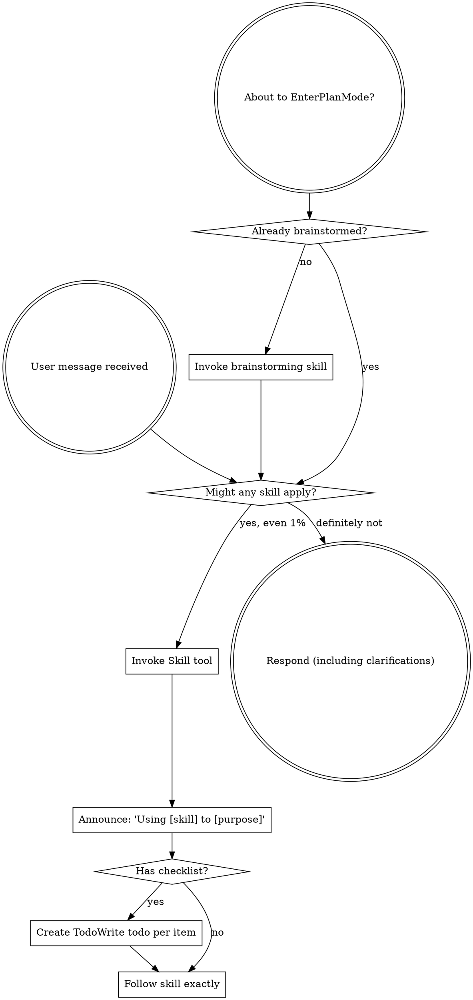

codex-exec: report contract violation

--- codex stdout ---
Judged at HEAD `86b6d1f501de237413e63d0f0ee0428bd3d4e8fa`.

1. **MET — live denial and rewrite.** PreToolUse validates v2 input and denies failures (`sgsd-substrate-invocation-witness.cjs:152-177`). PostToolUse calls `capSubstrateResponse`, constructs a replacement, and returns it only through `updatedMCPToolOutput`; failures return a bounded replacement (`:192-245`).

2. **MET — authenticated, correlated, one-use witness.** Rows are HMAC-signed and timing-safe verified (`substrate-invocation-witness-store.cjs:279-304`), selected by project/session/payload in `rewritten` state (`:486-510`), then atomically claimed, reverified, and consumed (`:513-575`). Prompt acceptance derives the session internally and exposes no `tool_use_id` (`vtp-context-composer.cjs:516-584`).

3. **MET — installation and propagation.** Exact project Pre/Post registrations are distributed (`repo-settings-overlay.json:4-16,60-71`); repair installs runtime, key, and hooks (`feature-propagation/audit.cjs:672-705`), derives grants only after witness and broker readiness (`:1352-1431`), and reports missing/stale state (`:1479-1523`). The two canonical agents contain the fail-closed P167 contract (`sgsd-vtp-enrichment.md:32-63`; `sgsd-board-researcher.md:17-48`), while legacy planner/researcher patches are generated through the same contract (`audit.cjs:1009-1039`).

4. **MET — capability withdrawal.** Every substrate call receives a fresh readiness check before forwarding, while `tools/list` filters the capability when unready (`substrate-capability-broker.cjs:298-333`). Evidence records successful empty discovery, rejected stale call, zero fixture calls, and no transcript result/raw markers (`167-REAL-MCP-HOOK-EVIDENCE.json:371-467,468-566`).

5. **MET — same-user boundary characterization.** Evidence records a discovered alternate server and one successful runtime call, a successful direct stdio call, two fixture invocations total, and zero matching witness rows before and after (`167-REAL-MCP-HOOK-EVIDENCE.json:591-698,699-846`).

6. **MET — P166/earlier preservation.** The single cap and digest implementations remain composer-owned (`vtp-context-composer.cjs:374-408`) and are reused by the hook (`sgsd-substrate-invocation-witness.cjs:141,207`). Frozen v1/P154 hashes match before/after (`167-REAL-MCP-HOOK-EVIDENCE.json:56-64`). Given P166 6/6, P154 pass, and guard 12/12, no current regression is evidenced. The two reported production escapes were repaired before this HEAD.

The real-runtime proof is not direct hook invocation or staged output: the artifact identifies Claude Code 2.1.243, bypass permissions, `real_stdio_mcp`, and installed hook digests (`167-REAL-MCP-HOOK-EVIDENCE.json:5-45`); it records actual Claude hook lifecycle/tool events (`:106-148`), exactly one fixture-owned `tools/call` (`:226-290`), and a transcript-observed 16,000-character replacement without the tail marker (`:292-303`). Capture code derives those facts from Claude stream output and the fixture log before emitting evidence (`capture-live-runtime.cjs:1159-1222`).

DLB-07: **no criterion is merely shape-green**. Offline verification is necessarily structural, but SACs 1/4/5 are backed by captured runtime, transcript, and fixture traffic; SACs 2/3/6 trace to operative production branches.

GOAL_MET: YES
VERDICT: PASS

--- codex stderr ---
OpenAI Codex v0.146.0
--------
workdir: C:\Users\jack.berrow\AppData\Roaming\warp\Warp\data\worktrees\GSDedits\luminaria-hogback
model: gpt-5.6-sol
provider: openai
approval: never
sandbox: read-only
reasoning effort: xhigh
reasoning summaries: none
session id: 01a036d5-f79c-7da3-81c4-b3357b5eb9c3
--------
user
# Phase verifier — P167 Substrate Invocation Witness

Goal-backward verification. Read-only. Do not edit files. Do not re-run test suites.

Read the locked plan:
.planning/milestones/v3.9-substrate-hygiene/phases/167-substrate-invocation-witness/167-01-PLAN-LOCKED.md

Judge each of its six `semantic_acceptance_criteria` as MET or NOT MET against the code
as it stands at HEAD, citing file:line for each judgement. Do not accept a task report or
a commit message as evidence; cite the implementation.

## Given results, do not re-measure

guard 12/12 unsandboxed, T1 hook-contract 38/38, T2 witness-correlation 13/13,
T3 prompt-contracts 4/4, T4 propagation pass, feature-propagation self-test 15/15,
P166 policy 6/6, P154 real-evidence pass, T5 live capture PASS and independent verify
PASS (active_invocations 1, absent_invocations 0, same_user_bypass_invocations 2),
bash -n install.sh clean, node --check clean.

Phase ATC round 3 returned PASS 9/10 with no CRITICAL and no MAJOR.
MUDA returned WARN on all eight wastes, with 2 production-code defect escapes.

## What the phase claimed to deliver

An installed PreToolUse hook that denies a non-conforming substrate call in a real
Claude runtime under bypass-permissions; an installed PostToolUse hook that rewrites the
tool output through capSubstrateResponse and updatedMCPToolOutput, never passing the raw
result through; a witness store whose rows are HMAC-signed, session- and digest-bound,
consumed exactly once, and accepted only in the `rewritten` state; a capability broker
that withdraws the tool when the guard is absent; and propagation so the registration
travels to other repositories.

## Questions the verdict must answer

1. Is each acceptance criterion MET, with a citation?
2. The first criterion forbids direct hook invocation or a staged response as evidence.
   Confirm from 167-REAL-MCP-HOOK-EVIDENCE.json that the recorded run went through a real
   installed runtime and a real local MCP server, and say what in the evidence proves it.
3. Any regression in P166 or earlier behaviour?
4. Is there any acceptance criterion that passes structurally but not semantically, in
   the sense of DLB-07: green because a test asserts a shape, not because real data
   flowed through the real path?

End with `GOAL_MET: YES` or `GOAL_MET: NO`, then a line that is exactly
`VERDICT: PASS` or `VERDICT: FAIL`. Bound yourself to about 15 shell commands and emit
the verdict even if your investigation is incomplete. Max 600 words.

codex
I’m using the `using-superpowers` routing skill and the read-only `review` workflow. I’ll inspect only the locked plan, HEAD implementation, and supplied evidence—no edits or test reruns—and keep the investigation within the requested command budget.
exec
"C:\\WINDOWS\\System32\\WindowsPowerShell\\v1.0\\powershell.exe" -Command "Get-Content -Raw 'C:\\Users\\jack.berrow\\.codex\\skills\\using-superpowers\\SKILL.md'; Get-Content -Raw 'C:\\Users\\jack.berrow\\.agents\\skills\\review\\SKILL.md'" in C:\Users\jack.berrow\AppData\Roaming\warp\Warp\data\worktrees\GSDedits\luminaria-hogback
 succeeded in 1307ms:
---
name: using-superpowers
description: Use when starting any conversation - establishes how to find and use skills, requiring Skill tool invocation before ANY response including clarifying questions
---

<SUBAGENT-STOP>
If you were dispatched as a subagent to execute a specific task, skip this skill.
</SUBAGENT-STOP>

<EXTREMELY-IMPORTANT>
If you think there is even a 1% chance a skill might apply to what you are doing, you ABSOLUTELY MUST invoke the skill.

IF A SKILL APPLIES TO YOUR TASK, YOU DO NOT HAVE A CHOICE. YOU MUST USE IT.

This is not negotiable. This is not optional. You cannot rationalize your way out of this.
</EXTREMELY-IMPORTANT>

## Instruction Priority

Superpowers skills override default system prompt behavior, but **user instructions always take precedence**:

1. **User's explicit instructions** (CLAUDE.md, GEMINI.md, AGENTS.md, direct requests) ƒ?" highest priority
2. **Superpowers skills** ƒ?" override default system behavior where they conflict
3. **Default system prompt** ƒ?" lowest priority

If CLAUDE.md, GEMINI.md, or AGENTS.md says "don't use TDD" and a skill says "always use TDD," follow the user's instructions. The user is in control.

## How to Access Skills

**In Claude Code:** Use the `Skill` tool. When you invoke a skill, its content is loaded and presented to youƒ?"follow it directly. Never use the Read tool on skill files.

**In Copilot CLI:** Use the `skill` tool. Skills are auto-discovered from installed plugins. The `skill` tool works the same as Claude Code's `Skill` tool.

**In Gemini CLI:** Skills activate via the `activate_skill` tool. Gemini loads skill metadata at session start and activates the full content on demand.

**In other environments:** Check your platform's documentation for how skills are loaded.

## Platform Adaptation

Skills use Claude Code tool names. Non-CC platforms: see `references/copilot-tools.md` (Copilot CLI), `references/codex-tools.md` (Codex) for tool equivalents. Gemini CLI users get the tool mapping loaded automatically via GEMINI.md.

# Using Skills

## The Rule

**Invoke relevant or requested skills BEFORE any response or action.** Even a 1% chance a skill might apply means that you should invoke the skill to check. If an invoked skill turns out to be wrong for the situation, you don't need to use it.



## Red Flags

These thoughts mean STOPƒ?"you're rationalizing:

| Thought | Reality |
|---------|---------|
| "This is just a simple question" | Questions are tasks. Check for skills. |
| "I need more context first" | Skill check comes BEFORE clarifying questions. |
| "Let me explore the codebase first" | Skills tell you HOW to explore. Check first. |
| "I can check git/files quickly" | Files lack conversation context. Check for skills. |
| "Let me gather information first" | Skills tell you HOW to gather information. |
| "This doesn't need a formal skill" | If a skill exists, use it. |
| "I remember this skill" | Skills evolve. Read current version. |
| "This doesn't count as a task" | Action = task. Check for skills. |
| "The skill is overkill" | Simple things become complex. Use it. |
| "I'll just do this one thing first" | Check BEFORE doing anything. |
| "This feels productive" | Undisciplined action wastes time. Skills prevent this. |
| "I know what that means" | Knowing the concept ƒ%ÿ using the skill. Invoke it. |

## Skill Priority

When multiple skills could apply, use this order:

1. **Process skills first** (brainstorming, debugging) - these determine HOW to approach the task
2. **Implementation skills second** (frontend-design, mcp-builder) - these guide execution

"Let's build X" ā' brainstorming first, then implementation skills.
"Fix this bug" ā' debugging first, then domain-specific skills.

## Skill Types

**Rigid** (TDD, debugging): Follow exactly. Don't adapt away discipline.

**Flexible** (patterns): Adapt principles to context.

The skill itself tells you which.

## User Instructions

Instructions say WHAT, not HOW. "Add X" or "Fix Y" doesn't mean skip workflows.

---
name: review
description: Review code changes for security, performance, bugs, and quality. Reviews staged changes, unstaged changes, specific commits, or PR-ready diffs.
---

<objective>
Review code changes and provide structured feedback covering security, performance, bug risks, code quality, and test coverage gaps. This skill analyzes diffs and surrounding context to catch issues before they reach production.
</objective>

<context>
This skill reviews code changes at various stages of the development workflow. It can review staged changes before a commit, unstaged work-in-progress, a specific commit, or the full set of changes on a branch that are ready for a pull request.

The reviewer reads both the diff and the surrounding source files to understand intent and catch issues that only appear in context.
</context>

<core_principle>
**FIND REAL ISSUES, NOT STYLE NITS.** Focus on problems that cause bugs, security vulnerabilities, performance degradation, or maintainability pain. Avoid nitpicking formatting or subjective style preferences unless they harm readability.
</core_principle>

<analysis_only_rule>
**THIS SKILL IS READ-ONLY. DO NOT MODIFY CODE.**

The purpose is to review and report findings. Making changes during review conflates the reviewer and author roles. Present findings and let the user decide what to act on.
</analysis_only_rule>

<quick_start>

<determine_review_scope>

Parse the user's input to determine what to review:

1. **No arguments** - Review staged changes first. If nothing is staged, review unstaged changes.
   - Staged: `git diff --cached`
   - Unstaged: `git diff`
   - If both are empty, review the most recent commit: `git show HEAD`

2. **Commit hash argument** (e.g., `/review abc1234`) - Review that specific commit.
   - `git show <hash>`

3. **File path argument** (e.g., `/review src/foo.ts`) - Review unstaged changes in that file.
   - `git diff -- <path>` then fall back to `git diff --cached -- <path>`

4. **"pr" argument** (e.g., `/review pr`) - Review all changes since branching from main.
   - `git diff main...HEAD`
   - If on main, review `git diff HEAD~1`

After obtaining the diff, if it is empty, inform the user that there are no changes to review and stop.

</determine_review_scope>

<gather_context>

Before analyzing the diff:

1. **Read changed files in full** - Do not review a diff in isolation. Read each modified file to understand the surrounding code, imports, types, and control flow.
2. **Identify the tech stack** - Note languages, frameworks, and libraries in use. This affects what patterns are risky.
3. **Check for related test files** - For each changed source file, look for corresponding test files. Note whether tests were updated alongside the changes.
4. **Check for configuration changes** - If config files changed (env, CI, package.json, tsconfig, etc.), pay extra attention to side effects.

</gather_context>

<review_categories>

Analyze the changes against each category below. Only report findings that are actually present. Skip categories with no issues.

**A. Security Issues** (Severity: CRITICAL or HIGH)
- Injection vulnerabilities (SQL injection, command injection, template injection)
- Cross-site scripting (XSS) - unsanitized user input rendered in HTML
- Authentication and authorization flaws (missing auth checks, privilege escalation)
- Secrets or credentials hardcoded or logged
- Insecure deserialization or unsafe eval usage
- Path traversal or file access vulnerabilities
- Missing input validation on external data

**B. Performance Concerns** (Severity: HIGH or MEDIUM)
- N+1 query patterns in database access
- Unnecessary memory allocations in hot paths or loops
- Blocking operations on the main thread or in async contexts
- Missing pagination on unbounded queries
- Redundant computation that could be cached or memoized
- Large payloads without streaming or chunking

**C. Bug Risks** (Severity: HIGH or MEDIUM)
- Off-by-one errors in loops or array access
- Null/undefined dereferences without guards
- Race conditions in concurrent or async code
- Incorrect error handling (swallowed errors, wrong error types)
- Type mismatches or unsafe type assertions
- Logic errors in conditionals (inverted checks, missing cases)
- Resource leaks (unclosed connections, file handles, listeners)

**D. Code Quality** (Severity: MEDIUM or LOW)
- Unclear or misleading naming
- Significant code duplication that should be extracted
- Excessive complexity (deeply nested logic, functions doing too many things)
- Dead code or unreachable branches
- Missing or misleading comments on non-obvious logic
- Inconsistency with patterns used elsewhere in the codebase

**E. Test Coverage Gaps** (Severity: MEDIUM or LOW)
- New logic paths without corresponding test cases
- Changed behavior without updated tests
- Edge cases not covered (empty inputs, boundary values, error paths)
- Missing integration tests for new API endpoints or database changes

</review_categories>

<format_findings>

For each finding, use this structure:

```
### [SEVERITY] Category: Brief Title

**File**: `path/to/file.ext` (lines X-Y)

**Issue**: Clear description of the problem.

**Why it matters**: What could go wrong if this is not addressed.

**Suggestion**: How to fix it, with a code snippet if helpful.
```

Severity levels:
- **CRITICAL** - Must fix before merge. Security vulnerability or data loss risk.
- **HIGH** - Should fix before merge. Likely bug or significant performance issue.
- **MEDIUM** - Should fix soon. Code quality or moderate risk issue.
- **LOW** - Consider fixing. Minor improvement opportunity.

</format_findings>

</quick_start>

<critical_rules>

1. **READ THE FULL FILE**: Never review a diff without reading the complete source file for context
2. **NO FALSE ALARMS**: Only report issues you can explain concretely. Do not report vague concerns
3. **PRIORITIZE**: Lead with the most severe findings. Do not bury critical issues under style nits
4. **BE SPECIFIC**: Include file paths, line numbers, and code references for every finding
5. **EXPLAIN THE RISK**: For each finding, explain what could actually go wrong
6. **CHECK TESTS**: Always check whether changes have corresponding test updates
7. **CONSIDER THE STACK**: Apply language-specific and framework-specific knowledge to your review
8. **DO NOT MODIFY CODE**: Present findings only. The user decides what to act on

</critical_rules>

<output_format>

```markdown
## Code Review: [brief description of what was reviewed]

**Scope**: [staged changes | unstaged changes | commit abc1234 | PR changes from main]
**Files reviewed**: [count] files changed, [additions] additions, [deletions] deletions

---

### Findings

[Findings grouped by severity, highest first. Use the format from <format_findings>.]

---

### Summary

| Severity | Count |
|----------|-------|
| CRITICAL | X     |
| HIGH     | X     |
| MEDIUM   | X     |
| LOW      | X     |

### Recommended Actions

1. [Most important action to take]
2. [Next most important action]
3. [...]
```

If no issues are found:

```markdown
## Code Review: [brief description]

**Scope**: [what was reviewed]
**Files reviewed**: [count]

No significant issues found. The changes look good to merge.
```

</output_format>

<decision_gate>

**After presenting findings, ALWAYS offer these options:**

```
ƒ"?ƒ"?ƒ"?ƒ"?ƒ"?ƒ"?ƒ"?ƒ"?ƒ"?ƒ"?ƒ"?ƒ"?ƒ"?ƒ"?ƒ"?ƒ"?ƒ"?ƒ"?ƒ"?ƒ"?ƒ"?ƒ"?ƒ"?ƒ"?ƒ"?ƒ"?ƒ"?ƒ"?ƒ"?ƒ"?ƒ"?ƒ"?ƒ"?ƒ"?ƒ"?ƒ"?ƒ"?ƒ"?ƒ"?ƒ"?ƒ"?
REVIEW COMPLETE

What would you like to do?

1. **Fix issues** - I'll address the findings starting with the most critical
2. **Save review** - Export findings to a markdown file
3. **Review again** - Re-review with different scope or focus
4. **Discuss a finding** - Ask questions about a specific issue
5. **Other** - Tell me what you need
ƒ"?ƒ"?ƒ"?ƒ"?ƒ"?ƒ"?ƒ"?ƒ"?ƒ"?ƒ"?ƒ"?ƒ"?ƒ"?ƒ"?ƒ"?ƒ"?ƒ"?ƒ"?ƒ"?ƒ"?ƒ"?ƒ"?ƒ"?ƒ"?ƒ"?ƒ"?ƒ"?ƒ"?ƒ"?ƒ"?ƒ"?ƒ"?ƒ"?ƒ"?ƒ"?ƒ"?ƒ"?ƒ"?ƒ"?ƒ"?ƒ"?
```

**Wait for user response before taking any action.**

This gate is MANDATORY. Never skip it. Never auto-implement fixes.

</decision_gate>

C:\Users\jack.berrow\OneDrive - John Cullen Lighting\Documents\WindowsPowerShell\profile.ps1 : Cannot dot-source this 
command because it was defined in a different language mode. To invoke this command without importing its contents, 
omit the '.' operator.
At line:1 char:1
+ . 'C:\Users\jack.berrow\OneDrive - John Cullen Lighting\Documents\Win ...
+ ~~~~~~~~~~~~~~~~~~~~~~~~~~~~~~~~~~~~~~~~~~~~~~~~~~~~~~~~~~~~~~~~~~~~~
    + CategoryInfo          : InvalidOperation: (:) [profile.ps1], NotSupportedException
    + FullyQualifiedErrorId : DotSourceNotSupported,profile.ps1
 
C:\Users\jack.berrow\OneDrive - John Cullen Lighting\Documents\WindowsPowerShell\Microsoft.PowerShell_profile.ps1 : 
Cannot dot-source this command because it was defined in a different language mode. To invoke this command without 
importing its contents, omit the '.' operator.
At line:1 char:1
+ . 'C:\Users\jack.berrow\OneDrive - John Cullen Lighting\Documents\Win ...
+ ~~~~~~~~~~~~~~~~~~~~~~~~~~~~~~~~~~~~~~~~~~~~~~~~~~~~~~~~~~~~~~~~~~~~~
    + CategoryInfo          : InvalidOperation: (:) [Microsoft.PowerShell_profile.ps1], NotSupportedException
    + FullyQualifiedErrorId : DotSourceNotSupported,Microsoft.PowerShell_profile.ps1
 

exec
"C:\\WINDOWS\\System32\\WindowsPowerShell\\v1.0\\powershell.exe" -Command '$p='"'.planning/milestones/v3.9-substrate-hygiene/phases/167-substrate-invocation-witness/167-01-PLAN-LOCKED.md'; "'$n=0; Get-Content -LiteralPath $p | ForEach-Object { $n++; '"'{0,5}: {1}' -f "'$n, $_ }; rg --files | rg '"'167-REAL-MCP-HOOK-EVIDENCE\\.json"'$|substrate|witness|capability|hooks|feature-propagation|P166|166-'"'" in C:\Users\jack.berrow\AppData\Roaming\warp\Warp\data\worktrees\GSDedits\luminaria-hogback
 succeeded in 2130ms:
    1: ---
    2: schema_version: 2
    3: phase: 167
    4: slug: substrate-invocation-witness
    5: milestone: v3.9-substrate-hygiene
    6: status: PLANNED
    7: revision: 3
    8: governing_decision: .planning/milestones/v3.9-substrate-hygiene/phases/167-substrate-invocation-witness/CONTEXT.md
    9: research_path: .planning/milestones/v3.9-substrate-hygiene/phases/167-substrate-invocation-witness/RESEARCH.md
   10: depends_on: []
   11: intent: >
   12:   Close the drift, forgetfulness, shortcut, and supported broker-deletion cases
   13:   for raw prompt-owned vtp_search_substrate by witnessing the Claude Code tool
   14:   boundary, denying a non-v2 payload before transport, capping a valid MCP
   15:   result before model delivery, correlating the real invocation with P166
   16:   prompt acceptance without an agent-reported identifier, and withdrawing the
   17:   brokered raw tool whenever hook registrations or source are absent. This
   18:   raises an unfiltered call from zero-effort prompt drift to deliberate
   19:   circumvention, but it does not defeat an actor with arbitrary same-user Bash
   20:   and Write execution, who can read the private upstream manifest, register or
   21:   invoke the upstream directly, or replace the broker and its controls.
   22: execution_mode: serial-codex-with-orchestrator-live-gate
   23: expected_ATC_tier: GATE
   24: skip_gates: []
   25: lessons_path: null
   26: prior_errors_lookup: true
   27: semantic_acceptance_criteria:
   28:   - input: >
   29:       An installed Claude Code runtime at version 2.1.240 or later, launched in
   30:       bypass-permissions mode against a disposable local MCP server named
   31:       vtp-kb. The live run first asks the real
   32:       mcp__vtp-kb__vtp_search_substrate tool to send an invalid payload missing
   33:       P166 v2 policy fields, then sends a composer-prepared planning payload to
   34:       the same real MCP tool. The local server returns one hit containing 16001
   35:       JavaScript characters and a unique discarded-tail marker.
   36:     expected_outcome: >
   37:       The installed PreToolUse hook fires in the live Claude runtime, returns a
   38:       deny decision before the invalid call reaches the MCP server, and the
   39:       denial still holds under bypass-permissions. The valid call reaches the
   40:       local server exactly once. The installed PostToolUse hook then uses the
   41:       existing capSubstrateResponse and updatedMCPToolOutput contract so the
   42:       transcript seen by the model contains exactly 16000 retained characters,
   43:       contains the P166 degradation note, and does not contain the discarded
   44:       marker. The capture records Claude version, effective hook registrations
   45:       and source hashes, redacted session correlation, MCP server invocation
   46:       rows, hook audit rows, and the post-hook transcript output in
   47:       167-REAL-MCP-HOOK-EVIDENCE.json. A direct invocation of hook functions or
   48:       a staged response is not acceptable evidence for this criterion.
   49:     verification_cmd: >
   50:       node super-gsd/tests/substrate-invocation-witness/capture-live-runtime.cjs --capture
   51:       --project-dir . --evidence-file
   52:       .planning/milestones/v3.9-substrate-hygiene/phases/167-substrate-invocation-witness/167-REAL-MCP-HOOK-EVIDENCE.json &&
   53:       node super-gsd/tests/substrate-invocation-witness/capture-live-runtime.cjs --verify
   54:       --project-dir . --evidence-file
   55:       .planning/milestones/v3.9-substrate-hygiene/phases/167-substrate-invocation-witness/167-REAL-MCP-HOOK-EVIDENCE.json
   56:   - input: >
   57:       A real prepareSubstrateCall planning envelope and matching prompt call
   58:       record, together with a hook-authored PreToolUse/PostToolUse witness for
   59:       the same CLAUDE_CODE_SESSION_ID and substratePayloadDigest. The same
   60:       record is then replayed, a signed row is edited, a row is copied to a
   61:       second session, and records are submitted with no witness or only an
   62:       agent-supplied tool-use identifier.
   63:     expected_outcome: >
   64:       acceptPromptSubstrateCallRecord locates a fresh rewritten witness by the
   65:       runtime session and payload SHA-256, consumes exactly one internally keyed
   66:       row atomically, and returns success without receiving or exposing a
   67:       tool_use_id. Replay, cross-session reuse, HMAC mismatch, missing witness,
   68:       pre-only witness, ambiguous or expired witness, and a caller-provided
   69:       identifier all fail with a named substrate_witness reason. This provides
   70:       keyed tamper-evidence, edit detection, and one-use replay resistance. It
   71:       does not claim resistance to a determined process with arbitrary code
   72:       execution as the same OS user, key access, or authority to replace both
   73:       the hook and acceptance code.
   74:     verification_cmd: >
   75:       node super-gsd/tests/substrate-invocation-witness/assert-witness-correlation.cjs &&
   76:       node super-gsd/tests/vtp-substrate-policy/assert-vtp-substrate-policy.cjs --case prompt-record-acceptance
   77:   - input: >
   78:       A disposable SGSD project and isolated USERPROFILE whose global legacy
   79:       planner/researcher agents and direct stdio vtp-kb definition exist but
   80:       whose project .claude/settings.json, witness key, guarded MCP capability,
   81:       and P167 prompt markers are absent, followed by feature-propagation audit
   82:       and repair-safe. After repair, each witness registration is removed in
   83:       turn and audit, capability discovery, and prompt acceptance are run again.
   84:     expected_outcome: >
   85:       Initial audit exits 2 with
   86:       project_claude_substrate_witness_missing_or_stale. repair-safe provisions
   87:       the local witness authority, idempotently installs exactly one project
   88:       PreToolUse and one project PostToolUse registration, moves the effective
   89:       direct vtp-kb definition into a private upstream manifest, and makes the
   90:       broker the only Claude-visible vtp-kb server before installing or patching
   91:       any raw-substrate agent. It reports exact commands, matchers, source and
   92:       upstream-config digests, key status, and capability state without secrets.
   93:       All four installed prompt surfaces carry the P167 preflight and
   94:       fail-closed acceptance contract. Removing either registration makes audit
   95:       exit 2, makes the broker withdraw vtp_search_substrate from tools/list and
   96:       deny a stale tools/call before upstream transport, and makes the next
   97:       prompt record fail acceptance with VTP_STATUS unavailable_or_bypassed and
   98:       reason substrate_witness_unavailable. Unrelated settings and agent content
   99:       are byte-preserved, and a second repair is byte-idempotent.
  100:     verification_cmd: >
  101:       node super-gsd/tests/substrate-invocation-witness/assert-propagation.cjs &&
  102:       node super-gsd/tools/feature-propagation/audit.cjs --self-test &&
  103:       node super-gsd/tests/installer-registration-guard/assert-installer-registration-guard.cjs --case hook-manifest-completeness &&
  104:       node super-gsd/tests/installer-registration-guard/assert-installer-registration-guard.cjs --case bundled-overlay-current
  105:   - input: >
  106:       The repaired disposable profile and real Claude Code runtime from SAC 1,
  107:       after deleting both P167 project hook registrations and deleting the
  108:       project hook source. The guarded vtp-kb broker remains configured against
  109:       the local oversized fixture, and the fresh bypass-permissions session is
  110:       explicitly asked to invoke mcp__vtp-kb__vtp_search_substrate.
  111:     expected_outcome: >
  112:       Before any upstream tools/call, the broker's successful tools/list omits
  113:       vtp_search_substrate because exact registration and source readiness both
  114:       fail. Any stale or forced tools/call is rejected by the broker's second
  115:       readiness check without forwarding. The fixture server's own append-only
  116:       invocation log contains zero tools/call rows, and the Claude transcript
  117:       contains neither a substrate tool result nor the fixture's unique raw
  118:       response and discarded-tail markers. Audit exit 2 and prompt-acceptance
  119:       refusal are recorded only as supporting observations; they are not the
  120:       proof. The independent proof is zero fixture invocations plus no raw
  121:       transcript delivery.
  122:     verification_cmd: >
  123:       node super-gsd/tests/substrate-invocation-witness/capture-live-runtime.cjs --capture
  124:       --project-dir . --evidence-file
  125:       .planning/milestones/v3.9-substrate-hygiene/phases/167-substrate-invocation-witness/167-REAL-MCP-HOOK-EVIDENCE.json &&
  126:       node super-gsd/tests/substrate-invocation-witness/capture-live-runtime.cjs --verify
  127:       --project-dir . --evidence-file
  128:       .planning/milestones/v3.9-substrate-hygiene/phases/167-substrate-invocation-witness/167-REAL-MCP-HOOK-EVIDENCE.json
  129:   - input: >
  130:       The repaired disposable profile, private upstream manifest, real Claude
  131:       Code runtime, and local fixture from SAC 1, exercised as a same-user
  132:       bypass characterisation. A Bash-capable actor reads the private manifest,
  133:       adds an alternate Claude-visible MCP server name that points directly to
  134:       the fixture, and invokes vtp_search_substrate through a fresh real Claude
  135:       process. The actor then starts the same upstream directly and sends a
  136:       second tools/call over Bash/stdio. Distinct fixture payload markers and
  137:       before/after witness-store snapshots identify both attempts.
  138:     expected_outcome: >
  139:       Both bypass attempts intentionally succeed and are recorded, rather than
  140:       being blocked, failed, or skipped. The alternate registration is
  141:       discoverable and forwards one tools/call, the direct Bash/stdio client
  142:       forwards one tools/call, and the fixture server's append-only log contains
  143:       both distinguished rows. Neither attempt creates a matching authenticated
  144:       or mirrored witness row. The capture records redacted commands, source and
  145:       configuration digests, success status, fixture-log digest, invocation
  146:       counts, and witness absence in a same_user_bypass object. This is a
  147:       mandatory positive characterisation proving that a same-user actor with
  148:       Bash can reach the upstream without a witness row; it does not claim to
  149:       close that path.
  150:     verification_cmd: >
  151:       node super-gsd/tests/substrate-invocation-witness/capture-live-runtime.cjs --capture
  152:       --project-dir . --evidence-file
  153:       .planning/milestones/v3.9-substrate-hygiene/phases/167-substrate-invocation-witness/167-REAL-MCP-HOOK-EVIDENCE.json &&
  154:       node super-gsd/tests/substrate-invocation-witness/capture-live-runtime.cjs --verify
  155:       --project-dir . --evidence-file
  156:       .planning/milestones/v3.9-substrate-hygiene/phases/167-substrate-invocation-witness/167-REAL-MCP-HOOK-EVIDENCE.json
  157:   - input: >
  158:       The P166 eight-site caller inventory, a 16001-character top-level and
  159:       evidence.hits response, the P152 shadow proof, frozen P154 real MCP
  160:       evidence, and byte snapshots of vtp-mcp-input-schemas.v1.json and
  161:       154-REAL-MCP-EVIDENCE.json, exercised after every P167 task.
  162:     expected_outcome: >
  163:       P167 adds a witness without weakening the P166 gateway, prompt gateway
  164:       evidence, eight-site closed inventory, 16000 character per-hit cap, or
  165:       acceptPromptSubstrateCallRecord. capSubstrateResponse and
  166:       substratePayloadDigest each retain one production implementation and are
  167:       called by the hook. VTP_RESPONSE_MAX_BYTES is unchanged and still bites.
  168:       The v1 schema and P154 evidence are byte-identical to their pre-P167
  169:       snapshots, and no VTP-host file or wiki/LINT-REPORT.md is changed.
  170:     verification_cmd: >
  171:       node super-gsd/tests/vtp-substrate-policy/assert-vtp-substrate-policy.cjs --case caller-coverage &&
  172:       node super-gsd/tests/vtp-substrate-policy/assert-vtp-substrate-policy.cjs --case executable-emitters &&
  173:       node super-gsd/tests/vtp-substrate-policy/assert-vtp-substrate-policy.cjs --case cap-shapes &&
  174:       node super-gsd/tests/triage-runtime/assert-mcp-arg-contract.cjs --case real-evidence
  175:       --evidence-file .planning/milestones/v3.6-vtp-bridge/phases/154-mcp-arg-contract/154-REAL-MCP-EVIDENCE.json &&
  176:       node super-gsd/tests/triage-runtime/assert-real-triage-runtime.cjs --scenario staged-vtp-oversized-response &&
  177:       node super-gsd/scripts/lib/vtp-context-composer.cjs --self-test
  178: known_deadends:
  179:   - Do not ask the agent to report tool_use_id, a witness filename, nonce, sequence number, or any other correlation capability. tool_use_id remains hook-only; acceptance correlates by runtime session plus substratePayloadDigest and consumes the internally keyed row.
  180:   - Do not treat a direct call to an exported hook function, a piped stdin fixture, a mocked MCP transport, or a passing Node unit test as proof that production enforcement fired. Phase completion requires the live Claude Code plus real local MCP capture in SAC 1.
  181:   - Do not reuse P147 modeFileDigest or describe an unkeyed hash as protection. P147 expressly is not tamper-proof and does not attest hook presence. P167 uses a separately provisioned random key, HMAC-authenticated rows, hook-only tool-use correlation, freshness, and atomic one-use consumption.
  182:   - Do not call the local HMAC store or broker tamper-proof. A process with arbitrary same-user code execution can potentially read the local key, restore a direct vtp-kb definition, replace the user-owned broker, alter settings, delete evidence, or replace both hook and acceptance code. Admin-managed Claude policy or an external signer under a different security principal is required to resist that actor.
  183:   - Windows Claude Code 2.1.240 can enforce hooks from HKLM\SOFTWARE\Policies\ClaudeCode or C:\Program Files\ClaudeCode\managed-settings.json; lower scopes cannot disable those managed hooks, and allowManagedHooksOnly can exclude non-managed hooks. That authority is not deployed on this machine, the current operator is non-admin, HKCU is explicitly user-writable, and enabling allowManagedHooksOnly here would suppress the existing project/user hook fleet unless all of it migrated. Do not claim that the sgsd_managed JSON marker is managed policy or attempt to write an administrator-owned location. P167 therefore chooses the independent guarded MCP capability broker for the supported local_hmac tier.
  184:   - The broker closes deletion of either/both registrations and the project hook source by removing vtp_search_substrate from tools/list and rechecking before upstream tools/call. It does not close a hostile same-user actor who edits Claude MCP configuration to restore the archived direct server, replaces the broker, or invokes the upstream server through another program. Audit must report trust_level local_hmac, enforcement_scope supported_sgsd_brokered_mcp_grant, and residual same_user_can_restore_direct_mcp_or_replace_broker.
  185:   - Do not rely on SessionStart alone to prove the PreToolUse and PostToolUse hooks are loaded. Exact project registrations, source hashes, key readiness, an actual per-call witness, and the live runtime transcript all remain required.
  186:   - Do not let a missing hook merely add a warning while accepting substrate evidence. The acceptance seam must refuse the record, and all four prompt contracts must discard the result and emit the explicit unavailable_or_bypassed degradation.
  187:   - Do not pass an uncapped PostToolUse result through when capping, witness lookup, parsing, or rewrite output construction fails. An active PostToolUse hook replaces such a result with a bounded substrate_witness_rewrite_failed result.
  188:   - Do not add another v2 schema, payload hash function, or per-hit cap. Reuse vtp-mcp-input-schemas.v2.json, substratePayloadDigest, and capSubstrateResponse from vtp-context-composer.cjs.
  189:   - Do not remove the P166 gateway evidence check after adding the witness. The prepared envelope, self-reported call record, actual-input digest, and consumed hook witness are cumulative controls.
  190:   - Do not register both global and project copies of the witness hook for the same SGSD session. The project registration is authoritative; the hook manifest records the global copy as intentionally unregistered to prevent duplicate witnesses and duplicate rewrites.
  191:   - Do not contact a live VTP host for the real-runtime proof. Use the deterministic local stdio MCP fixture named vtp-kb so the canonical runtime tool name is exercised without mutating or depending on VTP-host state.
  192:   - Do not touch super-gsd/schemas/vtp-mcp-input-schemas.v1.json, .planning/milestones/v3.6-vtp-bridge/phases/154-mcp-arg-contract/154-REAL-MCP-EVIDENCE.json, any VTP-host file, or wiki/LINT-REPORT.md. Do not raise or bypass VTP_RESPONSE_MAX_BYTES.
  193:   - Do not run capture-live-runtime.cjs --capture, executable-emitters, staged-vtp-oversized-response, deployed hook smoke cases, or any other spawn-bound suite inside the Codex sandbox. Nested Node and Claude processes return spawnSync EPERM there. These are orchestrator-owned commands, and an executor must report ORCHESTRATOR_REQUIRED rather than claim a pass.
  194: tasks:
  195:   - id: P167-T1
  196:     type: pre-post-hook-guarded-mcp-broker-and-authenticated-witness-store
  197:     agent: codex
  198:     model: codex
  199:     depends_on: []
  200:     files_touched:
  201:       - super-gsd/hooks/sgsd-substrate-invocation-witness.cjs
  202:       - super-gsd/tools/substrate-capability-broker.cjs
  203:       - super-gsd/scripts/lib/substrate-invocation-witness-store.cjs
  204:       - super-gsd/scripts/lib/vtp-context-composer.cjs
  205:       - super-gsd/tests/substrate-invocation-witness/assert-hook-contract.cjs
  206:     input_contract: >
  207:       Work red-first in assert-hook-contract.cjs with in-process calls and an
  208:       isolated project, HOME, and USERPROFILE. The fixture uses the canonical
  209:       mcp__vtp-kb__vtp_search_substrate name, full hook payloads containing
  210:       session_id, tool_use_id, cwd, tool_input, and tool_response, and a response
  211:       with top-level hits and evidence.hits. Cover valid v2 input, missing
  212:       source_types, missing limit, empty source_types, limit 6, malformed stdin,
  213:       missing session/tool-use IDs, missing key, duplicate Pre, missing Pre at
  214:       Post, exact 16000 boundaries, 16001-character hits, and a discarded-tail
  215:       marker. Add a fake upstream stdio server and cover tools/list with current,
  216:       missing, duplicated, or source-drifted registrations, deletion of both
  217:       registrations plus hook source, a stale forced substrate tools/call, a
  218:       non-substrate tools/call, upstream exit, malformed upstream JSON, and
  219:       list_changed after readiness loss. These tests establish deterministic
  220:       behavior but do not satisfy any live-runtime SAC.
  221: 
  222:       Add only a public export for the existing substratePayloadDigest and a
  223:       helper backed by the already compiled P166 v2 validator to
  224:       vtp-context-composer.cjs. Do not change the hash bytes, schema authority,
  225:       SUBSTRATE_CALL_POLICY, validatePreparedSubstrateCall, per-hit cap, callVtp,
  226:       or P166 acceptance in this task. The new hook must load these production
  227:       functions from the active project super-gsd tree found from payload.cwd;
  228:       it must not copy their implementations.
  229: 
  230:       In PreToolUse, ignore non-substrate tools. For the substrate tool, require
  231:       the full actual tool_input to pass the existing v2 schema helper and
  232:       require session_id, tool_use_id, project root, key readiness, and exact
  233:       Pre/Post project-registration readiness. Any failure returns JSON with
  234:       hookSpecificOutput.hookEventName PreToolUse,
  235:       permissionDecision deny, and a stable reason beginning
  236:       substrate_witness_denied:. It must make the decision before transport and
  237:       must not rely on the activity logger, whose persisted preview is
  238:       truncated. A valid call computes substratePayloadDigest over the actual
  239:       tool_input and creates the authenticated Pre witness before returning
  240:       allow/no-op output. If the witness cannot be committed, deny the call.
  241: 
  242:       Implement the authoritative store in
  243:       substrate-invocation-witness-store.cjs under the user configuration root,
  244:       outside the project working tree. Provision a random 32-byte key with
  245:       exclusive create and user-only permissions where the platform supports
  246:       them. Never print or copy key material into project evidence. Key each
  247:       spool record internally from HMAC(session_id,tool_use_id), store only
  248:       hashed session/tool-use identifiers in observable rows, and authenticate
  249:       the canonical record bytes with HMAC-SHA-256. Include schema version,
  250:       project digest, payload digest, state, created/expires timestamps, hook
  251:       source digest, and rewrite metadata. Use exclusive create for Pre and
  252:       temp-file plus atomic rename for state transitions. Keep the authoritative
  253:       spool separate from a redacted project mirror at
  254:       .planning/metrics/substrate-invocation-witness.jsonl. Never persist query
  255:       text, response text, raw session_id, raw tool_use_id, or key bytes.
  256: 
  257:       In PostToolUse, locate the exact signed Pre row by the hook-only
  258:       session_id/tool_use_id, recompute the actual-input digest, and reject a
  259:       mismatch. Apply the existing capSubstrateResponse to the MCP domain result
  260:       and emit the Claude 2.1.240 MCP replacement contract through
  261:       hookSpecificOutput.hookEventName PostToolUse and updatedMCPToolOutput.
  262:       Preserve the MCP content envelope while replacing only the parsed domain
  263:       payload. Transition the signed row to rewritten only after the replacement
  264:       is constructed, recording counts and a digest but no response body. If the
  265:       result is malformed, the Pre row is absent/invalid, or capping fails,
  266:       replace the tool output with a small substrate_witness_rewrite_failed
  267:       object and never pass the raw result through.
  268: 
  269:       Implement substrate-capability-broker.cjs as the only supported
  270:       Claude-visible vtp-kb stdio server. It reads a private, user-only upstream
  271:       server manifest provisioned by T4, starts and transparently proxies that
  272:       stdio server, and never persists or logs arguments or results. For
  273:       tools/list, forward upstream discovery but omit vtp_search_substrate unless
  274:       the same exact-registration, source-digest, project, and key-readiness
  275:       check used by PreToolUse is current. Watch those readiness inputs and emit
  276:       a successful MCP list_changed notification when the tool must be added or
  277:       withdrawn. For every substrate tools/call, repeat readiness synchronously
  278:       before forwarding, so a stale client tool list cannot race deletion. On
  279:       failure, return only a bounded substrate_witness_unavailable MCP error and
  280:       do not send the request upstream. Forward non-substrate tools unchanged.
  281:     output_contract: >
  282:       One project-loadable Claude hook denies an invalid actual substrate
  283:       invocation before transport and rewrites a valid result through the
  284:       existing cap before model delivery. Within the supported SGSD brokered
  285:       grant, the guarded MCP broker removes the raw substrate capability when
  286:       hook readiness is absent and refuses stale calls before upstream
  287:       transport. A keyed external spool records unique Pre and rewritten states
  288:       without exposing correlation capabilities or payload/response content,
  289:       and a redacted metrics mirror makes decisions auditable. These controls
  290:       close drift, shortcut, and deletion paths through that grant; they do not
  291:       prevent a same-user Bash/Write actor from reading the upstream manifest,
  292:       invoking it directly, restoring another registration, or replacing the
  293:       broker.
  294:     hypothesis: >
  295:       Binding v2 validation and the existing cap to actual Claude tool events,
  296:       while a separate MCP capability broker withdraws the grant when those
  297:       events cannot fire, closes active and absent-guard paths. A hook-only,
  298:       authenticated state transition gives later acceptance evidence that did
  299:       not originate in the agent's prompt record.
  300:     falsifier: >
  301:       Invalid actual input can reach transport; Pre allows when its witness
  302:       cannot be written; Post passes through an uncapped or malformed result;
  303:       the hook reimplements schema, digest, or cap logic; a persisted row leaks
  304:       raw input/output/session/tool-use/key data; an edited row still verifies;
  305:       duplicate Pre overwrites a row; the broker advertises or forwards
  306:       substrate when either registration or source is absent; a stale call
  307:       reaches upstream; a non-substrate tool changes behavior; raw payload or
  308:       response data is logged; or T1 cannot be reverted without a later task.
  309:     stop_rule: >
  310:       Stop when assert-hook-contract is red before implementation and green
  311:       after it, each denial has a stable reason, exact-boundary and both response
  312:       shapes preserve P166 semantics, HMAC/edit/state-transition checks pass,
  313:       broker discovery/withdrawal and before-forward recheck cases pass, node
  314:       --check passes for all four production files, and the T1 diff is limited
  315:       to the five listed files.
  316:     verification_cmd: >
  317:       node --check super-gsd/hooks/sgsd-substrate-invocation-witness.cjs &&
  318:       node --check super-gsd/tools/substrate-capability-broker.cjs &&
  319:       node --check super-gsd/scripts/lib/substrate-invocation-witness-store.cjs &&
  320:       node --check super-gsd/scripts/lib/vtp-context-composer.cjs &&
  321:       node super-gsd/tests/substrate-invocation-witness/assert-hook-contract.cjs &&
  322:       node super-gsd/scripts/lib/vtp-context-composer.cjs --self-test
  323:     expected_ATC_tier: GATE
  324:     revert_range: >
  325:       Commits 6aa2f01 and 9ea0bac are P167-T1's forward range. Revert them as
  326:       9ea0bac then 6aa2f01 after P167-T5 through P167-T2. Later review bands may
  327:       touch T1 files, but they are reverted with the task that produced them.
  328:     known_deadends:
  329:       - Do not add witness logic to sgsd-activity-logger.js. It receives full input, but its contract is silent best-effort logging and its persisted previews are deliberately truncated.
  330:       - Do not use exit 0 with a warning for a targeted Pre failure. Return the documented permissionDecision deny contract; keep exit 2 only as a tested compatible denial precedent.
  331:       - Do not write the authoritative spool or key under .planning, where a normal agent file edit can trivially fabricate the record used by acceptance.
  332:       - Do not leave an unbrokered Claude-visible vtp-kb definition at any MCP scope after T4 repair. The private upstream manifest is input to the broker, not a Claude MCP registration.
  333:       - Do not count a bounded broker rejection as the absence proof. The live absence SAC requires the upstream fixture's own zero-invocation log and transcript marker checks.
  334:   - id: P167-T2
  335:     type: witness-correlated-prompt-acceptance
  336:     agent: codex
  337:     model: codex
  338:     depends_on: ['P167-T1']
  339:     files_touched:
  340:       - super-gsd/scripts/lib/vtp-context-composer.cjs
  341:       - super-gsd/tests/substrate-invocation-witness/assert-witness-correlation.cjs
  342:       - super-gsd/tests/vtp-substrate-policy/assert-vtp-substrate-policy.cjs
  343:     input_contract: >
  344:       Work red-first with a real prepareSubstrateCall planning envelope and the
  345:       exact matching P166 substrate call record. Seed the authoritative store
  346:       only through the T1 producer API using an isolated key and actual hook
  347:       payload shapes. Exercise a rewritten row, pre-only row, missing row,
  348:       expired row, HMAC-edited row, wrong session, wrong project, wrong digest,
  349:       two identical sequential calls, replay after consumption, and a call
  350:       record carrying invented tool_use_id/witness_id fields. Preserve all P166
  351:       negative cases for missing gateway evidence, invalid payload, mismatched
  352:       prepared call, and limit 6.
  353: 
  354:       Strengthen acceptPromptSubstrateCallRecord after all existing P166 shape,
  355:       intent, payload, policy, and prepared-call checks pass. Resolve the runtime
  356:       session from CLAUDE_CODE_SESSION_ID by default, with an explicit injected
  357:       context permitted only for tests. Compute the digest with the existing
  358:       substratePayloadDigest and ask the witness store to atomically consume the
  359:       oldest fresh rewritten row for the same project, session, and digest. The
  360:       prompt record must not contain tool_use_id, witness_id, witness path,
  361:       signature, nonce, or sequence. Reject such fields rather than ignoring
  362:       them, so a new self-reporting seam cannot form. Return only ok,
  363:       intent_family, payload_sha256, and witness_status consumed.
  364: 
  365:       Consumption must verify the row HMAC before selecting it, acquire it with
  366:       an atomic rename, append a redacted consumed audit event, and make a
  367:       second acceptance fail. A pre_allowed row does not prove that PostToolUse
  368:       rewrote a result and cannot satisfy acceptance. If no valid rewritten row
  369:       exists, throw vtp_prompt_substrate_contract_invalid with a specific
  370:       substrate_witness_missing, invalid, expired, session_mismatch,
  371:       digest_mismatch, not_rewritten, ambiguous, or replayed suffix. Do not
  372:       weaken or reorder the P166 validation errors to make a forged record reach
  373:       the witness lookup.
  374: 
  375:       Keep the existing --accept-substrate-call-record CLI signature. It
  376:       inherits CLAUDE_CODE_SESSION_ID, never asks the agent for a tool-use
  377:       identifier, exits nonzero on witness failure including an ok:false prompt
  378:       path, and emits no accepted JSON before atomic consumption succeeds.
  379:     output_contract: >
  380:       The P166 prompt acceptance seam now requires two independent facts: the
  381:       exact composer-prepared record and one fresh hook-authored rewritten
  382:       witness for the current runtime session and actual payload digest. A
  383:       successful witness is consumed once and no hook-only identifier crosses
  384:       the agent contract. This closes accidental acceptance, self-report,
  385:       editing, copying, and replay within the intact local_hmac implementation;
  386:       it does not authenticate against a same-user actor able to read the key or
  387:       replace the hook, store, or acceptance code.
  388:     hypothesis: >
  389:       Runtime session plus the hook-computed payload digest is sufficient to
  390:       bind prompt evidence to a real invocation when unique tool-use rows remain
  391:       internal and acceptance atomically consumes one rewritten row.
  392:     falsifier: >
  393:       A clean prompt record passes without a rewritten witness; a pre-only,
  394:       edited, expired, cross-session, cross-project, digest-mismatched, or
  395:       replayed row passes; the agent must report an identifier; identical
  396:       sequential actual calls cannot each be consumed once; any P166 forged
  397:       record starts passing; or T2 cannot be reverted independently from T1.
  398:     stop_rule: >
  399:       Stop when every correlation negative is red against T1 and green after
  400:       acceptance is strengthened, a valid row is accepted exactly once, no
  401:       acceptance input or output contains tool_use_id, all P166 prompt-record
  402:       cases stay green, composer self-test passes, and the post-T1 diff is
  403:       limited to the three listed files.
  404:     verification_cmd: >
  405:       node super-gsd/tests/substrate-invocation-witness/assert-witness-correlation.cjs &&
  406:       node super-gsd/tests/vtp-substrate-policy/assert-vtp-substrate-policy.cjs --case prompt-record-acceptance &&
  407:       node super-gsd/tests/vtp-substrate-policy/assert-vtp-substrate-policy.cjs --case executable-emitters &&
  408:       node super-gsd/scripts/lib/vtp-context-composer.cjs --self-test
  409:     expected_ATC_tier: GATE
  410:     revert_range: >
  411:       Commits 5ec8f1c and be6cfa1 are P167-T2's forward range. Revert them as
  412:       be6cfa1 then 5ec8f1c after P167-T5 through P167-T3 and before P167-T1;
  413:       this restores P166 record-only acceptance while leaving T1 available.
  414:     known_deadends:
  415:       - Do not choose a witness by an identifier copied from the prompt record, even if the identifier is checked against the ledger.
  416:       - Do not accept a Pre row as proof that PostToolUse completed or that the model received capped output.
  417:       - Do not replace P166 gateway evidence with the witness. Both checks are mandatory and ordered.
  418:   - id: P167-T3
  419:     type: four-surface-fail-closed-prompt-contract
  420:     agent: codex
  421:     model: codex
  422:     depends_on: ['P167-T2']
  423:     files_touched:
  424:       - super-gsd/agents/sgsd-vtp-enrichment.md
  425:       - super-gsd/agents/sgsd-board-researcher.md
  426:       - super-gsd/tests/substrate-invocation-witness/assert-prompt-contracts.cjs
  427:     input_contract: >
  428:       Work red-first from the two canonical prompt files and model the installed
  429:       gsd-phase-researcher and gsd-planner P167 marker contract that T4 will
  430:       propagate. Classify the four surfaces separately. Assert each keeps its
  431:       P166 intent family and composer-prepared payload, carries no source_types
  432:       or limit literal of its own, does not ask for tool_use_id, and cannot
  433:       accept a response until readiness and post-call acceptance succeed. Assert
  434:       that both canonical source frontmatter tool lists are raw-substrate-free;
  435:       T4 alone may derive installed grant-bearing copies after the broker and
  436:       hooks are current.
  437: 
  438:       Add one shared P167 contract wording to the canonical enrichment and board
  439:       agents. Before raw substrate transport, run the production witness
  440:       readiness command against the current project and session. If readiness
  441:       is missing, stale, duplicated, keyless, or cannot prove both project
  442:       registrations, do not call the raw tool. Emit VTP_STATUS
  443:       unavailable_or_bypassed with reason substrate_witness_unavailable and
  444:       continue only through the existing graceful-degradation path.
  445: 
  446:       After the raw tool returns, write the exact P166 call record and run the
  447:       existing --accept-substrate-call-record command. Acceptance now consumes
  448:       T2's rewritten witness. If it exits nonzero, discard all substrate-derived
  449:       content, do not summarize, quote, persist, or retry it, and emit the same
  450:       explicit degradation reason. Do not instruct the model to cap response
  451:       text itself; T1 PostToolUse is the only raw-prompt pre-model cap and reuses
  452:       capSubstrateResponse. Carry hook-authored degradation_notes through the
  453:       existing normal artifact/output path when acceptance succeeds.
  454: 
  455:       Remove mcp__vtp-kb__vtp_search_substrate from both canonical source
  456:       frontmatter tool lists. Keep every other P166 tool, query preparation,
  457:       gateway evidence, intent family, artifact behavior, and optional-VTP
  458:       semantic unchanged. The body retains the conditional raw-call contract
  459:       because T4 derives installed copies with the raw tool only after it makes
  460:       the broker the sole vtp-kb definition and verifies both hooks. T3 models
  461:       that installed-agent marker contract in its test but does not modify
  462:       audit.cjs; T4 owns the separately revertible derived grants.
  463:     output_contract: >
  464:       Canonical source prompts are raw-substrate-free. Their broker-granted
  465:       installed variants call raw substrate only after witness readiness and use
  466:       its result only after the exact P166 record and one rewritten runtime
  467:       witness are accepted. Missing enforcement removes the capability and
  468:       produces a named optional-VTP degradation rather than silent success. This
  469:       closes forgetfulness, shortcut, and prompt drift in the generated SGSD
  470:       surfaces, but it does not stop a same-user Bash/Write actor from creating
  471:       a different prompt, registration, or direct upstream invocation.
  472:     hypothesis: >
  473:       Raw-free source templates plus a broker-owned conditional installed grant
  474:       make absence mechanical, while preflight and post-call acceptance remain
  475:       explicit degradation and evidence paths and the hooks keep active denial
  476:       and rewrite out of model prose.
  477:     falsifier: >
  478:       Either canonical source still grants raw substrate; an installed contract
  479:       can call before readiness or use content after acceptance failure; either
  480:       asks for a hook identifier, manually reimplements the cap, retries
  481:       unfiltered, changes an intent/policy field, turns optional VTP absence into
  482:       phase failure, or T3 cannot be reverted without T1/T2.
  483:     stop_rule: >
  484:       Stop when assert-prompt-contracts is red then green for the canonical
  485:       surfaces and declared legacy marker contract, caller-coverage still sees
  486:       the same eight production branches, only the two named raw grants are
  487:       removed from source tool lists, no intent or other tool drifts, no
  488:       agent-supplied identifier appears, and the T3 diff is limited to the three
  489:       listed files.
  490:     verification_cmd: >
  491:       node super-gsd/tests/substrate-invocation-witness/assert-prompt-contracts.cjs &&
  492:       node super-gsd/tests/vtp-substrate-policy/assert-vtp-substrate-policy.cjs --case caller-coverage &&
  493:       node super-gsd/tests/vtp-substrate-policy/assert-vtp-substrate-policy.cjs --case cap-shapes
  494:     expected_ATC_tier: GATE
  495:     revert_range: >
  496:       Commit 386d027 is P167-T3's range. Revert it after P167-T5 and P167-T4
  497:       and before P167-T2. The cross-surface review repair in c822dd4 belongs to
  498:       the later T4 range and is therefore removed before this commit.
  499:     known_deadends:
  500:       - Do not treat prompt readiness wording as the enforcement mechanism. It is an early degradation path; T1's broker grant plus hooks and T2 acceptance are authoritative at their respective boundaries.
  501:       - Do not grant raw substrate in canonical source files or only revoke it from some of the four installed prompts. T4 must derive or withdraw the grant for both canonical installs and both legacy surfaces as one capability.
  502:   - id: P167-T4
  503:     type: brokered-tool-grant-propagation-audit-and-absence-gate
  504:     agent: codex
  505:     model: codex
  506:     depends_on: ['P167-T3']
  507:     files_touched:
  508:       - super-gsd/config/repo-settings-overlay.json
  509:       - super-gsd/config/hook-manifest.json
  510:       - super-gsd/scripts/merge-settings.js
  511:       - super-gsd/install.sh
  512:       - super-gsd/tools/feature-propagation/audit.cjs
  513:       - super-gsd/tests/substrate-invocation-witness/assert-propagation.cjs
  514:       - super-gsd/tests/installer-registration-guard/assert-installer-registration-guard.cjs
  515:     input_contract: >
  516:       Work red-first in assert-propagation.cjs using a disposable project and
  517:       isolated HOME and USERPROFILE. Seed unrelated settings entries, old P166
  518:       planner/researcher patches, missing hook registrations, stale commands,
  519:       duplicate hook IDs, a mismatched source file, missing and malformed key
  520:       state, direct vtp-kb definitions at local/project/user MCP scopes, an
  521:       unsupported upstream transport, and both current and absent installed
  522:       agents. Include secret-shaped upstream env values and snapshot the real
  523:       user profile and source project evidence so any test escape fails. Cover
  524:       audit-only, repair-safe, second repair, removal of each hook, deletion of
  525:       both registrations plus hook source without another repair, and a
  526:       simulated broker/merge failure before agent installation.
  527: 
  528:       Add exactly two sgsd_managed project registrations to
  529:       repo-settings-overlay.json for the same hook script: PreToolUse and
  530:       PostToolUse, each matched only to
  531:       mcp__vtp-kb__vtp_search_substrate and assigned stable distinct hook IDs.
  532:       Point both at the target project's
  533:       super-gsd/hooks/sgsd-substrate-invocation-witness.cjs with the existing
  534:       command plus args form and a bounded timeout justified by T1 tests. Do not
  535:       add a global registration, because simultaneous global and project hooks
  536:       would duplicate witnesses and rewrites. Add the source to
  537:       hook-manifest.json with the project dispositions and an explicit
  538:       intentionally_unregistered global disposition.
  539: 
  540:       Make merge-settings.js safe to require by guarding main with
  541:       require.main and exporting its existing repo-local merge operation and
  542:       inspection helpers. feature-propagation/audit.cjs must call that same
  543:       implementation in process rather than cloning merge semantics or spawning
  544:       nested Node. Add auditClaudeSubstrateWitness that verifies exactly one of
  545:       each managed hook ID, event, canonical matcher, resolved command, timeout,
  546:       current source digest, and key readiness. Report missing, stale,
  547:       duplicate, source_drift, key_missing/key_invalid, trust_level local_hmac,
  548:       enforcement_scope supported_sgsd_brokered_mcp_grant, and residual
  549:       same_user_can_restore_direct_mcp_or_replace_broker. Add
  550:       auditClaudeSubstrateCapability to inspect Claude's local, project, and user
  551:       MCP scope precedence and require every discovered vtp-kb definition to
  552:       name substrate-capability-broker.cjs, the broker/source hashes to be
  553:       current, and the private upstream manifest to be present, user-only where
  554:       supported, and digest-matched without exposing command args, env values,
  555:       headers, or URLs. Report direct_grant, broker_missing, broker_drift,
  556:       upstream_missing, upstream_drift, unsupported_upstream_transport, and
  557:       grant_with_witness_unready. A failing witness or capability audit adds
  558:       project_claude_substrate_witness_missing_or_stale and exits 2.
  559: 
  560:       Reorder repair-safe so it first provisions the key without exposing it and
  561:       merges and re-audits both project registrations. For every effective
  562:       stdio vtp-kb definition, atomically move the exact original server object
  563:       into a private scope-keyed upstream manifest outside the project and
  564:       replace the Claude-visible definition at that scope with the same named
  565:       vtp-kb broker command. Never leave a direct vtp-kb fallback at a lower
  566:       scope. The broker manifest is not an MCP configuration, must not be loaded
  567:       by Claude, and must retain secrets byte-for-byte without printing or
  568:       mirroring them. If no VTP server exists, or its transport is unsupported,
  569:       keep all four installed agents raw-substrate-free and follow optional-VTP
  570:       degradation rather than creating a partial grant.
  571: 
  572:       Only after hook and broker audits are current may repair-safe derive the
  573:       two installed canonical VTP agents from T3's raw-free sources and patch
  574:       legacy gsd-phase-researcher.md and gsd-planner.md with both the raw tool
  575:       grant and versioned P167 contract. The installed contract must match T3:
  576:       readiness before the raw call, acceptance after it, no agent identifier,
  577:       discard/degrade on failure, and no manual response cap. If readiness later
  578:       disappears, the broker immediately withdraws the actual tool and blocks
  579:       stale calls; the next repair-safe also removes the derived raw grant from
  580:       all four installed files. Preserve unrelated settings, agent content, MCP
  581:       servers, and non-VTP repair behavior. Full repair retains its existing
  582:       shadow backup semantics.
  583: 
  584:       Teach install.sh to provision the same key before repo-local hook merge,
  585:       install the brokered MCP definition before any grant-bearing agent, and
  586:       fail rather than silently expose raw substrate when either mandatory hook,
  587:       broker installation, or private upstream preservation fails. Reuse the
  588:       existing hook distribution and merge preflight. Extend the installer
  589:       registration guard's overlay counts, manifest completeness, source
  590:       distribution, broker-only vtp-kb checks, idempotence, stale/duplicate
  591:       detection, secret non-disclosure, and unrelated-setting preservation. Do
  592:       not add a second Claude hook or agent installer.
  593:     output_contract: >
  594:       Fresh install and feature propagation carry the authoritative project
  595:       Pre/Post registrations, hook source, local signing authority, sole
  596:       brokered vtp-kb definition, private upstream manifest, and four conditional
  597:       installed prompt grants as one audited capability. Audit-only is read-only
  598:       and exits 2 on absence; repair-safe installs enforcement before exposing
  599:       raw substrate, withdraws derived grants when unavailable, and is
  600:       byte-idempotent. This genuinely closes deletion of the supported brokered
  601:       grant and makes an unfiltered call require deliberate circumvention. It
  602:       does not make the same-user-owned configuration, manifest, broker, or
  603:       signing key an authority boundary against arbitrary Bash/Write execution.
  604:     hypothesis: >
  605:       Making the broker the only owner of the actual MCP grant, with hook
  606:       readiness as its discovery and before-forward condition, turns hook
  607:       deletion into capability withdrawal before model-visible transport while
  608:       preserving the existing installer and prompt surfaces.
  609:     falsifier: >
  610:       A fresh profile audits ok without hooks/key/broker; repair writes a raw
  611:       agent before enforcement; a direct vtp-kb fallback remains at any scope;
  612:       secrets enter logs or evidence; one event, wrong matcher, stale source,
  613:       duplicate, missing key, broker drift, or upstream drift audits current;
  614:       deletion leaves the tool discoverable or forwardable; a second repair
  615:       changes bytes; unrelated settings or agents change; global plus project
  616:       registration can both fire; audit claims tamper-proof; tests touch the
  617:       real profile; or T4 is not independently revertible.
  618:     stop_rule: >
  619:       Stop when the fresh-profile case is red then green, all direct MCP scope
  620:       cases become broker-only, removal of either event withdraws the tool,
  621:       deletion of both events plus hook source cannot forward a stale call,
  622:       repair ordering, secret non-disclosure, and byte-idempotence are proven,
  623:       both canonical installs and both legacy agents have the correct
  624:       grant-or-revoke state, both legacy markers carry no identifier, installer
  625:       manifest cases pass, feature-propagation self-test passes, and the
  626:       post-T3 diff is limited to the seven listed files.
  627:     verification_cmd: >
  628:       node --check super-gsd/scripts/merge-settings.js &&
  629:       node --check super-gsd/tools/feature-propagation/audit.cjs &&
  630:       node super-gsd/tests/substrate-invocation-witness/assert-propagation.cjs &&
  631:       node super-gsd/tools/feature-propagation/audit.cjs --self-test &&
  632:       node super-gsd/tests/installer-registration-guard/assert-installer-registration-guard.cjs --case hook-manifest-completeness &&
  633:       node super-gsd/tests/installer-registration-guard/assert-installer-registration-guard.cjs --case bundled-overlay-current &&
  634:       node super-gsd/tests/installer-registration-guard/assert-installer-registration-guard.cjs --case hook-distribution-all-types &&
  635:       node super-gsd/tests/installer-registration-guard/assert-installer-registration-guard.cjs --case brokered-substrate-capability
  636:     expected_ATC_tier: GATE
  637:     revert_range: >
  638:       Commits a5e1f97, e85d396, c822dd4, and e78847f are P167-T4's forward
  639:       range. Revert them as e78847f, c822dd4, e85d396, then a5e1f97 after T5
  640:       and before T3. This range includes T4's cross-surface review repair.
  641:     known_deadends:
  642:       - Do not make missing Claude hooks non-blocking beside the existing Codex hook report. P167 has its own issue code and nonzero audit result.
  643:       - Do not merge settings by shelling out from audit.cjs. Export and reuse the existing in-process merge so deterministic tests do not depend on nested Node.
  644:       - Do not silently provision administrator-managed policy. Report that Windows machine-managed hooks are technically available but not deployed or writable by the current non-admin operator; managed policy remains the stronger operator authority boundary.
  645:       - Do not leave a direct vtp-kb entry as a fallback for convenience. If the broker cannot preserve and proxy the effective stdio definition, remove the raw grant from all four installed prompts and degrade VTP substrate explicitly.
  646:       - Do not claim the broker resists arbitrary same-user MCP reconfiguration. The bounded claim is deletion-safe for the supported brokered grant, not protection from a user who restores the archived direct config or replaces the broker.
  647:   - id: P167-T5
  648:     type: live-claude-mcp-denial-rewrite-evidence
  649:     agent: codex
  650:     model: codex
  651:     depends_on: ['P167-T4']
  652:     files_touched:
  653:       - super-gsd/tests/substrate-invocation-witness/fixture-vtp-mcp-server.cjs
  654:       - super-gsd/tests/substrate-invocation-witness/capture-live-runtime.cjs
  655:       - .planning/milestones/v3.9-substrate-hygiene/phases/167-substrate-invocation-witness/167-REAL-MCP-HOOK-EVIDENCE.json
  656:     input_contract: >
  657:       Build a deterministic stdio MCP fixture named vtp-kb that declares only
  658:       vtp_search_substrate, validates the expected payload for each scenario,
  659:       appends a redacted row for every received tools/call to a caller-supplied
  660:       append-only log, and returns one ordinary hit plus one hit with 16001
  661:       JavaScript characters and unique raw-response and discarded-tail markers.
  662:       Initialize and tools/list traffic must be distinguishable from tools/call
  663:       and cannot be counted as a substrate invocation. The fixture must never
  664:       contact VTP, read a private corpus, or write outside its supplied temporary
  665:       directory.
  666: 
  667:       capture-live-runtime.cjs has separate --capture and --verify modes.
  668:       --capture creates a disposable SGSD project/profile, installs the P167
  669:       project hook registrations through the real merge path, provisions an
  670:       isolated witness key, stores the local fixture as the broker's private
  671:       upstream, configures the broker as the only Claude-visible server named
  672:       vtp-kb, derives a grant-bearing test agent, and launches installed Claude
  673:       Code in bypass-permissions mode from a fresh process so settings are
  674:       loaded at session start. The active-path prompt requires exactly two
  675:       canonical MCP attempts: an invalid payload missing the P166 required
  676:       policy fields, then a valid composer-prepared planning payload. Fail
  677:       capture unless the transcript contains a real tool-use event for each
  678:       attempt, the invalid event is denied, the fixture log contains only the
  679:       valid tools/call payload, and the valid tool result in the transcript is
  680:       the PostToolUse replacement rather than the fixture's raw result.
  681: 
  682:       In a second fresh disposable project/profile, run the same real install,
  683:       then delete both P167 hook registrations and the project hook source
  684:       without running repair again. Start another real bypass-permissions Claude
  685:       process through the still-configured broker and explicitly request the
  686:       canonical raw tool. Require successful broker discovery with
  687:       vtp_search_substrate absent, and also issue a direct stale tools/call to
  688:       the broker outside the model as race falsification. Fail capture unless
  689:       the fixture's own log has zero tools/call rows for this scenario, the stale
  690:       call receives only bounded substrate_witness_unavailable, the Claude
  691:       transcript has no substrate tool result, and neither unique fixture raw
  692:       marker appears anywhere in model-visible transcript content.
  693: 
  694:       In a third fresh disposable project/profile, run the same real install
  695:       and then act with the same user's Bash and Write authority. Read the
  696:       private upstream manifest, add an alternate Claude-visible MCP server
  697:       named vtp-kb-bypass that points directly to the fixture, and launch a
  698:       fresh real Claude process that sends one deliberately non-v2 substrate
  699:       tools/call through that alternate registration. Then start the same
  700:       upstream command directly and send a second deliberately non-v2
  701:       tools/call over Bash/stdio. Unique scenario markers must distinguish the
  702:       two calls. This positive characterisation is PASS only when both calls
  703:       return fixture success, the append-only log contains exactly one row for
  704:       each bypass, and before/after snapshots show no matching authoritative or
  705:       mirrored witness row. A denied, failed, inferred, or skipped attempt does
  706:       not satisfy the characterisation.
  707: 
  708:       Write 167-REAL-MCP-HOOK-EVIDENCE.json atomically with schema/version,
  709:       capture time, Claude Code version, bypass-permissions mode, exact hook IDs
  710:       and source/registration hashes, broker source/config/upstream-manifest
  711:       hashes, fixture source hash, prepared and actual-input payload digests,
  712:       redacted session/tool-use hashes, denial reason, active server invocation
  713:       count and payload, original/retained character counts, degradation reason,
  714:       discarded-marker absence, witness state sequence, acceptance consumption
  715:       result, and a separate absent_guard object. That object records deletion
  716:       of both hook IDs and source, broker tools/list names/digest, stale-call
  717:       rejection, fixture-owned zero invocation count/log digest, transcript
  718:       event-type summary, and absence of both raw markers. A separate
  719:       same_user_bypass object records alternate-registration discovery and call
  720:       success, direct Bash/stdio call success, the two fixture invocation counts
  721:       and log digest, witness-store before/after digests and matching-row count,
  722:       redacted commands, and source/configuration digests. Record commands with
  723:       secrets and temp paths redacted and frozen-file before/after hashes. Do
  724:       not persist the witness key, private upstream object, raw identifiers,
  725:       discarded text, or unrelated transcript content. Clean all disposable
  726:       projects/profiles after the evidence file is safely written.
  727: 
  728:       --verify is spawn-free and reads the captured evidence plus current
  729:       sources. It must reject missing fields, wrong runtime/version, simulated
  730:       hook mode, non-bypass permission mode, zero or multiple valid server
  731:       invocations, an invalid server invocation, absent Pre deny/Post rewrite,
  732:       non-16000 retention, present tail marker, absent degradation note,
  733:       unconsumed witness, source/registration/broker/fixture hash drift, or
  734:       changed frozen files. It must also reject an absent-guard object that does
  735:       not prove both registrations and source deleted, advertises the substrate
  736:       tool, forwards either the model attempt or stale direct call, has any
  737:       fixture tools/call row, contains either raw marker or a substrate result
  738:       in transcript content, or relies only on audit/acceptance refusal. It
  739:       must also require a same_user_bypass object proving that both the alternate
  740:       registration and direct Bash/stdio call succeeded, each produced its
  741:       distinguished fixture row, and neither produced a matching witness row.
  742:       It cannot regenerate or bless evidence.
  743: 
  744:       The Codex executor may write and run the fixture's in-process checks and
  745:       --verify parser, but it must not run --capture or invoke Claude. The
  746:       orchestrator owns the unsandboxed --capture command for the live SACs because
  747:       nested process creation returns spawnSync EPERM in the Codex sandbox. The
  748:       executor reports ORCHESTRATOR_REQUIRED and leaves T5 incomplete until the
  749:       orchestrator produces the real evidence and --verify exits 0.
  750:     output_contract: >
  751:       A committed, machine-readable real-runtime artifact proves the bounded
  752:       boundary: installed hooks deny an invalid canonical invocation and
  753:       rewrite one real oversized result through the existing cap before
  754:       model delivery; deletion of both registrations and hook source makes the
  755:       broker remove and refuse the raw capability with zero fixture invocations
  756:       and no raw transcript delivery; and alternate registration plus direct
  757:       Bash/stdio invocation both reach the upstream without a witness row. The
  758:       proof is reproducible locally, does not depend on a live VTP host, and
  759:       makes explicit that P167 raises the cost of bypass but does not seal the
  760:       substrate path from arbitrary same-user code execution.
  761:     hypothesis: >
  762:       Fresh Claude processes plus a real brokered stdio fixture and independent
  763:       Claude transcript, fixture log, broker discovery, and signed hook evidence
  764:       can prove active denial/rewrite, absent-guard non-invocation, and the exact
  765:       admitted same-user bypass boundary without conflating those claims.
  766:     falsifier: >
  767:       Evidence comes from direct hook invocation or an injected transport; the
  768:       invalid call enters the server; bypass-permissions avoids denial; raw tail
  769:       text appears in the model transcript; only a report claims rewrite; the
  770:       witness is not consumed; both registrations and source are deleted but the
  771:       tool remains advertised, the fixture receives any absent-path tools/call,
  772:       or a raw marker/result reaches that transcript; absence is inferred only
  773:       from audit or acceptance; capture touches live VTP or real user settings;
  774:       either required same-user bypass is denied, fails, is skipped, is inferred,
  775:       does not create its fixture row, or creates a matching witness row; the
  776:       artifact describes either successful bypass as prevented or sealed;
  777:       sensitive identifiers/key/text/upstream config are persisted; hashes
  778:       drift; Codex claims the spawn-bound run passed; or T5 is not one
  779:       independently revertible commit.
  780:     stop_rule: >
  781:       Stop only after the orchestrator-owned --capture exits 0, spawn-free
  782:       --verify exits 0 against the committed artifact, the evidence records one
  783:       denied and one rewritten real MCP attempt plus the deleted-both-and-source
  784:       scenario with zero fixture invocations and no raw transcript, all with the
  785:       required independent observations, and the same_user_bypass object records
  786:       successful alternate-registration and direct Bash/stdio upstream calls
  787:       with no matching witness row. All earlier task and regression commands
  788:       must pass under their declared owner, and the T5 diff is limited to the
  789:       three listed files.
  790:     verification_cmd: >
  791:       node --check super-gsd/tests/substrate-invocation-witness/fixture-vtp-mcp-server.cjs &&
  792:       node --check super-gsd/tests/substrate-invocation-witness/capture-live-runtime.cjs &&
  793:       node super-gsd/tests/substrate-invocation-witness/capture-live-runtime.cjs --verify
  794:       --project-dir . --evidence-file
  795:       .planning/milestones/v3.9-substrate-hygiene/phases/167-substrate-invocation-witness/167-REAL-MCP-HOOK-EVIDENCE.json
  796:     expected_ATC_tier: GATE
  797:     revert_range: >
  798:       Commits eab7715, 99a8790, ca43513, and 879aa4c are P167-T5's forward
  799:       range. Revert them first as 879aa4c, ca43513, 99a8790, then eab7715.
  800:       This real range includes T5 fixes and cleanup that touched T1/T2 files.
  801:     known_deadends:
  802:       - Do not substitute the hook unit suite or a mocked mcpInvoke spy for --capture. They prove code behavior, not that Claude loaded and fired the installed hooks.
  803:       - Do not point the live proof at the operator's VTP server or use wiki/LINT-REPORT.md as the oversized fixture.
  804:       - Do not let the executor translate spawnSync EPERM into PASS, SKIP-PASS, or inferred success. The orchestrator must run and capture the live command.
  805:       - Do not accept audit exit 2, prompt refusal, a broker warning, or the model's statement that a tool was unavailable as the absence proof. Only the fixture-owned zero tools/call log plus transcript raw-marker/result absence satisfies it.
  806:       - Do not treat the successful same-user bypass as a phase failure or expected-failure test. It is a mandatory passing characterisation of the admitted local_hmac limit and must remain visible in committed evidence.
  807: ---
  808: 
  809: # P167 - Substrate Invocation Witness
  810: 
  811: Revision 3 provenance: revised in place on 2026-08-22 after the round-2 NOGO
  812: and the operator's bounded-scope ruling. Round 2 accepted six of seven checks,
  813: including the broker deletion proof, and found one remaining critical limit:
  814: the broker, configuration, private upstream manifest, and grant-bearing agents
  815: remain under the same user's Bash and Write authority. This revision preserves
  816: the accepted controls, records that limit as an intended boundary, and adds a
  817: passing live characterisation that demonstrates it.
  818: 
  819: Five serial, independently revertible tasks close the drift, forgetfulness,
  820: shortcut, and supported broker-deletion cases without weakening the P166
  821: gateway or response limits. T1 adds the real PreToolUse denial, PostToolUse
  822: rewrite through the existing cap, authenticated witness state, and guarded MCP
  823: broker. T2 requires one rewritten
  824: witness at P166 prompt acceptance. T3 makes the two canonical sources
  825: raw-substrate-free while retaining their conditional installed contract. T4
  826: makes the broker the only supported vtp-kb grant and derives or withdraws all
  827: four installed prompt grants. T5 captures mandatory active-path and
  828: absent-guard production proofs, then positively demonstrates alternate
  829: registration and direct Bash/stdio bypass. The phase raises an unfiltered call
  830: from zero-effort drift to deliberate circumvention; it does not seal the
  831: substrate path against arbitrary same-user code execution. The build remains
  832: five tasks and creates neither a sixth task nor a duplicate installer.
  833: 
  834: ## Runtime and evidence flow
  835: 
  836: 1. T4 archives the effective direct stdio vtp-kb definition outside Claude MCP
  837:    scope and registers the T1 broker as the only server retaining that name.
  838: 2. On tools/list and immediately before each substrate tools/call, the broker
  839:    checks exact Pre/Post registration, hook source digest, project, and key
  840:    readiness. It omits or refuses the tool before upstream transport on any
  841:    failure.
  842: 3. P166 `prepareSubstrateCall` builds the policy-owned v2 payload and digest.
  843: 4. Claude Code PreToolUse supplies the full actual `tool_input`. The P167 hook
  844:    validates it with P166's compiled v2 authority, denies invalid input, and
  845:    creates a signed row keyed internally by `session_id` and `tool_use_id`.
  846: 5. The upstream MCP server sees only a valid call. On success, PostToolUse finds the
  847:    exact internal row, calls P166 `capSubstrateResponse`, returns
  848:    `updatedMCPToolOutput`, and advances the signed row to `rewritten`.
  849: 6. The prompt submits its existing P166 prepared/recorded call to
  850:    `acceptPromptSubstrateCallRecord`. Acceptance uses
  851:    `CLAUDE_CODE_SESSION_ID` plus the hook-computed payload digest, consumes one
  852:    rewritten row, and never receives `tool_use_id` from the agent.
  853: 7. If registration, source, key, Pre, Post, witness verification, or consumption
  854:    is absent, the broker first withdraws or refuses the raw capability. Prompt
  855:    readiness and acceptance then report `VTP_STATUS: unavailable_or_bypassed`
  856:    with `substrate_witness_unavailable` as explicit degradation and supporting
  857:    evidence. They are not substitutes for broker enforcement.
  858: 8. T5 then deliberately steps outside that supported path by restoring an
  859:    alternate direct registration and invoking the upstream over Bash/stdio.
  860:    Both calls reach the fixture without a witness row, pinning the same-user
  861:    limit as evidence rather than leaving it as an assumption.
  862: 
  863: ## Ownership map
  864: 
  865: - `super-gsd/hooks/sgsd-substrate-invocation-witness.cjs` owns Claude hook
  866:   input/output adaptation and target-tool decisions.
  867: - `super-gsd/tools/substrate-capability-broker.cjs` owns the Claude-visible
  868:   vtp-kb stdio boundary, upstream proxying, conditional tools/list, list_changed,
  869:   and the synchronous before-forward readiness recheck.
  870: - `super-gsd/scripts/lib/substrate-invocation-witness-store.cjs` owns key
  871:   provisioning, HMAC rows, state transitions, freshness, atomic consumption,
  872:   registration inspection, and redacted audit mirroring.
  873: - `super-gsd/scripts/lib/vtp-context-composer.cjs` remains the only owner of v2
  874:   schema validation, `substratePayloadDigest`, `capSubstrateResponse`, prepared
  875:   call validation, and prompt-record acceptance.
  876: - `super-gsd/agents/sgsd-vtp-enrichment.md` and
  877:   `super-gsd/agents/sgsd-board-researcher.md` own the canonical prompt
  878:   degradation contract.
  879: - `super-gsd/tools/feature-propagation/audit.cjs` owns installation order,
  880:   private upstream-config preservation, broker-only MCP scope audit, derived
  881:   prompt grants, installed planner/researcher P167 markers, and the fresh-machine
  882:   audit result.
  883: - `super-gsd/config/repo-settings-overlay.json`, `hook-manifest.json`, and the
  884:   existing merge/install path own distribution and registration. No second
  885:   installer is created.
  886: - `super-gsd/tests/substrate-invocation-witness/capture-live-runtime.cjs` owns
  887:   the orchestrator-run real MCP capture and spawn-free evidence verifier.
  888: 
  889: ## Operator ruling and authority choice
  890: 
  891: Round 2 identified three ways to close the hostile same-user case:
  892: machine-managed policy, a proxy under a different security principal, or
  893: removal of raw upstream access. On 2026-08-22 the operator ruled those closures
  894: out of P167 because they require authority the current non-admin operator does
  895: not hold or cost more than this phase is worth. An agent with Bash and Write on
  896: this machine can already exercise the user's authority. The observed failure
  897: that caused the milestone is agents forgetting to filter, taking shortcuts, or
  898: drifting, not agents deliberately smuggling searches around a broker. P167 is
  899: therefore an operational guardrail with a measured same-user limit, not a
  900: hostile-code security boundary.
  901: 
  902: The machine-managed option is real on this Windows runtime: an administrator
  903: can place managed hooks and their source under
  904: `HKLM\SOFTWARE\Policies\ClaudeCode` or `C:\Program Files\ClaudeCode`,
  905: combine them with managed MCP policy, and set `allowManagedHooksOnly` so a
  906: standard user cannot remove or disable the guard. It is not the selected phase
  907: baseline because no machine-managed source is deployed here, the current
  908: operator token is non-admin, HKCU is a user-writable fallback rather than an
  909: authority boundary, and the hook-only lock would suppress the existing
  910: project/user SGSD hooks unless that entire fleet migrated. SGSD must not
  911: silently write or simulate administrator policy. A different-principal proxy
  912: would require separately operated credentials and lifecycle, while removal of
  913: raw upstream access would remove the capability the phase is meant to retain.
  914: 
  915: The selected mechanism is the independent guarded MCP capability broker. It is
  916: deployable through the existing installer, becomes the only definition named
  917: vtp-kb, removes vtp_search_substrate from successful discovery when either hook
  918: registration or source is absent, and rechecks before forwarding a stale call.
  919: For the supported SGSD path, this directly controls the tool grant before
  920: upstream transport. It preserves the active deny/rewrite design when ready,
  921: gives a deterministic optional-VTP degradation when not ready, and raises
  922: unfiltered use from accidental drift to deliberate circumvention. It does not
  923: prevent the same user from reading the private manifest, restoring another
  924: server definition, invoking upstream through Bash/stdio, or replacing the
  925: broker.
  926: 
  927: ## Bounded enforcement and trust statement
  928: 
  929: For calls through the supported brokered grant, active PreToolUse blocks invalid
  930: transport and active PostToolUse blocks raw output delivery by replacing it
  931: with the existing capped result. If either registration or the hook source is
  932: absent, the independent broker omits the substrate tool from successful
  933: discovery and refuses any stale tools/call before upstream transport. This is
  934: the genuinely closed deletion case. Canonical source agents carry no raw grant.
  935: Only T4 may derive grant-bearing installed copies after hook and broker audits
  936: are current, and the broker remains the owner of availability on that supported
  937: path. Separately, `acceptPromptSubstrateCallRecord` refuses a result without a
  938: fresh rewritten witness, the four prompts degrade explicitly, and
  939: feature-propagation audit returns exit 2. Those later refusals are supporting
  940: controls, not the non-invocation boundary.
  941: 
  942: The authoritative rows live outside the working tree, are HMAC-authenticated
  943: with a separately provisioned random key, are keyed by a hook-only tool-use
  944: capability, expire, and are consumed atomically. This prevents trivial prompt
  945: self-report, casual row editing, cross-session copying, and replay. It does not
  946: make a same-user local process a security boundary. Windows Claude Code can
  947: protect hooks through HKLM or `C:\Program Files\ClaudeCode` managed settings,
  948: and `allowManagedHooksOnly` can exclude lower-scope hooks. This machine has no
  949: such deployed source, the operator is non-admin, HKCU is user-writable, and
  950: turning that lock on without migrating the existing hook fleet would disable
  951: required SGSD hooks. The plan therefore chooses the brokered grant for the
  952: deployable local tier and says exactly what remains: a determined same-user actor
  953: can restore the archived direct MCP config, replace the broker, read the key,
  954: replace hook/verifier code, or use another program to invoke upstream. P167
  955: closes missing registration/source for the supported SGSD brokered grant, not
  956: arbitrary same-user reconfiguration.
  957: 
  958: ## Orchestrator-owned verification
  959: 
  960: The Codex sandbox cannot create nested Node or Claude processes and reports
  961: `spawnSync EPERM`. The following commands are owned by the orchestrator outside
  962: that sandbox:
  963: 
  964: - `capture-live-runtime.cjs --capture`, including the fresh Claude Code process
  965:   and local stdio MCP fixture.
  966: - P166 `assert-vtp-substrate-policy.cjs --case executable-emitters`.
  967: - P166 `assert-real-triage-runtime.cjs --scenario staged-vtp-oversized-response`.
  968: - Any installer guard case that invokes deployed hooks or nested Node, including
  969:   `deployed-hook-smoke` when the phase verifier elects to run it.
  970: 
  971: The executor runs all spawn-free checks it can, names each EPERM-limited command
  972: as `ORCHESTRATOR_REQUIRED`, and never reports a derived or historical pass.
  973: Phase completion is blocked until the live evidence artifact exists and its
  974: spawn-free verifier exits 0.
  975: 
  976: ## Order and revertability
  977: 
  978: The shipped phase uses five execution ranges rather than five single commits.
  979: Revert in this exact order, and reverse each range internally:
  980: 
  981: | Task | Forward commit range | Mechanical reverse order |
  982: |---|---|---|
  983: | T5 | `eab7715`, `99a8790`, `ca43513`, `879aa4c` | `879aa4c`, `ca43513`, `99a8790`, `eab7715` |
  984: | T4 | `a5e1f97`, `e85d396`, `c822dd4`, `e78847f` | `e78847f`, `c822dd4`, `e85d396`, `a5e1f97` |
  985: | T3 | `386d027` | `386d027` |
  986: | T2 | `5ec8f1c`, `be6cfa1` | `be6cfa1`, `5ec8f1c` |
  987: | T1 | `6aa2f01`, `9ea0bac` | `9ea0bac`, `6aa2f01` |
  988: 
  989: T5's range honestly includes later fixes and cleanup in T1/T2 production files.
  990: T4's range honestly includes `c822dd4`, which repaired both T3 and T4 surfaces.
  991: Commit `1339eab` is an unrelated privacy scrub across other milestones and
  992: cockpit artifacts. It is not part of any P167 task revert range and must not be
  993: reverted as part of P167 rollback. Docs-only state, evidence-review, and memory
  994: commits also do not belong to the production task ranges.
  995: 
  996: The current phase-ATC repair is intentionally uncommitted under the operator's
  997: instruction. It therefore has no commit hash yet and is outside commit-history
  998: range proof; its eventual operator-owned commit must be added to the T5 repair
  999: range before that range is used for a later rollback. `167-REVERT-PROOF.md`
 1000: records the conflict-free range reversal at committed HEAD before this working
 1001: copy repair. No task changes a VTP host, the frozen v1 schema/evidence, the
 1002: eight-site inventory, the 16000 character cap, or `VTP_RESPONSE_MAX_BYTES`.
super-gsd\hooks\sgsd-vtp-pending.js
super-gsd\hooks\sgsd-substrate-invocation-witness.cjs
super-gsd\hooks\sgsd-stop-handoff.js
super-gsd\hooks\sgsd-statusline.js
super-gsd\hooks\sgsd-session-start.js
super-gsd\hooks\sgsd-quality-gate.js
super-gsd\hooks\sgsd-intent-classifier.cjs
super-gsd\hooks\sgsd-heartbeat.js
super-gsd\hooks\sgsd-commit-gate.cjs
super-gsd\hooks\sgsd-activity-logger.js
super-gsd\hooks\gsd-token-logger.js
super-gsd\hooks\gsd-stuck-detector.js
super-gsd\hooks\gsd-session-state.sh
super-gsd\hooks\gsd-session-start.js
super-gsd\hooks\gsd-phase-boundary.sh
super-gsd\hooks\gsd-context-monitor.js
super-gsd\hooks\gsd-checkpoint-writer.js
super-gsd\config\codex-hooks.json
super-gsd\registry\session-governance-hooks.yaml
super-gsd\registry\hooks.yaml
super-gsd\scripts\lib\substrate-invocation-witness-store.cjs
super-gsd\scripts\lib\sgsd-substrate-status.ps1
super-gsd\scripts\lib\orchestrator-hooks.cjs
super-gsd\control-plane\install-deploy-hooks.sh
super-gsd\control-plane\hooks\pre-merge-commit
super-gsd\tools\codex-hooks\validate-stop-contract.cjs
super-gsd\tools\codex-hooks\self-test.cjs
super-gsd\tools\codex-hooks\run-self-test.cjs
super-gsd\tools\codex-hooks\README.md
super-gsd\tools\codex-hooks\package.json
super-gsd\tools\codex-hooks\log-tool-event.cjs
super-gsd\tools\codex-hooks\install-hooks.cjs
super-gsd\tools\codex-hooks\enforce-allowed-files.cjs
super-gsd\tools\codex-hooks\block-secret-leak.cjs
super-gsd\tools\codex-hooks\block-forbidden-write.cjs
super-gsd\tools\substrate-capability-broker.cjs
super-gsd\tests\vtp-substrate-policy\assert-vtp-substrate-policy.cjs
super-gsd\tools\feature-propagation\audit.cjs
super-gsd\tests\substrate-invocation-witness\fixture-vtp-mcp-server.cjs
super-gsd\tests\substrate-invocation-witness\capture-live-runtime.cjs
super-gsd\tests\substrate-invocation-witness\assert-witness-correlation.cjs
super-gsd\tests\substrate-invocation-witness\assert-propagation.cjs
super-gsd\tests\substrate-invocation-witness\assert-prompt-contracts.cjs
super-gsd\tests\substrate-invocation-witness\assert-hook-contract.cjs
super-gsd\tools\warp-mcp\fixtures\sgsd_artifact_links\_synthetic_planning_happy\milestones\v2.2\phases\63-warp-capability-smoke\63-ATC-REVIEW.md
super-gsd\tools\warp-mcp\fixtures\sgsd_artifact_links\_synthetic_planning_happy\milestones\v2.2\phases\63-warp-capability-smoke\63-CONTEXT.md
super-gsd\tools\warp-mcp\fixtures\sgsd_artifact_links\_synthetic_planning_happy\milestones\v2.2\phases\63-warp-capability-smoke\63-VERIFICATION.md
super-gsd\tests\propagation\codex-hooks-install.test.cjs
C:\Users\jack.berrow\OneDrive - John Cullen Lighting\Documents\WindowsPowerShell\profile.ps1 : Cannot dot-source this 
command because it was defined in a different language mode. To invoke this command without importing its contents, 
omit the '.' operator.
At line:1 char:1
+ . 'C:\Users\jack.berrow\OneDrive - John Cullen Lighting\Documents\Win ...
+ ~~~~~~~~~~~~~~~~~~~~~~~~~~~~~~~~~~~~~~~~~~~~~~~~~~~~~~~~~~~~~~~~~~~~~
    + CategoryInfo          : InvalidOperation: (:) [profile.ps1], NotSupportedException
    + FullyQualifiedErrorId : DotSourceNotSupported,profile.ps1
 
C:\Users\jack.berrow\OneDrive - John Cullen Lighting\Documents\WindowsPowerShell\Microsoft.PowerShell_profile.ps1 : 
Cannot dot-source this command because it was defined in a different language mode. To invoke this command without 
importing its contents, omit the '.' operator.
At line:1 char:1
+ . 'C:\Users\jack.berrow\OneDrive - John Cullen Lighting\Documents\Win ...
+ ~~~~~~~~~~~~~~~~~~~~~~~~~~~~~~~~~~~~~~~~~~~~~~~~~~~~~~~~~~~~~~~~~~~~~
    + CategoryInfo          : InvalidOperation: (:) [Microsoft.PowerShell_profile.ps1], NotSupportedException
    + FullyQualifiedErrorId : DotSourceNotSupported,Microsoft.PowerShell_profile.ps1
 

codex
The plan defines six criteria: live deny/rewrite, authenticated one-use correlation, propagation/fail-closed installation, broker withdrawal when guards vanish, explicit same-user bypass characterization, and P166/earlier non-regression. I’m now tracing each to production branches and the committed runtime artifact, with special attention to whether any “green” result is merely structural.
exec
"C:\\WINDOWS\\System32\\WindowsPowerShell\\v1.0\\powershell.exe" -Command "git rev-parse HEAD; git status --short; Get-Content -LiteralPath '.planning/STATE.md' -TotalCount 60; Get-ChildItem -LiteralPath '.planning/milestones/v3.9-substrate-hygiene/phases/167-substrate-invocation-witness' | Select-Object Name,Length,LastWriteTime" in C:\Users\jack.berrow\AppData\Roaming\warp\Warp\data\worktrees\GSDedits\luminaria-hogback
 succeeded in 1461ms:
86b6d1f501de237413e63d0f0ee0428bd3d4e8fa
?? .planning/milestones/v3.9-substrate-hygiene/phases/167-substrate-invocation-witness/167-PHASEATC-R3-PROMPT.md
?? .planning/milestones/v3.9-substrate-hygiene/phases/167-substrate-invocation-witness/167-PHASEATC-R3-WRAPPER.log
?? .planning/milestones/v3.9-substrate-hygiene/phases/167-substrate-invocation-witness/167-PHASEATC-ROUND3.md
?? .planning/milestones/v3.9-substrate-hygiene/phases/167-substrate-invocation-witness/167-VERIFY-PROMPT.md
?? .planning/milestones/v3.9-substrate-hygiene/phases/167-substrate-invocation-witness/167-VERIFY-R2-WRAPPER.log
?? .planning/resource-registry/.planning/
?? .planning/tmp/
---
gsd_state_version: 1.0
milestone: v3.9-substrate-hygiene
current_phase: "167"
milestone_name: Substrate Hygiene
milestone_status: "v3.9-substrate-hygiene ACTIVE 2026-08-22. P166 Substrate Call Filters CLOSED PASS-WITH-DEFERRED-1 @ ed86dee: one composer-owned SUBSTRATE_CALL_POLICY builds and v2-validates every substrate payload immediately before mcpInvoke so unfiltered calls cannot reach transport; eight production sites enumerated and individually classified with fail-closed grep coverage; capSubstrateResponse bounds each hit at 16,000 chars with named degradation notes propagated through enrichment, triage and the Phase-48 bridge; v1 schema and P154 evidence byte-unchanged. 17/17 suites green unsandboxed plus four falsification probes. Six fix rounds across five review gates. DEFERRED-1: four markdown-agent prompt surfaces keep the raw MCP tool and their gateway evidence is self-reported, so nothing witnesses the actual invocation; adjudicated DECISION C, seeded as P167 substrate-invocation-witness. v3.6/v3.5 history preserved in legacy_milestone_status below."
legacy_milestone_status_v3_6: "v3.6-vtp-bridge ACTIVE 2026-08-11 ƒ?" SGSDƒÅ"VTP Bridge Phase 0. P152 KB-Triage Shadow PASS 2026-08-12 @ 5e32325 (text-free shadow classifier: new non-injecting `shadow` enforcement kind + kb-lookup-triage route, strong-KB-beats-verb tiering, opaque text-free ledger; board+2xCodex-gated shadow-only, hard gate deferred to 28-day locked metric; independently verified zero-injection + text-free + Codex spec-review NOGO-then-fixed). P151 Demand Baseline PASS (39/39): zero-VTP-dep ledger+instrument+docs, board+Codex-gated. Stages 2-3 blocked on post-VTP-milestone restart+probe + gold-set approval. v3.5 shipped prior. | T150-07 devcp update EXECUTED 2026-08-12: source+install fast-forwarded 7fb47eb->01af43e, gpt-5.6-sol + v3.6 substrate live; remaining = live-session restart + interactive trust probe + serve.cjs stash reconcile."
status: "v3.5 ACTIVE 2026-08-06 ƒ?" P145 codex-profile-control CLOSED PASS-WITH-DEFERRED-4 @ c1596f7 (profile registry + /sgsd-codex-control + 4 CRIT security fixes total: 2 per-dispatch-ATC pre-commit, GAP-1 verifier env-var TTY bypass, phase-ATC silent report-write; self-tests 21/21 + Probes 1-7 + parity + control all PASS; deferred: A selfTestCliGuard non-TTY forcing, B 3-way CLI-default drift guard, C inert trust/hook fieldsƒÅ'P148/P150, DEVIATION-1 finalize probe simplification). Next: P148 cross-model triage. v3.4 PARKED at P142/P143 (cockpit alarm+rationale drawers, close) ƒ?" reopen after v3.5 or on operator call. v3.4 P999 pink-elephant visual smoke also parked."
stopped_at: 2026-04-29 ƒ?" Phase 63 closed PASS-WITH-DEFERRED-5 @ b5b46a8 (Warp Capability Smoke Test; 7 artifacts under .planning/milestones/v2.2/; 13-row evidence matrix in WARP-SMOKE.md; 5 operator UI manual checks M1-M5 pending in MANUAL-CHECKS.md; sg-launched-Claude topology proven empirically ƒ?" this Claude session itself is the evidence; ~/.warp/launch_configurations/ exists but empty; .warp/workflows lint 4/5 with sgsd-token-current.yaml missing arguments block forwarded to Phase 64; .warpindexingignore missing forwarded to Phase 65 or new ignore-pack phase; tmux not native on Windows; Warp install at ~/AppData/Local/Programs/Warp/Warp.exe; previous roadmap v1.6-v2.1 ROADMAP COMPLETE 2026-04-29 preserved in previous_roadmap block ƒ?" all 30 phases (26-62) shipped across 6 milestones (v1.6 SHIPPED-WITH-DEBT-10, v1.7-v2.1 SHIPPED clean)).
last_updated: "2026-08-23"
last_activity: "2026-05-20 v3.0 SGSD-PRO ACTIVATED ƒ?" operator issued /sgsd-orchestrate auto. Milestone opened at scaffold commit 52c687a (INTENT + ROADMAP + REQUIREMENTS + DLB-08 design lock + P106 CONTEXT + master proposal + infographic ingested). Auto-loop dispatched Codex to author 106-01 PLAN-LOCKED.md against plan-schema-v2 SCHEMA-09 (must include semantic_acceptance_criteria per DLB-07). Mission: lineaged role-filtered cognitive memory underneath SGSD's central control plane. Seven CMB types (execution_receipt observation / review_finding claim / evidence_verdict claim-with-authority / decision_recommendation decision / operator_precedent highest / context_anchor projection / promotion_decision terminal). Four MVP exit fixtures (A false-CRIT refuted / B context-aware pseudo-op / C lineage chain / D production-mutation forces escalation). Stale autopilot-watchdog checkpoint pointing at v2.9/P95 deleted on entry (was generated by watchdog after 1569 min inactivity on closed milestone; misleading)."
legacy_activity_v2_9_resync: "2026-05-18 v2.9 RE-SYNC + P97.5 LANDED + ALL-PHASES-CLOSED ƒ?" STATE.md progress block was wildly stale (showed phase_98 ACTIVE, 99-105 PENDING) while SUMMARY.md @ 8fb3b09 already documented all 8 phases closed. This session inserted P97.5 Semantic Verification Gate (commit chain 34520c0 ƒÅ' 9901568 ƒÅ' 2fa3bbc ƒÅ' 6e66ad0) carrying DLB-07 (Clarity-incident-driven post-mortem) and mechanical schema enforcement of semantic_acceptance_criteria via SCHEMA-09/-10. v2.9 now 9 phases (97.5 + 98-105), all PASS / PASS-WITH-DEFERRED-2. Per sgsd-complete-milestone skill idempotency: SUMMARY.md exists ƒÅ' skill is no-op; remaining work is the STATE.md re-sync flagged in SUMMARY.md \"Critical Gaps #1\". Open items roll forward: warp-mcp 15th tool (DEFERRED-1), cockpit 12th section (DEFERRED-2), 18-plan SAC backfill or skip_gates per 97.5-BACKFILL.md, M1-M5 manual UI checks, Phase 95 ACP re-entry pending Warp #7326, v2.6 SHIPPED-clean operator decision."
legacy_activity_v2_9_activation: "2026-04-30T00:00Z v2.9 ACTIVATION ƒ?" operator activated Agentic Harness Evolution roadmap. v2.8 closed at 2466ff1 (Phase 97 release gate; 149/149 self-tests; 22/25 readiness; READY-WITH-DEFERRED). Entering v2.9 P98 Harness Component Substrate (registry + catalog.cjs + ƒ%¾15-assertion self-test + SGSD-HARNESS-EVOLUTION.md). v2.9 pre-designed in CLAUDE-HANDOVER.md / ROADMAP.md / REQUIREMENTS.md / VTP-AHE-EVIDENCE.md. Mission: turn SGSD from hand-improved orchestrator into observability-driven harness with closed AHE loop (component ƒÅ' evidence ƒÅ' predicted edit ƒÅ' measured next-run outcome ƒÅ' keep/revert/pivot). Phases 98-105 scoped: 98 component substrate, 99 trajectory evidence corpus, 100 change manifest prediction ledger, 101 attribution+rollback gate, 102 harness evolution runner, 103 component ablation+interference, 104 transfer+OOD benchmark, 105 release gate+cockpit integration. Non-negotiable: protected oracle/verifier/model-config/budget never edited by evolution loop. STATE.md surgical repoint only ƒ?" operator owns canonical legacy frontmatter re-sync (SUMMARY.md gap #1)."
legacy_activity_v2_6: "2026-04-29T21:25Z RE-SYNC ƒ?" STATE.md was stale (mtime 20:07; latest pulse 21:19; 5 commits since 81-85). Operator override at Phase 85 close flagged: STATE.md staleness + Codex unavailability + context-packet builder dormant + token burn ~21.5M (orchestrator alone ~18M; root context ~775k tokens/turn). Phase 86 PAUSED to address 7-point token-control list + 3 Phase-85 deferrals. Auto-run completed 19/19 phases this session (63-83) plus 84+85; current commits b5b46a8 / d35e92a / eb252f3 / c0201af / 018028e / 5ae2ba0 / 3b2186f / f5fe11a / 4e2b19c / 8dbb9cb / 31907c2 / 0211b0c / dcd039b / 0905cbf / ebfaf7c / 11bb6bb / 2ab84d7 / 6f50232 / 1baf708 / 6021fbb / ad5948d / 72e0d6b / 5914be6 / 6ba04f8 / 22aedd5 / a6b83c8 / bd54eb3 / 5a74bda / 8eb7de8 / e69271e / 7256a76 / 350e101 / 19e544e / 2e8ce85 / 8bad3ad / 347c56a. Original Phase 63 close text preserved in v2_2 progress block below; full per-phase progress in v2_3-v2_6 blocks below. v2.2 milestone scaffolded; 7 artifacts under .planning/milestones/v2.2/ (WARP-SMOKE.md + MANUAL-CHECKS.md + 5 standard phase artifacts CONTEXT/PLAN/RESEARCH/VERIFICATION/ATC-REVIEW). Evidence matrix records 5 PASS rows (Q2/Q3/Q4/Q7/Q8: sg/sgsd/sgsd-setup interactive resolution + sg-keeps-Claude-in-current-tab topology + launch config dir empty), 1 PARTIAL (Q12: 4/5 workflow YAML lint OK; sgsd-token-current.yaml missing arguments block ƒ?" Phase 64 input), 1 DOCS-CONFIRMED (Q11: WSL/SSH disables Codebase Context per Warp docs), 5 MANUAL-CHECK-REQUIRED (Q1/Q5/Q6/Q9/Q10: workflow searchability + claude/sg utility-bar detection + launch-config active-window behavior + Codebase Context state ƒ?" operator verifies in Warp UI per MANUAL-CHECKS.md M1-M5). Forwarded to Phase 64+: workflow pack completion (Q12+Q1), AGENTS.md (Phase 65), .warpindexingignore (Phase 65 or new ignore-pack phase), warp-doctor probes (Phase 67), launch-config templates must NOT assume active-window (Phase 78), upstream issue tracking at https://github.com/warpdotdev/warp issues #7326 ACP and #9233 May-Jun 2026 roadmap (Phase 96). No source-file mutations; git diff confined to .planning/milestones/v2.2/. Previous roadmap v1.6-v2.1 SHIPPED 2026-04-29 ƒ?" see previous_roadmap block."
progress:
  v3_5:
    total_phases: 7
    completed_phases: 3
    completed_plans: 3
    percent: 100
    phase_145: "PASS-WITH-DEFERRED-4 ƒo" 2026-08-06 @ c1596f7 (Codex Profile Control; verifier GAP-1 + phase-ATC CRIT-1 both fixed+regression-guarded; MUDA mechanical PASS 0/0; deferred A/B/C + DEVIATION-1)"
    phase_146: "PASS-WITH-DEFERRED-3 ƒo" 2026-08-07 @ a36e1ea (Session Governance Hooks; 7 tasks; 11 CRIT found+closed across per-dispatch/verify/phase-ATC incl. 5x writer-accepts-destination and 7x silent-success; phase-ATC re-review 4/4 CLOSED ƒ?" containment now ONE contract via resolveContainedPath; MUDA 0/0; hooks LIVE in repo; deferred F/G + DEVIATION-W)"
    phase_147: "PASS ƒo" 2026-08-07 (Commit-Seam Gate; 5 tasks + 3 fix rounds; 21/21 real-git scenarios; earned-block falsifier proven both directions incl. convention_unknown + per-repo floors; tamper-evident activation; cross-worktree misattribution CRIT closed at re-review 0/0; MUDA 0/0; DEFERRED-F absorbed at commit seam; hooks live on devcp via source-checkout pattern, warn rows accumulating)"
    phase_148: "PASS ƒo" 2026-08-08 @ 768c6a0 (Cross-Model Triage; staged MCP transport end-to-end after 3-dispatch ATC-fix chain ƒ?" runtime decides, Claude transports; 36/36 scenarios; spec 6/6; phase-ATC re-review 10/10; MUDA 0/0 prior + degraded re-run logged; seam anti-pattern curated after 4th instance)"
    phase_149: "PASS ƒo" 2026-08-08 (Skill-Routing Table; 24-route registry + loader 18/18 + classifier AC-149b + phase-close consult AC-149c with derive-dont-default gate inputs, forged-gate rejection, executable dispatches; 3 verifier rounds + phase-ATC FAIL-GATE all closed, re-review 8/8; MUDA 0/0 mech + qualitative degraded; A1 pre-existing documented)"
    phase_150: "PASS-WITH-DEFERRED-1 ƒo" 2026-08-10 @ c0aff22+ (Propagation+Trust+Runbook; T150-01..04 built 72/0/1 battery; T150-05 PUBLISHED origin 7fb47eb->c0aff22 + local install under operator auth; T150-06 trust guard proven 3 ways; T150-07 devcp DEFERRED ƒ?" live sessions; 4 review rounds/13 CRIT closed; PII 0 tracked; .gitattributes eol pins)"
  v3_0:
    total_phases: 7
    completed_phases: 7
    completed_plans: 7
    percent: 100
    phase_106: "PASS ƒo" 2026-05-20 @ 390ef1a (Mesh CMB Schema; DLB-08.1; 14/14)"
    phase_107: "PASS ƒo" 2026-05-20 @ c45c24c (cmb-validate + cmb-hash + writers; DLB-08.2+.3; 20/20)"
    phase_108: "PASS ƒo" 2026-05-20 @ cf03b53 (lineage + evidence-validator + echo-detector + sgsd-audit wire-in; DLB-08.4+.5; 49/49)"
    phase_109: "PASS ƒo" 2026-05-20 (escalation_gate + pseudo_operator_peer; DLB-08.6+.7; 102/102; Fixture D PROVED; DLB-08 LAYER COMPLETE)"
    phase_110: "PASS ƒo" 2026-05-20 (Codex Pro Mode profile-resolver + stoplight + native-review-runner; DLB-09.1; 15/15)"
    phase_111: "PASS ƒo" 2026-05-20 (PLAN-LOCKED schema + validator + .codex/hooks.json + 5 hooks; DLB-09.2; 15/15)"
    phase_112: "PASS ƒo" 2026-05-21 (Context Authority capsule ƒ?" 6 templates + writer + composer + v3.0 dogfood instances; DLB-10.1; 17/17; FINAL v3.0 phase)"
  v2_9:
    total_phases: 9
    completed_phases: 9
    completed_plans: 9
    percent: 100
    phase_97_5: "PASS ƒo" 2026-05-18 @ 6e66ad0 (Semantic Verification Gate; DLB-07 + plan-schema-v2 enforces semantic_acceptance_criteria via SCHEMA-09/-10; 5/5 fixture tests green; 97.5-BACKFILL.md surfaces 18 plans needing backfill or skip_gates)"
    phase_98: "PASS ƒo" @ a4f8539 (Harness Component Substrate; 35-row registry across 14 frozen classes incl. 5 protected; Lock-13 catalog.cjs; 21/21 self-test)"
    phase_99: "PASS ƒo" @ 6f7a478 (Trajectory Evidence Corpus; distill.cjs 7 JSONL surfaces ƒÅ' OVERVIEW ƒ%Ï4KB + INDEX; 11 frozen root-cause labels; 18/18 self-test)"
    phase_100: "PASS ƒo" @ eba47ba (Change Manifest Prediction Ledger; MANIFEST.schema.json 14 required fields incl. predicted_fixes ƒ%¾1 + predicted_regressions; append-only JSONL; 21/21 self-test)"
    phase_101: "PASS ƒo" @ d1066a4 (Attribution And Rollback Gate; attribute.cjs 6-verdict closed vocab; fix + regression metrics independent; structured rollback recommendation; v2.9 close-gate added; 18/18 self-test)"
    phase_102: "PASS ƒo" @ 827d9bc (Harness Evolution Runner; run.cjs 4 modes dry-run/proposal/apply/attribute; protected-oracle boundary; 17/17 self-test)"
    phase_103: "PASS ƒo" @ 5122d95 (Component Ablation And Interference; ablate.cjs tmpdir isolation; 3 frozen interference rules duplicate/redundant/inversion; requires_transfer_eval=true; 18/18 self-test)"
    phase_104: "PASS ƒo" @ f6d3073 (Transfer And OOD Benchmark; evaluate.cjs frozen-before-run rule; 3 critical-regression rules; 8 transfer axes; 18/18 self-test)"
    phase_105: "PASS-WITH-DEFERRED-2 ƒo" @ 8fb3b09 (Release Gate And Cockpit Integration; v2.9 close gate extended with AHE-EVAL-03/05; SUMMARY.md + SGSD-HARNESS-EVOLUTION.md ship; DEFERRED-1 warp-mcp 15th tool / DEFERRED-2 cockpit-state 12th section ƒ?" both lock-13 frozen-array updates)"
  v2_8:
    total_phases: 4
    completed_phases: 4
    completed_plans: 4
    percent: 100
    phase_94: "PASS ƒo" 2026-04-29 @ 649898d (ACP Mapping Spec; 7 concepts + 11-row event mapping)"
    phase_95: "SKIPPED-WAITING-FOR-UPSTREAM ƒo" 2026-04-29 @ 9bbcdf8 (ACP Adapter Spike; Warp #7326 open)"
    phase_96: "PASS ƒo" 2026-04-29 @ cfff32a (Warp Upstream Pack; telemetry-panel target picked 19/20; draft-only)"

Name                             Length LastWriteTime      
----                             ------ -------------      
167-01-CODEX-FILES.txt              106 22/08/2026 22:18:09
167-01-PLAN-LOCKED.md             71203 24/08/2026 23:58:26
167-01-PLAN-PROMPT.md              5625 22/08/2026 22:04:58
167-01-PLAN-REPORT.md               661 24/08/2026 18:14:30
167-01-PLAN-REV2-PROMPT.md         3736 22/08/2026 22:48:22
167-01-PLAN-REV2-REPORT.md          415 22/08/2026 23:08:23
167-01-PLAN-REV3-PROMPT.md         3967 22/08/2026 23:50:59
167-01-PLAN-REV3-REPORT.md          574 24/08/2026 18:14:32
167-FIX-ATC-FILES.txt               152 25/08/2026 02:56:31
167-FIX-ATC-PROMPT.md              3577 25/08/2026 03:45:19
167-FIX-ATC-REPORT.md              1830 25/08/2026 03:45:20
167-FIX-ATC-WRAPPER.log             158 25/08/2026 03:13:16
167-FIX-ATC2-PROMPT.md             3672 25/08/2026 03:45:18
167-FIX-ATC2-REPORT.md              639 25/08/2026 03:45:19
167-FIX-ATC2-WRAPPER.log            158 25/08/2026 03:28:46
167-FIX-ATC3-PROMPT.md             5096 25/08/2026 03:45:18
167-FIX-ATC3-REPORT.md             1549 25/08/2026 03:45:20
167-FIX-ATC3-WRAPPER.log            159 25/08/2026 03:37:07
167-FIX-FALSEPASS-FILES.txt         265 23/08/2026 23:15:54
167-FIX-FALSEPASS-PROMPT.md        3789 23/08/2026 23:15:55
167-FIX-FALSEPASS-REPORT.md        1215 23/08/2026 23:26:32
167-FIX-GUARD-FILES.txt             284 25/08/2026 01:08:35
167-FIX-GUARD-PROMPT.md            3631 25/08/2026 01:08:36
167-FIX-GUARD-REPORT.md            1618 25/08/2026 01:33:54
167-FIX-GUARD-WRAPPER.log           161 25/08/2026 01:33:55
167-FIX-GUARD2-FILES.txt            152 25/08/2026 01:50:29
167-FIX-GUARD2-PROMPT.md           4004 25/08/2026 01:50:29
167-FIX-GUARD2-REPORT.md           1478 25/08/2026 02:21:02
167-FIX-GUARD2-WRAPPER.log          162 25/08/2026 02:21:04
167-FIX-REGRESS-FILES.txt           223 23/08/2026 23:30:37
167-FIX-REGRESS-PROMPT.md          3529 25/08/2026 02:31:42
167-FIX-REGRESS-REPORT.md          1190 23/08/2026 23:37:26
167-GUARDFIX-REVIEW-PROMPT.md      2848 25/08/2026 01:42:45
167-GUARDFIX-REVIEW-WRAPPER.log     130 25/08/2026 01:49:53
167-GUARDFIX-REVIEW.md           268543 25/08/2026 02:31:45
167-MUDA-PROMPT.md                 2019 25/08/2026 03:45:22
167-MUDA-WRAPPER.log                130 25/08/2026 02:45:53
167-PHASE-ATC-PROMPT.md            1883 24/08/2026 23:23:24
167-PHASE-DIFF.patch             398375 24/08/2026 23:23:22
167-PHASEATC-FIX-FILES.txt          421 24/08/2026 23:35:38
167-PHASEATC-FIX-PROMPT.md         4393 24/08/2026 23:35:38
167-PHASEATC-FIX-REPORT.md         3597 25/08/2026 00:04:43
167-PHASEATC-FIX2-PROMPT.md        3078 25/08/2026 00:09:16
167-PHASEATC-FIX2-REPORT.md        2667 25/08/2026 00:44:12
167-PHASEATC-PROMPT.md             3150 25/08/2026 03:45:22
167-PHASEATC-R3-PROMPT.md          5170 25/08/2026 03:46:25
167-PHASEATC-R3-WRAPPER.log         130 25/08/2026 03:52:20
167-PHASEATC-ROUND2-WRAPPER.log     130 25/08/2026 02:55:49
167-PHASEATC-ROUND2.md           332234 25/08/2026 03:45:20
167-PHASEATC-ROUND3.md           421191 25/08/2026 03:52:15
167-PLANREVIEW-PROMPT.md           3352 22/08/2026 22:40:51
167-PLANREVIEW-REPORT.md           1483 22/08/2026 22:48:22
167-PLANREVIEW2-PROMPT.md          3238 22/08/2026 23:09:12
167-PLANREVIEW2-REPORT.md          1468 22/08/2026 23:14:30
167-PLANREVIEW3-PROMPT.md          2547 23/08/2026 00:05:31
167-PLANREVIEW3-REPORT.md           389 23/08/2026 00:09:00
167-REAL-MCP-HOOK-EVIDENCE.json   31994 25/08/2026 02:30:38
167-RESEARCH-PROMPT.md             3965 22/08/2026 21:04:46
167-REVERT-PROOF.md                2898 24/08/2026 23:58:49
167-T1-ATC-PROMPT.md               2503 23/08/2026 09:41:09
167-T1-ATC-REPORT.md               1310 23/08/2026 09:54:23
167-T1-CODEX-FILES.txt              280 23/08/2026 00:09:38
167-T1-CUMULATIVE-DIFF.patch      87207 23/08/2026 09:41:09
167-T1-EXEC-PROMPT.md              4705 23/08/2026 00:09:38
167-T1-EXEC-REPORT.md                 0 23/08/2026 01:09:42
167-T1-FIX1-DIFF.patch             2533 23/08/2026 09:41:08
167-T1-FIX1-PROMPT.md              3446 23/08/2026 09:33:00
167-T1-FIX1-REPORT.md              1127 23/08/2026 09:40:10
167-T1-SPEC-REVIEW-PROMPT.md       2904 23/08/2026 09:21:04
167-T1-SPEC-REVIEW-REPORT.md       1362 23/08/2026 09:33:00
167-T2-ATC-FIX-PROMPT.md           3698 23/08/2026 14:44:46
167-T2-ATC-FIX-REPORT.md              0 23/08/2026 14:54:24
167-T2-ATC-FIX2-PROMPT.md          3447 23/08/2026 14:56:17
167-T2-ATC-FIX2-REPORT.md             0 23/08/2026 15:00:53
167-T2-ATC-FIX3-PROMPT.md          3411 23/08/2026 15:14:51
167-T2-ATC-FIX3-REPORT.md             0 23/08/2026 15:18:14
167-T2-ATC-FIX4-PROMPT.md          2850 23/08/2026 15:20:40
167-T2-ATC-FIX4-REPORT.md           408 23/08/2026 15:25:38
167-T2-ATC-FIX5-PROMPT.md          3663 23/08/2026 15:27:56
167-T2-ATC-FIX5-REPORT.md           476 23/08/2026 15:31:01
167-T2-ATC-PROMPT.md               2313 23/08/2026 14:32:51
167-T2-ATC-REPORT.md               1948 23/08/2026 14:44:46
167-T2-CODEX-FILES.txt              192 23/08/2026 09:54:56
167-T2-CUMULATIVE-DIFF.patch      34427 23/08/2026 14:20:54
167-T2-EXEC-PROMPT.md              4195 23/08/2026 09:54:57
167-T2-EXEC-REPORT.md              1186 23/08/2026 10:17:28
167-T2-FIX1-PROMPT.md              3646 23/08/2026 12:07:41
167-T2-FIX1-REPORT.md              1447 23/08/2026 12:13:06
167-T2-SPEC-REVIEW-PROMPT.md       3176 23/08/2026 14:21:20
167-T2-SPEC-REVIEW-REPORT.md       1672 23/08/2026 14:32:51
167-T3-ATC-PROMPT.md               2300 23/08/2026 18:37:31
167-T3-ATC-REPORT.md               1592 23/08/2026 18:46:15
167-T3-CODEX-FILES.txt              224 23/08/2026 17:35:37
167-T3-CUMULATIVE-DIFF.patch      23517 23/08/2026 18:29:14
167-T3-EXEC-PROMPT.md              4496 23/08/2026 17:14:49
167-T3-EXEC-REPORT.md              1041 23/08/2026 17:34:00
167-T3-FIX1-PROMPT.md              3846 23/08/2026 17:35:37
167-T3-FIX1-REPORT.md              1485 23/08/2026 17:47:13
167-T3-SPEC-REVIEW-PROMPT.md       3210 23/08/2026 18:29:14
167-T3-SPEC-REVIEW-REPORT.md        171 23/08/2026 18:36:35
167-T4-ATC-PROMPT.md               2957 23/08/2026 23:41:22
167-T4-ATC-REPORT.md               1547 23/08/2026 23:52:29
167-T4-ATCFIX-FILES.txt             256 23/08/2026 23:52:29
167-T4-ATCFIX-PROMPT.md            3749 23/08/2026 23:52:29
167-T4-ATCFIX-REPORT.md            1657 24/08/2026 00:28:17
167-T4-CODEX-FILES.txt              384 23/08/2026 22:43:50
167-T4-CUMULATIVE-DIFF.patch      81667 23/08/2026 21:59:11
167-T4-EXEC-PROMPT.md              4032 23/08/2026 18:37:31
167-T4-EXEC-REPORT.md                 0 23/08/2026 19:27:37
167-T4-FIX1-PROMPT.md              3898 23/08/2026 19:31:47
167-T4-FIX1-REPORT.md              2710 23/08/2026 19:41:04
167-T4-FIX2-FILES.txt                85 23/08/2026 21:46:11
167-T4-FIX2-PROMPT.md              2675 23/08/2026 21:46:11
167-T4-FIX2-REPORT.md               966 23/08/2026 21:50:30
167-T4-FIX3-PROMPT.md              4263 23/08/2026 22:14:08
167-T4-FIX3-REPORT.md              1127 23/08/2026 22:42:56
167-T4-FIX4-DIFF.patch            30073 23/08/2026 23:05:17
167-T4-FIX4-PROMPT.md              4176 23/08/2026 22:43:50
167-T4-FIX4-REPORT.md              1311 23/08/2026 23:02:02
167-T4-FULL-DIFF.patch           109680 23/08/2026 23:41:21
167-T4-SPEC-REVIEW-PROMPT.md       3436 23/08/2026 21:59:11
167-T4-SPEC-REVIEW-REPORT.md       1800 23/08/2026 22:14:08
167-T4-SPEC-REVIEW2-PROMPT.md      3378 23/08/2026 23:05:17
167-T4-SPEC-REVIEW2-REPORT.md      1359 23/08/2026 23:15:54
167-T5-ATC-PROMPT.md               2640 24/08/2026 22:16:33
167-T5-ATC-REPORT.md               1582 24/08/2026 22:30:00
167-T5-ATCFIX-FILES.txt             371 24/08/2026 22:30:00
167-T5-ATCFIX-PROMPT.md            3698 24/08/2026 22:30:00
167-T5-ATCFIX-REPORT.md            2613 24/08/2026 22:56:57
167-T5-ATCFIX2-PROMPT.md           2685 24/08/2026 23:00:41
167-T5-ATCFIX2-REPORT.md           1845 25/08/2026 03:45:55
167-T5-CODEX-FILES.txt              142 24/08/2026 09:20:49
167-T5-CUMULATIVE-DIFF.patch      69953 24/08/2026 21:31:42
167-T5-EXEC-PROMPT.md              5744 24/08/2026 09:20:49
167-T5-EXEC-REPORT.md                 0 24/08/2026 10:10:55
167-T5-FIX1-FILES.txt                70 24/08/2026 11:32:11
167-T5-FIX1-PROMPT.md              3766 24/08/2026 11:32:12
167-T5-FIX1-REPORT.md               971 25/08/2026 03:45:55
167-T5-FIX10-PROMPT.md             3385 24/08/2026 18:49:49
167-T5-FIX10-REPORT.md             1946 25/08/2026 03:45:55
167-T5-FIX11-PROMPT.md             2998 24/08/2026 20:01:20
167-T5-FIX11-REPORT.md             1240 24/08/2026 20:18:21
167-T5-FIX12-PROMPT.md             3048 24/08/2026 20:31:22
167-T5-FIX12-REPORT.md             1770 25/08/2026 03:45:56
167-T5-FIX13-FILES.txt              244 24/08/2026 20:45:59
167-T5-FIX13-PROMPT.md             3699 24/08/2026 20:45:59
167-T5-FIX13-REPORT.md             2617 24/08/2026 21:02:34
167-T5-FIX14-DIFF.patch           17567 24/08/2026 22:08:16
167-T5-FIX14-FILES.txt              447 24/08/2026 22:00:11
167-T5-FIX14-PROMPT.md             4198 24/08/2026 21:41:08
167-T5-FIX14-REPORT.md             3241 24/08/2026 22:03:38
167-T5-FIX2-PROMPT.md              3481 24/08/2026 11:47:31
167-T5-FIX2-REPORT.md              2335 25/08/2026 03:45:56
167-T5-FIX3-PROMPT.md              3538 24/08/2026 12:55:49
167-T5-FIX3-REPORT.md              1903 25/08/2026 03:45:57
167-T5-FIX4-FILES.txt               142 24/08/2026 13:45:48
167-T5-FIX4-PROMPT.md              2949 24/08/2026 13:45:50
167-T5-FIX4-REPORT.md              1085 24/08/2026 13:54:25
167-T5-FIX5-PROMPT.md              2930 24/08/2026 14:45:17
167-T5-FIX5-REPORT.md               852 25/08/2026 03:45:57
167-T5-FIX6-PROMPT.md              2882 24/08/2026 14:53:32
167-T5-FIX6-REPORT.md              1403 24/08/2026 15:05:32
167-T5-FIX7-PROMPT.md              3158 24/08/2026 16:19:49
167-T5-FIX7-REPORT.md              1238 24/08/2026 16:32:57
167-T5-FIX8-FILES.txt               194 24/08/2026 17:02:54
167-T5-FIX8-PROMPT.md              4190 24/08/2026 17:02:54
167-T5-FIX8-REPORT.md              2576 25/08/2026 03:45:57
167-T5-FIX9-PROMPT.md              3274 24/08/2026 18:30:43
167-T5-FIX9-REPORT.md              1589 24/08/2026 18:45:27
167-T5-FULL-DIFF.patch            79615 24/08/2026 22:16:33
167-T5-SPEC-REVIEW-PROMPT.md       3011 24/08/2026 21:31:42
167-T5-SPEC-REVIEW-REPORT.md       1708 24/08/2026 21:41:07
167-T5-SPEC-REVIEW2-PROMPT.md      2977 24/08/2026 22:08:17
167-T5-SPEC-REVIEW2-REPORT.md       294 24/08/2026 22:16:31
167-T5-TYPE-COERCION-PROMPT.md     2959 24/08/2026 13:26:06
167-T5-TYPE-COERCION-REPORT.md     1539 24/08/2026 13:45:48
167-VERIFIER-PROMPT.md             3429 24/08/2026 23:23:24
167-VERIFY-PROMPT.md               2500 25/08/2026 03:52:57
167-VERIFY-R2-WRAPPER.log             0 25/08/2026 03:52:57
167-WASTE.md                    2476804 25/08/2026 03:45:21
ATC-REVIEW.md                      1946 24/08/2026 23:35:38
CONTEXT.md                         3510 22/08/2026 20:59:42
RESEARCH.md                        3668 24/08/2026 18:14:43
VERIFICATION.md                 1485459 25/08/2026 03:45:58
WASTE.md                           3153 24/08/2026 23:24:19


C:\Users\jack.berrow\OneDrive - John Cullen Lighting\Documents\WindowsPowerShell\profile.ps1 : Cannot dot-source this 
command because it was defined in a different language mode. To invoke this command without importing its contents, 
omit the '.' operator.
At line:1 char:1
+ . 'C:\Users\jack.berrow\OneDrive - John Cullen Lighting\Documents\Win ...
+ ~~~~~~~~~~~~~~~~~~~~~~~~~~~~~~~~~~~~~~~~~~~~~~~~~~~~~~~~~~~~~~~~~~~~~
    + CategoryInfo          : InvalidOperation: (:) [profile.ps1], NotSupportedException
    + FullyQualifiedErrorId : DotSourceNotSupported,profile.ps1
 
C:\Users\jack.berrow\OneDrive - John Cullen Lighting\Documents\WindowsPowerShell\Microsoft.PowerShell_profile.ps1 : 
Cannot dot-source this command because it was defined in a different language mode. To invoke this command without 
importing its contents, omit the '.' operator.
At line:1 char:1
+ . 'C:\Users\jack.berrow\OneDrive - John Cullen Lighting\Documents\Win ...
+ ~~~~~~~~~~~~~~~~~~~~~~~~~~~~~~~~~~~~~~~~~~~~~~~~~~~~~~~~~~~~~~~~~~~~~
    + CategoryInfo          : InvalidOperation: (:) [Microsoft.PowerShell_profile.ps1], NotSupportedException
    + FullyQualifiedErrorId : DotSourceNotSupported,Microsoft.PowerShell_profile.ps1
 

exec
"C:\\WINDOWS\\System32\\WindowsPowerShell\\v1.0\\powershell.exe" -Command '$p='"'.planning/milestones/v3.9-substrate-hygiene/phases/167-substrate-invocation-witness/167-REAL-MCP-HOOK-EVIDENCE.json'; "'$n=0; Get-Content -LiteralPath $p | ForEach-Object { $n++; '"'{0,5}: {1}' -f "'$n, $_ }' in C:\Users\jack.berrow\AppData\Roaming\warp\Warp\data\worktrees\GSDedits\luminaria-hogback
 succeeded in 1010ms:
    1: {
    2:   "schema_version": "sgsd.p167.real-mcp-hook-evidence.v1",
    3:   "captured_at": "2026-08-25T01:30:38.248Z",
    4:   "capture": {
    5:     "runtime": "claude-code",
    6:     "live_runtime": true,
    7:     "simulated_hook_mode": false,
    8:     "claude_code_version": "2.1.243",
    9:     "permission_mode": "bypassPermissions",
   10:     "permission_flag": "--dangerously-skip-permissions",
   11:     "node_version": "v22.23.1",
   12:     "platform": "win32",
   13:     "architecture": "x64",
   14:     "disposable_projects": 3,
   15:     "disposable_profiles": 3,
   16:     "capture_owner": "orchestrator",
   17:     "transport": "real_stdio_mcp",
   18:     "authentication_source": "inherited_secret_environment",
   19:     "authentication_secret_persisted": false,
   20:     "project_mcp_approval": "trusted_disposable_state_plus_enableAllProjectMcpServers"
   21:   },
   22:   "hooks": {
   23:     "matcher": "mcp__vtp-kb__vtp_search_substrate",
   24:     "source_sha256": "5640a8ed92467cde81c80b95b747f3dd55285c2bdc338e26dc1c353db1fc1642",
   25:     "registrations": {
   26:       "PreToolUse": {
   27:         "id": "pre-tool-use-substrate-invocation-witness",
   28:         "matcher": "mcp__vtp-kb__vtp_search_substrate",
   29:         "source_sha256": "5640a8ed92467cde81c80b95b747f3dd55285c2bdc338e26dc1c353db1fc1642",
   30:         "registration_sha256": "1e374bf687293935c434cc6ea826d3d19a85c0802ada182de21fb0ea0e4cac9e"
   31:       },
   32:       "PostToolUse": {
   33:         "id": "post-tool-use-substrate-invocation-witness",
   34:         "matcher": "mcp__vtp-kb__vtp_search_substrate",
   35:         "source_sha256": "5640a8ed92467cde81c80b95b747f3dd55285c2bdc338e26dc1c353db1fc1642",
   36:         "registration_sha256": "bb08ddda4af49f7660281d4e733ef4180235c3620325bc38fbc31690edde427a"
   37:       }
   38:     }
   39:   },
   40:   "broker": {
   41:     "source_sha256": "dae0b06d68e4e6d95cb501672a97efd569fb24020372e2a440c40cabf01eb9b0",
   42:     "normalized_config_sha256": "4eeba87ad341cd7814a7f10034d2137990934d1f414c8e373ce39c346e634b78",
   43:     "active_upstream_manifest_sha256": "97a6d619523fdfa8b3614f6dfc0839ce3da7dfe66902d9e7d4c31165db75fcec",
   44:     "private_upstream_kind": "fixture_stdio",
   45:     "private_upstream_fixture_source_sha256": "a43b5c4518b73c7cd510c922ab36f8621fd2485b7dde37ecba2ec325bb82d8fa"
   46:   },
   47:   "fixture": {
   48:     "server_name": "vtp-kb",
   49:     "declared_tools": [
   50:       "vtp_search_substrate"
   51:     ],
   52:     "source_sha256": "a43b5c4518b73c7cd510c922ab36f8621fd2485b7dde37ecba2ec325bb82d8fa",
   53:     "oversized_hit_characters": 16001
   54:   },
   55:   "harness_source_sha256": "46505c2de5607576913e66f6c7fa6d924f4a2805c9b7daac195b84d2694ccb7e",
   56:   "frozen_files": {
   57:     "super-gsd/schemas/vtp-mcp-input-schemas.v1.json": {
   58:       "before_sha256": "bb98f02bbc17d19ab6f9fe3ec4d33b0eadb066892a3bf9d485644b0a52a6b05a",
   59:       "after_sha256": "bb98f02bbc17d19ab6f9fe3ec4d33b0eadb066892a3bf9d485644b0a52a6b05a"
   60:     },
   61:     ".planning/milestones/v3.6-vtp-bridge/phases/154-mcp-arg-contract/154-REAL-MCP-EVIDENCE.json": {
   62:       "before_sha256": "11b468089a10d5c5f7c57a4bea1fc2b9058139b3f0a67ece5cab8d6ecac88c01",
   63:       "after_sha256": "11b468089a10d5c5f7c57a4bea1fc2b9058139b3f0a67ece5cab8d6ecac88c01"
   64:     }
   65:   },
   66:   "active_path": {
   67:     "install": {
   68:       "mode": "repair-substrate-capability",
   69:       "witness_status": "current",
   70:       "capability_status": "current",
   71:       "substrate_granted": true,
   72:       "agent_source_sha256": "33a2305109095ceb42487d72370d353e56307bc38a239d2e200c8eb47f1f2699"
   73:     },
   74:     "session_sha256": "51a67ffba0e9f0d34a0a95b1bb2063020d062ae19230bb10ed279a98d58e5b87",
   75:     "transcript_sha256": "468947d47027d2dedf4009491ea8e14be070e207a779175e292cb9e5ae366c9e",
   76:     "event_type_summary": {
   77:       "assistant": 4,
   78:       "rate_limit_event": 1,
   79:       "result:success": 1,
   80:       "system:hook_response": 6,
   81:       "system:hook_started": 6,
   82:       "system:init": 1,
   83:       "system:thinking_tokens": 3,
   84:       "user": 2
   85:     },
   86:     "transcript_observations": {
   87:       "discovery": {
   88:         "init_present": true,
   89:         "tool_names": [
   90:           "mcp__vtp-kb__vtp_search_substrate"
   91:         ],
   92:         "tool_names_sha256": "21a5deaedfe9703ad70d27b6788c8b1f68f0a28526a823c9aa8928e722175619",
   93:         "vtp_kb_bypass_connected": false,
   94:         "vtp_kb_connected": true
   95:       },
   96:       "event_type_summary": {
   97:         "assistant": 4,
   98:         "rate_limit_event": 1,
   99:         "result:success": 1,
  100:         "system:hook_response": 6,
  101:         "system:hook_started": 6,
  102:         "system:init": 1,
  103:         "system:thinking_tokens": 3,
  104:         "user": 2
  105:       },
  106:       "hook_lifecycle": {
  107:         "PostToolUse": {
  108:           "output_sha256": [
  109:             "133b05eec047096d0f0a7640b122c9510ffb95e57d27f5783f0f8e78e54aa24e"
  110:           ],
  111:           "responses": 1,
  112:           "started": 1,
  113:           "successful": 1
  114:         },
  115:         "PreToolUse": {
  116:           "output_sha256": [
  117:             "5e12586f6bd347a3d7485e089d8b47b0c2a3be001a26f34158c9d7cb434708a3",
  118:             "b835c74d468691cc94c7fd5f6d606c7080699cdd9fe786550ca836fefaf799bb"
  119:           ],
  120:           "responses": 2,
  121:           "started": 2,
  122:           "successful": 2
  123:         }
  124:       },
  125:       "tool_results": [
  126:         {
  127:           "content_sha256": "290da4e4da2fbd8c5e045829368e51ff9c005c6e3936c5ff369ec97698ed8604",
  128:           "is_error": true,
  129:           "tool_use_sha256": "fa5bdd77c04c105d4b1b80649db269df1c5735bc1195e1b3cfd6466aa0d1eed9"
  130:         },
  131:         {
  132:           "content_sha256": "4591361b84c46298a92d5e0e76059af591a519f5ea64131fa7f38d133b052788",
  133:           "is_error": false,
  134:           "tool_use_sha256": "ab091b2d1d65c39f5f65f54defd44f58e614368a72918eaf2d662b883e14c6a8"
  135:         }
  136:       ],
  137:       "tool_uses": [
  138:         {
  139:           "name": "mcp__vtp-kb__vtp_search_substrate",
  140:           "payload_sha256": "16d941d704ec673894098af8584199b84fa5b38cbdce53728c374c7e5d427202",
  141:           "tool_use_sha256": "fa5bdd77c04c105d4b1b80649db269df1c5735bc1195e1b3cfd6466aa0d1eed9"
  142:         },
  143:         {
  144:           "name": "mcp__vtp-kb__vtp_search_substrate",
  145:           "payload_sha256": "b297b14b6880532f9b1ed5fe1fc880c4f78fbc190b5f2373b8cd9157fac8e555",
  146:           "tool_use_sha256": "ab091b2d1d65c39f5f65f54defd44f58e614368a72918eaf2d662b883e14c6a8"
  147:         }
  148:       ]
  149:     },
  150:     "transcript_observations_sha256": "2485f5ff82f428e88de68038a417d58d00b4dfd1a217d522183471b5f292f3f0",
  151:     "command": [
  152:       "<CLAUDE_CODE>",
  153:       "--print",
  154:       "--dangerously-skip-permissions",
  155:       "--setting-sources",
  156:       "project",
  157:       "--session-id",
  158:       "<SESSION_ID>",
  159:       "--output-format",
  160:       "stream-json",
  161:       "--verbose",
  162:       "--include-hook-events",
  163:       "--agent",
  164:       "p167-active-live-capture",
  165:       "-p",
  166:       "<PROMPT>"
  167:     ],
  168:     "prepared_call": {
  169:       "intent_family": "planning",
  170:       "payload": {
  171:         "query": "p167 deterministic live planning fixture",
  172:         "source_types": [
  173:           "research_paper",
  174:           "wiki_page"
  175:         ],
  176:         "limit": 5
  177:       },
  178:       "prepared_payload_sha256": "b297b14b6880532f9b1ed5fe1fc880c4f78fbc190b5f2373b8cd9157fac8e555",
  179:       "actual_payload_sha256": "b297b14b6880532f9b1ed5fe1fc880c4f78fbc190b5f2373b8cd9157fac8e555"
  180:     },
  181:     "tool_uses": [
  182:       {
  183:         "ordinal": 1,
  184:         "name": "mcp__vtp-kb__vtp_search_substrate",
  185:         "payload_sha256": "16d941d704ec673894098af8584199b84fa5b38cbdce53728c374c7e5d427202",
  186:         "tool_use_sha256": "fa5bdd77c04c105d4b1b80649db269df1c5735bc1195e1b3cfd6466aa0d1eed9",
  187:         "denied": true,
  188:         "policy_fields_missing": [
  189:           "source_types",
  190:           "limit"
  191:         ]
  192:       },
  193:       {
  194:         "ordinal": 2,
  195:         "name": "mcp__vtp-kb__vtp_search_substrate",
  196:         "payload_sha256": "b297b14b6880532f9b1ed5fe1fc880c4f78fbc190b5f2373b8cd9157fac8e555",
  197:         "tool_use_sha256": "ab091b2d1d65c39f5f65f54defd44f58e614368a72918eaf2d662b883e14c6a8",
  198:         "denied": false,
  199:         "policy_fields_missing": []
  200:       }
  201:     ],
  202:     "denial_reason": "substrate_witness_denied:invalid_v2_payload",
  203:     "denial_observation": {
  204:       "reason_sha256": "c39b2d705f5d41b4431ee889a5490bc7fb80a9bb6d4ee836fd81b9835d372ccc",
  205:       "hook_response_sha256": "5e12586f6bd347a3d7485e089d8b47b0c2a3be001a26f34158c9d7cb434708a3"
  206:     },
  207:     "hooks": {
  208:       "PreToolUse": {
  209:         "started": 2,
  210:         "responses": 2,
  211:         "successful": 2,
  212:         "output_sha256": [
  213:           "5e12586f6bd347a3d7485e089d8b47b0c2a3be001a26f34158c9d7cb434708a3",
  214:           "b835c74d468691cc94c7fd5f6d606c7080699cdd9fe786550ca836fefaf799bb"
  215:         ]
  216:       },
  217:       "PostToolUse": {
  218:         "started": 1,
  219:         "responses": 1,
  220:         "successful": 1,
  221:         "output_sha256": [
  222:           "133b05eec047096d0f0a7640b122c9510ffb95e57d27f5783f0f8e78e54aa24e"
  223:         ]
  224:       }
  225:     },
  226:     "server_invocation": {
  227:       "count": 1,
  228:       "payload": {
  229:         "query": "p167 deterministic live planning fixture",
  230:         "source_types": [
  231:           "research_paper",
  232:           "wiki_page"
  233:         ],
  234:         "limit": 5
  235:       },
  236:       "payload_sha256": "b297b14b6880532f9b1ed5fe1fc880c4f78fbc190b5f2373b8cd9157fac8e555",
  237:       "fixture_log_sha256": "bddd784ad0fa69ca91b1142a1cc7f26dc80369ae28f51ea66e987f68d4b57b59",
  238:       "event_counts": {
  239:         "initialize": 1,
  240:         "notifications/initialized": 1,
  241:         "tools/call": 1,
  242:         "tools/list": 1
  243:       },
  244:       "redacted_observations": [
  245:         {
  246:           "accepted": false,
  247:           "event": "initialize",
  248:           "expectation": null,
  249:           "payload_json_characters": 0,
  250:           "payload_keys": [],
  251:           "payload_sha256": null,
  252:           "tool_name": null,
  253:           "traffic_class": "lifecycle"
  254:         },
  255:         {
  256:           "accepted": false,
  257:           "event": "notifications/initialized",
  258:           "expectation": null,
  259:           "payload_json_characters": 0,
  260:           "payload_keys": [],
  261:           "payload_sha256": null,
  262:           "tool_name": null,
  263:           "traffic_class": "lifecycle"
  264:         },
  265:         {
  266:           "accepted": false,
  267:           "event": "tools/list",
  268:           "expectation": null,
  269:           "payload_json_characters": 0,
  270:           "payload_keys": [],
  271:           "payload_sha256": null,
  272:           "tool_name": null,
  273:           "traffic_class": "discovery"
  274:         },
  275:         {
  276:           "accepted": true,
  277:           "event": "tools/call",
  278:           "expectation": "active-valid",
  279:           "payload_json_characters": 108,
  280:           "payload_keys": [
  281:             "limit",
  282:             "query",
  283:             "source_types"
  284:           ],
  285:           "payload_sha256": "b297b14b6880532f9b1ed5fe1fc880c4f78fbc190b5f2373b8cd9157fac8e555",
  286:           "tool_name": "vtp_search_substrate",
  287:           "traffic_class": "invocation"
  288:         }
  289:       ],
  290:       "redacted_observations_sha256": "9d4faf83cec3c2eb782feae012e43fb0ece642dc55c570d5fde5602883c7f065"
  291:     },
  292:     "response": {
  293:       "replacement_observed": true,
  294:       "raw_result_delivered": false,
  295:       "raw_domain_sha256": "dd413e3215cef66df8cec3ba3152b1d1114e37a935d52bca6006ef1da50d8583",
  296:       "replacement_domain_sha256": "ad803f8b70e87664b51dd4df64f1835af3a64b217dae442c87f9c18269563a9a",
  297:       "replacement_content_sha256": "4591361b84c46298a92d5e0e76059af591a519f5ea64131fa7f38d133b052788",
  298:       "original_chars": 16001,
  299:       "retained_chars": 16000,
  300:       "degradation_reason": "vtp_substrate_hit_truncated",
  301:       "discarded_marker_sha256": "38e7265046b603116c19ee41511a4620b218aad23365b74cdb291367156c126d",
  302:       "discarded_marker_absent": true,
  303:       "raw_marker_sha256": "0656ab2cfc9dd687124618c74d28ebae487b337239d7f8e670549dfe5e807a21"
  304:     },
  305:     "witness_state_sequence": [
  306:       {
  307:         "event": "pre_allowed",
  308:         "state": "pre_allowed",
  309:         "payload_digest": "b297b14b6880532f9b1ed5fe1fc880c4f78fbc190b5f2373b8cd9157fac8e555",
  310:         "session_sha256": "51a67ffba0e9f0d34a0a95b1bb2063020d062ae19230bb10ed279a98d58e5b87",
  311:         "tool_use_sha256": "ab091b2d1d65c39f5f65f54defd44f58e614368a72918eaf2d662b883e14c6a8",
  312:         "source_digest": "5640a8ed92467cde81c80b95b747f3dd55285c2bdc338e26dc1c353db1fc1642",
  313:         "rewrite": null
  314:       },
  315:       {
  316:         "event": "rewritten",
  317:         "state": "rewritten",
  318:         "payload_digest": "b297b14b6880532f9b1ed5fe1fc880c4f78fbc190b5f2373b8cd9157fac8e555",
  319:         "session_sha256": "51a67ffba0e9f0d34a0a95b1bb2063020d062ae19230bb10ed279a98d58e5b87",
  320:         "tool_use_sha256": "ab091b2d1d65c39f5f65f54defd44f58e614368a72918eaf2d662b883e14c6a8",
  321:         "source_digest": "5640a8ed92467cde81c80b95b747f3dd55285c2bdc338e26dc1c353db1fc1642",
  322:         "rewrite": {
  323:           "response_sha256": "58fb37fee29adef648c4d89ffad50b625c2f2c037d5d4ea1e5d69d78112ad11a",
  324:           "degradation_count": 1,
  325:           "original_chars": 16038,
  326:           "retained_chars": 16037,
  327:           "top_level_hit_count": 2,
  328:           "evidence_hit_count": 0
  329:         }
  330:       },
  331:       {
  332:         "event": "consumed",
  333:         "state": "consumed",
  334:         "payload_digest": "b297b14b6880532f9b1ed5fe1fc880c4f78fbc190b5f2373b8cd9157fac8e555",
  335:         "session_sha256": "51a67ffba0e9f0d34a0a95b1bb2063020d062ae19230bb10ed279a98d58e5b87",
  336:         "tool_use_sha256": "ab091b2d1d65c39f5f65f54defd44f58e614368a72918eaf2d662b883e14c6a8",
  337:         "source_digest": "5640a8ed92467cde81c80b95b747f3dd55285c2bdc338e26dc1c353db1fc1642",
  338:         "rewrite": {
  339:           "degradation_count": 1,
  340:           "evidence_hit_count": 0,
  341:           "original_chars": 16038,
  342:           "response_sha256": "58fb37fee29adef648c4d89ffad50b625c2f2c037d5d4ea1e5d69d78112ad11a",
  343:           "retained_chars": 16037,
  344:           "top_level_hit_count": 2
  345:         }
  346:       }
  347:     ],
  348:     "acceptance_consumption": {
  349:       "ok": true,
  350:       "intent_family": "planning",
  351:       "payload_sha256": "b297b14b6880532f9b1ed5fe1fc880c4f78fbc190b5f2373b8cd9157fac8e555",
  352:       "witness_status": "consumed"
  353:     },
  354:     "registrations": {
  355:       "PreToolUse": {
  356:         "id": "pre-tool-use-substrate-invocation-witness",
  357:         "matcher": "mcp__vtp-kb__vtp_search_substrate",
  358:         "source_sha256": "5640a8ed92467cde81c80b95b747f3dd55285c2bdc338e26dc1c353db1fc1642",
  359:         "registration_sha256": "1e374bf687293935c434cc6ea826d3d19a85c0802ada182de21fb0ea0e4cac9e"
  360:       },
  361:       "PostToolUse": {
  362:         "id": "post-tool-use-substrate-invocation-witness",
  363:         "matcher": "mcp__vtp-kb__vtp_search_substrate",
  364:         "source_sha256": "5640a8ed92467cde81c80b95b747f3dd55285c2bdc338e26dc1c353db1fc1642",
  365:         "registration_sha256": "bb08ddda4af49f7660281d4e733ef4180235c3620325bc38fbc31690edde427a"
  366:       }
  367:     },
  368:     "broker_config_sha256": "4eeba87ad341cd7814a7f10034d2137990934d1f414c8e373ce39c346e634b78",
  369:     "upstream_manifest_sha256": "97a6d619523fdfa8b3614f6dfc0839ce3da7dfe66902d9e7d4c31165db75fcec"
  370:   },
  371:   "absent_guard": {
  372:     "install": {
  373:       "mode": "repair-substrate-capability",
  374:       "witness_status_before_delete": "current",
  375:       "capability_status_before_delete": "current"
  376:     },
  377:     "deleted_hook_ids": [
  378:       "post-tool-use-substrate-invocation-witness",
  379:       "pre-tool-use-substrate-invocation-witness"
  380:     ],
  381:     "both_hook_ids_deleted": true,
  382:     "hook_source_deleted": true,
  383:     "broker_tools_list": {
  384:       "discovery_succeeded": true,
  385:       "names": [],
  386:       "names_sha256": "4f53cda18c2baa0c0354bb5f9a3ecbe5ed12ab4d8e11ba873c2f11161202b945",
  387:       "substrate_absent": true
  388:     },
  389:     "stale_call": {
  390:       "issued_outside_model": true,
  391:       "rejected": true,
  392:       "reason": "substrate_witness_unavailable:source_missing",
  393:       "response_sha256": "37a137d98b655f4dfecfde9231cb859d81c60aa839b450a104c68faf545419da",
  394:       "bounded": true
  395:     },
  396:     "fixture": {
  397:       "tools_call_count": 0,
  398:       "log_sha256": "02b9f3fe16bf3f093811dc4cca8ad5f612bf11848581f189d63deea388cfae54",
  399:       "event_counts": {
  400:         "initialize": 2,
  401:         "notifications/initialized": 2,
  402:         "tools/list": 2
  403:       },
  404:       "redacted_observations": [
  405:         {
  406:           "accepted": false,
  407:           "event": "initialize",
  408:           "expectation": null,
  409:           "payload_json_characters": 0,
  410:           "payload_keys": [],
  411:           "payload_sha256": null,
  412:           "tool_name": null,
  413:           "traffic_class": "lifecycle"
  414:         },
  415:         {
  416:           "accepted": false,
  417:           "event": "notifications/initialized",
  418:           "expectation": null,
  419:           "payload_json_characters": 0,
  420:           "payload_keys": [],
  421:           "payload_sha256": null,
  422:           "tool_name": null,
  423:           "traffic_class": "lifecycle"
  424:         },
  425:         {
  426:           "accepted": false,
  427:           "event": "tools/list",
  428:           "expectation": null,
  429:           "payload_json_characters": 0,
  430:           "payload_keys": [],
  431:           "payload_sha256": null,
  432:           "tool_name": null,
  433:           "traffic_class": "discovery"
  434:         },
  435:         {
  436:           "accepted": false,
  437:           "event": "initialize",
  438:           "expectation": null,
  439:           "payload_json_characters": 0,
  440:           "payload_keys": [],
  441:           "payload_sha256": null,
  442:           "tool_name": null,
  443:           "traffic_class": "lifecycle"
  444:         },
  445:         {
  446:           "accepted": false,
  447:           "event": "notifications/initialized",
  448:           "expectation": null,
  449:           "payload_json_characters": 0,
  450:           "payload_keys": [],
  451:           "payload_sha256": null,
  452:           "tool_name": null,
  453:           "traffic_class": "lifecycle"
  454:         },
  455:         {
  456:           "accepted": false,
  457:           "event": "tools/list",
  458:           "expectation": null,
  459:           "payload_json_characters": 0,
  460:           "payload_keys": [],
  461:           "payload_sha256": null,
  462:           "tool_name": null,
  463:           "traffic_class": "discovery"
  464:         }
  465:       ],
  466:       "redacted_observations_sha256": "b65ef90a8c07fc9d75463cb2c635966d7275238f1969b7944b971e5a1b3903a8"
  467:     },
  468:     "transcript": {
  469:       "session_sha256": "09d7931b43c736d2efb012db947ee016e93ad7a3ef3308238a0aad79ffe07f49",
  470:       "transcript_sha256": "8d8381a9f792b317b449f09f200b440fcb0ed8b8cbba99ecc579e645330ca57b",
  471:       "command": [
  472:         "<CLAUDE_CODE>",
  473:         "--print",
  474:         "--dangerously-skip-permissions",
  475:         "--setting-sources",
  476:         "project",
  477:         "--session-id",
  478:         "<SESSION_ID>",
  479:         "--output-format",
  480:         "stream-json",
  481:         "--verbose",
  482:         "--include-hook-events",
  483:         "-p",
  484:         "<PROMPT>"
  485:       ],
  486:       "event_type_summary": {
  487:         "assistant": 2,
  488:         "rate_limit_event": 1,
  489:         "result:success": 1,
  490:         "system:hook_response": 3,
  491:         "system:hook_started": 3,
  492:         "system:init": 1,
  493:         "system:thinking_tokens": 7
  494:       },
  495:       "observations": {
  496:         "discovery": {
  497:           "init_present": true,
  498:           "tool_names": [
  499:             "Task",
  500:             "Bash",
  501:             "CronCreate",
  502:             "CronDelete",
  503:             "CronList",
  504:             "DesignSync",
  505:             "Edit",
  506:             "EnterWorktree",
  507:             "ExitWorktree",
  508:             "Glob",
  509:             "Grep",
  510:             "ListAgents",
  511:             "Monitor",
  512:             "NotebookEdit",
  513:             "PowerShell",
  514:             "PushNotification",
  515:             "Read",
  516:             "RemoteTrigger",
  517:             "ReportFindings",
  518:             "ScheduleWakeup",
  519:             "SendMessage",
  520:             "Skill",
  521:             "TaskOutput",
  522:             "TaskStop",
  523:             "ToolSearch",
  524:             "WebFetch",
  525:             "WebSearch",
  526:             "Workflow",
  527:             "Write"
  528:           ],
  529:           "tool_names_sha256": "65c2bf00f16cf86bf607f39fedf2c6a133e9e18612aa77572fe69d5d950d452e",
  530:           "vtp_kb_bypass_connected": false,
  531:           "vtp_kb_connected": true
  532:         },
  533:         "event_type_summary": {
  534:           "assistant": 2,
  535:           "rate_limit_event": 1,
  536:           "result:success": 1,
  537:           "system:hook_response": 3,
  538:           "system:hook_started": 3,
  539:           "system:init": 1,
  540:           "system:thinking_tokens": 7
  541:         },
  542:         "hook_lifecycle": {
  543:           "PostToolUse": {
  544:             "output_sha256": [],
  545:             "responses": 0,
  546:             "started": 0,
  547:             "successful": 0
  548:           },
  549:           "PreToolUse": {
  550:             "output_sha256": [],
  551:             "responses": 0,
  552:             "started": 0,
  553:             "successful": 0
  554:           }
  555:         },
  556:         "tool_results": [],
  557:         "tool_uses": []
  558:       },
  559:       "observations_sha256": "5bd4728599959c021a0ffeceee1bfaea1ba06a993898e425b9d6c36da2088444",
  560:       "broker_connected": true,
  561:       "substrate_tool_use_count": 0,
  562:       "substrate_tool_result_count": 0,
  563:       "raw_marker_sha256": "6d461a86bc8c3931921d451898447cce5a22a7ccbd77907b36410a3bde9b5e3f",
  564:       "raw_marker_absent": true,
  565:       "discarded_marker_sha256": "e9c4b3dd21a6a62598f791c413a48401eb1a0e8bea6221ca76965373daf0f45e",
  566:       "discarded_marker_absent": true
  567:     },
  568:     "proof_sources": [
  569:       "claude_stream_json",
  570:       "broker_tools_list",
  571:       "direct_stale_tools_call",
  572:       "fixture_append_only_log"
  573:     ],
  574:     "registrations_before_delete": {
  575:       "PreToolUse": {
  576:         "id": "pre-tool-use-substrate-invocation-witness",
  577:         "matcher": "mcp__vtp-kb__vtp_search_substrate",
  578:         "source_sha256": "5640a8ed92467cde81c80b95b747f3dd55285c2bdc338e26dc1c353db1fc1642",
  579:         "registration_sha256": "1e374bf687293935c434cc6ea826d3d19a85c0802ada182de21fb0ea0e4cac9e"
  580:       },
  581:       "PostToolUse": {
  582:         "id": "post-tool-use-substrate-invocation-witness",
  583:         "matcher": "mcp__vtp-kb__vtp_search_substrate",
  584:         "source_sha256": "5640a8ed92467cde81c80b95b747f3dd55285c2bdc338e26dc1c353db1fc1642",
  585:         "registration_sha256": "bb08ddda4af49f7660281d4e733ef4180235c3620325bc38fbc31690edde427a"
  586:       }
  587:     },
  588:     "broker_config_sha256": "4eeba87ad341cd7814a7f10034d2137990934d1f414c8e373ce39c346e634b78",
  589:     "upstream_manifest_sha256": "5dabbc36865ad118aba7f5e5fb60ce2b3a5752f1e5cc713999214f1e09b5fbdd"
  590:   },
  591:   "same_user_bypass": {
  592:     "boundary_result": "bypass_succeeded",
  593:     "residual": "same_user_can_restore_direct_mcp_or_replace_broker",
  594:     "private_manifest_read": true,
  595:     "install": {
  596:       "mode": "repair-substrate-capability",
  597:       "substrate_granted": true
  598:     },
  599:     "alternate_registration": {
  600:       "server_name": "vtp-kb-bypass",
  601:       "discovered": true,
  602:       "call_reached_fixture": true,
  603:       "requested_v2_validation": false,
  604:       "observed_v2_validation": true,
  605:       "payload_exactly_as_requested": false,
  606:       "model_payload_choice": "declined_requested_non_v2_and_sent_v2_shaped_call",
  607:       "requested_non_v2_payload_sha256": "976bfe1a46a1cacd624ebaf9d3013c283b6968fc5e3f6b9f30f765906f105e3d",
  608:       "observed_payload_sha256": "28ea61cdecfd50c705e931b0163dec83a51cfdb2dfa86204fa0d6f5a91fa3d5f",
  609:       "scenario_marker_sha256": "5280dce02cc7a5650d9805f755b8c8ab7d5503f92d1f1ab42dba64c261755fa6",
  610:       "fixture_payload_accepted": true,
  611:       "tool_use_sha256": "585d1e7949483e9f188185b5b777cdfd79e335a1e5cc5a2c36823060c6bfc149",
  612:       "session_sha256": "21bd43484a776e8667d7e8d7bc65e627fb906a5adb0dcef434e4ae121e34b5d9",
  613:       "transcript_sha256": "e83c57c2e37ddd2257af1500bac95fedf4eac0bf81585ca5ad3ccba56427c373",
  614:       "transcript_observations": {
  615:         "discovery": {
  616:           "init_present": true,
  617:           "tool_names": [
  618:             "mcp__vtp-kb-bypass__vtp_search_substrate"
  619:           ],
  620:           "tool_names_sha256": "733b489f54fa2f854d7db8d0277b4f181b254d1078318a5a6e3735d4d0310d20",
  621:           "vtp_kb_bypass_connected": true,
  622:           "vtp_kb_connected": true
  623:         },
  624:         "event_type_summary": {
  625:           "assistant": 2,
  626:           "rate_limit_event": 1,
  627:           "result:success": 1,
  628:           "system:hook_response": 3,
  629:           "system:hook_started": 3,
  630:           "system:init": 1,
  631:           "user": 1
  632:         },
  633:         "hook_lifecycle": {
  634:           "PostToolUse": {
  635:             "output_sha256": [],
  636:             "responses": 0,
  637:             "started": 0,
  638:             "successful": 0
  639:           },
  640:           "PreToolUse": {
  641:             "output_sha256": [],
  642:             "responses": 0,
  643:             "started": 0,
  644:             "successful": 0
  645:           }
  646:         },
  647:         "tool_results": [
  648:           {
  649:             "content_sha256": "df2aa33b99df02d8d03cb070a6e3264d23b0a53a8b642bf237cd0817cd3224ce",
  650:             "is_error": false,
  651:             "tool_use_sha256": "585d1e7949483e9f188185b5b777cdfd79e335a1e5cc5a2c36823060c6bfc149"
  652:           }
  653:         ],
  654:         "tool_uses": [
  655:           {
  656:             "name": "mcp__vtp-kb-bypass__vtp_search_substrate",
  657:             "payload_sha256": "28ea61cdecfd50c705e931b0163dec83a51cfdb2dfa86204fa0d6f5a91fa3d5f",
  658:             "tool_use_sha256": "585d1e7949483e9f188185b5b777cdfd79e335a1e5cc5a2c36823060c6bfc149"
  659:           }
  660:         ]
  661:       },
  662:       "transcript_observations_sha256": "d33d537bd4ad739b527401acfaa59b565c99b87a248463ada6422e3648e29ada",
  663:       "result_is_error": false,
  664:       "result_content_sha256": "df2aa33b99df02d8d03cb070a6e3264d23b0a53a8b642bf237cd0817cd3224ce",
  665:       "command": [
  666:         "<CLAUDE_CODE>",
  667:         "--print",
  668:         "--dangerously-skip-permissions",
  669:         "--setting-sources",
  670:         "project",
  671:         "--session-id",
  672:         "<SESSION_ID>",
  673:         "--output-format",
  674:         "stream-json",
  675:         "--verbose",
  676:         "--include-hook-events",
  677:         "--agent",
  678:         "p167-same-user-bypass-capture",
  679:         "-p",
  680:         "<PROMPT>"
  681:       ],
  682:       "fixture_invocation_count": 1
  683:     },
  684:     "direct_stdio": {
  685:       "call_succeeded": true,
  686:       "v2_validation": false,
  687:       "non_v2_payload_sha256": "c3d8a9669fc9d587b5d20f446b00b0daa5b45c339e5301a096001cb7677f7677",
  688:       "response_sha256": "b2d296b5106ff3aba7844e74ecfad4330d225c8d4e1c5ef3017e2132a2d55373",
  689:       "command": [
  690:         "<UPSTREAM_COMMAND>",
  691:         "<UPSTREAM_ARGS>",
  692:         "<STDIO_TOOLS_CALL>"
  693:       ],
  694:       "fixture_invocation_count": 1,
  695:       "raw_marker_sha256": "8b4a19d140b923187ac7b5b57fcfb9870d33b45c4f9d8451c05c786d1973a893",
  696:       "discarded_marker_sha256": "d825eb67b455452de17bbd7a583ab20db31923e9bb8f92685a8700eea2e33b3a",
  697:       "raw_markers_observed": true
  698:     },
  699:     "fixture": {
  700:       "total_tools_call_count": 2,
  701:       "log_sha256": "17a22ae40d2011e499daa1bd9c673f985af57fe8d42d1491a4425aad2fde7084",
  702:       "event_counts": {
  703:         "initialize": 3,
  704:         "notifications/initialized": 3,
  705:         "tools/call": 2,
  706:         "tools/list": 3
  707:       },
  708:       "redacted_observations": [
  709:         {
  710:           "accepted": false,
  711:           "event": "initialize",
  712:           "expectation": null,
  713:           "payload_json_characters": 0,
  714:           "payload_keys": [],
  715:           "payload_sha256": null,
  716:           "tool_name": null,
  717:           "traffic_class": "lifecycle"
  718:         },
  719:         {
  720:           "accepted": false,
  721:           "event": "initialize",
  722:           "expectation": null,
  723:           "payload_json_characters": 0,
  724:           "payload_keys": [],
  725:           "payload_sha256": null,
  726:           "tool_name": null,
  727:           "traffic_class": "lifecycle"
  728:         },
  729:         {
  730:           "accepted": false,
  731:           "event": "notifications/initialized",
  732:           "expectation": null,
  733:           "payload_json_characters": 0,
  734:           "payload_keys": [],
  735:           "payload_sha256": null,
  736:           "tool_name": null,
  737:           "traffic_class": "lifecycle"
  738:         },
  739:         {
  740:           "accepted": false,
  741:           "event": "notifications/initialized",
  742:           "expectation": null,
  743:           "payload_json_characters": 0,
  744:           "payload_keys": [],
  745:           "payload_sha256": null,
  746:           "tool_name": null,
  747:           "traffic_class": "lifecycle"
  748:         },
  749:         {
  750:           "accepted": false,
  751:           "event": "tools/list",
  752:           "expectation": null,
  753:           "payload_json_characters": 0,
  754:           "payload_keys": [],
  755:           "payload_sha256": null,
  756:           "tool_name": null,
  757:           "traffic_class": "discovery"
  758:         },
  759:         {
  760:           "accepted": false,
  761:           "event": "tools/list",
  762:           "expectation": null,
  763:           "payload_json_characters": 0,
  764:           "payload_keys": [],
  765:           "payload_sha256": null,
  766:           "tool_name": null,
  767:           "traffic_class": "discovery"
  768:         },
  769:         {
  770:           "accepted": true,
  771:           "event": "tools/call",
  772:           "expectation": "same-user-alternate",
  773:           "payload_json_characters": 100,
  774:           "payload_keys": [
  775:             "limit",
  776:             "query",
  777:             "source_types"
  778:           ],
  779:           "payload_sha256": "28ea61cdecfd50c705e931b0163dec83a51cfdb2dfa86204fa0d6f5a91fa3d5f",
  780:           "tool_name": "vtp_search_substrate",
  781:           "traffic_class": "invocation"
  782:         },
  783:         {
  784:           "accepted": false,
  785:           "event": "initialize",
  786:           "expectation": null,
  787:           "payload_json_characters": 0,
  788:           "payload_keys": [],
  789:           "payload_sha256": null,
  790:           "tool_name": null,
  791:           "traffic_class": "lifecycle"
  792:         },
  793:         {
  794:           "accepted": false,
  795:           "event": "notifications/initialized",
  796:           "expectation": null,
  797:           "payload_json_characters": 0,
  798:           "payload_keys": [],
  799:           "payload_sha256": null,
  800:           "tool_name": null,
  801:           "traffic_class": "lifecycle"
  802:         },
  803:         {
  804:           "accepted": false,
  805:           "event": "tools/list",
  806:           "expectation": null,
  807:           "payload_json_characters": 0,
  808:           "payload_keys": [],
  809:           "payload_sha256": null,
  810:           "tool_name": null,
  811:           "traffic_class": "discovery"
  812:         },
  813:         {
  814:           "accepted": true,
  815:           "event": "tools/call",
  816:           "expectation": "same-user-direct",
  817:           "payload_json_characters": 46,
  818:           "payload_keys": [
  819:             "query"
  820:           ],
  821:           "payload_sha256": "c3d8a9669fc9d587b5d20f446b00b0daa5b45c339e5301a096001cb7677f7677",
  822:           "tool_name": "vtp_search_substrate",
  823:           "traffic_class": "invocation"
  824:         }
  825:       ],
  826:       "redacted_observations_sha256": "1fb4dc092d123fe3a3db4c1a37784f1e808dc3305e1ceae280e74e66917b105a"
  827:     },
  828:     "witness_store": {
  829:       "matching_payload_sha256": [
  830:         "28ea61cdecfd50c705e931b0163dec83a51cfdb2dfa86204fa0d6f5a91fa3d5f",
  831:         "c3d8a9669fc9d587b5d20f446b00b0daa5b45c339e5301a096001cb7677f7677"
  832:       ],
  833:       "before": {
  834:         "authoritative_sha256": "4f53cda18c2baa0c0354bb5f9a3ecbe5ed12ab4d8e11ba873c2f11161202b945",
  835:         "mirror_sha256": "4f53cda18c2baa0c0354bb5f9a3ecbe5ed12ab4d8e11ba873c2f11161202b945",
  836:         "authoritative_matching_row_count": 0,
  837:         "mirrored_matching_row_count": 0,
  838:         "matching_row_count": 0
  839:       },
  840:       "after": {
  841:         "authoritative_sha256": "4f53cda18c2baa0c0354bb5f9a3ecbe5ed12ab4d8e11ba873c2f11161202b945",
  842:         "mirror_sha256": "4f53cda18c2baa0c0354bb5f9a3ecbe5ed12ab4d8e11ba873c2f11161202b945",
  843:         "authoritative_matching_row_count": 0,
  844:         "mirrored_matching_row_count": 0,
  845:         "matching_row_count": 0
  846:       }
  847:     },
  848:     "redacted_commands": [
  849:       [
  850:         "<CLAUDE_CODE>",
  851:         "--print",
  852:         "--dangerously-skip-permissions",
  853:         "--setting-sources",
  854:         "project",
  855:         "--session-id",
  856:         "<SESSION_ID>",
  857:         "--output-format",
  858:         "stream-json",
  859:         "--verbose",
  860:         "--include-hook-events",
  861:         "--agent",
  862:         "p167-same-user-bypass-capture",
  863:         "-p",
  864:         "<PROMPT>"
  865:       ],
  866:       [
  867:         "<UPSTREAM_COMMAND>",
  868:         "<UPSTREAM_ARGS>",
  869:         "<STDIO_TOOLS_CALL>"
  870:       ]
  871:     ],
  872:     "source_and_configuration_digests": {
  873:       "fixture_source_sha256": "a43b5c4518b73c7cd510c922ab36f8621fd2485b7dde37ecba2ec325bb82d8fa",
  874:       "upstream_manifest_sha256": "5377298cfffdd1504bbfc9898a89738fc7c67dcf6625ce19a5364b4f2b1f909f",
  875:       "alternate_registration_sha256": "ecaeb2b16f002c41f515211bf6fc37e3561f7e92b70240248358f45e94d4c49d",
  876:       "agent_source_sha256": "ef4184b87b474e5aaa23288cb01a1d3e93a03f068a9293c6955a9d92838e62fc",
  877:       "broker_config_sha256": "4eeba87ad341cd7814a7f10034d2137990934d1f414c8e373ce39c346e634b78"
  878:     }
  879:   },
  880:   "redaction": {
  881:     "raw_session_ids_persisted": false,
  882:     "raw_tool_use_ids_persisted": false,
  883:     "witness_key_persisted": false,
  884:     "private_upstream_object_persisted": false,
  885:     "discarded_text_persisted": false,
  886:     "unrelated_transcript_content_persisted": false,
  887:     "temporary_paths_persisted": false
  888:   }
  889: }
C:\Users\jack.berrow\OneDrive - John Cullen Lighting\Documents\WindowsPowerShell\profile.ps1 : Cannot dot-source this 
command because it was defined in a different language mode. To invoke this command without importing its contents, 
omit the '.' operator.
At line:1 char:1
+ . 'C:\Users\jack.berrow\OneDrive - John Cullen Lighting\Documents\Win ...
+ ~~~~~~~~~~~~~~~~~~~~~~~~~~~~~~~~~~~~~~~~~~~~~~~~~~~~~~~~~~~~~~~~~~~~~
    + CategoryInfo          : InvalidOperation: (:) [profile.ps1], NotSupportedException
    + FullyQualifiedErrorId : DotSourceNotSupported,profile.ps1
 
C:\Users\jack.berrow\OneDrive - John Cullen Lighting\Documents\WindowsPowerShell\Microsoft.PowerShell_profile.ps1 : 
Cannot dot-source this command because it was defined in a different language mode. To invoke this command without 
importing its contents, omit the '.' operator.
At line:1 char:1
+ . 'C:\Users\jack.berrow\OneDrive - John Cullen Lighting\Documents\Win ...
+ ~~~~~~~~~~~~~~~~~~~~~~~~~~~~~~~~~~~~~~~~~~~~~~~~~~~~~~~~~~~~~~~~~~~~~
    + CategoryInfo          : InvalidOperation: (:) [Microsoft.PowerShell_profile.ps1], NotSupportedException
    + FullyQualifiedErrorId : DotSourceNotSupported,Microsoft.PowerShell_profile.ps1
 

exec
"C:\\WINDOWS\\System32\\WindowsPowerShell\\v1.0\\powershell.exe" -Command '$files=@('"'super-gsd/hooks/sgsd-substrate-invocation-witness.cjs','super-gsd/tools/substrate-capability-broker.cjs','super-gsd/scripts/lib/substrate-invocation-witness-store.cjs','super-gsd/scripts/lib/vtp-context-composer.cjs','super-gsd/tools/feature-propagation/audit.cjs','super-gsd/config/repo-settings-overlay.json','super-gsd/config/hook-manifest.json','install.sh'); foreach("'$f in $files){ if(Test-Path $f){ $c=(Get-Content -LiteralPath $f).Count; "$c`t$f" } }; rg -n "function (handle|run|readiness|consume|append|transition|verify|inspect)|capSubstrateResponse|updatedMCPToolOutput|substratePayloadDigest|acceptPromptSubstrateCallRecord|createHmac|timingSafeEqual|renameSync|PreToolUse|PostToolUse|vtp_search_substrate|repair-substrate|substrate_witness_unavailable" super-gsd/hooks/sgsd-substrate-invocation-witness.cjs super-gsd/tools/substrate-capability-broker.cjs super-gsd/scripts/lib/substrate-invocation-witness-store.cjs super-gsd/scripts/lib/vtp-context-composer.cjs super-gsd/tools/feature-propagation/audit.cjs super-gsd/config/repo-settings-overlay.json super-gsd/config/hook-manifest.json install.sh' in C:\Users\jack.berrow\AppData\Roaming\warp\Warp\data\worktrees\GSDedits\luminaria-hogback
2026-08-25T02:54:31.842693Z ERROR codex_core::tools::router: error=Exit code: 1
Wall time: 0.9 seconds
Output:
317	super-gsd/hooks/sgsd-substrate-invocation-witness.cjs
459	super-gsd/tools/substrate-capability-broker.cjs
628	super-gsd/scripts/lib/substrate-invocation-witness-store.cjs
1106	super-gsd/scripts/lib/vtp-context-composer.cjs
1718	super-gsd/tools/feature-propagation/audit.cjs
88	super-gsd/config/repo-settings-overlay.json
189	super-gsd/config/hook-manifest.json
super-gsd/config/hook-manifest.json:9:        {"kind": "registered", "authority": "config/settings-overlay.json", "surface": "claude-global hooks", "event": "PostToolUse", "matcher": "Bash", "timeout_seconds": 3, "command": "node ~/.claude/hooks/gsd-checkpoint-writer.js"}
super-gsd/config/hook-manifest.json:17:        {"kind": "registered", "authority": "config/settings-overlay.json", "surface": "claude-global hooks", "event": "PostToolUse", "matcher": "Agent|Read|Write|Edit|Bash", "timeout_seconds": 3, "command": "node ~/.claude/hooks/gsd-context-monitor.js"}
super-gsd/config/hook-manifest.json:25:        {"kind": "intentionally_unregistered", "surface": "auxiliary-only", "smoke_event": "PostToolUse", "smoke_timeout_seconds": 5, "reason": "Community opt-in helper invoked only when project config enables hooks.community; it is smoke-tracked but is not installed as a default Claude event hook."}
super-gsd/config/hook-manifest.json:49:        {"kind": "registered", "authority": "config/settings-overlay.json", "surface": "claude-global hooks", "event": "PostToolUse", "matcher": "Bash|Edit|Write", "timeout_seconds": 3, "command": "node ~/.claude/hooks/gsd-stuck-detector.js"}
super-gsd/config/hook-manifest.json:57:        {"kind": "registered", "authority": "config/settings-overlay.json", "surface": "claude-global hooks", "event": "PostToolUse", "matcher": "Agent", "timeout_seconds": 3, "command": "node ~/.claude/hooks/gsd-token-logger.js"}
super-gsd/config/hook-manifest.json:65:        {"kind": "registered", "authority": "config/settings-overlay.json", "surface": "claude-global hooks", "event": "PreToolUse", "matcher": "*", "timeout_seconds": 2, "command": "node ~/.claude/hooks/sgsd-activity-logger.js"}
super-gsd/config/hook-manifest.json:82:        {"kind": "registered", "authority": "config/settings-overlay.json", "surface": "claude-global hooks", "event": "PostToolUse", "matcher": "*", "timeout_seconds": 2, "command": "node ~/.claude/hooks/sgsd-heartbeat.js"}
super-gsd/config/hook-manifest.json:99:        {"kind": "registered", "authority": "config/settings-overlay.json", "surface": "claude-global hooks", "event": "PostToolUse", "matcher": "Edit|Write|NotebookEdit", "timeout_seconds": 10, "command": "node ~/.claude/hooks/sgsd-quality-gate.js"},
super-gsd/config/hook-manifest.json:100:        {"kind": "registered", "authority": "config/repo-settings-overlay.json", "surface": "claude-project", "event": "PostToolUse", "matcher": "Edit|Write|NotebookEdit", "timeout_seconds": 10, "command": "node super-gsd/hooks/sgsd-quality-gate.js", "hook_id": "post-tool-use-quality-gate"}
super-gsd/config/hook-manifest.json:117:        {"kind": "registered", "authority": "config/repo-settings-overlay.json", "surface": "claude-project", "event": "PreToolUse", "matcher": "mcp__vtp-kb__vtp_search_substrate", "timeout_seconds": 5, "command": "node super-gsd/hooks/sgsd-substrate-invocation-witness.cjs --event PreToolUse", "hook_id": "pre-tool-use-substrate-invocation-witness"},
super-gsd/config/hook-manifest.json:118:        {"kind": "registered", "authority": "config/repo-settings-overlay.json", "surface": "claude-project", "event": "PostToolUse", "matcher": "mcp__vtp-kb__vtp_search_substrate", "timeout_seconds": 5, "command": "node super-gsd/hooks/sgsd-substrate-invocation-witness.cjs --event PostToolUse", "hook_id": "post-tool-use-substrate-invocation-witness"},
super-gsd/config/hook-manifest.json:152:        {"kind": "registered", "authority": "config/codex-hooks.json", "surface": "codex-project", "event": "PreToolUse", "matcher": "*", "timeout_seconds": null, "command": "node super-gsd/tools/codex-hooks/block-forbidden-write.cjs"}
super-gsd/config/hook-manifest.json:169:        {"kind": "registered", "authority": "config/codex-hooks.json", "surface": "codex-project", "event": "PreToolUse", "matcher": "*", "timeout_seconds": null, "command": "node super-gsd/tools/codex-hooks/enforce-allowed-files.cjs"}
super-gsd/config/hook-manifest.json:177:        {"kind": "registered", "authority": "config/codex-hooks.json", "surface": "codex-project", "event": "PostToolUse", "matcher": "*", "timeout_seconds": null, "command": "node super-gsd/tools/codex-hooks/log-tool-event.cjs"}
super-gsd/config/repo-settings-overlay.json:4:    "PreToolUse": [
super-gsd/config/repo-settings-overlay.json:9:        "matcher": "mcp__vtp-kb__vtp_search_substrate",
super-gsd/config/repo-settings-overlay.json:13:          "args": ["super-gsd/hooks/sgsd-substrate-invocation-witness.cjs", "--event", "PreToolUse"],
super-gsd/config/repo-settings-overlay.json:60:    "PostToolUse": [
super-gsd/config/repo-settings-overlay.json:65:        "matcher": "mcp__vtp-kb__vtp_search_substrate",
super-gsd/config/repo-settings-overlay.json:69:          "args": ["super-gsd/hooks/sgsd-substrate-invocation-witness.cjs", "--event", "PostToolUse"],
super-gsd/scripts/lib/substrate-invocation-witness-store.cjs:23:  return crypto.createHmac('sha256', key).update(value).digest('hex');
super-gsd/scripts/lib/substrate-invocation-witness-store.cjs:147:    hook_id: event === 'PreToolUse' ? PRE_HOOK_ID : POST_HOOK_ID,
super-gsd/scripts/lib/substrate-invocation-witness-store.cjs:210:function inspectWitnessReadiness(projectRoot, env = process.env) {
super-gsd/scripts/lib/substrate-invocation-witness-store.cjs:250:  const preReason = registrationStatus(settings, expectedRegistration('PreToolUse', resolvedRoot, digest));
super-gsd/scripts/lib/substrate-invocation-witness-store.cjs:252:  const postReason = registrationStatus(settings, expectedRegistration('PostToolUse', resolvedRoot, digest));
super-gsd/scripts/lib/substrate-invocation-witness-store.cjs:301:  if (!crypto.timingSafeEqual(Buffer.from(signature, 'hex'), Buffer.from(expected, 'hex'))) {
super-gsd/scripts/lib/substrate-invocation-witness-store.cjs:322:    fs.renameSync(temporary, filePath);
super-gsd/scripts/lib/substrate-invocation-witness-store.cjs:346:function appendMirror(paths, record, event) {
super-gsd/scripts/lib/substrate-invocation-witness-store.cjs:433:function transitionWitnessToRewritten(options) {
super-gsd/scripts/lib/substrate-invocation-witness-store.cjs:513:function consumeRewrittenWitness(options) {
super-gsd/scripts/lib/substrate-invocation-witness-store.cjs:538:    fs.renameSync(selected.filePath, claimPath);
super-gsd/scripts/lib/substrate-invocation-witness-store.cjs:561:      fs.renameSync(claimPath, selected.filePath);
super-gsd/scripts/lib/substrate-invocation-witness-store.cjs:572:      try { fs.renameSync(claimPath, selected.filePath); } catch (_) {}
super-gsd/scripts/lib/substrate-invocation-witness-store.cjs:583:function runCli(argv, env = process.env) {
super-gsd/scripts/lib/vtp-context-composer.cjs:8: * buildSubstrateArgs, prepareSubstrateCall, acceptPromptSubstrateCallRecord,
super-gsd/scripts/lib/vtp-context-composer.cjs:9: * capSubstrateResponse, substratePayloadDigest, validateSubstrateToolInput }
super-gsd/scripts/lib/vtp-context-composer.cjs:21: * exact call record to acceptPromptSubstrateCallRecord afterward.
super-gsd/scripts/lib/vtp-context-composer.cjs:35:const SUBSTRATE_TOOL = 'mcp__vtp-kb__vtp_search_substrate';
super-gsd/scripts/lib/vtp-context-composer.cjs:36:const SUBSTRATE_TOOL_SHORT = 'vtp_search_substrate';
super-gsd/scripts/lib/vtp-context-composer.cjs:374:function capSubstrateResponse(response) {
super-gsd/scripts/lib/vtp-context-composer.cjs:405:function substratePayloadDigest(payload) {
super-gsd/scripts/lib/vtp-context-composer.cjs:456:      payload_sha256: substratePayloadDigest(payload),
super-gsd/scripts/lib/vtp-context-composer.cjs:470:  if (evidence.payload_sha256 !== substratePayloadDigest(candidate.payload)) return false;
super-gsd/scripts/lib/vtp-context-composer.cjs:516:function acceptPromptSubstrateCallRecord(intentFamily, preparedCall, substrateCallRecord) {
super-gsd/scripts/lib/vtp-context-composer.cjs:537:    || substrateCallRecord.gateway_evidence.payload_sha256 !== substratePayloadDigest(substrateCallRecord.payload)
super-gsd/scripts/lib/vtp-context-composer.cjs:557:  const payloadDigest = substratePayloadDigest(preparedCall.payload);
super-gsd/scripts/lib/vtp-context-composer.cjs:677:      ? capSubstrateResponse(response)
super-gsd/scripts/lib/vtp-context-composer.cjs:737:  acceptPromptSubstrateCallRecord,
super-gsd/scripts/lib/vtp-context-composer.cjs:738:  capSubstrateResponse,
super-gsd/scripts/lib/vtp-context-composer.cjs:739:  substratePayloadDigest,
super-gsd/scripts/lib/vtp-context-composer.cjs:751:  substratePayloadDigest,
super-gsd/scripts/lib/vtp-context-composer.cjs:767:function runPrepareSubstrateCli(argv) {
super-gsd/scripts/lib/vtp-context-composer.cjs:788:function runAcceptSubstrateCallRecordCli(argv) {
super-gsd/scripts/lib/vtp-context-composer.cjs:806:    const accepted = acceptPromptSubstrateCallRecord(intentFamily, preparedCall, substrateCallRecord);
super-gsd/scripts/lib/vtp-context-composer.cjs:825:function runSelfTest() {
super-gsd/scripts/lib/vtp-context-composer.cjs:1074:        const capped = capSubstrateResponse(source);
super-gsd/tools/feature-propagation/audit.cjs:125:      substrateTool: 'mcp__vtp-kb__vtp_search_substrate',
super-gsd/tools/feature-propagation/audit.cjs:131:      'mcp__vtp-kb__vtp_search_substrate',
super-gsd/tools/feature-propagation/audit.cjs:166:      substrateTool: 'mcp__vtp-kb__vtp_search_substrate',
super-gsd/tools/feature-propagation/audit.cjs:172:      'mcp__vtp-kb__vtp_search_substrate',
super-gsd/tools/feature-propagation/audit.cjs:189:- mcp__vtp-kb__vtp_search_substrate
super-gsd/tools/feature-propagation/audit.cjs:331:  fs.renameSync(temporary, filePath);
super-gsd/tools/feature-propagation/audit.cjs:341:  fs.renameSync(temporary, filePath);
super-gsd/tools/feature-propagation/audit.cjs:452:  else if (preIds.length === 1 && preIds[0].event !== 'PreToolUse') { reason = 'pretooluse_stale'; ready = false; }
super-gsd/tools/feature-propagation/audit.cjs:453:  else if (postIds.length === 1 && postIds[0].event !== 'PostToolUse') { reason = 'posttooluse_stale'; ready = false; }
super-gsd/tools/feature-propagation/audit.cjs:474:    for (const event of ['PreToolUse', 'PostToolUse']) {
super-gsd/tools/feature-propagation/audit.cjs:911:  fs.renameSync(src, dst);
super-gsd/tools/feature-propagation/audit.cjs:1352:function runAudit(opts) {
super-gsd/tools/feature-propagation/audit.cjs:1487:    mode: repairMode ? 'repair' : (safeRepair ? 'repair-safe' : (substrateRepair ? 'repair-substrate-capability' : 'audit')),
super-gsd/tools/feature-propagation/audit.cjs:1650:  if (args.indexOf('--repair-substrate-capability') !== -1) {
super-gsd/hooks/sgsd-substrate-invocation-witness.cjs:33:    hookEventName: 'PreToolUse',
super-gsd/hooks/sgsd-substrate-invocation-witness.cjs:51:      hookEventName: 'PostToolUse',
super-gsd/hooks/sgsd-substrate-invocation-witness.cjs:52:      updatedMCPToolOutput: {
super-gsd/hooks/sgsd-substrate-invocation-witness.cjs:135:function transitionWitnessAfterPost(payload, projectRoot, runtime, env, response, metrics = {}) {
super-gsd/hooks/sgsd-substrate-invocation-witness.cjs:141:    payloadDigest: runtime.composer.substratePayloadDigest(payload.tool_input),
super-gsd/hooks/sgsd-substrate-invocation-witness.cjs:152:function handlePre(payload, projectRoot, runtime, env) {
super-gsd/hooks/sgsd-substrate-invocation-witness.cjs:162:  const payloadDigest = runtime.composer.substratePayloadDigest(payload.tool_input);
super-gsd/hooks/sgsd-substrate-invocation-witness.cjs:192:function handlePost(payload, projectRoot, runtime, env) {
super-gsd/hooks/sgsd-substrate-invocation-witness.cjs:207:    const capped = runtime.composer.capSubstrateResponse(parsed.domain);
super-gsd/hooks/sgsd-substrate-invocation-witness.cjs:239:        hookEventName: 'PostToolUse',
super-gsd/hooks/sgsd-substrate-invocation-witness.cjs:240:        updatedMCPToolOutput: replacement,
super-gsd/hooks/sgsd-substrate-invocation-witness.cjs:250:  const expectedPost = expectedEvent === 'PostToolUse';
super-gsd/hooks/sgsd-substrate-invocation-witness.cjs:260:    return payload.hook_event_name === 'PostToolUse'
super-gsd/hooks/sgsd-substrate-invocation-witness.cjs:268:    return payload.hook_event_name === 'PostToolUse'
super-gsd/hooks/sgsd-substrate-invocation-witness.cjs:273:  if (payload.hook_event_name === 'PreToolUse') return handlePre(payload, projectRoot, runtime, env);
super-gsd/hooks/sgsd-substrate-invocation-witness.cjs:274:  if (payload.hook_event_name === 'PostToolUse') return handlePost(payload, projectRoot, runtime, env);
super-gsd/hooks/sgsd-substrate-invocation-witness.cjs:283:    return options.expectedEvent === 'PostToolUse'
super-gsd/hooks/sgsd-substrate-invocation-witness.cjs:295:function runCli(argv) {
super-gsd/hooks/sgsd-substrate-invocation-witness.cjs:305:    const result = expectedEvent === 'PostToolUse'
super-gsd/tools/substrate-capability-broker.cjs:191:        text: 'substrate_witness_unavailable:' + boundedReason(reason),
super-gsd/tools/substrate-capability-broker.cjs:284:  async function handleRequest(message) {
super-gsd/tools/substrate-capability-broker.cjs:423:function runStdio(argv) {
C:\Users\jack.berrow\OneDrive - John Cullen Lighting\Documents\WindowsPowerShell\profile.ps1 : Cannot dot-source this 
command because it was defined in a different language mode. To invoke this command without importing its contents, 
omit the '.' operator.
At line:1 char:1
+ . 'C:\Users\jack.berrow\OneDrive - John Cullen Lighting\Documents\Win ...
+ ~~~~~~~~~~~~~~~~~~~~~~~~~~~~~~~~~~~~~~~~~~~~~~~~~~~~~~~~~~~~~~~~~~~~~
    + CategoryInfo          : InvalidOperation: (:) [profile.ps1], NotSupportedException
    + FullyQualifiedErrorId : DotSourceNotSupported,profile.ps1
 
C:\Users\jack.berrow\OneDrive - John Cullen Lighting\Documents\WindowsPowerShell\Microsoft.PowerShell_profile.ps1 : 
Cannot dot-source this command because it was defined in a different language mode. To invoke this command without 
importing its contents, omit the '.' operator.
At line:1 char:1
+ . 'C:\Users\jack.berrow\OneDrive - John Cullen Lighting\Documents\Win ...
+ ~~~~~~~~~~~~~~~~~~~~~~~~~~~~~~~~~~~~~~~~~~~~~~~~~~~~~~~~~~~~~~~~~~~~~
    + CategoryInfo          : InvalidOperation: (:) [Microsoft.PowerShell_profile.ps1], NotSupportedException
    + FullyQualifiedErrorId : DotSourceNotSupported,Microsoft.PowerShell_profile.ps1
 
rg: install.sh: The system cannot find the file specified. (os error 2)

 exited 1 in 853ms:
317	super-gsd/hooks/sgsd-substrate-invocation-witness.cjs
459	super-gsd/tools/substrate-capability-broker.cjs
628	super-gsd/scripts/lib/substrate-invocation-witness-store.cjs
1106	super-gsd/scripts/lib/vtp-context-composer.cjs
1718	super-gsd/tools/feature-propagation/audit.cjs
88	super-gsd/config/repo-settings-overlay.json
189	super-gsd/config/hook-manifest.json
super-gsd/config/hook-manifest.json:9:        {"kind": "registered", "authority": "config/settings-overlay.json", "surface": "claude-global hooks", "event": "PostToolUse", "matcher": "Bash", "timeout_seconds": 3, "command": "node ~/.claude/hooks/gsd-checkpoint-writer.js"}
super-gsd/config/hook-manifest.json:17:        {"kind": "registered", "authority": "config/settings-overlay.json", "surface": "claude-global hooks", "event": "PostToolUse", "matcher": "Agent|Read|Write|Edit|Bash", "timeout_seconds": 3, "command": "node ~/.claude/hooks/gsd-context-monitor.js"}
super-gsd/config/hook-manifest.json:25:        {"kind": "intentionally_unregistered", "surface": "auxiliary-only", "smoke_event": "PostToolUse", "smoke_timeout_seconds": 5, "reason": "Community opt-in helper invoked only when project config enables hooks.community; it is smoke-tracked but is not installed as a default Claude event hook."}
super-gsd/config/hook-manifest.json:49:        {"kind": "registered", "authority": "config/settings-overlay.json", "surface": "claude-global hooks", "event": "PostToolUse", "matcher": "Bash|Edit|Write", "timeout_seconds": 3, "command": "node ~/.claude/hooks/gsd-stuck-detector.js"}
super-gsd/config/hook-manifest.json:57:        {"kind": "registered", "authority": "config/settings-overlay.json", "surface": "claude-global hooks", "event": "PostToolUse", "matcher": "Agent", "timeout_seconds": 3, "command": "node ~/.claude/hooks/gsd-token-logger.js"}
super-gsd/config/hook-manifest.json:65:        {"kind": "registered", "authority": "config/settings-overlay.json", "surface": "claude-global hooks", "event": "PreToolUse", "matcher": "*", "timeout_seconds": 2, "command": "node ~/.claude/hooks/sgsd-activity-logger.js"}
super-gsd/config/hook-manifest.json:82:        {"kind": "registered", "authority": "config/settings-overlay.json", "surface": "claude-global hooks", "event": "PostToolUse", "matcher": "*", "timeout_seconds": 2, "command": "node ~/.claude/hooks/sgsd-heartbeat.js"}
super-gsd/config/hook-manifest.json:99:        {"kind": "registered", "authority": "config/settings-overlay.json", "surface": "claude-global hooks", "event": "PostToolUse", "matcher": "Edit|Write|NotebookEdit", "timeout_seconds": 10, "command": "node ~/.claude/hooks/sgsd-quality-gate.js"},
super-gsd/config/hook-manifest.json:100:        {"kind": "registered", "authority": "config/repo-settings-overlay.json", "surface": "claude-project", "event": "PostToolUse", "matcher": "Edit|Write|NotebookEdit", "timeout_seconds": 10, "command": "node super-gsd/hooks/sgsd-quality-gate.js", "hook_id": "post-tool-use-quality-gate"}
super-gsd/config/hook-manifest.json:117:        {"kind": "registered", "authority": "config/repo-settings-overlay.json", "surface": "claude-project", "event": "PreToolUse", "matcher": "mcp__vtp-kb__vtp_search_substrate", "timeout_seconds": 5, "command": "node super-gsd/hooks/sgsd-substrate-invocation-witness.cjs --event PreToolUse", "hook_id": "pre-tool-use-substrate-invocation-witness"},
super-gsd/config/hook-manifest.json:118:        {"kind": "registered", "authority": "config/repo-settings-overlay.json", "surface": "claude-project", "event": "PostToolUse", "matcher": "mcp__vtp-kb__vtp_search_substrate", "timeout_seconds": 5, "command": "node super-gsd/hooks/sgsd-substrate-invocation-witness.cjs --event PostToolUse", "hook_id": "post-tool-use-substrate-invocation-witness"},
super-gsd/config/hook-manifest.json:152:        {"kind": "registered", "authority": "config/codex-hooks.json", "surface": "codex-project", "event": "PreToolUse", "matcher": "*", "timeout_seconds": null, "command": "node super-gsd/tools/codex-hooks/block-forbidden-write.cjs"}
super-gsd/config/hook-manifest.json:169:        {"kind": "registered", "authority": "config/codex-hooks.json", "surface": "codex-project", "event": "PreToolUse", "matcher": "*", "timeout_seconds": null, "command": "node super-gsd/tools/codex-hooks/enforce-allowed-files.cjs"}
super-gsd/config/hook-manifest.json:177:        {"kind": "registered", "authority": "config/codex-hooks.json", "surface": "codex-project", "event": "PostToolUse", "matcher": "*", "timeout_seconds": null, "command": "node super-gsd/tools/codex-hooks/log-tool-event.cjs"}
super-gsd/config/repo-settings-overlay.json:4:    "PreToolUse": [
super-gsd/config/repo-settings-overlay.json:9:        "matcher": "mcp__vtp-kb__vtp_search_substrate",
super-gsd/config/repo-settings-overlay.json:13:          "args": ["super-gsd/hooks/sgsd-substrate-invocation-witness.cjs", "--event", "PreToolUse"],
super-gsd/config/repo-settings-overlay.json:60:    "PostToolUse": [
super-gsd/config/repo-settings-overlay.json:65:        "matcher": "mcp__vtp-kb__vtp_search_substrate",
super-gsd/config/repo-settings-overlay.json:69:          "args": ["super-gsd/hooks/sgsd-substrate-invocation-witness.cjs", "--event", "PostToolUse"],
super-gsd/scripts/lib/substrate-invocation-witness-store.cjs:23:  return crypto.createHmac('sha256', key).update(value).digest('hex');
super-gsd/scripts/lib/substrate-invocation-witness-store.cjs:147:    hook_id: event === 'PreToolUse' ? PRE_HOOK_ID : POST_HOOK_ID,
super-gsd/scripts/lib/substrate-invocation-witness-store.cjs:210:function inspectWitnessReadiness(projectRoot, env = process.env) {
super-gsd/scripts/lib/substrate-invocation-witness-store.cjs:250:  const preReason = registrationStatus(settings, expectedRegistration('PreToolUse', resolvedRoot, digest));
super-gsd/scripts/lib/substrate-invocation-witness-store.cjs:252:  const postReason = registrationStatus(settings, expectedRegistration('PostToolUse', resolvedRoot, digest));
super-gsd/scripts/lib/substrate-invocation-witness-store.cjs:301:  if (!crypto.timingSafeEqual(Buffer.from(signature, 'hex'), Buffer.from(expected, 'hex'))) {
super-gsd/scripts/lib/substrate-invocation-witness-store.cjs:322:    fs.renameSync(temporary, filePath);
super-gsd/scripts/lib/substrate-invocation-witness-store.cjs:346:function appendMirror(paths, record, event) {
super-gsd/scripts/lib/substrate-invocation-witness-store.cjs:433:function transitionWitnessToRewritten(options) {
super-gsd/scripts/lib/substrate-invocation-witness-store.cjs:513:function consumeRewrittenWitness(options) {
super-gsd/scripts/lib/substrate-invocation-witness-store.cjs:538:    fs.renameSync(selected.filePath, claimPath);
super-gsd/scripts/lib/substrate-invocation-witness-store.cjs:561:      fs.renameSync(claimPath, selected.filePath);
super-gsd/scripts/lib/substrate-invocation-witness-store.cjs:572:      try { fs.renameSync(claimPath, selected.filePath); } catch (_) {}
super-gsd/scripts/lib/substrate-invocation-witness-store.cjs:583:function runCli(argv, env = process.env) {
super-gsd/scripts/lib/vtp-context-composer.cjs:8: * buildSubstrateArgs, prepareSubstrateCall, acceptPromptSubstrateCallRecord,
super-gsd/scripts/lib/vtp-context-composer.cjs:9: * capSubstrateResponse, substratePayloadDigest, validateSubstrateToolInput }
super-gsd/scripts/lib/vtp-context-composer.cjs:21: * exact call record to acceptPromptSubstrateCallRecord afterward.
super-gsd/scripts/lib/vtp-context-composer.cjs:35:const SUBSTRATE_TOOL = 'mcp__vtp-kb__vtp_search_substrate';
super-gsd/scripts/lib/vtp-context-composer.cjs:36:const SUBSTRATE_TOOL_SHORT = 'vtp_search_substrate';
super-gsd/scripts/lib/vtp-context-composer.cjs:374:function capSubstrateResponse(response) {
super-gsd/scripts/lib/vtp-context-composer.cjs:405:function substratePayloadDigest(payload) {
super-gsd/scripts/lib/vtp-context-composer.cjs:456:      payload_sha256: substratePayloadDigest(payload),
super-gsd/scripts/lib/vtp-context-composer.cjs:470:  if (evidence.payload_sha256 !== substratePayloadDigest(candidate.payload)) return false;
super-gsd/scripts/lib/vtp-context-composer.cjs:516:function acceptPromptSubstrateCallRecord(intentFamily, preparedCall, substrateCallRecord) {
super-gsd/scripts/lib/vtp-context-composer.cjs:537:    || substrateCallRecord.gateway_evidence.payload_sha256 !== substratePayloadDigest(substrateCallRecord.payload)
super-gsd/scripts/lib/vtp-context-composer.cjs:557:  const payloadDigest = substratePayloadDigest(preparedCall.payload);
super-gsd/scripts/lib/vtp-context-composer.cjs:677:      ? capSubstrateResponse(response)
super-gsd/scripts/lib/vtp-context-composer.cjs:737:  acceptPromptSubstrateCallRecord,
super-gsd/scripts/lib/vtp-context-composer.cjs:738:  capSubstrateResponse,
super-gsd/scripts/lib/vtp-context-composer.cjs:739:  substratePayloadDigest,
super-gsd/scripts/lib/vtp-context-composer.cjs:751:  substratePayloadDigest,
super-gsd/scripts/lib/vtp-context-composer.cjs:767:function runPrepareSubstrateCli(argv) {
super-gsd/scripts/lib/vtp-context-composer.cjs:788:function runAcceptSubstrateCallRecordCli(argv) {
super-gsd/scripts/lib/vtp-context-composer.cjs:806:    const accepted = acceptPromptSubstrateCallRecord(intentFamily, preparedCall, substrateCallRecord);
super-gsd/scripts/lib/vtp-context-composer.cjs:825:function runSelfTest() {
super-gsd/scripts/lib/vtp-context-composer.cjs:1074:        const capped = capSubstrateResponse(source);
super-gsd/tools/feature-propagation/audit.cjs:125:      substrateTool: 'mcp__vtp-kb__vtp_search_substrate',
super-gsd/tools/feature-propagation/audit.cjs:131:      'mcp__vtp-kb__vtp_search_substrate',
super-gsd/tools/feature-propagation/audit.cjs:166:      substrateTool: 'mcp__vtp-kb__vtp_search_substrate',
super-gsd/tools/feature-propagation/audit.cjs:172:      'mcp__vtp-kb__vtp_search_substrate',
super-gsd/tools/feature-propagation/audit.cjs:189:- mcp__vtp-kb__vtp_search_substrate
super-gsd/tools/feature-propagation/audit.cjs:331:  fs.renameSync(temporary, filePath);
super-gsd/tools/feature-propagation/audit.cjs:341:  fs.renameSync(temporary, filePath);
super-gsd/tools/feature-propagation/audit.cjs:452:  else if (preIds.length === 1 && preIds[0].event !== 'PreToolUse') { reason = 'pretooluse_stale'; ready = false; }
super-gsd/tools/feature-propagation/audit.cjs:453:  else if (postIds.length === 1 && postIds[0].event !== 'PostToolUse') { reason = 'posttooluse_stale'; ready = false; }
super-gsd/tools/feature-propagation/audit.cjs:474:    for (const event of ['PreToolUse', 'PostToolUse']) {
super-gsd/tools/feature-propagation/audit.cjs:911:  fs.renameSync(src, dst);
super-gsd/tools/feature-propagation/audit.cjs:1352:function runAudit(opts) {
super-gsd/tools/feature-propagation/audit.cjs:1487:    mode: repairMode ? 'repair' : (safeRepair ? 'repair-safe' : (substrateRepair ? 'repair-substrate-capability' : 'audit')),
super-gsd/tools/feature-propagation/audit.cjs:1650:  if (args.indexOf('--repair-substrate-capability') !== -1) {
super-gsd/hooks/sgsd-substrate-invocation-witness.cjs:33:    hookEventName: 'PreToolUse',
super-gsd/hooks/sgsd-substrate-invocation-witness.cjs:51:      hookEventName: 'PostToolUse',
super-gsd/hooks/sgsd-substrate-invocation-witness.cjs:52:      updatedMCPToolOutput: {
super-gsd/hooks/sgsd-substrate-invocation-witness.cjs:135:function transitionWitnessAfterPost(payload, projectRoot, runtime, env, response, metrics = {}) {
super-gsd/hooks/sgsd-substrate-invocation-witness.cjs:141:    payloadDigest: runtime.composer.substratePayloadDigest(payload.tool_input),
super-gsd/hooks/sgsd-substrate-invocation-witness.cjs:152:function handlePre(payload, projectRoot, runtime, env) {
super-gsd/hooks/sgsd-substrate-invocation-witness.cjs:162:  const payloadDigest = runtime.composer.substratePayloadDigest(payload.tool_input);
super-gsd/hooks/sgsd-substrate-invocation-witness.cjs:192:function handlePost(payload, projectRoot, runtime, env) {
super-gsd/hooks/sgsd-substrate-invocation-witness.cjs:207:    const capped = runtime.composer.capSubstrateResponse(parsed.domain);
super-gsd/hooks/sgsd-substrate-invocation-witness.cjs:239:        hookEventName: 'PostToolUse',
super-gsd/hooks/sgsd-substrate-invocation-witness.cjs:240:        updatedMCPToolOutput: replacement,
super-gsd/hooks/sgsd-substrate-invocation-witness.cjs:250:  const expectedPost = expectedEvent === 'PostToolUse';
super-gsd/hooks/sgsd-substrate-invocation-witness.cjs:260:    return payload.hook_event_name === 'PostToolUse'
super-gsd/hooks/sgsd-substrate-invocation-witness.cjs:268:    return payload.hook_event_name === 'PostToolUse'
super-gsd/hooks/sgsd-substrate-invocation-witness.cjs:273:  if (payload.hook_event_name === 'PreToolUse') return handlePre(payload, projectRoot, runtime, env);
super-gsd/hooks/sgsd-substrate-invocation-witness.cjs:274:  if (payload.hook_event_name === 'PostToolUse') return handlePost(payload, projectRoot, runtime, env);
super-gsd/hooks/sgsd-substrate-invocation-witness.cjs:283:    return options.expectedEvent === 'PostToolUse'
super-gsd/hooks/sgsd-substrate-invocation-witness.cjs:295:function runCli(argv) {
super-gsd/hooks/sgsd-substrate-invocation-witness.cjs:305:    const result = expectedEvent === 'PostToolUse'
super-gsd/tools/substrate-capability-broker.cjs:191:        text: 'substrate_witness_unavailable:' + boundedReason(reason),
super-gsd/tools/substrate-capability-broker.cjs:284:  async function handleRequest(message) {
super-gsd/tools/substrate-capability-broker.cjs:423:function runStdio(argv) {
C:\Users\jack.berrow\OneDrive - John Cullen Lighting\Documents\WindowsPowerShell\profile.ps1 : Cannot dot-source this 
command because it was defined in a different language mode. To invoke this command without importing its contents, 
omit the '.' operator.
At line:1 char:1
+ . 'C:\Users\jack.berrow\OneDrive - John Cullen Lighting\Documents\Win ...
+ ~~~~~~~~~~~~~~~~~~~~~~~~~~~~~~~~~~~~~~~~~~~~~~~~~~~~~~~~~~~~~~~~~~~~~
    + CategoryInfo          : InvalidOperation: (:) [profile.ps1], NotSupportedException
    + FullyQualifiedErrorId : DotSourceNotSupported,profile.ps1
 
C:\Users\jack.berrow\OneDrive - John Cullen Lighting\Documents\WindowsPowerShell\Microsoft.PowerShell_profile.ps1 : 
Cannot dot-source this command because it was defined in a different language mode. To invoke this command without 
importing its contents, omit the '.' operator.
At line:1 char:1
+ . 'C:\Users\jack.berrow\OneDrive - John Cullen Lighting\Documents\Win ...
+ ~~~~~~~~~~~~~~~~~~~~~~~~~~~~~~~~~~~~~~~~~~~~~~~~~~~~~~~~~~~~~~~~~~~~~
    + CategoryInfo          : InvalidOperation: (:) [Microsoft.PowerShell_profile.ps1], NotSupportedException
    + FullyQualifiedErrorId : DotSourceNotSupported,Microsoft.PowerShell_profile.ps1
 
rg: install.sh: The system cannot find the file specified. (os error 2)

exec
"C:\\WINDOWS\\System32\\WindowsPowerShell\\v1.0\\powershell.exe" -Command '$p='"'super-gsd/hooks/sgsd-substrate-invocation-witness.cjs'; "'$n=0; Get-Content -LiteralPath $p | ForEach-Object { $n++; '"'{0,5}: {1}' -f "'$n, $_ }' in C:\Users\jack.berrow\AppData\Roaming\warp\Warp\data\worktrees\GSDedits\luminaria-hogback
 succeeded in 839ms:
    1: 'use strict';
    2: 
    3: const crypto = require('crypto');
    4: const fs = require('fs');
    5: const path = require('path');
    6: const util = require('util');
    7: 
    8: const TARGET_TOOL = ['mcp__vtp-kb__vtp', 'search', 'substrate'].join('_');
    9: const COMPOSER_RELATIVE_PATH = path.join('super-gsd', 'scripts', 'lib', 'vtp-context-composer.cjs');
   10: const STORE_RELATIVE_PATH = path.join('super-gsd', 'scripts', 'lib', 'substrate-invocation-witness-store.cjs');
   11: 
   12: function findProjectRoot(cwd) {
   13:   if (typeof cwd !== 'string' || !cwd.trim()) return null;
   14:   let current = path.resolve(cwd);
   15:   for (;;) {
   16:     const composerPath = path.join(current, COMPOSER_RELATIVE_PATH);
   17:     if (fs.existsSync(path.join(current, '.planning')) && fs.existsSync(composerPath)) return current;
   18:     const parent = path.dirname(current);
   19:     if (parent === current) return null;
   20:     current = parent;
   21:   }
   22: }
   23: 
   24: function loadProjectRuntime(projectRoot) {
   25:   return {
   26:     composer: require(path.join(projectRoot, COMPOSER_RELATIVE_PATH)),
   27:     store: require(path.join(projectRoot, STORE_RELATIVE_PATH)),
   28:   };
   29: }
   30: 
   31: function preDecision(decision, reason) {
   32:   const output = {
   33:     hookEventName: 'PreToolUse',
   34:     permissionDecision: decision,
   35:   };
   36:   if (reason) output.permissionDecisionReason = 'substrate_witness_denied:' + reason;
   37:   return { hookSpecificOutput: output };
   38: }
   39: 
   40: function deny(reason) {
   41:   return preDecision('deny', reason);
   42: }
   43: 
   44: function rewriteFailure(reason) {
   45:   const domain = {
   46:     ok: false,
   47:     reason: 'substrate_witness_rewrite_failed:' + reason,
   48:   };
   49:   return {
   50:     hookSpecificOutput: {
   51:       hookEventName: 'PostToolUse',
   52:       updatedMCPToolOutput: {
   53:         content: [{ type: 'text', text: JSON.stringify(domain) }],
   54:         isError: true,
   55:       },
   56:     },
   57:   };
   58: }
   59: 
   60: function parseMcpDomain(toolResponse) {
   61:   const bareContent = Array.isArray(toolResponse);
   62:   if (!bareContent && (!toolResponse || typeof toolResponse !== 'object')) {
   63:     throw new Error('malformed_response');
   64:   }
   65:   const content = bareContent ? toolResponse : toolResponse.content;
   66:   if (!Array.isArray(content)) {
   67:     throw new Error('malformed_response');
   68:   }
   69: 
   70:   const candidates = [];
   71:   for (let blockIndex = 0; blockIndex < content.length; blockIndex += 1) {
   72:     const block = content[blockIndex];
   73:     if (!block || block.type !== 'text' || typeof block.text !== 'string') continue;
   74:     try {
   75:       const domain = JSON.parse(block.text);
   76:       if (domain && typeof domain === 'object' && !Array.isArray(domain)) {
   77:         candidates.push({ domain, block, blockIndex });
   78:       }
   79:     } catch (_) {
   80:       // Text blocks may carry non-JSON status output. Keep looking.
   81:     }
   82:   }
   83: 
   84:   let parsed;
   85:   const hasStructuredContent = !bareContent
   86:     && Object.prototype.hasOwnProperty.call(toolResponse, 'structuredContent');
   87:   if (hasStructuredContent) {
   88:     const structured = toolResponse.structuredContent;
   89:     if (!structured
   90:       || typeof structured !== 'object'
   91:       || Array.isArray(structured)) {
   92:       throw new Error('inconsistent_response');
   93:     }
   94:     parsed = candidates.find((candidate) => util.isDeepStrictEqual(structured, candidate.domain));
   95:   } else {
   96:     parsed = candidates.find((candidate) => Array.isArray(candidate.domain.hits)
   97:       || (candidate.domain.evidence
   98:         && typeof candidate.domain.evidence === 'object'
   99:         && Array.isArray(candidate.domain.evidence.hits)));
  100:     if (!parsed && candidates.length === 1) [parsed] = candidates;
  101:   }
  102:   if (!parsed) {
  103:     throw new Error(hasStructuredContent ? 'inconsistent_response' : 'malformed_response');
  104:   }
  105:   return { ...parsed, bareContent, content };
  106: }
  107: 
  108: function mergeDegradationNotes(domain, generated) {
  109:   const existing = Array.isArray(domain.degradation_notes) ? domain.degradation_notes : [];
  110:   return [...existing, ...generated];
  111: }
  112: 
  113: function hitCharacterTotal(response) {
  114:   let total = 0;
  115:   const lists = [];
  116:   if (response && Array.isArray(response.hits)) lists.push(response.hits);
  117:   if (response && response.evidence && Array.isArray(response.evidence.hits)) {
  118:     lists.push(response.evidence.hits);
  119:   }
  120:   for (const hits of lists) {
  121:     for (const hit of hits) {
  122:       if (hit && typeof hit.text === 'string') total += hit.text.length;
  123:     }
  124:   }
  125:   return total;
  126: }
  127: 
  128: function responseDigest(response) {
  129:   const serialized = JSON.stringify(response);
  130:   return crypto.createHash('sha256')
  131:     .update(Buffer.from(serialized === undefined ? 'undefined' : serialized, 'utf8'))
  132:     .digest('hex');
  133: }
  134: 
  135: function transitionWitnessAfterPost(payload, projectRoot, runtime, env, response, metrics = {}) {
  136:   runtime.store.transitionWitnessToRewritten({
  137:     projectRoot,
  138:     env,
  139:     sessionId: payload.session_id,
  140:     toolUseId: payload.tool_use_id,
  141:     payloadDigest: runtime.composer.substratePayloadDigest(payload.tool_input),
  142:     responseDigest: responseDigest(response),
  143:     degradationCount: metrics.degradationCount,
  144:     originalChars: metrics.originalChars,
  145:     retainedChars: metrics.retainedChars,
  146:     topLevelHitCount: metrics.topLevelHitCount,
  147:     evidenceHitCount: metrics.evidenceHitCount,
  148:   });
  149: }
  150: 
  151: 
  152: function handlePre(payload, projectRoot, runtime, env) {
  153:   if (typeof payload.session_id !== 'string' || !payload.session_id) return deny('missing_session_id');
  154:   if (typeof payload.tool_use_id !== 'string' || !payload.tool_use_id) return deny('missing_tool_use_id');
  155:   if (!runtime.composer.validateSubstrateToolInput(payload.tool_input)) {
  156:     return deny('invalid_v2_payload');
  157:   }
  158:   const readiness = runtime.store.inspectWitnessReadiness(projectRoot, env);
  159:   if (!readiness.ready) {
  160:     return deny(readiness.reason === 'key_unavailable' ? 'key_unavailable' : 'guard_unavailable:' + readiness.reason);
  161:   }
  162:   const payloadDigest = runtime.composer.substratePayloadDigest(payload.tool_input);
  163:   try {
  164:     runtime.store.createPreWitness({
  165:       projectRoot,
  166:       env,
  167:       sessionId: payload.session_id,
  168:       toolUseId: payload.tool_use_id,
  169:       payloadDigest,
  170:       sourceDigest: readiness.source_digest,
  171:     });
  172:   } catch (error) {
  173:     if (error && error.message === 'witness_duplicate_pre') return deny('duplicate_pre');
  174:     if (error && /^witness_key_/.test(error.message)) return deny('key_unavailable');
  175:     return deny('witness_commit_failed');
  176:   }
  177:   return preDecision('allow');
  178: }
  179: 
  180: function postFailureReason(error) {
  181:   const message = error && error.message ? error.message : '';
  182:   if (message === 'witness_missing_pre') return 'missing_pre';
  183:   if (message === 'witness_record_invalid') return 'invalid_pre';
  184:   if (message === 'witness_pre_mismatch') return 'input_mismatch';
  185:   if (message === 'witness_pre_expired') return 'expired_pre';
  186:   if (/^witness_key_/.test(message)) return 'key_unavailable';
  187:   if (message === 'inconsistent_response') return 'malformed_response';
  188:   if (message === 'malformed_response') return 'malformed_response';
  189:   return 'state_transition_failed';
  190: }
  191: 
  192: function handlePost(payload, projectRoot, runtime, env) {
  193:   if (typeof payload.session_id !== 'string' || !payload.session_id) return rewriteFailure('missing_session_id');
  194:   if (typeof payload.tool_use_id !== 'string' || !payload.tool_use_id) return rewriteFailure('missing_tool_use_id');
  195:   if (!runtime.composer.validateSubstrateToolInput(payload.tool_input)) {
  196:     return rewriteFailure('invalid_v2_payload');
  197:   }
  198: 
  199:   let parsed;
  200:   try {
  201:     parsed = parseMcpDomain(payload.tool_response);
  202:   } catch (error) {
  203:     return rewriteFailure(postFailureReason(error));
  204:   }
  205: 
  206:   try {
  207:     const capped = runtime.composer.capSubstrateResponse(parsed.domain);
  208:     if (!capped.response || typeof capped.response !== 'object' || Array.isArray(capped.response)) {
  209:       return rewriteFailure('malformed_response');
  210:     }
  211:     const degradationNotes = mergeDegradationNotes(parsed.domain, capped.degradation_notes);
  212:     const rewrittenDomain = degradationNotes.length > 0
  213:       || Object.prototype.hasOwnProperty.call(parsed.domain, 'degradation_notes')
  214:       ? { ...capped.response, degradation_notes: degradationNotes }
  215:       : capped.response;
  216:     const replacementContent = parsed.content.map((block, index) => index === parsed.blockIndex
  217:       ? { ...parsed.block, text: JSON.stringify(rewrittenDomain) }
  218:       : block);
  219:     const replacement = parsed.bareContent
  220:       ? replacementContent
  221:       : {
  222:         ...payload.tool_response,
  223:         content: replacementContent,
  224:         ...(Object.prototype.hasOwnProperty.call(payload.tool_response, 'structuredContent')
  225:           ? { structuredContent: rewrittenDomain }
  226:           : {}),
  227:       };
  228:     transitionWitnessAfterPost(payload, projectRoot, runtime, env, rewrittenDomain, {
  229:       degradationCount: capped.degradation_notes.length,
  230:       originalChars: hitCharacterTotal(parsed.domain),
  231:       retainedChars: hitCharacterTotal(capped.response),
  232:       topLevelHitCount: Array.isArray(capped.response.hits) ? capped.response.hits.length : 0,
  233:       evidenceHitCount: capped.response.evidence && Array.isArray(capped.response.evidence.hits)
  234:         ? capped.response.evidence.hits.length
  235:         : 0,
  236:     });
  237:     return {
  238:       hookSpecificOutput: {
  239:         hookEventName: 'PostToolUse',
  240:         updatedMCPToolOutput: replacement,
  241:       },
  242:     };
  243:   } catch (error) {
  244:     return rewriteFailure(postFailureReason(error));
  245:   }
  246: }
  247: 
  248: function processHookPayload(payload, options = {}) {
  249:   const expectedEvent = options.expectedEvent || null;
  250:   const expectedPost = expectedEvent === 'PostToolUse';
  251:   if (!payload || typeof payload !== 'object' || Array.isArray(payload)) {
  252:     return expectedPost ? rewriteFailure('malformed_stdin') : deny('malformed_stdin');
  253:   }
  254:   if (expectedEvent && payload.hook_event_name !== expectedEvent) {
  255:     return expectedPost ? rewriteFailure('unexpected_hook_event') : deny('unexpected_hook_event');
  256:   }
  257:   if (payload.tool_name !== TARGET_TOOL) return null;
  258:   const projectRoot = findProjectRoot(payload.cwd);
  259:   if (!projectRoot) {
  260:     return payload.hook_event_name === 'PostToolUse'
  261:       ? rewriteFailure('project_unavailable')
  262:       : deny('project_unavailable');
  263:   }
  264:   let runtime;
  265:   try {
  266:     runtime = loadProjectRuntime(projectRoot);
  267:   } catch (_) {
  268:     return payload.hook_event_name === 'PostToolUse'
  269:       ? rewriteFailure('project_runtime_unavailable')
  270:       : deny('project_runtime_unavailable');
  271:   }
  272:   const env = options.env || process.env;
  273:   if (payload.hook_event_name === 'PreToolUse') return handlePre(payload, projectRoot, runtime, env);
  274:   if (payload.hook_event_name === 'PostToolUse') return handlePost(payload, projectRoot, runtime, env);
  275:   return null;
  276: }
  277: 
  278: function processHookStdin(source, options = {}) {
  279:   let payload;
  280:   try {
  281:     payload = JSON.parse(source);
  282:   } catch (_) {
  283:     return options.expectedEvent === 'PostToolUse'
  284:       ? rewriteFailure('malformed_stdin')
  285:       : deny('malformed_stdin');
  286:   }
  287:   return processHookPayload(payload, options);
  288: }
  289: 
  290: function cliValue(argv, name) {
  291:   const index = argv.indexOf(name);
  292:   return index === -1 ? null : argv[index + 1] || null;
  293: }
  294: 
  295: function runCli(argv) {
  296:   const expectedEvent = cliValue(argv, '--event');
  297:   let source = '';
  298:   process.stdin.setEncoding('utf8');
  299:   process.stdin.on('data', (chunk) => { source += chunk; });
  300:   process.stdin.on('end', () => {
  301:     const result = processHookStdin(source, { expectedEvent });
  302:     if (result) process.stdout.write(JSON.stringify(result) + '\n');
  303:   });
  304:   process.stdin.on('error', () => {
  305:     const result = expectedEvent === 'PostToolUse'
  306:       ? rewriteFailure('malformed_stdin')
  307:       : deny('malformed_stdin');
  308:     process.stdout.write(JSON.stringify(result) + '\n');
  309:   });
  310: }
  311: 
  312: module.exports = {
  313:   processHookPayload,
  314:   processHookStdin,
  315: };
  316: 
  317: if (require.main === module) runCli(process.argv.slice(2));
C:\Users\jack.berrow\OneDrive - John Cullen Lighting\Documents\WindowsPowerShell\profile.ps1 : Cannot dot-source this 
command because it was defined in a different language mode. To invoke this command without importing its contents, 
omit the '.' operator.
At line:1 char:1
+ . 'C:\Users\jack.berrow\OneDrive - John Cullen Lighting\Documents\Win ...
+ ~~~~~~~~~~~~~~~~~~~~~~~~~~~~~~~~~~~~~~~~~~~~~~~~~~~~~~~~~~~~~~~~~~~~~
    + CategoryInfo          : InvalidOperation: (:) [profile.ps1], NotSupportedException
    + FullyQualifiedErrorId : DotSourceNotSupported,profile.ps1
 
C:\Users\jack.berrow\OneDrive - John Cullen Lighting\Documents\WindowsPowerShell\Microsoft.PowerShell_profile.ps1 : 
Cannot dot-source this command because it was defined in a different language mode. To invoke this command without 
importing its contents, omit the '.' operator.
At line:1 char:1
+ . 'C:\Users\jack.berrow\OneDrive - John Cullen Lighting\Documents\Win ...
+ ~~~~~~~~~~~~~~~~~~~~~~~~~~~~~~~~~~~~~~~~~~~~~~~~~~~~~~~~~~~~~~~~~~~~~
    + CategoryInfo          : InvalidOperation: (:) [Microsoft.PowerShell_profile.ps1], NotSupportedException
    + FullyQualifiedErrorId : DotSourceNotSupported,Microsoft.PowerShell_profile.ps1
 

exec
"C:\\WINDOWS\\System32\\WindowsPowerShell\\v1.0\\powershell.exe" -Command "rg -n -i \"NOT MET|FAIL|defect escape|production-code defect|CRITICAL|MAJOR|MINOR|DLB-07|structural|semantic|finding\" '.planning/milestones/v3.9-substrate-hygiene/phases/167-substrate-invocation-witness/167-PHASEATC-ROUND3.md' '.planning/milestones/v3.9-substrate-hygiene/phases/167-substrate-invocation-witness/167-WASTE.md' | Select-Object -First 160" in C:\Users\jack.berrow\AppData\Roaming\warp\Warp\data\worktrees\GSDedits\luminaria-hogback
2026-08-25T02:54:47.597291Z ERROR codex_core::tools::router: error=Exit code: 1
Wall time: 1 seconds
Total output lines: 178
Output:
.planning/milestones/v3.9-substrate-hygiene/phases/167-substrate-invocation-witness/167-PHASEATC-ROUND3.md:6:CRITICAL: None.
.planning/milestones/v3.9-substrate-hygiene/phases/167-substrate-invocation-witness/167-PHASEATC-ROUND3.md:8:MAJOR: None.
.planning/milestones/v3.9-substrate-hygiene/phases/167-substrate-invocation-witness/167-PHASEATC-ROUND3.md:10:MINOR:
.planning/milestones/v3.9-substrate-hygiene/phases/167-substrate-invocation-witness/167-PHASEATC-ROUND3.md:14:Round 2 CRITICAL is closed:
.planning/milestones/v3.9-substrate-hygiene/phases/167-substrate-invocation-witness/167-PHASEATC-ROUND3.md:30:Passthrough grep across the hook and store found **0 occurrences**. Targeted PostToolUse failures all return bounded `substrate_witness_rewrite_failed`; PreToolUse failures deny. Consumption filters for `state === 'rewritten'`, atomically claims with rename, re-verifies the claimed row, and exclusively writes the consumed state.
.planning/milestones/v3.9-substrate-hygiene/phases/167-substrate-invocation-witness/167-PHASEATC-ROUND3.md:63:  through; it returns a bounded `substrate_witness_rewrite_failed` object.
.planning/milestones/v3.9-substrate-hygiene/phases/167-substrate-invocation-witness/167-PHASEATC-ROUND3.md:64:- PreToolUse fails closed.
.planning/milestones/v3.9-substrate-hygiene/phases/167-substrate-invocation-witness/167-PHASEATC-ROUND3.md:67:## A prior ATC round found one CRITICAL here
.planning/milestones/v3.9-substrate-hygiene/phases/167-substrate-invocation-witness/167-PHASEATC-ROUND3.md:69:An earlier fix instructed "fail SAFE, pass the ORIGINAL result through", which
.planning/milestones/v3.9-substrate-hygiene/phases/167-substrate-invocation-witness/167-PHASEATC-ROUND3.md:79:installer-registration-guard cases that pass at 44e7861 and failed from P167 until
.planning/milestones/v3.9-substrate-hygiene/phases/167-substrate-invocation-witness/167-PHASEATC-ROUND3.md:96:Score /10 on the anti-slop checklist. List findings by severity
.planning/milestones/v3.9-substrate-hygiene/phases/167-substrate-invocation-witness/167-PHASEATC-ROUND3.md:97:(CRITICAL / MAJOR / MINOR) with file:line. End with a line that is exactly
.planning/milestones/v3.9-substrate-hygiene/phases/167-substrate-invocation-witness/167-PHASEATC-ROUND3.md:98:`ATC VERDICT: PASS` or `ATC VERDICT: FAIL`.
.planning/milestones/v3.9-substrate-hygiene/phases/167-substrate-invocation-witness/167-PHASEATC-ROUND3.md:99:A CRITICAL forces FAIL. Max 500 words.
.planning/milestones/v3.9-substrate-hygiene/phases/167-substrate-invocation-witness/167-PHASEATC-ROUND3.md:118:Round 2 scored 9/10 and returned FAIL on ONE CRITICAL:
.planning/milestones/v3.9-substrate-hygiene/phases/167-substrate-invocation-witness/167-PHASEATC-ROUND3.md:136:Verify the CRITICAL is actually closed, and specifically judge:
.planning/milestones/v3.9-substrate-hygiene/phases/167-substrate-invocation-witness/167-PHASEATC-ROUND3.md:155:I’m applying the `using-superpowers` and `review` skills because this is a read-only, phase-wide change review. I’ll stay within the ~15-command budget, use the supplied test results, and focus on the locked contract and the Round 2 critical.
.planning/milestones/v3.9-substrate-hygiene/phases/167-substrate-invocation-witness/167-PHASEATC-ROUND3.md:299:The purpose is to review and report findings. Making changes during review conflates the reviewer and author roles. Present findings and let the user decide what to act on.
.planning/milestones/v3.9-substrate-hygiene/phases/167-substrate-invocation-witness/167-PHASEATC-ROUND3.md:340:Analyze the changes against each category below. Only report findings that are actually present. Skip categories with no issues.
.planning/milestones/v3.9-substrate-hygiene/phases/167-substrate-invocation-witness/167-PHASEATC-ROUND3.md:342:**A. Security Issues** (Severity: CRITICAL or HIGH)
.planning/milestones/v3.9-substrate-hygiene/phases/167-substrate-invocation-witness/167-PHASEATC-ROUND3.md:384:<format_findings>
.planning/milestones/v3.9-substrate-hygiene/phases/167-substrate-invocation-witness/167-PHASEATC-ROUND3.md:386:For each finding, use this structure:
.planning/milestones/v3.9-substrate-hygiene/phases/167-substrate-invocation-witness/167-PHASEATC-ROUND3.md:401:- **CRITICAL** - Must fix before merge. Security vulnerability or data loss risk.
.planning/milestones/v3.9-substrate-hygiene/phases/167-substrate-invocation-witness/167-PHASEATC-ROUND3.md:404:- **LOW** - Consider fixing. Minor improvement opportunity.
.planning/milestones/v3.9-substrate-hygiene/phases/167-substrate-invocation-witness/167-PHASEATC-ROUND3.md:406:</format_findings>
.planning/milestones/v3.9-substrate-hygiene/phases/167-substrate-invocation-witness/167-PHASEATC-ROUND3.md:410:<critical_rules>
.planning/milestones/v3.9-substrate-hygiene/phases/167-substrate-invocation-witness/167-PHASEATC-ROUND3.md:414:3. **PRIORITIZE**: Lead with the most severe findings. Do not bury critical issues under style nits
.planning/milestones/v3.9-substrate-hygiene/phases/167-substrate-invocation-witness/167-PHASEATC-ROUND3.md:415:4. **BE SPECIFIC**: Include file paths, line numbers, and code references for every finding
.planning/milestones/v3.9-substrate-hygiene/phases/167-substrate-invocation-witness/167-PHASEATC-ROUND3.md:416:5. **EXPLAIN THE RISK**: For each finding, explain what could actually go wrong
.planning/milestones/v3.9-substrate-hygiene/phases/167-substrate-invocation-witness/167-PHASEATC-ROUND3.md:419:8. **DO NOT MODIFY CODE**: Present findings only. The user decides what to act on
.planning/milestones/v3.9-substrate-hygiene/phases/167-substrate-invocation-witness/167-PHASEATC-ROUND3.md:421:</critical_rules>
.planning/milestones/v3.9-substrate-hygiene/phases/167-substrate-invocation-witness/167-PHASEATC-ROUND3.md:433:### Findings
.planning/milestones/v3.9-substrate-hygiene/phases/167-substrate-invocation-witness/167-PHASEATC-ROUND3.md:435:[Findings grouped by severity, highest first. Use the format from <format_findings>.]
.planning/milestones/v3.9-substrate-hygiene/phases/167-substrate-invocation-witness/167-PHASEATC-ROUND3.md:443:| CRITICAL | X     |
.planning/milestones/v3.9-substrate-hygiene/phases/167-substrate-invocation-witness/167-PHASEATC-ROUND3.md:470:**After presenting findings, ALWAYS offer these options:**
.planning/milestones/v3.9-substrate-hygiene/phases/167-substrate-invocation-witness/167-PHASEATC-ROUND3.md:478:1. **Fix issues** - I'll address the findings starting with the most critical
.planning/milestones/v3.9-substrate-hygiene/phases/167-substrate-invocation-witness/167-PHASEATC-ROUND3.md:479:2. **Save review** - Export findings to a markdown file
.planning/milestones/v3.9-substrate-hygiene/phases/167-substrate-invocation-witness/167-PHASEATC-ROUND3.md:481:4. **Discuss a finding** - Ask questions about a specific issue
.planning/milestones/v3.9-substrate-hygiene/phases/167-substrate-invocation-witness/167-PHASEATC-ROUND3.md:536:386d027 feat(167-01): four-surface fail-closed prompt contracts, canonical grants removed
.planning/milestones/v3.9-substrate-hygiene/phases/167-substrate-invocation-witness/167-PHASEATC-ROUND3.md:540:f939314 docs(167-01): T1 gate evidence, spec 7/7 with its warning fixed, ATC PASS 9/10 zero findings
.planning/milestones/v3.9-substrate-hygiene/phases/167-substrate-invocation-witness/167-PHASEATC-ROUND3.md:586:386d027 feat(167-01): four-surface fail-closed prompt contracts, canonical grants removed
.planning/milestones/v3.9-substrate-hygiene/phases/167-substrate-invocation-witness/167-PHASEATC-ROUND3.md:590:f939314 docs(167-01): T1 gate evidence, spec 7/7 with its warning fixed, ATC PASS 9/10 zero findings
.planning/milestones/v3.9-substrate-hygiene/phases/167-substrate-invocation-witness/167-PHASEATC-ROUND3.md:624:milestone_status: "v3.9-substrate-hygiene ACTIVE 2026-08-22. P166 Substrate Call Filters CLOSED PASS-WITH-DEFERRED-1 @ ed86dee: one composer-owned SUBSTRATE_CALL_POLICY builds and v2-validates every substrate payload immediately before mcpInvoke so unfiltered calls cannot reach transport; eight production sites enumerated and individually classified with fail-closed grep coverage; capSubstrateResponse bounds each hit at 16,000 chars with named degradation notes propagated through enrichment, triage and the Phase-48 bridge; v1 schema and P154 evidence byte-unchanged. 17/17 suites green unsandboxed plus four falsification probes. Six fix rounds across five review gates. DEFERRED-1: four markdown-agent prompt surfaces keep the raw MCP tool and their gateway evidence is self-reported, so nothing witnesses the actual invocation; adjudicated DECISION C, seeded as P167 substrate-invocation-witness. v3.6/v3.5 history preserved in legacy_milestone_status below."
.planning/milestones/v3.9-substrate-hygiene/phases/167-substrate-invocation-witness/167-PHASEATC-ROUND3.md:629:last_activity: "2026-05-20 v3.0 SGSD-PRO ACTIVATED ƒ?" operator issued /sgsd-orchestrate auto. Milestone opened at scaffold commit 52c687a (INTENT + ROADMAP + REQUIREMENTS + DLB-08 design lock + P106 CONTEXT + master proposal + infographic ingested). Auto-loop dispatched Codex to author 106-01 PLAN-LOCKED.md against plan-schema-v2 SCHEMA-09 (must include semantic_acceptance_criteria per DLB-07). Mission: lineaged role-filtered cognitive memory underneath SGSD's central control plane. Seven CMB types (execution_receipt observation / review_finding claim / evidence_verdict claim-with-authority / decision_recommendation decision / operator_precedent highest / context_anchor projection / promotion_decision terminal). Four MVP exit fixtures (A false-CRIT refuted / B context-aware pseudo-op / C lineage chain / D production-mutation forces escalation). Stale autopilot-watchdog checkpoint pointing at v2.9/P95 deleted on entry (was generated by watchdog after 1569 min inactivity on closed milestone; misleading)."
.planning/milestones/v3.9-substrate-hygiene/phases/167-substrate-invocation-witness/167-PHASEATC-ROUND3.md:630:legacy_activity_v2_9_resync: "2026-05-18 v2.9 RE-SYNC + P97.5 LANDED + ALL-PHASES-CLOSED ƒ?" STATE.md progress block was wildly stale (showed phase_98 ACTIVE, 99-105 PENDING) while SUMMARY.md @ 8fb3b09 already documented all 8 phases closed. This session inserted P97.5 Semantic Verification Gate (commit chain 34520c0 ƒÅ' 9901568 ƒÅ' 2fa3bbc ƒÅ' 6e66ad0) carrying DLB-07 (Clarity-incident-driven post-mortem) and mechanical schema enforcement of semantic_acceptance_criteria via SCHEMA-09/-10. v2.9 now 9 phases (97.5 + 98-105), all PASS / PASS-WITH-DEFERRED-2. Per sgsd-complete-milestone skill idempotency: SUMMARY.md exists ƒÅ' skill is no-op; remaining work is the STATE.md re-sync flagged in SUMMARY.md \"Critical Gaps #1\". Open items roll forward: warp-mcp 15th tool (DEFERRED-1), cockpit 12th section (DEFERRED-2), 18-plan SAC backfill or skip_gates per 97.5-BACKFILL.md, M1-M5 manual UI checks, Phase 95 ACP re-entry pending Warp #7326, v2.6 SHIPPED-clean operator decision."
.planning/milestones/v3.9-substrate-hygiene/phases/167-substrate-invocation-witness/167-PHASEATC-ROUND3.md:643:    phase_149: "PASS ƒo" 2026-08-08 (Skill-Routing Table; 24-route registry + loader 18/18 + classifier AC-149b + phase-close consult AC-149c with derive-dont-default gate inputs, forged-gate rejection, executable dispatches; 3 verifier rounds + phase-ATC FAIL-GATE all closed, re-review 8/8; MUDA 0/0 mech + qualitative degraded; A1 pre-existing documented)"
.planning/milestones/v3.9-substrate-hygiene/phases/167-substrate-invocation-witness/167-PHASEATC-ROUND3.md:662:    phase_97_5: "PASS ƒo" 2026-05-18 @ 6e66ad0 (Semantic Verification Gate; DLB-07 + plan-schema-v2 enforces semantic_acceptance_criteria via SCHEMA-09/-10; 5/5 fixture tests green; 97.5-BACKFILL.md surfaces 18 plans needing backfill or skip_gates)"
.planning/milestones/v3.9-substrate-hygiene/phases/167-substrate-invocation-witness/167-PHASEATC-ROUND3.md:669:    phase_104: "PASS ƒo" @ f6d3073 (Transfer And OOD Benchmark; evaluate.cjs frozen-before-run rule; 3 critical-regression rules; 8 transfer axes; 18/18 self-test)"
.planning/milestones/v3.9-substrate-hygiene/phases/167-substrate-invocation-witness/167-PHASEATC-ROUND3.md:730:    phase_67: "1/1 plan complete ƒ?" PASS ƒo" 2026-04-29 @ 018028e (Warp Doctor Probe Design; super-gsd/tools/warp-doctor/check.cjs 16 probes + 4 public APIs Lock-13-wrapped + 15/15 self-test PASS; READ-ONLY invariant verified mechanically via git status before/after live --run; ASCII-only; mirrors Phase 62 upgrade-drift pattern; orchestrator-author DEVIATION 2nd; live --run on this checkout: 13 PASS / 1 MISSING [.warpindexingignore confirms Phase 63 finding E.1] / 1 MANUAL-CHECK / 1 NOT-APPLICABLE / 0 DEGRADED exit 1)"
.planning/milestones/v3.9-substrate-hygiene/phases/167-substrate-invocation-witness/167-PHASEATC-ROUND3.md:778:    phase_167: "IN-PROGRESS 2026-08-23 ƒ?" T1 witness hook/broker/store, T2 witness-correlated acceptance, T3 four-surface fail-closed prompts, T4 propagation with invocation-bound broker authority; T5 live proof pending"
.planning/milestones/v3.9-substrate-hygiene/phases/167-substrate-invocation-witness/167-PHASEATC-ROUND3.md:782:    verifier_fail: 0
.planning/milestones/v3.9-substrate-hygiene/phases/167-substrate-invocation-witness/167-PHASEATC-ROUND3.md:873:    phase_62: "PASS @ b3dcadf+3612c27 (9/9 verifier must-haves, v2.1 fifth-gate green (upgrade-drift check; 12/12 self-test PASS + 11 probes >= 8 floor + read_only_invariant assertion PASS + git status before/after --run identical), 4 public APIs Lock-13 wrapped (runDrift/getProbe/selfTest + _internals), 11 frozen PROBE_NAMES (>=8; schema_version_2_plans/agent_token_spend_ledger/context_packet_tree/sqlite_context_index_tree/dispatch_router_tree/memory_governance_tree/redis_adapter_present/failure_injection_tree/release_readiness_present/installer_audit_tree/new_project_wizard_present) + frozen VERSION_TAGS len=4 (v1.2/v1.9/v2.0/v2.1) + frozen REASON_NOTES len=8 closed-vocab + frozen MIGRATION_NOTES 7 milestone keys (v1.5_baseline/v1.6_cockpit/v1.7_command_contracts/v1.8_gate_fitness/v1.9_research/v2_0_failure_injection/v2_1_distribution) + SCHEMA_VERSION=1, candidate-paths array per probe (FIRST present wins; deterministic missing fallback to last candidate's reason), live --run reports 11/11 PRESENT in this checkout (v1.2:1+v1.9:6+v2.0:2+v2.1:2; sqlite_context_index_tree resolves to context-cache fallback), READ-ONLY invariant A8 enforces zero fs.writeFileSync/appendFileSync/unlinkSync/mkdirSync/rmSync/rmdirSync in code-only scan (hasWrite=false), operationally verified git status --short before/after --run identical (diff empty), run-self-test.cjs thin spawnSync shell delegates correctly mirroring Phase 58/59 convention, sgsd-complete-milestone.cjs surgical fifth-gate extension (+141 insertions 0 deletions) preserves v1.9 dual-gate + v2.0 sept-gate + Phase 58/59/60/61 v2.1 first/second/third/fourth-gate paths byte-equality up to insertion point at line 597 (post-fourth-gate green stdout, pre-existing process.exit(0)), 5 stderr tags closed-vocab (upgrade_drift_unavailable/upgrade_drift_self_test_threw/upgrade_drift_self_test_failed/upgrade_drift_read_only_invariant_failed/upgrade_drift_probe_count_below_floor), Lock 4 verified Phase 41-61 byte-untouched (zero require of upstream Phase 41-61 modules; check.cjs uses fs.existsSync + fs.statSync only), Lock 11 closed-vocab indexOf membership on PROBE_NAMES + VERSION_TAGS + REASON_NOTES + 'read_only_invariant' assertion name (no regex/fuzzy), Lock 13 try/catch wraps every probe + every public API + bad-input probes (selfTest A3/A4 verify; bad name + non-string both return degraded sentinel without throwing), ASCII-only first_nonascii_idx=-1 across all 4 changed files (check.cjs + run-self-test.cjs + UPGRADE-DRIFT.md + sgsd-complete-milestone.cjs post-insert), UPGRADE-DRIFT.md ships probe table + per-milestone deltas + 6-step migration recipe + CLI usage, --milestone v1.9 + --milestone v2.0 + --milestone v2.1 all exit 0 verified (no regression on prior gates), Plan validates VALID load-mode against plan-schema-v2.json, MUDA waste audit GREEN 0/7 categories triggered, FINAL gate of v1.6->v2.1 roadmap; once exits 0 the entire roadmap is complete, 2 atomic commits b3dcadf(check.cjs+UPGRADE-DRIFT.md+run-self-test.cjs)+3612c27(fifth-gate wire) + close commit pending)"
.planning/milestones/v3.9-substrate-hygiene/phases/167-substrate-invocation-witness/167-PHASEATC-ROUND3.md:874:    phase_61: "PASS @ f776c54+c93c8fe (9/9 verifier must-haves, v2.1 fourth-gate green (docs-refresh check; closed-vocab grep on README.md vtp_required_count=0 vtp_any_count=3 vtp_total=3 all marked optional with Phase 48 selective-VTP-bridge + Phase 52 redis-adapter rationale anchors), README surgical extension +78/-1 (1 deletion is em-dash to '--' swap on a NEW line I authored; pre-existing baseline em-dashes on lines 22-352 byte-untouched per Lock 4) ships preamble 'What This Repo Is For' (operator-build vs end-user-install explicit two-bullet block + cross-link routing), Quick Start step 5 with sg/sgsd shortcut block + Install-SgsdShortcut.ps1 + sgsd-boot.sh --skip-preflight bash fallback (live-tested exit 0 raw stdout captured 61-VERIFICATION.md), SGSD3 cockpit panel callout marks VTP/MCP projection optional with empty-state sentinel + Lock 13 graceful degrade, new Optional Add-Ons section ships VTP/MCP bridge + Redis live cache + Codex panel all marked optional with default-without paths (ByteRover local; in-memory context-bench Phase 51; dashboard renders without Codex), new Operator Build Workflow section inlines milestone-close gates v1.9/v2.0/v2.1 + example fixture exercise + installer-audit selfTest + wizard selfTest, sgsd-complete-milestone.cjs surgical fourth-gate extension (+99 insertions 0 deletions; in-proc fs.readFileSync + line-by-line regex /vtp[^\\n]*(required|must)/i; portable across PowerShell/cmd.exe/bash without depending on platform grep semantics), Lock 4 Phase 41-60 + sgsd-cockpit-shell.cjs git-diff-quiet (bytes 1-478 of post-Phase-60 milestone script byte-equality preserved), Lock 11 closed-vocab regex on 'required'/'must' no fuzzy matching, Lock 13 README-missing path emits SKIPPED sentinel + green-with-skip exit 0 (statically verified lines 499-516 post-insertion), ASCII-only first_nonascii_idx=-1 across milestone script + 5 phase artifacts (61-RESEARCH/61-01-PLAN/61-VERIFICATION/WASTE/commit-reviews.jsonl), 2 stderr tags closed-vocab (docs_refresh_self_test_failed:docs_refresh_readme_read_failed/docs_refresh_grep_threw + 1 success-path warning docs_refresh_vtp_required_present), --milestone v1.9 + --milestone v2.0 + --milestone v2.1 all exit 0 verified (no regression on prior gates), Plan validates VALID load-mode against plan-schema-v2.json, MUDA waste audit GREEN 0/7 categories triggered, sg quick-start command block tested live (sgsd-boot.sh --skip-preflight exit 0; SGSD1/SGSD2/SGSD3 launch lines printed), 2 atomic commits f776c54(README)+c93c8fe(fourth-gate) + close commit pending)"
.planning/milestones/v3.9-substrate-hygiene/phases/167-substrate-invocation-witness/167-PHASEATC-ROUND3.md:876:    phase_59: "PASS @ b61a7f4+dbf6de2+86cf0b8+39f0df6 (12/12 verifier must-haves, 13/13 self-test PASS green sub-1s, v2.1 second-gate green (new-project-wizard selfTest deep-merge non-clobber + idempotent + Lock 13), 5 public APIs Lock-13 wrapped (runWizard/deepMergeConfig/validateProjectConfig/selfTest + _internals), 7 frozen PANEL_KINDS mirror Phase 50 cockpit-shell.cjs:47-55 byte-equality (token/source_mix/active_agent/codex/intent/governance/budget) + frozen BOOT_MODES len=3 (auto/manual/observe) + frozen VALIDATION_CODES len=7 closed-vocab + SCHEMA_VERSION=1, deterministic key-sort serializer + trailing newline normalization gives idempotent re-run sha256 match (fe16729a... pre/post 2nd run; idempotent_skip=true; written=false), non-clobber on existing config preserves all custom k…4466 tokens truncated…ss.cjs _printSelfTest (refactor candidate) + L3 _sumUsefulFindingsPerToken returns 0.0 not null when tokens-present-but-findings-zero (W3 spec divergence; non-breaking) ƒ?" all deferred to v1.9 milestone-close polish per phase 41-50 LOW-accepted precedent"
.planning/milestones/v3.9-substrate-hygiene/phases/167-substrate-invocation-witness/167-PHASEATC-ROUND3.md:999:- D009 (DLB-03): Structural intent injection + cascade rule + coverage kill check
.planning/milestones/v3.9-substrate-hygiene/phases/167-substrate-invocation-witness/167-PHASEATC-ROUND3.md:1006:- D016 (20-03): --MilestoneCloseCheck inserted before __sgsd_fail in sgsd-gate-verdict.ps1 ƒ?" exits 0 without requiring valid ProjectDir
.planning/milestones/v3.9-substrate-hygiene/phases/167-substrate-invocation-witness/167-PHASEATC-ROUND3.md:1007:- D017 (21-04): sgsd-board-researcher model=sonnet consistent with all 4 existing board members; board.includes guard in sgsd-ceo ensures backward compat; vote-math expressed as >N/2 (majority) ƒ?" survives any board.length
.planning/milestones/v3.9-substrate-hygiene/phases/167-substrate-invocation-witness/167-PHASEATC-ROUND3.md:1028:- **Soft blocker M1**: Phase 64 design assumes Warp Command Search surfaces the 5 existing workflows. If M1 fails, file upstream issue and forward to Phase 96.
.planning/milestones/v3.9-substrate-hygiene/phases/167-substrate-invocation-witness/167-PHASEATC-ROUND3.md:1067:semantic_acceptance_criteria:
.planning/milestones/v3.9-substrate-hygiene/phases/167-substrate-invocation-witness/167-PHASEATC-ROUND3.md:1109:      identifier all fail with a named substrate_witness reason. This provides
.planning/milestones/v3.9-substrate-hygiene/phases/167-substrate-invocation-witness/167-PHASEATC-ROUND3.md:1134:      fail-closed acceptance contract. Removing either registration makes audit
.planning/milestones/v3.9-substrate-hygiene/phases/167-substrate-invocation-witness/167-PHASEATC-ROUND3.md:1137:      prompt record fail acceptance with VTP_STATUS unavailable_or_bypassed and
.planning/milestones/v3.9-substrate-hygiene/phases/167-substrate-invocation-witness/167-PHASEATC-ROUND3.md:1154:      fail. Any stale or forced tools/call is rejected by the broker's second
.planning/milestones/v3.9-substrate-hygiene/phases/167-substrate-invocation-witness/167-PHASEATC-ROUND3.md:1180:      being blocked, failed, or skipped. The alternate registration is
.planning/milestones/v3.9-substrate-hygiene/phases/167-substrate-invocation-witness/167-PHASEATC-ROUND3.md:1227:  - Do not pass an uncapped PostToolUse result through when capping, witness lookup, parsing, or rewrite output construction fails. An active PostToolUse hook replaces such a result with a bounded substrate_witness_rewrite_failed result.
.planning/milestones/v3.9-substrate-hygiene/phases/167-substrate-invocation-witness/167-PHASEATC-ROUND3.md:1273:      Pre/Post project-registration readiness. Any failure returns JSON with
.planning/milestones/v3.9-substrate-hygiene/phases/167-substrate-invocation-witness/167-PHASEATC-ROUND3.md:1305:      result is malformed, the Pre row is absent/invalid, or capping fails,
.planning/milestones/v3.9-substrate-hygiene/phases/167-substrate-invocation-witness/167-PHASEATC-ROUND3.md:1306:      replace the tool output with a small substrate_witness_rewrite_failed
.planning/milestones/v3.9-substrate-hygiene/phases/167-substrate-invocation-witness/167-PHASEATC-ROUND3.md:1319:      failure, return only a bounded substrate_witness_unavailable MCP error and
.planning/milestones/v3.9-substrate-hygiene/phases/167-substrate-invocation-witness/167-PHASEATC-ROUND3.md:1352:      shapes preserve P166 semantics, HMAC/edit/state-transition checks pass,
.planning/milestones/v3.9-substrate-hygiene/phases/167-substrate-invocation-witness/167-PHASEATC-ROUND3.md:1370:      - Do not use exit 0 with a warning for a targeted Pre failure. Return the documented permissionDecision deny contract; keep exit 2 only as a tested compatible denial precedent.
.planning/milestones/v3.9-substrate-hygiene/phases/167-substrate-invocation-witness/167-PHASEATC-ROUND3.md:1407:      second acceptance fail. A pre_allowed row does not prove that PostToolUse
.planning/milestones/v3.9-substrate-hygiene/phases/167-substrate-invocation-witness/167-PHASEATC-ROUND3.md:1417:      identifier, exits nonzero on witness failure including an ok:false prompt
.planning/milestones/v3.9-substrate-hygiene/phases/167-substrate-invocation-witness/167-PHASEATC-ROUND3.md:1459:    type: four-surface-fail-closed-prompt-contract
.planning/milestones/v3.9-substrate-hygiene/phases/167-substrate-invocation-witness/167-PHASEATC-ROUND3.md:1498:      semantic unchanged. The body retains the conditional raw-call contract
.planning/milestones/v3.9-substrate-hygiene/phases/167-substrate-invocation-witness/167-PHASEATC-ROUND3.md:1519:      can call before readiness or use content after acceptance failure; either
.planning/milestones/v3.9-substrate-hygiene/phases/167-substrate-invocation-witness/167-PHASEATC-ROUND3.md:1522:      phase failure, or T3 cannot be reverted without T1/T2.
.planning/milestones/v3.9-substrate-hygiene/phases/167-substrate-invocation-witness/167-PHASEATC-ROUND3.md:1563:      user profile and source project evidence so any test escape fails. Cover
.planning/milestones/v3.9-substrate-hygiene/phases/167-substrate-invocation-witness/167-PHASEATC-ROUND3.md:1566:      simulated broker/merge failure before agent installation.
.planning/milestones/v3.9-substrate-hygiene/phases/167-substrate-invocation-witness/167-PHASEATC-ROUND3.md:1583:      implementation in process rather than cloning merge semantics or spawning
.planning/milestones/v3.9-substrate-hygiene/phases/167-substrate-invocation-witness/167-PHASEATC-ROUND3.md:1597:      grant_with_witness_unready. A failing witness or capability audit adds
.planning/milestones/v3.9-substrate-hygiene/phases/167-substrate-invocation-witness/167-PHASEATC-ROUND3.md:1617:      discard/degrade on failure, and no manual response cap. If readiness later
.planning/milestones/v3.9-substrate-hygiene/phases/167-substrate-invocation-witness/167-PHASEATC-ROUND3.md:1622:      shadow backup semantics.
.planning/milestones/v3.9-substrate-hygiene/phases/167-substrate-invocation-witness/167-PHASEATC-ROUND3.md:1626:      fail rather than silently expose raw substrate when either mandatory hook,
.planning/milestones/v3.9-substrate-hygiene/phases/167-substrate-invocation-witness/167-PHASEATC-ROUND3.md:1627:      broker installation, or private upstream preservation fails. Reuse the
.planning/milestones/v3.9-substrate-hygiene/phases/167-substrate-invocation-witness/167-PHASEATC-ROUND3.md:1716:      policy fields, then a valid composer-prepared planning payload. Fail
.planning/milestones/v3.9-substrate-hygiene/phases/167-substrate-invocation-witness/167-PHASEATC-ROUND3.md:1728:      the broker outside the model as race falsification. Fail capture unless
.planning/milestones/v3.9-substrate-hygiene/phases/167-substrate-invocation-witness/167-PHASEATC-ROUND3.md:1745:      mirrored witness row. A denied, failed, inferred, or skipped attempt does
.planning/milestones/v3.9-substrate-hygiene/phases/167-substrate-invocation-witness/167-PHASEATC-ROUND3.md:1814:      either required same-user bypass is denied, fails, is skipped, is inferred,
.planning/milestones/v3.9-substrate-hygiene/phases/167-substrate-invocation-witness/167-PHASEATC-ROUND3.md:1846:      - Do not treat the successful same-user bypass as a phase failure or expected-failure test. It is a mandatory passing characterisation of the admitted local_hmac limit and must remain visible in committed evidence.
.planning/milestones/v3.9-substrate-hygiene/phases/167-substrate-invocation-witness/167-PHASEATC-ROUND3.md:1853:including the broker deletion proof, and found one remaining critical limit:
.planning/milestones/v3.9-substrate-hygiene/phases/167-substrate-invocation-witness/167-PHASEATC-ROUND3.md:1881:   failure.
.planning/milestones/v3.9-substrate-hygiene/phases/167-substrate-invocation-witness/167-PHASEATC-ROUND3.md:1936:this machine can already exercise the user's authority. The observed failure
.planning/milestones/v3.9-substrate-hygiene/phases/167-substrate-invocation-witness/167-PHASEATC-ROUND3.md:2098:semantic_acceptance_criteria:
.planning/milestones/v3.9-substrate-hygiene/phases/167-substrate-invocation-witness/167-PHASEATC-ROUND3.md:2140:      identifier all fail with a named substrate_witness reason. This provides
.planning/milestones/v3.9-substrate-hygiene/phases/167-substrate-invocation-witness/167-PHASEATC-ROUND3.md:2165:      fail-closed acceptance contract. Removing either registration makes audit
.planning/milestones/v3.9-substrate-hygiene/phases/167-substrate-invocation-witness/167-PHASEATC-ROUND3.md:2168:      prompt record fail acceptance with VTP_STATUS unavailable_or_bypassed and
.planning/milestones/v3.9-substrate-hygiene/phases/167-substrate-invocation-witness/167-PHASEATC-ROUND3.md:2185:      fail. Any stale or forced tools/call is rejected by the broker's second
.planning/milestones/v3.9-substrate-hygiene/phases/167-substrate-invocation-witness/167-PHASEATC-ROUND3.md:2211:      being blocked, failed, or skipped. The alternate registration is
.planning/milestones/v3.9-substrate-hygiene/phases/167-substrate-invocation-witness/167-PHASEATC-ROUND3.md:2258:  - Do not pass an uncapped PostToolUse result through when capping, witness lookup, parsing, or rewrite output construction fails. An active PostToolUse hook replaces such a result with a bounded substrate_witness_rewrite_failed result.
.planning/milestones/v3.9-substrate-hygiene/phases/167-substrate-invocation-witness/167-PHASEATC-ROUND3.md:2304:      Pre/Post project-registration readiness. Any failure returns JSON with
.planning/milestones/v3.9-substrate-hygiene/phases/167-substrate-invocation-witness/167-PHASEATC-ROUND3.md:2336:      result is malformed, the Pre row is absent/invalid, or capping fails,
.planning/milestones/v3.9-substrate-hygiene/phases/167-substrate-invocation-witness/167-PHASEATC-ROUND3.md:2337:      replace the tool output with a small substrate_witness_rewrite_failed
.planning/milestones/v3.9-substrate-hygiene/phases/167-substrate-invocation-witness/167-PHASEATC-ROUND3.md:2350:      failure, return only a bounded substrate_witness_unavailable MCP error and
.planning/milestones/v3.9-substrate-hygiene/phases/167-substrate-invocation-witness/167-PHASEATC-ROUND3.md:2383:      shapes preserve P166 semantics, HMAC/edit/state-transition checks pass,
.planning/milestones/v3.9-substrate-hygiene/phases/167-substrate-invocation-witness/167-PHASEATC-ROUND3.md:2401:      - Do not use exit 0 with a warning for a targeted Pre failure. Return the documented permissionDecision deny contract; keep exit 2 only as a tested compatible denial precedent.
.planning/milestones/v3.9-substrate-hygiene/phases/167-substrate-invocation-witness/167-PHASEATC-ROUND3.md:2442:      second acceptance fail. A pre_allowed row does not prove that PostToolUse
.planning/milestones/v3.9-substrate-hygiene/phases/167-substrate-invocation-witness/167-PHASEATC-ROUND3.md:2452:      identifier, exits nonzero on witness failure including an ok:false prompt
.planning/milestones/v3.9-substrate-hygiene/phases/167-substrate-invocation-witness/167-PHASEATC-ROUND3.md:2494:    type: four-surface-fail-closed-prompt-contract
.planning/milestones/v3.9-substrate-hygiene/phases/167-substrate-invocation-witness/167-PHASEATC-ROUND3.md:2533:      semantic unchanged. The body retains the conditional raw-call contract
.planning/milestones/v3.9-substrate-hygiene/phases/167-substrate-invocation-witness/167-PHASEATC-ROUND3.md:2554:      can call before readiness or use content after acceptance failure; either
.planning/milestones/v3.9-substrate-hygiene/phases/167-substrate-invocation-witness/167-PHASEATC-ROUND3.md:2557:      phase failure, or T3 cannot be reverted without T1/T2.
.planning/milestones/v3.9-substrate-hygiene/phases/167-substrate-invocation-witness/167-PHASEATC-ROUND3.md:2598:      user profile and source project evidence so any test escape fails. Cover
.planning/milestones/v3.9-substrate-hygiene/phases/167-substrate-invocation-witness/167-PHASEATC-ROUND3.md:2601:      simulated broker/merge failure before agent installation.
.planning/milestones/v3.9-substrate-hygiene/phases/167-substrate-invocation-witness/167-PHASEATC-ROUND3.md:2618:      implementation in process rather than cloning merge semantics or spawning
.planning/milestones/v3.9-substrate-hygiene/phases/167-substrate-invocation-witness/167-PHASEATC-ROUND3.md:2632:      grant_with_witness_unready. A failing witness or capability audit adds
.planning/milestones/v3.9-substrate-hygiene/phases/167-substrate-invocation-witness/167-PHASEATC-ROUND3.md:2652:      discard/degrade on failure, and no manual response cap. If readiness later
.planning/milestones/v3.9-substrate-hygiene/phases/167-substrate-invocation-witness/167-PHASEATC-ROUND3.md:2657:      shadow backup semantics.
.planning/milestones/v3.9-substrate-hygiene/phases/167-substrate-invocation-witness/167-PHASEATC-ROUND3.md:2661:      fail rather than silently expose raw substrate when either mandatory hook,
.planning/milestones/v3.9-substrate-hygiene/phases/167-substrate-invocation-witness/167-PHASEATC-ROUND3.md:2662:      broker installation, or private upstream preservation fails. Reuse the
.planning/milestones/v3.9-substrate-hygiene/phases/167-substrate-invocation-witness/167-PHASEATC-ROUND3.md:2751:      policy fields, then a valid composer-prepared planning payload. Fail
.planning/milestones/v3.9-substrate-hygiene/phases/167-substrate-invocation-witness/167-PHASEATC-ROUND3.md:2763:      the broker outside the model as race falsification. Fail capture unless
.planning/milestones/v3.9-substrate-hygiene/phases/167-substrate-invocation-witness/167-PHASEATC-ROUND3.md:2780:      mirrored witness row. A denied, failed, inferred, or skipped attempt does
.planning/milestones/v3.9-substrate-hygiene/phases/167-substrate-invocation-witness/167-PHASEATC-ROUND3.md:2853:      either required same-user bypass is denied, fails, is skipped, is inferred,
.planning/milestones/v3.9-substrate-hygiene/phases/167-substrate-invocation-witness/167-PHASEATC-ROUND3.md:2885:      - Do not treat the successful same-user bypass as a phase failure or expected-failure test. It is a mandatory passing characterisation of the admitted local_hmac limit and must remain visible in committed evidence.
.planning/milestones/v3.9-substrate-hygiene/phases/167-substrate-invocation-witness/167-PHASEATC-ROUND3.md:2892:including the broker deletion proof, and found one remaining critical limit:
.planning/milestones/v3.9-substrate-hygiene/phases/167-substrate-invocation-witness/167-PHASEATC-ROUND3.md:2920:   failure.
.planning/milestones/v3.9-substrate-hygiene/phases/167-substrate-invocation-witness/167-PHASEATC-ROUND3.md:2975:this machine can already exercise the user's authority. The observed failure
.planning/milestones/v3.9-substrate-hygiene/phases/167-substrate-invocation-witness/167-PHASEATC-ROUND3.md:3084:The locked contract is clear: PostToolUse must replace every targeted failure with a bounded failure object, PreToolUse must deny, and only authenticated `rewritten` rows may be atomically consumed. I’m now tracing the installer entry-point ordering and the exact-resolution caller set, then I’ll reconcile guard-assertion deltas and dead-code signals.
.planning/milestones/v3.9-substrate-hygiene/phases/167-substrate-invocation-witness/167-PHASEATC-ROUND3.md:3154:    supplied, and an assertion fails if that is ever overridden again.
.planning/milestones/v3.9-substrate-hygiene/phases/167-substrate-invocation-witness/167-PHASEATC-ROUND3.md:3274:   if [[ "$precheck_failed" == true ]]; then
.planning/milestones/v3.9-substrate-hygiene/phases/167-substrate-invocation-witness/167-PHASEATC-ROUND3.md:3835:  local precheck_failed=false
.planning/milestones/v3.9-substrate-hygiene/phases/167-substrate-invocation-witness/167-PHASEATC-ROUND3.md:3837:    precheck_failed=true
.planning/milestones/v3.9-substrate-hygiene/phases/167-substrate-invocation-witness/167-PHASEATC-ROUND3.md:3840:    precheck_failed=true
.planning/milestones/v3.9-substrate-hygiene/phases/167-substrate-invocation-witness/167-PHASEATC-ROUND3.md:3847:      precheck_failed=true
.planning/milestones/v3.9-substrate-hygiene/phases/167-substrate-invocation-witness/167-PHASEATC-ROUND3.md:3853:  if [[ "$precheck_failed" == true ]]; then
.planning/milestones/v3.9-substrate-hygiene/phases/167-substrate-invocation-witness/167-PHASEATC-ROUND3.md:3976:      || log "  WARNING: registry sync failed (non-blocking)"
.planning/milestones/v3.9-substrate-hygiene/phases/167-substrate-invocation-witness/167-PHASEATC-ROUND3.md:4002:        || log "  WARNING: npm install failed (run manually: npm install)"
.planning/milestones/v3.9-substrate-hygiene/phases/167-substrate-invocation-witness/167-PHASEATC-ROUND3.md:4013:              || log "  WARNING: chromium install failed"
.planning/milestones/v3.9-substrate-hygiene/phases/167-substrate-invocation-witness/167-PHASEATC-ROUND3.md:4017:            log "  Or skip system libs (Chromium will fail to launch without them):"
.planning/milestones/v3.9-substrate-hygiene/phases/167-substrate-invocation-witness/167-PHASEATC-ROUND3.md:4023:            || log "  WARNING: chromium install failed (run manually: npm run cockpit:setup)"
.planning/milestones/v3.9-substrate-hygiene/phases/167-substrate-invocation-witness/167-PHASEATC-ROUND3.md:4061:        || log "  WARNING: npm install failed (re-run manually)"
.planning/milestones/v3.9-substrate-hygiene/phases/167-substrate-invocation-witness/167-PHASEATC-ROUND3.md:4075:        || log "  WARNING: registry sync failed (non-blocking)"
.planning/milestones/v3.9-substrate-hygiene/phases/167-substrate-invocation-witness/167-PHASEATC-ROUND3.md:4115:          || log "  WARNING: chromium install failed"
.planning/milestones/v3.9-substrate-hygiene/phases/167-substrate-invocation-witness/167-PHASEATC-ROUND3.md:4123:        || log "  WARNING: chromium install failed"
.planning/milestones/v3.9-substrate-hygiene/phases/167-substrate-invocation-witness/167-PHASEATC-ROUND3.md:4476:      reasons: ['hook_registration_preflight_failed'],
.planning/milestones/v3.9-substrate-hygiene/phases/167-substrate-invocation-witness/167-PHASEATC-ROUND3.md:4518:    const detail = String(result.stderr || result.stdout || 'hook smoke failed').trim();
.planning/milestones/v3.9-substrate-hygiene/phases/167-substrate-invocation-witness/167-PHASEATC-ROUND3.md:4529:      reasons: ['witness_repair_failed'],
C:\Users\jack.berrow\OneDrive - John Cullen Lighting\Documents\WindowsPowerShell\profile.ps1 : Cannot dot-source this 
command because it was defined in a different language mode. To invoke this command without importing its contents, 
omit the '.' operator.
At line:1 char:1
+ . 'C:\Users\jack.berrow\OneDrive - John Cullen Lighting\Documents\Win ...
+ ~~~~~~~~~~~~~~~~~~~~~~~~~~~~~~~~~~~~~~~~~~~~~~~~~~~~~~~~~~~~~~~~~~~~~
    + CategoryInfo          : InvalidOperation: (:) [profile.ps1], NotSupportedException
    + FullyQualifiedErrorId : DotSourceNotSupported,profile.ps1
 
C:\Users\jack.berrow\OneDrive - John Cullen Lighting\Documents\WindowsPowerShell\Microsoft.PowerShell_profile.ps1 : 
Cannot dot-source this command because it was defined in a different language mode. To invoke this command without 
importing its contents, omit the '.' operator.
At line:1 char:1
+ . 'C:\Users\jack.berrow\OneDrive - John Cullen Lighting\Documents\Win ...
+ ~~~~~~~~~~~~~~~~~~~~~~~~~~~~~~~~~~~~~~~~~~~~~~~~~~~~~~~~~~~~~~~~~~~~~
    + CategoryInfo          : InvalidOperation: (:) [Microsoft.PowerShell_profile.ps1], NotSupportedException
    + FullyQualifiedErrorId : DotSourceNotSupported,Microsoft.PowerShell_profile.ps1
 

 exited 1 in 1026ms:
.planning/milestones/v3.9-substrate-hygiene/phases/167-substrate-invocation-witness/167-PHASEATC-ROUND3.md:6:CRITICAL: None.
.planning/milestones/v3.9-substrate-hygiene/phases/167-substrate-invocation-witness/167-PHASEATC-ROUND3.md:8:MAJOR: None.
.planning/milestones/v3.9-substrate-hygiene/phases/167-substrate-invocation-witness/167-PHASEATC-ROUND3.md:10:MINOR:
.planning/milestones/v3.9-substrate-hygiene/phases/167-substrate-invocation-witness/167-PHASEATC-ROUND3.md:14:Round 2 CRITICAL is closed:
.planning/milestones/v3.9-substrate-hygiene/phases/167-substrate-invocation-witness/167-PHASEATC-ROUND3.md:30:Passthrough grep across the hook and store found **0 occurrences**. Targeted PostToolUse failures all return bounded `substrate_witness_rewrite_failed`; PreToolUse failures deny. Consumption filters for `state === 'rewritten'`, atomically claims with rename, re-verifies the claimed row, and exclusively writes the consumed state.
.planning/milestones/v3.9-substrate-hygiene/phases/167-substrate-invocation-witness/167-PHASEATC-ROUND3.md:63:  through; it returns a bounded `substrate_witness_rewrite_failed` object.
.planning/milestones/v3.9-substrate-hygiene/phases/167-substrate-invocation-witness/167-PHASEATC-ROUND3.md:64:- PreToolUse fails closed.
.planning/milestones/v3.9-substrate-hygiene/phases/167-substrate-invocation-witness/167-PHASEATC-ROUND3.md:67:## A prior ATC round found one CRITICAL here
.planning/milestones/v3.9-substrate-hygiene/phases/167-substrate-invocation-witness/167-PHASEATC-ROUND3.md:69:An earlier fix instructed "fail SAFE, pass the ORIGINAL result through", which
.planning/milestones/v3.9-substrate-hygiene/phases/167-substrate-invocation-witness/167-PHASEATC-ROUND3.md:79:installer-registration-guard cases that pass at 44e7861 and failed from P167 until
.planning/milestones/v3.9-substrate-hygiene/phases/167-substrate-invocation-witness/167-PHASEATC-ROUND3.md:96:Score /10 on the anti-slop checklist. List findings by severity
.planning/milestones/v3.9-substrate-hygiene/phases/167-substrate-invocation-witness/167-PHASEATC-ROUND3.md:97:(CRITICAL / MAJOR / MINOR) with file:line. End with a line that is exactly
.planning/milestones/v3.9-substrate-hygiene/phases/167-substrate-invocation-witness/167-PHASEATC-ROUND3.md:98:`ATC VERDICT: PASS` or `ATC VERDICT: FAIL`.
.planning/milestones/v3.9-substrate-hygiene/phases/167-substrate-invocation-witness/167-PHASEATC-ROUND3.md:99:A CRITICAL forces FAIL. Max 500 words.
.planning/milestones/v3.9-substrate-hygiene/phases/167-substrate-invocation-witness/167-PHASEATC-ROUND3.md:118:Round 2 scored 9/10 and returned FAIL on ONE CRITICAL:
.planning/milestones/v3.9-substrate-hygiene/phases/167-substrate-invocation-witness/167-PHASEATC-ROUND3.md:136:Verify the CRITICAL is actually closed, and specifically judge:
.planning/milestones/v3.9-substrate-hygiene/phases/167-substrate-invocation-witness/167-PHASEATC-ROUND3.md:155:I’m applying the `using-superpowers` and `review` skills because this is a read-only, phase-wide change review. I’ll stay within the ~15-command budget, use the supplied test results, and focus on the locked contract and the Round 2 critical.
.planning/milestones/v3.9-substrate-hygiene/phases/167-substrate-invocation-witness/167-PHASEATC-ROUND3.md:299:The purpose is to review and report findings. Making changes during review conflates the reviewer and author roles. Present findings and let the user decide what to act on.
.planning/milestones/v3.9-substrate-hygiene/phases/167-substrate-invocation-witness/167-PHASEATC-ROUND3.md:340:Analyze the changes against each category below. Only report findings that are actually present. Skip categories with no issues.
.planning/milestones/v3.9-substrate-hygiene/phases/167-substrate-invocation-witness/167-PHASEATC-ROUND3.md:342:**A. Security Issues** (Severity: CRITICAL or HIGH)
.planning/milestones/v3.9-substrate-hygiene/phases/167-substrate-invocation-witness/167-PHASEATC-ROUND3.md:384:<format_findings>
.planning/milestones/v3.9-substrate-hygiene/phases/167-substrate-invocation-witness/167-PHASEATC-ROUND3.md:386:For each finding, use this structure:
.planning/milestones/v3.9-substrate-hygiene/phases/167-substrate-invocation-witness/167-PHASEATC-ROUND3.md:401:- **CRITICAL** - Must fix before merge. Security vulnerability or data loss risk.
.planning/milestones/v3.9-substrate-hygiene/phases/167-substrate-invocation-witness/167-PHASEATC-ROUND3.md:404:- **LOW** - Consider fixing. Minor improvement opportunity.
.planning/milestones/v3.9-substrate-hygiene/phases/167-substrate-invocation-witness/167-PHASEATC-ROUND3.md:406:</format_findings>
.planning/milestones/v3.9-substrate-hygiene/phases/167-substrate-invocation-witness/167-PHASEATC-ROUND3.md:410:<critical_rules>
.planning/milestones/v3.9-substrate-hygiene/phases/167-substrate-invocation-witness/167-PHASEATC-ROUND3.md:414:3. **PRIORITIZE**: Lead with the most severe findings. Do not bury critical issues under style nits
.planning/milestones/v3.9-substrate-hygiene/phases/167-substrate-invocation-witness/167-PHASEATC-ROUND3.md:415:4. **BE SPECIFIC**: Include file paths, line numbers, and code references for every finding
.planning/milestones/v3.9-substrate-hygiene/phases/167-substrate-invocation-witness/167-PHASEATC-ROUND3.md:416:5. **EXPLAIN THE RISK**: For each finding, explain what could actually go wrong
.planning/milestones/v3.9-substrate-hygiene/phases/167-substrate-invocation-witness/167-PHASEATC-ROUND3.md:419:8. **DO NOT MODIFY CODE**: Present findings only. The user decides what to act on
.planning/milestones/v3.9-substrate-hygiene/phases/167-substrate-invocation-witness/167-PHASEATC-ROUND3.md:421:</critical_rules>
.planning/milestones/v3.9-substrate-hygiene/phases/167-substrate-invocation-witness/167-PHASEATC-ROUND3.md:433:### Findings
.planning/milestones/v3.9-substrate-hygiene/phases/167-substrate-invocation-witness/167-PHASEATC-ROUND3.md:435:[Findings grouped by severity, highest first. Use the format from <format_findings>.]
.planning/milestones/v3.9-substrate-hygiene/phases/167-substrate-invocation-witness/167-PHASEATC-ROUND3.md:443:| CRITICAL | X     |
.planning/milestones/v3.9-substrate-hygiene/phases/167-substrate-invocation-witness/167-PHASEATC-ROUND3.md:470:**After presenting findings, ALWAYS offer these options:**
.planning/milestones/v3.9-substrate-hygiene/phases/167-substrate-invocation-witness/167-PHASEATC-ROUND3.md:478:1. **Fix issues** - I'll address the findings starting with the most critical
.planning/milestones/v3.9-substrate-hygiene/phases/167-substrate-invocation-witness/167-PHASEATC-ROUND3.md:479:2. **Save review** - Export findings to a markdown file
.planning/milestones/v3.9-substrate-hygiene/phases/167-substrate-invocation-witness/167-PHASEATC-ROUND3.md:481:4. **Discuss a finding** - Ask questions about a specific issue
.planning/milestones/v3.9-substrate-hygiene/phases/167-substrate-invocation-witness/167-PHASEATC-ROUND3.md:536:386d027 feat(167-01): four-surface fail-closed prompt contracts, canonical grants removed
.planning/milestones/v3.9-substrate-hygiene/phases/167-substrate-invocation-witness/167-PHASEATC-ROUND3.md:540:f939314 docs(167-01): T1 gate evidence, spec 7/7 with its warning fixed, ATC PASS 9/10 zero findings
.planning/milestones/v3.9-substrate-hygiene/phases/167-substrate-invocation-witness/167-PHASEATC-ROUND3.md:586:386d027 feat(167-01): four-surface fail-closed prompt contracts, canonical grants removed
.planning/milestones/v3.9-substrate-hygiene/phases/167-substrate-invocation-witness/167-PHASEATC-ROUND3.md:590:f939314 docs(167-01): T1 gate evidence, spec 7/7 with its warning fixed, ATC PASS 9/10 zero findings
.planning/milestones/v3.9-substrate-hygiene/phases/167-substrate-invocation-witness/167-PHASEATC-ROUND3.md:624:milestone_status: "v3.9-substrate-hygiene ACTIVE 2026-08-22. P166 Substrate Call Filters CLOSED PASS-WITH-DEFERRED-1 @ ed86dee: one composer-owned SUBSTRATE_CALL_POLICY builds and v2-validates every substrate payload immediately before mcpInvoke so unfiltered calls cannot reach transport; eight production sites enumerated and individually classified with fail-closed grep coverage; capSubstrateResponse bounds each hit at 16,000 chars with named degradation notes propagated through enrichment, triage and the Phase-48 bridge; v1 schema and P154 evidence byte-unchanged. 17/17 suites green unsandboxed plus four falsification probes. Six fix rounds across five review gates. DEFERRED-1: four markdown-agent prompt surfaces keep the raw MCP tool and their gateway evidence is self-reported, so nothing witnesses the actual invocation; adjudicated DECISION C, seeded as P167 substrate-invocation-witness. v3.6/v3.5 history preserved in legacy_milestone_status below."
.planning/milestones/v3.9-substrate-hygiene/phases/167-substrate-invocation-witness/167-PHASEATC-ROUND3.md:629:last_activity: "2026-05-20 v3.0 SGSD-PRO ACTIVATED ƒ?" operator issued /sgsd-orchestrate auto. Milestone opened at scaffold commit 52c687a (INTENT + ROADMAP + REQUIREMENTS + DLB-08 design lock + P106 CONTEXT + master proposal + infographic ingested). Auto-loop dispatched Codex to author 106-01 PLAN-LOCKED.md against plan-schema-v2 SCHEMA-09 (must include semantic_acceptance_criteria per DLB-07). Mission: lineaged role-filtered cognitive memory underneath SGSD's central control plane. Seven CMB types (execution_receipt observation / review_finding claim / evidence_verdict claim-with-authority / decision_recommendation decision / operator_precedent highest / context_anchor projection / promotion_decision terminal). Four MVP exit fixtures (A false-CRIT refuted / B context-aware pseudo-op / C lineage chain / D production-mutation forces escalation). Stale autopilot-watchdog checkpoint pointing at v2.9/P95 deleted on entry (was generated by watchdog after 1569 min inactivity on closed milestone; misleading)."
.planning/milestones/v3.9-substrate-hygiene/phases/167-substrate-invocation-witness/167-PHASEATC-ROUND3.md:630:legacy_activity_v2_9_resync: "2026-05-18 v2.9 RE-SYNC + P97.5 LANDED + ALL-PHASES-CLOSED ƒ?" STATE.md progress block was wildly stale (showed phase_98 ACTIVE, 99-105 PENDING) while SUMMARY.md @ 8fb3b09 already documented all 8 phases closed. This session inserted P97.5 Semantic Verification Gate (commit chain 34520c0 ƒÅ' 9901568 ƒÅ' 2fa3bbc ƒÅ' 6e66ad0) carrying DLB-07 (Clarity-incident-driven post-mortem) and mechanical schema enforcement of semantic_acceptance_criteria via SCHEMA-09/-10. v2.9 now 9 phases (97.5 + 98-105), all PASS / PASS-WITH-DEFERRED-2. Per sgsd-complete-milestone skill idempotency: SUMMARY.md exists ƒÅ' skill is no-op; remaining work is the STATE.md re-sync flagged in SUMMARY.md \"Critical Gaps #1\". Open items roll forward: warp-mcp 15th tool (DEFERRED-1), cockpit 12th section (DEFERRED-2), 18-plan SAC backfill or skip_gates per 97.5-BACKFILL.md, M1-M5 manual UI checks, Phase 95 ACP re-entry pending Warp #7326, v2.6 SHIPPED-clean operator decision."
.planning/milestones/v3.9-substrate-hygiene/phases/167-substrate-invocation-witness/167-PHASEATC-ROUND3.md:643:    phase_149: "PASS ƒo" 2026-08-08 (Skill-Routing Table; 24-route registry + loader 18/18 + classifier AC-149b + phase-close consult AC-149c with derive-dont-default gate inputs, forged-gate rejection, executable dispatches; 3 verifier rounds + phase-ATC FAIL-GATE all closed, re-review 8/8; MUDA 0/0 mech + qualitative degraded; A1 pre-existing documented)"
.planning/milestones/v3.9-substrate-hygiene/phases/167-substrate-invocation-witness/167-PHASEATC-ROUND3.md:662:    phase_97_5: "PASS ƒo" 2026-05-18 @ 6e66ad0 (Semantic Verification Gate; DLB-07 + plan-schema-v2 enforces semantic_acceptance_criteria via SCHEMA-09/-10; 5/5 fixture tests green; 97.5-BACKFILL.md surfaces 18 plans needing backfill or skip_gates)"
.planning/milestones/v3.9-substrate-hygiene/phases/167-substrate-invocation-witness/167-PHASEATC-ROUND3.md:669:    phase_104: "PASS ƒo" @ f6d3073 (Transfer And OOD Benchmark; evaluate.cjs frozen-before-run rule; 3 critical-regression rules; 8 transfer axes; 18/18 self-test)"
.planning/milestones/v3.9-substrate-hygiene/phases/167-substrate-invocation-witness/167-PHASEATC-ROUND3.md:730:    phase_67: "1/1 plan complete ƒ?" PASS ƒo" 2026-04-29 @ 018028e (Warp Doctor Probe Design; super-gsd/tools/warp-doctor/check.cjs 16 probes + 4 public APIs Lock-13-wrapped + 15/15 self-test PASS; READ-ONLY invariant verified mechanically via git status before/after live --run; ASCII-only; mirrors Phase 62 upgrade-drift pattern; orchestrator-author DEVIATION 2nd; live --run on this checkout: 13 PASS / 1 MISSING [.warpindexingignore confirms Phase 63 finding E.1] / 1 MANUAL-CHECK / 1 NOT-APPLICABLE / 0 DEGRADED exit 1)"
.planning/milestones/v3.9-substrate-hygiene/phases/167-substrate-invocation-witness/167-PHASEATC-ROUND3.md:778:    phase_167: "IN-PROGRESS 2026-08-23 ƒ?" T1 witness hook/broker/store, T2 witness-correlated acceptance, T3 four-surface fail-closed prompts, T4 propagation with invocation-bound broker authority; T5 live proof pending"
.planning/milestones/v3.9-substrate-hygiene/phases/167-substrate-invocation-witness/167-PHASEATC-ROUND3.md:782:    verifier_fail: 0
.planning/milestones/v3.9-substrate-hygiene/phases/167-substrate-invocation-witness/167-PHASEATC-ROUND3.md:873:    phase_62: "PASS @ b3dcadf+3612c27 (9/9 verifier must-haves, v2.1 fifth-gate green (upgrade-drift check; 12/12 self-test PASS + 11 probes >= 8 floor + read_only_invariant assertion PASS + git status before/after --run identical), 4 public APIs Lock-13 wrapped (runDrift/getProbe/selfTest + _internals), 11 frozen PROBE_NAMES (>=8; schema_version_2_plans/agent_token_spend_ledger/context_packet_tree/sqlite_context_index_tree/dispatch_router_tree/memory_governance_tree/redis_adapter_present/failure_injection_tree/release_readiness_present/installer_audit_tree/new_project_wizard_present) + frozen VERSION_TAGS len=4 (v1.2/v1.9/v2.0/v2.1) + frozen REASON_NOTES len=8 closed-vocab + frozen MIGRATION_NOTES 7 milestone keys (v1.5_baseline/v1.6_cockpit/v1.7_command_contracts/v1.8_gate_fitness/v1.9_research/v2_0_failure_injection/v2_1_distribution) + SCHEMA_VERSION=1, candidate-paths array per probe (FIRST present wins; deterministic missing fallback to last candidate's reason), live --run reports 11/11 PRESENT in this checkout (v1.2:1+v1.9:6+v2.0:2+v2.1:2; sqlite_context_index_tree resolves to context-cache fallback), READ-ONLY invariant A8 enforces zero fs.writeFileSync/appendFileSync/unlinkSync/mkdirSync/rmSync/rmdirSync in code-only scan (hasWrite=false), operationally verified git status --short before/after --run identical (diff empty), run-self-test.cjs thin spawnSync shell delegates correctly mirroring Phase 58/59 convention, sgsd-complete-milestone.cjs surgical fifth-gate extension (+141 insertions 0 deletions) preserves v1.9 dual-gate + v2.0 sept-gate + Phase 58/59/60/61 v2.1 first/second/third/fourth-gate paths byte-equality up to insertion point at line 597 (post-fourth-gate green stdout, pre-existing process.exit(0)), 5 stderr tags closed-vocab (upgrade_drift_unavailable/upgrade_drift_self_test_threw/upgrade_drift_self_test_failed/upgrade_drift_read_only_invariant_failed/upgrade_drift_probe_count_below_floor), Lock 4 verified Phase 41-61 byte-untouched (zero require of upstream Phase 41-61 modules; check.cjs uses fs.existsSync + fs.statSync only), Lock 11 closed-vocab indexOf membership on PROBE_NAMES + VERSION_TAGS + REASON_NOTES + 'read_only_invariant' assertion name (no regex/fuzzy), Lock 13 try/catch wraps every probe + every public API + bad-input probes (selfTest A3/A4 verify; bad name + non-string both return degraded sentinel without throwing), ASCII-only first_nonascii_idx=-1 across all 4 changed files (check.cjs + run-self-test.cjs + UPGRADE-DRIFT.md + sgsd-complete-milestone.cjs post-insert), UPGRADE-DRIFT.md ships probe table + per-milestone deltas + 6-step migration recipe + CLI usage, --milestone v1.9 + --milestone v2.0 + --milestone v2.1 all exit 0 verified (no regression on prior gates), Plan validates VALID load-mode against plan-schema-v2.json, MUDA waste audit GREEN 0/7 categories triggered, FINAL gate of v1.6->v2.1 roadmap; once exits 0 the entire roadmap is complete, 2 atomic commits b3dcadf(check.cjs+UPGRADE-DRIFT.md+run-self-test.cjs)+3612c27(fifth-gate wire) + close commit pending)"
.planning/milestones/v3.9-substrate-hygiene/phases/167-substrate-invocation-witness/167-PHASEATC-ROUND3.md:874:    phase_61: "PASS @ f776c54+c93c8fe (9/9 verifier must-haves, v2.1 fourth-gate green (docs-refresh check; closed-vocab grep on README.md vtp_required_count=0 vtp_any_count=3 vtp_total=3 all marked optional with Phase 48 selective-VTP-bridge + Phase 52 redis-adapter rationale anchors), README surgical extension +78/-1 (1 deletion is em-dash to '--' swap on a NEW line I authored; pre-existing baseline em-dashes on lines 22-352 byte-untouched per Lock 4) ships preamble 'What This Repo Is For' (operator-build vs end-user-install explicit two-bullet block + cross-link routing), Quick Start step 5 with sg/sgsd shortcut block + Install-SgsdShortcut.ps1 + sgsd-boot.sh --skip-preflight bash fallback (live-tested exit 0 raw stdout captured 61-VERIFICATION.md), SGSD3 cockpit panel callout marks VTP/MCP projection optional with empty-state sentinel + Lock 13 graceful degrade, new Optional Add-Ons section ships VTP/MCP bridge + Redis live cache + Codex panel all marked optional with default-without paths (ByteRover local; in-memory context-bench Phase 51; dashboard renders without Codex), new Operator Build Workflow section inlines milestone-close gates v1.9/v2.0/v2.1 + example fixture exercise + installer-audit selfTest + wizard selfTest, sgsd-complete-milestone.cjs surgical fourth-gate extension (+99 insertions 0 deletions; in-proc fs.readFileSync + line-by-line regex /vtp[^\\n]*(required|must)/i; portable across PowerShell/cmd.exe/bash without depending on platform grep semantics), Lock 4 Phase 41-60 + sgsd-cockpit-shell.cjs git-diff-quiet (bytes 1-478 of post-Phase-60 milestone script byte-equality preserved), Lock 11 closed-vocab regex on 'required'/'must' no fuzzy matching, Lock 13 README-missing path emits SKIPPED sentinel + green-with-skip exit 0 (statically verified lines 499-516 post-insertion), ASCII-only first_nonascii_idx=-1 across milestone script + 5 phase artifacts (61-RESEARCH/61-01-PLAN/61-VERIFICATION/WASTE/commit-reviews.jsonl), 2 stderr tags closed-vocab (docs_refresh_self_test_failed:docs_refresh_readme_read_failed/docs_refresh_grep_threw + 1 success-path warning docs_refresh_vtp_required_present), --milestone v1.9 + --milestone v2.0 + --milestone v2.1 all exit 0 verified (no regression on prior gates), Plan validates VALID load-mode against plan-schema-v2.json, MUDA waste audit GREEN 0/7 categories triggered, sg quick-start command block tested live (sgsd-boot.sh --skip-preflight exit 0; SGSD1/SGSD2/SGSD3 launch lines printed), 2 atomic commits f776c54(README)+c93c8fe(fourth-gate) + close commit pending)"
.planning/milestones/v3.9-substrate-hygiene/phases/167-substrate-invocation-witness/167-PHASEATC-ROUND3.md:876:    phase_59: "PASS @ b61a7f4+dbf6de2+86cf0b8+39f0df6 (12/12 verifier must-haves, 13/13 self-test PASS green sub-1s, v2.1 second-gate green (new-project-wizard selfTest deep-merge non-clobber + idempotent + Lock 13), 5 public APIs Lock-13 wrapped (runWizard/deepMergeConfig/validateProjectConfig/selfTest + _internals), 7 frozen PANEL_KINDS mirror Phase 50 cockpit-shell.cjs:47-55 byte-equality (token/source_mix/active_agent/codex/intent/governance/budget) + frozen BOOT_MODES len=3 (auto/manual/observe) + frozen VALIDATION_CODES len=7 closed-vocab + SCHEMA_VERSION=1, deterministic key-sort serializer + trailing newline normalization gives idempotent re-run sha256 match (fe16729a... pre/post 2nd run; idempotent_skip=true; written=false), non-clobber on existing config preserves all custom keys (workflow.custom_user_field/workflow.auto_advance=false/workflow.mode=yolo/model_routing.* all preserved with clobbered_keys=[]), --defaults flag writes project block (cockpit_panel_kinds + default_boot_mode=auto + operator_preferences) without prompts, sgsd-new-project-wizard-self-test.cjs thin spawnSync shell delegates correctly mirroring Phase 58 run-self-test.cjs convention, sgsd-configure.ps1 surgical extension (+25 lines 0 deletions) adds scope-boundary comment near top + post-write discoverability hook at end PRESERVING knowledge-block logic lines 20-183 byte-equality (suggestion-only never auto-spawn), sgsd-complete-milestone.cjs surgical second-gate extension (+58 insertions 0 deletions) preserves v1.9 dual-gate + v2.0 sept-gate + v2.1 first-gate (Phase 58) paths byte-equality up to insertion point inside milestone==='v2.1' block between first-gate green message and process.exit(0), 3 stderr tags closed-vocab (wizard_self_test_failed:wizard_spawn_failed/wizard_self_test_threw/wizard_self_test_exit_nonzero), Lock 4 verified Phase 41-58 trees + sgsd-cockpit-shell.cjs git-diff-quiet (PANEL_KINDS mirrored never imported), Lock 11 byte-equality on existing keys (deep-merge strictly additive; existing wins on scalar/array conflict; clobbered_keys===[] always), Lock 13 try/catch wraps every public API + 3 verified degraded sentinel paths (missing project dir exit_code=2 / missing required arg exit_code=1 / non-object existing reason=existing_not_object), ASCII-only first_nonascii_idx=-1 across all 4 changed files (selfTest A11 enforces wizard.cjs; node inline loop verifies .ps1 + complete-milestone.cjs + self-test runner), 13 self-test assertions PASS (panel_kinds_frozen_7/boot_modes_frozen_3/deep_merge_non_clobber/deep_merge_idempotent/serialize_stable_idempotent/run_wizard_missing_dir_degraded/run_wizard_missing_arg_degraded/deep_merge_non_object_degraded/validate_accepts_complete_block/validate_rejects_bad_boot_mode/validate_rejects_missing_block/ascii_only_source/validation_codes_frozen_vocab), MUDA waste audit GREEN 0/7 categories triggered, --milestone v1.9 + --milestone v2.0 + --milestone v2.1 all exit 0 verified (no regression), Plan validates VALID load-mode against plan-schema-v2.json, 4 atomic commits b61a7f4(wizard)->dbf6de2(configure+self-test runner)->86cf0b8(second-gate)->39f0df6(artifacts) + close commit pending)"
.planning/milestones/v3.9-substrate-hygiene/phases/167-substrate-invocation-witness/167-PHASEATC-ROUND3.md:877:    phase_58: "PASS @ 35c9a56+9291eb5 (10/10 verifier must-haves, 12/12 self-test PASS green sub-1s, v2.1 first-gate green (installer-audit selfTest + runAudit() summary check + mandatory_floor_met=true), 4 public APIs Lock-13 wrapped (runAudit/getProbe/selfTest + _internals), 12 frozen PROBE_NAMES (>=9; node_version/npm/git/bash/powershell/redis_optional/docker_optional/codex_cli_optional/claude_cli_optional/better_sqlite3_optional/planning_dir_present/super_gsd_tree_present) + frozen SOURCE_VALUES len=3 (present/missing/optional) + frozen REASON_NOTES len=8 closed-vocab + frozen MANDATORY_PROBES len=3 (node_version/npm/git) + NODE_FLOOR_MAJOR=20 + SCHEMA_VERSION=1, live --run reports 12 probes (9 present + 0 missing + 3 optional + mandatory_floor_met=true) on workstation, clean-room.sh exits 0 with 9 install-walk steps logged in friction format (6 auto + 3 prompt: byterover/claude/restart) over ~24s wall-clock, mktemp tmpdir + signature-prefix rm-rf safety + EXIT/INT/TERM cleanup trap, READ-ONLY invariant A8 enforces zero fs mutation primitives in code-only scan (hasWrite=false), run-self-test.cjs thin shell delegates correctly via spawnSync, sgsd-complete-milestone.cjs surgical first-gate extension (+101 insertions 0 deletions) preserves v1.9 dual-gate + v2.0 sept-gate paths byte-equality up to existing insertion points, v2.1 close path independent of v2.0 evidence buckets (different scope: distribution+onboarding not failure injection), 3 stderr tags closed-vocab (installer_audit_unavailable/installer_audit_self_test_failed/installer_audit_mandatory_floor_unmet), Lock 4 verified Phase 41-57 trees git-diff-quiet (audit.cjs + clean-room.sh + run-self-test.cjs + sgsd-complete-milestone.cjs are the only Phase-58 changes), Lock 11 byte-equality on closed-vocab SOURCE_VALUES + REASON_NOTES no regex/fuzzy, Lock 13 try/catch wraps every probe + public API + bad-input probes (selfTest A3/A4 verify), ASCII-only first_nonascii_idx=-1 across all 4 changed files, INSTALLER-AUDIT.md ships probe table + clean-room friction log + Phase 59 wizard recommendations, ROADMAP-AGENT AUDIT WARNING honored (read-only fingerprint not second startup system), Plan validates VALID load-mode against plan-schema-v2.json, v1.9 dual-gate + v2.0 sept-gate green no regression)"
.planning/milestones/v3.9-substrate-hygiene/phases/167-substrate-invocation-witness/167-PHASEATC-ROUND3.md:880:    phase_54: "PASS @ f80a17f (10/10 verifier must-haves, 18/18 self-test PASS green sub-30s, 5/5 run-all PASS chaos_pass, v2.0 quad-gate green 33+26+24+10+18, real subprocess kill via spawnSync timeout=200ms SIGTERM observed across all 5 kill points mid-research/mid-plan/mid-execute/mid-verify/mid-close, manifest validator 6/6 missing-field cases rejected next_unit/controlling_principle/mode/emergency_halt/session/created + 1/1 manifest_valid happy path, 11-stream PHASE_54_GUARDED_STREAMS fingerprint byte-equal pre/post run-all, KILL_POINTS frozen 5-entry ordered + FAIL_INJ_REASON_CODES frozen 14-entry (>=11) + REQUIRED_FIELDS frozen 6-entry ordered, 8 public APIs Lock-13 wrapped (runAll/runChaosScenario/validateManifest/selfTest/aggregateResults/appendLogRow + dual-exposed _internals), Lock 4 verified Phase 41-53 trees + cockpit-shell git-diff-quiet, Lock 11 byte-equality on closed-vocab no regex/fuzzy, Lock 13 never throws upward, ASCII-only across all 4 changed files, envelope-v1 row in chaos-restart-log.jsonl, sgsd-complete-milestone.cjs surgical extension preserves v1.9 dual-gate + Phase 53 triple-gate path byte-equality up to insertion point, MUDA waste audit 0 WARN 0 FAIL exit 0, Plan validates VALID load-mode against plan-schema-v2.json)"
.planning/milestones/v3.9-substrate-hygiene/phases/167-substrate-invocation-witness/167-PHASEATC-ROUND3.md:881:    phase_55: "PASS @ a0eb0cc (8/8 verifier must-haves, 12/12 self-test PASS green sub-5s, v2.0 quint-gate green 33+26+24+10+18+12=123 assertions across 6 spawns, 6 public APIs Lock-13 wrapped (getCircuitState/recordProviderResult/shouldFallback/resetCircuit/getDefaultFallback/selfTest), N=3 consecutive-failure threshold env-overridable via SGSD_CIRCUIT_FAILURE_THRESHOLD, single-success reset rule encoded as A2, atomic tmp+rename writes verified A5, missing-state-file degrades to ok-sentinel A4, per-milestone isolation A9, byte-equality DEFAULT_FALLBACK codex->claude case-sensitive A8, end-to-end open-circuit fixture + bash codex-exec.sh --milestone v2.0 exits 7 (caller routes to Claude), --milestone none baseline path codex runs normally exit 0, schema_version 1 persisted, Lock 4 verified Phase 41-54 byte-untouched except 2 surgical extensions (codex-exec.sh + sgsd-complete-milestone.cjs preserved up to insertion points), Lock 11 byte-equality no fuzzy match, Lock 13 never throws upward + bash probe failures degrade to no-fallback, ASCII-only A7 first_nonascii_idx=-1, MUDA waste audit 5 probes PASS exit 0, Plan validates VALID load-mode against plan-schema-v2.json, sgsd-complete-milestone surgical extension preserves v1.9 dual-gate + Phase 53 triple-gate + Phase 54 quad-gate paths byte-equality up to insertion point, 4 atomic commits 9f99e02->cdc0a30->a0eb0cc + final close commit pending)"
.planning/milestones/v3.9-substrate-hygiene/phases/167-substrate-invocation-witness/167-PHASEATC-ROUND3.md:900:      - .planning/metrics/failure-injection-log.jsonl (Phase 53 - 1500+ envelope-v1 rows)
.planning/milestones/v3.9-substrate-hygiene/phases/167-substrate-invocation-witness/167-PHASEATC-ROUND3.md:944:    phase_45: "PASS @ f49dc32 (1 HIGH + 2 MEDIUM Claude in-loop: VTP step-7 silent stub trap simplified + step-2 8-step contract documented + em-dash regression fixed same commit; 3 LOW accepted; Codex provider_unavailable; intent-map 10/10 + context-packet 14/14 self-test; F2-F11 binding fixtures green; VTP delta absorbed forward-only; 6-role packets buildable; REASON_VOCAB 13-entry frozen no semantic-only; COMPRESSION_LEVELS 5-entry frozen; depthCap=2 P41-bloat fix; sgsd-orchestrate Step 7.5 + sgsd-complete-milestone Step 4.7-ter wired)"
.planning/milestones/v3.9-substrate-hygiene/phases/167-substrate-invocation-witness/167-PHASEATC-ROUND3.md:946:    phase_47: "PASS @ 8c701a2 (1 HIGH + 2 MEDIUM Claude in-loop: ROUTE_DECISION_REASONS enum gap closed 17->18 entries adding 'context_pressure_high' + header doc count fix; 1 LOW accepted; Codex provider_unavailable; dispatch-router 15/15 + route-ledger 14/14 self-test; F1-F8 binding fixtures green; A4 VTP 3-entry whitelist mechanically enforced; Lock 11 no-semantic-similarity routeInput; KAIROS context-pressure bias active; Phase 41 PROVIDERS + Phase 42 BUDGETS + Phase 32 logRouteDecision imported BY REFERENCE; route-ledger BOUNDARIES extended 7->8 with 'dispatch_route'; sgsd-orchestrate Step 6.d.6 wire emits envelope per Agent dispatch)"
.planning/milestones/v3.9-substrate-hygiene/phases/167-substrate-invocation-witness/167-PHASEATC-ROUND3.md:947:    phase_48: "PASS @ ad8583c (1 CRITICAL + 1 HIGH + 2 MEDIUM Claude in-loop: ok=true-on-empty bug fixed (would have leaked null context as success) + _callVtpToolShim rename clarifying timeout-not-enforced contract; 2 MEDIUM + 2 LOW accepted; Codex provider_unavailable; classify 11/11 + route-ledger 15/15 + dispatch-router 15/15 self-test = 41/41 across all 3 modules; F1-F10 + assertion 11 defense-in-depth; A3 MCP failures separated to vtp-bridge-failures.jsonl; A4 5000-token cap + mandatory provenance; Phase 47 VTP_WHITELIST imported BY REFERENCE; route-ledger BOUNDARIES extended 8->9 with 'vtp_bridge'; Phase 45 context-packet/build.cjs UNCHANGED; sgsd-orchestrate Step d.7 consumer wire)"
.planning/milestones/v3.9-substrate-hygiene/phases/167-substrate-invocation-witness/167-PHASEATC-ROUND3.md:948:    phase_49: "PASS @ 3b31275 (Claude PASS + 1 MEDIUM cleanup in-loop: chain-depth off-by-one corrected ƒ?" _resolveSupersededChain depth=1 -> depth=0 making cap=5 match REPLACED_BY_CHAIN_DEPTH_CAP constant; F7b fixture extended A->F to A->G to overshoot corrected 5-cap boundary; 1 HIGH-labeled coverage gap + 1 MEDIUM milestone filter + 2 LOW accepted; Codex provider_unavailable; lifecycle 29/29 + write 16/16 + build 15/15 self-test = 60/60 across 3 modules; 6 governance APIs (admit/promote/demote/revoke/revalidate/processComplaints) + 3 helpers; A1 4-level promotion + A4 admission gate + A5 privileged-write envelope all SOUND; Lock 11 structural-only thresholds + Lock 13 never-throws SOUND; Phase 41-48 imports BY REFERENCE; T2 PHASE-CAPSULE schema additive 10 fields; T3 idempotent backfill 44/44 capsules; T4 build.cjs:702-703 lazy try/catch wire preserves Phase 45 self-test invariant; 4 NEW canonical streams memory-{promotions,demotions,revocations,revalidations}.jsonl owned; sgsd-orchestrate Step 6.6.i.Y + sgsd-complete-milestone Step 4.7-quater wired)"
.planning/milestones/v3.9-substrate-hygiene/phases/167-substrate-invocation-witness/167-PHASEATC-ROUND3.md:949:    phase_50: "PASS @ ae6d151 (verifier PASS 0-deviations 0-blockers; phase-level Claude ATC FULL tier verdict=warn 0-CRITICAL 0-HIGH 1-MEDIUM-fixed-in-loop 3-LOW-accepted; Codex provider_unavailable; cockpit-shell.cjs --self-test 8/8 PASS PANEL_KINDS-frozen + CONTEXT_SOURCE_MIX_KEYS-frozen + Phase-41/42/49-by-reference + 8-key-snapshot + canonical-stream-fingerprint-stable; M1 in-loop: compact-path A2 panel was passing duplicate -Active/-History + empty -ToolStream ƒ?" full-render data-prep mirrored at line ~1885 so 1366x768 laptop viewport now sees real history roster + Get-LastMcpSummary tool stream; SGSD 6 atomic commits + 4 operator parallel commits preserved (e2d07af 0c1baf2 5db05d7 42d8ea3); Phase 41/42/45/49 tool trees git-diff-quiet (untouched); Lock 11 grep-clean; Lock 13 never-throws; read-only invariant grep-clean writeFile/appendFile; single-pane Codex one-liner block removed at 1845 comment; 40-row compact threshold confirmed line 1495; MUDA waste audit all probes PASS exit 0)"
.planning/milestones/v3.9-substrate-hygiene/phases/167-substrate-invocation-witness/167-PHASEATC-ROUND3.md:950:    phase_51: "PASS @ e4e4e67 (verifier PASS 9/9 must-haves 0-deviations 0-blockers; phase-level Claude ATC FULL tier verdict=pass 0-CRITICAL 0-HIGH 1-MEDIUM-fixed-in-loop 3-LOW-deferred; Codex provider_unavailable; harness 33/33 self-test PASS sub-60s covering 18 RESEARCH-locked semantic assertions; 7 atomic task commits + 4 in-loop fixups + 1 NUL-byte ASCII fix = 11 commits total; falsifiable proof bar measurable: median pct_reduction (Pitfall-2 sort+midpoint not mean) AND evidence_retention deterministic Lock-11 byte-equality on (kind,ref) tuples AND verdict-tree handles all 4 states PASS/PASS-WITH-DEFERRED-N/'ledger-only ƒ?" incomplete'/FAIL; 6 baseline scenarios S1-S6 anchored to real ledger source_event_ids (S2 baseline 171,175 tokens matches audit:142 anchor 150k+); 16 failure-injection fixtures F1-F16 + F17 Phase 52 stub with snapshot/inject/observe/restore protocol + anti-pollution canonical fingerprint guard across 5 streams (added crit-backlog.jsonl in T4-fixup); hybrid replay --mode=full path mirrors sgsd-blind-live-controller.mjs:104-138 anti-cheat boundary verbatim with $1.5M token ceiling + claude-CLI-absent soft-downgrade to ledger-only + bench-post-{scenario_id}-{ts} unforgeable run_id witness (Phase 47 schema-correct: substring match on run_id field NOT scenario_id); milestone-close gate wired SKILL.md Step 0 ƒÅ' super-gsd/scripts/sgsd-complete-milestone.cjs --milestone v1.9 ƒÅ' harness.selfTest() with stderr tags milestone_close_blocked:context_bench_unavailable / context_bench_self_test_failed (Lock 13 try/catch wraps; never silent advance); Phase 41/42/43/44/45/46/47/48/49 tool trees + sgsd-cockpit-shell.cjs git-diff-quiet (Lock 4 verified); MUDA waste audit all probes PASS exit 0; F10 prompt-injection uses {SECRET_PLACEHOLDER_X} literal only ƒ?" no AKIA/sk-/ghp_ payload (CLAUDE.md absolute rule); 5-W plan-check findings W1-W5 all addressed surgically before executor: W1 run_id substring witness W2 ledger-only docs W3 legacy useful_findings imputation W4 deterministic post_artifacts source W5 SKILL.md+cjs wire; M1 phase-ATC fix in-loop: harness.replayScenario/injectFailure exported stubs rewired to delegate to real T5/T4 implementations)"
.planning/milestones/v3.9-substrate-hygiene/phases/167-substrate-invocation-witness/167-PHASEATC-ROUND3.md:951:    phase_52: "PASS @ df72a5a (verifier PASSED-WITH-DEVIATIONS 13/13 must-haves 9/9 commit verdicts 7/7 REDIS-LOCKS-VERIFIED 0-blockers; phase-level Claude ATC FULL tier verdict=pass 0-CRITICAL 0-HIGH 0-MEDIUM 4-LOW-deferred; Codex provider_unavailable; redis-adapter --self-test 26/26 PASS sub-1s; 7 atomic task commits + 2 in-loop fixups (T1 CRIT _emitProjectionLog T5-deferral stub + W1 validated_thought added to FORBIDDEN_KINDS size=8; T6 W1 injectFailure F17 unreachable-via-public-API fixed by removing skipped:true wrapper) = 9 commits total; 8 public APIs Lock-13-wrapped (isAvailable/getHotPacket/putHotPacket/getSemanticCache/putSemanticCache/publishEvent/readEvents/invalidateBySourceHash) all return degraded sentinel never throw; 7 REDIS-LOCKS mechanically enforced: LOCK-01 ALLOWED_KINDS(9)+FORBIDDEN_KINDS(8) projection-only allowlist+denylist + LOCK-02 _revalidateAndMaybeDelete source-hash invalidation on every read + LOCK-03 _composeSemanticKey 5-component sha256 byte-equality (intent_id_normalized:role:phase:milestone:JSON.stringify(policy):sorted_hashes) + LOCK-04 every SET has EX TTL_BY_KIND every XADD has MAXLEN ~1000 + LOCK-05 _testHook_simulateFlushAndPoison 4-step protocol proves canonical truth survives FLUSHDB + LOCK-06 degraded-OK at module-missing/url-absent/env-disabled/connect-fail/op-timeout/internal-error + LOCK-07 poisoned-key defense at parse+schema+source-hash stages on read AND write; F17 surgically activated in Phase 51 failure-injectors.cjs lines 271-279 + 891-900 ONLY (F1-F16 frozen 16-entry array byte-untouched 81-263; node -e INJECTION_FIXTURES.length=16 + Object.isFrozen=true; lazy require pattern Pitfall 6 inside _F17.inject() body) F17 reason codes: source_hash_drift + poisoned_unparseable + redis_flushdb_recovered_via_sqlite (Q3 resolved 3); F17 inject strategy: BOTH poison-key AND FLUSHDB sequential (Q4 resolved); dual-gate v1.9 milestone-close wired sgsd-complete-milestone.cjs (context-bench 33/33 first then redis-adapter 26/26 second; stderr tags milestone_close_blocked:redis_adapter_unavailable + redis_adapter_self_test_failed; Lock 13 try/catch never silent advance); docker-compose.redis.yml redis:7-alpine ephemeral no-volumes dev convenience; .planning/metrics/redis-projection-log.jsonl envelope-v1 git-tracked 289+ rows from self-test runs; Pitfall 1 _redactRedisUrl regex `:[^@:/]*@` -> `:***@` verifier-confirmed 0 unredacted creds in log; ASCII-only verified across all 6 changed files; Phase 41-50 + sgsd-cockpit-shell.cjs + Phase 51 non-F17 files git-diff-quiet (Lock 4 verified); MUDA waste audit all probes PASS exit 0)"
.planning/milestones/v3.9-substrate-hygiene/phases/167-substrate-invocation-witness/167-PHASEATC-ROUND3.md:954:    phase_51_low: "L1 postRows always passed [] in _runBenchImpl line 339 (cache_read_ratio_after + useful_findings_per_token_after silently null in --mode=full runs until postRows is keyed per-scenario) + L2 _printSelfTestResults in sgsd-complete-milestone.cjs duplicates 15 lines from harness.cjs _printSelfTest (refactor candidate) + L3 _sumUsefulFindingsPerToken returns 0.0 not null when tokens-present-but-findings-zero (W3 spec divergence; non-breaking) ƒ?" all deferred to v1.9 milestone-close polish per phase 41-50 LOW-accepted precedent"
.planning/milestones/v3.9-substrate-hygiene/phases/167-substrate-invocation-witness/167-PHASEATC-ROUND3.md:999:- D009 (DLB-03): Structural intent injection + cascade rule + coverage kill check
.planning/milestones/v3.9-substrate-hygiene/phases/167-substrate-invocation-witness/167-PHASEATC-ROUND3.md:1006:- D016 (20-03): --MilestoneCloseCheck inserted before __sgsd_fail in sgsd-gate-verdict.ps1 ƒ?" exits 0 without requiring valid ProjectDir
.planning/milestones/v3.9-substrate-hygiene/phases/167-substrate-invocation-witness/167-PHASEATC-ROUND3.md:1007:- D017 (21-04): sgsd-board-researcher model=sonnet consistent with all 4 existing board members; board.includes guard in sgsd-ceo ensures backward compat; vote-math expressed as >N/2 (majority) ƒ?" survives any board.length
.planning/milestones/v3.9-substrate-hygiene/phases/167-substrate-invocation-witness/167-PHASEATC-ROUND3.md:1028:- **Soft blocker M1**: Phase 64 design assumes Warp Command Search surfaces the 5 existing workflows. If M1 fails, file upstream issue and forward to Phase 96.
.planning/milestones/v3.9-substrate-hygiene/phases/167-substrate-invocation-witness/167-PHASEATC-ROUND3.md:1067:semantic_acceptance_criteria:
.planning/milestones/v3.9-substrate-hygiene/phases/167-substrate-invocation-witness/167-PHASEATC-ROUND3.md:1109:      identifier all fail with a named substrate_witness reason. This provides
.planning/milestones/v3.9-substrate-hygiene/phases/167-substrate-invocation-witness/167-PHASEATC-ROUND3.md:1134:      fail-closed acceptance contract. Removing either registration makes audit
.planning/milestones/v3.9-substrate-hygiene/phases/167-substrate-invocation-witness/167-PHASEATC-ROUND3.md:1137:      prompt record fail acceptance with VTP_STATUS unavailable_or_bypassed and
.planning/milestones/v3.9-substrate-hygiene/phases/167-substrate-invocation-witness/167-PHASEATC-ROUND3.md:1154:      fail. Any stale or forced tools/call is rejected by the broker's second
.planning/milestones/v3.9-substrate-hygiene/phases/167-substrate-invocation-witness/167-PHASEATC-ROUND3.md:1180:      being blocked, failed, or skipped. The alternate registration is
.planning/milestones/v3.9-substrate-hygiene/phases/167-substrate-invocation-witness/167-PHASEATC-ROUND3.md:1227:  - Do not pass an uncapped PostToolUse result through when capping, witness lookup, parsing, or rewrite output construction fails. An active PostToolUse hook replaces such a result with a bounded substrate_witness_rewrite_failed result.
.planning/milestones/v3.9-substrate-hygiene/phases/167-substrate-invocation-witness/167-PHASEATC-ROUND3.md:1273:      Pre/Post project-registration readiness. Any failure returns JSON with
.planning/milestones/v3.9-substrate-hygiene/phases/167-substrate-invocation-witness/167-PHASEATC-ROUND3.md:1305:      result is malformed, the Pre row is absent/invalid, or capping fails,
.planning/milestones/v3.9-substrate-hygiene/phases/167-substrate-invocation-witness/167-PHASEATC-ROUND3.md:1306:      replace the tool output with a small substrate_witness_rewrite_failed
.planning/milestones/v3.9-substrate-hygiene/phases/167-substrate-invocation-witness/167-PHASEATC-ROUND3.md:1319:      failure, return only a bounded substrate_witness_unavailable MCP error and
.planning/milestones/v3.9-substrate-hygiene/phases/167-substrate-invocation-witness/167-PHASEATC-ROUND3.md:1352:      shapes preserve P166 semantics, HMAC/edit/state-transition checks pass,
.planning/milestones/v3.9-substrate-hygiene/phases/167-substrate-invocation-witness/167-PHASEATC-ROUND3.md:1370:      - Do not use exit 0 with a warning for a targeted Pre failure. Return the documented permissionDecision deny contract; keep exit 2 only as a tested compatible denial precedent.
.planning/milestones/v3.9-substrate-hygiene/phases/167-substrate-invocation-witness/167-PHASEATC-ROUND3.md:1407:      second acceptance fail. A pre_allowed row does not prove that PostToolUse
.planning/milestones/v3.9-substrate-hygiene/phases/167-substrate-invocation-witness/167-PHASEATC-ROUND3.md:1417:      identifier, exits nonzero on witness failure including an ok:false prompt
.planning/milestones/v3.9-substrate-hygiene/phases/167-substrate-invocation-witness/167-PHASEATC-ROUND3.md:1459:    type: four-surface-fail-closed-prompt-contract
.planning/milestones/v3.9-substrate-hygiene/phases/167-substrate-invocation-witness/167-PHASEATC-ROUND3.md:1498:      semantic unchanged. The body retains the conditional raw-call contract
.planning/milestones/v3.9-substrate-hygiene/phases/167-substrate-invocation-witness/167-PHASEATC-ROUND3.md:1519:      can call before readiness or use content after acceptance failure; either
.planning/milestones/v3.9-substrate-hygiene/phases/167-substrate-invocation-witness/167-PHASEATC-ROUND3.md:1522:      phase failure, or T3 cannot be reverted without T1/T2.
.planning/milestones/v3.9-substrate-hygiene/phases/167-substrate-invocation-witness/167-PHASEATC-ROUND3.md:1563:      user profile and source project evidence so any test escape fails. Cover
.planning/milestones/v3.9-substrate-hygiene/phases/167-substrate-invocation-witness/167-PHASEATC-ROUND3.md:1566:      simulated broker/merge failure before agent installation.
.planning/milestones/v3.9-substrate-hygiene/phases/167-substrate-invocation-witness/167-PHASEATC-ROUND3.md:1583:      implementation in process rather than cloning merge semantics or spawning
.planning/milestones/v3.9-substrate-hygiene/phases/167-substrate-invocation-witness/167-PHASEATC-ROUND3.md:1597:      grant_with_witness_unready. A failing witness or capability audit adds
.planning/milestones/v3.9-substrate-hygiene/phases/167-substrate-invocation-witness/167-PHASEATC-ROUND3.md:1617:      discard/degrade on failure, and no manual response cap. If readiness later
.planning/milestones/v3.9-substrate-hygiene/phases/167-substrate-invocation-witness/167-PHASEATC-ROUND3.md:1622:      shadow backup semantics.
.planning/milestones/v3.9-substrate-hygiene/phases/167-substrate-invocation-witness/167-PHASEATC-ROUND3.md:1626:      fail rather than silently expose raw substrate when either mandatory hook,
.planning/milestones/v3.9-substrate-hygiene/phases/167-substrate-invocation-witness/167-PHASEATC-ROUND3.md:1627:      broker installation, or private upstream preservation fails. Reuse the
.planning/milestones/v3.9-substrate-hygiene/phases/167-substrate-invocation-witness/167-PHASEATC-ROUND3.md:1716:      policy fields, then a valid composer-prepared planning payload. Fail
.planning/milestones/v3.9-substrate-hygiene/phases/167-substrate-invocation-witness/167-PHASEATC-ROUND3.md:1728:      the broker outside the model as race falsification. Fail capture unless
.planning/milestones/v3.9-substrate-hygiene/phases/167-substrate-invocation-witness/167-PHASEATC-ROUND3.md:1745:      mirrored witness row. A denied, failed, inferred, or skipped attempt does
.planning/milestones/v3.9-substrate-hygiene/phases/167-substrate-invocation-witness/167-PHASEATC-ROUND3.md:1814:      either required same-user bypass is denied, fails, is skipped, is inferred,
.planning/milestones/v3.9-substrate-hygiene/phases/167-substrate-invocation-witness/167-PHASEATC-ROUND3.md:1846:      - Do not treat the successful same-user bypass as a phase failure or expected-failure test. It is a mandatory passing characterisation of the admitted local_hmac limit and must remain visible in committed evidence.
.planning/milestones/v3.9-substrate-hygiene/phases/167-substrate-invocation-witness/167-PHASEATC-ROUND3.md:1853:including the broker deletion proof, and found one remaining critical limit:
.planning/milestones/v3.9-substrate-hygiene/phases/167-substrate-invocation-witness/167-PHASEATC-ROUND3.md:1881:   failure.
.planning/milestones/v3.9-substrate-hygiene/phases/167-substrate-invocation-witness/167-PHASEATC-ROUND3.md:1936:this machine can already exercise the user's authority. The observed failure
.planning/milestones/v3.9-substrate-hygiene/phases/167-substrate-invocation-witness/167-PHASEATC-ROUND3.md:2098:semantic_acceptance_criteria:
.planning/milestones/v3.9-substrate-hygiene/phases/167-substrate-invocation-witness/167-PHASEATC-ROUND3.md:2140:      identifier all fail with a named substrate_witness reason. This provides
.planning/milestones/v3.9-substrate-hygiene/phases/167-substrate-invocation-witness/167-PHASEATC-ROUND3.md:2165:      fail-closed acceptance contract. Removing either registration makes audit
.planning/milestones/v3.9-substrate-hygiene/phases/167-substrate-invocation-witness/167-PHASEATC-ROUND3.md:2168:      prompt record fail acceptance with VTP_STATUS unavailable_or_bypassed and
.planning/milestones/v3.9-substrate-hygiene/phases/167-substrate-invocation-witness/167-PHASEATC-ROUND3.md:2185:      fail. Any stale or forced tools/call is rejected by the broker's second
.planning/milestones/v3.9-substrate-hygiene/phases/167-substrate-invocation-witness/167-PHASEATC-ROUND3.md:2211:      being blocked, failed, or skipped. The alternate registration is
.planning/milestones/v3.9-substrate-hygiene/phases/167-substrate-invocation-witness/167-PHASEATC-ROUND3.md:2258:  - Do not pass an uncapped PostToolUse result through when capping, witness lookup, parsing, or rewrite output construction fails. An active PostToolUse hook replaces such a result with a bounded substrate_witness_rewrite_failed result.
.planning/milestones/v3.9-substrate-hygiene/phases/167-substrate-invocation-witness/167-PHASEATC-ROUND3.md:2304:      Pre/Post project-registration readiness. Any failure returns JSON with
.planning/milestones/v3.9-substrate-hygiene/phases/167-substrate-invocation-witness/167-PHASEATC-ROUND3.md:2336:      result is malformed, the Pre row is absent/invalid, or capping fails,
.planning/milestones/v3.9-substrate-hygiene/phases/167-substrate-invocation-witness/167-PHASEATC-ROUND3.md:2337:      replace the tool output with a small substrate_witness_rewrite_failed
.planning/milestones/v3.9-substrate-hygiene/phases/167-substrate-invocation-witness/167-PHASEATC-ROUND3.md:2350:      failure, return only a bounded substrate_witness_unavailable MCP error and
.planning/milestones/v3.9-substrate-hygiene/phases/167-substrate-invocation-witness/167-PHASEATC-ROUND3.md:2383:      shapes preserve P166 semantics, HMAC/edit/state-transition checks pass,
.planning/milestones/v3.9-substrate-hygiene/phases/167-substrate-invocation-witness/167-PHASEATC-ROUND3.md:2401:      - Do not use exit 0 with a warning for a targeted Pre failure. Return the documented permissionDecision deny contract; keep exit 2 only as a tested compatible denial precedent.
.planning/milestones/v3.9-substrate-hygiene/phases/167-substrate-invocation-witness/167-PHASEATC-ROUND3.md:2442:      second acceptance fail. A pre_allowed row does not prove that PostToolUse
.planning/milestones/v3.9-substrate-hygiene/phases/167-substrate-invocation-witness/167-PHASEATC-ROUND3.md:2452:      identifier, exits nonzero on witness failure including an ok:false prompt
.planning/milestones/v3.9-substrate-hygiene/phases/167-substrate-invocation-witness/167-PHASEATC-ROUND3.md:2494:    type: four-surface-fail-closed-prompt-contract
.planning/milestones/v3.9-substrate-hygiene/phases/167-substrate-invocation-witness/167-PHASEATC-ROUND3.md:2533:      semantic unchanged. The body retains the conditional raw-call contract
.planning/milestones/v3.9-substrate-hygiene/phases/167-substrate-invocation-witness/167-PHASEATC-ROUND3.md:2554:      can call before readiness or use content after acceptance failure; either
.planning/milestones/v3.9-substrate-hygiene/phases/167-substrate-invocation-witness/167-PHASEATC-ROUND3.md:2557:      phase failure, or T3 cannot be reverted without T1/T2.
.planning/milestones/v3.9-substrate-hygiene/phases/167-substrate-invocation-witness/167-PHASEATC-ROUND3.md:2598:      user profile and source project evidence so any test escape fails. Cover
.planning/milestones/v3.9-substrate-hygiene/phases/167-substrate-invocation-witness/167-PHASEATC-ROUND3.md:2601:      simulated broker/merge failure before agent installation.
.planning/milestones/v3.9-substrate-hygiene/phases/167-substrate-invocation-witness/167-PHASEATC-ROUND3.md:2618:      implementation in process rather than cloning merge semantics or spawning
.planning/milestones/v3.9-substrate-hygiene/phases/167-substrate-invocation-witness/167-PHASEATC-ROUND3.md:2632:      grant_with_witness_unready. A failing witness or capability audit adds
.planning/milestones/v3.9-substrate-hygiene/phases/167-substrate-invocation-witness/167-PHASEATC-ROUND3.md:2652:      discard/degrade on failure, and no manual response cap. If readiness later
.planning/milestones/v3.9-substrate-hygiene/phases/167-substrate-invocation-witness/167-PHASEATC-ROUND3.md:2657:      shadow backup semantics.
.planning/milestones/v3.9-substrate-hygiene/phases/167-substrate-invocation-witness/167-PHASEATC-ROUND3.md:2661:      fail rather than silently expose raw substrate when either mandatory hook,
.planning/milestones/v3.9-substrate-hygiene/phases/167-substrate-invocation-witness/167-PHASEATC-ROUND3.md:2662:      broker installation, or private upstream preservation fails. Reuse the
.planning/milestones/v3.9-substrate-hygiene/phases/167-substrate-invocation-witness/167-PHASEATC-ROUND3.md:2751:      policy fields, then a valid composer-prepared planning payload. Fail
.planning/milestones/v3.9-substrate-hygiene/phases/167-substrate-invocation-witness/167-PHASEATC-ROUND3.md:2763:      the broker outside the model as race falsification. Fail capture unless
.planning/milestones/v3.9-substrate-hygiene/phases/167-substrate-invocation-witness/167-PHASEATC-ROUND3.md:2780:      mirrored witness row. A denied, failed, inferred, or skipped attempt does
.planning/milestones/v3.9-substrate-hygiene/phases/167-substrate-invocation-witness/167-PHASEATC-ROUND3.md:2853:      either required same-user bypass is denied, fails, is skipped, is inferred,
.planning/milestones/v3.9-substrate-hygiene/phases/167-substrate-invocation-witness/167-PHASEATC-ROUND3.md:2885:      - Do not treat the successful same-user bypass as a phase failure or expected-failure test. It is a mandatory passing characterisation of the admitted local_hmac limit and must remain visible in committed evidence.
.planning/milestones/v3.9-substrate-hygiene/phases/167-substrate-invocation-witness/167-PHASEATC-ROUND3.md:2892:including the broker deletion proof, and found one remaining critical limit:
.planning/milestones/v3.9-substrate-hygiene/phases/167-substrate-invocation-witness/167-PHASEATC-ROUND3.md:2920:   failure.
.planning/milestones/v3.9-substrate-hygiene/phases/167-substrate-invocation-witness/167-PHASEATC-ROUND3.md:2975:this machine can already exercise the user's authority. The observed failure
.planning/milestones/v3.9-substrate-hygiene/phases/167-substrate-invocation-witness/167-PHASEATC-ROUND3.md:3084:The locked contract is clear: PostToolUse must replace every targeted failure with a bounded failure object, PreToolUse must deny, and only authenticated `rewritten` rows may be atomically consumed. I’m now tracing the installer entry-point ordering and the exact-resolution caller set, then I’ll reconcile guard-assertion deltas and dead-code signals.
.planning/milestones/v3.9-substrate-hygiene/phases/167-substrate-invocation-witness/167-PHASEATC-ROUND3.md:3154:    supplied, and an assertion fails if that is ever overridden again.
.planning/milestones/v3.9-substrate-hygiene/phases/167-substrate-invocation-witness/167-PHASEATC-ROUND3.md:3274:   if [[ "$precheck_failed" == true ]]; then
.planning/milestones/v3.9-substrate-hygiene/phases/167-substrate-invocation-witness/167-PHASEATC-ROUND3.md:3835:  local precheck_failed=false
.planning/milestones/v3.9-substrate-hygiene/phases/167-substrate-invocation-witness/167-PHASEATC-ROUND3.md:3837:    precheck_failed=true
.planning/milestones/v3.9-substrate-hygiene/phases/167-substrate-invocation-witness/167-PHASEATC-ROUND3.md:3840:    precheck_failed=true
.planning/milestones/v3.9-substrate-hygiene/phases/167-substrate-invocation-witness/167-PHASEATC-ROUND3.md:3847:      precheck_failed=true
.planning/milestones/v3.9-substrate-hygiene/phases/167-substrate-invocation-witness/167-PHASEATC-ROUND3.md:3853:  if [[ "$precheck_failed" == true ]]; then
.planning/milestones/v3.9-substrate-hygiene/phases/167-substrate-invocation-witness/167-PHASEATC-ROUND3.md:3976:      || log "  WARNING: registry sync failed (non-blocking)"
.planning/milestones/v3.9-substrate-hygiene/phases/167-substrate-invocation-witness/167-PHASEATC-ROUND3.md:4002:        || log "  WARNING: npm install failed (run manually: npm install)"
.planning/milestones/v3.9-substrate-hygiene/phases/167-substrate-invocation-witness/167-PHASEATC-ROUND3.md:4013:              || log "  WARNING: chromium install failed"
.planning/milestones/v3.9-substrate-hygiene/phases/167-substrate-invocation-witness/167-PHASEATC-ROUND3.md:4017:            log "  Or skip system libs (Chromium will fail to launch without them):"
.planning/milestones/v3.9-substrate-hygiene/phases/167-substrate-invocation-witness/167-PHASEATC-ROUND3.md:4023:            || log "  WARNING: chromium install failed (run manually: npm run cockpit:setup)"
.planning/milestones/v3.9-substrate-hygiene/phases/167-substrate-invocation-witness/167-PHASEATC-ROUND3.md:4061:        || log "  WARNING: npm install failed (re-run manually)"
.planning/milestones/v3.9-substrate-hygiene/phases/167-substrate-invocation-witness/167-PHASEATC-ROUND3.md:4075:        || log "  WARNING: registry sync failed (non-blocking)"
.planning/milestones/v3.9-substrate-hygiene/phases/167-substrate-invocation-witness/167-PHASEATC-ROUND3.md:4115:          || log "  WARNING: chromium install failed"
.planning/milestones/v3.9-substrate-hygiene/phases/167-substrate-invocation-witness/167-PHASEATC-ROUND3.md:4123:        || log "  WARNING: chromium install failed"
.planning/milestones/v3.9-substrate-hygiene/phases/167-substrate-invocation-witness/167-PHASEATC-ROUND3.md:4476:      reasons: ['hook_registration_preflight_failed'],
.planning/milestones/v3.9-substrate-hygiene/phases/167-substrate-invocation-witness/167-PHASEATC-ROUND3.md:4518:    const detail = String(result.stderr || result.stdout || 'hook smoke failed').trim();
.planning/milestones/v3.9-substrate-hygiene/phases/167-substrate-invocation-witness/167-PHASEATC-ROUND3.md:4529:      reasons: ['witness_repair_failed'],
C:\Users\jack.berrow\OneDrive - John Cullen Lighting\Documents\WindowsPowerShell\profile.ps1 : Cannot dot-source this 
command because it was defined in a different language mode. To invoke this command without importing its contents, 
omit the '.' operator.
At line:1 char:1
+ . 'C:\Users\jack.berrow\OneDrive - John Cullen Lighting\Documents\Win ...
+ ~~~~~~~~~~~~~~~~~~~~~~~~~~~~~~~~~~~~~~~~~~~~~~~~~~~~~~~~~~~~~~~~~~~~~
    + CategoryInfo          : InvalidOperation: (:) [profile.ps1], NotSupportedException
    + FullyQualifiedErrorId : DotSourceNotSupported,profile.ps1
 
C:\Users\jack.berrow\OneDrive - John Cullen Lighting\Documents\WindowsPowerShell\Microsoft.PowerShell_profile.ps1 : 
Cannot dot-source this command because it was defined in a different language mode. To invoke this command without 
importing its contents, omit the '.' operator.
At line:1 char:1
+ . 'C:\Users\jack.berrow\OneDrive - John Cullen Lighting\Documents\Win ...
+ ~~~~~~~~~~~~~~~~~~~~~~~~~~~~~~~~~~~~~~~~~~~~~~~~~~~~~~~~~~~~~~~~~~~~~
    + CategoryInfo          : InvalidOperation: (:) [Microsoft.PowerShell_profile.ps1], NotSupportedException
    + FullyQualifiedErrorId : DotSourceNotSupported,Microsoft.PowerShell_profile.ps1
 

exec
"C:\\WINDOWS\\System32\\WindowsPowerShell\\v1.0\\powershell.exe" -Command "Get-Content -LiteralPath '.planning/milestones/v3.9-substrate-hygiene/phases/167-substrate-invocation-witness/167-PHASEATC-ROUND3.md' -TotalCount 95; Get-Content -LiteralPath '.planning/milestones/v3.9-substrate-hygiene/phases/167-substrate-invocation-witness/167-WASTE.md' -TotalCount 140" in C:\Users\jack.berrow\AppData\Roaming\warp\Warp\data\worktrees\GSDedits\luminaria-hogback
 succeeded in 1149ms:
codex-exec: report contract violation

--- codex stdout ---
Anti-slop score: **9/10**. Items 1ƒ?"3, 5ƒ?"8, and 10 pass; items 4/9 lose one point for redundant defensive pre-checks.

CRITICAL: None.

MAJOR: None.

MINOR:

- `super-gsd/install.sh:729,938,1038` ƒ?" Codex/substrate detection is repeated after the new entry-point pre-check. This is harmless defense-in-depth, but technically ƒ?ojust in caseƒ?? duplication; no orphaned or unused P167 production path was found.

Round 2 CRITICAL is closed:

- `install.sh:473` pre-checks before `ensure_gsd_base`.
- `install.sh:896` pre-checks before project initialization writers.
- `install.sh:1006` pre-checks before update writers.
- Flags are fully parsed before fixed dispatch at `install.sh:1176-1185`; therefore argument ordering, including `--install-global --update` and `--install-global --init-project`, cannot bypass the combined refusal set. Each selected entry point repeats it before writing.

The substrate pre-check at `audit.cjs:609` is genuinely read-only: it reads/parses the overlay and source files and performs in-process syntax/preflight checks, with no write, copy, rename, chmod, spawn, or repair operation. Repair calls the same `checkSubstrateHookRegistrations` implementation and passes that result into the repair path, preventing detector drift.

`mkContext` callers checked:

- `runAudit` API callers, including installer audit and explicit fixture/project roots: exact resolution is intended.
- `sgsd-complete-milestone.cjs:582` passes no destination, so walk-up remains.
- CLI check/repair/audit paths at `audit.cjs:1643,1651,1681`: omitted `--project-dir` retains walk-up; explicit values resolve exactly.
- P167, propagation, Codex-hook, policy, and guard tests pass explicit fixture roots. No broken caller found.

Passthrough grep across the hook and store found **0 occurrences**. Targeted PostToolUse failures all return bounded `substrate_witness_rewrite_failed`; PreToolUse failures deny. Consumption filters for `state === 'rewritten'`, atomically claims with rename, re-verifies the claimed row, and exclusively writes the consumed state.

Guard delta across the phase: **66 assertion lines added, 14 removed**. The latest removed assertion was restored against the actual Codex copy operation with the identical message; no guard contract was weakened.

ATC VERDICT: PASS

--- codex stderr ---
OpenAI Codex v0.146.0
--------
workdir: C:\Users\jack.berrow\AppData\Roaming\warp\Warp\data\worktrees\GSDedits\luminaria-hogback
model: gpt-5.6-sol
provider: openai
approval: never
sandbox: read-only
reasoning effort: xhigh
reasoning summaries: none
session id: 01a036cf-fd99-7202-8878-42293e6d86f5
--------
user
# Phase-level ATC ƒ?" P167 Substrate Invocation Witness

Apply the ATC 7 steps and the 10-point anti-slop checklist to the WHOLE phase, not
one dispatch. Read-only. Do not edit files.

## Scope

Commits 2be8f85..HEAD on branch luminaria-hogback (P167 only; P166 closed earlier at
f09c0d0 and is out of scope except where P167 changed its files).

Read the locked plan at
.planning/milestones/v3.9-substrate-hygiene/phases/167-substrate-invocation-witness/167-01-PLAN-LOCKED.md
and check the delivered code against it, especially:
- line ~187 and ~264-267: the PostToolUse path must NEVER pass the raw result
  through; it returns a bounded `substrate_witness_rewrite_failed` object.
- PreToolUse fails closed.
- the witness store accepts only `rewritten` rows and consumes atomically.

## A prior ATC round found one CRITICAL here

An earlier fix instructed "fail SAFE, pass the ORIGINAL result through", which
contradicted the locked plan. That was reverted and `post_passthrough` removed.
Verify with your own grep that no passthrough path survives in
super-gsd/hooks/sgsd-substrate-invocation-witness.cjs or
super-gsd/scripts/lib/substrate-invocation-witness-store.cjs. Report the occurrence
count you actually observed.

## Also in scope this round

The final two commits fixed a regression P167 itself introduced: five
installer-registration-guard cases that pass at 44e7861 and failed from P167 until
now. The first attempted fix deferred a production `exit 1` past a mutating
`repair_substrate_capability`; an adversarial review returned UNSAFE and it was
replaced with `precheck_substrate_capability`, a read-only check that shares
detection code with the repair path.

Judge specifically:
1. Does the read-only pre-check genuinely perform no writes, and can it drift from
   the repair path's detection?
2. `repair_substrate_capability` is also called at install.sh:648 inside
   `install_global_assets`, with NO preceding pre-check. Is that a hole?
3. Were any guard assertions weakened anywhere in the phase? Count added vs removed
   assertions in the guard file across the phase.
4. Is anything in the phase orphaned, unused, or "just in case"?

## Verdict format

codex-exec: report contract violation

--- codex stdout ---
1. **Overproduction ƒ?" WARN.** Source is bounded: all 19 changed SGSD files match the 19 unique locked `files_touched` entries (`167-01-PLAN-LOCKED.md:200-205,339-342,423-426,507-514,652-654`). The trail is cluttered evidence: 160 tracked phase files, 48,529 additions, 65 prompts, 59 reports, 11 patches, and eight empty artifacts.

2. **Waiting ƒ?" WARN.** Five tasks were intentionally serial (`167-01-PLAN-LOCKED.md:22,819-832`), so parallelism was not missed. However, 21 reports record EPERM/DENIED commands despite the explicit orchestrator boundary (`167-01-PLAN-LOCKED.md:193,960-972`), causing avoidable executor/orchestrator handoffs.

3. **Transport ƒ?" WARN.** Agent context was repeatedly repackaged into 124 prompt/report files. Three salvaged reviews alone consumed 618,105 tokens (`167-T5-ATC-REPORT.md:29-30`; `ATC-REVIEW.md:40-41`; `167-GUARDFIX-REVIEW.md:5062`).

4. **Over-processing ƒ?" WARN.** Root cause was a live-only feedback loop coupled to an initially silent, weakly typed harness. Of 14 T5 rounds, FIX1-7 and FIX10-14 were avoidable harness, launcher, typing, telemetry, writer/verifier, or late-spec failures; only the FIX8ƒÅ'FIX9 real bare-array discovery inherently required live runtime (`167-T5-FIX1-REPORT.md:7`; `167-T5-FIX12-REPORT.md:18`). Installer round one was also avoidable: it deferred refusal across known mutations (`167-FIX-GUARD2-PROMPT.md:8-22`).

5. **Inventory ƒ?" WARN.** No uncommitted source exists, and the fixture is consumed by `capture-live-runtime.cjs:72,1209`. But 1,964 untracked P167 rows remain, including 62 logs, two disposable project trees, four phase files, and empty artifacts. `capture-live-runtime.cjs:2565-2567` also exports `parseArgs` with no repository consumer.

6. **Motion ƒ?" WARN.** Roughly twelve captures copied about 300 MB each; cleanup reduced 10,506 files/101.7 MB per scenario to 402 files/933 KB and runtime from 7ƒ?"8 minutes to 81 seconds (`WASTE.md:20-27`). Reports also repeat hook and prompt suites 17 and 15 times.

7. **Defects ƒ?" WARN.** Production-code escape count: **2**ƒ?"`parseMcpDomain` rejected the runtimeƒ?Ts bare array, fixed in `99a8790`; the deferred installer refusal mutated before abort, fixed in `cc6a3d7`. Five guard cases additionally remained red until close (`167-FIX-GUARD-PROMPT.md:5-14`).

8. **Unused talent ƒ?" WARN.** No model-tier mismatch is evidenced, but spawn-bound diagnosis repeatedly went to sandboxed Codex although the plan assigned it to the unsandboxed orchestrator (`167-01-PLAN-LOCKED.md:744-749`).

Smallest process change: make the complete 12-case installer guard suiteƒ?"not selected casesƒ?"a required unsandboxed, path-triggered commit check whenever installer, hook manifest/overlay, merge, audit, or guard files change. That would have rejected the first offending commit instead of waiting for close.

MUDA VERDICT: WARN

--- codex stderr ---
OpenAI Codex v0.146.0
--------
workdir: <HOME>\AppData\Roaming\warp\Warp\data\worktrees\GSDedits\luminaria-hogback
model: gpt-5.6-sol
provider: openai
approval: never
sandbox: read-only
reasoning effort: xhigh
reasoning summaries: none
session id: 01a0368c-a8d2-79b2-b53b-c7fe071c7c46
--------
user
# MUDA audit ƒ?" P167 Substrate Invocation Witness

Audit the phase against the 8 wastes. Read-only. Do not edit files.

Scope: commits 2be8f85..HEAD on branch luminaria-hogback.

For each waste give a verdict of OK or WARN with concrete evidence (file:line, commit,
or a counted figure). No waste may be marked OK without a stated reason.

1. Overproduction ƒ?" code, tests, artifacts, or abstraction built beyond the locked
   plan's scope. The phase produced a large dispatch trail under the phase directory;
   judge whether the SOURCE is overproduced, and separately whether the artifact trail
   is evidence or clutter.
2. Waiting ƒ?" serialized dispatches that could have been parallel; time lost to
   sandbox-denied commands that the orchestrator then had to re-run unsandboxed.
3. Transport ƒ?" data or context moved between agents more than necessary.
4. Over-processing ƒ?" rounds of rework. This phase took roughly fourteen fix rounds on
   T5 alone plus two on the installer guard. Say what the root cause of the rework was
   and which of those rounds were avoidable, with evidence.
5. Inventory ƒ?" half-finished work, dead scaffolding, uncommitted state, or files left
   behind. Check for orphaned fixtures, temp dirs, and unused exports.
6. Motion ƒ?" repeated navigation or re-reading, tests re-run without change.
7. Defects ƒ?" bugs that escaped into a commit and were fixed later in the same phase.
   Count them and name the two that reached production code
   (the parseMcpDomain array-shape rejection, and the deferred install refusal).
8. Unused talent ƒ?" work given to the wrong model or the wrong tool.

Then answer one question directly: this phase regressed five installer guard cases
and nobody noticed until phase close, because the guard suite was not run between
P161 and now. State the smallest process change that would have caught it at the
first offending commit rather than at close.

End with a line that is exactly `MUDA VERDICT: PASS` or `MUDA VERDICT: WARN`.
Max 500 words.

codex
Iƒ?Tm using the mandatory skill-routing guidance first, then Iƒ?Tll inspect the locked plan, commit range, phase evidence, and worktree without changing files.
exec
"C:\\WINDOWS\\System32\\WindowsPowerShell\\v1.0\\powershell.exe" -Command "Get-Content -Raw 'C:\\Users\\operator\\.codex\\skills\\using-superpowers\\SKILL.md'" in <HOME>\AppData\Roaming\warp\Warp\data\worktrees\GSDedits\luminaria-hogback
 succeeded in 1719ms:
---
name: using-superpowers
description: Use when starting any conversation - establishes how to find and use skills, requiring Skill tool invocation before ANY response including clarifying questions
---

<SUBAGENT-STOP>
If you were dispatched as a subagent to execute a specific task, skip this skill.
</SUBAGENT-STOP>

<EXTREMELY-IMPORTANT>
If you think there is even a 1% chance a skill might apply to what you are doing, you ABSOLUTELY MUST invoke the skill.

IF A SKILL APPLIES TO YOUR TASK, YOU DO NOT HAVE A CHOICE. YOU MUST USE IT.

This is not negotiable. This is not optional. You cannot rationalize your way out of this.
</EXTREMELY-IMPORTANT>

## Instruction Priority

Superpowers skills override default system prompt behavior, but **user instructions always take precedence**:

1. **User's explicit instructions** (CLAUDE.md, GEMINI.md, AGENTS.md, direct requests) ’'?" highest priority
2. **Superpowers skills** ’'?" override default system behavior where they conflict
3. **Default system prompt** ’'?" lowest priority

If CLAUDE.md, GEMINI.md, or AGENTS.md says "don't use TDD" and a skill says "always use TDD," follow the user's instructions. The user is in control.

## How to Access Skills

**In Claude Code:** Use the `Skill` tool. When you invoke a skill, its content is loaded and presented to you’'?"follow it directly. Never use the Read tool on skill files.

**In Copilot CLI:** Use the `skill` tool. Skills are auto-discovered from installed plugins. The `skill` tool works the same as Claude Code's `Skill` tool.

**In Gemini CLI:** Skills activate via the `activate_skill` tool. Gemini loads skill metadata at session start and activates the full content on demand.

**In other environments:** Check your platform's documentation for how skills are loaded.

## Platform Adaptation

Skills use Claude Code tool names. Non-CC platforms: see `references/copilot-tools.md` (Copilot CLI), `references/codex-tools.md` (Codex) for tool equivalents. Gemini CLI users get the tool mapping loaded automatically via GEMINI.md.

# Using Skills

## The Rule

**Invoke relevant or requested skills BEFORE any response or action.** Even a 1% chance a skill might apply means that you should invoke the skill to check. If an invoked skill turns out to be wrong for the situation, you don't need to use it.

```dot
digraph skill_flow {
    "User message received" [shape=doublecircle];
    "About to EnterPlanMode?" [shape=doublecircle];
    "Already brainstormed?" [shape=diamond];
    "Invoke brainstorming skill" [shape=box];
    "Might any skill apply?" [shape=diamond];
    "Invoke Skill tool" [shape=box];
    "Announce: 'Using [skill] to [purpose]'" [shape=box];
    "Has checklist?" [shape=diamond];
    "Create TodoWrite todo per item" [shape=box];
    "Follow skill exactly" [shape=box];
    "Respond (including clarifications)" [shape=doublecircle];

    "About to EnterPlanMode?" -> "Already brainstormed?";
    "Already brainstormed?" -> "Invoke brainstorming skill" [label="no"];
    "Already brainstormed?" -> "Might any skill apply?" [label="yes"];
C:\Users\jack.berrow\OneDrive - John Cullen Lighting\Documents\WindowsPowerShell\profile.ps1 : Cannot dot-source this 
command because it was defined in a different language mode. To invoke this command without importing its contents, 
omit the '.' operator.
At line:1 char:1
+ . 'C:\Users\jack.berrow\OneDrive - John Cullen Lighting\Documents\Win ...
+ ~~~~~~~~~~~~~~~~~~~~~~~~~~~~~~~~~~~~~~~~~~~~~~~~~~~~~~~~~~~~~~~~~~~~~
    + CategoryInfo          : InvalidOperation: (:) [profile.ps1], NotSupportedException
    + FullyQualifiedErrorId : DotSourceNotSupported,profile.ps1
 
C:\Users\jack.berrow\OneDrive - John Cullen Lighting\Documents\WindowsPowerShell\Microsoft.PowerShell_profile.ps1 : 
Cannot dot-source this command because it was defined in a different language mode. To invoke this command without 
importing its contents, omit the '.' operator.
At line:1 char:1
+ . 'C:\Users\jack.berrow\OneDrive - John Cullen Lighting\Documents\Win ...
+ ~~~~~~~~~~~~~~~~~~~~~~~~~~~~~~~~~~~~~~~~~~~~~~~~~~~~~~~~~~~~~~~~~~~~~
    + CategoryInfo          : InvalidOperation: (:) [Microsoft.PowerShell_profile.ps1], NotSupportedException
    + FullyQualifiedErrorId : DotSourceNotSupported,Microsoft.PowerShell_profile.ps1
 

exec
"C:\\WINDOWS\\System32\\WindowsPowerShell\\v1.0\\powershell.exe" -Command '$p='"'super-gsd/tools/substrate-capability-broker.cjs'; "'$n=0; Get-Content -LiteralPath $p | ForEach-Object { $n++; '"'{0,5}: {1}' -f "'$n, $_ }' in C:\Users\jack.berrow\AppData\Roaming\warp\Warp\data\worktrees\GSDedits\luminaria-hogback
 succeeded in 799ms:
    1: 'use strict';
    2: 
    3: const childProcess = require('child_process');
    4: const fs = require('fs');
    5: const path = require('path');
    6: 
    7: const SHORT_TOOL = ['vtp', 'search', 'substrate'].join('_');
    8: const TARGET_TOOL = 'mcp__vtp-kb__' + SHORT_TOOL;
    9: const STORE_RELATIVE_PATH = path.join('super-gsd', 'scripts', 'lib', 'substrate-invocation-witness-store.cjs');
   10: 
   11: class UpstreamFailure extends Error {
   12:   constructor(reason) {
   13:     super(reason);
   14:     this.name = 'UpstreamFailure';
   15:   }
   16: }
   17: 
   18: function loadUpstreamManifest(manifestPath, projectDigest, schemaVersion) {
   19:   let manifest;
   20:   try {
   21:     manifest = JSON.parse(fs.readFileSync(manifestPath, 'utf8'));
   22:   } catch (error) {
   23:     throw new Error(error && error.code === 'ENOENT' ? 'upstream_manifest_missing' : 'upstream_manifest_invalid');
   24:   }
   25:   if (process.platform !== 'win32' && (fs.statSync(manifestPath).mode & 0o077) !== 0) {
   26:     throw new Error('upstream_manifest_permissions_invalid');
   27:   }
   28:   if (!manifest
   29:     || manifest.schema_version !== schemaVersion
   30:     || manifest.project_digest !== projectDigest
   31:     || typeof manifest.active_scope !== 'string'
   32:     || !manifest.servers
   33:     || typeof manifest.servers !== 'object'
   34:     || Array.isArray(manifest.servers)) {
   35:     throw new Error('upstream_manifest_invalid');
   36:   }
   37:   const entry = manifest.servers[manifest.active_scope];
   38:   const server = entry && entry.definition;
   39:   if (!entry
   40:     || entry.transport !== 'stdio'
   41:     || !server
   42:     || typeof server !== 'object'
   43:     || Array.isArray(server)
   44:     || typeof server.command !== 'string'
   45:     || !server.command
   46:     || !Array.isArray(server.args)
   47:     || server.args.some((item) => typeof item !== 'string')
   48:     || (server.env !== undefined
   49:       && (!server.env || typeof server.env !== 'object' || Array.isArray(server.env)))) {
   50:     throw new Error('upstream_manifest_invalid');
   51:   }
   52:   if (server.env && Object.values(server.env).some((item) => typeof item !== 'string')) {
   53:     throw new Error('upstream_manifest_invalid');
   54:   }
   55:   return server;
   56: }
   57: 
   58: function spawnManifestServer(server, projectRoot, env) {
   59:   return childProcess.spawn(server.command, server.args, {
   60:     cwd: typeof server.cwd === 'string' && server.cwd ? server.cwd : projectRoot,
   61:     env: { ...env, ...(server.env || {}) },
   62:     stdio: ['pipe', 'pipe', 'pipe'],
   63:     windowsHide: true,
   64:   });
   65: }
   66: 
   67: function createUpstreamClient(child, onNotification) {
   68:   const pending = new Map();
   69:   const serverRequests = new Map();
   70:   let nextId = 1;
   71:   let nextServerId = 1;
   72:   let buffer = '';
   73:   let stoppedReason = null;
   74: 
   75:   function rejectPending(reason) {
   76:     if (!stoppedReason) stoppedReason = reason;
   77:     for (const item of pending.values()) item.reject(new UpstreamFailure(stoppedReason));
   78:     pending.clear();
   79:   }
   80: 
   81:   function receiveLine(line) {
   82:     let message;
   83:     try {
   84:       message = JSON.parse(line);
   85:     } catch (_) {
   86:       rejectPending('malformed_json');
   87:       return;
   88:     }
   89:     if (message
   90:       && typeof message.method !== 'string'
   91:       && Object.prototype.hasOwnProperty.call(message, 'id')
   92:       && pending.has(message.id)) {
   93:       const item = pending.get(message.id);
   94:       pending.delete(message.id);
   95:       const returned = { ...message, id: item.clientId };
   96:       item.resolve(returned);
   97:       return;
   98:     }
   99:     if (message && typeof message.method === 'string') {
  100:       if (Object.prototype.hasOwnProperty.call(message, 'id')) {
  101:         const clientId = 'sgsd-upstream-request-' + nextServerId;
  102:         nextServerId += 1;
  103:         serverRequests.set(clientId, message.id);
  104:         onNotification({ ...message, id: clientId });
  105:         return;
  106:       }
  107:       onNotification(message);
  108:     }
  109:   }
  110: 
  111:   child.stdout.setEncoding('utf8');
  112:   child.stdout.on('data', (chunk) => {
  113:     buffer += chunk;
  114:     for (;;) {
  115:       const newline = buffer.indexOf('\n');
  116:       if (newline === -1) break;
  117:       const line = buffer.slice(0, newline).trim();
  118:       buffer = buffer.slice(newline + 1);
  119:       if (line) receiveLine(line);
  120:     }
  121:   });
  122:   child.stdout.on('error', () => rejectPending('stdout_error'));
  123:   child.stdin.on('error', () => rejectPending('stdin_error'));
  124:   child.on('error', () => rejectPending('process_error'));
  125:   child.on('exit', () => rejectPending('upstream_exit'));
  126:   if (child.stderr && typeof child.stderr.resume === 'function') child.stderr.resume();
  127: 
  128:   function request(message) {
  129:     if (stoppedReason) return Promise.reject(new UpstreamFailure(stoppedReason));
  130:     if (!Object.prototype.hasOwnProperty.call(message, 'id')) {
  131:       child.stdin.write(JSON.stringify(message) + '\n');
  132:       return Promise.resolve(null);
  133:     }
  134:     const upstreamId = 'sgsd-broker-' + nextId;
  135:     nextId += 1;
  136:     const forwarded = { ...message, id: upstreamId };
  137:     return new Promise((resolve, reject) => {
  138:       pending.set(upstreamId, { resolve, reject, clientId: message.id });
  139:       try {
  140:         child.stdin.write(JSON.stringify(forwarded) + '\n', (error) => {
  141:           if (!error || !pending.has(upstreamId)) return;
  142:           pending.delete(upstreamId);
  143:           reject(new UpstreamFailure('stdin_error'));
  144:         });
  145:       } catch (_) {
  146:         pending.delete(upstreamId);
  147:         reject(new UpstreamFailure('stdin_error'));
  148:       }
  149:     });
  150:   }
  151: 
  152:   function respond(message) {
  153:     if (!serverRequests.has(message.id)) return false;
  154:     const upstreamId = serverRequests.get(message.id);
  155:     serverRequests.delete(message.id);
  156:     try {
  157:       child.stdin.write(JSON.stringify({ ...message, id: upstreamId }) + '\n');
  158:       return true;
  159:     } catch (_) {
  160:       return false;
  161:     }
  162:   }
  163: 
  164:   function close() {
  165:     rejectPending('broker_closed');
  166:     serverRequests.clear();
  167:     try { child.kill(); } catch (_) {}
  168:   }
  169: 
  170:   return { request, respond, close };
  171: }
  172: 
  173: function isSubstrateName(name) {
  174:   return name === SHORT_TOOL || name === TARGET_TOOL;
  175: }
  176: 
  177: function boundedReason(reason) {
  178:   const safe = typeof reason === 'string' && /^[a-z0-9_:.-]+$/i.test(reason)
  179:     ? reason
  180:     : 'unknown';
  181:   return safe.slice(0, 160);
  182: }
  183: 
  184: function unavailableResult(id, reason) {
  185:   return {
  186:     jsonrpc: '2.0',
  187:     id,
  188:     result: {
  189:       content: [{
  190:         type: 'text',
  191:         text: 'substrate_witness_unavailable:' + boundedReason(reason),
  192:       }],
  193:       isError: true,
  194:     },
  195:   };
  196: }
  197: 
  198: function upstreamError(id, reason) {
  199:   return {
  200:     jsonrpc: '2.0',
  201:     id,
  202:     error: {
  203:       code: -32603,
  204:       message: 'substrate_broker_upstream_failed:' + boundedReason(reason),
  205:     },
  206:   };
  207: }
  208: 
  209: function watchReadinessInputs(projectRoot, store, env, refresh) {
  210:   const paths = store.resolveWitnessPaths(projectRoot, env);
  211:   const directories = [
  212:     path.join(projectRoot, '.claude'),
  213:     path.join(projectRoot, 'super-gsd', 'hooks'),
  214:     path.dirname(paths.key_path),
  215:   ];
  216:   const watchers = [];
  217:   for (const directory of directories) {
  218:     try {
  219:       const watcher = fs.watch(directory, { persistent: false }, refresh);
  220:       watchers.push(watcher);
  221:     } catch (_) {}
  222:   }
  223:   return watchers;
  224: }
  225: 
  226: function createBroker(options) {
  227:   const projectRoot = options.projectRoot ? path.resolve(options.projectRoot) : null;
  228:   const runtimeProjectRoot = path.resolve(options.runtimeProjectRoot || projectRoot || process.cwd());
  229:   const upstreamWorkingRoot = path.resolve(options.upstreamWorkingRoot || projectRoot || process.cwd());
  230:   const env = options.env || process.env;
  231:   const readinessUnavailableReason = typeof options.readinessUnavailableReason === 'string'
  232:     ? options.readinessUnavailableReason
  233:     : (projectRoot ? null : 'invocation_project_unresolved');
  234:   const store = require(path.join(runtimeProjectRoot, STORE_RELATIVE_PATH));
  235:   const paths = store.resolveWitnessPaths(runtimeProjectRoot, env);
  236:   const manifestPath = store.assertPathOutsideProject(
  237:     runtimeProjectRoot,
  238:     options.upstreamManifestPath || paths.upstream_manifest_path,
  239:     'upstream_manifest_inside_project',
  240:   );
  241:   const server = loadUpstreamManifest(
  242:     manifestPath,
  243:     paths.project_digest,
  244:     store.UPSTREAM_MANIFEST_SCHEMA_VERSION,
  245:   );
  246:   const spawnUpstream = options.spawnUpstream || spawnManifestServer;
  247:   const notify = typeof options.onNotification === 'function' ? options.onNotification : () => {};
  248:   const child = spawnUpstream(server, upstreamWorkingRoot, env);
  249:   const upstream = createUpstreamClient(child, notify);
  250:   const inspectReadiness = readinessUnavailableReason
  251:     ? () => ({ ready: false, reason: readinessUnavailableReason })
  252:     : () => store.inspectWitnessReadiness(projectRoot, env);
  253:   let readiness = inspectReadiness();
  254:   let debounce = null;
  255:   let closed = false;
  256: 
  257:   function refreshReadiness() {
  258:     if (closed) return readiness;
  259:     const next = inspectReadiness();
  260:     if (next.ready !== readiness.ready) {
  261:       notify({
  262:         jsonrpc: '2.0',
  263:         method: 'notifications/tools/list_changed',
  264:         params: {},
  265:       });
  266:     }
  267:     readiness = next;
  268:     return readiness;
  269:   }
  270: 
  271:   function scheduleRefresh() {
  272:     if (debounce) clearTimeout(debounce);
  273:     debounce = setTimeout(() => {
  274:       debounce = null;
  275:       refreshReadiness();
  276:     }, 25);
  277:     if (typeof debounce.unref === 'function') debounce.unref();
  278:   }
  279: 
  280:   const watchers = options.watch === false || readinessUnavailableReason
  281:     ? []
  282:     : watchReadinessInputs(projectRoot, store, env, scheduleRefresh);
  283: 
  284:   async function handleRequest(message) {
  285:     const id = message && Object.prototype.hasOwnProperty.call(message, 'id') ? message.id : null;
  286:     try {
  287:       if (isClientResponse(message)) {
  288:         upstream.respond(message);
  289:         return null;
  290:       }
  291:       if (!message || message.jsonrpc !== '2.0' || typeof message.method !== 'string') {
  292:         return {
  293:           jsonrpc: '2.0',
  294:           id,
  295:           error: { code: -32600, message: 'substrate_broker_invalid_request' },
  296:         };
  297:       }
  298:       if (message.method === 'tools/call'
  299:         && message.params
  300:         && isSubstrateName(message.params.name)) {
  301:         const current = refreshReadiness();
  302:         if (!current.ready) return unavailableResult(id, current.reason);
  303:       }
  304: 
  305:       const response = await upstream.request(message);
  306:       if (!response) return null;
  307:       if (message.method === 'initialize'
  308:         && response.result
  309:         && typeof response.result === 'object'
  310:         && !Array.isArray(response.result)) {
  311:         const capabilities = response.result.capabilities && typeof response.result.capabilities === 'object'
  312:           ? response.result.capabilities
  313:           : {};
  314:         response.result = {
  315:           ...response.result,
  316:           capabilities: {
  317:             ...capabilities,
  318:             tools: { ...(capabilities.tools || {}), listChanged: true },
  319:           },
  320:         };
  321:       }
  322:       if (message.method === 'tools/list') {
  323:         const current = refreshReadiness();
  324:         if (!response.result || !Array.isArray(response.result.tools)) {
  325:           throw new UpstreamFailure('malformed_tools_list');
  326:         }
  327:         response.result = {
  328:           ...response.result,
  329:           tools: current.ready
  330:             ? response.result.tools
  331:             : response.result.tools.filter((tool) => !tool || !isSubstrateName(tool.name)),
  332:         };
  333:       }
  334:       return response;
  335:     } catch (error) {
  336:       const reason = error instanceof UpstreamFailure ? error.message : 'request_failed';
  337:       return upstreamError(id, reason);
  338:     }
  339:   }
  340: 
  341:   function close() {
  342:     closed = true;
  343:     if (debounce) clearTimeout(debounce);
  344:     for (const watcher of watchers) {
  345:       try { watcher.close(); } catch (_) {}
  346:     }
  347:     upstream.close();
  348:   }
  349: 
  350:   return { handleRequest, refreshReadiness, close };
  351: }
  352: 
  353: function cliValue(argv, name) {
  354:   const index = argv.indexOf(name);
  355:   return index === -1 ? null : argv[index + 1] || null;
  356: }
  357: 
  358: function resolveInvocationProjectRoot(env) {
  359:   const value = env && typeof env.CLAUDE_PROJECT_DIR === 'string'
  360:     ? env.CLAUDE_PROJECT_DIR.trim()
  361:     : '';
  362:   return value && path.isAbsolute(value) ? path.resolve(value) : null;
  363: }
  364: 
  365: function createRuntimeBroker(argv, options = {}) {
  366:   const env = options.env || process.env;
  367:   const runtimeProjectRoot = cliValue(argv, '--project-root') || process.cwd();
  368:   const invocationProjectRoot = resolveInvocationProjectRoot(env);
  369:   return createBroker({
  370:     projectRoot: invocationProjectRoot,
  371:     runtimeProjectRoot,
  372:     upstreamWorkingRoot: invocationProjectRoot || process.cwd(),
  373:     env,
  374:     upstreamManifestPath: cliValue(argv, '--upstream-manifest') || undefined,
  375:     readinessUnavailableReason: invocationProjectRoot ? null : 'invocation_project_unresolved',
  376:     spawnUpstream: options.spawnUpstream,
  377:     watch: options.watch,
  378:     onNotification: options.onNotification,
  379:   });
  380: }
  381: 
  382: function isClientResponse(message) {
  383:   return Boolean(message
  384:     && message.jsonrpc === '2.0'
  385:     && typeof message.method !== 'string'
  386:     && Object.prototype.hasOwnProperty.call(message, 'id')
  387:     && (Object.prototype.hasOwnProperty.call(message, 'result')
  388:       || Object.prototype.hasOwnProperty.call(message, 'error')));
  389: }
  390: 
  391: function createStdioRouter(broker, writeMessage) {
  392:   let chain = Promise.resolve();
  393: 
  394:   function routeLine(line) {
  395:     let message;
  396:     try {
  397:       message = JSON.parse(line);
  398:     } catch (_) {
  399:       writeMessage({
  400:         jsonrpc: '2.0',
  401:         id: null,
  402:         error: { code: -32700, message: 'substrate_broker_parse_error' },
  403:       });
  404:       return;
  405:     }
  406:     if (isClientResponse(message)) {
  407:       Promise.resolve(broker.handleRequest(message)).catch(() => {});
  408:       return;
  409:     }
  410:     chain = chain.then(async () => {
  411:       const response = await broker.handleRequest(message);
  412:       if (response) writeMessage(response);
  413:     });
  414:   }
  415: 
  416:   function finish() {
  417:     return chain;
  418:   }
  419: 
  420:   return { routeLine, finish };
  421: }
  422: 
  423: function runStdio(argv) {
  424:   const writeMessage = (message) => process.stdout.write(JSON.stringify(message) + '\n');
  425:   let broker;
  426:   try {
  427:     broker = createRuntimeBroker(argv, {
  428:       env: process.env,
  429:       onNotification: writeMessage,
  430:     });
  431:   } catch (_) {
  432:     process.stderr.write('substrate_broker_start_failed\n');
  433:     return 2;
  434:   }
  435: 
  436:   let buffer = '';
  437:   const router = createStdioRouter(broker, writeMessage);
  438:   process.stdin.setEncoding('utf8');
  439:   process.stdin.on('data', (chunk) => {
  440:     buffer += chunk;
  441:     for (;;) {
  442:       const newline = buffer.indexOf('\n');
  443:       if (newline === -1) break;
  444:       const line = buffer.slice(0, newline).trim();
  445:       buffer = buffer.slice(newline + 1);
  446:       if (!line) continue;
  447:       router.routeLine(line);
  448:     }
  449:   });
  450:   process.stdin.on('end', () => {
  451:     router.finish().finally(() => broker.close());
  452:   });
  453:   process.stdin.on('error', () => broker.close());
  454:   return 0;
  455: }
  456: 
  457: module.exports = { createBroker, createRuntimeBroker, createStdioRouter, resolveInvocationProjectRoot };
  458: 
  459: if (require.main === module) process.exitCode = runStdio(process.argv.slice(2));
C:\Users\jack.berrow\OneDrive - John Cullen Lighting\Documents\WindowsPowerShell\profile.ps1 : Cannot dot-source this 
command because it was defined in a different language mode. To invoke this command without importing its contents, 
omit the '.' operator.
At line:1 char:1
+ . 'C:\Users\jack.berrow\OneDrive - John Cullen Lighting\Documents\Win ...
+ ~~~~~~~~~~~~~~~~~~~~~~~~~~~~~~~~~~~~~~~~~~~~~~~~~~~~~~~~~~~~~~~~~~~~~
    + CategoryInfo          : InvalidOperation: (:) [profile.ps1], NotSupportedException
    + FullyQualifiedErrorId : DotSourceNotSupported,profile.ps1
 
C:\Users\jack.berrow\OneDrive - John Cullen Lighting\Documents\WindowsPowerShell\Microsoft.PowerShell_profile.ps1 : 
Cannot dot-source this command because it was defined in a different language mode. To invoke this command without 
importing its contents, omit the '.' operator.
At line:1 char:1
+ . 'C:\Users\jack.berrow\OneDrive - John Cullen Lighting\Documents\Win ...
+ ~~~~~~~~~~~~~~~~~~~~~~~~~~~~~~~~~~~~~~~~~~~~~~~~~~~~~~~~~~~~~~~~~~~~~
    + CategoryInfo          : InvalidOperation: (:) [Microsoft.PowerShell_profile.ps1], NotSupportedException
    + FullyQualifiedErrorId : DotSourceNotSupported,Microsoft.PowerShell_profile.ps1
 

exec
"C:\\WINDOWS\\System32\\WindowsPowerShell\\v1.0\\powershell.exe" -Command '$p='"'super-gsd/scripts/lib/substrate-invocation-witness-store.cjs'; "'$n=0; Get-Content -LiteralPath $p | ForEach-Object { $n++; '"'{0,5}: {1}' -f "'$n, $_ }' in C:\Users\jack.berrow\AppData\Roaming\warp\Warp\data\worktrees\GSDedits\luminaria-hogback
 succeeded in 1212ms:
    1: 'use strict';
    2: 
    3: const crypto = require('crypto');
    4: const fs = require('fs');
    5: const os = require('os');
    6: const path = require('path');
    7: 
    8: const WITNESS_SCHEMA_VERSION = 1;
    9: const UPSTREAM_MANIFEST_SCHEMA_VERSION = 1;
   10: const WITNESS_TTL_MS = 15 * 60 * 1000;
   11: const TARGET_TOOL = ['mcp__vtp-kb__vtp', 'search', 'substrate'].join('_');
   12: const PRE_HOOK_ID = 'pre-tool-use-substrate-invocation-witness';
   13: const POST_HOOK_ID = 'post-tool-use-substrate-invocation-witness';
   14: const HOOK_TIMEOUT_SECONDS = 5;
   15: const HOOK_RELATIVE_PATH = path.join('super-gsd', 'hooks', 'sgsd-substrate-invocation-witness.cjs');
   16: const MIRROR_RELATIVE_PATH = path.join('.planning', 'metrics', 'substrate-invocation-witness.jsonl');
   17: 
   18: function sha256(value) {
   19:   return crypto.createHash('sha256').update(value).digest('hex');
   20: }
   21: 
   22: function hmac(key, value) {
   23:   return crypto.createHmac('sha256', key).update(value).digest('hex');
   24: }
   25: 
   26: function canonicalize(value) {
   27:   if (Array.isArray(value)) return value.map(canonicalize);
   28:   if (!value || typeof value !== 'object') return value;
   29:   const result = {};
   30:   for (const key of Object.keys(value).sort()) result[key] = canonicalize(value[key]);
   31:   return result;
   32: }
   33: 
   34: function canonicalRecordBytes(record) {
   35:   return Buffer.from(JSON.stringify(canonicalize(record)), 'utf8');
   36: }
   37: 
   38: function normalizedProjectPath(projectRoot) {
   39:   const resolved = path.resolve(projectRoot);
   40:   const normalized = resolved.replace(/\\/g, '/');
   41:   return process.platform === 'win32' ? normalized.toLowerCase() : normalized;
   42: }
   43: 
   44: function projectDigest(projectRoot) {
   45:   return sha256(Buffer.from(normalizedProjectPath(projectRoot), 'utf8'));
   46: }
   47: 
   48: function userConfigRoot(env = process.env) {
   49:   if (env.XDG_CONFIG_HOME) return path.resolve(env.XDG_CONFIG_HOME);
   50:   if (process.platform === 'win32' && env.APPDATA) return path.resolve(env.APPDATA);
   51:   const home = env.USERPROFILE || env.HOME || os.homedir();
   52:   return path.join(path.resolve(home), '.config');
   53: }
   54: 
   55: function realPathWithMissingTail(value) {
   56:   let existing = path.resolve(value);
   57:   const tail = [];
   58:   while (!fs.existsSync(existing)) {
   59:     const parent = path.dirname(existing);
   60:     if (parent === existing) return path.resolve(value);
   61:     tail.unshift(path.basename(existing));
   62:     existing = parent;
   63:   }
   64:   return path.resolve(fs.realpathSync.native(existing), ...tail);
   65: }
   66: 
   67: function assertPathOutsideProject(projectRoot, candidate, reason) {
   68:   const project = realPathWithMissingTail(projectRoot);
   69:   const target = realPathWithMissingTail(candidate);
   70:   const relative = path.relative(project, target);
   71:   if (relative === ''
   72:     || (relative !== '..'
   73:       && !relative.startsWith('..' + path.sep)
   74:       && !path.isAbsolute(relative))) {
   75:     throw new Error(reason);
   76:   }
   77:   return target;
   78: }
   79: 
   80: function resolveWitnessPaths(projectRoot, env = process.env) {
   81:   const digest = projectDigest(projectRoot);
   82:   const authorityRoot = path.join(userConfigRoot(env), 'super-gsd', 'substrate-invocation-witness');
   83:   assertPathOutsideProject(projectRoot, authorityRoot, 'witness_authority_inside_project');
   84:   const projectAuthorityRoot = path.join(authorityRoot, 'projects', digest);
   85:   return {
   86:     authority_root: authorityRoot,
   87:     project_authority_root: projectAuthorityRoot,
   88:     key_path: path.join(authorityRoot, 'key.bin'),
   89:     spool_dir: path.join(projectAuthorityRoot, 'spool'),
   90:     upstream_manifest_path: path.join(projectAuthorityRoot, 'upstream-manifest.json'),
   91:     mirror_path: path.join(path.resolve(projectRoot), MIRROR_RELATIVE_PATH),
   92:     project_digest: digest,
   93:   };
   94: }
   95: 
   96: function ensurePrivateDirectory(directory) {
   97:   fs.mkdirSync(directory, { recursive: true, mode: 0o700 });
   98:   if (process.platform !== 'win32') fs.chmodSync(directory, 0o700);
   99: }
  100: 
  101: function readKey(paths) {
  102:   let key;
  103:   try {
  104:     key = fs.readFileSync(paths.key_path);
  105:   } catch (error) {
  106:     if (error && error.code === 'ENOENT') throw new Error('witness_key_missing');
  107:     throw new Error('witness_key_unreadable');
  108:   }
  109:   if (key.length !== 32) throw new Error('witness_key_invalid');
  110:   if (process.platform !== 'win32' && (fs.statSync(paths.key_path).mode & 0o077) !== 0) {
  111:     throw new Error('witness_key_permissions_invalid');
  112:   }
  113:   return key;
  114: }
  115: 
  116: function provisionWitnessKey(projectRoot, env = process.env) {
  117:   const paths = resolveWitnessPaths(projectRoot, env);
  118:   ensurePrivateDirectory(paths.authority_root);
  119:   ensurePrivateDirectory(path.dirname(paths.key_path));
  120:   let created = false;
  121:   try {
  122:     const descriptor = fs.openSync(paths.key_path, 'wx', 0o600);
  123:     try {
  124:       fs.writeFileSync(descriptor, crypto.randomBytes(32));
  125:       fs.fsyncSync(descriptor);
  126:       created = true;
  127:     } finally {
  128:       fs.closeSync(descriptor);
  129:     }
  130:   } catch (error) {
  131:     if (!error || error.code !== 'EEXIST') throw error;
  132:   }
  133:   if (process.platform !== 'win32') fs.chmodSync(paths.key_path, 0o600);
  134:   readKey(paths);
  135:   return { key_status: 'ready', created, project_digest: paths.project_digest };
  136: }
  137: 
  138: function samePath(left, right) {
  139:   const a = path.resolve(left);
  140:   const b = path.resolve(right);
  141:   return process.platform === 'win32' ? a.toLowerCase() === b.toLowerCase() : a === b;
  142: }
  143: 
  144: function expectedRegistration(event, projectRoot, digest) {
  145:   return {
  146:     event,
  147:     hook_id: event === 'PreToolUse' ? PRE_HOOK_ID : POST_HOOK_ID,
  148:     matcher: TARGET_TOOL,
  149:     command: 'node',
  150:     script_path: path.join(path.resolve(projectRoot), HOOK_RELATIVE_PATH),
  151:     args: ['--event', event],
  152:     timeout: HOOK_TIMEOUT_SECONDS,
  153:     source_digest: digest,
  154:   };
  155: }
  156: 
  157: function registrationStatus(settings, expected) {
  158:   const entries = settings && settings.hooks && Array.isArray(settings.hooks[expected.event])
  159:     ? settings.hooks[expected.event]
  160:     : [];
  161:   const sourceRegistrations = entries.filter((entry) => entry
  162:     && entry.matcher === expected.matcher
  163:     && Array.isArray(entry.hooks)
  164:     && entry.hooks.some((command) => command
  165:       && command.type === 'command'
  166:       && command.command === expected.command
  167:       && Array.isArray(command.args)
  168:       && command.args.length > 0
  169:       && typeof command.args[0] === 'string'
  170:       && samePath(command.args[0], expected.script_path)));
  171:   if (sourceRegistrations.length > 1) return expected.event.toLowerCase() + '_duplicate';
  172:   const matches = entries.filter((entry) => entry && entry.sgsd_hook_id === expected.hook_id);
  173:   if (matches.length === 0) return expected.event.toLowerCase() + '_missing';
  174:   if (matches.length !== 1) return expected.event.toLowerCase() + '_duplicate';
  175:   const entry = matches[0];
  176:   const commands = Array.isArray(entry.hooks) ? entry.hooks : [];
  177:   if (entry.sgsd_managed !== true
  178:     || entry.matcher !== expected.matcher
  179:     || entry.sgsd_source_sha256 !== expected.source_digest
  180:     || commands.length !== 1) {
  181:     return expected.event.toLowerCase() + '_stale';
  182:   }
  183:   const command = commands[0];
  184:   if (!command
  185:     || command.type !== 'command'
  186:     || command.command !== expected.command
  187:     || !Array.isArray(command.args)
  188:     || command.args.length !== 3
  189:     || !samePath(command.args[0], expected.script_path)
  190:     || command.args[1] !== expected.args[0]
  191:     || command.args[2] !== expected.args[1]
  192:     || command.timeout !== expected.timeout) {
  193:     return expected.event.toLowerCase() + '_stale';
  194:   }
  195:   return null;
  196: }
  197: 
  198: function unavailableReadiness(projectRoot, reason, details = {}) {
  199:   return {
  200:     ready: false,
  201:     reason,
  202:     project_digest: projectDigest(projectRoot),
  203:     trust_level: 'local_hmac',
  204:     enforcement_scope: 'supported_sgsd_brokered_mcp_grant',
  205:     residual: 'same_user_can_restore_direct_mcp_or_replace_broker',
  206:     ...details,
  207:   };
  208: }
  209: 
  210: function inspectWitnessReadiness(projectRoot, env = process.env) {
  211:   const resolvedRoot = path.resolve(projectRoot);
  212:   let paths;
  213:   try {
  214:     paths = resolveWitnessPaths(resolvedRoot, env);
  215:   } catch (error) {
  216:     return unavailableReadiness(
  217:       resolvedRoot,
  218:       error && error.message === 'witness_authority_inside_project'
  219:         ? 'authority_inside_project'
  220:         : 'authority_unavailable',
  221:     );
  222:   }
  223:   const sourcePath = path.join(resolvedRoot, HOOK_RELATIVE_PATH);
  224:   const settingsPath = path.join(resolvedRoot, '.claude', 'settings.json');
  225:   if (!fs.existsSync(path.join(resolvedRoot, '.planning'))) {
  226:     return unavailableReadiness(resolvedRoot, 'project_unavailable');
  227:   }
  228:   if (!fs.existsSync(sourcePath)) {
  229:     return unavailableReadiness(resolvedRoot, 'source_missing');
  230:   }
  231: 
  232:   let digest;
  233:   try {
  234:     digest = sha256(fs.readFileSync(sourcePath));
  235:   } catch (_) {
  236:     return unavailableReadiness(resolvedRoot, 'source_unreadable');
  237:   }
  238: 
  239:   let settings;
  240:   try {
  241:     settings = JSON.parse(fs.readFileSync(settingsPath, 'utf8'));
  242:   } catch (error) {
  243:     return unavailableReadiness(
  244:       resolvedRoot,
  245:       error && error.code === 'ENOENT' ? 'settings_missing' : 'settings_invalid',
  246:       { source_digest: digest },
  247:     );
  248:   }
  249: 
  250:   const preReason = registrationStatus(settings, expectedRegistration('PreToolUse', resolvedRoot, digest));
  251:   if (preReason) return unavailableReadiness(resolvedRoot, preReason, { source_digest: digest });
  252:   const postReason = registrationStatus(settings, expectedRegistration('PostToolUse', resolvedRoot, digest));
  253:   if (postReason) return unavailableReadiness(resolvedRoot, postReason, { source_digest: digest });
  254: 
  255:   try {
  256:     readKey(paths);
  257:   } catch (_) {
  258:     return unavailableReadiness(resolvedRoot, 'key_unavailable', { source_digest: digest });
  259:   }
  260: 
  261:   return {
  262:     ready: true,
  263:     reason: 'ready',
  264:     project_digest: paths.project_digest,
  265:     source_digest: digest,
  266:     pre_hook_id: PRE_HOOK_ID,
  267:     post_hook_id: POST_HOOK_ID,
  268:     matcher: TARGET_TOOL,
  269:     trust_level: 'local_hmac',
  270:     enforcement_scope: 'supported_sgsd_brokered_mcp_grant',
  271:     residual: 'same_user_can_restore_direct_mcp_or_replace_broker',
  272:   };
  273: }
  274: 
  275: function recordIdentity(key, sessionId, toolUseId) {
  276:   return hmac(key, Buffer.from(JSON.stringify([sessionId, toolUseId]), 'utf8'));
  277: }
  278: 
  279: function signedRecord(unsignedRecord, key) {
  280:   const signature = hmac(key, canonicalRecordBytes(unsignedRecord));
  281:   return { ...unsignedRecord, hmac_sha256: signature };
  282: }
  283: 
  284: function verifiedRecord(source, key) {
  285:   let parsed;
  286:   try {
  287:     parsed = JSON.parse(source);
  288:   } catch (_) {
  289:     throw new Error('witness_record_invalid');
  290:   }
  291:   if (!parsed || typeof parsed !== 'object' || Array.isArray(parsed)) {
  292:     throw new Error('witness_record_invalid');
  293:   }
  294:   const signature = parsed.hmac_sha256;
  295:   if (typeof signature !== 'string' || !/^[a-f0-9]{64}$/.test(signature)) {
  296:     throw new Error('witness_record_invalid');
  297:   }
  298:   const unsigned = { ...parsed };
  299:   delete unsigned.hmac_sha256;
  300:   const expected = hmac(key, canonicalRecordBytes(unsigned));
  301:   if (!crypto.timingSafeEqual(Buffer.from(signature, 'hex'), Buffer.from(expected, 'hex'))) {
  302:     throw new Error('witness_record_invalid');
  303:   }
  304:   return parsed;
  305: }
  306: 
  307: function writeExclusive(filePath, bytes) {
  308:   const descriptor = fs.openSync(filePath, 'wx', 0o600);
  309:   try {
  310:     fs.writeFileSync(descriptor, bytes);
  311:     fs.fsyncSync(descriptor);
  312:   } finally {
  313:     fs.closeSync(descriptor);
  314:   }
  315:   if (process.platform !== 'win32') fs.chmodSync(filePath, 0o600);
  316: }
  317: 
  318: function atomicReplace(filePath, bytes) {
  319:   const temporary = filePath + '.tmp-' + crypto.randomBytes(8).toString('hex');
  320:   try {
  321:     writeExclusive(temporary, bytes);
  322:     fs.renameSync(temporary, filePath);
  323:   } finally {
  324:     try { fs.unlinkSync(temporary); } catch (_) {}
  325:   }
  326: }
  327: 
  328: function observableRow(record, event) {
  329:   return {
  330:     schema_version: record.schema_version,
  331:     event,
  332:     project_digest: record.project_digest,
  333:     payload_digest: record.payload_digest,
  334:     session_sha256: record.session_sha256,
  335:     tool_use_sha256: record.tool_use_sha256,
  336:     source_digest: record.source_digest,
  337:     state: record.state,
  338:     created_at: record.created_at,
  339:     expires_at: record.expires_at,
  340:     rewritten_at: record.rewritten_at || null,
  341:     consumed_at: record.consumed_at || null,
  342:     rewrite: record.rewrite || null,
  343:   };
  344: }
  345: 
  346: function appendMirror(paths, record, event) {
  347:   fs.mkdirSync(path.dirname(paths.mirror_path), { recursive: true });
  348:   fs.appendFileSync(paths.mirror_path, JSON.stringify(observableRow(record, event)) + '\n', {
  349:     encoding: 'utf8',
  350:     mode: 0o600,
  351:   });
  352:   if (process.platform !== 'win32') fs.chmodSync(paths.mirror_path, 0o600);
  353: }
  354: 
  355: function requireDigest(value, reason) {
  356:   if (typeof value !== 'string' || !/^[a-f0-9]{64}$/.test(value)) throw new Error(reason);
  357: }
  358: 
  359: function createPreWitness(options) {
  360:   const projectRoot = path.resolve(options.projectRoot);
  361:   const paths = resolveWitnessPaths(projectRoot, options.env || process.env);
  362:   const key = readKey(paths);
  363:   if (typeof options.sessionId !== 'string' || !options.sessionId) throw new Error('witness_session_missing');
  364:   if (typeof options.toolUseId !== 'string' || !options.toolUseId) throw new Error('witness_tool_use_missing');
  365:   requireDigest(options.payloadDigest, 'witness_payload_digest_invalid');
  366:   requireDigest(options.sourceDigest, 'witness_source_digest_invalid');
  367:   ensurePrivateDirectory(paths.project_authority_root);
  368:   ensurePrivateDirectory(paths.spool_dir);
  369: 
  370:   const now = Date.now();
  371:   const record = signedRecord({
  372:     schema_version: WITNESS_SCHEMA_VERSION,
  373:     project_digest: paths.project_digest,
  374:     payload_digest: options.payloadDigest,
  375:     session_sha256: sha256(Buffer.from(options.sessionId, 'utf8')),
  376:     tool_use_sha256: sha256(Buffer.from(options.toolUseId, 'utf8')),
  377:     source_digest: options.sourceDigest,
  378:     state: 'pre_allowed',
  379:     created_at: now,
  380:     expires_at: now + WITNESS_TTL_MS,
  381:     rewritten_at: null,
  382:     consumed_at: null,
  383:     rewrite: null,
  384:   }, key);
  385:   const recordPath = path.join(paths.spool_dir, recordIdentity(key, options.sessionId, options.toolUseId) + '.json');
  386:   try {
  387:     writeExclusive(recordPath, Buffer.concat([canonicalRecordBytes(record), Buffer.from('\n')]));
  388:   } catch (error) {
  389:     if (error && error.code === 'EEXIST') throw new Error('witness_duplicate_pre');
  390:     throw new Error('witness_pre_write_failed');
  391:   }
  392:   try {
  393:     appendMirror(paths, record, 'pre_allowed');
  394:   } catch (_) {
  395:     try { fs.unlinkSync(recordPath); } catch (_) {}
  396:     throw new Error('witness_mirror_write_failed');
  397:   }
  398:   return observableRow(record, 'pre_allowed');
  399: }
  400: 
  401: function readExactRecord(paths, key, sessionId, toolUseId) {
  402:   const recordPath = path.join(paths.spool_dir, recordIdentity(key, sessionId, toolUseId) + '.json');
  403:   let source;
  404:   try {
  405:     source = fs.readFileSync(recordPath, 'utf8');
  406:   } catch (error) {
  407:     if (error && error.code === 'ENOENT') throw new Error('witness_missing_pre');
  408:     throw new Error('witness_record_unreadable');
  409:   }
  410:   return { recordPath, source, record: verifiedRecord(source, key) };
  411: }
  412: 
  413: function prepareWitnessTransition(options) {
  414:   const projectRoot = path.resolve(options.projectRoot);
  415:   const paths = resolveWitnessPaths(projectRoot, options.env || process.env);
  416:   const key = readKey(paths);
  417:   requireDigest(options.payloadDigest, 'witness_payload_digest_invalid');
  418:   requireDigest(options.responseDigest, 'witness_response_digest_invalid');
  419:   const exact = readExactRecord(paths, key, options.sessionId, options.toolUseId);
  420:   const expectedSession = sha256(Buffer.from(options.sessionId, 'utf8'));
  421:   const expectedToolUse = sha256(Buffer.from(options.toolUseId, 'utf8'));
  422:   if (exact.record.project_digest !== paths.project_digest
  423:     || exact.record.session_sha256 !== expectedSession
  424:     || exact.record.tool_use_sha256 !== expectedToolUse
  425:     || exact.record.payload_digest !== options.payloadDigest
  426:     || exact.record.state !== 'pre_allowed') {
  427:     throw new Error('witness_pre_mismatch');
  428:   }
  429:   if (exact.record.expires_at <= Date.now()) throw new Error('witness_pre_expired');
  430:   return { exact, key, paths };
  431: }
  432: 
  433: function transitionWitnessToRewritten(options) {
  434:   const { exact, key, paths } = prepareWitnessTransition(options);
  435:   const rewrite = {
  436:     response_sha256: options.responseDigest,
  437:     degradation_count: Number(options.degradationCount) || 0,
  438:     original_chars: Number(options.originalChars) || 0,
  439:     retained_chars: Number(options.retainedChars) || 0,
  440:     top_level_hit_count: Number(options.topLevelHitCount) || 0,
  441:     evidence_hit_count: Number(options.evidenceHitCount) || 0,
  442:   };
  443:   const unsigned = { ...exact.record };
  444:   delete unsigned.hmac_sha256;
  445:   const finalRecord = signedRecord({
  446:     ...unsigned,
  447:     state: 'rewritten',
  448:     rewritten_at: Date.now(),
  449:     rewrite,
  450:   }, key);
  451:   atomicReplace(exact.recordPath, Buffer.concat([canonicalRecordBytes(finalRecord), Buffer.from('\n')]));
  452:   try {
  453:     appendMirror(paths, finalRecord, 'rewritten');
  454:   } catch (_) {
  455:     atomicReplace(exact.recordPath, Buffer.from(exact.source, 'utf8'));
  456:     throw new Error('witness_mirror_write_failed');
  457:   }
  458:   return observableRow(finalRecord, 'rewritten');
  459: }
  460: 
  461: 
  462: function readSpoolRows(paths, key) {
  463:   let names;
  464:   try {
  465:     names = fs.readdirSync(paths.spool_dir).filter((name) => name.endsWith('.json'));
  466:   } catch (error) {
  467:     if (error && error.code === 'ENOENT') return { rows: [], invalidRows: [] };
  468:     throw error;
  469:   }
  470:   const rows = [];
  471:   const invalidRows = [];
  472:   for (const name of names) {
  473:     const filePath = path.join(paths.spool_dir, name);
  474:     const source = fs.readFileSync(filePath, 'utf8');
  475:     try {
  476:       rows.push({ filePath, record: verifiedRecord(source, key) });
  477:     } catch (_) {
  478:       try {
  479:         invalidRows.push(JSON.parse(source));
  480:       } catch (_) {}
  481:     }
  482:   }
  483:   return { rows, invalidRows };
  484: }
  485: 
  486: function selectRewrittenWitness(rows, paths, sessionDigest, payloadDigest, now) {
  487:   const projectRows = rows.filter((item) => item.record.project_digest === paths.project_digest);
  488:   const sessionRows = projectRows.filter((item) => item.record.session_sha256 === sessionDigest);
  489:   const payloadRows = sessionRows.filter((item) => item.record.payload_digest === payloadDigest);
  490:   const fresh = payloadRows.filter((item) => item.record.expires_at > now);
  491:   const rewritten = fresh.filter((item) => item.record.state === 'rewritten');
  492: 
  493:   if (rewritten.length === 0) {
  494:     if (payloadRows.some((item) => item.record.state === 'consumed')) throw new Error('substrate_witness_replayed');
  495:     if (payloadRows.some((item) => item.record.expires_at <= now)) throw new Error('substrate_witness_expired');
  496:     if (fresh.length > 0) throw new Error('substrate_witness_not_rewritten');
  497:     if (projectRows.some((item) => item.record.payload_digest === payloadDigest)) {
  498:       throw new Error('substrate_witness_session_mismatch');
  499:     }
  500:     if (sessionRows.length > 0) throw new Error('substrate_witness_digest_mismatch');
  501:     throw new Error('substrate_witness_missing');
  502:   }
  503:   rewritten.sort((left, right) => left.record.created_at - right.record.created_at
  504:     || left.record.tool_use_sha256.localeCompare(right.record.tool_use_sha256));
  505:   if (rewritten.length > 1
  506:     && rewritten[0].record.created_at === rewritten[1].record.created_at
  507:     && rewritten[0].record.tool_use_sha256 === rewritten[1].record.tool_use_sha256) {
  508:     throw new Error('substrate_witness_ambiguous');
  509:   }
  510:   return rewritten[0];
  511: }
  512: 
  513: function consumeRewrittenWitness(options) {
  514:   const projectRoot = path.resolve(options.projectRoot);
  515:   const paths = resolveWitnessPaths(projectRoot, options.env || process.env);
  516:   const key = readKey(paths);
  517:   if (typeof options.sessionId !== 'string' || !options.sessionId) {
  518:     throw new Error('substrate_witness_session_missing');
  519:   }
  520:   requireDigest(options.payloadDigest, 'substrate_witness_digest_invalid');
  521:   const sessionDigest = sha256(Buffer.from(options.sessionId, 'utf8'));
  522:   const available = readSpoolRows(paths, key);
  523:   if (available.invalidRows.some((record) => record
  524:     && record.project_digest === paths.project_digest
  525:     && record.session_sha256 === sessionDigest
  526:     && record.payload_digest === options.payloadDigest)) {
  527:     throw new Error('substrate_witness_invalid');
  528:   }
  529:   const selected = selectRewrittenWitness(
  530:     available.rows,
  531:     paths,
  532:     sessionDigest,
  533:     options.payloadDigest,
  534:     Date.now(),
  535:   );
  536:   const claimPath = selected.filePath + '.claim-' + crypto.randomBytes(8).toString('hex');
  537:   try {
  538:     fs.renameSync(selected.filePath, claimPath);
  539:   } catch (_) {
  540:     throw new Error('substrate_witness_ambiguous');
  541:   }
  542:   try {
  543:     const claimed = verifiedRecord(fs.readFileSync(claimPath, 'utf8'), key);
  544:     if (claimed.state !== 'rewritten'
  545:       || claimed.project_digest !== paths.project_digest
  546:       || claimed.session_sha256 !== sessionDigest
  547:       || claimed.payload_digest !== options.payloadDigest) {
  548:       throw new Error('substrate_witness_invalid');
  549:     }
  550:     const unsigned = { ...claimed };
  551:     delete unsigned.hmac_sha256;
  552:     const consumed = signedRecord({ ...unsigned, state: 'consumed', consumed_at: Date.now() }, key);
  553:     writeExclusive(
  554:       selected.filePath,
  555:       Buffer.concat([canonicalRecordBytes(consumed), Buffer.from('\n')]),
  556:     );
  557:     try {
  558:       appendMirror(paths, consumed, 'consumed');
  559:     } catch (_) {
  560:       fs.unlinkSync(selected.filePath);
  561:       fs.renameSync(claimPath, selected.filePath);
  562:       throw new Error('substrate_witness_mirror_write_failed');
  563:     }
  564:     try { fs.unlinkSync(claimPath); } catch (_) {}
  565:     return {
  566:       ok: true,
  567:       payload_digest: consumed.payload_digest,
  568:       witness_status: 'consumed',
  569:     };
  570:   } catch (error) {
  571:     if (!fs.existsSync(selected.filePath) && fs.existsSync(claimPath)) {
  572:       try { fs.renameSync(claimPath, selected.filePath); } catch (_) {}
  573:     }
  574:     throw error;
  575:   }
  576: }
  577: 
  578: function cliValue(argv, name) {
  579:   const index = argv.indexOf(name);
  580:   return index === -1 ? null : argv[index + 1] || null;
  581: }
  582: 
  583: function runCli(argv, env = process.env) {
  584:   const projectRoot = cliValue(argv, '--project-dir');
  585:   if (!projectRoot) {
  586:     process.stderr.write('substrate_witness_cli_invalid:missing_project_dir\n');
  587:     return 2;
  588:   }
  589:   if (argv.includes('--provision-key')) {
  590:     try {
  591:       process.stdout.write(JSON.stringify(provisionWitnessKey(projectRoot, env)) + '\n');
  592:       return 0;
  593:     } catch (_) {
  594:       process.stderr.write('substrate_witness_key_provision_failed\n');
  595:       return 2;
  596:     }
  597:   }
  598:   if (argv.includes('--readiness')) {
  599:     const readiness = inspectWitnessReadiness(projectRoot, env);
  600:     process.stdout.write(JSON.stringify(readiness) + '\n');
  601:     return readiness.ready ? 0 : 2;
  602:   }
  603:   process.stderr.write('substrate_witness_cli_invalid:missing_mode\n');
  604:   return 2;
  605: }
  606: 
  607: module.exports = {
  608:   WITNESS_SCHEMA_VERSION,
  609:   UPSTREAM_MANIFEST_SCHEMA_VERSION,
  610:   WITNESS_TTL_MS,
  611:   TARGET_TOOL,
  612:   PRE_HOOK_ID,
  613:   POST_HOOK_ID,
  614:   HOOK_TIMEOUT_SECONDS,
  615:   HOOK_RELATIVE_PATH,
  616:   assertPathOutsideProject,
  617:   resolveWitnessPaths,
  618:   provisionWitnessKey,
  619:   inspectWitnessReadiness,
  620:   createPreWitness,
  621:   transitionWitnessToRewritten,
  622:   consumeRewrittenWitness,
  623:   runCli,
  624: };
  625: 
  626: if (require.main === module) {
  627:   process.exitCode = runCli(process.argv.slice(2));
  628: }
C:\Users\jack.berrow\OneDrive - John Cullen Lighting\Documents\WindowsPowerShell\profile.ps1 : Cannot dot-source this 
command because it was defined in a different language mode. To invoke this command without importing its contents, 
omit the '.' operator.
At line:1 char:1
+ . 'C:\Users\jack.berrow\OneDrive - John Cullen Lighting\Documents\Win ...
+ ~~~~~~~~~~~~~~~~~~~~~~~~~~~~~~~~~~~~~~~~~~~~~~~~~~~~~~~~~~~~~~~~~~~~~
    + CategoryInfo          : InvalidOperation: (:) [profile.ps1], NotSupportedException
    + FullyQualifiedErrorId : DotSourceNotSupported,profile.ps1
 
C:\Users\jack.berrow\OneDrive - John Cullen Lighting\Documents\WindowsPowerShell\Microsoft.PowerShell_profile.ps1 : 
Cannot dot-source this command because it was defined in a different language mode. To invoke this command without 
importing its contents, omit the '.' operator.
At line:1 char:1
+ . 'C:\Users\jack.berrow\OneDrive - John Cullen Lighting\Documents\Win ...
+ ~~~~~~~~~~~~~~~~~~~~~~~~~~~~~~~~~~~~~~~~~~~~~~~~~~~~~~~~~~~~~~~~~~~~~
    + CategoryInfo          : InvalidOperation: (:) [Microsoft.PowerShell_profile.ps1], NotSupportedException
    + FullyQualifiedErrorId : DotSourceNotSupported,Microsoft.PowerShell_profile.ps1
 

exec
"C:\\WINDOWS\\System32\\WindowsPowerShell\\v1.0\\powershell.exe" -Command '$files=@('"'super-gsd/tests/substrate-invocation-witness/assert-witness-correlation.cjs','super-gsd/scripts/lib/vtp-context-composer.cjs'); foreach("'$p in $files){ "===== $p ====="; $n=0; Get-Content -LiteralPath $p | ForEach-Object { $n++; if(($p -like '"'*assert-witness*') -or ("'$n -ge 360 -and $n -le 590)){ '"'{0,5}: {1}' -f "'$n, $_ } } }' in C:\Users\jack.berrow\AppData\Roaming\warp\Warp\data\worktrees\GSDedits\luminaria-hogback
 succeeded in 1032ms:
===== super-gsd/tests/substrate-invocation-witness/assert-witness-correlation.cjs =====
    1: #!/usr/bin/env node
    2: 'use strict';
    3: 
    4: const assert = require('assert');
    5: const crypto = require('crypto');
    6: const fs = require('fs');
    7: const path = require('path');
    8: const childProcess = require('child_process');
    9: 
   10: const REPO_ROOT = path.resolve(__dirname, '..', '..', '..');
   11: const COMPOSER_PATH = path.join(REPO_ROOT, 'super-gsd', 'scripts', 'lib', 'vtp-context-composer.cjs');
   12: const STORE_PATH = path.join(REPO_ROOT, 'super-gsd', 'scripts', 'lib', 'substrate-invocation-witness-store.cjs');
   13: const STATE_PATH = path.join(REPO_ROOT, 'super-gsd', 'scripts', 'lib', 'sgsd-state.cjs');
   14: const V2_SCHEMA_PATH = path.join(REPO_ROOT, 'super-gsd', 'schemas', 'vtp-mcp-input-schemas.v2.json');
   15: const PLAN_SCHEMA_NODE_MODULES_PATH = path.join(REPO_ROOT, 'super-gsd', 'tools', 'plan-schema', 'node_modules');
   16: const HOOK_PATH = path.join(REPO_ROOT, 'super-gsd', 'hooks', 'sgsd-substrate-invocation-witness.cjs');
   17: const TMP_PARENT = path.join(REPO_ROOT, '.planning', 'tmp');
   18: const TARGET_TOOL = 'mcp__vtp-kb__vtp_search_substrate';
   19: const PRE_HOOK_ID = 'pre-tool-use-substrate-invocation-witness';
   20: const POST_HOOK_ID = 'post-tool-use-substrate-invocation-witness';
   21: 
   22: const composer = require(COMPOSER_PATH);
   23: const store = require(STORE_PATH);
   24: const hook = require(HOOK_PATH);
   25: 
   26: const tests = [];
   27: let fixture;
   28: 
   29: function test(name, fn) {
   30:   tests.push({ name, fn });
   31: }
   32: 
   33: function sha256(value) {
   34:   return crypto.createHash('sha256').update(value).digest('hex');
   35: }
   36: 
   37: function mkdir(directory) {
   38:   fs.mkdirSync(directory, { recursive: true });
   39: }
   40: 
   41: function installHookSource(projectRoot) {
   42:   const target = path.join(projectRoot, 'super-gsd', 'hooks', 'sgsd-substrate-invocation-witness.cjs');
   43:   mkdir(path.dirname(target));
   44:   fs.linkSync(HOOK_PATH, target);
   45:   return target;
   46: }
   47: 
   48: function installRuntimeSources(projectRoot) {
   49:   const sources = [COMPOSER_PATH, STORE_PATH, STATE_PATH, V2_SCHEMA_PATH];
   50:   for (const source of sources) {
   51:     const relative = path.relative(path.join(REPO_ROOT, 'super-gsd'), source);
   52:     const target = path.join(projectRoot, 'super-gsd', relative);
   53:     mkdir(path.dirname(target));
   54:     fs.linkSync(source, target);
   55:   }
   56: 
   57:   const nodeModulesTarget = path.join(projectRoot, 'super-gsd', 'tools', 'plan-schema', 'node_modules');
   58:   mkdir(path.dirname(nodeModulesTarget));
   59:   fs.symlinkSync(PLAN_SCHEMA_NODE_MODULES_PATH, nodeModulesTarget, 'junction');
   60: }
   61: 
   62: function hookRegistration(event, hookId, projectRoot, sourceDigest) {
   63:   return {
   64:     sgsd_managed: true,
   65:     sgsd_hook_id: hookId,
   66:     sgsd_source_sha256: sourceDigest,
   67:     matcher: TARGET_TOOL,
   68:     hooks: [{
   69:       type: 'command',
   70:       command: 'node',
   71:       args: [
   72:         path.join(projectRoot, 'super-gsd', 'hooks', 'sgsd-substrate-invocation-witness.cjs'),
   73:         '--event',
   74:         event,
   75:       ],
   76:       timeout: 5,
   77:     }],
   78:   };
   79: }
   80: 
   81: function createProject(name, env) {
   82:   const project = path.join(fixture.root, name);
   83:   mkdir(path.join(project, '.planning', 'metrics'));
   84:   fs.writeFileSync(path.join(project, '.planning', 'STATE.md'), '---\nmilestone: fixture\ncurrent_phase: 167\n---\n', 'utf8');
   85:   mkdir(path.join(project, 'super-gsd'));
   86:   installRuntimeSources(project);
   87:   const installedHook = installHookSource(project);
   88:   const sourceDigest = sha256(fs.readFileSync(installedHook));
   89:   const settings = {
   90:     hooks: {
   91:       PreToolUse: [hookRegistration('PreToolUse', PRE_HOOK_ID, project, sourceDigest)],
   92:       PostToolUse: [hookRegistration('PostToolUse', POST_HOOK_ID, project, sourceDigest)],
   93:     },
   94:   };
   95:   mkdir(path.join(project, '.claude'));
   96:   fs.writeFileSync(
   97:     path.join(project, '.claude', 'settings.json'),
   98:     JSON.stringify(settings, null, 2) + '\n',
   99:     'utf8',
  100:   );
  101:   store.provisionWitnessKey(project, env);
  102:   assert.strictEqual(store.inspectWitnessReadiness(project, env).ready, true);
  103:   return project;
  104: }
  105: 
  106: function createFixture() {
  107:   mkdir(TMP_PARENT);
  108:   const root = fs.mkdtempSync(path.join(TMP_PARENT, 'p167-t2-'));
  109:   const profile = path.join(root, 'profile');
  110:   mkdir(profile);
  111:   const env = {
  112:     ...process.env,
  113:     HOME: profile,
  114:     USERPROFILE: profile,
  115:     APPDATA: path.join(profile, 'AppData', 'Roaming'),
  116:     XDG_CONFIG_HOME: path.join(profile, '.config'),
  117:   };
  118:   fixture = { root, profile, env };
  119:   fixture.project = createProject('project-a', env);
  120:   fixture.otherProject = createProject('project-b', env);
  121:   return fixture;
  122: }
  123: 
  124: function prepared(query, intent = 'planning') {
  125:   return composer.prepareSubstrateCall(intent, { query });
  126: }
  127: 
  128: function recordFor(envelope) {
  129:   return JSON.parse(JSON.stringify(envelope));
  130: }
  131: 
  132: function hookPayload(event, projectRoot, envelope, sessionId, toolUseId) {
  133:   return {
  134:     hook_event_name: event,
  135:     tool_name: TARGET_TOOL,
  136:     session_id: sessionId,
  137:     tool_use_id: toolUseId,
  138:     cwd: projectRoot,
  139:     tool_input: envelope.payload,
  140:     ...(event === 'PostToolUse' ? {
  141:       tool_response: {
  142:         content: [{ type: 'text', text: JSON.stringify({ hits: [{ text: 'bounded' }] }) }],
  143:         isError: false,
  144:       },
  145:     } : {}),
  146:   };
  147: }
  148: 
  149: function seedPre(envelope, options = {}) {
  150:   const projectRoot = options.projectRoot || fixture.project;
  151:   const sessionId = options.sessionId || 'session-' + options.id;
  152:   const toolUseId = options.toolUseId || 'tool-use-' + options.id;
  153:   const payload = hookPayload('PreToolUse', projectRoot, envelope, sessionId, toolUseId);
  154:   const result = hook.processHookPayload(payload, {
  155:     env: fixture.env,
  156:     expectedEvent: 'PreToolUse',
  157:   });
  158:   assert.strictEqual(result.hookSpecificOutput.hookEventName, 'PreToolUse');
  159:   assert.strictEqual(result.hookSpecificOutput.permissionDecision, 'allow');
  160:   return payload;
  161: }
  162: 
  163: function rewrite(prePayload) {
  164:   const payload = {
  165:     ...prePayload,
  166:     hook_event_name: 'PostToolUse',
  167:     tool_response: {
  168:       content: [{ type: 'text', text: JSON.stringify({ hits: [{ text: 'bounded' }] }) }],
  169:       isError: false,
  170:     },
  171:   };
  172:   const result = hook.processHookPayload(payload, {
  173:     env: fixture.env,
  174:     expectedEvent: 'PostToolUse',
  175:   });
  176:   assert.strictEqual(result.hookSpecificOutput.hookEventName, 'PostToolUse');
  177:   assert(result.hookSpecificOutput.updatedMCPToolOutput);
  178:   return result;
  179: }
  180: 
  181: function seedRewritten(envelope, options = {}) {
  182:   const prePayload = seedPre(envelope, options);
  183:   rewrite(prePayload);
  184:   return prePayload;
  185: }
  186: 
  187: function withRuntimeAuthority(options, fn) {
  188:   const projectRoot = options.projectRoot || fixture.project;
  189:   const previousCwd = process.cwd();
  190:   const keys = ['HOME', 'USERPROFILE', 'APPDATA', 'XDG_CONFIG_HOME', 'CLAUDE_CODE_SESSION_ID'];
  191:   const previous = new Map(keys.map((key) => [
  192:     key,
  193:     { present: Object.prototype.hasOwnProperty.call(process.env, key), value: process.env[key] },
  194:   ]));
  195:   process.chdir(projectRoot);
  196:   for (const key of keys.slice(0, 4)) process.env[key] = fixture.env[key];
  197:   if (options.sessionId === undefined) delete process.env.CLAUDE_CODE_SESSION_ID;
  198:   else process.env.CLAUDE_CODE_SESSION_ID = String(options.sessionId);
  199:   try {
  200:     return fn();
  201:   } finally {
  202:     process.chdir(previousCwd);
  203:     for (const [key, state] of previous) {
  204:       if (state.present) process.env[key] = state.value;
  205:       else delete process.env[key];
  206:     }
  207:   }
  208: }
  209: 
  210: function accept(envelope, options = {}) {
  211:   return withRuntimeAuthority(options, () => composer.acceptPromptSubstrateCallRecord(
  212:     options.intent || 'planning',
  213:     options.preparedCall === undefined ? envelope : options.preparedCall,
  214:     options.record === undefined ? recordFor(envelope) : options.record,
  215:   ));
  216: }
  217: 
  218: function spoolFiles(projectRoot = fixture.project) {
  219:   const spool = store.resolveWitnessPaths(projectRoot, fixture.env).spool_dir;
  220:   if (!fs.existsSync(spool)) return [];
  221:   return fs.readdirSync(spool)
  222:     .filter((name) => name.endsWith('.json'))
  223:     .map((name) => path.join(spool, name));
  224: }
  225: 
  226: function forgedPreparedCall(intent, payload) {
  227:   return {
  228:     tool: TARGET_TOOL,
  229:     payload,
  230:     gateway_evidence: {
  231:       schema_version: 'vtp-mcp-input-schemas.v2',
  232:       intent_family: intent,
  233:       payload_sha256: composer.substratePayloadDigest(payload),
  234:     },
  235:   };
  236: }
  237: 
  238: test('accepts a matching rewritten witness and returns no hook-only identifier', () => {
  239:   const envelope = prepared('P167 valid rewritten witness');
  240:   const sessionId = 'session-valid';
  241:   seedRewritten(envelope, { id: 'valid', sessionId });
  242:   assert.deepStrictEqual(accept(envelope, { sessionId }), {
  243:     ok: true,
  244:     intent_family: 'planning',
  245:     payload_sha256: composer.substratePayloadDigest(envelope.payload),
  246:     witness_status: 'consumed',
  247:   });
  248: });
  249: 
  250: test('rejects a clean record when no witness exists', () => {
  251:   const envelope = prepared('P167 missing witness row');
  252:   assert.throws(
  253:     () => accept(envelope, { sessionId: 'session-missing' }),
  254:     /vtp_prompt_substrate_contract_invalid:substrate_witness_missing/,
  255:   );
  256: });
  257: 
  258: test('rejects a pre-only witness', () => {
  259:   const envelope = prepared('P167 pre only witness');
  260:   const sessionId = 'session-pre-only';
  261:   seedPre(envelope, { id: 'pre-only', sessionId });
  262:   assert.throws(
  263:     () => accept(envelope, { sessionId }),
  264:     /vtp_prompt_substrate_contract_invalid:substrate_witness_not_rewritten/,
  265:   );
  266: });
  267: 
  268: test('rejects an expired rewritten witness', () => {
  269:   const envelope = prepared('P167 expired witness');
  270:   const sessionId = 'session-expired';
  271:   const originalNow = Date.now;
  272:   const expiredNow = originalNow() - store.WITNESS_TTL_MS - 1000;
  273:   try {
  274:     Date.now = () => expiredNow;
  275:     seedRewritten(envelope, { id: 'expired', sessionId });
  276:   } finally {
  277:     Date.now = originalNow;
  278:   }
  279:   assert.throws(
  280:     () => accept(envelope, { sessionId }),
  281:     /vtp_prompt_substrate_contract_invalid:substrate_witness_expired/,
  282:   );
  283: });
  284: 
  285: test('rejects an HMAC-edited rewritten witness', () => {
  286:   const envelope = prepared('P167 edited witness');
  287:   const sessionId = 'session-edited';
  288:   const before = new Set(spoolFiles());
  289:   seedRewritten(envelope, { id: 'edited', sessionId });
  290:   const created = spoolFiles().filter((file) => !before.has(file));
  291:   assert.strictEqual(created.length, 1);
  292:   const row = JSON.parse(fs.readFileSync(created[0], 'utf8'));
  293:   row.rewrite.retained_chars += 1;
  294:   fs.writeFileSync(created[0], JSON.stringify(row) + '\n', 'utf8');
  295:   assert.throws(
  296:     () => accept(envelope, { sessionId }),
  297:     /vtp_prompt_substrate_contract_invalid:substrate_witness_invalid/,
  298:   );
  299: });
  300: 
  301: test('rejects a witness from a different runtime session', () => {
  302:   const envelope = prepared('P167 wrong session witness');
  303:   seedRewritten(envelope, { id: 'wrong-session', sessionId: 'session-producer' });
  304:   assert.throws(
  305:     () => accept(envelope, { sessionId: 'session-consumer' }),
  306:     /vtp_prompt_substrate_contract_invalid:substrate_witness_session_mismatch/,
  307:   );
  308: });
  309: 
  310: test('rejects a witness from a different project', () => {
  311:   const envelope = prepared('P167 wrong project witness');
  312:   const sessionId = 'session-wrong-project';
  313:   seedRewritten(envelope, { id: 'wrong-project', sessionId });
  314:   assert.throws(
  315:     () => accept(envelope, { projectRoot: fixture.otherProject, sessionId }),
  316:     /vtp_prompt_substrate_contract_invalid:substrate_witness_missing/,
  317:   );
  318: });
  319: 
  320: test('rejects a witness for a different hook-computed payload digest', () => {
  321:   const witnessed = prepared('P167 witnessed digest payload');
  322:   const submitted = prepared('P167 different submitted payload');
  323:   const sessionId = 'session-wrong-digest';
  324:   seedRewritten(witnessed, { id: 'wrong-digest', sessionId });
  325:   assert.throws(
  326:     () => accept(submitted, { sessionId }),
  327:     /vtp_prompt_substrate_contract_invalid:substrate_witness_digest_mismatch/,
  328:   );
  329: });
  330: 
  331: test('consumes two identical sequential calls once each', () => {
  332:   const envelope = prepared('P167 identical sequential payload');
  333:   const sessionId = 'session-identical';
  334:   seedRewritten(envelope, { id: 'identical-one', sessionId });
  335:   seedRewritten(envelope, { id: 'identical-two', sessionId });
  336:   assert.strictEqual(accept(envelope, { sessionId }).witness_status, 'consumed');
  337:   assert.strictEqual(accept(envelope, { sessionId }).witness_status, 'consumed');
  338:   assert.throws(
  339:     () => accept(envelope, { sessionId }),
  340:     /vtp_prompt_substrate_contract_invalid:substrate_witness_replayed/,
  341:   );
  342: });
  343: 
  344: test('rejects agent-supplied correlation fields without consuming the witness', () => {
  345:   const envelope = prepared('P167 invented correlation identifiers');
  346:   const sessionId = 'session-invented-identifiers';
  347:   seedRewritten(envelope, { id: 'invented-identifiers', sessionId });
  348:   for (const field of [
  349:     'tool_use_id',
  350:     'tool_use_sha256',
  351:     'witness_id',
  352:     'witness_path',
  353:     'signature',
  354:     'nonce',
  355:     'sequence',
  356:     'session_id',
  357:     'session_sha256',
  358:     'payload_digest',
  359:     'project_digest',
  360:   ]) {
  361:     assert.throws(
  362:       () => accept(envelope, { sessionId, record: { ...recordFor(envelope), [field]: 'invented' } }),
  363:       /vtp_prompt_substrate_contract_invalid:record_correlation_identifier_forbidden/,
  364:       field,
  365:     );
  366:   }
  367:   assert.throws(
  368:     () => accept(envelope, {
  369:       sessionId,
  370:       record: { ...recordFor(envelope), correlation: { witnessId: 'invented' } },
  371:     }),
  372:     /vtp_prompt_substrate_contract_invalid:record_correlation_identifier_forbidden/,
  373:   );
  374:   assert.strictEqual(accept(envelope, { sessionId }).ok, true);
  375: });
  376: 
  377: test('preserves P166 rejection order and does not consume on forged records', () => {
  378:   const envelope = prepared('P167 P166 rejection preservation');
  379:   const other = prepared('P167 mismatched prepared record');
  380:   const sessionId = 'session-p166-preserved';
  381:   seedRewritten(envelope, { id: 'p166-preserved', sessionId });
  382: 
  383:   assert.throws(
  384:     () => accept(envelope, {
  385:       sessionId,
  386:       record: { tool: envelope.tool, payload: envelope.payload },
  387:     }),
  388:     /gateway_evidence_missing/,
  389:   );
  390: 
  391:   const invalidPayload = {
  392:     ...envelope.payload,
  393:     source_types: [],
  394:   };
  395:   assert.throws(
  396:     () => accept(envelope, {
  397:       sessionId,
  398:       record: forgedPreparedCall('planning', invalidPayload),
  399:     }),
  400:     /substrate_call_record_invalid/,
  401:   );
  402: 
  403:   assert.throws(
  404:     () => accept(envelope, { sessionId, record: recordFor(other) }),
  405:     /record_prepared_call_mismatch/,
  406:   );
  407: 
  408:   const limitSix = forgedPreparedCall('planning', {
  409:     ...envelope.payload,
  410:     limit: 6,
  411:   });
  412:   assert.throws(
  413:     () => accept(limitSix, { sessionId }),
  414:     /prepared_call_missing_or_invalid/,
  415:   );
  416: 
  417:   assert.strictEqual(accept(envelope, { sessionId }).ok, true);
  418: });
  419: 
  420: test('rejects a bounded PostToolUse failure as not rewritten', () => {
  421:   const envelope = prepared('P167 bounded failure is not rewrite evidence');
  422:   const sessionId = 'session-bounded-failure';
  423:   const prePayload = seedPre(envelope, { id: 'bounded-failure', sessionId });
  424:   const boundedFailure = hook.processHookPayload({
  425:     ...prePayload,
  426:     hook_event_name: 'PostToolUse',
  427:     tool_response: [{ type: 'text', text: 'upstream status text' }],
  428:   }, {
  429:     env: fixture.env,
  430:     expectedEvent: 'PostToolUse',
  431:   });
  432:   const replacement = boundedFailure.hookSpecificOutput.updatedMCPToolOutput;
  433:   assert.strictEqual(replacement.isError, true);
  434:   assert.deepStrictEqual(JSON.parse(replacement.content[0].text), {
  435:     ok: false,
  436:     reason: 'substrate_witness_rewrite_failed:malformed_response',
  437:   });
  438:   assert.throws(
  439:     () => accept(envelope, { sessionId }),
  440:     /vtp_prompt_substrate_contract_invalid:substrate_witness_not_rewritten/,
  441:   );
  442: });
  443: 
  444: test('CLI inherits runtime session and emits accepted JSON only after consumption', () => {
  445:   const envelope = prepared('P167 CLI runtime session witness');
  446:   const sessionId = 'session-cli';
  447:   seedRewritten(envelope, { id: 'cli', sessionId });
  448:   const inputDir = path.join(fixture.project, '.planning', 'tmp');
  449:   mkdir(inputDir);
  450:   const preparedPath = path.join(inputDir, 'prepared.json');
  451:   const recordPath = path.join(inputDir, 'record.json');
  452:   fs.writeFileSync(preparedPath, JSON.stringify(envelope) + '\n', 'utf8');
  453:   fs.writeFileSync(recordPath, JSON.stringify(recordFor(envelope)) + '\n', 'utf8');
  454:   const args = [
  455:     COMPOSER_PATH,
  456:     '--accept-substrate-call-record',
  457:     '--intent',
  458:     'planning',
  459:     '--prepared-call-file',
  460:     path.relative(fixture.project, preparedPath),
  461:     '--record-file',
  462:     path.relative(fixture.project, recordPath),
  463:   ];
  464:   const env = { ...fixture.env, CLAUDE_CODE_SESSION_ID: sessionId };
  465:   const accepted = childProcess.spawnSync(process.execPath, args, {
  466:     cwd: fixture.project,
  467:     env,
  468:     encoding: 'utf8',
  469:   });
  470:   assert.strictEqual(accepted.status, 0, accepted.stderr);
  471:   assert.deepStrictEqual(JSON.parse(accepted.stdout), {
  472:     ok: true,
  473:     intent_family: 'planning',
  474:     payload_sha256: composer.substratePayloadDigest(envelope.payload),
  475:     witness_status: 'consumed',
  476:   });
  477: 
  478:   const replayed = childProcess.spawnSync(process.execPath, args, {
  479:     cwd: fixture.project,
  480:     env,
  481:     encoding: 'utf8',
  482:   });
  483:   assert.notStrictEqual(replayed.status, 0);
  484:   assert.strictEqual(replayed.stdout, '');
  485:   assert.match(replayed.stderr, /substrate_witness_replayed/);
  486: });
  487: 
  488: function main() {
  489:   fixture = createFixture();
  490:   let passed = 0;
  491:   try {
  492:     for (const entry of tests) {
  493:       try {
  494:         entry.fn();
  495:         passed += 1;
  496:         process.stdout.write('PASS ' + entry.name + '\n');
  497:       } catch (error) {
  498:         process.stderr.write('FAIL ' + entry.name + ': ' + (error.stack || error.message) + '\n');
  499:         process.exitCode = 1;
  500:         return;
  501:       }
  502:     }
  503:   } finally {
  504:     fs.rmSync(fixture.root, { recursive: true, force: true, maxRetries: 10, retryDelay: 50 });
  505:   }
  506:   process.stdout.write('PASS assert-witness-correlation ' + passed + '/' + tests.length + '\n');
  507: }
  508: 
  509: main();
===== super-gsd/scripts/lib/vtp-context-composer.cjs =====
  360:     degradationNotes.push({
  361:       reason_code: SUBSTRATE_HIT_TRUNCATED_REASON,
  362:       hit_index: hitIndex,
  363:       identity: substrateHitIdentity(hit, hitIndex),
  364:       doc_id: typeof hit.doc_id === 'string' && hit.doc_id.length > 0 ? hit.doc_id : null,
  365:       rel_path: typeof hit.rel_path === 'string' && hit.rel_path.length > 0 ? hit.rel_path : null,
  366:       chunk_id: typeof hit.chunk_id === 'string' && hit.chunk_id.length > 0 ? hit.chunk_id : null,
  367:       original_chars: hit.text.length,
  368:       retained_chars: SUBSTRATE_HIT_MAX_CHARS,
  369:     });
  370:   }
  371:   return { hits: cappedHits, degradation_notes: degradationNotes };
  372: }
  373: 
  374: function capSubstrateResponse(response) {
  375:   if (!response || typeof response !== 'object' || Array.isArray(response)) {
  376:     return { response, degradation_notes: [] };
  377:   }
  378: 
  379:   let cappedResponse = response;
  380:   const degradationNotes = [];
  381:   if (Array.isArray(response.hits)) {
  382:     const topLevel = capSubstrateHitList(response.hits);
  383:     if (topLevel.hits !== response.hits) {
  384:       cappedResponse = { ...response, hits: topLevel.hits };
  385:     }
  386:     degradationNotes.push(...topLevel.degradation_notes);
  387:   }
  388: 
  389:   const evidence = response.evidence;
  390:   if (evidence && typeof evidence === 'object' && !Array.isArray(evidence) && Array.isArray(evidence.hits)) {
  391:     const nested = capSubstrateHitList(evidence.hits);
  392:     if (nested.hits !== evidence.hits) {
  393:       if (cappedResponse === response) cappedResponse = { ...response };
  394:       cappedResponse.evidence = { ...evidence, hits: nested.hits };
  395:     }
  396:     degradationNotes.push(...nested.degradation_notes);
  397:   }
  398: 
  399:   return {
  400:     response: cappedResponse,
  401:     degradation_notes: degradationNotes,
  402:   };
  403: }
  404: 
  405: function substratePayloadDigest(payload) {
  406:   return crypto.createHash('sha256')
  407:     .update(Buffer.from(JSON.stringify(payload), 'utf8'))
  408:     .digest('hex');
  409: }
  410: 
  411: function validateSubstrateToolInput(payload) {
  412:   return Boolean(validateSubstratePayload(payload));
  413: }
  414: 
  415: function buildSubstrateArgs(intentFamily, input) {
  416:   const policy = SUBSTRATE_CALL_POLICY[intentFamily];
  417:   if (!policy) throw new Error('vtp_substrate_intent_unknown:' + String(intentFamily || ''));
  418:   if (!input || typeof input !== 'object' || Array.isArray(input)) {
  419:     throw new Error('vtp_substrate_input_invalid');
  420:   }
  421: 
  422:   const allowed = new Set(['query', ...SECONDARY_SUBSTRATE_FILTERS]);
  423:   for (const key of Object.keys(input)) {
  424:     if (key === 'source_types' || key === 'limit') {
  425:       throw new Error('vtp_substrate_policy_owned_field:' + key);
  426:     }
  427:     if (!allowed.has(key)) throw new Error('vtp_substrate_input_unsupported:' + key);
  428:   }
  429:   if (typeof input.query !== 'string' || input.query.length < 3) {
  430:     throw new Error('vtp_substrate_query_invalid');
  431:   }
  432: 
  433:   const payload = {
  434:     query: input.query,
  435:     source_types: policy.source_types.slice(),
  436:     limit: policy.limit,
  437:   };
  438:   for (const key of SECONDARY_SUBSTRATE_FILTERS) {
  439:     if (!Object.prototype.hasOwnProperty.call(input, key)) continue;
  440:     payload[key] = Array.isArray(input[key]) ? input[key].slice() : input[key];
  441:   }
  442:   return payload;
  443: }
  444: 
  445: function prepareSubstrateCall(intentFamily, input) {
  446:   const payload = buildSubstrateArgs(intentFamily, input);
  447:   if (!validateSubstratePayload(payload)) {
  448:     throw new Error('vtp_substrate_payload_invalid');
  449:   }
  450:   return {
  451:     tool: SUBSTRATE_TOOL,
  452:     payload,
  453:     gateway_evidence: {
  454:       schema_version: SUBSTRATE_SCHEMA_VERSION,
  455:       intent_family: intentFamily,
  456:       payload_sha256: substratePayloadDigest(payload),
  457:     },
  458:   };
  459: }
  460: 
  461: function validatePreparedSubstrateCall(candidate) {
  462:   if (!candidate || typeof candidate !== 'object' || Array.isArray(candidate)) return false;
  463:   if (!isSubstrateTool(candidate.tool)) return false;
  464:   if (!candidate.payload || typeof candidate.payload !== 'object' || Array.isArray(candidate.payload)) return false;
  465:   const evidence = candidate.gateway_evidence;
  466:   if (!evidence || typeof evidence !== 'object' || Array.isArray(evidence)) return false;
  467:   if (evidence.schema_version !== SUBSTRATE_SCHEMA_VERSION) return false;
  468:   const policy = SUBSTRATE_CALL_POLICY[evidence.intent_family];
  469:   if (!policy) return false;
  470:   if (evidence.payload_sha256 !== substratePayloadDigest(candidate.payload)) return false;
  471:   if (!validateSubstratePayload(candidate.payload)) return false;
  472:   if (candidate.payload.limit !== policy.limit) return false;
  473:   if (!Array.isArray(candidate.payload.source_types)) return false;
  474:   if (candidate.payload.source_types.length !== policy.source_types.length) return false;
  475:   for (let index = 0; index < policy.source_types.length; index += 1) {
  476:     if (candidate.payload.source_types[index] !== policy.source_types[index]) return false;
  477:   }
  478:   return true;
  479: }
  480: 
  481: function rejectPromptSubstrateCallRecord(reason) {
  482:   throw new Error('vtp_prompt_substrate_contract_invalid:' + reason);
  483: }
  484: 
  485: function normalizedPromptRecordFieldName(field) {
  486:   return field
  487:     .replace(/([a-z0-9])([A-Z])/g, '$1_$2')
  488:     .replace(/[-\s]+/g, '_')
  489:     .toLowerCase();
  490: }
  491: 
  492: function promptRecordContainsCorrelationField(value, seen = new Set()) {
  493:   if (!value || typeof value !== 'object') return false;
  494:   if (seen.has(value)) return false;
  495:   seen.add(value);
  496:   if (Array.isArray(value)) {
  497:     return value.some((item) => promptRecordContainsCorrelationField(item, seen));
  498:   }
  499:   for (const [field, child] of Object.entries(value)) {
  500:     if (PROMPT_RECORD_FORBIDDEN_CORRELATION_FIELDS.has(normalizedPromptRecordFieldName(field))) {
  501:       return true;
  502:     }
  503:     if (promptRecordContainsCorrelationField(child, seen)) return true;
  504:   }
  505:   return false;
  506: }
  507: 
  508: function promptWitnessRuntimeContext() {
  509:   return {
  510:     projectRoot: findSgsdRoot(process.cwd()),
  511:     env: process.env,
  512:     sessionId: process.env.CLAUDE_CODE_SESSION_ID,
  513:   };
  514: }
  515: 
  516: function acceptPromptSubstrateCallRecord(intentFamily, preparedCall, substrateCallRecord) {
  517:   if (!validatePreparedSubstrateCall(preparedCall)) {
  518:     rejectPromptSubstrateCallRecord('prepared_call_missing_or_invalid');
  519:   }
  520:   if (preparedCall.gateway_evidence.intent_family !== intentFamily) {
  521:     rejectPromptSubstrateCallRecord('prepared_call_intent_mismatch');
  522:   }
  523:   if (!substrateCallRecord || typeof substrateCallRecord !== 'object' || Array.isArray(substrateCallRecord)) {
  524:     rejectPromptSubstrateCallRecord('substrate_call_record_missing');
  525:   }
  526:   if (
  527:     !substrateCallRecord.gateway_evidence
  528:     || typeof substrateCallRecord.gateway_evidence !== 'object'
  529:     || Array.isArray(substrateCallRecord.gateway_evidence)
  530:   ) {
  531:     rejectPromptSubstrateCallRecord('gateway_evidence_missing');
  532:   }
  533:   if (
  534:     !substrateCallRecord.payload
  535:     || typeof substrateCallRecord.payload !== 'object'
  536:     || Array.isArray(substrateCallRecord.payload)
  537:     || substrateCallRecord.gateway_evidence.payload_sha256 !== substratePayloadDigest(substrateCallRecord.payload)
  538:   ) {
  539:     rejectPromptSubstrateCallRecord('record_digest_mismatch');
  540:   }
  541:   if (!validatePreparedSubstrateCall(substrateCallRecord)) {
  542:     rejectPromptSubstrateCallRecord('substrate_call_record_invalid');
  543:   }
  544:   if (substrateCallRecord.gateway_evidence.intent_family !== intentFamily) {
  545:     rejectPromptSubstrateCallRecord('record_intent_mismatch');
  546:   }
  547:   if (
  548:     substrateCallRecord.tool !== preparedCall.tool
  549:     || JSON.stringify(substrateCallRecord.payload) !== JSON.stringify(preparedCall.payload)
  550:     || JSON.stringify(substrateCallRecord.gateway_evidence) !== JSON.stringify(preparedCall.gateway_evidence)
  551:   ) {
  552:     rejectPromptSubstrateCallRecord('record_prepared_call_mismatch');
  553:   }
  554:   if (promptRecordContainsCorrelationField(substrateCallRecord)) {
  555:     rejectPromptSubstrateCallRecord('record_correlation_identifier_forbidden');
  556:   }
  557:   const payloadDigest = substratePayloadDigest(preparedCall.payload);
  558:   const runtime = promptWitnessRuntimeContext();
  559:   let consumedWitness;
  560:   try {
  561:     consumedWitness = witnessStore.consumeRewrittenWitness({
  562:       projectRoot: runtime.projectRoot,
  563:       env: runtime.env,
  564:       sessionId: runtime.sessionId,
  565:       payloadDigest,
  566:     });
  567:   } catch (error) {
  568:     const reason = error && PROMPT_WITNESS_REJECTION_REASONS.has(error.message)
  569:       ? error.message
  570:       : 'substrate_witness_invalid';
  571:     rejectPromptSubstrateCallRecord(reason);
  572:   }
  573:   if (!consumedWitness
  574:     || consumedWitness.ok !== true
  575:     || consumedWitness.payload_digest !== payloadDigest
  576:     || consumedWitness.witness_status !== 'consumed') {
  577:     rejectPromptSubstrateCallRecord('substrate_witness_invalid');
  578:   }
  579:   return {
  580:     ok: true,
  581:     intent_family: intentFamily,
  582:     payload_sha256: payloadDigest,
  583:     witness_status: 'consumed',
  584:   };
  585: }
  586: 
  587: /**
  588:  * Date.now()-bracketed VTP MCP wrapper. Single measurement point for elapsed_ms
  589:  * (per E-03 ƒ?" VTP tools do not return this natively). Writes a routing-log row
  590:  * on BOTH success AND failure paths (threat T-16-08 mitigation).
C:\Users\jack.berrow\OneDrive - John Cullen Lighting\Documents\WindowsPowerShell\profile.ps1 : Cannot dot-source this 
command because it was defined in a different language mode. To invoke this command without importing its contents, 
omit the '.' operator.
At line:1 char:1
+ . 'C:\Users\jack.berrow\OneDrive - John Cullen Lighting\Documents\Win ...
+ ~~~~~~~~~~~~~~~~~~~~~~~~~~~~~~~~~~~~~~~~~~~~~~~~~~~~~~~~~~~~~~~~~~~~~
    + CategoryInfo          : InvalidOperation: (:) [profile.ps1], NotSupportedException
    + FullyQualifiedErrorId : DotSourceNotSupported,profile.ps1
 
C:\Users\jack.berrow\OneDrive - John Cullen Lighting\Documents\WindowsPowerShell\Microsoft.PowerShell_profile.ps1 : 
Cannot dot-source this command because it was defined in a different language mode. To invoke this command without 
importing its contents, omit the '.' operator.
At line:1 char:1
+ . 'C:\Users\jack.berrow\OneDrive - John Cullen Lighting\Documents\Win ...
+ ~~~~~~~~~~~~~~~~~~~~~~~~~~~~~~~~~~~~~~~~~~~~~~~~~~~~~~~~~~~~~~~~~~~~~
    + CategoryInfo          : InvalidOperation: (:) [Microsoft.PowerShell_profile.ps1], NotSupportedException
    + FullyQualifiedErrorId : DotSourceNotSupported,Microsoft.PowerShell_profile.ps1
 

codex
The live artifact is substantive rather than self-attested: it identifies Claude Code 2.1.243, bypass mode, `real_stdio_mcp`, installed registration/source digests, actual hook lifecycle events, transcript tool-use/result hashes, and a fixture-owned `tools/call` log. The witness implementation also verifies HMACs and claims a rewritten row by rename before consuming it; I’m checking propagation and the exact ambiguity/degradation semantics now.
exec
"C:\\WINDOWS\\System32\\WindowsPowerShell\\v1.0\\powershell.exe" -Command '$p='"'super-gsd/tools/feature-propagation/audit.cjs'; "'$ranges=@(@(105,205),@(380,660),@(840,1065),@(1340,1535)); $lines=Get-Content -LiteralPath $p; foreach($range in $ranges){ "===== $p $($range[0])-$($range[1]) ====="; for($i=$range[0];$i -le $range[1] -and $i -le $lines.Count;$i++){ '"'{0,5}: {1}' -f "'$i,$lines[$i-1] } }; rg -n "P167|substrate witness|substrate_witness|unavailable_or_bypassed|accept-substrate-call-record|readiness" super-gsd/agents/sgsd-vtp-enrichment.md super-gsd/agents/sgsd-board-researcher.md super-gsd/commands/sgsd-plan-phase.md super-gsd/commands/sgsd-research-phase.md super-gsd/config/repo-settings-overlay.json super-gsd/config/hook-manifest.json super-gsd/install.sh' in C:\Users\jack.berrow\AppData\Roaming\warp\Warp\data\worktrees\GSDedits\luminaria-hogback
2026-08-25T02:55:36.160000Z ERROR codex_core::tools::router: error=Exit code: 1
Wall time: 2 seconds
Total output lines: 852
Output:
===== super-gsd/tools/feature-propagation/audit.cjs 105-205 =====
  105:     p166T2Append: [
  106:       '',
  107:       p166T2Marker,
  108:       '## SGSD P166 T2 Degraded Retrieval Policy',
  109:       '',
  110:       'Immediately after raw substrate transport and before synthesis, inspect top-level hits and evidence.hits. For each string hit.text longer than 16000 JavaScript characters, record its original length, truncate it in memory to its first 16000 JavaScript characters, and append degradation_notes with reason_code vtp_substrate_hit_truncated, zero-based hit_index, identity, doc_id, rel_path, chunk_id, original_chars, and retained_chars set to 16000. Resolve identity from doc_id, rel_path, chunk_id, then hit-<one-based-index>.',
  111:       'Carry degradation_notes into the normal output and visibly name doc_id and rel_path with original and retained character counts; use an empty array when no hit was truncated. Do not retry with unfiltered arguments; do not convert truncation to failure or paste or write discarded text.',
  112:       '</sgsd_vtp_substrate_policy_p166_t2_' + markerSuffix + '>',
  113:       '',
  114:     ].join('\n'),
  115:   };
  116: }
  117: 
  118: const REQUIRED_LEGACY_AGENT_PATCHES = Object.freeze([
  119:   {
  120:     name: 'gsd-planner.md',
  121:     marker: '<sgsd_vtp_enrichment_contract>',
  122:     ...buildP166LegacyPromptPatch({
  123:       intent: 'planning',
  124:       markerSuffix: 'planning',
  125:       substrateTool: 'mcp__vtp-kb__vtp_search_substrate',
  126:     }),
  127:     tools: Object.freeze([
  128:       'Bash',
  129:       'mcp__vtp-kb__vtp_route_and_retrieve',
  130:       'mcp__vtp-kb__vtp_search',
  131:       'mcp__vtp-kb__vtp_search_substrate',
  132:       'mcp__vtp-kb__vtp_search_research',
  133:       'mcp__vtp-kb__vtp_get_document',
  134:     ]),
  135:     append: `
  136: 
  137: <sgsd_vtp_enrichment_contract>
  138: ## SGSD VTP / Private-KB Planning Contract
  139: 
  140: When working inside an SGSD project, read .planning/config.json before drafting
  141: plans. If vtp_enrichment.enabled is true:
  142: 
  143: 1. Look in the current phase directory for {phaseNum}-VTP-ENRICHMENT.md.
  144: 2. If present, Read it before writing plans and include VTP as a source row in
  145:    the multi-source coverage audit.
  146: 3. If absent, do not silently continue. Return BLOCKER:
  147:    VTP_ENRICHMENT_MISSING_BEFORE_PLANNING and ask the orchestrator to dispatch
  148:    sgsd-vtp-enrichment, unless the prompt explicitly provides VTP_STATUS:
  149:    unavailable_or_bypassed with a reason.
  150: 4. If the planning question involves prior-memory lookup, book/research
  151:    precedent, project precedent, or architecture challenge, use available
  152:    mcp__vtp-kb__* tools when exposed to this agent. If MCP tools are unavailable,
  153:    report that as a deviation rather than inventing VTP findings.
  154: 
  155: Never claim a plan used VTP/private-KB evidence unless you read the artifact or
  156: called an mcp__vtp-kb__* tool in this dispatch.
  157: </sgsd_vtp_enrichment_contract>
  158: `,
  159:   },
  160:   {
  161:     name: 'gsd-phase-researcher.md',
  162:     marker: '<sgsd_vtp_research_contract>',
  163:     ...buildP166LegacyPromptPatch({
  164:       intent: 'phase_research',
  165:       markerSuffix: 'phase_research',
  166:       substrateTool: 'mcp__vtp-kb__vtp_search_substrate',
  167:     }),
  168:     tools: Object.freeze([
  169:       'Bash',
  170:       'mcp__vtp-kb__vtp_route_and_retrieve',
  171:       'mcp__vtp-kb__vtp_search',
  172:       'mcp__vtp-kb__vtp_search_substrate',
  173:       'mcp__vtp-kb__vtp_search_research',
  174:       'mcp__vtp-kb__vtp_get_document',
  175:     ]),
  176:     append: `
  177: 
  178: <sgsd_vtp_research_contract>
  179: ## SGSD VTP / Private-KB Research Contract
  180: 
  181: When working inside an SGSD project with .planning/config.json
  182: vtp_enrichment.enabled=true, include a "## VTP / Private KB Findings" section in
  183: RESEARCH.md. Use VTP for prior-project precedent, book/research principles,
  184: meeting-derived business context, and architecture challenge framing.
  185: 
  186: Preferred tools when available:
  187: - mcp__vtp-kb__vtp_route_and_retrieve
  188: - mcp__vtp-kb__vtp_search
  189: - mcp__vtp-kb__vtp_search_substrate
  190: - mcp__vtp-kb__vtp_search_research
  191: 
  192: If VTP MCP tools are unavailable, write "VTP unavailable in this agent context"
  193: with the observed reason. Do not treat absence of a VTP call as evidence that no
  194: prior knowledge exists.
  195: </sgsd_vtp_research_contract>
  196: `,
  197:   },
  198:   {
  199:     name: 'gsd-plan-checker.md',
  200:     marker: '<sgsd_vtp_plan_check_contract>',
  201:     tools: Object.freeze([]),
  202:     append: `
  203: 
  204: <sgsd_vtp_plan_check_contract>
  205: ## SGSD VTP / Private-KB Plan-Check Contract
===== super-gsd/tools/feature-propagation/audit.cjs 380-660 =====
  380:   return Boolean(value && value.command === 'node' && Array.isArray(value.args)
  381:     && typeof value.args[0] === 'string'
  382:     && path.basename(value.args[0]).toLowerCase() === 'substrate-capability-broker.cjs');
  383: }
  384: 
  385: function mcpScopeDocuments(ctx) {
  386:   const projectPath = path.join(ctx.projectDir, '.mcp.json');
  387:   const localPath = path.join(ctx.projectDir, '.claude', 'settings.local.json');
  388:   const profilePath = path.join(homeDir(), '.claude.json');
  389:   const projectRead = readMcpDocument(projectPath);
  390:   const localRead = readMcpDocument(localPath);
  391:   const profileRead = readMcpDocument(profilePath);
  392:   const projectDoc = projectRead.doc;
  393:   const localDoc = localRead.doc;
  394:   const profileDoc = profileRead.doc;
  395:   const projects = profileDoc.projects && typeof profileDoc.projects === 'object' && !Array.isArray(profileDoc.projects)
  396:     ? profileDoc.projects : null;
  397:   const projectKey = projects && Object.keys(projects).find((key) => samePath(key, ctx.projectDir));
  398:   const scopes = [
  399:     { id: 'local-settings', path: localPath, doc: localDoc, owner: localDoc, rank: 1, malformed: localRead.malformed },
  400:     { id: 'project', path: projectPath, doc: projectDoc, owner: projectDoc, rank: 2, malformed: projectRead.malformed },
  401:     { id: 'user', path: profilePath, doc: profileDoc, owner: profileDoc, rank: 3, malformed: profileRead.malformed },
  402:   ];
  403:   if (projectKey && projects[projectKey] && typeof projects[projectKey] === 'object') {
  404:     scopes.unshift({ id: 'local', path: profilePath, doc: profileDoc, owner: projects[projectKey], rank: 0, malformed: profileRead.malformed });
  405:   }
  406:   return scopes;
  407: }
  408: 
  409: function scopeDefinition(scope) {
  410:   const servers = scope.owner && scope.owner.mcpServers;
  411:   return servers && typeof servers === 'object' && !Array.isArray(servers) ? servers['vtp-kb'] : undefined;
  412: }
  413: 
  414: function setScopeDefinition(scope, value) {
  415:   const before = scopeDefinition(scope);
  416:   if (value === undefined && before === undefined) return;
  417:   if (value !== undefined && before !== undefined
  418:       && JSON.stringify(stableValue(before)) === JSON.stringify(stableValue(value))) return;
  419:   if (!scope.owner.mcpServers || typeof scope.owner.mcpServers !== 'object' || Array.isArray(scope.owner.mcpServers)) {
  420:     scope.owner.mcpServers = {};
  421:   }
  422:   if (value === undefined) delete scope.owner.mcpServers['vtp-kb'];
  423:   else scope.owner.mcpServers['vtp-kb'] = value;
  424:   scope.dirty = true;
  425: }
  426: 
  427: function saveChangedScopeDocuments(scopes, beforeByPath) {
  428:   const written = new Set();
  429:   for (const scope of scopes) {
  430:     if (written.has(scope.path) || !scopes.some((candidate) => candidate.path === scope.path && candidate.dirty)) continue;
  431:     written.add(scope.path);
  432:     const after = JSON.stringify(scope.doc, null, 2) + '\n';
  433:     if (after !== beforeByPath.get(scope.path)) atomicJson(scope.path, scope.doc);
  434:   }
  435: }
  436: 
  437: function auditClaudeSubstrateWitness(ctx) {
  438:   const readiness = witnessStore.inspectWitnessReadiness(ctx.projectDir, process.env);
  439:   let ready = readiness.ready;
  440:   let reason = readiness.reason;
  441:   const settings = readJson(path.join(ctx.projectDir, '.claude', 'settings.json'));
  442:   const globalSettingsPath = path.join(homeDir(), '.claude', 'settings.json');
  443:   const globalSettings = readJson(globalSettingsPath);
  444:   const allManaged = [];
  445:   for (const [event, entries] of Object.entries((settings && settings.hooks) || {})) {
  446:     for (const entry of entries || []) allManaged.push({ event, entry });
  447:   }
  448:   const preIds = allManaged.filter(({ entry }) => entry && entry.sgsd_hook_id === witnessStore.PRE_HOOK_ID);
  449:   const postIds = allManaged.filter(({ entry }) => entry && entry.sgsd_hook_id === witnessStore.POST_HOOK_ID);
  450:   if (preIds.length > 1) { reason = 'pretooluse_duplicate'; ready = false; }
  451:   else if (postIds.length > 1) { reason = 'posttooluse_duplicate'; ready = false; }
  452:   else if (preIds.length === 1 && preIds[0].event !== 'PreToolUse') { reason = 'pretooluse_stale'; ready = false; }
  453:   else if (postIds.length === 1 && postIds[0].event !== 'PostToolUse') { reason = 'posttooluse_stale'; ready = false; }
  454:   if (exists(globalSettingsPath) && !globalSettings) { reason = 'global_settings_malformed'; ready = false; }
  455:   for (const entries of Object.values((globalSettings && globalSettings.hooks) || {})) {
  456:     if ((entries || []).some((entry) => entry && (
  457:       entry.sgsd_hook_id === witnessStore.PRE_HOOK_ID || entry.sgsd_hook_id === witnessStore.POST_HOOK_ID
  458:     ))) {
  459:       reason = 'global_registration_present';
  460:       ready = false;
  461:       break;
  462:     }
  463:   }
  464:   const installedSource = path.join(ctx.projectDir, witnessStore.HOOK_RELATIVE_PATH);
  465:   const canonicalSource = path.join(ctx.sgsdRoot, witnessStore.HOOK_RELATIVE_PATH.replace(/^super-gsd[\\/]/, ''));
  466:   if (!samePath(installedSource, canonicalSource)
  467:       && (!exists(canonicalSource) || sha256(installedSource) !== sha256(canonicalSource))) {
  468:     reason = 'source_drift';
  469:     ready = false;
  470:   }
  471:   if (!readiness.ready && /stale$/.test(reason || '')) {
  472:     const sourceDigest = sha256(installedSource);
  473:     const managed = [];
  474:     for (const event of ['PreToolUse', 'PostToolUse']) {
  475:       for (const entry of ((settings && settings.hooks && settings.hooks[event]) || [])) {
  476:         if (entry && (entry.sgsd_hook_id === witnessStore.PRE_HOOK_ID || entry.sgsd_hook_id === witnessStore.POST_HOOK_ID)) managed.push(entry);
  477:       }
  478:     }
  479:     if (sourceDigest && managed.some((entry) => entry.sgsd_source_sha256 !== sourceDigest)) reason = 'source_drift';
  480:   }
  481:   if (reason === 'key_unavailable') {
  482:     const keyPath = witnessStore.resolveWitnessPaths(ctx.projectDir, process.env).key_path;
  483:     if (!exists(keyPath)) reason = 'key_missing';
  484:     else reason = 'key_invalid';
  485:   }
  486:   return {
  487:     status: ready ? 'current' : 'missing_or_stale',
  488:     ready,
  489:     reasons: ready ? [] : [reason],
  490:     source_digest: readiness.source_digest || null,
  491:     trust_level: 'local_hmac',
  492:     enforcement_scope: 'supported_sgsd_brokered_mcp_grant',
  493:     residual: 'same_user_can_restore_direct_mcp_or_replace_broker',
  494:     managed_policy: 'available_on_windows_but_not_deployed_or_writable_by_current_non_admin_operator',
  495:   };
  496: }
  497: 
  498: function readUpstreamManifest(ctx) {
  499:   const paths = witnessStore.resolveWitnessPaths(ctx.projectDir, process.env);
  500:   const manifest = readJson(paths.upstream_manifest_path);
  501:   return { paths, manifest };
  502: }
  503: 
  504: function validateUpstreamManifest(ctx, manifest, options = {}) {
  505:   const brokerPath = path.join(ctx.projectDir, BROKER_RELATIVE_PATH);
  506:   const hookPath = path.join(ctx.projectDir, witnessStore.HOOK_RELATIVE_PATH);
  507:   const manifestPath = witnessStore.resolveWitnessPaths(ctx.projectDir, process.env).upstream_manifest_path;
  508:   if (!manifest || manifest.schema_version !== witnessStore.UPSTREAM_MANIFEST_SCHEMA_VERSION
  509:       || manifest.project_digest !== witnessStore.resolveWitnessPaths(ctx.projectDir, process.env).project_digest
  510:       || manifest.broker_sha256 !== sha256(brokerPath)
  511:       || manifest.witness_source_sha256 !== sha256(hookPath)
  512:       || typeof manifest.active_scope !== 'string' || !manifest.servers
  513:       || typeof manifest.servers !== 'object' || Array.isArray(manifest.servers)) {
  514:     return 'upstream_drift';
  515:   }
  516:   if (!options.skipFilesystem && process.platform !== 'win32' && exists(manifestPath)
  517:       && (fs.statSync(manifestPath).mode & 0o077) !== 0) {
  518:     return 'upstream_drift';
  519:   }
  520:   let hasUnsupportedRecovery = false;
  521:   if (manifest.recovery_servers !== undefined) {
  522:     if (!manifest.recovery_servers || typeof manifest.recovery_servers !== 'object'
  523:         || Array.isArray(manifest.recovery_servers)) return 'upstream_drift';
  524:     for (const entry of Object.values(manifest.recovery_servers)) {
  525:       if (!entry || entry.transport !== 'unsupported' || !entry.definition
  526:           || definitionDigest(entry.definition) !== entry.definition_sha256) return 'upstream_drift';
  527:     }
  528:     hasUnsupportedRecovery = Object.keys(manifest.recovery_servers).length > 0;
  529:   }
  530:   for (const entry of Object.values(manifest.servers)) {
  531:     if (!entry || entry.transport !== 'stdio' || !entry.definition
  532:         || definitionDigest(entry.definition) !== entry.definition_sha256) return 'upstream_drift';
  533:   }
  534:   if (hasUnsupportedRecovery) return 'unsupported_upstream_transport';
  535:   const active = manifest.servers[manifest.active_scope];
  536:   if (!active) return 'upstream_missing';
  537:   return null;
  538: }
  539: 
  540: function auditClaudeSubstrateCapability(ctx, witnessAudit) {
  541:   const scopes = mcpScopeDocuments(ctx);
  542:   const expected = brokerDefinition(ctx);
  543:   const discovered = scopes.filter((scope) => scopeDefinition(scope) !== undefined);
  544:   const reasons = [];
  545:   if (scopes.some((scope) => scope.malformed)) reasons.push('upstream_drift');
  546:   if (discovered.some((scope) => !isAnyBrokerDefinition(scopeDefinition(scope)))) reasons.push('direct_grant');
  547:   if (!discovered.length) reasons.push('broker_missing');
  548:   if (discovered.some((scope) => isAnyBrokerDefinition(scopeDefinition(scope))
  549:       && !isBrokerDefinition(scopeDefinition(scope), expected))) reasons.push('broker_drift');
  550:   if (discovered.some((scope) => {
  551:     const value = scopeDefinition(scope);
  552:     return !isAnyBrokerDefinition(value) && (!value || (value.type && value.type !== 'stdio')
  553:       || typeof value.command !== 'string' || !Array.isArray(value.args));
  554:   })) reasons.push('unsupported_upstream_transport');
  555:   const targetBroker = expected.args[0];
  556:   const sourceBroker = path.join(ctx.sgsdRoot, BROKER_RELATIVE_PATH.replace(/^super-gsd[\\/]/, ''));
  557:   if (!exists(targetBroker)) reasons.push('broker_missing');
  558:   else if (exists(sourceBroker) && sha256(targetBroker) !== sha256(sourceBroker)) reasons.push('broker_drift');
  559:   const { manifest } = readUpstreamManifest(ctx);
  560:   const manifestReason = manifest ? validateUpstreamManifest(ctx, manifest) : 'upstream_missing';
  561:   if (manifestReason) reasons.push(manifestReason);
  562:   if (discovered.some((scope) => isBrokerDefinition(scopeDefinition(scope), expected)) && !witnessAudit.ready) {
  563:     reasons.push('grant_with_witness_unready');
  564:   }
  565:   const unique = [...new Set(reasons)];
  566:   return {
  567:     status: unique.length === 0 ? 'current' : 'missing_or_stale',
  568:     ready: unique.length === 0,
  569:     reasons: unique,
  570:     scopes: discovered.map((scope) => scope.id),
  571:     trust_level: 'local_hmac',
  572:     enforcement_scope: 'supported_sgsd_brokered_mcp_grant',
  573:     residual: 'same_user_can_restore_direct_mcp_or_replace_broker',
  574:   };
  575: }
  576: 
  577: function installSubstrateRuntime(ctx, actions) {
  578:   const relatives = new Set([
  579:     path.join('hooks', 'sgsd-substrate-invocation-witness.cjs'),
  580:     path.join('tools', 'substrate-capability-broker.cjs'),
  581:     path.join('scripts', 'lib', 'substrate-invocation-witness-store.cjs'),
  582:   ]);
  583:   for (const relative of relatives) {
  584:     const source = path.join(ctx.sgsdRoot, relative);
  585:     const target = path.join(ctx.projectDir, 'super-gsd', relative);
  586:     if (!exists(source) || samePath(source, target) || sha256(source) === sha256(target)) continue;
  587:     copyFile(source, target, actions);
  588:   }
  589: }
  590: 
  591: function inProcessNodeCheck(scriptPath) {
  592:   try {
  593:     const source = fs.readFileSync(scriptPath, 'utf8').replace(/^#![^\n]*(?:\n|$)/, '');
  594:     Function(source);
  595:     return { status: 0 };
  596:   } catch (_) {
  597:     return { status: 1 };
  598:   }
  599: }
  600: 
  601: function repoHookSourcePath(ctx, scriptPath) {
  602:   const relative = path.relative(ctx.projectDir, scriptPath);
  603:   const segments = relative.split(path.sep);
  604:   if (!relative || path.isAbsolute(relative) || segments[0] === '..'
  605:       || segments[0].toLowerCase() !== 'super-gsd') return scriptPath;
  606:   return path.join(ctx.sgsdRoot, ...segments.slice(1));
  607: }
  608: 
  609: function checkSubstrateHookRegistrations(ctx, options = {}) {
  610:   if (!options.repairProjectHooks) return { ok: true, reasons: [], detail: null };
  611:   try {
  612:     const overlay = JSON.parse(fs.readFileSync(REPO_HOOK_OVERLAY, 'utf8'));
  613:     const descriptors = enumerateHookRegistrations(realizeRepoLocalHookOverlay(overlay, ctx.projectDir));
  614:     preflightHookDescriptors(descriptors, {
  615:       isFile: (scriptPath) => {
  616:         const sourcePath = repoHookSourcePath(ctx, scriptPath);
  617:         return exists(sourcePath) && fs.statSync(sourcePath).isFile();
  618:       },
  619:       nodeCheck: (scriptPath) => inProcessNodeCheck(repoHookSourcePath(ctx, scriptPath)),
  620:     });
  621:     return { ok: true, reasons: [], detail: null };
  622:   } catch (error) {
  623:     return {
  624:       ok: false,
  625:       reasons: ['hook_registration_preflight_failed'],
  626:       detail: error && error.message ? error.message : 'unknown',
  627:     };
  628:   }
  629: }
  630: 
  631: function removeGlobalWitnessRegistrations(actions) {
  632:   const settingsPath = path.join(homeDir(), '.claude', 'settings.json');
  633:   const settings = readJson(settingsPath);
  634:   if (exists(settingsPath) && !settings) throw new Error('global Claude settings are malformed');
  635:   if (!settings || !settings.hooks || typeof settings.hooks !== 'object') return;
  636:   let removed = 0;
  637:   for (co…1602 tokens truncated…s, substrateGranted, names) {
  964:   const canonical = ctx.canonicalAgentsDir;
  965:   const globalDir = ctx.globalAgentsDir;
  966:   const repaired = [];
  967:   for (const name of listMarkdownFiles(canonical)) {
  968:     if (!name.startsWith('sgsd-')) continue;
  969:     if (names && !names.includes(name)) continue;
  970:     const src = path.join(canonical, name);
  971:     const dst = path.join(globalDir, name);
  972:     const expected = canonicalAgentText(ctx, name, substrateGranted);
  973:     if (expected && readText(dst) !== expected) {
  974:       ensureDir(path.dirname(dst));
  975:       fs.writeFileSync(dst, expected, 'utf8');
  976:       actions.push({ action: 'install_agent', from: src, to: dst, substrate_granted: REQUIRED_VTP_AGENTS.includes(name) ? substrateGranted : null });
  977:       repaired.push(name);
  978:     }
  979:   }
  980:   if (!names) {
  981:     const disabledExecutor = path.join(canonical, 'sgsd-executor.md');
  982:     const legacyExecutor = path.join(globalDir, 'gsd-executor.md');
  983:     if (exists(disabledExecutor) && sha256(disabledExecutor) !== sha256(legacyExecutor)) {
  984:       copyFile(disabledExecutor, legacyExecutor, actions);
  985:       repaired.push('gsd-executor.md');
  986:     }
  987:   }
  988:   return repaired;
  989: }
  990: 
  991: function installGlobalSgsdSkills(ctx, actions) {
  992:   const repaired = [];
  993:   if (!exists(ctx.canonicalSkillsDir)) return repaired;
  994:   for (const name of fs.readdirSync(ctx.canonicalSkillsDir).sort()) {
  995:     if (!name.startsWith('sgsd-')) continue;
  996:     const srcDir = path.join(ctx.canonicalSkillsDir, name);
  997:     const srcSkill = path.join(srcDir, 'SKILL.md');
  998:     if (!exists(srcSkill)) continue;
  999:     const dstDir = path.join(ctx.globalCommandsDir, name);
 1000:     const dstSkill = path.join(dstDir, 'SKILL.md');
 1001:     if (sha256(srcSkill) !== sha256(dstSkill)) {
 1002:       copyDir(srcDir, dstDir, actions);
 1003:       repaired.push(name);
 1004:     }
 1005:   }
 1006:   return repaired;
 1007: }
 1008: 
 1009: function installGlobalLegacyAgentPatches(ctx, actions, substrateGranted, names) {
 1010:   const repaired = [];
 1011:   for (const spec of REQUIRED_LEGACY_AGENT_PATCHES) {
 1012:     if (names && !names.includes(spec.name)) continue;
 1013:     const p = path.join(ctx.globalAgentsDir, spec.name);
 1014:     let txt = readText(p);
 1015:     if (!txt) continue;
 1016:     const original = txt;
 1017:     const desiredTools = (spec.tools || []).filter((tool) => tool !== witnessStore.TARGET_TOOL || substrateGranted);
 1018:     for (const tool of spec.tools || []) txt = setFrontmatterTool(txt, tool, desiredTools.includes(tool));
 1019: 
 1020:     if (txt.indexOf(spec.marker) === -1) {
 1021:       txt += spec.append;
 1022:     }
 1023:     if (spec.p166Marker && txt.indexOf(spec.p166Marker) === -1) {
 1024:       txt += spec.p166Append;
 1025:     }
 1026:     if (spec.p166T2Marker && txt.indexOf(spec.p166T2Marker) === -1) {
 1027:       txt += spec.p166T2Append;
 1028:     }
 1029:     if (spec.p166T2Marker) {
 1030:       const suffix = spec.p166T2Marker.slice(1, -1);
 1031:       const replacement = spec.p166T2Marker + '\nP167 supersedes the prompt-owned response cap. Preserve only hook-authored degradation_notes after successful production acceptance; do not manually truncate or retry raw substrate output.\n</' + suffix + '>';
 1032:       txt = replaceMarkerBlock(txt, spec.p166T2Marker, '</' + suffix + '>', replacement);
 1033:       const contract = p167Contract(ctx);
 1034:       if (contract) txt = replaceMarkerBlock(txt, P167_MARKER, P167_END_MARKER, contract);
 1035:     }
 1036:     if (txt !== original) {
 1037:       fs.writeFileSync(p, txt, 'utf8');
 1038:       actions.push({ action: 'patch_legacy_agent', to: p, substrate_granted: substrateGranted });
 1039:       repaired.push(spec.name);
 1040:     }
 1041:   }
 1042:   return repaired;
 1043: }
 1044: 
 1045: function auditGlobalSgsdAgents(ctx, substrateGranted) {
 1046:   const rows = [];
 1047:   for (const name of listMarkdownFiles(ctx.canonicalAgentsDir)) {
 1048:     if (!name.startsWith('sgsd-')) continue;
 1049:     const src = path.join(ctx.canonicalAgentsDir, name);
 1050:     const dst = path.join(ctx.globalAgentsDir, name);
 1051:     const expected = canonicalAgentText(ctx, name, substrateGranted);
 1052:     const srcHash = expected ? sha256Bytes(Buffer.from(expected, 'utf8')) : null;
 1053:     const dstHash = sha256(dst);
 1054:     rows.push({
 1055:       name,
 1056:       installed: Boolean(dstHash),
 1057:       drifted: Boolean(srcHash && dstHash && srcHash !== dstHash),
 1058:       required_vtp_agent: REQUIRED_VTP_AGENTS.indexOf(name) !== -1,
 1059:     });
 1060:   }
 1061:   const disabledExecutor = path.join(ctx.canonicalAgentsDir, 'sgsd-executor.md');
 1062:   const legacyExecutor = path.join(ctx.globalAgentsDir, 'gsd-executor.md');
 1063:   const legacyText = readText(legacyExecutor) || '';
 1064:   rows.push({
 1065:     name: 'gsd-executor.md',
===== super-gsd/tools/feature-propagation/audit.cjs 1340-1535 =====
 1340:   return {
 1341:     projectDir: explicitProjectDir == null
 1342:       ? findPlanningRoot(process.cwd())
 1343:       : path.resolve(explicitProjectDir),
 1344:     sgsdRoot: root,
 1345:     canonicalAgentsDir: path.join(root, 'agents'),
 1346:     canonicalSkillsDir: path.join(root, 'skills'),
 1347:     globalAgentsDir: path.join(homeDir(), '.claude', 'agents'),
 1348:     globalCommandsDir: path.join(homeDir(), '.claude', 'commands'),
 1349:   };
 1350: }
 1351: 
 1352: function runAudit(opts) {
 1353:   const actions = [];
 1354:   const ctx = mkContext(opts && opts.projectDir);
 1355:   const repairMode = opts && opts.repair === true;
 1356:   const safeRepair = repairMode || (opts && opts.repairSafe === true);
 1357:   const substrateRepair = opts && opts.repairSubstrateCapability === true;
 1358:   const requestedCapabilityRepair = safeRepair || substrateRepair;
 1359:   const registrationCheck = requestedCapabilityRepair
 1360:     ? checkSubstrateHookRegistrations(ctx, {
 1361:       repairProjectHooks: opts && opts.repairProjectHooks === true,
 1362:     })
 1363:     : { ok: true, reasons: [], detail: null };
 1364:   const repairCapability = requestedCapabilityRepair && registrationCheck.ok;
 1365:   const allowGlobalRepair = safeRepair || (opts && opts.allowGlobalRepair === true);
 1366:   const repairGlobalAgents = registrationCheck.ok
 1367:     && (safeRepair || (substrateRepair && allowGlobalRepair));
 1368: 
 1369:   let repairedGlobalAgents = [];
 1370:   let repairedGlobalSkills = [];
 1371:   let repairedLegacyAgents = [];
 1372:   if (repairGlobalAgents) {
 1373:     repairedGlobalAgents = installGlobalSgsdAgents(ctx, actions, false, SUBSTRATE_GLOBAL_AGENT_NAMES);
 1374:     repairedLegacyAgents = installGlobalLegacyAgentPatches(ctx, actions, false, SUBSTRATE_LEGACY_AGENT_NAMES);
 1375:   }
 1376:   let witnessRepair = registrationCheck.ok ? { ok: true, reasons: [] } : {
 1377:     ok: false,
 1378:     reasons: ['witness_repair_failed'],
 1379:     detail: registrationCheck.detail,
 1380:   };
 1381:   let capabilityRepair = { ok: true, reasons: [] };
 1382:   let claudeSubstrateWitness = auditClaudeSubstrateWitness(ctx);
 1383:   if (repairCapability) {
 1384:     witnessRepair = repairClaudeSubstrateWitness(ctx, actions, {
 1385:       allowGlobalRepair,
 1386:       repairProjectHooks: opts && opts.repairProjectHooks === true,
 1387:       registrationCheck,
 1388:     });
 1389:   }
 1390:   claudeSubstrateWitness = auditClaudeSubstrateWitness(ctx);
 1391:   if (repairCapability && claudeSubstrateWitness.ready) {
 1392:     capabilityRepair = repairClaudeSubstrateCapability(ctx, actions, {
 1393:       allowGlobalRepair,
 1394:     });
 1395:   }
 1396:   let claudeSubstrateCapability = auditClaudeSubstrateCapability(ctx, claudeSubstrateWitness);
 1397:   if (!witnessRepair.ok || !capabilityRepair.ok) {
 1398:     claudeSubstrateCapability = {
 1399:       ...claudeSubstrateCapability,
 1400:       status: 'missing_or_stale',
 1401:       ready: false,
 1402:       reasons: [...new Set([
 1403:         ...claudeSubstrateCapability.reasons,
 1404:         ...witnessRepair.reasons,
 1405:         ...capabilityRepair.reasons,
 1406:       ])],
 1407:     };
 1408:   }
 1409:   const substrateGranted = claudeSubstrateWitness.ready && claudeSubstrateCapability.ready;
 1410:   if (repairGlobalAgents) {
 1411:     repairedGlobalAgents = [...new Set([
 1412:       ...repairedGlobalAgents,
 1413:       ...installGlobalSgsdAgents(
 1414:         ctx,
 1415:         actions,
 1416:         substrateGranted,
 1417:         substrateRepair ? SUBSTRATE_GLOBAL_AGENT_NAMES : undefined,
 1418:       ),
 1419:     ])];
 1420:   }
 1421:   if (safeRepair) repairedGlobalSkills = installGlobalSgsdSkills(ctx, actions);
 1422:   if (repairGlobalAgents) {
 1423:     repairedLegacyAgents = [...new Set([
 1424:       ...repairedLegacyAgents,
 1425:       ...installGlobalLegacyAgentPatches(
 1426:         ctx,
 1427:         actions,
 1428:         substrateGranted,
 1429:         substrateRepair ? SUBSTRATE_LEGACY_AGENT_NAMES : undefined,
 1430:       ),
 1431:     ])];
 1432:   }
 1433: 
 1434:   const globalAgents = auditGlobalSgsdAgents(ctx, substrateGranted);
 1435:   const globalSkills = auditGlobalSgsdSkills(ctx);
 1436:   const globalLegacyAgents = auditGlobalLegacyAgentPatches(ctx, substrateGranted);
 1437:   let localShadows = auditProjectAgentShadows(ctx);
 1438:   let backedUpLocalShadows = [];
 1439:   if (repairMode) {
 1440:     backedUpLocalShadows = backupProjectAgentShadows(ctx, localShadows, actions);
 1441:     localShadows = auditProjectAgentShadows(ctx);
 1442:   }
 1443: 
 1444:   const config = ensureConfigDefaults(ctx, actions, safeRepair);
 1445:   const superGsdTree = auditSuperGsdTree(ctx);
 1446:   const telemetry = auditTelemetry(ctx);
 1447:   const profiles = auditProfiles();
 1448:   const codexHooks = auditCodexHooks(ctx);
 1449:   const orchestratorProtocol = auditOrchestratorProtocol(ctx);
 1450:   const projectClaudeMd = auditProjectClaudeMd(ctx);
 1451: 
 1452:   const missingGlobal = globalAgents.filter((r) => !r.installed || r.drifted);
 1453:   const staleLegacyExecutor = globalAgents.filter((r) => r.name === 'gsd-executor.md' && (!r.installed || r.drifted || !r.disabled_legacy_executor));
 1454:   const missingGlobalSkills = globalSkills.filter((r) => !r.installed || r.drifted);
 1455:   const missingLegacyPatches = globalLegacyAgents.filter((r) => (
 1456:     !r.installed || !r.patched || !r.p166_patched || !r.p166_t2_patched
 1457:       || !r.p167_patched || !r.substrate_grant_current || (r.missing_tools || []).length
 1458:   ));
 1459:   const missingVtpAgents = globalAgents.filter((r) => r.required_vtp_agent && !r.installed);
 1460:   const driftedLocal = localShadows.filter((r) => r.drifted);
 1461:   const activeLocalShadows = localShadows.filter((r) => r.shadow_type !== 'project_only');
 1462:   const missingConfig = config.missing || [];
 1463:   const missingProfileWatch = profiles.filter((r) => r.present && r.has_sgsd && !r.has_watch_codex);
 1464: 
 1465:   const issues = [];
 1466:   if (missingGlobal.length) issues.push('global_sgsd_agents_missing_or_drifted');
 1467:   if (staleLegacyExecutor.length) issues.push('legacy_gsd_executor_not_disabled');
 1468:   if (missingGlobalSkills.length) issues.push('global_sgsd_skills_missing_or_drifted');
 1469:   if (missingLegacyPatches.length) issues.push('global_legacy_gsd_agents_missing_sgsd_vtp_contracts');
 1470:   if (missingVtpAgents.length) issues.push('vtp_agents_not_installed');
 1471:   if (driftedLocal.length) issues.push('project_local_agent_shadow_drift');
 1472:   if (activeLocalShadows.length) issues.push('project_local_agent_shadows_present');
 1473:   if (missingConfig.length) issues.push('project_config_missing_feature_defaults');
 1474:   if (superGsdTree.stale_copy) issues.push('stale_standalone_super_gsd_tree');
 1475:   if (missingProfileWatch.length) issues.push('powershell_profile_missing_sgsd_watch_codex');
 1476:   if (!orchestratorProtocol.ok) issues.push('orchestrator_protocol_markers_missing_or_stale');
 1477:   if (!projectClaudeMd.ok) issues.push('project_claude_md_missing_or_stale');
 1478:   if (!codexHooks.ok) issues.push('project_codex_hooks_missing_or_stale');
 1479:   if (!claudeSubstrateWitness.ready || !claudeSubstrateCapability.ready) {
 1480:     issues.push('project_claude_substrate_witness_missing_or_stale');
 1481:   }
 1482: 
 1483:   return {
 1484:     ok: issues.length === 0,
 1485:     schema_version: SCHEMA_VERSION,
 1486:     ts: isoNow(),
 1487:     mode: repairMode ? 'repair' : (safeRepair ? 'repair-safe' : (substrateRepair ? 'repair-substrate-capability' : 'audit')),
 1488:     project_dir: ctx.projectDir,
 1489:     sgsd_root: ctx.sgsdRoot,
 1490:     issues,
 1491:     summary: {
 1492:       global_sgsd_agent_issues: missingGlobal.length,
 1493:       legacy_gsd_executor_issues: staleLegacyExecutor.length,
 1494:       global_sgsd_skill_issues: missingGlobalSkills.length,
 1495:       global_legacy_agent_patch_issues: missingLegacyPatches.length,
 1496:       local_agent_shadows: activeLocalShadows.length,
 1497:       drifted_local_agent_shadows: driftedLocal.length,
 1498:       config_missing_fields: missingConfig.length,
 1499:       stale_super_gsd_tree: Boolean(superGsdTree.stale_copy),
 1500:       profile_missing_watch_codex: missingProfileWatch.length,
 1501:       project_claude_md_missing: projectClaudeMd.missing.length,
 1502:       codex_hook_issues: (codexHooks.missing || []).length
 1503:         + (codexHooks.stale || []).length
 1504:         + (codexHooks.duplicates || []).length
 1505:         + (codexHooks.status === 'malformed' || codexHooks.status === 'audit-error'
 1506:           || codexHooks.status === 'template-error' ? 1 : 0),
 1507:       claude_substrate_witness_issues: claudeSubstrateWitness.reasons.length,
 1508:       claude_substrate_capability_issues: claudeSubstrateCapability.reasons.length,
 1509:     },
 1510:     global_agents: globalAgents,
 1511:     global_skills: globalSkills,
 1512:     global_legacy_agents: globalLegacyAgents,
 1513:     local_agent_shadows: localShadows,
 1514:     config,
 1515:     vtp_mcp: detectVtpConfigured(ctx.projectDir),
 1516:     super_gsd_tree: superGsdTree,
 1517:     telemetry,
 1518:     profiles,
 1519:     orchestrator_protocol: orchestratorProtocol,
 1520:     project_claude_md: projectClaudeMd,
 1521:     codex_hooks: codexHooks,
 1522:     claude_substrate_witness: claudeSubstrateWitness,
 1523:     claude_substrate_capability: claudeSubstrateCapability,
 1524:     repaired: {
 1525:       global_agents: repairedGlobalAgents,
 1526:       global_skills: repairedGlobalSkills,
 1527:       global_legacy_agents: repairedLegacyAgents,
 1528:       backed_up_local_shadows: backedUpLocalShadows,
 1529:       substrate_witness_repair_detail: witnessRepair.detail || null,
 1530:       actions,
 1531:     },
 1532:   };
 1533: }
 1534: 
 1535: function selfTest() {
super-gsd/install.sh:439:    echo "ERROR: Node.js is required to provision the substrate witness capability" >&2
super-gsd/install.sh:617:  copy_tree_files "$SCRIPT_DIR/tools/vtp-readiness" "$CLAUDE_DIR/tools/vtp-readiness"
super-gsd/install.sh:618:  log "  Hook scripts/lib, registry, and VTP readiness runtime installed"
super-gsd/install.sh:766:    precheck_output="ERROR: Node.js is required to check the substrate witness capability"
super-gsd/agents/sgsd-vtp-enrichment.md:32:<sgsd_vtp_substrate_witness_p167>
super-gsd/agents/sgsd-vtp-enrichment.md:34:`node super-gsd/scripts/lib/substrate-invocation-witness-store.cjs --readiness --project-dir .`
super-gsd/agents/sgsd-vtp-enrichment.md:36:Run readiness from the current project in the current Claude Code session. Only
super-gsd/agents/sgsd-vtp-enrichment.md:38:`mcp__vtp-kb__vtp_search_substrate`. If readiness is missing, stale,
super-gsd/agents/sgsd-vtp-enrichment.md:42:VTP_STATUS: unavailable_or_bypassed
super-gsd/agents/sgsd-vtp-enrichment.md:43:reason: substrate_witness_unavailable
super-gsd/agents/sgsd-vtp-enrichment.md:49:`--accept-substrate-call-record` command. If acceptance exits nonzero, discard
super-gsd/agents/sgsd-vtp-enrichment.md:54:Use substrate-derived content only after readiness and post-call acceptance
super-gsd/agents/sgsd-vtp-enrichment.md:63:</sgsd_vtp_substrate_witness_p167>
super-gsd/agents/sgsd-vtp-enrichment.md:69:`node super-gsd/scripts/lib/vtp-context-composer.cjs --accept-substrate-call-record --intent enrichment --prepared-call-file .planning/tmp/enrichment-substrate-call.json --record-file .planning/tmp/enrichment-substrate-call-record.json`
super-gsd/agents/sgsd-board-researcher.md:17:<sgsd_vtp_substrate_witness_p167>
super-gsd/agents/sgsd-board-researcher.md:19:`node super-gsd/scripts/lib/substrate-invocation-witness-store.cjs --readiness --project-dir .`
super-gsd/agents/sgsd-board-researcher.md:21:Run readiness from the current project in the current Claude Code session. Only
super-gsd/agents/sgsd-board-researcher.md:23:`mcp__vtp-kb__vtp_search_substrate`. If readiness is missing, stale,
super-gsd/agents/sgsd-board-researcher.md:27:VTP_STATUS: unavailable_or_bypassed
super-gsd/agents/sgsd-board-researcher.md:28:reason: substrate_witness_unavailable
super-gsd/agents/sgsd-board-researcher.md:34:`--accept-substrate-call-record` command. If acceptance exits nonzero, discard
super-gsd/agents/sgsd-board-researcher.md:39:Use substrate-derived content only after readiness and post-call acceptance
super-gsd/agents/sgsd-board-researcher.md:48:</sgsd_vtp_substrate_witness_p167>
super-gsd/agents/sgsd-board-researcher.md:53:- After transport, write the exact substrate_call_record to .planning/tmp/board-substrate-call-record.json and run: node super-gsd/scripts/lib/vtp-context-composer.cjs --accept-substrate-call-record --intent board_research --prepared-call-file .planning/tmp/board-substrate-call.json --record-file .planning/tmp/board-substrate-call-record.json
C:\Users\jack.berrow\OneDrive - John Cullen Lighting\Documents\WindowsPowerShell\profile.ps1 : Cannot dot-source this 
command because it was defined in a different language mode. To invoke this command without importing its contents, 
omit the '.' operator.
At line:1 char:1
+ . 'C:\Users\jack.berrow\OneDrive - John Cullen Lighting\Documents\Win ...
+ ~~~~~~~~~~~~~~~~~~~~~~~~~~~~~~~~~~~~~~~~~~~~~~~~~~~~~~~~~~~~~~~~~~~~~
    + CategoryInfo          : InvalidOperation: (:) [profile.ps1], NotSupportedException
    + FullyQualifiedErrorId : DotSourceNotSupported,profile.ps1
 
C:\Users\jack.berrow\OneDrive - John Cullen Lighting\Documents\WindowsPowerShell\Microsoft.PowerShell_profile.ps1 : 
Cannot dot-source this command because it was defined in a different language mode. To invoke this command without 
importing its contents, omit the '.' operator.
At line:1 char:1
+ . 'C:\Users\jack.berrow\OneDrive - John Cullen Lighting\Documents\Win ...
+ ~~~~~~~~~~~~~~~~~~~~~~~~~~~~~~~~~~~~~~~~~~~~~~~~~~~~~~~~~~~~~~~~~~~~~
    + CategoryInfo          : InvalidOperation: (:) [Microsoft.PowerShell_profile.ps1], NotSupportedException
    + FullyQualifiedErrorId : DotSourceNotSupported,Microsoft.PowerShell_profile.ps1
 
rg: super-gsd/commands/sgsd-plan-phase.md: The system cannot find the path specified. (os error 3)
rg: super-gsd/commands/sgsd-research-phase.md: The system cannot find the path specified. (os error 3)

 exited 1 in 2004ms:
===== super-gsd/tools/feature-propagation/audit.cjs 105-205 =====
  105:     p166T2Append: [
  106:       '',
  107:       p166T2Marker,
  108:       '## SGSD P166 T2 Degraded Retrieval Policy',
  109:       '',
  110:       'Immediately after raw substrate transport and before synthesis, inspect top-level hits and evidence.hits. For each string hit.text longer than 16000 JavaScript characters, record its original length, truncate it in memory to its first 16000 JavaScript characters, and append degradation_notes with reason_code vtp_substrate_hit_truncated, zero-based hit_index, identity, doc_id, rel_path, chunk_id, original_chars, and retained_chars set to 16000. Resolve identity from doc_id, rel_path, chunk_id, then hit-<one-based-index>.',
  111:       'Carry degradation_notes into the normal output and visibly name doc_id and rel_path with original and retained character counts; use an empty array when no hit was truncated. Do not retry with unfiltered arguments; do not convert truncation to failure or paste or write discarded text.',
  112:       '</sgsd_vtp_substrate_policy_p166_t2_' + markerSuffix + '>',
  113:       '',
  114:     ].join('\n'),
  115:   };
  116: }
  117: 
  118: const REQUIRED_LEGACY_AGENT_PATCHES = Object.freeze([
  119:   {
  120:     name: 'gsd-planner.md',
  121:     marker: '<sgsd_vtp_enrichment_contract>',
  122:     ...buildP166LegacyPromptPatch({
  123:       intent: 'planning',
  124:       markerSuffix: 'planning',
  125:       substrateTool: 'mcp__vtp-kb__vtp_search_substrate',
  126:     }),
  127:     tools: Object.freeze([
  128:       'Bash',
  129:       'mcp__vtp-kb__vtp_route_and_retrieve',
  130:       'mcp__vtp-kb__vtp_search',
  131:       'mcp__vtp-kb__vtp_search_substrate',
  132:       'mcp__vtp-kb__vtp_search_research',
  133:       'mcp__vtp-kb__vtp_get_document',
  134:     ]),
  135:     append: `
  136: 
  137: <sgsd_vtp_enrichment_contract>
  138: ## SGSD VTP / Private-KB Planning Contract
  139: 
  140: When working inside an SGSD project, read .planning/config.json before drafting
  141: plans. If vtp_enrichment.enabled is true:
  142: 
  143: 1. Look in the current phase directory for {phaseNum}-VTP-ENRICHMENT.md.
  144: 2. If present, Read it before writing plans and include VTP as a source row in
  145:    the multi-source coverage audit.
  146: 3. If absent, do not silently continue. Return BLOCKER:
  147:    VTP_ENRICHMENT_MISSING_BEFORE_PLANNING and ask the orchestrator to dispatch
  148:    sgsd-vtp-enrichment, unless the prompt explicitly provides VTP_STATUS:
  149:    unavailable_or_bypassed with a reason.
  150: 4. If the planning question involves prior-memory lookup, book/research
  151:    precedent, project precedent, or architecture challenge, use available
  152:    mcp__vtp-kb__* tools when exposed to this agent. If MCP tools are unavailable,
  153:    report that as a deviation rather than inventing VTP findings.
  154: 
  155: Never claim a plan used VTP/private-KB evidence unless you read the artifact or
  156: called an mcp__vtp-kb__* tool in this dispatch.
  157: </sgsd_vtp_enrichment_contract>
  158: `,
  159:   },
  160:   {
  161:     name: 'gsd-phase-researcher.md',
  162:     marker: '<sgsd_vtp_research_contract>',
  163:     ...buildP166LegacyPromptPatch({
  164:       intent: 'phase_research',
  165:       markerSuffix: 'phase_research',
  166:       substrateTool: 'mcp__vtp-kb__vtp_search_substrate',
  167:     }),
  168:     tools: Object.freeze([
  169:       'Bash',
  170:       'mcp__vtp-kb__vtp_route_and_retrieve',
  171:       'mcp__vtp-kb__vtp_search',
  172:       'mcp__vtp-kb__vtp_search_substrate',
  173:       'mcp__vtp-kb__vtp_search_research',
  174:       'mcp__vtp-kb__vtp_get_document',
  175:     ]),
  176:     append: `
  177: 
  178: <sgsd_vtp_research_contract>
  179: ## SGSD VTP / Private-KB Research Contract
  180: 
  181: When working inside an SGSD project with .planning/config.json
  182: vtp_enrichment.enabled=true, include a "## VTP / Private KB Findings" section in
  183: RESEARCH.md. Use VTP for prior-project precedent, book/research principles,
  184: meeting-derived business context, and architecture challenge framing.
  185: 
  186: Preferred tools when available:
  187: - mcp__vtp-kb__vtp_route_and_retrieve
  188: - mcp__vtp-kb__vtp_search
  189: - mcp__vtp-kb__vtp_search_substrate
  190: - mcp__vtp-kb__vtp_search_research
  191: 
  192: If VTP MCP tools are unavailable, write "VTP unavailable in this agent context"
  193: with the observed reason. Do not treat absence of a VTP call as evidence that no
  194: prior knowledge exists.
  195: </sgsd_vtp_research_contract>
  196: `,
  197:   },
  198:   {
  199:     name: 'gsd-plan-checker.md',
  200:     marker: '<sgsd_vtp_plan_check_contract>',
  201:     tools: Object.freeze([]),
  202:     append: `
  203: 
  204: <sgsd_vtp_plan_check_contract>
  205: ## SGSD VTP / Private-KB Plan-Check Contract
===== super-gsd/tools/feature-propagation/audit.cjs 380-660 =====
  380:   return Boolean(value && value.command === 'node' && Array.isArray(value.args)
  381:     && typeof value.args[0] === 'string'
  382:     && path.basename(value.args[0]).toLowerCase() === 'substrate-capability-broker.cjs');
  383: }
  384: 
  385: function mcpScopeDocuments(ctx) {
  386:   const projectPath = path.join(ctx.projectDir, '.mcp.json');
  387:   const localPath = path.join(ctx.projectDir, '.claude', 'settings.local.json');
  388:   const profilePath = path.join(homeDir(), '.claude.json');
  389:   const projectRead = readMcpDocument(projectPath);
  390:   const localRead = readMcpDocument(localPath);
  391:   const profileRead = readMcpDocument(profilePath);
  392:   const projectDoc = projectRead.doc;
  393:   const localDoc = localRead.doc;
  394:   const profileDoc = profileRead.doc;
  395:   const projects = profileDoc.projects && typeof profileDoc.projects === 'object' && !Array.isArray(profileDoc.projects)
  396:     ? profileDoc.projects : null;
  397:   const projectKey = projects && Object.keys(projects).find((key) => samePath(key, ctx.projectDir));
  398:   const scopes = [
  399:     { id: 'local-settings', path: localPath, doc: localDoc, owner: localDoc, rank: 1, malformed: localRead.malformed },
  400:     { id: 'project', path: projectPath, doc: projectDoc, owner: projectDoc, rank: 2, malformed: projectRead.malformed },
  401:     { id: 'user', path: profilePath, doc: profileDoc, owner: profileDoc, rank: 3, malformed: profileRead.malformed },
  402:   ];
  403:   if (projectKey && projects[projectKey] && typeof projects[projectKey] === 'object') {
  404:     scopes.unshift({ id: 'local', path: profilePath, doc: profileDoc, owner: projects[projectKey], rank: 0, malformed: profileRead.malformed });
  405:   }
  406:   return scopes;
  407: }
  408: 
  409: function scopeDefinition(scope) {
  410:   const servers = scope.owner && scope.owner.mcpServers;
  411:   return servers && typeof servers === 'object' && !Array.isArray(servers) ? servers['vtp-kb'] : undefined;
  412: }
  413: 
  414: function setScopeDefinition(scope, value) {
  415:   const before = scopeDefinition(scope);
  416:   if (value === undefined && before === undefined) return;
  417:   if (value !== undefined && before !== undefined
  418:       && JSON.stringify(stableValue(before)) === JSON.stringify(stableValue(value))) return;
  419:   if (!scope.owner.mcpServers || typeof scope.owner.mcpServers !== 'object' || Array.isArray(scope.owner.mcpServers)) {
  420:     scope.owner.mcpServers = {};
  421:   }
  422:   if (value === undefined) delete scope.owner.mcpServers['vtp-kb'];
  423:   else scope.owner.mcpServers['vtp-kb'] = value;
  424:   scope.dirty = true;
  425: }
  426: 
  427: function saveChangedScopeDocuments(scopes, beforeByPath) {
  428:   const written = new Set();
  429:   for (const scope of scopes) {
  430:     if (written.has(scope.path) || !scopes.some((candidate) => candidate.path === scope.path && candidate.dirty)) continue;
  431:     written.add(scope.path);
  432:     const after = JSON.stringify(scope.doc, null, 2) + '\n';
  433:     if (after !== beforeByPath.get(scope.path)) atomicJson(scope.path, scope.doc);
  434:   }
  435: }
  436: 
  437: function auditClaudeSubstrateWitness(ctx) {
  438:   const readiness = witnessStore.inspectWitnessReadiness(ctx.projectDir, process.env);
  439:   let ready = readiness.ready;
  440:   let reason = readiness.reason;
  441:   const settings = readJson(path.join(ctx.projectDir, '.claude', 'settings.json'));
  442:   const globalSettingsPath = path.join(homeDir(), '.claude', 'settings.json');
  443:   const globalSettings = readJson(globalSettingsPath);
  444:   const allManaged = [];
  445:   for (const [event, entries] of Object.entries((settings && settings.hooks) || {})) {
  446:     for (const entry of entries || []) allManaged.push({ event, entry });
  447:   }
  448:   const preIds = allManaged.filter(({ entry }) => entry && entry.sgsd_hook_id === witnessStore.PRE_HOOK_ID);
  449:   const postIds = allManaged.filter(({ entry }) => entry && entry.sgsd_hook_id === witnessStore.POST_HOOK_ID);
  450:   if (preIds.length > 1) { reason = 'pretooluse_duplicate'; ready = false; }
  451:   else if (postIds.length > 1) { reason = 'posttooluse_duplicate'; ready = false; }
  452:   else if (preIds.length === 1 && preIds[0].event !== 'PreToolUse') { reason = 'pretooluse_stale'; ready = false; }
  453:   else if (postIds.length === 1 && postIds[0].event !== 'PostToolUse') { reason = 'posttooluse_stale'; ready = false; }
  454:   if (exists(globalSettingsPath) && !globalSettings) { reason = 'global_settings_malformed'; ready = false; }
  455:   for (const entries of Object.values((globalSettings && globalSettings.hooks) || {})) {
  456:     if ((entries || []).some((entry) => entry && (
  457:       entry.sgsd_hook_id === witnessStore.PRE_HOOK_ID || entry.sgsd_hook_id === witnessStore.POST_HOOK_ID
  458:     ))) {
  459:       reason = 'global_registration_present';
  460:       ready = false;
  461:       break;
  462:     }
  463:   }
  464:   const installedSource = path.join(ctx.projectDir, witnessStore.HOOK_RELATIVE_PATH);
  465:   const canonicalSource = path.join(ctx.sgsdRoot, witnessStore.HOOK_RELATIVE_PATH.replace(/^super-gsd[\\/]/, ''));
  466:   if (!samePath(installedSource, canonicalSource)
  467:       && (!exists(canonicalSource) || sha256(installedSource) !== sha256(canonicalSource))) {
  468:     reason = 'source_drift';
  469:     ready = false;
  470:   }
  471:   if (!readiness.ready && /stale$/.test(reason || '')) {
  472:     const sourceDigest = sha256(installedSource);
  473:     const managed = [];
  474:     for (const event of ['PreToolUse', 'PostToolUse']) {
  475:       for (const entry of ((settings && settings.hooks && settings.hooks[event]) || [])) {
  476:         if (entry && (entry.sgsd_hook_id === witnessStore.PRE_HOOK_ID || entry.sgsd_hook_id === witnessStore.POST_HOOK_ID)) managed.push(entry);
  477:       }
  478:     }
  479:     if (sourceDigest && managed.some((entry) => entry.sgsd_source_sha256 !== sourceDigest)) reason = 'source_drift';
  480:   }
  481:   if (reason === 'key_unavailable') {
  482:     const keyPath = witnessStore.resolveWitnessPaths(ctx.projectDir, process.env).key_path;
  483:     if (!exists(keyPath)) reason = 'key_missing';
  484:     else reason = 'key_invalid';
  485:   }
  486:   return {
  487:     status: ready ? 'current' : 'missing_or_stale',
  488:     ready,
  489:     reasons: ready ? [] : [reason],
  490:     source_digest: readiness.source_digest || null,
  491:     trust_level: 'local_hmac',
  492:     enforcement_scope: 'supported_sgsd_brokered_mcp_grant',
  493:     residual: 'same_user_can_restore_direct_mcp_or_replace_broker',
  494:     managed_policy: 'available_on_windows_but_not_deployed_or_writable_by_current_non_admin_operator',
  495:   };
  496: }
  497: 
  498: function readUpstreamManifest(ctx) {
  499:   const paths = witnessStore.resolveWitnessPaths(ctx.projectDir, process.env);
  500:   const manifest = readJson(paths.upstream_manifest_path);
  501:   return { paths, manifest };
  502: }
  503: 
  504: function validateUpstreamManifest(ctx, manifest, options = {}) {
  505:   const brokerPath = path.join(ctx.projectDir, BROKER_RELATIVE_PATH);
  506:   const hookPath = path.join(ctx.projectDir, witnessStore.HOOK_RELATIVE_PATH);
  507:   const manifestPath = witnessStore.resolveWitnessPaths(ctx.projectDir, process.env).upstream_manifest_path;
  508:   if (!manifest || manifest.schema_version !== witnessStore.UPSTREAM_MANIFEST_SCHEMA_VERSION
  509:       || manifest.project_digest !== witnessStore.resolveWitnessPaths(ctx.projectDir, process.env).project_digest
  510:       || manifest.broker_sha256 !== sha256(brokerPath)
  511:       || manifest.witness_source_sha256 !== sha256(hookPath)
  512:       || typeof manifest.active_scope !== 'string' || !manifest.servers
  513:       || typeof manifest.servers !== 'object' || Array.isArray(manifest.servers)) {
  514:     return 'upstream_drift';
  515:   }
  516:   if (!options.skipFilesystem && process.platform !== 'win32' && exists(manifestPath)
  517:       && (fs.statSync(manifestPath).mode & 0o077) !== 0) {
  518:     return 'upstream_drift';
  519:   }
  520:   let hasUnsupportedRecovery = false;
  521:   if (manifest.recovery_servers !== undefined) {
  522:     if (!manifest.recovery_servers || typeof manifest.recovery_servers !== 'object'
  523:         || Array.isArray(manifest.recovery_servers)) return 'upstream_drift';
  524:     for (const entry of Object.values(manifest.recovery_servers)) {
  525:       if (!entry || entry.transport !== 'unsupported' || !entry.definition
  526:           || definitionDigest(entry.definition) !== entry.definition_sha256) return 'upstream_drift';
  527:     }
  528:     hasUnsupportedRecovery = Object.keys(manifest.recovery_servers).length > 0;
  529:   }
  530:   for (const entry of Object.values(manifest.servers)) {
  531:     if (!entry || entry.transport !== 'stdio' || !entry.definition
  532:         || definitionDigest(entry.definition) !== entry.definition_sha256) return 'upstream_drift';
  533:   }
  534:   if (hasUnsupportedRecovery) return 'unsupported_upstream_transport';
  535:   const active = manifest.servers[manifest.active_scope];
  536:   if (!active) return 'upstream_missing';
  537:   return null;
  538: }
  539: 
  540: function auditClaudeSubstrateCapability(ctx, witnessAudit) {
  541:   const scopes = mcpScopeDocuments(ctx);
  542:   const expected = brokerDefinition(ctx);
  543:   const discovered = scopes.filter((scope) => scopeDefinition(scope) !== undefined);
  544:   const reasons = [];
  545:   if (scopes.some((scope) => scope.malformed)) reasons.push('upstream_drift');
  546:   if (discovered.some((scope) => !isAnyBrokerDefinition(scopeDefinition(scope)))) reasons.push('direct_grant');
  547:   if (!discovered.length) reasons.push('broker_missing');
  548:   if (discovered.some((scope) => isAnyBrokerDefinition(scopeDefinition(scope))
  549:       && !isBrokerDefinition(scopeDefinition(scope), expected))) reasons.push('broker_drift');
  550:   if (discovered.some((scope) => {
  551:     const value = scopeDefinition(scope);
  552:     return !isAnyBrokerDefinition(value) && (!value || (value.type && value.type !== 'stdio')
  553:       || typeof value.command !== 'string' || !Array.isArray(value.args));
  554:   })) reasons.push('unsupported_upstream_transport');
  555:   const targetBroker = expected.args[0];
  556:   const sourceBroker = path.join(ctx.sgsdRoot, BROKER_RELATIVE_PATH.replace(/^super-gsd[\\/]/, ''));
  557:   if (!exists(targetBroker)) reasons.push('broker_missing');
  558:   else if (exists(sourceBroker) && sha256(targetBroker) !== sha256(sourceBroker)) reasons.push('broker_drift');
  559:   const { manifest } = readUpstreamManifest(ctx);
  560:   const manifestReason = manifest ? validateUpstreamManifest(ctx, manifest) : 'upstream_missing';
  561:   if (manifestReason) reasons.push(manifestReason);
  562:   if (discovered.some((scope) => isBrokerDefinition(scopeDefinition(scope), expected)) && !witnessAudit.ready) {
  563:     reasons.push('grant_with_witness_unready');
  564:   }
  565:   const unique = [...new Set(reasons)];
  566:   return {
  567:     status: unique.length === 0 ? 'current' : 'missing_or_stale',
  568:     ready: unique.length === 0,
  569:     reasons: unique,
  570:     scopes: discovered.map((scope) => scope.id),
  571:     trust_level: 'local_hmac',
  572:     enforcement_scope: 'supported_sgsd_brokered_mcp_grant',
  573:     residual: 'same_user_can_restore_direct_mcp_or_replace_broker',
  574:   };
  575: }
  576: 
  577: function installSubstrateRuntime(ctx, actions) {
  578:   const relatives = new Set([
  579:     path.join('hooks', 'sgsd-substrate-invocation-witness.cjs'),
  580:     path.join('tools', 'substrate-capability-broker.cjs'),
  581:     path.join('scripts', 'lib', 'substrate-invocation-witness-store.cjs'),
  582:   ]);
  583:   for (const relative of relatives) {
  584:     const source = path.join(ctx.sgsdRoot, relative);
  585:     const target = path.join(ctx.projectDir, 'super-gsd', relative);
  586:     if (!exists(source) || samePath(source, target) || sha256(source) === sha256(target)) continue;
  587:     copyFile(source, target, actions);
  588:   }
  589: }
  590: 
  591: function inProcessNodeCheck(scriptPath) {
  592:   try {
  593:     const source = fs.readFileSync(scriptPath, 'utf8').replace(/^#![^\n]*(?:\n|$)/, '');
  594:     Function(source);
  595:     return { status: 0 };
  596:   } catch (_) {
  597:     return { status: 1 };
  598:   }
  599: }
  600: 
  601: function repoHookSourcePath(ctx, scriptPath) {
  602:   const relative = path.relative(ctx.projectDir, scriptPath);
  603:   const segments = relative.split(path.sep);
  604:   if (!relative || path.isAbsolute(relative) || segments[0] === '..'
  605:       || segments[0].toLowerCase() !== 'super-gsd') return scriptPath;
  606:   return path.join(ctx.sgsdRoot, ...segments.slice(1));
  607: }
  608: 
  609: function checkSubstrateHookRegistrations(ctx, options = {}) {
  610:   if (!options.repairProjectHooks) return { ok: true, reasons: [], detail: null };
  611:   try {
  612:     const overlay = JSON.parse(fs.readFileSync(REPO_HOOK_OVERLAY, 'utf8'));
  613:     const descriptors = enumerateHookRegistrations(realizeRepoLocalHookOverlay(overlay, ctx.projectDir));
  614:     preflightHookDescriptors(descriptors, {
  615:       isFile: (scriptPath) => {
  616:         const sourcePath = repoHookSourcePath(ctx, scriptPath);
  617:         return exists(sourcePath) && fs.statSync(sourcePath).isFile();
  618:       },
  619:       nodeCheck: (scriptPath) => inProcessNodeCheck(repoHookSourcePath(ctx, scriptPath)),
  620:     });
  621:     return { ok: true, reasons: [], detail: null };
  622:   } catch (error) {
  623:     return {
  624:       ok: false,
  625:       reasons: ['hook_registration_preflight_failed'],
  626:       detail: error && error.message ? error.message : 'unknown',
  627:     };
  628:   }
  629: }
  630: 
  631: function removeGlobalWitnessRegistrations(actions) {
  632:   const settingsPath = path.join(homeDir(), '.claude', 'settings.json');
  633:   const settings = readJson(settingsPath);
  634:   if (exists(settingsPath) && !settings) throw new Error('global Claude settings are malformed');
  635:   if (!settings || !settings.hooks || typeof settings.hooks !== 'object') return;
  636:   let removed = 0;
  637:   for (const [event, entries] of Object.entries(settings.hooks)) {
  638:     if (!Array.isArray(entries)) continue;
  639:     settings.hooks[event] = entries.filter((entry) => {
  640:       const witness = entry && (
  641:         entry.sgsd_hook_id === witnessStore.PRE_HOOK_ID || entry.sgsd_hook_id === witnessStore.POST_HOOK_ID
  642:       );
  643:       if (witness) removed += 1;
  644:       return !witness;
  645:     });
  646:   }
  647:   if (!removed) return;
  648:   atomicJson(settingsPath, settings);
  649:   actions.push({ action: 'remove_global_substrate_witness_registrations', removed });
  650: }
  651: 
  652: function smokeRepoHookOverlay(ctx) {
  653:   if (!exists(REPO_HOOK_PREFLIGHT)) throw new Error('hook smoke helper missing: ' + REPO_HOOK_PREFLIGHT);
  654:   const result = spawnSync(
  655:     process.execPath,
  656:     [REPO_HOOK_PREFLIGHT, '--smoke-repo-overlay', REPO_HOOK_OVERLAY, ctx.projectDir],
  657:     {
  658:       cwd: ctx.projectDir,
  659:       encoding: 'utf8',
  660:       shell: false,
===== super-gsd/tools/feature-propagation/audit.cjs 840-1065 =====
  840:     atomicPrivateJson(paths.upstream_manifest_path, manifest);
  841:     for (const scope of scopes) {
  842:       if (scopeDefinition(scope) !== undefined) setScopeDefinition(scope, expected);
  843:     }
  844:     if (!scopes.some((scope) => scopeDefinition(scope) !== undefined)) {
  845:       const projectScope = scopes.find((scope) => scope.id === 'project');
  846:       setScopeDefinition(projectScope, expected);
  847:     }
  848:     saveChangedScopeDocuments(scopes, beforeByPath);
  849:   } catch (_) {
  850:     restoreOriginalDocuments();
  851:     return { ok: false, reasons: ['broker_repair_failed'] };
  852:   }
  853:   actions.push({ action: 'broker_substrate_capability', scopes: scopes.filter((scope) => scopeDefinition(scope) !== undefined).map((scope) => scope.id) });
  854:   return { ok: true, reasons: [] };
  855: }
  856: 
  857: function setFrontmatterTool(source, tool, granted) {
  858:   const lines = source.split(/\r?\n/);
  859:   const index = lines.findIndex((line) => /^tools:\s*/.test(line));
  860:   if (index < 0) return source;
  861:   const tools = lines[index].replace(/^tools:\s*/, '').split(',').map((value) => value.trim()).filter(Boolean);
  862:   const filtered = tools.filter((value) => value !== tool);
  863:   if (granted) filtered.push(tool);
  864:   lines[index] = 'tools: ' + filtered.join(', ');
  865:   return lines.join('\n');
  866: }
  867: 
  868: function canonicalAgentText(ctx, name, granted) {
  869:   const source = readText(path.join(ctx.canonicalAgentsDir, name)) || '';
  870:   return REQUIRED_VTP_AGENTS.includes(name)
  871:     ? setFrontmatterTool(source, witnessStore.TARGET_TOOL, granted)
  872:     : source;
  873: }
  874: 
  875: function p167Contract(ctx) {
  876:   const source = readText(path.join(ctx.canonicalAgentsDir, 'sgsd-vtp-enrichment.md')) || '';
  877:   const start = source.indexOf(P167_MARKER);
  878:   const end = source.indexOf(P167_END_MARKER, start);
  879:   return start >= 0 && end >= start ? source.slice(start, end + P167_END_MARKER.length) : '';
  880: }
  881: 
  882: function replaceMarkerBlock(source, startMarker, endMarker, replacement) {
  883:   const start = source.indexOf(startMarker);
  884:   if (start < 0) return source + '\n' + replacement + '\n';
  885:   const end = source.indexOf(endMarker, start);
  886:   if (end < 0) return source;
  887:   return source.slice(0, start) + replacement + source.slice(end + endMarker.length);
  888: }
  889: 
  890: function copyFile(src, dst, actions) {
  891:   ensureDir(path.dirname(dst));
  892:   fs.copyFileSync(src, dst);
  893:   actions.push({ action: 'copy', from: src, to: dst });
  894: }
  895: 
  896: function copyDir(srcDir, dstDir, actions) {
  897:   ensureDir(dstDir);
  898:   for (const ent of fs.readdirSync(srcDir, { withFileTypes: true })) {
  899:     const src = path.join(srcDir, ent.name);
  900:     const dst = path.join(dstDir, ent.name);
  901:     if (ent.isDirectory()) {
  902:       copyDir(src, dst, actions);
  903:     } else if (ent.isFile()) {
  904:       copyFile(src, dst, actions);
  905:     }
  906:   }
  907: }
  908: 
  909: function moveFile(src, dst, actions) {
  910:   ensureDir(path.dirname(dst));
  911:   fs.renameSync(src, dst);
  912:   actions.push({ action: 'move', from: src, to: dst });
  913: }
  914: 
  915: function listMarkdownFiles(dir) {
  916:   try {
  917:     if (!exists(dir)) return [];
  918:     return fs.readdirSync(dir)
  919:       .filter((n) => n.toLowerCase().endsWith('.md'))
  920:       .sort();
  921:   } catch (_e) {
  922:     return [];
  923:   }
  924: }
  925: 
  926: function findPlanningRoot(start) {
  927:   let cur = path.resolve(start || process.cwd());
  928:   for (let i = 0; i < 10; i++) {
  929:     if (exists(path.join(cur, '.planning'))) return cur;
  930:     const parent = path.dirname(cur);
  931:     if (parent === cur) break;
  932:     cur = parent;
  933:   }
  934:   return path.resolve(start || process.cwd());
  935: }
  936: 
  937: function detectVtpConfigured(projectDir) {
  938:   const candidates = [
  939:     path.join(projectDir, '.mcp.json'),
  940:     path.join(homeDir(), '.mcp.json'),
  941:   ];
  942:   for (const p of candidates) {
  943:     const j = readJson(p);
  944:     if (!j || !j.mcpServers) continue;
  945:     if (Object.prototype.hasOwnProperty.call(j.mcpServers, 'vtp-kb')) {
  946:       return { configured: true, source: p };
  947:     }
  948:   }
  949:   return { configured: false, source: null };
  950: }
  951: 
  952: function profilePaths() {
  953:   const docs = path.join(homeDir(), 'OneDrive - John Cullen Lighting', 'Documents', 'WindowsPowerShell');
  954:   const localDocs = path.join(homeDir(), 'Documents', 'WindowsPowerShell');
  955:   return Array.from(new Set([
  956:     path.join(docs, 'profile.ps1'),
  957:     path.join(docs, 'Microsoft.PowerShell_profile.ps1'),
  958:     path.join(localDocs, 'profile.ps1'),
  959:     path.join(localDocs, 'Microsoft.PowerShell_profile.ps1'),
  960:   ]));
  961: }
  962: 
  963: function installGlobalSgsdAgents(ctx, actions, substrateGranted, names) {
  964:   const canonical = ctx.canonicalAgentsDir;
  965:   const globalDir = ctx.globalAgentsDir;
  966:   const repaired = [];
  967:   for (const name of listMarkdownFiles(canonical)) {
  968:     if (!name.startsWith('sgsd-')) continue;
  969:     if (names && !names.includes(name)) continue;
  970:     const src = path.join(canonical, name);
  971:     const dst = path.join(globalDir, name);
  972:     const expected = canonicalAgentText(ctx, name, substrateGranted);
  973:     if (expected && readText(dst) !== expected) {
  974:       ensureDir(path.dirname(dst));
  975:       fs.writeFileSync(dst, expected, 'utf8');
  976:       actions.push({ action: 'install_agent', from: src, to: dst, substrate_granted: REQUIRED_VTP_AGENTS.includes(name) ? substrateGranted : null });
  977:       repaired.push(name);
  978:     }
  979:   }
  980:   if (!names) {
  981:     const disabledExecutor = path.join(canonical, 'sgsd-executor.md');
  982:     const legacyExecutor = path.join(globalDir, 'gsd-executor.md');
  983:     if (exists(disabledExecutor) && sha256(disabledExecutor) !== sha256(legacyExecutor)) {
  984:       copyFile(disabledExecutor, legacyExecutor, actions);
  985:       repaired.push('gsd-executor.md');
  986:     }
  987:   }
  988:   return repaired;
  989: }
  990: 
  991: function installGlobalSgsdSkills(ctx, actions) {
  992:   const repaired = [];
  993:   if (!exists(ctx.canonicalSkillsDir)) return repaired;
  994:   for (const name of fs.readdirSync(ctx.canonicalSkillsDir).sort()) {
  995:     if (!name.startsWith('sgsd-')) continue;
  996:     const srcDir = path.join(ctx.canonicalSkillsDir, name);
  997:     const srcSkill = path.join(srcDir, 'SKILL.md');
  998:     if (!exists(srcSkill)) continue;
  999:     const dstDir = path.join(ctx.globalCommandsDir, name);
 1000:     const dstSkill = path.join(dstDir, 'SKILL.md');
 1001:     if (sha256(srcSkill) !== sha256(dstSkill)) {
 1002:       copyDir(srcDir, dstDir, actions);
 1003:       repaired.push(name);
 1004:     }
 1005:   }
 1006:   return repaired;
 1007: }
 1008: 
 1009: function installGlobalLegacyAgentPatches(ctx, actions, substrateGranted, names) {
 1010:   const repaired = [];
 1011:   for (const spec of REQUIRED_LEGACY_AGENT_PATCHES) {
 1012:     if (names && !names.includes(spec.name)) continue;
 1013:     const p = path.join(ctx.globalAgentsDir, spec.name);
 1014:     let txt = readText(p);
 1015:     if (!txt) continue;
 1016:     const original = txt;
 1017:     const desiredTools = (spec.tools || []).filter((tool) => tool !== witnessStore.TARGET_TOOL || substrateGranted);
 1018:     for (const tool of spec.tools || []) txt = setFrontmatterTool(txt, tool, desiredTools.includes(tool));
 1019: 
 1020:     if (txt.indexOf(spec.marker) === -1) {
 1021:       txt += spec.append;
 1022:     }
 1023:     if (spec.p166Marker && txt.indexOf(spec.p166Marker) === -1) {
 1024:       txt += spec.p166Append;
 1025:     }
 1026:     if (spec.p166T2Marker && txt.indexOf(spec.p166T2Marker) === -1) {
 1027:       txt += spec.p166T2Append;
 1028:     }
 1029:     if (spec.p166T2Marker) {
 1030:       const suffix = spec.p166T2Marker.slice(1, -1);
 1031:       const replacement = spec.p166T2Marker + '\nP167 supersedes the prompt-owned response cap. Preserve only hook-authored degradation_notes after successful production acceptance; do not manually truncate or retry raw substrate output.\n</' + suffix + '>';
 1032:       txt = replaceMarkerBlock(txt, spec.p166T2Marker, '</' + suffix + '>', replacement);
 1033:       const contract = p167Contract(ctx);
 1034:       if (contract) txt = replaceMarkerBlock(txt, P167_MARKER, P167_END_MARKER, contract);
 1035:     }
 1036:     if (txt !== original) {
 1037:       fs.writeFileSync(p, txt, 'utf8');
 1038:       actions.push({ action: 'patch_legacy_agent', to: p, substrate_granted: substrateGranted });
 1039:       repaired.push(spec.name);
 1040:     }
 1041:   }
 1042:   return repaired;
 1043: }
 1044: 
 1045: function auditGlobalSgsdAgents(ctx, substrateGranted) {
 1046:   const rows = [];
 1047:   for (const name of listMarkdownFiles(ctx.canonicalAgentsDir)) {
 1048:     if (!name.startsWith('sgsd-')) continue;
 1049:     const src = path.join(ctx.canonicalAgentsDir, name);
 1050:     const dst = path.join(ctx.globalAgentsDir, name);
 1051:     const expected = canonicalAgentText(ctx, name, substrateGranted);
 1052:     const srcHash = expected ? sha256Bytes(Buffer.from(expected, 'utf8')) : null;
 1053:     const dstHash = sha256(dst);
 1054:     rows.push({
 1055:       name,
 1056:       installed: Boolean(dstHash),
 1057:       drifted: Boolean(srcHash && dstHash && srcHash !== dstHash),
 1058:       required_vtp_agent: REQUIRED_VTP_AGENTS.indexOf(name) !== -1,
 1059:     });
 1060:   }
 1061:   const disabledExecutor = path.join(ctx.canonicalAgentsDir, 'sgsd-executor.md');
 1062:   const legacyExecutor = path.join(ctx.globalAgentsDir, 'gsd-executor.md');
 1063:   const legacyText = readText(legacyExecutor) || '';
 1064:   rows.push({
 1065:     name: 'gsd-executor.md',
===== super-gsd/tools/feature-propagation/audit.cjs 1340-1535 =====
 1340:   return {
 1341:     projectDir: explicitProjectDir == null
 1342:       ? findPlanningRoot(process.cwd())
 1343:       : path.resolve(explicitProjectDir),
 1344:     sgsdRoot: root,
 1345:     canonicalAgentsDir: path.join(root, 'agents'),
 1346:     canonicalSkillsDir: path.join(root, 'skills'),
 1347:     globalAgentsDir: path.join(homeDir(), '.claude', 'agents'),
 1348:     globalCommandsDir: path.join(homeDir(), '.claude', 'commands'),
 1349:   };
 1350: }
 1351: 
 1352: function runAudit(opts) {
 1353:   const actions = [];
 1354:   const ctx = mkContext(opts && opts.projectDir);
 1355:   const repairMode = opts && opts.repair === true;
 1356:   const safeRepair = repairMode || (opts && opts.repairSafe === true);
 1357:   const substrateRepair = opts && opts.repairSubstrateCapability === true;
 1358:   const requestedCapabilityRepair = safeRepair || substrateRepair;
 1359:   const registrationCheck = requestedCapabilityRepair
 1360:     ? checkSubstrateHookRegistrations(ctx, {
 1361:       repairProjectHooks: opts && opts.repairProjectHooks === true,
 1362:     })
 1363:     : { ok: true, reasons: [], detail: null };
 1364:   const repairCapability = requestedCapabilityRepair && registrationCheck.ok;
 1365:   const allowGlobalRepair = safeRepair || (opts && opts.allowGlobalRepair === true);
 1366:   const repairGlobalAgents = registrationCheck.ok
 1367:     && (safeRepair || (substrateRepair && allowGlobalRepair));
 1368: 
 1369:   let repairedGlobalAgents = [];
 1370:   let repairedGlobalSkills = [];
 1371:   let repairedLegacyAgents = [];
 1372:   if (repairGlobalAgents) {
 1373:     repairedGlobalAgents = installGlobalSgsdAgents(ctx, actions, false, SUBSTRATE_GLOBAL_AGENT_NAMES);
 1374:     repairedLegacyAgents = installGlobalLegacyAgentPatches(ctx, actions, false, SUBSTRATE_LEGACY_AGENT_NAMES);
 1375:   }
 1376:   let witnessRepair = registrationCheck.ok ? { ok: true, reasons: [] } : {
 1377:     ok: false,
 1378:     reasons: ['witness_repair_failed'],
 1379:     detail: registrationCheck.detail,
 1380:   };
 1381:   let capabilityRepair = { ok: true, reasons: [] };
 1382:   let claudeSubstrateWitness = auditClaudeSubstrateWitness(ctx);
 1383:   if (repairCapability) {
 1384:     witnessRepair = repairClaudeSubstrateWitness(ctx, actions, {
 1385:       allowGlobalRepair,
 1386:       repairProjectHooks: opts && opts.repairProjectHooks === true,
 1387:       registrationCheck,
 1388:     });
 1389:   }
 1390:   claudeSubstrateWitness = auditClaudeSubstrateWitness(ctx);
 1391:   if (repairCapability && claudeSubstrateWitness.ready) {
 1392:     capabilityRepair = repairClaudeSubstrateCapability(ctx, actions, {
 1393:       allowGlobalRepair,
 1394:     });
 1395:   }
 1396:   let claudeSubstrateCapability = auditClaudeSubstrateCapability(ctx, claudeSubstrateWitness);
 1397:   if (!witnessRepair.ok || !capabilityRepair.ok) {
 1398:     claudeSubstrateCapability = {
 1399:       ...claudeSubstrateCapability,
 1400:       status: 'missing_or_stale',
 1401:       ready: false,
 1402:       reasons: [...new Set([
 1403:         ...claudeSubstrateCapability.reasons,
 1404:         ...witnessRepair.reasons,
 1405:         ...capabilityRepair.reasons,
 1406:       ])],
 1407:     };
 1408:   }
 1409:   const substrateGranted = claudeSubstrateWitness.ready && claudeSubstrateCapability.ready;
 1410:   if (repairGlobalAgents) {
 1411:     repairedGlobalAgents = [...new Set([
 1412:       ...repairedGlobalAgents,
 1413:       ...installGlobalSgsdAgents(
 1414:         ctx,
 1415:         actions,
 1416:         substrateGranted,
 1417:         substrateRepair ? SUBSTRATE_GLOBAL_AGENT_NAMES : undefined,
 1418:       ),
 1419:     ])];
 1420:   }
 1421:   if (safeRepair) repairedGlobalSkills = installGlobalSgsdSkills(ctx, actions);
 1422:   if (repairGlobalAgents) {
 1423:     repairedLegacyAgents = [...new Set([
 1424:       ...repairedLegacyAgents,
 1425:       ...installGlobalLegacyAgentPatches(
 1426:         ctx,
 1427:         actions,
 1428:         substrateGranted,
 1429:         substrateRepair ? SUBSTRATE_LEGACY_AGENT_NAMES : undefined,
 1430:       ),
 1431:     ])];
 1432:   }
 1433: 
 1434:   const globalAgents = auditGlobalSgsdAgents(ctx, substrateGranted);
 1435:   const globalSkills = auditGlobalSgsdSkills(ctx);
 1436:   const globalLegacyAgents = auditGlobalLegacyAgentPatches(ctx, substrateGranted);
 1437:   let localShadows = auditProjectAgentShadows(ctx);
 1438:   let backedUpLocalShadows = [];
 1439:   if (repairMode) {
 1440:     backedUpLocalShadows = backupProjectAgentShadows(ctx, localShadows, actions);
 1441:     localShadows = auditProjectAgentShadows(ctx);
 1442:   }
 1443: 
 1444:   const config = ensureConfigDefaults(ctx, actions, safeRepair);
 1445:   const superGsdTree = auditSuperGsdTree(ctx);
 1446:   const telemetry = auditTelemetry(ctx);
 1447:   const profiles = auditProfiles();
 1448:   const codexHooks = auditCodexHooks(ctx);
 1449:   const orchestratorProtocol = auditOrchestratorProtocol(ctx);
 1450:   const projectClaudeMd = auditProjectClaudeMd(ctx);
 1451: 
 1452:   const missingGlobal = globalAgents.filter((r) => !r.installed || r.drifted);
 1453:   const staleLegacyExecutor = globalAgents.filter((r) => r.name === 'gsd-executor.md' && (!r.installed || r.drifted || !r.disabled_legacy_executor));
 1454:   const missingGlobalSkills = globalSkills.filter((r) => !r.installed || r.drifted);
 1455:   const missingLegacyPatches = globalLegacyAgents.filter((r) => (
 1456:     !r.installed || !r.patched || !r.p166_patched || !r.p166_t2_patched
 1457:       || !r.p167_patched || !r.substrate_grant_current || (r.missing_tools || []).length
 1458:   ));
 1459:   const missingVtpAgents = globalAgents.filter((r) => r.required_vtp_agent && !r.installed);
 1460:   const driftedLocal = localShadows.filter((r) => r.drifted);
 1461:   const activeLocalShadows = localShadows.filter((r) => r.shadow_type !== 'project_only');
 1462:   const missingConfig = config.missing || [];
 1463:   const missingProfileWatch = profiles.filter((r) => r.present && r.has_sgsd && !r.has_watch_codex);
 1464: 
 1465:   const issues = [];
 1466:   if (missingGlobal.length) issues.push('global_sgsd_agents_missing_or_drifted');
 1467:   if (staleLegacyExecutor.length) issues.push('legacy_gsd_executor_not_disabled');
 1468:   if (missingGlobalSkills.length) issues.push('global_sgsd_skills_missing_or_drifted');
 1469:   if (missingLegacyPatches.length) issues.push('global_legacy_gsd_agents_missing_sgsd_vtp_contracts');
 1470:   if (missingVtpAgents.length) issues.push('vtp_agents_not_installed');
 1471:   if (driftedLocal.length) issues.push('project_local_agent_shadow_drift');
 1472:   if (activeLocalShadows.length) issues.push('project_local_agent_shadows_present');
 1473:   if (missingConfig.length) issues.push('project_config_missing_feature_defaults');
 1474:   if (superGsdTree.stale_copy) issues.push('stale_standalone_super_gsd_tree');
 1475:   if (missingProfileWatch.length) issues.push('powershell_profile_missing_sgsd_watch_codex');
 1476:   if (!orchestratorProtocol.ok) issues.push('orchestrator_protocol_markers_missing_or_stale');
 1477:   if (!projectClaudeMd.ok) issues.push('project_claude_md_missing_or_stale');
 1478:   if (!codexHooks.ok) issues.push('project_codex_hooks_missing_or_stale');
 1479:   if (!claudeSubstrateWitness.ready || !claudeSubstrateCapability.ready) {
 1480:     issues.push('project_claude_substrate_witness_missing_or_stale');
 1481:   }
 1482: 
 1483:   return {
 1484:     ok: issues.length === 0,
 1485:     schema_version: SCHEMA_VERSION,
 1486:     ts: isoNow(),
 1487:     mode: repairMode ? 'repair' : (safeRepair ? 'repair-safe' : (substrateRepair ? 'repair-substrate-capability' : 'audit')),
 1488:     project_dir: ctx.projectDir,
 1489:     sgsd_root: ctx.sgsdRoot,
 1490:     issues,
 1491:     summary: {
 1492:       global_sgsd_agent_issues: missingGlobal.length,
 1493:       legacy_gsd_executor_issues: staleLegacyExecutor.length,
 1494:       global_sgsd_skill_issues: missingGlobalSkills.length,
 1495:       global_legacy_agent_patch_issues: missingLegacyPatches.length,
 1496:       local_agent_shadows: activeLocalShadows.length,
 1497:       drifted_local_agent_shadows: driftedLocal.length,
 1498:       config_missing_fields: missingConfig.length,
 1499:       stale_super_gsd_tree: Boolean(superGsdTree.stale_copy),
 1500:       profile_missing_watch_codex: missingProfileWatch.length,
 1501:       project_claude_md_missing: projectClaudeMd.missing.length,
 1502:       codex_hook_issues: (codexHooks.missing || []).length
 1503:         + (codexHooks.stale || []).length
 1504:         + (codexHooks.duplicates || []).length
 1505:         + (codexHooks.status === 'malformed' || codexHooks.status === 'audit-error'
 1506:           || codexHooks.status === 'template-error' ? 1 : 0),
 1507:       claude_substrate_witness_issues: claudeSubstrateWitness.reasons.length,
 1508:       claude_substrate_capability_issues: claudeSubstrateCapability.reasons.length,
 1509:     },
 1510:     global_agents: globalAgents,
 1511:     global_skills: globalSkills,
 1512:     global_legacy_agents: globalLegacyAgents,
 1513:     local_agent_shadows: localShadows,
 1514:     config,
 1515:     vtp_mcp: detectVtpConfigured(ctx.projectDir),
 1516:     super_gsd_tree: superGsdTree,
 1517:     telemetry,
 1518:     profiles,
 1519:     orchestrator_protocol: orchestratorProtocol,
 1520:     project_claude_md: projectClaudeMd,
 1521:     codex_hooks: codexHooks,
 1522:     claude_substrate_witness: claudeSubstrateWitness,
 1523:     claude_substrate_capability: claudeSubstrateCapability,
 1524:     repaired: {
 1525:       global_agents: repairedGlobalAgents,
 1526:       global_skills: repairedGlobalSkills,
 1527:       global_legacy_agents: repairedLegacyAgents,
 1528:       backed_up_local_shadows: backedUpLocalShadows,
 1529:       substrate_witness_repair_detail: witnessRepair.detail || null,
 1530:       actions,
 1531:     },
 1532:   };
 1533: }
 1534: 
 1535: function selfTest() {
super-gsd/install.sh:439:    echo "ERROR: Node.js is required to provision the substrate witness capability" >&2
super-gsd/install.sh:617:  copy_tree_files "$SCRIPT_DIR/tools/vtp-readiness" "$CLAUDE_DIR/tools/vtp-readiness"
super-gsd/install.sh:618:  log "  Hook scripts/lib, registry, and VTP readiness runtime installed"
super-gsd/install.sh:766:    precheck_output="ERROR: Node.js is required to check the substrate witness capability"
super-gsd/agents/sgsd-vtp-enrichment.md:32:<sgsd_vtp_substrate_witness_p167>
super-gsd/agents/sgsd-vtp-enrichment.md:34:`node super-gsd/scripts/lib/substrate-invocation-witness-store.cjs --readiness --project-dir .`
super-gsd/agents/sgsd-vtp-enrichment.md:36:Run readiness from the current project in the current Claude Code session. Only
super-gsd/agents/sgsd-vtp-enrichment.md:38:`mcp__vtp-kb__vtp_search_substrate`. If readiness is missing, stale,
super-gsd/agents/sgsd-vtp-enrichment.md:42:VTP_STATUS: unavailable_or_bypassed
super-gsd/agents/sgsd-vtp-enrichment.md:43:reason: substrate_witness_unavailable
super-gsd/agents/sgsd-vtp-enrichment.md:49:`--accept-substrate-call-record` command. If acceptance exits nonzero, discard
super-gsd/agents/sgsd-vtp-enrichment.md:54:Use substrate-derived content only after readiness and post-call acceptance
super-gsd/agents/sgsd-vtp-enrichment.md:63:</sgsd_vtp_substrate_witness_p167>
super-gsd/agents/sgsd-vtp-enrichment.md:69:`node super-gsd/scripts/lib/vtp-context-composer.cjs --accept-substrate-call-record --intent enrichment --prepared-call-file .planning/tmp/enrichment-substrate-call.json --record-file .planning/tmp/enrichment-substrate-call-record.json`
super-gsd/agents/sgsd-board-researcher.md:17:<sgsd_vtp_substrate_witness_p167>
super-gsd/agents/sgsd-board-researcher.md:19:`node super-gsd/scripts/lib/substrate-invocation-witness-store.cjs --readiness --project-dir .`
super-gsd/agents/sgsd-board-researcher.md:21:Run readiness from the current project in the current Claude Code session. Only
super-gsd/agents/sgsd-board-researcher.md:23:`mcp__vtp-kb__vtp_search_substrate`. If readiness is missing, stale,
super-gsd/agents/sgsd-board-researcher.md:27:VTP_STATUS: unavailable_or_bypassed
super-gsd/agents/sgsd-board-researcher.md:28:reason: substrate_witness_unavailable
super-gsd/agents/sgsd-board-researcher.md:34:`--accept-substrate-call-record` command. If acceptance exits nonzero, discard
super-gsd/agents/sgsd-board-researcher.md:39:Use substrate-derived content only after readiness and post-call acceptance
super-gsd/agents/sgsd-board-researcher.md:48:</sgsd_vtp_substrate_witness_p167>
super-gsd/agents/sgsd-board-researcher.md:53:- After transport, write the exact substrate_call_record to .planning/tmp/board-substrate-call-record.json and run: node super-gsd/scripts/lib/vtp-context-composer.cjs --accept-substrate-call-record --intent board_research --prepared-call-file .planning/tmp/board-substrate-call.json --record-file .planning/tmp/board-substrate-call-record.json
C:\Users\jack.berrow\OneDrive - John Cullen Lighting\Documents\WindowsPowerShell\profile.ps1 : Cannot dot-source this 
command because it was defined in a different language mode. To invoke this command without importing its contents, 
omit the '.' operator.
At line:1 char:1
+ . 'C:\Users\jack.berrow\OneDrive - John Cullen Lighting\Documents\Win ...
+ ~~~~~~~~~~~~~~~~~~~~~~~~~~~~~~~~~~~~~~~~~~~~~~~~~~~~~~~~~~~~~~~~~~~~~
    + CategoryInfo          : InvalidOperation: (:) [profile.ps1], NotSupportedException
    + FullyQualifiedErrorId : DotSourceNotSupported,profile.ps1
 
C:\Users\jack.berrow\OneDrive - John Cullen Lighting\Documents\WindowsPowerShell\Microsoft.PowerShell_profile.ps1 : 
Cannot dot-source this command because it was defined in a different language mode. To invoke this command without 
importing its contents, omit the '.' operator.
At line:1 char:1
+ . 'C:\Users\jack.berrow\OneDrive - John Cullen Lighting\Documents\Win ...
+ ~~~~~~~~~~~~~~~~~~~~~~~~~~~~~~~~~~~~~~~~~~~~~~~~~~~~~~~~~~~~~~~~~~~~~
    + CategoryInfo          : InvalidOperation: (:) [Microsoft.PowerShell_profile.ps1], NotSupportedException
    + FullyQualifiedErrorId : DotSourceNotSupported,Microsoft.PowerShell_profile.ps1
 
rg: super-gsd/commands/sgsd-plan-phase.md: The system cannot find the path specified. (os error 3)
rg: super-gsd/commands/sgsd-research-phase.md: The system cannot find the path specified. (os error 3)

exec
"C:\\WINDOWS\\System32\\WindowsPowerShell\\v1.0\\powershell.exe" -Command "Get-Content -Raw 'C:\\Users\\jack.berrow\\.codex\\skills\\verification-before-completion\\SKILL.md'; "'$p='"'super-gsd/tools/feature-propagation/audit.cjs'; "'$lines=Get-Content -LiteralPath $p; foreach($range in @(@(1,105),@(631,950))){ "===== $p $($range[0])-$($range[1]) ====="; for($i=$range[0];$i -le $range[1];$i++){ '"'{0,5}: {1}' -f "'$i,$lines[$i-1] } }; foreach($f in @('"'super-gsd/config/repo-settings-overlay.json','super-gsd/config/hook-manifest.json')){ \"===== "'$f ====="; $n=0; Get-Content -LiteralPath $f | ForEach-Object { $n++; '"'{0,5}: {1}' -f "'$n,$_ } }' in C:\Users\jack.berrow\AppData\Roaming\warp\Warp\data\worktrees\GSDedits\luminaria-hogback
 succeeded in 1073ms:
---
name: verification-before-completion
description: Use when about to claim work is complete, fixed, or passing, before committing or creating PRs - requires running verification commands and confirming output before making any success claims; evidence before assertions always
---

# Verification Before Completion

## Overview

Claiming work is complete without verification is dishonesty, not efficiency.

**Core principle:** Evidence before claims, always.

**Violating the letter of this rule is violating the spirit of this rule.**

## The Iron Law

```
NO COMPLETION CLAIMS WITHOUT FRESH VERIFICATION EVIDENCE
```

If you haven't run the verification command in this message, you cannot claim it passes.

## The Gate Function

```
BEFORE claiming any status or expressing satisfaction:

1. IDENTIFY: What command proves this claim?
2. RUN: Execute the FULL command (fresh, complete)
3. READ: Full output, check exit code, count failures
4. VERIFY: Does output confirm the claim?
   - If NO: State actual status with evidence
   - If YES: State claim WITH evidence
5. ONLY THEN: Make the claim

Skip any step = lying, not verifying
```

## Common Failures

| Claim | Requires | Not Sufficient |
|-------|----------|----------------|
| Tests pass | Test command output: 0 failures | Previous run, "should pass" |
| Linter clean | Linter output: 0 errors | Partial check, extrapolation |
| Build succeeds | Build command: exit 0 | Linter passing, logs look good |
| Bug fixed | Test original symptom: passes | Code changed, assumed fixed |
| Regression test works | Red-green cycle verified | Test passes once |
| Agent completed | VCS diff shows changes | Agent reports "success" |
| Requirements met | Line-by-line checklist | Tests passing |

## Red Flags - STOP

- Using "should", "probably", "seems to"
- Expressing satisfaction before verification ("Great!", "Perfect!", "Done!", etc.)
- About to commit/push/PR without verification
- Trusting agent success reports
- Relying on partial verification
- Thinking "just this once"
- Tired and wanting work over
- **ANY wording implying success without having run verification**

## Rationalization Prevention

| Excuse | Reality |
|--------|---------|
| "Should work now" | RUN the verification |
| "I'm confident" | Confidence ѓ%я evidence |
| "Just this once" | No exceptions |
| "Linter passed" | Linter ѓ%я compiler |
| "Agent said success" | Verify independently |
| "I'm tired" | Exhaustion ѓ%я excuse |
| "Partial check is enough" | Partial proves nothing |
| "Different words so rule doesn't apply" | Spirit over letter |

## Key Patterns

**Tests:**
```
ѓo. [Run test command] [See: 34/34 pass] "All tests pass"
ѓ?O "Should pass now" / "Looks correct"
```

**Regression tests (TDD Red-Green):**
```
ѓo. Write ѓЕ' Run (pass) ѓЕ' Revert fix ѓЕ' Run (MUST FAIL) ѓЕ' Restore ѓЕ' Run (pass)
ѓ?O "I've written a regression test" (without red-green verification)
```

**Build:**
```
ѓo. [Run build] [See: exit 0] "Build passes"
ѓ?O "Linter passed" (linter doesn't check compilation)
```

**Requirements:**
```
ѓo. Re-read plan ѓЕ' Create checklist ѓЕ' Verify each ѓЕ' Report gaps or completion
ѓ?O "Tests pass, phase complete"
```

**Agent delegation:**
```
ѓo. Agent reports success ѓЕ' Check VCS diff ѓЕ' Verify changes ѓЕ' Report actual state
ѓ?O Trust agent report
```

## Why This Matters

From 24 failure memories:
- your human partner said "I don't believe you" - trust broken
- Undefined functions shipped - would crash
- Missing requirements shipped - incomplete features
- Time wasted on false completion ѓЕ' redirect ѓЕ' rework
- Violates: "Honesty is a core value. If you lie, you'll be replaced."

## When To Apply

**ALWAYS before:**
- ANY variation of success/completion claims
- ANY expression of satisfaction
- ANY positive statement about work state
- Committing, PR creation, task completion
- Moving to next task
- Delegating to agents

**Rule applies to:**
- Exact phrases
- Paraphrases and synonyms
- Implications of success
- ANY communication suggesting completion/correctness

## The Bottom Line

**No shortcuts for verification.**

Run the command. Read the output. THEN claim the result.

This is non-negotiable.

===== super-gsd/tools/feature-propagation/audit.cjs 1-105 =====
    1: #!/usr/bin/env node
    2: // ============================================================================
    3: // SGSD feature propagation audit + repair
    4: // ============================================================================
    5: //
    6: // Purpose:
    7: //   Catch the exact failure class where one repo silently misses SGSD features
    8: //   because it has stale project-local agents, missing global SGSD agents,
    9: //   missing Codex/VTP config defaults, stale standalone super-gsd copies, or
   10: //   stale shell helper installs.
   11: //
   12: // Modes:
   13: //   --audit        read-only, default
   14: //   --repair-safe install/refresh global SGSD agents, project config, substrate
   15: //                 witness source/hooks/key, brokered capability, and derived grants
   16: //   --repair      repair-safe plus backup project-local agent shadows
   17: //   --self-test   deterministic assertions
   18: //
   19: // The tool never deletes project-local agent files. Full repair moves shadowing
   20: // files into .claude/agents/.sgsd-shadow-backup/<timestamp>/ so the global or
   21: // canonical agent becomes visible again.
   22: // ============================================================================
   23: 
   24: 'use strict';
   25: 
   26: const fs = require('fs');
   27: const path = require('path');
   28: const os = require('os');
   29: const crypto = require('crypto');
   30: const { spawnSync } = require('child_process');
   31: const { mergeSettingsFiles } = require('../../scripts/merge-settings.js');
   32: const witnessStore = require('../../scripts/lib/substrate-invocation-witness-store.cjs');
   33: const {
   34:   enumerateHookRegistrations,
   35:   preflightHookDescriptors,
   36:   realizeRepoLocalHookOverlay,
   37: } = require('../../scripts/lib/hook-registration-preflight.cjs');
   38: 
   39: const CODEX_HOOK_INSTALLER = path.resolve(__dirname, '..', 'codex-hooks', 'install-hooks.cjs');
   40: const REPO_HOOK_OVERLAY = path.resolve(__dirname, '..', '..', 'config', 'repo-settings-overlay.json');
   41: const REPO_HOOK_PREFLIGHT = path.resolve(
   42:   __dirname,
   43:   '..',
   44:   '..',
   45:   'scripts',
   46:   'lib',
   47:   'hook-registration-preflight.cjs',
   48: );
   49: const BROKER_RELATIVE_PATH = path.join('super-gsd', 'tools', 'substrate-capability-broker.cjs');
   50: const P167_MARKER = '<sgsd_vtp_substrate_witness_p167>';
   51: const P167_END_MARKER = '</sgsd_vtp_substrate_witness_p167>';
   52: 
   53: const SCHEMA_VERSION = 1;
   54: const CODEX_MODEL = 'gpt-5.6-sol';
   55: const CODEX_EFFORT = 'xhigh';
   56: const DISABLED_EXECUTOR_MARKER = 'Claude executor disabled';
   57: const REQUIRED_CLAUDE_MD_MARKERS = Object.freeze([
   58:   { code: 'karpathy_principles_missing', text: 'Karpathy principles' },
   59:   { code: 'dlb03_cascade_read_missing', text: 'Cascade read (DLB-03)' },
   60:   { code: 'session_start_sgsd_recall_missing', text: 'sgsd-recall "session start current state"' },
   61:   { code: 'planning_intent_triage_missing', text: 'Planning-intent detection' },
   62:   { code: 'sgsd_triage_command_missing', text: '/sgsd-triage' },
   63:   { code: 'loop_force_missing', text: 'Text-only = loop dies' },
   64:   { code: 'golden_rule_missing', text: 'ALWAYS chain the next action as a tool call' },
   65:   { code: 'dlb01_memory_missing', text: 'Memory Retrieval (DLB-01' },
   66:   { code: 'sgsd_curate_missing', text: 'sgsd-curate' },
   67:   { code: 'auto_command_missing', text: '/sgsd-orchestrate auto' },
   68:   { code: 'codex_research_missing', text: 'Research with Codex GPT-5.5/xhigh' },
   69:   { code: 'vtp_after_research_missing', text: 'Run VTP enrichment after research' },
   70:   { code: 'codex_planner_missing', text: 'Dispatch Codex planning' },
   71:   { code: 'codex_plan_review_missing', text: 'Codex plan review' },
   72:   { code: 'board_recovery_missing', text: 'Blocker recovery policy' },
   73:   { code: 'separate_codex_challenge_missing', text: 'separate Codex' },
   74: ]);
   75: const REQUIRED_VTP_AGENTS = Object.freeze([
   76:   'sgsd-vtp-enrichment.md',
   77:   'sgsd-board-researcher.md',
   78: ]);
   79: 
   80: function buildP166LegacyPromptPatch(opts) {
   81:   const intent = opts.intent;
   82:   const markerSuffix = opts.markerSuffix;
   83:   const substrateTool = opts.substrateTool;
   84:   const p166Marker = '<sgsd_vtp_substrate_policy_p166_' + markerSuffix + '>';
   85:   const p166T2Marker = '<sgsd_vtp_substrate_policy_p166_t2_' + markerSuffix + '>';
   86:   return {
   87:     p166Marker,
   88:     p166Append: [
   89:       '',
   90:       p166Marker,
   91:       '## SGSD P166 Substrate Call Policy',
   92:       '',
   93:       'Use Bash to write a contained JSON query input under .planning/tmp, then run:',
   94:       'node super-gsd/scripts/lib/vtp-context-composer.cjs --prepare-substrate-call --intent ' + intent + ' --input-file <relative-json-path>',
   95:       'Save the returned envelope to a contained <prepared-call-json-path>.',
   96:       'Pass the returned payload verbatim to ' + substrateTool + '.',
   97:       'Write the exact substrate_call_record to a contained <record-json-path>, then run:',
   98:       'node super-gsd/scripts/lib/vtp-context-composer.cjs --accept-substrate-call-record --intent ' + intent + ' --prepared-call-file <prepared-call-json-path> --record-file <record-json-path>',
   99:       'The production acceptance command must exit zero before the prompt can succeed.',
  100:       'If preparation or acceptance fails, do not accept the substrate-backed output.',
  101:       '</sgsd_vtp_substrate_policy_p166_' + markerSuffix + '>',
  102:       '',
  103:     ].join('\n'),
  104:     p166T2Marker,
  105:     p166T2Append: [
===== super-gsd/tools/feature-propagation/audit.cjs 631-950 =====
  631: function removeGlobalWitnessRegistrations(actions) {
  632:   const settingsPath = path.join(homeDir(), '.claude', 'settings.json');
  633:   const settings = readJson(settingsPath);
  634:   if (exists(settingsPath) && !settings) throw new Error('global Claude settings are malformed');
  635:   if (!settings || !settings.hooks || typeof settings.hooks !== 'object') return;
  636:   let removed = 0;
  637:   for (const [event, entries] of Object.entries(settings.hooks)) {
  638:     if (!Array.isArray(entries)) continue;
  639:     settings.hooks[event] = entries.filter((entry) => {
  640:       const witness = entry && (
  641:         entry.sgsd_hook_id === witnessStore.PRE_HOOK_ID || entry.sgsd_hook_id === witnessStore.POST_HOOK_ID
  642:       );
  643:       if (witness) removed += 1;
  644:       return !witness;
  645:     });
  646:   }
  647:   if (!removed) return;
  648:   atomicJson(settingsPath, settings);
  649:   actions.push({ action: 'remove_global_substrate_witness_registrations', removed });
  650: }
  651: 
  652: function smokeRepoHookOverlay(ctx) {
  653:   if (!exists(REPO_HOOK_PREFLIGHT)) throw new Error('hook smoke helper missing: ' + REPO_HOOK_PREFLIGHT);
  654:   const result = spawnSync(
  655:     process.execPath,
  656:     [REPO_HOOK_PREFLIGHT, '--smoke-repo-overlay', REPO_HOOK_OVERLAY, ctx.projectDir],
  657:     {
  658:       cwd: ctx.projectDir,
  659:       encoding: 'utf8',
  660:       shell: false,
  661:       timeout: 90_000,
  662:       windowsHide: true,
  663:     },
  664:   );
  665:   if (result.error) throw result.error;
  666:   if (result.status !== 0) {
  667:     const detail = String(result.stderr || result.stdout || 'hook smoke failed').trim();
  668:     throw new Error(detail);
  669:   }
  670: }
  671: 
  672: function repairClaudeSubstrateWitness(ctx, actions, options = {}) {
  673:   const registrationCheck = options.registrationCheck
  674:     || checkSubstrateHookRegistrations(ctx, options);
  675:   if (!registrationCheck.ok) {
  676:     return {
  677:       ok: false,
  678:       reasons: ['witness_repair_failed'],
  679:       detail: registrationCheck.detail,
  680:     };
  681:   }
  682:   try {
  683:     installSubstrateRuntime(ctx, actions);
  684:     const key = witnessStore.provisionWitnessKey(ctx.projectDir, process.env);
  685:     if (key.created) actions.push({ action: 'provision_substrate_witness_key', status: 'created' });
  686:     if (options.allowGlobalRepair) removeGlobalWitnessRegistrations(actions);
  687:     if (options.repairProjectHooks) smokeRepoHookOverlay(ctx);
  688:     mergeSettingsFiles(
  689:       REPO_HOOK_OVERLAY,
  690:       path.join(ctx.projectDir, '.claude', 'settings.json'),
  691:       ctx.projectDir,
  692:       {
  693:         preflightAdapters: {
  694:           isFile: (scriptPath) => exists(scriptPath) && fs.statSync(scriptPath).isFile(),
  695:           nodeCheck: inProcessNodeCheck,
  696:           shellCheck: () => ({ status: 1 }),
  697:         },
  698:         managedHookIds: options.repairProjectHooks ? undefined : [
  699:           witnessStore.PRE_HOOK_ID,
  700:           witnessStore.POST_HOOK_ID,
  701:         ],
  702:       },
  703:     );
  704:     actions.push({ action: 'merge_substrate_witness_hooks', target: path.join(ctx.projectDir, '.claude', 'settings.json') });
  705:     return { ok: true, reasons: [] };
  706:   } catch (error) {
  707:     return { ok: false, reasons: ['witness_repair_failed'], detail: error && error.message ? error.message : 'unknown' };
  708:   }
  709: }
  710: 
  711: function repairClaudeSubstrateCapability(ctx, actions, options = {}) {
  712:   const scopes = mcpScopeDocuments(ctx).filter((scope) => (
  713:     options.allowGlobalRepair || (scope.id !== 'user' && scope.id !== 'local')
  714:   ));
  715:   if (scopes.some((scope) => scope.malformed)) return { ok: false, reasons: ['broker_repair_failed'] };
  716:   const beforeByPath = new Map();
  717:   for (const scope of scopes) {
  718:     if (!beforeByPath.has(scope.path)) beforeByPath.set(scope.path, exists(scope.path) ? readText(scope.path) : null);
  719:   }
  720:   function restoreOriginalDocuments() {
  721:     const failures = [];
  722:     for (const [filePath, bytes] of beforeByPath) {
  723:       try {
  724:         if (bytes === null) {
  725:           if (exists(filePath)) fs.unlinkSync(filePath);
  726:         } else {
  727:           ensureDir(path.dirname(filePath));
  728:           fs.writeFileSync(filePath, bytes, 'utf8');
  729:         }
  730:       } catch (error) {
  731:         failures.push({ filePath, error });
  732:       }
  733:     }
  734:     if (failures.length) {
  735:       throw new Error('MCP document rollback failed: ' + failures.map(({ filePath, error }) => (
  736:         filePath + ': ' + (error && error.message ? error.message : String(error))
  737:       )).join('; '));
  738:     }
  739:   }
  740:   function saveDocumentsOrFail() {
  741:     try {
  742:       saveChangedScopeDocuments(scopes, beforeByPath);
  743:       return true;
  744:     } catch (_) {
  745:       restoreOriginalDocuments();
  746:       return false;
  747:     }
  748:   }
  749: 
  750:   const expected = brokerDefinition(ctx);
  751:   const discovered = scopes.filter((scope) => scopeDefinition(scope) !== undefined);
  752:   const direct = discovered.filter((scope) => !isAnyBrokerDefinition(scopeDefinition(scope)));
  753:   const unsupported = direct.filter((scope) => {
  754:     const definition = scopeDefinition(scope);
  755:     return !definition || (definition.type && definition.type !== 'stdio')
  756:       || typeof definition.command !== 'string' || !definition.command
  757:       || !Array.isArray(definition.args) || definition.args.some((arg) => typeof arg !== 'string');
  758:   });
  759:   const supported = direct.filter((scope) => !unsupported.includes(scope));
  760: 
  761:   const { paths, manifest: prior } = readUpstreamManifest(ctx);
  762:   const manifest = prior && prior.schema_version === witnessStore.UPSTREAM_MANIFEST_SCHEMA_VERSION
  763:     && prior.project_digest === paths.project_digest && prior.servers
  764:     && typeof prior.servers === 'object' && !Array.isArray(prior.servers)
  765:     ? prior
  766:     : {
  767:       schema_version: witnessStore.UPSTREAM_MANIFEST_SCHEMA_VERSION,
  768:       project_digest: paths.project_digest,
  769:       broker_sha256: null,
  770:       witness_source_sha256: null,
  771:       active_scope: '',
  772:       servers: {},
  773:     };
  774:   manifest.broker_sha256 = sha256(expected.args[0]);
  775:   manifest.witness_source_sha256 = sha256(path.join(ctx.projectDir, witnessStore.HOOK_RELATIVE_PATH));
  776:   for (const scope of supported) {
  777:     const definition = scopeDefinition(scope);
  778:     manifest.servers[scope.id] = {
  779:       transport: 'stdio',
  780:       definition,
  781:       definition_sha256: definitionDigest(definition),
  782:     };
  783:   }
  784:   if (supported.length) manifest.active_scope = [...supported].sort((a, b) => a.rank - b.rank)[0].id;
  785:   if (unsupported.length) {
  786:     if (!manifest.recovery_servers || typeof manifest.recovery_servers !== 'object'
  787:         || Array.isArray(manifest.recovery_servers)) manifest.recovery_servers = {};
  788:     for (const scope of unsupported) {
  789:       const definition = scopeDefinition(scope);
  790:       delete manifest.servers[scope.id];
  791:       if (manifest.active_scope === scope.id) manifest.active_scope = '';
  792:       manifest.recovery_servers[scope.id] = {
  793:         transport: 'unsupported',
  794:         definition,
  795:         definition_sha256: definitionDigest(definition),
  796:       };
  797:     }
  798:   }
  799: 
  800:   const hasUnsupportedRecovery = Boolean(manifest.recovery_servers
  801:     && typeof manifest.recovery_servers === 'object'
  802:     && !Array.isArray(manifest.recovery_servers)
  803:     && Object.keys(manifest.recovery_servers).length);
  804:   if (unsupported.length || hasUnsupportedRecovery) {
  805:     if (validateUpstreamManifest(ctx, manifest, { skipFilesystem: true }) !== 'unsupported_upstream_transport') {
  806:       return { ok: false, reasons: ['upstream_drift'] };
  807:     }
  808:     try {
  809:       if (process.platform !== 'win32' && exists(paths.upstream_manifest_path)) {
  810:         fs.chmodSync(paths.upstream_manifest_path, 0o600);
  811:       }
  812:       atomicPrivateJson(paths.upstream_manifest_path, manifest);
  813:     } catch (_) {
  814:       return { ok: false, reasons: ['broker_repair_failed'] };
  815:     }
  816:     for (const scope of discovered) setScopeDefinition(scope, undefined);
  817:     if (!saveDocumentsOrFail()) return { ok: false, reasons: ['broker_repair_failed'] };
  818:     if (discovered.length) {
  819:       actions.push({ action: 'withdraw_unsupported_substrate_grant', scopes: discovered.map((scope) => scope.id) });
  820:     }
  821:     return { ok: false, reasons: ['unsupported_upstream_transport'] };
  822:   }
  823: 
  824:   if (!manifest.active_scope || !manifest.servers[manifest.active_scope]) {
  825:     for (const scope of discovered) setScopeDefinition(scope, undefined);
  826:     if (!saveDocumentsOrFail()) return { ok: false, reasons: ['broker_repair_failed'] };
  827:     return { ok: false, reasons: ['upstream_missing'] };
  828:   }
  829:   const manifestReason = validateUpstreamManifest(ctx, manifest, { skipFilesystem: true });
  830:   if (manifestReason) {
  831:     for (const scope of discovered) setScopeDefinition(scope, undefined);
  832:     if (!saveDocumentsOrFail()) return { ok: false, reasons: ['broker_repair_failed'] };
  833:     return { ok: false, reasons: [manifestReason] };
  834:   }
  835: 
  836:   try {
  837:     if (process.platform !== 'win32' && exists(paths.upstream_manifest_path)) {
  838:       fs.chmodSync(paths.upstream_manifest_path, 0o600);
  839:     }
  840:     atomicPrivateJson(paths.upstream_manifest_path, manifest);
  841:     for (const scope of scopes) {
  842:       if (scopeDefinition(scope) !== undefined) setScopeDefinition(scope, expected);
  843:     }
  844:     if (!scopes.some((scope) => scopeDefinition(scope) !== undefined)) {
  845:       const projectScope = scopes.find((scope) => scope.id === 'project');
  846:       setScopeDefinition(projectScope, expected);
  847:     }
  848:     saveChangedScopeDocuments(scopes, beforeByPath);
  849:   } catch (_) {
  850:     restoreOriginalDocuments();
  851:     return { ok: false, reasons: ['broker_repair_failed'] };
  852:   }
  853:   actions.push({ action: 'broker_substrate_capability', scopes: scopes.filter((scope) => scopeDefinition(scope) !== undefined).map((scope) => scope.id) });
  854:   return { ok: true, reasons: [] };
  855: }
  856: 
  857: function setFrontmatterTool(source, tool, granted) {
  858:   const lines = source.split(/\r?\n/);
  859:   const index = lines.findIndex((line) => /^tools:\s*/.test(line));
  860:   if (index < 0) return source;
  861:   const tools = lines[index].replace(/^tools:\s*/, '').split(',').map((value) => value.trim()).filter(Boolean);
  862:   const filtered = tools.filter((value) => value !== tool);
  863:   if (granted) filtered.push(tool);
  864:   lines[index] = 'tools: ' + filtered.join(', ');
  865:   return lines.join('\n');
  866: }
  867: 
  868: function canonicalAgentText(ctx, name, granted) {
  869:   const source = readText(path.join(ctx.canonicalAgentsDir, name)) || '';
  870:   return REQUIRED_VTP_AGENTS.includes(name)
  871:     ? setFrontmatterTool(source, witnessStore.TARGET_TOOL, granted)
  872:     : source;
  873: }
  874: 
  875: function p167Contract(ctx) {
  876:   const source = readText(path.join(ctx.canonicalAgentsDir, 'sgsd-vtp-enrichment.md')) || '';
  877:   const start = source.indexOf(P167_MARKER);
  878:   const end = source.indexOf(P167_END_MARKER, start);
  879:   return start >= 0 && end >= start ? source.slice(start, end + P167_END_MARKER.length) : '';
  880: }
  881: 
  882: function replaceMarkerBlock(source, startMarker, endMarker, replacement) {
  883:   const start = source.indexOf(startMarker);
  884:   if (start < 0) return source + '\n' + replacement + '\n';
  885:   const end = source.indexOf(endMarker, start);
  886:   if (end < 0) return source;
  887:   return source.slice(0, start) + replacement + source.slice(end + endMarker.length);
  888: }
  889: 
  890: function copyFile(src, dst, actions) {
  891:   ensureDir(path.dirname(dst));
  892:   fs.copyFileSync(src, dst);
  893:   actions.push({ action: 'copy', from: src, to: dst });
  894: }
  895: 
  896: function copyDir(srcDir, dstDir, actions) {
  897:   ensureDir(dstDir);
  898:   for (const ent of fs.readdirSync(srcDir, { withFileTypes: true })) {
  899:     const src = path.join(srcDir, ent.name);
  900:     const dst = path.join(dstDir, ent.name);
  901:     if (ent.isDirectory()) {
  902:       copyDir(src, dst, actions);
  903:     } else if (ent.isFile()) {
  904:       copyFile(src, dst, actions);
  905:     }
  906:   }
  907: }
  908: 
  909: function moveFile(src, dst, actions) {
  910:   ensureDir(path.dirname(dst));
  911:   fs.renameSync(src, dst);
  912:   actions.push({ action: 'move', from: src, to: dst });
  913: }
  914: 
  915: function listMarkdownFiles(dir) {
  916:   try {
  917:     if (!exists(dir)) return [];
  918:     return fs.readdirSync(dir)
  919:       .filter((n) => n.toLowerCase().endsWith('.md'))
  920:       .sort();
  921:   } catch (_e) {
  922:     return [];
  923:   }
  924: }
  925: 
  926: function findPlanningRoot(start) {
  927:   let cur = path.resolve(start || process.cwd());
  928:   for (let i = 0; i < 10; i++) {
  929:     if (exists(path.join(cur, '.planning'))) return cur;
  930:     const parent = path.dirname(cur);
  931:     if (parent === cur) break;
  932:     cur = parent;
  933:   }
  934:   return path.resolve(start || process.cwd());
  935: }
  936: 
  937: function detectVtpConfigured(projectDir) {
  938:   const candidates = [
  939:     path.join(projectDir, '.mcp.json'),
  940:     path.join(homeDir(), '.mcp.json'),
  941:   ];
  942:   for (const p of candidates) {
  943:     const j = readJson(p);
  944:     if (!j || !j.mcpServers) continue;
  945:     if (Object.prototype.hasOwnProperty.call(j.mcpServers, 'vtp-kb')) {
  946:       return { configured: true, source: p };
  947:     }
  948:   }
  949:   return { configured: false, source: null };
  950: }
===== super-gsd/config/repo-settings-overlay.json =====
    1: {
    2:   "_comment": "Merge into <repo>/.claude/settings.json via super-gsd/scripts/merge-settings.js --repo-local-hooks. Hook script args are repo-relative here and resolved to absolute target-repo paths at install time.",
    3:   "hooks": {
    4:     "PreToolUse": [
    5:       {
    6:         "sgsd_managed": true,
    7:         "sgsd_hook_id": "pre-tool-use-substrate-invocation-witness",
    8:         "sgsd_source_sha256": "5640a8ed92467cde81c80b95b747f3dd55285c2bdc338e26dc1c353db1fc1642",
    9:         "matcher": "mcp__vtp-kb__vtp_search_substrate",
   10:         "hooks": [{
   11:           "type": "command",
   12:           "command": "node",
   13:           "args": ["super-gsd/hooks/sgsd-substrate-invocation-witness.cjs", "--event", "PreToolUse"],
   14:           "timeout": 5
   15:         }]
   16:       }
   17:     ],
   18:     "SessionStart": [
   19:       {
   20:         "sgsd_managed": true,
   21:         "sgsd_hook_id": "session-start-governance",
   22:         "hooks": [
   23:           {
   24:             "type": "command",
   25:             "command": "node",
   26:             "args": ["super-gsd/hooks/sgsd-session-start.js"],
   27:             "timeout": 5
   28:           }
   29:         ]
   30:       }
   31:     ],
   32:     "UserPromptSubmit": [
   33:       {
   34:         "sgsd_managed": true,
   35:         "sgsd_hook_id": "user-prompt-intent-classifier",
   36:         "hooks": [
   37:           {
   38:             "type": "command",
   39:             "command": "node",
   40:             "args": ["super-gsd/hooks/sgsd-intent-classifier.cjs"],
   41:             "timeout": 5
   42:           }
   43:         ]
   44:       },
   45:       {
   46:         "sgsd_managed": true,
   47:         "sgsd_hook_id": "user-prompt-secret-leak-guard",
   48:         "hooks": [
   49:           {
   50:             "type": "command",
   51:             "command": "node",
   52:             "args": [
   53:               "super-gsd/tools/codex-hooks/block-secret-leak.cjs"
   54:             ],
   55:             "timeout": 5
   56:           }
   57:         ]
   58:       }
   59:     ],
   60:     "PostToolUse": [
   61:       {
   62:         "sgsd_managed": true,
   63:         "sgsd_hook_id": "post-tool-use-substrate-invocation-witness",
   64:         "sgsd_source_sha256": "5640a8ed92467cde81c80b95b747f3dd55285c2bdc338e26dc1c353db1fc1642",
   65:         "matcher": "mcp__vtp-kb__vtp_search_substrate",
   66:         "hooks": [{
   67:           "type": "command",
   68:           "command": "node",
   69:           "args": ["super-gsd/hooks/sgsd-substrate-invocation-witness.cjs", "--event", "PostToolUse"],
   70:           "timeout": 5
   71:         }]
   72:       },
   73:       {
   74:         "sgsd_managed": true,
   75:         "sgsd_hook_id": "post-tool-use-quality-gate",
   76:         "matcher": "Edit|Write|NotebookEdit",
   77:         "hooks": [
   78:           {
   79:             "type": "command",
   80:             "command": "node",
   81:             "args": ["super-gsd/hooks/sgsd-quality-gate.js"],
   82:             "timeout": 10
   83:           }
   84:         ]
   85:       }
   86:     ]
   87:   }
   88: }
===== super-gsd/config/hook-manifest.json =====
    1: {
    2:   "version": 1,
    3:   "entries": [
    4:     {
    5:       "source_path": "hooks/gsd-checkpoint-writer.js",
    6:       "interpreter": "node",
    7:       "distribution_targets": ["claude-global", "claude-project"],
    8:       "dispositions": [
    9:         {"kind": "registered", "authority": "config/settings-overlay.json", "surface": "claude-global hooks", "event": "PostToolUse", "matcher": "Bash", "timeout_seconds": 3, "command": "node ~/.claude/hooks/gsd-checkpoint-writer.js"}
   10:       ]
   11:     },
   12:     {
   13:       "source_path": "hooks/gsd-context-monitor.js",
   14:       "interpreter": "node",
   15:       "distribution_targets": ["claude-global", "claude-project"],
   16:       "dispositions": [
   17:         {"kind": "registered", "authority": "config/settings-overlay.json", "surface": "claude-global hooks", "event": "PostToolUse", "matcher": "Agent|Read|Write|Edit|Bash", "timeout_seconds": 3, "command": "node ~/.claude/hooks/gsd-context-monitor.js"}
   18:       ]
   19:     },
   20:     {
   21:       "source_path": "hooks/gsd-phase-boundary.sh",
   22:       "interpreter": "bash",
   23:       "distribution_targets": ["claude-global", "claude-project"],
   24:       "dispositions": [
   25:         {"kind": "intentionally_unregistered", "surface": "auxiliary-only", "smoke_event": "PostToolUse", "smoke_timeout_seconds": 5, "reason": "Community opt-in helper invoked only when project config enables hooks.community; it is smoke-tracked but is not installed as a default Claude event hook."}
   26:       ]
   27:     },
   28:     {
   29:       "source_path": "hooks/gsd-session-start.js",
   30:       "interpreter": "node",
   31:       "distribution_targets": ["claude-global", "claude-project"],
   32:       "dispositions": [
   33:         {"kind": "registered", "authority": "config/settings-overlay.json", "surface": "claude-global hooks", "event": "SessionStart", "matcher": null, "timeout_seconds": 5, "command": "node ~/.claude/hooks/gsd-session-start.js"}
   34:       ]
   35:     },
   36:     {
   37:       "source_path": "hooks/gsd-session-state.sh",
   38:       "interpreter": "bash",
   39:       "distribution_targets": ["claude-global", "claude-project"],
   40:       "dispositions": [
   41:         {"kind": "registered", "authority": "config/settings-overlay.json", "surface": "claude-global hooks", "event": "SessionStart", "matcher": null, "timeout_seconds": 5, "command": "bash ~/.claude/hooks/gsd-session-state.sh"}
   42:       ]
   43:     },
   44:     {
   45:       "source_path": "hooks/gsd-stuck-detector.js",
   46:       "interpreter": "node",
   47:       "distribution_targets": ["claude-global", "claude-project"],
   48:       "dispositions": [
   49:         {"kind": "registered", "authority": "config/settings-overlay.json", "surface": "claude-global hooks", "event": "PostToolUse", "matcher": "Bash|Edit|Write", "timeout_seconds": 3, "command": "node ~/.claude/hooks/gsd-stuck-detector.js"}
   50:       ]
   51:     },
   52:     {
   53:       "source_path": "hooks/gsd-token-logger.js",
   54:       "interpreter": "node",
   55:       "distribution_targets": ["claude-global", "claude-project"],
   56:       "dispositions": [
   57:         {"kind": "registered", "authority": "config/settings-overlay.json", "surface": "claude-global hooks", "event": "PostToolUse", "matcher": "Agent", "timeout_seconds": 3, "command": "node ~/.claude/hooks/gsd-token-logger.js"}
   58:       ]
   59:     },
   60:     {
   61:       "source_path": "hooks/sgsd-activity-logger.js",
   62:       "interpreter": "node",
   63:       "distribution_targets": ["claude-global", "claude-project"],
   64:       "dispositions": [
   65:         {"kind": "registered", "authority": "config/settings-overlay.json", "surface": "claude-global hooks", "event": "PreToolUse", "matcher": "*", "timeout_seconds": 2, "command": "node ~/.claude/hooks/sgsd-activity-logger.js"}
   66:       ]
   67:     },
   68:     {
   69:       "source_path": "hooks/sgsd-commit-gate.cjs",
   70:       "interpreter": "node",
   71:       "distribution_targets": ["claude-global", "claude-project"],
   72:       "dispositions": [
   73:         {"kind": "registered", "authority": "install.sh --install-commit-gate", "surface": "git-pre-commit", "event": "pre-commit", "matcher": null, "timeout_seconds": null, "command": "node super-gsd/hooks/sgsd-commit-gate.cjs"},
   74:         {"kind": "intentionally_unregistered", "surface": "claude-global hooks", "reason": "The commit gate is default-off and activated only through the explicit Git pre-commit installer lifecycle; no Claude event is semantically equivalent."}
   75:       ]
   76:     },
   77:     {
   78:       "source_path": "hooks/sgsd-heartbeat.js",
   79:       "interpreter": "node",
   80:       "distribution_targets": ["claude-global", "claude-project"],
   81:       "dispositions": [
   82:         {"kind": "registered", "authority": "config/settings-overlay.json", "surface": "claude-global hooks", "event": "PostToolUse", "matcher": "*", "timeout_seconds": 2, "command": "node ~/.claude/hooks/sgsd-heartbeat.js"}
   83:       ]
   84:     },
   85:     {
   86:       "source_path": "hooks/sgsd-intent-classifier.cjs",
   87:       "interpreter": "node",
   88:       "distribution_targets": ["claude-global", "claude-project"],
   89:       "dispositions": [
   90:         {"kind": "registered", "authority": "config/settings-overlay.json", "surface": "claude-global hooks", "event": "UserPromptSubmit", "matcher": "*", "timeout_seconds": 5, "command": "node ~/.claude/hooks/sgsd-intent-classifier.cjs"},
   91:         {"kind": "registered", "authority": "config/repo-settings-overlay.json", "surface": "claude-project", "event": "UserPromptSubmit", "matcher": null, "timeout_seconds": 5, "command": "node super-gsd/hooks/sgsd-intent-classifier.cjs", "hook_id": "user-prompt-intent-classifier"}
   92:       ]
   93:     },
   94:     {
   95:       "source_path": "hooks/sgsd-quality-gate.js",
   96:       "interpreter": "node",
   97:       "distribution_targets": ["claude-global", "claude-project"],
   98:       "dispositions": [
   99:         {"kind": "registered", "authority": "config/settings-overlay.json", "surface": "claude-global hooks", "event": "PostToolUse", "matcher": "Edit|Write|NotebookEdit", "timeout_seconds": 10, "command": "node ~/.claude/hooks/sgsd-quality-gate.js"},
  100:         {"kind": "registered", "authority": "config/repo-settings-overlay.json", "surface": "claude-project", "event": "PostToolUse", "matcher": "Edit|Write|NotebookEdit", "timeout_seconds": 10, "command": "node super-gsd/hooks/sgsd-quality-gate.js", "hook_id": "post-tool-use-quality-gate"}
  101:       ]
  102:     },
  103:     {
  104:       "source_path": "hooks/sgsd-session-start.js",
  105:       "interpreter": "node",
  106:       "distribution_targets": ["claude-global", "claude-project"],
  107:       "dispositions": [
  108:         {"kind": "registered", "authority": "config/settings-overlay.json", "surface": "claude-global hooks", "event": "SessionStart", "matcher": null, "timeout_seconds": 5, "command": "node ~/.claude/hooks/sgsd-session-start.js"},
  109:         {"kind": "registered", "authority": "config/repo-settings-overlay.json", "surface": "claude-project", "event": "SessionStart", "matcher": null, "timeout_seconds": 5, "command": "node super-gsd/hooks/sgsd-session-start.js", "hook_id": "session-start-governance"}
  110:       ]
  111:     },
  112:     {
  113:       "source_path": "hooks/sgsd-substrate-invocation-witness.cjs",
  114:       "interpreter": "node",
  115:       "distribution_targets": ["claude-global", "claude-project"],
  116:       "dispositions": [
  117:         {"kind": "registered", "authority": "config/repo-settings-overlay.json", "surface": "claude-project", "event": "PreToolUse", "matcher": "mcp__vtp-kb__vtp_search_substrate", "timeout_seconds": 5, "command": "node super-gsd/hooks/sgsd-substrate-invocation-witness.cjs --event PreToolUse", "hook_id": "pre-tool-use-substrate-invocation-witness"},
  118:         {"kind": "registered", "authority": "config/repo-settings-overlay.json", "surface": "claude-project", "event": "PostToolUse", "matcher": "mcp__vtp-kb__vtp_search_substrate", "timeout_seconds": 5, "command": "node super-gsd/hooks/sgsd-substrate-invocation-witness.cjs --event PostToolUse", "hook_id": "post-tool-use-substrate-invocation-witness"},
  119:         {"kind": "intentionally_unregistered", "surface": "claude-global hooks", "reason": "Project-bound witness state and source digests require exactly one project registration per event; a global copy would duplicate Pre/Post execution."}
  120:       ]
  121:     },
  122:     {
  123:       "source_path": "hooks/sgsd-statusline.js",
  124:       "interpreter": "node",
  125:       "distribution_targets": ["claude-global", "claude-project"],
  126:       "dispositions": [
  127:         {"kind": "registered", "authority": "config/settings-overlay.json", "surface": "claude-global statusLine", "event": "statusLine", "matcher": null, "timeout_seconds": null, "command": "node ~/.claude/hooks/sgsd-statusline.js"},
  128:         {"kind": "intentionally_unregistered", "surface": "claude-global hooks", "reason": "Claude statusLine is a native top-level registration surface, so duplicating this command in hooks events would execute it with the wrong payload and lifecycle."}
  129:       ]
  130:     },
  131:     {
  132:       "source_path": "hooks/sgsd-stop-handoff.js",
  133:       "interpreter": "node",
  134:       "distribution_targets": ["claude-global", "claude-project"],
  135:       "dispositions": [
  136:         {"kind": "registered", "authority": "config/settings-overlay.json", "surface": "claude-global hooks", "event": "Stop", "matcher": "*", "timeout_seconds": 60, "command": "node ~/.claude/hooks/sgsd-stop-handoff.js"}
  137:       ]
  138:     },
  139:     {
  140:       "source_path": "hooks/sgsd-vtp-pending.js",
  141:       "interpreter": "node",
  142:       "distribution_targets": ["claude-global", "claude-project"],
  143:       "dispositions": [
  144:         {"kind": "registered", "authority": "config/settings-overlay.json", "surface": "claude-global hooks", "event": "SessionStart", "matcher": null, "timeout_seconds": 5, "command": "node ~/.claude/hooks/sgsd-vtp-pending.js"}
  145:       ]
  146:     },
  147:     {
  148:       "source_path": "tools/codex-hooks/block-forbidden-write.cjs",
  149:       "interpreter": "node",
  150:       "distribution_targets": ["codex-project"],
  151:       "dispositions": [
  152:         {"kind": "registered", "authority": "config/codex-hooks.json", "surface": "codex-project", "event": "PreToolUse", "matcher": "*", "timeout_seconds": null, "command": "node super-gsd/tools/codex-hooks/block-forbidden-write.cjs"}
  153:       ]
  154:     },
  155:     {
  156:       "source_path": "tools/codex-hooks/block-secret-leak.cjs",
  157:       "interpreter": "node",
  158:       "distribution_targets": ["codex-project"],
  159:       "dispositions": [
  160:         {"kind": "registered", "authority": "config/codex-hooks.json", "surface": "codex-project", "event": "UserPromptSubmit", "matcher": "*", "timeout_seconds": null, "command": "node super-gsd/tools/codex-hooks/block-secret-leak.cjs"},
  161:         {"kind": "registered", "authority": "config/repo-settings-overlay.json", "surface": "claude-project", "event": "UserPromptSubmit", "matcher": null, "timeout_seconds": 5, "command": "node super-gsd/tools/codex-hooks/block-secret-leak.cjs", "hook_id": "user-prompt-secret-leak-guard"}
  162:       ]
  163:     },
  164:     {
  165:       "source_path": "tools/codex-hooks/enforce-allowed-files.cjs",
  166:       "interpreter": "node",
  167:       "distribution_targets": ["codex-project"],
  168:       "dispositions": [
  169:         {"kind": "registered", "authority": "config/codex-hooks.json", "surface": "codex-project", "event": "PreToolUse", "matcher": "*", "timeout_seconds": null, "command": "node super-gsd/tools/codex-hooks/enforce-allowed-files.cjs"}
  170:       ]
  171:     },
  172:     {
  173:       "source_path": "tools/codex-hooks/log-tool-event.cjs",
  174:       "interpreter": "node",
  175:       "distribution_targets": ["codex-project"],
  176:       "dispositions": [
  177:         {"kind": "registered", "authority": "config/codex-hooks.json", "surface": "codex-project", "event": "PostToolUse", "matcher": "*", "timeout_seconds": null, "command": "node super-gsd/tools/codex-hooks/log-tool-event.cjs"}
  178:       ]
  179:     },
  180:     {
  181:       "source_path": "tools/codex-hooks/validate-stop-contract.cjs",
  182:       "interpreter": "node",
  183:       "distribution_targets": ["codex-project"],
  184:       "dispositions": [
  185:         {"kind": "registered", "authority": "config/codex-hooks.json", "surface": "codex-project", "event": "Stop", "matcher": "*", "timeout_seconds": null, "command": "node super-gsd/tools/codex-hooks/validate-stop-contract.cjs"}
  186:       ]
  187:     }
  188:   ]
  189: }
C:\Users\jack.berrow\OneDrive - John Cullen Lighting\Documents\WindowsPowerShell\profile.ps1 : Cannot dot-source this 
command because it was defined in a different language mode. To invoke this command without importing its contents, 
omit the '.' operator.
At line:1 char:1
+ . 'C:\Users\jack.berrow\OneDrive - John Cullen Lighting\Documents\Win ...
+ ~~~~~~~~~~~~~~~~~~~~~~~~~~~~~~~~~~~~~~~~~~~~~~~~~~~~~~~~~~~~~~~~~~~~~
    + CategoryInfo          : InvalidOperation: (:) [profile.ps1], NotSupportedException
    + FullyQualifiedErrorId : DotSourceNotSupported,profile.ps1
 
C:\Users\jack.berrow\OneDrive - John Cullen Lighting\Documents\WindowsPowerShell\Microsoft.PowerShell_profile.ps1 : 
Cannot dot-source this command because it was defined in a different language mode. To invoke this command without 
importing its contents, omit the '.' operator.
At line:1 char:1
+ . 'C:\Users\jack.berrow\OneDrive - John Cullen Lighting\Documents\Win ...
+ ~~~~~~~~~~~~~~~~~~~~~~~~~~~~~~~~~~~~~~~~~~~~~~~~~~~~~~~~~~~~~~~~~~~~~
    + CategoryInfo          : InvalidOperation: (:) [Microsoft.PowerShell_profile.ps1], NotSupportedException
    + FullyQualifiedErrorId : DotSourceNotSupported,Microsoft.PowerShell_profile.ps1
 

exec
"C:\\WINDOWS\\System32\\WindowsPowerShell\\v1.0\\powershell.exe" -Command '$p='"'super-gsd/tests/substrate-invocation-witness/capture-live-runtime.cjs'; rg -n \"function (runClaude|parseTranscript|readFixture|captureActive|captureAbsent|captureSame|verifyEvidence)|spawnSync|transcript|fixture.*log|hook_lifecycle|server_invocation|real_stdio_mcp|simulated_hook_mode|live_runtime|raw_result_delivered|replacement_observed\" "'$p; $lines=Get-Content -LiteralPath $p; foreach($range in @(@(1150,1295),@(1350,1515),@(1850,2075),@(2460,2575))){ "===== $p $($range[0])-$($range[1]) ====="; for($i=$range[0];$i -le $range[1] -and $i -le $lines.Count;$i++){ '"'{0,5}: {1}' -f "'$i,$lines[$i-1] } }' in C:\Users\jack.berrow\AppData\Roaming\warp\Warp\data\worktrees\GSDedits\luminaria-hogback
 succeeded in 920ms:
8:const { spawn, spawnSync } = require('child_process');
458:  const result = spawnSync(executable, args, {
651:function runClaudeProcess(options) {
719:        transcript_sha256: sha256(Buffer.from(stdout, 'utf8')),
891:    hook_lifecycle: {
909:  const rows = readJsonl(scenario.logPath, scenario.name + '_fixture_log_invalid');
1125:async function captureActivePath(context) {
1169:  const events = parseStreamEvents(run.stdout, 'active_transcript_invalid');
1170:  const transcriptObservations = redactedTranscriptObservations(events);
1181:    'active_pre_hook_lifecycle_invalid');
1183:    'active_post_hook_lifecycle_invalid');
1284:      transcript_sha256: run.transcript_sha256,
1286:      transcript_observations: transcriptObservations,
1287:      transcript_observations_sha256: valueDigest(transcriptObservations),
1309:      server_invocation: {
1313:        fixture_log_sha256: fixtureLog.log_sha256,
1319:        replacement_observed: true,
1320:        raw_result_delivered: false,
1340:async function captureAbsentGuard(context) {
1384:  const events = parseStreamEvents(run.stdout, 'absent_transcript_invalid');
1385:  const transcriptObservations = redactedTranscriptObservations(events);
1463:      transcript: {
1465:        transcript_sha256: run.transcript_sha256,
1468:        observations: transcriptObservations,
1469:        observations_sha256: valueDigest(transcriptObservations),
1482:        'fixture_append_only_log',
1491:async function captureSameUserBypass(context) {
1554:  const events = parseStreamEvents(run.stdout, 'bypass_alternate_transcript_invalid');
1555:  const transcriptObservations = redactedTranscriptObservations(events);
1660:        transcript_sha256: run.transcript_sha256,
1661:        transcript_observations: transcriptObservations,
1662:        transcript_observations_sha256: valueDigest(transcriptObservations),
1788:        live_runtime: true,
1789:        simulated_hook_mode: false,
1799:        transport: 'real_stdio_mcp',
1833:        unrelated_transcript_content_persisted: false,
1900:    'discovery', 'event_type_summary', 'hook_lifecycle', 'tool_results', 'tool_uses',
1926:  const hooks = requireObject(observations.hook_lifecycle, reason + '_hooks_missing');
1983:  requireHash(active.transcript_sha256, 'active_transcript_hash_invalid');
1985:    active.transcript_observations,
1986:    active.transcript_observations_sha256,
1987:    'active_transcript_observations',
2047:      'active_hook_lifecycle_invalid:' + event);
2052:    requireCondition(valueDigest(summary) === valueDigest(observations.hook_lifecycle[event]),
2057:  const invocation = requireObject(active.server_invocation, 'active_server_invocation_missing');
2058:  requireCondition(invocation.count === 1, 'active_server_invocation_count_invalid');
2064:  requireHash(invocation.fixture_log_sha256, 'active_fixture_log_hash_invalid');
2069:  requireCondition(response.replacement_observed === true && response.raw_result_delivered === false,
2167:  requireHash(fixture.log_sha256, 'absent_fixture_log_hash_invalid');
2169:  const transcript = requireObject(absent.transcript, 'absent_transcript_missing');
2170:  requireHash(transcript.session_sha256, 'absent_session_hash_invalid');
2171:  requireHash(transcript.transcript_sha256, 'absent_transcript_hash_invalid');
2173:    transcript.observations,
2174:    transcript.observations_sha256,
2175:    'absent_transcript_observations',
2178:    === JSON.stringify(transcript.event_type_summary),
2180:  requireCondition(transcript.broker_connected === true, 'absent_broker_connection_missing');
2185:  requireCondition(transcript.substrate_tool_use_count === 0
2186:    && transcript.substrate_tool_result_count === 0,
2192:  requireCondition(transcript.raw_marker_absent === true
2193:    && transcript.discarded_marker_absent === true,
2195:  requireHash(transcript.raw_marker_sha256, 'absent_raw_marker_hash_invalid');
2196:  requireHash(transcript.discarded_marker_sha256, 'absent_tail_marker_hash_invalid');
2197:  requireCondition(Array.isArray(transcript.command)
2198:    && transcript.command.includes('--dangerously-skip-permissions'),
2204:    'fixture_append_only_log',
2241:    'tool_use_sha256', 'session_sha256', 'transcript_sha256', 'result_content_sha256',
2271:    alternate.transcript_observations,
2272:    alternate.transcript_observations_sha256,
2315:  requireHash(fixture.log_sha256, 'same_user_fixture_log_hash_invalid');
2362:function verifyEvidence(evidence, projectRoot) {
2380:    'claude_code_version', 'disposable_profiles', 'disposable_projects', 'live_runtime',
2382:    'runtime', 'simulated_hook_mode', 'transport',
2385:    && capture.live_runtime === true
2386:    && capture.simulated_hook_mode === false
2389:    && capture.transport === 'real_stdio_mcp'
2459:  requireCondition(evidence.active_path.server_invocation.count === 1
2467:    'temporary_paths_persisted', 'unrelated_transcript_content_persisted',
2480:    active_invocations: evidence.active_path.server_invocation.count,
===== super-gsd/tests/substrate-invocation-witness/capture-live-runtime.cjs 1150-1295 =====
 1150:     'Second call with exactly these fields and JSON types:',
 1151:     'query must be a JSON string with value ' + JSON.stringify(prepared.payload.query) + '.',
 1152:     'source_types must be a JSON array, not a string, with value '
 1153:       + JSON.stringify(prepared.payload.source_types) + '.',
 1154:     'limit must be a JSON integer, not a string, with value ' + prepared.payload.limit + '.',
 1155:     'Do not retry either call. Do not call any other tool. After both attempts, return ACTIVE_CAPTURE_DONE.',
 1156:   ].join('\n');
 1157:   const agent = deriveGrantBearingAgent(scenario, agentName, TARGET_TOOL, body);
 1158:   const sessionId = crypto.randomUUID();
 1159:   const run = await runClaudeProcess({
 1160:     executable: context.claudeExecutable,
 1161:     cwd: scenario.projectRoot,
 1162:     env: scenario.env,
 1163:     sessionId,
 1164:     agentName,
 1165:     prompt: 'Execute the two-call P167 live capture contract exactly once.',
 1166:     timeoutMs: context.timeoutMs,
 1167:     reason: 'active_claude_failed',
 1168:   });
 1169:   const events = parseStreamEvents(run.stdout, 'active_transcript_invalid');
 1170:   const transcriptObservations = redactedTranscriptObservations(events);
 1171:   const uses = collectToolUses(events).filter((item) => item.name === TARGET_TOOL);
 1172:   requireCondition(uses.length === 2, 'active_requires_exactly_two_tool_uses');
 1173:   requireCondition(JSON.stringify(uses[0].input) === JSON.stringify(invalidPayload),
 1174:     'active_invalid_input_mismatch');
 1175:   const actualPayloadSha = payloadDigest(uses[1].input);
 1176:   requireCondition(actualPayloadSha === prepared.gateway_evidence.payload_sha256,
 1177:     'active_valid_input_mismatch');
 1178:   const preHooks = hookLifecycle(events, 'PreToolUse');
 1179:   const postHooks = hookLifecycle(events, 'PostToolUse');
 1180:   requireCondition(preHooks.summary.started === 2 && preHooks.summary.responses === 2,
 1181:     'active_pre_hook_lifecycle_invalid');
 1182:   requireCondition(postHooks.summary.started === 1 && postHooks.summary.responses === 1,
 1183:     'active_post_hook_lifecycle_invalid');
 1184:   const denialHookResponse = preHooks.responses.find((response) => JSON.stringify(response).includes(DENIAL_REASON));
 1185:   requireCondition(Boolean(denialHookResponse), 'active_invalid_call_not_denied');
 1186: 
 1187:   const results = collectToolResults(events);
 1188:   const validResult = results.find((item) => item.tool_use_id === uses[1].id);
 1189:   requireCondition(Boolean(validResult), 'active_valid_tool_result_missing');
 1190:   requireCondition(validResult.is_error !== true, 'active_valid_tool_result_failed');
 1191:   const replacementDomain = parseDomainFromToolResult(validResult, 'active_replacement_invalid');
 1192:   const replacementHit = oversizedHit(replacementDomain, activeExpectation.scenario,
 1193:     'active_replacement_oversized_hit_missing');
 1194:   requireCondition(replacementHit.text.length === RETAINED_HIT_CHARS,
 1195:     'active_replacement_not_16000');
 1196:   const notes = Array.isArray(replacementDomain.degradation_notes)
 1197:     ? replacementDomain.degradation_notes
 1198:     : [];
 1199:   const degradation = notes.find((note) => note
 1200:     && note.reason_code === DEGRADATION_REASON
 1201:     && note.original_chars === OVERSIZED_HIT_CHARS
 1202:     && note.retained_chars === RETAINED_HIT_CHARS);
 1203:   requireCondition(Boolean(degradation), 'active_degradation_note_missing');
 1204:   requireCondition(!contentStrings(validResult.content).join('\n').includes(activeExpectation.discarded_tail_marker),
 1205:     'active_discarded_marker_visible');
 1206:   requireCondition(replacementHit.text.includes(activeExpectation.raw_response_marker),
 1207:     'active_retained_raw_marker_missing');
 1208: 
 1209:   const rawDomain = fixture.buildDomainResult(activeExpectation);
 1210:   const rawHit = oversizedHit(rawDomain, activeExpectation.scenario, 'active_raw_hit_missing');
 1211:   requireCondition(rawHit.text.length === OVERSIZED_HIT_CHARS, 'active_raw_hit_not_16001');
 1212:   requireCondition(valueDigest(rawDomain) !== valueDigest(replacementDomain),
 1213:     'active_result_was_not_replaced');
 1214: 
 1215:   const fixtureLog = fixtureLogSnapshot(scenario);
 1216:   requireCondition(fixtureLog.calls.length === 1, 'active_fixture_invocation_count_invalid');
 1217:   const invocation = fixtureLog.calls[0];
 1218:   requireCondition(invocation.accepted === true, 'active_fixture_valid_call_not_accepted');
 1219:   requireCondition(invocation.payload_sha256 === prepared.gateway_evidence.payload_sha256,
 1220:     'active_fixture_payload_digest_mismatch');
 1221:   requireCondition(invocation.expectation === activeExpectation.scenario,
 1222:     'active_fixture_scenario_mismatch');
 1223: 
 1224:   const acceptanceDir = path.join(scenario.projectRoot, '.planning', 'tmp', 'p167-live-acceptance');
 1225:   fs.mkdirSync(acceptanceDir, { recursive: true });
 1226:   const preparedFile = path.join(acceptanceDir, 'prepared.json');
 1227:   const recordFile = path.join(acceptanceDir, 'record.json');
 1228:   writePrivateJson(preparedFile, prepared);
 1229:   writePrivateJson(recordFile, prepared);
 1230:   let acceptance;
 1231:   try {
 1232:     const accepted = runSync(
 1233:       process.execPath,
 1234:       [
 1235:         path.join(scenario.projectRoot, COMPOSER_RELATIVE_PATH),
 1236:         '--accept-substrate-call-record',
 1237:         '--intent',
 1238:         'planning',
 1239:         '--prepared-call-file',
 1240:         path.relative(scenario.projectRoot, preparedFile),
 1241:         '--record-file',
 1242:         path.relative(scenario.projectRoot, recordFile),
 1243:       ],
 1244:       {
 1245:         cwd: scenario.projectRoot,
 1246:         env: { ...scenario.env, CLAUDE_CODE_SESSION_ID: sessionId },
 1247:         timeoutMs: context.timeoutMs,
 1248:       },
 1249:       'active_acceptance_failed',
 1250:     );
 1251:     acceptance = lastJsonLine(accepted.stdout, 'active_acceptance_invalid');
 1252:   } finally {
 1253:     try { fs.unlinkSync(preparedFile); } catch (_) {}
 1254:     try { fs.unlinkSync(recordFile); } catch (_) {}
 1255:   }
 1256:   requireCondition(acceptance.ok === true && acceptance.witness_status === 'consumed',
 1257:     'active_witness_not_consumed');
 1258:   requireCondition(acceptance.payload_sha256 === prepared.gateway_evidence.payload_sha256,
 1259:     'active_acceptance_payload_mismatch');
 1260: 
 1261:   const sessionSha = sha256(Buffer.from(sessionId, 'utf8'));
 1262:   const validToolUseSha = sha256(Buffer.from(uses[1].id, 'utf8'));
 1263:   const sequence = activeWitnessSequence(
 1264:     installed.witnessPaths,
 1265:     sessionSha,
 1266:     validToolUseSha,
 1267:     prepared.gateway_evidence.payload_sha256,
 1268:   );
 1269:   requireCondition(JSON.stringify(sequence.map((row) => row.state))
 1270:     === JSON.stringify(['pre_allowed', 'rewritten', 'consumed']),
 1271:   'active_witness_state_sequence_invalid');
 1272: 
 1273:   return {
 1274:     scenario,
 1275:     evidence: {
 1276:       install: {
 1277:         mode: install.mode || 'repair-substrate-capability',
 1278:         witness_status: install.witness_status,
 1279:         capability_status: install.capability_status,
 1280:         substrate_granted: install.substrate_granted,
 1281:         agent_source_sha256: agent.source_sha256,
 1282:       },
 1283:       session_sha256: sessionSha,
 1284:       transcript_sha256: run.transcript_sha256,
 1285:       event_type_summary: eventTypeSummary(events),
 1286:       transcript_observations: transcriptObservations,
 1287:       transcript_observations_sha256: valueDigest(transcriptObservations),
 1288:       command: run.redacted_command,
 1289:       prepared_call: {
 1290:         intent_family: 'planning',
 1291:         payload: prepared.payload,
 1292:         prepared_payload_sha256: prepared.gateway_evidence.payload_sha256,
 1293:         actual_payload_sha256: actualPayloadSha,
 1294:       },
 1295:       tool_uses: uses.map((item, index) => ({
===== super-gsd/tests/substrate-invocation-witness/capture-live-runtime.cjs 1350-1515 =====
 1350:     context.sourceRoot,
 1351:     [absentExpectation],
 1352:   );
 1353:   const install = installScenario(scenario, context.sourceRoot, context.timeoutMs);
 1354:   const installed = installedScenarioFacts(scenario, context.sourceRoot);
 1355:   const settings = readJson(installed.settingsPath, 'absent_settings_invalid');
 1356:   const deletedIds = [];
 1357:   for (const [event, id] of [['PreToolUse', PRE_HOOK_ID], ['PostToolUse', POST_HOOK_ID]]) {
 1358:     const entries = settings.hooks && Array.isArray(settings.hooks[event]) ? settings.hooks[event] : [];
 1359:     const before = entries.length;
 1360:     settings.hooks[event] = entries.filter((entry) => !entry || entry.sgsd_hook_id !== id);
 1361:     requireCondition(settings.hooks[event].length === before - 1, 'absent_hook_delete_failed:' + event);
 1362:     deletedIds.push(id);
 1363:   }
 1364:   writePrivateJson(installed.settingsPath, settings);
 1365:   const hookPath = path.join(scenario.projectRoot, HOOK_RELATIVE_PATH);
 1366:   fs.unlinkSync(hookPath);
 1367:   requireCondition(!fs.existsSync(hookPath), 'absent_hook_source_delete_failed');
 1368: 
 1369:   const sessionId = crypto.randomUUID();
 1370:   const run = await runClaudeProcess({
 1371:     executable: context.claudeExecutable,
 1372:     cwd: scenario.projectRoot,
 1373:     env: scenario.env,
 1374:     sessionId,
 1375:     agentName: null,
 1376:     prompt: [
 1377:       'Attempt to call the raw vtp_search_substrate tool exactly once with query',
 1378:       JSON.stringify(absentExpectation.payload.query) + '.',
 1379:       'Do not use Bash or any alternate tool. If the tool is not discoverable, report only ABSENT_GUARD_DONE.',
 1380:     ].join(' '),
 1381:     timeoutMs: context.timeoutMs,
 1382:     reason: 'absent_claude_failed',
 1383:   });
 1384:   const events = parseStreamEvents(run.stdout, 'absent_transcript_invalid');
 1385:   const transcriptObservations = redactedTranscriptObservations(events);
 1386:   const discovery = initDiscovery(events);
 1387:   requireCondition(discovery.init_present, 'absent_claude_discovery_missing');
 1388:   requireCondition(discovery.vtp_kb_connected, 'absent_broker_not_connected');
 1389:   requireCondition(!discovery.tool_names.includes(TARGET_TOOL), 'absent_tool_advertised_to_claude');
 1390:   const targetUses = collectToolUses(events).filter((item) => item.name === TARGET_TOOL);
 1391:   requireCondition(targetUses.length === 0, 'absent_model_reached_substrate_tool');
 1392: 
 1393:   const brokerDefinition = { ...installed.broker, cwd: scenario.projectRoot };
 1394:   const direct = await protocolConversation(
 1395:     brokerDefinition,
 1396:     { ...scenario.env, CLAUDE_PROJECT_DIR: scenario.projectRoot },
 1397:     context.timeoutMs,
 1398:     'absent_broker_probe_failed',
 1399:     absentExpectation.payload,
 1400:   );
 1401:   const listedNames = direct.listed.result.tools
 1402:     .map((tool) => tool && tool.name)
 1403:     .filter((name) => typeof name === 'string');
 1404:   requireCondition(!listedNames.includes(SHORT_TOOL) && !listedNames.includes(TARGET_TOOL),
 1405:     'absent_direct_discovery_advertised_substrate');
 1406:   const stale = direct.called;
 1407:   requireCondition(stale && stale.result && stale.result.isError === true,
 1408:     'absent_stale_call_not_rejected');
 1409:   requireCondition(Object.keys(stale.result).sort().join(',') === 'content,isError',
 1410:     'absent_stale_call_unbounded_shape');
 1411:   requireCondition(Array.isArray(stale.result.content) && stale.result.content.length === 1,
 1412:     'absent_stale_call_content_invalid');
 1413:   const staleText = stale.result.content[0] && stale.result.content[0].text;
 1414:   requireCondition(typeof staleText === 'string'
 1415:     && staleText.startsWith(UNAVAILABLE_PREFIX)
 1416:     && staleText.length <= 200
 1417:     && /^[a-z0-9_:.-]+$/i.test(staleText),
 1418:   'absent_stale_call_reason_invalid');
 1419: 
 1420:   const log = fixtureLogSnapshot(scenario);
 1421:   requireCondition(log.calls.length === 0, 'absent_fixture_received_tools_call');
 1422:   const visible = modelVisibleText(events);
 1423:   requireCondition(!visible.includes(absentExpectation.raw_response_marker),
 1424:     'absent_raw_marker_visible');
 1425:   requireCondition(!visible.includes(absentExpectation.discarded_tail_marker),
 1426:     'absent_tail_marker_visible');
 1427:   const results = collectToolResults(events);
 1428:   const resultIds = new Set(results.map((result) => result.tool_use_id));
 1429:   const substrateResultCount = targetUses.filter((use) => resultIds.has(use.id)).length;
 1430:   requireCondition(substrateResultCount === 0, 'absent_substrate_result_visible');
 1431: 
 1432:   return {
 1433:     scenario,
 1434:     evidence: {
 1435:       install: {
 1436:         mode: install.mode || 'repair-substrate-capability',
 1437:         witness_status_before_delete: install.witness_status,
 1438:         capability_status_before_delete: install.capability_status,
 1439:       },
 1440:       deleted_hook_ids: deletedIds.sort(),
 1441:       both_hook_ids_deleted: deletedIds.length === 2,
 1442:       hook_source_deleted: true,
 1443:       broker_tools_list: {
 1444:         discovery_succeeded: true,
 1445:         names: listedNames,
 1446:         names_sha256: valueDigest(listedNames.slice().sort()),
 1447:         substrate_absent: true,
 1448:       },
 1449:       stale_call: {
 1450:         issued_outside_model: true,
 1451:         rejected: true,
 1452:         reason: staleText,
 1453:         response_sha256: valueDigest(stale.result),
 1454:         bounded: staleText.length <= 200,
 1455:       },
 1456:       fixture: {
 1457:         tools_call_count: log.calls.length,
 1458:         log_sha256: log.log_sha256,
 1459:         event_counts: log.event_counts,
 1460:         redacted_observations: log.redacted_observations,
 1461:         redacted_observations_sha256: log.redacted_observations_sha256,
 1462:       },
 1463:       transcript: {
 1464:         session_sha256: sha256(Buffer.from(sessionId, 'utf8')),
 1465:         transcript_sha256: run.transcript_sha256,
 1466:         command: run.redacted_command,
 1467:         event_type_summary: eventTypeSummary(events),
 1468:         observations: transcriptObservations,
 1469:         observations_sha256: valueDigest(transcriptObservations),
 1470:         broker_connected: discovery.vtp_kb_connected,
 1471:         substrate_tool_use_count: targetUses.length,
 1472:         substrate_tool_result_count: substrateResultCount,
 1473:         raw_marker_sha256: sha256(Buffer.from(absentExpectation.raw_response_marker, 'utf8')),
 1474:         raw_marker_absent: true,
 1475:         discarded_marker_sha256: sha256(Buffer.from(absentExpectation.discarded_tail_marker, 'utf8')),
 1476:         discarded_marker_absent: true,
 1477:       },
 1478:       proof_sources: [
 1479:         'claude_stream_json',
 1480:         'broker_tools_list',
 1481:         'direct_stale_tools_call',
 1482:         'fixture_append_only_log',
 1483:       ],
 1484:       registrations_before_delete: installed.registrations,
 1485:       broker_config_sha256: installed.broker_config_sha256,
 1486:       upstream_manifest_sha256: installed.upstream_manifest_sha256,
 1487:     },
 1488:   };
 1489: }
 1490: 
 1491: async function captureSameUserBypass(context) {
 1492:   const composer = require(path.join(context.sourceRoot, COMPOSER_RELATIVE_PATH));
 1493:   const alternatePayload = { query: BYPASS_ALTERNATE_QUERY_MARKER };
 1494:   const directPayload = { query: BYPASS_DIRECT_QUERY_MARKER };
 1495:   requireCondition(!composer.validateSubstrateToolInput(alternatePayload), 'bypass_alternate_payload_was_v2');
 1496:   requireCondition(!composer.validateSubstrateToolInput(directPayload), 'bypass_direct_payload_was_v2');
 1497:   const alternateExpectation = expectation(
 1498:     'same-user-alternate',
 1499:     alternatePayload,
 1500:     marker('P167_RAW_BYPASS_ALT'),
 1501:     '\uE169',
 1502:     'query_marker',
 1503:   );
 1504:   const directExpectation = expectation(
 1505:     'same-user-direct',
 1506:     directPayload,
 1507:     marker('P167_RAW_BYPASS_DIRECT'),
 1508:     '\uE16A',
 1509:   );
 1510:   const scenario = createDisposableScenario(
 1511:     context.tempRoot,
 1512:     'same-user-bypass',
 1513:     context.sourceRoot,
 1514:     [alternateExpectation, directExpectation],
 1515:   );
===== super-gsd/tests/substrate-invocation-witness/capture-live-runtime.cjs 1850-2075 =====
 1850:   requireCondition(isHash(value), reason);
 1851: }
 1852: 
 1853: function allStrings(value, output = []) {
 1854:   if (typeof value === 'string') {
 1855:     output.push(value);
 1856:     return output;
 1857:   }
 1858:   if (!value || typeof value !== 'object') return output;
 1859:   if (Array.isArray(value)) {
 1860:     for (const item of value) allStrings(item, output);
 1861:   } else {
 1862:     for (const child of Object.values(value)) allStrings(child, output);
 1863:   }
 1864:   return output;
 1865: }
 1866: 
 1867: function assertNoSensitiveFields(evidence) {
 1868:   const forbiddenKeys = new Set([
 1869:     'session_id',
 1870:     'tool_use_id',
 1871:     'witness_key',
 1872:     'private_upstream',
 1873:     'private_upstream_object',
 1874:     'temp_dir',
 1875:     'temporary_directory',
 1876:   ]);
 1877:   walk(evidence, (value) => {
 1878:     if (Array.isArray(value)) return;
 1879:     for (const key of Object.keys(value)) {
 1880:       requireCondition(!forbiddenKeys.has(key), 'evidence_sensitive_field:' + key);
 1881:     }
 1882:   });
 1883:   for (const value of allStrings(evidence)) {
 1884:     requireCondition(!/sgsd-p167-live-[^>\s]*/i.test(value), 'evidence_temporary_path_leak');
 1885:   }
 1886: }
 1887: 
 1888: function requireObject(value, reason) {
 1889:   requireCondition(value && typeof value === 'object' && !Array.isArray(value), reason);
 1890:   return value;
 1891: }
 1892: 
 1893: function requireExactKeys(value, keys, reason) {
 1894:   requireObject(value, reason);
 1895:   requireCondition(JSON.stringify(Object.keys(value).sort()) === JSON.stringify(keys.slice().sort()), reason);
 1896: }
 1897: 
 1898: function verifyTranscriptObservations(observations, digest, reason) {
 1899:   requireExactKeys(observations, [
 1900:     'discovery', 'event_type_summary', 'hook_lifecycle', 'tool_results', 'tool_uses',
 1901:   ], reason + '_shape_invalid');
 1902:   requireCondition(valueDigest(observations) === digest, reason + '_digest_invalid');
 1903:   requireObject(observations.event_type_summary, reason + '_event_summary_missing');
 1904:   requireCondition(Object.keys(observations.event_type_summary).length > 0,
 1905:     reason + '_event_summary_empty');
 1906:   const discovery = requireObject(observations.discovery, reason + '_discovery_missing');
 1907:   requireCondition(Array.isArray(discovery.tool_names)
 1908:     && discovery.tool_names_sha256 === valueDigest(discovery.tool_names.slice().sort()),
 1909:   reason + '_discovery_digest_invalid');
 1910:   requireCondition(Array.isArray(observations.tool_uses) && Array.isArray(observations.tool_results),
 1911:     reason + '_tool_observations_invalid');
 1912:   for (const use of observations.tool_uses) {
 1913:     requireExactKeys(use, ['name', 'payload_sha256', 'tool_use_sha256'],
 1914:       reason + '_tool_use_shape_invalid');
 1915:     requireCondition(typeof use.name === 'string', reason + '_tool_use_name_invalid');
 1916:     requireHash(use.payload_sha256, reason + '_tool_payload_hash_invalid');
 1917:     requireHash(use.tool_use_sha256, reason + '_tool_use_hash_invalid');
 1918:   }
 1919:   for (const result of observations.tool_results) {
 1920:     requireExactKeys(result, ['content_sha256', 'is_error', 'tool_use_sha256'],
 1921:       reason + '_tool_result_shape_invalid');
 1922:     requireHash(result.content_sha256, reason + '_tool_result_content_hash_invalid');
 1923:     requireHash(result.tool_use_sha256, reason + '_tool_result_use_hash_invalid');
 1924:     requireCondition(typeof result.is_error === 'boolean', reason + '_tool_result_error_invalid');
 1925:   }
 1926:   const hooks = requireObject(observations.hook_lifecycle, reason + '_hooks_missing');
 1927:   for (const event of ['PreToolUse', 'PostToolUse']) {
 1928:     const summary = requireObject(hooks[event], reason + '_hook_missing:' + event);
 1929:     requireCondition(Number.isInteger(summary.started) && Number.isInteger(summary.responses)
 1930:       && Number.isInteger(summary.successful) && Array.isArray(summary.output_sha256)
 1931:       && summary.output_sha256.every(isHash),
 1932:     reason + '_hook_summary_invalid:' + event);
 1933:   }
 1934:   return observations;
 1935: }
 1936: 
 1937: function verifyFixtureObservations(container, expectedCalls, expectedScenarios, reason,
 1938:   requireAccepted = true) {
 1939:   requireCondition(Array.isArray(container.redacted_observations),
 1940:     reason + '_observations_missing');
 1941:   requireCondition(valueDigest(container.redacted_observations)
 1942:     === container.redacted_observations_sha256,
 1943:   reason + '_observations_digest_invalid');
 1944:   const counts = {};
 1945:   for (const row of container.redacted_observations) {
 1946:     requireExactKeys(row, [
 1947:       'accepted', 'event', 'expectation', 'payload_json_characters', 'payload_keys',
 1948:       'payload_sha256', 'tool_name', 'traffic_class',
 1949:     ], reason + '_observation_shape_invalid');
 1950:     requireCondition(typeof row.event === 'string' && typeof row.traffic_class === 'string'
 1951:       && typeof row.accepted === 'boolean' && Array.isArray(row.payload_keys)
 1952:       && Number.isInteger(row.payload_json_characters),
 1953:     reason + '_observation_value_invalid');
 1954:     requireCondition(row.event !== 'tools/call' || row.traffic_class === 'invocation',
 1955:       reason + '_call_class_invalid');
 1956:     requireCondition(row.event !== 'tools/list' || row.traffic_class === 'discovery',
 1957:       reason + '_list_class_invalid');
 1958:     counts[row.event] = (counts[row.event] || 0) + 1;
 1959:   }
 1960:   const canonicalCounts = canonicalize(counts);
 1961:   requireCondition(JSON.stringify(canonicalCounts) === JSON.stringify(container.event_counts),
 1962:     reason + '_event_counts_invalid');
 1963:   const calls = container.redacted_observations.filter((row) => row.event === 'tools/call');
 1964:   requireCondition(calls.length === expectedCalls, reason + '_call_count_invalid');
 1965:   requireCondition(JSON.stringify(calls.map((row) => row.expectation).sort())
 1966:     === JSON.stringify(expectedScenarios.slice().sort()),
 1967:   reason + '_scenario_sequence_invalid');
 1968:   for (const row of calls) {
 1969:     requireCondition((!requireAccepted || row.accepted === true) && row.tool_name === SHORT_TOOL,
 1970:       reason + '_call_not_accepted');
 1971:     requireHash(row.payload_sha256, reason + '_payload_hash_invalid');
 1972:     requireCondition(row.payload_json_characters > 0 && row.payload_keys.length > 0,
 1973:       reason + '_payload_shape_missing');
 1974:   }
 1975:   return calls;
 1976: }
 1977: 
 1978: function verifyActivePath(active, current) {
 1979:   requireObject(active, 'active_path_missing');
 1980:   requireObject(active.install, 'active_install_missing');
 1981:   requireCondition(active.install.substrate_granted === true, 'active_grant_missing');
 1982:   requireHash(active.session_sha256, 'active_session_hash_invalid');
 1983:   requireHash(active.transcript_sha256, 'active_transcript_hash_invalid');
 1984:   const observations = verifyTranscriptObservations(
 1985:     active.transcript_observations,
 1986:     active.transcript_observations_sha256,
 1987:     'active_transcript_observations',
 1988:   );
 1989:   requireCondition(JSON.stringify(observations.event_type_summary)
 1990:     === JSON.stringify(active.event_type_summary),
 1991:   'active_event_summary_mismatch');
 1992:   requireCondition(observations.discovery.init_present === true
 1993:     && observations.discovery.vtp_kb_connected === true
 1994:     && observations.discovery.tool_names.includes(TARGET_TOOL),
 1995:   'active_discovery_not_proven');
 1996:   requireCondition(Array.isArray(active.command)
 1997:     && active.command.includes('--dangerously-skip-permissions'),
 1998:   'active_bypass_command_missing');
 1999:   const prepared = requireObject(active.prepared_call, 'active_prepared_call_missing');
 2000:   requireObject(prepared.payload, 'active_prepared_payload_missing');
 2001:   requireHash(prepared.prepared_payload_sha256, 'active_prepared_digest_invalid');
 2002:   requireHash(prepared.actual_payload_sha256, 'active_actual_digest_invalid');
 2003:   requireCondition(prepared.intent_family === 'planning', 'active_intent_invalid');
 2004:   requireCondition(payloadDigest(prepared.payload) === prepared.prepared_payload_sha256,
 2005:     'active_prepared_digest_mismatch');
 2006:   requireCondition(prepared.actual_payload_sha256 === prepared.prepared_payload_sha256,
 2007:     'active_actual_payload_mismatch');
 2008:   requireCondition(Array.isArray(active.tool_uses) && active.tool_uses.length === 2,
 2009:     'active_tool_use_count_invalid');
 2010:   for (let index = 0; index < active.tool_uses.length; index += 1) {
 2011:     const use = requireObject(active.tool_uses[index], 'active_tool_use_invalid');
 2012:     requireCondition(use.ordinal === index + 1 && use.name === TARGET_TOOL,
 2013:       'active_tool_use_identity_invalid');
 2014:     requireHash(use.payload_sha256, 'active_tool_payload_hash_invalid');
 2015:     requireHash(use.tool_use_sha256, 'active_tool_use_hash_invalid');
 2016:   }
 2017:   requireCondition(active.tool_uses[0].denied === true
 2018:     && active.tool_uses[1].denied === false,
 2019:   'active_denial_sequence_invalid');
 2020:   requireCondition(JSON.stringify(active.tool_uses[0].policy_fields_missing)
 2021:     === JSON.stringify(['source_types', 'limit'])
 2022:     && Array.isArray(active.tool_uses[1].policy_fields_missing)
 2023:     && active.tool_uses[1].policy_fields_missing.length === 0,
 2024:   'active_policy_field_evidence_invalid');
 2025:   requireCondition(active.tool_uses[1].payload_sha256 === prepared.prepared_payload_sha256,
 2026:     'active_valid_tool_payload_mismatch');
 2027:   requireCondition(active.tool_uses[0].payload_sha256 !== prepared.prepared_payload_sha256,
 2028:     'active_invalid_payload_was_valid');
 2029:   const observedUses = observations.tool_uses.filter((use) => use.name === TARGET_TOOL);
 2030:   requireCondition(observedUses.length === 2
 2031:     && observedUses.every((use, index) => use.payload_sha256 === active.tool_uses[index].payload_sha256
 2032:       && use.tool_use_sha256 === active.tool_uses[index].tool_use_sha256),
 2033:   'active_tool_uses_not_observation_bound');
 2034:   requireCondition(active.denial_reason === DENIAL_REASON, 'active_denial_reason_invalid');
 2035:   const denialObservation = requireObject(active.denial_observation,
 2036:     'active_denial_observation_missing');
 2037:   requireExactKeys(denialObservation, ['hook_response_sha256', 'reason_sha256'],
 2038:     'active_denial_observation_shape_invalid');
 2039:   requireCondition(denialObservation.reason_sha256 === sha256(Buffer.from(DENIAL_REASON, 'utf8')),
 2040:     'active_denial_reason_hash_invalid');
 2041:   requireHash(denialObservation.hook_response_sha256,
 2042:     'active_denial_hook_response_hash_invalid');
 2043:   const hooks = requireObject(active.hooks, 'active_hook_evidence_missing');
 2044:   for (const [event, expected] of [['PreToolUse', 2], ['PostToolUse', 1]]) {
 2045:     const summary = requireObject(hooks[event], 'active_hook_summary_missing:' + event);
 2046:     requireCondition(summary.started === expected && summary.responses === expected,
 2047:       'active_hook_lifecycle_invalid:' + event);
 2048:     requireCondition(Array.isArray(summary.output_sha256)
 2049:       && summary.output_sha256.length === expected
 2050:       && summary.output_sha256.every(isHash),
 2051:     'active_hook_output_hashes_invalid:' + event);
 2052:     requireCondition(valueDigest(summary) === valueDigest(observations.hook_lifecycle[event]),
 2053:       'active_hook_observation_mismatch:' + event);
 2054:   }
 2055:   requireCondition(hooks.PreToolUse.output_sha256.includes(denialObservation.hook_response_sha256),
 2056:     'active_denial_not_bound_to_pre_hook');
 2057:   const invocation = requireObject(active.server_invocation, 'active_server_invocation_missing');
 2058:   requireCondition(invocation.count === 1, 'active_server_invocation_count_invalid');
 2059:   requireObject(invocation.payload, 'active_server_payload_missing');
 2060:   requireCondition(JSON.stringify(invocation.payload) === JSON.stringify(prepared.payload),
 2061:     'active_server_payload_mismatch');
 2062:   requireCondition(invocation.payload_sha256 === prepared.prepared_payload_sha256,
 2063:     'active_server_payload_digest_mismatch');
 2064:   requireHash(invocation.fixture_log_sha256, 'active_fixture_log_hash_invalid');
 2065:   const fixtureCalls = verifyFixtureObservations(invocation, 1, ['active-valid'], 'active_fixture');
 2066:   requireCondition(fixtureCalls[0].payload_sha256 === prepared.prepared_payload_sha256,
 2067:     'active_fixture_observation_payload_mismatch');
 2068:   const response = requireObject(active.response, 'active_response_missing');
 2069:   requireCondition(response.replacement_observed === true && response.raw_result_delivered === false,
 2070:     'active_post_replacement_missing');
 2071:   requireHash(response.raw_domain_sha256, 'active_raw_domain_hash_invalid');
 2072:   requireHash(response.replacement_domain_sha256, 'active_replacement_hash_invalid');
 2073:   requireHash(response.replacement_content_sha256, 'active_replacement_content_hash_invalid');
 2074:   requireCondition(response.raw_domain_sha256 !== response.replacement_domain_sha256,
 2075:     'active_raw_result_not_replaced');
===== super-gsd/tests/substrate-invocation-witness/capture-live-runtime.cjs 2460-2575 =====
 2460:     && evidence.absent_guard.fixture.tools_call_count === 0
 2461:     && evidence.same_user_bypass.fixture.total_tools_call_count === 2,
 2462:   'scenario_invocation_counts_invalid');
 2463:   const redaction = requireObject(evidence.redaction, 'redaction_evidence_missing');
 2464:   const redactionKeys = [
 2465:     'discarded_text_persisted', 'private_upstream_object_persisted',
 2466:     'raw_session_ids_persisted', 'raw_tool_use_ids_persisted',
 2467:     'temporary_paths_persisted', 'unrelated_transcript_content_persisted',
 2468:     'witness_key_persisted',
 2469:   ];
 2470:   requireExactKeys(redaction, redactionKeys, 'redaction_evidence_shape_invalid');
 2471:   for (const [key, value] of Object.entries(redaction)) {
 2472:     requireCondition(value === false, 'redaction_failure:' + key);
 2473:   }
 2474:   requireCondition(!allStrings(evidence.same_user_bypass)
 2475:     .some((value) => /bypass_(?:prevented|denied)|sealed_boundary/i.test(value)),
 2476:   'same_user_bypass_mischaracterized');
 2477:   return {
 2478:     ok: true,
 2479:     schema_version: evidence.schema_version,
 2480:     active_invocations: evidence.active_path.server_invocation.count,
 2481:     absent_invocations: evidence.absent_guard.fixture.tools_call_count,
 2482:     same_user_bypass_invocations: evidence.same_user_bypass.fixture.total_tools_call_count,
 2483:   };
 2484: }
 2485: 
 2486: function safeFailureReason(error) {
 2487:   if (error instanceof HarnessFailure) return error.message;
 2488:   const message = unexpectedFailureMessage(error);
 2489:   const redacted = redactFailureText(message).replace(/\s*[\r\n]+\s*/g, ' | ').trim();
 2490:   return redacted ? redacted.slice(0, 4096) : 'harness_internal_error';
 2491: }
 2492: 
 2493: function unexpectedFailureMessage(error) {
 2494:   if (error && typeof error.message === 'string' && error.message.trim()) return error.message;
 2495:   if (typeof error === 'string' && error.trim()) return error;
 2496:   if (error && typeof error.name === 'string' && error.name.trim()) return error.name;
 2497:   if (error === null || error === undefined) return '';
 2498:   try {
 2499:     const serialized = JSON.stringify(error);
 2500:     if (serialized && serialized !== '{}') return 'Unexpected thrown value: ' + serialized;
 2501:   } catch (_) {}
 2502:   try {
 2503:     const rendered = String(error);
 2504:     if (rendered && rendered !== '[object Object]') return 'Unexpected thrown value: ' + rendered;
 2505:   } catch (_) {}
 2506:   return '';
 2507: }
 2508: 
 2509: function redactFailureText(value) {
 2510:   return String(value || '')
 2511:     .replace(SECRET_PRIVATE_KEY_BLOCK, '<redacted:secret>')
 2512:     .replace(SECRET_AUTH_SCHEME, '$1<redacted:secret>')
 2513:     .replace(SECRET_DIAGNOSTIC_ASSIGNMENT, (_match, prefix, secretValue) => {
 2514:       const quote = secretValue[0] === '"' || secretValue[0] === "'" ? secretValue[0] : '';
 2515:       return prefix + quote + '<redacted:secret>' + quote;
 2516:     })
 2517:     .replace(SECRET_URI_CREDENTIALS, '$1<redacted:secret>@')
 2518:     .replace(SECRET_TOKEN_SHAPE, '<redacted:secret>');
 2519: }
 2520: 
 2521: function unexpectedFailureStackFrames(error) {
 2522:   if (error instanceof HarnessFailure || !error || typeof error.stack !== 'string') return [];
 2523:   return redactFailureText(error.stack)
 2524:     .split(/\r?\n/)
 2525:     .slice(1)
 2526:     .map((line) => line.trimEnd())
 2527:     .filter(Boolean)
 2528:     .slice(0, 4)
 2529:     .map((line) => line.slice(0, 4096));
 2530: }
 2531: 
 2532: function writeFailureDiagnostics(mode, error) {
 2533:   const prefix = 'P167_T5_' + mode;
 2534:   fs.writeSync(2, prefix + ' FAIL ' + safeFailureReason(error) + '\n');
 2535:   for (const frame of unexpectedFailureStackFrames(error)) {
 2536:     fs.writeSync(2, prefix + ' STACK ' + frame + '\n');
 2537:   }
 2538: }
 2539: 
 2540: async function main(argv) {
 2541:   let options;
 2542:   try {
 2543:     options = parseArgs(argv);
 2544:     if (options.mode === 'verify') {
 2545:       requireCondition(fs.existsSync(options.evidencePath), 'evidence_file_missing');
 2546:       const evidence = readJson(options.evidencePath, 'evidence_json_invalid');
 2547:       const result = verifyEvidence(evidence, options.projectRoot);
 2548:       fs.writeSync(1, 'P167_T5_VERIFY PASS ' + JSON.stringify(result) + '\n');
 2549:       return 0;
 2550:     }
 2551:     const capturedEvidence = await captureAll(options);
 2552:     requireCondition(fs.existsSync(options.evidencePath), 'evidence_file_missing_after_capture');
 2553:     const persistedEvidence = readJson(options.evidencePath, 'evidence_json_invalid_after_capture');
 2554:     verifyEvidence(persistedEvidence, options.projectRoot);
 2555:     requireCondition(valueDigest(persistedEvidence) === valueDigest(capturedEvidence),
 2556:       'evidence_file_content_mismatch');
 2557:     fs.writeSync(1, 'P167_T5_CAPTURE PASS schema=' + persistedEvidence.schema_version + '\n');
 2558:     return 0;
 2559:   } catch (error) {
 2560:     const mode = options && options.mode ? options.mode.toUpperCase() : 'HARNESS';
 2561:     writeFailureDiagnostics(mode, error);
 2562:     return 1;
 2563:   }
 2564: }
 2565: module.exports = {
 2566:   parseArgs,
 2567: };
 2568: 
 2569: if (require.main === module) {
 2570:   const { argv } = CLI_BOOTSTRAP;
 2571:   const { mode } = CLI_BOOTSTRAP;
 2572: 
 2573:   (async () => {
 2574:     const status = await main(argv);
 2575:     process.exitCode = status;
C:\Users\jack.berrow\OneDrive - John Cullen Lighting\Documents\WindowsPowerShell\profile.ps1 : Cannot dot-source this 
command because it was defined in a different language mode. To invoke this command without importing its contents, 
omit the '.' operator.
At line:1 char:1
+ . 'C:\Users\jack.berrow\OneDrive - John Cullen Lighting\Documents\Win ...
+ ~~~~~~~~~~~~~~~~~~~~~~~~~~~~~~~~~~~~~~~~~~~~~~~~~~~~~~~~~~~~~~~~~~~~~
    + CategoryInfo          : InvalidOperation: (:) [profile.ps1], NotSupportedException
    + FullyQualifiedErrorId : DotSourceNotSupported,profile.ps1
 
C:\Users\jack.berrow\OneDrive - John Cullen Lighting\Documents\WindowsPowerShell\Microsoft.PowerShell_profile.ps1 : 
Cannot dot-source this command because it was defined in a different language mode. To invoke this command without 
importing its contents, omit the '.' operator.
At line:1 char:1
+ . 'C:\Users\jack.berrow\OneDrive - John Cullen Lighting\Documents\Win ...
+ ~~~~~~~~~~~~~~~~~~~~~~~~~~~~~~~~~~~~~~~~~~~~~~~~~~~~~~~~~~~~~~~~~~~~~
    + CategoryInfo          : InvalidOperation: (:) [Microsoft.PowerShell_profile.ps1], NotSupportedException
    + FullyQualifiedErrorId : DotSourceNotSupported,Microsoft.PowerShell_profile.ps1
 

exec
"C:\\WINDOWS\\System32\\WindowsPowerShell\\v1.0\\powershell.exe" -Command "git diff --name-only 2be8f85..HEAD; rg -n \"VTP_RESPONSE_MAX_BYTES|VTP_RESPONSE_MAX|capSubstrateResponse\\(|function capSubstrateResponse|function substratePayloadDigest|consumeRewrittenWitness|PROMPT_WITNESS_REJECTION_REASONS\" super-gsd/scripts/lib/vtp-context-composer.cjs super-gsd | Select-Object -First 100; rg -n \"<sgsd_vtp_substrate_witness_p167>|VTP_STATUS: unavailable_or_bypassed|reason: substrate_witness_unavailable|Use substrate-derived content only after\" super-gsd/agents/*.md" in C:\Users\jack.berrow\AppData\Roaming\warp\Warp\data\worktrees\GSDedits\luminaria-hogback
2026-08-25T02:56:17.006384Z ERROR codex_core::tools::router: error=Exit code: 1
Wall time: 2.4 seconds
Output:
.planning/STATE.md
.planning/memory/MEMORY.md
.planning/memory/architecture/anti-patterns/blind-agent-root-cause-is-a-hypothesis.md
.planning/memory/architecture/anti-patterns/waste-waiting-p154-narrative-age-sec.md
.planning/memory/errors/codex-exec-auth-denied-false-positive.md
.planning/memory/workflow/feedback/feedback_auto_mode_no_pausing.md
.planning/milestones/v3.5/phases/150-propagation-trust-runbook/VTP-EVIDENCE.md
.planning/milestones/v3.6-vtp-bridge/PHASE-INDEX.jsonl
.planning/milestones/v3.8-fleet-cockpit/phases/161-hook-distribution-completion/161-01-PLAN-REPORT.md
.planning/milestones/v3.8-fleet-cockpit/phases/161-hook-distribution-completion/161-CLOSE-FIX2-REPORT.md
.planning/milestones/v3.8-fleet-cockpit/phases/161-hook-distribution-completion/161-T3D-REPORT.md
.planning/milestones/v3.8-fleet-cockpit/phases/161-hook-distribution-completion/161-T3F-REPORT.md
.planning/milestones/v3.8-fleet-cockpit/phases/161-hook-distribution-completion/161-T3G-REPORT.md
.planning/milestones/v3.8-fleet-cockpit/phases/161-hook-distribution-completion/161-T3H-REPORT.md
.planning/milestones/v3.8-fleet-cockpit/phases/161-hook-distribution-completion/161-T3I-REPORT.md
.planning/milestones/v3.8-fleet-cockpit/phases/162-fleet-service/162-01-PLAN-REPORT.md
.planning/milestones/v3.8-fleet-cockpit/phases/162-fleet-service/162-T3-REPORT.md
.planning/milestones/v3.8-fleet-cockpit/phases/163-fleet-page/163-01-PLAN-REPORT.md
.planning/milestones/v3.8-fleet-cockpit/phases/163-fleet-page/163-01-PLAN-REV2-REPORT.md
.planning/milestones/v3.8-fleet-cockpit/phases/163-fleet-page/163-SSE2-REPORT.md
.planning/milestones/v3.8-fleet-cockpit/phases/163-fleet-page/163-SSE3-REPORT.md
.planning/milestones/v3.8-fleet-cockpit/phases/163-fleet-page/163-T1-REPORT.md
.planning/milestones/v3.8-fleet-cockpit/phases/163-fleet-page/163-T2-REPORT.md
.planning/milestones/v3.9-substrate-hygiene/phases/166-substrate-call-filters/166-01-PLAN-REPORT.md
.planning/milestones/v3.9-substrate-hygiene/phases/166-substrate-call-filters/166-01-PLAN-REV2-REPORT.md
.planning/milestones/v3.9-substrate-hygiene/phases/167-substrate-invocation-witness/167-01-PLAN-LOCKED.md
.planning/milestones/v3.9-substrate-hygiene/phases/167-substrate-invocation-witness/167-01-PLAN-REPORT.md
.planning/milestones/v3.9-substrate-hygiene/phases/167-substrate-invocation-witness/167-01-PLAN-REV2-PROMPT.md
.planning/milestones/v3.9-substrate-hygiene/phases/167-substrate-invocation-witness/167-01-PLAN-REV2-REPORT.md
.planning/milestones/v3.9-substrate-hygiene/phases/167-substrate-invocation-witness/167-01-PLAN-REV3-PROMPT.md
.planning/milestones/v3.9-substrate-hygiene/phases/167-substrate-invocation-witness/167-01-PLAN-REV3-REPORT.md
.planning/milestones/v3.9-substrate-hygiene/phases/167-substrate-invocation-witness/167-FIX-ATC-FILES.txt
.planning/milestones/v3.9-substrate-hygiene/phases/167-substrate-invocation-witness/167-FIX-ATC-PROMPT.md
.planning/milestones/v3.9-substrate-hygiene/phases/167-substrate-invocation-witness/167-FIX-ATC-REPORT.md
.planning/milestones/v3.9-substrate-hygiene/phases/167-substrate-invocation-witness/167-FIX-ATC-WRAPPER.log
.planning/milestones/v3.9-substrate-hygiene/phases/167-substrate-invocation-witness/167-FIX-ATC2-PROMPT.md
.planning/milestones/v3.9-substrate-hygiene/phases/167-substrate-invocation-witness/167-FIX-ATC2-REPORT.md
.planning/milestones/v3.9-substrate-hygiene/phases/167-substrate-invocation-witness/167-FIX-ATC2-WRAPPER.log
.planning/milestones/v3.9-substrate-hygiene/phases/167-substrate-invocation-witness/167-FIX-ATC3-PROMPT.md
.planning/milestones/v3.9-substrate-hygiene/phases/167-substrate-invocation-witness/167-FIX-ATC3-REPORT.md
.planning/milestones/v3.9-substrate-hygiene/phases/167-substrate-invocation-witness/167-FIX-ATC3-WRAPPER.log
.planning/milestones/v3.9-substrate-hygiene/phases/167-substrate-invocation-witness/167-FIX-FALSEPASS-FILES.txt
.planning/milestones/v3.9-substrate-hygiene/phases/167-substrate-invocation-witness/167-FIX-FALSEPASS-PROMPT.md
.planning/milestones/v3.9-substrate-hygiene/phases/167-substrate-invocation-witness/167-FIX-FALSEPASS-REPORT.md
.planning/milestones/v3.9-substrate-hygiene/phases/167-substrate-invocation-witness/167-FIX-GUARD-FILES.txt
.planning/milestones/v3.9-substrate-hygiene/phases/167-substrate-invocation-witness/167-FIX-GUARD-PROMPT.md
.planning/milestones/v3.9-substrate-hygiene/phases/167-substrate-invocation-witness/167-FIX-GUARD-REPORT.md
.planning/milestones/v3.9-substrate-hygiene/phases/167-substrate-invocation-witness/167-FIX-GUARD-WRAPPER.log
.planning/milestones/v3.9-substrate-hygiene/phases/167-substrate-invocation-witness/167-FIX-GUARD2-FILES.txt
.planning/milestones/v3.9-substrate-hygiene/phases/167-substrate-invocation-witness/167-FIX-GUARD2-PROMPT.md
.planning/milestones/v3.9-substrate-hygiene/phases/167-substrate-invocation-witness/167-FIX-GUARD2-REPORT.md
.planning/milestones/v3.9-substrate-hygiene/phases/167-substrate-invocation-witness/167-FIX-GUARD2-WRAPPER.log
.planning/milestones/v3.9-substrate-hygiene/phases/167-substrate-invocation-witness/167-FIX-REGRESS-FILES.txt
.planning/milestones/v3.9-substrate-hygiene/phases/167-substrate-invocation-witness/167-FIX-REGRESS-PROMPT.md
.planning/milestones/v3.9-substrate-hygiene/phases/167-substrate-invocation-witness/167-FIX-REGRESS-REPORT.md
.planning/milestones/v3.9-substrate-hygiene/phases/167-substrate-invocation-witness/167-GUARDFIX-REVIEW-PROMPT.md
.planning/milestones/v3.9-substrate-hygiene/phases/167-substrate-invocation-witness/167-GUARDFIX-REVIEW-WRAPPER.log
.planning/milestones/v3.9-substrate-hygiene/phases/167-substrate-invocation-witness/167-GUARDFIX-REVIEW.md
.planning/milestones/v3.9-substrate-hygiene/phases/167-substrate-invocation-witness/167-MUDA-PROMPT.md
.planning/milestones/v3.9-substrate-hygiene/phases/167-substrate-invocation-witness/167-MUDA-WRAPPER.log
.planning/milestones/v3.9-substrate-hygiene/phases/167-substrate-invocation-witness/167-PHASE-ATC-PROMPT.md
.planning/milestones/v3.9-substrate-hygiene/phases/167-substrate-invocation-witness/167-PHASE-DIFF.patch
.planning/milestones/v3.9-substrate-hygiene/phases/167-substrate-invocation-witness/167-PHASEATC-FIX-FILES.txt
.planning/milestones/v3.9-substrate-hygiene/phases/167-substrate-invocation-witness/167-PHASEATC-FIX-PROMPT.md
.planning/milestones/v3.9-substrate-hygiene/phases/167-substrate-invocation-witness/167-PHASEATC-FIX-REPORT.md
.planning/milestones/v3.9-substrate-hygiene/phases/167-substrate-invocation-witness/167-PHASEATC-FIX2-PROMPT.md
.planning/milestones/v3.9-substrate-hygiene/phases/167-substrate-invocation-witness/167-PHASEATC-FIX2-REPORT.md
.planning/milestones/v3.9-substrate-hygiene/phases/167-substrate-invocation-witness/167-PHASEATC-PROMPT.md
.planning/milestones/v3.9-substrate-hygiene/phases/167-substrate-invocation-witness/167-PHASEATC-ROUND2-WRAPPER.log
.planning/milestones/v3.9-substrate-hygiene/phases/167-substrate-invocation-witness/167-PHASEATC-ROUND2.md
.planning/milestones/v3.9-substrate-hygiene/phases/167-substrate-invocation-witness/167-PLANREVIEW-PROMPT.md
.planning/milestones/v3.9-substrate-hygiene/phases/167-substrate-invocation-witness/167-PLANREVIEW-REPORT.md
.planning/milestones/v3.9-substrate-hygiene/phases/167-substrate-invocation-witness/167-PLANREVIEW2-PROMPT.md
.planning/milestones/v3.9-substrate-hygiene/phases/167-substrate-invocation-witness/167-PLANREVIEW2-REPORT.md
.planning/milestones/v3.9-substrate-hygiene/phases/167-substrate-invocation-witness/167-PLANREVIEW3-PROMPT.md
.planning/milestones/v3.9-substrate-hygiene/phases/167-substrate-invocation-witness/167-PLANREVIEW3-REPORT.md
.planning/milestones/v3.9-substrate-hygiene/phases/167-substrate-invocation-witness/167-REAL-MCP-HOOK-EVIDENCE.json
.planning/milestones/v3.9-substrate-hygiene/phases/167-substrate-invocation-witness/167-REVERT-PROOF.md
.planning/milestones/v3.9-substrate-hygiene/phases/167-substrate-invocation-witness/167-T1-ATC-PROMPT.md
.planning/milestones/v3.9-substrate-hygiene/phases/167-substrate-invocation-witness/167-T1-ATC-REPORT.md
.planning/milestones/v3.9-substrate-hygiene/phases/167-substrate-invocation-witness/167-T1-CODEX-FILES.txt
.planning/milestones/v3.9-substrate-hygiene/phases/167-substrate-invocation-witness/167-T1-CUMULATIVE-DIFF.patch
.planning/milestones/v3.9-substrate-hygiene/phases/167-substrate-invocation-witness/167-T1-EXEC-PROMPT.md
.planning/milestones/v3.9-substrate-hygiene/phases/167-substrate-invocation-witness/167-T1-EXEC-REPORT.md
.planning/milestones/v3.9-substrate-hygiene/phases/167-substrate-invocation-witness/167-T1-FIX1-DIFF.patch
.planning/milestones/v3.9-substrate-hygiene/phases/167-substrate-invocation-witness/167-T1-FIX1-PROMPT.md
.planning/milestones/v3.9-substrate-hygiene/phases/167-substrate-invocation-witness/167-T1-FIX1-REPORT.md
.planning/milestones/v3.9-substrate-hygiene/phases/167-substrate-invocation-witness/167-T1-SPEC-REVIEW-PROMPT.md
.planning/milestones/v3.9-substrate-hygiene/phases/167-substrate-invocation-witness/167-T1-SPEC-REVIEW-REPORT.md
.planning/milestones/v3.9-substrate-hygiene/phases/167-substrate-invocation-witness/167-T2-ATC-FIX-PROMPT.md
.planning/milestones/v3.9-substrate-hygiene/phases/167-substrate-invocation-witness/167-T2-ATC-FIX-REPORT.md
.planning/milestones/v3.9-substrate-hygiene/phases/167-substrate-invocation-witness/167-T2-ATC-FIX2-PROMPT.md
.planning/milestones/v3.9-substrate-hygiene/phases/167-substrate-invocation-witness/167-T2-ATC-FIX2-REPORT.md
.planning/milestones/v3.9-substrate-hygiene/phases/167-substrate-invocation-witness/167-T2-ATC-FIX3-PROMPT.md
.planning/milestones/v3.9-substrate-hygiene/phases/167-substrate-invocation-witness/167-T2-ATC-FIX3-REPORT.md
.planning/milestones/v3.9-substrate-hygiene/phases/167-substrate-invocation-witness/167-T2-ATC-FIX4-PROMPT.md
.planning/milestones/v3.9-substrate-hygiene/phases/167-substrate-invocation-witness/167-T2-ATC-FIX4-REPORT.md
.planning/milestones/v3.9-substrate-hygiene/phases/167-substrate-invocation-witness/167-T2-ATC-FIX5-PROMPT.md
.planning/milestones/v3.9-substrate-hygiene/phases/167-substrate-invocation-witness/167-T2-ATC-FIX5-REPORT.md
.planning/milestones/v3.9-substrate-hygiene/phases/167-substrate-invocation-witness/167-T2-ATC-PROMPT.md
.planning/milestones/v3.9-substrate-hygiene/phases/167-substrate-invocation-witness/167-T2-ATC-REPORT.md
.planning/milestones/v3.9-substrate-hygiene/phases/167-substrate-invocation-witness/167-T2-CODEX-FILES.txt
.planning/milestones/v3.9-substrate-hygiene/phases/167-substrate-invocation-witness/167-T2-CUMULATIVE-DIFF.patch
.planning/milestones/v3.9-substrate-hygiene/phases/167-substrate-invocation-witness/167-T2-EXEC-PROMPT.md
.planning/milestones/v3.9-substrate-hygiene/phases/167-substrate-invocation-witness/167-T2-EXEC-REPORT.md
.planning/milestones/v3.9-substrate-hygiene/phases/167-substrate-invocation-witness/167-T2-FIX1-PROMPT.md
.planning/milestones/v3.9-substrate-hygiene/phases/167-substrate-invocation-witness/167-T2-FIX1-REPORT.md
.planning/milestones/v3.9-substrate-hygiene/phases/167-substrate-invocation-witness/167-T2-SPEC-REVIEW-PROMPT.md
.planning/milestones/v3.9-substrate-hygiene/phases/167-substrate-invocation-witness/167-T2-SPEC-REVIEW-REPORT.md
.planning/milestones/v3.9-substrate-hygiene/phases/167-substrate-invocation-witness/167-T3-ATC-PROMPT.md
.planning/milestones/v3.9-substrate-hygiene/phases/167-substrate-invocation-witness/167-T3-ATC-REPORT.md
.planning/milestones/v3.9-substrate-hygiene/phases/167-substrate-invocation-witness/167-T3-CODEX-FILES.txt
.planning/milestones/v3.9-substrate-hygiene/phases/167-substrate-invocation-witness/167-T3-CUMULATIVE-DIFF.patch
.planning/milestones/v3.9-substrate-hygiene/phases/167-substrate-invocation-witness/167-T3-EXEC-PROMPT.md
.planning/milestones/v3.9-substrate-hygiene/phases/167-substrate-invocation-witness/167-T3-EXEC-REPORT.md
.planning/milestones/v3.9-substrate-hygiene/phases/167-substrate-invocation-witness/167-T3-FIX1-PROMPT.md
.planning/milestones/v3.9-substrate-hygiene/phases/167-substrate-invocation-witness/167-T3-FIX1-REPORT.md
.planning/milestones/v3.9-substrate-hygiene/phases/167-substrate-invocation-witness/167-T3-SPEC-REVIEW-PROMPT.md
.planning/milestones/v3.9-substrate-hygiene/phases/167-substrate-invocation-witness/167-T3-SPEC-REVIEW-REPORT.md
.planning/milestones/v3.9-substrate-hygiene/phases/167-substrate-invocation-witness/167-T4-ATC-PROMPT.md
.planning/milestones/v3.9-substrate-hygiene/phases/167-substrate-invocation-witness/167-T4-ATC-REPORT.md
.planning/milestones/v3.9-substrate-hygiene/phases/167-substrate-invocation-witness/167-T4-ATCFIX-FILES.txt
.planning/milestones/v3.9-substrate-hygiene/phases/167-substrate-invocation-witness/167-T4-ATCFIX-PROMPT.md
.planning/milestones/v3.9-substrate-hygiene/phases/167-substrate-invocation-witness/167-T4-ATCFIX-REPORT.md
.planning/milestones/v3.9-substrate-hygiene/phases/167-substrate-invocation-witness/167-T4-CODEX-FILES.txt
.planning/milestones/v3.9-substrate-hygiene/phases/167-substrate-invocation-witness/167-T4-CUMULATIVE-DIFF.patch
.planning/milestones/v3.9-substrate-hygiene/phases/167-substrate-invocation-witness/167-T4-EXEC-PROMPT.md
.planning/milestones/v3.9-substrate-hygiene/phases/167-substrate-invocation-witness/167-T4-EXEC-REPORT.md
.planning/milestones/v3.9-substrate-hygiene/phases/167-substrate-invocation-witness/167-T4-FIX1-PROMPT.md
.planning/milestones/v3.9-substrate-hygiene/phases/167-substrate-invocation-witness/167-T4-FIX1-REPORT.md
.planning/milestones/v3.9-substrate-hygiene/phases/167-substrate-invocation-witness/167-T4-FIX2-FILES.txt
.planning/milestones/v3.9-substrate-hygiene/phases/167-substrate-invocation-witness/167-T4-FIX2-PROMPT.md
.planning/milestones/v3.9-substrate-hygiene/phases/167-substrate-invocation-witness/167-T4-FIX2-REPORT.md
.planning/milestones/v3.9-substrate-hygiene/phases/167-substrate-invocation-witness/167-T4-FIX3-PROMPT.md
.planning/milestones/v3.9-substrate-hygiene/phases/167-substrate-invocation-witness/167-T4-FIX3-REPORT.md
.planning/milestones/v3.9-substrate-hygiene/phases/167-substrate-invocation-witness/167-T4-FIX4-DIFF.patch
.planning/milestones/v3.9-substrate-hygiene/phases/167-substrate-invocation-witness/167-T4-FIX4-PROMPT.md
.planning/milestones/v3.9-substrate-hygiene/phases/167-substrate-invocation-witness/167-T4-FIX4-REPORT.md
.planning/milestones/v3.9-substrate-hygiene/phases/167-substrate-invocation-witness/167-T4-FULL-DIFF.patch
.planning/milestones/v3.9-substrate-hygiene/phases/167-substrate-invocation-witness/167-T4-SPEC-REVIEW-PROMPT.md
.planning/milestones/v3.9-substrate-hygiene/phases/167-substrate-invocation-witness/167-T4-SPEC-REVIEW-REPORT.md
.planning/milestones/v3.9-substrate-hygiene/phases/167-substrate-invocation-witness/167-T4-SPEC-REVIEW2-PROMPT.md
.planning/milestones/v3.9-substrate-hygiene/phases/167-substrate-invocation-witness/167-T4-SPEC-REVIEW2-REPORT.md
.planning/milestones/v3.9-substrate-hygiene/phases/167-substrate-invocation-witness/167-T5-ATC-PROMPT.md
.planning/milestones/v3.9-substrate-hygiene/phases/167-substrate-invocation-witness/167-T5-ATC-REPORT.md
.planning/milestones/v3.9-substrate-hygiene/phases/167-substrate-invocation-witness/167-T5-ATCFIX-FILES.txt
.planning/milestones/v3.9-substrate-hygiene/phases/167-substrate-invocation-witness/167-T5-ATCFIX-PROMPT.md
.planning/milestones/v3.9-substrate-hygiene/phases/167-substrate-invocation-witness/167-T5-ATCFIX-REPORT.md
.planning/milestones/v3.9-substrate-hygiene/phases/167-substrate-invocation-witness/167-T5-ATCFIX2-PROMPT.md
.planning/milestones/v3.9-substrate-hygiene/phases/167-substrate-invocation-witness/167-T5-ATCFIX2-REPORT.md
.planning/milestones/v3.9-substrate-hygiene/phases/167-substrate-invocation-witness/167-T5-CODEX-FILES.txt
.planning/milestones/v3.9-substrate-hygiene/phases/167-substrate-invocation-witness/167-T5-CUMULATIVE-DIFF.patch
.planning/milestones/v3.9-substrate-hygiene/phases/167-substrate-invocation-witness/167-T5-EXEC-PROMPT.md
.planning/milestones/v3.9-substrate-hygiene/phases/167-substrate-invocation-witness/167-T5-EXEC-REPORT.md
.planning/milestones/v3.9-substrate-hygiene/phases/167-substrate-invocation-witness/167-T5-FIX1-FILES.txt
.planning/milestones/v3.9-substrate-hygiene/phases/167-substrate-invocation-witness/167-T5-FIX1-PROMPT.md
.planning/milestones/v3.9-substrate-hygiene/phases/167-substrate-invocation-witness/167-T5-FIX1-REPORT.md
.planning/milestones/v3.9-substrate-hygiene/phases/167-substrate-invocation-witness/167-T5-FIX10-PROMPT.md
.planning/milestones/v3.9-substrate-hygiene/phases/167-substrate-invocation-witness/167-T5-FIX10-REPORT.md
.planning/milestones/v3.9-substrate-hygiene/phases/167-substrate-invocation-witness/167-T5-FIX11-PROMPT.md
.planning/milestones/v3.9-substrate-hygiene/phases/167-substrate-invocation-witness/167-T5-FIX11-REPORT.md
.planning/milestones/v3.9-substrate-hygiene/phases/167-substrate-invocation-witness/167-T5-FIX12-PROMPT.md
.planning/milestones/v3.9-substrate-hygiene/phases/167-substrate-invocation-witness/167-T5-FIX12-REPORT.md
.planning/milestones/v3.9-substrate-hygiene/phases/167-substrate-invocation-witness/167-T5-FIX13-FILES.txt
.planning/milestones/v3.9-substrate-hygiene/phases/167-substrate-invocation-witness/167-T5-FIX13-PROMPT.md
.planning/milestones/v3.9-substrate-hygiene/phases/167-substrate-invocation-witness/167-T5-FIX13-REPORT.md
.planning/milestones/v3.9-substrate-hygiene/phases/167-substrate-invocation-witness/167-T5-FIX14-DIFF.patch
.planning/milestones/v3.9-substrate-hygiene/phases/167-substrate-invocation-witness/167-T5-FIX14-FILES.txt
.planning/milestones/v3.9-substrate-hygiene/phases/167-substrate-invocation-witness/167-T5-FIX14-PROMPT.md
.planning/milestones/v3.9-substrate-hygiene/phases/167-substrate-invocation-witness/167-T5-FIX14-REPORT.md
.planning/milestones/v3.9-substrate-hygiene/phases/167-substrate-invocation-witness/167-T5-FIX2-PROMPT.md
.planning/milestones/v3.9-substrate-hygiene/phases/167-substrate-invocation-witness/167-T5-FIX2-REPORT.md
.planning/milestones/v3.9-substrate-hygiene/phases/167-substrate-invocation-witness/167-T5-FIX3-PROMPT.md
.planning/milestones/v3.9-substrate-hygiene/phases/167-substrate-invocation-witness/167-T5-FIX3-REPORT.md
.planning/milestones/v3.9-substrate-hygiene/phases/167-substrate-invocation-witness/167-T5-FIX4-FILES.txt
.planning/milestones/v3.9-substrate-hygiene/phases/167-substrate-invocation-witness/167-T5-FIX4-PROMPT.md
.planning/milestones/v3.9-substrate-hygiene/phases/167-substrate-invocation-witness/167-T5-FIX4-REPORT.md
.planning/milestones/v3.9-substrate-hygiene/phases/167-substrate-invocation-witness/167-T5-FIX5-PROMPT.md
.planning/milestones/v3.9-substrate-hygiene/phases/167-substrate-invocation-witness/167-T5-FIX5-REPORT.md
.planning/milestones/v3.9-substrate-hygiene/phases/167-substrate-invocation-witness/167-T5-FIX6-PROMPT.md
.planning/milestones/v3.9-substrate-hygiene/phases/167-substrate-invocation-witness/167-T5-FIX6-REPORT.md
.planning/milestones/v3.9-substrate-hygiene/phases/167-substrate-invocation-witness/167-T5-FIX7-PROMPT.md
.planning/milestones/v3.9-substrate-hygiene/phases/167-substrate-invocation-witness/167-T5-FIX7-REPORT.md
.planning/milestones/v3.9-substrate-hygiene/phases/167-substrate-invocation-witness/167-T5-FIX8-FILES.txt
.planning/milestones/v3.9-substrate-hygiene/phases/167-substrate-invocation-witness/167-T5-FIX8-PROMPT.md
.planning/milestones/v3.9-substrate-hygiene/phases/167-substrate-invocation-witness/167-T5-FIX8-REPORT.md
.planning/milestones/v3.9-substrate-hygiene/phases/167-substrate-invocation-witness/167-T5-FIX9-PROMPT.md
.planning/milestones/v3.9-substrate-hygiene/phases/167-substrate-invocation-witness/167-T5-FIX9-REPORT.md
.planning/milestones/v3.9-substrate-hygiene/phases/167-substrate-invocation-witness/167-T5-FULL-DIFF.patch
.planning/milestones/v3.9-substrate-hygiene/phases/167-substrate-invocation-witness/167-T5-SPEC-REVIEW-PROMPT.md
.planning/milestones/v3.9-substrate-hygiene/phases/167-substrate-invocation-witness/167-T5-SPEC-REVIEW-REPORT.md
.planning/milestones/v3.9-substrate-hygiene/phases/167-substrate-invocation-witness/167-T5-SPEC-REVIEW2-PROMPT.md
.planning/milestones/v3.9-substrate-hygiene/phases/167-substrate-invocation-witness/167-T5-SPEC-REVIEW2-REPORT.md
.planning/milestones/v3.9-substrate-hygiene/phases/167-substrate-invocation-witness/167-T5-TYPE-COERCION-PROMPT.md
.planning/milestones/v3.9-substrate-hygiene/phases/167-substrate-invocation-witness/167-T5-TYPE-COERCION-REPORT.md
.planning/milestones/v3.9-substrate-hygiene/phases/167-substrate-invocation-witness/167-VERIFIER-PROMPT.md
.planning/milestones/v3.9-substrate-hygiene/phases/167-substrate-invocation-witness/167-WASTE.md
.planning/milestones/v3.9-substrate-hygiene/phases/167-substrate-invocation-witness/ATC-REVIEW.md
.planning/milestones/v3.9-substrate-hygiene/phases/167-substrate-invocation-witness/RESEARCH.md
.planning/milestones/v3.9-substrate-hygiene/phases/167-substrate-invocation-witness/VERIFICATION.md
.planning/milestones/v3.9-substrate-hygiene/phases/167-substrate-invocation-witness/WASTE.md
.planning/overwatcher/signal-map.html
super-gsd/agents/sgsd-board-researcher.md
super-gsd/agents/sgsd-vtp-enrichment.md
super-gsd/config/hook-manifest.json
super-gsd/config/repo-settings-overlay.json
super-gsd/hooks/sgsd-substrate-invocation-witness.cjs
super-gsd/install.sh
super-gsd/scripts/lib/substrate-invocation-witness-store.cjs
super-gsd/scripts/lib/vtp-context-composer.cjs
super-gsd/scripts/merge-settings.js
super-gsd/tests/installer-registration-guard/assert-installer-registration-guard.cjs
super-gsd/tests/substrate-invocation-witness/assert-hook-contract.cjs
super-gsd/tests/substrate-invocation-witness/assert-prompt-contracts.cjs
super-gsd/tests/substrate-invocation-witness/assert-propagation.cjs
super-gsd/tests/substrate-invocation-witness/assert-witness-correlation.cjs
super-gsd/tests/substrate-invocation-witness/capture-live-runtime.cjs
super-gsd/tests/substrate-invocation-witness/fixture-vtp-mcp-server.cjs
super-gsd/tests/vtp-substrate-policy/assert-vtp-substrate-policy.cjs
super-gsd/tools/feature-propagation/audit.cjs
super-gsd/tools/substrate-capability-broker.cjs
super-gsd/scripts/lib/vtp-context-composer.cjs:67:const PROMPT_WITNESS_REJECTION_REASONS = new Set([
super-gsd/scripts/lib/vtp-context-composer.cjs:374:function capSubstrateResponse(response) {
super-gsd/scripts/lib/vtp-context-composer.cjs:405:function substratePayloadDigest(payload) {
super-gsd/scripts/lib/vtp-context-composer.cjs:561:    consumedWitness = witnessStore.consumeRewrittenWitness({
super-gsd/scripts/lib/vtp-context-composer.cjs:568:    const reason = error && PROMPT_WITNESS_REJECTION_REASONS.has(error.message)
super-gsd/scripts/lib/vtp-context-composer.cjs:677:      ? capSubstrateResponse(response)
super-gsd/scripts/lib/vtp-context-composer.cjs:1074:        const capped = capSubstrateResponse(source);
super-gsd\hooks\sgsd-substrate-invocation-witness.cjs:207:    const capped = runtime.composer.capSubstrateResponse(parsed.domain);
super-gsd\scripts\sgsd-triage-runtime.cjs:33:const VTP_RESPONSE_MAX_BYTES = 128 * 1024;
super-gsd\scripts\sgsd-triage-runtime.cjs:618:    if (stat.size > VTP_RESPONSE_MAX_BYTES) {
super-gsd\tests\vtp-substrate-policy\assert-vtp-substrate-policy.cjs:632:  const exact = composer.capSubstrateResponse(exactBoundary);
super-gsd\tests\vtp-substrate-policy\assert-vtp-substrate-policy.cjs:648:  const cappedTop = composer.capSubstrateResponse(topLevel);
super-gsd\tests\vtp-substrate-policy\assert-vtp-substrate-policy.cjs:678:  const cappedNested = composer.capSubstrateResponse(nested);
super-gsd\scripts\lib\vtp-enrichment-gate.cjs:337:  const capped = capSubstrateResponse(enrichmentResult);
super-gsd\scripts\lib\vtp-context-composer.cjs:67:const PROMPT_WITNESS_REJECTION_REASONS = new Set([
super-gsd\scripts\lib\vtp-context-composer.cjs:374:function capSubstrateResponse(response) {
super-gsd\scripts\lib\vtp-context-composer.cjs:405:function substratePayloadDigest(payload) {
super-gsd\scripts\lib\vtp-context-composer.cjs:561:    consumedWitness = witnessStore.consumeRewrittenWitness({
super-gsd\scripts\lib\vtp-context-composer.cjs:568:    const reason = error && PROMPT_WITNESS_REJECTION_REASONS.has(error.message)
super-gsd\scripts\lib\vtp-context-composer.cjs:677:      ? capSubstrateResponse(response)
super-gsd\scripts\lib\vtp-context-composer.cjs:1074:        const capped = capSubstrateResponse(source);
super-gsd\tests\substrate-invocation-witness\assert-hook-contract.cjs:617:    const consumed = store.consumeRewrittenWitness({
super-gsd\tests\substrate-invocation-witness\assert-hook-contract.cjs:628:    assert.throws(() => store.consumeRewrittenWitness({
super-gsd\tests\substrate-invocation-witness\assert-hook-contract.cjs:683:    assert.throws(() => store.consumeRewrittenWitness({
super-gsd\scripts\lib\substrate-invocation-witness-store.cjs:513:function consumeRewrittenWitness(options) {
super-gsd\scripts\lib\substrate-invocation-witness-store.cjs:622:  consumeRewrittenWitness,
C:\Users\jack.berrow\OneDrive - John Cullen Lighting\Documents\WindowsPowerShell\profile.ps1 : Cannot dot-source this 
command because it was defined in a different language mode. To invoke this command without importing its contents, 
omit the '.' operator.
At line:1 char:1
+ . 'C:\Users\jack.berrow\OneDrive - John Cullen Lighting\Documents\Win ...
+ ~~~~~~~~~~~~~~~~~~~~~~~~~~~~~~~~~~~~~~~~~~~~~~~~~~~~~~~~~~~~~~~~~~~~~
    + CategoryInfo          : InvalidOperation: (:) [profile.ps1], NotSupportedException
    + FullyQualifiedErrorId : DotSourceNotSupported,profile.ps1
 
C:\Users\jack.berrow\OneDrive - John Cullen Lighting\Documents\WindowsPowerShell\Microsoft.PowerShell_profile.ps1 : 
Cannot dot-source this command because it was defined in a different language mode. To invoke this command without 
importing its contents, omit the '.' operator.
At line:1 char:1
+ . 'C:\Users\jack.berrow\OneDrive - John Cullen Lighting\Documents\Win ...
+ ~~~~~~~~~~~~~~~~~~~~~~~~~~~~~~~~~~~~~~~~~~~~~~~~~~~~~~~~~~~~~~~~~~~~~
    + CategoryInfo          : InvalidOperation: (:) [Microsoft.PowerShell_profile.ps1], NotSupportedException
    + FullyQualifiedErrorId : DotSourceNotSupported,Microsoft.PowerShell_profile.ps1
 
rg: super-gsd/agents/*.md: IO error for operation on super-gsd/agents/*.md: The filename, directory name, or volume label syntax is incorrect. (os error 123)

 exited 1 in 2415ms:
.planning/STATE.md
.planning/memory/MEMORY.md
.planning/memory/architecture/anti-patterns/blind-agent-root-cause-is-a-hypothesis.md
.planning/memory/architecture/anti-patterns/waste-waiting-p154-narrative-age-sec.md
.planning/memory/errors/codex-exec-auth-denied-false-positive.md
.planning/memory/workflow/feedback/feedback_auto_mode_no_pausing.md
.planning/milestones/v3.5/phases/150-propagation-trust-runbook/VTP-EVIDENCE.md
.planning/milestones/v3.6-vtp-bridge/PHASE-INDEX.jsonl
.planning/milestones/v3.8-fleet-cockpit/phases/161-hook-distribution-completion/161-01-PLAN-REPORT.md
.planning/milestones/v3.8-fleet-cockpit/phases/161-hook-distribution-completion/161-CLOSE-FIX2-REPORT.md
.planning/milestones/v3.8-fleet-cockpit/phases/161-hook-distribution-completion/161-T3D-REPORT.md
.planning/milestones/v3.8-fleet-cockpit/phases/161-hook-distribution-completion/161-T3F-REPORT.md
.planning/milestones/v3.8-fleet-cockpit/phases/161-hook-distribution-completion/161-T3G-REPORT.md
.planning/milestones/v3.8-fleet-cockpit/phases/161-hook-distribution-completion/161-T3H-REPORT.md
.planning/milestones/v3.8-fleet-cockpit/phases/161-hook-distribution-completion/161-T3I-REPORT.md
.planning/milestones/v3.8-fleet-cockpit/phases/162-fleet-service/162-01-PLAN-REPORT.md
.planning/milestones/v3.8-fleet-cockpit/phases/162-fleet-service/162-T3-REPORT.md
.planning/milestones/v3.8-fleet-cockpit/phases/163-fleet-page/163-01-PLAN-REPORT.md
.planning/milestones/v3.8-fleet-cockpit/phases/163-fleet-page/163-01-PLAN-REV2-REPORT.md
.planning/milestones/v3.8-fleet-cockpit/phases/163-fleet-page/163-SSE2-REPORT.md
.planning/milestones/v3.8-fleet-cockpit/phases/163-fleet-page/163-SSE3-REPORT.md
.planning/milestones/v3.8-fleet-cockpit/phases/163-fleet-page/163-T1-REPORT.md
.planning/milestones/v3.8-fleet-cockpit/phases/163-fleet-page/163-T2-REPORT.md
.planning/milestones/v3.9-substrate-hygiene/phases/166-substrate-call-filters/166-01-PLAN-REPORT.md
.planning/milestones/v3.9-substrate-hygiene/phases/166-substrate-call-filters/166-01-PLAN-REV2-REPORT.md
.planning/milestones/v3.9-substrate-hygiene/phases/167-substrate-invocation-witness/167-01-PLAN-LOCKED.md
.planning/milestones/v3.9-substrate-hygiene/phases/167-substrate-invocation-witness/167-01-PLAN-REPORT.md
.planning/milestones/v3.9-substrate-hygiene/phases/167-substrate-invocation-witness/167-01-PLAN-REV2-PROMPT.md
.planning/milestones/v3.9-substrate-hygiene/phases/167-substrate-invocation-witness/167-01-PLAN-REV2-REPORT.md
.planning/milestones/v3.9-substrate-hygiene/phases/167-substrate-invocation-witness/167-01-PLAN-REV3-PROMPT.md
.planning/milestones/v3.9-substrate-hygiene/phases/167-substrate-invocation-witness/167-01-PLAN-REV3-REPORT.md
.planning/milestones/v3.9-substrate-hygiene/phases/167-substrate-invocation-witness/167-FIX-ATC-FILES.txt
.planning/milestones/v3.9-substrate-hygiene/phases/167-substrate-invocation-witness/167-FIX-ATC-PROMPT.md
.planning/milestones/v3.9-substrate-hygiene/phases/167-substrate-invocation-witness/167-FIX-ATC-REPORT.md
.planning/milestones/v3.9-substrate-hygiene/phases/167-substrate-invocation-witness/167-FIX-ATC-WRAPPER.log
.planning/milestones/v3.9-substrate-hygiene/phases/167-substrate-invocation-witness/167-FIX-ATC2-PROMPT.md
.planning/milestones/v3.9-substrate-hygiene/phases/167-substrate-invocation-witness/167-FIX-ATC2-REPORT.md
.planning/milestones/v3.9-substrate-hygiene/phases/167-substrate-invocation-witness/167-FIX-ATC2-WRAPPER.log
.planning/milestones/v3.9-substrate-hygiene/phases/167-substrate-invocation-witness/167-FIX-ATC3-PROMPT.md
.planning/milestones/v3.9-substrate-hygiene/phases/167-substrate-invocation-witness/167-FIX-ATC3-REPORT.md
.planning/milestones/v3.9-substrate-hygiene/phases/167-substrate-invocation-witness/167-FIX-ATC3-WRAPPER.log
.planning/milestones/v3.9-substrate-hygiene/phases/167-substrate-invocation-witness/167-FIX-FALSEPASS-FILES.txt
.planning/milestones/v3.9-substrate-hygiene/phases/167-substrate-invocation-witness/167-FIX-FALSEPASS-PROMPT.md
.planning/milestones/v3.9-substrate-hygiene/phases/167-substrate-invocation-witness/167-FIX-FALSEPASS-REPORT.md
.planning/milestones/v3.9-substrate-hygiene/phases/167-substrate-invocation-witness/167-FIX-GUARD-FILES.txt
.planning/milestones/v3.9-substrate-hygiene/phases/167-substrate-invocation-witness/167-FIX-GUARD-PROMPT.md
.planning/milestones/v3.9-substrate-hygiene/phases/167-substrate-invocation-witness/167-FIX-GUARD-REPORT.md
.planning/milestones/v3.9-substrate-hygiene/phases/167-substrate-invocation-witness/167-FIX-GUARD-WRAPPER.log
.planning/milestones/v3.9-substrate-hygiene/phases/167-substrate-invocation-witness/167-FIX-GUARD2-FILES.txt
.planning/milestones/v3.9-substrate-hygiene/phases/167-substrate-invocation-witness/167-FIX-GUARD2-PROMPT.md
.planning/milestones/v3.9-substrate-hygiene/phases/167-substrate-invocation-witness/167-FIX-GUARD2-REPORT.md
.planning/milestones/v3.9-substrate-hygiene/phases/167-substrate-invocation-witness/167-FIX-GUARD2-WRAPPER.log
.planning/milestones/v3.9-substrate-hygiene/phases/167-substrate-invocation-witness/167-FIX-REGRESS-FILES.txt
.planning/milestones/v3.9-substrate-hygiene/phases/167-substrate-invocation-witness/167-FIX-REGRESS-PROMPT.md
.planning/milestones/v3.9-substrate-hygiene/phases/167-substrate-invocation-witness/167-FIX-REGRESS-REPORT.md
.planning/milestones/v3.9-substrate-hygiene/phases/167-substrate-invocation-witness/167-GUARDFIX-REVIEW-PROMPT.md
.planning/milestones/v3.9-substrate-hygiene/phases/167-substrate-invocation-witness/167-GUARDFIX-REVIEW-WRAPPER.log
.planning/milestones/v3.9-substrate-hygiene/phases/167-substrate-invocation-witness/167-GUARDFIX-REVIEW.md
.planning/milestones/v3.9-substrate-hygiene/phases/167-substrate-invocation-witness/167-MUDA-PROMPT.md
.planning/milestones/v3.9-substrate-hygiene/phases/167-substrate-invocation-witness/167-MUDA-WRAPPER.log
.planning/milestones/v3.9-substrate-hygiene/phases/167-substrate-invocation-witness/167-PHASE-ATC-PROMPT.md
.planning/milestones/v3.9-substrate-hygiene/phases/167-substrate-invocation-witness/167-PHASE-DIFF.patch
.planning/milestones/v3.9-substrate-hygiene/phases/167-substrate-invocation-witness/167-PHASEATC-FIX-FILES.txt
.planning/milestones/v3.9-substrate-hygiene/phases/167-substrate-invocation-witness/167-PHASEATC-FIX-PROMPT.md
.planning/milestones/v3.9-substrate-hygiene/phases/167-substrate-invocation-witness/167-PHASEATC-FIX-REPORT.md
.planning/milestones/v3.9-substrate-hygiene/phases/167-substrate-invocation-witness/167-PHASEATC-FIX2-PROMPT.md
.planning/milestones/v3.9-substrate-hygiene/phases/167-substrate-invocation-witness/167-PHASEATC-FIX2-REPORT.md
.planning/milestones/v3.9-substrate-hygiene/phases/167-substrate-invocation-witness/167-PHASEATC-PROMPT.md
.planning/milestones/v3.9-substrate-hygiene/phases/167-substrate-invocation-witness/167-PHASEATC-ROUND2-WRAPPER.log
.planning/milestones/v3.9-substrate-hygiene/phases/167-substrate-invocation-witness/167-PHASEATC-ROUND2.md
.planning/milestones/v3.9-substrate-hygiene/phases/167-substrate-invocation-witness/167-PLANREVIEW-PROMPT.md
.planning/milestones/v3.9-substrate-hygiene/phases/167-substrate-invocation-witness/167-PLANREVIEW-REPORT.md
.planning/milestones/v3.9-substrate-hygiene/phases/167-substrate-invocation-witness/167-PLANREVIEW2-PROMPT.md
.planning/milestones/v3.9-substrate-hygiene/phases/167-substrate-invocation-witness/167-PLANREVIEW2-REPORT.md
.planning/milestones/v3.9-substrate-hygiene/phases/167-substrate-invocation-witness/167-PLANREVIEW3-PROMPT.md
.planning/milestones/v3.9-substrate-hygiene/phases/167-substrate-invocation-witness/167-PLANREVIEW3-REPORT.md
.planning/milestones/v3.9-substrate-hygiene/phases/167-substrate-invocation-witness/167-REAL-MCP-HOOK-EVIDENCE.json
.planning/milestones/v3.9-substrate-hygiene/phases/167-substrate-invocation-witness/167-REVERT-PROOF.md
.planning/milestones/v3.9-substrate-hygiene/phases/167-substrate-invocation-witness/167-T1-ATC-PROMPT.md
.planning/milestones/v3.9-substrate-hygiene/phases/167-substrate-invocation-witness/167-T1-ATC-REPORT.md
.planning/milestones/v3.9-substrate-hygiene/phases/167-substrate-invocation-witness/167-T1-CODEX-FILES.txt
.planning/milestones/v3.9-substrate-hygiene/phases/167-substrate-invocation-witness/167-T1-CUMULATIVE-DIFF.patch
.planning/milestones/v3.9-substrate-hygiene/phases/167-substrate-invocation-witness/167-T1-EXEC-PROMPT.md
.planning/milestones/v3.9-substrate-hygiene/phases/167-substrate-invocation-witness/167-T1-EXEC-REPORT.md
.planning/milestones/v3.9-substrate-hygiene/phases/167-substrate-invocation-witness/167-T1-FIX1-DIFF.patch
.planning/milestones/v3.9-substrate-hygiene/phases/167-substrate-invocation-witness/167-T1-FIX1-PROMPT.md
.planning/milestones/v3.9-substrate-hygiene/phases/167-substrate-invocation-witness/167-T1-FIX1-REPORT.md
.planning/milestones/v3.9-substrate-hygiene/phases/167-substrate-invocation-witness/167-T1-SPEC-REVIEW-PROMPT.md
.planning/milestones/v3.9-substrate-hygiene/phases/167-substrate-invocation-witness/167-T1-SPEC-REVIEW-REPORT.md
.planning/milestones/v3.9-substrate-hygiene/phases/167-substrate-invocation-witness/167-T2-ATC-FIX-PROMPT.md
.planning/milestones/v3.9-substrate-hygiene/phases/167-substrate-invocation-witness/167-T2-ATC-FIX-REPORT.md
.planning/milestones/v3.9-substrate-hygiene/phases/167-substrate-invocation-witness/167-T2-ATC-FIX2-PROMPT.md
.planning/milestones/v3.9-substrate-hygiene/phases/167-substrate-invocation-witness/167-T2-ATC-FIX2-REPORT.md
.planning/milestones/v3.9-substrate-hygiene/phases/167-substrate-invocation-witness/167-T2-ATC-FIX3-PROMPT.md
.planning/milestones/v3.9-substrate-hygiene/phases/167-substrate-invocation-witness/167-T2-ATC-FIX3-REPORT.md
.planning/milestones/v3.9-substrate-hygiene/phases/167-substrate-invocation-witness/167-T2-ATC-FIX4-PROMPT.md
.planning/milestones/v3.9-substrate-hygiene/phases/167-substrate-invocation-witness/167-T2-ATC-FIX4-REPORT.md
.planning/milestones/v3.9-substrate-hygiene/phases/167-substrate-invocation-witness/167-T2-ATC-FIX5-PROMPT.md
.planning/milestones/v3.9-substrate-hygiene/phases/167-substrate-invocation-witness/167-T2-ATC-FIX5-REPORT.md
.planning/milestones/v3.9-substrate-hygiene/phases/167-substrate-invocation-witness/167-T2-ATC-PROMPT.md
.planning/milestones/v3.9-substrate-hygiene/phases/167-substrate-invocation-witness/167-T2-ATC-REPORT.md
.planning/milestones/v3.9-substrate-hygiene/phases/167-substrate-invocation-witness/167-T2-CODEX-FILES.txt
.planning/milestones/v3.9-substrate-hygiene/phases/167-substrate-invocation-witness/167-T2-CUMULATIVE-DIFF.patch
.planning/milestones/v3.9-substrate-hygiene/phases/167-substrate-invocation-witness/167-T2-EXEC-PROMPT.md
.planning/milestones/v3.9-substrate-hygiene/phases/167-substrate-invocation-witness/167-T2-EXEC-REPORT.md
.planning/milestones/v3.9-substrate-hygiene/phases/167-substrate-invocation-witness/167-T2-FIX1-PROMPT.md
.planning/milestones/v3.9-substrate-hygiene/phases/167-substrate-invocation-witness/167-T2-FIX1-REPORT.md
.planning/milestones/v3.9-substrate-hygiene/phases/167-substrate-invocation-witness/167-T2-SPEC-REVIEW-PROMPT.md
.planning/milestones/v3.9-substrate-hygiene/phases/167-substrate-invocation-witness/167-T2-SPEC-REVIEW-REPORT.md
.planning/milestones/v3.9-substrate-hygiene/phases/167-substrate-invocation-witness/167-T3-ATC-PROMPT.md
.planning/milestones/v3.9-substrate-hygiene/phases/167-substrate-invocation-witness/167-T3-ATC-REPORT.md
.planning/milestones/v3.9-substrate-hygiene/phases/167-substrate-invocation-witness/167-T3-CODEX-FILES.txt
.planning/milestones/v3.9-substrate-hygiene/phases/167-substrate-invocation-witness/167-T3-CUMULATIVE-DIFF.patch
.planning/milestones/v3.9-substrate-hygiene/phases/167-substrate-invocation-witness/167-T3-EXEC-PROMPT.md
.planning/milestones/v3.9-substrate-hygiene/phases/167-substrate-invocation-witness/167-T3-EXEC-REPORT.md
.planning/milestones/v3.9-substrate-hygiene/phases/167-substrate-invocation-witness/167-T3-FIX1-PROMPT.md
.planning/milestones/v3.9-substrate-hygiene/phases/167-substrate-invocation-witness/167-T3-FIX1-REPORT.md
.planning/milestones/v3.9-substrate-hygiene/phases/167-substrate-invocation-witness/167-T3-SPEC-REVIEW-PROMPT.md
.planning/milestones/v3.9-substrate-hygiene/phases/167-substrate-invocation-witness/167-T3-SPEC-REVIEW-REPORT.md
.planning/milestones/v3.9-substrate-hygiene/phases/167-substrate-invocation-witness/167-T4-ATC-PROMPT.md
.planning/milestones/v3.9-substrate-hygiene/phases/167-substrate-invocation-witness/167-T4-ATC-REPORT.md
.planning/milestones/v3.9-substrate-hygiene/phases/167-substrate-invocation-witness/167-T4-ATCFIX-FILES.txt
.planning/milestones/v3.9-substrate-hygiene/phases/167-substrate-invocation-witness/167-T4-ATCFIX-PROMPT.md
.planning/milestones/v3.9-substrate-hygiene/phases/167-substrate-invocation-witness/167-T4-ATCFIX-REPORT.md
.planning/milestones/v3.9-substrate-hygiene/phases/167-substrate-invocation-witness/167-T4-CODEX-FILES.txt
.planning/milestones/v3.9-substrate-hygiene/phases/167-substrate-invocation-witness/167-T4-CUMULATIVE-DIFF.patch
.planning/milestones/v3.9-substrate-hygiene/phases/167-substrate-invocation-witness/167-T4-EXEC-PROMPT.md
.planning/milestones/v3.9-substrate-hygiene/phases/167-substrate-invocation-witness/167-T4-EXEC-REPORT.md
.planning/milestones/v3.9-substrate-hygiene/phases/167-substrate-invocation-witness/167-T4-FIX1-PROMPT.md
.planning/milestones/v3.9-substrate-hygiene/phases/167-substrate-invocation-witness/167-T4-FIX1-REPORT.md
.planning/milestones/v3.9-substrate-hygiene/phases/167-substrate-invocation-witness/167-T4-FIX2-FILES.txt
.planning/milestones/v3.9-substrate-hygiene/phases/167-substrate-invocation-witness/167-T4-FIX2-PROMPT.md
.planning/milestones/v3.9-substrate-hygiene/phases/167-substrate-invocation-witness/167-T4-FIX2-REPORT.md
.planning/milestones/v3.9-substrate-hygiene/phases/167-substrate-invocation-witness/167-T4-FIX3-PROMPT.md
.planning/milestones/v3.9-substrate-hygiene/phases/167-substrate-invocation-witness/167-T4-FIX3-REPORT.md
.planning/milestones/v3.9-substrate-hygiene/phases/167-substrate-invocation-witness/167-T4-FIX4-DIFF.patch
.planning/milestones/v3.9-substrate-hygiene/phases/167-substrate-invocation-witness/167-T4-FIX4-PROMPT.md
.planning/milestones/v3.9-substrate-hygiene/phases/167-substrate-invocation-witness/167-T4-FIX4-REPORT.md
.planning/milestones/v3.9-substrate-hygiene/phases/167-substrate-invocation-witness/167-T4-FULL-DIFF.patch
.planning/milestones/v3.9-substrate-hygiene/phases/167-substrate-invocation-witness/167-T4-SPEC-REVIEW-PROMPT.md
.planning/milestones/v3.9-substrate-hygiene/phases/167-substrate-invocation-witness/167-T4-SPEC-REVIEW-REPORT.md
.planning/milestones/v3.9-substrate-hygiene/phases/167-substrate-invocation-witness/167-T4-SPEC-REVIEW2-PROMPT.md
.planning/milestones/v3.9-substrate-hygiene/phases/167-substrate-invocation-witness/167-T4-SPEC-REVIEW2-REPORT.md
.planning/milestones/v3.9-substrate-hygiene/phases/167-substrate-invocation-witness/167-T5-ATC-PROMPT.md
.planning/milestones/v3.9-substrate-hygiene/phases/167-substrate-invocation-witness/167-T5-ATC-REPORT.md
.planning/milestones/v3.9-substrate-hygiene/phases/167-substrate-invocation-witness/167-T5-ATCFIX-FILES.txt
.planning/milestones/v3.9-substrate-hygiene/phases/167-substrate-invocation-witness/167-T5-ATCFIX-PROMPT.md
.planning/milestones/v3.9-substrate-hygiene/phases/167-substrate-invocation-witness/167-T5-ATCFIX-REPORT.md
.planning/milestones/v3.9-substrate-hygiene/phases/167-substrate-invocation-witness/167-T5-ATCFIX2-PROMPT.md
.planning/milestones/v3.9-substrate-hygiene/phases/167-substrate-invocation-witness/167-T5-ATCFIX2-REPORT.md
.planning/milestones/v3.9-substrate-hygiene/phases/167-substrate-invocation-witness/167-T5-CODEX-FILES.txt
.planning/milestones/v3.9-substrate-hygiene/phases/167-substrate-invocation-witness/167-T5-CUMULATIVE-DIFF.patch
.planning/milestones/v3.9-substrate-hygiene/phases/167-substrate-invocation-witness/167-T5-EXEC-PROMPT.md
.planning/milestones/v3.9-substrate-hygiene/phases/167-substrate-invocation-witness/167-T5-EXEC-REPORT.md
.planning/milestones/v3.9-substrate-hygiene/phases/167-substrate-invocation-witness/167-T5-FIX1-FILES.txt
.planning/milestones/v3.9-substrate-hygiene/phases/167-substrate-invocation-witness/167-T5-FIX1-PROMPT.md
.planning/milestones/v3.9-substrate-hygiene/phases/167-substrate-invocation-witness/167-T5-FIX1-REPORT.md
.planning/milestones/v3.9-substrate-hygiene/phases/167-substrate-invocation-witness/167-T5-FIX10-PROMPT.md
.planning/milestones/v3.9-substrate-hygiene/phases/167-substrate-invocation-witness/167-T5-FIX10-REPORT.md
.planning/milestones/v3.9-substrate-hygiene/phases/167-substrate-invocation-witness/167-T5-FIX11-PROMPT.md
.planning/milestones/v3.9-substrate-hygiene/phases/167-substrate-invocation-witness/167-T5-FIX11-REPORT.md
.planning/milestones/v3.9-substrate-hygiene/phases/167-substrate-invocation-witness/167-T5-FIX12-PROMPT.md
.planning/milestones/v3.9-substrate-hygiene/phases/167-substrate-invocation-witness/167-T5-FIX12-REPORT.md
.planning/milestones/v3.9-substrate-hygiene/phases/167-substrate-invocation-witness/167-T5-FIX13-FILES.txt
.planning/milestones/v3.9-substrate-hygiene/phases/167-substrate-invocation-witness/167-T5-FIX13-PROMPT.md
.planning/milestones/v3.9-substrate-hygiene/phases/167-substrate-invocation-witness/167-T5-FIX13-REPORT.md
.planning/milestones/v3.9-substrate-hygiene/phases/167-substrate-invocation-witness/167-T5-FIX14-DIFF.patch
.planning/milestones/v3.9-substrate-hygiene/phases/167-substrate-invocation-witness/167-T5-FIX14-FILES.txt
.planning/milestones/v3.9-substrate-hygiene/phases/167-substrate-invocation-witness/167-T5-FIX14-PROMPT.md
.planning/milestones/v3.9-substrate-hygiene/phases/167-substrate-invocation-witness/167-T5-FIX14-REPORT.md
.planning/milestones/v3.9-substrate-hygiene/phases/167-substrate-invocation-witness/167-T5-FIX2-PROMPT.md
.planning/milestones/v3.9-substrate-hygiene/phases/167-substrate-invocation-witness/167-T5-FIX2-REPORT.md
.planning/milestones/v3.9-substrate-hygiene/phases/167-substrate-invocation-witness/167-T5-FIX3-PROMPT.md
.planning/milestones/v3.9-substrate-hygiene/phases/167-substrate-invocation-witness/167-T5-FIX3-REPORT.md
.planning/milestones/v3.9-substrate-hygiene/phases/167-substrate-invocation-witness/167-T5-FIX4-FILES.txt
.planning/milestones/v3.9-substrate-hygiene/phases/167-substrate-invocation-witness/167-T5-FIX4-PROMPT.md
.planning/milestones/v3.9-substrate-hygiene/phases/167-substrate-invocation-witness/167-T5-FIX4-REPORT.md
.planning/milestones/v3.9-substrate-hygiene/phases/167-substrate-invocation-witness/167-T5-FIX5-PROMPT.md
.planning/milestones/v3.9-substrate-hygiene/phases/167-substrate-invocation-witness/167-T5-FIX5-REPORT.md
.planning/milestones/v3.9-substrate-hygiene/phases/167-substrate-invocation-witness/167-T5-FIX6-PROMPT.md
.planning/milestones/v3.9-substrate-hygiene/phases/167-substrate-invocation-witness/167-T5-FIX6-REPORT.md
.planning/milestones/v3.9-substrate-hygiene/phases/167-substrate-invocation-witness/167-T5-FIX7-PROMPT.md
.planning/milestones/v3.9-substrate-hygiene/phases/167-substrate-invocation-witness/167-T5-FIX7-REPORT.md
.planning/milestones/v3.9-substrate-hygiene/phases/167-substrate-invocation-witness/167-T5-FIX8-FILES.txt
.planning/milestones/v3.9-substrate-hygiene/phases/167-substrate-invocation-witness/167-T5-FIX8-PROMPT.md
.planning/milestones/v3.9-substrate-hygiene/phases/167-substrate-invocation-witness/167-T5-FIX8-REPORT.md
.planning/milestones/v3.9-substrate-hygiene/phases/167-substrate-invocation-witness/167-T5-FIX9-PROMPT.md
.planning/milestones/v3.9-substrate-hygiene/phases/167-substrate-invocation-witness/167-T5-FIX9-REPORT.md
.planning/milestones/v3.9-substrate-hygiene/phases/167-substrate-invocation-witness/167-T5-FULL-DIFF.patch
.planning/milestones/v3.9-substrate-hygiene/phases/167-substrate-invocation-witness/167-T5-SPEC-REVIEW-PROMPT.md
.planning/milestones/v3.9-substrate-hygiene/phases/167-substrate-invocation-witness/167-T5-SPEC-REVIEW-REPORT.md
.planning/milestones/v3.9-substrate-hygiene/phases/167-substrate-invocation-witness/167-T5-SPEC-REVIEW2-PROMPT.md
.planning/milestones/v3.9-substrate-hygiene/phases/167-substrate-invocation-witness/167-T5-SPEC-REVIEW2-REPORT.md
.planning/milestones/v3.9-substrate-hygiene/phases/167-substrate-invocation-witness/167-T5-TYPE-COERCION-PROMPT.md
.planning/milestones/v3.9-substrate-hygiene/phases/167-substrate-invocation-witness/167-T5-TYPE-COERCION-REPORT.md
.planning/milestones/v3.9-substrate-hygiene/phases/167-substrate-invocation-witness/167-VERIFIER-PROMPT.md
.planning/milestones/v3.9-substrate-hygiene/phases/167-substrate-invocation-witness/167-WASTE.md
.planning/milestones/v3.9-substrate-hygiene/phases/167-substrate-invocation-witness/ATC-REVIEW.md
.planning/milestones/v3.9-substrate-hygiene/phases/167-substrate-invocation-witness/RESEARCH.md
.planning/milestones/v3.9-substrate-hygiene/phases/167-substrate-invocation-witness/VERIFICATION.md
.planning/milestones/v3.9-substrate-hygiene/phases/167-substrate-invocation-witness/WASTE.md
.planning/overwatcher/signal-map.html
super-gsd/agents/sgsd-board-researcher.md
super-gsd/agents/sgsd-vtp-enrichment.md
super-gsd/config/hook-manifest.json
super-gsd/config/repo-settings-overlay.json
super-gsd/hooks/sgsd-substrate-invocation-witness.cjs
super-gsd/install.sh
super-gsd/scripts/lib/substrate-invocation-witness-store.cjs
super-gsd/scripts/lib/vtp-context-composer.cjs
super-gsd/scripts/merge-settings.js
super-gsd/tests/installer-registration-guard/assert-installer-registration-guard.cjs
super-gsd/tests/substrate-invocation-witness/assert-hook-contract.cjs
super-gsd/tests/substrate-invocation-witness/assert-prompt-contracts.cjs
super-gsd/tests/substrate-invocation-witness/assert-propagation.cjs
super-gsd/tests/substrate-invocation-witness/assert-witness-correlation.cjs
super-gsd/tests/substrate-invocation-witness/capture-live-runtime.cjs
super-gsd/tests/substrate-invocation-witness/fixture-vtp-mcp-server.cjs
super-gsd/tests/vtp-substrate-policy/assert-vtp-substrate-policy.cjs
super-gsd/tools/feature-propagation/audit.cjs
super-gsd/tools/substrate-capability-broker.cjs
super-gsd/scripts/lib/vtp-context-composer.cjs:67:const PROMPT_WITNESS_REJECTION_REASONS = new Set([
super-gsd/scripts/lib/vtp-context-composer.cjs:374:function capSubstrateResponse(response) {
super-gsd/scripts/lib/vtp-context-composer.cjs:405:function substratePayloadDigest(payload) {
super-gsd/scripts/lib/vtp-context-composer.cjs:561:    consumedWitness = witnessStore.consumeRewrittenWitness({
super-gsd/scripts/lib/vtp-context-composer.cjs:568:    const reason = error && PROMPT_WITNESS_REJECTION_REASONS.has(error.message)
super-gsd/scripts/lib/vtp-context-composer.cjs:677:      ? capSubstrateResponse(response)
super-gsd/scripts/lib/vtp-context-composer.cjs:1074:        const capped = capSubstrateResponse(source);
super-gsd\hooks\sgsd-substrate-invocation-witness.cjs:207:    const capped = runtime.composer.capSubstrateResponse(parsed.domain);
super-gsd\scripts\sgsd-triage-runtime.cjs:33:const VTP_RESPONSE_MAX_BYTES = 128 * 1024;
super-gsd\scripts\sgsd-triage-runtime.cjs:618:    if (stat.size > VTP_RESPONSE_MAX_BYTES) {
super-gsd\tests\vtp-substrate-policy\assert-vtp-substrate-policy.cjs:632:  const exact = composer.capSubstrateResponse(exactBoundary);
super-gsd\tests\vtp-substrate-policy\assert-vtp-substrate-policy.cjs:648:  const cappedTop = composer.capSubstrateResponse(topLevel);
super-gsd\tests\vtp-substrate-policy\assert-vtp-substrate-policy.cjs:678:  const cappedNested = composer.capSubstrateResponse(nested);
super-gsd\scripts\lib\vtp-enrichment-gate.cjs:337:  const capped = capSubstrateResponse(enrichmentResult);
super-gsd\scripts\lib\vtp-context-composer.cjs:67:const PROMPT_WITNESS_REJECTION_REASONS = new Set([
super-gsd\scripts\lib\vtp-context-composer.cjs:374:function capSubstrateResponse(response) {
super-gsd\scripts\lib\vtp-context-composer.cjs:405:function substratePayloadDigest(payload) {
super-gsd\scripts\lib\vtp-context-composer.cjs:561:    consumedWitness = witnessStore.consumeRewrittenWitness({
super-gsd\scripts\lib\vtp-context-composer.cjs:568:    const reason = error && PROMPT_WITNESS_REJECTION_REASONS.has(error.message)
super-gsd\scripts\lib\vtp-context-composer.cjs:677:      ? capSubstrateResponse(response)
super-gsd\scripts\lib\vtp-context-composer.cjs:1074:        const capped = capSubstrateResponse(source);
super-gsd\tests\substrate-invocation-witness\assert-hook-contract.cjs:617:    const consumed = store.consumeRewrittenWitness({
super-gsd\tests\substrate-invocation-witness\assert-hook-contract.cjs:628:    assert.throws(() => store.consumeRewrittenWitness({
super-gsd\tests\substrate-invocation-witness\assert-hook-contract.cjs:683:    assert.throws(() => store.consumeRewrittenWitness({
super-gsd\scripts\lib\substrate-invocation-witness-store.cjs:513:function consumeRewrittenWitness(options) {
super-gsd\scripts\lib\substrate-invocation-witness-store.cjs:622:  consumeRewrittenWitness,
C:\Users\jack.berrow\OneDrive - John Cullen Lighting\Documents\WindowsPowerShell\profile.ps1 : Cannot dot-source this 
command because it was defined in a different language mode. To invoke this command without importing its contents, 
omit the '.' operator.
At line:1 char:1
+ . 'C:\Users\jack.berrow\OneDrive - John Cullen Lighting\Documents\Win ...
+ ~~~~~~~~~~~~~~~~~~~~~~~~~~~~~~~~~~~~~~~~~~~~~~~~~~~~~~~~~~~~~~~~~~~~~
    + CategoryInfo          : InvalidOperation: (:) [profile.ps1], NotSupportedException
    + FullyQualifiedErrorId : DotSourceNotSupported,profile.ps1
 
C:\Users\jack.berrow\OneDrive - John Cullen Lighting\Documents\WindowsPowerShell\Microsoft.PowerShell_profile.ps1 : 
Cannot dot-source this command because it was defined in a different language mode. To invoke this command without 
importing its contents, omit the '.' operator.
At line:1 char:1
+ . 'C:\Users\jack.berrow\OneDrive - John Cullen Lighting\Documents\Win ...
+ ~~~~~~~~~~~~~~~~~~~~~~~~~~~~~~~~~~~~~~~~~~~~~~~~~~~~~~~~~~~~~~~~~~~~~
    + CategoryInfo          : InvalidOperation: (:) [Microsoft.PowerShell_profile.ps1], NotSupportedException
    + FullyQualifiedErrorId : DotSourceNotSupported,Microsoft.PowerShell_profile.ps1
 
rg: super-gsd/agents/*.md: IO error for operation on super-gsd/agents/*.md: The filename, directory name, or volume label syntax is incorrect. (os error 123)

codex
Judged at HEAD `86b6d1f501de237413e63d0f0ee0428bd3d4e8fa`.

1. **MET — live denial and rewrite.** PreToolUse validates v2 input and denies failures (`sgsd-substrate-invocation-witness.cjs:152-177`). PostToolUse calls `capSubstrateResponse`, constructs a replacement, and returns it only through `updatedMCPToolOutput`; failures return a bounded replacement (`:192-245`).

2. **MET — authenticated, correlated, one-use witness.** Rows are HMAC-signed and timing-safe verified (`substrate-invocation-witness-store.cjs:279-304`), selected by project/session/payload in `rewritten` state (`:486-510`), then atomically claimed, reverified, and consumed (`:513-575`). Prompt acceptance derives the session internally and exposes no `tool_use_id` (`vtp-context-composer.cjs:516-584`).

3. **MET — installation and propagation.** Exact project Pre/Post registrations are distributed (`repo-settings-overlay.json:4-16,60-71`); repair installs runtime, key, and hooks (`feature-propagation/audit.cjs:672-705`), derives grants only after witness and broker readiness (`:1352-1431`), and reports missing/stale state (`:1479-1523`). The two canonical agents contain the fail-closed P167 contract (`sgsd-vtp-enrichment.md:32-63`; `sgsd-board-researcher.md:17-48`), while legacy planner/researcher patches are generated through the same contract (`audit.cjs:1009-1039`).

4. **MET — capability withdrawal.** Every substrate call receives a fresh readiness check before forwarding, while `tools/list` filters the capability when unready (`substrate-capability-broker.cjs:298-333`). Evidence records successful empty discovery, rejected stale call, zero fixture calls, and no transcript result/raw markers (`167-REAL-MCP-HOOK-EVIDENCE.json:371-467,468-566`).

5. **MET — same-user boundary characterization.** Evidence records a discovered alternate server and one successful runtime call, a successful direct stdio call, two fixture invocations total, and zero matching witness rows before and after (`167-REAL-MCP-HOOK-EVIDENCE.json:591-698,699-846`).

6. **MET — P166/earlier preservation.** The single cap and digest implementations remain composer-owned (`vtp-context-composer.cjs:374-408`) and are reused by the hook (`sgsd-substrate-invocation-witness.cjs:141,207`). Frozen v1/P154 hashes match before/after (`167-REAL-MCP-HOOK-EVIDENCE.json:56-64`). Given P166 6/6, P154 pass, and guard 12/12, no current regression is evidenced. The two reported production escapes were repaired before this HEAD.

The real-runtime proof is not direct hook invocation or staged output: the artifact identifies Claude Code 2.1.243, bypass permissions, `real_stdio_mcp`, and installed hook digests (`167-REAL-MCP-HOOK-EVIDENCE.json:5-45`); it records actual Claude hook lifecycle/tool events (`:106-148`), exactly one fixture-owned `tools/call` (`:226-290`), and a transcript-observed 16,000-character replacement without the tail marker (`:292-303`). Capture code derives those facts from Claude stream output and the fixture log before emitting evidence (`capture-live-runtime.cjs:1159-1222`).

DLB-07: **no criterion is merely shape-green**. Offline verification is necessarily structural, but SACs 1/4/5 are backed by captured runtime, transcript, and fixture traffic; SACs 2/3/6 trace to operative production branches.

GOAL_MET: YES
VERDICT: PASS
tokens used
176,565
