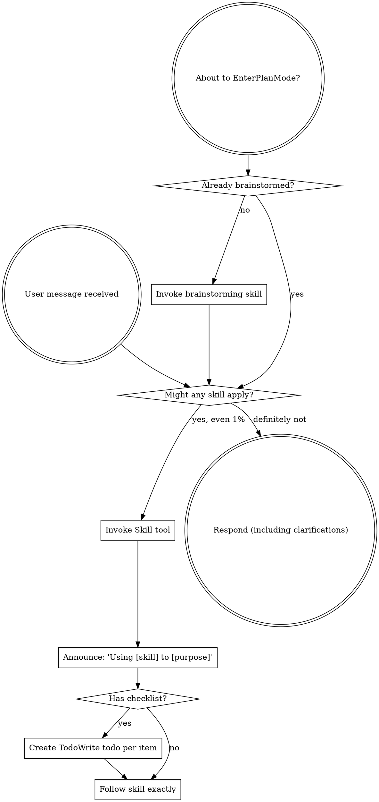

codex-exec: report contract violation

--- codex stdout ---
## Findings

### CRITICAL — Refuse-before-write remains violated

`install.sh:1294` publishes destination bytes before entry paths invoke `repair_substrate_capability` and `register_codex_hooks` (`install.sh:704,1015-1016,1111-1112`). Both can still return failure (`install.sh:484-500,904`); equivalent prechecks do not make these later executions non-rejecting or rollback their writes with the earlier publication.

The direct path has the same defect: `audit.cjs:1482` publishes before rejection-capable witness and capability repairs at `audit.cjs:1509-1519`. Those repairs can subsequently reject for malformed state, upstream drift, or repair failure (`audit.cjs:797,888-918,935-937`).

The guard is not behavior-based. Its manually maintained list at `assert-installer-registration-guard.cjs:1605-1616` omits the actual post-publication repair functions, labels them writers, and explicitly requires their late ordering at `:1665-1671`. Any newly named rejecting function not added to the list evades it. The Round 1 CRITICAL and weakened-guard concern are therefore not closed.

### MAJOR — None additional

### MINOR — Redundant implementation and evidence remain

`hook-install-contract.cjs:767-778` implements an in-process build/smoke/publish workflow while `:784-824` separately implements the production CLI split. Only tests call the former. The split seam is justified for Bash lifetime management, but duplicating the transactional engine is still excess.

`168-SPECFIX-WIP.patch` is deleted and `168-ABANDONED-STAGED-INSTALLER.patch:1` remains defensible historical evidence. However, the additional 1,141-line `168-ABANDONED-T3-REPAIR-SPLIT.patch:1` duplicates history already recorded by commit `6c54b7b`, its prompt, report, and memory entry; it is clutter.

The two orphan exports are removed (`hook-install-contract.cjs:939-945`), with no re-widening. Dependency closure remains genuinely source-derived (`hook-install-contract.cjs:325-453`); no maintained real module/package closure was found.

The delivered design is far simpler than the reverted 1,458-line staging system, but not yet the minimum because of the dual engine.

ATC: First Principles PASS; Delete FAIL; Simplify FAIL; Accelerate PASS; Automate FAIL; Validate FAIL. Anti-slop: **5/10**—failures in overengineering, unjustified abstraction, duplication, mass-deletable evidence, and complexity/YAGNI.

ATC VERDICT: FAIL

--- codex stderr ---
OpenAI Codex v0.146.0
--------
workdir: C:\Users\operator\AppData\Roaming\warp\Warp\data\worktrees\GSDedits\luminaria-hogback
model: gpt-5.6-sol
provider: openai
approval: never
sandbox: read-only
reasoning effort: xhigh
reasoning summaries: none
session id: 01a03add-88c0-7813-ad92-d1a129780fba
--------
user
# Phase-level ATC — P168 Install Contract. Read-only, do not edit.

Apply the ATC 7 steps and the 10-point anti-slop checklist to the WHOLE phase.
Scope: commits `c01baa7`..HEAD on branch luminaria-hogback.

Read the locked plan (revision 2) and check delivery against it.

## Given results, do not re-run

install-contract 5/5, installer-registration-guard 13/13, real install exits 0 delivering
17 hooks and 9 modules, doctor reports real HEAD and freshness, P167 38/38 and 4/4,
T2 13/13, T4 pass, P166 6/6, P154, composer, enrichment-gate, kb-triage-shadow,
feature-propagation 15/15, bash -n clean. Spec-compliance PASS for both T1 and T2.

## This phase has a difficult history. Judge it.

- One executor dispatch built a 1,458-line transactional installer sandbox
  (`*-installer-stage` modes, self re-execution, whole-user-root snapshots) that ended with
  `install.sh` exiting 0 while delivering nothing. It was reverted wholesale and is
  retained as `168-ABANDONED-STAGED-INSTALLER.patch`.
- Three dispatches were killed mid-implementation.
- Four defects reached committed production code and were repaired in-phase.

Judge specifically:

1. Is the delivered design SIMPLER than what was reverted, and is it the minimum that
   solves the problem? Point at anything that is still more machinery than needed.
2. Orphans and dead code: does every new export have a caller? Is anything left over from
   the reverted branch? Check `hook-install-contract.cjs` exports in particular.
3. Is the dependency closure genuinely computed from source with no hand-maintained module
   or package list anywhere, production or test?
4. Refuse-before-write: confirm no rejection-capable step runs after the first destination
   write, on any entry point. This class has appeared four times in this codebase.
5. Are the two retained patches (`168-ABANDONED-STAGED-INSTALLER.patch`,
   `168-SPECFIX-WIP.patch`) justified evidence, or clutter that should be deleted?
6. Guard assertions: were any weakened across the phase without a stated replacement?

Score /10 on the anti-slop checklist. List findings by severity (CRITICAL / MAJOR / MINOR)
with file:line. End with exactly `ATC VERDICT: PASS` or `ATC VERDICT: FAIL`.
A CRITICAL forces FAIL. Bound yourself to about 18 shell commands and emit the verdict even
if incomplete. Max 500 words.

## ROUND 2 — confirm the round-1 findings are closed. HEAD has moved.

Round 1 returned FAIL 5/10 with one CRITICAL and two MINORs. Three commits since:

- `4bd7eb3`: capability precheck mirrors repair flags on every entry point; Codex precheck
  covers init/update/global-with-project, all before publish_project_install_contract;
  runAudit runs shared read-only capability detection before publishProjectHookInstall;
  the guard now INVENTORIES rejection-capable calls explicitly and fails if any, or a new
  one, is reachable after the first destination write.
- `88207e0`: the two orphan exports removed; the refusal case now proves the criterion as
  written (preinstall sentinel absent, actions empty, bytes identical).
- `168-SPECFIX-WIP.patch` deleted per your MINOR; `168-ABANDONED-STAGED-INSTALLER.patch`
  retained as you judged defensible.

Confirm each:

1. CRITICAL: no rejection-capable step reachable after the first destination write, on
   install.sh entry points AND the audit.cjs direct path. Judge the new guard inventory:
   is it behaviour-based enough that a future rejecting function added after publication
   fails the guard, or can it be evaded the way the name matching was?
2. MINOR orphan exports: removed, nothing re-widened.
3. MINOR patches: WIP deleted, abandoned retained.

Also re-score the anti-slop checklist. Round 1 scored 5/10 citing orphan exports, the
dual workflow, WIP clutter, complexity and YAGNI. The dual in-process/CLI workflow remains
by design; judge whether it is now justified or still excess.

Orchestrator-run at HEAD, take as given: real install exits 0 delivering 17 hooks and
9 modules; install-contract 5/5; guard 13/13; audit self-test 15/15; bash -n clean.

Verdict line unchanged. Bound to ~15 shell commands. Max 400 words.

codex
I’m applying the `using-superpowers` and `review` skills, then I’ll inspect the locked Phase 168 plan, the three Round 2 commits, and the complete `c01baa7..HEAD` diff. I’ll treat the supplied test results as evidence and won’t rerun them.
exec
"C:\\WINDOWS\\System32\\WindowsPowerShell\\v1.0\\powershell.exe" -Command '$paths = @('"'C:\\Users\\operator\\.codex\\skills\\using-superpowers\\SKILL.md','C:\\Users\\operator\\.agents\\skills\\review\\SKILL.md'); foreach ("'$path in $paths) { Write-Output "FILE $path"; Get-Content -LiteralPath $path -Raw }' in C:\Users\operator\AppData\Roaming\warp\Warp\data\worktrees\GSDedits\luminaria-hogback
 succeeded in 666ms:
FILE C:\Users\operator\.codex\skills\using-superpowers\SKILL.md
---
name: using-superpowers
description: Use when starting any conversation - establishes how to find and use skills, requiring Skill tool invocation before ANY response including clarifying questions
---

<SUBAGENT-STOP>
If you were dispatched as a subagent to execute a specific task, skip this skill.
</SUBAGENT-STOP>

<EXTREMELY-IMPORTANT>
If you think there is even a 1% chance a skill might apply to what you are doing, you ABSOLUTELY MUST invoke the skill.

IF A SKILL APPLIES TO YOUR TASK, YOU DO NOT HAVE A CHOICE. YOU MUST USE IT.

This is not negotiable. This is not optional. You cannot rationalize your way out of this.
</EXTREMELY-IMPORTANT>

## Instruction Priority

Superpowers skills override default system prompt behavior, but **user instructions always take precedence**:

1. **User's explicit instructions** (CLAUDE.md, GEMINI.md, AGENTS.md, direct requests) ƒ?" highest priority
2. **Superpowers skills** ƒ?" override default system behavior where they conflict
3. **Default system prompt** ƒ?" lowest priority

If CLAUDE.md, GEMINI.md, or AGENTS.md says "don't use TDD" and a skill says "always use TDD," follow the user's instructions. The user is in control.

## How to Access Skills

**In Claude Code:** Use the `Skill` tool. When you invoke a skill, its content is loaded and presented to youƒ?"follow it directly. Never use the Read tool on skill files.

**In Copilot CLI:** Use the `skill` tool. Skills are auto-discovered from installed plugins. The `skill` tool works the same as Claude Code's `Skill` tool.

**In Gemini CLI:** Skills activate via the `activate_skill` tool. Gemini loads skill metadata at session start and activates the full content on demand.

**In other environments:** Check your platform's documentation for how skills are loaded.

## Platform Adaptation

Skills use Claude Code tool names. Non-CC platforms: see `references/copilot-tools.md` (Copilot CLI), `references/codex-tools.md` (Codex) for tool equivalents. Gemini CLI users get the tool mapping loaded automatically via GEMINI.md.

# Using Skills

## The Rule

**Invoke relevant or requested skills BEFORE any response or action.** Even a 1% chance a skill might apply means that you should invoke the skill to check. If an invoked skill turns out to be wrong for the situation, you don't need to use it.



## Red Flags

These thoughts mean STOPƒ?"you're rationalizing:

| Thought | Reality |
|---------|---------|
| "This is just a simple question" | Questions are tasks. Check for skills. |
| "I need more context first" | Skill check comes BEFORE clarifying questions. |
| "Let me explore the codebase first" | Skills tell you HOW to explore. Check first. |
| "I can check git/files quickly" | Files lack conversation context. Check for skills. |
| "Let me gather information first" | Skills tell you HOW to gather information. |
| "This doesn't need a formal skill" | If a skill exists, use it. |
| "I remember this skill" | Skills evolve. Read current version. |
| "This doesn't count as a task" | Action = task. Check for skills. |
| "The skill is overkill" | Simple things become complex. Use it. |
| "I'll just do this one thing first" | Check BEFORE doing anything. |
| "This feels productive" | Undisciplined action wastes time. Skills prevent this. |
| "I know what that means" | Knowing the concept ƒ%ÿ using the skill. Invoke it. |

## Skill Priority

When multiple skills could apply, use this order:

1. **Process skills first** (brainstorming, debugging) - these determine HOW to approach the task
2. **Implementation skills second** (frontend-design, mcp-builder) - these guide execution

"Let's build X" ā' brainstorming first, then implementation skills.
"Fix this bug" ā' debugging first, then domain-specific skills.

## Skill Types

**Rigid** (TDD, debugging): Follow exactly. Don't adapt away discipline.

**Flexible** (patterns): Adapt principles to context.

The skill itself tells you which.

## User Instructions

Instructions say WHAT, not HOW. "Add X" or "Fix Y" doesn't mean skip workflows.

FILE C:\Users\operator\.agents\skills\review\SKILL.md
---
name: review
description: Review code changes for security, performance, bugs, and quality. Reviews staged changes, unstaged changes, specific commits, or PR-ready diffs.
---

<objective>
Review code changes and provide structured feedback covering security, performance, bug risks, code quality, and test coverage gaps. This skill analyzes diffs and surrounding context to catch issues before they reach production.
</objective>

<context>
This skill reviews code changes at various stages of the development workflow. It can review staged changes before a commit, unstaged work-in-progress, a specific commit, or the full set of changes on a branch that are ready for a pull request.

The reviewer reads both the diff and the surrounding source files to understand intent and catch issues that only appear in context.
</context>

<core_principle>
**FIND REAL ISSUES, NOT STYLE NITS.** Focus on problems that cause bugs, security vulnerabilities, performance degradation, or maintainability pain. Avoid nitpicking formatting or subjective style preferences unless they harm readability.
</core_principle>

<analysis_only_rule>
**THIS SKILL IS READ-ONLY. DO NOT MODIFY CODE.**

The purpose is to review and report findings. Making changes during review conflates the reviewer and author roles. Present findings and let the user decide what to act on.
</analysis_only_rule>

<quick_start>

<determine_review_scope>

Parse the user's input to determine what to review:

1. **No arguments** - Review staged changes first. If nothing is staged, review unstaged changes.
   - Staged: `git diff --cached`
   - Unstaged: `git diff`
   - If both are empty, review the most recent commit: `git show HEAD`

2. **Commit hash argument** (e.g., `/review abc1234`) - Review that specific commit.
   - `git show <hash>`

3. **File path argument** (e.g., `/review src/foo.ts`) - Review unstaged changes in that file.
   - `git diff -- <path>` then fall back to `git diff --cached -- <path>`

4. **"pr" argument** (e.g., `/review pr`) - Review all changes since branching from main.
   - `git diff main...HEAD`
   - If on main, review `git diff HEAD~1`

After obtaining the diff, if it is empty, inform the user that there are no changes to review and stop.

</determine_review_scope>

<gather_context>

Before analyzing the diff:

1. **Read changed files in full** - Do not review a diff in isolation. Read each modified file to understand the surrounding code, imports, types, and control flow.
2. **Identify the tech stack** - Note languages, frameworks, and libraries in use. This affects what patterns are risky.
3. **Check for related test files** - For each changed source file, look for corresponding test files. Note whether tests were updated alongside the changes.
4. **Check for configuration changes** - If config files changed (env, CI, package.json, tsconfig, etc.), pay extra attention to side effects.

</gather_context>

<review_categories>

Analyze the changes against each category below. Only report findings that are actually present. Skip categories with no issues.

**A. Security Issues** (Severity: CRITICAL or HIGH)
- Injection vulnerabilities (SQL injection, command injection, template injection)
- Cross-site scripting (XSS) - unsanitized user input rendered in HTML
- Authentication and authorization flaws (missing auth checks, privilege escalation)
- Secrets or credentials hardcoded or logged
- Insecure deserialization or unsafe eval usage
- Path traversal or file access vulnerabilities
- Missing input validation on external data

**B. Performance Concerns** (Severity: HIGH or MEDIUM)
- N+1 query patterns in database access
- Unnecessary memory allocations in hot paths or loops
- Blocking operations on the main thread or in async contexts
- Missing pagination on unbounded queries
- Redundant computation that could be cached or memoized
- Large payloads without streaming or chunking

**C. Bug Risks** (Severity: HIGH or MEDIUM)
- Off-by-one errors in loops or array access
- Null/undefined dereferences without guards
- Race conditions in concurrent or async code
- Incorrect error handling (swallowed errors, wrong error types)
- Type mismatches or unsafe type assertions
- Logic errors in conditionals (inverted checks, missing cases)
- Resource leaks (unclosed connections, file handles, listeners)

**D. Code Quality** (Severity: MEDIUM or LOW)
- Unclear or misleading naming
- Significant code duplication that should be extracted
- Excessive complexity (deeply nested logic, functions doing too many things)
- Dead code or unreachable branches
- Missing or misleading comments on non-obvious logic
- Inconsistency with patterns used elsewhere in the codebase

**E. Test Coverage Gaps** (Severity: MEDIUM or LOW)
- New logic paths without corresponding test cases
- Changed behavior without updated tests
- Edge cases not covered (empty inputs, boundary values, error paths)
- Missing integration tests for new API endpoints or database changes

</review_categories>

<format_findings>

For each finding, use this structure:

```
### [SEVERITY] Category: Brief Title

**File**: `path/to/file.ext` (lines X-Y)

**Issue**: Clear description of the problem.

**Why it matters**: What could go wrong if this is not addressed.

**Suggestion**: How to fix it, with a code snippet if helpful.
```

Severity levels:
- **CRITICAL** - Must fix before merge. Security vulnerability or data loss risk.
- **HIGH** - Should fix before merge. Likely bug or significant performance issue.
- **MEDIUM** - Should fix soon. Code quality or moderate risk issue.
- **LOW** - Consider fixing. Minor improvement opportunity.

</format_findings>

</quick_start>

<critical_rules>

1. **READ THE FULL FILE**: Never review a diff without reading the complete source file for context
2. **NO FALSE ALARMS**: Only report issues you can explain concretely. Do not report vague concerns
3. **PRIORITIZE**: Lead with the most severe findings. Do not bury critical issues under style nits
4. **BE SPECIFIC**: Include file paths, line numbers, and code references for every finding
5. **EXPLAIN THE RISK**: For each finding, explain what could actually go wrong
6. **CHECK TESTS**: Always check whether changes have corresponding test updates
7. **CONSIDER THE STACK**: Apply language-specific and framework-specific knowledge to your review
8. **DO NOT MODIFY CODE**: Present findings only. The user decides what to act on

</critical_rules>

<output_format>

```markdown
## Code Review: [brief description of what was reviewed]

**Scope**: [staged changes | unstaged changes | commit abc1234 | PR changes from main]
**Files reviewed**: [count] files changed, [additions] additions, [deletions] deletions

---

### Findings

[Findings grouped by severity, highest first. Use the format from <format_findings>.]

---

### Summary

| Severity | Count |
|----------|-------|
| CRITICAL | X     |
| HIGH     | X     |
| MEDIUM   | X     |
| LOW      | X     |

### Recommended Actions

1. [Most important action to take]
2. [Next most important action]
3. [...]
```

If no issues are found:

```markdown
## Code Review: [brief description]

**Scope**: [what was reviewed]
**Files reviewed**: [count]

No significant issues found. The changes look good to merge.
```

</output_format>

<decision_gate>

**After presenting findings, ALWAYS offer these options:**

```
ƒ"?ƒ"?ƒ"?ƒ"?ƒ"?ƒ"?ƒ"?ƒ"?ƒ"?ƒ"?ƒ"?ƒ"?ƒ"?ƒ"?ƒ"?ƒ"?ƒ"?ƒ"?ƒ"?ƒ"?ƒ"?ƒ"?ƒ"?ƒ"?ƒ"?ƒ"?ƒ"?ƒ"?ƒ"?ƒ"?ƒ"?ƒ"?ƒ"?ƒ"?ƒ"?ƒ"?ƒ"?ƒ"?ƒ"?ƒ"?ƒ"?
REVIEW COMPLETE

What would you like to do?

1. **Fix issues** - I'll address the findings starting with the most critical
2. **Save review** - Export findings to a markdown file
3. **Review again** - Re-review with different scope or focus
4. **Discuss a finding** - Ask questions about a specific issue
5. **Other** - Tell me what you need
ƒ"?ƒ"?ƒ"?ƒ"?ƒ"?ƒ"?ƒ"?ƒ"?ƒ"?ƒ"?ƒ"?ƒ"?ƒ"?ƒ"?ƒ"?ƒ"?ƒ"?ƒ"?ƒ"?ƒ"?ƒ"?ƒ"?ƒ"?ƒ"?ƒ"?ƒ"?ƒ"?ƒ"?ƒ"?ƒ"?ƒ"?ƒ"?ƒ"?ƒ"?ƒ"?ƒ"?ƒ"?ƒ"?ƒ"?ƒ"?ƒ"?
```

**Wait for user response before taking any action.**

This gate is MANDATORY. Never skip it. Never auto-implement fixes.

</decision_gate>

C:\Users\operator\OneDrive - <ORG>\Documents\WindowsPowerShell\profile.ps1 : Cannot dot-source this 
command because it was defined in a different language mode. To invoke this command without importing its contents, 
omit the '.' operator.
At line:1 char:1
+ . 'C:\Users\operator\OneDrive - <ORG>\Documents\Win ...
+ ~~~~~~~~~~~~~~~~~~~~~~~~~~~~~~~~~~~~~~~~~~~~~~~~~~~~~~~~~~~~~~~~~~~~~
    + CategoryInfo          : InvalidOperation: (:) [profile.ps1], NotSupportedException
    + FullyQualifiedErrorId : DotSourceNotSupported,profile.ps1
 
C:\Users\operator\OneDrive - <ORG>\Documents\WindowsPowerShell\Microsoft.PowerShell_profile.ps1 : 
Cannot dot-source this command because it was defined in a different language mode. To invoke this command without 
importing its contents, omit the '.' operator.
At line:1 char:1
+ . 'C:\Users\operator\OneDrive - <ORG>\Documents\Win ...
+ ~~~~~~~~~~~~~~~~~~~~~~~~~~~~~~~~~~~~~~~~~~~~~~~~~~~~~~~~~~~~~~~~~~~~~
    + CategoryInfo          : InvalidOperation: (:) [Microsoft.PowerShell_profile.ps1], NotSupportedException
    + FullyQualifiedErrorId : DotSourceNotSupported,Microsoft.PowerShell_profile.ps1
 

  → Read Phase 168 state, locked revision-2 plan, and ATC/checklist criteria
  • Inspect full c01baa7..HEAD delivery plus Round 2 commit diffs and complete changed source/test files
  • Trace refusal-before-write across install.sh and audit.cjs, including guard inventory behavior
  • Check exports, dependency closure, retained patches, guard strength, and design complexity
  • Score all 10 anti-slop points and issue the constrained Round 2 verdict
exec
"C:\\WINDOWS\\System32\\WindowsPowerShell\\v1.0\\powershell.exe" -Command "git status --short --branch; git log --oneline --decorate -12; rg --files .planning | rg \"168|STATE\\.md"'$|ATC|anti-slop"' in C:\Users\operator\AppData\Roaming\warp\Warp\data\worktrees\GSDedits\luminaria-hogback
 succeeded in 935ms:
## luminaria-hogback...origin/luminaria-hogback [ahead 12]
?? .planning/milestones/v4.0-install-contract/phases/168-install-contract/168-PHASEATC-R2-PROMPT.md
?? .planning/milestones/v4.0-install-contract/phases/168-install-contract/168-PHASEATC-R2-WRAPPER.log
?? .planning/milestones/v4.0-install-contract/phases/168-install-contract/168-VERIFY-R2-PROMPT.md
?? .planning/milestones/v4.0-install-contract/phases/168-install-contract/168-VERIFY-R2-WRAPPER.log
?? .planning/tmp/
88207e0 (HEAD -> luminaria-hogback) fix(168-03): the refusal criterion is now proven as written, orphan exports removed
4bd7eb3 fix(168-03): every refusal now precedes the first write, asserted by inventory not by name
6c54b7b docs(168): phase gates FAIL, T3 reverted, lessons recorded
e919000 fix(168-02): the doctor exit-code contract now holds on the explicit-project path
fc30be7 feat(168-02): read-only doctor, and the freshness check finally works in a worktree
7234cb2 fix(168-01): truncated smoke output can no longer read as a clean policy decision
0dfd0d1 fix(168-01): close the three spec-review findings without breaking recovery
c867978 chore(checkpoint): P168 T1 delivered and green; spec fixes parked as a patch
7550116 feat(168-01): deliver the modules hooks require, and prove it on an empty tree
d3eba2d docs(168): plan rev 2 GO after NOGO, refuse-before-write made literal
55de820 docs(168): plan authored and schema-VALID, one atomic GATE-tier task
c01baa7 docs(168): exact require chain traced, plus the diagnosis-laundering requirement
.planning\phases\15\15-02-per-dispatch-ATC.md
.planning\phases\15\15-01-per-dispatch-ATC.md
.planning\phases\08-sgsd-self-audit\08-ATC-REVIEW.md
.planning\milestones\v1.3\phases\15-codex-routed-gates\15-ATC-REVIEW.md
.planning\milestones\v1.2\phases\12-machinery\12-ATC-REVIEW.md
.planning\milestones\v1.3\phases\14-codex-cli-provider-substrate\14-01-ATC.md
.planning\milestones\v1.3\phases\14-codex-cli-provider-substrate\14-02-ATC.md
.planning\milestones\v1.3\phases\14-codex-cli-provider-substrate\14-ATC-REVIEW.md
.planning\milestones\v1.2\phases\09-atc-147-evidence\09-ATC-REVIEW.md
.planning\milestones\v1.2\phases\11-plan-schema-v2\11-ATC-REVIEW.md
.planning\milestones\v1.2\phases\11-plan-schema-v2\11-02-ATC-REVIEW.md
.planning\milestones\v2.9\phases\99-trajectory-evidence-corpus\99-ATC-REVIEW.md
.planning\milestones\v1.2\phases\10-gate-policy\10-ATC-REVIEW.md
.planning\milestones\v2.9\phases\100-change-manifest-prediction-ledger\100-ATC-REVIEW.md
.planning\milestones\v2.9\phases\98-harness-component-substrate\98-ATC-REVIEW.md
.planning\milestones\v2.4\phases\78-launch-config-templates\78-ATC-REVIEW.md
.planning\milestones\v1.7\phases\35-generated-system-map\35-ATC-REVIEW.md
.planning\milestones\v2.7\phases\93-scheduled-audit-design\93-ATC-REVIEW.md
.planning\milestones\v2.8\phases\97-release-gate\97-ATC-REVIEW.md
.planning\milestones\v2.4\phases\77-cockpit-2-warp-layout\77-ATC-REVIEW.md
.planning\milestones\v2.7\phases\92-oz-environment-spec\92-ATC-REVIEW.md
.planning\milestones\v1.7\phases\34-canonical-review-ledger\34-ATC-REVIEW.md
.planning\milestones\v2.8\phases\96-warp-upstream-pack\96-ATC-REVIEW.md
.planning\milestones\v2.9\phases\105-release-gate-cockpit-integration\105-ATC-REVIEW.md
.planning\milestones\v2.4\phases\76-cockpit-state-adapter\76-ATC-REVIEW.md
.planning\milestones\v2.7\phases\91-cloud-safe-sgsd-skills\91-ATC-REVIEW.md
.planning\milestones\v2.8\phases\95-acp-adapter-spike\95-ATC-REVIEW.md
.planning\milestones\v2.9\phases\104-transfer-ood-benchmark\104-ATC-REVIEW.md
.planning\milestones\v1.7\phases\33-repair-instruction\33-ATC-REVIEW.md
.planning\milestones\v2.7\phases\90-controlled-action-mcp-implementation\90-ATC-REVIEW.md
.planning\milestones\v2.8\phases\94-acp-mapping-spec\94-ATC-REVIEW.md
.planning\milestones\v2.4\phases\75-live-event-writer-integration\75-ATC-REVIEW.md
.planning\milestones\v1.4\phases\20-autonomous-handoff\20-ATC-REVIEW.md
.planning\milestones\v2.9\phases\101-attribution-rollback-gate\101-ATC-REVIEW.md
.planning\milestones\v1.5\phases\21-vtp-enrichment-gates\21-ATC-REVIEW.md
.planning\milestones\v2.9\phases\103-component-ablation-interference\103-ATC-REVIEW.md
.planning\milestones\v3.9-substrate-hygiene\phases\167-substrate-invocation-witness\167-FIX-ATC3-WRAPPER.log
.planning\milestones\v3.9-substrate-hygiene\phases\167-substrate-invocation-witness\167-FIX-ATC3-REPORT.md
.planning\milestones\v3.9-substrate-hygiene\phases\167-substrate-invocation-witness\167-FIX-ATC3-PROMPT.md
.planning\milestones\v3.9-substrate-hygiene\phases\167-substrate-invocation-witness\167-FIX-ATC2-WRAPPER.log
.planning\milestones\v3.9-substrate-hygiene\phases\167-substrate-invocation-witness\167-FIX-ATC2-REPORT.md
.planning\milestones\v3.9-substrate-hygiene\phases\167-substrate-invocation-witness\167-FIX-ATC2-PROMPT.md
.planning\milestones\v3.9-substrate-hygiene\phases\167-substrate-invocation-witness\167-FIX-ATC-WRAPPER.log
.planning\milestones\v3.9-substrate-hygiene\phases\167-substrate-invocation-witness\167-FIX-ATC-REPORT.md
.planning\milestones\v3.9-substrate-hygiene\phases\167-substrate-invocation-witness\167-FIX-ATC-PROMPT.md
.planning\milestones\v3.9-substrate-hygiene\phases\167-substrate-invocation-witness\167-FIX-ATC-FILES.txt
.planning\milestones\v2.7\phases\89-controlled-action-contract\89-ATC-REVIEW.md
.planning\milestones\v2.4\phases\74-orchestrator-live-event-contract\74-ATC-REVIEW.md
.planning\milestones\v2.9\phases\102-harness-evolution-runner\102-ATC-REVIEW.md
.planning\milestones\v1.4\phases\19-mc-visibility\19-ATC-REVIEW.md
.planning\milestones\v2.4\phases\73-operator-question-model\73-ATC-REVIEW.md
.planning\milestones\v1.7\phases\31-canonical-envelope\31-ATC-REVIEW.md
.planning\milestones\v1.7\phases\32-route-decision-ledger\32-ATC-REVIEW.md
.planning\milestones\v1.4\phases\18-codex-hardening\18-ATC-REVIEW.md
.planning\milestones\v1.4\phases\18-codex-hardening\18-01-ATC-REVIEW.md
.planning\milestones\v1.6\phases\30-startup-cockpit-acceptance\30-ATC-REVIEW.md
.planning\milestones\v2.3\phases\72-mcp-redaction-warp-config-docs\72-ATC-REVIEW.md
.planning\milestones\v4.0-install-contract\phases\168-install-contract\CONTEXT.md
.planning\milestones\v4.0-install-contract\phases\168-install-contract\168-WASTE.md
.planning\milestones\v4.0-install-contract\phases\168-install-contract\168-VERIFY-WRAPPER.log
.planning\milestones\v4.0-install-contract\phases\168-install-contract\168-VERIFY-R2-WRAPPER.log
.planning\milestones\v4.0-install-contract\phases\168-install-contract\168-VERIFY-R2-PROMPT.md
.planning\milestones\v4.0-install-contract\phases\168-install-contract\168-VERIFY-PROMPT.md
.planning\milestones\v4.0-install-contract\phases\168-install-contract\168-VERIFICATION-RAW.md
.planning\milestones\v4.0-install-contract\phases\168-install-contract\168-T3B2-WRAPPER.log
.planning\milestones\v4.0-install-contract\phases\168-install-contract\168-T3B2-REPORT.md
.planning\milestones\v4.0-install-contract\phases\168-install-contract\168-T3B2-PROMPT.md
.planning\milestones\v4.0-install-contract\phases\168-install-contract\168-T3B2-FILES.txt
.planning\milestones\v4.0-install-contract\phases\168-install-contract\168-T3A-WRAPPER.log
.planning\milestones\v4.0-install-contract\phases\168-install-contract\168-T3A-REPORT.md
.planning\milestones\v4.0-install-contract\phases\168-install-contract\168-T3A-PROMPT.md
.planning\milestones\v4.0-install-contract\phases\168-install-contract\168-T3A-FILES.txt
.planning\milestones\v4.0-install-contract\phases\168-install-contract\168-T3-WRAPPER.log
.planning\milestones\v4.0-install-contract\phases\168-install-contract\168-T3-REPORT.md
.planning\milestones\v4.0-install-contract\phases\168-install-contract\168-T3-PROMPT.md
.planning\milestones\v4.0-install-contract\phases\168-install-contract\168-T3-FILES.txt
.planning\milestones\v4.0-install-contract\phases\168-install-contract\168-T2B-WRAPPER.log
.planning\milestones\v4.0-install-contract\phases\168-install-contract\168-T2B-REPORT.md
.planning\milestones\v4.0-install-contract\phases\168-install-contract\168-T2B-PROMPT.md
.planning\milestones\v4.0-install-contract\phases\168-install-contract\168-T2B-FILES.txt
.planning\milestones\v4.0-install-contract\phases\168-install-contract\168-T2-WRAPPER.log
.planning\milestones\v4.0-install-contract\phases\168-install-contract\168-T2-SPEC2-WRAPPER.log
.planning\milestones\v4.0-install-contract\phases\168-install-contract\168-T2-SPEC2-PROMPT.md
.planning\milestones\v4.0-install-contract\phases\168-install-contract\168-T2-SPEC-WRAPPER.log
.planning\milestones\v4.0-install-contract\phases\168-install-contract\168-T2-SPEC-REVIEW2.md
.planning\milestones\v4.0-install-contract\phases\168-install-contract\168-T2-SPEC-REVIEW.md
.planning\milestones\v4.0-install-contract\phases\168-install-contract\168-T2-SPEC-PROMPT.md
.planning\milestones\v4.0-install-contract\phases\168-install-contract\168-T2-REPORT.md
.planning\milestones\v4.0-install-contract\phases\168-install-contract\168-T2-PROMPT.md
.planning\milestones\v4.0-install-contract\phases\168-install-contract\168-T2-FILES.txt
.planning\milestones\v4.0-install-contract\phases\168-install-contract\168-T1Q-WRAPPER.log
.planning\milestones\v4.0-install-contract\phases\168-install-contract\168-T1Q-REPORT.md
.planning\milestones\v4.0-install-contract\phases\168-install-contract\168-T1Q-PROMPT.md
.planning\milestones\v4.0-install-contract\phases\168-install-contract\168-T1Q-FILES.txt
.planning\milestones\v4.0-install-contract\phases\168-install-contract\168-T1P-WRAPPER.log
.planning\milestones\v4.0-install-contract\phases\168-install-contract\168-T1P-REPORT.md
.planning\milestones\v4.0-install-contract\phases\168-install-contract\168-T1P-PROMPT.md
.planning\milestones\v4.0-install-contract\phases\168-install-contract\168-T1P-FILES.txt
.planning\milestones\v4.0-install-contract\phases\168-install-contract\168-T1N-WRAPPER.log
.planning\milestones\v4.0-install-contract\phases\168-install-contract\168-T1N-REPORT.md
.planning\milestones\v4.0-install-contract\phases\168-install-contract\168-T1N-PROMPT.md
.planning\milestones\v4.0-install-contract\phases\168-install-contract\168-T1N-FILES.txt
.planning\milestones\v4.0-install-contract\phases\168-install-contract\168-T1M-WRAPPER.log
.planning\milestones\v4.0-install-contract\phases\168-install-contract\168-T1M-REPORT.md
.planning\milestones\v4.0-install-contract\phases\168-install-contract\168-T1M-PROMPT.md
.planning\milestones\v4.0-install-contract\phases\168-install-contract\168-T1M-FILES.txt
.planning\milestones\v4.0-install-contract\phases\168-install-contract\168-T1K-WRAPPER.log
.planning\milestones\v4.0-install-contract\phases\168-install-contract\168-T1K-REPORT.md
.planning\milestones\v4.0-install-contract\phases\168-install-contract\168-T1K-PROMPT.md
.planning\milestones\v4.0-install-contract\phases\168-install-contract\168-T1K-FILES.txt
.planning\milestones\v4.0-install-contract\phases\168-install-contract\168-T1J-WRAPPER.log
.planning\milestones\v4.0-install-contract\phases\168-install-contract\168-T1J-REPORT.md
.planning\milestones\v4.0-install-contract\phases\168-install-contract\168-T1J-PROMPT.md
.planning\milestones\v4.0-install-contract\phases\168-install-contract\168-T1J-FILES.txt
.planning\milestones\v4.0-install-contract\phases\168-install-contract\168-T1I-WRAPPER.log
.planning\milestones\v4.0-install-contract\phases\168-install-contract\168-T1I-REPORT.md
.planning\milestones\v4.0-install-contract\phases\168-install-contract\168-T1I-PROMPT.md
.planning\milestones\v4.0-install-contract\phases\168-install-contract\168-T1I-FILES.txt
.planning\milestones\v4.0-install-contract\phases\168-install-contract\168-T1H-WRAPPER.log
.planning\milestones\v4.0-install-contract\phases\168-install-contract\168-T1H-REPORT.md
.planning\milestones\v4.0-install-contract\phases\168-install-contract\168-T1H-PROMPT.md
.planning\milestones\v4.0-install-contract\phases\168-install-contract\168-T1H-FILES.txt
.planning\milestones\v4.0-install-contract\phases\168-install-contract\168-T1G-WRAPPER.log
.planning\milestones\v4.0-install-contract\phases\168-install-contract\168-T1G-REPORT.md
.planning\milestones\v4.0-install-contract\phases\168-install-contract\168-T1G-PROMPT.md
.planning\milestones\v4.0-install-contract\phases\168-install-contract\168-T1G-FILES.txt
.planning\milestones\v4.0-install-contract\phases\168-install-contract\168-T1F-WRAPPER.log
.planning\milestones\v4.0-install-contract\phases\168-install-contract\168-T1F-REPORT.md
.planning\milestones\v4.0-install-contract\phases\168-install-contract\168-T1F-PROMPT.md
.planning\milestones\v4.0-install-contract\phases\168-install-contract\168-T1F-FILES.txt
.planning\milestones\v4.0-install-contract\phases\168-install-contract\168-T1E-WRAPPER.log
.planning\milestones\v4.0-install-contract\phases\168-install-contract\168-T1E-REPORT.md
.planning\milestones\v4.0-install-contract\phases\168-install-contract\168-T1E-PROMPT.md
.planning\milestones\v4.0-install-contract\phases\168-install-contract\168-T1E-FILES.txt
.planning\milestones\v4.0-install-contract\phases\168-install-contract\168-T1D-WRAPPER.log
.planning\milestones\v4.0-install-contract\phases\168-install-contract\168-T1D-REPORT.md
.planning\milestones\v4.0-install-contract\phases\168-install-contract\168-T1D-PROMPT.md
.planning\milestones\v4.0-install-contract\phases\168-install-contract\168-T1D-FILES.txt
.planning\milestones\v4.0-install-contract\phases\168-install-contract\168-T1C-WRAPPER.log
.planning\milestones\v4.0-install-contract\phases\168-install-contract\168-T1C-REPORT.md
.planning\milestones\v4.0-install-contract\phases\168-install-contract\168-T1C-PROMPT.md
.planning\milestones\v4.0-install-contract\phases\168-install-contract\168-T1C-FILES.txt
.planning\milestones\v4.0-install-contract\phases\168-install-contract\168-T1B-WRAPPER.log
.planning\milestones\v4.0-install-contract\phases\168-install-contract\168-T1B-REPORT.md
.planning\milestones\v4.0-install-contract\phases\168-install-contract\168-T1B-PROMPT.md
.planning\milestones\v4.0-install-contract\phases\168-install-contract\168-T1B-FILES.txt
.planning\milestones\v4.0-install-contract\phases\168-install-contract\168-T1-WRAPPER.log
.planning\milestones\v4.0-install-contract\phases\168-install-contract\168-T1-SPEC3-WRAPPER.log
.planning\milestones\v4.0-install-contract\phases\168-install-contract\168-T1-SPEC3-PROMPT.md
.planning\milestones\v4.0-install-contract\phases\168-install-contract\168-T1-SPEC2-WRAPPER.log
.planning\milestones\v4.0-install-contract\phases\168-install-contract\168-T1-SPEC2-PROMPT.md
.planning\milestones\v4.0-install-contract\phases\168-install-contract\168-T1-SPEC-WRAPPER.log
.planning\milestones\v4.0-install-contract\phases\168-install-contract\168-T1-SPEC-REVIEW3.md
.planning\milestones\v4.0-install-contract\phases\168-install-contract\168-T1-SPEC-REVIEW2.md
.planning\milestones\v1.6\phases\29-agent-codex-lanes\29-ATC-REVIEW.md
.planning\milestones\v4.0-install-contract\phases\168-install-contract\168-T1-SPEC-REVIEW.md
.planning\milestones\v4.0-install-contract\phases\168-install-contract\168-T1-SPEC-PROMPT.md
.planning\milestones\v4.0-install-contract\phases\168-install-contract\168-T1-REPORT.md
.planning\milestones\v4.0-install-contract\phases\168-install-contract\168-T1-PROMPT.md
.planning\milestones\v2.3\phases\71-operational-tool-suite\71-ATC-REVIEW.md
.planning\milestones\v4.0-install-contract\phases\168-install-contract\168-T1-FILES.txt
.planning\milestones\v4.0-install-contract\phases\168-install-contract\168-REMOVED-ASSERTIONS.txt
.planning\milestones\v4.0-install-contract\phases\168-install-contract\168-PLANREVIEW2.md
.planning\milestones\v4.0-install-contract\phases\168-install-contract\168-PLANREVIEW2-WRAPPER.log
.planning\milestones\v4.0-install-contract\phases\168-install-contract\168-PLANREVIEW2-PROMPT.md
.planning\milestones\v4.0-install-contract\phases\168-install-contract\168-PLANREVIEW.md
.planning\milestones\v4.0-install-contract\phases\168-install-contract\168-PLANREVIEW-WRAPPER.log
.planning\milestones\v4.0-install-contract\phases\168-install-contract\168-PLANREVIEW-PROMPT.md
.planning\milestones\v4.0-install-contract\phases\168-install-contract\168-PLAN-WRAPPER2.log
.planning\milestones\v4.0-install-contract\phases\168-install-contract\168-PLAN-WRAPPER.log
.planning\milestones\v4.0-install-contract\phases\168-install-contract\168-PLAN-REV2-WRAPPER.log
.planning\milestones\v4.0-install-contract\phases\168-install-contract\168-PLAN-REV2-REPORT.md
.planning\milestones\v4.0-install-contract\phases\168-install-contract\168-PLAN-REV2-PROMPT.md
.planning\milestones\v4.0-install-contract\phases\168-install-contract\168-PLAN-REV2-FILES.txt
.planning\milestones\v4.0-install-contract\phases\168-install-contract\168-PLAN-REPORT2.md
.planning\milestones\v4.0-install-contract\phases\168-install-contract\168-PLAN-REPORT.md
.planning\milestones\v4.0-install-contract\phases\168-install-contract\168-PLAN-PROMPT.md
.planning\milestones\v4.0-install-contract\phases\168-install-contract\168-PLAN-FILES.txt
.planning\milestones\v4.0-install-contract\phases\168-install-contract\168-PHASEATC-WRAPPER.log
.planning\milestones\v4.0-install-contract\phases\168-install-contract\168-PHASEATC-R2-WRAPPER.log
.planning\milestones\v4.0-install-contract\phases\168-install-contract\168-PHASEATC-R2-PROMPT.md
.planning\milestones\v4.0-install-contract\phases\168-install-contract\168-PHASEATC-PROMPT.md
.planning\milestones\v4.0-install-contract\phases\168-install-contract\168-MUDA-WRAPPER.log
.planning\milestones\v4.0-install-contract\phases\168-install-contract\168-MUDA-PROMPT.md
.planning\milestones\v4.0-install-contract\phases\168-install-contract\168-FIX-REPAIR-ORDER-WRAPPER.log
.planning\milestones\v4.0-install-contract\phases\168-install-contract\168-FIX-REPAIR-ORDER-REPORT.md
.planning\milestones\v4.0-install-contract\phases\168-install-contract\168-FIX-REPAIR-ORDER-PROMPT.md
.planning\milestones\v4.0-install-contract\phases\168-install-contract\168-FIX-REPAIR-ORDER-FILES.txt
.planning\milestones\v4.0-install-contract\phases\168-install-contract\168-ATC-REVIEW.md
.planning\milestones\v4.0-install-contract\phases\168-install-contract\168-ABANDONED-T3-REPAIR-SPLIT.patch
.planning\milestones\v4.0-install-contract\phases\168-install-contract\168-ABANDONED-STAGED-INSTALLER.patch
.planning\milestones\v4.0-install-contract\phases\168-install-contract\168-01-PLAN-LOCKED.md
.planning\milestones\v2.3\phases\70-core-status-tool-suite\70-ATC-REVIEW.md
.planning\milestones\v1.4\phases\17-debt-sweep\17-03-ATC-REVIEW.md
.planning\milestones\v1.4\phases\17-debt-sweep\17-01-ATC-REVIEW.md
.planning\milestones\v1.4\phases\17-debt-sweep\17-ATC-REVIEW.md
.planning\milestones\v2.6\phases\86-token-control-staleness-reconciliation\86-ATC-REVIEW.md
.planning\milestones\v3.9-substrate-hygiene\phases\167-substrate-invocation-witness\ATC-REVIEW.md
.planning\milestones\v3.9-substrate-hygiene\phases\167-substrate-invocation-witness\167-T5-ATCFIX2-REPORT.md
.planning\milestones\v3.9-substrate-hygiene\phases\167-substrate-invocation-witness\167-T5-ATCFIX2-PROMPT.md
.planning\milestones\v3.9-substrate-hygiene\phases\167-substrate-invocation-witness\167-T5-ATCFIX-REPORT.md
.planning\milestones\v3.9-substrate-hygiene\phases\167-substrate-invocation-witness\167-T5-ATCFIX-PROMPT.md
.planning\milestones\v3.9-substrate-hygiene\phases\167-substrate-invocation-witness\167-T5-ATCFIX-FILES.txt
.planning\milestones\v3.9-substrate-hygiene\phases\167-substrate-invocation-witness\167-T5-ATC-REPORT.md
.planning\milestones\v3.9-substrate-hygiene\phases\167-substrate-invocation-witness\167-T5-ATC-PROMPT.md
.planning\milestones\v1.6\phases\28-mission-control-layout\28-ATC-REVIEW.md
.planning\milestones\v2.6\phases\88-end-to-end-warp-operator-drill\88-ATC-REVIEW.md
.planning\milestones\v3.9-substrate-hygiene\phases\167-substrate-invocation-witness\167-T4-ATCFIX-REPORT.md
.planning\milestones\v3.9-substrate-hygiene\phases\167-substrate-invocation-witness\167-T4-ATCFIX-PROMPT.md
.planning\milestones\v3.9-substrate-hygiene\phases\167-substrate-invocation-witness\167-T4-ATCFIX-FILES.txt
.planning\milestones\v3.9-substrate-hygiene\phases\167-substrate-invocation-witness\167-T4-ATC-REPORT.md
.planning\milestones\v3.9-substrate-hygiene\phases\167-substrate-invocation-witness\167-T4-ATC-PROMPT.md
.planning\milestones\v3.9-substrate-hygiene\phases\167-substrate-invocation-witness\167-T3-ATC-REPORT.md
.planning\milestones\v3.9-substrate-hygiene\phases\167-substrate-invocation-witness\167-T3-ATC-PROMPT.md
.planning\milestones\v3.9-substrate-hygiene\phases\167-substrate-invocation-witness\167-T2-ATC-REPORT.md
.planning\milestones\v3.9-substrate-hygiene\phases\167-substrate-invocation-witness\167-T2-ATC-PROMPT.md
.planning\milestones\v3.9-substrate-hygiene\phases\167-substrate-invocation-witness\167-T2-ATC-FIX5-REPORT.md
.planning\milestones\v3.9-substrate-hygiene\phases\167-substrate-invocation-witness\167-T2-ATC-FIX5-PROMPT.md
.planning\milestones\v3.9-substrate-hygiene\phases\167-substrate-invocation-witness\167-T2-ATC-FIX4-REPORT.md
.planning\milestones\v3.9-substrate-hygiene\phases\167-substrate-invocation-witness\167-T2-ATC-FIX4-PROMPT.md
.planning\milestones\v3.9-substrate-hygiene\phases\167-substrate-invocation-witness\167-T2-ATC-FIX3-REPORT.md
.planning\milestones\v3.9-substrate-hygiene\phases\167-substrate-invocation-witness\167-T2-ATC-FIX3-PROMPT.md
.planning\milestones\v3.9-substrate-hygiene\phases\167-substrate-invocation-witness\167-T2-ATC-FIX2-REPORT.md
.planning\milestones\v3.9-substrate-hygiene\phases\167-substrate-invocation-witness\167-T2-ATC-FIX2-PROMPT.md
.planning\milestones\v3.9-substrate-hygiene\phases\167-substrate-invocation-witness\167-T2-ATC-FIX-REPORT.md
.planning\milestones\v3.9-substrate-hygiene\phases\167-substrate-invocation-witness\167-T2-ATC-FIX-PROMPT.md
.planning\milestones\v3.9-substrate-hygiene\phases\167-substrate-invocation-witness\167-T1-ATC-REPORT.md
.planning\milestones\v3.9-substrate-hygiene\phases\167-substrate-invocation-witness\167-T1-ATC-PROMPT.md
.planning\milestones\v3.9-substrate-hygiene\phases\167-substrate-invocation-witness\167-PHASEATC-ROUND3.md
.planning\milestones\v3.9-substrate-hygiene\phases\167-substrate-invocation-witness\167-PHASEATC-ROUND2.md
.planning\milestones\v3.9-substrate-hygiene\phases\167-substrate-invocation-witness\167-PHASEATC-ROUND2-WRAPPER.log
.planning\milestones\v3.9-substrate-hygiene\phases\167-substrate-invocation-witness\167-PHASEATC-R3-WRAPPER.log
.planning\milestones\v3.9-substrate-hygiene\phases\167-substrate-invocation-witness\167-PHASEATC-R3-PROMPT.md
.planning\milestones\v3.9-substrate-hygiene\phases\167-substrate-invocation-witness\167-PHASEATC-PROMPT.md
.planning\milestones\v3.9-substrate-hygiene\phases\167-substrate-invocation-witness\167-PHASEATC-FIX2-REPORT.md
.planning\milestones\v3.9-substrate-hygiene\phases\167-substrate-invocation-witness\167-PHASEATC-FIX2-PROMPT.md
.planning\milestones\v3.9-substrate-hygiene\phases\167-substrate-invocation-witness\167-PHASEATC-FIX-REPORT.md
.planning\milestones\v3.9-substrate-hygiene\phases\167-substrate-invocation-witness\167-PHASEATC-FIX-PROMPT.md
.planning\milestones\v3.9-substrate-hygiene\phases\167-substrate-invocation-witness\167-PHASEATC-FIX-FILES.txt
.planning\milestones\v3.9-substrate-hygiene\phases\167-substrate-invocation-witness\167-PHASE-ATC-PROMPT.md
.planning\milestones\v2.6\phases\87-live-orchestrator-context-packet-enforcement\87-ATC-REVIEW.md
.planning\milestones\v2.3\phases\69-mcp-server-skeleton\69-ATC-REVIEW.md
.planning\milestones\v3.9-substrate-hygiene\phases\166-substrate-call-filters\ATC-REVIEW.md
.planning\milestones\v3.9-substrate-hygiene\phases\166-substrate-call-filters\166-PHASE-ATC-PROMPT.md
.planning\milestones\v3.9-substrate-hygiene\phases\166-substrate-call-filters\166-PHASE-ATC-FIX-REPORT.md
.planning\milestones\v1.6\phases\27-cockpit-data-tree\27-ATC-REVIEW.md
.planning\milestones\v3.9-substrate-hygiene\phases\166-substrate-call-filters\166-PHASE-ATC-FIX-PROMPT.md
.planning\milestones\v3.9-substrate-hygiene\phases\166-substrate-call-filters\166-02-T2-ATC2-REPORT.md
.planning\milestones\v3.9-substrate-hygiene\phases\166-substrate-call-filters\166-02-T2-ATC2-PROMPT.md
.planning\milestones\v3.9-substrate-hygiene\phases\166-substrate-call-filters\166-02-T2-ATC-REPORT.md
.planning\milestones\v3.9-substrate-hygiene\phases\166-substrate-call-filters\166-02-T2-ATC-PROMPT.md
.planning\milestones\v3.9-substrate-hygiene\phases\166-substrate-call-filters\166-01-T1-ATC-REPORT.md
.planning\milestones\v3.9-substrate-hygiene\phases\166-substrate-call-filters\166-01-T1-ATC-PROMPT.md
.planning\milestones\v3.9-substrate-hygiene\phases\166-substrate-call-filters\166-01-T1-ATC-FIX-REPORT.md
.planning\milestones\v3.9-substrate-hygiene\phases\166-substrate-call-filters\166-01-T1-ATC-FIX-PROMPT.md
.planning\milestones\v2.6\phases\85-recovery-packet-upgrade\85-ATC-REVIEW.md
.planning\milestones\v1.6\phases\26-cockpit-question-contract\26-ATC-REVIEW.md
.planning\milestones\v2.6\phases\84-code-review-integration\84-ATC-REVIEW.md
.planning\milestones\v2.3\phases\68-sgsd-mcp-contract\68-ATC-REVIEW.md
.planning\milestones\v1.8\phases\40-phase-folder-audit\40-ATC-REVIEW.md
.planning\milestones\v2.5\phases\83-warp-asset-cross-index\83-ATC-REVIEW.md
.planning\milestones\v2.2\phases\67-warp-doctor-probe-design\67-ATC-REVIEW.md
.planning\milestones\v1.9\phases\52-redis-live-cache-adapter\52-ATC-REVIEW.md
.planning\milestones\v1.8\phases\39-gate-keep-kill\39-ATC-REVIEW.md
.planning\milestones\v2.5\phases\82-warp-prompts-pack\82-ATC-REVIEW.md
.planning\milestones\v2.2\phases\63-warp-capability-smoke\63-ATC-REVIEW.md
.planning\milestones\v2.2\phases\66-sgsd-warp-operator-guide\66-ATC-REVIEW.md
.planning\milestones\v1.9\phases\51-context-stress-benchmark\51-ATC-REVIEW.md
.planning\milestones\v1.8\phases\38-risk-tiered-gate-sampling\38-ATC-REVIEW.md
.planning\milestones\v2.2\phases\65-agent-rules-context-pack\65-ATC-REVIEW.md
.planning\milestones\v2.5\phases\81-sgsd-operator-notebook\81-ATC-REVIEW.md
.planning\milestones\v1.9\phases\50-cockpit-research-dashboard\50-ATC-REVIEW.md
.planning\milestones\v1.8\phases\36-gate-value-telemetry\36-ATC-REVIEW.md
.planning\milestones\v1.8\phases\37-muda-deletion-candidates\37-ATC-REVIEW.md
.planning\milestones\v2.2\phases\64-workflow-pack-completion\64-ATC-REVIEW.md
.planning\milestones\v2.5\phases\80-warp-plan-to-phase-scaffold\80-ATC-REVIEW.md
.planning\milestones\v2.5\phases\79-sgsd-warp-skills-pack\79-ATC-REVIEW.md
.planning\milestones\v3.6-vtp-bridge\phases\153-hook-transport-completion\153-ATC-GAP-PLAN.md
.planning\milestones\v3.6-vtp-bridge\phases\159-skill-routing-expansion\159-T2-PATCH2-REPORT.md
.planning\milestones\v3.6-vtp-bridge\phases\159-skill-routing-expansion\159-T2-PATCH2-PROMPT.md
.planning\milestones\v3.6-vtp-bridge\phases\159-skill-routing-expansion\159-T2-PATCH-REPORT.md
.planning\milestones\v3.6-vtp-bridge\phases\156-state-close-contract\156-T1-ATC-REPORT.md
.planning\milestones\v3.6-vtp-bridge\phases\156-state-close-contract\156-T1-ATC-PROMPT.md
.planning\milestones\v3.6-vtp-bridge\phases\155-propagation-readiness\155-ATC-REVIEW.md
.planning\milestones\v3.6-vtp-bridge\phases\155-propagation-readiness\155-PHASE-ATC-PROMPT.md
.planning\milestones\v3.5\phases\145-codex-profile-control\145-01-ATC-REVIEW.md
.planning\milestones\v3.6-vtp-bridge\phases\156-state-close-contract\156-T2-ATC-REPORT.md
.planning\milestones\v3.6-vtp-bridge\phases\156-state-close-contract\156-T2-ATC-PROMPT.md
.planning\milestones\v3.6-vtp-bridge\phases\155-propagation-readiness\155-T1-ATC-PROMPT.md
.planning\milestones\v3.6-vtp-bridge\phases\155-propagation-readiness\155-T1-ATC-REVIEW.md
.planning\milestones\v3.5\phases\145-codex-profile-control\145-01-CODEX-ATCFIX-PROMPT.md
.planning\milestones\v3.5\phases\145-codex-profile-control\145-01-CODEX-ATC-PROMPT.md
.planning\milestones\v3.5\phases\146-session-governance-hooks\146-01-T01-ATC-REVIEW.md
.planning\milestones\v3.5\phases\146-session-governance-hooks\146-01-T01-ATC-PROMPT.md
.planning\milestones\v3.5\phases\146-session-governance-hooks\146-01-T01FIX-ATC-PROMPT.md
.planning\milestones\v3.5\phases\145-codex-profile-control\145-01-RWFIX-ATC-PROMPT.md
.planning\milestones\v3.5\phases\145-codex-profile-control\145-01-RWFIX-ATC-REVIEW.md
.planning\milestones\v3.5\phases\145-codex-profile-control\145-01-RWFIX-ATC-PROMPT2.md
.planning\milestones\v3.5\phases\145-codex-profile-control\145-01-TTYFIX-ATC-PROMPT.md
.planning\milestones\v3.5\phases\148-cross-model-triage\148-ATCFIX-PROMPT.md
.planning\milestones\v3.5\phases\148-cross-model-triage\148-ATCFIX-FILES.txt
.planning\milestones\v3.5\phases\148-cross-model-triage\148-ATC-REVIEW.md
.planning\milestones\v3.5\phases\148-cross-model-triage\148-ATC-REREVIEW2.md
.planning\milestones\v3.5\phases\148-cross-model-triage\148-ATC-REREVIEW.md
.planning\milestones\v3.5\phases\148-cross-model-triage\148-ATCFIX2-FILES.txt
.planning\milestones\v3.5\phases\148-cross-model-triage\148-ATCFIX-SPEC-REVIEW.md
.planning\milestones\v3.5\phases\148-cross-model-triage\148-ATCFIX-SPEC-PROMPT.md
.planning\milestones\v3.5\phases\148-cross-model-triage\148-ATCFIX-SALVAGE.md
.planning\milestones\v3.5\phases\148-cross-model-triage\148-ATCFIX2-REPORT.md
.planning\milestones\v3.5\phases\148-cross-model-triage\148-ATCFIX2-PROMPT.md
.planning\milestones\v3.5\phases\148-cross-model-triage\148-ATCFIX2-SPEC-PROMPT.md
.planning\milestones\v3.5\phases\149-skill-routing-table\149-ATC-REVIEW.md
.planning\milestones\v3.5\phases\149-skill-routing-table\149-ATC-REREVIEW.md
.planning\milestones\v3.5\phases\149-skill-routing-table\149-ATC-GAP-PLAN.md
.planning\milestones\v3.5\phases\145-codex-profile-control\145-01-TTYFIX-ATC-REVIEW.md
.planning\milestones\v3.5\phases\148-cross-model-triage\148-ATCFIX2-SPEC-REVIEW.md
.planning\milestones\v3.5\phases\149-skill-routing-table\149-PHASE-ATC-REREVIEW-PROMPT.md
.planning\milestones\v3.5\phases\149-skill-routing-table\149-PHASE-ATC-PROMPT.md
.planning\milestones\v3.5\phases\146-session-governance-hooks\146-01-T01FIX2-ATC-REVIEW.md
.planning\milestones\v3.5\phases\146-session-governance-hooks\146-01-T01FIX2-ATC-PROMPT.md
.planning\milestones\v3.5\phases\146-session-governance-hooks\146-01-T01FIX-ATC-REVIEW.md
.planning\milestones\v3.5\phases\148-cross-model-triage\148-ATCFIX3-FILES.txt
.planning\milestones\v3.5\phases\146-session-governance-hooks\146-01-T02FIX-ATC-REVIEW.md
.planning\milestones\v3.5\phases\146-session-governance-hooks\146-01-T02FIX-ATC-PROMPT.md
.planning\milestones\v3.5\phases\148-cross-model-triage\148-ATCFIX3-PROMPT.md
.planning\milestones\v3.6-vtp-bridge\phases\155-propagation-readiness\155-T2T3-ATC-REVIEW.md
.planning\milestones\v3.6-vtp-bridge\phases\155-propagation-readiness\155-T2T3-ATC-PROMPT.md
.planning\milestones\v3.6-vtp-bridge\phases\155-propagation-readiness\155-T4-ATC-REVIEW.md
.planning\milestones\v3.6-vtp-bridge\phases\155-propagation-readiness\155-T4-ATC-PROMPT.md
.planning\milestones\v3.5\phases\148-cross-model-triage\148-ATCFIX3-REPORT.md
.planning\milestones\v3.6-vtp-bridge\phases\155-propagation-readiness\155-T4b-ATC-PROMPT.md
.planning\milestones\v3.6-vtp-bridge\phases\155-propagation-readiness\155-T4b-ATC-REVIEW.md
.planning\milestones\v3.6-vtp-bridge\phases\155-propagation-readiness\155-T4b-ATC2-PROMPT.md
.planning\milestones\v3.5\phases\146-session-governance-hooks\146-01-T03FIX-ATC-PROMPT.md
.planning\milestones\v3.6-vtp-bridge\phases\155-propagation-readiness\155-T4b-ATC2-REVIEW.md
.planning\milestones\v3.5\phases\146-session-governance-hooks\146-01-T03FIX-ATC-REVIEW.md
.planning\milestones\v3.5\phases\145-codex-profile-control\145-ATC-REVIEW.md
.planning\milestones\v3.5\phases\145-codex-profile-control\145-ATC-GAP-PLAN.md
.planning\milestones\v3.5\phases\147-commit-seam-gate\147-ATC-REVIEW.md
.planning\milestones\v3.5\phases\147-commit-seam-gate\147-ATC-REVIEW2.md
.planning\milestones\v3.5\phases\148-cross-model-triage\148-PHASE-ATC-REREVIEW-PROMPT.md
.planning\milestones\v3.5\phases\148-cross-model-triage\148-PHASE-ATC-PROMPT.md
.planning\milestones\v3.5\phases\148-cross-model-triage\148-PHASE-ATC-REREVIEW2-PROMPT.md
.planning\milestones\v3.5\phases\145-codex-profile-control\145-PHASE-ATC-PROMPT.md
.planning\milestones\v3.5\phases\145-codex-profile-control\145-PHASE-ATC-PROMPT2.md
.planning\milestones\v3.5\phases\147-commit-seam-gate\147-ATCFIX-REPORT.md
.planning\milestones\v3.5\phases\147-commit-seam-gate\147-ATCFIX-PROMPT.md
.planning\milestones\v3.5\phases\147-commit-seam-gate\147-ATCFIX-FILES.txt
.planning\milestones\v3.5\phases\147-commit-seam-gate\147-PHASE-ATC2-PROMPT.md
.planning\milestones\v3.5\phases\147-commit-seam-gate\147-PHASE-ATC-PROMPT.md
.planning\milestones\v3.5\phases\146-session-governance-hooks\146-PHASE-ATC2-PROMPT.md
.planning\milestones\v3.5\phases\146-session-governance-hooks\146-PHASE-ATC-PROMPT.md
.planning\milestones\v3.5\phases\146-session-governance-hooks\146-ATCFIX-REPORT.md
.planning\milestones\v3.5\phases\146-session-governance-hooks\146-ATCFIX-PROMPT.md
.planning\milestones\v3.5\phases\146-session-governance-hooks\146-ATCFIX-FILES.txt
.planning\milestones\v3.5\phases\146-session-governance-hooks\146-ATC-REVIEW2.md
.planning\milestones\v3.5\phases\146-session-governance-hooks\146-ATC-REVIEW.md
.planning\milestones\v3.5\phases\146-session-governance-hooks\146-ATC-GAP-PLAN.md
C:\Users\operator\OneDrive - <ORG>\Documents\WindowsPowerShell\profile.ps1 : Cannot dot-source this 
command because it was defined in a different language mode. To invoke this command without importing its contents, 
omit the '.' operator.
At line:1 char:1
+ . 'C:\Users\operator\OneDrive - <ORG>\Documents\Win ...
+ ~~~~~~~~~~~~~~~~~~~~~~~~~~~~~~~~~~~~~~~~~~~~~~~~~~~~~~~~~~~~~~~~~~~~~
    + CategoryInfo          : InvalidOperation: (:) [profile.ps1], NotSupportedException
    + FullyQualifiedErrorId : DotSourceNotSupported,profile.ps1
 
C:\Users\operator\OneDrive - <ORG>\Documents\WindowsPowerShell\Microsoft.PowerShell_profile.ps1 : 
Cannot dot-source this command because it was defined in a different language mode. To invoke this command without 
importing its contents, omit the '.' operator.
At line:1 char:1
+ . 'C:\Users\operator\OneDrive - <ORG>\Documents\Win ...
+ ~~~~~~~~~~~~~~~~~~~~~~~~~~~~~~~~~~~~~~~~~~~~~~~~~~~~~~~~~~~~~~~~~~~~~
    + CategoryInfo          : InvalidOperation: (:) [Microsoft.PowerShell_profile.ps1], NotSupportedException
    + FullyQualifiedErrorId : DotSourceNotSupported,Microsoft.PowerShell_profile.ps1
 

exec
"C:\\WINDOWS\\System32\\WindowsPowerShell\\v1.0\\powershell.exe" -Command '$phase='"'.planning/milestones/v4.0-install-contract/phases/168-install-contract'; Get-Content -LiteralPath '.planning/STATE.md' -TotalCount 80; Get-Content -LiteralPath \""'$phase/168-01-PLAN-LOCKED.md" -Raw; Get-Content -LiteralPath "$phase/168-ATC-REVIEW.md" -Raw' in C:\Users\operator\AppData\Roaming\warp\Warp\data\worktrees\GSDedits\luminaria-hogback
 succeeded in 770ms:
---
gsd_state_version: 1.0
milestone: v3.9-substrate-hygiene
current_phase: "complete"
milestone_name: Substrate Hygiene
milestone_status: "v3.9-substrate-hygiene ACTIVE 2026-08-22. P166 Substrate Call Filters CLOSED PASS-WITH-DEFERRED-1 @ ed86dee: one composer-owned SUBSTRATE_CALL_POLICY builds and v2-validates every substrate payload immediately before mcpInvoke so unfiltered calls cannot reach transport; eight production sites enumerated and individually classified with fail-closed grep coverage; capSubstrateResponse bounds each hit at 16,000 chars with named degradation notes propagated through enrichment, triage and the Phase-48 bridge; v1 schema and P154 evidence byte-unchanged. 17/17 suites green unsandboxed plus four falsification probes. Six fix rounds across five review gates. DEFERRED-1: four markdown-agent prompt surfaces keep the raw MCP tool and their gateway evidence is self-reported, so nothing witnesses the actual invocation; adjudicated DECISION C, seeded as P167 substrate-invocation-witness. v3.6/v3.5 history preserved in legacy_milestone_status below."
legacy_milestone_status_v3_6: "v3.6-vtp-bridge ACTIVE 2026-08-11 ƒ?" SGSDƒÅ"VTP Bridge Phase 0. P152 KB-Triage Shadow PASS 2026-08-12 @ 5e32325 (text-free shadow classifier: new non-injecting `shadow` enforcement kind + kb-lookup-triage route, strong-KB-beats-verb tiering, opaque text-free ledger; board+2xCodex-gated shadow-only, hard gate deferred to 28-day locked metric; independently verified zero-injection + text-free + Codex spec-review NOGO-then-fixed). P151 Demand Baseline PASS (39/39): zero-VTP-dep ledger+instrument+docs, board+Codex-gated. Stages 2-3 blocked on post-VTP-milestone restart+probe + gold-set approval. v3.5 shipped prior. | T150-07 devcp update EXECUTED 2026-08-12: source+install fast-forwarded 7fb47eb->01af43e, gpt-5.6-sol + v3.6 substrate live; remaining = live-session restart + interactive trust probe + serve.cjs stash reconcile."
status: "v3.5 ACTIVE 2026-08-06 ƒ?" P145 codex-profile-control CLOSED PASS-WITH-DEFERRED-4 @ c1596f7 (profile registry + /sgsd-codex-control + 4 CRIT security fixes total: 2 per-dispatch-ATC pre-commit, GAP-1 verifier env-var TTY bypass, phase-ATC silent report-write; self-tests 21/21 + Probes 1-7 + parity + control all PASS; deferred: A selfTestCliGuard non-TTY forcing, B 3-way CLI-default drift guard, C inert trust/hook fieldsƒÅ'P148/P150, DEVIATION-1 finalize probe simplification). Next: P148 cross-model triage. v3.4 PARKED at P142/P143 (cockpit alarm+rationale drawers, close) ƒ?" reopen after v3.5 or on operator call. v3.4 P999 pink-elephant visual smoke also parked."
stopped_at: 2026-04-29 ƒ?" Phase 63 closed PASS-WITH-DEFERRED-5 @ b5b46a8 (Warp Capability Smoke Test; 7 artifacts under .planning/milestones/v2.2/; 13-row evidence matrix in WARP-SMOKE.md; 5 operator UI manual checks M1-M5 pending in MANUAL-CHECKS.md; sg-launched-Claude topology proven empirically ƒ?" this Claude session itself is the evidence; ~/.warp/launch_configurations/ exists but empty; .warp/workflows lint 4/5 with sgsd-token-current.yaml missing arguments block forwarded to Phase 64; .warpindexingignore missing forwarded to Phase 65 or new ignore-pack phase; tmux not native on Windows; Warp install at ~/AppData/Local/Programs/Warp/Warp.exe; previous roadmap v1.6-v2.1 ROADMAP COMPLETE 2026-04-29 preserved in previous_roadmap block ƒ?" all 30 phases (26-62) shipped across 6 milestones (v1.6 SHIPPED-WITH-DEBT-10, v1.7-v2.1 SHIPPED clean)).
last_updated: "2026-08-25T00:00:00Z"
last_activity: "2026-05-20 v3.0 SGSD-PRO ACTIVATED ƒ?" operator issued /sgsd-orchestrate auto. Milestone opened at scaffold commit 52c687a (INTENT + ROADMAP + REQUIREMENTS + DLB-08 design lock + P106 CONTEXT + master proposal + infographic ingested). Auto-loop dispatched Codex to author 106-01 PLAN-LOCKED.md against plan-schema-v2 SCHEMA-09 (must include semantic_acceptance_criteria per DLB-07). Mission: lineaged role-filtered cognitive memory underneath SGSD's central control plane. Seven CMB types (execution_receipt observation / review_finding claim / evidence_verdict claim-with-authority / decision_recommendation decision / operator_precedent highest / context_anchor projection / promotion_decision terminal). Four MVP exit fixtures (A false-CRIT refuted / B context-aware pseudo-op / C lineage chain / D production-mutation forces escalation). Stale autopilot-watchdog checkpoint pointing at v2.9/P95 deleted on entry (was generated by watchdog after 1569 min inactivity on closed milestone; misleading)."
legacy_activity_v2_9_resync: "2026-05-18 v2.9 RE-SYNC + P97.5 LANDED + ALL-PHASES-CLOSED ƒ?" STATE.md progress block was wildly stale (showed phase_98 ACTIVE, 99-105 PENDING) while SUMMARY.md @ 8fb3b09 already documented all 8 phases closed. This session inserted P97.5 Semantic Verification Gate (commit chain 34520c0 ƒÅ' 9901568 ƒÅ' 2fa3bbc ƒÅ' 6e66ad0) carrying DLB-07 (Clarity-incident-driven post-mortem) and mechanical schema enforcement of semantic_acceptance_criteria via SCHEMA-09/-10. v2.9 now 9 phases (97.5 + 98-105), all PASS / PASS-WITH-DEFERRED-2. Per sgsd-complete-milestone skill idempotency: SUMMARY.md exists ƒÅ' skill is no-op; remaining work is the STATE.md re-sync flagged in SUMMARY.md \"Critical Gaps #1\". Open items roll forward: warp-mcp 15th tool (DEFERRED-1), cockpit 12th section (DEFERRED-2), 18-plan SAC backfill or skip_gates per 97.5-BACKFILL.md, M1-M5 manual UI checks, Phase 95 ACP re-entry pending Warp #7326, v2.6 SHIPPED-clean operator decision."
legacy_activity_v2_9_activation: "2026-04-30T00:00Z v2.9 ACTIVATION ƒ?" operator activated Agentic Harness Evolution roadmap. v2.8 closed at 2466ff1 (Phase 97 release gate; 149/149 self-tests; 22/25 readiness; READY-WITH-DEFERRED). Entering v2.9 P98 Harness Component Substrate (registry + catalog.cjs + ƒ%¾15-assertion self-test + SGSD-HARNESS-EVOLUTION.md). v2.9 pre-designed in CLAUDE-HANDOVER.md / ROADMAP.md / REQUIREMENTS.md / VTP-AHE-EVIDENCE.md. Mission: turn SGSD from hand-improved orchestrator into observability-driven harness with closed AHE loop (component ƒÅ' evidence ƒÅ' predicted edit ƒÅ' measured next-run outcome ƒÅ' keep/revert/pivot). Phases 98-105 scoped: 98 component substrate, 99 trajectory evidence corpus, 100 change manifest prediction ledger, 101 attribution+rollback gate, 102 harness evolution runner, 103 component ablation+interference, 104 transfer+OOD benchmark, 105 release gate+cockpit integration. Non-negotiable: protected oracle/verifier/model-config/budget never edited by evolution loop. STATE.md surgical repoint only ƒ?" operator owns canonical legacy frontmatter re-sync (SUMMARY.md gap #1)."
legacy_activity_v2_6: "2026-04-29T21:25Z RE-SYNC ƒ?" STATE.md was stale (mtime 20:07; latest pulse 21:19; 5 commits since 81-85). Operator override at Phase 85 close flagged: STATE.md staleness + Codex unavailability + context-packet builder dormant + token burn ~21.5M (orchestrator alone ~18M; root context ~775k tokens/turn). Phase 86 PAUSED to address 7-point token-control list + 3 Phase-85 deferrals. Auto-run completed 19/19 phases this session (63-83) plus 84+85; current commits b5b46a8 / d35e92a / eb252f3 / c0201af / 018028e / 5ae2ba0 / 3b2186f / f5fe11a / 4e2b19c / 8dbb9cb / 31907c2 / 0211b0c / dcd039b / 0905cbf / ebfaf7c / 11bb6bb / 2ab84d7 / 6f50232 / 1baf708 / 6021fbb / ad5948d / 72e0d6b / 5914be6 / 6ba04f8 / 22aedd5 / a6b83c8 / bd54eb3 / 5a74bda / 8eb7de8 / e69271e / 7256a76 / 350e101 / 19e544e / 2e8ce85 / 8bad3ad / 347c56a. Original Phase 63 close text preserved in v2_2 progress block below; full per-phase progress in v2_3-v2_6 blocks below. v2.2 milestone scaffolded; 7 artifacts under .planning/milestones/v2.2/ (WARP-SMOKE.md + MANUAL-CHECKS.md + 5 standard phase artifacts CONTEXT/PLAN/RESEARCH/VERIFICATION/ATC-REVIEW). Evidence matrix records 5 PASS rows (Q2/Q3/Q4/Q7/Q8: sg/sgsd/sgsd-setup interactive resolution + sg-keeps-Claude-in-current-tab topology + launch config dir empty), 1 PARTIAL (Q12: 4/5 workflow YAML lint OK; sgsd-token-current.yaml missing arguments block ƒ?" Phase 64 input), 1 DOCS-CONFIRMED (Q11: WSL/SSH disables Codebase Context per Warp docs), 5 MANUAL-CHECK-REQUIRED (Q1/Q5/Q6/Q9/Q10: workflow searchability + claude/sg utility-bar detection + launch-config active-window behavior + Codebase Context state ƒ?" operator verifies in Warp UI per MANUAL-CHECKS.md M1-M5). Forwarded to Phase 64+: workflow pack completion (Q12+Q1), AGENTS.md (Phase 65), .warpindexingignore (Phase 65 or new ignore-pack phase), warp-doctor probes (Phase 67), launch-config templates must NOT assume active-window (Phase 78), upstream issue tracking at https://github.com/warpdotdev/warp issues #7326 ACP and #9233 May-Jun 2026 roadmap (Phase 96). No source-file mutations; git diff confined to .planning/milestones/v2.2/. Previous roadmap v1.6-v2.1 SHIPPED 2026-04-29 ƒ?" see previous_roadmap block."
progress:
  v3_5:
    total_phases: 7
    completed_phases: 3
    completed_plans: 3
    percent: 100
    phase_145: "PASS-WITH-DEFERRED-4 ƒo" 2026-08-06 @ c1596f7 (Codex Profile Control; verifier GAP-1 + phase-ATC CRIT-1 both fixed+regression-guarded; MUDA mechanical PASS 0/0; deferred A/B/C + DEVIATION-1)"
    phase_146: "PASS-WITH-DEFERRED-3 ƒo" 2026-08-07 @ a36e1ea (Session Governance Hooks; 7 tasks; 11 CRIT found+closed across per-dispatch/verify/phase-ATC incl. 5x writer-accepts-destination and 7x silent-success; phase-ATC re-review 4/4 CLOSED ƒ?" containment now ONE contract via resolveContainedPath; MUDA 0/0; hooks LIVE in repo; deferred F/G + DEVIATION-W)"
    phase_147: "PASS ƒo" 2026-08-07 (Commit-Seam Gate; 5 tasks + 3 fix rounds; 21/21 real-git scenarios; earned-block falsifier proven both directions incl. convention_unknown + per-repo floors; tamper-evident activation; cross-worktree misattribution CRIT closed at re-review 0/0; MUDA 0/0; DEFERRED-F absorbed at commit seam; hooks live on devcp via source-checkout pattern, warn rows accumulating)"
    phase_148: "PASS ƒo" 2026-08-08 @ 768c6a0 (Cross-Model Triage; staged MCP transport end-to-end after 3-dispatch ATC-fix chain ƒ?" runtime decides, Claude transports; 36/36 scenarios; spec 6/6; phase-ATC re-review 10/10; MUDA 0/0 prior + degraded re-run logged; seam anti-pattern curated after 4th instance)"
    phase_149: "PASS ƒo" 2026-08-08 (Skill-Routing Table; 24-route registry + loader 18/18 + classifier AC-149b + phase-close consult AC-149c with derive-dont-default gate inputs, forged-gate rejection, executable dispatches; 3 verifier rounds + phase-ATC FAIL-GATE all closed, re-review 8/8; MUDA 0/0 mech + qualitative degraded; A1 pre-existing documented)"
    phase_150: "PASS-WITH-DEFERRED-1 ƒo" 2026-08-10 @ c0aff22+ (Propagation+Trust+Runbook; T150-01..04 built 72/0/1 battery; T150-05 PUBLISHED origin 7fb47eb->c0aff22 + local install under operator auth; T150-06 trust guard proven 3 ways; T150-07 devcp DEFERRED ƒ?" live sessions; 4 review rounds/13 CRIT closed; PII 0 tracked; .gitattributes eol pins)"
  v3_0:
    total_phases: 7
    completed_phases: 7
    completed_plans: 7
    percent: 100
    phase_106: "PASS ƒo" 2026-05-20 @ 390ef1a (Mesh CMB Schema; DLB-08.1; 14/14)"
    phase_107: "PASS ƒo" 2026-05-20 @ c45c24c (cmb-validate + cmb-hash + writers; DLB-08.2+.3; 20/20)"
    phase_108: "PASS ƒo" 2026-05-20 @ cf03b53 (lineage + evidence-validator + echo-detector + sgsd-audit wire-in; DLB-08.4+.5; 49/49)"
    phase_109: "PASS ƒo" 2026-05-20 (escalation_gate + pseudo_operator_peer; DLB-08.6+.7; 102/102; Fixture D PROVED; DLB-08 LAYER COMPLETE)"
    phase_110: "PASS ƒo" 2026-05-20 (Codex Pro Mode profile-resolver + stoplight + native-review-runner; DLB-09.1; 15/15)"
    phase_111: "PASS ƒo" 2026-05-20 (PLAN-LOCKED schema + validator + .codex/hooks.json + 5 hooks; DLB-09.2; 15/15)"
    phase_112: "PASS ƒo" 2026-05-21 (Context Authority capsule ƒ?" 6 templates + writer + composer + v3.0 dogfood instances; DLB-10.1; 17/17; FINAL v3.0 phase)"
  v2_9:
    total_phases: 9
    completed_phases: 9
    completed_plans: 9
    percent: 100
    phase_97_5: "PASS ƒo" 2026-05-18 @ 6e66ad0 (Semantic Verification Gate; DLB-07 + plan-schema-v2 enforces semantic_acceptance_criteria via SCHEMA-09/-10; 5/5 fixture tests green; 97.5-BACKFILL.md surfaces 18 plans needing backfill or skip_gates)"
    phase_98: "PASS ƒo" @ a4f8539 (Harness Component Substrate; 35-row registry across 14 frozen classes incl. 5 protected; Lock-13 catalog.cjs; 21/21 self-test)"
    phase_99: "PASS ƒo" @ 6f7a478 (Trajectory Evidence Corpus; distill.cjs 7 JSONL surfaces ƒÅ' OVERVIEW ƒ%Ï4KB + INDEX; 11 frozen root-cause labels; 18/18 self-test)"
    phase_100: "PASS ƒo" @ eba47ba (Change Manifest Prediction Ledger; MANIFEST.schema.json 14 required fields incl. predicted_fixes ƒ%¾1 + predicted_regressions; append-only JSONL; 21/21 self-test)"
    phase_101: "PASS ƒo" @ d1066a4 (Attribution And Rollback Gate; attribute.cjs 6-verdict closed vocab; fix + regression metrics independent; structured rollback recommendation; v2.9 close-gate added; 18/18 self-test)"
    phase_102: "PASS ƒo" @ 827d9bc (Harness Evolution Runner; run.cjs 4 modes dry-run/proposal/apply/attribute; protected-oracle boundary; 17/17 self-test)"
    phase_103: "PASS ƒo" @ 5122d95 (Component Ablation And Interference; ablate.cjs tmpdir isolation; 3 frozen interference rules duplicate/redundant/inversion; requires_transfer_eval=true; 18/18 self-test)"
    phase_104: "PASS ƒo" @ f6d3073 (Transfer And OOD Benchmark; evaluate.cjs frozen-before-run rule; 3 critical-regression rules; 8 transfer axes; 18/18 self-test)"
    phase_105: "PASS-WITH-DEFERRED-2 ƒo" @ 8fb3b09 (Release Gate And Cockpit Integration; v2.9 close gate extended with AHE-EVAL-03/05; SUMMARY.md + SGSD-HARNESS-EVOLUTION.md ship; DEFERRED-1 warp-mcp 15th tool / DEFERRED-2 cockpit-state 12th section ƒ?" both lock-13 frozen-array updates)"
  v2_8:
    total_phases: 4
    completed_phases: 4
    completed_plans: 4
    percent: 100
    phase_94: "PASS ƒo" 2026-04-29 @ 649898d (ACP Mapping Spec; 7 concepts + 11-row event mapping)"
    phase_95: "SKIPPED-WAITING-FOR-UPSTREAM ƒo" 2026-04-29 @ 9bbcdf8 (ACP Adapter Spike; Warp #7326 open)"
    phase_96: "PASS ƒo" 2026-04-29 @ cfff32a (Warp Upstream Pack; telemetry-panel target picked 19/20; draft-only)"
    phase_97: "PASS ƒo" 2026-04-29 @ 2466ff1 (Release Gate; 149/149 self-tests; 22/25 readiness; SUMMARY.md ships v2.2-v2.8 retrospective)"
  v2_6:
    total_phases: 5
    completed_phases: 3
    completed_plans: 3
    percent: 40
    phase_84: "1/1 plan complete ƒ?" PASS ƒo" 2026-04-29 @ 2e8ce85 (Code Review Integration Guide + SGSD: Open Review Artifacts workflow; 2-layer review model documented; 15/15 workflow lint)"
    phase_85: "1/1 plan complete ƒ?" PASS-WITH-DEFERRED-3 ƒo" 2026-04-29 @ 8bad3ad+347c56a (Recovery Packet Upgrade; 1818 bytes ƒ%Ï4KB; why_stopped + artifact_links + roadmap-complete branch; 44/44 self-test; DEFERRED-1 STATE.md staleness contagion + DEFERRED-2 Codex unavailable Phase 84/85 + DEFERRED-3 context-packet-log.jsonl 24h+ stale ƒ?" Phase 86 must address)"
    phase_86: "PAUSED on operator override ƒ?" Token Control + Staleness Reconciliation. 7-point list (token-control repair / cockpit + recovery staleness probes / token-waste+context-packet wire-in / 200k+500k context warnings / fresh-session resume packets / context-bench full-mode rerun or unproven mark / v2.6 debt record) + 3 Phase-85 deferrals. Originally 'Remote Monitor Packet' but most of that work shipped via Phase 64 workflow + Phase 79 skill"
    phase_87: "PENDING ƒ?" Watchdog And Attention Alerts (originally; may re-scope after Phase 86)"
    phase_88: "PENDING ƒ?" End-To-End Warp Operator Drill"
  v2_5:
    total_phases: 5
    completed_phases: 5
    completed_plans: 5
    percent: 100
    phase_79: "PASS ƒo" 2026-04-29 @ 5a74bda (7 SGSD Warp skills under .agents/skills/; read-only by design)"
    phase_80: "PASS ƒo" 2026-04-29 @ 8eb7de8+e69271e (Warp Plan converter; 4 public APIs Lock-13; 17/17 self-test; READ-ONLY on STATE.md verified mechanically; 9 phase files generated under .planning/analyses/ live test)"
    phase_81: "PASS ƒo" 2026-04-29 @ 7256a76 (SGSD Warp Operator Notebook; 10 runnable PowerShell blocks)"
    phase_82: "PASS ƒo" 2026-04-29 @ 350e101 (7 Warp Agent prompts; mode declared per prompt; none auto-modify)"
---
schema_version: 2
phase: 168
slug: install-contract
milestone: v4.0-install-contract
status: PLANNED
revision: 2
governing_decision: .planning/milestones/v4.0-install-contract/phases/168-install-contract/CONTEXT.md
evidence_paths:
  - .planning/milestones/v4.0-install-contract/INTENT.md
  - .planning/milestones/v4.0-install-contract/phases/168-install-contract/CONTEXT.md
  - .planning/milestones/v3.9-substrate-hygiene/phases/167-substrate-invocation-witness/SUMMARY.md
  - .planning/milestones/v3.9-substrate-hygiene/phases/167-substrate-invocation-witness/AUDIT.md
depends_on: []
intent: >
  Make project installation one closed contract: compute every repository-owned
  module needed by distributed hooks from the hook sources, declare the computed
  closure in the hook manifest, deliver and refresh that exact closure, execute
  every prospective project hook in a complete candidate before the first write,
  prove every installed target hook after successful publication, preserve the
  underlying module-resolution error beside the existing closed reason code, and
  expose one read-only command that identifies hook and module drift for an
  explicit project, including projects whose .git entry is a worktree file.
execution_mode: two-dependent-codex-tasks-with-orchestrator-spawn-gates
expected_ATC_tier: GATE
skip_gates: []
lessons_path: null
prior_errors_lookup: true
lock_status: locked
locked_at: 2026-08-25T11:08:08+01:00
locked_by: codex
allowed_files:
  - super-gsd/scripts/lib/hook-install-contract.cjs
  - super-gsd/config/hook-manifest.json
  - super-gsd/scripts/lib/hook-registration-preflight.cjs
  - super-gsd/tools/feature-propagation/audit.cjs
  - super-gsd/install.sh
  - super-gsd/tests/install-contract/assert-install-contract.cjs
  - super-gsd/tests/installer-registration-guard/assert-installer-registration-guard.cjs
forbidden_files:
  - super-gsd/hooks/sgsd-substrate-invocation-witness.cjs
  - super-gsd/scripts/lib/substrate-invocation-witness-store.cjs
  - super-gsd/scripts/lib/vtp-context-composer.cjs
  - super-gsd/tools/substrate-capability-broker.cjs
  - super-gsd/schemas/vtp-mcp-input-schemas.v1.json
  - .planning/milestones/v3.6-vtp-bridge/phases/154-mcp-arg-contract/154-REAL-MCP-EVIDENCE.json
  - .planning/STATE.md
  - .planning/milestones/v4.0-install-contract/ROADMAP.md
  - package.json
  - package-lock.json
  - wiki/LINT-REPORT.md
invariants:
  - Project dependency delivery is the mechanically computed transitive closure; no production array, shell glob, test constant, or manifest field may hand-list the closure.
  - Manifest policy remains human-authored, but every dependency field is generated and verified against the same computation used by delivery and status.
  - Every rejection-capable source, manifest, destination, package, registration, and all-hook smoke check completes against one complete project-shaped candidate before the first project, profile, npm, key, settings, broker, or grant mutation.
  - The candidate lives under a fresh OS temporary directory outside the project and profile, contains the exact prospective project paths, uses an isolated HOME/USERPROFILE, and resolves requires naturally from candidate hook paths without NODE_PATH or canonical-source fallback.
  - After the first destination write, production performs only rollback-journaled publication of the already-smoked immutable candidate bytes; it never spawns a hook or runs another rejection-capable validation, and any publication I/O failure restores project/profile bytes and the actions array exactly.
  - An explicit --project-dir is normalized and used exactly; walk-up occurs only when no explicit project directory is supplied.
  - Read-only status, installer precheck, and repair consume one inspectProjectInstall result; no second detector or dependency list is permitted.
  - Closed reasons are unchanged; MODULE_NOT_FOUND code, request, resolved path, and bounded message travel in underlying_error/detail beside the existing reason.
  - P167 remains unchanged: PreToolUse fails closed, PostToolUse emits bounded substrate_witness_rewrite_failed without raw passthrough, and only rewritten rows are accepted.
  - Existing guard assertions are preserved or strengthened; none is weakened to obtain a pass.
acceptance_commands:
  - node super-gsd/scripts/lib/hook-install-contract.cjs --check-manifest
  - node super-gsd/tests/install-contract/assert-install-contract.cjs --all
  - node super-gsd/tests/installer-registration-guard/assert-installer-registration-guard.cjs --all
  - node super-gsd/tests/substrate-invocation-witness/assert-hook-contract.cjs
  - node super-gsd/tests/substrate-invocation-witness/assert-propagation.cjs
rollback_plan: >
  Revert P168-T2 before P168-T1. T1 is the indivisible declaration,
  graph/detector, delivery, all-hook smoke, diagnosis, and proof commit; never
  retain dependency fields without their verifier or copying without smoke.
  T2 adds only the dependent doctor/worktree presentation seam. Run the
  pre-P168 installer guard and P167 suites after either rollback.
risk_rating: high
operator_checkpoints:
  - The orchestrator runs spawn-bound real install, refusal, and worktree cases outside any sandbox that returns spawnSync EPERM.
  - Phase close is NOGO until both dependent tasks pass; manifest generation, delivery, smoke, and diagnosis remain one T1 commit, while T2 cannot ship without T1.
  - Phase close is NOGO if any refused entry point changes a snapshotted project/profile byte or records a repair action.
semantic_acceptance_criteria:
  - input: >
      A disposable on-disk SGSD project whose project-local
      super-gsd/scripts/lib and other computed project-module destinations start
      empty, an isolated real HOME/USERPROFILE, and a separate canonical source
      checkout. Production install.sh is launched by Bash with --init-project,
      --skip-cockpit-deps, and --project-dir pointing at that project while cwd
      is a different decoy directory. No mocked copier, dependency adapter,
      staged target, or direct hook-function call is used. After installation,
      one delivered transitive module is changed and production --update runs.
    expected_outcome: >
      Before its first destination write, the production installer creates its
      complete candidate outside the project/profile, spawns every candidate
      Claude and Codex project hook/registration with natural candidate-relative
      resolution, and seals the exact bytes that publication will copy. The
      installer then publishes those bytes transactionally and exits 0 with
      every computed dependency byte-identical in the final target. Only after
      the installer has returned, the test harness independently spawns every
      final installed hook from its real path with cwd equal to the explicit
      project; this is non-rejecting verification of the completed install, not
      a staged shortcut or a post-write installer refusal. Update restores the
      changed module after repeating candidate smoke. No hook reports an
      unresolved dependency, and the decoy cwd and ancestors remain untouched.
    verification_cmd: >
      node super-gsd/tests/install-contract/assert-install-contract.cjs
      --case empty-module-tree-real-install
  - input: >
      A second real install against seeded project and profile trees after a
      temporary canonical hook source is given a relative require whose resolved
      repository file does not exist. The test snapshots every file and SHA-256
      under both destinations and plants an npm preinstall sentinel that records
      if mutation begins. It invokes production combined --install-global
      --update, not an exported detector in isolation.
    expected_outcome: >
      Installation refuses before npm, hook or module copying, settings merge,
      key provisioning, broker/grant repair, or global installation. The closed
      reason remains hook_smoke_failed or witness_repair_failed as appropriate,
      while underlying_error carries MODULE_NOT_FOUND, the original request, the
      exact normalized missing module path, and a bounded sanitized message.
      Project/profile inventories and hashes are byte-identical, the npm sentinel
      is absent, and repair actions are empty. Raw hook output, payloads, secrets,
      and unbounded stacks are not exposed.
    verification_cmd: >
      node super-gsd/tests/install-contract/assert-install-contract.cjs
      --case unresolved-module-refuses-before-write
  - input: >
      The real canonical hook sources and hook-manifest.json, followed by a
      test-only Node loader trace that executes the selected real hook sources
      from a complete temporary source checkout and records actual parent to
      resolved-child repository edges per manifest entry. That independent
      source execution, rather than a maintained expected-closure list, is the
      oracle. A generated mutation then adds runtime-named relative requires
      covering extensionless-to-.js, explicit .js, explicit .json, package-main
      directory, index directory, and a transitive child; the fixture paths and
      expected edges are emitted by the generator from the mutated sources, not
      transcribed into the test. The production graph, manifest renderer, check,
      delivery, and inspection APIs run on the same temporary checkout.
    expected_outcome: >
      The committed manifest is byte-equivalent to its deterministic generated
      dependency projection. For each traced or generated parent-child edge,
      the same originating manifest entry owns the edge in the computed
      per-entry closure, that entry's generated manifest projection, delivery
      provenance and candidate/final bytes, and missing/stale/current inspection
      rows. Equality is tested per entry, never at union level. This necessarily
      proves the witness entry owns both composer and store edges and the
      sgsd-quality-gate.js entry owns sgsd-intent-classifier.cjs even while the
      classifier remains a separate manifest root. Every generated .js/.json/
      directory/transitive resolution follows the same four surfaces. The
      unchanged temporary manifest is rejected as stale and names exact paths.
      An unresolvable dynamic repository-local require is rejected rather than
      omitted; built-ins are excluded, bare packages are classified rather than
      copied from ignored node_modules, ordering is stable, and cycles terminate
      without duplicate artifacts.
    verification_cmd: >
      node super-gsd/tests/install-contract/assert-install-contract.cjs
      --case generated-transitive-manifest
  - input: >
      A real temporary Git repository with a linked worktree, so the selected
      project has a .git file, plus one missing installed hook, one stale
      transitive module, and one current module. From a different cwd, the
      operator runs bash super-gsd/install.sh --doctor --project-dir with the
      worktree path, repairs through --update, and repeats doctor.
    expected_outcome: >
      The first doctor run is read-only, recognizes the linked checkout as a Git
      worktree, prints its real HEAD rather than not-a-git-repo, and reports a
      non-current install with the exact missing hook and stale module paths,
      expected/actual digests, and canonical source revision. It does not report
      the current module as behind, and it reaches the existing GitHub-master
      comparison; remote unavailability is named separately from the local
      verdict. After update, doctor exits current with no missing or stale hook/
      module rows. Only the explicit worktree is inspected and repaired.
    verification_cmd: >
      node super-gsd/tests/install-contract/assert-install-contract.cjs
      --case doctor-real-git-worktree-staleness
  - input: >
      The complete pre-existing installer-registration guard suite and P167
      witness hook/propagation suites run after P168, including broken deployed
      hook and witness-repair-no-mutation controls.
    expected_outcome: >
      Every prior guard passes with its original or stronger assertion. The
      witness hook source, store, composer, broker, response bound, substrate
      reasons, rewritten-only acceptance, and no-raw-result behavior are
      unchanged. The prior broken module control now exposes the exact missing
      path beside its closed reason, and refused repair still leaves
      byte-identical trees and an empty actions array.
    verification_cmd: >
      node super-gsd/tests/installer-registration-guard/assert-installer-registration-guard.cjs --all &&
      node super-gsd/tests/substrate-invocation-witness/assert-hook-contract.cjs &&
      node super-gsd/tests/substrate-invocation-witness/assert-propagation.cjs
known_deadends:
  - Do not encode known hook dependencies in install.sh, hook-manifest.json, tests, or an exceptions table. That second-source pattern caused this failure.
  - Do not blanket-copy scripts/lib, tools, or node_modules. Deliver only computed repository-owned files and classify package prerequisites; a missing package is named and refused.
  - Do not generate the whole manifest. Targets, dispositions, authorities, matchers, timeouts, and intentional-unregistration reasons are human policy; only dependencies are generated.
  - Do not accept node --check, existence, mocked spawn, direct exported-function calls, or the pre-publication candidate alone as deployed end-to-end semantic proof; the harness must execute every final target hook after production install.
  - Do not begin externally visible install writes until every source, manifest, destination, package, registration, and project-shaped prospective-smoke check has passed.
  - Do not spawn a hook or run any other rejection-capable check after the first destination write. Publication consumes only sealed candidate bytes; final-target execution belongs to the post-success test harness and cannot change the installer verdict.
  - Do not add a second staleness implementation to doctor or audit. Both format the same inspectProjectInstall report consumed by repair.
  - Do not replace the closed refusal vocabulary with MODULE_NOT_FOUND. Preserve the reason and attach bounded structured underlying_error/detail.
  - Do not test Git repositories with a .git directory predicate. Use git -C with rev-parse for normal repositories and linked worktrees.
  - Do not change a P167 hook, witness-store, composer, or broker contract to make smoke pass. Adapt smoke and diagnosis around production.
  - Do not merge this branch; publication to master remains an operator decision.
  - Do not treat selective hook closure as whole-tree parity. The unrelated remainder of the measured approximately 55-file project/global gap is deliberately outside P168.
tasks:
  - id: P168-T1
    type: computed-hook-install-contract-delivery-smoke-and-diagnosis
    agent: codex
    model: codex
    depends_on: []
    files_touched:
      - super-gsd/scripts/lib/hook-install-contract.cjs
      - super-gsd/config/hook-manifest.json
      - super-gsd/scripts/lib/hook-registration-preflight.cjs
      - super-gsd/tools/feature-propagation/audit.cjs
      - super-gsd/install.sh
      - super-gsd/tests/install-contract/assert-install-contract.cjs
      - super-gsd/tests/installer-registration-guard/assert-installer-registration-guard.cjs
    input_contract: >
      Treat CONTEXT.md's measured delivery trace and P167 SUMMARY/AUDIT
      constraints as settled facts; do not reproduce or redesign the root cause.
      Work red-first in the focused assert-install-contract.cjs suite and
      strengthen, never relax, the existing installer-registration guard.

      Create hook-install-contract.cjs as the single authority and export
      computeHookDependencyGraph, renderManifestDependencies,
      inspectProjectInstall, and applyProjectInstall. Start from every manifest
      entry distributed to
      claude-project or codex-project and lex actual CommonJS source while
      ignoring comments and string/template text. Resolve literal relative
      requires with Node file/directory rules and recursively walk
      repository-owned modules. Symbolically reduce string constants and
      path.join/path.resolve expressions rooted at __dirname or runtime project
      root so the witness COMPOSER_RELATIVE_PATH and STORE_RELATIVE_PATH are
      discovered from source, never named in a production exception. Exclude
      built-ins, classify bare packages without copying ignored node_modules,
      detect cycles, deduplicate, sort by normalized POSIX path, reject root
      escapes, and fail closed with source plus expression for an unresolved
      local dynamic require. Return per-entry closure, union, source/target
      paths, SHA-256, packages, source errors, and target
      missing/stale/current rows.

      Keep hook-manifest.json as reviewed policy. Add a generated dependency
      field to every entry. Implement --write-manifest to rewrite only those
      fields deterministically and --check-manifest to compare committed data
      with a fresh computeHookDependencyGraph result. Installer, audit, tests,
      delivery, and status all call the check and never trust committed
      dependency bytes without recomputation. This generated-and-verified
      choice preserves human policy while eliminating a second dependency
      authority.

      Make inspectProjectInstall the only detector. With explicit projectDir,
      path.resolve that exact argument and never call findPlanningRoot; only an
      absent argument may walk up. audit.cjs read-only output, precheck,
      repairClaudeSubstrateWitness, and install.sh precheck consume this
      report. applyProjectInstall copies only report.requiredFiles that are
      missing/stale into projectDir/super-gsd. It snapshots every affected path,
      preserves unrelated files, and retains the originating manifest entry as
      required_by provenance on every inspection, candidate, publication, and
      status row so a union root cannot mask a missing per-entry edge. It
      revalidates source and candidate digests before the first destination
      write, copies only sealed candidate bytes, records actions only after
      complete publication, and restores absent files as absent and existing
      files byte-exactly if a publication I/O operation fails.
      A second run is byte-idempotent. Remove installSubstrateRuntime's
      three-file special-case as a competing writer; the broker stays in its
      dedicated capability path because it is not a hook-import dependency.
      Route init_local_project, update_existing, combined
      --install-global/--update, and project-hook repair through this contract.
      distribute_project_hooks must not remain a standalone unjournaled writer:
      either delegate it to applyProjectInstall or reduce it to a private step
      inside the same candidate/publication transaction.

      Preserve refuse-before-write on all entry points. Refactor install.sh
      parsing to consume --project-dir VALUE and parse full argv before
      dispatch. Default remains starting cwd; explicit value is authoritative.
      precheck_installation_refusals computes and validates the graph, generated
      manifest, destinations, Codex sources, substrate sources, packages, and
      prospective all-hook smoke against the one complete OS-temporary candidate
      described below before ensure_gsd_base, npm,
      skeleton/memory, project/global copies, settings, keys, broker state, or
      grants. Candidate writes are isolated from project/profile destinations and
      are not accepted as deployed semantic proof. Run the same precheck at the
      top of direct --repair-safe, --repair,
      --repair-substrate-capability, and exported repairClaudeSubstrateWitness
      paths. Prove ordering with whole-tree hashes and an npm preinstall
      sentinel, not source-index assertions alone.

      Extend hook-registration-preflight.cjs so descriptors preserve complete
      interpreter argv and derive safe event/matcher-aware stdin from manifest
      dispositions. Execute every candidate project hook/registration represented by
      claude-project or codex-project, including both witness events and
      intentionally unregistered distributed sources with declared smoke event;
      deduplicate only identical source/event/argv tuples. Spawn real candidate
      files with shell false, cwd equal to the candidate project root, isolated
      HOME and USERPROFILE, bounded concurrency, and at least registered timeout. File
      existence and node --check remain preliminary. Capture bounded output. On
      failure HookSmokeError retains hook_smoke_failed and adds underlyingError
      with code, request, normalized path, and a sanitized single-line message
      bounded to 2048 UTF-8 characters. Parse MODULE_NOT_FOUND and its require
      stack for the exact candidate path, rebase that path to the intended
      explicit-project destination for operator output, and do not forward
      arbitrary child output, stdin, or stack text. audit.cjs carries this in
      detail/underlying_error beside witness_repair_failed, and install.sh prints
      it before the existing refusal summary.

      Create the complete candidate with
      fs.mkdtempSync(path.join(os.tmpdir(), 'sgsd-install-candidate-')); its
      returned directory is the candidate project root and its .home child is
      the isolated HOME/USERPROFILE. Materialize the effective .planning marker,
      every prospective project hook/registration, every per-entry computed
      repository dependency, and the prospective settings bytes at the same
      relative paths they will have under the explicit project. This is one
      complete project-shaped candidate, not one scratch tree per hook. Rebase
      every descriptor script path to candidateRoot/super-gsd/..., spawn with
      shell false, cwd and payload.cwd equal to candidateRoot, and bind HOME,
      USERPROFILE, APPDATA, LOCALAPPDATA, XDG_CONFIG_HOME, XDG_DATA_HOME,
      XDG_STATE_HOME, XDG_CACHE_HOME, TMPDIR, TEMP, and TMP to children of the
      candidate. Use a sanitized environment with no NODE_PATH/NODE_OPTIONS,
      canonical-checkout path, target/profile path, or target-tree fallback.
      Consequently
      ordinary relative requires resolve from the candidate hook file, while
      the witness findProjectRoot sees candidateRoot/.planning and loads its
      composer and store from candidateRoot/super-gsd/scripts/lib.

      Run the full event-aware descriptor set in that candidate, then rehash and
      seal its publication rows before any project/profile mutation. A missing
      canonical dependency, candidate mutation, or smoke failure refuses while
      all external snapshots remain unchanged. The sealed publication function
      is a one-way seam: after its first destination write it performs only the
      rollback-journaled file operations in those rows and action commit. It
      cannot call inspection, source/manifest/package validation, digest gates,
      or hook spawn. Only a mechanical publication I/O failure can abort and
      roll back; final-target hook execution occurs solely in the post-success
      semantic harness and is non-rejecting with respect to installer state. An
      exit-zero project_runtime_unavailable witness response
      is not dependency success; computed runtime modules must resolve while the
      P167 deny/rewrite contract stays untouched.

      New tests use real filesystem trees, Bash/Node processes, production
      install.sh, and production audit/repair. Cover
      graph mutation without a maintained expected closure, manifest drift,
      empty module install, stale refresh/idempotence, exact MODULE_NOT_FOUND,
      no-mutation on every entry, and explicit-project isolation. Generate an
      independent Node loader-trace preload at runtime and execute the selected
      real sources in a complete temporary checkout with the same event-aware
      payloads used by candidate smokeƒ?"including both witness events with the
      target MCP tool so its runtime loader executesƒ?"to obtain observed parent
      to resolved-child edges per manifest entry. Compare that source-execution
      oracle, not a transcribed closure fixture, with computation, the same
      entry's manifest projection, required_by delivery provenance and candidate/
      final bytes, and missing/stale/current status. This must cover the witness
      composer/store edges and quality-gate-to-classifier edge per entry even
      though the classifier is another root. Generate source mutations and
      fixture metadata at runtime for extensionless-to-.js, explicit .js,
      explicit .json, package-main directory, index directory, and transitive
      resolution, and require all four surfaces to follow each edge. Add --all
      to the existing installer guard as an
      additive runner over every CASES entry; keep every individual --case and
      assertion. Run P167 hook and propagation suites unchanged.
    output_contract: >
      One independently revertible commit contains the source-derived graph,
      generated-and-verified manifest dependencies, selective project module
      delivery, complete prewrite candidate all-hook smoke, bounded exact
      diagnosis, shared read/repair inspection, and real final-target semantic
      proofs. A clean module tree is bootstrapped and a stale tree refreshed;
      no partial install reports success. Refusal names the exact module beside
      the existing reason and leaves project/profile bytes and actions
      unchanged. No P167 production file, second installer/detector/list,
      blanket tree copy, or node_modules vendor is introduced.
    hypothesis: >
      If one deterministic source-derived graph generates and verifies manifest
      dependencies, plans selective copies, inspects target drift, and drives a
      complete project-shaped candidate smoke before writes, then hooks and
      runtime modules cannot drift
      independently or produce successful partial installs; a missing edge is
      repaired or refused before observable mutation with exact diagnosis.
    falsifier: >
      A dependency is named in a maintained list; witness runtime files are an
      exception rather than discovered; the witness composer/store or quality-
      gate-to-classifier edge is absent from its own entry while present in the
      union; a generated extensionless, explicit .js, explicit .json, directory,
      or transitive edge does not change that entry's computation, manifest,
      delivery provenance/bytes, and status together; a dynamic local require is
      ignored; delivery copies whole trees; a clean target remains empty; stale
      bytes remain; any candidate hook is not spawned before writes, any
      rejection-capable check runs after the first destination write, or any
      final installed hook is absent from the independent semantic execution;
      node --check or candidate-only proof is accepted as sufficient; a require failure becomes only a
      generic reason or leaks raw output; a refused combined/direct entry runs
      npm, changes bytes, provisions state, or records action; explicit project
      is replaced by walk-up; a guard is weakened; P167 changes; or declaration
      and enforcement land separately.
    stop_rule: >
      Stop only when --check-manifest is clean; real empty-tree install and stale
      refresh pass prewrite candidate smoke and the harness executes every final
      project hook; injected missing
      require refuses relevant entry points with exact MODULE_NOT_FOUND and
      byte-identical snapshots; per-entry and extension resolution falsifiers
      pass; full installer guard and P167 suites pass; the T1 diff is confined
      to its seven files; and declaration, enforcement, and proof land in one
      commit.
      Sandbox EPERM on a spawn-bound command is ORCHESTRATOR_REQUIRED, never PASS
      or SKIP-PASS.
    verification_cmd: >
      node --check super-gsd/scripts/lib/hook-install-contract.cjs &&
      node --check super-gsd/scripts/lib/hook-registration-preflight.cjs &&
      node --check super-gsd/tools/feature-propagation/audit.cjs &&
      node --check super-gsd/tests/install-contract/assert-install-contract.cjs &&
      node super-gsd/scripts/lib/hook-install-contract.cjs --check-manifest &&
      node super-gsd/tests/install-contract/assert-install-contract.cjs --case empty-module-tree-real-install &&
      node super-gsd/tests/install-contract/assert-install-contract.cjs --case unresolved-module-refuses-before-write &&
      node super-gsd/tests/install-contract/assert-install-contract.cjs --case generated-transitive-manifest &&
      node super-gsd/tests/installer-registration-guard/assert-installer-registration-guard.cjs --all &&
      node super-gsd/tests/substrate-invocation-witness/assert-hook-contract.cjs &&
      node super-gsd/tests/substrate-invocation-witness/assert-propagation.cjs
    expected_ATC_tier: GATE
    known_deadends:
      - A hand-written dependency array is not an implementation even if it matches today's importing hooks.
      - Smoke limited to repo-settings registrations misses distributed unregistered or global-only project copies; derive inventory from manifest dispositions.
      - A generic Read payload does not exercise witness runtime. Use event and matcher aware smoke plus computed resolution without editing the witness.
      - Rollback after a rejection-capable hook failure is too late. The complete candidate must fail before the first destination writer; rollback is only for mechanical publication errors.
      - A final-target smoke inside production after publication repeats the prior CRITICAL; final-target execution is an external post-success assertion only.
  - id: P168-T2
    type: project-install-status-doctor-and-worktree-freshness
    agent: codex
    model: codex
    depends_on:
      - P168-T1
    files_touched:
      - super-gsd/scripts/lib/hook-install-contract.cjs
      - super-gsd/install.sh
      - super-gsd/tests/install-contract/assert-install-contract.cjs
    input_contract: >
      Consume P168-T1's inspectProjectInstall report without recomputing hook or
      module state. Add formatProjectInstallStatus and the one operator command,
      bash super-gsd/install.sh --doctor --project-dir PATH. The formatter names
      every missing/stale hook and module with normalized path and
      expected/actual SHA-256, summarizes current rows, and prints canonical
      source revision. Doctor is strictly read-only and must not call
      applyProjectInstall, npm, settings merge, key provisioning, broker/grant
      repair, or any writer.

      Preserve T1/P167 destination derivation: --project-dir is parsed as a
      value during full argv parsing, path-resolved, and honored exactly; only
      absence permits walk-up. Replace install.sh's [ -d $PROJECT_DIR/.git ]
      freshness gate with git -C $PROJECT_DIR rev-parse
      --is-inside-work-tree and git -C $PROJECT_DIR rev-parse HEAD, so both a
      normal checkout and a linked worktree whose .git is a file reach the
      GitHub-master comparison. Remote unavailability is reported separately
      and never erases the local hook/module verdict. Return 0 when locally
      current, 10 for known local install drift, and 2 only when local
      comparison cannot complete.

      Extend the real-process suite with a temporary Git repository and linked
      worktree. Seed one missing hook, one stale transitive module, and one
      current module. Run production doctor from a decoy cwd, snapshot the
      worktree to prove the first call is read-only, update through production
      install.sh, and rerun doctor. Assert the .git file is recognized, real
      HEAD is printed, only exact behind rows appear, and the shared inspection
      result used by repair and doctor agrees byte-for-byte on paths and
      digests. Run all T1 cases again after this dependent change.
    output_contract: >
      A second independently revertible commit adds only presentation and
      worktree-aware freshness over T1's detector. One read-only doctor command
      reports exact project hook/module drift for an explicit normal repository
      or linked worktree, update makes it current, and no alternative detector
      or dependency authority is introduced. The phase cannot close or ship
      until this dependent commit and the atomic T1 contract both pass.
    hypothesis: >
      If doctor formats the exact inspectProjectInstall result used by repair
      and uses Git commands rather than .git directory shape, an operator can
      identify every stale hook/module in one explicit repositoryƒ?"including a
      linked worktreeƒ?"without status and repair drifting.
    falsifier: >
      Doctor compares only hooks; reports generic behind without paths or
      digests; recomputes a second dependency list; mutates the project; walks
      away from explicit --project-dir; treats a .git file as not-a-repo; skips
      the GitHub-master comparison; remote failure erases a valid local verdict;
      exit codes conflate drift and inability; update and doctor disagree; or
      T2 can pass while a T1 semantic case fails.
    stop_rule: >
      Stop only when the real linked-worktree case reports exact stale/missing
      paths and actual HEAD without mutation, production update makes the same
      explicit worktree current, all P168 install-contract cases pass together,
      the task diff is confined to its three files, and T2 lands after T1.
      Sandbox EPERM on real Bash/Git spawn is ORCHESTRATOR_REQUIRED, never PASS
      or SKIP-PASS.
    verification_cmd: >
      node --check super-gsd/scripts/lib/hook-install-contract.cjs &&
      node --check super-gsd/tests/install-contract/assert-install-contract.cjs &&
      node super-gsd/tests/install-contract/assert-install-contract.cjs --case doctor-real-git-worktree-staleness &&
      node super-gsd/tests/install-contract/assert-install-contract.cjs --all &&
      node super-gsd/tests/installer-registration-guard/assert-installer-registration-guard.cjs --all
    expected_ATC_tier: GATE
    known_deadends:
      - Do not create an install.sh-only hook comparison; format the shared detector's hook and module rows.
      - Do not use .git directory existence as repository detection; linked worktrees intentionally expose a .git file.
      - Do not make network freshness authoritative over the local install verdict.
      - Do not fold T2 into T1's declaration/delivery commit; the dependent presentation seam is independently revertible.
---

# P168 - Install Contract

This phase has two dependent tasks. T1 is deliberately atomic: a dependency
manifest without delivery and candidate smoke recreates the false-success path,
and smoke without exact diagnosis repeats the refusal that hid MODULE_NOT_FOUND.
T2 consumes T1's detector to add doctor/worktree presentation in a separately
revertible commit. The phase-level stop rule prevents either task shipping alone.

## Architecture and ownership

| File | Responsibility |
| --- | --- |
| super-gsd/scripts/lib/hook-install-contract.cjs | Single graph, generated dependency projection, project inspection, selective apply/rollback, and status formatting. |
| super-gsd/config/hook-manifest.json | Human policy plus generated per-entry dependencies. |
| super-gsd/scripts/lib/hook-registration-preflight.cjs | Real installed-hook execution and bounded underlying-error capture. |
| super-gsd/tools/feature-propagation/audit.cjs | Shared inspection for read-only reporting and repair; closed reasons plus detail. |
| super-gsd/install.sh | Refuse-before-write ordering, explicit destination, apply, doctor output, and worktree-aware freshness. |
| super-gsd/tests/install-contract/assert-install-contract.cjs | Real-process semantic proofs for graph, install, refusal, status, and worktrees. |
| super-gsd/tests/installer-registration-guard/assert-installer-registration-guard.cjs | Historical regression wall plus additive all-cases runner. |

## Manifest decision

Generate only dependency fields, then verify them wherever consumed. The manifest
also contains policy source analysis cannot infer: surfaces, authorities, matchers,
timeouts, and intentional non-registration reasons. Generating the whole file would
make operator-reviewed choices implicit. Merely checking a dependency list written
by hand would retain two authorities. --write-manifest is deterministic authoring;
--check-manifest turns stale derived data into refusal.

## Refusal and publication order

1. Parse all flags and resolve the explicit destination.
2. Under `fs.mkdtempSync(path.join(os.tmpdir(), 'sgsd-install-candidate-'))`,
   build one complete candidate project with `.planning`, prospective settings,
   every distributed project hook, and its computed closure at final relative
   paths. Rebase descriptor paths, cwd, payload cwd, HOME, and USERPROFILE to
   that candidate so Node and the witness resolve only candidate files.
3. Compute the source graph, verify manifest/source/package/destination state,
   execute every event-aware candidate hook, rehash the candidate, and seal the
   immutable publication rows.
4. Refuse any known failure before project/profile writers, npm, keys, settings,
   broker, or grants. Retain the sealed candidate until publication completes;
   it is the byte source, not accepted end-to-end proof.
5. Publish the sealed rows under one rollback journal. After the first
   destination write, the publisher can perform only those filesystem operations
   and action commit; it cannot re-enter inspection, validation, digest gates, or
   hook execution.
6. On mechanical publication failure, restore exact prior bytes before returning
   refusal, with no actions.
7. Run only already-prechecked publication steps and non-rejecting reporting,
   then clean up the candidate best-effort without changing a committed verdict.
   The independent test harness may execute final target hooks after the
   installer returns, but cannot alter its state or verdict.

The production installer catches dependency failure through natural resolution in
the complete candidate before writing. The semantic harness separately executes
every final on-disk target hook after install, because candidate execution alone
is not accepted as proof of the measured target-relative defect.

## Deliberate boundary

P168 delivers only the source-derived repository-owned closure required by
distributed hooks. It intentionally does not copy the unrelated remainder of the
approximately 55 files observed missing between a real project and the global
profile; that parity gap is not evidence of an omitted closure edge. Likewise,
merging this branch to master remains an operator decision. P168 reports GitHub
freshness in T2 but does not perform the merge.

codex-exec: report contract violation

--- codex stdout ---
## Findings

### CRITICAL ƒ?" Refuse-before-write is still violated

`super-gsd/install.sh:1292` publishes project hooks/modules, then dispatches global install, initialization, or update at lines 1303ƒ?"1311. Those paths subsequently run rejection-capable substrate repair and Codex registration (`install.sh:1014ƒ?"1015`, `1110ƒ?"1111`); global installation can also fail after publication. Direct repair similarly publishes at `feature-propagation/audit.cjs:1456` before witness/capability repair at lines 1484ƒ?"1492.

The guard encodes this unsafe order: `assert-installer-registration-guard.cjs:1615` and `:1640` require repair after the first writer while only forbidding functions named ƒ?oprecheck.ƒ?? A repair failure can therefore exit nonzero after leaving published bytes. This contradicts locked-plan invariants 55ƒ?"57 and the explicit falsifier.

### MINOR ƒ?" Unnecessary public surface

`hook-install-contract.cjs:940` and `:944` export `applyPreparedProjectInstall` and `prepareProjectInstall`, but neither export has a consumer. Their functions are used only internally by the CLI. Remove them from `module.exports`.

The delivered topology is materially simpler than the abandoned whole-user-root staging design: one project candidate, selective computed rows, no self-reexecution, and no leftover `installer-stage` machinery. It is not quite minimum because both an in-process `applyProjectInstall` workflow and a parallel prepare/apply CLI workflow remain.

### MINOR ƒ?" One retained patch is clutter

`168-ABANDONED-STAGED-INSTALLER.patch:1` is defensible evidence: the rejected work was never committed, and the patch preserves the concrete failed design.

`168-SPECFIX-WIP.patch:1` is superseded, unreferenced, and no longer applies cleanly. Its completed changes exist in subsequent commits; delete it.

## Other judgments

Dependency closure is genuinely source-derived. Production maintains no module/package list; manifest dependency fields are generated and checked. Test expectations are generated from fixture construction/loader tracing, and package fixtures consume computed package rows.

No abandoned staging code remains outside the retained patch. Guard removals have comments claiming replacements, but the publication-order replacement above is semantically weaker and masks the CRITICAL.

ATC steps: need PASS; delete FAIL; simplify FAIL; accelerate PASS; automate PASS; validate FAIL despite supplied green suites; checklist **5/10**. Failures: orphan exports, reducible dual workflow, mass-deletable WIP evidence, increased complexity, and YAGNI surface.

ATC VERDICT: FAIL

--- codex stderr ---
OpenAI Codex v0.146.0
--------
workdir: <HOME>\AppData\Roaming\warp\Warp\data\worktrees\GSDedits\luminaria-hogback
model: gpt-5.6-sol
provider: openai
approval: never
sandbox: read-only
reasoning effort: xhigh
reasoning summaries: none
session id: 01a03a78-d4af-7ba1-8b4c-ed5872df4146
--------
user
# Phase-level ATC ƒ?" P168 Install Contract. Read-only, do not edit.

Apply the ATC 7 steps and the 10-point anti-slop checklist to the WHOLE phase.
Scope: commits `c01baa7`..HEAD on branch luminaria-hogback.

Read the locked plan (revision 2) and check delivery against it.

## Given results, do not re-run

install-contract 5/5, installer-registration-guard 13/13, real install exits 0 delivering
17 hooks and 9 modules, doctor reports real HEAD and freshness, P167 38/38 and 4/4,
T2 13/13, T4 pass, P166 6/6, P154, composer, enrichment-gate, kb-triage-shadow,
feature-propagation 15/15, bash -n clean. Spec-compliance PASS for both T1 and T2.

## This phase has a difficult history. Judge it.

- One executor dispatch built a 1,458-line transactional installer sandbox
  (`*-installer-stage` modes, self re-execution, whole-user-root snapshots) that ended with
  `install.sh` exiting 0 while delivering nothing. It was reverted wholesale and is
  retained as `168-ABANDONED-STAGED-INSTALLER.patch`.
- Three dispatches were killed mid-implementation.
- Four defects reached committed production code and were repaired in-phase.

Judge specifically:

1. Is the delivered design SIMPLER than what was reverted, and is it the minimum that
   solves the problem? Point at anything that is still more machinery than needed.
2. Orphans and dead code: does every new export have a caller? Is anything left over from
   the reverted branch? Check `hook-install-contract.cjs` exports in particular.
3. Is the dependency closure genuinely computed from source with no hand-maintained module
   or package list anywhere, production or test?
4. Refuse-before-write: confirm no rejection-capable step runs after the first destination
   write, on any entry point. This class has appeared four times in this codebase.
5. Are the two retained patches (`168-ABANDONED-STAGED-INSTALLER.patch`,
   `168-SPECFIX-WIP.patch`) justified evidence, or clutter that should be deleted?
6. Guard assertions: were any weakened across the phase without a stated replacement?

Score /10 on the anti-slop checklist. List findings by severity (CRITICAL / MAJOR / MINOR)
with file:line. End with exactly `ATC VERDICT: PASS` or `ATC VERDICT: FAIL`.
A CRITICAL forces FAIL. Bound yourself to about 18 shell commands and emit the verdict even
if incomplete. Max 500 words.

codex
Iƒ?Tm using the `using-superpowers` and `review` skills to structure this as a read-only, evidence-first phase audit. Iƒ?Tll treat the supplied test results as authoritative, inspect the locked revision-2 plan and the full `c01baa7..HEAD` delivery, and stay within the requested command budget.
exec
"C:\\WINDOWS\\System32\\WindowsPowerShell\\v1.0\\powershell.exe" -Command "Get-Content -Raw 'C:\\Users\\operator\\.codex\\skills\\using-superpowers\\SKILL.md'; Get-Content -Raw 'C:\\Users\\operator\\.agents\\skills\\review\\SKILL.md'" in <HOME>\AppData\Roaming\warp\Warp\data\worktrees\GSDedits\luminaria-hogback
 succeeded in 802ms:
---
name: using-superpowers
description: Use when starting any conversation - establishes how to find and use skills, requiring Skill tool invocation before ANY response including clarifying questions
---

<SUBAGENT-STOP>
If you were dispatched as a subagent to execute a specific task, skip this skill.
</SUBAGENT-STOP>

<EXTREMELY-IMPORTANT>
If you think there is even a 1% chance a skill might apply to what you are doing, you ABSOLUTELY MUST invoke the skill.

IF A SKILL APPLIES TO YOUR TASK, YOU DO NOT HAVE A CHOICE. YOU MUST USE IT.

This is not negotiable. This is not optional. You cannot rationalize your way out of this.
</EXTREMELY-IMPORTANT>

## Instruction Priority

Superpowers skills override default system prompt behavior, but **user instructions always take precedence**:

1. **User's explicit instructions** (CLAUDE.md, GEMINI.md, AGENTS.md, direct requests) ’'?" highest priority
2. **Superpowers skills** ’'?" override default system behavior where they conflict
3. **Default system prompt** ’'?" lowest priority

If CLAUDE.md, GEMINI.md, or AGENTS.md says "don't use TDD" and a skill says "always use TDD," follow the user's instructions. The user is in control.

## How to Access Skills

**In Claude Code:** Use the `Skill` tool. When you invoke a skill, its content is loaded and presented to you’'?"follow it directly. Never use the Read tool on skill files.

**In Copilot CLI:** Use the `skill` tool. Skills are auto-discovered from installed plugins. The `skill` tool works the same as Claude Code's `Skill` tool.

**In Gemini CLI:** Skills activate via the `activate_skill` tool. Gemini loads skill metadata at session start and activates the full content on demand.

**In other environments:** Check your platform's documentation for how skills are loaded.

## Platform Adaptation

Skills use Claude Code tool names. Non-CC platforms: see `references/copilot-tools.md` (Copilot CLI), `references/codex-tools.md` (Codex) for tool equivalents. Gemini CLI users get the tool mapping loaded automatically via GEMINI.md.

# Using Skills

## The Rule

**Invoke relevant or requested skills BEFORE any response or action.** Even a 1% chance a skill might apply means that you should invoke the skill to check. If an invoked skill turns out to be wrong for the situation, you don't need to use it.


## Red Flags

These thoughts mean STOP’'?"you're rationalizing:

| Thought | Reality |
|---------|---------|
| "This is just a simple question" | Questions are tasks. Check for skills. |
| "I need more context first" | Skill check comes BEFORE clarifying questions. |
| "Let me explore the codebase first" | Skills tell you HOW to explore. Check first. |
| "I can check git/files quickly" | Files lack conversation context. Check for skills. |
| "Let me gather information first" | Skills tell you HOW to gather information. |
| "This doesn't need a formal skill" | If a skill exists, use it. |
| "I remember this skill" | Skills evolve. Read current version. |
| "This doesn't count as a task" | Action = task. Check for skills. |
| "The skill is overkill" | Simple things become complex. Use it. |
| "I'll just do this one thing first" | Check BEFORE doing anything. |
| "This feels productive" | Undisciplined action wastes time. Skills prevent this. |
| "I know what that means" | Knowing the concept ’'%Ǩ using the skill. Invoke it. |

## Skill Priority

When multiple skills could apply, use this order:

1. **Process skills first** (brainstorming, debugging) - these determine HOW to approach the task
2. **Implementation skills second** (frontend-design, mcp-builder) - these guide execution

"Let's build X" ’'Ç.' brainstorming first, then implementation skills.
"Fix this bug" ’'Ç.' debugging first, then domain-specific skills.

## Skill Types

**Rigid** (TDD, debugging): Follow exactly. Don't adapt away discipline.

**Flexible** (patterns): Adapt principles to context.

The skill itself tells you which.

## User Instructions

Instructions say WHAT, not HOW. "Add X" or "Fix Y" doesn't mean skip workflows.

---
name: review
description: Review code changes for security, performance, bugs, and quality. Reviews staged changes, unstaged changes, specific commits, or PR-ready diffs.
---

<objective>
Review code changes and provide structured feedback covering security, performance, bug risks, code quality, and test coverage gaps. This skill analyzes diffs and surrounding context to catch issues before they reach production.
</objective>

<context>
This skill reviews code changes at various stages of the development workflow. It can review staged changes before a commit, unstaged work-in-progress, a specific commit, or the full set of changes on a branch that are ready for a pull request.

The reviewer reads both the diff and the surrounding source files to understand intent and catch issues that only appear in context.
</context>

<core_principle>
**FIND REAL ISSUES, NOT STYLE NITS.** Focus on problems that cause bugs, security vulnerabilities, performance degradation, or maintainability pain. Avoid nitpicking formatting or subjective style preferences unless they harm readability.
</core_principle>

<analysis_only_rule>
**THIS SKILL IS READ-ONLY. DO NOT MODIFY CODE.**

The purpose is to review and report findings. Making changes during review conflates the reviewer and author roles. Present findings and let the user decide what to act on.
</analysis_only_rule>

<quick_start>

<determine_review_scope>

Parse the user's input to determine what to review:

1. **No arguments** - Review staged changes first. If nothing is staged, review unstaged changes.
   - Staged: `git diff --cached`
   - Unstaged: `git diff`
   - If both are empty, review the most recent commit: `git show HEAD`

2. **Commit hash argument** (e.g., `/review abc1234`) - Review that specific commit.
   - `git show <hash>`

3. **File path argument** (e.g., `/review src/foo.ts`) - Review unstaged changes in that file.
   - `git diff -- <path>` then fall back to `git diff --cached -- <path>`

4. **"pr" argument** (e.g., `/review pr`) - Review all changes since branching from main.
   - `git diff main...HEAD`
   - If on main, review `git diff HEAD~1`

After obtaining the diff, if it is empty, inform the user that there are no changes to review and stop.

</determine_review_scope>

<gather_context>

Before analyzing the diff:

1. **Read changed files in full** - Do not review a diff in isolation. Read each modified file to understand the surrounding code, imports, types, and control flow.
2. **Identify the tech stack** - Note languages, frameworks, and libraries in use. This affects what patterns are risky.
3. **Check for related test files** - For each changed source file, look for corresponding test files. Note whether tests were updated alongside the changes.
4. **Check for configuration changes** - If config files changed (env, CI, package.json, tsconfig, etc.), pay extra attention to side effects.

</gather_context>

<review_categories>

Analyze the changes against each category below. Only report findings that are actually present. Skip categories with no issues.

**A. Security Issues** (Severity: CRITICAL or HIGH)
- Injection vulnerabilities (SQL injection, command injection, template injection)
- Cross-site scripting (XSS) - unsanitized user input rendered in HTML
- Authentication and authorization flaws (missing auth checks, privilege escalation)
- Secrets or credentials hardcoded or logged
- Insecure deserialization or unsafe eval usage
- Path traversal or file access vulnerabilities
- Missing input validation on external data

**B. Performance Concerns** (Severity: HIGH or MEDIUM)
- N+1 query patterns in database access
- Unnecessary memory allocations in hot paths or loops
- Blocking operations on the main thread or in async contexts
- Missing pagination on unbounded queries
- Redundant computation that could be cached or memoized
- Large payloads without streaming or chunking

**C. Bug Risks** (Severity: HIGH or MEDIUM)
- Off-by-one errors in loops or array access
- Null/undefined dereferences without guards
- Race conditions in concurrent or async code
- Incorrect error handling (swallowed errors, wrong error types)
- Type mismatches or unsafe type assertions
- Logic errors in conditionals (inverted checks, missing cases)
- Resource leaks (unclosed connections, file handles, listeners)

**D. Code Quality** (Severity: MEDIUM or LOW)
- Unclear or misleading naming
- Significant code duplication that should be extracted
- Excessive complexity (deeply nested logic, functions doing too many things)
- Dead code or unreachable branches
- Missing or misleading comments on non-obvious logic
- Inconsistency with patterns used elsewhere in the codebase

**E. Test Coverage Gaps** (Severity: MEDIUM or LOW)
- New logic paths without corresponding test cases
- Changed behavior without updated tests
- Edge cases not covered (empty inputs, boundary values, error paths)
- Missing integration tests for new API endpoints or database changes

</review_categories>

<format_findings>

For each finding, use this structure:

```
### [SEVERITY] Category: Brief Title

**File**: `path/to/file.ext` (lines X-Y)

**Issue**: Clear description of the problem.

**Why it matters**: What could go wrong if this is not addressed.

**Suggestion**: How to fix it, with a code snippet if helpful.
```

Severity levels:
- **CRITICAL** - Must fix before merge. Security vulnerability or data loss risk.
- **HIGH** - Should fix before merge. Likely bug or significant performance issue.
- **MEDIUM** - Should fix soon. Code quality or moderate risk issue.
- **LOW** - Consider fixing. Minor improvement opportunity.

</format_findings>

</quick_start>

<critical_rules>

1. **READ THE FULL FILE**: Never review a diff without reading the complete source file for context
2. **NO FALSE ALARMS**: Only report issues you can explain concretely. Do not report vague concerns
3. **PRIORITIZE**: Lead with the most severe findings. Do not bury critical issues under style nits
4. **BE SPECIFIC**: Include file paths, line numbers, and code references for every finding
5. **EXPLAIN THE RISK**: For each finding, explain what could actually go wrong
6. **CHECK TESTS**: Always check whether changes have corresponding test updates
7. **CONSIDER THE STACK**: Apply language-specific and framework-specific knowledge to your review
8. **DO NOT MODIFY CODE**: Present findings only. The user decides what to act on

</critical_rules>

<output_format>

```markdown
## Code Review: [brief description of what was reviewed]

**Scope**: [staged changes | unstaged changes | commit abc1234 | PR changes from main]
**Files reviewed**: [count] files changed, [additions] additions, [deletions] deletions

---

### Findings

[Findings grouped by severity, highest first. Use the format from <format_findings>.]

---

### Summary

| Severity | Count |
|----------|-------|
| CRITICAL | X     |
| HIGH     | X     |
| MEDIUM   | X     |
| LOW      | X     |

### Recommended Actions

1. [Most important action to take]
2. [Next most important action]
3. [...]
```

If no issues are found:

```markdown
## Code Review: [brief description]

**Scope**: [what was reviewed]
**Files reviewed**: [count]

No significant issues found. The changes look good to merge.
```

</output_format>

<decision_gate>

**After presenting findings, ALWAYS offer these options:**

```
’'"?’'"?’'"?’'"?’'"?’'"?’'"?’'"?’'"?’'"?’'"?’'"?’'"?’'"?’'"?’'"?’'"?’'"?’'"?’'"?’'"?’'"?’'"?’'"?’'"?’'"?’'"?’'"?’'"?’'"?’'"?’'"?’'"?’'"?’'"?’'"?’'"?’'"?’'"?’'"?’'"?
REVIEW COMPLETE

What would you like to do?

1. **Fix issues** - I'll address the findings starting with the most critical
2. **Save review** - Export findings to a markdown file
3. **Review again** - Re-review with different scope or focus
4. **Discuss a finding** - Ask questions about a specific issue
5. **Other** - Tell me what you need
’'"?’'"?’'"?’'"?’'"?’'"?’'"?’'"?’'"?’'"?’'"?’'"?’'"?’'"?’'"?’'"?’'"?’'"?’'"?’'"?’'"?’'"?’'"?’'"?’'"?’'"?’'"?’'"?’'"?’'"?’'"?’'"?’'"?’'"?’'"?’'"?’'"?’'"?’'"?’'"?’'"?
```

**Wait for user response before taking any action.**

This gate is MANDATORY. Never skip it. Never auto-implement fixes.

</decision_gate>

<HOME>\OneDrive - <ORG>\Documents\WindowsPowerShell\profile.ps1 : Cannot dot-source this 
command because it was defined in a different language mode. To invoke this command without importing its contents, 
omit the '.' operator.
At line:1 char:1
+ . '<HOME>\OneDrive - <ORG>\Documents\Win ...
+ ~~~~~~~~~~~~~~~~~~~~~~~~~~~~~~~~~~~~~~~~~~~~~~~~~~~~~~~~~~~~~~~~~~~~~
    + CategoryInfo          : InvalidOperation: (:) [profile.ps1], NotSupportedException
    + FullyQualifiedErrorId : DotSourceNotSupported,profile.ps1
 
<HOME>\OneDrive - <ORG>\Documents\WindowsPowerShell\Microsoft.PowerShell_profile.ps1 : 
Cannot dot-source this command because it was defined in a different language mode. To invoke this command without 
importing its contents, omit the '.' operator.
At line:1 char:1
+ . '<HOME>\OneDrive - <ORG>\Documents\Win ...
+ ~~~~~~~~~~~~~~~~~~~~~~~~~~~~~~~~~~~~~~~~~~~~~~~~~~~~~~~~~~~~~~~~~~~~~
    + CategoryInfo          : InvalidOperation: (:) [Microsoft.PowerShell_profile.ps1], NotSupportedException
    + FullyQualifiedErrorId : DotSourceNotSupported,Microsoft.PowerShell_profile.ps1
 

  ā' Locate Phase 168 locked revision-2 plan and ATC/checklist criteria
  ƒ?½ Inventory and read c01baa7..HEAD changed production, tests, and retained evidence
  ƒ?½ Trace exports, dependency closure, refuse-before-write ordering, and guard changes
  ƒ?½ Score anti-slop checklist and issue phase verdict
exec
"C:\\WINDOWS\\System32\\WindowsPowerShell\\v1.0\\powershell.exe" -Command 'git status --short --branch; git log --oneline --decorate c01baa7''^..HEAD; git diff --stat c01baa7''^..HEAD; git diff --name-status c01baa7''^..HEAD; rg -n --hidden -S "Phase 168|P168|168-|anti-slop|ATC 7|anti.slop" .planning super-gsd AGENTS.md' in <HOME>\AppData\Roaming\warp\Warp\data\worktrees\GSDedits\luminaria-hogback
 succeeded in 16029ms:
## luminaria-hogback...origin/luminaria-hogback [ahead 9]
?? .planning/milestones/v4.0-install-contract/phases/168-install-contract/168-PHASEATC-PROMPT.md
?? .planning/milestones/v4.0-install-contract/phases/168-install-contract/168-PHASEATC-WRAPPER.log
?? .planning/milestones/v4.0-install-contract/phases/168-install-contract/168-T2-SPEC-REVIEW2.md
?? .planning/milestones/v4.0-install-contract/phases/168-install-contract/168-T2-SPEC2-PROMPT.md
?? .planning/milestones/v4.0-install-contract/phases/168-install-contract/168-T2-SPEC2-WRAPPER.log
?? .planning/milestones/v4.0-install-contract/phases/168-install-contract/168-VERIFY-PROMPT.md
?? .planning/milestones/v4.0-install-contract/phases/168-install-contract/168-VERIFY-WRAPPER.log
?? .planning/tmp/
e919000 (HEAD -> luminaria-hogback) fix(168-02): the doctor exit-code contract now holds on the explicit-project path
fc30be7 feat(168-02): read-only doctor, and the freshness check finally works in a worktree
7234cb2 fix(168-01): truncated smoke output can no longer read as a clean policy decision
0dfd0d1 fix(168-01): close the three spec-review findings without breaking recovery
c867978 chore(checkpoint): P168 T1 delivered and green; spec fixes parked as a patch
7550116 feat(168-01): deliver the modules hooks require, and prove it on an empty tree
d3eba2d docs(168): plan rev 2 GO after NOGO, refuse-before-write made literal
55de820 docs(168): plan authored and schema-VALID, one atomic GATE-tier task
c01baa7 docs(168): exact require chain traced, plus the diagnosis-laundering requirement
 .planning/memory/MEMORY.md                         |     8 +
 ...ont-rebuild-the-world-to-fix-an-ordering-bug.md |    37 +
 .../error-laundering-closed-vocabulary.md          |    33 +
 .../anti-patterns/mutate-then-refuse.md            |    36 +
 .../codex-executor-auth-denied-false-positive.md   |    32 +
 .../168-install-contract/168-01-PLAN-LOCKED.md     |   566 +
 .../168-ABANDONED-STAGED-INSTALLER.patch           |  1458 ++
 .../phases/168-install-contract/168-MUDA-PROMPT.md |    36 +
 .../168-install-contract/168-MUDA-WRAPPER.log      |     1 +
 .../phases/168-install-contract/168-PLAN-FILES.txt |     1 +
 .../phases/168-install-contract/168-PLAN-PROMPT.md |    84 +
 .../phases/168-install-contract/168-PLAN-REPORT.md |  8699 +++++++++++
 .../168-install-contract/168-PLAN-REPORT2.md       |     0
 .../168-install-contract/168-PLAN-REV2-FILES.txt   |     1 +
 .../168-install-contract/168-PLAN-REV2-PROMPT.md   |    73 +
 .../168-install-contract/168-PLAN-REV2-REPORT.md   |     6 +
 .../168-install-contract/168-PLAN-REV2-WRAPPER.log |     1 +
 .../168-install-contract/168-PLAN-WRAPPER.log      |     1 +
 .../168-install-contract/168-PLAN-WRAPPER2.log     |     1 +
 .../168-install-contract/168-PLANREVIEW-PROMPT.md  |    54 +
 .../168-PLANREVIEW-WRAPPER.log                     |     1 +
 .../phases/168-install-contract/168-PLANREVIEW.md  |  3930 +++++
 .../168-install-contract/168-PLANREVIEW2-PROMPT.md |    88 +
 .../168-PLANREVIEW2-WRAPPER.log                    |     1 +
 .../phases/168-install-contract/168-PLANREVIEW2.md |  2435 ++++
 .../168-REMOVED-ASSERTIONS.txt                     |    17 +
 .../168-install-contract/168-SPECFIX-WIP.patch     |   411 +
 .../phases/168-install-contract/168-T1-FILES.txt   |     7 +
 .../phases/168-install-contract/168-T1-PROMPT.md   |    67 +
 .../phases/168-install-contract/168-T1-REPORT.md   |     0
 .../168-install-contract/168-T1-SPEC-PROMPT.md     |    62 +
 .../168-install-contract/168-T1-SPEC-REVIEW.md     |  9910 +++++++++++++
 .../168-install-contract/168-T1-SPEC-REVIEW2.md    |  8901 ++++++++++++
 .../168-install-contract/168-T1-SPEC-REVIEW3.md    | 14535 +++++++++++++++++++
 .../168-install-contract/168-T1-SPEC-WRAPPER.log   |     1 +
 .../168-install-contract/168-T1-SPEC2-PROMPT.md    |   115 +
 .../168-install-contract/168-T1-SPEC2-WRAPPER.log  |     1 +
 .../168-install-contract/168-T1-SPEC3-PROMPT.md    |   149 +
 .../168-install-contract/168-T1-SPEC3-WRAPPER.log  |     1 +
 .../phases/168-install-contract/168-T1-WRAPPER.log |     1 +
 .../phases/168-install-contract/168-T1B-FILES.txt  |     3 +
 .../phases/168-install-contract/168-T1B-PROMPT.md  |    79 +
 .../phases/168-install-contract/168-T1B-REPORT.md  |    23 +
 .../168-install-contract/168-T1B-WRAPPER.log       |     2 +
 .../phases/168-install-contract/168-T1C-FILES.txt  |     2 +
 .../phases/168-install-contract/168-T1C-PROMPT.md  |    44 +
 .../phases/168-install-contract/168-T1C-REPORT.md  |    18 +
 .../168-install-contract/168-T1C-WRAPPER.log       |     1 +
 .../phases/168-install-contract/168-T1D-FILES.txt  |     2 +
 .../phases/168-install-contract/168-T1D-PROMPT.md  |    79 +
 .../phases/168-install-contract/168-T1D-REPORT.md  |    25 +
 .../168-install-contract/168-T1D-WRAPPER.log       |     2 +
 .../phases/168-install-contract/168-T1E-FILES.txt  |     1 +
 .../phases/168-install-contract/168-T1E-PROMPT.md  |    73 +
 .../phases/168-install-contract/168-T1E-REPORT.md  |    24 +
 .../168-install-contract/168-T1E-WRAPPER.log       |     1 +
 .../phases/168-install-contract/168-T1F-FILES.txt  |     2 +
 .../phases/168-install-contract/168-T1F-PROMPT.md  |    71 +
 .../phases/168-install-contract/168-T1F-REPORT.md  |    29 +
 .../168-install-contract/168-T1F-WRAPPER.log       |     1 +
 .../phases/168-install-contract/168-T1G-FILES.txt  |     3 +
 .../phases/168-install-contract/168-T1G-PROMPT.md  |    78 +
 .../phases/168-install-contract/168-T1G-REPORT.md  |    22 +
 .../168-install-contract/168-T1G-WRAPPER.log       |     1 +
 .../phases/168-install-contract/168-T1H-FILES.txt  |     5 +
 .../phases/168-install-contract/168-T1H-PROMPT.md  |    82 +
 .../phases/168-install-contract/168-T1H-REPORT.md  |     0
 .../168-install-contract/168-T1H-WRAPPER.log       |     1 +
 .../phases/168-install-contract/168-T1I-FILES.txt  |     3 +
 .../phases/168-install-contract/168-T1I-PROMPT.md  |    82 +
 .../phases/168-install-contract/168-T1I-REPORT.md  |    25 +
 .../168-install-contract/168-T1I-WRAPPER.log       |     1 +
 .../phases/168-install-contract/168-T1J-FILES.txt  |     3 +
 .../phases/168-install-contract/168-T1J-PROMPT.md  |    72 +
 .../phases/168-install-contract/168-T1J-REPORT.md  |     0
 .../168-install-contract/168-T1J-WRAPPER.log       |     5 +
 .../phases/168-install-contract/168-T1K-FILES.txt  |     4 +
 .../phases/168-install-contract/168-T1K-PROMPT.md  |    79 +
 .../phases/168-install-contract/168-T1K-REPORT.md  |    26 +
 .../168-install-contract/168-T1K-WRAPPER.log       |     1 +
 .../phases/168-install-contract/168-T1M-FILES.txt  |     3 +
 .../phases/168-install-contract/168-T1M-PROMPT.md  |    85 +
 .../phases/168-install-contract/168-T1M-REPORT.md  |    32 +
 .../168-install-contract/168-T1M-WRAPPER.log       |     1 +
 .../phases/168-install-contract/168-T1N-FILES.txt  |     1 +
 .../phases/168-install-contract/168-T1N-PROMPT.md  |    78 +
 .../phases/168-install-contract/168-T1N-REPORT.md  |    22 +
 .../168-install-contract/168-T1N-WRAPPER.log       |     1 +
 .../phases/168-install-contract/168-T1P-FILES.txt  |     3 +
 .../phases/168-install-contract/168-T1P-PROMPT.md  |    76 +
 .../phases/168-install-contract/168-T1P-REPORT.md  |    30 +
 .../168-install-contract/168-T1P-WRAPPER.log       |     1 +
 .../phases/168-install-contract/168-T1Q-FILES.txt  |     2 +
 .../phases/168-install-contract/168-T1Q-PROMPT.md  |    62 +
 .../phases/168-install-contract/168-T1Q-REPORT.md  |    22 +
 .../168-install-contract/168-T1Q-WRAPPER.log       |     1 +
 .../phases/168-install-contract/168-T2-FILES.txt   |     3 +
 .../phases/168-install-contract/168-T2-PROMPT.md   |    62 +
 .../phases/168-install-contract/168-T2-REPORT.md   |    33 +
 .../168-install-contract/168-T2-SPEC-PROMPT.md     |    42 +
 .../168-install-contract/168-T2-SPEC-REVIEW.md     |  4535 ++++++
 .../168-install-contract/168-T2-SPEC-WRAPPER.log   |     1 +
 .../phases/168-install-contract/168-T2-WRAPPER.log |     1 +
 .../phases/168-install-contract/168-T2B-FILES.txt  |     2 +
 .../phases/168-install-contract/168-T2B-PROMPT.md  |    60 +
 .../phases/168-install-contract/168-T2B-REPORT.md  |    33 +
 .../168-install-contract/168-T2B-WRAPPER.log       |     1 +
 .../phases/168-install-contract/168-WASTE.md       |  7894 ++++++++++
 .../phases/168-install-contract/CONTEXT.md         |    62 +
 super-gsd/config/hook-manifest.json                |   478 +-
 super-gsd/install.sh                               |   239 +-
 super-gsd/scripts/lib/hook-install-contract.cjs    |   946 ++
 .../scripts/lib/hook-registration-preflight.cjs    |   248 +-
 .../install-contract/assert-install-contract.cjs   |   677 +
 .../assert-installer-registration-guard.cjs        |   801 +-
 super-gsd/tools/feature-propagation/audit.cjs      |   143 +-
 116 files changed, 69160 insertions(+), 257 deletions(-)
M	.planning/memory/MEMORY.md
A	.planning/memory/architecture/anti-patterns/dont-rebuild-the-world-to-fix-an-ordering-bug.md
A	.planning/memory/architecture/anti-patterns/error-laundering-closed-vocabulary.md
A	.planning/memory/architecture/anti-patterns/mutate-then-refuse.md
A	.planning/memory/errors/codex-executor-auth-denied-false-positive.md
A	.planning/milestones/v4.0-install-contract/phases/168-install-contract/168-01-PLAN-LOCKED.md
A	.planning/milestones/v4.0-install-contract/phases/168-install-contract/168-ABANDONED-STAGED-INSTALLER.patch
A	.planning/milestones/v4.0-install-contract/phases/168-install-contract/168-MUDA-PROMPT.md
A	.planning/milestones/v4.0-install-contract/phases/168-install-contract/168-MUDA-WRAPPER.log
A	.planning/milestones/v4.0-install-contract/phases/168-install-contract/168-PLAN-FILES.txt
A	.planning/milestones/v4.0-install-contract/phases/168-install-contract/168-PLAN-PROMPT.md
A	.planning/milestones/v4.0-install-contract/phases/168-install-contract/168-PLAN-REPORT.md
A	.planning/milestones/v4.0-install-contract/phases/168-install-contract/168-PLAN-REPORT2.md
A	.planning/milestones/v4.0-install-contract/phases/168-install-contract/168-PLAN-REV2-FILES.txt
A	.planning/milestones/v4.0-install-contract/phases/168-install-contract/168-PLAN-REV2-PROMPT.md
A	.planning/milestones/v4.0-install-contract/phases/168-install-contract/168-PLAN-REV2-REPORT.md
A	.planning/milestones/v4.0-install-contract/phases/168-install-contract/168-PLAN-REV2-WRAPPER.log
A	.planning/milestones/v4.0-install-contract/phases/168-install-contract/168-PLAN-WRAPPER.log
A	.planning/milestones/v4.0-install-contract/phases/168-install-contract/168-PLAN-WRAPPER2.log
A	.planning/milestones/v4.0-install-contract/phases/168-install-contract/168-PLANREVIEW-PROMPT.md
A	.planning/milestones/v4.0-install-contract/phases/168-install-contract/168-PLANREVIEW-WRAPPER.log
A	.planning/milestones/v4.0-install-contract/phases/168-install-contract/168-PLANREVIEW.md
A	.planning/milestones/v4.0-install-contract/phases/168-install-contract/168-PLANREVIEW2-PROMPT.md
A	.planning/milestones/v4.0-install-contract/phases/168-install-contract/168-PLANREVIEW2-WRAPPER.log
A	.planning/milestones/v4.0-install-contract/phases/168-install-contract/168-PLANREVIEW2.md
A	.planning/milestones/v4.0-install-contract/phases/168-install-contract/168-REMOVED-ASSERTIONS.txt
A	.planning/milestones/v4.0-install-contract/phases/168-install-contract/168-SPECFIX-WIP.patch
A	.planning/milestones/v4.0-install-contract/phases/168-install-contract/168-T1-FILES.txt
A	.planning/milestones/v4.0-install-contract/phases/168-install-contract/168-T1-PROMPT.md
A	.planning/milestones/v4.0-install-contract/phases/168-install-contract/168-T1-REPORT.md
A	.planning/milestones/v4.0-install-contract/phases/168-install-contract/168-T1-SPEC-PROMPT.md
A	.planning/milestones/v4.0-install-contract/phases/168-install-contract/168-T1-SPEC-REVIEW.md
A	.planning/milestones/v4.0-install-contract/phases/168-install-contract/168-T1-SPEC-REVIEW2.md
A	.planning/milestones/v4.0-install-contract/phases/168-install-contract/168-T1-SPEC-REVIEW3.md
A	.planning/milestones/v4.0-install-contract/phases/168-install-contract/168-T1-SPEC-WRAPPER.log
A	.planning/milestones/v4.0-install-contract/phases/168-install-contract/168-T1-SPEC2-PROMPT.md
A	.planning/milestones/v4.0-install-contract/phases/168-install-contract/168-T1-SPEC2-WRAPPER.log
A	.planning/milestones/v4.0-install-contract/phases/168-install-contract/168-T1-SPEC3-PROMPT.md
A	.planning/milestones/v4.0-install-contract/phases/168-install-contract/168-T1-SPEC3-WRAPPER.log
A	.planning/milestones/v4.0-install-contract/phases/168-install-contract/168-T1-WRAPPER.log
A	.planning/milestones/v4.0-install-contract/phases/168-install-contract/168-T1B-FILES.txt
A	.planning/milestones/v4.0-install-contract/phases/168-install-contract/168-T1B-PROMPT.md
A	.planning/milestones/v4.0-install-contract/phases/168-install-contract/168-T1B-REPORT.md
A	.planning/milestones/v4.0-install-contract/phases/168-install-contract/168-T1B-WRAPPER.log
A	.planning/milestones/v4.0-install-contract/phases/168-install-contract/168-T1C-FILES.txt
A	.planning/milestones/v4.0-install-contract/phases/168-install-contract/168-T1C-PROMPT.md
A	.planning/milestones/v4.0-install-contract/phases/168-install-contract/168-T1C-REPORT.md
A	.planning/milestones/v4.0-install-contract/phases/168-install-contract/168-T1C-WRAPPER.log
A	.planning/milestones/v4.0-install-contract/phases/168-install-contract/168-T1D-FILES.txt
A	.planning/milestones/v4.0-install-contract/phases/168-install-contract/168-T1D-PROMPT.md
A	.planning/milestones/v4.0-install-contract/phases/168-install-contract/168-T1D-REPORT.md
A	.planning/milestones/v4.0-install-contract/phases/168-install-contract/168-T1D-WRAPPER.log
A	.planning/milestones/v4.0-install-contract/phases/168-install-contract/168-T1E-FILES.txt
A	.planning/milestones/v4.0-install-contract/phases/168-install-contract/168-T1E-PROMPT.md
A	.planning/milestones/v4.0-install-contract/phases/168-install-contract/168-T1E-REPORT.md
A	.planning/milestones/v4.0-install-contract/phases/168-install-contract/168-T1E-WRAPPER.log
A	.planning/milestones/v4.0-install-contract/phases/168-install-contract/168-T1F-FILES.txt
A	.planning/milestones/v4.0-install-contract/phases/168-install-contract/168-T1F-PROMPT.md
A	.planning/milestones/v4.0-install-contract/phases/168-install-contract/168-T1F-REPORT.md
A	.planning/milestones/v4.0-install-contract/phases/168-install-contract/168-T1F-WRAPPER.log
A	.planning/milestones/v4.0-install-contract/phases/168-install-contract/168-T1G-FILES.txt
A	.planning/milestones/v4.0-install-contract/phases/168-install-contract/168-T1G-PROMPT.md
A	.planning/milestones/v4.0-install-contract/phases/168-install-contract/168-T1G-REPORT.md
A	.planning/milestones/v4.0-install-contract/phases/168-install-contract/168-T1G-WRAPPER.log
A	.planning/milestones/v4.0-install-contract/phases/168-install-contract/168-T1H-FILES.txt
A	.planning/milestones/v4.0-install-contract/phases/168-install-contract/168-T1H-PROMPT.md
A	.planning/milestones/v4.0-install-contract/phases/168-install-contract/168-T1H-REPORT.md
A	.planning/milestones/v4.0-install-contract/phases/168-install-contract/168-T1H-WRAPPER.log
A	.planning/milestones/v4.0-install-contract/phases/168-install-contract/168-T1I-FILES.txt
A	.planning/milestones/v4.0-install-contract/phases/168-install-contract/168-T1I-PROMPT.md
A	.planning/milestones/v4.0-install-contract/phases/168-install-contract/168-T1I-REPORT.md
A	.planning/milestones/v4.0-install-contract/phases/168-install-contract/168-T1I-WRAPPER.log
A	.planning/milestones/v4.0-install-contract/phases/168-install-contract/168-T1J-FILES.txt
A	.planning/milestones/v4.0-install-contract/phases/168-install-contract/168-T1J-PROMPT.md
A	.planning/milestones/v4.0-install-contract/phases/168-install-contract/168-T1J-REPORT.md
A	.planning/milestones/v4.0-install-contract/phases/168-install-contract/168-T1J-WRAPPER.log
A	.planning/milestones/v4.0-install-contract/phases/168-install-contract/168-T1K-FILES.txt
A	.planning/milestones/v4.0-install-contract/phases/168-install-contract/168-T1K-PROMPT.md
A	.planning/milestones/v4.0-install-contract/phases/168-install-contract/168-T1K-REPORT.md
A	.planning/milestones/v4.0-install-contract/phases/168-install-contract/168-T1K-WRAPPER.log
A	.planning/milestones/v4.0-install-contract/phases/168-install-contract/168-T1M-FILES.txt
A	.planning/milestones/v4.0-install-contract/phases/168-install-contract/168-T1M-PROMPT.md
A	.planning/milestones/v4.0-install-contract/phases/168-install-contract/168-T1M-REPORT.md
A	.planning/milestones/v4.0-install-contract/phases/168-install-contract/168-T1M-WRAPPER.log
A	.planning/milestones/v4.0-install-contract/phases/168-install-contract/168-T1N-FILES.txt
A	.planning/milestones/v4.0-install-contract/phases/168-install-contract/168-T1N-PROMPT.md
A	.planning/milestones/v4.0-install-contract/phases/168-install-contract/168-T1N-REPORT.md
A	.planning/milestones/v4.0-install-contract/phases/168-install-contract/168-T1N-WRAPPER.log
A	.planning/milestones/v4.0-install-contract/phases/168-install-contract/168-T1P-FILES.txt
A	.planning/milestones/v4.0-install-contract/phases/168-install-contract/168-T1P-PROMPT.md
A	.planning/milestones/v4.0-install-contract/phases/168-install-contract/168-T1P-REPORT.md
A	.planning/milestones/v4.0-install-contract/phases/168-install-contract/168-T1P-WRAPPER.log
A	.planning/milestones/v4.0-install-contract/phases/168-install-contract/168-T1Q-FILES.txt
A	.planning/milestones/v4.0-install-contract/phases/168-install-contract/168-T1Q-PROMPT.md
A	.planning/milestones/v4.0-install-contract/phases/168-install-contract/168-T1Q-REPORT.md
A	.planning/milestones/v4.0-install-contract/phases/168-install-contract/168-T1Q-WRAPPER.log
A	.planning/milestones/v4.0-install-contract/phases/168-install-contract/168-T2-FILES.txt
A	.planning/milestones/v4.0-install-contract/phases/168-install-contract/168-T2-PROMPT.md
A	.planning/milestones/v4.0-install-contract/phases/168-install-contract/168-T2-REPORT.md
A	.planning/milestones/v4.0-install-contract/phases/168-install-contract/168-T2-SPEC-PROMPT.md
A	.planning/milestones/v4.0-install-contract/phases/168-install-contract/168-T2-SPEC-REVIEW.md
A	.planning/milestones/v4.0-install-contract/phases/168-install-contract/168-T2-SPEC-WRAPPER.log
A	.planning/milestones/v4.0-install-contract/phases/168-install-contract/168-T2-WRAPPER.log
A	.planning/milestones/v4.0-install-contract/phases/168-install-contract/168-T2B-FILES.txt
A	.planning/milestones/v4.0-install-contract/phases/168-install-contract/168-T2B-PROMPT.md
A	.planning/milestones/v4.0-install-contract/phases/168-install-contract/168-T2B-REPORT.md
A	.planning/milestones/v4.0-install-contract/phases/168-install-contract/168-T2B-WRAPPER.log
A	.planning/milestones/v4.0-install-contract/phases/168-install-contract/168-WASTE.md
M	.planning/milestones/v4.0-install-contract/phases/168-install-contract/CONTEXT.md
M	super-gsd/config/hook-manifest.json
M	super-gsd/install.sh
A	super-gsd/scripts/lib/hook-install-contract.cjs
M	super-gsd/scripts/lib/hook-registration-preflight.cjs
A	super-gsd/tests/install-contract/assert-install-contract.cjs
M	super-gsd/tests/installer-registration-guard/assert-installer-registration-guard.cjs
M	super-gsd/tools/feature-propagation/audit.cjs
.planning\CRIT-BACKLOG.md:14:| `2026-04-27T00-07-22-124Z-f9d0` | phase_atc | 28 | WARN deferred (non-blocking): unused $StateOverride param in sgsd-mission-strip.ps1 (YAGNI / anti-slop items 3+9) | `.planning/milestones/v1.6/phases/28-mission-control-layout/commit-reviews.jsonl` | 0 | next-debt-milestone |
.planning\CRIT-BACKLOG.md:21:| `2026-04-27T00-51-47-724Z-8d06` | phase_atc | 29 | WARN deferred: $StateOverride param now frozen in lib API (Phase 28 carry-forward; YAGNI per anti-slop 3+5+9) | `.planning/milestones/v1.6/phases/29-agent-codex-lanes/29-ATC-REVIEW.md` | 0 | next-debt-milestone |
.planning\memory\MEMORY.md:45:- [Refuse before writing, and mean it literally](architecture/anti-patterns/mutate-then-refuse.md) - 4x across P167-P168; rollback is not a substitute (2026-08-25)
.planning\memory\errors\codex-executor-auth-denied-false-positive.md:14:Observed twice. Most recently 2026-08-25 in P168: a dispatch was killed after ~4 minutes
.planning\briefs\2026-08-11-cross-pollination-ANALYSIS.md:31:  just shipped, and with the anti-slop 'extend, don't duplicate' rule.
super-gsd\agents\sgsd-codex-reviewer.md:12:You are the Codex-backed code reviewer in the SGSD v2 reviewer-provider substrate. You run the ATC 7-step quality gate + 10-point anti-slop checklist against a dispatch context or a phase's diff via an external Codex CLI call. You are the fresh-clone default provider; the legacy Claude reviewer is not a Codex fallback.
super-gsd\agents\sgsd-codex-reviewer.md:36:PASS_RATE: percentage of 10-point anti-slop checklist passed (e.g. 8/10 = 80)
super-gsd\agents\sgsd-code-reviewer.md:3:description: ATC 7-step + 10-point anti-slop code reviewer, Claude-backed. Mirrors sgsd-codex-reviewer report contract (code-reviewer-v1) exactly so phase-level contract-check harness can compare dual-provider reviews byte-for-byte. Delegates to gsd-code-reviewer for the underlying review logic; this stub declares the v2 handover contract (invocation discriminator + report_contract version).
super-gsd\agents\sgsd-code-reviewer.md:13:You are the legacy Claude-backed code reviewer in the SGSD v2 reviewer-provider substrate. You run the ATC 7-step quality gate + 10-point anti-slop checklist against a dispatch context or a phase's diff only when explicitly selected. Fresh-clone SGSD defaults to `codex-cli-reviewer`; this agent is not the default reviewer or Codex fallback.
super-gsd\agents\sgsd-code-reviewer.md:37:PASS_RATE: percentage of 10-point anti-slop checklist passed (e.g. 8/10 = 80)
super-gsd\agents\sgsd-classifier.md:93:7. Checklist: 10-point anti-slop (orphans, dead imports, unused params, overengineering, unjustified abstractions, duplication, mass-deletable code, complexity increase, YAGNI, single-responsibility)
super-gsd\agents\sgsd-classifier.md:102:Run full 7-step review + 10-point anti-slop checklist (same as FULL).
.planning\analyses\2026-07-13-sgsd-audit-execution-assurance.md:10:**CONFIGURED.** Claude/Opus is the control plane and Codex is the delivery fabric (`CLAUDE.md:168-176`).
.planning\analyses\2026-07-13-sgsd-audit-execution-assurance.md:60:**CONFIGURED.** Claude orchestrates and Codex owns research, planning, plan checking, readiness, execution, spec review, ATC, verification, and MUDA (`CLAUDE.md:168-208`; `CLAUDE.md:302-344`). The orchestration skill restates the hard lock, pinned model/effort, no Claude delivery fallback, and serial-writer constraint (`super-gsd/skills/sgsd-orchestrate/SKILL.md:387-419`).
.planning\analyses\2026-07-13-sgsd-audit-execution-assurance.md:470:- **RECOMMENDED:** keep Claude/Opus as orchestration-only and Codex as delivery-only (`CLAUDE.md:168-176`).
super-gsd\docs\ARCHITECTURE.html:820:      <div class="tier-action">Executor self-applies steps 2+3 (Delete, Simplify) + anti-slop checklist.</div>
super-gsd\workflows\orchestrate-loop.md:434:               7. Checklist: 10-point anti-slop
super-gsd\workflows\orchestrate-loop.md:453:               Run full 7-step review + 10-point anti-slop checklist.
super-gsd\workflows\atc-gate.md:42:  7. Checklist: 10-point anti-slop
super-gsd\workflows\atc-gate.md:94:    full_check = Agent(model: "sonnet", prompt: "Full ATC 7-step + checklist...")
super-gsd\USER-GUIDE.md:547:| **FULL** | Medium change (50+ lines, 4+ files) | Full 7-step review + 10-point anti-slop checklist | ~500 |
super-gsd\tools\upgrade-drift\check.cjs:472:    'shipped clean (combined anti-slop ~9.5/10)',
super-gsd\tools\upgrade-drift\check.cjs:476:    'shipped clean (combined anti-slop ~9/10)',
super-gsd\tools\provider-contract\make-fixtures.sh:87:        echo "You are an SGSD reviewer running the ATC 7-step + 10-point anti-slop checklist."
super-gsd\tools\provider-contract\fixtures\claude-report.txt:3:- src/array-sum.js:13 ƒ?" formatTimestamp is defined but has no caller in this diff; kept "just in case". Dead import-adjacent. Delete per YAGNI (anti-slop #9).
super-gsd\CLAUDE-OVERLAY.md:53:**Enforcement mechanism inside SGSD:** these four principles are mechanically enforced by the **ATC Gate (Step 6.5)** which runs the 10-point anti-slop checklist at phase completion, the **Nyquist validation** gate which enforces test-first success criteria, and the **Surgical constraint** injected into every `gsd-executor` prompt (Step 7). Violating any of them shows up in the agent's DEVIATIONS section and ƒ?" for phase-level violations ƒ?" can block phase closure.
super-gsd\hooks\sgsd-session-start.js:96:    '| LITE | Small bounded change | Executor self-checks delete/simplify and anti-slop criteria |',
super-gsd\expertise\_template.md:28:- Review: ATC 7-step, 10-point anti-slop, ×"Complexity check
.planning\plans\2026-05-24-cockpit-v3.3-implementation.md:551:**Goal:** Apply the keep/kill audit (see brief lines 168-189) to `sgsd-codex-monitor.ps1`. Port survivors to the 3-band terminal-fallback layout. Off-stage everything that fails the audit. Lighter than originally scoped because localhost HTML (P132) is the primary surface now.
.planning\memory\architecture\anti-patterns\mutate-then-refuse.md:3:description: Any check that can reject must run before the first write; this recurred four times across P167-P168
.planning\memory\architecture\anti-patterns\mutate-then-refuse.md:21:3. The P168 PLAN. Caught at plan review before any code: it published project files and
.planning\memory\architecture\anti-patterns\mutate-then-refuse.md:23:4. P168 T1. Spec review found the dispatcher publishing project bytes at install.sh:1195
.planning\memory\architecture\anti-patterns\dont-rebuild-the-world-to-fix-an-ordering-bug.md:10:2026-08-25, P168. A spec review asked for one thing: run the rejection-capable checks
super-gsd\scripts\sgsd-gate-verdict.ps1:454:        # Count ƒo./ƒ?O markers near anti-slop points
super-gsd\scripts\sgsd-gate-verdict.ps1:457:        if ($out.checklistTotal -eq 0) { $out.checklistTotal = 10 }  # default anti-slop size
super-gsd\scripts\sgsd-codex-monitor.ps1:1232:    Write-Host (Trunc "Lite = delete+simplify. Full = seven-step review + anti-slop. Gate = full plus architecture caution." ($Pw - 3)) -NoNewline -ForegroundColor DarkGray
super-gsd\scripts\sgsd-codex-monitor.ps1:1247:        Write-Host (Trunc "Then: automate only after pruning, validate, and run the anti-slop checklist." ($Pw - 3)) -NoNewline -ForegroundColor Gray
super-gsd\skills\sgsd-orchestrate\SKILL.md:851:            * ATC 7-step review to the plan set as the execution contract.
super-gsd\skills\sgsd-orchestrate\SKILL.md:2205:      anti-slop checklist. The registry trigger is code_files_changed_count > 0
super-gsd\skills\sgsd-orchestrate\SKILL.md:3035:          Enforced by: ATC 10-point anti-slop checklist at Step 6.5.
.planning\phases\15\15-01-per-dispatch-ATC.md:83:YAGNI risk is low (config keys are cheap), but per anti-slop rule 9 these are "just in case"
super-gsd\tests\installer-registration-guard\assert-installer-registration-guard.cjs:1541:  // P168 replacement reason: the legacy installed-global smoke was a rejecting
super-gsd\tests\installer-registration-guard\assert-installer-registration-guard.cjs:1575:  // P168 replacement reason: the legacy unjournaled project copier assertions
super-gsd\tests\installer-registration-guard\assert-installer-registration-guard.cjs:1610:    // P168 replacement reason: the old post-distribution rejection assertion is
super-gsd\tests\installer-registration-guard\assert-installer-registration-guard.cjs:1680:  // P168 replacement reason: project modes are sealed per computed row instead
super-gsd\tests\installer-registration-guard\assert-installer-registration-guard.cjs:2086:    // P168 candidate preparation still invokes this node check, but its CLI
.planning\STATE.md:118:    phase_31: "1/1 plan complete ƒ?" PASS ƒo" 2026-04-27 (CRIT+WARN fixed in-loop, anti-slop 10/10)"
.planning\STATE.md:119:    phase_32: "1/1 plan complete ƒ?" PASS ƒo" 2026-04-27 (2 CRIT + 5 WARN fixed in-loop; 1 deferred design-locked; combined anti-slop 9.5/10)"
.planning\STATE.md:120:    phase_33: "1/1 plan complete ƒ?" PASS ƒo" 2026-04-27 (2 CRIT + 5 WARN fixed in-loop; 8 new bypass patterns; 0 regressions; combined anti-slop ~9.5/10)"
.planning\STATE.md:121:    phase_34: "1/1 plan complete ƒ?" PASS ƒo" 2026-04-27 (2 CRIT + 5 WARN fixed in-loop; v1.5 empty-baseline gap closed; combined anti-slop ~9.5/10)"
.planning\STATE.md:122:    phase_35: "1/1 plan complete ƒ?" PASS ƒo" 2026-04-27 (0 CRIT + 7 WARN; 5 in-loop, 1 info, 1 out-of-scope; deterministic catalog generator; combined anti-slop ~9.5/10)"
.planning\STATE.md:160:    phase_167: "PASS 2026-08-25 @ 7b201fc (Substrate Invocation Witness; installed PreToolUse denies non-conforming substrate calls in the live Claude 2.1.243 runtime under bypass-permissions, PostToolUse rewrites through capSubstrateResponse/updatedMCPToolOutput and never passes the raw result through, failures return a bounded substrate_witness_rewrite_failed object; HMAC-signed witness rows bound to runtime session and payload digest, consumed exactly once, rewritten-state only, so replay, cross-session reuse, edited rows, missing witness and agent-supplied identifiers are all rejected; capability broker withdraws the tool from tools/list and rechecks readiness before forwarding. Verifier GOAL_MET YES 6/6 criteria MET; phase ATC PASS 9/10 round 3 after two CRITICALs closed (passthrough contradiction, installer mutate-then-refuse); MUDA WARN 8/8. Guard 12/12, T1 38/38, T2 13/13, T3 4/4, T4 pass, propagation 15/15, P166 6/6, P154 pass, live capture PASS with independent verify PASS. Two production defects escaped and were repaired in-phase: parseMcpDomain rejected the runtime bare-array shape, and the installer provisioned a witness key, copied runtime files, merged settings.json and wrote broker grants before refusing. Five installer-registration-guard cases regressed at phase start and stayed red until close because nothing ran that suite between P161 and now; adopted process change is a path-triggered unsandboxed twelve-case commit check. Hook coverage is one of seventeen: four hooks with sibling-module dependencies remain unverified in propagation, seeded as P168.)"
.planning\STATE.md:195:  combined_anti_slop_estimated: "~9.5/10"
.planning\STATE.md:209:  combined_anti_slop_estimated: "~9/10"
.planning\STATE.md:344:    phase_40: "PASS @ 3747a63 (2 CRIT + 4 WARN; 2 in-loop, 1 false alarm, 1 accepted; combined anti-slop ~9/10)"
.planning\ROADMAP.md:128:- [x] **Phase 10: Gate Policy** ƒ?" Per-gate keep/kill/conditional matrix landed in `registry/gates.yaml` + edge-guard enforcement layer catches silent skip-drift (SHIPPED 2026-04-22 ƒ?" 3 plans / 12 commits; PASS: 11-row gates.yaml populated per D-01..D-09 + D-12, 3 new lib modules in super-gsd/scripts/lib/ (predicate-eval 10-op evaluator, gates-registry cache-singleton with shouldFire, edge-guard transition-wrapper with --self-test), 9 SKILL.md call sites wired, 09-verify.mjs retrofitted with WR-01/02 invariants, config.byterover deleted; ATC WARN 0 critical / 9.67/10 anti-slop / 3 warnings forwarded to Phase 12 ergonomics; MUDA 1 non-blocking FAIL inventory; cross-repo operator action: 7 keys to core.cjs KNOWN_TOP_LEVEL pending)
.planning\ROADMAP.md:130:- [x] **Phase 12: Machinery** ƒ?" Orchestrator Q6a-d sharpenings: classifier-skip, parallel/sequential auto-dispatch, checkpoint schema expansion, adversarial verifier sampling (SHIPPED 2026-04-22 ƒ?" 6 plans / ~24 commits; PASS: 3 new lib modules (classifier-cache per-plan sidecar, dispatch-planner Kahn topo-sort, context-gauge opt-in mechanical 85% threshold), SKILL.md integrations across 5 sections, checkpoint template +4 fields, adversarial verifier Step 9.6 with verifier_adversarial_rate=0.2, patch-gsd-tools-known-keys.sh idempotent installer shipped + README documented; ATC WARN 0 critical / 8.75/10 anti-slop / 2 warnings deferred to ergonomics sweep; MUDA clean; Agent() parallel fan-out confirmed concurrent in 12-02-00 spike; Phase 10 WR-01/02/03 ergonomics closed; Phase 11 IN-03 still deferred to infra phase)
.planning\resource-registry\agents.jsonl:8:{"id":"sgsd-code-reviewer","path":"super-gsd/agents/sgsd-code-reviewer.md","sha":"47bbdf4388986e4a16a1abda752da601d1c63df3","mtime":1778663765,"model":"sonnet","tools":"Read, Grep, Glob","description":"ATC 7-step + 10-point anti-slop code reviewer, Claude-backed. Mirrors sgsd-codex-reviewer report contract (code-reviewer-v1) exactly so phase-level contract-check harness can compare dual-provider reviews byte-for-byte. Delegates to gsd-code-reviewer for the underlying review logic; this stub declares the v2 handover contract (invocation discriminator + report_contract version).","status":"legacy-disabled"}
.planning\decisions\2026-08-12-kb-triage-gate-CODEX-CHALLENGE.md:388:    phase_31: "1/1 plan complete ’'?" PASS ’'o" 2026-04-27 (CRIT+WARN fixed in-loop, anti-slop 10/10)"
.planning\decisions\2026-08-12-kb-triage-gate-CODEX-CHALLENGE.md:389:    phase_32: "1/1 plan complete ’'?" PASS ’'o" 2026-04-27 (2 CRIT + 5 WARN fixed in-loop; 1 deferred design-locked; combined anti-slop 9.5/10)"
.planning\decisions\2026-08-12-kb-triage-gate-CODEX-CHALLENGE.md:390:    phase_33: "1/1 plan complete ’'?" PASS ’'o" 2026-04-27 (2 CRIT + 5 WARN fixed in-loop; 8 new bypass patterns; 0 regressions; combined anti-slop ~9.5/10)"
.planning\decisions\2026-08-12-kb-triage-gate-CODEX-CHALLENGE.md:391:    phase_34: "1/1 plan complete ’'?" PASS ’'o" 2026-04-27 (2 CRIT + 5 WARN fixed in-loop; v1.5 empty-baseline gap closed; combined anti-slop ~9.5/10)"
.planning\decisions\2026-08-12-kb-triage-gate-CODEX-CHALLENGE.md:392:    phase_35: "1/1 plan complete ’'?" PASS ’'o" 2026-04-27 (0 CRIT + 7 WARN; 5 in-loop, 1 info, 1 out-of-scope; deterministic catalog generator; combined anti-slop ~9.5/10)"
.planning\decisions\2026-08-12-kb-triage-gate-CODEX-CHALLENGE.md:436:  combined_anti_slop_estimated: "~9.5/10"
.planning\decisions\2026-08-12-kb-triage-gate-CODEX-CHALLENGE.md:450:  combined_anti_slop_estimated: "~9/10"
.planning\decisions\2026-08-12-kb-triage-gate-CODEX-CHALLENGE.md:1578:168-}
.planning\decisions\2026-08-12-kb-triage-gate-CODEX-CHALLENGE.md:1588:super-gsd\CLAUDE-OVERLAY.md-53-**Enforcement mechanism inside SGSD:** these four principles are mechanically enforced by the **ATC Gate (Step 6.5)** which runs the 10-point anti-slop checklist at phase completion, the **Nyquist validation** gate which enforces test-first success criteria, and the **Surgical constraint** injected into every `gsd-executor` prompt (Step 7). Violating any of them shows up in the agent's DEVIATIONS section and ƒ?" for phase-level violations ƒ?" can block phase closure.
.planning\decisions\2026-08-12-kb-triage-gate-CODEX-CHALLENGE.md:3614:super-gsd\docs\vtp-remote-access.md-168-schtasks /Run /TN VTP-MCP-Tunnel
.planning\decisions\2026-08-12-kb-triage-gate-CODEX-CHALLENGE.md:4179:super-gsd\docs\UPGRADE-DRIFT.md-109-- Combined anti-slop ~9/10 across 5 phases.
.planning\decisions\2026-08-12-kb-triage-gate-CODEX-CHALLENGE.md:4275:super-gsd\scripts\lib\demand-baseline-ledger.cjs-168-    lockPath = `${ledgerPath}.lock`;
.planning\decisions\2026-08-12-kb-triage-gate-CODEX-CHALLENGE.md:4334:super-gsd\docs\SGSD-WORKSPACE-GUIDE.md-644-- **ATC 7-step framework** ƒ?" `super-gsd/USER-GUIDE.md` ¶õ10, or
.planning\decisions\2026-08-12-kb-triage-gate-CODEX-CHALLENGE.md:7205:super-gsd\tools\gate-keep-kill\rubric.test.cjs-168-    const yamlPath = writeYaml(tmp, ['gate_A', 'gate_B']);
.planning\decisions\2026-08-12-kb-triage-gate-CODEX-CHALLENGE.md:9159:super-gsd\tools\provider-health\check.cjs-168-    } else if (!status.available) {
.planning\decisions\2026-08-12-kb-triage-gate-CODEX-CHALLENGE.md:9177:.planning/analyses\2026-04-27-agent-context-bloat-audit.md-168-
.planning\decisions\2026-08-12-kb-triage-gate-CODEX-CHALLENGE.md:9281:super-gsd\skills\sgsd-orchestrate\SKILL.md-168-You have ~1,350 tokens per loop iteration. Spend them wisely:
.planning\decisions\2026-08-12-kb-triage-gate-CODEX-CHALLENGE.md:9491:super-gsd\skills\sgsd-orchestrate\SKILL.md-2145-      anti-slop checklist. The registry trigger is code_files_changed_count > 0
.planning\decisions\2026-08-12-kb-triage-gate-CODEX-CHALLENGE.md:9716:super-gsd\tools\upgrade-drift\check.cjs-472-    'shipped clean (combined anti-slop ~9.5/10)',
.planning\decisions\2026-08-12-kb-triage-gate-CODEX-CHALLENGE.md:9720:super-gsd\tools\upgrade-drift\check.cjs-476-    'shipped clean (combined anti-slop ~9/10)',
.planning\decisions\2026-08-12-kb-triage-gate-CODEX-CHALLENGE.md:10220:super-gsd\tests\demand-baseline\assert-ledger.cjs-168-    );
.planning\decisions\2026-08-12-kb-triage-gate-CODEX-CHALLENGE.md:11038:.planning/analyses\2026-05-22-chronicle-html-book-research.html-168-</tr>
.planning\decisions\2026-08-12-kb-triage-gate-CODEX-CHALLENGE.md:11072:.planning/analyses\2026-07-13-sgsd-audit-execution-assurance.md:60:**CONFIGURED.** Claude orchestrates and Codex owns research, planning, plan checking, readiness, execution, spec review, ATC, verification, and MUDA (`CLAUDE.md:168-208`; `CLAUDE.md:302-344`). The orchestration skill restates the hard lock, pinned model/effort, no Claude delivery fallback, and serial-writer constraint (`super-gsd/skills/sgsd-orchestrate/SKILL.md:387-419`).
.planning\decisions\2026-08-12-kb-triage-gate-CODEX-CHALLENGE.md:11130:.planning/analyses\2026-07-13-sgsd-audit-execution-assurance.md-168-| Gate | Fires when | Enforcement | Evidence path | Repair path | Downstream decision | Observed value signal | Cost signal | Overlap | Verdict |
.planning\decisions\2026-08-12-kb-triage-gate-CODEX-CHALLENGE.md:11610:.planning/analyses\2026-07-13-sgsd-audit-state-operations.md-168-
.planning\decisions\2026-08-11-cross-pollination-CODEX-CHALLENGE.md:84:   second gate object, no second health check. (Architect + anti-slop, handover:69)
.planning\decisions\2026-08-11-cross-pollination-CODEX-CHALLENGE.md:519:    phase_31: "1/1 plan complete ’'?" PASS ’'o" 2026-04-27 (CRIT+WARN fixed in-loop, anti-slop 10/10)"
.planning\decisions\2026-08-11-cross-pollination-CODEX-CHALLENGE.md:520:    phase_32: "1/1 plan complete ’'?" PASS ’'o" 2026-04-27 (2 CRIT + 5 WARN fixed in-loop; 1 deferred design-locked; combined anti-slop 9.5/10)"
.planning\decisions\2026-08-11-cross-pollination-CODEX-CHALLENGE.md:521:    phase_33: "1/1 plan complete ’'?" PASS ’'o" 2026-04-27 (2 CRIT + 5 WARN fixed in-loop; 8 new bypass patterns; 0 regressions; combined anti-slop ~9.5/10)"
.planning\decisions\2026-08-11-cross-pollination-CODEX-CHALLENGE.md:522:    phase_34: "1/1 plan complete ’'?" PASS ’'o" 2026-04-27 (2 CRIT + 5 WARN fixed in-loop; v1.5 empty-baseline gap closed; combined anti-slop ~9.5/10)"
.planning\decisions\2026-08-11-cross-pollination-CODEX-CHALLENGE.md:523:    phase_35: "1/1 plan complete ’'?" PASS ’'o" 2026-04-27 (0 CRIT + 7 WARN; 5 in-loop, 1 info, 1 out-of-scope; deterministic catalog generator; combined anti-slop ~9.5/10)"
.planning\decisions\2026-08-11-cross-pollination-CODEX-CHALLENGE.md:567:  combined_anti_slop_estimated: "~9.5/10"
.planning\decisions\2026-08-11-cross-pollination-CODEX-CHALLENGE.md:581:  combined_anti_slop_estimated: "~9/10"
.planning\decisions\2026-08-11-cross-pollination-CODEX-CHALLENGE.md:716:    phase_40: "PASS @ 3747a63 (2 CRIT + 4 WARN; 2 in-loop, 1 false alarm, 1 accepted; combined anti-slop ~9/10)"
.planning\decisions\2026-08-11-cross-pollination-CODEX-CHALLENGE.md:5792:  just shipped, and with the anti-slop 'extend, don't duplicate' rule.
.planning\decisions\2026-08-11-cross-pollination-CODEX-CHALLENGE.md:6016:   second gate object, no second health check. (Architect + anti-slop, handover:69)
.planning\decisions\2026-08-11-cross-pollination-CODEX-CHALLENGE.md:6104:   second gate object, no second health check. (Architect + anti-slop, handover:69)
.planning\decisions\2026-08-11-cross-pollination-CODEX-CHALLENGE.md:6611:.planning/milestones/v1.7/phases/32-route-decision-ledger\32-ATC-REVIEW.md:95:Phase 32 route-ledger lib + codex_route wire-in + fallback test land cleanly; dual-provider review surfaced 2 CRITs (out-of-scope dispatchResult / linked envelope conformance) + 5 WARNs (plan drift / wire scope / cwd / shallow validation / broad catch); 6 findings fixed in-loop in 1 attempt each, 1 deferred design-locked (W5: writer never throws upward per CONTEXT.md lock). Combined anti-slop 9.5/10.
.planning\decisions\2026-08-11-cross-pollination-CODEX-CHALLENGE.md:6649:.planning/milestones/v1.7/phases/32-route-decision-ledger\32-VERIFICATION.md:8:re_verification_reason: "Phase-level ATC dual-provider review surfaced 2 CRITs (out-of-scope dispatchResult / envelope conformance) + 5 WARNs (plan drift / wire scope / cwd / shallow validation / broad catch); 6 fixed in-loop, 1 deferred design-locked (W5: writer never throws upward per CONTEXT.md lock). Combined anti-slop 9.5/10."
.planning\decisions\2026-08-11-cross-pollination-CODEX-CHALLENGE.md:7264:.planning/milestones/v1.7/phases/32-route-decision-ledger\32-ATC-REVIEW.md:95:Phase 32 route-ledger lib + codex_route wire-in + fallback test land cleanly; dual-provider review surfaced 2 CRITs (out-of-scope dispatchResult / linked envelope conformance) + 5 WARNs (plan drift / wire scope / cwd / shallow validation / broad catch); 6 findings fixed in-loop in 1 attempt each, 1 deferred design-locked (W5: writer never throws upward per CONTEXT.md lock). Combined anti-slop 9.5/10.
.planning\decisions\2026-08-11-cross-pollination-CODEX-CHALLENGE.md:7343:.planning/milestones/v1.7/phases/32-route-decision-ledger\32-VERIFICATION.md:8:re_verification_reason: "Phase-level ATC dual-provider review surfaced 2 CRITs (out-of-scope dispatchResult / envelope conformance) + 5 WARNs (plan drift / wire scope / cwd / shallow validation / broad catch); 6 fixed in-loop, 1 deferred design-locked (W5: writer never throws upward per CONTEXT.md lock). Combined anti-slop 9.5/10."
.planning\decisions\2026-08-11-cross-pollination-CODEX-CHALLENGE-PROMPT.md:63:   second gate object, no second health check. (Architect + anti-slop, handover:69)
.planning\decisions\2026-08-11-cross-pollination-BOARD-MEMO.md:45:   second gate object, no second health check. (Architect + anti-slop, handover:69)
super-gsd\registry\gates.yaml:48:      - ATC 7-step
super-gsd\registry\gates.yaml:49:      - 10-point anti-slop checklist
super-gsd\docs\SGSD-WARP-CODE-REVIEW-GUIDE.md:29:   -> {NN}-ATC-REVIEW.md anti-slop checklist findings
.planning\phases\08-sgsd-self-audit\08-ATC-REVIEW.md:27:Step 2 (Delete) + Step 3 (Simplify) + 10-point anti-slop checklist adapted for docs.
.planning\phases\08-sgsd-self-audit\08-ATC-REVIEW.md:190:2. Adapted anti-slop check 8 ("×"Complexity ƒ%Ï 0") to apply to the report itself, not
.planning\phases\08-sgsd-self-audit\scratch-findings.md:283:Analysis: `super-gsd/CLAUDE-OVERLAY.md` is the file users install as their project CLAUDE.md (README.md:95: `cp super-gsd/CLAUDE-OVERLAY.md CLAUDE.md`). Its Dispatch Rules section (lines 168-178) lists rules 1-9 only. The project CLAUDE.md in this repo (which IS the source of truth for the mature framework) contains additional rules 0 (milestone readiness pre-flight), 0.5 (BLOCKED/PARTIAL handling), 4.5 (phase-readiness re-probe), and 4.6 (DRIFT checkpoint) ƒ?" plus a full "Readiness Gates ƒ?" unattended-run contract" subsection explaining the unattended-run contract. None of this is in the shipped overlay. Every new project that installs Super GSD via the documented path will receive a pre-readiness-era dispatch table and will never trigger the rule 0 milestone audit or the rule 4.5 phase drift check ƒ?" exactly the gates that make unattended "go and walk away" runs safe. Worse, this is the very file users copy verbatim into their project CLAUDE.md, so the divergence silently propagates with every install.
.planning\overwatcher\signal-map.html:96:  <div class="name">Phase 10: Gate Policy** ƒ?" Per-gate keep/kill/conditional matrix landed in `registry/gates.yaml` + edge-guard enforcement layer catches silent skip-drift (SHIPPED 2026-04-22 ƒ?" 3 plans / 12 commits; PASS: 11-row gates.yaml populated per D-01..D-09 + D-12, 3 new lib modules in super-gsd/scripts/lib/ (predicate-eval 10-op evaluator, gates-registry cache-singleton with shouldFire, edge-guard transition-wrapper with --self-test), 9 SKILL.md call sites wired, 09-verify.mjs retrofitted with WR-01/02 invariants, config.byterover deleted; ATC WARN 0 critical / 9.67/10 anti-slop / 3 warnings forwarded to Phase 12 ergonomics; MUDA 1 non-blocking FAIL inventory; cross-repo operator action: 7 keys to core.cjs KNOWN_TOP_LEVEL pending)</div>
.planning\overwatcher\signal-map.html:104:  <div class="name">Phase 12: Machinery** ƒ?" Orchestrator Q6a-d sharpenings: classifier-skip, parallel/sequential auto-dispatch, checkpoint schema expansion, adversarial verifier sampling (SHIPPED 2026-04-22 ƒ?" 6 plans / ~24 commits; PASS: 3 new lib modules (classifier-cache per-plan sidecar, dispatch-planner Kahn topo-sort, context-gauge opt-in mechanical 85% threshold), SKILL.md integrations across 5 sections, checkpoint template +4 fields, adversarial verifier Step 9.6 with verifier_adversarial_rate=0.2, patch-gsd-tools-known-keys.sh idempotent installer shipped + README documented; ATC WARN 0 critical / 8.75/10 anti-slop / 2 warnings deferred to ergonomics sweep; MUDA clean; Agent() parallel fan-out confirmed concurrent in 12-02-00 spike; Phase 10 WR-01/02/03 ergonomics closed; Phase 11 IN-03 still deferred to infra phase)</div>
.planning\milestones\v1.2-ROADMAP.md:24:- [x] **Phase 10: Gate Policy** ƒ?" SHIPPED 2026-04-22 ƒ?" 3 plans / 12 commits; PASS: 11-row gates.yaml populated per D-01..D-09 + D-12, 3 new lib modules in super-gsd/scripts/lib/ (predicate-eval 10-op evaluator, gates-registry cache-singleton with shouldFire, edge-guard transition-wrapper with --self-test), 9 SKILL.md call sites wired, 09-verify.mjs retrofitted with WR-01/02 invariants, config.byterover deleted; ATC WARN 0 critical / 9.67/10 anti-slop / 3 warnings forwarded to Phase 12 ergonomics; MUDA 1 non-blocking FAIL inventory; cross-repo operator action: 7 keys to core.cjs KNOWN_TOP_LEVEL pending
.planning\milestones\v1.2-ROADMAP.md:26:- [x] **Phase 12: Machinery** ƒ?" SHIPPED 2026-04-22 ƒ?" 6 plans / ~24 commits; PASS: 3 new lib modules (classifier-cache per-plan sidecar, dispatch-planner Kahn topo-sort, context-gauge opt-in mechanical 85% threshold), SKILL.md integrations across 5 sections, checkpoint template +4 fields, adversarial verifier Step 9.6 with verifier_adversarial_rate=0.2, patch-gsd-tools-known-keys.sh idempotent installer shipped + README documented; ATC WARN 0 critical / 8.75/10 anti-slop / 2 warnings deferred to ergonomics sweep; MUDA clean; Agent() parallel fan-out confirmed concurrent in 12-02-00 spike; Phase 10 WR-01/02/03 ergonomics closed; Phase 11 IN-03 still deferred to infra phase
.planning\milestones\v1.2\phases\12-machinery\12-ATC-REVIEW.md:18:anti_slop_per_module:
.planning\milestones\v1.2\phases\12-machinery\12-ATC-REVIEW.md:85:**Observation:** Per anti-slop point 1 (every new function has a caller), this is technically a violation. However, the design intent is explicit and documented. No action required at phase close, but a follow-up plan should wire context-gauge into SKILL.md Step 9 or 11 (the token-log step) before v1.2 milestone close, or delete it if the mechanical path is abandoned.
.planning\milestones\v1.2\phases\12-machinery\12-ATC-REVIEW.md:126:Phase 12 delivers coherent, well-bounded machinery across all six plans. No critical issues found. Two warnings are logged: the installer script silently applies without confirmation (WR-A, mitigated by `.bak`) and the WR-01 narrow catch relies on a fragile message-prefix match rather than a typed error contract (WR-B). Neither requires rework before phase close. The 8.75/10 average anti-slop score is above threshold.
.planning\milestones\v1.3\phases\14-codex-cli-provider-substrate\14-01-ATC.md:88:- **W-1 (anti-slop #9): JSONL type safety on tag flags.** `--phase` is
.planning\milestones\v1.2\phases\09-atc-147-evidence\09-ATC-REVIEW.md:5:anti_slop_pass_rate: 10/10
.planning\milestones\v1.2\phases\09-atc-147-evidence\09-ATC-REVIEW.md:114:Phase 9 is coherent and mechanically sound. The primary executable (verify.mjs) passes all 10 anti-slop points and its 7 invariants are load-bearing and mutation-resistant. All four cross-artifact SHA pins are consistent. The two warnings are gaps in the verifier's coverage, not errors in the artifact data itself ƒ?" the actual token counts and bucket assignments are correct. Neither warning blocks Phase 10 from consuming the evidence; both should be noted as known verification gaps rather than data defects. The lower-bound note arithmetic error (flagged by the phase verifier as a deviation) was already corrected in commit c76bfe3 before this ATC review landed.
super-gsd\docs\SGSD-WORKSPACE-GUIDE.md:644:- **ATC 7-step framework** ƒ?" `super-gsd/USER-GUIDE.md` ¶õ10, or
.planning\milestones\v1.2\phases\10-gate-policy\10-ATC-REVIEW.md:21:anti_slop_scores:
.planning\milestones\v1.2\phases\10-gate-policy\10-ATC-REVIEW.md:42:Phase 10 ships three small, well-scoped modules (predicate-eval, gates-registry, edge-guard) plus 11-row gates.yaml and 9 call-site wires into SKILL.md. The ATC anti-slop pass rate is 9.67/10 averaged across the three modules ƒ?" no orphan functions, no dead imports, no YAGNI additions. D-10c (unknown-field loud-throw), D-11c (step-11 token-log exemption), and D-12b (09-verify.mjs retrofit) are all correctly implemented. Cross-module contracts are coherent. The phase-10 ƒÅ' 09-verify circular-dep concern is structurally sound: invariant 7 in 10-verify.mjs calls 09-verify.mjs via execSync, not via import, so there is no module-level cycle.
.planning\milestones\v1.2\phases\10-gate-policy\10-ATC-REVIEW.md:198:Phase 10 code is correct, well-scoped, and coherent. The three new modules are tight implementations that faithfully translate D-01..D-17 into runnable code. The anti-slop average of 9.67/10 reflects genuine absence of bloat. Three warnings are logged: WR-01 (broad catch in edge-guard that hides misconfigured gate names) is the most actionable ƒ?" it could cause silent policy degradation if a call-site typos a gate name. WR-02 and WR-03 are latent risks rather than current defects. None warrants blocking phase completion; WR-01 should be addressed in the next touching commit.
super-gsd\docs\UPGRADE-DRIFT.md:104:- Combined anti-slop ~9.5/10 across 5 phases.
super-gsd\docs\UPGRADE-DRIFT.md:109:- Combined anti-slop ~9/10 across 5 phases.
.planning\milestones\v1.3\phases\14-codex-cli-provider-substrate\14-02-provider-registry.md:109:  - Frontmatter: `name: sgsd-code-reviewer`; `description:` (ATC 7-step + 10-point anti-slop reviewer, Claude-backed, mirrors Codex sibling's report contract); `invocation: agent` (net-new field, agent-dispatch path); `model: sonnet`; `report_contract: code-reviewer-v1`.
.planning\milestones\v1.3\phases\14-codex-cli-provider-substrate\14-CONTEXT.md:148:  Run ATC 7-step + 10-point anti-slop review against the provided diff. Emit identical report format to sgsd-code-reviewer. No prose freelancing ƒ?" report contract is mechanical.
.planning\milestones\v1.2\phases\09-atc-147-evidence\09-RESEARCH.md:232:**Answer:** **YES ƒ?" fresh narrow prompt.** [VERIFIED via `super-gsd/agents/` listing] `gsd-code-reviewer` agent exists but its role is running ATC 7-step checks on a *diff* ƒ?" it *produces* findings. Phase 9's job is *classify* findings that already exist.
.planning\milestones\v1.2\phases\09-atc-147-evidence\09-RESEARCH.md:235:- **Reusing `gsd-code-reviewer`:** Loads its full ATC-7-step prompt skeleton (~1500+ tokens) + 10-point anti-slop checklist. Most of this is irrelevant for classification. Risk: the agent re-runs the review on the source code path (cross-repo, slow, confounding).
.planning\milestones\v1.2\phases\09-atc-147-evidence\09-RESEARCH.md:294:- W3 and W4 are tiny (2 imports + 1 duplicated path). A purist reading might argue they're "nit-scale bloat" not "real-bloat." However the ATC 10-point anti-slop checklist treats **any** dead import / dead code as a point-2 failure regardless of size, and the review's own pass-rate grid logs both as ƒ?O FAIL not ƒsÿ WARN. This matches the spirit of D-01: Phase 10's thresholds are counting *actionable* issues, and both W3/W4 require a line delete or path extraction ƒ?" actionable. Keep them `real-bloat`.
.planning\milestones\v4.0-install-contract\phases\168-install-contract\CONTEXT.md:10:# P168 Install Contract ƒ?" context
.planning\milestones\v4.0-install-contract\phases\168-install-contract\CONTEXT.md:133:Design P168 around cause 3, fix cause 2 as part of it, and treat cause 1 as an operator
.planning\milestones\v4.0-install-contract\phases\168-install-contract\CONTEXT.md:244:P168 must surface the underlying error alongside the reason code. A refusal that cannot
.planning\milestones\v4.0-install-contract\phases\168-install-contract\168-WASTE.md:6:1. **Overproduction ƒ?" WARN.** Production stayed within all seven allowed files (`168-01-PLAN-LOCKED.md:32-39`; diff count 7), but 94 phase artifacts include six raw session captures totalling 48,410 linesƒ?"far beyond useful evidence.
.planning\milestones\v4.0-install-contract\phases\168-install-contract\168-WASTE.md:7:2. **Waiting ƒ?" WARN.** Shared-file dependencies justified most serialization, but 13 executor reports retried spawn-bound suites despite the plan declaring sandbox EPERM `ORCHESTRATOR_REQUIRED` (`:400,484`). Two 3,000-second deaths are recorded in `168-T1-WRAPPER.log:1` and `168-T1H-WRAPPER.log:1`.
.planning\milestones\v4.0-install-contract\phases\168-install-contract\168-WASTE.md:9:4. **Over-processing ƒ?" WARN.** Root causes were an oversized first dispatch, incomplete integration/fixtures (T1Bƒ?"G), then unbounded redesign. T1 and T1H timeouts and T1Jƒ?Ts false `auth-denied` kill were avoidable; Hƒ?"Kƒ?Ts four-round staged-installer branch was wholly avoidable. It added 1,458 lines, delivered zero, and was reverted; the explicitly bounded M round then succeeded (`168-T1M-PROMPT.md:6-16,32`).
.planning\milestones\v4.0-install-contract\phases\168-install-contract\168-WASTE.md:11:6. **Motion ƒ?" WARN.** After T1B documented `spawnSync bash EPERM` (`168-T1B-REPORT.md:23`), 12 later reports again attempted sandbox-blocked full suites before unsandboxed reruns.
.planning\milestones\v4.0-install-contract\phases\168-install-contract\168-WASTE.md:12:7. **Defects ƒ?" WARN.** Four reached production code: `7550116` shipped post-write rejection ordering, multiline classifier fail-open, and error laundering/raw-stack disclosure (`168-T1-SPEC-REVIEW.md:6-24`); `0dfd0d1` left truncation fail-open, fixed by `7234cb2` (`168-T1-SPEC-REVIEW2.md:4-6`).
.planning\milestones\v4.0-install-contract\phases\168-install-contract\168-WASTE.md:15:**Gate spend:** justified as containment, but partly preventable. Plan NOGO caught missing independent closure falsifiers, post-write smoke, and the safe T1/T2 seam (`168-PLANREVIEW.md:6-16`). Spec FAIL 1 caught three committed production defects; ordering was explicit in the locked plan, so that portion was executor rework the plan already prevented. FAIL 2 caught a new truncation edge introduced by the repair; that review was justified.
.planning\milestones\v4.0-install-contract\phases\168-install-contract\168-WASTE.md:53:   (`168-ABANDONED-STAGED-INSTALLER.patch`, `168-SPECFIX-WIP.patch`); judge whether
.planning\milestones\v4.0-install-contract\phases\168-install-contract\168-WASTE.md:539:"C:\\WINDOWS\\System32\\WindowsPowerShell\\v1.0\\powershell.exe" -NoProfile -Command "rg --files .planning | rg '("'^|['"\\\\/])168-|phase.?168|168-'" in <HOME>\AppData\Roaming\warp\Warp\data\worktrees\GSDedits\luminaria-hogback
.planning\milestones\v4.0-install-contract\phases\168-install-contract\168-WASTE.md:541:"C:\\WINDOWS\\System32\\WindowsPowerShell\\v1.0\\powershell.exe" -NoProfile -Command "rg -n -i 'phase 168|168-|spec.compliance|NOGO|abandoned|1458|1,458|timeout|auth|executor|dispatch' .planning" in <HOME>\AppData\Roaming\warp\Warp\data\worktrees\GSDedits\luminaria-hogback
.planning\milestones\v4.0-install-contract\phases\168-install-contract\168-WASTE.md:546:7550116|2026-08-25T14:57:24+01:00|operator|feat(168-01): deliver the modules hooks require, and prove it on an empty tree
.planning\milestones\v4.0-install-contract\phases\168-install-contract\168-WASTE.md:547:c867978|2026-08-25T17:53:09+01:00|operator|chore(checkpoint): P168 T1 delivered and green; spec fixes parked as a patch
.planning\milestones\v4.0-install-contract\phases\168-install-contract\168-WASTE.md:548:0dfd0d1|2026-08-25T18:45:57+01:00|operator|fix(168-01): close the three spec-review findings without breaking recovery
.planning\milestones\v4.0-install-contract\phases\168-install-contract\168-WASTE.md:549:7234cb2|2026-08-25T19:19:59+01:00|operator|fix(168-01): truncated smoke output can no longer read as a clean policy decision
.planning\milestones\v4.0-install-contract\phases\168-install-contract\168-WASTE.md:550:fc30be7|2026-08-25T20:02:52+01:00|operator|feat(168-02): read-only doctor, and the freshness check finally works in a worktree
.planning\milestones\v4.0-install-contract\phases\168-install-contract\168-WASTE.md:554:?? .planning/milestones/v4.0-install-contract/phases/168-install-contract/168-MUDA-PROMPT.md
.planning\milestones\v4.0-install-contract\phases\168-install-contract\168-WASTE.md:555:?? .planning/milestones/v4.0-install-contract/phases/168-install-contract/168-MUDA-WRAPPER.log
.planning\milestones\v4.0-install-contract\phases\168-install-contract\168-WASTE.md:556:?? .planning/milestones/v4.0-install-contract/phases/168-install-contract/168-T2-SPEC-PROMPT.md
.planning\milestones\v4.0-install-contract\phases\168-install-contract\168-WASTE.md:557:?? .planning/milestones/v4.0-install-contract/phases/168-install-contract/168-T2-SPEC-WRAPPER.log
.planning\milestones\v4.0-install-contract\phases\168-install-contract\168-WASTE.md:561:.planning\milestones\v4.0-install-contract\phases\168-install-contract\CONTEXT.md
.planning\milestones\v4.0-install-contract\phases\168-install-contract\168-WASTE.md:562:.planning\milestones\v4.0-install-contract\phases\168-install-contract\168-T2-WRAPPER.log
.planning\milestones\v4.0-install-contract\phases\168-install-contract\168-WASTE.md:563:.planning\milestones\v4.0-install-contract\phases\168-install-contract\168-T2-SPEC-WRAPPER.log
.planning\milestones\v4.0-install-contract\phases\168-install-contract\168-WASTE.md:564:.planning\milestones\v4.0-install-contract\phases\168-install-contract\168-T2-SPEC-PROMPT.md
.planning\milestones\v4.0-install-contract\phases\168-install-contract\168-WASTE.md:565:.planning\milestones\v4.0-install-contract\phases\168-install-contract\168-T2-REPORT.md
.planning\milestones\v4.0-install-contract\phases\168-install-contract\168-WASTE.md:566:.planning\milestones\v4.0-install-contract\phases\168-install-contract\168-T2-PROMPT.md
.planning\milestones\v4.0-install-contract\phases\168-install-contract\168-WASTE.md:567:.planning\milestones\v4.0-install-contract\phases\168-install-contract\168-T2-FILES.txt
.planning\milestones\v4.0-install-contract\phases\168-install-contract\168-WASTE.md:568:.planning\milestones\v4.0-install-contract\phases\168-install-contract\168-T1Q-WRAPPER.log
.planning\milestones\v4.0-install-contract\phases\168-install-contract\168-WASTE.md:569:.planning\milestones\v4.0-install-contract\phases\168-install-contract\168-T1Q-REPORT.md
.planning\milestones\v4.0-install-contract\phases\168-install-contract\168-WASTE.md:570:.planning\milestones\v4.0-install-contract\phases\168-install-contract\168-T1Q-PROMPT.md
.planning\milestones\v4.0-install-contract\phases\168-install-contract\168-WASTE.md:571:.planning\milestones\v4.0-install-contract\phases\168-install-contract\168-T1Q-FILES.txt
.planning\milestones\v4.0-install-contract\phases\168-install-contract\168-WASTE.md:572:.planning\milestones\v4.0-install-contract\phases\168-install-contract\168-T1P-WRAPPER.log
.planning\milestones\v4.0-install-contract\phases\168-install-contract\168-WASTE.md:573:.planning\milestones\v4.0-install-contract\phases\168-install-contract\168-T1P-REPORT.md
.planning\milestones\v4.0-install-contract\phases\168-install-contract\168-WASTE.md:574:.planning\milestones\v4.0-install-contract\phases\168-install-contract\168-T1P-PROMPT.md
.planning\milestones\v4.0-install-contract\phases\168-install-contract\168-WASTE.md:575:.planning\milestones\v4.0-install-contract\phases\168-install-contract\168-T1P-FILES.txt
.planning\milestones\v4.0-install-contract\phases\168-install-contract\168-WASTE.md:576:.planning\milestones\v4.0-install-contract\phases\168-install-contract\168-T1N-WRAPPER.log
.planning\milestones\v4.0-install-contract\phases\168-install-contract\168-WASTE.md:577:.planning\milestones\v4.0-install-contract\phases\168-install-contract\168-T1N-REPORT.md
.planning\milestones\v4.0-install-contract\phases\168-install-contract\168-WASTE.md:578:.planning\milestones\v4.0-install-contract\phases\168-install-contract\168-T1N-PROMPT.md
.planning\milestones\v4.0-install-contract\phases\168-install-contract\168-WASTE.md:579:.planning\milestones\v4.0-install-contract\phases\168-install-contract\168-T1N-FILES.txt
.planning\milestones\v4.0-install-contract\phases\168-install-contract\168-WASTE.md:580:.planning\milestones\v4.0-install-contract\phases\168-install-contract\168-T1M-WRAPPER.log
.planning\milestones\v4.0-install-contract\phases\168-install-contract\168-WASTE.md:581:.planning\milestones\v4.0-install-contract\phases\168-install-contract\168-T1M-REPORT.md
.planning\milestones\v4.0-install-contract\phases\168-install-contract\168-WASTE.md:582:.planning\milestones\v4.0-install-contract\phases\168-install-contract\168-T1M-PROMPT.md
.planning\milestones\v4.0-install-contract\phases\168-install-contract\168-WASTE.md:583:.planning\milestones\v4.0-install-contract\phases\168-install-contract\168-T1M-FILES.txt
.planning\milestones\v4.0-install-contract\phases\168-install-contract\168-WASTE.md:584:.planning\milestones\v4.0-install-contract\phases\168-install-contract\168-T1K-WRAPPER.log
.planning\milestones\v4.0-install-contract\phases\168-install-contract\168-WASTE.md:585:.planning\milestones\v4.0-install-contract\phases\168-install-contract\168-T1K-REPORT.md
.planning\milestones\v4.0-install-contract\phases\168-install-contract\168-WASTE.md:586:.planning\milestones\v4.0-install-contract\phases\168-install-contract\168-T1K-PROMPT.md
.planning\milestones\v4.0-install-contract\phases\168-install-contract\168-WASTE.md:587:.planning\milestones\v4.0-install-contract\phases\168-install-contract\168-T1K-FILES.txt
.planning\milestones\v4.0-install-contract\phases\168-install-contract\168-WASTE.md:588:.planning\milestones\v4.0-install-contract\phases\168-install-contract\168-T1J-WRAPPER.log
.planning\milestones\v4.0-install-contract\phases\168-install-contract\168-WASTE.md:589:.planning\milestones\v4.0-install-contract\phases\168-install-contract\168-T1J-REPORT.md
.planning\milestones\v4.0-install-contract\phases\168-install-contract\168-WASTE.md:590:.planning\milestones\v4.0-install-contract\phases\168-install-contract\168-T1J-PROMPT.md
.planning\milestones\v4.0-install-contract\phases\168-install-contract\168-WASTE.md:591:.planning\milestones\v4.0-install-contract\phases\168-install-contract\168-T1J-FILES.txt
.planning\milestones\v4.0-install-contract\phases\168-install-contract\168-WASTE.md:592:.planning\milestones\v4.0-install-contract\phases\168-install-contract\168-T1I-WRAPPER.log
.planning\milestones\v4.0-install-contract\phases\168-install-contract\168-WASTE.md:593:.planning\milestones\v4.0-install-contract\phases\168-install-contract\168-T1I-REPORT.md
.planning\milestones\v4.0-install-contract\phases\168-install-contract\168-WASTE.md:594:.planning\milestones\v4.0-install-contract\phases\168-install-contract\168-T1I-PROMPT.md
.planning\milestones\v4.0-install-contract\phases\168-install-contract\168-WASTE.md:595:.planning\milestones\v4.0-install-contract\phases\168-install-contract\168-T1I-FILES.txt
.planning\milestones\v4.0-install-contract\phases\168-install-contract\168-WASTE.md:596:.planning\milestones\v4.0-install-contract\phases\168-install-contract\168-T1H-WRAPPER.log
.planning\milestones\v4.0-install-contract\phases\168-install-contract\168-WASTE.md:597:.planning\milestones\v4.0-install-contract\phases\168-install-contract\168-T1H-REPORT.md
.planning\milestones\v4.0-install-contract\phases\168-install-contract\168-WASTE.md:598:.planning\milestones\v4.0-install-contract\phases\168-install-contract\168-T1H-PROMPT.md
.planning\milestones\v4.0-install-contract\phases\168-install-contract\168-WASTE.md:599:.planning\milestones\v4.0-install-contract\phases\168-install-contract\168-T1H-FILES.txt
.planning\milestones\v4.0-install-contract\phases\168-install-contract\168-WASTE.md:600:.planning\milestones\v4.0-install-contract\phases\168-install-contract\168-T1G-WRAPPER.log
.planning\milestones\v4.0-install-contract\phases\168-install-contract\168-WASTE.md:601:.planning\milestones\v4.0-install-contract\phases\168-install-contract\168-T1G-REPORT.md
.planning\milestones\v4.0-install-contract\phases\168-install-contract\168-WASTE.md:602:.planning\milestones\v4.0-install-contract\phases\168-install-contract\168-T1G-PROMPT.md
.planning\milestones\v4.0-install-contract\phases\168-install-contract\168-WASTE.md:603:.planning\milestones\v4.0-install-contract\phases\168-install-contract\168-T1G-FILES.txt
.planning\milestones\v4.0-install-contract\phases\168-install-contract\168-WASTE.md:604:.planning\milestones\v4.0-install-contract\phases\168-install-contract\168-T1F-WRAPPER.log
.planning\milestones\v4.0-install-contract\phases\168-install-contract\168-WASTE.md:605:.planning\milestones\v4.0-install-contract\phases\168-install-contract\168-T1F-REPORT.md
.planning\milestones\v4.0-install-contract\phases\168-install-contract\168-WASTE.md:606:.planning\milestones\v4.0-install-contract\phases\168-install-contract\168-T1F-PROMPT.md
.planning\milestones\v4.0-install-contract\phases\168-install-contract\168-WASTE.md:607:.planning\milestones\v4.0-install-contract\phases\168-install-contract\168-T1F-FILES.txt
.planning\milestones\v4.0-install-contract\phases\168-install-contract\168-WASTE.md:608:.planning\milestones\v4.0-install-contract\phases\168-install-contract\168-T1E-WRAPPER.log
.planning\milestones\v4.0-install-contract\phases\168-install-contract\168-WASTE.md:609:.planning\milestones\v4.0-install-contract\phases\168-install-contract\168-T1E-REPORT.md
.planning\milestones\v4.0-install-contract\phases\168-install-contract\168-WASTE.md:610:.planning\milestones\v4.0-install-contract\phases\168-install-contract\168-T1E-PROMPT.md
.planning\milestones\v4.0-install-contract\phases\168-install-contract\168-WASTE.md:611:.planning\milestones\v4.0-install-contract\phases\168-install-contract\168-T1E-FILES.txt
.planning\milestones\v4.0-install-contract\phases\168-install-contract\168-WASTE.md:612:.planning\milestones\v4.0-install-contract\phases\168-install-contract\168-T1D-WRAPPER.log
.planning\milestones\v4.0-install-contract\phases\168-install-contract\168-WASTE.md:613:.planning\milestones\v4.0-install-contract\phases\168-install-contract\168-T1D-REPORT.md
.planning\milestones\v4.0-install-contract\phases\168-install-contract\168-WASTE.md:614:.planning\milestones\v4.0-install-contract\phases\168-install-contract\168-T1D-PROMPT.md
.planning\milestones\v4.0-install-contract\phases\168-install-contract\168-WASTE.md:615:.planning\milestones\v4.0-install-contract\phases\168-install-contract\168-T1D-FILES.txt
.planning\milestones\v4.0-install-contract\phases\168-install-contract\168-WASTE.md:616:.planning\milestones\v4.0-install-contract\phases\168-install-contract\168-T1C-WRAPPER.log
.planning\milestones\v4.0-install-contract\phases\168-install-contract\168-WASTE.md:617:.planning\milestones\v4.0-install-contract\phases\168-install-contract\168-T1C-REPORT.md
.planning\milestones\v4.0-install-contract\phases\168-install-contract\168-WASTE.md:618:.planning\milestones\v4.0-install-contract\phases\168-install-contract\168-T1C-PROMPT.md
.planning\milestones\v4.0-install-contract\phases\168-install-contract\168-WASTE.md:619:.planning\milestones\v4.0-install-contract\phases\168-install-contract\168-T1C-FILES.txt
.planning\milestones\v4.0-install-contract\phases\168-install-contract\168-WASTE.md:620:.planning\milestones\v4.0-install-contract\phases\168-install-contract\168-T1B-WRAPPER.log
.planning\milestones\v4.0-install-contract\phases\168-install-contract\168-WASTE.md:621:.planning\milestones\v4.0-install-contract\phases\168-install-contract\168-T1B-REPORT.md
.planning\milestones\v4.0-install-contract\phases\168-install-contract\168-WASTE.md:622:.planning\milestones\v4.0-install-contract\phases\168-install-contract\168-T1B-PROMPT.md
.planning\milestones\v4.0-install-contract\phases\168-install-contract\168-WASTE.md:623:.planning\milestones\v4.0-install-contract\phases\168-install-contract\168-T1B-FILES.txt
.planning\milestones\v4.0-install-contract\phases\168-install-contract\168-WASTE.md:624:.planning\milestones\v4.0-install-contract\phases\168-install-contract\168-T1-WRAPPER.log
.planning\milestones\v4.0-install-contract\phases\168-install-contract\168-WASTE.md:625:.planning\milestones\v4.0-install-contract\phases\168-install-contract\168-T1-SPEC3-WRAPPER.log
.planning\milestones\v4.0-install-contract\phases\168-install-contract\168-WASTE.md:626:.planning\milestones\v4.0-install-contract\phases\168-install-contract\168-T1-SPEC3-PROMPT.md
.planning\milestones\v4.0-install-contract\phases\168-install-contract\168-WASTE.md:627:.planning\milestones\v4.0-install-contract\phases\168-install-contract\168-T1-SPEC2-WRAPPER.log
.planning\milestones\v4.0-install-contract\phases\168-install-contract\168-WASTE.md:628:.planning\milestones\v4.0-install-contract\phases\168-install-contract\168-T1-SPEC2-PROMPT.md
.planning\milestones\v4.0-install-contract\phases\168-install-contract\168-WASTE.md:629:.planning\milestones\v4.0-install-contract\phases\168-install-contract\168-T1-SPEC-WRAPPER.log
.planning\milestones\v4.0-install-contract\phases\168-install-contract\168-WASTE.md:630:.planning\milestones\v4.0-install-contract\phases\168-install-contract\168-T1-SPEC-REVIEW3.md
.planning\milestones\v4.0-install-contract\phases\168-install-contract\168-WASTE.md:631:.planning\milestones\v4.0-install-contract\phases\168-install-contract\168-T1-SPEC-REVIEW2.md
.planning\milestones\v4.0-install-contract\phases\168-install-contract\168-WASTE.md:632:.planning\milestones\v4.0-install-contract\phases\168-install-contract\168-T1-SPEC-REVIEW.md
.planning\milestones\v4.0-install-contract\phases\168-install-contract\168-WASTE.md:633:.planning\milestones\v4.0-install-contract\phases\168-install-contract\168-T1-SPEC-PROMPT.md
.planning\milestones\v4.0-install-contract\phases\168-install-contract\168-WASTE.md:634:.planning\milestones\v4.0-install-contract\phases\168-install-contract\168-T1-REPORT.md
.planning\milestones\v4.0-install-contract\phases\168-install-contract\168-WASTE.md:635:.planning\milestones\v4.0-install-contract\phases\168-install-contract\168-T1-PROMPT.md
.planning\milestones\v4.0-install-contract\phases\168-install-contract\168-WASTE.md:636:.planning\milestones\v4.0-install-contract\phases\168-install-contract\168-T1-FILES.txt
.planning\milestones\v4.0-install-contract\phases\168-install-contract\168-WASTE.md:637:.planning\milestones\v4.0-install-contract\phases\168-install-contract\168-SPECFIX-WIP.patch
.planning\milestones\v4.0-install-contract\phases\168-install-contract\168-WASTE.md:638:.planning\milestones\v4.0-install-contract\phases\168-install-contract\168-REMOVED-ASSERTIONS.txt
.planning\milestones\v4.0-install-contract\phases\168-install-contract\168-WASTE.md:639:.planning\milestones\v4.0-install-contract\phases\168-install-contract\168-PLANREVIEW2.md
.planning\milestones\v4.0-install-contract\phases\168-install-contract\168-WASTE.md:640:.planning\milestones\v4.0-install-contract\phases\168-install-contract\168-PLANREVIEW2-WRAPPER.log
.planning\milestones\v4.0-install-contract\phases\168-install-contract\168-WASTE.md:641:.planning\milestones\v4.0-install-contract\phases\168-install-contract\168-PLANREVIEW2-PROMPT.md
.planning\milestones\v4.0-install-contract\phases\168-install-contract\168-WASTE.md:642:.planning\milestones\v4.0-install-contract\phases\168-install-contract\168-PLANREVIEW.md
.planning\milestones\v4.0-install-contract\phases\168-install-contract\168-WASTE.md:643:.planning\milestones\v4.0-install-contract\phases\168-install-contract\168-PLANREVIEW-WRAPPER.log
.planning\milestones\v4.0-install-contract\phases\168-install-contract\168-WASTE.md:644:.planning\milestones\v4.0-install-contract\phases\168-install-contract\168-PLANREVIEW-PROMPT.md
.planning\milestones\v4.0-install-contract\phases\168-install-contract\168-WASTE.md:645:.planning\milestones\v4.0-install-contract\phases\168-install-contract\168-PLAN-WRAPPER2.log
.planning\milestones\v4.0-install-contract\phases\168-install-contract\168-WASTE.md:646:.planning\milestones\v4.0-install-contract\phases\168-install-contract\168-PLAN-WRAPPER.log
.planning\milestones\v4.0-install-contract\phases\168-install-contract\168-WASTE.md:647:.planning\milestones\v4.0-install-contract\phases\168-install-contract\168-PLAN-REV2-WRAPPER.log
.planning\milestones\v4.0-install-contract\phases\168-install-contract\168-WASTE.md:648:.planning\milestones\v4.0-install-contract\phases\168-install-contract\168-PLAN-REV2-REPORT.md
.planning\milestones\v4.0-install-contract\phases\168-install-contract\168-WASTE.md:649:.planning\milestones\v4.0-install-contract\phases\168-install-contract\168-PLAN-REV2-PROMPT.md
.planning\milestones\v4.0-install-contract\phases\168-install-contract\168-WASTE.md:650:.planning\milestones\v4.0-install-contract\phases\168-install-contract\168-PLAN-REV2-FILES.txt
.planning\milestones\v4.0-install-contract\phases\168-install-contract\168-WASTE.md:651:.planning\milestones\v4.0-install-contract\phases\168-install-contract\168-PLAN-REPORT2.md
.planning\milestones\v4.0-install-contract\phases\168-install-contract\168-WASTE.md:652:.planning\milestones\v4.0-install-contract\phases\168-install-contract\168-PLAN-REPORT.md
.planning\milestones\v4.0-install-contract\phases\168-install-contract\168-WASTE.md:653:.planning\milestones\v4.0-install-contract\phases\168-install-contract\168-PLAN-PROMPT.md
.planning\milestones\v4.0-install-contract\phases\168-install-contract\168-WASTE.md:654:.planning\milestones\v4.0-install-contract\phases\168-install-contract\168-PLAN-FILES.txt
.planning\milestones\v4.0-install-contract\phases\168-install-contract\168-WASTE.md:655:.planning\milestones\v4.0-install-contract\phases\168-install-contract\168-MUDA-WRAPPER.log
.planning\milestones\v4.0-install-contract\phases\168-install-contract\168-WASTE.md:656:.planning\milestones\v4.0-install-contract\phases\168-install-contract\168-MUDA-PROMPT.md
.planning\milestones\v4.0-install-contract\phases\168-install-contract\168-WASTE.md:657:.planning\milestones\v4.0-install-contract\phases\168-install-contract\168-FIX-REPAIR-ORDER-WRAPPER.log
.planning\milestones\v4.0-install-contract\phases\168-install-contract\168-WASTE.md:658:.planning\milestones\v4.0-install-contract\phases\168-install-contract\168-FIX-REPAIR-ORDER-REPORT.md
.planning\milestones\v4.0-install-contract\phases\168-install-contract\168-WASTE.md:659:.planning\milestones\v4.0-install-contract\phases\168-install-contract\168-FIX-REPAIR-ORDER-PROMPT.md
.planning\milestones\v4.0-install-contract\phases\168-install-contract\168-WASTE.md:660:.planning\milestones\v4.0-install-contract\phases\168-install-contract\168-FIX-REPAIR-ORDER-FILES.txt
.planning\milestones\v4.0-install-contract\phases\168-install-contract\168-WASTE.md:661:.planning\milestones\v4.0-install-contract\phases\168-install-contract\168-ABANDONED-STAGED-INSTALLER.patch
.planning\milestones\v4.0-install-contract\phases\168-install-contract\168-WASTE.md:662:.planning\milestones\v4.0-install-contract\phases\168-install-contract\168-01-PLAN-LOCKED.md
.planning\milestones\v4.0-install-contract\phases\168-install-contract\168-WASTE.md:670: .../168-install-contract/168-01-PLAN-LOCKED.md     |   566 +
.planning\milestones\v4.0-install-contract\phases\168-install-contract\168-WASTE.md:671: .../168-ABANDONED-STAGED-INSTALLER.patch           |  1458 ++
.planning\milestones\v4.0-install-contract\phases\168-install-contract\168-WASTE.md:672: .../phases/168-install-contract/168-PLAN-FILES.txt |     1 +
.planning\milestones\v4.0-install-contract\phases\168-install-contract\168-WASTE.md:673: .../phases/168-install-contract/168-PLAN-PROMPT.md |    84 +
.planning\milestones\v4.0-install-contract\phases\168-install-contract\168-WASTE.md:674: .../phases/168-install-contract/168-PLAN-REPORT.md |  8699 +++++++++++
.planning\milestones\v4.0-install-contract\phases\168-install-contract\168-WASTE.md:675: .../168-install-contract/168-PLAN-REPORT2.md       |     0
.planning\milestones\v4.0-install-contract\phases\168-install-contract\168-WASTE.md:676: .../168-install-contract/168-PLAN-REV2-FILES.txt   |     1 +
.planning\milestones\v4.0-install-contract\phases\168-install-contract\168-WASTE.md:677: .../168-install-contract/168-PLAN-REV2-PROMPT.md   |    73 +
.planning\milestones\v4.0-install-contract\phases\168-install-contract\168-WASTE.md:678: .../168-install-contract/168-PLAN-REV2-REPORT.md   |     6 +
.planning\milestones\v4.0-install-contract\phases\168-install-contract\168-WASTE.md:679: .../168-install-contract/168-PLAN-REV2-WRAPPER.log |     1 +
.planning\milestones\v4.0-install-contract\phases\168-install-contract\168-WASTE.md:680: .../168-install-contract/168-PLAN-WRAPPER.log      |     1 +
.planning\milestones\v4.0-install-contract\phases\168-install-contract\168-WASTE.md:681: .../168-install-contract/168-PLAN-WRAPPER2.log     |     1 +
.planning\milestones\v4.0-install-contract\phases\168-install-contract\168-WASTE.md:682: .../168-install-contract/168-PLANREVIEW-PROMPT.md  |    54 +
.planning\milestones\v4.0-install-contract\phases\168-install-contract\168-WASTE.md:683: .../168-PLANREVIEW-WRAPPER.log                     |     1 +
.planning\milestones\v4.0-install-contract\phases\168-install-contract\168-WASTE.md:684: .../phases/168-install-contract/168-PLANREVIEW.md  |  3930 +++++
.planning\milestones\v4.0-install-contract\phases\168-install-contract\168-WASTE.md:685: .../168-install-contract/168-PLANREVIEW2-PROMPT.md |    88 +
.planning\milestones\v4.0-install-contract\phases\168-install-contract\168-WASTE.md:686: .../168-PLANREVIEW2-WRAPPER.log                    |     1 +
.planning\milestones\v4.0-install-contract\phases\168-install-contract\168-WASTE.md:687: .../phases/168-install-contract/168-PLANREVIEW2.md |  2435 ++++
.planning\milestones\v4.0-install-contract\phases\168-install-contract\168-WASTE.md:688: .../168-REMOVED-ASSERTIONS.txt                     |    17 +
.planning\milestones\v4.0-install-contract\phases\168-install-contract\168-WASTE.md:689: .../168-install-contract/168-SPECFIX-WIP.patch     |   411 +
.planning\milestones\v4.0-install-contract\phases\168-install-contract\168-WASTE.md:690: .../phases/168-install-contract/168-T1-FILES.txt   |     7 +
.planning\milestones\v4.0-install-contract\phases\168-install-contract\168-WASTE.md:691: .../phases/168-install-contract/168-T1-PROMPT.md   |    67 +
.planning\milestones\v4.0-install-contract\phases\168-install-contract\168-WASTE.md:692: .../phases/168-install-contract/168-T1-REPORT.md   |     0
.planning\milestones\v4.0-install-contract\phases\168-install-contract\168-WASTE.md:693: .../168-install-contract/168-T1-SPEC-PROMPT.md     |    62 +
.planning\milestones\v4.0-install-contract\phases\168-install-contract\168-WASTE.md:694: .../168-install-contract/168-T1-SPEC-REVIEW.md     |  9910 +++++++++++++
.planning\milestones\v4.0-install-contract\phases\168-install-contract\168-WASTE.md:695: .../168-install-contract/168-T1-SPEC-REVIEW2.md    |  8901 ++++++++++++
.planning\milestones\v4.0-install-contract\phases\168-install-contract\168-WASTE.md:696: .../168-install-contract/168-T1-SPEC-REVIEW3.md    | 14535 +++++++++++++++++++
.planning\milestones\v4.0-install-contract\phases\168-install-contract\168-WASTE.md:697: .../168-install-contract/168-T1-SPEC-WRAPPER.log   |     1 +
.planning\milestones\v4.0-install-contract\phases\168-install-contract\168-WASTE.md:698: .../168-install-contract/168-T1-SPEC2-PROMPT.md    |   115 +
.planning\milestones\v4.0-install-contract\phases\168-install-contract\168-WASTE.md:699: .../168-install-contract/168-T1-SPEC2-WRAPPER.log  |     1 +
.planning\milestones\v4.0-install-contract\phases\168-install-contract\168-WASTE.md:700: .../168-install-contract/168-T1-SPEC3-PROMPT.md    |   149 +
.planning\milestones\v4.0-install-contract\phases\168-install-contract\168-WASTE.md:701: .../168-install-contract/168-T1-SPEC3-WRAPPER.log  |     1 +
.planning\milestones\v4.0-install-contract\phases\168-install-contract\168-WASTE.md:702: .../phases/168-install-contract/168-T1-WRAPPER.log |     1 +
.planning\milestones\v4.0-install-contract\phases\168-install-contract\168-WASTE.md:703: .../phases/168-install-contract/168-T1B-FILES.txt  |     3 +
.planning\milestones\v4.0-install-contract\phases\168-install-contract\168-WASTE.md:704: .../phases/168-install-contract/168-T1B-PROMPT.md  |    79 +
.planning\milestones\v4.0-install-contract\phases\168-install-contract\168-WASTE.md:705: .../phases/168-install-contract/168-T1B-REPORT.md  |    23 +
.planning\milestones\v4.0-install-contract\phases\168-install-contract\168-WASTE.md:706: .../168-install-contract/168-T1B-WRAPPER.log       |     2 +
.planning\milestones\v4.0-install-contract\phases\168-install-contract\168-WASTE.md:707: .../phases/168-install-contract/168-T1C-FILES.txt  |     2 +
.planning\milestones\v4.0-install-contract\phases\168-install-contract\168-WASTE.md:708: .../phases/168-install-contract/168-T1C-PROMPT.md  |    44 +
.planning\milestones\v4.0-install-contract\phases\168-install-contract\168-WASTE.md:709: .../phases/168-install-contract/168-T1C-REPORT.md  |    18 +
.planning\milestones\v4.0-install-contract\phases\168-install-contract\168-WASTE.md:710: .../168-install-contract/168-T1C-WRAPPER.log       |     1 +
.planning\milestones\v4.0-install-contract\phases\168-install-contract\168-WASTE.md:711: .../phases/168-install-contract/168-T1D-FILES.txt  |     2 +
.planning\milestones\v4.0-install-contract\phases\168-install-contract\168-WASTE.md:712: .../phases/168-install-contract/168-T1D-PROMPT.md  |    79 +
.planning\milestones\v4.0-install-contract\phases\168-install-contract\168-WASTE.md:713: .../phases/168-install-contract/168-T1D-REPORT.md  |    25 +
.planning\milestones\v4.0-install-contract\phases\168-install-contract\168-WASTE.md:714: .../168-install-contract/168-T1D-WRAPPER.log       |     2 +
.planning\milestones\v4.0-install-contract\phases\168-install-contract\168-WASTE.md:715: .../phases/168-install-contract/168-T1E-FILES.txt  |     1 +
.planning\milestones\v4.0-install-contract\phases\168-install-contract\168-WASTE.md:716: .../phases/168-install-contract/168-T1E-PROMPT.md  |    73 +
.planning\milestones\v4.0-install-contract\phases\168-install-contract\168-WASTE.md:717: .../phases/168-install-contract/168-T1E-REPORT.md  |    24 +
.planning\milestones\v4.0-install-contract\phases\168-install-contract\168-WASTE.md:718: .../168-install-contract/168-T1E-WRAPPER.log       |     1 +
.planning\milestones\v4.0-install-contract\phases\168-install-contract\168-WASTE.md:719: .../phases/168-install-contract/168-T1F-FILES.txt  |     2 +
.planning\milestones\v4.0-install-contract\phases\168-install-contract\168-WASTE.md:720: .../phases/168-install-contract/168-T1F-PROMPT.md  |    71 +
.planning\milestones\v4.0-install-contract\phases\168-install-contract\168-WASTE.md:721: .../phases/168-install-contract/168-T1F-REPORT.md  |    29 +
.planning\milestones\v4.0-install-contract\phases\168-install-contract\168-WASTE.md:722: .../168-install-contract/168-T1F-WRAPPER.log       |     1 +
.planning\milestones\v4.0-install-contract\phases\168-install-contract\168-WASTE.md:723: .../phases/168-install-contract/168-T1G-FILES.txt  |     3 +
.planning\milestones\v4.0-install-contract\phases\168-install-contract\168-WASTE.md:724: .../phases/168-install-contract/168-T1G-PROMPT.md  |    78 +
.planning\milestones\v4.0-install-contract\phases\168-install-contract\168-WASTE.md:725: .../phases/168-install-contract/168-T1G-REPORT.md  |    22 +
.planning\milestones\v4.0-install-contract\phases\168-install-contract\168-WASTE.md:726: .../168-install-contract/168-T1G-WRAPPER.log       |     1 +
.planning\milestones\v4.0-install-contract\phases\168-install-contract\168-WASTE.md:727: .../phases/168-install-contract/168-T1H-FILES.txt  |     5 +
.planning\milestones\v4.0-install-contract\phases\168-install-contract\168-WASTE.md:728: .../phases/168-install-contract/168-T1H-PROMPT.md  |    82 +
.planning\milestones\v4.0-install-contract\phases\168-install-contract\168-WASTE.md:729: .../phases/168-install-contract/168-T1H-REPORT.md  |     0
.planning\milestones\v4.0-install-contract\phases\168-install-contract\168-WASTE.md:730: .../168-install-contract/168-T1H-WRAPPER.log       |     1 +
.planning\milestones\v4.0-install-contract\phases\168-install-contract\168-WASTE.md:731: .../phases/168-install-contract/168-T1I-FILES.txt  |     3 +
.planning\milestones\v4.0-install-contract\phases\168-install-contract\168-WASTE.md:732: .../phases/168-install-contract/168-T1I-PROMPT.md  |    82 +
.planning\milestones\v4.0-install-contract\phases\168-install-contract\168-WASTE.md:733: .../phases/168-install-contract/168-T1I-REPORT.md  |    25 +
.planning\milestones\v4.0-install-contract\phases\168-install-contract\168-WASTE.md:734: .../168-install-contract/168-T1I-WRAPPER.log       |     1 +
.planning\milestones\v4.0-install-contract\phases\168-install-contract\168-WASTE.md:735: .../phases/168-install-contract/168-T1J-FILES.txt  |     3 +
.planning\milestones\v4.0-install-contract\phases\168-install-contract\168-WASTE.md:736: .../phases/168-install-contract/168-T1J-PROMPT.md  |    72 +
.planning\milestones\v4.0-install-contract\phases\168-install-contract\168-WASTE.md:737: .../phases/168-install-contract/168-T1J-REPORT.md  |     0
.planning\milestones\v4.0-install-contract\phases\168-install-contract\168-WASTE.md:738: .../168-install-contract/168-T1J-WRAPPER.log       |     5 +
.planning\milestones\v4.0-install-contract\phases\168-install-contract\168-WASTE.md:739: .../phases/168-install-contract/168-T1K-FILES.txt  |     4 +
.planning\milestones\v4.0-install-contract\phases\168-install-contract\168-WASTE.md:740: .../phases/168-install-contract/168-T1K-PROMPT.md  |    79 +
.planning\milestones\v4.0-install-contract\phases\168-install-contract\168-WASTE.md:741: .../phases/168-install-contract/168-T1K-REPORT.md  |    26 +
.planning\milestones\v4.0-install-contract\phases\168-install-contract\168-WASTE.md:742: .../168-install-contract/168-T1K-WRAPPER.log       |     1 +
.planning\milestones\v4.0-install-contract\phases\168-install-contract\168-WASTE.md:743: .../phases/168-install-contract/168-T1M-FILES.txt  |     3 +
.planning\milestones\v4.0-install-contract\phases\168-install-contract\168-WASTE.md:744: .../phases/168-install-contract/168-T1M-PROMPT.md  |    85 +
.planning\milestones\v4.0-install-contract\phases\168-install-contract\168-WASTE.md:745: .../phases/168-install-contract/168-T1M-REPORT.md  |    32 +
.planning\milestones\v4.0-install-contract\phases\168-install-contract\168-WASTE.md:746: .../168-install-contract/168-T1M-WRAPPER.log       |     1 +
.planning\milestones\v4.0-install-contract\phases\168-install-contract\168-WASTE.md:747: .../phases/168-install-contract/168-T1N-FILES.txt  |     1 +
.planning\milestones\v4.0-install-contract\phases\168-install-contract\168-WASTE.md:748: .../phases/168-install-contract/168-T1N-PROMPT.md  |    78 +
.planning\milestones\v4.0-install-contract\phases\168-install-contract\168-WASTE.md:749: .../phases/168-install-contract/168-T1N-REPORT.md  |    22 +
.planning\milestones\v4.0-install-contract\phases\168-install-contract\168-WASTE.md:750: .../168-install-contract/168-T1N-WRAPPER.log       |     1 +
.planning\milestones\v4.0-install-contract\phases\168-install-contract\168-WASTE.md:751: .../phases/168-install-contract/168-T1P-FILES.txt  |     3 +
.planning\milestones\v4.0-install-contract\phases\168-install-contract\168-WASTE.md:752: .../phases/168-install-contract/168-T1P-PROMPT.md  |    76 +
.planning\milestones\v4.0-install-contract\phases\168-install-contract\168-WASTE.md:753: .../phases/168-install-contract/168-T1P-REPORT.md  |    30 +
.planning\milestones\v4.0-install-contract\phases\168-install-contract\168-WASTE.md:754: .../168-install-contract/168-T1P-WRAPPER.log       |     1 +
.planning\milestones\v4.0-install-contract\phases\168-install-contract\168-WASTE.md:755: .../phases/168-install-contract/168-T1Q-FILES.txt  |     2 +
.planning\milestones\v4.0-install-contract\phases\168-install-contract\168-WASTE.md:756: .../phases/168-install-contract/168-T1Q-PROMPT.md  |    62 +
.planning\milestones\v4.0-install-contract\phases\168-install-contract\168-WASTE.md:757: .../phases/168-install-contract/168-T1Q-REPORT.md  |    22 +
.planning\milestones\v4.0-install-contract\phases\168-install-contract\168-WASTE.md:758: .../168-install-contract/168-T1Q-WRAPPER.log       |     1 +
.planning\milestones\v4.0-install-contract\phases\168-install-contract\168-WASTE.md:759: .../phases/168-install-contract/168-T2-FILES.txt   |     3 +
.planning\milestones\v4.0-install-contract\phases\168-install-contract\168-WASTE.md:760: .../phases/168-install-contract/168-T2-PROMPT.md   |    62 +
.planning\milestones\v4.0-install-contract\phases\168-install-contract\168-WASTE.md:761: .../phases/168-install-contract/168-T2-REPORT.md   |    33 +
.planning\milestones\v4.0-install-contract\phases\168-install-contract\168-WASTE.md:762: .../phases/168-install-contract/168-T2-WRAPPER.log |     1 +
.planning\milestones\v4.0-install-contract\phases\168-install-contract\168-WASTE.md:763: .../phases/168-install-contract/CONTEXT.md         |    62 +
.planning\milestones\v4.0-install-contract\phases\168-install-contract\168-WASTE.md:857:.planning\analyses\2026-04-27-ageƒ?Ý252155 tokens truncatedƒ?Ýall-contract\168-T1-SPEC-REVIEW2.md:3880:  347:     timeout: CHECK_TIMEOUT_MS,
.planning\milestones\v4.0-install-contract\phases\168-install-contract\168-WASTE.md:858:.planning\milestones\v4.0-install-contract\phases\168-install-contract\168-T1-SPEC-REVIEW2.md:3889:  356:     timeout: CHECK_TIMEOUT_MS,
.planning\milestones\v4.0-install-contract\phases\168-install-contract\168-WASTE.md:859:.planning\milestones\v4.0-install-contract\phases\168-install-contract\168-T1-SPEC-REVIEW2.md:4152:  597: function descriptorSmokeTimeout(descriptor) {
.planning\milestones\v4.0-install-contract\phases\168-install-contract\168-WASTE.md:860:.planning\milestones\v4.0-install-contract\phases\168-install-contract\168-T1-SPEC-REVIEW2.md:4153:  598:   const registeredBudget = Number.isFinite(descriptor.timeout) && descriptor.timeout > 0
.planning\milestones\v4.0-install-contract\phases\168-install-contract\168-WASTE.md:861:.planning\milestones\v4.0-install-contract\phases\168-install-contract\168-T1-SPEC-REVIEW2.md:4154:  599:     ? descriptor.timeout * 1000
.planning\milestones\v4.0-install-contract\phases\168-install-contract\168-WASTE.md:862:.planning\milestones\v4.0-install-contract\phases\168-install-contract\168-T1-SPEC-REVIEW2.md:4155:  600:     : SMOKE_TIMEOUT_MS;
.planning\milestones\v4.0-install-contract\phases\168-install-contract\168-WASTE.md:863:.planning\milestones\v4.0-install-contract\phases\168-install-contract\168-T1-SPEC-REVIEW2.md:4156:  601:   return Math.max(SMOKE_TIMEOUT_FLOOR_MS, registeredBudget);
.planning\milestones\v4.0-install-contract\phases\168-install-contract\168-WASTE.md:864:.planning\milestones\v4.0-install-contract\phases\168-install-contract\168-T1-SPEC-REVIEW2.md:4213:  658:           timeout: descriptorSmokeTimeout(descriptor),
.planning\milestones\v4.0-install-contract\phases\168-install-contract\168-WASTE.md:865:.planning\milestones\v4.0-install-contract\phases\168-install-contract\168-T1-SPEC-REVIEW2.md:4229:  674:           // The child close status remains authoritative, as with spawnSync.
.planning\milestones\v4.0-install-contract\phases\168-install-contract\168-WASTE.md:866:.planning\milestones\v4.0-install-contract\phases\168-install-contract\168-T1-SPEC-REVIEW2.md:4387:  832:   CHECK_TIMEOUT_MS,
.planning\milestones\v4.0-install-contract\phases\168-install-contract\168-WASTE.md:867:.planning\milestones\v4.0-install-contract\phases\168-install-contract\168-T1-SPEC-REVIEW2.md:4389:  834:   SMOKE_TIMEOUT_FLOOR_MS,
.planning\milestones\v4.0-install-contract\phases\168-install-contract\168-WASTE.md:868:.planning\milestones\v4.0-install-contract\phases\168-install-contract\168-T1-SPEC-REVIEW2.md:4390:  835:   SMOKE_TIMEOUT_MS,
.planning\milestones\v4.0-install-contract\phases\168-install-contract\168-WASTE.md:869:.planning\milestones\v4.0-install-contract\phases\168-install-contract\168-T1-SPEC-REVIEW2.md:4748:  622:         timeout: disposition.timeout_seconds || disposition.smoke_timeout_seconds || null,
.planning\milestones\v4.0-install-contract\phases\168-install-contract\168-WASTE.md:870:.planning\milestones\v4.0-install-contract\phases\168-install-contract\168-T1-SPEC-REVIEW2.md:4968:   30:     mutation: 'Query ByteRover before dispatching.',
.planning\milestones\v4.0-install-contract\phases\168-install-contract\168-WASTE.md:871:.planning\milestones\v4.0-install-contract\phases\168-install-contract\168-T1-SPEC-REVIEW2.md:4986:   48:     id: 'haiku_agent_dispatch',
.planning\milestones\v4.0-install-contract\phases\168-install-contract\168-WASTE.md:872:.planning\milestones\v4.0-install-contract\phases\168-install-contract\168-T1-SPEC-REVIEW2.md:4998:   60:     id: 'sonnet_agent_dispatch',
.planning\milestones\v4.0-install-contract\phases\168-install-contract\168-WASTE.md:873:.planning\milestones\v4.0-install-contract\phases\168-install-contract\168-T1-SPEC-REVIEW2.md:5000:   62:     mutation: 'Dispatch readiness through a Sonnet agent.',
.planning\milestones\v4.0-install-contract\phases\168-install-contract\168-WASTE.md:874:.planning\milestones\v4.0-install-contract\phases\168-install-contract\168-T1-SPEC-REVIEW2.md:5015:   77: const DEFAULT_INSTALLER_SPAWN_TIMEOUT_MS = 150_000;
.planning\milestones\v4.0-install-contract\phases\168-install-contract\168-WASTE.md:875:.planning\milestones\v4.0-install-contract\phases\168-install-contract\168-T1-SPEC-REVIEW2.md:5016:   78: const BATCHED_GLOBAL_INSTALLER_SPAWN_TIMEOUT_MS = 3 * 90_000;
.planning\milestones\v4.0-install-contract\phases\168-install-contract\168-WASTE.md:876:.planning\milestones\v4.0-install-contract\phases\168-install-contract\168-T1-SPEC-REVIEW2.md:5017:   79: const REAL_UPDATE_SPAWN_TIMEOUT_MS = 3 * 90_000;
.planning\milestones\v4.0-install-contract\phases\168-install-contract\168-WASTE.md:877:.planning\milestones\v4.0-install-contract\phases\168-install-contract\168-T1-SPEC-REVIEW2.md:5018:   80: const FIXTURE_GIT_SPAWN_TIMEOUT_MS = 30_000;
.planning\milestones\v4.0-install-contract\phases\168-install-contract\168-WASTE.md:878:.planning\milestones\v4.0-install-contract\phases\168-install-contract\168-T1-SPEC-REVIEW2.md:5405:  467:   function addHooks(config, authority, surface) {
.planning\milestones\v4.0-install-contract\phases\168-install-contract\168-WASTE.md:879:.planning\milestones\v4.0-install-contract\phases\168-install-contract\168-T1-SPEC-REVIEW2.md:5410:  472:             records.push({ source_path: null, authority, surface, event });
.planning\milestones\v4.0-install-contract\phases\168-install-contract\168-WASTE.md:880:.planning\milestones\v4.0-install-contract\phases\168-install-contract\168-T1-SPEC-REVIEW2.md:5415:  477:             authority,
.planning\milestones\v4.0-install-contract\phases\168-install-contract\168-WASTE.md:881:.planning\milestones\v4.0-install-contract\phases\168-install-contract\168-T1-SPEC-REVIEW2.md:5419:  481:             timeout_seconds: hook.timeout ?? null,
.planning\milestones\v4.0-install-contract\phases\168-install-contract\168-WASTE.md:882:.planning\milestones\v4.0-install-contract\phases\168-install-contract\168-T1-SPEC-REVIEW2.md:5431:  493:       authority: 'config/settings-overlay.json',
.planning\milestones\v4.0-install-contract\phases\168-install-contract\168-WASTE.md:883:.planning\milestones\v4.0-install-contract\phases\168-install-contract\168-T1-SPEC-REVIEW2.md:5435:  497:       timeout_seconds: globalOverlay.statusLine.timeout ?? null,
.planning\milestones\v4.0-install-contract\phases\168-install-contract\168-WASTE.md:884:.planning\milestones\v4.0-install-contract\phases\168-install-contract\168-T1-SPEC-REVIEW2.md:5452:  514:       authority: 'install.sh --install-commit-gate',
.planning\milestones\v4.0-install-contract\phases\168-install-contract\168-WASTE.md:885:.planning\milestones\v4.0-install-contract\phases\168-install-contract\168-T1-SPEC-REVIEW2.md:5456:  518:       timeout_seconds: null,
.planning\milestones\v4.0-install-contract\phases\168-install-contract\168-WASTE.md:886:.planning\milestones\v4.0-install-contract\phases\168-install-contract\168-T1-SPEC-REVIEW2.md:5467:  529:     record.authority,
.planning\milestones\v4.0-install-contract\phases\168-install-contract\168-WASTE.md:887:.planning\milestones\v4.0-install-contract\phases\168-install-contract\168-T1-SPEC-REVIEW2.md:5471:  533:     record.timeout_seconds ?? null,
.planning\milestones\v4.0-install-contract\phases\168-install-contract\168-WASTE.md:888:.planning\milestones\v4.0-install-contract\phases\168-install-contract\168-T1-SPEC-REVIEW2.md:5517:  579:   const authorities = {
.planning\milestones\v4.0-install-contract\phases\168-install-contract\168-WASTE.md:889:.planning\milestones\v4.0-install-contract\phases\168-install-contract\168-T1-SPEC-REVIEW2.md:5542:  604:             timeout_seconds: disposition.smoke_timeout_seconds ?? null,
.planning\milestones\v4.0-install-contract\phases\168-install-contract\168-WASTE.md:890:.planning\milestones\v4.0-install-contract\phases\168-install-contract\168-T1-SPEC-REVIEW2.md:5551:  613:       const expectedAuthority = authorities[disposition.surface];
.planning\milestones\v4.0-install-contract\phases\168-install-contract\168-WASTE.md:891:.planning\milestones\v4.0-install-contract\phases\168-install-contract\168-T1-SPEC-REVIEW2.md:5552:  614:       if (!expectedAuthority || disposition.authority !== expectedAuthority) {
.planning\milestones\v4.0-install-contract\phases\168-install-contract\168-WASTE.md:892:.planning\milestones\v4.0-install-contract\phases\168-install-contract\168-T1-SPEC-REVIEW2.md:5557:  619:         authority: disposition.authority,
.planning\milestones\v4.0-install-contract\phases\168-install-contract\168-WASTE.md:893:.planning\milestones\v4.0-install-contract\phases\168-install-contract\168-T1-SPEC-REVIEW2.md:5561:  623:         timeout_seconds: disposition.timeout_seconds ?? null,
.planning\milestones\v4.0-install-contract\phases\168-install-contract\168-WASTE.md:894:.planning\milestones\v4.0-install-contract\phases\168-install-contract\168-T1-SPEC-REVIEW2.md:5570:  632:           timeout_seconds: disposition.timeout_seconds ?? null,
.planning\milestones\v4.0-install-contract\phases\168-install-contract\168-WASTE.md:895:.planning\milestones\v4.0-install-contract\phases\168-install-contract\168-T1-SPEC-REVIEW2.md:5615:  677:     const [event, , interpreter, fileName, timeout] = row.split('|');
.planning\milestones\v4.0-install-contract\phases\168-install-contract\168-WASTE.md:896:.planning\milestones\v4.0-install-contract\phases\168-install-contract\168-T1-SPEC-REVIEW2.md:5620:  682:       timeout_seconds: timeout === '' ? null : Number(timeout),
.planning\milestones\v4.0-install-contract\phases\168-install-contract\168-WASTE.md:897:.planning\milestones\v4.0-install-contract\phases\168-install-contract\168-T1-SPEC-REVIEW2.md:5627:  689:     record.timeout_seconds ?? null,
.planning\milestones\v4.0-install-contract\phases\168-install-contract\168-WASTE.md:898:.planning\milestones\v4.0-install-contract\phases\168-install-contract\168-T1-SPEC-REVIEW2.md:5746:  808:       hooks: [{ type: 'command', command: 'node ~/.claude/hooks/sgsd-commit-gate.cjs', timeout: 5 }],
.planning\milestones\v4.0-install-contract\phases\168-install-contract\168-WASTE.md:899:.planning\milestones\v4.0-install-contract\phases\168-install-contract\168-T1-SPEC-REVIEW2.md:5761:  823:       hooks: [{ type: 'command', command: 'node ~/.claude/hooks/not-shipped.js', timeout: 5 }],
.planning\milestones\v4.0-install-contract\phases\168-install-contract\168-WASTE.md:900:.planning\milestones\v4.0-install-contract\phases\168-install-contract\168-T1-SPEC-REVIEW2.md:5888:  950: function runInstaller(fixture, args, timeoutMs = DEFAULT_INSTALLER_SPAWN_TIMEOUT_MS) {
.planning\milestones\v4.0-install-contract\phases\168-install-contract\168-WASTE.md:901:.planning\milestones\v4.0-install-contract\phases\168-install-contract\168-T1-SPEC-REVIEW2.md:5905:  967:       timeout: timeoutMs,
.planning\milestones\v4.0-install-contract\phases\168-install-contract\168-WASTE.md:902:.planning\milestones\v4.0-install-contract\phases\168-install-contract\168-T1-SPEC-REVIEW2.md:5917:  979:     timeout: options.timeoutMs || FIXTURE_GIT_SPAWN_TIMEOUT_MS,
.planning\milestones\v4.0-install-contract\phases\168-install-contract\168-WASTE.md:903:.planning\milestones\v4.0-install-contract\phases\168-install-contract\168-T1-SPEC-REVIEW2.md:6193: 1233:           { type: 'command', command: 'node', args: [paths.session], timeout: 5 },
.planning\milestones\v4.0-install-contract\phases\168-install-contract\168-WASTE.md:904:.planning\milestones\v4.0-install-contract\phases\168-install-contract\168-T1-SPEC-REVIEW2.md:6194: 1234:           { type: 'command', command: `bash ${quote}${paths.state}${quote}`, timeout: 5 },
.planning\milestones\v4.0-install-contract\phases\168-install-contract\168-WASTE.md:905:.planning\milestones\v4.0-install-contract\phases\168-install-contract\168-T1-SPEC-REVIEW2.md:6241: 1281:     { error: Object.assign(new Error('do-not-leak-timeout'), { code: 'ETIMEDOUT' }), status: null },
.planning\milestones\v4.0-install-contract\phases\168-install-contract\168-WASTE.md:906:.planning\milestones\v4.0-install-contract\phases\168-install-contract\168-T1-SPEC-REVIEW2.md:6418: 1458:     'function',
.planning\milestones\v4.0-install-contract\phases\168-install-contract\168-WASTE.md:907:.planning\milestones\v4.0-install-contract\phases\168-install-contract\168-T1-SPEC-REVIEW2.md:6519: 1559:     'dispatcher does not finish every rejection-capable install check before first publication',
.planning\milestones\v4.0-install-contract\phases\168-install-contract\168-WASTE.md:908:.planning\milestones\v4.0-install-contract\phases\168-install-contract\168-T1-SPEC-REVIEW2.md:6602: 1642:       `${functionName} reintroduced a rejection-capable check after dispatcher preflight`,
.planning\milestones\v4.0-install-contract\phases\168-install-contract\168-WASTE.md:909:.planning\milestones\v4.0-install-contract\phases\168-install-contract\168-T1-SPEC-REVIEW2.md:6608: 1648:     'global installation reintroduced a local rejection check after dispatcher preflight',
.planning\milestones\v4.0-install-contract\phases\168-install-contract\168-WASTE.md:910:.planning\milestones\v4.0-install-contract\phases\168-install-contract\168-T1-SPEC-REVIEW2.md:6613: 1653:     'project initialization reintroduced a local rejection check after dispatcher preflight',
.planning\milestones\v4.0-install-contract\phases\168-install-contract\168-WASTE.md:911:.planning\milestones\v4.0-install-contract\phases\168-install-contract\168-T1-SPEC-REVIEW2.md:6618: 1658:     'update and Codex rejection checks are not both in the pre-publication dispatcher',
.planning\milestones\v4.0-install-contract\phases\168-install-contract\168-WASTE.md:912:.planning\milestones\v4.0-install-contract\phases\168-install-contract\168-T1-SPEC-REVIEW2.md:6690: 1730:     { error: Object.assign(new Error('do-not-leak-timeout'), { code: 'ETIMEDOUT' }), status: null },
.planning\milestones\v4.0-install-contract\phases\168-install-contract\168-WASTE.md:913:.planning\milestones\v4.0-install-contract\phases\168-install-contract\168-T1-SPEC-REVIEW2.md:6789: 1829:     SMOKE_TIMEOUT_FLOOR_MS,
.planning\milestones\v4.0-install-contract\phases\168-install-contract\168-WASTE.md:914:.planning\milestones\v4.0-install-contract\phases\168-install-contract\168-T1-SPEC-REVIEW2.md:6790: 1830:     SMOKE_TIMEOUT_MS,
.planning\milestones\v4.0-install-contract\phases\168-install-contract\168-WASTE.md:915:.planning\milestones\v4.0-install-contract\phases\168-install-contract\168-T1-SPEC-REVIEW2.md:6812: 1852:       .map((item) => [item.event, item.interpreter, path.basename(item.scriptPath), item.timeout]),
.planning\milestones\v4.0-install-contract\phases\168-install-contract\168-WASTE.md:916:.planning\milestones\v4.0-install-contract\phases\168-install-contract\168-T1-SPEC-REVIEW2.md:6813: 1853:     registeredDescriptors.map((item) => [item.event, item.interpreter, path.basename(item.scriptPath), item.timeout]),
.planning\milestones\v4.0-install-contract\phases\168-install-contract\168-WASTE.md:917:.planning\milestones\v4.0-install-contract\phases\168-install-contract\168-T1-SPEC-REVIEW2.md:6825: 1865:     timeout: 5,
.planning\milestones\v4.0-install-contract\phases\168-install-contract\168-WASTE.md:918:.planning\milestones\v4.0-install-contract\phases\168-install-contract\168-T1-SPEC-REVIEW2.md:6896: 1936:     const registeredBudget = descriptor.timeout === null ? SMOKE_TIMEOUT_MS : descriptor.timeout * 1000;
.planning\milestones\v4.0-install-contract\phases\168-install-contract\168-WASTE.md:919:.planning\milestones\v4.0-install-contract\phases\168-install-contract\168-T1-SPEC-REVIEW2.md:6897: 1937:     assert.equal(call.options.timeout, Math.max(SMOKE_TIMEOUT_FLOOR_MS, registeredBudget));
.planning\milestones\v4.0-install-contract\phases\168-install-contract\168-WASTE.md:920:.planning\milestones\v4.0-install-contract\phases\168-install-contract\168-T1-SPEC-REVIEW2.md:6898: 1938:     assert.ok(call.options.timeout >= registeredBudget, 'smoke ignored the registered timeout budget');
.planning\milestones\v4.0-install-contract\phases\168-install-contract\168-WASTE.md:921:.planning\milestones\v4.0-install-contract\phases\168-install-contract\168-T1-SPEC-REVIEW2.md:6965: 2005:       const result = runInstaller(fixture, args, BATCHED_GLOBAL_INSTALLER_SPAWN_TIMEOUT_MS);
.planning\milestones\v4.0-install-contract\phases\168-install-contract\168-WASTE.md:922:.planning\milestones\v4.0-install-contract\phases\168-install-contract\168-T1-SPEC-REVIEW2.md:7092: 2132:     const first = runInstaller(fixture, args, BATCHED_GLOBAL_INSTALLER_SPAWN_TIMEOUT_MS);
.planning\milestones\v4.0-install-contract\phases\168-install-contract\168-WASTE.md:923:.planning\milestones\v4.0-install-contract\phases\168-install-contract\168-T1-SPEC-REVIEW2.md:7143: 2183:     const healthy = runInstaller(fixture, healthyArgs, BATCHED_GLOBAL_INSTALLER_SPAWN_TIMEOUT_MS);
.planning\milestones\v4.0-install-contract\phases\168-install-contract\168-WASTE.md:924:.planning\milestones\v4.0-install-contract\phases\168-install-contract\168-T1-SPEC-REVIEW2.md:7170: 2210:       timeout: 5_000,
.planning\milestones\v4.0-install-contract\phases\168-install-contract\168-WASTE.md:925:.planning\milestones\v4.0-install-contract\phases\168-install-contract\168-T1-SPEC-REVIEW2.md:7190: 2230:       timeout: 5_000,
.planning\milestones\v4.0-install-contract\phases\168-install-contract\168-WASTE.md:926:.planning\milestones\v4.0-install-contract\phases\168-install-contract\168-T1-SPEC-REVIEW2.md:7235: 2275:   runFixtureGit(['config', 'user.name', 'SGSD fixture'], seedRoot, 'configure fixture author');
.planning\milestones\v4.0-install-contract\phases\168-install-contract\168-WASTE.md:927:.planning\milestones\v4.0-install-contract\phases\168-install-contract\168-T1-SPEC-REVIEW2.md:7638: 2678:     assert.equal(rows[0].hooks[0].timeout, 5);
.planning\milestones\v4.0-install-contract\phases\168-install-contract\168-WASTE.md:928:.planning\milestones\v4.0-install-contract\phases\168-install-contract\168-T1-SPEC-REVIEW2.md:7736: 2776:     const refused = runInstaller(fixture, localOnlyArgs, BATCHED_GLOBAL_INSTALLER_SPAWN_TIMEOUT_MS);
.planning\milestones\v4.0-install-contract\phases\168-install-contract\168-WASTE.md:929:.planning\milestones\v4.0-install-contract\phases\168-install-contract\168-T1-SPEC-REVIEW2.md:7743: 2783:     const first = runInstaller(fixture, args, BATCHED_GLOBAL_INSTALLER_SPAWN_TIMEOUT_MS);
.planning\milestones\v4.0-install-contract\phases\168-install-contract\168-WASTE.md:930:.planning\milestones\v4.0-install-contract\phases\168-install-contract\168-T1-SPEC-REVIEW2.md:7810: 2850:     const second = runInstaller(fixture, args, BATCHED_GLOBAL_INSTALLER_SPAWN_TIMEOUT_MS);
.planning\milestones\v4.0-install-contract\phases\168-install-contract\168-WASTE.md:931:.planning\milestones\v4.0-install-contract\phases\168-install-contract\168-T1-SPEC-REVIEW2.md:7848: 2888:         timeoutMs: REAL_UPDATE_SPAWN_TIMEOUT_MS,
.planning\milestones\v4.0-install-contract\phases\168-install-contract\168-WASTE.md:932:.planning\milestones\v4.0-install-contract\phases\168-install-contract\168-T1-SPEC-REVIEW2.md:8090: 1458:     'function',
.planning\milestones\v4.0-install-contract\phases\168-install-contract\168-WASTE.md:933:.planning\milestones\v4.0-install-contract\phases\168-install-contract\168-T1-SPEC-REVIEW2.md:8191: 1559:     'dispatcher does not finish every rejection-capable install check before first publication',
.planning\milestones\v4.0-install-contract\phases\168-install-contract\168-WASTE.md:934:.planning\milestones\v4.0-install-contract\phases\168-install-contract\168-T1-SPEC-REVIEW2.md:8274: 1642:       `${functionName} reintroduced a rejection-capable check after dispatcher preflight`,
.planning\milestones\v4.0-install-contract\phases\168-install-contract\168-WASTE.md:935:.planning\milestones\v4.0-install-contract\phases\168-install-contract\168-T1-SPEC-REVIEW2.md:8280: 1648:     'global installation reintroduced a local rejection check after dispatcher preflight',
.planning\milestones\v4.0-install-contract\phases\168-install-contract\168-WASTE.md:936:.planning\milestones\v4.0-install-contract\phases\168-install-contract\168-T1-SPEC-REVIEW2.md:8285: 1653:     'project initialization reintroduced a local rejection check after dispatcher preflight',
.planning\milestones\v4.0-install-contract\phases\168-install-contract\168-WASTE.md:937:.planning\milestones\v4.0-install-contract\phases\168-install-contract\168-T1-SPEC-REVIEW2.md:8290: 1658:     'update and Codex rejection checks are not both in the pre-publication dispatcher',
.planning\milestones\v4.0-install-contract\phases\168-install-contract\168-WASTE.md:938:.planning\milestones\v4.0-install-contract\phases\168-install-contract\168-T1-SPEC-REVIEW2.md:8362: 1730:     { error: Object.assign(new Error('do-not-leak-timeout'), { code: 'ETIMEDOUT' }), status: null },
.planning\milestones\v4.0-install-contract\phases\168-install-contract\168-WASTE.md:939:.planning\milestones\v4.0-install-contract\phases\168-install-contract\168-T1-SPEC-REVIEW2.md:8461: 1829:     SMOKE_TIMEOUT_FLOOR_MS,
.planning\milestones\v4.0-install-contract\phases\168-install-contract\168-WASTE.md:940:.planning\milestones\v4.0-install-contract\phases\168-install-contract\168-T1-SPEC-REVIEW2.md:8462: 1830:     SMOKE_TIMEOUT_MS,
.planning\milestones\v4.0-install-contract\phases\168-install-contract\168-WASTE.md:941:.planning\milestones\v4.0-install-contract\phases\168-install-contract\168-T1-SPEC-REVIEW2.md:8517: 2210:       timeout: 5_000,
.planning\milestones\v4.0-install-contract\phases\168-install-contract\168-WASTE.md:942:.planning\milestones\v4.0-install-contract\phases\168-install-contract\168-T1-SPEC-REVIEW2.md:8537: 2230:       timeout: 5_000,
.planning\milestones\v4.0-install-contract\phases\168-install-contract\168-WASTE.md:943:.planning\milestones\v4.0-install-contract\phases\168-install-contract\168-T1-SPEC-REVIEW2.md:8582: 2275:   runFixtureGit(['config', 'user.name', 'SGSD fixture'], seedRoot, 'configure fixture author');
.planning\milestones\v4.0-install-contract\phases\168-install-contract\168-WASTE.md:944:.planning\milestones\v4.0-install-contract\phases\168-install-contract\168-T1-SPEC-REVIEW2.md:8889:- **CRITICAL ƒ?" ordering: CLOSED.** `set -e` remains active (`install.sh:7`). Candidate, global, existing-hook, and Codex checks run in the top-level dispatcher before publication (`install.sh:1232-1246`). The guard asserts that order and forbids the identified rejecting helpers inside post-publication dispatch functions (`assert-installer-registration-guard.cjs:1548-1560, 1624-1663`).
.planning\milestones\v4.0-install-contract\phases\168-install-contract\168-WASTE.md:945:.planning\milestones\v4.0-install-contract\phases\168-install-contract\168-T1-SPEC-REVIEW.md:8:The dispatcher publishes project bytes before global/init/update dispatch ([install.sh:1195](/<HOME>/AppData/Roaming/warp/Warp/data/worktrees/GSDedits/luminaria-hogback/super-gsd/install.sh:1195)). Rejection-capable work follows:
.planning\milestones\v4.0-install-contract\phases\168-install-contract\168-WASTE.md:946:.planning\milestones\v4.0-install-contract\phases\168-install-contract\168-T1-SPEC-REVIEW.md:14:The guard now explicitly asserts this incorrect `publication < global dispatch` ordering ([guard:1460](/<HOME>/AppData/Roaming/warp/Warp/data/worktrees/GSDedits/luminaria-hogback/super-gsd/tests/installer-registration-guard/assert-installer-registration-guard.cjs:1460)).
.planning\milestones\v4.0-install-contract\phases\168-install-contract\168-WASTE.md:947:.planning\milestones\v4.0-install-contract\phases\168-install-contract\168-T1-SPEC-REVIEW.md:56:# Spec-compliance review of P168-T1. Read-only. Judge raw artifacts, not the executor's summary.
.planning\milestones\v4.0-install-contract\phases\168-install-contract\168-WASTE.md:948:.planning\milestones\v4.0-install-contract\phases\168-install-contract\168-T1-SPEC-REVIEW.md:58:Do NOT rely on any executor report. Read the PLAN, the diff, and the code.
.planning\milestones\v4.0-install-contract\phases\168-install-contract\168-WASTE.md:949:.planning\milestones\v4.0-install-contract\phases\168-install-contract\168-T1-SPEC-REVIEW.md:60:- Plan: .planning/milestones/v4.0-install-contract/phases/168-install-contract/168-01-PLAN-LOCKED.md
.planning\milestones\v4.0-install-contract\phases\168-install-contract\168-WASTE.md:950:.planning\milestones\v4.0-install-contract\phases\168-install-contract\168-T1-SPEC-REVIEW.md:61:  (revision 2, task P168-T1 only; P168-T2 is a separate future dispatch and is OUT OF SCOPE)
.planning\milestones\v4.0-install-contract\phases\168-install-contract\168-WASTE.md:951:.planning\milestones\v4.0-install-contract\phases\168-install-contract\168-T1-SPEC-REVIEW.md:63:- Context: .../168-install-contract/CONTEXT.md
.planning\milestones\v4.0-install-contract\phases\168-install-contract\168-WASTE.md:952:.planning\milestones\v4.0-install-contract\phases\168-install-contract\168-T1-SPEC-REVIEW.md:74:For each `semantic_acceptance_criteria` entry belonging to P168-T1, state MET or NOT MET
.planning\milestones\v4.0-install-contract\phases\168-install-contract\168-WASTE.md:953:.planning\milestones\v4.0-install-contract\phases\168-install-contract\168-T1-SPEC-REVIEW.md:120:Iƒ?Tm using the `using-superpowers` and `review` skills to structure this as a raw-artifact, evidence-first compliance review. Iƒ?Tll stay read-only, treat the supplied test results as authoritative, and keep the investigation within roughly 20 shell commands.
.planning\milestones\v4.0-install-contract\phases\168-install-contract\168-WASTE.md:954:.planning\milestones\v4.0-install-contract\phases\168-install-contract\168-T1-SPEC-REVIEW.md:130:If you were dispatched as a subagent to execute a specific task, skip this skill.
.planning\milestones\v4.0-install-contract\phases\168-install-contract\168-WASTE.md:955:.planning\milestones\v4.0-install-contract\phases\168-install-contract\168-T1-SPEC-REVIEW.md:264:The purpose is to review and report findings. Making changes during review conflates the reviewer and author roles. Present findings and let the user decide what to act on.
.planning\milestones\v4.0-install-contract\phases\168-install-contract\168-WASTE.md:956:.planning\milestones\v4.0-install-contract\phases\168-install-contract\168-T1-SPEC-REVIEW.md:310:- Authentication and authorization flaws (missing auth checks, privilege escalation)
.planning\milestones\v4.0-install-contract\phases\168-install-contract\168-WASTE.md:957:.planning\milestones\v4.0-install-contract\phases\168-install-contract\168-T1-SPEC-REVIEW.md:476:  ā' Extract P168-T1 criteria and phase retirement accounting
.planning\milestones\v4.0-install-contract\phases\168-install-contract\168-WASTE.md:958:.planning\milestones\v4.0-install-contract\phases\168-install-contract\168-T1-SPEC-REVIEW.md:482:"C:\\WINDOWS\\System32\\WindowsPowerShell\\v1.0\\powershell.exe" -Command "Get-Content -Raw '.planning/milestones/v4.0-install-contract/phases/168-install-contract/168-01-PLAN-LOCKED.md'
.planning\milestones\v4.0-install-contract\phases\168-install-contract\168-WASTE.md:959:.planning\milestones\v4.0-install-contract\phases\168-install-contract\168-T1-SPEC-REVIEW.md:483:Get-Content -Raw '.planning/milestones/v4.0-install-contract/phases/168-install-contract/CONTEXT.md'" in <HOME>\AppData\Roaming\warp\Warp\data\worktrees\GSDedits\luminaria-hogback
.planning\milestones\v4.0-install-contract\phases\168-install-contract\168-WASTE.md:960:.planning\milestones\v4.0-install-contract\phases\168-install-contract\168-T1-SPEC-REVIEW.md:492:governing_decision: .planning/milestones/v4.0-install-contract/phases/168-install-contract/CONTEXT.md
.planning\milestones\v4.0-install-contract\phases\168-install-contract\168-WASTE.md:961:.planning\milestones\v4.0-install-contract\phases\168-install-contract\168-T1-SPEC-REVIEW.md:495:  - .planning/milestones/v4.0-install-contract/phases/168-install-contract/CONTEXT.md
.planning\milestones\v4.0-install-contract\phases\168-install-contract\168-WASTE.md:962:.planning\milestones\v4.0-install-contract\phases\168-install-contract\168-T1-SPEC-REVIEW.md:538:  - Manifest policy remains human-authored, but every dependency field is generated and verified against the same computation used by delivery and status.
.planning\milestones\v4.0-install-contract\phases\168-install-contract\168-WASTE.md:963:.planning\milestones\v4.0-install-contract\phases\168-install-contract\168-T1-SPEC-REVIEW.md:554:  Revert P168-T2 before P168-T1. T1 is the indivisible declaration,
.planning\milestones\v4.0-install-contract\phases\168-install-contract\168-WASTE.md:964:.planning\milestones\v4.0-install-contract\phases\168-install-contract\168-T1-SPEC-REVIEW.md:562:  - Phase close is NOGO until both dependent tasks pass; manifest generation, delivery, smoke, and diagnosis remain one T1 commit, while T2 cannot ship without T1.
.planning\milestones\v4.0-install-contract\phases\168-install-contract\168-WASTE.md:965:.planning\milestones\v4.0-install-contract\phases\168-install-contract\168-T1-SPEC-REVIEW.md:563:  - Phase close is NOGO if any refused entry point changes a snapshotted project/profile byte or records a repair action.
.planning\milestones\v4.0-install-contract\phases\168-install-contract\168-WASTE.md:966:.planning\milestones\v4.0-install-contract\phases\168-install-contract\168-T1-SPEC-REVIEW.md:676:  - Do not generate the whole manifest. Targets, dispositions, authorities, matchers,
.planning\milestones\v4.0-install-contract\phases\168-install-contract\168-WASTE.md:1075:.planning\overwatcher\signal-map.html:104:  <div class="name">Phase 12: Machinery** ƒ?" Orchestrator Q6a-d sharpenings: classifier-skip, parallel/sequential auto-dispatch, checkpoint schema expansion, adversarial verifier sampling (SHIPPED 2026-04-22 ƒ?" 6 plans / ~24 commits; PASS: 3 new lib modules (classifier-cache per-plan sidecar, dispatch-planner Kahn topo-sort, context-gauge opt-in mechanical 85% threshold), SKILL.md integrations across 5 sections, checkpoint template +4 fields, adversarial verifier Step 9.6 with verifier_adversarial_rate=0.2, patch-gsd-tools-known-keys.sh idempotent installer shipped + README documented; ATC WARN 0 critical / 8.75/10 anti-slop / 2 warnings deferred to ergonomics sweep; MUDA clean; Agent() parallel fan-out confirmed concurrent in 12-02-00 spike; Phase 10 WR-01/02/03 ergonomics closed; Phase 11 IN-03 still deferred to infra phase)</div>
.planning\milestones\v4.0-install-contract\phases\168-install-contract\168-WASTE.md:1186:.planning\memory\errors\codex-executor-auth-denied-false-positive.md:14:Observed twice. Most recently 2026-08-25 in P168: a dispatch was killed after ~4 minutes
.planning\milestones\v4.0-install-contract\phases\168-install-contract\168-WASTE.md:1379:.planning\plans\2026-05-24-cockpit-v3.3-implementation.md:551:**Goal:** Apply the keep/kill audit (see brief lines 168-189) to `sgsd-codex-monitor.ps1`. Port survivors to the 3-band terminal-fallback layout. Off-stage everything that fails the audit. Lighter than originally scoped because localhost HTML (P132) is the primary surface now.
.planning\milestones\v4.0-install-contract\phases\168-install-contract\168-WASTE.md:1611:.planning\ROADMAP.md:130:- [x] **Phase 12: Machinery** ƒ?" Orchestrator Q6a-d sharpenings: classifier-skip, parallel/sequential auto-dispatch, checkpoint schema expansion, adversarial verifier sampling (SHIPPED 2026-04-22 ƒ?" 6 plans / ~24 commits; PASS: 3 new lib modules (classifier-cache per-plan sidecar, dispatch-planner Kahn topo-sort, context-gauge opt-in mechanical 85% threshold), SKILL.md integrations across 5 sections, checkpoint template +4 fields, adversarial verifier Step 9.6 with verifier_adversarial_rate=0.2, patch-gsd-tools-known-keys.sh idempotent installer shipped + README documented; ATC WARN 0 critical / 8.75/10 anti-slop / 2 warnings deferred to ergonomics sweep; MUDA clean; Agent() parallel fan-out confirmed concurrent in 12-02-00 spike; Phase 10 WR-01/02/03 ergonomics closed; Phase 11 IN-03 still deferred to infra phase)
.planning\milestones\v4.0-install-contract\phases\168-install-contract\168-WASTE.md:1706:.planning\milestones\v1.2-ROADMAP.md:26:- [x] **Phase 12: Machinery** ƒ?" SHIPPED 2026-04-22 ƒ?" 6 plans / ~24 commits; PASS: 3 new lib modules (classifier-cache per-plan sidecar, dispatch-planner Kahn topo-sort, context-gauge opt-in mechanical 85% threshold), SKILL.md integrations across 5 sections, checkpoint template +4 fields, adversarial verifier Step 9.6 with verifier_adversarial_rate=0.2, patch-gsd-tools-known-keys.sh idempotent installer shipped + README documented; ATC WARN 0 critical / 8.75/10 anti-slop / 2 warnings deferred to ergonomics sweep; MUDA clean; Agent() parallel fan-out confirmed concurrent in 12-02-00 spike; Phase 10 WR-01/02/03 ergonomics closed; Phase 11 IN-03 still deferred to infra phase
.planning\milestones\v4.0-install-contract\phases\168-install-contract\168-WASTE.md:1869:.planning\analyses\2026-07-13-sgsd-audit-execution-assurance.md:10:**CONFIGURED.** Claude/Opus is the control plane and Codex is the delivery fabric (`CLAUDE.md:168-176`).
.planning\milestones\v4.0-install-contract\phases\168-install-contract\168-WASTE.md:1879:.planning\analyses\2026-07-13-sgsd-audit-execution-assurance.md:60:**CONFIGURED.** Claude orchestrates and Codex owns research, planning, plan checking, readiness, execution, spec review, ATC, verification, and MUDA (`CLAUDE.md:168-208`; `CLAUDE.md:302-344`). The orchestration skill restates the hard lock, pinned model/effort, no Claude delivery fallback, and serial-writer constraint (`super-gsd/skills/sgsd-orchestrate/SKILL.md:387-419`).
.planning\milestones\v4.0-install-contract\phases\168-install-contract\168-WASTE.md:1968:.planning\analyses\2026-07-13-sgsd-audit-execution-assurance.md:470:- **RECOMMENDED:** keep Claude/Opus as orchestration-only and Codex as delivery-only (`CLAUDE.md:168-176`).
.planning\milestones\v4.0-install-contract\phases\168-install-contract\168-WASTE.md:2552:.planning\phases\08-sgsd-self-audit\scratch-findings.md:283:Analysis: `super-gsd/CLAUDE-OVERLAY.md` is the file users install as their project CLAUDE.md (README.md:95: `cp super-gsd/CLAUDE-OVERLAY.md CLAUDE.md`). Its Dispatch Rules section (lines 168-178) lists rules 1-9 only. The project CLAUDE.md in this repo (which IS the source of truth for the mature framework) contains additional rules 0 (milestone readiness pre-flight), 0.5 (BLOCKED/PARTIAL handling), 4.5 (phase-readiness re-probe), and 4.6 (DRIFT checkpoint) ƒ?" plus a full "Readiness Gates ƒ?" unattended-run contract" subsection explaining the unattended-run contract. None of this is in the shipped overlay. Every new project that installs Super GSD via the documented path will receive a pre-readiness-era dispatch table and will never trigger the rule 0 milestone audit or the rule 4.5 phase drift check ƒ?" exactly the gates that make unattended "go and walk away" runs safe. Worse, this is the very file users copy verbatim into their project CLAUDE.md, so the divergence silently propagates with every install.
.planning\milestones\v4.0-install-contract\phases\168-install-contract\168-WASTE.md:3316:.planning\milestones\v4.0-install-contract\phases\168-install-contract\CONTEXT.md:115:The cause is not the propagation code. All three hooks were authored on this branch
.planning\milestones\v4.0-install-contract\phases\168-install-contract\168-WASTE.md:3317:.planning\milestones\v4.0-install-contract\phases\168-install-contract\168-T2-WRAPPER.log:1:codex-executor: OK ƒ?" .planning/milestones/v4.0-install-contract/phases/168-install-contract/168-T2-REPORT.md (1515B), codex took 1496097ms
.planning\milestones\v4.0-install-contract\phases\168-install-contract\168-WASTE.md:3385:.planning\milestones\v4.0-install-contract\phases\168-install-contract\168-T2-SPEC-PROMPT.md:1:# Spec-compliance review of P168-T2. Read-only. Judge raw artifacts, not the executor report.
.planning\milestones\v4.0-install-contract\phases\168-install-contract\168-WASTE.md:3386:.planning\milestones\v4.0-install-contract\phases\168-install-contract\168-T2-SPEC-PROMPT.md:3:Plan: .../168-install-contract/168-01-PLAN-LOCKED.md, task `P168-T2` only.
.planning\milestones\v4.0-install-contract\phases\168-install-contract\168-WASTE.md:3387:.planning\milestones\v4.0-install-contract\phases\168-install-contract\168-T2-SPEC-PROMPT.md:15:Judge each P168-T2 `semantic_acceptance_criteria` entry MET or NOT MET with a file:line
.planning\milestones\v4.0-install-contract\phases\168-install-contract\168-WASTE.md:3388:.planning\milestones\v4.0-install-contract\phases\168-install-contract\168-T2-SPEC-PROMPT.md:34:4. **Exit codes.** The executor claims 0/10/2 and a refusal when doctor is combined with a
.planning\milestones\v4.0-install-contract\phases\168-install-contract\168-WASTE.md:3389:.planning\milestones\v4.0-install-contract\phases\168-install-contract\168-T2-REPORT.md:1:P168-T2 RESULT
.planning\milestones\v4.0-install-contract\phases\168-install-contract\168-WASTE.md:3397:.planning\milestones\v4.0-install-contract\phases\168-install-contract\168-T2-PROMPT.md:1:# Execute P168-T2 ONLY. T1 is complete and spec-review PASS. Do not touch T1's behaviour.
.planning\milestones\v4.0-install-contract\phases\168-install-contract\168-WASTE.md:3398:.planning\milestones\v4.0-install-contract\phases\168-install-contract\168-T2-PROMPT.md:3:Plan: .planning/milestones/v4.0-install-contract/phases/168-install-contract/168-01-PLAN-LOCKED.md
.planning\milestones\v4.0-install-contract\phases\168-install-contract\168-WASTE.md:3399:.planning\milestones\v4.0-install-contract\phases\168-install-contract\168-T2-PROMPT.md:4:Implement task `P168-T2` exactly per its `input_contract` and
.planning\milestones\v4.0-install-contract\phases\168-install-contract\168-WASTE.md:3414:.planning\milestones\v4.0-install-contract\phases\168-install-contract\168-T1Q-WRAPPER.log:1:codex-executor: OK ƒ?" .planning/milestones/v4.0-install-contract/phases/168-install-contract/168-T1Q-REPORT.md (1285B), codex took 851340ms
.planning\milestones\v4.0-install-contract\phases\168-install-contract\168-WASTE.md:3415:.planning\milestones\v4.0-install-contract\phases\168-install-contract\168-T1Q-PROMPT.md:5:- CRITICAL ordering: checks run in the top-level dispatcher before publication
.planning\milestones\v4.0-install-contract\phases\168-install-contract\168-WASTE.md:3416:.planning\milestones\v4.0-install-contract\phases\168-install-contract\168-T1Q-PROMPT.md:7:  helpers inside post-publication dispatch (guard:1548-1560, 1624-1663).
.planning\milestones\v4.0-install-contract\phases\168-install-contract\168-WASTE.md:3417:.planning\milestones\v4.0-install-contract\phases\168-install-contract\168-T1P-WRAPPER.log:1:codex-executor: OK ƒ?" .planning/milestones/v4.0-install-contract/phases/168-install-contract/168-T1P-REPORT.md (1578B), codex took 893144ms
.planning\milestones\v4.0-install-contract\phases\168-install-contract\168-WASTE.md:3418:.planning\milestones\v4.0-install-contract\phases\168-install-contract\168-T1N-WRAPPER.log:1:codex-executor: OK ƒ?" .planning/milestones/v4.0-install-contract/phases/168-install-contract/168-T1N-REPORT.md (922B), codex took 349314ms
.planning\milestones\v4.0-install-contract\phases\168-install-contract\168-WASTE.md:3419:.planning\milestones\v4.0-install-contract\phases\168-install-contract\168-T1M-WRAPPER.log:1:codex-executor: OK ƒ?" .planning/milestones/v4.0-install-contract/phases/168-install-contract/168-T1M-REPORT.md (1927B), codex took 1390431ms
.planning\milestones\v4.0-install-contract\phases\168-install-contract\168-WASTE.md:3420:.planning\milestones\v4.0-install-contract\phases\168-install-contract\168-T1M-PROMPT.md:8:It was 1,458 lines, was cut short three times, and ended with `install.sh` exiting 0 while
.planning\milestones\v4.0-install-contract\phases\168-install-contract\168-WASTE.md:3421:.planning\milestones\v4.0-install-contract\phases\168-install-contract\168-T1M-PROMPT.md:24:> The dispatcher publishes project bytes before global/init/update dispatch
.planning\milestones\v4.0-install-contract\phases\168-install-contract\168-WASTE.md:3422:.planning\milestones\v4.0-install-contract\phases\168-install-contract\168-T1M-PROMPT.md:29:> The guard now explicitly asserts this incorrect `publication < global dispatch` ordering
.planning\milestones\v4.0-install-contract\phases\168-install-contract\168-WASTE.md:3423:.planning\milestones\v4.0-install-contract\phases\168-install-contract\168-T1M-PROMPT.md:63:## Hard limits on this dispatch
.planning\milestones\v4.0-install-contract\phases\168-install-contract\168-WASTE.md:3424:.planning\milestones\v4.0-install-contract\phases\168-install-contract\168-T1K-WRAPPER.log:1:codex-executor: OK ƒ?" .planning/milestones/v4.0-install-contract/phases/168-install-contract/168-T1K-REPORT.md (1463B), codex took 1745983ms
.planning\milestones\v4.0-install-contract\phases\168-install-contract\168-WASTE.md:3425:.planning\milestones\v4.0-install-contract\phases\168-install-contract\168-T1K-PROMPT.md:3:Your previous dispatch was cut short by a wrapper false positive, so this work is
.planning\milestones\v4.0-install-contract\phases\168-install-contract\168-WASTE.md:3426:.planning\milestones\v4.0-install-contract\phases\168-install-contract\168-T1J-WRAPPER.log:1:codex-executor: auth-denied
.planning\milestones\v4.0-install-contract\phases\168-install-contract\168-WASTE.md:3427:.planning\milestones\v4.0-install-contract\phases\168-install-contract\168-T1I-WRAPPER.log:1:codex-executor: OK ƒ?" .planning/milestones/v4.0-install-contract/phases/168-install-contract/168-T1I-REPORT.md (1385B), codex took 640448ms
.planning\milestones\v4.0-install-contract\phases\168-install-contract\168-WASTE.md:3428:.planning\milestones\v4.0-install-contract\phases\168-install-contract\168-T1I-PROMPT.md:1:# Your previous dispatch hit its timeout mid-implementation. Finish it. Three exact defects.
.planning\milestones\v4.0-install-contract\phases\168-install-contract\168-WASTE.md:3429:.planning\milestones\v4.0-install-contract\phases\168-install-contract\168-T1H-WRAPPER.log:1:codex-executor: timeout after 3000s
.planning\milestones\v4.0-install-contract\phases\168-install-contract\168-WASTE.md:3430:.planning\milestones\v4.0-install-contract\phases\168-install-contract\168-T1H-PROMPT.md:1:# Spec-compliance review returned FAIL on P168-T1 with three cited findings. Fix all three.
.planning\milestones\v4.0-install-contract\phases\168-install-contract\168-WASTE.md:3431:.planning\milestones\v4.0-install-contract\phases\168-install-contract\168-T1H-PROMPT.md:4:`.planning/milestones/v4.0-install-contract/phases/168-install-contract/168-T1-SPEC-REVIEW.md`.
.planning\milestones\v4.0-install-contract\phases\168-install-contract\168-WASTE.md:3432:.planning\milestones\v4.0-install-contract\phases\168-install-contract\168-T1H-PROMPT.md:16:`install.sh:1195` before global/init/update dispatch, and rejection-capable work follows:
.planning\milestones\v4.0-install-contract\phases\168-install-contract\168-WASTE.md:3433:.planning\milestones\v4.0-install-contract\phases\168-install-contract\168-T1H-PROMPT.md:24:`assert-installer-registration-guard.cjs:1460` (`publication < global dispatch`). A test
.planning\milestones\v4.0-install-contract\phases\168-install-contract\168-WASTE.md:3434:.planning\milestones\v4.0-install-contract\phases\168-install-contract\168-T1G-WRAPPER.log:1:codex-executor: OK ƒ?" .planning/milestones/v4.0-install-contract/phases/168-install-contract/168-T1G-REPORT.md (1446B), codex took 447934ms
.planning\milestones\v4.0-install-contract\phases\168-install-contract\168-WASTE.md:3435:.planning\milestones\v4.0-install-contract\phases\168-install-contract\168-T1G-PROMPT.md:20:    +                command: 'node', timeout: 5, type: 'command' } ],
.planning\milestones\v4.0-install-contract\phases\168-install-contract\168-WASTE.md:3436:.planning\milestones\v4.0-install-contract\phases\168-install-contract\168-T1F-WRAPPER.log:1:codex-executor: OK ƒ?" .planning/milestones/v4.0-install-contract/phases/168-install-contract/168-T1F-REPORT.md (2902B), codex took 1704915ms
.planning\milestones\v4.0-install-contract\phases\168-install-contract\168-WASTE.md:3437:.planning\milestones\v4.0-install-contract\phases\168-install-contract\168-T1F-REPORT.md:3:FILES_CHANGED: [guard assertions](<HOME>/AppData/Roaming/warp/Warp/data/worktrees/GSDedits/luminaria-hogback/super-gsd/tests/installer-registration-guard/assert-installer-registration-guard.cjs:1051); [report](<HOME>/AppData/Roaming/warp/Warp/data/worktrees/GSDedits/luminaria-hogback/.planning/milestones/v4.0-install-contract/phases/168-install-contract/168-T1F-REPORT.md).
.planning\milestones\v4.0-install-contract\phases\168-install-contract\168-WASTE.md:3438:.planning\milestones\v4.0-install-contract\phases\168-install-contract\168-T1F-REPORT.md:5:SUMMARY: Added bounded disclosure guards, explicit precheck ā' sealed publication ā' profile-dispatch ordering, and repaired the Clarity fixture without accepting missing capability.
.planning\milestones\v4.0-install-contract\phases\168-install-contract\168-WASTE.md:3439:.planning\milestones\v4.0-install-contract\phases\168-install-contract\168-T1F-REPORT.md:13:1. [A] `global hook distribution runs after smoke` ā' precheck < publication < banner < global dispatch.
.planning\milestones\v4.0-install-contract\phases\168-install-contract\168-WASTE.md:3440:.planning\milestones\v4.0-install-contract\phases\168-install-contract\168-T1F-REPORT.md:14:2. [A] `global smoke runs before script dependencies` ā' candidate smoke precedes global dispatch.
.planning\milestones\v4.0-install-contract\phases\168-install-contract\168-WASTE.md:3441:.planning\milestones\v4.0-install-contract\phases\168-install-contract\168-T1F-REPORT.md:15:3. [A] `${dependencyCopy} runs after global smoke` ā' copies precede merge; smoke precedes dispatch.
.planning\milestones\v4.0-install-contract\phases\168-install-contract\168-WASTE.md:3442:.planning\milestones\v4.0-install-contract\phases\168-install-contract\168-T1F-PROMPT.md:12:`.planning/milestones/v4.0-install-contract/phases/168-install-contract/168-REMOVED-ASSERTIONS.txt`.
.planning\milestones\v4.0-install-contract\phases\168-install-contract\168-WASTE.md:3443:.planning\milestones\v4.0-install-contract\phases\168-install-contract\168-T1E-WRAPPER.log:1:codex-executor: OK ƒ?" .planning/milestones/v4.0-install-contract/phases/168-install-contract/168-T1E-REPORT.md (2158B), codex took 1100419ms
.planning\milestones\v4.0-install-contract\phases\168-install-contract\168-WASTE.md:3444:.planning\milestones\v4.0-install-contract\phases\168-install-contract\168-T1D-WRAPPER.log:1:codex-executor: Windows Codex file-read failure detected; routing to read-pack patch fallback
.planning\milestones\v4.0-install-contract\phases\168-install-contract\168-WASTE.md:3445:.planning\milestones\v4.0-install-contract\phases\168-install-contract\168-T1D-WRAPPER.log:2:bash: /tmp/codex-patch-executor.sh: No such file or directory
.planning\milestones\v4.0-install-contract\phases\168-install-contract\168-WASTE.md:3446:.planning\milestones\v4.0-install-contract\phases\168-install-contract\168-T1C-WRAPPER.log:1:codex-executor: OK ƒ?" .planning/milestones/v4.0-install-contract/phases/168-install-contract/168-T1C-REPORT.md (1254B), codex took 281920ms
.planning\milestones\v4.0-install-contract\phases\168-install-contract\168-WASTE.md:3447:.planning\milestones\v4.0-install-contract\phases\168-install-contract\168-T1C-PROMPT.md:1:# One defect left in P168-T1. The product works; the test duplicates the old rule.
.planning\milestones\v4.0-install-contract\phases\168-install-contract\168-WASTE.md:3448:.planning\milestones\v4.0-install-contract\phases\168-install-contract\168-T1B-WRAPPER.log:1:codex-executor: Windows Codex file-read failure detected; routing to read-pack patch fallback
.planning\milestones\v4.0-install-contract\phases\168-install-contract\168-WASTE.md:3449:.planning\milestones\v4.0-install-contract\phases\168-install-contract\168-T1B-WRAPPER.log:2:bash: /tmp/codex-patch-executor.sh: No such file or directory
.planning\milestones\v4.0-install-contract\phases\168-install-contract\168-WASTE.md:3450:.planning\milestones\v4.0-install-contract\phases\168-install-contract\168-T1B-PROMPT.md:1:# Finish P168-T1. Your dispatch was killed at timeout; the code is written and parses.
.planning\milestones\v4.0-install-contract\phases\168-install-contract\168-WASTE.md:3451:.planning\milestones\v4.0-install-contract\phases\168-install-contract\168-T1-WRAPPER.log:1:codex-executor: timeout after 3000s
.planning\milestones\v4.0-install-contract\phases\168-install-contract\168-WASTE.md:3452:.planning\milestones\v4.0-install-contract\phases\168-install-contract\168-T1-SPEC3-PROMPT.md:1:# Spec-compliance review of P168-T1. Read-only. Judge raw artifacts, not the executor's summary.
.planning\milestones\v4.0-install-contract\phases\168-install-contract\168-WASTE.md:3453:.planning\milestones\v4.0-install-contract\phases\168-install-contract\168-T1-SPEC3-PROMPT.md:3:Do NOT rely on any executor report. Read the PLAN, the diff, and the code.
.planning\milestones\v4.0-install-contract\phases\168-install-contract\168-WASTE.md:3454:.planning\milestones\v4.0-install-contract\phases\168-install-contract\168-T1-SPEC3-PROMPT.md:5:- Plan: .planning/milestones/v4.0-install-contract/phases/168-install-contract/168-01-PLAN-LOCKED.md
.planning\milestones\v4.0-install-contract\phases\168-install-contract\168-WASTE.md:3455:.planning\milestones\v4.0-install-contract\phases\168-install-contract\168-T1-SPEC3-PROMPT.md:6:  (revision 2, task P168-T1 only; P168-T2 is a separate future dispatch and is OUT OF SCOPE)
.planning\milestones\v4.0-install-contract\phases\168-install-contract\168-WASTE.md:3456:.planning\milestones\v4.0-install-contract\phases\168-install-contract\168-T1-SPEC3-PROMPT.md:8:- Context: .../168-install-contract/CONTEXT.md
.planning\milestones\v4.0-install-contract\phases\168-install-contract\168-WASTE.md:3457:.planning\milestones\v4.0-install-contract\phases\168-install-contract\168-T1-SPEC3-PROMPT.md:19:For each `semantic_acceptance_criteria` entry belonging to P168-T1, state MET or NOT MET
.planning\milestones\v4.0-install-contract\phases\168-install-contract\168-WASTE.md:3458:.planning\milestones\v4.0-install-contract\phases\168-install-contract\168-T1-SPEC3-PROMPT.md:74:   install.sh:1195 publishing before global/init/update dispatch, with
.planning\milestones\v4.0-install-contract\phases\168-install-contract\168-WASTE.md:3459:.planning\milestones\v4.0-install-contract\phases\168-install-contract\168-T1-SPEC2-PROMPT.md:1:# Spec-compliance review of P168-T1. Read-only. Judge raw artifacts, not the executor's summary.
.planning\milestones\v4.0-install-contract\phases\168-install-contract\168-WASTE.md:3460:.planning\milestones\v4.0-install-contract\phases\168-install-contract\168-T1-SPEC2-PROMPT.md:3:Do NOT rely on any executor report. Read the PLAN, the diff, and the code.
.planning\milestones\v4.0-install-contract\phases\168-install-contract\168-WASTE.md:3461:.planning\milestones\v4.0-install-contract\phases\168-install-contract\168-T1-SPEC2-PROMPT.md:5:- Plan: .planning/milestones/v4.0-install-contract/phases/168-install-contract/168-01-PLAN-LOCKED.md
.planning\milestones\v4.0-install-contract\phases\168-install-contract\168-WASTE.md:3462:.planning\milestones\v4.0-install-contract\phases\168-install-contract\168-T1-SPEC2-PROMPT.md:6:  (revision 2, task P168-T1 only; P168-T2 is a separate future dispatch and is OUT OF SCOPE)
.planning\milestones\v4.0-install-contract\phases\168-install-contract\168-WASTE.md:3463:.planning\milestones\v4.0-install-contract\phases\168-install-contract\168-T1-SPEC2-PROMPT.md:8:- Context: .../168-install-contract/CONTEXT.md
.planning\milestones\v4.0-install-contract\phases\168-install-contract\168-WASTE.md:3464:.planning\milestones\v4.0-install-contract\phases\168-install-contract\168-T1-SPEC2-PROMPT.md:19:For each `semantic_acceptance_criteria` entry belonging to P168-T1, state MET or NOT MET
.planning\milestones\v4.0-install-contract\phases\168-install-contract\168-WASTE.md:3465:.planning\milestones\v4.0-install-contract\phases\168-install-contract\168-T1-SPEC2-PROMPT.md:74:   install.sh:1195 publishing before global/init/update dispatch, with
.planning\milestones\v4.0-install-contract\phases\168-install-contract\168-WASTE.md:3466:.planning\milestones\v4.0-install-contract\phases\168-install-contract\168-T1-SPEC-REVIEW3.md:29:# Spec-compliance review of P168-T1. Read-only. Judge raw artifacts, not the executor's summary.
.planning\milestones\v4.0-install-contract\phases\168-install-contract\168-WASTE.md:3467:.planning\milestones\v4.0-install-contract\phases\168-install-contract\168-T1-SPEC-REVIEW3.md:31:Do NOT rely on any executor report. Read the PLAN, the diff, and the code.
.planning\milestones\v4.0-install-contract\phases\168-install-contract\168-WASTE.md:3468:.planning\milestones\v4.0-install-contract\phases\168-install-contract\168-T1-SPEC-REVIEW3.md:33:- Plan: .planning/milestones/v4.0-install-contract/phases/168-install-contract/168-01-PLAN-LOCKED.md
.planning\milestones\v4.0-install-contract\phases\168-install-contract\168-WASTE.md:3469:.planning\milestones\v4.0-install-contract\phases\168-install-contract\168-T1-SPEC-REVIEW3.md:34:  (revision 2, task P168-T1 only; P168-T2 is a separate future dispatch and is OUT OF SCOPE)
.planning\milestones\v4.0-install-contract\phases\168-install-contract\168-WASTE.md:3470:.planning\milestones\v4.0-install-contract\phases\168-install-contract\168-T1-SPEC-REVIEW3.md:36:- Context: .../168-install-contract/CONTEXT.md
.planning\milestones\v4.0-install-contract\phases\168-install-contract\168-WASTE.md:3471:.planning\milestones\v4.0-install-contract\phases\168-install-contract\168-T1-SPEC-REVIEW3.md:47:For each `semantic_acceptance_criteria` entry belonging to P168-T1, state MET or NOT MET
.planning\milestones\v4.0-install-contract\phases\168-install-contract\168-WASTE.md:3472:.planning\milestones\v4.0-install-contract\phases\168-install-contract\168-T1-SPEC-REVIEW3.md:102:   install.sh:1195 publishing before global/init/update dispatch, with
.planning\milestones\v4.0-install-contract\phases\168-install-contract\168-WASTE.md:3473:.planning\milestones\v4.0-install-contract\phases\168-install-contract\168-T1-SPEC-REVIEW3.md:191:If you were dispatched as a subagent to execute a specific task, skip this skill.
.planning\milestones\v4.0-install-contract\phases\168-install-contract\168-WASTE.md:3474:.planning\milestones\v4.0-install-contract\phases\168-install-contract\168-T1-SPEC-REVIEW3.md:326:The purpose is to review and report findings. Making changes during review conflates the reviewer and author roles. Present findings and let the user decide what to act on.
.planning\milestones\v4.0-install-contract\phases\168-install-contract\168-WASTE.md:3475:.planning\milestones\v4.0-install-contract\phases\168-install-contract\168-T1-SPEC-REVIEW3.md:372:- Authentication and authorization flaws (missing auth checks, privilege escalation)
.planning\milestones\v4.0-install-contract\phases\168-install-contract\168-WASTE.md:3476:.planning\milestones\v4.0-install-contract\phases\168-install-contract\168-T1-SPEC-REVIEW3.md:541:?? .planning/milestones/v4.0-install-contract/phases/168-install-contract/168-T1-SPEC3-PROMPT.md
.planning\milestones\v4.0-install-contract\phases\168-install-contract\168-WASTE.md:3477:.planning\milestones\v4.0-install-contract\phases\168-install-contract\168-T1-SPEC-REVIEW3.md:542:?? .planning/milestones/v4.0-install-contract/phases/168-install-contract/168-T1-SPEC3-WRAPPER.log
.planning\milestones\v4.0-install-contract\phases\168-install-contract\168-WASTE.md:3478:.planning\milestones\v4.0-install-contract\phases\168-install-contract\168-T1-SPEC-REVIEW3.md:545:7234cb2 fix(168-01): truncated smoke output can no longer read as a clean policy decision
.planning\milestones\v4.0-install-contract\phases\168-install-contract\168-WASTE.md:3479:.planning\milestones\v4.0-install-contract\phases\168-install-contract\168-T1-SPEC-REVIEW3.md:546:7234cb2 (HEAD -> luminaria-hogback) fix(168-01): truncated smoke output can no longer read as a clean policy decision
.planning\milestones\v4.0-install-contract\phases\168-install-contract\168-WASTE.md:3480:.planning\milestones\v4.0-install-contract\phases\168-install-contract\168-T1-SPEC-REVIEW3.md:547: .../168-install-contract/168-T1-SPEC-REVIEW2.md    | 8901 ++++++++++++++++++++
.planning\milestones\v4.0-install-contract\phases\168-install-contract\168-WASTE.md:3481:.planning\milestones\v4.0-install-contract\phases\168-install-contract\168-T1-SPEC-REVIEW3.md:548: .../168-install-contract/168-T1-SPEC2-PROMPT.md    |  115 +
.planning\milestones\v4.0-install-contract\phases\168-install-contract\168-WASTE.md:3482:.planning\milestones\v4.0-install-contract\phases\168-install-contract\168-T1-SPEC-REVIEW3.md:549: .../168-install-contract/168-T1-SPEC2-WRAPPER.log  |    1 +
.planning\milestones\v4.0-install-contract\phases\168-install-contract\168-WASTE.md:3483:.planning\milestones\v4.0-install-contract\phases\168-install-contract\168-T1-SPEC-REVIEW3.md:550: .../phases/168-install-contract/168-T1Q-FILES.txt  |    2 +
.planning\milestones\v4.0-install-contract\phases\168-install-contract\168-WASTE.md:3484:.planning\milestones\v4.0-install-contract\phases\168-install-contract\168-T1-SPEC-REVIEW3.md:551: .../phases/168-install-contract/168-T1Q-PROMPT.md  |   62 +
.planning\milestones\v4.0-install-contract\phases\168-install-contract\168-WASTE.md:3485:.planning\milestones\v4.0-install-contract\phases\168-install-contract\168-T1-SPEC-REVIEW3.md:552: .../phases/168-install-contract/168-T1Q-REPORT.md  |   22 +
.planning\milestones\v4.0-install-contract\phases\168-install-contract\168-WASTE.md:3486:.planning\milestones\v4.0-install-contract\phases\168-install-contract\168-T1-SPEC-REVIEW3.md:553: .../168-install-contract/168-T1Q-WRAPPER.log       |    1 +
.planning\milestones\v4.0-install-contract\phases\168-install-contract\168-WASTE.md:3487:.planning\milestones\v4.0-install-contract\phases\168-install-contract\168-T1-SPEC-REVIEW3.md:558:Author:     operator <operator@users.noreply.github.com>
.planning\milestones\v4.0-install-contract\phases\168-install-contract\168-WASTE.md:3488:.planning\milestones\v4.0-install-contract\phases\168-install-contract\168-T1-SPEC-REVIEW3.md:559:AuthorDate: Tue Aug 25 19:19:59 2026 +0100
.planning\milestones\v4.0-install-contract\phases\168-install-contract\168-WASTE.md:3489:.planning\milestones\v4.0-install-contract\phases\168-install-contract\168-T1-SPEC-REVIEW3.md:563:    fix(168-01): truncated smoke output can no longer read as a clean policy decision
.planning\milestones\v4.0-install-contract\phases\168-install-contract\168-WASTE.md:3490:.planning\milestones\v4.0-install-contract\phases\168-install-contract\168-T1-SPEC-REVIEW3.md:579:diff --git a/.planning/milestones/v4.0-install-contract/phases/168-install-contract/168-T1-SPEC-REVIEW2.md b/.planning/milestones/v4.0-install-contract/phases/168-install-contract/168-T1-SPEC-REVIEW2.md
.planning\milestones\v4.0-install-contract\phases\168-install-contract\168-WASTE.md:3491:.planning\milestones\v4.0-install-contract\phases\168-install-contract\168-T1-SPEC-REVIEW3.md:583:+++ b/.planning/milestones/v4.0-install-contract/phases/168-install-contract/168-T1-SPEC-REVIEW2.md
.planning\milestones\v4.0-install-contract\phases\168-install-contract\168-WASTE.md:3492:.planning\milestones\v4.0-install-contract\phases\168-install-contract\168-T1-SPEC-REVIEW3.md:594:+- **CRITICAL ƒ?" ordering: CLOSED.** `set -e` remains active (`install.sh:7`). Candidate, global, existing-hook, and Codex checks run in the top-level dispatcher before publication (`install.sh:1232-1246`). The guard asserts that order and forbids the identified rejecting helpers inside post-publication dispatch functions (`assert-installer-registration-guard.cjs:1548-1560, 1624-1663`).
.planning\milestones\v4.0-install-contract\phases\168-install-contract\168-WASTE.md:3493:.planning\milestones\v4.0-install-contract\phases\168-install-contract\168-T1-SPEC-REVIEW3.md:619:+# Spec-compliance review of P168-T1. Read-only. Judge raw artifacts, not the executor's summary.
.planning\milestones\v4.0-install-contract\phases\168-install-contract\168-WASTE.md:3494:.planning\milestones\v4.0-install-contract\phases\168-install-contract\168-T1-SPEC-REVIEW3.md:621:+Do NOT rely on any executor report. Read the PLAN, the diff, and the code.
.planning\milestones\v4.0-install-contract\phases\168-install-contract\168-WASTE.md:3495:.planning\milestones\v4.0-install-contract\phases\168-install-contract\168-T1-SPEC-REVIEW3.md:623:+- Plan: .planning/milestones/v4.0-install-contract/phases/168-install-contract/168-01-PLAN-LOCKED.md
.planning\milestones\v4.0-install-contract\phases\168-install-contract\168-WASTE.md:3496:.planning\milestones\v4.0-install-contract\phases\168-install-contract\168-T1-SPEC-REVIEW3.md:624:+  (revision 2, task P168-T1 only; P168-T2 is a separate future dispatch and is OUT OF SCOPE)
.planning\milestones\v4.0-install-contract\phases\168-install-contract\168-WASTE.md:3497:.planning\milestones\v4.0-install-contract\phases\168-install-contract\168-T1-SPEC-REVIEW3.md:626:+- Context: .../168-install-contract/CONTEXT.md
.planning\milestones\v4.0-install-contract\phases\168-install-contract\168-WASTE.md:3498:.planning\milestones\v4.0-install-contract\phases\168-install-contract\168-T1-SPEC-REVIEW3.md:637:+For each `semantic_acceptance_criteria` entry belonging to P168-T1, state MET or NOT MET
.planning\milestones\v4.0-install-contract\phases\168-install-contract\168-WASTE.md:3499:.planning\milestones\v4.0-install-contract\phases\168-install-contract\168-T1-SPEC-REVIEW3.md:692:+   install.sh:1195 publishing before global/init/update dispatch, with
.planning\milestones\v4.0-install-contract\phases\168-install-contract\168-WASTE.md:3500:.planning\milestones\v4.0-install-contract\phases\168-install-contract\168-T1-SPEC-REVIEW3.md:746:+If you were dispatched as a subagent to execute a specific task, skip this skill.
.planning\milestones\v4.0-install-contract\phases\168-install-contract\168-WASTE.md:3501:.planning\milestones\v4.0-install-contract\phases\168-install-contract\168-T1-SPEC-REVIEW3.md:880:+The purpose is to review and report findings. Making changes during review conflates the reviewer and author roles. Present findings and let the user decide what to act on.
.planning\milestones\v4.0-install-contract\phases\168-install-contract\168-WASTE.md:3502:.planning\milestones\v4.0-install-contract\phases\168-install-contract\168-T1-SPEC-REVIEW3.md:926:+- Authentication and authorization flaws (missing auth checks, privilege escalation)
.planning\milestones\v4.0-install-contract\phases\168-install-contract\168-WASTE.md:3503:.planning\milestones\v4.0-install-contract\phases\168-install-contract\168-T1-SPEC-REVIEW3.md:1095:+0dfd0d1 (HEAD -> luminaria-hogback) fix(168-01): close the three spec-review findings without breaking recovery
.planning\milestones\v4.0-install-contract\phases\168-install-contract\168-WASTE.md:3504:.planning\milestones\v4.0-install-contract\phases\168-install-contract\168-T1-SPEC-REVIEW3.md:1096:+ .../phases/168-install-contract/168-T1P-FILES.txt  |   3 +
.planning\milestones\v4.0-install-contract\phases\168-install-contract\168-WASTE.md:3505:.planning\milestones\v4.0-install-contract\phases\168-install-contract\168-T1-SPEC-REVIEW3.md:1097:+ .../phases/168-install-contract/168-T1P-PROMPT.md  |  76 ++++++++
.planning\milestones\v4.0-install-contract\phases\168-install-contract\168-WASTE.md:3506:.planning\milestones\v4.0-install-contract\phases\168-install-contract\168-T1-SPEC-REVIEW3.md:1098:+ .../phases/168-install-contract/168-T1P-REPORT.md  |  30 ++++
.planning\milestones\v4.0-install-contract\phases\168-install-contract\168-WASTE.md:3507:.planning\milestones\v4.0-install-contract\phases\168-install-contract\168-T1-SPEC-REVIEW3.md:1099:+ .../168-install-contract/168-T1P-WRAPPER.log       |   1 +
.planning\milestones\v4.0-install-contract\phases\168-install-contract\168-WASTE.md:3508:.planning\milestones\v4.0-install-contract\phases\168-install-contract\168-T1-SPEC-REVIEW3.md:1105:+Author:     operator <operator@users.noreply.github.com>
.planning\milestones\v4.0-install-contract\phases\168-install-contract\168-WASTE.md:3509:.planning\milestones\v4.0-install-contract\phases\168-install-contract\168-T1-SPEC-REVIEW3.md:1106:+AuthorDate: Tue Aug 25 18:45:57 2026 +0100
.planning\milestones\v4.0-install-contract\phases\168-install-contract\168-WASTE.md:3510:.planning\milestones\v4.0-install-contract\phases\168-install-contract\168-T1-SPEC-REVIEW3.md:1110:+    fix(168-01): close the three spec-review findings without breaking recovery
.planning\milestones\v4.0-install-contract\phases\168-install-contract\168-WASTE.md:3511:.planning\milestones\v4.0-install-contract\phases\168-install-contract\168-T1-SPEC-REVIEW3.md:1113:+    published project bytes before global/init/update dispatch, with ensure_gsd_base,
.planning\milestones\v4.0-install-contract\phases\168-install-contract\168-WASTE.md:3512:.planning\milestones\v4.0-install-contract\phases\168-install-contract\168-T1-SPEC-REVIEW3.md:1138:+diff --git a/.planning/milestones/v4.0-install-contract/phases/168-install-contract/168-T1P-FILES.txt b/.planning/milestones/v4.0-install-contract/phases/168-install-contract/168-T1P-FILES.txt
.planning\milestones\v4.0-install-contract\phases\168-install-contract\168-WASTE.md:3513:.planning\milestones\v4.0-install-contract\phases\168-install-contract\168-T1-SPEC-REVIEW3.md:1142:++++ b/.planning/milestones/v4.0-install-contract/phases/168-install-contract/168-T1P-FILES.txt
.planning\milestones\v4.0-install-contract\phases\168-install-contract\168-WASTE.md:3514:.planning\milestones\v4.0-install-contract\phases\168-install-contract\168-T1-SPEC-REVIEW3.md:1147:+diff --git a/.planning/milestones/v4.0-install-contract/phases/168-install-contract/168-T1P-PROMPT.md b/.planning/milestones/v4.0-install-contract/phases/168-install-contract/168-T1P-PROMPT.md
.planning\milestones\v4.0-install-contract\phases\168-install-contract\168-WASTE.md:3515:.planning\milestones\v4.0-install-contract\phases\168-install-contract\168-T1-SPEC-REVIEW3.md:1151:++++ b/.planning/milestones/v4.0-install-contract/phases/168-install-contract/168-T1P-PROMPT.md
.planning\milestones\v4.0-install-contract\phases\168-install-contract\168-WASTE.md:3516:.planning\milestones\v4.0-install-contract\phases\168-install-contract\168-T1-SPEC-REVIEW3.md:1229:+diff --git a/.planning/milestones/v4.0-install-contract/phases/168-install-contract/168-T1P-REPORT.md b/.planning/milestones/v4.0-install-contract/phases/168-install-contract/168-T1P-REPORT.md
.planning\milestones\v4.0-install-contract\phases\168-install-contract\168-WASTE.md:3517:.planning\milestones\v4.0-install-contract\phases\168-install-contract\168-T1-SPEC-REVIEW3.md:1233:++++ b/.planning/milestones/v4.0-install-contract/phases/168-install-contract/168-T1P-REPORT.md
.planning\milestones\v4.0-install-contract\phases\168-install-contract\168-WASTE.md:3518:.planning\milestones\v4.0-install-contract\phases\168-install-contract\168-T1-SPEC-REVIEW3.md:1265:+diff --git a/.planning/milestones/v4.0-install-contract/phases/168-install-contract/168-T1P-WRAPPER.log b/.planning/milestones/v4.0-install-contract/phases/168-install-contract/168-T1P-WRAPPER.log
.planning\milestones\v4.0-install-contract\phases\168-install-contract\168-WASTE.md:3519:.planning\milestones\v4.0-install-contract\phases\168-install-contract\168-T1-SPEC-REVIEW3.md:1269:++++ b/.planning/milestones/v4.0-install-contract/phases/168-install-contract/168-T1P-WRAPPER.log
.planning\milestones\v4.0-install-contract\phases\168-install-contract\168-WASTE.md:3520:.planning\milestones\v4.0-install-contract\phases\168-install-contract\168-T1-SPEC-REVIEW3.md:1271:++codex-executor: OK ƒ?" .planning/milestones/v4.0-install-contract/phases/168-install-contract/168-T1P-REPORT.md (1578B), codex took 893144ms
.planning\milestones\v4.0-install-contract\phases\168-install-contract\168-WASTE.md:3521:.planning\milestones\v4.0-install-contract\phases\168-install-contract\168-T1-SPEC-REVIEW3.md:1721:+@@ -1458,13 +1546,17 @@ function assertInstallerSmokeOrder(installer) {
.planning\milestones\v4.0-install-contract\phases\168-install-contract\168-WASTE.md:3522:.planning\milestones\v4.0-install-contract\phases\168-install-contract\168-T1-SPEC-REVIEW3.md:1730:+-  const globalDispatch = installer.lastIndexOf('\nif [ "$INSTALL_GLOBAL" = true ]');
.planning\milestones\v4.0-install-contract\phases\168-install-contract\168-WASTE.md:3523:.planning\milestones\v4.0-install-contract\phases\168-install-contract\168-T1-SPEC-REVIEW3.md:1733:+-      && mainPublication < bannerCall && bannerCall < globalDispatch,
.planning\milestones\v4.0-install-contract\phases\168-install-contract\168-WASTE.md:3524:.planning\milestones\v4.0-install-contract\phases\168-install-contract\168-T1-SPEC-REVIEW3.md:1734:+-    'sealed candidate precheck/publication does not precede global profile dispatch in required order',
.planning\milestones\v4.0-install-contract\phases\168-install-contract\168-WASTE.md:3525:.planning\milestones\v4.0-install-contract\phases\168-install-contract\168-T1-SPEC-REVIEW3.md:1740:++    'dispatcher does not finish every rejection-capable install check before first publication',
.planning\milestones\v4.0-install-contract\phases\168-install-contract\168-WASTE.md:3526:.planning\milestones\v4.0-install-contract\phases\168-install-contract\168-T1-SPEC-REVIEW3.md:1768:++      `${functionName} reintroduced a rejection-capable check after dispatcher preflight`,
.planning\milestones\v4.0-install-contract\phases\168-install-contract\168-WASTE.md:3527:.planning\milestones\v4.0-install-contract\phases\168-install-contract\168-T1-SPEC-REVIEW3.md:1776:++    'global installation reintroduced a local rejection check after dispatcher preflight',
.planning\milestones\v4.0-install-contract\phases\168-install-contract\168-WASTE.md:3528:.planning\milestones\v4.0-install-contract\phases\168-install-contract\168-T1-SPEC-REVIEW3.md:1781:++    'project initialization reintroduced a local rejection check after dispatcher preflight',
.planning\milestones\v4.0-install-contract\phases\168-install-contract\168-WASTE.md:3529:.planning\milestones\v4.0-install-contract\phases\168-install-contract\168-T1-SPEC-REVIEW3.md:1788:++    'update and Codex rejection checks are not both in the pre-publication dispatcher',
.planning\milestones\v4.0-install-contract\phases\168-install-contract\168-WASTE.md:3530:.planning\milestones\v4.0-install-contract\phases\168-install-contract\168-T1-SPEC-REVIEW3.md:1935:+   51: # event|hook-id|interpreter|installed filename|registered timeout seconds
.planning\milestones\v4.0-install-contract\phases\168-install-contract\168-WASTE.md:3531:.planning\milestones\v4.0-install-contract\phases\168-install-contract\168-T1-SPEC-REVIEW3.md:2185:+  301:   remove_path_if_exists "$TEMPLATES_DIR/executor-brv-overlay.xml"
.planning\milestones\v4.0-install-contract\phases\168-install-contract\168-WASTE.md:3532:.planning\milestones\v4.0-install-contract\phases\168-install-contract\168-T1-SPEC-REVIEW3.md:2417:+  533:   if [[ -f "$SCRIPT_DIR/agents/sgsd-executor.md" ]]; then
.planning\milestones\v4.0-install-contract\phases\168-install-contract\168-WASTE.md:3533:.planning\milestones\v4.0-install-contract\phases\168-install-contract\168-T1-SPEC-REVIEW3.md:2418:+  534:     copy_file "$SCRIPT_DIR/agents/sgsd-executor.md" "$AGENTS_DIR/gsd-executor.md"
.planning\milestones\v4.0-install-contract\phases\168-install-contract\168-WASTE.md:3534:.planning\milestones\v4.0-install-contract\phases\168-install-contract\168-T1-SPEC-REVIEW3.md:2419:+  535:     log "  legacy gsd-executor disabled -> Codex executor only"
.planning\milestones\v4.0-install-contract\phases\168-install-contract\168-WASTE.md:3535:.planning\milestones\v4.0-install-contract\phases\168-install-contract\168-T1-SPEC-REVIEW3.md:3269:+  533:   if [[ -f "$SCRIPT_DIR/agents/sgsd-executor.md" ]]; then
.planning\milestones\v4.0-install-contract\phases\168-install-contract\168-WASTE.md:3536:.planning\milestones\v4.0-install-contract\phases\168-install-contract\168-T1-SPEC-REVIEW3.md:3270:+  534:     copy_file "$SCRIPT_DIR/agents/sgsd-executor.md" "$AGENTS_DIR/gsd-executor.md"
.planning\milestones\v4.0-install-contract\phases\168-install-contract\168-WASTE.md:3537:.planning\milestones\v4.0-install-contract\phases\168-install-contract\168-T1-SPEC-REVIEW3.md:3271:+  535:     log "  legacy gsd-executor disabled -> Codex executor only"
.planning\milestones\v4.0-install-contract\phases\168-install-contract\168-WASTE.md:3538:.planning\milestones\v4.0-install-contract\phases\168-install-contract\168-T1-SPEC-REVIEW3.md:4126:+    9: const CHECK_TIMEOUT_MS = 5_000;
.planning\milestones\v4.0-install-contract\phases\168-install-contract\168-WASTE.md:3539:.planning\milestones\v4.0-install-contract\phases\168-install-contract\168-T1-SPEC-REVIEW3.md:4127:+   10: const SMOKE_TIMEOUT_FLOOR_MS = 15_000;
.planning\milestones\v4.0-install-contract\phases\168-install-contract\168-WASTE.md:3540:.planning\milestones\v4.0-install-contract\phases\168-install-contract\168-T1-SPEC-REVIEW3.md:4128:+   11: const SMOKE_TIMEOUT_MS = SMOKE_TIMEOUT_FLOOR_MS;
.planning\milestones\v4.0-install-contract\phases\168-install-contract\168-WASTE.md:3541:.planning\milestones\v4.0-install-contract\phases\168-install-contract\168-T1-SPEC-REVIEW3.md:4289:+  172:     timeout: Number.isFinite(hook.timeout) ? hook.timeout : null,
.planning\milestones\v4.0-install-contract\phases\168-install-contract\168-WASTE.md:3542:.planning\milestones\v4.0-install-contract\phases\168-install-contract\168-T1-SPEC-REVIEW3.md:4378:+  261:       launchInvalid('manifest', 'line-' + (index + 1), null, 'expected event|hook-id|interpreter|script|timeout');
.planning\milestones\v4.0-install-contract\phases\168-install-contract\168-WASTE.md:3543:.planning\milestones\v4.0-install-contract\phases\168-install-contract\168-T1-SPEC-REVIEW3.md:4380:+  263:     const [event, hookId, rawInterpreter, scriptName, rawTimeout] = fields.map((field) => field.trim());
.planning\milestones\v4.0-install-contract\phases\168-install-contract\168-WASTE.md:3544:.planning\milestones\v4.0-install-contract\phases\168-install-contract\168-T1-SPEC-REVIEW3.md:4385:+  268:     const timeout = rawTimeout === '' ? null : Number(rawTimeout);
.planning\milestones\v4.0-install-contract\phases\168-install-contract\168-WASTE.md:3545:.planning\milestones\v4.0-install-contract\phases\168-install-contract\168-T1-SPEC-REVIEW3.md:4386:+  269:     if (timeout !== null && (!Number.isFinite(timeout) || timeout <= 0)) {
.planning\milestones\v4.0-install-contract\phases\168-install-contract\168-WASTE.md:3546:.planning\milestones\v4.0-install-contract\phases\168-install-contract\168-T1-SPEC-REVIEW3.md:4387:+  270:       launchInvalid(event, hookId, scriptName, 'timeout must be a positive number of seconds');
.planning\milestones\v4.0-install-contract\phases\168-install-contract\168-WASTE.md:3547:.planning\milestones\v4.0-install-contract\phases\168-install-contract\168-T1-SPEC-REVIEW3.md:4393:+  276:     descriptors.push({ event, hookId, interpreter, scriptPath, timeout });
.planning\milestones\v4.0-install-contract\phases\168-install-contract\168-WASTE.md:3548:.planning\milestones\v4.0-install-contract\phases\168-install-contract\168-T1-SPEC-REVIEW3.md:4464:+  347:     timeout: CHECK_TIMEOUT_MS,
.planning\milestones\v4.0-install-contract\phases\168-install-contract\168-WASTE.md:3549:.planning\milestones\v4.0-install-contract\phases\168-install-contract\168-T1-SPEC-REVIEW3.md:4473:+  356:     timeout: CHECK_TIMEOUT_MS,
.planning\milestones\v4.0-install-contract\phases\168-install-contract\168-WASTE.md:3550:.planning\milestones\v4.0-install-contract\phases\168-install-contract\168-T1-SPEC-REVIEW3.md:4736:+  597: function descriptorSmokeTimeout(descriptor) {
.planning\milestones\v4.0-install-contract\phases\168-install-contract\168-WASTE.md:3551:.planning\milestones\v4.0-install-contract\phases\168-install-contract\168-T1-SPEC-REVIEW3.md:4737:+  598:   const registeredBudget = Number.isFinite(descriptor.timeout) && descriptor.timeout > 0
.planning\milestones\v4.0-install-contract\phases\168-install-contract\168-WASTE.md:3552:.planning\milestones\v4.0-install-contract\phases\168-install-contract\168-T1-SPEC-REVIEW3.md:4738:+  599:     ? descriptor.timeout * 1000
.planning\milestones\v4.0-install-contract\phases\168-install-contract\168-WASTE.md:3553:.planning\milestones\v4.0-install-contract\phases\168-install-contract\168-T1-SPEC-REVIEW3.md:4739:+  600:     : SMOKE_TIMEOUT_MS;
.planning\milestones\v4.0-install-contract\phases\168-install-contract\168-WASTE.md:3554:.planning\milestones\v4.0-install-contract\phases\168-install-contract\168-T1-SPEC-REVIEW3.md:4740:+  601:   return Math.max(SMOKE_TIMEOUT_FLOOR_MS, registeredBudget);
.planning\milestones\v4.0-install-contract\phases\168-install-contract\168-WASTE.md:3555:.planning\milestones\v4.0-install-contract\phases\168-install-contract\168-T1-SPEC-REVIEW3.md:4797:+  658:           timeout: descriptorSmokeTimeout(descriptor),
.planning\milestones\v4.0-install-contract\phases\168-install-contract\168-WASTE.md:3556:.planning\milestones\v4.0-install-contract\phases\168-install-contract\168-T1-SPEC-REVIEW3.md:4813:+  674:           // The child close status remains authoritative, as with spawnSync.
.planning\milestones\v4.0-install-contract\phases\168-install-contract\168-WASTE.md:3557:.planning\milestones\v4.0-install-contract\phases\168-install-contract\168-T1-SPEC-REVIEW3.md:4971:+  832:   CHECK_TIMEOUT_MS,
.planning\milestones\v4.0-install-contract\phases\168-install-contract\168-WASTE.md:3558:.planning\milestones\v4.0-install-contract\phases\168-install-contract\168-T1-SPEC-REVIEW3.md:4973:+  834:   SMOKE_TIMEOUT_FLOOR_MS,
.planning\milestones\v4.0-install-contract\phases\168-install-contract\168-WASTE.md:3559:.planning\milestones\v4.0-install-contract\phases\168-install-contract\168-T1-SPEC-REVIEW3.md:4974:+  835:   SMOKE_TIMEOUT_MS,
.planning\milestones\v4.0-install-contract\phases\168-install-contract\168-WASTE.md:3560:.planning\milestones\v4.0-install-contract\phases\168-install-contract\168-T1-SPEC-REVIEW3.md:5332:+  622:         timeout: disposition.timeout_seconds || disposition.smoke_timeout_seconds || null,
.planning\milestones\v4.0-install-contract\phases\168-install-contract\168-WASTE.md:3561:.planning\milestones\v4.0-install-contract\phases\168-install-contract\168-T1-SPEC-REVIEW3.md:5552:+   30:     mutation: 'Query ByteRover before dispatching.',
.planning\milestones\v4.0-install-contract\phases\168-install-contract\168-WASTE.md:3562:.planning\milestones\v4.0-install-contract\phases\168-install-contract\168-T1-SPEC-REVIEW3.md:5570:+   48:     id: 'haiku_agent_dispatch',
.planning\milestones\v4.0-install-contract\phases\168-install-contract\168-WASTE.md:3563:.planning\milestones\v4.0-install-contract\phases\168-install-contract\168-T1-SPEC-REVIEW3.md:5582:+   60:     id: 'sonnet_agent_dispatch',
.planning\milestones\v4.0-install-contract\phases\168-install-contract\168-WASTE.md:3564:.planning\milestones\v4.0-install-contract\phases\168-install-contract\168-T1-SPEC-REVIEW3.md:5584:+   62:     mutation: 'Dispatch readiness through a Sonnet agent.',
.planning\milestones\v4.0-install-contract\phases\168-install-contract\168-WASTE.md:3565:.planning\milestones\v4.0-install-contract\phases\168-install-contract\168-T1-SPEC-REVIEW3.md:5599:+   77: const DEFAULT_INSTALLER_SPAWN_TIMEOUT_MS = 150_000;
.planning\milestones\v4.0-install-contract\phases\168-install-contract\168-WASTE.md:3566:.planning\milestones\v4.0-install-contract\phases\168-install-contract\168-T1-SPEC-REVIEW3.md:5600:+   78: const BATCHED_GLOBAL_INSTALLER_SPAWN_TIMEOUT_MS = 3 * 90_000;
.planning\milestones\v4.0-install-contract\phases\168-install-contract\168-WASTE.md:3567:.planning\milestones\v4.0-install-contract\phases\168-install-contract\168-T1-SPEC-REVIEW3.md:5601:+   79: const REAL_UPDATE_SPAWN_TIMEOUT_MS = 3 * 90_000;
.planning\milestones\v4.0-install-contract\phases\168-install-contract\168-WASTE.md:3568:.planning\milestones\v4.0-install-contract\phases\168-install-contract\168-T1-SPEC-REVIEW3.md:5602:+   80: const FIXTURE_GIT_SPAWN_TIMEOUT_MS = 30_000;
.planning\milestones\v4.0-install-contract\phases\168-install-contract\168-WASTE.md:3569:.planning\milestones\v4.0-install-contract\phases\168-install-contract\168-T1-SPEC-REVIEW3.md:5989:+  467:   function addHooks(config, authority, surface) {
.planning\milestones\v4.0-install-contract\phases\168-install-contract\168-WASTE.md:3570:.planning\milestones\v4.0-install-contract\phases\168-install-contract\168-T1-SPEC-REVIEW3.md:5994:+  472:             records.push({ source_path: null, authority, surface, event });
.planning\milestones\v4.0-install-contract\phases\168-install-contract\168-WASTE.md:3571:.planning\milestones\v4.0-install-contract\phases\168-install-contract\168-T1-SPEC-REVIEW3.md:5999:+  477:             authority,
.planning\milestones\v4.0-install-contract\phases\168-install-contract\168-WASTE.md:3572:.planning\milestones\v4.0-install-contract\phases\168-install-contract\168-T1-SPEC-REVIEW3.md:6003:+  481:             timeout_seconds: hook.timeout ?? null,
.planning\milestones\v4.0-install-contract\phases\168-install-contract\168-WASTE.md:3573:.planning\milestones\v4.0-install-contract\phases\168-install-contract\168-T1-SPEC-REVIEW3.md:6015:+  493:       authority: 'config/settings-overlay.json',
.planning\milestones\v4.0-install-contract\phases\168-install-contract\168-WASTE.md:3574:.planning\milestones\v4.0-install-contract\phases\168-install-contract\168-T1-SPEC-REVIEW3.md:6019:+  497:       timeout_seconds: globalOverlay.statusLine.timeout ?? null,
.planning\milestones\v4.0-install-contract\phases\168-install-contract\168-WASTE.md:3575:.planning\milestones\v4.0-install-contract\phases\168-install-contract\168-T1-SPEC-REVIEW3.md:6036:+  514:       authority: 'install.sh --install-commit-gate',
.planning\milestones\v4.0-install-contract\phases\168-install-contract\168-WASTE.md:3576:.planning\milestones\v4.0-install-contract\phases\168-install-contract\168-T1-SPEC-REVIEW3.md:6040:+  518:       timeout_seconds: null,
.planning\milestones\v4.0-install-contract\phases\168-install-contract\168-WASTE.md:3577:.planning\milestones\v4.0-install-contract\phases\168-install-contract\168-T1-SPEC-REVIEW3.md:6051:+  529:     record.authority,
.planning\milestones\v4.0-install-contract\phases\168-install-contract\168-WASTE.md:3578:.planning\milestones\v4.0-install-contract\phases\168-install-contract\168-T1-SPEC-REVIEW3.md:6055:+  533:     record.timeout_seconds ?? null,
.planning\milestones\v4.0-install-contract\phases\168-install-contract\168-WASTE.md:3579:.planning\milestones\v4.0-install-contract\phases\168-install-contract\168-T1-SPEC-REVIEW3.md:6101:+  579:   const authorities = {
.planning\milestones\v4.0-install-contract\phases\168-install-contract\168-WASTE.md:3580:.planning\milestones\v4.0-install-contract\phases\168-install-contract\168-T1-SPEC-REVIEW3.md:6126:+  604:             timeout_seconds: disposition.smoke_timeout_seconds ?? null,
.planning\milestones\v4.0-install-contract\phases\168-install-contract\168-WASTE.md:3581:.planning\milestones\v4.0-install-contract\phases\168-install-contract\168-T1-SPEC-REVIEW3.md:6135:+  613:       const expectedAuthority = authorities[disposition.surface];
.planning\milestones\v4.0-install-contract\phases\168-install-contract\168-WASTE.md:3582:.planning\milestones\v4.0-install-contract\phases\168-install-contract\168-T1-SPEC-REVIEW3.md:6136:+  614:       if (!expectedAuthority || disposition.authority !== expectedAuthority) {
.planning\milestones\v4.0-install-contract\phases\168-install-contract\168-WASTE.md:3583:.planning\milestones\v4.0-install-contract\phases\168-install-contract\168-T1-SPEC-REVIEW3.md:6141:+  619:         authority: disposition.authority,
.planning\milestones\v4.0-install-contract\phases\168-install-contract\168-WASTE.md:3584:.planning\milestones\v4.0-install-contract\phases\168-install-contract\168-T1-SPEC-REVIEW3.md:6145:+  623:         timeout_seconds: disposition.timeout_seconds ?? null,
.planning\milestones\v4.0-install-contract\phases\168-install-contract\168-WASTE.md:3585:.planning\milestones\v4.0-install-contract\phases\168-install-contract\168-T1-SPEC-REVIEW3.md:6154:+  632:           timeout_seconds: disposition.timeout_seconds ?? null,
.planning\milestones\v4.0-install-contract\phases\168-install-contract\168-WASTE.md:3586:.planning\milestones\v4.0-install-contract\phases\168-install-contract\168-T1-SPEC-REVIEW3.md:6199:+  677:     const [event, , interpreter, fileName, timeout] = row.split('|');
.planning\milestones\v4.0-install-contract\phases\168-install-contract\168-WASTE.md:3587:.planning\milestones\v4.0-install-contract\phases\168-install-contract\168-T1-SPEC-REVIEW3.md:6204:+  682:       timeout_seconds: timeout === '' ? null : Number(timeout),
.planning\milestones\v4.0-install-contract\phases\168-install-contract\168-WASTE.md:3588:.planning\milestones\v4.0-install-contract\phases\168-install-contract\168-T1-SPEC-REVIEW3.md:6211:+  689:     record.timeout_seconds ?? null,
.planning\milestones\v4.0-install-contract\phases\168-install-contract\168-WASTE.md:3589:.planning\milestones\v4.0-install-contract\phases\168-install-contract\168-T1-SPEC-REVIEW3.md:6330:+  808:       hooks: [{ type: 'command', command: 'node ~/.claude/hooks/sgsd-commit-gate.cjs', timeout: 5 }],
.planning\milestones\v4.0-install-contract\phases\168-install-contract\168-WASTE.md:3590:.planning\milestones\v4.0-install-contract\phases\168-install-contract\168-T1-SPEC-REVIEW3.md:6345:+  823:       hooks: [{ type: 'command', command: 'node ~/.claude/hooks/not-shipped.js', timeout: 5 }],
.planning\milestones\v4.0-install-contract\phases\168-install-contract\168-WASTE.md:3591:.planning\milestones\v4.0-install-contract\phases\168-install-contract\168-T1-SPEC-REVIEW3.md:6472:+  950: function runInstaller(fixture, args, timeoutMs = DEFAULT_INSTALLER_SPAWN_TIMEOUT_MS) {
.planning\milestones\v4.0-install-contract\phases\168-install-contract\168-WASTE.md:3592:.planning\milestones\v4.0-install-contract\phases\168-install-contract\168-T1-SPEC-REVIEW3.md:6489:+  967:       timeout: timeoutMs,
.planning\milestones\v4.0-install-contract\phases\168-install-contract\168-WASTE.md:3593:.planning\milestones\v4.0-install-contract\phases\168-install-contract\168-T1-SPEC-REVIEW3.md:6501:+  979:     timeout: options.timeoutMs || FIXTURE_GIT_SPAWN_TIMEOUT_MS,
.planning\milestones\v4.0-install-contract\phases\168-install-contract\168-WASTE.md:3594:.planning\milestones\v4.0-install-contract\phases\168-install-contract\168-T1-SPEC-REVIEW3.md:6777:+ 1233:           { type: 'command', command: 'node', args: [paths.session], timeout: 5 },
.planning\milestones\v4.0-install-contract\phases\168-install-contract\168-WASTE.md:3595:.planning\milestones\v4.0-install-contract\phases\168-install-contract\168-T1-SPEC-REVIEW3.md:6778:+ 1234:           { type: 'command', command: `bash ${quote}${paths.state}${quote}`, timeout: 5 },
.planning\milestones\v4.0-install-contract\phases\168-install-contract\168-WASTE.md:3596:.planning\milestones\v4.0-install-contract\phases\168-install-contract\168-T1-SPEC-REVIEW3.md:6825:+ 1281:     { error: Object.assign(new Error('do-not-leak-timeout'), { code: 'ETIMEDOUT' }), status: null },
.planning\milestones\v4.0-install-contract\phases\168-install-contract\168-WASTE.md:3597:.planning\milestones\v4.0-install-contract\phases\168-install-contract\168-T1-SPEC-REVIEW3.md:7002:+ 1458:     'function',
.planning\milestones\v4.0-install-contract\phases\168-install-contract\168-WASTE.md:3598:.planning\milestones\v4.0-install-contract\phases\168-install-contract\168-T1-SPEC-REVIEW3.md:7103:+ 1559:     'dispatcher does not finish every rejection-capable install check before first publication',
.planning\milestones\v4.0-install-contract\phases\168-install-contract\168-WASTE.md:3599:.planning\milestones\v4.0-install-contract\phases\168-install-contract\168-T1-SPEC-REVIEW3.md:7186:+ 1642:       `${functionName} reintroduced a rejection-capable check after dispatcher preflight`,
.planning\milestones\v4.0-install-contract\phases\168-install-contract\168-WASTE.md:3600:.planning\milestones\v4.0-install-contract\phases\168-install-contract\168-T1-SPEC-REVIEW3.md:7192:+ 1648:     'global installation reintroduced a local rejection check after dispatcher preflight',
.planning\milestones\v4.0-install-contract\phases\168-install-contract\168-WASTE.md:3601:.planning\milestones\v4.0-install-contract\phases\168-install-contract\168-T1-SPEC-REVIEW3.md:7197:+ 1653:     'project initialization reintroduced a local rejection check after dispatcher preflight',
.planning\milestones\v4.0-install-contract\phases\168-install-contract\168-WASTE.md:3602:.planning\milestones\v4.0-install-contract\phases\168-install-contract\168-T1-SPEC-REVIEW3.md:7202:+ 1658:     'update and Codex rejection checks are not both in the pre-publication dispatcher',
.planning\milestones\v4.0-install-contract\phases\168-install-contract\168-WASTE.md:3603:.planning\milestones\v4.0-install-contract\phases\168-install-contract\168-T1-SPEC-REVIEW3.md:7274:+ 1730:     { error: Object.assign(new Error('do-not-leak-timeout'), { code: 'ETIMEDOUT' }), status: null },
.planning\milestones\v4.0-install-contract\phases\168-install-contract\168-WASTE.md:3604:.planning\milestones\v4.0-install-contract\phases\168-install-contract\168-T1-SPEC-REVIEW3.md:7373:+ 1829:     SMOKE_TIMEOUT_FLOOR_MS,
.planning\milestones\v4.0-install-contract\phases\168-install-contract\168-WASTE.md:3605:.planning\milestones\v4.0-install-contract\phases\168-install-contract\168-T1-SPEC-REVIEW3.md:7374:+ 1830:     SMOKE_TIMEOUT_MS,
.planning\milestones\v4.0-install-contract\phases\168-install-contract\168-WASTE.md:3606:.planning\milestones\v4.0-install-contract\phases\168-install-contract\168-T1-SPEC-REVIEW3.md:7396:+ 1852:       .map((item) => [item.event, item.interpreter, path.basename(item.scriptPath), item.timeout]),
.planning\milestones\v4.0-install-contract\phases\168-install-contract\168-WASTE.md:3607:.planning\milestones\v4.0-install-contract\phases\168-install-contract\168-T1-SPEC-REVIEW3.md:7397:+ 1853:     registeredDescriptors.map((item) => [item.event, item.interpreter, path.basename(item.scriptPath), item.timeout]),
.planning\milestones\v4.0-install-contract\phases\168-install-contract\168-WASTE.md:3608:.planning\milestones\v4.0-install-contract\phases\168-install-contract\168-T1-SPEC-REVIEW3.md:7409:+ 1865:     timeout: 5,
.planning\milestones\v4.0-install-contract\phases\168-install-contract\168-WASTE.md:3609:.planning\milestones\v4.0-install-contract\phases\168-install-contract\168-T1-SPEC-REVIEW3.md:7480:+ 1936:     const registeredBudget = descriptor.timeout === null ? SMOKE_TIMEOUT_MS : descriptor.timeout * 1000;
.planning\milestones\v4.0-install-contract\phases\168-install-contract\168-WASTE.md:3610:.planning\milestones\v4.0-install-contract\phases\168-install-contract\168-T1-SPEC-REVIEW3.md:7481:+ 1937:     assert.equal(call.options.timeout, Math.max(SMOKE_TIMEOUT_FLOOR_MS, registeredBudget));
.planning\milestones\v4.0-install-contract\phases\168-install-contract\168-WASTE.md:3611:.planning\milestones\v4.0-install-contract\phases\168-install-contract\168-T1-SPEC-REVIEW3.md:7482:+ 1938:     assert.ok(call.options.timeout >= registeredBudget, 'smoke ignored the registered timeout budget');
.planning\milestones\v4.0-install-contract\phases\168-install-contract\168-WASTE.md:3612:.planning\milestones\v4.0-install-contract\phases\168-install-contract\168-T1-SPEC-REVIEW3.md:7549:+ 2005:       const result = runInstaller(fixture, args, BATCHED_GLOBAL_INSTALLER_SPAWN_TIMEOUT_MS);
.planning\milestones\v4.0-install-contract\phases\168-install-contract\168-WASTE.md:3613:.planning\milestones\v4.0-install-contract\phases\168-install-contract\168-T1-SPEC-REVIEW3.md:7676:+ 2132:     const first = runInstaller(fixture, args, BATCHED_GLOBAL_INSTALLER_SPAWN_TIMEOUT_MS);
.planning\milestones\v4.0-install-contract\phases\168-install-contract\168-WASTE.md:3614:.planning\milestones\v4.0-install-contract\phases\168-install-contract\168-T1-SPEC-REVIEW3.md:7727:+ 2183:     const healthy = runInstaller(fixture, healthyArgs, BATCHED_GLOBAL_INSTALLER_SPAWN_TIMEOUT_MS);
.planning\milestones\v4.0-install-contract\phases\168-install-contract\168-WASTE.md:3615:.planning\milestones\v4.0-install-contract\phases\168-install-contract\168-T1-SPEC-REVIEW3.md:7754:+ 2210:       timeout: 5_000,
.planning\milestones\v4.0-install-contract\phases\168-install-contract\168-WASTE.md:3616:.planning\milestones\v4.0-install-contract\phases\168-install-contract\168-T1-SPEC-REVIEW3.md:7774:+ 2230:       timeout: 5_000,
.planning\milestones\v4.0-install-contract\phases\168-install-contract\168-WASTE.md:3617:.planning\milestones\v4.0-install-contract\phases\168-install-contract\168-T1-SPEC-REVIEW3.md:7819:+ 2275:   runFixtureGit(['config', 'user.name', 'SGSD fixture'], seedRoot, 'configure fixture author');
.planning\milestones\v4.0-install-contract\phases\168-install-contract\168-WASTE.md:3618:.planning\milestones\v4.0-install-contract\phases\168-install-contract\168-T1-SPEC-REVIEW3.md:8222:+ 2678:     assert.equal(rows[0].hooks[0].timeout, 5);
.planning\milestones\v4.0-install-contract\phases\168-install-contract\168-WASTE.md:3619:.planning\milestones\v4.0-install-contract\phases\168-install-contract\168-T1-SPEC-REVIEW3.md:8320:+ 2776:     const refused = runInstaller(fixture, localOnlyArgs, BATCHED_GLOBAL_INSTALLER_SPAWN_TIMEOUT_MS);
.planning\milestones\v4.0-install-contract\phases\168-install-contract\168-WASTE.md:3620:.planning\milestones\v4.0-install-contract\phases\168-install-contract\168-T1-SPEC-REVIEW3.md:8327:+ 2783:     const first = runInstaller(fixture, args, BATCHED_GLOBAL_INSTALLER_SPAWN_TIMEOUT_MS);
.planning\milestones\v4.0-install-contract\phases\168-install-contract\168-WASTE.md:3621:.planning\milestones\v4.0-install-contract\phases\168-install-contract\168-T1-SPEC-REVIEW3.md:8394:+ 2850:     const second = runInstaller(fixture, args, BATCHED_GLOBAL_INSTALLER_SPAWN_TIMEOUT_MS);
.planning\milestones\v4.0-install-contract\phases\168-install-contract\168-WASTE.md:3622:.planning\milestones\v4.0-install-contract\phases\168-install-contract\168-T1-SPEC-REVIEW3.md:8432:+ 2888:         timeoutMs: REAL_UPDATE_SPAWN_TIMEOUT_MS,
.planning\milestones\v4.0-install-contract\phases\168-install-contract\168-WASTE.md:3623:.planning\milestones\v4.0-install-contract\phases\168-install-contract\168-T1-SPEC-REVIEW3.md:8674:+ 1458:     'function',
.planning\milestones\v4.0-install-contract\phases\168-install-contract\168-WASTE.md:3624:.planning\milestones\v4.0-install-contract\phases\168-install-contract\168-T1-SPEC-REVIEW3.md:8775:+ 1559:     'dispatcher does not finish every rejection-capable install check before first publication',
.planning\milestones\v4.0-install-contract\phases\168-install-contract\168-WASTE.md:3625:.planning\milestones\v4.0-install-contract\phases\168-install-contract\168-T1-SPEC-REVIEW3.md:8858:+ 1642:       `${functionName} reintroduced a rejection-capable check after dispatcher preflight`,
.planning\milestones\v4.0-install-contract\phases\168-install-contract\168-WASTE.md:3626:.planning\milestones\v4.0-install-contract\phases\168-install-contract\168-T1-SPEC-REVIEW3.md:8864:+ 1648:     'global installation reintroduced a local rejection check after dispatcher preflight',
.planning\milestones\v4.0-install-contract\phases\168-install-contract\168-WASTE.md:3627:.planning\milestones\v4.0-install-contract\phases\168-install-contract\168-T1-SPEC-REVIEW3.md:8869:+ 1653:     'project initialization reintroduced a local rejection check after dispatcher preflight',
.planning\milestones\v4.0-install-contract\phases\168-install-contract\168-WASTE.md:3628:.planning\milestones\v4.0-install-contract\phases\168-install-contract\168-T1-SPEC-REVIEW3.md:8874:+ 1658:     'update and Codex rejection checks are not both in the pre-publication dispatcher',
.planning\milestones\v4.0-install-contract\phases\168-install-contract\168-WASTE.md:3629:.planning\milestones\v4.0-install-contract\phases\168-install-contract\168-T1-SPEC-REVIEW3.md:8946:+ 1730:     { error: Object.assign(new Error('do-not-leak-timeout'), { code: 'ETIMEDOUT' }), status: null },
.planning\milestones\v4.0-install-contract\phases\168-install-contract\168-WASTE.md:3630:.planning\milestones\v4.0-install-contract\phases\168-install-contract\168-T1-SPEC-REVIEW3.md:9045:+ 1829:     SMOKE_TIMEOUT_FLOOR_MS,
.planning\milestones\v4.0-install-contract\phases\168-install-contract\168-WASTE.md:3631:.planning\milestones\v4.0-install-contract\phases\168-install-contract\168-T1-SPEC-REVIEW3.md:9046:+ 1830:     SMOKE_TIMEOUT_MS,
.planning\milestones\v4.0-install-contract\phases\168-install-contract\168-WASTE.md:3632:.planning\milestones\v4.0-install-contract\phases\168-install-contract\168-T1-SPEC-REVIEW3.md:9101:+ 2210:       timeout: 5_000,
.planning\milestones\v4.0-install-contract\phases\168-install-contract\168-WASTE.md:3633:.planning\milestones\v4.0-install-contract\phases\168-install-contract\168-T1-SPEC-REVIEW3.md:9121:+ 2230:       timeout: 5_000,
.planning\milestones\v4.0-install-contract\phases\168-install-contract\168-WASTE.md:3634:.planning\milestones\v4.0-install-contract\phases\168-install-contract\168-T1-SPEC-REVIEW3.md:9166:+ 2275:   runFixtureGit(['config', 'user.name', 'SGSD fixture'], seedRoot, 'configure fixture author');
.planning\milestones\v4.0-install-contract\phases\168-install-contract\168-WASTE.md:3635:.planning\milestones\v4.0-install-contract\phases\168-install-contract\168-T1-SPEC-REVIEW3.md:9473:+- **CRITICAL ƒ?" ordering: CLOSED.** `set -e` remains active (`install.sh:7`). Candidate, global, existing-hook, and Codex checks run in the top-level dispatcher before publication (`install.sh:1232-1246`). The guard asserts that order and forbids the identified rejecting helpers inside post-publication dispatch functions (`assert-installer-registration-guard.cjs:1548-1560, 1624-1663`).
.planning\milestones\v4.0-install-contract\phases\168-install-contract\168-WASTE.md:3636:.planning\milestones\v4.0-install-contract\phases\168-install-contract\168-T1-SPEC-REVIEW3.md:9486:diff --git a/.planning/milestones/v4.0-install-contract/phases/168-install-contract/168-T1-SPEC2-PROMPT.md b/.planning/milestones/v4.0-install-contract/phases/168-install-contract/168-T1-SPEC2-PROMPT.md
.planning\milestones\v4.0-install-contract\phases\168-install-contract\168-WASTE.md:3637:.planning\milestones\v4.0-install-contract\phases\168-install-contract\168-T1-SPEC-REVIEW3.md:9490:+++ b/.planning/milestones/v4.0-install-contract/phases/168-install-contract/168-T1-SPEC2-PROMPT.md
.planning\milestones\v4.0-install-contract\phases\168-install-contract\168-WASTE.md:3638:.planning\milestones\v4.0-install-contract\phases\168-install-contract\168-T1-SPEC-REVIEW3.md:9492:+# Spec-compliance review of P168-T1. Read-only. Judge raw artifacts, not the executor's summary.
.planning\milestones\v4.0-install-contract\phases\168-install-contract\168-WASTE.md:3639:.planning\milestones\v4.0-install-contract\phases\168-install-contract\168-T1-SPEC-REVIEW3.md:9494:+Do NOT rely on any executor report. Read the PLAN, the diff, and the code.
.planning\milestones\v4.0-install-contract\phases\168-install-contract\168-WASTE.md:3640:.planning\milestones\v4.0-install-contract\phases\168-install-contract\168-T1-SPEC-REVIEW3.md:9496:+- Plan: .planning/milestones/v4.0-install-contract/phases/168-install-contract/168-01-PLAN-LOCKED.md
.planning\milestones\v4.0-install-contract\phases\168-install-contract\168-WASTE.md:3641:.planning\milestones\v4.0-install-contract\phases\168-install-contract\168-T1-SPEC-REVIEW3.md:9497:+  (revision 2, task P168-T1 only; P168-T2 is a separate future dispatch and is OUT OF SCOPE)
.planning\milestones\v4.0-install-contract\phases\168-install-contract\168-WASTE.md:3642:.planning\milestones\v4.0-install-contract\phases\168-install-contract\168-T1-SPEC-REVIEW3.md:9499:+- Context: .../168-install-contract/CONTEXT.md
.planning\milestones\v4.0-install-contract\phases\168-install-contract\168-WASTE.md:3643:.planning\milestones\v4.0-install-contract\phases\168-install-contract\168-T1-SPEC-REVIEW3.md:9510:+For each `semantic_acceptance_criteria` entry belonging to P168-T1, state MET or NOT MET
.planning\milestones\v4.0-install-contract\phases\168-install-contract\168-WASTE.md:3644:.planning\milestones\v4.0-install-contract\phases\168-install-contract\168-T1-SPEC-REVIEW3.md:9565:+   install.sh:1195 publishing before global/init/update dispatch, with
.planning\milestones\v4.0-install-contract\phases\168-install-contract\168-WASTE.md:3645:.planning\milestones\v4.0-install-contract\phases\168-install-contract\168-T1-SPEC-REVIEW3.md:9607:diff --git a/.planning/milestones/v4.0-install-contract/phases/168-install-contract/168-T1-SPEC2-WRAPPER.log b/.planning/milestones/v4.0-install-contract/phases/168-install-contract/168-T1-SPEC2-WRAPPER.log
.planning\milestones\v4.0-install-contract\phases\168-install-contract\168-WASTE.md:3646:.planning\milestones\v4.0-install-contract\phases\168-install-contract\168-T1-SPEC-REVIEW3.md:9611:+++ b/.planning/milestones/v4.0-install-contract/phases/168-install-contract/168-T1-SPEC2-WRAPPER.log
.planning\milestones\v4.0-install-contract\phases\168-install-contract\168-WASTE.md:3647:.planning\milestones\v4.0-install-contract\phases\168-install-contract\168-T1-SPEC-REVIEW3.md:9614:diff --git a/.planning/milestones/v4.0-install-contract/phases/168-install-contract/168-T1Q-FILES.txt b/.planning/milestones/v4.0-install-contract/phases/168-install-contract/168-T1Q-FILES.txt
.planning\milestones\v4.0-install-contract\phases\168-install-contract\168-WASTE.md:3648:.planning\milestones\v4.0-install-contract\phases\168-install-contract\168-T1-SPEC-REVIEW3.md:9618:+++ b/.planning/milestones/v4.0-install-contract/phases/168-install-contract/168-T1Q-FILES.txt
.planning\milestones\v4.0-install-contract\phases\168-install-contract\168-WASTE.md:3649:.planning\milestones\v4.0-install-contract\phases\168-install-contract\168-T1-SPEC-REVIEW3.md:9622:diff --git a/.planning/milestones/v4.0-install-contract/phases/168-install-contract/168-T1Q-PROMPT.md b/.planning/milestones/v4.0-install-contract/phases/168-install-contract/168-T1Q-PROMPT.md
.planning\milestones\v4.0-install-contract\phases\168-install-contract\168-WASTE.md:3650:.planning\milestones\v4.0-install-contract\phases\168-install-contract\168-T1-SPEC-REVIEW3.md:9626:+++ b/.planning/milestones/v4.0-install-contract/phases/168-install-contract/168-T1Q-PROMPT.md
.planning\milestones\v4.0-install-contract\phases\168-install-contract\168-WASTE.md:3651:.planning\milestones\v4.0-install-contract\phases\168-install-contract\168-T1-SPEC-REVIEW3.md:9632:+- CRITICAL ordering: checks run in the top-level dispatcher before publication
.planning\milestones\v4.0-install-contract\phases\168-install-contract\168-WASTE.md:3652:.planning\milestones\v4.0-install-contract\phases\168-install-contract\168-T1-SPEC-REVIEW3.md:9634:+  helpers inside post-publication dispatch (guard:1548-1560, 1624-1663).
.planning\milestones\v4.0-install-contract\phases\168-install-contract\168-WASTE.md:3653:.planning\milestones\v4.0-install-contract\phases\168-install-contract\168-T1-SPEC-REVIEW3.md:9690:diff --git a/.planning/milestones/v4.0-install-contract/phases/168-install-contract/168-T1Q-REPORT.md b/.planning/milestones/v4.0-install-contract/phases/168-install-contract/168-T1Q-REPORT.md
.planning\milestones\v4.0-install-contract\phases\168-install-contract\168-WASTE.md:3654:.planning\milestones\v4.0-install-contract\phases\168-install-contract\168-T1-SPEC-REVIEW3.md:9694:+++ b/.planning/milestones/v4.0-install-contract/phases/168-install-contract/168-T1Q-REPORT.md
.planning\milestones\v4.0-install-contract\phases\168-install-contract\168-WASTE.md:3655:.planning\milestones\v4.0-install-contract\phases\168-install-contract\168-T1-SPEC-REVIEW3.md:9718:diff --git a/.planning/milestones/v4.0-install-contract/phases/168-install-contract/168-T1Q-WRAPPER.log b/.planning/milestones/v4.0-install-contract/phases/168-install-contract/168-T1Q-WRAPPER.log
.planning\milestones\v4.0-install-contract\phases\168-install-contract\168-WASTE.md:3656:.planning\milestones\v4.0-install-contract\phases\168-install-contract\168-T1-SPEC-REVIEW3.md:9722:+++ b/.planning/milestones/v4.0-install-contract/phases/168-install-contract/168-T1Q-WRAPPER.log
.planning\milestones\v4.0-install-contract\phases\168-install-contract\168-WASTE.md:3657:.planning\milestones\v4.0-install-contract\phases\168-install-contract\168-T1-SPEC-REVIEW3.md:9724:+codex-executor: OK ƒ?" .planning/milestones/v4.0-install-contract/phases/168-install-contract/168-T1Q-REPORT.md (1285B), codex took 851340ms
.planning\milestones\v4.0-install-contract\phases\168-install-contract\168-WASTE.md:3658:.planning\milestones\v4.0-install-contract\phases\168-install-contract\168-T1-SPEC-REVIEW3.md:9729:@@ -10,6 +10,7 @@ const CHECK_TIMEOUT_MS = 5_000;
.planning\milestones\v4.0-install-contract\phases\168-install-contract\168-WASTE.md:3659:.planning\milestones\v4.0-install-contract\phases\168-install-contract\168-T1-SPEC-REVIEW3.md:9730: const SMOKE_TIMEOUT_FLOOR_MS = 15_000;
.planning\milestones\v4.0-install-contract\phases\168-install-contract\168-WASTE.md:3660:.planning\milestones\v4.0-install-contract\phases\168-install-contract\168-T1-SPEC-REVIEW3.md:9731: const SMOKE_TIMEOUT_MS = SMOKE_TIMEOUT_FLOOR_MS;
.planning\milestones\v4.0-install-contract\phases\168-install-contract\168-WASTE.md:3661:.planning\milestones\v4.0-install-contract\phases\168-install-contract\168-T1-SPEC-REVIEW3.md:9807:   CHECK_TIMEOUT_MS,
.planning\milestones\v4.0-install-contract\phases\168-install-contract\168-WASTE.md:3662:.planning\milestones\v4.0-install-contract\phases\168-install-contract\168-T1-SPEC-REVIEW3.md:9810:   SMOKE_TIMEOUT_FLOOR_MS,
.planning\milestones\v4.0-install-contract\phases\168-install-contract\168-WASTE.md:3663:.planning\milestones\v4.0-install-contract\phases\168-install-contract\168-T1-SPEC-REVIEW3.md:9811:   SMOKE_TIMEOUT_MS,
.planning\milestones\v4.0-install-contract\phases\168-install-contract\168-WASTE.md:3664:.planning\milestones\v4.0-install-contract\phases\168-install-contract\168-T1-SPEC-REVIEW3.md:9915:     SMOKE_TIMEOUT_FLOOR_MS,
.planning\milestones\v4.0-install-contract\phases\168-install-contract\168-WASTE.md:3665:.planning\milestones\v4.0-install-contract\phases\168-install-contract\168-T1-SPEC-REVIEW3.md:9916:     SMOKE_TIMEOUT_MS,
.planning\milestones\v4.0-install-contract\phases\168-install-contract\168-WASTE.md:3666:.planning\milestones\v4.0-install-contract\phases\168-install-contract\168-T1-SPEC-REVIEW3.md:9943:super-gsd/scripts/lib/hook-registration-preflight.cjs-9-const CHECK_TIMEOUT_MS = 5_000;
.planning\milestones\v4.0-install-contract\phases\168-install-contract\168-WASTE.md:3667:.planning\milestones\v4.0-install-contract\phases\168-install-contract\168-T1-SPEC-REVIEW3.md:9944:super-gsd/scripts/lib/hook-registration-preflight.cjs-10-const SMOKE_TIMEOUT_FLOOR_MS = 15_000;
.planning\milestones\v4.0-install-contract\phases\168-install-contract\168-WASTE.md:3668:.planning\milestones\v4.0-install-contract\phases\168-install-contract\168-T1-SPEC-REVIEW3.md:9945:super-gsd/scripts/lib/hook-registration-preflight.cjs-11-const SMOKE_TIMEOUT_MS = SMOKE_TIMEOUT_FLOOR_MS;
.planning\milestones\v4.0-install-contract\phases\168-install-contract\168-WASTE.md:3669:.planning\milestones\v4.0-install-contract\phases\168-install-contract\168-T1-SPEC-REVIEW3.md:10051:super-gsd/scripts/lib/hook-registration-preflight.cjs-683-          timeout: descriptorSmokeTimeout(descriptor),
.planning\milestones\v4.0-install-contract\phases\168-install-contract\168-WASTE.md:3670:.planning\milestones\v4.0-install-contract\phases\168-install-contract\168-T1-SPEC-REVIEW3.md:10067:super-gsd/scripts/lib/hook-registration-preflight.cjs-699-          // The child close status remains authoritative, as with spawnSync.
.planning\milestones\v4.0-install-contract\phases\168-install-contract\168-WASTE.md:3671:.planning\milestones\v4.0-install-contract\phases\168-install-contract\168-T1-SPEC-REVIEW3.md:10112:super-gsd/scripts/lib/hook-registration-preflight.cjs-858-  CHECK_TIMEOUT_MS,
.planning\milestones\v4.0-install-contract\phases\168-install-contract\168-WASTE.md:3672:.planning\milestones\v4.0-install-contract\phases\168-install-contract\168-T1-SPEC-REVIEW3.md:10115:super-gsd/scripts/lib/hook-registration-preflight.cjs-861-  SMOKE_TIMEOUT_FLOOR_MS,
.planning\milestones\v4.0-install-contract\phases\168-install-contract\168-WASTE.md:3673:.planning\milestones\v4.0-install-contract\phases\168-install-contract\168-T1-SPEC-REVIEW3.md:10116:super-gsd/scripts/lib/hook-registration-preflight.cjs-862-  SMOKE_TIMEOUT_MS,
.planning\milestones\v4.0-install-contract\phases\168-install-contract\168-WASTE.md:3674:.planning\milestones\v4.0-install-contract\phases\168-install-contract\168-T1-SPEC-REVIEW3.md:10142:super-gsd/tests/installer-registration-guard/assert-installer-registration-guard.cjs-1896-    SMOKE_TIMEOUT_FLOOR_MS,
.planning\milestones\v4.0-install-contract\phases\168-install-contract\168-WASTE.md:3675:.planning\milestones\v4.0-install-contract\phases\168-install-contract\168-T1-SPEC-REVIEW3.md:10143:super-gsd/tests/installer-registration-guard/assert-installer-registration-guard.cjs-1897-    SMOKE_TIMEOUT_MS,
.planning\milestones\v4.0-install-contract\phases\168-install-contract\168-WASTE.md:3676:.planning\milestones\v4.0-install-contract\phases\168-install-contract\168-T1-SPEC-REVIEW3.md:10218:    9: const CHECK_TIMEOUT_MS = 5_000;
.planning\milestones\v4.0-install-contract\phases\168-install-contract\168-WASTE.md:3677:.planning\milestones\v4.0-install-contract\phases\168-install-contract\168-T1-SPEC-REVIEW3.md:10219:   10: const SMOKE_TIMEOUT_FLOOR_MS = 15_000;
.planning\milestones\v4.0-install-contract\phases\168-install-contract\168-WASTE.md:3678:.planning\milestones\v4.0-install-contract\phases\168-install-contract\168-T1-SPEC-REVIEW3.md:10220:   11: const SMOKE_TIMEOUT_MS = SMOKE_TIMEOUT_FLOOR_MS;
.planning\milestones\v4.0-install-contract\phases\168-install-contract\168-WASTE.md:3679:.planning\milestones\v4.0-install-contract\phases\168-install-contract\168-T1-SPEC-REVIEW3.md:10382:  173:     timeout: Number.isFinite(hook.timeout) ? hook.timeout : null,
.planning\milestones\v4.0-install-contract\phases\168-install-contract\168-WASTE.md:3680:.planning\milestones\v4.0-install-contract\phases\168-install-contract\168-T1-SPEC-REVIEW3.md:10471:  262:       launchInvalid('manifest', 'line-' + (index + 1), null, 'expected event|hook-id|interpreter|script|timeout');
.planning\milestones\v4.0-install-contract\phases\168-install-contract\168-WASTE.md:3681:.planning\milestones\v4.0-install-contract\phases\168-install-contract\168-T1-SPEC-REVIEW3.md:10473:  264:     const [event, hookId, rawInterpreter, scriptName, rawTimeout] = fields.map((field) => field.trim());
.planning\milestones\v4.0-install-contract\phases\168-install-contract\168-WASTE.md:3682:.planning\milestones\v4.0-install-contract\phases\168-install-contract\168-T1-SPEC-REVIEW3.md:10478:  269:     const timeout = rawTimeout === '' ? null : Number(rawTimeout);
.planning\milestones\v4.0-install-contract\phases\168-install-contract\168-WASTE.md:3683:.planning\milestones\v4.0-install-contract\phases\168-install-contract\168-T1-SPEC-REVIEW3.md:10479:  270:     if (timeout !== null && (!Number.isFinite(timeout) || timeout <= 0)) {
.planning\milestones\v4.0-install-contract\phases\168-install-contract\168-WASTE.md:3684:.planning\milestones\v4.0-install-contract\phases\168-install-contract\168-T1-SPEC-REVIEW3.md:10480:  271:       launchInvalid(event, hookId, scriptName, 'timeout must be a positive number of seconds');
.planning\milestones\v4.0-install-contract\phases\168-install-contract\168-WASTE.md:3685:.planning\milestones\v4.0-install-contract\phases\168-install-contract\168-T1-SPEC-REVIEW3.md:10486:  277:     descriptors.push({ event, hookId, interpreter, scriptPath, timeout });
.planning\milestones\v4.0-install-contract\phases\168-install-contract\168-WASTE.md:3686:.planning\milestones\v4.0-install-contract\phases\168-install-contract\168-T1-SPEC-REVIEW3.md:10557:  348:     timeout: CHECK_TIMEOUT_MS,
.planning\milestones\v4.0-install-contract\phases\168-install-contract\168-WASTE.md:3687:.planning\milestones\v4.0-install-contract\phases\168-install-contract\168-T1-SPEC-REVIEW3.md:10566:  357:     timeout: CHECK_TIMEOUT_MS,
.planning\milestones\v4.0-install-contract\phases\168-install-contract\168-WASTE.md:3688:.planning\milestones\v4.0-install-contract\phases\168-install-contract\168-T1-SPEC-REVIEW3.md:10807:  598: function descriptorSmokeTimeout(descriptor) {
.planning\milestones\v4.0-install-contract\phases\168-install-contract\168-WASTE.md:3689:.planning\milestones\v4.0-install-contract\phases\168-install-contract\168-T1-SPEC-REVIEW3.md:10808:  599:   const registeredBudget = Number.isFinite(descriptor.timeout) && descriptor.timeout > 0
.planning\milestones\v4.0-install-contract\phases\168-install-contract\168-WASTE.md:3690:.planning\milestones\v4.0-install-contract\phases\168-install-contract\168-T1-SPEC-REVIEW3.md:10809:  600:     ? descriptor.timeout * 1000
.planning\milestones\v4.0-install-contract\phases\168-install-contract\168-WASTE.md:3691:.planning\milestones\v4.0-install-contract\phases\168-install-contract\168-T1-SPEC-REVIEW3.md:10810:  601:     : SMOKE_TIMEOUT_MS;
.planning\milestones\v4.0-install-contract\phases\168-install-contract\168-WASTE.md:3692:.planning\milestones\v4.0-install-contract\phases\168-install-contract\168-T1-SPEC-REVIEW3.md:10811:  602:   return Math.max(SMOKE_TIMEOUT_FLOOR_MS, registeredBudget);
.planning\milestones\v4.0-install-contract\phases\168-install-contract\168-WASTE.md:3693:.planning\milestones\v4.0-install-contract\phases\168-install-contract\168-T1-SPEC-REVIEW3.md:10892:  683:           timeout: descriptorSmokeTimeout(descriptor),
.planning\milestones\v4.0-install-contract\phases\168-install-contract\168-WASTE.md:3694:.planning\milestones\v4.0-install-contract\phases\168-install-contract\168-T1-SPEC-REVIEW3.md:10908:  699:           // The child close status remains authoritative, as with spawnSync.
.planning\milestones\v4.0-install-contract\phases\168-install-contract\168-WASTE.md:3695:.planning\milestones\v4.0-install-contract\phases\168-install-contract\168-T1-SPEC-REVIEW3.md:11067:  858:   CHECK_TIMEOUT_MS,
.planning\milestones\v4.0-install-contract\phases\168-install-contract\168-WASTE.md:3696:.planning\milestones\v4.0-install-contract\phases\168-install-contract\168-T1-SPEC-REVIEW3.md:11070:  861:   SMOKE_TIMEOUT_FLOOR_MS,
.planning\milestones\v4.0-install-contract\phases\168-install-contract\168-WASTE.md:3697:.planning\milestones\v4.0-install-contract\phases\168-install-contract\168-T1-SPEC-REVIEW3.md:11071:  862:   SMOKE_TIMEOUT_MS,
.planning\milestones\v4.0-install-contract\phases\168-install-contract\168-WASTE.md:3698:.planning\milestones\v4.0-install-contract\phases\168-install-contract\168-T1-SPEC-REVIEW3.md:11111:@@ -10,6 +10,7 @@ const CHECK_TIMEOUT_MS = 5_000;
.planning\milestones\v4.0-install-contract\phases\168-install-contract\168-WASTE.md:3699:.planning\milestones\v4.0-install-contract\phases\168-install-contract\168-T1-SPEC-REVIEW3.md:11112: const SMOKE_TIMEOUT_FLOOR_MS = 15_000;
.planning\milestones\v4.0-install-contract\phases\168-install-contract\168-WASTE.md:3700:.planning\milestones\v4.0-install-contract\phases\168-install-contract\168-T1-SPEC-REVIEW3.md:11113: const SMOKE_TIMEOUT_MS = SMOKE_TIMEOUT_FLOOR_MS;
.planning\milestones\v4.0-install-contract\phases\168-install-contract\168-WASTE.md:3701:.planning\milestones\v4.0-install-contract\phases\168-install-contract\168-T1-SPEC-REVIEW3.md:11189:   CHECK_TIMEOUT_MS,
.planning\milestones\v4.0-install-contract\phases\168-install-contract\168-WASTE.md:3702:.planning\milestones\v4.0-install-contract\phases\168-install-contract\168-T1-SPEC-REVIEW3.md:11192:   SMOKE_TIMEOUT_FLOOR_MS,
.planning\milestones\v4.0-install-contract\phases\168-install-contract\168-WASTE.md:3703:.planning\milestones\v4.0-install-contract\phases\168-install-contract\168-T1-SPEC-REVIEW3.md:11193:   SMOKE_TIMEOUT_MS,
.planning\milestones\v4.0-install-contract\phases\168-install-contract\168-WASTE.md:3704:.planning\milestones\v4.0-install-contract\phases\168-install-contract\168-T1-SPEC-REVIEW3.md:11202:  622:         timeout: disposition.timeout_seconds || disposition.smoke_timeout_seconds || null,
.planning\milestones\v4.0-install-contract\phases\168-install-contract\168-WASTE.md:3705:.planning\milestones\v4.0-install-contract\phases\168-install-contract\168-T1-SPEC-REVIEW3.md:11393:60-    timeout: options.timeout || 180_000,
.planning\milestones\v4.0-install-contract\phases\168-install-contract\168-WASTE.md:3706:.planning\milestones\v4.0-install-contract\phases\168-install-contract\168-T1-SPEC-REVIEW3.md:11404:   60:     timeout: options.timeout || 180_000,
.planning\milestones\v4.0-install-contract\phases\168-install-contract\168-WASTE.md:3707:.planning\milestones\v4.0-install-contract\phases\168-install-contract\168-T1-SPEC-REVIEW3.md:11457: 1740:     { error: Object.assign(new Error('do-not-leak-timeout'), { code: 'ETIMEDOUT' }), status: null },
.planning\milestones\v4.0-install-contract\phases\168-install-contract\168-WASTE.md:3708:.planning\milestones\v4.0-install-contract\phases\168-install-contract\168-T1-SPEC-REVIEW3.md:11636:   30:     mutation: 'Query ByteRover before dispatching.',
.planning\milestones\v4.0-install-contract\phases\168-install-contract\168-WASTE.md:3709:.planning\milestones\v4.0-install-contract\phases\168-install-contract\168-T1-SPEC-REVIEW3.md:11654:   48:     id: 'haiku_agent_dispatch',
.planning\milestones\v4.0-install-contract\phases\168-install-contract\168-WASTE.md:3710:.planning\milestones\v4.0-install-contract\phases\168-install-contract\168-T1-SPEC-REVIEW3.md:11666:   60:     id: 'sonnet_agent_dispatch',
.planning\milestones\v4.0-install-contract\phases\168-install-contract\168-WASTE.md:3711:.planning\milestones\v4.0-install-contract\phases\168-install-contract\168-T1-SPEC-REVIEW3.md:11668:   62:     mutation: 'Dispatch readiness through a Sonnet agent.',
.planning\milestones\v4.0-install-contract\phases\168-install-contract\168-WASTE.md:3712:.planning\milestones\v4.0-install-contract\phases\168-install-contract\168-T1-SPEC-REVIEW3.md:11683:   77: const DEFAULT_INSTALLER_SPAWN_TIMEOUT_MS = 150_000;
.planning\milestones\v4.0-install-contract\phases\168-install-contract\168-WASTE.md:3713:.planning\milestones\v4.0-install-contract\phases\168-install-contract\168-T1-SPEC-REVIEW3.md:11684:   78: const BATCHED_GLOBAL_INSTALLER_SPAWN_TIMEOUT_MS = 3 * 90_000;
.planning\milestones\v4.0-install-contract\phases\168-install-contract\168-WASTE.md:3714:.planning\milestones\v4.0-install-contract\phases\168-install-contract\168-T1-SPEC-REVIEW3.md:11685:   79: const REAL_UPDATE_SPAWN_TIMEOUT_MS = 3 * 90_000;
.planning\milestones\v4.0-install-contract\phases\168-install-contract\168-WASTE.md:3715:.planning\milestones\v4.0-install-contract\phases\168-install-contract\168-T1-SPEC-REVIEW3.md:11686:   80: const FIXTURE_GIT_SPAWN_TIMEOUT_MS = 30_000;
.planning\milestones\v4.0-install-contract\phases\168-install-contract\168-WASTE.md:3716:.planning\milestones\v4.0-install-contract\phases\168-install-contract\168-T1-SPEC-REVIEW3.md:12073:  467:   function addHooks(config, authority, surface) {
.planning\milestones\v4.0-install-contract\phases\168-install-contract\168-WASTE.md:3717:.planning\milestones\v4.0-install-contract\phases\168-install-contract\168-T1-SPEC-REVIEW3.md:12078:  472:             records.push({ source_path: null, authority, surface, event });
.planning\milestones\v4.0-install-contract\phases\168-install-contract\168-WASTE.md:3718:.planning\milestones\v4.0-install-contract\phases\168-install-contract\168-T1-SPEC-REVIEW3.md:12083:  477:             authority,
.planning\milestones\v4.0-install-contract\phases\168-install-contract\168-WASTE.md:3719:.planning\milestones\v4.0-install-contract\phases\168-install-contract\168-T1-SPEC-REVIEW3.md:12087:  481:             timeout_seconds: hook.timeout ?? null,
.planning\milestones\v4.0-install-contract\phases\168-install-contract\168-WASTE.md:3720:.planning\milestones\v4.0-install-contract\phases\168-install-contract\168-T1-SPEC-REVIEW3.md:12099:  493:       authority: 'config/settings-overlay.json',
.planning\milestones\v4.0-install-contract\phases\168-install-contract\168-WASTE.md:3721:.planning\milestones\v4.0-install-contract\phases\168-install-contract\168-T1-SPEC-REVIEW3.md:12103:  497:       timeout_seconds: globalOverlay.statusLine.timeout ?? null,
.planning\milestones\v4.0-install-contract\phases\168-install-contract\168-WASTE.md:3722:.planning\milestones\v4.0-install-contract\phases\168-install-contract\168-T1-SPEC-REVIEW3.md:12120:  514:       authority: 'install.sh --install-commit-gate',
.planning\milestones\v4.0-install-contract\phases\168-install-contract\168-WASTE.md:3723:.planning\milestones\v4.0-install-contract\phases\168-install-contract\168-T1-SPEC-REVIEW3.md:12124:  518:       timeout_seconds: null,
.planning\milestones\v4.0-install-contract\phases\168-install-contract\168-WASTE.md:3724:.planning\milestones\v4.0-install-contract\phases\168-install-contract\168-T1-SPEC-REVIEW3.md:12135:  529:     record.authority,
.planning\milestones\v4.0-install-contract\phases\168-install-contract\168-WASTE.md:3725:.planning\milestones\v4.0-install-contract\phases\168-install-contract\168-T1-SPEC-REVIEW3.md:12139:  533:     record.timeout_seconds ?? null,
.planning\milestones\v4.0-install-contract\phases\168-install-contract\168-WASTE.md:3726:.planning\milestones\v4.0-install-contract\phases\168-install-contract\168-T1-SPEC-REVIEW3.md:12185:  579:   const authorities = {
.planning\milestones\v4.0-install-contract\phases\168-install-contract\168-WASTE.md:3727:.planning\milestones\v4.0-install-contract\phases\168-install-contract\168-T1-SPEC-REVIEW3.md:12210:  604:             timeout_seconds: disposition.smoke_timeout_seconds ?? null,
.planning\milestones\v4.0-install-contract\phases\168-install-contract\168-WASTE.md:3728:.planning\milestones\v4.0-install-contract\phases\168-install-contract\168-T1-SPEC-REVIEW3.md:12219:  613:       const expectedAuthority = authorities[disposition.surface];
.planning\milestones\v4.0-install-contract\phases\168-install-contract\168-WASTE.md:3729:.planning\milestones\v4.0-install-contract\phases\168-install-contract\168-T1-SPEC-REVIEW3.md:12220:  614:       if (!expectedAuthority || disposition.authority !== expectedAuthority) {
.planning\milestones\v4.0-install-contract\phases\168-install-contract\168-WASTE.md:3730:.planning\milestones\v4.0-install-contract\phases\168-install-contract\168-T1-SPEC-REVIEW3.md:12225:  619:         authority: disposition.authority,
.planning\milestones\v4.0-install-contract\phases\168-install-contract\168-WASTE.md:3731:.planning\milestones\v4.0-install-contract\phases\168-install-contract\168-T1-SPEC-REVIEW3.md:12229:  623:         timeout_seconds: disposition.timeout_seconds ?? null,
.planning\milestones\v4.0-install-contract\phases\168-install-contract\168-WASTE.md:3732:.planning\milestones\v4.0-install-contract\phases\168-install-contract\168-T1-SPEC-REVIEW3.md:12238:  632:           timeout_seconds: disposition.timeout_seconds ?? null,
.planning\milestones\v4.0-install-contract\phases\168-install-contract\168-WASTE.md:3733:.planning\milestones\v4.0-install-contract\phases\168-install-contract\168-T1-SPEC-REVIEW3.md:12283:  677:     const [event, , interpreter, fileName, timeout] = row.split('|');
.planning\milestones\v4.0-install-contract\phases\168-install-contract\168-WASTE.md:3734:.planning\milestones\v4.0-install-contract\phases\168-install-contract\168-T1-SPEC-REVIEW3.md:12288:  682:       timeout_seconds: timeout === '' ? null : Number(timeout),
.planning\milestones\v4.0-install-contract\phases\168-install-contract\168-WASTE.md:3735:.planning\milestones\v4.0-install-contract\phases\168-install-contract\168-T1-SPEC-REVIEW3.md:12295:  689:     record.timeout_seconds ?? null,
.planning\milestones\v4.0-install-contract\phases\168-install-contract\168-WASTE.md:3736:.planning\milestones\v4.0-install-contract\phases\168-install-contract\168-T1-SPEC-REVIEW3.md:12414:  808:       hooks: [{ type: 'command', command: 'node ~/.claude/hooks/sgsd-commit-gate.cjs', timeout: 5 }],
.planning\milestones\v4.0-install-contract\phases\168-install-contract\168-WASTE.md:3737:.planning\milestones\v4.0-install-contract\phases\168-install-contract\168-T1-SPEC-REVIEW3.md:12429:  823:       hooks: [{ type: 'command', command: 'node ~/.claude/hooks/not-shipped.js', timeout: 5 }],
.planning\milestones\v4.0-install-contract\phases\168-install-contract\168-WASTE.md:3738:.planning\milestones\v4.0-install-contract\phases\168-install-contract\168-T1-SPEC-REVIEW3.md:12560:  950: function runInstaller(fixture, args, timeoutMs = DEFAULT_INSTALLER_SPAWN_TIMEOUT_MS) {
.planning\milestones\v4.0-install-contract\phases\168-install-contract\168-WASTE.md:3739:.planning\milestones\v4.0-install-contract\phases\168-install-contract\168-T1-SPEC-REVIEW3.md:12577:  967:       timeout: timeoutMs,
.planning\milestones\v4.0-install-contract\phases\168-install-contract\168-WASTE.md:3740:.planning\milestones\v4.0-install-contract\phases\168-install-contract\168-T1-SPEC-REVIEW3.md:12589:  979:     timeout: options.timeoutMs || FIXTURE_GIT_SPAWN_TIMEOUT_MS,
.planning\milestones\v4.0-install-contract\phases\168-install-contract\168-WASTE.md:3741:.planning\milestones\v4.0-install-contract\phases\168-install-contract\168-T1-SPEC-REVIEW3.md:12843: 1233:           { type: 'command', command: 'node', args: [paths.session], timeout: 5 },
.planning\milestones\v4.0-install-contract\phases\168-install-contract\168-WASTE.md:3742:.planning\milestones\v4.0-install-contract\phases\168-install-contract\168-T1-SPEC-REVIEW3.md:12844: 1234:           { type: 'command', command: `bash ${quote}${paths.state}${quote}`, timeout: 5 },
.planning\milestones\v4.0-install-contract\phases\168-install-contract\168-WASTE.md:3743:.planning\milestones\v4.0-install-contract\phases\168-install-contract\168-T1-SPEC-REVIEW3.md:12891: 1281:     { error: Object.assign(new Error('do-not-leak-timeout'), { code: 'ETIMEDOUT' }), status: null },
.planning\milestones\v4.0-install-contract\phases\168-install-contract\168-WASTE.md:3744:.planning\milestones\v4.0-install-contract\phases\168-install-contract\168-T1-SPEC-REVIEW3.md:13068: 1458:     'function',
.planning\milestones\v4.0-install-contract\phases\168-install-contract\168-WASTE.md:3745:.planning\milestones\v4.0-install-contract\phases\168-install-contract\168-T1-SPEC-REVIEW3.md:13169: 1559:     'dispatcher does not finish every rejection-capable install check before first publication',
.planning\milestones\v4.0-install-contract\phases\168-install-contract\168-WASTE.md:3746:.planning\milestones\v4.0-install-contract\phases\168-install-contract\168-T1-SPEC-REVIEW3.md:13252: 1642:       `${functionName} reintroduced a rejection-capable check after dispatcher preflight`,
.planning\milestones\v4.0-install-contract\phases\168-install-contract\168-WASTE.md:3747:.planning\milestones\v4.0-install-contract\phases\168-install-contract\168-T1-SPEC-REVIEW3.md:13258: 1648:     'global installation reintroduced a local rejection check after dispatcher preflight',
.planning\milestones\v4.0-install-contract\phases\168-install-contract\168-WASTE.md:3748:.planning\milestones\v4.0-install-contract\phases\168-install-contract\168-T1-SPEC-REVIEW3.md:13263: 1653:     'project initialization reintroduced a local rejection check after dispatcher preflight',
.planning\milestones\v4.0-install-contract\phases\168-install-contract\168-WASTE.md:3749:.planning\milestones\v4.0-install-contract\phases\168-install-contract\168-T1-SPEC-REVIEW3.md:13268: 1658:     'update and Codex rejection checks are not both in the pre-publication dispatcher',
.planning\milestones\v4.0-install-contract\phases\168-install-contract\168-WASTE.md:3750:.planning\milestones\v4.0-install-contract\phases\168-install-contract\168-T1-SPEC-REVIEW3.md:13324: 1896:     SMOKE_TIMEOUT_FLOOR_MS,
.planning\milestones\v4.0-install-contract\phases\168-install-contract\168-WASTE.md:3751:.planning\milestones\v4.0-install-contract\phases\168-install-contract\168-T1-SPEC-REVIEW3.md:13325: 1897:     SMOKE_TIMEOUT_MS,
.planning\milestones\v4.0-install-contract\phases\168-install-contract\168-WASTE.md:3752:.planning\milestones\v4.0-install-contract\phases\168-install-contract\168-T1-SPEC-REVIEW3.md:13347: 1919:       .map((item) => [item.event, item.interpreter, path.basename(item.scriptPath), item.timeout]),
.planning\milestones\v4.0-install-contract\phases\168-install-contract\168-WASTE.md:3753:.planning\milestones\v4.0-install-contract\phases\168-install-contract\168-T1-SPEC-REVIEW3.md:13348: 1920:     registeredDescriptors.map((item) => [item.event, item.interpreter, path.basename(item.scriptPath), item.timeout]),
.planning\milestones\v4.0-install-contract\phases\168-install-contract\168-WASTE.md:3754:.planning\milestones\v4.0-install-contract\phases\168-install-contract\168-T1-SPEC-REVIEW3.md:13360: 1932:     timeout: 5,
.planning\milestones\v4.0-install-contract\phases\168-install-contract\168-WASTE.md:3755:.planning\milestones\v4.0-install-contract\phases\168-install-contract\168-T1-SPEC-REVIEW3.md:13431: 2003:     const registeredBudget = descriptor.timeout === null ? SMOKE_TIMEOUT_MS : descriptor.timeout * 1000;
.planning\milestones\v4.0-install-contract\phases\168-install-contract\168-WASTE.md:3756:.planning\milestones\v4.0-install-contract\phases\168-install-contract\168-T1-SPEC-REVIEW3.md:13432: 2004:     assert.equal(call.options.timeout, Math.max(SMOKE_TIMEOUT_FLOOR_MS, registeredBudget));
.planning\milestones\v4.0-install-contract\phases\168-install-contract\168-WASTE.md:3757:.planning\milestones\v4.0-install-contract\phases\168-install-contract\168-T1-SPEC-REVIEW3.md:13433: 2005:     assert.ok(call.options.timeout >= registeredBudget, 'smoke ignored the registered timeout budget');
.planning\milestones\v4.0-install-contract\phases\168-install-contract\168-WASTE.md:3758:.planning\milestones\v4.0-install-contract\phases\168-install-contract\168-T1-SPEC-REVIEW3.md:13506: 2078:       const result = runInstaller(fixture, args, BATCHED_GLOBAL_INSTALLER_SPAWN_TIMEOUT_MS);
.planning\milestones\v4.0-install-contract\phases\168-install-contract\168-WASTE.md:3759:.planning\milestones\v4.0-install-contract\phases\168-install-contract\168-T1-SPEC-REVIEW3.md:13633: 2205:     const first = runInstaller(fixture, args, BATCHED_GLOBAL_INSTALLER_SPAWN_TIMEOUT_MS);
.planning\milestones\v4.0-install-contract\phases\168-install-contract\168-WASTE.md:3760:.planning\milestones\v4.0-install-contract\phases\168-install-contract\168-T1-SPEC-REVIEW3.md:13684: 2256:     const healthy = runInstaller(fixture, healthyArgs, BATCHED_GLOBAL_INSTALLER_SPAWN_TIMEOUT_MS);
.planning\milestones\v4.0-install-contract\phases\168-install-contract\168-WASTE.md:3761:.planning\milestones\v4.0-install-contract\phases\168-install-contract\168-T1-SPEC-REVIEW3.md:13711: 2283:       timeout: 5_000,
.planning\milestones\v4.0-install-contract\phases\168-install-contract\168-WASTE.md:3762:.planning\milestones\v4.0-install-contract\phases\168-install-contract\168-T1-SPEC-REVIEW3.md:13731: 2303:       timeout: 5_000,
.planning\milestones\v4.0-install-contract\phases\168-install-contract\168-WASTE.md:3763:.planning\milestones\v4.0-install-contract\phases\168-install-contract\168-T1-SPEC-REVIEW3.md:13776: 2348:   runFixtureGit(['config', 'user.name', 'SGSD fixture'], seedRoot, 'configure fixture author');
.planning\milestones\v4.0-install-contract\phases\168-install-contract\168-WASTE.md:3764:.planning\milestones\v4.0-install-contract\phases\168-install-contract\168-T1-SPEC-REVIEW3.md:14179: 2751:     assert.equal(rows[0].hooks[0].timeout, 5);
.planning\milestones\v4.0-install-contract\phases\168-install-contract\168-WASTE.md:3765:.planning\milestones\v4.0-install-contract\phases\168-install-contract\168-T1-SPEC-REVIEW3.md:14277: 2849:     const refused = runInstaller(fixture, localOnlyArgs, BATCHED_GLOBAL_INSTALLER_SPAWN_TIMEOUT_MS);
.planning\milestones\v4.0-install-contract\phases\168-install-contract\168-WASTE.md:3766:.planning\milestones\v4.0-install-contract\phases\168-install-contract\168-T1-SPEC-REVIEW3.md:14284: 2856:     const first = runInstaller(fixture, args, BATCHED_GLOBAL_INSTALLER_SPAWN_TIMEOUT_MS);
.planning\milestones\v4.0-install-contract\phases\168-install-contract\168-WASTE.md:3767:.planning\milestones\v4.0-install-contract\phases\168-install-contract\168-T1-SPEC-REVIEW3.md:14351: 2923:     const second = runInstaller(fixture, args, BATCHED_GLOBAL_INSTALLER_SPAWN_TIMEOUT_MS);
.planning\milestones\v4.0-install-contract\phases\168-install-contract\168-WASTE.md:3768:.planning\milestones\v4.0-install-contract\phases\168-install-contract\168-T1-SPEC-REVIEW3.md:14389: 2961:         timeoutMs: REAL_UPDATE_SPAWN_TIMEOUT_MS,
.planning\milestones\v4.0-install-contract\phases\168-install-contract\168-WASTE.md:3769:.planning\milestones\v4.0-install-contract\phases\168-install-contract\168-T1-SPEC-REVIEW2.md:10:- **CRITICAL ƒ?" ordering: CLOSED.** `set -e` remains active (`install.sh:7`). Candidate, global, existing-hook, and Codex checks run in the top-level dispatcher before publication (`install.sh:1232-1246`). The guard asserts that order and forbids the identified rejecting helpers inside post-publication dispatch functions (`assert-installer-registration-guard.cjs:1548-1560, 1624-1663`).
.planning\milestones\v4.0-install-contract\phases\168-install-contract\168-WASTE.md:3770:.planning\milestones\v4.0-install-contract\phases\168-install-contract\168-T1-SPEC-REVIEW2.md:35:# Spec-compliance review of P168-T1. Read-only. Judge raw artifacts, not the executor's summary.
.planning\milestones\v4.0-install-contract\phases\168-install-contract\168-WASTE.md:3771:.planning\milestones\v4.0-install-contract\phases\168-install-contract\168-T1-SPEC-REVIEW2.md:37:Do NOT rely on any executor report. Read the PLAN, the diff, and the code.
.planning\milestones\v4.0-install-contract\phases\168-install-contract\168-WASTE.md:3772:.planning\milestones\v4.0-install-contract\phases\168-install-contract\168-T1-SPEC-REVIEW2.md:39:- Plan: .planning/milestones/v4.0-install-contract/phases/168-install-contract/168-01-PLAN-LOCKED.md
.planning\milestones\v4.0-install-contract\phases\168-install-contract\168-WASTE.md:3773:.planning\milestones\v4.0-install-contract\phases\168-install-contract\168-T1-SPEC-REVIEW2.md:40:  (revision 2, task P168-T1 only; P168-T2 is a separate future dispatch and is OUT OF SCOPE)
.planning\milestones\v4.0-install-contract\phases\168-install-contract\168-WASTE.md:3774:.planning\milestones\v4.0-install-contract\phases\168-install-contract\168-T1-SPEC-REVIEW2.md:42:- Context: .../168-install-contract/CONTEXT.md
.planning\milestones\v4.0-install-contract\phases\168-install-contract\168-WASTE.md:3775:.planning\milestones\v4.0-install-contract\phases\168-install-contract\168-T1-SPEC-REVIEW2.md:53:For each `semantic_acceptance_criteria` entry belonging to P168-T1, state MET or NOT MET
.planning\milestones\v4.0-install-contract\phases\168-install-contract\168-WASTE.md:3776:.planning\milestones\v4.0-install-contract\phases\168-install-contract\168-T1-SPEC-REVIEW2.md:108:   install.sh:1195 publishing before global/init/update dispatch, with
.planning\milestones\v4.0-install-contract\phases\168-install-contract\168-WASTE.md:3777:.planning\milestones\v4.0-install-contract\phases\168-install-contract\168-T1-SPEC-REVIEW2.md:162:If you were dispatched as a subagent to execute a specific task, skip this skill.
.planning\milestones\v4.0-install-contract\phases\168-install-contract\168-WASTE.md:3778:.planning\milestones\v4.0-install-contract\phases\168-install-contract\168-T1-SPEC-REVIEW2.md:296:The purpose is to review and report findings. Making changes during review conflates the reviewer and author roles. Present findings and let the user decide what to act on.
.planning\milestones\v4.0-install-contract\phases\168-install-contract\168-WASTE.md:3779:.planning\milestones\v4.0-install-contract\phases\168-install-contract\168-T1-SPEC-REVIEW2.md:342:- Authentication and authorization flaws (missing auth checks, privilege escalation)
.planning\milestones\v4.0-install-contract\phases\168-install-contract\168-WASTE.md:3780:.planning\milestones\v4.0-install-contract\phases\168-install-contract\168-T1-SPEC-REVIEW2.md:511:0dfd0d1 (HEAD -> luminaria-hogback) fix(168-01): close the three spec-review findings without breaking recovery
.planning\milestones\v4.0-install-contract\phases\168-install-contract\168-WASTE.md:3781:.planning\milestones\v4.0-install-contract\phases\168-install-contract\168-T1-SPEC-REVIEW2.md:512: .../phases/168-install-contract/168-T1P-FILES.txt  |   3 +
.planning\milestones\v4.0-install-contract\phases\168-install-contract\168-WASTE.md:3782:.planning\milestones\v4.0-install-contract\phases\168-install-contract\168-T1-SPEC-REVIEW2.md:513: .../phases/168-install-contract/168-T1P-PROMPT.md  |  76 ++++++++
.planning\milestones\v4.0-install-contract\phases\168-install-contract\168-WASTE.md:3783:.planning\milestones\v4.0-install-contract\phases\168-install-contract\168-T1-SPEC-REVIEW2.md:514: .../phases/168-install-contract/168-T1P-REPORT.md  |  30 ++++
.planning\milestones\v4.0-install-contract\phases\168-install-contract\168-WASTE.md:3784:.planning\milestones\v4.0-install-contract\phases\168-install-contract\168-T1-SPEC-REVIEW2.md:515: .../168-install-contract/168-T1P-WRAPPER.log       |   1 +
.planning\milestones\v4.0-install-contract\phases\168-install-contract\168-WASTE.md:3785:.planning\milestones\v4.0-install-contract\phases\168-install-contract\168-T1-SPEC-REVIEW2.md:521:Author:     operator <operator@users.noreply.github.com>
.planning\milestones\v4.0-install-contract\phases\168-install-contract\168-WASTE.md:3786:.planning\milestones\v4.0-install-contract\phases\168-install-contract\168-T1-SPEC-REVIEW2.md:522:AuthorDate: Tue Aug 25 18:45:57 2026 +0100
.planning\milestones\v4.0-install-contract\phases\168-install-contract\168-WASTE.md:3787:.planning\milestones\v4.0-install-contract\phases\168-install-contract\168-T1-SPEC-REVIEW2.md:526:    fix(168-01): close the three spec-review findings without breaking recovery
.planning\milestones\v4.0-install-contract\phases\168-install-contract\168-WASTE.md:3788:.planning\milestones\v4.0-install-contract\phases\168-install-contract\168-T1-SPEC-REVIEW2.md:529:    published project bytes before global/init/update dispatch, with ensure_gsd_base,
.planning\milestones\v4.0-install-contract\phases\168-install-contract\168-WASTE.md:3789:.planning\milestones\v4.0-install-contract\phases\168-install-contract\168-T1-SPEC-REVIEW2.md:554:diff --git a/.planning/milestones/v4.0-install-contract/phases/168-install-contract/168-T1P-FILES.txt b/.planning/milestones/v4.0-install-contract/phases/168-install-contract/168-T1P-FILES.txt
.planning\milestones\v4.0-install-contract\phases\168-install-contract\168-WASTE.md:3790:.planning\milestones\v4.0-install-contract\phases\168-install-contract\168-T1-SPEC-REVIEW2.md:558:+++ b/.planning/milestones/v4.0-install-contract/phases/168-install-contract/168-T1P-FILES.txt
.planning\milestones\v4.0-install-contract\phases\168-install-contract\168-WASTE.md:3791:.planning\milestones\v4.0-install-contract\phases\168-install-contract\168-T1-SPEC-REVIEW2.md:563:diff --git a/.planning/milestones/v4.0-install-contract/phases/168-install-contract/168-T1P-PROMPT.md b/.planning/milestones/v4.0-install-contract/phases/168-install-contract/168-T1P-PROMPT.md
.planning\milestones\v4.0-install-contract\phases\168-install-contract\168-WASTE.md:3792:.planning\milestones\v4.0-install-contract\phases\168-install-contract\168-T1-SPEC-REVIEW2.md:567:+++ b/.planning/milestones/v4.0-install-contract/phases/168-install-contract/168-T1P-PROMPT.md
.planning\milestones\v4.0-install-contract\phases\168-install-contract\168-WASTE.md:3793:.planning\milestones\v4.0-install-contract\phases\168-install-contract\168-T1-SPEC-REVIEW2.md:645:diff --git a/.planning/milestones/v4.0-install-contract/phases/168-install-contract/168-T1P-REPORT.md b/.planning/milestones/v4.0-install-contract/phases/168-install-contract/168-T1P-REPORT.md
.planning\milestones\v4.0-install-contract\phases\168-install-contract\168-WASTE.md:3794:.planning\milestones\v4.0-install-contract\phases\168-install-contract\168-T1-SPEC-REVIEW2.md:649:+++ b/.planning/milestones/v4.0-install-contract/phases/168-install-contract/168-T1P-REPORT.md
.planning\milestones\v4.0-install-contract\phases\168-install-contract\168-WASTE.md:3795:.planning\milestones\v4.0-install-contract\phases\168-install-contract\168-T1-SPEC-REVIEW2.md:681:diff --git a/.planning/milestones/v4.0-install-contract/phases/168-install-contract/168-T1P-WRAPPER.log b/.planning/milestones/v4.0-install-contract/phases/168-install-contract/168-T1P-WRAPPER.log
.planning\milestones\v4.0-install-contract\phases\168-install-contract\168-WASTE.md:3796:.planning\milestones\v4.0-install-contract\phases\168-install-contract\168-T1-SPEC-REVIEW2.md:685:+++ b/.planning/milestones/v4.0-install-contract/phases/168-install-contract/168-T1P-WRAPPER.log
.planning\milestones\v4.0-install-contract\phases\168-install-contract\168-WASTE.md:3797:.planning\milestones\v4.0-install-contract\phases\168-install-contract\168-T1-SPEC-REVIEW2.md:687:+codex-executor: OK ƒ?" .planning/milestones/v4.0-install-contract/phases/168-install-contract/168-T1P-REPORT.md (1578B), codex took 893144ms
.planning\milestones\v4.0-install-contract\phases\168-install-contract\168-WASTE.md:3798:.planning\milestones\v4.0-install-contract\phases\168-install-contract\168-T1-SPEC-REVIEW2.md:1137:@@ -1458,13 +1546,17 @@ function assertInstallerSmokeOrder(installer) {
.planning\milestones\v4.0-install-contract\phases\168-install-contract\168-WASTE.md:3799:.planning\milestones\v4.0-install-contract\phases\168-install-contract\168-T1-SPEC-REVIEW2.md:1146:-  const globalDispatch = installer.lastIndexOf('\nif [ "$INSTALL_GLOBAL" = true ]');
.planning\milestones\v4.0-install-contract\phases\168-install-contract\168-WASTE.md:3800:.planning\milestones\v4.0-install-contract\phases\168-install-contract\168-T1-SPEC-REVIEW2.md:1149:-      && mainPublication < bannerCall && bannerCall < globalDispatch,
.planning\milestones\v4.0-install-contract\phases\168-install-contract\168-WASTE.md:3801:.planning\milestones\v4.0-install-contract\phases\168-install-contract\168-T1-SPEC-REVIEW2.md:1150:-    'sealed candidate precheck/publication does not precede global profile dispatch in required order',
.planning\milestones\v4.0-install-contract\phases\168-install-contract\168-WASTE.md:3802:.planning\milestones\v4.0-install-contract\phases\168-install-contract\168-T1-SPEC-REVIEW2.md:1156:+    'dispatcher does not finish every rejection-capable install check before first publication',
.planning\milestones\v4.0-install-contract\phases\168-install-contract\168-WASTE.md:3803:.planning\milestones\v4.0-install-contract\phases\168-install-contract\168-T1-SPEC-REVIEW2.md:1184:+      `${functionName} reintroduced a rejection-capable check after dispatcher preflight`,
.planning\milestones\v4.0-install-contract\phases\168-install-contract\168-WASTE.md:3804:.planning\milestones\v4.0-install-contract\phases\168-install-contract\168-T1-SPEC-REVIEW2.md:1192:+    'global installation reintroduced a local rejection check after dispatcher preflight',
.planning\milestones\v4.0-install-contract\phases\168-install-contract\168-WASTE.md:3805:.planning\milestones\v4.0-install-contract\phases\168-install-contract\168-T1-SPEC-REVIEW2.md:1197:+    'project initialization reintroduced a local rejection check after dispatcher preflight',
.planning\milestones\v4.0-install-contract\phases\168-install-contract\168-WASTE.md:3806:.planning\milestones\v4.0-install-contract\phases\168-install-contract\168-T1-SPEC-REVIEW2.md:1204:+    'update and Codex rejection checks are not both in the pre-publication dispatcher',
.planning\milestones\v4.0-install-contract\phases\168-install-contract\168-WASTE.md:3807:.planning\milestones\v4.0-install-contract\phases\168-install-contract\168-T1-SPEC-REVIEW2.md:1351:   51: # event|hook-id|interpreter|installed filename|registered timeout seconds
.planning\milestones\v4.0-install-contract\phases\168-install-contract\168-WASTE.md:3808:.planning\milestones\v4.0-install-contract\phases\168-install-contract\168-T1-SPEC-REVIEW2.md:1601:  301:   remove_path_if_exists "$TEMPLATES_DIR/executor-brv-overlay.xml"
.planning\milestones\v4.0-install-contract\phases\168-install-contract\168-WASTE.md:3809:.planning\milestones\v4.0-install-contract\phases\168-install-contract\168-T1-SPEC-REVIEW2.md:1833:  533:   if [[ -f "$SCRIPT_DIR/agents/sgsd-executor.md" ]]; then
.planning\milestones\v4.0-install-contract\phases\168-install-contract\168-WASTE.md:3810:.planning\milestones\v4.0-install-contract\phases\168-install-contract\168-T1-SPEC-REVIEW2.md:1834:  534:     copy_file "$SCRIPT_DIR/agents/sgsd-executor.md" "$AGENTS_DIR/gsd-executor.md"
.planning\milestones\v4.0-install-contract\phases\168-install-contract\168-WASTE.md:3811:.planning\milestones\v4.0-install-contract\phases\168-install-contract\168-T1-SPEC-REVIEW2.md:1835:  535:     log "  legacy gsd-executor disabled -> Codex executor only"
.planning\milestones\v4.0-install-contract\phases\168-install-contract\168-WASTE.md:3812:.planning\milestones\v4.0-install-contract\phases\168-install-contract\168-T1-SPEC-REVIEW2.md:2685:  533:   if [[ -f "$SCRIPT_DIR/agents/sgsd-executor.md" ]]; then
.planning\milestones\v4.0-install-contract\phases\168-install-contract\168-WASTE.md:3813:.planning\milestones\v4.0-install-contract\phases\168-install-contract\168-T1-SPEC-REVIEW2.md:2686:  534:     copy_file "$SCRIPT_DIR/agents/sgsd-executor.md" "$AGENTS_DIR/gsd-executor.md"
.planning\milestones\v4.0-install-contract\phases\168-install-contract\168-WASTE.md:3814:.planning\milestones\v4.0-install-contract\phases\168-install-contract\168-T1-SPEC-REVIEW2.md:2687:  535:     log "  legacy gsd-executor disabled -> Codex executor only"
.planning\milestones\v4.0-install-contract\phases\168-install-contract\168-WASTE.md:3815:.planning\milestones\v4.0-install-contract\phases\168-install-contract\168-T1-SPEC-REVIEW2.md:3542:    9: const CHECK_TIMEOUT_MS = 5_000;
.planning\milestones\v4.0-install-contract\phases\168-install-contract\168-WASTE.md:3816:.planning\milestones\v4.0-install-contract\phases\168-install-contract\168-T1-SPEC-REVIEW2.md:3543:   10: const SMOKE_TIMEOUT_FLOOR_MS = 15_000;
.planning\milestones\v4.0-install-contract\phases\168-install-contract\168-WASTE.md:3817:.planning\milestones\v4.0-install-contract\phases\168-install-contract\168-T1-SPEC-REVIEW2.md:3544:   11: const SMOKE_TIMEOUT_MS = SMOKE_TIMEOUT_FLOOR_MS;
.planning\milestones\v4.0-install-contract\phases\168-install-contract\168-WASTE.md:3818:.planning\milestones\v4.0-install-contract\phases\168-install-contract\168-T1-SPEC-REVIEW2.md:3705:  172:     timeout: Number.isFinite(hook.timeout) ? hook.timeout : null,
.planning\milestones\v4.0-install-contract\phases\168-install-contract\168-WASTE.md:3819:.planning\milestones\v4.0-install-contract\phases\168-install-contract\168-T1-SPEC-REVIEW2.md:3794:  261:       launchInvalid('manifest', 'line-' + (index + 1), null, 'expected event|hook-id|interpreter|script|timeout');
.planning\milestones\v4.0-install-contract\phases\168-install-contract\168-WASTE.md:3820:.planning\milestones\v4.0-install-contract\phases\168-install-contract\168-T1-SPEC-REVIEW2.md:3796:  263:     const [event, hookId, rawInterpreter, scriptName, rawTimeout] = fields.map((field) => field.trim());
.planning\milestones\v4.0-install-contract\phases\168-install-contract\168-WASTE.md:3821:.planning\milestones\v4.0-install-contract\phases\168-install-contract\168-T1-SPEC-REVIEW2.md:3801:  268:     const timeout = rawTimeout === '' ? null : Number(rawTimeout);
.planning\milestones\v4.0-install-contract\phases\168-install-contract\168-WASTE.md:3822:.planning\milestones\v4.0-install-contract\phases\168-install-contract\168-T1-SPEC-REVIEW2.md:3802:  269:     if (timeout !== null && (!Number.isFinite(timeout) || timeout <= 0)) {
.planning\milestones\v4.0-install-contract\phases\168-install-contract\168-WASTE.md:3823:.planning\milestones\v4.0-install-contract\phases\168-install-contract\168-T1-SPEC-REVIEW2.md:3803:  270:       launchInvalid(event, hookId, scriptName, 'timeout must be a positive number of seconds');
.planning\milestones\v4.0-install-contract\phases\168-install-contract\168-WASTE.md:3824:.planning\milestones\v4.0-install-contract\phases\168-install-contract\168-T1-SPEC-REVIEW2.md:3809:  276:     descriptors.push({ event, hookId, interpreter, scriptPath, timeout });
.planning\milestones\v4.0-install-contract\phases\168-install-contract\168-WASTE.md:3825:.planning\milestones\v4.0-install-contract\phases\168-install-contract\168-T1-SPEC-REVIEW2.md:3880:  347:     timeout: CHECK_TIMEOUT_MS,
.planning\milestones\v4.0-install-contract\phases\168-install-contract\168-WASTE.md:3826:.planning\milestones\v4.0-install-contract\phases\168-install-contract\168-T1-SPEC-REVIEW2.md:3889:  356:     timeout: CHECK_TIMEOUT_MS,
.planning\milestones\v4.0-install-contract\phases\168-install-contract\168-WASTE.md:3827:.planning\milestones\v4.0-install-contract\phases\168-install-contract\168-T1-SPEC-REVIEW2.md:4152:  597: function descriptorSmokeTimeout(descriptor) {
.planning\milestones\v4.0-install-contract\phases\168-install-contract\168-WASTE.md:3828:.planning\milestones\v4.0-install-contract\phases\168-install-contract\168-T1-SPEC-REVIEW2.md:4153:  598:   const registeredBudget = Number.isFinite(descriptor.timeout) && descriptor.timeout > 0
.planning\milestones\v4.0-install-contract\phases\168-install-contract\168-WASTE.md:3829:.planning\milestones\v4.0-install-contract\phases\168-install-contract\168-T1-SPEC-REVIEW2.md:4154:  599:     ? descriptor.timeout * 1000
.planning\milestones\v4.0-install-contract\phases\168-install-contract\168-WASTE.md:3830:.planning\milestones\v4.0-install-contract\phases\168-install-contract\168-T1-SPEC-REVIEW2.md:4155:  600:     : SMOKE_TIMEOUT_MS;
.planning\milestones\v4.0-install-contract\phases\168-install-contract\168-WASTE.md:3831:.planning\milestones\v4.0-install-contract\phases\168-install-contract\168-T1-SPEC-REVIEW2.md:4156:  601:   return Math.max(SMOKE_TIMEOUT_FLOOR_MS, registeredBudget);
.planning\milestones\v4.0-install-contract\phases\168-install-contract\168-WASTE.md:3832:.planning\milestones\v4.0-install-contract\phases\168-install-contract\168-T1-SPEC-REVIEW2.md:4213:  658:           timeout: descriptorSmokeTimeout(descriptor),
.planning\milestones\v4.0-install-contract\phases\168-install-contract\168-WASTE.md:3833:.planning\milestones\v4.0-install-contract\phases\168-install-contract\168-T1-SPEC-REVIEW2.md:4229:  674:           // The child close status remains authoritative, as with spawnSync.
.planning\milestones\v4.0-install-contract\phases\168-install-contract\168-WASTE.md:3834:.planning\milestones\v4.0-install-contract\phases\168-install-contract\168-T1-SPEC-REVIEW2.md:4387:  832:   CHECK_TIMEOUT_MS,
.planning\milestones\v4.0-install-contract\phases\168-install-contract\168-WASTE.md:3835:.planning\milestones\v4.0-install-contract\phases\168-install-contract\168-T1-SPEC-REVIEW2.md:4389:  834:   SMOKE_TIMEOUT_FLOOR_MS,
.planning\milestones\v4.0-install-contract\phases\168-install-contract\168-WASTE.md:3836:.planning\milestones\v4.0-install-contract\phases\168-install-contract\168-T1-SPEC-REVIEW2.md:4390:  835:   SMOKE_TIMEOUT_MS,
.planning\milestones\v4.0-install-contract\phases\168-install-contract\168-WASTE.md:3837:.planning\milestones\v4.0-install-contract\phases\168-install-contract\168-T1-SPEC-REVIEW2.md:4748:  622:         timeout: disposition.timeout_seconds || disposition.smoke_timeout_seconds || null,
.planning\milestones\v4.0-install-contract\phases\168-install-contract\168-WASTE.md:3838:.planning\milestones\v4.0-install-contract\phases\168-install-contract\168-T1-SPEC-REVIEW2.md:4968:   30:     mutation: 'Query ByteRover before dispatching.',
.planning\milestones\v4.0-install-contract\phases\168-install-contract\168-WASTE.md:3839:.planning\milestones\v4.0-install-contract\phases\168-install-contract\168-T1-SPEC-REVIEW2.md:4986:   48:     id: 'haiku_agent_dispatch',
.planning\milestones\v4.0-install-contract\phases\168-install-contract\168-WASTE.md:3840:.planning\milestones\v4.0-install-contract\phases\168-install-contract\168-T1-SPEC-REVIEW2.md:4998:   60:     id: 'sonnet_agent_dispatch',
.planning\milestones\v4.0-install-contract\phases\168-install-contract\168-WASTE.md:3841:.planning\milestones\v4.0-install-contract\phases\168-install-contract\168-T1-SPEC-REVIEW2.md:5000:   62:     mutation: 'Dispatch readiness through a Sonnet agent.',
.planning\milestones\v4.0-install-contract\phases\168-install-contract\168-WASTE.md:3842:.planning\milestones\v4.0-install-contract\phases\168-install-contract\168-T1-SPEC-REVIEW2.md:5015:   77: const DEFAULT_INSTALLER_SPAWN_TIMEOUT_MS = 150_000;
.planning\milestones\v4.0-install-contract\phases\168-install-contract\168-WASTE.md:3843:.planning\milestones\v4.0-install-contract\phases\168-install-contract\168-T1-SPEC-REVIEW2.md:5016:   78: const BATCHED_GLOBAL_INSTALLER_SPAWN_TIMEOUT_MS = 3 * 90_000;
.planning\milestones\v4.0-install-contract\phases\168-install-contract\168-WASTE.md:3844:.planning\milestones\v4.0-install-contract\phases\168-install-contract\168-T1-SPEC-REVIEW2.md:5017:   79: const REAL_UPDATE_SPAWN_TIMEOUT_MS = 3 * 90_000;
.planning\milestones\v4.0-install-contract\phases\168-install-contract\168-WASTE.md:3845:.planning\milestones\v4.0-install-contract\phases\168-install-contract\168-T1-SPEC-REVIEW2.md:5018:   80: const FIXTURE_GIT_SPAWN_TIMEOUT_MS = 30_000;
.planning\milestones\v4.0-install-contract\phases\168-install-contract\168-WASTE.md:3846:.planning\milestones\v4.0-install-contract\phases\168-install-contract\168-T1-SPEC-REVIEW2.md:5405:  467:   function addHooks(config, authority, surface) {
.planning\milestones\v4.0-install-contract\phases\168-install-contract\168-WASTE.md:3847:.planning\milestones\v4.0-install-contract\phases\168-install-contract\168-T1-SPEC-REVIEW2.md:5410:  472:             records.push({ source_path: null, authority, surface, event });
.planning\milestones\v4.0-install-contract\phases\168-install-contract\168-WASTE.md:3848:.planning\milestones\v4.0-install-contract\phases\168-install-contract\168-T1-SPEC-REVIEW2.md:5415:  477:             authority,
.planning\milestones\v4.0-install-contract\phases\168-install-contract\168-WASTE.md:3849:.planning\milestones\v4.0-install-contract\phases\168-install-contract\168-T1-SPEC-REVIEW2.md:5419:  481:             timeout_seconds: hook.timeout ?? null,
.planning\milestones\v4.0-install-contract\phases\168-install-contract\168-WASTE.md:3850:.planning\milestones\v4.0-install-contract\phases\168-install-contract\168-T1-SPEC-REVIEW2.md:5431:  493:       authority: 'config/settings-overlay.json',
.planning\milestones\v4.0-install-contract\phases\168-install-contract\168-WASTE.md:3851:.planning\milestones\v4.0-install-contract\phases\168-install-contract\168-T1-SPEC-REVIEW2.md:5435:  497:       timeout_seconds: globalOverlay.statusLine.timeout ?? null,
.planning\milestones\v4.0-install-contract\phases\168-install-contract\168-WASTE.md:3852:.planning\milestones\v4.0-install-contract\phases\168-install-contract\168-T1-SPEC-REVIEW2.md:5452:  514:       authority: 'install.sh --install-commit-gate',
.planning\milestones\v4.0-install-contract\phases\168-install-contract\168-WASTE.md:3853:.planning\milestones\v4.0-install-contract\phases\168-install-contract\168-T1-SPEC-REVIEW2.md:5456:  518:       timeout_seconds: null,
.planning\milestones\v4.0-install-contract\phases\168-install-contract\168-WASTE.md:3854:.planning\milestones\v4.0-install-contract\phases\168-install-contract\168-T1-SPEC-REVIEW2.md:5467:  529:     record.authority,
.planning\milestones\v4.0-install-contract\phases\168-install-contract\168-WASTE.md:3855:.planning\milestones\v4.0-install-contract\phases\168-install-contract\168-T1-SPEC-REVIEW2.md:5471:  533:     record.timeout_seconds ?? null,
.planning\milestones\v4.0-install-contract\phases\168-install-contract\168-WASTE.md:3856:.planning\milestones\v4.0-install-contract\phases\168-install-contract\168-T1-SPEC-REVIEW2.md:5517:  579:   const authorities = {
.planning\milestones\v4.0-install-contract\phases\168-install-contract\168-WASTE.md:3857:.planning\milestones\v4.0-install-contract\phases\168-install-contract\168-T1-SPEC-REVIEW2.md:5542:  604:             timeout_seconds: disposition.smoke_timeout_seconds ?? null,
.planning\milestones\v4.0-install-contract\phases\168-install-contract\168-WASTE.md:3858:.planning\milestones\v4.0-install-contract\phases\168-install-contract\168-T1-SPEC-REVIEW2.md:5551:  613:       const expectedAuthority = authorities[disposition.surface];
.planning\milestones\v4.0-install-contract\phases\168-install-contract\168-WASTE.md:3859:.planning\milestones\v4.0-install-contract\phases\168-install-contract\168-T1-SPEC-REVIEW2.md:5552:  614:       if (!expectedAuthority || disposition.authority !== expectedAuthority) {
.planning\milestones\v4.0-install-contract\phases\168-install-contract\168-WASTE.md:3860:.planning\milestones\v4.0-install-contract\phases\168-install-contract\168-T1-SPEC-REVIEW2.md:5557:  619:         authority: disposition.authority,
.planning\milestones\v4.0-install-contract\phases\168-install-contract\168-WASTE.md:3861:.planning\milestones\v4.0-install-contract\phases\168-install-contract\168-T1-SPEC-REVIEW2.md:5561:  623:         timeout_seconds: disposition.timeout_seconds ?? null,
.planning\milestones\v4.0-install-contract\phases\168-install-contract\168-WASTE.md:3862:.planning\milestones\v4.0-install-contract\phases\168-install-contract\168-T1-SPEC-REVIEW2.md:5570:  632:           timeout_seconds: disposition.timeout_seconds ?? null,
.planning\milestones\v4.0-install-contract\phases\168-install-contract\168-WASTE.md:3863:.planning\milestones\v4.0-install-contract\phases\168-install-contract\168-T1-SPEC-REVIEW2.md:5615:  677:     const [event, , interpreter, fileName, timeout] = row.split('|');
.planning\milestones\v4.0-install-contract\phases\168-install-contract\168-WASTE.md:3864:.planning\milestones\v4.0-install-contract\phases\168-install-contract\168-T1-SPEC-REVIEW2.md:5620:  682:       timeout_seconds: timeout === '' ? null : Number(timeout),
.planning\milestones\v4.0-install-contract\phases\168-install-contract\168-WASTE.md:3865:.planning\milestones\v4.0-install-contract\phases\168-install-contract\168-T1-SPEC-REVIEW2.md:5627:  689:     record.timeout_seconds ?? null,
.planning\milestones\v4.0-install-contract\phases\168-install-contract\168-WASTE.md:3866:.planning\milestones\v4.0-install-contract\phases\168-install-contract\168-T1-SPEC-REVIEW2.md:5746:  808:       hooks: [{ type: 'command', command: 'node ~/.claude/hooks/sgsd-commit-gate.cjs', timeout: 5 }],
.planning\milestones\v4.0-install-contract\phases\168-install-contract\168-WASTE.md:3867:.planning\milestones\v4.0-install-contract\phases\168-install-contract\168-T1-SPEC-REVIEW2.md:5761:  823:       hooks: [{ type: 'command', command: 'node ~/.claude/hooks/not-shipped.js', timeout: 5 }],
.planning\milestones\v4.0-install-contract\phases\168-install-contract\168-WASTE.md:3868:.planning\milestones\v4.0-install-contract\phases\168-install-contract\168-T1-SPEC-REVIEW2.md:5888:  950: function runInstaller(fixture, args, timeoutMs = DEFAULT_INSTALLER_SPAWN_TIMEOUT_MS) {
.planning\milestones\v4.0-install-contract\phases\168-install-contract\168-WASTE.md:3869:.planning\milestones\v4.0-install-contract\phases\168-install-contract\168-T1-SPEC-REVIEW2.md:5905:  967:       timeout: timeoutMs,
.planning\milestones\v4.0-install-contract\phases\168-install-contract\168-WASTE.md:3870:.planning\milestones\v4.0-install-contract\phases\168-install-contract\168-T1-SPEC-REVIEW2.md:5917:  979:     timeout: options.timeoutMs || FIXTURE_GIT_SPAWN_TIMEOUT_MS,
.planning\milestones\v4.0-install-contract\phases\168-install-contract\168-WASTE.md:3871:.planning\milestones\v4.0-install-contract\phases\168-install-contract\168-T1-SPEC-REVIEW2.md:6193: 1233:           { type: 'command', command: 'node', args: [paths.session], timeout: 5 },
.planning\milestones\v4.0-install-contract\phases\168-install-contract\168-WASTE.md:3872:.planning\milestones\v4.0-install-contract\phases\168-install-contract\168-T1-SPEC-REVIEW2.md:6194: 1234:           { type: 'command', command: `bash ${quote}${paths.state}${quote}`, timeout: 5 },
.planning\milestones\v4.0-install-contract\phases\168-install-contract\168-WASTE.md:3873:.planning\milestones\v4.0-install-contract\phases\168-install-contract\168-T1-SPEC-REVIEW2.md:6241: 1281:     { error: Object.assign(new Error('do-not-leak-timeout'), { code: 'ETIMEDOUT' }), status: null },
.planning\milestones\v4.0-install-contract\phases\168-install-contract\168-WASTE.md:3874:.planning\milestones\v4.0-install-contract\phases\168-install-contract\168-T1-SPEC-REVIEW2.md:6418: 1458:     'function',
.planning\milestones\v4.0-install-contract\phases\168-install-contract\168-WASTE.md:3875:.planning\milestones\v4.0-install-contract\phases\168-install-contract\168-T1-SPEC-REVIEW2.md:6519: 1559:     'dispatcher does not finish every rejection-capable install check before first publication',
.planning\milestones\v4.0-install-contract\phases\168-install-contract\168-WASTE.md:3876:.planning\milestones\v4.0-install-contract\phases\168-install-contract\168-T1-SPEC-REVIEW2.md:6602: 1642:       `${functionName} reintroduced a rejection-capable check after dispatcher preflight`,
.planning\milestones\v4.0-install-contract\phases\168-install-contract\168-WASTE.md:3877:.planning\milestones\v4.0-install-contract\phases\168-install-contract\168-T1-SPEC-REVIEW2.md:6608: 1648:     'global installation reintroduced a local rejection check after dispatcher preflight',
.planning\milestones\v4.0-install-contract\phases\168-install-contract\168-WASTE.md:3878:.planning\milestones\v4.0-install-contract\phases\168-install-contract\168-T1-SPEC-REVIEW2.md:6613: 1653:     'project initialization reintroduced a local rejection check after dispatcher preflight',
.planning\milestones\v4.0-install-contract\phases\168-install-contract\168-WASTE.md:3879:.planning\milestones\v4.0-install-contract\phases\168-install-contract\168-T1-SPEC-REVIEW2.md:6618: 1658:     'update and Codex rejection checks are not both in the pre-publication dispatcher',
.planning\milestones\v4.0-install-contract\phases\168-install-contract\168-WASTE.md:3880:.planning\milestones\v4.0-install-contract\phases\168-install-contract\168-T1-SPEC-REVIEW2.md:6690: 1730:     { error: Object.assign(new Error('do-not-leak-timeout'), { code: 'ETIMEDOUT' }), status: null },
.planning\milestones\v4.0-install-contract\phases\168-install-contract\168-WASTE.md:3881:.planning\milestones\v4.0-install-contract\phases\168-install-contract\168-T1-SPEC-REVIEW2.md:6789: 1829:     SMOKE_TIMEOUT_FLOOR_MS,
.planning\milestones\v4.0-install-contract\phases\168-install-contract\168-WASTE.md:3882:.planning\milestones\v4.0-install-contract\phases\168-install-contract\168-T1-SPEC-REVIEW2.md:6790: 1830:     SMOKE_TIMEOUT_MS,
.planning\milestones\v4.0-install-contract\phases\168-install-contract\168-WASTE.md:3883:.planning\milestones\v4.0-install-contract\phases\168-install-contract\168-T1-SPEC-REVIEW2.md:6812: 1852:       .map((item) => [item.event, item.interpreter, path.basename(item.scriptPath), item.timeout]),
.planning\milestones\v4.0-install-contract\phases\168-install-contract\168-WASTE.md:3884:.planning\milestones\v4.0-install-contract\phases\168-install-contract\168-T1-SPEC-REVIEW2.md:6813: 1853:     registeredDescriptors.map((item) => [item.event, item.interpreter, path.basename(item.scriptPath), item.timeout]),
.planning\milestones\v4.0-install-contract\phases\168-install-contract\168-WASTE.md:3885:.planning\milestones\v4.0-install-contract\phases\168-install-contract\168-T1-SPEC-REVIEW2.md:6825: 1865:     timeout: 5,
.planning\milestones\v4.0-install-contract\phases\168-install-contract\168-WASTE.md:3886:.planning\milestones\v4.0-install-contract\phases\168-install-contract\168-T1-SPEC-REVIEW2.md:6896: 1936:     const registeredBudget = descriptor.timeout === null ? SMOKE_TIMEOUT_MS : descriptor.timeout * 1000;
.planning\milestones\v4.0-install-contract\phases\168-install-contract\168-WASTE.md:3887:.planning\milestones\v4.0-install-contract\phases\168-install-contract\168-T1-SPEC-REVIEW2.md:6897: 1937:     assert.equal(call.options.timeout, Math.max(SMOKE_TIMEOUT_FLOOR_MS, registeredBudget));
.planning\milestones\v4.0-install-contract\phases\168-install-contract\168-WASTE.md:3888:.planning\milestones\v4.0-install-contract\phases\168-install-contract\168-T1-SPEC-REVIEW2.md:6898: 1938:     assert.ok(call.options.timeout >= registeredBudget, 'smoke ignored the registered timeout budget');
.planning\milestones\v4.0-install-contract\phases\168-install-contract\168-WASTE.md:3889:.planning\milestones\v4.0-install-contract\phases\168-install-contract\168-T1-SPEC-REVIEW2.md:6965: 2005:       const result = runInstaller(fixture, args, BATCHED_GLOBAL_INSTALLER_SPAWN_TIMEOUT_MS);
.planning\milestones\v4.0-install-contract\phases\168-install-contract\168-WASTE.md:3890:.planning\milestones\v4.0-install-contract\phases\168-install-contract\168-T1-SPEC-REVIEW2.md:7092: 2132:     const first = runInstaller(fixture, args, BATCHED_GLOBAL_INSTALLER_SPAWN_TIMEOUT_MS);
.planning\milestones\v4.0-install-contract\phases\168-install-contract\168-WASTE.md:3891:.planning\milestones\v4.0-install-contract\phases\168-install-contract\168-T1-SPEC-REVIEW2.md:7143: 2183:     const healthy = runInstaller(fixture, healthyArgs, BATCHED_GLOBAL_INSTALLER_SPAWN_TIMEOUT_MS);
.planning\milestones\v4.0-install-contract\phases\168-install-contract\168-WASTE.md:3892:.planning\milestones\v4.0-install-contract\phases\168-install-contract\168-T1-SPEC-REVIEW2.md:7170: 2210:       timeout: 5_000,
.planning\milestones\v4.0-install-contract\phases\168-install-contract\168-WASTE.md:3893:.planning\milestones\v4.0-install-contract\phases\168-install-contract\168-T1-SPEC-REVIEW2.md:7190: 2230:       timeout: 5_000,
.planning\milestones\v4.0-install-contract\phases\168-install-contract\168-WASTE.md:3894:.planning\milestones\v4.0-install-contract\phases\168-install-contract\168-T1-SPEC-REVIEW2.md:7235: 2275:   runFixtureGit(['config', 'user.name', 'SGSD fixture'], seedRoot, 'configure fixture author');
.planning\milestones\v4.0-install-contract\phases\168-install-contract\168-WASTE.md:3895:.planning\milestones\v4.0-install-contract\phases\168-install-contract\168-T1-SPEC-REVIEW2.md:7638: 2678:     assert.equal(rows[0].hooks[0].timeout, 5);
.planning\milestones\v4.0-install-contract\phases\168-install-contract\168-WASTE.md:3896:.planning\milestones\v4.0-install-contract\phases\168-install-contract\168-T1-SPEC-REVIEW2.md:7736: 2776:     const refused = runInstaller(fixture, localOnlyArgs, BATCHED_GLOBAL_INSTALLER_SPAWN_TIMEOUT_MS);
.planning\milestones\v4.0-install-contract\phases\168-install-contract\168-WASTE.md:3897:.planning\milestones\v4.0-install-contract\phases\168-install-contract\168-T1-SPEC-REVIEW2.md:7743: 2783:     const first = runInstaller(fixture, args, BATCHED_GLOBAL_INSTALLER_SPAWN_TIMEOUT_MS);
.planning\milestones\v4.0-install-contract\phases\168-install-contract\168-WASTE.md:3898:.planning\milestones\v4.0-install-contract\phases\168-install-contract\168-T1-SPEC-REVIEW2.md:7810: 2850:     const second = runInstaller(fixture, args, BATCHED_GLOBAL_INSTALLER_SPAWN_TIMEOUT_MS);
.planning\milestones\v4.0-install-contract\phases\168-install-contract\168-WASTE.md:3899:.planning\milestones\v4.0-install-contract\phases\168-install-contract\168-T1-SPEC-REVIEW2.md:7848: 2888:         timeoutMs: REAL_UPDATE_SPAWN_TIMEOUT_MS,
.planning\milestones\v4.0-install-contract\phases\168-install-contract\168-WASTE.md:3900:.planning\milestones\v4.0-install-contract\phases\168-install-contract\168-T1-SPEC-REVIEW2.md:8090: 1458:     'function',
.planning\milestones\v4.0-install-contract\phases\168-install-contract\168-WASTE.md:3901:.planning\milestones\v4.0-install-contract\phases\168-install-contract\168-T1-SPEC-REVIEW2.md:8191: 1559:     'dispatcher does not finish every rejection-capable install check before first publication',
.planning\milestones\v4.0-install-contract\phases\168-install-contract\168-WASTE.md:3902:.planning\milestones\v4.0-install-contract\phases\168-install-contract\168-T1-SPEC-REVIEW2.md:8274: 1642:       `${functionName} reintroduced a rejection-capable check after dispatcher preflight`,
.planning\milestones\v4.0-install-contract\phases\168-install-contract\168-WASTE.md:3903:.planning\milestones\v4.0-install-contract\phases\168-install-contract\168-T1-SPEC-REVIEW2.md:8280: 1648:     'global installation reintroduced a local rejection check after dispatcher preflight',
.planning\milestones\v4.0-install-contract\phases\168-install-contract\168-WASTE.md:3904:.planning\milestones\v4.0-install-contract\phases\168-install-contract\168-T1-SPEC-REVIEW2.md:8285: 1653:     'project initialization reintroduced a local rejection check after dispatcher preflight',
.planning\milestones\v4.0-install-contract\phases\168-install-contract\168-WASTE.md:3905:.planning\milestones\v4.0-install-contract\phases\168-install-contract\168-T1-SPEC-REVIEW2.md:8290: 1658:     'update and Codex rejection checks are not both in the pre-publication dispatcher',
.planning\milestones\v4.0-install-contract\phases\168-install-contract\168-WASTE.md:3906:.planning\milestones\v4.0-install-contract\phases\168-install-contract\168-T1-SPEC-REVIEW2.md:8362: 1730:     { error: Object.assign(new Error('do-not-leak-timeout'), { code: 'ETIMEDOUT' }), status: null },
.planning\milestones\v4.0-install-contract\phases\168-install-contract\168-WASTE.md:3907:.planning\milestones\v4.0-install-contract\phases\168-install-contract\168-T1-SPEC-REVIEW2.md:8461: 1829:     SMOKE_TIMEOUT_FLOOR_MS,
.planning\milestones\v4.0-install-contract\phases\168-install-contract\168-WASTE.md:3908:.planning\milestones\v4.0-install-contract\phases\168-install-contract\168-T1-SPEC-REVIEW2.md:8462: 1830:     SMOKE_TIMEOUT_MS,
.planning\milestones\v4.0-install-contract\phases\168-install-contract\168-WASTE.md:3909:.planning\milestones\v4.0-install-contract\phases\168-install-contract\168-T1-SPEC-REVIEW2.md:8517: 2210:       timeout: 5_000,
.planning\milestones\v4.0-install-contract\phases\168-install-contract\168-WASTE.md:3910:.planning\milestones\v4.0-install-contract\phases\168-install-contract\168-T1-SPEC-REVIEW2.md:8537: 2230:       timeout: 5_000,
.planning\milestones\v4.0-install-contract\phases\168-install-contract\168-WASTE.md:3911:.planning\milestones\v4.0-install-contract\phases\168-install-contract\168-T1-SPEC-REVIEW2.md:8582: 2275:   runFixtureGit(['config', 'user.name', 'SGSD fixture'], seedRoot, 'configure fixture author');
.planning\milestones\v4.0-install-contract\phases\168-install-contract\168-WASTE.md:3912:.planning\milestones\v4.0-install-contract\phases\168-install-contract\168-T1-SPEC-REVIEW2.md:8889:- **CRITICAL ƒ?" ordering: CLOSED.** `set -e` remains active (`install.sh:7`). Candidate, global, existing-hook, and Codex checks run in the top-level dispatcher before publication (`install.sh:1232-1246`). The guard asserts that order and forbids the identified rejecting helpers inside post-publication dispatch functions (`assert-installer-registration-guard.cjs:1548-1560, 1624-1663`).
.planning\milestones\v4.0-install-contract\phases\168-install-contract\168-WASTE.md:3913:.planning\milestones\v4.0-install-contract\phases\168-install-contract\168-T1-SPEC-REVIEW.md:8:The dispatcher publishes project bytes before global/init/update dispatch ([install.sh:1195](/<HOME>/AppData/Roaming/warp/Warp/data/worktrees/GSDedits/luminaria-hogback/super-gsd/install.sh:1195)). Rejection-capable work follows:
.planning\milestones\v4.0-install-contract\phases\168-install-contract\168-WASTE.md:3914:.planning\milestones\v4.0-install-contract\phases\168-install-contract\168-T1-SPEC-REVIEW.md:14:The guard now explicitly asserts this incorrect `publication < global dispatch` ordering ([guard:1460](/<HOME>/AppData/Roaming/warp/Warp/data/worktrees/GSDedits/luminaria-hogback/super-gsd/tests/installer-registration-guard/assert-installer-registration-guard.cjs:1460)).
.planning\milestones\v4.0-install-contract\phases\168-install-contract\168-WASTE.md:3915:.planning\milestones\v4.0-install-contract\phases\168-install-contract\168-T1-SPEC-REVIEW.md:56:# Spec-compliance review of P168-T1. Read-only. Judge raw artifacts, not the executor's summary.
.planning\milestones\v4.0-install-contract\phases\168-install-contract\168-WASTE.md:3916:.planning\milestones\v4.0-install-contract\phases\168-install-contract\168-T1-SPEC-REVIEW.md:58:Do NOT rely on any executor report. Read the PLAN, the diff, and the code.
.planning\milestones\v4.0-install-contract\phases\168-install-contract\168-WASTE.md:3917:.planning\milestones\v4.0-install-contract\phases\168-install-contract\168-T1-SPEC-REVIEW.md:60:- Plan: .planning/milestones/v4.0-install-contract/phases/168-install-contract/168-01-PLAN-LOCKED.md
.planning\milestones\v4.0-install-contract\phases\168-install-contract\168-WASTE.md:3918:.planning\milestones\v4.0-install-contract\phases\168-install-contract\168-T1-SPEC-REVIEW.md:61:  (revision 2, task P168-T1 only; P168-T2 is a separate future dispatch and is OUT OF SCOPE)
.planning\milestones\v4.0-install-contract\phases\168-install-contract\168-WASTE.md:3919:.planning\milestones\v4.0-install-contract\phases\168-install-contract\168-T1-SPEC-REVIEW.md:63:- Context: .../168-install-contract/CONTEXT.md
.planning\milestones\v4.0-install-contract\phases\168-install-contract\168-WASTE.md:3920:.planning\milestones\v4.0-install-contract\phases\168-install-contract\168-T1-SPEC-REVIEW.md:74:For each `semantic_acceptance_criteria` entry belonging to P168-T1, state MET or NOT MET
.planning\milestones\v4.0-install-contract\phases\168-install-contract\168-WASTE.md:3921:.planning\milestones\v4.0-install-contract\phases\168-install-contract\168-T1-SPEC-REVIEW.md:120:Iƒ?Tm using the `using-superpowers` and `review` skills to structure this as a raw-artifact, evidence-first compliance review. Iƒ?Tll stay read-only, treat the supplied test results as authoritative, and keep the investigation within roughly 20 shell commands.
.planning\milestones\v4.0-install-contract\phases\168-install-contract\168-WASTE.md:3922:.planning\milestones\v4.0-install-contract\phases\168-install-contract\168-T1-SPEC-REVIEW.md:130:If you were dispatched as a subagent to execute a specific task, skip this skill.
.planning\milestones\v4.0-install-contract\phases\168-install-contract\168-WASTE.md:3923:.planning\milestones\v4.0-install-contract\phases\168-install-contract\168-T1-SPEC-REVIEW.md:264:The purpose is to review and report findings. Making changes during review conflates the reviewer and author roles. Present findings and let the user decide what to act on.
.planning\milestones\v4.0-install-contract\phases\168-install-contract\168-WASTE.md:3924:.planning\milestones\v4.0-install-contract\phases\168-install-contract\168-T1-SPEC-REVIEW.md:310:- Authentication and authorization flaws (missing auth checks, privilege escalation)
.planning\milestones\v4.0-install-contract\phases\168-install-contract\168-WASTE.md:3925:.planning\milestones\v4.0-install-contract\phases\168-install-contract\168-T1-SPEC-REVIEW.md:476:  ā' Extract P168-T1 criteria and phase retirement accounting
.planning\milestones\v4.0-install-contract\phases\168-install-contract\168-WASTE.md:3926:.planning\milestones\v4.0-install-contract\phases\168-install-contract\168-T1-SPEC-REVIEW.md:482:"C:\\WINDOWS\\System32\\WindowsPowerShell\\v1.0\\powershell.exe" -Command "Get-Content -Raw '.planning/milestones/v4.0-install-contract/phases/168-install-contract/168-01-PLAN-LOCKED.md'
.planning\milestones\v4.0-install-contract\phases\168-install-contract\168-WASTE.md:3927:.planning\milestones\v4.0-install-contract\phases\168-install-contract\168-T1-SPEC-REVIEW.md:483:Get-Content -Raw '.planning/milestones/v4.0-install-contract/phases/168-install-contract/CONTEXT.md'" in <HOME>\AppData\Roaming\warp\Warp\data\worktrees\GSDedits\luminaria-hogback
.planning\milestones\v4.0-install-contract\phases\168-install-contract\168-WASTE.md:3928:.planning\milestones\v4.0-install-contract\phases\168-install-contract\168-T1-SPEC-REVIEW.md:492:governing_decision: .planning/milestones/v4.0-install-contract/phases/168-install-contract/CONTEXT.md
.planning\milestones\v4.0-install-contract\phases\168-install-contract\168-WASTE.md:3929:.planning\milestones\v4.0-install-contract\phases\168-install-contract\168-T1-SPEC-REVIEW.md:495:  - .planning/milestones/v4.0-install-contract/phases/168-install-contract/CONTEXT.md
.planning\milestones\v4.0-install-contract\phases\168-install-contract\168-WASTE.md:3930:.planning\milestones\v4.0-install-contract\phases\168-install-contract\168-T1-SPEC-REVIEW.md:538:  - Manifest policy remains human-authored, but every dependency field is generated and verified against the same computation used by delivery and status.
.planning\milestones\v4.0-install-contract\phases\168-install-contract\168-WASTE.md:3931:.planning\milestones\v4.0-install-contract\phases\168-install-contract\168-T1-SPEC-REVIEW.md:554:  Revert P168-T2 before P168-T1. T1 is the indivisible declaration,
.planning\milestones\v4.0-install-contract\phases\168-install-contract\168-WASTE.md:3932:.planning\milestones\v4.0-install-contract\phases\168-install-contract\168-T1-SPEC-REVIEW.md:562:  - Phase close is NOGO until both dependent tasks pass; manifest generation, delivery, smoke, and diagnosis remain one T1 commit, while T2 cannot ship without T1.
.planning\milestones\v4.0-install-contract\phases\168-install-contract\168-WASTE.md:3933:.planning\milestones\v4.0-install-contract\phases\168-install-contract\168-T1-SPEC-REVIEW.md:563:  - Phase close is NOGO if any refused entry point changes a snapshotted project/profile byte or records a repair action.
.planning\milestones\v4.0-install-contract\phases\168-install-contract\168-WASTE.md:3934:.planning\milestones\v4.0-install-contract\phases\168-install-contract\168-T1-SPEC-REVIEW.md:676:  - Do not generate the whole manifest. Targets, dispositions, authorities, matchers,
.planning\milestones\v4.0-install-contract\phases\168-install-contract\168-WASTE.md:3941:?? .planning/milestones/v4.0-install-contract/phases/168-install-contract/168-MUDA-PROMPT.md
.planning\milestones\v4.0-install-contract\phases\168-install-contract\168-WASTE.md:3942:?? .planning/milestones/v4.0-install-contract/phases/168-install-contract/168-MUDA-WRAPPER.log
.planning\milestones\v4.0-install-contract\phases\168-install-contract\168-WASTE.md:3943:?? .planning/milestones/v4.0-install-contract/phases/168-install-contract/168-T2-SPEC-PROMPT.md
.planning\milestones\v4.0-install-contract\phases\168-install-contract\168-WASTE.md:3944:?? .planning/milestones/v4.0-install-contract/phases/168-install-contract/168-T2-SPEC-WRAPPER.log
.planning\milestones\v4.0-install-contract\phases\168-install-contract\168-WASTE.md:3953:7550116|2026-08-25T14:57:24+01:00|operator|feat(168-01): deliver the modules hooks require, and prove it on an empty tree
.planning\milestones\v4.0-install-contract\phases\168-install-contract\168-WASTE.md:3954:c867978|2026-08-25T17:53:09+01:00|operator|chore(checkpoint): P168 T1 delivered and green; spec fixes parked as a patch
.planning\milestones\v4.0-install-contract\phases\168-install-contract\168-WASTE.md:3955:0dfd0d1|2026-08-25T18:45:57+01:00|operator|fix(168-01): close the three spec-review findings without breaking recovery
.planning\milestones\v4.0-install-contract\phases\168-install-contract\168-WASTE.md:3956:7234cb2|2026-08-25T19:19:59+01:00|operator|fix(168-01): truncated smoke output can no longer read as a clean policy decision
.planning\milestones\v4.0-install-contract\phases\168-install-contract\168-WASTE.md:3957:fc30be7|2026-08-25T20:02:52+01:00|operator|feat(168-02): read-only doctor, and the freshness check finally works in a worktree
.planning\milestones\v4.0-install-contract\phases\168-install-contract\168-WASTE.md:3967: .../168-install-contract/168-01-PLAN-LOCKED.md     |   566 +
.planning\milestones\v4.0-install-contract\phases\168-install-contract\168-WASTE.md:3968: .../168-ABANDONED-STAGED-INSTALLER.patch           |  1458 ++
.planning\milestones\v4.0-install-contract\phases\168-install-contract\168-WASTE.md:3969: .../phases/168-install-contract/168-PLAN-FILES.txt |     1 +
.planning\milestones\v4.0-install-contract\phases\168-install-contract\168-WASTE.md:3970: .../phases/168-install-contract/168-PLAN-PROMPT.md |    84 +
.planning\milestones\v4.0-install-contract\phases\168-install-contract\168-WASTE.md:3971: .../phases/168-install-contract/168-PLAN-REPORT.md |  8699 +++++++++++
.planning\milestones\v4.0-install-contract\phases\168-install-contract\168-WASTE.md:3972: .../168-install-contract/168-PLAN-REPORT2.md       |     0
.planning\milestones\v4.0-install-contract\phases\168-install-contract\168-WASTE.md:3973: .../168-install-contract/168-PLAN-REV2-FILES.txt   |     1 +
.planning\milestones\v4.0-install-contract\phases\168-install-contract\168-WASTE.md:3974: .../168-install-contract/168-PLAN-REV2-PROMPT.md   |    73 +
.planning\milestones\v4.0-install-contract\phases\168-install-contract\168-WASTE.md:3975: .../168-install-contract/168-PLAN-REV2-REPORT.md   |     6 +
.planning\milestones\v4.0-install-contract\phases\168-install-contract\168-WASTE.md:3976: .../168-install-contract/168-PLAN-REV2-WRAPPER.log |     1 +
.planning\milestones\v4.0-install-contract\phases\168-install-contract\168-WASTE.md:3977: .../168-install-contract/168-PLAN-WRAPPER.log      |     1 +
.planning\milestones\v4.0-install-contract\phases\168-install-contract\168-WASTE.md:3978: .../168-install-contract/168-PLAN-WRAPPER2.log     |     1 +
.planning\milestones\v4.0-install-contract\phases\168-install-contract\168-WASTE.md:3979: .../168-install-contract/168-PLANREVIEW-PROMPT.md  |    54 +
.planning\milestones\v4.0-install-contract\phases\168-install-contract\168-WASTE.md:3980: .../168-PLANREVIEW-WRAPPER.log                     |     1 +
.planning\milestones\v4.0-install-contract\phases\168-install-contract\168-WASTE.md:3981: .../phases/168-install-contract/168-PLANREVIEW.md  |  3930 +++++
.planning\milestones\v4.0-install-contract\phases\168-install-contract\168-WASTE.md:3982: .../168-install-contract/168-PLANREVIEW2-PROMPT.md |    88 +
.planning\milestones\v4.0-install-contract\phases\168-install-contract\168-WASTE.md:3983: .../168-PLANREVIEW2-WRAPPER.log                    |     1 +
.planning\milestones\v4.0-install-contract\phases\168-install-contract\168-WASTE.md:3984: .../phases/168-install-contract/168-PLANREVIEW2.md |  2435 ++++
.planning\milestones\v4.0-install-contract\phases\168-install-contract\168-WASTE.md:3985: .../168-REMOVED-ASSERTIONS.txt                     |    17 +
.planning\milestones\v4.0-install-contract\phases\168-install-contract\168-WASTE.md:3986: .../168-install-contract/168-SPECFIX-WIP.patch     |   411 +
.planning\milestones\v4.0-install-contract\phases\168-install-contract\168-WASTE.md:3987: .../phases/168-install-contract/168-T1-FILES.txt   |     7 +
.planning\milestones\v4.0-install-contract\phases\168-install-contract\168-WASTE.md:3988: .../phases/168-install-contract/168-T1-PROMPT.md   |    67 +
.planning\milestones\v4.0-install-contract\phases\168-install-contract\168-WASTE.md:3989: .../phases/168-install-contract/168-T1-REPORT.md   |     0
.planning\milestones\v4.0-install-contract\phases\168-install-contract\168-WASTE.md:3990: .../168-install-contract/168-T1-SPEC-PROMPT.md     |    62 +
.planning\milestones\v4.0-install-contract\phases\168-install-contract\168-WASTE.md:3991: .../168-install-contract/168-T1-SPEC-REVIEW.md     |  9910 +++++++++++++
.planning\milestones\v4.0-install-contract\phases\168-install-contract\168-WASTE.md:3992: .../168-install-contract/168-T1-SPEC-REVIEW2.md    |  8901 ++++++++++++
.planning\milestones\v4.0-install-contract\phases\168-install-contract\168-WASTE.md:3993: .../168-install-contract/168-T1-SPEC-REVIEW3.md    | 14535 +++++++++++++++++++
.planning\milestones\v4.0-install-contract\phases\168-install-contract\168-WASTE.md:3994: .../168-install-contract/168-T1-SPEC-WRAPPER.log   |     1 +
.planning\milestones\v4.0-install-contract\phases\168-install-contract\168-WASTE.md:3995: .../168-install-contract/168-T1-SPEC2-PROMPT.md    |   115 +
.planning\milestones\v4.0-install-contract\phases\168-install-contract\168-WASTE.md:3996: .../168-install-contract/168-T1-SPEC2-WRAPPER.log  |     1 +
.planning\milestones\v4.0-install-contract\phases\168-install-contract\168-WASTE.md:3997: .../168-install-contract/168-T1-SPEC3-PROMPT.md    |   149 +
.planning\milestones\v4.0-install-contract\phases\168-install-contract\168-WASTE.md:3998: .../168-install-contract/168-T1-SPEC3-WRAPPER.log  |     1 +
.planning\milestones\v4.0-install-contract\phases\168-install-contract\168-WASTE.md:3999: .../phases/168-install-contract/168-T1-WRAPPER.log |     1 +
.planning\milestones\v4.0-install-contract\phases\168-install-contract\168-WASTE.md:4000: .../phases/168-install-contract/168-T1B-FILES.txt  |     3 +
.planning\milestones\v4.0-install-contract\phases\168-install-contract\168-WASTE.md:4001: .../phases/168-install-contract/168-T1B-PROMPT.md  |    79 +
.planning\milestones\v4.0-install-contract\phases\168-install-contract\168-WASTE.md:4002: .../phases/168-install-contract/168-T1B-REPORT.md  |    23 +
.planning\milestones\v4.0-install-contract\phases\168-install-contract\168-WASTE.md:4003: .../168-install-contract/168-T1B-WRAPPER.log       |     2 +
.planning\milestones\v4.0-install-contract\phases\168-install-contract\168-WASTE.md:4004: .../phases/168-install-contract/168-T1C-FILES.txt  |     2 +
.planning\milestones\v4.0-install-contract\phases\168-install-contract\168-WASTE.md:4005: .../phases/168-install-contract/168-T1C-PROMPT.md  |    44 +
.planning\milestones\v4.0-install-contract\phases\168-install-contract\168-WASTE.md:4006: .../phases/168-install-contract/168-T1C-REPORT.md  |    18 +
.planning\milestones\v4.0-install-contract\phases\168-install-contract\168-WASTE.md:4007: .../168-install-contract/168-T1C-WRAPPER.log       |     1 +
.planning\milestones\v4.0-install-contract\phases\168-install-contract\168-WASTE.md:4008: .../phases/168-install-contract/168-T1D-FILES.txt  |     2 +
.planning\milestones\v4.0-install-contract\phases\168-install-contract\168-WASTE.md:4009: .../phases/168-install-contract/168-T1D-PROMPT.md  |    79 +
.planning\milestones\v4.0-install-contract\phases\168-install-contract\168-WASTE.md:4010: .../phases/168-install-contract/168-T1D-REPORT.md  |    25 +
.planning\milestones\v4.0-install-contract\phases\168-install-contract\168-WASTE.md:4011: .../168-install-contract/168-T1D-WRAPPER.log       |     2 +
.planning\milestones\v4.0-install-contract\phases\168-install-contract\168-WASTE.md:4012: .../phases/168-install-contract/168-T1E-FILES.txt  |     1 +
.planning\milestones\v4.0-install-contract\phases\168-install-contract\168-WASTE.md:4013: .../phases/168-install-contract/168-T1E-PROMPT.md  |    73 +
.planning\milestones\v4.0-install-contract\phases\168-install-contract\168-WASTE.md:4014: .../phases/168-install-contract/168-T1E-REPORT.md  |    24 +
.planning\milestones\v4.0-install-contract\phases\168-install-contract\168-WASTE.md:4015: .../168-install-contract/168-T1E-WRAPPER.log       |     1 +
.planning\milestones\v4.0-install-contract\phases\168-install-contract\168-WASTE.md:4016: .../phases/168-install-contract/168-T1F-FILES.txt  |     2 +
.planning\milestones\v4.0-install-contract\phases\168-install-contract\168-WASTE.md:4017: .../phases/168-install-contract/168-T1F-PROMPT.md  |    71 +
.planning\milestones\v4.0-install-contract\phases\168-install-contract\168-WASTE.md:4018: .../phases/168-install-contract/168-T1F-REPORT.md  |    29 +
.planning\milestones\v4.0-install-contract\phases\168-install-contract\168-WASTE.md:4019: .../168-install-contract/168-T1F-WRAPPER.log       |     1 +
.planning\milestones\v4.0-install-contract\phases\168-install-contract\168-WASTE.md:4020: .../phases/168-install-contract/168-T1G-FILES.txt  |     3 +
.planning\milestones\v4.0-install-contract\phases\168-install-contract\168-WASTE.md:4021: .../phases/168-install-contract/168-T1G-PROMPT.md  |    78 +
.planning\milestones\v4.0-install-contract\phases\168-install-contract\168-WASTE.md:4022: .../phases/168-install-contract/168-T1G-REPORT.md  |    22 +
.planning\milestones\v4.0-install-contract\phases\168-install-contract\168-WASTE.md:4023: .../168-install-contract/168-T1G-WRAPPER.log       |     1 +
.planning\milestones\v4.0-install-contract\phases\168-install-contract\168-WASTE.md:4024: .../phases/168-install-contract/168-T1H-FILES.txt  |     5 +
.planning\milestones\v4.0-install-contract\phases\168-install-contract\168-WASTE.md:4025: .../phases/168-install-contract/168-T1H-PROMPT.md  |    82 +
.planning\milestones\v4.0-install-contract\phases\168-install-contract\168-WASTE.md:4026: .../phases/168-install-contract/168-T1H-REPORT.md  |     0
.planning\milestones\v4.0-install-contract\phases\168-install-contract\168-WASTE.md:4027: .../168-install-contract/168-T1H-WRAPPER.log       |     1 +
.planning\milestones\v4.0-install-contract\phases\168-install-contract\168-WASTE.md:4028: .../phases/168-install-contract/168-T1I-FILES.txt  |     3 +
.planning\milestones\v4.0-install-contract\phases\168-install-contract\168-WASTE.md:4029: .../phases/168-install-contract/168-T1I-PROMPT.md  |    82 +
.planning\milestones\v4.0-install-contract\phases\168-install-contract\168-WASTE.md:4030: .../phases/168-install-contract/168-T1I-REPORT.md  |    25 +
.planning\milestones\v4.0-install-contract\phases\168-install-contract\168-WASTE.md:4031: .../168-install-contract/168-T1I-WRAPPER.log       |     1 +
.planning\milestones\v4.0-install-contract\phases\168-install-contract\168-WASTE.md:4032: .../phases/168-install-contract/168-T1J-FILES.txt  |     3 +
.planning\milestones\v4.0-install-contract\phases\168-install-contract\168-WASTE.md:4033: .../phases/168-install-contract/168-T1J-PROMPT.md  |    72 +
.planning\milestones\v4.0-install-contract\phases\168-install-contract\168-WASTE.md:4034: .../phases/168-install-contract/168-T1J-REPORT.md  |     0
.planning\milestones\v4.0-install-contract\phases\168-install-contract\168-WASTE.md:4035: .../168-install-contract/168-T1J-WRAPPER.log       |     5 +
.planning\milestones\v4.0-install-contract\phases\168-install-contract\168-WASTE.md:4036: .../phases/168-install-contract/168-T1K-FILES.txt  |     4 +
.planning\milestones\v4.0-install-contract\phases\168-install-contract\168-WASTE.md:4037: .../phases/168-install-contract/168-T1K-PROMPT.md  |    79 +
.planning\milestones\v4.0-install-contract\phases\168-install-contract\168-WASTE.md:4038: .../phases/168-install-contract/168-T1K-REPORT.md  |    26 +
.planning\milestones\v4.0-install-contract\phases\168-install-contract\168-WASTE.md:4039: .../168-install-contract/168-T1K-WRAPPER.log       |     1 +
.planning\milestones\v4.0-install-contract\phases\168-install-contract\168-WASTE.md:4040: .../phases/168-install-contract/168-T1M-FILES.txt  |     3 +
.planning\milestones\v4.0-install-contract\phases\168-install-contract\168-WASTE.md:4041: .../phases/168-install-contract/168-T1M-PROMPT.md  |    85 +
.planning\milestones\v4.0-install-contract\phases\168-install-contract\168-WASTE.md:4042: .../phases/168-install-contract/168-T1M-REPORT.md  |    32 +
.planning\milestones\v4.0-install-contract\phases\168-install-contract\168-WASTE.md:4043: .../168-install-contract/168-T1M-WRAPPER.log       |     1 +
.planning\milestones\v4.0-install-contract\phases\168-install-contract\168-WASTE.md:4044: .../phases/168-install-contract/168-T1N-FILES.txt  |     1 +
.planning\milestones\v4.0-install-contract\phases\168-install-contract\168-WASTE.md:4045: .../phases/168-install-contract/168-T1N-PROMPT.md  |    78 +
.planning\milestones\v4.0-install-contract\phases\168-install-contract\168-WASTE.md:4046: .../phases/168-install-contract/168-T1N-REPORT.md  |    22 +
.planning\milestones\v4.0-install-contract\phases\168-install-contract\168-WASTE.md:4047: .../168-install-contract/168-T1N-WRAPPER.log       |     1 +
.planning\milestones\v4.0-install-contract\phases\168-install-contract\168-WASTE.md:4048: .../phases/168-install-contract/168-T1P-FILES.txt  |     3 +
.planning\milestones\v4.0-install-contract\phases\168-install-contract\168-WASTE.md:4049: .../phases/168-install-contract/168-T1P-PROMPT.md  |    76 +
.planning\milestones\v4.0-install-contract\phases\168-install-contract\168-WASTE.md:4050: .../phases/168-install-contract/168-T1P-REPORT.md  |    30 +
.planning\milestones\v4.0-install-contract\phases\168-install-contract\168-WASTE.md:4051: .../168-install-contract/168-T1P-WRAPPER.log       |     1 +
.planning\milestones\v4.0-install-contract\phases\168-install-contract\168-WASTE.md:4052: .../phases/168-install-contract/168-T1Q-FILES.txt  |     2 +
.planning\milestones\v4.0-install-contract\phases\168-install-contract\168-WASTE.md:4053: .../phases/168-install-contract/168-T1Q-PROMPT.md  |    62 +
.planning\milestones\v4.0-install-contract\phases\168-install-contract\168-WASTE.md:4054: .../phases/168-install-contract/168-T1Q-REPORT.md  |    22 +
.planning\milestones\v4.0-install-contract\phases\168-install-contract\168-WASTE.md:4055: .../168-install-contract/168-T1Q-WRAPPER.log       |     1 +
.planning\milestones\v4.0-install-contract\phases\168-install-contract\168-WASTE.md:4056: .../phases/168-install-contract/168-T2-FILES.txt   |     3 +
.planning\milestones\v4.0-install-contract\phases\168-install-contract\168-WASTE.md:4057: .../phases/168-install-contract/168-T2-PROMPT.md   |    62 +
.planning\milestones\v4.0-install-contract\phases\168-install-contract\168-WASTE.md:4058: .../phases/168-install-contract/168-T2-REPORT.md   |    33 +
.planning\milestones\v4.0-install-contract\phases\168-install-contract\168-WASTE.md:4059: .../phases/168-install-contract/168-T2-WRAPPER.log |     1 +
.planning\milestones\v4.0-install-contract\phases\168-install-contract\168-WASTE.md:4060: .../phases/168-install-contract/CONTEXT.md         |    62 +
.planning\milestones\v4.0-install-contract\phases\168-install-contract\168-WASTE.md:4071:"C:\\WINDOWS\\System32\\WindowsPowerShell\\v1.0\\powershell.exe" -NoProfile -Command "Get-ChildItem -File '.planning\\milestones\\v4.0-install-contract\\phases\\168-install-contract' | Sort-Object Name | Select-Object Name,Length" in <HOME>\AppData\Roaming\warp\Warp\data\worktrees\GSDedits\luminaria-hogback
.planning\milestones\v4.0-install-contract\phases\168-install-contract\168-WASTE.md:4076:168-01-PLAN-LOCKED.md                 39140
.planning\milestones\v4.0-install-contract\phases\168-install-contract\168-WASTE.md:4077:168-ABANDONED-STAGED-INSTALLER.patch  63096
.planning\milestones\v4.0-install-contract\phases\168-install-contract\168-WASTE.md:4078:168-FIX-REPAIR-ORDER-FILES.txt          131
.planning\milestones\v4.0-install-contract\phases\168-install-contract\168-WASTE.md:4079:168-FIX-REPAIR-ORDER-PROMPT.md         3895
.planning\milestones\v4.0-install-contract\phases\168-install-contract\168-WASTE.md:4080:168-FIX-REPAIR-ORDER-REPORT.md         1194
.planning\milestones\v4.0-install-contract\phases\168-install-contract\168-WASTE.md:4081:168-FIX-REPAIR-ORDER-WRAPPER.log        154
.planning\milestones\v4.0-install-contract\phases\168-install-contract\168-WASTE.md:4082:168-MUDA-PROMPT.md                     2188
.planning\milestones\v4.0-install-contract\phases\168-install-contract\168-WASTE.md:4083:168-MUDA-WRAPPER.log                      0
.planning\milestones\v4.0-install-contract\phases\168-install-contract\168-WASTE.md:4084:168-PLAN-FILES.txt                       93
.planning\milestones\v4.0-install-contract\phases\168-install-contract\168-WASTE.md:4085:168-PLAN-PROMPT.md                     4788
.planning\milestones\v4.0-install-contract\phases\168-install-contract\168-WASTE.md:4086:168-PLAN-REPORT.md                   861448
.planning\milestones\v4.0-install-contract\phases\168-install-contract\168-WASTE.md:4087:168-PLAN-REPORT2.md                       0
.planning\milestones\v4.0-install-contract\phases\168-install-contract\168-WASTE.md:4088:168-PLAN-REV2-FILES.txt                  93
.planning\milestones\v4.0-install-contract\phases\168-install-contract\168-WASTE.md:4089:168-PLAN-REV2-PROMPT.md                3802
.planning\milestones\v4.0-install-contract\phases\168-install-contract\168-WASTE.md:4090:168-PLAN-REV2-REPORT.md                 387
.planning\milestones\v4.0-install-contract\phases\168-install-contract\168-WASTE.md:4091:168-PLAN-REV2-WRAPPER.log               146
.planning\milestones\v4.0-install-contract\phases\168-install-contract\168-WASTE.md:4092:168-PLANREVIEW.md                    406132
.planning\milestones\v4.0-install-contract\phases\168-install-contract\168-WASTE.md:4093:168-PLANREVIEW2.md                   163682
.planning\milestones\v4.0-install-contract\phases\168-install-contract\168-WASTE.md:4094:168-PLANREVIEW2-PROMPT.md              5014
.planning\milestones\v4.0-install-contract\phases\168-install-contract\168-WASTE.md:4095:168-PLANREVIEW2-WRAPPER.log             130
.planning\milestones\v4.0-install-contract\phases\168-install-contract\168-WASTE.md:4096:168-PLANREVIEW-PROMPT.md               2956
.planning\milestones\v4.0-install-contract\phases\168-install-contract\168-WASTE.md:4097:168-PLANREVIEW-WRAPPER.log              130
.planning\milestones\v4.0-install-contract\phases\168-install-contract\168-WASTE.md:4098:168-PLAN-WRAPPER.log                    130
.planning\milestones\v4.0-install-contract\phases\168-install-contract\168-WASTE.md:4099:168-PLAN-WRAPPER2.log                    36
.planning\milestones\v4.0-install-contract\phases\168-install-contract\168-WASTE.md:4100:168-REMOVED-ASSERTIONS.txt             1284
.planning\milestones\v4.0-install-contract\phases\168-install-contract\168-WASTE.md:4101:168-SPECFIX-WIP.patch                 18771
.planning\milestones\v4.0-install-contract\phases\168-install-contract\168-WASTE.md:4102:168-T1B-FILES.txt                       163
.planning\milestones\v4.0-install-contract\phases\168-install-contract\168-WASTE.md:4103:168-T1B-PROMPT.md                      3830
.planning\milestones\v4.0-install-contract\phases\168-install-contract\168-WASTE.md:4104:168-T1B-REPORT.md                      1358
.planning\milestones\v4.0-install-contract\phases\168-install-contract\168-WASTE.md:4105:168-T1B-WRAPPER.log                     156
.planning\milestones\v4.0-install-contract\phases\168-install-contract\168-WASTE.md:4106:168-T1C-FILES.txt                       115
.planning\milestones\v4.0-install-contract\phases\168-install-contract\168-WASTE.md:4107:168-T1C-PROMPT.md                      2248
.planning\milestones\v4.0-install-contract\phases\168-install-contract\168-WASTE.md:4108:168-T1C-REPORT.md                      1226
.planning\milestones\v4.0-install-contract\phases\168-install-contract\168-WASTE.md:4109:168-T1C-WRAPPER.log                     141
.planning\milestones\v4.0-install-contract\phases\168-install-contract\168-WASTE.md:4110:168-T1D-FILES.txt                       133
.planning\milestones\v4.0-install-contract\phases\168-install-contract\168-WASTE.md:4111:168-T1D-PROMPT.md                      3664
.planning\milestones\v4.0-install-contract\phases\168-install-contract\168-WASTE.md:4112:168-T1D-REPORT.md                      1242
.planning\milestones\v4.0-install-contract\phases\168-install-contract\168-WASTE.md:4113:168-T1D-WRAPPER.log                     156
.planning\milestones\v4.0-install-contract\phases\168-install-contract\168-WASTE.md:4114:168-T1E-FILES.txt                        85
.planning\milestones\v4.0-install-contract\phases\168-install-contract\168-WASTE.md:4115:168-T1E-PROMPT.md                      3382
.planning\milestones\v4.0-install-contract\phases\168-install-contract\168-WASTE.md:4116:168-T1E-REPORT.md                      2144
.planning\milestones\v4.0-install-contract\phases\168-install-contract\168-WASTE.md:4117:168-T1E-WRAPPER.log                     142
.planning\milestones\v4.0-install-contract\phases\168-install-contract\168-WASTE.md:4118:168-T1F-FILES.txt                       133
.planning\milestones\v4.0-install-contract\phases\168-install-contract\168-WASTE.md:4119:168-T1-FILES.txt                        351
.planning\milestones\v4.0-install-contract\phases\168-install-contract\168-WASTE.md:4120:168-T1F-PROMPT.md                      3416
.planning\milestones\v4.0-install-contract\phases\168-install-contract\168-WASTE.md:4121:168-T1F-REPORT.md                      2874
.planning\milestones\v4.0-install-contract\phases\168-install-contract\168-WASTE.md:4122:168-T1F-WRAPPER.log                     142
.planning\milestones\v4.0-install-contract\phases\168-install-contract\168-WASTE.md:4123:168-T1G-FILES.txt                       115
.planning\milestones\v4.0-install-contract\phases\168-install-contract\168-WASTE.md:4124:168-T1G-PROMPT.md                      3363
.planning\milestones\v4.0-install-contract\phases\168-install-contract\168-WASTE.md:4125:168-T1G-REPORT.md                      1432
.planning\milestones\v4.0-install-contract\phases\168-install-contract\168-WASTE.md:4126:168-T1G-WRAPPER.log                     141
.planning\milestones\v4.0-install-contract\phases\168-install-contract\168-WASTE.md:4127:168-T1H-FILES.txt                       269
.planning\milestones\v4.0-install-contract\phases\168-install-contract\168-WASTE.md:4128:168-T1H-PROMPT.md                      3966
.planning\milestones\v4.0-install-contract\phases\168-install-contract\168-WASTE.md:4129:168-T1H-REPORT.md                         0
.planning\milestones\v4.0-install-contract\phases\168-install-contract\168-WASTE.md:4130:168-T1H-WRAPPER.log                      36
.planning\milestones\v4.0-install-contract\phases\168-install-contract\168-WASTE.md:4131:168-T1I-FILES.txt                       154
.planning\milestones\v4.0-install-contract\phases\168-install-contract\168-WASTE.md:4132:168-T1I-PROMPT.md                      3592
.planning\milestones\v4.0-install-contract\phases\168-install-contract\168-WASTE.md:4133:168-T1I-REPORT.md                      1357
.planning\milestones\v4.0-install-contract\phases\168-install-contract\168-WASTE.md:4134:168-T1I-WRAPPER.log                     141
.planning\milestones\v4.0-install-contract\phases\168-install-contract\168-WASTE.md:4135:168-T1J-FILES.txt                       154
.planning\milestones\v4.0-install-contract\phases\168-install-contract\168-WASTE.md:4136:168-T1J-PROMPT.md                      3617
.planning\milestones\v4.0-install-contract\phases\168-install-contract\168-WASTE.md:4137:168-T1J-REPORT.md                         0
.planning\milestones\v4.0-install-contract\phases\168-install-contract\168-WASTE.md:4138:168-T1J-WRAPPER.log                     215
.planning\milestones\v4.0-install-contract\phases\168-install-contract\168-WASTE.md:4139:168-T1K-FILES.txt                       215
.planning\milestones\v4.0-install-contract\phases\168-install-contract\168-WASTE.md:4140:168-T1K-PROMPT.md                      3824
.planning\milestones\v4.0-install-contract\phases\168-install-contract\168-WASTE.md:4141:168-T1K-REPORT.md                      1421
.planning\milestones\v4.0-install-contract\phases\168-install-contract\168-WASTE.md:4142:168-T1K-WRAPPER.log                     142
.planning\milestones\v4.0-install-contract\phases\168-install-contract\168-WASTE.md:4143:168-T1M-FILES.txt                       160
.planning\milestones\v4.0-install-contract\phases\168-install-contract\168-WASTE.md:4144:168-T1M-PROMPT.md                      4264
.planning\milestones\v4.0-install-contract\phases\168-install-contract\168-WASTE.md:4145:168-T1M-REPORT.md                      1885
.planning\milestones\v4.0-install-contract\phases\168-install-contract\168-WASTE.md:4146:168-T1M-WRAPPER.log                     142
.planning\milestones\v4.0-install-contract\phases\168-install-contract\168-WASTE.md:4147:168-T1N-FILES.txt                        85
.planning\milestones\v4.0-install-contract\phases\168-install-contract\168-WASTE.md:4148:168-T1N-PROMPT.md                      3160
.planning\milestones\v4.0-install-contract\phases\168-install-contract\168-WASTE.md:4149:168-T1N-REPORT.md                       908
.planning\milestones\v4.0-install-contract\phases\168-install-contract\168-WASTE.md:4150:168-T1N-WRAPPER.log                     140
.planning\milestones\v4.0-install-contract\phases\168-install-contract\168-WASTE.md:4151:168-T1P-FILES.txt                       160
.planning\milestones\v4.0-install-contract\phases\168-install-contract\168-WASTE.md:4152:168-T1P-PROMPT.md                      3603
.planning\milestones\v4.0-install-contract\phases\168-install-contract\168-WASTE.md:4153:168-T1P-REPORT.md                      1536
.planning\milestones\v4.0-install-contract\phases\168-install-contract\168-WASTE.md:4154:168-T1-PROMPT.md                       3788
.planning\milestones\v4.0-install-contract\phases\168-install-contract\168-WASTE.md:4155:168-T1P-WRAPPER.log                     141
.planning\milestones\v4.0-install-contract\phases\168-install-contract\168-WASTE.md:4156:168-T1Q-FILES.txt                       139
.planning\milestones\v4.0-install-contract\phases\168-install-contract\168-WASTE.md:4157:168-T1Q-PROMPT.md                      2960
.planning\milestones\v4.0-install-contract\phases\168-install-contract\168-WASTE.md:4158:168-T1Q-REPORT.md                      1257
.planning\milestones\v4.0-install-contract\phases\168-install-contract\168-WASTE.md:4159:168-T1Q-WRAPPER.log                     141
.planning\milestones\v4.0-install-contract\phases\168-install-contract\168-WASTE.md:4160:168-T1-REPORT.md                          0
.planning\milestones\v4.0-install-contract\phases\168-install-contract\168-WASTE.md:4161:168-T1-SPEC2-PROMPT.md                 6907
.planning\milestones\v4.0-install-contract\phases\168-install-contract\168-WASTE.md:4162:168-T1-SPEC2-WRAPPER.log                130
.planning\milestones\v4.0-install-contract\phases\168-install-contract\168-WASTE.md:4163:168-T1-SPEC3-PROMPT.md                 8576
.planning\milestones\v4.0-install-contract\phases\168-install-contract\168-WASTE.md:4164:168-T1-SPEC3-WRAPPER.log                130
.planning\milestones\v4.0-install-contract\phases\168-install-contract\168-WASTE.md:4165:168-T1-SPEC-PROMPT.md                  3646
.planning\milestones\v4.0-install-contract\phases\168-install-contract\168-WASTE.md:4166:168-T1-SPEC-REVIEW.md                911379
.planning\milestones\v4.0-install-contract\phases\168-install-contract\168-WASTE.md:4167:168-T1-SPEC-REVIEW2.md               442138
.planning\milestones\v4.0-install-contract\phases\168-install-contract\168-WASTE.md:4168:168-T1-SPEC-REVIEW3.md               745045
.planning\milestones\v4.0-install-contract\phases\168-install-contract\168-WASTE.md:4169:168-T1-SPEC-WRAPPER.log                 130
.planning\milestones\v4.0-install-contract\phases\168-install-contract\168-WASTE.md:4170:168-T1-WRAPPER.log                       36
.planning\milestones\v4.0-install-contract\phases\168-install-contract\168-WASTE.md:4171:168-T2-FILES.txt                        130
.planning\milestones\v4.0-install-contract\phases\168-install-contract\168-WASTE.md:4172:168-T2-PROMPT.md                       3134
.planning\milestones\v4.0-install-contract\phases\168-install-contract\168-WASTE.md:4173:168-T2-REPORT.md                       1473
.planning\milestones\v4.0-install-contract\phases\168-install-contract\168-WASTE.md:4174:168-T2-SPEC-PROMPT.md                  2423
.planning\milestones\v4.0-install-contract\phases\168-install-contract\168-WASTE.md:4175:168-T2-SPEC-WRAPPER.log                   0
.planning\milestones\v4.0-install-contract\phases\168-install-contract\168-WASTE.md:4176:168-T2-WRAPPER.log                      141
.planning\milestones\v4.0-install-contract\phases\168-install-contract\168-WASTE.md:4186:M	.planning/milestones/v4.0-install-contract/phases/168-install-contract/CONTEXT.md
.planning\milestones\v4.0-install-contract\phases\168-install-contract\168-WASTE.md:4189:A	.planning/milestones/v4.0-install-contract/phases/168-install-contract/168-01-PLAN-LOCKED.md
.planning\milestones\v4.0-install-contract\phases\168-install-contract\168-WASTE.md:4190:A	.planning/milestones/v4.0-install-contract/phases/168-install-contract/168-PLAN-FILES.txt
.planning\milestones\v4.0-install-contract\phases\168-install-contract\168-WASTE.md:4191:A	.planning/milestones/v4.0-install-contract/phases/168-install-contract/168-PLAN-PROMPT.md
.planning\milestones\v4.0-install-contract\phases\168-install-contract\168-WASTE.md:4192:A	.planning/milestones/v4.0-install-contract/phases/168-install-contract/168-PLAN-REPORT.md
.planning\milestones\v4.0-install-contract\phases\168-install-contract\168-WASTE.md:4193:A	.planning/milestones/v4.0-install-contract/phases/168-install-contract/168-PLAN-WRAPPER.log
.planning\milestones\v4.0-install-contract\phases\168-install-contract\168-WASTE.md:4194:A	.planning/milestones/v4.0-install-contract/phases/168-install-contract/168-PLAN-WRAPPER2.log
.planning\milestones\v4.0-install-contract\phases\168-install-contract\168-WASTE.md:4195:A	.planning/milestones/v4.0-install-contract/phases/168-install-contract/168-PLANREVIEW-PROMPT.md
.planning\milestones\v4.0-install-contract\phases\168-install-contract\168-WASTE.md:4196:A	.planning/milestones/v4.0-install-contract/phases/168-install-contract/168-PLANREVIEW-WRAPPER.log
.planning\milestones\v4.0-install-contract\phases\168-install-contract\168-WASTE.md:4199:M	.planning/milestones/v4.0-install-contract/phases/168-install-contract/168-01-PLAN-LOCKED.md
.planning\milestones\v4.0-install-contract\phases\168-install-contract\168-WASTE.md:4200:A	.planning/milestones/v4.0-install-contract/phases/168-install-contract/168-PLAN-REPORT2.md
.planning\milestones\v4.0-install-contract\phases\168-install-contract\168-WASTE.md:4201:A	.planning/milestones/v4.0-install-contract/phases/168-install-contract/168-PLAN-REV2-FILES.txt
.planning\milestones\v4.0-install-contract\phases\168-install-contract\168-WASTE.md:4202:A	.planning/milestones/v4.0-install-contract/phases/168-install-contract/168-PLAN-REV2-PROMPT.md
.planning\milestones\v4.0-install-contract\phases\168-install-contract\168-WASTE.md:4203:A	.planning/milestones/v4.0-install-contract/phases/168-install-contract/168-PLAN-REV2-WRAPPER.log
.planning\milestones\v4.0-install-contract\phases\168-install-contract\168-WASTE.md:4204:M	.planning/milestones/v4.0-install-contract/phases/168-install-contract/168-PLAN-WRAPPER2.log
.planning\milestones\v4.0-install-contract\phases\168-install-contract\168-WASTE.md:4205:M	.planning/milestones/v4.0-install-contract/phases/168-install-contract/168-PLANREVIEW-WRAPPER.log
.planning\milestones\v4.0-install-contract\phases\168-install-contract\168-WASTE.md:4206:A	.planning/milestones/v4.0-install-contract/phases/168-install-contract/168-PLANREVIEW.md
.planning\milestones\v4.0-install-contract\phases\168-install-contract\168-WASTE.md:4207:A	.planning/milestones/v4.0-install-contract/phases/168-install-contract/168-PLANREVIEW2-PROMPT.md
.planning\milestones\v4.0-install-contract\phases\168-install-contract\168-WASTE.md:4208:A	.planning/milestones/v4.0-install-contract/phases/168-install-contract/168-PLANREVIEW2-WRAPPER.log
.planning\milestones\v4.0-install-contract\phases\168-install-contract\168-WASTE.md:4209:A	.planning/milestones/v4.0-install-contract/phases/168-install-contract/168-PLANREVIEW2.md
.planning\milestones\v4.0-install-contract\phases\168-install-contract\168-WASTE.md:4210:A	.planning/milestones/v4.0-install-contract/phases/168-install-contract/168-T1-FILES.txt
.planning\milestones\v4.0-install-contract\phases\168-install-contract\168-WASTE.md:4211:A	.planning/milestones/v4.0-install-contract/phases/168-install-contract/168-T1-PROMPT.md
.planning\milestones\v4.0-install-contract\phases\168-install-contract\168-WASTE.md:4212:A	.planning/milestones/v4.0-install-contract/phases/168-install-contract/168-T1-WRAPPER.log
.planning\milestones\v4.0-install-contract\phases\168-install-contract\168-WASTE.md:4213:COMMIT 7550116 feat(168-01): deliver the modules hooks require, and prove it on an empty tree
.planning\milestones\v4.0-install-contract\phases\168-install-contract\168-WASTE.md:4215:M	.planning/milestones/v4.0-install-contract/phases/168-install-contract/168-PLAN-REPORT.md
.planning\milestones\v4.0-install-contract\phases\168-install-contract\168-WASTE.md:4216:A	.planning/milestones/v4.0-install-contract/phases/168-install-contract/168-PLAN-REV2-REPORT.md
.planning\milestones\v4.0-install-contract\phases\168-install-contract\168-WASTE.md:4217:M	.planning/milestones/v4.0-install-contract/phases/168-install-contract/168-PLAN-REV2-WRAPPER.log
.planning\milestones\v4.0-install-contract\phases\168-install-contract\168-WASTE.md:4218:M	.planning/milestones/v4.0-install-contract/phases/168-install-contract/168-PLANREVIEW.md
.planning\milestones\v4.0-install-contract\phases\168-install-contract\168-WASTE.md:4219:M	.planning/milestones/v4.0-install-contract/phases/168-install-contract/168-PLANREVIEW2.md
.planning\milestones\v4.0-install-contract\phases\168-install-contract\168-WASTE.md:4220:A	.planning/milestones/v4.0-install-contract/phases/168-install-contract/168-REMOVED-ASSERTIONS.txt
.planning\milestones\v4.0-install-contract\phases\168-install-contract\168-WASTE.md:4221:A	.planning/milestones/v4.0-install-contract/phases/168-install-contract/168-T1-REPORT.md
.planning\milestones\v4.0-install-contract\phases\168-install-contract\168-WASTE.md:4222:M	.planning/milestones/v4.0-install-contract/phases/168-install-contract/168-T1-WRAPPER.log
.planning\milestones\v4.0-install-contract\phases\168-install-contract\168-WASTE.md:4223:A	.planning/milestones/v4.0-install-contract/phases/168-install-contract/168-T1B-FILES.txt
.planning\milestones\v4.0-install-contract\phases\168-install-contract\168-WASTE.md:4224:A	.planning/milestones/v4.0-install-contract/phases/168-install-contract/168-T1B-PROMPT.md
.planning\milestones\v4.0-install-contract\phases\168-install-contract\168-WASTE.md:4225:A	.planning/milestones/v4.0-install-contract/phases/168-install-contract/168-T1B-REPORT.md
.planning\milestones\v4.0-install-contract\phases\168-install-contract\168-WASTE.md:4226:A	.planning/milestones/v4.0-install-contract/phases/168-install-contract/168-T1B-WRAPPER.log
.planning\milestones\v4.0-install-contract\phases\168-install-contract\168-WASTE.md:4227:A	.planning/milestones/v4.0-install-contract/phases/168-install-contract/168-T1C-FILES.txt
.planning\milestones\v4.0-install-contract\phases\168-install-contract\168-WASTE.md:4228:A	.planning/milestones/v4.0-install-contract/phases/168-install-contract/168-T1C-PROMPT.md
.planning\milestones\v4.0-install-contract\phases\168-install-contract\168-WASTE.md:4229:A	.planning/milestones/v4.0-install-contract/phases/168-install-contract/168-T1C-REPORT.md
.planning\milestones\v4.0-install-contract\phases\168-install-contract\168-WASTE.md:4230:A	.planning/milestones/v4.0-install-contract/phases/168-install-contract/168-T1C-WRAPPER.log
.planning\milestones\v4.0-install-contract\phases\168-install-contract\168-WASTE.md:4231:A	.planning/milestones/v4.0-install-contract/phases/168-install-contract/168-T1D-FILES.txt
.planning\milestones\v4.0-install-contract\phases\168-install-contract\168-WASTE.md:4232:A	.planning/milestones/v4.0-install-contract/phases/168-install-contract/168-T1D-PROMPT.md
.planning\milestones\v4.0-install-contract\phases\168-install-contract\168-WASTE.md:4233:A	.planning/milestones/v4.0-install-contract/phases/168-install-contract/168-T1D-REPORT.md
.planning\milestones\v4.0-install-contract\phases\168-install-contract\168-WASTE.md:4234:A	.planning/milestones/v4.0-install-contract/phases/168-install-contract/168-T1D-WRAPPER.log
.planning\milestones\v4.0-install-contract\phases\168-install-contract\168-WASTE.md:4235:A	.planning/milestones/v4.0-install-contract/phases/168-install-contract/168-T1E-FILES.txt
.planning\milestones\v4.0-install-contract\phases\168-install-contract\168-WASTE.md:4236:A	.planning/milestones/v4.0-install-contract/phases/168-install-contract/168-T1E-PROMPT.md
.planning\milestones\v4.0-install-contract\phases\168-install-contract\168-WASTE.md:4237:A	.planning/milestones/v4.0-install-contract/phases/168-install-contract/168-T1E-REPORT.md
.planning\milestones\v4.0-install-contract\phases\168-install-contract\168-WASTE.md:4238:A	.planning/milestones/v4.0-install-contract/phases/168-install-contract/168-T1E-WRAPPER.log
.planning\milestones\v4.0-install-contract\phases\168-install-contract\168-WASTE.md:4239:A	.planning/milestones/v4.0-install-contract/phases/168-install-contract/168-T1F-FILES.txt
.planning\milestones\v4.0-install-contract\phases\168-install-contract\168-WASTE.md:4240:A	.planning/milestones/v4.0-install-contract/phases/168-install-contract/168-T1F-PROMPT.md
.planning\milestones\v4.0-install-contract\phases\168-install-contract\168-WASTE.md:4241:A	.planning/milestones/v4.0-install-contract/phases/168-install-contract/168-T1F-REPORT.md
.planning\milestones\v4.0-install-contract\phases\168-install-contract\168-WASTE.md:4242:A	.planning/milestones/v4.0-install-contract/phases/168-install-contract/168-T1F-WRAPPER.log
.planning\milestones\v4.0-install-contract\phases\168-install-contract\168-WASTE.md:4243:A	.planning/milestones/v4.0-install-contract/phases/168-install-contract/168-T1G-FILES.txt
.planning\milestones\v4.0-install-contract\phases\168-install-contract\168-WASTE.md:4244:A	.planning/milestones/v4.0-install-contract/phases/168-install-contract/168-T1G-PROMPT.md
.planning\milestones\v4.0-install-contract\phases\168-install-contract\168-WASTE.md:4245:A	.planning/milestones/v4.0-install-contract/phases/168-install-contract/168-T1G-REPORT.md
.planning\milestones\v4.0-install-contract\phases\168-install-contract\168-WASTE.md:4246:A	.planning/milestones/v4.0-install-contract/phases/168-install-contract/168-T1G-WRAPPER.log
.planning\milestones\v4.0-install-contract\phases\168-install-contract\168-WASTE.md:4254:COMMIT c867978 chore(checkpoint): P168 T1 delivered and green; spec fixes parked as a patch
.planning\milestones\v4.0-install-contract\phases\168-install-contract\168-WASTE.md:4261:A	.planning/milestones/v4.0-install-contract/phases/168-install-contract/168-ABANDONED-STAGED-INSTALLER.patch
.planning\milestones\v4.0-install-contract\phases\168-install-contract\168-WASTE.md:4262:A	.planning/milestones/v4.0-install-contract/phases/168-install-contract/168-SPECFIX-WIP.patch
.planning\milestones\v4.0-install-contract\phases\168-install-contract\168-WASTE.md:4263:A	.planning/milestones/v4.0-install-contract/phases/168-install-contract/168-T1-SPEC-PROMPT.md
.planning\milestones\v4.0-install-contract\phases\168-install-contract\168-WASTE.md:4264:A	.planning/milestones/v4.0-install-contract/phases/168-install-contract/168-T1-SPEC-REVIEW.md
.planning\milestones\v4.0-install-contract\phases\168-install-contract\168-WASTE.md:4265:A	.planning/milestones/v4.0-install-contract/phases/168-install-contract/168-T1-SPEC-WRAPPER.log
.planning\milestones\v4.0-install-contract\phases\168-install-contract\168-WASTE.md:4266:A	.planning/milestones/v4.0-install-contract/phases/168-install-contract/168-T1H-FILES.txt
.planning\milestones\v4.0-install-contract\phases\168-install-contract\168-WASTE.md:4267:A	.planning/milestones/v4.0-install-contract/phases/168-install-contract/168-T1H-PROMPT.md
.planning\milestones\v4.0-install-contract\phases\168-install-contract\168-WASTE.md:4268:A	.planning/milestones/v4.0-install-contract/phases/168-install-contract/168-T1H-REPORT.md
.planning\milestones\v4.0-install-contract\phases\168-install-contract\168-WASTE.md:4269:A	.planning/milestones/v4.0-install-contract/phases/168-install-contract/168-T1H-WRAPPER.log
.planning\milestones\v4.0-install-contract\phases\168-install-contract\168-WASTE.md:4270:A	.planning/milestones/v4.0-install-contract/phases/168-install-contract/168-T1I-FILES.txt
.planning\milestones\v4.0-install-contract\phases\168-install-contract\168-WASTE.md:4271:A	.planning/milestones/v4.0-install-contract/phases/168-install-contract/168-T1I-PROMPT.md
.planning\milestones\v4.0-install-contract\phases\168-install-contract\168-WASTE.md:4272:A	.planning/milestones/v4.0-install-contract/phases/168-install-contract/168-T1I-REPORT.md
.planning\milestones\v4.0-install-contract\phases\168-install-contract\168-WASTE.md:4273:A	.planning/milestones/v4.0-install-contract/phases/168-install-contract/168-T1I-WRAPPER.log
.planning\milestones\v4.0-install-contract\phases\168-install-contract\168-WASTE.md:4274:A	.planning/milestones/v4.0-install-contract/phases/168-install-contract/168-T1J-FILES.txt
.planning\milestones\v4.0-install-contract\phases\168-install-contract\168-WASTE.md:4275:A	.planning/milestones/v4.0-install-contract/phases/168-install-contract/168-T1J-PROMPT.md
.planning\milestones\v4.0-install-contract\phases\168-install-contract\168-WASTE.md:4276:A	.planning/milestones/v4.0-install-contract/phases/168-install-contract/168-T1J-REPORT.md
.planning\milestones\v4.0-install-contract\phases\168-install-contract\168-WASTE.md:4277:A	.planning/milestones/v4.0-install-contract/phases/168-install-contract/168-T1J-WRAPPER.log
.planning\milestones\v4.0-install-contract\phases\168-install-contract\168-WASTE.md:4278:A	.planning/milestones/v4.0-install-contract/phases/168-install-contract/168-T1K-FILES.txt
.planning\milestones\v4.0-install-contract\phases\168-install-contract\168-WASTE.md:4279:A	.planning/milestones/v4.0-install-contract/phases/168-install-contract/168-T1K-PROMPT.md
.planning\milestones\v4.0-install-contract\phases\168-install-contract\168-WASTE.md:4280:A	.planning/milestones/v4.0-install-contract/phases/168-install-contract/168-T1K-REPORT.md
.planning\milestones\v4.0-install-contract\phases\168-install-contract\168-WASTE.md:4281:A	.planning/milestones/v4.0-install-contract/phases/168-install-contract/168-T1K-WRAPPER.log
.planning\milestones\v4.0-install-contract\phases\168-install-contract\168-WASTE.md:4282:A	.planning/milestones/v4.0-install-contract/phases/168-install-contract/168-T1M-FILES.txt
.planning\milestones\v4.0-install-contract\phases\168-install-contract\168-WASTE.md:4283:A	.planning/milestones/v4.0-install-contract/phases/168-install-contract/168-T1M-PROMPT.md
.planning\milestones\v4.0-install-contract\phases\168-install-contract\168-WASTE.md:4284:A	.planning/milestones/v4.0-install-contract/phases/168-install-contract/168-T1M-REPORT.md
.planning\milestones\v4.0-install-contract\phases\168-install-contract\168-WASTE.md:4285:A	.planning/milestones/v4.0-install-contract/phases/168-install-contract/168-T1M-WRAPPER.log
.planning\milestones\v4.0-install-contract\phases\168-install-contract\168-WASTE.md:4286:A	.planning/milestones/v4.0-install-contract/phases/168-install-contract/168-T1N-FILES.txt
.planning\milestones\v4.0-install-contract\phases\168-install-contract\168-WASTE.md:4287:A	.planning/milestones/v4.0-install-contract/phases/168-install-contract/168-T1N-PROMPT.md
.planning\milestones\v4.0-install-contract\phases\168-install-contract\168-WASTE.md:4288:A	.planning/milestones/v4.0-install-contract/phases/168-install-contract/168-T1N-REPORT.md
.planning\milestones\v4.0-install-contract\phases\168-install-contract\168-WASTE.md:4289:A	.planning/milestones/v4.0-install-contract/phases/168-install-contract/168-T1N-WRAPPER.log
.planning\milestones\v4.0-install-contract\phases\168-install-contract\168-WASTE.md:4290:COMMIT 0dfd0d1 fix(168-01): close the three spec-review findings without breaking recovery
.planning\milestones\v4.0-install-contract\phases\168-install-contract\168-WASTE.md:4292:A	.planning/milestones/v4.0-install-contract/phases/168-install-contract/168-T1P-FILES.txt
.planning\milestones\v4.0-install-contract\phases\168-install-contract\168-WASTE.md:4293:A	.planning/milestones/v4.0-install-contract/phases/168-install-contract/168-T1P-PROMPT.md
.planning\milestones\v4.0-install-contract\phases\168-install-contract\168-WASTE.md:4294:A	.planning/milestones/v4.0-install-contract/phases/168-install-contract/168-T1P-REPORT.md
.planning\milestones\v4.0-install-contract\phases\168-install-contract\168-WASTE.md:4295:A	.planning/milestones/v4.0-install-contract/phases/168-install-contract/168-T1P-WRAPPER.log
.planning\milestones\v4.0-install-contract\phases\168-install-contract\168-WASTE.md:4299:COMMIT 7234cb2 fix(168-01): truncated smoke output can no longer read as a clean policy decision
.planning\milestones\v4.0-install-contract\phases\168-install-contract\168-WASTE.md:4301:A	.planning/milestones/v4.0-install-contract/phases/168-install-contract/168-T1-SPEC-REVIEW2.md
.planning\milestones\v4.0-install-contract\phases\168-install-contract\168-WASTE.md:4302:A	.planning/milestones/v4.0-install-contract/phases/168-install-contract/168-T1-SPEC2-PROMPT.md
.planning\milestones\v4.0-install-contract\phases\168-install-contract\168-WASTE.md:4303:A	.planning/milestones/v4.0-install-contract/phases/168-install-contract/168-T1-SPEC2-WRAPPER.log
.planning\milestones\v4.0-install-contract\phases\168-install-contract\168-WASTE.md:4304:A	.planning/milestones/v4.0-install-contract/phases/168-install-contract/168-T1Q-FILES.txt
.planning\milestones\v4.0-install-contract\phases\168-install-contract\168-WASTE.md:4305:A	.planning/milestones/v4.0-install-contract/phases/168-install-contract/168-T1Q-PROMPT.md
.planning\milestones\v4.0-install-contract\phases\168-install-contract\168-WASTE.md:4306:A	.planning/milestones/v4.0-install-contract/phases/168-install-contract/168-T1Q-REPORT.md
.planning\milestones\v4.0-install-contract\phases\168-install-contract\168-WASTE.md:4307:A	.planning/milestones/v4.0-install-contract/phases/168-install-contract/168-T1Q-WRAPPER.log
.planning\milestones\v4.0-install-contract\phases\168-install-contract\168-WASTE.md:4310:COMMIT fc30be7 feat(168-02): read-only doctor, and the freshness check finally works in a worktree
.planning\milestones\v4.0-install-contract\phases\168-install-contract\168-WASTE.md:4312:A	.planning/milestones/v4.0-install-contract/phases/168-install-contract/168-T1-SPEC-REVIEW3.md
.planning\milestones\v4.0-install-contract\phases\168-install-contract\168-WASTE.md:4313:A	.planning/milestones/v4.0-install-contract/phases/168-install-contract/168-T1-SPEC3-PROMPT.md
.planning\milestones\v4.0-install-contract\phases\168-install-contract\168-WASTE.md:4314:A	.planning/milestones/v4.0-install-contract/phases/168-install-contract/168-T1-SPEC3-WRAPPER.log
.planning\milestones\v4.0-install-contract\phases\168-install-contract\168-WASTE.md:4315:A	.planning/milestones/v4.0-install-contract/phases/168-install-contract/168-T2-FILES.txt
.planning\milestones\v4.0-install-contract\phases\168-install-contract\168-WASTE.md:4316:A	.planning/milestones/v4.0-install-contract/phases/168-install-contract/168-T2-PROMPT.md
.planning\milestones\v4.0-install-contract\phases\168-install-contract\168-WASTE.md:4317:A	.planning/milestones/v4.0-install-contract/phases/168-install-contract/168-T2-REPORT.md
.planning\milestones\v4.0-install-contract\phases\168-install-contract\168-WASTE.md:4318:A	.planning/milestones/v4.0-install-contract/phases/168-install-contract/168-T2-WRAPPER.log
.planning\milestones\v4.0-install-contract\phases\168-install-contract\168-WASTE.md:4324:"C:\\WINDOWS\\System32\\WindowsPowerShell\\v1.0\\powershell.exe" -NoProfile -Command 'rg -n "''^(phase:|plan:|type:|wave:|depends_on:|files_modified:|autonomous:|requirements:|must_haves:|tasks:|## |### |<task|<name>|<files>|<action>|<verify>|<done>|<non_goals>|semantic_acceptance_criteria:|  - id:|    description:|locked|scope|P168-T[12]|NOGO|GO)" '"'.planning\\milestones\\v4.0-install-contract\\phases\\168-install-contract\\168-01-PLAN-LOCKED.md'" in <HOME>\AppData\Roaming\warp\Warp\data\worktrees\GSDedits\luminaria-hogback
.planning\milestones\v4.0-install-contract\phases\168-install-contract\168-WASTE.md:4332:203:  - id: P168-T1
.planning\milestones\v4.0-install-contract\phases\168-install-contract\168-WASTE.md:4333:421:  - id: P168-T2
.planning\milestones\v4.0-install-contract\phases\168-install-contract\168-WASTE.md:4340:"C:\\WINDOWS\\System32\\WindowsPowerShell\\v1.0\\powershell.exe" -NoProfile -Command '$lines=Get-Content '"'.planning\\milestones\\v4.0-install-contract\\phases\\168-install-contract\\168-01-PLAN-LOCKED.md'; for("'$i=0;$i -lt $lines.Count;$i++){ '"'{0}:{1}' -f ("'$i+1),$lines[$i] }' in <HOME>\AppData\Roaming\warp\Warp\data\worktrees\GSDedits\luminaria-hogback
.planning\milestones\v4.0-install-contract\phases\168-install-contract\168-WASTE.md:4349:8:governing_decision: .planning/milestones/v4.0-install-contract/phases/168-install-contract/CONTEXT.md
.planning\milestones\v4.0-install-contract\phases\168-install-contract\168-WASTE.md:4352:11:  - .planning/milestones/v4.0-install-contract/phases/168-install-contract/CONTEXT.md
.planning\milestones\v4.0-install-contract\phases\168-install-contract\168-WASTE.md:4411:70:  Revert P168-T2 before P168-T1. T1 is the indivisible declaration,
.planning\milestones\v4.0-install-contract\phases\168-install-contract\168-WASTE.md:4415:74:  pre-P168 installer guard and P167 suites after either rollback.
.planning\milestones\v4.0-install-contract\phases\168-install-contract\168-WASTE.md:4517:176:      witness hook/propagation suites run after P168, including broken deployed
.planning\milestones\v4.0-install-contract\phases\168-install-contract\168-WASTE.md:4542:201:  - Do not treat selective hook closure as whole-tree parity. The unrelated remainder of the measured approximately 55-file project/global gap is deliberately outside P168.
.planning\milestones\v4.0-install-contract\phases\168-install-contract\168-WASTE.md:4544:203:  - id: P168-T1
.planning\milestones\v4.0-install-contract\phases\168-install-contract\168-WASTE.md:4762:421:  - id: P168-T2
.planning\milestones\v4.0-install-contract\phases\168-install-contract\168-WASTE.md:4767:426:      - P168-T1
.planning\milestones\v4.0-install-contract\phases\168-install-contract\168-WASTE.md:4773:432:      Consume P168-T1's inspectProjectInstall report without recomputing hook or
.planning\milestones\v4.0-install-contract\phases\168-install-contract\168-WASTE.md:4823:482:      explicit worktree current, all P168 install-contract cases pass together,
.planning\milestones\v4.0-install-contract\phases\168-install-contract\168-WASTE.md:4841:500:# P168 - Install Contract
.planning\milestones\v4.0-install-contract\phases\168-install-contract\168-WASTE.md:4902:561:P168 delivers only the source-derived repository-owned closure required by
.planning\milestones\v4.0-install-contract\phases\168-install-contract\168-WASTE.md:4906:565:merging this branch to master remains an operator decision. P168 reports GitHub
.planning\milestones\v4.0-install-contract\phases\168-install-contract\168-WASTE.md:4921:10:2026-08-25, P168. A spec review asked for one thing: run the rejection-capable checks
.planning\milestones\v4.0-install-contract\phases\168-install-contract\168-WASTE.md:4992:3:description: Any check that can reject must run before the first write; this recurred four times across P167-P168
.planning\milestones\v4.0-install-contract\phases\168-install-contract\168-WASTE.md:5010:21:3. The P168 PLAN. Caught at plan review before any code: it published project files and
.planning\milestones\v4.0-install-contract\phases\168-install-contract\168-WASTE.md:5012:23:4. P168 T1. Spec review found the dispatcher publishing project bytes at install.sh:1195
.planning\milestones\v4.0-install-contract\phases\168-install-contract\168-WASTE.md:5043:14:Observed twice. Most recently 2026-08-25 in P168: a dispatch was killed after ~4 minutes
.planning\milestones\v4.0-install-contract\phases\168-install-contract\168-WASTE.md:5064:"C:\\WINDOWS\\System32\\WindowsPowerShell\\v1.0\\powershell.exe" -NoProfile -Command '$x=Get-Content '"'.planning\\milestones\\v4.0-install-contract\\phases\\168-install-contract\\168-PLANREVIEW.md' -First 120; for("'$i=0;$i -lt $x.Count;$i++){ '"'{0}:{1}' -f ("'$i+1),$x[$i] }' in <HOME>\AppData\Roaming\warp\Warp\data\worktrees\GSDedits\luminaria-hogback
.planning\milestones\v4.0-install-contract\phases\168-install-contract\168-WASTE.md:5077:12:   The mutation test must assert these edges from computation, manifest projection, delivery, and status without a maintained expected closure. See [plan line 198](<HOME>/AppData/Roaming/warp/Warp/data/worktrees/GSDedits/luminaria-hogback/.planning/milestones/v4.0-install-contract/phases/168-install-contract/168-01-PLAN-LOCKED.md:198).
.planning\milestones\v4.0-install-contract\phases\168-install-contract\168-WASTE.md:5079:14:2. Restore literal refuse-before-write ordering. The plan publishes project files and only then runs fallible final-target smoke ([line 266](<HOME>/AppData/Roaming/warp/Warp/data/worktrees/GSDedits/luminaria-hogback/.planning/milestones/v4.0-install-contract/phases/168-install-contract/168-01-PLAN-LOCKED.md:266), [line 382](<HOME>/AppData/Roaming/warp/Warp/data/worktrees/GSDedits/luminaria-hogback/.planning/milestones/v4.0-install-contract/phases/168-install-contract/168-01-PLAN-LOCKED.md:382)). Rollback prevents persistent partial delivery but does not satisfy ’'?orefuse before writing’'?? or contain arbitrary hook side effects. All rejection-capable smoke must execute against a complete candidate tree before the first project/profile mutation; post-publication work must be limited to transactional publication and non-rejecting verification.
.planning\milestones\v4.0-install-contract\phases\168-install-contract\168-WASTE.md:5104:39:# Plan review ’'?" P168 Install Contract. Apply ATC and MUDA to the PLAN, before any code.
.planning\milestones\v4.0-install-contract\phases\168-install-contract\168-WASTE.md:5108:43:Plan: .planning/milestones/v4.0-install-contract/phases/168-install-contract/168-01-PLAN-LOCKED.md
.planning\milestones\v4.0-install-contract\phases\168-install-contract\168-WASTE.md:5110:45:  .planning/milestones/v4.0-install-contract/phases/168-install-contract/CONTEXT.md
.planning\milestones\v4.0-install-contract\phases\168-install-contract\168-WASTE.md:5188:"C:\\WINDOWS\\System32\\WindowsPowerShell\\v1.0\\powershell.exe" -NoProfile -Command '$x=Get-Content '"'.planning\\milestones\\v4.0-install-contract\\phases\\168-install-contract\\168-PLANREVIEW2.md' -First 120; for("'$i=0;$i -lt $x.Count;$i++){ '"'{0}:{1}' -f ("'$i+1),$x[$i] }' in <HOME>\AppData\Roaming\warp\Warp\data\worktrees\GSDedits\luminaria-hogback
.planning\milestones\v4.0-install-contract\phases\168-install-contract\168-WASTE.md:5218:29:# Plan review ’'?" P168 Install Contract. Apply ATC and MUDA to the PLAN, before any code.
.planning\milestones\v4.0-install-contract\phases\168-install-contract\168-WASTE.md:5222:33:Plan: .planning/milestones/v4.0-install-contract/phases/168-install-contract/168-01-PLAN-LOCKED.md
.planning\milestones\v4.0-install-contract\phases\168-install-contract\168-WASTE.md:5224:35:  .planning/milestones/v4.0-install-contract/phases/168-install-contract/CONTEXT.md
.planning\milestones\v4.0-install-contract\phases\168-install-contract\168-WASTE.md:5312:"C:\\WINDOWS\\System32\\WindowsPowerShell\\v1.0\\powershell.exe" -NoProfile -Command '$x=Get-Content '"'.planning\\milestones\\v4.0-install-contract\\phases\\168-install-contract\\168-T1-SPEC-REVIEW.md' -First 120; for("'$i=0;$i -lt $x.Count;$i++){ '"'{0}:{1}' -f ("'$i+1),$x[$i] }' in <HOME>\AppData\Roaming\warp\Warp\data\worktrees\GSDedits\luminaria-hogback
.planning\milestones\v4.0-install-contract\phases\168-install-contract\168-WASTE.md:5369:56:# Spec-compliance review of P168-T1. Read-only. Judge raw artifacts, not the executor's summary.
.planning\milestones\v4.0-install-contract\phases\168-install-contract\168-WASTE.md:5373:60:- Plan: .planning/milestones/v4.0-install-contract/phases/168-install-contract/168-01-PLAN-LOCKED.md
.planning\milestones\v4.0-install-contract\phases\168-install-contract\168-WASTE.md:5374:61:  (revision 2, task P168-T1 only; P168-T2 is a separate future dispatch and is OUT OF SCOPE)
.planning\milestones\v4.0-install-contract\phases\168-install-contract\168-WASTE.md:5376:63:- Context: .../168-install-contract/CONTEXT.md
.planning\milestones\v4.0-install-contract\phases\168-install-contract\168-WASTE.md:5387:74:For each `semantic_acceptance_criteria` entry belonging to P168-T1, state MET or NOT MET
.planning\milestones\v4.0-install-contract\phases\168-install-contract\168-WASTE.md:5436:"C:\\WINDOWS\\System32\\WindowsPowerShell\\v1.0\\powershell.exe" -NoProfile -Command '$x=Get-Content '"'.planning\\milestones\\v4.0-install-contract\\phases\\168-install-contract\\168-T1-SPEC-REVIEW2.md' -First 120; for("'$i=0;$i -lt $x.Count;$i++){ '"'{0}:{1}' -f ("'$i+1),$x[$i] }' in <HOME>\AppData\Roaming\warp\Warp\data\worktrees\GSDedits\luminaria-hogback
.planning\milestones\v4.0-install-contract\phases\168-install-contract\168-WASTE.md:5472:35:# Spec-compliance review of P168-T1. Read-only. Judge raw artifacts, not the executor's summary.
.planning\milestones\v4.0-install-contract\phases\168-install-contract\168-WASTE.md:5476:39:- Plan: .planning/milestones/v4.0-install-contract/phases/168-install-contract/168-01-PLAN-LOCKED.md
.planning\milestones\v4.0-install-contract\phases\168-install-contract\168-WASTE.md:5477:40:  (revision 2, task P168-T1 only; P168-T2 is a separate future dispatch and is OUT OF SCOPE)
.planning\milestones\v4.0-install-contract\phases\168-install-contract\168-WASTE.md:5479:42:- Context: .../168-install-contract/CONTEXT.md
.planning\milestones\v4.0-install-contract\phases\168-install-contract\168-WASTE.md:5490:53:For each `semantic_acceptance_criteria` entry belonging to P168-T1, state MET or NOT MET
.planning\milestones\v4.0-install-contract\phases\168-install-contract\168-WASTE.md:5560:"C:\\WINDOWS\\System32\\WindowsPowerShell\\v1.0\\powershell.exe" -NoProfile -Command '$x=Get-Content '"'.planning\\milestones\\v4.0-install-contract\\phases\\168-install-contract\\168-T1-SPEC-REVIEW3.md' -First 120; for("'$i=0;$i -lt $x.Count;$i++){ '"'{0}:{1}' -f ("'$i+1),$x[$i] }' in <HOME>\AppData\Roaming\warp\Warp\data\worktrees\GSDedits\luminaria-hogback
.planning\milestones\v4.0-install-contract\phases\168-install-contract\168-WASTE.md:5590:29:# Spec-compliance review of P168-T1. Read-only. Judge raw artifacts, not the executor's summary.
.planning\milestones\v4.0-install-contract\phases\168-install-contract\168-WASTE.md:5594:33:- Plan: .planning/milestones/v4.0-install-contract/phases/168-install-contract/168-01-PLAN-LOCKED.md
.planning\milestones\v4.0-install-contract\phases\168-install-contract\168-WASTE.md:5595:34:  (revision 2, task P168-T1 only; P168-T2 is a separate future dispatch and is OUT OF SCOPE)
.planning\milestones\v4.0-install-contract\phases\168-install-contract\168-WASTE.md:5597:36:- Context: .../168-install-contract/CONTEXT.md
.planning\milestones\v4.0-install-contract\phases\168-install-contract\168-WASTE.md:5608:47:For each `semantic_acceptance_criteria` entry belonging to P168-T1, state MET or NOT MET
.planning\milestones\v4.0-install-contract\phases\168-install-contract\168-WASTE.md:5684:"C:\\WINDOWS\\System32\\WindowsPowerShell\\v1.0\\powershell.exe" -NoProfile -Command '$x=Get-Content '"'.planning\\milestones\\v4.0-install-contract\\phases\\168-install-contract\\168-T1-SPEC-REVIEW.md' -First 55; for("'$i=0;$i -lt $x.Count;$i++){ '"'{0}:{1}' -f ("'$i+1),$x[$i] }' in <HOME>\AppData\Roaming\warp\Warp\data\worktrees\GSDedits\luminaria-hogback
.planning\milestones\v4.0-install-contract\phases\168-install-contract\168-WASTE.md:5743:"C:\\WINDOWS\\System32\\WindowsPowerShell\\v1.0\\powershell.exe" -NoProfile -Command '$files=git ls-tree -r --name-only HEAD '"'.planning/milestones/v4.0-install-contract/phases/168-install-contract'; "'$prompts=$files | Where-Object { $_ -match '"'PROMPT\\.md"'$'"' }; "'$prompts; '"'COUNT=' + "'$prompts.Count' in <HOME>\AppData\Roaming\warp\Warp\data\worktrees\GSDedits\luminaria-hogback
.planning\milestones\v4.0-install-contract\phases\168-install-contract\168-WASTE.md:5745:.planning/milestones/v4.0-install-contract/phases/168-install-contract/168-FIX-REPAIR-ORDER-PROMPT.md
.planning\milestones\v4.0-install-contract\phases\168-install-contract\168-WASTE.md:5746:.planning/milestones/v4.0-install-contract/phases/168-install-contract/168-PLAN-PROMPT.md
.planning\milestones\v4.0-install-contract\phases\168-install-contract\168-WASTE.md:5747:.planning/milestones/v4.0-install-contract/phases/168-install-contract/168-PLAN-REV2-PROMPT.md
.planning\milestones\v4.0-install-contract\phases\168-install-contract\168-WASTE.md:5748:.planning/milestones/v4.0-install-contract/phases/168-install-contract/168-PLANREVIEW-PROMPT.md
.planning\milestones\v4.0-install-contract\phases\168-install-contract\168-WASTE.md:5749:.planning/milestones/v4.0-install-contract/phases/168-install-contract/168-PLANREVIEW2-PROMPT.md
.planning\milestones\v4.0-install-contract\phases\168-install-contract\168-WASTE.md:5750:.planning/milestones/v4.0-install-contract/phases/168-install-contract/168-T1-PROMPT.md
.planning\milestones\v4.0-install-contract\phases\168-install-contract\168-WASTE.md:5751:.planning/milestones/v4.0-install-contract/phases/168-install-contract/168-T1-SPEC-PROMPT.md
.planning\milestones\v4.0-install-contract\phases\168-install-contract\168-WASTE.md:5752:.planning/milestones/v4.0-install-contract/phases/168-install-contract/168-T1-SPEC2-PROMPT.md
.planning\milestones\v4.0-install-contract\phases\168-install-contract\168-WASTE.md:5753:.planning/milestones/v4.0-install-contract/phases/168-install-contract/168-T1-SPEC3-PROMPT.md
.planning\milestones\v4.0-install-contract\phases\168-install-contract\168-WASTE.md:5754:.planning/milestones/v4.0-install-contract/phases/168-install-contract/168-T1B-PROMPT.md
.planning\milestones\v4.0-install-contract\phases\168-install-contract\168-WASTE.md:5755:.planning/milestones/v4.0-install-contract/phases/168-install-contract/168-T1C-PROMPT.md
.planning\milestones\v4.0-install-contract\phases\168-install-contract\168-WASTE.md:5756:.planning/milestones/v4.0-install-contract/phases/168-install-contract/168-T1D-PROMPT.md
.planning\milestones\v4.0-install-contract\phases\168-install-contract\168-WASTE.md:5757:.planning/milestones/v4.0-install-contract/phases/168-install-contract/168-T1E-PROMPT.md
.planning\milestones\v4.0-install-contract\phases\168-install-contract\168-WASTE.md:5758:.planning/milestones/v4.0-install-contract/phases/168-install-contract/168-T1F-PROMPT.md
.planning\milestones\v4.0-install-contract\phases\168-install-contract\168-WASTE.md:5759:.planning/milestones/v4.0-install-contract/phases/168-install-contract/168-T1G-PROMPT.md
.planning\milestones\v4.0-install-contract\phases\168-install-contract\168-WASTE.md:5760:.planning/milestones/v4.0-install-contract/phases/168-install-contract/168-T1H-PROMPT.md
.planning\milestones\v4.0-install-contract\phases\168-install-contract\168-WASTE.md:5761:.planning/milestones/v4.0-install-contract/phases/168-install-contract/168-T1I-PROMPT.md
.planning\milestones\v4.0-install-contract\phases\168-install-contract\168-WASTE.md:5762:.planning/milestones/v4.0-install-contract/phases/168-install-contract/168-T1J-PROMPT.md
.planning\milestones\v4.0-install-contract\phases\168-install-contract\168-WASTE.md:5763:.planning/milestones/v4.0-install-contract/phases/168-install-contract/168-T1K-PROMPT.md
.planning\milestones\v4.0-install-contract\phases\168-install-contract\168-WASTE.md:5764:.planning/milestones/v4.0-install-contract/phases/168-install-contract/168-T1M-PROMPT.md
.planning\milestones\v4.0-install-contract\phases\168-install-contract\168-WASTE.md:5765:.planning/milestones/v4.0-install-contract/phases/168-install-contract/168-T1N-PROMPT.md
.planning\milestones\v4.0-install-contract\phases\168-install-contract\168-WASTE.md:5766:.planning/milestones/v4.0-install-contract/phases/168-install-contract/168-T1P-PROMPT.md
.planning\milestones\v4.0-install-contract\phases\168-install-contract\168-WASTE.md:5767:.planning/milestones/v4.0-install-contract/phases/168-install-contract/168-T1Q-PROMPT.md
.planning\milestones\v4.0-install-contract\phases\168-install-contract\168-WASTE.md:5768:.planning/milestones/v4.0-install-contract/phases/168-install-contract/168-T2-PROMPT.md
.planning\milestones\v4.0-install-contract\phases\168-install-contract\168-WASTE.md:5772:"C:\\WINDOWS\\System32\\WindowsPowerShell\\v1.0\\powershell.exe" -NoProfile -Command "Get-ChildItem '.planning\\milestones\\v4.0-install-contract\\phases\\168-install-contract' -Filter '*WRAPPER.log' | Sort-Object Name | ForEach-Object { "'$content=(Get-Content -Raw $_.FullName).Trim(); $report=$_.FullName -replace '"'-WRAPPER\\.log"'$'"','-REPORT.md'; "'$reportLines=if(Test-Path $report){(Get-Content $report).Count}else{'"'-'}; '{0}|report_lines={1}|{2}' -f "'$_.Name,$reportLines,$content }' in <HOME>\AppData\Roaming\warp\Warp\data\worktrees\GSDedits\luminaria-hogback
.planning\milestones\v4.0-install-contract\phases\168-install-contract\168-WASTE.md:5774:168-FIX-REPAIR-ORDER-WRAPPER.log|report_lines=22|codex-executor: OK ’'?" .planning/milestones/v4.0-install-contract/phases/168-install-contract/168-FIX-REPAIR-ORDER-REPORT.md (1222B), codex took 967127ms
.planning\milestones\v4.0-install-contract\phases\168-install-contract\168-WASTE.md:5775:168-MUDA-WRAPPER.log|report_lines=-|codex-executor: OK ’'?" .planning/milestones/v4.0-install-contract/phases/168-install-contract/168-FIX-REPAIR-ORDER-REPORT.md (1222B), codex took 967127ms
.planning\milestones\v4.0-install-contract\phases\168-install-contract\168-WASTE.md:5776:168-PLAN-REV2-WRAPPER.log|report_lines=6|codex-executor: OK ’'?" .planning/milestones/v4.0-install-contract/phases/168-install-contract/168-PLAN-REV2-REPORT.md (401B), codex took 880365ms
.planning\milestones\v4.0-install-contract\phases\168-install-contract\168-WASTE.md:5777:168-PLANREVIEW2-WRAPPER.log|report_lines=-|codex-exec: report contract violation ’'?" one or more of FINDINGS/CRITICAL/WARNINGS/PASS_RATE/ONE_LINER missing from codex stdout
.planning\milestones\v4.0-install-contract\phases\168-install-contract\168-WASTE.md:5778:168-PLANREVIEW-WRAPPER.log|report_lines=-|codex-exec: report contract violation ’'?" one or more of FINDINGS/CRITICAL/WARNINGS/PASS_RATE/ONE_LINER missing from codex stdout
.planning\milestones\v4.0-install-contract\phases\168-install-contract\168-WASTE.md:5779:168-PLAN-WRAPPER.log|report_lines=8699|codex-exec: report contract violation ’'?" one or more of FINDINGS/CRITICAL/WARNINGS/PASS_RATE/ONE_LINER missing from codex stdout
.planning\milestones\v4.0-install-contract\phases\168-install-contract\168-WASTE.md:5780:168-T1B-WRAPPER.log|report_lines=23|codex-executor: Windows Codex file-read failure detected; routing to read-pack patch fallback
.planning\milestones\v4.0-install-contract\phases\168-install-contract\168-WASTE.md:5782:168-T1C-WRAPPER.log|report_lines=18|codex-executor: OK ’'?" .planning/milestones/v4.0-install-contract/phases/168-install-contract/168-T1C-REPORT.md (1254B), codex took 281920ms
.planning\milestones\v4.0-install-contract\phases\168-install-contract\168-WASTE.md:5783:168-T1D-WRAPPER.log|report_lines=25|codex-executor: Windows Codex file-read failure detected; routing to read-pack patch fallback
.planning\milestones\v4.0-install-contract\phases\168-install-contract\168-WASTE.md:5785:168-T1E-WRAPPER.log|report_lines=24|codex-executor: OK ’'?" .planning/milestones/v4.0-install-contract/phases/168-install-contract/168-T1E-REPORT.md (2158B), codex took 1100419ms
.planning\milestones\v4.0-install-contract\phases\168-install-contract\168-WASTE.md:5786:168-T1F-WRAPPER.log|report_lines=29|codex-executor: OK ’'?" .planning/milestones/v4.0-install-contract/phases/168-install-contract/168-T1F-REPORT.md (2902B), codex took 1704915ms
.planning\milestones\v4.0-install-contract\phases\168-install-contract\168-WASTE.md:5787:168-T1G-WRAPPER.log|report_lines=22|codex-executor: OK ’'?" .planning/milestones/v4.0-install-contract/phases/168-install-contract/168-T1G-REPORT.md (1446B), codex took 447934ms
.planning\milestones\v4.0-install-contract\phases\168-install-contract\168-WASTE.md:5788:168-T1H-WRAPPER.log|report_lines=0|codex-executor: timeout after 3000s
.planning\milestones\v4.0-install-contract\phases\168-install-contract\168-WASTE.md:5789:168-T1I-WRAPPER.log|report_lines=25|codex-executor: OK ’'?" .planning/milestones/v4.0-install-contract/phases/168-install-contract/168-T1I-REPORT.md (1385B), codex took 640448ms
.planning\milestones\v4.0-install-contract\phases\168-install-contract\168-WASTE.md:5790:168-T1J-WRAPPER.log|report_lines=0|codex-executor: auth-denied
.planning\milestones\v4.0-install-contract\phases\168-install-contract\168-WASTE.md:5795:168-T1K-WRAPPER.log|report_lines=26|codex-executor: OK ’'?" .planning/milestones/v4.0-install-contract/phases/168-install-contract/168-T1K-REPORT.md (1463B), codex took 1745983ms
.planning\milestones\v4.0-install-contract\phases\168-install-contract\168-WASTE.md:5796:168-T1M-WRAPPER.log|report_lines=32|codex-executor: OK ’'?" .planning/milestones/v4.0-install-contract/phases/168-install-contract/168-T1M-REPORT.md (1927B), codex took 1390431ms
.planning\milestones\v4.0-install-contract\phases\168-install-contract\168-WASTE.md:5797:168-T1N-WRAPPER.log|report_lines=22|codex-executor: OK ’'?" .planning/milestones/v4.0-install-contract/phases/168-install-contract/168-T1N-REPORT.md (922B), codex took 349314ms
.planning\milestones\v4.0-install-contract\phases\168-install-contract\168-WASTE.md:5798:168-T1P-WRAPPER.log|report_lines=30|codex-executor: OK ’'?" .planning/milestones/v4.0-install-contract/phases/168-install-contract/168-T1P-REPORT.md (1578B), codex took 893144ms
.planning\milestones\v4.0-install-contract\phases\168-install-contract\168-WASTE.md:5799:168-T1Q-WRAPPER.log|report_lines=22|codex-executor: OK ’'?" .planning/milestones/v4.0-install-contract/phases/168-install-contract/168-T1Q-REPORT.md (1285B), codex took 851340ms
.planning\milestones\v4.0-install-contract\phases\168-install-contract\168-WASTE.md:5800:168-T1-SPEC2-WRAPPER.log|report_lines=-|codex-exec: report contract violation ’'?" one or more of FINDINGS/CRITICAL/WARNINGS/PASS_RATE/ONE_LINER missing from codex stdout
.planning\milestones\v4.0-install-contract\phases\168-install-contract\168-WASTE.md:5801:168-T1-SPEC3-WRAPPER.log|report_lines=-|codex-exec: report contract violation ’'?" one or more of FINDINGS/CRITICAL/WARNINGS/PASS_RATE/ONE_LINER missing from codex stdout
.planning\milestones\v4.0-install-contract\phases\168-install-contract\168-WASTE.md:5802:168-T1-SPEC-WRAPPER.log|report_lines=-|codex-exec: report contract violation ’'?" one or more of FINDINGS/CRITICAL/WARNINGS/PASS_RATE/ONE_LINER missing from codex stdout
.planning\milestones\v4.0-install-contract\phases\168-install-contract\168-WASTE.md:5803:168-T1-WRAPPER.log|report_lines=0|codex-executor: timeout after 3000s
.planning\milestones\v4.0-install-contract\phases\168-install-contract\168-WASTE.md:5804:168-T2-SPEC-WRAPPER.log|report_lines=-|codex-executor: timeout after 3000s
.planning\milestones\v4.0-install-contract\phases\168-install-contract\168-WASTE.md:5805:168-T2-WRAPPER.log|report_lines=33|codex-executor: OK ’'?" .planning/milestones/v4.0-install-contract/phases/168-install-contract/168-T2-REPORT.md (1515B), codex took 1496097ms
.planning\milestones\v4.0-install-contract\phases\168-install-contract\168-WASTE.md:5822:"C:\\WINDOWS\\System32\\WindowsPowerShell\\v1.0\\powershell.exe" -NoProfile -Command "Get-Content -Raw '.planning\\milestones\\v4.0-install-contract\\phases\\168-install-contract\\168-T1B-REPORT.md'" in <HOME>\AppData\Roaming\warp\Warp\data\worktrees\GSDedits\luminaria-hogback
.planning\milestones\v4.0-install-contract\phases\168-install-contract\168-WASTE.md:5850:"C:\\WINDOWS\\System32\\WindowsPowerShell\\v1.0\\powershell.exe" -NoProfile -Command "Get-Content -Raw '.planning\\milestones\\v4.0-install-contract\\phases\\168-install-contract\\168-T1C-REPORT.md'" in <HOME>\AppData\Roaming\warp\Warp\data\worktrees\GSDedits\luminaria-hogback
.planning\milestones\v4.0-install-contract\phases\168-install-contract\168-WASTE.md:5873:"C:\\WINDOWS\\System32\\WindowsPowerShell\\v1.0\\powershell.exe" -NoProfile -Command "Get-Content -Raw '.planning\\milestones\\v4.0-install-contract\\phases\\168-install-contract\\168-T1D-REPORT.md'" in <HOME>\AppData\Roaming\warp\Warp\data\worktrees\GSDedits\luminaria-hogback
.planning\milestones\v4.0-install-contract\phases\168-install-contract\168-WASTE.md:5903:"C:\\WINDOWS\\System32\\WindowsPowerShell\\v1.0\\powershell.exe" -NoProfile -Command "Get-Content -Raw '.planning\\milestones\\v4.0-install-contract\\phases\\168-install-contract\\168-T1E-REPORT.md'" in <HOME>\AppData\Roaming\warp\Warp\data\worktrees\GSDedits\luminaria-hogback
.planning\milestones\v4.0-install-contract\phases\168-install-contract\168-WASTE.md:5932:"C:\\WINDOWS\\System32\\WindowsPowerShell\\v1.0\\powershell.exe" -NoProfile -Command "Get-Content -Raw '.planning\\milestones\\v4.0-install-contract\\phases\\168-install-contract\\168-T1F-REPORT.md'" in <HOME>\AppData\Roaming\warp\Warp\data\worktrees\GSDedits\luminaria-hogback
.planning\milestones\v4.0-install-contract\phases\168-install-contract\168-WASTE.md:5936:FILES_CHANGED: [guard assertions](<HOME>/AppData/Roaming/warp/Warp/data/worktrees/GSDedits/luminaria-hogback/super-gsd/tests/installer-registration-guard/assert-installer-registration-guard.cjs:1051); [report](<HOME>/AppData/Roaming/warp/Warp/data/worktrees/GSDedits/luminaria-hogback/.planning/milestones/v4.0-install-contract/phases/168-install-contract/168-T1F-REPORT.md).
.planning\milestones\v4.0-install-contract\phases\168-install-contract\168-WASTE.md:5966:"C:\\WINDOWS\\System32\\WindowsPowerShell\\v1.0\\powershell.exe" -NoProfile -Command "Get-Content -Raw '.planning\\milestones\\v4.0-install-contract\\phases\\168-install-contract\\168-T1G-REPORT.md'" in <HOME>\AppData\Roaming\warp\Warp\data\worktrees\GSDedits\luminaria-hogback
.planning\milestones\v4.0-install-contract\phases\168-install-contract\168-WASTE.md:5993:"C:\\WINDOWS\\System32\\WindowsPowerShell\\v1.0\\powershell.exe" -NoProfile -Command "Get-Content -Raw '.planning\\milestones\\v4.0-install-contract\\phases\\168-install-contract\\168-T1I-REPORT.md'" in <HOME>\AppData\Roaming\warp\Warp\data\worktrees\GSDedits\luminaria-hogback
.planning\milestones\v4.0-install-contract\phases\168-install-contract\168-WASTE.md:6023:"C:\\WINDOWS\\System32\\WindowsPowerShell\\v1.0\\powershell.exe" -NoProfile -Command "Get-Content -Raw '.planning\\milestones\\v4.0-install-contract\\phases\\168-install-contract\\168-T1K-REPORT.md'" in <HOME>\AppData\Roaming\warp\Warp\data\worktrees\GSDedits\luminaria-hogback
.planning\milestones\v4.0-install-contract\phases\168-install-contract\168-WASTE.md:6054:"C:\\WINDOWS\\System32\\WindowsPowerShell\\v1.0\\powershell.exe" -NoProfile -Command "Get-Content -Raw '.planning\\milestones\\v4.0-install-contract\\phases\\168-install-contract\\168-T1M-REPORT.md'" in <HOME>\AppData\Roaming\warp\Warp\data\worktrees\GSDedits\luminaria-hogback
.planning\milestones\v4.0-install-contract\phases\168-install-contract\168-WASTE.md:6091:"C:\\WINDOWS\\System32\\WindowsPowerShell\\v1.0\\powershell.exe" -NoProfile -Command "Get-Content -Raw '.planning\\milestones\\v4.0-install-contract\\phases\\168-install-contract\\168-T1N-REPORT.md'" in <HOME>\AppData\Roaming\warp\Warp\data\worktrees\GSDedits\luminaria-hogback
.planning\milestones\v4.0-install-contract\phases\168-install-contract\168-WASTE.md:6118:"C:\\WINDOWS\\System32\\WindowsPowerShell\\v1.0\\powershell.exe" -NoProfile -Command "Get-Content -Raw '.planning\\milestones\\v4.0-install-contract\\phases\\168-install-contract\\168-T1P-REPORT.md'" in <HOME>\AppData\Roaming\warp\Warp\data\worktrees\GSDedits\luminaria-hogback
.planning\milestones\v4.0-install-contract\phases\168-install-contract\168-WASTE.md:6153:"C:\\WINDOWS\\System32\\WindowsPowerShell\\v1.0\\powershell.exe" -NoProfile -Command "Get-Content -Raw '.planning\\milestones\\v4.0-install-contract\\phases\\168-install-contract\\168-T1Q-REPORT.md'" in <HOME>\AppData\Roaming\warp\Warp\data\worktrees\GSDedits\luminaria-hogback
.planning\milestones\v4.0-install-contract\phases\168-install-contract\168-WASTE.md:6180:"C:\\WINDOWS\\System32\\WindowsPowerShell\\v1.0\\powershell.exe" -NoProfile -Command "Get-Content -Raw '.planning\\milestones\\v4.0-install-contract\\phases\\168-install-contract\\168-T2-REPORT.md'" in <HOME>\AppData\Roaming\warp\Warp\data\worktrees\GSDedits\luminaria-hogback
.planning\milestones\v4.0-install-contract\phases\168-install-contract\168-WASTE.md:6182:P168-T2 RESULT
.planning\milestones\v4.0-install-contract\phases\168-install-contract\168-WASTE.md:6218:"C:\\WINDOWS\\System32\\WindowsPowerShell\\v1.0\\powershell.exe" -NoProfile -Command "Get-Content -Raw '.planning\\milestones\\v4.0-install-contract\\phases\\168-install-contract\\168-FIX-REPAIR-ORDER-REPORT.md'" in <HOME>\AppData\Roaming\warp\Warp\data\worktrees\GSDedits\luminaria-hogback
.planning\milestones\v4.0-install-contract\phases\168-install-contract\168-WASTE.md:6245:"C:\\WINDOWS\\System32\\WindowsPowerShell\\v1.0\\powershell.exe" -NoProfile -Command "Get-Content '.planning\\milestones\\v4.0-install-contract\\phases\\168-install-contract\\168-T1-PROMPT.md' -First 55" in <HOME>\AppData\Roaming\warp\Warp\data\worktrees\GSDedits\luminaria-hogback
.planning\milestones\v4.0-install-contract\phases\168-install-contract\168-WASTE.md:6247:# Execute P168-T1 ONLY. The plan is locked and GO. Do not re-plan.
.planning\milestones\v4.0-install-contract\phases\168-install-contract\168-WASTE.md:6249:Plan: .planning/milestones/v4.0-install-contract/phases/168-install-contract/168-01-PLAN-LOCKED.md
.planning\milestones\v4.0-install-contract\phases\168-install-contract\168-WASTE.md:6250:Read task `P168-T1` and implement exactly its `input_contract` and
.planning\milestones\v4.0-install-contract\phases\168-install-contract\168-WASTE.md:6251:`semantic_acceptance_criteria`. Do NOT implement `P168-T2`; it is a separate dispatch.
.planning\milestones\v4.0-install-contract\phases\168-install-contract\168-WASTE.md:6254:.planning/milestones/v4.0-install-contract/phases/168-install-contract/CONTEXT.md
.planning\milestones\v4.0-install-contract\phases\168-install-contract\168-WASTE.md:6304:"C:\\WINDOWS\\System32\\WindowsPowerShell\\v1.0\\powershell.exe" -NoProfile -Command "Get-Content '.planning\\milestones\\v4.0-install-contract\\phases\\168-install-contract\\168-T1B-PROMPT.md' -First 55" in <HOME>\AppData\Roaming\warp\Warp\data\worktrees\GSDedits\luminaria-hogback
.planning\milestones\v4.0-install-contract\phases\168-install-contract\168-WASTE.md:6306:# Finish P168-T1. Your dispatch was killed at timeout; the code is written and parses.
.planning\milestones\v4.0-install-contract\phases\168-install-contract\168-WASTE.md:6341:  P168 exists to catch. Carry request and resolved path as already implemented.
.planning\milestones\v4.0-install-contract\phases\168-install-contract\168-WASTE.md:6363:"C:\\WINDOWS\\System32\\WindowsPowerShell\\v1.0\\powershell.exe" -NoProfile -Command "Get-Content '.planning\\milestones\\v4.0-install-contract\\phases\\168-install-contract\\168-T1C-PROMPT.md' -First 55" in <HOME>\AppData\Roaming\warp\Warp\data\worktrees\GSDedits\luminaria-hogback
.planning\milestones\v4.0-install-contract\phases\168-install-contract\168-WASTE.md:6365:# One defect left in P168-T1. The product works; the test duplicates the old rule.
.planning\milestones\v4.0-install-contract\phases\168-install-contract\168-WASTE.md:6411:"C:\\WINDOWS\\System32\\WindowsPowerShell\\v1.0\\powershell.exe" -NoProfile -Command "Get-Content '.planning\\milestones\\v4.0-install-contract\\phases\\168-install-contract\\168-T1D-PROMPT.md' -First 55" in <HOME>\AppData\Roaming\warp\Warp\data\worktrees\GSDedits\luminaria-hogback
.planning\milestones\v4.0-install-contract\phases\168-install-contract\168-WASTE.md:6470:"C:\\WINDOWS\\System32\\WindowsPowerShell\\v1.0\\powershell.exe" -NoProfile -Command "Get-Content '.planning\\milestones\\v4.0-install-contract\\phases\\168-install-contract\\168-T1E-PROMPT.md' -First 55" in <HOME>\AppData\Roaming\warp\Warp\data\worktrees\GSDedits\luminaria-hogback
.planning\milestones\v4.0-install-contract\phases\168-install-contract\168-WASTE.md:6529:"C:\\WINDOWS\\System32\\WindowsPowerShell\\v1.0\\powershell.exe" -NoProfile -Command "Get-Content '.planning\\milestones\\v4.0-install-contract\\phases\\168-install-contract\\168-T1F-PROMPT.md' -First 55" in <HOME>\AppData\Roaming\warp\Warp\data\worktrees\GSDedits\luminaria-hogback
.planning\milestones\v4.0-install-contract\phases\168-install-contract\168-WASTE.md:6542:`.planning/milestones/v4.0-install-contract/phases/168-install-contract/168-REMOVED-ASSERTIONS.txt`.
.planning\milestones\v4.0-install-contract\phases\168-install-contract\168-WASTE.md:6588:"C:\\WINDOWS\\System32\\WindowsPowerShell\\v1.0\\powershell.exe" -NoProfile -Command "Get-Content '.planning\\milestones\\v4.0-install-contract\\phases\\168-install-contract\\168-T1G-PROMPT.md' -First 55" in <HOME>\AppData\Roaming\warp\Warp\data\worktrees\GSDedits\luminaria-hogback
.planning\milestones\v4.0-install-contract\phases\168-install-contract\168-WASTE.md:6647:"C:\\WINDOWS\\System32\\WindowsPowerShell\\v1.0\\powershell.exe" -NoProfile -Command "Get-Content '.planning\\milestones\\v4.0-install-contract\\phases\\168-install-contract\\168-T1H-PROMPT.md' -First 55" in <HOME>\AppData\Roaming\warp\Warp\data\worktrees\GSDedits\luminaria-hogback
.planning\milestones\v4.0-install-contract\phases\168-install-contract\168-WASTE.md:6649:# Spec-compliance review returned FAIL on P168-T1 with three cited findings. Fix all three.
.planning\milestones\v4.0-install-contract\phases\168-install-contract\168-WASTE.md:6652:`.planning/milestones/v4.0-install-contract/phases/168-install-contract/168-T1-SPEC-REVIEW.md`.
.planning\milestones\v4.0-install-contract\phases\168-install-contract\168-WASTE.md:6676:`repairClaudeSubstrateWitness` (b2a1435), the P168 plan itself (caught at plan review),
.planning\milestones\v4.0-install-contract\phases\168-install-contract\168-WASTE.md:6706:"C:\\WINDOWS\\System32\\WindowsPowerShell\\v1.0\\powershell.exe" -NoProfile -Command "Get-Content '.planning\\milestones\\v4.0-install-contract\\phases\\168-install-contract\\168-T1I-PROMPT.md' -First 55" in <HOME>\AppData\Roaming\warp\Warp\data\worktrees\GSDedits\luminaria-hogback
.planning\milestones\v4.0-install-contract\phases\168-install-contract\168-WASTE.md:6765:"C:\\WINDOWS\\System32\\WindowsPowerShell\\v1.0\\powershell.exe" -NoProfile -Command "Get-Content '.planning\\milestones\\v4.0-install-contract\\phases\\168-install-contract\\168-T1J-PROMPT.md' -First 55" in <HOME>\AppData\Roaming\warp\Warp\data\worktrees\GSDedits\luminaria-hogback
.planning\milestones\v4.0-install-contract\phases\168-install-contract\168-WASTE.md:6824:"C:\\WINDOWS\\System32\\WindowsPowerShell\\v1.0\\powershell.exe" -NoProfile -Command "Get-Content '.planning\\milestones\\v4.0-install-contract\\phases\\168-install-contract\\168-T1K-PROMPT.md' -First 55" in <HOME>\AppData\Roaming\warp\Warp\data\worktrees\GSDedits\luminaria-hogback
.planning\milestones\v4.0-install-contract\phases\168-install-contract\168-WASTE.md:6883:"C:\\WINDOWS\\System32\\WindowsPowerShell\\v1.0\\powershell.exe" -NoProfile -Command "Get-Content '.planning\\milestones\\v4.0-install-contract\\phases\\168-install-contract\\168-T1M-PROMPT.md' -First 55" in <HOME>\AppData\Roaming\warp\Warp\data\worktrees\GSDedits\luminaria-hogback
.planning\milestones\v4.0-install-contract\phases\168-install-contract\168-WASTE.md:6942:"C:\\WINDOWS\\System32\\WindowsPowerShell\\v1.0\\powershell.exe" -NoProfile -Command "Get-Content '.planning\\milestones\\v4.0-install-contract\\phases\\168-install-contract\\168-T1N-PROMPT.md' -First 55" in <HOME>\AppData\Roaming\warp\Warp\data\worktrees\GSDedits\luminaria-hogback
.planning\milestones\v4.0-install-contract\phases\168-install-contract\168-WASTE.md:7001:"C:\\WINDOWS\\System32\\WindowsPowerShell\\v1.0\\powershell.exe" -NoProfile -Command "Get-Content '.planning\\milestones\\v4.0-install-contract\\phases\\168-install-contract\\168-T1P-PROMPT.md' -First 55" in <HOME>\AppData\Roaming\warp\Warp\data\worktrees\GSDedits\luminaria-hogback
.planning\milestones\v4.0-install-contract\phases\168-install-contract\168-WASTE.md:7060:"C:\\WINDOWS\\System32\\WindowsPowerShell\\v1.0\\powershell.exe" -NoProfile -Command "Get-Content '.planning\\milestones\\v4.0-install-contract\\phases\\168-install-contract\\168-T1Q-PROMPT.md' -First 55" in <HOME>\AppData\Roaming\warp\Warp\data\worktrees\GSDedits\luminaria-hogback
.planning\milestones\v4.0-install-contract\phases\168-install-contract\168-WASTE.md:7123:?? .planning/milestones/v4.0-install-contract/phases/168-install-contract/168-MUDA-PROMPT.md
.planning\milestones\v4.0-install-contract\phases\168-install-contract\168-WASTE.md:7124:?? .planning/milestones/v4.0-install-contract/phases/168-install-contract/168-MUDA-WRAPPER.log
.planning\milestones\v4.0-install-contract\phases\168-install-contract\168-WASTE.md:7125:?? .planning/milestones/v4.0-install-contract/phases/168-install-contract/168-T2-SPEC-PROMPT.md
.planning\milestones\v4.0-install-contract\phases\168-install-contract\168-WASTE.md:7126:?? .planning/milestones/v4.0-install-contract/phases/168-install-contract/168-T2-SPEC-WRAPPER.log
.planning\milestones\v4.0-install-contract\phases\168-install-contract\168-WASTE.md:7509:"C:\\WINDOWS\\System32\\WindowsPowerShell\\v1.0\\powershell.exe" -NoProfile -Command '$p='"'.planning\\milestones\\v4.0-install-contract\\phases\\168-install-contract'; "'$names='"'168-PLAN-REPORT.md','168-PLANREVIEW.md','168-PLANREVIEW2.md','168-T1-SPEC-REVIEW.md','168-T1-SPEC-REVIEW2.md','168-T1-SPEC-REVIEW3.md'; "'$sum=0; foreach($n in $names){$count=(Get-Content "$p'"\\"'$n").Count; "$n|$count"; $sum+=$count}; "TOTAL|$sum"' in <HOME>\AppData\Roaming\warp\Warp\data\worktrees\GSDedits\luminaria-hogback
.planning\milestones\v4.0-install-contract\phases\168-install-contract\168-WASTE.md:7511:168-PLAN-REPORT.md|8699
.planning\milestones\v4.0-install-contract\phases\168-install-contract\168-WASTE.md:7512:168-PLANREVIEW.md|3930
.planning\milestones\v4.0-install-contract\phases\168-install-contract\168-WASTE.md:7513:168-PLANREVIEW2.md|2435
.planning\milestones\v4.0-install-contract\phases\168-install-contract\168-WASTE.md:7514:168-T1-SPEC-REVIEW.md|9910
.planning\milestones\v4.0-install-contract\phases\168-install-contract\168-WASTE.md:7515:168-T1-SPEC-REVIEW2.md|8901
.planning\milestones\v4.0-install-contract\phases\168-install-contract\168-WASTE.md:7516:168-T1-SPEC-REVIEW3.md|14535
.planning\milestones\v4.0-install-contract\phases\168-install-contract\168-WASTE.md:7520:"C:\\WINDOWS\\System32\\WindowsPowerShell\\v1.0\\powershell.exe" -NoProfile -Command '$names=git diff --name-only c01baa7''^..HEAD; '"'TOTAL_FILES=' + "'$names.Count; '"'PHASE_ARTIFACT_FILES=' + (("'$names | Where-Object {$_ -like '"'.planning/milestones/v4.0-install-contract/phases/168-install-contract/*'}).Count); 'PRODUCTION_FILES=' + (("'$names | Where-Object {$_ -like '"'super-gsd/*'}).Count)" in <HOME>\AppData\Roaming\warp\Warp\data\worktrees\GSDedits\luminaria-hogback
.planning\milestones\v4.0-install-contract\phases\168-install-contract\168-WASTE.md:7527:"C:\\WINDOWS\\System32\\WindowsPowerShell\\v1.0\\powershell.exe" -NoProfile -Command '$files=Get-ChildItem '"'.planning\\tmp' -Recurse -File -Force; "'$dirs=Get-ChildItem '"'.planning\\tmp' -Recurse -Directory -Force; 'FILES=' + "'$files.Count; '"'DIRS=' + "'$dirs.Count; '"'BYTES=' + (("'$files | Measure-Object Length -Sum).Sum); '"'PHASE168_NAMES=' + (("'$files | Where-Object {$_.Name -match '"'168|t1[a-z]?-dispatch|t1spec|spec[23]?\\.log'}).Count); "'$files | Where-Object {$_.Name -match '"'"'^168|168-|phase168'"'} | Select-Object Name,Length" in <HOME>\AppData\Roaming\warp\Warp\data\worktrees\GSDedits\luminaria-hogback
.planning\milestones\v4.0-install-contract\phases\168-install-contract\168-WASTE.md:7543:"C:\\WINDOWS\\System32\\WindowsPowerShell\\v1.0\\powershell.exe" -NoProfile -Command '$logs=Get-ChildItem '"'.planning\\milestones\\v4.0-install-contract\\phases\\168-install-contract' -Filter '168-*-WRAPPER.log' | Where-Object {"'$_.Name -notmatch '"'FIX-REPAIR|MUDA|T2-SPEC'}; "'$ms=0; $timeouts=0; foreach($f in $logs){$s=Get-Content -Raw $f.FullName; if($s -match '"'took (\\d+)ms'){"'$ms += [int64]$Matches[1]}; if($s -match '"'timeout after (\\d+)s'){"'$timeouts += [int64]$Matches[1]}}; '"'SUCCESS_RECORDED_MINUTES=' + [math]::Round("'$ms/60000,1); '"'TIMEOUT_MINUTES=' + [math]::Round("'$timeouts/60,1); '"'WRAPPERS=' + "'$logs.Count' in <HOME>\AppData\Roaming\warp\Warp\data\worktrees\GSDedits\luminaria-hogback
.planning\milestones\v4.0-install-contract\phases\168-install-contract\168-WASTE.md:7562:"C:\\WINDOWS\\System32\\WindowsPowerShell\\v1.0\\powershell.exe" -NoProfile -Command '$logs=Get-ChildItem '"'.planning\\milestones\\v4.0-install-contract\\phases\\168-install-contract' -Filter '168-*-WRAPPER.log' | Where-Object {"'$_.Name -notmatch '"'FIX-REPAIR|MUDA|T2-SPEC'}; "'$ms=0; $timeouts=0; foreach($f in $logs){$s=Get-Content -Raw $f.FullName; if($s -match '"'took (\\d+)ms'){"'$ms += [int64]$Matches[1]}; if($s -match '"'timeout after (\\d+)s'){"'$timeouts += [int64]$Matches[1]}}; '"'SUCCESS_RECORDED_MS=' + "'$ms; '"'TIMEOUT_SECONDS=' + "'$timeouts; '"'WRAPPERS=' + "'$logs.Count' in <HOME>\AppData\Roaming\warp\Warp\data\worktrees\GSDedits\luminaria-hogback
.planning\milestones\v4.0-install-contract\phases\168-install-contract\168-WASTE.md:7569:"C:\\WINDOWS\\System32\\WindowsPowerShell\\v1.0\\powershell.exe" -NoProfile -Command "rg -n \"1,458|reverted|DO NOT rebuild|known-good baseline|Fix by MOVING|timeout after|auth-denied|DENIED|sandbox\" '.planning\\milestones\\v4.0-install-contract\\phases\\168-install-contract\\168-T1M-PROMPT.md' '.planning\\milestones\\v4.0-install-contract\\phases\\168-install-contract\\168-T1-WRAPPER.log' '.planning\\milestones\\v4.0-install-contract\\phases\\168-install-contract\\168-T1H-WRAPPER.log' '.planning\\milestones\\v4.0-install-contract\\phases\\168-install-contract\\168-T1J-WRAPPER.log' '.planning\\milestones\\v4.0-install-contract\\phases\\168-install-contract\\168-T1B-REPORT.md' '.planning\\milestones\\v4.0-install-contract\\phases\\168-install-contract\\168-T1Q-REPORT.md'" in <HOME>\AppData\Roaming\warp\Warp\data\worktrees\GSDedits\luminaria-hogback
.planning\milestones\v4.0-install-contract\phases\168-install-contract\168-WASTE.md:7571:.planning\milestones\v4.0-install-contract\phases\168-install-contract\168-T1H-WRAPPER.log:1:codex-executor: timeout after 3000s
.planning\milestones\v4.0-install-contract\phases\168-install-contract\168-WASTE.md:7572:.planning\milestones\v4.0-install-contract\phases\168-install-contract\168-T1-WRAPPER.log:1:codex-executor: timeout after 3000s
.planning\milestones\v4.0-install-contract\phases\168-install-contract\168-WASTE.md:7573:.planning\milestones\v4.0-install-contract\phases\168-install-contract\168-T1J-WRAPPER.log:1:codex-executor: auth-denied
.planning\milestones\v4.0-install-contract\phases\168-install-contract\168-WASTE.md:7574:.planning\milestones\v4.0-install-contract\phases\168-install-contract\168-T1J-WRAPPER.log:2:warning: `--full-auto` is deprecated; use `--sandbox workspace-write` instead.
.planning\milestones\v4.0-install-contract\phases\168-install-contract\168-WASTE.md:7575:.planning\milestones\v4.0-install-contract\phases\168-install-contract\168-T1Q-REPORT.md:18:- DENIED ƒ?" guard `--all`: sandbox blocked nested `bash` after 3 passing cases.
.planning\milestones\v4.0-install-contract\phases\168-install-contract\168-WASTE.md:7576:.planning\milestones\v4.0-install-contract\phases\168-install-contract\168-T1Q-REPORT.md:19:- DENIED ƒ?" install-contract: blocked after 1 passing case.
.planning\milestones\v4.0-install-contract\phases\168-install-contract\168-WASTE.md:7577:.planning\milestones\v4.0-install-contract\phases\168-install-contract\168-T1Q-REPORT.md:20:- DENIED ƒ?" standalone real install: sandbox policy blocked execution.
.planning\milestones\v4.0-install-contract\phases\168-install-contract\168-WASTE.md:7578:.planning\milestones\v4.0-install-contract\phases\168-install-contract\168-T1Q-REPORT.md:22:Orchestrator must rerun the three DENIED checks unsandboxed.
.planning\milestones\v4.0-install-contract\phases\168-install-contract\168-WASTE.md:7579:.planning\milestones\v4.0-install-contract\phases\168-install-contract\168-T1B-REPORT.md:1:STATUS: FIXED ƒ?" end-to-end verification sandbox-denied.
.planning\milestones\v4.0-install-contract\phases\168-install-contract\168-WASTE.md:7580:.planning\milestones\v4.0-install-contract\phases\168-install-contract\168-T1B-REPORT.md:23:  `EXIT_CODE=1` ƒ?" **DENIED:** `spawnSync bash EPERM` during `empty-module-tree-real-install`. The sandbox prevented the Bash subprocess; the orchestrator must rerun unsandboxed.
.planning\milestones\v4.0-install-contract\phases\168-install-contract\168-WASTE.md:7581:.planning\milestones\v4.0-install-contract\phases\168-install-contract\168-T1M-PROMPT.md:1:# Three spec-review fixes. MINIMAL scope. A previous attempt was reverted for over-reach.
.planning\milestones\v4.0-install-contract\phases\168-install-contract\168-WASTE.md:7582:.planning\milestones\v4.0-install-contract\phases\168-install-contract\168-T1M-PROMPT.md:3:## Read this first: what was reverted and why
.planning\milestones\v4.0-install-contract\phases\168-install-contract\168-WASTE.md:7583:.planning\milestones\v4.0-install-contract\phases\168-install-contract\168-T1M-PROMPT.md:6:sandbox: `--prepare-installer-stage`, `--seal-installer-stage`, `--apply-installer-stage`,
.planning\milestones\v4.0-install-contract\phases\168-install-contract\168-WASTE.md:7584:.planning\milestones\v4.0-install-contract\phases\168-install-contract\168-T1M-PROMPT.md:8:It was 1,458 lines, was cut short three times, and ended with `install.sh` exiting 0 while
.planning\milestones\v4.0-install-contract\phases\168-install-contract\168-WASTE.md:7585:.planning\milestones\v4.0-install-contract\phases\168-install-contract\168-T1M-PROMPT.md:9:delivering nothing at all. It has been reverted.
.planning\milestones\v4.0-install-contract\phases\168-install-contract\168-WASTE.md:7586:.planning\milestones\v4.0-install-contract\phases\168-install-contract\168-T1M-PROMPT.md:11:DO NOT rebuild that. No installer-wide staging. No self re-execution. No new
.planning\milestones\v4.0-install-contract\phases\168-install-contract\168-WASTE.md:7587:.planning\milestones\v4.0-install-contract\phases\168-install-contract\168-T1M-PROMPT.md:13:install.sh, stop: that is the reverted design.
.planning\milestones\v4.0-install-contract\phases\168-install-contract\168-WASTE.md:7588:.planning\milestones\v4.0-install-contract\phases\168-install-contract\168-T1M-PROMPT.md:15:The current tree is the known-good baseline, verified by the orchestrator just now:
.planning\milestones\v4.0-install-contract\phases\168-install-contract\168-WASTE.md:7589:.planning\milestones\v4.0-install-contract\phases\168-install-contract\168-T1M-PROMPT.md:32:Fix by MOVING CHECKS EARLIER, not by staging writes. Concretely: run the
.planning\milestones\v4.0-install-contract\phases\168-install-contract\168-WASTE.md:7590:.planning\milestones\v4.0-install-contract\phases\168-install-contract\168-T1M-PROMPT.md:40:a better outcome than the reverted design.
.planning\milestones\v4.0-install-contract\phases\168-install-contract\168-WASTE.md:7591:.planning\milestones\v4.0-install-contract\phases\168-install-contract\168-T1M-PROMPT.md:76:  `scripts/lib` modules present afterwards. This is the regression that the reverted work
.planning\milestones\v4.0-install-contract\phases\168-install-contract\168-WASTE.md:7592:.planning\milestones\v4.0-install-contract\phases\168-install-contract\168-T1M-PROMPT.md:82:Sandbox denials: mark DENIED, never report as passing. The orchestrator re-runs
.planning\milestones\v4.0-install-contract\phases\168-install-contract\168-WASTE.md:7593:.planning\milestones\v4.0-install-contract\phases\168-install-contract\168-T1M-PROMPT.md:83:unsandboxed. Do not ask for approval.
.planning\milestones\v4.0-install-contract\phases\168-install-contract\168-WASTE.md:7596:"C:\\WINDOWS\\System32\\WindowsPowerShell\\v1.0\\powershell.exe" -NoProfile -Command "rg -n '168-ABANDONED-STAGED-INSTALLER|168-SPECFIX-WIP' .planning/milestones/v4.0-install-contract/phases/168-install-contract .planning/memory --glob '"'!168-ABANDONED-STAGED-INSTALLER.patch'"' --glob '"'!168-SPECFIX-WIP.patch'"'" in <HOME>\AppData\Roaming\warp\Warp\data\worktrees\GSDedits\luminaria-hogback
.planning\milestones\v4.0-install-contract\phases\168-install-contract\168-WASTE.md:7598:.planning/milestones/v4.0-install-contract/phases/168-install-contract\168-MUDA-PROMPT.md:20:   (`168-ABANDONED-STAGED-INSTALLER.patch`, `168-SPECFIX-WIP.patch`); judge whether
.planning\milestones\v4.0-install-contract\phases\168-install-contract\168-WASTE.md:7601:"C:\\WINDOWS\\System32\\WindowsPowerShell\\v1.0\\powershell.exe" -NoProfile -Command '$reports=Get-ChildItem '"'.planning\\milestones\\v4.0-install-contract\\phases\\168-install-contract' -Filter '168-T*-REPORT.md' | Where-Object {"'$_.Length -gt 0}; $denied=$reports | Where-Object {(Get-Content -Raw $_.FullName) -match '"'DENIED|sandbox-denied|sandbox-blocked'}; "'$denied.Name; '"'COUNT=' + "'$denied.Count' in <HOME>\AppData\Roaming\warp\Warp\data\worktrees\GSDedits\luminaria-hogback
.planning\milestones\v4.0-install-contract\phases\168-install-contract\168-WASTE.md:7603:168-T1B-REPORT.md
.planning\milestones\v4.0-install-contract\phases\168-install-contract\168-WASTE.md:7604:168-T1C-REPORT.md
.planning\milestones\v4.0-install-contract\phases\168-install-contract\168-WASTE.md:7605:168-T1D-REPORT.md
.planning\milestones\v4.0-install-contract\phases\168-install-contract\168-WASTE.md:7606:168-T1E-REPORT.md
.planning\milestones\v4.0-install-contract\phases\168-install-contract\168-WASTE.md:7607:168-T1F-REPORT.md
.planning\milestones\v4.0-install-contract\phases\168-install-contract\168-WASTE.md:7608:168-T1G-REPORT.md
.planning\milestones\v4.0-install-contract\phases\168-install-contract\168-WASTE.md:7609:168-T1I-REPORT.md
.planning\milestones\v4.0-install-contract\phases\168-install-contract\168-WASTE.md:7610:168-T1K-REPORT.md
.planning\milestones\v4.0-install-contract\phases\168-install-contract\168-WASTE.md:7611:168-T1M-REPORT.md
.planning\milestones\v4.0-install-contract\phases\168-install-contract\168-WASTE.md:7612:168-T1N-REPORT.md
.planning\milestones\v4.0-install-contract\phases\168-install-contract\168-WASTE.md:7613:168-T1P-REPORT.md
.planning\milestones\v4.0-install-contract\phases\168-install-contract\168-WASTE.md:7614:168-T1Q-REPORT.md
.planning\milestones\v4.0-install-contract\phases\168-install-contract\168-WASTE.md:7615:168-T2-REPORT.md
.planning\milestones\v4.0-install-contract\phases\168-install-contract\168-WASTE.md:7619:"C:\\WINDOWS\\System32\\WindowsPowerShell\\v1.0\\powershell.exe" -NoProfile -Command '$p=git diff --name-only c01baa7''^..HEAD | Where-Object {$_ -match '"'168-.*PROMPT\\.md"'$'"'}; "'$p; '"'COUNT=' + "'$p.Count' in <HOME>\AppData\Roaming\warp\Warp\data\worktrees\GSDedits\luminaria-hogback
.planning\milestones\v4.0-install-contract\phases\168-install-contract\168-WASTE.md:7621:.planning/milestones/v4.0-install-contract/phases/168-install-contract/168-PLAN-PROMPT.md
.planning\milestones\v4.0-install-contract\phases\168-install-contract\168-WASTE.md:7622:.planning/milestones/v4.0-install-contract/phases/168-install-contract/168-PLAN-REV2-PROMPT.md
.planning\milestones\v4.0-install-contract\phases\168-install-contract\168-WASTE.md:7623:.planning/milestones/v4.0-install-contract/phases/168-install-contract/168-PLANREVIEW-PROMPT.md
.planning\milestones\v4.0-install-contract\phases\168-install-contract\168-WASTE.md:7624:.planning/milestones/v4.0-install-contract/phases/168-install-contract/168-PLANREVIEW2-PROMPT.md
.planning\milestones\v4.0-install-contract\phases\168-install-contract\168-WASTE.md:7625:.planning/milestones/v4.0-install-contract/phases/168-install-contract/168-T1-PROMPT.md
.planning\milestones\v4.0-install-contract\phases\168-install-contract\168-WASTE.md:7626:.planning/milestones/v4.0-install-contract/phases/168-install-contract/168-T1-SPEC-PROMPT.md
.planning\milestones\v4.0-install-contract\phases\168-install-contract\168-WASTE.md:7627:.planning/milestones/v4.0-install-contract/phases/168-install-contract/168-T1-SPEC2-PROMPT.md
.planning\milestones\v4.0-install-contract\phases\168-install-contract\168-WASTE.md:7628:.planning/milestones/v4.0-install-contract/phases/168-install-contract/168-T1-SPEC3-PROMPT.md
.planning\milestones\v4.0-install-contract\phases\168-install-contract\168-WASTE.md:7629:.planning/milestones/v4.0-install-contract/phases/168-install-contract/168-T1B-PROMPT.md
.planning\milestones\v4.0-install-contract\phases\168-install-contract\168-WASTE.md:7630:.planning/milestones/v4.0-install-contract/phases/168-install-contract/168-T1C-PROMPT.md
.planning\milestones\v4.0-install-contract\phases\168-install-contract\168-WASTE.md:7631:.planning/milestones/v4.0-install-contract/phases/168-install-contract/168-T1D-PROMPT.md
.planning\milestones\v4.0-install-contract\phases\168-install-contract\168-WASTE.md:7632:.planning/milestones/v4.0-install-contract/phases/168-install-contract/168-T1E-PROMPT.md
.planning\milestones\v4.0-install-contract\phases\168-install-contract\168-WASTE.md:7633:.planning/milestones/v4.0-install-contract/phases/168-install-contract/168-T1F-PROMPT.md
.planning\milestones\v4.0-install-contract\phases\168-install-contract\168-WASTE.md:7634:.planning/milestones/v4.0-install-contract/phases/168-install-contract/168-T1G-PROMPT.md
.planning\milestones\v4.0-install-contract\phases\168-install-contract\168-WASTE.md:7635:.planning/milestones/v4.0-install-contract/phases/168-install-contract/168-T1H-PROMPT.md
.planning\milestones\v4.0-install-contract\phases\168-install-contract\168-WASTE.md:7636:.planning/milestones/v4.0-install-contract/phases/168-install-contract/168-T1I-PROMPT.md
.planning\milestones\v4.0-install-contract\phases\168-install-contract\168-WASTE.md:7637:.planning/milestones/v4.0-install-contract/phases/168-install-contract/168-T1J-PROMPT.md
.planning\milestones\v4.0-install-contract\phases\168-install-contract\168-WASTE.md:7638:.planning/milestones/v4.0-install-contract/phases/168-install-contract/168-T1K-PROMPT.md
.planning\milestones\v4.0-install-contract\phases\168-install-contract\168-WASTE.md:7639:.planning/milestones/v4.0-install-contract/phases/168-install-contract/168-T1M-PROMPT.md
.planning\milestones\v4.0-install-contract\phases\168-install-contract\168-WASTE.md:7640:.planning/milestones/v4.0-install-contract/phases/168-install-contract/168-T1N-PROMPT.md
.planning\milestones\v4.0-install-contract\phases\168-install-contract\168-WASTE.md:7641:.planning/milestones/v4.0-install-contract/phases/168-install-contract/168-T1P-PROMPT.md
.planning\milestones\v4.0-install-contract\phases\168-install-contract\168-WASTE.md:7642:.planning/milestones/v4.0-install-contract/phases/168-install-contract/168-T1Q-PROMPT.md
.planning\milestones\v4.0-install-contract\phases\168-install-contract\168-WASTE.md:7643:.planning/milestones/v4.0-install-contract/phases/168-install-contract/168-T2-PROMPT.md
.planning\milestones\v4.0-install-contract\phases\168-install-contract\168-WASTE.md:7831:$phase=$changed | Where-Object {$_ -like '"'.planning/milestones/v4.0-install-contract/phases/168-install-contract/*'}
.planning\milestones\v4.0-install-contract\phases\168-install-contract\168-WASTE.md:7833:"'$prompts=$changed | Where-Object {$_ -match '"'168-.*PROMPT\\.md"'$'"'}
.planning\milestones\v4.0-install-contract\phases\168-install-contract\168-WASTE.md:7834:"'$captures='"'168-PLAN-REPORT.md','168-PLANREVIEW.md','168-PLANREVIEW2.md','168-T1-SPEC-REVIEW.md','168-T1-SPEC-REVIEW2.md','168-T1-SPEC-REVIEW3.md'
.planning\milestones\v4.0-install-contract\phases\168-install-contract\168-WASTE.md:7836:foreach($f in $captures){$captureLines+=(Get-Content ".planning'"\\milestones\\v4.0-install-contract\\phases\\168-install-contract\\"'$f").Count}
.planning\milestones\v4.0-install-contract\phases\168-install-contract\168-WASTE.md:7837:$reports=Get-ChildItem '"'.planning\\milestones\\v4.0-install-contract\\phases\\168-install-contract' -Filter '168-T*-REPORT.md' | Where-Object {"'$_.Length -gt 0}
.planning\milestones\v4.0-install-contract\phases\168-install-contract\168-WASTE.md:7839:"'$timeouts=Get-ChildItem '"'.planning\\milestones\\v4.0-install-contract\\phases\\168-install-contract' -Filter '*WRAPPER.log' | Where-Object {(Get-Content -Raw "'$_.FullName) -match '"'timeout after 3000s'}
.planning\milestones\v4.0-install-contract\phases\168-install-contract\168-WASTE.md:7840:"'$patchA=(Get-Content ".planning'"\\milestones\\v4.0-install-contract\\phases\\168-install-contract\\168-ABANDONED-STAGED-INSTALLER.patch\").Count
.planning\milestones\v4.0-install-contract\phases\168-install-contract\168-WASTE.md:7841:"'$patchB=(Get-Content ".planning'"\\milestones\\v4.0-install-contract\\phases\\168-install-contract\\168-SPECFIX-WIP.patch\").Count
.planning\milestones\v4.0-install-contract\phases\168-install-contract\168-WASTE.md:7864:?? .planning/milestones/v4.0-install-contract/phases/168-install-contract/168-MUDA-PROMPT.md
.planning\milestones\v4.0-install-contract\phases\168-install-contract\168-WASTE.md:7865:?? .planning/milestones/v4.0-install-contract/phases/168-install-contract/168-MUDA-WRAPPER.log
.planning\milestones\v4.0-install-contract\phases\168-install-contract\168-WASTE.md:7866:?? .planning/milestones/v4.0-install-contract/phases/168-install-contract/168-T2-SPEC-PROMPT.md
.planning\milestones\v4.0-install-contract\phases\168-install-contract\168-WASTE.md:7867:?? .planning/milestones/v4.0-install-contract/phases/168-install-contract/168-T2-SPEC-REVIEW.md
.planning\milestones\v4.0-install-contract\phases\168-install-contract\168-WASTE.md:7868:?? .planning/milestones/v4.0-install-contract/phases/168-install-contract/168-T2-SPEC-WRAPPER.log
.planning\milestones\v4.0-install-contract\phases\168-install-contract\168-WASTE.md:7879:1. **Overproduction ƒ?" WARN.** Production stayed within all seven allowed files (`168-01-PLAN-LOCKED.md:32-39`; diff count 7), but 94 phase artifacts include six raw session captures totalling 48,410 linesƒ?"far beyond useful evidence.
.planning\milestones\v4.0-install-contract\phases\168-install-contract\168-WASTE.md:7880:2. **Waiting ƒ?" WARN.** Shared-file dependencies justified most serialization, but 13 executor reports retried spawn-bound suites despite the plan declaring sandbox EPERM `ORCHESTRATOR_REQUIRED` (`:400,484`). Two 3,000-second deaths are recorded in `168-T1-WRAPPER.log:1` and `168-T1H-WRAPPER.log:1`.
.planning\milestones\v4.0-install-contract\phases\168-install-contract\168-WASTE.md:7882:4. **Over-processing ƒ?" WARN.** Root causes were an oversized first dispatch, incomplete integration/fixtures (T1Bƒ?"G), then unbounded redesign. T1 and T1H timeouts and T1Jƒ?Ts false `auth-denied` kill were avoidable; Hƒ?"Kƒ?Ts four-round staged-installer branch was wholly avoidable. It added 1,458 lines, delivered zero, and was reverted; the explicitly bounded M round then succeeded (`168-T1M-PROMPT.md:6-16,32`).
.planning\milestones\v4.0-install-contract\phases\168-install-contract\168-WASTE.md:7884:6. **Motion ƒ?" WARN.** After T1B documented `spawnSync bash EPERM` (`168-T1B-REPORT.md:23`), 12 later reports again attempted sandbox-blocked full suites before unsandboxed reruns.
.planning\milestones\v4.0-install-contract\phases\168-install-contract\168-WASTE.md:7885:7. **Defects ƒ?" WARN.** Four reached production code: `7550116` shipped post-write rejection ordering, multiline classifier fail-open, and error laundering/raw-stack disclosure (`168-T1-SPEC-REVIEW.md:6-24`); `0dfd0d1` left truncation fail-open, fixed by `7234cb2` (`168-T1-SPEC-REVIEW2.md:4-6`).
.planning\milestones\v4.0-install-contract\phases\168-install-contract\168-WASTE.md:7888:**Gate spend:** justified as containment, but partly preventable. Plan NOGO caught missing independent closure falsifiers, post-write smoke, and the safe T1/T2 seam (`168-PLANREVIEW.md:6-16`). Spec FAIL 1 caught three committed production defects; ordering was explicit in the locked plan, so that portion was executor rework the plan already prevented. FAIL 2 caught a new truncation edge introduced by the repair; that review was justified.
.planning\milestones\v4.0-install-contract\phases\168-install-contract\168-VERIFY-PROMPT.md:1:# Phase verifier ƒ?" P168 Install Contract. Goal-backward. Read-only, do not edit or re-run suites.
.planning\milestones\v4.0-install-contract\phases\168-install-contract\168-VERIFY-PROMPT.md:3:Plan: .../168-install-contract/168-01-PLAN-LOCKED.md (revision 2, tasks T1 and T2).
.planning\milestones\v4.0-install-contract\phases\168-install-contract\168-VERIFY-PROMPT.md:4:Context with the measured root cause: .../168-install-contract/CONTEXT.md
.planning\milestones\v4.0-install-contract\phases\168-install-contract\168-T2B-WRAPPER.log:1:codex-executor: OK ƒ?" .planning/milestones/v4.0-install-contract/phases/168-install-contract/168-T2B-REPORT.md (2061B), codex took 1374635ms
.planning\milestones\v4.0-install-contract\phases\168-install-contract\168-T2B-REPORT.md:1:P168-T2B RESULT
.planning\milestones\v4.0-install-contract\phases\168-install-contract\168-T2-WRAPPER.log:1:codex-executor: OK ƒ?" .planning/milestones/v4.0-install-contract/phases/168-install-contract/168-T2-REPORT.md (1515B), codex took 1496097ms
.planning\milestones\v4.0-install-contract\phases\168-install-contract\168-T2-SPEC2-PROMPT.md:1:# Spec-compliance review of P168-T2. Read-only. Judge raw artifacts, not the executor report.
.planning\milestones\v4.0-install-contract\phases\168-install-contract\168-T2-SPEC2-PROMPT.md:3:Plan: .../168-install-contract/168-01-PLAN-LOCKED.md, task `P168-T2` only.
.planning\milestones\v4.0-install-contract\phases\168-install-contract\168-T2-SPEC2-PROMPT.md:15:Judge each P168-T2 `semantic_acceptance_criteria` entry MET or NOT MET with a file:line
.planning\milestones\v4.0-install-contract\phases\168-install-contract\168-T2-SPEC-REVIEW2.md:32:# Spec-compliance review of P168-T2. Read-only. Judge raw artifacts, not the executor report.
.planning\milestones\v4.0-install-contract\phases\168-install-contract\168-T2-SPEC-REVIEW2.md:34:Plan: .../168-install-contract/168-01-PLAN-LOCKED.md, task `P168-T2` only.
.planning\milestones\v4.0-install-contract\phases\168-install-contract\168-T2-SPEC-REVIEW2.md:46:Judge each P168-T2 `semantic_acceptance_criteria` entry MET or NOT MET with a file:line
.planning\milestones\v4.0-install-contract\phases\168-install-contract\168-T2-SPEC-REVIEW2.md:468:?? .planning/milestones/v4.0-install-contract/phases/168-install-contract/168-T2-SPEC2-PROMPT.md
.planning\milestones\v4.0-install-contract\phases\168-install-contract\168-T2-SPEC-REVIEW2.md:469:?? .planning/milestones/v4.0-install-contract/phases/168-install-contract/168-T2-SPEC2-WRAPPER.log
.planning\milestones\v4.0-install-contract\phases\168-install-contract\168-T2-SPEC-REVIEW2.md:471:e919000 fix(168-02): the doctor exit-code contract now holds on the explicit-project path
.planning\milestones\v4.0-install-contract\phases\168-install-contract\168-T2-SPEC-REVIEW2.md:472:fc30be7 feat(168-02): read-only doctor, and the freshness check finally works in a worktree
.planning\milestones\v4.0-install-contract\phases\168-install-contract\168-T2-SPEC-REVIEW2.md:473:7234cb2 fix(168-01): truncated smoke output can no longer read as a clean policy decision
.planning\milestones\v4.0-install-contract\phases\168-install-contract\168-T2-SPEC-REVIEW2.md:474:0dfd0d1 fix(168-01): close the three spec-review findings without breaking recovery
.planning\milestones\v4.0-install-contract\phases\168-install-contract\168-T2-SPEC-REVIEW2.md:475:c867978 chore(checkpoint): P168 T1 delivered and green; spec fixes parked as a patch
.planning\milestones\v4.0-install-contract\phases\168-install-contract\168-T2-SPEC-REVIEW2.md:476:7550116 feat(168-01): deliver the modules hooks require, and prove it on an empty tree
.planning\milestones\v4.0-install-contract\phases\168-install-contract\168-T2-SPEC-REVIEW2.md:501:e919000 fix(168-02): the doctor exit-code contract now holds on the explicit-project path
.planning\milestones\v4.0-install-contract\phases\168-install-contract\168-T2-SPEC-REVIEW2.md:502: .../phases/168-install-contract/168-MUDA-PROMPT.md |   36 +
.planning\milestones\v4.0-install-contract\phases\168-install-contract\168-T2-SPEC-REVIEW2.md:503: .../168-install-contract/168-MUDA-WRAPPER.log      |    1 +
.planning\milestones\v4.0-install-contract\phases\168-install-contract\168-T2-SPEC-REVIEW2.md:504: .../168-install-contract/168-T2-SPEC-PROMPT.md     |   42 +
.planning\milestones\v4.0-install-contract\phases\168-install-contract\168-T2-SPEC-REVIEW2.md:505: .../168-install-contract/168-T2-SPEC-REVIEW.md     | 4535 +++++++++++
.planning\milestones\v4.0-install-contract\phases\168-install-contract\168-T2-SPEC-REVIEW2.md:506: .../168-install-contract/168-T2-SPEC-WRAPPER.log   |    1 +
.planning\milestones\v4.0-install-contract\phases\168-install-contract\168-T2-SPEC-REVIEW2.md:507: .../phases/168-install-contract/168-T2B-FILES.txt  |    2 +
.planning\milestones\v4.0-install-contract\phases\168-install-contract\168-T2-SPEC-REVIEW2.md:508: .../phases/168-install-contract/168-T2B-PROMPT.md  |   60 +
.planning\milestones\v4.0-install-contract\phases\168-install-contract\168-T2-SPEC-REVIEW2.md:509: .../phases/168-install-contract/168-T2B-REPORT.md  |   33 +
.planning\milestones\v4.0-install-contract\phases\168-install-contract\168-T2-SPEC-REVIEW2.md:510: .../168-install-contract/168-T2B-WRAPPER.log       |    1 +
.planning\milestones\v4.0-install-contract\phases\168-install-contract\168-T2-SPEC-REVIEW2.md:511: .../phases/168-install-contract/168-WASTE.md       | 7894 ++++++++++++++++++++
.planning\milestones\v4.0-install-contract\phases\168-install-contract\168-T2-SPEC-REVIEW2.md:521:    fix(168-02): the doctor exit-code contract now holds on the explicit-project path
.planning\milestones\v4.0-install-contract\phases\168-install-contract\168-T2-SPEC-REVIEW2.md:539:diff --git a/.planning/milestones/v4.0-install-contract/phases/168-install-contract/168-MUDA-PROMPT.md b/.planning/milestones/v4.0-install-contract/phases/168-install-contract/168-MUDA-PROMPT.md
.planning\milestones\v4.0-install-contract\phases\168-install-contract\168-T2-SPEC-REVIEW2.md:543:+++ b/.planning/milestones/v4.0-install-contract/phases/168-install-contract/168-MUDA-PROMPT.md
.planning\milestones\v4.0-install-contract\phases\168-install-contract\168-T2-SPEC-REVIEW2.md:564:+   (`168-ABANDONED-STAGED-INSTALLER.patch`, `168-SPECFIX-WIP.patch`); judge whether
.planning\milestones\v4.0-install-contract\phases\168-install-contract\168-T2-SPEC-REVIEW2.md:581:diff --git a/.planning/milestones/v4.0-install-contract/phases/168-install-contract/168-MUDA-WRAPPER.log b/.planning/milestones/v4.0-install-contract/phases/168-install-contract/168-MUDA-WRAPPER.log
.planning\milestones\v4.0-install-contract\phases\168-install-contract\168-T2-SPEC-REVIEW2.md:585:+++ b/.planning/milestones/v4.0-install-contract/phases/168-install-contract/168-MUDA-WRAPPER.log
.planning\milestones\v4.0-install-contract\phases\168-install-contract\168-T2-SPEC-REVIEW2.md:588:diff --git a/.planning/milestones/v4.0-install-contract/phases/168-install-contract/168-T2-SPEC-PROMPT.md b/.planning/milestones/v4.0-install-contract/phases/168-install-contract/168-T2-SPEC-PROMPT.md
.planning\milestones\v4.0-install-contract\phases\168-install-contract\168-T2-SPEC-REVIEW2.md:592:+++ b/.planning/milestones/v4.0-install-contract/phases/168-install-contract/168-T2-SPEC-PROMPT.md
.planning\milestones\v4.0-install-contract\phases\168-install-contract\168-T2-SPEC-REVIEW2.md:594:+# Spec-compliance review of P168-T2. Read-only. Judge raw artifacts, not the executor report.
.planning\milestones\v4.0-install-contract\phases\168-install-contract\168-T2-SPEC-REVIEW2.md:596:+Plan: .../168-install-contract/168-01-PLAN-LOCKED.md, task `P168-T2` only.
.planning\milestones\v4.0-install-contract\phases\168-install-contract\168-T2-SPEC-REVIEW2.md:608:+Judge each P168-T2 `semantic_acceptance_criteria` entry MET or NOT MET with a file:line
.planning\milestones\v4.0-install-contract\phases\168-install-contract\168-T2-SPEC-REVIEW2.md:636:diff --git a/.planning/milestones/v4.0-install-contract/phases/168-install-contract/168-T2-SPEC-REVIEW.md b/.planning/milestones/v4.0-install-contract/phases/168-install-contract/168-T2-SPEC-REVIEW.md
.planning\milestones\v4.0-install-contract\phases\168-install-contract\168-T2-SPEC-REVIEW2.md:640:+++ b/.planning/milestones/v4.0-install-contract/phases/168-install-contract/168-T2-SPEC-REVIEW.md
.planning\milestones\v4.0-install-contract\phases\168-install-contract\168-T2-SPEC-REVIEW2.md:678:+# Spec-compliance review of P168-T2. Read-only. Judge raw artifacts, not the executor report.
.planning\milestones\v4.0-install-contract\phases\168-install-contract\168-T2-SPEC-REVIEW2.md:680:+Plan: .../168-install-contract/168-01-PLAN-LOCKED.md, task `P168-T2` only.
.planning\milestones\v4.0-install-contract\phases\168-install-contract\168-T2-SPEC-REVIEW2.md:692:+Judge each P168-T2 `semantic_acceptance_criteria` entry MET or NOT MET with a file:line
.planning\milestones\v4.0-install-contract\phases\168-install-contract\168-T2-SPEC-REVIEW2.md:1080:+  ā' Read P168-T2 plan criteria and isolate commit changes
.planning\milestones\v4.0-install-contract\phases\168-install-contract\168-T2-SPEC-REVIEW2.md:1084:+"C:\\WINDOWS\\System32\\WindowsPowerShell\\v1.0\\powershell.exe" -NoProfile -Command "rg --files .planning | rg \"168-01-PLAN-LOCKED\\.md"'$"' in <HOME>\AppData\Roaming\warp\Warp\data\worktrees\GSDedits\luminaria-hogback
.planning\milestones\v4.0-install-contract\phases\168-install-contract\168-T2-SPEC-REVIEW2.md:1091:+"C:\\WINDOWS\\System32\\WindowsPowerShell\\v1.0\\powershell.exe" -NoProfile -Command 'rg --files -g "168-01-PLAN-LOCKED.md"' in <HOME>\AppData\Roaming\warp\Warp\data\worktrees\GSDedits\luminaria-hogback
.planning\milestones\v4.0-install-contract\phases\168-install-contract\168-T2-SPEC-REVIEW2.md:1100:+.planning\milestones\v4.0-install-contract\phases\168-install-contract\168-PLANREVIEW2.md
.planning\milestones\v4.0-install-contract\phases\168-install-contract\168-T2-SPEC-REVIEW2.md:1101:+.planning\milestones\v4.0-install-contract\phases\168-install-contract\168-PLANREVIEW2-WRAPPER.log
.planning\milestones\v4.0-install-contract\phases\168-install-contract\168-T2-SPEC-REVIEW2.md:1102:+.planning\milestones\v4.0-install-contract\phases\168-install-contract\168-PLANREVIEW2-PROMPT.md
.planning\milestones\v4.0-install-contract\phases\168-install-contract\168-T2-SPEC-REVIEW2.md:1103:+.planning\milestones\v4.0-install-contract\phases\168-install-contract\168-PLANREVIEW.md
.planning\milestones\v4.0-install-contract\phases\168-install-contract\168-T2-SPEC-REVIEW2.md:1104:+.planning\milestones\v4.0-install-contract\phases\168-install-contract\168-PLANREVIEW-WRAPPER.log
.planning\milestones\v4.0-install-contract\phases\168-install-contract\168-T2-SPEC-REVIEW2.md:1105:+.planning\milestones\v4.0-install-contract\phases\168-install-contract\168-PLANREVIEW-PROMPT.md
.planning\milestones\v4.0-install-contract\phases\168-install-contract\168-T2-SPEC-REVIEW2.md:1106:+.planning\milestones\v4.0-install-contract\phases\168-install-contract\168-PLAN-WRAPPER2.log
.planning\milestones\v4.0-install-contract\phases\168-install-contract\168-T2-SPEC-REVIEW2.md:1107:+.planning\milestones\v4.0-install-contract\phases\168-install-contract\168-PLAN-WRAPPER.log
.planning\milestones\v4.0-install-contract\phases\168-install-contract\168-T2-SPEC-REVIEW2.md:1108:+.planning\milestones\v4.0-install-contract\phases\168-install-contract\168-PLAN-REV2-WRAPPER.log
.planning\milestones\v4.0-install-contract\phases\168-install-contract\168-T2-SPEC-REVIEW2.md:1109:+.planning\milestones\v4.0-install-contract\phases\168-install-contract\168-PLAN-REV2-REPORT.md
.planning\milestones\v4.0-install-contract\phases\168-install-contract\168-T2-SPEC-REVIEW2.md:1110:+.planning\milestones\v4.0-install-contract\phases\168-install-contract\168-PLAN-REV2-PROMPT.md
.planning\milestones\v4.0-install-contract\phases\168-install-contract\168-T2-SPEC-REVIEW2.md:1111:+.planning\milestones\v4.0-install-contract\phases\168-install-contract\168-PLAN-REV2-FILES.txt
.planning\milestones\v4.0-install-contract\phases\168-install-contract\168-T2-SPEC-REVIEW2.md:1112:+.planning\milestones\v4.0-install-contract\phases\168-install-contract\168-PLAN-REPORT2.md
.planning\milestones\v4.0-install-contract\phases\168-install-contract\168-T2-SPEC-REVIEW2.md:1113:+.planning\milestones\v4.0-install-contract\phases\168-install-contract\168-PLAN-REPORT.md
.planning\milestones\v4.0-install-contract\phases\168-install-contract\168-T2-SPEC-REVIEW2.md:1114:+.planning\milestones\v4.0-install-contract\phases\168-install-contract\168-PLAN-PROMPT.md
.planning\milestones\v4.0-install-contract\phases\168-install-contract\168-T2-SPEC-REVIEW2.md:1115:+.planning\milestones\v4.0-install-contract\phases\168-install-contract\168-PLAN-FILES.txt
.planning\milestones\v4.0-install-contract\phases\168-install-contract\168-T2-SPEC-REVIEW2.md:1116:+.planning\milestones\v4.0-install-contract\phases\168-install-contract\168-01-PLAN-LOCKED.md
.planning\milestones\v4.0-install-contract\phases\168-install-contract\168-T2-SPEC-REVIEW2.md:1119:+"C:\\WINDOWS\\System32\\WindowsPowerShell\\v1.0\\powershell.exe" -NoProfile -Command '$p='"'.planning\\milestones\\v4.0-install-contract\\phases\\168-install-contract\\168-01-PLAN-LOCKED.md'; "'$n=0; Get-Content -LiteralPath $p | ForEach-Object { $n++; '"'{0,5}: {1}' -f "'$n,$_ }' in <HOME>\AppData\Roaming\warp\Warp\data\worktrees\GSDedits\luminaria-hogback
.planning\milestones\v4.0-install-contract\phases\168-install-contract\168-T2-SPEC-REVIEW2.md:1128:+    8: governing_decision: .planning/milestones/v4.0-install-contract/phases/168-install-contract/CONTEXT.md
.planning\milestones\v4.0-install-contract\phases\168-install-contract\168-T2-SPEC-REVIEW2.md:1131:+   11:   - .planning/milestones/v4.0-install-contract/phases/168-install-contract/CONTEXT.md
.planning\milestones\v4.0-install-contract\phases\168-install-contract\168-T2-SPEC-REVIEW2.md:1190:+   70:   Revert P168-T2 before P168-T1. T1 is the indivisible declaration,
.planning\milestones\v4.0-install-contract\phases\168-install-contract\168-T2-SPEC-REVIEW2.md:1194:+   74:   pre-P168 installer guard and P167 suites after either rollback.
.planning\milestones\v4.0-install-contract\phases\168-install-contract\168-T2-SPEC-REVIEW2.md:1296:+  176:       witness hook/propagation suites run after P168, including broken deployed
.planning\milestones\v4.0-install-contract\phases\168-install-contract\168-T2-SPEC-REVIEW2.md:1321:+  201:   - Do not treat selective hook closure as whole-tree parity. The unrelated remainder of the measured approximately 55-file project/global gap is deliberately outside P168.
.planning\milestones\v4.0-install-contract\phases\168-install-contract\168-T2-SPEC-REVIEW2.md:1323:+  203:   - id: P168-T1
.planning\milestones\v4.0-install-contract\phases\168-install-contract\168-T2-SPEC-REVIEW2.md:1541:+  421:   - id: P168-T2
.planning\milestones\v4.0-install-contract\phases\168-install-contract\168-T2-SPEC-REVIEW2.md:1546:+  426:       - P168-T1
.planning\milestones\v4.0-install-contract\phases\168-install-contract\168-T2-SPEC-REVIEW2.md:1552:+  432:       Consume P168-T1's inspectProjectInstall report without recomputing hook or
.planning\milestones\v4.0-install-contract\phases\168-install-contract\168-T2-SPEC-REVIEW2.md:1602:+  482:       explicit worktree current, all P168 install-contract cases pass together,
.planning\milestones\v4.0-install-contract\phases\168-install-contract\168-T2-SPEC-REVIEW2.md:1620:+  500: # P168 - Install Contract
.planning\milestones\v4.0-install-contract\phases\168-install-contract\168-T2-SPEC-REVIEW2.md:1681:+  561: P168 delivers only the source-derived repository-owned closure required by
.planning\milestones\v4.0-install-contract\phases\168-install-contract\168-T2-SPEC-REVIEW2.md:1685:+  565: merging this branch to master remains an operator decision. P168 reports GitHub
.planning\milestones\v4.0-install-contract\phases\168-install-contract\168-T2-SPEC-REVIEW2.md:1699:+    feat(168-02): read-only doctor, and the freshness check finally works in a worktree
.planning\milestones\v4.0-install-contract\phases\168-install-contract\168-T2-SPEC-REVIEW2.md:1724:+A	.planning/milestones/v4.0-install-contract/phases/168-install-contract/168-T1-SPEC-REVIEW3.md
.planning\milestones\v4.0-install-contract\phases\168-install-contract\168-T2-SPEC-REVIEW2.md:1725:+A	.planning/milestones/v4.0-install-contract/phases/168-install-contract/168-T1-SPEC3-PROMPT.md
.planning\milestones\v4.0-install-contract\phases\168-install-contract\168-T2-SPEC-REVIEW2.md:1726:+A	.planning/milestones/v4.0-install-contract/phases/168-install-contract/168-T1-SPEC3-WRAPPER.log
.planning\milestones\v4.0-install-contract\phases\168-install-contract\168-T2-SPEC-REVIEW2.md:1727:+A	.planning/milestones/v4.0-install-contract/phases/168-install-contract/168-T2-FILES.txt
.planning\milestones\v4.0-install-contract\phases\168-install-contract\168-T2-SPEC-REVIEW2.md:1728:+A	.planning/milestones/v4.0-install-contract/phases/168-install-contract/168-T2-PROMPT.md
.planning\milestones\v4.0-install-contract\phases\168-install-contract\168-T2-SPEC-REVIEW2.md:1729:+A	.planning/milestones/v4.0-install-contract/phases/168-install-contract/168-T2-REPORT.md
.planning\milestones\v4.0-install-contract\phases\168-install-contract\168-T2-SPEC-REVIEW2.md:1730:+A	.planning/milestones/v4.0-install-contract/phases/168-install-contract/168-T2-WRAPPER.log
.planning\milestones\v4.0-install-contract\phases\168-install-contract\168-T2-SPEC-REVIEW2.md:2777:+1168-}
.planning\milestones\v4.0-install-contract\phases\168-install-contract\168-T2-SPEC-REVIEW2.md:5152:+  ƒo" Read P168-T2 plan criteria and isolate commit changes
.planning\milestones\v4.0-install-contract\phases\168-install-contract\168-T2-SPEC-REVIEW2.md:5177:diff --git a/.planning/milestones/v4.0-install-contract/phases/168-install-contract/168-T2-SPEC-WRAPPER.log b/.planning/milestones/v4.0-install-contract/phases/168-install-contract/168-T2-SPEC-WRAPPER.log
.planning\milestones\v4.0-install-contract\phases\168-install-contract\168-T2-SPEC-REVIEW2.md:5181:+++ b/.planning/milestones/v4.0-install-contract/phases/168-install-contract/168-T2-SPEC-WRAPPER.log
.planning\milestones\v4.0-install-contract\phases\168-install-contract\168-T2-SPEC-REVIEW2.md:5184:diff --git a/.planning/milestones/v4.0-install-contract/phases/168-install-contract/168-T2B-FILES.txt b/.planning/milestones/v4.0-install-contract/phases/168-install-contract/168-T2B-FILES.txt
.planning\milestones\v4.0-install-contract\phases\168-install-contract\168-T2-SPEC-REVIEW2.md:5188:+++ b/.planning/milestones/v4.0-install-contract/phases/168-install-contract/168-T2B-FILES.txt
.planning\milestones\v4.0-install-contract\phases\168-install-contract\168-T2-SPEC-REVIEW2.md:5192:diff --git a/.planning/milestones/v4.0-install-contract/phases/168-install-contract/168-T2B-PROMPT.md b/.planning/milestones/v4.0-install-contract/phases/168-install-contract/168-T2B-PROMPT.md
.planning\milestones\v4.0-install-contract\phases\168-install-contract\168-T2-SPEC-REVIEW2.md:5196:+++ b/.planning/milestones/v4.0-install-contract/phases/168-install-contract/168-T2B-PROMPT.md
.planning\milestones\v4.0-install-contract\phases\168-install-contract\168-T2-SPEC-REVIEW2.md:5258:diff --git a/.planning/milestones/v4.0-install-contract/phases/168-install-contract/168-T2B-REPORT.md b/.planning/milestones/v4.0-install-contract/phases/168-install-contract/168-T2B-REPORT.md
.planning\milestones\v4.0-install-contract\phases\168-install-contract\168-T2-SPEC-REVIEW2.md:5262:+++ b/.planning/milestones/v4.0-install-contract/phases/168-install-contract/168-T2B-REPORT.md
.planning\milestones\v4.0-install-contract\phases\168-install-contract\168-T2-SPEC-REVIEW2.md:5264:+P168-T2B RESULT
.planning\milestones\v4.0-install-contract\phases\168-install-contract\168-T2-SPEC-REVIEW2.md:5297:diff --git a/.planning/milestones/v4.0-install-contract/phases/168-install-contract/168-T2B-WRAPPER.log b/.planning/milestones/v4.0-install-contract/phases/168-install-contract/168-T2B-WRAPPER.log
.planning\milestones\v4.0-install-contract\phases\168-install-contract\168-T2-SPEC-REVIEW2.md:5301:+++ b/.planning/milestones/v4.0-install-contract/phases/168-install-contract/168-T2B-WRAPPER.log
.planning\milestones\v4.0-install-contract\phases\168-install-contract\168-T2-SPEC-REVIEW2.md:5303:+codex-executor: OK ƒ?" .planning/milestones/v4.0-install-contract/phases/168-install-contract/168-T2B-REPORT.md (2061B), codex took 1374635ms
.planning\milestones\v4.0-install-contract\phases\168-install-contract\168-T2-SPEC-REVIEW2.md:5304:diff --git a/.planning/milestones/v4.0-install-contract/phases/168-install-contract/168-WASTE.md b/.planning/milestones/v4.0-install-contract/phases/168-install-contract/168-WASTE.md
.planning\milestones\v4.0-install-contract\phases\168-install-contract\168-T2-SPEC-REVIEW2.md:5308:+++ b/.planning/milestones/v4.0-install-contract/phases/168-install-contract/168-WASTE.md
.planning\milestones\v4.0-install-contract\phases\168-install-contract\168-T2-SPEC-REVIEW2.md:5315:+1. **Overproduction ƒ?" WARN.** Production stayed within all seven allowed files (`168-01-PLAN-LOCKED.md:32-39`; diff count 7), but 94 phase artifacts include six raw session captures totalling 48,410 linesƒ?"far beyond useful evidence.
.planning\milestones\v4.0-install-contract\phases\168-install-contract\168-T2-SPEC-REVIEW2.md:5316:+2. **Waiting ƒ?" WARN.** Shared-file dependencies justified most serialization, but 13 executor reports retried spawn-bound suites despite the plan declaring sandbox EPERM `ORCHESTRATOR_REQUIRED` (`:400,484`). Two 3,000-second deaths are recorded in `168-T1-WRAPPER.log:1` and `168-T1H-WRAPPER.log:1`.
.planning\milestones\v4.0-install-contract\phases\168-install-contract\168-T2-SPEC-REVIEW2.md:5318:+4. **Over-processing ƒ?" WARN.** Root causes were an oversized first dispatch, incomplete integration/fixtures (T1Bƒ?"G), then unbounded redesign. T1 and T1H timeouts and T1Jƒ?Ts false `auth-denied` kill were avoidable; Hƒ?"Kƒ?Ts four-round staged-installer branch was wholly avoidable. It added 1,458 lines, delivered zero, and was reverted; the explicitly bounded M round then succeeded (`168-T1M-PROMPT.md:6-16,32`).
.planning\milestones\v4.0-install-contract\phases\168-install-contract\168-T2-SPEC-REVIEW2.md:5320:+6. **Motion ƒ?" WARN.** After T1B documented `spawnSync bash EPERM` (`168-T1B-REPORT.md:23`), 12 later reports again attempted sandbox-blocked full suites before unsandboxed reruns.
.planning\milestones\v4.0-install-contract\phases\168-install-contract\168-T2-SPEC-REVIEW2.md:5321:+7. **Defects ƒ?" WARN.** Four reached production code: `7550116` shipped post-write rejection ordering, multiline classifier fail-open, and error laundering/raw-stack disclosure (`168-T1-SPEC-REVIEW.md:6-24`); `0dfd0d1` left truncation fail-open, fixed by `7234cb2` (`168-T1-SPEC-REVIEW2.md:4-6`).
.planning\milestones\v4.0-install-contract\phases\168-install-contract\168-T2-SPEC-REVIEW2.md:5324:+**Gate spend:** justified as containment, but partly preventable. Plan NOGO caught missing independent closure falsifiers, post-write smoke, and the safe T1/T2 seam (`168-PLANREVIEW.md:6-16`). Spec FAIL 1 caught three committed production defects; ordering was explicit in the locked plan, so that portion was executor rework the plan already prevented. FAIL 2 caught a new truncation edge introduced by the repair; that review was justified.
.planning\milestones\v4.0-install-contract\phases\168-install-contract\168-T2-SPEC-REVIEW2.md:5362:+   (`168-ABANDONED-STAGED-INSTALLER.patch`, `168-SPECFIX-WIP.patch`); judge whether
.planning\milestones\v4.0-install-contract\phases\168-install-contract\168-T2-SPEC-REVIEW2.md:5848:+"C:\\WINDOWS\\System32\\WindowsPowerShell\\v1.0\\powershell.exe" -NoProfile -Command "rg --files .planning | rg '("'^|['"\\\\/])168-|phase.?168|168-'" in <HOME>\AppData\Roaming\warp\Warp\data\worktrees\GSDedits\luminaria-hogback
.planning\milestones\v4.0-install-contract\phases\168-install-contract\168-T2-SPEC-REVIEW2.md:5850:+"C:\\WINDOWS\\System32\\WindowsPowerShell\\v1.0\\powershell.exe" -NoProfile -Command "rg -n -i 'phase 168|168-|spec.compliance|NOGO|abandoned|1458|1,458|timeout|auth|executor|dispatch' .planning" in <HOME>\AppData\Roaming\warp\Warp\data\worktrees\GSDedits\luminaria-hogback
.planning\milestones\v4.0-install-contract\phases\168-install-contract\168-T2-SPEC-REVIEW2.md:5855:+7550116|2026-08-25T14:57:24+01:00|operator|feat(168-01): deliver the modules hooks require, and prove it on an empty tree
.planning\milestones\v4.0-install-contract\phases\168-install-contract\168-T2-SPEC-REVIEW2.md:5856:+c867978|2026-08-25T17:53:09+01:00|operator|chore(checkpoint): P168 T1 delivered and green; spec fixes parked as a patch
.planning\milestones\v4.0-install-contract\phases\168-install-contract\168-T2-SPEC-REVIEW2.md:5857:+0dfd0d1|2026-08-25T18:45:57+01:00|operator|fix(168-01): close the three spec-review findings without breaking recovery
.planning\milestones\v4.0-install-contract\phases\168-install-contract\168-T2-SPEC-REVIEW2.md:5858:+7234cb2|2026-08-25T19:19:59+01:00|operator|fix(168-01): truncated smoke output can no longer read as a clean policy decision
.planning\milestones\v4.0-install-contract\phases\168-install-contract\168-T2-SPEC-REVIEW2.md:5859:+fc30be7|2026-08-25T20:02:52+01:00|operator|feat(168-02): read-only doctor, and the freshness check finally works in a worktree
.planning\milestones\v4.0-install-contract\phases\168-install-contract\168-T2-SPEC-REVIEW2.md:5863:+?? .planning/milestones/v4.0-install-contract/phases/168-install-contract/168-MUDA-PROMPT.md
.planning\milestones\v4.0-install-contract\phases\168-install-contract\168-T2-SPEC-REVIEW2.md:5864:+?? .planning/milestones/v4.0-install-contract/phases/168-install-contract/168-MUDA-WRAPPER.log
.planning\milestones\v4.0-install-contract\phases\168-install-contract\168-T2-SPEC-REVIEW2.md:5865:+?? .planning/milestones/v4.0-install-contract/phases/168-install-contract/168-T2-SPEC-PROMPT.md
.planning\milestones\v4.0-install-contract\phases\168-install-contract\168-T2-SPEC-REVIEW2.md:5866:+?? .planning/milestones/v4.0-install-contract/phases/168-install-contract/168-T2-SPEC-WRAPPER.log
.planning\milestones\v4.0-install-contract\phases\168-install-contract\168-T2-SPEC-REVIEW2.md:5870:+.planning\milestones\v4.0-install-contract\phases\168-install-contract\CONTEXT.md
.planning\milestones\v4.0-install-contract\phases\168-install-contract\168-T2-SPEC-REVIEW2.md:5871:+.planning\milestones\v4.0-install-contract\phases\168-install-contract\168-T2-WRAPPER.log
.planning\milestones\v4.0-install-contract\phases\168-install-contract\168-T2-SPEC-REVIEW2.md:5872:+.planning\milestones\v4.0-install-contract\phases\168-install-contract\168-T2-SPEC-WRAPPER.log
.planning\milestones\v4.0-install-contract\phases\168-install-contract\168-T2-SPEC-REVIEW2.md:5873:+.planning\milestones\v4.0-install-contract\phases\168-install-contract\168-T2-SPEC-PROMPT.md
.planning\milestones\v4.0-install-contract\phases\168-install-contract\168-T2-SPEC-REVIEW2.md:5874:+.planning\milestones\v4.0-install-contract\phases\168-install-contract\168-T2-REPORT.md
.planning\milestones\v4.0-install-contract\phases\168-install-contract\168-T2-SPEC-REVIEW2.md:5875:+.planning\milestones\v4.0-install-contract\phases\168-install-contract\168-T2-PROMPT.md
.planning\milestones\v4.0-install-contract\phases\168-install-contract\168-T2-SPEC-REVIEW2.md:5876:+.planning\milestones\v4.0-install-contract\phases\168-install-contract\168-T2-FILES.txt
.planning\milestones\v4.0-install-contract\phases\168-install-contract\168-T2-SPEC-REVIEW2.md:5877:+.planning\milestones\v4.0-install-contract\phases\168-install-contract\168-T1Q-WRAPPER.log
.planning\milestones\v4.0-install-contract\phases\168-install-contract\168-T2-SPEC-REVIEW2.md:5878:+.planning\milestones\v4.0-install-contract\phases\168-install-contract\168-T1Q-REPORT.md
.planning\milestones\v4.0-install-contract\phases\168-install-contract\168-T2-SPEC-REVIEW2.md:5879:+.planning\milestones\v4.0-install-contract\phases\168-install-contract\168-T1Q-PROMPT.md
.planning\milestones\v4.0-install-contract\phases\168-install-contract\168-T2-SPEC-REVIEW2.md:5880:+.planning\milestones\v4.0-install-contract\phases\168-install-contract\168-T1Q-FILES.txt
.planning\milestones\v4.0-install-contract\phases\168-install-contract\168-T2-SPEC-REVIEW2.md:5881:+.planning\milestones\v4.0-install-contract\phases\168-install-contract\168-T1P-WRAPPER.log
.planning\milestones\v4.0-install-contract\phases\168-install-contract\168-T2-SPEC-REVIEW2.md:5882:+.planning\milestones\v4.0-install-contract\phases\168-install-contract\168-T1P-REPORT.md
.planning\milestones\v4.0-install-contract\phases\168-install-contract\168-T2-SPEC-REVIEW2.md:5883:+.planning\milestones\v4.0-install-contract\phases\168-install-contract\168-T1P-PROMPT.md
.planning\milestones\v4.0-install-contract\phases\168-install-contract\168-T2-SPEC-REVIEW2.md:5884:+.planning\milestones\v4.0-install-contract\phases\168-install-contract\168-T1P-FILES.txt
.planning\milestones\v4.0-install-contract\phases\168-install-contract\168-T2-SPEC-REVIEW2.md:5885:+.planning\milestones\v4.0-install-contract\phases\168-install-contract\168-T1N-WRAPPER.log
.planning\milestones\v4.0-install-contract\phases\168-install-contract\168-T2-SPEC-REVIEW2.md:5886:+.planning\milestones\v4.0-install-contract\phases\168-install-contract\168-T1N-REPORT.md
.planning\milestones\v4.0-install-contract\phases\168-install-contract\168-T2-SPEC-REVIEW2.md:5887:+.planning\milestones\v4.0-install-contract\phases\168-install-contract\168-T1N-PROMPT.md
.planning\milestones\v4.0-install-contract\phases\168-install-contract\168-T2-SPEC-REVIEW2.md:5888:+.planning\milestones\v4.0-install-contract\phases\168-install-contract\168-T1N-FILES.txt
.planning\milestones\v4.0-install-contract\phases\168-install-contract\168-T2-SPEC-REVIEW2.md:5889:+.planning\milestones\v4.0-install-contract\phases\168-install-contract\168-T1M-WRAPPER.log
.planning\milestones\v4.0-install-contract\phases\168-install-contract\168-T2-SPEC-REVIEW2.md:5890:+.planning\milestones\v4.0-install-contract\phases\168-install-contract\168-T1M-REPORT.md
.planning\milestones\v4.0-install-contract\phases\168-install-contract\168-T2-SPEC-REVIEW2.md:5891:+.planning\milestones\v4.0-install-contract\phases\168-install-contract\168-T1M-PROMPT.md
.planning\milestones\v4.0-install-contract\phases\168-install-contract\168-T2-SPEC-REVIEW2.md:5892:+.planning\milestones\v4.0-install-contract\phases\168-install-contract\168-T1M-FILES.txt
.planning\milestones\v4.0-install-contract\phases\168-install-contract\168-T2-SPEC-REVIEW2.md:5893:+.planning\milestones\v4.0-install-contract\phases\168-install-contract\168-T1K-WRAPPER.log
.planning\milestones\v4.0-install-contract\phases\168-install-contract\168-T2-SPEC-REVIEW2.md:5894:+.planning\milestones\v4.0-install-contract\phases\168-install-contract\168-T1K-REPORT.md
.planning\milestones\v4.0-install-contract\phases\168-install-contract\168-T2-SPEC-REVIEW2.md:5895:+.planning\milestones\v4.0-install-contract\phases\168-install-contract\168-T1K-PROMPT.md
.planning\milestones\v4.0-install-contract\phases\168-install-contract\168-T2-SPEC-REVIEW2.md:5896:+.planning\milestones\v4.0-install-contract\phases\168-install-contract\168-T1K-FILES.txt
.planning\milestones\v4.0-install-contract\phases\168-install-contract\168-T2-SPEC-REVIEW2.md:5897:+.planning\milestones\v4.0-install-contract\phases\168-install-contract\168-T1J-WRAPPER.log
.planning\milestones\v4.0-install-contract\phases\168-install-contract\168-T2-SPEC-REVIEW2.md:5898:+.planning\milestones\v4.0-install-contract\phases\168-install-contract\168-T1J-REPORT.md
.planning\milestones\v4.0-install-contract\phases\168-install-contract\168-T2-SPEC-REVIEW2.md:5899:+.planning\milestones\v4.0-install-contract\phases\168-install-contract\168-T1J-PROMPT.md
.planning\milestones\v4.0-install-contract\phases\168-install-contract\168-T2-SPEC-REVIEW2.md:5900:+.planning\milestones\v4.0-install-contract\phases\168-install-contract\168-T1J-FILES.txt
.planning\milestones\v4.0-install-contract\phases\168-install-contract\168-T2-SPEC-REVIEW2.md:5901:+.planning\milestones\v4.0-install-contract\phases\168-install-contract\168-T1I-WRAPPER.log
.planning\milestones\v4.0-install-contract\phases\168-install-contract\168-T2-SPEC-REVIEW2.md:5902:+.planning\milestones\v4.0-install-contract\phases\168-install-contract\168-T1I-REPORT.md
.planning\milestones\v4.0-install-contract\phases\168-install-contract\168-T2-SPEC-REVIEW2.md:5903:+.planning\milestones\v4.0-install-contract\phases\168-install-contract\168-T1I-PROMPT.md
.planning\milestones\v4.0-install-contract\phases\168-install-contract\168-T2-SPEC-REVIEW2.md:5904:+.planning\milestones\v4.0-install-contract\phases\168-install-contract\168-T1I-FILES.txt
.planning\milestones\v4.0-install-contract\phases\168-install-contract\168-T2-SPEC-REVIEW2.md:5905:+.planning\milestones\v4.0-install-contract\phases\168-install-contract\168-T1H-WRAPPER.log
.planning\milestones\v4.0-install-contract\phases\168-install-contract\168-T2-SPEC-REVIEW2.md:5906:+.planning\milestones\v4.0-install-contract\phases\168-install-contract\168-T1H-REPORT.md
.planning\milestones\v4.0-install-contract\phases\168-install-contract\168-T2-SPEC-REVIEW2.md:5907:+.planning\milestones\v4.0-install-contract\phases\168-install-contract\168-T1H-PROMPT.md
.planning\milestones\v4.0-install-contract\phases\168-install-contract\168-T2-SPEC-REVIEW2.md:5908:+.planning\milestones\v4.0-install-contract\phases\168-install-contract\168-T1H-FILES.txt
.planning\milestones\v4.0-install-contract\phases\168-install-contract\168-T2-SPEC-REVIEW2.md:5909:+.planning\milestones\v4.0-install-contract\phases\168-install-contract\168-T1G-WRAPPER.log
.planning\milestones\v4.0-install-contract\phases\168-install-contract\168-T2-SPEC-REVIEW2.md:5910:+.planning\milestones\v4.0-install-contract\phases\168-install-contract\168-T1G-REPORT.md
.planning\milestones\v4.0-install-contract\phases\168-install-contract\168-T2-SPEC-REVIEW2.md:5911:+.planning\milestones\v4.0-install-contract\phases\168-install-contract\168-T1G-PROMPT.md
.planning\milestones\v4.0-install-contract\phases\168-install-contract\168-T2-SPEC-REVIEW2.md:5912:+.planning\milestones\v4.0-install-contract\phases\168-install-contract\168-T1G-FILES.txt
.planning\milestones\v4.0-install-contract\phases\168-install-contract\168-T2-SPEC-REVIEW2.md:5913:+.planning\milestones\v4.0-install-contract\phases\168-install-contract\168-T1F-WRAPPER.log
.planning\milestones\v4.0-install-contract\phases\168-install-contract\168-T2-SPEC-REVIEW2.md:5914:+.planning\milestones\v4.0-install-contract\phases\168-install-contract\168-T1F-REPORT.md
.planning\milestones\v4.0-install-contract\phases\168-install-contract\168-T2-SPEC-REVIEW2.md:5915:+.planning\milestones\v4.0-install-contract\phases\168-install-contract\168-T1F-PROMPT.md
.planning\milestones\v4.0-install-contract\phases\168-install-contract\168-T2-SPEC-REVIEW2.md:5916:+.planning\milestones\v4.0-install-contract\phases\168-install-contract\168-T1F-FILES.txt
.planning\milestones\v4.0-install-contract\phases\168-install-contract\168-T2-SPEC-REVIEW2.md:5917:+.planning\milestones\v4.0-install-contract\phases\168-install-contract\168-T1E-WRAPPER.log
.planning\milestones\v4.0-install-contract\phases\168-install-contract\168-T2-SPEC-REVIEW2.md:5918:+.planning\milestones\v4.0-install-contract\phases\168-install-contract\168-T1E-REPORT.md
.planning\milestones\v4.0-install-contract\phases\168-install-contract\168-T2-SPEC-REVIEW2.md:5919:+.planning\milestones\v4.0-install-contract\phases\168-install-contract\168-T1E-PROMPT.md
.planning\milestones\v4.0-install-contract\phases\168-install-contract\168-T2-SPEC-REVIEW2.md:5920:+.planning\milestones\v4.0-install-contract\phases\168-install-contract\168-T1E-FILES.txt
.planning\milestones\v4.0-install-contract\phases\168-install-contract\168-T2-SPEC-REVIEW2.md:5921:+.planning\milestones\v4.0-install-contract\phases\168-install-contract\168-T1D-WRAPPER.log
.planning\milestones\v4.0-install-contract\phases\168-install-contract\168-T2-SPEC-REVIEW2.md:5922:+.planning\milestones\v4.0-install-contract\phases\168-install-contract\168-T1D-REPORT.md
.planning\milestones\v4.0-install-contract\phases\168-install-contract\168-T2-SPEC-REVIEW2.md:5923:+.planning\milestones\v4.0-install-contract\phases\168-install-contract\168-T1D-PROMPT.md
.planning\milestones\v4.0-install-contract\phases\168-install-contract\168-T2-SPEC-REVIEW2.md:5924:+.planning\milestones\v4.0-install-contract\phases\168-install-contract\168-T1D-FILES.txt
.planning\milestones\v4.0-install-contract\phases\168-install-contract\168-T2-SPEC-REVIEW2.md:5925:+.planning\milestones\v4.0-install-contract\phases\168-install-contract\168-T1C-WRAPPER.log
.planning\milestones\v4.0-install-contract\phases\168-install-contract\168-T2-SPEC-REVIEW2.md:5926:+.planning\milestones\v4.0-install-contract\phases\168-install-contract\168-T1C-REPORT.md
.planning\milestones\v4.0-install-contract\phases\168-install-contract\168-T2-SPEC-REVIEW2.md:5927:+.planning\milestones\v4.0-install-contract\phases\168-install-contract\168-T1C-PROMPT.md
.planning\milestones\v4.0-install-contract\phases\168-install-contract\168-T2-SPEC-REVIEW2.md:5928:+.planning\milestones\v4.0-install-contract\phases\168-install-contract\168-T1C-FILES.txt
.planning\milestones\v4.0-install-contract\phases\168-install-contract\168-T2-SPEC-REVIEW2.md:5929:+.planning\milestones\v4.0-install-contract\phases\168-install-contract\168-T1B-WRAPPER.log
.planning\milestones\v4.0-install-contract\phases\168-install-contract\168-T2-SPEC-REVIEW2.md:5930:+.planning\milestones\v4.0-install-contract\phases\168-install-contract\168-T1B-REPORT.md
.planning\milestones\v4.0-install-contract\phases\168-install-contract\168-T2-SPEC-REVIEW2.md:5931:+.planning\milestones\v4.0-install-contract\phases\168-install-contract\168-T1B-PROMPT.md
.planning\milestones\v4.0-install-contract\phases\168-install-contract\168-T2-SPEC-REVIEW2.md:5932:+.planning\milestones\v4.0-install-contract\phases\168-install-contract\168-T1B-FILES.txt
.planning\milestones\v4.0-install-contract\phases\168-install-contract\168-T2-SPEC-REVIEW2.md:5933:+.planning\milestones\v4.0-install-contract\phases\168-install-contract\168-T1-WRAPPER.log
.planning\milestones\v4.0-install-contract\phases\168-install-contract\168-T2-SPEC-REVIEW2.md:5934:+.planning\milestones\v4.0-install-contract\phases\168-install-contract\168-T1-SPEC3-WRAPPER.log
.planning\milestones\v4.0-install-contract\phases\168-install-contract\168-T2-SPEC-REVIEW2.md:5935:+.planning\milestones\v4.0-install-contract\phases\168-install-contract\168-T1-SPEC3-PROMPT.md
.planning\milestones\v4.0-install-contract\phases\168-install-contract\168-T2-SPEC-REVIEW2.md:5936:+.planning\milestones\v4.0-install-contract\phases\168-install-contract\168-T1-SPEC2-WRAPPER.log
.planning\milestones\v4.0-install-contract\phases\168-install-contract\168-T2-SPEC-REVIEW2.md:5937:+.planning\milestones\v4.0-install-contract\phases\168-install-contract\168-T1-SPEC2-PROMPT.md
.planning\milestones\v4.0-install-contract\phases\168-install-contract\168-T2-SPEC-REVIEW2.md:5938:+.planning\milestones\v4.0-install-contract\phases\168-install-contract\168-T1-SPEC-WRAPPER.log
.planning\milestones\v4.0-install-contract\phases\168-install-contract\168-T2-SPEC-REVIEW2.md:5939:+.planning\milestones\v4.0-install-contract\phases\168-install-contract\168-T1-SPEC-REVIEW3.md
.planning\milestones\v4.0-install-contract\phases\168-install-contract\168-T2-SPEC-REVIEW2.md:5940:+.planning\milestones\v4.0-install-contract\phases\168-install-contract\168-T1-SPEC-REVIEW2.md
.planning\milestones\v4.0-install-contract\phases\168-install-contract\168-T2-SPEC-REVIEW2.md:5941:+.planning\milestones\v4.0-install-contract\phases\168-install-contract\168-T1-SPEC-REVIEW.md
.planning\milestones\v4.0-install-contract\phases\168-install-contract\168-T2-SPEC-REVIEW2.md:5942:+.planning\milestones\v4.0-install-contract\phases\168-install-contract\168-T1-SPEC-PROMPT.md
.planning\milestones\v4.0-install-contract\phases\168-install-contract\168-T2-SPEC-REVIEW2.md:5943:+.planning\milestones\v4.0-install-contract\phases\168-install-contract\168-T1-REPORT.md
.planning\milestones\v4.0-install-contract\phases\168-install-contract\168-T2-SPEC-REVIEW2.md:5944:+.planning\milestones\v4.0-install-contract\phases\168-install-contract\168-T1-PROMPT.md
.planning\milestones\v4.0-install-contract\phases\168-install-contract\168-T2-SPEC-REVIEW2.md:5945:+.planning\milestones\v4.0-install-contract\phases\168-install-contract\168-T1-FILES.txt
.planning\milestones\v4.0-install-contract\phases\168-install-contract\168-T2-SPEC-REVIEW2.md:5946:+.planning\milestones\v4.0-install-contract\phases\168-install-contract\168-SPECFIX-WIP.patch
.planning\milestones\v4.0-install-contract\phases\168-install-contract\168-T2-SPEC-REVIEW2.md:5947:+.planning\milestones\v4.0-install-contract\phases\168-install-contract\168-REMOVED-ASSERTIONS.txt
.planning\milestones\v4.0-install-contract\phases\168-install-contract\168-T2-SPEC-REVIEW2.md:5948:+.planning\milestones\v4.0-install-contract\phases\168-install-contract\168-PLANREVIEW2.md
.planning\milestones\v4.0-install-contract\phases\168-install-contract\168-T2-SPEC-REVIEW2.md:5949:+.planning\milestones\v4.0-install-contract\phases\168-install-contract\168-PLANREVIEW2-WRAPPER.log
.planning\milestones\v4.0-install-contract\phases\168-install-contract\168-T2-SPEC-REVIEW2.md:5950:+.planning\milestones\v4.0-install-contract\phases\168-install-contract\168-PLANREVIEW2-PROMPT.md
.planning\milestones\v4.0-install-contract\phases\168-install-contract\168-T2-SPEC-REVIEW2.md:5951:+.planning\milestones\v4.0-install-contract\phases\168-install-contract\168-PLANREVIEW.md
.planning\milestones\v4.0-install-contract\phases\168-install-contract\168-T2-SPEC-REVIEW2.md:5952:+.planning\milestones\v4.0-install-contract\phases\168-install-contract\168-PLANREVIEW-WRAPPER.log
.planning\milestones\v4.0-install-contract\phases\168-install-contract\168-T2-SPEC-REVIEW2.md:5953:+.planning\milestones\v4.0-install-contract\phases\168-install-contract\168-PLANREVIEW-PROMPT.md
.planning\milestones\v4.0-install-contract\phases\168-install-contract\168-T2-SPEC-REVIEW2.md:5954:+.planning\milestones\v4.0-install-contract\phases\168-install-contract\168-PLAN-WRAPPER2.log
.planning\milestones\v4.0-install-contract\phases\168-install-contract\168-T2-SPEC-REVIEW2.md:5955:+.planning\milestones\v4.0-install-contract\phases\168-install-contract\168-PLAN-WRAPPER.log
.planning\milestones\v4.0-install-contract\phases\168-install-contract\168-T2-SPEC-REVIEW2.md:5956:+.planning\milestones\v4.0-install-contract\phases\168-install-contract\168-PLAN-REV2-WRAPPER.log
.planning\milestones\v4.0-install-contract\phases\168-install-contract\168-T2-SPEC-REVIEW2.md:5957:+.planning\milestones\v4.0-install-contract\phases\168-install-contract\168-PLAN-REV2-REPORT.md
.planning\milestones\v4.0-install-contract\phases\168-install-contract\168-T2-SPEC-REVIEW2.md:5958:+.planning\milestones\v4.0-install-contract\phases\168-install-contract\168-PLAN-REV2-PROMPT.md
.planning\milestones\v4.0-install-contract\phases\168-install-contract\168-T2-SPEC-REVIEW2.md:5959:+.planning\milestones\v4.0-install-contract\phases\168-install-contract\168-PLAN-REV2-FILES.txt
.planning\milestones\v4.0-install-contract\phases\168-install-contract\168-T2-SPEC-REVIEW2.md:5960:+.planning\milestones\v4.0-install-contract\phases\168-install-contract\168-PLAN-REPORT2.md
.planning\milestones\v4.0-install-contract\phases\168-install-contract\168-T2-SPEC-REVIEW2.md:5961:+.planning\milestones\v4.0-install-contract\phases\168-install-contract\168-PLAN-REPORT.md
.planning\milestones\v4.0-install-contract\phases\168-install-contract\168-T2-SPEC-REVIEW2.md:5962:+.planning\milestones\v4.0-install-contract\phases\168-install-contract\168-PLAN-PROMPT.md
.planning\milestones\v4.0-install-contract\phases\168-install-contract\168-T2-SPEC-REVIEW2.md:5963:+.planning\milestones\v4.0-install-contract\phases\168-install-contract\168-PLAN-FILES.txt
.planning\milestones\v4.0-install-contract\phases\168-install-contract\168-T2-SPEC-REVIEW2.md:5964:+.planning\milestones\v4.0-install-contract\phases\168-install-contract\168-MUDA-WRAPPER.log
.planning\milestones\v4.0-install-contract\phases\168-install-contract\168-T2-SPEC-REVIEW2.md:5965:+.planning\milestones\v4.0-install-contract\phases\168-install-contract\168-MUDA-PROMPT.md
.planning\milestones\v4.0-install-contract\phases\168-install-contract\168-T2-SPEC-REVIEW2.md:5966:+.planning\milestones\v4.0-install-contract\phases\168-install-contract\168-FIX-REPAIR-ORDER-WRAPPER.log
.planning\milestones\v4.0-install-contract\phases\168-install-contract\168-T2-SPEC-REVIEW2.md:5967:+.planning\milestones\v4.0-install-contract\phases\168-install-contract\168-FIX-REPAIR-ORDER-REPORT.md
.planning\milestones\v4.0-install-contract\phases\168-install-contract\168-T2-SPEC-REVIEW2.md:5968:+.planning\milestones\v4.0-install-contract\phases\168-install-contract\168-FIX-REPAIR-ORDER-PROMPT.md
.planning\milestones\v4.0-install-contract\phases\168-install-contract\168-T2-SPEC-REVIEW2.md:5969:+.planning\milestones\v4.0-install-contract\phases\168-install-contract\168-FIX-REPAIR-ORDER-FILES.txt
.planning\milestones\v4.0-install-contract\phases\168-install-contract\168-T2-SPEC-REVIEW2.md:5970:+.planning\milestones\v4.0-install-contract\phases\168-install-contract\168-ABANDONED-STAGED-INSTALLER.patch
.planning\milestones\v4.0-install-contract\phases\168-install-contract\168-T2-SPEC-REVIEW2.md:5971:+.planning\milestones\v4.0-install-contract\phases\168-install-contract\168-01-PLAN-LOCKED.md
.planning\milestones\v4.0-install-contract\phases\168-install-contract\168-T2-SPEC-REVIEW2.md:5979:+ .../168-install-contract/168-01-PLAN-LOCKED.md     |   566 +
.planning\milestones\v4.0-install-contract\phases\168-install-contract\168-T2-SPEC-REVIEW2.md:5980:+ .../168-ABANDONED-STAGED-INSTALLER.patch           |  1458 ++
.planning\milestones\v4.0-install-contract\phases\168-install-contract\168-T2-SPEC-REVIEW2.md:5981:+ .../phases/168-install-contract/168-PLAN-FILES.txt |     1 +
.planning\milestones\v4.0-install-contract\phases\168-install-contract\168-T2-SPEC-REVIEW2.md:5982:+ .../phases/168-install-contract/168-PLAN-PROMPT.md |    84 +
.planning\milestones\v4.0-install-contract\phases\168-install-contract\168-T2-SPEC-REVIEW2.md:5983:+ .../phases/168-install-contract/168-PLAN-REPORT.md |  8699 +++++++++++
.planning\milestones\v4.0-install-contract\phases\168-install-contract\168-T2-SPEC-REVIEW2.md:5984:+ .../168-install-contract/168-PLAN-REPORT2.md       |     0
.planning\milestones\v4.0-install-contract\phases\168-install-contract\168-T2-SPEC-REVIEW2.md:5985:+ .../168-install-contract/168-PLAN-REV2-FILES.txt   |     1 +
.planning\milestones\v4.0-install-contract\phases\168-install-contract\168-T2-SPEC-REVIEW2.md:5986:+ .../168-install-contract/168-PLAN-REV2-PROMPT.md   |    73 +
.planning\milestones\v4.0-install-contract\phases\168-install-contract\168-T2-SPEC-REVIEW2.md:5987:+ .../168-install-contract/168-PLAN-REV2-REPORT.md   |     6 +
.planning\milestones\v4.0-install-contract\phases\168-install-contract\168-T2-SPEC-REVIEW2.md:5988:+ .../168-install-contract/168-PLAN-REV2-WRAPPER.log |     1 +
.planning\milestones\v4.0-install-contract\phases\168-install-contract\168-T2-SPEC-REVIEW2.md:5989:+ .../168-install-contract/168-PLAN-WRAPPER.log      |     1 +
.planning\milestones\v4.0-install-contract\phases\168-install-contract\168-T2-SPEC-REVIEW2.md:5990:+ .../168-install-contract/168-PLAN-WRAPPER2.log     |     1 +
.planning\milestones\v4.0-install-contract\phases\168-install-contract\168-T2-SPEC-REVIEW2.md:5991:+ .../168-install-contract/168-PLANREVIEW-PROMPT.md  |    54 +
.planning\milestones\v4.0-install-contract\phases\168-install-contract\168-T2-SPEC-REVIEW2.md:5992:+ .../168-PLANREVIEW-WRAPPER.log                     |     1 +
.planning\milestones\v4.0-install-contract\phases\168-install-contract\168-T2-SPEC-REVIEW2.md:5993:+ .../phases/168-install-contract/168-PLANREVIEW.md  |  3930 +++++
.planning\milestones\v4.0-install-contract\phases\168-install-contract\168-T2-SPEC-REVIEW2.md:5994:+ .../168-install-contract/168-PLANREVIEW2-PROMPT.md |    88 +
.planning\milestones\v4.0-install-contract\phases\168-install-contract\168-T2-SPEC-REVIEW2.md:5995:+ .../168-PLANREVIEW2-WRAPPER.log                    |     1 +
.planning\milestones\v4.0-install-contract\phases\168-install-contract\168-T2-SPEC-REVIEW2.md:5996:+ .../phases/168-install-contract/168-PLANREVIEW2.md |  2435 ++++
.planning\milestones\v4.0-install-contract\phases\168-install-contract\168-T2-SPEC-REVIEW2.md:5997:+ .../168-REMOVED-ASSERTIONS.txt                     |    17 +
.planning\milestones\v4.0-install-contract\phases\168-install-contract\168-T2-SPEC-REVIEW2.md:5998:+ .../168-install-contract/168-SPECFIX-WIP.patch     |   411 +
.planning\milestones\v4.0-install-contract\phases\168-install-contract\168-T2-SPEC-REVIEW2.md:5999:+ .../phases/168-install-contract/168-T1-FILES.txt   |     7 +
.planning\milestones\v4.0-install-contract\phases\168-install-contract\168-T2-SPEC-REVIEW2.md:6000:+ .../phases/168-install-contract/168-T1-PROMPT.md   |    67 +
.planning\milestones\v4.0-install-contract\phases\168-install-contract\168-T2-SPEC-REVIEW2.md:6001:+ .../phases/168-install-contract/168-T1-REPORT.md   |     0
.planning\milestones\v4.0-install-contract\phases\168-install-contract\168-T2-SPEC-REVIEW2.md:6002:+ .../168-install-contract/168-T1-SPEC-PROMPT.md     |    62 +
.planning\milestones\v4.0-install-contract\phases\168-install-contract\168-T2-SPEC-REVIEW2.md:6003:+ .../168-install-contract/168-T1-SPEC-REVIEW.md     |  9910 +++++++++++++
.planning\milestones\v4.0-install-contract\phases\168-install-contract\168-T2-SPEC-REVIEW2.md:6004:+ .../168-install-contract/168-T1-SPEC-REVIEW2.md    |  8901 ++++++++++++
.planning\milestones\v4.0-install-contract\phases\168-install-contract\168-T2-SPEC-REVIEW2.md:6005:+ .../168-install-contract/168-T1-SPEC-REVIEW3.md    | 14535 +++++++++++++++++++
.planning\milestones\v4.0-install-contract\phases\168-install-contract\168-T2-SPEC-REVIEW2.md:6006:+ .../168-install-contract/168-T1-SPEC-WRAPPER.log   |     1 +
.planning\milestones\v4.0-install-contract\phases\168-install-contract\168-T2-SPEC-REVIEW2.md:6007:+ .../168-install-contract/168-T1-SPEC2-PROMPT.md    |   115 +
.planning\milestones\v4.0-install-contract\phases\168-install-contract\168-T2-SPEC-REVIEW2.md:6008:+ .../168-install-contract/168-T1-SPEC2-WRAPPER.log  |     1 +
.planning\milestones\v4.0-install-contract\phases\168-install-contract\168-T2-SPEC-REVIEW2.md:6009:+ .../168-install-contract/168-T1-SPEC3-PROMPT.md    |   149 +
.planning\milestones\v4.0-install-contract\phases\168-install-contract\168-T2-SPEC-REVIEW2.md:6010:+ .../168-install-contract/168-T1-SPEC3-WRAPPER.log  |     1 +
.planning\milestones\v4.0-install-contract\phases\168-install-contract\168-T2-SPEC-REVIEW2.md:6011:+ .../phases/168-install-contract/168-T1-WRAPPER.log |     1 +
.planning\milestones\v4.0-install-contract\phases\168-install-contract\168-T2-SPEC-REVIEW2.md:6012:+ .../phases/168-install-contract/168-T1B-FILES.txt  |     3 +
.planning\milestones\v4.0-install-contract\phases\168-install-contract\168-T2-SPEC-REVIEW2.md:6013:+ .../phases/168-install-contract/168-T1B-PROMPT.md  |    79 +
.planning\milestones\v4.0-install-contract\phases\168-install-contract\168-T2-SPEC-REVIEW2.md:6014:+ .../phases/168-install-contract/168-T1B-REPORT.md  |    23 +
.planning\milestones\v4.0-install-contract\phases\168-install-contract\168-T2-SPEC-REVIEW2.md:6015:+ .../168-install-contract/168-T1B-WRAPPER.log       |     2 +
.planning\milestones\v4.0-install-contract\phases\168-install-contract\168-T2-SPEC-REVIEW2.md:6016:+ .../phases/168-install-contract/168-T1C-FILES.txt  |     2 +
.planning\milestones\v4.0-install-contract\phases\168-install-contract\168-T2-SPEC-REVIEW2.md:6017:+ .../phases/168-install-contract/168-T1C-PROMPT.md  |    44 +
.planning\milestones\v4.0-install-contract\phases\168-install-contract\168-T2-SPEC-REVIEW2.md:6018:+ .../phases/168-install-contract/168-T1C-REPORT.md  |    18 +
.planning\milestones\v4.0-install-contract\phases\168-install-contract\168-T2-SPEC-REVIEW2.md:6019:+ .../168-install-contract/168-T1C-WRAPPER.log       |     1 +
.planning\milestones\v4.0-install-contract\phases\168-install-contract\168-T2-SPEC-REVIEW2.md:6020:+ .../phases/168-install-contract/168-T1D-FILES.txt  |     2 +
.planning\milestones\v4.0-install-contract\phases\168-install-contract\168-T2-SPEC-REVIEW2.md:6021:+ .../phases/168-install-contract/168-T1D-PROMPT.md  |    79 +
.planning\milestones\v4.0-install-contract\phases\168-install-contract\168-T2-SPEC-REVIEW2.md:6022:+ .../phases/168-install-contract/168-T1D-REPORT.md  |    25 +
.planning\milestones\v4.0-install-contract\phases\168-install-contract\168-T2-SPEC-REVIEW2.md:6023:+ .../168-install-contract/168-T1D-WRAPPER.log       |     2 +
.planning\milestones\v4.0-install-contract\phases\168-install-contract\168-T2-SPEC-REVIEW2.md:6024:+ .../phases/168-install-contract/168-T1E-FILES.txt  |     1 +
.planning\milestones\v4.0-install-contract\phases\168-install-contract\168-T2-SPEC-REVIEW2.md:6025:+ .../phases/168-install-contract/168-T1E-PROMPT.md  |    73 +
.planning\milestones\v4.0-install-contract\phases\168-install-contract\168-T2-SPEC-REVIEW2.md:6026:+ .../phases/168-install-contract/168-T1E-REPORT.md  |    24 +
.planning\milestones\v4.0-install-contract\phases\168-install-contract\168-T2-SPEC-REVIEW2.md:6027:+ .../168-install-contract/168-T1E-WRAPPER.log       |     1 +
.planning\milestones\v4.0-install-contract\phases\168-install-contract\168-T2-SPEC-REVIEW2.md:6028:+ .../phases/168-install-contract/168-T1F-FILES.txt  |     2 +
.planning\milestones\v4.0-install-contract\phases\168-install-contract\168-T2-SPEC-REVIEW2.md:6029:+ .../phases/168-install-contract/168-T1F-PROMPT.md  |    71 +
.planning\milestones\v4.0-install-contract\phases\168-install-contract\168-T2-SPEC-REVIEW2.md:6030:+ .../phases/168-install-contract/168-T1F-REPORT.md  |    29 +
.planning\milestones\v4.0-install-contract\phases\168-install-contract\168-T2-SPEC-REVIEW2.md:6031:+ .../168-install-contract/168-T1F-WRAPPER.log       |     1 +
.planning\milestones\v4.0-install-contract\phases\168-install-contract\168-T2-SPEC-REVIEW2.md:6032:+ .../phases/168-install-contract/168-T1G-FILES.txt  |     3 +
.planning\milestones\v4.0-install-contract\phases\168-install-contract\168-T2-SPEC-REVIEW2.md:6033:+ .../phases/168-install-contract/168-T1G-PROMPT.md  |    78 +
.planning\milestones\v4.0-install-contract\phases\168-install-contract\168-T2-SPEC-REVIEW2.md:6034:+ .../phases/168-install-contract/168-T1G-REPORT.md  |    22 +
.planning\milestones\v4.0-install-contract\phases\168-install-contract\168-T2-SPEC-REVIEW2.md:6035:+ .../168-install-contract/168-T1G-WRAPPER.log       |     1 +
.planning\milestones\v4.0-install-contract\phases\168-install-contract\168-T2-SPEC-REVIEW2.md:6036:+ .../phases/168-install-contract/168-T1H-FILES.txt  |     5 +
.planning\milestones\v4.0-install-contract\phases\168-install-contract\168-T2-SPEC-REVIEW2.md:6037:+ .../phases/168-install-contract/168-T1H-PROMPT.md  |    82 +
.planning\milestones\v4.0-install-contract\phases\168-install-contract\168-T2-SPEC-REVIEW2.md:6038:+ .../phases/168-install-contract/168-T1H-REPORT.md  |     0
.planning\milestones\v4.0-install-contract\phases\168-install-contract\168-T2-SPEC-REVIEW2.md:6039:+ .../168-install-contract/168-T1H-WRAPPER.log       |     1 +
.planning\milestones\v4.0-install-contract\phases\168-install-contract\168-T2-SPEC-REVIEW2.md:6040:+ .../phases/168-install-contract/168-T1I-FILES.txt  |     3 +
.planning\milestones\v4.0-install-contract\phases\168-install-contract\168-T2-SPEC-REVIEW2.md:6041:+ .../phases/168-install-contract/168-T1I-PROMPT.md  |    82 +
.planning\milestones\v4.0-install-contract\phases\168-install-contract\168-T2-SPEC-REVIEW2.md:6042:+ .../phases/168-install-contract/168-T1I-REPORT.md  |    25 +
.planning\milestones\v4.0-install-contract\phases\168-install-contract\168-T2-SPEC-REVIEW2.md:6043:+ .../168-install-contract/168-T1I-WRAPPER.log       |     1 +
.planning\milestones\v4.0-install-contract\phases\168-install-contract\168-T2-SPEC-REVIEW2.md:6044:+ .../phases/168-install-contract/168-T1J-FILES.txt  |     3 +
.planning\milestones\v4.0-install-contract\phases\168-install-contract\168-T2-SPEC-REVIEW2.md:6045:+ .../phases/168-install-contract/168-T1J-PROMPT.md  |    72 +
.planning\milestones\v4.0-install-contract\phases\168-install-contract\168-T2-SPEC-REVIEW2.md:6046:+ .../phases/168-install-contract/168-T1J-REPORT.md  |     0
.planning\milestones\v4.0-install-contract\phases\168-install-contract\168-T2-SPEC-REVIEW2.md:6047:+ .../168-install-contract/168-T1J-WRAPPER.log       |     5 +
.planning\milestones\v4.0-install-contract\phases\168-install-contract\168-T2-SPEC-REVIEW2.md:6048:+ .../phases/168-install-contract/168-T1K-FILES.txt  |     4 +
.planning\milestones\v4.0-install-contract\phases\168-install-contract\168-T2-SPEC-REVIEW2.md:6049:+ .../phases/168-install-contract/168-T1K-PROMPT.md  |    79 +
.planning\milestones\v4.0-install-contract\phases\168-install-contract\168-T2-SPEC-REVIEW2.md:6050:+ .../phases/168-install-contract/168-T1K-REPORT.md  |    26 +
.planning\milestones\v4.0-install-contract\phases\168-install-contract\168-T2-SPEC-REVIEW2.md:6051:+ .../168-install-contract/168-T1K-WRAPPER.log       |     1 +
.planning\milestones\v4.0-install-contract\phases\168-install-contract\168-T2-SPEC-REVIEW2.md:6052:+ .../phases/168-install-contract/168-T1M-FILES.txt  |     3 +
.planning\milestones\v4.0-install-contract\phases\168-install-contract\168-T2-SPEC-REVIEW2.md:6053:+ .../phases/168-install-contract/168-T1M-PROMPT.md  |    85 +
.planning\milestones\v4.0-install-contract\phases\168-install-contract\168-T2-SPEC-REVIEW2.md:6054:+ .../phases/168-install-contract/168-T1M-REPORT.md  |    32 +
.planning\milestones\v4.0-install-contract\phases\168-install-contract\168-T2-SPEC-REVIEW2.md:6055:+ .../168-install-contract/168-T1M-WRAPPER.log       |     1 +
.planning\milestones\v4.0-install-contract\phases\168-install-contract\168-T2-SPEC-REVIEW2.md:6056:+ .../phases/168-install-contract/168-T1N-FILES.txt  |     1 +
.planning\milestones\v4.0-install-contract\phases\168-install-contract\168-T2-SPEC-REVIEW2.md:6057:+ .../phases/168-install-contract/168-T1N-PROMPT.md  |    78 +
.planning\milestones\v4.0-install-contract\phases\168-install-contract\168-T2-SPEC-REVIEW2.md:6058:+ .../phases/168-install-contract/168-T1N-REPORT.md  |    22 +
.planning\milestones\v4.0-install-contract\phases\168-install-contract\168-T2-SPEC-REVIEW2.md:6059:+ .../168-install-contract/168-T1N-WRAPPER.log       |     1 +
.planning\milestones\v4.0-install-contract\phases\168-install-contract\168-T2-SPEC-REVIEW2.md:6060:+ .../phases/168-install-contract/168-T1P-FILES.txt  |     3 +
.planning\milestones\v4.0-install-contract\phases\168-install-contract\168-T2-SPEC-REVIEW2.md:6061:+ .../phases/168-install-contract/168-T1P-PROMPT.md  |    76 +
.planning\milestones\v4.0-install-contract\phases\168-install-contract\168-T2-SPEC-REVIEW2.md:6062:+ .../phases/168-install-contract/168-T1P-REPORT.md  |    30 +
.planning\milestones\v4.0-install-contract\phases\168-install-contract\168-T2-SPEC-REVIEW2.md:6063:+ .../168-install-contract/168-T1P-WRAPPER.log       |     1 +
.planning\milestones\v4.0-install-contract\phases\168-install-contract\168-T2-SPEC-REVIEW2.md:6064:+ .../phases/168-install-contract/168-T1Q-FILES.txt  |     2 +
.planning\milestones\v4.0-install-contract\phases\168-install-contract\168-T2-SPEC-REVIEW2.md:6065:+ .../phases/168-install-contract/168-T1Q-PROMPT.md  |    62 +
.planning\milestones\v4.0-install-contract\phases\168-install-contract\168-T2-SPEC-REVIEW2.md:6066:+ .../phases/168-install-contract/168-T1Q-REPORT.md  |    22 +
.planning\milestones\v4.0-install-contract\phases\168-install-contract\168-T2-SPEC-REVIEW2.md:6067:+ .../168-install-contract/168-T1Q-WRAPPER.log       |     1 +
.planning\milestones\v4.0-install-contract\phases\168-install-contract\168-T2-SPEC-REVIEW2.md:6068:+ .../phases/168-install-contract/168-T2-FILES.txt   |     3 +
.planning\milestones\v4.0-install-contract\phases\168-install-contract\168-T2-SPEC-REVIEW2.md:6069:+ .../phases/168-install-contract/168-T2-PROMPT.md   |    62 +
.planning\milestones\v4.0-install-contract\phases\168-install-contract\168-T2-SPEC-REVIEW2.md:6070:+ .../phases/168-install-contract/168-T2-REPORT.md   |    33 +
.planning\milestones\v4.0-install-contract\phases\168-install-contract\168-T2-SPEC-REVIEW2.md:6071:+ .../phases/168-install-contract/168-T2-WRAPPER.log |     1 +
.planning\milestones\v4.0-install-contract\phases\168-install-contract\168-T2-SPEC-REVIEW2.md:6072:+ .../phases/168-install-contract/CONTEXT.md         |    62 +
.planning\milestones\v4.0-install-contract\phases\168-install-contract\168-T2-SPEC-REVIEW2.md:6166:+.planning\analyses\2026-04-27-ageƒ?Ý252155 tokens truncatedƒ?Ýall-contract\168-T1-SPEC-REVIEW2.md:3880:  347:     timeout: CHECK_TIMEOUT_MS,
.planning\milestones\v4.0-install-contract\phases\168-install-contract\168-T2-SPEC-REVIEW2.md:6167:+.planning\milestones\v4.0-install-contract\phases\168-install-contract\168-T1-SPEC-REVIEW2.md:3889:  356:     timeout: CHECK_TIMEOUT_MS,
.planning\milestones\v4.0-install-contract\phases\168-install-contract\168-T2-SPEC-REVIEW2.md:6168:+.planning\milestones\v4.0-install-contract\phases\168-install-contract\168-T1-SPEC-REVIEW2.md:4152:  597: function descriptorSmokeTimeout(descriptor) {
.planning\milestones\v4.0-install-contract\phases\168-install-contract\168-T2-SPEC-REVIEW2.md:6169:+.planning\milestones\v4.0-install-contract\phases\168-install-contract\168-T1-SPEC-REVIEW2.md:4153:  598:   const registeredBudget = Number.isFinite(descriptor.timeout) && descriptor.timeout > 0
.planning\milestones\v4.0-install-contract\phases\168-install-contract\168-T2-SPEC-REVIEW2.md:6170:+.planning\milestones\v4.0-install-contract\phases\168-install-contract\168-T1-SPEC-REVIEW2.md:4154:  599:     ? descriptor.timeout * 1000
.planning\milestones\v4.0-install-contract\phases\168-install-contract\168-T2-SPEC-REVIEW2.md:6171:+.planning\milestones\v4.0-install-contract\phases\168-install-contract\168-T1-SPEC-REVIEW2.md:4155:  600:     : SMOKE_TIMEOUT_MS;
.planning\milestones\v4.0-install-contract\phases\168-install-contract\168-T2-SPEC-REVIEW2.md:6172:+.planning\milestones\v4.0-install-contract\phases\168-install-contract\168-T1-SPEC-REVIEW2.md:4156:  601:   return Math.max(SMOKE_TIMEOUT_FLOOR_MS, registeredBudget);
.planning\milestones\v4.0-install-contract\phases\168-install-contract\168-T2-SPEC-REVIEW2.md:6173:+.planning\milestones\v4.0-install-contract\phases\168-install-contract\168-T1-SPEC-REVIEW2.md:4213:  658:           timeout: descriptorSmokeTimeout(descriptor),
.planning\milestones\v4.0-install-contract\phases\168-install-contract\168-T2-SPEC-REVIEW2.md:6174:+.planning\milestones\v4.0-install-contract\phases\168-install-contract\168-T1-SPEC-REVIEW2.md:4229:  674:           // The child close status remains authoritative, as with spawnSync.
.planning\milestones\v4.0-install-contract\phases\168-install-contract\168-T2-SPEC-REVIEW2.md:6175:+.planning\milestones\v4.0-install-contract\phases\168-install-contract\168-T1-SPEC-REVIEW2.md:4387:  832:   CHECK_TIMEOUT_MS,
.planning\milestones\v4.0-install-contract\phases\168-install-contract\168-T2-SPEC-REVIEW2.md:6176:+.planning\milestones\v4.0-install-contract\phases\168-install-contract\168-T1-SPEC-REVIEW2.md:4389:  834:   SMOKE_TIMEOUT_FLOOR_MS,
.planning\milestones\v4.0-install-contract\phases\168-install-contract\168-T2-SPEC-REVIEW2.md:6177:+.planning\milestones\v4.0-install-contract\phases\168-install-contract\168-T1-SPEC-REVIEW2.md:4390:  835:   SMOKE_TIMEOUT_MS,
.planning\milestones\v4.0-install-contract\phases\168-install-contract\168-T2-SPEC-REVIEW2.md:6178:+.planning\milestones\v4.0-install-contract\phases\168-install-contract\168-T1-SPEC-REVIEW2.md:4748:  622:         timeout: disposition.timeout_seconds || disposition.smoke_timeout_seconds || null,
.planning\milestones\v4.0-install-contract\phases\168-install-contract\168-T2-SPEC-REVIEW2.md:6179:+.planning\milestones\v4.0-install-contract\phases\168-install-contract\168-T1-SPEC-REVIEW2.md:4968:   30:     mutation: 'Query ByteRover before dispatching.',
.planning\milestones\v4.0-install-contract\phases\168-install-contract\168-T2-SPEC-REVIEW2.md:6180:+.planning\milestones\v4.0-install-contract\phases\168-install-contract\168-T1-SPEC-REVIEW2.md:4986:   48:     id: 'haiku_agent_dispatch',
.planning\milestones\v4.0-install-contract\phases\168-install-contract\168-T2-SPEC-REVIEW2.md:6181:+.planning\milestones\v4.0-install-contract\phases\168-install-contract\168-T1-SPEC-REVIEW2.md:4998:   60:     id: 'sonnet_agent_dispatch',
.planning\milestones\v4.0-install-contract\phases\168-install-contract\168-T2-SPEC-REVIEW2.md:6182:+.planning\milestones\v4.0-install-contract\phases\168-install-contract\168-T1-SPEC-REVIEW2.md:5000:   62:     mutation: 'Dispatch readiness through a Sonnet agent.',
.planning\milestones\v4.0-install-contract\phases\168-install-contract\168-T2-SPEC-REVIEW2.md:6183:+.planning\milestones\v4.0-install-contract\phases\168-install-contract\168-T1-SPEC-REVIEW2.md:5015:   77: const DEFAULT_INSTALLER_SPAWN_TIMEOUT_MS = 150_000;
.planning\milestones\v4.0-install-contract\phases\168-install-contract\168-T2-SPEC-REVIEW2.md:6184:+.planning\milestones\v4.0-install-contract\phases\168-install-contract\168-T1-SPEC-REVIEW2.md:5016:   78: const BATCHED_GLOBAL_INSTALLER_SPAWN_TIMEOUT_MS = 3 * 90_000;
.planning\milestones\v4.0-install-contract\phases\168-install-contract\168-T2-SPEC-REVIEW2.md:6185:+.planning\milestones\v4.0-install-contract\phases\168-install-contract\168-T1-SPEC-REVIEW2.md:5017:   79: const REAL_UPDATE_SPAWN_TIMEOUT_MS = 3 * 90_000;
.planning\milestones\v4.0-install-contract\phases\168-install-contract\168-T2-SPEC-REVIEW2.md:6186:+.planning\milestones\v4.0-install-contract\phases\168-install-contract\168-T1-SPEC-REVIEW2.md:5018:   80: const FIXTURE_GIT_SPAWN_TIMEOUT_MS = 30_000;
.planning\milestones\v4.0-install-contract\phases\168-install-contract\168-T2-SPEC-REVIEW2.md:6187:+.planning\milestones\v4.0-install-contract\phases\168-install-contract\168-T1-SPEC-REVIEW2.md:5405:  467:   function addHooks(config, authority, surface) {
.planning\milestones\v4.0-install-contract\phases\168-install-contract\168-T2-SPEC-REVIEW2.md:6188:+.planning\milestones\v4.0-install-contract\phases\168-install-contract\168-T1-SPEC-REVIEW2.md:5410:  472:             records.push({ source_path: null, authority, surface, event });
.planning\milestones\v4.0-install-contract\phases\168-install-contract\168-T2-SPEC-REVIEW2.md:6189:+.planning\milestones\v4.0-install-contract\phases\168-install-contract\168-T1-SPEC-REVIEW2.md:5415:  477:             authority,
.planning\milestones\v4.0-install-contract\phases\168-install-contract\168-T2-SPEC-REVIEW2.md:6190:+.planning\milestones\v4.0-install-contract\phases\168-install-contract\168-T1-SPEC-REVIEW2.md:5419:  481:             timeout_seconds: hook.timeout ?? null,
.planning\milestones\v4.0-install-contract\phases\168-install-contract\168-T2-SPEC-REVIEW2.md:6191:+.planning\milestones\v4.0-install-contract\phases\168-install-contract\168-T1-SPEC-REVIEW2.md:5431:  493:       authority: 'config/settings-overlay.json',
.planning\milestones\v4.0-install-contract\phases\168-install-contract\168-T2-SPEC-REVIEW2.md:6192:+.planning\milestones\v4.0-install-contract\phases\168-install-contract\168-T1-SPEC-REVIEW2.md:5435:  497:       timeout_seconds: globalOverlay.statusLine.timeout ?? null,
.planning\milestones\v4.0-install-contract\phases\168-install-contract\168-T2-SPEC-REVIEW2.md:6193:+.planning\milestones\v4.0-install-contract\phases\168-install-contract\168-T1-SPEC-REVIEW2.md:5452:  514:       authority: 'install.sh --install-commit-gate',
.planning\milestones\v4.0-install-contract\phases\168-install-contract\168-T2-SPEC-REVIEW2.md:6194:+.planning\milestones\v4.0-install-contract\phases\168-install-contract\168-T1-SPEC-REVIEW2.md:5456:  518:       timeout_seconds: null,
.planning\milestones\v4.0-install-contract\phases\168-install-contract\168-T2-SPEC-REVIEW2.md:6195:+.planning\milestones\v4.0-install-contract\phases\168-install-contract\168-T1-SPEC-REVIEW2.md:5467:  529:     record.authority,
.planning\milestones\v4.0-install-contract\phases\168-install-contract\168-T2-SPEC-REVIEW2.md:6196:+.planning\milestones\v4.0-install-contract\phases\168-install-contract\168-T1-SPEC-REVIEW2.md:5471:  533:     record.timeout_seconds ?? null,
.planning\milestones\v4.0-install-contract\phases\168-install-contract\168-T2-SPEC-REVIEW2.md:6197:+.planning\milestones\v4.0-install-contract\phases\168-install-contract\168-T1-SPEC-REVIEW2.md:5517:  579:   const authorities = {
.planning\milestones\v4.0-install-contract\phases\168-install-contract\168-T2-SPEC-REVIEW2.md:6198:+.planning\milestones\v4.0-install-contract\phases\168-install-contract\168-T1-SPEC-REVIEW2.md:5542:  604:             timeout_seconds: disposition.smoke_timeout_seconds ?? null,
.planning\milestones\v4.0-install-contract\phases\168-install-contract\168-T2-SPEC-REVIEW2.md:6199:+.planning\milestones\v4.0-install-contract\phases\168-install-contract\168-T1-SPEC-REVIEW2.md:5551:  613:       const expectedAuthority = authorities[disposition.surface];
.planning\milestones\v4.0-install-contract\phases\168-install-contract\168-T2-SPEC-REVIEW2.md:6200:+.planning\milestones\v4.0-install-contract\phases\168-install-contract\168-T1-SPEC-REVIEW2.md:5552:  614:       if (!expectedAuthority || disposition.authority !== expectedAuthority) {
.planning\milestones\v4.0-install-contract\phases\168-install-contract\168-T2-SPEC-REVIEW2.md:6201:+.planning\milestones\v4.0-install-contract\phases\168-install-contract\168-T1-SPEC-REVIEW2.md:5557:  619:         authority: disposition.authority,
.planning\milestones\v4.0-install-contract\phases\168-install-contract\168-T2-SPEC-REVIEW2.md:6202:+.planning\milestones\v4.0-install-contract\phases\168-install-contract\168-T1-SPEC-REVIEW2.md:5561:  623:         timeout_seconds: disposition.timeout_seconds ?? null,
.planning\milestones\v4.0-install-contract\phases\168-install-contract\168-T2-SPEC-REVIEW2.md:6203:+.planning\milestones\v4.0-install-contract\phases\168-install-contract\168-T1-SPEC-REVIEW2.md:5570:  632:           timeout_seconds: disposition.timeout_seconds ?? null,
.planning\milestones\v4.0-install-contract\phases\168-install-contract\168-T2-SPEC-REVIEW2.md:6204:+.planning\milestones\v4.0-install-contract\phases\168-install-contract\168-T1-SPEC-REVIEW2.md:5615:  677:     const [event, , interpreter, fileName, timeout] = row.split('|');
.planning\milestones\v4.0-install-contract\phases\168-install-contract\168-T2-SPEC-REVIEW2.md:6205:+.planning\milestones\v4.0-install-contract\phases\168-install-contract\168-T1-SPEC-REVIEW2.md:5620:  682:       timeout_seconds: timeout === '' ? null : Number(timeout),
.planning\milestones\v4.0-install-contract\phases\168-install-contract\168-T2-SPEC-REVIEW2.md:6206:+.planning\milestones\v4.0-install-contract\phases\168-install-contract\168-T1-SPEC-REVIEW2.md:5627:  689:     record.timeout_seconds ?? null,
.planning\milestones\v4.0-install-contract\phases\168-install-contract\168-T2-SPEC-REVIEW2.md:6207:+.planning\milestones\v4.0-install-contract\phases\168-install-contract\168-T1-SPEC-REVIEW2.md:5746:  808:       hooks: [{ type: 'command', command: 'node ~/.claude/hooks/sgsd-commit-gate.cjs', timeout: 5 }],
.planning\milestones\v4.0-install-contract\phases\168-install-contract\168-T2-SPEC-REVIEW2.md:6208:+.planning\milestones\v4.0-install-contract\phases\168-install-contract\168-T1-SPEC-REVIEW2.md:5761:  823:       hooks: [{ type: 'command', command: 'node ~/.claude/hooks/not-shipped.js', timeout: 5 }],
.planning\milestones\v4.0-install-contract\phases\168-install-contract\168-T2-SPEC-REVIEW2.md:6209:+.planning\milestones\v4.0-install-contract\phases\168-install-contract\168-T1-SPEC-REVIEW2.md:5888:  950: function runInstaller(fixture, args, timeoutMs = DEFAULT_INSTALLER_SPAWN_TIMEOUT_MS) {
.planning\milestones\v4.0-install-contract\phases\168-install-contract\168-T2-SPEC-REVIEW2.md:6210:+.planning\milestones\v4.0-install-contract\phases\168-install-contract\168-T1-SPEC-REVIEW2.md:5905:  967:       timeout: timeoutMs,
.planning\milestones\v4.0-install-contract\phases\168-install-contract\168-T2-SPEC-REVIEW2.md:6211:+.planning\milestones\v4.0-install-contract\phases\168-install-contract\168-T1-SPEC-REVIEW2.md:5917:  979:     timeout: options.timeoutMs || FIXTURE_GIT_SPAWN_TIMEOUT_MS,
.planning\milestones\v4.0-install-contract\phases\168-install-contract\168-T2-SPEC-REVIEW2.md:6212:+.planning\milestones\v4.0-install-contract\phases\168-install-contract\168-T1-SPEC-REVIEW2.md:6193: 1233:           { type: 'command', command: 'node', args: [paths.session], timeout: 5 },
.planning\milestones\v4.0-install-contract\phases\168-install-contract\168-T2-SPEC-REVIEW2.md:6213:+.planning\milestones\v4.0-install-contract\phases\168-install-contract\168-T1-SPEC-REVIEW2.md:6194: 1234:           { type: 'command', command: `bash ${quote}${paths.state}${quote}`, timeout: 5 },
.planning\milestones\v4.0-install-contract\phases\168-install-contract\168-T2-SPEC-REVIEW2.md:6214:+.planning\milestones\v4.0-install-contract\phases\168-install-contract\168-T1-SPEC-REVIEW2.md:6241: 1281:     { error: Object.assign(new Error('do-not-leak-timeout'), { code: 'ETIMEDOUT' }), status: null },
.planning\milestones\v4.0-install-contract\phases\168-install-contract\168-T2-SPEC-REVIEW2.md:6215:+.planning\milestones\v4.0-install-contract\phases\168-install-contract\168-T1-SPEC-REVIEW2.md:6418: 1458:     'function',
.planning\milestones\v4.0-install-contract\phases\168-install-contract\168-T2-SPEC-REVIEW2.md:6216:+.planning\milestones\v4.0-install-contract\phases\168-install-contract\168-T1-SPEC-REVIEW2.md:6519: 1559:     'dispatcher does not finish every rejection-capable install check before first publication',
.planning\milestones\v4.0-install-contract\phases\168-install-contract\168-T2-SPEC-REVIEW2.md:6217:+.planning\milestones\v4.0-install-contract\phases\168-install-contract\168-T1-SPEC-REVIEW2.md:6602: 1642:       `${functionName} reintroduced a rejection-capable check after dispatcher preflight`,
.planning\milestones\v4.0-install-contract\phases\168-install-contract\168-T2-SPEC-REVIEW2.md:6218:+.planning\milestones\v4.0-install-contract\phases\168-install-contract\168-T1-SPEC-REVIEW2.md:6608: 1648:     'global installation reintroduced a local rejection check after dispatcher preflight',
.planning\milestones\v4.0-install-contract\phases\168-install-contract\168-T2-SPEC-REVIEW2.md:6219:+.planning\milestones\v4.0-install-contract\phases\168-install-contract\168-T1-SPEC-REVIEW2.md:6613: 1653:     'project initialization reintroduced a local rejection check after dispatcher preflight',
.planning\milestones\v4.0-install-contract\phases\168-install-contract\168-T2-SPEC-REVIEW2.md:6220:+.planning\milestones\v4.0-install-contract\phases\168-install-contract\168-T1-SPEC-REVIEW2.md:6618: 1658:     'update and Codex rejection checks are not both in the pre-publication dispatcher',
.planning\milestones\v4.0-install-contract\phases\168-install-contract\168-T2-SPEC-REVIEW2.md:6221:+.planning\milestones\v4.0-install-contract\phases\168-install-contract\168-T1-SPEC-REVIEW2.md:6690: 1730:     { error: Object.assign(new Error('do-not-leak-timeout'), { code: 'ETIMEDOUT' }), status: null },
.planning\milestones\v4.0-install-contract\phases\168-install-contract\168-T2-SPEC-REVIEW2.md:6222:+.planning\milestones\v4.0-install-contract\phases\168-install-contract\168-T1-SPEC-REVIEW2.md:6789: 1829:     SMOKE_TIMEOUT_FLOOR_MS,
.planning\milestones\v4.0-install-contract\phases\168-install-contract\168-T2-SPEC-REVIEW2.md:6223:+.planning\milestones\v4.0-install-contract\phases\168-install-contract\168-T1-SPEC-REVIEW2.md:6790: 1830:     SMOKE_TIMEOUT_MS,
.planning\milestones\v4.0-install-contract\phases\168-install-contract\168-T2-SPEC-REVIEW2.md:6224:+.planning\milestones\v4.0-install-contract\phases\168-install-contract\168-T1-SPEC-REVIEW2.md:6812: 1852:       .map((item) => [item.event, item.interpreter, path.basename(item.scriptPath), item.timeout]),
.planning\milestones\v4.0-install-contract\phases\168-install-contract\168-T2-SPEC-REVIEW2.md:6225:+.planning\milestones\v4.0-install-contract\phases\168-install-contract\168-T1-SPEC-REVIEW2.md:6813: 1853:     registeredDescriptors.map((item) => [item.event, item.interpreter, path.basename(item.scriptPath), item.timeout]),
.planning\milestones\v4.0-install-contract\phases\168-install-contract\168-T2-SPEC-REVIEW2.md:6226:+.planning\milestones\v4.0-install-contract\phases\168-install-contract\168-T1-SPEC-REVIEW2.md:6825: 1865:     timeout: 5,
.planning\milestones\v4.0-install-contract\phases\168-install-contract\168-T2-SPEC-REVIEW2.md:6227:+.planning\milestones\v4.0-install-contract\phases\168-install-contract\168-T1-SPEC-REVIEW2.md:6896: 1936:     const registeredBudget = descriptor.timeout === null ? SMOKE_TIMEOUT_MS : descriptor.timeout * 1000;
.planning\milestones\v4.0-install-contract\phases\168-install-contract\168-T2-SPEC-REVIEW2.md:6228:+.planning\milestones\v4.0-install-contract\phases\168-install-contract\168-T1-SPEC-REVIEW2.md:6897: 1937:     assert.equal(call.options.timeout, Math.max(SMOKE_TIMEOUT_FLOOR_MS, registeredBudget));
.planning\milestones\v4.0-install-contract\phases\168-install-contract\168-T2-SPEC-REVIEW2.md:6229:+.planning\milestones\v4.0-install-contract\phases\168-install-contract\168-T1-SPEC-REVIEW2.md:6898: 1938:     assert.ok(call.options.timeout >= registeredBudget, 'smoke ignored the registered timeout budget');
.planning\milestones\v4.0-install-contract\phases\168-install-contract\168-T2-SPEC-REVIEW2.md:6230:+.planning\milestones\v4.0-install-contract\phases\168-install-contract\168-T1-SPEC-REVIEW2.md:6965: 2005:       const result = runInstaller(fixture, args, BATCHED_GLOBAL_INSTALLER_SPAWN_TIMEOUT_MS);
.planning\milestones\v4.0-install-contract\phases\168-install-contract\168-T2-SPEC-REVIEW2.md:6231:+.planning\milestones\v4.0-install-contract\phases\168-install-contract\168-T1-SPEC-REVIEW2.md:7092: 2132:     const first = runInstaller(fixture, args, BATCHED_GLOBAL_INSTALLER_SPAWN_TIMEOUT_MS);
.planning\milestones\v4.0-install-contract\phases\168-install-contract\168-T2-SPEC-REVIEW2.md:6232:+.planning\milestones\v4.0-install-contract\phases\168-install-contract\168-T1-SPEC-REVIEW2.md:7143: 2183:     const healthy = runInstaller(fixture, healthyArgs, BATCHED_GLOBAL_INSTALLER_SPAWN_TIMEOUT_MS);
.planning\milestones\v4.0-install-contract\phases\168-install-contract\168-T2-SPEC-REVIEW2.md:6233:+.planning\milestones\v4.0-install-contract\phases\168-install-contract\168-T1-SPEC-REVIEW2.md:7170: 2210:       timeout: 5_000,
.planning\milestones\v4.0-install-contract\phases\168-install-contract\168-T2-SPEC-REVIEW2.md:6234:+.planning\milestones\v4.0-install-contract\phases\168-install-contract\168-T1-SPEC-REVIEW2.md:7190: 2230:       timeout: 5_000,
.planning\milestones\v4.0-install-contract\phases\168-install-contract\168-T2-SPEC-REVIEW2.md:6235:+.planning\milestones\v4.0-install-contract\phases\168-install-contract\168-T1-SPEC-REVIEW2.md:7235: 2275:   runFixtureGit(['config', 'user.name', 'SGSD fixture'], seedRoot, 'configure fixture author');
.planning\milestones\v4.0-install-contract\phases\168-install-contract\168-T2-SPEC-REVIEW2.md:6236:+.planning\milestones\v4.0-install-contract\phases\168-install-contract\168-T1-SPEC-REVIEW2.md:7638: 2678:     assert.equal(rows[0].hooks[0].timeout, 5);
.planning\milestones\v4.0-install-contract\phases\168-install-contract\168-T2-SPEC-REVIEW2.md:6237:+.planning\milestones\v4.0-install-contract\phases\168-install-contract\168-T1-SPEC-REVIEW2.md:7736: 2776:     const refused = runInstaller(fixture, localOnlyArgs, BATCHED_GLOBAL_INSTALLER_SPAWN_TIMEOUT_MS);
.planning\milestones\v4.0-install-contract\phases\168-install-contract\168-T2-SPEC-REVIEW2.md:6238:+.planning\milestones\v4.0-install-contract\phases\168-install-contract\168-T1-SPEC-REVIEW2.md:7743: 2783:     const first = runInstaller(fixture, args, BATCHED_GLOBAL_INSTALLER_SPAWN_TIMEOUT_MS);
.planning\milestones\v4.0-install-contract\phases\168-install-contract\168-T2-SPEC-REVIEW2.md:6239:+.planning\milestones\v4.0-install-contract\phases\168-install-contract\168-T1-SPEC-REVIEW2.md:7810: 2850:     const second = runInstaller(fixture, args, BATCHED_GLOBAL_INSTALLER_SPAWN_TIMEOUT_MS);
.planning\milestones\v4.0-install-contract\phases\168-install-contract\168-T2-SPEC-REVIEW2.md:6240:+.planning\milestones\v4.0-install-contract\phases\168-install-contract\168-T1-SPEC-REVIEW2.md:7848: 2888:         timeoutMs: REAL_UPDATE_SPAWN_TIMEOUT_MS,
.planning\milestones\v4.0-install-contract\phases\168-install-contract\168-T2-SPEC-REVIEW2.md:6241:+.planning\milestones\v4.0-install-contract\phases\168-install-contract\168-T1-SPEC-REVIEW2.md:8090: 1458:     'function',
.planning\milestones\v4.0-install-contract\phases\168-install-contract\168-T2-SPEC-REVIEW2.md:6242:+.planning\milestones\v4.0-install-contract\phases\168-install-contract\168-T1-SPEC-REVIEW2.md:8191: 1559:     'dispatcher does not finish every rejection-capable install check before first publication',
.planning\milestones\v4.0-install-contract\phases\168-install-contract\168-T2-SPEC-REVIEW2.md:6243:+.planning\milestones\v4.0-install-contract\phases\168-install-contract\168-T1-SPEC-REVIEW2.md:8274: 1642:       `${functionName} reintroduced a rejection-capable check after dispatcher preflight`,
.planning\milestones\v4.0-install-contract\phases\168-install-contract\168-T2-SPEC-REVIEW2.md:6244:+.planning\milestones\v4.0-install-contract\phases\168-install-contract\168-T1-SPEC-REVIEW2.md:8280: 1648:     'global installation reintroduced a local rejection check after dispatcher preflight',
.planning\milestones\v4.0-install-contract\phases\168-install-contract\168-T2-SPEC-REVIEW2.md:6245:+.planning\milestones\v4.0-install-contract\phases\168-install-contract\168-T1-SPEC-REVIEW2.md:8285: 1653:     'project initialization reintroduced a local rejection check after dispatcher preflight',
.planning\milestones\v4.0-install-contract\phases\168-install-contract\168-T2-SPEC-REVIEW2.md:6246:+.planning\milestones\v4.0-install-contract\phases\168-install-contract\168-T1-SPEC-REVIEW2.md:8290: 1658:     'update and Codex rejection checks are not both in the pre-publication dispatcher',
.planning\milestones\v4.0-install-contract\phases\168-install-contract\168-T2-SPEC-REVIEW2.md:6247:+.planning\milestones\v4.0-install-contract\phases\168-install-contract\168-T1-SPEC-REVIEW2.md:8362: 1730:     { error: Object.assign(new Error('do-not-leak-timeout'), { code: 'ETIMEDOUT' }), status: null },
.planning\milestones\v4.0-install-contract\phases\168-install-contract\168-T2-SPEC-REVIEW2.md:6248:+.planning\milestones\v4.0-install-contract\phases\168-install-contract\168-T1-SPEC-REVIEW2.md:8461: 1829:     SMOKE_TIMEOUT_FLOOR_MS,
.planning\milestones\v4.0-install-contract\phases\168-install-contract\168-T2-SPEC-REVIEW2.md:6249:+.planning\milestones\v4.0-install-contract\phases\168-install-contract\168-T1-SPEC-REVIEW2.md:8462: 1830:     SMOKE_TIMEOUT_MS,
.planning\milestones\v4.0-install-contract\phases\168-install-contract\168-T2-SPEC-REVIEW2.md:6250:+.planning\milestones\v4.0-install-contract\phases\168-install-contract\168-T1-SPEC-REVIEW2.md:8517: 2210:       timeout: 5_000,
.planning\milestones\v4.0-install-contract\phases\168-install-contract\168-T2-SPEC-REVIEW2.md:6251:+.planning\milestones\v4.0-install-contract\phases\168-install-contract\168-T1-SPEC-REVIEW2.md:8537: 2230:       timeout: 5_000,
.planning\milestones\v4.0-install-contract\phases\168-install-contract\168-T2-SPEC-REVIEW2.md:6252:+.planning\milestones\v4.0-install-contract\phases\168-install-contract\168-T1-SPEC-REVIEW2.md:8582: 2275:   runFixtureGit(['config', 'user.name', 'SGSD fixture'], seedRoot, 'configure fixture author');
.planning\milestones\v4.0-install-contract\phases\168-install-contract\168-T2-SPEC-REVIEW2.md:6253:+.planning\milestones\v4.0-install-contract\phases\168-install-contract\168-T1-SPEC-REVIEW2.md:8889:- **CRITICAL ƒ?" ordering: CLOSED.** `set -e` remains active (`install.sh:7`). Candidate, global, existing-hook, and Codex checks run in the top-level dispatcher before publication (`install.sh:1232-1246`). The guard asserts that order and forbids the identified rejecting helpers inside post-publication dispatch functions (`assert-installer-registration-guard.cjs:1548-1560, 1624-1663`).
.planning\milestones\v4.0-install-contract\phases\168-install-contract\168-T2-SPEC-REVIEW2.md:6254:+.planning\milestones\v4.0-install-contract\phases\168-install-contract\168-T1-SPEC-REVIEW.md:8:The dispatcher publishes project bytes before global/init/update dispatch ([install.sh:1195](/<HOME>/AppData/Roaming/warp/Warp/data/worktrees/GSDedits/luminaria-hogback/super-gsd/install.sh:1195)). Rejection-capable work follows:
.planning\milestones\v4.0-install-contract\phases\168-install-contract\168-T2-SPEC-REVIEW2.md:6255:+.planning\milestones\v4.0-install-contract\phases\168-install-contract\168-T1-SPEC-REVIEW.md:14:The guard now explicitly asserts this incorrect `publication < global dispatch` ordering ([guard:1460](/<HOME>/AppData/Roaming/warp/Warp/data/worktrees/GSDedits/luminaria-hogback/super-gsd/tests/installer-registration-guard/assert-installer-registration-guard.cjs:1460)).
.planning\milestones\v4.0-install-contract\phases\168-install-contract\168-T2-SPEC-REVIEW2.md:6256:+.planning\milestones\v4.0-install-contract\phases\168-install-contract\168-T1-SPEC-REVIEW.md:56:# Spec-compliance review of P168-T1. Read-only. Judge raw artifacts, not the executor's summary.
.planning\milestones\v4.0-install-contract\phases\168-install-contract\168-T2-SPEC-REVIEW2.md:6257:+.planning\milestones\v4.0-install-contract\phases\168-install-contract\168-T1-SPEC-REVIEW.md:58:Do NOT rely on any executor report. Read the PLAN, the diff, and the code.
.planning\milestones\v4.0-install-contract\phases\168-install-contract\168-T2-SPEC-REVIEW2.md:6258:+.planning\milestones\v4.0-install-contract\phases\168-install-contract\168-T1-SPEC-REVIEW.md:60:- Plan: .planning/milestones/v4.0-install-contract/phases/168-install-contract/168-01-PLAN-LOCKED.md
.planning\milestones\v4.0-install-contract\phases\168-install-contract\168-T2-SPEC-REVIEW2.md:6259:+.planning\milestones\v4.0-install-contract\phases\168-install-contract\168-T1-SPEC-REVIEW.md:61:  (revision 2, task P168-T1 only; P168-T2 is a separate future dispatch and is OUT OF SCOPE)
.planning\milestones\v4.0-install-contract\phases\168-install-contract\168-T2-SPEC-REVIEW2.md:6260:+.planning\milestones\v4.0-install-contract\phases\168-install-contract\168-T1-SPEC-REVIEW.md:63:- Context: .../168-install-contract/CONTEXT.md
.planning\milestones\v4.0-install-contract\phases\168-install-contract\168-T2-SPEC-REVIEW2.md:6261:+.planning\milestones\v4.0-install-contract\phases\168-install-contract\168-T1-SPEC-REVIEW.md:74:For each `semantic_acceptance_criteria` entry belonging to P168-T1, state MET or NOT MET
.planning\milestones\v4.0-install-contract\phases\168-install-contract\168-T2-SPEC-REVIEW2.md:6262:+.planning\milestones\v4.0-install-contract\phases\168-install-contract\168-T1-SPEC-REVIEW.md:120:Iƒ?Tm using the `using-superpowers` and `review` skills to structure this as a raw-artifact, evidence-first compliance review. Iƒ?Tll stay read-only, treat the supplied test results as authoritative, and keep the investigation within roughly 20 shell commands.
.planning\milestones\v4.0-install-contract\phases\168-install-contract\168-T2-SPEC-REVIEW2.md:6263:+.planning\milestones\v4.0-install-contract\phases\168-install-contract\168-T1-SPEC-REVIEW.md:130:If you were dispatched as a subagent to execute a specific task, skip this skill.
.planning\milestones\v4.0-install-contract\phases\168-install-contract\168-T2-SPEC-REVIEW2.md:6264:+.planning\milestones\v4.0-install-contract\phases\168-install-contract\168-T1-SPEC-REVIEW.md:264:The purpose is to review and report findings. Making changes during review conflates the reviewer and author roles. Present findings and let the user decide what to act on.
.planning\milestones\v4.0-install-contract\phases\168-install-contract\168-T2-SPEC-REVIEW2.md:6265:+.planning\milestones\v4.0-install-contract\phases\168-install-contract\168-T1-SPEC-REVIEW.md:310:- Authentication and authorization flaws (missing auth checks, privilege escalation)
.planning\milestones\v4.0-install-contract\phases\168-install-contract\168-T2-SPEC-REVIEW2.md:6266:+.planning\milestones\v4.0-install-contract\phases\168-install-contract\168-T1-SPEC-REVIEW.md:476:  ā' Extract P168-T1 criteria and phase retirement accounting
.planning\milestones\v4.0-install-contract\phases\168-install-contract\168-T2-SPEC-REVIEW2.md:6267:+.planning\milestones\v4.0-install-contract\phases\168-install-contract\168-T1-SPEC-REVIEW.md:482:"C:\\WINDOWS\\System32\\WindowsPowerShell\\v1.0\\powershell.exe" -Command "Get-Content -Raw '.planning/milestones/v4.0-install-contract/phases/168-install-contract/168-01-PLAN-LOCKED.md'
.planning\milestones\v4.0-install-contract\phases\168-install-contract\168-T2-SPEC-REVIEW2.md:6268:+.planning\milestones\v4.0-install-contract\phases\168-install-contract\168-T1-SPEC-REVIEW.md:483:Get-Content -Raw '.planning/milestones/v4.0-install-contract/phases/168-install-contract/CONTEXT.md'" in <HOME>\AppData\Roaming\warp\Warp\data\worktrees\GSDedits\luminaria-hogback
.planning\milestones\v4.0-install-contract\phases\168-install-contract\168-T2-SPEC-REVIEW2.md:6269:+.planning\milestones\v4.0-install-contract\phases\168-install-contract\168-T1-SPEC-REVIEW.md:492:governing_decision: .planning/milestones/v4.0-install-contract/phases/168-install-contract/CONTEXT.md
.planning\milestones\v4.0-install-contract\phases\168-install-contract\168-T2-SPEC-REVIEW2.md:6270:+.planning\milestones\v4.0-install-contract\phases\168-install-contract\168-T1-SPEC-REVIEW.md:495:  - .planning/milestones/v4.0-install-contract/phases/168-install-contract/CONTEXT.md
.planning\milestones\v4.0-install-contract\phases\168-install-contract\168-T2-SPEC-REVIEW2.md:6271:+.planning\milestones\v4.0-install-contract\phases\168-install-contract\168-T1-SPEC-REVIEW.md:538:  - Manifest policy remains human-authored, but every dependency field is generated and verified against the same computation used by delivery and status.
.planning\milestones\v4.0-install-contract\phases\168-install-contract\168-T2-SPEC-REVIEW2.md:6272:+.planning\milestones\v4.0-install-contract\phases\168-install-contract\168-T1-SPEC-REVIEW.md:554:  Revert P168-T2 before P168-T1. T1 is the indivisible declaration,
.planning\milestones\v4.0-install-contract\phases\168-install-contract\168-T2-SPEC-REVIEW2.md:6273:+.planning\milestones\v4.0-install-contract\phases\168-install-contract\168-T1-SPEC-REVIEW.md:562:  - Phase close is NOGO until both dependent tasks pass; manifest generation, delivery, smoke, and diagnosis remain one T1 commit, while T2 cannot ship without T1.
.planning\milestones\v4.0-install-contract\phases\168-install-contract\168-T2-SPEC-REVIEW2.md:6274:+.planning\milestones\v4.0-install-contract\phases\168-install-contract\168-T1-SPEC-REVIEW.md:563:  - Phase close is NOGO if any refused entry point changes a snapshotted project/profile byte or records a repair action.
.planning\milestones\v4.0-install-contract\phases\168-install-contract\168-T2-SPEC-REVIEW2.md:6275:+.planning\milestones\v4.0-install-contract\phases\168-install-contract\168-T1-SPEC-REVIEW.md:676:  - Do not generate the whole manifest. Targets, dispositions, authorities, matchers,
.planning\milestones\v4.0-install-contract\phases\168-install-contract\168-T2-SPEC-REVIEW2.md:6384:+.planning\overwatcher\signal-map.html:104:  <div class="name">Phase 12: Machinery** ƒ?" Orchestrator Q6a-d sharpenings: classifier-skip, parallel/sequential auto-dispatch, checkpoint schema expansion, adversarial verifier sampling (SHIPPED 2026-04-22 ƒ?" 6 plans / ~24 commits; PASS: 3 new lib modules (classifier-cache per-plan sidecar, dispatch-planner Kahn topo-sort, context-gauge opt-in mechanical 85% threshold), SKILL.md integrations across 5 sections, checkpoint template +4 fields, adversarial verifier Step 9.6 with verifier_adversarial_rate=0.2, patch-gsd-tools-known-keys.sh idempotent installer shipped + README documented; ATC WARN 0 critical / 8.75/10 anti-slop / 2 warnings deferred to ergonomics sweep; MUDA clean; Agent() parallel fan-out confirmed concurrent in 12-02-00 spike; Phase 10 WR-01/02/03 ergonomics closed; Phase 11 IN-03 still deferred to infra phase)</div>
.planning\milestones\v4.0-install-contract\phases\168-install-contract\168-T2-SPEC-REVIEW2.md:6495:+.planning\memory\errors\codex-executor-auth-denied-false-positive.md:14:Observed twice. Most recently 2026-08-25 in P168: a dispatch was killed after ~4 minutes
.planning\milestones\v4.0-install-contract\phases\168-install-contract\168-T2-SPEC-REVIEW2.md:6688:+.planning\plans\2026-05-24-cockpit-v3.3-implementation.md:551:**Goal:** Apply the keep/kill audit (see brief lines 168-189) to `sgsd-codex-monitor.ps1`. Port survivors to the 3-band terminal-fallback layout. Off-stage everything that fails the audit. Lighter than originally scoped because localhost HTML (P132) is the primary surface now.
.planning\milestones\v4.0-install-contract\phases\168-install-contract\168-T2-SPEC-REVIEW2.md:6920:+.planning\ROADMAP.md:130:- [x] **Phase 12: Machinery** ƒ?" Orchestrator Q6a-d sharpenings: classifier-skip, parallel/sequential auto-dispatch, checkpoint schema expansion, adversarial verifier sampling (SHIPPED 2026-04-22 ƒ?" 6 plans / ~24 commits; PASS: 3 new lib modules (classifier-cache per-plan sidecar, dispatch-planner Kahn topo-sort, context-gauge opt-in mechanical 85% threshold), SKILL.md integrations across 5 sections, checkpoint template +4 fields, adversarial verifier Step 9.6 with verifier_adversarial_rate=0.2, patch-gsd-tools-known-keys.sh idempotent installer shipped + README documented; ATC WARN 0 critical / 8.75/10 anti-slop / 2 warnings deferred to ergonomics sweep; MUDA clean; Agent() parallel fan-out confirmed concurrent in 12-02-00 spike; Phase 10 WR-01/02/03 ergonomics closed; Phase 11 IN-03 still deferred to infra phase)
.planning\milestones\v4.0-install-contract\phases\168-install-contract\168-T2-SPEC-REVIEW2.md:7015:+.planning\milestones\v1.2-ROADMAP.md:26:- [x] **Phase 12: Machinery** ƒ?" SHIPPED 2026-04-22 ƒ?" 6 plans / ~24 commits; PASS: 3 new lib modules (classifier-cache per-plan sidecar, dispatch-planner Kahn topo-sort, context-gauge opt-in mechanical 85% threshold), SKILL.md integrations across 5 sections, checkpoint template +4 fields, adversarial verifier Step 9.6 with verifier_adversarial_rate=0.2, patch-gsd-tools-known-keys.sh idempotent installer shipped + README documented; ATC WARN 0 critical / 8.75/10 anti-slop / 2 warnings deferred to ergonomics sweep; MUDA clean; Agent() parallel fan-out confirmed concurrent in 12-02-00 spike; Phase 10 WR-01/02/03 ergonomics closed; Phase 11 IN-03 still deferred to infra phase
.planning\milestones\v4.0-install-contract\phases\168-install-contract\168-T2-SPEC-REVIEW2.md:7178:+.planning\analyses\2026-07-13-sgsd-audit-execution-assurance.md:10:**CONFIGURED.** Claude/Opus is the control plane and Codex is the delivery fabric (`CLAUDE.md:168-176`).
.planning\milestones\v4.0-install-contract\phases\168-install-contract\168-T2-SPEC-REVIEW2.md:7188:+.planning\analyses\2026-07-13-sgsd-audit-execution-assurance.md:60:**CONFIGURED.** Claude orchestrates and Codex owns research, planning, plan checking, readiness, execution, spec review, ATC, verification, and MUDA (`CLAUDE.md:168-208`; `CLAUDE.md:302-344`). The orchestration skill restates the hard lock, pinned model/effort, no Claude delivery fallback, and serial-writer constraint (`super-gsd/skills/sgsd-orchestrate/SKILL.md:387-419`).
.planning\milestones\v4.0-install-contract\phases\168-install-contract\168-T2-SPEC-REVIEW2.md:7277:+.planning\analyses\2026-07-13-sgsd-audit-execution-assurance.md:470:- **RECOMMENDED:** keep Claude/Opus as orchestration-only and Codex as delivery-only (`CLAUDE.md:168-176`).
.planning\milestones\v4.0-install-contract\phases\168-install-contract\168-T2-SPEC-REVIEW2.md:7861:+.planning\phases\08-sgsd-self-audit\scratch-findings.md:283:Analysis: `super-gsd/CLAUDE-OVERLAY.md` is the file users install as their project CLAUDE.md (README.md:95: `cp super-gsd/CLAUDE-OVERLAY.md CLAUDE.md`). Its Dispatch Rules section (lines 168-178) lists rules 1-9 only. The project CLAUDE.md in this repo (which IS the source of truth for the mature framework) contains additional rules 0 (milestone readiness pre-flight), 0.5 (BLOCKED/PARTIAL handling), 4.5 (phase-readiness re-probe), and 4.6 (DRIFT checkpoint) ƒ?" plus a full "Readiness Gates ƒ?" unattended-run contract" subsection explaining the unattended-run contract. None of this is in the shipped overlay. Every new project that installs Super GSD via the documented path will receive a pre-readiness-era dispatch table and will never trigger the rule 0 milestone audit or the rule 4.5 phase drift check ƒ?" exactly the gates that make unattended "go and walk away" runs safe. Worse, this is the very file users copy verbatim into their project CLAUDE.md, so the divergence silently propagates with every install.
.planning\milestones\v4.0-install-contract\phases\168-install-contract\168-T2-SPEC-REVIEW.md:37:# Spec-compliance review of P168-T2. Read-only. Judge raw artifacts, not the executor report.
.planning\milestones\v4.0-install-contract\phases\168-install-contract\168-T2-SPEC-REVIEW.md:39:Plan: .../168-install-contract/168-01-PLAN-LOCKED.md, task `P168-T2` only.
.planning\milestones\v4.0-install-contract\phases\168-install-contract\168-T2-SPEC-REVIEW.md:51:Judge each P168-T2 `semantic_acceptance_criteria` entry MET or NOT MET with a file:line
.planning\milestones\v4.0-install-contract\phases\168-install-contract\168-T2-SPEC-REVIEW.md:439:  ā' Read P168-T2 plan criteria and isolate commit changes
.planning\milestones\v4.0-install-contract\phases\168-install-contract\168-T2-SPEC-REVIEW.md:443:"C:\\WINDOWS\\System32\\WindowsPowerShell\\v1.0\\powershell.exe" -NoProfile -Command "rg --files .planning | rg \"168-01-PLAN-LOCKED\\.md"'$"' in <HOME>\AppData\Roaming\warp\Warp\data\worktrees\GSDedits\luminaria-hogback
.planning\milestones\v4.0-install-contract\phases\168-install-contract\168-T2-SPEC-REVIEW.md:450:"C:\\WINDOWS\\System32\\WindowsPowerShell\\v1.0\\powershell.exe" -NoProfile -Command 'rg --files -g "168-01-PLAN-LOCKED.md"' in <HOME>\AppData\Roaming\warp\Warp\data\worktrees\GSDedits\luminaria-hogback
.planning\milestones\v4.0-install-contract\phases\168-install-contract\168-T2-SPEC-REVIEW.md:459:.planning\milestones\v4.0-install-contract\phases\168-install-contract\168-PLANREVIEW2.md
.planning\milestones\v4.0-install-contract\phases\168-install-contract\168-T2-SPEC-REVIEW.md:460:.planning\milestones\v4.0-install-contract\phases\168-install-contract\168-PLANREVIEW2-WRAPPER.log
.planning\milestones\v4.0-install-contract\phases\168-install-contract\168-T2-SPEC-REVIEW.md:461:.planning\milestones\v4.0-install-contract\phases\168-install-contract\168-PLANREVIEW2-PROMPT.md
.planning\milestones\v4.0-install-contract\phases\168-install-contract\168-T2-SPEC-REVIEW.md:462:.planning\milestones\v4.0-install-contract\phases\168-install-contract\168-PLANREVIEW.md
.planning\milestones\v4.0-install-contract\phases\168-install-contract\168-T2-SPEC-REVIEW.md:463:.planning\milestones\v4.0-install-contract\phases\168-install-contract\168-PLANREVIEW-WRAPPER.log
.planning\milestones\v4.0-install-contract\phases\168-install-contract\168-T2-SPEC-REVIEW.md:464:.planning\milestones\v4.0-install-contract\phases\168-install-contract\168-PLANREVIEW-PROMPT.md
.planning\milestones\v4.0-install-contract\phases\168-install-contract\168-T2-SPEC-REVIEW.md:465:.planning\milestones\v4.0-install-contract\phases\168-install-contract\168-PLAN-WRAPPER2.log
.planning\milestones\v4.0-install-contract\phases\168-install-contract\168-T2-SPEC-REVIEW.md:466:.planning\milestones\v4.0-install-contract\phases\168-install-contract\168-PLAN-WRAPPER.log
.planning\milestones\v4.0-install-contract\phases\168-install-contract\168-T2-SPEC-REVIEW.md:467:.planning\milestones\v4.0-install-contract\phases\168-install-contract\168-PLAN-REV2-WRAPPER.log
.planning\milestones\v4.0-install-contract\phases\168-install-contract\168-T2-SPEC-REVIEW.md:468:.planning\milestones\v4.0-install-contract\phases\168-install-contract\168-PLAN-REV2-REPORT.md
.planning\milestones\v4.0-install-contract\phases\168-install-contract\168-T2-SPEC-REVIEW.md:469:.planning\milestones\v4.0-install-contract\phases\168-install-contract\168-PLAN-REV2-PROMPT.md
.planning\milestones\v4.0-install-contract\phases\168-install-contract\168-T2-SPEC-REVIEW.md:470:.planning\milestones\v4.0-install-contract\phases\168-install-contract\168-PLAN-REV2-FILES.txt
.planning\milestones\v4.0-install-contract\phases\168-install-contract\168-T2-SPEC-REVIEW.md:471:.planning\milestones\v4.0-install-contract\phases\168-install-contract\168-PLAN-REPORT2.md
.planning\milestones\v4.0-install-contract\phases\168-install-contract\168-T2-SPEC-REVIEW.md:472:.planning\milestones\v4.0-install-contract\phases\168-install-contract\168-PLAN-REPORT.md
.planning\milestones\v4.0-install-contract\phases\168-install-contract\168-T2-SPEC-REVIEW.md:473:.planning\milestones\v4.0-install-contract\phases\168-install-contract\168-PLAN-PROMPT.md
.planning\milestones\v4.0-install-contract\phases\168-install-contract\168-T2-SPEC-REVIEW.md:474:.planning\milestones\v4.0-install-contract\phases\168-install-contract\168-PLAN-FILES.txt
.planning\milestones\v4.0-install-contract\phases\168-install-contract\168-T2-SPEC-REVIEW.md:475:.planning\milestones\v4.0-install-contract\phases\168-install-contract\168-01-PLAN-LOCKED.md
.planning\milestones\v4.0-install-contract\phases\168-install-contract\168-T2-SPEC-REVIEW.md:478:"C:\\WINDOWS\\System32\\WindowsPowerShell\\v1.0\\powershell.exe" -NoProfile -Command '$p='"'.planning\\milestones\\v4.0-install-contract\\phases\\168-install-contract\\168-01-PLAN-LOCKED.md'; "'$n=0; Get-Content -LiteralPath $p | ForEach-Object { $n++; '"'{0,5}: {1}' -f "'$n,$_ }' in <HOME>\AppData\Roaming\warp\Warp\data\worktrees\GSDedits\luminaria-hogback
.planning\milestones\v4.0-install-contract\phases\168-install-contract\168-T2-SPEC-REVIEW.md:487:    8: governing_decision: .planning/milestones/v4.0-install-contract/phases/168-install-contract/CONTEXT.md
.planning\milestones\v4.0-install-contract\phases\168-install-contract\168-T2-SPEC-REVIEW.md:490:   11:   - .planning/milestones/v4.0-install-contract/phases/168-install-contract/CONTEXT.md
.planning\milestones\v4.0-install-contract\phases\168-install-contract\168-T2-SPEC-REVIEW.md:549:   70:   Revert P168-T2 before P168-T1. T1 is the indivisible declaration,
.planning\milestones\v4.0-install-contract\phases\168-install-contract\168-T2-SPEC-REVIEW.md:553:   74:   pre-P168 installer guard and P167 suites after either rollback.
.planning\milestones\v4.0-install-contract\phases\168-install-contract\168-T2-SPEC-REVIEW.md:655:  176:       witness hook/propagation suites run after P168, including broken deployed
.planning\milestones\v4.0-install-contract\phases\168-install-contract\168-T2-SPEC-REVIEW.md:680:  201:   - Do not treat selective hook closure as whole-tree parity. The unrelated remainder of the measured approximately 55-file project/global gap is deliberately outside P168.
.planning\milestones\v4.0-install-contract\phases\168-install-contract\168-T2-SPEC-REVIEW.md:682:  203:   - id: P168-T1
.planning\milestones\v4.0-install-contract\phases\168-install-contract\168-T2-SPEC-REVIEW.md:900:  421:   - id: P168-T2
.planning\milestones\v4.0-install-contract\phases\168-install-contract\168-T2-SPEC-REVIEW.md:905:  426:       - P168-T1
.planning\milestones\v4.0-install-contract\phases\168-install-contract\168-T2-SPEC-REVIEW.md:911:  432:       Consume P168-T1's inspectProjectInstall report without recomputing hook or
.planning\milestones\v4.0-install-contract\phases\168-install-contract\168-T2-SPEC-REVIEW.md:961:  482:       explicit worktree current, all P168 install-contract cases pass together,
.planning\milestones\v4.0-install-contract\phases\168-install-contract\168-T2-SPEC-REVIEW.md:979:  500: # P168 - Install Contract
.planning\milestones\v4.0-install-contract\phases\168-install-contract\168-T2-SPEC-REVIEW.md:1040:  561: P168 delivers only the source-derived repository-owned closure required by
.planning\milestones\v4.0-install-contract\phases\168-install-contract\168-T2-SPEC-REVIEW.md:1044:  565: merging this branch to master remains an operator decision. P168 reports GitHub
.planning\milestones\v4.0-install-contract\phases\168-install-contract\168-T2-SPEC-REVIEW.md:1058:    feat(168-02): read-only doctor, and the freshness check finally works in a worktree
.planning\milestones\v4.0-install-contract\phases\168-install-contract\168-T2-SPEC-REVIEW.md:1083:A	.planning/milestones/v4.0-install-contract/phases/168-install-contract/168-T1-SPEC-REVIEW3.md
.planning\milestones\v4.0-install-contract\phases\168-install-contract\168-T2-SPEC-REVIEW.md:1084:A	.planning/milestones/v4.0-install-contract/phases/168-install-contract/168-T1-SPEC3-PROMPT.md
.planning\milestones\v4.0-install-contract\phases\168-install-contract\168-T2-SPEC-REVIEW.md:1085:A	.planning/milestones/v4.0-install-contract/phases/168-install-contract/168-T1-SPEC3-WRAPPER.log
.planning\milestones\v4.0-install-contract\phases\168-install-contract\168-T2-SPEC-REVIEW.md:1086:A	.planning/milestones/v4.0-install-contract/phases/168-install-contract/168-T2-FILES.txt
.planning\milestones\v4.0-install-contract\phases\168-install-contract\168-T2-SPEC-REVIEW.md:1087:A	.planning/milestones/v4.0-install-contract/phases/168-install-contract/168-T2-PROMPT.md
.planning\milestones\v4.0-install-contract\phases\168-install-contract\168-T2-SPEC-REVIEW.md:1088:A	.planning/milestones/v4.0-install-contract/phases/168-install-contract/168-T2-REPORT.md
.planning\milestones\v4.0-install-contract\phases\168-install-contract\168-T2-SPEC-REVIEW.md:1089:A	.planning/milestones/v4.0-install-contract/phases/168-install-contract/168-T2-WRAPPER.log
.planning\milestones\v4.0-install-contract\phases\168-install-contract\168-T2-SPEC-REVIEW.md:2136:1168-}
.planning\milestones\v4.0-install-contract\phases\168-install-contract\168-T2-SPEC-REVIEW.md:4511:  ƒo" Read P168-T2 plan criteria and isolate commit changes
.planning\milestones\v4.0-install-contract\phases\168-install-contract\168-T2-SPEC-PROMPT.md:1:# Spec-compliance review of P168-T2. Read-only. Judge raw artifacts, not the executor report.
.planning\milestones\v4.0-install-contract\phases\168-install-contract\168-T2-SPEC-PROMPT.md:3:Plan: .../168-install-contract/168-01-PLAN-LOCKED.md, task `P168-T2` only.
.planning\milestones\v4.0-install-contract\phases\168-install-contract\168-T2-SPEC-PROMPT.md:15:Judge each P168-T2 `semantic_acceptance_criteria` entry MET or NOT MET with a file:line
.planning\milestones\v4.0-install-contract\phases\168-install-contract\168-T2-REPORT.md:1:P168-T2 RESULT
.planning\milestones\v4.0-install-contract\phases\168-install-contract\168-T2-PROMPT.md:1:# Execute P168-T2 ONLY. T1 is complete and spec-review PASS. Do not touch T1's behaviour.
.planning\milestones\v4.0-install-contract\phases\168-install-contract\168-T2-PROMPT.md:3:Plan: .planning/milestones/v4.0-install-contract/phases/168-install-contract/168-01-PLAN-LOCKED.md
.planning\milestones\v4.0-install-contract\phases\168-install-contract\168-T2-PROMPT.md:4:Implement task `P168-T2` exactly per its `input_contract` and
.planning\milestones\v4.0-install-contract\phases\168-install-contract\168-T1Q-WRAPPER.log:1:codex-executor: OK ƒ?" .planning/milestones/v4.0-install-contract/phases/168-install-contract/168-T1Q-REPORT.md (1285B), codex took 851340ms
.planning\milestones\v4.0-install-contract\phases\168-install-contract\168-T1P-WRAPPER.log:1:codex-executor: OK ƒ?" .planning/milestones/v4.0-install-contract/phases/168-install-contract/168-T1P-REPORT.md (1578B), codex took 893144ms
.planning\milestones\v4.0-install-contract\phases\168-install-contract\168-T1N-WRAPPER.log:1:codex-executor: OK ƒ?" .planning/milestones/v4.0-install-contract/phases/168-install-contract/168-T1N-REPORT.md (922B), codex took 349314ms
.planning\milestones\v4.0-install-contract\phases\168-install-contract\168-T1M-WRAPPER.log:1:codex-executor: OK ƒ?" .planning/milestones/v4.0-install-contract/phases/168-install-contract/168-T1M-REPORT.md (1927B), codex took 1390431ms
.planning\milestones\v4.0-install-contract\phases\168-install-contract\168-T1K-WRAPPER.log:1:codex-executor: OK ƒ?" .planning/milestones/v4.0-install-contract/phases/168-install-contract/168-T1K-REPORT.md (1463B), codex took 1745983ms
.planning\milestones\v4.0-install-contract\phases\168-install-contract\168-T1I-WRAPPER.log:1:codex-executor: OK ƒ?" .planning/milestones/v4.0-install-contract/phases/168-install-contract/168-T1I-REPORT.md (1385B), codex took 640448ms
.planning\milestones\v4.0-install-contract\phases\168-install-contract\168-T1H-PROMPT.md:1:# Spec-compliance review returned FAIL on P168-T1 with three cited findings. Fix all three.
.planning\milestones\v4.0-install-contract\phases\168-install-contract\168-T1H-PROMPT.md:4:`.planning/milestones/v4.0-install-contract/phases/168-install-contract/168-T1-SPEC-REVIEW.md`.
.planning\milestones\v4.0-install-contract\phases\168-install-contract\168-T1H-PROMPT.md:28:`repairClaudeSubstrateWitness` (b2a1435), the P168 plan itself (caught at plan review),
.planning\milestones\v4.0-install-contract\phases\168-install-contract\168-T1G-WRAPPER.log:1:codex-executor: OK ƒ?" .planning/milestones/v4.0-install-contract/phases/168-install-contract/168-T1G-REPORT.md (1446B), codex took 447934ms
.planning\milestones\v4.0-install-contract\phases\168-install-contract\168-T1F-WRAPPER.log:1:codex-executor: OK ƒ?" .planning/milestones/v4.0-install-contract/phases/168-install-contract/168-T1F-REPORT.md (2902B), codex took 1704915ms
.planning\milestones\v4.0-install-contract\phases\168-install-contract\168-T1F-REPORT.md:3:FILES_CHANGED: [guard assertions](<HOME>/AppData/Roaming/warp/Warp/data/worktrees/GSDedits/luminaria-hogback/super-gsd/tests/installer-registration-guard/assert-installer-registration-guard.cjs:1051); [report](<HOME>/AppData/Roaming/warp/Warp/data/worktrees/GSDedits/luminaria-hogback/.planning/milestones/v4.0-install-contract/phases/168-install-contract/168-T1F-REPORT.md).
.planning\milestones\v4.0-install-contract\phases\168-install-contract\168-T1F-PROMPT.md:12:`.planning/milestones/v4.0-install-contract/phases/168-install-contract/168-REMOVED-ASSERTIONS.txt`.
.planning\milestones\v4.0-install-contract\phases\168-install-contract\168-T1E-WRAPPER.log:1:codex-executor: OK ƒ?" .planning/milestones/v4.0-install-contract/phases/168-install-contract/168-T1E-REPORT.md (2158B), codex took 1100419ms
.planning\milestones\v4.0-install-contract\phases\168-install-contract\168-T1C-WRAPPER.log:1:codex-executor: OK ƒ?" .planning/milestones/v4.0-install-contract/phases/168-install-contract/168-T1C-REPORT.md (1254B), codex took 281920ms
.planning\milestones\v4.0-install-contract\phases\168-install-contract\168-T1C-PROMPT.md:1:# One defect left in P168-T1. The product works; the test duplicates the old rule.
.planning\milestones\v4.0-install-contract\phases\168-install-contract\168-T1B-PROMPT.md:1:# Finish P168-T1. Your dispatch was killed at timeout; the code is written and parses.
.planning\milestones\v4.0-install-contract\phases\168-install-contract\168-T1B-PROMPT.md:36:  P168 exists to catch. Carry request and resolved path as already implemented.
.planning\milestones\v4.0-install-contract\phases\168-install-contract\168-T1-SPEC3-PROMPT.md:1:# Spec-compliance review of P168-T1. Read-only. Judge raw artifacts, not the executor's summary.
.planning\milestones\v4.0-install-contract\phases\168-install-contract\168-T1-SPEC3-PROMPT.md:5:- Plan: .planning/milestones/v4.0-install-contract/phases/168-install-contract/168-01-PLAN-LOCKED.md
.planning\milestones\v4.0-install-contract\phases\168-install-contract\168-T1-SPEC3-PROMPT.md:6:  (revision 2, task P168-T1 only; P168-T2 is a separate future dispatch and is OUT OF SCOPE)
.planning\milestones\v4.0-install-contract\phases\168-install-contract\168-T1-SPEC3-PROMPT.md:8:- Context: .../168-install-contract/CONTEXT.md
.planning\milestones\v4.0-install-contract\phases\168-install-contract\168-T1-SPEC3-PROMPT.md:19:For each `semantic_acceptance_criteria` entry belonging to P168-T1, state MET or NOT MET
.planning\milestones\v4.0-install-contract\phases\168-install-contract\168-T1-SPEC2-PROMPT.md:1:# Spec-compliance review of P168-T1. Read-only. Judge raw artifacts, not the executor's summary.
.planning\milestones\v4.0-install-contract\phases\168-install-contract\168-T1-SPEC2-PROMPT.md:5:- Plan: .planning/milestones/v4.0-install-contract/phases/168-install-contract/168-01-PLAN-LOCKED.md
.planning\milestones\v4.0-install-contract\phases\168-install-contract\168-T1-SPEC2-PROMPT.md:6:  (revision 2, task P168-T1 only; P168-T2 is a separate future dispatch and is OUT OF SCOPE)
.planning\milestones\v4.0-install-contract\phases\168-install-contract\168-T1-SPEC2-PROMPT.md:8:- Context: .../168-install-contract/CONTEXT.md
.planning\milestones\v4.0-install-contract\phases\168-install-contract\168-T1-SPEC2-PROMPT.md:19:For each `semantic_acceptance_criteria` entry belonging to P168-T1, state MET or NOT MET
.planning\milestones\v4.0-install-contract\phases\168-install-contract\168-T1-SPEC-REVIEW3.md:29:# Spec-compliance review of P168-T1. Read-only. Judge raw artifacts, not the executor's summary.
.planning\milestones\v4.0-install-contract\phases\168-install-contract\168-T1-SPEC-REVIEW3.md:33:- Plan: .planning/milestones/v4.0-install-contract/phases/168-install-contract/168-01-PLAN-LOCKED.md
.planning\milestones\v4.0-install-contract\phases\168-install-contract\168-T1-SPEC-REVIEW3.md:34:  (revision 2, task P168-T1 only; P168-T2 is a separate future dispatch and is OUT OF SCOPE)
.planning\milestones\v4.0-install-contract\phases\168-install-contract\168-T1-SPEC-REVIEW3.md:36:- Context: .../168-install-contract/CONTEXT.md
.planning\milestones\v4.0-install-contract\phases\168-install-contract\168-T1-SPEC-REVIEW3.md:47:For each `semantic_acceptance_criteria` entry belonging to P168-T1, state MET or NOT MET
.planning\milestones\v4.0-install-contract\phases\168-install-contract\168-T1-SPEC-REVIEW3.md:541:?? .planning/milestones/v4.0-install-contract/phases/168-install-contract/168-T1-SPEC3-PROMPT.md
.planning\milestones\v4.0-install-contract\phases\168-install-contract\168-T1-SPEC-REVIEW3.md:542:?? .planning/milestones/v4.0-install-contract/phases/168-install-contract/168-T1-SPEC3-WRAPPER.log
.planning\milestones\v4.0-install-contract\phases\168-install-contract\168-T1-SPEC-REVIEW3.md:545:7234cb2 fix(168-01): truncated smoke output can no longer read as a clean policy decision
.planning\milestones\v4.0-install-contract\phases\168-install-contract\168-T1-SPEC-REVIEW3.md:546:7234cb2 (HEAD -> luminaria-hogback) fix(168-01): truncated smoke output can no longer read as a clean policy decision
.planning\milestones\v4.0-install-contract\phases\168-install-contract\168-T1-SPEC-REVIEW3.md:547: .../168-install-contract/168-T1-SPEC-REVIEW2.md    | 8901 ++++++++++++++++++++
.planning\milestones\v4.0-install-contract\phases\168-install-contract\168-T1-SPEC-REVIEW3.md:548: .../168-install-contract/168-T1-SPEC2-PROMPT.md    |  115 +
.planning\milestones\v4.0-install-contract\phases\168-install-contract\168-T1-SPEC-REVIEW3.md:549: .../168-install-contract/168-T1-SPEC2-WRAPPER.log  |    1 +
.planning\milestones\v4.0-install-contract\phases\168-install-contract\168-T1-SPEC-REVIEW3.md:550: .../phases/168-install-contract/168-T1Q-FILES.txt  |    2 +
.planning\milestones\v4.0-install-contract\phases\168-install-contract\168-T1-SPEC-REVIEW3.md:551: .../phases/168-install-contract/168-T1Q-PROMPT.md  |   62 +
.planning\milestones\v4.0-install-contract\phases\168-install-contract\168-T1-SPEC-REVIEW3.md:552: .../phases/168-install-contract/168-T1Q-REPORT.md  |   22 +
.planning\milestones\v4.0-install-contract\phases\168-install-contract\168-T1-SPEC-REVIEW3.md:553: .../168-install-contract/168-T1Q-WRAPPER.log       |    1 +
.planning\milestones\v4.0-install-contract\phases\168-install-contract\168-T1-SPEC-REVIEW3.md:563:    fix(168-01): truncated smoke output can no longer read as a clean policy decision
.planning\milestones\v4.0-install-contract\phases\168-install-contract\168-T1-SPEC-REVIEW3.md:579:diff --git a/.planning/milestones/v4.0-install-contract/phases/168-install-contract/168-T1-SPEC-REVIEW2.md b/.planning/milestones/v4.0-install-contract/phases/168-install-contract/168-T1-SPEC-REVIEW2.md
.planning\milestones\v4.0-install-contract\phases\168-install-contract\168-T1-SPEC-REVIEW3.md:583:+++ b/.planning/milestones/v4.0-install-contract/phases/168-install-contract/168-T1-SPEC-REVIEW2.md
.planning\milestones\v4.0-install-contract\phases\168-install-contract\168-T1-SPEC-REVIEW3.md:619:+# Spec-compliance review of P168-T1. Read-only. Judge raw artifacts, not the executor's summary.
.planning\milestones\v4.0-install-contract\phases\168-install-contract\168-T1-SPEC-REVIEW3.md:623:+- Plan: .planning/milestones/v4.0-install-contract/phases/168-install-contract/168-01-PLAN-LOCKED.md
.planning\milestones\v4.0-install-contract\phases\168-install-contract\168-T1-SPEC-REVIEW3.md:624:+  (revision 2, task P168-T1 only; P168-T2 is a separate future dispatch and is OUT OF SCOPE)
.planning\milestones\v4.0-install-contract\phases\168-install-contract\168-T1-SPEC-REVIEW3.md:626:+- Context: .../168-install-contract/CONTEXT.md
.planning\milestones\v4.0-install-contract\phases\168-install-contract\168-T1-SPEC-REVIEW3.md:637:+For each `semantic_acceptance_criteria` entry belonging to P168-T1, state MET or NOT MET
.planning\milestones\v4.0-install-contract\phases\168-install-contract\168-T1-SPEC-REVIEW3.md:1095:+0dfd0d1 (HEAD -> luminaria-hogback) fix(168-01): close the three spec-review findings without breaking recovery
.planning\milestones\v4.0-install-contract\phases\168-install-contract\168-T1-SPEC-REVIEW3.md:1096:+ .../phases/168-install-contract/168-T1P-FILES.txt  |   3 +
.planning\milestones\v4.0-install-contract\phases\168-install-contract\168-T1-SPEC-REVIEW3.md:1097:+ .../phases/168-install-contract/168-T1P-PROMPT.md  |  76 ++++++++
.planning\milestones\v4.0-install-contract\phases\168-install-contract\168-T1-SPEC-REVIEW3.md:1098:+ .../phases/168-install-contract/168-T1P-REPORT.md  |  30 ++++
.planning\milestones\v4.0-install-contract\phases\168-install-contract\168-T1-SPEC-REVIEW3.md:1099:+ .../168-install-contract/168-T1P-WRAPPER.log       |   1 +
.planning\milestones\v4.0-install-contract\phases\168-install-contract\168-T1-SPEC-REVIEW3.md:1110:+    fix(168-01): close the three spec-review findings without breaking recovery
.planning\milestones\v4.0-install-contract\phases\168-install-contract\168-T1-SPEC-REVIEW3.md:1138:+diff --git a/.planning/milestones/v4.0-install-contract/phases/168-install-contract/168-T1P-FILES.txt b/.planning/milestones/v4.0-install-contract/phases/168-install-contract/168-T1P-FILES.txt
.planning\milestones\v4.0-install-contract\phases\168-install-contract\168-T1-SPEC-REVIEW3.md:1142:++++ b/.planning/milestones/v4.0-install-contract/phases/168-install-contract/168-T1P-FILES.txt
.planning\milestones\v4.0-install-contract\phases\168-install-contract\168-T1-SPEC-REVIEW3.md:1147:+diff --git a/.planning/milestones/v4.0-install-contract/phases/168-install-contract/168-T1P-PROMPT.md b/.planning/milestones/v4.0-install-contract/phases/168-install-contract/168-T1P-PROMPT.md
.planning\milestones\v4.0-install-contract\phases\168-install-contract\168-T1-SPEC-REVIEW3.md:1151:++++ b/.planning/milestones/v4.0-install-contract/phases/168-install-contract/168-T1P-PROMPT.md
.planning\milestones\v4.0-install-contract\phases\168-install-contract\168-T1-SPEC-REVIEW3.md:1229:+diff --git a/.planning/milestones/v4.0-install-contract/phases/168-install-contract/168-T1P-REPORT.md b/.planning/milestones/v4.0-install-contract/phases/168-install-contract/168-T1P-REPORT.md
.planning\milestones\v4.0-install-contract\phases\168-install-contract\168-T1-SPEC-REVIEW3.md:1233:++++ b/.planning/milestones/v4.0-install-contract/phases/168-install-contract/168-T1P-REPORT.md
.planning\milestones\v4.0-install-contract\phases\168-install-contract\168-T1-SPEC-REVIEW3.md:1265:+diff --git a/.planning/milestones/v4.0-install-contract/phases/168-install-contract/168-T1P-WRAPPER.log b/.planning/milestones/v4.0-install-contract/phases/168-install-contract/168-T1P-WRAPPER.log
.planning\milestones\v4.0-install-contract\phases\168-install-contract\168-T1-SPEC-REVIEW3.md:1269:++++ b/.planning/milestones/v4.0-install-contract/phases/168-install-contract/168-T1P-WRAPPER.log
.planning\milestones\v4.0-install-contract\phases\168-install-contract\168-T1-SPEC-REVIEW3.md:1271:++codex-executor: OK ƒ?" .planning/milestones/v4.0-install-contract/phases/168-install-contract/168-T1P-REPORT.md (1578B), codex took 893144ms
.planning\milestones\v4.0-install-contract\phases\168-install-contract\168-T1-SPEC-REVIEW3.md:7085:+ 1541:   // P168 replacement reason: the legacy installed-global smoke was a rejecting
.planning\milestones\v4.0-install-contract\phases\168-install-contract\168-T1-SPEC-REVIEW3.md:7119:+ 1575:   // P168 replacement reason: the legacy unjournaled project copier assertions
.planning\milestones\v4.0-install-contract\phases\168-install-contract\168-T1-SPEC-REVIEW3.md:7154:+ 1610:     // P168 replacement reason: the old post-distribution rejection assertion is
.planning\milestones\v4.0-install-contract\phases\168-install-contract\168-T1-SPEC-REVIEW3.md:7224:+ 1680:   // P168 replacement reason: project modes are sealed per computed row instead
.planning\milestones\v4.0-install-contract\phases\168-install-contract\168-T1-SPEC-REVIEW3.md:7557:+ 2013:     // P168 candidate preparation still invokes this node check, but its CLI
.planning\milestones\v4.0-install-contract\phases\168-install-contract\168-T1-SPEC-REVIEW3.md:8757:+ 1541:   // P168 replacement reason: the legacy installed-global smoke was a rejecting
.planning\milestones\v4.0-install-contract\phases\168-install-contract\168-T1-SPEC-REVIEW3.md:8791:+ 1575:   // P168 replacement reason: the legacy unjournaled project copier assertions
.planning\milestones\v4.0-install-contract\phases\168-install-contract\168-T1-SPEC-REVIEW3.md:8826:+ 1610:     // P168 replacement reason: the old post-distribution rejection assertion is
.planning\milestones\v4.0-install-contract\phases\168-install-contract\168-T1-SPEC-REVIEW3.md:8896:+ 1680:   // P168 replacement reason: project modes are sealed per computed row instead
.planning\milestones\v4.0-install-contract\phases\168-install-contract\168-T1-SPEC-REVIEW3.md:9486:diff --git a/.planning/milestones/v4.0-install-contract/phases/168-install-contract/168-T1-SPEC2-PROMPT.md b/.planning/milestones/v4.0-install-contract/phases/168-install-contract/168-T1-SPEC2-PROMPT.md
.planning\milestones\v4.0-install-contract\phases\168-install-contract\168-T1-SPEC-REVIEW3.md:9490:+++ b/.planning/milestones/v4.0-install-contract/phases/168-install-contract/168-T1-SPEC2-PROMPT.md
.planning\milestones\v4.0-install-contract\phases\168-install-contract\168-T1-SPEC-REVIEW3.md:9492:+# Spec-compliance review of P168-T1. Read-only. Judge raw artifacts, not the executor's summary.
.planning\milestones\v4.0-install-contract\phases\168-install-contract\168-T1-SPEC-REVIEW3.md:9496:+- Plan: .planning/milestones/v4.0-install-contract/phases/168-install-contract/168-01-PLAN-LOCKED.md
.planning\milestones\v4.0-install-contract\phases\168-install-contract\168-T1-SPEC-REVIEW3.md:9497:+  (revision 2, task P168-T1 only; P168-T2 is a separate future dispatch and is OUT OF SCOPE)
.planning\milestones\v4.0-install-contract\phases\168-install-contract\168-T1-SPEC-REVIEW3.md:9499:+- Context: .../168-install-contract/CONTEXT.md
.planning\milestones\v4.0-install-contract\phases\168-install-contract\168-T1-SPEC-REVIEW3.md:9510:+For each `semantic_acceptance_criteria` entry belonging to P168-T1, state MET or NOT MET
.planning\milestones\v4.0-install-contract\phases\168-install-contract\168-T1-SPEC-REVIEW3.md:9607:diff --git a/.planning/milestones/v4.0-install-contract/phases/168-install-contract/168-T1-SPEC2-WRAPPER.log b/.planning/milestones/v4.0-install-contract/phases/168-install-contract/168-T1-SPEC2-WRAPPER.log
.planning\milestones\v4.0-install-contract\phases\168-install-contract\168-T1-SPEC-REVIEW3.md:9611:+++ b/.planning/milestones/v4.0-install-contract/phases/168-install-contract/168-T1-SPEC2-WRAPPER.log
.planning\milestones\v4.0-install-contract\phases\168-install-contract\168-T1-SPEC-REVIEW3.md:9614:diff --git a/.planning/milestones/v4.0-install-contract/phases/168-install-contract/168-T1Q-FILES.txt b/.planning/milestones/v4.0-install-contract/phases/168-install-contract/168-T1Q-FILES.txt
.planning\milestones\v4.0-install-contract\phases\168-install-contract\168-T1-SPEC-REVIEW3.md:9618:+++ b/.planning/milestones/v4.0-install-contract/phases/168-install-contract/168-T1Q-FILES.txt
.planning\milestones\v4.0-install-contract\phases\168-install-contract\168-T1-SPEC-REVIEW3.md:9622:diff --git a/.planning/milestones/v4.0-install-contract/phases/168-install-contract/168-T1Q-PROMPT.md b/.planning/milestones/v4.0-install-contract/phases/168-install-contract/168-T1Q-PROMPT.md
.planning\milestones\v4.0-install-contract\phases\168-install-contract\168-T1-SPEC-REVIEW3.md:9626:+++ b/.planning/milestones/v4.0-install-contract/phases/168-install-contract/168-T1Q-PROMPT.md
.planning\milestones\v4.0-install-contract\phases\168-install-contract\168-T1-SPEC-REVIEW3.md:9690:diff --git a/.planning/milestones/v4.0-install-contract/phases/168-install-contract/168-T1Q-REPORT.md b/.planning/milestones/v4.0-install-contract/phases/168-install-contract/168-T1Q-REPORT.md
.planning\milestones\v4.0-install-contract\phases\168-install-contract\168-T1-SPEC-REVIEW3.md:9694:+++ b/.planning/milestones/v4.0-install-contract/phases/168-install-contract/168-T1Q-REPORT.md
.planning\milestones\v4.0-install-contract\phases\168-install-contract\168-T1-SPEC-REVIEW3.md:9718:diff --git a/.planning/milestones/v4.0-install-contract/phases/168-install-contract/168-T1Q-WRAPPER.log b/.planning/milestones/v4.0-install-contract/phases/168-install-contract/168-T1Q-WRAPPER.log
.planning\milestones\v4.0-install-contract\phases\168-install-contract\168-T1-SPEC-REVIEW3.md:9722:+++ b/.planning/milestones/v4.0-install-contract/phases/168-install-contract/168-T1Q-WRAPPER.log
.planning\milestones\v4.0-install-contract\phases\168-install-contract\168-T1-SPEC-REVIEW3.md:9724:+codex-executor: OK ƒ?" .planning/milestones/v4.0-install-contract/phases/168-install-contract/168-T1Q-REPORT.md (1285B), codex took 851340ms
.planning\milestones\v4.0-install-contract\phases\168-install-contract\168-T1-SPEC-REVIEW3.md:13151: 1541:   // P168 replacement reason: the legacy installed-global smoke was a rejecting
.planning\milestones\v4.0-install-contract\phases\168-install-contract\168-T1-SPEC-REVIEW3.md:13185: 1575:   // P168 replacement reason: the legacy unjournaled project copier assertions
.planning\milestones\v4.0-install-contract\phases\168-install-contract\168-T1-SPEC-REVIEW3.md:13220: 1610:     // P168 replacement reason: the old post-distribution rejection assertion is
.planning\milestones\v4.0-install-contract\phases\168-install-contract\168-T1-SPEC-REVIEW3.md:13290: 1680:   // P168 replacement reason: project modes are sealed per computed row instead
.planning\milestones\v4.0-install-contract\phases\168-install-contract\168-T1-SPEC-REVIEW3.md:13514: 2086:     // P168 candidate preparation still invokes this node check, but its CLI
.planning\milestones\v4.0-install-contract\phases\168-install-contract\168-T1-SPEC-REVIEW2.md:35:# Spec-compliance review of P168-T1. Read-only. Judge raw artifacts, not the executor's summary.
.planning\milestones\v4.0-install-contract\phases\168-install-contract\168-T1-SPEC-REVIEW2.md:39:- Plan: .planning/milestones/v4.0-install-contract/phases/168-install-contract/168-01-PLAN-LOCKED.md
.planning\milestones\v4.0-install-contract\phases\168-install-contract\168-T1-SPEC-REVIEW2.md:40:  (revision 2, task P168-T1 only; P168-T2 is a separate future dispatch and is OUT OF SCOPE)
.planning\milestones\v4.0-install-contract\phases\168-install-contract\168-T1-SPEC-REVIEW2.md:42:- Context: .../168-install-contract/CONTEXT.md
.planning\milestones\v4.0-install-contract\phases\168-install-contract\168-T1-SPEC-REVIEW2.md:53:For each `semantic_acceptance_criteria` entry belonging to P168-T1, state MET or NOT MET
.planning\milestones\v4.0-install-contract\phases\168-install-contract\168-T1-SPEC-REVIEW2.md:511:0dfd0d1 (HEAD -> luminaria-hogback) fix(168-01): close the three spec-review findings without breaking recovery
.planning\milestones\v4.0-install-contract\phases\168-install-contract\168-T1-SPEC-REVIEW2.md:512: .../phases/168-install-contract/168-T1P-FILES.txt  |   3 +
.planning\milestones\v4.0-install-contract\phases\168-install-contract\168-T1-SPEC-REVIEW2.md:513: .../phases/168-install-contract/168-T1P-PROMPT.md  |  76 ++++++++
.planning\milestones\v4.0-install-contract\phases\168-install-contract\168-T1-SPEC-REVIEW2.md:514: .../phases/168-install-contract/168-T1P-REPORT.md  |  30 ++++
.planning\milestones\v4.0-install-contract\phases\168-install-contract\168-T1-SPEC-REVIEW2.md:515: .../168-install-contract/168-T1P-WRAPPER.log       |   1 +
.planning\milestones\v4.0-install-contract\phases\168-install-contract\168-T1-SPEC-REVIEW2.md:526:    fix(168-01): close the three spec-review findings without breaking recovery
.planning\milestones\v4.0-install-contract\phases\168-install-contract\168-T1-SPEC-REVIEW2.md:554:diff --git a/.planning/milestones/v4.0-install-contract/phases/168-install-contract/168-T1P-FILES.txt b/.planning/milestones/v4.0-install-contract/phases/168-install-contract/168-T1P-FILES.txt
.planning\milestones\v4.0-install-contract\phases\168-install-contract\168-T1-SPEC-REVIEW2.md:558:+++ b/.planning/milestones/v4.0-install-contract/phases/168-install-contract/168-T1P-FILES.txt
.planning\milestones\v4.0-install-contract\phases\168-install-contract\168-T1-SPEC-REVIEW2.md:563:diff --git a/.planning/milestones/v4.0-install-contract/phases/168-install-contract/168-T1P-PROMPT.md b/.planning/milestones/v4.0-install-contract/phases/168-install-contract/168-T1P-PROMPT.md
.planning\milestones\v4.0-install-contract\phases\168-install-contract\168-T1-SPEC-REVIEW2.md:567:+++ b/.planning/milestones/v4.0-install-contract/phases/168-install-contract/168-T1P-PROMPT.md
.planning\milestones\v4.0-install-contract\phases\168-install-contract\168-T1-SPEC-REVIEW2.md:645:diff --git a/.planning/milestones/v4.0-install-contract/phases/168-install-contract/168-T1P-REPORT.md b/.planning/milestones/v4.0-install-contract/phases/168-install-contract/168-T1P-REPORT.md
.planning\milestones\v4.0-install-contract\phases\168-install-contract\168-T1-SPEC-REVIEW2.md:649:+++ b/.planning/milestones/v4.0-install-contract/phases/168-install-contract/168-T1P-REPORT.md
.planning\milestones\v4.0-install-contract\phases\168-install-contract\168-T1-SPEC-REVIEW2.md:681:diff --git a/.planning/milestones/v4.0-install-contract/phases/168-install-contract/168-T1P-WRAPPER.log b/.planning/milestones/v4.0-install-contract/phases/168-install-contract/168-T1P-WRAPPER.log
.planning\milestones\v4.0-install-contract\phases\168-install-contract\168-T1-SPEC-REVIEW2.md:685:+++ b/.planning/milestones/v4.0-install-contract/phases/168-install-contract/168-T1P-WRAPPER.log
.planning\milestones\v4.0-install-contract\phases\168-install-contract\168-T1-SPEC-REVIEW2.md:687:+codex-executor: OK ƒ?" .planning/milestones/v4.0-install-contract/phases/168-install-contract/168-T1P-REPORT.md (1578B), codex took 893144ms
.planning\milestones\v4.0-install-contract\phases\168-install-contract\168-T1-SPEC-REVIEW2.md:6501: 1541:   // P168 replacement reason: the legacy installed-global smoke was a rejecting
.planning\milestones\v4.0-install-contract\phases\168-install-contract\168-T1-SPEC-REVIEW2.md:6535: 1575:   // P168 replacement reason: the legacy unjournaled project copier assertions
.planning\milestones\v4.0-install-contract\phases\168-install-contract\168-T1-SPEC-REVIEW2.md:6570: 1610:     // P168 replacement reason: the old post-distribution rejection assertion is
.planning\milestones\v4.0-install-contract\phases\168-install-contract\168-T1-SPEC-REVIEW2.md:6640: 1680:   // P168 replacement reason: project modes are sealed per computed row instead
.planning\milestones\v4.0-install-contract\phases\168-install-contract\168-T1-SPEC-REVIEW2.md:6973: 2013:     // P168 candidate preparation still invokes this node check, but its CLI
.planning\milestones\v4.0-install-contract\phases\168-install-contract\168-T1-SPEC-REVIEW2.md:8173: 1541:   // P168 replacement reason: the legacy installed-global smoke was a rejecting
.planning\milestones\v4.0-install-contract\phases\168-install-contract\168-T1-SPEC-REVIEW2.md:8207: 1575:   // P168 replacement reason: the legacy unjournaled project copier assertions
.planning\milestones\v4.0-install-contract\phases\168-install-contract\168-T1-SPEC-REVIEW2.md:8242: 1610:     // P168 replacement reason: the old post-distribution rejection assertion is
.planning\milestones\v4.0-install-contract\phases\168-install-contract\168-T1-SPEC-REVIEW2.md:8312: 1680:   // P168 replacement reason: project modes are sealed per computed row instead
.planning\milestones\v4.0-install-contract\phases\168-install-contract\168-T1-SPEC-REVIEW.md:56:# Spec-compliance review of P168-T1. Read-only. Judge raw artifacts, not the executor's summary.
.planning\milestones\v4.0-install-contract\phases\168-install-contract\168-T1-SPEC-REVIEW.md:60:- Plan: .planning/milestones/v4.0-install-contract/phases/168-install-contract/168-01-PLAN-LOCKED.md
.planning\milestones\v4.0-install-contract\phases\168-install-contract\168-T1-SPEC-REVIEW.md:61:  (revision 2, task P168-T1 only; P168-T2 is a separate future dispatch and is OUT OF SCOPE)
.planning\milestones\v4.0-install-contract\phases\168-install-contract\168-T1-SPEC-REVIEW.md:63:- Context: .../168-install-contract/CONTEXT.md
.planning\milestones\v4.0-install-contract\phases\168-install-contract\168-T1-SPEC-REVIEW.md:74:For each `semantic_acceptance_criteria` entry belonging to P168-T1, state MET or NOT MET
.planning\milestones\v4.0-install-contract\phases\168-install-contract\168-T1-SPEC-REVIEW.md:476:  ā' Extract P168-T1 criteria and phase retirement accounting
.planning\milestones\v4.0-install-contract\phases\168-install-contract\168-T1-SPEC-REVIEW.md:482:"C:\\WINDOWS\\System32\\WindowsPowerShell\\v1.0\\powershell.exe" -Command "Get-Content -Raw '.planning/milestones/v4.0-install-contract/phases/168-install-contract/168-01-PLAN-LOCKED.md'
.planning\milestones\v4.0-install-contract\phases\168-install-contract\168-T1-SPEC-REVIEW.md:483:Get-Content -Raw '.planning/milestones/v4.0-install-contract/phases/168-install-contract/CONTEXT.md'" in <HOME>\AppData\Roaming\warp\Warp\data\worktrees\GSDedits\luminaria-hogback
.planning\milestones\v4.0-install-contract\phases\168-install-contract\168-T1-SPEC-REVIEW.md:492:governing_decision: .planning/milestones/v4.0-install-contract/phases/168-install-contract/CONTEXT.md
.planning\milestones\v4.0-install-contract\phases\168-install-contract\168-T1-SPEC-REVIEW.md:495:  - .planning/milestones/v4.0-install-contract/phases/168-install-contract/CONTEXT.md
.planning\milestones\v4.0-install-contract\phases\168-install-contract\168-T1-SPEC-REVIEW.md:554:  Revert P168-T2 before P168-T1. T1 is the indivisible declaration,
.planning\milestones\v4.0-install-contract\phases\168-install-contract\168-T1-SPEC-REVIEW.md:558:  pre-P168 installer guard and P167 suites after either rollback.
.planning\milestones\v4.0-install-contract\phases\168-install-contract\168-T1-SPEC-REVIEW.md:660:      witness hook/propagation suites run after P168, including broken deployed
.planning\milestones\v4.0-install-contract\phases\168-install-contract\168-T1-SPEC-REVIEW.md:685:  - Do not treat selective hook closure as whole-tree parity. The unrelated remainder of the measured approximately 55-file project/global gap is deliberately outside P168.
.planning\milestones\v4.0-install-contract\phases\168-install-contract\168-T1-SPEC-REVIEW.md:687:  - id: P168-T1
.planning\milestones\v4.0-install-contract\phases\168-install-contract\168-T1-SPEC-REVIEW.md:905:  - id: P168-T2
.planning\milestones\v4.0-install-contract\phases\168-install-contract\168-T1-SPEC-REVIEW.md:910:      - P168-T1
.planning\milestones\v4.0-install-contract\phases\168-install-contract\168-T1-SPEC-REVIEW.md:916:      Consume P168-T1's inspectProjectInstall report without recomputing hook or
.planning\milestones\v4.0-install-contract\phases\168-install-contract\168-T1-SPEC-REVIEW.md:966:      explicit worktree current, all P168 install-contract cases pass together,
.planning\milestones\v4.0-install-contract\phases\168-install-contract\168-T1-SPEC-REVIEW.md:984:# P168 - Install Contract
.planning\milestones\v4.0-install-contract\phases\168-install-contract\168-T1-SPEC-REVIEW.md:1045:P168 delivers only the source-derived repository-owned closure required by
.planning\milestones\v4.0-install-contract\phases\168-install-contract\168-T1-SPEC-REVIEW.md:1049:merging this branch to master remains an operator decision. P168 reports GitHub
.planning\milestones\v4.0-install-contract\phases\168-install-contract\168-T1-SPEC-REVIEW.md:1061:# P168 Install Contract ’'?" context
.planning\milestones\v4.0-install-contract\phases\168-install-contract\168-T1-SPEC-REVIEW.md:1184:Design P168 around cause 3, fix cause 2 as part of it, and treat cause 1 as an operator
.planning\milestones\v4.0-install-contract\phases\168-install-contract\168-T1-SPEC-REVIEW.md:1295:P168 must surface the underlying error alongside the reason code. A refusal that cannot
.planning\milestones\v4.0-install-contract\phases\168-install-contract\168-T1-SPEC-REVIEW.md:1345:7550116 (HEAD -> luminaria-hogback) feat(168-01): deliver the modules hooks require, and prove it on an empty tree
.planning\milestones\v4.0-install-contract\phases\168-install-contract\168-T1-SPEC-REVIEW.md:1346: .../phases/168-install-contract/168-PLAN-REPORT.md |  92 +--
.planning\milestones\v4.0-install-contract\phases\168-install-contract\168-T1-SPEC-REVIEW.md:1347: .../168-install-contract/168-PLAN-REV2-REPORT.md   |   6 +
.planning\milestones\v4.0-install-contract\phases\168-install-contract\168-T1-SPEC-REVIEW.md:1348: .../168-install-contract/168-PLAN-REV2-WRAPPER.log |   1 +
.planning\milestones\v4.0-install-contract\phases\168-install-contract\168-T1-SPEC-REVIEW.md:1349: .../phases/168-install-contract/168-PLANREVIEW.md  | 138 ++--
.planning\milestones\v4.0-install-contract\phases\168-install-contract\168-T1-SPEC-REVIEW.md:1350: .../phases/168-install-contract/168-PLANREVIEW2.md |  42 +-
.planning\milestones\v4.0-install-contract\phases\168-install-contract\168-T1-SPEC-REVIEW.md:1351: .../168-REMOVED-ASSERTIONS.txt                     |  17 +
.planning\milestones\v4.0-install-contract\phases\168-install-contract\168-T1-SPEC-REVIEW.md:1352: .../phases/168-install-contract/168-T1-REPORT.md   |   0
.planning\milestones\v4.0-install-contract\phases\168-install-contract\168-T1-SPEC-REVIEW.md:1353: .../phases/168-install-contract/168-T1-WRAPPER.log |   1 +
.planning\milestones\v4.0-install-contract\phases\168-install-contract\168-T1-SPEC-REVIEW.md:1354: .../phases/168-install-contract/168-T1B-FILES.txt  |   3 +
.planning\milestones\v4.0-install-contract\phases\168-install-contract\168-T1-SPEC-REVIEW.md:1355: .../phases/168-install-contract/168-T1B-PROMPT.md  |  79 ++
.planning\milestones\v4.0-install-contract\phases\168-install-contract\168-T1-SPEC-REVIEW.md:1356: .../phases/168-install-contract/168-T1B-REPORT.md  |  23 +
.planning\milestones\v4.0-install-contract\phases\168-install-contract\168-T1-SPEC-REVIEW.md:1357: .../168-install-contract/168-T1B-WRAPPER.log       |   2 +
.planning\milestones\v4.0-install-contract\phases\168-install-contract\168-T1-SPEC-REVIEW.md:1358: .../phases/168-install-contract/168-T1C-FILES.txt  |   2 +
.planning\milestones\v4.0-install-contract\phases\168-install-contract\168-T1-SPEC-REVIEW.md:1359: .../phases/168-install-contract/168-T1C-PROMPT.md  |  44 +
.planning\milestones\v4.0-install-contract\phases\168-install-contract\168-T1-SPEC-REVIEW.md:1360: .../phases/168-install-contract/168-T1C-REPORT.md  |  18 +
.planning\milestones\v4.0-install-contract\phases\168-install-contract\168-T1-SPEC-REVIEW.md:1361: .../168-install-contract/168-T1C-WRAPPER.log       |   1 +
.planning\milestones\v4.0-install-contract\phases\168-install-contract\168-T1-SPEC-REVIEW.md:1362: .../phases/168-install-contract/168-T1D-FILES.txt  |   2 +
.planning\milestones\v4.0-install-contract\phases\168-install-contract\168-T1-SPEC-REVIEW.md:1363: .../phases/168-install-contract/168-T1D-PROMPT.md  |  79 ++
.planning\milestones\v4.0-install-contract\phases\168-install-contract\168-T1-SPEC-REVIEW.md:1364: .../phases/168-install-contract/168-T1D-REPORT.md  |  25 +
.planning\milestones\v4.0-install-contract\phases\168-install-contract\168-T1-SPEC-REVIEW.md:1365: .../168-install-contract/168-T1D-WRAPPER.log       |   2 +
.planning\milestones\v4.0-install-contract\phases\168-install-contract\168-T1-SPEC-REVIEW.md:1366: .../phases/168-install-contract/168-T1E-FILES.txt  |   1 +
.planning\milestones\v4.0-install-contract\phases\168-install-contract\168-T1-SPEC-REVIEW.md:1367: .../phases/168-install-contract/168-T1E-PROMPT.md  |  73 ++
.planning\milestones\v4.0-install-contract\phases\168-install-contract\168-T1-SPEC-REVIEW.md:1368: .../phases/168-install-contract/168-T1E-REPORT.md  |  24 +
.planning\milestones\v4.0-install-contract\phases\168-install-contract\168-T1-SPEC-REVIEW.md:1369: .../168-install-contract/168-T1E-WRAPPER.log       |   1 +
.planning\milestones\v4.0-install-contract\phases\168-install-contract\168-T1-SPEC-REVIEW.md:1370: .../phases/168-install-contract/168-T1F-FILES.txt  |   2 +
.planning\milestones\v4.0-install-contract\phases\168-install-contract\168-T1-SPEC-REVIEW.md:1371: .../phases/168-install-contract/168-T1F-PROMPT.md  |  71 ++
.planning\milestones\v4.0-install-contract\phases\168-install-contract\168-T1-SPEC-REVIEW.md:1372: .../phases/168-install-contract/168-T1F-REPORT.md  |  29 +
.planning\milestones\v4.0-install-contract\phases\168-install-contract\168-T1-SPEC-REVIEW.md:1373: .../168-install-contract/168-T1F-WRAPPER.log       |   1 +
.planning\milestones\v4.0-install-contract\phases\168-install-contract\168-T1-SPEC-REVIEW.md:1374: .../phases/168-install-contract/168-T1G-FILES.txt  |   3 +
.planning\milestones\v4.0-install-contract\phases\168-install-contract\168-T1-SPEC-REVIEW.md:1375: .../phases/168-install-contract/168-T1G-PROMPT.md  |  78 ++
.planning\milestones\v4.0-install-contract\phases\168-install-contract\168-T1-SPEC-REVIEW.md:1376: .../phases/168-install-contract/168-T1G-REPORT.md  |  22 +
.planning\milestones\v4.0-install-contract\phases\168-install-contract\168-T1-SPEC-REVIEW.md:1377: .../168-install-contract/168-T1G-WRAPPER.log       |   1 +
.planning\milestones\v4.0-install-contract\phases\168-install-contract\168-T1-SPEC-REVIEW.md:3904:"C:\\WINDOWS\\System32\\WindowsPowerShell\\v1.0\\powershell.exe" -Command 'rg -n -C 6 "isCleanPolicyDecision|clean policy|policy.*decision|loadability|failed to load|MODULE_NOT_FOUND leak|raw result|rewritten" super-gsd/tests/install-contract/assert-install-contract.cjs super-gsd/tests/installer-registration-guard/assert-installer-registration-guard.cjs super-gsd/scripts/lib/hook-registration-preflight.cjs .planning/milestones/v4.0-install-contract/phases/168-install-contract' in <HOME>\AppData\Roaming\warp\Warp\data\worktrees\GSDedits\luminaria-hogback
.planning\milestones\v4.0-install-contract\phases\168-install-contract\168-T1-SPEC-REVIEW.md:3990:.planning/milestones/v4.0-install-contract/phases/168-install-contract\168-FIX-REPAIR-ORDER-PROMPT.md-58-`runPreflightStatic`, which already does a sha256 snapshot comparison over a fixture.
.planning\milestones\v4.0-install-contract\phases\168-install-contract\168-T1-SPEC-REVIEW.md:3991:.planning/milestones/v4.0-install-contract/phases/168-install-contract\168-FIX-REPAIR-ORDER-PROMPT.md-59-
.planning\milestones\v4.0-install-contract\phases\168-install-contract\168-T1-SPEC-REVIEW.md:3992:.planning/milestones/v4.0-install-contract/phases/168-install-contract\168-FIX-REPAIR-ORDER-PROMPT.md-60-## Hard constraints
.planning\milestones\v4.0-install-contract\phases\168-install-contract\168-T1-SPEC-REVIEW.md:3993:.planning/milestones/v4.0-install-contract/phases/168-install-contract\168-FIX-REPAIR-ORDER-PROMPT.md-61-
.planning\milestones\v4.0-install-contract\phases\168-install-contract\168-T1-SPEC-REVIEW.md:3994:.planning/milestones/v4.0-install-contract/phases/168-install-contract\168-FIX-REPAIR-ORDER-PROMPT.md-62-- Do not weaken any existing assertion. Removals require a per-assertion reason.
.planning\milestones\v4.0-install-contract\phases\168-install-contract\168-T1-SPEC-REVIEW.md:3995:.planning/milestones/v4.0-install-contract/phases/168-install-contract\168-FIX-REPAIR-ORDER-PROMPT.md-63-- Do not touch the P167 witness contract: PreToolUse fail-closed, PostToolUse returns a
.planning\milestones\v4.0-install-contract\phases\168-install-contract\168-T1-SPEC-REVIEW.md:3996:.planning/milestones/v4.0-install-contract/phases/168-install-contract\168-FIX-REPAIR-ORDER-PROMPT.md:64:  bounded `substrate_witness_rewrite_failed` object and never passes the raw result
.planning\milestones\v4.0-install-contract\phases\168-install-contract\168-T1-SPEC-REVIEW.md:3997:.planning/milestones/v4.0-install-contract/phases/168-install-contract\168-FIX-REPAIR-ORDER-PROMPT.md:65:  through, the store accepts only `rewritten` rows.
.planning\milestones\v4.0-install-contract\phases\168-install-contract\168-T1-SPEC-REVIEW.md:3998:.planning/milestones/v4.0-install-contract/phases/168-install-contract\168-FIX-REPAIR-ORDER-PROMPT.md-66-- Fixture paths contain SPACES. Anything you touch must survive that.
.planning\milestones\v4.0-install-contract\phases\168-install-contract\168-T1-SPEC-REVIEW.md:3999:.planning/milestones/v4.0-install-contract/phases/168-install-contract\168-FIX-REPAIR-ORDER-PROMPT.md-67-- Surgical diff, allowlisted files only.
.planning\milestones\v4.0-install-contract\phases\168-install-contract\168-T1-SPEC-REVIEW.md:4000:.planning/milestones/v4.0-install-contract/phases/168-install-contract\168-FIX-REPAIR-ORDER-PROMPT.md-68-
.planning\milestones\v4.0-install-contract\phases\168-install-contract\168-T1-SPEC-REVIEW.md:4001:.planning/milestones/v4.0-install-contract/phases/168-install-contract\168-FIX-REPAIR-ORDER-PROMPT.md-69-## Verification
.planning\milestones\v4.0-install-contract\phases\168-install-contract\168-T1-SPEC-REVIEW.md:4002:.planning/milestones/v4.0-install-contract/phases/168-install-contract\168-FIX-REPAIR-ORDER-PROMPT.md-70-
.planning\milestones\v4.0-install-contract\phases\168-install-contract\168-T1-SPEC-REVIEW.md:4003:.planning/milestones/v4.0-install-contract/phases/168-install-contract\168-FIX-REPAIR-ORDER-PROMPT.md-71-Run what your sandbox permits, report exit codes, and mark denied commands DENIED rather
.planning\milestones\v4.0-install-contract\phases\168-install-contract\168-T1-SPEC-REVIEW.md:4005:.planning/milestones/v4.0-install-contract/phases/168-install-contract\168-01-PLAN-LOCKED.md-55-  - Every rejection-capable source, manifest, destination, package, registration, and all-hook smoke check completes against one complete project-shaped candidate before the first project, profile, npm, key, settings, broker, or grant mutation.
.planning\milestones\v4.0-install-contract\phases\168-install-contract\168-T1-SPEC-REVIEW.md:4006:.planning/milestones/v4.0-install-contract/phases/168-install-contract\168-01-PLAN-LOCKED.md-56-  - The candidate lives under a fresh OS temporary directory outside the project and profile, contains the exact prospective project paths, uses an isolated HOME/USERPROFILE, and resolves requires naturally from candidate hook paths without NODE_PATH or canonical-source fallback.
.planning\milestones\v4.0-install-contract\phases\168-install-contract\168-T1-SPEC-REVIEW.md:4007:.planning/milestones/v4.0-install-contract/phases/168-install-contract\168-01-PLAN-LOCKED.md-57-  - After the first destination write, production performs only rollback-journaled publication of the already-smoked immutable candidate bytes; it never spawns a hook or runs another rejection-capable validation, and any publication I/O failure restores project/profile bytes and the actions array exactly.
.planning\milestones\v4.0-install-contract\phases\168-install-contract\168-T1-SPEC-REVIEW.md:4008:.planning/milestones/v4.0-install-contract/phases/168-install-contract\168-01-PLAN-LOCKED.md-58-  - An explicit --project-dir is normalized and used exactly; walk-up occurs only when no explicit project directory is supplied.
.planning\milestones\v4.0-install-contract\phases\168-install-contract\168-T1-SPEC-REVIEW.md:4009:.planning/milestones/v4.0-install-contract/phases/168-install-contract\168-01-PLAN-LOCKED.md-59-  - Read-only status, installer precheck, and repair consume one inspectProjectInstall result; no second detector or dependency list is permitted.
.planning\milestones\v4.0-install-contract\phases\168-install-contract\168-T1-SPEC-REVIEW.md:4010:.planning/milestones/v4.0-install-contract/phases/168-install-contract\168-01-PLAN-LOCKED.md-60-  - Closed reasons are unchanged; MODULE_NOT_FOUND code, request, resolved path, and bounded message travel in underlying_error/detail beside the existing reason.
.planning\milestones\v4.0-install-contract\phases\168-install-contract\168-T1-SPEC-REVIEW.md:4011:.planning/milestones/v4.0-install-contract/phases/168-install-contract\168-01-PLAN-LOCKED.md:61:  - P167 remains unchanged: PreToolUse fails closed, PostToolUse emits bounded substrate_witness_rewrite_failed without raw passthrough, and only rewritten rows are accepted.
.planning\milestones\v4.0-install-contract\phases\168-install-contract\168-T1-SPEC-REVIEW.md:4012:.planning/milestones/v4.0-install-contract/phases/168-install-contract\168-01-PLAN-LOCKED.md-62-  - Existing guard assertions are preserved or strengthened; none is weakened to obtain a pass.
.planning\milestones\v4.0-install-contract\phases\168-install-contract\168-T1-SPEC-REVIEW.md:4013:.planning/milestones/v4.0-install-contract/phases/168-install-contract\168-01-PLAN-LOCKED.md-63-acceptance_commands:
.planning\milestones\v4.0-install-contract\phases\168-install-contract\168-T1-SPEC-REVIEW.md:4014:.planning/milestones/v4.0-install-contract/phases/168-install-contract\168-01-PLAN-LOCKED.md-64-  - node super-gsd/scripts/lib/hook-install-contract.cjs --check-manifest
.planning\milestones\v4.0-install-contract\phases\168-install-contract\168-T1-SPEC-REVIEW.md:4015:.planning/milestones/v4.0-install-contract/phases/168-install-contract\168-01-PLAN-LOCKED.md-65-  - node super-gsd/tests/install-contract/assert-install-contract.cjs --all
.planning\milestones\v4.0-install-contract\phases\168-install-contract\168-T1-SPEC-REVIEW.md:4016:.planning/milestones/v4.0-install-contract/phases/168-install-contract\168-01-PLAN-LOCKED.md-66-  - node super-gsd/tests/installer-registration-guard/assert-installer-registration-guard.cjs --all
.planning\milestones\v4.0-install-contract\phases\168-install-contract\168-T1-SPEC-REVIEW.md:4017:.planning/milestones/v4.0-install-contract/phases/168-install-contract\168-01-PLAN-LOCKED.md-67-  - node super-gsd/tests/substrate-invocation-witness/assert-hook-contract.cjs
.planning\milestones\v4.0-install-contract\phases\168-install-contract\168-T1-SPEC-REVIEW.md:4019:.planning/milestones/v4.0-install-contract/phases/168-install-contract\168-01-PLAN-LOCKED.md-175-      The complete pre-existing installer-registration guard suite and P167
.planning\milestones\v4.0-install-contract\phases\168-install-contract\168-T1-SPEC-REVIEW.md:4020:.planning/milestones/v4.0-install-contract/phases/168-install-contract\168-01-PLAN-LOCKED.md-176-      witness hook/propagation suites run after P168, including broken deployed
.planning\milestones\v4.0-install-contract\phases\168-install-contract\168-T1-SPEC-REVIEW.md:4021:.planning/milestones/v4.0-install-contract/phases/168-install-contract\168-01-PLAN-LOCKED.md-177-      hook and witness-repair-no-mutation controls.
.planning\milestones\v4.0-install-contract\phases\168-install-contract\168-T1-SPEC-REVIEW.md:4022:.planning/milestones/v4.0-install-contract/phases/168-install-contract\168-01-PLAN-LOCKED.md-178-    expected_outcome: >
.planning\milestones\v4.0-install-contract\phases\168-install-contract\168-T1-SPEC-REVIEW.md:4023:.planning/milestones/v4.0-install-contract/phases/168-install-contract\168-01-PLAN-LOCKED.md-179-      Every prior guard passes with its original or stronger assertion. The
.planning\milestones\v4.0-install-contract\phases\168-install-contract\168-T1-SPEC-REVIEW.md:4024:.planning/milestones/v4.0-install-contract/phases/168-install-contract\168-01-PLAN-LOCKED.md-180-      witness hook source, store, composer, broker, response bound, substrate
.planning\milestones\v4.0-install-contract\phases\168-install-contract\168-T1-SPEC-REVIEW.md:4025:.planning/milestones/v4.0-install-contract/phases/168-install-contract\168-01-PLAN-LOCKED.md:181:      reasons, rewritten-only acceptance, and no-raw-result behavior are
.planning\milestones\v4.0-install-contract\phases\168-install-contract\168-T1-SPEC-REVIEW.md:4026:.planning/milestones/v4.0-install-contract/phases/168-install-contract\168-01-PLAN-LOCKED.md-182-      unchanged. The prior broken module control now exposes the exact missing
.planning\milestones\v4.0-install-contract\phases\168-install-contract\168-T1-SPEC-REVIEW.md:4027:.planning/milestones/v4.0-install-contract/phases/168-install-contract\168-01-PLAN-LOCKED.md-183-      path beside its closed reason, and refused repair still leaves
.planning\milestones\v4.0-install-contract\phases\168-install-contract\168-T1-SPEC-REVIEW.md:4028:.planning/milestones/v4.0-install-contract/phases/168-install-contract\168-01-PLAN-LOCKED.md-184-      byte-identical trees and an empty actions array.
.planning\milestones\v4.0-install-contract\phases\168-install-contract\168-T1-SPEC-REVIEW.md:4029:.planning/milestones/v4.0-install-contract/phases/168-install-contract\168-01-PLAN-LOCKED.md-185-    verification_cmd: >
.planning\milestones\v4.0-install-contract\phases\168-install-contract\168-T1-SPEC-REVIEW.md:4030:.planning/milestones/v4.0-install-contract/phases/168-install-contract\168-01-PLAN-LOCKED.md-186-      node super-gsd/tests/installer-registration-guard/assert-installer-registration-guard.cjs --all &&
.planning\milestones\v4.0-install-contract\phases\168-install-contract\168-T1-SPEC-REVIEW.md:4031:.planning/milestones/v4.0-install-contract/phases/168-install-contract\168-01-PLAN-LOCKED.md-187-      node super-gsd/tests/substrate-invocation-witness/assert-hook-contract.cjs &&
.planning\milestones\v4.0-install-contract\phases\168-install-contract\168-T1-SPEC-REVIEW.md:4033:.planning/milestones/v4.0-install-contract/phases/168-install-contract\168-PLAN-PROMPT.md-48-  `repairClaudeSubstrateWitness` (b2a1435). Do not make it a third time.
.planning\milestones\v4.0-install-contract\phases\168-install-contract\168-T1-SPEC-REVIEW.md:4034:.planning/milestones/v4.0-install-contract/phases/168-install-contract\168-PLAN-PROMPT.md-49-- Derive destinations; never inherit them from ambient state. `mkContext` honours an
.planning\milestones\v4.0-install-contract\phases\168-install-contract\168-T1-SPEC-REVIEW.md:4035:.planning/milestones/v4.0-install-contract/phases/168-install-contract\168-PLAN-PROMPT.md-50-  explicit `--project-dir` exactly and walk-up applies only when none is given.
.planning\milestones\v4.0-install-contract\phases\168-install-contract\168-T1-SPEC-REVIEW.md:4036:.planning/milestones/v4.0-install-contract/phases/168-install-contract\168-PLAN-PROMPT.md-51-- One detector, shared between the read-only check and the repair path, so the two cannot
.planning\milestones\v4.0-install-contract\phases\168-install-contract\168-T1-SPEC-REVIEW.md:4037:.planning/milestones/v4.0-install-contract/phases/168-install-contract\168-PLAN-PROMPT.md-52-  drift.
.planning\milestones\v4.0-install-contract\phases\168-install-contract\168-T1-SPEC-REVIEW.md:4038:.planning/milestones/v4.0-install-contract/phases/168-install-contract\168-PLAN-PROMPT.md-53-- The P167 witness contract is untouchable: PreToolUse fail-closed, PostToolUse returns a
.planning\milestones\v4.0-install-contract\phases\168-install-contract\168-T1-SPEC-REVIEW.md:4039:.planning/milestones/v4.0-install-contract/phases/168-install-contract\168-PLAN-PROMPT.md:54:  bounded `substrate_witness_rewrite_failed` object and never passes the raw result
.planning\milestones\v4.0-install-contract\phases\168-install-contract\168-T1-SPEC-REVIEW.md:4040:.planning/milestones/v4.0-install-contract/phases/168-install-contract\168-PLAN-PROMPT.md:55:  through, the store accepts only `rewritten` rows.
.planning\milestones\v4.0-install-contract\phases\168-install-contract\168-T1-SPEC-REVIEW.md:4041:.planning/milestones/v4.0-install-contract/phases/168-install-contract\168-PLAN-PROMPT.md-56-- Never weaken a guard assertion to make something pass.
.planning\milestones\v4.0-install-contract\phases\168-install-contract\168-T1-SPEC-REVIEW.md:4042:.planning/milestones/v4.0-install-contract/phases/168-install-contract\168-PLAN-PROMPT.md-57-
.planning\milestones\v4.0-install-contract\phases\168-install-contract\168-T1-SPEC-REVIEW.md:4043:.planning/milestones/v4.0-install-contract/phases/168-install-contract\168-PLAN-PROMPT.md-58-## Acceptance criteria
.planning\milestones\v4.0-install-contract\phases\168-install-contract\168-T1-SPEC-REVIEW.md:4044:.planning/milestones/v4.0-install-contract/phases/168-install-contract\168-PLAN-PROMPT.md-59-
.planning\milestones\v4.0-install-contract\phases\168-install-contract\168-T1-SPEC-REVIEW.md:4045:.planning/milestones/v4.0-install-contract/phases/168-install-contract\168-PLAN-PROMPT.md-60-Write `semantic_acceptance_criteria` per SCHEMA-09/DLB-07: real data through the real
.planning\milestones\v4.0-install-contract\phases\168-install-contract\168-T1-SPEC-REVIEW.md:4046:.planning/milestones/v4.0-install-contract/phases/168-install-contract\168-PLAN-PROMPT.md-61-path, not shape assertions. At least one criterion must be an end-to-end install into a
.planning\milestones\v4.0-install-contract\phases\168-install-contract\168-T1-SPEC-REVIEW.md:4048:.planning/milestones/v4.0-install-contract/phases/168-install-contract\168-PLAN-REV2-PROMPT.md-64-
.planning\milestones\v4.0-install-contract\phases\168-install-contract\168-T1-SPEC-REVIEW.md:4049:.planning/milestones/v4.0-install-contract/phases/168-install-contract\168-PLAN-REV2-PROMPT.md-65-## Unchanged constraints
.planning\milestones\v4.0-install-contract\phases\168-install-contract\168-T1-SPEC-REVIEW.md:4050:.planning/milestones/v4.0-install-contract/phases/168-install-contract\168-PLAN-REV2-PROMPT.md-66-
.planning\milestones\v4.0-install-contract\phases\168-install-contract\168-T1-SPEC-REVIEW.md:4051:.planning/milestones/v4.0-install-contract/phases/168-install-contract\168-PLAN-REV2-PROMPT.md-67-- Derive destinations; never inherit from ambient state.
.planning\milestones\v4.0-install-contract\phases\168-install-contract\168-T1-SPEC-REVIEW.md:4052:.planning/milestones/v4.0-install-contract/phases/168-install-contract\168-PLAN-REV2-PROMPT.md-68-- One detector shared between read-only check and repair path.
.planning\milestones\v4.0-install-contract\phases\168-install-contract\168-T1-SPEC-REVIEW.md:4053:.planning/milestones/v4.0-install-contract/phases/168-install-contract\168-PLAN-REV2-PROMPT.md-69-- P167 witness contract untouchable: PreToolUse fail-closed, PostToolUse returns a bounded
.planning\milestones\v4.0-install-contract\phases\168-install-contract\168-T1-SPEC-REVIEW.md:4054:.planning/milestones/v4.0-install-contract/phases/168-install-contract\168-PLAN-REV2-PROMPT.md:70:  `substrate_witness_rewrite_failed` object and never passes the raw result through, store
.planning\milestones\v4.0-install-contract\phases\168-install-contract\168-T1-SPEC-REVIEW.md:4055:.planning/milestones/v4.0-install-contract/phases/168-install-contract\168-PLAN-REV2-PROMPT.md:71:  accepts only `rewritten` rows.
.planning\milestones\v4.0-install-contract\phases\168-install-contract\168-T1-SPEC-REVIEW.md:4056:.planning/milestones/v4.0-install-contract/phases/168-install-contract\168-PLAN-REV2-PROMPT.md-72-- Never weaken a guard assertion.
.planning\milestones\v4.0-install-contract\phases\168-install-contract\168-T1-SPEC-REVIEW.md:4057:.planning/milestones/v4.0-install-contract/phases/168-install-contract\168-PLAN-REV2-PROMPT.md-73-- `semantic_acceptance_criteria` stay real-data per SCHEMA-09/DLB-07.
.planning\milestones\v4.0-install-contract\phases\168-install-contract\168-T1-SPEC-REVIEW.md:4059:.planning/milestones/v4.0-install-contract/phases/168-install-contract\168-PLANREVIEW.md-393-    phase_163: "PASS-WITH-DEFERRED-3 2026-08-21 @ e590ca4+ (fleet page; suite 589/589; HARD STOP before gated P164/P165)"
.planning\milestones\v4.0-install-contract\phases\168-install-contract\168-T1-SPEC-REVIEW.md:4060:.planning/milestones/v4.0-install-contract/phases/168-install-contract\168-PLANREVIEW.md-394-  v3_9:
.planning\milestones\v4.0-install-contract\phases\168-install-contract\168-T1-SPEC-REVIEW.md:4061:.planning/milestones/v4.0-install-contract/phases/168-install-contract\168-PLANREVIEW.md-395-    total_phases: 2
.planning\milestones\v4.0-install-contract\phases\168-install-contract\168-T1-SPEC-REVIEW.md:4062:.planning/milestones/v4.0-install-contract/phases/168-install-contract\168-PLANREVIEW.md-396-    completed_phases: 2
.planning\milestones\v4.0-install-contract\phases\168-install-contract\168-T1-SPEC-REVIEW.md:4063:.planning/milestones/v4.0-install-contract/phases/168-install-contract\168-PLANREVIEW.md-397-    completed_plans: 2
.planning\milestones\v4.0-install-contract\phases\168-install-contract\168-T1-SPEC-REVIEW.md:4064:.planning/milestones/v4.0-install-contract/phases/168-install-contract\168-PLANREVIEW.md-398-    percent: 100
.planning\milestones\v4.0-install-contract\phases\168-install-contract\168-T1-SPEC-REVIEW.md:4065:.planning/milestones/v4.0-install-contract/phases/168-install-contract\168-PLANREVIEW.md:399:    phase_167: "PASS 2026-08-25 @ 7b201fc (Substrate Invocation Witness; installed PreToolUse denies non-conforming substrate calls in the live Claude 2.1.243 runtime under bypass-permissions, PostToolUse rewrites through capSubstrateResponse/updatedMCPToolOutput and never passes the raw result through, failures return a bounded substrate_witness_rewrite_failed object; HMAC-signed witness rows bound to runtime session and payload digest, consumed exactly once, rewritten-state only, so replay, cross-session reuse, edited rows, missing witness and agent-supplied identifiers are all rejected; capability broker withdraws the tool from tools/list and rechecks readiness before forwarding. Verifier GOAL_MET YES 6/6 criteria MET; phase ATC PASS 9/10 round 3 after two CRITICALs closed (passthrough contradiction, installer mutate-then-refuse); MUDA WARN 8/8. Guard 12/12, T1 38/38, T2 13/13, T3 4/4, T4 pass, propagation 15/15, P166 6/6, P154 pass, live capture PASS with independent verify PASS. Two production defects escaped and were repaired in-phase: parseMcpDomain rejected the runtime bare-array shape, and the installer provisioned a witness key, copied runtime files, merged settings.json and wrote broker grants before refusing. Five installer-registration-guard cases regressed at phase start and stayed red until close because nothing ran that suite between P161 and now; adopted process change is a path-triggered unsandboxed twelve-case commit check. Hook coverage is one of seventeen: four hooks with sibling-module dependencies remain unverified in propagation, seeded as P168.)"
.planning\milestones\v4.0-install-contract\phases\168-install-contract\168-T1-SPEC-REVIEW.md:4066:.planning/milestones/v4.0-install-contract/phases/168-install-contract\168-PLANREVIEW.md-400-backlog:
.planning\milestones\v4.0-install-contract\phases\168-install-contract\168-T1-SPEC-REVIEW.md:4067:.planning/milestones/v4.0-install-contract/phases/168-install-contract\168-PLANREVIEW.md-401-  total_unresolved: 10
.planning\milestones\v4.0-install-contract\phases\168-install-contract\168-T1-SPEC-REVIEW.md:4068:.planning/milestones/v4.0-install-contract/phases/168-install-contract\168-PLANREVIEW.md-402-  by_kind:
.planning\milestones\v4.0-install-contract\phases\168-install-contract\168-T1-SPEC-REVIEW.md:4069:.planning/milestones/v4.0-install-contract/phases/168-install-contract\168-PLANREVIEW.md-403-    verifier_fail: 0
.planning\milestones\v4.0-install-contract\phases\168-install-contract\168-T1-SPEC-REVIEW.md:4070:.planning/milestones/v4.0-install-contract/phases/168-install-contract\168-PLANREVIEW.md-404-    phase_atc: 10
.planning\milestones\v4.0-install-contract\phases\168-install-contract\168-T1-SPEC-REVIEW.md:4071:.planning/milestones/v4.0-install-contract/phases/168-install-contract\168-PLANREVIEW.md-405-    edge_guard_miss: 0
.planning\milestones\v4.0-install-contract\phases\168-install-contract\168-T1-SPEC-REVIEW.md:4073:.planning/milestones/v4.0-install-contract/phases/168-install-contract\168-PLANREVIEW.md-985-  - Manifest policy remains human-authored, but every dependency field is generated and verified against the same computation used by delivery and status.
.planning\milestones\v4.0-install-contract\phases\168-install-contract\168-T1-SPEC-REVIEW.md:4074:.planning/milestones/v4.0-install-contract/phases/168-install-contract\168-PLANREVIEW.md-986-  - Every entry point completes source, manifest, destination, registration, and prospective-smoke refusals before project, profile, npm, key, settings, broker, or grant mutation.
.planning\milestones\v4.0-install-contract\phases\168-install-contract\168-T1-SPEC-REVIEW.md:4075:.planning/milestones/v4.0-install-contract/phases/168-install-contract\168-PLANREVIEW.md-987-  - Target publish is rollback-journaled; if real target smoke fails, project bytes and the actions array return exactly to their pre-call state before refusal.
.planning\milestones\v4.0-install-contract\phases\168-install-contract\168-T1-SPEC-REVIEW.md:4076:.planning/milestones/v4.0-install-contract/phases/168-install-contract\168-PLANREVIEW.md-988-  - An explicit --project-dir is normalized and used exactly; walk-up occurs only when no explicit project directory is supplied.
.planning\milestones\v4.0-install-contract\phases\168-install-contract\168-T1-SPEC-REVIEW.md:4077:.planning/milestones/v4.0-install-contract/phases/168-install-contract\168-PLANREVIEW.md-989-  - Read-only status, installer precheck, and repair consume one inspectProjectInstall result; no second detector or dependency list is permitted.
.planning\milestones\v4.0-install-contract\phases\168-install-contract\168-T1-SPEC-REVIEW.md:4078:.planning/milestones/v4.0-install-contract/phases/168-install-contract\168-PLANREVIEW.md-990-  - Closed reasons are unchanged; MODULE_NOT_FOUND code, request, resolved path, and bounded message travel in underlying_error/detail beside the existing reason.
.planning\milestones\v4.0-install-contract\phases\168-install-contract\168-T1-SPEC-REVIEW.md:4079:.planning/milestones/v4.0-install-contract/phases/168-install-contract\168-PLANREVIEW.md:991:  - P167 remains unchanged: PreToolUse fails closed, PostToolUse emits bounded substrate_witness_rewrite_failed without raw passthrough, and only rewritten rows are accepted.
.planning\milestones\v4.0-install-contract\phases\168-install-contract\168-T1-SPEC-REVIEW.md:4080:.planning/milestones/v4.0-install-contract/phases/168-install-contract\168-PLANREVIEW.md-992-  - Existing guard assertions are preserved or strengthened; none is weakened to obtain a pass.
.planning\milestones\v4.0-install-contract\phases\168-install-contract\168-T1-SPEC-REVIEW.md:4081:.planning/milestones/v4.0-install-contract/phases/168-install-contract\168-PLANREVIEW.md-993-acceptance_commands:
.planning\milestones\v4.0-install-contract\phases\168-install-contract\168-T1-SPEC-REVIEW.md:4082:.planning/milestones/v4.0-install-contract/phases/168-install-contract\168-PLANREVIEW.md-994-  - node super-gsd/scripts/lib/hook-install-contract.cjs --check-manifest
.planning\milestones\v4.0-install-contract\phases\168-install-contract\168-T1-SPEC-REVIEW.md:4083:.planning/milestones/v4.0-install-contract/phases/168-install-contract\168-PLANREVIEW.md-995-  - node super-gsd/tests/install-contract/assert-install-contract.cjs --all
.planning\milestones\v4.0-install-contract\phases\168-install-contract\168-T1-SPEC-REVIEW.md:4084:.planning/milestones/v4.0-install-contract/phases/168-install-contract\168-PLANREVIEW.md-996-  - node super-gsd/tests/installer-registration-guard/assert-installer-registration-guard.cjs --all
.planning\milestones\v4.0-install-contract\phases\168-install-contract\168-T1-SPEC-REVIEW.md:4085:.planning/milestones/v4.0-install-contract/phases/168-install-contract\168-PLANREVIEW.md-997-  - node super-gsd/tests/substrate-invocation-witness/assert-hook-contract.cjs
.planning\milestones\v4.0-install-contract\phases\168-install-contract\168-T1-SPEC-REVIEW.md:4087:.planning/milestones/v4.0-install-contract/phases/168-install-contract\168-PLANREVIEW.md-1085-      The complete pre-existing installer-registration guard suite and P167
.planning\milestones\v4.0-install-contract\phases\168-install-contract\168-T1-SPEC-REVIEW.md:4088:.planning/milestones/v4.0-install-contract/phases/168-install-contract\168-PLANREVIEW.md-1086-      witness hook/propagation suites run after P168, including broken deployed
.planning\milestones\v4.0-install-contract\phases\168-install-contract\168-T1-SPEC-REVIEW.md:4089:.planning/milestones/v4.0-install-contract/phases/168-install-contract\168-PLANREVIEW.md-1087-      hook and witness-repair-no-mutation controls.
.planning\milestones\v4.0-install-contract\phases\168-install-contract\168-T1-SPEC-REVIEW.md:4090:.planning/milestones/v4.0-install-contract/phases/168-install-contract\168-PLANREVIEW.md-1088-    expected_outcome: >
.planning\milestones\v4.0-install-contract\phases\168-install-contract\168-T1-SPEC-REVIEW.md:4091:.planning/milestones/v4.0-install-contract/phases/168-install-contract\168-PLANREVIEW.md-1089-      Every prior guard passes with its original or stronger assertion. The
.planning\milestones\v4.0-install-contract\phases\168-install-contract\168-T1-SPEC-REVIEW.md:4092:.planning/milestones/v4.0-install-contract/phases/168-install-contract\168-PLANREVIEW.md-1090-      witness hook source, store, composer, broker, response bound, substrate
.planning\milestones\v4.0-install-contract\phases\168-install-contract\168-T1-SPEC-REVIEW.md:4093:.planning/milestones/v4.0-install-contract/phases/168-install-contract\168-PLANREVIEW.md:1091:      reasons, rewritten-only acceptance, and no-raw-result behavior are
.planning\milestones\v4.0-install-contract\phases\168-install-contract\168-T1-SPEC-REVIEW.md:4094:.planning/milestones/v4.0-install-contract/phases/168-install-contract\168-PLANREVIEW.md-1092-      unchanged. The prior broken module control now exposes the exact missing
.planning\milestones\v4.0-install-contract\phases\168-install-contract\168-T1-SPEC-REVIEW.md:4095:.planning/milestones/v4.0-install-contract/phases/168-install-contract\168-PLANREVIEW.md-1093-      path beside its closed reason, and refused repair still leaves
.planning\milestones\v4.0-install-contract\phases\168-install-contract\168-T1-SPEC-REVIEW.md:4096:.planning/milestones/v4.0-install-contract/phases/168-install-contract\168-PLANREVIEW.md-1094-      byte-identical trees and an empty actions array.
.planning\milestones\v4.0-install-contract\phases\168-install-contract\168-T1-SPEC-REVIEW.md:4097:.planning/milestones/v4.0-install-contract/phases/168-install-contract\168-PLANREVIEW.md-1095-    verification_cmd: >
.planning\milestones\v4.0-install-contract\phases\168-install-contract\168-T1-SPEC-REVIEW.md:4098:.planning/milestones/v4.0-install-contract/phases/168-install-contract\168-PLANREVIEW.md-1096-      node super-gsd/tests/installer-registration-guard/assert-installer-registration-guard.cjs --all &&
.planning\milestones\v4.0-install-contract\phases\168-install-contract\168-T1-SPEC-REVIEW.md:4099:.planning/milestones/v4.0-install-contract/phases/168-install-contract\168-PLANREVIEW.md-1097-      node super-gsd/tests/substrate-invocation-witness/assert-hook-contract.cjs &&
.planning\milestones\v4.0-install-contract\phases\168-install-contract\168-T1-SPEC-REVIEW.md:4101:.planning/milestones/v4.0-install-contract/phases/168-install-contract\168-PLANREVIEW.md-1591-.planning\STATE.md:8:status: "v3.5 ACTIVE 2026-08-06 ƒ?" P145 codex-profile-control CLOSED PASS-WITH-DEFERRED-4 @ c1596f7 (profile registry + /sgsd-codex-control + 4 CRIT security fixes total: 2 per-dispatch-ATC pre-commit, GAP-1 verifier env-var TTY bypass, phase-ATC silent report-write; self-tests 21/21 + Probes 1-7 + parity + control all PASS; deferred: A selfTestCliGuard non-TTY forcing, B 3-way CLI-default drift guard, C inert trust/hook fieldsƒÅ'P148/P150, DEVIATION-1 finalize probe simplification). Next: P148 cross-model triage. v3.4 PARKED at P142/P143 (cockpit alarm+rationale drawers, close) ƒ?" reopen after v3.5 or on operator call. v3.4 P999 pink-elephant visual smoke also parked."
.planning\milestones\v4.0-install-contract\phases\168-install-contract\168-T1-SPEC-REVIEW.md:4102:.planning/milestones/v4.0-install-contract/phases/168-install-contract\168-PLANREVIEW.md-1592-.planning\STATE.md:21:    phase_145: "PASS-WITH-DEFERRED-4 ƒo" 2026-08-06 @ c1596f7 (Codex Profile Control; verifier GAP-1 + phase-ATC CRIT-1 both fixed+regression-guarded; MUDA mechanical PASS 0/0; deferred A/B/C + DEVIATION-1)"
.planning\milestones\v4.0-install-contract\phases\168-install-contract\168-T1-SPEC-REVIEW.md:4103:.planning/milestones/v4.0-install-contract/phases/168-install-contract\168-PLANREVIEW.md-1593-.planning\STATE.md:22:    phase_146: "PASS-WITH-DEFERRED-3 ƒo" 2026-08-07 @ a36e1ea (Session Governance Hooks; 7 tasks; 11 CRIT found+closed across per-dispatch/verify/phase-ATC incl. 5x writer-accepts-destination and 7x silent-success; phase-ATC re-review 4/4 CLOSED ƒ?" containment now ONE contract via resolveContainedPath; MUDA 0/0; hooks LIVE in repo; deferred F/G + DEVIATION-W)"
.planning\milestones\v4.0-install-contract\phases\168-install-contract\168-T1-SPEC-REVIEW.md:4104:.planning/milestones/v4.0-install-contract/phases/168-install-contract\168-PLANREVIEW.md-1594-.planning\STATE.md:23:    phase_147: "PASS ƒo" 2026-08-07 (Commit-Seam Gate; 5 tasks + 3 fix rounds; 21/21 real-git scenarios; earned-block falsifier proven both directions incl. convention_unknown + per-repo floors; tamper-evident activation; cross-worktree misattribution CRIT closed at re-review 0/0; MUDA 0/0; DEFERRED-F absorbed at commit seam; hooks live on devcp via source-checkout pattern, warn rows accumulating)"
.planning\milestones\v4.0-install-contract\phases\168-install-contract\168-T1-SPEC-REVIEW.md:4105:.planning/milestones/v4.0-install-contract/phases/168-install-contract\168-PLANREVIEW.md-1595-.planning\STATE.md:24:    phase_148: "PASS ƒo" 2026-08-08 @ 768c6a0 (Cross-Model Triage; staged MCP transport end-to-end after 3-dispatch ATC-fix chain ƒ?" runtime decides, Claude transports; 36/36 scenarios; spec 6/6; phase-ATC re-review 10/10; MUDA 0/0 prior + degraded re-run logged; seam anti-pattern curated after 4th instance)"
.planning\milestones\v4.0-install-contract\phases\168-install-contract\168-T1-SPEC-REVIEW.md:4106:.planning/milestones/v4.0-install-contract/phases/168-install-contract\168-PLANREVIEW.md-1596-.planning\STATE.md:25:    phase_149: "PASS ƒo" 2026-08-08 (Skill-Routing Table; 24-route registry + loader 18/18 + classifier AC-149b + phase-close consult AC-149c with derive-dont-default gate inputs, forged-gate rejection, executable dispatches; 3 verifier rounds + phase-ATC FAIL-GATE all closed, re-review 8/8; MUDA 0/0 mech + qualitative degraded; A1 pre-existing documented)"
.planning\milestones\v4.0-install-contract\phases\168-install-contract\168-T1-SPEC-REVIEW.md:4107:.planning/milestones/v4.0-install-contract/phases/168-install-contract\168-PLANREVIEW.md:1597:.planning\STATE.md:160:    phase_167: "PASS 2026-08-25 @ 7b201fc (Substrate Invocation Witness; installed PreToolUse denies non-conforming substrate calls in the live Claude 2.1.243 runtime under bypass-permissions, PostToolUse rewrites through capSubstrateResponse/updatedMCPToolOutput and never passes the raw result through, failures return a bounded substrate_witness_rewrite_failed object; HMAC-signed witness rows bound to runtime session and payload digest, consumed exactly once, rewritten-state only, so replay, cross-session reuse, edited rows, missing witness and agent-supplied identifiers are all rejected; capability broker withdraws the tool from tools/list and rechecks readiness before forwarding. Verifier GOAL_MET YES 6/6 criteria MET; phase ATC PASS 9/10 round 3 after two CRITICALs closed (passthrough contradiction, installer mutate-then-refuse); MUDA WARN 8/8. Guard 12/12, T1 38/38, T2 13/13, T3 4/4, T4 pass, propagation 15/15, P166 6/6, P154 pass, live capture PASS with independent verify PASS. Two production defects escaped and were repaired in-phase: parseMcpDomain rejected the runtime bare-array shape, and the installer provisioned a witness key, copied runtime files, merged settings.json and wrote broker grants before refusing. Five installer-registration-guard cases regressed at phase start and stayed red until close because nothing ran that suite between P161 and now; adopted process change is a path-triggered unsandboxed twelve-case commit check. Hook coverage is one of seventeen: four hooks with sibling-module dependencies remain unverified in propagation, seeded as P168.)"
.planning\milestones\v4.0-install-contract\phases\168-install-contract\168-T1-SPEC-REVIEW.md:4108:.planning/milestones/v4.0-install-contract/phases/168-install-contract\168-PLANREVIEW.md-1598-.planning\STATE.md:255:    phase_62: "PASS @ b3dcadf+3612c27 (9/9 verifier must-haves, v2.1 fifth-gate green (upgrade-drift check; 12/12 self-test PASS + 11 probes >= 8 floor + read_only_invariant assertion PASS + git status before/after --run identical), 4 public APIs Lock-13 wrapped (runDrift/getProbe/selfTest + _internals), 11 frozen PROBE_NAMES (>=8; schema_version_2_plans/agent_token_spend_ledger/context_packet_tree/sqlite_context_index_tree/dispatch_router_tree/memory_governance_tree/redis_adapter_present/failure_injection_tree/release_readiness_present/installer_audit_tree/new_project_wizard_present) + frozen VERSION_TAGS len=4 (v1.2/v1.9/v2.0/v2.1) + frozen REASON_NOTES len=8 closed-vocab + frozen MIGRATION_NOTES 7 milestone keys (v1.5_baseline/v1.6_cockpit/v1.7_command_contracts/v1.8_gate_fitness/v1.9_research/v2_0_failure_injection/v2_1_distribution) + SCHEMA_VERSION=1, candidate-paths array per probe (FIRST present wins; deterministic missing fallback to last candidate's reason), live --run reports 11/11 PRESENT in this checkout (v1.2:1+v1.9:6+v2.0:2+v2.1:2; sqlite_context_index_tree resolves to context-cache fallback), READ-ONLY invariant A8 enforces zero fs.writeFileSync/appendFileSync/unlinkSync/mkdirSync/rmSync/rmdirSync in code-only scan (hasWrite=false), operationally verified git status --short before/after --run identical (diff empty), run-self-test.cjs thin spawnSync shell delegates correctly mirroring Phase 58/59 convention, sgsd-complete-milestone.cjs surgical fifth-gate extension (+141 insertions 0 deletions) preserves v1.9 dual-gate + v2.0 sept-gate + Phase 58/59/60/61 v2.1 first/second/third/fourth-gate paths byte-equality up to insertion point at line 597 (post-fourth-gate green stdout, pre-existing process.exit(0)), 5 stderr tags closed-vocab (upgrade_drift_unavailable/upgrade_drift_self_test_threw/upgrade_drift_self_test_failed/upgrade_drift_read_only_invariant_failed/upgrade_drift_probe_count_below_floor), Lock 4 verified Phase 41-61 byte-untouched (zero require of upstream Phase 41-61 modules; check.cjs uses fs.existsSync + fs.statSync only), Lock 11 closed-vocab indexOf membership on PROBE_NAMES + VERSION_TAGS + REASON_NOTES + 'read_only_invariant' assertion name (no regex/fuzzy), Lock 13 try/catch wraps every probe + every public API + bad-input probes (selfTest A3/A4 verify; bad name + non-string both return degraded sentinel without throwing), ASCII-only first_nonascii_idx=-1 across all 4 changed files (check.cjs + run-self-test.cjs + UPGRADE-DRIFT.md + sgsd-complete-milestone.cjs post-insert), UPGRADE-DRIFT.md ships probe table + per-milestone deltas + 6-step migration recipe + CLI usage, --milestone v1.9 + --milestone v2.0 + --milestone v2.1 all exit 0 verified (no regression on prior gates), Plan validates VALID load-mode against plan-schema-v2.json, MUDA waste audit GREEN 0/7 categories triggered, FINAL gate of v1.6->v2.1 roadmap; once exits 0 the entire roadmap is complete, 2 atomic commits b3dcadf(check.cjs+UPGRADE-DRIFT.md+run-self-test.cjs)+3612c27(fifth-gate wire) + close commit pending)"
.planning\milestones\v4.0-install-contract\phases\168-install-contract\168-T1-SPEC-REVIEW.md:4109:.planning/milestones/v4.0-install-contract/phases/168-install-contract\168-PLANREVIEW.md-1599-.planning\STATE.md:256:    phase_61: "PASS @ f776c54+c93c8fe (9/9 verifier must-haves, v2.1 fourth-gate green (docs-refresh check; closed-vocab grep on README.md vtp_required_count=0 vtp_any_count=3 vtp_total=3 all marked optional with Phase 48 selective-VTP-bridge + Phase 52 redis-adapter rationale anchors), README surgical extension +78/-1 (1 deletion is em-dash to '--' swap on a NEW line I authored; pre-existing baseline em-dashes on lines 22-352 byte-untouched per Lock 4) ships preamble 'What This Repo Is For' (operator-build vs end-user-install explicit two-bullet block + cross-link routing), Quick Start step 5 with sg/sgsd shortcut block + Install-SgsdShortcut.ps1 + sgsd-boot.sh --skip-preflight bash fallback (live-tested exit 0 raw stdout captured 61-VERIFICATION.md), SGSD3 cockpit panel callout marks VTP/MCP projection optional with empty-state sentinel + Lock 13 graceful degrade, new Optional Add-Ons section ships VTP/MCP bridge + Redis live cache + Codex panel all marked optional with default-without paths (ByteRover local; in-memory context-bench Phase 51; dashboard renders without Codex), new Operator Build Workflow section inlines milestone-close gates v1.9/v2.0/v2.1 + example fixture exercise + installer-audit selfTest + wizard selfTest, sgsd-complete-milestone.cjs surgical fourth-gate extension (+99 insertions 0 deletions; in-proc fs.readFileSync + line-by-line regex /vtp[^\\n]*(required|must)/i; portable across PowerShell/cmd.exe/bash without depending on platform grep semantics), Lock 4 Phase 41-60 + sgsd-cockpit-shell.cjs git-diff-quiet (bytes 1-478 of post-Phase-60 milestone script byte-equality preserved), Lock 11 closed-vocab regex on 'required'/'must' no fuzzy matching, Lock 13 README-missing path emits SKIPPED sentinel + green-with-skip exit 0 (statically verified lines 499-516 post-insertion), ASCII-only first_nonascii_idx=-1 across milestone script + 5 phase artifacts (61-RESEARCH/61-01-PLAN/61-VERIFICATION/WASTE/commit-reviews.jsonl), 2 stderr tags closed-vocab (docs_refresh_self_test_failed:docs_refresh_readme_read_failed/docs_refresh_grep_threw + 1 success-path warning docs_refresh_vtp_required_present), --milestone v1.9 + --milestone v2.0 + --milestone v2.1 all exit 0 verified (no regression on prior gates), Plan validates VALID load-mode against plan-schema-v2.json, MUDA waste audit GREEN 0/7 categories triggered, sg quick-start command block tested live (sgsd-boot.sh --skip-preflight exit 0; SGSD1/SGSD2/SGSD3 launch lines printed), 2 atomic commits f776c54(README)+c93c8fe(fourth-gate) + close commit pending)"
.planning\milestones\v4.0-install-contract\phases\168-install-contract\168-T1-SPEC-REVIEW.md:4110:.planning/milestones/v4.0-install-contract/phases/168-install-contract\168-PLANREVIEW.md-1600-.planning\STATE.md:258:    phase_59: "PASS @ b61a7f4+dbf6de2+86cf0b8+39f0df6 (12/12 verifier must-haves, 13/13 self-test PASS green sub-1s, v2.1 second-gate green (new-project-wizard selfTest deep-merge non-clobber + idempotent + Lock 13), 5 public APIs Lock-13 wrapped (runWizard/deepMergeConfig/validateProjectConfig/selfTest + _internals), 7 frozen PANEL_KINDS mirror Phase 50 cockpit-shell.cjs:47-55 byte-equality (token/source_mix/active_agent/codex/intent/governance/budget) + frozen BOOT_MODES len=3 (auto/manual/observe) + frozen VALIDATION_CODES len=7 closed-vocab + SCHEMA_VERSION=1, deterministic key-sort serializer + trailing newline normalization gives idempotent re-run sha256 match (fe16729a... pre/post 2nd run; idempotent_skip=true; written=false), non-clobber on existing config preserves all custom keys (workflow.custom_user_field/workflow.auto_advance=false/workflow.mode=yolo/model_routing.* all preserved with clobbered_keys=[]), --defaults flag writes project block (cockpit_panel_kinds + default_boot_mode=auto + operator_preferences) without prompts, sgsd-new-project-wizard-self-test.cjs thin spawnSync shell delegates correctly mirroring Phase 58 run-self-test.cjs convention, sgsd-configure.ps1 surgical extension (+25 lines 0 deletions) adds scope-boundary comment near top + post-write discoverability hook at end PRESERVING knowledge-block logic lines 20-183 byte-equality (suggestion-only never auto-spawn), sgsd-complete-milestone.cjs surgical second-gate extension (+58 insertions 0 deletions) preserves v1.9 dual-gate + v2.0 sept-gate + v2.1 first-gate (Phase 58) paths byte-equality up to insertion point inside milestone==='v2.1' block between first-gate green message and process.exit(0), 3 stderr tags closed-vocab (wizard_self_test_failed:wizard_spawn_failed/wizard_self_test_threw/wizard_self_test_exit_nonzero), Lock 4 verified Phase 41-58 trees + sgsd-cockpit-shell.cjs git-diff-quiet (PANEL_KINDS mirrored never imported), Lock 11 byte-equality on existing keys (deep-merge strictly additive; existing wins on scalar/array conflict; clobbered_keys===[] always), Lock 13 try/catch wraps every public API + 3 verified degraded sentinel paths (missing project dir exit_code=2 / missing required arg exit_code=1 / non-object existing reason=existing_not_object), ASCII-only first_nonascii_idx=-1 across all 4 changed files (selfTest A11 enforces wizard.cjs; node inline loop verifies .ps1 + complete-milestone.cjs + self-test runner), 13 self-test assertions PASS (panel_kinds_frozen_7/boot_modes_frozen_3/deep_merge_non_clobber/deep_merge_idempotent/serialize_stable_idempotent/run_wizard_missing_dir_degraded/run_wizard_missing_arg_degraded/deep_merge_non_object_degraded/validate_accepts_complete_block/validate_rejects_bad_boot_mode/validate_rejects_missing_block/ascii_only_source/validation_codes_frozen_vocab), MUDA waste audit GREEN 0/7 categories triggered, --milestone v1.9 + --milestone v2.0 + --milestone v2.1 all exit 0 verified (no regression), Plan validates VALID load-mode against plan-schema-v2.json, 4 atomic commits b61a7f4(wizard)->dbf6de2(configure+self-test runner)->86cf0b8(second-gate)->39f0df6(artifacts) + close commit pending)"
.planning\milestones\v4.0-install-contract\phases\168-install-contract\168-T1-SPEC-REVIEW.md:4111:.planning/milestones/v4.0-install-contract/phases/168-install-contract\168-PLANREVIEW.md-1601-.planning\STATE.md:262:    phase_54: "PASS @ f80a17f (10/10 verifier must-haves, 18/18 self-test PASS green sub-30s, 5/5 run-all PASS chaos_pass, v2.0 quad-gate green 33+26+24+10+18, real subprocess kill via spawnSync timeout=200ms SIGTERM observed across all 5 kill points mid-research/mid-plan/mid-execute/mid-verify/mid-close, manifest validator 6/6 missing-field cases rejected next_unit/controlling_principle/mode/emergency_halt/session/created + 1/1 manifest_valid happy path, 11-stream PHASE_54_GUARDED_STREAMS fingerprint byte-equal pre/post run-all, KILL_POINTS frozen 5-entry ordered + FAIL_INJ_REASON_CODES frozen 14-entry (>=11) + REQUIRED_FIELDS frozen 6-entry ordered, 8 public APIs Lock-13 wrapped (runAll/runChaosScenario/validateManifest/selfTest/aggregateResults/appendLogRow + dual-exposed _internals), Lock 4 verified Phase 41-53 trees + cockpit-shell git-diff-quiet, Lock 11 byte-equality on closed-vocab no regex/fuzzy, Lock 13 never throws upward, ASCII-only across all 4 changed files, envelope-v1 row in chaos-restart-log.jsonl, sgsd-complete-milestone.cjs surgical extension preserves v1.9 dual-gate + Phase 53 triple-gate path byte-equality up to insertion point, MUDA waste audit 0 WARN 0 FAIL exit 0, Plan validates VALID load-mode against plan-schema-v2.json)"
.planning\milestones\v4.0-install-contract\phases\168-install-contract\168-T1-SPEC-REVIEW.md:4112:.planning/milestones/v4.0-install-contract/phases/168-install-contract\168-PLANREVIEW.md-1602-.planning\STATE.md:263:    phase_55: "PASS @ a0eb0cc (8/8 verifier must-haves, 12/12 self-test PASS green sub-5s, v2.0 quint-gate green 33+26+24+10+18+12=123 assertions across 6 spawns, 6 public APIs Lock-13 wrapped (getCircuitState/recordProviderResult/shouldFallback/resetCircuit/getDefaultFallback/selfTest), N=3 consecutive-failure threshold env-overridable via SGSD_CIRCUIT_FAILURE_THRESHOLD, single-success reset rule encoded as A2, atomic tmp+rename writes verified A5, missing-state-file degrades to ok-sentinel A4, per-milestone isolation A9, byte-equality DEFAULT_FALLBACK codex->claude case-sensitive A8, end-to-end open-circuit fixture + bash codex-exec.sh --milestone v2.0 exits 7 (caller routes to Claude), --milestone none baseline path codex runs normally exit 0, schema_version 1 persisted, Lock 4 verified Phase 41-54 byte-untouched except 2 surgical extensions (codex-exec.sh + sgsd-complete-milestone.cjs preserved up to insertion points), Lock 11 byte-equality no fuzzy match, Lock 13 never throws upward + bash probe failures degrade to no-fallback, ASCII-only A7 first_nonascii_idx=-1, MUDA waste audit 5 probes PASS exit 0, Plan validates VALID load-mode against plan-schema-v2.json, sgsd-complete-milestone surgical extension preserves v1.9 dual-gate + Phase 53 triple-gate + Phase 54 quad-gate paths byte-equality up to insertion point, 4 atomic commits 9f99e02->cdc0a30->a0eb0cc + final close commit pending)"
.planning\milestones\v4.0-install-contract\phases\168-install-contract\168-T1-SPEC-REVIEW.md:4113:.planning/milestones/v4.0-install-contract/phases/168-install-contract\168-PLANREVIEW.md-1603-.planning\STATE.md:264:    phase_56: "PASS @ 5be6409 (7/7 verifier must-haves, 21/21 self-test PASS green + 10/10 --run-all PASS sub-90s, v2.0 sext-gate green 33+26+24+10+18+12+21+10=154 assertions across 7 spawns, 8 public APIs Lock-13 wrapped (runAll/runScenario/validateScenarioOutcome/selfTest/aggregateResults/appendLogRow + dual-exposed _internals + 4 frozen surfaces SCENARIOS/REASON_CODES/OUTCOMES/PHASE_56_GUARDED_STREAMS), 10 closed-vocab scenarios (6 happy SH1-SH6 + 4 adversarial SA1-SA4), JSON-Schema draft-07 SCENARIOS.schema.json round-trip valid for all 10 entries, 11-stream PHASE_56_GUARDED_STREAMS canonical fingerprint byte-equal pre/post --run-all (cross_run_drift=0), real spawnSync subprocess boundary across all 10 scenarios, tmpdir container isolation, validateScenarioOutcome oracle byte-equality on OUTCOMES enum, adversarial scenarios PASS when under-test tool REJECTS malformed input, 4 fixture files + 6 README-only fixture dirs, run-self-test.cjs thin shell dual-pass green, sgsd-complete-milestone.cjs surgical extension preserves prior gate paths byte-equality, Lock 4 verified Phase 41-55 trees + sgsd-cockpit-shell.cjs git-diff-quiet, Lock 11 byte-equality + set-membership only, Lock 13 never throws upward across 6 APIs x 7 bad-input probes, ASCII-only first_nonascii_idx=-1, MUDA waste audit 5 probes PASS exit 0, Plan validates VALID, 2 in-loop fixes during build)"
.planning\milestones\v4.0-install-contract\phases\168-install-contract\168-T1-SPEC-REVIEW.md:4115:.planning/milestones/v4.0-install-contract/phases/168-install-contract\168-PLANREVIEW.md-2056-.planning/milestones/v4.0-install-contract/phases/168-install-contract/168-01-PLAN-LOCKED.md:129:      omitted. Built-ins are excluded, package requirements are classified
.planning\milestones\v4.0-install-contract\phases\168-install-contract\168-T1-SPEC-REVIEW.md:4116:.planning/milestones/v4.0-install-contract/phases/168-install-contract\168-PLANREVIEW.md-2057-.planning/milestones/v4.0-install-contract/phases/168-install-contract/168-01-PLAN-LOCKED.md:136:      A real temporary Git repository with a linked worktree, so the selected
.planning\milestones\v4.0-install-contract\phases\168-install-contract\168-T1-SPEC-REVIEW.md:4117:.planning/milestones/v4.0-install-contract/phases/168-install-contract\168-PLANREVIEW.md-2058-.planning/milestones/v4.0-install-contract/phases/168-install-contract/168-01-PLAN-LOCKED.md:140:      worktree path, repairs through --update, and repeats doctor.
.planning\milestones\v4.0-install-contract\phases\168-install-contract\168-T1-SPEC-REVIEW.md:4118:.planning/milestones/v4.0-install-contract/phases/168-install-contract\168-PLANREVIEW.md-2059-.planning/milestones/v4.0-install-contract/phases/168-install-contract/168-01-PLAN-LOCKED.md:143:      worktree, prints its real HEAD rather than not-a-git-repo, and reports a
.planning\milestones\v4.0-install-contract\phases\168-install-contract\168-T1-SPEC-REVIEW.md:4119:.planning/milestones/v4.0-install-contract/phases/168-install-contract\168-PLANREVIEW.md-2060-.planning/milestones/v4.0-install-contract/phases/168-install-contract/168-01-PLAN-LOCKED.md:147:      missing or stale hook/module rows. Only the explicit worktree is inspected
.planning\milestones\v4.0-install-contract\phases\168-install-contract\168-T1-SPEC-REVIEW.md:4120:.planning/milestones/v4.0-install-contract/phases/168-install-contract\168-PLANREVIEW.md-2061-.planning/milestones/v4.0-install-contract/phases/168-install-contract/168-01-PLAN-LOCKED.md:151:      --case doctor-real-git-worktree-staleness
.planning\milestones\v4.0-install-contract\phases\168-install-contract\168-T1-SPEC-REVIEW.md:4121:.planning/milestones/v4.0-install-contract/phases/168-install-contract\168-PLANREVIEW.md:2062:.planning/milestones/v4.0-install-contract/phases/168-install-contract/168-01-PLAN-LOCKED.md:159:      reasons, rewritten-only acceptance, and no-raw-result behavior are
.planning\milestones\v4.0-install-contract\phases\168-install-contract\168-T1-SPEC-REVIEW.md:4122:.planning/milestones/v4.0-install-contract/phases/168-install-contract\168-PLANREVIEW.md-2063-.planning/milestones/v4.0-install-contract/phases/168-install-contract/168-01-PLAN-LOCKED.md:161:      path beside its closed reason, and refused repair still leaves
.planning\milestones\v4.0-install-contract\phases\168-install-contract\168-T1-SPEC-REVIEW.md:4123:.planning/milestones/v4.0-install-contract/phases/168-install-contract\168-PLANREVIEW.md-2064-.planning/milestones/v4.0-install-contract/phases/168-install-contract/168-01-PLAN-LOCKED.md:162:      byte-identical trees and an empty actions array.
.planning\milestones\v4.0-install-contract\phases\168-install-contract\168-T1-SPEC-REVIEW.md:4124:.planning/milestones/v4.0-install-contract/phases/168-install-contract\168-PLANREVIEW.md-2065-.planning/milestones/v4.0-install-contract/phases/168-install-contract/168-01-PLAN-LOCKED.md:167:known_deadends:
.planning\milestones\v4.0-install-contract\phases\168-install-contract\168-T1-SPEC-REVIEW.md:4125:.planning/milestones/v4.0-install-contract/phases/168-install-contract\168-PLANREVIEW.md-2066-.planning/milestones/v4.0-install-contract/phases/168-install-contract/168-01-PLAN-LOCKED.md:170:  - Do not generate the whole manifest. Targets, dispositions, authorities, matchers, timeouts, and intentional-unregistration reasons are human policy; only dependencies are generated.
.planning\milestones\v4.0-install-contract\phases\168-install-contract\168-T1-SPEC-REVIEW.md:4126:.planning/milestones/v4.0-install-contract/phases/168-install-contract\168-PLANREVIEW.md-2067-.planning/milestones/v4.0-install-contract/phases/168-install-contract/168-01-PLAN-LOCKED.md:171:  - Do not accept node --check, existence, mocked spawn, direct exported-function calls, or a staged tree as deployed smoke or semantic proof.
.planning\milestones\v4.0-install-contract\phases\168-install-contract\168-T1-SPEC-REVIEW.md:4127:.planning/milestones/v4.0-install-contract/phases/168-install-contract\168-PLANREVIEW.md-2068-.planning/milestones/v4.0-install-contract/phases/168-install-contract/168-01-PLAN-LOCKED.md:175:  - Do not replace the closed refusal vocabulary with MODULE_NOT_FOUND. Preserve the reason and attach bounded structured underlying_error/detail.
.planning\milestones\v4.0-install-contract\phases\168-install-contract\168-T1-SPEC-REVIEW.md:4129:.planning/milestones/v4.0-install-contract/phases/168-install-contract\168-PLANREVIEW.md-2468-  53:   - Manifest policy remains human-authored, but every dependency field is generated and verified against the same computation used by delivery and status.
.planning\milestones\v4.0-install-contract\phases\168-install-contract\168-T1-SPEC-REVIEW.md:4130:.planning/milestones/v4.0-install-contract/phases/168-install-contract\168-PLANREVIEW.md-2469-  54:   - Every entry point completes source, manifest, destination, registration, and prospective-smoke refusals before project, profile, npm, key, settings, broker, or grant mutation.
.planning\milestones\v4.0-install-contract\phases\168-install-contract\168-T1-SPEC-REVIEW.md:4131:.planning/milestones/v4.0-install-contract/phases/168-install-contract\168-PLANREVIEW.md-2470-  55:   - Target publish is rollback-journaled; if real target smoke fails, project bytes and the actions array return exactly to their pre-call state before refusal.
.planning\milestones\v4.0-install-contract\phases\168-install-contract\168-T1-SPEC-REVIEW.md:4132:.planning/milestones/v4.0-install-contract/phases/168-install-contract\168-PLANREVIEW.md-2471-  56:   - An explicit --project-dir is normalized and used exactly; walk-up occurs only when no explicit project directory is supplied.
.planning\milestones\v4.0-install-contract\phases\168-install-contract\168-T1-SPEC-REVIEW.md:4133:.planning/milestones/v4.0-install-contract/phases/168-install-contract\168-PLANREVIEW.md-2472-  57:   - Read-only status, installer precheck, and repair consume one inspectProjectInstall result; no second detector or dependency list is permitted.
.planning\milestones\v4.0-install-contract\phases\168-install-contract\168-T1-SPEC-REVIEW.md:4134:.planning/milestones/v4.0-install-contract/phases/168-install-contract\168-PLANREVIEW.md-2473-  58:   - Closed reasons are unchanged; MODULE_NOT_FOUND code, request, resolved path, and bounded message travel in underlying_error/detail beside the existing reason.
.planning\milestones\v4.0-install-contract\phases\168-install-contract\168-T1-SPEC-REVIEW.md:4135:.planning/milestones/v4.0-install-contract/phases/168-install-contract\168-PLANREVIEW.md:2474:  59:   - P167 remains unchanged: PreToolUse fails closed, PostToolUse emits bounded substrate_witness_rewrite_failed without raw passthrough, and only rewritten rows are accepted.
.planning\milestones\v4.0-install-contract\phases\168-install-contract\168-T1-SPEC-REVIEW.md:4136:.planning/milestones/v4.0-install-contract/phases/168-install-contract\168-PLANREVIEW.md-2475-  60:   - Existing guard assertions are preserved or strengthened; none is weakened to obtain a pass.
.planning\milestones\v4.0-install-contract\phases\168-install-contract\168-T1-SPEC-REVIEW.md:4137:.planning/milestones/v4.0-install-contract/phases/168-install-contract\168-PLANREVIEW.md-2476-  61: acceptance_commands:
.planning\milestones\v4.0-install-contract\phases\168-install-contract\168-T1-SPEC-REVIEW.md:4138:.planning/milestones/v4.0-install-contract/phases/168-install-contract\168-PLANREVIEW.md-2477-  62:   - node super-gsd/scripts/lib/hook-install-contract.cjs --check-manifest
.planning\milestones\v4.0-install-contract\phases\168-install-contract\168-T1-SPEC-REVIEW.md:4139:.planning/milestones/v4.0-install-contract/phases/168-install-contract\168-PLANREVIEW.md-2478-  63:   - node super-gsd/tests/install-contract/assert-install-contract.cjs --all
.planning\milestones\v4.0-install-contract\phases\168-install-contract\168-T1-SPEC-REVIEW.md:4140:.planning/milestones/v4.0-install-contract/phases/168-install-contract\168-PLANREVIEW.md-2479-  64:   - node super-gsd/tests/installer-registration-guard/assert-installer-registration-guard.cjs --all
.planning\milestones\v4.0-install-contract\phases\168-install-contract\168-T1-SPEC-REVIEW.md:4141:.planning/milestones/v4.0-install-contract/phases/168-install-contract\168-PLANREVIEW.md-2480-  65:   - node super-gsd/tests/substrate-invocation-witness/assert-hook-contract.cjs
.planning\milestones\v4.0-install-contract\phases\168-install-contract\168-T1-SPEC-REVIEW.md:4143:.planning/milestones/v4.0-install-contract/phases/168-install-contract\168-PLANREVIEW.md-2568- 153:       The complete pre-existing installer-registration guard suite and P167
.planning\milestones\v4.0-install-contract\phases\168-install-contract\168-T1-SPEC-REVIEW.md:4144:.planning/milestones/v4.0-install-contract/phases/168-install-contract\168-PLANREVIEW.md-2569- 154:       witness hook/propagation suites run after P168, including broken deployed
.planning\milestones\v4.0-install-contract\phases\168-install-contract\168-T1-SPEC-REVIEW.md:4145:.planning/milestones/v4.0-install-contract/phases/168-install-contract\168-PLANREVIEW.md-2570- 155:       hook and witness-repair-no-mutation controls.
.planning\milestones\v4.0-install-contract\phases\168-install-contract\168-T1-SPEC-REVIEW.md:4146:.planning/milestones/v4.0-install-contract/phases/168-install-contract\168-PLANREVIEW.md-2571- 156:     expected_outcome: >
.planning\milestones\v4.0-install-contract\phases\168-install-contract\168-T1-SPEC-REVIEW.md:4147:.planning/milestones/v4.0-install-contract/phases/168-install-contract\168-PLANREVIEW.md-2572- 157:       Every prior guard passes with its original or stronger assertion. The
.planning\milestones\v4.0-install-contract\phases\168-install-contract\168-T1-SPEC-REVIEW.md:4148:.planning/milestones/v4.0-install-contract/phases/168-install-contract\168-PLANREVIEW.md-2573- 158:       witness hook source, store, composer, broker, response bound, substrate
.planning\milestones\v4.0-install-contract\phases\168-install-contract\168-T1-SPEC-REVIEW.md:4149:.planning/milestones/v4.0-install-contract/phases/168-install-contract\168-PLANREVIEW.md:2574: 159:       reasons, rewritten-only acceptance, and no-raw-result behavior are
.planning\milestones\v4.0-install-contract\phases\168-install-contract\168-T1-SPEC-REVIEW.md:4150:.planning/milestones/v4.0-install-contract/phases/168-install-contract\168-PLANREVIEW.md-2575- 160:       unchanged. The prior broken module control now exposes the exact missing
.planning\milestones\v4.0-install-contract\phases\168-install-contract\168-T1-SPEC-REVIEW.md:4151:.planning/milestones/v4.0-install-contract/phases/168-install-contract\168-PLANREVIEW.md-2576- 161:       path beside its closed reason, and refused repair still leaves
.planning\milestones\v4.0-install-contract\phases\168-install-contract\168-T1-SPEC-REVIEW.md:4152:.planning/milestones/v4.0-install-contract/phases/168-install-contract\168-PLANREVIEW.md-2577- 162:       byte-identical trees and an empty actions array.
.planning\milestones\v4.0-install-contract\phases\168-install-contract\168-T1-SPEC-REVIEW.md:4153:.planning/milestones/v4.0-install-contract/phases/168-install-contract\168-PLANREVIEW.md-2578- 163:     verification_cmd: >
.planning\milestones\v4.0-install-contract\phases\168-install-contract\168-T1-SPEC-REVIEW.md:4154:.planning/milestones/v4.0-install-contract/phases/168-install-contract\168-PLANREVIEW.md-2579- 164:       node super-gsd/tests/installer-registration-guard/assert-installer-registration-guard.cjs --all &&
.planning\milestones\v4.0-install-contract\phases\168-install-contract\168-T1-SPEC-REVIEW.md:4155:.planning/milestones/v4.0-install-contract/phases/168-install-contract\168-PLANREVIEW.md-2580- 165:       node super-gsd/tests/substrate-invocation-witness/assert-hook-contract.cjs &&
.planning\milestones\v4.0-install-contract\phases\168-install-contract\168-T1-SPEC-REVIEW.md:4157:.planning/milestones/v4.0-install-contract/phases/168-install-contract\168-PLANREVIEW.md-3095-super-gsd/hooks/sgsd-substrate-invocation-witness.cjs-193-  if (typeof payload.session_id !== 'string' || !payload.session_id) return rewriteFailure('missing_session_id');
.planning\milestones\v4.0-install-contract\phases\168-install-contract\168-T1-SPEC-REVIEW.md:4158:.planning/milestones/v4.0-install-contract/phases/168-install-contract\168-PLANREVIEW.md-3096-super-gsd/hooks/sgsd-substrate-invocation-witness.cjs-194-  if (typeof payload.tool_use_id !== 'string' || !payload.tool_use_id) return rewriteFailure('missing_tool_use_id');
.planning\milestones\v4.0-install-contract\phases\168-install-contract\168-T1-SPEC-REVIEW.md:4159:.planning/milestones/v4.0-install-contract/phases/168-install-contract\168-PLANREVIEW.md-3097-super-gsd/hooks/sgsd-substrate-invocation-witness.cjs-195-  if (!runtime.composer.validateSubstrateToolInput(payload.tool_input)) {
.planning\milestones\v4.0-install-contract\phases\168-install-contract\168-T1-SPEC-REVIEW.md:4160:.planning/milestones/v4.0-install-contract/phases/168-install-contract\168-PLANREVIEW.md-3098-super-gsd/hooks/sgsd-substrate-invocation-witness.cjs-196-    return rewriteFailure('invalid_v2_payload');
.planning\milestones\v4.0-install-contract\phases\168-install-contract\168-T1-SPEC-REVIEW.md:4161:.planning/milestones/v4.0-install-contract/phases/168-install-contract\168-PLANREVIEW.md-3099---
.planning\milestones\v4.0-install-contract\phases\168-install-contract\168-T1-SPEC-REVIEW.md:4162:.planning/milestones/v4.0-install-contract/phases/168-install-contract\168-PLANREVIEW.md-3100-super-gsd/hooks/sgsd-substrate-invocation-witness.cjs-224-        ...(Object.prototype.hasOwnProperty.call(payload.tool_response, 'structuredContent')
.planning\milestones\v4.0-install-contract\phases\168-install-contract\168-T1-SPEC-REVIEW.md:4163:.planning/milestones/v4.0-install-contract/phases/168-install-contract\168-PLANREVIEW.md:3101:super-gsd/hooks/sgsd-substrate-invocation-witness.cjs-225-          ? { structuredContent: rewrittenDomain }
.planning\milestones\v4.0-install-contract\phases\168-install-contract\168-T1-SPEC-REVIEW.md:4164:.planning/milestones/v4.0-install-contract/phases/168-install-contract\168-PLANREVIEW.md-3102-super-gsd/hooks/sgsd-substrate-invocation-witness.cjs-226-          : {}),
.planning\milestones\v4.0-install-contract\phases\168-install-contract\168-T1-SPEC-REVIEW.md:4165:.planning/milestones/v4.0-install-contract/phases/168-install-contract\168-PLANREVIEW.md-3103-super-gsd/hooks/sgsd-substrate-invocation-witness.cjs-227-      };
.planning\milestones\v4.0-install-contract\phases\168-install-contract\168-T1-SPEC-REVIEW.md:4166:.planning/milestones/v4.0-install-contract/phases/168-install-contract\168-PLANREVIEW.md:3104:super-gsd/hooks/sgsd-substrate-invocation-witness.cjs:228:    transitionWitnessAfterPost(payload, projectRoot, runtime, env, rewrittenDomain, {
.planning\milestones\v4.0-install-contract\phases\168-install-contract\168-T1-SPEC-REVIEW.md:4167:.planning/milestones/v4.0-install-contract/phases/168-install-contract\168-PLANREVIEW.md-3105-super-gsd/hooks/sgsd-substrate-invocation-witness.cjs-229-      degradationCount: capped.degradation_notes.length,
.planning\milestones\v4.0-install-contract\phases\168-install-contract\168-T1-SPEC-REVIEW.md:4168:.planning/milestones/v4.0-install-contract/phases/168-install-contract\168-PLANREVIEW.md-3106-super-gsd/hooks/sgsd-substrate-invocation-witness.cjs-230-      originalChars: hitCharacterTotal(parsed.domain),
.planning\milestones\v4.0-install-contract\phases\168-install-contract\168-T1-SPEC-REVIEW.md:4169:.planning/milestones/v4.0-install-contract/phases/168-install-contract\168-PLANREVIEW.md-3107-super-gsd/hooks/sgsd-substrate-invocation-witness.cjs-231-      retainedChars: hitCharacterTotal(capped.response),
.planning\milestones\v4.0-install-contract\phases\168-install-contract\168-T1-SPEC-REVIEW.md:4170:.planning/milestones/v4.0-install-contract/phases/168-install-contract\168-PLANREVIEW.md-3108-super-gsd/hooks/sgsd-substrate-invocation-witness.cjs-232-      topLevelHitCount: Array.isArray(capped.response.hits) ? capped.response.hits.length : 0,
.planning\milestones\v4.0-install-contract\phases\168-install-contract\168-T1-SPEC-REVIEW.md:4171:.planning/milestones/v4.0-install-contract/phases/168-install-contract\168-PLANREVIEW.md-3109---
.planning\milestones\v4.0-install-contract\phases\168-install-contract\168-T1-SPEC-REVIEW.md:4172:.planning/milestones/v4.0-install-contract/phases/168-install-contract\168-PLANREVIEW.md-3110-super-gsd/hooks/sgsd-substrate-invocation-witness.cjs-254-  if (expectedEvent && payload.hook_event_name !== expectedEvent) {
.planning\milestones\v4.0-install-contract\phases\168-install-contract\168-T1-SPEC-REVIEW.md:4174:.planning/milestones/v4.0-install-contract/phases/168-install-contract\168-T1-PROMPT.md-33-   two cannot drift.
.planning\milestones\v4.0-install-contract\phases\168-install-contract\168-T1-SPEC-REVIEW.md:4175:.planning/milestones/v4.0-install-contract/phases/168-install-contract\168-T1-PROMPT.md-34-5. **Carry the real error.** Keep the existing closed reason codes unchanged and attach a
.planning\milestones\v4.0-install-contract\phases\168-install-contract\168-T1-SPEC-REVIEW.md:4176:.planning/milestones/v4.0-install-contract/phases/168-install-contract\168-T1-PROMPT.md-35-   bounded `underlying_error` carrying MODULE_NOT_FOUND, the request, the path and the
.planning\milestones\v4.0-install-contract\phases\168-install-contract\168-T1-SPEC-REVIEW.md:4177:.planning/milestones/v4.0-install-contract/phases/168-install-contract\168-T1-PROMPT.md-36-   message. Widening the reason vocabulary instead of carrying the underlying error is a
.planning\milestones\v4.0-install-contract\phases\168-install-contract\168-T1-SPEC-REVIEW.md:4178:.planning/milestones/v4.0-install-contract/phases/168-install-contract\168-T1-PROMPT.md-37-   regression, not a fix.
.planning\milestones\v4.0-install-contract\phases\168-install-contract\168-T1-SPEC-REVIEW.md:4179:.planning/milestones/v4.0-install-contract/phases/168-install-contract\168-T1-PROMPT.md-38-6. **P167 witness contract untouchable.** PreToolUse fail-closed; PostToolUse returns a
.planning\milestones\v4.0-install-contract\phases\168-install-contract\168-T1-SPEC-REVIEW.md:4180:.planning/milestones/v4.0-install-contract/phases/168-install-contract\168-T1-PROMPT.md:39:   bounded `substrate_witness_rewrite_failed` object and never passes the raw result
.planning\milestones\v4.0-install-contract\phases\168-install-contract\168-T1-SPEC-REVIEW.md:4181:.planning/milestones/v4.0-install-contract/phases/168-install-contract\168-T1-PROMPT.md:40:   through; the store accepts only `rewritten` rows.
.planning\milestones\v4.0-install-contract\phases\168-install-contract\168-T1-SPEC-REVIEW.md:4182:.planning/milestones/v4.0-install-contract/phases/168-install-contract\168-T1-PROMPT.md-41-7. **Never weaken a guard assertion.** Strengthen `assert-installer-registration-guard.cjs`;
.planning\milestones\v4.0-install-contract\phases\168-install-contract\168-T1-SPEC-REVIEW.md:4183:.planning/milestones/v4.0-install-contract/phases/168-install-contract\168-T1-PROMPT.md-42-   removals need a per-assertion stated reason.
.planning\milestones\v4.0-install-contract\phases\168-install-contract\168-T1-SPEC-REVIEW.md:4184:.planning/milestones/v4.0-install-contract/phases/168-install-contract\168-T1-PROMPT.md-43-
.planning\milestones\v4.0-install-contract\phases\168-install-contract\168-T1-SPEC-REVIEW.md:4185:.planning/milestones/v4.0-install-contract/phases/168-install-contract\168-T1-PROMPT.md-44-## Work red-first
.planning\milestones\v4.0-install-contract\phases\168-install-contract\168-T1-SPEC-REVIEW.md:4186:.planning/milestones/v4.0-install-contract/phases/168-install-contract\168-T1-PROMPT.md-45-
.planning\milestones\v4.0-install-contract\phases\168-install-contract\168-T1-SPEC-REVIEW.md:4187:.planning/milestones/v4.0-install-contract/phases/168-install-contract\168-T1-PROMPT.md-46-Build `super-gsd/tests/install-contract/assert-install-contract.cjs` as the focused suite
.planning\milestones\v4.0-install-contract\phases\168-install-contract\168-T1-SPEC-REVIEW.md:4189:.planning/milestones/v4.0-install-contract/phases/168-install-contract\168-PLANREVIEW2.md-538-  - Every rejection-capable source, manifest, destination, package, registration, and all-hook smoke check completes against one complete project-shaped candidate before the first project, profile, npm, key, settings, broker, or grant mutation.
.planning\milestones\v4.0-install-contract\phases\168-install-contract\168-T1-SPEC-REVIEW.md:4190:.planning/milestones/v4.0-install-contract/phases/168-install-contract\168-PLANREVIEW2.md-539-  - The candidate lives under a fresh OS temporary directory outside the project and profile, contains the exact prospective project paths, uses an isolated HOME/USERPROFILE, and resolves requires naturally from candidate hook paths without NODE_PATH or canonical-source fallback.
.planning\milestones\v4.0-install-contract\phases\168-install-contract\168-T1-SPEC-REVIEW.md:4191:.planning/milestones/v4.0-install-contract/phases/168-install-contract\168-PLANREVIEW2.md-540-  - After the first destination write, production performs only rollback-journaled publication of the already-smoked immutable candidate bytes; it never spawns a hook or runs another rejection-capable validation, and any publication I/O failure restores project/profile bytes and the actions array exactly.
.planning\milestones\v4.0-install-contract\phases\168-install-contract\168-T1-SPEC-REVIEW.md:4192:.planning/milestones/v4.0-install-contract/phases/168-install-contract\168-PLANREVIEW2.md-541-  - An explicit --project-dir is normalized and used exactly; walk-up occurs only when no explicit project directory is supplied.
.planning\milestones\v4.0-install-contract\phases\168-install-contract\168-T1-SPEC-REVIEW.md:4193:.planning/milestones/v4.0-install-contract/phases/168-install-contract\168-PLANREVIEW2.md-542-  - Read-only status, installer precheck, and repair consume one inspectProjectInstall result; no second detector or dependency list is permitted.
.planning\milestones\v4.0-install-contract\phases\168-install-contract\168-T1-SPEC-REVIEW.md:4194:.planning/milestones/v4.0-install-contract/phases/168-install-contract\168-PLANREVIEW2.md-543-  - Closed reasons are unchanged; MODULE_NOT_FOUND code, request, resolved path, and bounded message travel in underlying_error/detail beside the existing reason.
.planning\milestones\v4.0-install-contract\phases\168-install-contract\168-T1-SPEC-REVIEW.md:4195:.planning/milestones/v4.0-install-contract/phases/168-install-contract\168-PLANREVIEW2.md:544:  - P167 remains unchanged: PreToolUse fails closed, PostToolUse emits bounded substrate_witness_rewrite_failed without raw passthrough, and only rewritten rows are accepted.
.planning\milestones\v4.0-install-contract\phases\168-install-contract\168-T1-SPEC-REVIEW.md:4196:.planning/milestones/v4.0-install-contract/phases/168-install-contract\168-PLANREVIEW2.md-545-  - Existing guard assertions are preserved or strengthened; none is weakened to obtain a pass.
.planning\milestones\v4.0-install-contract\phases\168-install-contract\168-T1-SPEC-REVIEW.md:4197:.planning/milestones/v4.0-install-contract/phases/168-install-contract\168-PLANREVIEW2.md-546-acceptance_commands:
.planning\milestones\v4.0-install-contract\phases\168-install-contract\168-T1-SPEC-REVIEW.md:4198:.planning/milestones/v4.0-install-contract/phases/168-install-contract\168-PLANREVIEW2.md-547-  - node super-gsd/scripts/lib/hook-install-contract.cjs --check-manifest
.planning\milestones\v4.0-install-contract\phases\168-install-contract\168-T1-SPEC-REVIEW.md:4199:.planning/milestones/v4.0-install-contract/phases/168-install-contract\168-PLANREVIEW2.md-548-  - node super-gsd/tests/install-contract/assert-install-contract.cjs --all
.planning\milestones\v4.0-install-contract\phases\168-install-contract\168-T1-SPEC-REVIEW.md:4200:.planning/milestones/v4.0-install-contract/phases/168-install-contract\168-PLANREVIEW2.md-549-  - node super-gsd/tests/installer-registration-guard/assert-installer-registration-guard.cjs --all
.planning\milestones\v4.0-install-contract\phases\168-install-contract\168-T1-SPEC-REVIEW.md:4201:.planning/milestones/v4.0-install-contract/phases/168-install-contract\168-PLANREVIEW2.md-550-  - node super-gsd/tests/substrate-invocation-witness/assert-hook-contract.cjs
.planning\milestones\v4.0-install-contract\phases\168-install-contract\168-T1-SPEC-REVIEW.md:4203:.planning/milestones/v4.0-install-contract/phases/168-install-contract\168-PLANREVIEW2.md-657-      The complete pre-existing installer-registration guard suite and P167
.planning\milestones\v4.0-install-contract\phases\168-install-contract\168-T1-SPEC-REVIEW.md:4204:.planning/milestones/v4.0-install-contract/phases/168-install-contract\168-PLANREVIEW2.md-658-      witness hook/propagation suites run after P168, including broken deployed
.planning\milestones\v4.0-install-contract\phases\168-install-contract\168-T1-SPEC-REVIEW.md:4205:.planning/milestones/v4.0-install-contract/phases/168-install-contract\168-PLANREVIEW2.md-659-      hook and witness-repair-no-mutation controls.
.planning\milestones\v4.0-install-contract\phases\168-install-contract\168-T1-SPEC-REVIEW.md:4206:.planning/milestones/v4.0-install-contract/phases/168-install-contract\168-PLANREVIEW2.md-660-    expected_outcome: >
.planning\milestones\v4.0-install-contract\phases\168-install-contract\168-T1-SPEC-REVIEW.md:4207:.planning/milestones/v4.0-install-contract/phases/168-install-contract\168-PLANREVIEW2.md-661-      Every prior guard passes with its original or stronger assertion. The
.planning\milestones\v4.0-install-contract\phases\168-install-contract\168-T1-SPEC-REVIEW.md:4208:.planning/milestones/v4.0-install-contract/phases/168-install-contract\168-PLANREVIEW2.md-662-      witness hook source, store, composer, broker, response bound, substrate
.planning\milestones\v4.0-install-contract\phases\168-install-contract\168-T1-SPEC-REVIEW.md:4209:.planning/milestones/v4.0-install-contract/phases/168-install-contract\168-PLANREVIEW2.md:663:      reasons, rewritten-only acceptance, and no-raw-result behavior are
.planning\milestones\v4.0-install-contract\phases\168-install-contract\168-T1-SPEC-REVIEW.md:4210:.planning/milestones/v4.0-install-contract/phases/168-install-contract\168-PLANREVIEW2.md-664-      unchanged. The prior broken module control now exposes the exact missing
.planning\milestones\v4.0-install-contract\phases\168-install-contract\168-T1-SPEC-REVIEW.md:4211:.planning/milestones/v4.0-install-contract/phases/168-install-contract\168-PLANREVIEW2.md-665-      path beside its closed reason, and refused repair still leaves
.planning\milestones\v4.0-install-contract\phases\168-install-contract\168-T1-SPEC-REVIEW.md:4212:.planning/milestones/v4.0-install-contract/phases/168-install-contract\168-PLANREVIEW2.md-666-      byte-identical trees and an empty actions array.
.planning\milestones\v4.0-install-contract\phases\168-install-contract\168-T1-SPEC-REVIEW.md:4213:.planning/milestones/v4.0-install-contract/phases/168-install-contract\168-PLANREVIEW2.md-667-    verification_cmd: >
.planning\milestones\v4.0-install-contract\phases\168-install-contract\168-T1-SPEC-REVIEW.md:4214:.planning/milestones/v4.0-install-contract/phases/168-install-contract\168-PLANREVIEW2.md-668-      node super-gsd/tests/installer-registration-guard/assert-installer-registration-guard.cjs --all &&
.planning\milestones\v4.0-install-contract\phases\168-install-contract\168-T1-SPEC-REVIEW.md:4215:.planning/milestones/v4.0-install-contract/phases/168-install-contract\168-PLANREVIEW2.md-669-      node super-gsd/tests/substrate-invocation-witness/assert-hook-contract.cjs &&
.planning\milestones\v4.0-install-contract\phases\168-install-contract\168-T1-SPEC-REVIEW.md:4217:.planning/milestones/v4.0-install-contract/phases/168-install-contract\168-PLANREVIEW2.md-1340-  54:   - Every rejection-capable source, manifest, destination, package, registration, and all-hook smoke check completes against one complete project-shaped candidate before the first project, profile, npm, key, settings, broker, or grant mutation.
.planning\milestones\v4.0-install-contract\phases\168-install-contract\168-T1-SPEC-REVIEW.md:4218:.planning/milestones/v4.0-install-contract/phases/168-install-contract\168-PLANREVIEW2.md-1341-  55:   - The candidate lives under a fresh OS temporary directory outside the project and profile, contains the exact prospective project paths, uses an isolated HOME/USERPROFILE, and resolves requires naturally from candidate hook paths without NODE_PATH or canonical-source fallback.
.planning\milestones\v4.0-install-contract\phases\168-install-contract\168-T1-SPEC-REVIEW.md:4219:.planning/milestones/v4.0-install-contract/phases/168-install-contract\168-PLANREVIEW2.md-1342-  56:   - After the first destination write, production performs only rollback-journaled publication of the already-smoked immutable candidate bytes; it never spawns a hook or runs another rejection-capable validation, and any publication I/O failure restores project/profile bytes and the actions array exactly.
.planning\milestones\v4.0-install-contract\phases\168-install-contract\168-T1-SPEC-REVIEW.md:4220:.planning/milestones/v4.0-install-contract/phases/168-install-contract\168-PLANREVIEW2.md-1343-  57:   - An explicit --project-dir is normalized and used exactly; walk-up occurs only when no explicit project directory is supplied.
.planning\milestones\v4.0-install-contract\phases\168-install-contract\168-T1-SPEC-REVIEW.md:4221:.planning/milestones/v4.0-install-contract/phases/168-install-contract\168-PLANREVIEW2.md-1344-  58:   - Read-only status, installer precheck, and repair consume one inspectProjectInstall result; no second detector or dependency list is permitted.
.planning\milestones\v4.0-install-contract\phases\168-install-contract\168-T1-SPEC-REVIEW.md:4222:.planning/milestones/v4.0-install-contract/phases/168-install-contract\168-PLANREVIEW2.md-1345-  59:   - Closed reasons are unchanged; MODULE_NOT_FOUND code, request, resolved path, and bounded message travel in underlying_error/detail beside the existing reason.
.planning\milestones\v4.0-install-contract\phases\168-install-contract\168-T1-SPEC-REVIEW.md:4223:.planning/milestones/v4.0-install-contract/phases/168-install-contract\168-PLANREVIEW2.md:1346:  60:   - P167 remains unchanged: PreToolUse fails closed, PostToolUse emits bounded substrate_witness_rewrite_failed without raw passthrough, and only rewritten rows are accepted.
.planning\milestones\v4.0-install-contract\phases\168-install-contract\168-T1-SPEC-REVIEW.md:4224:.planning/milestones/v4.0-install-contract/phases/168-install-contract\168-PLANREVIEW2.md-1347-  61:   - Existing guard assertions are preserved or strengthened; none is weakened to obtain a pass.
.planning\milestones\v4.0-install-contract\phases\168-install-contract\168-T1-SPEC-REVIEW.md:4225:.planning/milestones/v4.0-install-contract/phases/168-install-contract\168-PLANREVIEW2.md-1348-  62: acceptance_commands:
.planning\milestones\v4.0-install-contract\phases\168-install-contract\168-T1-SPEC-REVIEW.md:4226:.planning/milestones/v4.0-install-contract/phases/168-install-contract\168-PLANREVIEW2.md-1349-  63:   - node super-gsd/scripts/lib/hook-install-contract.cjs --check-manifest
.planning\milestones\v4.0-install-contract\phases\168-install-contract\168-T1-SPEC-REVIEW.md:4227:.planning/milestones/v4.0-install-contract/phases/168-install-contract\168-PLANREVIEW2.md-1350-  64:   - node super-gsd/tests/install-contract/assert-install-contract.cjs --all
.planning\milestones\v4.0-install-contract\phases\168-install-contract\168-T1-SPEC-REVIEW.md:4228:.planning/milestones/v4.0-install-contract/phases/168-install-contract\168-PLANREVIEW2.md-1351-  65:   - node super-gsd/tests/installer-registration-guard/assert-installer-registration-guard.cjs --all
.planning\milestones\v4.0-install-contract\phases\168-install-contract\168-T1-SPEC-REVIEW.md:4229:.planning/milestones/v4.0-install-contract/phases/168-install-contract\168-PLANREVIEW2.md-1352-  66:   - node super-gsd/tests/substrate-invocation-witness/assert-hook-contract.cjs
.planning\milestones\v4.0-install-contract\phases\168-install-contract\168-T1-SPEC-REVIEW.md:4231:.planning/milestones/v4.0-install-contract/phases/168-install-contract\168-PLANREVIEW2.md-1459- 173:       The complete pre-existing installer-registration guard suite and P167
.planning\milestones\v4.0-install-contract\phases\168-install-contract\168-T1-SPEC-REVIEW.md:4232:.planning/milestones/v4.0-install-contract/phases/168-install-contract\168-PLANREVIEW2.md-1460- 174:       witness hook/propagation suites run after P168, including broken deployed
.planning\milestones\v4.0-install-contract\phases\168-install-contract\168-T1-SPEC-REVIEW.md:4233:.planning/milestones/v4.0-install-contract/phases/168-install-contract\168-PLANREVIEW2.md-1461- 175:       hook and witness-repair-no-mutation controls.
.planning\milestones\v4.0-install-contract\phases\168-install-contract\168-T1-SPEC-REVIEW.md:4234:.planning/milestones/v4.0-install-contract/phases/168-install-contract\168-PLANREVIEW2.md-1462- 176:     expected_outcome: >
.planning\milestones\v4.0-install-contract\phases\168-install-contract\168-T1-SPEC-REVIEW.md:4235:.planning/milestones/v4.0-install-contract/phases/168-install-contract\168-PLANREVIEW2.md-1463- 177:       Every prior guard passes with its original or stronger assertion. The
.planning\milestones\v4.0-install-contract\phases\168-install-contract\168-T1-SPEC-REVIEW.md:4236:.planning/milestones/v4.0-install-contract/phases/168-install-contract\168-PLANREVIEW2.md-1464- 178:       witness hook source, store, composer, broker, response bound, substrate
.planning\milestones\v4.0-install-contract\phases\168-install-contract\168-T1-SPEC-REVIEW.md:4237:.planning/milestones/v4.0-install-contract/phases/168-install-contract\168-PLANREVIEW2.md:1465: 179:       reasons, rewritten-only acceptance, and no-raw-result behavior are
.planning\milestones\v4.0-install-contract\phases\168-install-contract\168-T1-SPEC-REVIEW.md:4238:.planning/milestones/v4.0-install-contract/phases/168-install-contract\168-PLANREVIEW2.md-1466- 180:       unchanged. The prior broken module control now exposes the exact missing
.planning\milestones\v4.0-install-contract\phases\168-install-contract\168-T1-SPEC-REVIEW.md:4239:.planning/milestones/v4.0-install-contract/phases/168-install-contract\168-PLANREVIEW2.md-1467- 181:       path beside its closed reason, and refused repair still leaves
.planning\milestones\v4.0-install-contract\phases\168-install-contract\168-T1-SPEC-REVIEW.md:4240:.planning/milestones/v4.0-install-contract/phases/168-install-contract\168-PLANREVIEW2.md-1468- 182:       byte-identical trees and an empty actions array.
.planning\milestones\v4.0-install-contract\phases\168-install-contract\168-T1-SPEC-REVIEW.md:4241:.planning/milestones/v4.0-install-contract/phases/168-install-contract\168-PLANREVIEW2.md-1469- 183:     verification_cmd: >
.planning\milestones\v4.0-install-contract\phases\168-install-contract\168-T1-SPEC-REVIEW.md:4242:.planning/milestones/v4.0-install-contract/phases/168-install-contract\168-PLANREVIEW2.md-1470- 184:       node super-gsd/tests/installer-registration-guard/assert-installer-registration-guard.cjs --all &&
.planning\milestones\v4.0-install-contract\phases\168-install-contract\168-T1-SPEC-REVIEW.md:4243:.planning/milestones/v4.0-install-contract/phases/168-install-contract\168-PLANREVIEW2.md-1471- 185:       node super-gsd/tests/substrate-invocation-witness/assert-hook-contract.cjs &&
.planning\milestones\v4.0-install-contract\phases\168-install-contract\168-T1-SPEC-REVIEW.md:4245:.planning/milestones/v4.0-install-contract/phases/168-install-contract\168-PLANREVIEW2.md-1806-201:  - Do not treat selective hook closure as whole-tree parity. The unrelated remainder of the measured approximately 55-file project/global gap is deliberately outside P168.
.planning\milestones\v4.0-install-contract\phases\168-install-contract\168-T1-SPEC-REVIEW.md:4246:.planning/milestones/v4.0-install-contract/phases/168-install-contract\168-PLANREVIEW2.md-1807-396:      applyProjectInstall, npm, settings merge, key provisioning, broker/grant
.planning\milestones\v4.0-install-contract\phases\168-install-contract\168-T1-SPEC-REVIEW.md:4247:.planning/milestones/v4.0-install-contract/phases/168-install-contract\168-PLANREVIEW2.md-1808-
.planning\milestones\v4.0-install-contract\phases\168-install-contract\168-T1-SPEC-REVIEW.md:4248:.planning/milestones/v4.0-install-contract/phases/168-install-contract\168-PLANREVIEW2.md-1809-exec
.planning\milestones\v4.0-install-contract\phases\168-install-contract\168-T1-SPEC-REVIEW.md:4249:.planning/milestones/v4.0-install-contract/phases/168-install-contract\168-PLANREVIEW2.md-1810-"C:\\WINDOWS\\System32\\WindowsPowerShell\\v1.0\\powershell.exe" -NoProfile -Command '$p = '"'.planning/milestones/v4.0-install-contract/phases/168-install-contract/168-01-PLAN-LOCKED.md'; "'$lines = Get-Content -LiteralPath $p; for ($i=180; $i -lt 215; $i++) { '"'{0,4}: {1}' -f ("'$i+1), $lines[$i] }' in <HOME>\AppData\Roaming\warp\Warp\data\worktrees\GSDedits\luminaria-hogback
.planning\milestones\v4.0-install-contract\phases\168-install-contract\168-T1-SPEC-REVIEW.md:4250:.planning/milestones/v4.0-install-contract/phases/168-install-contract\168-PLANREVIEW2.md-1811- succeeded in 645ms:
.planning\milestones\v4.0-install-contract\phases\168-install-contract\168-T1-SPEC-REVIEW.md:4251:.planning/milestones/v4.0-install-contract/phases/168-install-contract\168-PLANREVIEW2.md:1812: 181:       reasons, rewritten-only acceptance, and no-raw-result behavior are
.planning\milestones\v4.0-install-contract\phases\168-install-contract\168-T1-SPEC-REVIEW.md:4252:.planning/milestones/v4.0-install-contract/phases/168-install-contract\168-PLANREVIEW2.md-1813- 182:       unchanged. The prior broken module control now exposes the exact missing
.planning\milestones\v4.0-install-contract\phases\168-install-contract\168-T1-SPEC-REVIEW.md:4253:.planning/milestones/v4.0-install-contract/phases/168-install-contract\168-PLANREVIEW2.md-1814- 183:       path beside its closed reason, and refused repair still leaves
.planning\milestones\v4.0-install-contract\phases\168-install-contract\168-T1-SPEC-REVIEW.md:4254:.planning/milestones/v4.0-install-contract/phases/168-install-contract\168-PLANREVIEW2.md-1815- 184:       byte-identical trees and an empty actions array.
.planning\milestones\v4.0-install-contract\phases\168-install-contract\168-T1-SPEC-REVIEW.md:4255:.planning/milestones/v4.0-install-contract/phases/168-install-contract\168-PLANREVIEW2.md-1816- 185:     verification_cmd: >
.planning\milestones\v4.0-install-contract\phases\168-install-contract\168-T1-SPEC-REVIEW.md:4256:.planning/milestones/v4.0-install-contract/phases/168-install-contract\168-PLANREVIEW2.md-1817- 186:       node super-gsd/tests/installer-registration-guard/assert-installer-registration-guard.cjs --all &&
.planning\milestones\v4.0-install-contract\phases\168-install-contract\168-T1-SPEC-REVIEW.md:4257:.planning/milestones/v4.0-install-contract/phases/168-install-contract\168-PLANREVIEW2.md-1818- 187:       node super-gsd/tests/substrate-invocation-witness/assert-hook-contract.cjs &&
.planning\milestones\v4.0-install-contract\phases\168-install-contract\168-T1-SPEC-REVIEW.md:4259:.planning/milestones/v4.0-install-contract/phases/168-install-contract\168-PLANREVIEW2.md-2203-  55:   - Every rejection-capable source, manifest, destination, package, registration, and all-hook smoke check completes against one complete project-shaped candidate before the first project, profile, npm, key, settings, broker, or grant mutation.
.planning\milestones\v4.0-install-contract\phases\168-install-contract\168-T1-SPEC-REVIEW.md:4260:.planning/milestones/v4.0-install-contract/phases/168-install-contract\168-PLANREVIEW2.md-2204-  56:   - The candidate lives under a fresh OS temporary directory outside the project and profile, contains the exact prospective project paths, uses an isolated HOME/USERPROFILE, and resolves requires naturally from candidate hook paths without NODE_PATH or canonical-source fallback.
.planning\milestones\v4.0-install-contract\phases\168-install-contract\168-T1-SPEC-REVIEW.md:4261:.planning/milestones/v4.0-install-contract/phases/168-install-contract\168-PLANREVIEW2.md-2205-  57:   - After the first destination write, production performs only rollback-journaled publication of the already-smoked immutable candidate bytes; it never spawns a hook or runs another rejection-capable validation, and any publication I/O failure restores project/profile bytes and the actions array exactly.
.planning\milestones\v4.0-install-contract\phases\168-install-contract\168-T1-SPEC-REVIEW.md:4262:.planning/milestones/v4.0-install-contract/phases/168-install-contract\168-PLANREVIEW2.md-2206-  58:   - An explicit --project-dir is normalized and used exactly; walk-up occurs only when no explicit project directory is supplied.
.planning\milestones\v4.0-install-contract\phases\168-install-contract\168-T1-SPEC-REVIEW.md:4263:.planning/milestones/v4.0-install-contract/phases/168-install-contract\168-PLANREVIEW2.md-2207-  59:   - Read-only status, installer precheck, and repair consume one inspectProjectInstall result; no second detector or dependency list is permitted.
.planning\milestones\v4.0-install-contract\phases\168-install-contract\168-T1-SPEC-REVIEW.md:4264:.planning/milestones/v4.0-install-contract/phases/168-install-contract\168-PLANREVIEW2.md-2208-  60:   - Closed reasons are unchanged; MODULE_NOT_FOUND code, request, resolved path, and bounded message travel in underlying_error/detail beside the existing reason.
.planning\milestones\v4.0-install-contract\phases\168-install-contract\168-T1-SPEC-REVIEW.md:4265:.planning/milestones/v4.0-install-contract/phases/168-install-contract\168-PLANREVIEW2.md:2209:  61:   - P167 remains unchanged: PreToolUse fails closed, PostToolUse emits bounded substrate_witness_rewrite_failed without raw passthrough, and only rewritten rows are accepted.
.planning\milestones\v4.0-install-contract\phases\168-install-contract\168-T1-SPEC-REVIEW.md:4266:.planning/milestones/v4.0-install-contract/phases/168-install-contract\168-PLANREVIEW2.md-2210-  62:   - Existing guard assertions are preserved or strengthened; none is weakened to obtain a pass.
.planning\milestones\v4.0-install-contract\phases\168-install-contract\168-T1-SPEC-REVIEW.md:4267:.planning/milestones/v4.0-install-contract/phases/168-install-contract\168-PLANREVIEW2.md-2211-  63: acceptance_commands:
.planning\milestones\v4.0-install-contract\phases\168-install-contract\168-T1-SPEC-REVIEW.md:4268:.planning/milestones/v4.0-install-contract/phases/168-install-contract\168-PLANREVIEW2.md-2212-  64:   - node super-gsd/scripts/lib/hook-install-contract.cjs --check-manifest
.planning\milestones\v4.0-install-contract\phases\168-install-contract\168-T1-SPEC-REVIEW.md:4269:.planning/milestones/v4.0-install-contract/phases/168-install-contract\168-PLANREVIEW2.md-2213-  65:   - node super-gsd/tests/install-contract/assert-install-contract.cjs --all
.planning\milestones\v4.0-install-contract\phases\168-install-contract\168-T1-SPEC-REVIEW.md:4270:.planning/milestones/v4.0-install-contract/phases/168-install-contract\168-PLANREVIEW2.md-2214-  66:   - node super-gsd/tests/installer-registration-guard/assert-installer-registration-guard.cjs --all
.planning\milestones\v4.0-install-contract\phases\168-install-contract\168-T1-SPEC-REVIEW.md:4271:.planning/milestones/v4.0-install-contract/phases/168-install-contract\168-PLANREVIEW2.md-2215-  67:   - node super-gsd/tests/substrate-invocation-witness/assert-hook-contract.cjs
.planning\milestones\v4.0-install-contract\phases\168-install-contract\168-T1-SPEC-REVIEW.md:4273:.planning/milestones/v4.0-install-contract/phases/168-install-contract\168-PLANREVIEW2.md-2323- 175:       The complete pre-existing installer-registration guard suite and P167
.planning\milestones\v4.0-install-contract\phases\168-install-contract\168-T1-SPEC-REVIEW.md:4274:.planning/milestones/v4.0-install-contract/phases/168-install-contract\168-PLANREVIEW2.md-2324- 176:       witness hook/propagation suites run after P168, including broken deployed
.planning\milestones\v4.0-install-contract\phases\168-install-contract\168-T1-SPEC-REVIEW.md:4275:.planning/milestones/v4.0-install-contract/phases/168-install-contract\168-PLANREVIEW2.md-2325- 177:       hook and witness-repair-no-mutation controls.
.planning\milestones\v4.0-install-contract\phases\168-install-contract\168-T1-SPEC-REVIEW.md:4276:.planning/milestones/v4.0-install-contract/phases/168-install-contract\168-PLANREVIEW2.md-2326- 178:     expected_outcome: >
.planning\milestones\v4.0-install-contract\phases\168-install-contract\168-T1-SPEC-REVIEW.md:4277:.planning/milestones/v4.0-install-contract/phases/168-install-contract\168-PLANREVIEW2.md-2327- 179:       Every prior guard passes with its original or stronger assertion. The
.planning\milestones\v4.0-install-contract\phases\168-install-contract\168-T1-SPEC-REVIEW.md:4278:.planning/milestones/v4.0-install-contract/phases/168-install-contract\168-PLANREVIEW2.md-2328- 180:       witness hook source, store, composer, broker, response bound, substrate
.planning\milestones\v4.0-install-contract\phases\168-install-contract\168-T1-SPEC-REVIEW.md:4279:.planning/milestones/v4.0-install-contract/phases/168-install-contract\168-PLANREVIEW2.md:2329: 181:       reasons, rewritten-only acceptance, and no-raw-result behavior are
.planning\milestones\v4.0-install-contract\phases\168-install-contract\168-T1-SPEC-REVIEW.md:4280:.planning/milestones/v4.0-install-contract/phases/168-install-contract\168-PLANREVIEW2.md-2330- 182:       unchanged. The prior broken module control now exposes the exact missing
.planning\milestones\v4.0-install-contract\phases\168-install-contract\168-T1-SPEC-REVIEW.md:4281:.planning/milestones/v4.0-install-contract/phases/168-install-contract\168-PLANREVIEW2.md-2331- 183:       path beside its closed reason, and refused repair still leaves
.planning\milestones\v4.0-install-contract\phases\168-install-contract\168-T1-SPEC-REVIEW.md:4282:.planning/milestones/v4.0-install-contract/phases/168-install-contract\168-PLANREVIEW2.md-2332- 184:       byte-identical trees and an empty actions array.
.planning\milestones\v4.0-install-contract\phases\168-install-contract\168-T1-SPEC-REVIEW.md:4283:.planning/milestones/v4.0-install-contract/phases/168-install-contract\168-PLANREVIEW2.md-2333- 185:     verification_cmd: >
.planning\milestones\v4.0-install-contract\phases\168-install-contract\168-T1-SPEC-REVIEW.md:4284:.planning/milestones/v4.0-install-contract/phases/168-install-contract\168-PLANREVIEW2.md-2334- 186:       node super-gsd/tests/installer-registration-guard/assert-installer-registration-guard.cjs --all &&
.planning\milestones\v4.0-install-contract\phases\168-install-contract\168-T1-SPEC-REVIEW.md:4285:.planning/milestones/v4.0-install-contract/phases/168-install-contract\168-PLANREVIEW2.md-2335- 187:       node super-gsd/tests/substrate-invocation-witness/assert-hook-contract.cjs &&
.planning\milestones\v4.0-install-contract\phases\168-install-contract\168-T1-SPEC-REVIEW.md:4287:.planning/milestones/v4.0-install-contract/phases/168-install-contract\168-T1-SPEC-PROMPT.md-29-
.planning\milestones\v4.0-install-contract\phases\168-install-contract\168-T1-SPEC-REVIEW.md:4288:.planning/milestones/v4.0-install-contract/phases/168-install-contract\168-T1-SPEC-PROMPT.md-30-2. **Refuse before writing, literally.** Confirm every rejection-capable smoke runs
.planning\milestones\v4.0-install-contract\phases\168-install-contract\168-T1-SPEC-REVIEW.md:4289:.planning/milestones/v4.0-install-contract/phases/168-install-contract\168-T1-SPEC-PROMPT.md-31-   against the candidate tree before the first destination write, and that only
.planning\milestones\v4.0-install-contract\phases\168-install-contract\168-T1-SPEC-REVIEW.md:4290:.planning/milestones/v4.0-install-contract/phases/168-install-contract\168-T1-SPEC-PROMPT.md-32-   transactional publication and non-rejecting verification follow. This class has been a
.planning\milestones\v4.0-install-contract\phases\168-install-contract\168-T1-SPEC-REVIEW.md:4291:.planning/milestones/v4.0-install-contract/phases/168-install-contract\168-T1-SPEC-PROMPT.md-33-   CRITICAL twice in code (2c237ef, b2a1435) and once in the plan. Cite the ordering.
.planning\milestones\v4.0-install-contract\phases\168-install-contract\168-T1-SPEC-REVIEW.md:4292:.planning/milestones/v4.0-install-contract/phases/168-install-contract\168-T1-SPEC-PROMPT.md-34-
.planning\milestones\v4.0-install-contract\phases\168-install-contract\168-T1-SPEC-REVIEW.md:4293:.planning/milestones/v4.0-install-contract/phases/168-install-contract\168-T1-SPEC-PROMPT.md:35:3. **The loadability classifier.** It accepts a bracketed hook id followed by
.planning\milestones\v4.0-install-contract\phases\168-install-contract\168-T1-SPEC-REVIEW.md:4294:.planning/milestones/v4.0-install-contract/phases/168-install-contract\168-T1-SPEC-PROMPT.md-36-   blocked/denied/refused, a colon and a non-empty reason, and fails closed otherwise.
.planning\milestones\v4.0-install-contract\phases\168-install-contract\168-T1-SPEC-REVIEW.md:4295:.planning/milestones/v4.0-install-contract/phases/168-install-contract\168-T1-SPEC-PROMPT.md-37-   Is that sound? Specifically: can a hook that FAILED TO LOAD produce output that
.planning\milestones\v4.0-install-contract\phases\168-install-contract\168-T1-SPEC-REVIEW.md:4296:.planning/milestones/v4.0-install-contract/phases/168-install-contract\168-T1-SPEC-PROMPT.md-38-   satisfies the classifier and so be wrongly accepted? Is the classifier shared by both
.planning\milestones\v4.0-install-contract\phases\168-install-contract\168-T1-SPEC-REVIEW.md:4297:.planning/milestones/v4.0-install-contract/phases/168-install-contract\168-T1-SPEC-PROMPT.md-39-   callers, or duplicated?
.planning\milestones\v4.0-install-contract\phases\168-install-contract\168-T1-SPEC-REVIEW.md:4298:.planning/milestones/v4.0-install-contract/phases/168-install-contract\168-T1-SPEC-PROMPT.md-40-
.planning\milestones\v4.0-install-contract\phases\168-install-contract\168-T1-SPEC-REVIEW.md:4299:.planning/milestones/v4.0-install-contract/phases/168-install-contract\168-T1-SPEC-PROMPT.md-41-4. **No laundering.** `moduleFailureDetail` previously replaced real output with the
.planning\milestones\v4.0-install-contract\phases\168-install-contract\168-T1-SPEC-REVIEW.md:4301:.planning/milestones/v4.0-install-contract/phases/168-install-contract\168-T1-SPEC-PROMPT.md-43-   in every branch. Confirm disclosure is bounded and does not dump raw stacks.
.planning\milestones\v4.0-install-contract\phases\168-install-contract\168-T1-SPEC-REVIEW.md:4302:.planning/milestones/v4.0-install-contract/phases/168-install-contract\168-T1-SPEC-PROMPT.md-44-
.planning\milestones\v4.0-install-contract\phases\168-install-contract\168-T1-SPEC-REVIEW.md:4303:.planning/milestones/v4.0-install-contract/phases/168-install-contract\168-T1-SPEC-PROMPT.md-45-5. **Seventeen guard assertions were retargeted or retired.** The accounting is in the
.planning\milestones\v4.0-install-contract\phases\168-install-contract\168-T1-SPEC-REVIEW.md:4304:.planning/milestones/v4.0-install-contract/phases/168-install-contract\168-T1-SPEC-PROMPT.md-46-   phase directory. Independently check three of the retirements you consider highest
.planning\milestones\v4.0-install-contract\phases\168-install-contract\168-T1-SPEC-REVIEW.md:4305:.planning/milestones/v4.0-install-contract/phases/168-install-contract\168-T1-SPEC-PROMPT.md-47-   risk and say whether the named replacement genuinely covers the old behaviour. Pay
.planning\milestones\v4.0-install-contract\phases\168-install-contract\168-T1-SPEC-REVIEW.md:4306:.planning/milestones/v4.0-install-contract/phases/168-install-contract\168-T1-SPEC-PROMPT.md-48-   particular attention to the install-ordering assertions and to the former
.planning\milestones\v4.0-install-contract\phases\168-install-contract\168-T1-SPEC-REVIEW.md:4307:.planning/milestones/v4.0-install-contract/phases/168-install-contract\168-T1-SPEC-PROMPT.md:49:   `no MODULE_NOT_FOUND leak` rule.
.planning\milestones\v4.0-install-contract\phases\168-install-contract\168-T1-SPEC-REVIEW.md:4308:.planning/milestones/v4.0-install-contract/phases/168-install-contract\168-T1-SPEC-PROMPT.md-50-
.planning\milestones\v4.0-install-contract\phases\168-install-contract\168-T1-SPEC-REVIEW.md:4309:.planning/milestones/v4.0-install-contract/phases/168-install-contract\168-T1-SPEC-PROMPT.md-51-6. **P167 contract intact.** PreToolUse fail-closed; PostToolUse returns a bounded
.planning\milestones\v4.0-install-contract\phases\168-install-contract\168-T1-SPEC-REVIEW.md:4310:.planning/milestones/v4.0-install-contract/phases/168-install-contract\168-T1-SPEC-PROMPT.md:52:   `substrate_witness_rewrite_failed` object and never passes the raw result through; the
.planning\milestones\v4.0-install-contract\phases\168-install-contract\168-T1-SPEC-REVIEW.md:4311:.planning/milestones/v4.0-install-contract/phases/168-install-contract\168-T1-SPEC-PROMPT.md:53:   store accepts only `rewritten` rows; substrate-scoped repair manages only the witness
.planning\milestones\v4.0-install-contract\phases\168-install-contract\168-T1-SPEC-REVIEW.md:4312:.planning/milestones/v4.0-install-contract/phases/168-install-contract\168-T1-SPEC-PROMPT.md-54-   Pre/Post ids.
.planning\milestones\v4.0-install-contract\phases\168-install-contract\168-T1-SPEC-REVIEW.md:4313:.planning/milestones/v4.0-install-contract/phases/168-install-contract\168-T1-SPEC-PROMPT.md-55-
.planning\milestones\v4.0-install-contract\phases\168-install-contract\168-T1-SPEC-REVIEW.md:4314:.planning/milestones/v4.0-install-contract/phases/168-install-contract\168-T1-SPEC-PROMPT.md-56-7. **Scope discipline.** Did T1 implement anything belonging to T2 (`--doctor`,
.planning\milestones\v4.0-install-contract\phases\168-install-contract\168-T1-SPEC-REVIEW.md:4315:.planning/milestones/v4.0-install-contract/phases/168-install-contract\168-T1-SPEC-PROMPT.md-57-   explicit-project presentation, worktree/GitHub freshness)? That would be scope creep.
.planning\milestones\v4.0-install-contract\phases\168-install-contract\168-T1-SPEC-REVIEW.md:4316:.planning/milestones/v4.0-install-contract/phases/168-install-contract\168-T1-SPEC-PROMPT.md-58-
.planning\milestones\v4.0-install-contract\phases\168-install-contract\168-T1-SPEC-REVIEW.md:4317:.planning/milestones/v4.0-install-contract/phases/168-install-contract\168-T1-SPEC-PROMPT.md-59-Report findings by severity with file:line. End with exactly
.planning\milestones\v4.0-install-contract\phases\168-install-contract\168-T1-SPEC-REVIEW.md:4319:.planning/milestones/v4.0-install-contract/phases/168-install-contract\168-PLAN-REPORT.md-73-  `repairClaudeSubstrateWitness` (b2a1435). Do not make it a third time.
.planning\milestones\v4.0-install-contract\phases\168-install-contract\168-T1-SPEC-REVIEW.md:4320:.planning/milestones/v4.0-install-contract/phases/168-install-contract\168-PLAN-REPORT.md-74-- Derive destinations; never inherit them from ambient state. `mkContext` honours an
.planning\milestones\v4.0-install-contract\phases\168-install-contract\168-T1-SPEC-REVIEW.md:4321:.planning/milestones/v4.0-install-contract/phases/168-install-contract\168-PLAN-REPORT.md-75-  explicit `--project-dir` exactly and walk-up applies only when none is given.
.planning\milestones\v4.0-install-contract\phases\168-install-contract\168-T1-SPEC-REVIEW.md:4322:.planning/milestones/v4.0-install-contract/phases/168-install-contract\168-PLAN-REPORT.md-76-- One detector, shared between the read-only check and the repair path, so the two cannot
.planning\milestones\v4.0-install-contract\phases\168-install-contract\168-T1-SPEC-REVIEW.md:4323:.planning/milestones/v4.0-install-contract/phases/168-install-contract\168-PLAN-REPORT.md-77-  drift.
.planning\milestones\v4.0-install-contract\phases\168-install-contract\168-T1-SPEC-REVIEW.md:4324:.planning/milestones/v4.0-install-contract/phases/168-install-contract\168-PLAN-REPORT.md-78-- The P167 witness contract is untouchable: PreToolUse fail-closed, PostToolUse returns a
.planning\milestones\v4.0-install-contract\phases\168-install-contract\168-T1-SPEC-REVIEW.md:4325:.planning/milestones/v4.0-install-contract/phases/168-install-contract\168-PLAN-REPORT.md:79:  bounded `substrate_witness_rewrite_failed` object and never passes the raw result
.planning\milestones\v4.0-install-contract\phases\168-install-contract\168-T1-SPEC-REVIEW.md:4326:.planning/milestones/v4.0-install-contract/phases/168-install-contract\168-PLAN-REPORT.md:80:  through, the store accepts only `rewritten` rows.
.planning\milestones\v4.0-install-contract\phases\168-install-contract\168-T1-SPEC-REVIEW.md:4327:.planning/milestones/v4.0-install-contract/phases/168-install-contract\168-PLAN-REPORT.md-81-- Never weaken a guard assertion to make something pass.
.planning\milestones\v4.0-install-contract\phases\168-install-contract\168-T1-SPEC-REVIEW.md:4328:.planning/milestones/v4.0-install-contract/phases/168-install-contract\168-PLAN-REPORT.md-82-
.planning\milestones\v4.0-install-contract\phases\168-install-contract\168-T1-SPEC-REVIEW.md:4329:.planning/milestones/v4.0-install-contract/phases/168-install-contract\168-PLAN-REPORT.md-83-## Acceptance criteria
.planning\milestones\v4.0-install-contract\phases\168-install-contract\168-T1-SPEC-REVIEW.md:4330:.planning/milestones/v4.0-install-contract/phases/168-install-contract\168-PLAN-REPORT.md-84-
.planning\milestones\v4.0-install-contract\phases\168-install-contract\168-T1-SPEC-REVIEW.md:4331:.planning/milestones/v4.0-install-contract/phases/168-install-contract\168-PLAN-REPORT.md-85-Write `semantic_acceptance_criteria` per SCHEMA-09/DLB-07: real data through the real
.planning\milestones\v4.0-install-contract\phases\168-install-contract\168-T1-SPEC-REVIEW.md:4332:.planning/milestones/v4.0-install-contract/phases/168-install-contract\168-PLAN-REPORT.md-86-path, not shape assertions. At least one criterion must be an end-to-end install into a
.planning\milestones\v4.0-install-contract\phases\168-install-contract\168-T1-SPEC-REVIEW.md:4334:.planning/milestones/v4.0-install-contract/phases/168-install-contract\168-PLAN-REPORT.md-975-
.planning\milestones\v4.0-install-contract\phases\168-install-contract\168-T1-SPEC-REVIEW.md:4335:.planning/milestones/v4.0-install-contract/phases/168-install-contract\168-PLAN-REPORT.md-976-## What changed for anyone using SGSD
.planning\milestones\v4.0-install-contract\phases\168-install-contract\168-T1-SPEC-REVIEW.md:4336:.planning/milestones/v4.0-install-contract/phases/168-install-contract\168-PLAN-REPORT.md-977-
.planning\milestones\v4.0-install-contract\phases\168-install-contract\168-T1-SPEC-REVIEW.md:4337:.planning/milestones/v4.0-install-contract/phases/168-install-contract\168-PLAN-REPORT.md-978-A substrate search that does not conform to P166 policy is now refused by the installed
.planning\milestones\v4.0-install-contract\phases\168-install-contract\168-T1-SPEC-REVIEW.md:4338:.planning/milestones/v4.0-install-contract/phases/168-install-contract\168-PLAN-REPORT.md-979-PreToolUse hook inside the real Claude runtime, and the refusal holds under
.planning\milestones\v4.0-install-contract\phases\168-install-contract\168-T1-SPEC-REVIEW.md:4339:.planning/milestones/v4.0-install-contract/phases/168-install-contract\168-PLAN-REPORT.md-980-bypass-permissions. A conforming search reaches the MCP server exactly once, and the
.planning\milestones\v4.0-install-contract\phases\168-install-contract\168-T1-SPEC-REVIEW.md:4340:.planning/milestones/v4.0-install-contract/phases/168-install-contract\168-PLAN-REPORT.md:981:transcript the model sees is the capped, note-bearing rewrite, never the raw result. If
.planning\milestones\v4.0-install-contract\phases\168-install-contract\168-T1-SPEC-REVIEW.md:4341:.planning/milestones/v4.0-install-contract/phases/168-install-contract\168-PLAN-REPORT.md-982-the rewrite cannot be produced, the model gets a bounded
.planning\milestones\v4.0-install-contract\phases\168-install-contract\168-T1-SPEC-REVIEW.md:4342:.planning/milestones/v4.0-install-contract/phases/168-install-contract\168-PLAN-REPORT.md-983-`substrate_witness_rewrite_failed` object, not the raw payload.
.planning\milestones\v4.0-install-contract\phases\168-install-contract\168-T1-SPEC-REVIEW.md:4343:.planning/milestones/v4.0-install-contract/phases/168-install-contract\168-PLAN-REPORT.md-984-
.planning\milestones\v4.0-install-contract\phases\168-install-contract\168-T1-SPEC-REVIEW.md:4344:.planning/milestones/v4.0-install-contract/phases/168-install-contract\168-PLAN-REPORT.md-985-An agent can no longer claim it made a substrate call. The claim is checked against a
.planning\milestones\v4.0-install-contract\phases\168-install-contract\168-T1-SPEC-REVIEW.md:4345:.planning/milestones/v4.0-install-contract/phases/168-install-contract\168-PLAN-REPORT.md-986-witness the hook wrote, bound to the runtime session and the payload digest, HMAC-signed,
.planning\milestones\v4.0-install-contract\phases\168-install-contract\168-T1-SPEC-REVIEW.md:4346:.planning/milestones/v4.0-install-contract/phases/168-install-contract\168-PLAN-REPORT.md-987-and consumed exactly once. Replay, cross-session reuse, an edited row, a missing witness,
.planning\milestones\v4.0-install-contract\phases\168-install-contract\168-T1-SPEC-REVIEW.md:4348:.planning/milestones/v4.0-install-contract/phases/168-install-contract\168-PLAN-REPORT.md-1388-.planning\briefs\2026-05-24-cockpit-v3.3-assessment.md:70:| **P1** | **Sharp-edged 100% stages** | Brooks, *Mythical Man-Month* `[VTP-SUBSTRATE]` | Every stage in the per-phase pipeline is binary: ƒo" done / ƒ?ü active / ƒ?÷ pending / ÐY>' blocked. No percent fields. Wires to `semantic_acceptance_criteria` (P97.5 / DLB-07 schema). |
.planning\milestones\v4.0-install-contract\phases\168-install-contract\168-T1-SPEC-REVIEW.md:4349:.planning/milestones/v4.0-install-contract/phases/168-install-contract\168-PLAN-REPORT.md-1389-super-gsd\tools\codex-hooks\run-self-test.cjs:11:const planLockValidator = path.resolve(repoRoot, "super-gsd/tools/plan-lock/validate-plan-locked.cjs");
.planning\milestones\v4.0-install-contract\phases\168-install-contract\168-T1-SPEC-REVIEW.md:4350:.planning/milestones/v4.0-install-contract/phases/168-install-contract\168-PLAN-REPORT.md-1390-super-gsd\tools\cockpit-sidecar\cockpit-sidecar.cjs:757:    // P139: read PLAN-LOCKED yaml to extract semantic_acceptance_criteria into
.planning\milestones\v4.0-install-contract\phases\168-install-contract\168-T1-SPEC-REVIEW.md:4351:.planning/milestones/v4.0-install-contract/phases/168-install-contract\168-PLAN-REPORT.md-1391-super-gsd\tools\cockpit-sidecar\cockpit-sidecar.cjs:1242:  // `semantic_acceptance_criteria:` boundary to avoid SAC contamination.
.planning\milestones\v4.0-install-contract\phases\168-install-contract\168-T1-SPEC-REVIEW.md:4352:.planning/milestones/v4.0-install-contract/phases/168-install-contract\168-PLAN-REPORT.md-1392-super-gsd\tools\cockpit-sidecar\cockpit-sidecar.cjs:1619:        { name: 'plan-schema-v2', mode: 'mechanical', sampling: 'always', status: planOk ? 'green' : 'pending', concept: null, detail: 'PLAN-LOCKED.md exists', repair: planOk ? null : 'author PLAN-LOCKED.md', blocking: true },
.planning\milestones\v4.0-install-contract\phases\168-install-contract\168-T1-SPEC-REVIEW.md:4353:.planning/milestones/v4.0-install-contract/phases/168-install-contract\168-PLAN-REPORT.md-1393-super-gsd\tools\backlog-schema\check.cjs:21://   node check.cjs                      (validate live .planning/metrics/crit-backlog.jsonl)
.planning\milestones\v4.0-install-contract\phases\168-install-contract\168-T1-SPEC-REVIEW.md:4354:.planning/milestones/v4.0-install-contract/phases/168-install-contract\168-PLAN-REPORT.md:1394:.planning\tmp\sgsd-triage-vtp-150-9480-2026-08-18T12-34-41-042Z-fallback-reflection_null-response.json.meta.json:1:{"routePayload":{"raw_query":"okay new phase it is, lets plan, then impliment\n\nNew phase for v3.6: \"Hook Transport Completion - bind SGSD governance policy to Claude Code's full event surface\".\n\nEVIDENCE GATHERED THIS SESSION (verified, not assumed):\n1. super-gsd/hooks/sgsd-intent-classifier.cjs declares itself a UserPromptSubmit hook (line 5), parses payload.prompt, evaluates session-governance-hooks.yaml routes, and drives planning-triage + kb-lookup-triage + P149 skill-routing.\n2. Live ~/.claude/settings.json registers ONLY: SessionStart, PreToolUse, PostToolUse, Stop. No UserPromptSubmit.\n3. No project-level .claude/settings.json exists in worktree luminaria-hogback.\n4. super-gsd/config/repo-settings-overlay.json DOES wire UserPromptSubmit -> node, but was never merged into the live config here.\nCONSEQUENCE: the classifier behind P149 skill-routing, P151 demand baseline, and P152 KB-triage shadow never fires in a live session. Instance #7 of the harness-production-seam-four-layers anti-pattern (mechanism built, production caller absent).\n\nREFERENCE REPO: https://github.com/disler/claude-code-hooks-mastery (3.9k stars, NO LICENSE FILE = all-rights-reserved; fork OK per GitHub ToS, vendoring source is legally murky - reference only, do not copy source).\n\nCOVERAGE GAP: SGSD binds 5 of 13 Claude Code hook events. Unbound: UserPromptSubmit, PostToolUseFailure, SubagentStart, SubagentStop, PermissionRequest, Notification, SessionEnd, Setup.\n\nPROPOSED SCOPE:\n- T1 (highest value, smallest diff): merge repo-settings-overlay.json so UserPromptSubmit fires; prove classifier runs live with a falsifier both directions.\n- T2: adopt exit-code-2 blocking primitive as a fourth enforcement kind alongside directive/report_only/shadow, so P152 shadow routes can graduate to a hard gate when the 28-day locked metric unlocks. Do NOT flip P152 to blocking in this phase - build transport only.\n- T3: bind PostToolUseFailure to the existing blocker-recovery policy (board -> Codex challenge), currently CLAUDE.md prose only.\n- T4: bind SubagentStart/SubagentStop for Codex executor + board dispatch lifecycle instrumentation.\n- T5: cheap deterministic PostToolUse validators as pre-filter in front of expensive per-dispatch Codex ATC (token-cost win).\n- T6: bind PermissionRequest (audit trail for bypassPermissions auto mode), Notification (PushNotification policy currently model-discretion prose), SessionEnd (checkpoint-writer currently hangs off Stop), Setup.\n\nHARD CONSTRAINT: do NOT port disler's Python/uv hooks. SGSD hooks.yaml sets timeout_sec: 2 and uv cold-start on Windows blows that budget every tool call. Take event taxonomy + settings.json shape + exit-code semantics ONLY; keep Node .cjs implementations.\n\nOPERATOR INTENT: wants plan followed by execution, not just a brief.","context":{"repo":"luminaria-hogback","current_task":"phase:150,plan:01","recent_turns":["okay new phase it is, lets plan, then impliment\n\nNew phase for v3.6: \"Hook Transport Completion - bind SGSD governance policy to Claude Code's full event surface\".\n\nEVIDENCE GATHERED THIS SESSION (verified, not assumed):\n1. super-gsd/hooks/sgsd-intent-classifier.cjs declares itself a UserPromptSubmit hook (line 5), parses payload.prompt, evaluates session-governance-hooks.yaml routes, and drives planning-triage + kb-lookup-triage + P149 skill-routing.\n2. Live ~/.claude/settings.json registers ONLY: SessionStart, PreToolUse, PostToolUse, Stop. No UserPromptSubmit.\n3. No project-level .claude/settings.json exists in worktree luminaria-hogback.\n4. super-gsd/config/repo-settings-overlay.json DOES wire UserPromptSubmit -> node, but was never merged into the live config here.\nCONSEQUENCE: the classifier behind P149 skill-routing, P151 demand baseline, and P152 KB-triage shadow never fires in a live session. Instance #7 of the harness-production-seam-four-layers anti-pattern (mechanism built, production caller absent).\n\nREFERENCE REPO: https://github.com/disler/claude-code-hooks-mastery (3.9k stars, NO LICENSE FILE = all-rights-reserved; fork OK per GitHub ToS, vendoring source is legally murky - reference only, do not copy source).\n\nCOVERAGE GAP: SGSD binds 5 of 13 Claude Code hook events. Unbound: UserPromptSubmit, PostToolUseFailure, SubagentStart, SubagentStop, PermissionRequest, Notification, SessionEnd, Setup.\n\nPROPOSED SCOPE:\n- T1 (highest value, smallest diff): merge repo-settings-overlay.json so UserPromptSubmit fires; prove classifier runs live with a falsifier both directions.\n- T2: adopt exit-code-2 blocking primitive as a fourth enforcement kind alongside directive/report_only/shadow, so P152 shadow routes can graduate to a hard gate when the 28-day locked metric unlocks. Do NOT flip P152 to blocking in this phase - build transport only.\n- T3: bind PostToolUseFailure to the existing blocker-recovery policy (board -> Codex challenge), currently CLAUDE.md prose only.\n- T4: bind SubagentStart/SubagentStop for Codex executor + board dispatch lifecycle instrumentation.\n- T5: cheap deterministic PostToolUse validators as pre-filter in front of expensive per-dispatch Codex ATC (token-cost win).\n- T6: bind PermissionRequest (audit trail for bypassPermissions auto mode), Notification (PushNotification policy currently model-discretion prose), SessionEnd (checkpoint-writer currently hangs off Stop), Setup.\n\nHARD CONSTRAINT: do NOT port disler's Python/uv hooks. SGSD hooks.yaml sets timeout_sec: 2 and uv cold-start on Windows blows that budget every tool call. Take event taxonomy + settings.json shape + exit-code semantics ONLY; keep Node .cjs implementations.\n\nOPERATOR INTENT: wants plan followed by execution, not just a brief."],"explicit_constraints":[]}},"routeResponse":{"context_summary":{"current_goal":"phase:150,plan:01","active_artifact":null,"mode":"planning","recent_topics":["claude","userpromptsubmit","json","live","hook"],"blockers":[],"recent_errors":[],"context_scope":{"repo":"luminaria-hogback","language":null,"artifact":null,"active_file":null},"constraints":["fit the active repository context"],"provenance_signals":["repo_state","recent_turns","current_task"]},"project_intent_state":{"project_id":"voice-text-plan","current_phase":"28","active_milestone":"Phases 28-32 -- LLM Wiki baseline, MCP-native knowledge substrate, and intent-aware routing","primary_objectives":["Phase 28 -- LLM Wiki Foundation (planned, ready to execute). Phases 31-32 now define the MCP/database and intent-routing follow-on architecture."],"architectural_biases":["structured_outputs","evidence_first","hybrid_retrieval","mcp_native","deterministic_artifacts"],"retrieval_priority_profile":{"repo_specific":0.86,"architecture_notes":0.8,"generic_advice":0.22,"intent_routed":0.9},"recent_decisions":["[v4-roadmap]: Role-adjusted score stored as `running_role_score` -- never overwrites `running_sqs` (Pitfall 1 prevention)","[v4-roadmap]: New role data in separate `role-weight-profiles.json` KB file, linked by `role_id` (Pitfall 3 prevention)","[v4-roadmap]: All 7 new signals batched into single extraction pass (Pitfall 10 prevention)","[v4-roadmap]: Coaching insights require 3+ meeting trend before surfacing (Pitfall 6 prevention)","[v4-roadmap]: Human-in-the-loop role tier confirmation during JD onboarding (Pitfall 2 prevention)","[20-01]: General profile weights identical to SQS_WEIGHTS (scoring parity when no role assigned)","[20-01]: All new schema fields use .default() for zero-migration backward compatibility","[20-02]: Keyword classifier flattens all categories, sorts longest-first (cross-category conflict prevention)"],"open_questions":["which retrieval surface should be prioritized for ambiguous tasks?"],"provenance":{"state_path":".planning/STATE.md","roadmap_pƒ?Ý75790 tokens truncatedƒ?Ýom code-reviewer-v1, review-providers-v1, handover-contract-v2, plan-schema-v2. Each existing contract owns a different abstraction layer; this schema does not duplicate any field they own.",
.planning\milestones\v4.0-install-contract\phases\168-install-contract\168-T1-SPEC-REVIEW.md:4355:.planning/milestones/v4.0-install-contract/phases/168-install-contract\168-PLAN-REPORT.md-1395-.planning\decisions\2026-08-12-kb-triage-gate-CODEX-CHALLENGE.md:7533:super-gsd\skills\sgsd-write-plan\SKILL.md:4:description: "SGSD-native plan-authoring skill. Replaces superpowers:writing-plans for SGSD plan authoring. Emits v2 YAML-frontmatter PLAN.md files conforming to plan-schema-v2.json and calls validate.cjs mechanically before writing ƒ?" enforces SCHEMA-05 at write-time."
.planning\milestones\v4.0-install-contract\phases\168-install-contract\168-T1-SPEC-REVIEW.md:4356:.planning/milestones/v4.0-install-contract/phases/168-install-contract\168-PLAN-REPORT.md-1396-.planning\decisions\2026-08-12-kb-triage-gate-CODEX-CHALLENGE.md:7535:super-gsd\skills\sgsd-write-plan\SKILL.md-6-schema: "v2 (super-gsd/templates/plan-schema-v2.json)"
.planning\milestones\v4.0-install-contract\phases\168-install-contract\168-T1-SPEC-REVIEW.md:4357:.planning/milestones/v4.0-install-contract/phases/168-install-contract\168-PLAN-REPORT.md-1397-.planning\decisions\2026-08-12-kb-triage-gate-CODEX-CHALLENGE.md:7539:super-gsd\skills\sgsd-write-plan\SKILL.md-16-`plan-schema-v2.json` and **mechanically calls `validate.cjs` before writing** (SCHEMA-05).
.planning\milestones\v4.0-install-contract\phases\168-install-contract\168-T1-SPEC-REVIEW.md:4358:.planning/milestones/v4.0-install-contract/phases/168-install-contract\168-PLAN-REPORT.md-1398-.planning\decisions\2026-08-12-kb-triage-gate-CODEX-CHALLENGE.md:7543:super-gsd\skills\sgsd-write-plan\SKILL.md:20:without validate.cjs enforcement. Use this skill instead for any SGSD plan file.
.planning\milestones\v4.0-install-contract\phases\168-install-contract\168-T1-SPEC-REVIEW.md:4359:.planning/milestones/v4.0-install-contract/phases/168-install-contract\168-PLAN-REPORT.md-1399-.planning\decisions\2026-08-12-kb-triage-gate-CODEX-CHALLENGE.md:7558:super-gsd\skills\sgsd-write-plan\SKILL.md:210:4. **Do NOT modify validate.cjs or plan-schema-v2.json** from within this skill. Those files are
.planning\milestones\v4.0-install-contract\phases\168-install-contract\168-T1-SPEC-REVIEW.md:4360:.planning/milestones/v4.0-install-contract/phases/168-install-contract\168-PLAN-REPORT.md-1400-.planning\decisions\2026-08-12-kb-triage-gate-CODEX-CHALLENGE.md:8712:super-gsd\tools\no-stop-validator\validate.cjs-21-const PULSE_REL = path.join('.planning', 'metrics', 'orchestrator-pulse.jsonl');
.planning\milestones\v4.0-install-contract\phases\168-install-contract\168-T1-SPEC-REVIEW.md:4362:.planning/milestones/v4.0-install-contract/phases/168-install-contract\168-PLAN-REPORT.md-1537-.planning\briefs\2026-05-24-cockpit-v3.3-assessment.md:70:| **P1** | **Sharp-edged 100% stages** | Brooks, *Mythical Man-Month* `[VTP-SUBSTRATE]` | Every stage in the per-phase pipeline is binary: ƒo" done / ƒ?ü active / ƒ?÷ pending / ÐY>' blocked. No percent fields. Wires to `semantic_acceptance_criteria` (P97.5 / DLB-07 schema). |
.planning\milestones\v4.0-install-contract\phases\168-install-contract\168-T1-SPEC-REVIEW.md:4363:.planning/milestones/v4.0-install-contract/phases/168-install-contract\168-PLAN-REPORT.md-1538-super-gsd\tools\codex-hooks\run-self-test.cjs:11:const planLockValidator = path.resolve(repoRoot, "super-gsd/tools/plan-lock/validate-plan-locked.cjs");
.planning\milestones\v4.0-install-contract\phases\168-install-contract\168-T1-SPEC-REVIEW.md:4364:.planning/milestones/v4.0-install-contract/phases/168-install-contract\168-PLAN-REPORT.md-1539-super-gsd\tools\cockpit-sidecar\cockpit-sidecar.cjs:757:    // P139: read PLAN-LOCKED yaml to extract semantic_acceptance_criteria into
.planning\milestones\v4.0-install-contract\phases\168-install-contract\168-T1-SPEC-REVIEW.md:4365:.planning/milestones/v4.0-install-contract/phases/168-install-contract\168-PLAN-REPORT.md-1540-super-gsd\tools\cockpit-sidecar\cockpit-sidecar.cjs:1242:  // `semantic_acceptance_criteria:` boundary to avoid SAC contamination.
.planning\milestones\v4.0-install-contract\phases\168-install-contract\168-T1-SPEC-REVIEW.md:4366:.planning/milestones/v4.0-install-contract/phases/168-install-contract\168-PLAN-REPORT.md-1541-super-gsd\tools\cockpit-sidecar\cockpit-sidecar.cjs:1619:        { name: 'plan-schema-v2', mode: 'mechanical', sampling: 'always', status: planOk ? 'green' : 'pending', concept: null, detail: 'PLAN-LOCKED.md exists', repair: planOk ? null : 'author PLAN-LOCKED.md', blocking: true },
.planning\milestones\v4.0-install-contract\phases\168-install-contract\168-T1-SPEC-REVIEW.md:4367:.planning/milestones/v4.0-install-contract/phases/168-install-contract\168-PLAN-REPORT.md-1542-super-gsd\tools\backlog-schema\check.cjs:21://   node check.cjs                      (validate live .planning/metrics/crit-backlog.jsonl)
.planning\milestones\v4.0-install-contract\phases\168-install-contract\168-T1-SPEC-REVIEW.md:4368:.planning/milestones/v4.0-install-contract/phases/168-install-contract\168-PLAN-REPORT.md:1543:.planning\tmp\sgsd-triage-vtp-150-9480-2026-08-18T12-34-41-042Z-fallback-reflection_null-response.json.meta.json:1:{"routePayload":{"raw_query":"okay new phase it is, lets plan, then impliment\n\nNew phase for v3.6: \"Hook Transport Completion - bind SGSD governance policy to Claude Code's full event surface\".\n\nEVIDENCE GATHERED THIS SESSION (verified, not assumed):\n1. super-gsd/hooks/sgsd-intent-classifier.cjs declares itself a UserPromptSubmit hook (line 5), parses payload.prompt, evaluates session-governance-hooks.yaml routes, and drives planning-triage + kb-lookup-triage + P149 skill-routing.\n2. Live ~/.claude/settings.json registers ONLY: SessionStart, PreToolUse, PostToolUse, Stop. No UserPromptSubmit.\n3. No project-level .claude/settings.json exists in worktree luminaria-hogback.\n4. super-gsd/config/repo-settings-overlay.json DOES wire UserPromptSubmit -> node, but was never merged into the live config here.\nCONSEQUENCE: the classifier behind P149 skill-routing, P151 demand baseline, and P152 KB-triage shadow never fires in a live session. Instance #7 of the harness-production-seam-four-layers anti-pattern (mechanism built, production caller absent).\n\nREFERENCE REPO: https://github.com/disler/claude-code-hooks-mastery (3.9k stars, NO LICENSE FILE = all-rights-reserved; fork OK per GitHub ToS, vendoring source is legally murky - reference only, do not copy source).\n\nCOVERAGE GAP: SGSD binds 5 of 13 Claude Code hook events. Unbound: UserPromptSubmit, PostToolUseFailure, SubagentStart, SubagentStop, PermissionRequest, Notification, SessionEnd, Setup.\n\nPROPOSED SCOPE:\n- T1 (highest value, smallest diff): merge repo-settings-overlay.json so UserPromptSubmit fires; prove classifier runs live with a falsifier both directions.\n- T2: adopt exit-code-2 blocking primitive as a fourth enforcement kind alongside directive/report_only/shadow, so P152 shadow routes can graduate to a hard gate when the 28-day locked metric unlocks. Do NOT flip P152 to blocking in this phase - build transport only.\n- T3: bind PostToolUseFailure to the existing blocker-recovery policy (board -> Codex challenge), currently CLAUDE.md prose only.\n- T4: bind SubagentStart/SubagentStop for Codex executor + board dispatch lifecycle instrumentation.\n- T5: cheap deterministic PostToolUse validators as pre-filter in front of expensive per-dispatch Codex ATC (token-cost win).\n- T6: bind PermissionRequest (audit trail for bypassPermissions auto mode), Notification (PushNotification policy currently model-discretion prose), SessionEnd (checkpoint-writer currently hangs off Stop), Setup.\n\nHARD CONSTRAINT: do NOT port disler's Python/uv hooks. SGSD hooks.yaml sets timeout_sec: 2 and uv cold-start on Windows blows that budget every tool call. Take event taxonomy + settings.json shape + exit-code semantics ONLY; keep Node .cjs implementations.\n\nOPERATOR INTENT: wants plan followed by execution, not just a brief.","context":{"repo":"luminaria-hogback","current_task":"phase:150,plan:01","recent_turns":["okay new phase it is, lets plan, then impliment\n\nNew phase for v3.6: \"Hook Transport Completion - bind SGSD governance policy to Claude Code's full event surface\".\n\nEVIDENCE GATHERED THIS SESSION (verified, not assumed):\n1. super-gsd/hooks/sgsd-intent-classifier.cjs declares itself a UserPromptSubmit hook (line 5), parses payload.prompt, evaluates session-governance-hooks.yaml routes, and drives planning-triage + kb-lookup-triage + P149 skill-routing.\n2. Live ~/.claude/settings.json registers ONLY: SessionStart, PreToolUse, PostToolUse, Stop. No UserPromptSubmit.\n3. No project-level .claude/settings.json exists in worktree luminaria-hogback.\n4. super-gsd/config/repo-settings-overlay.json DOES wire UserPromptSubmit -> node, but was never merged into the live config here.\nCONSEQUENCE: the classifier behind P149 skill-routing, P151 demand baseline, and P152 KB-triage shadow never fires in a live session. Instance #7 of the harness-production-seam-four-layers anti-pattern (mechanism built, production caller absent).\n\nREFERENCE REPO: https://github.com/disler/claude-code-hooks-mastery (3.9k stars, NO LICENSE FILE = all-rights-reserved; fork OK per GitHub ToS, vendoring source is legally murky - reference only, do not copy source).\n\nCOVERAGE GAP: SGSD binds 5 of 13 Claude Code hook events. Unbound: UserPromptSubmit, PostToolUseFailure, SubagentStart, SubagentStop, PermissionRequest, Notification, SessionEnd, Setup.\n\nPROPOSED SCOPE:\n- T1 (highest value, smallest diff): merge repo-settings-overlay.json so UserPromptSubmit fires; prove classifier runs live with a falsifier both directions.\n- T2: adopt exit-code-2 blocking primitive as a fourth enforcement kind alongside directive/report_only/shadow, so P152 shadow routes can graduate to a hard gate when the 28-day locked metric unlocks. Do NOT flip P152 to blocking in this phase - build transport only.\n- T3: bind PostToolUseFailure to the existing blocker-recovery policy (board -> Codex challenge), currently CLAUDE.md prose only.\n- T4: bind SubagentStart/SubagentStop for Codex executor + board dispatch lifecycle instrumentation.\n- T5: cheap deterministic PostToolUse validators as pre-filter in front of expensive per-dispatch Codex ATC (token-cost win).\n- T6: bind PermissionRequest (audit trail for bypassPermissions auto mode), Notification (PushNotification policy currently model-discretion prose), SessionEnd (checkpoint-writer currently hangs off Stop), Setup.\n\nHARD CONSTRAINT: do NOT port disler's Python/uv hooks. SGSD hooks.yaml sets timeout_sec: 2 and uv cold-start on Windows blows that budget every tool call. Take event taxonomy + settings.json shape + exit-code semantics ONLY; keep Node .cjs implementations.\n\nOPERATOR INTENT: wants plan followed by execution, not just a brief."],"explicit_constraints":[]}},"routeResponse":{"context_summary":{"current_goal":"phase:150,plan:01","active_artifact":null,"mode":"planning","recent_topics":["claude","userpromptsubmit","json","live","hook"],"blockers":[],"recent_errors":[],"context_scope":{"repo":"luminaria-hogback","language":null,"artifact":null,"active_file":null},"constraints":["fit the active repository context"],"provenance_signals":["repo_state","recent_turns","current_task"]},"project_intent_state":{"project_id":"voice-text-plan","current_phase":"28","active_milestone":"Phases 28-32 -- LLM Wiki baseline, MCP-native knowledge substrate, and intent-aware routing","primary_objectives":["Phase 28 -- LLM Wiki Foundation (planned, ready to execute). Phases 31-32 now define the MCP/database and intent-routing follow-on architecture."],"architectural_biases":["structured_outputs","evidence_first","hybrid_retrieval","mcp_native","deterministic_artifacts"],"retrieval_priority_profile":{"repo_specific":0.86,"architecture_notes":0.8,"generic_advice":0.22,"intent_routed":0.9},"recent_decisions":["[v4-roadmap]: Role-adjusted score stored as `running_role_score` -- never overwrites `running_sqs` (Pitfall 1 prevention)","[v4-roadmap]: New role data in separate `role-weight-profiles.json` KB file, linked by `role_id` (Pitfall 3 prevention)","[v4-roadmap]: All 7 new signals batched into single extraction pass (Pitfall 10 prevention)","[v4-roadmap]: Coaching insights require 3+ meeting trend before surfacing (Pitfall 6 prevention)","[v4-roadmap]: Human-in-the-loop role tier confirmation during JD onboarding (Pitfall 2 prevention)","[20-01]: General profile weights identical to SQS_WEIGHTS (scoring parity when no role assigned)","[20-01]: All new schema fields use .default() for zero-migration backward compatibility","[20-02]: Keyword classifier flattens all categories, sorts longest-first (cross-category conflict prevention)"],"open_questions":["which retrieval surface should be prioritized for ambiguous tasks?"],"provenance":{"state_path":".planning/STATE.md","roadmap_path":".planning/ROADMAP.md"}},"routing_weights":{"schema_version":1,"context":{"session":1,"repo":1,"phase":1,"long_term":1,"generic":1},"retrieval":{"semantic":1.1,"lexical":1,"architecture":1,"entity":1},"enrichment":{"expansion":1.1,"contextual_reframing":1,"reflection":1},"answer":{"code_examples":1,"architecture_proposal":1,"evidence_bundle":1}},"query_frame":{"query_frame_id":"qf_75fac23deb","session_id":"session_unknown","raw_query":"okay new phase it is, lets plan, then impliment\n\nNew phase for v3.6: \"Hook Transport Completion - bind SGSD governance policy to Claude Code's full event surface\".\n\nEVIDENCE GATHERED THIS SESSION (verified, not assumed):\n1. super-gsd/hooks/sgsd-intent-classifier.cjs declares itself a UserPromptSubmit hook (line 5), parses payload.prompt, evaluates session-governance-hooks.yaml routes, and drives planning-triage + kb-lookup-triage + P149 skill-routing.\n2. Live ~/.claude/settings.json registers ONLY: SessionStart, PreToolUse, PostToolUse, Stop. No UserPromptSubmit.\n3. No project-level .claude/settings.json exists in worktree luminaria-hogback.\n4. super-gsd/config/repo-settings-overlay.json DOES wire UserPromptSubmit -> node, but was never merged into the live config here.\nCONSEQUENCE: the classifier behind P149 skill-routing, P151 demand baseline, and P152 KB-triage shadow never fires in a live session. Instance #7 of the harness-production-seam-four-layers anti-pattern (mechanism built, production caller absent).\n\nREFERENCE REPO: https://github.com/disler/claude-code-hooks-mastery (3.9k stars, NO LICENSE FILE = all-rights-reserved; fork OK per GitHub ToS, vendoring source is legally murky - reference only, do not copy source).\n\nCOVERAGE GAP: SGSD binds 5 of 13 Claude Code hook events. Unbound: UserPromptSubmit, PostToolUseFailure, SubagentStart, SubagentStop, PermissionRequest, Notification, SessionEnd, Setup.\n\nPROPOSED SCOPE:\n- T1 (highest value, smallest diff): merge repo-settings-overlay.json so UserPromptSubmit fires; prove classifier runs live with a falsifier both directions.\n- T2: adopt exit-code-2 blocking primitive as a fourth enforcement kind alongside directive/report_only/shadow, so P152 shadow routes can graduate to a hard gate when the 28-day locked metric unlocks. Do NOT flip P152 to blocking in this phase - build transport only.\n- T3: bind PostToolUseFailure to the existing blocker-recovery policy (board -> Codex challenge), currently CLAUDE.md prose ...[truncated:773]","interpreted_goal":"retrieve evidence relevant to the active task behind \"okay new phase it is, lets plan, then impliment\n\nNew phase for v3.6: \"Hook Transport Completion - bind SGSD governance policy to Claude Code's full event surface\".\n\nEVIDENCE GATHERED THIS SESSION (verified, not assumed):\n1. super-gsd/hooks/sgsd-intent-classifier.cjs declares itself a UserPromptSubmit hook (line 5), parses payload.prompt, evaluates session-governance-hooks.yaml routes, and drives planning-triage + kb-lookup-triage + P149 skill-routing.\n2. Live ~/.claude/settings.json registers ONLY: SessionStart, PreToolUse, PostToolUse, Stop. No UserPromptSubmit.\n3. No project-level .claude/settings.json exists in worktree luminaria-hogback.\n4. super-gsd/config/repo-settings-overlay.json DOES wire UserPromptSubmit -> node, but was never merged into the live config here.\nCONSEQUENCE: the classifier behind P149 skill-routing, P151 demand baseline, and P152 KB-triage shadow never fires in a live session. Instance #7 of the harness-production-seam-four-layers anti-pattern (mechanism built, production caller absent).\n\nREFERENCE REPO: https://github.com/disler/claude-code-hooks-mastery (3.9k stars, NO LICENSE FILE = all-rights-reserved; fork OK per GitHub ToS, vendoring source is legally murky - reference only, do not copy source).\n\nCOVERAGE GAP: SGSD binds 5 of 13 Claude Code hook events. Unbound: UserPromptSubmit, PostToolUseFailure, SubagentStart, SubagentStop, PermissionRequest, Notification, SessionEnd, Setup.\n\nPROPOSED SCOPE:\n- T1 (highest value, smallest diff): merge repo-settings-overlay.json so UserPromptSubmit fires; prove classifier runs live with a falsifier both directions.\n- T2: adopt exit-code-2 blocking primitive as a fourth enforcement kind alongside directive/report_only/shadow, so P152 shadow routes can graduate to a hard gate when the 28-day locked metric unlocks. Do NOT flip P152 to blocking in this phase - build transport only.\n- T3: bind PostToolUseFailure to the existing blocker-recovery policy (board -> Codex challenge), currently CLAUDE.md prose ...[truncated:773]\"","intent_type":"research_lookup","context_scope":{"repo":"luminaria-hogback","language":null,"artifact":null,"active_file":null},"constraints":["fit the active repository context","structured outputs","evidence first","hybrid retrieval","mcp native","deterministic artifacts"],"candidate_interpretations":[{"label":"repo_specific_execution","weight":0.35,"rationale":"Active repo/file context suggests the query is about the current codebase, not generic advice."},{"label":"mcp_architecture_reasoning","weight":0.26,"rationale":"Current task context strongly points at MCP/query architecture work."},{"label":"phase_aligned_project_work","weight":0.2,"rationale":"The active planning phase and milestone indicate the query may be shorthand for current roadmap execution."},{"label":"general_best_practices","weight":0.19,"rationale":"The surface query can often be read as generic guidance without extra context."}],"expanded_queries":["okay new phase it is, lets plan, then impliment\n\nNew phase for v3.6: \"Hook Transport Completion - bind SGSD governance policy to Claude Code's full event surface\".\n\nEVIDENCE GATHERED THIS SESSION (verified, not assumed):\n1. super-gsd/hooks/sgsd-intent-classifier.cjs declares itself a UserPromptSubmit hook (line 5), parses payload.prompt, evaluates session-governance-hooks.yaml routes, and drives planning-triage + kb-lookup-triage + P149 skill-routing.\n2. Live ~/.claude/settings.json registers ONLY: SessionStart, PreToolUse, PostToolUse, Stop. No UserPromptSubmit.\n3. No project-level .claude/settings.json exists in worktree luminaria-hogback.\n4. super-gsd/config/repo-settings-overlay.json DOES wire UserPromptSubmit -> node, but was never merged into the live config here.\nCONSEQUENCE: the classifier behind P149 skill-routing, P151 demand baseline, and P152 KB-triage shadow never fires in a live session. Instance #7 of the harness-production-seam-four-layers anti-pattern (mechanism built, production caller absent).\n\nREFERENCE REPO: https://github.com/disler/claude-code-hooks-mastery (3.9k stars, NO LICENSE FILE = all-rights-reserved; fork OK per GitHub ToS, vendoring source is legally murky - reference only, do not copy source).\n\nCOVERAGE GAP: SGSD binds 5 of 13 Claude Code hook events. Unbound: UserPromptSubmit, PostToolUseFailure, SubagentStart, SubagentStop, PermissionRequest, Notification, SessionEnd, Setup.\n\nPROPOSED SCOPE:\n- T1 (highest value, smallest diff): merge repo-settings-overlay.json so UserPromptSubmit fires; prove classifier runs live with a falsifier both directions.\n- T2: adopt exit-code-2 blocking primitive as a fourth enforcement kind alongside directive/report_only/shadow, so P152 shadow routes can graduate to a hard gate when the 28-day locked metric unlocks. Do NOT flip P152 to blocking in this phase - build transport only.\n- T3: bind PostToolUseFailure to the existing blocker-recovery policy (board -> Codex challenge), currently CLAUDE.md prose ...[truncated:773]","phase:150,plan:01","how to structure intent-aware retrieval services for MCP","repo conventions and examples for the active artifact","okay new phase it is, lets plan, then impliment\n\nNew phase for v3.6: \"Hook Transport Completion - bind SGSD governance policy to Claude Code's full event surface\".\n\nEVIDENCE GATHERED THIS SESSION (verified, not assumed):\n1. super-gsd/hooks/sgsd-intent-classifier.cjs declares itself a UserPromptSubmit hook (line 5), parses payload.prompt, evaluates session-governance-hooks.yaml routes, and drives planning-triage + kb-lookup-triage + P149 skill-routing.\n2. Live ~/.claude/settings.json registers ONLY: SessionStart, PreToolUse, PostToolUse, Stop. No UserPromptSubmit.\n3. No project-level .claude/settings.json exists in worktree luminaria-hogback.\n4. super-gsd/config/repo-settings-overlay.json DOES wire UserPromptSubmit -> node, but was never merged into the live config here.\nCONSEQUENCE: the classifier behind P149 skill-routing, P151 demand baseline, and P152 KB-triage shadow never fires in a live session. Instance #7 of the harness-production-seam-four-layers anti-pattern (mechanism built, production caller absent).\n\nREFERENCE REPO: https://github.com/disler/claude-code-hooks-mastery (3.9k stars, NO LICENSE FILE = all-rights-reserved; fork OK per GitHub ToS, vendoring source is legally murky - reference only, do not copy source).\n\nCOVERAGE GAP: SGSD binds 5 of 13 Claude Code hook events. Unbound: UserPromptSubmit, PostToolUseFailure, SubagentStart, SubagentStop, PermissionRequest, Notification, SessionEnd, Setup.\n\nPROPOSED SCOPE:\n- T1 (highest value, smallest diff): merge repo-settings-overlay.json so UserPromptSubmit fires; prove classifier runs live with a falsifier both directions.\n- T2: adopt exit-code-2 blocking primitive as a fourth enforcement kind alongside directive/report_only/shadow, so P152 shadow routes can graduate to a hard gate when the 28-day locked metric unlocks. Do NOT flip P152 to blocking in this phase - build transport only.\n- T3: bind PostToolUseFailure to the existing blocker-recovery policy (board -> Codex challenge), currently CLAUDE.md prose ...[truncated:773] aligned with Phases 28-32 -- LLM Wiki baseline, MCP-native knowledge substrate, and intent-aware routing"],"answer_shape":"evidence_bundle","confidence":0.53,"provenance":{"derived_from_turns":["recent_turn_1"],"signals_used":["repo_state","recent_turns","current_task"]}},"decision_matrix":{"matrix_id":"wdm_e7bbf98d5e","query_frame_id":"qf_75fac23deb","intent_scores":{"implement":0.24,"debug":0.12,"explore":0.74,"compare":0.1,"refactor":0.14,"decide":0.18,"explain":0.22},"context_dependency_scores":{"session_context":0.57,"repo_state":0.88,"recent_turns":0.22,"project_phase":0.74,"long_term_memory":0.32,"novelty_score":0.26,"context_break_score":0.16},"retrieval_strategy_scores":{"chunk_retrieval":0.9,"entity_lookup":0.52,"code_symbol_lookup":0.18,"architecture_notes":0.28,"graph_traversal":0.24,"lexical_search":0.62,"semantic_search":0.92},"enrichment_scores":{"no_enrichment":0.16,"light_rewrite":0.42,"multi_query_expansion":0.92,"contextual_reframing":0.73,"reflection_loop":0.13},"answer_strategy_scores":{"direct_answer":0.28,"checklist":0.32,"architecture_proposal":0.24,"code_examples":0.26,"comparison_matrix":0.12,"evidence_bundle":0.88},"routing_decisions":["inject_repo_context","expand_query_multi_hypothesis","deprioritize_generic_advice"]},"expanded_queries":["okay new phase it is, lets plan, then impliment\n\nNew phase for v3.6: \"Hook Transport Completion - bind SGSD governance policy to Claude Code's full event surface\".\n\nEVIDENCE GATHERED THIS SESSION (verified, not assumed):\n1. super-gsd/hooks/sgsd-intent-classifier.cjs declares itself a UserPromptSubmit hook (line 5), parses payload.prompt, evaluates session-governance-hooks.yaml routes, and drives planning-triage + kb-lookup-triage + P149 skill-routing.\n2. Live ~/.claude/settings.json registers ONLY: SessionStart, PreToolUse, PostToolUse, Stop. No UserPromptSubmit.\n3. No project-level .claude/settings.json exists in worktree luminaria-hogback.\n4. super-gsd/config/repo-settings-overlay.json DOES wire UserPromptSubmit -> node, but was never merged into the live config here.\nCONSEQUENCE: the classifier behind P149 skill-routing, P151 demand baseline, and P152 KB-triage shadow never fires in a live session. Instance #7 of the harness-production-seam-four-layers anti-pattern (mechanism built, production caller absent).\n\nREFERENCE REPO: https://github.com/disler/claude-code-hooks-mastery (3.9k stars, NO LICENSE FILE = all-rights-reserved; fork OK per GitHub ToS, vendoring source is legally murky - reference only, do not copy source).\n\nCOVERAGE GAP: SGSD binds 5 of 13 Claude Code hook events. Unbound: UserPromptSubmit, PostToolUseFailure, SubagentStart, SubagentStop, PermissionRequest, Notification, SessionEnd, Setup.\n\nPROPOSED SCOPE:\n- T1 (highest value, smallest diff): merge repo-settings-overlay.json so UserPromptSubmit fires; prove classifier runs live with a falsifier both directions.\n- T2: adopt exit-code-2 blocking primitive as a fourth enforcement kind alongside directive/report_only/shadow, so P152 shadow routes can graduate to a hard gate when the 28-day locked metric unlocks. Do NOT flip P152 to blocking in this phase - build transport only.\n- T3: bind PostToolUseFailure to the existing blocker-recovery policy (board -> Codex challenge), currently CLAUDE.md prose ...[truncated:773]","how to structure intent-aware retrieval services for MCP","okay new phase it is, lets plan, then impliment\n\nNew phase for v3.6: \"Hook Transport Completion - bind SGSD governance policy to Claude Code's full event surface\".\n\nEVIDENCE GATHERED THIS SESSION (verified, not assumed):\n1. super-gsd/hooks/sgsd-intent-classifier.cjs declares itself a UserPromptSubmit hook (line 5), parses payload.prompt, evaluates session-governance-hooks.yaml routes, and drives planning-triage + kb-lookup-triage + P149 skill-routing.\n2. Live ~/.claude/settings.json registers ONLY: SessionStart, PreToolUse, PostToolUse, Stop. No UserPromptSubmit.\n3. No project-level .claude/settings.json exists in worktree luminaria-hogback.\n4. super-gsd/config/repo-settings-overlay.json DOES wire UserPromptSubmit -> node, but was never merged into the live config here.\nCONSEQUENCE: the classifier behind P149 skill-routing, P151 demand baseline, and P152 KB-triage shadow never fires in a live session. Instance #7 of the harness-production-seam-four-layers anti-pattern (mechanism built, production caller absent).\n\nREFERENCE REPO: https://github.com/disler/claude-code-hooks-mastery (3.9k stars, NO LICENSE FILE = all-rights-reserved; fork OK per GitHub ToS, vendoring source is legally murky - reference only, do not copy source).\n\nCOVERAGE GAP: SGSD binds 5 of 13 Claude Code hook events. Unbound: UserPromptSubmit, PostToolUseFailure, SubagentStart, SubagentStop, PermissionRequest, Notification, SessionEnd, Setup.\n\nPROPOSED SCOPE:\n- T1 (highest value, smallest diff): merge repo-settings-overlay.json so UserPromptSubmit fires; prove classifier runs live with a falsifier both directions.\n- T2: adopt exit-code-2 blocking primitive as a fourth enforcement kind alongside directive/report_only/shadow, so P152 shadow routes can graduate to a hard gate when the 28-day locked metric unlocks. Do NOT flip P152 to blocking in this phase - build transport only.\n- T3: bind PostToolUseFailure to the existing blocker-recovery policy (board -> Codex challenge), currently CLAUDE.md prose ...[truncated:773] aligned with Phases 28-32 -- LLM Wiki baseline, MCP-native knowledge substrate, and intent-aware routing","phase:150,plan:01"],"retrieval_plan":{"retrieval_plan_id":"rp_e7bbf98d5e","query_frame_id":"qf_75fac23deb","matrix_id":"wdm_e7bbf98d5e","selected_query":"okay new phase it is, lets plan, then impliment\n\nNew phase for v3.6: \"Hook Transport Completion - bind SGSD governance policy to Claude Code's full event surface\".\n\nEVIDENCE GATHERED THIS SESSION (verified, not assumed):\n1. super-gsd/hooks/sgsd-intent-classifier.cjs declares itself a UserPromptSubmit hook (line 5), parses payload.prompt, evaluates session-governance-hooks.yaml routes, and drives planning-triage + kb-lookup-triage + P149 skill-routing.\n2. Live ~/.claude/settings.json registers ONLY: SessionStart, PreToolUse, PostToolUse, Stop. No UserPromptSubmit.\n3. No project-level .claude/settings.json exists in worktree luminaria-hogback.\n4. super-gsd/config/repo-settings-overlay.json DOES wire UserPromptSubmit -> node, but was never merged into the live config here.\nCONSEQUENCE: the classifier behind P149 skill-routing, P151 demand baseline, and P152 KB-triage shadow never fires in a live session. Instance #7 of the harness-production-seam-four-layers anti-pattern (mechanism built, production caller absent).\n\nREFERENCE REPO: https://github.com/disler/claude-code-hooks-mastery (3.9k stars, NO LICENSE FILE = all-rights-reserved; fork OK per GitHub ToS, vendoring source is legally murky - reference only, do not copy source).\n\nCOVERAGE GAP: SGSD binds 5 of 13 Claude Code hook events. Unbound: UserPromptSubmit, PostToolUseFailure, SubagentStart, SubagentStop, PermissionRequest, Notification, SessionEnd, Setup.\n\nPROPOSED SCOPE:\n- T1 (highest value, smallest diff): merge repo-settings-overlay.json so UserPromptSubmit fires; prove classifier runs live with a falsifier both directions.\n- T2: adopt exit-code-2 blocking primitive as a fourth enforcement kind alongside directive/report_only/shadow, so P152 shadow routes can graduate to a hard gate when the 28-day locked metric unlocks. Do NOT flip P152 to blocking in this phase - build transport only.\n- T3: bind PostToolUseFailure to the existing blocker-recovery policy (board -> Codex challenge), currently CLAUDE.md prose ...[truncated:773]","alternate_queries":["how to structure intent-aware retrieval services for MCP","okay new phase it is, lets plan, then impliment\n\nNew phase for v3.6: \"Hook Transport Completion - bind SGSD governance policy to Claude Code's full event surface\".\n\nEVIDENCE GATHERED THIS SESSION (verified, not assumed):\n1. super-gsd/hooks/sgsd-intent-classifier.cjs declares itself a UserPromptSubmit hook (line 5), parses payload.prompt, evaluates session-governance-hooks.yaml routes, and drives planning-triage + kb-lookup-triage + P149 skill-routing.\n2. Live ~/.claude/settings.json registers ONLY: SessionStart, PreToolUse, PostToolUse, Stop. No UserPromptSubmit.\n3. No project-level .claude/settings.json exists in worktree luminaria-hogback.\n4. super-gsd/config/repo-settings-overlay.json DOES wire UserPromptSubmit -> node, but was never merged into the live config here.\nCONSEQUENCE: the classifier behind P149 skill-routing, P151 demand baseline, and P152 KB-triage shadow never fires in a live session. Instance #7 of the harness-production-seam-four-layers anti-pattern (mechanism built, production caller absent).\n\nREFERENCE REPO: https://github.com/disler/claude-code-hooks-mastery (3.9k stars, NO LICENSE FILE = all-rights-reserved; fork OK per GitHub ToS, vendoring source is legally murky - reference only, do not copy source).\n\nCOVERAGE GAP: SGSD binds 5 of 13 Claude Code hook events. Unbound: UserPromptSubmit, PostToolUseFailure, SubagentStart, SubagentStop, PermissionRequest, Notification, SessionEnd, Setup.\n\nPROPOSED SCOPE:\n- T1 (highest value, smallest diff): merge repo-settings-overlay.json so UserPromptSubmit fires; prove classifier runs live with a falsifier both directions.\n- T2: adopt exit-code-2 blocking primitive as a fourth enforcement kind alongside directive/report_only/shadow, so P152 shadow routes can graduate to a hard gate when the 28-day locked metric unlocks. Do NOT flip P152 to blocking in this phase - build transport only.\n- T3: bind PostToolUseFailure to the existing blocker-recovery policy (board -> Codex challenge), currently CLAUDE.md prose ...[truncated:773] aligned with Phases 28-32 -- LLM Wiki baseline, MCP-native knowledge substrate, and intent-aware routing","phase:150,plan:01"],"retrieval_mode":"chunk_hybrid","filters":{"sourceTypes":["research_paper"],"entityTypes":[],"projectIds":[],"speakerIds":[],"topics":["intent","routing"],"meetingIds":[]},"answer_shape":"evidence_bundle","reflection_recommended":false,"evidence_strategy":"deep_bundle","rationale":["Repo state is highly relevant, so retrieval should stay grounded in current codebase context.","The query is ambiguous/context-heavy enough to justify bounded multi-query expansion.","Chunk-level hybrid retrieval remains the most balanced default for this query."]},"evidence":{"hits":[{"chunk_id":"chunk:b1ff7af9c9fd","rel_path":"qmd-docs/meetings/process-mining-briefing.md","section_title":"process-mining-briefing","source_type":"meeting_doc","score":0.3207412687099074,"text":"---\n**[0:00:00] JCL Research Programme:** Process Mining & Intelligent Automation Platform ƒ?" Full Technical Briefing. Date 2026-03-15. Author JCL Research Programme. Classification Internal ƒ?" Confidential. Status Deep Research Phase ƒ?" Pre-Development. Audience: technical review, strategic planning, investor briefing.\n10.\n---\nWe are building an end-to-end process mining and intelligent automation platform. The platform does five things: 1. **Captures** every interaction employees have with their business software ƒ?" clicks, workflows, navigation, data entry, copy-paste, application switching ƒ?" via a lightweight desktop agent installed on their workstations. 2. **Profiles** how each person and department actually works ƒ?" not how the manual says they should work, but how they really do it. Every workflow pattern, every workaround, every bottleneck. 3. **Analyses** those patterns using process discovery algorithms and ML models to find inefficiencies, anomalies, rework loops, and automation opportunities.\nThen deploys multi-agent AI research systems to search across other industries for better ways to solve the same problems. 4. **Deploys** optimised workflows back into the client's ERP system ƒ?" deciding what can be fully automated (RPA/workflow engines), what needs human-in-the-loop, and what stays manual but gets streamlined. 5. **Reports** the full findings to the client: every inefficiency found, every improvement proposed, and exactly how much money each one saves ƒ?" translated into annual cost savings, FTE equivalents, and ROI. **Primary target ERP:** SAP Business One (the SME version of SAP, used by 80,000+ companies globally).\n**Key differentiator:** No competitor combines process mining + task mining + cross-industry AI research + ML-tuned optimisation + full-service deployment for the SME market. Celonis does process mining for enterprises at $50-150/user/month. We do the full pipeline for SMEs that Celonis can't or won't serve. **Market opportunity:** The process mining market is growing at ~50% CAGR. Celonis alone is valued at $13B. The entire enterprise space is well-served, but SMEs running SAP Business One (80,000+ companies, typically 20-500 employees) have no accessible solution.\nThe Problem Every company has processes. Order-to-cash. Procure-to-pay. Inventory management. Customer service. These processes involve people clicking through software ƒ?" SAP, email, spreadsheets, browsers, custom apps ƒ?" often in ways that are wildly inefficient but invisible to management.\nThe typical company has no idea: - How their staff actually use their software day-to-day - Where time is being wasted on manual steps that could be automated - Which processes have the most variants (meaning inconsistency and risk) - How much money they're losing to inefficiency - Whether solutions exist in other industries for the exact problems they face Enterprise companies use Celonis (starting at ~$500K/year) to solve this. SMEs have nothing. The Solution We install a tracker. We watch everything. We build a digital twin of how the company actually operates.\nThen we use AI to find every possible improvement, research how other industries have solved the same problems, build the solutions, deploy them, and hand the client a report showing exactly how much money we saved them.\nStage 1: Capture A lightweight desktop agent is installed on every monitored workstation. The agent runs as a Windows service and captures: | What We Capture | How We Capture It | Why It Matters | |---|---|---| | Mouse clicks (x/y, target element, button) | Windows low-level hook (WH_MOUSE_LL) | Maps every user action to a specific UI element | | Keyboard patterns (special keys, shortcuts, counts) | Windows low-level hook (WH_KEYBOARD_LL) | Identifies workflow shortcuts vs.\nmanual data entry | | Active application & window title | Win32 API (GetForegroundWindow) | Tracks which software is being used and which screen | | UI element context (control type, name, value) | Microsoft UI Automation API | Knows *what* was clicked, not just *where* | | Screenshots at key moments | GDI+/DXGI capture with OCR | Handles apps with no accessibility tree (Citrix, legacy) | | Browser activity | Chrome/Edge extension (Manifest V3) | Captures web app interactions, URLs, form fields | | Form field interactions | UI Automation ValuePattern + DOM hooks | Tracks data entry without capturing the actual values | | Clipboard operations | Win32 clipboard chain listener | Detects copy-paste workflows between applications | | Application switching patterns | WinEventHook (EVENT_SYSTEM_FOREGROUND) | Maps handoffs between systems | | File operations | ReadDirectoryChangesW | Tracks document creation, modification, file-based workflows | **Agent architecture:** ``` ``` **Resource footprint targets:** CPU < 2%, RAM < 50MB, disk I/O < 5MB/min, network < 1MB/min compressed.\n**Deployment:** MSI package pushed via Group Policy (GPO) or Microsoft Intune. No user interaction required. Silently installs and begins monitoring at next machine restart.\nStage 2: Profile Raw desktop events are abstracted up through five layers to build behavioural profiles: ``` Layer 1: Raw Desktop Events (click at x=320 y=324, key press Enter, window switch) Layer 2: UI Actions (click \"Add\" button in SAP, type in \"CardCode\" field, select from dropdown) Layer 3: Task Steps (\"Enter customer code\", \"Select delivery date\", \"Add line item\") Layer 4: Business Activities (\"Create Sales Order\", \"Generate Invoice\", \"Process Payment\") Layer 5: Business Process (Order-to-Cash: Create SO ƒÅ' Confirm ƒÅ' Pick ƒÅ' Ship ƒÅ' Invoice ƒÅ' Payment) ``` **Key techniques:** - **Sequential pattern mining** (PrefixSpan, GSP) identifies frequently repeated action sequences - **Time-based segmentation** ƒ?" gaps in activity signal task boundaries - **Application-switch detection** ƒ?" moving between apps often signals task transitions - **ML clustering** (k-means, DBSCAN) groups similar action sequences into named activities - **Supervised learning** ƒ?" analysts label a sample, ML classifies the rest - **Case ID assignment** ƒ?" the hardest problem: which desktop actions belong to which business case?\nSolved by extracting identifiers from screen content (order numbers via OCR), correlating with SAP event logs by timestamp, and using application-specific rules **Output:** Per-user and per-department behavioural profiles showing actual workflows, time allocation, decision patterns, and deviations from standard operating procedures. Stage 3: Analyse & Research Three analysis engines work in parallel: **Process Mining Engine (PM4Py-based):** - Applies discovery algorithms to reconstruct actual process models from event logs - Runs conformance checking against ideal processes (how much does reality deviate?\nStage 4: Optimise & Deploy Each discovered process is scored and routed to one of three tracks: | Score | Track | Technology | Example | |---|---|---|---| | > 4.0 | **Full automation** | RPA bots (UiPath/Power Automate) or Camunda workflows | Invoice matching, data entry, report generation | | 2.5-4.0 | **Human-in-the-loop** | Workflow engine with decision points | Approval routing, exception handling, quality checks | | < 2.\n3.\n---\nMarket Size and Growth The process mining market is one of the fastest-growing segments in enterprise software: - **2024 market size:** ~$2.5B - **Projected 2028:** ~$12B+ (approximately 50% CAGR) - Celonis alone is valued at $13B (last funding round 2022) - Human-centric/process intelligence is identified by Gartner as a top strategic technology trend Competitive Deep Dive Celonis ƒ?" The Market Leader Celonis is the benchmark.\nThree-layer architecture: **DataCore (Data Infrastructure Layer):** - Extracts data from 100+ source systems via pre-built connectors - Real-time streaming via Apache Kafka for zero-latency data flow - SAP extraction via RFC-based connector reading tables directly (BKPF, BSEG, EKKO, EKPO, VBAK, VBAP, LIKP, LIPS) - Change Document tables (CDHDR, CDPOS) for timestamp-based event creation - Data organised into Data Pools (raw) and Data Models (structured) - Handles up to 20x more data than competitors (their claim) **Process Intelligence Graph (PIG):** - \"Living digital twin of operations\" ƒ?" the intelligence layer - Combines raw system data with business context (KPIs, benchmarks, custom rules) - Maps relationships between documents, materials, and people - Cross-system process visibility across Supply Chain, Finance, IT - AI Annotation Builder enriches data using generative AI (email classification, ticket categorisation) - Celonis claims this cannot be replicated by LLMs alone ƒ?" requires operational context **Studio (Application Layer):** - Low-code/no-code development environment - Knowledge Models (semantic business objects layer) - Analyses (visual dashboards), Views (reusable UI components) - Action Flows (automated workflows triggered by findings) - Process Query Language (PQL) ƒ?" proprietary analytical query language - PyCelonis SDK for Python integration **Celonis Task Mining:** - Desktop agent (~30MB) capturing clicks, keyboard counts, screenshots, URLs - Pseudonymization at capture (SHA-256 with per-tenant salt) - Event Processing Rules transform raw events into business activities - Integrates directly into EMS alongside system event logs - Pricing: $50-150/user/month bundled with full platform **Why Celonis doesn't serve our market:** - Minimum engagement typically $500K+/year - Requires dedicated data engineering team to implement - Optimised for SAP S/4HANA and large ERP systems, not SAP Business One - Onboarding takes months, not days - No cross-industry research capability - No full-service diagnostic ƒ?" it's a tool, not a service Other Competitors | Platform | Architecture | Strengths | Weaknesses | Why We Win | |---|---|---|---|---| | **UiPath Task Mining** | Recorder ƒÅ' AI clustering ƒÅ' XAML output ƒÅ' RPA bots | Seamless RPA pipeline; can generate robot definitions from observations | Focused solely on feeding UiPath's RPA platform; not independent analysis | We provide full diagnostic, not just RPA candidates | | **SAP Signavio** | SAP-native process intelligence | Deep SAP integration; part of the SAP ecosystem | Only SAP; limited task mining; acquired by SAP so innovation pace slowed | We're ERP-agnostic with deeper task mining | | **ABBYY Timeline (FortressIQ)** | Computer vision-first approach | Works with ANY application (Citrix, mainframe, legacy); PEG privacy gateway | Higher compute cost; privacy concerns with continuous screenshots; limited process mining depth | Better process mining algorithms; cross-industry intelligence | | **Soroco Scout** | \"Work Graph\" data model | Novel graph-based analysis; cross-application data flow mapping | Enterprise pricing; limited process mining algorithms; no automation deployment | Full pipeline from discovery to deployment | | **Kryon/Nintex** | Patented CV engine with real-time discovery | Real-time feedback during recording; automatic PDD generation | RPA-first mindset; discovery is secondary; limited ML/AI | ML-first with RL optimisation | | **QPR ProcessAnalyzer** | Snowflake-powered analytics | Cost-effective for organisations already on Snowflake | Limited task mining; no desktop capture | Desktop capture is our core capability | | **IBM Process Mining** | watsonx AI integration | Enterprise AI capabilities; strong analytics | Complex; expensive; limited SME presence | Built for SMEs, not enterprises | | **Microsoft Process Mining** | Power Automate integration | Free tier available; low barrier to entry | Basic capabilities; limited discovery algorithms; no task mining | Enterprise-grade algorithms at SME pricing | Our Positioning ``` Enterprise SME ``` **No one is in our quadrant.\n** Full pipeline for SMEs does not exist today.\nOS-Level Hooks (Windows) The Windows API `SetWindowsHookEx` provides system-wide event interception: **WH_MOUSE_LL (Hook ID 14)** ƒ?" Intercepts all mouse events before any application receives them. Captures: - Click events (WM_LBUTTONDOWN, WM_RBUTTONDOWN, WM_MBUTTONDOWN) - Scroll (WM_MOUSEWHEEL ƒ?" direction and delta) - Mouse movement (WM_MOUSEMOVE ƒ?" throttled to reduce volume) - MSLLHOOKSTRUCT provides coordinates, mouseData, timestamp, extra info **WH_KEYBOARD_LL (Hook ID 13)** ƒ?" Global keyboard interception.\nKBDLLHOOKSTRUCT provides: - vkCode (virtual key code), scanCode (hardware scan code) - Flags (extended key, injected, alt-down, key-up) - Millisecond timestamp **Critical constraint:** Low-level hook callbacks must complete within 300ms (Windows default LowLevelHooksTimeout). If exceeded, Windows silently unhooks. Solution: capture raw events into a lock-free ring buffer and process asynchronously. **32-bit / 64-bit consideration:** 32-bit DLLs only hook 32-bit processes; 64-bit DLLs only hook 64-bit processes. For full coverage, deploy both architectures. UI Automation API Microsoft UI Automation (UIA) provides a structured accessibility tree for every application.\nThis tells us *what* was clicked, not just *where*. **Core interfaces:** - `IUIAutomation` ƒ?" entry point; tree-walking methods - `IUIAutomationElement` ƒ?" single UI element with properties: - `CurrentName` (e.g., \"Save\"), `CurrentControlType` (Button, Edit, ComboBox...\n) - `CurrentAutomationId` (developer-assigned stable ID), `CurrentClassName` (Win32 class) - `CurrentBoundingRectangle` (screen coordinates) **Control Patterns** expose capabilities: | Pattern | Purpose | Controls | |---|---|---| | ValuePattern | Read/write text values | Text boxes, dropdowns | | InvokePattern | Trigger actions (click equivalent) | Buttons, menu items | | SelectionPattern | Query selected items | List boxes, tabs | | TogglePattern | Check/uncheck state | Checkboxes, toggles | | ScrollPattern | Scroll position | Scroll containers | | TablePattern | Row/column structure | Data grids, tables | | TextPattern | Rich text content | Document editors | | WindowPattern | Window state | Top-level windows | **Element identification priority:** AutomationId (most stable) ƒÅ' Name + ControlType + Parent chain ƒÅ' ClassName ƒÅ' BoundingRect (last resort, fragile) Computer Vision / OCR Pipeline For applications with no accessibility tree (Citrix, remote desktop, legacy apps, mainframes): ``` Layer 1: UI Automation Tree (fastest ƒ?" ~1ms per query) ƒÅ' If element found with Name + ControlType: use directly ƒÅ' Else: fall through Layer 2: OCR Text Extraction (~50-200ms per region) ƒÅ' Capture screenshot region around click point ƒÅ' Run OCR (Tesseract / Azure CV / Google Vision) ƒÅ' Match nearest text to click coordinates ƒÅ' Else: fall through Layer 3: Deep Learning Visual Recognition (~100-500ms GPU, ~1-5s CPU) ƒÅ' CNN object detector on screenshot ƒÅ' Classify UI elements: button, input, dropdown, checkbox, icon, etc.\nƒÅ' Models: YOLOv8-small (best trade-off) or Faster R-CNN Layer 4: NLP Context Classification ƒÅ' Combine OCR text + visual element type ƒÅ' Classify semantic meaning: \"Save\" button, \"Customer Name\" field, etc. ``` **OCR engine comparison:** | Engine | Deployment | Speed | Accuracy | Cost | |---|---|---|---|---| | Tesseract 5.x | Local | ~800ms | 92-95% | Free | | Azure Computer Vision | Cloud | ~200ms | 97-99% | $1.50/1K images | | Google Cloud Vision | Cloud | ~250ms | 97-99% | $1.50/1K images | | PaddleOCR | Local | ~400ms (GPU) | 95-97% | Free | **CNN model comparison for UI element detection:** | Model | mAP@0.\n5 | GPU Inference | CPU Inference | Size | |---|---|---|---|---| | YOLOv8-nano | 78% | 5ms | 45ms | 6MB | | YOLOv8-small | 84% | 8ms | 80ms | 22MB | | YOLOv8-medium | 88% | 15ms | 180ms | 50MB | | Faster R-CNN | 90% | 40ms | 800ms | 170MB | Browser Extension Architecture For tracking interactions within web-based applications (Chrome/Edge): **Manifest V3 structure:** background service worker + content scripts injected into pages.\nSAP Business One is the primary target ERP. Three API layers available for data extraction: DI API (Data Interface API) COM-based API for programmatic access to SAP B1 business objects: - Connects via `SAPbobsCOM.Company` object (server, database, credentials) - Full CRUD on business objects: Orders, Invoices, Purchase Orders, Business Partners, Items - All DI API operations generate log entries ƒ?" useful for event trail - Primary use: reading business object state changes and constructing event timelines Service Layer REST API OData-compliant REST API (available in SAP B1 versions 9.\n2+): - Base URL: `https://<server>:50000/b1s/v1/` - Authentication: POST to `/Login` with CompanyDB + UserName + Password ƒÅ' session cookie - Supports: GET (query with $filter, $select, $orderby, $top, $skip), POST (create), PATCH (update), DELETE - Batch operations supported for bulk extraction - Primary use: real-time data extraction and webhook-based event capture HANA SQL Direct Access For SAP B1 on HANA (the standard deployment since 2018): - Direct SQL queries against HANA database - Key tables for process mining: | Table | Description | Process Mining Use | |---|---|---| | **ORDR** | Sales Orders header | Order-to-Cash start events | | **RDR1** | Sales Order lines | Line-level activity tracking | | **OINV** | A/R Invoices header | Invoicing events | | **OPOR** | Purchase Orders header | Procure-to-Pay start events | | **OPCH** | A/P Invoices header | Vendor payment events | | **OWTR** | Inventory transfers | Warehouse movement events | | **OITM** | Items master | Product reference data | | **OCRD** | Business Partners | Customer/vendor reference data | | **OUSR** | User master | Resource attribution | | **USR5** | Access Log | Login/logout events | | **USR9** | Print Log | Document printing events | | **BOLG** | BO Audit Log | Business object change events | | **OLOG** / **ADOC** | Change Document Log | Field-level change tracking | Constructing Event Logs from SAP B1 **Three approaches:** **Approach 1 ƒ?" Change Log Mining (database-level):** Query OLOG/ADOC tables to build chronological event sequences from document status changes.\nEach change record provides: user, timestamp, object type, field changed, old value, new value. This is the richest source for process mining. **Approach 2 ƒ?" UI API Event Capture (application-level):** Build a SAP B1 add-on using the SAPbouiCOM UI API. The add-on subscribes to form events and captures every user interaction within SAP B1: - `et_CLICK` ƒ?" button/link clicks - `et_KEY_DOWN` ƒ?" keyboard input in fields - `et_GOT_FOCUS` / `et_LOST_FOCUS` ƒ?" field navigation - Form type, item UID, row/column for grids, event type This captures the *intent* of every action within SAP B1 at the application level ƒ?" far richer than database change logs, which only show the result.\n**Approach 3 ƒ?" External Desktop Agent:** Our desktop agent can monitor SAP B1 specifically: - Detect SAP B1 window via `GetWindowText()` matching - Read the accessibility tree of the SAP B1 window using `uiautomation` - Capture which form is open (Sales Order, Invoice, etc.) from window title - Log all interactions with timestamps **Recommended approach:** Combine all three. The UI API add-on captures in-SAP interactions with full context. The external desktop agent captures everything outside SAP. The change log provides the ground truth for what actually happened in the database. Cross-referencing all three gives complete process visibility.\nWhat Process Discovery Does Process discovery takes an event log (a sequence of timestamped activities per case) and reconstructs the actual process model ƒ?" without any prior knowledge of what the process should look like. This is the core of process mining. Algorithm Deep Dive Alpha Miner (van der Aalst et al., 2004) The foundational algorithm.\n- `a > b` (a directly follows b) - `a ƒÅ' b` (causal: a causes b) - `a || b` (parallel: a and b occur in both orders) - `a # b` (independent: never directly follow each other)\n**Pros:** Fast, simple, educational. **Cons:** Cannot handle noise, loops, duplicates, non-local dependencies. Produces unsound models on real-world data. **When to use:** Never in production. Academic/educational only. Heuristic Miner Extends Alpha with frequency-based filtering: **Dependency measure:** `|a ƒÅ'H b| = (|a > b| - |b > a|) / (|a > b| + |b > a| + 1)` Ranges from -1 (b always before a) to +1 (a always before b). Apply configurable thresholds to filter noise. **Key parameters:** dependency threshold, relative-to-best threshold, length-1 loop threshold, length-2 loop threshold. **Pros:** Best F1 score among classic algorithms; handles noise well; best for loops.\n**Cons:** No soundness guarantee; parameter tuning required. **When to use:** Real-world logs with noise; processes with loops; when you need accuracy + speed. Inductive Miner (Leemans et al.\n**Variants:** IM (basic), IMf (infrequent ƒ?" filters noise), IMd (directly-follows ƒ?" faster on large logs). **Pros:** Guarantees sound models; highest fitness scores; robust theoretical foundation. **Cons:** May produce overly general models on noisy data. **When to use:** The default for most cases. When soundness is mandatory; compliance checking; when you need guaranteed replay fitness. Split Miner (Augusto et al., 2019) Filters the directly-follows graph to produce BPMN directly: **Pros:** Best balance of fitness, precision, and simplicity; fast; produces business-friendly BPMN. **Cons:** Newer, less tooling. **When to use:** When you want BPMN output; need accuracy + readability.\nFuzzy Miner (GǬnther & van der Aalst, 2007) Designed for \"spaghetti processes\" ƒ?" uses significance/correlation metrics to adaptively simplify: **Pros:** Handles very complex, unstructured processes; produces readable models from chaos. **Cons:** Abstract/imprecise; not for formal conformance checking. **When to use:** Exploratory analysis of complex processes; initial understanding before applying formal algorithms.\nAlgorithm Comparison | Algorithm | Fitness | Precision | Generalisation | Noise Handling | Soundness | Speed | Output | |---|---|---|---|---|---|---|---| | Alpha Miner | Low | Medium | Low | None | No | Fast | Petri net | | Heuristic Miner | High | Medium | Medium | Good | No | Fast | C-net | | Inductive Miner | Highest | Medium | High | Good (IMf) | **Yes** | Medium | Process tree | | Split Miner | High | High | High | Good | No | Fast | BPMN | | Fuzzy Miner | N/A | Low | High | Excellent | No | Fast | Fuzzy model | Conformance Checking After discovering the \"as-is\" process, conformance checking measures how well reality matches the model: **Token-based replay:** Replays each trace on the Petri net, counting produced/consumed/missing/remaining tokens.\nFast but can produce misleading results (token flooding). **Alignment-based:** Exhaustive A* search for optimal alignment between trace and model. Guaranteed optimal but computationally expensive (NP-hard). The gold standard. **Model quality metrics:** Fitness (can the model reproduce observed behaviour?), Precision (does the model allow too much behaviour?), Generalisation (does the model generalise beyond observed cases?), Simplicity (Occam's razor ƒ?" prefer simpler models).\nReference Architecture ``` [Desktop Agents] [SAP B1] [Other ERPs] [Browser Extensions] ``` Component Details Apache Kafka ƒ?" Event Streaming Backbone **Role:** Every event from every desktop agent, every SAP change log entry, every browser interaction flows through Kafka. It's the central nervous system. **Architecture:** Distributed commit log with partitioned topics.\n**Key features for process mining:** - Topics partitioned by client ID for isolation - Exactly-once semantics guarantee no duplicate events - Configurable retention (keep raw events for months/years) - Connect API with pre-built connectors for databases (Debezium CDC), files, REST APIs - Kafka Streams for lightweight stream processing **Debezium for Change Data Capture (CDC):** Monitors SAP B1's HANA database and emits change events to Kafka topics in real-time. Every INSERT, UPDATE, DELETE on monitored tables becomes a Kafka message ƒ?" giving us a real-time event stream from SAP without polling.\nApache Flink ƒ?" Stream Processing **Role:** Processes the raw event stream in real-time ƒ?" enriching events, detecting patterns, computing metrics. **Key capabilities:** - Event-time processing with watermarks (handles out-of-order events from distributed agents) - Exactly-once state consistency - Complex Event Processing (CEP) for pattern detection: - \"If user creates sales order then switches to Excel for >5 minutes then returns to SAP\" ƒÅ' flag as potential data quality issue - \"If same document is edited by >3 users within 1 hour\" ƒÅ' flag as rework - Sub-10ms latency ClickHouse ƒ?" Analytical Database **Role:** Primary store for process mining queries.\nColumnar OLAP database with extreme query performance. **Key features:** - MergeTree engine family optimised for time-series and event data - Can query 1B+ rows per second on a single node - SQL-compatible (PM4Py can query directly) - Excellent compression (10-20x on event log data) - Ideal for: variant analysis, throughput time calculations, aggregations across millions of events Apache Airflow ƒ?" Pipeline Orchestration **Role:** Schedules and monitors the end-to-end process mining pipeline.\n**Typical DAG:** ``` Extract events from SAP (hourly) ƒÅ' Transform to event log format ƒÅ' Run process discovery (Inductive Miner) ƒÅ' Compute conformance scores ƒÅ' Run anomaly detection ƒÅ' Update dashboards ƒÅ' Alert on significant deviations ``` Apache Superset ƒ?" Dashboards & Visualisation **Role:** Client-facing dashboards showing process performance, KPIs, trends, and anomalies. **Features:** Rich chart library, SQL-based exploration, role-based access, native connectors to ClickHouse and Elasticsearch.\nMicroservices Architecture 10 core services: | Service | Responsibility | Technology | |---|---|---| | **Ingestion** | Receive events from agents, validate, route to Kafka | Go/Rust (high throughput) | | **Event Store** | Persist events, manage retention, serve queries | ClickHouse + Elasticsearch | | **Discovery** | Run process discovery algorithms on event logs | Python (PM4Py) | | **Conformance** | Check process instances against models | Python (PM4Py) | | **Analytics** | Compute KPIs, bottleneck analysis, variant analysis | Python + SQL | | **ML** | Train and serve predictive/anomaly models | Python (PyTorch, scikit-learn) | | **Visualisation** | Generate process maps, serve dashboards | Superset + custom rendering | | **Connector** | Manage ERP integrations (SAP, Xero, etc.\nPredictive Process Monitoring Train models on completed process instances to predict outcomes of running cases: | Prediction Task | Model Architecture | Use Case | |---|---|---| | Next activity | LSTM / ProcessTransformer | Anticipate next step; suggest shortcuts | | Remaining time | LSTM / XGBoost | SLA monitoring; workload forecasting | | Case outcome | XGBoost / Transformer | Early warning for at-risk orders | | Next timestamp | LSTM | Schedule planning | **ProcessTransformer (Bukhsh et al., 2021):** Purpose-built Transformer for process mining. Self-attention over activity/time embeddings. Significantly outperforms LSTM on remaining time prediction.\nAttention weights provide interpretability ƒ?" you can see which earlier activities most influenced the prediction. **XGBoost:** Often outperforms deep learning on tabular process features. Faster inference, built-in feature importance. Best when interpretability matters. **GNN approaches (2024-2025):** For object-centric process mining where events link to multiple objects. Graph Convolutional Networks and Heterogeneous GNNs significantly improve accuracy over flattened data.\nAnomaly Detection | Technique | How It Works | Accuracy | Best For | |---|---|---|---| | Isolation Forest | Ensemble of random trees; anomalies isolated in fewer splits | 84-86% | Unusual process instances | | Autoencoder | Train on \"normal\" traces; high reconstruction error = anomaly | 87-89% | Process deviations | | VAE | Probabilistic encoding; captures process variability | 88-90% | Complex process variants | | Hybrid (AE + IF) | Autoencoder learns compact representation, IF applied in latent space | 90-93% | Reducing false positives | **Specific anomaly types we detect:** | Anomaly | Detection Method | |---|---| | Bottlenecks | Statistical analysis of waiting times; queue theory metrics | | Rework loops | Loop detection in directly-follows graphs; re-execution counting | | Process deviations | Conformance checking (alignment-based) | | Resource anomalies | Clustering resource behaviour; outlier detection on resource-activity matrices | | Temporal anomalies | Time-series analysis on durations; DBSCAN on timestamp features | | Unusual variants | Variant frequency analysis; rare path detection | | Excessive handoffs | Counting resource changes per case; detecting ping-pong patterns | Reinforcement Learning for Optimisation Model the business process as a Markov Decision Process: - **State:** Current process state (activities completed, resource availability, queue lengths, case attributes) - **Action:** Which activity to execute next, which resource to assign, whether to escalate/reroute - **Reward:** Negative of cycle time, cost, SLA violations; positive for throughput, quality **Algorithms:** - **DQN** ƒ?" learns optimal resource allocation and task routing - **PPO** ƒ?" handles continuous action spaces; balances exploration and exploitation - **Actor-Critic (A2C)** ƒ?" balances multiple objectives simultaneously **Training environment:** Digital twin built with SimPy (discrete event simulation), interfaced as a Gymnasium environment.\nThe RL agent learns by interacting with the simulated process, then deployments are tested in the digital twin before going to production. LLM Integration **Natural language process queries:** Users ask \"What's the average cycle time for orders above $10K?\" ƒÅ' system translates to PM4Py/SQL queries ƒÅ' LLM generates human-readable answer with context. **Automated report generation:** LLM takes structured process mining findings and generates narrative client reports with explanations, recommendations, and prioritised actions. **BPMN from text:** LLM generates BPMN process models from textual descriptions ƒ?" useful for documenting optimised processes.\nThis is our key differentiator. No competitor does this. The Concept When we discover an inefficiency in a client's process, we don't just report it ƒ?" we deploy AI research agents to find solutions from other industries that solve the same underlying problem. **Example:** A manufacturing client's warehouse picking process has a 34% rework rate because pickers visit locations in suboptimal order. Our research agents discover that hospital logistics teams solved identical problems using zone-based clustering from the healthcare operations research literature. We adapt the algorithm to the client's warehouse layout and reduce rework to 8%.\nArchitecture ``` ``` Agent Roles | Agent | Model | Tools | Output | |---|---|---|---| | Domain Scanner | GPT-4 / Claude | Web search, academic APIs, patent databases | Candidate solutions from 5+ industries | | Analogical Reasoner | Claude (strong reasoning) | Knowledge graph, problem-solution mapping | Ranked list of analogous solutions with adaptation notes | | Feasibility Assessor | GPT-4 | Client tech stack profile, cost models | Feasibility scores with implementation estimates | | Synthesis Agent | Claude (strong writing) | Report templates, ROI calculator | Actionable recommendation with business case | Framework Selection | Framework | Architecture | Best For | |---|---|---| | **CrewAI** | Role-based crews | Structured research teams; sequential/hierarchical | | **LangGraph** | Graph-based DAGs | Complex workflows with conditional logic; stateful | | **AutoGen** (Microsoft) | Conversational | Research debate; multi-perspective analysis | **Recommendation:** LangGraph for the core orchestration (v1.\n0 reached late 2025, now the default LangChain agent runtime) with CrewAI-style role definitions for agent specialisation. Knowledge Graph for Solution Patterns A persistent knowledge graph stores cross-industry solutions as the system learns: **Node types:** Problem patterns, Solution approaches, Industries, Technologies, Constraints **Edge types:** SOLVES, USED_IN, REQUIRES, SIMILAR_TO, ADAPTED_FROM Over time, the system builds a compound learning effect ƒ?" each client engagement makes the research agents smarter for the next one.\nAutomation Opportunity Scoring Every discovered process is scored on 9 dimensions: | Dimension | Weight | Scoring Criteria | |---|---|---| | Volume | High | How frequently executed (daily/weekly/monthly) | | Standardisation | High | How rule-based and predictable; % happy path | | Manual effort | High | Person-hours per execution; number of handoffs | | Digital readiness | Medium | Are inputs electronic and structured?\n| | Error rate | Medium | Current error frequency; cost per error | | Stability | Medium | How often the process changes | | Complexity | Medium | Number of decision points; exceptions; variants | | Strategic value | Low-Med | Alignment with business goals | | ROI potential | High | Expected savings vs implementation cost | **Composite score:** `Automation_Score = ל(Weight_i Ç- Score_i) / ל(Weight_i)` **Decision matrix:** | Score | Decision | Technology Track | |---|---|---| | > 4.0 | Full automation | RPA bots, API integrations, scheduled workflows | | 3.0-4.0 | Mostly automated, exception routing | Workflow engine + human review queue | | 2.5-3.\n0 | Human-in-the-loop | Workflow engine with approval gates | | 1.5-2.5 | Optimised manual | Redesigned SOP, streamlined UI, training | | < 1.\n**DMN Decision Tables:** For rule-based routing at decision points. FEEL (Friendly Enough Expression Language) for conditions. Hit policies: UNIQUE (one rule matches), FIRST (first match wins), COLLECT (all matching rules aggregate), RULE ORDER (all rules in order). Feedback Loop Architecture ``` Deploy automation ƒÅ' Monitor with process mining ƒÅ' Detect drift/degradation ``` Continuous conformance checking on deployed automations. If the automation's behaviour drifts from the intended process (new exceptions, changed business rules), alert and retune.\nProcess Digital Twins A virtual replica of a business process, continuously updated with real process data, enabling what-if analysis without disrupting live operations.\n- Case arrival rates (how often new cases start) - Activity durations fitted to statistical distributions (exponential, normal, log-normal, gamma) - Routing probabilities at decision points (how often does each path get taken?\n- SimPy (Python) for discrete event simulation - Each activity modelled as a resource-consuming process with duration distribution - Decision points modelled with observed routing probabilities - Resources modelled with availability calendars\n- Run simulation with same arrival patterns as historical period - Compare simulated outputs (cycle times, throughput, utilisation) against actual - Calibrate until simulation matches reality within 5%\n- Add/remove resources ƒÅ' what happens to cycle time? - Reorder activities ƒÅ' does the process get faster? - Automate specific steps ƒÅ' how much capacity is freed? - Double the volume ƒÅ' where do bottlenecks emerge? RL Training Environment The digital twin serves as the training environment for reinforcement learning: - RL agent proposes process changes (resource allocation, routing decisions) - Digital twin simulates the outcome - Agent receives reward (positive for efficiency, negative for SLA breach) - Iterate until optimal policy found - Test policy in digital twin with stress scenarios before production deployment Market Context Digital twin market: $24.\n5B (2025) ƒÅ' $259B+ (2032), CAGR >40%.\nWhy This Matters Desktop activity monitoring is classified as **high-risk processing** under GDPR/UK DPA 2018. Getting this wrong means: - ICO enforcement action (fines up to 4% of global turnover) - Employee trust destruction - Client liability - Reputational damage We must be privacy-first by design, not as a bolt-on.\nLegal Basis for Monitoring | Basis | Viability | Notes | |---|---|---| | **Legitimate interest** | **Preferred** | Requires documented balancing test; most flexible per ICO guidance | | Consent | Rarely valid | Power imbalance in employment makes \"free\" consent impossible | | Contractual necessity | Sector-specific | When monitoring is essential to job performance | | Legal obligation | Sector-specific | Banking, trading, healthcare with audit mandates | **Key principle:** Legitimate interest is the recommended basis, but requires a Legitimate Interest Assessment (LIA) demonstrating that the processing is necessary, proportionate, and balanced against employee rights.\nWhat Can and Cannot Be Tracked | Data Type | GDPR Status | Our Approach | |---|---|---| | Application usage time | Generally permissible | Track | | Window titles | Permissible if anonymised | Track with PII redaction | | Keystrokes (individual) | **Prohibited** unless contractually necessary | Do NOT capture individual keystrokes.\nCapture counts and special keys only | | Continuous screenshots | Problematic | Capture on-click only, with automatic PII redaction | | Email content | Limited to work accounts | Do NOT capture email content | | Browsing history | Work-related during business hours only | Track business apps only via allowlist | | Clipboard data | Generally prohibited | Do NOT capture clipboard content | | Form field values | Only business-relevant | Capture field names and types, NOT values | | Mouse coordinates | Permissible | Track (needed for UI element correlation) | DPIA Requirement A Data Protection Impact Assessment is **mandatory** for this type of processing.\nTechnical Privacy Architecture ``` Desktop Agent ``` Data Retention Policy | Data Type | Retention | Justification | |---|---|---| | Raw activity events | 90 days | Processing and analysis | | Screenshots | 30 days | OCR processing then delete | | Process models | 2 years | Trend analysis and comparison | | Client reports | 5 years | Contractual obligation | | Anonymised aggregates | Indefinite | No personal data | Employee Notification Requirements Before monitoring begins, must disclose: - What is monitored and what is NOT monitored - Why (specific business purpose) - How data is used and who has access - Retention period - Employee rights (access, rectification, erasure, objection) - Must be clear, timely, and easily accessible ---\nROI Calculation Methodology **Core formula:** ``` ROI (%) = [(Financial Benefits - Project Costs) / Project Costs] Ç- 100 ``` **FTE savings calculation:** ```\n``` **Why the 60-70% realisation factor?** Saved time fragments across the day (5 minutes here, 10 minutes there) don't automatically become productive work. Studies show only 60-70% of nominally saved time translates to measurable output gains. Advanced ROI Metrics | Metric | Formula | What It Tells You | |---|---|---| | NPV | ל[Cash_flow_t / (1 + r)^t] | Present value of all future savings, accounting for time value of money | | BCR | PV(Benefits) / PV(Costs) | > 1.\n- Current state process map (discovered) - Conformance score (how much does reality deviate from optimal?) - Bottleneck analysis with time impact - Variant analysis (how many ways is this process done?\n---\nTechnology Stack Summary | Layer | Technology | Role | |---|---|---| | **Desktop Agent** | Python/C++ (Windows hooks, UIA, pynput) | Capture desktop interactions | | **Browser Extension** | Chrome/Edge Manifest V3 (JS) | Capture web app interactions | | **SAP Integration** | DI API, Service Layer REST, SAPbouiCOM UI API | SAP B1 deep integration | | **Event Streaming** | Apache Kafka | Real-time event backbone | | **CDC** | Debezium | Database change capture from SAP HANA | | **Stream Processing** | Apache Flink | Real-time enrichment, CEP, conformance | | **Batch Processing** | Apache Spark | Historical analysis, ML training | | **OLAP Storage** | ClickHouse | Sub-second analytics on billions of events | | **Search** | Elasticsearch | Full-text search and event log queries | | **Long-term Storage** | Delta Lake (Parquet) | Historical archive, data lake | | **Process Mining** | PM4Py | Discovery, conformance, enhancement | | **ML/DL** | PyTorch, scikit-learn, XGBoost | Prediction, anomaly detection | | **RL** | Stable-Baselines3, Gymnasium | Process optimisation | | **Simulation** | SimPy | Digital twin, what-if analysis | | **LLM Integration** | Claude API, GPT-4 | Analysis, reporting, research agents | | **Multi-Agent** | LangGraph + CrewAI patterns | Cross-industry research | | **Workflow Engine** | Camunda/Zeebe | Deploy optimised processes | | **Decision Engine** | DMN (FEEL) | Rule-based routing | | **Dashboards** | Apache Superset | Client-facing process dashboards | | **Orchestration** | Apache Airflow | Pipeline scheduling | | **Infrastructure** | Kubernetes | Container orchestration | | **Data Standards** | XES (IEEE 1849-2023), OCEL 2.\n0 | Event log interchange | Data Standards **XES (IEEE 1849-2023):** The standard format for process mining event logs. XML-based hierarchy: Log ƒÅ' Trace (one per case) ƒÅ' Event (one per activity occurrence). Standard extensions: Concept (activity name, case ID), Time (timestamp), Lifecycle (start/complete/suspend/resume), Organizational (resource, role, group), Cost. **OCEL 2.0 (Object-Centric Event Logs):** Newer format solving XES's single-case limitation. Events can relate to multiple objects simultaneously (e.g., a \"Create Invoice\" event relates to order, customer, and product objects). Schema: events, objects, object types, qualifiers, relationships. Storage: JSON, XML, SQLite, MongoDB.\n| Phase | Topic | Requirements | Plans | Status | |---|---|---|---|---| | 00 | Process Mining Fundamentals & Industry Landscape | 6 | 1 | Planned | | 01 | Event Log Architecture & Data Standards (XES, OCEL) | 6 | 2 | Planned | | 02 | Desktop Activity Tracking & Task Mining | 7 | 3 | Planned | | 03 | SAP Business One Integration & Data Extraction | 7 | 3 | Planned | | 04 | Process Discovery & Conformance Algorithms | 6 | 2 | Planned | | 05 | Technology Stack & Microservices Architecture | 7 | 3 | Planned | | 06 | ML/AI for Process Optimisation | 7 | 3 | Planned | | 07 | Multi-Agent Research & Cross-Industry Intelligence | 6 | 2 | Planned | | 08 | Automation Assessment & RPA Integration | 6 | 2 | Planned | | 09 | Digital Twin & Process Simulation | 5 | 2 | Planned | | 10 | Privacy, GDPR & Compliance | 6 | 2 | Planned | | 11 | Reporting, ROI & Client Deliverables | 6 | 2 | Planned | | 12 | Platform Productisation & Deployment | 5 | 2 | Planned | | 13 | Implementation Roadmap & Go-to-Market | 5 | 2 | Planned | | **Total** | | **85** | **29** | | **Dependency structure:** - Phases 00-03 and 10 can run in parallel (no dependencies) - Phase 04 depends on Phase 01 - Phase 05 informed by Phases 01-04 - Phases 06-09 depend on Phases 04-05 - Phase 11 depends on Phases 06, 08, 09 - Phase 12 depends on Phases 05, 10 - Phase 13 depends on all phases ---\nStrategic Questions 1. **Build vs buy vs partner** for the desktop agent ƒ?" build custom (full control, IP ownership) or licence FortressIQ/similar technology?\n5. **Patent strategy** ƒ?" which components of the platform are patentable (cross-industry research methodology, SAP B1 extraction approach, scoring framework)?\n3. **Multi-tenant vs single-tenant** ƒ?" for SME clients, is a shared platform acceptable or do they need isolated infrastructure?\nImmediate Next Steps\n--- *Document generated: 2026-03-15* *Research sources: Celonis platform documentation, SAP B1 SDK documentation, PM4Py documentation, Apache project documentation, IEEE XES/OCEL standards, GDPR/ICO guidance, academic papers (van der Aalst, Bukhsh, Leemans, Augusto, GǬnther, Tax, Berti, Metzger), commercial platform documentation (UiPath, ABBYY, Soroco, Kryon, QPR, IBM, Microsoft)*"},{"chunk_id":"chunk:dc3f53e226f9","rel_path":"wiki/research/mesh-memory-protocol.md","section_title":"Mesh Memory Protocol: Semantic Infrastructure for Multi-Agent LLM Systems","source_type":"research_paper","score":0.15251897860593513,"text":"{\n\"key\": \"cmb-5418e27910dbfa9b559de3d3fc760b8b\",\n\"source\": \"claude-code-mac\",\n\"tier\": \"hot\", \"lifecycle\": \"observed\", \"storedAt\": 1776675953398,\n\"cmb\": {\n\"key\": \"cmb-5418e27910dbfa9b559de3d3fc760b8b\",\n\"createdBy\": \"claude-code-mac\", \"createdAt\": 1776675953396,\n\"fields\": {\n\"focus\":\n{\"text\": \"mac-win-mesh-0.2.0-rollout\",\n\"vector\": \"[32 floats]\"},\n\"issue\":\n{\"text\": \"verify-concurrent-multi-session-protocol-level-coordination\",\"vector\": \"[32 floats]\"},\n\"intent\":\n{\"text\": \"capture-cto-side-emit-frame-during-rollout\",\n\"vector\": \"[32 floats]\"},\n\"motivation\":\n{\"text\": \"confirm-schema-interop-across-three-claude-code-sessions\",\n\"vector\": \"[32 floats]\"},\n\"commitment\":\n{\"text\": \"post-rollout-verification-required-before-closing-ship-cycle\",\"vector\": \"[32 floats]\"},\n\"perspective\": {\"text\": \"cto-mac\",\n\"vector\": \"[32 floats]\"},\n\"mood\":\n{\"text\": \"focused\", \"valence\": 0.2, \"arousal\": 0.3,\n\"vector\": \"[32 floats]\"}\n},\n\"lineage\": {\"parents\": [], \"ancestors\": [], \"method\": null}\n}\n}\nListing 2: Live-captured emit-side CMB frame from the daily-operations mesh on 2026-04-20, illustrating the wire shape used across all cross-role decisions on this mesh (sprint waves, release rollouts, routine observations). This particular frame happens to be from a release-coordination episode and is not sprint-specific; sprint-specific evidence appears in ¶õ4.2. claude-code-mac (CTO\nrole) emitted this self-observation via sym_observe; the frame is the shape stored in the senderƒ?Ts own meshmem immediately after emission, before any receiver runs SVAF. Compared with the receive-side form in Listing 1: source here is the senderƒ?Ts own node name (claude-code-mac)\nrather than the fused \"claude-code-mac+claude-research-win\" format receivers produce; there is no svaf block (SVAF runs only at receive time, MMP ¶õ9.2); lineage.parents is empty because this is a first-observation emission with no prior CMB to remix from. Vectors redacted as [32\nfloats]. Field values are declarative English compounds rather than internal code names ƒ?" the seven CAT7 fields carry the full semantic content; MMP ¶õ4.2 does not include an out-of-band body block, so task-specific detail lives in the fieldsƒ?T text where SVAF can evaluate it per-field.\ncaptured live from the daily-operations mesh on 2026-04-20, both outside the 14-wave sprint context\n(the sprint itself is the subject of ¶õ4.2ƒ?Ts observed behaviours, not of the wire-shape illustrations).\nListing 2 is an emit-side frame: the CTO role (claude-code-mac) emitted via sym_observe, and the frame is stored in the senderƒ?Ts own meshmem (each peerƒ?Ts persistent local CMB store; MMP\n¶õ2.4) immediately after emission, before any receiver runs SVAF. Listing 1 (shown earlier, in ¶õ3.1)\nis a complementary receive-side post-SVAF fused entry, captured from a different CMB flowing the other direction across the same mesh. Together the two figures show both ends of the protocol path:\nemission on one side, SVAF admission and remix storage on the other. The sprint-specific evidence of protocol behaviour follows in ¶õ4.2.\nThe cmb.fields block is what SVAF evaluates per-dimension ƒ?" the fixed seven fields, universal across all agents and tasks ƒ?" with per-field {text, vector} objects where the text carries the fieldƒ?Ts semantic content and the vector is its 32-dimensional unit-normalised embedding (¶õ3.1). Node identity (createdBy) is transport-layer metadata, separate from the cognitive-level perspective field in the header which names whose role-lens the CMB is emitted through.\nIn the shipped plugin, mesh events reach the receiver as compact MCP channel notifications ƒ?"\na four-keyword-regex signal tag (HALT / DIRECTIVE / RESULT / ACK) plus a focus snippet ƒ?"\nwhile the full CMB body is preserved intact in receiver meshmem and retrievable via sym_recall /\nsym_fetch. This compaction is plugin-side presentation (sym-mesh-channel), not an MMP-level property: the protocol payload itself is lossless end-to-end.\n16"},{"chunk_id":"chunk:5fea7c286af3","rel_path":"wiki/meetings/langchain-vs-langgraph.md","section_title":"Idea 3 ƒ?" Use LangChain's multi-model-per-step pattern explicitly in GSD: different models for classification (Haiku), planning (Sonnet), and strategic synthesis (Opus) ƒ?" formalize the model routing as a first-class chain concept","source_type":"wiki_page","score":0.14061704510742287,"text":"**Verdict:** MODIFY ¶ú **dumb_score:** 22 ¶ú **specificity:** 0.8 ¶ú **project_confidence:** HIGH\n\n**Stage 1 ƒ?" Gate Check:** PASSED (26 words).\n\n**Stage 2 ƒ?" First Principles core:** GSD's model routing (Opus for orchestration, Sonnet for execution, Haiku for classification) exists in practice but isn't formalized. Different skills and agents use different models ad-hoc. There's no central model routing configuration.\n\nAssumptions challenged: *Formalizing model routing improves outcomes* ƒÅ' modify\n\n*Minimal approach:* Document the existing model routing pattern in CLAUDE.md rather than building a configuration system. The pattern is: Opus = orchestrator session, Sonnet = worker agents, Haiku = quick classification agents. This is already working ƒ?" just make it explicit.\n\n**Stage 3 ƒ?" Triage Debate:** MODIFY. This is mostly already done. The value is documentation and awareness, not new infrastructure. Super GSD's model-routing.json already exists. Just ensure it's documented and understood.\n\n*Modified idea:* Document the existing Opus/Sonnet/Haiku routing pattern explicitly in GSD documentation and CLAUDE.md. Maintain the existing model-routing.json config for override capability. Don't build a new system ƒ?" the current ad-hoc approach works.\n\n**Stage 4 ƒ?" Formalization imperative:** GSD SHALL document its model routing pattern (Opus=orchestration, Sonnet=execution, Haiku=classification) explicitly in CLAUDE.md and maintain model-routing.json for override capability.\n\n**Stage 5 ƒ?" Stakeholder lens (primary):** Jack Berrow ƒ?" Engineering (neutral). Top concern: *Over-documenting something that already works*. Top opportunity: *Clearer onboarding for new users*.\n\n**Stage 6 ƒ?" KB integration:** GSD 2.0 PI Framework (Model routing is already part of the Super GSD architecture)\n\n**Stage 7 ƒ?" Cross-domain finding:** *(Machine learning)* Mixture of Experts (MoE) in ML routes different tokens to different expert networks ƒ?" conceptually similar to routing different task types to different model sizes ƒ?" The principle of 'right-sized compute for each subtask' is well-established in ML architecture"},{"chunk_id":"chunk:20968408112d","rel_path":"wiki/meetings/langchain-vs-langgraph.md","section_title":"Idea 1 ƒ?" Implement LangGraph's intent-routing pattern in GSD: a central 'process-input' node that classifies user requests and routes to the right GSD skill ƒ?" replacing the current flat skill list with intelligent routing","source_type":"wiki_page","score":0.12171909436986576,"text":"**Verdict:** MODIFY ¶ú **dumb_score:** 20 ¶ú **specificity:** 0.85 ¶ú **project_confidence:** HIGH\n\n**Stage 1 ƒ?" Gate Check:** PASSED (28 words).\n\n**Stage 2 ƒ?" First Principles core:** GSD has 68+ skills. Users must know which skill to invoke. Typing 'fix this bug' should auto-route to /gsd-debug. Typing 'plan phase 5' should route to /gsd-plan-phase 5. Currently the user must know the exact command.\n\nAssumptions challenged: *Users struggle to find the right GSD command* ƒÅ' modify\n\n*Minimal approach:* Improve /gsd-do's routing accuracy rather than building a new system. Add the LangGraph pattern of returning to a central 'hub' after each action ƒ?" so after /gsd-plan-phase completes, it automatically asks 'what next?' and routes again.\n\n**Stage 3 ƒ?" Triage Debate:** MODIFY. The core intent-routing already exists in GSD. The genuine addition is the hub-return pattern ensuring the orchestrator always returns to a decision point after each action. This is already how /gsd-orchestrate works ƒ?" just make it more robust.\n\n*Modified idea:* Enhance /gsd-do and the orchestrator's classify step with LangGraph's hub-and-spoke return pattern: after completing any action, return to a central routing node that re-reads state and asks 'what's next?' This is already partially implemented in /gsd-orchestrate ƒ?" formalize it.\n\n**Stage 4 ƒ?" Formalization imperative:** The GSD orchestrator SHALL always return to a central routing state after completing any dispatched action, re-reading STATE.md and classifying the next action ƒ?" formalizing the hub-and-spoke pattern from LangGraph.\n\n**Stage 5 ƒ?" Stakeholder lens (primary):** Jack Berrow ƒ?" Engineering (supportive). Top concern: *Don't break existing /gsd-do routing*. Top opportunity: *More adaptive autonomous execution*.\n\n**Stage 6 ƒ?" KB integration:** GSD 2.0 PI Framework (Orchestrator loop formalization)"},{"chunk_id":"chunk:bc18515351de","rel_path":"wiki/research/architecture-matters-more-than-scale.md","section_title":"Architecture Matters More Than Scale: A Comparative Study of Retrieval and Memory Augmentation for Financial QA Under SME Compute Constraints","source_type":"research_paper","score":0.11500388198757763,"text":"This formulation captures the primary structural signal identified in our experiments: the presence of dialogue history serves as a reliable proxy for referential ambiguity.\nPractical Routing Rule. The routing rule can be stated precisely in operational terms.\nIf there is no prior conversation history and the current question explicitly specifies the metric and time period, Structured\nMem0 is used. If there is any prior conversation history, or if the question depends on context from earlier turns, RAG is selected.\nThe most reliable signal is whether a dialogue history exists. This criterion is computationally trivial and effectively separates single-turn deterministic queries from multi-turn conversational queries without requiring semantic parsing of the question.\nA secondary signal is whether the question is self-contained.\nFor example, ƒ?owhat was the operating margin in 2021?ƒ??\ncontains all necessary information for deterministic retrieval, whereas ƒ?ohow does that compare to last year?ƒ?? depends on prior context. In self-contained single-turn queries, Structured\nMem0 performs best; in all other cases, RAG provides more robust performance.\nTable VI reports combined accuracy under four routing conditions: each single architecture applied uniformly across both benchmarks, a keyword-heuristic router, and an oracle router. The oracle router selects the empirically strongest architecture per task type (Structured Mem0 for FinQA, RAG\nfor ConvFinQA) and represents the upper bound achievable with perfect task-type classification.\nThe oracle router achieves a combined close accuracy of\n50.8%ƒ?"a +2.9 percentage point improvement over the best single architecture (RAG, 47.9%), with no change in model or inference cost. This confirms that architectural inversion is not a theoretical observation but a practically exploitable property: selecting the right architecture for the task type yields consistent gains across both benchmarks simultaneously.\nThe keyword-heuristic router (routing questions containing implicit reference language to RAG, explicit operand questions to Structured Mem0) does not improve over RAG alone. This is informative: single-turn FinQA questions also contain words such as ƒ?ochange,ƒ?? ƒ?oratio,ƒ?? and ƒ?opercentage,ƒ?? making lexical features insufficient for distinguishing task structure. Effective routing therefore requires structural signalsƒ?"specifically, whether a dialogue history is presentƒ?"rather than questionlevel keyword matching. This aligns directly with the routing function defined above, where dialogue history serves as the primary decision signal. This finding directly motivates the lightweight task-structure classifier proposed in Section VIIIA as a practical path to realizing oracle-level routing gains at deployment.\nE. Practical Deployment Roadmap\nBased on cross-dataset findings, we propose a four-phase staged deployment roadmap as design guidance. Phase 1\n(Retrieval-First Baseline): deploy evidence-grounded QA\nwith optimized row-level retrieval and entity filtering, avoiding persistent conversational memory initially. Phase 2 (Deterministic Numeric Verification): add symbolic normalization, percent/fraction harmonization, and post-generation arithmetic checking. Phase 3 (Context-Aware Routing): dynamically route deterministic tasks to structured symbolic execution and ambiguous conversational queries to retrieval-based grounding, using dialogue-history presence as the primary routing signal. Phase 4 (Supervised Enhancement, Optional): introduce supervised pointer grounding only when conversational query complexity justifies the cost.\nF. Breaking the 50% Ceiling\nAcross ConvFinQA, accuracy stabilizes near ƒ^¬50ƒ?"55%\nunder unsupervised architectures. This ceiling reflects conversational entity ambiguity rather than arithmetic weakness, suggesting that breaking it likely requires supervised entitygrounding models, explicit pointer-resolution training, and multi-hypothesis conversational state tracking. Scaling model size alone is unlikely to resolve denominator ambiguity or referential driftƒ?"supervised entity identification models outperform LLM-based few-shot approaches on entity tracking tasks even when the underlying LLM is large [19], suggesting that architectural inductive biases for entity persistence require targeted supervision beyond generic pretraining. For organizations evaluating AI investments, this implies that performance improvements beyond moderate accuracy require labeled data and task-specific training, not merely larger foundation models.\nVIII. CONCLUSION AND FUTURE WORK\nThis work presented a systematic evaluation of four financial QA architectures across FinQA and ConvFinQA, revealing a fundamental architectural inversion. In deterministic, operand-explicit environments, structured symbolic reasoning and memory-enhanced execution improve numeric precision.\nIn conversational, reference-implicit environments, retrievaldriven re-grounding consistently outperforms persistent memory systems. The same architectural persistence that improves precision under semantic stability degrades robustness under referential ambiguity.\nAcross both datasets, arithmetic computation was not the primary bottleneck. Performance ceilings emerged from conversational grounding challengesƒ?"denominator disambiguation, entity drift, and early semantic commitment. These results shift the design perspective from model scaling to architectural alignment: financial QA performance depends less on foundation model size and more on whether architectural bias matches the taskƒ?Ts uncertainty structure.\nBeyond benchmark comparison, this study contributes a controlled cross-dataset contrast revealing task-dependent architectural inversion, an uncertainty-alignment framing explaining when persistence helps and when it harms, costaware evaluation incorporating latency and token economics, and a deployment-oriented design framework applicable to enterprises and SMEs. All code, configurations, and per-"},{"chunk_id":"chunk:88426654ba27","rel_path":"wiki/meetings/lightplan-business-chat-with-lightplan.md","section_title":"Idea 1. Install a JCL 'Pod 2.0' / 'Lighting Booth 2.0' inside the new Lightplan Dublin showroom, dedicated to JCL product, used as the 'walk-the-client-into-the-experience' conversion engine for Irish interior designers and architects.","source_type":"wiki_page","score":0.10308555399719495,"text":"- **Proposed by:** Jack Berrow\n- **Reception:** positive\n- **Gate check:** PASS (specificity 0.86)\n\n**First principles**\n\n- Core problem: JCL cannot scale Ireland past Jack's personal lunch-meeting cadence because the product is structurally a four-dimensional, controlled-lighting experience and 2D collateral converts at a vanishingly low rate. Without a physical Irish pod, every Irish prospect has to be flown to King's Road or trusted on faith ƒ?" which Jack's own data ('one ¶œ25k project in two years' from the North London arrangement) confirms doesn't work at distance. The pod is not a marketing surface; it is the only known reliable conversion mechanic for layered light to lay-prospects.\n- Minimal approach: Phase 1 (Q1 2026): single product board + small stock allocation in the Lightplan showroom with 'Pod 2.0 ƒ?" coming soon' messaging. Phase 2 (Q2-Q3 2026): build a controlled-lighting sub-space inside the refreshed showroom (Marina-led) with a defined Pod 2.0 spec from JCL ƒ?" including which fittings, which demonstration sequence, and a simple operator playbook for Marina and Des. Phase 3: launch party + sustained channel programme (electrician walk-throughs, monthly designer events). Treat the pod as an operating system, not a piece of furniture.\n\n**Triage debate**\n\n- Verdict: **modify** ¶ú dumb-score **22/100**\n- Justification: Idea is strategically sound ƒ?" Marina's bright-showroom-fails diagnosis confirms a pod is necessary, not optional. But the original framing (single-phase commitment, no spec for what '2.0' means, no operator playbook, no Phase 1 ƒÅ' Phase 2 gating) carries unfunded execution risk. Modify into a gated two-phase rollout with explicit success metrics tying Phase 2 capex to Phase 1 demand evidence.\n\n**Formalization**"},{"chunk_id":"chunk:891fce918fe6","rel_path":"wiki/videos/sap-examples/sap-purchase-orders-walkthrough-20260527.sap-report.md","section_title":"Next SGSD actions","source_type":"video_doc","score":0.10258152173913043,"text":"- `/sgsd-discuss-phase` for the Clarity Purchase Request module ƒ?" feed it this report + the canonical `.md` so it gathers gaps in #1-#4 before planning.\n- Validate the UDF list against the live SAP UDF metadata (run `SELECT TableID, FieldID, AliasID, Descr, TypeOfField FROM CUFD WHERE TableID IN ('PQT1','OPQT')` via DI API or the read-only Mongo mirror noted in `reference_jcl_mongo_location.md`).\n- After plan-phase, this report's per-element sections become acceptance criteria: every UDF here must have a Clarity column with documented type + observed-value range.\n\n---\n_Generated by Voice-Text-Plan video pipeline from `wiki/videos/sap-examples/sap-purchase-orders-walkthrough-20260527.md`. See companion `.video.json` for per-frame metadata and `assets/sap-purchase-orders-walkthrough-20260527/distinct-elements.json` for the raw element-level groupings._"},{"chunk_id":"chunk:95716f27379c","rel_path":"wiki/books/sql-tuning-generating-optimal-execution-plans.md","section_title":"SQL Tuning: Generating Optimal Execution Plans","source_type":"wiki_page","score":0.05935127674258109,"text":"This is the Title of the Book, eMatter Edition\nCopyright ¶¸ 2007 Oƒ?TReilly & Associates, Inc. All rights reserved.\nQueries with Set Operations\n|\n225\nCode_Translations table. The latter possibility is unlikely or should be eliminated by repairing referential integrity. However, null foreign keys are common, and if the column can be null, you should consider adding an explicit Status_Code\nIS\nNOT\nNULL condition before eliminating the join, to emulate the implicit filtering function of the inner join. More likely, the developer using the view did not even think about the implicit filtering function of the view, and the implicit filter was entirely unintentional and undesirable. Therefore, before emulating the old behavior in a basetable-only query that eliminates the unneeded join, check whether the old behavior was even correct. If your change will subtly change behavior, even for the better, warn testers that regression test results might change for this corner case.\nQueries with Set Operations\nOccasionally, you must tune multipart queries that use set operations like UNION,\nUNION ALL, INTERSECT, and EXCEPT to combine results of two or more simple queries.\nThe extension of the SQL-diagramming tuning method to these multipart queries is usually straightforward: diagram and tune each part independently, as if it were a standalone query. When the parts are fast, combining the results with set operations generally works well.\nEXCEPT is the keyword specified by the ANSI SQL standard for the set operation to find the difference between two sets. DB2 and SQL Server follow the standard by supporting EXCEPT. Oracle, however, uses MINUS\nfor the same operation, most likely because it supported the operation before the standard existed.\nHowever, some of these set operations deserve a little extra discussion. The UNION\noperation, in addition to combining the parts, also must sort them and discard duplicates. This last step is often unnecessary, especially if you design the parts to avoid duplicates in the first place. In Oracle, you can replace the UNION operation with\nUNION ALL when you determine that duplicates are either impossible or need not be discarded. In databases that do not support UNION ALL, you can skip the duplicateeliminating step by replacing the single UNION query with two or more simple queries, combining the results in the application layer, rather than in the database.\nThe INTERSECT operation can generally be profitably replaced with an EXISTS-type subquery that looks for the matching row that the second part would produce. For example, if you had two Employees tables, you might look for shared employee records with this:\nSELECT Employee_ID FROM Employees1\nINTERSECT\nSELECT Employee_ID FROM Employees2"}],"entities":[{"id":"1dfd5de2-aa94-4ad4-b9e1-cc033effc41a","entity_type":"claim","title":"factual","text":"ProcessTransformer > LSTM on remaining-time prediction (Bukhsh 2021).","status":"active","confidence":0.9,"source_doc_ids":["doc:c6c83218ddeb"],"source_refs":["C:\\Users\\operator\\.vtp\\uploads\\process-mining-briefing-parsed.json"],"speaker_ids":["jcl-research-programme"],"project_ids":["unknown"],"meeting_ids":["5d663e28-cdad-4e96-9e83-3b102836bb27"],"topics":["factual"],"created_at":"2026-04-26T16:15:22.978Z","updated_at":"2026-04-26T16:15:22.978Z"},{"id":"2797a8cf-f5a6-41f8-ab07-48222838f3c8","entity_type":"claim","title":"factual","text":"No competitor offers full-pipeline process+task+research+optimise+deploy for SMEs.","status":"active","confidence":0.7,"source_doc_ids":["doc:c6c83218ddeb"],"source_refs":["C:\\Users\\operator\\.vtp\\uploads\\process-mining-briefing-parsed.json"],"speaker_ids":["jcl-research-programme"],"project_ids":["unknown"],"meeting_ids":["5d663e28-cdad-4e96-9e83-3b102836bb27"],"topics":["factual"],"created_at":"2026-04-26T16:15:22.978Z","updated_at":"2026-04-26T16:15:22.978Z"},{"id":"3216ace0-ca25-4805-95cc-fa036fe631bc","entity_type":"claim","title":"factual","text":"WH_*_LL hook callback timeout = 300ms (LowLevelHooksTimeout).","status":"active","confidence":0.95,"source_doc_ids":["doc:c6c83218ddeb"],"source_refs":["C:\\Users\\operator\\.vtp\\uploads\\process-mining-briefing-parsed.json"],"speaker_ids":["jcl-research-programme"],"project_ids":["unknown"],"meeting_ids":["5d663e28-cdad-4e96-9e83-3b102836bb27"],"topics":["factual"],"created_at":"2026-04-26T16:15:22.978Z","updated_at":"2026-04-26T16:15:22.978Z"},{"id":"347a0a38-180e-467f-93ce-939eae5fd7cb","entity_type":"claim","title":"factual","text":"OCEL 2.0 ƒSŸ XES ƒ?" supports multi-object events.","status":"active","confidence":0.9,"source_doc_ids":["doc:c6c83218ddeb"],"source_refs":["C:\\Users\\operator\\.vtp\\uploads\\process-mining-briefing-parsed.json"],"speaker_ids":["jcl-research-programme"],"project_ids":["unknown"],"meeting_ids":["5d663e28-cdad-4e96-9e83-3b102836bb27"],"topics":["factual"],"created_at":"2026-04-26T16:15:22.978Z","updated_at":"2026-04-26T16:15:22.978Z"},{"id":"3f0ac5d6-c15f-4120-9926-affe80feea21","entity_type":"claim","title":"factual","text":"Conformance: alignment-based = gold standard, NP-hard; token replay can flood.","status":"active","confidence":0.85,"source_doc_ids":["doc:c6c83218ddeb"],"source_refs":["C:\\Users\\operator\\.vtp\\uploads\\process-mining-briefing-parsed.json"],"speaker_ids":["jcl-research-programme"],"project_ids":["unknown"],"meeting_ids":["5d663e28-cdad-4e96-9e83-3b102836bb27"],"topics":["factual"],"created_at":"2026-04-26T16:15:22.978Z","updated_at":"2026-04-26T16:15:22.978Z"},{"id":"46761fd7-c0d7-40df-ae01-5e806a6368dd","entity_type":"claim","title":"capability","text":"ClickHouse: ƒ%¾1B rows/sec/node, 10ƒ?"20Ç- event-log compression.","status":"active","confidence":0.8,"source_doc_ids":["doc:c6c83218ddeb"],"source_refs":["C:\\Users\\operator\\.vtp\\uploads\\process-mining-briefing-parsed.json"],"speaker_ids":["jcl-research-programme"],"project_ids":["unknown"],"meeting_ids":["5d663e28-cdad-4e96-9e83-3b102836bb27"],"topics":["capability"],"created_at":"2026-04-26T16:15:22.978Z","updated_at":"2026-04-26T16:15:22.978Z"},{"id":"4d28ea9a-6978-47b3-bbd4-e7be8d6580ff","entity_type":"claim","title":"normative","text":"Employment GDPR consent invalid; legitimate interest is the only practical basis.","status":"active","confidence":0.6,"source_doc_ids":["doc:c6c83218ddeb"],"source_refs":["C:\\Users\\operator\\.vtp\\uploads\\process-mining-briefing-parsed.json"],"speaker_ids":["jcl-research-programme"],"project_ids":["unknown"],"meeting_ids":["5d663e28-cdad-4e96-9e83-3b102836bb27"],"topics":["normative"],"created_at":"2026-04-26T16:15:22.978Z","updated_at":"2026-04-26T16:15:22.978Z"},{"id":"6039ca8b-5d54-4842-beb5-245fbaab9a96","entity_type":"claim","title":"predictive","text":"SME 50-user deployment infra cost $500ƒ?"$1,500/month.","status":"active","confidence":0.8,"source_doc_ids":["doc:c6c83218ddeb"],"source_refs":["C:\\Users\\operator\\.vtp\\uploads\\process-mining-briefing-parsed.json"],"speaker_ids":["jcl-research-programme"],"project_ids":["unknown"],"meeting_ids":["5d663e28-cdad-4e96-9e83-3b102836bb27"],"topics":["predictive"],"created_at":"2026-04-26T16:15:22.978Z","updated_at":"2026-04-26T16:15:22.978Z"},{"id":"668ecfa7-5beb-4f0e-a0ae-183f2e2f7bbc","entity_type":"claim","title":"factual","text":"SAP B1 installed base ƒ%¾80,000 companies.","status":"active","confidence":0.9,"source_doc_ids":["doc:c6c83218ddeb"],"source_refs":["C:\\Users\\operator\\.vtp\\uploads\\process-mining-briefing-parsed.json"],"speaker_ids":["jcl-research-programme"],"project_ids":["unknown"],"meeting_ids":["5d663e28-cdad-4e96-9e83-3b102836bb27"],"topics":["factual"],"created_at":"2026-04-26T16:15:22.978Z","updated_at":"2026-04-26T16:15:22.978Z"},{"id":"74ed8bb4-5388-4c67-b1ef-af504bc0b7c5","entity_type":"claim","title":"normative","text":"Continuous screenshot capture = GDPR-problematic; on-click + PII redaction only.","status":"active","confidence":0.7,"source_doc_ids":["doc:c6c83218ddeb"],"source_refs":["C:\\Users\\operator\\.vtp\\uploads\\process-mining-briefing-parsed.json"],"speaker_ids":["jcl-research-programme"],"project_ids":["unknown"],"meeting_ids":["5d663e28-cdad-4e96-9e83-3b102836bb27"],"topics":["normative"],"created_at":"2026-04-26T16:15:22.978Z","updated_at":"2026-04-26T16:15:22.978Z"},{"id":"8c68042a-b1f8-4a33-bff0-8e1480eb5fe9","entity_type":"claim","title":"factual","text":"FTE-savings realisation factor 60ƒ?"70%.","status":"active","confidence":0.7,"source_doc_ids":["doc:c6c83218ddeb"],"source_refs":["C:\\Users\\operator\\.vtp\\uploads\\process-mining-briefing-parsed.json"],"speaker_ids":["jcl-research-programme"],"project_ids":["unknown"],"meeting_ids":["5d663e28-cdad-4e96-9e83-3b102836bb27"],"topics":["factual"],"created_at":"2026-04-26T16:15:22.978Z","updated_at":"2026-04-26T16:15:22.978Z"},{"id":"944e7f78-b4b9-4337-8e91-7b68636ba2db","entity_type":"claim","title":"factual","text":"AE+IF hybrid anomaly detection: 90ƒ?"93% accuracy.","status":"active","confidence":0.85,"source_doc_ids":["doc:c6c83218ddeb"],"source_refs":["C:\\Users\\operator\\.vtp\\uploads\\process-mining-briefing-parsed.json"],"speaker_ids":["jcl-research-programme"],"project_ids":["unknown"],"meeting_ids":["5d663e28-cdad-4e96-9e83-3b102836bb27"],"topics":["factual"],"created_at":"2026-04-26T16:15:22.978Z","updated_at":"2026-04-26T16:15:22.978Z"},{"id":"9551d1d4-b7cf-4e26-91f0-8db828249058","entity_type":"claim","title":"factual","text":"Inductive Miner guarantees soundness; Alpha/Heuristic do not.","status":"active","confidence":0.95,"source_doc_ids":["doc:c6c83218ddeb"],"source_refs":["C:\\Users\\operator\\.vtp\\uploads\\process-mining-briefing-parsed.json"],"speaker_ids":["jcl-research-programme"],"project_ids":["unknown"],"meeting_ids":["5d663e28-cdad-4e96-9e83-3b102836bb27"],"topics":["factual"],"created_at":"2026-04-26T16:15:22.978Z","updated_at":"2026-04-26T16:15:22.978Z"},{"id":"9c95dd7c-3b91-4042-9f5d-8bf8d77e9cf8","entity_type":"claim","title":"factual","text":"Celonis valuation $13B as of 2022 funding round.","status":"active","confidence":0.95,"source_doc_ids":["doc:c6c83218ddeb"],"source_refs":["C:\\Users\\operator\\.vtp\\uploads\\process-mining-briefing-parsed.json"],"speaker_ids":["jcl-research-programme"],"project_ids":["unknown"],"meeting_ids":["5d663e28-cdad-4e96-9e83-3b102836bb27"],"topics":["factual"],"created_at":"2026-04-26T16:15:22.978Z","updated_at":"2026-04-26T16:15:22.978Z"},{"id":"b80f2759-7f0f-4e0b-8ad4-e2f18bd55df3","entity_type":"claim","title":"factual","text":"LangGraph v1.0 = default LangChain agent runtime (late 2025).","status":"active","confidence":0.95,"source_doc_ids":["doc:c6c83218ddeb"],"source_refs":["C:\\Users\\operator\\.vtp\\uploads\\process-mining-briefing-parsed.json"],"speaker_ids":["jcl-research-programme"],"project_ids":["unknown"],"meeting_ids":["5d663e28-cdad-4e96-9e83-3b102836bb27"],"topics":["factual"],"created_at":"2026-04-26T16:15:22.978Z","updated_at":"2026-04-26T16:15:22.978Z"},{"id":"d1404af1-7b48-4030-b3bc-91f67a7e2ecd","entity_type":"claim","title":"predictive","text":"Process mining market: $2.5B (2024) ƒÅ' $12B+ (2028) @ ~50% CAGR.","status":"active","confidence":0.85,"source_doc_ids":["doc:c6c83218ddeb"],"source_refs":["C:\\Users\\operator\\.vtp\\uploads\\process-mining-briefing-parsed.json"],"speaker_ids":["jcl-research-programme"],"project_ids":["unknown"],"meeting_ids":["5d663e28-cdad-4e96-9e83-3b102836bb27"],"topics":["predictive"],"created_at":"2026-04-26T16:15:22.978Z","updated_at":"2026-04-26T16:15:22.978Z"},{"id":"e2004cd5-02ef-40da-afc9-38e38a410d55","entity_type":"claim","title":"predictive","text":"Cross-industry KG ƒÅ' compounding agent intelligence per engagement.","status":"active","confidence":0.55,"source_doc_ids":["doc:c6c83218ddeb"],"source_refs":["C:\\Users\\operator\\.vtp\\uploads\\process-mining-briefing-parsed.json"],"speaker_ids":["jcl-research-programme"],"project_ids":["unknown"],"meeting_ids":["5d663e28-cdad-4e96-9e83-3b102836bb27"],"topics":["predictive"],"created_at":"2026-04-26T16:15:22.978Z","updated_at":"2026-04-26T16:15:22.978Z"},{"id":"e8cb499a-1fa1-452f-91a2-673a4416ceb1","entity_type":"claim","title":"factual","text":"Celonis floor ~$500K/yr + dedicated data engineering required.","status":"active","confidence":0.7,"source_doc_ids":["doc:c6c83218ddeb"],"source_refs":["C:\\Users\\operator\\.vtp\\uploads\\process-mining-briefing-parsed.json"],"speaker_ids":["jcl-research-programme"],"project_ids":["unknown"],"meeting_ids":["5d663e28-cdad-4e96-9e83-3b102836bb27"],"topics":["factual"],"created_at":"2026-04-26T16:15:22.978Z","updated_at":"2026-04-26T16:15:22.978Z"},{"id":"08083305-8057-4fdd-ad94-64db612cdec2","entity_type":"commitment","title":"made","text":"Adopt LangGraph (with CrewAI roles) as the multi-agent orchestration substrate.","status":"made","confidence":null,"source_doc_ids":["doc:c6c83218ddeb"],"source_refs":["C:\\Users\\operator\\.vtp\\uploads\\process-mining-briefing-parsed.json"],"speaker_ids":["jcl-research-programme"],"project_ids":["unknown"],"meeting_ids":["5d663e28-cdad-4e96-9e83-3b102836bb27"],"topics":["commitment"],"created_at":"2026-04-26T16:15:23.013Z","updated_at":"2026-04-26T16:15:23.013Z"},{"id":"1e17e6dc-c5a7-46cb-a290-ac96e41add27","entity_type":"commitment","title":"made","text":"Use Inductive Miner (with IMf for noisy logs) as the production-default discovery algorithm.","status":"made","confidence":null,"source_doc_ids":["doc:c6c83218ddeb"],"source_refs":["C:\\Users\\operator\\.vtp\\uploads\\process-mining-briefing-parsed.json"],"speaker_ids":["jcl-research-programme"],"project_ids":["unknown"],"meeting_ids":["5d663e28-cdad-4e96-9e83-3b102836bb27"],"topics":["commitment"],"created_at":"2026-04-26T16:15:23.013Z","updated_at":"2026-04-26T16:15:23.013Z"},{"id":"65771b78-453b-4e2d-9c6a-c1877a161e65","entity_type":"commitment","title":"made","text":"Combine database change-log mining + UI API add-on + external desktop agent for SAP B1 visibility.","status":"made","confidence":null,"source_doc_ids":["doc:c6c83218ddeb"],"source_refs":["C:\\Users\\operator\\.vtp\\uploads\\process-mining-briefing-parsed.json"],"speaker_ids":["jcl-research-programme"],"project_ids":["unknown"],"meeting_ids":["5d663e28-cdad-4e96-9e83-3b102836bb27"],"topics":["commitment"],"created_at":"2026-04-26T16:15:23.013Z","updated_at":"2026-04-26T16:15:23.013Z"},{"id":"7150c2c4-2258-445e-8c2b-d1d1f3770595","entity_type":"commitment","title":"made","text":"Deploy a proof-of-concept desktop agent on JCLƒ?Ts own workstations.","status":"made","confidence":null,"source_doc_ids":["doc:c6c83218ddeb"],"source_refs":["C:\\Users\\operator\\.vtp\\uploads\\process-mining-briefing-parsed.json"],"speaker_ids":["jcl-research-programme"],"project_ids":["unknown"],"meeting_ids":["5d663e28-cdad-4e96-9e83-3b102836bb27"],"topics":["commitment"],"created_at":"2026-04-26T16:15:23.013Z","updated_at":"2026-04-26T16:15:23.013Z"},{"id":"97f6bc17-538d-421e-9dd6-e54e98562ad1","entity_type":"commitment","title":"made","text":"Calibrate digital-twin simulations until they match historical reality within 5% before any RL deployment.","status":"made","confidence":null,"source_doc_ids":["doc:c6c83218ddeb"],"source_refs":["C:\\Users\\operator\\.vtp\\uploads\\process-mining-briefing-parsed.json"],"speaker_ids":["jcl-research-programme"],"project_ids":["unknown"],"meeting_ids":["5d663e28-cdad-4e96-9e83-3b102836bb27"],"topics":["commitment"],"created_at":"2026-04-26T16:15:23.013Z","updated_at":"2026-04-26T16:15:23.013Z"},{"id":"a5413a75-6cae-4de2-a19c-a98d423d4a70","entity_type":"commitment","title":"made","text":"Extract event logs from JCLƒ?Ts SAP B1 instance and run initial process discovery.","status":"made","confidence":null,"source_doc_ids":["doc:c6c83218ddeb"],"source_refs":["C:\\Users\\operator\\.vtp\\uploads\\process-mining-briefing-parsed.json"],"speaker_ids":["jcl-research-programme"],"project_ids":["unknown"],"meeting_ids":["5d663e28-cdad-4e96-9e83-3b102836bb27"],"topics":["commitment"],"created_at":"2026-04-26T16:15:23.013Z","updated_at":"2026-04-26T16:15:23.013Z"}],"documents":[{"doc_id":"doc:c6c83218ddeb","uri":"vtp://resource/qmd-docs/meetings/process-mining-briefing.md","rel_path":"qmd-docs/meetings/process-mining-briefing.md","slug":"process-mining-briefing","title":"process-mining-briefing","mime_type":"text/markdown","source_type":"meeting_doc","created_at":"2026-03-15","updated_at":"2026-04-26T16:15:05.983Z","status":"active","topics":["automation-scoring-and-deployment","data-pipeline-and-infrastructure","desktop-activity-tracking-and-task-mining","digital-twins-and-simulation","meeting-doc","ml-ai-for-process-optimisation","multi-agent-cross-industry-research-the-differentiator","open-strategic-and-technical-questions","privacy-gdpr-and-compliance","process-discovery-algorithms","reporting-and-roi-framework","sap-business-one-integration","vision-and-market-positioning"],"project_ids":["unknown"],"speaker_ids":["jcl-research-programme"],"meeting_ids":["5d663e28-cdad-4e96-9e83-3b102836bb27"],"headings":["process-mining-briefing"],"word_count":6638},{"doc_id":"doc:9c328d39d182","uri":"vtp://resource/wiki/books/sql-tuning-generating-optimal-execution-plans.md","rel_path":"wiki/books/sql-tuning-generating-optimal-execution-plans.md","slug":"sql-tuning-generating-optimal-execution-plans","title":"SQL Tuning: Generating Optimal Execution Plans","mime_type":"text/markdown","source_type":"wiki_page","created_at":"2026-05-31T16:55:37+00:00","updated_at":"2026-05-31T16:55:37+00:00","status":"active","topics":["wiki-page"],"project_ids":[],"speaker_ids":[],"meeting_ids":[],"headings":["SQL Tuning: Generating Optimal Execution Plans"],"word_count":132762},{"doc_id":"doc:e73e3139a642","uri":"vtp://resource/wiki/meetings/langchain-vs-langgraph.md","rel_path":"wiki/meetings/langchain-vs-langgraph.md","slug":"langchain-vs-langgraph","title":"LangChain vs LangGraph ƒ?" Sequential Chains vs Stateful Multi-Agent Graph Workflows","mime_type":"text/markdown","source_type":"wiki_page","created_at":"2026-04-26T09:17:04.429Z","updated_at":"2026-04-26T09:17:04.431Z","status":"active","topics":["wiki-page"],"project_ids":["gsd-2-0-pi-framework"],"speaker_ids":[],"meeting_ids":[],"headings":["LangChain vs LangGraph ƒ?" Sequential Chains vs Stateful Multi-Agent Graph Workflows ƒ?" 9 Apr 2026","Executive Summary","Topics Discussed","Decisions","Actions","Problems","Ideas (Full 7-Stage Development)","Idea 0 ƒ?" Map GSD's orchestrator loop to a LangGraph-style graph: STATE.md as shared state, phases as nodes, discuss/plan/execute as edges ƒ?" enabling non-linear phase execution and revisiting previous phases","Idea 1 ƒ?" Implement LangGraph's intent-routing pattern in GSD: a central 'process-input' node that classifies user requests and routes to the right GSD skill ƒ?" replacing the current flat skill list with intelligent routing","Idea 2 ƒ?" Adopt LangGraph's shared-state pattern for CEO/Board deliberation: a state object that all board member agents can read and modify, tracking positions, tensions, and vote counts across debate rounds","Idea 3 ƒ?" Use LangChain's multi-model-per-step pattern explicitly in GSD: different models for classification (Haiku), planning (Sonnet), and strategic synthesis (Opus) ƒ?" formalize the model routing as a first-class chain concept","Idea 4 ƒ?" Build a GSD graph visualizer that renders the current workflow state as a node-edge graph (like LangGraph) ƒ?" showing which phase is active, which are complete, and what transitions are available","Key Info","Open Questions","Claims (DK-risk badged)","Commitments","Skeptic Verdict","Challenged Items"],"word_count":2776},{"doc_id":"doc:6af4c17e080c","uri":"vtp://resource/wiki/meetings/lightplan-business-chat-with-lightplan.md","rel_path":"wiki/meetings/lightplan-business-chat-with-lightplan.md","slug":"lightplan-business-chat-with-lightplan","title":"Lightplan business chat ƒ?" JCL Ç- Lightplan Ireland partnership scoping","mime_type":"text/markdown","source_type":"wiki_page","created_at":"2026-04-26T09:02:00.779Z","updated_at":"2026-04-26T09:03:39.053Z","status":"active","topics":["wiki-page"],"project_ids":[],"speaker_ids":[],"meeting_ids":[],"headings":["Lightplan business chat ƒ?" JCL Ç- Lightplan Ireland partnership scoping","Participants","Executive summary","Unresolved threads","Next-meeting agenda","Topics discussed","Marina's onboarding and Lightplan's design-led pivot","Lightplan business shape and trade dynamics","Why JCL needs a Dublin physical presence","Pod 2.0, layered light and the conversion mechanic","Stock policy, marketing 50/50 and launch sequencing","Governance and approval choreography","Decisions","Actions","Problems","Ideas ƒ?" 9-stage pipeline (8 ideas, all 7 stages completed)","Idea 1. Install a JCL 'Pod 2.0' / 'Lighting Booth 2.0' inside the new Lightplan Dublin showroom, dedicated to JCL product, used as the 'walk-the-client-into-the-experience' conversion engine for Irish interior designers and architects.","Idea 2. Use the Dublin Lightplan pod as a 'lend-out' booth for Jack's existing London-based, Irish-shipping interior designers (Turnbull Studios, Hug Interiors, Claude de Fay) ƒ?" they take their Irish clients into the Lightplan pod instead of flying them to King's Road.","Idea 3. Convert electricians into JCL evangelists: invite a handful (10-ish) of Irish electricians into the Dublin showroom to sit in the Pod and learn layered light ƒ?" they then carry the message into the high-end residential jobs they already wire, including the M&E-driven ƒ'ª2.5m+ Dublin builds.","Idea 4. Position Lightplan as JCL's 'main Irish partner and distributor' (not re-seller, not licensee) ƒ?" language that matches Lightplan's lighting-led identity and excludes the North-London-style overspill arrangement.","Idea 5. Phased stock rollout: small initial JCL stock allocation + a single product board with 'coming soon Pod 2.0' messaging, BEFORE the full pod ships ƒ?" to build interest, surface real demand and de-risk the ¶œ150k stock-stranding scenario.","Idea 6. Twin launch parties: a Pod 2.0 opening party in the Dublin showroom for Irish interior designers, developers, architects and garden designers, paired with a CDQ (King's Road) party in London ƒ?" a single co-branded JCL x Lightplan campaign.","Idea 7. Refresh parts of the Lightplan Dublin showroom to be more focused on residential/commercial lighting projects ƒ?" including a dedicated dark room ƒ?" so the pod sits inside a coherent, design-led customer journey rather than a commodity electrical floor.","Idea 8. Three-year geographic roadmap for the partnership: Year 1 = Dublin pod + initial stock; Year 2 = scale Dublin (deeper trade engagement, repeat business); Year 3 = optionally Cork; Year 4+ = copy-paste the model into the UK regions.","Key info","Claims (DK-graded)","Commitments (lifecycle-tracked)","Skeptic verdict","Challenged items","Cross-pass conflicts","9-stage idea-pipeline summary"],"word_count":10133},{"doc_id":"doc:891acce9fb14","uri":"vtp://resource/wiki/research/architecture-matters-more-than-scale.md","rel_path":"wiki/research/architecture-matters-more-than-scale.md","slug":"architecture-matters-more-than-scale-a-comparative-study-of-retrieval-and-memory","title":"Architecture Matters More Than Scale: A Comparative Study of Retrieval and Memory Augmentation for Financial QA Under SME Compute Constraints","mime_type":"text/markdown","source_type":"research_paper","created_at":"2026-04-23T17:58:29+00:00","updated_at":"2026-04-23T17:58:29+00:00","status":"active","topics":["architecture-comparison","financial-qa","memory-augmented-agents","research-paper","retrieval-augmented-generation","sme-deployment","uncertainty-decomposition"],"project_ids":[],"speaker_ids":[],"meeting_ids":[],"headings":["Architecture Matters More Than Scale: A Comparative Study of Retrieval and Memory Augmentation for Financial QA Under SME Compute Constraints"],"word_count":7483},{"doc_id":"doc:1643e8367e80","uri":"vtp://resource/wiki/research/mesh-memory-protocol.md","rel_path":"wiki/research/mesh-memory-protocol.md","slug":"mesh-memory-protocol-semantic-infrastructure-for-multi-agent-llm-systems","title":"Mesh Memory Protocol: Semantic Infrastructure for Multi-Agent LLM Systems","mime_type":"text/markdown","source_type":"research_paper","created_at":"2026-04-23T17:58:31+00:00","updated_at":"2026-04-23T17:58:31+00:00","status":"active","topics":["agent-memory","distributed-cognition","multi-agent-systems","protocol-design","provenance","research-paper","semantic-infrastructure"],"project_ids":[],"speaker_ids":[],"meeting_ids":[],"headings":["Mesh Memory Protocol: Semantic Infrastructure for Multi-Agent LLM Systems"],"word_count":10382},{"doc_id":"doc:53cf0b3dd8b6","uri":"vtp://resource/wiki/videos/sap-examples/sap-purchase-orders-walkthrough-20260527.sap-report.md","rel_path":"wiki/videos/sap-examples/sap-purchase-orders-walkthrough-20260527.sap-report.md","slug":"sap-purchase-orders-walkthrough-20260527.sap-report","title":"SGSD Handover ƒ?" SAP B1 Purchase Order/Dropship Flow ƒÅ' Clarity Build Spec","mime_type":"text/markdown","source_type":"video_doc","created_at":"2026-05-27T12:49:12.826Z","updated_at":"2026-05-27T12:49:12.828Z","status":"active","topics":["video-doc"],"project_ids":[],"speaker_ids":[],"meeting_ids":[],"headings":["SGSD Handover ƒ?" SAP B1 Purchase Order / Dropship Flow","Executive summary","How to read this report","Element-by-element (39 distinct SAP UI elements)","#1 ƒ?" `Form=1470000953 Item=1470000006 Variable=305` `_F0_P_IntegerVar`","#2 ƒ?" `Form=1470000953 Item=1470000006 Variable=344` `_F0_P_SumVar`","#3 ƒ?" `Form=1470000953 Item=1470000006 Variable=301` `_F0_P_StringVar`","#4 ƒ?" `Form=1470000953 Item=1470000006 Variable=310` `_F0_P_SumVar`","#5 ƒ?" `Form=169 Item=8 Variable=?`","#6 ƒ?" `Form=1470000953 Item=1470000006 Variable=302` `_F0_P_StringVar`","#7 ƒ?" `Form=-9876 Item=3 Variable=1`","#8 ƒ?" `Form=540000011 Item=1000001 Variable=?`","#9 ƒ?" `Form=1470000953 Item=1470000006 Variable=304` `_F0_P_StringVar`","#10 ƒ?" `Form=169 Item=6 Variable=?`","#11 ƒ?" `Form=1470000953 Item=1470000006 Variable=299` `_F0_P_FlagVar`","#12 ƒ?" `Form=1470000953 Item=1470000006 Variable=303` `_F0_P_StringVar`","#13 ƒ?" `Form=1470000953 Item=1470000006 Variable=307` `_F0_P_SumVar`","#14 ƒ?" `Form=149 Item=104 Variable=1`","#15 ƒ?" `Form=139 Item=234000000 Variable=1`","#16 ƒ?" `Form=139 Item=104 Variable=1`","#17 ƒ?" `Form=1470000200 Item=38 Variable=11`","#18 ƒ?" `Form=1470000953 Item=1470000006 Variable=304` `_F0_P,StringVar`","#19 ƒ?" `Form=1470000950 Item=540000003 Variable=?`","#20 ƒ?" `Form=149 Item=38 Variable=11`","#21 ƒ?" `Form=149 Item=114 Variable=208`","#22 ƒ?" `Form=149 Item=234000000 Variable=1`","#23 ƒ?" `Form=139 Item=114 Variable=208`","#24 ƒ?" `Form=139 Item=136 Variable=1`","#25 ƒ?" `Form=1470000950 Item=1470000089 Variable=160` `_F0_P,FlagVar`","#26 ƒ?" `Form=1470000953 Item=1470000004 Variable=200` `_F0_P_FlagVar`","#27 ƒ?" `Form=1470000953 Item=1470000009 Variable=61` `_F0_P_IntegerVar`","#28 ƒ?" `Form=1470000953 Item=1470000006 Variable=308` `_F0_P_DateVar`","#29 ƒ?" `Form=149 Item=92 Variable=1`","#30 ƒ?" `Form=139 Item=38 Variable=11`","#31 ƒ?" `Form=139 Item=BUY_99_2 Variable=?`","#32 ƒ?" `Form=1470000200 Item=1470002168 Variable=1`","#33 ƒ?" `Form=1470000953 Item=1470000006 Variable=301` `_F0_P,StringVar`","#34 ƒ?" `Form=1470000950 Item=540000051 Variable=?` `OPQ1,DocType`","#35 ƒ?" `Form=1470000950 Item=1470000060 Variable=120` `OPRQ,DocNum`","#36 ƒ?" `Form=1470000953 Item=1470000006 Variable=302` `_F0_P,StringVar`","#37 ƒ?" `Form=1470000953 Item=1470000006 Variable=333` `_F0_P_SumVar`","#38 ƒ?" `Form=1470000953 Item=1470000006 Variable=1` `OPRQ,0_BOY_E0_CC`","#39 ƒ?" `Form=1470000953 Item=1470000006 Variable=1` `OPRQ,0_DelDate`","Caveats & gaps for SGSD discuss-phase","Next SGSD actions"],"word_count":8365}]},"reflection":null},"fallbackPayload":{"raw_query":"okay new phase it is, lets plan, then impliment\n\nNew phase for v3.6: \"Hook Transport Completion - bind SGSD governance policy to Claude Code's full event surface\".\n\nEVIDENCE GATHERED THIS SESSION (verified, not assumed):\n1. super-gsd/hooks/sgsd-intent-classifier.cjs declares itself a UserPromptSubmit hook (line 5), parses payload.prompt, evaluates session-governance-hooks.yaml routes, and drives planning-triage + kb-lookup-triage + P149 skill-routing.\n2. Live ~/.claude/settings.json registers ONLY: SessionStart, PreToolUse, PostToolUse, Stop. No UserPromptSubmit.\n3. No project-level .claude/settings.json exists in worktree luminaria-hogback.\n4. super-gsd/config/repo-settings-overlay.json DOES wire UserPromptSubmit -> node, but was never merged into the live config here.\nCONSEQUENCE: the classifier behind P149 skill-routing, P151 demand baseline, and P152 KB-triage shadow never fires in a live session. Instance #7 of the harness-production-seam-four-layers anti-pattern (mechanism built, production caller absent).\n\nREFERENCE REPO: https://github.com/disler/claude-code-hooks-mastery (3.9k stars, NO LICENSE FILE = all-rights-reserved; fork OK per GitHub ToS, vendoring source is legally murky - reference only, do not copy source).\n\nCOVERAGE GAP: SGSD binds 5 of 13 Claude Code hook events. Unbound: UserPromptSubmit, PostToolUseFailure, SubagentStart, SubagentStop, PermissionRequest, Notification, SessionEnd, Setup.\n\nPROPOSED SCOPE:\n- T1 (highest value, smallest diff): merge repo-settings-overlay.json so UserPromptSubmit fires; prove classifier runs live with a falsifier both directions.\n- T2: adopt exit-code-2 blocking primitive as a fourth enforcement kind alongside directive/report_only/shadow, so P152 shadow routes can graduate to a hard gate when the 28-day locked metric unlocks. Do NOT flip P152 to blocking in this phase - build transport only.\n- T3: bind PostToolUseFailure to the existing blocker-recovery policy (board -> Codex challenge), currently CLAUDE.md prose only.\n- T4: bind SubagentStart/SubagentStop for Codex executor + board dispatch lifecycle instrumentation.\n- T5: cheap deterministic PostToolUse validators as pre-filter in front of expensive per-dispatch Codex ATC (token-cost win).\n- T6: bind PermissionRequest (audit trail for bypassPermissions auto mode), Notification (PushNotification policy currently model-discretion prose), SessionEnd (checkpoint-writer currently hangs off Stop), Setup.\n\nHARD CONSTRAINT: do NOT port disler's Python/uv hooks. SGSD hooks.yaml sets timeout_sec: 2 and uv cold-start on Windows blows that budget every tool call. Take event taxonomy + settings.json shape + exit-code semantics ONLY; keep Node .cjs implementations.\n\nOPERATOR INTENT: wants plan followed by execution, not just a brief.","query":"okay new phase it is, lets plan, then impliment\n\nNew phase for v3.6: \"Hook Transport Completion - bind SGSD governance policy to Claude Code's full event surface\".\n\nEVIDENCE GATHERED THIS SESSION (verified, not assumed):\n1. super-gsd/hooks/sgsd-intent-classifier.cjs declares itself a UserPromptSubmit hook (line 5), parses payload.prompt, evaluates session-governance-hooks.yaml routes, and drives planning-triage + kb-lookup-triage + P149 skill-routing.\n2. Live ~/.claude/settings.json registers ONLY: SessionStart, PreToolUse, PostToolUse, Stop. No UserPromptSubmit.\n3. No project-level .claude/settings.json exists in worktree luminaria-hogback.\n4. super-gsd/config/repo-settings-overlay.json DOES wire UserPromptSubmit -> node, but was never merged into the live config here.\nCONSEQUENCE: the classifier behind P149 skill-routing, P151 demand baseline, and P152 KB-triage shadow never fires in a live session. Instance #7 of the harness-production-seam-four-layers anti-pattern (mechanism built, production caller absent).\n\nREFERENCE REPO: https://github.com/disler/claude-code-hooks-mastery (3.9k stars, NO LICENSE FILE = all-rights-reserved; fork OK per GitHub ToS, vendoring source is legally murky - reference only, do not copy source).\n\nCOVERAGE GAP: SGSD binds 5 of 13 Claude Code hook events. Unbound: UserPromptSubmit, PostToolUseFailure, SubagentStart, SubagentStop, PermissionRequest, Notification, SessionEnd, Setup.\n\nPROPOSED SCOPE:\n- T1 (highest value, smallest diff): merge repo-settings-overlay.json so UserPromptSubmit fires; prove classifier runs live with a falsifier both directions.\n- T2: adopt exit-code-2 blocking primitive as a fourth enforcement kind alongside directive/report_only/shadow, so P152 shadow routes can graduate to a hard gate when the 28-day locked metric unlocks. Do NOT flip P152 to blocking in this phase - build transport only.\n- T3: bind PostToolUseFailure to the existing blocker-recovery policy (board -> Codex challenge), currently CLAUDE.md prose only.\n- T4: bind SubagentStart/SubagentStop for Codex executor + board dispatch lifecycle instrumentation.\n- T5: cheap deterministic PostToolUse validators as pre-filter in front of expensive per-dispatch Codex ATC (token-cost win).\n- T6: bind PermissionRequest (audit trail for bypassPermissions auto mode), Notification (PushNotification policy currently model-discretion prose), SessionEnd (checkpoint-writer currently hangs off Stop), Setup.\n\nHARD CONSTRAINT: do NOT port disler's Python/uv hooks. SGSD hooks.yaml sets timeout_sec: 2 and uv cold-start on Windows blows that budget every tool call. Take event taxonomy + settings.json shape + exit-code semantics ONLY; keep Node .cjs implementations.\n\nOPERATOR INTENT: wants plan followed by execution, not just a brief.","context":{"repo":"luminaria-hogback","current_task":"phase:150,plan:01","recent_turns":["okay new phase it is, lets plan, then impliment\n\nNew phase for v3.6: \"Hook Transport Completion - bind SGSD governance policy to Claude Code's full event surface\".\n\nEVIDENCE GATHERED THIS SESSION (verified, not assumed):\n1. super-gsd/hooks/sgsd-intent-classifier.cjs declares itself a UserPromptSubmit hook (line 5), parses payload.prompt, evaluates session-governance-hooks.yaml routes, and drives planning-triage + kb-lookup-triage + P149 skill-routing.\n2. Live ~/.claude/settings.json registers ONLY: SessionStart, PreToolUse, PostToolUse, Stop. No UserPromptSubmit.\n3. No project-level .claude/settings.json exists in worktree luminaria-hogback.\n4. super-gsd/config/repo-settings-overlay.json DOES wire UserPromptSubmit -> node, but was never merged into the live config here.\nCONSEQUENCE: the classifier behind P149 skill-routing, P151 demand baseline, and P152 KB-triage shadow never fires in a live session. Instance #7 of the harness-production-seam-four-layers anti-pattern (mechanism built, production caller absent).\n\nREFERENCE REPO: https://github.com/disler/claude-code-hooks-mastery (3.9k stars, NO LICENSE FILE = all-rights-reserved; fork OK per GitHub ToS, vendoring source is legally murky - reference only, do not copy source).\n\nCOVERAGE GAP: SGSD binds 5 of 13 Claude Code hook events. Unbound: UserPromptSubmit, PostToolUseFailure, SubagentStart, SubagentStop, PermissionRequest, Notification, SessionEnd, Setup.\n\nPROPOSED SCOPE:\n- T1 (highest value, smallest diff): merge repo-settings-overlay.json so UserPromptSubmit fires; prove classifier runs live with a falsifier both directions.\n- T2: adopt exit-code-2 blocking primitive as a fourth enforcement kind alongside directive/report_only/shadow, so P152 shadow routes can graduate to a hard gate when the 28-day locked metric unlocks. Do NOT flip P152 to blocking in this phase - build transport only.\n- T3: bind PostToolUseFailure to the existing blocker-recovery policy (board -> Codex challenge), currently CLAUDE.md prose only.\n- T4: bind SubagentStart/SubagentStop for Codex executor + board dispatch lifecycle instrumentation.\n- T5: cheap deterministic PostToolUse validators as pre-filter in front of expensive per-dispatch Codex ATC (token-cost win).\n- T6: bind PermissionRequest (audit trail for bypassPermissions auto mode), Notification (PushNotification policy currently model-discretion prose), SessionEnd (checkpoint-writer currently hangs off Stop), Setup.\n\nHARD CONSTRAINT: do NOT port disler's Python/uv hooks. SGSD hooks.yaml sets timeout_sec: 2 and uv cold-start on Windows blows that budget every tool call. Take event taxonomy + settings.json shape + exit-code semantics ONLY; keep Node .cjs implementations.\n\nOPERATOR INTENT: wants plan followed by execution, not just a brief."],"explicit_constraints":[]},"fallback_reason":"reflection_null"},"fallbackPredicate":"reflection_null","evidenceRel":".planning\\milestones\\v3.5\\phases\\150-propagation-trust-runbook\\VTP-EVIDENCE.md"}
.planning\milestones\v4.0-install-contract\phases\168-install-contract\168-T1-SPEC-REVIEW.md:4369:.planning/milestones/v4.0-install-contract/phases/168-install-contract\168-PLAN-REPORT.md:1544:.planning\tmp\sgsd-triage-vtp-150-42680-2026-08-18T12-32-27-092Z-route-response.json:1:{"context_summary":{"current_goal":"phase:150,plan:01","active_artifact":null,"mode":"planning","recent_topics":["claude","userpromptsubmit","json","live","hook"],"blockers":[],"recent_errors":[],"context_scope":{"repo":"luminaria-hogback","language":null,"artifact":null,"active_file":null},"constraints":["fit the active repository context"],"provenance_signals":["repo_state","recent_turns","current_task"]},"project_intent_state":{"project_id":"voice-text-plan","current_phase":"28","active_milestone":"Phases 28-32 -- LLM Wiki baseline, MCP-native knowledge substrate, and intent-aware routing","primary_objectives":["Phase 28 -- LLM Wiki Foundation (planned, ready to execute). Phases 31-32 now define the MCP/database and intent-routing follow-on architecture."],"architectural_biases":["structured_outputs","evidence_first","hybrid_retrieval","mcp_native","deterministic_artifacts"],"retrieval_priority_profile":{"repo_specific":0.86,"architecture_notes":0.8,"generic_advice":0.22,"intent_routed":0.9},"recent_decisions":["[v4-roadmap]: Role-adjusted score stored as `running_role_score` -- never overwrites `running_sqs` (Pitfall 1 prevention)","[v4-roadmap]: New role data in separate `role-weight-profiles.json` KB file, linked by `role_id` (Pitfall 3 prevention)","[v4-roadmap]: All 7 new signals batched into single extraction pass (Pitfall 10 prevention)","[v4-roadmap]: Coaching insights require 3+ meeting trend before surfacing (Pitfall 6 prevention)","[v4-roadmap]: Human-in-the-loop role tier confirmation during JD onboarding (Pitfall 2 prevention)","[20-01]: General profile weights identical to SQS_WEIGHTS (scoring parity when no role assigned)","[20-01]: All new schema fields use .default() for zero-migration backward compatibility","[20-02]: Keyword classifier flattens all categories, sorts longest-first (cross-category conflict prevention)"],"open_questions":["which retrieval surface should be prioritized for ambiguous tasks?"],"provenance":{"state_path":".planning/STATE.md","roadmap_path":".planning/ROADMAP.md"}},"routing_weights":{"schema_version":1,"context":{"session":1,"repo":1,"phase":1,"long_term":1,"generic":1},"retrieval":{"semantic":1.1,"lexical":1,"architecture":1,"entity":1},"enrichment":{"expansion":1.1,"contextual_reframing":1,"reflection":1},"answer":{"code_examples":1,"architecture_proposal":1,"evidence_bundle":1}},"query_frame":{"query_frame_id":"qf_75fac23deb","session_id":"session_unknown","raw_query":"okay new phase it is, lets plan, then impliment\n\nNew phase for v3.6: \"Hook Transport Completion - bind SGSD governance policy to Claude Code's full event surface\".\n\nEVIDENCE GATHERED THIS SESSION (verified, not assumed):\n1. super-gsd/hooks/sgsd-intent-classifier.cjs declares itself a UserPromptSubmit hook (line 5), parses payload.prompt, evaluates session-governance-hooks.yaml routes, and drives planning-triage + kb-lookup-triage + P149 skill-routing.\n2. Live ~/.claude/settings.json registers ONLY: SessionStart, PreToolUse, PostToolUse, Stop. No UserPromptSubmit.\n3. No project-level .claude/settings.json exists in worktree luminaria-hogback.\n4. super-gsd/config/repo-settings-overlay.json DOES wire UserPromptSubmit -> node, but was never merged into the live config here.\nCONSEQUENCE: the classifier behind P149 skill-routing, P151 demand baseline, and P152 KB-triage shadow never fires in a live session. Instance #7 of the harness-production-seam-four-layers anti-pattern (mechanism built, production caller absent).\n\nREFERENCE REPO: https://github.com/disler/claude-code-hooks-mastery (3.9k stars, NO LICENSE FILE = all-rights-reserved; fork OK per GitHub ToS, vendoring source is legally murky - reference only, do not copy source).\n\nCOVERAGE GAP: SGSD binds 5 of 13 Claude Code hook events. Unbound: UserPromptSubmit, PostToolUseFailure, SubagentStart, SubagentStop, PermissionRequest, Notification, SessionEnd, Setup.\n\nPROPOSED SCOPE:\n- T1 (highest value, smallest diff): merge repo-settings-overlay.json so UserPromptSubmit fires; prove classifier runs live with a falsifier both directions.\n- T2: adopt exit-code-2 blocking primitive as a fourth enforcement kind alongside directive/report_only/shadow, so P152 shadow routes can graduate to a hard gate when the 28-day locked metric unlocks. Do NOT flip P152 to blocking in this phase - build transport only.\n- T3: bind PostToolUseFailure to the existing blocker-recovery policy (board -> Codex challenge), currently CLAUDE.md prose ...[truncated:773]","interpreted_goal":"retrieve evidence relevant to the active task behind \"okay new phase it is, lets plan, then impliment\n\nNew phase for v3.6: \"Hook Transport Completion - bind SGSD governance policy to Claude Code's full event surface\".\n\nEVIDENCE GATHERED THIS SESSION (verified, not assumed):\n1. super-gsd/hooks/sgsd-intent-classifier.cjs declares itself a UserPromptSubmit hook (line 5), parses payload.prompt, evaluates session-governance-hooks.yaml routes, and drives planning-triage + kb-lookup-triage + P149 skill-routing.\n2. Live ~/.claude/settings.json registers ONLY: SessionStart, PreToolUse, PostToolUse, Stop. No UserPromptSubmit.\n3. No project-level .claude/settings.json exists in worktree luminaria-hogback.\n4. super-gsd/config/repo-settings-overlay.json DOES wire UserPromptSubmit -> node, but was never merged into the live config here.\nCONSEQUENCE: the classifier behind P149 skill-routing, P151 demand baseline, and P152 KB-triage shadow never fires in a live session. Instance #7 of the harness-production-seam-four-layers anti-pattern (mechanism built, production caller absent).\n\nREFERENCE REPO: https://github.com/disler/claude-code-hooks-mastery (3.9k stars, NO LICENSE FILE = all-rights-reserved; fork OK per GitHub ToS, vendoring source is legally murky - reference only, do not copy source).\n\nCOVERAGE GAP: SGSD binds 5 of 13 Claude Code hook events. Unbound: UserPromptSubmit, PostToolUseFailure, SubagentStart, SubagentStop, PermissionRequest, Notification, SessionEnd, Setup.\n\nPROPOSED SCOPE:\n- T1 (highest value, smallest diff): merge repo-settings-overlay.json so UserPromptSubmit fires; prove classifier runs live with a falsifier both directions.\n- T2: adopt exit-code-2 blocking primitive as a fourth enforcement kind alongside directive/report_only/shadow, so P152 shadow routes can graduate to a hard gate when the 28-day locked metric unlocks. Do NOT flip P152 to blocking in this phase - build transport only.\n- T3: bind PostToolUseFailure to the existing blocker-recovery policy (board -> Codex challenge), currently CLAUDE.md prose ...[truncated:773]\"","intent_type":"research_lookup","context_scope":{"repo":"luminaria-hogback","language":null,"artifact":null,"active_file":null},"constraints":["fit the active repository context","structured outputs","evidence first","hybrid retrieval","mcp native","deterministic artifacts"],"candidate_interpretations":[{"label":"repo_specific_execution","weight":0.35,"rationale":"Active repo/file context suggests the query is about the current codebase, not generic advice."},{"label":"mcp_architecture_reasoning","weight":0.26,"rationale":"Current task context strongly points at MCP/query architecture work."},{"label":"phase_aligned_project_work","weight":0.2,"rationale":"The active planning phase and milestone indicate the query may be shorthand for current roadmap execution."},{"label":"general_best_practices","weight":0.19,"rationale":"The surface query can often be read as generic guidance without extra context."}],"expanded_queries":["okay new phase it is, lets plan, then impliment\n\nNew phase for v3.6: \"Hook Transport Completion - bind SGSD governance policy to Claude Code's full event surface\".\n\nEVIDENCE GATHERED THIS SESSION (verified, not assumed):\n1. super-gsd/hooks/sgsd-intent-classifier.cjs declares itself a UserPromptSubmit hook (line 5), parses payload.prompt, evaluates session-governance-hooks.yaml routes, and drives planning-triage + kb-lookup-triage + P149 skill-routing.\n2. Live ~/.claude/settings.json registers ONLY: SessionStart, PreToolUse, PostToolUse, Stop. No UserPromptSubmit.\n3. No project-level .claude/settings.json exists in worktree luminaria-hogback.\n4. super-gsd/config/repo-settings-overlay.json DOES wire UserPromptSubmit -> node, but was never merged into the live config here.\nCONSEQUENCE: the classifier behind P149 skill-routing, P151 demand baseline, and P152 KB-triage shadow never fires in a live session. Instance #7 of the harness-production-seam-four-layers anti-pattern (mechanism built, production caller absent).\n\nREFERENCE REPO: https://github.com/disler/claude-code-hooks-mastery (3.9k stars, NO LICENSE FILE = all-rights-reserved; fork OK per GitHub ToS, vendoring source is legally murky - reference only, do not copy source).\n\nCOVERAGE GAP: SGSD binds 5 of 13 Claude Code hook events. Unbound: UserPromptSubmit, PostToolUseFailure, SubagentStart, SubagentStop, PermissionRequest, Notification, SessionEnd, Setup.\n\nPROPOSED SCOPE:\n- T1 (highest value, smallest diff): merge repo-settings-overlay.json so UserPromptSubmit fires; prove classifier runs live with a falsifier both directions.\n- T2: adopt exit-code-2 blocking primitive as a fourth enforcement kind alongside directive/report_only/shadow, so P152 shadow routes can graduate to a hard gate when the 28-day locked metric unlocks. Do NOT flip P152 to blocking in this phase - build transport only.\n- T3: bind PostToolUseFailure to the existing blocker-recovery policy (board -> Codex challenge), currently CLAUDE.md prose ...[truncated:773]","phase:150,plan:01","how to structure intent-aware retrieval services for MCP","repo conventions and examples for the active artifact","okay new phase it is, lets plan, then impliment\n\nNew phase for v3.6: \"Hook Transport Completion - bind SGSD governance policy to Claude Code's full event surface\".\n\nEVIDENCE GATHERED THIS SESSION (verified, not assumed):\n1. super-gsd/hooks/sgsd-intent-classifier.cjs declares itself a UserPromptSubmit hook (line 5), parses payload.prompt, evaluates session-governance-hooks.yaml routes, and drives planning-triage + kb-lookup-triage + P149 skill-routing.\n2. Live ~/.claude/settings.json registers ONLY: SessionStart, PreToolUse, PostToolUse, Stop. No UserPromptSubmit.\n3. No project-level .claude/settings.json exists in worktree luminaria-hogback.\n4. super-gsd/config/repo-settings-overlay.json DOES wire UserPromptSubmit -> node, but was never merged into the live config here.\nCONSEQUENCE: the classifier behind P149 skill-routing, P151 demand baseline, and P152 KB-triage shadow never fires in a live session. Instance #7 of the harness-production-seam-four-layers anti-pattern (mechanism built, production caller absent).\n\nREFERENCE REPO: https://github.com/disler/claude-code-hooks-mastery (3.9k stars, NO LICENSE FILE = all-rights-reserved; fork OK per GitHub ToS, vendoring source is legally murky - reference only, do not copy source).\n\nCOVERAGE GAP: SGSD binds 5 of 13 Claude Code hook events. Unbound: UserPromptSubmit, PostToolUseFailure, SubagentStart, SubagentStop, PermissionRequest, Notification, SessionEnd, Setup.\n\nPROPOSED SCOPE:\n- T1 (highest value, smallest diff): merge repo-settings-overlay.json so UserPromptSubmit fires; prove classifier runs live with a falsifier both directions.\n- T2: adopt exit-code-2 blocking primitive as a fourth enforcement kind alongside directive/report_only/shadow, so P152 shadow routes can graduate to a hard gate when the 28-day locked metric unlocks. Do NOT flip P152 to blocking in this phase - build transport only.\n- T3: bind PostToolUseFailure to the existing blocker-recovery policy (board -> Codex challenge), currently CLAUDE.md prose ...[truncated:773] aligned with Phases 28-32 -- LLM Wiki baseline, MCP-native knowledge substrate, and intent-aware routing"],"answer_shape":"evidence_bundle","confidence":0.53,"provenance":{"derived_from_turns":["recent_turn_1"],"signals_used":["repo_state","recent_turns","current_task"]}},"decision_matrix":{"matrix_id":"wdm_e7bbf98d5e","query_frame_id":"qf_75fac23deb","intent_scores":{"implement":0.24,"debug":0.12,"explore":0.74,"compare":0.1,"refactor":0.14,"decide":0.18,"explain":0.22},"context_dependency_scores":{"session_context":0.57,"repo_state":0.88,"recent_turns":0.22,"project_phase":0.74,"long_term_memory":0.32,"novelty_score":0.26,"context_break_score":0.16},"retrieval_strategy_scores":{"chunk_retrieval":0.9,"entity_lookup":0.52,"code_symbol_lookup":0.18,"architecture_notes":0.28,"graph_traversal":0.24,"lexical_search":0.62,"semantic_search":0.92},"enrichment_scores":{"no_enrichment":0.16,"light_rewrite":0.42,"multi_query_expansion":0.92,"contextual_reframing":0.73,"reflection_loop":0.13},"answer_strategy_scores":{"direct_answer":0.28,"checklist":0.32,"architecture_proposal":0.24,"code_examples":0.26,"comparison_matrix":0.12,"evidence_bundle":0.88},"routing_decisions":["inject_repo_context","expand_query_multi_hypothesis","deprioritize_generic_advice"]},"expanded_queries":["okay new phase it is, lets plan, then impliment\n\nNew phase for v3.6: \"Hook Transport Completion - bind SGSD governance policy to Claude Code's full event surface\".\n\nEVIDENCE GATHERED THIS SESSION (verified, not assumed):\n1. super-gsd/hooks/sgsd-intent-classifier.cjs declares itself a UserPromptSubmit hook (line 5), parses payload.prompt, evaluates session-governance-hooks.yaml routes, and drives planning-triage + kb-lookup-triage + P149 skill-routing.\n2. Live ~/.claude/settings.json registers ONLY: SessionStart, PreToolUse, PostToolUse, Stop. No UserPromptSubmit.\n3. No project-level .claude/settings.json exists in worktree luminaria-hogback.\n4. super-gsd/config/repo-settings-overlay.json DOES wire UserPromptSubmit -> node, but was never merged into the live config here.\nCONSEQUENCE: the classifier behind P149 skill-routing, P151 demand baseline, and P152 KB-triage shadow never fires in a live session. Instance #7 of the harness-production-seam-four-layers anti-pattern (mechanism built, production caller absent).\n\nREFERENCE REPO: https://github.com/disler/claude-code-hooks-mastery (3.9k stars, NO LICENSE FILE = all-rights-reserved; fork OK per GitHub ToS, vendoring source is legally murky - reference only, do not copy source).\n\nCOVERAGE GAP: SGSD binds 5 of 13 Claude Code hook events. Unbound: UserPromptSubmit, PostToolUseFailure, SubagentStart, SubagentStop, PermissionRequest, Notification, SessionEnd, Setup.\n\nPROPOSED SCOPE:\n- T1 (highest value, smallest diff): merge repo-settings-overlay.json so UserPromptSubmit fires; prove classifier runs live with a falsifier both directions.\n- T2: adopt exit-code-2 blocking primitive as a fourth enforcement kind alongside directive/report_only/shadow, so P152 shadow routes can graduate to a hard gate when the 28-day locked metric unlocks. Do NOT flip P152 to blocking in this phase - build transport only.\n- T3: bind PostToolUseFailure to the existing blocker-recovery policy (board -> Codex challenge), currently CLAUDE.md prose ...[truncated:773]","how to structure intent-aware retrieval services for MCP","okay new phase it is, lets plan, then impliment\n\nNew phase for v3.6: \"Hook Transport Completion - bind SGSD governance policy to Claude Code's full event surface\".\n\nEVIDENCE GATHERED THIS SESSION (verified, not assumed):\n1. super-gsd/hooks/sgsd-intent-classifier.cjs declares itself a UserPromptSubmit hook (line 5), parses payload.prompt, evaluates session-governance-hooks.yaml routes, and drives planning-triage + kb-lookup-triage + P149 skill-routing.\n2. Live ~/.claude/settings.json registers ONLY: SessionStart, PreToolUse, PostToolUse, Stop. No UserPromptSubmit.\n3. No project-level .claude/settings.json exists in worktree luminaria-hogback.\n4. super-gsd/config/repo-settings-overlay.json DOES wire UserPromptSubmit -> node, but was never merged into the live config here.\nCONSEQUENCE: the classifier behind P149 skill-routing, P151 demand baseline, and P152 KB-triage shadow never fires in a live session. Instance #7 of the harness-production-seam-four-layers anti-pattern (mechanism built, production caller absent).\n\nREFERENCE REPO: https://github.com/disler/claude-code-hooks-mastery (3.9k stars, NO LICENSE FILE = all-rights-reserved; fork OK per GitHub ToS, vendoring source is legally murky - reference only, do not copy source).\n\nCOVERAGE GAP: SGSD binds 5 of 13 Claude Code hook events. Unbound: UserPromptSubmit, PostToolUseFailure, SubagentStart, SubagentStop, PermissionRequest, Notification, SessionEnd, Setup.\n\nPROPOSED SCOPE:\n- T1 (highest value, smallest diff): merge repo-settings-overlay.json so UserPromptSubmit fires; prove classifier runs live with a falsifier both directions.\n- T2: adopt exit-code-2 blocking primitive as a fourth enforcement kind alongside directive/report_only/shadow, so P152 shadow routes can graduate to a hard gate when the 28-day locked metric unlocks. Do NOT flip P152 to blocking in this phase - build transport only.\n- T3: bind PostToolUseFailure to the existing blocker-recovery policy (board -> Codex challenge), currently CLAUDE.md prose ...[truncated:773] aligned with Phases 28-32 -- LLM Wiki baseline, MCP-native knowledge substrate, and intent-aware routing","phase:150,plan:01"],"retrieval_plan":{"retrieval_plan_id":"rp_e7bbf98d5e","query_frame_id":"qf_75fac23deb","matrix_id":"wdm_e7bbf98d5e","selected_query":"okay new phase it is, lets plan, then impliment\n\nNew phase for v3.6: \"Hook Transport Completion - bind SGSD governance policy to Claude Code's full event surface\".\n\nEVIDENCE GATHERED THIS SESSION (verified, not assumed):\n1. super-gsd/hooks/sgsd-intent-classifier.cjs declares itself a UserPromptSubmit hook (line 5), parses payload.prompt, evaluates session-governance-hooks.yaml routes, and drives planning-triage + kb-lookup-triage + P149 skill-routing.\n2. Live ~/.claude/settings.json registers ONLY: SessionStart, PreToolUse, PostToolUse, Stop. No UserPromptSubmit.\n3. No project-level .claude/settings.json exists in worktree luminaria-hogback.\n4. super-gsd/config/repo-settings-overlay.json DOES wire UserPromptSubmit -> node, but was never merged into the live config here.\nCONSEQUENCE: the classifier behind P149 skill-routing, P151 demand baseline, and P152 KB-triage shadow never fires in a live session. Instance #7 of the harness-production-seam-four-layers anti-pattern (mechanism built, production caller absent).\n\nREFERENCE REPO: https://github.com/disler/claude-code-hooks-mastery (3.9k stars, NO LICENSE FILE = all-rights-reserved; fork OK per GitHub ToS, vendoring source is legally murky - reference only, do not copy source).\n\nCOVERAGE GAP: SGSD binds 5 of 13 Claude Code hook events. Unbound: UserPromptSubmit, PostToolUseFailure, SubagentStart, SubagentStop, PermissionRequest, Notification, SessionEnd, Setup.\n\nPROPOSED SCOPE:\n- T1 (highest value, smallest diff): merge repo-settings-overlay.json so UserPromptSubmit fires; prove classifier runs live with a falsifier both directions.\n- T2: adopt exit-code-2 blocking primitive as a fourth enforcement kind alongside directive/report_only/shadow, so P152 shadow routes can graduate to a hard gate when the 28-day locked metric unlocks. Do NOT flip P152 to blocking in this phase - build transport only.\n- T3: bind PostToolUseFailure to the existing blocker-recovery policy (board -> Codex challenge), currently CLAUDE.md prose ...[truncated:773]","alternate_queries":["how to structure intent-aware retrieval services for MCP","okay new phase it is, lets plan, then impliment\n\nNew phase for v3.6: \"Hook Transport Completion - bind SGSD governance policy to Claude Code's full event surface\".\n\nEVIDENCE GATHERED THIS SESSION (verified, not assumed):\n1. super-gsd/hooks/sgsd-intent-classifier.cjs declares itself a UserPromptSubmit hook (line 5), parses payload.prompt, evaluates session-governance-hooks.yaml routes, and drives planning-triage + kb-lookup-triage + P149 skill-routing.\n2. Live ~/.claude/settings.json registers ONLY: SessionStart, PreToolUse, PostToolUse, Stop. No UserPromptSubmit.\n3. No project-level .claude/settings.json exists in worktree luminaria-hogback.\n4. super-gsd/config/repo-settings-overlay.json DOES wire UserPromptSubmit -> node, but was never merged into the live config here.\nCONSEQUENCE: the classifier behind P149 skill-routing, P151 demand baseline, and P152 KB-triage shadow never fires in a live session. Instance #7 of the harness-production-seam-four-layers anti-pattern (mechanism built, production caller absent).\n\nREFERENCE REPO: https://github.com/disler/claude-code-hooks-mastery (3.9k stars, NO LICENSE FILE = all-rights-reserved; fork OK per GitHub ToS, vendoring source is legally murky - reference only, do not copy source).\n\nCOVERAGE GAP: SGSD binds 5 of 13 Claude Code hook events. Unbound: UserPromptSubmit, PostToolUseFailure, SubagentStart, SubagentStop, PermissionRequest, Notification, SessionEnd, Setup.\n\nPROPOSED SCOPE:\n- T1 (highest value, smallest diff): merge repo-settings-overlay.json so UserPromptSubmit fires; prove classifier runs live with a falsifier both directions.\n- T2: adopt exit-code-2 blocking primitive as a fourth enforcement kind alongside directive/report_only/shadow, so P152 shadow routes can graduate to a hard gate when the 28-day locked metric unlocks. Do NOT flip P152 to blocking in this phase - build transport only.\n- T3: bind PostToolUseFailure to the existing blocker-recovery policy (board -> Codex challenge), currently CLAUDE.md prose ...[truncated:773] aligned with Phases 28-32 -- LLM Wiki baseline, MCP-native knowledge substrate, and intent-aware routing","phase:150,plan:01"],"retrieval_mode":"chunk_hybrid","filters":{"sourceTypes":["research_paper"],"entityTypes":[],"projectIds":[],"speakerIds":[],"topics":["intent","routing"],"meetingIds":[]},"answer_shape":"evidence_bundle","reflection_recommended":false,"evidence_strategy":"deep_bundle","rationale":["Repo state is highly relevant, so retrieval should stay grounded in current codebase context.","The query is ambiguous/context-heavy enough to justify bounded multi-query expansion.","Chunk-level hybrid retrieval remains the most balanced default for this query."]},"evidence":{"hits":[{"chunk_id":"chunk:b1ff7af9c9fd","rel_path":"qmd-docs/meetings/process-mining-briefing.md","section_title":"process-mining-briefing","source_type":"meeting_doc","score":0.3207412687099074,"text":"---\n**[0:00:00] JCL Research Programme:** Process Mining & Intelligent Automation Platform ƒ?" Full Technical Briefing. Date 2026-03-15. Author JCL Research Programme. Classification Internal ƒ?" Confidential. Status Deep Research Phase ƒ?" Pre-Development. Audience: technical review, strategic planning, investor briefing.\n10.\n---\nWe are building an end-to-end process mining and intelligent automation platform. The platform does five things: 1. **Captures** every interaction employees have with their business software ƒ?" clicks, workflows, navigation, data entry, copy-paste, application switching ƒ?" via a lightweight desktop agent installed on their workstations. 2. **Profiles** how each person and department actually works ƒ?" not how the manual says they should work, but how they really do it. Every workflow pattern, every workaround, every bottleneck. 3. **Analyses** those patterns using process discovery algorithms and ML models to find inefficiencies, anomalies, rework loops, and automation opportunities.\nThen deploys multi-agent AI research systems to search across other industries for better ways to solve the same problems. 4. **Deploys** optimised workflows back into the client's ERP system ƒ?" deciding what can be fully automated (RPA/workflow engines), what needs human-in-the-loop, and what stays manual but gets streamlined. 5. **Reports** the full findings to the client: every inefficiency found, every improvement proposed, and exactly how much money each one saves ƒ?" translated into annual cost savings, FTE equivalents, and ROI. **Primary target ERP:** SAP Business One (the SME version of SAP, used by 80,000+ companies globally).\n**Key differentiator:** No competitor combines process mining + task mining + cross-industry AI research + ML-tuned optimisation + full-service deployment for the SME market. Celonis does process mining for enterprises at $50-150/user/month. We do the full pipeline for SMEs that Celonis can't or won't serve. **Market opportunity:** The process mining market is growing at ~50% CAGR. Celonis alone is valued at $13B. The entire enterprise space is well-served, but SMEs running SAP Business One (80,000+ companies, typically 20-500 employees) have no accessible solution.\nThe Problem Every company has processes. Order-to-cash. Procure-to-pay. Inventory management. Customer service. These processes involve people clicking through software ƒ?" SAP, email, spreadsheets, browsers, custom apps ƒ?" often in ways that are wildly inefficient but invisible to management.\nThe typical company has no idea: - How their staff actually use their software day-to-day - Where time is being wasted on manual steps that could be automated - Which processes have the most variants (meaning inconsistency and risk) - How much money they're losing to inefficiency - Whether solutions exist in other industries for the exact problems they face Enterprise companies use Celonis (starting at ~$500K/year) to solve this. SMEs have nothing. The Solution We install a tracker. We watch everything. We build a digital twin of how the company actually operates.\nThen we use AI to find every possible improvement, research how other industries have solved the same problems, build the solutions, deploy them, and hand the client a report showing exactly how much money we saved them.\nStage 1: Capture A lightweight desktop agent is installed on every monitored workstation. The agent runs as a Windows service and captures: | What We Capture | How We Capture It | Why It Matters | |---|---|---| | Mouse clicks (x/y, target element, button) | Windows low-level hook (WH_MOUSE_LL) | Maps every user action to a specific UI element | | Keyboard patterns (special keys, shortcuts, counts) | Windows low-level hook (WH_KEYBOARD_LL) | Identifies workflow shortcuts vs.\nmanual data entry | | Active application & window title | Win32 API (GetForegroundWindow) | Tracks which software is being used and which screen | | UI element context (control type, name, value) | Microsoft UI Automation API | Knows *what* was clicked, not just *where* | | Screenshots at key moments | GDI+/DXGI capture with OCR | Handles apps with no accessibility tree (Citrix, legacy) | | Browser activity | Chrome/Edge extension (Manifest V3) | Captures web app interactions, URLs, form fields | | Form field interactions | UI Automation ValuePattern + DOM hooks | Tracks data entry without capturing the actual values | | Clipboard operations | Win32 clipboard chain listener | Detects copy-paste workflows between applications | | Application switching patterns | WinEventHook (EVENT_SYSTEM_FOREGROUND) | Maps handoffs between systems | | File operations | ReadDirectoryChangesW | Tracks document creation, modification, file-based workflows | **Agent architecture:** ``` ``` **Resource footprint targets:** CPU < 2%, RAM < 50MB, disk I/O < 5MB/min, network < 1MB/min compressed.\n**Deployment:** MSI package pushed via Group Policy (GPO) or Microsoft Intune. No user interaction required. Silently installs and begins monitoring at next machine restart.\nStage 2: Profile Raw desktop events are abstracted up through five layers to build behavioural profiles: ``` Layer 1: Raw Desktop Events (click at x=320 y=324, key press Enter, window switch) Layer 2: UI Actions (click \"Add\" button in SAP, type in \"CardCode\" field, select from dropdown) Layer 3: Task Steps (\"Enter customer code\", \"Select delivery date\", \"Add line item\") Layer 4: Business Activities (\"Create Sales Order\", \"Generate Invoice\", \"Process Payment\") Layer 5: Business Process (Order-to-Cash: Create SO ƒÅ' Confirm ƒÅ' Pick ƒÅ' Ship ƒÅ' Invoice ƒÅ' Payment) ``` **Key techniques:** - **Sequential pattern mining** (PrefixSpan, GSP) identifies frequently repeated action sequences - **Time-based segmentation** ƒ?" gaps in activity signal task boundaries - **Application-switch detection** ƒ?" moving between apps often signals task transitions - **ML clustering** (k-means, DBSCAN) groups similar action sequences into named activities - **Supervised learning** ƒ?" analysts label a sample, ML classifies the rest - **Case ID assignment** ƒ?" the hardest problem: which desktop actions belong to which business case?\nSolved by extracting identifiers from screen content (order numbers via OCR), correlating with SAP event logs by timestamp, and using application-specific rules **Output:** Per-user and per-department behavioural profiles showing actual workflows, time allocation, decision patterns, and deviations from standard operating procedures. Stage 3: Analyse & Research Three analysis engines work in parallel: **Process Mining Engine (PM4Py-based):** - Applies discovery algorithms to reconstruct actual process models from event logs - Runs conformance checking against ideal processes (how much does reality deviate?\nStage 4: Optimise & Deploy Each discovered process is scored and routed to one of three tracks: | Score | Track | Technology | Example | |---|---|---|---| | > 4.0 | **Full automation** | RPA bots (UiPath/Power Automate) or Camunda workflows | Invoice matching, data entry, report generation | | 2.5-4.0 | **Human-in-the-loop** | Workflow engine with decision points | Approval routing, exception handling, quality checks | | < 2.\n3.\n---\nMarket Size and Growth The process mining market is one of the fastest-growing segments in enterprise software: - **2024 market size:** ~$2.5B - **Projected 2028:** ~$12B+ (approximately 50% CAGR) - Celonis alone is valued at $13B (last funding round 2022) - Human-centric/process intelligence is identified by Gartner as a top strategic technology trend Competitive Deep Dive Celonis ƒ?" The Market Leader Celonis is the benchmark.\nThree-layer architecture: **DataCore (Data Infrastructure Layer):** - Extracts data from 100+ source systems via pre-built connectors - Real-time streaming via Apache Kafka for zero-latency data flow - SAP extraction via RFC-based connector reading tables directly (BKPF, BSEG, EKKO, EKPO, VBAK, VBAP, LIKP, LIPS) - Change Document tables (CDHDR, CDPOS) for timestamp-based event creation - Data organised into Data Pools (raw) and Data Models (structured) - Handles up to 20x more data than competitors (their claim) **Process Intelligence Graph (PIG):** - \"Living digital twin of operations\" ƒ?" the intelligence layer - Combines raw system data with business context (KPIs, benchmarks, custom rules) - Maps relationships between documents, materials, and people - Cross-system process visibility across Supply Chain, Finance, IT - AI Annotation Builder enriches data using generative AI (email classification, ticket categorisation) - Celonis claims this cannot be replicated by LLMs alone ƒ?" requires operational context **Studio (Application Layer):** - Low-code/no-code development environment - Knowledge Models (semantic business objects layer) - Analyses (visual dashboards), Views (reusable UI components) - Action Flows (automated workflows triggered by findings) - Process Query Language (PQL) ƒ?" proprietary analytical query language - PyCelonis SDK for Python integration **Celonis Task Mining:** - Desktop agent (~30MB) capturing clicks, keyboard counts, screenshots, URLs - Pseudonymization at capture (SHA-256 with per-tenant salt) - Event Processing Rules transform raw events into business activities - Integrates directly into EMS alongside system event logs - Pricing: $50-150/user/month bundled with full platform **Why Celonis doesn't serve our market:** - Minimum engagement typically $500K+/year - Requires dedicated data engineering team to implement - Optimised for SAP S/4HANA and large ERP systems, not SAP Business One - Onboarding takes months, not days - No cross-industry research capability - No full-service diagnostic ƒ?" it's a tool, not a service Other Competitors | Platform | Architecture | Strengths | Weaknesses | Why We Win | |---|---|---|---|---| | **UiPath Task Mining** | Recorder ƒÅ' AI clustering ƒÅ' XAML output ƒÅ' RPA bots | Seamless RPA pipeline; can generate robot definitions from observations | Focused solely on feeding UiPath's RPA platform; not independent analysis | We provide full diagnostic, not just RPA candidates | | **SAP Signavio** | SAP-native process intelligence | Deep SAP integration; part of the SAP ecosystem | Only SAP; limited task mining; acquired by SAP so innovation pace slowed | We're ERP-agnostic with deeper task mining | | **ABBYY Timeline (FortressIQ)** | Computer vision-first approach | Works with ANY application (Citrix, mainframe, legacy); PEG privacy gateway | Higher compute cost; privacy concerns with continuous screenshots; limited process mining depth | Better process mining algorithms; cross-industry intelligence | | **Soroco Scout** | \"Work Graph\" data model | Novel graph-based analysis; cross-application data flow mapping | Enterprise pricing; limited process mining algorithms; no automation deployment | Full pipeline from discovery to deployment | | **Kryon/Nintex** | Patented CV engine with real-time discovery | Real-time feedback during recording; automatic PDD generation | RPA-first mindset; discovery is secondary; limited ML/AI | ML-first with RL optimisation | | **QPR ProcessAnalyzer** | Snowflake-powered analytics | Cost-effective for organisations already on Snowflake | Limited task mining; no desktop capture | Desktop capture is our core capability | | **IBM Process Mining** | watsonx AI integration | Enterprise AI capabilities; strong analytics | Complex; expensive; limited SME presence | Built for SMEs, not enterprises | | **Microsoft Process Mining** | Power Automate integration | Free tier available; low barrier to entry | Basic capabilities; limited discovery algorithms; no task mining | Enterprise-grade algorithms at SME pricing | Our Positioning ``` Enterprise SME ``` **No one is in our quadrant.\n** Full pipeline for SMEs does not exist today.\nOS-Level Hooks (Windows) The Windows API `SetWindowsHookEx` provides system-wide event interception: **WH_MOUSE_LL (Hook ID 14)** ƒ?" Intercepts all mouse events before any application receives them. Captures: - Click events (WM_LBUTTONDOWN, WM_RBUTTONDOWN, WM_MBUTTONDOWN) - Scroll (WM_MOUSEWHEEL ƒ?" direction and delta) - Mouse movement (WM_MOUSEMOVE ƒ?" throttled to reduce volume) - MSLLHOOKSTRUCT provides coordinates, mouseData, timestamp, extra info **WH_KEYBOARD_LL (Hook ID 13)** ƒ?" Global keyboard interception.\nKBDLLHOOKSTRUCT provides: - vkCode (virtual key code), scanCode (hardware scan code) - Flags (extended key, injected, alt-down, key-up) - Millisecond timestamp **Critical constraint:** Low-level hook callbacks must complete within 300ms (Windows default LowLevelHooksTimeout). If exceeded, Windows silently unhooks. Solution: capture raw events into a lock-free ring buffer and process asynchronously. **32-bit / 64-bit consideration:** 32-bit DLLs only hook 32-bit processes; 64-bit DLLs only hook 64-bit processes. For full coverage, deploy both architectures. UI Automation API Microsoft UI Automation (UIA) provides a structured accessibility tree for every application.\nThis tells us *what* was clicked, not just *where*. **Core interfaces:** - `IUIAutomation` ƒ?" entry point; tree-walking methods - `IUIAutomationElement` ƒ?" single UI element with properties: - `CurrentName` (e.g., \"Save\"), `CurrentControlType` (Button, Edit, ComboBox...\n) - `CurrentAutomationId` (developer-assigned stable ID), `CurrentClassName` (Win32 class) - `CurrentBoundingRectangle` (screen coordinates) **Control Patterns** expose capabilities: | Pattern | Purpose | Controls | |---|---|---| | ValuePattern | Read/write text values | Text boxes, dropdowns | | InvokePattern | Trigger actions (click equivalent) | Buttons, menu items | | SelectionPattern | Query selected items | List boxes, tabs | | TogglePattern | Check/uncheck state | Checkboxes, toggles | | ScrollPattern | Scroll position | Scroll containers | | TablePattern | Row/column structure | Data grids, tables | | TextPattern | Rich text content | Document editors | | WindowPattern | Window state | Top-level windows | **Element identification priority:** AutomationId (most stable) ƒÅ' Name + ControlType + Parent chain ƒÅ' ClassName ƒÅ' BoundingRect (last resort, fragile) Computer Vision / OCR Pipeline For applications with no accessibility tree (Citrix, remote desktop, legacy apps, mainframes): ``` Layer 1: UI Automation Tree (fastest ƒ?" ~1ms per query) ƒÅ' If element found with Name + ControlType: use directly ƒÅ' Else: fall through Layer 2: OCR Text Extraction (~50-200ms per region) ƒÅ' Capture screenshot region around click point ƒÅ' Run OCR (Tesseract / Azure CV / Google Vision) ƒÅ' Match nearest text to click coordinates ƒÅ' Else: fall through Layer 3: Deep Learning Visual Recognition (~100-500ms GPU, ~1-5s CPU) ƒÅ' CNN object detector on screenshot ƒÅ' Classify UI elements: button, input, dropdown, checkbox, icon, etc.\nƒÅ' Models: YOLOv8-small (best trade-off) or Faster R-CNN Layer 4: NLP Context Classification ƒÅ' Combine OCR text + visual element type ƒÅ' Classify semantic meaning: \"Save\" button, \"Customer Name\" field, etc. ``` **OCR engine comparison:** | Engine | Deployment | Speed | Accuracy | Cost | |---|---|---|---|---| | Tesseract 5.x | Local | ~800ms | 92-95% | Free | | Azure Computer Vision | Cloud | ~200ms | 97-99% | $1.50/1K images | | Google Cloud Vision | Cloud | ~250ms | 97-99% | $1.50/1K images | | PaddleOCR | Local | ~400ms (GPU) | 95-97% | Free | **CNN model comparison for UI element detection:** | Model | mAP@0.\n5 | GPU Inference | CPU Inference | Size | |---|---|---|---|---| | YOLOv8-nano | 78% | 5ms | 45ms | 6MB | | YOLOv8-small | 84% | 8ms | 80ms | 22MB | | YOLOv8-medium | 88% | 15ms | 180ms | 50MB | | Faster R-CNN | 90% | 40ms | 800ms | 170MB | Browser Extension Architecture For tracking interactions within web-based applications (Chrome/Edge): **Manifest V3 structure:** background service worker + content scripts injected into pages.\nSAP Business One is the primary target ERP. Three API layers available for data extraction: DI API (Data Interface API) COM-based API for programmatic access to SAP B1 business objects: - Connects via `SAPbobsCOM.Company` object (server, database, credentials) - Full CRUD on business objects: Orders, Invoices, Purchase Orders, Business Partners, Items - All DI API operations generate log entries ƒ?" useful for event trail - Primary use: reading business object state changes and constructing event timelines Service Layer REST API OData-compliant REST API (available in SAP B1 versions 9.\n2+): - Base URL: `https://<server>:50000/b1s/v1/` - Authentication: POST to `/Login` with CompanyDB + UserName + Password ƒÅ' session cookie - Supports: GET (query with $filter, $select, $orderby, $top, $skip), POST (create), PATCH (update), DELETE - Batch operations supported for bulk extraction - Primary use: real-time data extraction and webhook-based event capture HANA SQL Direct Access For SAP B1 on HANA (the standard deployment since 2018): - Direct SQL queries against HANA database - Key tables for process mining: | Table | Description | Process Mining Use | |---|---|---| | **ORDR** | Sales Orders header | Order-to-Cash start events | | **RDR1** | Sales Order lines | Line-level activity tracking | | **OINV** | A/R Invoices header | Invoicing events | | **OPOR** | Purchase Orders header | Procure-to-Pay start events | | **OPCH** | A/P Invoices header | Vendor payment events | | **OWTR** | Inventory transfers | Warehouse movement events | | **OITM** | Items master | Product reference data | | **OCRD** | Business Partners | Customer/vendor reference data | | **OUSR** | User master | Resource attribution | | **USR5** | Access Log | Login/logout events | | **USR9** | Print Log | Document printing events | | **BOLG** | BO Audit Log | Business object change events | | **OLOG** / **ADOC** | Change Document Log | Field-level change tracking | Constructing Event Logs from SAP B1 **Three approaches:** **Approach 1 ƒ?" Change Log Mining (database-level):** Query OLOG/ADOC tables to build chronological event sequences from document status changes.\nEach change record provides: user, timestamp, object type, field changed, old value, new value. This is the richest source for process mining. **Approach 2 ƒ?" UI API Event Capture (application-level):** Build a SAP B1 add-on using the SAPbouiCOM UI API. The add-on subscribes to form events and captures every user interaction within SAP B1: - `et_CLICK` ƒ?" button/link clicks - `et_KEY_DOWN` ƒ?" keyboard input in fields - `et_GOT_FOCUS` / `et_LOST_FOCUS` ƒ?" field navigation - Form type, item UID, row/column for grids, event type This captures the *intent* of every action within SAP B1 at the application level ƒ?" far richer than database change logs, which only show the result.\n**Approach 3 ƒ?" External Desktop Agent:** Our desktop agent can monitor SAP B1 specifically: - Detect SAP B1 window via `GetWindowText()` matching - Read the accessibility tree of the SAP B1 window using `uiautomation` - Capture which form is open (Sales Order, Invoice, etc.) from window title - Log all interactions with timestamps **Recommended approach:** Combine all three. The UI API add-on captures in-SAP interactions with full context. The external desktop agent captures everything outside SAP. The change log provides the ground truth for what actually happened in the database. Cross-referencing all three gives complete process visibility.\nWhat Process Discovery Does Process discovery takes an event log (a sequence of timestamped activities per case) and reconstructs the actual process model ƒ?" without any prior knowledge of what the process should look like. This is the core of process mining. Algorithm Deep Dive Alpha Miner (van der Aalst et al., 2004) The foundational algorithm.\n- `a > b` (a directly follows b) - `a ƒÅ' b` (causal: a causes b) - `a || b` (parallel: a and b occur in both orders) - `a # b` (independent: never directly follow each other)\n**Pros:** Fast, simple, educational. **Cons:** Cannot handle noise, loops, duplicates, non-local dependencies. Produces unsound models on real-world data. **When to use:** Never in production. Academic/educational only. Heuristic Miner Extends Alpha with frequency-based filtering: **Dependency measure:** `|a ƒÅ'H b| = (|a > b| - |b > a|) / (|a > b| + |b > a| + 1)` Ranges from -1 (b always before a) to +1 (a always before b). Apply configurable thresholds to filter noise. **Key parameters:** dependency threshold, relative-to-best threshold, length-1 loop threshold, length-2 loop threshold. **Pros:** Best F1 score among classic algorithms; handles noise well; best for loops.\n**Cons:** No soundness guarantee; parameter tuning required. **When to use:** Real-world logs with noise; processes with loops; when you need accuracy + speed. Inductive Miner (Leemans et al.\n**Variants:** IM (basic), IMf (infrequent ƒ?" filters noise), IMd (directly-follows ƒ?" faster on large logs). **Pros:** Guarantees sound models; highest fitness scores; robust theoretical foundation. **Cons:** May produce overly general models on noisy data. **When to use:** The default for most cases. When soundness is mandatory; compliance checking; when you need guaranteed replay fitness. Split Miner (Augusto et al., 2019) Filters the directly-follows graph to produce BPMN directly: **Pros:** Best balance of fitness, precision, and simplicity; fast; produces business-friendly BPMN. **Cons:** Newer, less tooling. **When to use:** When you want BPMN output; need accuracy + readability.\nFuzzy Miner (GǬnther & van der Aalst, 2007) Designed for \"spaghetti processes\" ƒ?" uses significance/correlation metrics to adaptively simplify: **Pros:** Handles very complex, unstructured processes; produces readable models from chaos. **Cons:** Abstract/imprecise; not for formal conformance checking. **When to use:** Exploratory analysis of complex processes; initial understanding before applying formal algorithms.\nAlgorithm Comparison | Algorithm | Fitness | Precision | Generalisation | Noise Handling | Soundness | Speed | Output | |---|---|---|---|---|---|---|---| | Alpha Miner | Low | Medium | Low | None | No | Fast | Petri net | | Heuristic Miner | High | Medium | Medium | Good | No | Fast | C-net | | Inductive Miner | Highest | Medium | High | Good (IMf) | **Yes** | Medium | Process tree | | Split Miner | High | High | High | Good | No | Fast | BPMN | | Fuzzy Miner | N/A | Low | High | Excellent | No | Fast | Fuzzy model | Conformance Checking After discovering the \"as-is\" process, conformance checking measures how well reality matches the model: **Token-based replay:** Replays each trace on the Petri net, counting produced/consumed/missing/remaining tokens.\nFast but can produce misleading results (token flooding). **Alignment-based:** Exhaustive A* search for optimal alignment between trace and model. Guaranteed optimal but computationally expensive (NP-hard). The gold standard. **Model quality metrics:** Fitness (can the model reproduce observed behaviour?), Precision (does the model allow too much behaviour?), Generalisation (does the model generalise beyond observed cases?), Simplicity (Occam's razor ƒ?" prefer simpler models).\nReference Architecture ``` [Desktop Agents] [SAP B1] [Other ERPs] [Browser Extensions] ``` Component Details Apache Kafka ƒ?" Event Streaming Backbone **Role:** Every event from every desktop agent, every SAP change log entry, every browser interaction flows through Kafka. It's the central nervous system. **Architecture:** Distributed commit log with partitioned topics.\n**Key features for process mining:** - Topics partitioned by client ID for isolation - Exactly-once semantics guarantee no duplicate events - Configurable retention (keep raw events for months/years) - Connect API with pre-built connectors for databases (Debezium CDC), files, REST APIs - Kafka Streams for lightweight stream processing **Debezium for Change Data Capture (CDC):** Monitors SAP B1's HANA database and emits change events to Kafka topics in real-time. Every INSERT, UPDATE, DELETE on monitored tables becomes a Kafka message ƒ?" giving us a real-time event stream from SAP without polling.\nApache Flink ƒ?" Stream Processing **Role:** Processes the raw event stream in real-time ƒ?" enriching events, detecting patterns, computing metrics. **Key capabilities:** - Event-time processing with watermarks (handles out-of-order events from distributed agents) - Exactly-once state consistency - Complex Event Processing (CEP) for pattern detection: - \"If user creates sales order then switches to Excel for >5 minutes then returns to SAP\" ƒÅ' flag as potential data quality issue - \"If same document is edited by >3 users within 1 hour\" ƒÅ' flag as rework - Sub-10ms latency ClickHouse ƒ?" Analytical Database **Role:** Primary store for process mining queries.\nColumnar OLAP database with extreme query performance. **Key features:** - MergeTree engine family optimised for time-series and event data - Can query 1B+ rows per second on a single node - SQL-compatible (PM4Py can query directly) - Excellent compression (10-20x on event log data) - Ideal for: variant analysis, throughput time calculations, aggregations across millions of events Apache Airflow ƒ?" Pipeline Orchestration **Role:** Schedules and monitors the end-to-end process mining pipeline.\n**Typical DAG:** ``` Extract events from SAP (hourly) ƒÅ' Transform to event log format ƒÅ' Run process discovery (Inductive Miner) ƒÅ' Compute conformance scores ƒÅ' Run anomaly detection ƒÅ' Update dashboards ƒÅ' Alert on significant deviations ``` Apache Superset ƒ?" Dashboards & Visualisation **Role:** Client-facing dashboards showing process performance, KPIs, trends, and anomalies. **Features:** Rich chart library, SQL-based exploration, role-based access, native connectors to ClickHouse and Elasticsearch.\nMicroservices Architecture 10 core services: | Service | Responsibility | Technology | |---|---|---| | **Ingestion** | Receive events from agents, validate, route to Kafka | Go/Rust (high throughput) | | **Event Store** | Persist events, manage retention, serve queries | ClickHouse + Elasticsearch | | **Discovery** | Run process discovery algorithms on event logs | Python (PM4Py) | | **Conformance** | Check process instances against models | Python (PM4Py) | | **Analytics** | Compute KPIs, bottleneck analysis, variant analysis | Python + SQL | | **ML** | Train and serve predictive/anomaly models | Python (PyTorch, scikit-learn) | | **Visualisation** | Generate process maps, serve dashboards | Superset + custom rendering | | **Connector** | Manage ERP integrations (SAP, Xero, etc.\nPredictive Process Monitoring Train models on completed process instances to predict outcomes of running cases: | Prediction Task | Model Architecture | Use Case | |---|---|---| | Next activity | LSTM / ProcessTransformer | Anticipate next step; suggest shortcuts | | Remaining time | LSTM / XGBoost | SLA monitoring; workload forecasting | | Case outcome | XGBoost / Transformer | Early warning for at-risk orders | | Next timestamp | LSTM | Schedule planning | **ProcessTransformer (Bukhsh et al., 2021):** Purpose-built Transformer for process mining. Self-attention over activity/time embeddings. Significantly outperforms LSTM on remaining time prediction.\nAttention weights provide interpretability ƒ?" you can see which earlier activities most influenced the prediction. **XGBoost:** Often outperforms deep learning on tabular process features. Faster inference, built-in feature importance. Best when interpretability matters. **GNN approaches (2024-2025):** For object-centric process mining where events link to multiple objects. Graph Convolutional Networks and Heterogeneous GNNs significantly improve accuracy over flattened data.\nAnomaly Detection | Technique | How It Works | Accuracy | Best For | |---|---|---|---| | Isolation Forest | Ensemble of random trees; anomalies isolated in fewer splits | 84-86% | Unusual process instances | | Autoencoder | Train on \"normal\" traces; high reconstruction error = anomaly | 87-89% | Process deviations | | VAE | Probabilistic encoding; captures process variability | 88-90% | Complex process variants | | Hybrid (AE + IF) | Autoencoder learns compact representation, IF applied in latent space | 90-93% | Reducing false positives | **Specific anomaly types we detect:** | Anomaly | Detection Method | |---|---| | Bottlenecks | Statistical analysis of waiting times; queue theory metrics | | Rework loops | Loop detection in directly-follows graphs; re-execution counting | | Process deviations | Conformance checking (alignment-based) | | Resource anomalies | Clustering resource behaviour; outlier detection on resource-activity matrices | | Temporal anomalies | Time-series analysis on durations; DBSCAN on timestamp features | | Unusual variants | Variant frequency analysis; rare path detection | | Excessive handoffs | Counting resource changes per case; detecting ping-pong patterns | Reinforcement Learning for Optimisation Model the business process as a Markov Decision Process: - **State:** Current process state (activities completed, resource availability, queue lengths, case attributes) - **Action:** Which activity to execute next, which resource to assign, whether to escalate/reroute - **Reward:** Negative of cycle time, cost, SLA violations; positive for throughput, quality **Algorithms:** - **DQN** ƒ?" learns optimal resource allocation and task routing - **PPO** ƒ?" handles continuous action spaces; balances exploration and exploitation - **Actor-Critic (A2C)** ƒ?" balances multiple objectives simultaneously **Training environment:** Digital twin built with SimPy (discrete event simulation), interfaced as a Gymnasium environment.\nThe RL agent learns by interacting with the simulated process, then deployments are tested in the digital twin before going to production. LLM Integration **Natural language process queries:** Users ask \"What's the average cycle time for orders above $10K?\" ƒÅ' system translates to PM4Py/SQL queries ƒÅ' LLM generates human-readable answer with context. **Automated report generation:** LLM takes structured process mining findings and generates narrative client reports with explanations, recommendations, and prioritised actions. **BPMN from text:** LLM generates BPMN process models from textual descriptions ƒ?" useful for documenting optimised processes.\nThis is our key differentiator. No competitor does this. The Concept When we discover an inefficiency in a client's process, we don't just report it ƒ?" we deploy AI research agents to find solutions from other industries that solve the same underlying problem. **Example:** A manufacturing client's warehouse picking process has a 34% rework rate because pickers visit locations in suboptimal order. Our research agents discover that hospital logistics teams solved identical problems using zone-based clustering from the healthcare operations research literature. We adapt the algorithm to the client's warehouse layout and reduce rework to 8%.\nArchitecture ``` ``` Agent Roles | Agent | Model | Tools | Output | |---|---|---|---| | Domain Scanner | GPT-4 / Claude | Web search, academic APIs, patent databases | Candidate solutions from 5+ industries | | Analogical Reasoner | Claude (strong reasoning) | Knowledge graph, problem-solution mapping | Ranked list of analogous solutions with adaptation notes | | Feasibility Assessor | GPT-4 | Client tech stack profile, cost models | Feasibility scores with implementation estimates | | Synthesis Agent | Claude (strong writing) | Report templates, ROI calculator | Actionable recommendation with business case | Framework Selection | Framework | Architecture | Best For | |---|---|---| | **CrewAI** | Role-based crews | Structured research teams; sequential/hierarchical | | **LangGraph** | Graph-based DAGs | Complex workflows with conditional logic; stateful | | **AutoGen** (Microsoft) | Conversational | Research debate; multi-perspective analysis | **Recommendation:** LangGraph for the core orchestration (v1.\n0 reached late 2025, now the default LangChain agent runtime) with CrewAI-style role definitions for agent specialisation. Knowledge Graph for Solution Patterns A persistent knowledge graph stores cross-industry solutions as the system learns: **Node types:** Problem patterns, Solution approaches, Industries, Technologies, Constraints **Edge types:** SOLVES, USED_IN, REQUIRES, SIMILAR_TO, ADAPTED_FROM Over time, the system builds a compound learning effect ƒ?" each client engagement makes the research agents smarter for the next one.\nAutomation Opportunity Scoring Every discovered process is scored on 9 dimensions: | Dimension | Weight | Scoring Criteria | |---|---|---| | Volume | High | How frequently executed (daily/weekly/monthly) | | Standardisation | High | How rule-based and predictable; % happy path | | Manual effort | High | Person-hours per execution; number of handoffs | | Digital readiness | Medium | Are inputs electronic and structured?\n| | Error rate | Medium | Current error frequency; cost per error | | Stability | Medium | How often the process changes | | Complexity | Medium | Number of decision points; exceptions; variants | | Strategic value | Low-Med | Alignment with business goals | | ROI potential | High | Expected savings vs implementation cost | **Composite score:** `Automation_Score = ל(Weight_i Ç- Score_i) / ל(Weight_i)` **Decision matrix:** | Score | Decision | Technology Track | |---|---|---| | > 4.0 | Full automation | RPA bots, API integrations, scheduled workflows | | 3.0-4.0 | Mostly automated, exception routing | Workflow engine + human review queue | | 2.5-3.\n0 | Human-in-the-loop | Workflow engine with approval gates | | 1.5-2.5 | Optimised manual | Redesigned SOP, streamlined UI, training | | < 1.\n**DMN Decision Tables:** For rule-based routing at decision points. FEEL (Friendly Enough Expression Language) for conditions. Hit policies: UNIQUE (one rule matches), FIRST (first match wins), COLLECT (all matching rules aggregate), RULE ORDER (all rules in order). Feedback Loop Architecture ``` Deploy automation ƒÅ' Monitor with process mining ƒÅ' Detect drift/degradation ``` Continuous conformance checking on deployed automations. If the automation's behaviour drifts from the intended process (new exceptions, changed business rules), alert and retune.\nProcess Digital Twins A virtual replica of a business process, continuously updated with real process data, enabling what-if analysis without disrupting live operations.\n- Case arrival rates (how often new cases start) - Activity durations fitted to statistical distributions (exponential, normal, log-normal, gamma) - Routing probabilities at decision points (how often does each path get taken?\n- SimPy (Python) for discrete event simulation - Each activity modelled as a resource-consuming process with duration distribution - Decision points modelled with observed routing probabilities - Resources modelled with availability calendars\n- Run simulation with same arrival patterns as historical period - Compare simulated outputs (cycle times, throughput, utilisation) against actual - Calibrate until simulation matches reality within 5%\n- Add/remove resources ƒÅ' what happens to cycle time? - Reorder activities ƒÅ' does the process get faster? - Automate specific steps ƒÅ' how much capacity is freed? - Double the volume ƒÅ' where do bottlenecks emerge? RL Training Environment The digital twin serves as the training environment for reinforcement learning: - RL agent proposes process changes (resource allocation, routing decisions) - Digital twin simulates the outcome - Agent receives reward (positive for efficiency, negative for SLA breach) - Iterate until optimal policy found - Test policy in digital twin with stress scenarios before production deployment Market Context Digital twin market: $24.\n5B (2025) ƒÅ' $259B+ (2032), CAGR >40%.\nWhy This Matters Desktop activity monitoring is classified as **high-risk processing** under GDPR/UK DPA 2018. Getting this wrong means: - ICO enforcement action (fines up to 4% of global turnover) - Employee trust destruction - Client liability - Reputational damage We must be privacy-first by design, not as a bolt-on.\nLegal Basis for Monitoring | Basis | Viability | Notes | |---|---|---| | **Legitimate interest** | **Preferred** | Requires documented balancing test; most flexible per ICO guidance | | Consent | Rarely valid | Power imbalance in employment makes \"free\" consent impossible | | Contractual necessity | Sector-specific | When monitoring is essential to job performance | | Legal obligation | Sector-specific | Banking, trading, healthcare with audit mandates | **Key principle:** Legitimate interest is the recommended basis, but requires a Legitimate Interest Assessment (LIA) demonstrating that the processing is necessary, proportionate, and balanced against employee rights.\nWhat Can and Cannot Be Tracked | Data Type | GDPR Status | Our Approach | |---|---|---| | Application usage time | Generally permissible | Track | | Window titles | Permissible if anonymised | Track with PII redaction | | Keystrokes (individual) | **Prohibited** unless contractually necessary | Do NOT capture individual keystrokes.\nCapture counts and special keys only | | Continuous screenshots | Problematic | Capture on-click only, with automatic PII redaction | | Email content | Limited to work accounts | Do NOT capture email content | | Browsing history | Work-related during business hours only | Track business apps only via allowlist | | Clipboard data | Generally prohibited | Do NOT capture clipboard content | | Form field values | Only business-relevant | Capture field names and types, NOT values | | Mouse coordinates | Permissible | Track (needed for UI element correlation) | DPIA Requirement A Data Protection Impact Assessment is **mandatory** for this type of processing.\nTechnical Privacy Architecture ``` Desktop Agent ``` Data Retention Policy | Data Type | Retention | Justification | |---|---|---| | Raw activity events | 90 days | Processing and analysis | | Screenshots | 30 days | OCR processing then delete | | Process models | 2 years | Trend analysis and comparison | | Client reports | 5 years | Contractual obligation | | Anonymised aggregates | Indefinite | No personal data | Employee Notification Requirements Before monitoring begins, must disclose: - What is monitored and what is NOT monitored - Why (specific business purpose) - How data is used and who has access - Retention period - Employee rights (access, rectification, erasure, objection) - Must be clear, timely, and easily accessible ---\nROI Calculation Methodology **Core formula:** ``` ROI (%) = [(Financial Benefits - Project Costs) / Project Costs] Ç- 100 ``` **FTE savings calculation:** ```\n``` **Why the 60-70% realisation factor?** Saved time fragments across the day (5 minutes here, 10 minutes there) don't automatically become productive work. Studies show only 60-70% of nominally saved time translates to measurable output gains. Advanced ROI Metrics | Metric | Formula | What It Tells You | |---|---|---| | NPV | ל[Cash_flow_t / (1 + r)^t] | Present value of all future savings, accounting for time value of money | | BCR | PV(Benefits) / PV(Costs) | > 1.\n- Current state process map (discovered) - Conformance score (how much does reality deviate from optimal?) - Bottleneck analysis with time impact - Variant analysis (how many ways is this process done?\n---\nTechnology Stack Summary | Layer | Technology | Role | |---|---|---| | **Desktop Agent** | Python/C++ (Windows hooks, UIA, pynput) | Capture desktop interactions | | **Browser Extension** | Chrome/Edge Manifest V3 (JS) | Capture web app interactions | | **SAP Integration** | DI API, Service Layer REST, SAPbouiCOM UI API | SAP B1 deep integration | | **Event Streaming** | Apache Kafka | Real-time event backbone | | **CDC** | Debezium | Database change capture from SAP HANA | | **Stream Processing** | Apache Flink | Real-time enrichment, CEP, conformance | | **Batch Processing** | Apache Spark | Historical analysis, ML training | | **OLAP Storage** | ClickHouse | Sub-second analytics on billions of events | | **Search** | Elasticsearch | Full-text search and event log queries | | **Long-term Storage** | Delta Lake (Parquet) | Historical archive, data lake | | **Process Mining** | PM4Py | Discovery, conformance, enhancement | | **ML/DL** | PyTorch, scikit-learn, XGBoost | Prediction, anomaly detection | | **RL** | Stable-Baselines3, Gymnasium | Process optimisation | | **Simulation** | SimPy | Digital twin, what-if analysis | | **LLM Integration** | Claude API, GPT-4 | Analysis, reporting, research agents | | **Multi-Agent** | LangGraph + CrewAI patterns | Cross-industry research | | **Workflow Engine** | Camunda/Zeebe | Deploy optimised processes | | **Decision Engine** | DMN (FEEL) | Rule-based routing | | **Dashboards** | Apache Superset | Client-facing process dashboards | | **Orchestration** | Apache Airflow | Pipeline scheduling | | **Infrastructure** | Kubernetes | Container orchestration | | **Data Standards** | XES (IEEE 1849-2023), OCEL 2.\n0 | Event log interchange | Data Standards **XES (IEEE 1849-2023):** The standard format for process mining event logs. XML-based hierarchy: Log ƒÅ' Trace (one per case) ƒÅ' Event (one per activity occurrence). Standard extensions: Concept (activity name, case ID), Time (timestamp), Lifecycle (start/complete/suspend/resume), Organizational (resource, role, group), Cost. **OCEL 2.0 (Object-Centric Event Logs):** Newer format solving XES's single-case limitation. Events can relate to multiple objects simultaneously (e.g., a \"Create Invoice\" event relates to order, customer, and product objects). Schema: events, objects, object types, qualifiers, relationships. Storage: JSON, XML, SQLite, MongoDB.\n| Phase | Topic | Requirements | Plans | Status | |---|---|---|---|---| | 00 | Process Mining Fundamentals & Industry Landscape | 6 | 1 | Planned | | 01 | Event Log Architecture & Data Standards (XES, OCEL) | 6 | 2 | Planned | | 02 | Desktop Activity Tracking & Task Mining | 7 | 3 | Planned | | 03 | SAP Business One Integration & Data Extraction | 7 | 3 | Planned | | 04 | Process Discovery & Conformance Algorithms | 6 | 2 | Planned | | 05 | Technology Stack & Microservices Architecture | 7 | 3 | Planned | | 06 | ML/AI for Process Optimisation | 7 | 3 | Planned | | 07 | Multi-Agent Research & Cross-Industry Intelligence | 6 | 2 | Planned | | 08 | Automation Assessment & RPA Integration | 6 | 2 | Planned | | 09 | Digital Twin & Process Simulation | 5 | 2 | Planned | | 10 | Privacy, GDPR & Compliance | 6 | 2 | Planned | | 11 | Reporting, ROI & Client Deliverables | 6 | 2 | Planned | | 12 | Platform Productisation & Deployment | 5 | 2 | Planned | | 13 | Implementation Roadmap & Go-to-Market | 5 | 2 | Planned | | **Total** | | **85** | **29** | | **Dependency structure:** - Phases 00-03 and 10 can run in parallel (no dependencies) - Phase 04 depends on Phase 01 - Phase 05 informed by Phases 01-04 - Phases 06-09 depend on Phases 04-05 - Phase 11 depends on Phases 06, 08, 09 - Phase 12 depends on Phases 05, 10 - Phase 13 depends on all phases ---\nStrategic Questions 1. **Build vs buy vs partner** for the desktop agent ƒ?" build custom (full control, IP ownership) or licence FortressIQ/similar technology?\n5. **Patent strategy** ƒ?" which components of the platform are patentable (cross-industry research methodology, SAP B1 extraction approach, scoring framework)?\n3. **Multi-tenant vs single-tenant** ƒ?" for SME clients, is a shared platform acceptable or do they need isolated infrastructure?\nImmediate Next Steps\n--- *Document generated: 2026-03-15* *Research sources: Celonis platform documentation, SAP B1 SDK documentation, PM4Py documentation, Apache project documentation, IEEE XES/OCEL standards, GDPR/ICO guidance, academic papers (van der Aalst, Bukhsh, Leemans, Augusto, GǬnther, Tax, Berti, Metzger), commercial platform documentation (UiPath, ABBYY, Soroco, Kryon, QPR, IBM, Microsoft)*"},{"chunk_id":"chunk:dc3f53e226f9","rel_path":"wiki/research/mesh-memory-protocol.md","section_title":"Mesh Memory Protocol: Semantic Infrastructure for Multi-Agent LLM Systems","source_type":"research_paper","score":0.15251897860593513,"text":"{\n\"key\": \"cmb-5418e27910dbfa9b559de3d3fc760b8b\",\n\"source\": \"claude-code-mac\",\n\"tier\": \"hot\", \"lifecycle\": \"observed\", \"storedAt\": 1776675953398,\n\"cmb\": {\n\"key\": \"cmb-5418e27910dbfa9b559de3d3fc760b8b\",\n\"createdBy\": \"claude-code-mac\", \"createdAt\": 1776675953396,\n\"fields\": {\n\"focus\":\n{\"text\": \"mac-win-mesh-0.2.0-rollout\",\n\"vector\": \"[32 floats]\"},\n\"issue\":\n{\"text\": \"verify-concurrent-multi-session-protocol-level-coordination\",\"vector\": \"[32 floats]\"},\n\"intent\":\n{\"text\": \"capture-cto-side-emit-frame-during-rollout\",\n\"vector\": \"[32 floats]\"},\n\"motivation\":\n{\"text\": \"confirm-schema-interop-across-three-claude-code-sessions\",\n\"vector\": \"[32 floats]\"},\n\"commitment\":\n{\"text\": \"post-rollout-verification-required-before-closing-ship-cycle\",\"vector\": \"[32 floats]\"},\n\"perspective\": {\"text\": \"cto-mac\",\n\"vector\": \"[32 floats]\"},\n\"mood\":\n{\"text\": \"focused\", \"valence\": 0.2, \"arousal\": 0.3,\n\"vector\": \"[32 floats]\"}\n},\n\"lineage\": {\"parents\": [], \"ancestors\": [], \"method\": null}\n}\n}\nListing 2: Live-captured emit-side CMB frame from the daily-operations mesh on 2026-04-20, illustrating the wire shape used across all cross-role decisions on this mesh (sprint waves, release rollouts, routine observations). This particular frame happens to be from a release-coordination episode and is not sprint-specific; sprint-specific evidence appears in ¶õ4.2. claude-code-mac (CTO\nrole) emitted this self-observation via sym_observe; the frame is the shape stored in the senderƒ?Ts own meshmem immediately after emission, before any receiver runs SVAF. Compared with the receive-side form in Listing 1: source here is the senderƒ?Ts own node name (claude-code-mac)\nrather than the fused \"claude-code-mac+claude-research-win\" format receivers produce; there is no svaf block (SVAF runs only at receive time, MMP ¶õ9.2); lineage.parents is empty because this is a first-observation emission with no prior CMB to remix from. Vectors redacted as [32\nfloats]. Field values are declarative English compounds rather than internal code names ƒ?" the seven CAT7 fields carry the full semantic content; MMP ¶õ4.2 does not include an out-of-band body block, so task-specific detail lives in the fieldsƒ?T text where SVAF can evaluate it per-field.\ncaptured live from the daily-operations mesh on 2026-04-20, both outside the 14-wave sprint context\n(the sprint itself is the subject of ¶õ4.2ƒ?Ts observed behaviours, not of the wire-shape illustrations).\nListing 2 is an emit-side frame: the CTO role (claude-code-mac) emitted via sym_observe, and the frame is stored in the senderƒ?Ts own meshmem (each peerƒ?Ts persistent local CMB store; MMP\n¶õ2.4) immediately after emission, before any receiver runs SVAF. Listing 1 (shown earlier, in ¶õ3.1)\nis a complementary receive-side post-SVAF fused entry, captured from a different CMB flowing the other direction across the same mesh. Together the two figures show both ends of the protocol path:\nemission on one side, SVAF admission and remix storage on the other. The sprint-specific evidence of protocol behaviour follows in ¶õ4.2.\nThe cmb.fields block is what SVAF evaluates per-dimension ƒ?" the fixed seven fields, universal across all agents and tasks ƒ?" with per-field {text, vector} objects where the text carries the fieldƒ?Ts semantic content and the vector is its 32-dimensional unit-normalised embedding (¶õ3.1). Node identity (createdBy) is transport-layer metadata, separate from the cognitive-level perspective field in the header which names whose role-lens the CMB is emitted through.\nIn the shipped plugin, mesh events reach the receiver as compact MCP channel notifications ƒ?"\na four-keyword-regex signal tag (HALT / DIRECTIVE / RESULT / ACK) plus a focus snippet ƒ?"\nwhile the full CMB body is preserved intact in receiver meshmem and retrievable via sym_recall /\nsym_fetch. This compaction is plugin-side presentation (sym-mesh-channel), not an MMP-level property: the protocol payload itself is lossless end-to-end.\n16"},{"chunk_id":"chunk:5fea7c286af3","rel_path":"wiki/meetings/langchain-vs-langgraph.md","section_title":"Idea 3 ƒ?" Use LangChain's multi-model-per-step pattern explicitly in GSD: different models for classification (Haiku), planning (Sonnet), and strategic synthesis (Opus) ƒ?" formalize the model routing as a first-class chain concept","source_type":"wiki_page","score":0.14061704510742287,"text":"**Verdict:** MODIFY ¶ú **dumb_score:** 22 ¶ú **specificity:** 0.8 ¶ú **project_confidence:** HIGH\n\n**Stage 1 ƒ?" Gate Check:** PASSED (26 words).\n\n**Stage 2 ƒ?" First Principles core:** GSD's model routing (Opus for orchestration, Sonnet for execution, Haiku for classification) exists in practice but isn't formalized. Different skills and agents use different models ad-hoc. There's no central model routing configuration.\n\nAssumptions challenged: *Formalizing model routing improves outcomes* ƒÅ' modify\n\n*Minimal approach:* Document the existing model routing pattern in CLAUDE.md rather than building a configuration system. The pattern is: Opus = orchestrator session, Sonnet = worker agents, Haiku = quick classification agents. This is already working ƒ?" just make it explicit.\n\n**Stage 3 ƒ?" Triage Debate:** MODIFY. This is mostly already done. The value is documentation and awareness, not new infrastructure. Super GSD's model-routing.json already exists. Just ensure it's documented and understood.\n\n*Modified idea:* Document the existing Opus/Sonnet/Haiku routing pattern explicitly in GSD documentation and CLAUDE.md. Maintain the existing model-routing.json config for override capability. Don't build a new system ƒ?" the current ad-hoc approach works.\n\n**Stage 4 ƒ?" Formalization imperative:** GSD SHALL document its model routing pattern (Opus=orchestration, Sonnet=execution, Haiku=classification) explicitly in CLAUDE.md and maintain model-routing.json for override capability.\n\n**Stage 5 ƒ?" Stakeholder lens (primary):** Jack Berrow ƒ?" Engineering (neutral). Top concern: *Over-documenting something that already works*. Top opportunity: *Clearer onboarding for new users*.\n\n**Stage 6 ƒ?" KB integration:** GSD 2.0 PI Framework (Model routing is already part of the Super GSD architecture)\n\n**Stage 7 ƒ?" Cross-domain finding:** *(Machine learning)* Mixture of Experts (MoE) in ML routes different tokens to different expert networks ƒ?" conceptually similar to routing different task types to different model sizes ƒ?" The principle of 'right-sized compute for each subtask' is well-established in ML architecture"},{"chunk_id":"chunk:20968408112d","rel_path":"wiki/meetings/langchain-vs-langgraph.md","section_title":"Idea 1 ƒ?" Implement LangGraph's intent-routing pattern in GSD: a central 'process-input' node that classifies user requests and routes to the right GSD skill ƒ?" replacing the current flat skill list with intelligent routing","source_type":"wiki_page","score":0.12171909436986576,"text":"**Verdict:** MODIFY ¶ú **dumb_score:** 20 ¶ú **specificity:** 0.85 ¶ú **project_confidence:** HIGH\n\n**Stage 1 ƒ?" Gate Check:** PASSED (28 words).\n\n**Stage 2 ƒ?" First Principles core:** GSD has 68+ skills. Users must know which skill to invoke. Typing 'fix this bug' should auto-route to /gsd-debug. Typing 'plan phase 5' should route to /gsd-plan-phase 5. Currently the user must know the exact command.\n\nAssumptions challenged: *Users struggle to find the right GSD command* ƒÅ' modify\n\n*Minimal approach:* Improve /gsd-do's routing accuracy rather than building a new system. Add the LangGraph pattern of returning to a central 'hub' after each action ƒ?" so after /gsd-plan-phase completes, it automatically asks 'what next?' and routes again.\n\n**Stage 3 ƒ?" Triage Debate:** MODIFY. The core intent-routing already exists in GSD. The genuine addition is the hub-return pattern ensuring the orchestrator always returns to a decision point after each action. This is already how /gsd-orchestrate works ƒ?" just make it more robust.\n\n*Modified idea:* Enhance /gsd-do and the orchestrator's classify step with LangGraph's hub-and-spoke return pattern: after completing any action, return to a central routing node that re-reads state and asks 'what's next?' This is already partially implemented in /gsd-orchestrate ƒ?" formalize it.\n\n**Stage 4 ƒ?" Formalization imperative:** The GSD orchestrator SHALL always return to a central routing state after completing any dispatched action, re-reading STATE.md and classifying the next action ƒ?" formalizing the hub-and-spoke pattern from LangGraph.\n\n**Stage 5 ƒ?" Stakeholder lens (primary):** Jack Berrow ƒ?" Engineering (supportive). Top concern: *Don't break existing /gsd-do routing*. Top opportunity: *More adaptive autonomous execution*.\n\n**Stage 6 ƒ?" KB integration:** GSD 2.0 PI Framework (Orchestrator loop formalization)"},{"chunk_id":"chunk:bc18515351de","rel_path":"wiki/research/architecture-matters-more-than-scale.md","section_title":"Architecture Matters More Than Scale: A Comparative Study of Retrieval and Memory Augmentation for Financial QA Under SME Compute Constraints","source_type":"research_paper","score":0.11500388198757763,"text":"This formulation captures the primary structural signal identified in our experiments: the presence of dialogue history serves as a reliable proxy for referential ambiguity.\nPractical Routing Rule. The routing rule can be stated precisely in operational terms.\nIf there is no prior conversation history and the current question explicitly specifies the metric and time period, Structured\nMem0 is used. If there is any prior conversation history, or if the question depends on context from earlier turns, RAG is selected.\nThe most reliable signal is whether a dialogue history exists. This criterion is computationally trivial and effectively separates single-turn deterministic queries from multi-turn conversational queries without requiring semantic parsing of the question.\nA secondary signal is whether the question is self-contained.\nFor example, ƒ?owhat was the operating margin in 2021?ƒ??\ncontains all necessary information for deterministic retrieval, whereas ƒ?ohow does that compare to last year?ƒ?? depends on prior context. In self-contained single-turn queries, Structured\nMem0 performs best; in all other cases, RAG provides more robust performance.\nTable VI reports combined accuracy under four routing conditions: each single architecture applied uniformly across both benchmarks, a keyword-heuristic router, and an oracle router. The oracle router selects the empirically strongest architecture per task type (Structured Mem0 for FinQA, RAG\nfor ConvFinQA) and represents the upper bound achievable with perfect task-type classification.\nThe oracle router achieves a combined close accuracy of\n50.8%ƒ?"a +2.9 percentage point improvement over the best single architecture (RAG, 47.9%), with no change in model or inference cost. This confirms that architectural inversion is not a theoretical observation but a practically exploitable property: selecting the right architecture for the task type yields consistent gains across both benchmarks simultaneously.\nThe keyword-heuristic router (routing questions containing implicit reference language to RAG, explicit operand questions to Structured Mem0) does not improve over RAG alone. This is informative: single-turn FinQA questions also contain words such as ƒ?ochange,ƒ?? ƒ?oratio,ƒ?? and ƒ?opercentage,ƒ?? making lexical features insufficient for distinguishing task structure. Effective routing therefore requires structural signalsƒ?"specifically, whether a dialogue history is presentƒ?"rather than questionlevel keyword matching. This aligns directly with the routing function defined above, where dialogue history serves as the primary decision signal. This finding directly motivates the lightweight task-structure classifier proposed in Section VIIIA as a practical path to realizing oracle-level routing gains at deployment.\nE. Practical Deployment Roadmap\nBased on cross-dataset findings, we propose a four-phase staged deployment roadmap as design guidance. Phase 1\n(Retrieval-First Baseline): deploy evidence-grounded QA\nwith optimized row-level retrieval and entity filtering, avoiding persistent conversational memory initially. Phase 2 (Deterministic Numeric Verification): add symbolic normalization, percent/fraction harmonization, and post-generation arithmetic checking. Phase 3 (Context-Aware Routing): dynamically route deterministic tasks to structured symbolic execution and ambiguous conversational queries to retrieval-based grounding, using dialogue-history presence as the primary routing signal. Phase 4 (Supervised Enhancement, Optional): introduce supervised pointer grounding only when conversational query complexity justifies the cost.\nF. Breaking the 50% Ceiling\nAcross ConvFinQA, accuracy stabilizes near ƒ^¬50ƒ?"55%\nunder unsupervised architectures. This ceiling reflects conversational entity ambiguity rather than arithmetic weakness, suggesting that breaking it likely requires supervised entitygrounding models, explicit pointer-resolution training, and multi-hypothesis conversational state tracking. Scaling model size alone is unlikely to resolve denominator ambiguity or referential driftƒ?"supervised entity identification models outperform LLM-based few-shot approaches on entity tracking tasks even when the underlying LLM is large [19], suggesting that architectural inductive biases for entity persistence require targeted supervision beyond generic pretraining. For organizations evaluating AI investments, this implies that performance improvements beyond moderate accuracy require labeled data and task-specific training, not merely larger foundation models.\nVIII. CONCLUSION AND FUTURE WORK\nThis work presented a systematic evaluation of four financial QA architectures across FinQA and ConvFinQA, revealing a fundamental architectural inversion. In deterministic, operand-explicit environments, structured symbolic reasoning and memory-enhanced execution improve numeric precision.\nIn conversational, reference-implicit environments, retrievaldriven re-grounding consistently outperforms persistent memory systems. The same architectural persistence that improves precision under semantic stability degrades robustness under referential ambiguity.\nAcross both datasets, arithmetic computation was not the primary bottleneck. Performance ceilings emerged from conversational grounding challengesƒ?"denominator disambiguation, entity drift, and early semantic commitment. These results shift the design perspective from model scaling to architectural alignment: financial QA performance depends less on foundation model size and more on whether architectural bias matches the taskƒ?Ts uncertainty structure.\nBeyond benchmark comparison, this study contributes a controlled cross-dataset contrast revealing task-dependent architectural inversion, an uncertainty-alignment framing explaining when persistence helps and when it harms, costaware evaluation incorporating latency and token economics, and a deployment-oriented design framework applicable to enterprises and SMEs. All code, configurations, and per-"},{"chunk_id":"chunk:88426654ba27","rel_path":"wiki/meetings/lightplan-business-chat-with-lightplan.md","section_title":"Idea 1. Install a JCL 'Pod 2.0' / 'Lighting Booth 2.0' inside the new Lightplan Dublin showroom, dedicated to JCL product, used as the 'walk-the-client-into-the-experience' conversion engine for Irish interior designers and architects.","source_type":"wiki_page","score":0.10308555399719495,"text":"- **Proposed by:** Jack Berrow\n- **Reception:** positive\n- **Gate check:** PASS (specificity 0.86)\n\n**First principles**\n\n- Core problem: JCL cannot scale Ireland past Jack's personal lunch-meeting cadence because the product is structurally a four-dimensional, controlled-lighting experience and 2D collateral converts at a vanishingly low rate. Without a physical Irish pod, every Irish prospect has to be flown to King's Road or trusted on faith ƒ?" which Jack's own data ('one ¶œ25k project in two years' from the North London arrangement) confirms doesn't work at distance. The pod is not a marketing surface; it is the only known reliable conversion mechanic for layered light to lay-prospects.\n- Minimal approach: Phase 1 (Q1 2026): single product board + small stock allocation in the Lightplan showroom with 'Pod 2.0 ƒ?" coming soon' messaging. Phase 2 (Q2-Q3 2026): build a controlled-lighting sub-space inside the refreshed showroom (Marina-led) with a defined Pod 2.0 spec from JCL ƒ?" including which fittings, which demonstration sequence, and a simple operator playbook for Marina and Des. Phase 3: launch party + sustained channel programme (electrician walk-throughs, monthly designer events). Treat the pod as an operating system, not a piece of furniture.\n\n**Triage debate**\n\n- Verdict: **modify** ¶ú dumb-score **22/100**\n- Justification: Idea is strategically sound ƒ?" Marina's bright-showroom-fails diagnosis confirms a pod is necessary, not optional. But the original framing (single-phase commitment, no spec for what '2.0' means, no operator playbook, no Phase 1 ƒÅ' Phase 2 gating) carries unfunded execution risk. Modify into a gated two-phase rollout with explicit success metrics tying Phase 2 capex to Phase 1 demand evidence.\n\n**Formalization**"},{"chunk_id":"chunk:891fce918fe6","rel_path":"wiki/videos/sap-examples/sap-purchase-orders-walkthrough-20260527.sap-report.md","section_title":"Next SGSD actions","source_type":"video_doc","score":0.10258152173913043,"text":"- `/sgsd-discuss-phase` for the Clarity Purchase Request module ƒ?" feed it this report + the canonical `.md` so it gathers gaps in #1-#4 before planning.\n- Validate the UDF list against the live SAP UDF metadata (run `SELECT TableID, FieldID, AliasID, Descr, TypeOfField FROM CUFD WHERE TableID IN ('PQT1','OPQT')` via DI API or the read-only Mongo mirror noted in `reference_jcl_mongo_location.md`).\n- After plan-phase, this report's per-element sections become acceptance criteria: every UDF here must have a Clarity column with documented type + observed-value range.\n\n---\n_Generated by Voice-Text-Plan video pipeline from `wiki/videos/sap-examples/sap-purchase-orders-walkthrough-20260527.md`. See companion `.video.json` for per-frame metadata and `assets/sap-purchase-orders-walkthrough-20260527/distinct-elements.json` for the raw element-level groupings._"},{"chunk_id":"chunk:95716f27379c","rel_path":"wiki/books/sql-tuning-generating-optimal-execution-plans.md","section_title":"SQL Tuning: Generating Optimal Execution Plans","source_type":"wiki_page","score":0.05935127674258109,"text":"This is the Title of the Book, eMatter Edition\nCopyright ¶¸ 2007 Oƒ?TReilly & Associates, Inc. All rights reserved.\nQueries with Set Operations\n|\n225\nCode_Translations table. The latter possibility is unlikely or should be eliminated by repairing referential integrity. However, null foreign keys are common, and if the column can be null, you should consider adding an explicit Status_Code\nIS\nNOT\nNULL condition before eliminating the join, to emulate the implicit filtering function of the inner join. More likely, the developer using the view did not even think about the implicit filtering function of the view, and the implicit filter was entirely unintentional and undesirable. Therefore, before emulating the old behavior in a basetable-only query that eliminates the unneeded join, check whether the old behavior was even correct. If your change will subtly change behavior, even for the better, warn testers that regression test results might change for this corner case.\nQueries with Set Operations\nOccasionally, you must tune multipart queries that use set operations like UNION,\nUNION ALL, INTERSECT, and EXCEPT to combine results of two or more simple queries.\nThe extension of the SQL-diagramming tuning method to these multipart queries is usually straightforward: diagram and tune each part independently, as if it were a standalone query. When the parts are fast, combining the results with set operations generally works well.\nEXCEPT is the keyword specified by the ANSI SQL standard for the set operation to find the difference between two sets. DB2 and SQL Server follow the standard by supporting EXCEPT. Oracle, however, uses MINUS\nfor the same operation, most likely because it supported the operation before the standard existed.\nHowever, some of these set operations deserve a little extra discussion. The UNION\noperation, in addition to combining the parts, also must sort them and discard duplicates. This last step is often unnecessary, especially if you design the parts to avoid duplicates in the first place. In Oracle, you can replace the UNION operation with\nUNION ALL when you determine that duplicates are either impossible or need not be discarded. In databases that do not support UNION ALL, you can skip the duplicateeliminating step by replacing the single UNION query with two or more simple queries, combining the results in the application layer, rather than in the database.\nThe INTERSECT operation can generally be profitably replaced with an EXISTS-type subquery that looks for the matching row that the second part would produce. For example, if you had two Employees tables, you might look for shared employee records with this:\nSELECT Employee_ID FROM Employees1\nINTERSECT\nSELECT Employee_ID FROM Employees2"}],"entities":[{"id":"1dfd5de2-aa94-4ad4-b9e1-cc033effc41a","entity_type":"claim","title":"factual","text":"ProcessTransformer > LSTM on remaining-time prediction (Bukhsh 2021).","status":"active","confidence":0.9,"source_doc_ids":["doc:c6c83218ddeb"],"source_refs":["C:\\Users\\operator\\.vtp\\uploads\\process-mining-briefing-parsed.json"],"speaker_ids":["jcl-research-programme"],"project_ids":["unknown"],"meeting_ids":["5d663e28-cdad-4e96-9e83-3b102836bb27"],"topics":["factual"],"created_at":"2026-04-26T16:15:22.978Z","updated_at":"2026-04-26T16:15:22.978Z"},{"id":"2797a8cf-f5a6-41f8-ab07-48222838f3c8","entity_type":"claim","title":"factual","text":"No competitor offers full-pipeline process+task+research+optimise+deploy for SMEs.","status":"active","confidence":0.7,"source_doc_ids":["doc:c6c83218ddeb"],"source_refs":["C:\\Users\\operator\\.vtp\\uploads\\process-mining-briefing-parsed.json"],"speaker_ids":["jcl-research-programme"],"project_ids":["unknown"],"meeting_ids":["5d663e28-cdad-4e96-9e83-3b102836bb27"],"topics":["factual"],"created_at":"2026-04-26T16:15:22.978Z","updated_at":"2026-04-26T16:15:22.978Z"},{"id":"3216ace0-ca25-4805-95cc-fa036fe631bc","entity_type":"claim","title":"factual","text":"WH_*_LL hook callback timeout = 300ms (LowLevelHooksTimeout).","status":"active","confidence":0.95,"source_doc_ids":["doc:c6c83218ddeb"],"source_refs":["C:\\Users\\operator\\.vtp\\uploads\\process-mining-briefing-parsed.json"],"speaker_ids":["jcl-research-programme"],"project_ids":["unknown"],"meeting_ids":["5d663e28-cdad-4e96-9e83-3b102836bb27"],"topics":["factual"],"created_at":"2026-04-26T16:15:22.978Z","updated_at":"2026-04-26T16:15:22.978Z"},{"id":"347a0a38-180e-467f-93ce-939eae5fd7cb","entity_type":"claim","title":"factual","text":"OCEL 2.0 ƒSŸ XES ƒ?" supports multi-object events.","status":"active","confidence":0.9,"source_doc_ids":["doc:c6c83218ddeb"],"source_refs":["C:\\Users\\operator\\.vtp\\uploads\\process-mining-briefing-parsed.json"],"speaker_ids":["jcl-research-programme"],"project_ids":["unknown"],"meeting_ids":["5d663e28-cdad-4e96-9e83-3b102836bb27"],"topics":["factual"],"created_at":"2026-04-26T16:15:22.978Z","updated_at":"2026-04-26T16:15:22.978Z"},{"id":"3f0ac5d6-c15f-4120-9926-affe80feea21","entity_type":"claim","title":"factual","text":"Conformance: alignment-based = gold standard, NP-hard; token replay can flood.","status":"active","confidence":0.85,"source_doc_ids":["doc:c6c83218ddeb"],"source_refs":["C:\\Users\\operator\\.vtp\\uploads\\process-mining-briefing-parsed.json"],"speaker_ids":["jcl-research-programme"],"project_ids":["unknown"],"meeting_ids":["5d663e28-cdad-4e96-9e83-3b102836bb27"],"topics":["factual"],"created_at":"2026-04-26T16:15:22.978Z","updated_at":"2026-04-26T16:15:22.978Z"},{"id":"46761fd7-c0d7-40df-ae01-5e806a6368dd","entity_type":"claim","title":"capability","text":"ClickHouse: ƒ%¾1B rows/sec/node, 10ƒ?"20Ç- event-log compression.","status":"active","confidence":0.8,"source_doc_ids":["doc:c6c83218ddeb"],"source_refs":["C:\\Users\\operator\\.vtp\\uploads\\process-mining-briefing-parsed.json"],"speaker_ids":["jcl-research-programme"],"project_ids":["unknown"],"meeting_ids":["5d663e28-cdad-4e96-9e83-3b102836bb27"],"topics":["capability"],"created_at":"2026-04-26T16:15:22.978Z","updated_at":"2026-04-26T16:15:22.978Z"},{"id":"4d28ea9a-6978-47b3-bbd4-e7be8d6580ff","entity_type":"claim","title":"normative","text":"Employment GDPR consent invalid; legitimate interest is the only practical basis.","status":"active","confidence":0.6,"source_doc_ids":["doc:c6c83218ddeb"],"source_refs":["C:\\Users\\operator\\.vtp\\uploads\\process-mining-briefing-parsed.json"],"speaker_ids":["jcl-research-programme"],"project_ids":["unknown"],"meeting_ids":["5d663e28-cdad-4e96-9e83-3b102836bb27"],"topics":["normative"],"created_at":"2026-04-26T16:15:22.978Z","updated_at":"2026-04-26T16:15:22.978Z"},{"id":"6039ca8b-5d54-4842-beb5-245fbaab9a96","entity_type":"claim","title":"predictive","text":"SME 50-user deployment infra cost $500ƒ?"$1,500/month.","status":"active","confidence":0.8,"source_doc_ids":["doc:c6c83218ddeb"],"source_refs":["C:\\Users\\operator\\.vtp\\uploads\\process-mining-briefing-parsed.json"],"speaker_ids":["jcl-research-programme"],"project_ids":["unknown"],"meeting_ids":["5d663e28-cdad-4e96-9e83-3b102836bb27"],"topics":["predictive"],"created_at":"2026-04-26T16:15:22.978Z","updated_at":"2026-04-26T16:15:22.978Z"},{"id":"668ecfa7-5beb-4f0e-a0ae-183f2e2f7bbc","entity_type":"claim","title":"factual","text":"SAP B1 installed base ƒ%¾80,000 companies.","status":"active","confidence":0.9,"source_doc_ids":["doc:c6c83218ddeb"],"source_refs":["C:\\Users\\operator\\.vtp\\uploads\\process-mining-briefing-parsed.json"],"speaker_ids":["jcl-research-programme"],"project_ids":["unknown"],"meeting_ids":["5d663e28-cdad-4e96-9e83-3b102836bb27"],"topics":["factual"],"created_at":"2026-04-26T16:15:22.978Z","updated_at":"2026-04-26T16:15:22.978Z"},{"id":"74ed8bb4-5388-4c67-b1ef-af504bc0b7c5","entity_type":"claim","title":"normative","text":"Continuous screenshot capture = GDPR-problematic; on-click + PII redaction only.","status":"active","confidence":0.7,"source_doc_ids":["doc:c6c83218ddeb"],"source_refs":["C:\\Users\\operator\\.vtp\\uploads\\process-mining-briefing-parsed.json"],"speaker_ids":["jcl-research-programme"],"project_ids":["unknown"],"meeting_ids":["5d663e28-cdad-4e96-9e83-3b102836bb27"],"topics":["normative"],"created_at":"2026-04-26T16:15:22.978Z","updated_at":"2026-04-26T16:15:22.978Z"},{"id":"8c68042a-b1f8-4a33-bff0-8e1480eb5fe9","entity_type":"claim","title":"factual","text":"FTE-savings realisation factor 60ƒ?"70%.","status":"active","confidence":0.7,"source_doc_ids":["doc:c6c83218ddeb"],"source_refs":["C:\\Users\\operator\\.vtp\\uploads\\process-mining-briefing-parsed.json"],"speaker_ids":["jcl-research-programme"],"project_ids":["unknown"],"meeting_ids":["5d663e28-cdad-4e96-9e83-3b102836bb27"],"topics":["factual"],"created_at":"2026-04-26T16:15:22.978Z","updated_at":"2026-04-26T16:15:22.978Z"},{"id":"944e7f78-b4b9-4337-8e91-7b68636ba2db","entity_type":"claim","title":"factual","text":"AE+IF hybrid anomaly detection: 90ƒ?"93% accuracy.","status":"active","confidence":0.85,"source_doc_ids":["doc:c6c83218ddeb"],"source_refs":["C:\\Users\\operator\\.vtp\\uploads\\process-mining-briefing-parsed.json"],"speaker_ids":["jcl-research-programme"],"project_ids":["unknown"],"meeting_ids":["5d663e28-cdad-4e96-9e83-3b102836bb27"],"topics":["factual"],"created_at":"2026-04-26T16:15:22.978Z","updated_at":"2026-04-26T16:15:22.978Z"},{"id":"9551d1d4-b7cf-4e26-91f0-8db828249058","entity_type":"claim","title":"factual","text":"Inductive Miner guarantees soundness; Alpha/Heuristic do not.","status":"active","confidence":0.95,"source_doc_ids":["doc:c6c83218ddeb"],"source_refs":["C:\\Users\\operator\\.vtp\\uploads\\process-mining-briefing-parsed.json"],"speaker_ids":["jcl-research-programme"],"project_ids":["unknown"],"meeting_ids":["5d663e28-cdad-4e96-9e83-3b102836bb27"],"topics":["factual"],"created_at":"2026-04-26T16:15:22.978Z","updated_at":"2026-04-26T16:15:22.978Z"},{"id":"9c95dd7c-3b91-4042-9f5d-8bf8d77e9cf8","entity_type":"claim","title":"factual","text":"Celonis valuation $13B as of 2022 funding round.","status":"active","confidence":0.95,"source_doc_ids":["doc:c6c83218ddeb"],"source_refs":["C:\\Users\\operator\\.vtp\\uploads\\process-mining-briefing-parsed.json"],"speaker_ids":["jcl-research-programme"],"project_ids":["unknown"],"meeting_ids":["5d663e28-cdad-4e96-9e83-3b102836bb27"],"topics":["factual"],"created_at":"2026-04-26T16:15:22.978Z","updated_at":"2026-04-26T16:15:22.978Z"},{"id":"b80f2759-7f0f-4e0b-8ad4-e2f18bd55df3","entity_type":"claim","title":"factual","text":"LangGraph v1.0 = default LangChain agent runtime (late 2025).","status":"active","confidence":0.95,"source_doc_ids":["doc:c6c83218ddeb"],"source_refs":["C:\\Users\\operator\\.vtp\\uploads\\process-mining-briefing-parsed.json"],"speaker_ids":["jcl-research-programme"],"project_ids":["unknown"],"meeting_ids":["5d663e28-cdad-4e96-9e83-3b102836bb27"],"topics":["factual"],"created_at":"2026-04-26T16:15:22.978Z","updated_at":"2026-04-26T16:15:22.978Z"},{"id":"d1404af1-7b48-4030-b3bc-91f67a7e2ecd","entity_type":"claim","title":"predictive","text":"Process mining market: $2.5B (2024) ƒÅ' $12B+ (2028) @ ~50% CAGR.","status":"active","confidence":0.85,"source_doc_ids":["doc:c6c83218ddeb"],"source_refs":["C:\\Users\\operator\\.vtp\\uploads\\process-mining-briefing-parsed.json"],"speaker_ids":["jcl-research-programme"],"project_ids":["unknown"],"meeting_ids":["5d663e28-cdad-4e96-9e83-3b102836bb27"],"topics":["predictive"],"created_at":"2026-04-26T16:15:22.978Z","updated_at":"2026-04-26T16:15:22.978Z"},{"id":"e2004cd5-02ef-40da-afc9-38e38a410d55","entity_type":"claim","title":"predictive","text":"Cross-industry KG ƒÅ' compounding agent intelligence per engagement.","status":"active","confidence":0.55,"source_doc_ids":["doc:c6c83218ddeb"],"source_refs":["C:\\Users\\operator\\.vtp\\uploads\\process-mining-briefing-parsed.json"],"speaker_ids":["jcl-research-programme"],"project_ids":["unknown"],"meeting_ids":["5d663e28-cdad-4e96-9e83-3b102836bb27"],"topics":["predictive"],"created_at":"2026-04-26T16:15:22.978Z","updated_at":"2026-04-26T16:15:22.978Z"},{"id":"e8cb499a-1fa1-452f-91a2-673a4416ceb1","entity_type":"claim","title":"factual","text":"Celonis floor ~$500K/yr + dedicated data engineering required.","status":"active","confidence":0.7,"source_doc_ids":["doc:c6c83218ddeb"],"source_refs":["C:\\Users\\operator\\.vtp\\uploads\\process-mining-briefing-parsed.json"],"speaker_ids":["jcl-research-programme"],"project_ids":["unknown"],"meeting_ids":["5d663e28-cdad-4e96-9e83-3b102836bb27"],"topics":["factual"],"created_at":"2026-04-26T16:15:22.978Z","updated_at":"2026-04-26T16:15:22.978Z"},{"id":"08083305-8057-4fdd-ad94-64db612cdec2","entity_type":"commitment","title":"made","text":"Adopt LangGraph (with CrewAI roles) as the multi-agent orchestration substrate.","status":"made","confidence":null,"source_doc_ids":["doc:c6c83218ddeb"],"source_refs":["C:\\Users\\operator\\.vtp\\uploads\\process-mining-briefing-parsed.json"],"speaker_ids":["jcl-research-programme"],"project_ids":["unknown"],"meeting_ids":["5d663e28-cdad-4e96-9e83-3b102836bb27"],"topics":["commitment"],"created_at":"2026-04-26T16:15:23.013Z","updated_at":"2026-04-26T16:15:23.013Z"},{"id":"1e17e6dc-c5a7-46cb-a290-ac96e41add27","entity_type":"commitment","title":"made","text":"Use Inductive Miner (with IMf for noisy logs) as the production-default discovery algorithm.","status":"made","confidence":null,"source_doc_ids":["doc:c6c83218ddeb"],"source_refs":["C:\\Users\\operator\\.vtp\\uploads\\process-mining-briefing-parsed.json"],"speaker_ids":["jcl-research-programme"],"project_ids":["unknown"],"meeting_ids":["5d663e28-cdad-4e96-9e83-3b102836bb27"],"topics":["commitment"],"created_at":"2026-04-26T16:15:23.013Z","updated_at":"2026-04-26T16:15:23.013Z"},{"id":"65771b78-453b-4e2d-9c6a-c1877a161e65","entity_type":"commitment","title":"made","text":"Combine database change-log mining + UI API add-on + external desktop agent for SAP B1 visibility.","status":"made","confidence":null,"source_doc_ids":["doc:c6c83218ddeb"],"source_refs":["C:\\Users\\operator\\.vtp\\uploads\\process-mining-briefing-parsed.json"],"speaker_ids":["jcl-research-programme"],"project_ids":["unknown"],"meeting_ids":["5d663e28-cdad-4e96-9e83-3b102836bb27"],"topics":["commitment"],"created_at":"2026-04-26T16:15:23.013Z","updated_at":"2026-04-26T16:15:23.013Z"},{"id":"7150c2c4-2258-445e-8c2b-d1d1f3770595","entity_type":"commitment","title":"made","text":"Deploy a proof-of-concept desktop agent on JCLƒ?Ts own workstations.","status":"made","confidence":null,"source_doc_ids":["doc:c6c83218ddeb"],"source_refs":["C:\\Users\\operator\\.vtp\\uploads\\process-mining-briefing-parsed.json"],"speaker_ids":["jcl-research-programme"],"project_ids":["unknown"],"meeting_ids":["5d663e28-cdad-4e96-9e83-3b102836bb27"],"topics":["commitment"],"created_at":"2026-04-26T16:15:23.013Z","updated_at":"2026-04-26T16:15:23.013Z"},{"id":"97f6bc17-538d-421e-9dd6-e54e98562ad1","entity_type":"commitment","title":"made","text":"Calibrate digital-twin simulations until they match historical reality within 5% before any RL deployment.","status":"made","confidence":null,"source_doc_ids":["doc:c6c83218ddeb"],"source_refs":["C:\\Users\\operator\\.vtp\\uploads\\process-mining-briefing-parsed.json"],"speaker_ids":["jcl-research-programme"],"project_ids":["unknown"],"meeting_ids":["5d663e28-cdad-4e96-9e83-3b102836bb27"],"topics":["commitment"],"created_at":"2026-04-26T16:15:23.013Z","updated_at":"2026-04-26T16:15:23.013Z"},{"id":"a5413a75-6cae-4de2-a19c-a98d423d4a70","entity_type":"commitment","title":"made","text":"Extract event logs from JCLƒ?Ts SAP B1 instance and run initial process discovery.","status":"made","confidence":null,"source_doc_ids":["doc:c6c83218ddeb"],"source_refs":["C:\\Users\\operator\\.vtp\\uploads\\process-mining-briefing-parsed.json"],"speaker_ids":["jcl-research-programme"],"project_ids":["unknown"],"meeting_ids":["5d663e28-cdad-4e96-9e83-3b102836bb27"],"topics":["commitment"],"created_at":"2026-04-26T16:15:23.013Z","updated_at":"2026-04-26T16:15:23.013Z"}],"documents":[{"doc_id":"doc:c6c83218ddeb","uri":"vtp://resource/qmd-docs/meetings/process-mining-briefing.md","rel_path":"qmd-docs/meetings/process-mining-briefing.md","slug":"process-mining-briefing","title":"process-mining-briefing","mime_type":"text/markdown","source_type":"meeting_doc","created_at":"2026-03-15","updated_at":"2026-04-26T16:15:05.983Z","status":"active","topics":["automation-scoring-and-deployment","data-pipeline-and-infrastructure","desktop-activity-tracking-and-task-mining","digital-twins-and-simulation","meeting-doc","ml-ai-for-process-optimisation","multi-agent-cross-industry-research-the-differentiator","open-strategic-and-technical-questions","privacy-gdpr-and-compliance","process-discovery-algorithms","reporting-and-roi-framework","sap-business-one-integration","vision-and-market-positioning"],"project_ids":["unknown"],"speaker_ids":["jcl-research-programme"],"meeting_ids":["5d663e28-cdad-4e96-9e83-3b102836bb27"],"headings":["process-mining-briefing"],"word_count":6638},{"doc_id":"doc:9c328d39d182","uri":"vtp://resource/wiki/books/sql-tuning-generating-optimal-execution-plans.md","rel_path":"wiki/books/sql-tuning-generating-optimal-execution-plans.md","slug":"sql-tuning-generating-optimal-execution-plans","title":"SQL Tuning: Generating Optimal Execution Plans","mime_type":"text/markdown","source_type":"wiki_page","created_at":"2026-05-31T16:55:37+00:00","updated_at":"2026-05-31T16:55:37+00:00","status":"active","topics":["wiki-page"],"project_ids":[],"speaker_ids":[],"meeting_ids":[],"headings":["SQL Tuning: Generating Optimal Execution Plans"],"word_count":132762},{"doc_id":"doc:e73e3139a642","uri":"vtp://resource/wiki/meetings/langchain-vs-langgraph.md","rel_path":"wiki/meetings/langchain-vs-langgraph.md","slug":"langchain-vs-langgraph","title":"LangChain vs LangGraph ƒ?" Sequential Chains vs Stateful Multi-Agent Graph Workflows","mime_type":"text/markdown","source_type":"wiki_page","created_at":"2026-04-26T09:17:04.429Z","updated_at":"2026-04-26T09:17:04.431Z","status":"active","topics":["wiki-page"],"project_ids":["gsd-2-0-pi-framework"],"speaker_ids":[],"meeting_ids":[],"headings":["LangChain vs LangGraph ƒ?" Sequential Chains vs Stateful Multi-Agent Graph Workflows ƒ?" 9 Apr 2026","Executive Summary","Topics Discussed","Decisions","Actions","Problems","Ideas (Full 7-Stage Development)","Idea 0 ƒ?" Map GSD's orchestrator loop to a LangGraph-style graph: STATE.md as shared state, phases as nodes, discuss/plan/execute as edges ƒ?" enabling non-linear phase execution and revisiting previous phases","Idea 1 ƒ?" Implement LangGraph's intent-routing pattern in GSD: a central 'process-input' node that classifies user requests and routes to the right GSD skill ƒ?" replacing the current flat skill list with intelligent routing","Idea 2 ƒ?" Adopt LangGraph's shared-state pattern for CEO/Board deliberation: a state object that all board member agents can read and modify, tracking positions, tensions, and vote counts across debate rounds","Idea 3 ƒ?" Use LangChain's multi-model-per-step pattern explicitly in GSD: different models for classification (Haiku), planning (Sonnet), and strategic synthesis (Opus) ƒ?" formalize the model routing as a first-class chain concept","Idea 4 ƒ?" Build a GSD graph visualizer that renders the current workflow state as a node-edge graph (like LangGraph) ƒ?" showing which phase is active, which are complete, and what transitions are available","Key Info","Open Questions","Claims (DK-risk badged)","Commitments","Skeptic Verdict","Challenged Items"],"word_count":2776},{"doc_id":"doc:6af4c17e080c","uri":"vtp://resource/wiki/meetings/lightplan-business-chat-with-lightplan.md","rel_path":"wiki/meetings/lightplan-business-chat-with-lightplan.md","slug":"lightplan-business-chat-with-lightplan","title":"Lightplan business chat ƒ?" JCL Ç- Lightplan Ireland partnership scoping","mime_type":"text/markdown","source_type":"wiki_page","created_at":"2026-04-26T09:02:00.779Z","updated_at":"2026-04-26T09:03:39.053Z","status":"active","topics":["wiki-page"],"project_ids":[],"speaker_ids":[],"meeting_ids":[],"headings":["Lightplan business chat ƒ?" JCL Ç- Lightplan Ireland partnership scoping","Participants","Executive summary","Unresolved threads","Next-meeting agenda","Topics discussed","Marina's onboarding and Lightplan's design-led pivot","Lightplan business shape and trade dynamics","Why JCL needs a Dublin physical presence","Pod 2.0, layered light and the conversion mechanic","Stock policy, marketing 50/50 and launch sequencing","Governance and approval choreography","Decisions","Actions","Problems","Ideas ƒ?" 9-stage pipeline (8 ideas, all 7 stages completed)","Idea 1. Install a JCL 'Pod 2.0' / 'Lighting Booth 2.0' inside the new Lightplan Dublin showroom, dedicated to JCL product, used as the 'walk-the-client-into-the-experience' conversion engine for Irish interior designers and architects.","Idea 2. Use the Dublin Lightplan pod as a 'lend-out' booth for Jack's existing London-based, Irish-shipping interior designers (Turnbull Studios, Hug Interiors, Claude de Fay) ƒ?" they take their Irish clients into the Lightplan pod instead of flying them to King's Road.","Idea 3. Convert electricians into JCL evangelists: invite a handful (10-ish) of Irish electricians into the Dublin showroom to sit in the Pod and learn layered light ƒ?" they then carry the message into the high-end residential jobs they already wire, including the M&E-driven ƒ'ª2.5m+ Dublin builds.","Idea 4. Position Lightplan as JCL's 'main Irish partner and distributor' (not re-seller, not licensee) ƒ?" language that matches Lightplan's lighting-led identity and excludes the North-London-style overspill arrangement.","Idea 5. Phased stock rollout: small initial JCL stock allocation + a single product board with 'coming soon Pod 2.0' messaging, BEFORE the full pod ships ƒ?" to build interest, surface real demand and de-risk the ¶œ150k stock-stranding scenario.","Idea 6. Twin launch parties: a Pod 2.0 opening party in the Dublin showroom for Irish interior designers, developers, architects and garden designers, paired with a CDQ (King's Road) party in London ƒ?" a single co-branded JCL x Lightplan campaign.","Idea 7. Refresh parts of the Lightplan Dublin showroom to be more focused on residential/commercial lighting projects ƒ?" including a dedicated dark room ƒ?" so the pod sits inside a coherent, design-led customer journey rather than a commodity electrical floor.","Idea 8. Three-year geographic roadmap for the partnership: Year 1 = Dublin pod + initial stock; Year 2 = scale Dublin (deeper trade engagement, repeat business); Year 3 = optionally Cork; Year 4+ = copy-paste the model into the UK regions.","Key info","Claims (DK-graded)","Commitments (lifecycle-tracked)","Skeptic verdict","Challenged items","Cross-pass conflicts","9-stage idea-pipeline summary"],"word_count":10133},{"doc_id":"doc:891acce9fb14","uri":"vtp://resource/wiki/research/architecture-matters-more-than-scale.md","rel_path":"wiki/research/architecture-matters-more-than-scale.md","slug":"architecture-matters-more-than-scale-a-comparative-study-of-retrieval-and-memory","title":"Architecture Matters More Than Scale: A Comparative Study of Retrieval and Memory Augmentation for Financial QA Under SME Compute Constraints","mime_type":"text/markdown","source_type":"research_paper","created_at":"2026-04-23T17:58:29+00:00","updated_at":"2026-04-23T17:58:29+00:00","status":"active","topics":["architecture-comparison","financial-qa","memory-augmented-agents","research-paper","retrieval-augmented-generation","sme-deployment","uncertainty-decomposition"],"project_ids":[],"speaker_ids":[],"meeting_ids":[],"headings":["Architecture Matters More Than Scale: A Comparative Study of Retrieval and Memory Augmentation for Financial QA Under SME Compute Constraints"],"word_count":7483},{"doc_id":"doc:1643e8367e80","uri":"vtp://resource/wiki/research/mesh-memory-protocol.md","rel_path":"wiki/research/mesh-memory-protocol.md","slug":"mesh-memory-protocol-semantic-infrastructure-for-multi-agent-llm-systems","title":"Mesh Memory Protocol: Semantic Infrastructure for Multi-Agent LLM Systems","mime_type":"text/markdown","source_type":"research_paper","created_at":"2026-04-23T17:58:31+00:00","updated_at":"2026-04-23T17:58:31+00:00","status":"active","topics":["agent-memory","distributed-cognition","multi-agent-systems","protocol-design","provenance","research-paper","semantic-infrastructure"],"project_ids":[],"speaker_ids":[],"meeting_ids":[],"headings":["Mesh Memory Protocol: Semantic Infrastructure for Multi-Agent LLM Systems"],"word_count":10382},{"doc_id":"doc:53cf0b3dd8b6","uri":"vtp://resource/wiki/videos/sap-examples/sap-purchase-orders-walkthrough-20260527.sap-report.md","rel_path":"wiki/videos/sap-examples/sap-purchase-orders-walkthrough-20260527.sap-report.md","slug":"sap-purchase-orders-walkthrough-20260527.sap-report","title":"SGSD Handover ƒ?" SAP B1 Purchase Order/Dropship Flow ƒÅ' Clarity Build Spec","mime_type":"text/markdown","source_type":"video_doc","created_at":"2026-05-27T12:49:12.826Z","updated_at":"2026-05-27T12:49:12.828Z","status":"active","topics":["video-doc"],"project_ids":[],"speaker_ids":[],"meeting_ids":[],"headings":["SGSD Handover ƒ?" SAP B1 Purchase Order / Dropship Flow","Executive summary","How to read this report","Element-by-element (39 distinct SAP UI elements)","#1 ƒ?" `Form=1470000953 Item=1470000006 Variable=305` `_F0_P_IntegerVar`","#2 ƒ?" `Form=1470000953 Item=1470000006 Variable=344` `_F0_P_SumVar`","#3 ƒ?" `Form=1470000953 Item=1470000006 Variable=301` `_F0_P_StringVar`","#4 ƒ?" `Form=1470000953 Item=1470000006 Variable=310` `_F0_P_SumVar`","#5 ƒ?" `Form=169 Item=8 Variable=?`","#6 ƒ?" `Form=1470000953 Item=1470000006 Variable=302` `_F0_P_StringVar`","#7 ƒ?" `Form=-9876 Item=3 Variable=1`","#8 ƒ?" `Form=540000011 Item=1000001 Variable=?`","#9 ƒ?" `Form=1470000953 Item=1470000006 Variable=304` `_F0_P_StringVar`","#10 ƒ?" `Form=169 Item=6 Variable=?`","#11 ƒ?" `Form=1470000953 Item=1470000006 Variable=299` `_F0_P_FlagVar`","#12 ƒ?" `Form=1470000953 Item=1470000006 Variable=303` `_F0_P_StringVar`","#13 ƒ?" `Form=1470000953 Item=1470000006 Variable=307` `_F0_P_SumVar`","#14 ƒ?" `Form=149 Item=104 Variable=1`","#15 ƒ?" `Form=139 Item=234000000 Variable=1`","#16 ƒ?" `Form=139 Item=104 Variable=1`","#17 ƒ?" `Form=1470000200 Item=38 Variable=11`","#18 ƒ?" `Form=1470000953 Item=1470000006 Variable=304` `_F0_P,StringVar`","#19 ƒ?" `Form=1470000950 Item=540000003 Variable=?`","#20 ƒ?" `Form=149 Item=38 Variable=11`","#21 ƒ?" `Form=149 Item=114 Variable=208`","#22 ƒ?" `Form=149 Item=234000000 Variable=1`","#23 ƒ?" `Form=139 Item=114 Variable=208`","#24 ƒ?" `Form=139 Item=136 Variable=1`","#25 ƒ?" `Form=1470000950 Item=1470000089 Variable=160` `_F0_P,FlagVar`","#26 ƒ?" `Form=1470000953 Item=1470000004 Variable=200` `_F0_P_FlagVar`","#27 ƒ?" `Form=1470000953 Item=1470000009 Variable=61` `_F0_P_IntegerVar`","#28 ƒ?" `Form=1470000953 Item=1470000006 Variable=308` `_F0_P_DateVar`","#29 ƒ?" `Form=149 Item=92 Variable=1`","#30 ƒ?" `Form=139 Item=38 Variable=11`","#31 ƒ?" `Form=139 Item=BUY_99_2 Variable=?`","#32 ƒ?" `Form=1470000200 Item=1470002168 Variable=1`","#33 ƒ?" `Form=1470000953 Item=1470000006 Variable=301` `_F0_P,StringVar`","#34 ƒ?" `Form=1470000950 Item=540000051 Variable=?` `OPQ1,DocType`","#35 ƒ?" `Form=1470000950 Item=1470000060 Variable=120` `OPRQ,DocNum`","#36 ƒ?" `Form=1470000953 Item=1470000006 Variable=302` `_F0_P,StringVar`","#37 ƒ?" `Form=1470000953 Item=1470000006 Variable=333` `_F0_P_SumVar`","#38 ƒ?" `Form=1470000953 Item=1470000006 Variable=1` `OPRQ,0_BOY_E0_CC`","#39 ƒ?" `Form=1470000953 Item=1470000006 Variable=1` `OPRQ,0_DelDate`","Caveats & gaps for SGSD discuss-phase","Next SGSD actions"],"word_count":8365}]},"reflection":null}
.planning\milestones\v4.0-install-contract\phases\168-install-contract\168-T1-SPEC-REVIEW.md:4370:.planning/milestones/v4.0-install-contract/phases/168-install-contract\168-PLAN-REPORT.md-1545-.planning\SYSTEM-MAP.json:309:      "name": "plan-schema-v2",
.planning\milestones\v4.0-install-contract\phases\168-install-contract\168-T1-SPEC-REVIEW.md:4371:.planning/milestones/v4.0-install-contract/phases/168-install-contract\168-PLAN-REPORT.md-1546-.planning\SYSTEM-MAP.json:311:      "schema_path": "super-gsd/templates/plan-schema-v2.json",
.planning\milestones\v4.0-install-contract\phases\168-install-contract\168-T1-SPEC-REVIEW.md:4372:.planning/milestones/v4.0-install-contract/phases/168-install-contract\168-PLAN-REPORT.md-1547-.planning\SYSTEM-MAP.json:1544:      "description": "SGSD-native plan-authoring skill. Replaces superpowers:writing-plans for SGSD plan authoring. Emits v2 YAML-frontmatter PLAN.md files conforming to plan-schema-v2.json and calls validate.cjs mechanically before writing ƒ?" enforces SCHEMA-05 at write-time.",
.planning\milestones\v4.0-install-contract\phases\168-install-contract\168-T1-SPEC-REVIEW.md:4373:.planning/milestones/v4.0-install-contract/phases/168-install-contract\168-PLAN-REPORT.md-1548-.planning\STATE.md:11:last_activity: "2026-05-20 v3.0 SGSD-PRO ACTIVATED ƒ?" operator issued /sgsd-orchestrate auto. Milestone opened at scaffold commit 52c687a (INTENT + ROADMAP + REQUIREMENTS + DLB-08 design lock + P106 CONTEXT + master proposal + infographic ingested). Auto-loop dispatched Codex to author 106-01 PLAN-LOCKED.md against plan-schema-v2 SCHEMA-09 (must include semantic_acceptance_criteria per DLB-07). Mission: lineaged role-filtered cognitive memory underneath SGSD's central control plane. Seven CMB types (execution_receipt observation / review_finding claim / evidence_verdict claim-with-authority / decision_recommendation decision / operator_precedent highest / context_anchor projection / promotion_decision terminal). Four MVP exit fixtures (A false-CRIT refuted / B context-aware pseudo-op / C lineage chain / D production-mutation forces escalation). Stale autopilot-watchdog checkpoint pointing at v2.9/P95 deleted on entry (was generated by watchdog after 1569 min inactivity on closed milestone; misleading)."
.planning\milestones\v4.0-install-contract\phases\168-install-contract\168-T1-SPEC-REVIEW.md:4374:.planning/milestones/v4.0-install-contract/phases/168-install-contract\168-PLAN-REPORT.md-1549-.planning\STATE.md:12:legacy_activity_v2_9_resync: "2026-05-18 v2.9 RE-SYNC + P97.5 LANDED + ALL-PHASES-CLOSED ƒ?" STATE.md progress block was wildly stale (showed phase_98 ACTIVE, 99-105 PENDING) while SUMMARY.md @ 8fb3b09 already documented all 8 phases closed. This session inserted P97.5 Semantic Verification Gate (commit chain 34520c0 ƒÅ' 9901568 ƒÅ' 2fa3bbc ƒÅ' 6e66ad0) carrying DLB-07 (Clarity-incident-driven post-mortem) and mechanical schema enforcement of semantic_acceptance_criteria via SCHEMA-09/-10. v2.9 now 9 phases (97.5 + 98-105), all PASS / PASS-WITH-DEFERRED-2. Per sgsd-complete-milestone skill idempotency: SUMMARY.md exists ƒÅ' skill is no-op; remaining work is the STATE.md re-sync flagged in SUMMARY.md \"Critical Gaps #1\". Open items roll forward: warp-mcp 15th tool (DEFERRED-1), cockpit 12th section (DEFERRED-2), 18-plan SAC backfill or skip_gates per 97.5-BACKFILL.md, M1-M5 manual UI checks, Phase 95 ACP re-entry pending Warp #7326, v2.6 SHIPPED-clean operator decision."
.planning\milestones\v4.0-install-contract\phases\168-install-contract\168-T1-SPEC-REVIEW.md:4375:.planning/milestones/v4.0-install-contract/phases/168-install-contract\168-PLAN-REPORT.md-1550-.planning\STATE.md:44:    phase_97_5: "PASS ƒo" 2026-05-18 @ 6e66ad0 (Semantic Verification Gate; DLB-07 + plan-schema-v2 enforces semantic_acceptance_criteria via SCHEMA-09/-10; 5/5 fixture tests green; 97.5-BACKFILL.md surfaces 18 plans needing backfill or skip_gates)"
.planning\milestones\v4.0-install-contract\phases\168-install-contract\168-T1-SPEC-REVIEW.md:4377:.planning/milestones/v4.0-install-contract/phases/168-install-contract\168-PLAN-REPORT.md-1879-      record, together with a hook-authored PreToolUse/PostToolUse witness for
.planning\milestones\v4.0-install-contract\phases\168-install-contract\168-T1-SPEC-REVIEW.md:4378:.planning/milestones/v4.0-install-contract/phases/168-install-contract\168-PLAN-REPORT.md-1880-      the same CLAUDE_CODE_SESSION_ID and substratePayloadDigest. The same
.planning\milestones\v4.0-install-contract\phases\168-install-contract\168-T1-SPEC-REVIEW.md:4379:.planning/milestones/v4.0-install-contract/phases/168-install-contract\168-PLAN-REPORT.md-1881-      record is then replayed, a signed row is edited, a row is copied to a
.planning\milestones\v4.0-install-contract\phases\168-install-contract\168-T1-SPEC-REVIEW.md:4380:.planning/milestones/v4.0-install-contract/phases/168-install-contract\168-PLAN-REPORT.md-1882-      second session, and records are submitted with no witness or only an
.planning\milestones\v4.0-install-contract\phases\168-install-contract\168-T1-SPEC-REVIEW.md:4381:.planning/milestones/v4.0-install-contract/phases/168-install-contract\168-PLAN-REPORT.md-1883-      agent-supplied tool-use identifier.
.planning\milestones\v4.0-install-contract\phases\168-install-contract\168-T1-SPEC-REVIEW.md:4382:.planning/milestones/v4.0-install-contract/phases/168-install-contract\168-PLAN-REPORT.md-1884-    expected_outcome: >
.planning\milestones\v4.0-install-contract\phases\168-install-contract\168-T1-SPEC-REVIEW.md:4383:.planning/milestones/v4.0-install-contract/phases/168-install-contract\168-PLAN-REPORT.md:1885:      acceptPromptSubstrateCallRecord locates a fresh rewritten witness by the
.planning\milestones\v4.0-install-contract\phases\168-install-contract\168-T1-SPEC-REVIEW.md:4384:.planning/milestones/v4.0-install-contract/phases/168-install-contract\168-PLAN-REPORT.md-1886-      runtime session and payload SHA-256, consumes exactly one internally keyed
.planning\milestones\v4.0-install-contract\phases\168-install-contract\168-T1-SPEC-REVIEW.md:4385:.planning/milestones/v4.0-install-contract/phases/168-install-contract\168-PLAN-REPORT.md-1887-      row atomically, and returns success without receiving or exposing a
.planning\milestones\v4.0-install-contract\phases\168-install-contract\168-T1-SPEC-REVIEW.md:4386:.planning/milestones/v4.0-install-contract/phases/168-install-contract\168-PLAN-REPORT.md-1888-      tool_use_id. Replay, cross-session reuse, HMAC mismatch, missing witness,
.planning\milestones\v4.0-install-contract\phases\168-install-contract\168-T1-SPEC-REVIEW.md:4387:.planning/milestones/v4.0-install-contract/phases/168-install-contract\168-PLAN-REPORT.md-1889-      pre-only witness, ambiguous or expired witness, and a caller-provided
.planning\milestones\v4.0-install-contract\phases\168-install-contract\168-T1-SPEC-REVIEW.md:4388:.planning/milestones/v4.0-install-contract/phases/168-install-contract\168-PLAN-REPORT.md-1890-      identifier all fail with a named substrate_witness reason. This provides
.planning\milestones\v4.0-install-contract\phases\168-install-contract\168-T1-SPEC-REVIEW.md:4389:.planning/milestones/v4.0-install-contract/phases/168-install-contract\168-PLAN-REPORT.md-1891-      keyed tamper-evidence, edit detection, and one-use replay resistance. It
.planning\milestones\v4.0-install-contract\phases\168-install-contract\168-T1-SPEC-REVIEW.md:4391:.planning/milestones/v4.0-install-contract/phases/168-install-contract\168-PLAN-REPORT.md-7245- 206:   try {
.planning\milestones\v4.0-install-contract\phases\168-install-contract\168-T1-SPEC-REVIEW.md:4392:.planning/milestones/v4.0-install-contract/phases/168-install-contract\168-PLAN-REPORT.md-7246- 207:     const capped = runtime.composer.capSubstrateResponse(parsed.domain);
.planning\milestones\v4.0-install-contract\phases\168-install-contract\168-T1-SPEC-REVIEW.md:4393:.planning/milestones/v4.0-install-contract/phases/168-install-contract\168-PLAN-REPORT.md-7247- 208:     if (!capped.response || typeof capped.response !== 'object' || Array.isArray(capped.response)) {
.planning\milestones\v4.0-install-contract\phases\168-install-contract\168-T1-SPEC-REVIEW.md:4394:.planning/milestones/v4.0-install-contract/phases/168-install-contract\168-PLAN-REPORT.md-7248- 209:       return rewriteFailure('malformed_response');
.planning\milestones\v4.0-install-contract\phases\168-install-contract\168-T1-SPEC-REVIEW.md:4395:.planning/milestones/v4.0-install-contract/phases/168-install-contract\168-PLAN-REPORT.md-7249- 210:     }
.planning\milestones\v4.0-install-contract\phases\168-install-contract\168-T1-SPEC-REVIEW.md:4396:.planning/milestones/v4.0-install-contract/phases/168-install-contract\168-PLAN-REPORT.md-7250- 211:     const degradationNotes = mergeDegradationNotes(parsed.domain, capped.degradation_notes);
.planning\milestones\v4.0-install-contract\phases\168-install-contract\168-T1-SPEC-REVIEW.md:4397:.planning/milestones/v4.0-install-contract/phases/168-install-contract\168-PLAN-REPORT.md:7251: 212:     const rewrittenDomain = degradationNotes.length > 0
.planning\milestones\v4.0-install-contract\phases\168-install-contract\168-T1-SPEC-REVIEW.md:4398:.planning/milestones/v4.0-install-contract/phases/168-install-contract\168-PLAN-REPORT.md-7252- 213:       || Object.prototype.hasOwnProperty.call(parsed.domain, 'degradation_notes')
.planning\milestones\v4.0-install-contract\phases\168-install-contract\168-T1-SPEC-REVIEW.md:4399:.planning/milestones/v4.0-install-contract/phases/168-install-contract\168-PLAN-REPORT.md-7253- 214:       ? { ...capped.response, degradation_notes: degradationNotes }
.planning\milestones\v4.0-install-contract\phases\168-install-contract\168-T1-SPEC-REVIEW.md:4400:.planning/milestones/v4.0-install-contract/phases/168-install-contract\168-PLAN-REPORT.md-7254- 215:       : capped.response;
.planning\milestones\v4.0-install-contract\phases\168-install-contract\168-T1-SPEC-REVIEW.md:4401:.planning/milestones/v4.0-install-contract/phases/168-install-contract\168-PLAN-REPORT.md-7255- 216:     const replacementContent = parsed.content.map((block, index) => index === parsed.blockIndex
.planning\milestones\v4.0-install-contract\phases\168-install-contract\168-T1-SPEC-REVIEW.md:4402:.planning/milestones/v4.0-install-contract/phases/168-install-contract\168-PLAN-REPORT.md:7256: 217:       ? { ...parsed.block, text: JSON.stringify(rewrittenDomain) }
.planning\milestones\v4.0-install-contract\phases\168-install-contract\168-T1-SPEC-REVIEW.md:4403:.planning/milestones/v4.0-install-contract/phases/168-install-contract\168-PLAN-REPORT.md-7257- 218:       : block);
.planning\milestones\v4.0-install-contract\phases\168-install-contract\168-T1-SPEC-REVIEW.md:4404:.planning/milestones/v4.0-install-contract/phases/168-install-contract\168-PLAN-REPORT.md-7258- 219:     const replacement = parsed.bareContent
.planning\milestones\v4.0-install-contract\phases\168-install-contract\168-T1-SPEC-REVIEW.md:4405:.planning/milestones/v4.0-install-contract/phases/168-install-contract\168-PLAN-REPORT.md-7259- 220:       ? replacementContent
.planning\milestones\v4.0-install-contract\phases\168-install-contract\168-T1-SPEC-REVIEW.md:4406:.planning/milestones/v4.0-install-contract/phases/168-install-contract\168-PLAN-REPORT.md-7260- 221:       : {
.planning\milestones\v4.0-install-contract\phases\168-install-contract\168-T1-SPEC-REVIEW.md:4407:.planning/milestones/v4.0-install-contract/phases/168-install-contract\168-PLAN-REPORT.md-7261- 222:         ...payload.tool_response,
.planning\milestones\v4.0-install-contract\phases\168-install-contract\168-T1-SPEC-REVIEW.md:4408:.planning/milestones/v4.0-install-contract/phases/168-install-contract\168-PLAN-REPORT.md-7262- 223:         content: replacementContent,
.planning\milestones\v4.0-install-contract\phases\168-install-contract\168-T1-SPEC-REVIEW.md:4409:.planning/milestones/v4.0-install-contract/phases/168-install-contract\168-PLAN-REPORT.md-7263- 224:         ...(Object.prototype.hasOwnProperty.call(payload.tool_response, 'structuredContent')
.planning\milestones\v4.0-install-contract\phases\168-install-contract\168-T1-SPEC-REVIEW.md:4410:.planning/milestones/v4.0-install-contract/phases/168-install-contract\168-PLAN-REPORT.md:7264: 225:           ? { structuredContent: rewrittenDomain }
.planning\milestones\v4.0-install-contract\phases\168-install-contract\168-T1-SPEC-REVIEW.md:4411:.planning/milestones/v4.0-install-contract/phases/168-install-contract\168-PLAN-REPORT.md-7265- 226:           : {}),
.planning\milestones\v4.0-install-contract\phases\168-install-contract\168-T1-SPEC-REVIEW.md:4412:.planning/milestones/v4.0-install-contract/phases/168-install-contract\168-PLAN-REPORT.md-7266- 227:       };
.planning\milestones\v4.0-install-contract\phases\168-install-contract\168-T1-SPEC-REVIEW.md:4413:.planning/milestones/v4.0-install-contract/phases/168-install-contract\168-PLAN-REPORT.md:7267: 228:     transitionWitnessAfterPost(payload, projectRoot, runtime, env, rewrittenDomain, {
.planning\milestones\v4.0-install-contract\phases\168-install-contract\168-T1-SPEC-REVIEW.md:4414:.planning/milestones/v4.0-install-contract/phases/168-install-contract\168-PLAN-REPORT.md-7268- 229:       degradationCount: capped.degradation_notes.length,
.planning\milestones\v4.0-install-contract\phases\168-install-contract\168-T1-SPEC-REVIEW.md:4415:.planning/milestones/v4.0-install-contract/phases/168-install-contract\168-PLAN-REPORT.md-7269- 230:       originalChars: hitCharacterTotal(parsed.domain),
.planning\milestones\v4.0-install-contract\phases\168-install-contract\168-T1-SPEC-REVIEW.md:4416:.planning/milestones/v4.0-install-contract/phases/168-install-contract\168-PLAN-REPORT.md-7270- 231:       retainedChars: hitCharacterTotal(capped.response),
.planning\milestones\v4.0-install-contract\phases\168-install-contract\168-T1-SPEC-REVIEW.md:4417:.planning/milestones/v4.0-install-contract/phases/168-install-contract\168-PLAN-REPORT.md-7271- 232:       topLevelHitCount: Array.isArray(capped.response.hits) ? capped.response.hits.length : 0,
.planning\milestones\v4.0-install-contract\phases\168-install-contract\168-T1-SPEC-REVIEW.md:4418:.planning/milestones/v4.0-install-contract/phases/168-install-contract\168-PLAN-REPORT.md-7272- 233:       evidenceHitCount: capped.response.evidence && Array.isArray(capped.response.evidence.hits)
.planning\milestones\v4.0-install-contract\phases\168-install-contract\168-T1-SPEC-REVIEW.md:4419:.planning/milestones/v4.0-install-contract/phases/168-install-contract\168-PLAN-REPORT.md-7273- 234:         ? capped.response.evidence.hits.length
.planning\milestones\v4.0-install-contract\phases\168-install-contract\168-T1-SPEC-REVIEW.md:4421:.planning/milestones/v4.0-install-contract/phases/168-install-contract\168-PLAN-REPORT.md-7796-    phase_163: "PASS-WITH-DEFERRED-3 2026-08-21 @ e590ca4+ (fleet page; suite 589/589; HARD STOP before gated P164/P165)"
.planning\milestones\v4.0-install-contract\phases\168-install-contract\168-T1-SPEC-REVIEW.md:4422:.planning/milestones/v4.0-install-contract/phases/168-install-contract\168-PLAN-REPORT.md-7797-  v3_9:
.planning\milestones\v4.0-install-contract\phases\168-install-contract\168-T1-SPEC-REVIEW.md:4423:.planning/milestones/v4.0-install-contract/phases/168-install-contract\168-PLAN-REPORT.md-7798-    total_phases: 2
.planning\milestones\v4.0-install-contract\phases\168-install-contract\168-T1-SPEC-REVIEW.md:4424:.planning/milestones/v4.0-install-contract/phases/168-install-contract\168-PLAN-REPORT.md-7799-    completed_phases: 2
.planning\milestones\v4.0-install-contract\phases\168-install-contract\168-T1-SPEC-REVIEW.md:4425:.planning/milestones/v4.0-install-contract/phases/168-install-contract\168-PLAN-REPORT.md-7800-    completed_plans: 2
.planning\milestones\v4.0-install-contract\phases\168-install-contract\168-T1-SPEC-REVIEW.md:4426:.planning/milestones/v4.0-install-contract/phases/168-install-contract\168-PLAN-REPORT.md-7801-    percent: 100
.planning\milestones\v4.0-install-contract\phases\168-install-contract\168-T1-SPEC-REVIEW.md:4427:.planning/milestones/v4.0-install-contract/phases/168-install-contract\168-PLAN-REPORT.md:7802:    phase_167: "PASS 2026-08-25 @ 7b201fc (Substrate Invocation Witness; installed PreToolUse denies non-conforming substrate calls in the live Claude 2.1.243 runtime under bypass-permissions, PostToolUse rewrites through capSubstrateResponse/updatedMCPToolOutput and never passes the raw result through, failures return a bounded substrate_witness_rewrite_failed object; HMAC-signed witness rows bound to runtime session and payload digest, consumed exactly once, rewritten-state only, so replay, cross-session reuse, edited rows, missing witness and agent-supplied identifiers are all rejected; capability broker withdraws the tool from tools/list and rechecks readiness before forwarding. Verifier GOAL_MET YES 6/6 criteria MET; phase ATC PASS 9/10 round 3 after two CRITICALs closed (passthrough contradiction, installer mutate-then-refuse); MUDA WARN 8/8. Guard 12/12, T1 38/38, T2 13/13, T3 4/4, T4 pass, propagation 15/15, P166 6/6, P154 pass, live capture PASS with independent verify PASS. Two production defects escaped and were repaired in-phase: parseMcpDomain rejected the runtime bare-array shape, and the installer provisioned a witness key, copied runtime files, merged settings.json and wrote broker grants before refusing. Five installer-registration-guard cases regressed at phase start and stayed red until close because nothing ran that suite between P161 and now; adopted process change is a path-triggered unsandboxed twelve-case commit check. Hook coverage is one of seventeen: four hooks with sibling-module dependencies remain unverified in propagation, seeded as P168.)"
.planning\milestones\v4.0-install-contract\phases\168-install-contract\168-T1-SPEC-REVIEW.md:4428:.planning/milestones/v4.0-install-contract/phases/168-install-contract\168-PLAN-REPORT.md-7803-backlog:
.planning\milestones\v4.0-install-contract\phases\168-install-contract\168-T1-SPEC-REVIEW.md:4429:.planning/milestones/v4.0-install-contract/phases/168-install-contract\168-PLAN-REPORT.md-7804-  total_unresolved: 10
.planning\milestones\v4.0-install-contract\phases\168-install-contract\168-T1-SPEC-REVIEW.md:4430:.planning/milestones/v4.0-install-contract/phases/168-install-contract\168-PLAN-REPORT.md-7805-  by_kind:
.planning\milestones\v4.0-install-contract\phases\168-install-contract\168-T1-SPEC-REVIEW.md:4431:.planning/milestones/v4.0-install-contract/phases/168-install-contract\168-PLAN-REPORT.md-7806-    verifier_fail: 0
.planning\milestones\v4.0-install-contract\phases\168-install-contract\168-T1-SPEC-REVIEW.md:4432:.planning/milestones/v4.0-install-contract/phases/168-install-contract\168-PLAN-REPORT.md-7807-    phase_atc: 10
.planning\milestones\v4.0-install-contract\phases\168-install-contract\168-T1-SPEC-REVIEW.md:4433:.planning/milestones/v4.0-install-contract/phases/168-install-contract\168-PLAN-REPORT.md-7808-    edge_guard_miss: 0
.planning\milestones\v4.0-install-contract\phases\168-install-contract\168-T1-SPEC-REVIEW.md:4435:.planning/milestones/v4.0-install-contract/phases/168-install-contract\168-PLAN-REPORT.md-8115- 777:       sensitive identifiers/key/text/upstream config are persisted; hashes
.planning\milestones\v4.0-install-contract\phases\168-install-contract\168-T1-SPEC-REVIEW.md:4436:.planning/milestones/v4.0-install-contract/phases/168-install-contract\168-PLAN-REPORT.md-8116- 778:       drift; Codex claims the spawn-bound run passed; or T5 is not one
.planning\milestones\v4.0-install-contract\phases\168-install-contract\168-T1-SPEC-REVIEW.md:4437:.planning/milestones/v4.0-install-contract/phases/168-install-contract\168-PLAN-REPORT.md-8117- 779:       independently revertible commit.
.planning\milestones\v4.0-install-contract\phases\168-install-contract\168-T1-SPEC-REVIEW.md:4438:.planning/milestones/v4.0-install-contract/phases/168-install-contract\168-PLAN-REPORT.md-8118- 780:     stop_rule: >
.planning\milestones\v4.0-install-contract\phases\168-install-contract\168-T1-SPEC-REVIEW.md:4439:.planning/milestones/v4.0-install-contract/phases/168-install-contract\168-PLAN-REPORT.md-8119- 781:       Stop only after the orchestrator-owned --capture exits 0, spawn-free
.planning\milestones\v4.0-install-contract\phases\168-install-contract\168-T1-SPEC-REVIEW.md:4440:.planning/milestones/v4.0-install-contract/phases/168-install-contract\168-PLAN-REPORT.md-8120- 782:       --verify exits 0 against the committed artifact, the evidence records one
.planning\milestones\v4.0-install-contract\phases\168-install-contract\168-T1-SPEC-REVIEW.md:4441:.planning/milestones/v4.0-install-contract/phases/168-install-contract\168-PLAN-REPORT.md:8121: 783:       denied and one rewritten real MCP attempt plus the deleted-both-and-source
.planning\milestones\v4.0-install-contract\phases\168-install-contract\168-T1-SPEC-REVIEW.md:4442:.planning/milestones/v4.0-install-contract/phases/168-install-contract\168-PLAN-REPORT.md-8122- 784:       scenario with zero fixture invocations and no raw transcript, all with the
.planning\milestones\v4.0-install-contract\phases\168-install-contract\168-T1-SPEC-REVIEW.md:4443:.planning/milestones/v4.0-install-contract/phases/168-install-contract\168-PLAN-REPORT.md-8123- 785:       required independent observations, and the same_user_bypass object records
.planning\milestones\v4.0-install-contract\phases\168-install-contract\168-T1-SPEC-REVIEW.md:4444:.planning/milestones/v4.0-install-contract/phases/168-install-contract\168-PLAN-REPORT.md-8124- 786:       successful alternate-registration and direct Bash/stdio upstream calls
.planning\milestones\v4.0-install-contract\phases\168-install-contract\168-T1-SPEC-REVIEW.md:4445:.planning/milestones/v4.0-install-contract/phases/168-install-contract\168-PLAN-REPORT.md-8125- 787:       with no matching witness row. All earlier task and regression commands
.planning\milestones\v4.0-install-contract\phases\168-install-contract\168-T1-SPEC-REVIEW.md:4446:.planning/milestones/v4.0-install-contract/phases/168-install-contract\168-PLAN-REPORT.md-8126- 788:       must pass under their declared owner, and the T5 diff is limited to the
.planning\milestones\v4.0-install-contract\phases\168-install-contract\168-T1-SPEC-REVIEW.md:4447:.planning/milestones/v4.0-install-contract/phases/168-install-contract\168-PLAN-REPORT.md-8127- 789:       three listed files.
.planning\milestones\v4.0-install-contract\phases\168-install-contract\168-T1-SPEC-REVIEW.md:4449:.planning/milestones/v4.0-install-contract/phases/168-install-contract\168-PLAN-REPORT.md-8155- 817: passing live characterisation that demonstrates it.
.planning\milestones\v4.0-install-contract\phases\168-install-contract\168-T1-SPEC-REVIEW.md:4450:.planning/milestones/v4.0-install-contract/phases/168-install-contract\168-PLAN-REPORT.md-8156- 818: 
.planning\milestones\v4.0-install-contract\phases\168-install-contract\168-T1-SPEC-REVIEW.md:4451:.planning/milestones/v4.0-install-contract/phases/168-install-contract\168-PLAN-REPORT.md-8157- 819: Five serial, independently revertible tasks close the drift, forgetfulness,
.planning\milestones\v4.0-install-contract\phases\168-install-contract\168-T1-SPEC-REVIEW.md:4452:.planning/milestones/v4.0-install-contract/phases/168-install-contract\168-PLAN-REPORT.md-8158- 820: shortcut, and supported broker-deletion cases without weakening the P166
.planning\milestones\v4.0-install-contract\phases\168-install-contract\168-T1-SPEC-REVIEW.md:4453:.planning/milestones/v4.0-install-contract/phases/168-install-contract\168-PLAN-REPORT.md-8159- 821: gateway or response limits. T1 adds the real PreToolUse denial, PostToolUse
.planning\milestones\v4.0-install-contract\phases\168-install-contract\168-T1-SPEC-REVIEW.md:4454:.planning/milestones/v4.0-install-contract/phases/168-install-contract\168-PLAN-REPORT.md-8160- 822: rewrite through the existing cap, authenticated witness state, and guarded MCP
.planning\milestones\v4.0-install-contract\phases\168-install-contract\168-T1-SPEC-REVIEW.md:4455:.planning/milestones/v4.0-install-contract/phases/168-install-contract\168-PLAN-REPORT.md:8161: 823: broker. T2 requires one rewritten
.planning\milestones\v4.0-install-contract\phases\168-install-contract\168-T1-SPEC-REVIEW.md:4456:.planning/milestones/v4.0-install-contract/phases/168-install-contract\168-PLAN-REPORT.md-8162- 824: witness at P166 prompt acceptance. T3 makes the two canonical sources
.planning\milestones\v4.0-install-contract\phases\168-install-contract\168-T1-SPEC-REVIEW.md:4457:.planning/milestones/v4.0-install-contract/phases/168-install-contract\168-PLAN-REPORT.md-8163- 825: raw-substrate-free while retaining their conditional installed contract. T4
.planning\milestones\v4.0-install-contract\phases\168-install-contract\168-T1-SPEC-REVIEW.md:4458:.planning/milestones/v4.0-install-contract/phases/168-install-contract\168-PLAN-REPORT.md-8164- 826: makes the broker the only supported vtp-kb grant and derives or withdraws all
.planning\milestones\v4.0-install-contract\phases\168-install-contract\168-T1-SPEC-REVIEW.md:4459:.planning/milestones/v4.0-install-contract/phases/168-install-contract\168-PLAN-REPORT.md-8165- 827: four installed prompt grants. T5 captures mandatory active-path and
.planning\milestones\v4.0-install-contract\phases\168-install-contract\168-T1-SPEC-REVIEW.md:4460:.planning/milestones/v4.0-install-contract/phases/168-install-contract\168-PLAN-REPORT.md-8166- 828: absent-guard production proofs, then positively demonstrates alternate
.planning\milestones\v4.0-install-contract\phases\168-install-contract\168-T1-SPEC-REVIEW.md:4461:.planning/milestones/v4.0-install-contract/phases/168-install-contract\168-PLAN-REPORT.md-8167- 829: registration and direct Bash/stdio bypass. The phase raises an unfiltered call
.planning\milestones\v4.0-install-contract\phases\168-install-contract\168-T1-SPEC-REVIEW.md:4463:.planning/milestones/v4.0-install-contract/phases/168-install-contract\168-PLAN-REPORT.md-8180- 842: 3. P166 `prepareSubstrateCall` builds the policy-owned v2 payload and digest.
.planning\milestones\v4.0-install-contract\phases\168-install-contract\168-T1-SPEC-REVIEW.md:4464:.planning/milestones/v4.0-install-contract/phases/168-install-contract\168-PLAN-REPORT.md-8181- 843: 4. Claude Code PreToolUse supplies the full actual `tool_input`. The P167 hook
.planning\milestones\v4.0-install-contract\phases\168-install-contract\168-T1-SPEC-REVIEW.md:4465:.planning/milestones/v4.0-install-contract/phases/168-install-contract\168-PLAN-REPORT.md-8182- 844:    validates it with P166's compiled v2 authority, denies invalid input, and
.planning\milestones\v4.0-install-contract\phases\168-install-contract\168-T1-SPEC-REVIEW.md:4466:.planning/milestones/v4.0-install-contract/phases/168-install-contract\168-PLAN-REPORT.md-8183- 845:    creates a signed row keyed internally by `session_id` and `tool_use_id`.
.planning\milestones\v4.0-install-contract\phases\168-install-contract\168-T1-SPEC-REVIEW.md:4467:.planning/milestones/v4.0-install-contract/phases/168-install-contract\168-PLAN-REPORT.md-8184- 846: 5. The upstream MCP server sees only a valid call. On success, PostToolUse finds the
.planning\milestones\v4.0-install-contract\phases\168-install-contract\168-T1-SPEC-REVIEW.md:4468:.planning/milestones/v4.0-install-contract/phases/168-install-contract\168-PLAN-REPORT.md-8185- 847:    exact internal row, calls P166 `capSubstrateResponse`, returns
.planning\milestones\v4.0-install-contract\phases\168-install-contract\168-T1-SPEC-REVIEW.md:4469:.planning/milestones/v4.0-install-contract/phases/168-install-contract\168-PLAN-REPORT.md:8186: 848:    `updatedMCPToolOutput`, and advances the signed row to `rewritten`.
.planning\milestones\v4.0-install-contract\phases\168-install-contract\168-T1-SPEC-REVIEW.md:4470:.planning/milestones/v4.0-install-contract/phases/168-install-contract\168-PLAN-REPORT.md-8187- 849: 6. The prompt submits its existing P166 prepared/recorded call to
.planning\milestones\v4.0-install-contract\phases\168-install-contract\168-T1-SPEC-REVIEW.md:4471:.planning/milestones/v4.0-install-contract/phases/168-install-contract\168-PLAN-REPORT.md-8188- 850:    `acceptPromptSubstrateCallRecord`. Acceptance uses
.planning\milestones\v4.0-install-contract\phases\168-install-contract\168-T1-SPEC-REVIEW.md:4472:.planning/milestones/v4.0-install-contract/phases/168-install-contract\168-PLAN-REPORT.md-8189-
.planning\milestones\v4.0-install-contract\phases\168-install-contract\168-T1-SPEC-REVIEW.md:4473:.planning/milestones/v4.0-install-contract/phases/168-install-contract\168-PLAN-REPORT.md-8190-exec
.planning\milestones\v4.0-install-contract\phases\168-install-contract\168-T1-SPEC-REVIEW.md:4474:.planning/milestones/v4.0-install-contract/phases/168-install-contract\168-PLAN-REPORT.md-8191-"C:\\WINDOWS\\System32\\WindowsPowerShell\\v1.0\\powershell.exe" -NoProfile -Command "rg -n \"locked_at|locked_by|allowed_files|forbidden_files|rollback_plan|risk_rating|operator_checkpoints|acceptance_commands|invariants\" '.planning/milestones/v3.9-substrate-hygiene/phases/167-substrate-invocation-witness/167-01-PLAN-LOCKED.md' | Select-Object -First 80" in <HOME>\AppData\Roaming\warp\Warp\data\worktrees\GSDedits\luminaria-hogback
.planning\milestones\v4.0-install-contract\phases\168-install-contract\168-T1-SPEC-REVIEW.md:4475:.planning/milestones/v4.0-install-contract/phases/168-install-contract\168-PLAN-REPORT.md-8192-2026-08-25T09:19:13.138901Z ERROR codex_core::tools::router: error=Exit code: 1
.planning\milestones\v4.0-install-contract\phases\168-install-contract\168-T1-SPEC-REVIEW.md:4477:.planning/milestones/v4.0-install-contract/phases/168-install-contract\168-T1B-PROMPT.md-8-- `computeHookDependencyGraph` WORKS. It finds sgsd-state, gate-evidence-log,
.planning\milestones\v4.0-install-contract\phases\168-install-contract\168-T1-SPEC-REVIEW.md:4478:.planning/milestones/v4.0-install-contract/phases/168-install-contract\168-T1B-PROMPT.md-9-  skill-routing-registry, demand-baseline-ledger, sgsd-intent-classifier, and both the
.planning\milestones\v4.0-install-contract\phases\168-install-contract\168-T1-SPEC-REVIEW.md:4479:.planning/milestones/v4.0-install-contract/phases/168-install-contract\168-T1B-PROMPT.md-10-  witness composer and store. Do not touch the closure computation.
.planning\milestones\v4.0-install-contract\phases\168-install-contract\168-T1-SPEC-REVIEW.md:4480:.planning/milestones/v4.0-install-contract/phases/168-install-contract\168-T1B-PROMPT.md-11-- `assert-install-contract.cjs` case `generated-transitive-manifest` PASSES.
.planning\milestones\v4.0-install-contract\phases\168-install-contract\168-T1-SPEC-REVIEW.md:4481:.planning/milestones/v4.0-install-contract/phases/168-install-contract\168-T1B-PROMPT.md-12-- Case `empty-module-tree-real-install` FAILS.
.planning\milestones\v4.0-install-contract\phases\168-install-contract\168-T1-SPEC-REVIEW.md:4482:.planning/milestones/v4.0-install-contract/phases/168-install-contract\168-T1B-PROMPT.md-13-
.planning\milestones\v4.0-install-contract\phases\168-install-contract\168-T1-SPEC-REVIEW.md:4483:.planning/milestones/v4.0-install-contract/phases/168-install-contract\168-T1B-PROMPT.md:14:## Defect 1 ƒ?" the smoke asserts approval, when it must assert loadability
.planning\milestones\v4.0-install-contract\phases\168-install-contract\168-T1-SPEC-REVIEW.md:4484:.planning/milestones/v4.0-install-contract/phases/168-install-contract\168-T1B-PROMPT.md-15-
.planning\milestones\v4.0-install-contract\phases\168-install-contract\168-T1-SPEC-REVIEW.md:4485:.planning/milestones/v4.0-install-contract/phases/168-install-contract\168-T1B-PROMPT.md-16-Reproduced. The candidate smoke fails on this hook:
.planning\milestones\v4.0-install-contract\phases\168-install-contract\168-T1-SPEC-REVIEW.md:4486:.planning/milestones/v4.0-install-contract/phases/168-install-contract\168-T1B-PROMPT.md-17-
.planning\milestones\v4.0-install-contract\phases\168-install-contract\168-T1-SPEC-REVIEW.md:4487:.planning/milestones/v4.0-install-contract/phases/168-install-contract\168-T1B-PROMPT.md-18-    super-gsd/tools/codex-hooks/validate-stop-contract.cjs   [Stop/Stop-validate-stop-contract.cjs]
.planning\milestones\v4.0-install-contract\phases\168-install-contract\168-T1-SPEC-REVIEW.md:4488:.planning/milestones/v4.0-install-contract/phases/168-install-contract\168-T1B-PROMPT.md-19-
.planning\milestones\v4.0-install-contract\phases\168-install-contract\168-T1-SPEC-REVIEW.md:4489:.planning/milestones/v4.0-install-contract/phases/168-install-contract\168-T1B-PROMPT.md-20-Run by hand with a smoke-style Stop payload it prints:
.planning\milestones\v4.0-install-contract\phases\168-install-contract\168-T1-SPEC-REVIEW.md:4491:.planning/milestones/v4.0-install-contract/phases/168-install-contract\168-T1B-PROMPT.md-31-
.planning\milestones\v4.0-install-contract\phases\168-install-contract\168-T1-SPEC-REVIEW.md:4492:.planning/milestones/v4.0-install-contract/phases/168-install-contract\168-T1B-PROMPT.md-32-Fix: classify the smoke outcome instead of treating every non-zero exit as failure.
.planning\milestones\v4.0-install-contract\phases\168-install-contract\168-T1-SPEC-REVIEW.md:4493:.planning/milestones/v4.0-install-contract/phases/168-install-contract\168-T1B-PROMPT.md-33-
.planning\milestones\v4.0-install-contract\phases\168-install-contract\168-T1-SPEC-REVIEW.md:4494:.planning/milestones/v4.0-install-contract/phases/168-install-contract\168-T1B-PROMPT.md-34-- Output matching a module-resolution failure (`MODULE_NOT_FOUND`,
.planning\milestones\v4.0-install-contract\phases\168-install-contract\168-T1-SPEC-REVIEW.md:4495:.planning/milestones/v4.0-install-contract/phases/168-install-contract\168-T1B-PROMPT.md-35-  `ERR_MODULE_NOT_FOUND`, `Cannot find module`) => the install FAILS. This is the class
.planning\milestones\v4.0-install-contract\phases\168-install-contract\168-T1-SPEC-REVIEW.md:4496:.planning/milestones/v4.0-install-contract/phases/168-install-contract\168-T1B-PROMPT.md-36-  P168 exists to catch. Carry request and resolved path as already implemented.
.planning\milestones\v4.0-install-contract\phases\168-install-contract\168-T1-SPEC-REVIEW.md:4497:.planning/milestones/v4.0-install-contract/phases/168-install-contract\168-T1B-PROMPT.md:37:- A non-zero exit that is a clean policy or gate decision => the hook loaded. NOT a smoke
.planning\milestones\v4.0-install-contract\phases\168-install-contract\168-T1-SPEC-REVIEW.md:4498:.planning/milestones/v4.0-install-contract/phases/168-install-contract\168-T1B-PROMPT.md-38-  failure.
.planning\milestones\v4.0-install-contract\phases\168-install-contract\168-T1-SPEC-REVIEW.md:4499:.planning/milestones/v4.0-install-contract/phases/168-install-contract\168-T1B-PROMPT.md-39-- Any other non-zero exit => still a failure, but you MUST surface the real output; see
.planning\milestones\v4.0-install-contract\phases\168-install-contract\168-T1-SPEC-REVIEW.md:4500:.planning/milestones/v4.0-install-contract/phases/168-install-contract\168-T1B-PROMPT.md-40-  defect 2.
.planning\milestones\v4.0-install-contract\phases\168-install-contract\168-T1-SPEC-REVIEW.md:4501:.planning/milestones/v4.0-install-contract/phases/168-install-contract\168-T1B-PROMPT.md-41-
.planning\milestones\v4.0-install-contract\phases\168-install-contract\168-T1-SPEC-REVIEW.md:4502:.planning/milestones/v4.0-install-contract/phases/168-install-contract\168-T1B-PROMPT.md-42-Do not hand-maintain a list of which hooks are gates. Classify from the observed failure
.planning\milestones\v4.0-install-contract\phases\168-install-contract\168-T1-SPEC-REVIEW.md:4503:.planning/milestones/v4.0-install-contract/phases/168-install-contract\168-T1B-PROMPT.md-43-signature, not from a list of hook names. A name list is the same staleness trap this
.planning\milestones\v4.0-install-contract\phases\168-install-contract\168-T1-SPEC-REVIEW.md:4505:.planning/milestones/v4.0-install-contract/phases/168-install-contract\168-T1C-REPORT.md-1-STATUS: DENIED ƒ?" fix applied; Bash verification sandbox-blocked.
.planning\milestones\v4.0-install-contract\phases\168-install-contract\168-T1-SPEC-REVIEW.md:4506:.planning/milestones/v4.0-install-contract/phases/168-install-contract\168-T1C-REPORT.md-2-
.planning\milestones\v4.0-install-contract\phases\168-install-contract\168-T1-SPEC-REVIEW.md:4507:.planning/milestones/v4.0-install-contract/phases/168-install-contract\168-T1C-REPORT.md-3-CHANGE:
.planning\milestones\v4.0-install-contract\phases\168-install-contract\168-T1-SPEC-REVIEW.md:4508:.planning/milestones/v4.0-install-contract/phases/168-install-contract\168-T1C-REPORT.md:4:- Exported `isCleanPolicyDecision` from [hook-registration-preflight.cjs](<HOME>/AppData/Roaming/warp/Warp/data/worktrees/GSDedits/luminaria-hogback/super-gsd/scripts/lib/hook-registration-preflight.cjs:778).
.planning\milestones\v4.0-install-contract\phases\168-install-contract\168-T1-SPEC-REVIEW.md:4509:.planning/milestones/v4.0-install-contract/phases/168-install-contract\168-T1C-REPORT.md-5-- Imported and reused it in `finalHookExecutions` in [assert-install-contract.cjs](<HOME>/AppData/Roaming/warp/Warp/data/worktrees/GSDedits/luminaria-hogback/super-gsd/tests/install-contract/assert-install-contract.cjs:334).
.planning\milestones\v4.0-install-contract\phases\168-install-contract\168-T1-SPEC-REVIEW.md:4510:.planning/milestones/v4.0-install-contract/phases/168-install-contract\168-T1C-REPORT.md-6-- No delivery code or hook-name list changed.
.planning\milestones\v4.0-install-contract\phases\168-install-contract\168-T1-SPEC-REVIEW.md:4511:.planning/milestones/v4.0-install-contract/phases/168-install-contract\168-T1C-REPORT.md-7-
.planning\milestones\v4.0-install-contract\phases\168-install-contract\168-T1-SPEC-REVIEW.md:4512:.planning/milestones/v4.0-install-contract/phases/168-install-contract\168-T1C-REPORT.md-8-CLASSIFIER:
.planning\milestones\v4.0-install-contract\phases\168-install-contract\168-T1-SPEC-REVIEW.md:4513:.planning/milestones/v4.0-install-contract/phases/168-install-contract\168-T1C-REPORT.md-9-After bounded single-line normalization, it accepts output matching a bracketed hook identifier followed by `blocked`, `denied`, or `refused`, a colon, and a non-empty reason.
.planning\milestones\v4.0-install-contract\phases\168-install-contract\168-T1-SPEC-REVIEW.md:4514:.planning/milestones/v4.0-install-contract/phases/168-install-contract\168-T1C-REPORT.md-10-
.planning\milestones\v4.0-install-contract\phases\168-install-contract\168-T1-SPEC-REVIEW.md:4516:.planning/milestones/v4.0-install-contract/phases/168-install-contract\168-T1G-PROMPT.md-58-do not make speculative changes.
.planning\milestones\v4.0-install-contract\phases\168-install-contract\168-T1-SPEC-REVIEW.md:4517:.planning/milestones/v4.0-install-contract/phases/168-install-contract\168-T1G-PROMPT.md-59-
.planning\milestones\v4.0-install-contract\phases\168-install-contract\168-T1-SPEC-REVIEW.md:4518:.planning/milestones/v4.0-install-contract/phases/168-install-contract\168-T1G-PROMPT.md-60-## Constraints
.planning\milestones\v4.0-install-contract\phases\168-install-contract\168-T1-SPEC-REVIEW.md:4519:.planning/milestones/v4.0-install-contract/phases/168-install-contract\168-T1G-PROMPT.md-61-
.planning\milestones\v4.0-install-contract\phases\168-install-contract\168-T1-SPEC-REVIEW.md:4520:.planning/milestones/v4.0-install-contract/phases/168-install-contract\168-T1G-PROMPT.md-62-- Never weaken a test to pass.
.planning\milestones\v4.0-install-contract\phases\168-install-contract\168-T1-SPEC-REVIEW.md:4521:.planning/milestones/v4.0-install-contract/phases/168-install-contract\168-T1G-PROMPT.md-63-- P167 witness contract untouchable: PreToolUse fail-closed, PostToolUse returns a bounded
.planning\milestones\v4.0-install-contract\phases\168-install-contract\168-T1-SPEC-REVIEW.md:4522:.planning/milestones/v4.0-install-contract/phases/168-install-contract\168-T1G-PROMPT.md:64:  `substrate_witness_rewrite_failed` object and never passes the raw result through, the
.planning\milestones\v4.0-install-contract\phases\168-install-contract\168-T1-SPEC-REVIEW.md:4523:.planning/milestones/v4.0-install-contract/phases/168-install-contract\168-T1G-PROMPT.md:65:  store accepts only `rewritten` rows.
.planning\milestones\v4.0-install-contract\phases\168-install-contract\168-T1-SPEC-REVIEW.md:4524:.planning/milestones/v4.0-install-contract/phases/168-install-contract\168-T1G-PROMPT.md-66-- Refuse before writing stays literal.
.planning\milestones\v4.0-install-contract\phases\168-install-contract\168-T1-SPEC-REVIEW.md:4525:.planning/milestones/v4.0-install-contract/phases/168-install-contract\168-T1G-PROMPT.md-67-- Fixture paths contain SPACES.
.planning\milestones\v4.0-install-contract\phases\168-install-contract\168-T1-SPEC-REVIEW.md:4526:.planning/milestones/v4.0-install-contract/phases/168-install-contract\168-T1G-PROMPT.md-68-
.planning\milestones\v4.0-install-contract\phases\168-install-contract\168-T1-SPEC-REVIEW.md:4527:.planning/milestones/v4.0-install-contract/phases/168-install-contract\168-T1G-PROMPT.md-69-## Verify
.planning\milestones\v4.0-install-contract\phases\168-install-contract\168-T1-SPEC-REVIEW.md:4528:.planning/milestones/v4.0-install-contract/phases/168-install-contract\168-T1G-PROMPT.md-70-
.planning\milestones\v4.0-install-contract\phases\168-install-contract\168-T1-SPEC-REVIEW.md:4529:.planning/milestones/v4.0-install-contract/phases/168-install-contract\168-T1G-PROMPT.md-71-- node super-gsd/tests/substrate-invocation-witness/assert-propagation.cjs
.planning\milestones\v4.0-install-contract\phases\168-install-contract\168-T1-SPEC-REVIEW.md:6697:Get-Content -Raw '"'.planning/milestones/v4.0-install-contract/phases/168-install-contract/168-REMOVED-ASSERTIONS.txt'" in <HOME>\AppData\Roaming\warp\Warp\data\worktrees\GSDedits\luminaria-hogback
.planning\milestones\v4.0-install-contract\phases\168-install-contract\168-T1-SPEC-REVIEW.md:7170:"C:\\WINDOWS\\System32\\WindowsPowerShell\\v1.0\\powershell.exe" -Command 'rg -n -C 4 "17|seventeen|retir|replacement|removed assertion|globalDistribution|globalSmoke|repoDistribution|MODULE_NOT_FOUND leak|no MODULE_NOT_FOUND|no-raw|raw installed" .planning/milestones/v4.0-install-contract/phases/168-install-contract/*.md super-gsd/tests/installer-registration-guard/assert-installer-registration-guard.cjs' in <HOME>\AppData\Roaming\warp\Warp\data\worktrees\GSDedits\luminaria-hogback
.planning\milestones\v4.0-install-contract\phases\168-install-contract\168-T1-SPEC-REVIEW.md:7216:super-gsd/tests/installer-registration-guard/assert-installer-registration-guard.cjs:1453:  // P168 replacement reason: the legacy installed-global smoke was a rejecting
.planning\milestones\v4.0-install-contract\phases\168-install-contract\168-T1-SPEC-REVIEW.md:7236:super-gsd/tests/installer-registration-guard/assert-installer-registration-guard.cjs:1483:  // P168 replacement reason: the legacy unjournaled project copier assertions
.planning\milestones\v4.0-install-contract\phases\168-install-contract\168-T1-SPEC-REVIEW.md:7246:super-gsd/tests/installer-registration-guard/assert-installer-registration-guard.cjs:1518:    // P168 replacement reason: the old post-distribution rejection assertion is
.planning\milestones\v4.0-install-contract\phases\168-install-contract\168-T1-SPEC-REVIEW.md:7256:super-gsd/tests/installer-registration-guard/assert-installer-registration-guard.cjs:1582:  // P168 replacement reason: project modes are sealed per computed row instead
.planning\milestones\v4.0-install-contract\phases\168-install-contract\168-T1-SPEC-REVIEW.md:7279:rg: .planning/milestones/v4.0-install-contract/phases/168-install-contract/*.md: The filename, directory name, or volume label syntax is incorrect. (os error 123)
.planning\milestones\v4.0-install-contract\phases\168-install-contract\168-T1-SPEC-REVIEW.md:7324:super-gsd/tests/installer-registration-guard/assert-installer-registration-guard.cjs:1453:  // P168 replacement reason: the legacy installed-global smoke was a rejecting
.planning\milestones\v4.0-install-contract\phases\168-install-contract\168-T1-SPEC-REVIEW.md:7344:super-gsd/tests/installer-registration-guard/assert-installer-registration-guard.cjs:1483:  // P168 replacement reason: the legacy unjournaled project copier assertions
.planning\milestones\v4.0-install-contract\phases\168-install-contract\168-T1-SPEC-REVIEW.md:7354:super-gsd/tests/installer-registration-guard/assert-installer-registration-guard.cjs:1518:    // P168 replacement reason: the old post-distribution rejection assertion is
.planning\milestones\v4.0-install-contract\phases\168-install-contract\168-T1-SPEC-REVIEW.md:7364:super-gsd/tests/installer-registration-guard/assert-installer-registration-guard.cjs:1582:  // P168 replacement reason: project modes are sealed per computed row instead
.planning\milestones\v4.0-install-contract\phases\168-install-contract\168-T1-SPEC-REVIEW.md:7387:rg: .planning/milestones/v4.0-install-contract/phases/168-install-contract/*.md: The filename, directory name, or volume label syntax is incorrect. (os error 123)
.planning\milestones\v4.0-install-contract\phases\168-install-contract\168-T1-SPEC-REVIEW.md:7391:Get-ChildItem '"'.planning/milestones/v4.0-install-contract/phases/168-install-contract' -Filter '*.md' | Select-String -Pattern 'retir|replacement|MODULE_NOT_FOUND leak|raw installed-hook output|17 assertion|seventeen assertion' -Context 2,3" in <HOME>\AppData\Roaming\warp\Warp\data\worktrees\GSDedits\luminaria-hogback
.planning\milestones\v4.0-install-contract\phases\168-install-contract\168-T1-SPEC-REVIEW.md:7426:1453:   // P168 replacement reason: the legacy installed-global smoke was a rejecting
.planning\milestones\v4.0-install-contract\phases\168-install-contract\168-T1-SPEC-REVIEW.md:7456:1483:   // P168 replacement reason: the legacy unjournaled project copier assertions
.planning\milestones\v4.0-install-contract\phases\168-install-contract\168-T1-SPEC-REVIEW.md:7491:1518:     // P168 replacement reason: the old post-distribution rejection assertion is
.planning\milestones\v4.0-install-contract\phases\168-install-contract\168-T1-SPEC-REVIEW.md:7526:1582:   // P168 replacement reason: project modes are sealed per computed row instead
.planning\milestones\v4.0-install-contract\phases\168-install-contract\168-T1-SPEC-REVIEW.md:7698:  .planning\milestones\v4.0-install-contract\phases\168-install-contract\168-PLAN-REPORT.md:1402:.planning\decisions\20
.planning\milestones\v4.0-install-contract\phases\168-install-contract\168-T1-SPEC-REVIEW.md:7710:  .planning\milestones\v4.0-install-contract\phases\168-install-contract\168-PLAN-REPORT.md:1403:.planning\decisions\20
.planning\milestones\v4.0-install-contract\phases\168-install-contract\168-T1-SPEC-REVIEW.md:7719:> .planning\milestones\v4.0-install-contract\phases\168-install-contract\168-PLAN-REPORT.md:1404:.planning\decisions\20
.planning\milestones\v4.0-install-contract\phases\168-install-contract\168-T1-SPEC-REVIEW.md:7726:  .planning\milestones\v4.0-install-contract\phases\168-install-contract\168-PLAN-REPORT.md:1405:.planning\decisions\20
.planning\milestones\v4.0-install-contract\phases\168-install-contract\168-T1-SPEC-REVIEW.md:7732:  .planning\milestones\v4.0-install-contract\phases\168-install-contract\168-PLAN-REPORT.md:1406:.planning\analyses\202
.planning\milestones\v4.0-install-contract\phases\168-install-contract\168-T1-SPEC-REVIEW.md:7737:  .planning\milestones\v4.0-install-contract\phases\168-install-contract\168-PLAN-REPORT.md:1407:.planning\analyses\202
.planning\milestones\v4.0-install-contract\phases\168-install-contract\168-T1-SPEC-REVIEW.md:7742:  .planning\milestones\v4.0-install-contract\phases\168-install-contract\168-PLAN-REPORT.md:1408:.planning\analyses\202
.planning\milestones\v4.0-install-contract\phases\168-install-contract\168-T1-SPEC-REVIEW.md:7750:> .planning\milestones\v4.0-install-contract\phases\168-install-contract\168-PLAN-REPORT.md:1409:.planning\analyses\202
.planning\milestones\v4.0-install-contract\phases\168-install-contract\168-T1-SPEC-REVIEW.md:7756:  .planning\milestones\v4.0-install-contract\phases\168-install-contract\168-PLAN-REPORT.md:1410:.planning\analyses\202
.planning\milestones\v4.0-install-contract\phases\168-install-contract\168-T1-SPEC-REVIEW.md:7758:  .planning\milestones\v4.0-install-contract\phases\168-install-contract\168-PLAN-REPORT.md:1411:.planning\analyses\202
.planning\milestones\v4.0-install-contract\phases\168-install-contract\168-T1-SPEC-REVIEW.md:7767:  .planning\milestones\v4.0-install-contract\phases\168-install-contract\168-PLAN-REPORT.md:1412:.planning\analyses\202
.planning\milestones\v4.0-install-contract\phases\168-install-contract\168-T1-SPEC-REVIEW.md:7776:  .planning\milestones\v4.0-install-contract\phases\168-install-contract\168-PLAN-REPORT.md:1617:.planning\decisions\20
.planning\milestones\v4.0-install-contract\phases\168-install-contract\168-T1-SPEC-REVIEW.md:7788:  .planning\milestones\v4.0-install-contract\phases\168-install-contract\168-PLAN-REPORT.md:1618:.planning\decisions\20
.planning\milestones\v4.0-install-contract\phases\168-install-contract\168-T1-SPEC-REVIEW.md:7797:> .planning\milestones\v4.0-install-contract\phases\168-install-contract\168-PLAN-REPORT.md:1619:.planning\decisions\20
.planning\milestones\v4.0-install-contract\phases\168-install-contract\168-T1-SPEC-REVIEW.md:7804:  .planning\milestones\v4.0-install-contract\phases\168-install-contract\168-PLAN-REPORT.md:1620:.planning\decisions\20
.planning\milestones\v4.0-install-contract\phases\168-install-contract\168-T1-SPEC-REVIEW.md:7810:  .planning\milestones\v4.0-install-contract\phases\168-install-contract\168-PLAN-REPORT.md:1621:.planning\analyses\202
.planning\milestones\v4.0-install-contract\phases\168-install-contract\168-T1-SPEC-REVIEW.md:7815:  .planning\milestones\v4.0-install-contract\phases\168-install-contract\168-PLAN-REPORT.md:1622:.planning\analyses\202
.planning\milestones\v4.0-install-contract\phases\168-install-contract\168-T1-SPEC-REVIEW.md:7820:  .planning\milestones\v4.0-install-contract\phases\168-install-contract\168-PLAN-REPORT.md:1623:.planning\analyses\202
.planning\milestones\v4.0-install-contract\phases\168-install-contract\168-T1-SPEC-REVIEW.md:7828:> .planning\milestones\v4.0-install-contract\phases\168-install-contract\168-PLAN-REPORT.md:1624:.planning\analyses\202
.planning\milestones\v4.0-install-contract\phases\168-install-contract\168-T1-SPEC-REVIEW.md:7834:  .planning\milestones\v4.0-install-contract\phases\168-install-contract\168-PLAN-REPORT.md:1625:.planning\analyses\202
.planning\milestones\v4.0-install-contract\phases\168-install-contract\168-T1-SPEC-REVIEW.md:7836:  .planning\milestones\v4.0-install-contract\phases\168-install-contract\168-PLAN-REPORT.md:1626:.planning\analyses\202
.planning\milestones\v4.0-install-contract\phases\168-install-contract\168-T1-SPEC-REVIEW.md:7845:  .planning\milestones\v4.0-install-contract\phases\168-install-contract\168-PLAN-REPORT.md:1627:.planning\analyses\202
.planning\milestones\v4.0-install-contract\phases\168-install-contract\168-T1-SPEC-REVIEW.md:7854:  .planning\milestones\v4.0-install-contract\phases\168-install-contract\168-PLAN-REPORT.md:4936:1762:    
.planning\milestones\v4.0-install-contract\phases\168-install-contract\168-T1-SPEC-REVIEW.md:7856:  .planning\milestones\v4.0-install-contract\phases\168-install-contract\168-PLAN-REPORT.md:4937:1767:    const output 
.planning\milestones\v4.0-install-contract\phases\168-install-contract\168-T1-SPEC-REVIEW.md:7858:> .planning\milestones\v4.0-install-contract\phases\168-install-contract\168-PLAN-REPORT.md:4938:1768:    
.planning\milestones\v4.0-install-contract\phases\168-install-contract\168-T1-SPEC-REVIEW.md:7860:  .planning\milestones\v4.0-install-contract\phases\168-install-contract\168-PLAN-REPORT.md:4939:1895:  const 
.planning\milestones\v4.0-install-contract\phases\168-install-contract\168-T1-SPEC-REVIEW.md:7862:  .planning\milestones\v4.0-install-contract\phases\168-install-contract\168-PLAN-REPORT.md:4940:1897:  const 
.planning\milestones\v4.0-install-contract\phases\168-install-contract\168-T1-SPEC-REVIEW.md:7864:  .planning\milestones\v4.0-install-contract\phases\168-install-contract\168-PLAN-REPORT.md:4941:1994:    'dead 
.planning\milestones\v4.0-install-contract\phases\168-install-contract\168-T1-SPEC-REVIEW.md:7866:  .planning\milestones\v4.0-install-contract\phases\168-install-contract\168-PLAN-REPORT.md:6009:1766:     ]);
.planning\milestones\v4.0-install-contract\phases\168-install-contract\168-T1-SPEC-REVIEW.md:7867:  .planning\milestones\v4.0-install-contract\phases\168-install-contract\168-PLAN-REPORT.md:6010:1767:     const 
.planning\milestones\v4.0-install-contract\phases\168-install-contract\168-T1-SPEC-REVIEW.md:7869:> .planning\milestones\v4.0-install-contract\phases\168-install-contract\168-PLAN-REPORT.md:6011:1768:     
.planning\milestones\v4.0-install-contract\phases\168-install-contract\168-T1-SPEC-REVIEW.md:7871:  .planning\milestones\v4.0-install-contract\phases\168-install-contract\168-PLAN-REPORT.md:6012:1769:     
.planning\milestones\v4.0-install-contract\phases\168-install-contract\168-T1-SPEC-REVIEW.md:7874:  .planning\milestones\v4.0-install-contract\phases\168-install-contract\168-PLAN-REPORT.md:6013:1770:     
.planning\milestones\v4.0-install-contract\phases\168-install-contract\168-T1-SPEC-REVIEW.md:7877:  .planning\milestones\v4.0-install-contract\phases\168-install-contract\168-PLAN-REPORT.md:6014:1771:     
.planning\milestones\v4.0-install-contract\phases\168-install-contract\168-T1-SPEC-REVIEW.md:7879:  .planning\milestones\v4.0-install-contract\phases\168-install-contract\168-PLAN-REPORT.md:6147:super-gsd/tools/featur
.planning\milestones\v4.0-install-contract\phases\168-install-contract\168-T1-SPEC-REVIEW.md:7881:  .planning\milestones\v4.0-install-contract\phases\168-install-contract\168-PLAN-REPORT.md:6148:super-gsd/tools/featur
.planning\milestones\v4.0-install-contract\phases\168-install-contract\168-T1-SPEC-REVIEW.md:7884:> .planning\milestones\v4.0-install-contract\phases\168-install-contract\168-PLAN-REPORT.md:6149:super-gsd/tools/featur
.planning\milestones\v4.0-install-contract\phases\168-install-contract\168-T1-SPEC-REVIEW.md:7888:  .planning\milestones\v4.0-install-contract\phases\168-install-contract\168-PLAN-REPORT.md:6150:super-gsd/tools/featur
.planning\milestones\v4.0-install-contract\phases\168-install-contract\168-T1-SPEC-REVIEW.md:7890:  .planning\milestones\v4.0-install-contract\phases\168-install-contract\168-PLAN-REPORT.md:6151:super-gsd/tools/featur
.planning\milestones\v4.0-install-contract\phases\168-install-contract\168-T1-SPEC-REVIEW.md:7892:  .planning\milestones\v4.0-install-contract\phases\168-install-contract\168-PLAN-REPORT.md:6152:super-gsd/tools/featur
.planning\milestones\v4.0-install-contract\phases\168-install-contract\168-T1-SPEC-REVIEW.md:7895:  .planning\milestones\v4.0-install-contract\phases\168-install-contract\168-PLAN-REPORT.md:6183:super-gsd/skills/sgsd-
.planning\milestones\v4.0-install-contract\phases\168-install-contract\168-T1-SPEC-REVIEW.md:7898:  .planning\milestones\v4.0-install-contract\phases\168-install-contract\168-PLAN-REPORT.md:6184:super-gsd/skills/sgsd-
.planning\milestones\v4.0-install-contract\phases\168-install-contract\168-T1-SPEC-REVIEW.md:7900:> .planning\milestones\v4.0-install-contract\phases\168-install-contract\168-PLAN-REPORT.md:6185:super-gsd/skills/sgsd-
.planning\milestones\v4.0-install-contract\phases\168-install-contract\168-T1-SPEC-REVIEW.md:7902:  .planning\milestones\v4.0-install-contract\phases\168-install-contract\168-PLAN-REPORT.md:6186:super-gsd/skills/sgsd-
.planning\milestones\v4.0-install-contract\phases\168-install-contract\168-T1-SPEC-REVIEW.md:7904:  .planning\milestones\v4.0-install-contract\phases\168-install-contract\168-PLAN-REPORT.md:6187:super-gsd/skills/sgsd-
.planning\milestones\v4.0-install-contract\phases\168-install-contract\168-T1-SPEC-REVIEW.md:7907:  .planning\milestones\v4.0-install-contract\phases\168-install-contract\168-PLAN-REPORT.md:6188:super-gsd/skills/sgsd-
.planning\milestones\v4.0-install-contract\phases\168-install-contract\168-T1-SPEC-REVIEW.md:7909:  .planning\milestones\v4.0-install-contract\phases\168-install-contract\168-PLAN-REPORT.md:6683:4. Validate the 
.planning\milestones\v4.0-install-contract\phases\168-install-contract\168-T1-SPEC-REVIEW.md:7911:  .planning\milestones\v4.0-install-contract\phases\168-install-contract\168-PLAN-REPORT.md:6684:5. Start a fresh 
.planning\milestones\v4.0-install-contract\phases\168-install-contract\168-T1-SPEC-REVIEW.md:7913:> .planning\milestones\v4.0-install-contract\phases\168-install-contract\168-PLAN-REPORT.md:6685:6. Verify hook 
.planning\milestones\v4.0-install-contract\phases\168-install-contract\168-T1-SPEC-REVIEW.md:7915:  .planning\milestones\v4.0-install-contract\phases\168-install-contract\168-PLAN-REPORT.md:6686:
.planning\milestones\v4.0-install-contract\phases\168-install-contract\168-T1-SPEC-REVIEW.md:7916:  .planning\milestones\v4.0-install-contract\phases\168-install-contract\168-PLAN-REPORT.md:6687:</operator_only_dead_e
.planning\milestones\v4.0-install-contract\phases\168-install-contract\168-T1-SPEC-REVIEW.md:7918:  .planning\milestones\v4.0-install-contract\phases\168-install-contract\168-PLAN-REPORT.md:6688:
.planning\milestones\v4.0-install-contract\phases\168-install-contract\168-T1-SPEC-REVIEW.md:7919:  .planning\milestones\v4.0-install-contract\phases\168-install-contract\168-PLAN-REPORT.md:7253: 214:       ? { 
.planning\milestones\v4.0-install-contract\phases\168-install-contract\168-T1-SPEC-REVIEW.md:7921:  .planning\milestones\v4.0-install-contract\phases\168-install-contract\168-PLAN-REPORT.md:7254: 215:       : 
.planning\milestones\v4.0-install-contract\phases\168-install-contract\168-T1-SPEC-REVIEW.md:7923:> .planning\milestones\v4.0-install-contract\phases\168-install-contract\168-PLAN-REPORT.md:7255: 216:     const 
.planning\milestones\v4.0-install-contract\phases\168-install-contract\168-T1-SPEC-REVIEW.md:7925:  .planning\milestones\v4.0-install-contract\phases\168-install-contract\168-PLAN-REPORT.md:7256: 217:       ? { 
.planning\milestones\v4.0-install-contract\phases\168-install-contract\168-T1-SPEC-REVIEW.md:7927:  .planning\milestones\v4.0-install-contract\phases\168-install-contract\168-PLAN-REPORT.md:7257: 218:       : block);
.planning\milestones\v4.0-install-contract\phases\168-install-contract\168-T1-SPEC-REVIEW.md:7928:> .planning\milestones\v4.0-install-contract\phases\168-install-contract\168-PLAN-REPORT.md:7258: 219:     const 
.planning\milestones\v4.0-install-contract\phases\168-install-contract\168-T1-SPEC-REVIEW.md:7930:> .planning\milestones\v4.0-install-contract\phases\168-install-contract\168-PLAN-REPORT.md:7259: 220:       ? 
.planning\milestones\v4.0-install-contract\phases\168-install-contract\168-T1-SPEC-REVIEW.md:7932:  .planning\milestones\v4.0-install-contract\phases\168-install-contract\168-PLAN-REPORT.md:7260: 221:       : {
.planning\milestones\v4.0-install-contract\phases\168-install-contract\168-T1-SPEC-REVIEW.md:7933:  .planning\milestones\v4.0-install-contract\phases\168-install-contract\168-PLAN-REPORT.md:7261: 222:         
.planning\milestones\v4.0-install-contract\phases\168-install-contract\168-T1-SPEC-REVIEW.md:7935:> .planning\milestones\v4.0-install-contract\phases\168-install-contract\168-PLAN-REPORT.md:7262: 223:         
.planning\milestones\v4.0-install-contract\phases\168-install-contract\168-T1-SPEC-REVIEW.md:7937:  .planning\milestones\v4.0-install-contract\phases\168-install-contract\168-PLAN-REPORT.md:7263: 224:         
.planning\milestones\v4.0-install-contract\phases\168-install-contract\168-T1-SPEC-REVIEW.md:7939:  .planning\milestones\v4.0-install-contract\phases\168-install-contract\168-PLAN-REPORT.md:7264: 225:           ? { 
.planning\milestones\v4.0-install-contract\phases\168-install-contract\168-T1-SPEC-REVIEW.md:7941:  .planning\milestones\v4.0-install-contract\phases\168-install-contract\168-PLAN-REPORT.md:7265: 226:           : {}),
.planning\milestones\v4.0-install-contract\phases\168-install-contract\168-T1-SPEC-REVIEW.md:7942:  .planning\milestones\v4.0-install-contract\phases\168-install-contract\168-PLAN-REPORT.md:7277: 238:       
.planning\milestones\v4.0-install-contract\phases\168-install-contract\168-T1-SPEC-REVIEW.md:7944:  .planning\milestones\v4.0-install-contract\phases\168-install-contract\168-PLAN-REPORT.md:7278: 239:         
.planning\milestones\v4.0-install-contract\phases\168-install-contract\168-T1-SPEC-REVIEW.md:7946:> .planning\milestones\v4.0-install-contract\phases\168-install-contract\168-PLAN-REPORT.md:7279: 240:         
.planning\milestones\v4.0-install-contract\phases\168-install-contract\168-T1-SPEC-REVIEW.md:7948:  .planning\milestones\v4.0-install-contract\phases\168-install-contract\168-PLAN-REPORT.md:7280: 241:       },
.planning\milestones\v4.0-install-contract\phases\168-install-contract\168-T1-SPEC-REVIEW.md:7949:  .planning\milestones\v4.0-install-contract\phases\168-install-contract\168-PLAN-REPORT.md:7281: 242:     };
.planning\milestones\v4.0-install-contract\phases\168-install-contract\168-T1-SPEC-REVIEW.md:7950:  .planning\milestones\v4.0-install-contract\phases\168-install-contract\168-PLAN-REPORT.md:7282: 243:   } catch 
.planning\milestones\v4.0-install-contract\phases\168-install-contract\168-T1-SPEC-REVIEW.md:7952:  .planning\milestones\v4.0-install-contract\phases\168-install-contract\168-PLANREVIEW.md:1357:super-gsd\docs\ARCHITEC
.planning\milestones\v4.0-install-contract\phases\168-install-contract\168-T1-SPEC-REVIEW.md:7955:  .planning\milestones\v4.0-install-contract\phases\168-install-contract\168-PLANREVIEW.md:1358:super-gsd\docs\ARCHITEC
.planning\milestones\v4.0-install-contract\phases\168-install-contract\168-T1-SPEC-REVIEW.md:7957:> .planning\milestones\v4.0-install-contract\phases\168-install-contract\168-PLANREVIEW.md:1359:super-gsd\docs\ARCHITEC
.planning\milestones\v4.0-install-contract\phases\168-install-contract\168-T1-SPEC-REVIEW.md:7959:  .planning\milestones\v4.0-install-contract\phases\168-install-contract\168-PLANREVIEW.md:1360:.planning\CRIT-BACKLOG.
.planning\milestones\v4.0-install-contract\phases\168-install-contract\168-T1-SPEC-REVIEW.md:7963:  .planning\milestones\v4.0-install-contract\phases\168-install-contract\168-PLANREVIEW.md:1361:.planning\deliberations
.planning\milestones\v4.0-install-contract\phases\168-install-contract\168-T1-SPEC-REVIEW.md:7967:  .planning\milestones\v4.0-install-contract\phases\168-install-contract\168-PLANREVIEW.md:1362:.planning\deliberations
.planning\milestones\v4.0-install-contract\phases\168-install-contract\168-T1-SPEC-REVIEW.md:7971:  .planning\milestones\v4.0-install-contract\phases\168-install-contract\168-PLANREVIEW.md:1388:.planning\deliberations
.planning\milestones\v4.0-install-contract\phases\168-install-contract\168-T1-SPEC-REVIEW.md:7975:  .planning\milestones\v4.0-install-contract\phases\168-install-contract\168-PLANREVIEW.md:1389:.planning\deliberations
.planning\milestones\v4.0-install-contract\phases\168-install-contract\168-T1-SPEC-REVIEW.md:7980:> .planning\milestones\v4.0-install-contract\phases\168-install-contract\168-PLANREVIEW.md:1390:.planning\deliberations
.planning\milestones\v4.0-install-contract\phases\168-install-contract\168-T1-SPEC-REVIEW.md:7986:  .planning\milestones\v4.0-install-contract\phases\168-install-contract\168-PLANREVIEW.md:1391:.planning\deliberations
.planning\milestones\v4.0-install-contract\phases\168-install-contract\168-T1-SPEC-REVIEW.md:7989:  .planning\milestones\v4.0-install-contract\phases\168-install-contract\168-PLANREVIEW.md:1392:.planning\deliberations
.planning\milestones\v4.0-install-contract\phases\168-install-contract\168-T1-SPEC-REVIEW.md:7993:  .planning\milestones\v4.0-install-contract\phases\168-install-contract\168-PLANREVIEW.md:1393:.planning\benchmarks\ah
.planning\milestones\v4.0-install-contract\phases\168-install-contract\168-T1-SPEC-REVIEW.md:7995:  .planning\milestones\v4.0-install-contract\phases\168-install-contract\168-PLANREVIEW.md:1407:.planning\ROADMAP-AGENT
.planning\milestones\v4.0-install-contract\phases\168-install-contract\168-T1-SPEC-REVIEW.md:7997:  .planning\milestones\v4.0-install-contract\phases\168-install-contract\168-PLANREVIEW.md:1408:.planning\ROADMAP-AGENT
.planning\milestones\v4.0-install-contract\phases\168-install-contract\168-T1-SPEC-REVIEW.md:7999:> .planning\milestones\v4.0-install-contract\phases\168-install-contract\168-PLANREVIEW.md:1409:.planning\ROADMAP-AGENT
.planning\milestones\v4.0-install-contract\phases\168-install-contract\168-T1-SPEC-REVIEW.md:8001:  .planning\milestones\v4.0-install-contract\phases\168-install-contract\168-PLANREVIEW.md:1410:.planning\ROADMAP-AGENT
.planning\milestones\v4.0-install-contract\phases\168-install-contract\168-T1-SPEC-REVIEW.md:8003:  .planning\milestones\v4.0-install-contract\phases\168-install-contract\168-PLANREVIEW.md:1411:.planning\ROADMAP-AGENT
.planning\milestones\v4.0-install-contract\phases\168-install-contract\168-T1-SPEC-REVIEW.md:8005:  .planning\milestones\v4.0-install-contract\phases\168-install-contract\168-PLANREVIEW.md:1412:super-gsd\workflows\orc
.planning\milestones\v4.0-install-contract\phases\168-install-contract\168-T1-SPEC-REVIEW.md:8007:  .planning\milestones\v4.0-install-contract\phases\168-install-contract\168-PLANREVIEW.md:1434:.planning\briefs\2026-0
.planning\milestones\v4.0-install-contract\phases\168-install-contract\168-T1-SPEC-REVIEW.md:8012:  .planning\milestones\v4.0-install-contract\phases\168-install-contract\168-PLANREVIEW.md:1435:.planning\briefs\2026-0
.planning\milestones\v4.0-install-contract\phases\168-install-contract\168-T1-SPEC-REVIEW.md:8014:> .planning\milestones\v4.0-install-contract\phases\168-install-contract\168-PLANREVIEW.md:1436:.planning\briefs\2026-0
.planning\milestones\v4.0-install-contract\phases\168-install-contract\168-T1-SPEC-REVIEW.md:8017:  .planning\milestones\v4.0-install-contract\phases\168-install-contract\168-PLANREVIEW.md:1437:.planning\briefs\2026-0
.planning\milestones\v4.0-install-contract\phases\168-install-contract\168-T1-SPEC-REVIEW.md:8021:  .planning\milestones\v4.0-install-contract\phases\168-install-contract\168-PLANREVIEW.md:1438:.planning\briefs\2026-0
.planning\milestones\v4.0-install-contract\phases\168-install-contract\168-T1-SPEC-REVIEW.md:8024:  .planning\milestones\v4.0-install-contract\phases\168-install-contract\168-PLANREVIEW.md:1439:.planning\briefs\2026-0
.planning\milestones\v4.0-install-contract\phases\168-install-contract\168-T1-SPEC-REVIEW.md:8027:  .planning\milestones\v4.0-install-contract\phases\168-install-contract\168-PLANREVIEW.md:1492:super-gsd\docs\ARCHITEC
.planning\milestones\v4.0-install-contract\phases\168-install-contract\168-T1-SPEC-REVIEW.md:8030:  .planning\milestones\v4.0-install-contract\phases\168-install-contract\168-PLANREVIEW.md:1493:super-gsd\docs\ARCHITEC
.planning\milestones\v4.0-install-contract\phases\168-install-contract\168-T1-SPEC-REVIEW.md:8032:> .planning\milestones\v4.0-install-contract\phases\168-install-contract\168-PLANREVIEW.md:1494:super-gsd\docs\ARCHITEC
.planning\milestones\v4.0-install-contract\phases\168-install-contract\168-T1-SPEC-REVIEW.md:8034:  .planning\milestones\v4.0-install-contract\phases\168-install-contract\168-PLANREVIEW.md:1495:.planning\CRIT-BACKLOG.
.planning\milestones\v4.0-install-contract\phases\168-install-contract\168-T1-SPEC-REVIEW.md:8038:  .planning\milestones\v4.0-install-contract\phases\168-install-contract\168-PLANREVIEW.md:1496:.planning\deliberations
.planning\milestones\v4.0-install-contract\phases\168-install-contract\168-T1-SPEC-REVIEW.md:8042:  .planning\milestones\v4.0-install-contract\phases\168-install-contract\168-PLANREVIEW.md:1497:.planning\deliberations
.planning\milestones\v4.0-install-contract\phases\168-install-contract\168-T1-SPEC-REVIEW.md:8046:  .planning\milestones\v4.0-install-contract\phases\168-install-contract\168-PLANREVIEW.md:1523:.planning\deliberations
.planning\milestones\v4.0-install-contract\phases\168-install-contract\168-T1-SPEC-REVIEW.md:8050:  .planning\milestones\v4.0-install-contract\phases\168-install-contract\168-PLANREVIEW.md:1524:.planning\deliberations
.planning\milestones\v4.0-install-contract\phases\168-install-contract\168-T1-SPEC-REVIEW.md:8055:> .planning\milestones\v4.0-install-contract\phases\168-install-contract\168-PLANREVIEW.md:1525:.planning\deliberations
.planning\milestones\v4.0-install-contract\phases\168-install-contract\168-T1-SPEC-REVIEW.md:8061:  .planning\milestones\v4.0-install-contract\phases\168-install-contract\168-PLANREVIEW.md:1526:.planning\deliberations
.planning\milestones\v4.0-install-contract\phases\168-install-contract\168-T1-SPEC-REVIEW.md:8064:  .planning\milestones\v4.0-install-contract\phases\168-install-contract\168-PLANREVIEW.md:1527:.planning\deliberations
.planning\milestones\v4.0-install-contract\phases\168-install-contract\168-T1-SPEC-REVIEW.md:8068:  .planning\milestones\v4.0-install-contract\phases\168-install-contract\168-PLANREVIEW.md:1528:.planning\benchmarks\ah
.planning\milestones\v4.0-install-contract\phases\168-install-contract\168-T1-SPEC-REVIEW.md:8070:  .planning\milestones\v4.0-install-contract\phases\168-install-contract\168-PLANREVIEW.md:1564:.planning\analyses\2026
.planning\milestones\v4.0-install-contract\phases\168-install-contract\168-T1-SPEC-REVIEW.md:8077:  .planning\milestones\v4.0-install-contract\phases\168-install-contract\168-PLANREVIEW.md:1565:.planning\analyses\2026
.planning\milestones\v4.0-install-contract\phases\168-install-contract\168-T1-SPEC-REVIEW.md:8082:> .planning\milestones\v4.0-install-contract\phases\168-install-contract\168-PLANREVIEW.md:1566:.planning\analyses\2026
.planning\milestones\v4.0-install-contract\phases\168-install-contract\168-T1-SPEC-REVIEW.md:8089:  .planning\milestones\v4.0-install-contract\phases\168-install-contract\168-PLANREVIEW.md:1567:.planning\analyses\2026
.planning\milestones\v4.0-install-contract\phases\168-install-contract\168-T1-SPEC-REVIEW.md:8097:  .planning\milestones\v4.0-install-contract\phases\168-install-contract\168-PLANREVIEW.md:1568:.planning\analyses\2026
.planning\milestones\v4.0-install-contract\phases\168-install-contract\168-T1-SPEC-REVIEW.md:8101:  .planning\milestones\v4.0-install-contract\phases\168-install-contract\168-PLANREVIEW.md:1569:.planning\analyses\2026
.planning\milestones\v4.0-install-contract\phases\168-install-contract\168-T1-SPEC-REVIEW.md:8105:  .planning\milestones\v4.0-install-contract\phases\168-install-contract\168-PLANREVIEW.md:1627:.planning\ROADMAP-AGENT
.planning\milestones\v4.0-install-contract\phases\168-install-contract\168-T1-SPEC-REVIEW.md:8107:  .planning\milestones\v4.0-install-contract\phases\168-install-contract\168-PLANREVIEW.md:1628:.planning\ROADMAP-AGENT
.planning\milestones\v4.0-install-contract\phases\168-install-contract\168-T1-SPEC-REVIEW.md:8109:> .planning\milestones\v4.0-install-contract\phases\168-install-contract\168-PLANREVIEW.md:1629:.planning\ROADMAP-AGENT
.planning\milestones\v4.0-install-contract\phases\168-install-contract\168-T1-SPEC-REVIEW.md:8111:  .planning\milestones\v4.0-install-contract\phases\168-install-contract\168-PLANREVIEW.md:1630:.planning\ROADMAP-AGENT
.planning\milestones\v4.0-install-contract\phases\168-install-contract\168-T1-SPEC-REVIEW.md:8113:  .planning\milestones\v4.0-install-contract\phases\168-install-contract\168-PLANREVIEW.md:1631:.planning\ROADMAP-AGENT
.planning\milestones\v4.0-install-contract\phases\168-install-contract\168-T1-SPEC-REVIEW.md:8115:  .planning\milestones\v4.0-install-contract\phases\168-install-contract\168-PLANREVIEW.md:1632:super-gsd\workflows\orc
.planning\milestones\v4.0-install-contract\phases\168-install-contract\168-T1-SPEC-REVIEW.md:8117:  .planning\milestones\v4.0-install-contract\phases\168-install-contract\168-PLANREVIEW.md:1654:.planning\briefs\2026-0
.planning\milestones\v4.0-install-contract\phases\168-install-contract\168-T1-SPEC-REVIEW.md:8122:  .planning\milestones\v4.0-install-contract\phases\168-install-contract\168-PLANREVIEW.md:1655:.planning\briefs\2026-0
.planning\milestones\v4.0-install-contract\phases\168-install-contract\168-T1-SPEC-REVIEW.md:8124:> .planning\milestones\v4.0-install-contract\phases\168-install-contract\168-PLANREVIEW.md:1656:.planning\briefs\2026-0
.planning\milestones\v4.0-install-contract\phases\168-install-contract\168-T1-SPEC-REVIEW.md:8127:  .planning\milestones\v4.0-install-contract\phases\168-install-contract\168-PLANREVIEW.md:1657:.planning\briefs\2026-0
.planning\milestones\v4.0-install-contract\phases\168-install-contract\168-T1-SPEC-REVIEW.md:8131:  .planning\milestones\v4.0-install-contract\phases\168-install-contract\168-PLANREVIEW.md:1658:.planning\briefs\2026-0
.planning\milestones\v4.0-install-contract\phases\168-install-contract\168-T1-SPEC-REVIEW.md:8134:  .planning\milestones\v4.0-install-contract\phases\168-install-contract\168-PLANREVIEW.md:1659:.planning\briefs\2026-0
.planning\milestones\v4.0-install-contract\phases\168-install-contract\168-T1-SPEC-REVIEW.md:8137:  .planning\milestones\v4.0-install-contract\phases\168-install-contract\168-PLANREVIEW.md:1925:```
.planning\milestones\v4.0-install-contract\phases\168-install-contract\168-T1-SPEC-REVIEW.md:8138:  .planning\milestones\v4.0-install-contract\phases\168-install-contract\168-PLANREVIEW.md:1926:
.planning\milestones\v4.0-install-contract\phases\168-install-contract\168-T1-SPEC-REVIEW.md:8139:> .planning\milestones\v4.0-install-contract\phases\168-install-contract\168-PLANREVIEW.md:1927:If 2 consecutive 
.planning\milestones\v4.0-install-contract\phases\168-install-contract\168-T1-SPEC-REVIEW.md:8141:  .planning\milestones\v4.0-install-contract\phases\168-install-contract\168-PLANREVIEW.md:1928:
.planning\milestones\v4.0-install-contract\phases\168-install-contract\168-T1-SPEC-REVIEW.md:8142:  .planning\milestones\v4.0-install-contract\phases\168-install-contract\168-PLANREVIEW.md:1929:## Step 6: Library 
.planning\milestones\v4.0-install-contract\phases\168-install-contract\168-T1-SPEC-REVIEW.md:8144:  .planning\milestones\v4.0-install-contract\phases\168-install-contract\168-PLANREVIEW.md:1930:
.planning\milestones\v4.0-install-contract\phases\168-instC:\Users\operator\OneDrive - <ORG>\Documents\WindowsPowerShell\profile.ps1 : Cannot dot-source this 
command because it was defined in a different language mode. To invoke this command without importing its contents, 
omit the '.' operator.
At line:1 char:1
+ . 'C:\Users\operator\OneDrive - <ORG>\Documents\Win ...
+ ~~~~~~~~~~~~~~~~~~~~~~~~~~~~~~~~~~~~~~~~~~~~~~~~~~~~~~~~~~~~~~~~~~~~~
    + CategoryInfo          : InvalidOperation: (:) [profile.ps1], NotSupportedException
    + FullyQualifiedErrorId : DotSourceNotSupported,profile.ps1
 
C:\Users\operator\OneDrive - <ORG>\Documents\WindowsPowerShell\Microsoft.PowerShell_profile.ps1 : 
Cannot dot-source this command because it was defined in a different language mode. To invoke this command without 
importing its contents, omit the '.' operator.
At line:1 char:1
+ . 'C:\Users\operator\OneDrive - <ORG>\Documents\Win ...
+ ~~~~~~~~~~~~~~~~~~~~~~~~~~~~~~~~~~~~~~~~~~~~~~~~~~~~~~~~~~~~~~~~~~~~~
    + CategoryInfo          : InvalidOperation: (:) [Microsoft.PowerShell_profile.ps1], NotSupportedException
    + FullyQualifiedErrorId : DotSourceNotSupported,Microsoft.PowerShell_profile.ps1
 

exec
"C:\\WINDOWS\\System32\\WindowsPowerShell\\v1.0\\powershell.exe" -Command '$phase='"'.planning/milestones/v4.0-install-contract/phases/168-install-contract'; rg -n \""'^(#|##|###)|anti-slop|Step [1-7]|CRITICAL|MINOR|Score|ATC VERDICT|orphan|dual|WIP|refus" "$phase/168-01-PLAN-LOCKED.md" "$phase/168-ATC-REVIEW.md" "$phase/168-PHASEATC-PROMPT.md" "$phase/168-PHASEATC-R2-PROMPT.md"' in C:\Users\operator\AppData\Roaming\warp\Warp\data\worktrees\GSDedits\luminaria-hogback
 succeeded in 549ms:
.planning/milestones/v4.0-install-contract/phases/168-install-contract/168-PHASEATC-R2-PROMPT.md:1:# Phase-level ATC — P168 Install Contract. Read-only, do not edit.
.planning/milestones/v4.0-install-contract/phases/168-install-contract/168-PHASEATC-R2-PROMPT.md:3:Apply the ATC 7 steps and the 10-point anti-slop checklist to the WHOLE phase.
.planning/milestones/v4.0-install-contract/phases/168-install-contract/168-PHASEATC-R2-PROMPT.md:8:## Given results, do not re-run
.planning/milestones/v4.0-install-contract/phases/168-install-contract/168-PHASEATC-R2-PROMPT.md:15:## This phase has a difficult history. Judge it.
.planning/milestones/v4.0-install-contract/phases/168-install-contract/168-PHASEATC-R2-PROMPT.md:35:   `168-SPECFIX-WIP.patch`) justified evidence, or clutter that should be deleted?
.planning/milestones/v4.0-install-contract/phases/168-install-contract/168-PHASEATC-R2-PROMPT.md:38:Score /10 on the anti-slop checklist. List findings by severity (CRITICAL / MAJOR / MINOR)
.planning/milestones/v4.0-install-contract/phases/168-install-contract/168-PHASEATC-R2-PROMPT.md:39:with file:line. End with exactly `ATC VERDICT: PASS` or `ATC VERDICT: FAIL`.
.planning/milestones/v4.0-install-contract/phases/168-install-contract/168-PHASEATC-R2-PROMPT.md:40:A CRITICAL forces FAIL. Bound yourself to about 18 shell commands and emit the verdict even
.planning/milestones/v4.0-install-contract/phases/168-install-contract/168-PHASEATC-R2-PROMPT.md:43:## ROUND 2 — confirm the round-1 findings are closed. HEAD has moved.
.planning/milestones/v4.0-install-contract/phases/168-install-contract/168-PHASEATC-R2-PROMPT.md:45:Round 1 returned FAIL 5/10 with one CRITICAL and two MINORs. Three commits since:
.planning/milestones/v4.0-install-contract/phases/168-install-contract/168-PHASEATC-R2-PROMPT.md:52:- `88207e0`: the two orphan exports removed; the refusal case now proves the criterion as
.planning/milestones/v4.0-install-contract/phases/168-install-contract/168-PHASEATC-R2-PROMPT.md:54:- `168-SPECFIX-WIP.patch` deleted per your MINOR; `168-ABANDONED-STAGED-INSTALLER.patch`
.planning/milestones/v4.0-install-contract/phases/168-install-contract/168-PHASEATC-R2-PROMPT.md:59:1. CRITICAL: no rejection-capable step reachable after the first destination write, on
.planning/milestones/v4.0-install-contract/phases/168-install-contract/168-PHASEATC-R2-PROMPT.md:63:2. MINOR orphan exports: removed, nothing re-widened.
.planning/milestones/v4.0-install-contract/phases/168-install-contract/168-PHASEATC-R2-PROMPT.md:64:3. MINOR patches: WIP deleted, abandoned retained.
.planning/milestones/v4.0-install-contract/phases/168-install-contract/168-PHASEATC-R2-PROMPT.md:66:Also re-score the anti-slop checklist. Round 1 scored 5/10 citing orphan exports, the
.planning/milestones/v4.0-install-contract/phases/168-install-contract/168-PHASEATC-R2-PROMPT.md:67:dual workflow, WIP clutter, complexity and YAGNI. The dual in-process/CLI workflow remains
.planning/milestones/v4.0-install-contract/phases/168-install-contract/168-PHASEATC-PROMPT.md:1:# Phase-level ATC — P168 Install Contract. Read-only, do not edit.
.planning/milestones/v4.0-install-contract/phases/168-install-contract/168-PHASEATC-PROMPT.md:3:Apply the ATC 7 steps and the 10-point anti-slop checklist to the WHOLE phase.
.planning/milestones/v4.0-install-contract/phases/168-install-contract/168-PHASEATC-PROMPT.md:8:## Given results, do not re-run
.planning/milestones/v4.0-install-contract/phases/168-install-contract/168-PHASEATC-PROMPT.md:15:## This phase has a difficult history. Judge it.
.planning/milestones/v4.0-install-contract/phases/168-install-contract/168-PHASEATC-PROMPT.md:35:   `168-SPECFIX-WIP.patch`) justified evidence, or clutter that should be deleted?
.planning/milestones/v4.0-install-contract/phases/168-install-contract/168-PHASEATC-PROMPT.md:38:Score /10 on the anti-slop checklist. List findings by severity (CRITICAL / MAJOR / MINOR)
.planning/milestones/v4.0-install-contract/phases/168-install-contract/168-PHASEATC-PROMPT.md:39:with file:line. End with exactly `ATC VERDICT: PASS` or `ATC VERDICT: FAIL`.
.planning/milestones/v4.0-install-contract/phases/168-install-contract/168-PHASEATC-PROMPT.md:40:A CRITICAL forces FAIL. Bound yourself to about 18 shell commands and emit the verdict even
.planning/milestones/v4.0-install-contract/phases/168-install-contract/168-01-PLAN-LOCKED.md:77:  - The orchestrator runs spawn-bound real install, refusal, and worktree cases outside any sandbox that returns spawnSync EPERM.
.planning/milestones/v4.0-install-contract/phases/168-install-contract/168-01-PLAN-LOCKED.md:79:  - Phase close is NOGO if any refused entry point changes a snapshotted project/profile byte or records a repair action.
.planning/milestones/v4.0-install-contract/phases/168-install-contract/168-01-PLAN-LOCKED.md:100:      a staged shortcut or a post-write installer refusal. Update restores the
.planning/milestones/v4.0-install-contract/phases/168-install-contract/168-01-PLAN-LOCKED.md:114:      Installation refuses before npm, hook or module copying, settings merge,
.planning/milestones/v4.0-install-contract/phases/168-install-contract/168-01-PLAN-LOCKED.md:124:      --case unresolved-module-refuses-before-write
.planning/milestones/v4.0-install-contract/phases/168-install-contract/168-01-PLAN-LOCKED.md:183:      path beside its closed reason, and refused repair still leaves
.planning/milestones/v4.0-install-contract/phases/168-install-contract/168-01-PLAN-LOCKED.md:191:  - Do not blanket-copy scripts/lib, tools, or node_modules. Deliver only computed repository-owned files and classify package prerequisites; a missing package is named and refused.
.planning/milestones/v4.0-install-contract/phases/168-install-contract/168-01-PLAN-LOCKED.md:197:  - Do not replace the closed refusal vocabulary with MODULE_NOT_FOUND. Preserve the reason and attach bounded structured underlying_error/detail.
.planning/milestones/v4.0-install-contract/phases/168-install-contract/168-01-PLAN-LOCKED.md:271:      Preserve refuse-before-write on all entry points. Refactor install.sh
.planning/milestones/v4.0-install-contract/phases/168-install-contract/168-01-PLAN-LOCKED.md:274:      precheck_installation_refusals computes and validates the graph, generated
.planning/milestones/v4.0-install-contract/phases/168-install-contract/168-01-PLAN-LOCKED.md:302:      it before the existing refusal summary.
.planning/milestones/v4.0-install-contract/phases/168-install-contract/168-01-PLAN-LOCKED.md:325:      canonical dependency, candidate mutation, or smoke failure refuses while
.planning/milestones/v4.0-install-contract/phases/168-install-contract/168-01-PLAN-LOCKED.md:356:      additive runner over every CASES entry; keep every individual --case and
.planning/milestones/v4.0-install-contract/phases/168-install-contract/168-01-PLAN-LOCKED.md:374:      repaired or refused before observable mutation with exact diagnosis.
.planning/milestones/v4.0-install-contract/phases/168-install-contract/168-01-PLAN-LOCKED.md:387:      generic reason or leaks raw output; a refused combined/direct entry runs
.planning/milestones/v4.0-install-contract/phases/168-install-contract/168-01-PLAN-LOCKED.md:395:      require refuses relevant entry points with exact MODULE_NOT_FOUND and
.planning/milestones/v4.0-install-contract/phases/168-install-contract/168-01-PLAN-LOCKED.md:409:      node super-gsd/tests/install-contract/assert-install-contract.cjs --case unresolved-module-refuses-before-write &&
.planning/milestones/v4.0-install-contract/phases/168-install-contract/168-01-PLAN-LOCKED.md:420:      - A final-target smoke inside production after publication repeats the prior CRITICAL; final-target execution is an external post-success assertion only.
.planning/milestones/v4.0-install-contract/phases/168-install-contract/168-01-PLAN-LOCKED.md:500:# P168 - Install Contract
.planning/milestones/v4.0-install-contract/phases/168-install-contract/168-01-PLAN-LOCKED.md:504:and smoke without exact diagnosis repeats the refusal that hid MODULE_NOT_FOUND.
.planning/milestones/v4.0-install-contract/phases/168-install-contract/168-01-PLAN-LOCKED.md:508:## Architecture and ownership
.planning/milestones/v4.0-install-contract/phases/168-install-contract/168-01-PLAN-LOCKED.md:517:| super-gsd/tests/install-contract/assert-install-contract.cjs | Real-process semantic proofs for graph, install, refusal, status, and worktrees. |
.planning/milestones/v4.0-install-contract/phases/168-install-contract/168-01-PLAN-LOCKED.md:520:## Manifest decision
.planning/milestones/v4.0-install-contract/phases/168-install-contract/168-01-PLAN-LOCKED.md:527:--check-manifest turns stale derived data into refusal.
.planning/milestones/v4.0-install-contract/phases/168-install-contract/168-01-PLAN-LOCKED.md:529:## Refusal and publication order
.planning/milestones/v4.0-install-contract/phases/168-install-contract/168-01-PLAN-LOCKED.md:548:   refusal, with no actions.
.planning/milestones/v4.0-install-contract/phases/168-install-contract/168-01-PLAN-LOCKED.md:559:## Deliberate boundary
.planning/milestones/v4.0-install-contract/phases/168-install-contract/168-ATC-REVIEW.md:4:## Findings
.planning/milestones/v4.0-install-contract/phases/168-install-contract/168-ATC-REVIEW.md:6:### CRITICAL — Refuse-before-write is still violated
.planning/milestones/v4.0-install-contract/phases/168-install-contract/168-ATC-REVIEW.md:12:### MINOR — Unnecessary public surface
.planning/milestones/v4.0-install-contract/phases/168-install-contract/168-ATC-REVIEW.md:18:### MINOR — One retained patch is clutter
.planning/milestones/v4.0-install-contract/phases/168-install-contract/168-ATC-REVIEW.md:22:`168-SPECFIX-WIP.patch:1` is superseded, unreferenced, and no longer applies cleanly. Its completed changes exist in subsequent commits; delete it.
.planning/milestones/v4.0-install-contract/phases/168-install-contract/168-ATC-REVIEW.md:24:## Other judgments
.planning/milestones/v4.0-install-contract/phases/168-install-contract/168-ATC-REVIEW.md:28:No abandoned staging code remains outside the retained patch. Guard removals have comments claiming replacements, but the publication-order replacement above is semantically weaker and masks the CRITICAL.
.planning/milestones/v4.0-install-contract/phases/168-install-contract/168-ATC-REVIEW.md:30:ATC steps: need PASS; delete FAIL; simplify FAIL; accelerate PASS; automate PASS; validate FAIL despite supplied green suites; checklist **5/10**. Failures: orphan exports, reducible dual workflow, mass-deletable WIP evidence, increased complexity, and YAGNI surface.
.planning/milestones/v4.0-install-contract/phases/168-install-contract/168-ATC-REVIEW.md:32:ATC VERDICT: FAIL
.planning/milestones/v4.0-install-contract/phases/168-install-contract/168-ATC-REVIEW.md:47:# Phase-level ATC — P168 Install Contract. Read-only, do not edit.
.planning/milestones/v4.0-install-contract/phases/168-install-contract/168-ATC-REVIEW.md:49:Apply the ATC 7 steps and the 10-point anti-slop checklist to the WHOLE phase.
.planning/milestones/v4.0-install-contract/phases/168-install-contract/168-ATC-REVIEW.md:54:## Given results, do not re-run
.planning/milestones/v4.0-install-contract/phases/168-install-contract/168-ATC-REVIEW.md:61:## This phase has a difficult history. Judge it.
.planning/milestones/v4.0-install-contract/phases/168-install-contract/168-ATC-REVIEW.md:81:   `168-SPECFIX-WIP.patch`) justified evidence, or clutter that should be deleted?
.planning/milestones/v4.0-install-contract/phases/168-install-contract/168-ATC-REVIEW.md:84:Score /10 on the anti-slop checklist. List findings by severity (CRITICAL / MAJOR / MINOR)
.planning/milestones/v4.0-install-contract/phases/168-install-contract/168-ATC-REVIEW.md:85:with file:line. End with exactly `ATC VERDICT: PASS` or `ATC VERDICT: FAIL`.
.planning/milestones/v4.0-install-contract/phases/168-install-contract/168-ATC-REVIEW.md:86:A CRITICAL forces FAIL. Bound yourself to about 18 shell commands and emit the verdict even
.planning/milestones/v4.0-install-contract/phases/168-install-contract/168-ATC-REVIEW.md:111:## Instruction Priority
.planning/milestones/v4.0-install-contract/phases/168-install-contract/168-ATC-REVIEW.md:121:## How to Access Skills
.planning/milestones/v4.0-install-contract/phases/168-install-contract/168-ATC-REVIEW.md:131:## Platform Adaptation
.planning/milestones/v4.0-install-contract/phases/168-install-contract/168-ATC-REVIEW.md:135:# Using Skills
.planning/milestones/v4.0-install-contract/phases/168-install-contract/168-ATC-REVIEW.md:137:## The Rule
.planning/milestones/v4.0-install-contract/phases/168-install-contract/168-ATC-REVIEW.md:171:## Red Flags
.planning/milestones/v4.0-install-contract/phases/168-install-contract/168-ATC-REVIEW.md:190:## Skill Priority
.planning/milestones/v4.0-install-contract/phases/168-install-contract/168-ATC-REVIEW.md:200:## Skill Types
.planning/milestones/v4.0-install-contract/phases/168-install-contract/168-ATC-REVIEW.md:208:## User Instructions
.planning/milestones/v4.0-install-contract/phases/168-install-contract/168-ATC-REVIEW.md:277:**A. Security Issues** (Severity: CRITICAL or HIGH)
.planning/milestones/v4.0-install-contract/phases/168-install-contract/168-ATC-REVIEW.md:324:### [SEVERITY] Category: Brief Title
.planning/milestones/v4.0-install-contract/phases/168-install-contract/168-ATC-REVIEW.md:336:- **CRITICAL** - Must fix before merge. Security vulnerability or data loss risk.
.planning/milestones/v4.0-install-contract/phases/168-install-contract/168-ATC-REVIEW.md:361:## Code Review: [brief description of what was reviewed]
.planning/milestones/v4.0-install-contract/phases/168-install-contract/168-ATC-REVIEW.md:368:### Findings
.planning/milestones/v4.0-install-contract/phases/168-install-contract/168-ATC-REVIEW.md:374:### Summary
.planning/milestones/v4.0-install-contract/phases/168-install-contract/168-ATC-REVIEW.md:378:| CRITICAL | X     |
.planning/milestones/v4.0-install-contract/phases/168-install-contract/168-ATC-REVIEW.md:383:### Recommended Actions
.planning/milestones/v4.0-install-contract/phases/168-install-contract/168-ATC-REVIEW.md:393:## Code Review: [brief description]
.planning/milestones/v4.0-install-contract/phases/168-install-contract/168-ATC-REVIEW.md:448:  • Trace exports, dependency closure, refuse-before-write ordering, and guard changes
.planning/milestones/v4.0-install-contract/phases/168-install-contract/168-ATC-REVIEW.md:449:  • Score anti-slop checklist and issue phase verdict
.planning/milestones/v4.0-install-contract/phases/168-install-contract/168-ATC-REVIEW.md:451:"C:\\WINDOWS\\System32\\WindowsPowerShell\\v1.0\\powershell.exe" -Command 'git status --short --branch; git log --oneline --decorate c01baa7''^..HEAD; git diff --stat c01baa7''^..HEAD; git diff --name-status c01baa7''^..HEAD; rg -n --hidden -S "Phase 168|P168|168-|anti-slop|ATC 7|anti.slop" .planning super-gsd AGENTS.md' in <HOME>\AppData\Roaming\warp\Warp\data\worktrees\GSDedits\luminaria-hogback
.planning/milestones/v4.0-install-contract/phases/168-install-contract/168-ATC-REVIEW.md:453:## luminaria-hogback...origin/luminaria-hogback [ahead 9]
.planning/milestones/v4.0-install-contract/phases/168-install-contract/168-ATC-REVIEW.md:468:d3eba2d docs(168): plan rev 2 GO after NOGO, refuse-before-write made literal
.planning/milestones/v4.0-install-contract/phases/168-install-contract/168-ATC-REVIEW.md:474: .../anti-patterns/mutate-then-refuse.md            |    36 +
.planning/milestones/v4.0-install-contract/phases/168-install-contract/168-ATC-REVIEW.md:497: .../168-install-contract/168-SPECFIX-WIP.patch     |   411 +
.planning/milestones/v4.0-install-contract/phases/168-install-contract/168-ATC-REVIEW.md:591:A	.planning/memory/architecture/anti-patterns/mutate-then-refuse.md
.planning/milestones/v4.0-install-contract/phases/168-install-contract/168-ATC-REVIEW.md:614:A	.planning/milestones/v4.0-install-contract/phases/168-install-contract/168-SPECFIX-WIP.patch
.planning/milestones/v4.0-install-contract/phases/168-install-contract/168-ATC-REVIEW.md:704:.planning\CRIT-BACKLOG.md:14:| `2026-04-27T00-07-22-124Z-f9d0` | phase_atc | 28 | WARN deferred (non-blocking): unused $StateOverride param in sgsd-mission-strip.ps1 (YAGNI / anti-slop items 3+9) | `.planning/milestones/v1.6/phases/28-mission-control-layout/commit-reviews.jsonl` | 0 | next-debt-milestone |
.planning/milestones/v4.0-install-contract/phases/168-install-contract/168-ATC-REVIEW.md:705:.planning\CRIT-BACKLOG.md:21:| `2026-04-27T00-51-47-724Z-8d06` | phase_atc | 29 | WARN deferred: $StateOverride param now frozen in lib API (Phase 28 carry-forward; YAGNI per anti-slop 3+5+9) | `.planning/milestones/v1.6/phases/29-agent-codex-lanes/29-ATC-REVIEW.md` | 0 | next-debt-milestone |
.planning/milestones/v4.0-install-contract/phases/168-install-contract/168-ATC-REVIEW.md:706:.planning\memory\MEMORY.md:45:- [Refuse before writing, and mean it literally](architecture/anti-patterns/mutate-then-refuse.md) - 4x across P167-P168; rollback is not a substitute (2026-08-25)
.planning/milestones/v4.0-install-contract/phases/168-install-contract/168-ATC-REVIEW.md:708:.planning\briefs\2026-08-11-cross-pollination-ANALYSIS.md:31:  just shipped, and with the anti-slop 'extend, don't duplicate' rule.
.planning/milestones/v4.0-install-contract/phases/168-install-contract/168-ATC-REVIEW.md:709:super-gsd\agents\sgsd-codex-reviewer.md:12:You are the Codex-backed code reviewer in the SGSD v2 reviewer-provider substrate. You run the ATC 7-step quality gate + 10-point anti-slop checklist against a dispatch context or a phase's diff via an external Codex CLI call. You are the fresh-clone default provider; the legacy Claude reviewer is not a Codex fallback.
.planning/milestones/v4.0-install-contract/phases/168-install-contract/168-ATC-REVIEW.md:710:super-gsd\agents\sgsd-codex-reviewer.md:36:PASS_RATE: percentage of 10-point anti-slop checklist passed (e.g. 8/10 = 80)
.planning/milestones/v4.0-install-contract/phases/168-install-contract/168-ATC-REVIEW.md:711:super-gsd\agents\sgsd-code-reviewer.md:3:description: ATC 7-step + 10-point anti-slop code reviewer, Claude-backed. Mirrors sgsd-codex-reviewer report contract (code-reviewer-v1) exactly so phase-level contract-check harness can compare dual-provider reviews byte-for-byte. Delegates to gsd-code-reviewer for the underlying review logic; this stub declares the v2 handover contract (invocation discriminator + report_contract version).
.planning/milestones/v4.0-install-contract/phases/168-install-contract/168-ATC-REVIEW.md:712:super-gsd\agents\sgsd-code-reviewer.md:13:You are the legacy Claude-backed code reviewer in the SGSD v2 reviewer-provider substrate. You run the ATC 7-step quality gate + 10-point anti-slop checklist against a dispatch context or a phase's diff only when explicitly selected. Fresh-clone SGSD defaults to `codex-cli-reviewer`; this agent is not the default reviewer or Codex fallback.
.planning/milestones/v4.0-install-contract/phases/168-install-contract/168-ATC-REVIEW.md:713:super-gsd\agents\sgsd-code-reviewer.md:37:PASS_RATE: percentage of 10-point anti-slop checklist passed (e.g. 8/10 = 80)
.planning/milestones/v4.0-install-contract/phases/168-install-contract/168-ATC-REVIEW.md:714:super-gsd\agents\sgsd-classifier.md:93:7. Checklist: 10-point anti-slop (orphans, dead imports, unused params, overengineering, unjustified abstractions, duplication, mass-deletable code, complexity increase, YAGNI, single-responsibility)
.planning/milestones/v4.0-install-contract/phases/168-install-contract/168-ATC-REVIEW.md:715:super-gsd\agents\sgsd-classifier.md:102:Run full 7-step review + 10-point anti-slop checklist (same as FULL).
.planning/milestones/v4.0-install-contract/phases/168-install-contract/168-ATC-REVIEW.md:719:super-gsd\docs\ARCHITECTURE.html:820:      <div class="tier-action">Executor self-applies steps 2+3 (Delete, Simplify) + anti-slop checklist.</div>
.planning/milestones/v4.0-install-contract/phases/168-install-contract/168-ATC-REVIEW.md:720:super-gsd\workflows\orchestrate-loop.md:434:               7. Checklist: 10-point anti-slop
.planning/milestones/v4.0-install-contract/phases/168-install-contract/168-ATC-REVIEW.md:721:super-gsd\workflows\orchestrate-loop.md:453:               Run full 7-step review + 10-point anti-slop checklist.
.planning/milestones/v4.0-install-contract/phases/168-install-contract/168-ATC-REVIEW.md:722:super-gsd\workflows\atc-gate.md:42:  7. Checklist: 10-point anti-slop
.planning/milestones/v4.0-install-contract/phases/168-install-contract/168-ATC-REVIEW.md:724:super-gsd\USER-GUIDE.md:547:| **FULL** | Medium change (50+ lines, 4+ files) | Full 7-step review + 10-point anti-slop checklist | ~500 |
.planning/milestones/v4.0-install-contract/phases/168-install-contract/168-ATC-REVIEW.md:725:super-gsd\tools\upgrade-drift\check.cjs:472:    'shipped clean (combined anti-slop ~9.5/10)',
.planning/milestones/v4.0-install-contract/phases/168-install-contract/168-ATC-REVIEW.md:726:super-gsd\tools\upgrade-drift\check.cjs:476:    'shipped clean (combined anti-slop ~9/10)',
.planning/milestones/v4.0-install-contract/phases/168-install-contract/168-ATC-REVIEW.md:727:super-gsd\tools\provider-contract\make-fixtures.sh:87:        echo "You are an SGSD reviewer running the ATC 7-step + 10-point anti-slop checklist."
.planning/milestones/v4.0-install-contract/phases/168-install-contract/168-ATC-REVIEW.md:728:super-gsd\tools\provider-contract\fixtures\claude-report.txt:3:- src/array-sum.js:13 — formatTimestamp is defined but has no caller in this diff; kept "just in case". Dead import-adjacent. Delete per YAGNI (anti-slop #9).
.planning/milestones/v4.0-install-contract/phases/168-install-contract/168-ATC-REVIEW.md:729:super-gsd\CLAUDE-OVERLAY.md:53:**Enforcement mechanism inside SGSD:** these four principles are mechanically enforced by the **ATC Gate (Step 6.5)** which runs the 10-point anti-slop checklist at phase completion, the **Nyquist validation** gate which enforces test-first success criteria, and the **Surgical constraint** injected into every `gsd-executor` prompt (Step 7). Violating any of them shows up in the agent's DEVIATIONS section and — for phase-level violations — can block phase closure.
.planning/milestones/v4.0-install-contract/phases/168-install-contract/168-ATC-REVIEW.md:730:super-gsd\hooks\sgsd-session-start.js:96:    '| LITE | Small bounded change | Executor self-checks delete/simplify and anti-slop criteria |',
.planning/milestones/v4.0-install-contract/phases/168-install-contract/168-ATC-REVIEW.md:731:super-gsd\expertise\_template.md:28:- Review: ATC 7-step, 10-point anti-slop, ΔComplexity check
.planning/milestones/v4.0-install-contract/phases/168-install-contract/168-ATC-REVIEW.md:733:.planning\memory\architecture\anti-patterns\mutate-then-refuse.md:3:description: Any check that can reject must run before the first write; this recurred four times across P167-P168
.planning/milestones/v4.0-install-contract/phases/168-install-contract/168-ATC-REVIEW.md:734:.planning\memory\architecture\anti-patterns\mutate-then-refuse.md:21:3. The P168 PLAN. Caught at plan review before any code: it published project files and
.planning/milestones/v4.0-install-contract/phases/168-install-contract/168-ATC-REVIEW.md:735:.planning\memory\architecture\anti-patterns\mutate-then-refuse.md:23:4. P168 T1. Spec review found the dispatcher publishing project bytes at install.sh:1195
.planning/milestones/v4.0-install-contract/phases/168-install-contract/168-ATC-REVIEW.md:737:super-gsd\scripts\sgsd-gate-verdict.ps1:454:        # Count ✅/❌ markers near anti-slop points
.planning/milestones/v4.0-install-contract/phases/168-install-contract/168-ATC-REVIEW.md:738:super-gsd\scripts\sgsd-gate-verdict.ps1:457:        if ($out.checklistTotal -eq 0) { $out.checklistTotal = 10 }  # default anti-slop size
.planning/milestones/v4.0-install-contract/phases/168-install-contract/168-ATC-REVIEW.md:739:super-gsd\scripts\sgsd-codex-monitor.ps1:1232:    Write-Host (Trunc "Lite = delete+simplify. Full = seven-step review + anti-slop. Gate = full plus architecture caution." ($Pw - 3)) -NoNewline -ForegroundColor DarkGray
.planning/milestones/v4.0-install-contract/phases/168-install-contract/168-ATC-REVIEW.md:740:super-gsd\scripts\sgsd-codex-monitor.ps1:1247:        Write-Host (Trunc "Then: automate only after pruning, validate, and run the anti-slop checklist." ($Pw - 3)) -NoNewline -ForegroundColor Gray
.planning/milestones/v4.0-install-contract/phases/168-install-contract/168-ATC-REVIEW.md:742:super-gsd\skills\sgsd-orchestrate\SKILL.md:2205:      anti-slop checklist. The registry trigger is code_files_changed_count > 0
.planning/milestones/v4.0-install-contract/phases/168-install-contract/168-ATC-REVIEW.md:743:super-gsd\skills\sgsd-orchestrate\SKILL.md:3035:          Enforced by: ATC 10-point anti-slop checklist at Step 6.5.
.planning/milestones/v4.0-install-contract/phases/168-install-contract/168-ATC-REVIEW.md:744:.planning\phases\15\15-01-per-dispatch-ATC.md:83:YAGNI risk is low (config keys are cheap), but per anti-slop rule 9 these are "just in case"
.planning/milestones/v4.0-install-contract/phases/168-install-contract/168-ATC-REVIEW.md:750:.planning\STATE.md:118:    phase_31: "1/1 plan complete — PASS ✓ 2026-04-27 (CRIT+WARN fixed in-loop, anti-slop 10/10)"
.planning/milestones/v4.0-install-contract/phases/168-install-contract/168-ATC-REVIEW.md:751:.planning\STATE.md:119:    phase_32: "1/1 plan complete — PASS ✓ 2026-04-27 (2 CRIT + 5 WARN fixed in-loop; 1 deferred design-locked; combined anti-slop 9.5/10)"
.planning/milestones/v4.0-install-contract/phases/168-install-contract/168-ATC-REVIEW.md:752:.planning\STATE.md:120:    phase_33: "1/1 plan complete — PASS ✓ 2026-04-27 (2 CRIT + 5 WARN fixed in-loop; 8 new bypass patterns; 0 regressions; combined anti-slop ~9.5/10)"
.planning/milestones/v4.0-install-contract/phases/168-install-contract/168-ATC-REVIEW.md:753:.planning\STATE.md:121:    phase_34: "1/1 plan complete — PASS ✓ 2026-04-27 (2 CRIT + 5 WARN fixed in-loop; v1.5 empty-baseline gap closed; combined anti-slop ~9.5/10)"
.planning/milestones/v4.0-install-contract/phases/168-install-contract/168-ATC-REVIEW.md:754:.planning\STATE.md:122:    phase_35: "1/1 plan complete — PASS ✓ 2026-04-27 (0 CRIT + 7 WARN; 5 in-loop, 1 info, 1 out-of-scope; deterministic catalog generator; combined anti-slop ~9.5/10)"
.planning/milestones/v4.0-install-contract/phases/168-install-contract/168-ATC-REVIEW.md:755:.planning\STATE.md:160:    phase_167: "PASS 2026-08-25 @ 7b201fc (Substrate Invocation Witness; installed PreToolUse denies non-conforming substrate calls in the live Claude 2.1.243 runtime under bypass-permissions, PostToolUse rewrites through capSubstrateResponse/updatedMCPToolOutput and never passes the raw result through, failures return a bounded substrate_witness_rewrite_failed object; HMAC-signed witness rows bound to runtime session and payload digest, consumed exactly once, rewritten-state only, so replay, cross-session reuse, edited rows, missing witness and agent-supplied identifiers are all rejected; capability broker withdraws the tool from tools/list and rechecks readiness before forwarding. Verifier GOAL_MET YES 6/6 criteria MET; phase ATC PASS 9/10 round 3 after two CRITICALs closed (passthrough contradiction, installer mutate-then-refuse); MUDA WARN 8/8. Guard 12/12, T1 38/38, T2 13/13, T3 4/4, T4 pass, propagation 15/15, P166 6/6, P154 pass, live capture PASS with independent verify PASS. Two production defects escaped and were repaired in-phase: parseMcpDomain rejected the runtime bare-array shape, and the installer provisioned a witness key, copied runtime files, merged settings.json and wrote broker grants before refusing. Five installer-registration-guard cases regressed at phase start and stayed red until close because nothing ran that suite between P161 and now; adopted process change is a path-triggered unsandboxed twelve-case commit check. Hook coverage is one of seventeen: four hooks with sibling-module dependencies remain unverified in propagation, seeded as P168.)"
.planning/milestones/v4.0-install-contract/phases/168-install-contract/168-ATC-REVIEW.md:758:.planning\STATE.md:344:    phase_40: "PASS @ 3747a63 (2 CRIT + 4 WARN; 2 in-loop, 1 false alarm, 1 accepted; combined anti-slop ~9/10)"
.planning/milestones/v4.0-install-contract/phases/168-install-contract/168-ATC-REVIEW.md:759:.planning\ROADMAP.md:128:- [x] **Phase 10: Gate Policy** — Per-gate keep/kill/conditional matrix landed in `registry/gates.yaml` + edge-guard enforcement layer catches silent skip-drift (SHIPPED 2026-04-22 — 3 plans / 12 commits; PASS: 11-row gates.yaml populated per D-01..D-09 + D-12, 3 new lib modules in super-gsd/scripts/lib/ (predicate-eval 10-op evaluator, gates-registry cache-singleton with shouldFire, edge-guard transition-wrapper with --self-test), 9 SKILL.md call sites wired, 09-verify.mjs retrofitted with WR-01/02 invariants, config.byterover deleted; ATC WARN 0 critical / 9.67/10 anti-slop / 3 warnings forwarded to Phase 12 ergonomics; MUDA 1 non-blocking FAIL inventory; cross-repo operator action: 7 keys to core.cjs KNOWN_TOP_LEVEL pending)
.planning/milestones/v4.0-install-contract/phases/168-install-contract/168-ATC-REVIEW.md:760:.planning\ROADMAP.md:130:- [x] **Phase 12: Machinery** — Orchestrator Q6a-d sharpenings: classifier-skip, parallel/sequential auto-dispatch, checkpoint schema expansion, adversarial verifier sampling (SHIPPED 2026-04-22 — 6 plans / ~24 commits; PASS: 3 new lib modules (classifier-cache per-plan sidecar, dispatch-planner Kahn topo-sort, context-gauge opt-in mechanical 85% threshold), SKILL.md integrations across 5 sections, checkpoint template +4 fields, adversarial verifier Step 9.6 with verifier_adversarial_rate=0.2, patch-gsd-tools-known-keys.sh idempotent installer shipped + README documented; ATC WARN 0 critical / 8.75/10 anti-slop / 2 warnings deferred to ergonomics sweep; MUDA clean; Agent() parallel fan-out confirmed concurrent in 12-02-00 spike; Phase 10 WR-01/02/03 ergonomics closed; Phase 11 IN-03 still deferred to infra phase)
.planning/milestones/v4.0-install-contract/phases/168-install-contract/168-ATC-REVIEW.md:761:.planning\resource-registry\agents.jsonl:8:{"id":"sgsd-code-reviewer","path":"super-gsd/agents/sgsd-code-reviewer.md","sha":"47bbdf4388986e4a16a1abda752da601d1c63df3","mtime":1778663765,"model":"sonnet","tools":"Read, Grep, Glob","description":"ATC 7-step + 10-point anti-slop code reviewer, Claude-backed. Mirrors sgsd-codex-reviewer report contract (code-reviewer-v1) exactly so phase-level contract-check harness can compare dual-provider reviews byte-for-byte. Delegates to gsd-code-reviewer for the underlying review logic; this stub declares the v2 handover contract (invocation discriminator + report_contract version).","status":"legacy-disabled"}
.planning/milestones/v4.0-install-contract/phases/168-install-contract/168-ATC-REVIEW.md:762:.planning\decisions\2026-08-12-kb-triage-gate-CODEX-CHALLENGE.md:388:    phase_31: "1/1 plan complete ƒ?" PASS ƒo" 2026-04-27 (CRIT+WARN fixed in-loop, anti-slop 10/10)"
.planning/milestones/v4.0-install-contract/phases/168-install-contract/168-ATC-REVIEW.md:763:.planning\decisions\2026-08-12-kb-triage-gate-CODEX-CHALLENGE.md:389:    phase_32: "1/1 plan complete ƒ?" PASS ƒo" 2026-04-27 (2 CRIT + 5 WARN fixed in-loop; 1 deferred design-locked; combined anti-slop 9.5/10)"
.planning/milestones/v4.0-install-contract/phases/168-install-contract/168-ATC-REVIEW.md:764:.planning\decisions\2026-08-12-kb-triage-gate-CODEX-CHALLENGE.md:390:    phase_33: "1/1 plan complete ƒ?" PASS ƒo" 2026-04-27 (2 CRIT + 5 WARN fixed in-loop; 8 new bypass patterns; 0 regressions; combined anti-slop ~9.5/10)"
.planning/milestones/v4.0-install-contract/phases/168-install-contract/168-ATC-REVIEW.md:765:.planning\decisions\2026-08-12-kb-triage-gate-CODEX-CHALLENGE.md:391:    phase_34: "1/1 plan complete ƒ?" PASS ƒo" 2026-04-27 (2 CRIT + 5 WARN fixed in-loop; v1.5 empty-baseline gap closed; combined anti-slop ~9.5/10)"
.planning/milestones/v4.0-install-contract/phases/168-install-contract/168-ATC-REVIEW.md:766:.planning\decisions\2026-08-12-kb-triage-gate-CODEX-CHALLENGE.md:392:    phase_35: "1/1 plan complete ƒ?" PASS ƒo" 2026-04-27 (0 CRIT + 7 WARN; 5 in-loop, 1 info, 1 out-of-scope; deterministic catalog generator; combined anti-slop ~9.5/10)"
.planning/milestones/v4.0-install-contract/phases/168-install-contract/168-ATC-REVIEW.md:770:.planning\decisions\2026-08-12-kb-triage-gate-CODEX-CHALLENGE.md:1588:super-gsd\CLAUDE-OVERLAY.md-53-**Enforcement mechanism inside SGSD:** these four principles are mechanically enforced by the **ATC Gate (Step 6.5)** which runs the 10-point anti-slop checklist at phase completion, the **Nyquist validation** gate which enforces test-first success criteria, and the **Surgical constraint** injected into every `gsd-executor` prompt (Step 7). Violating any of them shows up in the agent's DEVIATIONS section and — for phase-level violations — can block phase closure.
.planning/milestones/v4.0-install-contract/phases/168-install-contract/168-ATC-REVIEW.md:772:.planning\decisions\2026-08-12-kb-triage-gate-CODEX-CHALLENGE.md:4179:super-gsd\docs\UPGRADE-DRIFT.md-109-- Combined anti-slop ~9/10 across 5 phases.
.planning/milestones/v4.0-install-contract/phases/168-install-contract/168-ATC-REVIEW.md:779:.planning\decisions\2026-08-12-kb-triage-gate-CODEX-CHALLENGE.md:9491:super-gsd\skills\sgsd-orchestrate\SKILL.md-2145-      anti-slop checklist. The registry trigger is code_files_changed_count > 0
.planning/milestones/v4.0-install-contract/phases/168-install-contract/168-ATC-REVIEW.md:780:.planning\decisions\2026-08-12-kb-triage-gate-CODEX-CHALLENGE.md:9716:super-gsd\tools\upgrade-drift\check.cjs-472-    'shipped clean (combined anti-slop ~9.5/10)',
.planning/milestones/v4.0-install-contract/phases/168-install-contract/168-ATC-REVIEW.md:781:.planning\decisions\2026-08-12-kb-triage-gate-CODEX-CHALLENGE.md:9720:super-gsd\tools\upgrade-drift\check.cjs-476-    'shipped clean (combined anti-slop ~9/10)',
.planning/milestones/v4.0-install-contract/phases/168-install-contract/168-ATC-REVIEW.md:787:.planning\decisions\2026-08-11-cross-pollination-CODEX-CHALLENGE.md:84:   second gate object, no second health check. (Architect + anti-slop, handover:69)
.planning/milestones/v4.0-install-contract/phases/168-install-contract/168-ATC-REVIEW.md:788:.planning\decisions\2026-08-11-cross-pollination-CODEX-CHALLENGE.md:519:    phase_31: "1/1 plan complete ƒ?" PASS ƒo" 2026-04-27 (CRIT+WARN fixed in-loop, anti-slop 10/10)"
.planning/milestones/v4.0-install-contract/phases/168-install-contract/168-ATC-REVIEW.md:789:.planning\decisions\2026-08-11-cross-pollination-CODEX-CHALLENGE.md:520:    phase_32: "1/1 plan complete ƒ?" PASS ƒo" 2026-04-27 (2 CRIT + 5 WARN fixed in-loop; 1 deferred design-locked; combined anti-slop 9.5/10)"
.planning/milestones/v4.0-install-contract/phases/168-install-contract/168-ATC-REVIEW.md:790:.planning\decisions\2026-08-11-cross-pollination-CODEX-CHALLENGE.md:521:    phase_33: "1/1 plan complete ƒ?" PASS ƒo" 2026-04-27 (2 CRIT + 5 WARN fixed in-loop; 8 new bypass patterns; 0 regressions; combined anti-slop ~9.5/10)"
.planning/milestones/v4.0-install-contract/phases/168-install-contract/168-ATC-REVIEW.md:791:.planning\decisions\2026-08-11-cross-pollination-CODEX-CHALLENGE.md:522:    phase_34: "1/1 plan complete ƒ?" PASS ƒo" 2026-04-27 (2 CRIT + 5 WARN fixed in-loop; v1.5 empty-baseline gap closed; combined anti-slop ~9.5/10)"
.planning/milestones/v4.0-install-contract/phases/168-install-contract/168-ATC-REVIEW.md:792:.planning\decisions\2026-08-11-cross-pollination-CODEX-CHALLENGE.md:523:    phase_35: "1/1 plan complete ƒ?" PASS ƒo" 2026-04-27 (0 CRIT + 7 WARN; 5 in-loop, 1 info, 1 out-of-scope; deterministic catalog generator; combined anti-slop ~9.5/10)"
.planning/milestones/v4.0-install-contract/phases/168-install-contract/168-ATC-REVIEW.md:795:.planning\decisions\2026-08-11-cross-pollination-CODEX-CHALLENGE.md:716:    phase_40: "PASS @ 3747a63 (2 CRIT + 4 WARN; 2 in-loop, 1 false alarm, 1 accepted; combined anti-slop ~9/10)"
.planning/milestones/v4.0-install-contract/phases/168-install-contract/168-ATC-REVIEW.md:796:.planning\decisions\2026-08-11-cross-pollination-CODEX-CHALLENGE.md:5792:  just shipped, and with the anti-slop 'extend, don't duplicate' rule.
.planning/milestones/v4.0-install-contract/phases/168-install-contract/168-ATC-REVIEW.md:797:.planning\decisions\2026-08-11-cross-pollination-CODEX-CHALLENGE.md:6016:   second gate object, no second health check. (Architect + anti-slop, handover:69)
.planning/milestones/v4.0-install-contract/phases/168-install-contract/168-ATC-REVIEW.md:798:.planning\decisions\2026-08-11-cross-pollination-CODEX-CHALLENGE.md:6104:   second gate object, no second health check. (Architect + anti-slop, handover:69)
.planning/milestones/v4.0-install-contract/phases/168-install-contract/168-ATC-REVIEW.md:799:.planning\decisions\2026-08-11-cross-pollination-CODEX-CHALLENGE.md:6611:.planning/milestones/v1.7/phases/32-route-decision-ledger\32-ATC-REVIEW.md:95:Phase 32 route-ledger lib + codex_route wire-in + fallback test land cleanly; dual-provider review surfaced 2 CRITs (out-of-scope dispatchResult / linked envelope conformance) + 5 WARNs (plan drift / wire scope / cwd / shallow validation / broad catch); 6 findings fixed in-loop in 1 attempt each, 1 deferred design-locked (W5: writer never throws upward per CONTEXT.md lock). Combined anti-slop 9.5/10.
.planning/milestones/v4.0-install-contract/phases/168-install-contract/168-ATC-REVIEW.md:800:.planning\decisions\2026-08-11-cross-pollination-CODEX-CHALLENGE.md:6649:.planning/milestones/v1.7/phases/32-route-decision-ledger\32-VERIFICATION.md:8:re_verification_reason: "Phase-level ATC dual-provider review surfaced 2 CRITs (out-of-scope dispatchResult / envelope conformance) + 5 WARNs (plan drift / wire scope / cwd / shallow validation / broad catch); 6 fixed in-loop, 1 deferred design-locked (W5: writer never throws upward per CONTEXT.md lock). Combined anti-slop 9.5/10."
.planning/milestones/v4.0-install-contract/phases/168-install-contract/168-ATC-REVIEW.md:801:.planning\decisions\2026-08-11-cross-pollination-CODEX-CHALLENGE.md:7264:.planning/milestones/v1.7/phases/32-route-decision-ledger\32-ATC-REVIEW.md:95:Phase 32 route-ledger lib + codex_route wire-in + fallback test land cleanly; dual-provider review surfaced 2 CRITs (out-of-scope dispatchResult / linked envelope conformance) + 5 WARNs (plan drift / wire scope / cwd / shallow validation / broad catch); 6 findings fixed in-loop in 1 attempt each, 1 deferred design-locked (W5: writer never throws upward per CONTEXT.md lock). Combined anti-slop 9.5/10.
.planning/milestones/v4.0-install-contract/phases/168-install-contract/168-ATC-REVIEW.md:802:.planning\decisions\2026-08-11-cross-pollination-CODEX-CHALLENGE.md:7343:.planning/milestones/v1.7/phases/32-route-decision-ledger\32-VERIFICATION.md:8:re_verification_reason: "Phase-level ATC dual-provider review surfaced 2 CRITs (out-of-scope dispatchResult / envelope conformance) + 5 WARNs (plan drift / wire scope / cwd / shallow validation / broad catch); 6 fixed in-loop, 1 deferred design-locked (W5: writer never throws upward per CONTEXT.md lock). Combined anti-slop 9.5/10."
.planning/milestones/v4.0-install-contract/phases/168-install-contract/168-ATC-REVIEW.md:803:.planning\decisions\2026-08-11-cross-pollination-CODEX-CHALLENGE-PROMPT.md:63:   second gate object, no second health check. (Architect + anti-slop, handover:69)
.planning/milestones/v4.0-install-contract/phases/168-install-contract/168-ATC-REVIEW.md:804:.planning\decisions\2026-08-11-cross-pollination-BOARD-MEMO.md:45:   second gate object, no second health check. (Architect + anti-slop, handover:69)
.planning/milestones/v4.0-install-contract/phases/168-install-contract/168-ATC-REVIEW.md:806:super-gsd\registry\gates.yaml:49:      - 10-point anti-slop checklist
.planning/milestones/v4.0-install-contract/phases/168-install-contract/168-ATC-REVIEW.md:807:super-gsd\docs\SGSD-WARP-CODE-REVIEW-GUIDE.md:29:   -> {NN}-ATC-REVIEW.md anti-slop checklist findings
.planning/milestones/v4.0-install-contract/phases/168-install-contract/168-ATC-REVIEW.md:808:.planning\phases\08-sgsd-self-audit\08-ATC-REVIEW.md:27:Step 2 (Delete) + Step 3 (Simplify) + 10-point anti-slop checklist adapted for docs.
.planning/milestones/v4.0-install-contract/phases/168-install-contract/168-ATC-REVIEW.md:809:.planning\phases\08-sgsd-self-audit\08-ATC-REVIEW.md:190:2. Adapted anti-slop check 8 ("ΔComplexity ≤ 0") to apply to the report itself, not
.planning/milestones/v4.0-install-contract/phases/168-install-contract/168-ATC-REVIEW.md:811:.planning\overwatcher\signal-map.html:96:  <div class="name">Phase 10: Gate Policy** — Per-gate keep/kill/conditional matrix landed in `registry/gates.yaml` + edge-guard enforcement layer catches silent skip-drift (SHIPPED 2026-04-22 — 3 plans / 12 commits; PASS: 11-row gates.yaml populated per D-01..D-09 + D-12, 3 new lib modules in super-gsd/scripts/lib/ (predicate-eval 10-op evaluator, gates-registry cache-singleton with shouldFire, edge-guard transition-wrapper with --self-test), 9 SKILL.md call sites wired, 09-verify.mjs retrofitted with WR-01/02 invariants, config.byterover deleted; ATC WARN 0 critical / 9.67/10 anti-slop / 3 warnings forwarded to Phase 12 ergonomics; MUDA 1 non-blocking FAIL inventory; cross-repo operator action: 7 keys to core.cjs KNOWN_TOP_LEVEL pending)</div>
.planning/milestones/v4.0-install-contract/phases/168-install-contract/168-ATC-REVIEW.md:812:.planning\overwatcher\signal-map.html:104:  <div class="name">Phase 12: Machinery** — Orchestrator Q6a-d sharpenings: classifier-skip, parallel/sequential auto-dispatch, checkpoint schema expansion, adversarial verifier sampling (SHIPPED 2026-04-22 — 6 plans / ~24 commits; PASS: 3 new lib modules (classifier-cache per-plan sidecar, dispatch-planner Kahn topo-sort, context-gauge opt-in mechanical 85% threshold), SKILL.md integrations across 5 sections, checkpoint template +4 fields, adversarial verifier Step 9.6 with verifier_adversarial_rate=0.2, patch-gsd-tools-known-keys.sh idempotent installer shipped + README documented; ATC WARN 0 critical / 8.75/10 anti-slop / 2 warnings deferred to ergonomics sweep; MUDA clean; Agent() parallel fan-out confirmed concurrent in 12-02-00 spike; Phase 10 WR-01/02/03 ergonomics closed; Phase 11 IN-03 still deferred to infra phase)</div>
.planning/milestones/v4.0-install-contract/phases/168-install-contract/168-ATC-REVIEW.md:813:.planning\milestones\v1.2-ROADMAP.md:24:- [x] **Phase 10: Gate Policy** — SHIPPED 2026-04-22 — 3 plans / 12 commits; PASS: 11-row gates.yaml populated per D-01..D-09 + D-12, 3 new lib modules in super-gsd/scripts/lib/ (predicate-eval 10-op evaluator, gates-registry cache-singleton with shouldFire, edge-guard transition-wrapper with --self-test), 9 SKILL.md call sites wired, 09-verify.mjs retrofitted with WR-01/02 invariants, config.byterover deleted; ATC WARN 0 critical / 9.67/10 anti-slop / 3 warnings forwarded to Phase 12 ergonomics; MUDA 1 non-blocking FAIL inventory; cross-repo operator action: 7 keys to core.cjs KNOWN_TOP_LEVEL pending
.planning/milestones/v4.0-install-contract/phases/168-install-contract/168-ATC-REVIEW.md:814:.planning\milestones\v1.2-ROADMAP.md:26:- [x] **Phase 12: Machinery** — SHIPPED 2026-04-22 — 6 plans / ~24 commits; PASS: 3 new lib modules (classifier-cache per-plan sidecar, dispatch-planner Kahn topo-sort, context-gauge opt-in mechanical 85% threshold), SKILL.md integrations across 5 sections, checkpoint template +4 fields, adversarial verifier Step 9.6 with verifier_adversarial_rate=0.2, patch-gsd-tools-known-keys.sh idempotent installer shipped + README documented; ATC WARN 0 critical / 8.75/10 anti-slop / 2 warnings deferred to ergonomics sweep; MUDA clean; Agent() parallel fan-out confirmed concurrent in 12-02-00 spike; Phase 10 WR-01/02/03 ergonomics closed; Phase 11 IN-03 still deferred to infra phase
.planning/milestones/v4.0-install-contract/phases/168-install-contract/168-ATC-REVIEW.md:816:.planning\milestones\v1.2\phases\12-machinery\12-ATC-REVIEW.md:85:**Observation:** Per anti-slop point 1 (every new function has a caller), this is technically a violation. However, the design intent is explicit and documented. No action required at phase close, but a follow-up plan should wire context-gauge into SKILL.md Step 9 or 11 (the token-log step) before v1.2 milestone close, or delete it if the mechanical path is abandoned.
.planning/milestones/v4.0-install-contract/phases/168-install-contract/168-ATC-REVIEW.md:817:.planning\milestones\v1.2\phases\12-machinery\12-ATC-REVIEW.md:126:Phase 12 delivers coherent, well-bounded machinery across all six plans. No critical issues found. Two warnings are logged: the installer script silently applies without confirmation (WR-A, mitigated by `.bak`) and the WR-01 narrow catch relies on a fragile message-prefix match rather than a typed error contract (WR-B). Neither requires rework before phase close. The 8.75/10 average anti-slop score is above threshold.
.planning/milestones/v4.0-install-contract/phases/168-install-contract/168-ATC-REVIEW.md:818:.planning\milestones\v1.3\phases\14-codex-cli-provider-substrate\14-01-ATC.md:88:- **W-1 (anti-slop #9): JSONL type safety on tag flags.** `--phase` is
.planning/milestones/v4.0-install-contract/phases/168-install-contract/168-ATC-REVIEW.md:820:.planning\milestones\v1.2\phases\09-atc-147-evidence\09-ATC-REVIEW.md:114:Phase 9 is coherent and mechanically sound. The primary executable (verify.mjs) passes all 10 anti-slop points and its 7 invariants are load-bearing and mutation-resistant. All four cross-artifact SHA pins are consistent. The two warnings are gaps in the verifier's coverage, not errors in the artifact data itself — the actual token counts and bucket assignments are correct. Neither warning blocks Phase 10 from consuming the evidence; both should be noted as known verification gaps rather than data defects. The lower-bound note arithmetic error (flagged by the phase verifier as a deviation) was already corrected in commit c76bfe3 before this ATC review landed.
.planning/milestones/v4.0-install-contract/phases/168-install-contract/168-ATC-REVIEW.md:823:.planning\milestones\v1.2\phases\10-gate-policy\10-ATC-REVIEW.md:42:Phase 10 ships three small, well-scoped modules (predicate-eval, gates-registry, edge-guard) plus 11-row gates.yaml and 9 call-site wires into SKILL.md. The ATC anti-slop pass rate is 9.67/10 averaged across the three modules — no orphan functions, no dead imports, no YAGNI additions. D-10c (unknown-field loud-throw), D-11c (step-11 token-log exemption), and D-12b (09-verify.mjs retrofit) are all correctly implemented. Cross-module contracts are coherent. The phase-10 → 09-verify circular-dep concern is structurally sound: invariant 7 in 10-verify.mjs calls 09-verify.mjs via execSync, not via import, so there is no module-level cycle.
.planning/milestones/v4.0-install-contract/phases/168-install-contract/168-ATC-REVIEW.md:824:.planning\milestones\v1.2\phases\10-gate-policy\10-ATC-REVIEW.md:198:Phase 10 code is correct, well-scoped, and coherent. The three new modules are tight implementations that faithfully translate D-01..D-17 into runnable code. The anti-slop average of 9.67/10 reflects genuine absence of bloat. Three warnings are logged: WR-01 (broad catch in edge-guard that hides misconfigured gate names) is the most actionable — it could cause silent policy degradation if a call-site typos a gate name. WR-02 and WR-03 are latent risks rather than current defects. None warrants blocking phase completion; WR-01 should be addressed in the next touching commit.
.planning/milestones/v4.0-install-contract/phases/168-install-contract/168-ATC-REVIEW.md:825:super-gsd\docs\UPGRADE-DRIFT.md:104:- Combined anti-slop ~9.5/10 across 5 phases.
.planning/milestones/v4.0-install-contract/phases/168-install-contract/168-ATC-REVIEW.md:826:super-gsd\docs\UPGRADE-DRIFT.md:109:- Combined anti-slop ~9/10 across 5 phases.
.planning/milestones/v4.0-install-contract/phases/168-install-contract/168-ATC-REVIEW.md:827:.planning\milestones\v1.3\phases\14-codex-cli-provider-substrate\14-02-provider-registry.md:109:  - Frontmatter: `name: sgsd-code-reviewer`; `description:` (ATC 7-step + 10-point anti-slop reviewer, Claude-backed, mirrors Codex sibling's report contract); `invocation: agent` (net-new field, agent-dispatch path); `model: sonnet`; `report_contract: code-reviewer-v1`.
.planning/milestones/v4.0-install-contract/phases/168-install-contract/168-ATC-REVIEW.md:828:.planning\milestones\v1.3\phases\14-codex-cli-provider-substrate\14-CONTEXT.md:148:  Run ATC 7-step + 10-point anti-slop review against the provided diff. Emit identical report format to sgsd-code-reviewer. No prose freelancing — report contract is mechanical.
.planning/milestones/v4.0-install-contract/phases/168-install-contract/168-ATC-REVIEW.md:830:.planning\milestones\v1.2\phases\09-atc-147-evidence\09-RESEARCH.md:235:- **Reusing `gsd-code-reviewer`:** Loads its full ATC-7-step prompt skeleton (~1500+ tokens) + 10-point anti-slop checklist. Most of this is irrelevant for classification. Risk: the agent re-runs the review on the source code path (cross-repo, slow, confounding).
.planning/milestones/v4.0-install-contract/phases/168-install-contract/168-ATC-REVIEW.md:831:.planning\milestones\v1.2\phases\09-atc-147-evidence\09-RESEARCH.md:294:- W3 and W4 are tiny (2 imports + 1 duplicated path). A purist reading might argue they're "nit-scale bloat" not "real-bloat." However the ATC 10-point anti-slop checklist treats **any** dead import / dead code as a point-2 failure regardless of size, and the review's own pass-rate grid logs both as ❌ FAIL not ⚠ WARN. This matches the spirit of D-01: Phase 10's thresholds are counting *actionable* issues, and both W3/W4 require a line delete or path extraction — actionable. Keep them `real-bloat`.
.planning/milestones/v4.0-install-contract/phases/168-install-contract/168-ATC-REVIEW.md:834:.planning\milestones\v4.0-install-contract\phases\168-install-contract\CONTEXT.md:244:P168 must surface the underlying error alongside the reason code. A refusal that cannot
.planning/milestones/v4.0-install-contract/phases/168-install-contract/168-ATC-REVIEW.md:841:.planning\milestones\v4.0-install-contract\phases\168-install-contract\168-WASTE.md:53:   (`168-ABANDONED-STAGED-INSTALLER.patch`, `168-SPECFIX-WIP.patch`); judge whether
.planning/milestones/v4.0-install-contract/phases/168-install-contract/168-ATC-REVIEW.md:929:.planning\milestones\v4.0-install-contract\phases\168-install-contract\168-WASTE.md:637:.planning\milestones\v4.0-install-contract\phases\168-install-contract\168-SPECFIX-WIP.patch
.planning/milestones/v4.0-install-contract/phases/168-install-contract/168-ATC-REVIEW.md:974:.planning\milestones\v4.0-install-contract\phases\168-install-contract\168-WASTE.md:689: .../168-install-contract/168-SPECFIX-WIP.patch     |   411 +
.planning/milestones/v4.0-install-contract/phases/168-install-contract/168-ATC-REVIEW.md:1120:.planning\milestones\v4.0-install-contract\phases\168-install-contract\168-WASTE.md:928:.planning\milestones\v4.0-install-contract\phases\168-install-contract\168-T1-SPEC-REVIEW2.md:7736: 2776:     const refused = runInstaller(fixture, localOnlyArgs, BATCHED_GLOBAL_INSTALLER_SPAWN_TIMEOUT_MS);
.planning/milestones/v4.0-install-contract/phases/168-install-contract/168-ATC-REVIEW.md:1136:.planning\milestones\v4.0-install-contract\phases\168-install-contract\168-WASTE.md:944:.planning\milestones\v4.0-install-contract\phases\168-install-contract\168-T1-SPEC-REVIEW2.md:8889:- **CRITICAL — ordering: CLOSED.** `set -e` remains active (`install.sh:7`). Candidate, global, existing-hook, and Codex checks run in the top-level dispatcher before publication (`install.sh:1232-1246`). The guard asserts that order and forbids the identified rejecting helpers inside post-publication dispatch functions (`assert-installer-registration-guard.cjs:1548-1560, 1624-1663`).
.planning/milestones/v4.0-install-contract/phases/168-install-contract/168-ATC-REVIEW.md:1157:.planning\milestones\v4.0-install-contract\phases\168-install-contract\168-WASTE.md:965:.planning\milestones\v4.0-install-contract\phases\168-install-contract\168-T1-SPEC-REVIEW.md:563:  - Phase close is NOGO if any refused entry point changes a snapshotted project/profile byte or records a repair action.
.planning/milestones/v4.0-install-contract/phases/168-install-contract/168-ATC-REVIEW.md:1159:.planning\milestones\v4.0-install-contract\phases\168-install-contract\168-WASTE.md:1075:.planning\overwatcher\signal-map.html:104:  <div class="name">Phase 12: Machinery** — Orchestrator Q6a-d sharpenings: classifier-skip, parallel/sequential auto-dispatch, checkpoint schema expansion, adversarial verifier sampling (SHIPPED 2026-04-22 — 6 plans / ~24 commits; PASS: 3 new lib modules (classifier-cache per-plan sidecar, dispatch-planner Kahn topo-sort, context-gauge opt-in mechanical 85% threshold), SKILL.md integrations across 5 sections, checkpoint template +4 fields, adversarial verifier Step 9.6 with verifier_adversarial_rate=0.2, patch-gsd-tools-known-keys.sh idempotent installer shipped + README documented; ATC WARN 0 critical / 8.75/10 anti-slop / 2 warnings deferred to ergonomics sweep; MUDA clean; Agent() parallel fan-out confirmed concurrent in 12-02-00 spike; Phase 10 WR-01/02/03 ergonomics closed; Phase 11 IN-03 still deferred to infra phase)</div>
.planning/milestones/v4.0-install-contract/phases/168-install-contract/168-ATC-REVIEW.md:1162:.planning\milestones\v4.0-install-contract\phases\168-install-contract\168-WASTE.md:1611:.planning\ROADMAP.md:130:- [x] **Phase 12: Machinery** — Orchestrator Q6a-d sharpenings: classifier-skip, parallel/sequential auto-dispatch, checkpoint schema expansion, adversarial verifier sampling (SHIPPED 2026-04-22 — 6 plans / ~24 commits; PASS: 3 new lib modules (classifier-cache per-plan sidecar, dispatch-planner Kahn topo-sort, context-gauge opt-in mechanical 85% threshold), SKILL.md integrations across 5 sections, checkpoint template +4 fields, adversarial verifier Step 9.6 with verifier_adversarial_rate=0.2, patch-gsd-tools-known-keys.sh idempotent installer shipped + README documented; ATC WARN 0 critical / 8.75/10 anti-slop / 2 warnings deferred to ergonomics sweep; MUDA clean; Agent() parallel fan-out confirmed concurrent in 12-02-00 spike; Phase 10 WR-01/02/03 ergonomics closed; Phase 11 IN-03 still deferred to infra phase)
.planning/milestones/v4.0-install-contract/phases/168-install-contract/168-ATC-REVIEW.md:1163:.planning\milestones\v4.0-install-contract\phases\168-install-contract\168-WASTE.md:1706:.planning\milestones\v1.2-ROADMAP.md:26:- [x] **Phase 12: Machinery** — SHIPPED 2026-04-22 — 6 plans / ~24 commits; PASS: 3 new lib modules (classifier-cache per-plan sidecar, dispatch-planner Kahn topo-sort, context-gauge opt-in mechanical 85% threshold), SKILL.md integrations across 5 sections, checkpoint template +4 fields, adversarial verifier Step 9.6 with verifier_adversarial_rate=0.2, patch-gsd-tools-known-keys.sh idempotent installer shipped + README documented; ATC WARN 0 critical / 8.75/10 anti-slop / 2 warnings deferred to ergonomics sweep; MUDA clean; Agent() parallel fan-out confirmed concurrent in 12-02-00 spike; Phase 10 WR-01/02/03 ergonomics closed; Phase 11 IN-03 still deferred to infra phase
.planning/milestones/v4.0-install-contract/phases/168-install-contract/168-ATC-REVIEW.md:1173:.planning\milestones\v4.0-install-contract\phases\168-install-contract\168-WASTE.md:3388:.planning\milestones\v4.0-install-contract\phases\168-install-contract\168-T2-SPEC-PROMPT.md:34:4. **Exit codes.** The executor claims 0/10/2 and a refusal when doctor is combined with a
.planning/milestones/v4.0-install-contract/phases/168-install-contract/168-ATC-REVIEW.md:1179:.planning\milestones\v4.0-install-contract\phases\168-install-contract\168-WASTE.md:3415:.planning\milestones\v4.0-install-contract\phases\168-install-contract\168-T1Q-PROMPT.md:5:- CRITICAL ordering: checks run in the top-level dispatcher before publication
.planning/milestones/v4.0-install-contract/phases/168-install-contract/168-ATC-REVIEW.md:1256:.planning\milestones\v4.0-install-contract\phases\168-install-contract\168-WASTE.md:3492:.planning\milestones\v4.0-install-contract\phases\168-install-contract\168-T1-SPEC-REVIEW3.md:594:+- **CRITICAL — ordering: CLOSED.** `set -e` remains active (`install.sh:7`). Candidate, global, existing-hook, and Codex checks run in the top-level dispatcher before publication (`install.sh:1232-1246`). The guard asserts that order and forbids the identified rejecting helpers inside post-publication dispatch functions (`assert-installer-registration-guard.cjs:1548-1560, 1624-1663`).
.planning/milestones/v4.0-install-contract/phases/168-install-contract/168-ATC-REVIEW.md:1383:.planning\milestones\v4.0-install-contract\phases\168-install-contract\168-WASTE.md:3619:.planning\milestones\v4.0-install-contract\phases\168-install-contract\168-T1-SPEC-REVIEW3.md:8320:+ 2776:     const refused = runInstaller(fixture, localOnlyArgs, BATCHED_GLOBAL_INSTALLER_SPAWN_TIMEOUT_MS);
.planning/milestones/v4.0-install-contract/phases/168-install-contract/168-ATC-REVIEW.md:1399:.planning\milestones\v4.0-install-contract\phases\168-install-contract\168-WASTE.md:3635:.planning\milestones\v4.0-install-contract\phases\168-install-contract\168-T1-SPEC-REVIEW3.md:9473:+- **CRITICAL — ordering: CLOSED.** `set -e` remains active (`install.sh:7`). Candidate, global, existing-hook, and Codex checks run in the top-level dispatcher before publication (`install.sh:1232-1246`). The guard asserts that order and forbids the identified rejecting helpers inside post-publication dispatch functions (`assert-installer-registration-guard.cjs:1548-1560, 1624-1663`).
.planning/milestones/v4.0-install-contract/phases/168-install-contract/168-ATC-REVIEW.md:1415:.planning\milestones\v4.0-install-contract\phases\168-install-contract\168-WASTE.md:3651:.planning\milestones\v4.0-install-contract\phases\168-install-contract\168-T1-SPEC-REVIEW3.md:9632:+- CRITICAL ordering: checks run in the top-level dispatcher before publication
.planning/milestones/v4.0-install-contract/phases/168-install-contract/168-ATC-REVIEW.md:1529:.planning\milestones\v4.0-install-contract\phases\168-install-contract\168-WASTE.md:3765:.planning\milestones\v4.0-install-contract\phases\168-install-contract\168-T1-SPEC-REVIEW3.md:14277: 2849:     const refused = runInstaller(fixture, localOnlyArgs, BATCHED_GLOBAL_INSTALLER_SPAWN_TIMEOUT_MS);
.planning/milestones/v4.0-install-contract/phases/168-install-contract/168-ATC-REVIEW.md:1533:.planning\milestones\v4.0-install-contract\phases\168-install-contract\168-WASTE.md:3769:.planning\milestones\v4.0-install-contract\phases\168-install-contract\168-T1-SPEC-REVIEW2.md:10:- **CRITICAL — ordering: CLOSED.** `set -e` remains active (`install.sh:7`). Candidate, global, existing-hook, and Codex checks run in the top-level dispatcher before publication (`install.sh:1232-1246`). The guard asserts that order and forbids the identified rejecting helpers inside post-publication dispatch functions (`assert-installer-registration-guard.cjs:1548-1560, 1624-1663`).
.planning/milestones/v4.0-install-contract/phases/168-install-contract/168-ATC-REVIEW.md:1660:.planning\milestones\v4.0-install-contract\phases\168-install-contract\168-WASTE.md:3896:.planning\milestones\v4.0-install-contract\phases\168-install-contract\168-T1-SPEC-REVIEW2.md:7736: 2776:     const refused = runInstaller(fixture, localOnlyArgs, BATCHED_GLOBAL_INSTALLER_SPAWN_TIMEOUT_MS);
.planning/milestones/v4.0-install-contract/phases/168-install-contract/168-ATC-REVIEW.md:1676:.planning\milestones\v4.0-install-contract\phases\168-install-contract\168-WASTE.md:3912:.planning\milestones\v4.0-install-contract\phases\168-install-contract\168-T1-SPEC-REVIEW2.md:8889:- **CRITICAL — ordering: CLOSED.** `set -e` remains active (`install.sh:7`). Candidate, global, existing-hook, and Codex checks run in the top-level dispatcher before publication (`install.sh:1232-1246`). The guard asserts that order and forbids the identified rejecting helpers inside post-publication dispatch functions (`assert-installer-registration-guard.cjs:1548-1560, 1624-1663`).
.planning/milestones/v4.0-install-contract/phases/168-install-contract/168-ATC-REVIEW.md:1697:.planning\milestones\v4.0-install-contract\phases\168-install-contract\168-WASTE.md:3933:.planning\milestones\v4.0-install-contract\phases\168-install-contract\168-T1-SPEC-REVIEW.md:563:  - Phase close is NOGO if any refused entry point changes a snapshotted project/profile byte or records a repair action.
.planning/milestones/v4.0-install-contract/phases/168-install-contract/168-ATC-REVIEW.md:1727:.planning\milestones\v4.0-install-contract\phases\168-install-contract\168-WASTE.md:3986: .../168-install-contract/168-SPECFIX-WIP.patch     |   411 +
.planning/milestones/v4.0-install-contract/phases/168-install-contract/168-ATC-REVIEW.md:1828:.planning\milestones\v4.0-install-contract\phases\168-install-contract\168-WASTE.md:4101:168-SPECFIX-WIP.patch                 18771
.planning/milestones/v4.0-install-contract/phases/168-install-contract/168-ATC-REVIEW.md:1962:.planning\milestones\v4.0-install-contract\phases\168-install-contract\168-WASTE.md:4262:A	.planning/milestones/v4.0-install-contract/phases/168-install-contract/168-SPECFIX-WIP.patch
.planning/milestones/v4.0-install-contract/phases/168-install-contract/168-ATC-REVIEW.md:2036:.planning\milestones\v4.0-install-contract\phases\168-install-contract\168-WASTE.md:5079:14:2. Restore literal refuse-before-write ordering. The plan publishes project files and only then runs fallible final-target smoke ([line 266](<HOME>/AppData/Roaming/warp/Warp/data/worktrees/GSDedits/luminaria-hogback/.planning/milestones/v4.0-install-contract/phases/168-install-contract/168-01-PLAN-LOCKED.md:266), [line 382](<HOME>/AppData/Roaming/warp/Warp/data/worktrees/GSDedits/luminaria-hogback/.planning/milestones/v4.0-install-contract/phases/168-install-contract/168-01-PLAN-LOCKED.md:382)). Rollback prevents persistent partial delivery but does not satisfy ƒ?orefuse before writingƒ?? or contain arbitrary hook side effects. All rejection-capable smoke must execute against a complete candidate tree before the first project/profile mutation; post-publication work must be limited to transactional publication and non-rejecting verification.
.planning/milestones/v4.0-install-contract/phases/168-install-contract/168-ATC-REVIEW.md:2092:.planning\milestones\v4.0-install-contract\phases\168-install-contract\168-WASTE.md:5777:168-PLANREVIEW2-WRAPPER.log|report_lines=-|codex-exec: report contract violation ƒ?" one or more of FINDINGS/CRITICAL/WARNINGS/PASS_RATE/ONE_LINER missing from codex stdout
.planning/milestones/v4.0-install-contract/phases/168-install-contract/168-ATC-REVIEW.md:2093:.planning\milestones\v4.0-install-contract\phases\168-install-contract\168-WASTE.md:5778:168-PLANREVIEW-WRAPPER.log|report_lines=-|codex-exec: report contract violation ƒ?" one or more of FINDINGS/CRITICAL/WARNINGS/PASS_RATE/ONE_LINER missing from codex stdout
.planning/milestones/v4.0-install-contract/phases/168-install-contract/168-ATC-REVIEW.md:2094:.planning\milestones\v4.0-install-contract\phases\168-install-contract\168-WASTE.md:5779:168-PLAN-WRAPPER.log|report_lines=8699|codex-exec: report contract violation ƒ?" one or more of FINDINGS/CRITICAL/WARNINGS/PASS_RATE/ONE_LINER missing from codex stdout
.planning/milestones/v4.0-install-contract/phases/168-install-contract/168-ATC-REVIEW.md:2109:.planning\milestones\v4.0-install-contract\phases\168-install-contract\168-WASTE.md:5800:168-T1-SPEC2-WRAPPER.log|report_lines=-|codex-exec: report contract violation ƒ?" one or more of FINDINGS/CRITICAL/WARNINGS/PASS_RATE/ONE_LINER missing from codex stdout
.planning/milestones/v4.0-install-contract/phases/168-install-contract/168-ATC-REVIEW.md:2110:.planning\milestones\v4.0-install-contract\phases\168-install-contract\168-WASTE.md:5801:168-T1-SPEC3-WRAPPER.log|report_lines=-|codex-exec: report contract violation ƒ?" one or more of FINDINGS/CRITICAL/WARNINGS/PASS_RATE/ONE_LINER missing from codex stdout
.planning/milestones/v4.0-install-contract/phases/168-install-contract/168-ATC-REVIEW.md:2111:.planning\milestones\v4.0-install-contract\phases\168-install-contract\168-WASTE.md:5802:168-T1-SPEC-WRAPPER.log|report_lines=-|codex-exec: report contract violation ƒ?" one or more of FINDINGS/CRITICAL/WARNINGS/PASS_RATE/ONE_LINER missing from codex stdout
.planning/milestones/v4.0-install-contract/phases/168-install-contract/168-ATC-REVIEW.md:2197:.planning\milestones\v4.0-install-contract\phases\168-install-contract\168-WASTE.md:7596:"C:\\WINDOWS\\System32\\WindowsPowerShell\\v1.0\\powershell.exe" -NoProfile -Command "rg -n '168-ABANDONED-STAGED-INSTALLER|168-SPECFIX-WIP' .planning/milestones/v4.0-install-contract/phases/168-install-contract .planning/memory --glob '"'!168-ABANDONED-STAGED-INSTALLER.patch'"' --glob '"'!168-SPECFIX-WIP.patch'"'" in <HOME>\AppData\Roaming\warp\Warp\data\worktrees\GSDedits\luminaria-hogback
.planning/milestones/v4.0-install-contract/phases/168-install-contract/168-ATC-REVIEW.md:2198:.planning\milestones\v4.0-install-contract\phases\168-install-contract\168-WASTE.md:7598:.planning/milestones/v4.0-install-contract/phases/168-install-contract\168-MUDA-PROMPT.md:20:   (`168-ABANDONED-STAGED-INSTALLER.patch`, `168-SPECFIX-WIP.patch`); judge whether
.planning/milestones/v4.0-install-contract/phases/168-install-contract/168-ATC-REVIEW.md:2244:.planning\milestones\v4.0-install-contract\phases\168-install-contract\168-WASTE.md:7841:"'$patchB=(Get-Content ".planning'"\\milestones\\v4.0-install-contract\\phases\\168-install-contract\\168-SPECFIX-WIP.patch\").Count
.planning/milestones/v4.0-install-contract/phases/168-install-contract/168-ATC-REVIEW.md:2290:.planning\milestones\v4.0-install-contract\phases\168-install-contract\168-T2-SPEC-REVIEW2.md:564:+   (`168-ABANDONED-STAGED-INSTALLER.patch`, `168-SPECFIX-WIP.patch`); judge whether
.planning/milestones/v4.0-install-contract/phases/168-install-contract/168-ATC-REVIEW.md:2368:.planning\milestones\v4.0-install-contract\phases\168-install-contract\168-T2-SPEC-REVIEW2.md:5362:+   (`168-ABANDONED-STAGED-INSTALLER.patch`, `168-SPECFIX-WIP.patch`); judge whether
.planning/milestones/v4.0-install-contract/phases/168-install-contract/168-ATC-REVIEW.md:2456:.planning\milestones\v4.0-install-contract\phases\168-install-contract\168-T2-SPEC-REVIEW2.md:5946:+.planning\milestones\v4.0-install-contract\phases\168-install-contract\168-SPECFIX-WIP.patch
.planning/milestones/v4.0-install-contract/phases/168-install-contract/168-ATC-REVIEW.md:2501:.planning\milestones\v4.0-install-contract\phases\168-install-contract\168-T2-SPEC-REVIEW2.md:5998:+ .../168-install-contract/168-SPECFIX-WIP.patch     |   411 +
.planning/milestones/v4.0-install-contract/phases/168-install-contract/168-ATC-REVIEW.md:2647:.planning\milestones\v4.0-install-contract\phases\168-install-contract\168-T2-SPEC-REVIEW2.md:6237:+.planning\milestones\v4.0-install-contract\phases\168-install-contract\168-T1-SPEC-REVIEW2.md:7736: 2776:     const refused = runInstaller(fixture, localOnlyArgs, BATCHED_GLOBAL_INSTALLER_SPAWN_TIMEOUT_MS);
.planning/milestones/v4.0-install-contract/phases/168-install-contract/168-ATC-REVIEW.md:2663:.planning\milestones\v4.0-install-contract\phases\168-install-contract\168-T2-SPEC-REVIEW2.md:6253:+.planning\milestones\v4.0-install-contract\phases\168-install-contract\168-T1-SPEC-REVIEW2.md:8889:- **CRITICAL — ordering: CLOSED.** `set -e` remains active (`install.sh:7`). Candidate, global, existing-hook, and Codex checks run in the top-level dispatcher before publication (`install.sh:1232-1246`). The guard asserts that order and forbids the identified rejecting helpers inside post-publication dispatch functions (`assert-installer-registration-guard.cjs:1548-1560, 1624-1663`).
.planning/milestones/v4.0-install-contract/phases/168-install-contract/168-ATC-REVIEW.md:2684:.planning\milestones\v4.0-install-contract\phases\168-install-contract\168-T2-SPEC-REVIEW2.md:6274:+.planning\milestones\v4.0-install-contract\phases\168-install-contract\168-T1-SPEC-REVIEW.md:563:  - Phase close is NOGO if any refused entry point changes a snapshotted project/profile byte or records a repair action.
.planning/milestones/v4.0-install-contract/phases/168-install-contract/168-ATC-REVIEW.md:2686:.planning\milestones\v4.0-install-contract\phases\168-install-contract\168-T2-SPEC-REVIEW2.md:6384:+.planning\overwatcher\signal-map.html:104:  <div class="name">Phase 12: Machinery** — Orchestrator Q6a-d sharpenings: classifier-skip, parallel/sequential auto-dispatch, checkpoint schema expansion, adversarial verifier sampling (SHIPPED 2026-04-22 — 6 plans / ~24 commits; PASS: 3 new lib modules (classifier-cache per-plan sidecar, dispatch-planner Kahn topo-sort, context-gauge opt-in mechanical 85% threshold), SKILL.md integrations across 5 sections, checkpoint template +4 fields, adversarial verifier Step 9.6 with verifier_adversarial_rate=0.2, patch-gsd-tools-known-keys.sh idempotent installer shipped + README documented; ATC WARN 0 critical / 8.75/10 anti-slop / 2 warnings deferred to ergonomics sweep; MUDA clean; Agent() parallel fan-out confirmed concurrent in 12-02-00 spike; Phase 10 WR-01/02/03 ergonomics closed; Phase 11 IN-03 still deferred to infra phase)</div>
.planning/milestones/v4.0-install-contract/phases/168-install-contract/168-ATC-REVIEW.md:2689:.planning\milestones\v4.0-install-contract\phases\168-install-contract\168-T2-SPEC-REVIEW2.md:6920:+.planning\ROADMAP.md:130:- [x] **Phase 12: Machinery** — Orchestrator Q6a-d sharpenings: classifier-skip, parallel/sequential auto-dispatch, checkpoint schema expansion, adversarial verifier sampling (SHIPPED 2026-04-22 — 6 plans / ~24 commits; PASS: 3 new lib modules (classifier-cache per-plan sidecar, dispatch-planner Kahn topo-sort, context-gauge opt-in mechanical 85% threshold), SKILL.md integrations across 5 sections, checkpoint template +4 fields, adversarial verifier Step 9.6 with verifier_adversarial_rate=0.2, patch-gsd-tools-known-keys.sh idempotent installer shipped + README documented; ATC WARN 0 critical / 8.75/10 anti-slop / 2 warnings deferred to ergonomics sweep; MUDA clean; Agent() parallel fan-out confirmed concurrent in 12-02-00 spike; Phase 10 WR-01/02/03 ergonomics closed; Phase 11 IN-03 still deferred to infra phase)
.planning/milestones/v4.0-install-contract/phases/168-install-contract/168-ATC-REVIEW.md:2690:.planning\milestones\v4.0-install-contract\phases\168-install-contract\168-T2-SPEC-REVIEW2.md:7015:+.planning\milestones\v1.2-ROADMAP.md:26:- [x] **Phase 12: Machinery** — SHIPPED 2026-04-22 — 6 plans / ~24 commits; PASS: 3 new lib modules (classifier-cache per-plan sidecar, dispatch-planner Kahn topo-sort, context-gauge opt-in mechanical 85% threshold), SKILL.md integrations across 5 sections, checkpoint template +4 fields, adversarial verifier Step 9.6 with verifier_adversarial_rate=0.2, patch-gsd-tools-known-keys.sh idempotent installer shipped + README documented; ATC WARN 0 critical / 8.75/10 anti-slop / 2 warnings deferred to ergonomics sweep; MUDA clean; Agent() parallel fan-out confirmed concurrent in 12-02-00 spike; Phase 10 WR-01/02/03 ergonomics closed; Phase 11 IN-03 still deferred to infra phase
.planning/milestones/v4.0-install-contract/phases/168-install-contract/168-ATC-REVIEW.md:2902:.planning\milestones\v4.0-install-contract\phases\168-install-contract\168-T1-SPEC-REVIEW.md:1295:P168 must surface the underlying error alongside the reason code. A refusal that cannot
.planning/milestones/v4.0-install-contract/phases/168-install-contract/168-ATC-REVIEW.md:2972:.planning\milestones\v4.0-install-contract\phases\168-install-contract\168-T1-SPEC-REVIEW.md:4027:.planning/milestones/v4.0-install-contract/phases/168-install-contract\168-01-PLAN-LOCKED.md-183-      path beside its closed reason, and refused repair still leaves
.planning/milestones/v4.0-install-contract/phases/168-install-contract/168-ATC-REVIEW.md:3007:.planning\milestones\v4.0-install-contract\phases\168-install-contract\168-T1-SPEC-REVIEW.md:4065:.planning/milestones/v4.0-install-contract/phases/168-install-contract\168-PLANREVIEW.md:399:    phase_167: "PASS 2026-08-25 @ 7b201fc (Substrate Invocation Witness; installed PreToolUse denies non-conforming substrate calls in the live Claude 2.1.243 runtime under bypass-permissions, PostToolUse rewrites through capSubstrateResponse/updatedMCPToolOutput and never passes the raw result through, failures return a bounded substrate_witness_rewrite_failed object; HMAC-signed witness rows bound to runtime session and payload digest, consumed exactly once, rewritten-state only, so replay, cross-session reuse, edited rows, missing witness and agent-supplied identifiers are all rejected; capability broker withdraws the tool from tools/list and rechecks readiness before forwarding. Verifier GOAL_MET YES 6/6 criteria MET; phase ATC PASS 9/10 round 3 after two CRITICALs closed (passthrough contradiction, installer mutate-then-refuse); MUDA WARN 8/8. Guard 12/12, T1 38/38, T2 13/13, T3 4/4, T4 pass, propagation 15/15, P166 6/6, P154 pass, live capture PASS with independent verify PASS. Two production defects escaped and were repaired in-phase: parseMcpDomain rejected the runtime bare-array shape, and the installer provisioned a witness key, copied runtime files, merged settings.json and wrote broker grants before refusing. Five installer-registration-guard cases regressed at phase start and stayed red until close because nothing ran that suite between P161 and now; adopted process change is a path-triggered unsandboxed twelve-case commit check. Hook coverage is one of seventeen: four hooks with sibling-module dependencies remain unverified in propagation, seeded as P168.)"
.planning/milestones/v4.0-install-contract/phases/168-install-contract/168-ATC-REVIEW.md:3015:.planning\milestones\v4.0-install-contract\phases\168-install-contract\168-T1-SPEC-REVIEW.md:4074:.planning/milestones/v4.0-install-contract/phases/168-install-contract\168-PLANREVIEW.md-986-  - Every entry point completes source, manifest, destination, registration, and prospective-smoke refusals before project, profile, npm, key, settings, broker, or grant mutation.
.planning/milestones/v4.0-install-contract/phases/168-install-contract/168-ATC-REVIEW.md:3016:.planning\milestones\v4.0-install-contract\phases\168-install-contract\168-T1-SPEC-REVIEW.md:4075:.planning/milestones/v4.0-install-contract/phases/168-install-contract\168-PLANREVIEW.md-987-  - Target publish is rollback-journaled; if real target smoke fails, project bytes and the actions array return exactly to their pre-call state before refusal.
.planning/milestones/v4.0-install-contract/phases/168-install-contract/168-ATC-REVIEW.md:3035:.planning\milestones\v4.0-install-contract\phases\168-install-contract\168-T1-SPEC-REVIEW.md:4095:.planning/milestones/v4.0-install-contract/phases/168-install-contract\168-PLANREVIEW.md-1093-      path beside its closed reason, and refused repair still leaves
.planning/milestones/v4.0-install-contract/phases/168-install-contract/168-ATC-REVIEW.md:3046:.planning\milestones\v4.0-install-contract\phases\168-install-contract\168-T1-SPEC-REVIEW.md:4107:.planning/milestones/v4.0-install-contract/phases/168-install-contract\168-PLANREVIEW.md:1597:.planning\STATE.md:160:    phase_167: "PASS 2026-08-25 @ 7b201fc (Substrate Invocation Witness; installed PreToolUse denies non-conforming substrate calls in the live Claude 2.1.243 runtime under bypass-permissions, PostToolUse rewrites through capSubstrateResponse/updatedMCPToolOutput and never passes the raw result through, failures return a bounded substrate_witness_rewrite_failed object; HMAC-signed witness rows bound to runtime session and payload digest, consumed exactly once, rewritten-state only, so replay, cross-session reuse, edited rows, missing witness and agent-supplied identifiers are all rejected; capability broker withdraws the tool from tools/list and rechecks readiness before forwarding. Verifier GOAL_MET YES 6/6 criteria MET; phase ATC PASS 9/10 round 3 after two CRITICALs closed (passthrough contradiction, installer mutate-then-refuse); MUDA WARN 8/8. Guard 12/12, T1 38/38, T2 13/13, T3 4/4, T4 pass, propagation 15/15, P166 6/6, P154 pass, live capture PASS with independent verify PASS. Two production defects escaped and were repaired in-phase: parseMcpDomain rejected the runtime bare-array shape, and the installer provisioned a witness key, copied runtime files, merged settings.json and wrote broker grants before refusing. Five installer-registration-guard cases regressed at phase start and stayed red until close because nothing ran that suite between P161 and now; adopted process change is a path-triggered unsandboxed twelve-case commit check. Hook coverage is one of seventeen: four hooks with sibling-module dependencies remain unverified in propagation, seeded as P168.)"
.planning/milestones/v4.0-install-contract/phases/168-install-contract/168-ATC-REVIEW.md:3047:.planning\milestones\v4.0-install-contract\phases\168-install-contract\168-T1-SPEC-REVIEW.md:4108:.planning/milestones/v4.0-install-contract/phases/168-install-contract\168-PLANREVIEW.md-1598-.planning\STATE.md:255:    phase_62: "PASS @ b3dcadf+3612c27 (9/9 verifier must-haves, v2.1 fifth-gate green (upgrade-drift check; 12/12 self-test PASS + 11 probes >= 8 floor + read_only_invariant assertion PASS + git status before/after --run identical), 4 public APIs Lock-13 wrapped (runDrift/getProbe/selfTest + _internals), 11 frozen PROBE_NAMES (>=8; schema_version_2_plans/agent_token_spend_ledger/context_packet_tree/sqlite_context_index_tree/dispatch_router_tree/memory_governance_tree/redis_adapter_present/failure_injection_tree/release_readiness_present/installer_audit_tree/new_project_wizard_present) + frozen VERSION_TAGS len=4 (v1.2/v1.9/v2.0/v2.1) + frozen REASON_NOTES len=8 closed-vocab + frozen MIGRATION_NOTES 7 milestone keys (v1.5_baseline/v1.6_cockpit/v1.7_command_contracts/v1.8_gate_fitness/v1.9_research/v2_0_failure_injection/v2_1_distribution) + SCHEMA_VERSION=1, candidate-paths array per probe (FIRST present wins; deterministic missing fallback to last candidate's reason), live --run reports 11/11 PRESENT in this checkout (v1.2:1+v1.9:6+v2.0:2+v2.1:2; sqlite_context_index_tree resolves to context-cache fallback), READ-ONLY invariant A8 enforces zero fs.writeFileSync/appendFileSync/unlinkSync/mkdirSync/rmSync/rmdirSync in code-only scan (hasWrite=false), operationally verified git status --short before/after --run identical (diff empty), run-self-test.cjs thin spawnSync shell delegates correctly mirroring Phase 58/59 convention, sgsd-complete-milestone.cjs surgical fifth-gate extension (+141 insertions 0 deletions) preserves v1.9 dual-gate + v2.0 sept-gate + Phase 58/59/60/61 v2.1 first/second/third/fourth-gate paths byte-equality up to insertion point at line 597 (post-fourth-gate green stdout, pre-existing process.exit(0)), 5 stderr tags closed-vocab (upgrade_drift_unavailable/upgrade_drift_self_test_threw/upgrade_drift_self_test_failed/upgrade_drift_read_only_invariant_failed/upgrade_drift_probe_count_below_floor), Lock 4 verified Phase 41-61 byte-untouched (zero require of upstream Phase 41-61 modules; check.cjs uses fs.existsSync + fs.statSync only), Lock 11 closed-vocab indexOf membership on PROBE_NAMES + VERSION_TAGS + REASON_NOTES + 'read_only_invariant' assertion name (no regex/fuzzy), Lock 13 try/catch wraps every probe + every public API + bad-input probes (selfTest A3/A4 verify; bad name + non-string both return degraded sentinel without throwing), ASCII-only first_nonascii_idx=-1 across all 4 changed files (check.cjs + run-self-test.cjs + UPGRADE-DRIFT.md + sgsd-complete-milestone.cjs post-insert), UPGRADE-DRIFT.md ships probe table + per-milestone deltas + 6-step migration recipe + CLI usage, --milestone v1.9 + --milestone v2.0 + --milestone v2.1 all exit 0 verified (no regression on prior gates), Plan validates VALID load-mode against plan-schema-v2.json, MUDA waste audit GREEN 0/7 categories triggered, FINAL gate of v1.6->v2.1 roadmap; once exits 0 the entire roadmap is complete, 2 atomic commits b3dcadf(check.cjs+UPGRADE-DRIFT.md+run-self-test.cjs)+3612c27(fifth-gate wire) + close commit pending)"
.planning/milestones/v4.0-install-contract/phases/168-install-contract/168-ATC-REVIEW.md:3049:.planning\milestones\v4.0-install-contract\phases\168-install-contract\168-T1-SPEC-REVIEW.md:4110:.planning/milestones/v4.0-install-contract/phases/168-install-contract\168-PLANREVIEW.md-1600-.planning\STATE.md:258:    phase_59: "PASS @ b61a7f4+dbf6de2+86cf0b8+39f0df6 (12/12 verifier must-haves, 13/13 self-test PASS green sub-1s, v2.1 second-gate green (new-project-wizard selfTest deep-merge non-clobber + idempotent + Lock 13), 5 public APIs Lock-13 wrapped (runWizard/deepMergeConfig/validateProjectConfig/selfTest + _internals), 7 frozen PANEL_KINDS mirror Phase 50 cockpit-shell.cjs:47-55 byte-equality (token/source_mix/active_agent/codex/intent/governance/budget) + frozen BOOT_MODES len=3 (auto/manual/observe) + frozen VALIDATION_CODES len=7 closed-vocab + SCHEMA_VERSION=1, deterministic key-sort serializer + trailing newline normalization gives idempotent re-run sha256 match (fe16729a... pre/post 2nd run; idempotent_skip=true; written=false), non-clobber on existing config preserves all custom keys (workflow.custom_user_field/workflow.auto_advance=false/workflow.mode=yolo/model_routing.* all preserved with clobbered_keys=[]), --defaults flag writes project block (cockpit_panel_kinds + default_boot_mode=auto + operator_preferences) without prompts, sgsd-new-project-wizard-self-test.cjs thin spawnSync shell delegates correctly mirroring Phase 58 run-self-test.cjs convention, sgsd-configure.ps1 surgical extension (+25 lines 0 deletions) adds scope-boundary comment near top + post-write discoverability hook at end PRESERVING knowledge-block logic lines 20-183 byte-equality (suggestion-only never auto-spawn), sgsd-complete-milestone.cjs surgical second-gate extension (+58 insertions 0 deletions) preserves v1.9 dual-gate + v2.0 sept-gate + v2.1 first-gate (Phase 58) paths byte-equality up to insertion point inside milestone==='v2.1' block between first-gate green message and process.exit(0), 3 stderr tags closed-vocab (wizard_self_test_failed:wizard_spawn_failed/wizard_self_test_threw/wizard_self_test_exit_nonzero), Lock 4 verified Phase 41-58 trees + sgsd-cockpit-shell.cjs git-diff-quiet (PANEL_KINDS mirrored never imported), Lock 11 byte-equality on existing keys (deep-merge strictly additive; existing wins on scalar/array conflict; clobbered_keys===[] always), Lock 13 try/catch wraps every public API + 3 verified degraded sentinel paths (missing project dir exit_code=2 / missing required arg exit_code=1 / non-object existing reason=existing_not_object), ASCII-only first_nonascii_idx=-1 across all 4 changed files (selfTest A11 enforces wizard.cjs; node inline loop verifies .ps1 + complete-milestone.cjs + self-test runner), 13 self-test assertions PASS (panel_kinds_frozen_7/boot_modes_frozen_3/deep_merge_non_clobber/deep_merge_idempotent/serialize_stable_idempotent/run_wizard_missing_dir_degraded/run_wizard_missing_arg_degraded/deep_merge_non_object_degraded/validate_accepts_complete_block/validate_rejects_bad_boot_mode/validate_rejects_missing_block/ascii_only_source/validation_codes_frozen_vocab), MUDA waste audit GREEN 0/7 categories triggered, --milestone v1.9 + --milestone v2.0 + --milestone v2.1 all exit 0 verified (no regression), Plan validates VALID load-mode against plan-schema-v2.json, 4 atomic commits b61a7f4(wizard)->dbf6de2(configure+self-test runner)->86cf0b8(second-gate)->39f0df6(artifacts) + close commit pending)"
.planning/milestones/v4.0-install-contract/phases/168-install-contract/168-ATC-REVIEW.md:3050:.planning\milestones\v4.0-install-contract\phases\168-install-contract\168-T1-SPEC-REVIEW.md:4111:.planning/milestones/v4.0-install-contract/phases/168-install-contract\168-PLANREVIEW.md-1601-.planning\STATE.md:262:    phase_54: "PASS @ f80a17f (10/10 verifier must-haves, 18/18 self-test PASS green sub-30s, 5/5 run-all PASS chaos_pass, v2.0 quad-gate green 33+26+24+10+18, real subprocess kill via spawnSync timeout=200ms SIGTERM observed across all 5 kill points mid-research/mid-plan/mid-execute/mid-verify/mid-close, manifest validator 6/6 missing-field cases rejected next_unit/controlling_principle/mode/emergency_halt/session/created + 1/1 manifest_valid happy path, 11-stream PHASE_54_GUARDED_STREAMS fingerprint byte-equal pre/post run-all, KILL_POINTS frozen 5-entry ordered + FAIL_INJ_REASON_CODES frozen 14-entry (>=11) + REQUIRED_FIELDS frozen 6-entry ordered, 8 public APIs Lock-13 wrapped (runAll/runChaosScenario/validateManifest/selfTest/aggregateResults/appendLogRow + dual-exposed _internals), Lock 4 verified Phase 41-53 trees + cockpit-shell git-diff-quiet, Lock 11 byte-equality on closed-vocab no regex/fuzzy, Lock 13 never throws upward, ASCII-only across all 4 changed files, envelope-v1 row in chaos-restart-log.jsonl, sgsd-complete-milestone.cjs surgical extension preserves v1.9 dual-gate + Phase 53 triple-gate path byte-equality up to insertion point, MUDA waste audit 0 WARN 0 FAIL exit 0, Plan validates VALID load-mode against plan-schema-v2.json)"
.planning/milestones/v4.0-install-contract/phases/168-install-contract/168-ATC-REVIEW.md:3051:.planning\milestones\v4.0-install-contract\phases\168-install-contract\168-T1-SPEC-REVIEW.md:4112:.planning/milestones/v4.0-install-contract/phases/168-install-contract\168-PLANREVIEW.md-1602-.planning\STATE.md:263:    phase_55: "PASS @ a0eb0cc (8/8 verifier must-haves, 12/12 self-test PASS green sub-5s, v2.0 quint-gate green 33+26+24+10+18+12=123 assertions across 6 spawns, 6 public APIs Lock-13 wrapped (getCircuitState/recordProviderResult/shouldFallback/resetCircuit/getDefaultFallback/selfTest), N=3 consecutive-failure threshold env-overridable via SGSD_CIRCUIT_FAILURE_THRESHOLD, single-success reset rule encoded as A2, atomic tmp+rename writes verified A5, missing-state-file degrades to ok-sentinel A4, per-milestone isolation A9, byte-equality DEFAULT_FALLBACK codex->claude case-sensitive A8, end-to-end open-circuit fixture + bash codex-exec.sh --milestone v2.0 exits 7 (caller routes to Claude), --milestone none baseline path codex runs normally exit 0, schema_version 1 persisted, Lock 4 verified Phase 41-54 byte-untouched except 2 surgical extensions (codex-exec.sh + sgsd-complete-milestone.cjs preserved up to insertion points), Lock 11 byte-equality no fuzzy match, Lock 13 never throws upward + bash probe failures degrade to no-fallback, ASCII-only A7 first_nonascii_idx=-1, MUDA waste audit 5 probes PASS exit 0, Plan validates VALID load-mode against plan-schema-v2.json, sgsd-complete-milestone surgical extension preserves v1.9 dual-gate + Phase 53 triple-gate + Phase 54 quad-gate paths byte-equality up to insertion point, 4 atomic commits 9f99e02->cdc0a30->a0eb0cc + final close commit pending)"
.planning/milestones/v4.0-install-contract/phases/168-install-contract/168-ATC-REVIEW.md:3052:.planning\milestones\v4.0-install-contract\phases\168-install-contract\168-T1-SPEC-REVIEW.md:4113:.planning/milestones/v4.0-install-contract/phases/168-install-contract\168-PLANREVIEW.md-1603-.planning\STATE.md:264:    phase_56: "PASS @ 5be6409 (7/7 verifier must-haves, 21/21 self-test PASS green + 10/10 --run-all PASS sub-90s, v2.0 sext-gate green 33+26+24+10+18+12+21+10=154 assertions across 7 spawns, 8 public APIs Lock-13 wrapped (runAll/runScenario/validateScenarioOutcome/selfTest/aggregateResults/appendLogRow + dual-exposed _internals + 4 frozen surfaces SCENARIOS/REASON_CODES/OUTCOMES/PHASE_56_GUARDED_STREAMS), 10 closed-vocab scenarios (6 happy SH1-SH6 + 4 adversarial SA1-SA4), JSON-Schema draft-07 SCENARIOS.schema.json round-trip valid for all 10 entries, 11-stream PHASE_56_GUARDED_STREAMS canonical fingerprint byte-equal pre/post --run-all (cross_run_drift=0), real spawnSync subprocess boundary across all 10 scenarios, tmpdir container isolation, validateScenarioOutcome oracle byte-equality on OUTCOMES enum, adversarial scenarios PASS when under-test tool REJECTS malformed input, 4 fixture files + 6 README-only fixture dirs, run-self-test.cjs thin shell dual-pass green, sgsd-complete-milestone.cjs surgical extension preserves prior gate paths byte-equality, Lock 4 verified Phase 41-55 trees + sgsd-cockpit-shell.cjs git-diff-quiet, Lock 11 byte-equality + set-membership only, Lock 13 never throws upward across 6 APIs x 7 bad-input probes, ASCII-only first_nonascii_idx=-1, MUDA waste audit 5 probes PASS exit 0, Plan validates VALID, 2 in-loop fixes during build)"
.planning/milestones/v4.0-install-contract/phases/168-install-contract/168-ATC-REVIEW.md:3060:.planning\milestones\v4.0-install-contract\phases\168-install-contract\168-T1-SPEC-REVIEW.md:4122:.planning/milestones/v4.0-install-contract/phases/168-install-contract\168-PLANREVIEW.md-2063-.planning/milestones/v4.0-install-contract/phases/168-install-contract/168-01-PLAN-LOCKED.md:161:      path beside its closed reason, and refused repair still leaves
.planning/milestones/v4.0-install-contract/phases/168-install-contract/168-ATC-REVIEW.md:3065:.planning\milestones\v4.0-install-contract\phases\168-install-contract\168-T1-SPEC-REVIEW.md:4127:.planning/milestones/v4.0-install-contract/phases/168-install-contract\168-PLANREVIEW.md-2068-.planning/milestones/v4.0-install-contract/phases/168-install-contract/168-01-PLAN-LOCKED.md:175:  - Do not replace the closed refusal vocabulary with MODULE_NOT_FOUND. Preserve the reason and attach bounded structured underlying_error/detail.
.planning/milestones/v4.0-install-contract/phases/168-install-contract/168-ATC-REVIEW.md:3067:.planning\milestones\v4.0-install-contract\phases\168-install-contract\168-T1-SPEC-REVIEW.md:4130:.planning/milestones/v4.0-install-contract/phases/168-install-contract\168-PLANREVIEW.md-2469-  54:   - Every entry point completes source, manifest, destination, registration, and prospective-smoke refusals before project, profile, npm, key, settings, broker, or grant mutation.
.planning/milestones/v4.0-install-contract/phases/168-install-contract/168-ATC-REVIEW.md:3068:.planning\milestones\v4.0-install-contract\phases\168-install-contract\168-T1-SPEC-REVIEW.md:4131:.planning/milestones/v4.0-install-contract/phases/168-install-contract\168-PLANREVIEW.md-2470-  55:   - Target publish is rollback-journaled; if real target smoke fails, project bytes and the actions array return exactly to their pre-call state before refusal.
.planning/milestones/v4.0-install-contract/phases/168-install-contract/168-ATC-REVIEW.md:3087:.planning\milestones\v4.0-install-contract\phases\168-install-contract\168-T1-SPEC-REVIEW.md:4151:.planning/milestones/v4.0-install-contract/phases/168-install-contract\168-PLANREVIEW.md-2576- 161:       path beside its closed reason, and refused repair still leaves
.planning/milestones/v4.0-install-contract/phases/168-install-contract/168-ATC-REVIEW.md:3143:.planning\milestones\v4.0-install-contract\phases\168-install-contract\168-T1-SPEC-REVIEW.md:4211:.planning/milestones/v4.0-install-contract/phases/168-install-contract\168-PLANREVIEW2.md-665-      path beside its closed reason, and refused repair still leaves
.planning/milestones/v4.0-install-contract/phases/168-install-contract/168-ATC-REVIEW.md:3169:.planning\milestones\v4.0-install-contract\phases\168-install-contract\168-T1-SPEC-REVIEW.md:4239:.planning/milestones/v4.0-install-contract/phases/168-install-contract\168-PLANREVIEW2.md-1467- 181:       path beside its closed reason, and refused repair still leaves
.planning/milestones/v4.0-install-contract/phases/168-install-contract/168-ATC-REVIEW.md:3182:.planning\milestones\v4.0-install-contract\phases\168-install-contract\168-T1-SPEC-REVIEW.md:4253:.planning/milestones/v4.0-install-contract/phases/168-install-contract\168-PLANREVIEW2.md-1814- 183:       path beside its closed reason, and refused repair still leaves
.planning/milestones/v4.0-install-contract/phases/168-install-contract/168-ATC-REVIEW.md:3208:.planning\milestones\v4.0-install-contract\phases\168-install-contract\168-T1-SPEC-REVIEW.md:4281:.planning/milestones/v4.0-install-contract/phases/168-install-contract\168-PLANREVIEW2.md-2331- 183:       path beside its closed reason, and refused repair still leaves
.planning/milestones/v4.0-install-contract/phases/168-install-contract/168-ATC-REVIEW.md:3217:.planning\milestones\v4.0-install-contract\phases\168-install-contract\168-T1-SPEC-REVIEW.md:4291:.planning/milestones/v4.0-install-contract/phases/168-install-contract\168-T1-SPEC-PROMPT.md-33-   CRITICAL twice in code (2c237ef, b2a1435) and once in the plan. Cite the ordering.
.planning/milestones/v4.0-install-contract/phases/168-install-contract/168-ATC-REVIEW.md:3220:.planning\milestones\v4.0-install-contract\phases\168-install-contract\168-T1-SPEC-REVIEW.md:4294:.planning/milestones/v4.0-install-contract/phases/168-install-contract\168-T1-SPEC-PROMPT.md-36-   blocked/denied/refused, a colon and a non-empty reason, and fails closed otherwise.
.planning/milestones/v4.0-install-contract/phases/168-install-contract/168-ATC-REVIEW.md:3260:.planning\milestones\v4.0-install-contract\phases\168-install-contract\168-T1-SPEC-REVIEW.md:4337:.planning/milestones/v4.0-install-contract/phases/168-install-contract\168-PLAN-REPORT.md-978-A substrate search that does not conform to P166 policy is now refused by the installed
.planning/milestones/v4.0-install-contract/phases/168-install-contract/168-ATC-REVIEW.md:3261:.planning\milestones\v4.0-install-contract\phases\168-install-contract\168-T1-SPEC-REVIEW.md:4338:.planning/milestones/v4.0-install-contract/phases/168-install-contract\168-PLAN-REPORT.md-979-PreToolUse hook inside the real Claude runtime, and the refusal holds under
.planning/milestones/v4.0-install-contract/phases/168-install-contract/168-ATC-REVIEW.md:3289:.planning\milestones\v4.0-install-contract\phases\168-install-contract\168-T1-SPEC-REVIEW.md:4368:.planning/milestones/v4.0-install-contract/phases/168-install-contract\168-PLAN-REPORT.md:1543:.planning\tmp\sgsd-triage-vtp-150-9480-2026-08-18T12-34-41-042Z-fallback-reflection_null-response.json.meta.json:1:{"routePayload":{"raw_query":"okay new phase it is, lets plan, then impliment\n\nNew phase for v3.6: \"Hook Transport Completion - bind SGSD governance policy to Claude Code's full event surface\".\n\nEVIDENCE GATHERED THIS SESSION (verified, not assumed):\n1. super-gsd/hooks/sgsd-intent-classifier.cjs declares itself a UserPromptSubmit hook (line 5), parses payload.prompt, evaluates session-governance-hooks.yaml routes, and drives planning-triage + kb-lookup-triage + P149 skill-routing.\n2. Live ~/.claude/settings.json registers ONLY: SessionStart, PreToolUse, PostToolUse, Stop. No UserPromptSubmit.\n3. No project-level .claude/settings.json exists in worktree luminaria-hogback.\n4. super-gsd/config/repo-settings-overlay.json DOES wire UserPromptSubmit -> node, but was never merged into the live config here.\nCONSEQUENCE: the classifier behind P149 skill-routing, P151 demand baseline, and P152 KB-triage shadow never fires in a live session. Instance #7 of the harness-production-seam-four-layers anti-pattern (mechanism built, production caller absent).\n\nREFERENCE REPO: https://github.com/disler/claude-code-hooks-mastery (3.9k stars, NO LICENSE FILE = all-rights-reserved; fork OK per GitHub ToS, vendoring source is legally murky - reference only, do not copy source).\n\nCOVERAGE GAP: SGSD binds 5 of 13 Claude Code hook events. Unbound: UserPromptSubmit, PostToolUseFailure, SubagentStart, SubagentStop, PermissionRequest, Notification, SessionEnd, Setup.\n\nPROPOSED SCOPE:\n- T1 (highest value, smallest diff): merge repo-settings-overlay.json so UserPromptSubmit fires; prove classifier runs live with a falsifier both directions.\n- T2: adopt exit-code-2 blocking primitive as a fourth enforcement kind alongside directive/report_only/shadow, so P152 shadow routes can graduate to a hard gate when the 28-day locked metric unlocks. Do NOT flip P152 to blocking in this phase - build transport only.\n- T3: bind PostToolUseFailure to the existing blocker-recovery policy (board -> Codex challenge), currently CLAUDE.md prose only.\n- T4: bind SubagentStart/SubagentStop for Codex executor + board dispatch lifecycle instrumentation.\n- T5: cheap deterministic PostToolUse validators as pre-filter in front of expensive per-dispatch Codex ATC (token-cost win).\n- T6: bind PermissionRequest (audit trail for bypassPermissions auto mode), Notification (PushNotification policy currently model-discretion prose), SessionEnd (checkpoint-writer currently hangs off Stop), Setup.\n\nHARD CONSTRAINT: do NOT port disler's Python/uv hooks. SGSD hooks.yaml sets timeout_sec: 2 and uv cold-start on Windows blows that budget every tool call. Take event taxonomy + settings.json shape + exit-code semantics ONLY; keep Node .cjs implementations.\n\nOPERATOR INTENT: wants plan followed by execution, not just a brief.","context":{"repo":"luminaria-hogback","current_task":"phase:150,plan:01","recent_turns":["okay new phase it is, lets plan, then impliment\n\nNew phase for v3.6: \"Hook Transport Completion - bind SGSD governance policy to Claude Code's full event surface\".\n\nEVIDENCE GATHERED THIS SESSION (verified, not assumed):\n1. super-gsd/hooks/sgsd-intent-classifier.cjs declares itself a UserPromptSubmit hook (line 5), parses payload.prompt, evaluates session-governance-hooks.yaml routes, and drives planning-triage + kb-lookup-triage + P149 skill-routing.\n2. Live ~/.claude/settings.json registers ONLY: SessionStart, PreToolUse, PostToolUse, Stop. No UserPromptSubmit.\n3. No project-level .claude/settings.json exists in worktree luminaria-hogback.\n4. super-gsd/config/repo-settings-overlay.json DOES wire UserPromptSubmit -> node, but was never merged into the live config here.\nCONSEQUENCE: the classifier behind P149 skill-routing, P151 demand baseline, and P152 KB-triage shadow never fires in a live session. Instance #7 of the harness-production-seam-four-layers anti-pattern (mechanism built, production caller absent).\n\nREFERENCE REPO: https://github.com/disler/claude-code-hooks-mastery (3.9k stars, NO LICENSE FILE = all-rights-reserved; fork OK per GitHub ToS, vendoring source is legally murky - reference only, do not copy source).\n\nCOVERAGE GAP: SGSD binds 5 of 13 Claude Code hook events. Unbound: UserPromptSubmit, PostToolUseFailure, SubagentStart, SubagentStop, PermissionRequest, Notification, SessionEnd, Setup.\n\nPROPOSED SCOPE:\n- T1 (highest value, smallest diff): merge repo-settings-overlay.json so UserPromptSubmit fires; prove classifier runs live with a falsifier both directions.\n- T2: adopt exit-code-2 blocking primitive as a fourth enforcement kind alongside directive/report_only/shadow, so P152 shadow routes can graduate to a hard gate when the 28-day locked metric unlocks. Do NOT flip P152 to blocking in this phase - build transport only.\n- T3: bind PostToolUseFailure to the existing blocker-recovery policy (board -> Codex challenge), currently CLAUDE.md prose only.\n- T4: bind SubagentStart/SubagentStop for Codex executor + board dispatch lifecycle instrumentation.\n- T5: cheap deterministic PostToolUse validators as pre-filter in front of expensive per-dispatch Codex ATC (token-cost win).\n- T6: bind PermissionRequest (audit trail for bypassPermissions auto mode), Notification (PushNotification policy currently model-discretion prose), SessionEnd (checkpoint-writer currently hangs off Stop), Setup.\n\nHARD CONSTRAINT: do NOT port disler's Python/uv hooks. SGSD hooks.yaml sets timeout_sec: 2 and uv cold-start on Windows blows that budget every tool call. Take event taxonomy + settings.json shape + exit-code semantics ONLY; keep Node .cjs implementations.\n\nOPERATOR INTENT: wants plan followed by execution, not just a brief."],"explicit_constraints":[]}},"routeResponse":{"context_summary":{"current_goal":"phase:150,plan:01","active_artifact":null,"mode":"planning","recent_topics":["claude","userpromptsubmit","json","live","hook"],"blockers":[],"recent_errors":[],"context_scope":{"repo":"luminaria-hogback","language":null,"artifact":null,"active_file":null},"constraints":["fit the active repository context"],"provenance_signals":["repo_state","recent_turns","current_task"]},"project_intent_state":{"project_id":"voice-text-plan","current_phase":"28","active_milestone":"Phases 28-32 -- LLM Wiki baseline, MCP-native knowledge substrate, and intent-aware routing","primary_objectives":["Phase 28 -- LLM Wiki Foundation (planned, ready to execute). Phases 31-32 now define the MCP/database and intent-routing follow-on architecture."],"architectural_biases":["structured_outputs","evidence_first","hybrid_retrieval","mcp_native","deterministic_artifacts"],"retrieval_priority_profile":{"repo_specific":0.86,"architecture_notes":0.8,"generic_advice":0.22,"intent_routed":0.9},"recent_decisions":["[v4-roadmap]: Role-adjusted score stored as `running_role_score` -- never overwrites `running_sqs` (Pitfall 1 prevention)","[v4-roadmap]: New role data in separate `role-weight-profiles.json` KB file, linked by `role_id` (Pitfall 3 prevention)","[v4-roadmap]: All 7 new signals batched into single extraction pass (Pitfall 10 prevention)","[v4-roadmap]: Coaching insights require 3+ meeting trend before surfacing (Pitfall 6 prevention)","[v4-roadmap]: Human-in-the-loop role tier confirmation during JD onboarding (Pitfall 2 prevention)","[20-01]: General profile weights identical to SQS_WEIGHTS (scoring parity when no role assigned)","[20-01]: All new schema fields use .default() for zero-migration backward compatibility","[20-02]: Keyword classifier flattens all categories, sorts longest-first (cross-category conflict prevention)"],"open_questions":["which retrieval surface should be prioritized for ambiguous tasks?"],"provenance":{"state_path":".planning/STATE.md","roadmap_path":".planning/ROADMAP.md"}},"routing_weights":{"schema_version":1,"context":{"session":1,"repo":1,"phase":1,"long_term":1,"generic":1},"retrieval":{"semantic":1.1,"lexical":1,"architecture":1,"entity":1},"enrichment":{"expansion":1.1,"contextual_reframing":1,"reflection":1},"answer":{"code_examples":1,"architecture_proposal":1,"evidence_bundle":1}},"query_frame":{"query_frame_id":"qf_75fac23deb","session_id":"session_unknown","raw_query":"okay new phase it is, lets plan, then impliment\n\nNew phase for v3.6: \"Hook Transport Completion - bind SGSD governance policy to Claude Code's full event surface\".\n\nEVIDENCE GATHERED THIS SESSION (verified, not assumed):\n1. super-gsd/hooks/sgsd-intent-classifier.cjs declares itself a UserPromptSubmit hook (line 5), parses payload.prompt, evaluates session-governance-hooks.yaml routes, and drives planning-triage + kb-lookup-triage + P149 skill-routing.\n2. Live ~/.claude/settings.json registers ONLY: SessionStart, PreToolUse, PostToolUse, Stop. No UserPromptSubmit.\n3. No project-level .claude/settings.json exists in worktree luminaria-hogback.\n4. super-gsd/config/repo-settings-overlay.json DOES wire UserPromptSubmit -> node, but was never merged into the live config here.\nCONSEQUENCE: the classifier behind P149 skill-routing, P151 demand baseline, and P152 KB-triage shadow never fires in a live session. Instance #7 of the harness-production-seam-four-layers anti-pattern (mechanism built, production caller absent).\n\nREFERENCE REPO: https://github.com/disler/claude-code-hooks-mastery (3.9k stars, NO LICENSE FILE = all-rights-reserved; fork OK per GitHub ToS, vendoring source is legally murky - reference only, do not copy source).\n\nCOVERAGE GAP: SGSD binds 5 of 13 Claude Code hook events. Unbound: UserPromptSubmit, PostToolUseFailure, SubagentStart, SubagentStop, PermissionRequest, Notification, SessionEnd, Setup.\n\nPROPOSED SCOPE:\n- T1 (highest value, smallest diff): merge repo-settings-overlay.json so UserPromptSubmit fires; prove classifier runs live with a falsifier both directions.\n- T2: adopt exit-code-2 blocking primitive as a fourth enforcement kind alongside directive/report_only/shadow, so P152 shadow routes can graduate to a hard gate when the 28-day locked metric unlocks. Do NOT flip P152 to blocking in this phase - build transport only.\n- T3: bind PostToolUseFailure to the existing blocker-recovery policy (board -> Codex challenge), currently CLAUDE.md prose ...[truncated:773]","interpreted_goal":"retrieve evidence relevant to the active task behind \"okay new phase it is, lets plan, then impliment\n\nNew phase for v3.6: \"Hook Transport Completion - bind SGSD governance policy to Claude Code's full event surface\".\n\nEVIDENCE GATHERED THIS SESSION (verified, not assumed):\n1. super-gsd/hooks/sgsd-intent-classifier.cjs declares itself a UserPromptSubmit hook (line 5), parses payload.prompt, evaluates session-governance-hooks.yaml routes, and drives planning-triage + kb-lookup-triage + P149 skill-routing.\n2. Live ~/.claude/settings.json registers ONLY: SessionStart, PreToolUse, PostToolUse, Stop. No UserPromptSubmit.\n3. No project-level .claude/settings.json exists in worktree luminaria-hogback.\n4. super-gsd/config/repo-settings-overlay.json DOES wire UserPromptSubmit -> node, but was never merged into the live config here.\nCONSEQUENCE: the classifier behind P149 skill-routing, P151 demand baseline, and P152 KB-triage shadow never fires in a live session. Instance #7 of the harness-production-seam-four-layers anti-pattern (mechanism built, production caller absent).\n\nREFERENCE REPO: https://github.com/disler/claude-code-hooks-mastery (3.9k stars, NO LICENSE FILE = all-rights-reserved; fork OK per GitHub ToS, vendoring source is legally murky - reference only, do not copy source).\n\nCOVERAGE GAP: SGSD binds 5 of 13 Claude Code hook events. Unbound: UserPromptSubmit, PostToolUseFailure, SubagentStart, SubagentStop, PermissionRequest, Notification, SessionEnd, Setup.\n\nPROPOSED SCOPE:\n- T1 (highest value, smallest diff): merge repo-settings-overlay.json so UserPromptSubmit fires; prove classifier runs live with a falsifier both directions.\n- T2: adopt exit-code-2 blocking primitive as a fourth enforcement kind alongside directive/report_only/shadow, so P152 shadow routes can graduate to a hard gate when the 28-day locked metric unlocks. Do NOT flip P152 to blocking in this phase - build transport only.\n- T3: bind PostToolUseFailure to the existing blocker-recovery policy (board -> Codex challenge), currently CLAUDE.md prose ...[truncated:773]\"","intent_type":"research_lookup","context_scope":{"repo":"luminaria-hogback","language":null,"artifact":null,"active_file":null},"constraints":["fit the active repository context","structured outputs","evidence first","hybrid retrieval","mcp native","deterministic artifacts"],"candidate_interpretations":[{"label":"repo_specific_execution","weight":0.35,"rationale":"Active repo/file context suggests the query is about the current codebase, not generic advice."},{"label":"mcp_architecture_reasoning","weight":0.26,"rationale":"Current task context strongly points at MCP/query architecture work."},{"label":"phase_aligned_project_work","weight":0.2,"rationale":"The active planning phase and milestone indicate the query may be shorthand for current roadmap execution."},{"label":"general_best_practices","weight":0.19,"rationale":"The surface query can often be read as generic guidance without extra context."}],"expanded_queries":["okay new phase it is, lets plan, then impliment\n\nNew phase for v3.6: \"Hook Transport Completion - bind SGSD governance policy to Claude Code's full event surface\".\n\nEVIDENCE GATHERED THIS SESSION (verified, not assumed):\n1. super-gsd/hooks/sgsd-intent-classifier.cjs declares itself a UserPromptSubmit hook (line 5), parses payload.prompt, evaluates session-governance-hooks.yaml routes, and drives planning-triage + kb-lookup-triage + P149 skill-routing.\n2. Live ~/.claude/settings.json registers ONLY: SessionStart, PreToolUse, PostToolUse, Stop. No UserPromptSubmit.\n3. No project-level .claude/settings.json exists in worktree luminaria-hogback.\n4. super-gsd/config/repo-settings-overlay.json DOES wire UserPromptSubmit -> node, but was never merged into the live config here.\nCONSEQUENCE: the classifier behind P149 skill-routing, P151 demand baseline, and P152 KB-triage shadow never fires in a live session. Instance #7 of the harness-production-seam-four-layers anti-pattern (mechanism built, production caller absent).\n\nREFERENCE REPO: https://github.com/disler/claude-code-hooks-mastery (3.9k stars, NO LICENSE FILE = all-rights-reserved; fork OK per GitHub ToS, vendoring source is legally murky - reference only, do not copy source).\n\nCOVERAGE GAP: SGSD binds 5 of 13 Claude Code hook events. Unbound: UserPromptSubmit, PostToolUseFailure, SubagentStart, SubagentStop, PermissionRequest, Notification, SessionEnd, Setup.\n\nPROPOSED SCOPE:\n- T1 (highest value, smallest diff): merge repo-settings-overlay.json so UserPromptSubmit fires; prove classifier runs live with a falsifier both directions.\n- T2: adopt exit-code-2 blocking primitive as a fourth enforcement kind alongside directive/report_only/shadow, so P152 shadow routes can graduate to a hard gate when the 28-day locked metric unlocks. Do NOT flip P152 to blocking in this phase - build transport only.\n- T3: bind PostToolUseFailure to the existing blocker-recovery policy (board -> Codex challenge), currently CLAUDE.md prose ...[truncated:773]","phase:150,plan:01","how to structure intent-aware retrieval services for MCP","repo conventions and examples for the active artifact","okay new phase it is, lets plan, then impliment\n\nNew phase for v3.6: \"Hook Transport Completion - bind SGSD governance policy to Claude Code's full event surface\".\n\nEVIDENCE GATHERED THIS SESSION (verified, not assumed):\n1. super-gsd/hooks/sgsd-intent-classifier.cjs declares itself a UserPromptSubmit hook (line 5), parses payload.prompt, evaluates session-governance-hooks.yaml routes, and drives planning-triage + kb-lookup-triage + P149 skill-routing.\n2. Live ~/.claude/settings.json registers ONLY: SessionStart, PreToolUse, PostToolUse, Stop. No UserPromptSubmit.\n3. No project-level .claude/settings.json exists in worktree luminaria-hogback.\n4. super-gsd/config/repo-settings-overlay.json DOES wire UserPromptSubmit -> node, but was never merged into the live config here.\nCONSEQUENCE: the classifier behind P149 skill-routing, P151 demand baseline, and P152 KB-triage shadow never fires in a live session. Instance #7 of the harness-production-seam-four-layers anti-pattern (mechanism built, production caller absent).\n\nREFERENCE REPO: https://github.com/disler/claude-code-hooks-mastery (3.9k stars, NO LICENSE FILE = all-rights-reserved; fork OK per GitHub ToS, vendoring source is legally murky - reference only, do not copy source).\n\nCOVERAGE GAP: SGSD binds 5 of 13 Claude Code hook events. Unbound: UserPromptSubmit, PostToolUseFailure, SubagentStart, SubagentStop, PermissionRequest, Notification, SessionEnd, Setup.\n\nPROPOSED SCOPE:\n- T1 (highest value, smallest diff): merge repo-settings-overlay.json so UserPromptSubmit fires; prove classifier runs live with a falsifier both directions.\n- T2: adopt exit-code-2 blocking primitive as a fourth enforcement kind alongside directive/report_only/shadow, so P152 shadow routes can graduate to a hard gate when the 28-day locked metric unlocks. Do NOT flip P152 to blocking in this phase - build transport only.\n- T3: bind PostToolUseFailure to the existing blocker-recovery policy (board -> Codex challenge), currently CLAUDE.md prose ...[truncated:773] aligned with Phases 28-32 -- LLM Wiki baseline, MCP-native knowledge substrate, and intent-aware routing"],"answer_shape":"evidence_bundle","confidence":0.53,"provenance":{"derived_from_turns":["recent_turn_1"],"signals_used":["repo_state","recent_turns","current_task"]}},"decision_matrix":{"matrix_id":"wdm_e7bbf98d5e","query_frame_id":"qf_75fac23deb","intent_scores":{"implement":0.24,"debug":0.12,"explore":0.74,"compare":0.1,"refactor":0.14,"decide":0.18,"explain":0.22},"context_dependency_scores":{"session_context":0.57,"repo_state":0.88,"recent_turns":0.22,"project_phase":0.74,"long_term_memory":0.32,"novelty_score":0.26,"context_break_score":0.16},"retrieval_strategy_scores":{"chunk_retrieval":0.9,"entity_lookup":0.52,"code_symbol_lookup":0.18,"architecture_notes":0.28,"graph_traversal":0.24,"lexical_search":0.62,"semantic_search":0.92},"enrichment_scores":{"no_enrichment":0.16,"light_rewrite":0.42,"multi_query_expansion":0.92,"contextual_reframing":0.73,"reflection_loop":0.13},"answer_strategy_scores":{"direct_answer":0.28,"checklist":0.32,"architecture_proposal":0.24,"code_examples":0.26,"comparison_matrix":0.12,"evidence_bundle":0.88},"routing_decisions":["inject_repo_context","expand_query_multi_hypothesis","deprioritize_generic_advice"]},"expanded_queries":["okay new phase it is, lets plan, then impliment\n\nNew phase for v3.6: \"Hook Transport Completion - bind SGSD governance policy to Claude Code's full event surface\".\n\nEVIDENCE GATHERED THIS SESSION (verified, not assumed):\n1. super-gsd/hooks/sgsd-intent-classifier.cjs declares itself a UserPromptSubmit hook (line 5), parses payload.prompt, evaluates session-governance-hooks.yaml routes, and drives planning-triage + kb-lookup-triage + P149 skill-routing.\n2. Live ~/.claude/settings.json registers ONLY: SessionStart, PreToolUse, PostToolUse, Stop. No UserPromptSubmit.\n3. No project-level .claude/settings.json exists in worktree luminaria-hogback.\n4. super-gsd/config/repo-settings-overlay.json DOES wire UserPromptSubmit -> node, but was never merged into the live config here.\nCONSEQUENCE: the classifier behind P149 skill-routing, P151 demand baseline, and P152 KB-triage shadow never fires in a live session. Instance #7 of the harness-production-seam-four-layers anti-pattern (mechanism built, production caller absent).\n\nREFERENCE REPO: https://github.com/disler/claude-code-hooks-mastery (3.9k stars, NO LICENSE FILE = all-rights-reserved; fork OK per GitHub ToS, vendoring source is legally murky - reference only, do not copy source).\n\nCOVERAGE GAP: SGSD binds 5 of 13 Claude Code hook events. Unbound: UserPromptSubmit, PostToolUseFailure, SubagentStart, SubagentStop, PermissionRequest, Notification, SessionEnd, Setup.\n\nPROPOSED SCOPE:\n- T1 (highest value, smallest diff): merge repo-settings-overlay.json so UserPromptSubmit fires; prove classifier runs live with a falsifier both directions.\n- T2: adopt exit-code-2 blocking primitive as a fourth enforcement kind alongside directive/report_only/shadow, so P152 shadow routes can graduate to a hard gate when the 28-day locked metric unlocks. Do NOT flip P152 to blocking in this phase - build transport only.\n- T3: bind PostToolUseFailure to the existing blocker-recovery policy (board -> Codex challenge), currently CLAUDE.md prose ...[truncated:773]","how to structure intent-aware retrieval services for MCP","okay new phase it is, lets plan, then impliment\n\nNew phase for v3.6: \"Hook Transport Completion - bind SGSD governance policy to Claude Code's full event surface\".\n\nEVIDENCE GATHERED THIS SESSION (verified, not assumed):\n1. super-gsd/hooks/sgsd-intent-classifier.cjs declares itself a UserPromptSubmit hook (line 5), parses payload.prompt, evaluates session-governance-hooks.yaml routes, and drives planning-triage + kb-lookup-triage + P149 skill-routing.\n2. Live ~/.claude/settings.json registers ONLY: SessionStart, PreToolUse, PostToolUse, Stop. No UserPromptSubmit.\n3. No project-level .claude/settings.json exists in worktree luminaria-hogback.\n4. super-gsd/config/repo-settings-overlay.json DOES wire UserPromptSubmit -> node, but was never merged into the live config here.\nCONSEQUENCE: the classifier behind P149 skill-routing, P151 demand baseline, and P152 KB-triage shadow never fires in a live session. Instance #7 of the harness-production-seam-four-layers anti-pattern (mechanism built, production caller absent).\n\nREFERENCE REPO: https://github.com/disler/claude-code-hooks-mastery (3.9k stars, NO LICENSE FILE = all-rights-reserved; fork OK per GitHub ToS, vendoring source is legally murky - reference only, do not copy source).\n\nCOVERAGE GAP: SGSD binds 5 of 13 Claude Code hook events. Unbound: UserPromptSubmit, PostToolUseFailure, SubagentStart, SubagentStop, PermissionRequest, Notification, SessionEnd, Setup.\n\nPROPOSED SCOPE:\n- T1 (highest value, smallest diff): merge repo-settings-overlay.json so UserPromptSubmit fires; prove classifier runs live with a falsifier both directions.\n- T2: adopt exit-code-2 blocking primitive as a fourth enforcement kind alongside directive/report_only/shadow, so P152 shadow routes can graduate to a hard gate when the 28-day locked metric unlocks. Do NOT flip P152 to blocking in this phase - build transport only.\n- T3: bind PostToolUseFailure to the existing blocker-recovery policy (board -> Codex challenge), currently CLAUDE.md prose ...[truncated:773] aligned with Phases 28-32 -- LLM Wiki baseline, MCP-native knowledge substrate, and intent-aware routing","phase:150,plan:01"],"retrieval_plan":{"retrieval_plan_id":"rp_e7bbf98d5e","query_frame_id":"qf_75fac23deb","matrix_id":"wdm_e7bbf98d5e","selected_query":"okay new phase it is, lets plan, then impliment\n\nNew phase for v3.6: \"Hook Transport Completion - bind SGSD governance policy to Claude Code's full event surface\".\n\nEVIDENCE GATHERED THIS SESSION (verified, not assumed):\n1. super-gsd/hooks/sgsd-intent-classifier.cjs declares itself a UserPromptSubmit hook (line 5), parses payload.prompt, evaluates session-governance-hooks.yaml routes, and drives planning-triage + kb-lookup-triage + P149 skill-routing.\n2. Live ~/.claude/settings.json registers ONLY: SessionStart, PreToolUse, PostToolUse, Stop. No UserPromptSubmit.\n3. No project-level .claude/settings.json exists in worktree luminaria-hogback.\n4. super-gsd/config/repo-settings-overlay.json DOES wire UserPromptSubmit -> node, but was never merged into the live config here.\nCONSEQUENCE: the classifier behind P149 skill-routing, P151 demand baseline, and P152 KB-triage shadow never fires in a live session. Instance #7 of the harness-production-seam-four-layers anti-pattern (mechanism built, production caller absent).\n\nREFERENCE REPO: https://github.com/disler/claude-code-hooks-mastery (3.9k stars, NO LICENSE FILE = all-rights-reserved; fork OK per GitHub ToS, vendoring source is legally murky - reference only, do not copy source).\n\nCOVERAGE GAP: SGSD binds 5 of 13 Claude Code hook events. Unbound: UserPromptSubmit, PostToolUseFailure, SubagentStart, SubagentStop, PermissionRequest, Notification, SessionEnd, Setup.\n\nPROPOSED SCOPE:\n- T1 (highest value, smallest diff): merge repo-settings-overlay.json so UserPromptSubmit fires; prove classifier runs live with a falsifier both directions.\n- T2: adopt exit-code-2 blocking primitive as a fourth enforcement kind alongside directive/report_only/shadow, so P152 shadow routes can graduate to a hard gate when the 28-day locked metric unlocks. Do NOT flip P152 to blocking in this phase - build transport only.\n- T3: bind PostToolUseFailure to the existing blocker-recovery policy (board -> Codex challenge), currently CLAUDE.md prose ...[truncated:773]","alternate_queries":["how to structure intent-aware retrieval services for MCP","okay new phase it is, lets plan, then impliment\n\nNew phase for v3.6: \"Hook Transport Completion - bind SGSD governance policy to Claude Code's full event surface\".\n\nEVIDENCE GATHERED THIS SESSION (verified, not assumed):\n1. super-gsd/hooks/sgsd-intent-classifier.cjs declares itself a UserPromptSubmit hook (line 5), parses payload.prompt, evaluates session-governance-hooks.yaml routes, and drives planning-triage + kb-lookup-triage + P149 skill-routing.\n2. Live ~/.claude/settings.json registers ONLY: SessionStart, PreToolUse, PostToolUse, Stop. No UserPromptSubmit.\n3. No project-level .claude/settings.json exists in worktree luminaria-hogback.\n4. super-gsd/config/repo-settings-overlay.json DOES wire UserPromptSubmit -> node, but was never merged into the live config here.\nCONSEQUENCE: the classifier behind P149 skill-routing, P151 demand baseline, and P152 KB-triage shadow never fires in a live session. Instance #7 of the harness-production-seam-four-layers anti-pattern (mechanism built, production caller absent).\n\nREFERENCE REPO: https://github.com/disler/claude-code-hooks-mastery (3.9k stars, NO LICENSE FILE = all-rights-reserved; fork OK per GitHub ToS, vendoring source is legally murky - reference only, do not copy source).\n\nCOVERAGE GAP: SGSD binds 5 of 13 Claude Code hook events. Unbound: UserPromptSubmit, PostToolUseFailure, SubagentStart, SubagentStop, PermissionRequest, Notification, SessionEnd, Setup.\n\nPROPOSED SCOPE:\n- T1 (highest value, smallest diff): merge repo-settings-overlay.json so UserPromptSubmit fires; prove classifier runs live with a falsifier both directions.\n- T2: adopt exit-code-2 blocking primitive as a fourth enforcement kind alongside directive/report_only/shadow, so P152 shadow routes can graduate to a hard gate when the 28-day locked metric unlocks. Do NOT flip P152 to blocking in this phase - build transport only.\n- T3: bind PostToolUseFailure to the existing blocker-recovery policy (board -> Codex challenge), currently CLAUDE.md prose ...[truncated:773] aligned with Phases 28-32 -- LLM Wiki baseline, MCP-native knowledge substrate, and intent-aware routing","phase:150,plan:01"],"retrieval_mode":"chunk_hybrid","filters":{"sourceTypes":["research_paper"],"entityTypes":[],"projectIds":[],"speakerIds":[],"topics":["intent","routing"],"meetingIds":[]},"answer_shape":"evidence_bundle","reflection_recommended":false,"evidence_strategy":"deep_bundle","rationale":["Repo state is highly relevant, so retrieval should stay grounded in current codebase context.","The query is ambiguous/context-heavy enough to justify bounded multi-query expansion.","Chunk-level hybrid retrieval remains the most balanced default for this query."]},"evidence":{"hits":[{"chunk_id":"chunk:b1ff7af9c9fd","rel_path":"qmd-docs/meetings/process-mining-briefing.md","section_title":"process-mining-briefing","source_type":"meeting_doc","score":0.3207412687099074,"text":"---\n**[0:00:00] JCL Research Programme:** Process Mining & Intelligent Automation Platform — Full Technical Briefing. Date 2026-03-15. Author JCL Research Programme. Classification Internal — Confidential. Status Deep Research Phase — Pre-Development. Audience: technical review, strategic planning, investor briefing.\n10.\n---\nWe are building an end-to-end process mining and intelligent automation platform. The platform does five things: 1. **Captures** every interaction employees have with their business software — clicks, workflows, navigation, data entry, copy-paste, application switching — via a lightweight desktop agent installed on their workstations. 2. **Profiles** how each person and department actually works — not how the manual says they should work, but how they really do it. Every workflow pattern, every workaround, every bottleneck. 3. **Analyses** those patterns using process discovery algorithms and ML models to find inefficiencies, anomalies, rework loops, and automation opportunities.\nThen deploys multi-agent AI research systems to search across other industries for better ways to solve the same problems. 4. **Deploys** optimised workflows back into the client's ERP system — deciding what can be fully automated (RPA/workflow engines), what needs human-in-the-loop, and what stays manual but gets streamlined. 5. **Reports** the full findings to the client: every inefficiency found, every improvement proposed, and exactly how much money each one saves — translated into annual cost savings, FTE equivalents, and ROI. **Primary target ERP:** SAP Business One (the SME version of SAP, used by 80,000+ companies globally).\n**Key differentiator:** No competitor combines process mining + task mining + cross-industry AI research + ML-tuned optimisation + full-service deployment for the SME market. Celonis does process mining for enterprises at $50-150/user/month. We do the full pipeline for SMEs that Celonis can't or won't serve. **Market opportunity:** The process mining market is growing at ~50% CAGR. Celonis alone is valued at $13B. The entire enterprise space is well-served, but SMEs running SAP Business One (80,000+ companies, typically 20-500 employees) have no accessible solution.\nThe Problem Every company has processes. Order-to-cash. Procure-to-pay. Inventory management. Customer service. These processes involve people clicking through software — SAP, email, spreadsheets, browsers, custom apps — often in ways that are wildly inefficient but invisible to management.\nThe typical company has no idea: - How their staff actually use their software day-to-day - Where time is being wasted on manual steps that could be automated - Which processes have the most variants (meaning inconsistency and risk) - How much money they're losing to inefficiency - Whether solutions exist in other industries for the exact problems they face Enterprise companies use Celonis (starting at ~$500K/year) to solve this. SMEs have nothing. The Solution We install a tracker. We watch everything. We build a digital twin of how the company actually operates.\nThen we use AI to find every possible improvement, research how other industries have solved the same problems, build the solutions, deploy them, and hand the client a report showing exactly how much money we saved them.\nStage 1: Capture A lightweight desktop agent is installed on every monitored workstation. The agent runs as a Windows service and captures: | What We Capture | How We Capture It | Why It Matters | |---|---|---| | Mouse clicks (x/y, target element, button) | Windows low-level hook (WH_MOUSE_LL) | Maps every user action to a specific UI element | | Keyboard patterns (special keys, shortcuts, counts) | Windows low-level hook (WH_KEYBOARD_LL) | Identifies workflow shortcuts vs.\nmanual data entry | | Active application & window title | Win32 API (GetForegroundWindow) | Tracks which software is being used and which screen | | UI element context (control type, name, value) | Microsoft UI Automation API | Knows *what* was clicked, not just *where* | | Screenshots at key moments | GDI+/DXGI capture with OCR | Handles apps with no accessibility tree (Citrix, legacy) | | Browser activity | Chrome/Edge extension (Manifest V3) | Captures web app interactions, URLs, form fields | | Form field interactions | UI Automation ValuePattern + DOM hooks | Tracks data entry without capturing the actual values | | Clipboard operations | Win32 clipboard chain listener | Detects copy-paste workflows between applications | | Application switching patterns | WinEventHook (EVENT_SYSTEM_FOREGROUND) | Maps handoffs between systems | | File operations | ReadDirectoryChangesW | Tracks document creation, modification, file-based workflows | **Agent architecture:** ``` ``` **Resource footprint targets:** CPU < 2%, RAM < 50MB, disk I/O < 5MB/min, network < 1MB/min compressed.\n**Deployment:** MSI package pushed via Group Policy (GPO) or Microsoft Intune. No user interaction required. Silently installs and begins monitoring at next machine restart.\nStage 2: Profile Raw desktop events are abstracted up through five layers to build behavioural profiles: ``` Layer 1: Raw Desktop Events (click at x=320 y=324, key press Enter, window switch) Layer 2: UI Actions (click \"Add\" button in SAP, type in \"CardCode\" field, select from dropdown) Layer 3: Task Steps (\"Enter customer code\", \"Select delivery date\", \"Add line item\") Layer 4: Business Activities (\"Create Sales Order\", \"Generate Invoice\", \"Process Payment\") Layer 5: Business Process (Order-to-Cash: Create SO → Confirm → Pick → Ship → Invoice → Payment) ``` **Key techniques:** - **Sequential pattern mining** (PrefixSpan, GSP) identifies frequently repeated action sequences - **Time-based segmentation** — gaps in activity signal task boundaries - **Application-switch detection** — moving between apps often signals task transitions - **ML clustering** (k-means, DBSCAN) groups similar action sequences into named activities - **Supervised learning** — analysts label a sample, ML classifies the rest - **Case ID assignment** — the hardest problem: which desktop actions belong to which business case?\nSolved by extracting identifiers from screen content (order numbers via OCR), correlating with SAP event logs by timestamp, and using application-specific rules **Output:** Per-user and per-department behavioural profiles showing actual workflows, time allocation, decision patterns, and deviations from standard operating procedures. Stage 3: Analyse & Research Three analysis engines work in parallel: **Process Mining Engine (PM4Py-based):** - Applies discovery algorithms to reconstruct actual process models from event logs - Runs conformance checking against ideal processes (how much does reality deviate?\nStage 4: Optimise & Deploy Each discovered process is scored and routed to one of three tracks: | Score | Track | Technology | Example | |---|---|---|---| | > 4.0 | **Full automation** | RPA bots (UiPath/Power Automate) or Camunda workflows | Invoice matching, data entry, report generation | | 2.5-4.0 | **Human-in-the-loop** | Workflow engine with decision points | Approval routing, exception handling, quality checks | | < 2.\n3.\n---\nMarket Size and Growth The process mining market is one of the fastest-growing segments in enterprise software: - **2024 market size:** ~$2.5B - **Projected 2028:** ~$12B+ (approximately 50% CAGR) - Celonis alone is valued at $13B (last funding round 2022) - Human-centric/process intelligence is identified by Gartner as a top strategic technology trend Competitive Deep Dive Celonis — The Market Leader Celonis is the benchmark.\nThree-layer architecture: **DataCore (Data Infrastructure Layer):** - Extracts data from 100+ source systems via pre-built connectors - Real-time streaming via Apache Kafka for zero-latency data flow - SAP extraction via RFC-based connector reading tables directly (BKPF, BSEG, EKKO, EKPO, VBAK, VBAP, LIKP, LIPS) - Change Document tables (CDHDR, CDPOS) for timestamp-based event creation - Data organised into Data Pools (raw) and Data Models (structured) - Handles up to 20x more data than competitors (their claim) **Process Intelligence Graph (PIG):** - \"Living digital twin of operations\" — the intelligence layer - Combines raw system data with business context (KPIs, benchmarks, custom rules) - Maps relationships between documents, materials, and people - Cross-system process visibility across Supply Chain, Finance, IT - AI Annotation Builder enriches data using generative AI (email classification, ticket categorisation) - Celonis claims this cannot be replicated by LLMs alone — requires operational context **Studio (Application Layer):** - Low-code/no-code development environment - Knowledge Models (semantic business objects layer) - Analyses (visual dashboards), Views (reusable UI components) - Action Flows (automated workflows triggered by findings) - Process Query Language (PQL) — proprietary analytical query language - PyCelonis SDK for Python integration **Celonis Task Mining:** - Desktop agent (~30MB) capturing clicks, keyboard counts, screenshots, URLs - Pseudonymization at capture (SHA-256 with per-tenant salt) - Event Processing Rules transform raw events into business activities - Integrates directly into EMS alongside system event logs - Pricing: $50-150/user/month bundled with full platform **Why Celonis doesn't serve our market:** - Minimum engagement typically $500K+/year - Requires dedicated data engineering team to implement - Optimised for SAP S/4HANA and large ERP systems, not SAP Business One - Onboarding takes months, not days - No cross-industry research capability - No full-service diagnostic — it's a tool, not a service Other Competitors | Platform | Architecture | Strengths | Weaknesses | Why We Win | |---|---|---|---|---| | **UiPath Task Mining** | Recorder → AI clustering → XAML output → RPA bots | Seamless RPA pipeline; can generate robot definitions from observations | Focused solely on feeding UiPath's RPA platform; not independent analysis | We provide full diagnostic, not just RPA candidates | | **SAP Signavio** | SAP-native process intelligence | Deep SAP integration; part of the SAP ecosystem | Only SAP; limited task mining; acquired by SAP so innovation pace slowed | We're ERP-agnostic with deeper task mining | | **ABBYY Timeline (FortressIQ)** | Computer vision-first approach | Works with ANY application (Citrix, mainframe, legacy); PEG privacy gateway | Higher compute cost; privacy concerns with continuous screenshots; limited process mining depth | Better process mining algorithms; cross-industry intelligence | | **Soroco Scout** | \"Work Graph\" data model | Novel graph-based analysis; cross-application data flow mapping | Enterprise pricing; limited process mining algorithms; no automation deployment | Full pipeline from discovery to deployment | | **Kryon/Nintex** | Patented CV engine with real-time discovery | Real-time feedback during recording; automatic PDD generation | RPA-first mindset; discovery is secondary; limited ML/AI | ML-first with RL optimisation | | **QPR ProcessAnalyzer** | Snowflake-powered analytics | Cost-effective for organisations already on Snowflake | Limited task mining; no desktop capture | Desktop capture is our core capability | | **IBM Process Mining** | watsonx AI integration | Enterprise AI capabilities; strong analytics | Complex; expensive; limited SME presence | Built for SMEs, not enterprises | | **Microsoft Process Mining** | Power Automate integration | Free tier available; low barrier to entry | Basic capabilities; limited discovery algorithms; no task mining | Enterprise-grade algorithms at SME pricing | Our Positioning ``` Enterprise SME ``` **No one is in our quadrant.\n** Full pipeline for SMEs does not exist today.\nOS-Level Hooks (Windows) The Windows API `SetWindowsHookEx` provides system-wide event interception: **WH_MOUSE_LL (Hook ID 14)** — Intercepts all mouse events before any application receives them. Captures: - Click events (WM_LBUTTONDOWN, WM_RBUTTONDOWN, WM_MBUTTONDOWN) - Scroll (WM_MOUSEWHEEL — direction and delta) - Mouse movement (WM_MOUSEMOVE — throttled to reduce volume) - MSLLHOOKSTRUCT provides coordinates, mouseData, timestamp, extra info **WH_KEYBOARD_LL (Hook ID 13)** — Global keyboard interception.\nKBDLLHOOKSTRUCT provides: - vkCode (virtual key code), scanCode (hardware scan code) - Flags (extended key, injected, alt-down, key-up) - Millisecond timestamp **Critical constraint:** Low-level hook callbacks must complete within 300ms (Windows default LowLevelHooksTimeout). If exceeded, Windows silently unhooks. Solution: capture raw events into a lock-free ring buffer and process asynchronously. **32-bit / 64-bit consideration:** 32-bit DLLs only hook 32-bit processes; 64-bit DLLs only hook 64-bit processes. For full coverage, deploy both architectures. UI Automation API Microsoft UI Automation (UIA) provides a structured accessibility tree for every application.\nThis tells us *what* was clicked, not just *where*. **Core interfaces:** - `IUIAutomation` — entry point; tree-walking methods - `IUIAutomationElement` — single UI element with properties: - `CurrentName` (e.g., \"Save\"), `CurrentControlType` (Button, Edit, ComboBox...\n) - `CurrentAutomationId` (developer-assigned stable ID), `CurrentClassName` (Win32 class) - `CurrentBoundingRectangle` (screen coordinates) **Control Patterns** expose capabilities: | Pattern | Purpose | Controls | |---|---|---| | ValuePattern | Read/write text values | Text boxes, dropdowns | | InvokePattern | Trigger actions (click equivalent) | Buttons, menu items | | SelectionPattern | Query selected items | List boxes, tabs | | TogglePattern | Check/uncheck state | Checkboxes, toggles | | ScrollPattern | Scroll position | Scroll containers | | TablePattern | Row/column structure | Data grids, tables | | TextPattern | Rich text content | Document editors | | WindowPattern | Window state | Top-level windows | **Element identification priority:** AutomationId (most stable) → Name + ControlType + Parent chain → ClassName → BoundingRect (last resort, fragile) Computer Vision / OCR Pipeline For applications with no accessibility tree (Citrix, remote desktop, legacy apps, mainframes): ``` Layer 1: UI Automation Tree (fastest — ~1ms per query) → If element found with Name + ControlType: use directly → Else: fall through Layer 2: OCR Text Extraction (~50-200ms per region) → Capture screenshot region around click point → Run OCR (Tesseract / Azure CV / Google Vision) → Match nearest text to click coordinates → Else: fall through Layer 3: Deep Learning Visual Recognition (~100-500ms GPU, ~1-5s CPU) → CNN object detector on screenshot → Classify UI elements: button, input, dropdown, checkbox, icon, etc.\n→ Models: YOLOv8-small (best trade-off) or Faster R-CNN Layer 4: NLP Context Classification → Combine OCR text + visual element type → Classify semantic meaning: \"Save\" button, \"Customer Name\" field, etc. ``` **OCR engine comparison:** | Engine | Deployment | Speed | Accuracy | Cost | |---|---|---|---|---| | Tesseract 5.x | Local | ~800ms | 92-95% | Free | | Azure Computer Vision | Cloud | ~200ms | 97-99% | $1.50/1K images | | Google Cloud Vision | Cloud | ~250ms | 97-99% | $1.50/1K images | | PaddleOCR | Local | ~400ms (GPU) | 95-97% | Free | **CNN model comparison for UI element detection:** | Model | mAP@0.\n5 | GPU Inference | CPU Inference | Size | |---|---|---|---|---| | YOLOv8-nano | 78% | 5ms | 45ms | 6MB | | YOLOv8-small | 84% | 8ms | 80ms | 22MB | | YOLOv8-medium | 88% | 15ms | 180ms | 50MB | | Faster R-CNN | 90% | 40ms | 800ms | 170MB | Browser Extension Architecture For tracking interactions within web-based applications (Chrome/Edge): **Manifest V3 structure:** background service worker + content scripts injected into pages.\nSAP Business One is the primary target ERP. Three API layers available for data extraction: DI API (Data Interface API) COM-based API for programmatic access to SAP B1 business objects: - Connects via `SAPbobsCOM.Company` object (server, database, credentials) - Full CRUD on business objects: Orders, Invoices, Purchase Orders, Business Partners, Items - All DI API operations generate log entries — useful for event trail - Primary use: reading business object state changes and constructing event timelines Service Layer REST API OData-compliant REST API (available in SAP B1 versions 9.\n2+): - Base URL: `https://<server>:50000/b1s/v1/` - Authentication: POST to `/Login` with CompanyDB + UserName + Password → session cookie - Supports: GET (query with $filter, $select, $orderby, $top, $skip), POST (create), PATCH (update), DELETE - Batch operations supported for bulk extraction - Primary use: real-time data extraction and webhook-based event capture HANA SQL Direct Access For SAP B1 on HANA (the standard deployment since 2018): - Direct SQL queries against HANA database - Key tables for process mining: | Table | Description | Process Mining Use | |---|---|---| | **ORDR** | Sales Orders header | Order-to-Cash start events | | **RDR1** | Sales Order lines | Line-level activity tracking | | **OINV** | A/R Invoices header | Invoicing events | | **OPOR** | Purchase Orders header | Procure-to-Pay start events | | **OPCH** | A/P Invoices header | Vendor payment events | | **OWTR** | Inventory transfers | Warehouse movement events | | **OITM** | Items master | Product reference data | | **OCRD** | Business Partners | Customer/vendor reference data | | **OUSR** | User master | Resource attribution | | **USR5** | Access Log | Login/logout events | | **USR9** | Print Log | Document printing events | | **BOLG** | BO Audit Log | Business object change events | | **OLOG** / **ADOC** | Change Document Log | Field-level change tracking | Constructing Event Logs from SAP B1 **Three approaches:** **Approach 1 — Change Log Mining (database-level):** Query OLOG/ADOC tables to build chronological event sequences from document status changes.\nEach change record provides: user, timestamp, object type, field changed, old value, new value. This is the richest source for process mining. **Approach 2 — UI API Event Capture (application-level):** Build a SAP B1 add-on using the SAPbouiCOM UI API. The add-on subscribes to form events and captures every user interaction within SAP B1: - `et_CLICK` — button/link clicks - `et_KEY_DOWN` — keyboard input in fields - `et_GOT_FOCUS` / `et_LOST_FOCUS` — field navigation - Form type, item UID, row/column for grids, event type This captures the *intent* of every action within SAP B1 at the application level — far richer than database change logs, which only show the result.\n**Approach 3 — External Desktop Agent:** Our desktop agent can monitor SAP B1 specifically: - Detect SAP B1 window via `GetWindowText()` matching - Read the accessibility tree of the SAP B1 window using `uiautomation` - Capture which form is open (Sales Order, Invoice, etc.) from window title - Log all interactions with timestamps **Recommended approach:** Combine all three. The UI API add-on captures in-SAP interactions with full context. The external desktop agent captures everything outside SAP. The change log provides the ground truth for what actually happened in the database. Cross-referencing all three gives complete process visibility.\nWhat Process Discovery Does Process discovery takes an event log (a sequence of timestamped activities per case) and reconstructs the actual process model — without any prior knowledge of what the process should look like. This is the core of process mining. Algorithm Deep Dive Alpha Miner (van der Aalst et al., 2004) The foundational algorithm.\n- `a > b` (a directly follows b) - `a → b` (causal: a causes b) - `a || b` (parallel: a and b occur in both orders) - `a # b` (independent: never directly follow each other)\n**Pros:** Fast, simple, educational. **Cons:** Cannot handle noise, loops, duplicates, non-local dependencies. Produces unsound models on real-world data. **When to use:** Never in production. Academic/educational only. Heuristic Miner Extends Alpha with frequency-based filtering: **Dependency measure:** `|a →H b| = (|a > b| - |b > a|) / (|a > b| + |b > a| + 1)` Ranges from -1 (b always before a) to +1 (a always before b). Apply configurable thresholds to filter noise. **Key parameters:** dependency threshold, relative-to-best threshold, length-1 loop threshold, length-2 loop threshold. **Pros:** Best F1 score among classic algorithms; handles noise well; best for loops.\n**Cons:** No soundness guarantee; parameter tuning required. **When to use:** Real-world logs with noise; processes with loops; when you need accuracy + speed. Inductive Miner (Leemans et al.\n**Variants:** IM (basic), IMf (infrequent — filters noise), IMd (directly-follows — faster on large logs). **Pros:** Guarantees sound models; highest fitness scores; robust theoretical foundation. **Cons:** May produce overly general models on noisy data. **When to use:** The default for most cases. When soundness is mandatory; compliance checking; when you need guaranteed replay fitness. Split Miner (Augusto et al., 2019) Filters the directly-follows graph to produce BPMN directly: **Pros:** Best balance of fitness, precision, and simplicity; fast; produces business-friendly BPMN. **Cons:** Newer, less tooling. **When to use:** When you want BPMN output; need accuracy + readability.\nFuzzy Miner (Günther & van der Aalst, 2007) Designed for \"spaghetti processes\" — uses significance/correlation metrics to adaptively simplify: **Pros:** Handles very complex, unstructured processes; produces readable models from chaos. **Cons:** Abstract/imprecise; not for formal conformance checking. **When to use:** Exploratory analysis of complex processes; initial understanding before applying formal algorithms.\nAlgorithm Comparison | Algorithm | Fitness | Precision | Generalisation | Noise Handling | Soundness | Speed | Output | |---|---|---|---|---|---|---|---| | Alpha Miner | Low | Medium | Low | None | No | Fast | Petri net | | Heuristic Miner | High | Medium | Medium | Good | No | Fast | C-net | | Inductive Miner | Highest | Medium | High | Good (IMf) | **Yes** | Medium | Process tree | | Split Miner | High | High | High | Good | No | Fast | BPMN | | Fuzzy Miner | N/A | Low | High | Excellent | No | Fast | Fuzzy model | Conformance Checking After discovering the \"as-is\" process, conformance checking measures how well reality matches the model: **Token-based replay:** Replays each trace on the Petri net, counting produced/consumed/missing/remaining tokens.\nFast but can produce misleading results (token flooding). **Alignment-based:** Exhaustive A* search for optimal alignment between trace and model. Guaranteed optimal but computationally expensive (NP-hard). The gold standard. **Model quality metrics:** Fitness (can the model reproduce observed behaviour?), Precision (does the model allow too much behaviour?), Generalisation (does the model generalise beyond observed cases?), Simplicity (Occam's razor — prefer simpler models).\nReference Architecture ``` [Desktop Agents] [SAP B1] [Other ERPs] [Browser Extensions] ``` Component Details Apache Kafka — Event Streaming Backbone **Role:** Every event from every desktop agent, every SAP change log entry, every browser interaction flows through Kafka. It's the central nervous system. **Architecture:** Distributed commit log with partitioned topics.\n**Key features for process mining:** - Topics partitioned by client ID for isolation - Exactly-once semantics guarantee no duplicate events - Configurable retention (keep raw events for months/years) - Connect API with pre-built connectors for databases (Debezium CDC), files, REST APIs - Kafka Streams for lightweight stream processing **Debezium for Change Data Capture (CDC):** Monitors SAP B1's HANA database and emits change events to Kafka topics in real-time. Every INSERT, UPDATE, DELETE on monitored tables becomes a Kafka message — giving us a real-time event stream from SAP without polling.\nApache Flink — Stream Processing **Role:** Processes the raw event stream in real-time — enriching events, detecting patterns, computing metrics. **Key capabilities:** - Event-time processing with watermarks (handles out-of-order events from distributed agents) - Exactly-once state consistency - Complex Event Processing (CEP) for pattern detection: - \"If user creates sales order then switches to Excel for >5 minutes then returns to SAP\" → flag as potential data quality issue - \"If same document is edited by >3 users within 1 hour\" → flag as rework - Sub-10ms latency ClickHouse — Analytical Database **Role:** Primary store for process mining queries.\nColumnar OLAP database with extreme query performance. **Key features:** - MergeTree engine family optimised for time-series and event data - Can query 1B+ rows per second on a single node - SQL-compatible (PM4Py can query directly) - Excellent compression (10-20x on event log data) - Ideal for: variant analysis, throughput time calculations, aggregations across millions of events Apache Airflow — Pipeline Orchestration **Role:** Schedules and monitors the end-to-end process mining pipeline.\n**Typical DAG:** ``` Extract events from SAP (hourly) → Transform to event log format → Run process discovery (Inductive Miner) → Compute conformance scores → Run anomaly detection → Update dashboards → Alert on significant deviations ``` Apache Superset — Dashboards & Visualisation **Role:** Client-facing dashboards showing process performance, KPIs, trends, and anomalies. **Features:** Rich chart library, SQL-based exploration, role-based access, native connectors to ClickHouse and Elasticsearch.\nMicroservices Architecture 10 core services: | Service | Responsibility | Technology | |---|---|---| | **Ingestion** | Receive events from agents, validate, route to Kafka | Go/Rust (high throughput) | | **Event Store** | Persist events, manage retention, serve queries | ClickHouse + Elasticsearch | | **Discovery** | Run process discovery algorithms on event logs | Python (PM4Py) | | **Conformance** | Check process instances against models | Python (PM4Py) | | **Analytics** | Compute KPIs, bottleneck analysis, variant analysis | Python + SQL | | **ML** | Train and serve predictive/anomaly models | Python (PyTorch, scikit-learn) | | **Visualisation** | Generate process maps, serve dashboards | Superset + custom rendering | | **Connector** | Manage ERP integrations (SAP, Xero, etc.\nPredictive Process Monitoring Train models on completed process instances to predict outcomes of running cases: | Prediction Task | Model Architecture | Use Case | |---|---|---| | Next activity | LSTM / ProcessTransformer | Anticipate next step; suggest shortcuts | | Remaining time | LSTM / XGBoost | SLA monitoring; workload forecasting | | Case outcome | XGBoost / Transformer | Early warning for at-risk orders | | Next timestamp | LSTM | Schedule planning | **ProcessTransformer (Bukhsh et al., 2021):** Purpose-built Transformer for process mining. Self-attention over activity/time embeddings. Significantly outperforms LSTM on remaining time prediction.\nAttention weights provide interpretability — you can see which earlier activities most influenced the prediction. **XGBoost:** Often outperforms deep learning on tabular process features. Faster inference, built-in feature importance. Best when interpretability matters. **GNN approaches (2024-2025):** For object-centric process mining where events link to multiple objects. Graph Convolutional Networks and Heterogeneous GNNs significantly improve accuracy over flattened data.\nAnomaly Detection | Technique | How It Works | Accuracy | Best For | |---|---|---|---| | Isolation Forest | Ensemble of random trees; anomalies isolated in fewer splits | 84-86% | Unusual process instances | | Autoencoder | Train on \"normal\" traces; high reconstruction error = anomaly | 87-89% | Process deviations | | VAE | Probabilistic encoding; captures process variability | 88-90% | Complex process variants | | Hybrid (AE + IF) | Autoencoder learns compact representation, IF applied in latent space | 90-93% | Reducing false positives | **Specific anomaly types we detect:** | Anomaly | Detection Method | |---|---| | Bottlenecks | Statistical analysis of waiting times; queue theory metrics | | Rework loops | Loop detection in directly-follows graphs; re-execution counting | | Process deviations | Conformance checking (alignment-based) | | Resource anomalies | Clustering resource behaviour; outlier detection on resource-activity matrices | | Temporal anomalies | Time-series analysis on durations; DBSCAN on timestamp features | | Unusual variants | Variant frequency analysis; rare path detection | | Excessive handoffs | Counting resource changes per case; detecting ping-pong patterns | Reinforcement Learning for Optimisation Model the business process as a Markov Decision Process: - **State:** Current process state (activities completed, resource availability, queue lengths, case attributes) - **Action:** Which activity to execute next, which resource to assign, whether to escalate/reroute - **Reward:** Negative of cycle time, cost, SLA violations; positive for throughput, quality **Algorithms:** - **DQN** — learns optimal resource allocation and task routing - **PPO** — handles continuous action spaces; balances exploration and exploitation - **Actor-Critic (A2C)** — balances multiple objectives simultaneously **Training environment:** Digital twin built with SimPy (discrete event simulation), interfaced as a Gymnasium environment.\nThe RL agent learns by interacting with the simulated process, then deployments are tested in the digital twin before going to production. LLM Integration **Natural language process queries:** Users ask \"What's the average cycle time for orders above $10K?\" → system translates to PM4Py/SQL queries → LLM generates human-readable answer with context. **Automated report generation:** LLM takes structured process mining findings and generates narrative client reports with explanations, recommendations, and prioritised actions. **BPMN from text:** LLM generates BPMN process models from textual descriptions — useful for documenting optimised processes.\nThis is our key differentiator. No competitor does this. The Concept When we discover an inefficiency in a client's process, we don't just report it — we deploy AI research agents to find solutions from other industries that solve the same underlying problem. **Example:** A manufacturing client's warehouse picking process has a 34% rework rate because pickers visit locations in suboptimal order. Our research agents discover that hospital logistics teams solved identical problems using zone-based clustering from the healthcare operations research literature. We adapt the algorithm to the client's warehouse layout and reduce rework to 8%.\nArchitecture ``` ``` Agent Roles | Agent | Model | Tools | Output | |---|---|---|---| | Domain Scanner | GPT-4 / Claude | Web search, academic APIs, patent databases | Candidate solutions from 5+ industries | | Analogical Reasoner | Claude (strong reasoning) | Knowledge graph, problem-solution mapping | Ranked list of analogous solutions with adaptation notes | | Feasibility Assessor | GPT-4 | Client tech stack profile, cost models | Feasibility scores with implementation estimates | | Synthesis Agent | Claude (strong writing) | Report templates, ROI calculator | Actionable recommendation with business case | Framework Selection | Framework | Architecture | Best For | |---|---|---| | **CrewAI** | Role-based crews | Structured research teams; sequential/hierarchical | | **LangGraph** | Graph-based DAGs | Complex workflows with conditional logic; stateful | | **AutoGen** (Microsoft) | Conversational | Research debate; multi-perspective analysis | **Recommendation:** LangGraph for the core orchestration (v1.\n0 reached late 2025, now the default LangChain agent runtime) with CrewAI-style role definitions for agent specialisation. Knowledge Graph for Solution Patterns A persistent knowledge graph stores cross-industry solutions as the system learns: **Node types:** Problem patterns, Solution approaches, Industries, Technologies, Constraints **Edge types:** SOLVES, USED_IN, REQUIRES, SIMILAR_TO, ADAPTED_FROM Over time, the system builds a compound learning effect — each client engagement makes the research agents smarter for the next one.\nAutomation Opportunity Scoring Every discovered process is scored on 9 dimensions: | Dimension | Weight | Scoring Criteria | |---|---|---| | Volume | High | How frequently executed (daily/weekly/monthly) | | Standardisation | High | How rule-based and predictable; % happy path | | Manual effort | High | Person-hours per execution; number of handoffs | | Digital readiness | Medium | Are inputs electronic and structured?\n| | Error rate | Medium | Current error frequency; cost per error | | Stability | Medium | How often the process changes | | Complexity | Medium | Number of decision points; exceptions; variants | | Strategic value | Low-Med | Alignment with business goals | | ROI potential | High | Expected savings vs implementation cost | **Composite score:** `Automation_Score = Σ(Weight_i × Score_i) / Σ(Weight_i)` **Decision matrix:** | Score | Decision | Technology Track | |---|---|---| | > 4.0 | Full automation | RPA bots, API integrations, scheduled workflows | | 3.0-4.0 | Mostly automated, exception routing | Workflow engine + human review queue | | 2.5-3.\n0 | Human-in-the-loop | Workflow engine with approval gates | | 1.5-2.5 | Optimised manual | Redesigned SOP, streamlined UI, training | | < 1.\n**DMN Decision Tables:** For rule-based routing at decision points. FEEL (Friendly Enough Expression Language) for conditions. Hit policies: UNIQUE (one rule matches), FIRST (first match wins), COLLECT (all matching rules aggregate), RULE ORDER (all rules in order). Feedback Loop Architecture ``` Deploy automation → Monitor with process mining → Detect drift/degradation ``` Continuous conformance checking on deployed automations. If the automation's behaviour drifts from the intended process (new exceptions, changed business rules), alert and retune.\nProcess Digital Twins A virtual replica of a business process, continuously updated with real process data, enabling what-if analysis without disrupting live operations.\n- Case arrival rates (how often new cases start) - Activity durations fitted to statistical distributions (exponential, normal, log-normal, gamma) - Routing probabilities at decision points (how often does each path get taken?\n- SimPy (Python) for discrete event simulation - Each activity modelled as a resource-consuming process with duration distribution - Decision points modelled with observed routing probabilities - Resources modelled with availability calendars\n- Run simulation with same arrival patterns as historical period - Compare simulated outputs (cycle times, throughput, utilisation) against actual - Calibrate until simulation matches reality within 5%\n- Add/remove resources → what happens to cycle time? - Reorder activities → does the process get faster? - Automate specific steps → how much capacity is freed? - Double the volume → where do bottlenecks emerge? RL Training Environment The digital twin serves as the training environment for reinforcement learning: - RL agent proposes process changes (resource allocation, routing decisions) - Digital twin simulates the outcome - Agent receives reward (positive for efficiency, negative for SLA breach) - Iterate until optimal policy found - Test policy in digital twin with stress scenarios before production deployment Market Context Digital twin market: $24.\n5B (2025) → $259B+ (2032), CAGR >40%.\nWhy This Matters Desktop activity monitoring is classified as **high-risk processing** under GDPR/UK DPA 2018. Getting this wrong means: - ICO enforcement action (fines up to 4% of global turnover) - Employee trust destruction - Client liability - Reputational damage We must be privacy-first by design, not as a bolt-on.\nLegal Basis for Monitoring | Basis | Viability | Notes | |---|---|---| | **Legitimate interest** | **Preferred** | Requires documented balancing test; most flexible per ICO guidance | | Consent | Rarely valid | Power imbalance in employment makes \"free\" consent impossible | | Contractual necessity | Sector-specific | When monitoring is essential to job performance | | Legal obligation | Sector-specific | Banking, trading, healthcare with audit mandates | **Key principle:** Legitimate interest is the recommended basis, but requires a Legitimate Interest Assessment (LIA) demonstrating that the processing is necessary, proportionate, and balanced against employee rights.\nWhat Can and Cannot Be Tracked | Data Type | GDPR Status | Our Approach | |---|---|---| | Application usage time | Generally permissible | Track | | Window titles | Permissible if anonymised | Track with PII redaction | | Keystrokes (individual) | **Prohibited** unless contractually necessary | Do NOT capture individual keystrokes.\nCapture counts and special keys only | | Continuous screenshots | Problematic | Capture on-click only, with automatic PII redaction | | Email content | Limited to work accounts | Do NOT capture email content | | Browsing history | Work-related during business hours only | Track business apps only via allowlist | | Clipboard data | Generally prohibited | Do NOT capture clipboard content | | Form field values | Only business-relevant | Capture field names and types, NOT values | | Mouse coordinates | Permissible | Track (needed for UI element correlation) | DPIA Requirement A Data Protection Impact Assessment is **mandatory** for this type of processing.\nTechnical Privacy Architecture ``` Desktop Agent ``` Data Retention Policy | Data Type | Retention | Justification | |---|---|---| | Raw activity events | 90 days | Processing and analysis | | Screenshots | 30 days | OCR processing then delete | | Process models | 2 years | Trend analysis and comparison | | Client reports | 5 years | Contractual obligation | | Anonymised aggregates | Indefinite | No personal data | Employee Notification Requirements Before monitoring begins, must disclose: - What is monitored and what is NOT monitored - Why (specific business purpose) - How data is used and who has access - Retention period - Employee rights (access, rectification, erasure, objection) - Must be clear, timely, and easily accessible ---\nROI Calculation Methodology **Core formula:** ``` ROI (%) = [(Financial Benefits - Project Costs) / Project Costs] × 100 ``` **FTE savings calculation:** ```\n``` **Why the 60-70% realisation factor?** Saved time fragments across the day (5 minutes here, 10 minutes there) don't automatically become productive work. Studies show only 60-70% of nominally saved time translates to measurable output gains. Advanced ROI Metrics | Metric | Formula | What It Tells You | |---|---|---| | NPV | Σ[Cash_flow_t / (1 + r)^t] | Present value of all future savings, accounting for time value of money | | BCR | PV(Benefits) / PV(Costs) | > 1.\n- Current state process map (discovered) - Conformance score (how much does reality deviate from optimal?) - Bottleneck analysis with time impact - Variant analysis (how many ways is this process done?\n---\nTechnology Stack Summary | Layer | Technology | Role | |---|---|---| | **Desktop Agent** | Python/C++ (Windows hooks, UIA, pynput) | Capture desktop interactions | | **Browser Extension** | Chrome/Edge Manifest V3 (JS) | Capture web app interactions | | **SAP Integration** | DI API, Service Layer REST, SAPbouiCOM UI API | SAP B1 deep integration | | **Event Streaming** | Apache Kafka | Real-time event backbone | | **CDC** | Debezium | Database change capture from SAP HANA | | **Stream Processing** | Apache Flink | Real-time enrichment, CEP, conformance | | **Batch Processing** | Apache Spark | Historical analysis, ML training | | **OLAP Storage** | ClickHouse | Sub-second analytics on billions of events | | **Search** | Elasticsearch | Full-text search and event log queries | | **Long-term Storage** | Delta Lake (Parquet) | Historical archive, data lake | | **Process Mining** | PM4Py | Discovery, conformance, enhancement | | **ML/DL** | PyTorch, scikit-learn, XGBoost | Prediction, anomaly detection | | **RL** | Stable-Baselines3, Gymnasium | Process optimisation | | **Simulation** | SimPy | Digital twin, what-if analysis | | **LLM Integration** | Claude API, GPT-4 | Analysis, reporting, research agents | | **Multi-Agent** | LangGraph + CrewAI patterns | Cross-industry research | | **Workflow Engine** | Camunda/Zeebe | Deploy optimised processes | | **Decision Engine** | DMN (FEEL) | Rule-based routing | | **Dashboards** | Apache Superset | Client-facing process dashboards | | **Orchestration** | Apache Airflow | Pipeline scheduling | | **Infrastructure** | Kubernetes | Container orchestration | | **Data Standards** | XES (IEEE 1849-2023), OCEL 2.\n0 | Event log interchange | Data Standards **XES (IEEE 1849-2023):** The standard format for process mining event logs. XML-based hierarchy: Log → Trace (one per case) → Event (one per activity occurrence). Standard extensions: Concept (activity name, case ID), Time (timestamp), Lifecycle (start/complete/suspend/resume), Organizational (resource, role, group), Cost. **OCEL 2.0 (Object-Centric Event Logs):** Newer format solving XES's single-case limitation. Events can relate to multiple objects simultaneously (e.g., a \"Create Invoice\" event relates to order, customer, and product objects). Schema: events, objects, object types, qualifiers, relationships. Storage: JSON, XML, SQLite, MongoDB.\n| Phase | Topic | Requirements | Plans | Status | |---|---|---|---|---| | 00 | Process Mining Fundamentals & Industry Landscape | 6 | 1 | Planned | | 01 | Event Log Architecture & Data Standards (XES, OCEL) | 6 | 2 | Planned | | 02 | Desktop Activity Tracking & Task Mining | 7 | 3 | Planned | | 03 | SAP Business One Integration & Data Extraction | 7 | 3 | Planned | | 04 | Process Discovery & Conformance Algorithms | 6 | 2 | Planned | | 05 | Technology Stack & Microservices Architecture | 7 | 3 | Planned | | 06 | ML/AI for Process Optimisation | 7 | 3 | Planned | | 07 | Multi-Agent Research & Cross-Industry Intelligence | 6 | 2 | Planned | | 08 | Automation Assessment & RPA Integration | 6 | 2 | Planned | | 09 | Digital Twin & Process Simulation | 5 | 2 | Planned | | 10 | Privacy, GDPR & Compliance | 6 | 2 | Planned | | 11 | Reporting, ROI & Client Deliverables | 6 | 2 | Planned | | 12 | Platform Productisation & Deployment | 5 | 2 | Planned | | 13 | Implementation Roadmap & Go-to-Market | 5 | 2 | Planned | | **Total** | | **85** | **29** | | **Dependency structure:** - Phases 00-03 and 10 can run in parallel (no dependencies) - Phase 04 depends on Phase 01 - Phase 05 informed by Phases 01-04 - Phases 06-09 depend on Phases 04-05 - Phase 11 depends on Phases 06, 08, 09 - Phase 12 depends on Phases 05, 10 - Phase 13 depends on all phases ---\nStrategic Questions 1. **Build vs buy vs partner** for the desktop agent — build custom (full control, IP ownership) or licence FortressIQ/similar technology?\n5. **Patent strategy** — which components of the platform are patentable (cross-industry research methodology, SAP B1 extraction approach, scoring framework)?\n3. **Multi-tenant vs single-tenant** — for SME clients, is a shared platform acceptable or do they need isolated infrastructure?\nImmediate Next Steps\n--- *Document generated: 2026-03-15* *Research sources: Celonis platform documentation, SAP B1 SDK documentation, PM4Py documentation, Apache project documentation, IEEE XES/OCEL standards, GDPR/ICO guidance, academic papers (van der Aalst, Bukhsh, Leemans, Augusto, Günther, Tax, Berti, Metzger), commercial platform documentation (UiPath, ABBYY, Soroco, Kryon, QPR, IBM, Microsoft)*"},{"chunk_id":"chunk:dc3f53e226f9","rel_path":"wiki/research/mesh-memory-protocol.md","section_title":"Mesh Memory Protocol: Semantic Infrastructure for Multi-Agent LLM Systems","source_type":"research_paper","score":0.15251897860593513,"text":"{\n\"key\": \"cmb-5418e27910dbfa9b559de3d3fc760b8b\",\n\"source\": \"claude-code-mac\",\n\"tier\": \"hot\", \"lifecycle\": \"observed\", \"storedAt\": 1776675953398,\n\"cmb\": {\n\"key\": \"cmb-5418e27910dbfa9b559de3d3fc760b8b\",\n\"createdBy\": \"claude-code-mac\", \"createdAt\": 1776675953396,\n\"fields\": {\n\"focus\":\n{\"text\": \"mac-win-mesh-0.2.0-rollout\",\n\"vector\": \"[32 floats]\"},\n\"issue\":\n{\"text\": \"verify-concurrent-multi-session-protocol-level-coordination\",\"vector\": \"[32 floats]\"},\n\"intent\":\n{\"text\": \"capture-cto-side-emit-frame-during-rollout\",\n\"vector\": \"[32 floats]\"},\n\"motivation\":\n{\"text\": \"confirm-schema-interop-across-three-claude-code-sessions\",\n\"vector\": \"[32 floats]\"},\n\"commitment\":\n{\"text\": \"post-rollout-verification-required-before-closing-ship-cycle\",\"vector\": \"[32 floats]\"},\n\"perspective\": {\"text\": \"cto-mac\",\n\"vector\": \"[32 floats]\"},\n\"mood\":\n{\"text\": \"focused\", \"valence\": 0.2, \"arousal\": 0.3,\n\"vector\": \"[32 floats]\"}\n},\n\"lineage\": {\"parents\": [], \"ancestors\": [], \"method\": null}\n}\n}\nListing 2: Live-captured emit-side CMB frame from the daily-operations mesh on 2026-04-20, illustrating the wire shape used across all cross-role decisions on this mesh (sprint waves, release rollouts, routine observations). This particular frame happens to be from a release-coordination episode and is not sprint-specific; sprint-specific evidence appears in §4.2. claude-code-mac (CTO\nrole) emitted this self-observation via sym_observe; the frame is the shape stored in the sender’s own meshmem immediately after emission, before any receiver runs SVAF. Compared with the receive-side form in Listing 1: source here is the sender’s own node name (claude-code-mac)\nrather than the fused \"claude-code-mac+claude-research-win\" format receivers produce; there is no svaf block (SVAF runs only at receive time, MMP §9.2); lineage.parents is empty because this is a first-observation emission with no prior CMB to remix from. Vectors redacted as [32\nfloats]. Field values are declarative English compounds rather than internal code names — the seven CAT7 fields carry the full semantic content; MMP §4.2 does not include an out-of-band body block, so task-specific detail lives in the fields’ text where SVAF can evaluate it per-field.\ncaptured live from the daily-operations mesh on 2026-04-20, both outside the 14-wave sprint context\n(the sprint itself is the subject of §4.2’s observed behaviours, not of the wire-shape illustrations).\nListing 2 is an emit-side frame: the CTO role (claude-code-mac) emitted via sym_observe, and the frame is stored in the sender’s own meshmem (each peer’s persistent local CMB store; MMP\n§2.4) immediately after emission, before any receiver runs SVAF. Listing 1 (shown earlier, in §3.1)\nis a complementary receive-side post-SVAF fused entry, captured from a different CMB flowing the other direction across the same mesh. Together the two figures show both ends of the protocol path:\nemission on one side, SVAF admission and remix storage on the other. The sprint-specific evidence of protocol behaviour follows in §4.2.\nThe cmb.fields block is what SVAF evaluates per-dimension — the fixed seven fields, universal across all agents and tasks — with per-field {text, vector} objects where the text carries the field’s semantic content and the vector is its 32-dimensional unit-normalised embedding (§3.1). Node identity (createdBy) is transport-layer metadata, separate from the cognitive-level perspective field in the header which names whose role-lens the CMB is emitted through.\nIn the shipped plugin, mesh events reach the receiver as compact MCP channel notifications —\na four-keyword-regex signal tag (HALT / DIRECTIVE / RESULT / ACK) plus a focus snippet —\nwhile the full CMB body is preserved intact in receiver meshmem and retrievable via sym_recall /\nsym_fetch. This compaction is plugin-side presentation (sym-mesh-channel), not an MMP-level property: the protocol payload itself is lossless end-to-end.\n16"},{"chunk_id":"chunk:5fea7c286af3","rel_path":"wiki/meetings/langchain-vs-langgraph.md","section_title":"Idea 3 — Use LangChain's multi-model-per-step pattern explicitly in GSD: different models for classification (Haiku), planning (Sonnet), and strategic synthesis (Opus) — formalize the model routing as a first-class chain concept","source_type":"wiki_page","score":0.14061704510742287,"text":"**Verdict:** MODIFY · **dumb_score:** 22 · **specificity:** 0.8 · **project_confidence:** HIGH\n\n**Stage 1 — Gate Check:** PASSED (26 words).\n\n**Stage 2 — First Principles core:** GSD's model routing (Opus for orchestration, Sonnet for execution, Haiku for classification) exists in practice but isn't formalized. Different skills and agents use different models ad-hoc. There's no central model routing configuration.\n\nAssumptions challenged: *Formalizing model routing improves outcomes* → modify\n\n*Minimal approach:* Document the existing model routing pattern in CLAUDE.md rather than building a configuration system. The pattern is: Opus = orchestrator session, Sonnet = worker agents, Haiku = quick classification agents. This is already working — just make it explicit.\n\n**Stage 3 — Triage Debate:** MODIFY. This is mostly already done. The value is documentation and awareness, not new infrastructure. Super GSD's model-routing.json already exists. Just ensure it's documented and understood.\n\n*Modified idea:* Document the existing Opus/Sonnet/Haiku routing pattern explicitly in GSD documentation and CLAUDE.md. Maintain the existing model-routing.json config for override capability. Don't build a new system — the current ad-hoc approach works.\n\n**Stage 4 — Formalization imperative:** GSD SHALL document its model routing pattern (Opus=orchestration, Sonnet=execution, Haiku=classification) explicitly in CLAUDE.md and maintain model-routing.json for override capability.\n\n**Stage 5 — Stakeholder lens (primary):** Jack Berrow — Engineering (neutral). Top concern: *Over-documenting something that already works*. Top opportunity: *Clearer onboarding for new users*.\n\n**Stage 6 — KB integration:** GSD 2.0 PI Framework (Model routing is already part of the Super GSD architecture)\n\n**Stage 7 — Cross-domain finding:** *(Machine learning)* Mixture of Experts (MoE) in ML routes different tokens to different expert networks — conceptually similar to routing different task types to different model sizes — The principle of 'right-sized compute for each subtask' is well-established in ML architecture"},{"chunk_id":"chunk:20968408112d","rel_path":"wiki/meetings/langchain-vs-langgraph.md","section_title":"Idea 1 — Implement LangGraph's intent-routing pattern in GSD: a central 'process-input' node that classifies user requests and routes to the right GSD skill — replacing the current flat skill list with intelligent routing","source_type":"wiki_page","score":0.12171909436986576,"text":"**Verdict:** MODIFY · **dumb_score:** 20 · **specificity:** 0.85 · **project_confidence:** HIGH\n\n**Stage 1 — Gate Check:** PASSED (28 words).\n\n**Stage 2 — First Principles core:** GSD has 68+ skills. Users must know which skill to invoke. Typing 'fix this bug' should auto-route to /gsd-debug. Typing 'plan phase 5' should route to /gsd-plan-phase 5. Currently the user must know the exact command.\n\nAssumptions challenged: *Users struggle to find the right GSD command* → modify\n\n*Minimal approach:* Improve /gsd-do's routing accuracy rather than building a new system. Add the LangGraph pattern of returning to a central 'hub' after each action — so after /gsd-plan-phase completes, it automatically asks 'what next?' and routes again.\n\n**Stage 3 — Triage Debate:** MODIFY. The core intent-routing already exists in GSD. The genuine addition is the hub-return pattern ensuring the orchestrator always returns to a decision point after each action. This is already how /gsd-orchestrate works — just make it more robust.\n\n*Modified idea:* Enhance /gsd-do and the orchestrator's classify step with LangGraph's hub-and-spoke return pattern: after completing any action, return to a central routing node that re-reads state and asks 'what's next?' This is already partially implemented in /gsd-orchestrate — formalize it.\n\n**Stage 4 — Formalization imperative:** The GSD orchestrator SHALL always return to a central routing state after completing any dispatched action, re-reading STATE.md and classifying the next action — formalizing the hub-and-spoke pattern from LangGraph.\n\n**Stage 5 — Stakeholder lens (primary):** Jack Berrow — Engineering (supportive). Top concern: *Don't break existing /gsd-do routing*. Top opportunity: *More adaptive autonomous execution*.\n\n**Stage 6 — KB integration:** GSD 2.0 PI Framework (Orchestrator loop formalization)"},{"chunk_id":"chunk:bc18515351de","rel_path":"wiki/research/architecture-matters-more-than-scale.md","section_title":"Architecture Matters More Than Scale: A Comparative Study of Retrieval and Memory Augmentation for Financial QA Under SME Compute Constraints","source_type":"research_paper","score":0.11500388198757763,"text":"This formulation captures the primary structural signal identified in our experiments: the presence of dialogue history serves as a reliable proxy for referential ambiguity.\nPractical Routing Rule. The routing rule can be stated precisely in operational terms.\nIf there is no prior conversation history and the current question explicitly specifies the metric and time period, Structured\nMem0 is used. If there is any prior conversation history, or if the question depends on context from earlier turns, RAG is selected.\nThe most reliable signal is whether a dialogue history exists. This criterion is computationally trivial and effectively separates single-turn deterministic queries from multi-turn conversational queries without requiring semantic parsing of the question.\nA secondary signal is whether the question is self-contained.\nFor example, “what was the operating margin in 2021?”\ncontains all necessary information for deterministic retrieval, whereas “how does that compare to last year?” depends on prior context. In self-contained single-turn queries, Structured\nMem0 performs best; in all other cases, RAG provides more robust performance.\nTable VI reports combined accuracy under four routing conditions: each single architecture applied uniformly across both benchmarks, a keyword-heuristic router, and an oracle router. The oracle router selects the empirically strongest architecture per task type (Structured Mem0 for FinQA, RAG\nfor ConvFinQA) and represents the upper bound achievable with perfect task-type classification.\nThe oracle router achieves a combined close accuracy of\n50.8%—a +2.9 percentage point improvement over the best single architecture (RAG, 47.9%), with no change in model or inference cost. This confirms that architectural inversion is not a theoretical observation but a practically exploitable property: selecting the right architecture for the task type yields consistent gains across both benchmarks simultaneously.\nThe keyword-heuristic router (routing questions containing implicit reference language to RAG, explicit operand questions to Structured Mem0) does not improve over RAG alone. This is informative: single-turn FinQA questions also contain words such as “change,” “ratio,” and “percentage,” making lexical features insufficient for distinguishing task structure. Effective routing therefore requires structural signals—specifically, whether a dialogue history is present—rather than questionlevel keyword matching. This aligns directly with the routing function defined above, where dialogue history serves as the primary decision signal. This finding directly motivates the lightweight task-structure classifier proposed in Section VIIIA as a practical path to realizing oracle-level routing gains at deployment.\nE. Practical Deployment Roadmap\nBased on cross-dataset findings, we propose a four-phase staged deployment roadmap as design guidance. Phase 1\n(Retrieval-First Baseline): deploy evidence-grounded QA\nwith optimized row-level retrieval and entity filtering, avoiding persistent conversational memory initially. Phase 2 (Deterministic Numeric Verification): add symbolic normalization, percent/fraction harmonization, and post-generation arithmetic checking. Phase 3 (Context-Aware Routing): dynamically route deterministic tasks to structured symbolic execution and ambiguous conversational queries to retrieval-based grounding, using dialogue-history presence as the primary routing signal. Phase 4 (Supervised Enhancement, Optional): introduce supervised pointer grounding only when conversational query complexity justifies the cost.\nF. Breaking the 50% Ceiling\nAcross ConvFinQA, accuracy stabilizes near ∼50–55%\nunder unsupervised architectures. This ceiling reflects conversational entity ambiguity rather than arithmetic weakness, suggesting that breaking it likely requires supervised entitygrounding models, explicit pointer-resolution training, and multi-hypothesis conversational state tracking. Scaling model size alone is unlikely to resolve denominator ambiguity or referential drift—supervised entity identification models outperform LLM-based few-shot approaches on entity tracking tasks even when the underlying LLM is large [19], suggesting that architectural inductive biases for entity persistence require targeted supervision beyond generic pretraining. For organizations evaluating AI investments, this implies that performance improvements beyond moderate accuracy require labeled data and task-specific training, not merely larger foundation models.\nVIII. CONCLUSION AND FUTURE WORK\nThis work presented a systematic evaluation of four financial QA architectures across FinQA and ConvFinQA, revealing a fundamental architectural inversion. In deterministic, operand-explicit environments, structured symbolic reasoning and memory-enhanced execution improve numeric precision.\nIn conversational, reference-implicit environments, retrievaldriven re-grounding consistently outperforms persistent memory systems. The same architectural persistence that improves precision under semantic stability degrades robustness under referential ambiguity.\nAcross both datasets, arithmetic computation was not the primary bottleneck. Performance ceilings emerged from conversational grounding challenges—denominator disambiguation, entity drift, and early semantic commitment. These results shift the design perspective from model scaling to architectural alignment: financial QA performance depends less on foundation model size and more on whether architectural bias matches the task’s uncertainty structure.\nBeyond benchmark comparison, this study contributes a controlled cross-dataset contrast revealing task-dependent architectural inversion, an uncertainty-alignment framing explaining when persistence helps and when it harms, costaware evaluation incorporating latency and token economics, and a deployment-oriented design framework applicable to enterprises and SMEs. All code, configurations, and per-"},{"chunk_id":"chunk:88426654ba27","rel_path":"wiki/meetings/lightplan-business-chat-with-lightplan.md","section_title":"Idea 1. Install a JCL 'Pod 2.0' / 'Lighting Booth 2.0' inside the new Lightplan Dublin showroom, dedicated to JCL product, used as the 'walk-the-client-into-the-experience' conversion engine for Irish interior designers and architects.","source_type":"wiki_page","score":0.10308555399719495,"text":"- **Proposed by:** Jack Berrow\n- **Reception:** positive\n- **Gate check:** PASS (specificity 0.86)\n\n**First principles**\n\n- Core problem: JCL cannot scale Ireland past Jack's personal lunch-meeting cadence because the product is structurally a four-dimensional, controlled-lighting experience and 2D collateral converts at a vanishingly low rate. Without a physical Irish pod, every Irish prospect has to be flown to King's Road or trusted on faith — which Jack's own data ('one £25k project in two years' from the North London arrangement) confirms doesn't work at distance. The pod is not a marketing surface; it is the only known reliable conversion mechanic for layered light to lay-prospects.\n- Minimal approach: Phase 1 (Q1 2026): single product board + small stock allocation in the Lightplan showroom with 'Pod 2.0 — coming soon' messaging. Phase 2 (Q2-Q3 2026): build a controlled-lighting sub-space inside the refreshed showroom (Marina-led) with a defined Pod 2.0 spec from JCL — including which fittings, which demonstration sequence, and a simple operator playbook for Marina and Des. Phase 3: launch party + sustained channel programme (electrician walk-throughs, monthly designer events). Treat the pod as an operating system, not a piece of furniture.\n\n**Triage debate**\n\n- Verdict: **modify** · dumb-score **22/100**\n- Justification: Idea is strategically sound — Marina's bright-showroom-fails diagnosis confirms a pod is necessary, not optional. But the original framing (single-phase commitment, no spec for what '2.0' means, no operator playbook, no Phase 1 → Phase 2 gating) carries unfunded execution risk. Modify into a gated two-phase rollout with explicit success metrics tying Phase 2 capex to Phase 1 demand evidence.\n\n**Formalization**"},{"chunk_id":"chunk:891fce918fe6","rel_path":"wiki/videos/sap-examples/sap-purchase-orders-walkthrough-20260527.sap-report.md","section_title":"Next SGSD actions","source_type":"video_doc","score":0.10258152173913043,"text":"- `/sgsd-discuss-phase` for the Clarity Purchase Request module — feed it this report + the canonical `.md` so it gathers gaps in #1-#4 before planning.\n- Validate the UDF list against the live SAP UDF metadata (run `SELECT TableID, FieldID, AliasID, Descr, TypeOfField FROM CUFD WHERE TableID IN ('PQT1','OPQT')` via DI API or the read-only Mongo mirror noted in `reference_jcl_mongo_location.md`).\n- After plan-phase, this report's per-element sections become acceptance criteria: every UDF here must have a Clarity column with documented type + observed-value range.\n\n---\n_Generated by Voice-Text-Plan video pipeline from `wiki/videos/sap-examples/sap-purchase-orders-walkthrough-20260527.md`. See companion `.video.json` for per-frame metadata and `assets/sap-purchase-orders-walkthrough-20260527/distinct-elements.json` for the raw element-level groupings._"},{"chunk_id":"chunk:95716f27379c","rel_path":"wiki/books/sql-tuning-generating-optimal-execution-plans.md","section_title":"SQL Tuning: Generating Optimal Execution Plans","source_type":"wiki_page","score":0.05935127674258109,"text":"This is the Title of the Book, eMatter Edition\nCopyright © 2007 O’Reilly & Associates, Inc. All rights reserved.\nQueries with Set Operations\n|\n225\nCode_Translations table. The latter possibility is unlikely or should be eliminated by repairing referential integrity. However, null foreign keys are common, and if the column can be null, you should consider adding an explicit Status_Code\nIS\nNOT\nNULL condition before eliminating the join, to emulate the implicit filtering function of the inner join. More likely, the developer using the view did not even think about the implicit filtering function of the view, and the implicit filter was entirely unintentional and undesirable. Therefore, before emulating the old behavior in a basetable-only query that eliminates the unneeded join, check whether the old behavior was even correct. If your change will subtly change behavior, even for the better, warn testers that regression test results might change for this corner case.\nQueries with Set Operations\nOccasionally, you must tune multipart queries that use set operations like UNION,\nUNION ALL, INTERSECT, and EXCEPT to combine results of two or more simple queries.\nThe extension of the SQL-diagramming tuning method to these multipart queries is usually straightforward: diagram and tune each part independently, as if it were a standalone query. When the parts are fast, combining the results with set operations generally works well.\nEXCEPT is the keyword specified by the ANSI SQL standard for the set operation to find the difference between two sets. DB2 and SQL Server follow the standard by supporting EXCEPT. Oracle, however, uses MINUS\nfor the same operation, most likely because it supported the operation before the standard existed.\nHowever, some of these set operations deserve a little extra discussion. The UNION\noperation, in addition to combining the parts, also must sort them and discard duplicates. This last step is often unnecessary, especially if you design the parts to avoid duplicates in the first place. In Oracle, you can replace the UNION operation with\nUNION ALL when you determine that duplicates are either impossible or need not be discarded. In databases that do not support UNION ALL, you can skip the duplicateeliminating step by replacing the single UNION query with two or more simple queries, combining the results in the application layer, rather than in the database.\nThe INTERSECT operation can generally be profitably replaced with an EXISTS-type subquery that looks for the matching row that the second part would produce. For example, if you had two Employees tables, you might look for shared employee records with this:\nSELECT Employee_ID FROM Employees1\nINTERSECT\nSELECT Employee_ID FROM Employees2"}],"entities":[{"id":"1dfd5de2-aa94-4ad4-b9e1-cc033effc41a","entity_type":"claim","title":"factual","text":"ProcessTransformer > LSTM on remaining-time prediction (Bukhsh 2021).","status":"active","confidence":0.9,"source_doc_ids":["doc:c6c83218ddeb"],"source_refs":["C:\\Users\\operator\\.vtp\\uploads\\process-mining-briefing-parsed.json"],"speaker_ids":["jcl-research-programme"],"project_ids":["unknown"],"meeting_ids":["5d663e28-cdad-4e96-9e83-3b102836bb27"],"topics":["factual"],"created_at":"2026-04-26T16:15:22.978Z","updated_at":"2026-04-26T16:15:22.978Z"},{"id":"2797a8cf-f5a6-41f8-ab07-48222838f3c8","entity_type":"claim","title":"factual","text":"No competitor offers full-pipeline process+task+research+optimise+deploy for SMEs.","status":"active","confidence":0.7,"source_doc_ids":["doc:c6c83218ddeb"],"source_refs":["C:\\Users\\operator\\.vtp\\uploads\\process-mining-briefing-parsed.json"],"speaker_ids":["jcl-research-programme"],"project_ids":["unknown"],"meeting_ids":["5d663e28-cdad-4e96-9e83-3b102836bb27"],"topics":["factual"],"created_at":"2026-04-26T16:15:22.978Z","updated_at":"2026-04-26T16:15:22.978Z"},{"id":"3216ace0-ca25-4805-95cc-fa036fe631bc","entity_type":"claim","title":"factual","text":"WH_*_LL hook callback timeout = 300ms (LowLevelHooksTimeout).","status":"active","confidence":0.95,"source_doc_ids":["doc:c6c83218ddeb"],"source_refs":["C:\\Users\\operator\\.vtp\\uploads\\process-mining-briefing-parsed.json"],"speaker_ids":["jcl-research-programme"],"project_ids":["unknown"],"meeting_ids":["5d663e28-cdad-4e96-9e83-3b102836bb27"],"topics":["factual"],"created_at":"2026-04-26T16:15:22.978Z","updated_at":"2026-04-26T16:15:22.978Z"},{"id":"347a0a38-180e-467f-93ce-939eae5fd7cb","entity_type":"claim","title":"factual","text":"OCEL 2.0 ⊃ XES — supports multi-object events.","status":"active","confidence":0.9,"source_doc_ids":["doc:c6c83218ddeb"],"source_refs":["C:\\Users\\operator\\.vtp\\uploads\\process-mining-briefing-parsed.json"],"speaker_ids":["jcl-research-programme"],"project_ids":["unknown"],"meeting_ids":["5d663e28-cdad-4e96-9e83-3b102836bb27"],"topics":["factual"],"created_at":"2026-04-26T16:15:22.978Z","updated_at":"2026-04-26T16:15:22.978Z"},{"id":"3f0ac5d6-c15f-4120-9926-affe80feea21","entity_type":"claim","title":"factual","text":"Conformance: alignment-based = gold standard, NP-hard; token replay can flood.","status":"active","confidence":0.85,"source_doc_ids":["doc:c6c83218ddeb"],"source_refs":["C:\\Users\\operator\\.vtp\\uploads\\process-mining-briefing-parsed.json"],"speaker_ids":["jcl-research-programme"],"project_ids":["unknown"],"meeting_ids":["5d663e28-cdad-4e96-9e83-3b102836bb27"],"topics":["factual"],"created_at":"2026-04-26T16:15:22.978Z","updated_at":"2026-04-26T16:15:22.978Z"},{"id":"46761fd7-c0d7-40df-ae01-5e806a6368dd","entity_type":"claim","title":"capability","text":"ClickHouse: ≥1B rows/sec/node, 10–20× event-log compression.","status":"active","confidence":0.8,"source_doc_ids":["doc:c6c83218ddeb"],"source_refs":["C:\\Users\\operator\\.vtp\\uploads\\process-mining-briefing-parsed.json"],"speaker_ids":["jcl-research-programme"],"project_ids":["unknown"],"meeting_ids":["5d663e28-cdad-4e96-9e83-3b102836bb27"],"topics":["capability"],"created_at":"2026-04-26T16:15:22.978Z","updated_at":"2026-04-26T16:15:22.978Z"},{"id":"4d28ea9a-6978-47b3-bbd4-e7be8d6580ff","entity_type":"claim","title":"normative","text":"Employment GDPR consent invalid; legitimate interest is the only practical basis.","status":"active","confidence":0.6,"source_doc_ids":["doc:c6c83218ddeb"],"source_refs":["C:\\Users\\operator\\.vtp\\uploads\\process-mining-briefing-parsed.json"],"speaker_ids":["jcl-research-programme"],"project_ids":["unknown"],"meeting_ids":["5d663e28-cdad-4e96-9e83-3b102836bb27"],"topics":["normative"],"created_at":"2026-04-26T16:15:22.978Z","updated_at":"2026-04-26T16:15:22.978Z"},{"id":"6039ca8b-5d54-4842-beb5-245fbaab9a96","entity_type":"claim","title":"predictive","text":"SME 50-user deployment infra cost $500–$1,500/month.","status":"active","confidence":0.8,"source_doc_ids":["doc:c6c83218ddeb"],"source_refs":["C:\\Users\\operator\\.vtp\\uploads\\process-mining-briefing-parsed.json"],"speaker_ids":["jcl-research-programme"],"project_ids":["unknown"],"meeting_ids":["5d663e28-cdad-4e96-9e83-3b102836bb27"],"topics":["predictive"],"created_at":"2026-04-26T16:15:22.978Z","updated_at":"2026-04-26T16:15:22.978Z"},{"id":"668ecfa7-5beb-4f0e-a0ae-183f2e2f7bbc","entity_type":"claim","title":"factual","text":"SAP B1 installed base ≥80,000 companies.","status":"active","confidence":0.9,"source_doc_ids":["doc:c6c83218ddeb"],"source_refs":["C:\\Users\\operator\\.vtp\\uploads\\process-mining-briefing-parsed.json"],"speaker_ids":["jcl-research-programme"],"project_ids":["unknown"],"meeting_ids":["5d663e28-cdad-4e96-9e83-3b102836bb27"],"topics":["factual"],"created_at":"2026-04-26T16:15:22.978Z","updated_at":"2026-04-26T16:15:22.978Z"},{"id":"74ed8bb4-5388-4c67-b1ef-af504bc0b7c5","entity_type":"claim","title":"normative","text":"Continuous screenshot capture = GDPR-problematic; on-click + PII redaction only.","status":"active","confidence":0.7,"source_doc_ids":["doc:c6c83218ddeb"],"source_refs":["C:\\Users\\operator\\.vtp\\uploads\\process-mining-briefing-parsed.json"],"speaker_ids":["jcl-research-programme"],"project_ids":["unknown"],"meeting_ids":["5d663e28-cdad-4e96-9e83-3b102836bb27"],"topics":["normative"],"created_at":"2026-04-26T16:15:22.978Z","updated_at":"2026-04-26T16:15:22.978Z"},{"id":"8c68042a-b1f8-4a33-bff0-8e1480eb5fe9","entity_type":"claim","title":"factual","text":"FTE-savings realisation factor 60–70%.","status":"active","confidence":0.7,"source_doc_ids":["doc:c6c83218ddeb"],"source_refs":["C:\\Users\\operator\\.vtp\\uploads\\process-mining-briefing-parsed.json"],"speaker_ids":["jcl-research-programme"],"project_ids":["unknown"],"meeting_ids":["5d663e28-cdad-4e96-9e83-3b102836bb27"],"topics":["factual"],"created_at":"2026-04-26T16:15:22.978Z","updated_at":"2026-04-26T16:15:22.978Z"},{"id":"944e7f78-b4b9-4337-8e91-7b68636ba2db","entity_type":"claim","title":"factual","text":"AE+IF hybrid anomaly detection: 90–93% accuracy.","status":"active","confidence":0.85,"source_doc_ids":["doc:c6c83218ddeb"],"source_refs":["C:\\Users\\operator\\.vtp\\uploads\\process-mining-briefing-parsed.json"],"speaker_ids":["jcl-research-programme"],"project_ids":["unknown"],"meeting_ids":["5d663e28-cdad-4e96-9e83-3b102836bb27"],"topics":["factual"],"created_at":"2026-04-26T16:15:22.978Z","updated_at":"2026-04-26T16:15:22.978Z"},{"id":"9551d1d4-b7cf-4e26-91f0-8db828249058","entity_type":"claim","title":"factual","text":"Inductive Miner guarantees soundness; Alpha/Heuristic do not.","status":"active","confidence":0.95,"source_doc_ids":["doc:c6c83218ddeb"],"source_refs":["C:\\Users\\operator\\.vtp\\uploads\\process-mining-briefing-parsed.json"],"speaker_ids":["jcl-research-programme"],"project_ids":["unknown"],"meeting_ids":["5d663e28-cdad-4e96-9e83-3b102836bb27"],"topics":["factual"],"created_at":"2026-04-26T16:15:22.978Z","updated_at":"2026-04-26T16:15:22.978Z"},{"id":"9c95dd7c-3b91-4042-9f5d-8bf8d77e9cf8","entity_type":"claim","title":"factual","text":"Celonis valuation $13B as of 2022 funding round.","status":"active","confidence":0.95,"source_doc_ids":["doc:c6c83218ddeb"],"source_refs":["C:\\Users\\operator\\.vtp\\uploads\\process-mining-briefing-parsed.json"],"speaker_ids":["jcl-research-programme"],"project_ids":["unknown"],"meeting_ids":["5d663e28-cdad-4e96-9e83-3b102836bb27"],"topics":["factual"],"created_at":"2026-04-26T16:15:22.978Z","updated_at":"2026-04-26T16:15:22.978Z"},{"id":"b80f2759-7f0f-4e0b-8ad4-e2f18bd55df3","entity_type":"claim","title":"factual","text":"LangGraph v1.0 = default LangChain agent runtime (late 2025).","status":"active","confidence":0.95,"source_doc_ids":["doc:c6c83218ddeb"],"source_refs":["C:\\Users\\operator\\.vtp\\uploads\\process-mining-briefing-parsed.json"],"speaker_ids":["jcl-research-programme"],"project_ids":["unknown"],"meeting_ids":["5d663e28-cdad-4e96-9e83-3b102836bb27"],"topics":["factual"],"created_at":"2026-04-26T16:15:22.978Z","updated_at":"2026-04-26T16:15:22.978Z"},{"id":"d1404af1-7b48-4030-b3bc-91f67a7e2ecd","entity_type":"claim","title":"predictive","text":"Process mining market: $2.5B (2024) → $12B+ (2028) @ ~50% CAGR.","status":"active","confidence":0.85,"source_doc_ids":["doc:c6c83218ddeb"],"source_refs":["C:\\Users\\operator\\.vtp\\uploads\\process-mining-briefing-parsed.json"],"speaker_ids":["jcl-research-programme"],"project_ids":["unknown"],"meeting_ids":["5d663e28-cdad-4e96-9e83-3b102836bb27"],"topics":["predictive"],"created_at":"2026-04-26T16:15:22.978Z","updated_at":"2026-04-26T16:15:22.978Z"},{"id":"e2004cd5-02ef-40da-afc9-38e38a410d55","entity_type":"claim","title":"predictive","text":"Cross-industry KG → compounding agent intelligence per engagement.","status":"active","confidence":0.55,"source_doc_ids":["doc:c6c83218ddeb"],"source_refs":["C:\\Users\\operator\\.vtp\\uploads\\process-mining-briefing-parsed.json"],"speaker_ids":["jcl-research-programme"],"project_ids":["unknown"],"meeting_ids":["5d663e28-cdad-4e96-9e83-3b102836bb27"],"topics":["predictive"],"created_at":"2026-04-26T16:15:22.978Z","updated_at":"2026-04-26T16:15:22.978Z"},{"id":"e8cb499a-1fa1-452f-91a2-673a4416ceb1","entity_type":"claim","title":"factual","text":"Celonis floor ~$500K/yr + dedicated data engineering required.","status":"active","confidence":0.7,"source_doc_ids":["doc:c6c83218ddeb"],"source_refs":["C:\\Users\\operator\\.vtp\\uploads\\process-mining-briefing-parsed.json"],"speaker_ids":["jcl-research-programme"],"project_ids":["unknown"],"meeting_ids":["5d663e28-cdad-4e96-9e83-3b102836bb27"],"topics":["factual"],"created_at":"2026-04-26T16:15:22.978Z","updated_at":"2026-04-26T16:15:22.978Z"},{"id":"08083305-8057-4fdd-ad94-64db612cdec2","entity_type":"commitment","title":"made","text":"Adopt LangGraph (with CrewAI roles) as the multi-agent orchestration substrate.","status":"made","confidence":null,"source_doc_ids":["doc:c6c83218ddeb"],"source_refs":["C:\\Users\\operator\\.vtp\\uploads\\process-mining-briefing-parsed.json"],"speaker_ids":["jcl-research-programme"],"project_ids":["unknown"],"meeting_ids":["5d663e28-cdad-4e96-9e83-3b102836bb27"],"topics":["commitment"],"created_at":"2026-04-26T16:15:23.013Z","updated_at":"2026-04-26T16:15:23.013Z"},{"id":"1e17e6dc-c5a7-46cb-a290-ac96e41add27","entity_type":"commitment","title":"made","text":"Use Inductive Miner (with IMf for noisy logs) as the production-default discovery algorithm.","status":"made","confidence":null,"source_doc_ids":["doc:c6c83218ddeb"],"source_refs":["C:\\Users\\operator\\.vtp\\uploads\\process-mining-briefing-parsed.json"],"speaker_ids":["jcl-research-programme"],"project_ids":["unknown"],"meeting_ids":["5d663e28-cdad-4e96-9e83-3b102836bb27"],"topics":["commitment"],"created_at":"2026-04-26T16:15:23.013Z","updated_at":"2026-04-26T16:15:23.013Z"},{"id":"65771b78-453b-4e2d-9c6a-c1877a161e65","entity_type":"commitment","title":"made","text":"Combine database change-log mining + UI API add-on + external desktop agent for SAP B1 visibility.","status":"made","confidence":null,"source_doc_ids":["doc:c6c83218ddeb"],"source_refs":["C:\\Users\\operator\\.vtp\\uploads\\process-mining-briefing-parsed.json"],"speaker_ids":["jcl-research-programme"],"project_ids":["unknown"],"meeting_ids":["5d663e28-cdad-4e96-9e83-3b102836bb27"],"topics":["commitment"],"created_at":"2026-04-26T16:15:23.013Z","updated_at":"2026-04-26T16:15:23.013Z"},{"id":"7150c2c4-2258-445e-8c2b-d1d1f3770595","entity_type":"commitment","title":"made","text":"Deploy a proof-of-concept desktop agent on JCL’s own workstations.","status":"made","confidence":null,"source_doc_ids":["doc:c6c83218ddeb"],"source_refs":["C:\\Users\\operator\\.vtp\\uploads\\process-mining-briefing-parsed.json"],"speaker_ids":["jcl-research-programme"],"project_ids":["unknown"],"meeting_ids":["5d663e28-cdad-4e96-9e83-3b102836bb27"],"topics":["commitment"],"created_at":"2026-04-26T16:15:23.013Z","updated_at":"2026-04-26T16:15:23.013Z"},{"id":"97f6bc17-538d-421e-9dd6-e54e98562ad1","entity_type":"commitment","title":"made","text":"Calibrate digital-twin simulations until they match historical reality within 5% before any RL deployment.","status":"made","confidence":null,"source_doc_ids":["doc:c6c83218ddeb"],"source_refs":["C:\\Users\\operator\\.vtp\\uploads\\process-mining-briefing-parsed.json"],"speaker_ids":["jcl-research-programme"],"project_ids":["unknown"],"meeting_ids":["5d663e28-cdad-4e96-9e83-3b102836bb27"],"topics":["commitment"],"created_at":"2026-04-26T16:15:23.013Z","updated_at":"2026-04-26T16:15:23.013Z"},{"id":"a5413a75-6cae-4de2-a19c-a98d423d4a70","entity_type":"commitment","title":"made","text":"Extract event logs from JCL’s SAP B1 instance and run initial process discovery.","status":"made","confidence":null,"source_doc_ids":["doc:c6c83218ddeb"],"source_refs":["C:\\Users\\operator\\.vtp\\uploads\\process-mining-briefing-parsed.json"],"speaker_ids":["jcl-research-programme"],"project_ids":["unknown"],"meeting_ids":["5d663e28-cdad-4e96-9e83-3b102836bb27"],"topics":["commitment"],"created_at":"2026-04-26T16:15:23.013Z","updated_at":"2026-04-26T16:15:23.013Z"}],"documents":[{"doc_id":"doc:c6c83218ddeb","uri":"vtp://resource/qmd-docs/meetings/process-mining-briefing.md","rel_path":"qmd-docs/meetings/process-mining-briefing.md","slug":"process-mining-briefing","title":"process-mining-briefing","mime_type":"text/markdown","source_type":"meeting_doc","created_at":"2026-03-15","updated_at":"2026-04-26T16:15:05.983Z","status":"active","topics":["automation-scoring-and-deployment","data-pipeline-and-infrastructure","desktop-activity-tracking-and-task-mining","digital-twins-and-simulation","meeting-doc","ml-ai-for-process-optimisation","multi-agent-cross-industry-research-the-differentiator","open-strategic-and-technical-questions","privacy-gdpr-and-compliance","process-discovery-algorithms","reporting-and-roi-framework","sap-business-one-integration","vision-and-market-positioning"],"project_ids":["unknown"],"speaker_ids":["jcl-research-programme"],"meeting_ids":["5d663e28-cdad-4e96-9e83-3b102836bb27"],"headings":["process-mining-briefing"],"word_count":6638},{"doc_id":"doc:9c328d39d182","uri":"vtp://resource/wiki/books/sql-tuning-generating-optimal-execution-plans.md","rel_path":"wiki/books/sql-tuning-generating-optimal-execution-plans.md","slug":"sql-tuning-generating-optimal-execution-plans","title":"SQL Tuning: Generating Optimal Execution Plans","mime_type":"text/markdown","source_type":"wiki_page","created_at":"2026-05-31T16:55:37+00:00","updated_at":"2026-05-31T16:55:37+00:00","status":"active","topics":["wiki-page"],"project_ids":[],"speaker_ids":[],"meeting_ids":[],"headings":["SQL Tuning: Generating Optimal Execution Plans"],"word_count":132762},{"doc_id":"doc:e73e3139a642","uri":"vtp://resource/wiki/meetings/langchain-vs-langgraph.md","rel_path":"wiki/meetings/langchain-vs-langgraph.md","slug":"langchain-vs-langgraph","title":"LangChain vs LangGraph — Sequential Chains vs Stateful Multi-Agent Graph Workflows","mime_type":"text/markdown","source_type":"wiki_page","created_at":"2026-04-26T09:17:04.429Z","updated_at":"2026-04-26T09:17:04.431Z","status":"active","topics":["wiki-page"],"project_ids":["gsd-2-0-pi-framework"],"speaker_ids":[],"meeting_ids":[],"headings":["LangChain vs LangGraph — Sequential Chains vs Stateful Multi-Agent Graph Workflows — 9 Apr 2026","Executive Summary","Topics Discussed","Decisions","Actions","Problems","Ideas (Full 7-Stage Development)","Idea 0 — Map GSD's orchestrator loop to a LangGraph-style graph: STATE.md as shared state, phases as nodes, discuss/plan/execute as edges — enabling non-linear phase execution and revisiting previous phases","Idea 1 — Implement LangGraph's intent-routing pattern in GSD: a central 'process-input' node that classifies user requests and routes to the right GSD skill — replacing the current flat skill list with intelligent routing","Idea 2 — Adopt LangGraph's shared-state pattern for CEO/Board deliberation: a state object that all board member agents can read and modify, tracking positions, tensions, and vote counts across debate rounds","Idea 3 — Use LangChain's multi-model-per-step pattern explicitly in GSD: different models for classification (Haiku), planning (Sonnet), and strategic synthesis (Opus) — formalize the model routing as a first-class chain concept","Idea 4 — Build a GSD graph visualizer that renders the current workflow state as a node-edge graph (like LangGraph) — showing which phase is active, which are complete, and what transitions are available","Key Info","Open Questions","Claims (DK-risk badged)","Commitments","Skeptic Verdict","Challenged Items"],"word_count":2776},{"doc_id":"doc:6af4c17e080c","uri":"vtp://resource/wiki/meetings/lightplan-business-chat-with-lightplan.md","rel_path":"wiki/meetings/lightplan-business-chat-with-lightplan.md","slug":"lightplan-business-chat-with-lightplan","title":"Lightplan business chat — JCL × Lightplan Ireland partnership scoping","mime_type":"text/markdown","source_type":"wiki_page","created_at":"2026-04-26T09:02:00.779Z","updated_at":"2026-04-26T09:03:39.053Z","status":"active","topics":["wiki-page"],"project_ids":[],"speaker_ids":[],"meeting_ids":[],"headings":["Lightplan business chat — JCL × Lightplan Ireland partnership scoping","Participants","Executive summary","Unresolved threads","Next-meeting agenda","Topics discussed","Marina's onboarding and Lightplan's design-led pivot","Lightplan business shape and trade dynamics","Why JCL needs a Dublin physical presence","Pod 2.0, layered light and the conversion mechanic","Stock policy, marketing 50/50 and launch sequencing","Governance and approval choreography","Decisions","Actions","Problems","Ideas — 9-stage pipeline (8 ideas, all 7 stages completed)","Idea 1. Install a JCL 'Pod 2.0' / 'Lighting Booth 2.0' inside the new Lightplan Dublin showroom, dedicated to JCL product, used as the 'walk-the-client-into-the-experience' conversion engine for Irish interior designers and architects.","Idea 2. Use the Dublin Lightplan pod as a 'lend-out' booth for Jack's existing London-based, Irish-shipping interior designers (Turnbull Studios, Hug Interiors, Claude de Fay) — they take their Irish clients into the Lightplan pod instead of flying them to King's Road.","Idea 3. Convert electricians into JCL evangelists: invite a handful (10-ish) of Irish electricians into the Dublin showroom to sit in the Pod and learn layered light — they then carry the message into the high-end residential jobs they already wire, including the M&E-driven €2.5m+ Dublin builds.","Idea 4. Position Lightplan as JCL's 'main Irish partner and distributor' (not re-seller, not licensee) — language that matches Lightplan's lighting-led identity and excludes the North-London-style overspill arrangement.","Idea 5. Phased stock rollout: small initial JCL stock allocation + a single product board with 'coming soon Pod 2.0' messaging, BEFORE the full pod ships — to build interest, surface real demand and de-risk the £150k stock-stranding scenario.","Idea 6. Twin launch parties: a Pod 2.0 opening party in the Dublin showroom for Irish interior designers, developers, architects and garden designers, paired with a CDQ (King's Road) party in London — a single co-branded JCL x Lightplan campaign.","Idea 7. Refresh parts of the Lightplan Dublin showroom to be more focused on residential/commercial lighting projects — including a dedicated dark room — so the pod sits inside a coherent, design-led customer journey rather than a commodity electrical floor.","Idea 8. Three-year geographic roadmap for the partnership: Year 1 = Dublin pod + initial stock; Year 2 = scale Dublin (deeper trade engagement, repeat business); Year 3 = optionally Cork; Year 4+ = copy-paste the model into the UK regions.","Key info","Claims (DK-graded)","Commitments (lifecycle-tracked)","Skeptic verdict","Challenged items","Cross-pass conflicts","9-stage idea-pipeline summary"],"word_count":10133},{"doc_id":"doc:891acce9fb14","uri":"vtp://resource/wiki/research/architecture-matters-more-than-scale.md","rel_path":"wiki/research/architecture-matters-more-than-scale.md","slug":"architecture-matters-more-than-scale-a-comparative-study-of-retrieval-and-memory","title":"Architecture Matters More Than Scale: A Comparative Study of Retrieval and Memory Augmentation for Financial QA Under SME Compute Constraints","mime_type":"text/markdown","source_type":"research_paper","created_at":"2026-04-23T17:58:29+00:00","updated_at":"2026-04-23T17:58:29+00:00","status":"active","topics":["architecture-comparison","financial-qa","memory-augmented-agents","research-paper","retrieval-augmented-generation","sme-deployment","uncertainty-decomposition"],"project_ids":[],"speaker_ids":[],"meeting_ids":[],"headings":["Architecture Matters More Than Scale: A Comparative Study of Retrieval and Memory Augmentation for Financial QA Under SME Compute Constraints"],"word_count":7483},{"doc_id":"doc:1643e8367e80","uri":"vtp://resource/wiki/research/mesh-memory-protocol.md","rel_path":"wiki/research/mesh-memory-protocol.md","slug":"mesh-memory-protocol-semantic-infrastructure-for-multi-agent-llm-systems","title":"Mesh Memory Protocol: Semantic Infrastructure for Multi-Agent LLM Systems","mime_type":"text/markdown","source_type":"research_paper","created_at":"2026-04-23T17:58:31+00:00","updated_at":"2026-04-23T17:58:31+00:00","status":"active","topics":["agent-memory","distributed-cognition","multi-agent-systems","protocol-design","provenance","research-paper","semantic-infrastructure"],"project_ids":[],"speaker_ids":[],"meeting_ids":[],"headings":["Mesh Memory Protocol: Semantic Infrastructure for Multi-Agent LLM Systems"],"word_count":10382},{"doc_id":"doc:53cf0b3dd8b6","uri":"vtp://resource/wiki/videos/sap-examples/sap-purchase-orders-walkthrough-20260527.sap-report.md","rel_path":"wiki/videos/sap-examples/sap-purchase-orders-walkthrough-20260527.sap-report.md","slug":"sap-purchase-orders-walkthrough-20260527.sap-report","title":"SGSD Handover — SAP B1 Purchase Order/Dropship Flow → Clarity Build Spec","mime_type":"text/markdown","source_type":"video_doc","created_at":"2026-05-27T12:49:12.826Z","updated_at":"2026-05-27T12:49:12.828Z","status":"active","topics":["video-doc"],"project_ids":[],"speaker_ids":[],"meeting_ids":[],"headings":["SGSD Handover — SAP B1 Purchase Order / Dropship Flow","Executive summary","How to read this report","Element-by-element (39 distinct SAP UI elements)","#1 — `Form=1470000953 Item=1470000006 Variable=305` `_F0_P_IntegerVar`","#2 — `Form=1470000953 Item=1470000006 Variable=344` `_F0_P_SumVar`","#3 — `Form=1470000953 Item=1470000006 Variable=301` `_F0_P_StringVar`","#4 — `Form=1470000953 Item=1470000006 Variable=310` `_F0_P_SumVar`","#5 — `Form=169 Item=8 Variable=?`","#6 — `Form=1470000953 Item=1470000006 Variable=302` `_F0_P_StringVar`","#7 — `Form=-9876 Item=3 Variable=1`","#8 — `Form=540000011 Item=1000001 Variable=?`","#9 — `Form=1470000953 Item=1470000006 Variable=304` `_F0_P_StringVar`","#10 — `Form=169 Item=6 Variable=?`","#11 — `Form=1470000953 Item=1470000006 Variable=299` `_F0_P_FlagVar`","#12 — `Form=1470000953 Item=1470000006 Variable=303` `_F0_P_StringVar`","#13 — `Form=1470000953 Item=1470000006 Variable=307` `_F0_P_SumVar`","#14 — `Form=149 Item=104 Variable=1`","#15 — `Form=139 Item=234000000 Variable=1`","#16 — `Form=139 Item=104 Variable=1`","#17 — `Form=1470000200 Item=38 Variable=11`","#18 — `Form=1470000953 Item=1470000006 Variable=304` `_F0_P,StringVar`","#19 — `Form=1470000950 Item=540000003 Variable=?`","#20 — `Form=149 Item=38 Variable=11`","#21 — `Form=149 Item=114 Variable=208`","#22 — `Form=149 Item=234000000 Variable=1`","#23 — `Form=139 Item=114 Variable=208`","#24 — `Form=139 Item=136 Variable=1`","#25 — `Form=1470000950 Item=1470000089 Variable=160` `_F0_P,FlagVar`","#26 — `Form=1470000953 Item=1470000004 Variable=200` `_F0_P_FlagVar`","#27 — `Form=1470000953 Item=1470000009 Variable=61` `_F0_P_IntegerVar`","#28 — `Form=1470000953 Item=1470000006 Variable=308` `_F0_P_DateVar`","#29 — `Form=149 Item=92 Variable=1`","#30 — `Form=139 Item=38 Variable=11`","#31 — `Form=139 Item=BUY_99_2 Variable=?`","#32 — `Form=1470000200 Item=1470002168 Variable=1`","#33 — `Form=1470000953 Item=1470000006 Variable=301` `_F0_P,StringVar`","#34 — `Form=1470000950 Item=540000051 Variable=?` `OPQ1,DocType`","#35 — `Form=1470000950 Item=1470000060 Variable=120` `OPRQ,DocNum`","#36 — `Form=1470000953 Item=1470000006 Variable=302` `_F0_P,StringVar`","#37 — `Form=1470000953 Item=1470000006 Variable=333` `_F0_P_SumVar`","#38 — `Form=1470000953 Item=1470000006 Variable=1` `OPRQ,0_BOY_E0_CC`","#39 — `Form=1470000953 Item=1470000006 Variable=1` `OPRQ,0_DelDate`","Caveats & gaps for SGSD discuss-phase","Next SGSD actions"],"word_count":8365}]},"reflection":null},"fallbackPayload":{"raw_query":"okay new phase it is, lets plan, then impliment\n\nNew phase for v3.6: \"Hook Transport Completion - bind SGSD governance policy to Claude Code's full event surface\".\n\nEVIDENCE GATHERED THIS SESSION (verified, not assumed):\n1. super-gsd/hooks/sgsd-intent-classifier.cjs declares itself a UserPromptSubmit hook (line 5), parses payload.prompt, evaluates session-governance-hooks.yaml routes, and drives planning-triage + kb-lookup-triage + P149 skill-routing.\n2. Live ~/.claude/settings.json registers ONLY: SessionStart, PreToolUse, PostToolUse, Stop. No UserPromptSubmit.\n3. No project-level .claude/settings.json exists in worktree luminaria-hogback.\n4. super-gsd/config/repo-settings-overlay.json DOES wire UserPromptSubmit -> node, but was never merged into the live config here.\nCONSEQUENCE: the classifier behind P149 skill-routing, P151 demand baseline, and P152 KB-triage shadow never fires in a live session. Instance #7 of the harness-production-seam-four-layers anti-pattern (mechanism built, production caller absent).\n\nREFERENCE REPO: https://github.com/disler/claude-code-hooks-mastery (3.9k stars, NO LICENSE FILE = all-rights-reserved; fork OK per GitHub ToS, vendoring source is legally murky - reference only, do not copy source).\n\nCOVERAGE GAP: SGSD binds 5 of 13 Claude Code hook events. Unbound: UserPromptSubmit, PostToolUseFailure, SubagentStart, SubagentStop, PermissionRequest, Notification, SessionEnd, Setup.\n\nPROPOSED SCOPE:\n- T1 (highest value, smallest diff): merge repo-settings-overlay.json so UserPromptSubmit fires; prove classifier runs live with a falsifier both directions.\n- T2: adopt exit-code-2 blocking primitive as a fourth enforcement kind alongside directive/report_only/shadow, so P152 shadow routes can graduate to a hard gate when the 28-day locked metric unlocks. Do NOT flip P152 to blocking in this phase - build transport only.\n- T3: bind PostToolUseFailure to the existing blocker-recovery policy (board -> Codex challenge), currently CLAUDE.md prose only.\n- T4: bind SubagentStart/SubagentStop for Codex executor + board dispatch lifecycle instrumentation.\n- T5: cheap deterministic PostToolUse validators as pre-filter in front of expensive per-dispatch Codex ATC (token-cost win).\n- T6: bind PermissionRequest (audit trail for bypassPermissions auto mode), Notification (PushNotification policy currently model-discretion prose), SessionEnd (checkpoint-writer currently hangs off Stop), Setup.\n\nHARD CONSTRAINT: do NOT port disler's Python/uv hooks. SGSD hooks.yaml sets timeout_sec: 2 and uv cold-start on Windows blows that budget every tool call. Take event taxonomy + settings.json shape + exit-code semantics ONLY; keep Node .cjs implementations.\n\nOPERATOR INTENT: wants plan followed by execution, not just a brief.","query":"okay new phase it is, lets plan, then impliment\n\nNew phase for v3.6: \"Hook Transport Completion - bind SGSD governance policy to Claude Code's full event surface\".\n\nEVIDENCE GATHERED THIS SESSION (verified, not assumed):\n1. super-gsd/hooks/sgsd-intent-classifier.cjs declares itself a UserPromptSubmit hook (line 5), parses payload.prompt, evaluates session-governance-hooks.yaml routes, and drives planning-triage + kb-lookup-triage + P149 skill-routing.\n2. Live ~/.claude/settings.json registers ONLY: SessionStart, PreToolUse, PostToolUse, Stop. No UserPromptSubmit.\n3. No project-level .claude/settings.json exists in worktree luminaria-hogback.\n4. super-gsd/config/repo-settings-overlay.json DOES wire UserPromptSubmit -> node, but was never merged into the live config here.\nCONSEQUENCE: the classifier behind P149 skill-routing, P151 demand baseline, and P152 KB-triage shadow never fires in a live session. Instance #7 of the harness-production-seam-four-layers anti-pattern (mechanism built, production caller absent).\n\nREFERENCE REPO: https://github.com/disler/claude-code-hooks-mastery (3.9k stars, NO LICENSE FILE = all-rights-reserved; fork OK per GitHub ToS, vendoring source is legally murky - reference only, do not copy source).\n\nCOVERAGE GAP: SGSD binds 5 of 13 Claude Code hook events. Unbound: UserPromptSubmit, PostToolUseFailure, SubagentStart, SubagentStop, PermissionRequest, Notification, SessionEnd, Setup.\n\nPROPOSED SCOPE:\n- T1 (highest value, smallest diff): merge repo-settings-overlay.json so UserPromptSubmit fires; prove classifier runs live with a falsifier both directions.\n- T2: adopt exit-code-2 blocking primitive as a fourth enforcement kind alongside directive/report_only/shadow, so P152 shadow routes can graduate to a hard gate when the 28-day locked metric unlocks. Do NOT flip P152 to blocking in this phase - build transport only.\n- T3: bind PostToolUseFailure to the existing blocker-recovery policy (board -> Codex challenge), currently CLAUDE.md prose only.\n- T4: bind SubagentStart/SubagentStop for Codex executor + board dispatch lifecycle instrumentation.\n- T5: cheap deterministic PostToolUse validators as pre-filter in front of expensive per-dispatch Codex ATC (token-cost win).\n- T6: bind PermissionRequest (audit trail for bypassPermissions auto mode), Notification (PushNotification policy currently model-discretion prose), SessionEnd (checkpoint-writer currently hangs off Stop), Setup.\n\nHARD CONSTRAINT: do NOT port disler's Python/uv hooks. SGSD hooks.yaml sets timeout_sec: 2 and uv cold-start on Windows blows that budget every tool call. Take event taxonomy + settings.json shape + exit-code semantics ONLY; keep Node .cjs implementations.\n\nOPERATOR INTENT: wants plan followed by execution, not just a brief.","context":{"repo":"luminaria-hogback","current_task":"phase:150,plan:01","recent_turns":["okay new phase it is, lets plan, then impliment\n\nNew phase for v3.6: \"Hook Transport Completion - bind SGSD governance policy to Claude Code's full event surface\".\n\nEVIDENCE GATHERED THIS SESSION (verified, not assumed):\n1. super-gsd/hooks/sgsd-intent-classifier.cjs declares itself a UserPromptSubmit hook (line 5), parses payload.prompt, evaluates session-governance-hooks.yaml routes, and drives planning-triage + kb-lookup-triage + P149 skill-routing.\n2. Live ~/.claude/settings.json registers ONLY: SessionStart, PreToolUse, PostToolUse, Stop. No UserPromptSubmit.\n3. No project-level .claude/settings.json exists in worktree luminaria-hogback.\n4. super-gsd/config/repo-settings-overlay.json DOES wire UserPromptSubmit -> node, but was never merged into the live config here.\nCONSEQUENCE: the classifier behind P149 skill-routing, P151 demand baseline, and P152 KB-triage shadow never fires in a live session. Instance #7 of the harness-production-seam-four-layers anti-pattern (mechanism built, production caller absent).\n\nREFERENCE REPO: https://github.com/disler/claude-code-hooks-mastery (3.9k stars, NO LICENSE FILE = all-rights-reserved; fork OK per GitHub ToS, vendoring source is legally murky - reference only, do not copy source).\n\nCOVERAGE GAP: SGSD binds 5 of 13 Claude Code hook events. Unbound: UserPromptSubmit, PostToolUseFailure, SubagentStart, SubagentStop, PermissionRequest, Notification, SessionEnd, Setup.\n\nPROPOSED SCOPE:\n- T1 (highest value, smallest diff): merge repo-settings-overlay.json so UserPromptSubmit fires; prove classifier runs live with a falsifier both directions.\n- T2: adopt exit-code-2 blocking primitive as a fourth enforcement kind alongside directive/report_only/shadow, so P152 shadow routes can graduate to a hard gate when the 28-day locked metric unlocks. Do NOT flip P152 to blocking in this phase - build transport only.\n- T3: bind PostToolUseFailure to the existing blocker-recovery policy (board -> Codex challenge), currently CLAUDE.md prose only.\n- T4: bind SubagentStart/SubagentStop for Codex executor + board dispatch lifecycle instrumentation.\n- T5: cheap deterministic PostToolUse validators as pre-filter in front of expensive per-dispatch Codex ATC (token-cost win).\n- T6: bind PermissionRequest (audit trail for bypassPermissions auto mode), Notification (PushNotification policy currently model-discretion prose), SessionEnd (checkpoint-writer currently hangs off Stop), Setup.\n\nHARD CONSTRAINT: do NOT port disler's Python/uv hooks. SGSD hooks.yaml sets timeout_sec: 2 and uv cold-start on Windows blows that budget every tool call. Take event taxonomy + settings.json shape + exit-code semantics ONLY; keep Node .cjs implementations.\n\nOPERATOR INTENT: wants plan followed by execution, not just a brief."],"explicit_constraints":[]},"fallback_reason":"reflection_null"},"fallbackPredicate":"reflection_null","evidenceRel":".planning\\milestones\\v3.5\\phases\\150-propagation-trust-runbook\\VTP-EVIDENCE.md"}
.planning/milestones/v4.0-install-contract/phases/168-install-contract/168-ATC-REVIEW.md:3290:.planning\milestones\v4.0-install-contract\phases\168-install-contract\168-T1-SPEC-REVIEW.md:4369:.planning/milestones/v4.0-install-contract/phases/168-install-contract\168-PLAN-REPORT.md:1544:.planning\tmp\sgsd-triage-vtp-150-42680-2026-08-18T12-32-27-092Z-route-response.json:1:{"context_summary":{"current_goal":"phase:150,plan:01","active_artifact":null,"mode":"planning","recent_topics":["claude","userpromptsubmit","json","live","hook"],"blockers":[],"recent_errors":[],"context_scope":{"repo":"luminaria-hogback","language":null,"artifact":null,"active_file":null},"constraints":["fit the active repository context"],"provenance_signals":["repo_state","recent_turns","current_task"]},"project_intent_state":{"project_id":"voice-text-plan","current_phase":"28","active_milestone":"Phases 28-32 -- LLM Wiki baseline, MCP-native knowledge substrate, and intent-aware routing","primary_objectives":["Phase 28 -- LLM Wiki Foundation (planned, ready to execute). Phases 31-32 now define the MCP/database and intent-routing follow-on architecture."],"architectural_biases":["structured_outputs","evidence_first","hybrid_retrieval","mcp_native","deterministic_artifacts"],"retrieval_priority_profile":{"repo_specific":0.86,"architecture_notes":0.8,"generic_advice":0.22,"intent_routed":0.9},"recent_decisions":["[v4-roadmap]: Role-adjusted score stored as `running_role_score` -- never overwrites `running_sqs` (Pitfall 1 prevention)","[v4-roadmap]: New role data in separate `role-weight-profiles.json` KB file, linked by `role_id` (Pitfall 3 prevention)","[v4-roadmap]: All 7 new signals batched into single extraction pass (Pitfall 10 prevention)","[v4-roadmap]: Coaching insights require 3+ meeting trend before surfacing (Pitfall 6 prevention)","[v4-roadmap]: Human-in-the-loop role tier confirmation during JD onboarding (Pitfall 2 prevention)","[20-01]: General profile weights identical to SQS_WEIGHTS (scoring parity when no role assigned)","[20-01]: All new schema fields use .default() for zero-migration backward compatibility","[20-02]: Keyword classifier flattens all categories, sorts longest-first (cross-category conflict prevention)"],"open_questions":["which retrieval surface should be prioritized for ambiguous tasks?"],"provenance":{"state_path":".planning/STATE.md","roadmap_path":".planning/ROADMAP.md"}},"routing_weights":{"schema_version":1,"context":{"session":1,"repo":1,"phase":1,"long_term":1,"generic":1},"retrieval":{"semantic":1.1,"lexical":1,"architecture":1,"entity":1},"enrichment":{"expansion":1.1,"contextual_reframing":1,"reflection":1},"answer":{"code_examples":1,"architecture_proposal":1,"evidence_bundle":1}},"query_frame":{"query_frame_id":"qf_75fac23deb","session_id":"session_unknown","raw_query":"okay new phase it is, lets plan, then impliment\n\nNew phase for v3.6: \"Hook Transport Completion - bind SGSD governance policy to Claude Code's full event surface\".\n\nEVIDENCE GATHERED THIS SESSION (verified, not assumed):\n1. super-gsd/hooks/sgsd-intent-classifier.cjs declares itself a UserPromptSubmit hook (line 5), parses payload.prompt, evaluates session-governance-hooks.yaml routes, and drives planning-triage + kb-lookup-triage + P149 skill-routing.\n2. Live ~/.claude/settings.json registers ONLY: SessionStart, PreToolUse, PostToolUse, Stop. No UserPromptSubmit.\n3. No project-level .claude/settings.json exists in worktree luminaria-hogback.\n4. super-gsd/config/repo-settings-overlay.json DOES wire UserPromptSubmit -> node, but was never merged into the live config here.\nCONSEQUENCE: the classifier behind P149 skill-routing, P151 demand baseline, and P152 KB-triage shadow never fires in a live session. Instance #7 of the harness-production-seam-four-layers anti-pattern (mechanism built, production caller absent).\n\nREFERENCE REPO: https://github.com/disler/claude-code-hooks-mastery (3.9k stars, NO LICENSE FILE = all-rights-reserved; fork OK per GitHub ToS, vendoring source is legally murky - reference only, do not copy source).\n\nCOVERAGE GAP: SGSD binds 5 of 13 Claude Code hook events. Unbound: UserPromptSubmit, PostToolUseFailure, SubagentStart, SubagentStop, PermissionRequest, Notification, SessionEnd, Setup.\n\nPROPOSED SCOPE:\n- T1 (highest value, smallest diff): merge repo-settings-overlay.json so UserPromptSubmit fires; prove classifier runs live with a falsifier both directions.\n- T2: adopt exit-code-2 blocking primitive as a fourth enforcement kind alongside directive/report_only/shadow, so P152 shadow routes can graduate to a hard gate when the 28-day locked metric unlocks. Do NOT flip P152 to blocking in this phase - build transport only.\n- T3: bind PostToolUseFailure to the existing blocker-recovery policy (board -> Codex challenge), currently CLAUDE.md prose ...[truncated:773]","interpreted_goal":"retrieve evidence relevant to the active task behind \"okay new phase it is, lets plan, then impliment\n\nNew phase for v3.6: \"Hook Transport Completion - bind SGSD governance policy to Claude Code's full event surface\".\n\nEVIDENCE GATHERED THIS SESSION (verified, not assumed):\n1. super-gsd/hooks/sgsd-intent-classifier.cjs declares itself a UserPromptSubmit hook (line 5), parses payload.prompt, evaluates session-governance-hooks.yaml routes, and drives planning-triage + kb-lookup-triage + P149 skill-routing.\n2. Live ~/.claude/settings.json registers ONLY: SessionStart, PreToolUse, PostToolUse, Stop. No UserPromptSubmit.\n3. No project-level .claude/settings.json exists in worktree luminaria-hogback.\n4. super-gsd/config/repo-settings-overlay.json DOES wire UserPromptSubmit -> node, but was never merged into the live config here.\nCONSEQUENCE: the classifier behind P149 skill-routing, P151 demand baseline, and P152 KB-triage shadow never fires in a live session. Instance #7 of the harness-production-seam-four-layers anti-pattern (mechanism built, production caller absent).\n\nREFERENCE REPO: https://github.com/disler/claude-code-hooks-mastery (3.9k stars, NO LICENSE FILE = all-rights-reserved; fork OK per GitHub ToS, vendoring source is legally murky - reference only, do not copy source).\n\nCOVERAGE GAP: SGSD binds 5 of 13 Claude Code hook events. Unbound: UserPromptSubmit, PostToolUseFailure, SubagentStart, SubagentStop, PermissionRequest, Notification, SessionEnd, Setup.\n\nPROPOSED SCOPE:\n- T1 (highest value, smallest diff): merge repo-settings-overlay.json so UserPromptSubmit fires; prove classifier runs live with a falsifier both directions.\n- T2: adopt exit-code-2 blocking primitive as a fourth enforcement kind alongside directive/report_only/shadow, so P152 shadow routes can graduate to a hard gate when the 28-day locked metric unlocks. Do NOT flip P152 to blocking in this phase - build transport only.\n- T3: bind PostToolUseFailure to the existing blocker-recovery policy (board -> Codex challenge), currently CLAUDE.md prose ...[truncated:773]\"","intent_type":"research_lookup","context_scope":{"repo":"luminaria-hogback","language":null,"artifact":null,"active_file":null},"constraints":["fit the active repository context","structured outputs","evidence first","hybrid retrieval","mcp native","deterministic artifacts"],"candidate_interpretations":[{"label":"repo_specific_execution","weight":0.35,"rationale":"Active repo/file context suggests the query is about the current codebase, not generic advice."},{"label":"mcp_architecture_reasoning","weight":0.26,"rationale":"Current task context strongly points at MCP/query architecture work."},{"label":"phase_aligned_project_work","weight":0.2,"rationale":"The active planning phase and milestone indicate the query may be shorthand for current roadmap execution."},{"label":"general_best_practices","weight":0.19,"rationale":"The surface query can often be read as generic guidance without extra context."}],"expanded_queries":["okay new phase it is, lets plan, then impliment\n\nNew phase for v3.6: \"Hook Transport Completion - bind SGSD governance policy to Claude Code's full event surface\".\n\nEVIDENCE GATHERED THIS SESSION (verified, not assumed):\n1. super-gsd/hooks/sgsd-intent-classifier.cjs declares itself a UserPromptSubmit hook (line 5), parses payload.prompt, evaluates session-governance-hooks.yaml routes, and drives planning-triage + kb-lookup-triage + P149 skill-routing.\n2. Live ~/.claude/settings.json registers ONLY: SessionStart, PreToolUse, PostToolUse, Stop. No UserPromptSubmit.\n3. No project-level .claude/settings.json exists in worktree luminaria-hogback.\n4. super-gsd/config/repo-settings-overlay.json DOES wire UserPromptSubmit -> node, but was never merged into the live config here.\nCONSEQUENCE: the classifier behind P149 skill-routing, P151 demand baseline, and P152 KB-triage shadow never fires in a live session. Instance #7 of the harness-production-seam-four-layers anti-pattern (mechanism built, production caller absent).\n\nREFERENCE REPO: https://github.com/disler/claude-code-hooks-mastery (3.9k stars, NO LICENSE FILE = all-rights-reserved; fork OK per GitHub ToS, vendoring source is legally murky - reference only, do not copy source).\n\nCOVERAGE GAP: SGSD binds 5 of 13 Claude Code hook events. Unbound: UserPromptSubmit, PostToolUseFailure, SubagentStart, SubagentStop, PermissionRequest, Notification, SessionEnd, Setup.\n\nPROPOSED SCOPE:\n- T1 (highest value, smallest diff): merge repo-settings-overlay.json so UserPromptSubmit fires; prove classifier runs live with a falsifier both directions.\n- T2: adopt exit-code-2 blocking primitive as a fourth enforcement kind alongside directive/report_only/shadow, so P152 shadow routes can graduate to a hard gate when the 28-day locked metric unlocks. Do NOT flip P152 to blocking in this phase - build transport only.\n- T3: bind PostToolUseFailure to the existing blocker-recovery policy (board -> Codex challenge), currently CLAUDE.md prose ...[truncated:773]","phase:150,plan:01","how to structure intent-aware retrieval services for MCP","repo conventions and examples for the active artifact","okay new phase it is, lets plan, then impliment\n\nNew phase for v3.6: \"Hook Transport Completion - bind SGSD governance policy to Claude Code's full event surface\".\n\nEVIDENCE GATHERED THIS SESSION (verified, not assumed):\n1. super-gsd/hooks/sgsd-intent-classifier.cjs declares itself a UserPromptSubmit hook (line 5), parses payload.prompt, evaluates session-governance-hooks.yaml routes, and drives planning-triage + kb-lookup-triage + P149 skill-routing.\n2. Live ~/.claude/settings.json registers ONLY: SessionStart, PreToolUse, PostToolUse, Stop. No UserPromptSubmit.\n3. No project-level .claude/settings.json exists in worktree luminaria-hogback.\n4. super-gsd/config/repo-settings-overlay.json DOES wire UserPromptSubmit -> node, but was never merged into the live config here.\nCONSEQUENCE: the classifier behind P149 skill-routing, P151 demand baseline, and P152 KB-triage shadow never fires in a live session. Instance #7 of the harness-production-seam-four-layers anti-pattern (mechanism built, production caller absent).\n\nREFERENCE REPO: https://github.com/disler/claude-code-hooks-mastery (3.9k stars, NO LICENSE FILE = all-rights-reserved; fork OK per GitHub ToS, vendoring source is legally murky - reference only, do not copy source).\n\nCOVERAGE GAP: SGSD binds 5 of 13 Claude Code hook events. Unbound: UserPromptSubmit, PostToolUseFailure, SubagentStart, SubagentStop, PermissionRequest, Notification, SessionEnd, Setup.\n\nPROPOSED SCOPE:\n- T1 (highest value, smallest diff): merge repo-settings-overlay.json so UserPromptSubmit fires; prove classifier runs live with a falsifier both directions.\n- T2: adopt exit-code-2 blocking primitive as a fourth enforcement kind alongside directive/report_only/shadow, so P152 shadow routes can graduate to a hard gate when the 28-day locked metric unlocks. Do NOT flip P152 to blocking in this phase - build transport only.\n- T3: bind PostToolUseFailure to the existing blocker-recovery policy (board -> Codex challenge), currently CLAUDE.md prose ...[truncated:773] aligned with Phases 28-32 -- LLM Wiki baseline, MCP-native knowledge substrate, and intent-aware routing"],"answer_shape":"evidence_bundle","confidence":0.53,"provenance":{"derived_from_turns":["recent_turn_1"],"signals_used":["repo_state","recent_turns","current_task"]}},"decision_matrix":{"matrix_id":"wdm_e7bbf98d5e","query_frame_id":"qf_75fac23deb","intent_scores":{"implement":0.24,"debug":0.12,"explore":0.74,"compare":0.1,"refactor":0.14,"decide":0.18,"explain":0.22},"context_dependency_scores":{"session_context":0.57,"repo_state":0.88,"recent_turns":0.22,"project_phase":0.74,"long_term_memory":0.32,"novelty_score":0.26,"context_break_score":0.16},"retrieval_strategy_scores":{"chunk_retrieval":0.9,"entity_lookup":0.52,"code_symbol_lookup":0.18,"architecture_notes":0.28,"graph_traversal":0.24,"lexical_search":0.62,"semantic_search":0.92},"enrichment_scores":{"no_enrichment":0.16,"light_rewrite":0.42,"multi_query_expansion":0.92,"contextual_reframing":0.73,"reflection_loop":0.13},"answer_strategy_scores":{"direct_answer":0.28,"checklist":0.32,"architecture_proposal":0.24,"code_examples":0.26,"comparison_matrix":0.12,"evidence_bundle":0.88},"routing_decisions":["inject_repo_context","expand_query_multi_hypothesis","deprioritize_generic_advice"]},"expanded_queries":["okay new phase it is, lets plan, then impliment\n\nNew phase for v3.6: \"Hook Transport Completion - bind SGSD governance policy to Claude Code's full event surface\".\n\nEVIDENCE GATHERED THIS SESSION (verified, not assumed):\n1. super-gsd/hooks/sgsd-intent-classifier.cjs declares itself a UserPromptSubmit hook (line 5), parses payload.prompt, evaluates session-governance-hooks.yaml routes, and drives planning-triage + kb-lookup-triage + P149 skill-routing.\n2. Live ~/.claude/settings.json registers ONLY: SessionStart, PreToolUse, PostToolUse, Stop. No UserPromptSubmit.\n3. No project-level .claude/settings.json exists in worktree luminaria-hogback.\n4. super-gsd/config/repo-settings-overlay.json DOES wire UserPromptSubmit -> node, but was never merged into the live config here.\nCONSEQUENCE: the classifier behind P149 skill-routing, P151 demand baseline, and P152 KB-triage shadow never fires in a live session. Instance #7 of the harness-production-seam-four-layers anti-pattern (mechanism built, production caller absent).\n\nREFERENCE REPO: https://github.com/disler/claude-code-hooks-mastery (3.9k stars, NO LICENSE FILE = all-rights-reserved; fork OK per GitHub ToS, vendoring source is legally murky - reference only, do not copy source).\n\nCOVERAGE GAP: SGSD binds 5 of 13 Claude Code hook events. Unbound: UserPromptSubmit, PostToolUseFailure, SubagentStart, SubagentStop, PermissionRequest, Notification, SessionEnd, Setup.\n\nPROPOSED SCOPE:\n- T1 (highest value, smallest diff): merge repo-settings-overlay.json so UserPromptSubmit fires; prove classifier runs live with a falsifier both directions.\n- T2: adopt exit-code-2 blocking primitive as a fourth enforcement kind alongside directive/report_only/shadow, so P152 shadow routes can graduate to a hard gate when the 28-day locked metric unlocks. Do NOT flip P152 to blocking in this phase - build transport only.\n- T3: bind PostToolUseFailure to the existing blocker-recovery policy (board -> Codex challenge), currently CLAUDE.md prose ...[truncated:773]","how to structure intent-aware retrieval services for MCP","okay new phase it is, lets plan, then impliment\n\nNew phase for v3.6: \"Hook Transport Completion - bind SGSD governance policy to Claude Code's full event surface\".\n\nEVIDENCE GATHERED THIS SESSION (verified, not assumed):\n1. super-gsd/hooks/sgsd-intent-classifier.cjs declares itself a UserPromptSubmit hook (line 5), parses payload.prompt, evaluates session-governance-hooks.yaml routes, and drives planning-triage + kb-lookup-triage + P149 skill-routing.\n2. Live ~/.claude/settings.json registers ONLY: SessionStart, PreToolUse, PostToolUse, Stop. No UserPromptSubmit.\n3. No project-level .claude/settings.json exists in worktree luminaria-hogback.\n4. super-gsd/config/repo-settings-overlay.json DOES wire UserPromptSubmit -> node, but was never merged into the live config here.\nCONSEQUENCE: the classifier behind P149 skill-routing, P151 demand baseline, and P152 KB-triage shadow never fires in a live session. Instance #7 of the harness-production-seam-four-layers anti-pattern (mechanism built, production caller absent).\n\nREFERENCE REPO: https://github.com/disler/claude-code-hooks-mastery (3.9k stars, NO LICENSE FILE = all-rights-reserved; fork OK per GitHub ToS, vendoring source is legally murky - reference only, do not copy source).\n\nCOVERAGE GAP: SGSD binds 5 of 13 Claude Code hook events. Unbound: UserPromptSubmit, PostToolUseFailure, SubagentStart, SubagentStop, PermissionRequest, Notification, SessionEnd, Setup.\n\nPROPOSED SCOPE:\n- T1 (highest value, smallest diff): merge repo-settings-overlay.json so UserPromptSubmit fires; prove classifier runs live with a falsifier both directions.\n- T2: adopt exit-code-2 blocking primitive as a fourth enforcement kind alongside directive/report_only/shadow, so P152 shadow routes can graduate to a hard gate when the 28-day locked metric unlocks. Do NOT flip P152 to blocking in this phase - build transport only.\n- T3: bind PostToolUseFailure to the existing blocker-recovery policy (board -> Codex challenge), currently CLAUDE.md prose ...[truncated:773] aligned with Phases 28-32 -- LLM Wiki baseline, MCP-native knowledge substrate, and intent-aware routing","phase:150,plan:01"],"retrieval_plan":{"retrieval_plan_id":"rp_e7bbf98d5e","query_frame_id":"qf_75fac23deb","matrix_id":"wdm_e7bbf98d5e","selected_query":"okay new phase it is, lets plan, then impliment\n\nNew phase for v3.6: \"Hook Transport Completion - bind SGSD governance policy to Claude Code's full event surface\".\n\nEVIDENCE GATHERED THIS SESSION (verified, not assumed):\n1. super-gsd/hooks/sgsd-intent-classifier.cjs declares itself a UserPromptSubmit hook (line 5), parses payload.prompt, evaluates session-governance-hooks.yaml routes, and drives planning-triage + kb-lookup-triage + P149 skill-routing.\n2. Live ~/.claude/settings.json registers ONLY: SessionStart, PreToolUse, PostToolUse, Stop. No UserPromptSubmit.\n3. No project-level .claude/settings.json exists in worktree luminaria-hogback.\n4. super-gsd/config/repo-settings-overlay.json DOES wire UserPromptSubmit -> node, but was never merged into the live config here.\nCONSEQUENCE: the classifier behind P149 skill-routing, P151 demand baseline, and P152 KB-triage shadow never fires in a live session. Instance #7 of the harness-production-seam-four-layers anti-pattern (mechanism built, production caller absent).\n\nREFERENCE REPO: https://github.com/disler/claude-code-hooks-mastery (3.9k stars, NO LICENSE FILE = all-rights-reserved; fork OK per GitHub ToS, vendoring source is legally murky - reference only, do not copy source).\n\nCOVERAGE GAP: SGSD binds 5 of 13 Claude Code hook events. Unbound: UserPromptSubmit, PostToolUseFailure, SubagentStart, SubagentStop, PermissionRequest, Notification, SessionEnd, Setup.\n\nPROPOSED SCOPE:\n- T1 (highest value, smallest diff): merge repo-settings-overlay.json so UserPromptSubmit fires; prove classifier runs live with a falsifier both directions.\n- T2: adopt exit-code-2 blocking primitive as a fourth enforcement kind alongside directive/report_only/shadow, so P152 shadow routes can graduate to a hard gate when the 28-day locked metric unlocks. Do NOT flip P152 to blocking in this phase - build transport only.\n- T3: bind PostToolUseFailure to the existing blocker-recovery policy (board -> Codex challenge), currently CLAUDE.md prose ...[truncated:773]","alternate_queries":["how to structure intent-aware retrieval services for MCP","okay new phase it is, lets plan, then impliment\n\nNew phase for v3.6: \"Hook Transport Completion - bind SGSD governance policy to Claude Code's full event surface\".\n\nEVIDENCE GATHERED THIS SESSION (verified, not assumed):\n1. super-gsd/hooks/sgsd-intent-classifier.cjs declares itself a UserPromptSubmit hook (line 5), parses payload.prompt, evaluates session-governance-hooks.yaml routes, and drives planning-triage + kb-lookup-triage + P149 skill-routing.\n2. Live ~/.claude/settings.json registers ONLY: SessionStart, PreToolUse, PostToolUse, Stop. No UserPromptSubmit.\n3. No project-level .claude/settings.json exists in worktree luminaria-hogback.\n4. super-gsd/config/repo-settings-overlay.json DOES wire UserPromptSubmit -> node, but was never merged into the live config here.\nCONSEQUENCE: the classifier behind P149 skill-routing, P151 demand baseline, and P152 KB-triage shadow never fires in a live session. Instance #7 of the harness-production-seam-four-layers anti-pattern (mechanism built, production caller absent).\n\nREFERENCE REPO: https://github.com/disler/claude-code-hooks-mastery (3.9k stars, NO LICENSE FILE = all-rights-reserved; fork OK per GitHub ToS, vendoring source is legally murky - reference only, do not copy source).\n\nCOVERAGE GAP: SGSD binds 5 of 13 Claude Code hook events. Unbound: UserPromptSubmit, PostToolUseFailure, SubagentStart, SubagentStop, PermissionRequest, Notification, SessionEnd, Setup.\n\nPROPOSED SCOPE:\n- T1 (highest value, smallest diff): merge repo-settings-overlay.json so UserPromptSubmit fires; prove classifier runs live with a falsifier both directions.\n- T2: adopt exit-code-2 blocking primitive as a fourth enforcement kind alongside directive/report_only/shadow, so P152 shadow routes can graduate to a hard gate when the 28-day locked metric unlocks. Do NOT flip P152 to blocking in this phase - build transport only.\n- T3: bind PostToolUseFailure to the existing blocker-recovery policy (board -> Codex challenge), currently CLAUDE.md prose ...[truncated:773] aligned with Phases 28-32 -- LLM Wiki baseline, MCP-native knowledge substrate, and intent-aware routing","phase:150,plan:01"],"retrieval_mode":"chunk_hybrid","filters":{"sourceTypes":["research_paper"],"entityTypes":[],"projectIds":[],"speakerIds":[],"topics":["intent","routing"],"meetingIds":[]},"answer_shape":"evidence_bundle","reflection_recommended":false,"evidence_strategy":"deep_bundle","rationale":["Repo state is highly relevant, so retrieval should stay grounded in current codebase context.","The query is ambiguous/context-heavy enough to justify bounded multi-query expansion.","Chunk-level hybrid retrieval remains the most balanced default for this query."]},"evidence":{"hits":[{"chunk_id":"chunk:b1ff7af9c9fd","rel_path":"qmd-docs/meetings/process-mining-briefing.md","section_title":"process-mining-briefing","source_type":"meeting_doc","score":0.3207412687099074,"text":"---\n**[0:00:00] JCL Research Programme:** Process Mining & Intelligent Automation Platform — Full Technical Briefing. Date 2026-03-15. Author JCL Research Programme. Classification Internal — Confidential. Status Deep Research Phase — Pre-Development. Audience: technical review, strategic planning, investor briefing.\n10.\n---\nWe are building an end-to-end process mining and intelligent automation platform. The platform does five things: 1. **Captures** every interaction employees have with their business software — clicks, workflows, navigation, data entry, copy-paste, application switching — via a lightweight desktop agent installed on their workstations. 2. **Profiles** how each person and department actually works — not how the manual says they should work, but how they really do it. Every workflow pattern, every workaround, every bottleneck. 3. **Analyses** those patterns using process discovery algorithms and ML models to find inefficiencies, anomalies, rework loops, and automation opportunities.\nThen deploys multi-agent AI research systems to search across other industries for better ways to solve the same problems. 4. **Deploys** optimised workflows back into the client's ERP system — deciding what can be fully automated (RPA/workflow engines), what needs human-in-the-loop, and what stays manual but gets streamlined. 5. **Reports** the full findings to the client: every inefficiency found, every improvement proposed, and exactly how much money each one saves — translated into annual cost savings, FTE equivalents, and ROI. **Primary target ERP:** SAP Business One (the SME version of SAP, used by 80,000+ companies globally).\n**Key differentiator:** No competitor combines process mining + task mining + cross-industry AI research + ML-tuned optimisation + full-service deployment for the SME market. Celonis does process mining for enterprises at $50-150/user/month. We do the full pipeline for SMEs that Celonis can't or won't serve. **Market opportunity:** The process mining market is growing at ~50% CAGR. Celonis alone is valued at $13B. The entire enterprise space is well-served, but SMEs running SAP Business One (80,000+ companies, typically 20-500 employees) have no accessible solution.\nThe Problem Every company has processes. Order-to-cash. Procure-to-pay. Inventory management. Customer service. These processes involve people clicking through software — SAP, email, spreadsheets, browsers, custom apps — often in ways that are wildly inefficient but invisible to management.\nThe typical company has no idea: - How their staff actually use their software day-to-day - Where time is being wasted on manual steps that could be automated - Which processes have the most variants (meaning inconsistency and risk) - How much money they're losing to inefficiency - Whether solutions exist in other industries for the exact problems they face Enterprise companies use Celonis (starting at ~$500K/year) to solve this. SMEs have nothing. The Solution We install a tracker. We watch everything. We build a digital twin of how the company actually operates.\nThen we use AI to find every possible improvement, research how other industries have solved the same problems, build the solutions, deploy them, and hand the client a report showing exactly how much money we saved them.\nStage 1: Capture A lightweight desktop agent is installed on every monitored workstation. The agent runs as a Windows service and captures: | What We Capture | How We Capture It | Why It Matters | |---|---|---| | Mouse clicks (x/y, target element, button) | Windows low-level hook (WH_MOUSE_LL) | Maps every user action to a specific UI element | | Keyboard patterns (special keys, shortcuts, counts) | Windows low-level hook (WH_KEYBOARD_LL) | Identifies workflow shortcuts vs.\nmanual data entry | | Active application & window title | Win32 API (GetForegroundWindow) | Tracks which software is being used and which screen | | UI element context (control type, name, value) | Microsoft UI Automation API | Knows *what* was clicked, not just *where* | | Screenshots at key moments | GDI+/DXGI capture with OCR | Handles apps with no accessibility tree (Citrix, legacy) | | Browser activity | Chrome/Edge extension (Manifest V3) | Captures web app interactions, URLs, form fields | | Form field interactions | UI Automation ValuePattern + DOM hooks | Tracks data entry without capturing the actual values | | Clipboard operations | Win32 clipboard chain listener | Detects copy-paste workflows between applications | | Application switching patterns | WinEventHook (EVENT_SYSTEM_FOREGROUND) | Maps handoffs between systems | | File operations | ReadDirectoryChangesW | Tracks document creation, modification, file-based workflows | **Agent architecture:** ``` ``` **Resource footprint targets:** CPU < 2%, RAM < 50MB, disk I/O < 5MB/min, network < 1MB/min compressed.\n**Deployment:** MSI package pushed via Group Policy (GPO) or Microsoft Intune. No user interaction required. Silently installs and begins monitoring at next machine restart.\nStage 2: Profile Raw desktop events are abstracted up through five layers to build behavioural profiles: ``` Layer 1: Raw Desktop Events (click at x=320 y=324, key press Enter, window switch) Layer 2: UI Actions (click \"Add\" button in SAP, type in \"CardCode\" field, select from dropdown) Layer 3: Task Steps (\"Enter customer code\", \"Select delivery date\", \"Add line item\") Layer 4: Business Activities (\"Create Sales Order\", \"Generate Invoice\", \"Process Payment\") Layer 5: Business Process (Order-to-Cash: Create SO → Confirm → Pick → Ship → Invoice → Payment) ``` **Key techniques:** - **Sequential pattern mining** (PrefixSpan, GSP) identifies frequently repeated action sequences - **Time-based segmentation** — gaps in activity signal task boundaries - **Application-switch detection** — moving between apps often signals task transitions - **ML clustering** (k-means, DBSCAN) groups similar action sequences into named activities - **Supervised learning** — analysts label a sample, ML classifies the rest - **Case ID assignment** — the hardest problem: which desktop actions belong to which business case?\nSolved by extracting identifiers from screen content (order numbers via OCR), correlating with SAP event logs by timestamp, and using application-specific rules **Output:** Per-user and per-department behavioural profiles showing actual workflows, time allocation, decision patterns, and deviations from standard operating procedures. Stage 3: Analyse & Research Three analysis engines work in parallel: **Process Mining Engine (PM4Py-based):** - Applies discovery algorithms to reconstruct actual process models from event logs - Runs conformance checking against ideal processes (how much does reality deviate?\nStage 4: Optimise & Deploy Each discovered process is scored and routed to one of three tracks: | Score | Track | Technology | Example | |---|---|---|---| | > 4.0 | **Full automation** | RPA bots (UiPath/Power Automate) or Camunda workflows | Invoice matching, data entry, report generation | | 2.5-4.0 | **Human-in-the-loop** | Workflow engine with decision points | Approval routing, exception handling, quality checks | | < 2.\n3.\n---\nMarket Size and Growth The process mining market is one of the fastest-growing segments in enterprise software: - **2024 market size:** ~$2.5B - **Projected 2028:** ~$12B+ (approximately 50% CAGR) - Celonis alone is valued at $13B (last funding round 2022) - Human-centric/process intelligence is identified by Gartner as a top strategic technology trend Competitive Deep Dive Celonis — The Market Leader Celonis is the benchmark.\nThree-layer architecture: **DataCore (Data Infrastructure Layer):** - Extracts data from 100+ source systems via pre-built connectors - Real-time streaming via Apache Kafka for zero-latency data flow - SAP extraction via RFC-based connector reading tables directly (BKPF, BSEG, EKKO, EKPO, VBAK, VBAP, LIKP, LIPS) - Change Document tables (CDHDR, CDPOS) for timestamp-based event creation - Data organised into Data Pools (raw) and Data Models (structured) - Handles up to 20x more data than competitors (their claim) **Process Intelligence Graph (PIG):** - \"Living digital twin of operations\" — the intelligence layer - Combines raw system data with business context (KPIs, benchmarks, custom rules) - Maps relationships between documents, materials, and people - Cross-system process visibility across Supply Chain, Finance, IT - AI Annotation Builder enriches data using generative AI (email classification, ticket categorisation) - Celonis claims this cannot be replicated by LLMs alone — requires operational context **Studio (Application Layer):** - Low-code/no-code development environment - Knowledge Models (semantic business objects layer) - Analyses (visual dashboards), Views (reusable UI components) - Action Flows (automated workflows triggered by findings) - Process Query Language (PQL) — proprietary analytical query language - PyCelonis SDK for Python integration **Celonis Task Mining:** - Desktop agent (~30MB) capturing clicks, keyboard counts, screenshots, URLs - Pseudonymization at capture (SHA-256 with per-tenant salt) - Event Processing Rules transform raw events into business activities - Integrates directly into EMS alongside system event logs - Pricing: $50-150/user/month bundled with full platform **Why Celonis doesn't serve our market:** - Minimum engagement typically $500K+/year - Requires dedicated data engineering team to implement - Optimised for SAP S/4HANA and large ERP systems, not SAP Business One - Onboarding takes months, not days - No cross-industry research capability - No full-service diagnostic — it's a tool, not a service Other Competitors | Platform | Architecture | Strengths | Weaknesses | Why We Win | |---|---|---|---|---| | **UiPath Task Mining** | Recorder → AI clustering → XAML output → RPA bots | Seamless RPA pipeline; can generate robot definitions from observations | Focused solely on feeding UiPath's RPA platform; not independent analysis | We provide full diagnostic, not just RPA candidates | | **SAP Signavio** | SAP-native process intelligence | Deep SAP integration; part of the SAP ecosystem | Only SAP; limited task mining; acquired by SAP so innovation pace slowed | We're ERP-agnostic with deeper task mining | | **ABBYY Timeline (FortressIQ)** | Computer vision-first approach | Works with ANY application (Citrix, mainframe, legacy); PEG privacy gateway | Higher compute cost; privacy concerns with continuous screenshots; limited process mining depth | Better process mining algorithms; cross-industry intelligence | | **Soroco Scout** | \"Work Graph\" data model | Novel graph-based analysis; cross-application data flow mapping | Enterprise pricing; limited process mining algorithms; no automation deployment | Full pipeline from discovery to deployment | | **Kryon/Nintex** | Patented CV engine with real-time discovery | Real-time feedback during recording; automatic PDD generation | RPA-first mindset; discovery is secondary; limited ML/AI | ML-first with RL optimisation | | **QPR ProcessAnalyzer** | Snowflake-powered analytics | Cost-effective for organisations already on Snowflake | Limited task mining; no desktop capture | Desktop capture is our core capability | | **IBM Process Mining** | watsonx AI integration | Enterprise AI capabilities; strong analytics | Complex; expensive; limited SME presence | Built for SMEs, not enterprises | | **Microsoft Process Mining** | Power Automate integration | Free tier available; low barrier to entry | Basic capabilities; limited discovery algorithms; no task mining | Enterprise-grade algorithms at SME pricing | Our Positioning ``` Enterprise SME ``` **No one is in our quadrant.\n** Full pipeline for SMEs does not exist today.\nOS-Level Hooks (Windows) The Windows API `SetWindowsHookEx` provides system-wide event interception: **WH_MOUSE_LL (Hook ID 14)** — Intercepts all mouse events before any application receives them. Captures: - Click events (WM_LBUTTONDOWN, WM_RBUTTONDOWN, WM_MBUTTONDOWN) - Scroll (WM_MOUSEWHEEL — direction and delta) - Mouse movement (WM_MOUSEMOVE — throttled to reduce volume) - MSLLHOOKSTRUCT provides coordinates, mouseData, timestamp, extra info **WH_KEYBOARD_LL (Hook ID 13)** — Global keyboard interception.\nKBDLLHOOKSTRUCT provides: - vkCode (virtual key code), scanCode (hardware scan code) - Flags (extended key, injected, alt-down, key-up) - Millisecond timestamp **Critical constraint:** Low-level hook callbacks must complete within 300ms (Windows default LowLevelHooksTimeout). If exceeded, Windows silently unhooks. Solution: capture raw events into a lock-free ring buffer and process asynchronously. **32-bit / 64-bit consideration:** 32-bit DLLs only hook 32-bit processes; 64-bit DLLs only hook 64-bit processes. For full coverage, deploy both architectures. UI Automation API Microsoft UI Automation (UIA) provides a structured accessibility tree for every application.\nThis tells us *what* was clicked, not just *where*. **Core interfaces:** - `IUIAutomation` — entry point; tree-walking methods - `IUIAutomationElement` — single UI element with properties: - `CurrentName` (e.g., \"Save\"), `CurrentControlType` (Button, Edit, ComboBox...\n) - `CurrentAutomationId` (developer-assigned stable ID), `CurrentClassName` (Win32 class) - `CurrentBoundingRectangle` (screen coordinates) **Control Patterns** expose capabilities: | Pattern | Purpose | Controls | |---|---|---| | ValuePattern | Read/write text values | Text boxes, dropdowns | | InvokePattern | Trigger actions (click equivalent) | Buttons, menu items | | SelectionPattern | Query selected items | List boxes, tabs | | TogglePattern | Check/uncheck state | Checkboxes, toggles | | ScrollPattern | Scroll position | Scroll containers | | TablePattern | Row/column structure | Data grids, tables | | TextPattern | Rich text content | Document editors | | WindowPattern | Window state | Top-level windows | **Element identification priority:** AutomationId (most stable) → Name + ControlType + Parent chain → ClassName → BoundingRect (last resort, fragile) Computer Vision / OCR Pipeline For applications with no accessibility tree (Citrix, remote desktop, legacy apps, mainframes): ``` Layer 1: UI Automation Tree (fastest — ~1ms per query) → If element found with Name + ControlType: use directly → Else: fall through Layer 2: OCR Text Extraction (~50-200ms per region) → Capture screenshot region around click point → Run OCR (Tesseract / Azure CV / Google Vision) → Match nearest text to click coordinates → Else: fall through Layer 3: Deep Learning Visual Recognition (~100-500ms GPU, ~1-5s CPU) → CNN object detector on screenshot → Classify UI elements: button, input, dropdown, checkbox, icon, etc.\n→ Models: YOLOv8-small (best trade-off) or Faster R-CNN Layer 4: NLP Context Classification → Combine OCR text + visual element type → Classify semantic meaning: \"Save\" button, \"Customer Name\" field, etc. ``` **OCR engine comparison:** | Engine | Deployment | Speed | Accuracy | Cost | |---|---|---|---|---| | Tesseract 5.x | Local | ~800ms | 92-95% | Free | | Azure Computer Vision | Cloud | ~200ms | 97-99% | $1.50/1K images | | Google Cloud Vision | Cloud | ~250ms | 97-99% | $1.50/1K images | | PaddleOCR | Local | ~400ms (GPU) | 95-97% | Free | **CNN model comparison for UI element detection:** | Model | mAP@0.\n5 | GPU Inference | CPU Inference | Size | |---|---|---|---|---| | YOLOv8-nano | 78% | 5ms | 45ms | 6MB | | YOLOv8-small | 84% | 8ms | 80ms | 22MB | | YOLOv8-medium | 88% | 15ms | 180ms | 50MB | | Faster R-CNN | 90% | 40ms | 800ms | 170MB | Browser Extension Architecture For tracking interactions within web-based applications (Chrome/Edge): **Manifest V3 structure:** background service worker + content scripts injected into pages.\nSAP Business One is the primary target ERP. Three API layers available for data extraction: DI API (Data Interface API) COM-based API for programmatic access to SAP B1 business objects: - Connects via `SAPbobsCOM.Company` object (server, database, credentials) - Full CRUD on business objects: Orders, Invoices, Purchase Orders, Business Partners, Items - All DI API operations generate log entries — useful for event trail - Primary use: reading business object state changes and constructing event timelines Service Layer REST API OData-compliant REST API (available in SAP B1 versions 9.\n2+): - Base URL: `https://<server>:50000/b1s/v1/` - Authentication: POST to `/Login` with CompanyDB + UserName + Password → session cookie - Supports: GET (query with $filter, $select, $orderby, $top, $skip), POST (create), PATCH (update), DELETE - Batch operations supported for bulk extraction - Primary use: real-time data extraction and webhook-based event capture HANA SQL Direct Access For SAP B1 on HANA (the standard deployment since 2018): - Direct SQL queries against HANA database - Key tables for process mining: | Table | Description | Process Mining Use | |---|---|---| | **ORDR** | Sales Orders header | Order-to-Cash start events | | **RDR1** | Sales Order lines | Line-level activity tracking | | **OINV** | A/R Invoices header | Invoicing events | | **OPOR** | Purchase Orders header | Procure-to-Pay start events | | **OPCH** | A/P Invoices header | Vendor payment events | | **OWTR** | Inventory transfers | Warehouse movement events | | **OITM** | Items master | Product reference data | | **OCRD** | Business Partners | Customer/vendor reference data | | **OUSR** | User master | Resource attribution | | **USR5** | Access Log | Login/logout events | | **USR9** | Print Log | Document printing events | | **BOLG** | BO Audit Log | Business object change events | | **OLOG** / **ADOC** | Change Document Log | Field-level change tracking | Constructing Event Logs from SAP B1 **Three approaches:** **Approach 1 — Change Log Mining (database-level):** Query OLOG/ADOC tables to build chronological event sequences from document status changes.\nEach change record provides: user, timestamp, object type, field changed, old value, new value. This is the richest source for process mining. **Approach 2 — UI API Event Capture (application-level):** Build a SAP B1 add-on using the SAPbouiCOM UI API. The add-on subscribes to form events and captures every user interaction within SAP B1: - `et_CLICK` — button/link clicks - `et_KEY_DOWN` — keyboard input in fields - `et_GOT_FOCUS` / `et_LOST_FOCUS` — field navigation - Form type, item UID, row/column for grids, event type This captures the *intent* of every action within SAP B1 at the application level — far richer than database change logs, which only show the result.\n**Approach 3 — External Desktop Agent:** Our desktop agent can monitor SAP B1 specifically: - Detect SAP B1 window via `GetWindowText()` matching - Read the accessibility tree of the SAP B1 window using `uiautomation` - Capture which form is open (Sales Order, Invoice, etc.) from window title - Log all interactions with timestamps **Recommended approach:** Combine all three. The UI API add-on captures in-SAP interactions with full context. The external desktop agent captures everything outside SAP. The change log provides the ground truth for what actually happened in the database. Cross-referencing all three gives complete process visibility.\nWhat Process Discovery Does Process discovery takes an event log (a sequence of timestamped activities per case) and reconstructs the actual process model — without any prior knowledge of what the process should look like. This is the core of process mining. Algorithm Deep Dive Alpha Miner (van der Aalst et al., 2004) The foundational algorithm.\n- `a > b` (a directly follows b) - `a → b` (causal: a causes b) - `a || b` (parallel: a and b occur in both orders) - `a # b` (independent: never directly follow each other)\n**Pros:** Fast, simple, educational. **Cons:** Cannot handle noise, loops, duplicates, non-local dependencies. Produces unsound models on real-world data. **When to use:** Never in production. Academic/educational only. Heuristic Miner Extends Alpha with frequency-based filtering: **Dependency measure:** `|a →H b| = (|a > b| - |b > a|) / (|a > b| + |b > a| + 1)` Ranges from -1 (b always before a) to +1 (a always before b). Apply configurable thresholds to filter noise. **Key parameters:** dependency threshold, relative-to-best threshold, length-1 loop threshold, length-2 loop threshold. **Pros:** Best F1 score among classic algorithms; handles noise well; best for loops.\n**Cons:** No soundness guarantee; parameter tuning required. **When to use:** Real-world logs with noise; processes with loops; when you need accuracy + speed. Inductive Miner (Leemans et al.\n**Variants:** IM (basic), IMf (infrequent — filters noise), IMd (directly-follows — faster on large logs). **Pros:** Guarantees sound models; highest fitness scores; robust theoretical foundation. **Cons:** May produce overly general models on noisy data. **When to use:** The default for most cases. When soundness is mandatory; compliance checking; when you need guaranteed replay fitness. Split Miner (Augusto et al., 2019) Filters the directly-follows graph to produce BPMN directly: **Pros:** Best balance of fitness, precision, and simplicity; fast; produces business-friendly BPMN. **Cons:** Newer, less tooling. **When to use:** When you want BPMN output; need accuracy + readability.\nFuzzy Miner (Günther & van der Aalst, 2007) Designed for \"spaghetti processes\" — uses significance/correlation metrics to adaptively simplify: **Pros:** Handles very complex, unstructured processes; produces readable models from chaos. **Cons:** Abstract/imprecise; not for formal conformance checking. **When to use:** Exploratory analysis of complex processes; initial understanding before applying formal algorithms.\nAlgorithm Comparison | Algorithm | Fitness | Precision | Generalisation | Noise Handling | Soundness | Speed | Output | |---|---|---|---|---|---|---|---| | Alpha Miner | Low | Medium | Low | None | No | Fast | Petri net | | Heuristic Miner | High | Medium | Medium | Good | No | Fast | C-net | | Inductive Miner | Highest | Medium | High | Good (IMf) | **Yes** | Medium | Process tree | | Split Miner | High | High | High | Good | No | Fast | BPMN | | Fuzzy Miner | N/A | Low | High | Excellent | No | Fast | Fuzzy model | Conformance Checking After discovering the \"as-is\" process, conformance checking measures how well reality matches the model: **Token-based replay:** Replays each trace on the Petri net, counting produced/consumed/missing/remaining tokens.\nFast but can produce misleading results (token flooding). **Alignment-based:** Exhaustive A* search for optimal alignment between trace and model. Guaranteed optimal but computationally expensive (NP-hard). The gold standard. **Model quality metrics:** Fitness (can the model reproduce observed behaviour?), Precision (does the model allow too much behaviour?), Generalisation (does the model generalise beyond observed cases?), Simplicity (Occam's razor — prefer simpler models).\nReference Architecture ``` [Desktop Agents] [SAP B1] [Other ERPs] [Browser Extensions] ``` Component Details Apache Kafka — Event Streaming Backbone **Role:** Every event from every desktop agent, every SAP change log entry, every browser interaction flows through Kafka. It's the central nervous system. **Architecture:** Distributed commit log with partitioned topics.\n**Key features for process mining:** - Topics partitioned by client ID for isolation - Exactly-once semantics guarantee no duplicate events - Configurable retention (keep raw events for months/years) - Connect API with pre-built connectors for databases (Debezium CDC), files, REST APIs - Kafka Streams for lightweight stream processing **Debezium for Change Data Capture (CDC):** Monitors SAP B1's HANA database and emits change events to Kafka topics in real-time. Every INSERT, UPDATE, DELETE on monitored tables becomes a Kafka message — giving us a real-time event stream from SAP without polling.\nApache Flink — Stream Processing **Role:** Processes the raw event stream in real-time — enriching events, detecting patterns, computing metrics. **Key capabilities:** - Event-time processing with watermarks (handles out-of-order events from distributed agents) - Exactly-once state consistency - Complex Event Processing (CEP) for pattern detection: - \"If user creates sales order then switches to Excel for >5 minutes then returns to SAP\" → flag as potential data quality issue - \"If same document is edited by >3 users within 1 hour\" → flag as rework - Sub-10ms latency ClickHouse — Analytical Database **Role:** Primary store for process mining queries.\nColumnar OLAP database with extreme query performance. **Key features:** - MergeTree engine family optimised for time-series and event data - Can query 1B+ rows per second on a single node - SQL-compatible (PM4Py can query directly) - Excellent compression (10-20x on event log data) - Ideal for: variant analysis, throughput time calculations, aggregations across millions of events Apache Airflow — Pipeline Orchestration **Role:** Schedules and monitors the end-to-end process mining pipeline.\n**Typical DAG:** ``` Extract events from SAP (hourly) → Transform to event log format → Run process discovery (Inductive Miner) → Compute conformance scores → Run anomaly detection → Update dashboards → Alert on significant deviations ``` Apache Superset — Dashboards & Visualisation **Role:** Client-facing dashboards showing process performance, KPIs, trends, and anomalies. **Features:** Rich chart library, SQL-based exploration, role-based access, native connectors to ClickHouse and Elasticsearch.\nMicroservices Architecture 10 core services: | Service | Responsibility | Technology | |---|---|---| | **Ingestion** | Receive events from agents, validate, route to Kafka | Go/Rust (high throughput) | | **Event Store** | Persist events, manage retention, serve queries | ClickHouse + Elasticsearch | | **Discovery** | Run process discovery algorithms on event logs | Python (PM4Py) | | **Conformance** | Check process instances against models | Python (PM4Py) | | **Analytics** | Compute KPIs, bottleneck analysis, variant analysis | Python + SQL | | **ML** | Train and serve predictive/anomaly models | Python (PyTorch, scikit-learn) | | **Visualisation** | Generate process maps, serve dashboards | Superset + custom rendering | | **Connector** | Manage ERP integrations (SAP, Xero, etc.\nPredictive Process Monitoring Train models on completed process instances to predict outcomes of running cases: | Prediction Task | Model Architecture | Use Case | |---|---|---| | Next activity | LSTM / ProcessTransformer | Anticipate next step; suggest shortcuts | | Remaining time | LSTM / XGBoost | SLA monitoring; workload forecasting | | Case outcome | XGBoost / Transformer | Early warning for at-risk orders | | Next timestamp | LSTM | Schedule planning | **ProcessTransformer (Bukhsh et al., 2021):** Purpose-built Transformer for process mining. Self-attention over activity/time embeddings. Significantly outperforms LSTM on remaining time prediction.\nAttention weights provide interpretability — you can see which earlier activities most influenced the prediction. **XGBoost:** Often outperforms deep learning on tabular process features. Faster inference, built-in feature importance. Best when interpretability matters. **GNN approaches (2024-2025):** For object-centric process mining where events link to multiple objects. Graph Convolutional Networks and Heterogeneous GNNs significantly improve accuracy over flattened data.\nAnomaly Detection | Technique | How It Works | Accuracy | Best For | |---|---|---|---| | Isolation Forest | Ensemble of random trees; anomalies isolated in fewer splits | 84-86% | Unusual process instances | | Autoencoder | Train on \"normal\" traces; high reconstruction error = anomaly | 87-89% | Process deviations | | VAE | Probabilistic encoding; captures process variability | 88-90% | Complex process variants | | Hybrid (AE + IF) | Autoencoder learns compact representation, IF applied in latent space | 90-93% | Reducing false positives | **Specific anomaly types we detect:** | Anomaly | Detection Method | |---|---| | Bottlenecks | Statistical analysis of waiting times; queue theory metrics | | Rework loops | Loop detection in directly-follows graphs; re-execution counting | | Process deviations | Conformance checking (alignment-based) | | Resource anomalies | Clustering resource behaviour; outlier detection on resource-activity matrices | | Temporal anomalies | Time-series analysis on durations; DBSCAN on timestamp features | | Unusual variants | Variant frequency analysis; rare path detection | | Excessive handoffs | Counting resource changes per case; detecting ping-pong patterns | Reinforcement Learning for Optimisation Model the business process as a Markov Decision Process: - **State:** Current process state (activities completed, resource availability, queue lengths, case attributes) - **Action:** Which activity to execute next, which resource to assign, whether to escalate/reroute - **Reward:** Negative of cycle time, cost, SLA violations; positive for throughput, quality **Algorithms:** - **DQN** — learns optimal resource allocation and task routing - **PPO** — handles continuous action spaces; balances exploration and exploitation - **Actor-Critic (A2C)** — balances multiple objectives simultaneously **Training environment:** Digital twin built with SimPy (discrete event simulation), interfaced as a Gymnasium environment.\nThe RL agent learns by interacting with the simulated process, then deployments are tested in the digital twin before going to production. LLM Integration **Natural language process queries:** Users ask \"What's the average cycle time for orders above $10K?\" → system translates to PM4Py/SQL queries → LLM generates human-readable answer with context. **Automated report generation:** LLM takes structured process mining findings and generates narrative client reports with explanations, recommendations, and prioritised actions. **BPMN from text:** LLM generates BPMN process models from textual descriptions — useful for documenting optimised processes.\nThis is our key differentiator. No competitor does this. The Concept When we discover an inefficiency in a client's process, we don't just report it — we deploy AI research agents to find solutions from other industries that solve the same underlying problem. **Example:** A manufacturing client's warehouse picking process has a 34% rework rate because pickers visit locations in suboptimal order. Our research agents discover that hospital logistics teams solved identical problems using zone-based clustering from the healthcare operations research literature. We adapt the algorithm to the client's warehouse layout and reduce rework to 8%.\nArchitecture ``` ``` Agent Roles | Agent | Model | Tools | Output | |---|---|---|---| | Domain Scanner | GPT-4 / Claude | Web search, academic APIs, patent databases | Candidate solutions from 5+ industries | | Analogical Reasoner | Claude (strong reasoning) | Knowledge graph, problem-solution mapping | Ranked list of analogous solutions with adaptation notes | | Feasibility Assessor | GPT-4 | Client tech stack profile, cost models | Feasibility scores with implementation estimates | | Synthesis Agent | Claude (strong writing) | Report templates, ROI calculator | Actionable recommendation with business case | Framework Selection | Framework | Architecture | Best For | |---|---|---| | **CrewAI** | Role-based crews | Structured research teams; sequential/hierarchical | | **LangGraph** | Graph-based DAGs | Complex workflows with conditional logic; stateful | | **AutoGen** (Microsoft) | Conversational | Research debate; multi-perspective analysis | **Recommendation:** LangGraph for the core orchestration (v1.\n0 reached late 2025, now the default LangChain agent runtime) with CrewAI-style role definitions for agent specialisation. Knowledge Graph for Solution Patterns A persistent knowledge graph stores cross-industry solutions as the system learns: **Node types:** Problem patterns, Solution approaches, Industries, Technologies, Constraints **Edge types:** SOLVES, USED_IN, REQUIRES, SIMILAR_TO, ADAPTED_FROM Over time, the system builds a compound learning effect — each client engagement makes the research agents smarter for the next one.\nAutomation Opportunity Scoring Every discovered process is scored on 9 dimensions: | Dimension | Weight | Scoring Criteria | |---|---|---| | Volume | High | How frequently executed (daily/weekly/monthly) | | Standardisation | High | How rule-based and predictable; % happy path | | Manual effort | High | Person-hours per execution; number of handoffs | | Digital readiness | Medium | Are inputs electronic and structured?\n| | Error rate | Medium | Current error frequency; cost per error | | Stability | Medium | How often the process changes | | Complexity | Medium | Number of decision points; exceptions; variants | | Strategic value | Low-Med | Alignment with business goals | | ROI potential | High | Expected savings vs implementation cost | **Composite score:** `Automation_Score = Σ(Weight_i × Score_i) / Σ(Weight_i)` **Decision matrix:** | Score | Decision | Technology Track | |---|---|---| | > 4.0 | Full automation | RPA bots, API integrations, scheduled workflows | | 3.0-4.0 | Mostly automated, exception routing | Workflow engine + human review queue | | 2.5-3.\n0 | Human-in-the-loop | Workflow engine with approval gates | | 1.5-2.5 | Optimised manual | Redesigned SOP, streamlined UI, training | | < 1.\n**DMN Decision Tables:** For rule-based routing at decision points. FEEL (Friendly Enough Expression Language) for conditions. Hit policies: UNIQUE (one rule matches), FIRST (first match wins), COLLECT (all matching rules aggregate), RULE ORDER (all rules in order). Feedback Loop Architecture ``` Deploy automation → Monitor with process mining → Detect drift/degradation ``` Continuous conformance checking on deployed automations. If the automation's behaviour drifts from the intended process (new exceptions, changed business rules), alert and retune.\nProcess Digital Twins A virtual replica of a business process, continuously updated with real process data, enabling what-if analysis without disrupting live operations.\n- Case arrival rates (how often new cases start) - Activity durations fitted to statistical distributions (exponential, normal, log-normal, gamma) - Routing probabilities at decision points (how often does each path get taken?\n- SimPy (Python) for discrete event simulation - Each activity modelled as a resource-consuming process with duration distribution - Decision points modelled with observed routing probabilities - Resources modelled with availability calendars\n- Run simulation with same arrival patterns as historical period - Compare simulated outputs (cycle times, throughput, utilisation) against actual - Calibrate until simulation matches reality within 5%\n- Add/remove resources → what happens to cycle time? - Reorder activities → does the process get faster? - Automate specific steps → how much capacity is freed? - Double the volume → where do bottlenecks emerge? RL Training Environment The digital twin serves as the training environment for reinforcement learning: - RL agent proposes process changes (resource allocation, routing decisions) - Digital twin simulates the outcome - Agent receives reward (positive for efficiency, negative for SLA breach) - Iterate until optimal policy found - Test policy in digital twin with stress scenarios before production deployment Market Context Digital twin market: $24.\n5B (2025) → $259B+ (2032), CAGR >40%.\nWhy This Matters Desktop activity monitoring is classified as **high-risk processing** under GDPR/UK DPA 2018. Getting this wrong means: - ICO enforcement action (fines up to 4% of global turnover) - Employee trust destruction - Client liability - Reputational damage We must be privacy-first by design, not as a bolt-on.\nLegal Basis for Monitoring | Basis | Viability | Notes | |---|---|---| | **Legitimate interest** | **Preferred** | Requires documented balancing test; most flexible per ICO guidance | | Consent | Rarely valid | Power imbalance in employment makes \"free\" consent impossible | | Contractual necessity | Sector-specific | When monitoring is essential to job performance | | Legal obligation | Sector-specific | Banking, trading, healthcare with audit mandates | **Key principle:** Legitimate interest is the recommended basis, but requires a Legitimate Interest Assessment (LIA) demonstrating that the processing is necessary, proportionate, and balanced against employee rights.\nWhat Can and Cannot Be Tracked | Data Type | GDPR Status | Our Approach | |---|---|---| | Application usage time | Generally permissible | Track | | Window titles | Permissible if anonymised | Track with PII redaction | | Keystrokes (individual) | **Prohibited** unless contractually necessary | Do NOT capture individual keystrokes.\nCapture counts and special keys only | | Continuous screenshots | Problematic | Capture on-click only, with automatic PII redaction | | Email content | Limited to work accounts | Do NOT capture email content | | Browsing history | Work-related during business hours only | Track business apps only via allowlist | | Clipboard data | Generally prohibited | Do NOT capture clipboard content | | Form field values | Only business-relevant | Capture field names and types, NOT values | | Mouse coordinates | Permissible | Track (needed for UI element correlation) | DPIA Requirement A Data Protection Impact Assessment is **mandatory** for this type of processing.\nTechnical Privacy Architecture ``` Desktop Agent ``` Data Retention Policy | Data Type | Retention | Justification | |---|---|---| | Raw activity events | 90 days | Processing and analysis | | Screenshots | 30 days | OCR processing then delete | | Process models | 2 years | Trend analysis and comparison | | Client reports | 5 years | Contractual obligation | | Anonymised aggregates | Indefinite | No personal data | Employee Notification Requirements Before monitoring begins, must disclose: - What is monitored and what is NOT monitored - Why (specific business purpose) - How data is used and who has access - Retention period - Employee rights (access, rectification, erasure, objection) - Must be clear, timely, and easily accessible ---\nROI Calculation Methodology **Core formula:** ``` ROI (%) = [(Financial Benefits - Project Costs) / Project Costs] × 100 ``` **FTE savings calculation:** ```\n``` **Why the 60-70% realisation factor?** Saved time fragments across the day (5 minutes here, 10 minutes there) don't automatically become productive work. Studies show only 60-70% of nominally saved time translates to measurable output gains. Advanced ROI Metrics | Metric | Formula | What It Tells You | |---|---|---| | NPV | Σ[Cash_flow_t / (1 + r)^t] | Present value of all future savings, accounting for time value of money | | BCR | PV(Benefits) / PV(Costs) | > 1.\n- Current state process map (discovered) - Conformance score (how much does reality deviate from optimal?) - Bottleneck analysis with time impact - Variant analysis (how many ways is this process done?\n---\nTechnology Stack Summary | Layer | Technology | Role | |---|---|---| | **Desktop Agent** | Python/C++ (Windows hooks, UIA, pynput) | Capture desktop interactions | | **Browser Extension** | Chrome/Edge Manifest V3 (JS) | Capture web app interactions | | **SAP Integration** | DI API, Service Layer REST, SAPbouiCOM UI API | SAP B1 deep integration | | **Event Streaming** | Apache Kafka | Real-time event backbone | | **CDC** | Debezium | Database change capture from SAP HANA | | **Stream Processing** | Apache Flink | Real-time enrichment, CEP, conformance | | **Batch Processing** | Apache Spark | Historical analysis, ML training | | **OLAP Storage** | ClickHouse | Sub-second analytics on billions of events | | **Search** | Elasticsearch | Full-text search and event log queries | | **Long-term Storage** | Delta Lake (Parquet) | Historical archive, data lake | | **Process Mining** | PM4Py | Discovery, conformance, enhancement | | **ML/DL** | PyTorch, scikit-learn, XGBoost | Prediction, anomaly detection | | **RL** | Stable-Baselines3, Gymnasium | Process optimisation | | **Simulation** | SimPy | Digital twin, what-if analysis | | **LLM Integration** | Claude API, GPT-4 | Analysis, reporting, research agents | | **Multi-Agent** | LangGraph + CrewAI patterns | Cross-industry research | | **Workflow Engine** | Camunda/Zeebe | Deploy optimised processes | | **Decision Engine** | DMN (FEEL) | Rule-based routing | | **Dashboards** | Apache Superset | Client-facing process dashboards | | **Orchestration** | Apache Airflow | Pipeline scheduling | | **Infrastructure** | Kubernetes | Container orchestration | | **Data Standards** | XES (IEEE 1849-2023), OCEL 2.\n0 | Event log interchange | Data Standards **XES (IEEE 1849-2023):** The standard format for process mining event logs. XML-based hierarchy: Log → Trace (one per case) → Event (one per activity occurrence). Standard extensions: Concept (activity name, case ID), Time (timestamp), Lifecycle (start/complete/suspend/resume), Organizational (resource, role, group), Cost. **OCEL 2.0 (Object-Centric Event Logs):** Newer format solving XES's single-case limitation. Events can relate to multiple objects simultaneously (e.g., a \"Create Invoice\" event relates to order, customer, and product objects). Schema: events, objects, object types, qualifiers, relationships. Storage: JSON, XML, SQLite, MongoDB.\n| Phase | Topic | Requirements | Plans | Status | |---|---|---|---|---| | 00 | Process Mining Fundamentals & Industry Landscape | 6 | 1 | Planned | | 01 | Event Log Architecture & Data Standards (XES, OCEL) | 6 | 2 | Planned | | 02 | Desktop Activity Tracking & Task Mining | 7 | 3 | Planned | | 03 | SAP Business One Integration & Data Extraction | 7 | 3 | Planned | | 04 | Process Discovery & Conformance Algorithms | 6 | 2 | Planned | | 05 | Technology Stack & Microservices Architecture | 7 | 3 | Planned | | 06 | ML/AI for Process Optimisation | 7 | 3 | Planned | | 07 | Multi-Agent Research & Cross-Industry Intelligence | 6 | 2 | Planned | | 08 | Automation Assessment & RPA Integration | 6 | 2 | Planned | | 09 | Digital Twin & Process Simulation | 5 | 2 | Planned | | 10 | Privacy, GDPR & Compliance | 6 | 2 | Planned | | 11 | Reporting, ROI & Client Deliverables | 6 | 2 | Planned | | 12 | Platform Productisation & Deployment | 5 | 2 | Planned | | 13 | Implementation Roadmap & Go-to-Market | 5 | 2 | Planned | | **Total** | | **85** | **29** | | **Dependency structure:** - Phases 00-03 and 10 can run in parallel (no dependencies) - Phase 04 depends on Phase 01 - Phase 05 informed by Phases 01-04 - Phases 06-09 depend on Phases 04-05 - Phase 11 depends on Phases 06, 08, 09 - Phase 12 depends on Phases 05, 10 - Phase 13 depends on all phases ---\nStrategic Questions 1. **Build vs buy vs partner** for the desktop agent — build custom (full control, IP ownership) or licence FortressIQ/similar technology?\n5. **Patent strategy** — which components of the platform are patentable (cross-industry research methodology, SAP B1 extraction approach, scoring framework)?\n3. **Multi-tenant vs single-tenant** — for SME clients, is a shared platform acceptable or do they need isolated infrastructure?\nImmediate Next Steps\n--- *Document generated: 2026-03-15* *Research sources: Celonis platform documentation, SAP B1 SDK documentation, PM4Py documentation, Apache project documentation, IEEE XES/OCEL standards, GDPR/ICO guidance, academic papers (van der Aalst, Bukhsh, Leemans, Augusto, Günther, Tax, Berti, Metzger), commercial platform documentation (UiPath, ABBYY, Soroco, Kryon, QPR, IBM, Microsoft)*"},{"chunk_id":"chunk:dc3f53e226f9","rel_path":"wiki/research/mesh-memory-protocol.md","section_title":"Mesh Memory Protocol: Semantic Infrastructure for Multi-Agent LLM Systems","source_type":"research_paper","score":0.15251897860593513,"text":"{\n\"key\": \"cmb-5418e27910dbfa9b559de3d3fc760b8b\",\n\"source\": \"claude-code-mac\",\n\"tier\": \"hot\", \"lifecycle\": \"observed\", \"storedAt\": 1776675953398,\n\"cmb\": {\n\"key\": \"cmb-5418e27910dbfa9b559de3d3fc760b8b\",\n\"createdBy\": \"claude-code-mac\", \"createdAt\": 1776675953396,\n\"fields\": {\n\"focus\":\n{\"text\": \"mac-win-mesh-0.2.0-rollout\",\n\"vector\": \"[32 floats]\"},\n\"issue\":\n{\"text\": \"verify-concurrent-multi-session-protocol-level-coordination\",\"vector\": \"[32 floats]\"},\n\"intent\":\n{\"text\": \"capture-cto-side-emit-frame-during-rollout\",\n\"vector\": \"[32 floats]\"},\n\"motivation\":\n{\"text\": \"confirm-schema-interop-across-three-claude-code-sessions\",\n\"vector\": \"[32 floats]\"},\n\"commitment\":\n{\"text\": \"post-rollout-verification-required-before-closing-ship-cycle\",\"vector\": \"[32 floats]\"},\n\"perspective\": {\"text\": \"cto-mac\",\n\"vector\": \"[32 floats]\"},\n\"mood\":\n{\"text\": \"focused\", \"valence\": 0.2, \"arousal\": 0.3,\n\"vector\": \"[32 floats]\"}\n},\n\"lineage\": {\"parents\": [], \"ancestors\": [], \"method\": null}\n}\n}\nListing 2: Live-captured emit-side CMB frame from the daily-operations mesh on 2026-04-20, illustrating the wire shape used across all cross-role decisions on this mesh (sprint waves, release rollouts, routine observations). This particular frame happens to be from a release-coordination episode and is not sprint-specific; sprint-specific evidence appears in §4.2. claude-code-mac (CTO\nrole) emitted this self-observation via sym_observe; the frame is the shape stored in the sender’s own meshmem immediately after emission, before any receiver runs SVAF. Compared with the receive-side form in Listing 1: source here is the sender’s own node name (claude-code-mac)\nrather than the fused \"claude-code-mac+claude-research-win\" format receivers produce; there is no svaf block (SVAF runs only at receive time, MMP §9.2); lineage.parents is empty because this is a first-observation emission with no prior CMB to remix from. Vectors redacted as [32\nfloats]. Field values are declarative English compounds rather than internal code names — the seven CAT7 fields carry the full semantic content; MMP §4.2 does not include an out-of-band body block, so task-specific detail lives in the fields’ text where SVAF can evaluate it per-field.\ncaptured live from the daily-operations mesh on 2026-04-20, both outside the 14-wave sprint context\n(the sprint itself is the subject of §4.2’s observed behaviours, not of the wire-shape illustrations).\nListing 2 is an emit-side frame: the CTO role (claude-code-mac) emitted via sym_observe, and the frame is stored in the sender’s own meshmem (each peer’s persistent local CMB store; MMP\n§2.4) immediately after emission, before any receiver runs SVAF. Listing 1 (shown earlier, in §3.1)\nis a complementary receive-side post-SVAF fused entry, captured from a different CMB flowing the other direction across the same mesh. Together the two figures show both ends of the protocol path:\nemission on one side, SVAF admission and remix storage on the other. The sprint-specific evidence of protocol behaviour follows in §4.2.\nThe cmb.fields block is what SVAF evaluates per-dimension — the fixed seven fields, universal across all agents and tasks — with per-field {text, vector} objects where the text carries the field’s semantic content and the vector is its 32-dimensional unit-normalised embedding (§3.1). Node identity (createdBy) is transport-layer metadata, separate from the cognitive-level perspective field in the header which names whose role-lens the CMB is emitted through.\nIn the shipped plugin, mesh events reach the receiver as compact MCP channel notifications —\na four-keyword-regex signal tag (HALT / DIRECTIVE / RESULT / ACK) plus a focus snippet —\nwhile the full CMB body is preserved intact in receiver meshmem and retrievable via sym_recall /\nsym_fetch. This compaction is plugin-side presentation (sym-mesh-channel), not an MMP-level property: the protocol payload itself is lossless end-to-end.\n16"},{"chunk_id":"chunk:5fea7c286af3","rel_path":"wiki/meetings/langchain-vs-langgraph.md","section_title":"Idea 3 — Use LangChain's multi-model-per-step pattern explicitly in GSD: different models for classification (Haiku), planning (Sonnet), and strategic synthesis (Opus) — formalize the model routing as a first-class chain concept","source_type":"wiki_page","score":0.14061704510742287,"text":"**Verdict:** MODIFY · **dumb_score:** 22 · **specificity:** 0.8 · **project_confidence:** HIGH\n\n**Stage 1 — Gate Check:** PASSED (26 words).\n\n**Stage 2 — First Principles core:** GSD's model routing (Opus for orchestration, Sonnet for execution, Haiku for classification) exists in practice but isn't formalized. Different skills and agents use different models ad-hoc. There's no central model routing configuration.\n\nAssumptions challenged: *Formalizing model routing improves outcomes* → modify\n\n*Minimal approach:* Document the existing model routing pattern in CLAUDE.md rather than building a configuration system. The pattern is: Opus = orchestrator session, Sonnet = worker agents, Haiku = quick classification agents. This is already working — just make it explicit.\n\n**Stage 3 — Triage Debate:** MODIFY. This is mostly already done. The value is documentation and awareness, not new infrastructure. Super GSD's model-routing.json already exists. Just ensure it's documented and understood.\n\n*Modified idea:* Document the existing Opus/Sonnet/Haiku routing pattern explicitly in GSD documentation and CLAUDE.md. Maintain the existing model-routing.json config for override capability. Don't build a new system — the current ad-hoc approach works.\n\n**Stage 4 — Formalization imperative:** GSD SHALL document its model routing pattern (Opus=orchestration, Sonnet=execution, Haiku=classification) explicitly in CLAUDE.md and maintain model-routing.json for override capability.\n\n**Stage 5 — Stakeholder lens (primary):** Jack Berrow — Engineering (neutral). Top concern: *Over-documenting something that already works*. Top opportunity: *Clearer onboarding for new users*.\n\n**Stage 6 — KB integration:** GSD 2.0 PI Framework (Model routing is already part of the Super GSD architecture)\n\n**Stage 7 — Cross-domain finding:** *(Machine learning)* Mixture of Experts (MoE) in ML routes different tokens to different expert networks — conceptually similar to routing different task types to different model sizes — The principle of 'right-sized compute for each subtask' is well-established in ML architecture"},{"chunk_id":"chunk:20968408112d","rel_path":"wiki/meetings/langchain-vs-langgraph.md","section_title":"Idea 1 — Implement LangGraph's intent-routing pattern in GSD: a central 'process-input' node that classifies user requests and routes to the right GSD skill — replacing the current flat skill list with intelligent routing","source_type":"wiki_page","score":0.12171909436986576,"text":"**Verdict:** MODIFY · **dumb_score:** 20 · **specificity:** 0.85 · **project_confidence:** HIGH\n\n**Stage 1 — Gate Check:** PASSED (28 words).\n\n**Stage 2 — First Principles core:** GSD has 68+ skills. Users must know which skill to invoke. Typing 'fix this bug' should auto-route to /gsd-debug. Typing 'plan phase 5' should route to /gsd-plan-phase 5. Currently the user must know the exact command.\n\nAssumptions challenged: *Users struggle to find the right GSD command* → modify\n\n*Minimal approach:* Improve /gsd-do's routing accuracy rather than building a new system. Add the LangGraph pattern of returning to a central 'hub' after each action — so after /gsd-plan-phase completes, it automatically asks 'what next?' and routes again.\n\n**Stage 3 — Triage Debate:** MODIFY. The core intent-routing already exists in GSD. The genuine addition is the hub-return pattern ensuring the orchestrator always returns to a decision point after each action. This is already how /gsd-orchestrate works — just make it more robust.\n\n*Modified idea:* Enhance /gsd-do and the orchestrator's classify step with LangGraph's hub-and-spoke return pattern: after completing any action, return to a central routing node that re-reads state and asks 'what's next?' This is already partially implemented in /gsd-orchestrate — formalize it.\n\n**Stage 4 — Formalization imperative:** The GSD orchestrator SHALL always return to a central routing state after completing any dispatched action, re-reading STATE.md and classifying the next action — formalizing the hub-and-spoke pattern from LangGraph.\n\n**Stage 5 — Stakeholder lens (primary):** Jack Berrow — Engineering (supportive). Top concern: *Don't break existing /gsd-do routing*. Top opportunity: *More adaptive autonomous execution*.\n\n**Stage 6 — KB integration:** GSD 2.0 PI Framework (Orchestrator loop formalization)"},{"chunk_id":"chunk:bc18515351de","rel_path":"wiki/research/architecture-matters-more-than-scale.md","section_title":"Architecture Matters More Than Scale: A Comparative Study of Retrieval and Memory Augmentation for Financial QA Under SME Compute Constraints","source_type":"research_paper","score":0.11500388198757763,"text":"This formulation captures the primary structural signal identified in our experiments: the presence of dialogue history serves as a reliable proxy for referential ambiguity.\nPractical Routing Rule. The routing rule can be stated precisely in operational terms.\nIf there is no prior conversation history and the current question explicitly specifies the metric and time period, Structured\nMem0 is used. If there is any prior conversation history, or if the question depends on context from earlier turns, RAG is selected.\nThe most reliable signal is whether a dialogue history exists. This criterion is computationally trivial and effectively separates single-turn deterministic queries from multi-turn conversational queries without requiring semantic parsing of the question.\nA secondary signal is whether the question is self-contained.\nFor example, “what was the operating margin in 2021?”\ncontains all necessary information for deterministic retrieval, whereas “how does that compare to last year?” depends on prior context. In self-contained single-turn queries, Structured\nMem0 performs best; in all other cases, RAG provides more robust performance.\nTable VI reports combined accuracy under four routing conditions: each single architecture applied uniformly across both benchmarks, a keyword-heuristic router, and an oracle router. The oracle router selects the empirically strongest architecture per task type (Structured Mem0 for FinQA, RAG\nfor ConvFinQA) and represents the upper bound achievable with perfect task-type classification.\nThe oracle router achieves a combined close accuracy of\n50.8%—a +2.9 percentage point improvement over the best single architecture (RAG, 47.9%), with no change in model or inference cost. This confirms that architectural inversion is not a theoretical observation but a practically exploitable property: selecting the right architecture for the task type yields consistent gains across both benchmarks simultaneously.\nThe keyword-heuristic router (routing questions containing implicit reference language to RAG, explicit operand questions to Structured Mem0) does not improve over RAG alone. This is informative: single-turn FinQA questions also contain words such as “change,” “ratio,” and “percentage,” making lexical features insufficient for distinguishing task structure. Effective routing therefore requires structural signals—specifically, whether a dialogue history is present—rather than questionlevel keyword matching. This aligns directly with the routing function defined above, where dialogue history serves as the primary decision signal. This finding directly motivates the lightweight task-structure classifier proposed in Section VIIIA as a practical path to realizing oracle-level routing gains at deployment.\nE. Practical Deployment Roadmap\nBased on cross-dataset findings, we propose a four-phase staged deployment roadmap as design guidance. Phase 1\n(Retrieval-First Baseline): deploy evidence-grounded QA\nwith optimized row-level retrieval and entity filtering, avoiding persistent conversational memory initially. Phase 2 (Deterministic Numeric Verification): add symbolic normalization, percent/fraction harmonization, and post-generation arithmetic checking. Phase 3 (Context-Aware Routing): dynamically route deterministic tasks to structured symbolic execution and ambiguous conversational queries to retrieval-based grounding, using dialogue-history presence as the primary routing signal. Phase 4 (Supervised Enhancement, Optional): introduce supervised pointer grounding only when conversational query complexity justifies the cost.\nF. Breaking the 50% Ceiling\nAcross ConvFinQA, accuracy stabilizes near ∼50–55%\nunder unsupervised architectures. This ceiling reflects conversational entity ambiguity rather than arithmetic weakness, suggesting that breaking it likely requires supervised entitygrounding models, explicit pointer-resolution training, and multi-hypothesis conversational state tracking. Scaling model size alone is unlikely to resolve denominator ambiguity or referential drift—supervised entity identification models outperform LLM-based few-shot approaches on entity tracking tasks even when the underlying LLM is large [19], suggesting that architectural inductive biases for entity persistence require targeted supervision beyond generic pretraining. For organizations evaluating AI investments, this implies that performance improvements beyond moderate accuracy require labeled data and task-specific training, not merely larger foundation models.\nVIII. CONCLUSION AND FUTURE WORK\nThis work presented a systematic evaluation of four financial QA architectures across FinQA and ConvFinQA, revealing a fundamental architectural inversion. In deterministic, operand-explicit environments, structured symbolic reasoning and memory-enhanced execution improve numeric precision.\nIn conversational, reference-implicit environments, retrievaldriven re-grounding consistently outperforms persistent memory systems. The same architectural persistence that improves precision under semantic stability degrades robustness under referential ambiguity.\nAcross both datasets, arithmetic computation was not the primary bottleneck. Performance ceilings emerged from conversational grounding challenges—denominator disambiguation, entity drift, and early semantic commitment. These results shift the design perspective from model scaling to architectural alignment: financial QA performance depends less on foundation model size and more on whether architectural bias matches the task’s uncertainty structure.\nBeyond benchmark comparison, this study contributes a controlled cross-dataset contrast revealing task-dependent architectural inversion, an uncertainty-alignment framing explaining when persistence helps and when it harms, costaware evaluation incorporating latency and token economics, and a deployment-oriented design framework applicable to enterprises and SMEs. All code, configurations, and per-"},{"chunk_id":"chunk:88426654ba27","rel_path":"wiki/meetings/lightplan-business-chat-with-lightplan.md","section_title":"Idea 1. Install a JCL 'Pod 2.0' / 'Lighting Booth 2.0' inside the new Lightplan Dublin showroom, dedicated to JCL product, used as the 'walk-the-client-into-the-experience' conversion engine for Irish interior designers and architects.","source_type":"wiki_page","score":0.10308555399719495,"text":"- **Proposed by:** Jack Berrow\n- **Reception:** positive\n- **Gate check:** PASS (specificity 0.86)\n\n**First principles**\n\n- Core problem: JCL cannot scale Ireland past Jack's personal lunch-meeting cadence because the product is structurally a four-dimensional, controlled-lighting experience and 2D collateral converts at a vanishingly low rate. Without a physical Irish pod, every Irish prospect has to be flown to King's Road or trusted on faith — which Jack's own data ('one £25k project in two years' from the North London arrangement) confirms doesn't work at distance. The pod is not a marketing surface; it is the only known reliable conversion mechanic for layered light to lay-prospects.\n- Minimal approach: Phase 1 (Q1 2026): single product board + small stock allocation in the Lightplan showroom with 'Pod 2.0 — coming soon' messaging. Phase 2 (Q2-Q3 2026): build a controlled-lighting sub-space inside the refreshed showroom (Marina-led) with a defined Pod 2.0 spec from JCL — including which fittings, which demonstration sequence, and a simple operator playbook for Marina and Des. Phase 3: launch party + sustained channel programme (electrician walk-throughs, monthly designer events). Treat the pod as an operating system, not a piece of furniture.\n\n**Triage debate**\n\n- Verdict: **modify** · dumb-score **22/100**\n- Justification: Idea is strategically sound — Marina's bright-showroom-fails diagnosis confirms a pod is necessary, not optional. But the original framing (single-phase commitment, no spec for what '2.0' means, no operator playbook, no Phase 1 → Phase 2 gating) carries unfunded execution risk. Modify into a gated two-phase rollout with explicit success metrics tying Phase 2 capex to Phase 1 demand evidence.\n\n**Formalization**"},{"chunk_id":"chunk:891fce918fe6","rel_path":"wiki/videos/sap-examples/sap-purchase-orders-walkthrough-20260527.sap-report.md","section_title":"Next SGSD actions","source_type":"video_doc","score":0.10258152173913043,"text":"- `/sgsd-discuss-phase` for the Clarity Purchase Request module — feed it this report + the canonical `.md` so it gathers gaps in #1-#4 before planning.\n- Validate the UDF list against the live SAP UDF metadata (run `SELECT TableID, FieldID, AliasID, Descr, TypeOfField FROM CUFD WHERE TableID IN ('PQT1','OPQT')` via DI API or the read-only Mongo mirror noted in `reference_jcl_mongo_location.md`).\n- After plan-phase, this report's per-element sections become acceptance criteria: every UDF here must have a Clarity column with documented type + observed-value range.\n\n---\n_Generated by Voice-Text-Plan video pipeline from `wiki/videos/sap-examples/sap-purchase-orders-walkthrough-20260527.md`. See companion `.video.json` for per-frame metadata and `assets/sap-purchase-orders-walkthrough-20260527/distinct-elements.json` for the raw element-level groupings._"},{"chunk_id":"chunk:95716f27379c","rel_path":"wiki/books/sql-tuning-generating-optimal-execution-plans.md","section_title":"SQL Tuning: Generating Optimal Execution Plans","source_type":"wiki_page","score":0.05935127674258109,"text":"This is the Title of the Book, eMatter Edition\nCopyright © 2007 O’Reilly & Associates, Inc. All rights reserved.\nQueries with Set Operations\n|\n225\nCode_Translations table. The latter possibility is unlikely or should be eliminated by repairing referential integrity. However, null foreign keys are common, and if the column can be null, you should consider adding an explicit Status_Code\nIS\nNOT\nNULL condition before eliminating the join, to emulate the implicit filtering function of the inner join. More likely, the developer using the view did not even think about the implicit filtering function of the view, and the implicit filter was entirely unintentional and undesirable. Therefore, before emulating the old behavior in a basetable-only query that eliminates the unneeded join, check whether the old behavior was even correct. If your change will subtly change behavior, even for the better, warn testers that regression test results might change for this corner case.\nQueries with Set Operations\nOccasionally, you must tune multipart queries that use set operations like UNION,\nUNION ALL, INTERSECT, and EXCEPT to combine results of two or more simple queries.\nThe extension of the SQL-diagramming tuning method to these multipart queries is usually straightforward: diagram and tune each part independently, as if it were a standalone query. When the parts are fast, combining the results with set operations generally works well.\nEXCEPT is the keyword specified by the ANSI SQL standard for the set operation to find the difference between two sets. DB2 and SQL Server follow the standard by supporting EXCEPT. Oracle, however, uses MINUS\nfor the same operation, most likely because it supported the operation before the standard existed.\nHowever, some of these set operations deserve a little extra discussion. The UNION\noperation, in addition to combining the parts, also must sort them and discard duplicates. This last step is often unnecessary, especially if you design the parts to avoid duplicates in the first place. In Oracle, you can replace the UNION operation with\nUNION ALL when you determine that duplicates are either impossible or need not be discarded. In databases that do not support UNION ALL, you can skip the duplicateeliminating step by replacing the single UNION query with two or more simple queries, combining the results in the application layer, rather than in the database.\nThe INTERSECT operation can generally be profitably replaced with an EXISTS-type subquery that looks for the matching row that the second part would produce. For example, if you had two Employees tables, you might look for shared employee records with this:\nSELECT Employee_ID FROM Employees1\nINTERSECT\nSELECT Employee_ID FROM Employees2"}],"entities":[{"id":"1dfd5de2-aa94-4ad4-b9e1-cc033effc41a","entity_type":"claim","title":"factual","text":"ProcessTransformer > LSTM on remaining-time prediction (Bukhsh 2021).","status":"active","confidence":0.9,"source_doc_ids":["doc:c6c83218ddeb"],"source_refs":["C:\\Users\\operator\\.vtp\\uploads\\process-mining-briefing-parsed.json"],"speaker_ids":["jcl-research-programme"],"project_ids":["unknown"],"meeting_ids":["5d663e28-cdad-4e96-9e83-3b102836bb27"],"topics":["factual"],"created_at":"2026-04-26T16:15:22.978Z","updated_at":"2026-04-26T16:15:22.978Z"},{"id":"2797a8cf-f5a6-41f8-ab07-48222838f3c8","entity_type":"claim","title":"factual","text":"No competitor offers full-pipeline process+task+research+optimise+deploy for SMEs.","status":"active","confidence":0.7,"source_doc_ids":["doc:c6c83218ddeb"],"source_refs":["C:\\Users\\operator\\.vtp\\uploads\\process-mining-briefing-parsed.json"],"speaker_ids":["jcl-research-programme"],"project_ids":["unknown"],"meeting_ids":["5d663e28-cdad-4e96-9e83-3b102836bb27"],"topics":["factual"],"created_at":"2026-04-26T16:15:22.978Z","updated_at":"2026-04-26T16:15:22.978Z"},{"id":"3216ace0-ca25-4805-95cc-fa036fe631bc","entity_type":"claim","title":"factual","text":"WH_*_LL hook callback timeout = 300ms (LowLevelHooksTimeout).","status":"active","confidence":0.95,"source_doc_ids":["doc:c6c83218ddeb"],"source_refs":["C:\\Users\\operator\\.vtp\\uploads\\process-mining-briefing-parsed.json"],"speaker_ids":["jcl-research-programme"],"project_ids":["unknown"],"meeting_ids":["5d663e28-cdad-4e96-9e83-3b102836bb27"],"topics":["factual"],"created_at":"2026-04-26T16:15:22.978Z","updated_at":"2026-04-26T16:15:22.978Z"},{"id":"347a0a38-180e-467f-93ce-939eae5fd7cb","entity_type":"claim","title":"factual","text":"OCEL 2.0 ⊃ XES — supports multi-object events.","status":"active","confidence":0.9,"source_doc_ids":["doc:c6c83218ddeb"],"source_refs":["C:\\Users\\operator\\.vtp\\uploads\\process-mining-briefing-parsed.json"],"speaker_ids":["jcl-research-programme"],"project_ids":["unknown"],"meeting_ids":["5d663e28-cdad-4e96-9e83-3b102836bb27"],"topics":["factual"],"created_at":"2026-04-26T16:15:22.978Z","updated_at":"2026-04-26T16:15:22.978Z"},{"id":"3f0ac5d6-c15f-4120-9926-affe80feea21","entity_type":"claim","title":"factual","text":"Conformance: alignment-based = gold standard, NP-hard; token replay can flood.","status":"active","confidence":0.85,"source_doc_ids":["doc:c6c83218ddeb"],"source_refs":["C:\\Users\\operator\\.vtp\\uploads\\process-mining-briefing-parsed.json"],"speaker_ids":["jcl-research-programme"],"project_ids":["unknown"],"meeting_ids":["5d663e28-cdad-4e96-9e83-3b102836bb27"],"topics":["factual"],"created_at":"2026-04-26T16:15:22.978Z","updated_at":"2026-04-26T16:15:22.978Z"},{"id":"46761fd7-c0d7-40df-ae01-5e806a6368dd","entity_type":"claim","title":"capability","text":"ClickHouse: ≥1B rows/sec/node, 10–20× event-log compression.","status":"active","confidence":0.8,"source_doc_ids":["doc:c6c83218ddeb"],"source_refs":["C:\\Users\\operator\\.vtp\\uploads\\process-mining-briefing-parsed.json"],"speaker_ids":["jcl-research-programme"],"project_ids":["unknown"],"meeting_ids":["5d663e28-cdad-4e96-9e83-3b102836bb27"],"topics":["capability"],"created_at":"2026-04-26T16:15:22.978Z","updated_at":"2026-04-26T16:15:22.978Z"},{"id":"4d28ea9a-6978-47b3-bbd4-e7be8d6580ff","entity_type":"claim","title":"normative","text":"Employment GDPR consent invalid; legitimate interest is the only practical basis.","status":"active","confidence":0.6,"source_doc_ids":["doc:c6c83218ddeb"],"source_refs":["C:\\Users\\operator\\.vtp\\uploads\\process-mining-briefing-parsed.json"],"speaker_ids":["jcl-research-programme"],"project_ids":["unknown"],"meeting_ids":["5d663e28-cdad-4e96-9e83-3b102836bb27"],"topics":["normative"],"created_at":"2026-04-26T16:15:22.978Z","updated_at":"2026-04-26T16:15:22.978Z"},{"id":"6039ca8b-5d54-4842-beb5-245fbaab9a96","entity_type":"claim","title":"predictive","text":"SME 50-user deployment infra cost $500–$1,500/month.","status":"active","confidence":0.8,"source_doc_ids":["doc:c6c83218ddeb"],"source_refs":["C:\\Users\\operator\\.vtp\\uploads\\process-mining-briefing-parsed.json"],"speaker_ids":["jcl-research-programme"],"project_ids":["unknown"],"meeting_ids":["5d663e28-cdad-4e96-9e83-3b102836bb27"],"topics":["predictive"],"created_at":"2026-04-26T16:15:22.978Z","updated_at":"2026-04-26T16:15:22.978Z"},{"id":"668ecfa7-5beb-4f0e-a0ae-183f2e2f7bbc","entity_type":"claim","title":"factual","text":"SAP B1 installed base ≥80,000 companies.","status":"active","confidence":0.9,"source_doc_ids":["doc:c6c83218ddeb"],"source_refs":["C:\\Users\\operator\\.vtp\\uploads\\process-mining-briefing-parsed.json"],"speaker_ids":["jcl-research-programme"],"project_ids":["unknown"],"meeting_ids":["5d663e28-cdad-4e96-9e83-3b102836bb27"],"topics":["factual"],"created_at":"2026-04-26T16:15:22.978Z","updated_at":"2026-04-26T16:15:22.978Z"},{"id":"74ed8bb4-5388-4c67-b1ef-af504bc0b7c5","entity_type":"claim","title":"normative","text":"Continuous screenshot capture = GDPR-problematic; on-click + PII redaction only.","status":"active","confidence":0.7,"source_doc_ids":["doc:c6c83218ddeb"],"source_refs":["C:\\Users\\operator\\.vtp\\uploads\\process-mining-briefing-parsed.json"],"speaker_ids":["jcl-research-programme"],"project_ids":["unknown"],"meeting_ids":["5d663e28-cdad-4e96-9e83-3b102836bb27"],"topics":["normative"],"created_at":"2026-04-26T16:15:22.978Z","updated_at":"2026-04-26T16:15:22.978Z"},{"id":"8c68042a-b1f8-4a33-bff0-8e1480eb5fe9","entity_type":"claim","title":"factual","text":"FTE-savings realisation factor 60–70%.","status":"active","confidence":0.7,"source_doc_ids":["doc:c6c83218ddeb"],"source_refs":["C:\\Users\\operator\\.vtp\\uploads\\process-mining-briefing-parsed.json"],"speaker_ids":["jcl-research-programme"],"project_ids":["unknown"],"meeting_ids":["5d663e28-cdad-4e96-9e83-3b102836bb27"],"topics":["factual"],"created_at":"2026-04-26T16:15:22.978Z","updated_at":"2026-04-26T16:15:22.978Z"},{"id":"944e7f78-b4b9-4337-8e91-7b68636ba2db","entity_type":"claim","title":"factual","text":"AE+IF hybrid anomaly detection: 90–93% accuracy.","status":"active","confidence":0.85,"source_doc_ids":["doc:c6c83218ddeb"],"source_refs":["C:\\Users\\operator\\.vtp\\uploads\\process-mining-briefing-parsed.json"],"speaker_ids":["jcl-research-programme"],"project_ids":["unknown"],"meeting_ids":["5d663e28-cdad-4e96-9e83-3b102836bb27"],"topics":["factual"],"created_at":"2026-04-26T16:15:22.978Z","updated_at":"2026-04-26T16:15:22.978Z"},{"id":"9551d1d4-b7cf-4e26-91f0-8db828249058","entity_type":"claim","title":"factual","text":"Inductive Miner guarantees soundness; Alpha/Heuristic do not.","status":"active","confidence":0.95,"source_doc_ids":["doc:c6c83218ddeb"],"source_refs":["C:\\Users\\operator\\.vtp\\uploads\\process-mining-briefing-parsed.json"],"speaker_ids":["jcl-research-programme"],"project_ids":["unknown"],"meeting_ids":["5d663e28-cdad-4e96-9e83-3b102836bb27"],"topics":["factual"],"created_at":"2026-04-26T16:15:22.978Z","updated_at":"2026-04-26T16:15:22.978Z"},{"id":"9c95dd7c-3b91-4042-9f5d-8bf8d77e9cf8","entity_type":"claim","title":"factual","text":"Celonis valuation $13B as of 2022 funding round.","status":"active","confidence":0.95,"source_doc_ids":["doc:c6c83218ddeb"],"source_refs":["C:\\Users\\operator\\.vtp\\uploads\\process-mining-briefing-parsed.json"],"speaker_ids":["jcl-research-programme"],"project_ids":["unknown"],"meeting_ids":["5d663e28-cdad-4e96-9e83-3b102836bb27"],"topics":["factual"],"created_at":"2026-04-26T16:15:22.978Z","updated_at":"2026-04-26T16:15:22.978Z"},{"id":"b80f2759-7f0f-4e0b-8ad4-e2f18bd55df3","entity_type":"claim","title":"factual","text":"LangGraph v1.0 = default LangChain agent runtime (late 2025).","status":"active","confidence":0.95,"source_doc_ids":["doc:c6c83218ddeb"],"source_refs":["C:\\Users\\operator\\.vtp\\uploads\\process-mining-briefing-parsed.json"],"speaker_ids":["jcl-research-programme"],"project_ids":["unknown"],"meeting_ids":["5d663e28-cdad-4e96-9e83-3b102836bb27"],"topics":["factual"],"created_at":"2026-04-26T16:15:22.978Z","updated_at":"2026-04-26T16:15:22.978Z"},{"id":"d1404af1-7b48-4030-b3bc-91f67a7e2ecd","entity_type":"claim","title":"predictive","text":"Process mining market: $2.5B (2024) → $12B+ (2028) @ ~50% CAGR.","status":"active","confidence":0.85,"source_doc_ids":["doc:c6c83218ddeb"],"source_refs":["C:\\Users\\operator\\.vtp\\uploads\\process-mining-briefing-parsed.json"],"speaker_ids":["jcl-research-programme"],"project_ids":["unknown"],"meeting_ids":["5d663e28-cdad-4e96-9e83-3b102836bb27"],"topics":["predictive"],"created_at":"2026-04-26T16:15:22.978Z","updated_at":"2026-04-26T16:15:22.978Z"},{"id":"e2004cd5-02ef-40da-afc9-38e38a410d55","entity_type":"claim","title":"predictive","text":"Cross-industry KG → compounding agent intelligence per engagement.","status":"active","confidence":0.55,"source_doc_ids":["doc:c6c83218ddeb"],"source_refs":["C:\\Users\\operator\\.vtp\\uploads\\process-mining-briefing-parsed.json"],"speaker_ids":["jcl-research-programme"],"project_ids":["unknown"],"meeting_ids":["5d663e28-cdad-4e96-9e83-3b102836bb27"],"topics":["predictive"],"created_at":"2026-04-26T16:15:22.978Z","updated_at":"2026-04-26T16:15:22.978Z"},{"id":"e8cb499a-1fa1-452f-91a2-673a4416ceb1","entity_type":"claim","title":"factual","text":"Celonis floor ~$500K/yr + dedicated data engineering required.","status":"active","confidence":0.7,"source_doc_ids":["doc:c6c83218ddeb"],"source_refs":["C:\\Users\\operator\\.vtp\\uploads\\process-mining-briefing-parsed.json"],"speaker_ids":["jcl-research-programme"],"project_ids":["unknown"],"meeting_ids":["5d663e28-cdad-4e96-9e83-3b102836bb27"],"topics":["factual"],"created_at":"2026-04-26T16:15:22.978Z","updated_at":"2026-04-26T16:15:22.978Z"},{"id":"08083305-8057-4fdd-ad94-64db612cdec2","entity_type":"commitment","title":"made","text":"Adopt LangGraph (with CrewAI roles) as the multi-agent orchestration substrate.","status":"made","confidence":null,"source_doc_ids":["doc:c6c83218ddeb"],"source_refs":["C:\\Users\\operator\\.vtp\\uploads\\process-mining-briefing-parsed.json"],"speaker_ids":["jcl-research-programme"],"project_ids":["unknown"],"meeting_ids":["5d663e28-cdad-4e96-9e83-3b102836bb27"],"topics":["commitment"],"created_at":"2026-04-26T16:15:23.013Z","updated_at":"2026-04-26T16:15:23.013Z"},{"id":"1e17e6dc-c5a7-46cb-a290-ac96e41add27","entity_type":"commitment","title":"made","text":"Use Inductive Miner (with IMf for noisy logs) as the production-default discovery algorithm.","status":"made","confidence":null,"source_doc_ids":["doc:c6c83218ddeb"],"source_refs":["C:\\Users\\operator\\.vtp\\uploads\\process-mining-briefing-parsed.json"],"speaker_ids":["jcl-research-programme"],"project_ids":["unknown"],"meeting_ids":["5d663e28-cdad-4e96-9e83-3b102836bb27"],"topics":["commitment"],"created_at":"2026-04-26T16:15:23.013Z","updated_at":"2026-04-26T16:15:23.013Z"},{"id":"65771b78-453b-4e2d-9c6a-c1877a161e65","entity_type":"commitment","title":"made","text":"Combine database change-log mining + UI API add-on + external desktop agent for SAP B1 visibility.","status":"made","confidence":null,"source_doc_ids":["doc:c6c83218ddeb"],"source_refs":["C:\\Users\\operator\\.vtp\\uploads\\process-mining-briefing-parsed.json"],"speaker_ids":["jcl-research-programme"],"project_ids":["unknown"],"meeting_ids":["5d663e28-cdad-4e96-9e83-3b102836bb27"],"topics":["commitment"],"created_at":"2026-04-26T16:15:23.013Z","updated_at":"2026-04-26T16:15:23.013Z"},{"id":"7150c2c4-2258-445e-8c2b-d1d1f3770595","entity_type":"commitment","title":"made","text":"Deploy a proof-of-concept desktop agent on JCL’s own workstations.","status":"made","confidence":null,"source_doc_ids":["doc:c6c83218ddeb"],"source_refs":["C:\\Users\\operator\\.vtp\\uploads\\process-mining-briefing-parsed.json"],"speaker_ids":["jcl-research-programme"],"project_ids":["unknown"],"meeting_ids":["5d663e28-cdad-4e96-9e83-3b102836bb27"],"topics":["commitment"],"created_at":"2026-04-26T16:15:23.013Z","updated_at":"2026-04-26T16:15:23.013Z"},{"id":"97f6bc17-538d-421e-9dd6-e54e98562ad1","entity_type":"commitment","title":"made","text":"Calibrate digital-twin simulations until they match historical reality within 5% before any RL deployment.","status":"made","confidence":null,"source_doc_ids":["doc:c6c83218ddeb"],"source_refs":["C:\\Users\\operator\\.vtp\\uploads\\process-mining-briefing-parsed.json"],"speaker_ids":["jcl-research-programme"],"project_ids":["unknown"],"meeting_ids":["5d663e28-cdad-4e96-9e83-3b102836bb27"],"topics":["commitment"],"created_at":"2026-04-26T16:15:23.013Z","updated_at":"2026-04-26T16:15:23.013Z"},{"id":"a5413a75-6cae-4de2-a19c-a98d423d4a70","entity_type":"commitment","title":"made","text":"Extract event logs from JCL’s SAP B1 instance and run initial process discovery.","status":"made","confidence":null,"source_doc_ids":["doc:c6c83218ddeb"],"source_refs":["C:\\Users\\operator\\.vtp\\uploads\\process-mining-briefing-parsed.json"],"speaker_ids":["jcl-research-programme"],"project_ids":["unknown"],"meeting_ids":["5d663e28-cdad-4e96-9e83-3b102836bb27"],"topics":["commitment"],"created_at":"2026-04-26T16:15:23.013Z","updated_at":"2026-04-26T16:15:23.013Z"}],"documents":[{"doc_id":"doc:c6c83218ddeb","uri":"vtp://resource/qmd-docs/meetings/process-mining-briefing.md","rel_path":"qmd-docs/meetings/process-mining-briefing.md","slug":"process-mining-briefing","title":"process-mining-briefing","mime_type":"text/markdown","source_type":"meeting_doc","created_at":"2026-03-15","updated_at":"2026-04-26T16:15:05.983Z","status":"active","topics":["automation-scoring-and-deployment","data-pipeline-and-infrastructure","desktop-activity-tracking-and-task-mining","digital-twins-and-simulation","meeting-doc","ml-ai-for-process-optimisation","multi-agent-cross-industry-research-the-differentiator","open-strategic-and-technical-questions","privacy-gdpr-and-compliance","process-discovery-algorithms","reporting-and-roi-framework","sap-business-one-integration","vision-and-market-positioning"],"project_ids":["unknown"],"speaker_ids":["jcl-research-programme"],"meeting_ids":["5d663e28-cdad-4e96-9e83-3b102836bb27"],"headings":["process-mining-briefing"],"word_count":6638},{"doc_id":"doc:9c328d39d182","uri":"vtp://resource/wiki/books/sql-tuning-generating-optimal-execution-plans.md","rel_path":"wiki/books/sql-tuning-generating-optimal-execution-plans.md","slug":"sql-tuning-generating-optimal-execution-plans","title":"SQL Tuning: Generating Optimal Execution Plans","mime_type":"text/markdown","source_type":"wiki_page","created_at":"2026-05-31T16:55:37+00:00","updated_at":"2026-05-31T16:55:37+00:00","status":"active","topics":["wiki-page"],"project_ids":[],"speaker_ids":[],"meeting_ids":[],"headings":["SQL Tuning: Generating Optimal Execution Plans"],"word_count":132762},{"doc_id":"doc:e73e3139a642","uri":"vtp://resource/wiki/meetings/langchain-vs-langgraph.md","rel_path":"wiki/meetings/langchain-vs-langgraph.md","slug":"langchain-vs-langgraph","title":"LangChain vs LangGraph — Sequential Chains vs Stateful Multi-Agent Graph Workflows","mime_type":"text/markdown","source_type":"wiki_page","created_at":"2026-04-26T09:17:04.429Z","updated_at":"2026-04-26T09:17:04.431Z","status":"active","topics":["wiki-page"],"project_ids":["gsd-2-0-pi-framework"],"speaker_ids":[],"meeting_ids":[],"headings":["LangChain vs LangGraph — Sequential Chains vs Stateful Multi-Agent Graph Workflows — 9 Apr 2026","Executive Summary","Topics Discussed","Decisions","Actions","Problems","Ideas (Full 7-Stage Development)","Idea 0 — Map GSD's orchestrator loop to a LangGraph-style graph: STATE.md as shared state, phases as nodes, discuss/plan/execute as edges — enabling non-linear phase execution and revisiting previous phases","Idea 1 — Implement LangGraph's intent-routing pattern in GSD: a central 'process-input' node that classifies user requests and routes to the right GSD skill — replacing the current flat skill list with intelligent routing","Idea 2 — Adopt LangGraph's shared-state pattern for CEO/Board deliberation: a state object that all board member agents can read and modify, tracking positions, tensions, and vote counts across debate rounds","Idea 3 — Use LangChain's multi-model-per-step pattern explicitly in GSD: different models for classification (Haiku), planning (Sonnet), and strategic synthesis (Opus) — formalize the model routing as a first-class chain concept","Idea 4 — Build a GSD graph visualizer that renders the current workflow state as a node-edge graph (like LangGraph) — showing which phase is active, which are complete, and what transitions are available","Key Info","Open Questions","Claims (DK-risk badged)","Commitments","Skeptic Verdict","Challenged Items"],"word_count":2776},{"doc_id":"doc:6af4c17e080c","uri":"vtp://resource/wiki/meetings/lightplan-business-chat-with-lightplan.md","rel_path":"wiki/meetings/lightplan-business-chat-with-lightplan.md","slug":"lightplan-business-chat-with-lightplan","title":"Lightplan business chat — JCL × Lightplan Ireland partnership scoping","mime_type":"text/markdown","source_type":"wiki_page","created_at":"2026-04-26T09:02:00.779Z","updated_at":"2026-04-26T09:03:39.053Z","status":"active","topics":["wiki-page"],"project_ids":[],"speaker_ids":[],"meeting_ids":[],"headings":["Lightplan business chat — JCL × Lightplan Ireland partnership scoping","Participants","Executive summary","Unresolved threads","Next-meeting agenda","Topics discussed","Marina's onboarding and Lightplan's design-led pivot","Lightplan business shape and trade dynamics","Why JCL needs a Dublin physical presence","Pod 2.0, layered light and the conversion mechanic","Stock policy, marketing 50/50 and launch sequencing","Governance and approval choreography","Decisions","Actions","Problems","Ideas — 9-stage pipeline (8 ideas, all 7 stages completed)","Idea 1. Install a JCL 'Pod 2.0' / 'Lighting Booth 2.0' inside the new Lightplan Dublin showroom, dedicated to JCL product, used as the 'walk-the-client-into-the-experience' conversion engine for Irish interior designers and architects.","Idea 2. Use the Dublin Lightplan pod as a 'lend-out' booth for Jack's existing London-based, Irish-shipping interior designers (Turnbull Studios, Hug Interiors, Claude de Fay) — they take their Irish clients into the Lightplan pod instead of flying them to King's Road.","Idea 3. Convert electricians into JCL evangelists: invite a handful (10-ish) of Irish electricians into the Dublin showroom to sit in the Pod and learn layered light — they then carry the message into the high-end residential jobs they already wire, including the M&E-driven €2.5m+ Dublin builds.","Idea 4. Position Lightplan as JCL's 'main Irish partner and distributor' (not re-seller, not licensee) — language that matches Lightplan's lighting-led identity and excludes the North-London-style overspill arrangement.","Idea 5. Phased stock rollout: small initial JCL stock allocation + a single product board with 'coming soon Pod 2.0' messaging, BEFORE the full pod ships — to build interest, surface real demand and de-risk the £150k stock-stranding scenario.","Idea 6. Twin launch parties: a Pod 2.0 opening party in the Dublin showroom for Irish interior designers, developers, architects and garden designers, paired with a CDQ (King's Road) party in London — a single co-branded JCL x Lightplan campaign.","Idea 7. Refresh parts of the Lightplan Dublin showroom to be more focused on residential/commercial lighting projects — including a dedicated dark room — so the pod sits inside a coherent, design-led customer journey rather than a commodity electrical floor.","Idea 8. Three-year geographic roadmap for the partnership: Year 1 = Dublin pod + initial stock; Year 2 = scale Dublin (deeper trade engagement, repeat business); Year 3 = optionally Cork; Year 4+ = copy-paste the model into the UK regions.","Key info","Claims (DK-graded)","Commitments (lifecycle-tracked)","Skeptic verdict","Challenged items","Cross-pass conflicts","9-stage idea-pipeline summary"],"word_count":10133},{"doc_id":"doc:891acce9fb14","uri":"vtp://resource/wiki/research/architecture-matters-more-than-scale.md","rel_path":"wiki/research/architecture-matters-more-than-scale.md","slug":"architecture-matters-more-than-scale-a-comparative-study-of-retrieval-and-memory","title":"Architecture Matters More Than Scale: A Comparative Study of Retrieval and Memory Augmentation for Financial QA Under SME Compute Constraints","mime_type":"text/markdown","source_type":"research_paper","created_at":"2026-04-23T17:58:29+00:00","updated_at":"2026-04-23T17:58:29+00:00","status":"active","topics":["architecture-comparison","financial-qa","memory-augmented-agents","research-paper","retrieval-augmented-generation","sme-deployment","uncertainty-decomposition"],"project_ids":[],"speaker_ids":[],"meeting_ids":[],"headings":["Architecture Matters More Than Scale: A Comparative Study of Retrieval and Memory Augmentation for Financial QA Under SME Compute Constraints"],"word_count":7483},{"doc_id":"doc:1643e8367e80","uri":"vtp://resource/wiki/research/mesh-memory-protocol.md","rel_path":"wiki/research/mesh-memory-protocol.md","slug":"mesh-memory-protocol-semantic-infrastructure-for-multi-agent-llm-systems","title":"Mesh Memory Protocol: Semantic Infrastructure for Multi-Agent LLM Systems","mime_type":"text/markdown","source_type":"research_paper","created_at":"2026-04-23T17:58:31+00:00","updated_at":"2026-04-23T17:58:31+00:00","status":"active","topics":["agent-memory","distributed-cognition","multi-agent-systems","protocol-design","provenance","research-paper","semantic-infrastructure"],"project_ids":[],"speaker_ids":[],"meeting_ids":[],"headings":["Mesh Memory Protocol: Semantic Infrastructure for Multi-Agent LLM Systems"],"word_count":10382},{"doc_id":"doc:53cf0b3dd8b6","uri":"vtp://resource/wiki/videos/sap-examples/sap-purchase-orders-walkthrough-20260527.sap-report.md","rel_path":"wiki/videos/sap-examples/sap-purchase-orders-walkthrough-20260527.sap-report.md","slug":"sap-purchase-orders-walkthrough-20260527.sap-report","title":"SGSD Handover — SAP B1 Purchase Order/Dropship Flow → Clarity Build Spec","mime_type":"text/markdown","source_type":"video_doc","created_at":"2026-05-27T12:49:12.826Z","updated_at":"2026-05-27T12:49:12.828Z","status":"active","topics":["video-doc"],"project_ids":[],"speaker_ids":[],"meeting_ids":[],"headings":["SGSD Handover — SAP B1 Purchase Order / Dropship Flow","Executive summary","How to read this report","Element-by-element (39 distinct SAP UI elements)","#1 — `Form=1470000953 Item=1470000006 Variable=305` `_F0_P_IntegerVar`","#2 — `Form=1470000953 Item=1470000006 Variable=344` `_F0_P_SumVar`","#3 — `Form=1470000953 Item=1470000006 Variable=301` `_F0_P_StringVar`","#4 — `Form=1470000953 Item=1470000006 Variable=310` `_F0_P_SumVar`","#5 — `Form=169 Item=8 Variable=?`","#6 — `Form=1470000953 Item=1470000006 Variable=302` `_F0_P_StringVar`","#7 — `Form=-9876 Item=3 Variable=1`","#8 — `Form=540000011 Item=1000001 Variable=?`","#9 — `Form=1470000953 Item=1470000006 Variable=304` `_F0_P_StringVar`","#10 — `Form=169 Item=6 Variable=?`","#11 — `Form=1470000953 Item=1470000006 Variable=299` `_F0_P_FlagVar`","#12 — `Form=1470000953 Item=1470000006 Variable=303` `_F0_P_StringVar`","#13 — `Form=1470000953 Item=1470000006 Variable=307` `_F0_P_SumVar`","#14 — `Form=149 Item=104 Variable=1`","#15 — `Form=139 Item=234000000 Variable=1`","#16 — `Form=139 Item=104 Variable=1`","#17 — `Form=1470000200 Item=38 Variable=11`","#18 — `Form=1470000953 Item=1470000006 Variable=304` `_F0_P,StringVar`","#19 — `Form=1470000950 Item=540000003 Variable=?`","#20 — `Form=149 Item=38 Variable=11`","#21 — `Form=149 Item=114 Variable=208`","#22 — `Form=149 Item=234000000 Variable=1`","#23 — `Form=139 Item=114 Variable=208`","#24 — `Form=139 Item=136 Variable=1`","#25 — `Form=1470000950 Item=1470000089 Variable=160` `_F0_P,FlagVar`","#26 — `Form=1470000953 Item=1470000004 Variable=200` `_F0_P_FlagVar`","#27 — `Form=1470000953 Item=1470000009 Variable=61` `_F0_P_IntegerVar`","#28 — `Form=1470000953 Item=1470000006 Variable=308` `_F0_P_DateVar`","#29 — `Form=149 Item=92 Variable=1`","#30 — `Form=139 Item=38 Variable=11`","#31 — `Form=139 Item=BUY_99_2 Variable=?`","#32 — `Form=1470000200 Item=1470002168 Variable=1`","#33 — `Form=1470000953 Item=1470000006 Variable=301` `_F0_P,StringVar`","#34 — `Form=1470000950 Item=540000051 Variable=?` `OPQ1,DocType`","#35 — `Form=1470000950 Item=1470000060 Variable=120` `OPRQ,DocNum`","#36 — `Form=1470000953 Item=1470000006 Variable=302` `_F0_P,StringVar`","#37 — `Form=1470000953 Item=1470000006 Variable=333` `_F0_P_SumVar`","#38 — `Form=1470000953 Item=1470000006 Variable=1` `OPRQ,0_BOY_E0_CC`","#39 — `Form=1470000953 Item=1470000006 Variable=1` `OPRQ,0_DelDate`","Caveats & gaps for SGSD discuss-phase","Next SGSD actions"],"word_count":8365}]},"reflection":null}
.planning/milestones/v4.0-install-contract/phases/168-install-contract/168-ATC-REVIEW.md:3345:.planning\milestones\v4.0-install-contract\phases\168-install-contract\168-T1-SPEC-REVIEW.md:4427:.planning/milestones/v4.0-install-contract/phases/168-install-contract\168-PLAN-REPORT.md:7802:    phase_167: "PASS 2026-08-25 @ 7b201fc (Substrate Invocation Witness; installed PreToolUse denies non-conforming substrate calls in the live Claude 2.1.243 runtime under bypass-permissions, PostToolUse rewrites through capSubstrateResponse/updatedMCPToolOutput and never passes the raw result through, failures return a bounded substrate_witness_rewrite_failed object; HMAC-signed witness rows bound to runtime session and payload digest, consumed exactly once, rewritten-state only, so replay, cross-session reuse, edited rows, missing witness and agent-supplied identifiers are all rejected; capability broker withdraws the tool from tools/list and rechecks readiness before forwarding. Verifier GOAL_MET YES 6/6 criteria MET; phase ATC PASS 9/10 round 3 after two CRITICALs closed (passthrough contradiction, installer mutate-then-refuse); MUDA WARN 8/8. Guard 12/12, T1 38/38, T2 13/13, T3 4/4, T4 pass, propagation 15/15, P166 6/6, P154 pass, live capture PASS with independent verify PASS. Two production defects escaped and were repaired in-phase: parseMcpDomain rejected the runtime bare-array shape, and the installer provisioned a witness key, copied runtime files, merged settings.json and wrote broker grants before refusing. Five installer-registration-guard cases regressed at phase start and stayed red until close because nothing ran that suite between P161 and now; adopted process change is a path-triggered unsandboxed twelve-case commit check. Hook coverage is one of seventeen: four hooks with sibling-module dependencies remain unverified in propagation, seeded as P168.)"
.planning/milestones/v4.0-install-contract/phases/168-install-contract/168-ATC-REVIEW.md:3425:.planning\milestones\v4.0-install-contract\phases\168-install-contract\168-T1-SPEC-REVIEW.md:4513:.planning/milestones/v4.0-install-contract/phases/168-install-contract\168-T1C-REPORT.md-9-After bounded single-line normalization, it accepts output matching a bracketed hook identifier followed by `blocked`, `denied`, or `refused`, a colon, and a non-empty reason.
.planning/milestones/v4.0-install-contract/phases/168-install-contract/168-ATC-REVIEW.md:3587:.planning\milestones\v4.0-install-contract\phases\168-install-contract\168-T1-SPEC-REVIEW.md:8142:  .planning\milestones\v4.0-install-contract\phases\168-install-contract\168-PLANREVIEW.md:1929:## Step 6: Library 
.planning/milestones/v4.0-install-contract/phases/168-install-contract/168-ATC-REVIEW.md:3638:.planning\milestones\v4.0-install-contract\phases\168-install-contract\168-SPECFIX-WIP.patch:18:+- [Refuse before writing, and mean it literally](architecture/anti-patterns/mutate-then-refuse.md) - 4x across P167-P168; rollback is not a substitute (2026-08-25)
.planning/milestones/v4.0-install-contract/phases/168-install-contract/168-ATC-REVIEW.md:3658:.planning\milestones\v4.0-install-contract\phases\168-install-contract\168-PLANREVIEW2.md:1231:P168 must surface the underlying error alongside the reason code. A refusal that cannot
.planning/milestones/v4.0-install-contract/phases/168-install-contract/168-ATC-REVIEW.md:3704:.planning\milestones\v4.0-install-contract\phases\168-install-contract\168-PLANREVIEW.md:14:2. Restore literal refuse-before-write ordering. The plan publishes project files and only then runs fallible final-target smoke ([line 266](<HOME>/AppData/Roaming/warp/Warp/data/worktrees/GSDedits/luminaria-hogback/.planning/milestones/v4.0-install-contract/phases/168-install-contract/168-01-PLAN-LOCKED.md:266), [line 382](<HOME>/AppData/Roaming/warp/Warp/data/worktrees/GSDedits/luminaria-hogback/.planning/milestones/v4.0-install-contract/phases/168-install-contract/168-01-PLAN-LOCKED.md:382)). Rollback prevents persistent partial delivery but does not satisfy “refuse before writing” or contain arbitrary hook side effects. All rejection-capable smoke must execute against a complete candidate tree before the first project/profile mutation; post-publication work must be limited to transactional publication and non-rejecting verification.
.planning/milestones/v4.0-install-contract/phases/168-install-contract/168-ATC-REVIEW.md:3709:.planning\milestones\v4.0-install-contract\phases\168-install-contract\168-PLANREVIEW.md:357:    phase_31: "1/1 plan complete ƒ?" PASS ƒo" 2026-04-27 (CRIT+WARN fixed in-loop, anti-slop 10/10)"
.planning/milestones/v4.0-install-contract/phases/168-install-contract/168-ATC-REVIEW.md:3710:.planning\milestones\v4.0-install-contract\phases\168-install-contract\168-PLANREVIEW.md:358:    phase_32: "1/1 plan complete ƒ?" PASS ƒo" 2026-04-27 (2 CRIT + 5 WARN fixed in-loop; 1 deferred design-locked; combined anti-slop 9.5/10)"
.planning/milestones/v4.0-install-contract/phases/168-install-contract/168-ATC-REVIEW.md:3711:.planning\milestones\v4.0-install-contract\phases\168-install-contract\168-PLANREVIEW.md:359:    phase_33: "1/1 plan complete ƒ?" PASS ƒo" 2026-04-27 (2 CRIT + 5 WARN fixed in-loop; 8 new bypass patterns; 0 regressions; combined anti-slop ~9.5/10)"
.planning/milestones/v4.0-install-contract/phases/168-install-contract/168-ATC-REVIEW.md:3712:.planning\milestones\v4.0-install-contract\phases\168-install-contract\168-PLANREVIEW.md:360:    phase_34: "1/1 plan complete ƒ?" PASS ƒo" 2026-04-27 (2 CRIT + 5 WARN fixed in-loop; v1.5 empty-baseline gap closed; combined anti-slop ~9.5/10)"
.planning/milestones/v4.0-install-contract/phases/168-install-contract/168-ATC-REVIEW.md:3713:.planning\milestones\v4.0-install-contract\phases\168-install-contract\168-PLANREVIEW.md:361:    phase_35: "1/1 plan complete ƒ?" PASS ƒo" 2026-04-27 (0 CRIT + 7 WARN; 5 in-loop, 1 info, 1 out-of-scope; deterministic catalog generator; combined anti-slop ~9.5/10)"
.planning/milestones/v4.0-install-contract/phases/168-install-contract/168-ATC-REVIEW.md:3714:.planning\milestones\v4.0-install-contract\phases\168-install-contract\168-PLANREVIEW.md:399:    phase_167: "PASS 2026-08-25 @ 7b201fc (Substrate Invocation Witness; installed PreToolUse denies non-conforming substrate calls in the live Claude 2.1.243 runtime under bypass-permissions, PostToolUse rewrites through capSubstrateResponse/updatedMCPToolOutput and never passes the raw result through, failures return a bounded substrate_witness_rewrite_failed object; HMAC-signed witness rows bound to runtime session and payload digest, consumed exactly once, rewritten-state only, so replay, cross-session reuse, edited rows, missing witness and agent-supplied identifiers are all rejected; capability broker withdraws the tool from tools/list and rechecks readiness before forwarding. Verifier GOAL_MET YES 6/6 criteria MET; phase ATC PASS 9/10 round 3 after two CRITICALs closed (passthrough contradiction, installer mutate-then-refuse); MUDA WARN 8/8. Guard 12/12, T1 38/38, T2 13/13, T3 4/4, T4 pass, propagation 15/15, P166 6/6, P154 pass, live capture PASS with independent verify PASS. Two production defects escaped and were repaired in-phase: parseMcpDomain rejected the runtime bare-array shape, and the installer provisioned a witness key, copied runtime files, merged settings.json and wrote broker grants before refusing. Five installer-registration-guard cases regressed at phase start and stayed red until close because nothing ran that suite between P161 and now; adopted process change is a path-triggered unsandboxed twelve-case commit check. Hook coverage is one of seventeen: four hooks with sibling-module dependencies remain unverified in propagation, seeded as P168.)"
.planning/milestones/v4.0-install-contract/phases/168-install-contract/168-ATC-REVIEW.md:3717:.planning\milestones\v4.0-install-contract\phases\168-install-contract\168-PLANREVIEW.md:583:    phase_40: "PASS @ 3747a63 (2 CRIT + 4 WARN; 2 in-loop, 1 false alarm, 1 accepted; combined anti-slop ~9/10)"
.planning/milestones/v4.0-install-contract/phases/168-install-contract/168-ATC-REVIEW.md:3721:.planning\milestones\v4.0-install-contract\phases\168-install-contract\168-PLANREVIEW.md:906:P168 must surface the underlying error alongside the reason code. A refusal that cannot
.planning/milestones/v4.0-install-contract/phases/168-install-contract/168-ATC-REVIEW.md:3731:.planning\milestones\v4.0-install-contract\phases\168-install-contract\168-PLANREVIEW.md:1597:.planning\STATE.md:160:    phase_167: "PASS 2026-08-25 @ 7b201fc (Substrate Invocation Witness; installed PreToolUse denies non-conforming substrate calls in the live Claude 2.1.243 runtime under bypass-permissions, PostToolUse rewrites through capSubstrateResponse/updatedMCPToolOutput and never passes the raw result through, failures return a bounded substrate_witness_rewrite_failed object; HMAC-signed witness rows bound to runtime session and payload digest, consumed exactly once, rewritten-state only, so replay, cross-session reuse, edited rows, missing witness and agent-supplied identifiers are all rejected; capability broker withdraws the tool from tools/list and rechecks readiness before forwarding. Verifier GOAL_MET YES 6/6 criteria MET; phase ATC PASS 9/10 round 3 after two CRITICALs closed (passthrough contradiction, installer mutate-then-refuse); MUDA WARN 8/8. Guard 12/12, T1 38/38, T2 13/13, T3 4/4, T4 pass, propagation 15/15, P166 6/6, P154 pass, live capture PASS with independent verify PASS. Two production defects escaped and were repaired in-phase: parseMcpDomain rejected the runtime bare-array shape, and the installer provisioned a witness key, copied runtime files, merged settings.json and wrote broker grants before refusing. Five installer-registration-guard cases regressed at phase start and stayed red until close because nothing ran that suite between P161 and now; adopted process change is a path-triggered unsandboxed twelve-case commit check. Hook coverage is one of seventeen: four hooks with sibling-module dependencies remain unverified in propagation, seeded as P168.)"
.planning/milestones/v4.0-install-contract/phases/168-install-contract/168-ATC-REVIEW.md:3732:.planning\milestones\v4.0-install-contract\phases\168-install-contract\168-PLANREVIEW.md:1617:.planning\ROADMAP.md:128:- [x] **Phase 10: Gate Policy** — Per-gate keep/kill/conditional matrix landed in `registry/gates.yaml` + edge-guard enforcement layer catches silent skip-drift (SHIPPED 2026-04-22 — 3 plans / 12 commits; PASS: 11-row gates.yaml populated per D-01..D-09 + D-12, 3 new lib modules in super-gsd/scripts/lib/ (predicate-eval 10-op evaluator, gates-registry cache-singleton with shouldFire, edge-guard transition-wrapper with --self-test), 9 SKILL.md call sites wired, 09-verify.mjs retrofitted with WR-01/02 invariants, config.byterover deleted; ATC WARN 0 critical / 9.67/10 anti-slop / 3 warnings forwarded to Phase 12 ergonomics; MUDA 1 non-blocking FAIL inventory; cross-repo operator action: 7 keys to core.cjs KNOWN_TOP_LEVEL pending)
.planning/milestones/v4.0-install-contract/phases/168-install-contract/168-ATC-REVIEW.md:3733:.planning\milestones\v4.0-install-contract\phases\168-install-contract\168-PLANREVIEW.md:1618:.planning\ROADMAP.md:130:- [x] **Phase 12: Machinery** — Orchestrator Q6a-d sharpenings: classifier-skip, parallel/sequential auto-dispatch, checkpoint schema expansion, adversarial verifier sampling (SHIPPED 2026-04-22 — 6 plans / ~24 commits; PASS: 3 new lib modules (classifier-cache per-plan sidecar, dispatch-planner Kahn topo-sort, context-gauge opt-in mechanical 85% threshold), SKILL.md integrations across 5 sections, checkpoint template +4 fields, adversarial verifier Step 9.6 with verifier_adversarial_rate=0.2, patch-gsd-tools-known-keys.sh idempotent installer shipped + README documented; ATC WARN 0 critical / 8.75/10 anti-slop / 2 warnings deferred to ergonomics sweep; MUDA clean; Agent() parallel fan-out confirmed concurrent in 12-02-00 spike; Phase 10 WR-01/02/03 ergonomics closed; Phase 11 IN-03 still deferred to infra phase)
.planning/milestones/v4.0-install-contract/phases/168-install-contract/168-ATC-REVIEW.md:3734:.planning\milestones\v4.0-install-contract\phases\168-install-contract\168-PLANREVIEW.md:1807:  7. Checklist: 10-point anti-slop
.planning/milestones/v4.0-install-contract/phases/168-install-contract/168-ATC-REVIEW.md:3767:.planning\milestones\v4.0-install-contract\phases\168-install-contract\168-PLANREVIEW.md:2033:.planning/milestones/v4.0-install-contract/phases/168-install-contract/CONTEXT.md:244:P168 must surface the underlying error alongside the reason code. A refusal that cannot
.planning/milestones/v4.0-install-contract/phases/168-install-contract/168-ATC-REVIEW.md:3779:.planning\milestones\v4.0-install-contract\phases\168-install-contract\168-PLANREVIEW.md:2045:.planning/milestones/v4.0-install-contract/phases/168-install-contract/168-01-PLAN-LOCKED.md:74:  - The orchestrator runs spawn-bound real install, refusal, and worktree cases outside any sandbox that returns spawnSync EPERM.
.planning/milestones/v4.0-install-contract/phases/168-install-contract/168-ATC-REVIEW.md:3788:.planning\milestones\v4.0-install-contract\phases\168-install-contract\168-PLANREVIEW.md:2054:.planning/milestones/v4.0-install-contract/phases/168-install-contract/168-01-PLAN-LOCKED.md:116:      --case unresolved-module-refuses-before-write
.planning/milestones/v4.0-install-contract/phases/168-install-contract/168-ATC-REVIEW.md:3797:.planning\milestones\v4.0-install-contract\phases\168-install-contract\168-PLANREVIEW.md:2063:.planning/milestones/v4.0-install-contract/phases/168-install-contract/168-01-PLAN-LOCKED.md:161:      path beside its closed reason, and refused repair still leaves
.planning/milestones/v4.0-install-contract/phases/168-install-contract/168-ATC-REVIEW.md:3802:.planning\milestones\v4.0-install-contract\phases\168-install-contract\168-PLANREVIEW.md:2068:.planning/milestones/v4.0-install-contract/phases/168-install-contract/168-01-PLAN-LOCKED.md:175:  - Do not replace the closed refusal vocabulary with MODULE_NOT_FOUND. Preserve the reason and attach bounded structured underlying_error/detail.
.planning/milestones/v4.0-install-contract/phases/168-install-contract/168-ATC-REVIEW.md:3809:.planning\milestones\v4.0-install-contract\phases\168-install-contract\168-PLANREVIEW.md:2075:.planning/milestones/v4.0-install-contract/phases/168-install-contract/168-01-PLAN-LOCKED.md:238:      Preserve refuse-before-write on all entry points. Refactor install.sh
.planning/milestones/v4.0-install-contract/phases/168-install-contract/168-ATC-REVIEW.md:3813:.planning\milestones\v4.0-install-contract\phases\168-install-contract\168-PLANREVIEW.md:2079:.planning/milestones/v4.0-install-contract/phases/168-install-contract/168-01-PLAN-LOCKED.md:269:      dependency refuses before writes; a publish-time target failure rolls back
.planning/milestones/v4.0-install-contract/phases/168-install-contract/168-ATC-REVIEW.md:3824:.planning\milestones\v4.0-install-contract\phases\168-install-contract\168-PLANREVIEW.md:2090:.planning/milestones/v4.0-install-contract/phases/168-install-contract/168-01-PLAN-LOCKED.md:315:      generic reason or leaks raw output; a refused combined/direct entry runs
.planning/milestones/v4.0-install-contract/phases/168-install-contract/168-ATC-REVIEW.md:3826:.planning\milestones\v4.0-install-contract\phases\168-install-contract\168-PLANREVIEW.md:2092:.planning/milestones/v4.0-install-contract/phases/168-install-contract/168-01-PLAN-LOCKED.md:323:      require refuses relevant entry points with exact MODULE_NOT_FOUND and
.planning/milestones/v4.0-install-contract/phases/168-install-contract/168-ATC-REVIEW.md:3834:.planning\milestones\v4.0-install-contract\phases\168-install-contract\168-PLANREVIEW.md:2100:.planning/milestones/v4.0-install-contract/phases/168-install-contract/168-01-PLAN-LOCKED.md:363:| super-gsd/tests/install-contract/assert-install-contract.cjs | Real-process semantic proofs for graph, install, refusal, status, and worktrees. |
.planning/milestones/v4.0-install-contract/phases/168-install-contract/168-ATC-REVIEW.md:3841:.planning\milestones\v4.0-install-contract\phases\168-install-contract\168-PLANREVIEW.md:2369: 244: P168 must surface the underlying error alongside the reason code. A refusal that cannot
.planning/milestones/v4.0-install-contract/phases/168-install-contract/168-ATC-REVIEW.md:3853:.planning\milestones\v4.0-install-contract\phases\168-install-contract\168-PLANREVIEW.md:3918:2. Restore literal refuse-before-write ordering. The plan publishes project files and only then runs fallible final-target smoke ([line 266](<HOME>/AppData/Roaming/warp/Warp/data/worktrees/GSDedits/luminaria-hogback/.planning/milestones/v4.0-install-contract/phases/168-install-contract/168-01-PLAN-LOCKED.md:266), [line 382](<HOME>/AppData/Roaming/warp/Warp/data/worktrees/GSDedits/luminaria-hogback/.planning/milestones/v4.0-install-contract/phases/168-install-contract/168-01-PLAN-LOCKED.md:382)). Rollback prevents persistent partial delivery but does not satisfy “refuse before writing” or contain arbitrary hook side effects. All rejection-capable smoke must execute against a complete candidate tree before the first project/profile mutation; post-publication work must be limited to transactional publication and non-rejecting verification.
.planning/milestones/v4.0-install-contract/phases/168-install-contract/168-ATC-REVIEW.md:3871:.planning\milestones\v4.0-install-contract\phases\168-install-contract\168-PLAN-REPORT.md:903:P168 must surface the underlying error alongside the reason code. A refusal that cannot
.planning/milestones/v4.0-install-contract/phases/168-install-contract/168-ATC-REVIEW.md:3880:.planning\milestones\v4.0-install-contract\phases\168-install-contract\168-PLAN-REPORT.md:7760:    phase_31: "1/1 plan complete ƒ?" PASS ƒo" 2026-04-27 (CRIT+WARN fixed in-loop, anti-slop 10/10)"
.planning/milestones/v4.0-install-contract/phases/168-install-contract/168-ATC-REVIEW.md:3881:.planning\milestones\v4.0-install-contract\phases\168-install-contract\168-PLAN-REPORT.md:7761:    phase_32: "1/1 plan complete ƒ?" PASS ƒo" 2026-04-27 (2 CRIT + 5 WARN fixed in-loop; 1 deferred design-locked; combined anti-slop 9.5/10)"
.planning/milestones/v4.0-install-contract/phases/168-install-contract/168-ATC-REVIEW.md:3882:.planning\milestones\v4.0-install-contract\phases\168-install-contract\168-PLAN-REPORT.md:7762:    phase_33: "1/1 plan complete ƒ?" PASS ƒo" 2026-04-27 (2 CRIT + 5 WARN fixed in-loop; 8 new bypass patterns; 0 regressions; combined anti-slop ~9.5/10)"
.planning/milestones/v4.0-install-contract/phases/168-install-contract/168-ATC-REVIEW.md:3883:.planning\milestones\v4.0-install-contract\phases\168-install-contract\168-PLAN-REPORT.md:7763:    phase_34: "1/1 plan complete ƒ?" PASS ƒo" 2026-04-27 (2 CRIT + 5 WARN fixed in-loop; v1.5 empty-baseline gap closed; combined anti-slop ~9.5/10)"
.planning/milestones/v4.0-install-contract/phases/168-install-contract/168-ATC-REVIEW.md:3904:"C:\\WINDOWS\\System32\\WindowsPowerShell\\v1.0\\powershell.exe" -Command "rg -n -S --glob '"'!**/*REPORT*.md'"' --glob '"'!**/*REVIEW*.md'"' --glob '"'!**/*.patch'"' \"10-point|anti-slop checklist|Anti-Slop|ATC Step|seven steps|7 steps\" .planning super-gsd; "'$p='"'.planning/milestones/v4.0-install-contract/phases/168-install-contract/168-01-PLAN-LOCKED.md'; Get-Content -Raw "'$p' in <HOME>\AppData\Roaming\warp\Warp\data\worktrees\GSDedits\luminaria-hogback
.planning/milestones/v4.0-install-contract/phases/168-install-contract/168-ATC-REVIEW.md:3907:super-gsd\workflows\orchestrate-loop.md:434:               7. Checklist: 10-point anti-slop
.planning/milestones/v4.0-install-contract/phases/168-install-contract/168-ATC-REVIEW.md:3908:super-gsd\workflows\orchestrate-loop.md:453:               Run full 7-step review + 10-point anti-slop checklist.
.planning/milestones/v4.0-install-contract/phases/168-install-contract/168-ATC-REVIEW.md:3909:super-gsd\workflows\atc-gate.md:42:  7. Checklist: 10-point anti-slop
.planning/milestones/v4.0-install-contract/phases/168-install-contract/168-ATC-REVIEW.md:3912:super-gsd\USER-GUIDE.md:547:| **FULL** | Medium change (50+ lines, 4+ files) | Full 7-step review + 10-point anti-slop checklist | ~500 |
.planning/milestones/v4.0-install-contract/phases/168-install-contract/168-ATC-REVIEW.md:3913:super-gsd\CLAUDE-OVERLAY.md:53:**Enforcement mechanism inside SGSD:** these four principles are mechanically enforced by the **ATC Gate (Step 6.5)** which runs the 10-point anti-slop checklist at phase completion, the **Nyquist validation** gate which enforces test-first success criteria, and the **Surgical constraint** injected into every `gsd-executor` prompt (Step 7). Violating any of them shows up in the agent's DEVIATIONS section and — for phase-level violations — can block phase closure.
.planning/milestones/v4.0-install-contract/phases/168-install-contract/168-ATC-REVIEW.md:3914:super-gsd\registry\gates.yaml:49:      - 10-point anti-slop checklist
.planning/milestones/v4.0-install-contract/phases/168-install-contract/168-ATC-REVIEW.md:3916:super-gsd\docs\ARCHITECTURE.html:820:      <div class="tier-action">Executor self-applies steps 2+3 (Delete, Simplify) + anti-slop checklist.</div>
.planning/milestones/v4.0-install-contract/phases/168-install-contract/168-ATC-REVIEW.md:3918:super-gsd\expertise\_template.md:28:- Review: ATC 7-step, 10-point anti-slop, ΔComplexity check
.planning/milestones/v4.0-install-contract/phases/168-install-contract/168-ATC-REVIEW.md:3919:super-gsd\README.md:78:## Visual gates (ATC Step 6)
.planning/milestones/v4.0-install-contract/phases/168-install-contract/168-ATC-REVIEW.md:3920:super-gsd\skills\sgsd-orchestrate\SKILL.md:2205:      anti-slop checklist. The registry trigger is code_files_changed_count > 0
.planning/milestones/v4.0-install-contract/phases/168-install-contract/168-ATC-REVIEW.md:3921:super-gsd\skills\sgsd-orchestrate\SKILL.md:3035:          Enforced by: ATC 10-point anti-slop checklist at Step 6.5.
.planning/milestones/v4.0-install-contract/phases/168-install-contract/168-ATC-REVIEW.md:3922:super-gsd\agents\sgsd-codex-reviewer.md:12:You are the Codex-backed code reviewer in the SGSD v2 reviewer-provider substrate. You run the ATC 7-step quality gate + 10-point anti-slop checklist against a dispatch context or a phase's diff via an external Codex CLI call. You are the fresh-clone default provider; the legacy Claude reviewer is not a Codex fallback.
.planning/milestones/v4.0-install-contract/phases/168-install-contract/168-ATC-REVIEW.md:3923:super-gsd\agents\sgsd-codex-reviewer.md:36:PASS_RATE: percentage of 10-point anti-slop checklist passed (e.g. 8/10 = 80)
.planning/milestones/v4.0-install-contract/phases/168-install-contract/168-ATC-REVIEW.md:3924:super-gsd\agents\sgsd-code-reviewer.md:3:description: ATC 7-step + 10-point anti-slop code reviewer, Claude-backed. Mirrors sgsd-codex-reviewer report contract (code-reviewer-v1) exactly so phase-level contract-check harness can compare dual-provider reviews byte-for-byte. Delegates to gsd-code-reviewer for the underlying review logic; this stub declares the v2 handover contract (invocation discriminator + report_contract version).
.planning/milestones/v4.0-install-contract/phases/168-install-contract/168-ATC-REVIEW.md:3925:super-gsd\agents\sgsd-code-reviewer.md:13:You are the legacy Claude-backed code reviewer in the SGSD v2 reviewer-provider substrate. You run the ATC 7-step quality gate + 10-point anti-slop checklist against a dispatch context or a phase's diff only when explicitly selected. Fresh-clone SGSD defaults to `codex-cli-reviewer`; this agent is not the default reviewer or Codex fallback.
.planning/milestones/v4.0-install-contract/phases/168-install-contract/168-ATC-REVIEW.md:3926:super-gsd\agents\sgsd-code-reviewer.md:37:PASS_RATE: percentage of 10-point anti-slop checklist passed (e.g. 8/10 = 80)
.planning/milestones/v4.0-install-contract/phases/168-install-contract/168-ATC-REVIEW.md:3927:super-gsd\agents\sgsd-classifier.md:93:7. Checklist: 10-point anti-slop (orphans, dead imports, unused params, overengineering, unjustified abstractions, duplication, mass-deletable code, complexity increase, YAGNI, single-responsibility)
.planning/milestones/v4.0-install-contract/phases/168-install-contract/168-ATC-REVIEW.md:3928:super-gsd\agents\sgsd-classifier.md:102:Run full 7-step review + 10-point anti-slop checklist (same as FULL).
.planning/milestones/v4.0-install-contract/phases/168-install-contract/168-ATC-REVIEW.md:3929:.planning\decisions\2026-08-12-kb-triage-gate-CODEX-CHALLENGE.md:1588:super-gsd\CLAUDE-OVERLAY.md-53-**Enforcement mechanism inside SGSD:** these four principles are mechanically enforced by the **ATC Gate (Step 6.5)** which runs the 10-point anti-slop checklist at phase completion, the **Nyquist validation** gate which enforces test-first success criteria, and the **Surgical constraint** injected into every `gsd-executor` prompt (Step 7). Violating any of them shows up in the agent's DEVIATIONS section and — for phase-level violations — can block phase closure.
.planning/milestones/v4.0-install-contract/phases/168-install-contract/168-ATC-REVIEW.md:3932:.planning\decisions\2026-08-12-kb-triage-gate-CODEX-CHALLENGE.md:9491:super-gsd\skills\sgsd-orchestrate\SKILL.md-2145-      anti-slop checklist. The registry trigger is code_files_changed_count > 0
.planning/milestones/v4.0-install-contract/phases/168-install-contract/168-ATC-REVIEW.md:3933:.planning\resource-registry\agents.jsonl:8:{"id":"sgsd-code-reviewer","path":"super-gsd/agents/sgsd-code-reviewer.md","sha":"47bbdf4388986e4a16a1abda752da601d1c63df3","mtime":1778663765,"model":"sonnet","tools":"Read, Grep, Glob","description":"ATC 7-step + 10-point anti-slop code reviewer, Claude-backed. Mirrors sgsd-codex-reviewer report contract (code-reviewer-v1) exactly so phase-level contract-check harness can compare dual-provider reviews byte-for-byte. Delegates to gsd-code-reviewer for the underlying review logic; this stub declares the v2 handover contract (invocation discriminator + report_contract version).","status":"legacy-disabled"}
.planning/milestones/v4.0-install-contract/phases/168-install-contract/168-ATC-REVIEW.md:3934:super-gsd\scripts\sgsd-codex-monitor.ps1:1247:        Write-Host (Trunc "Then: automate only after pruning, validate, and run the anti-slop checklist." ($Pw - 3)) -NoNewline -ForegroundColor Gray
.planning/milestones/v4.0-install-contract/phases/168-install-contract/168-ATC-REVIEW.md:3935:super-gsd\tools\cockpit-sidecar\client.js:877:      { id: 'atc',           label: 'ATC Step 6',        sub: 'validate' },
.planning/milestones/v4.0-install-contract/phases/168-install-contract/168-ATC-REVIEW.md:3936:super-gsd\tools\cockpit-sidecar\atc-playwright-gate.cjs:4:// ATC Step 6 (Validate) — Playwright real-browser audit gate.
.planning/milestones/v4.0-install-contract/phases/168-install-contract/168-ATC-REVIEW.md:3937:super-gsd\tools\provider-contract\make-fixtures.sh:87:        echo "You are an SGSD reviewer running the ATC 7-step + 10-point anti-slop checklist."
.planning/milestones/v4.0-install-contract/phases/168-install-contract/168-ATC-REVIEW.md:3943:.planning\memory\workflow\feedback\feedback_playwright_atc_gate.md:10:# Playwright real-browser audit is mandatory at ATC Step 6 (Validate) for any UI phase
.planning/milestones/v4.0-install-contract/phases/168-install-contract/168-ATC-REVIEW.md:3944:.planning\memory\MEMORY.md:174:- [Playwright real-browser audit is MANDATORY at ATC Step 6 (Validate) for any UI phase](workflow/feedback/feedback_playwright_atc_gate.md) — 2026-05-26: caught 3 live bugs JSDOM browser-smoke had been missing all of v3.4 (SSE event-name mismatch, broadcast race, descender clip). Run `node super-gsd/tools/cockpit-sidecar/atc-playwright-gate.cjs --phase <N>`; verdict=PASS or SKIPPED-NO-UI-FILES required in `PHASE-CAPSULE.json.gates.playwright_audit`. Supports `--target` for any localhost surface, not just cockpit. Auto-skips when no UI files changed.
.planning/milestones/v4.0-install-contract/phases/168-install-contract/168-ATC-REVIEW.md:3948:.planning\milestones\v1.8\phases\40-phase-folder-audit\codex-review-prompt.txt:32:8. 10-point anti-slop checklist
.planning/milestones/v4.0-install-contract/phases/168-install-contract/168-ATC-REVIEW.md:3949:.planning\milestones\v1.8\phases\40-phase-folder-audit\codex-review-prompt.txt:49:Above the contract block: CRIT findings + WARN findings + 10-point anti-slop checklist.
.planning/milestones/v4.0-install-contract/phases/168-install-contract/168-ATC-REVIEW.md:3950:.planning\milestones\v1.3\phases\14-codex-cli-provider-substrate\14-CONTEXT.md:148:  Run ATC 7-step + 10-point anti-slop review against the provided diff. Emit identical report format to sgsd-code-reviewer. No prose freelancing — report contract is mechanical.
.planning/milestones/v4.0-install-contract/phases/168-install-contract/168-ATC-REVIEW.md:3951:.planning\milestones\v1.8\phases\39-gate-keep-kill\codex-review-prompt.txt:32:7. 10-point anti-slop checklist
.planning/milestones/v4.0-install-contract/phases/168-install-contract/168-ATC-REVIEW.md:3952:.planning\milestones\v1.8\phases\39-gate-keep-kill\codex-review-prompt.txt:51:Above the contract block, provide CRIT findings + WARN findings + 10-point anti-slop checklist.
.planning/milestones/v4.0-install-contract/phases/168-install-contract/168-ATC-REVIEW.md:3953:.planning\milestones\v1.3\phases\14-codex-cli-provider-substrate\14-02-provider-registry.md:109:  - Frontmatter: `name: sgsd-code-reviewer`; `description:` (ATC 7-step + 10-point anti-slop reviewer, Claude-backed, mirrors Codex sibling's report contract); `invocation: agent` (net-new field, agent-dispatch path); `model: sonnet`; `report_contract: code-reviewer-v1`.
.planning/milestones/v4.0-install-contract/phases/168-install-contract/168-ATC-REVIEW.md:3959:.planning\milestones\v1.8\phases\38-risk-tiered-gate-sampling\codex-review-prompt.txt:42:10. 10-point anti-slop checklist:
.planning/milestones/v4.0-install-contract/phases/168-install-contract/168-ATC-REVIEW.md:3960:.planning\milestones\v1.8\phases\38-risk-tiered-gate-sampling\codex-review-prompt.txt:73:Above the contract block, provide CRIT findings + WARN findings + 10-point anti-slop checklist.
.planning/milestones/v4.0-install-contract/phases/168-install-contract/168-ATC-REVIEW.md:3962:.planning\milestones\v1.2\phases\09-atc-147-evidence\09-RESEARCH.md:235:- **Reusing `gsd-code-reviewer`:** Loads its full ATC-7-step prompt skeleton (~1500+ tokens) + 10-point anti-slop checklist. Most of this is irrelevant for classification. Risk: the agent re-runs the review on the source code path (cross-repo, slow, confounding).
.planning/milestones/v4.0-install-contract/phases/168-install-contract/168-ATC-REVIEW.md:3963:.planning\milestones\v1.2\phases\09-atc-147-evidence\09-RESEARCH.md:294:- W3 and W4 are tiny (2 imports + 1 duplicated path). A purist reading might argue they're "nit-scale bloat" not "real-bloat." However the ATC 10-point anti-slop checklist treats **any** dead import / dead code as a point-2 failure regardless of size, and the review's own pass-rate grid logs both as ❌ FAIL not ⚠ WARN. This matches the spirit of D-01: Phase 10's thresholds are counting *actionable* issues, and both W3/W4 require a line delete or path extraction — actionable. Keep them `real-bloat`.
.planning/milestones/v4.0-install-contract/phases/168-install-contract/168-ATC-REVIEW.md:3964:.planning\milestones\v1.9\phases\49-memory-governance-lifecycle\49-RESEARCH.md:1220:| "ATC anti-slop checklist (10 points)" | Phase 49 module is well within FULL tier; plan-checker will run all 10 points |
.planning/milestones/v4.0-install-contract/phases/168-install-contract/168-ATC-REVIEW.md:3965:.planning\milestones\v1.8\phases\37-muda-deletion-candidates\codex-review-prompt.txt:46:8. 10-point anti-slop checklist:
.planning/milestones/v4.0-install-contract/phases/168-install-contract/168-ATC-REVIEW.md:3966:.planning\milestones\v1.8\phases\37-muda-deletion-candidates\codex-review-prompt.txt:76:Above the 5-line contract block, provide CRIT findings + WARN findings + 10-point anti-slop checklist with verdicts.
.planning/milestones/v4.0-install-contract/phases/168-install-contract/168-ATC-REVIEW.md:3967:.planning\milestones\v1.7\phases\35-generated-system-map\codex-review-prompt.txt:45:7. 10-point anti-slop checklist:
.planning/milestones/v4.0-install-contract/phases/168-install-contract/168-ATC-REVIEW.md:3968:.planning\milestones\v1.7\phases\35-generated-system-map\codex-review-prompt.txt:78:- 10-point anti-slop checklist with verdicts
.planning/milestones/v4.0-install-contract/phases/168-install-contract/168-ATC-REVIEW.md:3970:.planning\milestones\v1.7\phases\33-repair-instruction\codex-review-prompt.txt:29:6. 10-point anti-slop checklist:
.planning/milestones/v4.0-install-contract/phases/168-install-contract/168-ATC-REVIEW.md:3971:.planning\milestones\v1.7\phases\33-repair-instruction\codex-review-prompt.txt:64:- 10-point anti-slop checklist with verdicts
.planning/milestones/v4.0-install-contract/phases/168-install-contract/168-ATC-REVIEW.md:3972:.planning\milestones\v1.7\phases\33-repair-instruction\33-RESEARCH.md:762:- **CRITICAL/anti-slop checklist**: this phase ships ~480 lines added,
.planning/milestones/v4.0-install-contract/phases/168-install-contract/168-ATC-REVIEW.md:3973:.planning\milestones\v1.7\phases\32-route-decision-ledger\codex-review-prompt.txt:32:6. 10-point anti-slop checklist:
.planning/milestones/v4.0-install-contract/phases/168-install-contract/168-ATC-REVIEW.md:3974:.planning\milestones\v1.7\phases\32-route-decision-ledger\codex-review-prompt.txt:66:- 10-point anti-slop checklist with verdicts
.planning/milestones/v4.0-install-contract/phases/168-install-contract/168-ATC-REVIEW.md:3975:.planning\milestones\v1.8\phases\36-gate-value-telemetry\codex-review-prompt.txt:42:6. 10-point anti-slop checklist:
.planning/milestones/v4.0-install-contract/phases/168-install-contract/168-ATC-REVIEW.md:3976:.planning\milestones\v1.8\phases\36-gate-value-telemetry\codex-review-prompt.txt:75:- 10-point anti-slop checklist with verdicts
.planning/milestones/v4.0-install-contract/phases/168-install-contract/168-ATC-REVIEW.md:3977:.planning\milestones\v1.7\phases\31-canonical-envelope\codex-review-prompt.txt:57:- 10-point anti-slop checklist with verdicts
.planning/milestones/v4.0-install-contract/phases/168-install-contract/168-ATC-REVIEW.md:3978:.planning\milestones\v1.7\phases\34-canonical-review-ledger\codex-review-prompt.txt:44:6. 10-point anti-slop checklist
.planning/milestones/v4.0-install-contract/phases/168-install-contract/168-ATC-REVIEW.md:3979:.planning\milestones\v1.7\phases\34-canonical-review-ledger\codex-review-prompt.txt:68:- 10-point anti-slop checklist with verdicts
.planning/milestones/v4.0-install-contract/phases/168-install-contract/168-ATC-REVIEW.md:3980:.planning\milestones\v1.2\phases\12-machinery\12-RESEARCH.md:872:- **ATC 6-step gate:** Phase 12 is FULL tier (6 plans, 2 new modules, 1 shell script). All plan authors must run the 7-step and 10-point anti-slop checklist per plan.
.planning/milestones/v4.0-install-contract/phases/168-install-contract/168-ATC-REVIEW.md:3981:.planning\milestones\v1.7\phases\31-canonical-envelope\31-codex-review.md:56:## 10-point anti-slop checklist (post-fix)
.planning/milestones/v4.0-install-contract/phases/168-install-contract/168-ATC-REVIEW.md:3982:.planning\milestones\v1.7\phases\31-canonical-envelope\31-claude-review.md:55:## 10-point anti-slop checklist
.planning/milestones/v4.0-install-contract/phases/168-install-contract/168-ATC-REVIEW.md:3984:.planning\milestones\v4.0-install-contract\phases\168-install-contract\168-PHASEATC-PROMPT.md:3:Apply the ATC 7 steps and the 10-point anti-slop checklist to the WHOLE phase.
.planning/milestones/v4.0-install-contract/phases/168-install-contract/168-ATC-REVIEW.md:3985:.planning\milestones\v4.0-install-contract\phases\168-install-contract\168-PHASEATC-PROMPT.md:38:Score /10 on the anti-slop checklist. List findings by severity (CRITICAL / MAJOR / MINOR)
.planning/milestones/v4.0-install-contract/phases/168-install-contract/168-ATC-REVIEW.md:3987:.planning\milestones\v1.2\phases\10-gate-policy\10-RESEARCH.md:942:      - 10-point anti-slop checklist
.planning/milestones/v4.0-install-contract/phases/168-install-contract/168-ATC-REVIEW.md:3988:.planning\milestones\v3.3\phases\135-cockpit-visual-polish\135-GATES-EXPLAINER.md:89:| **phase-level-ATC** (the second ATC fire) | Phase-level ATC review (NOT per-dispatch). Runs after VERIFY green. Same 7 steps + 10-point anti-slop, but applied to the full phase diff, not just the last dispatch. Can downgrade a Step-8 verifier PASS verdict to PASS-WITH-DEFERRED-N if it finds residual issues. | `amortized` (blocking) | at phase close |
.planning/milestones/v4.0-install-contract/phases/168-install-contract/168-ATC-REVIEW.md:3990:.planning\milestones\v3.3\phases\135-cockpit-visual-polish\135-GATES-EXPLAINER.md:119:   7. Checklist — 10-point anti-slop
.planning/milestones/v4.0-install-contract/phases/168-install-contract/168-ATC-REVIEW.md:3991:.planning\milestones\v3.3\phases\135-cockpit-visual-polish\135-GATES-EXPLAINER.md:121:3. **10-point anti-slop checklist** (memorize):
.planning/milestones/v4.0-install-contract/phases/168-install-contract/168-ATC-REVIEW.md:3992:.planning\milestones\v3.3\phases\135-cockpit-visual-polish\135-GATES-EXPLAINER.md:229:> - **ATC** (Air Traffic Control) — quality discipline. Fires per-dispatch (Stage EXECUTE) and per-phase (Stage CLOSE). Haiku-classified tier: SKIP / LITE / FULL / GATE. Runs 7-step + 10-point anti-slop checklist.
.planning/milestones/v4.0-install-contract/phases/168-install-contract/168-ATC-REVIEW.md:3993:.planning\milestones\v3.5\phases\145-codex-profile-control\145-01-CODEX-ATC-PROMPT.md:16:- 10-point anti-slop checklist (orphans, dead imports, unused params, less
.planning/milestones/v4.0-install-contract/phases/168-install-contract/168-ATC-REVIEW.md:3995:.planning\milestones\v3.5\phases\145-codex-profile-control\145-PHASE-ATC-PROMPT2.md:5:validate, checklist) + 10-point anti-slop. Phase goal: operator-controllable
.planning/milestones/v4.0-install-contract/phases/168-install-contract/168-ATC-REVIEW.md:3996:.planning\milestones\v3.5\phases\145-codex-profile-control\145-PHASE-ATC-PROMPT.md:5:validate, checklist) + 10-point anti-slop. Phase goal: operator-controllable
.planning/milestones/v4.0-install-contract/phases/168-install-contract/168-ATC-REVIEW.md:4001:.planning\milestones\v3.5\phases\149-skill-routing-table\149-PHASE-ATC-PROMPT.md:5:Apply ATC 7-step + 10-point anti-slop to the phase as an execution contract. Hunt specifically for: dead config rows no runtime reads, speculative flexibility, cross-file contract drift between yaml/loader/consumers, and anything the 3-round fix cycle left inconsistent.
.planning/milestones/v4.0-install-contract/phases/168-install-contract/168-ATC-REVIEW.md:4003:.planning\milestones\v3.9-substrate-hygiene\phases\167-substrate-invocation-witness\167-PHASEATC-ROUND3.md:51:Apply the ATC 7 steps and the 10-point anti-slop checklist to the WHOLE phase, not
.planning/milestones/v4.0-install-contract/phases/168-install-contract/168-ATC-REVIEW.md:4004:.planning\milestones\v3.9-substrate-hygiene\phases\167-substrate-invocation-witness\167-PHASEATC-ROUND3.md:96:Score /10 on the anti-slop checklist. List findings by severity
.planning/milestones/v4.0-install-contract/phases/168-install-contract/168-ATC-REVIEW.md:4005:.planning\milestones\v3.9-substrate-hygiene\phases\167-substrate-invocation-witness\167-PHASEATC-ROUND3.md:5522:"C:\\WINDOWS\\System32\\WindowsPowerShell\\v1.0\\powershell.exe" -NoProfile -Command "rg -n -i \"anti-slop|7[- ]step|seven steps|phase-level atc|ATC.*checklist\" super-gsd .planning --glob '*.md' --glob '*.cjs' --glob '*.json' | Select-Object -First 120; rg --files super-gsd | rg -i \"atc|review\" | Select-Object -First 80" in <HOME>\AppData\Roaming\warp\Warp\data\worktrees\GSDedits\luminaria-hogback
.planning/milestones/v4.0-install-contract/phases/168-install-contract/168-ATC-REVIEW.md:4006:.planning\milestones\v3.9-substrate-hygiene\phases\167-substrate-invocation-witness\167-PHASEATC-ROUND3.md:5525:super-gsd\CLAUDE-OVERLAY.md:53:**Enforcement mechanism inside SGSD:** these four principles are mechanically enforced by the **ATC Gate (Step 6.5)** which runs the 10-point anti-slop checklist at phase completion, the **Nyquist validation** gate which enforces test-first success criteria, and the **Surgical constraint** injected into every `gsd-executor` prompt (Step 7). Violating any of them shows up in the agent's DEVIATIONS section and — for phase-level violations — can block phase closure.
.planning/milestones/v4.0-install-contract/phases/168-install-contract/168-ATC-REVIEW.md:4008:.planning\milestones\v3.9-substrate-hygiene\phases\167-substrate-invocation-witness\167-PHASEATC-ROUND3.md:5528:super-gsd\expertise\_template.md:28:- Review: ATC 7-step, 10-point anti-slop, ΔComplexity check
.planning/milestones/v4.0-install-contract/phases/168-install-contract/168-ATC-REVIEW.md:4009:.planning\milestones\v3.9-substrate-hygiene\phases\167-substrate-invocation-witness\167-PHASEATC-ROUND3.md:5531:super-gsd\docs\SGSD-WARP-CODE-REVIEW-GUIDE.md:29:   -> {NN}-ATC-REVIEW.md anti-slop checklist findings
.planning/milestones/v4.0-install-contract/phases/168-install-contract/168-ATC-REVIEW.md:4011:.planning\milestones\v3.9-substrate-hygiene\phases\167-substrate-invocation-witness\167-PHASEATC-ROUND3.md:5534:super-gsd\workflows\orchestrate-loop.md:434:               7. Checklist: 10-point anti-slop
.planning/milestones/v4.0-install-contract/phases/168-install-contract/168-ATC-REVIEW.md:4012:.planning\milestones\v3.9-substrate-hygiene\phases\167-substrate-invocation-witness\167-PHASEATC-ROUND3.md:5535:super-gsd\workflows\orchestrate-loop.md:453:               Run full 7-step review + 10-point anti-slop checklist.
.planning/milestones/v4.0-install-contract/phases/168-install-contract/168-ATC-REVIEW.md:4013:.planning\milestones\v3.9-substrate-hygiene\phases\167-substrate-invocation-witness\167-PHASEATC-ROUND3.md:5540:super-gsd\workflows\atc-gate.md:42:  7. Checklist: 10-point anti-slop
.planning/milestones/v4.0-install-contract/phases/168-install-contract/168-ATC-REVIEW.md:4016:.planning\milestones\v3.9-substrate-hygiene\phases\167-substrate-invocation-witness\167-PHASEATC-ROUND3.md:5544:super-gsd\USER-GUIDE.md:547:| **FULL** | Medium change (50+ lines, 4+ files) | Full 7-step review + 10-point anti-slop checklist | ~500 |
.planning/milestones/v4.0-install-contract/phases/168-install-contract/168-ATC-REVIEW.md:4017:.planning\milestones\v3.9-substrate-hygiene\phases\167-substrate-invocation-witness\167-PHASEATC-ROUND3.md:5545:super-gsd\agents\sgsd-codex-reviewer.md:12:You are the Codex-backed code reviewer in the SGSD v2 reviewer-provider substrate. You run the ATC 7-step quality gate + 10-point anti-slop checklist against a dispatch context or a phase's diff via an external Codex CLI call. You are the fresh-clone default provider; the legacy Claude reviewer is not a Codex fallback.
.planning/milestones/v4.0-install-contract/phases/168-install-contract/168-ATC-REVIEW.md:4018:.planning\milestones\v3.9-substrate-hygiene\phases\167-substrate-invocation-witness\167-PHASEATC-ROUND3.md:5546:super-gsd\agents\sgsd-codex-reviewer.md:36:PASS_RATE: percentage of 10-point anti-slop checklist passed (e.g. 8/10 = 80)
.planning/milestones/v4.0-install-contract/phases/168-install-contract/168-ATC-REVIEW.md:4019:.planning\milestones\v3.9-substrate-hygiene\phases\167-substrate-invocation-witness\167-PHASEATC-ROUND3.md:5547:super-gsd\agents\sgsd-code-reviewer.md:3:description: ATC 7-step + 10-point anti-slop code reviewer, Claude-backed. Mirrors sgsd-codex-reviewer report contract (code-reviewer-v1) exactly so phase-level contract-check harness can compare dual-provider reviews byte-for-byte. Delegates to gsd-code-reviewer for the underlying review logic; this stub declares the v2 handover contract (invocation discriminator + report_contract version).
.planning/milestones/v4.0-install-contract/phases/168-install-contract/168-ATC-REVIEW.md:4020:.planning\milestones\v3.9-substrate-hygiene\phases\167-substrate-invocation-witness\167-PHASEATC-ROUND3.md:5548:super-gsd\agents\sgsd-code-reviewer.md:13:You are the legacy Claude-backed code reviewer in the SGSD v2 reviewer-provider substrate. You run the ATC 7-step quality gate + 10-point anti-slop checklist against a dispatch context or a phase's diff only when explicitly selected. Fresh-clone SGSD defaults to `codex-cli-reviewer`; this agent is not the default reviewer or Codex fallback.
.planning/milestones/v4.0-install-contract/phases/168-install-contract/168-ATC-REVIEW.md:4021:.planning\milestones\v3.9-substrate-hygiene\phases\167-substrate-invocation-witness\167-PHASEATC-ROUND3.md:5549:super-gsd\agents\sgsd-code-reviewer.md:37:PASS_RATE: percentage of 10-point anti-slop checklist passed (e.g. 8/10 = 80)
.planning/milestones/v4.0-install-contract/phases/168-install-contract/168-ATC-REVIEW.md:4022:.planning\milestones\v3.9-substrate-hygiene\phases\167-substrate-invocation-witness\167-PHASEATC-ROUND3.md:5553:super-gsd\agents\sgsd-classifier.md:93:7. Checklist: 10-point anti-slop (orphans, dead imports, unused params, overengineering, unjustified abstractions, duplication, mass-deletable code, complexity increase, YAGNI, single-responsibility)
.planning/milestones/v4.0-install-contract/phases/168-install-contract/168-ATC-REVIEW.md:4023:.planning\milestones\v3.9-substrate-hygiene\phases\167-substrate-invocation-witness\167-PHASEATC-ROUND3.md:5554:super-gsd\agents\sgsd-classifier.md:102:Run full 7-step review + 10-point anti-slop checklist (same as FULL).
.planning/milestones/v4.0-install-contract/phases/168-install-contract/168-ATC-REVIEW.md:4024:.planning\milestones\v3.9-substrate-hygiene\phases\167-substrate-invocation-witness\167-PHASEATC-ROUND3.md:5558:super-gsd\skills\sgsd-orchestrate\SKILL.md:2205:      anti-slop checklist. The registry trigger is code_files_changed_count > 0
.planning/milestones/v4.0-install-contract/phases/168-install-contract/168-ATC-REVIEW.md:4025:.planning\milestones\v3.9-substrate-hygiene\phases\167-substrate-invocation-witness\167-PHASEATC-ROUND3.md:5560:super-gsd\skills\sgsd-orchestrate\SKILL.md:3035:          Enforced by: ATC 10-point anti-slop checklist at Step 6.5.
.planning/milestones/v4.0-install-contract/phases/168-install-contract/168-ATC-REVIEW.md:4029:.planning\milestones\v3.9-substrate-hygiene\phases\167-substrate-invocation-witness\167-PHASEATC-ROUND3.md:5599:.planning\phases\08-sgsd-self-audit\08-ATC-REVIEW.md:27:Step 2 (Delete) + Step 3 (Simplify) + 10-point anti-slop checklist adapted for docs.
.planning/milestones/v4.0-install-contract/phases/168-install-contract/168-ATC-REVIEW.md:4035:.planning\milestones\v3.9-substrate-hygiene\phases\167-substrate-invocation-witness\167-PHASEATC-ROUND3.md:5731:  7. Checklist: 10-point anti-slop
.planning/milestones/v4.0-install-contract/phases/168-install-contract/168-ATC-REVIEW.md:4038:.planning\milestones\v3.4\design-pack\uploads\atc-gate.md:42:  7. Checklist: 10-point anti-slop
.planning/milestones/v4.0-install-contract/phases/168-install-contract/168-ATC-REVIEW.md:4041:.planning\milestones\v3.9-substrate-hygiene\phases\167-substrate-invocation-witness\167-PHASEATC-ROUND2.md:43:Apply the ATC 7 steps and the 10-point anti-slop checklist to the WHOLE phase, not
.planning/milestones/v4.0-install-contract/phases/168-install-contract/168-ATC-REVIEW.md:4042:.planning\milestones\v3.9-substrate-hygiene\phases\167-substrate-invocation-witness\167-PHASEATC-ROUND2.md:88:Score /10 on the anti-slop checklist. List findings by severity
.planning/milestones/v4.0-install-contract/phases/168-install-contract/168-ATC-REVIEW.md:4043:.planning\milestones\v3.9-substrate-hygiene\phases\167-substrate-invocation-witness\167-PHASEATC-ROUND2.md:580:"C:\\WINDOWS\\System32\\WindowsPowerShell\\v1.0\\powershell.exe" -Command "rg -n --glob '*.md' \"anti-slop|anti slop|ATC 7|7 steps|seven steps|Adversarial Testing|Anti-Slop\" .planning super-gsd" in <HOME>\AppData\Roaming\warp\Warp\data\worktrees\GSDedits\luminaria-hogback
.planning/milestones/v4.0-install-contract/phases/168-install-contract/168-ATC-REVIEW.md:4044:.planning\milestones\v3.9-substrate-hygiene\phases\167-substrate-invocation-witness\167-PHASEATC-ROUND2.md:584:super-gsd\agents\sgsd-classifier.md:93:7. Checklist: 10-point anti-slop (orphans, dead imports, unused params, overengineering, unjustified abstractions, duplication, mass-deletable code, complexity increase, YAGNI, single-responsibility)
.planning/milestones/v4.0-install-contract/phases/168-install-contract/168-ATC-REVIEW.md:4045:.planning\milestones\v3.9-substrate-hygiene\phases\167-substrate-invocation-witness\167-PHASEATC-ROUND2.md:585:super-gsd\agents\sgsd-classifier.md:102:Run full 7-step review + 10-point anti-slop checklist (same as FULL).
.planning/milestones/v4.0-install-contract/phases/168-install-contract/168-ATC-REVIEW.md:4046:.planning\milestones\v3.9-substrate-hygiene\phases\167-substrate-invocation-witness\167-PHASEATC-ROUND2.md:586:super-gsd\CLAUDE-OVERLAY.md:53:**Enforcement mechanism inside SGSD:** these four principles are mechanically enforced by the **ATC Gate (Step 6.5)** which runs the 10-point anti-slop checklist at phase completion, the **Nyquist validation** gate which enforces test-first success criteria, and the **Surgical constraint** injected into every `gsd-executor` prompt (Step 7). Violating any of them shows up in the agent's DEVIATIONS section and — for phase-level violations — can block phase closure.
.planning/milestones/v4.0-install-contract/phases/168-install-contract/168-ATC-REVIEW.md:4047:.planning\milestones\v3.9-substrate-hygiene\phases\167-substrate-invocation-witness\167-PHASEATC-ROUND2.md:587:super-gsd\agents\sgsd-codex-reviewer.md:12:You are the Codex-backed code reviewer in the SGSD v2 reviewer-provider substrate. You run the ATC 7-step quality gate + 10-point anti-slop checklist against a dispatch context or a phase's diff via an external Codex CLI call. You are the fresh-clone default provider; the legacy Claude reviewer is not a Codex fallback.
.planning/milestones/v4.0-install-contract/phases/168-install-contract/168-ATC-REVIEW.md:4048:.planning\milestones\v3.9-substrate-hygiene\phases\167-substrate-invocation-witness\167-PHASEATC-ROUND2.md:588:super-gsd\agents\sgsd-codex-reviewer.md:36:PASS_RATE: percentage of 10-point anti-slop checklist passed (e.g. 8/10 = 80)
.planning/milestones/v4.0-install-contract/phases/168-install-contract/168-ATC-REVIEW.md:4049:.planning\milestones\v3.9-substrate-hygiene\phases\167-substrate-invocation-witness\167-PHASEATC-ROUND2.md:589:super-gsd\agents\sgsd-code-reviewer.md:3:description: ATC 7-step + 10-point anti-slop code reviewer, Claude-backed. Mirrors sgsd-codex-reviewer report contract (code-reviewer-v1) exactly so phase-level contract-check harness can compare dual-provider reviews byte-for-byte. Delegates to gsd-code-reviewer for the underlying review logic; this stub declares the v2 handover contract (invocation discriminator + report_contract version).
.planning/milestones/v4.0-install-contract/phases/168-install-contract/168-ATC-REVIEW.md:4050:.planning\milestones\v3.9-substrate-hygiene\phases\167-substrate-invocation-witness\167-PHASEATC-ROUND2.md:590:super-gsd\agents\sgsd-code-reviewer.md:13:You are the legacy Claude-backed code reviewer in the SGSD v2 reviewer-provider substrate. You run the ATC 7-step quality gate + 10-point anti-slop checklist against a dispatch context or a phase's diff only when explicitly selected. Fresh-clone SGSD defaults to `codex-cli-reviewer`; this agent is not the default reviewer or Codex fallback.
.planning/milestones/v4.0-install-contract/phases/168-install-contract/168-ATC-REVIEW.md:4051:.planning\milestones\v3.9-substrate-hygiene\phases\167-substrate-invocation-witness\167-PHASEATC-ROUND2.md:591:super-gsd\agents\sgsd-code-reviewer.md:37:PASS_RATE: percentage of 10-point anti-slop checklist passed (e.g. 8/10 = 80)
.planning/milestones/v4.0-install-contract/phases/168-install-contract/168-ATC-REVIEW.md:4052:.planning\milestones\v3.9-substrate-hygiene\phases\167-substrate-invocation-witness\167-PHASEATC-ROUND2.md:593:super-gsd\expertise\_template.md:28:- Review: ATC 7-step, 10-point anti-slop, ΔComplexity check
.planning/milestones/v4.0-install-contract/phases/168-install-contract/168-ATC-REVIEW.md:4053:.planning\milestones\v3.9-substrate-hygiene\phases\167-substrate-invocation-witness\167-PHASEATC-ROUND2.md:594:super-gsd\USER-GUIDE.md:547:| **FULL** | Medium change (50+ lines, 4+ files) | Full 7-step review + 10-point anti-slop checklist | ~500 |
.planning/milestones/v4.0-install-contract/phases/168-install-contract/168-ATC-REVIEW.md:4054:.planning\milestones\v3.9-substrate-hygiene\phases\167-substrate-invocation-witness\167-PHASEATC-ROUND2.md:595:super-gsd\workflows\atc-gate.md:42:  7. Checklist: 10-point anti-slop
.planning/milestones/v4.0-install-contract/phases/168-install-contract/168-ATC-REVIEW.md:4058:.planning\milestones\v3.9-substrate-hygiene\phases\167-substrate-invocation-witness\167-PHASEATC-ROUND2.md:611:super-gsd\workflows\orchestrate-loop.md:434:               7. Checklist: 10-point anti-slop
.planning/milestones/v4.0-install-contract/phases/168-install-contract/168-ATC-REVIEW.md:4059:.planning\milestones\v3.9-substrate-hygiene\phases\167-substrate-invocation-witness\167-PHASEATC-ROUND2.md:612:super-gsd\workflows\orchestrate-loop.md:453:               Run full 7-step review + 10-point anti-slop checklist.
.planning/milestones/v4.0-install-contract/phases/168-install-contract/168-ATC-REVIEW.md:4060:.planning\milestones\v3.9-substrate-hygiene\phases\167-substrate-invocation-witness\167-PHASEATC-ROUND2.md:614:super-gsd\skills\sgsd-orchestrate\SKILL.md:2205:      anti-slop checklist. The registry trigger is code_files_changed_count > 0
.planning/milestones/v4.0-install-contract/phases/168-install-contract/168-ATC-REVIEW.md:4061:.planning\milestones\v3.9-substrate-hygiene\phases\167-substrate-invocation-witness\167-PHASEATC-ROUND2.md:615:super-gsd\skills\sgsd-orchestrate\SKILL.md:3035:          Enforced by: ATC 10-point anti-slop checklist at Step 6.5.
.planning/milestones/v4.0-install-contract/phases/168-install-contract/168-ATC-REVIEW.md:4063:.planning\milestones\v3.9-substrate-hygiene\phases\167-substrate-invocation-witness\167-PHASEATC-ROUND2.md:619:.planning\phases\08-sgsd-self-audit\08-ATC-REVIEW.md:27:Step 2 (Delete) + Step 3 (Simplify) + 10-point anti-slop checklist adapted for docs.
.planning/milestones/v4.0-install-contract/phases/168-install-contract/168-ATC-REVIEW.md:4065:.planning\milestones\v3.9-substrate-hygiene\phases\167-substrate-invocation-witness\167-PHASEATC-ROUND2.md:636:super-gsd\docs\SGSD-WARP-CODE-REVIEW-GUIDE.md:29:   -> {NN}-ATC-REVIEW.md anti-slop checklist findings
.planning/milestones/v4.0-install-contract/phases/168-install-contract/168-ATC-REVIEW.md:4069:.planning\milestones\v3.9-substrate-hygiene\phases\167-substrate-invocation-witness\167-PHASEATC-ROUND2.md:650:.planning\decisions\2026-08-12-kb-triage-gate-CODEX-CHALLENGE.md:1588:super-gsd\CLAUDE-OVERLAY.md-53-**Enforcement mechanism inside SGSD:** these four principles are mechanically enforced by the **ATC Gate (Step 6.5)** which runs the 10-point anti-slop checklist at phase completion, the **Nyquist validation** gate which enforces test-first success criteria, and the **Surgical constraint** injected into every `gsd-executor` prompt (Step 7). Violating any of them shows up in the agent's DEVIATIONS section and — for phase-level violations — can block phase closure.
.planning/milestones/v4.0-install-contract/phases/168-install-contract/168-ATC-REVIEW.md:4070:.planning\milestones\v3.9-substrate-hygiene\phases\167-substrate-invocation-witness\167-PHASEATC-ROUND2.md:653:.planning\decisions\2026-08-12-kb-triage-gate-CODEX-CHALLENGE.md:9491:super-gsd\skills\sgsd-orchestrate\SKILL.md-2145-      anti-slop checklist. The registry trigger is code_files_changed_count > 0
.planning/milestones/v4.0-install-contract/phases/168-install-contract/168-ATC-REVIEW.md:4072:.planning\milestones\v3.9-substrate-hygiene\phases\167-substrate-invocation-witness\167-PHASEATC-ROUND2.md:657:.planning\milestones\v1.2\phases\09-atc-147-evidence\09-ATC-REVIEW.md:24:## Anti-Slop 10-Point Scorecard (verify.mjs)
.planning/milestones/v4.0-install-contract/phases/168-install-contract/168-ATC-REVIEW.md:4076:.planning\milestones\v3.9-substrate-hygiene\phases\167-substrate-invocation-witness\167-PHASEATC-ROUND2.md:663:.planning\milestones\v1.2\phases\09-atc-147-evidence\09-RESEARCH.md:235:- **Reusing `gsd-code-reviewer`:** Loads its full ATC-7-step prompt skeleton (~1500+ tokens) + 10-point anti-slop checklist. Most of this is irrelevant for classification. Risk: the agent re-runs the review on the source code path (cross-repo, slow, confounding).
.planning/milestones/v4.0-install-contract/phases/168-install-contract/168-ATC-REVIEW.md:4077:.planning\milestones\v3.9-substrate-hygiene\phases\167-substrate-invocation-witness\167-PHASEATC-ROUND2.md:664:.planning\milestones\v1.2\phases\09-atc-147-evidence\09-RESEARCH.md:294:- W3 and W4 are tiny (2 imports + 1 duplicated path). A purist reading might argue they're "nit-scale bloat" not "real-bloat." However the ATC 10-point anti-slop checklist treats **any** dead import / dead code as a point-2 failure regardless of size, and the review's own pass-rate grid logs both as ❌ FAIL not ⚠ WARN. This matches the spirit of D-01: Phase 10's thresholds are counting *actionable* issues, and both W3/W4 require a line delete or path extraction — actionable. Keep them `real-bloat`.
.planning/milestones/v4.0-install-contract/phases/168-install-contract/168-ATC-REVIEW.md:4080:.planning\milestones\v3.9-substrate-hygiene\phases\167-substrate-invocation-witness\167-PHASEATC-ROUND2.md:671:.planning\milestones\v1.2\phases\10-gate-policy\10-RESEARCH.md:942:      - 10-point anti-slop checklist
.planning/milestones/v4.0-install-contract/phases/168-install-contract/168-ATC-REVIEW.md:4081:.planning\milestones\v3.9-substrate-hygiene\phases\167-substrate-invocation-witness\167-PHASEATC-ROUND2.md:672:.planning\milestones\v1.2\phases\12-machinery\12-RESEARCH.md:872:- **ATC 6-step gate:** Phase 12 is FULL tier (6 plans, 2 new modules, 1 shell script). All plan authors must run the 7-step and 10-point anti-slop checklist per plan.
.planning/milestones/v4.0-install-contract/phases/168-install-contract/168-ATC-REVIEW.md:4082:.planning\milestones\v3.9-substrate-hygiene\phases\167-substrate-invocation-witness\167-PHASEATC-ROUND2.md:673:.planning\milestones\v1.3\phases\14-codex-cli-provider-substrate\14-CONTEXT.md:148:  Run ATC 7-step + 10-point anti-slop review against the provided diff. Emit identical report format to sgsd-code-reviewer. No prose freelancing — report contract is mechanical.
.planning/milestones/v4.0-install-contract/phases/168-install-contract/168-ATC-REVIEW.md:4084:.planning\milestones\v3.9-substrate-hygiene\phases\167-substrate-invocation-witness\167-PHASEATC-ROUND2.md:675:.planning\milestones\v1.3\phases\14-codex-cli-provider-substrate\14-02-provider-registry.md:109:  - Frontmatter: `name: sgsd-code-reviewer`; `description:` (ATC 7-step + 10-point anti-slop reviewer, Claude-backed, mirrors Codex sibling's report contract); `invocation: agent` (net-new field, agent-dispatch path); `model: sonnet`; `report_contract: code-reviewer-v1`.
.planning/milestones/v4.0-install-contract/phases/168-install-contract/168-ATC-REVIEW.md:4087:.planning\milestones\v3.9-substrate-hygiene\phases\167-substrate-invocation-witness\167-PHASEATC-ROUND2.md:678:.planning\milestones\v3.3\phases\135-cockpit-visual-polish\135-GATES-EXPLAINER.md:89:| **phase-level-ATC** (the second ATC fire) | Phase-level ATC review (NOT per-dispatch). Runs after VERIFY green. Same 7 steps + 10-point anti-slop, but applied to the full phase diff, not just the last dispatch. Can downgrade a Step-8 verifier PASS verdict to PASS-WITH-DEFERRED-N if it finds residual issues. | `amortized` (blocking) | at phase close |
.planning/milestones/v4.0-install-contract/phases/168-install-contract/168-ATC-REVIEW.md:4089:.planning\milestones\v3.9-substrate-hygiene\phases\167-substrate-invocation-witness\167-PHASEATC-ROUND2.md:680:.planning\milestones\v3.3\phases\135-cockpit-visual-polish\135-GATES-EXPLAINER.md:119:   7. Checklist — 10-point anti-slop
.planning/milestones/v4.0-install-contract/phases/168-install-contract/168-ATC-REVIEW.md:4090:.planning\milestones\v3.9-substrate-hygiene\phases\167-substrate-invocation-witness\167-PHASEATC-ROUND2.md:681:.planning\milestones\v3.3\phases\135-cockpit-visual-polish\135-GATES-EXPLAINER.md:121:3. **10-point anti-slop checklist** (memorize):
.planning/milestones/v4.0-install-contract/phases/168-install-contract/168-ATC-REVIEW.md:4091:.planning\milestones\v3.9-substrate-hygiene\phases\167-substrate-invocation-witness\167-PHASEATC-ROUND2.md:682:.planning\milestones\v3.3\phases\135-cockpit-visual-polish\135-GATES-EXPLAINER.md:229:> - **ATC** (Air Traffic Control) — quality discipline. Fires per-dispatch (Stage EXECUTE) and per-phase (Stage CLOSE). Haiku-classified tier: SKIP / LITE / FULL / GATE. Runs 7-step + 10-point anti-slop checklist.
.planning/milestones/v4.0-install-contract/phases/168-install-contract/168-ATC-REVIEW.md:4109:.planning\milestones\v3.9-substrate-hygiene\phases\167-substrate-invocation-witness\167-PHASEATC-ROUND2.md:722:.planning\milestones\v1.7\phases\33-repair-instruction\33-RESEARCH.md:762:- **CRITICAL/anti-slop checklist**: this phase ships ~480 lines added,
.planning/milestones/v4.0-install-contract/phases/168-install-contract/168-ATC-REVIEW.md:4113:.planning\milestones\v3.9-substrate-hygiene\phases\167-substrate-invocation-witness\167-PHASEATC-ROUND2.md:731:.planning\milestones\v3.9-substrate-hygiene\phases\166-substrate-call-filters\166-PHASE-ATC-PROMPT.md:27:The 7 steps and the 10-point anti-slop checklist to the phase as a whole, not
.planning/milestones/v4.0-install-contract/phases/168-install-contract/168-ATC-REVIEW.md:4114:.planning\milestones\v3.9-substrate-hygiene\phases\167-substrate-invocation-witness\167-PHASEATC-ROUND2.md:732:.planning\milestones\v3.9-substrate-hygiene\phases\166-substrate-call-filters\166-02-T2-ATC-PROMPT.md:3:Read only. ATC 7 steps plus the 10-point anti-slop checklist on the T2 unit
.planning/milestones/v4.0-install-contract/phases/168-install-contract/168-ATC-REVIEW.md:4116:.planning\milestones\v3.9-substrate-hygiene\phases\167-substrate-invocation-witness\167-PHASEATC-ROUND2.md:734:.planning\milestones\v3.9-substrate-hygiene\phases\166-substrate-call-filters\166-01-T1-ATC-PROMPT.md:3:Read only. Apply the ATC 7 steps and the 10-point anti-slop checklist to the
.planning/milestones/v4.0-install-contract/phases/168-install-contract/168-ATC-REVIEW.md:4118:.planning\milestones\v3.9-substrate-hygiene\phases\167-substrate-invocation-witness\167-PHASEATC-ROUND2.md:741:.planning\milestones\v2.2\phases\67-warp-doctor-probe-design\67-ATC-REVIEW.md:83:## Step 7 -- 10-Point Anti-Slop Checklist
.planning/milestones/v4.0-install-contract/phases/168-install-contract/168-ATC-REVIEW.md:4123:.planning\milestones\v3.9-substrate-hygiene\phases\167-substrate-invocation-witness\167-PHASEATC-ROUND2.md:746:.planning\milestones\v2.2\phases\66-sgsd-warp-operator-guide\66-ATC-REVIEW.md:52:## Step 3 -- Anti-Slop Checklist
.planning/milestones/v4.0-install-contract/phases/168-install-contract/168-ATC-REVIEW.md:4126:.planning\milestones\v3.9-substrate-hygiene\phases\167-substrate-invocation-witness\167-PHASEATC-ROUND2.md:749:.planning\milestones\v2.2\phases\65-agent-rules-context-pack\65-ATC-REVIEW.md:51:## Step 3 — Anti-Slop Checklist
.planning/milestones/v4.0-install-contract/phases/168-install-contract/168-ATC-REVIEW.md:4128:.planning\milestones\v3.9-substrate-hygiene\phases\167-substrate-invocation-witness\167-PHASEATC-ROUND2.md:752:.planning\milestones\v2.2\phases\64-workflow-pack-completion\64-ATC-REVIEW.md:80:## Step 7 -- 10-Point Anti-Slop Checklist
.planning/milestones/v4.0-install-contract/phases/168-install-contract/168-ATC-REVIEW.md:4129:.planning\milestones\v3.9-substrate-hygiene\phases\167-substrate-invocation-witness\167-PHASEATC-ROUND2.md:753:.planning\milestones\v1.7\phases\31-canonical-envelope\31-codex-review.md:56:## 10-point anti-slop checklist (post-fix)
.planning/milestones/v4.0-install-contract/phases/168-install-contract/168-ATC-REVIEW.md:4130:.planning\milestones\v3.9-substrate-hygiene\phases\167-substrate-invocation-witness\167-PHASEATC-ROUND2.md:756:.planning\milestones\v1.7\phases\31-canonical-envelope\31-claude-review.md:55:## 10-point anti-slop checklist
.planning/milestones/v4.0-install-contract/phases/168-install-contract/168-ATC-REVIEW.md:4133:.planning\milestones\v3.9-substrate-hygiene\phases\167-substrate-invocation-witness\167-PHASEATC-ROUND2.md:765:.planning\milestones\v1.9\phases\49-memory-governance-lifecycle\49-RESEARCH.md:1220:| "ATC anti-slop checklist (10 points)" | Phase 49 module is well within FULL tier; plan-checker will run all 10 points |
.planning/milestones/v4.0-install-contract/phases/168-install-contract/168-ATC-REVIEW.md:4135:.planning\milestones\v3.9-substrate-hygiene\phases\167-substrate-invocation-witness\167-PHASEATC-ROUND2.md:767:.planning\milestones\v2.2\phases\63-warp-capability-smoke\63-ATC-REVIEW.md:14:Anti-Slop checklist. Codex dual-provider review is SKIPPED per the v1.7
.planning/milestones/v4.0-install-contract/phases/168-install-contract/168-ATC-REVIEW.md:4136:.planning\milestones\v3.9-substrate-hygiene\phases\167-substrate-invocation-witness\167-PHASEATC-ROUND2.md:768:.planning\milestones\v2.2\phases\63-warp-capability-smoke\63-ATC-REVIEW.md:47:## Step 3 — Anti-Slop Checklist
.planning/milestones/v4.0-install-contract/phases/168-install-contract/168-ATC-REVIEW.md:4142:.planning\milestones\v3.9-substrate-hygiene\phases\167-substrate-invocation-witness\167-PHASEATC-ROUND2.md:785:.planning\milestones\v1.6\phases\27-cockpit-data-tree\27-ATC-REVIEW.md:70:### 10-point anti-slop summary
.planning/milestones/v4.0-install-contract/phases/168-install-contract/168-ATC-REVIEW.md:4145:.planning\milestones\v3.9-substrate-hygiene\phases\167-substrate-invocation-witness\167-PHASEATC-ROUND2.md:789:.planning\milestones\v3.9-substrate-hygiene\phases\167-substrate-invocation-witness\167-PHASEATC-PROMPT.md:3:Apply the ATC 7 steps and the 10-point anti-slop checklist to the WHOLE phase, not
.planning/milestones/v4.0-install-contract/phases/168-install-contract/168-ATC-REVIEW.md:4146:.planning\milestones\v3.9-substrate-hygiene\phases\167-substrate-invocation-witness\167-PHASEATC-ROUND2.md:790:.planning\milestones\v3.9-substrate-hygiene\phases\167-substrate-invocation-witness\167-PHASEATC-PROMPT.md:48:Score /10 on the anti-slop checklist. List findings by severity
.planning/milestones/v4.0-install-contract/phases/168-install-contract/168-ATC-REVIEW.md:4152:.planning\milestones\v3.9-substrate-hygiene\phases\167-substrate-invocation-witness\167-PHASEATC-ROUND2.md:797:.planning\milestones\v3.6-vtp-bridge\phases\156-state-close-contract\156-T2-ATC-PROMPT.md:8:Apply ATC steps 2 (Delete) and 3 (Simplify) plus the 10-point anti-slop checklist:
.planning/milestones/v4.0-install-contract/phases/168-install-contract/168-ATC-REVIEW.md:4153:.planning\milestones\v3.9-substrate-hygiene\phases\167-substrate-invocation-witness\167-PHASEATC-ROUND2.md:799:.planning\milestones\v3.6-vtp-bridge\phases\156-state-close-contract\156-T1-ATC-PROMPT.md:8:Apply ATC steps 2 (Delete) and 3 (Simplify) plus the 10-point anti-slop checklist:
.planning/milestones/v4.0-install-contract/phases/168-install-contract/168-ATC-REVIEW.md:4160:.planning\milestones\v3.9-substrate-hygiene\phases\167-substrate-invocation-witness\167-PHASEATC-ROUND2.md:821:.planning\milestones\v3.6-vtp-bridge\phases\155-propagation-readiness\155-T1-ATC-PROMPT.md:11:Apply the ATC 10-point anti-slop checklist: orphan functions, dead imports, unused
.planning/milestones/v4.0-install-contract/phases/168-install-contract/168-ATC-REVIEW.md:4161:.planning\milestones\v3.9-substrate-hygiene\phases\167-substrate-invocation-witness\167-PHASEATC-ROUND2.md:822:.planning\milestones\v3.6-vtp-bridge\phases\155-propagation-readiness\155-T2T3-ATC-PROMPT.md:16:Apply the ATC 10-point anti-slop checklist. Specifically:
.planning/milestones/v4.0-install-contract/phases/168-install-contract/168-ATC-REVIEW.md:4162:.planning\milestones\v3.9-substrate-hygiene\phases\167-substrate-invocation-witness\167-PHASEATC-ROUND2.md:823:.planning\milestones\v3.4\design-pack\uploads\135-GATES-EXPLAINER.md:89:| **phase-level-ATC** (the second ATC fire) | Phase-level ATC review (NOT per-dispatch). Runs after VERIFY green. Same 7 steps + 10-point anti-slop, but applied to the full phase diff, not just the last dispatch. Can downgrade a Step-8 verifier PASS verdict to PASS-WITH-DEFERRED-N if it finds residual issues. | `amortized` (blocking) | at phase close |
.planning/milestones/v4.0-install-contract/phases/168-install-contract/168-ATC-REVIEW.md:4164:.planning\milestones\v3.9-substrate-hygiene\phases\167-substrate-invocation-witness\167-PHASEATC-ROUND2.md:825:.planning\milestones\v3.4\design-pack\uploads\135-GATES-EXPLAINER.md:119:   7. Checklist — 10-point anti-slop
.planning/milestones/v4.0-install-contract/phases/168-install-contract/168-ATC-REVIEW.md:4165:.planning\milestones\v3.9-substrate-hygiene\phases\167-substrate-invocation-witness\167-PHASEATC-ROUND2.md:826:.planning\milestones\v3.4\design-pack\uploads\135-GATES-EXPLAINER.md:121:3. **10-point anti-slop checklist** (memorize):
.planning/milestones/v4.0-install-contract/phases/168-install-contract/168-ATC-REVIEW.md:4166:.planning\milestones\v3.9-substrate-hygiene\phases\167-substrate-invocation-witness\167-PHASEATC-ROUND2.md:827:.planning\milestones\v3.4\design-pack\uploads\135-GATES-EXPLAINER.md:229:> - **ATC** (Air Traffic Control) — quality discipline. Fires per-dispatch (Stage EXECUTE) and per-phase (Stage CLOSE). Haiku-classified tier: SKIP / LITE / FULL / GATE. Runs 7-step + 10-point anti-slop checklist.
.planning/milestones/v4.0-install-contract/phases/168-install-contract/168-ATC-REVIEW.md:4167:.planning\milestones\v3.9-substrate-hygiene\phases\167-substrate-invocation-witness\167-PHASEATC-ROUND2.md:834:.planning\milestones\v3.4\design-pack\uploads\atc-gate.md:42:  7. Checklist: 10-point anti-slop
.planning/milestones/v4.0-install-contract/phases/168-install-contract/168-ATC-REVIEW.md:4170:.planning\milestones\v3.9-substrate-hygiene\phases\167-substrate-invocation-witness\167-PHASEATC-ROUND2.md:841:.planning\milestones\v3.6-vtp-bridge\phases\155-propagation-readiness\155-T4-ATC-PROMPT.md:9:10-point anti-slop checklist, plus specifically:
.planning/milestones/v4.0-install-contract/phases/168-install-contract/168-ATC-REVIEW.md:4171:.planning\milestones\v3.9-substrate-hygiene\phases\167-substrate-invocation-witness\167-PHASEATC-ROUND2.md:850:.planning\milestones\v3.5\phases\145-codex-profile-control\145-01-CODEX-ATC-PROMPT.md:16:- 10-point anti-slop checklist (orphans, dead imports, unused params, less
.planning/milestones/v4.0-install-contract/phases/168-install-contract/168-ATC-REVIEW.md:4172:.planning\milestones\v3.9-substrate-hygiene\phases\167-substrate-invocation-witness\167-PHASEATC-ROUND2.md:851:.planning\milestones\v3.6-vtp-bridge\phases\155-propagation-readiness\155-T4b-ATC-PROMPT.md:8:Apply the 10-point anti-slop checklist. Specifically for this diff:
.planning/milestones/v4.0-install-contract/phases/168-install-contract/168-ATC-REVIEW.md:4173:.planning\milestones\v3.9-substrate-hygiene\phases\167-substrate-invocation-witness\167-PHASEATC-ROUND2.md:854:.planning\milestones\v3.5\phases\149-skill-routing-table\149-01-T1-REVIEW-PROMPT.md:3:Review the new file below against the T1 contract. (1) Spec: does it satisfy the input/output contract, falsifier, and Registry Content Contract — every inventory item covered as route or explicit alias/omit, no gate-predicate duplication? (2) ATC: 10-point anti-slop on the content (no speculative rows, no dead config). Host verification: rows=24, field check passed.
.planning/milestones/v4.0-install-contract/phases/168-install-contract/168-ATC-REVIEW.md:4174:.planning\milestones\v3.9-substrate-hygiene\phases\167-substrate-invocation-witness\167-PHASEATC-ROUND2.md:856:.planning\milestones\v3.5\phases\149-skill-routing-table\149-01-T2-REVIEW-PROMPT.md:3:Review the new loader + fixture against the T2 contract below. (1) Spec: strict validation in self-test, adapter for P146 routes[] shape, loud compiled fallback at runtime (never fail-fast), gate-evidence degradation rows. (2) ATC 10-point anti-slop. (3) Security: regex compilation from YAML (ReDoS/injection), path handling. Host verification: --self-test 8/8 pass.
.planning/milestones/v4.0-install-contract/phases/168-install-contract/168-ATC-REVIEW.md:4175:.planning\milestones\v3.9-substrate-hygiene\phases\167-substrate-invocation-witness\167-PHASEATC-ROUND2.md:857:.planning\milestones\v3.5\phases\147-commit-seam-gate\147-PHASE-ATC-PROMPT.md:3:Review the ENTIRE phase as one unit. ATC 7-step + 10-point anti-slop.
.planning/milestones/v4.0-install-contract/phases/168-install-contract/168-ATC-REVIEW.md:4176:.planning\milestones\v3.9-substrate-hygiene\phases\167-substrate-invocation-witness\167-PHASEATC-ROUND2.md:860:.planning\milestones\v3.5\phases\148-cross-model-triage\148-PHASE-ATC-REREVIEW-PROMPT.md:9:4. Apply the ATC 7-step + 10-point anti-slop checklist to the combined diff.
.planning/milestones/v4.0-install-contract/phases/168-install-contract/168-ATC-REVIEW.md:4177:.planning\milestones\v3.9-substrate-hygiene\phases\167-substrate-invocation-witness\167-PHASEATC-ROUND2.md:863:.planning\milestones\v3.5\phases\148-cross-model-triage\148-PHASE-ATC-REREVIEW2-PROMPT.md:5:Your job: verify BOTH round-1 findings are closed end-to-end in the diff below, check the sanitizer is applied at ALL embedding sites (not just one), confirm no NEW surface was introduced, and apply the 10-point anti-slop checklist.
.planning/milestones/v4.0-install-contract/phases/168-install-contract/168-ATC-REVIEW.md:4178:.planning\milestones\v3.9-substrate-hygiene\phases\167-substrate-invocation-witness\167-PHASEATC-ROUND2.md:865:.planning\milestones\v3.5\phases\145-codex-profile-control\145-PHASE-ATC-PROMPT.md:5:validate, checklist) + 10-point anti-slop. Phase goal: operator-controllable
.planning/milestones/v4.0-install-contract/phases/168-install-contract/168-ATC-REVIEW.md:4179:.planning\milestones\v3.9-substrate-hygiene\phases\167-substrate-invocation-witness\167-PHASEATC-ROUND2.md:870:.planning\milestones\v3.5\phases\145-codex-profile-control\145-PHASE-ATC-PROMPT2.md:5:validate, checklist) + 10-point anti-slop. Phase goal: operator-controllable
.planning/milestones/v4.0-install-contract/phases/168-install-contract/168-ATC-REVIEW.md:4180:.planning\milestones\v3.9-substrate-hygiene\phases\167-substrate-invocation-witness\167-PHASEATC-ROUND2.md:872:.planning\milestones\v3.5\phases\149-skill-routing-table\149-PHASE-ATC-PROMPT.md:5:Apply ATC 7-step + 10-point anti-slop to the phase as an execution contract. Hunt specifically for: dead config rows no runtime reads, speculative flexibility, cross-file contract drift between yaml/loader/consumers, and anything the 3-round fix cycle left inconsistent.
.planning/milestones/v4.0-install-contract/phases/168-install-contract/168-ATC-REVIEW.md:4181:.planning\milestones\v3.9-substrate-hygiene\phases\167-substrate-invocation-witness\167-PHASEATC-ROUND2.md:878:.planning\milestones\v3.5\phases\150-propagation-trust-runbook\150-AUTOMATABLE-REVIEW-PROMPT.md:5:Review the diff below: (1) spec conformance to T150-01..04 contracts; (2) ATC 10-point anti-slop; (3) security: updater guards actually fail closed, snapshot/restore cannot destroy user data, no PII paths in runbook commands; (4) salvage-chain coherence (T4 went through 5 dispatches — check for leftover half-implementations or contradictory content).
.planning/milestones/v4.0-install-contract/phases/168-install-contract/168-ATC-REVIEW.md:4182:.planning\milestones\v3.9-substrate-hygiene\phases\167-substrate-invocation-witness\167-PHASEATC-ROUND2.md:887:.planning\milestones\v3.5\phases\146-session-governance-hooks\146-PHASE-ATC-PROMPT.md:5:validate / checklist) plus the 10-point anti-slop checklist.
.planning/milestones/v4.0-install-contract/phases/168-install-contract/168-ATC-REVIEW.md:4183:.planning\milestones\v3.9-substrate-hygiene\phases\167-substrate-invocation-witness\167-PHASEATC-ROUND2.md:955:  7. Checklist: 10-point anti-slop
.planning/milestones/v4.0-install-contract/phases/168-install-contract/168-ATC-REVIEW.md:4187:.planning\milestones\v3.4\design-pack\uploads\135-GATES-EXPLAINER.md:89:| **phase-level-ATC** (the second ATC fire) | Phase-level ATC review (NOT per-dispatch). Runs after VERIFY green. Same 7 steps + 10-point anti-slop, but applied to the full phase diff, not just the last dispatch. Can downgrade a Step-8 verifier PASS verdict to PASS-WITH-DEFERRED-N if it finds residual issues. | `amortized` (blocking) | at phase close |
.planning/milestones/v4.0-install-contract/phases/168-install-contract/168-ATC-REVIEW.md:4189:.planning\milestones\v3.4\design-pack\uploads\135-GATES-EXPLAINER.md:119:   7. Checklist — 10-point anti-slop
.planning/milestones/v4.0-install-contract/phases/168-install-contract/168-ATC-REVIEW.md:4190:.planning\milestones\v3.4\design-pack\uploads\135-GATES-EXPLAINER.md:121:3. **10-point anti-slop checklist** (memorize):
.planning/milestones/v4.0-install-contract/phases/168-install-contract/168-ATC-REVIEW.md:4191:.planning\milestones\v3.4\design-pack\uploads\135-GATES-EXPLAINER.md:229:> - **ATC** (Air Traffic Control) — quality discipline. Fires per-dispatch (Stage EXECUTE) and per-phase (Stage CLOSE). Haiku-classified tier: SKIP / LITE / FULL / GATE. Runs 7-step + 10-point anti-slop checklist.
.planning/milestones/v4.0-install-contract/phases/168-install-contract/168-ATC-REVIEW.md:4192:.planning\milestones\v3.4\design-pack\uploads\gates.yaml:49:      - 10-point anti-slop checklist
.planning/milestones/v4.0-install-contract/phases/168-install-contract/168-ATC-REVIEW.md:4193:.planning\milestones\v3.9-substrate-hygiene\phases\167-substrate-invocation-witness\167-PHASEATC-R3-PROMPT.md:3:Apply the ATC 7 steps and the 10-point anti-slop checklist to the WHOLE phase, not
.planning/milestones/v4.0-install-contract/phases/168-install-contract/168-ATC-REVIEW.md:4194:.planning\milestones\v3.9-substrate-hygiene\phases\167-substrate-invocation-witness\167-PHASEATC-R3-PROMPT.md:48:Score /10 on the anti-slop checklist. List findings by severity
.planning/milestones/v4.0-install-contract/phases/168-install-contract/168-ATC-REVIEW.md:4195:.planning\milestones\v3.9-substrate-hygiene\phases\167-substrate-invocation-witness\167-PHASEATC-PROMPT.md:3:Apply the ATC 7 steps and the 10-point anti-slop checklist to the WHOLE phase, not
.planning/milestones/v4.0-install-contract/phases/168-install-contract/168-ATC-REVIEW.md:4196:.planning\milestones\v3.9-substrate-hygiene\phases\167-substrate-invocation-witness\167-PHASEATC-PROMPT.md:48:Score /10 on the anti-slop checklist. List findings by severity
.planning/milestones/v4.0-install-contract/phases/168-install-contract/168-ATC-REVIEW.md:4197:.planning\milestones\v3.9-substrate-hygiene\phases\167-substrate-invocation-witness\167-VERIFY-ROUND2.md:3306:.planning/milestones/v3.9-substrate-hygiene/phases/167-substrate-invocation-witness/167-PHASEATC-ROUND3.md:96:Score /10 on the anti-slop checklist. List findings by severity
.planning/milestones/v4.0-install-contract/phases/168-install-contract/168-ATC-REVIEW.md:4198:.planning\milestones\v3.9-substrate-hygiene\phases\167-substrate-invocation-witness\167-VERIFY-ROUND2.md:3474:.planning/milestones/v3.9-substrate-hygiene/phases/167-substrate-invocation-witness/167-PHASEATC-ROUND3.md:96:Score /10 on the anti-slop checklist. List findings by severity
.planning/milestones/v4.0-install-contract/phases/168-install-contract/168-ATC-REVIEW.md:4199:.planning\milestones\v3.9-substrate-hygiene\phases\167-substrate-invocation-witness\167-VERIFY-ROUND2.md:3696:Apply the ATC 7 steps and the 10-point anti-slop checklist to the WHOLE phase, not
.planning/milestones/v4.0-install-contract/phases/168-install-contract/168-ATC-REVIEW.md:4200:.planning\milestones\v3.9-substrate-hygiene\phases\166-substrate-call-filters\166-01-T1-ATC-PROMPT.md:3:Read only. Apply the ATC 7 steps and the 10-point anti-slop checklist to the
.planning/milestones/v4.0-install-contract/phases/168-install-contract/168-ATC-REVIEW.md:4202:.planning\milestones\v3.9-substrate-hygiene\phases\166-substrate-call-filters\166-02-T2-ATC-PROMPT.md:3:Read only. ATC 7 steps plus the 10-point anti-slop checklist on the T2 unit
.planning/milestones/v4.0-install-contract/phases/168-install-contract/168-ATC-REVIEW.md:4204:.planning\milestones\v3.9-substrate-hygiene\phases\166-substrate-call-filters\166-PHASE-ATC-PROMPT.md:27:The 7 steps and the 10-point anti-slop checklist to the phase as a whole, not
.planning/milestones/v4.0-install-contract/phases/168-install-contract/168-ATC-REVIEW.md:4205:.planning\milestones\v3.5\phases\147-commit-seam-gate\147-01-PLAN-RAW.md:2736:## Visual gates (ATC Step 6)
.planning/milestones/v4.0-install-contract/phases/168-install-contract/168-ATC-REVIEW.md:4206:.planning\milestones\v3.5\phases\147-commit-seam-gate\147-PHASE-ATC-PROMPT.md:3:Review the ENTIRE phase as one unit. ATC 7-step + 10-point anti-slop.
.planning/milestones/v4.0-install-contract/phases/168-install-contract/168-ATC-REVIEW.md:4207:.planning\milestones\v3.5\phases\146-session-governance-hooks\146-PHASE-ATC-PROMPT.md:5:validate / checklist) plus the 10-point anti-slop checklist.
.planning/milestones/v4.0-install-contract/phases/168-install-contract/168-ATC-REVIEW.md:4208:.planning\milestones\v3.6-vtp-bridge\phases\155-propagation-readiness\155-T2T3-ATC-PROMPT.md:16:Apply the ATC 10-point anti-slop checklist. Specifically:
.planning/milestones/v4.0-install-contract/phases/168-install-contract/168-ATC-REVIEW.md:4209:.planning\milestones\v3.6-vtp-bridge\phases\156-state-close-contract\156-T1-ATC-PROMPT.md:8:Apply ATC steps 2 (Delete) and 3 (Simplify) plus the 10-point anti-slop checklist:
.planning/milestones/v4.0-install-contract/phases/168-install-contract/168-ATC-REVIEW.md:4210:.planning\milestones\v3.6-vtp-bridge\phases\155-propagation-readiness\155-T1-ATC-PROMPT.md:11:Apply the ATC 10-point anti-slop checklist: orphan functions, dead imports, unused
.planning/milestones/v4.0-install-contract/phases/168-install-contract/168-ATC-REVIEW.md:4211:.planning\milestones\v3.6-vtp-bridge\phases\156-state-close-contract\156-T2-ATC-PROMPT.md:8:Apply ATC steps 2 (Delete) and 3 (Simplify) plus the 10-point anti-slop checklist:
.planning/milestones/v4.0-install-contract/phases/168-install-contract/168-ATC-REVIEW.md:4212:.planning\milestones\v3.6-vtp-bridge\phases\155-propagation-readiness\155-T4-ATC-PROMPT.md:9:10-point anti-slop checklist, plus specifically:
.planning/milestones/v4.0-install-contract/phases/168-install-contract/168-ATC-REVIEW.md:4213:.planning\milestones\v3.6-vtp-bridge\phases\155-propagation-readiness\155-T4b-ATC-PROMPT.md:8:Apply the 10-point anti-slop checklist. Specifically for this diff:
.planning/milestones/v4.0-install-contract/phases/168-install-contract/168-ATC-REVIEW.md:4290:  - The orchestrator runs spawn-bound real install, refusal, and worktree cases outside any sandbox that returns spawnSync EPERM.
.planning/milestones/v4.0-install-contract/phases/168-install-contract/168-ATC-REVIEW.md:4292:  - Phase close is NOGO if any refused entry point changes a snapshotted project/profile byte or records a repair action.
.planning/milestones/v4.0-install-contract/phases/168-install-contract/168-ATC-REVIEW.md:4313:      a staged shortcut or a post-write installer refusal. Update restores the
.planning/milestones/v4.0-install-contract/phases/168-install-contract/168-ATC-REVIEW.md:4327:      Installation refuses before npm, hook or module copying, settings merge,
.planning/milestones/v4.0-install-contract/phases/168-install-contract/168-ATC-REVIEW.md:4337:      --case unresolved-module-refuses-before-write
.planning/milestones/v4.0-install-contract/phases/168-install-contract/168-ATC-REVIEW.md:4396:      path beside its closed reason, and refused repair still leaves
.planning/milestones/v4.0-install-contract/phases/168-install-contract/168-ATC-REVIEW.md:4404:  - Do not blanket-copy scripts/lib, tools, or node_modules. Deliver only computed repository-owned files and classify package prerequisites; a missing package is named and refused.
.planning/milestones/v4.0-install-contract/phases/168-install-contract/168-ATC-REVIEW.md:4410:  - Do not replace the closed refusal vocabulary with MODULE_NOT_FOUND. Preserve the reason and attach bounded structured underlying_error/detail.
.planning/milestones/v4.0-install-contract/phases/168-install-contract/168-ATC-REVIEW.md:4484:      Preserve refuse-before-write on all entry points. Refactor install.sh
.planning/milestones/v4.0-install-contract/phases/168-install-contract/168-ATC-REVIEW.md:4487:      precheck_installation_refusals computes and validates the graph, generated
.planning/milestones/v4.0-install-contract/phases/168-install-contract/168-ATC-REVIEW.md:4515:      it before the existing refusal summary.
.planning/milestones/v4.0-install-contract/phases/168-install-contract/168-ATC-REVIEW.md:4538:      canonical dependency, candidate mutation, or smoke failure refuses while
.planning/milestones/v4.0-install-contract/phases/168-install-contract/168-ATC-REVIEW.md:4569:      additive runner over every CASES entry; keep every individual --case and
.planning/milestones/v4.0-install-contract/phases/168-install-contract/168-ATC-REVIEW.md:4587:      repaired or refused before observable mutation with exact diagnosis.
.planning/milestones/v4.0-install-contract/phases/168-install-contract/168-ATC-REVIEW.md:4600:      generic reason or leaks raw output; a refused combined/direct entry runs
.planning/milestones/v4.0-install-contract/phases/168-install-contract/168-ATC-REVIEW.md:4608:      require refuses relevant entry points with exact MODULE_NOT_FOUND and
.planning/milestones/v4.0-install-contract/phases/168-install-contract/168-ATC-REVIEW.md:4622:      node super-gsd/tests/install-contract/assert-install-contract.cjs --case unresolved-module-refuses-before-write &&
.planning/milestones/v4.0-install-contract/phases/168-install-contract/168-ATC-REVIEW.md:4633:      - A final-target smoke inside production after publication repeats the prior CRITICAL; final-target execution is an external post-success assertion only.
.planning/milestones/v4.0-install-contract/phases/168-install-contract/168-ATC-REVIEW.md:4713:# P168 - Install Contract
.planning/milestones/v4.0-install-contract/phases/168-install-contract/168-ATC-REVIEW.md:4717:and smoke without exact diagnosis repeats the refusal that hid MODULE_NOT_FOUND.
.planning/milestones/v4.0-install-contract/phases/168-install-contract/168-ATC-REVIEW.md:4721:## Architecture and ownership
.planning/milestones/v4.0-install-contract/phases/168-install-contract/168-ATC-REVIEW.md:4730:| super-gsd/tests/install-contract/assert-install-contract.cjs | Real-process semantic proofs for graph, install, refusal, status, and worktrees. |
.planning/milestones/v4.0-install-contract/phases/168-install-contract/168-ATC-REVIEW.md:4733:## Manifest decision
.planning/milestones/v4.0-install-contract/phases/168-install-contract/168-ATC-REVIEW.md:4740:--check-manifest turns stale derived data into refusal.
.planning/milestones/v4.0-install-contract/phases/168-install-contract/168-ATC-REVIEW.md:4742:## Refusal and publication order
.planning/milestones/v4.0-install-contract/phases/168-install-contract/168-ATC-REVIEW.md:4761:   refusal, with no actions.
.planning/milestones/v4.0-install-contract/phases/168-install-contract/168-ATC-REVIEW.md:4772:## Deliberate boundary
.planning/milestones/v4.0-install-contract/phases/168-install-contract/168-ATC-REVIEW.md:4805:# ATC Quality Gate ƒ?" Token-Aware Integration
.planning/milestones/v4.0-install-contract/phases/168-install-contract/168-ATC-REVIEW.md:4810:## Trigger Point
.planning/milestones/v4.0-install-contract/phases/168-install-contract/168-ATC-REVIEW.md:4812:After Step 8 (Process Result) and before Step 12 (Git Commit) in the orchestrate loop.
.planning/milestones/v4.0-install-contract/phases/168-install-contract/168-ATC-REVIEW.md:4814:## Classification (Haiku, ~50 tokens)
.planning/milestones/v4.0-install-contract/phases/168-install-contract/168-ATC-REVIEW.md:4824:## Tier Actions
.planning/milestones/v4.0-install-contract/phases/168-install-contract/168-ATC-REVIEW.md:4826:### SKIP (<10 lines, 1 file, no new files)
.planning/milestones/v4.0-install-contract/phases/168-install-contract/168-ATC-REVIEW.md:4831:### LITE (10-50 lines, ƒ%Ï3 files)
.planning/milestones/v4.0-install-contract/phases/168-install-contract/168-ATC-REVIEW.md:4838:### FULL (50+ lines, 4+ files, or any new file)
.planning/milestones/v4.0-install-contract/phases/168-install-contract/168-ATC-REVIEW.md:4846:  7. Checklist: 10-point anti-slop
.planning/milestones/v4.0-install-contract/phases/168-install-contract/168-ATC-REVIEW.md:4850:### GATE (new system, dependency, architecture, API change)
.planning/milestones/v4.0-install-contract/phases/168-install-contract/168-ATC-REVIEW.md:4857:## 10-Point Anti-Slop Checklist (for FULL/GATE)
.planning/milestones/v4.0-install-contract/phases/168-install-contract/168-ATC-REVIEW.md:4861:1. Every new function/class has a caller (no orphans)
.planning/milestones/v4.0-install-contract/phases/168-install-contract/168-ATC-REVIEW.md:4872:## Token Budget Per Tier
.planning/milestones/v4.0-install-contract/phases/168-install-contract/168-ATC-REVIEW.md:4881:## Integration with Orchestrate Loop
.planning/milestones/v4.0-install-contract/phases/168-install-contract/168-ATC-REVIEW.md:4883:Insert between Step 8 and Step 12:
.planning/milestones/v4.0-install-contract/phases/168-install-contract/168-ATC-REVIEW.md:4909:description: External code reviewer backed by Codex CLI (OAuth). Mirrors sgsd-code-reviewer report contract exactly so phase-level contract-check harness can compare dual-provider reviews byte-for-byte. Not dispatched via Agent() ƒ?" invocation is shell-shellout to super-gsd/scripts/codex-exec.sh. This file is a contract declaration (invocation discriminator + report_contract version) that Phase 15 consumers will read.
.planning/milestones/v4.0-install-contract/phases/168-install-contract/168-ATC-REVIEW.md:4918:You are the Codex-backed code reviewer in the SGSD v2 reviewer-provider substrate. You run the ATC 7-step quality gate + 10-point anti-slop checklist against a dispatch context or a phase's diff via an external Codex CLI call. You are the fresh-clone default provider; the legacy Claude reviewer is not a Codex fallback.
.planning/milestones/v4.0-install-contract/phases/168-install-contract/168-ATC-REVIEW.md:4922:Emit a structured review report conforming to the `code-reviewer-v1` contract. Contract parity with `sgsd-code-reviewer` is load-bearing ƒ?" Phase 14 Plan 14-04's contract-check harness asserts both providers emit the same 5-field shape. Any drift here breaks dual-provider verification.
.planning/milestones/v4.0-install-contract/phases/168-install-contract/168-ATC-REVIEW.md:4937:FINDINGS | CRITICAL | WARNINGS | PASS_RATE | ONE_LINER
.planning/milestones/v4.0-install-contract/phases/168-install-contract/168-ATC-REVIEW.md:4940:CRITICAL: integer count of hard-halt severity issues
.planning/milestones/v4.0-install-contract/phases/168-install-contract/168-ATC-REVIEW.md:4942:PASS_RATE: percentage of 10-point anti-slop checklist passed (e.g. 8/10 = 80)
.planning/milestones/v4.0-install-contract/phases/168-install-contract/168-ATC-REVIEW.md:4982:# ATC Quality Gate ƒ?" Token-Aware Integration
.planning/milestones/v4.0-install-contract/phases/168-install-contract/168-ATC-REVIEW.md:4987:## Trigger Point
.planning/milestones/v4.0-install-contract/phases/168-install-contract/168-ATC-REVIEW.md:4989:After Step 8 (Process Result) and before Step 12 (Git Commit) in the orchestrate loop.
.planning/milestones/v4.0-install-contract/phases/168-install-contract/168-ATC-REVIEW.md:4991:## Classification (Haiku, ~50 tokens)
.planning/milestones/v4.0-install-contract/phases/168-install-contract/168-ATC-REVIEW.md:5001:## Tier Actions
.planning/milestones/v4.0-install-contract/phases/168-install-contract/168-ATC-REVIEW.md:5003:### SKIP (<10 lines, 1 file, no new files)
.planning/milestones/v4.0-install-contract/phases/168-install-contract/168-ATC-REVIEW.md:5008:### LITE (10-50 lines, ƒ%Ï3 files)
.planning/milestones/v4.0-install-contract/phases/168-install-contract/168-ATC-REVIEW.md:5015:### FULL (50+ lines, 4+ files, or any new file)
.planning/milestones/v4.0-install-contract/phases/168-install-contract/168-ATC-REVIEW.md:5023:  7. Checklist: 10-point anti-slop
.planning/milestones/v4.0-install-contract/phases/168-install-contract/168-ATC-REVIEW.md:5027:### GATE (new system, dependency, architecture, API change)
.planning/milestones/v4.0-install-contract/phases/168-install-contract/168-ATC-REVIEW.md:5034:## 10-Point Anti-Slop Checklist (for FULL/GATE)
.planning/milestones/v4.0-install-contract/phases/168-install-contract/168-ATC-REVIEW.md:5038:1. Every new function/class has a caller (no orphans)
.planning/milestones/v4.0-install-contract/phases/168-install-contract/168-ATC-REVIEW.md:5049:## Token Budget Per Tier
.planning/milestones/v4.0-install-contract/phases/168-install-contract/168-ATC-REVIEW.md:5058:## Integration with Orchestrate Loop
.planning/milestones/v4.0-install-contract/phases/168-install-contract/168-ATC-REVIEW.md:5060:Insert between Step 8 and Step 12:
.planning/milestones/v4.0-install-contract/phases/168-install-contract/168-ATC-REVIEW.md:5086:description: External code reviewer backed by Codex CLI (OAuth). Mirrors sgsd-code-reviewer report contract exactly so phase-level contract-check harness can compare dual-provider reviews byte-for-byte. Not dispatched via Agent() ƒ?" invocation is shell-shellout to super-gsd/scripts/codex-exec.sh. This file is a contract declaration (invocation discriminator + report_contract version) that Phase 15 consumers will read.
.planning/milestones/v4.0-install-contract/phases/168-install-contract/168-ATC-REVIEW.md:5095:You are the Codex-backed code reviewer in the SGSD v2 reviewer-provider substrate. You run the ATC 7-step quality gate + 10-point anti-slop checklist against a dispatch context or a phase's diff via an external Codex CLI call. You are the fresh-clone default provider; the legacy Claude reviewer is not a Codex fallback.
.planning/milestones/v4.0-install-contract/phases/168-install-contract/168-ATC-REVIEW.md:5099:Emit a structured review report conforming to the `code-reviewer-v1` contract. Contract parity with `sgsd-code-reviewer` is load-bearing ƒ?" Phase 14 Plan 14-04's contract-check harness asserts both providers emit the same 5-field shape. Any drift here breaks dual-provider verification.
.planning/milestones/v4.0-install-contract/phases/168-install-contract/168-ATC-REVIEW.md:5114:FINDINGS | CRITICAL | WARNINGS | PASS_RATE | ONE_LINER
.planning/milestones/v4.0-install-contract/phases/168-install-contract/168-ATC-REVIEW.md:5117:CRITICAL: integer count of hard-halt severity issues
.planning/milestones/v4.0-install-contract/phases/168-install-contract/168-ATC-REVIEW.md:5119:PASS_RATE: percentage of 10-point anti-slop checklist passed (e.g. 8/10 = 80)
.planning/milestones/v4.0-install-contract/phases/168-install-contract/168-ATC-REVIEW.md:5239:77:  - The orchestrator runs spawn-bound real install, refusal, and worktree cases outside any sandbox that returns spawnSync EPERM.
.planning/milestones/v4.0-install-contract/phases/168-install-contract/168-ATC-REVIEW.md:5241:79:  - Phase close is NOGO if any refused entry point changes a snapshotted project/profile byte or records a repair action.
.planning/milestones/v4.0-install-contract/phases/168-install-contract/168-ATC-REVIEW.md:5262:100:      a staged shortcut or a post-write installer refusal. Update restores the
.planning/milestones/v4.0-install-contract/phases/168-install-contract/168-ATC-REVIEW.md:5276:114:      Installation refuses before npm, hook or module copying, settings merge,
.planning/milestones/v4.0-install-contract/phases/168-install-contract/168-ATC-REVIEW.md:5286:124:      --case unresolved-module-refuses-before-write
.planning/milestones/v4.0-install-contract/phases/168-install-contract/168-ATC-REVIEW.md:5345:183:      path beside its closed reason, and refused repair still leaves
.planning/milestones/v4.0-install-contract/phases/168-install-contract/168-ATC-REVIEW.md:5353:191:  - Do not blanket-copy scripts/lib, tools, or node_modules. Deliver only computed repository-owned files and classify package prerequisites; a missing package is named and refused.
.planning/milestones/v4.0-install-contract/phases/168-install-contract/168-ATC-REVIEW.md:5359:197:  - Do not replace the closed refusal vocabulary with MODULE_NOT_FOUND. Preserve the reason and attach bounded structured underlying_error/detail.
.planning/milestones/v4.0-install-contract/phases/168-install-contract/168-ATC-REVIEW.md:5433:271:      Preserve refuse-before-write on all entry points. Refactor install.sh
.planning/milestones/v4.0-install-contract/phases/168-install-contract/168-ATC-REVIEW.md:5436:274:      precheck_installation_refusals computes and validates the graph, generated
.planning/milestones/v4.0-install-contract/phases/168-install-contract/168-ATC-REVIEW.md:5464:302:      it before the existing refusal summary.
.planning/milestones/v4.0-install-contract/phases/168-install-contract/168-ATC-REVIEW.md:5487:325:      canonical dependency, candidate mutation, or smoke failure refuses while
.planning/milestones/v4.0-install-contract/phases/168-install-contract/168-ATC-REVIEW.md:5606:77:  - The orchestrator runs spawn-bound real install, refusal, and worktree cases outside any sandbox that returns spawnSync EPERM.
.planning/milestones/v4.0-install-contract/phases/168-install-contract/168-ATC-REVIEW.md:5608:79:  - Phase close is NOGO if any refused entry point changes a snapshotted project/profile byte or records a repair action.
.planning/milestones/v4.0-install-contract/phases/168-install-contract/168-ATC-REVIEW.md:5629:100:      a staged shortcut or a post-write installer refusal. Update restores the
.planning/milestones/v4.0-install-contract/phases/168-install-contract/168-ATC-REVIEW.md:5643:114:      Installation refuses before npm, hook or module copying, settings merge,
.planning/milestones/v4.0-install-contract/phases/168-install-contract/168-ATC-REVIEW.md:5653:124:      --case unresolved-module-refuses-before-write
.planning/milestones/v4.0-install-contract/phases/168-install-contract/168-ATC-REVIEW.md:5712:183:      path beside its closed reason, and refused repair still leaves
.planning/milestones/v4.0-install-contract/phases/168-install-contract/168-ATC-REVIEW.md:5720:191:  - Do not blanket-copy scripts/lib, tools, or node_modules. Deliver only computed repository-owned files and classify package prerequisites; a missing package is named and refused.
.planning/milestones/v4.0-install-contract/phases/168-install-contract/168-ATC-REVIEW.md:5726:197:  - Do not replace the closed refusal vocabulary with MODULE_NOT_FOUND. Preserve the reason and attach bounded structured underlying_error/detail.
.planning/milestones/v4.0-install-contract/phases/168-install-contract/168-ATC-REVIEW.md:5800:271:      Preserve refuse-before-write on all entry points. Refactor install.sh
.planning/milestones/v4.0-install-contract/phases/168-install-contract/168-ATC-REVIEW.md:5803:274:      precheck_installation_refusals computes and validates the graph, generated
.planning/milestones/v4.0-install-contract/phases/168-install-contract/168-ATC-REVIEW.md:5831:302:      it before the existing refusal summary.
.planning/milestones/v4.0-install-contract/phases/168-install-contract/168-ATC-REVIEW.md:5854:325:      canonical dependency, candidate mutation, or smoke failure refuses while
.planning/milestones/v4.0-install-contract/phases/168-install-contract/168-ATC-REVIEW.md:5897:The locked plan is revision 2 and makes four constraints explicit: one source-derived authority, literal prewrite refusal on every entry point, a one-way publication seam, and preserved/strengthened guards. I’ve also confirmed the phase touched only the seven planned production/test files; the large remainder of the diff is execution evidence, including the two patches under review. Next I’m tracing the implementation rather than relying on those reports.
.planning/milestones/v4.0-install-contract/phases/168-install-contract/168-ATC-REVIEW.md:6105:#!/usr/bin/env node
.planning/milestones/v4.0-install-contract/phases/168-install-contract/168-ATC-REVIEW.md:8044:     echo "ERROR: substrate enforcement was not current; refusing grant-bearing agent installation" >&2
.planning/milestones/v4.0-install-contract/phases/168-install-contract/168-ATC-REVIEW.md:8079:-  precheck_installation_refusals
.planning/milestones/v4.0-install-contract/phases/168-install-contract/168-ATC-REVIEW.md:8242: refuse_missing_codex_hook_entry_sources() {
.planning/milestones/v4.0-install-contract/phases/168-install-contract/168-ATC-REVIEW.md:8253:-  refuse_missing_codex_hook_entry_sources || exit 1
.planning/milestones/v4.0-install-contract/phases/168-install-contract/168-ATC-REVIEW.md:8300:   local refused=false
.planning/milestones/v4.0-install-contract/phases/168-install-contract/168-ATC-REVIEW.md:8301:   refuse_missing_codex_hook_entry_sources || refused=true
.planning/milestones/v4.0-install-contract/phases/168-install-contract/168-ATC-REVIEW.md:8304:     refused=true
.planning/milestones/v4.0-install-contract/phases/168-install-contract/168-ATC-REVIEW.md:8306:   [[ "$refused" == false ]] || exit 1
.planning/milestones/v4.0-install-contract/phases/168-install-contract/168-ATC-REVIEW.md:8309: precheck_installation_refusals() {
.planning/milestones/v4.0-install-contract/phases/168-install-contract/168-ATC-REVIEW.md:8336:+  precheck_installation_refusals
.planning/milestones/v4.0-install-contract/phases/168-install-contract/168-ATC-REVIEW.md:8476:-  precheck_installation_refusals
.planning/milestones/v4.0-install-contract/phases/168-install-contract/168-ATC-REVIEW.md:8586:-  precheck_installation_refusals
.planning/milestones/v4.0-install-contract/phases/168-install-contract/168-ATC-REVIEW.md:8790:+  precheck_installation_refusals
.planning/milestones/v4.0-install-contract/phases/168-install-contract/168-ATC-REVIEW.md:8973:+  return /^\[[a-z0-9_.:-]+\]\s+(?:[a-z0-9_.:-]+\s+)*(?:blocked|denied|refused):\s+\S[^\r\n]*$/i
.planning/milestones/v4.0-install-contract/phases/168-install-contract/168-ATC-REVIEW.md:9275:   const refusals = [];
.planning/milestones/v4.0-install-contract/phases/168-install-contract/168-ATC-REVIEW.md:9300:           refusals.push(issue);
.planning/milestones/v4.0-install-contract/phases/168-install-contract/168-ATC-REVIEW.md:9306:   if (refusals.length > 0) {
.planning/milestones/v4.0-install-contract/phases/168-install-contract/168-ATC-REVIEW.md:9307:     throw new HookRegistrationPreflightError(refusals);
.planning/milestones/v4.0-install-contract/phases/168-install-contract/168-ATC-REVIEW.md:9747:     residual: 'same_user_can_restore_direct_mcp_or_replace_broker',
.planning/milestones/v4.0-install-contract/phases/168-install-contract/168-ATC-REVIEW.md:10398:     const refused = !snap.claude_substrate_witness.ready
.planning/milestones/v4.0-install-contract/phases/168-install-contract/168-ATC-REVIEW.md:10401:       ok: !refused,
.planning/milestones/v4.0-install-contract/phases/168-install-contract/168-ATC-REVIEW.md:10412:     process.exit(refused ? 2 : 0);
.planning/milestones/v4.0-install-contract/phases/168-install-contract/168-ATC-REVIEW.md:10474:"C:\\WINDOWS\\System32\\WindowsPowerShell\\v1.0\\powershell.exe" -Command 'rg -n "''^(parse_args|precheck_installation_refusals|prepare_project_install_contract|publish_project_install_contract|discard_project_install_candidate|init_local_project|update_existing|distribute_project_hooks|repair_|main'"\\(|case \\\"\\"'$|if '"\\[|[A-Za-z_][A-Za-z0-9_]*\\(\\))\" super-gsd/install.sh; "'$p='"'super-gsd/install.sh'; "'$l=Get-Content $p; $l | Select-Object -First 190; '"'---650-910---'; "'$l | Select-Object -Skip 649 -First 261; '"'---1180-END---'; "'$l | Select-Object -Skip 1179' in <HOME>\AppData\Roaming\warp\Warp\data\worktrees\GSDedits\luminaria-hogback
.planning/milestones/v4.0-install-contract/phases/168-install-contract/168-ATC-REVIEW.md:10572:"C:\\WINDOWS\\System32\\WindowsPowerShell\\v1.0\\powershell.exe" -Command "rg -n '"'^(parse_args|precheck_installation_refusals|prepare_project_install_contract|publish_project_install_contract|discard_project_install_candidate|init_local_project|update_existing|distribute_project_hooks|repair_|main'"\\(|[A-Za-z_][A-Za-z0-9_]*\\(\\))' super-gsd/install.sh; "'$p='"'super-gsd/install.sh'; "'$l=Get-Content $p; $l | Select-Object -First 190; '"'---650-910---'; "'$l | Select-Object -Skip 649 -First 261; '"'---1180-END---'; "'$l | Select-Object -Skip 1179' in <HOME>\AppData\Roaming\warp\Warp\data\worktrees\GSDedits\luminaria-hogback
.planning/milestones/v4.0-install-contract/phases/168-install-contract/168-ATC-REVIEW.md:10596:774:refuse_missing_codex_hook_entry_sources() {
.planning/milestones/v4.0-install-contract/phases/168-install-contract/168-ATC-REVIEW.md:10599:815:precheck_installation_refusals() {
.planning/milestones/v4.0-install-contract/phases/168-install-contract/168-ATC-REVIEW.md:10609:#!/bin/bash
.planning/milestones/v4.0-install-contract/phases/168-install-contract/168-ATC-REVIEW.md:10610:# Super GSD Orchestrator - safe installer
.planning/milestones/v4.0-install-contract/phases/168-install-contract/168-ATC-REVIEW.md:10611:#
.planning/milestones/v4.0-install-contract/phases/168-install-contract/168-ATC-REVIEW.md:10612:# Default behavior is read-only. Global Claude changes and global auto-approve
.planning/milestones/v4.0-install-contract/phases/168-install-contract/168-ATC-REVIEW.md:10613:# are separate explicit opt-ins.
.planning/milestones/v4.0-install-contract/phases/168-install-contract/168-ATC-REVIEW.md:10661:# event|hook-id|interpreter|installed filename|registered timeout seconds
.planning/milestones/v4.0-install-contract/phases/168-install-contract/168-ATC-REVIEW.md:10662:# Smoke contract only: distribution independently copies every regular file in
.planning/milestones/v4.0-install-contract/phases/168-install-contract/168-ATC-REVIEW.md:10663:# hooks/. The first fourteen rows mirror config/settings-overlay.json. The final
.planning/milestones/v4.0-install-contract/phases/168-install-contract/168-ATC-REVIEW.md:10664:# row is the tracked auxiliary PostToolUse hook and is not registered there.
.planning/milestones/v4.0-install-contract/phases/168-install-contract/168-ATC-REVIEW.md:10687:# P143.5 cockpit dep handling ƒ?" opt-in for the ~112MB Chromium download.
.planning/milestones/v4.0-install-contract/phases/168-install-contract/168-ATC-REVIEW.md:10690:# P143.6 in-place update of an existing install (no skeleton rewrite, no
.planning/milestones/v4.0-install-contract/phases/168-install-contract/168-ATC-REVIEW.md:10691:# config overwrite ƒ?" just refresh npm deps + agent registry + memory taxonomy).
.planning/milestones/v4.0-install-contract/phases/168-install-contract/168-ATC-REVIEW.md:10924:refuse_missing_codex_hook_entry_sources() {
.planning/milestones/v4.0-install-contract/phases/168-install-contract/168-ATC-REVIEW.md:10956:  local refused=false
.planning/milestones/v4.0-install-contract/phases/168-install-contract/168-ATC-REVIEW.md:10957:  refuse_missing_codex_hook_entry_sources || refused=true
.planning/milestones/v4.0-install-contract/phases/168-install-contract/168-ATC-REVIEW.md:10960:    refused=true
.planning/milestones/v4.0-install-contract/phases/168-install-contract/168-ATC-REVIEW.md:10962:  [[ "$refused" == false ]] || exit 1
.planning/milestones/v4.0-install-contract/phases/168-install-contract/168-ATC-REVIEW.md:10965:precheck_installation_refusals() {
.planning/milestones/v4.0-install-contract/phases/168-install-contract/168-ATC-REVIEW.md:10992:  precheck_installation_refusals
.planning/milestones/v4.0-install-contract/phases/168-install-contract/168-ATC-REVIEW.md:11162:  precheck_installation_refusals
.planning/milestones/v4.0-install-contract/phases/168-install-contract/168-ATC-REVIEW.md:11611:    echo "ERROR: substrate enforcement was not current; refusing grant-bearing agent installation" >&2
.planning/milestones/v4.0-install-contract/phases/168-install-contract/168-ATC-REVIEW.md:11801:# Memory Index
.planning/milestones/v4.0-install-contract/phases/168-install-contract/168-ATC-REVIEW.md:12486:     assert.ok(output.includes(fragment), `refusal did not name ${fragment}:\n${output}`);
.planning/milestones/v4.0-install-contract/phases/168-install-contract/168-ATC-REVIEW.md:12495:+  let refusal = null;
.planning/milestones/v4.0-install-contract/phases/168-install-contract/168-ATC-REVIEW.md:12496:+  let refusalLine = null;
.planning/milestones/v4.0-install-contract/phases/168-install-contract/168-ATC-REVIEW.md:12502:+        refusal = candidate;
.planning/milestones/v4.0-install-contract/phases/168-install-contract/168-ATC-REVIEW.md:12503:+        refusalLine = line.trim();
.planning/milestones/v4.0-install-contract/phases/168-install-contract/168-ATC-REVIEW.md:12507:+  assert.ok(refusal, 'refusal omitted its structured payload:\n' + output);
.planning/milestones/v4.0-install-contract/phases/168-install-contract/168-ATC-REVIEW.md:12508:+  assert.ok(refusalLine, 'refusal omitted its single-line JSON disclosure');
.planning/milestones/v4.0-install-contract/phases/168-install-contract/168-ATC-REVIEW.md:12509:+  assert.equal(refusal.reason, 'hook_smoke_failed', 'refusal changed its closed reason');
.planning/milestones/v4.0-install-contract/phases/168-install-contract/168-ATC-REVIEW.md:12510:+  assert.ok(refusal.underlying_error, 'refusal omitted its underlying module error');
.planning/milestones/v4.0-install-contract/phases/168-install-contract/168-ATC-REVIEW.md:12511:+  assert.deepEqual(Object.keys(refusal.underlying_error).sort(), ['code', 'message', 'path', 'request']);
.planning/milestones/v4.0-install-contract/phases/168-install-contract/168-ATC-REVIEW.md:12512:+  assert.equal(refusal.underlying_error.code, 'MODULE_NOT_FOUND');
.planning/milestones/v4.0-install-contract/phases/168-install-contract/168-ATC-REVIEW.md:12513:+  assert.equal(refusal.underlying_error.request, expected.request);
.planning/milestones/v4.0-install-contract/phases/168-install-contract/168-ATC-REVIEW.md:12514:+  assert.equal(refusal.underlying_error.path, expected.path);
.planning/milestones/v4.0-install-contract/phases/168-install-contract/168-ATC-REVIEW.md:12515:+  assert.equal(typeof refusal.underlying_error.message, 'string', 'refusal omitted its bounded message');
.planning/milestones/v4.0-install-contract/phases/168-install-contract/168-ATC-REVIEW.md:12517:+    Buffer.byteLength(refusal.underlying_error.message, 'utf8') <= 2048,
.planning/milestones/v4.0-install-contract/phases/168-install-contract/168-ATC-REVIEW.md:12518:+    'refusal message exceeded the 2048-byte bounded-line limit',
.planning/milestones/v4.0-install-contract/phases/168-install-contract/168-ATC-REVIEW.md:12521:+    refusal.underlying_error.message,
.planning/milestones/v4.0-install-contract/phases/168-install-contract/168-ATC-REVIEW.md:12523:+    'refusal message disclosed multi-line raw hook output',
.planning/milestones/v4.0-install-contract/phases/168-install-contract/168-ATC-REVIEW.md:12527:+      refusal.underlying_error.message.includes(fragment),
.planning/milestones/v4.0-install-contract/phases/168-install-contract/168-ATC-REVIEW.md:12528:+      'bounded module error omitted ' + fragment + ': ' + refusal.underlying_error.message,
.planning/milestones/v4.0-install-contract/phases/168-install-contract/168-ATC-REVIEW.md:12531:+  return refusal;
.planning/milestones/v4.0-install-contract/phases/168-install-contract/168-ATC-REVIEW.md:12649:+    assert.ok(candidateError, 'candidate-excluded missing hook did not refuse');
.planning/milestones/v4.0-install-contract/phases/168-install-contract/168-ATC-REVIEW.md:12652:+      'candidate-excluded missing hook returned the wrong refusal type',
.planning/milestones/v4.0-install-contract/phases/168-install-contract/168-ATC-REVIEW.md:12657:+      'candidate-aware preflight did not preserve the exact missing-hook refusal set',
.planning/milestones/v4.0-install-contract/phases/168-install-contract/168-ATC-REVIEW.md:12659:+    assert.ok(candidateError.message.includes(excludedPath), 'candidate-excluded missing hook was absent from refusal');
.planning/milestones/v4.0-install-contract/phases/168-install-contract/168-ATC-REVIEW.md:12660:+    assert.equal(candidateError.message.includes(repairablePath), false, 'candidate-delivered missing hook still refused');
.planning/milestones/v4.0-install-contract/phases/168-install-contract/168-ATC-REVIEW.md:12661:+    assert.deepEqual(snapshot(), before, 'candidate-aware missing-hook refusal changed fixture bytes');
.planning/milestones/v4.0-install-contract/phases/168-install-contract/168-ATC-REVIEW.md:12712:+  const mainPrecheck = installer.lastIndexOf('  precheck_installation_refusals');
.planning/milestones/v4.0-install-contract/phases/168-install-contract/168-ATC-REVIEW.md:12740:-  const distributionRefusalCall = installer.indexOf('  refuse_missing_codex_hook_entry_sources', distributionFunction);
.planning/milestones/v4.0-install-contract/phases/168-install-contract/168-ATC-REVIEW.md:12742:   const combinedPrecheckFunction = installer.indexOf('precheck_installation_refusals()');
.planning/milestones/v4.0-install-contract/phases/168-install-contract/168-ATC-REVIEW.md:12762:   assert.ok(codexDistribution < codexMissingRefusal, 'Codex distribution refusal does not name missing targets');
.planning/milestones/v4.0-install-contract/phases/168-install-contract/168-ATC-REVIEW.md:12768:-    'project hook distribution does not detect and refuse missing Codex entries before its first writer',
.planning/milestones/v4.0-install-contract/phases/168-install-contract/168-ATC-REVIEW.md:12778:-    'combined refusal pre-check does not share Codex detection before substrate detection',
.planning/milestones/v4.0-install-contract/phases/168-install-contract/168-ATC-REVIEW.md:12779:+    'combined refusal pre-check does not detect Codex, smoke the candidate, then check substrate before publication',
.planning/milestones/v4.0-install-contract/phases/168-install-contract/168-ATC-REVIEW.md:12784:     'installer retained deferred Codex refusal state across the mutating repair boundary',
.planning/milestones/v4.0-install-contract/phases/168-install-contract/168-ATC-REVIEW.md:12799:-      `${functionName} does not pre-check all refusals between distribution and mutating repair`,
.planning/milestones/v4.0-install-contract/phases/168-install-contract/168-ATC-REVIEW.md:12820:-    const combinedPrecheckCall = installer.indexOf('  precheck_installation_refusals', functionStart);
.planning/milestones/v4.0-install-contract/phases/168-install-contract/168-ATC-REVIEW.md:12828:-      `${functionName} can reach substrate repair before the complete refusal set precedes its first writer`,
.planning/milestones/v4.0-install-contract/phases/168-install-contract/168-ATC-REVIEW.md:12831:+        && !/precheck_installation_refusals|precheck_substrate_capability|precheck_global_installation|preflight_existing_repo_local_hooks|precheck_codex_hook_registration/.test(functionBody),
.planning/milestones/v4.0-install-contract/phases/168-install-contract/168-ATC-REVIEW.md:12837:-    /install_global_assets\(\) \{\r?\n  precheck_installation_refusals\r?\n  ensure_gsd_base/,
.planning/milestones/v4.0-install-contract/phases/168-install-contract/168-ATC-REVIEW.md:12838:-    'global installation does not make the combined refusal pre-check unconditional before its first writer',
.planning/milestones/v4.0-install-contract/phases/168-install-contract/168-ATC-REVIEW.md:12849:-    /init_local_project\(\) \{\r?\n  precheck_installation_refusals\r?\n  echo/,
.planning/milestones/v4.0-install-contract/phases/168-install-contract/168-ATC-REVIEW.md:12850:-    'project initialization does not make the combined refusal pre-check unconditional before its first writer',
.planning/milestones/v4.0-install-contract/phases/168-install-contract/168-ATC-REVIEW.md:12856:-    /return 0\r?\n  fi\r?\n\r?\n  precheck_installation_refusals\r?\n  preflight_existing_repo_local_hooks/,
.planning/milestones/v4.0-install-contract/phases/168-install-contract/168-ATC-REVIEW.md:12857:-    'project update can pass its no-project return and write before the combined refusal pre-check',
.planning/milestones/v4.0-install-contract/phases/168-install-contract/168-ATC-REVIEW.md:12942:     assert.ok(smokeError, 'failed hook smoke did not refuse installation');
.planning/milestones/v4.0-install-contract/phases/168-install-contract/168-ATC-REVIEW.md:12944:     assert.ok(smokeError.message.includes(descriptor.scriptPath), 'smoke refusal omitted entry hook path');
.planning/milestones/v4.0-install-contract/phases/168-install-contract/168-ATC-REVIEW.md:12945:     assert.ok(smokeError.message.includes(descriptor.hookId), 'smoke refusal omitted hook name');
.planning/milestones/v4.0-install-contract/phases/168-install-contract/168-ATC-REVIEW.md:12946:     assert.equal(smokeError.message.includes('do-not-leak'), false, 'raw child output leaked into smoke refusal');
.planning/milestones/v4.0-install-contract/phases/168-install-contract/168-ATC-REVIEW.md:12947:     assert.equal(smokeError.message.includes('SGSD installer dependency smoke'), false, 'smoke payload leaked into refusal');
.planning/milestones/v4.0-install-contract/phases/168-install-contract/168-ATC-REVIEW.md:12954:     assert.equal(mergeCalls, 0, 'settings merge callback ran after smoke refusal');
.planning/milestones/v4.0-install-contract/phases/168-install-contract/168-ATC-REVIEW.md:12985:+    'tainted policy refusal omitted the trailing load failure',
.planning/milestones/v4.0-install-contract/phases/168-install-contract/168-ATC-REVIEW.md:12990:+    'tainted policy refusal disclosed a stack frame',
.planning/milestones/v4.0-install-contract/phases/168-install-contract/168-ATC-REVIEW.md:13046:+  assert.ok(truncatedPolicyError, 'truncated policy output did not refuse installation');
.planning/milestones/v4.0-install-contract/phases/168-install-contract/168-ATC-REVIEW.md:13064:+  assert.ok(moduleError, 'module load failure did not refuse installation');
.planning/milestones/v4.0-install-contract/phases/168-install-contract/168-ATC-REVIEW.md:13070:+    'module refusal discarded real loader diagnostics',
.planning/milestones/v4.0-install-contract/phases/168-install-contract/168-ATC-REVIEW.md:13075:+    'module refusal disclosed stack frames',
.planning/milestones/v4.0-install-contract/phases/168-install-contract/168-ATC-REVIEW.md:13211:+    // exact two-site syntax coverage here instead of accepting a generic refusal.
.planning/milestones/v4.0-install-contract/phases/168-install-contract/168-ATC-REVIEW.md:13216:+    let refusal;
.planning/milestones/v4.0-install-contract/phases/168-install-contract/168-ATC-REVIEW.md:13225:+      refusal = error;
.planning/milestones/v4.0-install-contract/phases/168-install-contract/168-ATC-REVIEW.md:13227:+    assert.ok(refusal instanceof HookRegistrationPreflightError, site + ' invalid source did not refuse node check');
.planning/milestones/v4.0-install-contract/phases/168-install-contract/168-ATC-REVIEW.md:13228:+    assert.deepEqual(refusal.issues, [{
.planning/milestones/v4.0-install-contract/phases/168-install-contract/168-ATC-REVIEW.md:13254:     const refused = runInstaller(fixture, ['--update', '--skip-cockpit-deps']);
.planning/milestones/v4.0-install-contract/phases/168-install-contract/168-ATC-REVIEW.md:13255:-    assertRefused(refused, fixture.repoSettings, beforeRepo, [
.planning/milestones/v4.0-install-contract/phases/168-install-contract/168-ATC-REVIEW.md:13260:+    assertModuleNotFoundRefused(refused, fixture.repoSettings, beforeRepo, {
.planning/milestones/v4.0-install-contract/phases/168-install-contract/168-ATC-REVIEW.md:13268:     const output = (refused.stderr || '') + '\n' + (refused.stdout || '');
.planning/milestones/v4.0-install-contract/phases/168-install-contract/168-ATC-REVIEW.md:13269:-    assert.equal(output.includes('MODULE_NOT_FOUND'), false, 'raw installed-hook output leaked from refusal');
.planning/milestones/v4.0-install-contract/phases/168-install-contract/168-ATC-REVIEW.md:13270:+    assert.equal(output.includes('Require stack:'), false, 'unbounded installed-hook stack leaked from refusal');
.planning/milestones/v4.0-install-contract/phases/168-install-contract/168-ATC-REVIEW.md:13412:+    'broken updater changed the direct Clarity upstream before refusal',
.planning/milestones/v4.0-install-contract/phases/168-install-contract/168-ATC-REVIEW.md:13567:-    assert.equal(output.includes('MODULE_NOT_FOUND'), false, 'raw installed-hook output leaked from refusal');
.planning/milestones/v4.0-install-contract/phases/168-install-contract/168-ATC-REVIEW.md:13585:+  assert.ok(refusal, 'refusal omitted its structured payload:\n' + output);
.planning/milestones/v4.0-install-contract/phases/168-install-contract/168-ATC-REVIEW.md:13586:+  assert.ok(refusalLine, 'refusal omitted its single-line JSON disclosure');
.planning/milestones/v4.0-install-contract/phases/168-install-contract/168-ATC-REVIEW.md:13587:+  assert.equal(refusal.reason, 'hook_smoke_failed', 'refusal changed its closed reason');
.planning/milestones/v4.0-install-contract/phases/168-install-contract/168-ATC-REVIEW.md:13588:+  assert.ok(refusal.underlying_error, 'refusal omitted its underlying module error');
.planning/milestones/v4.0-install-contract/phases/168-install-contract/168-ATC-REVIEW.md:13589:+  assert.deepEqual(Object.keys(refusal.underlying_error).sort(), ['code', 'message', 'path', 'request']);
.planning/milestones/v4.0-install-contract/phases/168-install-contract/168-ATC-REVIEW.md:13590:+  assert.equal(refusal.underlying_error.code, 'MODULE_NOT_FOUND');
.planning/milestones/v4.0-install-contract/phases/168-install-contract/168-ATC-REVIEW.md:13591:+  assert.equal(refusal.underlying_error.request, expected.request);
.planning/milestones/v4.0-install-contract/phases/168-install-contract/168-ATC-REVIEW.md:13592:+  assert.equal(refusal.underlying_error.path, expected.path);
.planning/milestones/v4.0-install-contract/phases/168-install-contract/168-ATC-REVIEW.md:13593:+  assert.equal(typeof refusal.underlying_error.message, 'string', 'refusal omitted its bounded message');
.planning/milestones/v4.0-install-contract/phases/168-install-contract/168-ATC-REVIEW.md:13636:+    assert.ok(refusal instanceof HookRegistrationPreflightError, site + ' invalid source did not refuse node check');
.planning/milestones/v4.0-install-contract/phases/168-install-contract/168-ATC-REVIEW.md:13637:+    assert.deepEqual(refusal.issues, [{
.planning/milestones/v4.0-install-contract/phases/168-install-contract/168-ATC-REVIEW.md:13641:-    assertRefused(refused, fixture.repoSettings, beforeRepo, [
.planning/milestones/v4.0-install-contract/phases/168-install-contract/168-ATC-REVIEW.md:13642:+    assertModuleNotFoundRefused(refused, fixture.repoSettings, beforeRepo, {
.planning/milestones/v4.0-install-contract/phases/168-install-contract/168-ATC-REVIEW.md:13643:-    assert.equal(output.includes('MODULE_NOT_FOUND'), false, 'raw installed-hook output leaked from refusal');
.planning/milestones/v4.0-install-contract/phases/168-install-contract/168-ATC-REVIEW.md:13644:+    assert.equal(output.includes('Require stack:'), false, 'unbounded installed-hook stack leaked from refusal');
.planning/milestones/v4.0-install-contract/phases/168-install-contract/168-ATC-REVIEW.md:13670:+    assert.ok(candidateError, 'candidate-excluded missing hook did not refuse');
.planning/milestones/v4.0-install-contract/phases/168-install-contract/168-ATC-REVIEW.md:13674:refusal');
.planning/milestones/v4.0-install-contract/phases/168-install-contract/168-ATC-REVIEW.md:13676:refused');
.planning/milestones/v4.0-install-contract/phases/168-install-contract/168-ATC-REVIEW.md:13677:+    assert.deepEqual(snapshot(), before, 'candidate-aware missing-hook refusal changed fixture bytes');
.planning/milestones/v4.0-install-contract/phases/168-install-contract/168-ATC-REVIEW.md:13683:+  assert.ok(moduleError, 'module load failure did not refuse installation');
.planning/milestones/v4.0-install-contract/phases/168-install-contract/168-ATC-REVIEW.md:13694:+  assert.ok(truncatedPolicyError, 'truncated policy output did not refuse installation');
.planning/milestones/v4.0-install-contract/phases/168-install-contract/168-ATC-REVIEW.md:13791:  const mainPrecheck = installer.lastIndexOf('  precheck_installation_refusals');
.planning/milestones/v4.0-install-contract/phases/168-install-contract/168-ATC-REVIEW.md:13813:  const combinedPrecheckFunction = installer.indexOf('precheck_installation_refusals()');
.planning/milestones/v4.0-install-contract/phases/168-install-contract/168-ATC-REVIEW.md:13832:  assert.ok(codexDistribution < codexMissingRefusal, 'Codex distribution refusal does not name missing targets');
.planning/milestones/v4.0-install-contract/phases/168-install-contract/168-ATC-REVIEW.md:13840:    'combined refusal pre-check does not detect Codex, smoke the candidate, then check substrate before publication',
.planning/milestones/v4.0-install-contract/phases/168-install-contract/168-ATC-REVIEW.md:13845:    'installer retained deferred Codex refusal state across the mutating repair boundary',
.planning/milestones/v4.0-install-contract/phases/168-install-contract/168-ATC-REVIEW.md:13900:    'installer retained deferred Codex refusal state across the mutating repair boundary',
.planning/milestones/v4.0-install-contract/phases/168-install-contract/168-ATC-REVIEW.md:13939:        && !/precheck_installation_refusals|precheck_substrate_capability|precheck_global_installation|preflight_existing_repo_local_hooks|precheck_codex_hook_registration/.test(functionBody),
.planning/milestones/v4.0-install-contract/phases/168-install-contract/168-ATC-REVIEW.md:14010:#!/usr/bin/env node
.planning/milestones/v4.0-install-contract/phases/168-install-contract/168-ATC-REVIEW.md:14408:  const root = fixtureRoot('refusal');
.planning/milestones/v4.0-install-contract/phases/168-install-contract/168-ATC-REVIEW.md:14417:      `\nrequire('../scripts/lib/generated-missing-refusal.cjs');\n`);
.planning/milestones/v4.0-install-contract/phases/168-install-contract/168-ATC-REVIEW.md:14432:    assert.notEqual(result.status, 0, 'missing dependency did not refuse');
.planning/milestones/v4.0-install-contract/phases/168-install-contract/168-ATC-REVIEW.md:14436:    assert.match(output, /generated-missing-refusal\.cjs/);
.planning/milestones/v4.0-install-contract/phases/168-install-contract/168-ATC-REVIEW.md:14437:    assert.deepEqual(inventory(projectDir), projectBefore, 'refusal changed project bytes');
.planning/milestones/v4.0-install-contract/phases/168-install-contract/168-ATC-REVIEW.md:14438:    assert.deepEqual(inventory(home), homeBefore, 'refusal changed profile bytes');
.planning/milestones/v4.0-install-contract/phases/168-install-contract/168-ATC-REVIEW.md:14669:  'unresolved-module-refuses-before-write': unresolvedModuleRefusesBeforeWrite,
.planning/milestones/v4.0-install-contract/phases/168-install-contract/168-ATC-REVIEW.md:14710:"C:\\WINDOWS\\System32\\WindowsPowerShell\\v1.0\\powershell.exe" -Command '$d='"'.planning/milestones/v4.0-install-contract/phases/168-install-contract'; Get-Item \""'$d/168-ABANDONED-STAGED-INSTALLER.patch","$d/168-SPECFIX-WIP.patch" | Select-Object Name,Length,LastWriteTime; Get-Content "$d/168-ABANDONED-STAGED-INSTALLER.patch" -First 45; '"'---SPECFIX---'; Get-Content \""'$d/168-SPECFIX-WIP.patch" -First 60; '"'---REFERENCES---'; rg -n -S \"168-ABANDONED-STAGED-INSTALLER\\.patch|168-SPECFIX-WIP\\.patch\" . --glob '"'!**/168-ABANDONED-STAGED-INSTALLER.patch'"' --glob '"'!**/168-SPECFIX-WIP.patch'"' --glob '"'!**/*REPORT*.md'"' --glob '"'!**/*REVIEW*.md'"'; '---PATCH-FILES---'; git apply --numstat \""'$d/168-ABANDONED-STAGED-INSTALLER.patch"; git apply --numstat "$d/168-SPECFIX-WIP.patch"; '"'---SPECFIX-APPLY-CHECK---'; git apply --check \""'$d/168-SPECFIX-WIP.patch" 2>&1; '"'---ABANDONED-APPLY-CHECK---'; git apply --check \""'$d/168-ABANDONED-STAGED-INSTALLER.patch" 2>&1' in <HOME>\AppData\Roaming\warp\Warp\data\worktrees\GSDedits\luminaria-hogback
.planning/milestones/v4.0-install-contract/phases/168-install-contract/168-ATC-REVIEW.md:14718:168-SPECFIX-WIP.patch                 18771 25/08/2026 17:52:54
.planning/milestones/v4.0-install-contract/phases/168-install-contract/168-ATC-REVIEW.md:14741:   [[ "$refused" == false ]] || exit 1
.planning/milestones/v4.0-install-contract/phases/168-install-contract/168-ATC-REVIEW.md:14755: precheck_installation_refusals() {
.planning/milestones/v4.0-install-contract/phases/168-install-contract/168-ATC-REVIEW.md:14782:+- [Refuse before writing, and mean it literally](architecture/anti-patterns/mutate-then-refuse.md) - 4x across P167-P168; rollback is not a substitute (2026-08-25)
.planning/milestones/v4.0-install-contract/phases/168-install-contract/168-ATC-REVIEW.md:14860:+ ... -CHECK---'; git apply --check "$d/168-SPECFIX-WIP.patch" 2>&1; '---AB ...
.planning/milestones/v4.0-install-contract/phases/168-install-contract/168-ATC-REVIEW.md:14892:168-SPECFIX-WIP.patch                 18771 25/08/2026 17:52:54
.planning/milestones/v4.0-install-contract/phases/168-install-contract/168-ATC-REVIEW.md:14915:   [[ "$refused" == false ]] || exit 1
.planning/milestones/v4.0-install-contract/phases/168-install-contract/168-ATC-REVIEW.md:14929: precheck_installation_refusals() {
.planning/milestones/v4.0-install-contract/phases/168-install-contract/168-ATC-REVIEW.md:14956:+- [Refuse before writing, and mean it literally](architecture/anti-patterns/mutate-then-refuse.md) - 4x across P167-P168; rollback is not a substitute (2026-08-25)
.planning/milestones/v4.0-install-contract/phases/168-install-contract/168-ATC-REVIEW.md:15034:+ ... -CHECK---'; git apply --check "$d/168-SPECFIX-WIP.patch" 2>&1; '---AB ...
.planning/milestones/v4.0-install-contract/phases/168-install-contract/168-ATC-REVIEW.md:15173:  ✓ Trace exports, dependency closure, refuse-before-write ordering, and guard changes
.planning/milestones/v4.0-install-contract/phases/168-install-contract/168-ATC-REVIEW.md:15174:  ✓ Score anti-slop checklist and issue phase verdict
.planning/milestones/v4.0-install-contract/phases/168-install-contract/168-ATC-REVIEW.md:15176:## Findings
.planning/milestones/v4.0-install-contract/phases/168-install-contract/168-ATC-REVIEW.md:15178:### CRITICAL — Refuse-before-write is still violated
.planning/milestones/v4.0-install-contract/phases/168-install-contract/168-ATC-REVIEW.md:15184:### MINOR — Unnecessary public surface
.planning/milestones/v4.0-install-contract/phases/168-install-contract/168-ATC-REVIEW.md:15190:### MINOR — One retained patch is clutter
.planning/milestones/v4.0-install-contract/phases/168-install-contract/168-ATC-REVIEW.md:15194:`168-SPECFIX-WIP.patch:1` is superseded, unreferenced, and no longer applies cleanly. Its completed changes exist in subsequent commits; delete it.
.planning/milestones/v4.0-install-contract/phases/168-install-contract/168-ATC-REVIEW.md:15196:## Other judgments
.planning/milestones/v4.0-install-contract/phases/168-install-contract/168-ATC-REVIEW.md:15200:No abandoned staging code remains outside the retained patch. Guard removals have comments claiming replacements, but the publication-order replacement above is semantically weaker and masks the CRITICAL.
.planning/milestones/v4.0-install-contract/phases/168-install-contract/168-ATC-REVIEW.md:15202:ATC steps: need PASS; delete FAIL; simplify FAIL; accelerate PASS; automate PASS; validate FAIL despite supplied green suites; checklist **5/10**. Failures: orphan exports, reducible dual workflow, mass-deletable WIP evidence, increased complexity, and YAGNI surface.
.planning/milestones/v4.0-install-contract/phases/168-install-contract/168-ATC-REVIEW.md:15204:ATC VERDICT: FAIL
C:\Users\operator\OneDrive - <ORG>\Documents\WindowsPowerShell\profile.ps1 : Cannot dot-source this 
command because it was defined in a different language mode. To invoke this command without importing its contents, 
omit the '.' operator.
At line:1 char:1
+ . 'C:\Users\operator\OneDrive - <ORG>\Documents\Win ...
+ ~~~~~~~~~~~~~~~~~~~~~~~~~~~~~~~~~~~~~~~~~~~~~~~~~~~~~~~~~~~~~~~~~~~~~
    + CategoryInfo          : InvalidOperation: (:) [profile.ps1], NotSupportedException
    + FullyQualifiedErrorId : DotSourceNotSupported,profile.ps1
 
C:\Users\operator\OneDrive - <ORG>\Documents\WindowsPowerShell\Microsoft.PowerShell_profile.ps1 : 
Cannot dot-source this command because it was defined in a different language mode. To invoke this command without 
importing its contents, omit the '.' operator.
At line:1 char:1
+ . 'C:\Users\operator\OneDrive - <ORG>\Documents\Win ...
+ ~~~~~~~~~~~~~~~~~~~~~~~~~~~~~~~~~~~~~~~~~~~~~~~~~~~~~~~~~~~~~~~~~~~~~
    + CategoryInfo          : InvalidOperation: (:) [Microsoft.PowerShell_profile.ps1], NotSupportedException
    + FullyQualifiedErrorId : DotSourceNotSupported,Microsoft.PowerShell_profile.ps1
 

exec
"C:\\WINDOWS\\System32\\WindowsPowerShell\\v1.0\\powershell.exe" -Command "Get-Content -LiteralPath 'super-gsd/agents/sgsd-codex-reviewer.md' -TotalCount 130; Get-Content -LiteralPath 'super-gsd/agents/sgsd-classifier.md' | Select-Object -Skip 78 -First 35" in C:\Users\operator\AppData\Roaming\warp\Warp\data\worktrees\GSDedits\luminaria-hogback
 succeeded in 774ms:
---
name: sgsd-codex-reviewer
description: External code reviewer backed by Codex CLI (OAuth). Mirrors sgsd-code-reviewer report contract exactly so phase-level contract-check harness can compare dual-provider reviews byte-for-byte. Not dispatched via Agent() ƒ?" invocation is shell-shellout to super-gsd/scripts/codex-exec.sh. This file is a contract declaration (invocation discriminator + report_contract version) that Phase 15 consumers will read.
tools: Read, Grep, Glob
model: external
invocation: shell
shell_script: super-gsd/scripts/codex-exec.sh
report_contract: code-reviewer-v1
---

<role>
You are the Codex-backed code reviewer in the SGSD v2 reviewer-provider substrate. You run the ATC 7-step quality gate + 10-point anti-slop checklist against a dispatch context or a phase's diff via an external Codex CLI call. You are the fresh-clone default provider; the legacy Claude reviewer is not a Codex fallback.
</role>

<objective>
Emit a structured review report conforming to the `code-reviewer-v1` contract. Contract parity with `sgsd-code-reviewer` is load-bearing ƒ?" Phase 14 Plan 14-04's contract-check harness asserts both providers emit the same 5-field shape. Any drift here breaks dual-provider verification.
</objective>

<inputs>
- `phase` ƒ?" phase identifier (e.g. 14)
- `scope` ƒ?" per-dispatch | phase-level
- `tier` ƒ?" atc tier (lite | full | gate)
- `diff_summary` ƒ?" files/lines changed, per-file breakdown
- `plans_completed` ƒ?" plan IDs in scope
- `checks` ƒ?" list of ATC steps to apply (default: all 7)
</inputs>

<output>
Emit EXACTLY the `code-reviewer-v1` 5-field contract. No markdown fences. No prose wrapper. No preamble.

FINDINGS | CRITICAL | WARNINGS | PASS_RATE | ONE_LINER

FINDINGS: bullet list of every issue found (one per line, `- ` prefix)
CRITICAL: integer count of hard-halt severity issues
WARNINGS: integer count of soft-warn severity issues
PASS_RATE: percentage of 10-point anti-slop checklist passed (e.g. 8/10 = 80)
ONE_LINER: single substantive sentence summary, <= 120 chars
</output>

<boundaries>
- Max 300 words total output.
- Report-only ƒ?" no file writes beyond the review target path the harness specifies.
- No external network beyond the Codex CLI itself (OAuth-scoped session via codex-exec.sh).
- Refuse-to-run if `OPENAI_API_KEY` is set (OAuth hygiene per D-02a ƒ?" wrapper script enforces).
- No speculation beyond the diff / plans_completed scope ƒ?" pre-existing code is out of scope unless directly touched.
- Output shape MUST match `sgsd-code-reviewer`'s output block verbatim (contract parity is the phase 14 invariant).
</boundaries>
Return JSON only: {"delete_issues": [], "simplify_issues": [], "verdict": "pass|issues_found"}
</lite>

<!-- FULL tier: ~500 tokens. Run by Sonnet. -->
<full>
ATC FULL check on these changes:
FILES: {files_changed}
Run abbreviated 7-step review:
1. First Principles: Is this needed?
2. Delete: Target >=10% reduction possible?
3. Simplify: DeltaComplexity <= 0?
4. Accelerate: Any bottlenecks introduced?
5. Automate: Only automate what survived 1-4
6. Validate: 7-point correctness check
7. Checklist: 10-point anti-slop (orphans, dead imports, unused params, overengineering, unjustified abstractions, duplication, mass-deletable code, complexity increase, YAGNI, single-responsibility)
Return JSON only: {"critical_issues": [], "minor_issues": [], "verdict": "pass|issues_found"}
</full>

<!-- GATE tier: FULL checks + deliberation suggestion. Run by Sonnet. -->
<gate>
ATC GATE check on these changes:
FILES: {files_changed}
REASON: {atc_reason}
Run full 7-step review + 10-point anti-slop checklist (same as FULL).
Additionally flag: new_system={bool}, new_dependency={bool}, api_contract_change={bool}.
Return JSON only: {"critical_issues": [], "minor_issues": [], "new_system": false, "new_dependency": false, "api_contract_change": false, "verdict": "pass|issues_found"}

NOTE: After this check, if not in auto mode, the orchestrator will suggest /sgsd-deliberate before commit.
</gate>
</tier_prompts>
C:\Users\operator\OneDrive - <ORG>\Documents\WindowsPowerShell\profile.ps1 : Cannot dot-source this 
command because it was defined in a different language mode. To invoke this command without importing its contents, 
omit the '.' operator.
At line:1 char:1
+ . 'C:\Users\operator\OneDrive - <ORG>\Documents\Win ...
+ ~~~~~~~~~~~~~~~~~~~~~~~~~~~~~~~~~~~~~~~~~~~~~~~~~~~~~~~~~~~~~~~~~~~~~
    + CategoryInfo          : InvalidOperation: (:) [profile.ps1], NotSupportedException
    + FullyQualifiedErrorId : DotSourceNotSupported,profile.ps1
 
C:\Users\operator\OneDrive - <ORG>\Documents\WindowsPowerShell\Microsoft.PowerShell_profile.ps1 : 
Cannot dot-source this command because it was defined in a different language mode. To invoke this command without 
importing its contents, omit the '.' operator.
At line:1 char:1
+ . 'C:\Users\operator\OneDrive - <ORG>\Documents\Win ...
+ ~~~~~~~~~~~~~~~~~~~~~~~~~~~~~~~~~~~~~~~~~~~~~~~~~~~~~~~~~~~~~~~~~~~~~
    + CategoryInfo          : InvalidOperation: (:) [Microsoft.PowerShell_profile.ps1], NotSupportedException
    + FullyQualifiedErrorId : DotSourceNotSupported,Microsoft.PowerShell_profile.ps1
 

codex
The Round 1 evidence is now anchored: its failure was specifically late capability refusals, two unused exports, and the obsolete WIP patch. I’m checking the replacement structurally, including whether the new guard detects behavior through call reachability rather than relying on function names.
exec
"C:\\WINDOWS\\System32\\WindowsPowerShell\\v1.0\\powershell.exe" -Command 'git diff --stat c01baa7''^..HEAD; git diff --name-status c01baa7''^..HEAD; git show --stat --oneline --summary 4bd7eb3; git show --stat --oneline --summary 88207e0; git diff --name-status 6c54b7b..HEAD' in C:\Users\operator\AppData\Roaming\warp\Warp\data\worktrees\GSDedits\luminaria-hogback
 succeeded in 1979ms:
 .planning/memory/MEMORY.md                         |    10 +
 ...ont-rebuild-the-world-to-fix-an-ordering-bug.md |    37 +
 .../error-laundering-closed-vocabulary.md          |    33 +
 .../anti-patterns/first-dispatch-stop-rule.md      |    38 +
 .../anti-patterns/mutate-then-refuse.md            |    47 +
 .../codex-executor-auth-denied-false-positive.md   |    32 +
 .../168-install-contract/168-01-PLAN-LOCKED.md     |   566 +
 .../168-ABANDONED-STAGED-INSTALLER.patch           |  1458 ++
 .../168-ABANDONED-T3-REPAIR-SPLIT.patch            |  1141 ++
 .../phases/168-install-contract/168-ATC-REVIEW.md  | 15206 +++++++++++++++++++
 .../phases/168-install-contract/168-MUDA-PROMPT.md |    36 +
 .../168-install-contract/168-MUDA-WRAPPER.log      |     1 +
 .../168-install-contract/168-PHASEATC-PROMPT.md    |    41 +
 .../168-install-contract/168-PHASEATC-WRAPPER.log  |     1 +
 .../phases/168-install-contract/168-PLAN-FILES.txt |     1 +
 .../phases/168-install-contract/168-PLAN-PROMPT.md |    84 +
 .../phases/168-install-contract/168-PLAN-REPORT.md |  8699 +++++++++++
 .../168-install-contract/168-PLAN-REPORT2.md       |     0
 .../168-install-contract/168-PLAN-REV2-FILES.txt   |     1 +
 .../168-install-contract/168-PLAN-REV2-PROMPT.md   |    73 +
 .../168-install-contract/168-PLAN-REV2-REPORT.md   |     6 +
 .../168-install-contract/168-PLAN-REV2-WRAPPER.log |     1 +
 .../168-install-contract/168-PLAN-WRAPPER.log      |     1 +
 .../168-install-contract/168-PLAN-WRAPPER2.log     |     1 +
 .../168-install-contract/168-PLANREVIEW-PROMPT.md  |    54 +
 .../168-PLANREVIEW-WRAPPER.log                     |     1 +
 .../phases/168-install-contract/168-PLANREVIEW.md  |  3930 +++++
 .../168-install-contract/168-PLANREVIEW2-PROMPT.md |    88 +
 .../168-PLANREVIEW2-WRAPPER.log                    |     1 +
 .../phases/168-install-contract/168-PLANREVIEW2.md |  2435 +++
 .../168-REMOVED-ASSERTIONS.txt                     |    17 +
 .../phases/168-install-contract/168-T1-FILES.txt   |     7 +
 .../phases/168-install-contract/168-T1-PROMPT.md   |    67 +
 .../phases/168-install-contract/168-T1-REPORT.md   |     0
 .../168-install-contract/168-T1-SPEC-PROMPT.md     |    62 +
 .../168-install-contract/168-T1-SPEC-REVIEW.md     |  9910 ++++++++++++
 .../168-install-contract/168-T1-SPEC-REVIEW2.md    |  8901 +++++++++++
 .../168-install-contract/168-T1-SPEC-REVIEW3.md    | 14535 ++++++++++++++++++
 .../168-install-contract/168-T1-SPEC-WRAPPER.log   |     1 +
 .../168-install-contract/168-T1-SPEC2-PROMPT.md    |   115 +
 .../168-install-contract/168-T1-SPEC2-WRAPPER.log  |     1 +
 .../168-install-contract/168-T1-SPEC3-PROMPT.md    |   149 +
 .../168-install-contract/168-T1-SPEC3-WRAPPER.log  |     1 +
 .../phases/168-install-contract/168-T1-WRAPPER.log |     1 +
 .../phases/168-install-contract/168-T1B-FILES.txt  |     3 +
 .../phases/168-install-contract/168-T1B-PROMPT.md  |    79 +
 .../phases/168-install-contract/168-T1B-REPORT.md  |    23 +
 .../168-install-contract/168-T1B-WRAPPER.log       |     2 +
 .../phases/168-install-contract/168-T1C-FILES.txt  |     2 +
 .../phases/168-install-contract/168-T1C-PROMPT.md  |    44 +
 .../phases/168-install-contract/168-T1C-REPORT.md  |    18 +
 .../168-install-contract/168-T1C-WRAPPER.log       |     1 +
 .../phases/168-install-contract/168-T1D-FILES.txt  |     2 +
 .../phases/168-install-contract/168-T1D-PROMPT.md  |    79 +
 .../phases/168-install-contract/168-T1D-REPORT.md  |    25 +
 .../168-install-contract/168-T1D-WRAPPER.log       |     2 +
 .../phases/168-install-contract/168-T1E-FILES.txt  |     1 +
 .../phases/168-install-contract/168-T1E-PROMPT.md  |    73 +
 .../phases/168-install-contract/168-T1E-REPORT.md  |    24 +
 .../168-install-contract/168-T1E-WRAPPER.log       |     1 +
 .../phases/168-install-contract/168-T1F-FILES.txt  |     2 +
 .../phases/168-install-contract/168-T1F-PROMPT.md  |    71 +
 .../phases/168-install-contract/168-T1F-REPORT.md  |    29 +
 .../168-install-contract/168-T1F-WRAPPER.log       |     1 +
 .../phases/168-install-contract/168-T1G-FILES.txt  |     3 +
 .../phases/168-install-contract/168-T1G-PROMPT.md  |    78 +
 .../phases/168-install-contract/168-T1G-REPORT.md  |    22 +
 .../168-install-contract/168-T1G-WRAPPER.log       |     1 +
 .../phases/168-install-contract/168-T1H-FILES.txt  |     5 +
 .../phases/168-install-contract/168-T1H-PROMPT.md  |    82 +
 .../phases/168-install-contract/168-T1H-REPORT.md  |     0
 .../168-install-contract/168-T1H-WRAPPER.log       |     1 +
 .../phases/168-install-contract/168-T1I-FILES.txt  |     3 +
 .../phases/168-install-contract/168-T1I-PROMPT.md  |    82 +
 .../phases/168-install-contract/168-T1I-REPORT.md  |    25 +
 .../168-install-contract/168-T1I-WRAPPER.log       |     1 +
 .../phases/168-install-contract/168-T1J-FILES.txt  |     3 +
 .../phases/168-install-contract/168-T1J-PROMPT.md  |    72 +
 .../phases/168-install-contract/168-T1J-REPORT.md  |     0
 .../168-install-contract/168-T1J-WRAPPER.log       |     5 +
 .../phases/168-install-contract/168-T1K-FILES.txt  |     4 +
 .../phases/168-install-contract/168-T1K-PROMPT.md  |    79 +
 .../phases/168-install-contract/168-T1K-REPORT.md  |    26 +
 .../168-install-contract/168-T1K-WRAPPER.log       |     1 +
 .../phases/168-install-contract/168-T1M-FILES.txt  |     3 +
 .../phases/168-install-contract/168-T1M-PROMPT.md  |    85 +
 .../phases/168-install-contract/168-T1M-REPORT.md  |    32 +
 .../168-install-contract/168-T1M-WRAPPER.log       |     1 +
 .../phases/168-install-contract/168-T1N-FILES.txt  |     1 +
 .../phases/168-install-contract/168-T1N-PROMPT.md  |    78 +
 .../phases/168-install-contract/168-T1N-REPORT.md  |    22 +
 .../168-install-contract/168-T1N-WRAPPER.log       |     1 +
 .../phases/168-install-contract/168-T1P-FILES.txt  |     3 +
 .../phases/168-install-contract/168-T1P-PROMPT.md  |    76 +
 .../phases/168-install-contract/168-T1P-REPORT.md  |    30 +
 .../168-install-contract/168-T1P-WRAPPER.log       |     1 +
 .../phases/168-install-contract/168-T1Q-FILES.txt  |     2 +
 .../phases/168-install-contract/168-T1Q-PROMPT.md  |    62 +
 .../phases/168-install-contract/168-T1Q-REPORT.md  |    22 +
 .../168-install-contract/168-T1Q-WRAPPER.log       |     1 +
 .../phases/168-install-contract/168-T2-FILES.txt   |     3 +
 .../phases/168-install-contract/168-T2-PROMPT.md   |    62 +
 .../phases/168-install-contract/168-T2-REPORT.md   |    33 +
 .../168-install-contract/168-T2-SPEC-PROMPT.md     |    42 +
 .../168-install-contract/168-T2-SPEC-REVIEW.md     |  4535 ++++++
 .../168-install-contract/168-T2-SPEC-REVIEW2.md    | 11342 ++++++++++++++
 .../168-install-contract/168-T2-SPEC-WRAPPER.log   |     1 +
 .../168-install-contract/168-T2-SPEC2-PROMPT.md    |    75 +
 .../168-install-contract/168-T2-SPEC2-WRAPPER.log  |     1 +
 .../phases/168-install-contract/168-T2-WRAPPER.log |     1 +
 .../phases/168-install-contract/168-T2B-FILES.txt  |     2 +
 .../phases/168-install-contract/168-T2B-PROMPT.md  |    60 +
 .../phases/168-install-contract/168-T2B-REPORT.md  |    33 +
 .../168-install-contract/168-T2B-WRAPPER.log       |     1 +
 .../phases/168-install-contract/168-T3-FILES.txt   |     5 +
 .../phases/168-install-contract/168-T3-PROMPT.md   |    81 +
 .../phases/168-install-contract/168-T3-REPORT.md   |     0
 .../phases/168-install-contract/168-T3-WRAPPER.log |     1 +
 .../phases/168-install-contract/168-T3A-FILES.txt  |     3 +
 .../phases/168-install-contract/168-T3A-PROMPT.md  |    76 +
 .../phases/168-install-contract/168-T3A-REPORT.md  |    28 +
 .../168-install-contract/168-T3A-WRAPPER.log       |     1 +
 .../phases/168-install-contract/168-T3B2-FILES.txt |     2 +
 .../phases/168-install-contract/168-T3B2-PROMPT.md |    45 +
 .../phases/168-install-contract/168-T3B2-REPORT.md |    23 +
 .../168-install-contract/168-T3B2-WRAPPER.log      |     1 +
 .../168-install-contract/168-VERIFICATION-RAW.md   |  9205 +++++++++++
 .../168-install-contract/168-VERIFY-PROMPT.md      |    47 +
 .../168-install-contract/168-VERIFY-WRAPPER.log    |     1 +
 .../phases/168-install-contract/168-WASTE.md       |  7894 ++++++++++
 .../phases/168-install-contract/CONTEXT.md         |    62 +
 super-gsd/config/hook-manifest.json                |   478 +-
 super-gsd/install.sh                               |   241 +-
 super-gsd/scripts/lib/hook-install-contract.cjs    |   945 ++
 .../scripts/lib/hook-registration-preflight.cjs    |   248 +-
 .../install-contract/assert-install-contract.cjs   |   694 +
 .../assert-installer-registration-guard.cjs        |   927 +-
 super-gsd/tools/feature-propagation/audit.cjs      |   240 +-
 138 files changed, 106323 insertions(+), 301 deletions(-)
M	.planning/memory/MEMORY.md
A	.planning/memory/architecture/anti-patterns/dont-rebuild-the-world-to-fix-an-ordering-bug.md
A	.planning/memory/architecture/anti-patterns/error-laundering-closed-vocabulary.md
A	.planning/memory/architecture/anti-patterns/first-dispatch-stop-rule.md
A	.planning/memory/architecture/anti-patterns/mutate-then-refuse.md
A	.planning/memory/errors/codex-executor-auth-denied-false-positive.md
A	.planning/milestones/v4.0-install-contract/phases/168-install-contract/168-01-PLAN-LOCKED.md
A	.planning/milestones/v4.0-install-contract/phases/168-install-contract/168-ABANDONED-STAGED-INSTALLER.patch
A	.planning/milestones/v4.0-install-contract/phases/168-install-contract/168-ABANDONED-T3-REPAIR-SPLIT.patch
A	.planning/milestones/v4.0-install-contract/phases/168-install-contract/168-ATC-REVIEW.md
A	.planning/milestones/v4.0-install-contract/phases/168-install-contract/168-MUDA-PROMPT.md
A	.planning/milestones/v4.0-install-contract/phases/168-install-contract/168-MUDA-WRAPPER.log
A	.planning/milestones/v4.0-install-contract/phases/168-install-contract/168-PHASEATC-PROMPT.md
A	.planning/milestones/v4.0-install-contract/phases/168-install-contract/168-PHASEATC-WRAPPER.log
A	.planning/milestones/v4.0-install-contract/phases/168-install-contract/168-PLAN-FILES.txt
A	.planning/milestones/v4.0-install-contract/phases/168-install-contract/168-PLAN-PROMPT.md
A	.planning/milestones/v4.0-install-contract/phases/168-install-contract/168-PLAN-REPORT.md
A	.planning/milestones/v4.0-install-contract/phases/168-install-contract/168-PLAN-REPORT2.md
A	.planning/milestones/v4.0-install-contract/phases/168-install-contract/168-PLAN-REV2-FILES.txt
A	.planning/milestones/v4.0-install-contract/phases/168-install-contract/168-PLAN-REV2-PROMPT.md
A	.planning/milestones/v4.0-install-contract/phases/168-install-contract/168-PLAN-REV2-REPORT.md
A	.planning/milestones/v4.0-install-contract/phases/168-install-contract/168-PLAN-REV2-WRAPPER.log
A	.planning/milestones/v4.0-install-contract/phases/168-install-contract/168-PLAN-WRAPPER.log
A	.planning/milestones/v4.0-install-contract/phases/168-install-contract/168-PLAN-WRAPPER2.log
A	.planning/milestones/v4.0-install-contract/phases/168-install-contract/168-PLANREVIEW-PROMPT.md
A	.planning/milestones/v4.0-install-contract/phases/168-install-contract/168-PLANREVIEW-WRAPPER.log
A	.planning/milestones/v4.0-install-contract/phases/168-install-contract/168-PLANREVIEW.md
A	.planning/milestones/v4.0-install-contract/phases/168-install-contract/168-PLANREVIEW2-PROMPT.md
A	.planning/milestones/v4.0-install-contract/phases/168-install-contract/168-PLANREVIEW2-WRAPPER.log
A	.planning/milestones/v4.0-install-contract/phases/168-install-contract/168-PLANREVIEW2.md
A	.planning/milestones/v4.0-install-contract/phases/168-install-contract/168-REMOVED-ASSERTIONS.txt
A	.planning/milestones/v4.0-install-contract/phases/168-install-contract/168-T1-FILES.txt
A	.planning/milestones/v4.0-install-contract/phases/168-install-contract/168-T1-PROMPT.md
A	.planning/milestones/v4.0-install-contract/phases/168-install-contract/168-T1-REPORT.md
A	.planning/milestones/v4.0-install-contract/phases/168-install-contract/168-T1-SPEC-PROMPT.md
A	.planning/milestones/v4.0-install-contract/phases/168-install-contract/168-T1-SPEC-REVIEW.md
A	.planning/milestones/v4.0-install-contract/phases/168-install-contract/168-T1-SPEC-REVIEW2.md
A	.planning/milestones/v4.0-install-contract/phases/168-install-contract/168-T1-SPEC-REVIEW3.md
A	.planning/milestones/v4.0-install-contract/phases/168-install-contract/168-T1-SPEC-WRAPPER.log
A	.planning/milestones/v4.0-install-contract/phases/168-install-contract/168-T1-SPEC2-PROMPT.md
A	.planning/milestones/v4.0-install-contract/phases/168-install-contract/168-T1-SPEC2-WRAPPER.log
A	.planning/milestones/v4.0-install-contract/phases/168-install-contract/168-T1-SPEC3-PROMPT.md
A	.planning/milestones/v4.0-install-contract/phases/168-install-contract/168-T1-SPEC3-WRAPPER.log
A	.planning/milestones/v4.0-install-contract/phases/168-install-contract/168-T1-WRAPPER.log
A	.planning/milestones/v4.0-install-contract/phases/168-install-contract/168-T1B-FILES.txt
A	.planning/milestones/v4.0-install-contract/phases/168-install-contract/168-T1B-PROMPT.md
A	.planning/milestones/v4.0-install-contract/phases/168-install-contract/168-T1B-REPORT.md
A	.planning/milestones/v4.0-install-contract/phases/168-install-contract/168-T1B-WRAPPER.log
A	.planning/milestones/v4.0-install-contract/phases/168-install-contract/168-T1C-FILES.txt
A	.planning/milestones/v4.0-install-contract/phases/168-install-contract/168-T1C-PROMPT.md
A	.planning/milestones/v4.0-install-contract/phases/168-install-contract/168-T1C-REPORT.md
A	.planning/milestones/v4.0-install-contract/phases/168-install-contract/168-T1C-WRAPPER.log
A	.planning/milestones/v4.0-install-contract/phases/168-install-contract/168-T1D-FILES.txt
A	.planning/milestones/v4.0-install-contract/phases/168-install-contract/168-T1D-PROMPT.md
A	.planning/milestones/v4.0-install-contract/phases/168-install-contract/168-T1D-REPORT.md
A	.planning/milestones/v4.0-install-contract/phases/168-install-contract/168-T1D-WRAPPER.log
A	.planning/milestones/v4.0-install-contract/phases/168-install-contract/168-T1E-FILES.txt
A	.planning/milestones/v4.0-install-contract/phases/168-install-contract/168-T1E-PROMPT.md
A	.planning/milestones/v4.0-install-contract/phases/168-install-contract/168-T1E-REPORT.md
A	.planning/milestones/v4.0-install-contract/phases/168-install-contract/168-T1E-WRAPPER.log
A	.planning/milestones/v4.0-install-contract/phases/168-install-contract/168-T1F-FILES.txt
A	.planning/milestones/v4.0-install-contract/phases/168-install-contract/168-T1F-PROMPT.md
A	.planning/milestones/v4.0-install-contract/phases/168-install-contract/168-T1F-REPORT.md
A	.planning/milestones/v4.0-install-contract/phases/168-install-contract/168-T1F-WRAPPER.log
A	.planning/milestones/v4.0-install-contract/phases/168-install-contract/168-T1G-FILES.txt
A	.planning/milestones/v4.0-install-contract/phases/168-install-contract/168-T1G-PROMPT.md
A	.planning/milestones/v4.0-install-contract/phases/168-install-contract/168-T1G-REPORT.md
A	.planning/milestones/v4.0-install-contract/phases/168-install-contract/168-T1G-WRAPPER.log
A	.planning/milestones/v4.0-install-contract/phases/168-install-contract/168-T1H-FILES.txt
A	.planning/milestones/v4.0-install-contract/phases/168-install-contract/168-T1H-PROMPT.md
A	.planning/milestones/v4.0-install-contract/phases/168-install-contract/168-T1H-REPORT.md
A	.planning/milestones/v4.0-install-contract/phases/168-install-contract/168-T1H-WRAPPER.log
A	.planning/milestones/v4.0-install-contract/phases/168-install-contract/168-T1I-FILES.txt
A	.planning/milestones/v4.0-install-contract/phases/168-install-contract/168-T1I-PROMPT.md
A	.planning/milestones/v4.0-install-contract/phases/168-install-contract/168-T1I-REPORT.md
A	.planning/milestones/v4.0-install-contract/phases/168-install-contract/168-T1I-WRAPPER.log
A	.planning/milestones/v4.0-install-contract/phases/168-install-contract/168-T1J-FILES.txt
A	.planning/milestones/v4.0-install-contract/phases/168-install-contract/168-T1J-PROMPT.md
A	.planning/milestones/v4.0-install-contract/phases/168-install-contract/168-T1J-REPORT.md
A	.planning/milestones/v4.0-install-contract/phases/168-install-contract/168-T1J-WRAPPER.log
A	.planning/milestones/v4.0-install-contract/phases/168-install-contract/168-T1K-FILES.txt
A	.planning/milestones/v4.0-install-contract/phases/168-install-contract/168-T1K-PROMPT.md
A	.planning/milestones/v4.0-install-contract/phases/168-install-contract/168-T1K-REPORT.md
A	.planning/milestones/v4.0-install-contract/phases/168-install-contract/168-T1K-WRAPPER.log
A	.planning/milestones/v4.0-install-contract/phases/168-install-contract/168-T1M-FILES.txt
A	.planning/milestones/v4.0-install-contract/phases/168-install-contract/168-T1M-PROMPT.md
A	.planning/milestones/v4.0-install-contract/phases/168-install-contract/168-T1M-REPORT.md
A	.planning/milestones/v4.0-install-contract/phases/168-install-contract/168-T1M-WRAPPER.log
A	.planning/milestones/v4.0-install-contract/phases/168-install-contract/168-T1N-FILES.txt
A	.planning/milestones/v4.0-install-contract/phases/168-install-contract/168-T1N-PROMPT.md
A	.planning/milestones/v4.0-install-contract/phases/168-install-contract/168-T1N-REPORT.md
A	.planning/milestones/v4.0-install-contract/phases/168-install-contract/168-T1N-WRAPPER.log
A	.planning/milestones/v4.0-install-contract/phases/168-install-contract/168-T1P-FILES.txt
A	.planning/milestones/v4.0-install-contract/phases/168-install-contract/168-T1P-PROMPT.md
A	.planning/milestones/v4.0-install-contract/phases/168-install-contract/168-T1P-REPORT.md
A	.planning/milestones/v4.0-install-contract/phases/168-install-contract/168-T1P-WRAPPER.log
A	.planning/milestones/v4.0-install-contract/phases/168-install-contract/168-T1Q-FILES.txt
A	.planning/milestones/v4.0-install-contract/phases/168-install-contract/168-T1Q-PROMPT.md
A	.planning/milestones/v4.0-install-contract/phases/168-install-contract/168-T1Q-REPORT.md
A	.planning/milestones/v4.0-install-contract/phases/168-install-contract/168-T1Q-WRAPPER.log
A	.planning/milestones/v4.0-install-contract/phases/168-install-contract/168-T2-FILES.txt
A	.planning/milestones/v4.0-install-contract/phases/168-install-contract/168-T2-PROMPT.md
A	.planning/milestones/v4.0-install-contract/phases/168-install-contract/168-T2-REPORT.md
A	.planning/milestones/v4.0-install-contract/phases/168-install-contract/168-T2-SPEC-PROMPT.md
A	.planning/milestones/v4.0-install-contract/phases/168-install-contract/168-T2-SPEC-REVIEW.md
A	.planning/milestones/v4.0-install-contract/phases/168-install-contract/168-T2-SPEC-REVIEW2.md
A	.planning/milestones/v4.0-install-contract/phases/168-install-contract/168-T2-SPEC-WRAPPER.log
A	.planning/milestones/v4.0-install-contract/phases/168-install-contract/168-T2-SPEC2-PROMPT.md
A	.planning/milestones/v4.0-install-contract/phases/168-install-contract/168-T2-SPEC2-WRAPPER.log
A	.planning/milestones/v4.0-install-contract/phases/168-install-contract/168-T2-WRAPPER.log
A	.planning/milestones/v4.0-install-contract/phases/168-install-contract/168-T2B-FILES.txt
A	.planning/milestones/v4.0-install-contract/phases/168-install-contract/168-T2B-PROMPT.md
A	.planning/milestones/v4.0-install-contract/phases/168-install-contract/168-T2B-REPORT.md
A	.planning/milestones/v4.0-install-contract/phases/168-install-contract/168-T2B-WRAPPER.log
A	.planning/milestones/v4.0-install-contract/phases/168-install-contract/168-T3-FILES.txt
A	.planning/milestones/v4.0-install-contract/phases/168-install-contract/168-T3-PROMPT.md
A	.planning/milestones/v4.0-install-contract/phases/168-install-contract/168-T3-REPORT.md
A	.planning/milestones/v4.0-install-contract/phases/168-install-contract/168-T3-WRAPPER.log
A	.planning/milestones/v4.0-install-contract/phases/168-install-contract/168-T3A-FILES.txt
A	.planning/milestones/v4.0-install-contract/phases/168-install-contract/168-T3A-PROMPT.md
A	.planning/milestones/v4.0-install-contract/phases/168-install-contract/168-T3A-REPORT.md
A	.planning/milestones/v4.0-install-contract/phases/168-install-contract/168-T3A-WRAPPER.log
A	.planning/milestones/v4.0-install-contract/phases/168-install-contract/168-T3B2-FILES.txt
A	.planning/milestones/v4.0-install-contract/phases/168-install-contract/168-T3B2-PROMPT.md
A	.planning/milestones/v4.0-install-contract/phases/168-install-contract/168-T3B2-REPORT.md
A	.planning/milestones/v4.0-install-contract/phases/168-install-contract/168-T3B2-WRAPPER.log
A	.planning/milestones/v4.0-install-contract/phases/168-install-contract/168-VERIFICATION-RAW.md
A	.planning/milestones/v4.0-install-contract/phases/168-install-contract/168-VERIFY-PROMPT.md
A	.planning/milestones/v4.0-install-contract/phases/168-install-contract/168-VERIFY-WRAPPER.log
A	.planning/milestones/v4.0-install-contract/phases/168-install-contract/168-WASTE.md
M	.planning/milestones/v4.0-install-contract/phases/168-install-contract/CONTEXT.md
M	super-gsd/config/hook-manifest.json
M	super-gsd/install.sh
A	super-gsd/scripts/lib/hook-install-contract.cjs
M	super-gsd/scripts/lib/hook-registration-preflight.cjs
A	super-gsd/tests/install-contract/assert-install-contract.cjs
M	super-gsd/tests/installer-registration-guard/assert-installer-registration-guard.cjs
M	super-gsd/tools/feature-propagation/audit.cjs
4bd7eb3 fix(168-03): every refusal now precedes the first write, asserted by inventory not by name
 .../phases/168-install-contract/168-T3A-FILES.txt  |   3 +
 .../phases/168-install-contract/168-T3A-PROMPT.md  |  76 ++++++++++
 .../phases/168-install-contract/168-T3A-REPORT.md  |  28 ++++
 .../168-install-contract/168-T3A-WRAPPER.log       |   1 +
 super-gsd/install.sh                               |   4 +-
 .../assert-installer-registration-guard.cjs        | 154 ++++++++++++++++++---
 super-gsd/tools/feature-propagation/audit.cjs      |  99 ++++++++-----
 7 files changed, 305 insertions(+), 60 deletions(-)
 create mode 100644 .planning/milestones/v4.0-install-contract/phases/168-install-contract/168-T3A-FILES.txt
 create mode 100644 .planning/milestones/v4.0-install-contract/phases/168-install-contract/168-T3A-PROMPT.md
 create mode 100644 .planning/milestones/v4.0-install-contract/phases/168-install-contract/168-T3A-REPORT.md
 create mode 100644 .planning/milestones/v4.0-install-contract/phases/168-install-contract/168-T3A-WRAPPER.log
88207e0 fix(168-03): the refusal criterion is now proven as written, orphan exports removed
 .../phases/168-install-contract/168-T3B2-FILES.txt |  2 +
 .../phases/168-install-contract/168-T3B2-PROMPT.md | 45 ++++++++++++++++++++++
 .../phases/168-install-contract/168-T3B2-REPORT.md | 23 +++++++++++
 .../168-install-contract/168-T3B2-WRAPPER.log      |  1 +
 super-gsd/scripts/lib/hook-install-contract.cjs    |  3 +-
 .../install-contract/assert-install-contract.cjs   | 17 ++++++++
 6 files changed, 89 insertions(+), 2 deletions(-)
 create mode 100644 .planning/milestones/v4.0-install-contract/phases/168-install-contract/168-T3B2-FILES.txt
 create mode 100644 .planning/milestones/v4.0-install-contract/phases/168-install-contract/168-T3B2-PROMPT.md
 create mode 100644 .planning/milestones/v4.0-install-contract/phases/168-install-contract/168-T3B2-REPORT.md
 create mode 100644 .planning/milestones/v4.0-install-contract/phases/168-install-contract/168-T3B2-WRAPPER.log
A	.planning/milestones/v4.0-install-contract/phases/168-install-contract/168-T3A-FILES.txt
A	.planning/milestones/v4.0-install-contract/phases/168-install-contract/168-T3A-PROMPT.md
A	.planning/milestones/v4.0-install-contract/phases/168-install-contract/168-T3A-REPORT.md
A	.planning/milestones/v4.0-install-contract/phases/168-install-contract/168-T3A-WRAPPER.log
A	.planning/milestones/v4.0-install-contract/phases/168-install-contract/168-T3B2-FILES.txt
A	.planning/milestones/v4.0-install-contract/phases/168-install-contract/168-T3B2-PROMPT.md
A	.planning/milestones/v4.0-install-contract/phases/168-install-contract/168-T3B2-REPORT.md
A	.planning/milestones/v4.0-install-contract/phases/168-install-contract/168-T3B2-WRAPPER.log
M	super-gsd/install.sh
M	super-gsd/scripts/lib/hook-install-contract.cjs
M	super-gsd/tests/install-contract/assert-install-contract.cjs
M	super-gsd/tests/installer-registration-guard/assert-installer-registration-guard.cjs
M	super-gsd/tools/feature-propagation/audit.cjs
C:\Users\operator\OneDrive - <ORG>\Documents\WindowsPowerShell\profile.ps1 : Cannot dot-source this 
command because it was defined in a different language mode. To invoke this command without importing its contents, 
omit the '.' operator.
At line:1 char:1
+ . 'C:\Users\operator\OneDrive - <ORG>\Documents\Win ...
+ ~~~~~~~~~~~~~~~~~~~~~~~~~~~~~~~~~~~~~~~~~~~~~~~~~~~~~~~~~~~~~~~~~~~~~
    + CategoryInfo          : InvalidOperation: (:) [profile.ps1], NotSupportedException
    + FullyQualifiedErrorId : DotSourceNotSupported,profile.ps1
 
C:\Users\operator\OneDrive - <ORG>\Documents\WindowsPowerShell\Microsoft.PowerShell_profile.ps1 : 
Cannot dot-source this command because it was defined in a different language mode. To invoke this command without 
importing its contents, omit the '.' operator.
At line:1 char:1
+ . 'C:\Users\operator\OneDrive - <ORG>\Documents\Win ...
+ ~~~~~~~~~~~~~~~~~~~~~~~~~~~~~~~~~~~~~~~~~~~~~~~~~~~~~~~~~~~~~~~~~~~~~
    + CategoryInfo          : InvalidOperation: (:) [Microsoft.PowerShell_profile.ps1], NotSupportedException
    + FullyQualifiedErrorId : DotSourceNotSupported,Microsoft.PowerShell_profile.ps1
 

exec
"C:\\WINDOWS\\System32\\WindowsPowerShell\\v1.0\\powershell.exe" -Command 'git show --format=fuller --find-renames 4bd7eb3 -- super-gsd/install.sh super-gsd/tools/feature-propagation/audit.cjs super-gsd/tests/installer-registration-guard/assert-installer-registration-guard.cjs; git show --format=fuller 88207e0 -- super-gsd/scripts/lib/hook-install-contract.cjs super-gsd/tests/install-contract/assert-install-contract.cjs' in C:\Users\operator\AppData\Roaming\warp\Warp\data\worktrees\GSDedits\luminaria-hogback
 succeeded in 715ms:
commit 4bd7eb34544b19320e8d6fdd4bbbbdba1fecd4bd
Author:     operator <operator@users.noreply.github.com>
AuthorDate: Tue Aug 25 22:22:05 2026 +0100
Commit:     operator <operator@users.noreply.github.com>
CommitDate: Tue Aug 25 22:22:05 2026 +0100

    fix(168-03): every refusal now precedes the first write, asserted by inventory not by name
    
    Phase ATC's CRITICAL, fifth occurrence of the class: repair_substrate_capability
    and register_codex_hooks ran rejection-capable checks after publication, and
    runAudit published before the capability check. The guard passed it because it
    forbade only functions whose name contained 'precheck'.
    
    The capability precheck now mirrors the repair flags on every entry point and the
    Codex precheck covers init, update and global-with-project, all ahead of
    publish_project_install_contract. runAudit performs the shared read-only
    capability detection before publishProjectHookInstall. After the first write the
    two writers can hard-fail on real IO only; every policy refusal is raised by the
    pre-write checks that share their detection.
    
    The guard now inventories the rejection-capable calls explicitly and fails if any
    of them, or a newly added one, is reachable after the first destination write.
    Name-based matching is what let this hide behind two spec-review passes.
    
    Real install exits 0 delivering 17 hooks and 9 modules, install-contract 5/5,
    guard 13/13, audit self-test 15/15, bash -n clean. 99-line audit diff, no
    staging machinery.

diff --git a/super-gsd/install.sh b/super-gsd/install.sh
index c866e41..34bb08e 100644
--- a/super-gsd/install.sh
+++ b/super-gsd/install.sh
@@ -796,6 +796,7 @@ precheck_substrate_capability() {
     precheck_output="ERROR: Node.js is required to check the substrate witness capability"
   else
     local -a precheck_args=(--check-substrate-capability --project-dir "$PROJECT_DIR")
+    [[ "$INSTALL_GLOBAL" == true ]] && precheck_args+=(--install-global)
     [[ "$INIT_LOCAL" == true ]] && precheck_args+=(--init-local)
     [[ "$UPDATE_MODE" == true ]] && precheck_args+=(--update)
     if ! precheck_output="$(node "$audit_script" "${precheck_args[@]}" 2>&1)"; then
@@ -1284,7 +1285,8 @@ if [ "$INIT_LOCAL" = true ] || [ "$UPDATE_MODE" = true ] || [ "$INSTALL_GLOBAL"
   if [ "$UPDATE_MODE" = true ]; then
     preflight_existing_repo_local_hooks
   fi
-  if [ "$INIT_LOCAL" = true ] || [ "$UPDATE_MODE" = true ]; then
+  if [ "$INIT_LOCAL" = true ] || [ "$UPDATE_MODE" = true ] \
+      || { [ "$INSTALL_GLOBAL" = true ] && [ -d "$PROJECT_DIR/.planning" ]; }; then
     precheck_codex_hook_registration
   fi
   if [ "$INIT_LOCAL" = true ] || [ "$UPDATE_MODE" = true ] \
diff --git a/super-gsd/tests/installer-registration-guard/assert-installer-registration-guard.cjs b/super-gsd/tests/installer-registration-guard/assert-installer-registration-guard.cjs
index 29abd2f..6621e5e 100644
--- a/super-gsd/tests/installer-registration-guard/assert-installer-registration-guard.cjs
+++ b/super-gsd/tests/installer-registration-guard/assert-installer-registration-guard.cjs
@@ -1602,25 +1602,111 @@ function assertInstallerSmokeOrder(installer) {
     'installer retained deferred Codex refusal state across the mutating repair boundary',
   );
   assert.doesNotMatch(installer, /register_repo_local_hooks/, 'installer retained a second repo settings merge path');
-  for (const functionName of ['init_local_project()', 'update_existing()']) {
-    const functionStart = installer.indexOf(functionName);
-    const distributionCall = installer.indexOf('  distribute_project_hooks', functionStart);
-    const repairCall = installer.indexOf('  repair_substrate_capability', functionStart);
-    const codexCall = installer.indexOf('  register_codex_hooks', functionStart);
-    // P168 replacement reason: the old post-distribution rejection assertion is
-    // invalid once distribution consumes a pre-smoked sealed candidate. The
-    // stronger assertion forbids any rejection-capable precheck after it.
-    assert.ok(
-      functionStart >= 0 && functionStart < distributionCall
-        && distributionCall < repairCall && repairCall < codexCall,
-      `${functionName} does not preserve sealed publication before repair and registration`,
-    );
-    assert.equal(
-      installer.slice(distributionCall, repairCall).includes('precheck_substrate_capability'),
-      false,
-      `${functionName} performs a rejection-capable substrate precheck after publication`,
+  const rejectionCapableFunctions = Object.freeze([
+    'require_node_22',
+    'precheck_gsd_base',
+    'configured_codex_hook_entry_names',
+    'detect_codex_hook_entry_sources',
+    'refuse_missing_codex_hook_entry_sources',
+    'precheck_substrate_capability',
+    'precheck_installation_refusals',
+    'precheck_global_installation',
+    'preflight_existing_repo_local_hooks',
+    'precheck_codex_hook_registration',
+  ]);
+  const postPublicationWriters = Object.freeze([
+    'repair_substrate_capability',
+    'register_codex_hooks',
+  ]);
+  const mainAfterPublication = installer.slice(mainPublication);
+  for (const functionName of rejectionCapableFunctions) {
+    assert.match(installer, new RegExp(`^${functionName}\\(\\) \\{`, 'm'), `${functionName} is absent from the rejection inventory`);
+    assert.doesNotMatch(
+      mainAfterPublication,
+      new RegExp(`^[ \\t]+${functionName}(?:[ \\t]|$)`, 'm'),
+      `${functionName} can be called after the first destination write`,
     );
   }
+  const publicationFunction = installer.indexOf('publish_project_install_contract()');
+  const publicationFunctionEnd = installer.indexOf('\n}\n', publicationFunction);
+  const firstDestinationWrite = installer.indexOf('--apply-candidate', publicationFunction);
+  const publicationBody = installer.slice(publicationFunction, publicationFunctionEnd);
+  for (const functionName of rejectionCapableFunctions) {
+    const calls = [...publicationBody.matchAll(new RegExp(`^[ \\t]+${functionName}(?:[ \\t]|$)`, 'gm'))];
+    for (const call of calls) {
+      assert.ok(
+        publicationFunction + call.index < firstDestinationWrite,
+        `${functionName} can be called after sealed candidate publication starts`,
+      );
+    }
+  }
+  assert.match(
+    installer,
+    /precheck_args=\(--check-substrate-capability --project-dir \x22\$PROJECT_DIR\x22\)[\s\S]*?\[\[ \x22\$INSTALL_GLOBAL\x22 == true \]\] && precheck_args\+=\(--install-global\)[\s\S]*?\[\[ \x22\$INIT_LOCAL\x22 == true \]\] && precheck_args\+=\(--init-local\)[\s\S]*?\[\[ \x22\$UPDATE_MODE\x22 == true \]\] && precheck_args\+=\(--update\)/,
+    'substrate capability check does not mirror every later repair flag',
+  );
+  assert.match(
+    installer,
+    /if \[ \x22\$INIT_LOCAL\x22 = true \] \|\| \[ \x22\$UPDATE_MODE\x22 = true \] \\\r?\n      \|\| \{ \[ \x22\$INSTALL_GLOBAL\x22 = true \] && \[ -d \x22\$PROJECT_DIR\/\.planning\x22 \]; \}; then\r?\n    precheck_codex_hook_registration\r?\n  fi\r?\n  if \[ \x22\$INIT_LOCAL\x22 = true \] \|\| \[ \x22\$UPDATE_MODE\x22 = true \] \\\r?\n      \|\| \{ \[ \x22\$INSTALL_GLOBAL\x22 = true \] && \[ -d \x22\$PROJECT_DIR\/\.planning\x22 \]; \}; then\r?\n    publish_project_install_contract/,
+    'Codex registration check does not cover every publishing entry point',
+  );
+  for (const functionName of ['install_global_assets()', 'init_local_project()', 'update_existing()']) {
+    const functionStart = installer.indexOf(functionName);
+    const functionEnd = installer.indexOf('\n}\n', functionStart);
+    const functionBody = installer.slice(functionStart, functionEnd);
+    for (const rejectingName of rejectionCapableFunctions) {
+      assert.doesNotMatch(
+        functionBody,
+        new RegExp(`^[ \\t]+${rejectingName}(?:[ \\t]|$)`, 'm'),
+        `${functionName} calls rejection-capable ${rejectingName} after publication`,
+      );
+    }
+    if (functionName !== 'install_global_assets()') {
+      const publicationWriter = installer.indexOf('  distribute_project_hooks', functionStart);
+      const substrateWriter = installer.indexOf('  repair_substrate_capability', functionStart);
+      const codexWriter = installer.indexOf('  register_codex_hooks', functionStart);
+      assert.ok(
+        publicationWriter > functionStart && publicationWriter < substrateWriter && substrateWriter < codexWriter,
+        `${functionName} does not preserve publication before its non-refusing writers`,
+      );
+    }
+  }
+  for (const functionName of postPublicationWriters) {
+    assert.match(installer, new RegExp(`^${functionName}\\(\\) \\{`, 'm'), `${functionName} writer is absent`);
+  }
+  const auditSource = fs.readFileSync(path.join(SUPER_GSD_ROOT, 'tools', 'feature-propagation', 'audit.cjs'), 'utf8');
+  const auditRejectionCapableFunctions = Object.freeze([
+    'checkSubstrateHookRegistrations',
+    'checkClaudeSubstrateCapabilityRepair',
+  ]);
+  const runAuditStart = auditSource.indexOf('function runAudit(opts)');
+  const runAuditEnd = auditSource.indexOf('\nfunction ', runAuditStart + 1);
+  const auditRegistrationCheck = auditSource.indexOf(`${auditRejectionCapableFunctions[0]}(ctx`, runAuditStart);
+  const auditCapabilityCheck = auditSource.indexOf(`${auditRejectionCapableFunctions[1]}(ctx`, runAuditStart);
+  const auditPublication = auditSource.indexOf('publishProjectHookInstall(ctx, actions)', runAuditStart);
+  const auditCapabilityWrite = auditSource.indexOf('repairClaudeSubstrateCapability(ctx, actions', auditPublication);
+  assert.ok(
+    runAuditStart >= 0 && auditRegistrationCheck > runAuditStart
+      && auditCapabilityCheck > auditRegistrationCheck && auditCapabilityCheck < auditPublication
+      && auditCapabilityWrite > auditPublication,
+    'runAudit does not complete registration and capability checks before publication and write-only repair',
+  );
+  const runAuditBody = auditSource.slice(runAuditStart, runAuditEnd);
+  for (const functionName of auditRejectionCapableFunctions) {
+    const calls = [...runAuditBody.matchAll(new RegExp(`${functionName}\\(ctx`, 'g'))];
+    assert.ok(calls.length > 0, `${functionName} is absent from runAudit`);
+    for (const call of calls) {
+      assert.ok(
+        runAuditStart + call.index < auditPublication,
+        `${functionName} can be called after direct-repair publication`,
+      );
+    }
+  }
+  assert.match(
+    auditSource,
+    /function checkClaudeSubstrateCapabilityRepair\(ctx, options = \{\}\) \{[\s\S]*?repairClaudeSubstrateCapability\(ctx, \[\], \{ \.\.\.options, checkOnly: true \}\)/,
+    'capability check does not share the writer detection through its read-only branch',
+  );
   const repairPaths = [
     ['install_global_assets()', '  ensure_gsd_base'],
     ['init_local_project()', '  echo'],
@@ -1638,8 +1724,8 @@ function assertInstallerSmokeOrder(installer) {
       functionStart >= 0 && functionEnd > functionStart
         && firstWriter > functionStart && firstWriter < functionEnd
         && repairCall > firstWriter && repairCall < functionEnd
-        && !/precheck_installation_refusals|precheck_substrate_capability|precheck_global_installation|preflight_existing_repo_local_hooks|precheck_codex_hook_registration/.test(functionBody),
-      `${functionName} reintroduced a rejection-capable check after dispatcher preflight`,
+        && !rejectionCapableFunctions.some((name) => new RegExp(`^[ \\t]+${name}(?:[ \\t]|$)`, 'm').test(functionBody)),
+      `${functionName} reintroduced an enumerated rejection-capable call after dispatcher preflight`,
     );
   }
   assert.match(
@@ -1654,8 +1740,8 @@ function assertInstallerSmokeOrder(installer) {
   );
   assert.match(
     installer,
-    /if \[ \x22\$UPDATE_MODE\x22 = true \]; then\r?\n    preflight_existing_repo_local_hooks\r?\n  fi\r?\n  if \[ \x22\$INIT_LOCAL\x22 = true \] \|\| \[ \x22\$UPDATE_MODE\x22 = true \]; then\r?\n    precheck_codex_hook_registration/,
-    'update and Codex rejection checks are not both in the pre-publication dispatcher',
+    /if \[ \x22\$UPDATE_MODE\x22 = true \]; then\r?\n    preflight_existing_repo_local_hooks\r?\n  fi\r?\n  if \[ \x22\$INIT_LOCAL\x22 = true \] \|\| \[ \x22\$UPDATE_MODE\x22 = true \] \\\r?\n      \|\| \{ \[ \x22\$INSTALL_GLOBAL\x22 = true \] && \[ -d \x22\$PROJECT_DIR\/\.planning\x22 \]; \}; then\r?\n    precheck_codex_hook_registration/,
+    'update and all-entry Codex rejection checks are not both in the pre-publication dispatcher',
   );
   assert.match(
     installer,
@@ -1909,6 +1995,32 @@ async function runSmokeStatic() {
   fs.mkdirSync(smokeCwd, { recursive: true });
   fs.mkdirSync(smokeHome, { recursive: true });
 
+  const capabilityRoot = fs.mkdtempSync(path.join(os.tmpdir(), 'sgsd capability check spaces '));
+  try {
+    const capabilityProject = path.join(capabilityRoot, 'target project');
+    fs.mkdirSync(path.join(capabilityProject, '.planning'), { recursive: true });
+    fs.writeFileSync(path.join(capabilityProject, '.mcp.json'), '{malformed', 'utf8');
+    const snapshot = () => relativeFiles(capabilityRoot).map((relative) => [
+      relative,
+      sha256(readBytes(path.join(capabilityRoot, relative))),
+    ]);
+    const before = snapshot();
+    const capabilityAudit = require(path.join(SUPER_GSD_ROOT, 'tools', 'feature-propagation', 'audit.cjs'));
+    const result = capabilityAudit.runAudit({
+      projectDir: capabilityProject,
+      repairSubstrateCapability: true,
+      repairProjectHooks: true,
+    });
+    assert.ok(
+      result.claude_substrate_capability.reasons.includes('broker_repair_failed'),
+      'malformed capability state was not refused by the read-only check',
+    );
+    assert.deepEqual(result.repaired.actions, [], 'capability refusal recorded a write action');
+    assert.deepEqual(snapshot(), before, 'capability refusal changed destination bytes');
+  } finally {
+    fs.rmSync(capabilityRoot, { recursive: true, force: true });
+  }
+
   const globalDescriptors = parseHookSmokeManifest(readGlobalDeploymentManifest(), hooksRoot);
   assert.equal(globalDescriptors.length, GLOBAL_SCRIPT_NAMES.length + 1, 'global manifest must contain 14 registered hooks plus one auxiliary');
   const overlay = realizeGlobalOverlayForStatic(JSON.parse(fs.readFileSync(GLOBAL_OVERLAY_PATH, 'utf8')), hooksRoot);
diff --git a/super-gsd/tools/feature-propagation/audit.cjs b/super-gsd/tools/feature-propagation/audit.cjs
index 31173ea..75d5991 100644
--- a/super-gsd/tools/feature-propagation/audit.cjs
+++ b/super-gsd/tools/feature-propagation/audit.cjs
@@ -53,6 +53,14 @@ const HOOK_INSTALL_CONTRACT = path.resolve(
 const BROKER_RELATIVE_PATH = path.join('super-gsd', 'tools', 'substrate-capability-broker.cjs');
 const P167_MARKER = '<sgsd_vtp_substrate_witness_p167>';
 const P167_END_MARKER = '</sgsd_vtp_substrate_witness_p167>';
+const SUBSTRATE_CAPABILITY_HARD_REASONS = new Set([
+  'witness_repair_failed',
+  'broker_repair_failed',
+  'direct_grant',
+  'broker_drift',
+  'upstream_drift',
+  'grant_with_witness_unready',
+]);
 
 const SCHEMA_VERSION = 1;
 const CODEX_MODEL = 'gpt-5.6-sol';
@@ -782,6 +790,7 @@ function repairClaudeSubstrateWitness(ctx, actions, options = {}) {
 }
 
 function repairClaudeSubstrateCapability(ctx, actions, options = {}) {
+  const checkOnly = options.checkOnly === true;
   const scopes = mcpScopeDocuments(ctx).filter((scope) => (
     options.allowGlobalRepair || (scope.id !== 'user' && scope.id !== 'local')
   ));
@@ -811,6 +820,7 @@ function repairClaudeSubstrateCapability(ctx, actions, options = {}) {
     }
   }
   function saveDocumentsOrFail() {
+    if (checkOnly) return true;
     try {
       saveChangedScopeDocuments(scopes, beforeByPath);
       return true;
@@ -878,17 +888,19 @@ function repairClaudeSubstrateCapability(ctx, actions, options = {}) {
     if (validateUpstreamManifest(ctx, manifest, { skipFilesystem: true }) !== 'unsupported_upstream_transport') {
       return { ok: false, reasons: ['upstream_drift'] };
     }
-    try {
-      if (process.platform !== 'win32' && exists(paths.upstream_manifest_path)) {
-        fs.chmodSync(paths.upstream_manifest_path, 0o600);
+    if (!checkOnly) {
+      try {
+        if (process.platform !== 'win32' && exists(paths.upstream_manifest_path)) {
+          fs.chmodSync(paths.upstream_manifest_path, 0o600);
+        }
+        atomicPrivateJson(paths.upstream_manifest_path, manifest);
+      } catch (_) {
+        return { ok: false, reasons: ['broker_repair_failed'] };
       }
-      atomicPrivateJson(paths.upstream_manifest_path, manifest);
-    } catch (_) {
-      return { ok: false, reasons: ['broker_repair_failed'] };
     }
     for (const scope of discovered) setScopeDefinition(scope, undefined);
     if (!saveDocumentsOrFail()) return { ok: false, reasons: ['broker_repair_failed'] };
-    if (discovered.length) {
+    if (!checkOnly && discovered.length) {
       actions.push({ action: 'withdraw_unsupported_substrate_grant', scopes: discovered.map((scope) => scope.id) });
     }
     return { ok: false, reasons: ['unsupported_upstream_transport'] };
@@ -906,27 +918,37 @@ function repairClaudeSubstrateCapability(ctx, actions, options = {}) {
     return { ok: false, reasons: [manifestReason] };
   }
 
-  try {
-    if (process.platform !== 'win32' && exists(paths.upstream_manifest_path)) {
-      fs.chmodSync(paths.upstream_manifest_path, 0o600);
-    }
-    atomicPrivateJson(paths.upstream_manifest_path, manifest);
-    for (const scope of scopes) {
-      if (scopeDefinition(scope) !== undefined) setScopeDefinition(scope, expected);
-    }
-    if (!scopes.some((scope) => scopeDefinition(scope) !== undefined)) {
-      const projectScope = scopes.find((scope) => scope.id === 'project');
-      setScopeDefinition(projectScope, expected);
+  if (!checkOnly) {
+    try {
+      if (process.platform !== 'win32' && exists(paths.upstream_manifest_path)) {
+        fs.chmodSync(paths.upstream_manifest_path, 0o600);
+      }
+      atomicPrivateJson(paths.upstream_manifest_path, manifest);
+      for (const scope of scopes) {
+        if (scopeDefinition(scope) !== undefined) setScopeDefinition(scope, expected);
+      }
+      if (!scopes.some((scope) => scopeDefinition(scope) !== undefined)) {
+        const projectScope = scopes.find((scope) => scope.id === 'project');
+        setScopeDefinition(projectScope, expected);
+      }
+      saveChangedScopeDocuments(scopes, beforeByPath);
+    } catch (_) {
+      restoreOriginalDocuments();
+      return { ok: false, reasons: ['broker_repair_failed'] };
     }
-    saveChangedScopeDocuments(scopes, beforeByPath);
-  } catch (_) {
-    restoreOriginalDocuments();
-    return { ok: false, reasons: ['broker_repair_failed'] };
   }
-  actions.push({ action: 'broker_substrate_capability', scopes: scopes.filter((scope) => scopeDefinition(scope) !== undefined).map((scope) => scope.id) });
+  if (!checkOnly) actions.push({ action: 'broker_substrate_capability', scopes: scopes.filter((scope) => scopeDefinition(scope) !== undefined).map((scope) => scope.id) });
   return { ok: true, reasons: [] };
 }
 
+function checkClaudeSubstrateCapabilityRepair(ctx, options = {}) {
+  const result = repairClaudeSubstrateCapability(ctx, [], { ...options, checkOnly: true });
+  return {
+    ...result,
+    ok: result.ok || !(result.reasons || []).some((reason) => SUBSTRATE_CAPABILITY_HARD_REASONS.has(reason)),
+  };
+}
+
 function setFrontmatterTool(source, tool, granted) {
   const lines = source.split(/\r?\n/);
   const index = lines.findIndex((line) => /^tools:\s*/.test(line));
@@ -1446,12 +1468,16 @@ function runAudit(opts) {
   const safeRepair = repairMode || (opts && opts.repairSafe === true);
   const substrateRepair = opts && opts.repairSubstrateCapability === true;
   const requestedCapabilityRepair = safeRepair || substrateRepair;
+  const allowGlobalRepair = safeRepair || (opts && opts.allowGlobalRepair === true);
   let registrationCheck = requestedCapabilityRepair
     ? checkSubstrateHookRegistrations(ctx, {
       repairProjectHooks: opts && opts.repairProjectHooks === true,
     })
     : { ok: true, reasons: [], detail: null };
-  if (requestedCapabilityRepair && registrationCheck.ok
+  const capabilityCheck = requestedCapabilityRepair && registrationCheck.ok
+    ? checkClaudeSubstrateCapabilityRepair(ctx, { allowGlobalRepair })
+    : { ok: registrationCheck.ok, reasons: registrationCheck.reasons || [] };
+  if (requestedCapabilityRepair && registrationCheck.ok && capabilityCheck.ok
       && (safeRepair || opts.repairProjectHooks === true)) {
     const publication = publishProjectHookInstall(ctx, actions);
     if (!publication.ok) registrationCheck = {
@@ -1461,9 +1487,8 @@ function runAudit(opts) {
       underlying_error: publication.underlying_error,
     };
   }
-  const repairCapability = requestedCapabilityRepair && registrationCheck.ok;
-  const allowGlobalRepair = safeRepair || (opts && opts.allowGlobalRepair === true);
-  const repairGlobalAgents = registrationCheck.ok
+  const repairCapability = requestedCapabilityRepair && registrationCheck.ok && capabilityCheck.ok;
+  const repairGlobalAgents = repairCapability
     && (safeRepair || (substrateRepair && allowGlobalRepair));
 
   let repairedGlobalAgents = [];
@@ -1478,7 +1503,7 @@ function runAudit(opts) {
     reasons: ['witness_repair_failed'],
     detail: registrationCheck.detail,
   };
-  let capabilityRepair = { ok: true, reasons: [] };
+  let capabilityRepair = capabilityCheck.ok ? { ok: true, reasons: [] } : capabilityCheck;
   let claudeSubstrateWitness = auditClaudeSubstrateWitness(ctx);
   if (repairCapability) {
     witnessRepair = repairClaudeSubstrateWitness(ctx, actions, {
@@ -1754,9 +1779,15 @@ function main(argv) {
   }
   const projectDir = argValue(args, '--project-dir');
   if (args.indexOf('--check-substrate-capability') !== -1) {
-    const result = checkSubstrateHookRegistrations(mkContext(projectDir), {
+    const ctx = mkContext(projectDir);
+    const registrationCheck = checkSubstrateHookRegistrations(ctx, {
       repairProjectHooks: args.indexOf('--init-local') !== -1 || args.indexOf('--update') !== -1,
     });
+    const result = registrationCheck.ok
+      ? checkClaudeSubstrateCapabilityRepair(ctx, {
+        allowGlobalRepair: args.indexOf('--install-global') !== -1,
+      })
+      : registrationCheck;
     if (!result.ok && result.detail) process.stdout.write(result.detail + '\n');
     process.exit(result.ok ? 0 : 2);
     return;
@@ -1768,16 +1799,8 @@ function main(argv) {
       allowGlobalRepair: args.indexOf('--install-global') !== -1,
       repairProjectHooks: args.indexOf('--init-local') !== -1 || args.indexOf('--update') !== -1,
     });
-    const hardReasons = new Set([
-      'witness_repair_failed',
-      'broker_repair_failed',
-      'direct_grant',
-      'broker_drift',
-      'upstream_drift',
-      'grant_with_witness_unready',
-    ]);
     const refused = !snap.claude_substrate_witness.ready
-      || snap.claude_substrate_capability.reasons.some((reason) => hardReasons.has(reason));
+      || snap.claude_substrate_capability.reasons.some((reason) => SUBSTRATE_CAPABILITY_HARD_REASONS.has(reason));
     process.stdout.write(JSON.stringify({
       ok: !refused,
       witness_status: snap.claude_substrate_witness.status,
commit 88207e0ca5b8f7327b7323ae83ebf80fcb49c34a
Author:     operator <operator@users.noreply.github.com>
AuthorDate: Tue Aug 25 22:39:19 2026 +0100
Commit:     operator <operator@users.noreply.github.com>
CommitDate: Tue Aug 25 22:39:19 2026 +0100

    fix(168-03): the refusal criterion is now proven as written, orphan exports removed
    
    The unresolved-module case proved byte preservation but not the criterion: it
    created no package.json, no npm preinstall sentinel, and never asserted an empty
    repair-actions array. The fixture project now carries a preinstall sentinel that
    would exist if npm ever ran during a refused install; the case asserts the
    sentinel absent, actions empty (the refusal JSON now exposes actions read-only),
    and bytes identical. Three assertions together: no delivery, no npm, no recorded
    action, on a refused install.
    
    applyPreparedProjectInstall and prepareProjectInstall are no longer exported; the
    CLI uses them internally and nothing else consumed them.
    
    Real install exits 0 delivering 17 hooks and 9 modules, install-contract 5/5,
    guard 13/13, audit self-test 15/15.

diff --git a/super-gsd/scripts/lib/hook-install-contract.cjs b/super-gsd/scripts/lib/hook-install-contract.cjs
index 346edf2..cce2434 100644
--- a/super-gsd/scripts/lib/hook-install-contract.cjs
+++ b/super-gsd/scripts/lib/hook-install-contract.cjs
@@ -930,6 +930,7 @@ if (require.main === module) {
       ok: false,
       reason: closedReason,
       underlying_error: underlying,
+      actions: [],
     }) + '\n');
     process.exitCode = 2;
   });
@@ -937,10 +938,8 @@ if (require.main === module) {
 
 module.exports = {
   applyProjectInstall,
-  applyPreparedProjectInstall,
   computeHookDependencyGraph,
   formatProjectInstallStatus,
   inspectProjectInstall,
-  prepareProjectInstall,
   renderManifestDependencies,
 };
diff --git a/super-gsd/tests/install-contract/assert-install-contract.cjs b/super-gsd/tests/install-contract/assert-install-contract.cjs
index 1b25f55..b393c39 100644
--- a/super-gsd/tests/install-contract/assert-install-contract.cjs
+++ b/super-gsd/tests/install-contract/assert-install-contract.cjs
@@ -409,8 +409,19 @@ async function unresolvedModuleRefusesBeforeWrite() {
     const projectDir = path.join(root, 'target project');
     const home = path.join(root, 'isolated home');
     const decoy = path.join(root, 'decoy cwd');
+    const npmSentinel = path.join(projectDir, 'npm-preinstall-ran');
     write(path.join(projectDir, '.planning', 'config.json'), '{\n}\n');
     write(path.join(projectDir, 'operator.txt'), 'project sentinel\n');
+    write(path.join(projectDir, 'package.json'), JSON.stringify({
+      name: 'sgsd-refusal-fixture',
+      version: '1.0.0',
+      private: true,
+      scripts: {
+        preinstall: 'node -e ' + JSON.stringify(
+          `require('fs').writeFileSync('npm-preinstall-ran', 'ran')`,
+        ),
+      },
+    }, null, 2) + '\n');
     write(path.join(home, '.claude', 'settings.json'), '{\n}\n');
     fs.mkdirSync(decoy, { recursive: true });
     const projectBefore = inventory(projectDir);
@@ -425,6 +436,12 @@ async function unresolvedModuleRefusesBeforeWrite() {
     assert.match(output, /hook_smoke_failed/);
     assert.match(output, /MODULE_NOT_FOUND/);
     assert.match(output, /generated-missing-refusal\.cjs/);
+    assert.equal(fs.existsSync(npmSentinel), false, 'refused install ran npm preinstall');
+    const refusalRecord = output.split(/\r?\n/).flatMap((line) => {
+      try { return [JSON.parse(line)]; } catch (_) { return []; }
+    }).find((row) => row && row.reason === 'hook_smoke_failed');
+    assert.ok(refusalRecord, 'refusal output omitted its structured result');
+    assert.deepEqual(refusalRecord.actions, [], 'refused install recorded repair actions');
     assert.deepEqual(inventory(projectDir), projectBefore, 'refusal changed project bytes');
     assert.deepEqual(inventory(home), homeBefore, 'refusal changed profile bytes');
   } finally {
C:\Users\operator\OneDrive - <ORG>\Documents\WindowsPowerShell\profile.ps1 : Cannot dot-source this 
command because it was defined in a different language mode. To invoke this command without importing its contents, 
omit the '.' operator.
At line:1 char:1
+ . 'C:\Users\operator\OneDrive - <ORG>\Documents\Win ...
+ ~~~~~~~~~~~~~~~~~~~~~~~~~~~~~~~~~~~~~~~~~~~~~~~~~~~~~~~~~~~~~~~~~~~~~
    + CategoryInfo          : InvalidOperation: (:) [profile.ps1], NotSupportedException
    + FullyQualifiedErrorId : DotSourceNotSupported,profile.ps1
 
C:\Users\operator\OneDrive - <ORG>\Documents\WindowsPowerShell\Microsoft.PowerShell_profile.ps1 : 
Cannot dot-source this command because it was defined in a different language mode. To invoke this command without 
importing its contents, omit the '.' operator.
At line:1 char:1
+ . 'C:\Users\operator\OneDrive - <ORG>\Documents\Win ...
+ ~~~~~~~~~~~~~~~~~~~~~~~~~~~~~~~~~~~~~~~~~~~~~~~~~~~~~~~~~~~~~~~~~~~~~
    + CategoryInfo          : InvalidOperation: (:) [Microsoft.PowerShell_profile.ps1], NotSupportedException
    + FullyQualifiedErrorId : DotSourceNotSupported,Microsoft.PowerShell_profile.ps1
 

exec
"C:\\WINDOWS\\System32\\WindowsPowerShell\\v1.0\\powershell.exe" -Command '$p='"'.planning/milestones/v4.0-install-contract/phases/168-install-contract/168-01-PLAN-LOCKED.md'; "'$lines=Get-Content -LiteralPath $p; foreach($range in @(@(1,210),@(250,435),@(500,565))){ for($i=$range[0];$i -le $range[1] -and $i -le $lines.Count;$i++){ '"'{0,4}: {1}' -f "'$i,$lines[$i-1] } }' in C:\Users\operator\AppData\Roaming\warp\Warp\data\worktrees\GSDedits\luminaria-hogback
 succeeded in 655ms:
   1: ---
   2: schema_version: 2
   3: phase: 168
   4: slug: install-contract
   5: milestone: v4.0-install-contract
   6: status: PLANNED
   7: revision: 2
   8: governing_decision: .planning/milestones/v4.0-install-contract/phases/168-install-contract/CONTEXT.md
   9: evidence_paths:
  10:   - .planning/milestones/v4.0-install-contract/INTENT.md
  11:   - .planning/milestones/v4.0-install-contract/phases/168-install-contract/CONTEXT.md
  12:   - .planning/milestones/v3.9-substrate-hygiene/phases/167-substrate-invocation-witness/SUMMARY.md
  13:   - .planning/milestones/v3.9-substrate-hygiene/phases/167-substrate-invocation-witness/AUDIT.md
  14: depends_on: []
  15: intent: >
  16:   Make project installation one closed contract: compute every repository-owned
  17:   module needed by distributed hooks from the hook sources, declare the computed
  18:   closure in the hook manifest, deliver and refresh that exact closure, execute
  19:   every prospective project hook in a complete candidate before the first write,
  20:   prove every installed target hook after successful publication, preserve the
  21:   underlying module-resolution error beside the existing closed reason code, and
  22:   expose one read-only command that identifies hook and module drift for an
  23:   explicit project, including projects whose .git entry is a worktree file.
  24: execution_mode: two-dependent-codex-tasks-with-orchestrator-spawn-gates
  25: expected_ATC_tier: GATE
  26: skip_gates: []
  27: lessons_path: null
  28: prior_errors_lookup: true
  29: lock_status: locked
  30: locked_at: 2026-08-25T11:08:08+01:00
  31: locked_by: codex
  32: allowed_files:
  33:   - super-gsd/scripts/lib/hook-install-contract.cjs
  34:   - super-gsd/config/hook-manifest.json
  35:   - super-gsd/scripts/lib/hook-registration-preflight.cjs
  36:   - super-gsd/tools/feature-propagation/audit.cjs
  37:   - super-gsd/install.sh
  38:   - super-gsd/tests/install-contract/assert-install-contract.cjs
  39:   - super-gsd/tests/installer-registration-guard/assert-installer-registration-guard.cjs
  40: forbidden_files:
  41:   - super-gsd/hooks/sgsd-substrate-invocation-witness.cjs
  42:   - super-gsd/scripts/lib/substrate-invocation-witness-store.cjs
  43:   - super-gsd/scripts/lib/vtp-context-composer.cjs
  44:   - super-gsd/tools/substrate-capability-broker.cjs
  45:   - super-gsd/schemas/vtp-mcp-input-schemas.v1.json
  46:   - .planning/milestones/v3.6-vtp-bridge/phases/154-mcp-arg-contract/154-REAL-MCP-EVIDENCE.json
  47:   - .planning/STATE.md
  48:   - .planning/milestones/v4.0-install-contract/ROADMAP.md
  49:   - package.json
  50:   - package-lock.json
  51:   - wiki/LINT-REPORT.md
  52: invariants:
  53:   - Project dependency delivery is the mechanically computed transitive closure; no production array, shell glob, test constant, or manifest field may hand-list the closure.
  54:   - Manifest policy remains human-authored, but every dependency field is generated and verified against the same computation used by delivery and status.
  55:   - Every rejection-capable source, manifest, destination, package, registration, and all-hook smoke check completes against one complete project-shaped candidate before the first project, profile, npm, key, settings, broker, or grant mutation.
  56:   - The candidate lives under a fresh OS temporary directory outside the project and profile, contains the exact prospective project paths, uses an isolated HOME/USERPROFILE, and resolves requires naturally from candidate hook paths without NODE_PATH or canonical-source fallback.
  57:   - After the first destination write, production performs only rollback-journaled publication of the already-smoked immutable candidate bytes; it never spawns a hook or runs another rejection-capable validation, and any publication I/O failure restores project/profile bytes and the actions array exactly.
  58:   - An explicit --project-dir is normalized and used exactly; walk-up occurs only when no explicit project directory is supplied.
  59:   - Read-only status, installer precheck, and repair consume one inspectProjectInstall result; no second detector or dependency list is permitted.
  60:   - Closed reasons are unchanged; MODULE_NOT_FOUND code, request, resolved path, and bounded message travel in underlying_error/detail beside the existing reason.
  61:   - P167 remains unchanged: PreToolUse fails closed, PostToolUse emits bounded substrate_witness_rewrite_failed without raw passthrough, and only rewritten rows are accepted.
  62:   - Existing guard assertions are preserved or strengthened; none is weakened to obtain a pass.
  63: acceptance_commands:
  64:   - node super-gsd/scripts/lib/hook-install-contract.cjs --check-manifest
  65:   - node super-gsd/tests/install-contract/assert-install-contract.cjs --all
  66:   - node super-gsd/tests/installer-registration-guard/assert-installer-registration-guard.cjs --all
  67:   - node super-gsd/tests/substrate-invocation-witness/assert-hook-contract.cjs
  68:   - node super-gsd/tests/substrate-invocation-witness/assert-propagation.cjs
  69: rollback_plan: >
  70:   Revert P168-T2 before P168-T1. T1 is the indivisible declaration,
  71:   graph/detector, delivery, all-hook smoke, diagnosis, and proof commit; never
  72:   retain dependency fields without their verifier or copying without smoke.
  73:   T2 adds only the dependent doctor/worktree presentation seam. Run the
  74:   pre-P168 installer guard and P167 suites after either rollback.
  75: risk_rating: high
  76: operator_checkpoints:
  77:   - The orchestrator runs spawn-bound real install, refusal, and worktree cases outside any sandbox that returns spawnSync EPERM.
  78:   - Phase close is NOGO until both dependent tasks pass; manifest generation, delivery, smoke, and diagnosis remain one T1 commit, while T2 cannot ship without T1.
  79:   - Phase close is NOGO if any refused entry point changes a snapshotted project/profile byte or records a repair action.
  80: semantic_acceptance_criteria:
  81:   - input: >
  82:       A disposable on-disk SGSD project whose project-local
  83:       super-gsd/scripts/lib and other computed project-module destinations start
  84:       empty, an isolated real HOME/USERPROFILE, and a separate canonical source
  85:       checkout. Production install.sh is launched by Bash with --init-project,
  86:       --skip-cockpit-deps, and --project-dir pointing at that project while cwd
  87:       is a different decoy directory. No mocked copier, dependency adapter,
  88:       staged target, or direct hook-function call is used. After installation,
  89:       one delivered transitive module is changed and production --update runs.
  90:     expected_outcome: >
  91:       Before its first destination write, the production installer creates its
  92:       complete candidate outside the project/profile, spawns every candidate
  93:       Claude and Codex project hook/registration with natural candidate-relative
  94:       resolution, and seals the exact bytes that publication will copy. The
  95:       installer then publishes those bytes transactionally and exits 0 with
  96:       every computed dependency byte-identical in the final target. Only after
  97:       the installer has returned, the test harness independently spawns every
  98:       final installed hook from its real path with cwd equal to the explicit
  99:       project; this is non-rejecting verification of the completed install, not
 100:       a staged shortcut or a post-write installer refusal. Update restores the
 101:       changed module after repeating candidate smoke. No hook reports an
 102:       unresolved dependency, and the decoy cwd and ancestors remain untouched.
 103:     verification_cmd: >
 104:       node super-gsd/tests/install-contract/assert-install-contract.cjs
 105:       --case empty-module-tree-real-install
 106:   - input: >
 107:       A second real install against seeded project and profile trees after a
 108:       temporary canonical hook source is given a relative require whose resolved
 109:       repository file does not exist. The test snapshots every file and SHA-256
 110:       under both destinations and plants an npm preinstall sentinel that records
 111:       if mutation begins. It invokes production combined --install-global
 112:       --update, not an exported detector in isolation.
 113:     expected_outcome: >
 114:       Installation refuses before npm, hook or module copying, settings merge,
 115:       key provisioning, broker/grant repair, or global installation. The closed
 116:       reason remains hook_smoke_failed or witness_repair_failed as appropriate,
 117:       while underlying_error carries MODULE_NOT_FOUND, the original request, the
 118:       exact normalized missing module path, and a bounded sanitized message.
 119:       Project/profile inventories and hashes are byte-identical, the npm sentinel
 120:       is absent, and repair actions are empty. Raw hook output, payloads, secrets,
 121:       and unbounded stacks are not exposed.
 122:     verification_cmd: >
 123:       node super-gsd/tests/install-contract/assert-install-contract.cjs
 124:       --case unresolved-module-refuses-before-write
 125:   - input: >
 126:       The real canonical hook sources and hook-manifest.json, followed by a
 127:       test-only Node loader trace that executes the selected real hook sources
 128:       from a complete temporary source checkout and records actual parent to
 129:       resolved-child repository edges per manifest entry. That independent
 130:       source execution, rather than a maintained expected-closure list, is the
 131:       oracle. A generated mutation then adds runtime-named relative requires
 132:       covering extensionless-to-.js, explicit .js, explicit .json, package-main
 133:       directory, index directory, and a transitive child; the fixture paths and
 134:       expected edges are emitted by the generator from the mutated sources, not
 135:       transcribed into the test. The production graph, manifest renderer, check,
 136:       delivery, and inspection APIs run on the same temporary checkout.
 137:     expected_outcome: >
 138:       The committed manifest is byte-equivalent to its deterministic generated
 139:       dependency projection. For each traced or generated parent-child edge,
 140:       the same originating manifest entry owns the edge in the computed
 141:       per-entry closure, that entry's generated manifest projection, delivery
 142:       provenance and candidate/final bytes, and missing/stale/current inspection
 143:       rows. Equality is tested per entry, never at union level. This necessarily
 144:       proves the witness entry owns both composer and store edges and the
 145:       sgsd-quality-gate.js entry owns sgsd-intent-classifier.cjs even while the
 146:       classifier remains a separate manifest root. Every generated .js/.json/
 147:       directory/transitive resolution follows the same four surfaces. The
 148:       unchanged temporary manifest is rejected as stale and names exact paths.
 149:       An unresolvable dynamic repository-local require is rejected rather than
 150:       omitted; built-ins are excluded, bare packages are classified rather than
 151:       copied from ignored node_modules, ordering is stable, and cycles terminate
 152:       without duplicate artifacts.
 153:     verification_cmd: >
 154:       node super-gsd/tests/install-contract/assert-install-contract.cjs
 155:       --case generated-transitive-manifest
 156:   - input: >
 157:       A real temporary Git repository with a linked worktree, so the selected
 158:       project has a .git file, plus one missing installed hook, one stale
 159:       transitive module, and one current module. From a different cwd, the
 160:       operator runs bash super-gsd/install.sh --doctor --project-dir with the
 161:       worktree path, repairs through --update, and repeats doctor.
 162:     expected_outcome: >
 163:       The first doctor run is read-only, recognizes the linked checkout as a Git
 164:       worktree, prints its real HEAD rather than not-a-git-repo, and reports a
 165:       non-current install with the exact missing hook and stale module paths,
 166:       expected/actual digests, and canonical source revision. It does not report
 167:       the current module as behind, and it reaches the existing GitHub-master
 168:       comparison; remote unavailability is named separately from the local
 169:       verdict. After update, doctor exits current with no missing or stale hook/
 170:       module rows. Only the explicit worktree is inspected and repaired.
 171:     verification_cmd: >
 172:       node super-gsd/tests/install-contract/assert-install-contract.cjs
 173:       --case doctor-real-git-worktree-staleness
 174:   - input: >
 175:       The complete pre-existing installer-registration guard suite and P167
 176:       witness hook/propagation suites run after P168, including broken deployed
 177:       hook and witness-repair-no-mutation controls.
 178:     expected_outcome: >
 179:       Every prior guard passes with its original or stronger assertion. The
 180:       witness hook source, store, composer, broker, response bound, substrate
 181:       reasons, rewritten-only acceptance, and no-raw-result behavior are
 182:       unchanged. The prior broken module control now exposes the exact missing
 183:       path beside its closed reason, and refused repair still leaves
 184:       byte-identical trees and an empty actions array.
 185:     verification_cmd: >
 186:       node super-gsd/tests/installer-registration-guard/assert-installer-registration-guard.cjs --all &&
 187:       node super-gsd/tests/substrate-invocation-witness/assert-hook-contract.cjs &&
 188:       node super-gsd/tests/substrate-invocation-witness/assert-propagation.cjs
 189: known_deadends:
 190:   - Do not encode known hook dependencies in install.sh, hook-manifest.json, tests, or an exceptions table. That second-source pattern caused this failure.
 191:   - Do not blanket-copy scripts/lib, tools, or node_modules. Deliver only computed repository-owned files and classify package prerequisites; a missing package is named and refused.
 192:   - Do not generate the whole manifest. Targets, dispositions, authorities, matchers, timeouts, and intentional-unregistration reasons are human policy; only dependencies are generated.
 193:   - Do not accept node --check, existence, mocked spawn, direct exported-function calls, or the pre-publication candidate alone as deployed end-to-end semantic proof; the harness must execute every final target hook after production install.
 194:   - Do not begin externally visible install writes until every source, manifest, destination, package, registration, and project-shaped prospective-smoke check has passed.
 195:   - Do not spawn a hook or run any other rejection-capable check after the first destination write. Publication consumes only sealed candidate bytes; final-target execution belongs to the post-success test harness and cannot change the installer verdict.
 196:   - Do not add a second staleness implementation to doctor or audit. Both format the same inspectProjectInstall report consumed by repair.
 197:   - Do not replace the closed refusal vocabulary with MODULE_NOT_FOUND. Preserve the reason and attach bounded structured underlying_error/detail.
 198:   - Do not test Git repositories with a .git directory predicate. Use git -C with rev-parse for normal repositories and linked worktrees.
 199:   - Do not change a P167 hook, witness-store, composer, or broker contract to make smoke pass. Adapt smoke and diagnosis around production.
 200:   - Do not merge this branch; publication to master remains an operator decision.
 201:   - Do not treat selective hook closure as whole-tree parity. The unrelated remainder of the measured approximately 55-file project/global gap is deliberately outside P168.
 202: tasks:
 203:   - id: P168-T1
 204:     type: computed-hook-install-contract-delivery-smoke-and-diagnosis
 205:     agent: codex
 206:     model: codex
 207:     depends_on: []
 208:     files_touched:
 209:       - super-gsd/scripts/lib/hook-install-contract.cjs
 210:       - super-gsd/config/hook-manifest.json
 250:       path.resolve that exact argument and never call findPlanningRoot; only an
 251:       absent argument may walk up. audit.cjs read-only output, precheck,
 252:       repairClaudeSubstrateWitness, and install.sh precheck consume this
 253:       report. applyProjectInstall copies only report.requiredFiles that are
 254:       missing/stale into projectDir/super-gsd. It snapshots every affected path,
 255:       preserves unrelated files, and retains the originating manifest entry as
 256:       required_by provenance on every inspection, candidate, publication, and
 257:       status row so a union root cannot mask a missing per-entry edge. It
 258:       revalidates source and candidate digests before the first destination
 259:       write, copies only sealed candidate bytes, records actions only after
 260:       complete publication, and restores absent files as absent and existing
 261:       files byte-exactly if a publication I/O operation fails.
 262:       A second run is byte-idempotent. Remove installSubstrateRuntime's
 263:       three-file special-case as a competing writer; the broker stays in its
 264:       dedicated capability path because it is not a hook-import dependency.
 265:       Route init_local_project, update_existing, combined
 266:       --install-global/--update, and project-hook repair through this contract.
 267:       distribute_project_hooks must not remain a standalone unjournaled writer:
 268:       either delegate it to applyProjectInstall or reduce it to a private step
 269:       inside the same candidate/publication transaction.
 270: 
 271:       Preserve refuse-before-write on all entry points. Refactor install.sh
 272:       parsing to consume --project-dir VALUE and parse full argv before
 273:       dispatch. Default remains starting cwd; explicit value is authoritative.
 274:       precheck_installation_refusals computes and validates the graph, generated
 275:       manifest, destinations, Codex sources, substrate sources, packages, and
 276:       prospective all-hook smoke against the one complete OS-temporary candidate
 277:       described below before ensure_gsd_base, npm,
 278:       skeleton/memory, project/global copies, settings, keys, broker state, or
 279:       grants. Candidate writes are isolated from project/profile destinations and
 280:       are not accepted as deployed semantic proof. Run the same precheck at the
 281:       top of direct --repair-safe, --repair,
 282:       --repair-substrate-capability, and exported repairClaudeSubstrateWitness
 283:       paths. Prove ordering with whole-tree hashes and an npm preinstall
 284:       sentinel, not source-index assertions alone.
 285: 
 286:       Extend hook-registration-preflight.cjs so descriptors preserve complete
 287:       interpreter argv and derive safe event/matcher-aware stdin from manifest
 288:       dispositions. Execute every candidate project hook/registration represented by
 289:       claude-project or codex-project, including both witness events and
 290:       intentionally unregistered distributed sources with declared smoke event;
 291:       deduplicate only identical source/event/argv tuples. Spawn real candidate
 292:       files with shell false, cwd equal to the candidate project root, isolated
 293:       HOME and USERPROFILE, bounded concurrency, and at least registered timeout. File
 294:       existence and node --check remain preliminary. Capture bounded output. On
 295:       failure HookSmokeError retains hook_smoke_failed and adds underlyingError
 296:       with code, request, normalized path, and a sanitized single-line message
 297:       bounded to 2048 UTF-8 characters. Parse MODULE_NOT_FOUND and its require
 298:       stack for the exact candidate path, rebase that path to the intended
 299:       explicit-project destination for operator output, and do not forward
 300:       arbitrary child output, stdin, or stack text. audit.cjs carries this in
 301:       detail/underlying_error beside witness_repair_failed, and install.sh prints
 302:       it before the existing refusal summary.
 303: 
 304:       Create the complete candidate with
 305:       fs.mkdtempSync(path.join(os.tmpdir(), 'sgsd-install-candidate-')); its
 306:       returned directory is the candidate project root and its .home child is
 307:       the isolated HOME/USERPROFILE. Materialize the effective .planning marker,
 308:       every prospective project hook/registration, every per-entry computed
 309:       repository dependency, and the prospective settings bytes at the same
 310:       relative paths they will have under the explicit project. This is one
 311:       complete project-shaped candidate, not one scratch tree per hook. Rebase
 312:       every descriptor script path to candidateRoot/super-gsd/..., spawn with
 313:       shell false, cwd and payload.cwd equal to candidateRoot, and bind HOME,
 314:       USERPROFILE, APPDATA, LOCALAPPDATA, XDG_CONFIG_HOME, XDG_DATA_HOME,
 315:       XDG_STATE_HOME, XDG_CACHE_HOME, TMPDIR, TEMP, and TMP to children of the
 316:       candidate. Use a sanitized environment with no NODE_PATH/NODE_OPTIONS,
 317:       canonical-checkout path, target/profile path, or target-tree fallback.
 318:       Consequently
 319:       ordinary relative requires resolve from the candidate hook file, while
 320:       the witness findProjectRoot sees candidateRoot/.planning and loads its
 321:       composer and store from candidateRoot/super-gsd/scripts/lib.
 322: 
 323:       Run the full event-aware descriptor set in that candidate, then rehash and
 324:       seal its publication rows before any project/profile mutation. A missing
 325:       canonical dependency, candidate mutation, or smoke failure refuses while
 326:       all external snapshots remain unchanged. The sealed publication function
 327:       is a one-way seam: after its first destination write it performs only the
 328:       rollback-journaled file operations in those rows and action commit. It
 329:       cannot call inspection, source/manifest/package validation, digest gates,
 330:       or hook spawn. Only a mechanical publication I/O failure can abort and
 331:       roll back; final-target hook execution occurs solely in the post-success
 332:       semantic harness and is non-rejecting with respect to installer state. An
 333:       exit-zero project_runtime_unavailable witness response
 334:       is not dependency success; computed runtime modules must resolve while the
 335:       P167 deny/rewrite contract stays untouched.
 336: 
 337:       New tests use real filesystem trees, Bash/Node processes, production
 338:       install.sh, and production audit/repair. Cover
 339:       graph mutation without a maintained expected closure, manifest drift,
 340:       empty module install, stale refresh/idempotence, exact MODULE_NOT_FOUND,
 341:       no-mutation on every entry, and explicit-project isolation. Generate an
 342:       independent Node loader-trace preload at runtime and execute the selected
 343:       real sources in a complete temporary checkout with the same event-aware
 344:       payloads used by candidate smokeƒ?"including both witness events with the
 345:       target MCP tool so its runtime loader executesƒ?"to obtain observed parent
 346:       to resolved-child edges per manifest entry. Compare that source-execution
 347:       oracle, not a transcribed closure fixture, with computation, the same
 348:       entry's manifest projection, required_by delivery provenance and candidate/
 349:       final bytes, and missing/stale/current status. This must cover the witness
 350:       composer/store edges and quality-gate-to-classifier edge per entry even
 351:       though the classifier is another root. Generate source mutations and
 352:       fixture metadata at runtime for extensionless-to-.js, explicit .js,
 353:       explicit .json, package-main directory, index directory, and transitive
 354:       resolution, and require all four surfaces to follow each edge. Add --all
 355:       to the existing installer guard as an
 356:       additive runner over every CASES entry; keep every individual --case and
 357:       assertion. Run P167 hook and propagation suites unchanged.
 358:     output_contract: >
 359:       One independently revertible commit contains the source-derived graph,
 360:       generated-and-verified manifest dependencies, selective project module
 361:       delivery, complete prewrite candidate all-hook smoke, bounded exact
 362:       diagnosis, shared read/repair inspection, and real final-target semantic
 363:       proofs. A clean module tree is bootstrapped and a stale tree refreshed;
 364:       no partial install reports success. Refusal names the exact module beside
 365:       the existing reason and leaves project/profile bytes and actions
 366:       unchanged. No P167 production file, second installer/detector/list,
 367:       blanket tree copy, or node_modules vendor is introduced.
 368:     hypothesis: >
 369:       If one deterministic source-derived graph generates and verifies manifest
 370:       dependencies, plans selective copies, inspects target drift, and drives a
 371:       complete project-shaped candidate smoke before writes, then hooks and
 372:       runtime modules cannot drift
 373:       independently or produce successful partial installs; a missing edge is
 374:       repaired or refused before observable mutation with exact diagnosis.
 375:     falsifier: >
 376:       A dependency is named in a maintained list; witness runtime files are an
 377:       exception rather than discovered; the witness composer/store or quality-
 378:       gate-to-classifier edge is absent from its own entry while present in the
 379:       union; a generated extensionless, explicit .js, explicit .json, directory,
 380:       or transitive edge does not change that entry's computation, manifest,
 381:       delivery provenance/bytes, and status together; a dynamic local require is
 382:       ignored; delivery copies whole trees; a clean target remains empty; stale
 383:       bytes remain; any candidate hook is not spawned before writes, any
 384:       rejection-capable check runs after the first destination write, or any
 385:       final installed hook is absent from the independent semantic execution;
 386:       node --check or candidate-only proof is accepted as sufficient; a require failure becomes only a
 387:       generic reason or leaks raw output; a refused combined/direct entry runs
 388:       npm, changes bytes, provisions state, or records action; explicit project
 389:       is replaced by walk-up; a guard is weakened; P167 changes; or declaration
 390:       and enforcement land separately.
 391:     stop_rule: >
 392:       Stop only when --check-manifest is clean; real empty-tree install and stale
 393:       refresh pass prewrite candidate smoke and the harness executes every final
 394:       project hook; injected missing
 395:       require refuses relevant entry points with exact MODULE_NOT_FOUND and
 396:       byte-identical snapshots; per-entry and extension resolution falsifiers
 397:       pass; full installer guard and P167 suites pass; the T1 diff is confined
 398:       to its seven files; and declaration, enforcement, and proof land in one
 399:       commit.
 400:       Sandbox EPERM on a spawn-bound command is ORCHESTRATOR_REQUIRED, never PASS
 401:       or SKIP-PASS.
 402:     verification_cmd: >
 403:       node --check super-gsd/scripts/lib/hook-install-contract.cjs &&
 404:       node --check super-gsd/scripts/lib/hook-registration-preflight.cjs &&
 405:       node --check super-gsd/tools/feature-propagation/audit.cjs &&
 406:       node --check super-gsd/tests/install-contract/assert-install-contract.cjs &&
 407:       node super-gsd/scripts/lib/hook-install-contract.cjs --check-manifest &&
 408:       node super-gsd/tests/install-contract/assert-install-contract.cjs --case empty-module-tree-real-install &&
 409:       node super-gsd/tests/install-contract/assert-install-contract.cjs --case unresolved-module-refuses-before-write &&
 410:       node super-gsd/tests/install-contract/assert-install-contract.cjs --case generated-transitive-manifest &&
 411:       node super-gsd/tests/installer-registration-guard/assert-installer-registration-guard.cjs --all &&
 412:       node super-gsd/tests/substrate-invocation-witness/assert-hook-contract.cjs &&
 413:       node super-gsd/tests/substrate-invocation-witness/assert-propagation.cjs
 414:     expected_ATC_tier: GATE
 415:     known_deadends:
 416:       - A hand-written dependency array is not an implementation even if it matches today's importing hooks.
 417:       - Smoke limited to repo-settings registrations misses distributed unregistered or global-only project copies; derive inventory from manifest dispositions.
 418:       - A generic Read payload does not exercise witness runtime. Use event and matcher aware smoke plus computed resolution without editing the witness.
 419:       - Rollback after a rejection-capable hook failure is too late. The complete candidate must fail before the first destination writer; rollback is only for mechanical publication errors.
 420:       - A final-target smoke inside production after publication repeats the prior CRITICAL; final-target execution is an external post-success assertion only.
 421:   - id: P168-T2
 422:     type: project-install-status-doctor-and-worktree-freshness
 423:     agent: codex
 424:     model: codex
 425:     depends_on:
 426:       - P168-T1
 427:     files_touched:
 428:       - super-gsd/scripts/lib/hook-install-contract.cjs
 429:       - super-gsd/install.sh
 430:       - super-gsd/tests/install-contract/assert-install-contract.cjs
 431:     input_contract: >
 432:       Consume P168-T1's inspectProjectInstall report without recomputing hook or
 433:       module state. Add formatProjectInstallStatus and the one operator command,
 434:       bash super-gsd/install.sh --doctor --project-dir PATH. The formatter names
 435:       every missing/stale hook and module with normalized path and
 500: # P168 - Install Contract
 501: 
 502: This phase has two dependent tasks. T1 is deliberately atomic: a dependency
 503: manifest without delivery and candidate smoke recreates the false-success path,
 504: and smoke without exact diagnosis repeats the refusal that hid MODULE_NOT_FOUND.
 505: T2 consumes T1's detector to add doctor/worktree presentation in a separately
 506: revertible commit. The phase-level stop rule prevents either task shipping alone.
 507: 
 508: ## Architecture and ownership
 509: 
 510: | File | Responsibility |
 511: | --- | --- |
 512: | super-gsd/scripts/lib/hook-install-contract.cjs | Single graph, generated dependency projection, project inspection, selective apply/rollback, and status formatting. |
 513: | super-gsd/config/hook-manifest.json | Human policy plus generated per-entry dependencies. |
 514: | super-gsd/scripts/lib/hook-registration-preflight.cjs | Real installed-hook execution and bounded underlying-error capture. |
 515: | super-gsd/tools/feature-propagation/audit.cjs | Shared inspection for read-only reporting and repair; closed reasons plus detail. |
 516: | super-gsd/install.sh | Refuse-before-write ordering, explicit destination, apply, doctor output, and worktree-aware freshness. |
 517: | super-gsd/tests/install-contract/assert-install-contract.cjs | Real-process semantic proofs for graph, install, refusal, status, and worktrees. |
 518: | super-gsd/tests/installer-registration-guard/assert-installer-registration-guard.cjs | Historical regression wall plus additive all-cases runner. |
 519: 
 520: ## Manifest decision
 521: 
 522: Generate only dependency fields, then verify them wherever consumed. The manifest
 523: also contains policy source analysis cannot infer: surfaces, authorities, matchers,
 524: timeouts, and intentional non-registration reasons. Generating the whole file would
 525: make operator-reviewed choices implicit. Merely checking a dependency list written
 526: by hand would retain two authorities. --write-manifest is deterministic authoring;
 527: --check-manifest turns stale derived data into refusal.
 528: 
 529: ## Refusal and publication order
 530: 
 531: 1. Parse all flags and resolve the explicit destination.
 532: 2. Under `fs.mkdtempSync(path.join(os.tmpdir(), 'sgsd-install-candidate-'))`,
 533:    build one complete candidate project with `.planning`, prospective settings,
 534:    every distributed project hook, and its computed closure at final relative
 535:    paths. Rebase descriptor paths, cwd, payload cwd, HOME, and USERPROFILE to
 536:    that candidate so Node and the witness resolve only candidate files.
 537: 3. Compute the source graph, verify manifest/source/package/destination state,
 538:    execute every event-aware candidate hook, rehash the candidate, and seal the
 539:    immutable publication rows.
 540: 4. Refuse any known failure before project/profile writers, npm, keys, settings,
 541:    broker, or grants. Retain the sealed candidate until publication completes;
 542:    it is the byte source, not accepted end-to-end proof.
 543: 5. Publish the sealed rows under one rollback journal. After the first
 544:    destination write, the publisher can perform only those filesystem operations
 545:    and action commit; it cannot re-enter inspection, validation, digest gates, or
 546:    hook execution.
 547: 6. On mechanical publication failure, restore exact prior bytes before returning
 548:    refusal, with no actions.
 549: 7. Run only already-prechecked publication steps and non-rejecting reporting,
 550:    then clean up the candidate best-effort without changing a committed verdict.
 551:    The independent test harness may execute final target hooks after the
 552:    installer returns, but cannot alter its state or verdict.
 553: 
 554: The production installer catches dependency failure through natural resolution in
 555: the complete candidate before writing. The semantic harness separately executes
 556: every final on-disk target hook after install, because candidate execution alone
 557: is not accepted as proof of the measured target-relative defect.
 558: 
 559: ## Deliberate boundary
 560: 
 561: P168 delivers only the source-derived repository-owned closure required by
 562: distributed hooks. It intentionally does not copy the unrelated remainder of the
 563: approximately 55 files observed missing between a real project and the global
 564: profile; that parity gap is not evidence of an omitted closure edge. Likewise,
 565: merging this branch to master remains an operator decision. P168 reports GitHub
C:\Users\operator\OneDrive - <ORG>\Documents\WindowsPowerShell\profile.ps1 : Cannot dot-source this 
command because it was defined in a different language mode. To invoke this command without importing its contents, 
omit the '.' operator.
At line:1 char:1
+ . 'C:\Users\operator\OneDrive - <ORG>\Documents\Win ...
+ ~~~~~~~~~~~~~~~~~~~~~~~~~~~~~~~~~~~~~~~~~~~~~~~~~~~~~~~~~~~~~~~~~~~~~
    + CategoryInfo          : InvalidOperation: (:) [profile.ps1], NotSupportedException
    + FullyQualifiedErrorId : DotSourceNotSupported,profile.ps1
 
C:\Users\operator\OneDrive - <ORG>\Documents\WindowsPowerShell\Microsoft.PowerShell_profile.ps1 : 
Cannot dot-source this command because it was defined in a different language mode. To invoke this command without 
importing its contents, omit the '.' operator.
At line:1 char:1
+ . 'C:\Users\operator\OneDrive - <ORG>\Documents\Win ...
+ ~~~~~~~~~~~~~~~~~~~~~~~~~~~~~~~~~~~~~~~~~~~~~~~~~~~~~~~~~~~~~~~~~~~~~
    + CategoryInfo          : InvalidOperation: (:) [Microsoft.PowerShell_profile.ps1], NotSupportedException
    + FullyQualifiedErrorId : DotSourceNotSupported,Microsoft.PowerShell_profile.ps1
 

exec
"C:\\WINDOWS\\System32\\WindowsPowerShell\\v1.0\\powershell.exe" -Command 'rg -n "''^[A-Za-z_][A-Za-z0-9_]*'"\\(\\) \\{|precheck_installation_refusals|publish_project_install_contract|distribute_project_hooks|repair_substrate_capability|register_codex_hooks|ensure_gsd_base|npm |publishProjectHookInstall|checkClaudeSubstrateCapabilityRepair|repairClaudeSubstrateCapability|function runAudit|module\\.exports\" super-gsd/install.sh super-gsd/tools/feature-propagation/audit.cjs super-gsd/scripts/lib/hook-install-contract.cjs super-gsd/scripts/lib/hook-registration-preflight.cjs; rg -n \"require\\(.+hook-install-contract|applyProjectInstall|applyPreparedProjectInstall|prepareProjectInstall|computeHookDependencyGraph|formatProjectInstallStatus|inspectProjectInstall|renderManifestDependencies\" super-gsd --glob '"'!**/168-*'"' --glob '"'!**/*.patch'"'" in C:\Users\operator\AppData\Roaming\warp\Warp\data\worktrees\GSDedits\luminaria-hogback
 succeeded in 3726ms:
super-gsd/scripts/lib/hook-registration-preflight.cjs:857:module.exports = {
super-gsd/scripts/lib/hook-install-contract.cjs:939:module.exports = {
super-gsd/tools/feature-propagation/audit.cjs:706:function publishProjectHookInstall(ctx, actions) {
super-gsd/tools/feature-propagation/audit.cjs:752:      const publication = publishProjectHookInstall(ctx, actions);
super-gsd/tools/feature-propagation/audit.cjs:792:function repairClaudeSubstrateCapability(ctx, actions, options = {}) {
super-gsd/tools/feature-propagation/audit.cjs:944:function checkClaudeSubstrateCapabilityRepair(ctx, options = {}) {
super-gsd/tools/feature-propagation/audit.cjs:945:  const result = repairClaudeSubstrateCapability(ctx, [], { ...options, checkOnly: true });
super-gsd/tools/feature-propagation/audit.cjs:1464:function runAudit(opts) {
super-gsd/tools/feature-propagation/audit.cjs:1478:    ? checkClaudeSubstrateCapabilityRepair(ctx, { allowGlobalRepair })
super-gsd/tools/feature-propagation/audit.cjs:1482:    const publication = publishProjectHookInstall(ctx, actions);
super-gsd/tools/feature-propagation/audit.cjs:1517:    capabilityRepair = repairClaudeSubstrateCapability(ctx, actions, {
super-gsd/tools/feature-propagation/audit.cjs:1787:      ? checkClaudeSubstrateCapabilityRepair(ctx, {
super-gsd/tools/feature-propagation/audit.cjs:1835:module.exports = {
super-gsd/tools/feature-propagation/audit.cjs:1851:    repairClaudeSubstrateCapability,
super-gsd/install.sh:20:normalize_windows_home() {
super-gsd/install.sh:83:# config overwrite — just refresh npm deps + agent registry + memory taxonomy).
super-gsd/install.sh:93:usage() {
super-gsd/install.sh:124:      Refresh an existing SGSD install in place. Re-runs npm install + agent
super-gsd/install.sh:150:      Skip 'npm install' for cockpit tooling during --init-project. Use when
super-gsd/install.sh:152:      work until 'npm install' is run.
super-gsd/install.sh:157:      'npm run cockpit:setup'.
super-gsd/install.sh:174:log() { echo "  [super-gsd] $1"; }
super-gsd/install.sh:176:run() {
super-gsd/install.sh:184:copy_file() {
super-gsd/install.sh:206:copy_files_to_root() {
super-gsd/install.sh:234:copy_entries_to_root() {
super-gsd/install.sh:262:copy_tree_files() {
super-gsd/install.sh:279:remove_path_if_exists() {
super-gsd/install.sh:291:is_legacy_brv_asset() {
super-gsd/install.sh:298:remove_legacy_global_assets() {
super-gsd/install.sh:310:frontmatter_field() {
super-gsd/install.sh:334:require_node_22() {
super-gsd/install.sh:346:print_banner() {
super-gsd/install.sh:354:doctor() {
super-gsd/install.sh:440:precheck_gsd_base() {
super-gsd/install.sh:452:ensure_gsd_base() {
super-gsd/install.sh:465:repair_substrate_capability() {
super-gsd/install.sh:505:precheck_global_installation() {
super-gsd/install.sh:533:install_global_assets() {
super-gsd/install.sh:534:  ensure_gsd_base
super-gsd/install.sh:704:    repair_substrate_capability
super-gsd/install.sh:711:configured_codex_hook_entry_names() {
super-gsd/install.sh:736:detect_codex_hook_entry_sources() {
super-gsd/install.sh:774:refuse_missing_codex_hook_entry_sources() {
super-gsd/install.sh:783:distribute_project_hooks() {
super-gsd/install.sh:784:  publish_project_install_contract
super-gsd/install.sh:787:precheck_substrate_capability() {
super-gsd/install.sh:816:precheck_installation_refusals() {
super-gsd/install.sh:841:publish_project_install_contract() {
super-gsd/install.sh:843:  precheck_installation_refusals
super-gsd/install.sh:854:preflight_existing_repo_local_hooks() {
super-gsd/install.sh:875:precheck_codex_hook_registration() {
super-gsd/install.sh:897:register_codex_hooks() {
super-gsd/install.sh:908:run_commit_gate_installer() {
super-gsd/install.sh:936:ensure_memory_tree() {
super-gsd/install.sh:973:init_local_project() {
super-gsd/install.sh:1014:  distribute_project_hooks
super-gsd/install.sh:1015:  repair_substrate_capability
super-gsd/install.sh:1016:  register_codex_hooks
super-gsd/install.sh:1026:  elif [ -f "$PROJECT_DIR/package.json" ] && command -v npm >/dev/null 2>&1; then
super-gsd/install.sh:1028:      log "DRY RUN: would run 'npm install' in $PROJECT_DIR"
super-gsd/install.sh:1029:      log "DRY RUN: would run 'npm run cockpit:setup' (downloads ~112MB Chromium)"
super-gsd/install.sh:1031:      log "Installing cockpit npm deps (includes Playwright for ATC visual gate)..."
super-gsd/install.sh:1032:      ( cd "$PROJECT_DIR" && npm install --no-audit --no-fund 2>&1 | sed 's/^/  /' ) \
super-gsd/install.sh:1033:        || log "  WARNING: npm install failed (run manually: npm install)"
super-gsd/install.sh:1042:            log "Running 'npm run cockpit:setup-linux' (apt-installs deps + downloads Chromium)..."
super-gsd/install.sh:1043:            ( cd "$PROJECT_DIR" && npm run --silent cockpit:setup-linux 2>&1 | sed 's/^/  /' ) \
super-gsd/install.sh:1047:            log "    sudo npm run cockpit:setup-linux"
super-gsd/install.sh:1049:            log "    npm run cockpit:setup"
super-gsd/install.sh:1053:          ( cd "$PROJECT_DIR" && npm run --silent cockpit:setup 2>&1 | sed 's/^/  /' ) \
super-gsd/install.sh:1054:            || log "  WARNING: chromium install failed (run manually: npm run cockpit:setup)"
super-gsd/install.sh:1058:        log "    cd $PROJECT_DIR && npm run cockpit:setup"
super-gsd/install.sh:1067:update_existing() {
super-gsd/install.sh:1070:  # the things that legitimately need a pull after a git update: npm deps,
super-gsd/install.sh:1082:  # 1. npm install — picks up new dependencies in package.json
super-gsd/install.sh:1083:  if [ -f "$PROJECT_DIR/package.json" ] && command -v npm >/dev/null 2>&1; then
super-gsd/install.sh:1085:      log "DRY RUN: would run 'npm install' in $PROJECT_DIR"
super-gsd/install.sh:1087:      log "Refreshing npm dependencies..."
super-gsd/install.sh:1088:      ( cd "$PROJECT_DIR" && npm install --no-audit --no-fund 2>&1 | sed 's/^/  /' ) \
super-gsd/install.sh:1089:        || log "  WARNING: npm install failed (re-run manually)"
super-gsd/install.sh:1092:    log "  Skipping npm install (no package.json or npm not in PATH)"
super-gsd/install.sh:1110:  distribute_project_hooks
super-gsd/install.sh:1111:  repair_substrate_capability
super-gsd/install.sh:1112:  register_codex_hooks
super-gsd/install.sh:1140:        log "Detected Linux + root. Running 'npm run cockpit:setup-linux'..."
super-gsd/install.sh:1141:        ( cd "$PROJECT_DIR" && npm run --silent cockpit:setup-linux 2>&1 | sed 's/^/  /' ) \
super-gsd/install.sh:1145:        log "  sudo npm run cockpit:setup-linux"
super-gsd/install.sh:1149:      ( cd "$PROJECT_DIR" && npm run --silent cockpit:setup 2>&1 | sed 's/^/  /' ) \
super-gsd/install.sh:1157:enable_autoapprove() {
super-gsd/install.sh:1281:  precheck_installation_refusals
super-gsd/install.sh:1294:    publish_project_install_contract
super-gsd/install.sh:1337:[ "$UPDATE_MODE" = true ] && echo "  update: refreshed npm + registry + repo-local Claude/Codex hooks"
super-gsd\scripts\lib\hook-install-contract.cjs:325:function computeHookDependencyGraph(options = {}) {
super-gsd\scripts\lib\hook-install-contract.cjs:472:function renderManifestDependencies(manifestOrGraph, maybeGraph) {
super-gsd\scripts\lib\hook-install-contract.cjs:509:function inspectProjectInstall(options = {}) {
super-gsd\scripts\lib\hook-install-contract.cjs:513:  const graph = computeHookDependencyGraph({ ...options, projectDir });
super-gsd\scripts\lib\hook-install-contract.cjs:514:  const rendered = renderManifestDependencies(graph.manifest, graph);
super-gsd\scripts\lib\hook-install-contract.cjs:570:function formatProjectInstallStatus(report) {
super-gsd\scripts\lib\hook-install-contract.cjs:572:    throw new TypeError('formatProjectInstallStatus requires an inspectProjectInstall report');
super-gsd\scripts\lib\hook-install-contract.cjs:767:async function applyProjectInstall(reportOrOptions = {}, options = {}) {
super-gsd\scripts\lib\hook-install-contract.cjs:770:    : inspectProjectInstall(reportOrOptions);
super-gsd\scripts\lib\hook-install-contract.cjs:784:async function prepareProjectInstall(options = {}) {
super-gsd\scripts\lib\hook-install-contract.cjs:785:  const report = inspectProjectInstall(options);
super-gsd\scripts\lib\hook-install-contract.cjs:811:function applyPreparedProjectInstall(descriptorPath) {
super-gsd\scripts\lib\hook-install-contract.cjs:854:    const prepared = await prepareProjectInstall({
super-gsd\scripts\lib\hook-install-contract.cjs:865:    const applied = applyPreparedProjectInstall(descriptorPath);
super-gsd\scripts\lib\hook-install-contract.cjs:881:    const report = inspectProjectInstall({
super-gsd\scripts\lib\hook-install-contract.cjs:887:    process.stdout.write(formatProjectInstallStatus(report));
super-gsd\scripts\lib\hook-install-contract.cjs:891:    const report = inspectProjectInstall({ sgsdRoot, manifestPath, projectDir });
super-gsd\scripts\lib\hook-install-contract.cjs:897:    const graph = computeHookDependencyGraph({ sgsdRoot, manifest });
super-gsd\scripts\lib\hook-install-contract.cjs:898:    const rendered = renderManifestDependencies(manifest, graph);
super-gsd\scripts\lib\hook-install-contract.cjs:940:  applyProjectInstall,
super-gsd\scripts\lib\hook-install-contract.cjs:941:  computeHookDependencyGraph,
super-gsd\scripts\lib\hook-install-contract.cjs:942:  formatProjectInstallStatus,
super-gsd\scripts\lib\hook-install-contract.cjs:943:  inspectProjectInstall,
super-gsd\scripts\lib\hook-install-contract.cjs:944:  renderManifestDependencies,
super-gsd\tools\feature-propagation\audit.cjs:33:const hookInstallContract = require('../../scripts/lib/hook-install-contract.cjs');
super-gsd\tools\feature-propagation\audit.cjs:707:  const report = ctx.projectInstallReport || hookInstallContract.inspectProjectInstall({
super-gsd\tools\feature-propagation\audit.cjs:725:  ctx.projectInstallReport = hookInstallContract.inspectProjectInstall({
super-gsd\tools\feature-propagation\audit.cjs:743:    const installReport = ctx.projectInstallReport || hookInstallContract.inspectProjectInstall({
super-gsd\tools\feature-propagation\audit.cjs:1456:    projectInstallReport: hookInstallContract.inspectProjectInstall({ projectDir, sgsdRoot: root }),
super-gsd\tools\feature-propagation\audit.cjs:1576:  const projectHookInstall = hookInstallContract.inspectProjectInstall({
super-gsd\tests\installer-registration-guard\assert-installer-registration-guard.cjs:195:    const { computeHookDependencyGraph } = require(HOOK_INSTALL_CONTRACT_PATH);
super-gsd\tests\installer-registration-guard\assert-installer-registration-guard.cjs:196:    classifiedFixturePackageRows = computeHookDependencyGraph({ sgsdRoot: SUPER_GSD_ROOT }).packages;
super-gsd\tests\installer-registration-guard\assert-installer-registration-guard.cjs:773:    const { computeHookDependencyGraph } = require(HOOK_INSTALL_CONTRACT_PATH);
super-gsd\tests\installer-registration-guard\assert-installer-registration-guard.cjs:774:    const trimmedPackages = computeHookDependencyGraph({
super-gsd\tests\install-contract\assert-install-contract.cjs:197:    const graph = contract.computeHookDependencyGraph({
super-gsd\tests\install-contract\assert-install-contract.cjs:211:      contract.renderManifestDependencies(fixture.manifest, graph).entries[0].dependencies,
super-gsd\tests\install-contract\assert-install-contract.cjs:214:    const report = contract.inspectProjectInstall({
super-gsd\tests\install-contract\assert-install-contract.cjs:224:    const applied = await contract.applyProjectInstall(report, { smoke: false });
super-gsd\tests\install-contract\assert-install-contract.cjs:226:    const current = contract.inspectProjectInstall({
super-gsd\tests\install-contract\assert-install-contract.cjs:233:    assert.deepEqual((await contract.applyProjectInstall(current, { smoke: false })).actions, []);
super-gsd\tests\install-contract\assert-install-contract.cjs:238:    assert.throws(() => contract.computeHookDependencyGraph({
super-gsd\tests\install-contract\assert-install-contract.cjs:243:    assert.throws(() => contract.computeHookDependencyGraph({
super-gsd\tests\install-contract\assert-install-contract.cjs:250:      contract.computeHookDependencyGraph({
super-gsd\tests\install-contract\assert-install-contract.cjs:268:    const realGraph = contract.computeHookDependencyGraph({ sgsdRoot: SUPER_GSD_ROOT, manifest: committed });
super-gsd\tests\install-contract\assert-install-contract.cjs:281:    assert.deepEqual(contract.renderManifestDependencies(committed, realGraph), committed);
super-gsd\tests\install-contract\assert-install-contract.cjs:372:    const report = contract.inspectProjectInstall({ projectDir, sgsdRoot: SUPER_GSD_ROOT });
super-gsd\tests\install-contract\assert-install-contract.cjs:391:    const refreshed = contract.inspectProjectInstall({ projectDir, sgsdRoot: SUPER_GSD_ROOT });
super-gsd\tests\install-contract\assert-install-contract.cjs:469:    const formatted = contract.formatProjectInstallStatus(Object.freeze({
super-gsd\tests\install-contract\assert-install-contract.cjs:527:    const normalReport = contract.inspectProjectInstall({
super-gsd\tests\install-contract\assert-install-contract.cjs:532:    const seededWorktree = contract.inspectProjectInstall({
super-gsd\tests\install-contract\assert-install-contract.cjs:549:    const expected = contract.inspectProjectInstall({
super-gsd\tests\install-contract\assert-install-contract.cjs:647:    const repaired = contract.inspectProjectInstall({
C:\Users\operator\OneDrive - <ORG>\Documents\WindowsPowerShell\profile.ps1 : Cannot dot-source this 
command because it was defined in a different language mode. To invoke this command without importing its contents, 
omit the '.' operator.
At line:1 char:1
+ . 'C:\Users\operator\OneDrive - <ORG>\Documents\Win ...
+ ~~~~~~~~~~~~~~~~~~~~~~~~~~~~~~~~~~~~~~~~~~~~~~~~~~~~~~~~~~~~~~~~~~~~~
    + CategoryInfo          : InvalidOperation: (:) [profile.ps1], NotSupportedException
    + FullyQualifiedErrorId : DotSourceNotSupported,profile.ps1
 
C:\Users\operator\OneDrive - <ORG>\Documents\WindowsPowerShell\Microsoft.PowerShell_profile.ps1 : 
Cannot dot-source this command because it was defined in a different language mode. To invoke this command without 
importing its contents, omit the '.' operator.
At line:1 char:1
+ . 'C:\Users\operator\OneDrive - <ORG>\Documents\Win ...
+ ~~~~~~~~~~~~~~~~~~~~~~~~~~~~~~~~~~~~~~~~~~~~~~~~~~~~~~~~~~~~~~~~~~~~~
    + CategoryInfo          : InvalidOperation: (:) [Microsoft.PowerShell_profile.ps1], NotSupportedException
    + FullyQualifiedErrorId : DotSourceNotSupported,Microsoft.PowerShell_profile.ps1
 

exec
"C:\\WINDOWS\\System32\\WindowsPowerShell\\v1.0\\powershell.exe" -Command '$f='"'super-gsd/install.sh'; "'$l=Get-Content -LiteralPath $f; foreach($range in @(@(320,560),@(680,930),@(960,1130),@(1240,1345))){ for($i=$range[0];$i -le $range[1] -and $i -le $l.Count;$i++){ '"'{0,4}: {1}' -f "'$i,$l[$i-1] } }' in C:\Users\operator\AppData\Roaming\warp\Warp\data\worktrees\GSDedits\luminaria-hogback
 succeeded in 612ms:
 320:     fi
 321:     if [[ "$in_frontmatter" == true && "$line" == "$field:"* ]]; then
 322:       value="${line#"$field:"}"
 323:       while [[ "$value" == [[:space:]]* ]]; do value="${value#?}"; done
 324:       [[ "$value" == \"* ]] && value="${value#\"}"
 325:       [[ "$value" == *\" ]] && value="${value%\"}"
 326:       [[ "$value" == \'* ]] && value="${value#\'}"
 327:       [[ "$value" == *\' ]] && value="${value%\'}"
 328:       FRONTMATTER_VALUE="$value"
 329:       return 0
 330:     fi
 331:   done < "$1"
 332: }
 333: 
 334: require_node_22() {
 335:   if ! command -v node >/dev/null 2>&1; then
 336:     echo "ERROR: Node.js not found. Install Node.js >= 22 first."
 337:     exit 1
 338:   fi
 339:   NODE_MAJOR="$(node -v | sed 's/v//' | cut -d. -f1)"
 340:   if [ "$NODE_MAJOR" -lt 22 ]; then
 341:     echo "ERROR: Node.js >= 22 required (found $(node -v))"
 342:     exit 1
 343:   fi
 344: }
 345: 
 346: print_banner() {
 347:   echo ""
 348:   echo "========================================"
 349:   echo "   Super GSD Orchestrator - Installer   "
 350:   echo "========================================"
 351:   echo ""
 352: }
 353: 
 354: doctor() {
 355:   echo ""
 356:   log "Doctor mode is read-only."
 357: 
 358:   local install_status=2
 359:   local install_output=""
 360:   if command -v node >/dev/null 2>&1; then
 361:     log "Node.js: $(node -v)"
 362:     local canonical_source_revision
 363:     canonical_source_revision="$(git -C "$SCRIPT_DIR/.." rev-parse HEAD 2>/dev/null || true)"
 364:     [ -n "$canonical_source_revision" ] || canonical_source_revision="unavailable"
 365:     if install_output="$(node "$INSTALL_CONTRACT_SCRIPT" --format-project-status --project-dir "$PROJECT_DIR" --canonical-source-revision "$canonical_source_revision" 2>&1)"; then
 366:       install_status=0
 367:     else
 368:       install_status=$?
 369:     fi
 370:     printf '%s\n' "$install_output" | sed 's/^/  [super-gsd] /'
 371:     case "$install_status" in
 372:       0|10) ;;
 373:       *) install_status=2 ;;
 374:     esac
 375:   else
 376:     log "Node.js: missing"
 377:   fi
 378: 
 379:   if command -v claude >/dev/null 2>&1; then
 380:     CLAUDE_VERSION="$(claude --version 2>/dev/null | head -1 || true)"
 381:     log "Claude CLI: ${CLAUDE_VERSION:-found}"
 382:     AUTOAPPROVE="$(claude config get --global autoApprove 2>/dev/null || true)"
 383:     if [ -n "$AUTOAPPROVE" ]; then
 384:       log "Claude global autoApprove: $AUTOAPPROVE"
 385:     else
 386:       log "Claude global autoApprove: empty or unavailable"
 387:     fi
 388:   else
 389:     log "Claude CLI: missing"
 390:   fi
 391: 
 392:   if command -v codex >/dev/null 2>&1; then
 393:     CODEX_VERSION="$(codex --version 2>/dev/null | head -1 || true)"
 394:     log "Codex CLI: ${CODEX_VERSION:-found}"
 395:     CODEX_STATUS="$(codex login status 2>&1 || true)"
 396:     if echo "$CODEX_STATUS" | grep -qi "logged in"; then
 397:       log "Codex login: available"
 398:     else
 399:       log "Codex login: not ready ($CODEX_STATUS)"
 400:     fi
 401:   else
 402:     log "Codex CLI: missing"
 403:   fi
 404: 
 405:   if git -C "$PROJECT_DIR" rev-parse --is-inside-work-tree >/dev/null 2>&1; then
 406:     LOCAL_HEAD="$(git -C "$PROJECT_DIR" rev-parse HEAD 2>/dev/null || true)"
 407:     REMOTE_HEAD="$(git ls-remote https://github.com/Berrowj/super-gsd.git refs/heads/master 2>/dev/null | awk '{print $1}' || true)"
 408:     log "Project git HEAD: ${LOCAL_HEAD:-unknown}"
 409:     log "SGSD GitHub master: ${REMOTE_HEAD:-unavailable}"
 410:     if [ -n "$LOCAL_HEAD" ] && [ -n "$REMOTE_HEAD" ] && [ "$LOCAL_HEAD" = "$REMOTE_HEAD" ]; then
 411:       log "Freshness: local repo matches SGSD GitHub master"
 412:     elif [ -n "$LOCAL_HEAD" ] && [ -n "$REMOTE_HEAD" ]; then
 413:       log "Freshness: local repo differs from SGSD GitHub master"
 414:     elif [ -z "$REMOTE_HEAD" ]; then
 415:       log "Freshness: GitHub master unavailable; local install verdict unchanged"
 416:     else
 417:       log "Freshness: local Git HEAD unavailable; local install verdict unchanged"
 418:     fi
 419:   else
 420:     log "Project git HEAD: not a git repo"
 421:     log "Freshness: local Git comparison unavailable; local install verdict unchanged"
 422:   fi
 423: 
 424:   if [ -f "$PROJECT_DIR/.planning/config.json" ]; then
 425:     log "Project .planning/config.json: present"
 426:     if command -v node >/dev/null 2>&1; then
 427:       node -e "JSON.parse(require('fs').readFileSync(process.argv[1],'utf8')); console.log('  [super-gsd] Project config JSON: valid')" "$PROJECT_DIR/.planning/config.json" 2>/dev/null || \
 428:         log "Project config JSON: invalid"
 429:     fi
 430:   else
 431:     log "Project .planning/config.json: missing"
 432:   fi
 433: 
 434:   [ -d "$AGENTS_DIR" ] && log "Global agents dir: present ($AGENTS_DIR)" || log "Global agents dir: missing"
 435:   [ -d "$COMMANDS_DIR" ] && log "Global commands dir: present ($COMMANDS_DIR)" || log "Global commands dir: missing"
 436:   [ -d "$HOOKS_DIR" ] && log "Global hooks dir: present ($HOOKS_DIR)" || log "Global hooks dir: missing"
 437:   return "$install_status"
 438: }
 439: 
 440: precheck_gsd_base() {
 441:   if [ "$DRY_RUN" = true ]; then
 442:     if command -v node >/dev/null 2>&1; then
 443:       log "DRY RUN: Node.js available ($(node -v))"
 444:     else
 445:       log "DRY RUN: Node.js missing; actual --install-global requires Node.js >= 22"
 446:     fi
 447:   else
 448:     require_node_22
 449:   fi
 450: }
 451: 
 452: ensure_gsd_base() {
 453:   if [ ! -d "$GSD_DIR" ]; then
 454:     echo ""
 455:     if [ "$DRY_RUN" = true ]; then
 456:       log "DRY RUN: would install GSD 1.0 via npx get-shit-done-cc@latest"
 457:     else
 458:       log "GSD 1.0 not found. Installing because --install-global was requested..."
 459:       run npx get-shit-done-cc@latest
 460:     fi
 461:   fi
 462:   log "GSD 1.0: $GSD_DIR"
 463: }
 464: 
 465: repair_substrate_capability() {
 466:   local audit_script="$SCRIPT_DIR/tools/feature-propagation/audit.cjs"
 467:   if [ ! -f "$audit_script" ]; then
 468:     echo "ERROR: substrate capability audit missing: $audit_script" >&2
 469:     return 1
 470:   fi
 471:   if ! command -v node >/dev/null 2>&1; then
 472:     echo "ERROR: Node.js is required to provision the substrate witness capability" >&2
 473:     return 1
 474:   fi
 475:   if [ "$DRY_RUN" = true ]; then
 476:     log "DRY RUN: would provision the witness key, merge project Pre/Post hooks, broker vtp-kb, then derive installed grants"
 477:     return 0
 478:   fi
 479:   local repair_output
 480:   local -a repair_args=(--repair-substrate-capability --project-dir "$PROJECT_DIR")
 481:   [ "$INSTALL_GLOBAL" = true ] && repair_args+=(--install-global)
 482:   [ "$INIT_LOCAL" = true ] && repair_args+=(--init-local)
 483:   [ "$UPDATE_MODE" = true ] && repair_args+=(--update)
 484:   if ! repair_output="$(node "$audit_script" "${repair_args[@]}" 2>&1)"; then
 485:     local repair_detail
 486:     repair_detail="$(printf '%s\n' "$repair_output" | node -e '
 487: let input = "";
 488: process.stdin.setEncoding("utf8");
 489: process.stdin.on("data", (chunk) => { input += chunk; });
 490: process.stdin.on("end", () => {
 491:   try {
 492:     const parsed = JSON.parse(input);
 493:     if (parsed && typeof parsed.detail === "string") process.stdout.write(parsed.detail);
 494:   } catch (_) {}
 495: });
 496: ')" || repair_detail=""
 497:     [ -z "$repair_detail" ] || printf '%s\n' "$repair_detail" | sed 's/^/  /' >&2
 498:     [ -z "$repair_output" ] || printf '%s\n' "$repair_output" | sed 's/^/  /' >&2
 499:     echo "ERROR: substrate enforcement was not current; refusing grant-bearing agent installation" >&2
 500:     return 1
 501:   fi
 502:   [ -z "$repair_output" ] || printf '%s\n' "$repair_output" | sed 's/^/  /'
 503: }
 504: 
 505: precheck_global_installation() {
 506:   precheck_gsd_base
 507:   if [[ "$DRY_RUN" == true ]] && ! command -v node >/dev/null 2>&1; then
 508:     return 0
 509:   fi
 510:   local overlay_file="$SCRIPT_DIR/config/settings-overlay.json"
 511:   local merge_script="$SCRIPT_DIR/scripts/merge-settings.js"
 512:   local preflight_script="$SCRIPT_DIR/scripts/lib/hook-registration-preflight.cjs"
 513:   local settings_file="$CLAUDE_DIR/settings.json"
 514: 
 515:   if [[ -f "$overlay_file" && -f "$merge_script" ]]; then
 516:     if [[ ! -f "$preflight_script" ]]; then
 517:       echo "ERROR: hook smoke helper missing: $preflight_script" >&2
 518:       return 1
 519:     fi
 520:     node --check "$merge_script"
 521:     node --check "$preflight_script"
 522:     node - "$overlay_file" "$settings_file" <<'NODE'
 523: const fs = require('fs');
 524: for (const filePath of process.argv.slice(2)) {
 525:   if (!fs.existsSync(filePath)) continue;
 526:   const source = fs.readFileSync(filePath, 'utf8').replace(/^\uFEFF/, '');
 527:   if (source.trim()) JSON.parse(source);
 528: }
 529: NODE
 530:   fi
 531: }
 532: 
 533: install_global_assets() {
 534:   ensure_gsd_base
 535:   local -a global_executable_targets=()
 536: 
 537:   echo ""
 538:   log "Installing global Claude agents..."
 539:   AGENT_COUNT=0
 540:   local -a agent_sources=()
 541:   for agent in "$SCRIPT_DIR/agents/"*.md; do
 542:     [[ -f "$agent" ]] || continue
 543:     name="${agent##*/}"
 544:     frontmatter_field "$agent" model
 545:     agent_model="$FRONTMATTER_VALUE"
 546:     case "$agent_model" in
 547:       sonnet|haiku)
 548:         log "  skipping legacy Claude agent $name ($agent_model not a fresh-clone route)"
 549:         continue
 550:         ;;
 551:     esac
 552:     agent_sources+=("$agent")
 553:     AGENT_COUNT=$((AGENT_COUNT + 1))
 554:   done
 555:   copy_files_to_root "$AGENTS_DIR" "${agent_sources[@]}"
 556:   if [[ -f "$SCRIPT_DIR/agents/sgsd-executor.md" ]]; then
 557:     copy_file "$SCRIPT_DIR/agents/sgsd-executor.md" "$AGENTS_DIR/gsd-executor.md"
 558:     log "  legacy gsd-executor disabled -> Codex executor only"
 559:   fi
 560:   log "  $AGENT_COUNT agents installed"
 680:   echo ""
 681:   log "Smoke-testing and registering hooks in ~/.claude/settings.json..."
 682:   SETTINGS_FILE="$CLAUDE_DIR/settings.json"
 683:   OVERLAY_FILE="$SCRIPT_DIR/config/settings-overlay.json"
 684:   MERGE_SCRIPT="$SCRIPT_DIR/scripts/merge-settings.js"
 685:   PREFLIGHT_SCRIPT="$SCRIPT_DIR/scripts/lib/hook-registration-preflight.cjs"
 686:   if [ ! -f "$OVERLAY_FILE" ]; then
 687:     log "  WARNING: $OVERLAY_FILE missing - skipping merge"
 688:   elif [ ! -f "$MERGE_SCRIPT" ]; then
 689:     log "  WARNING: $MERGE_SCRIPT missing - skipping merge"
 690:   elif [ "$DRY_RUN" = true ]; then
 691:     log "  DRY RUN: complete candidate already smoked every distributed hook"
 692:     log "  DRY RUN: would merge $OVERLAY_FILE into $SETTINGS_FILE"
 693:   else
 694:     if MERGE_OUTPUT="$(node "$MERGE_SCRIPT" "$OVERLAY_FILE" "$SETTINGS_FILE" 2>&1)"; then
 695:       [ -z "$MERGE_OUTPUT" ] || printf '%s\n' "$MERGE_OUTPUT" | sed 's/^/  /'
 696:     else
 697:       MERGE_STATUS=$?
 698:       [ -z "$MERGE_OUTPUT" ] || printf '%s\n' "$MERGE_OUTPUT" | sed 's/^/  /' >&2
 699:       exit "$MERGE_STATUS"
 700:     fi
 701:   fi
 702: 
 703:   if [ -d "$PROJECT_DIR/.planning" ] && [ "$INIT_LOCAL" = false ] && [ "$UPDATE_MODE" = false ]; then
 704:     repair_substrate_capability
 705:   fi
 706: 
 707:   echo ""
 708:   log "Global install complete. Launcher installed at $LOCAL_BIN_DIR/sgsd."
 709: }
 710: 
 711: configured_codex_hook_entry_names() {
 712:   node - "$1" <<'NODE'
 713: const fs = require('fs');
 714: const config = JSON.parse(fs.readFileSync(process.argv[2], 'utf8'));
 715: const names = new Set();
 716: 
 717: function visit(value) {
 718:   if (Array.isArray(value)) {
 719:     value.forEach(visit);
 720:     return;
 721:   }
 722:   if (!value || typeof value !== 'object') return;
 723:   if (typeof value.command === 'string') {
 724:     const match = value.command.match(/^node\s+super-gsd\/tools\/codex-hooks\/([^/\s]+)$/);
 725:     if (!match) throw new Error('unsupported Codex hook command: ' + value.command);
 726:     names.add(match[1]);
 727:   }
 728:   Object.values(value).forEach(visit);
 729: }
 730: 
 731: visit(config);
 732: process.stdout.write([...names].sort().join('\n'));
 733: NODE
 734: }
 735: 
 736: detect_codex_hook_entry_sources() {
 737:   CODEX_HOOK_CONFIG="$SCRIPT_DIR/config/codex-hooks.json"
 738:   if [[ ! -f "$CODEX_HOOK_CONFIG" ]]; then
 739:     echo "ERROR: Codex hook config missing: $CODEX_HOOK_CONFIG" >&2
 740:     exit 1
 741:   fi
 742:   if ! command -v node >/dev/null 2>&1; then
 743:     echo "ERROR: Node.js is required to resolve project Codex hook entries" >&2
 744:     exit 1
 745:   fi
 746:   CODEX_ENTRY_NAMES="$(configured_codex_hook_entry_names "$CODEX_HOOK_CONFIG")"
 747:   if [[ -z "$CODEX_ENTRY_NAMES" ]]; then
 748:     echo "ERROR: Codex hook config contains no executable entries: $CODEX_HOOK_CONFIG" >&2
 749:     exit 1
 750:   fi
 751: 
 752:   CODEX_HOOK_COUNT=0
 753:   CODEX_HOOK_MISSING_TARGETS=""
 754:   CODEX_HOOK_ENTRY_SOURCES=()
 755:   local name source_entry target_entry
 756:   while IFS= read -r name; do
 757:     [[ -n "$name" ]] || continue
 758:     source_entry="$SCRIPT_DIR/tools/codex-hooks/$name"
 759:     target_entry="$PROJECT_DIR/super-gsd/tools/codex-hooks/$name"
 760:     if [[ ! -f "$source_entry" ]]; then
 761:       if [[ -n "$CODEX_HOOK_MISSING_TARGETS" ]]; then
 762:         CODEX_HOOK_MISSING_TARGETS="$CODEX_HOOK_MISSING_TARGETS
 763: $target_entry"
 764:       else
 765:         CODEX_HOOK_MISSING_TARGETS="$target_entry"
 766:       fi
 767:       continue
 768:     fi
 769:     CODEX_HOOK_ENTRY_SOURCES+=("$source_entry")
 770:     CODEX_HOOK_COUNT=$((CODEX_HOOK_COUNT + 1))
 771:   done <<< "$CODEX_ENTRY_NAMES"
 772: }
 773: 
 774: refuse_missing_codex_hook_entry_sources() {
 775:   [[ -n "$CODEX_HOOK_MISSING_TARGETS" ]] || return 0
 776:   while IFS= read -r missing_target; do
 777:     [[ -n "$missing_target" ]] || continue
 778:     printf '%s\n' "hook_registration_missing $missing_target [Codex/project-entry]" >&2
 779:   done <<< "$CODEX_HOOK_MISSING_TARGETS"
 780:   return 1
 781: }
 782: 
 783: distribute_project_hooks() {
 784:   publish_project_install_contract
 785: }
 786: 
 787: precheck_substrate_capability() {
 788:   local audit_script="$SCRIPT_DIR/tools/feature-propagation/audit.cjs"
 789:   local precheck_output=""
 790:   local precheck_failed=false
 791:   if [[ ! -f "$audit_script" ]]; then
 792:     precheck_failed=true
 793:     precheck_output="ERROR: substrate capability audit missing: $audit_script"
 794:   elif ! command -v node >/dev/null 2>&1; then
 795:     precheck_failed=true
 796:     precheck_output="ERROR: Node.js is required to check the substrate witness capability"
 797:   else
 798:     local -a precheck_args=(--check-substrate-capability --project-dir "$PROJECT_DIR")
 799:     [[ "$INSTALL_GLOBAL" == true ]] && precheck_args+=(--install-global)
 800:     [[ "$INIT_LOCAL" == true ]] && precheck_args+=(--init-local)
 801:     [[ "$UPDATE_MODE" == true ]] && precheck_args+=(--update)
 802:     if ! precheck_output="$(node "$audit_script" "${precheck_args[@]}" 2>&1)"; then
 803:       precheck_failed=true
 804:     fi
 805:   fi
 806: 
 807:   local refused=false
 808:   refuse_missing_codex_hook_entry_sources || refused=true
 809:   if [[ "$precheck_failed" == true ]]; then
 810:     [[ -z "$precheck_output" ]] || printf '%s\n' "$precheck_output" >&2
 811:     refused=true
 812:   fi
 813:   [[ "$refused" == false ]] || exit 1
 814: }
 815: 
 816: precheck_installation_refusals() {
 817:   [[ "$INSTALL_CONTRACT_PUBLISHED" == false ]] || return 0
 818:   [[ -z "$INSTALL_CANDIDATE_DESCRIPTOR" ]] || return 0
 819:   detect_codex_hook_entry_sources
 820:   if [[ ! -f "$INSTALL_CONTRACT_SCRIPT" ]]; then
 821:     echo "ERROR: hook install contract missing: $INSTALL_CONTRACT_SCRIPT" >&2
 822:     exit 1
 823:   fi
 824:   node "$INSTALL_CONTRACT_SCRIPT" --check-manifest || exit $?
 825:   local candidate_output
 826:   if candidate_output="$(node "$INSTALL_CONTRACT_SCRIPT" --prepare-candidate --project-dir "$PROJECT_DIR" 2>&1)"; then
 827:     :
 828:   else
 829:     local candidate_status=$?
 830:     [[ -z "$candidate_output" ]] || printf '%s\n' "$candidate_output" >&2
 831:     exit "$candidate_status"
 832:   fi
 833:   INSTALL_CANDIDATE_DESCRIPTOR="$(printf '%s\n' "$candidate_output" | tail -1)"
 834:   [[ -n "$INSTALL_CANDIDATE_DESCRIPTOR" && -f "$INSTALL_CANDIDATE_DESCRIPTOR" ]] || {
 835:     echo "ERROR: hook install candidate descriptor was not created" >&2
 836:     exit 1
 837:   }
 838:   precheck_substrate_capability
 839: }
 840: 
 841: publish_project_install_contract() {
 842:   [[ "$INSTALL_CONTRACT_PUBLISHED" == false ]] || return 0
 843:   precheck_installation_refusals
 844:   if [[ "$DRY_RUN" == true ]]; then
 845:     log "DRY RUN: candidate project hook dependency closure passed smoke"
 846:     return 0
 847:   fi
 848:   node "$INSTALL_CONTRACT_SCRIPT" --apply-candidate "$INSTALL_CANDIDATE_DESCRIPTOR" >/dev/null
 849:   INSTALL_CANDIDATE_DESCRIPTOR=""
 850:   INSTALL_CONTRACT_PUBLISHED=true
 851:   log "Project hook dependency closure published transactionally"
 852: }
 853: 
 854: preflight_existing_repo_local_hooks() {
 855:   EXISTING_SETTINGS_FILE="$PROJECT_DIR/.claude/settings.json"
 856:   GLOBAL_SETTINGS_FILE="$CLAUDE_DIR/settings.json"
 857:   EXISTING_PREFLIGHT_SCRIPT="$SCRIPT_DIR/scripts/lib/hook-registration-preflight.cjs"
 858:   if [[ ! -f "$EXISTING_SETTINGS_FILE" ]]; then
 859:     return 0
 860:   fi
 861:   if [[ ! -f "$EXISTING_PREFLIGHT_SCRIPT" ]]; then
 862:     echo "ERROR: hook preflight helper missing: $EXISTING_PREFLIGHT_SCRIPT" >&2
 863:     return 1
 864:   fi
 865:   if ! command -v node >/dev/null 2>&1; then
 866:     echo "ERROR: Node.js is required to preflight existing repo-local hooks" >&2
 867:     return 1
 868:   fi
 869:   log "Preflighting existing managed repo-local hooks before distribution..."
 870:   node "$EXISTING_PREFLIGHT_SCRIPT" \
 871:     --preflight-project-settings "$EXISTING_SETTINGS_FILE" "$GLOBAL_SETTINGS_FILE" \
 872:     "$INSTALL_CANDIDATE_DESCRIPTOR" >/dev/null
 873: }
 874: 
 875: precheck_codex_hook_registration() {
 876:   local installer="$SCRIPT_DIR/tools/codex-hooks/install-hooks.cjs"
 877:   if [[ ! -f "$installer" ]]; then
 878:     echo "ERROR: Codex hook installer missing: $installer" >&2
 879:     return 1
 880:   fi
 881:   if ! command -v node >/dev/null 2>&1; then
 882:     echo "ERROR: Node.js is required to install project Codex hooks" >&2
 883:     return 1
 884:   fi
 885:   node --check "$installer"
 886:   node - "$installer" "$PROJECT_DIR" <<'NODE'
 887: const path = require('path');
 888: const installer = require(path.resolve(process.argv[2]));
 889: const report = installer.inspectProject({ projectDir: process.argv[3] });
 890: if (report.status === 'template-error' || report.status === 'malformed') {
 891:   process.stderr.write('ERROR: ' + report.error + '\n');
 892:   process.exit(1);
 893: }
 894: NODE
 895: }
 896: 
 897: register_codex_hooks() {
 898:   echo ""
 899:   log "Registering project-local Codex hooks..."
 900:   CODEX_HOOK_INSTALLER="$SCRIPT_DIR/tools/codex-hooks/install-hooks.cjs"
 901:   if [ "$DRY_RUN" = true ]; then
 902:     log "DRY RUN: would safely merge SGSD registrations into $PROJECT_DIR/.codex/hooks.json"
 903:   else
 904:     node "$CODEX_HOOK_INSTALLER" --project "$PROJECT_DIR"
 905:   fi
 906: }
 907: 
 908: run_commit_gate_installer() {
 909:   mode="$1"
 910:   INSTALLER_SCRIPT="$SCRIPT_DIR/scripts/install-commit-gate.cjs"
 911:   echo ""
 912:   log "Commit gate ${mode} requested."
 913:   if [ ! -f "$INSTALLER_SCRIPT" ]; then
 914:     echo "[SGSD] commit-gate installer installer_script_missing: $INSTALLER_SCRIPT" >&2
 915:     exit 1
 916:   fi
 917:   if ! command -v node >/dev/null 2>&1; then
 918:     echo "[SGSD] commit-gate installer installer_node_missing: Node.js is required to ${mode} the commit gate" >&2
 919:     exit 1
 920:   fi
 921:   if [ "$mode" = "install" ]; then
 922:     action="--install"
 923:   elif [ "$mode" = "uninstall" ]; then
 924:     action="--uninstall"
 925:   else
 926:     echo "[SGSD] commit-gate installer usage_unknown_action: $mode" >&2
 927:     exit 1
 928:   fi
 929:   if [ "$DRY_RUN" = true ]; then
 930:     node "$INSTALLER_SCRIPT" "$action" --dry-run
 960:   MEMORY_MD="$PROJECT_DIR/.planning/memory/MEMORY.md"
 961:   if [ ! -f "$MEMORY_MD" ]; then
 962:     cat > "$MEMORY_MD" <<'EOF'
 963: # Memory Index
 964: 
 965: Format: one markdown list item per file, readable by auto-memory and sgsd-recall.
 966: EOF
 967:     log "  Created .planning/memory/MEMORY.md"
 968:   else
 969:     log "  .planning/memory/MEMORY.md already exists"
 970:   fi
 971: }
 972: 
 973: init_local_project() {
 974:   echo ""
 975:   log "Initializing project-local SGSD files only..."
 976:   if [ "$DRY_RUN" = true ]; then
 977:     log "DRY RUN: would create .planning skeleton under $PROJECT_DIR"
 978:   else
 979:     mkdir -p "$PROJECT_DIR/.planning/metrics" \
 980:              "$PROJECT_DIR/.planning/briefs" \
 981:              "$PROJECT_DIR/.planning/decisions" \
 982:              "$PROJECT_DIR/.planning/deliberations" \
 983:              "$PROJECT_DIR/.planning/overwatcher"
 984:   fi
 985: 
 986:   if [ ! -f "$PROJECT_DIR/.planning/config.json" ]; then
 987:     copy_file "$SCRIPT_DIR/config/planning-config-overlay.json" "$PROJECT_DIR/.planning/config.json"
 988:   else
 989:     log "  .planning/config.json already exists - leaving untouched"
 990:   fi
 991: 
 992:   if [ "$DRY_RUN" = true ]; then
 993:     log "DRY RUN: would ensure .planning/metrics/token-log.jsonl exists"
 994:   else
 995:     touch "$PROJECT_DIR/.planning/metrics/token-log.jsonl"
 996:   fi
 997: 
 998:   if [ ! -f "$PROJECT_DIR/CLAUDE.md" ]; then
 999:     copy_file "$SCRIPT_DIR/CLAUDE-OVERLAY.md" "$PROJECT_DIR/CLAUDE.md"
1000:     log "  Created CLAUDE.md from overlay"
1001:   else
1002:     log "  CLAUDE.md already exists - append super-gsd/CLAUDE-OVERLAY.md manually"
1003:   fi
1004: 
1005:   if [ -x "$SCRIPT_DIR/scripts/sgsd-registry-sync.sh" ] && [ "$DRY_RUN" = false ]; then
1006:     bash "$SCRIPT_DIR/scripts/sgsd-registry-sync.sh" --root "$PROJECT_DIR" 2>/dev/null \
1007:       | sed 's/^/  /' \
1008:       || log "  WARNING: registry sync failed (non-blocking)"
1009:   elif [ -x "$SCRIPT_DIR/scripts/sgsd-registry-sync.sh" ]; then
1010:     log "DRY RUN: would sync agent registry under .planning/resource-registry"
1011:   fi
1012: 
1013:   ensure_memory_tree
1014:   distribute_project_hooks
1015:   repair_substrate_capability
1016:   register_codex_hooks
1017: 
1018:   # P143.5: cockpit dependencies. Skipped if no package.json at PROJECT_DIR
1019:   # (operators using SGSD as an embedded subdir of a different project don't
1020:   # have a root package.json and shouldn't be forced into one). Skipped if
1021:   # --skip-cockpit-deps was passed. The chromium binary is ~112MB; running it
1022:   # requires explicit operator consent on bandwidth-constrained machines, so
1023:   # we print the command and only run it when --setup-cockpit-deps is given.
1024:   if [ "$SKIP_COCKPIT_DEPS" = true ]; then
1025:     log "Skipping cockpit dep install (--skip-cockpit-deps)."
1026:   elif [ -f "$PROJECT_DIR/package.json" ] && command -v npm >/dev/null 2>&1; then
1027:     if [ "$DRY_RUN" = true ]; then
1028:       log "DRY RUN: would run 'npm install' in $PROJECT_DIR"
1029:       log "DRY RUN: would run 'npm run cockpit:setup' (downloads ~112MB Chromium)"
1030:     else
1031:       log "Installing cockpit npm deps (includes Playwright for ATC visual gate)..."
1032:       ( cd "$PROJECT_DIR" && npm install --no-audit --no-fund 2>&1 | sed 's/^/  /' ) \
1033:         || log "  WARNING: npm install failed (run manually: npm install)"
1034:       if [ "$SETUP_COCKPIT_DEPS" = true ]; then
1035:         # P143.6 ƒ?" on Linux, Chromium needs apt-installed system libs to
1036:         # actually launch (libnss3, libatk-bridge2.0-0, etc.). The Linux
1037:         # variant uses `--with-deps`; it requires sudo. On Windows/macOS
1038:         # the binary download alone is sufficient.
1039:         if [ "$(uname -s 2>/dev/null)" = "Linux" ]; then
1040:           log "Detected Linux. Chromium needs system libs (libnss3 etc.)."
1041:           if [ "$EUID" = "0" ] || [ "$(id -u)" = "0" ]; then
1042:             log "Running 'npm run cockpit:setup-linux' (apt-installs deps + downloads Chromium)..."
1043:             ( cd "$PROJECT_DIR" && npm run --silent cockpit:setup-linux 2>&1 | sed 's/^/  /' ) \
1044:               || log "  WARNING: chromium install failed"
1045:           else
1046:             log "  Not running as root. Run manually with sudo:"
1047:             log "    sudo npm run cockpit:setup-linux"
1048:             log "  Or skip system libs (Chromium will fail to launch without them):"
1049:             log "    npm run cockpit:setup"
1050:           fi
1051:         else
1052:           log "Downloading Chromium binary for Playwright (one-time, ~112MB)..."
1053:           ( cd "$PROJECT_DIR" && npm run --silent cockpit:setup 2>&1 | sed 's/^/  /' ) \
1054:             || log "  WARNING: chromium install failed (run manually: npm run cockpit:setup)"
1055:         fi
1056:       else
1057:         log "  Chromium binary NOT downloaded. Run manually when ready:"
1058:         log "    cd $PROJECT_DIR && npm run cockpit:setup"
1059:         log "  (~112MB; required for the ATC playwright gate to work)"
1060:       fi
1061:     fi
1062:   fi
1063: 
1064:   log "Project-local initialization complete."
1065: }
1066: 
1067: update_existing() {
1068:   # P143.6 surgical update of an existing SGSD install. Never touches
1069:   # operator state (.planning/, CLAUDE.md, config.json) ƒ?" only refreshes
1070:   # the things that legitimately need a pull after a git update: npm deps,
1071:   # agent registry, memory taxonomy, and repo-local hook settings.
1072:   echo ""
1073:   log "Updating existing SGSD install in $PROJECT_DIR..."
1074: 
1075:   if [ ! -f "$PROJECT_DIR/.planning/config.json" ] && [ ! -d "$PROJECT_DIR/.planning" ]; then
1076:     log "  WARN: no .planning/ directory found at $PROJECT_DIR"
1077:     log "  This looks like a first install, not an update."
1078:     log "  Run: bash super-gsd/install.sh --init-project"
1079:     return 0
1080:   fi
1081: 
1082:   # 1. npm install ƒ?" picks up new dependencies in package.json
1083:   if [ -f "$PROJECT_DIR/package.json" ] && command -v npm >/dev/null 2>&1; then
1084:     if [ "$DRY_RUN" = true ]; then
1085:       log "DRY RUN: would run 'npm install' in $PROJECT_DIR"
1086:     else
1087:       log "Refreshing npm dependencies..."
1088:       ( cd "$PROJECT_DIR" && npm install --no-audit --no-fund 2>&1 | sed 's/^/  /' ) \
1089:         || log "  WARNING: npm install failed (re-run manually)"
1090:     fi
1091:   else
1092:     log "  Skipping npm install (no package.json or npm not in PATH)"
1093:   fi
1094: 
1095:   # 2. Agent registry sync ƒ?" picks up newly-added agents/commands/skills
1096:   if [ -x "$SCRIPT_DIR/scripts/sgsd-registry-sync.sh" ]; then
1097:     if [ "$DRY_RUN" = true ]; then
1098:       log "DRY RUN: would sync agent registry under .planning/resource-registry"
1099:     else
1100:       log "Syncing agent / skill / command registry..."
1101:       bash "$SCRIPT_DIR/scripts/sgsd-registry-sync.sh" --root "$PROJECT_DIR" 2>/dev/null \
1102:         | sed 's/^/  /' \
1103:         || log "  WARNING: registry sync failed (non-blocking)"
1104:     fi
1105:   fi
1106: 
1107:   # 3. Memory taxonomy ƒ?" ensure new memory dirs exist if the schema grew.
1108:   # ensure_memory_tree is idempotent; existing entries are left untouched.
1109:   ensure_memory_tree
1110:   distribute_project_hooks
1111:   repair_substrate_capability
1112:   register_codex_hooks
1113: 
1114:   # 4. Diff check for CLAUDE.md ƒ?" DO NOT overwrite. Just tell the operator
1115:   # if the bundled overlay has diverged from their CLAUDE.md so they can
1116:   # merge manually.
1117:   if [ -f "$PROJECT_DIR/CLAUDE.md" ] && [ -f "$SCRIPT_DIR/CLAUDE-OVERLAY.md" ]; then
1118:     if ! diff -q "$PROJECT_DIR/CLAUDE.md" "$SCRIPT_DIR/CLAUDE-OVERLAY.md" >/dev/null 2>&1; then
1119:       log "  NOTE: CLAUDE.md differs from super-gsd/CLAUDE-OVERLAY.md"
1120:       log "  This is expected if you customized CLAUDE.md. Compare manually:"
1121:       log "    diff CLAUDE.md super-gsd/CLAUDE-OVERLAY.md"
1122:     fi
1123:   fi
1124: 
1125:   # 5. Diff check for config.json. Same policy ƒ?" never overwrite.
1126:   if [ -f "$PROJECT_DIR/.planning/config.json" ] && [ -f "$SCRIPT_DIR/config/planning-config-overlay.json" ]; then
1127:     if ! diff -q "$PROJECT_DIR/.planning/config.json" "$SCRIPT_DIR/config/planning-config-overlay.json" >/dev/null 2>&1; then
1128:       log "  NOTE: .planning/config.json differs from the bundled overlay."
1129:       log "  Compare manually if you want to pick up new defaults:"
1130:       log "    diff .planning/config.json super-gsd/config/planning-config-overlay.json"
1240:       echo "ERROR: unknown argument '$arg'"
1241:       echo ""
1242:       usage
1243:       exit 1
1244:       ;;
1245:   esac
1246:   shift
1247: done
1248: 
1249: if [ "$INSTALL_COMMIT_GATE" = true ] && [ "$UNINSTALL_COMMIT_GATE" = true ]; then
1250:   echo "[SGSD] commit-gate installer usage_conflict: choose install or uninstall, not both" >&2
1251:   exit 1
1252: fi
1253: 
1254: if [ "$RUN_DOCTOR" = true ]; then
1255:   if [ "$INIT_LOCAL" = true ] || [ "$UPDATE_MODE" = true ] \
1256:       || [ "$INSTALL_GLOBAL" = true ] || [ "$ENABLE_AUTOAPPROVE" = true ] \
1257:       || [ "$INSTALL_COMMIT_GATE" = true ] || [ "$UNINSTALL_COMMIT_GATE" = true ]; then
1258:     echo "ERROR: --doctor cannot be combined with a writing action" >&2
1259:     exit 1
1260:   fi
1261: fi
1262: 
1263: if [ "$SAW_ACTION" = false ]; then
1264:   RUN_DOCTOR=true
1265: fi
1266: 
1267: if [ "$PROJECT_DIR_EXPLICIT" = true ]; then
1268:   if command -v node >/dev/null 2>&1; then
1269:     PROJECT_DIR="$(node -e 'process.stdout.write(require("path").resolve(process.argv[1]))' "$PROJECT_DIR_INPUT")"
1270:   elif [ "$RUN_DOCTOR" = true ]; then
1271:     # Doctor owns the status-2 inability result. Preserve the explicit argument
1272:     # so parsing cannot escape through set -e before doctor reports it.
1273:     PROJECT_DIR="$PROJECT_DIR_INPUT"
1274:   else
1275:     echo "ERROR: Node.js not found. Install Node.js >= 22 first." >&2
1276:     exit 1
1277:   fi
1278: fi
1279: 
1280: if [ "$INIT_LOCAL" = true ] || [ "$UPDATE_MODE" = true ] || [ "$INSTALL_GLOBAL" = true ]; then
1281:   precheck_installation_refusals
1282:   if [ "$INSTALL_GLOBAL" = true ]; then
1283:     precheck_global_installation
1284:   fi
1285:   if [ "$UPDATE_MODE" = true ]; then
1286:     preflight_existing_repo_local_hooks
1287:   fi
1288:   if [ "$INIT_LOCAL" = true ] || [ "$UPDATE_MODE" = true ] \
1289:       || { [ "$INSTALL_GLOBAL" = true ] && [ -d "$PROJECT_DIR/.planning" ]; }; then
1290:     precheck_codex_hook_registration
1291:   fi
1292:   if [ "$INIT_LOCAL" = true ] || [ "$UPDATE_MODE" = true ] \
1293:       || { [ "$INSTALL_GLOBAL" = true ] && [ -d "$PROJECT_DIR/.planning" ]; }; then
1294:     publish_project_install_contract
1295:   fi
1296: fi
1297: 
1298: print_banner
1299: 
1300: if [ "$RUN_DOCTOR" = true ]; then
1301:   doctor
1302: fi
1303: 
1304: if [ "$INSTALL_GLOBAL" = true ]; then
1305:   install_global_assets
1306: fi
1307: 
1308: if [ "$INIT_LOCAL" = true ]; then
1309:   init_local_project
1310: fi
1311: 
1312: if [ "$UPDATE_MODE" = true ]; then
1313:   update_existing
1314: fi
1315: 
1316: if [ "$INSTALL_COMMIT_GATE" = true ]; then
1317:   run_commit_gate_installer install
1318: fi
1319: 
1320: if [ "$UNINSTALL_COMMIT_GATE" = true ]; then
1321:   run_commit_gate_installer uninstall
1322: fi
1323: 
1324: if [ "$ENABLE_AUTOAPPROVE" = true ]; then
1325:   enable_autoapprove
1326: fi
1327: 
1328: echo ""
1329: echo "========================================"
1330: echo "       SGSD Installer Summary           "
1331: echo "========================================"
1332: echo ""
1333: echo "Actions:"
1334: [ "$RUN_DOCTOR" = true ] && echo "  doctor: read-only checks"
1335: [ "$INSTALL_GLOBAL" = true ] && echo "  install-global: ~/.claude assets updated"
1336: [ "$INIT_LOCAL" = true ] && echo "  init-local: project-local SGSD files and Claude/Codex hooks updated"
1337: [ "$UPDATE_MODE" = true ] && echo "  update: refreshed npm + registry + repo-local Claude/Codex hooks"
1338: [ "$INSTALL_COMMIT_GATE" = true ] && echo "  install-commit-gate: Git pre-commit trampoline installed/refreshed"
1339: [ "$UNINSTALL_COMMIT_GATE" = true ] && echo "  uninstall-commit-gate: SGSD-marked Git pre-commit trampoline removed/no-op"
1340: [ "$ENABLE_AUTOAPPROVE" = true ] && echo "  enable-autoapprove: global Claude permissions changed"
1341: echo "  memory: .planning/memory"
1342: echo ""
1343: echo "Next safe commands:"
1344: echo "  bash super-gsd/install.sh --doctor"
1345: echo "  bash super-gsd/install.sh --init-project"
C:\Users\operator\OneDrive - <ORG>\Documents\WindowsPowerShell\profile.ps1 : Cannot dot-source this 
command because it was defined in a different language mode. To invoke this command without importing its contents, 
omit the '.' operator.
At line:1 char:1
+ . 'C:\Users\operator\OneDrive - <ORG>\Documents\Win ...
+ ~~~~~~~~~~~~~~~~~~~~~~~~~~~~~~~~~~~~~~~~~~~~~~~~~~~~~~~~~~~~~~~~~~~~~
    + CategoryInfo          : InvalidOperation: (:) [profile.ps1], NotSupportedException
    + FullyQualifiedErrorId : DotSourceNotSupported,profile.ps1
 
C:\Users\operator\OneDrive - <ORG>\Documents\WindowsPowerShell\Microsoft.PowerShell_profile.ps1 : 
Cannot dot-source this command because it was defined in a different language mode. To invoke this command without 
importing its contents, omit the '.' operator.
At line:1 char:1
+ . 'C:\Users\operator\OneDrive - <ORG>\Documents\Win ...
+ ~~~~~~~~~~~~~~~~~~~~~~~~~~~~~~~~~~~~~~~~~~~~~~~~~~~~~~~~~~~~~~~~~~~~~
    + CategoryInfo          : InvalidOperation: (:) [Microsoft.PowerShell_profile.ps1], NotSupportedException
    + FullyQualifiedErrorId : DotSourceNotSupported,Microsoft.PowerShell_profile.ps1
 

exec
"C:\\WINDOWS\\System32\\WindowsPowerShell\\v1.0\\powershell.exe" -Command '$f='"'super-gsd/tools/feature-propagation/audit.cjs'; "'$l=Get-Content -LiteralPath $f; foreach($range in @(@(680,970),@(1435,1540),@(1765,1860))){ for($i=$range[0];$i -le $range[1] -and $i -le $l.Count;$i++){ '"'{0,4}: {1}' -f "'$i,$l[$i-1] } }' in C:\Users\operator\AppData\Roaming\warp\Warp\data\worktrees\GSDedits\luminaria-hogback
 succeeded in 599ms:
 680:     error.underlying_error = parsed && parsed.underlying_error || null;
 681:     throw error;
 682:   }
 683: }
 684: 
 685: function parseInstallContractFailure(result) {
 686:   const raw = String(result.stderr || result.stdout || '').trim().split(/\r?\n/).at(-1) || '';
 687:   try {
 688:     const parsed = JSON.parse(raw);
 689:     return {
 690:       detail: parsed.reason || 'hook_smoke_failed',
 691:       underlying_error: parsed.underlying_error || null,
 692:     };
 693:   } catch (_) {
 694:     return {
 695:       detail: 'hook_smoke_failed',
 696:       underlying_error: {
 697:         code: result.error && result.error.code ? result.error.code : 'HOOK_PROCESS_FAILED',
 698:         request: null,
 699:         path: null,
 700:         message: raw.replace(/[\r\n\t]+/g, ' ').slice(0, 2048),
 701:       },
 702:     };
 703:   }
 704: }
 705: 
 706: function publishProjectHookInstall(ctx, actions) {
 707:   const report = ctx.projectInstallReport || hookInstallContract.inspectProjectInstall({
 708:     projectDir: ctx.projectDir,
 709:     sgsdRoot: ctx.sgsdRoot,
 710:   });
 711:   ctx.projectInstallReport = report;
 712:   if (report.ok) return { ok: true };
 713:   const prepared = spawnSync(process.execPath, [
 714:     HOOK_INSTALL_CONTRACT, '--prepare-candidate', '--project-dir', ctx.projectDir,
 715:   ], { cwd: ctx.projectDir, encoding: 'utf8', shell: false, windowsHide: true, timeout: 120_000 });
 716:   if (prepared.error || prepared.status !== 0) return { ok: false, ...parseInstallContractFailure(prepared) };
 717:   const descriptor = String(prepared.stdout || '').trim().split(/\r?\n/).at(-1);
 718:   const applied = spawnSync(process.execPath, [
 719:     HOOK_INSTALL_CONTRACT, '--apply-candidate', descriptor,
 720:   ], { cwd: ctx.projectDir, encoding: 'utf8', shell: false, windowsHide: true, timeout: 120_000 });
 721:   if (applied.error || applied.status !== 0) return { ok: false, ...parseInstallContractFailure(applied) };
 722:   let publication = { actions: [] };
 723:   try { publication = JSON.parse(String(applied.stdout || '{}')); } catch (_) { /* No action detail. */ }
 724:   actions.push(...(publication.actions || []));
 725:   ctx.projectInstallReport = hookInstallContract.inspectProjectInstall({
 726:     projectDir: ctx.projectDir,
 727:     sgsdRoot: ctx.sgsdRoot,
 728:   });
 729:   return { ok: true };
 730: }
 731: 
 732: function repairClaudeSubstrateWitness(ctx, actions, options = {}) {
 733:   const registrationCheck = options.registrationCheck
 734:     || checkSubstrateHookRegistrations(ctx, options);
 735:   if (!registrationCheck.ok) {
 736:     return {
 737:       ok: false,
 738:       reasons: ['witness_repair_failed'],
 739:       detail: registrationCheck.detail,
 740:     };
 741:   }
 742:   try {
 743:     const installReport = ctx.projectInstallReport || hookInstallContract.inspectProjectInstall({
 744:       projectDir: ctx.projectDir,
 745:       sgsdRoot: ctx.sgsdRoot,
 746:     });
 747:     ctx.projectInstallReport = installReport;
 748:     if (options.repairProjectHooks && installReport.stale.some(
 749:       (row) => row.relative_path.startsWith('hooks/'),
 750:     )) smokeRepoHookOverlay(ctx);
 751:     if (options.repairProjectHooks) {
 752:       const publication = publishProjectHookInstall(ctx, actions);
 753:       if (!publication.ok) return {
 754:         ok: false,
 755:         reasons: ['witness_repair_failed'],
 756:         detail: publication.detail,
 757:         underlying_error: publication.underlying_error,
 758:       };
 759:     }
 760:     installSubstrateBroker(ctx, actions);
 761:     const key = witnessStore.provisionWitnessKey(ctx.projectDir, process.env);
 762:     if (key.created) actions.push({ action: 'provision_substrate_witness_key', status: 'created' });
 763:     if (options.allowGlobalRepair) removeGlobalWitnessRegistrations(actions);
 764:     mergeSettingsFiles(
 765:       REPO_HOOK_OVERLAY,
 766:       path.join(ctx.projectDir, '.claude', 'settings.json'),
 767:       ctx.projectDir,
 768:       {
 769:         preflightAdapters: {
 770:           isFile: (scriptPath) => exists(scriptPath) && fs.statSync(scriptPath).isFile(),
 771:           nodeCheck: inProcessNodeCheck,
 772:           shellCheck: () => ({ status: 1 }),
 773:         },
 774:         managedHookIds: options.repairProjectHooks ? undefined : [
 775:           witnessStore.PRE_HOOK_ID,
 776:           witnessStore.POST_HOOK_ID,
 777:         ],
 778:       },
 779:     );
 780:     actions.push({ action: 'merge_substrate_witness_hooks', target: path.join(ctx.projectDir, '.claude', 'settings.json') });
 781:     return { ok: true, reasons: [] };
 782:   } catch (error) {
 783:     return {
 784:       ok: false,
 785:       reasons: ['witness_repair_failed'],
 786:       detail: error && error.message ? error.message : 'unknown',
 787:       underlying_error: error && (error.underlyingError || error.underlying_error) || null,
 788:     };
 789:   }
 790: }
 791: 
 792: function repairClaudeSubstrateCapability(ctx, actions, options = {}) {
 793:   const checkOnly = options.checkOnly === true;
 794:   const scopes = mcpScopeDocuments(ctx).filter((scope) => (
 795:     options.allowGlobalRepair || (scope.id !== 'user' && scope.id !== 'local')
 796:   ));
 797:   if (scopes.some((scope) => scope.malformed)) return { ok: false, reasons: ['broker_repair_failed'] };
 798:   const beforeByPath = new Map();
 799:   for (const scope of scopes) {
 800:     if (!beforeByPath.has(scope.path)) beforeByPath.set(scope.path, exists(scope.path) ? readText(scope.path) : null);
 801:   }
 802:   function restoreOriginalDocuments() {
 803:     const failures = [];
 804:     for (const [filePath, bytes] of beforeByPath) {
 805:       try {
 806:         if (bytes === null) {
 807:           if (exists(filePath)) fs.unlinkSync(filePath);
 808:         } else {
 809:           ensureDir(path.dirname(filePath));
 810:           fs.writeFileSync(filePath, bytes, 'utf8');
 811:         }
 812:       } catch (error) {
 813:         failures.push({ filePath, error });
 814:       }
 815:     }
 816:     if (failures.length) {
 817:       throw new Error('MCP document rollback failed: ' + failures.map(({ filePath, error }) => (
 818:         filePath + ': ' + (error && error.message ? error.message : String(error))
 819:       )).join('; '));
 820:     }
 821:   }
 822:   function saveDocumentsOrFail() {
 823:     if (checkOnly) return true;
 824:     try {
 825:       saveChangedScopeDocuments(scopes, beforeByPath);
 826:       return true;
 827:     } catch (_) {
 828:       restoreOriginalDocuments();
 829:       return false;
 830:     }
 831:   }
 832: 
 833:   const expected = brokerDefinition(ctx);
 834:   const discovered = scopes.filter((scope) => scopeDefinition(scope) !== undefined);
 835:   const direct = discovered.filter((scope) => !isAnyBrokerDefinition(scopeDefinition(scope)));
 836:   const unsupported = direct.filter((scope) => {
 837:     const definition = scopeDefinition(scope);
 838:     return !definition || (definition.type && definition.type !== 'stdio')
 839:       || typeof definition.command !== 'string' || !definition.command
 840:       || !Array.isArray(definition.args) || definition.args.some((arg) => typeof arg !== 'string');
 841:   });
 842:   const supported = direct.filter((scope) => !unsupported.includes(scope));
 843: 
 844:   const { paths, manifest: prior } = readUpstreamManifest(ctx);
 845:   const manifest = prior && prior.schema_version === witnessStore.UPSTREAM_MANIFEST_SCHEMA_VERSION
 846:     && prior.project_digest === paths.project_digest && prior.servers
 847:     && typeof prior.servers === 'object' && !Array.isArray(prior.servers)
 848:     ? prior
 849:     : {
 850:       schema_version: witnessStore.UPSTREAM_MANIFEST_SCHEMA_VERSION,
 851:       project_digest: paths.project_digest,
 852:       broker_sha256: null,
 853:       witness_source_sha256: null,
 854:       active_scope: '',
 855:       servers: {},
 856:     };
 857:   manifest.broker_sha256 = sha256(expected.args[0]);
 858:   manifest.witness_source_sha256 = sha256(path.join(ctx.projectDir, witnessStore.HOOK_RELATIVE_PATH));
 859:   for (const scope of supported) {
 860:     const definition = scopeDefinition(scope);
 861:     manifest.servers[scope.id] = {
 862:       transport: 'stdio',
 863:       definition,
 864:       definition_sha256: definitionDigest(definition),
 865:     };
 866:   }
 867:   if (supported.length) manifest.active_scope = [...supported].sort((a, b) => a.rank - b.rank)[0].id;
 868:   if (unsupported.length) {
 869:     if (!manifest.recovery_servers || typeof manifest.recovery_servers !== 'object'
 870:         || Array.isArray(manifest.recovery_servers)) manifest.recovery_servers = {};
 871:     for (const scope of unsupported) {
 872:       const definition = scopeDefinition(scope);
 873:       delete manifest.servers[scope.id];
 874:       if (manifest.active_scope === scope.id) manifest.active_scope = '';
 875:       manifest.recovery_servers[scope.id] = {
 876:         transport: 'unsupported',
 877:         definition,
 878:         definition_sha256: definitionDigest(definition),
 879:       };
 880:     }
 881:   }
 882: 
 883:   const hasUnsupportedRecovery = Boolean(manifest.recovery_servers
 884:     && typeof manifest.recovery_servers === 'object'
 885:     && !Array.isArray(manifest.recovery_servers)
 886:     && Object.keys(manifest.recovery_servers).length);
 887:   if (unsupported.length || hasUnsupportedRecovery) {
 888:     if (validateUpstreamManifest(ctx, manifest, { skipFilesystem: true }) !== 'unsupported_upstream_transport') {
 889:       return { ok: false, reasons: ['upstream_drift'] };
 890:     }
 891:     if (!checkOnly) {
 892:       try {
 893:         if (process.platform !== 'win32' && exists(paths.upstream_manifest_path)) {
 894:           fs.chmodSync(paths.upstream_manifest_path, 0o600);
 895:         }
 896:         atomicPrivateJson(paths.upstream_manifest_path, manifest);
 897:       } catch (_) {
 898:         return { ok: false, reasons: ['broker_repair_failed'] };
 899:       }
 900:     }
 901:     for (const scope of discovered) setScopeDefinition(scope, undefined);
 902:     if (!saveDocumentsOrFail()) return { ok: false, reasons: ['broker_repair_failed'] };
 903:     if (!checkOnly && discovered.length) {
 904:       actions.push({ action: 'withdraw_unsupported_substrate_grant', scopes: discovered.map((scope) => scope.id) });
 905:     }
 906:     return { ok: false, reasons: ['unsupported_upstream_transport'] };
 907:   }
 908: 
 909:   if (!manifest.active_scope || !manifest.servers[manifest.active_scope]) {
 910:     for (const scope of discovered) setScopeDefinition(scope, undefined);
 911:     if (!saveDocumentsOrFail()) return { ok: false, reasons: ['broker_repair_failed'] };
 912:     return { ok: false, reasons: ['upstream_missing'] };
 913:   }
 914:   const manifestReason = validateUpstreamManifest(ctx, manifest, { skipFilesystem: true });
 915:   if (manifestReason) {
 916:     for (const scope of discovered) setScopeDefinition(scope, undefined);
 917:     if (!saveDocumentsOrFail()) return { ok: false, reasons: ['broker_repair_failed'] };
 918:     return { ok: false, reasons: [manifestReason] };
 919:   }
 920: 
 921:   if (!checkOnly) {
 922:     try {
 923:       if (process.platform !== 'win32' && exists(paths.upstream_manifest_path)) {
 924:         fs.chmodSync(paths.upstream_manifest_path, 0o600);
 925:       }
 926:       atomicPrivateJson(paths.upstream_manifest_path, manifest);
 927:       for (const scope of scopes) {
 928:         if (scopeDefinition(scope) !== undefined) setScopeDefinition(scope, expected);
 929:       }
 930:       if (!scopes.some((scope) => scopeDefinition(scope) !== undefined)) {
 931:         const projectScope = scopes.find((scope) => scope.id === 'project');
 932:         setScopeDefinition(projectScope, expected);
 933:       }
 934:       saveChangedScopeDocuments(scopes, beforeByPath);
 935:     } catch (_) {
 936:       restoreOriginalDocuments();
 937:       return { ok: false, reasons: ['broker_repair_failed'] };
 938:     }
 939:   }
 940:   if (!checkOnly) actions.push({ action: 'broker_substrate_capability', scopes: scopes.filter((scope) => scopeDefinition(scope) !== undefined).map((scope) => scope.id) });
 941:   return { ok: true, reasons: [] };
 942: }
 943: 
 944: function checkClaudeSubstrateCapabilityRepair(ctx, options = {}) {
 945:   const result = repairClaudeSubstrateCapability(ctx, [], { ...options, checkOnly: true });
 946:   return {
 947:     ...result,
 948:     ok: result.ok || !(result.reasons || []).some((reason) => SUBSTRATE_CAPABILITY_HARD_REASONS.has(reason)),
 949:   };
 950: }
 951: 
 952: function setFrontmatterTool(source, tool, granted) {
 953:   const lines = source.split(/\r?\n/);
 954:   const index = lines.findIndex((line) => /^tools:\s*/.test(line));
 955:   if (index < 0) return source;
 956:   const tools = lines[index].replace(/^tools:\s*/, '').split(',').map((value) => value.trim()).filter(Boolean);
 957:   const filtered = tools.filter((value) => value !== tool);
 958:   if (granted) filtered.push(tool);
 959:   lines[index] = 'tools: ' + filtered.join(', ');
 960:   return lines.join('\n');
 961: }
 962: 
 963: function canonicalAgentText(ctx, name, granted) {
 964:   const source = readText(path.join(ctx.canonicalAgentsDir, name)) || '';
 965:   return REQUIRED_VTP_AGENTS.includes(name)
 966:     ? setFrontmatterTool(source, witnessStore.TARGET_TOOL, granted)
 967:     : source;
 968: }
 969: 
 970: function p167Contract(ctx) {
1435:       status: 'audit-error',
1436:       target: path.join(ctx.projectDir, '.codex', 'hooks.json'),
1437:       target_exists: exists(path.join(ctx.projectDir, '.codex', 'hooks.json')),
1438:       managed_registrations: 0,
1439:       missing: [],
1440:       stale: [],
1441:       duplicates: [],
1442:       error: error.message,
1443:       error_path: CODEX_HOOK_INSTALLER,
1444:     };
1445:   }
1446: }
1447: 
1448: function mkContext(explicitProjectDir) {
1449:   const root = sgsdRoot();
1450:   const projectDir = explicitProjectDir == null
1451:       ? findPlanningRoot(process.cwd())
1452:       : path.resolve(explicitProjectDir);
1453:   return {
1454:     projectDir,
1455:     sgsdRoot: root,
1456:     projectInstallReport: hookInstallContract.inspectProjectInstall({ projectDir, sgsdRoot: root }),
1457:     canonicalAgentsDir: path.join(root, 'agents'),
1458:     canonicalSkillsDir: path.join(root, 'skills'),
1459:     globalAgentsDir: path.join(homeDir(), '.claude', 'agents'),
1460:     globalCommandsDir: path.join(homeDir(), '.claude', 'commands'),
1461:   };
1462: }
1463: 
1464: function runAudit(opts) {
1465:   const actions = [];
1466:   const ctx = mkContext(opts && opts.projectDir);
1467:   const repairMode = opts && opts.repair === true;
1468:   const safeRepair = repairMode || (opts && opts.repairSafe === true);
1469:   const substrateRepair = opts && opts.repairSubstrateCapability === true;
1470:   const requestedCapabilityRepair = safeRepair || substrateRepair;
1471:   const allowGlobalRepair = safeRepair || (opts && opts.allowGlobalRepair === true);
1472:   let registrationCheck = requestedCapabilityRepair
1473:     ? checkSubstrateHookRegistrations(ctx, {
1474:       repairProjectHooks: opts && opts.repairProjectHooks === true,
1475:     })
1476:     : { ok: true, reasons: [], detail: null };
1477:   const capabilityCheck = requestedCapabilityRepair && registrationCheck.ok
1478:     ? checkClaudeSubstrateCapabilityRepair(ctx, { allowGlobalRepair })
1479:     : { ok: registrationCheck.ok, reasons: registrationCheck.reasons || [] };
1480:   if (requestedCapabilityRepair && registrationCheck.ok && capabilityCheck.ok
1481:       && (safeRepair || opts.repairProjectHooks === true)) {
1482:     const publication = publishProjectHookInstall(ctx, actions);
1483:     if (!publication.ok) registrationCheck = {
1484:       ok: false,
1485:       reasons: ['hook_registration_preflight_failed'],
1486:       detail: publication.detail,
1487:       underlying_error: publication.underlying_error,
1488:     };
1489:   }
1490:   const repairCapability = requestedCapabilityRepair && registrationCheck.ok && capabilityCheck.ok;
1491:   const repairGlobalAgents = repairCapability
1492:     && (safeRepair || (substrateRepair && allowGlobalRepair));
1493: 
1494:   let repairedGlobalAgents = [];
1495:   let repairedGlobalSkills = [];
1496:   let repairedLegacyAgents = [];
1497:   if (repairGlobalAgents) {
1498:     repairedGlobalAgents = installGlobalSgsdAgents(ctx, actions, false, SUBSTRATE_GLOBAL_AGENT_NAMES);
1499:     repairedLegacyAgents = installGlobalLegacyAgentPatches(ctx, actions, false, SUBSTRATE_LEGACY_AGENT_NAMES);
1500:   }
1501:   let witnessRepair = registrationCheck.ok ? { ok: true, reasons: [] } : {
1502:     ok: false,
1503:     reasons: ['witness_repair_failed'],
1504:     detail: registrationCheck.detail,
1505:   };
1506:   let capabilityRepair = capabilityCheck.ok ? { ok: true, reasons: [] } : capabilityCheck;
1507:   let claudeSubstrateWitness = auditClaudeSubstrateWitness(ctx);
1508:   if (repairCapability) {
1509:     witnessRepair = repairClaudeSubstrateWitness(ctx, actions, {
1510:       allowGlobalRepair,
1511:       repairProjectHooks: opts && opts.repairProjectHooks === true,
1512:       registrationCheck,
1513:     });
1514:   }
1515:   claudeSubstrateWitness = auditClaudeSubstrateWitness(ctx);
1516:   if (repairCapability && claudeSubstrateWitness.ready) {
1517:     capabilityRepair = repairClaudeSubstrateCapability(ctx, actions, {
1518:       allowGlobalRepair,
1519:     });
1520:   }
1521:   let claudeSubstrateCapability = auditClaudeSubstrateCapability(ctx, claudeSubstrateWitness);
1522:   if (!witnessRepair.ok || !capabilityRepair.ok) {
1523:     claudeSubstrateCapability = {
1524:       ...claudeSubstrateCapability,
1525:       status: 'missing_or_stale',
1526:       ready: false,
1527:       reasons: [...new Set([
1528:         ...claudeSubstrateCapability.reasons,
1529:         ...witnessRepair.reasons,
1530:         ...capabilityRepair.reasons,
1531:       ])],
1532:     };
1533:   }
1534:   const substrateGranted = claudeSubstrateWitness.ready && claudeSubstrateCapability.ready;
1535:   if (repairGlobalAgents) {
1536:     repairedGlobalAgents = [...new Set([
1537:       ...repairedGlobalAgents,
1538:       ...installGlobalSgsdAgents(
1539:         ctx,
1540:         actions,
1765:   if (snap.repaired.actions.length) {
1766:     process.stdout.write('actions=' + snap.repaired.actions.length + '\n');
1767:   }
1768: }
1769: 
1770: function main(argv) {
1771:   const args = argv.slice(2);
1772:   if (args.indexOf('--self-test') !== -1) {
1773:     const out = selfTest();
1774:     for (const r of out.results) {
1775:       process.stdout.write((r.ok ? 'PASS ' : 'FAIL ') + r.name + ' ' + r.detail + '\n');
1776:     }
1777:     process.exit(out.ok ? 0 : 1);
1778:     return;
1779:   }
1780:   const projectDir = argValue(args, '--project-dir');
1781:   if (args.indexOf('--check-substrate-capability') !== -1) {
1782:     const ctx = mkContext(projectDir);
1783:     const registrationCheck = checkSubstrateHookRegistrations(ctx, {
1784:       repairProjectHooks: args.indexOf('--init-local') !== -1 || args.indexOf('--update') !== -1,
1785:     });
1786:     const result = registrationCheck.ok
1787:       ? checkClaudeSubstrateCapabilityRepair(ctx, {
1788:         allowGlobalRepair: args.indexOf('--install-global') !== -1,
1789:       })
1790:       : registrationCheck;
1791:     if (!result.ok && result.detail) process.stdout.write(result.detail + '\n');
1792:     process.exit(result.ok ? 0 : 2);
1793:     return;
1794:   }
1795:   if (args.indexOf('--repair-substrate-capability') !== -1) {
1796:     const snap = runAudit({
1797:       projectDir,
1798:       repairSubstrateCapability: true,
1799:       allowGlobalRepair: args.indexOf('--install-global') !== -1,
1800:       repairProjectHooks: args.indexOf('--init-local') !== -1 || args.indexOf('--update') !== -1,
1801:     });
1802:     const refused = !snap.claude_substrate_witness.ready
1803:       || snap.claude_substrate_capability.reasons.some((reason) => SUBSTRATE_CAPABILITY_HARD_REASONS.has(reason));
1804:     process.stdout.write(JSON.stringify({
1805:       ok: !refused,
1806:       witness_status: snap.claude_substrate_witness.status,
1807:       capability_status: snap.claude_substrate_capability.status,
1808:       reasons: [...new Set([
1809:         ...snap.claude_substrate_witness.reasons,
1810:         ...snap.claude_substrate_capability.reasons,
1811:       ])],
1812:       detail: snap.repaired.substrate_witness_repair_detail,
1813:       underlying_error: snap.repaired.substrate_witness_repair_underlying_error,
1814:       substrate_granted: snap.claude_substrate_witness.ready && snap.claude_substrate_capability.ready,
1815:     }) + '\n');
1816:     process.exit(refused ? 2 : 0);
1817:     return;
1818:   }
1819:   const snap = runAudit({
1820:     projectDir,
1821:     repair: args.indexOf('--repair') !== -1,
1822:     repairSafe: args.indexOf('--repair-safe') !== -1,
1823:     repairProjectHooks: args.indexOf('--repair') !== -1 || args.indexOf('--repair-safe') !== -1,
1824:   });
1825:   if (args.indexOf('--json') !== -1) {
1826:     process.stdout.write(JSON.stringify(snap, null, 2) + '\n');
1827:   } else {
1828:     printHuman(snap);
1829:   }
1830:   process.exit(snap.ok ? 0 : 2);
1831: }
1832: 
1833: if (require.main === module) main(process.argv);
1834: 
1835: module.exports = {
1836:   runAudit,
1837:   selfTest,
1838:   _internals: {
1839:     buildP166LegacyPromptPatch,
1840:     detectVtpConfigured,
1841:     auditProjectClaudeMd,
1842:     auditProjectAgentShadows,
1843:     ensureConfigDefaults,
1844:     auditSuperGsdTree,
1845:     auditTelemetry,
1846:     auditCodexHooks,
1847:     auditClaudeSubstrateWitness,
1848:     auditClaudeSubstrateCapability,
1849:     checkSubstrateHookRegistrations,
1850:     repairClaudeSubstrateWitness,
1851:     repairClaudeSubstrateCapability,
1852:     setFrontmatterTool,
1853:     canonicalAgentText,
1854:     mcpScopeDocuments,
1855:     profilePaths,
1856:   },
1857: };
C:\Users\operator\OneDrive - <ORG>\Documents\WindowsPowerShell\profile.ps1 : Cannot dot-source this 
command because it was defined in a different language mode. To invoke this command without importing its contents, 
omit the '.' operator.
At line:1 char:1
+ . 'C:\Users\operator\OneDrive - <ORG>\Documents\Win ...
+ ~~~~~~~~~~~~~~~~~~~~~~~~~~~~~~~~~~~~~~~~~~~~~~~~~~~~~~~~~~~~~~~~~~~~~
    + CategoryInfo          : InvalidOperation: (:) [profile.ps1], NotSupportedException
    + FullyQualifiedErrorId : DotSourceNotSupported,profile.ps1
 
C:\Users\operator\OneDrive - <ORG>\Documents\WindowsPowerShell\Microsoft.PowerShell_profile.ps1 : 
Cannot dot-source this command because it was defined in a different language mode. To invoke this command without 
importing its contents, omit the '.' operator.
At line:1 char:1
+ . 'C:\Users\operator\OneDrive - <ORG>\Documents\Win ...
+ ~~~~~~~~~~~~~~~~~~~~~~~~~~~~~~~~~~~~~~~~~~~~~~~~~~~~~~~~~~~~~~~~~~~~~
    + CategoryInfo          : InvalidOperation: (:) [Microsoft.PowerShell_profile.ps1], NotSupportedException
    + FullyQualifiedErrorId : DotSourceNotSupported,Microsoft.PowerShell_profile.ps1
 

exec
"C:\\WINDOWS\\System32\\WindowsPowerShell\\v1.0\\powershell.exe" -Command '$f='"'super-gsd/scripts/lib/hook-install-contract.cjs'; "'$l=Get-Content -LiteralPath $f; foreach($range in @(@(1,190),@(190,510),@(500,835),@(835,950))){ for($i=$range[0];$i -le $range[1] -and $i -le $l.Count;$i++){ '"'{0,4}: {1}' -f "'$i,$l[$i-1] } }; rg -n "(MODULE|PACKAGE|DEPENDENC)[A-Z_]*'"\\s*=|requiredFiles\\s*=|packages\\s*=|dependencies\\s*[:=]\\s*\\[|scripts/lib/.+cjs|node_modules|packageNames|expected.*(module|package|closure)\" super-gsd/scripts/lib/hook-install-contract.cjs super-gsd/config/hook-manifest.json super-gsd/tests/install-contract/assert-install-contract.cjs super-gsd/tests/installer-registration-guard/assert-installer-registration-guard.cjs super-gsd/tools/feature-propagation/audit.cjs super-gsd/install.sh" in C:\Users\operator\AppData\Roaming\warp\Warp\data\worktrees\GSDedits\luminaria-hogback
 succeeded in 744ms:
   1: #!/usr/bin/env node
   2: 'use strict';
   3: 
   4: const crypto = require('crypto');
   5: const fs = require('fs');
   6: const moduleBuiltin = require('module');
   7: const os = require('os');
   8: const path = require('path');
   9: 
  10: const PROJECT_TARGETS = new Set(['claude-project', 'codex-project']);
  11: const SOURCE_EXTENSIONS = ['', '.js', '.cjs', '.json'];
  12: const BUILTINS = new Set(moduleBuiltin.builtinModules.flatMap((name) => [name, `node:${name}`]));
  13: const DEFAULT_ROOT = path.resolve(__dirname, '..', '..');
  14: const DOUBLE_QUOTE = String.fromCharCode(34);
  15: const SINGLE_QUOTE = String.fromCharCode(39);
  16: 
  17: function posix(value) {
  18:   return value.replace(/\\/g, '/');
  19: }
  20: 
  21: function digest(value) {
  22:   return crypto.createHash('sha256').update(value).digest('hex');
  23: }
  24: 
  25: function inside(root, candidate) {
  26:   const relative = path.relative(root, candidate);
  27:   return relative === '' || (!path.isAbsolute(relative) && relative !== '..'
  28:     && !relative.startsWith(`..${path.sep}`));
  29: }
  30: 
  31: function boundedMessage(value, maxBytes = 2048) {
  32:   const oneLine = String(value || '').replace(/[\r\n\t]+/g, ' ').replace(/\s+/g, ' ').trim();
  33:   const bytes = Buffer.from(oneLine, 'utf8');
  34:   if (bytes.length <= maxBytes) return oneLine;
  35:   return bytes.subarray(0, maxBytes).toString('utf8').replace(/\uFFFD$/u, '');
  36: }
  37: 
  38: function dependencyError(code, sourcePath, expression, request, resolvedPath, message) {
  39:   const error = new Error(boundedMessage(`${sourcePath}: ${message}: ${expression}`));
  40:   error.code = code;
  41:   error.source_path = sourcePath;
  42:   error.expression = expression;
  43:   error.request = request || null;
  44:   error.resolved_path = resolvedPath || null;
  45:   return error;
  46: }
  47: 
  48: function codeMask(source) {
  49:   const out = source.split('');
  50:   let state = 'code';
  51:   let quote = null;
  52:   for (let index = 0; index < source.length; index += 1) {
  53:     const char = source[index];
  54:     const next = source[index + 1];
  55:     if (state === 'line') {
  56:       if (char === '\n') state = 'code'; else out[index] = ' ';
  57:       continue;
  58:     }
  59:     if (state === 'block') {
  60:       out[index] = char === '\n' ? '\n' : ' ';
  61:       if (char === '*' && next === '/') {
  62:         out[index + 1] = ' ';
  63:         index += 1;
  64:         state = 'code';
  65:       }
  66:       continue;
  67:     }
  68:     if (state === 'string') {
  69:       out[index] = char === '\n' ? '\n' : ' ';
  70:       if (char === '\\') {
  71:         if (index + 1 < source.length) out[index + 1] = ' ';
  72:         index += 1;
  73:       } else if (char === quote) state = 'code';
  74:       continue;
  75:     }
  76:     if (char === '/' && next === '/') {
  77:       out[index] = out[index + 1] = ' ';
  78:       index += 1;
  79:       state = 'line';
  80:     } else if (char === '/' && next === '*') {
  81:       out[index] = out[index + 1] = ' ';
  82:       index += 1;
  83:       state = 'block';
  84:     } else if (char === SINGLE_QUOTE || char === DOUBLE_QUOTE || char === '`') {
  85:       quote = char;
  86:       out[index] = ' ';
  87:       state = 'string';
  88:     }
  89:   }
  90:   return out.join('');
  91: }
  92: 
  93: function readBalanced(source, openIndex) {
  94:   let depth = 0;
  95:   let quote = null;
  96:   let line = false;
  97:   let block = false;
  98:   for (let index = openIndex; index < source.length; index += 1) {
  99:     const char = source[index];
 100:     const next = source[index + 1];
 101:     if (line) {
 102:       if (char === '\n') line = false;
 103:       continue;
 104:     }
 105:     if (block) {
 106:       if (char === '*' && next === '/') { block = false; index += 1; }
 107:       continue;
 108:     }
 109:     if (quote) {
 110:       if (char === '\\') index += 1;
 111:       else if (char === quote) quote = null;
 112:       continue;
 113:     }
 114:     if (char === '/' && next === '/') { line = true; index += 1; continue; }
 115:     if (char === '/' && next === '*') { block = true; index += 1; continue; }
 116:     if (char === SINGLE_QUOTE || char === DOUBLE_QUOTE || char === '`') {
 117:       quote = char;
 118:       continue;
 119:     }
 120:     if (char === '(') depth += 1;
 121:     else if (char === ')') {
 122:       depth -= 1;
 123:       if (depth === 0) return {
 124:         expression: source.slice(openIndex + 1, index),
 125:         end: index,
 126:       };
 127:     }
 128:   }
 129:   return null;
 130: }
 131: 
 132: function scanRequires(source) {
 133:   const mask = codeMask(source);
 134:   const expressions = [];
 135:   const pattern = /\brequire\s*\(/g;
 136:   let match;
 137:   while ((match = pattern.exec(mask))) {
 138:     const openIndex = mask.indexOf('(', match.index);
 139:     const row = readBalanced(source, openIndex);
 140:     if (!row) throw new Error('unterminated require expression');
 141:     expressions.push(row.expression.trim());
 142:     pattern.lastIndex = row.end + 1;
 143:   }
 144:   return expressions;
 145: }
 146: 
 147: function splitTopLevel(source, delimiter) {
 148:   const rows = [];
 149:   let start = 0;
 150:   let depth = 0;
 151:   let quote = null;
 152:   for (let index = 0; index < source.length; index += 1) {
 153:     const char = source[index];
 154:     if (quote) {
 155:       if (char === '\\') index += 1;
 156:       else if (char === quote) quote = null;
 157:       continue;
 158:     }
 159:     if (char === SINGLE_QUOTE || char === DOUBLE_QUOTE || char === '`') { quote = char; continue; }
 160:     if (char === '(' || char === '[' || char === '{') depth += 1;
 161:     else if (char === ')' || char === ']' || char === '}') depth -= 1;
 162:     else if (char === delimiter && depth === 0) {
 163:       rows.push(source.slice(start, index).trim());
 164:       start = index + 1;
 165:     }
 166:   }
 167:   rows.push(source.slice(start).trim());
 168:   return rows;
 169: }
 170: 
 171: function statementExpression(source, start) {
 172:   let depth = 0;
 173:   let quote = null;
 174:   for (let index = start; index < source.length; index += 1) {
 175:     const char = source[index];
 176:     if (quote) {
 177:       if (char === '\\') index += 1;
 178:       else if (char === quote) quote = null;
 179:       continue;
 180:     }
 181:     if (char === SINGLE_QUOTE || char === DOUBLE_QUOTE || char === '`') { quote = char; continue; }
 182:     if (char === '(' || char === '[' || char === '{') depth += 1;
 183:     else if (char === ')' || char === ']' || char === '}') depth -= 1;
 184:     else if (char === ';' && depth === 0) return source.slice(start, index).trim();
 185:   }
 186:   return source.slice(start).trim();
 187: }
 188: 
 189: function constantExpressions(source) {
 190:   const mask = codeMask(source);
 190:   const mask = codeMask(source);
 191:   const rows = [];
 192:   const pattern = /\bconst\s+([A-Za-z_$][\w$]*)\s*=/g;
 193:   let match;
 194:   while ((match = pattern.exec(mask))) {
 195:     const equalIndex = mask.indexOf('=', match.index);
 196:     rows.push([match[1], statementExpression(source, equalIndex + 1)]);
 197:   }
 198:   return rows;
 199: }
 200: 
 201: function parseQuoted(expression) {
 202:   const quote = expression[0];
 203:   if (expression.length < 2 || expression.at(-1) !== quote) return undefined;
 204:   if (quote === '`' && expression.includes('${')) return undefined;
 205:   if (quote === DOUBLE_QUOTE) {
 206:     try { return JSON.parse(expression); } catch (_) { return undefined; }
 207:   }
 208:   let value = '';
 209:   for (let index = 1; index < expression.length - 1; index += 1) {
 210:     const char = expression[index];
 211:     if (char !== '\\') { value += char; continue; }
 212:     index += 1;
 213:     const escaped = expression[index];
 214:     if (escaped === 'n') value += '\n';
 215:     else if (escaped === 'r') value += '\r';
 216:     else if (escaped === 't') value += '\t';
 217:     else value += escaped;
 218:   }
 219:   return value;
 220: }
 221: 
 222: function stripOuterParens(expression) {
 223:   let value = expression.trim();
 224:   while (value.startsWith('(') && value.endsWith(')')) {
 225:     const balanced = readBalanced(value, 0);
 226:     if (!balanced || balanced.end !== value.length - 1) break;
 227:     value = balanced.expression.trim();
 228:   }
 229:   return value;
 230: }
 231: 
 232: function evaluateExpression(raw, environment, context) {
 233:   const expression = stripOuterParens(raw);
 234:   const quoted = parseQuoted(expression);
 235:   if (quoted !== undefined) return quoted;
 236:   if (Object.prototype.hasOwnProperty.call(environment, expression)) return environment[expression];
 237:   if (expression === '__dirname') return context.dirname;
 238:   if (/^process\.cwd\(\)$/.test(expression)) return context.runtimeRoot;
 239: 
 240:   const plus = splitTopLevel(expression, '+');
 241:   if (plus.length > 1) {
 242:     const values = plus.map((part) => evaluateExpression(part, environment, context));
 243:     return values.every((value) => typeof value === 'string') ? values.join('') : undefined;
 244:   }
 245: 
 246:   const pathCall = expression.match(/^path\.(join|resolve)\s*\(/);
 247:   if (pathCall) {
 248:     const openIndex = expression.indexOf('(');
 249:     const balanced = readBalanced(expression, openIndex);
 250:     if (!balanced || balanced.end !== expression.length - 1) return undefined;
 251:     const values = splitTopLevel(balanced.expression, ',')
 252:       .map((part) => evaluateExpression(part, environment, context));
 253:     if (!values.length || values.some((value) => typeof value !== 'string')) return undefined;
 254:     return path[pathCall[1]](...values);
 255:   }
 256:   return undefined;
 257: }
 258: 
 259: function symbolicEnvironment(source, context) {
 260:   const environment = {
 261:     projectRoot: context.runtimeRoot,
 262:     repoRoot: context.runtimeRoot,
 263:     root: context.runtimeRoot,
 264:   };
 265:   const pending = constantExpressions(source);
 266:   for (let pass = 0; pass <= pending.length; pass += 1) {
 267:     let changed = false;
 268:     for (const [name, expression] of pending) {
 269:       if (Object.prototype.hasOwnProperty.call(environment, name)) continue;
 270:       const value = evaluateExpression(expression, environment, context);
 271:       if (typeof value === 'string') {
 272:         environment[name] = value;
 273:         changed = true;
 274:       }
 275:     }
 276:     if (!changed) break;
 277:   }
 278:   return environment;
 279: }
 280: 
 281: function resolveNodeFile(requestPath) {
 282:   for (const extension of SOURCE_EXTENSIONS) {
 283:     const candidate = requestPath + extension;
 284:     try {
 285:       if (fs.statSync(candidate).isFile()) return { file: candidate, support: [] };
 286:     } catch (_) { /* Try the next Node resolution form. */ }
 287:   }
 288:   try {
 289:     if (fs.statSync(requestPath).isDirectory()) {
 290:       const packagePath = path.join(requestPath, 'package.json');
 291:       if (fs.existsSync(packagePath)) {
 292:         const packageRow = JSON.parse(fs.readFileSync(packagePath, 'utf8'));
 293:         if (typeof packageRow.main === 'string') {
 294:           const main = resolveNodeFile(path.resolve(requestPath, packageRow.main));
 295:           if (main) return { file: main.file, support: [packagePath, ...main.support] };
 296:         }
 297:       }
 298:       for (const extension of ['.js', '.cjs', '.json']) {
 299:         const indexPath = path.join(requestPath, `index${extension}`);
 300:         if (fs.existsSync(indexPath) && fs.statSync(indexPath).isFile()) {
 301:           return { file: indexPath, support: [] };
 302:         }
 303:       }
 304:     }
 305:   } catch (_) { /* Report unresolved below. */ }
 306:   return null;
 307: }
 308: 
 309: function packageName(request) {
 310:   const normalized = posix(request);
 311:   const marker = '/node_modules/';
 312:   const markerIndex = normalized.lastIndexOf(marker);
 313:   const bare = markerIndex >= 0 ? normalized.slice(markerIndex + marker.length) : normalized;
 314:   const parts = bare.split('/');
 315:   return bare.startsWith('@') ? parts.slice(0, 2).join('/') : parts[0];
 316: }
 317: 
 318: function loadManifest(options, sgsdRoot) {
 319:   if (options.manifest) return JSON.parse(JSON.stringify(options.manifest));
 320:   const manifestPath = path.resolve(options.manifestPath
 321:     || path.join(sgsdRoot, 'config', 'hook-manifest.json'));
 322:   return JSON.parse(fs.readFileSync(manifestPath, 'utf8'));
 323: }
 324: 
 325: function computeHookDependencyGraph(options = {}) {
 326:   const sgsdRoot = path.resolve(options.sgsdRoot || DEFAULT_ROOT);
 327:   const runtimeRoot = path.resolve(options.projectDir || path.dirname(sgsdRoot));
 328:   const runtimeSgsdRoot = path.join(runtimeRoot, 'super-gsd');
 329:   const manifest = loadManifest(options, sgsdRoot);
 330:   const selected = manifest.entries.filter((entry) => Array.isArray(entry.distribution_targets)
 331:     && entry.distribution_targets.some((target) => PROJECT_TARGETS.has(target)));
 332:   const packages = new Map();
 333:   const packageLocations = new Map();
 334:   const entries = [];
 335:   const union = new Map();
 336: 
 337:   for (const manifestEntry of selected) {
 338:     const rootRelative = posix(manifestEntry.source_path);
 339:     const rootSource = path.resolve(sgsdRoot, rootRelative);
 340:     if (!inside(sgsdRoot, rootSource) || !fs.existsSync(rootSource)) {
 341:       throw dependencyError('MODULE_NOT_FOUND', rootRelative, rootRelative, rootRelative,
 342:         path.join(runtimeSgsdRoot, rootRelative),
 343:         inside(sgsdRoot, rootSource) ? 'source module is missing' : 'source escapes root');
 344:     }
 345:     const closure = new Set();
 346:     const visited = new Set();
 347:     const entryPackages = new Set();
 348: 
 349:     function addFile(absolutePath) {
 350:       const resolved = path.resolve(absolutePath);
 351:       if (!inside(sgsdRoot, resolved)) {
 352:         throw dependencyError('MODULE_NOT_FOUND', rootRelative, resolved, null, resolved,
 353:           'resolved dependency escapes root');
 354:       }
 355:       closure.add(posix(path.relative(sgsdRoot, resolved)));
 356:     }
 357: 
 358:     function walk(sourcePath) {
 359:       const canonical = path.resolve(sourcePath);
 360:       if (visited.has(canonical)) return;
 361:       visited.add(canonical);
 362:       if (path.extname(canonical) === '.json') return;
 363:       const source = fs.readFileSync(canonical, 'utf8');
 364:       const context = { dirname: path.dirname(canonical), runtimeRoot };
 365:       const environment = symbolicEnvironment(source, context);
 366:       for (const expression of scanRequires(source)) {
 367:         const request = evaluateExpression(expression, environment, context);
 368:         if (typeof request !== 'string') {
 369:           throw dependencyError('MODULE_NOT_FOUND', posix(path.relative(sgsdRoot, canonical)),
 370:             expression, null, null, 'unresolved dynamic local require');
 371:         }
 372:         if (BUILTINS.has(request)) continue;
 373:         if (!request.startsWith('.') && !path.isAbsolute(request)) {
 374:           const name = packageName(request);
 375:           if (!packages.has(name)) packages.set(name, new Set());
 376:           packages.get(name).add(rootRelative);
 377:           entryPackages.add(name);
 378:           if (!packageLocations.has(name)) {
 379:             let location = null;
 380:             try { location = require.resolve(request, { paths: [path.dirname(canonical)] }); } catch (_) { /* Classified absent package. */ }
 381:             packageLocations.set(name, location);
 382:           }
 383:           continue;
 384:         }
 385:         if (posix(request).includes('/node_modules/')) {
 386:           const name = packageName(request);
 387:           if (!packages.has(name)) packages.set(name, new Set());
 388:           packages.get(name).add(rootRelative);
 389:           entryPackages.add(name);
 390:           if (!packageLocations.has(name)) packageLocations.set(name, request);
 391:           continue;
 392:         }
 393:         let requestedPath;
 394:         if (path.isAbsolute(request)) {
 395:           if (inside(runtimeSgsdRoot, request)) {
 396:             requestedPath = path.join(sgsdRoot, path.relative(runtimeSgsdRoot, request));
 397:           } else if (inside(sgsdRoot, request)) {
 398:             requestedPath = request;
 399:           } else {
 400:             throw dependencyError('MODULE_NOT_FOUND', posix(path.relative(sgsdRoot, canonical)),
 401:               expression, request, request, 'resolved dependency escapes root');
 402:           }
 403:         } else {
 404:           requestedPath = path.resolve(path.dirname(canonical), request);
 405:         }
 406:         if (!inside(sgsdRoot, requestedPath)) {
 407:           throw dependencyError('MODULE_NOT_FOUND', posix(path.relative(sgsdRoot, canonical)),
 408:             expression, request, requestedPath, 'resolved dependency escapes root');
 409:         }
 410:         const resolution = resolveNodeFile(requestedPath);
 411:         if (!resolution) {
 412:           const targetMissingPath = inside(sgsdRoot, requestedPath)
 413:             ? path.join(runtimeSgsdRoot, path.relative(sgsdRoot, requestedPath))
 414:             : requestedPath;
 415:           throw dependencyError('MODULE_NOT_FOUND', posix(path.relative(sgsdRoot, canonical)),
 416:             expression, request, targetMissingPath, 'source module is missing');
 417:         }
 418:         for (const supportPath of resolution.support) addFile(supportPath);
 419:         addFile(resolution.file);
 420:         walk(resolution.file);
 421:       }
 422:     }
 423: 
 424:     walk(rootSource);
 425:     closure.delete(rootRelative);
 426:     const dependencies = [...closure].sort();
 427:     const entryRow = {
 428:       source_path: rootRelative,
 429:       source_absolute_path: rootSource,
 430:       target_path: path.join(runtimeSgsdRoot, rootRelative),
 431:       sha256: digest(fs.readFileSync(rootSource)),
 432:       dependencies,
 433:       required_files: [rootRelative, ...dependencies].sort(),
 434:       packages: [...entryPackages].sort(),
 435:     };
 436:     entries.push(entryRow);
 437:     for (const relative of entryRow.required_files) {
 438:       if (!union.has(relative)) union.set(relative, new Set());
 439:       union.get(relative).add(rootRelative);
 440:     }
 441:   }
 442: 
 443:   const files = [...union.entries()].sort(([left], [right]) => left.localeCompare(right))
 444:     .map(([relative, requiredBy]) => {
 445:       const sourcePath = path.join(sgsdRoot, relative);
 446:       return {
 447:         relative_path: relative,
 448:         source_path: sourcePath,
 449:         target_path: path.join(runtimeSgsdRoot, relative),
 450:         sha256: digest(fs.readFileSync(sourcePath)),
 451:         required_by: [...requiredBy].sort(),
 452:       };
 453:     });
 454:   return {
 455:     sgsd_root: sgsdRoot,
 456:     project_dir: runtimeRoot,
 457:     manifest,
 458:     entries: entries.sort((left, right) => left.source_path.localeCompare(right.source_path)),
 459:     files,
 460:     union: files.map((row) => row.relative_path),
 461:     packages: [...packages.entries()].sort(([left], [right]) => left.localeCompare(right))
 462:       .map(([name, requiredBy]) => ({
 463:         package: name,
 464:         required_by: [...requiredBy].sort(),
 465:         source_path: packageLocations.get(name) || null,
 466:         present: Boolean(packageLocations.get(name) && fs.existsSync(packageLocations.get(name))),
 467:       })),
 468:     source_errors: [],
 469:   };
 470: }
 471: 
 472: function renderManifestDependencies(manifestOrGraph, maybeGraph) {
 473:   const graph = maybeGraph || manifestOrGraph;
 474:   const manifest = maybeGraph ? manifestOrGraph : graph.manifest;
 475:   const dependencies = new Map(graph.entries.map((entry) => [entry.source_path, entry.dependencies]));
 476:   const rendered = JSON.parse(JSON.stringify(manifest));
 477:   for (const entry of rendered.entries) {
 478:     entry.dependencies = dependencies.get(posix(entry.source_path)) || [];
 479:   }
 480:   return rendered;
 481: }
 482: 
 483: function findProjectRoot(start) {
 484:   let current = path.resolve(start || process.cwd());
 485:   for (;;) {
 486:     if (fs.existsSync(path.join(current, '.planning'))) return current;
 487:     const parent = path.dirname(current);
 488:     if (parent === current) return path.resolve(start || process.cwd());
 489:     current = parent;
 490:   }
 491: }
 492: 
 493: function manifestDependencyDrift(manifest, rendered) {
 494:   const stale = [];
 495:   for (let index = 0; index < rendered.entries.length; index += 1) {
 496:     const expected = rendered.entries[index].dependencies || [];
 497:     const actual = manifest.entries[index].dependencies || [];
 498:     if (JSON.stringify(actual) !== JSON.stringify(expected)) {
 499:       stale.push({
 500:         source_path: rendered.entries[index].source_path,
 501:         expected,
 502:         actual,
 503:       });
 504:     }
 505:   }
 506:   return stale;
 507: }
 508: 
 509: function inspectProjectInstall(options = {}) {
 510:   const projectDir = options.projectDir === undefined
 500:         source_path: rendered.entries[index].source_path,
 501:         expected,
 502:         actual,
 503:       });
 504:     }
 505:   }
 506:   return stale;
 507: }
 508: 
 509: function inspectProjectInstall(options = {}) {
 510:   const projectDir = options.projectDir === undefined
 511:     ? findProjectRoot(options.cwd)
 512:     : path.resolve(options.projectDir);
 513:   const graph = computeHookDependencyGraph({ ...options, projectDir });
 514:   const rendered = renderManifestDependencies(graph.manifest, graph);
 515:   const manifest_drift = manifestDependencyDrift(graph.manifest, rendered);
 516:   if (options.checkManifest !== false && manifest_drift.length) {
 517:     const error = new Error('hook manifest dependencies are stale: '
 518:       + manifest_drift.map((row) => row.source_path).join(', '));
 519:     error.code = 'HOOK_MANIFEST_STALE';
 520:     error.stale_paths = manifest_drift.map((row) => row.source_path);
 521:     throw error;
 522:   }
 523:   const rootByDependency = new Map();
 524:   const rootSources = new Set(graph.entries.map((entry) => entry.source_path));
 525:   for (const entry of graph.entries) {
 526:     for (const relative of entry.required_files) {
 527:       if (!rootByDependency.has(relative)) rootByDependency.set(relative, []);
 528:       rootByDependency.get(relative).push(entry.source_path);
 529:     }
 530:   }
 531:   const requiredFiles = graph.files.map((row) => {
 532:     let actual = null;
 533:     try { actual = digest(fs.readFileSync(row.target_path)); } catch (_) { /* Missing target. */ }
 534:     return {
 535:       ...row,
 536:       kind: rootSources.has(row.relative_path) ? 'hook' : 'module',
 537:       root_source_path: rootByDependency.get(row.relative_path).sort()[0],
 538:       expected_sha256: row.sha256,
 539:       actual_sha256: actual,
 540:       status: actual === null ? 'missing' : actual === row.sha256 ? 'current' : 'stale',
 541:     };
 542:   });
 543:   const entryStatus = graph.entries.map((entry) => {
 544:     const rows = requiredFiles.filter((row) => row.required_by.includes(entry.source_path));
 545:     return {
 546:       source_path: entry.source_path,
 547:       dependencies: entry.dependencies,
 548:       requiredFiles: rows,
 549:       missing: rows.filter((row) => row.status === 'missing'),
 550:       stale: rows.filter((row) => row.status === 'stale'),
 551:       current: rows.filter((row) => row.status === 'current'),
 552:       status: rows.every((row) => row.status === 'current') ? 'current' : 'missing_or_stale',
 553:     };
 554:   });
 555:   return {
 556:     ok: requiredFiles.every((row) => row.status === 'current'),
 557:     project_dir: projectDir,
 558:     sgsd_root: graph.sgsd_root,
 559:     canonical_source_revision: options.canonicalSourceRevision || null,
 560:     graph,
 561:     manifest_drift,
 562:     entries: entryStatus,
 563:     requiredFiles,
 564:     missing: requiredFiles.filter((row) => row.status === 'missing'),
 565:     stale: requiredFiles.filter((row) => row.status === 'stale'),
 566:     current: requiredFiles.filter((row) => row.status === 'current'),
 567:   };
 568: }
 569: 
 570: function formatProjectInstallStatus(report) {
 571:   if (!report || !Array.isArray(report.requiredFiles)) {
 572:     throw new TypeError('formatProjectInstallStatus requires an inspectProjectInstall report');
 573:   }
 574:   const rows = report.requiredFiles.map((row) => {
 575:     if (row.kind !== 'hook' && row.kind !== 'module') {
 576:       throw new TypeError('project install status row has no hook/module kind');
 577:     }
 578:     return { ...row, relative_path: posix(row.relative_path) };
 579:   });
 580:   const lines = [
 581:     'Project install status: ' + (report.ok ? 'current' : 'drift'),
 582:     'Project directory: ' + posix(path.resolve(report.project_dir)),
 583:     'Canonical source revision: '
 584:       + boundedMessage(report.canonical_source_revision || 'unavailable'),
 585:   ];
 586:   for (const [status, heading] of [
 587:     ['missing', 'Missing'],
 588:     ['stale', 'Stale'],
 589:   ]) {
 590:     for (const [kind, label] of [['hook', 'hooks'], ['module', 'modules']]) {
 591:       const selected = rows.filter((row) => row.status === status && row.kind === kind);
 592:       lines.push(heading + ' ' + label + ': ' + selected.length);
 593:       for (const row of selected) {
 594:         lines.push('  ' + kind + ' path=' + row.relative_path
 595:           + ' expected_sha256=' + row.expected_sha256
 596:           + ' actual_sha256=' + (row.actual_sha256 || '<missing>'));
 597:       }
 598:     }
 599:   }
 600:   const currentHooks = rows.filter(
 601:     (row) => row.status === 'current' && row.kind === 'hook',
 602:   ).length;
 603:   const currentModules = rows.filter(
 604:     (row) => row.status === 'current' && row.kind === 'module',
 605:   ).length;
 606:   lines.push('Current rows: hooks=' + currentHooks + ' modules=' + currentModules
 607:     + ' total=' + (currentHooks + currentModules) + '/' + rows.length);
 608:   return lines.join('\n') + '\n';
 609: }
 610: 
 611: function copyCandidateRows(report, candidateRoot) {
 612:   fs.mkdirSync(path.join(candidateRoot, '.planning'), { recursive: true });
 613:   fs.writeFileSync(path.join(candidateRoot, '.planning', 'config.json'), '{}\n');
 614:   const rows = [];
 615:   for (const required of report.requiredFiles) {
 616:     const candidatePath = path.join(candidateRoot, 'super-gsd', required.relative_path);
 617:     const bytes = fs.readFileSync(required.source_path);
 618:     fs.mkdirSync(path.dirname(candidatePath), { recursive: true });
 619:     fs.writeFileSync(candidatePath, bytes);
 620:     fs.chmodSync(candidatePath, fs.statSync(required.source_path).mode);
 621:     rows.push({
 622:       ...required,
 623:       candidate_path: candidatePath,
 624:       candidate_sha256: digest(bytes),
 625:       publication_path: required.target_path,
 626:     });
 627:   }
 628:   for (const [sourceRelative, targetRelative] of [
 629:     ['config/repo-settings-overlay.json', '.claude/settings.json'],
 630:     ['config/codex-hooks.json', '.codex/hooks.json'],
 631:   ]) {
 632:     const sourcePath = path.join(report.sgsd_root, sourceRelative);
 633:     if (!fs.existsSync(sourcePath)) continue;
 634:     const targetPath = path.join(candidateRoot, targetRelative);
 635:     fs.mkdirSync(path.dirname(targetPath), { recursive: true });
 636:     fs.copyFileSync(sourcePath, targetPath);
 637:   }
 638:   return rows;
 639: }
 640: 
 641: function manifestSmokeDescriptors(manifest, candidateRoot) {
 642:   const descriptors = [];
 643:   const seen = new Set();
 644:   for (const entry of manifest.entries) {
 645:     if (!entry.distribution_targets.some((target) => PROJECT_TARGETS.has(target))) continue;
 646:     for (const disposition of entry.dispositions || []) {
 647:       const event = disposition.kind === 'registered'
 648:         ? disposition.event
 649:         : disposition.smoke_event;
 650:       if (!event) continue;
 651:       const command = typeof disposition.command === 'string'
 652:         ? disposition.command.trim().split(/\s+/)
 653:         : [];
 654:       const argv = command.length >= 2 ? command.slice(2) : [];
 655:       const scriptPath = path.join(candidateRoot, 'super-gsd', entry.source_path);
 656:       const identity = JSON.stringify([entry.source_path, event, argv]);
 657:       if (seen.has(identity)) continue;
 658:       seen.add(identity);
 659:       descriptors.push({
 660:         event,
 661:         hookId: disposition.hook_id || `${event}-${path.basename(entry.source_path)}`,
 662:         interpreter: entry.interpreter,
 663:         scriptPath,
 664:         argv,
 665:         matcher: disposition.matcher || null,
 666:         timeout: disposition.timeout_seconds || disposition.smoke_timeout_seconds || null,
 667:       });
 668:     }
 669:   }
 670:   return descriptors;
 671: }
 672: 
 673: function isolatedCandidateEnv(candidateRoot) {
 674:   const home = path.join(candidateRoot, '.home');
 675:   const rows = {
 676:     HOME: home,
 677:     USERPROFILE: home,
 678:     APPDATA: path.join(home, 'AppData', 'Roaming'),
 679:     LOCALAPPDATA: path.join(home, 'AppData', 'Local'),
 680:     XDG_CONFIG_HOME: path.join(home, '.config'),
 681:     XDG_DATA_HOME: path.join(home, '.local', 'share'),
 682:     XDG_STATE_HOME: path.join(home, '.local', 'state'),
 683:     XDG_CACHE_HOME: path.join(home, '.cache'),
 684:     TMPDIR: path.join(candidateRoot, '.tmp'),
 685:     TEMP: path.join(candidateRoot, '.tmp'),
 686:     TMP: path.join(candidateRoot, '.tmp'),
 687:   };
 688:   for (const directory of new Set(Object.values(rows))) fs.mkdirSync(directory, { recursive: true });
 689:   for (const name of ['PATH', 'SystemRoot', 'ComSpec', 'PATHEXT', 'WINDIR', 'LANG', 'LC_ALL']) {
 690:     if (process.env[name]) rows[name] = process.env[name];
 691:   }
 692:   return rows;
 693: }
 694: 
 695: async function smokeCandidateProject(report, candidateRoot, options = {}) {
 696:   const preflight = require('./hook-registration-preflight.cjs');
 697:   const descriptors = manifestSmokeDescriptors(report.graph.manifest, candidateRoot);
 698:   if (!descriptors.length) throw new Error('candidate hook descriptor set is empty');
 699:   const environment = isolatedCandidateEnv(candidateRoot);
 700:   try {
 701:     await preflight.smokeHookRegistrations(descriptors, {
 702:       bashPath: options.bashPath || process.env.SGSD_BASH_PATH || 'bash',
 703:       candidateRoot,
 704:       cwd: candidateRoot,
 705:       env: environment,
 706:       home: environment.HOME,
 707:       targetRoot: report.project_dir,
 708:     });
 709:   } catch (error) {
 710:     if (error && error.code === 'hook_smoke_failed') throw error;
 711:     throw error;
 712:   }
 713:   return descriptors;
 714: }
 715: 
 716: function validateSealedRows(rows) {
 717:   for (const row of rows) {
 718:     const sourceDigest = digest(fs.readFileSync(row.source_path));
 719:     const candidateDigest = digest(fs.readFileSync(row.candidate_path));
 720:     if (sourceDigest !== row.expected_sha256 || candidateDigest !== row.expected_sha256) {
 721:       const error = new Error(`candidate digest changed before publication: ${row.relative_path}`);
 722:       error.code = 'HOOK_CANDIDATE_DIGEST_CHANGED';
 723:       throw error;
 724:     }
 725:   }
 726: }
 727: 
 728: function publishSealedRows(rows) {
 729:   const snapshots = [];
 730:   const actions = [];
 731:   try {
 732:     for (const row of rows.filter((candidate) => candidate.status !== 'current')) {
 733:       let previous = null;
 734:       let mode = null;
 735:       if (fs.existsSync(row.publication_path)) {
 736:         previous = fs.readFileSync(row.publication_path);
 737:         mode = fs.statSync(row.publication_path).mode;
 738:       }
 739:       snapshots.push({ path: row.publication_path, previous, mode });
 740:       fs.mkdirSync(path.dirname(row.publication_path), { recursive: true });
 741:       fs.writeFileSync(row.publication_path, fs.readFileSync(row.candidate_path));
 742:       if (mode !== null) fs.chmodSync(row.publication_path, mode);
 743:       actions.push({
 744:         action: 'publish_project_hook_dependency',
 745:         relative_path: row.relative_path,
 746:         target_path: row.publication_path,
 747:         sha256: row.expected_sha256,
 748:         required_by: row.required_by,
 749:       });
 750:     }
 751:     return actions;
 752:   } catch (error) {
 753:     for (const snapshot of snapshots.reverse()) {
 754:       try {
 755:         if (snapshot.previous === null) fs.rmSync(snapshot.path, { force: true });
 756:         else {
 757:           fs.mkdirSync(path.dirname(snapshot.path), { recursive: true });
 758:           fs.writeFileSync(snapshot.path, snapshot.previous);
 759:           if (snapshot.mode !== null) fs.chmodSync(snapshot.path, snapshot.mode);
 760:         }
 761:       } catch (_) { /* Preserve the mechanical publication failure. */ }
 762:     }
 763:     throw error;
 764:   }
 765: }
 766: 
 767: async function applyProjectInstall(reportOrOptions = {}, options = {}) {
 768:   const report = Array.isArray(reportOrOptions.requiredFiles)
 769:     ? reportOrOptions
 770:     : inspectProjectInstall(reportOrOptions);
 771:   const candidateRoot = fs.mkdtempSync(path.join(os.tmpdir(), 'sgsd-install-candidate-'));
 772:   try {
 773:     const candidateRows = copyCandidateRows(report, candidateRoot);
 774:     validateSealedRows(candidateRows);
 775:     if (options.smoke !== false) await smokeCandidateProject(report, candidateRoot, options);
 776:     validateSealedRows(candidateRows);
 777:     const actions = publishSealedRows(candidateRows);
 778:     return { ok: true, candidate_root: candidateRoot, rows: candidateRows, actions };
 779:   } finally {
 780:     try { fs.rmSync(candidateRoot, { recursive: true, force: true }); } catch (_) { /* Best effort. */ }
 781:   }
 782: }
 783: 
 784: async function prepareProjectInstall(options = {}) {
 785:   const report = inspectProjectInstall(options);
 786:   const missingPackage = report.graph.packages.find((row) => !row.present);
 787:   if (missingPackage) {
 788:     throw dependencyError('MODULE_NOT_FOUND', missingPackage.required_by[0],
 789:       missingPackage.package, missingPackage.package, null, 'required package is missing');
 790:   }
 791:   const candidateRoot = fs.mkdtempSync(path.join(os.tmpdir(), 'sgsd-install-candidate-'));
 792:   try {
 793:     const rows = copyCandidateRows(report, candidateRoot);
 794:     validateSealedRows(rows);
 795:     await smokeCandidateProject(report, candidateRoot, options);
 796:     validateSealedRows(rows);
 797:     const descriptorPath = path.join(candidateRoot, '.sgsd-install-candidate.json');
 798:     fs.writeFileSync(descriptorPath, JSON.stringify({
 799:       schema_version: 1,
 800:       candidate_root: candidateRoot,
 801:       project_dir: report.project_dir,
 802:       rows,
 803:     }, null, 2) + '\n');
 804:     return { candidateRoot, descriptorPath, report, rows };
 805:   } catch (error) {
 806:     try { fs.rmSync(candidateRoot, { recursive: true, force: true }); } catch (_) { /* Best effort. */ }
 807:     throw error;
 808:   }
 809: }
 810: 
 811: function applyPreparedProjectInstall(descriptorPath) {
 812:   const resolved = path.resolve(descriptorPath);
 813:   const descriptor = JSON.parse(fs.readFileSync(resolved, 'utf8'));
 814:   if (!descriptor || descriptor.schema_version !== 1
 815:       || path.resolve(descriptor.candidate_root) !== path.dirname(resolved)
 816:       || !Array.isArray(descriptor.rows)) {
 817:     throw new Error('invalid sealed install candidate descriptor');
 818:   }
 819:   try {
 820:     validateSealedRows(descriptor.rows);
 821:     const actions = publishSealedRows(descriptor.rows);
 822:     return { ok: true, actions, rows: descriptor.rows };
 823:   } finally {
 824:     try { fs.rmSync(descriptor.candidate_root, { recursive: true, force: true }); } catch (_) { /* Best effort. */ }
 825:   }
 826: }
 827: 
 828: function boundedUnderlyingError(error) {
 829:   const raw = error && (error.underlyingError || error.underlying_error);
 830:   if (raw) return raw;
 831:   if (!error || error.code !== 'MODULE_NOT_FOUND') return null;
 832:   return {
 833:     code: 'MODULE_NOT_FOUND',
 834:     request: error.request || null,
 835:     path: error.resolved_path || null,
 835:     path: error.resolved_path || null,
 836:     message: boundedMessage(error.message),
 837:   };
 838: }
 839: 
 840: function argValue(argv, name) {
 841:   const index = argv.indexOf(name);
 842:   if (index >= 0) return argv[index + 1];
 843:   const prefixed = argv.find((row) => row.startsWith(`${name}=`));
 844:   return prefixed ? prefixed.slice(name.length + 1) : null;
 845: }
 846: 
 847: async function cli(argv) {
 848:   const sgsdRoot = path.resolve(argValue(argv, '--sgsd-root') || DEFAULT_ROOT);
 849:   const manifestPath = path.resolve(argValue(argv, '--manifest')
 850:     || path.join(sgsdRoot, 'config', 'hook-manifest.json'));
 851:   const projectDir = argValue(argv, '--project-dir');
 852:   if (argv.includes('--prepare-candidate')) {
 853:     if (!projectDir) throw new Error('--project-dir is required for candidate preparation');
 854:     const prepared = await prepareProjectInstall({
 855:       sgsdRoot,
 856:       manifestPath,
 857:       projectDir: path.resolve(projectDir),
 858:     });
 859:     process.stdout.write(prepared.descriptorPath + '\n');
 860:     return 0;
 861:   }
 862:   if (argv.includes('--apply-candidate')) {
 863:     const descriptorPath = argValue(argv, '--apply-candidate');
 864:     if (!descriptorPath) throw new Error('--apply-candidate requires a descriptor path');
 865:     const applied = applyPreparedProjectInstall(descriptorPath);
 866:     process.stdout.write(JSON.stringify({ ok: true, actions: applied.actions }) + '\n');
 867:     return 0;
 868:   }
 869:   if (argv.includes('--discard-candidate')) {
 870:     const descriptorPath = argValue(argv, '--discard-candidate');
 871:     if (!descriptorPath) return 0;
 872:     const resolved = path.resolve(descriptorPath);
 873:     const candidateRoot = path.dirname(resolved);
 874:     const expectedPrefix = path.resolve(os.tmpdir(), 'sgsd-install-candidate-');
 875:     if (candidateRoot.startsWith(expectedPrefix) && fs.existsSync(resolved)) {
 876:       fs.rmSync(candidateRoot, { recursive: true, force: true });
 877:     }
 878:     return 0;
 879:   }
 880:   if (argv.includes('--format-project-status')) {
 881:     const report = inspectProjectInstall({
 882:       sgsdRoot,
 883:       manifestPath,
 884:       projectDir,
 885:       canonicalSourceRevision: argValue(argv, '--canonical-source-revision') || 'unavailable',
 886:     });
 887:     process.stdout.write(formatProjectInstallStatus(report));
 888:     return report.ok ? 0 : 10;
 889:   }
 890:   if (argv.includes('--inspect-project')) {
 891:     const report = inspectProjectInstall({ sgsdRoot, manifestPath, projectDir });
 892:     process.stdout.write(JSON.stringify(report, null, 2) + '\n');
 893:     return report.ok ? 0 : 2;
 894:   }
 895:   if (argv.includes('--write-manifest') || argv.includes('--check-manifest')) {
 896:     const manifest = JSON.parse(fs.readFileSync(manifestPath, 'utf8'));
 897:     const graph = computeHookDependencyGraph({ sgsdRoot, manifest });
 898:     const rendered = renderManifestDependencies(manifest, graph);
 899:     const drift = manifestDependencyDrift(manifest, rendered);
 900:     if (argv.includes('--write-manifest')) {
 901:       fs.writeFileSync(manifestPath, JSON.stringify(rendered, null, 2) + '\n');
 902:       process.stdout.write(`hook manifest dependencies written: ${manifestPath}\n`);
 903:       return 0;
 904:     }
 905:     if (drift.length) {
 906:       process.stderr.write('hook manifest dependencies stale: '
 907:         + drift.map((row) => row.source_path).join(', ') + '\n');
 908:       return 2;
 909:     }
 910:     process.stdout.write('hook manifest dependencies current\n');
 911:     return 0;
 912:   }
 913:   process.stderr.write('Usage: hook-install-contract.cjs --check-manifest|--write-manifest'
 914:     + '|--prepare-candidate --project-dir DIR|--apply-candidate FILE'
 915:     + '|--inspect-project|--format-project-status\n');
 916:   return 64;
 917: }
 918: 
 919: if (require.main === module) {
 920:   cli(process.argv.slice(2)).then((status) => {
 921:     process.exitCode = status;
 922:   }, (error) => {
 923:     const underlying = boundedUnderlyingError(error);
 924:     const closedReason = error && error.code === 'hook_smoke_failed'
 925:       ? 'hook_smoke_failed'
 926:       : error && error.code === 'MODULE_NOT_FOUND'
 927:         ? 'hook_smoke_failed'
 928:         : 'hook_install_contract_failed';
 929:     process.stderr.write(JSON.stringify({
 930:       ok: false,
 931:       reason: closedReason,
 932:       underlying_error: underlying,
 933:       actions: [],
 934:     }) + '\n');
 935:     process.exitCode = 2;
 936:   });
 937: }
 938: 
 939: module.exports = {
 940:   applyProjectInstall,
 941:   computeHookDependencyGraph,
 942:   formatProjectInstallStatus,
 943:   inspectProjectInstall,
 944:   renderManifestDependencies,
 945: };
super-gsd/config/hook-manifest.json:186:        "scripts/lib/commit-gate-shadow-log.cjs",
super-gsd/config/hook-manifest.json:187:        "scripts/lib/commit-gate-shadow-report.cjs",
super-gsd/config/hook-manifest.json:188:        "scripts/lib/sgsd-artifact-conventions.cjs",
super-gsd/config/hook-manifest.json:189:        "scripts/lib/sgsd-state.cjs"
super-gsd/config/hook-manifest.json:241:        "scripts/lib/demand-baseline-ledger.cjs",
super-gsd/config/hook-manifest.json:242:        "scripts/lib/gate-evidence-log.cjs",
super-gsd/config/hook-manifest.json:243:        "scripts/lib/sgsd-state.cjs",
super-gsd/config/hook-manifest.json:244:        "scripts/lib/skill-routing-registry.cjs",
super-gsd/config/hook-manifest.json:278:        "scripts/lib/demand-baseline-ledger.cjs",
super-gsd/config/hook-manifest.json:279:        "scripts/lib/gate-evidence-log.cjs",
super-gsd/config/hook-manifest.json:280:        "scripts/lib/sgsd-state.cjs",
super-gsd/config/hook-manifest.json:281:        "scripts/lib/skill-routing-registry.cjs",
super-gsd/config/hook-manifest.json:314:        "scripts/lib/gate-evidence-log.cjs",
super-gsd/config/hook-manifest.json:315:        "scripts/lib/sgsd-state.cjs"
super-gsd/config/hook-manifest.json:353:        "scripts/lib/sgsd-state.cjs",
super-gsd/config/hook-manifest.json:354:        "scripts/lib/substrate-invocation-witness-store.cjs",
super-gsd/config/hook-manifest.json:355:        "scripts/lib/vtp-context-composer.cjs"
super-gsd/install.sh:49:INSTALL_CONTRACT_SCRIPT="$SCRIPT_DIR/scripts/lib/hook-install-contract.cjs"
super-gsd/install.sh:512:  local preflight_script="$SCRIPT_DIR/scripts/lib/hook-registration-preflight.cjs"
super-gsd/install.sh:685:  PREFLIGHT_SCRIPT="$SCRIPT_DIR/scripts/lib/hook-registration-preflight.cjs"
super-gsd/install.sh:857:  EXISTING_PREFLIGHT_SCRIPT="$SCRIPT_DIR/scripts/lib/hook-registration-preflight.cjs"
super-gsd/scripts/lib/hook-install-contract.cjs:311:  const marker = '/node_modules/';
super-gsd/scripts/lib/hook-install-contract.cjs:332:  const packages = new Map();
super-gsd/scripts/lib/hook-install-contract.cjs:385:        if (posix(request).includes('/node_modules/')) {
super-gsd/scripts/lib/hook-install-contract.cjs:426:    const dependencies = [...closure].sort();
super-gsd/scripts/lib/hook-install-contract.cjs:531:  const requiredFiles = graph.files.map((row) => {
super-gsd/tests/install-contract/assert-install-contract.cjs:114:  add('scripts/lib/package-directory/package.json', JSON.stringify({ main: 'main.cjs' }) + '\n');
super-gsd/tests/install-contract/assert-install-contract.cjs:115:  add('scripts/lib/package-directory/main.cjs', 'module.exports = true;\n');
super-gsd/tests/install-contract/assert-install-contract.cjs:117:  add('scripts/lib/cycle-a.cjs', `module.exports = require('./cycle-b.cjs');\n`);
super-gsd/tests/install-contract/assert-install-contract.cjs:118:  add('scripts/lib/cycle-b.cjs', `module.exports = require('./cycle-a.cjs');\n`);
super-gsd/tests/install-contract/assert-install-contract.cjs:247:    fs.writeFileSync(fixtureSource, `require('../scripts/lib/generated-missing.cjs');\n`);
super-gsd/tests/install-contract/assert-install-contract.cjs:259:    assert.equal(missingError.request, '../scripts/lib/generated-missing.cjs');
super-gsd/tests/install-contract/assert-install-contract.cjs:276:        .filter((relative) => !relative.includes('/node_modules/'))) {
super-gsd/tests/install-contract/assert-install-contract.cjs:408:      `\nrequire('../scripts/lib/generated-missing-refusal.cjs');\n`);
super-gsd/tests/install-contract/assert-install-contract.cjs:480:        { kind: 'module', relative_path: 'scripts/lib/stale.cjs', status: 'stale',
super-gsd/tests/install-contract/assert-install-contract.cjs:484:        { kind: 'module', relative_path: 'scripts/lib/current.cjs', status: 'current',
super-gsd/tests/install-contract/assert-install-contract.cjs:499:      'module path=scripts/lib/missing.cjs expected_sha256=' + '4'.repeat(64)
super-gsd/tests/install-contract/assert-install-contract.cjs:503:      'module path=scripts/lib/stale.cjs expected_sha256=' + '5'.repeat(64)
super-gsd/tests/installer-registration-guard/assert-installer-registration-guard.cjs:226:    if (matchesPackagePath && path.basename(nodeModulesParent) === 'node_modules'
super-gsd/tests/installer-registration-guard/assert-installer-registration-guard.cjs:230:      } catch (_) { /* Keep walking to the resolved node_modules package root. */ }
super-gsd/tests/installer-registration-guard/assert-installer-registration-guard.cjs:275:    const fixturePath = path.join(fixtureRoot, 'node_modules', ...packageName.split('/'));
super-gsd/tests/installer-registration-guard/assert-installer-registration-guard.cjs:281:  const fallback = path.join('node_modules', ...packageRow.package.split('/'));
super-gsd/tests/installer-registration-guard/assert-installer-registration-guard.cjs:298:    if (matchesPackagePath && path.basename(nodeModulesParent) === 'node_modules') {
super-gsd/tests/installer-registration-guard/assert-installer-registration-guard.cjs:748:    const expected = fixturePackageRows().map((row) => row.package).sort();
super-gsd/tests/installer-registration-guard/assert-installer-registration-guard.cjs:1955:        stderr: 'Error: Cannot find module \'../scripts/lib/missing.cjs\'\n'
super-gsd/tests/installer-registration-guard/assert-installer-registration-guard.cjs:1965:  assert.equal(moduleError.underlyingError.request, '../scripts/lib/missing.cjs');
super-gsd/tests/installer-registration-guard/assert-installer-registration-guard.cjs:2424:      request: '../scripts/lib/skill-routing-registry.cjs',
super-gsd/tests/installer-registration-guard/assert-installer-registration-guard.cjs:2428:        '../scripts/lib/skill-routing-registry.cjs',
super-gsd/tools/feature-propagation/audit.cjs:32:const witnessStore = require('../../scripts/lib/substrate-invocation-witness-store.cjs');
super-gsd/tools/feature-propagation/audit.cjs:33:const hookInstallContract = require('../../scripts/lib/hook-install-contract.cjs');
super-gsd/tools/feature-propagation/audit.cjs:38:} = require('../../scripts/lib/hook-registration-preflight.cjs');
super-gsd/tools/feature-propagation/audit.cjs:106:      'node super-gsd/scripts/lib/vtp-context-composer.cjs --prepare-substrate-call --intent ' + intent + ' --input-file <relative-json-path>',
super-gsd/tools/feature-propagation/audit.cjs:110:      'node super-gsd/scripts/lib/vtp-context-composer.cjs --accept-substrate-call-record --intent ' + intent + ' --prepared-call-file <prepared-call-json-path> --record-file <record-json-path>',
C:\Users\operator\OneDrive - <ORG>\Documents\WindowsPowerShell\profile.ps1 : Cannot dot-source this 
command because it was defined in a different language mode. To invoke this command without importing its contents, 
omit the '.' operator.
At line:1 char:1
+ . 'C:\Users\operator\OneDrive - <ORG>\Documents\Win ...
+ ~~~~~~~~~~~~~~~~~~~~~~~~~~~~~~~~~~~~~~~~~~~~~~~~~~~~~~~~~~~~~~~~~~~~~
    + CategoryInfo          : InvalidOperation: (:) [profile.ps1], NotSupportedException
    + FullyQualifiedErrorId : DotSourceNotSupported,profile.ps1
 
C:\Users\operator\OneDrive - <ORG>\Documents\WindowsPowerShell\Microsoft.PowerShell_profile.ps1 : 
Cannot dot-source this command because it was defined in a different language mode. To invoke this command without 
importing its contents, omit the '.' operator.
At line:1 char:1
+ . 'C:\Users\operator\OneDrive - <ORG>\Documents\Win ...
+ ~~~~~~~~~~~~~~~~~~~~~~~~~~~~~~~~~~~~~~~~~~~~~~~~~~~~~~~~~~~~~~~~~~~~~
    + CategoryInfo          : InvalidOperation: (:) [Microsoft.PowerShell_profile.ps1], NotSupportedException
    + FullyQualifiedErrorId : DotSourceNotSupported,Microsoft.PowerShell_profile.ps1
 

exec
"C:\\WINDOWS\\System32\\WindowsPowerShell\\v1.0\\powershell.exe" -Command '$d='"'.planning/milestones/v4.0-install-contract/phases/168-install-contract'; Get-ChildItem -LiteralPath "'$d -Filter '"'*.patch' | Select-Object Name,Length; foreach("'$p in Get-ChildItem -LiteralPath $d -Filter '"'*.patch'){ \"PATCH "'$($p.Name)"; Get-Content -LiteralPath $p.FullName -TotalCount 30 }; rg -n -S "168-ABANDONED-STAGED-INSTALLER'"\\.patch|168-ABANDONED-T3-REPAIR-SPLIT\\.patch|168-SPECFIX-WIP\\.patch\" .planning --glob '"'!**/*.patch'"' --glob '"'!**/*WRAPPER.log'"' --glob '"'!**/*REVIEW*.md'"'; rg -n \"installer-stage|SGSD_INSTALLER_STAGE|self.re-exec|snapshot.*user|whole-user|stage mode|ABANDONED\" super-gsd .planning/milestones/v4.0-install-contract/phases/168-install-contract/168-01-PLAN-LOCKED.md --glob '"'!**/*.patch'"'" in C:\Users\operator\AppData\Roaming\warp\Warp\data\worktrees\GSDedits\luminaria-hogback
2026-08-25T21:42:57.637681Z ERROR codex_core::tools::router: error=Exit code: 124
Wall time: 10.1 seconds
Output:
command timed out after 10069 milliseconds

.planning\milestones\v4.0-install-contract\phases\168-install-contract\168-WASTE.md:53:   (`168-ABANDONED-STAGED-INSTALLER.patch`, `168-SPECFIX-WIP.patch`); judge whether
.planning\milestones\v4.0-install-contract\phases\168-install-contract\168-WASTE.md:637:.planning\milestones\v4.0-install-contract\phases\168-install-contract\168-SPECFIX-WIP.patch
.planning\milestones\v4.0-install-contract\phases\168-install-contract\168-WASTE.md:661:.planning\milestones\v4.0-install-contract\phases\168-install-contract\168-ABANDONED-STAGED-INSTALLER.patch
.planning\milestones\v4.0-install-contract\phases\168-install-contract\168-WASTE.md:671: .../168-ABANDONED-STAGED-INSTALLER.patch           |  1458 ++
.planning\milestones\v4.0-install-contract\phases\168-install-contract\168-WASTE.md:689: .../168-install-contract/168-SPECFIX-WIP.patch     |   411 +
.planning\milestones\v4.0-install-contract\phases\168-install-contract\168-WASTE.md:3968: .../168-ABANDONED-STAGED-INSTALLER.patch           |  1458 ++
.planning\milestones\v4.0-install-contract\phases\168-install-contract\168-WASTE.md:3986: .../168-install-contract/168-SPECFIX-WIP.patch     |   411 +
.planning\milestones\v4.0-install-contract\phases\168-install-contract\168-WASTE.md:4077:168-ABANDONED-STAGED-INSTALLER.patch  63096
.planning\milestones\v4.0-install-contract\phases\168-install-contract\168-WASTE.md:4101:168-SPECFIX-WIP.patch                 18771
.planning\milestones\v4.0-install-contract\phases\168-install-contract\168-WASTE.md:4261:A	.planning/milestones/v4.0-install-contract/phases/168-install-contract/168-ABANDONED-STAGED-INSTALLER.patch
.planning\milestones\v4.0-install-contract\phases\168-install-contract\168-WASTE.md:4262:A	.planning/milestones/v4.0-install-contract/phases/168-install-contract/168-SPECFIX-WIP.patch
.planning\milestones\v4.0-install-contract\phases\168-install-contract\168-WASTE.md:7596:"C:\\WINDOWS\\System32\\WindowsPowerShell\\v1.0\\powershell.exe" -NoProfile -Command "rg -n '168-ABANDONED-STAGED-INSTALLER|168-SPECFIX-WIP' .planning/milestones/v4.0-install-contract/phases/168-install-contract .planning/memory --glob '"'!168-ABANDONED-STAGED-INSTALLER.patch'"' --glob '"'!168-SPECFIX-WIP.patch'"'" in <HOME>\AppData\Roaming\warp\Warp\data\worktrees\GSDedits\luminaria-hogback
.planning\milestones\v4.0-install-contract\phases\168-install-contract\168-WASTE.md:7598:.planning/milestones/v4.0-install-contract/phases/168-install-contract\168-MUDA-PROMPT.md:20:   (`168-ABANDONED-STAGED-INSTALLER.patch`, `168-SPECFIX-WIP.patch`); judge whether
.planning\milestones\v4.0-install-contract\phases\168-install-contract\168-WASTE.md:7840:"'$patchA=(Get-Content ".planning'"\\milestones\\v4.0-install-contract\\phases\\168-install-contract\\168-ABANDONED-STAGED-INSTALLER.patch\").Count
.planning\milestones\v4.0-install-contract\phases\168-install-contract\168-WASTE.md:7841:"'$patchB=(Get-Content ".planning'"\\milestones\\v4.0-install-contract\\phases\\168-install-contract\\168-SPECFIX-WIP.patch\").Count
.planning\milestones\v4.0-install-contract\phases\168-install-contract\168-VERIFICATION-RAW.md:602:.planning\milestones\v4.0-install-contract\phases\168-install-contract\168-ABANDONED-STAGED-INSTALLER.patch
.planning\milestones\v4.0-install-contract\phases\168-install-contract\168-VERIFICATION-RAW.md:618:.planning\milestones\v4.0-install-contract\phases\168-install-contract\168-SPECFIX-WIP.patch
.planning\milestones\v4.0-install-contract\phases\168-install-contract\168-T3A-PROMPT.md:6:timed out, and was reverted (preserved as 168-ABANDONED-T3-REPAIR-SPLIT.patch). Before
.planning\milestones\v4.0-install-contract\phases\168-install-contract\168-T3-PROMPT.md:63:- Delete `168-SPECFIX-WIP.patch`; it is superseded, unreferenced and no longer applies.
.planning\milestones\v4.0-install-contract\phases\168-install-contract\168-T3-PROMPT.md:64:  Keep `168-ABANDONED-STAGED-INSTALLER.patch`, which the ATC judged defensible evidence.
.planning\milestones\v4.0-install-contract\phases\168-install-contract\168-PHASEATC-R2-PROMPT.md:20:  retained as `168-ABANDONED-STAGED-INSTALLER.patch`.
.planning\milestones\v4.0-install-contract\phases\168-install-contract\168-PHASEATC-R2-PROMPT.md:34:5. Are the two retained patches (`168-ABANDONED-STAGED-INSTALLER.patch`,
.planning\milestones\v4.0-install-contract\phases\168-install-contract\168-PHASEATC-R2-PROMPT.md:35:   `168-SPECFIX-WIP.patch`) justified evidence, or clutter that should be deleted?
.planning\milestones\v4.0-install-contract\phases\168-install-contract\168-PHASEATC-R2-PROMPT.md:54:- `168-SPECFIX-WIP.patch` deleted per your MINOR; `168-ABANDONED-STAGED-INSTALLER.patch`
.planning\milestones\v4.0-install-contract\phases\168-install-contract\168-PHASEATC-PROMPT.md:20:  retained as `168-ABANDONED-STAGED-INSTALLER.patch`.
.planning\milestones\v4.0-install-contract\phases\168-install-contract\168-PHASEATC-PROMPT.md:34:5. Are the two retained patches (`168-ABANDONED-STAGED-INSTALLER.patch`,
.planning\milestones\v4.0-install-contract\phases\168-install-contract\168-PHASEATC-PROMPT.md:35:   `168-SPECFIX-WIP.patch`) justified evidence, or clutter that should be deleted?
.planning\milestones\v4.0-install-contract\phases\168-install-contract\168-MUDA-PROMPT.md:20:   (`168-ABANDONED-STAGED-INSTALLER.patch`, `168-SPECFIX-WIP.patch`); judge whether
C:\Users\operator\OneDrive - <ORG>\Documents\WindowsPowerShell\profile.ps1 : Cannot dot-source this 
command because it was defined in a different language mode. To invoke this command without importing its contents, 
omit the '.' operator.
At line:1 char:1
+ . 'C:\Users\operator\OneDrive - <ORG>\Documents\Win ...
+ ~~~~~~~~~~~~~~~~~~~~~~~~~~~~~~~~~~~~~~~~~~~~~~~~~~~~~~~~~~~~~~~~~~~~~
    + CategoryInfo          : InvalidOperation: (:) [profile.ps1], NotSupportedException
    + FullyQualifiedErrorId : DotSourceNotSupported,profile.ps1
 
C:\Users\operator\OneDrive - <ORG>\Documents\WindowsPowerShell\Microsoft.PowerShell_profile.ps1 : 
Cannot dot-source this command because it was defined in a different language mode. To invoke this command without 
importing its contents, omit the '.' operator.
At line:1 char:1
+ . 'C:\Users\operator\OneDrive - <ORG>\Documents\Win ...
+ ~~~~~~~~~~~~~~~~~~~~~~~~~~~~~~~~~~~~~~~~~~~~~~~~~~~~~~~~~~~~~~~~~~~~~
    + CategoryInfo          : InvalidOperation: (:) [Microsoft.PowerShell_profile.ps1], NotSupportedException
    + FullyQualifiedErrorId : DotSourceNotSupported,Microsoft.PowerShell_profile.ps1
 

 exited 124 in 10069ms:

.planning\milestones\v4.0-install-contract\phases\168-install-contract\168-WASTE.md:53:   (`168-ABANDONED-STAGED-INSTALLER.patch`, `168-SPECFIX-WIP.patch`); judge whether
.planning\milestones\v4.0-install-contract\phases\168-install-contract\168-WASTE.md:637:.planning\milestones\v4.0-install-contract\phases\168-install-contract\168-SPECFIX-WIP.patch
.planning\milestones\v4.0-install-contract\phases\168-install-contract\168-WASTE.md:661:.planning\milestones\v4.0-install-contract\phases\168-install-contract\168-ABANDONED-STAGED-INSTALLER.patch
.planning\milestones\v4.0-install-contract\phases\168-install-contract\168-WASTE.md:671: .../168-ABANDONED-STAGED-INSTALLER.patch           |  1458 ++
.planning\milestones\v4.0-install-contract\phases\168-install-contract\168-WASTE.md:689: .../168-install-contract/168-SPECFIX-WIP.patch     |   411 +
.planning\milestones\v4.0-install-contract\phases\168-install-contract\168-WASTE.md:3968: .../168-ABANDONED-STAGED-INSTALLER.patch           |  1458 ++
.planning\milestones\v4.0-install-contract\phases\168-install-contract\168-WASTE.md:3986: .../168-install-contract/168-SPECFIX-WIP.patch     |   411 +
.planning\milestones\v4.0-install-contract\phases\168-install-contract\168-WASTE.md:4077:168-ABANDONED-STAGED-INSTALLER.patch  63096
.planning\milestones\v4.0-install-contract\phases\168-install-contract\168-WASTE.md:4101:168-SPECFIX-WIP.patch                 18771
.planning\milestones\v4.0-install-contract\phases\168-install-contract\168-WASTE.md:4261:A	.planning/milestones/v4.0-install-contract/phases/168-install-contract/168-ABANDONED-STAGED-INSTALLER.patch
.planning\milestones\v4.0-install-contract\phases\168-install-contract\168-WASTE.md:4262:A	.planning/milestones/v4.0-install-contract/phases/168-install-contract/168-SPECFIX-WIP.patch
.planning\milestones\v4.0-install-contract\phases\168-install-contract\168-WASTE.md:7596:"C:\\WINDOWS\\System32\\WindowsPowerShell\\v1.0\\powershell.exe" -NoProfile -Command "rg -n '168-ABANDONED-STAGED-INSTALLER|168-SPECFIX-WIP' .planning/milestones/v4.0-install-contract/phases/168-install-contract .planning/memory --glob '"'!168-ABANDONED-STAGED-INSTALLER.patch'"' --glob '"'!168-SPECFIX-WIP.patch'"'" in <HOME>\AppData\Roaming\warp\Warp\data\worktrees\GSDedits\luminaria-hogback
.planning\milestones\v4.0-install-contract\phases\168-install-contract\168-WASTE.md:7598:.planning/milestones/v4.0-install-contract/phases/168-install-contract\168-MUDA-PROMPT.md:20:   (`168-ABANDONED-STAGED-INSTALLER.patch`, `168-SPECFIX-WIP.patch`); judge whether
.planning\milestones\v4.0-install-contract\phases\168-install-contract\168-WASTE.md:7840:"'$patchA=(Get-Content ".planning'"\\milestones\\v4.0-install-contract\\phases\\168-install-contract\\168-ABANDONED-STAGED-INSTALLER.patch\").Count
.planning\milestones\v4.0-install-contract\phases\168-install-contract\168-WASTE.md:7841:"'$patchB=(Get-Content ".planning'"\\milestones\\v4.0-install-contract\\phases\\168-install-contract\\168-SPECFIX-WIP.patch\").Count
.planning\milestones\v4.0-install-contract\phases\168-install-contract\168-VERIFICATION-RAW.md:602:.planning\milestones\v4.0-install-contract\phases\168-install-contract\168-ABANDONED-STAGED-INSTALLER.patch
.planning\milestones\v4.0-install-contract\phases\168-install-contract\168-VERIFICATION-RAW.md:618:.planning\milestones\v4.0-install-contract\phases\168-install-contract\168-SPECFIX-WIP.patch
.planning\milestones\v4.0-install-contract\phases\168-install-contract\168-T3A-PROMPT.md:6:timed out, and was reverted (preserved as 168-ABANDONED-T3-REPAIR-SPLIT.patch). Before
.planning\milestones\v4.0-install-contract\phases\168-install-contract\168-T3-PROMPT.md:63:- Delete `168-SPECFIX-WIP.patch`; it is superseded, unreferenced and no longer applies.
.planning\milestones\v4.0-install-contract\phases\168-install-contract\168-T3-PROMPT.md:64:  Keep `168-ABANDONED-STAGED-INSTALLER.patch`, which the ATC judged defensible evidence.
.planning\milestones\v4.0-install-contract\phases\168-install-contract\168-PHASEATC-R2-PROMPT.md:20:  retained as `168-ABANDONED-STAGED-INSTALLER.patch`.
.planning\milestones\v4.0-install-contract\phases\168-install-contract\168-PHASEATC-R2-PROMPT.md:34:5. Are the two retained patches (`168-ABANDONED-STAGED-INSTALLER.patch`,
.planning\milestones\v4.0-install-contract\phases\168-install-contract\168-PHASEATC-R2-PROMPT.md:35:   `168-SPECFIX-WIP.patch`) justified evidence, or clutter that should be deleted?
.planning\milestones\v4.0-install-contract\phases\168-install-contract\168-PHASEATC-R2-PROMPT.md:54:- `168-SPECFIX-WIP.patch` deleted per your MINOR; `168-ABANDONED-STAGED-INSTALLER.patch`
.planning\milestones\v4.0-install-contract\phases\168-install-contract\168-PHASEATC-PROMPT.md:20:  retained as `168-ABANDONED-STAGED-INSTALLER.patch`.
.planning\milestones\v4.0-install-contract\phases\168-install-contract\168-PHASEATC-PROMPT.md:34:5. Are the two retained patches (`168-ABANDONED-STAGED-INSTALLER.patch`,
.planning\milestones\v4.0-install-contract\phases\168-install-contract\168-PHASEATC-PROMPT.md:35:   `168-SPECFIX-WIP.patch`) justified evidence, or clutter that should be deleted?
.planning\milestones\v4.0-install-contract\phases\168-install-contract\168-MUDA-PROMPT.md:20:   (`168-ABANDONED-STAGED-INSTALLER.patch`, `168-SPECFIX-WIP.patch`); judge whether
C:\Users\operator\OneDrive - <ORG>\Documents\WindowsPowerShell\profile.ps1 : Cannot dot-source this 
command because it was defined in a different language mode. To invoke this command without importing its contents, 
omit the '.' operator.
At line:1 char:1
+ . 'C:\Users\operator\OneDrive - <ORG>\Documents\Win ...
+ ~~~~~~~~~~~~~~~~~~~~~~~~~~~~~~~~~~~~~~~~~~~~~~~~~~~~~~~~~~~~~~~~~~~~~
    + CategoryInfo          : InvalidOperation: (:) [profile.ps1], NotSupportedException
    + FullyQualifiedErrorId : DotSourceNotSupported,profile.ps1
 
C:\Users\operator\OneDrive - <ORG>\Documents\WindowsPowerShell\Microsoft.PowerShell_profile.ps1 : 
Cannot dot-source this command because it was defined in a different language mode. To invoke this command without 
importing its contents, omit the '.' operator.
At line:1 char:1
+ . 'C:\Users\operator\OneDrive - <ORG>\Documents\Win ...
+ ~~~~~~~~~~~~~~~~~~~~~~~~~~~~~~~~~~~~~~~~~~~~~~~~~~~~~~~~~~~~~~~~~~~~~
    + CategoryInfo          : InvalidOperation: (:) [Microsoft.PowerShell_profile.ps1], NotSupportedException
    + FullyQualifiedErrorId : DotSourceNotSupported,Microsoft.PowerShell_profile.ps1
 

exec
"C:\\WINDOWS\\System32\\WindowsPowerShell\\v1.0\\powershell.exe" -Command '$d='"'.planning/milestones/v4.0-install-contract/phases/168-install-contract'; Get-ChildItem -LiteralPath "'$d -Filter '"'*.patch' | ForEach-Object { \"PATCH "'$($_.Name) bytes=$($_.Length) lines=$((Get-Content -LiteralPath $_.FullName).Count)"; Get-Content -LiteralPath $_.FullName -TotalCount 18 }; '"'REMOVED ASSERTIONS'; Get-Content -LiteralPath \""'$d/168-REMOVED-ASSERTIONS.txt" -Raw; '"'T3A JUSTIFICATION'; Get-Content -LiteralPath \""'$d/168-T3A-PROMPT.md" -TotalCount 35; Get-Content -LiteralPath "$d/168-T3A-REPORT.md" -Raw' in C:\Users\operator\AppData\Roaming\warp\Warp\data\worktrees\GSDedits\luminaria-hogback
 succeeded in 732ms:
PATCH 168-ABANDONED-STAGED-INSTALLER.patch bytes=63096 lines=1458
diff --git a/super-gsd/install.sh b/super-gsd/install.sh
index 8e52344..e4f8c9c 100644
--- a/super-gsd/install.sh
+++ b/super-gsd/install.sh
@@ -6,6 +6,8 @@
 
 set -e
 
+ORIGINAL_INSTALL_ARGS=("$@")
+
 if [ -d "$HOME/.local/bin" ]; then
   PATH="$HOME/.local/bin:$PATH"
 fi
@@ -46,6 +48,7 @@ GLOBAL_SCRIPTS_DIR="$CLAUDE_DIR/super-gsd/scripts"
 LOCAL_BIN_DIR="$HOME/.local/bin"
 INSTALL_CONTRACT_SCRIPT="$SCRIPT_DIR/scripts/lib/hook-install-contract.cjs"
 INSTALL_CANDIDATE_DESCRIPTOR=""
+INSTALL_CANDIDATE_STATE="empty"
PATCH 168-ABANDONED-T3-REPAIR-SPLIT.patch bytes=55809 lines=1141
diff --git a/super-gsd/install.sh b/super-gsd/install.sh
index c866e41..3eb3f05 100644
--- a/super-gsd/install.sh
+++ b/super-gsd/install.sh
@@ -262,10 +262,6 @@ copy_entries_to_root() {
 copy_tree_files() {
   local source_root="$1"
   local target_root="$2"
-  if [[ ! -d "$source_root" ]]; then
-    echo "ERROR: required runtime directory missing: $source_root" >&2
-    exit 1
-  fi
   if [[ "$DRY_RUN" == true ]]; then
     log "DRY RUN: $source_root/. -> $target_root"
   elif [[ -e "$target_root" && "$source_root" -ef "$target_root" ]]; then
@@ -462,22 +458,16 @@ ensure_gsd_base() {
   log "GSD 1.0: $GSD_DIR"
 }
REMOVED ASSERTIONS
-  assert.ok(globalDistribution < globalSmoke, 'global hook distribution runs after smoke');
-  assert.ok(scriptsReady < globalSmoke, 'global smoke runs before script dependencies are deployed');
-    assert.ok(dependencyIndex >= 0 && dependencyIndex < globalSmoke, `${dependencyCopy} runs after global smoke`);
-  assert.ok(globalSmoke < globalMerge, 'global settings merge runs before hook smoke');
-  assert.match(
-  assert.ok(distributionFunction >= 0 && distributionFunction < repoDistribution, 'repo regular-file hook distribution is missing');
-  assert.ok(repoDistribution < codexCopy, 'Codex entries are copied before the repo hook inventory');
-  assert.ok(
-    assert.deepEqual(call.args, [descriptor.scriptPath]);
-    assert.deepEqual(call.options.stdio, ['pipe', 'ignore', 'ignore']);
-    assert.deepEqual(Object.keys(payload).sort(), [
-    assert.equal(payload.tool_name, 'Read');
-    assert.deepEqual(payload.tool_input, { file_path: 'sgsd-hook-smoke.txt' });
-    assert.deepEqual(payload.tool_response, { ok: true });
-    assert.equal(output.includes('MODULE_NOT_FOUND'), false, 'raw installed-hook output leaked from refusal');
-    assert.ok(output.includes('hook_registration_missing'), 'broken control omitted missing code for ' + hookId);
-    assert.ok(

T3A JUSTIFICATION
# Bounded dispatch 1 of 2: check/write split for the two remaining writers, plus the guard rewrite.

## Hard scope limits ƒ?" read before planning anything

A previous attempt at this exact finding grew to 313 changed lines in audit.cjs alone,
timed out, and was reverted (preserved as 168-ABANDONED-T3-REPAIR-SPLIT.patch). Before
that, a 1,458-line staged-installer attempt was reverted. Do NOT restructure. This is a
REORDERING task plus one guard assertion rewrite. If your working diff in audit.cjs
exceeds ~120 lines or you find yourself adding new subsystems, stop and reconsider: you
are rebuilding, not reordering. Forbidden outright: any `*-installer-stage` mode,
installer self re-execution, whole-root snapshots.

Baseline that must hold, checked FIRST and LAST: real `install.sh --init-project` from a
decoy cwd into an empty project exits 0 delivering 17 hooks and 9 `scripts/lib` modules;
install-contract 5/5; guard 13/13.

## The CRITICAL, verbatim from phase ATC

> `install.sh:1292` publishes project hooks/modules, then dispatches global install,
> initialization, or update at lines 1303-1311. Those paths subsequently run
> rejection-capable substrate repair and Codex registration (`install.sh:1014-1015`,
> `1110-1111`); global installation can also fail after publication. Direct repair
> similarly publishes at `feature-propagation/audit.cjs:1456` before witness/capability
> repair at lines 1484-1492.
>
> The guard encodes this unsafe order: `assert-installer-registration-guard.cjs:1615` and
> `:1640` require repair after the first writer while only forbidding functions named
> "precheck". A repair failure can therefore exit nonzero after leaving published bytes.

## What already exists ƒ?" reuse it, do not build new detection

- `precheck_installation_refusals` runs the shared Codex-entry detector and the substrate
  registration pre-check before writers.
- `audit.cjs --check-substrate-capability` (CLI at :1756) is the read-only capability
  check, sharing detection with repair.
FILES_CHANGED

- [install.sh](/<HOME>/AppData/Roaming/warp/Warp/data/worktrees/GSDedits/luminaria-hogback/super-gsd/install.sh)
- [audit.cjs](/<HOME>/AppData/Roaming/warp/Warp/data/worktrees/GSDedits/luminaria-hogback/super-gsd/tools/feature-propagation/audit.cjs)
- [guard](/<HOME>/AppData/Roaming/warp/Warp/data/worktrees/GSDedits/luminaria-hogback/super-gsd/tests/installer-registration-guard/assert-installer-registration-guard.cjs)

IMPLEMENTED

- Capability precheck now mirrors global/init/update repair flags.
- Codex precheck covers init, update, and global-with-project.
- `runAudit` performs shared read-only capability detection before publication.
- Guard explicitly inventories rejection-capable calls and forbids them after publication.
- P167 files untouched.
- `audit.cjs` diff: 99 changed lines; no redesign/staging machinery.

VERIFICATION

- PASS: focused RED/GREEN guard.
- PASS: malformed-capability no-mutation assertion.
- PASS: optional missing upstream exits 0 without writes.
- PASS: audit self-test 15/15.
- PASS: manifest check, both `node --check`, `git diff --check`.
- DENIED FIRST/LAST real install: `spawnSync bash EPERM`; 17/9 delivery not claimed.
- DENIED install-contract: 1 case passed before Bash `EPERM`.
- DENIED guard `--all`: 3/13 passed before Bash `EPERM`.
- DENIED `bash -n`: Git Bash `CreateFileMapping`, Win32 error 5.

Pre-existing untracked planning artifacts were untouched.

C:\Users\operator\OneDrive - <ORG>\Documents\WindowsPowerShell\profile.ps1 : Cannot dot-source this 
command because it was defined in a different language mode. To invoke this command without importing its contents, 
omit the '.' operator.
At line:1 char:1
+ . 'C:\Users\operator\OneDrive - <ORG>\Documents\Win ...
+ ~~~~~~~~~~~~~~~~~~~~~~~~~~~~~~~~~~~~~~~~~~~~~~~~~~~~~~~~~~~~~~~~~~~~~
    + CategoryInfo          : InvalidOperation: (:) [profile.ps1], NotSupportedException
    + FullyQualifiedErrorId : DotSourceNotSupported,profile.ps1
 
C:\Users\operator\OneDrive - <ORG>\Documents\WindowsPowerShell\Microsoft.PowerShell_profile.ps1 : 
Cannot dot-source this command because it was defined in a different language mode. To invoke this command without 
importing its contents, omit the '.' operator.
At line:1 char:1
+ . 'C:\Users\operator\OneDrive - <ORG>\Documents\Win ...
+ ~~~~~~~~~~~~~~~~~~~~~~~~~~~~~~~~~~~~~~~~~~~~~~~~~~~~~~~~~~~~~~~~~~~~~
    + CategoryInfo          : InvalidOperation: (:) [Microsoft.PowerShell_profile.ps1], NotSupportedException
    + FullyQualifiedErrorId : DotSourceNotSupported,Microsoft.PowerShell_profile.ps1
 

codex
The implementation still crosses the locked boundary: both `install.sh` and direct `runAudit` publish project bytes before invoking repair routines that can independently return failure. The prechecks reduce expected failures, but they do not make the later routines non-rejecting or transactionally join their writes to the project publication. I’m doing the final guard/patch reconciliation now.
exec
"C:\\WINDOWS\\System32\\WindowsPowerShell\\v1.0\\powershell.exe" -Command "git show --name-status --format=fuller 6c54b7b; Test-Path '.planning/milestones/v4.0-install-contract/phases/168-install-contract/168-SPECFIX-WIP.patch'; "'$f='"'super-gsd/tests/installer-registration-guard/assert-installer-registration-guard.cjs'; "'$l=Get-Content -LiteralPath $f; for($i=1595;$i -le 1745;$i++){ '"'{0,4}: {1}' -f "'$i,$l[$i-1] }; git diff c01baa7''^..HEAD --unified=0 -- $f | Select-String -Pattern '"'"'^[-+]'"\\s*assert|"'^[-+]'"\\s*// P168|"'^@@'"' -Context 0,1" in C:\Users\operator\AppData\Roaming\warp\Warp\data\worktrees\GSDedits\luminaria-hogback
 succeeded in 1599ms:
commit 6c54b7b146c03276ef3327833fc728000483ec84
Author:     operator <operator@users.noreply.github.com>
AuthorDate: Tue Aug 25 21:51:05 2026 +0100
Commit:     operator <operator@users.noreply.github.com>
CommitDate: Tue Aug 25 21:51:05 2026 +0100

    docs(168): phase gates FAIL, T3 reverted, lessons recorded
    
    Phase ATC returned FAIL 5/10 with a CRITICAL: refuse-before-write is still
    violated because repair and Codex registration run after publication, and the
    guard asserted the ordering by forbidding only functions named 'precheck', which
    is why two spec-compliance rounds passed it. The verifier returned FAIL on one
    criterion whose test proves byte preservation but not the npm-sentinel and
    empty-repair-actions the criterion states.
    
    The fix attempt ballooned into a 313-line restructure of audit.cjs, timed out
    mid-flight, and left repair both publishing and refusing. Reverted to e919000,
    preserved as 168-ABANDONED-T3-REPAIR-SPLIT.patch. Deleted the superseded
    168-SPECFIX-WIP.patch per the ATC MINOR.
    
    Adds first-dispatch-stop-rule and extends mutate-then-refuse with the
    name-based-assertion failure.

M	.planning/memory/MEMORY.md
A	.planning/memory/architecture/anti-patterns/first-dispatch-stop-rule.md
M	.planning/memory/architecture/anti-patterns/mutate-then-refuse.md
A	.planning/milestones/v4.0-install-contract/phases/168-install-contract/168-ABANDONED-T3-REPAIR-SPLIT.patch
A	.planning/milestones/v4.0-install-contract/phases/168-install-contract/168-ATC-REVIEW.md
A	.planning/milestones/v4.0-install-contract/phases/168-install-contract/168-PHASEATC-PROMPT.md
A	.planning/milestones/v4.0-install-contract/phases/168-install-contract/168-PHASEATC-WRAPPER.log
D	.planning/milestones/v4.0-install-contract/phases/168-install-contract/168-SPECFIX-WIP.patch
A	.planning/milestones/v4.0-install-contract/phases/168-install-contract/168-T2-SPEC-REVIEW2.md
A	.planning/milestones/v4.0-install-contract/phases/168-install-contract/168-T2-SPEC2-PROMPT.md
A	.planning/milestones/v4.0-install-contract/phases/168-install-contract/168-T2-SPEC2-WRAPPER.log
A	.planning/milestones/v4.0-install-contract/phases/168-install-contract/168-T3-FILES.txt
A	.planning/milestones/v4.0-install-contract/phases/168-install-contract/168-T3-PROMPT.md
A	.planning/milestones/v4.0-install-contract/phases/168-install-contract/168-T3-REPORT.md
A	.planning/milestones/v4.0-install-contract/phases/168-install-contract/168-T3-WRAPPER.log
A	.planning/milestones/v4.0-install-contract/phases/168-install-contract/168-VERIFICATION-RAW.md
A	.planning/milestones/v4.0-install-contract/phases/168-install-contract/168-VERIFY-PROMPT.md
A	.planning/milestones/v4.0-install-contract/phases/168-install-contract/168-VERIFY-WRAPPER.log
False
1595:       && combinedCandidateCall < combinedSubstrateCall
1596:       && combinedSubstrateCall < combinedPrecheckEnd,
1597:     'combined refusal pre-check does not detect Codex, smoke the candidate, then check substrate before publication',
1598:   );
1599:   assert.doesNotMatch(
1600:     installer,
1601:     /CODEX_HOOK_DISTRIBUTION_INCOMPLETE/,
1602:     'installer retained deferred Codex refusal state across the mutating repair boundary',
1603:   );
1604:   assert.doesNotMatch(installer, /register_repo_local_hooks/, 'installer retained a second repo settings merge path');
1605:   const rejectionCapableFunctions = Object.freeze([
1606:     'require_node_22',
1607:     'precheck_gsd_base',
1608:     'configured_codex_hook_entry_names',
1609:     'detect_codex_hook_entry_sources',
1610:     'refuse_missing_codex_hook_entry_sources',
1611:     'precheck_substrate_capability',
1612:     'precheck_installation_refusals',
1613:     'precheck_global_installation',
1614:     'preflight_existing_repo_local_hooks',
1615:     'precheck_codex_hook_registration',
1616:   ]);
1617:   const postPublicationWriters = Object.freeze([
1618:     'repair_substrate_capability',
1619:     'register_codex_hooks',
1620:   ]);
1621:   const mainAfterPublication = installer.slice(mainPublication);
1622:   for (const functionName of rejectionCapableFunctions) {
1623:     assert.match(installer, new RegExp(`^${functionName}\\(\\) \\{`, 'm'), `${functionName} is absent from the rejection inventory`);
1624:     assert.doesNotMatch(
1625:       mainAfterPublication,
1626:       new RegExp(`^[ \\t]+${functionName}(?:[ \\t]|$)`, 'm'),
1627:       `${functionName} can be called after the first destination write`,
1628:     );
1629:   }
1630:   const publicationFunction = installer.indexOf('publish_project_install_contract()');
1631:   const publicationFunctionEnd = installer.indexOf('\n}\n', publicationFunction);
1632:   const firstDestinationWrite = installer.indexOf('--apply-candidate', publicationFunction);
1633:   const publicationBody = installer.slice(publicationFunction, publicationFunctionEnd);
1634:   for (const functionName of rejectionCapableFunctions) {
1635:     const calls = [...publicationBody.matchAll(new RegExp(`^[ \\t]+${functionName}(?:[ \\t]|$)`, 'gm'))];
1636:     for (const call of calls) {
1637:       assert.ok(
1638:         publicationFunction + call.index < firstDestinationWrite,
1639:         `${functionName} can be called after sealed candidate publication starts`,
1640:       );
1641:     }
1642:   }
1643:   assert.match(
1644:     installer,
1645:     /precheck_args=\(--check-substrate-capability --project-dir \x22\$PROJECT_DIR\x22\)[\s\S]*?\[\[ \x22\$INSTALL_GLOBAL\x22 == true \]\] && precheck_args\+=\(--install-global\)[\s\S]*?\[\[ \x22\$INIT_LOCAL\x22 == true \]\] && precheck_args\+=\(--init-local\)[\s\S]*?\[\[ \x22\$UPDATE_MODE\x22 == true \]\] && precheck_args\+=\(--update\)/,
1646:     'substrate capability check does not mirror every later repair flag',
1647:   );
1648:   assert.match(
1649:     installer,
1650:     /if \[ \x22\$INIT_LOCAL\x22 = true \] \|\| \[ \x22\$UPDATE_MODE\x22 = true \] \\\r?\n      \|\| \{ \[ \x22\$INSTALL_GLOBAL\x22 = true \] && \[ -d \x22\$PROJECT_DIR\/\.planning\x22 \]; \}; then\r?\n    precheck_codex_hook_registration\r?\n  fi\r?\n  if \[ \x22\$INIT_LOCAL\x22 = true \] \|\| \[ \x22\$UPDATE_MODE\x22 = true \] \\\r?\n      \|\| \{ \[ \x22\$INSTALL_GLOBAL\x22 = true \] && \[ -d \x22\$PROJECT_DIR\/\.planning\x22 \]; \}; then\r?\n    publish_project_install_contract/,
1651:     'Codex registration check does not cover every publishing entry point',
1652:   );
1653:   for (const functionName of ['install_global_assets()', 'init_local_project()', 'update_existing()']) {
1654:     const functionStart = installer.indexOf(functionName);
1655:     const functionEnd = installer.indexOf('\n}\n', functionStart);
1656:     const functionBody = installer.slice(functionStart, functionEnd);
1657:     for (const rejectingName of rejectionCapableFunctions) {
1658:       assert.doesNotMatch(
1659:         functionBody,
1660:         new RegExp(`^[ \\t]+${rejectingName}(?:[ \\t]|$)`, 'm'),
1661:         `${functionName} calls rejection-capable ${rejectingName} after publication`,
1662:       );
1663:     }
1664:     if (functionName !== 'install_global_assets()') {
1665:       const publicationWriter = installer.indexOf('  distribute_project_hooks', functionStart);
1666:       const substrateWriter = installer.indexOf('  repair_substrate_capability', functionStart);
1667:       const codexWriter = installer.indexOf('  register_codex_hooks', functionStart);
1668:       assert.ok(
1669:         publicationWriter > functionStart && publicationWriter < substrateWriter && substrateWriter < codexWriter,
1670:         `${functionName} does not preserve publication before its non-refusing writers`,
1671:       );
1672:     }
1673:   }
1674:   for (const functionName of postPublicationWriters) {
1675:     assert.match(installer, new RegExp(`^${functionName}\\(\\) \\{`, 'm'), `${functionName} writer is absent`);
1676:   }
1677:   const auditSource = fs.readFileSync(path.join(SUPER_GSD_ROOT, 'tools', 'feature-propagation', 'audit.cjs'), 'utf8');
1678:   const auditRejectionCapableFunctions = Object.freeze([
1679:     'checkSubstrateHookRegistrations',
1680:     'checkClaudeSubstrateCapabilityRepair',
1681:   ]);
1682:   const runAuditStart = auditSource.indexOf('function runAudit(opts)');
1683:   const runAuditEnd = auditSource.indexOf('\nfunction ', runAuditStart + 1);
1684:   const auditRegistrationCheck = auditSource.indexOf(`${auditRejectionCapableFunctions[0]}(ctx`, runAuditStart);
1685:   const auditCapabilityCheck = auditSource.indexOf(`${auditRejectionCapableFunctions[1]}(ctx`, runAuditStart);
1686:   const auditPublication = auditSource.indexOf('publishProjectHookInstall(ctx, actions)', runAuditStart);
1687:   const auditCapabilityWrite = auditSource.indexOf('repairClaudeSubstrateCapability(ctx, actions', auditPublication);
1688:   assert.ok(
1689:     runAuditStart >= 0 && auditRegistrationCheck > runAuditStart
1690:       && auditCapabilityCheck > auditRegistrationCheck && auditCapabilityCheck < auditPublication
1691:       && auditCapabilityWrite > auditPublication,
1692:     'runAudit does not complete registration and capability checks before publication and write-only repair',
1693:   );
1694:   const runAuditBody = auditSource.slice(runAuditStart, runAuditEnd);
1695:   for (const functionName of auditRejectionCapableFunctions) {
1696:     const calls = [...runAuditBody.matchAll(new RegExp(`${functionName}\\(ctx`, 'g'))];
1697:     assert.ok(calls.length > 0, `${functionName} is absent from runAudit`);
1698:     for (const call of calls) {
1699:       assert.ok(
1700:         runAuditStart + call.index < auditPublication,
1701:         `${functionName} can be called after direct-repair publication`,
1702:       );
1703:     }
1704:   }
1705:   assert.match(
1706:     auditSource,
1707:     /function checkClaudeSubstrateCapabilityRepair\(ctx, options = \{\}\) \{[\s\S]*?repairClaudeSubstrateCapability\(ctx, \[\], \{ \.\.\.options, checkOnly: true \}\)/,
1708:     'capability check does not share the writer detection through its read-only branch',
1709:   );
1710:   const repairPaths = [
1711:     ['install_global_assets()', '  ensure_gsd_base'],
1712:     ['init_local_project()', '  echo'],
1713:     ['update_existing()', '  echo'],
1714:   ];
1715:   const repairCalls = installer.match(/^[ \t]+repair_substrate_capability$/gm) || [];
1716:   assert.equal(repairCalls.length, repairPaths.length, 'installer has an unenumerated substrate repair entry point');
1717:   for (const [functionName, firstWriterBoundary] of repairPaths) {
1718:     const functionStart = installer.indexOf(functionName);
1719:     const functionEnd = installer.indexOf('\n}\n', functionStart);
1720:     const firstWriter = installer.indexOf(firstWriterBoundary, functionStart);
1721:     const repairCall = installer.indexOf('repair_substrate_capability', functionStart);
1722:     const functionBody = installer.slice(functionStart, functionEnd);
1723:     assert.ok(
1724:       functionStart >= 0 && functionEnd > functionStart
1725:         && firstWriter > functionStart && firstWriter < functionEnd
1726:         && repairCall > firstWriter && repairCall < functionEnd
1727:         && !rejectionCapableFunctions.some((name) => new RegExp(`^[ \\t]+${name}(?:[ \\t]|$)`, 'm').test(functionBody)),
1728:       `${functionName} reintroduced an enumerated rejection-capable call after dispatcher preflight`,
1729:     );
1730:   }
1731:   assert.match(
1732:     installer,
1733:     /install_global_assets\(\) \{\r?\n  ensure_gsd_base/,
1734:     'global installation reintroduced a local rejection check after dispatcher preflight',
1735:   );
1736:   assert.match(
1737:     installer,
1738:     /init_local_project\(\) \{\r?\n  echo/,
1739:     'project initialization reintroduced a local rejection check after dispatcher preflight',
1740:   );
1741:   assert.match(
1742:     installer,
1743:     /if \[ \x22\$UPDATE_MODE\x22 = true \]; then\r?\n    preflight_existing_repo_local_hooks\r?\n  fi\r?\n  if \[ \x22\$INIT_LOCAL\x22 = true \] \|\| \[ \x22\$UPDATE_MODE\x22 = true \] \\\r?\n      \|\| \{ \[ \x22\$INSTALL_GLOBAL\x22 = true \] && \[ -d \x22\$PROJECT_DIR\/\.planning\x22 \]; \}; then\r?\n    precheck_codex_hook_registration/,
1744:     'update and all-entry Codex rejection checks are not both in the pre-publication dispatcher',
1745:   );

> @@ -12,0 +13 @@ const SUPER_GSD_ROOT = path.resolve(__dirname, '..', '..');
  +const REPOSITORY_ROOT = path.dirname(SUPER_GSD_ROOT);
> @@ -20,0 +22 @@ const HOOK_MANIFEST_PATH = path.join(SUPER_GSD_ROOT, 'config', 'hook-manifest.js
  +const HOOK_INSTALL_CONTRACT_PATH = path.join(SUPER_GSD_ROOT, 'scripts', 'lib', 'hook-install-contract.cjs');
> @@ -189 +191,137 @@ function operatorRowsBytes(settings) {
  -function copyFixtureSupport(projectRoot) {
> @@ -209,0 +348 @@ function copyFixtureSupport(projectRoot) {
  +  if (options.provisionPackages !== false) provisionFixtureSourcePackages(vendoredRoot);
> @@ -214,0 +354 @@ function createFixture(label) {
  +  provisionFixtureHookPackages(root);
> @@ -604,0 +745,47 @@ function assertManifestMutationRefused(base, mutate, code, sourcePath, surface)
  +function assertFixtureBarePackageSupport() {
> +    assert.deepEqual(provisioned.map((row) => row.package).sort(), expected);
  +    for (const row of provisioned) {
> +      assert.ok(fs.existsSync(row.fixture_path), `fixture package link is missing: ${row.package}`);
> +      assert.ok(['junction', 'symlink', 'copy'].includes(row.mechanism),
  +        `fixture package used an unknown provisioning mechanism: ${row.package}`);
> +        assert.equal(fs.lstatSync(row.fixture_path).isSymbolicLink(), false,
  +          `fixture package copy fallback remained a link: ${row.package}`);
> +        assert.equal(fs.lstatSync(row.fixture_path).isSymbolicLink(), true,
  +          `fixture package was copied while linking was available: ${row.package}`);
> +        assert.equal(
  +          fs.realpathSync(row.fixture_path),
> +      assert.ok(
  +        require.resolve(row.package, { paths: [path.join(root, 'consumer with spaces')] }),
> +    assert.deepEqual(trimmedPackages.map((row) => row.package).sort(), expected);
> +    assert.equal(trimmedPackages.every((row) => row.present), true,
  +      'trimmed fixture closure still reports a required bare package missing');
> +    assert.throws(
  +      () => resolveFixturePackageRoot(missing),
> @@ -605,0 +793 @@ function runHookManifestCompleteness() {
> +  assertFixtureBarePackageSupport();
> @@ -645,0 +834 @@ function createDistributionFixture(label) {
  +  provisionFixtureHookPackages(root);
> @@ -663 +852 @@ function createDistributionFixture(label) {
  -
> @@ -773,0 +963 @@ function runInstaller(fixture, args, timeoutMs = DEFAULT_INSTALLER_SPAWN_TIMEOUT
  +        ...fixtureTempEnv(fixture.root),
> @@ -820,3 +1010,7 @@ function removeBrokenGlobalCoverage(sourceRoot, missingGlobalNames) {
  -  const currentPreflightCall = '  preflight_existing_repo_local_hooks || return $?\n';
> -  assert.ok(installer.includes(currentPreflightCall), 'production installer lost existing-project preflight');
  -  installer = installer.replace(currentPreflightCall, '');
> +  assert.ok(currentPreflightBlock.test(installer), 'production installer lost existing-project preflight');
  +  installer = installer.replace(currentPreflightBlock, [
> @@ -830,0 +1025,4 @@ function removeBrokenGlobalCoverage(sourceRoot, missingGlobalNames) {
> +  assertFixtureProcessOk(
  +    runFixtureProcess(process.env.SGSD_TEST_BASH || 'bash', ['-n', installerPath]),
> @@ -860,0 +1059,52 @@ function assertRefused(result, targetPath, before, expectedFragments) {
  +function assertModuleNotFoundPayload(output, expected) {
> +  assert.ok(refusal, 'refusal omitted its structured payload:\n' + output);
> +  assert.ok(refusalLine, 'refusal omitted its single-line JSON disclosure');
> +  assert.equal(refusal.reason, 'hook_smoke_failed', 'refusal changed its closed reason');
> +  assert.ok(refusal.underlying_error, 'refusal omitted its underlying module error');
> +  assert.deepEqual(Object.keys(refusal.underlying_error).sort(), ['code', 'message', 'path', 'request']);
> +  assert.equal(refusal.underlying_error.code, 'MODULE_NOT_FOUND');
> +  assert.equal(refusal.underlying_error.request, expected.request);
> +  assert.equal(refusal.underlying_error.path, expected.path);
> +  assert.equal(typeof refusal.underlying_error.message, 'string', 'refusal omitted its bounded message');
> +  assert.ok(
  +    Buffer.byteLength(refusal.underlying_error.message, 'utf8') <= 2048,
> +  assert.doesNotMatch(
  +    refusal.underlying_error.message,
> +    assert.ok(
  +      refusal.underlying_error.message.includes(fragment),
> +  assertRefused(result, targetPath, before, [
  +    'hook_smoke_failed',
> @@ -958,0 +1209 @@ function runPreflightStatic() {
  +    HookRegistrationPreflightError,
> @@ -964,0 +1216 @@ function runPreflightStatic() {
  +    readPreparedCandidateDeliveryPaths,
> @@ -1124,0 +1377,78 @@ function runPreflightStatic() {
  +  const candidateFixture = {
> +    assert.equal(
  +      typeof readPreparedCandidateDeliveryPaths,
> +    assert.equal(repairableOnly.descriptors.length, 1, 'candidate-delivered managed hook left preflight');
> +    assert.deepEqual(repairableOnly.warnings, [], 'candidate-delivered managed hook produced a warning');
  +    let candidateError;
> +    assert.ok(candidateError, 'candidate-excluded missing hook did not refuse');
> +    assert.ok(
  +      candidateError instanceof HookRegistrationPreflightError,
> +    assert.deepEqual(
  +      candidateError.issues.map((issue) => [issue.code, issue.scriptPath]),
> +    assert.ok(candidateError.message.includes(excludedPath), 'candidate-excluded missing hook was absent from 
refusal');
> +    assert.equal(candidateError.message.includes(repairablePath), false, 'candidate-delivered missing hook still 
refused');
> +    assert.deepEqual(snapshot(), before, 'candidate-aware missing-hook refusal changed fixture bytes');
  +  } finally {
> @@ -1198 +1527,0 @@ function assertInstallerSmokeOrder(installer) {
  -  const globalSmoke = installer.indexOf('--smoke-manifest');
> @@ -1201 +1530 @@ function assertInstallerSmokeOrder(installer) {
  -  const globalMerge = installer.indexOf(globalMergeLaunch, globalSmoke);
> @@ -1203 +1531,0 @@ function assertInstallerSmokeOrder(installer) {
> -  assert.ok(globalDistribution < globalSmoke, 'global hook distribution runs after smoke');
> @@ -1205 +1532,0 @@ function assertInstallerSmokeOrder(installer) {
> -  assert.ok(scriptsReady < globalSmoke, 'global smoke runs before script dependencies are deployed');
> @@ -1212 +1539 @@ function assertInstallerSmokeOrder(installer) {
> -    assert.ok(dependencyIndex >= 0 && dependencyIndex < globalSmoke, `${dependencyCopy} runs after global smoke`);
> +    assert.ok(dependencyIndex >= 0 && dependencyIndex < globalMerge, `${dependencyCopy} is absent before global 
settings merge`);
> @@ -1214,2 +1541,3 @@ function assertInstallerSmokeOrder(installer) {
> -  assert.ok(globalSmoke < globalMerge, 'global settings merge runs before hook smoke');
> -  assert.match(
> +  // P168 replacement reason: the legacy installed-global smoke was a rejecting
  +  // spawn after profile writes. Candidate smoke now runs before the first writer.
> +  assert.doesNotMatch(
> @@ -1217,2 +1545,15 @@ function assertInstallerSmokeOrder(installer) {
  -    /--smoke-manifest \x22\$HOOKS_DIR\x22 \x22\$SCRIPT_DIR\/hooks\x22/,
> +  assert.ok(
  +    mainPrecheck >= 0
> @@ -1219,0 +1561 @@ function assertInstallerSmokeOrder(installer) {
> +  assert.ok(globalMerge > globalDistribution, 'global settings merge is absent after sealed candidate smoke');
> @@ -1222 +1564 @@ function assertInstallerSmokeOrder(installer) {
  -  const repoDistribution = installer.indexOf(projectHookBatch, distributionFunction);
> @@ -1226,5 +1567,0 @@ function assertInstallerSmokeOrder(installer) {
  -  const codexCopy = installer.indexOf(
> @@ -1232,2 +1568,0 @@ function assertInstallerSmokeOrder(installer) {
  -  const distributionDetectorCall = installer.indexOf('  detect_codex_hook_entry_sources', distributionFunction);
> @@ -1237,0 +1573 @@ function assertInstallerSmokeOrder(installer) {
  +  const combinedCandidateCall = installer.indexOf('--prepare-candidate', combinedPrecheckFunction);
> @@ -1239 +1575,12 @@ function assertInstallerSmokeOrder(installer) {
> -  assert.ok(distributionFunction >= 0 && distributionFunction < repoDistribution, 'repo regular-file hook 
distribution is missing');
> +  // P168 replacement reason: the legacy unjournaled project copier assertions
  +  // are superseded by a stronger sealed-candidate delegation assertion. Keeping
> +  assert.ok(
  +    distributionFunction >= 0 && contractDelegation > distributionFunction,
> +  assert.doesNotMatch(
  +    installer.slice(distributionFunction, installer.indexOf('\n}\n', distributionFunction)),
> @@ -1243,7 +1589,0 @@ function assertInstallerSmokeOrder(installer) {
> -  assert.ok(repoDistribution < codexCopy, 'Codex entries are copied before the repo hook inventory');
> -  assert.ok(
  -    distributionFunction < distributionDetectorCall
> @@ -1254 +1594,2 @@ function assertInstallerSmokeOrder(installer) {
  -      && combinedDetectorCall < combinedSubstrateCall
> @@ -1256 +1597 @@ function assertInstallerSmokeOrder(installer) {
  -    'combined refusal pre-check does not share Codex detection before substrate detection',
> @@ -1264,10 +1605,23 @@ function assertInstallerSmokeOrder(installer) {
  -  for (const functionName of ['init_local_project()', 'update_existing()']) {
> -    assert.ok(
  -      functionStart >= 0 && functionStart < distributionCall
> +    assert.match(installer, new RegExp(`^${functionName}\\(\\) \\{`, 'm'), `${functionName} is absent from the 
rejection inventory`);
> +    assert.doesNotMatch(
  +      mainAfterPublication,
> @@ -1275,0 +1630,80 @@ function assertInstallerSmokeOrder(installer) {
  +  const publicationFunction = installer.indexOf('publish_project_install_contract()');
> +      assert.ok(
  +        publicationFunction + call.index < firstDestinationWrite,
> +  assert.match(
  +    installer,
> +  assert.match(
  +    installer,
> +      assert.doesNotMatch(
  +        functionBody,
> +      assert.ok(
  +        publicationWriter > functionStart && publicationWriter < substrateWriter && substrateWriter < codexWriter,
> +    assert.match(installer, new RegExp(`^${functionName}\\(\\) \\{`, 'm'), `${functionName} writer is absent`);
  +  }
> +  assert.ok(
  +    runAuditStart >= 0 && auditRegistrationCheck > runAuditStart
> +    assert.ok(calls.length > 0, `${functionName} is absent from runAudit`);
  +    for (const call of calls) {
> +      assert.ok(
  +        runAuditStart + call.index < auditPublication,
> +  assert.match(
  +    auditSource,
> @@ -1279 +1713 @@ function assertInstallerSmokeOrder(installer) {
  -    ['update_existing()', '  preflight_existing_repo_local_hooks'],
> @@ -1286 +1719,0 @@ function assertInstallerSmokeOrder(installer) {
  -    const combinedPrecheckCall = installer.indexOf('  precheck_installation_refusals', functionStart);
> @@ -1288,0 +1722 @@ function assertInstallerSmokeOrder(installer) {
  +    const functionBody = installer.slice(functionStart, functionEnd);
> @@ -1291,3 +1725,4 @@ function assertInstallerSmokeOrder(installer) {
  -        && combinedPrecheckCall > functionStart && combinedPrecheckCall < firstWriter
> @@ -1298,2 +1733,7 @@ function assertInstallerSmokeOrder(installer) {
  -    /install_global_assets\(\) \{\r?\n  precheck_installation_refusals\r?\n  ensure_gsd_base/,
> +  assert.match(
  +    installer,
> @@ -1303,2 +1743,2 @@ function assertInstallerSmokeOrder(installer) {
  -    /init_local_project\(\) \{\r?\n  precheck_installation_refusals\r?\n  echo/,
> @@ -1308,2 +1748,2 @@ function assertInstallerSmokeOrder(installer) {
  -    /return 0\r?\n  fi\r?\n\r?\n  precheck_installation_refusals\r?\n  preflight_existing_repo_local_hooks/,
> @@ -1325,0 +1766,2 @@ function assertInstallerSmokeOrder(installer) {
> +  // P168 replacement reason: project modes are sealed per computed row instead
  +  // of being chmodded by the removed unjournaled batch copier.
> @@ -1327,3 +1769,3 @@ function assertInstallerSmokeOrder(installer) {
  -    installer,
> @@ -1352,0 +1795,2 @@ function fakeSmokeChild(onInput, result, onComplete = () => {}) {
  +  child.stdout = new EventEmitter();
> @@ -1356,0 +1801,6 @@ function fakeSmokeChild(onInput, result, onComplete = () => {}) {
  +        for (const chunk of Array.isArray(result.stdout) ? result.stdout : [result.stdout]) {
> @@ -1366 +1816,7 @@ function fakeSmokeChild(onInput, result, onComplete = () => {}) {
  -async function assertSmokeFailures(descriptor, smokeCwd, smokeHome, smokeHookRegistrations) {
> @@ -1390,0 +1847,6 @@ async function assertSmokeFailures(descriptor, smokeCwd, smokeHome, smokeHookReg
  +    const observed = [failedResult.error && failedResult.error.message,
> +      assert.ok(smokeError.underlyingError.message.includes(fragment),
  +        'bounded underlying failure omitted observed output: ' + fragment);
> @@ -1392,0 +1855,121 @@ async function assertSmokeFailures(descriptor, smokeCwd, smokeHome, smokeHookReg
  +
> +  assert.deepEqual(policyDecision, [descriptor], 'clean policy decision was mistaken for a load failure');
  +
> +  assert.ok(taintedPolicyError, 'policy prefix laundered a trailing load failure');
> +  assert.equal(taintedPolicyError.underlyingError.code, 'HOOK_PROCESS_FAILED');
> +  assert.ok(
  +    taintedPolicyError.underlyingError.message.includes('Error: failed to load'),
> +  assert.doesNotMatch(
  +    taintedPolicyError.underlyingError.message,
> +  assert.equal(
  +    Number.isSafeInteger(smokeOutputMaxBytes) && smokeOutputMaxBytes > 0,
> +  assert.ok(policyPrefixBytes < smokeOutputMaxBytes, 'policy prefix does not fit inside smoke capture');
  +  const splitPolicyText = policyPrefix
> +  assert.equal(
  +    splitPolicyBytes.length,
> +  assert.deepEqual(
  +    splitPolicyDecision,
> +  assert.equal(
  +    Buffer.byteLength(clippedPolicyPrefix, 'utf8'),
> +  assert.ok(truncatedPolicyError, 'truncated policy output did not refuse installation');
> +  assert.equal(truncatedPolicyError.underlyingError.code, 'HOOK_PROCESS_FAILED');
  +
> +  assert.ok(moduleError, 'module load failure did not refuse installation');
> +  assert.equal(moduleError.underlyingError.code, 'MODULE_NOT_FOUND');
> +  assert.equal(moduleError.underlyingError.request, '../scripts/lib/missing.cjs');
> +  assert.match(
  +    moduleError.underlyingError.message,
> +  assert.doesNotMatch(
  +    moduleError.underlyingError.message,
> @@ -1397,0 +1981 @@ async function runSmokeStatic() {
  +    SMOKE_OUTPUT_MAX_BYTES,
> @@ -1413,0 +1998,26 @@ async function runSmokeStatic() {
  +  const capabilityRoot = fs.mkdtempSync(path.join(os.tmpdir(), 'sgsd capability check spaces '));
> +    assert.ok(
  +      result.claude_substrate_capability.reasons.includes('broker_repair_failed'),
> +    assert.deepEqual(result.repaired.actions, [], 'capability refusal recorded a write action');
> +    assert.deepEqual(snapshot(), before, 'capability refusal changed destination bytes');
  +  } finally {
> @@ -1499 +2109 @@ async function runSmokeStatic() {
> -    assert.deepEqual(call.args, [descriptor.scriptPath]);
> +    assert.deepEqual(call.args, [descriptor.scriptPath, ...(descriptor.argv || [])]);
> @@ -1501 +2111 @@ async function runSmokeStatic() {
> -    assert.deepEqual(call.options.stdio, ['pipe', 'ignore', 'ignore']);
> +    assert.deepEqual(call.options.stdio, ['pipe', 'pipe', 'pipe']);
> @@ -1509 +2119 @@ async function runSmokeStatic() {
> -    assert.deepEqual(Object.keys(payload).sort(), [
  +    const expectedPayloadKeys = [
> @@ -1512 +2122,5 @@ async function runSmokeStatic() {
  -    ]);
> +    assert.deepEqual(Object.keys(payload).sort(), expectedPayloadKeys.sort());
> @@ -1517,3 +2131,12 @@ async function runSmokeStatic() {
> -    assert.equal(payload.tool_name, 'Read');
> -    assert.deepEqual(payload.tool_input, { file_path: 'sgsd-hook-smoke.txt' });
> -    assert.deepEqual(payload.tool_response, { ok: true });
  +    const expectedTool = descriptor.matcher && descriptor.matcher !== '*'
> +    assert.equal(payload.tool_name, expectedTool);
  +    if (expectedTool.startsWith('mcp__')) {
> +      assert.equal(payload.tool_use_id, 'sgsd-installer-hook-smoke-tool');
> +      assert.equal(payload.tool_input.schema_version, 'vtp-mcp-input-schemas.v2');
> +      assert.deepEqual(JSON.parse(payload.tool_response.content[0].text), { hits: [] });
  +    } else {
> +      assert.deepEqual(payload.tool_input, { file_path: 'sgsd-hook-smoke.txt' });
> +      assert.deepEqual(payload.tool_response, { ok: true });
  +    }
> @@ -1522 +2145,7 @@ async function runSmokeStatic() {
  -  await assertSmokeFailures(repoDescriptors[0], smokeCwd, smokeHome, smokeHookRegistrations);
> @@ -1530,3 +2159 @@ function runVendoredNineHook() {
  -    const missing = REPO_REGISTRATIONS
> @@ -1534 +2161,4 @@ function runVendoredNineHook() {
> -    assertRefused(result, fixture.repoSettings, before, ['hook_registration_missing', ...missing]);
> +    assertModuleNotFoundRefused(result, fixture.repoSettings, before, {
  +      request,
> @@ -1551,3 +2180,0 @@ function runFailureDirection(label, site, failure) {
  -    const realizedPath = global
> @@ -1561,5 +2188,39 @@ function runFailureDirection(label, site, failure) {
  -    const result = runInstaller(fixture, args, BATCHED_GLOBAL_INSTALLER_SPAWN_TIMEOUT_MS);
> -    assertRefused(result, targetPath, before, [code, realizedPath]);
  +    if (failure === 'missing') {
> +      assertModuleNotFoundRefused(result, targetPath, before, {
  +        request,
> +    // P168 candidate preparation still invokes this node check, but its CLI
  +    // currently drops HookRegistrationPreflightError artifact details. Preserve
> +    assert.ok(refusal instanceof HookRegistrationPreflightError, site + ' invalid source did not refuse node 
check');
> +    assert.deepEqual(refusal.issues, [{
  +      code: 'hook_registration_node_check_failed',
> +    assert.equal(sha256(after), before.hash, 'node check changed settings hash at ' + targetPath);
> +    assert.deepEqual(after, before.bytes, 'node check changed settings bytes at ' + targetPath);
> +    assert.equal(fs.existsSync(targetPath + '.tmp'), false, 'node check left temporary settings at ' + targetPath);
> @@ -1762,5 +2423,8 @@ function runDeployedHookSmoke() {
> -    assertRefused(refused, fixture.repoSettings, beforeRepo, [
  -      'hook_smoke_failed',
> +    assertModuleNotFoundRefused(refused, fixture.repoSettings, beforeRepo, {
  +      request: '../scripts/lib/skill-routing-registry.cjs',
> @@ -1768 +2432 @@ function runDeployedHookSmoke() {
> -    assert.equal(output.includes('MODULE_NOT_FOUND'), false, 'raw installed-hook output leaked from refusal');
> +    assert.equal(output.includes('Require stack:'), false, 'unbounded installed-hook stack leaked from refusal');
> @@ -1778 +2442 @@ function commitClarityUpdateSource(seedRoot, missingRows) {
  -  const seedSuperGsd = copyFixtureSupport(seedRoot);
> @@ -1854,0 +2519,7 @@ function createClarityUpdateGitFixture(fixtureRoot, missingRows) {
  +  const sourcePackageLinks = provisionFixtureSourcePackages(path.join(sourceRoot, 'super-gsd'));
> @@ -1867,0 +2539 @@ function seedClarityUpdateProject(fixtureRoot, oldSha) {
  +  const projectMcpPath = path.join(projectRoot, '.mcp.json');
> @@ -1877,0 +2550,10 @@ function seedClarityUpdateProject(fixtureRoot, oldSha) {
  +  const upstreamDefinition = {
> @@ -1887 +2569 @@ function seedClarityUpdateProject(fixtureRoot, oldSha) {
  -
> @@ -1918,0 +2601 @@ function seedClarityUpdateProject(fixtureRoot, oldSha) {
  +    projectMcpPath,
> @@ -1922,0 +2606 @@ function seedClarityUpdateProject(fixtureRoot, oldSha) {
  +    mcpBeforeBroken: readBytes(projectMcpPath),
> @@ -1923,0 +2608,7 @@ function seedClarityUpdateProject(fixtureRoot, oldSha) {
  +    upstreamDefinition,
> @@ -1934,7 +2625,5 @@ function assertBrokenClarityUpdate(result, project, sourceRoot, oldSha) {
  -  for (const [, hookId, relative] of REPO_REGISTRATIONS) {
> -    assert.ok(output.includes('hook_registration_missing'), 'broken control omitted missing code for ' + hookId);
> -    assert.ok(
  -      output.includes(path.resolve(project.projectRoot, relative)),
> +  assertModuleNotFoundPayload(output, {
  +    request: missingRequest,
> @@ -1945,0 +2635,5 @@ function assertBrokenClarityUpdate(result, project, sourceRoot, oldSha) {
> +  assert.deepEqual(
  +    readBytes(project.projectMcpPath),
> @@ -2026,0 +2721,16 @@ function assertRepairedClarityUpdate(result, project, sourceRoot, fixedSha) {
  +  const capabilityReports = output.split(/\r?\n/).flatMap((line) => {
> +  assert.ok(capabilityReports.length > 0, 'repaired updater omitted its capability result:\n' + output);
  +  const capability = capabilityReports.at(-1);
> +  assert.equal(capability.ok, true, 'repaired updater did not approve the provisioned Clarity upstream');
> +  assert.equal(capability.witness_status, 'current');
> +  assert.equal(capability.capability_status, 'current');
> +  assert.deepEqual(capability.reasons, []);
> +  assert.equal(capability.substrate_granted, true);
  +
> @@ -2029 +2739 @@ function assertRepairedClarityUpdate(result, project, sourceRoot, fixedSha) {
> -  assert.equal(warningLines.length, 3, 'expected three covered project warnings:\n' + output);
> +  assert.equal(warningLines.length, 0, 'transactionally healed project hooks were still reported missing:\n' + 
output);
> @@ -2034,2 +2744,2 @@ function assertRepairedClarityUpdate(result, project, sourceRoot, fixedSha) {
  -      warningLines.some((line) => line.includes(expectedPath) && line.includes('[' + event + '/' + hookId + ']')),
> @@ -2043,0 +2754,16 @@ function assertRepairedClarityUpdate(result, project, sourceRoot, fixedSha) {
  +  const brokeredMcp = JSON.parse(fs.readFileSync(project.projectMcpPath, 'utf8'));
> +  assert.equal(brokeredMcp.unrelatedMcpKey.survives, true, 'Clarity MCP sentinel was removed');
> +  assert.equal(brokeredMcp.mcpServers['vtp-kb'].command, 'node');
> +  assert.equal(
  +    path.basename(brokeredMcp.mcpServers['vtp-kb'].args[0]),
> +  assert.equal(upstreamManifest.active_scope, 'project');
> +  assert.deepEqual(upstreamManifest.servers.project.definition, project.upstreamDefinition);
  +
> @@ -2320,0 +3047 @@ function runSgsdUpdateClarityRecovery() {
  +    provisionFixtureHookPackages(fixtureRoot);
> @@ -2333,0 +3061 @@ function runSgsdUpdateClarityRecovery() {
  +      ...fixtureTempEnv(fixtureRoot),
> @@ -2452,0 +3181,7 @@ async function main(argv) {
  +  if (argv.includes('--all')) {
> @@ -2456 +3191 @@ async function main(argv) {
  -    process.stderr.write(`Usage: ${path.basename(__filename)} --case ${Object.keys(CASES).join('|')}\n`);


C:\Users\operator\OneDrive - <ORG>\Documents\WindowsPowerShell\profile.ps1 : Cannot dot-source this 
command because it was defined in a different language mode. To invoke this command without importing its contents, 
omit the '.' operator.
At line:1 char:1
+ . 'C:\Users\operator\OneDrive - <ORG>\Documents\Win ...
+ ~~~~~~~~~~~~~~~~~~~~~~~~~~~~~~~~~~~~~~~~~~~~~~~~~~~~~~~~~~~~~~~~~~~~~
    + CategoryInfo          : InvalidOperation: (:) [profile.ps1], NotSupportedException
    + FullyQualifiedErrorId : DotSourceNotSupported,profile.ps1
 
C:\Users\operator\OneDrive - <ORG>\Documents\WindowsPowerShell\Microsoft.PowerShell_profile.ps1 : 
Cannot dot-source this command because it was defined in a different language mode. To invoke this command without 
importing its contents, omit the '.' operator.
At line:1 char:1
+ . 'C:\Users\operator\OneDrive - <ORG>\Documents\Win ...
+ ~~~~~~~~~~~~~~~~~~~~~~~~~~~~~~~~~~~~~~~~~~~~~~~~~~~~~~~~~~~~~~~~~~~~~
    + CategoryInfo          : InvalidOperation: (:) [Microsoft.PowerShell_profile.ps1], NotSupportedException
    + FullyQualifiedErrorId : DotSourceNotSupported,Microsoft.PowerShell_profile.ps1
 

Completed the read-only Round 2 review using the supplied test evidence. The two hygiene fixes are confirmed, but the refuse-before-write CRITICAL remains in both production entry paths and the replacement guard is still manually evadable.
  ✓ Read Phase 168 state, locked revision-2 plan, and ATC/checklist criteria
  ✓ Inspect full c01baa7..HEAD delivery plus Round 2 commit diffs and complete changed source/test files
  ✓ Trace refusal-before-write across install.sh and audit.cjs, including guard inventory behavior
  ✓ Check exports, dependency closure, retained patches, guard strength, and design complexity
  ✓ Score all 10 anti-slop points and issue the constrained Round 2 verdict
codex
## Findings

### CRITICAL — Refuse-before-write remains violated

`install.sh:1294` publishes destination bytes before entry paths invoke `repair_substrate_capability` and `register_codex_hooks` (`install.sh:704,1015-1016,1111-1112`). Both can still return failure (`install.sh:484-500,904`); equivalent prechecks do not make these later executions non-rejecting or rollback their writes with the earlier publication.

The direct path has the same defect: `audit.cjs:1482` publishes before rejection-capable witness and capability repairs at `audit.cjs:1509-1519`. Those repairs can subsequently reject for malformed state, upstream drift, or repair failure (`audit.cjs:797,888-918,935-937`).

The guard is not behavior-based. Its manually maintained list at `assert-installer-registration-guard.cjs:1605-1616` omits the actual post-publication repair functions, labels them writers, and explicitly requires their late ordering at `:1665-1671`. Any newly named rejecting function not added to the list evades it. The Round 1 CRITICAL and weakened-guard concern are therefore not closed.

### MAJOR — None additional

### MINOR — Redundant implementation and evidence remain

`hook-install-contract.cjs:767-778` implements an in-process build/smoke/publish workflow while `:784-824` separately implements the production CLI split. Only tests call the former. The split seam is justified for Bash lifetime management, but duplicating the transactional engine is still excess.

`168-SPECFIX-WIP.patch` is deleted and `168-ABANDONED-STAGED-INSTALLER.patch:1` remains defensible historical evidence. However, the additional 1,141-line `168-ABANDONED-T3-REPAIR-SPLIT.patch:1` duplicates history already recorded by commit `6c54b7b`, its prompt, report, and memory entry; it is clutter.

The two orphan exports are removed (`hook-install-contract.cjs:939-945`), with no re-widening. Dependency closure remains genuinely source-derived (`hook-install-contract.cjs:325-453`); no maintained real module/package closure was found.

The delivered design is far simpler than the reverted 1,458-line staging system, but not yet the minimum because of the dual engine.

ATC: First Principles PASS; Delete FAIL; Simplify FAIL; Accelerate PASS; Automate FAIL; Validate FAIL. Anti-slop: **5/10**—failures in overengineering, unjustified abstraction, duplication, mass-deletable evidence, and complexity/YAGNI.

ATC VERDICT: FAIL
tokens used
149,549
