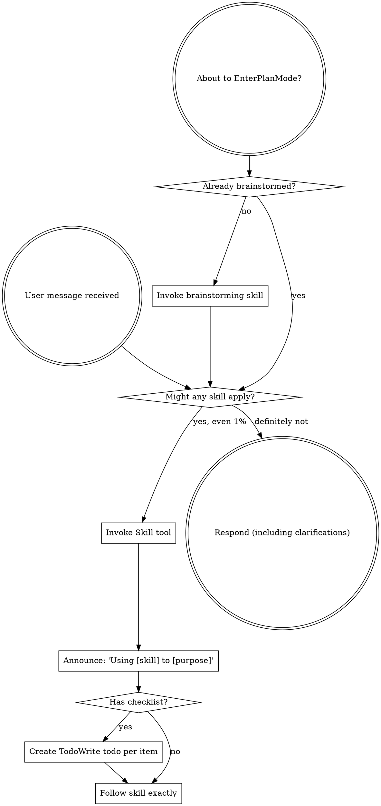

codex-exec: report contract violation

--- codex stdout ---
1. **Rollback is incomplete.** At HEAD, the claimed durable `prepared/publishing/committed` journal does not exist; publication has only process-memory snapshots ([hook-install-contract.cjs:728](<HOME>/AppData/Roaming/warp/Warp/data/worktrees/GSDedits/luminaria-hogback/super-gsd/scripts/lib/hook-install-contract.cjs:728)). Post-publication writes are:

   - Project/global `.claude/settings.json`: idempotent merges, but not rolled back.
   - Witness key under user config: idempotently reusable, but shared, persistent, and outside the project ([witness-store.cjs:80](<HOME>/AppData/Roaming/warp/Warp/data/worktrees/GSDedits/luminaria-hogback/super-gsd/scripts/lib/substrate-invocation-witness-store.cjs:80)).
   - Broker copy: rerunnable, but leaves executable project code.
   - `.mcp.json`, `.claude/settings.local.json`, `~/.claude.json`, upstream manifest: unjournaled. Some refusal branches deliberately withdraw grants and save documents.
   - Global agent grants: files are first rewritten ungranted; refusal leaves capability revoked.
   - `.codex/hooks.json`: replaced before verification; verification failure leaves the replacement and possibly a `.bak`, without restoration ([install-hooks.cjs:378](<HOME>/AppData/Roaming/warp/Warp/data/worktrees/GSDedits/luminaria-hogback/super-gsd/tools/codex-hooks/install-hooks.cjs:378)).
   - Depending on mode: global asset copies/deletions/chmods, init skeleton/config/CLAUDE/registry/memory, or update’s `npm install` and registry sync also persist.

2. **Crash recovery is undefined.** Killing current publication leaves a mixed hook/module tree and no durable recovery record. For proposed OPTION A, `committed` is ambiguous: the next run cannot distinguish “publication committed, downstream incomplete” from “install succeeded, cleanup crashed.” Rolling it back can undo success; accepting it leaves incomplete repair. Crashes during the unjournaled writes remain invisible. Malformed settings or failed post-write Codex verification can make the next precheck refuse, requiring manual recovery.

3. **The smoke distinction is false.** `audit.cjs:797` is pure locally but occurs after earlier writers. Lines 888–918 write the private manifest and MCP documents before returning `ok:false`; lines 935–937 restore MCP documents but not the already-written manifest. `install.sh:484` invokes audit code that can execute project-target hook smoke at `audit.cjs:748`. `install.sh:904` mutates then verifies. Update also runs arbitrary npm lifecycle code before later refusals.

4. **Minimum credible guard matrix:**

   1. Fault after broker, key, global-settings removal, and project-settings merge.
   2. Table-drive malformed, unsupported, missing, drift, and post-manifest document-write failure.
   3. Force Codex post-rename verification failure.
   4. SIGKILL at every publication/downstream boundary, rerun, and compare project + HOME/XDG + external sentinels across init, update, global, and combined modes.

5. **OPTION B steelman.** Seal prospective bytes for every project/profile artifact, publish exactly those digests under one journal, then compare installed bytes before deriving grants. P167 can still attest the real installed witness; digest equality proves it is the sealed candidate, while failure withholds grants and triggers recovery.

I would ship OPTION B—or an equivalent full multi-root transaction—not publication-only rollback.

CHALLENGE VERDICT: REJECT

--- codex stderr ---
OpenAI Codex v0.146.0
--------
workdir: C:\Users\operator\AppData\Roaming\warp\Warp\data\worktrees\GSDedits\luminaria-hogback
model: gpt-5.6-sol
provider: openai
approval: never
sandbox: read-only
reasoning effort: xhigh
reasoning summaries: none
session id: 01a03aea-7b5d-7d30-8d2d-45743fab2fd0
--------
user
# Adversarial challenge: attack OPTION A before it is implemented. Read-only.

Read `.planning/milestones/v4.0-install-contract/phases/168-install-contract/168-BLOCKER-RECOVERY-BRIEF.md`
and the cited code. Your job is to BREAK the proposed decision, not to polish it.

Attack these specifically:

1. **Rollback completeness.** The journal covers publication of hooks/modules. Enumerate
   every write that can occur between journal 'committed' and the last rejection-capable
   step: settings.json merge, witness key provisioning, broker copy, `.codex/hooks.json`,
   grants. For each: is it rolled back, idempotently re-runnable, or harmlessly orphaned
   on a refused install? Name any write that would persist and matter.
2. **Crash windows.** Kill the installer between publication and rollback: what states
   can the project be left in, and does the journal's 'publishing'/'committed' state allow
   the NEXT install run to detect and heal each one? A state that requires manual repair
   is a finding.
3. **The smoke distinction.** The brief claims post-publication refusals are contained
   policy checks, unlike pre-write smoke. Is that true of EVERY refusal path at
   audit.cjs:797, 888-918, 935-937 and install.sh:484-500, 904? Any of them execute
   arbitrary code or mutate outside the journal's coverage?
4. **The behavioural guard.** Forced-refusal-then-byte-identity: can a future rejecting
   step evade it, e.g. one that refuses only on a state the fixture does not produce?
   Propose the minimal set of forced-refusal fixtures that makes evasion implausible.
5. **Is OPTION B actually safer?** Steelman prospective digests for one paragraph, then
   say which option you would ship and why.

End with exactly `CHALLENGE VERDICT: PROCEED`, `PROCEED-WITH-CHANGES` (numbered list), or
`REJECT` (with the alternative). ~15 shell commands. Max 500 words.

codex
I’m using the `using-superpowers` and `review` skills because this is a read-only, adversarial code-review task. I’ll trace every rejection-capable path and its writes, then test OPTION A against crash recovery and future guard evasion.
exec
"C:\\WINDOWS\\System32\\WindowsPowerShell\\v1.0\\powershell.exe" -Command "Get-Content -Raw 'C:\\Users\\operator\\.codex\\skills\\using-superpowers\\SKILL.md'; Get-Content -Raw 'C:\\Users\\operator\\.agents\\skills\\review\\SKILL.md'" in C:\Users\operator\AppData\Roaming\warp\Warp\data\worktrees\GSDedits\luminaria-hogback
 succeeded in 622ms:
---
name: using-superpowers
description: Use when starting any conversation - establishes how to find and use skills, requiring Skill tool invocation before ANY response including clarifying questions
---

<SUBAGENT-STOP>
If you were dispatched as a subagent to execute a specific task, skip this skill.
</SUBAGENT-STOP>

<EXTREMELY-IMPORTANT>
If you think there is even a 1% chance a skill might apply to what you are doing, you ABSOLUTELY MUST invoke the skill.

IF A SKILL APPLIES TO YOUR TASK, YOU DO NOT HAVE A CHOICE. YOU MUST USE IT.

This is not negotiable. This is not optional. You cannot rationalize your way out of this.
</EXTREMELY-IMPORTANT>

## Instruction Priority

Superpowers skills override default system prompt behavior, but **user instructions always take precedence**:

1. **User's explicit instructions** (CLAUDE.md, GEMINI.md, AGENTS.md, direct requests) ƒ?" highest priority
2. **Superpowers skills** ƒ?" override default system behavior where they conflict
3. **Default system prompt** ƒ?" lowest priority

If CLAUDE.md, GEMINI.md, or AGENTS.md says "don't use TDD" and a skill says "always use TDD," follow the user's instructions. The user is in control.

## How to Access Skills

**In Claude Code:** Use the `Skill` tool. When you invoke a skill, its content is loaded and presented to youƒ?"follow it directly. Never use the Read tool on skill files.

**In Copilot CLI:** Use the `skill` tool. Skills are auto-discovered from installed plugins. The `skill` tool works the same as Claude Code's `Skill` tool.

**In Gemini CLI:** Skills activate via the `activate_skill` tool. Gemini loads skill metadata at session start and activates the full content on demand.

**In other environments:** Check your platform's documentation for how skills are loaded.

## Platform Adaptation

Skills use Claude Code tool names. Non-CC platforms: see `references/copilot-tools.md` (Copilot CLI), `references/codex-tools.md` (Codex) for tool equivalents. Gemini CLI users get the tool mapping loaded automatically via GEMINI.md.

# Using Skills

## The Rule

**Invoke relevant or requested skills BEFORE any response or action.** Even a 1% chance a skill might apply means that you should invoke the skill to check. If an invoked skill turns out to be wrong for the situation, you don't need to use it.



## Red Flags

These thoughts mean STOPƒ?"you're rationalizing:

| Thought | Reality |
|---------|---------|
| "This is just a simple question" | Questions are tasks. Check for skills. |
| "I need more context first" | Skill check comes BEFORE clarifying questions. |
| "Let me explore the codebase first" | Skills tell you HOW to explore. Check first. |
| "I can check git/files quickly" | Files lack conversation context. Check for skills. |
| "Let me gather information first" | Skills tell you HOW to gather information. |
| "This doesn't need a formal skill" | If a skill exists, use it. |
| "I remember this skill" | Skills evolve. Read current version. |
| "This doesn't count as a task" | Action = task. Check for skills. |
| "The skill is overkill" | Simple things become complex. Use it. |
| "I'll just do this one thing first" | Check BEFORE doing anything. |
| "This feels productive" | Undisciplined action wastes time. Skills prevent this. |
| "I know what that means" | Knowing the concept ƒ%ÿ using the skill. Invoke it. |

## Skill Priority

When multiple skills could apply, use this order:

1. **Process skills first** (brainstorming, debugging) - these determine HOW to approach the task
2. **Implementation skills second** (frontend-design, mcp-builder) - these guide execution

"Let's build X" ā' brainstorming first, then implementation skills.
"Fix this bug" ā' debugging first, then domain-specific skills.

## Skill Types

**Rigid** (TDD, debugging): Follow exactly. Don't adapt away discipline.

**Flexible** (patterns): Adapt principles to context.

The skill itself tells you which.

## User Instructions

Instructions say WHAT, not HOW. "Add X" or "Fix Y" doesn't mean skip workflows.

---
name: review
description: Review code changes for security, performance, bugs, and quality. Reviews staged changes, unstaged changes, specific commits, or PR-ready diffs.
---

<objective>
Review code changes and provide structured feedback covering security, performance, bug risks, code quality, and test coverage gaps. This skill analyzes diffs and surrounding context to catch issues before they reach production.
</objective>

<context>
This skill reviews code changes at various stages of the development workflow. It can review staged changes before a commit, unstaged work-in-progress, a specific commit, or the full set of changes on a branch that are ready for a pull request.

The reviewer reads both the diff and the surrounding source files to understand intent and catch issues that only appear in context.
</context>

<core_principle>
**FIND REAL ISSUES, NOT STYLE NITS.** Focus on problems that cause bugs, security vulnerabilities, performance degradation, or maintainability pain. Avoid nitpicking formatting or subjective style preferences unless they harm readability.
</core_principle>

<analysis_only_rule>
**THIS SKILL IS READ-ONLY. DO NOT MODIFY CODE.**

The purpose is to review and report findings. Making changes during review conflates the reviewer and author roles. Present findings and let the user decide what to act on.
</analysis_only_rule>

<quick_start>

<determine_review_scope>

Parse the user's input to determine what to review:

1. **No arguments** - Review staged changes first. If nothing is staged, review unstaged changes.
   - Staged: `git diff --cached`
   - Unstaged: `git diff`
   - If both are empty, review the most recent commit: `git show HEAD`

2. **Commit hash argument** (e.g., `/review abc1234`) - Review that specific commit.
   - `git show <hash>`

3. **File path argument** (e.g., `/review src/foo.ts`) - Review unstaged changes in that file.
   - `git diff -- <path>` then fall back to `git diff --cached -- <path>`

4. **"pr" argument** (e.g., `/review pr`) - Review all changes since branching from main.
   - `git diff main...HEAD`
   - If on main, review `git diff HEAD~1`

After obtaining the diff, if it is empty, inform the user that there are no changes to review and stop.

</determine_review_scope>

<gather_context>

Before analyzing the diff:

1. **Read changed files in full** - Do not review a diff in isolation. Read each modified file to understand the surrounding code, imports, types, and control flow.
2. **Identify the tech stack** - Note languages, frameworks, and libraries in use. This affects what patterns are risky.
3. **Check for related test files** - For each changed source file, look for corresponding test files. Note whether tests were updated alongside the changes.
4. **Check for configuration changes** - If config files changed (env, CI, package.json, tsconfig, etc.), pay extra attention to side effects.

</gather_context>

<review_categories>

Analyze the changes against each category below. Only report findings that are actually present. Skip categories with no issues.

**A. Security Issues** (Severity: CRITICAL or HIGH)
- Injection vulnerabilities (SQL injection, command injection, template injection)
- Cross-site scripting (XSS) - unsanitized user input rendered in HTML
- Authentication and authorization flaws (missing auth checks, privilege escalation)
- Secrets or credentials hardcoded or logged
- Insecure deserialization or unsafe eval usage
- Path traversal or file access vulnerabilities
- Missing input validation on external data

**B. Performance Concerns** (Severity: HIGH or MEDIUM)
- N+1 query patterns in database access
- Unnecessary memory allocations in hot paths or loops
- Blocking operations on the main thread or in async contexts
- Missing pagination on unbounded queries
- Redundant computation that could be cached or memoized
- Large payloads without streaming or chunking

**C. Bug Risks** (Severity: HIGH or MEDIUM)
- Off-by-one errors in loops or array access
- Null/undefined dereferences without guards
- Race conditions in concurrent or async code
- Incorrect error handling (swallowed errors, wrong error types)
- Type mismatches or unsafe type assertions
- Logic errors in conditionals (inverted checks, missing cases)
- Resource leaks (unclosed connections, file handles, listeners)

**D. Code Quality** (Severity: MEDIUM or LOW)
- Unclear or misleading naming
- Significant code duplication that should be extracted
- Excessive complexity (deeply nested logic, functions doing too many things)
- Dead code or unreachable branches
- Missing or misleading comments on non-obvious logic
- Inconsistency with patterns used elsewhere in the codebase

**E. Test Coverage Gaps** (Severity: MEDIUM or LOW)
- New logic paths without corresponding test cases
- Changed behavior without updated tests
- Edge cases not covered (empty inputs, boundary values, error paths)
- Missing integration tests for new API endpoints or database changes

</review_categories>

<format_findings>

For each finding, use this structure:

```
### [SEVERITY] Category: Brief Title

**File**: `path/to/file.ext` (lines X-Y)

**Issue**: Clear description of the problem.

**Why it matters**: What could go wrong if this is not addressed.

**Suggestion**: How to fix it, with a code snippet if helpful.
```

Severity levels:
- **CRITICAL** - Must fix before merge. Security vulnerability or data loss risk.
- **HIGH** - Should fix before merge. Likely bug or significant performance issue.
- **MEDIUM** - Should fix soon. Code quality or moderate risk issue.
- **LOW** - Consider fixing. Minor improvement opportunity.

</format_findings>

</quick_start>

<critical_rules>

1. **READ THE FULL FILE**: Never review a diff without reading the complete source file for context
2. **NO FALSE ALARMS**: Only report issues you can explain concretely. Do not report vague concerns
3. **PRIORITIZE**: Lead with the most severe findings. Do not bury critical issues under style nits
4. **BE SPECIFIC**: Include file paths, line numbers, and code references for every finding
5. **EXPLAIN THE RISK**: For each finding, explain what could actually go wrong
6. **CHECK TESTS**: Always check whether changes have corresponding test updates
7. **CONSIDER THE STACK**: Apply language-specific and framework-specific knowledge to your review
8. **DO NOT MODIFY CODE**: Present findings only. The user decides what to act on

</critical_rules>

<output_format>

```markdown
## Code Review: [brief description of what was reviewed]

**Scope**: [staged changes | unstaged changes | commit abc1234 | PR changes from main]
**Files reviewed**: [count] files changed, [additions] additions, [deletions] deletions

---

### Findings

[Findings grouped by severity, highest first. Use the format from <format_findings>.]

---

### Summary

| Severity | Count |
|----------|-------|
| CRITICAL | X     |
| HIGH     | X     |
| MEDIUM   | X     |
| LOW      | X     |

### Recommended Actions

1. [Most important action to take]
2. [Next most important action]
3. [...]
```

If no issues are found:

```markdown
## Code Review: [brief description]

**Scope**: [what was reviewed]
**Files reviewed**: [count]

No significant issues found. The changes look good to merge.
```

</output_format>

<decision_gate>

**After presenting findings, ALWAYS offer these options:**

```
ƒ"?ƒ"?ƒ"?ƒ"?ƒ"?ƒ"?ƒ"?ƒ"?ƒ"?ƒ"?ƒ"?ƒ"?ƒ"?ƒ"?ƒ"?ƒ"?ƒ"?ƒ"?ƒ"?ƒ"?ƒ"?ƒ"?ƒ"?ƒ"?ƒ"?ƒ"?ƒ"?ƒ"?ƒ"?ƒ"?ƒ"?ƒ"?ƒ"?ƒ"?ƒ"?ƒ"?ƒ"?ƒ"?ƒ"?ƒ"?ƒ"?
REVIEW COMPLETE

What would you like to do?

1. **Fix issues** - I'll address the findings starting with the most critical
2. **Save review** - Export findings to a markdown file
3. **Review again** - Re-review with different scope or focus
4. **Discuss a finding** - Ask questions about a specific issue
5. **Other** - Tell me what you need
ƒ"?ƒ"?ƒ"?ƒ"?ƒ"?ƒ"?ƒ"?ƒ"?ƒ"?ƒ"?ƒ"?ƒ"?ƒ"?ƒ"?ƒ"?ƒ"?ƒ"?ƒ"?ƒ"?ƒ"?ƒ"?ƒ"?ƒ"?ƒ"?ƒ"?ƒ"?ƒ"?ƒ"?ƒ"?ƒ"?ƒ"?ƒ"?ƒ"?ƒ"?ƒ"?ƒ"?ƒ"?ƒ"?ƒ"?ƒ"?ƒ"?
```

**Wait for user response before taking any action.**

This gate is MANDATORY. Never skip it. Never auto-implement fixes.

</decision_gate>

C:\Users\operator\OneDrive - <ORG>\Documents\WindowsPowerShell\profile.ps1 : Cannot dot-source this 
command because it was defined in a different language mode. To invoke this command without importing its contents, 
omit the '.' operator.
At line:1 char:1
+ . 'C:\Users\operator\OneDrive - <ORG>\Documents\Win ...
+ ~~~~~~~~~~~~~~~~~~~~~~~~~~~~~~~~~~~~~~~~~~~~~~~~~~~~~~~~~~~~~~~~~~~~~
    + CategoryInfo          : InvalidOperation: (:) [profile.ps1], NotSupportedException
    + FullyQualifiedErrorId : DotSourceNotSupported,profile.ps1
 
C:\Users\operator\OneDrive - <ORG>\Documents\WindowsPowerShell\Microsoft.PowerShell_profile.ps1 : 
Cannot dot-source this command because it was defined in a different language mode. To invoke this command without 
importing its contents, omit the '.' operator.
At line:1 char:1
+ . 'C:\Users\operator\OneDrive - <ORG>\Documents\Win ...
+ ~~~~~~~~~~~~~~~~~~~~~~~~~~~~~~~~~~~~~~~~~~~~~~~~~~~~~~~~~~~~~~~~~~~~~
    + CategoryInfo          : InvalidOperation: (:) [Microsoft.PowerShell_profile.ps1], NotSupportedException
    + FullyQualifiedErrorId : DotSourceNotSupported,Microsoft.PowerShell_profile.ps1
 

exec
"C:\\WINDOWS\\System32\\WindowsPowerShell\\v1.0\\powershell.exe" -NoProfile -Command "Get-Content -Raw '.planning/milestones/v4.0-install-contract/phases/168-install-contract/168-BLOCKER-RECOVERY-BRIEF.md'" in C:\Users\operator\AppData\Roaming\warp\Warp\data\worktrees\GSDedits\luminaria-hogback
 succeeded in 493ms:
# Blocker recovery brief ƒ?" P168 refuse-before-write vs P167 witness readiness

## The conflict, after three failed rounds

Phase ATC holds a CRITICAL: `repair_substrate_capability` and `register_codex_hooks`
retain refusal paths reachable AFTER `publish_project_install_contract` writes project
bytes, on install.sh entry points and the audit.cjs direct path. Two fix rounds moved
checks earlier but could not make the writers non-rejecting. The third round attempted
publication-last and STOPPED on a genuine dependency, verified with citations:

- `audit.cjs:1515`: capability repair requires `auditClaudeSubstrateWitness(...).ready`,
  and the P167 readiness contract reports `source_missing` when the witness hook is not
  yet published to the project.
- `audit.cjs:858`: readiness hashes the PROJECT's witness file; pre-publication it is
  null, post-publication validation at :523 would see drift.
- `audit.cjs:748`: stale-hook smoke executes project-target paths.

So: repair validates the witness AS INSTALLED (a P167 security property, untouchable),
which forces repair after publication; ATC's literal refuse-before-write forces repair
before publication. Circular.

## Proposed decision: OPTION A ƒ?" atomic install via journaled rollback

Reframe the invariant from the MEANS (refuse before write) to the END it protects
(a refused install leaves the project byte-identical):

1. Publication stays first and remains journaled (prepared/publishing/committed states
   already exist in hook-install-contract.cjs).
2. If any subsequent step refuses, the installer rolls back publication via the journal,
   restoring the pre-install tree, then exits non-zero.
3. This is sound where it was previously rejected because the prior rejection concerned
   SMOKE: arbitrary hook code whose side effects cannot be contained by rolling back the
   tree. That smoke now runs candidate-side, pre-write. The post-publication refusals are
   policy checks in repair, and repair's own no-mutation-on-refusal is already asserted
   (guard case witness-repair-smoke-no-mutation, byte-identity on refusal). Composite:
   refusal at any point => project byte-identical.
4. Behavioural guard: force a repair refusal in a fixture and assert the project tree is
   byte-identical afterwards, non-zero exit. This catches any future rejecting step
   regardless of name, which the manual inventory could not.

## Alternatives considered

- OPTION B, prospective digests: let readiness validate candidate digests before
  publication. Rejected: changes P167 witness semantics, the one contract declared
  untouchable, and would let readiness pass against bytes not actually installed.
- OPTION C, close PASS-WITH-DEFERRED carrying the ATC CRITICAL. Rejected while a sound
  fix exists: the deferred item would be precisely the failure class this phase was
  opened to eliminate.

## Deviation note

The full board roster was not convened; this brief goes straight to a Codex challenge.
Logged as a deliberate economy after twelve hours of runtime; the challenge is the
adversarial step the loop requires.


exec
"C:\\WINDOWS\\System32\\WindowsPowerShell\\v1.0\\powershell.exe" -NoProfile -Command "rg --files | rg '(audit\\.cjs|install\\.sh|hook-install-contract\\.cjs|168-.*(PLAN|ATC|VERIFICATION)|167-.*)'" in C:\Users\operator\AppData\Roaming\warp\Warp\data\worktrees\GSDedits\luminaria-hogback
 succeeded in 811ms:
super-gsd\install.sh
super-gsd\scripts\lib\hook-install-contract.cjs
super-gsd\scripts\devcp\install.sh
super-gsd\tools\feature-propagation\audit.cjs
super-gsd\tools\cockpit-sidecar\playwright-audit.cjs
super-gsd\tools\phase-folder-audit\audit.cjs
super-gsd\tools\installer-audit\audit.cjs

exec
"C:\\WINDOWS\\System32\\WindowsPowerShell\\v1.0\\powershell.exe" -NoProfile -Command "rg -n \"repair_substrate_capability|register_codex_hooks|publish_project_install_contract|auditClaudeSubstrateWitness|witness-repair-smoke-no-mutation\" super-gsd .planning/milestones/v4.0-install-contract/phases/168-install-contract; Get-Content 'super-gsd/install.sh','super-gsd/tools/installer-audit/audit.cjs','super-gsd/scripts/lib/hook-install-contract.cjs' | Measure-Object -Line" in C:\Users\operator\AppData\Roaming\warp\Warp\data\worktrees\GSDedits\luminaria-hogback
2026-08-25T21:55:17.545175Z ERROR codex_core::tools::router: error=Exit code: 124
Wall time: 10.1 seconds
Total output lines: 366
Output:
command timed out after 10055 milliseconds
.planning/milestones/v4.0-install-contract/phases/168-install-contract\168-ABANDONED-STAGED-INSTALLER.patch:72:@@ -794,9 +822,22 @@ publish_project_install_contract() {
.planning/milestones/v4.0-install-contract/phases/168-install-contract\168-ABANDONED-STAGED-INSTALLER.patch:181:   publish_project_install_contract
.planning/milestones/v4.0-install-contract/phases/168-install-contract\168-ABANDONED-STAGED-INSTALLER.patch:1201:   const mainPublication = installer.lastIndexOf('  publish_project_install_contract');
.planning/milestones/v4.0-install-contract/phases/168-install-contract\168-ABANDONED-STAGED-INSTALLER.patch:1266:+  const publishFunction = installer.indexOf('publish_project_install_contract()');
.planning/milestones/v4.0-install-contract/phases/168-install-contract\168-ABANDONED-STAGED-INSTALLER.patch:1314:     const repairCall = installer.indexOf('  repair_substrate_capability', functionStart);
.planning/milestones/v4.0-install-contract/phases/168-install-contract\168-ABANDONED-STAGED-INSTALLER.patch:1315:     const codexCall = installer.indexOf('  register_codex_hooks', functionStart);
.planning/milestones/v4.0-install-contract/phases/168-install-contract\168-ABANDONED-T3-REPAIR-SPLIT.patch:20:-repair_substrate_capability() {
.planning/milestones/v4.0-install-contract/phases/168-install-contract\168-ABANDONED-T3-REPAIR-SPLIT.patch:75:-    repair_substrate_capability
.planning/milestones/v4.0-install-contract/phases/168-install-contract\168-ABANDONED-T3-REPAIR-SPLIT.patch:86:-  publish_project_install_contract
.planning/milestones/v4.0-install-contract/phases/168-install-contract\168-ABANDONED-T3-REPAIR-SPLIT.patch:112:-publish_project_install_contract() {
.planning/milestones/v4.0-install-contract/phases/168-install-contract\168-ABANDONED-T3-REPAIR-SPLIT.patch:188:-register_codex_hooks() {
.planning/milestones/v4.0-install-contract/phases/168-install-contract\168-ABANDONED-T3-REPAIR-SPLIT.patch:206:-  repair_substrate_capability
.planning/milestones/v4.0-install-contract/phases/168-install-contract\168-ABANDONED-T3-REPAIR-SPLIT.patch:207:-  register_codex_hooks
.planning/milestones/v4.0-install-contract/phases/168-install-contract\168-ABANDONED-T3-REPAIR-SPLIT.patch:216:-  repair_substrate_capability
.planning/milestones/v4.0-install-contract/phases/168-install-contract\168-ABANDONED-T3-REPAIR-SPLIT.patch:217:-  register_codex_hooks
.planning/milestones/v4.0-install-contract/phases/168-install-contract\168-ABANDONED-T3-REPAIR-SPLIT.patch:230:-    publish_project_install_contract
.planning/milestones/v4.0-install-contract/phases/168-install-contract\168-ABANDONED-T3-REPAIR-SPLIT.patch:318:-  const mainPublication = installer.lastIndexOf('  publish_project_install_contract');
.planning/milestones/v4.0-install-contract/phases/168-install-contract\168-ABANDONED-T3-REPAIR-SPLIT.patch:329:-  const contractDelegation = installer.indexOf('  publish_project_install_contract', distributionFunction);
.planning/milestones/v4.0-install-contract/phases/168-install-contract\168-ABANDONED-T3-REPAIR-SPLIT.patch:357:+  assert.doesNotMatch(installer, /^distribute_project_hooks\(\)|^publish_project_install_contract\(\)/m,
.planning/milestones/v4.0-install-contract/phases/168-install-contract\168-ABANDONED-T3-REPAIR-SPLIT.patch:372:-    const repairCall = installer.indexOf('  repair_substrate_capability', functionStart);
.planning/milestones/v4.0-install-contract/phases/168-install-contract\168-ABANDONED-T3-REPAIR-SPLIT.patch:373:-    const codexCall = installer.indexOf('  register_codex_hooks', functionStart);
.planning/milestones/v4.0-install-contract/phases/168-install-contract\168-ABANDONED-T3-REPAIR-SPLIT.patch:540:+  assert.doesNotMatch(installer, /^repair_substrate_capability\(\)|^register_codex_hooks\(\)/m,
.planning/milestones/v4.0-install-contract/phases/168-install-contract\168-ABANDONED-T3-REPAIR-SPLIT.patch:582:-  const repairCalls = installer.match(/^[ \t]+repair_substrate_capability$/gm) || [];
.planning/milestones/v4.0-install-contract/phases/168-install-contract\168-ABANDONED-T3-REPAIR-SPLIT.patch:594:-    const repairCall = installer.indexOf('repair_substrate_capability', functionStart);
.planning/milestones/v4.0-install-contract/phases/168-install-contract\168-ABANDONED-T3-REPAIR-SPLIT.patch:619:-  assert.match(installer, /repair_substrate_capability\(\)/);
.planning/milestones/v4.0-install-contract/phases/168-install-contract\168-ABANDONED-T3-REPAIR-SPLIT.patch:627:-    const repairIndex = installer.indexOf('  repair_substrate_capability', start);
.planning/milestones/v4.0-install-contract/phases/168-install-contract\168-ABANDONED-T3-REPAIR-SPLIT.patch:628:-    const codexIndex = installer.indexOf('  register_codex_hooks', start);
.planning/milestones/v4.0-install-contract/phases/168-install-contract\168-ABANDONED-T3-REPAIR-SPLIT.patch:1058:   let claudeSubstrateWitness = auditClaudeSubstrateWitness(ctx);
.planning/milestones/v4.0-install-contract/phases/168-install-contract\168-ABANDONED-T3-REPAIR-SPLIT.patch:1070:   claudeSubstrateWitness = auditClaudeSubstrateWitness(ctx);
.planning/milestones/v4.0-install-contract/phases/168-install-contract\168-ABANDONED-T3-REPAIR-SPLIT.patch:1130:     auditClaudeSubstrateWitness,
super-gsd\install.sh:465:repair_substrate_capability() {
super-gsd\install.sh:704:    repair_substrate_capability
super-gsd\install.sh:784:  publish_project_install_contract
super-gsd\install.sh:841:publish_project_install_contract() {
super-gsd\install.sh:897:register_codex_hooks() {
super-gsd\install.sh:1015:  repair_substrate_capability
super-gsd\install.sh:1016:  register_codex_hooks
super-gsd\install.sh:1111:  repair_substrate_capability
super-gsd\install.sh:1112:  register_codex_hooks
super-gsd\install.sh:1294:    publish_project_install_contract
.planning/milestones/v4.0-install-contract/phases/168-install-contract\168-BLOCKER-RECOVERY-BRIEF.md:5:Phase ATC holds a CRITICAL: `repair_substrate_capability` and `register_codex_hooks`
.planning/milestones/v4.0-install-contract/phases/168-install-contract\168-BLOCKER-RECOVERY-BRIEF.md:6:retain refusal paths reachable AFTER `publish_project_install_contract` writes project
.planning/milestones/v4.0-install-contract/phases/168-install-contract\168-BLOCKER-RECOVERY-BRIEF.md:11:- `audit.cjs:1515`: capability repair requires `auditClaudeSubstrateWitness(...).ready`,
.planning/milestones/v4.0-install-contract/phases/168-install-contract\168-BLOCKER-RECOVERY-BRIEF.md:35:   (guard case witness-repair-smoke-no-mutation, byte-identity on refusal). Composite:
.planning/milestones/v4.0-install-contract/phases/168-install-contract\168-ATC-REVIEW2.md:8:`install.sh:1294` publishes destination bytes before entry paths invoke `repair_substrate_capability` and `register_codex_hooks` (`install.sh:704,1015-1016,1111-1112`). Both can still return failure (`install.sh:484-500,904`); equivalent prechecks do not make these later executions non-rejecting or rollback their writes with the earlier publication.
.planning/milestones/v4.0-install-contract/phases/168-install-contract\168-ATC-REVIEW2.md:90:  covers init/update/global-with-project, all before publish_project_install_contract;
.planning/milestones/v4.0-install-contract/phases/168-install-contract\168-ATC-REVIEW2.md:5732:.planning/milestones/v4.0-install-contract/phases/168-install-contract/168-ATC-REVIEW.md:10474:"C:\\WINDOWS\\System32\\WindowsPowerShell\\v1.0\\powershell.exe" -Command 'rg -n "''^(parse_args|precheck_installation_refusals|prepare_project_install_contract|publish_project_install_contract|discard_project_install_candidate|init_local_project|update_existing|distribute_project_hooks|repair_|main'"\\(|case \\\"\\"'$|if '"\\[|[A-Za-z_][A-Za-z0-9_]*\\(\\))\" super-gsd/install.sh; "'$p='"'super-gsd/install.sh'; "'$l=Get-Content $p; $l | Select-Object -First 190; '"'---650-910---'; "'$l | Select-Object -Skip 649 -First 261; '"'---1180-END---'; "'$l | Select-Object -Skip 1179' in <HOME>\AppData\Roaming\warp\Warp\data\worktrees\GSDedits\luminaria-hogback
.planning/milestones/v4.0-install-contract/phases/168-install-contract\168-ATC-REVIEW2.md:5733:.planning/milestones/v4.0-install-contract/phases/168-install-contract/168-ATC-REVIEW.md:10572:"C:\\WINDOWS\\System32\\WindowsPowerShell\\v1.0\\powershell.exe" -Command "rg -n '"'^(parse_args|precheck_installation_refusals|prepare_project_install_contract|publish_project_install_contract|discard_project_install_candidate|init_local_project|update_existing|distribute_project_hooks|repair_|main'"\\(|[A-Za-z_][A-Za-z0-9_]*\\(\\))' super-gsd/install.sh; "'$p='"'super-gsd/install.sh'; "'$l=Get-Content $p; $l | Select-Object -First 190; '"'---650-910---'; "'$l | Select-Object -Skip 649 -First 261; '"'---1180-END---'; "'$l | Select-Object -Skip 1179' in <HOME>\AppData\Roaming\warp\Warp\data\worktrees\GSDedits\luminaria-hogback
.planning/milestones/v4.0-install-contract/phases/168-install-contract\168-ATC-REVIEW2.md:6354:    Phase ATC's CRITICAL, fifth occurrence of the class: repair_substrate_capability
.planning/milestones/v4.0-install-contract/phases/168-install-contract\168-ATC-REVIEW2.md:6355:    and register_codex_hooks ran rejection-capable checks after publication, and
.planning/milestones/v4.0-install-contract/phases/168-install-contract\168-ATC-REVIEW2.md:6361:    publish_project_install_contract. runAudit performs the shared read-only
.planning/milestones/v4.0-install-contract/phases/168-install-contract\168-ATC-REVIEW2.md:6407:-    const repairCall = installer.indexOf('  repair_substrate_capability', functionStart);
.planning/milestones/v4.0-install-contract/phases/168-install-contract\168-ATC-REVIEW2.md:6408:-    const codexCall = installer.indexOf('  register_codex_hooks', functionStart);
.planning/milestones/v4.0-install-contract/phases/168-install-contract\168-ATC-REVIEW2.md:6434:+    'repair_substrate_capability',
.planning/milestones/v4.0-install-contract/phases/168-install-contract\168-ATC-REVIEW2.md:6435:+    'register_codex_hooks',
.planning/milestones/v4.0-install-contract/phases/168-install-contract\168-ATC-REVIEW2.md:6446:+  const publicationFunction = installer.indexOf('publish_project_install_contract()');
.planning/milestones/v4.0-install-contract/phases/168-install-contract\168-ATC-REVIEW2.md:6466:+    /if \[ \x22\$INIT_LOCAL\x22 = true \] \|\| \[ \x22\$UPDATE_MODE\x22 = true \] \\\r?\n      \|\| \{ \[ \x22\$INSTALL_GLOBAL\x22 = true \] && \[ -d \x22\$PROJECT_DIR\/\.planning\x22 \]; \}; then\r?\n    precheck_codex_hook_registration\r?\n  fi\r?\n  if \[ \x22\$INIT_LOCAL\x22 = true \] \|\| \[ \x22\$UPDATE_MODE\x22 = true \] \\\r?\n      \|\| \{ \[ \x22\$INSTALL_GLOBAL\x22 = true \] && \[ -d \x22\$PROJECT_DIR\/\.planning\x22 \]; \}; then\r?\n    publish_project_install_contract/,
.planning/milestones/v4.0-install-contract/phases/168-install-contract\168-ATC-REVIEW2.md:6482:+      const substrateWriter = installer.indexOf('  repair_substrate_capability', functionStart);
.planning/milestones/v4.0-install-contract/phases/168-install-contract\168-ATC-REVIEW2.md:6483:+      const codexWriter = installer.indexOf('  register_codex_hooks', functionStart);
.planning/milestones/v4.0-install-contract/phases/168-install-contract\168-ATC-REVIEW2.md:6736:   let claudeSubstrateWitness = auditClaudeSubstrateWitness(ctx);
.planning/milestones/v4.0-install-contract/phases/168-install-contract\168-ATC-REVIEW2.md:7360:"C:\\WINDOWS\\System32\\WindowsPowerShell\\v1.0\\powershell.exe" -Command 'rg -n "''^[A-Za-z_][A-Za-z0-9_]*'"\\(\\) \\{|precheck_installation_refusals|publish_project_install_contract|distribute_project_hooks|repair_substrate_capability|register_codex_hooks|ensure_gsd_base|npm |publishProjectHookInstall|checkClaudeSubstrateCapabilityRepair|repairClaudeSubstrateCapability|function runAudit|module\\.exports\" super-gsd/install.sh super-gsd/tools/feature-propagation/audit.cjs super-gsd/scripts/lib/hook-install-contract.cjs super-gsd/scripts/lib/hook-registration-preflight.cjs; rg -n \"require\\(.+hook-install-contract|applyProjectInstall|applyPreparedProjectInstall|prepareProjectInstall|computeHookDependencyGraph|formatProjectInstallStatus|inspectProjectInstall|renderManifestDependencies\" super-gsd --glob '"'!**/168-*'"' --glob '"'!**/*.patch'"'" in C:\Users\operator\AppData\Roaming\warp\Warp\data\worktrees\GSDedits\luminaria-hogback
.planning/milestones/v4.0-install-contract/phases/168-install-contract\168-ATC-REVIEW2.md:7398:super-gsd/install.sh:465:repair_substrate_capability() {
.planning/milestones/v4.0-install-contract/phases/168-install-contract\168-ATC-REVIEW2.md:7402:super-gsd/install.sh:704:    repair_substrate_capability
.planning/milestones/v4.0-install-contract/phases/168-install-contract\168-ATC-REVIEW2.md:7407:super-gsd/install.sh:784:  publish_project_install_contract
.planning/milestones/v4.0-install-contract/phases/168-install-contract\168-ATC-REVIEW2.md:7410:super-gsd/install.sh:841:publish_project_install_contract() {
.planning/milestones/v4.0-install-contract/phases/168-install-contract\168-ATC-REVIEW2.md:7414:super-gsd/install.sh:897:register_codex_hooks() {
.planning/milestones/v4.0-install-contract/phases/168-install-contract\168-ATC-REVIEW2.md:7419:super-gsd/install.sh:1015:  repair_substrate_capability
.planning/milestones/v4.0-install-contract/phases/168-install-contract\168-ATC-REVIEW2.md:7420:super-gsd/install.sh:1016:  register_codex_hooks
.planning/milestones/v4.0-install-contract/phases/168-install-contract\168-ATC-REVIEW2.md:7444:super-gsd/install.sh:1111:  repair_substrate_capability
.planning/milestones/v4.0-install-contract/phases/168-install-contract\168-ATC-REVIEW2.md:7445:super-gsd/install.sh:1112:  register_codex_hooks
.planning/milestones/v4.0-install-contract/phases/168-install-contract\168-ATC-REVIEW2.md:7452:super-gsd/install.sh:1294:    publish_project_install_contract
.planning/milestones/v4.0-install-contract/phases/168-install-contract\168-ATC-REVIEW2.md:7673: 465: repair_substrate_capability() {
.planning/milestones/v4.0-install-contract/phases/168-install-contract\168-ATC-REVIEW2.md:7793: 704:     repair_substrate_capability
.planning/milestones/v4.0-install-contract/phases/168-install-contract\168-ATC-REVIEW2.md:7873: 784:   publish_project_install_contract
.planning/milestones/v4.0-install-contract/phases/168-install-contract\168-ATC-REVIEW2.md:7930: 841: publish_project_install_contract() {
.planning/milestones/v4.0-install-contract/phases/168-install-contract\168-ATC-REVIEW2.md:7986: 897: register_codex_hooks() {
.planning/milestones/v4.0-install-contract/phases/168-install-contract\168-ATC-REVIEW2.md:8075:1015:   repair_substrate_capability
.planning/milestones/v4.0-install-contract/phases/168-install-contract\168-ATC-REVIEW2.md:8076:1016:   register_codex_hooks
.planning/milestones/v4.0-install-contract/phases/168-install-contract\168-ATC-REVIEW2.md:8171:1111:   repair_substrate_capability
.planning/milestones/v4.0-install-contract/phases/168-install-contract\168-ATC-REVIEW2.md:8172:1112:   register_codex_hooks
.planning/milestones/v4.0-install-contract/phases/168-install-contract\168-ATC-REVIEW2.md:8245:1294:     publish_project_install_contract
.planning/milestones/v4.0-install-contract/phases/168-install-contract\168-ATC-REVIEW2.md:8682:1507:   let claudeSubstrateWitness = auditClaudeSubstrateWitness(ctx);
.planning/milestones/v4.0-install-contract/phases/168-install-contract\168-ATC-REVIEW2.md:8690:1515:   claudeSubstrateWitness = auditClaudeSubstrateWitness(ctx);
.planning/milestones/v4.0-install-contract/phases/168-install-contract\168-ATC-REVIEW2.md:8798:1847:     auditClaudeSubstrateWitness,
.planning/milestones/v4.0-install-contract/phases/168-install-contract\168-ATC-REVIEW2.md:10178:1618:     'repair_substrate_capability',
.planning/milestones/v4.0-install-contract/phases/168-install-contract\168-ATC-REVIEW2.md:10179:1619:     'register_codex_hooks',
.planning/milestones/v4.0-install-contract/phases/168-install-contract\168-ATC-REVIEW2.md:10190:1630:   const publicationFunction = installer.indexOf('publish_project_install_contract()');
.planning/milestones/v4.0-install-contract/phases/168-install-contract\168-ATC-REVIEW2.md:10210:1650:     /if \[ \x22\$INIT_LOCAL\x22 = true \] \|\| \[ \x22\$UPDATE_MODE\x22 = true \] \\\r?\n      \|\| \{ \[ \x22\$INSTALL_GLOBAL\x22 = true \] && \[ -d \x22\$PROJECT_DIR\/\.planning\x22 \]; \}; then\r?\n    precheck_codex_hook_registration\r?\n  fi\r?\n  if \[ \x22\$INIT_LOCAL\x22 = true \] \|\| \[ \x22\$UPDATE_MODE\x22 = true \] \\\r?\n      \|\| \{ \[ \x22\$INSTALL_GLOBAL\x22 = true \] && \[ -d \x22\$PROJECT_DIR\/\.planning\x22 \]; \}; then\r?\n    publish_project_install_contract/,
.planning/milestones/v4.0-install-contract/phases/168-install-contract\168-ATC-REVIEW2.md:10226:1666:       const substrateWriter = installer.indexOf('  repair_substrate_capability', functionStart);
.planning/milestones/v4.0-install-contract/phases/168-install-contract\168-ATC-REVIEW2.md:10227:1667:       const codexWriter = installer.indexOf('  register_codex_hooks', functionStart);
.planning/milestones/v4.0-install-contract/phases/168-install-contract\168-ATC-REVIEW2.md:10275:1715:   const repairCalls = installer.match(/^[ \t]+repair_substrate_capability$/gm) || [];
.planning/milestones/v4.0-install-contract/phases/168-install-contract\168-ATC-REVIEW2.md:10281:1721:     const repairCall = installer.indexOf('repair_substrate_capability', functionStart);
.planning/milestones/v4.0-install-contract/phases/168-install-contract\168-ATC-REVIEW2.md:10453:  +  const publicationFunction = installer.indexOf('publish_project_install_contract()');
.planning/milestones/v4.0-install-contract/phases/168-install-contract\168-ATC-REVIEW2.md:10694:`install.sh:1294` publishes destination bytes before entry paths invoke `repair_substrate_capability` and `register_codex_hooks` (`install.sh:704,1015-1016,1111-1112`). Both can still return failure (`install.sh:484-500,904`); equivalent prechecks do not make these later executions non-rejecting or rollback their writes with the earlier publication.
.planning/milestones/v4.0-install-contract/phases/168-install-contract\168-ATC-REVIEW.md:5946:super-gsd\install.sh:784:  publish_project_install_contract
.planning/milestones/v4.0-install-contract/phases/168-install-contract\168-ATC-REVIEW.md:5947:super-gsd\install.sh:840:publish_project_install_contract() {
.planning/milestones/v4.0-install-contract/phases/168-install-contract\168-ATC-REVIEW.md:5949:super-gsd\install.sh:1292:    publish_project_install_contract
.planning/milestones/v4.0-install-contract/phases/168-install-contract\168-ATC-REVIEW.md:5959:super-gsd\tests\installer-registration-guard\assert-installer-registration-guard.cjs:1552:  const mainPublication = installer.lastIndexOf('  publish_project_install_contract');
.planning/milestones/v4.0-install-contract/phases/168-install-contract\168-ATC-REVIEW.md:5960:super-gsd\tests\installer-registration-guard\assert-installer-registration-guard.cjs:1564:  const contractDelegation = installer.indexOf('  publish_project_install_contract', distributionFunction);
.planning/milestones/v4.0-install-contract/phases/168-install-contract\168-ATC-REVIEW.md:8010: repair_substrate_capability() {
.planning/milestones/v4.0-install-contract/phases/168-install-contract\168-ATC-REVIEW.md:8181:     repair_substrate_capability
.planning/milestones/v4.0-install-contract/phases/168-install-contract\168-ATC-REVIEW.md:8278:+  publish_project_install_contract
.planning/milestones/v4.0-install-contract/phases/168-install-contract\168-ATC-REVIEW.md:8334:+publish_project_install_contract() {
.planning/milestones/v4.0-install-contract/phases/168-install-contract\168-ATC-REVIEW.md:8369:-register_codex_hooks() {
.planning/milestones/v4.0-install-contract/phases/168-install-contract\168-ATC-REVIEW.md:8399:+register_codex_hooks() {
.planning/milestones/v4.0-install-contract/phases/168-install-contract\168-AT…7104 tokens truncated…act/phases/168-install-contract\168-T1-SPEC-REVIEW.md:8541:2545:   assert.match(installer, /repair_substrate_capability\(\)/);
.planning/milestones/v4.0-install-contract/phases/168-install-contract\168-T1-SPEC-REVIEW.md:8547:2551:     const repairIndex = installer.indexOf('  repair_substrate_capability', start);
.planning/milestones/v4.0-install-contract/phases/168-install-contract\168-T1-SPEC-REVIEW.md:8548:2552:     const codexIndex = installer.indexOf('  register_codex_hooks', start);
.planning/milestones/v4.0-install-contract/phases/168-install-contract\168-T1-SPEC-REVIEW.md:8619:"C:\\WINDOWS\\System32\\WindowsPowerShell\\v1.0\\powershell.exe" -Command 'git diff --unified=12 8ddae0e..7550116 -- super-gsd/scripts/lib/hook-registration-preflight.cjs super-gsd/install.sh | rg -n -C 8 "moduleFailureDetail|hook process exited non-zero|isCleanPolicyDecision|prepare-candidate|apply-candidate|preflight_existing_repo_local_hooks|publish_project_install_contract"
.planning/milestones/v4.0-install-contract/phases/168-install-contract\168-T1-SPEC-REVIEW.md:8632:142:+  publish_project_install_contract
.planning/milestones/v4.0-install-contract/phases/168-install-contract\168-T1-SPEC-REVIEW.md:8665:192:+publish_project_install_contract() {
.planning/milestones/v4.0-install-contract/phases/168-install-contract\168-T1-SPEC-REVIEW.md:8696:355:+  publish_project_install_contract
.planning/milestones/v4.0-install-contract/phases/168-install-contract\168-T1-SPEC-REVIEW.md:8811:142:+  publish_project_install_contract
.planning/milestones/v4.0-install-contract/phases/168-install-contract\168-T1-SPEC-REVIEW.md:8844:192:+publish_project_install_contract() {
.planning/milestones/v4.0-install-contract/phases/168-install-contract\168-T1-SPEC-REVIEW.md:8875:355:+  publish_project_install_contract
.planning/milestones/v4.0-install-contract/phases/168-install-contract\168-T1-SPEC-REVIEW.md:9811:1482:   let claudeSubstrateWitness = auditClaudeSubstrateWitness(ctx);
.planning/milestones/v4.0-install-contract/phases/168-install-contract\168-T1-SPEC-REVIEW.md:9819:1490:   claudeSubstrateWitness = auditClaudeSubstrateWitness(ctx);
.planning/milestones/v4.0-install-contract/phases/168-install-contract\168-T1-SPEC-REVIEW3.md:1350:+-register_codex_hooks() {
.planning/milestones/v4.0-install-contract/phases/168-install-contract\168-T1-SPEC-REVIEW3.md:1380:++register_codex_hooks() {
.planning/milestones/v4.0-install-contract/phases/168-install-contract\168-T1-SPEC-REVIEW3.md:1413:+-  publish_project_install_contract
.planning/milestones/v4.0-install-contract/phases/168-install-contract\168-T1-SPEC-REVIEW3.md:1425:++    publish_project_install_contract
.planning/milestones/v4.0-install-contract/phases/168-install-contract\168-T1-SPEC-REVIEW3.md:1728:+   const mainPublication = installer.lastIndexOf('  publish_project_install_contract');
.planning/milestones/v4.0-install-contract/phases/168-install-contract\168-T1-SPEC-REVIEW3.md:1751:+   const repairCalls = installer.match(/^[ \t]+repair_substrate_capability$/gm) || [];
.planning/milestones/v4.0-install-contract/phases/168-install-contract\168-T1-SPEC-REVIEW3.md:1758:+     const repairCall = installer.indexOf('repair_substrate_capability', functionStart);
.planning/milestones/v4.0-install-contract/phases/168-install-contract\168-T1-SPEC-REVIEW3.md:2326:+  442: repair_substrate_capability() {
.planning/milestones/v4.0-install-contract/phases/168-install-contract\168-T1-SPEC-REVIEW3.md:2565:+  681:     repair_substrate_capability
.planning/milestones/v4.0-install-contract/phases/168-install-contract\168-T1-SPEC-REVIEW3.md:2645:+  761:   publish_project_install_contract
.planning/milestones/v4.0-install-contract/phases/168-install-contract\168-T1-SPEC-REVIEW3.md:2701:+  817: publish_project_install_contract() {
.planning/milestones/v4.0-install-contract/phases/168-install-contract\168-T1-SPEC-REVIEW3.md:2757:+  873: register_codex_hooks() {
.planning/milestones/v4.0-install-contract/phases/168-install-contract\168-T1-SPEC-REVIEW3.md:2875:+  991:   repair_substrate_capability
.planning/milestones/v4.0-install-contract/phases/168-install-contract\168-T1-SPEC-REVIEW3.md:2876:+  992:   register_codex_hooks
.planning/milestones/v4.0-install-contract/phases/168-install-contract\168-T1-SPEC-REVIEW3.md:2971:+ 1087:   repair_substrate_capability
.planning/milestones/v4.0-install-contract/phases/168-install-contract\168-T1-SPEC-REVIEW3.md:2972:+ 1088:   register_codex_hooks
.planning/milestones/v4.0-install-contract/phases/168-install-contract\168-T1-SPEC-REVIEW3.md:3129:+ 1245:     publish_project_install_contract
.planning/milestones/v4.0-install-contract/phases/168-install-contract\168-T1-SPEC-REVIEW3.md:3417:+  681:     repair_substrate_capability
.planning/milestones/v4.0-install-contract/phases/168-install-contract\168-T1-SPEC-REVIEW3.md:3497:+  761:   publish_project_install_contract
.planning/milestones/v4.0-install-contract/phases/168-install-contract\168-T1-SPEC-REVIEW3.md:3553:+  817: publish_project_install_contract() {
.planning/milestones/v4.0-install-contract/phases/168-install-contract\168-T1-SPEC-REVIEW3.md:3609:+  873: register_codex_hooks() {
.planning/milestones/v4.0-install-contract/phases/168-install-contract\168-T1-SPEC-REVIEW3.md:7096:+ 1552:   const mainPublication = installer.lastIndexOf('  publish_project_install_contract');
.planning/milestones/v4.0-install-contract/phases/168-install-contract\168-T1-SPEC-REVIEW3.md:7108:+ 1564:   const contractDelegation = installer.indexOf('  publish_project_install_contract', distributionFunction);
.planning/milestones/v4.0-install-contract/phases/168-install-contract\168-T1-SPEC-REVIEW3.md:7152:+ 1608:     const repairCall = installer.indexOf('  repair_substrate_capability', functionStart);
.planning/milestones/v4.0-install-contract/phases/168-install-contract\168-T1-SPEC-REVIEW3.md:7153:+ 1609:     const codexCall = installer.indexOf('  register_codex_hooks', functionStart);
.planning/milestones/v4.0-install-contract/phases/168-install-contract\168-T1-SPEC-REVIEW3.md:7173:+ 1629:   const repairCalls = installer.match(/^[ \t]+repair_substrate_capability$/gm) || [];
.planning/milestones/v4.0-install-contract/phases/168-install-contract\168-T1-SPEC-REVIEW3.md:7179:+ 1635:     const repairCall = installer.indexOf('repair_substrate_capability', functionStart);
.planning/milestones/v4.0-install-contract/phases/168-install-contract\168-T1-SPEC-REVIEW3.md:8237:+ 2693:   assert.equal(typeof audit._internals.auditClaudeSubstrateWitness, 'function');
.planning/milestones/v4.0-install-contract/phases/168-install-contract\168-T1-SPEC-REVIEW3.md:8242:+ 2698:   assert.match(installer, /repair_substrate_capability\(\)/);
.planning/milestones/v4.0-install-contract/phases/168-install-contract\168-T1-SPEC-REVIEW3.md:8248:+ 2704:     const repairIndex = installer.indexOf('  repair_substrate_capability', start);
.planning/milestones/v4.0-install-contract/phases/168-install-contract\168-T1-SPEC-REVIEW3.md:8249:+ 2705:     const codexIndex = installer.indexOf('  register_codex_hooks', start);
.planning/milestones/v4.0-install-contract/phases/168-install-contract\168-T1-SPEC-REVIEW3.md:8466:+ 2922:   const fixture = createDistributionFixture('witness-repair-smoke-no-mutation');
.planning/milestones/v4.0-install-contract/phases/168-install-contract\168-T1-SPEC-REVIEW3.md:8534:+ 2990:   'witness-repair-smoke-no-mutation': runWitnessRepairSmokeNoMutation,
.planning/milestones/v4.0-install-contract/phases/168-install-contract\168-T1-SPEC-REVIEW3.md:8768:+ 1552:   const mainPublication = installer.lastIndexOf('  publish_project_install_contract');
.planning/milestones/v4.0-install-contract/phases/168-install-contract\168-T1-SPEC-REVIEW3.md:8780:+ 1564:   const contractDelegation = installer.indexOf('  publish_project_install_contract', distributionFunction);
.planning/milestones/v4.0-install-contract/phases/168-install-contract\168-T1-SPEC-REVIEW3.md:8824:+ 1608:     const repairCall = installer.indexOf('  repair_substrate_capability', functionStart);
.planning/milestones/v4.0-install-contract/phases/168-install-contract\168-T1-SPEC-REVIEW3.md:8825:+ 1609:     const codexCall = installer.indexOf('  register_codex_hooks', functionStart);
.planning/milestones/v4.0-install-contract/phases/168-install-contract\168-T1-SPEC-REVIEW3.md:8845:+ 1629:   const repairCalls = installer.match(/^[ \t]+repair_substrate_capability$/gm) || [];
.planning/milestones/v4.0-install-contract/phases/168-install-contract\168-T1-SPEC-REVIEW3.md:8851:+ 1635:     const repairCall = installer.indexOf('repair_substrate_capability', functionStart);
.planning/milestones/v4.0-install-contract/phases/168-install-contract\168-T1-SPEC-REVIEW3.md:13162: 1552:   const mainPublication = installer.lastIndexOf('  publish_project_install_contract');
.planning/milestones/v4.0-install-contract/phases/168-install-contract\168-T1-SPEC-REVIEW3.md:13174: 1564:   const contractDelegation = installer.indexOf('  publish_project_install_contract', distributionFunction);
.planning/milestones/v4.0-install-contract/phases/168-install-contract\168-T1-SPEC-REVIEW3.md:13218: 1608:     const repairCall = installer.indexOf('  repair_substrate_capability', functionStart);
.planning/milestones/v4.0-install-contract/phases/168-install-contract\168-T1-SPEC-REVIEW3.md:13219: 1609:     const codexCall = installer.indexOf('  register_codex_hooks', functionStart);
.planning/milestones/v4.0-install-contract/phases/168-install-contract\168-T1-SPEC-REVIEW3.md:13239: 1629:   const repairCalls = installer.match(/^[ \t]+repair_substrate_capability$/gm) || [];
.planning/milestones/v4.0-install-contract/phases/168-install-contract\168-T1-SPEC-REVIEW3.md:13245: 1635:     const repairCall = installer.indexOf('repair_substrate_capability', functionStart);
.planning/milestones/v4.0-install-contract/phases/168-install-contract\168-T1-SPEC-REVIEW3.md:14194: 2766:   assert.equal(typeof audit._internals.auditClaudeSubstrateWitness, 'function');
.planning/milestones/v4.0-install-contract/phases/168-install-contract\168-T1-SPEC-REVIEW3.md:14199: 2771:   assert.match(installer, /repair_substrate_capability\(\)/);
.planning/milestones/v4.0-install-contract/phases/168-install-contract\168-T1-SPEC-REVIEW3.md:14205: 2777:     const repairIndex = installer.indexOf('  repair_substrate_capability', start);
.planning/milestones/v4.0-install-contract/phases/168-install-contract\168-T1-SPEC-REVIEW3.md:14206: 2778:     const codexIndex = installer.indexOf('  register_codex_hooks', start);
.planning/milestones/v4.0-install-contract/phases/168-install-contract\168-T1-SPEC-REVIEW3.md:14423: 2995:   const fixture = createDistributionFixture('witness-repair-smoke-no-mutation');
.planning/milestones/v4.0-install-contract/phases/168-install-contract\168-T1-SPEC-REVIEW3.md:14491: 3063:   'witness-repair-smoke-no-mutation': runWitnessRepairSmokeNoMutation,
super-gsd\tests\substrate-invocation-witness\assert-propagation.cjs:180:  assert.equal(typeof audit._internals.auditClaudeSubstrateWitness, 'function', 'red: witness absence audit is not implemented');
super-gsd\tests\propagation\codex-hooks-install.test.cjs:262:  assert.match(installSource, /init_local_project[\s\S]*register_codex_hooks/);
super-gsd\tests\propagation\codex-hooks-install.test.cjs:263:  assert.match(installSource, /update_existing[\s\S]*register_codex_hooks/);
.planning/milestones/v4.0-install-contract/phases/168-install-contract\168-T1E-PROMPT.md:8:witness-repair-smoke-no-mutation.
.planning/milestones/v4.0-install-contract/phases/168-install-contract\168-T1E-REPORT.md:9:- Guard PASS, exit 0: `preflight-static`, `smoke-static`, `bundled-overlay-static`, `hook-manifest-completeness`, `witness-repair-smoke-no-mutation`.
super-gsd\tests\installer-registration-guard\assert-installer-registration-guard.cjs:1552:  const mainPublication = installer.lastIndexOf('  publish_project_install_contract');
super-gsd\tests\installer-registration-guard\assert-installer-registration-guard.cjs:1564:  const contractDelegation = installer.indexOf('  publish_project_install_contract', distributionFunction);
super-gsd\tests\installer-registration-guard\assert-installer-registration-guard.cjs:1618:    'repair_substrate_capability',
super-gsd\tests\installer-registration-guard\assert-installer-registration-guard.cjs:1619:    'register_codex_hooks',
super-gsd\tests\installer-registration-guard\assert-installer-registration-guard.cjs:1630:  const publicationFunction = installer.indexOf('publish_project_install_contract()');
super-gsd\tests\installer-registration-guard\assert-installer-registration-guard.cjs:1650:    /if \[ \x22\$INIT_LOCAL\x22 = true \] \|\| \[ \x22\$UPDATE_MODE\x22 = true \] \\\r?\n      \|\| \{ \[ \x22\$INSTALL_GLOBAL\x22 = true \] && \[ -d \x22\$PROJECT_DIR\/\.planning\x22 \]; \}; then\r?\n    precheck_codex_hook_registration\r?\n  fi\r?\n  if \[ \x22\$INIT_LOCAL\x22 = true \] \|\| \[ \x22\$UPDATE_MODE\x22 = true \] \\\r?\n      \|\| \{ \[ \x22\$INSTALL_GLOBAL\x22 = true \] && \[ -d \x22\$PROJECT_DIR\/\.planning\x22 \]; \}; then\r?\n    publish_project_install_contract/,
super-gsd\tests\installer-registration-guard\assert-installer-registration-guard.cjs:1666:      const substrateWriter = installer.indexOf('  repair_substrate_capability', functionStart);
super-gsd\tests\installer-registration-guard\assert-installer-registration-guard.cjs:1667:      const codexWriter = installer.indexOf('  register_codex_hooks', functionStart);
super-gsd\tests\installer-registration-guard\assert-installer-registration-guard.cjs:1715:  const repairCalls = installer.match(/^[ \t]+repair_substrate_capability$/gm) || [];
super-gsd\tests\installer-registration-guard\assert-installer-registration-guard.cjs:1721:    const repairCall = installer.indexOf('repair_substrate_capability', functionStart);
super-gsd\tests\installer-registration-guard\assert-installer-registration-guard.cjs:2878:  assert.equal(typeof audit._internals.auditClaudeSubstrateWitness, 'function');
super-gsd\tests\installer-registration-guard\assert-installer-registration-guard.cjs:2883:  assert.match(installer, /repair_substrate_capability\(\)/);
super-gsd\tests\installer-registration-guard\assert-installer-registration-guard.cjs:2889:    const repairIndex = installer.indexOf('  repair_substrate_capability', start);
super-gsd\tests\installer-registration-guard\assert-installer-registration-guard.cjs:2890:    const codexIndex = installer.indexOf('  register_codex_hooks', start);
super-gsd\tests\installer-registration-guard\assert-installer-registration-guard.cjs:3107:  const fixture = createDistributionFixture('witness-repair-smoke-no-mutation');
super-gsd\tests\installer-registration-guard\assert-installer-registration-guard.cjs:3175:  'witness-repair-smoke-no-mutation': runWitnessRepairSmokeNoMutation,
.planning/milestones/v4.0-install-contract/phases/168-install-contract\168-T1F-PROMPT.md:7:witness-repair-smoke-no-mutation. Eleven of thirteen pass.
.planning/milestones/v4.0-install-contract/phases/168-install-contract\168-T1F-REPORT.md:9:VERIFY: Guard exit 0: preflight-static, smoke-static, bundled-overlay-static, hook-manifest-completeness, witness-repair-smoke-no-mutation. Exit 1 DENIED (`bash EPERM`): six Bash-backed cases. Exit 1 DENIED (`git EPERM`): both Clarity aliases. Install-contract: generated=0; empty-tree=1 DENIED; unresolved=1 DENIED. `node --check` 5/5=0; diff-check=0.
.planning/milestones/v4.0-install-contract/phases/168-install-contract\168-T1I-PROMPT.md:10:    1276/1277: precheck then publish_project_install_contract
.planning/milestones/v4.0-install-contract/phases/168-install-contract\168-T1J-PROMPT.md:26:482, 911, 1020 AND again from inside `publish_project_install_contract` at 794, which
.planning/milestones/v4.0-install-contract/phases/168-install-contract\168-T2-SPEC-REVIEW.md:1294:     publish_project_install_contract
.planning/milestones/v4.0-install-contract/phases/168-install-contract\168-T2-SPEC-REVIEW.md:1845:"C:\\WINDOWS\\System32\\WindowsPowerShell\\v1.0\\powershell.exe" -NoProfile -Command "rg -n -C 3 \"RUN_DOCTOR|SAW_ACTION|doctor\\(\\)|format-project-status|install_status|applyProjectInstall|publish_project_install_contract|precheck_installation_refusals|npm|autoApprove|key|broker|grant|merge\" super-gsd/install.sh" in <HOME>\AppData\Roaming\warp\Warp\data\worktrees\GSDedits\luminaria-hogback
.planning/milestones/v4.0-install-contract/phases/168-install-contract\168-T2-SPEC-REVIEW.md:2000:782:  publish_project_install_contract
.planning/milestones/v4.0-install-contract/phases/168-install-contract\168-T2-SPEC-REVIEW.md:2016:838:publish_project_install_contract() {
.planning/milestones/v4.0-install-contract/phases/168-install-contract\168-T2-SPEC-REVIEW.md:2196:1275:    publish_project_install_contract
.planning/milestones/v4.0-install-contract/phases/168-install-contract\168-T2-SPEC-REVIEW.md:2625: 1275:     publish_project_install_contract
.planning/milestones/v4.0-install-contract/phases/168-install-contract\168-T2-SPEC-REVIEW2.md:1935:+     publish_project_install_contract
.planning/milestones/v4.0-install-contract/phases/168-install-contract\168-T2-SPEC-REVIEW2.md:2486:+"C:\\WINDOWS\\System32\\WindowsPowerShell\\v1.0\\powershell.exe" -NoProfile -Command "rg -n -C 3 \"RUN_DOCTOR|SAW_ACTION|doctor\\(\\)|format-project-status|install_status|applyProjectInstall|publish_project_install_contract|precheck_installation_refusals|npm|autoApprove|key|broker|grant|merge\" super-gsd/install.sh" in <HOME>\AppData\Roaming\warp\Warp\data\worktrees\GSDedits\luminaria-hogback
.planning/milestones/v4.0-install-contract/phases/168-install-contract\168-T2-SPEC-REVIEW2.md:2641:+782:  publish_project_install_contract
.planning/milestones/v4.0-install-contract/phases/168-install-contract\168-T2-SPEC-REVIEW2.md:2657:+838:publish_project_install_contract() {
.planning/milestones/v4.0-install-contract/phases/168-install-contract\168-T2-SPEC-REVIEW2.md:2837:+1275:    publish_project_install_contract
.planning/milestones/v4.0-install-contract/phases/168-install-contract\168-T2-SPEC-REVIEW2.md:3266:+ 1275:     publish_project_install_contract
.planning/milestones/v4.0-install-contract/phases/168-install-contract\168-T2-SPEC-REVIEW2.md:8273:     publish_project_install_contract
.planning/milestones/v4.0-install-contract/phases/168-install-contract\168-T2-SPEC-REVIEW2.md:8842:840-publish_project_install_contract() {
.planning/milestones/v4.0-install-contract/phases/168-install-contract\168-T2-SPEC-REVIEW2.md:8922:1292-    publish_project_install_contract
.planning/milestones/v4.0-install-contract/phases/168-install-contract\168-T2-SPEC-REVIEW2.md:9103:  465: repair_substrate_capability() {
.planning/milestones/v4.0-install-contract/phases/168-install-contract\168-T2-SPEC-REVIEW2.md:9694:repair_substrate_capability() {
.planning/milestones/v4.0-install-contract/phases/168-install-contract\168-T2-SPEC-REVIEW2.md:9955:    repair_substrate_capability
.planning/milestones/v4.0-install-contract/phases/168-install-contract\168-T2-SPEC-REVIEW2.md:10035:  publish_project_install_contract
.planning/milestones/v4.0-install-contract/phases/168-install-contract\168-T2-SPEC-REVIEW2.md:10091:publish_project_install_contract() {
.planning/milestones/v4.0-install-contract/phases/168-install-contract\168-T2-SPEC-REVIEW2.md:10147:register_codex_hooks() {
.planning/milestones/v4.0-install-contract/phases/168-install-contract\168-T2-SPEC-REVIEW2.md:10265:  repair_substrate_capability
.planning/milestones/v4.0-install-contract/phases/168-install-contract\168-T2-SPEC-REVIEW2.md:10266:  register_codex_hooks
.planning/milestones/v4.0-install-contract/phases/168-install-contract\168-T2-SPEC-REVIEW2.md:10361:  repair_substrate_capability
.planning/milestones/v4.0-install-contract/phases/168-install-contract\168-T2-SPEC-REVIEW2.md:10362:  register_codex_hooks
.planning/milestones/v4.0-install-contract/phases/168-install-contract\168-T2-SPEC-REVIEW2.md:10543:    publish_project_install_contract

 exited 124 in 10055ms:
.planning/milestones/v4.0-install-contract/phases/168-install-contract\168-ABANDONED-STAGED-INSTALLER.patch:72:@@ -794,9 +822,22 @@ publish_project_install_contract() {
.planning/milestones/v4.0-install-contract/phases/168-install-contract\168-ABANDONED-STAGED-INSTALLER.patch:181:   publish_project_install_contract
.planning/milestones/v4.0-install-contract/phases/168-install-contract\168-ABANDONED-STAGED-INSTALLER.patch:1201:   const mainPublication = installer.lastIndexOf('  publish_project_install_contract');
.planning/milestones/v4.0-install-contract/phases/168-install-contract\168-ABANDONED-STAGED-INSTALLER.patch:1266:+  const publishFunction = installer.indexOf('publish_project_install_contract()');
.planning/milestones/v4.0-install-contract/phases/168-install-contract\168-ABANDONED-STAGED-INSTALLER.patch:1314:     const repairCall = installer.indexOf('  repair_substrate_capability', functionStart);
.planning/milestones/v4.0-install-contract/phases/168-install-contract\168-ABANDONED-STAGED-INSTALLER.patch:1315:     const codexCall = installer.indexOf('  register_codex_hooks', functionStart);
.planning/milestones/v4.0-install-contract/phases/168-install-contract\168-ABANDONED-T3-REPAIR-SPLIT.patch:20:-repair_substrate_capability() {
.planning/milestones/v4.0-install-contract/phases/168-install-contract\168-ABANDONED-T3-REPAIR-SPLIT.patch:75:-    repair_substrate_capability
.planning/milestones/v4.0-install-contract/phases/168-install-contract\168-ABANDONED-T3-REPAIR-SPLIT.patch:86:-  publish_project_install_contract
.planning/milestones/v4.0-install-contract/phases/168-install-contract\168-ABANDONED-T3-REPAIR-SPLIT.patch:112:-publish_project_install_contract() {
.planning/milestones/v4.0-install-contract/phases/168-install-contract\168-ABANDONED-T3-REPAIR-SPLIT.patch:188:-register_codex_hooks() {
.planning/milestones/v4.0-install-contract/phases/168-install-contract\168-ABANDONED-T3-REPAIR-SPLIT.patch:206:-  repair_substrate_capability
.planning/milestones/v4.0-install-contract/phases/168-install-contract\168-ABANDONED-T3-REPAIR-SPLIT.patch:207:-  register_codex_hooks
.planning/milestones/v4.0-install-contract/phases/168-install-contract\168-ABANDONED-T3-REPAIR-SPLIT.patch:216:-  repair_substrate_capability
.planning/milestones/v4.0-install-contract/phases/168-install-contract\168-ABANDONED-T3-REPAIR-SPLIT.patch:217:-  register_codex_hooks
.planning/milestones/v4.0-install-contract/phases/168-install-contract\168-ABANDONED-T3-REPAIR-SPLIT.patch:230:-    publish_project_install_contract
.planning/milestones/v4.0-install-contract/phases/168-install-contract\168-ABANDONED-T3-REPAIR-SPLIT.patch:318:-  const mainPublication = installer.lastIndexOf('  publish_project_install_contract');
.planning/milestones/v4.0-install-contract/phases/168-install-contract\168-ABANDONED-T3-REPAIR-SPLIT.patch:329:-  const contractDelegation = installer.indexOf('  publish_project_install_contract', distributionFunction);
.planning/milestones/v4.0-install-contract/phases/168-install-contract\168-ABANDONED-T3-REPAIR-SPLIT.patch:357:+  assert.doesNotMatch(installer, /^distribute_project_hooks\(\)|^publish_project_install_contract\(\)/m,
.planning/milestones/v4.0-install-contract/phases/168-install-contract\168-ABANDONED-T3-REPAIR-SPLIT.patch:372:-    const repairCall = installer.indexOf('  repair_substrate_capability', functionStart);
.planning/milestones/v4.0-install-contract/phases/168-install-contract\168-ABANDONED-T3-REPAIR-SPLIT.patch:373:-    const codexCall = installer.indexOf('  register_codex_hooks', functionStart);
.planning/milestones/v4.0-install-contract/phases/168-install-contract\168-ABANDONED-T3-REPAIR-SPLIT.patch:540:+  assert.doesNotMatch(installer, /^repair_substrate_capability\(\)|^register_codex_hooks\(\)/m,
.planning/milestones/v4.0-install-contract/phases/168-install-contract\168-ABANDONED-T3-REPAIR-SPLIT.patch:582:-  const repairCalls = installer.match(/^[ \t]+repair_substrate_capability$/gm) || [];
.planning/milestones/v4.0-install-contract/phases/168-install-contract\168-ABANDONED-T3-REPAIR-SPLIT.patch:594:-    const repairCall = installer.indexOf('repair_substrate_capability', functionStart);
.planning/milestones/v4.0-install-contract/phases/168-install-contract\168-ABANDONED-T3-REPAIR-SPLIT.patch:619:-  assert.match(installer, /repair_substrate_capability\(\)/);
.planning/milestones/v4.0-install-contract/phases/168-install-contract\168-ABANDONED-T3-REPAIR-SPLIT.patch:627:-    const repairIndex = installer.indexOf('  repair_substrate_capability', start);
.planning/milestones/v4.0-install-contract/phases/168-install-contract\168-ABANDONED-T3-REPAIR-SPLIT.patch:628:-    const codexIndex = installer.indexOf('  register_codex_hooks', start);
.planning/milestones/v4.0-install-contract/phases/168-install-contract\168-ABANDONED-T3-REPAIR-SPLIT.patch:1058:   let claudeSubstrateWitness = auditClaudeSubstrateWitness(ctx);
.planning/milestones/v4.0-install-contract/phases/168-install-contract\168-ABANDONED-T3-REPAIR-SPLIT.patch:1070:   claudeSubstrateWitness = auditClaudeSubstrateWitness(ctx);
.planning/milestones/v4.0-install-contract/phases/168-install-contract\168-ABANDONED-T3-REPAIR-SPLIT.patch:1130:     auditClaudeSubstrateWitness,
super-gsd\install.sh:465:repair_substrate_capability() {
super-gsd\install.sh:704:    repair_substrate_capability
super-gsd\install.sh:784:  publish_project_install_contract
super-gsd\install.sh:841:publish_project_install_contract() {
super-gsd\install.sh:897:register_codex_hooks() {
super-gsd\install.sh:1015:  repair_substrate_capability
super-gsd\install.sh:1016:  register_codex_hooks
super-gsd\install.sh:1111:  repair_substrate_capability
super-gsd\install.sh:1112:  register_codex_hooks
super-gsd\install.sh:1294:    publish_project_install_contract
.planning/milestones/v4.0-install-contract/phases/168-install-contract\168-BLOCKER-RECOVERY-BRIEF.md:5:Phase ATC holds a CRITICAL: `repair_substrate_capability` and `register_codex_hooks`
.planning/milestones/v4.0-install-contract/phases/168-install-contract\168-BLOCKER-RECOVERY-BRIEF.md:6:retain refusal paths reachable AFTER `publish_project_install_contract` writes project
.planning/milestones/v4.0-install-contract/phases/168-install-contract\168-BLOCKER-RECOVERY-BRIEF.md:11:- `audit.cjs:1515`: capability repair requires `auditClaudeSubstrateWitness(...).ready`,
.planning/milestones/v4.0-install-contract/phases/168-install-contract\168-BLOCKER-RECOVERY-BRIEF.md:35:   (guard case witness-repair-smoke-no-mutation, byte-identity on refusal). Composite:
.planning/milestones/v4.0-install-contract/phases/168-install-contract\168-ATC-REVIEW2.md:8:`install.sh:1294` publishes destination bytes before entry paths invoke `repair_substrate_capability` and `register_codex_hooks` (`install.sh:704,1015-1016,1111-1112`). Both can still return failure (`install.sh:484-500,904`); equivalent prechecks do not make these later executions non-rejecting or rollback their writes with the earlier publication.
.planning/milestones/v4.0-install-contract/phases/168-install-contract\168-ATC-REVIEW2.md:90:  covers init/update/global-with-project, all before publish_project_install_contract;
.planning/milestones/v4.0-install-contract/phases/168-install-contract\168-ATC-REVIEW2.md:5732:.planning/milestones/v4.0-install-contract/phases/168-install-contract/168-ATC-REVIEW.md:10474:"C:\\WINDOWS\\System32\\WindowsPowerShell\\v1.0\\powershell.exe" -Command 'rg -n "''^(parse_args|precheck_installation_refusals|prepare_project_install_contract|publish_project_install_contract|discard_project_install_candidate|init_local_project|update_existing|distribute_project_hooks|repair_|main'"\\(|case \\\"\\"'$|if '"\\[|[A-Za-z_][A-Za-z0-9_]*\\(\\))\" super-gsd/install.sh; "'$p='"'super-gsd/install.sh'; "'$l=Get-Content $p; $l | Select-Object -First 190; '"'---650-910---'; "'$l | Select-Object -Skip 649 -First 261; '"'---1180-END---'; "'$l | Select-Object -Skip 1179' in <HOME>\AppData\Roaming\warp\Warp\data\worktrees\GSDedits\luminaria-hogback
.planning/milestones/v4.0-install-contract/phases/168-install-contract\168-ATC-REVIEW2.md:5733:.planning/milestones/v4.0-install-contract/phases/168-install-contract/168-ATC-REVIEW.md:10572:"C:\\WINDOWS\\System32\\WindowsPowerShell\\v1.0\\powershell.exe" -Command "rg -n '"'^(parse_args|precheck_installation_refusals|prepare_project_install_contract|publish_project_install_contract|discard_project_install_candidate|init_local_project|update_existing|distribute_project_hooks|repair_|main'"\\(|[A-Za-z_][A-Za-z0-9_]*\\(\\))' super-gsd/install.sh; "'$p='"'super-gsd/install.sh'; "'$l=Get-Content $p; $l | Select-Object -First 190; '"'---650-910---'; "'$l | Select-Object -Skip 649 -First 261; '"'---1180-END---'; "'$l | Select-Object -Skip 1179' in <HOME>\AppData\Roaming\warp\Warp\data\worktrees\GSDedits\luminaria-hogback
.planning/milestones/v4.0-install-contract/phases/168-install-contract\168-ATC-REVIEW2.md:6354:    Phase ATC's CRITICAL, fifth occurrence of the class: repair_substrate_capability
.planning/milestones/v4.0-install-contract/phases/168-install-contract\168-ATC-REVIEW2.md:6355:    and register_codex_hooks ran rejection-capable checks after publication, and
.planning/milestones/v4.0-install-contract/phases/168-install-contract\168-ATC-REVIEW2.md:6361:    publish_project_install_contract. runAudit performs the shared read-only
.planning/milestones/v4.0-install-contract/phases/168-install-contract\168-ATC-REVIEW2.md:6407:-    const repairCall = installer.indexOf('  repair_substrate_capability', functionStart);
.planning/milestones/v4.0-install-contract/phases/168-install-contract\168-ATC-REVIEW2.md:6408:-    const codexCall = installer.indexOf('  register_codex_hooks', functionStart);
.planning/milestones/v4.0-install-contract/phases/168-install-contract\168-ATC-REVIEW2.md:6434:+    'repair_substrate_capability',
.planning/milestones/v4.0-install-contract/phases/168-install-contract\168-ATC-REVIEW2.md:6435:+    'register_codex_hooks',
.planning/milestones/v4.0-install-contract/phases/168-install-contract\168-ATC-REVIEW2.md:6446:+  const publicationFunction = installer.indexOf('publish_project_install_contract()');
.planning/milestones/v4.0-install-contract/phases/168-install-contract\168-ATC-REVIEW2.md:6466:+    /if \[ \x22\$INIT_LOCAL\x22 = true \] \|\| \[ \x22\$UPDATE_MODE\x22 = true \] \\\r?\n      \|\| \{ \[ \x22\$INSTALL_GLOBAL\x22 = true \] && \[ -d \x22\$PROJECT_DIR\/\.planning\x22 \]; \}; then\r?\n    precheck_codex_hook_registration\r?\n  fi\r?\n  if \[ \x22\$INIT_LOCAL\x22 = true \] \|\| \[ \x22\$UPDATE_MODE\x22 = true \] \\\r?\n      \|\| \{ \[ \x22\$INSTALL_GLOBAL\x22 = true \] && \[ -d \x22\$PROJECT_DIR\/\.planning\x22 \]; \}; then\r?\n    publish_project_install_contract/,
.planning/milestones/v4.0-install-contract/phases/168-install-contract\168-ATC-REVIEW2.md:6482:+      const substrateWriter = installer.indexOf('  repair_substrate_capability', functionStart);
.planning/milestones/v4.0-install-contract/phases/168-install-contract\168-ATC-REVIEW2.md:6483:+      const codexWriter = installer.indexOf('  register_codex_hooks', functionStart);
.planning/milestones/v4.0-install-contract/phases/168-install-contract\168-ATC-REVIEW2.md:6736:   let claudeSubstrateWitness = auditClaudeSubstrateWitness(ctx);
.planning/milestones/v4.0-install-contract/phases/168-install-contract\168-ATC-REVIEW2.md:7360:"C:\\WINDOWS\\System32\\WindowsPowerShell\\v1.0\\powershell.exe" -Command 'rg -n "''^[A-Za-z_][A-Za-z0-9_]*'"\\(\\) \\{|precheck_installation_refusals|publish_project_install_contract|distribute_project_hooks|repair_substrate_capability|register_codex_hooks|ensure_gsd_base|npm |publishProjectHookInstall|checkClaudeSubstrateCapabilityRepair|repairClaudeSubstrateCapability|function runAudit|module\\.exports\" super-gsd/install.sh super-gsd/tools/feature-propagation/audit.cjs super-gsd/scripts/lib/hook-install-contract.cjs super-gsd/scripts/lib/hook-registration-preflight.cjs; rg -n \"require\\(.+hook-install-contract|applyProjectInstall|applyPreparedProjectInstall|prepareProjectInstall|computeHookDependencyGraph|formatProjectInstallStatus|inspectProjectInstall|renderManifestDependencies\" super-gsd --glob '"'!**/168-*'"' --glob '"'!**/*.patch'"'" in C:\Users\operator\AppData\Roaming\warp\Warp\data\worktrees\GSDedits\luminaria-hogback
.planning/milestones/v4.0-install-contract/phases/168-install-contract\168-ATC-REVIEW2.md:7398:super-gsd/install.sh:465:repair_substrate_capability() {
.planning/milestones/v4.0-install-contract/phases/168-install-contract\168-ATC-REVIEW2.md:7402:super-gsd/install.sh:704:    repair_substrate_capability
.planning/milestones/v4.0-install-contract/phases/168-install-contract\168-ATC-REVIEW2.md:7407:super-gsd/install.sh:784:  publish_project_install_contract
.planning/milestones/v4.0-install-contract/phases/168-install-contract\168-ATC-REVIEW2.md:7410:super-gsd/install.sh:841:publish_project_install_contract() {
.planning/milestones/v4.0-install-contract/phases/168-install-contract\168-ATC-REVIEW2.md:7414:super-gsd/install.sh:897:register_codex_hooks() {
.planning/milestones/v4.0-install-contract/phases/168-install-contract\168-ATC-REVIEW2.md:7419:super-gsd/install.sh:1015:  repair_substrate_capability
.planning/milestones/v4.0-install-contract/phases/168-install-contract\168-ATC-REVIEW2.md:7420:super-gsd/install.sh:1016:  register_codex_hooks
.planning/milestones/v4.0-install-contract/phases/168-install-contract\168-ATC-REVIEW2.md:7444:super-gsd/install.sh:1111:  repair_substrate_capability
.planning/milestones/v4.0-install-contract/phases/168-install-contract\168-ATC-REVIEW2.md:7445:super-gsd/install.sh:1112:  register_codex_hooks
.planning/milestones/v4.0-install-contract/phases/168-install-contract\168-ATC-REVIEW2.md:7452:super-gsd/install.sh:1294:    publish_project_install_contract
.planning/milestones/v4.0-install-contract/phases/168-install-contract\168-ATC-REVIEW2.md:7673: 465: repair_substrate_capability() {
.planning/milestones/v4.0-install-contract/phases/168-install-contract\168-ATC-REVIEW2.md:7793: 704:     repair_substrate_capability
.planning/milestones/v4.0-install-contract/phases/168-install-contract\168-ATC-REVIEW2.md:7873: 784:   publish_project_install_contract
.planning/milestones/v4.0-install-contract/phases/168-install-contract\168-ATC-REVIEW2.md:7930: 841: publish_project_install_contract() {
.planning/milestones/v4.0-install-contract/phases/168-install-contract\168-ATC-REVIEW2.md:7986: 897: register_codex_hooks() {
.planning/milestones/v4.0-install-contract/phases/168-install-contract\168-ATC-REVIEW2.md:8075:1015:   repair_substrate_capability
.planning/milestones/v4.0-install-contract/phases/168-install-contract\168-ATC-REVIEW2.md:8076:1016:   register_codex_hooks
.planning/milestones/v4.0-install-contract/phases/168-install-contract\168-ATC-REVIEW2.md:8171:1111:   repair_substrate_capability
.planning/milestones/v4.0-install-contract/phases/168-install-contract\168-ATC-REVIEW2.md:8172:1112:   register_codex_hooks
.planning/milestones/v4.0-install-contract/phases/168-install-contract\168-ATC-REVIEW2.md:8245:1294:     publish_project_install_contract
.planning/milestones/v4.0-install-contract/phases/168-install-contract\168-ATC-REVIEW2.md:8682:1507:   let claudeSubstrateWitness = auditClaudeSubstrateWitness(ctx);
.planning/milestones/v4.0-install-contract/phases/168-install-contract\168-ATC-REVIEW2.md:8690:1515:   claudeSubstrateWitness = auditClaudeSubstrateWitness(ctx);
.planning/milestones/v4.0-install-contract/phases/168-install-contract\168-ATC-REVIEW2.md:8798:1847:     auditClaudeSubstrateWitness,
.planning/milestones/v4.0-install-contract/phases/168-install-contract\168-ATC-REVIEW2.md:10178:1618:     'repair_substrate_capability',
.planning/milestones/v4.0-install-contract/phases/168-install-contract\168-ATC-REVIEW2.md:10179:1619:     'register_codex_hooks',
.planning/milestones/v4.0-install-contract/phases/168-install-contract\168-ATC-REVIEW2.md:10190:1630:   const publicationFunction = installer.indexOf('publish_project_install_contract()');
.planning/milestones/v4.0-install-contract/phases/168-install-contract\168-ATC-REVIEW2.md:10210:1650:     /if \[ \x22\$INIT_LOCAL\x22 = true \] \|\| \[ \x22\$UPDATE_MODE\x22 = true \] \\\r?\n      \|\| \{ \[ \x22\$INSTALL_GLOBAL\x22 = true \] && \[ -d \x22\$PROJECT_DIR\/\.planning\x22 \]; \}; then\r?\n    precheck_codex_hook_registration\r?\n  fi\r?\n  if \[ \x22\$INIT_LOCAL\x22 = true \] \|\| \[ \x22\$UPDATE_MODE\x22 = true \] \\\r?\n      \|\| \{ \[ \x22\$INSTALL_GLOBAL\x22 = true \] && \[ -d \x22\$PROJECT_DIR\/\.planning\x22 \]; \}; then\r?\n    publish_project_install_contract/,
.planning/milestones/v4.0-install-contract/phases/168-install-contract\168-ATC-REVIEW2.md:10226:1666:       const substrateWriter = installer.indexOf('  repair_substrate_capability', functionStart);
.planning/milestones/v4.0-install-contract/phases/168-install-contract\168-ATC-REVIEW2.md:10227:1667:       const codexWriter = installer.indexOf('  register_codex_hooks', functionStart);
.planning/milestones/v4.0-install-contract/phases/168-install-contract\168-ATC-REVIEW2.md:10275:1715:   const repairCalls = installer.match(/^[ \t]+repair_substrate_capability$/gm) || [];
.planning/milestones/v4.0-install-contract/phases/168-install-contract\168-ATC-REVIEW2.md:10281:1721:     const repairCall = installer.indexOf('repair_substrate_capability', functionStart);
.planning/milestones/v4.0-install-contract/phases/168-install-contract\168-ATC-REVIEW2.md:10453:  +  const publicationFunction = installer.indexOf('publish_project_install_contract()');
.planning/milestones/v4.0-install-contract/phases/168-install-contract\168-ATC-REVIEW2.md:10694:`install.sh:1294` publishes destination bytes before entry paths invoke `repair_substrate_capability` and `register_codex_hooks` (`install.sh:704,1015-1016,1111-1112`). Both can still return failure (`install.sh:484-500,904`); equivalent prechecks do not make these later executions non-rejecting or rollback their writes with the earlier publication.
.planning/milestones/v4.0-install-contract/phases/168-install-contract\168-ATC-REVIEW.md:5946:super-gsd\install.sh:784:  publish_project_install_contract
.planning/milestones/v4.0-install-contract/phases/168-install-contract\168-ATC-REVIEW.md:5947:super-gsd\install.sh:840:publish_project_install_contract() {
.planning/milestones/v4.0-install-contract/phases/168-install-contract\168-ATC-REVIEW.md:5949:super-gsd\install.sh:1292:    publish_project_install_contract
.planning/milestones/v4.0-install-contract/phases/168-install-contract\168-ATC-REVIEW.md:5959:super-gsd\tests\installer-registration-guard\assert-installer-registration-guard.cjs:1552:  const mainPublication = installer.lastIndexOf('  publish_project_install_contract');
.planning/milestones/v4.0-install-contract/phases/168-install-contract\168-ATC-REVIEW.md:5960:super-gsd\tests\installer-registration-guard\assert-installer-registration-guard.cjs:1564:  const contractDelegation = installer.indexOf('  publish_project_install_contract', distributionFunction);
.planning/milestones/v4.0-install-contract/phases/168-install-contract\168-ATC-REVIEW.md:8010: repair_substrate_capability() {
.planning/milestones/v4.0-install-contract/phases/168-install-contract\168-ATC-REVIEW.md:8181:     repair_substrate_capability
.planning/milestones/v4.0-install-contract/phases/168-install-contract\168-ATC-REVIEW.md:8278:+  publish_project_install_contract
.planning/milestones/v4.0-install-contract/phases/168-install-contract\168-ATC-REVIEW.md:8334:+publish_project_install_contract() {
.planning/milestones/v4.0-install-contract/phases/168-install-contract\168-ATC-REVIEW.md:8369:-register_codex_hooks() {
.planning/milestones/v4.0-install-contract/phases/168-install-contract\168-ATC-REVIEW.md:8399:+register_codex_hooks() {
.planning/milestones/v4.0-install-contract/phases/168-install-contract\168-ATC-REVIEW.md:8519:   repair_substrate_capability
.planning/milestones/v4.0-install-contract/phases/168-install-contract\168-ATC-REVIEW.md:8520:   register_codex_hooks
.planning/milestones/v4.0-install-contract/phases/168-install-contract\168-ATC-REVIEW.md:8619:   repair_substrate_capability
.planning/milestones/v4.0-install-contract/phases/168-install-contract\168-ATC-REVIEW.md:8620:   register_codex_hooks
.planning/milestones/v4.0-install-contract/phases/168-install-contract\168-ATC-REVIEW.md:8802:+    publish_project_install_contract
.planning/milestones/v4.0-install-contract/phases/168-install-contract\168-ATC-REVIEW.md:10107:   let claudeSubstrateWitness = auditClaudeSubstrateWitness(ctx);
.planning/milestones/v4.0-install-contract/phases/168-install-contract\168-ATC-REVIEW.md:10115:   claudeSubstrateWitness = auditClaudeSubstrateWitness(ctx);
.planning/milestones/v4.0-install-contract/phases/168-install-contract\168-ATC-REVIEW.md:10443:     auditClaudeSubstrateWitness,
.planning/milestones/v4.0-install-contract/phases/168-install-contract\168-ATC-REVIEW.md:10474:"C:\\WINDOWS\\System32\\WindowsPowerShell\\v1.0\\powershell.exe" -Command 'rg -n "''^(parse_args|precheck_installation_refusals|prepare_project_install_contract|publish_project_install_contract|discard_project_install_candidate|init_local_project|update_existing|distribute_project_hooks|repair_|main'"\\(|case \\\"\\"'$|if '"\\[|[A-Za-z_][A-Za-z0-9_]*\\(\\))\" super-gsd/install.sh; "'$p='"'super-gsd/install.sh'; "'$l=Get-Content $p; $l | Select-Object -First 190; '"'---650-910---'; "'$l | Select-Object -Skip 649 -First 261; '"'---1180-END---'; "'$l | Select-Object -Skip 1179' in <HOME>\AppData\Roaming\warp\Warp\data\worktrees\GSDedits\luminaria-hogback
.planning/milestones/v4.0-install-contract/phases/168-install-contract\168-ATC-REVIEW.md:10572:"C:\\WINDOWS\\System32\\WindowsPowerShell\\v1.0\\powershell.exe" -Command "rg -n '"'^(parse_args|precheck_installation_refusals|prepare_project_install_contract|publish_project_install_contract|discard_project_install_candidate|init_local_project|update_existing|distribute_project_hooks|repair_|main'"\\(|[A-Za-z_][A-Za-z0-9_]*\\(\\))' super-gsd/install.sh; "'$p='"'super-gsd/install.sh'; "'$l=Get-Content $p; $l | Select-Object -First 190; '"'---650-910---'; "'$l | Select-Object -Skip 649 -First 261; '"'---1180-END---'; "'$l | Select-Object -Skip 1179' in <HOME>\AppData\Roaming\warp\Warp\data\worktrees\GSDedits\luminaria-hogback
.planning/milestones/v4.0-install-contract/phases/168-install-contract\168-ATC-REVIEW.md:10591:465:repair_substrate_capability() {
.planning/milestones/v4.0-install-contract/phases/168-install-contract\168-ATC-REVIEW.md:10600:840:publish_project_install_contract() {
.planning/milestones/v4.0-install-contract/phases/168-install-contract\168-ATC-REVIEW.md:10603:896:register_codex_hooks() {
.planning/milestones/v4.0-install-contract/phases/168-install-contract\168-ATC-REVIEW.md:10854:    repair_substrate_capability
.planning/milestones/v4.0-install-contract/phases/168-install-contract\168-ATC-REVIEW.md:10934:  publish_project_install_contract
.planning/milestones/v4.0-install-contract/phases/168-install-contract\168-ATC-REVIEW.md:10990:publish_project_install_contract() {
.planning/milestones/v4.0-install-contract/phases/168-install-contract\168-ATC-REVIEW.md:11046:register_codex_hooks() {
.planning/milestones/v4.0-install-contract/phases/168-install-contract\168-ATC-REVIEW.md:11174:    publish_project_install_contract
.planning/milestones/v4.0-install-contract/phases/168-install-contract\168-ATC-REVIEW.md:11489:  let claudeSubstrateWitness = auditClaudeSubstrateWitness(ctx);
.planning/milestones/v4.0-install-contract/phases/168-install-contract\168-ATC-REVIEW.md:11497:  claudeSubstrateWitness = auditClaudeSubstrateWitness(ctx);
.planning/milestones/v4.0-install-contract/phases/168-install-contract\168-ATC-REVIEW.md:11577:repair_substrate_capability() {
.planning/milestones/v4.0-install-contract/phases/168-install-contract\168-ATC-REVIEW.md:11853:  repair_substrate_capability
.planning/milestones/v4.0-install-contract/phases/168-install-contract\168-ATC-REVIEW.md:11854:  register_codex_hooks
.planning/milestones/v4.0-install-contract/phases/168-install-contract\168-ATC-REVIEW.md:11949:  repair_substrate_capability
.planning/milestones/v4.0-install-contract/phases/168-install-contract\168-ATC-REVIEW.md:11950:  register_codex_hooks
.planning/milestones/v4.0-install-contract/phases/168-install-contract\168-ATC-REVIEW.md:12716:+  const mainPublication = installer.lastIndexOf('  publish_project_install_contract');
.planning/milestones/v4.0-install-contract/phases/168-install-contract\168-ATC-REVIEW.md:12729:+  const contractDelegation = installer.indexOf('  publish_project_install_contract', distributionFunction);
.planning/milestones/v4.0-install-contract/phases/168-install-contract\168-ATC-REVIEW.md:12791:     const repairCall = installer.indexOf('  repair_substrate_capability', functionStart);
.planning/milestones/v4.0-install-contract/phases/168-install-contract\168-ATC-REVIEW.md:12792:     const codexCall = installer.indexOf('  register_codex_hooks', functionStart);
.planning/milestones/v4.0-install-contract/phases/168-install-contract\168-ATC-REVIEW.md:12815:   const repairCalls = installer.match(/^[ \t]+repair_substrate_capability$/gm) || [];
.planning/milestones/v4.0-install-contract/phases/168-install-contract\168-ATC-REVIEW.md:12822:     const repairCall = installer.indexOf('repair_substrate_capability', functionStart);
.planning/milestones/v4.0-install-contract/phases/168-install-contract\168-ATC-REVIEW.md:13526:   'witness-repair-smoke-no-mutation': runWitnessRepairSmokeNoMutation,
.planning/milestones/v4.0-install-contract/phases/168-install-contract\168-ATC-REVIEW.md:13795:  const mainPublication = installer.lastIndexOf('  publish_project_install_contract');
.planning/milestones/v4.0-install-contract/phases/168-install-contract\168-ATC-REVIEW.md:13807:  const contractDelegation = installer.indexOf('  publish_project_install_contract', distributionFunction);
.planning/milestones/v4.0-install-contract/phases/168-install-contract\168-ATC-REVIEW.md:13851:    const repairCall = installer.indexOf('  repair_substrate_capability', functionStart);
.planning/milestones/v4.0-install-contract/phases/168-install-contract\168-ATC-REVIEW.md:13852:    const codexCall = installer.indexOf('  register_codex_hooks', functionStart);
.planning/milestones/v4.0-install-contract/phases/168-install-contract\168-ATC-REVIEW.md:13906:    const repairCall = installer.indexOf('  repair_substrate_capability', functionStart);
.planning/milestones/v4.0-install-contract/phases/168-install-contract\168-ATC-REVIEW.md:13907:    const codexCall = installer.indexOf('  register_codex_hooks', functionStart);
.planning/milestones/v4.0-install-contract/phases/168-install-contract\168-ATC-REVIEW.md:13927:  const repairCalls = installer.match(/^[ \t]+repair_substrate_capability$/gm) || [];
.planning/milestones/v4.0-install-contract/phases/168-install-contract\168-ATC-REVIEW.md:13933:    const repairCall = installer.indexOf('repair_substrate_capability', functionStart);
.planning/milestones/v4.0-install-contract/phases/168-install-contract\168-ATC-REVIEW.md:14708:The implementation does compute the closure from source and the tests derive their expected synthetic closure from generated fixture files; I found no second module/package authority. The decisive risk is now clear: the guard calls publication the “first publication,” then deliberately permits `repair_substrate_capability`, Codex registration, global installation, npm, and settings work afterward—several can still reject. I’m checking whether that contradiction is isolated or reflected in weakened assertions and retained evidence.
.planning/milestones/v4.0-install-contract/phases/168-install-contract\168-ATC-REVIEW.md:15062:"C:\\WINDOWS\\System32\\WindowsPowerShell\\v1.0\\powershell.exe" -Command "rg -n -S \"installer-stage|INSTALLER_STAGE|stage-user-root|whole-user-root|ORIGINAL_INSTALL_ARGS|INSTALL_CANDIDATE_STATE|self.exec|re-exec\" . --glob '"'!**/168-ABANDONED-STAGED-INSTALLER.patch'"' --glob '"'!**/*REPORT*.md'"' --glob '"'!**/*REVIEW*.md'"' --glob '"'!**/*WRAPPER.log'"'; '---EXACT-LINES---'; rg -n \"publish_project_install_contract|install_global_assets"'$|init_local_project$|update_existing$|repair_substrate_capability$|register_codex_hooks$|ensure_gsd_base$|node '"\\\"\\"'$MERGE_SCRIPT'"\\\"|module\\.exports|applyPreparedProjectInstall|prepareProjectInstall\" super-gsd/install.sh super-gsd/scripts/lib/hook-install-contract.cjs super-gsd/tools/feature-propagation/audit.cjs super-gsd/tests/installer-registration-guard/assert-installer-registration-guard.cjs; '---NEW-EXPORT-USES---'; rg -n \"\\b(applyProjectInstall|applyPreparedProjectInstall|computeHookDependencyGraph|formatProjectInstallStatus|inspectProjectInstall|prepareProjectInstall|renderManifestDependencies)\\b\" . --glob '"'!**/*REPORT*.md'"' --glob '"'!**/*REVIEW*.md'"' --glob '"'!**/*.patch'"' --glob '"'!super-gsd/scripts/lib/hook-install-contract.cjs'"'" in <HOME>\AppData\Roaming\warp\Warp\data\worktrees\GSDedits\luminaria-hogback
.planning/milestones/v4.0-install-contract/phases/168-install-contract\168-ATC-REVIEW.md:15118:"C:\\WINDOWS\\System32\\WindowsPowerShell\\v1.0\\powershell.exe" -Command "Select-String -Path 'super-gsd/install.sh' -SimpleMatch -Pattern '  publish_project_install_contract','  install_global_assets','  init_local_project','  update_existing','  repair_substrate_capability','  register_codex_hooks','    node \""'$MERGE_SCRIPT"'"'; Select-String -Path 'super-gsd/tools/feature-propagation/audit.cjs' -SimpleMatch -Pattern 'const publication = publishProjectHookInstall(ctx, actions);','witnessRepair = repairClaudeSubstrateWitness','capabilityRepair = repairClaudeSubstrateCapability'; Select-String -Path 'super-gsd/scripts/lib/hook-install-contract.cjs' -SimpleMatch -Pattern '  applyPreparedProjectInstall,','  prepareProjectInstall,'; Select-String -Path 'super-gsd/tests/installer-registration-guard/assert-installer-registration-guard.cjs' -SimpleMatch -Pattern 'The stronger assertion forbids any rejection-capable precheck after it.','distributionCall < repairCall && repairCall < codexCall','repairCall > firstWriter && repairCall < functionEnd'; git diff --numstat c01baa7"'^..HEAD -- super-gsd/install.sh super-gsd/scripts/lib/hook-install-contract.cjs super-gsd/scripts/lib/hook-registration-preflight.cjs super-gsd/tools/feature-propagation/audit.cjs super-gsd/config/hook-manifest.json super-gsd/tests/install-contract/assert-install-contract.cjs super-gsd/tests/installer-registration-guard/assert-installer-registration-guard.cjs' in <HOME>\AppData\Roaming\warp\Warp\data\worktrees\GSDedits\luminaria-hogback
.planning/milestones/v4.0-install-contract/phases/168-install-contract\168-ATC-REVIEW.md:15121:super-gsd\install.sh:704:    repair_substrate_capability
.planning/milestones/v4.0-install-contract/phases/168-install-contract\168-ATC-REVIEW.md:15122:super-gsd\install.sh:784:  publish_project_install_contract
.planning/milestones/v4.0-install-contract/phases/168-install-contract\168-ATC-REVIEW.md:15123:super-gsd\install.sh:1014:  repair_substrate_capability
.planning/milestones/v4.0-install-contract/phases/168-install-contract\168-ATC-REVIEW.md:15124:super-gsd\install.sh:1015:  register_codex_hooks
.planning/milestones/v4.0-install-contract/phases/168-install-contract\168-ATC-REVIEW.md:15125:super-gsd\install.sh:1110:  repair_substrate_capability
.planning/milestones/v4.0-install-contract/phases/168-install-contract\168-ATC-REVIEW.md:15126:super-gsd\install.sh:1111:  register_codex_hooks
.planning/milestones/v4.0-install-contract/phases/168-install-contract\168-ATC-REVIEW.md:15127:super-gsd\install.sh:1292:    publish_project_install_contract
.planning/milestones/v4.0-install-contract/phases/168-install-contract\168-PHASEATC-R2-PROMPT.md:48:  covers init/update/global-with-project, all before publish_project_install_contract;
super-gsd\tools\feature-propagation\audit.cjs:449:function auditClaudeSubstrateWitness(ctx) {
super-gsd\tools\feature-propagation\audit.cjs:1507:  let claudeSubstrateWitness = auditClaudeSubstrateWitness(ctx);
super-gsd\tools\feature-propagation\audit.cjs:1515:  claudeSubstrateWitness = auditClaudeSubstrateWitness(ctx);
super-gsd\tools\feature-propagation\audit.cjs:1847:    auditClaudeSubstrateWitness,
.planning/milestones/v4.0-install-contract/phases/168-install-contract\168-PLAN-REPORT.md:1077:`repair_substrate_capability` before missing Codex entry sources were known, so a
.planning/milestones/v4.0-install-contract/phases/168-install-contract\168-PLAN-REPORT.md:2530: 649:     repair_substrate_capability
.planning/milestones/v4.0-install-contract/phases/168-install-contract\168-PLAN-REPORT.md:2692: 811: register_codex_hooks() {
.planning/milestones/v4.0-install-contract/phases/168-install-contract\168-PLAN-REPORT.md:2766: 939:   repair_substrate_capability
.planning/milestones/v4.0-install-contract/phases/168-install-contract\168-PLAN-REPORT.md:2767: 940:   register_codex_hooks
.planning/milestones/v4.0-install-contract/phases/168-install-contract\168-PLAN-REPORT.md:2866:1039:   repair_substrate_capability
.planning/milestones/v4.0-install-contract/phases/168-install-contract\168-PLAN-REPORT.md:2867:1040:   register_codex_hooks
.planning/milestones/v4.0-install-contract/phases/168-install-contract\168-PLAN-REPORT.md:4245: 437: function auditClaudeSubstrateWitness(ctx) {
.planning/milestones/v4.0-install-contract/phases/168-install-contract\168-PLAN-REPORT.md:4581:1397:   let claudeSubstrateWitness = auditClaudeSubstrateWitness(ctx);
.planning/milestones/v4.0-install-contract/phases/168-install-contract\168-PLAN-REPORT.md:4589:1405:   claudeSubstrateWitness = auditClaudeSubstrateWitness(ctx);
.planning/milestones/v4.0-install-contract/phases/168-install-contract\168-PLAN-REPORT.md:5412:2152:   assert.equal(typeof audit._internals.auditClaudeSubstrateWitness, 'function');
.planning/milestones/v4.0-install-contract/phases/168-install-contract\168-PLAN-REPORT.md:5417:2157:   assert.match(installer, /repair_substrate_capability\(\)/);
.planning/milestones/v4.0-install-contract/phases/168-install-contract\168-PLAN-REPORT.md:5423:2163:     const repairIndex = installer.indexOf('  repair_substrate_capability', start);
.planning/milestones/v4.0-install-contract/phases/168-install-contract\168-PLAN-REPORT.md:5424:2164:     const codexIndex = installer.indexOf('  register_codex_hooks', start);
.planning/milestones/v4.0-install-contract/phases/168-install-contract\168-PLAN-REPORT.md:5498:2447:   'witness-repair-smoke-no-mutation': runWitnessRepairSmokeNoMutation,
.planning/milestones/v4.0-install-contract/phases/168-install-contract\168-PLAN-REPORT.md:6103:2379:   const fixture = createDistributionFixture('witness-repair-smoke-no-mutation');
.planning/milestones/v4.0-install-contract/phases/168-install-contract\168-T1-SPEC-REVIEW2.md:766:-register_codex_hooks() {
.planning/milestones/v4.0-install-contract/phases/168-install-contract\168-T1-SPEC-REVIEW2.md:796:+register_codex_hooks() {
.planning/milestones/v4.0-install-contract/phases/168-install-contract\168-T1-SPEC-REVIEW2.md:829:-  publish_project_install_contract
.planning/milestones/v4.0-install-contract/phases/168-install-contract\168-T1-SPEC-REVIEW2.md:841:+    publish_project_install_contract
.planning/milestones/v4.0-install-contract/phases/168-install-contract\168-T1-SPEC-REVIEW2.md:1144:   const mainPublication = installer.lastIndexOf('  publish_project_install_contract');
.planning/milestones/v4.0-install-contract/phases/168-install-contract\168-T1-SPEC-REVIEW2.md:1167:   const repairCalls = installer.match(/^[ \t]+repair_substrate_capability$/gm) || [];
.planning/milestones/v4.0-install-contract/phases/168-install-contract\168-T1-SPEC-REVIEW2.md:1174:     const repairCall = installer.indexOf('repair_substrate_capability', functionStart);
.planning/milestones/v4.0-install-contract/phases/168-install-contract\168-T1-SPEC-REVIEW2.md:1742:  442: repair_substrate_capability() {
.planning/milestones/v4.0-install-contract/phases/168-install-contract\168-T1-SPEC-REVIEW2.md:1981:  681:     repair_substrate_capability
.planning/milestones/v4.0-install-contract/phases/168-install-contract\168-T1-SPEC-REVIEW2.md:2061:  761:   publish_project_install_contract
.planning/milestones/v4.0-install-contract/phases/168-install-contract\168-T1-SPEC-REVIEW2.md:2117:  817: publish_project_install_contract() {
.planning/milestones/v4.0-install-contract/phases/168-install-contract\168-T1-SPEC-REVIEW2.md:2173:  873: register_codex_hooks() {
.planning/milestones/v4.0-install-contract/phases/168-install-contract\168-T1-SPEC-REVIEW2.md:2291:  991:   repair_substrate_capability
.planning/milestones/v4.0-install-contract/phases/168-install-contract\168-T1-SPEC-REVIEW2.md:2292:  992:   register_codex_hooks
.planning/milestones/v4.0-install-contract/phases/168-install-contract\168-T1-SPEC-REVIEW2.md:2387: 1087:   repair_substrate_capability
.planning/milestones/v4.0-install-contract/phases/168-install-contract\168-T1-SPEC-REVIEW2.md:2388: 1088:   register_codex_hooks
.planning/milestones/v4.0-install-contract/phases/168-install-contract\168-T1-SPEC-REVIEW2.md:2545: 1245:     publish_project_install_contract
.planning/milestones/v4.0-install-contract/phases/168-install-contract\168-T1-SPEC-REVIEW2.md:2833:  681:     repair_substrate_capability
.planning/milestones/v4.0-install-contract/phases/168-install-contract\168-T1-SPEC-REVIEW2.md:2913:  761:   publish_project_install_contract
.planning/milestones/v4.0-install-contract/phases/168-install-contract\168-T1-SPEC-REVIEW2.md:2969:  817: publish_project_install_contract() {
.planning/milestones/v4.0-install-contract/phases/168-install-contract\168-T1-SPEC-REVIEW2.md:3025:  873: register_codex_hooks() {
.planning/milestones/v4.0-install-contract/phases/168-install-contract\168-T1-SPEC-REVIEW2.md:6512: 1552:   const mainPublication = installer.lastIndexOf('  publish_project_install_contract');
.planning/milestones/v4.0-install-contract/phases/168-install-contract\168-T1-SPEC-REVIEW2.md:6524: 1564:   const contractDelegation = installer.indexOf('  publish_project_install_contract', distributionFunction);
.planning/milestones/v4.0-install-contract/phases/168-install-contract\168-T1-SPEC-REVIEW2.md:6568: 1608:     const repairCall = installer.indexOf('  repair_substrate_capability', functionStart);
.planning/milestones/v4.0-install-contract/phases/168-install-contract\168-T1-SPEC-REVIEW2.md:6569: 1609:     const codexCall = installer.indexOf('  register_codex_hooks', functionStart);
.planning/milestones/v4.0-install-contract/phases/168-install-contract\168-T1-SPEC-REVIEW2.md:6589: 1629:   const repairCalls = installer.match(/^[ \t]+repair_substrate_capability$/gm) || [];
.planning/milestones/v4.0-install-contract/phases/168-install-contract\168-T1-SPEC-REVIEW2.md:6595: 1635:     const repairCall = installer.indexOf('repair_substrate_capability', functionStart);
.planning/milestones/v4.0-install-contract/phases/168-install-contract\168-T1-SPEC-REVIEW2.md:7653: 2693:   assert.equal(typeof audit._internals.auditClaudeSubstrateWitness, 'function');
.planning/milestones/v4.0-install-contract/phases/168-install-contract\168-T1-SPEC-REVIEW2.md:7658: 2698:   assert.match(installer, /repair_substrate_capability\(\)/);
.planning/milestones/v4.0-install-contract/phases/168-install-contract\168-T1-SPEC-REVIEW2.md:7664: 2704:     const repairIndex = installer.indexOf('  repair_substrate_capability', start);
.planning/milestones/v4.0-install-contract/phases/168-install-contract\168-T1-SPEC-REVIEW2.md:7665: 2705:     const codexIndex = installer.indexOf('  register_codex_hooks', start);
.planning/milestones/v4.0-install-contract/phases/168-install-contract\168-T1-SPEC-REVIEW2.md:7882: 2922:   const fixture = createDistributionFixture('witness-repair-smoke-no-mutation');
.planning/milestones/v4.0-install-contract/phases/168-install-contract\168-T1-SPEC-REVIEW2.md:7950: 2990:   'witness-repair-smoke-no-mutation': runWitnessRepairSmokeNoMutation,
.planning/milestones/v4.0-install-contract/phases/168-install-contract\168-T1-SPEC-REVIEW2.md:8184: 1552:   const mainPublication = installer.lastIndexOf('  publish_project_install_contract');
.planning/milestones/v4.0-install-contract/phases/168-install-contract\168-T1-SPEC-REVIEW2.md:8196: 1564:   const contractDelegation = installer.indexOf('  publish_project_install_contract', distributionFunction);
.planning/milestones/v4.0-install-contract/phases/168-install-contract\168-T1-SPEC-REVIEW2.md:8240: 1608:     const repairCall = installer.indexOf('  repair_substrate_capability', functionStart);
.planning/milestones/v4.0-install-contract/phases/168-install-contract\168-T1-SPEC-REVIEW2.md:8241: 1609:     const codexCall = installer.indexOf('  register_codex_hooks', functionStart);
.planning/milestones/v4.0-install-contract/phases/168-install-contract\168-T1-SPEC-REVIEW2.md:8261: 1629:   const repairCalls = installer.match(/^[ \t]+repair_substrate_capability$/gm) || [];
.planning/milestones/v4.0-install-contract/phases/168-install-contract\168-T1-SPEC-REVIEW2.md:8267: 1635:     const repairCall = installer.indexOf('repair_substrate_capability', functionStart);
.planning/milestones/v4.0-install-contract/phases/168-install-contract\168-T1-SPEC-REVIEW.md:5578: 439: repair_substrate_capability() {
.planning/milestones/v4.0-install-contract/phases/168-install-contract\168-T1-SPEC-REVIEW.md:5793: 654:     repair_substrate_capability
.planning/milestones/v4.0-install-contract/phases/168-install-contract\168-T1-SPEC-REVIEW.md:5873: 734:   publish_project_install_contract
.planning/milestones/v4.0-install-contract/phases/168-install-contract\168-T1-SPEC-REVIEW.md:5929: 790: publish_project_install_contract() {
.planning/milestones/v4.0-install-contract/phases/168-install-contract\168-T1-SPEC-REVIEW.md:5963: 824: register_codex_hooks() {
.planning/milestones/v4.0-install-contract/phases/168-install-contract\168-T1-SPEC-REVIEW.md:6090: 951:   repair_substrate_capability
.planning/milestones/v4.0-install-contract/phases/168-install-contract\168-T1-SPEC-REVIEW.md:6091: 952:   register_codex_hooks
.planning/milestones/v4.0-install-contract/phases/168-install-contract\168-T1-SPEC-REVIEW.md:6189:1050:   repair_substrate_capability
.planning/milestones/v4.0-install-contract/phases/168-install-contract\168-T1-SPEC-REVIEW.md:6190:1051:   register_codex_hooks
.planning/milestones/v4.0-install-contract/phases/168-install-contract\168-T1-SPEC-REVIEW.md:6337:1198:   publish_project_install_contract
.planning/milestones/v4.0-install-contract/phases/168-install-contract\168-T1-SPEC-REVIEW.md:6421:"C:\\WINDOWS\\System32\\WindowsPowerShell\\v1.0\\powershell.exe" -Command 'rg -n "''^(precheck_installation_refusals|publish_project_install_contract|distribute_project_hooks|preflight_existing_repo_local_hooks|install_global_assets|init_local_project|update_existing|repair_substrate_capability|register_codex_hooks)'"\\(\\)|INSTALL_CONTRACT_|prepare-candidate|apply-candidate|precheck_installation_refusals|publish_project_install_contract\" super-gsd/install.sh
.planning/milestones/v4.0-install-contract/phases/168-install-contract\168-T1-SPEC-REVIEW.md:6426:439:repair_substrate_capability() {
.planning/milestones/v4.0-install-contract/phases/168-install-contract\168-T1-SPEC-REVIEW.md:6430:734:  publish_project_install_contract
.planning/milestones/v4.0-install-contract/phases/168-install-contract\168-T1-SPEC-REVIEW.md:6437:790:publish_project_install_contract() {
.planning/milestones/v4.0-install-contract/phases/168-install-contract\168-T1-SPEC-REVIEW.md:6443:824:register_codex_hooks() {
.planning/milestones/v4.0-install-contract/phases/168-install-contract\168-T1-SPEC-REVIEW.md:6449:1198:  publish_project_install_contract
.planning/milestones/v4.0-install-contract/phases/168-install-contract\168-T1-SPEC-REVIEW.md:6485: 654:     repair_substrate_capability
.planning/milestones/v4.0-install-contract/phases/168-install-contract\168-T1-SPEC-REVIEW.md:6565: 734:   publish_project_install_contract
.planning/milestones/v4.0-install-contract/phases/168-install-contract\168-T1-SPEC-REVIEW.md:6621: 790: publish_project_install_contract() {
.planning/milestones/v4.0-install-contract/phases/168-install-contract\168-T1-SPEC-REVIEW.md:6655: 824: register_codex_hooks() {
.planning/milestones/v4.0-install-contract/phases/168-install-contract\168-T1-SPEC-REVIEW.md:7229:super-gsd/tests/installer-registration-guard/assert-installer-registration-guard.cjs-1472-  const contractDelegation = installer.indexOf('  publish_project_install_contract', distributionFunction);
.planning/milestones/v4.0-install-contract/phases/168-install-contract\168-T1-SPEC-REVIEW.md:7244:super-gsd/tests/installer-registration-guard/assert-installer-registration-guard.cjs-1516-    const repairCall = installer.indexOf('  repair_substrate_capability', functionStart);
.planning/milestones/v4.0-install-contract/phases/168-install-contract\168-T1-SPEC-REVIEW.md:7245:super-gsd/tests/installer-registration-guard/assert-installer-registration-guard.cjs-1517-    const codexCall = installer.indexOf('  register_codex_hooks', functionStart);
.planning/milestones/v4.0-install-contract/phases/168-install-contract\168-T1-SPEC-REVIEW.md:7337:super-gsd/tests/installer-registration-guard/assert-installer-registration-guard.cjs-1472-  const contractDelegation = installer.indexOf('  publish_project_install_contract', distributionFunction);
.planning/milestones/v4.0-install-contract/phases/168-install-contract\168-T1-SPEC-REVIEW.md:7352:super-gsd/tests/installer-registration-guard/assert-installer-registration-guard.cjs-1516-    const repairCall = installer.indexOf('  repair_substrate_capability', functionStart);
.planning/milestones/v4.0-install-contract/phases/168-install-contract\168-T1-SPEC-REVIEW.md:7353:super-gsd/tests/installer-registration-guard/assert-installer-registration-guard.cjs-1517-    const codexCall = installer.indexOf('  register_codex_hooks', functionStart);
.planning/milestones/v4.0-install-contract/phases/168-install-contract\168-T1-SPEC-REVIEW.md:7434:1461:   const mainPublication = installer.lastIndexOf('  publish_project_install_contract');
.planning/milestones/v4.0-install-contract/phases/168-install-contract\168-T1-SPEC-REVIEW.md:7445:1472:   const contractDelegation = installer.indexOf('  publish_project_install_contract', distributionFunction);
.planning/milestones/v4.0-install-contract/phases/168-install-contract\168-T1-SPEC-REVIEW.md:7489:1516:     const repairCall = installer.indexOf('  repair_substrate_capability', functionStart);
.planning/milestones/v4.0-install-contract/phases/168-install-contract\168-T1-SPEC-REVIEW.md:7490:1517:     const codexCall = installer.indexOf('  register_codex_hooks', functionStart);
.planning/milestones/v4.0-install-contract/phases/168-install-contract\168-T1-SPEC-REVIEW.md:7510:1537:   const repairCalls = installer.match(/^[ \t]+repair_substrate_capability$/gm) || [];
.planning/milestones/v4.0-install-contract/phases/168-install-contract\168-T1-SPEC-REVIEW.md:8231:witness-repair-smoke-no-mutation. Eleven of thirteen pass.
.planning/milestones/v4.0-install-contract/phases/168-install-contract\168-T1-SPEC-REVIEW.md:8305:VERIFY: Guard exit 0: preflight-static, smoke-static, bundled-overlay-static, hook-manifest-completeness, witness-repair-smoke-no-mutation. Exit 1 DENIED (`bash EPERM`): six Bash-backed cases. Exit 1 DENIED (`git EPERM`): both Clarity aliases. Install-contract: generated=0; empty-tree=1 DENIED; unresolved=1 DENIED. `node --check` 5/5=0; diff-check=0.
.planning/milestones/v4.0-install-contract/phases/168-install-contract\168-T1-SPEC-REVIEW.md:8332:1537:   const repairCalls = installer.match(/^[ \t]+repair_substrate_capability$/gm) || [];
.planning/milestones/v4.0-install-contract/phases/168-install-contract\168-T1-SPEC-REVIEW.md:8339:1544:     const repairCall = installer.indexOf('repair_substrate_capability', functionStart);
.planning/milestones/v4.0-install-contract/phases/168-install-contract\168-T1-SPEC-REVIEW.md:8536:2540:   assert.equal(typeof audit._internals.auditClaudeSubstrateWitness, 'function');
.planning/milestones/v4.0-install-contract/phases/168-install-contract\168-T1-SPEC-REVIEW.md:8541:2545:   assert.match(installer, /repair_substrate_capability\(\)/);
.planning/milestones/v4.0-install-contract/phases/168-install-contract\168-T1-SPEC-REVIEW.md:8547:2551:     const repairIndex = installer.indexOf('  repair_substrate_capability', start);
.planning/milestones/v4.0-install-contract/phases/168-install-contract\168-T1-SPEC-REVIEW.md:8548:2552:     const codexIndex = installer.indexOf('  register_codex_hooks', start);
.planning/milestones/v4.0-install-contract/phases/168-install-contract\168-T1-SPEC-REVIEW.md:8619:"C:\\WINDOWS\\System32\\WindowsPowerShell\\v1.0\\powershell.exe" -Command 'git diff --unified=12 8ddae0e..7550116 -- super-gsd/scripts/lib/hook-registration-preflight.cjs super-gsd/install.sh | rg -n -C 8 "moduleFailureDetail|hook process exited non-zero|isCleanPolicyDecision|prepare-candidate|apply-candidate|preflight_existing_repo_local_hooks|publish_project_install_contract"
.planning/milestones/v4.0-install-contract/phases/168-install-contract\168-T1-SPEC-REVIEW.md:8632:142:+  publish_project_install_contract
.planning/milestones/v4.0-install-contract/phases/168-install-contract\168-T1-SPEC-REVIEW.md:8665:192:+publish_project_install_contract() {
.planning/milestones/v4.0-install-contract/phases/168-install-contract\168-T1-SPEC-REVIEW.md:8696:355:+  publish_project_install_contract
.planning/milestones/v4.0-install-contract/phases/168-install-contract\168-T1-SPEC-REVIEW.md:8811:142:+  publish_project_install_contract
.planning/milestones/v4.0-install-contract/phases/168-install-contract\168-T1-SPEC-REVIEW.md:8844:192:+publish_project_install_contract() {
.planning/milestones/v4.0-install-contract/phases/168-install-contract\168-T1-SPEC-REVIEW.md:8875:355:+  publish_project_install_contract
.planning/milestones/v4.0-install-contract/phases/168-install-contract\168-T1-SPEC-REVIEW.md:9811:1482:   let claudeSubstrateWitness = auditClaudeSubstrateWitness(ctx);
.planning/milestones/v4.0-install-contract/phases/168-install-contract\168-T1-SPEC-REVIEW.md:9819:1490:   claudeSubstrateWitness = auditClaudeSubstrateWitness(ctx);
.planning/milestones/v4.0-install-contract/phases/168-install-contract\168-T1-SPEC-REVIEW3.md:1350:+-register_codex_hooks() {
.planning/milestones/v4.0-install-contract/phases/168-install-contract\168-T1-SPEC-REVIEW3.md:1380:++register_codex_hooks() {
.planning/milestones/v4.0-install-contract/phases/168-install-contract\168-T1-SPEC-REVIEW3.md:1413:+-  publish_project_install_contract
.planning/milestones/v4.0-install-contract/phases/168-install-contract\168-T1-SPEC-REVIEW3.md:1425:++    publish_project_install_contract
.planning/milestones/v4.0-install-contract/phases/168-install-contract\168-T1-SPEC-REVIEW3.md:1728:+   const mainPublication = installer.lastIndexOf('  publish_project_install_contract');
.planning/milestones/v4.0-install-contract/phases/168-install-contract\168-T1-SPEC-REVIEW3.md:1751:+   const repairCalls = installer.match(/^[ \t]+repair_substrate_capability$/gm) || [];
.planning/milestones/v4.0-install-contract/phases/168-install-contract\168-T1-SPEC-REVIEW3.md:1758:+     const repairCall = installer.indexOf('repair_substrate_capability', functionStart);
.planning/milestones/v4.0-install-contract/phases/168-install-contract\168-T1-SPEC-REVIEW3.md:2326:+  442: repair_substrate_capability() {
.planning/milestones/v4.0-install-contract/phases/168-install-contract\168-T1-SPEC-REVIEW3.md:2565:+  681:     repair_substrate_capability
.planning/milestones/v4.0-install-contract/phases/168-install-contract\168-T1-SPEC-REVIEW3.md:2645:+  761:   publish_project_install_contract
.planning/milestones/v4.0-install-contract/phases/168-install-contract\168-T1-SPEC-REVIEW3.md:2701:+  817: publish_project_install_contract() {
.planning/milestones/v4.0-install-contract/phases/168-install-contract\168-T1-SPEC-REVIEW3.md:2757:+  873: register_codex_hooks() {
.planning/milestones/v4.0-install-contract/phases/168-install-contract\168-T1-SPEC-REVIEW3.md:2875:+  991:   repair_substrate_capability
.planning/milestones/v4.0-install-contract/phases/168-install-contract\168-T1-SPEC-REVIEW3.md:2876:+  992:   register_codex_hooks
.planning/milestones/v4.0-install-contract/phases/168-install-contract\168-T1-SPEC-REVIEW3.md:2971:+ 1087:   repair_substrate_capability
.planning/milestones/v4.0-install-contract/phases/168-install-contract\168-T1-SPEC-REVIEW3.md:2972:+ 1088:   register_codex_hooks
.planning/milestones/v4.0-install-contract/phases/168-install-contract\168-T1-SPEC-REVIEW3.md:3129:+ 1245:     publish_project_install_contract
.planning/milestones/v4.0-install-contract/phases/168-install-contract\168-T1-SPEC-REVIEW3.md:3417:+  681:     repair_substrate_capability
.planning/milestones/v4.0-install-contract/phases/168-install-contract\168-T1-SPEC-REVIEW3.md:3497:+  761:   publish_project_install_contract
.planning/milestones/v4.0-install-contract/phases/168-install-contract\168-T1-SPEC-REVIEW3.md:3553:+  817: publish_project_install_contract() {
.planning/milestones/v4.0-install-contract/phases/168-install-contract\168-T1-SPEC-REVIEW3.md:3609:+  873: register_codex_hooks() {
.planning/milestones/v4.0-install-contract/phases/168-install-contract\168-T1-SPEC-REVIEW3.md:7096:+ 1552:   const mainPublication = installer.lastIndexOf('  publish_project_install_contract');
.planning/milestones/v4.0-install-contract/phases/168-install-contract\168-T1-SPEC-REVIEW3.md:7108:+ 1564:   const contractDelegation = installer.indexOf('  publish_project_install_contract', distributionFunction);
.planning/milestones/v4.0-install-contract/phases/168-install-contract\168-T1-SPEC-REVIEW3.md:7152:+ 1608:     const repairCall = installer.indexOf('  repair_substrate_capability', functionStart);
.planning/milestones/v4.0-install-contract/phases/168-install-contract\168-T1-SPEC-REVIEW3.md:7153:+ 1609:     const codexCall = installer.indexOf('  register_codex_hooks', functionStart);
.planning/milestones/v4.0-install-contract/phases/168-install-contract\168-T1-SPEC-REVIEW3.md:7173:+ 1629:   const repairCalls = installer.match(/^[ \t]+repair_substrate_capability$/gm) || [];
.planning/milestones/v4.0-install-contract/phases/168-install-contract\168-T1-SPEC-REVIEW3.md:7179:+ 1635:     const repairCall = installer.indexOf('repair_substrate_capability', functionStart);
.planning/milestones/v4.0-install-contract/phases/168-install-contract\168-T1-SPEC-REVIEW3.md:8237:+ 2693:   assert.equal(typeof audit._internals.auditClaudeSubstrateWitness, 'function');
.planning/milestones/v4.0-install-contract/phases/168-install-contract\168-T1-SPEC-REVIEW3.md:8242:+ 2698:   assert.match(installer, /repair_substrate_capability\(\)/);
.planning/milestones/v4.0-install-contract/phases/168-install-contract\168-T1-SPEC-REVIEW3.md:8248:+ 2704:     const repairIndex = installer.indexOf('  repair_substrate_capability', start);
.planning/milestones/v4.0-install-contract/phases/168-install-contract\168-T1-SPEC-REVIEW3.md:8249:+ 2705:     const codexIndex = installer.indexOf('  register_codex_hooks', start);
.planning/milestones/v4.0-install-contract/phases/168-install-contract\168-T1-SPEC-REVIEW3.md:8466:+ 2922:   const fixture = createDistributionFixture('witness-repair-smoke-no-mutation');
.planning/milestones/v4.0-install-contract/phases/168-install-contract\168-T1-SPEC-REVIEW3.md:8534:+ 2990:   'witness-repair-smoke-no-mutation': runWitnessRepairSmokeNoMutation,
.planning/milestones/v4.0-install-contract/phases/168-install-contract\168-T1-SPEC-REVIEW3.md:8768:+ 1552:   const mainPublication = installer.lastIndexOf('  publish_project_install_contract');
.planning/milestones/v4.0-install-contract/phases/168-install-contract\168-T1-SPEC-REVIEW3.md:8780:+ 1564:   const contractDelegation = installer.indexOf('  publish_project_install_contract', distributionFunction);
.planning/milestones/v4.0-install-contract/phases/168-install-contract\168-T1-SPEC-REVIEW3.md:8824:+ 1608:     const repairCall = installer.indexOf('  repair_substrate_capability', functionStart);
.planning/milestones/v4.0-install-contract/phases/168-install-contract\168-T1-SPEC-REVIEW3.md:8825:+ 1609:     const codexCall = installer.indexOf('  register_codex_hooks', functionStart);
.planning/milestones/v4.0-install-contract/phases/168-install-contract\168-T1-SPEC-REVIEW3.md:8845:+ 1629:   const repairCalls = installer.match(/^[ \t]+repair_substrate_capability$/gm) || [];
.planning/milestones/v4.0-install-contract/phases/168-install-contract\168-T1-SPEC-REVIEW3.md:8851:+ 1635:     const repairCall = installer.indexOf('repair_substrate_capability', functionStart);
.planning/milestones/v4.0-install-contract/phases/168-install-contract\168-T1-SPEC-REVIEW3.md:13162: 1552:   const mainPublication = installer.lastIndexOf('  publish_project_install_contract');
.planning/milestones/v4.0-install-contract/phases/168-install-contract\168-T1-SPEC-REVIEW3.md:13174: 1564:   const contractDelegation = installer.indexOf('  publish_project_install_contract', distributionFunction);
.planning/milestones/v4.0-install-contract/phases/168-install-contract\168-T1-SPEC-REVIEW3.md:13218: 1608:     const repairCall = installer.indexOf('  repair_substrate_capability', functionStart);
.planning/milestones/v4.0-install-contract/phases/168-install-contract\168-T1-SPEC-REVIEW3.md:13219: 1609:     const codexCall = installer.indexOf('  register_codex_hooks', functionStart);
.planning/milestones/v4.0-install-contract/phases/168-install-contract\168-T1-SPEC-REVIEW3.md:13239: 1629:   const repairCalls = installer.match(/^[ \t]+repair_substrate_capability$/gm) || [];
.planning/milestones/v4.0-install-contract/phases/168-install-contract\168-T1-SPEC-REVIEW3.md:13245: 1635:     const repairCall = installer.indexOf('repair_substrate_capability', functionStart);
.planning/milestones/v4.0-install-contract/phases/168-install-contract\168-T1-SPEC-REVIEW3.md:14194: 2766:   assert.equal(typeof audit._internals.auditClaudeSubstrateWitness, 'function');
.planning/milestones/v4.0-install-contract/phases/168-install-contract\168-T1-SPEC-REVIEW3.md:14199: 2771:   assert.match(installer, /repair_substrate_capability\(\)/);
.planning/milestones/v4.0-install-contract/phases/168-install-contract\168-T1-SPEC-REVIEW3.md:14205: 2777:     const repairIndex = installer.indexOf('  repair_substrate_capability', start);
.planning/milestones/v4.0-install-contract/phases/168-install-contract\168-T1-SPEC-REVIEW3.md:14206: 2778:     const codexIndex = installer.indexOf('  register_codex_hooks', start);
.planning/milestones/v4.0-install-contract/phases/168-install-contract\168-T1-SPEC-REVIEW3.md:14423: 2995:   const fixture = createDistributionFixture('witness-repair-smoke-no-mutation');
.planning/milestones/v4.0-install-contract/phases/168-install-contract\168-T1-SPEC-REVIEW3.md:14491: 3063:   'witness-repair-smoke-no-mutation': runWitnessRepairSmokeNoMutation,
super-gsd\tests\substrate-invocation-witness\assert-propagation.cjs:180:  assert.equal(typeof audit._internals.auditClaudeSubstrateWitness, 'function', 'red: witness absence audit is not implemented');
super-gsd\tests\propagation\codex-hooks-install.test.cjs:262:  assert.match(installSource, /init_local_project[\s\S]*register_codex_hooks/);
super-gsd\tests\propagation\codex-hooks-install.test.cjs:263:  assert.match(installSource, /update_existing[\s\S]*register_codex_hooks/);
.planning/milestones/v4.0-install-contract/phases/168-install-contract\168-T1E-PROMPT.md:8:witness-repair-smoke-no-mutation.
.planning/milestones/v4.0-install-contract/phases/168-install-contract\168-T1E-REPORT.md:9:- Guard PASS, exit 0: `preflight-static`, `smoke-static`, `bundled-overlay-static`, `hook-manifest-completeness`, `witness-repair-smoke-no-mutation`.
super-gsd\tests\installer-registration-guard\assert-installer-registration-guard.cjs:1552:  const mainPublication = installer.lastIndexOf('  publish_project_install_contract');
super-gsd\tests\installer-registration-guard\assert-installer-registration-guard.cjs:1564:  const contractDelegation = installer.indexOf('  publish_project_install_contract', distributionFunction);
super-gsd\tests\installer-registration-guard\assert-installer-registration-guard.cjs:1618:    'repair_substrate_capability',
super-gsd\tests\installer-registration-guard\assert-installer-registration-guard.cjs:1619:    'register_codex_hooks',
super-gsd\tests\installer-registration-guard\assert-installer-registration-guard.cjs:1630:  const publicationFunction = installer.indexOf('publish_project_install_contract()');
super-gsd\tests\installer-registration-guard\assert-installer-registration-guard.cjs:1650:    /if \[ \x22\$INIT_LOCAL\x22 = true \] \|\| \[ \x22\$UPDATE_MODE\x22 = true \] \\\r?\n      \|\| \{ \[ \x22\$INSTALL_GLOBAL\x22 = true \] && \[ -d \x22\$PROJECT_DIR\/\.planning\x22 \]; \}; then\r?\n    precheck_codex_hook_registration\r?\n  fi\r?\n  if \[ \x22\$INIT_LOCAL\x22 = true \] \|\| \[ \x22\$UPDATE_MODE\x22 = true \] \\\r?\n      \|\| \{ \[ \x22\$INSTALL_GLOBAL\x22 = true \] && \[ -d \x22\$PROJECT_DIR\/\.planning\x22 \]; \}; then\r?\n    publish_project_install_contract/,
super-gsd\tests\installer-registration-guard\assert-installer-registration-guard.cjs:1666:      const substrateWriter = installer.indexOf('  repair_substrate_capability', functionStart);
super-gsd\tests\installer-registration-guard\assert-installer-registration-guard.cjs:1667:      const codexWriter = installer.indexOf('  register_codex_hooks', functionStart);
super-gsd\tests\installer-registration-guard\assert-installer-registration-guard.cjs:1715:  const repairCalls = installer.match(/^[ \t]+repair_substrate_capability$/gm) || [];
super-gsd\tests\installer-registration-guard\assert-installer-registration-guard.cjs:1721:    const repairCall = installer.indexOf('repair_substrate_capability', functionStart);
super-gsd\tests\installer-registration-guard\assert-installer-registration-guard.cjs:2878:  assert.equal(typeof audit._internals.auditClaudeSubstrateWitness, 'function');
super-gsd\tests\installer-registration-guard\assert-installer-registration-guard.cjs:2883:  assert.match(installer, /repair_substrate_capability\(\)/);
super-gsd\tests\installer-registration-guard\assert-installer-registration-guard.cjs:2889:    const repairIndex = installer.indexOf('  repair_substrate_capability', start);
super-gsd\tests\installer-registration-guard\assert-installer-registration-guard.cjs:2890:    const codexIndex = installer.indexOf('  register_codex_hooks', start);
super-gsd\tests\installer-registration-guard\assert-installer-registration-guard.cjs:3107:  const fixture = createDistributionFixture('witness-repair-smoke-no-mutation');
super-gsd\tests\installer-registration-guard\assert-installer-registration-guard.cjs:3175:  'witness-repair-smoke-no-mutation': runWitnessRepairSmokeNoMutation,
.planning/milestones/v4.0-install-contract/phases/168-install-contract\168-T1F-PROMPT.md:7:witness-repair-smoke-no-mutation. Eleven of thirteen pass.
.planning/milestones/v4.0-install-contract/phases/168-install-contract\168-T1F-REPORT.md:9:VERIFY: Guard exit 0: preflight-static, smoke-static, bundled-overlay-static, hook-manifest-completeness, witness-repair-smoke-no-mutation. Exit 1 DENIED (`bash EPERM`): six Bash-backed cases. Exit 1 DENIED (`git EPERM`): both Clarity aliases. Install-contract: generated=0; empty-tree=1 DENIED; unresolved=1 DENIED. `node --check` 5/5=0; diff-check=0.
.planning/milestones/v4.0-install-contract/phases/168-install-contract\168-T1I-PROMPT.md:10:    1276/1277: precheck then publish_project_install_contract
.planning/milestones/v4.0-install-contract/phases/168-install-contract\168-T1J-PROMPT.md:26:482, 911, 1020 AND again from inside `publish_project_install_contract` at 794, which
.planning/milestones/v4.0-install-contract/phases/168-install-contract\168-T2-SPEC-REVIEW.md:1294:     publish_project_install_contract
.planning/milestones/v4.0-install-contract/phases/168-install-contract\168-T2-SPEC-REVIEW.md:1845:"C:\\WINDOWS\\System32\\WindowsPowerShell\\v1.0\\powershell.exe" -NoProfile -Command "rg -n -C 3 \"RUN_DOCTOR|SAW_ACTION|doctor\\(\\)|format-project-status|install_status|applyProjectInstall|publish_project_install_contract|precheck_installation_refusals|npm|autoApprove|key|broker|grant|merge\" super-gsd/install.sh" in <HOME>\AppData\Roaming\warp\Warp\data\worktrees\GSDedits\luminaria-hogback
.planning/milestones/v4.0-install-contract/phases/168-install-contract\168-T2-SPEC-REVIEW.md:2000:782:  publish_project_install_contract
.planning/milestones/v4.0-install-contract/phases/168-install-contract\168-T2-SPEC-REVIEW.md:2016:838:publish_project_install_contract() {
.planning/milestones/v4.0-install-contract/phases/168-install-contract\168-T2-SPEC-REVIEW.md:2196:1275:    publish_project_install_contract
.planning/milestones/v4.0-install-contract/phases/168-install-contract\168-T2-SPEC-REVIEW.md:2625: 1275:     publish_project_install_contract
.planning/milestones/v4.0-install-contract/phases/168-install-contract\168-T2-SPEC-REVIEW2.md:1935:+     publish_project_install_contract
.planning/milestones/v4.0-install-contract/phases/168-install-contract\168-T2-SPEC-REVIEW2.md:2486:+"C:\\WINDOWS\\System32\\WindowsPowerShell\\v1.0\\powershell.exe" -NoProfile -Command "rg -n -C 3 \"RUN_DOCTOR|SAW_ACTION|doctor\\(\\)|format-project-status|install_status|applyProjectInstall|publish_project_install_contract|precheck_installation_refusals|npm|autoApprove|key|broker|grant|merge\" super-gsd/install.sh" in <HOME>\AppData\Roaming\warp\Warp\data\worktrees\GSDedits\luminaria-hogback
.planning/milestones/v4.0-install-contract/phases/168-install-contract\168-T2-SPEC-REVIEW2.md:2641:+782:  publish_project_install_contract
.planning/milestones/v4.0-install-contract/phases/168-install-contract\168-T2-SPEC-REVIEW2.md:2657:+838:publish_project_install_contract() {
.planning/milestones/v4.0-install-contract/phases/168-install-contract\168-T2-SPEC-REVIEW2.md:2837:+1275:    publish_project_install_contract
.planning/milestones/v4.0-install-contract/phases/168-install-contract\168-T2-SPEC-REVIEW2.md:3266:+ 1275:     publish_project_install_contract
.planning/milestones/v4.0-install-contract/phases/168-install-contract\168-T2-SPEC-REVIEW2.md:8273:     publish_project_install_contract
.planning/milestones/v4.0-install-contract/phases/168-install-contract\168-T2-SPEC-REVIEW2.md:8842:840-publish_project_install_contract() {
.planning/milestones/v4.0-install-contract/phases/168-install-contract\168-T2-SPEC-REVIEW2.md:8922:1292-    publish_project_install_contract
.planning/milestones/v4.0-install-contract/phases/168-install-contract\168-T2-SPEC-REVIEW2.md:9103:  465: repair_substrate_capability() {
.planning/milestones/v4.0-install-contract/phases/168-install-contract\168-T2-SPEC-REVIEW2.md:9694:repair_substrate_capability() {
.planning/milestones/v4.0-install-contract/phases/168-install-contract\168-T2-SPEC-REVIEW2.md:9955:    repair_substrate_capability
.planning/milestones/v4.0-install-contract/phases/168-install-contract\168-T2-SPEC-REVIEW2.md:10035:  publish_project_install_contract
.planning/milestones/v4.0-install-contract/phases/168-install-contract\168-T2-SPEC-REVIEW2.md:10091:publish_project_install_contract() {
.planning/milestones/v4.0-install-contract/phases/168-install-contract\168-T2-SPEC-REVIEW2.md:10147:register_codex_hooks() {
.planning/milestones/v4.0-install-contract/phases/168-install-contract\168-T2-SPEC-REVIEW2.md:10265:  repair_substrate_capability
.planning/milestones/v4.0-install-contract/phases/168-install-contract\168-T2-SPEC-REVIEW2.md:10266:  register_codex_hooks
.planning/milestones/v4.0-install-contract/phases/168-install-contract\168-T2-SPEC-REVIEW2.md:10361:  repair_substrate_capability
.planning/milestones/v4.0-install-contract/phases/168-install-contract\168-T2-SPEC-REVIEW2.md:10362:  register_codex_hooks
.planning/milestones/v4.0-install-contract/phases/168-install-contract\168-T2-SPEC-REVIEW2.md:10543:    publish_project_install_contract

exec
"C:\\WINDOWS\\System32\\WindowsPowerShell\\v1.0\\powershell.exe" -NoProfile -Command "'super-gsd/install.sh','super-gsd/tools/feature-propagation/audit.cjs','super-gsd/scripts/lib/hook-install-contract.cjs','super-gsd/scripts/lib/hook-registration-preflight.cjs','super-gsd/tests/installer-registration-guard/assert-installer-registration-guard.cjs' | ForEach-Object { \""'$($_):$((Get-Content -LiteralPath $_).Count)" }' in C:\Users\operator\AppData\Roaming\warp\Warp\data\worktrees\GSDedits\luminaria-hogback
 succeeded in 574ms:
super-gsd/install.sh:1358
super-gsd/tools/feature-propagation/audit.cjs:1857
super-gsd/scripts/lib/hook-install-contract.cjs:945
super-gsd/scripts/lib/hook-registration-preflight.cjs:878
super-gsd/tests/installer-registration-guard/assert-installer-registration-guard.cjs:3204

codex
The core dependency is confirmed: the cited `audit.cjs` is the feature-propagation audit, and publication is a separate library transaction. I’m now mapping the installer’s full entry-point order and every post-publication writer, including user-global targets that a project-tree journal cannot restore.
exec
"C:\\WINDOWS\\System32\\WindowsPowerShell\\v1.0\\powershell.exe" -NoProfile -Command '$p='"'super-gsd/install.sh'; "'$l=Get-Content -LiteralPath $p; for($i=0;$i -lt 460;$i++){ '"'{0,5}: {1}' -f ("'$i+1),$l[$i] }' in C:\Users\operator\AppData\Roaming\warp\Warp\data\worktrees\GSDedits\luminaria-hogback
 succeeded in 655ms:
    1: #!/bin/bash
    2: # Super GSD Orchestrator - safe installer
    3: #
    4: # Default behavior is read-only. Global Claude changes and global auto-approve
    5: # are separate explicit opt-ins.
    6: 
    7: set -e
    8: 
    9: if [ -d "$HOME/.local/bin" ]; then
   10:   PATH="$HOME/.local/bin:$PATH"
   11: fi
   12: if [ -d "$HOME/.nvm/versions/node" ]; then
   13:   SGSD_NODE_BIN="$(find "$HOME/.nvm/versions/node" -maxdepth 2 -type d -name bin 2>/dev/null | sort -V | tail -1)"
   14:   if [ -n "$SGSD_NODE_BIN" ]; then
   15:     PATH="$SGSD_NODE_BIN:$PATH"
   16:   fi
   17: fi
   18: export PATH
   19: 
   20: normalize_windows_home() {
   21:   case "$(uname -s 2>/dev/null || echo unknown)" in
   22:     MINGW*|MSYS*|CYGWIN*)
   23:       if command -v cygpath >/dev/null 2>&1 && [ -n "${USERPROFILE:-}" ]; then
   24:         win_home="$(cygpath -u "$USERPROFILE" 2>/dev/null || true)"
   25:         if [ -n "$win_home" ] && [ -d "$win_home" ] && [ "${HOME:-}" != "$win_home" ]; then
   26:           HOME="$win_home"
   27:           export HOME
   28:         fi
   29:       fi
   30:       ;;
   31:   esac
   32: }
   33: 
   34: normalize_windows_home
   35: 
   36: SCRIPT_DIR="$(cd "$(dirname "$0")" && pwd)"
   37: STARTING_CWD="$(pwd)"
   38: PROJECT_DIR="$STARTING_CWD"
   39: PROJECT_DIR_INPUT="$STARTING_CWD"
   40: PROJECT_DIR_EXPLICIT=false
   41: CLAUDE_DIR="$HOME/.claude"
   42: GSD_DIR="$CLAUDE_DIR/get-shit-done"
   43: HOOKS_DIR="$CLAUDE_DIR/hooks"
   44: AGENTS_DIR="$CLAUDE_DIR/agents"
   45: COMMANDS_DIR="$CLAUDE_DIR/commands"
   46: TEMPLATES_DIR="$GSD_DIR/templates/super-gsd"
   47: GLOBAL_SCRIPTS_DIR="$CLAUDE_DIR/super-gsd/scripts"
   48: LOCAL_BIN_DIR="$HOME/.local/bin"
   49: INSTALL_CONTRACT_SCRIPT="$SCRIPT_DIR/scripts/lib/hook-install-contract.cjs"
   50: INSTALL_CANDIDATE_DESCRIPTOR=""
   51: INSTALL_CONTRACT_PUBLISHED=false
   52: 
   53: # event|hook-id|interpreter|installed filename|registered timeout seconds
   54: # Smoke contract only: distribution independently copies every regular file in
   55: # hooks/. The first fourteen rows mirror config/settings-overlay.json. The final
   56: # row is the tracked auxiliary PostToolUse hook and is not registered there.
   57: GLOBAL_HOOK_DEPLOYMENT_MANIFEST='statusLine|status-line|node|sgsd-statusline.js|
   58: SessionStart|session-start-context|node|gsd-session-start.js|5
   59: SessionStart|session-state|bash|gsd-session-state.sh|5
   60: SessionStart|vtp-pending|node|sgsd-vtp-pending.js|5
   61: SessionStart|session-start-governance|node|sgsd-session-start.js|5
   62: PreToolUse|activity-logger|node|sgsd-activity-logger.js|2
   63: UserPromptSubmit|intent-classifier|node|sgsd-intent-classifier.cjs|5
   64: PostToolUse|heartbeat|node|sgsd-heartbeat.js|2
   65: PostToolUse|token-logger|node|gsd-token-logger.js|3
   66: PostToolUse|stuck-detector|node|gsd-stuck-detector.js|3
   67: PostToolUse|checkpoint-writer|node|gsd-checkpoint-writer.js|3
   68: PostToolUse|context-monitor|node|gsd-context-monitor.js|3
   69: PostToolUse|quality-gate|node|sgsd-quality-gate.js|10
   70: Stop|stop-handoff|node|sgsd-stop-handoff.js|60
   71: PostToolUse|phase-boundary-auxiliary|bash|gsd-phase-boundary.sh|5'
   72: 
   73: DRY_RUN=false
   74: RUN_DOCTOR=false
   75: INIT_LOCAL=false
   76: INSTALL_GLOBAL=false
   77: ENABLE_AUTOAPPROVE=false
   78: SAW_ACTION=false
   79: # P143.5 cockpit dep handling ƒ?" opt-in for the ~112MB Chromium download.
   80: SKIP_COCKPIT_DEPS=false
   81: SETUP_COCKPIT_DEPS=false
   82: # P143.6 in-place update of an existing install (no skeleton rewrite, no
   83: # config overwrite ƒ?" just refresh npm deps + agent registry + memory taxonomy).
   84: UPDATE_MODE=false
   85: INSTALL_COMMIT_GATE=false
   86: UNINSTALL_COMMIT_GATE=false
   87: 
   88: AGENT_COUNT=0
   89: SKILL_COUNT=0
   90: HOOK_COUNT=0
   91: SCRIPT_COUNT=0
   92: 
   93: usage() {
   94:   cat <<'EOF'
   95: Super GSD installer
   96: 
   97: Safe defaults:
   98:   bash super-gsd/install.sh
   99:       Read-only doctor + usage. No writes.
  100: 
  101: Read-only:
  102:   --doctor
  103:       Check Node, Claude, Codex, SGSD git freshness, local config, and visible
  104:       Claude global state. Does not modify files or settings.
  105: 
  106: Commit gate:
  107:   --install-commit-gate
  108:       Install or refresh the SGSD-marked Git pre-commit trampoline at the
  109:       path resolved by 'git rev-parse --git-path hooks/pre-commit'. Refuses
  110:       unmarked existing hooks and never sets core.hooksPath.
  111:   --uninstall-commit-gate
  112:       Remove only an SGSD-marked pre-commit trampoline. Refuses unmarked hooks
  113:       and never invokes the gate during rollback.
  114: 
  115: Local project setup:
  116:   --init-local
  117:   --init-project
  118:       Create/update only project-local SGSD files in the current directory:
  119:       .planning/, .planning/config.json, metrics skeleton, CLAUDE.md when
  120:       absent, repo-local .claude/settings.json hooks, and safely merged
  121:       project .codex/hooks.json registrations. --init-project
  122:       is kept as a backward-compatible safe alias.
  123:   --update
  124:       Refresh an existing SGSD install in place. Re-runs npm install + agent
  125:       registry sync + memory taxonomy ensure + repo-local Claude/Codex hook
  126:       merges, but does
  127:       NOT recreate the .planning/ skeleton, overwrite CLAUDE.md, or replace
  128:       config.json. Safe to run after a `git pull` to pick up new dependencies
  129:       and registry entries. Pair with --install-global to also refresh ~/.claude
  130:       assets.
  131: 
  132: Global Claude install:
  133:   --install-global
  134:       Copy SGSD agents, commands, hooks, templates, workflows, config, and
  135:       scripts into ~/.claude. Does not enable auto-approve.
  136: 
  137: Dangerous permission change:
  138:   --enable-autoapprove
  139:       Explicitly run claude config set --global autoApprove for autonomous mode.
  140:       This affects every Claude Code session for the current OS user.
  141: 
  142: Optional:
  143:   --project-dir PATH
  144:       Resolve and use exactly PATH for project-local inspection and writes.
  145:       Walk-up discovery is never used when this option is present.
  146:   --skip-brv
  147:       Accepted for older docs/scripts as a no-op. Current SGSD memory is
  148:       project-local .planning/memory, not BRV/ByteRover.
  149:   --skip-cockpit-deps
  150:       Skip 'npm install' for cockpit tooling during --init-project. Use when
  151:       you'll manage dependencies separately. The ATC playwright gate will not
  152:       work until 'npm install' is run.
  153:   --setup-cockpit-deps
  154:       Pair with --init-project to also download the Chromium binary
  155:       (~112MB) via 'npx playwright install chromium'. Required for the
  156:       ATC visual gate. Without this flag, the operator runs it manually:
  157:       'npm run cockpit:setup'.
  158:   --dry-run
  159:       Print actions without writing.
  160:   --help
  161:       Show this help.
  162: 
  163: Examples:
  164:   bash super-gsd/install.sh --doctor
  165:   bash super-gsd/install.sh --init-project
  166:   bash super-gsd/install.sh --init-project --setup-cockpit-deps
  167:   bash super-gsd/install.sh --update
  168:   bash super-gsd/install.sh --update --install-global
  169:   bash super-gsd/install.sh --install-global --dry-run
  170:   bash super-gsd/install.sh --enable-autoapprove
  171: EOF
  172: }
  173: 
  174: log() { echo "  [super-gsd] $1"; }
  175: 
  176: run() {
  177:   if [ "$DRY_RUN" = true ]; then
  178:     log "DRY RUN: $*"
  179:   else
  180:     "$@"
  181:   fi
  182: }
  183: 
  184: copy_file() {
  185:   local source_path="$1"
  186:   local target_path="$2"
  187:   local target_parent
  188:   if [[ "$DRY_RUN" == true ]]; then
  189:     log "DRY RUN: $1 -> $2"
  190:   else
  191:     if [[ -e "$target_path" && "$source_path" -ef "$target_path" ]]; then
  192:       log "  same file, skipping copy: $target_path"
  193:       return 0
  194:     fi
  195:     target_parent="${target_path%/*}"
  196:     [[ "$target_parent" == "$target_path" ]] && target_parent="."
  197:     mkdir -p "$target_parent"
  198:     if [[ -d "$source_path" ]]; then
  199:       cp -R "$source_path" "$target_path"
  200:     else
  201:       cp "$source_path" "$target_path"
  202:     fi
  203:   fi
  204: }
  205: 
  206: copy_files_to_root() {
  207:   local target_root="$1"
  208:   shift
  209:   local source_path target_path
  210:   local -a copy_sources=()
  211: 
  212:   for source_path in "$@"; do
  213:     [[ -f "$source_path" ]] || continue
  214:     target_path="$target_root/${source_path##*/}"
  215:     if [[ -e "$target_path" && "$source_path" -ef "$target_path" ]]; then
  216:       log "  same file, skipping copy: $target_path"
  217:       continue
  218:     fi
  219:     if [[ "$DRY_RUN" == true ]]; then
  220:       log "DRY RUN: $source_path -> $target_path"
  221:     else
  222:       copy_sources+=("$source_path")
  223:     fi
  224:   done
  225: 
  226:   if [[ "$DRY_RUN" == false ]]; then
  227:     mkdir -p "$target_root"
  228:     if ((${#copy_sources[@]} > 0)); then
  229:       cp "${copy_sources[@]}" "$target_root/"
  230:     fi
  231:   fi
  232: }
  233: 
  234: copy_entries_to_root() {
  235:   local target_root="$1"
  236:   shift
  237:   local source_path target_path
  238:   local -a copy_sources=()
  239: 
  240:   for source_path in "$@"; do
  241:     [[ -e "$source_path" ]] || continue
  242:     target_path="$target_root/${source_path##*/}"
  243:     if [[ -e "$target_path" && "$source_path" -ef "$target_path" ]]; then
  244:       log "  same file, skipping copy: $target_path"
  245:       continue
  246:     fi
  247:     if [[ "$DRY_RUN" == true ]]; then
  248:       log "DRY RUN: $source_path -> $target_path"
  249:     else
  250:       copy_sources+=("$source_path")
  251:     fi
  252:   done
  253: 
  254:   if [[ "$DRY_RUN" == false ]]; then
  255:     mkdir -p "$target_root"
  256:     if ((${#copy_sources[@]} > 0)); then
  257:       cp -R "${copy_sources[@]}" "$target_root/"
  258:     fi
  259:   fi
  260: }
  261: 
  262: copy_tree_files() {
  263:   local source_root="$1"
  264:   local target_root="$2"
  265:   if [[ ! -d "$source_root" ]]; then
  266:     echo "ERROR: required runtime directory missing: $source_root" >&2
  267:     exit 1
  268:   fi
  269:   if [[ "$DRY_RUN" == true ]]; then
  270:     log "DRY RUN: $source_root/. -> $target_root"
  271:   elif [[ -e "$target_root" && "$source_root" -ef "$target_root" ]]; then
  272:     log "  same directory, skipping copy: $target_root"
  273:   else
  274:     mkdir -p "$target_root"
  275:     cp -R "$source_root/." "$target_root/"
  276:   fi
  277: }
  278: 
  279: remove_path_if_exists() {
  280:   target="$1"
  281:   if [ "$DRY_RUN" = true ]; then
  282:     log "DRY RUN: would remove legacy asset $target"
  283:     return 0
  284:   fi
  285:   if [ -e "$target" ]; then
  286:     rm -rf "$target"
  287:     log "  removed legacy asset: $target"
  288:   fi
  289: }
  290: 
  291: is_legacy_brv_asset() {
  292:   case "${1##*/}" in
  293:     *brv*|*BRV*) return 0 ;;
  294:     *) return 1 ;;
  295:   esac
  296: }
  297: 
  298: remove_legacy_global_assets() {
  299:   remove_path_if_exists "$COMMANDS_DIR/sgsd-brv-setup"
  300:   remove_path_if_exists "$HOOKS_DIR/brv-query-local.js"
  301:   remove_path_if_exists "$HOOKS_DIR/brv-curate-local.js"
  302:   remove_path_if_exists "$TEMPLATES_DIR/brv-seed"
  303:   remove_path_if_exists "$TEMPLATES_DIR/executor-brv-overlay.xml"
  304:   remove_path_if_exists "$TEMPLATES_DIR/planner-brv-overlay.xml"
  305:   remove_path_if_exists "$TEMPLATES_DIR/verifier-brv-overlay.xml"
  306:   remove_path_if_exists "$TEMPLATES_DIR/overwatcher/brv-query-local.js"
  307:   remove_path_if_exists "$TEMPLATES_DIR/overwatcher/brv-curate-local.js"
  308: }
  309: 
  310: frontmatter_field() {
  311:   local field="$2"
  312:   local line value
  313:   local in_frontmatter=false
  314:   FRONTMATTER_VALUE=""
  315:   while IFS= read -r line; do
  316:     if [[ "$line" =~ ^---[[:space:]]*$ ]]; then
  317:       [[ "$in_frontmatter" == true ]] && return 0
  318:       in_frontmatter=true
  319:       continue
  320:     fi
  321:     if [[ "$in_frontmatter" == true && "$line" == "$field:"* ]]; then
  322:       value="${line#"$field:"}"
  323:       while [[ "$value" == [[:space:]]* ]]; do value="${value#?}"; done
  324:       [[ "$value" == \"* ]] && value="${value#\"}"
  325:       [[ "$value" == *\" ]] && value="${value%\"}"
  326:       [[ "$value" == \'* ]] && value="${value#\'}"
  327:       [[ "$value" == *\' ]] && value="${value%\'}"
  328:       FRONTMATTER_VALUE="$value"
  329:       return 0
  330:     fi
  331:   done < "$1"
  332: }
  333: 
  334: require_node_22() {
  335:   if ! command -v node >/dev/null 2>&1; then
  336:     echo "ERROR: Node.js not found. Install Node.js >= 22 first."
  337:     exit 1
  338:   fi
  339:   NODE_MAJOR="$(node -v | sed 's/v//' | cut -d. -f1)"
  340:   if [ "$NODE_MAJOR" -lt 22 ]; then
  341:     echo "ERROR: Node.js >= 22 required (found $(node -v))"
  342:     exit 1
  343:   fi
  344: }
  345: 
  346: print_banner() {
  347:   echo ""
  348:   echo "========================================"
  349:   echo "   Super GSD Orchestrator - Installer   "
  350:   echo "========================================"
  351:   echo ""
  352: }
  353: 
  354: doctor() {
  355:   echo ""
  356:   log "Doctor mode is read-only."
  357: 
  358:   local install_status=2
  359:   local install_output=""
  360:   if command -v node >/dev/null 2>&1; then
  361:     log "Node.js: $(node -v)"
  362:     local canonical_source_revision
  363:     canonical_source_revision="$(git -C "$SCRIPT_DIR/.." rev-parse HEAD 2>/dev/null || true)"
  364:     [ -n "$canonical_source_revision" ] || canonical_source_revision="unavailable"
  365:     if install_output="$(node "$INSTALL_CONTRACT_SCRIPT" --format-project-status --project-dir "$PROJECT_DIR" --canonical-source-revision "$canonical_source_revision" 2>&1)"; then
  366:       install_status=0
  367:     else
  368:       install_status=$?
  369:     fi
  370:     printf '%s\n' "$install_output" | sed 's/^/  [super-gsd] /'
  371:     case "$install_status" in
  372:       0|10) ;;
  373:       *) install_status=2 ;;
  374:     esac
  375:   else
  376:     log "Node.js: missing"
  377:   fi
  378: 
  379:   if command -v claude >/dev/null 2>&1; then
  380:     CLAUDE_VERSION="$(claude --version 2>/dev/null | head -1 || true)"
  381:     log "Claude CLI: ${CLAUDE_VERSION:-found}"
  382:     AUTOAPPROVE="$(claude config get --global autoApprove 2>/dev/null || true)"
  383:     if [ -n "$AUTOAPPROVE" ]; then
  384:       log "Claude global autoApprove: $AUTOAPPROVE"
  385:     else
  386:       log "Claude global autoApprove: empty or unavailable"
  387:     fi
  388:   else
  389:     log "Claude CLI: missing"
  390:   fi
  391: 
  392:   if command -v codex >/dev/null 2>&1; then
  393:     CODEX_VERSION="$(codex --version 2>/dev/null | head -1 || true)"
  394:     log "Codex CLI: ${CODEX_VERSION:-found}"
  395:     CODEX_STATUS="$(codex login status 2>&1 || true)"
  396:     if echo "$CODEX_STATUS" | grep -qi "logged in"; then
  397:       log "Codex login: available"
  398:     else
  399:       log "Codex login: not ready ($CODEX_STATUS)"
  400:     fi
  401:   else
  402:     log "Codex CLI: missing"
  403:   fi
  404: 
  405:   if git -C "$PROJECT_DIR" rev-parse --is-inside-work-tree >/dev/null 2>&1; then
  406:     LOCAL_HEAD="$(git -C "$PROJECT_DIR" rev-parse HEAD 2>/dev/null || true)"
  407:     REMOTE_HEAD="$(git ls-remote https://github.com/Berrowj/super-gsd.git refs/heads/master 2>/dev/null | awk '{print $1}' || true)"
  408:     log "Project git HEAD: ${LOCAL_HEAD:-unknown}"
  409:     log "SGSD GitHub master: ${REMOTE_HEAD:-unavailable}"
  410:     if [ -n "$LOCAL_HEAD" ] && [ -n "$REMOTE_HEAD" ] && [ "$LOCAL_HEAD" = "$REMOTE_HEAD" ]; then
  411:       log "Freshness: local repo matches SGSD GitHub master"
  412:     elif [ -n "$LOCAL_HEAD" ] && [ -n "$REMOTE_HEAD" ]; then
  413:       log "Freshness: local repo differs from SGSD GitHub master"
  414:     elif [ -z "$REMOTE_HEAD" ]; then
  415:       log "Freshness: GitHub master unavailable; local install verdict unchanged"
  416:     else
  417:       log "Freshness: local Git HEAD unavailable; local install verdict unchanged"
  418:     fi
  419:   else
  420:     log "Project git HEAD: not a git repo"
  421:     log "Freshness: local Git comparison unavailable; local install verdict unchanged"
  422:   fi
  423: 
  424:   if [ -f "$PROJECT_DIR/.planning/config.json" ]; then
  425:     log "Project .planning/config.json: present"
  426:     if command -v node >/dev/null 2>&1; then
  427:       node -e "JSON.parse(require('fs').readFileSync(process.argv[1],'utf8')); console.log('  [super-gsd] Project config JSON: valid')" "$PROJECT_DIR/.planning/config.json" 2>/dev/null || \
  428:         log "Project config JSON: invalid"
  429:     fi
  430:   else
  431:     log "Project .planning/config.json: missing"
  432:   fi
  433: 
  434:   [ -d "$AGENTS_DIR" ] && log "Global agents dir: present ($AGENTS_DIR)" || log "Global agents dir: missing"
  435:   [ -d "$COMMANDS_DIR" ] && log "Global commands dir: present ($COMMANDS_DIR)" || log "Global commands dir: missing"
  436:   [ -d "$HOOKS_DIR" ] && log "Global hooks dir: present ($HOOKS_DIR)" || log "Global hooks dir: missing"
  437:   return "$install_status"
  438: }
  439: 
  440: precheck_gsd_base() {
  441:   if [ "$DRY_RUN" = true ]; then
  442:     if command -v node >/dev/null 2>&1; then
  443:       log "DRY RUN: Node.js available ($(node -v))"
  444:     else
  445:       log "DRY RUN: Node.js missing; actual --install-global requires Node.js >= 22"
  446:     fi
  447:   else
  448:     require_node_22
  449:   fi
  450: }
  451: 
  452: ensure_gsd_base() {
  453:   if [ ! -d "$GSD_DIR" ]; then
  454:     echo ""
  455:     if [ "$DRY_RUN" = true ]; then
  456:       log "DRY RUN: would install GSD 1.0 via npx get-shit-done-cc@latest"
  457:     else
  458:       log "GSD 1.0 not found. Installing because --install-global was requested..."
  459:       run npx get-shit-done-cc@latest
  460:     fi

exec
"C:\\WINDOWS\\System32\\WindowsPowerShell\\v1.0\\powershell.exe" -NoProfile -Command '$p='"'super-gsd/install.sh'; "'$l=Get-Content -LiteralPath $p; for($i=460;$i -lt 920;$i++){ '"'{0,5}: {1}' -f ("'$i+1),$l[$i] }' in C:\Users\operator\AppData\Roaming\warp\Warp\data\worktrees\GSDedits\luminaria-hogback
 succeeded in 504ms:
  461:   fi
  462:   log "GSD 1.0: $GSD_DIR"
  463: }
  464: 
  465: repair_substrate_capability() {
  466:   local audit_script="$SCRIPT_DIR/tools/feature-propagation/audit.cjs"
  467:   if [ ! -f "$audit_script" ]; then
  468:     echo "ERROR: substrate capability audit missing: $audit_script" >&2
  469:     return 1
  470:   fi
  471:   if ! command -v node >/dev/null 2>&1; then
  472:     echo "ERROR: Node.js is required to provision the substrate witness capability" >&2
  473:     return 1
  474:   fi
  475:   if [ "$DRY_RUN" = true ]; then
  476:     log "DRY RUN: would provision the witness key, merge project Pre/Post hooks, broker vtp-kb, then derive installed grants"
  477:     return 0
  478:   fi
  479:   local repair_output
  480:   local -a repair_args=(--repair-substrate-capability --project-dir "$PROJECT_DIR")
  481:   [ "$INSTALL_GLOBAL" = true ] && repair_args+=(--install-global)
  482:   [ "$INIT_LOCAL" = true ] && repair_args+=(--init-local)
  483:   [ "$UPDATE_MODE" = true ] && repair_args+=(--update)
  484:   if ! repair_output="$(node "$audit_script" "${repair_args[@]}" 2>&1)"; then
  485:     local repair_detail
  486:     repair_detail="$(printf '%s\n' "$repair_output" | node -e '
  487: let input = "";
  488: process.stdin.setEncoding("utf8");
  489: process.stdin.on("data", (chunk) => { input += chunk; });
  490: process.stdin.on("end", () => {
  491:   try {
  492:     const parsed = JSON.parse(input);
  493:     if (parsed && typeof parsed.detail === "string") process.stdout.write(parsed.detail);
  494:   } catch (_) {}
  495: });
  496: ')" || repair_detail=""
  497:     [ -z "$repair_detail" ] || printf '%s\n' "$repair_detail" | sed 's/^/  /' >&2
  498:     [ -z "$repair_output" ] || printf '%s\n' "$repair_output" | sed 's/^/  /' >&2
  499:     echo "ERROR: substrate enforcement was not current; refusing grant-bearing agent installation" >&2
  500:     return 1
  501:   fi
  502:   [ -z "$repair_output" ] || printf '%s\n' "$repair_output" | sed 's/^/  /'
  503: }
  504: 
  505: precheck_global_installation() {
  506:   precheck_gsd_base
  507:   if [[ "$DRY_RUN" == true ]] && ! command -v node >/dev/null 2>&1; then
  508:     return 0
  509:   fi
  510:   local overlay_file="$SCRIPT_DIR/config/settings-overlay.json"
  511:   local merge_script="$SCRIPT_DIR/scripts/merge-settings.js"
  512:   local preflight_script="$SCRIPT_DIR/scripts/lib/hook-registration-preflight.cjs"
  513:   local settings_file="$CLAUDE_DIR/settings.json"
  514: 
  515:   if [[ -f "$overlay_file" && -f "$merge_script" ]]; then
  516:     if [[ ! -f "$preflight_script" ]]; then
  517:       echo "ERROR: hook smoke helper missing: $preflight_script" >&2
  518:       return 1
  519:     fi
  520:     node --check "$merge_script"
  521:     node --check "$preflight_script"
  522:     node - "$overlay_file" "$settings_file" <<'NODE'
  523: const fs = require('fs');
  524: for (const filePath of process.argv.slice(2)) {
  525:   if (!fs.existsSync(filePath)) continue;
  526:   const source = fs.readFileSync(filePath, 'utf8').replace(/^\uFEFF/, '');
  527:   if (source.trim()) JSON.parse(source);
  528: }
  529: NODE
  530:   fi
  531: }
  532: 
  533: install_global_assets() {
  534:   ensure_gsd_base
  535:   local -a global_executable_targets=()
  536: 
  537:   echo ""
  538:   log "Installing global Claude agents..."
  539:   AGENT_COUNT=0
  540:   local -a agent_sources=()
  541:   for agent in "$SCRIPT_DIR/agents/"*.md; do
  542:     [[ -f "$agent" ]] || continue
  543:     name="${agent##*/}"
  544:     frontmatter_field "$agent" model
  545:     agent_model="$FRONTMATTER_VALUE"
  546:     case "$agent_model" in
  547:       sonnet|haiku)
  548:         log "  skipping legacy Claude agent $name ($agent_model not a fresh-clone route)"
  549:         continue
  550:         ;;
  551:     esac
  552:     agent_sources+=("$agent")
  553:     AGENT_COUNT=$((AGENT_COUNT + 1))
  554:   done
  555:   copy_files_to_root "$AGENTS_DIR" "${agent_sources[@]}"
  556:   if [[ -f "$SCRIPT_DIR/agents/sgsd-executor.md" ]]; then
  557:     copy_file "$SCRIPT_DIR/agents/sgsd-executor.md" "$AGENTS_DIR/gsd-executor.md"
  558:     log "  legacy gsd-executor disabled -> Codex executor only"
  559:   fi
  560:   log "  $AGENT_COUNT agents installed"
  561: 
  562:   echo ""
  563:   log "Installing global Claude commands..."
  564:   SKILL_COUNT=0
  565:   local -a skill_sources=()
  566:   for skill_dir in "$SCRIPT_DIR/skills/"*/; do
  567:     [[ -f "$skill_dir/SKILL.md" ]] || continue
  568:     skill_dir="${skill_dir%/}"
  569:     name="${skill_dir##*/}"
  570:     [[ "$name" == "sgsd-brv-setup" ]] && continue
  571:     skill_sources+=("$skill_dir")
  572:     SKILL_COUNT=$((SKILL_COUNT + 1))
  573:   done
  574:   copy_entries_to_root "$COMMANDS_DIR" "${skill_sources[@]}"
  575:   log "  $SKILL_COUNT commands installed"
  576: 
  577:   echo ""
  578:   log "Installing global hooks..."
  579:   HOOK_COUNT=0
  580:   local -a hook_sources=()
  581:   for hook in "$SCRIPT_DIR/hooks/"*; do
  582:     [[ -f "$hook" ]] || continue
  583:     name="${hook##*/}"
  584:     hook_sources+=("$hook")
  585:     case "$name" in
  586:       *.sh) global_executable_targets+=("$HOOKS_DIR/$name") ;;
  587:     esac
  588:     HOOK_COUNT=$((HOOK_COUNT + 1))
  589:   done
  590:   copy_files_to_root "$HOOKS_DIR" "${hook_sources[@]}"
  591:   log "  $HOOK_COUNT hooks installed"
  592: 
  593:   echo ""
  594:   log "Installing templates + overwatcher..."
  595:   local -a template_sources=()
  596:   for template in "$SCRIPT_DIR/templates/"*; do
  597:     [[ -e "$template" ]] || continue
  598:     is_legacy_brv_asset "$template" && continue
  599:     template_sources+=("$template")
  600:   done
  601:   copy_entries_to_root "$TEMPLATES_DIR" "${template_sources[@]}"
  602:   local -a overwatcher_sources=()
  603:   for ow in "$SCRIPT_DIR/overwatcher/"*.js "$SCRIPT_DIR/overwatcher/"*.md; do
  604:     [[ -f "$ow" ]] || continue
  605:     is_legacy_brv_asset "$ow" && continue
  606:     overwatcher_sources+=("$ow")
  607:   done
  608:   copy_files_to_root "$TEMPLATES_DIR/overwatcher" "${overwatcher_sources[@]}"
  609:   remove_legacy_global_assets
  610:   log "  Templates + overwatcher installed"
  611: 
  612:   echo ""
  613:   log "Installing workflows and config..."
  614:   local -a workflow_sources=()
  615:   for workflow in "$SCRIPT_DIR/workflows/"*; do
  616:     [[ -e "$workflow" ]] || continue
  617:     workflow_sources+=("$workflow")
  618:   done
  619:   copy_entries_to_root "$GSD_DIR/workflows" "${workflow_sources[@]}"
  620:   copy_file "$SCRIPT_DIR/config/model-routing.json" "$GSD_DIR/config/model-routing.json"
  621:   log "  Workflows + model routing config installed"
  622: 
  623:   echo ""
  624:   log "Installing SGSD scripts globally..."
  625:   SCRIPT_COUNT=0
  626:   local -a script_sources=()
  627:   for f in "$SCRIPT_DIR/scripts/"*.sh "$SCRIPT_DIR/scripts/"*.ps1; do
  628:     [[ -f "$f" ]] || continue
  629:     name="${f##*/}"
  630:     script_sources+=("$f")
  631:     case "$name" in
  632:       *.sh) global_executable_targets+=("$GLOBAL_SCRIPTS_DIR/$name") ;;
  633:     esac
  634:     SCRIPT_COUNT=$((SCRIPT_COUNT + 1))
  635:   done
  636:   if [[ -f "$SCRIPT_DIR/scripts/sgsd" ]]; then
  637:     script_sources+=("$SCRIPT_DIR/scripts/sgsd")
  638:     global_executable_targets+=("$GLOBAL_SCRIPTS_DIR/sgsd" "$LOCAL_BIN_DIR/sgsd")
  639:     SCRIPT_COUNT=$((SCRIPT_COUNT + 1))
  640:   fi
  641:   copy_files_to_root "$GLOBAL_SCRIPTS_DIR" "${script_sources[@]}"
  642:   if [[ -f "$SCRIPT_DIR/scripts/sgsd" ]]; then
  643:     copy_file "$SCRIPT_DIR/scripts/sgsd" "$LOCAL_BIN_DIR/sgsd"
  644:   fi
  645:   local -a script_lib_sources=()
  646:   if [[ -d "$SCRIPT_DIR/scripts/lib" ]]; then
  647:     for f in "$SCRIPT_DIR/scripts/lib/"*; do
  648:       [[ -f "$f" ]] || continue
  649:       script_lib_sources+=("$f")
  650:     done
  651:   fi
  652:   copy_files_to_root "$GLOBAL_SCRIPTS_DIR/lib" "${script_lib_sources[@]}"
  653:   if [[ -f "$SCRIPT_DIR/tools/state-resolver/resolve.cjs" ]]; then
  654:     copy_file "$SCRIPT_DIR/tools/state-resolver/resolve.cjs" "$CLAUDE_DIR/super-gsd/tools/state-resolver/resolve.cjs"
  655:   fi
  656:   local -a watchdog_sources=()
  657:   if [[ -d "$SCRIPT_DIR/scripts/watchdogs" ]]; then
  658:     for f in "$SCRIPT_DIR/scripts/watchdogs/"*; do
  659:       [[ -f "$f" ]] || continue
  660:       name="${f##*/}"
  661:       watchdog_sources+=("$f")
  662:       case "$name" in
  663:         *.sh) global_executable_targets+=("$GLOBAL_SCRIPTS_DIR/watchdogs/$name") ;;
  664:       esac
  665:     done
  666:   fi
  667:   copy_files_to_root "$GLOBAL_SCRIPTS_DIR/watchdogs" "${watchdog_sources[@]}"
  668:   if [[ "$DRY_RUN" == false && ${#global_executable_targets[@]} -gt 0 ]]; then
  669:     chmod +x "${global_executable_targets[@]}"
  670:   fi
  671:   log "  $SCRIPT_COUNT scripts + lib + watchdogs installed to $GLOBAL_SCRIPTS_DIR"
  672: 
  673:   echo ""
  674:   log "Installing sibling runtime for flat global hooks..."
  675:   copy_tree_files "$SCRIPT_DIR/scripts/lib" "$CLAUDE_DIR/scripts/lib"
  676:   copy_tree_files "$SCRIPT_DIR/registry" "$CLAUDE_DIR/registry"
  677:   copy_tree_files "$SCRIPT_DIR/tools/vtp-readiness" "$CLAUDE_DIR/tools/vtp-readiness"
  678:   log "  Hook scripts/lib, registry, and VTP readiness runtime installed"
  679: 
  680:   echo ""
  681:   log "Smoke-testing and registering hooks in ~/.claude/settings.json..."
  682:   SETTINGS_FILE="$CLAUDE_DIR/settings.json"
  683:   OVERLAY_FILE="$SCRIPT_DIR/config/settings-overlay.json"
  684:   MERGE_SCRIPT="$SCRIPT_DIR/scripts/merge-settings.js"
  685:   PREFLIGHT_SCRIPT="$SCRIPT_DIR/scripts/lib/hook-registration-preflight.cjs"
  686:   if [ ! -f "$OVERLAY_FILE" ]; then
  687:     log "  WARNING: $OVERLAY_FILE missing - skipping merge"
  688:   elif [ ! -f "$MERGE_SCRIPT" ]; then
  689:     log "  WARNING: $MERGE_SCRIPT missing - skipping merge"
  690:   elif [ "$DRY_RUN" = true ]; then
  691:     log "  DRY RUN: complete candidate already smoked every distributed hook"
  692:     log "  DRY RUN: would merge $OVERLAY_FILE into $SETTINGS_FILE"
  693:   else
  694:     if MERGE_OUTPUT="$(node "$MERGE_SCRIPT" "$OVERLAY_FILE" "$SETTINGS_FILE" 2>&1)"; then
  695:       [ -z "$MERGE_OUTPUT" ] || printf '%s\n' "$MERGE_OUTPUT" | sed 's/^/  /'
  696:     else
  697:       MERGE_STATUS=$?
  698:       [ -z "$MERGE_OUTPUT" ] || printf '%s\n' "$MERGE_OUTPUT" | sed 's/^/  /' >&2
  699:       exit "$MERGE_STATUS"
  700:     fi
  701:   fi
  702: 
  703:   if [ -d "$PROJECT_DIR/.planning" ] && [ "$INIT_LOCAL" = false ] && [ "$UPDATE_MODE" = false ]; then
  704:     repair_substrate_capability
  705:   fi
  706: 
  707:   echo ""
  708:   log "Global install complete. Launcher installed at $LOCAL_BIN_DIR/sgsd."
  709: }
  710: 
  711: configured_codex_hook_entry_names() {
  712:   node - "$1" <<'NODE'
  713: const fs = require('fs');
  714: const config = JSON.parse(fs.readFileSync(process.argv[2], 'utf8'));
  715: const names = new Set();
  716: 
  717: function visit(value) {
  718:   if (Array.isArray(value)) {
  719:     value.forEach(visit);
  720:     return;
  721:   }
  722:   if (!value || typeof value !== 'object') return;
  723:   if (typeof value.command === 'string') {
  724:     const match = value.command.match(/^node\s+super-gsd\/tools\/codex-hooks\/([^/\s]+)$/);
  725:     if (!match) throw new Error('unsupported Codex hook command: ' + value.command);
  726:     names.add(match[1]);
  727:   }
  728:   Object.values(value).forEach(visit);
  729: }
  730: 
  731: visit(config);
  732: process.stdout.write([...names].sort().join('\n'));
  733: NODE
  734: }
  735: 
  736: detect_codex_hook_entry_sources() {
  737:   CODEX_HOOK_CONFIG="$SCRIPT_DIR/config/codex-hooks.json"
  738:   if [[ ! -f "$CODEX_HOOK_CONFIG" ]]; then
  739:     echo "ERROR: Codex hook config missing: $CODEX_HOOK_CONFIG" >&2
  740:     exit 1
  741:   fi
  742:   if ! command -v node >/dev/null 2>&1; then
  743:     echo "ERROR: Node.js is required to resolve project Codex hook entries" >&2
  744:     exit 1
  745:   fi
  746:   CODEX_ENTRY_NAMES="$(configured_codex_hook_entry_names "$CODEX_HOOK_CONFIG")"
  747:   if [[ -z "$CODEX_ENTRY_NAMES" ]]; then
  748:     echo "ERROR: Codex hook config contains no executable entries: $CODEX_HOOK_CONFIG" >&2
  749:     exit 1
  750:   fi
  751: 
  752:   CODEX_HOOK_COUNT=0
  753:   CODEX_HOOK_MISSING_TARGETS=""
  754:   CODEX_HOOK_ENTRY_SOURCES=()
  755:   local name source_entry target_entry
  756:   while IFS= read -r name; do
  757:     [[ -n "$name" ]] || continue
  758:     source_entry="$SCRIPT_DIR/tools/codex-hooks/$name"
  759:     target_entry="$PROJECT_DIR/super-gsd/tools/codex-hooks/$name"
  760:     if [[ ! -f "$source_entry" ]]; then
  761:       if [[ -n "$CODEX_HOOK_MISSING_TARGETS" ]]; then
  762:         CODEX_HOOK_MISSING_TARGETS="$CODEX_HOOK_MISSING_TARGETS
  763: $target_entry"
  764:       else
  765:         CODEX_HOOK_MISSING_TARGETS="$target_entry"
  766:       fi
  767:       continue
  768:     fi
  769:     CODEX_HOOK_ENTRY_SOURCES+=("$source_entry")
  770:     CODEX_HOOK_COUNT=$((CODEX_HOOK_COUNT + 1))
  771:   done <<< "$CODEX_ENTRY_NAMES"
  772: }
  773: 
  774: refuse_missing_codex_hook_entry_sources() {
  775:   [[ -n "$CODEX_HOOK_MISSING_TARGETS" ]] || return 0
  776:   while IFS= read -r missing_target; do
  777:     [[ -n "$missing_target" ]] || continue
  778:     printf '%s\n' "hook_registration_missing $missing_target [Codex/project-entry]" >&2
  779:   done <<< "$CODEX_HOOK_MISSING_TARGETS"
  780:   return 1
  781: }
  782: 
  783: distribute_project_hooks() {
  784:   publish_project_install_contract
  785: }
  786: 
  787: precheck_substrate_capability() {
  788:   local audit_script="$SCRIPT_DIR/tools/feature-propagation/audit.cjs"
  789:   local precheck_output=""
  790:   local precheck_failed=false
  791:   if [[ ! -f "$audit_script" ]]; then
  792:     precheck_failed=true
  793:     precheck_output="ERROR: substrate capability audit missing: $audit_script"
  794:   elif ! command -v node >/dev/null 2>&1; then
  795:     precheck_failed=true
  796:     precheck_output="ERROR: Node.js is required to check the substrate witness capability"
  797:   else
  798:     local -a precheck_args=(--check-substrate-capability --project-dir "$PROJECT_DIR")
  799:     [[ "$INSTALL_GLOBAL" == true ]] && precheck_args+=(--install-global)
  800:     [[ "$INIT_LOCAL" == true ]] && precheck_args+=(--init-local)
  801:     [[ "$UPDATE_MODE" == true ]] && precheck_args+=(--update)
  802:     if ! precheck_output="$(node "$audit_script" "${precheck_args[@]}" 2>&1)"; then
  803:       precheck_failed=true
  804:     fi
  805:   fi
  806: 
  807:   local refused=false
  808:   refuse_missing_codex_hook_entry_sources || refused=true
  809:   if [[ "$precheck_failed" == true ]]; then
  810:     [[ -z "$precheck_output" ]] || printf '%s\n' "$precheck_output" >&2
  811:     refused=true
  812:   fi
  813:   [[ "$refused" == false ]] || exit 1
  814: }
  815: 
  816: precheck_installation_refusals() {
  817:   [[ "$INSTALL_CONTRACT_PUBLISHED" == false ]] || return 0
  818:   [[ -z "$INSTALL_CANDIDATE_DESCRIPTOR" ]] || return 0
  819:   detect_codex_hook_entry_sources
  820:   if [[ ! -f "$INSTALL_CONTRACT_SCRIPT" ]]; then
  821:     echo "ERROR: hook install contract missing: $INSTALL_CONTRACT_SCRIPT" >&2
  822:     exit 1
  823:   fi
  824:   node "$INSTALL_CONTRACT_SCRIPT" --check-manifest || exit $?
  825:   local candidate_output
  826:   if candidate_output="$(node "$INSTALL_CONTRACT_SCRIPT" --prepare-candidate --project-dir "$PROJECT_DIR" 2>&1)"; then
  827:     :
  828:   else
  829:     local candidate_status=$?
  830:     [[ -z "$candidate_output" ]] || printf '%s\n' "$candidate_output" >&2
  831:     exit "$candidate_status"
  832:   fi
  833:   INSTALL_CANDIDATE_DESCRIPTOR="$(printf '%s\n' "$candidate_output" | tail -1)"
  834:   [[ -n "$INSTALL_CANDIDATE_DESCRIPTOR" && -f "$INSTALL_CANDIDATE_DESCRIPTOR" ]] || {
  835:     echo "ERROR: hook install candidate descriptor was not created" >&2
  836:     exit 1
  837:   }
  838:   precheck_substrate_capability
  839: }
  840: 
  841: publish_project_install_contract() {
  842:   [[ "$INSTALL_CONTRACT_PUBLISHED" == false ]] || return 0
  843:   precheck_installation_refusals
  844:   if [[ "$DRY_RUN" == true ]]; then
  845:     log "DRY RUN: candidate project hook dependency closure passed smoke"
  846:     return 0
  847:   fi
  848:   node "$INSTALL_CONTRACT_SCRIPT" --apply-candidate "$INSTALL_CANDIDATE_DESCRIPTOR" >/dev/null
  849:   INSTALL_CANDIDATE_DESCRIPTOR=""
  850:   INSTALL_CONTRACT_PUBLISHED=true
  851:   log "Project hook dependency closure published transactionally"
  852: }
  853: 
  854: preflight_existing_repo_local_hooks() {
  855:   EXISTING_SETTINGS_FILE="$PROJECT_DIR/.claude/settings.json"
  856:   GLOBAL_SETTINGS_FILE="$CLAUDE_DIR/settings.json"
  857:   EXISTING_PREFLIGHT_SCRIPT="$SCRIPT_DIR/scripts/lib/hook-registration-preflight.cjs"
  858:   if [[ ! -f "$EXISTING_SETTINGS_FILE" ]]; then
  859:     return 0
  860:   fi
  861:   if [[ ! -f "$EXISTING_PREFLIGHT_SCRIPT" ]]; then
  862:     echo "ERROR: hook preflight helper missing: $EXISTING_PREFLIGHT_SCRIPT" >&2
  863:     return 1
  864:   fi
  865:   if ! command -v node >/dev/null 2>&1; then
  866:     echo "ERROR: Node.js is required to preflight existing repo-local hooks" >&2
  867:     return 1
  868:   fi
  869:   log "Preflighting existing managed repo-local hooks before distribution..."
  870:   node "$EXISTING_PREFLIGHT_SCRIPT" \
  871:     --preflight-project-settings "$EXISTING_SETTINGS_FILE" "$GLOBAL_SETTINGS_FILE" \
  872:     "$INSTALL_CANDIDATE_DESCRIPTOR" >/dev/null
  873: }
  874: 
  875: precheck_codex_hook_registration() {
  876:   local installer="$SCRIPT_DIR/tools/codex-hooks/install-hooks.cjs"
  877:   if [[ ! -f "$installer" ]]; then
  878:     echo "ERROR: Codex hook installer missing: $installer" >&2
  879:     return 1
  880:   fi
  881:   if ! command -v node >/dev/null 2>&1; then
  882:     echo "ERROR: Node.js is required to install project Codex hooks" >&2
  883:     return 1
  884:   fi
  885:   node --check "$installer"
  886:   node - "$installer" "$PROJECT_DIR" <<'NODE'
  887: const path = require('path');
  888: const installer = require(path.resolve(process.argv[2]));
  889: const report = installer.inspectProject({ projectDir: process.argv[3] });
  890: if (report.status === 'template-error' || report.status === 'malformed') {
  891:   process.stderr.write('ERROR: ' + report.error + '\n');
  892:   process.exit(1);
  893: }
  894: NODE
  895: }
  896: 
  897: register_codex_hooks() {
  898:   echo ""
  899:   log "Registering project-local Codex hooks..."
  900:   CODEX_HOOK_INSTALLER="$SCRIPT_DIR/tools/codex-hooks/install-hooks.cjs"
  901:   if [ "$DRY_RUN" = true ]; then
  902:     log "DRY RUN: would safely merge SGSD registrations into $PROJECT_DIR/.codex/hooks.json"
  903:   else
  904:     node "$CODEX_HOOK_INSTALLER" --project "$PROJECT_DIR"
  905:   fi
  906: }
  907: 
  908: run_commit_gate_installer() {
  909:   mode="$1"
  910:   INSTALLER_SCRIPT="$SCRIPT_DIR/scripts/install-commit-gate.cjs"
  911:   echo ""
  912:   log "Commit gate ${mode} requested."
  913:   if [ ! -f "$INSTALLER_SCRIPT" ]; then
  914:     echo "[SGSD] commit-gate installer installer_script_missing: $INSTALLER_SCRIPT" >&2
  915:     exit 1
  916:   fi
  917:   if ! command -v node >/dev/null 2>&1; then
  918:     echo "[SGSD] commit-gate installer installer_node_missing: Node.js is required to ${mode} the commit gate" >&2
  919:     exit 1
  920:   fi

exec
"C:\\WINDOWS\\System32\\WindowsPowerShell\\v1.0\\powershell.exe" -NoProfile -Command '$p='"'super-gsd/install.sh'; "'$l=Get-Content -LiteralPath $p; for($i=920;$i -lt $l.Count;$i++){ '"'{0,5}: {1}' -f ("'$i+1),$l[$i] }' in C:\Users\operator\AppData\Roaming\warp\Warp\data\worktrees\GSDedits\luminaria-hogback
 succeeded in 612ms:
  921:   if [ "$mode" = "install" ]; then
  922:     action="--install"
  923:   elif [ "$mode" = "uninstall" ]; then
  924:     action="--uninstall"
  925:   else
  926:     echo "[SGSD] commit-gate installer usage_unknown_action: $mode" >&2
  927:     exit 1
  928:   fi
  929:   if [ "$DRY_RUN" = true ]; then
  930:     node "$INSTALLER_SCRIPT" "$action" --dry-run
  931:   else
  932:     node "$INSTALLER_SCRIPT" "$action"
  933:   fi
  934: }
  935: 
  936: ensure_memory_tree() {
  937:   echo ""
  938:   log "Ensuring project-local .planning/memory store..."
  939:   if [ "$DRY_RUN" = true ]; then
  940:     log "DRY RUN: would create .planning/memory taxonomy + MEMORY.md"
  941:     return 0
  942:   fi
  943: 
  944:   mkdir -p "$PROJECT_DIR/.planning/memory/architecture/patterns" \
  945:            "$PROJECT_DIR/.planning/memory/architecture/anti-patterns" \
  946:            "$PROJECT_DIR/.planning/memory/architecture/decisions" \
  947:            "$PROJECT_DIR/.planning/memory/architecture/expertise" \
  948:            "$PROJECT_DIR/.planning/memory/code" \
  949:            "$PROJECT_DIR/.planning/memory/domain" \
  950:            "$PROJECT_DIR/.planning/memory/workflow/user" \
  951:            "$PROJECT_DIR/.planning/memory/workflow/feedback" \
  952:            "$PROJECT_DIR/.planning/memory/workflow/preferences" \
  953:            "$PROJECT_DIR/.planning/memory/project" \
  954:            "$PROJECT_DIR/.planning/memory/reference" \
  955:            "$PROJECT_DIR/.planning/memory/errors" \
  956:            "$PROJECT_DIR/.planning/memory/trajectory/hypothesis" \
  957:            "$PROJECT_DIR/.planning/memory/trajectory/candidate" \
  958:            "$PROJECT_DIR/.planning/memory/trajectory/lesson"
  959: 
  960:   MEMORY_MD="$PROJECT_DIR/.planning/memory/MEMORY.md"
  961:   if [ ! -f "$MEMORY_MD" ]; then
  962:     cat > "$MEMORY_MD" <<'EOF'
  963: # Memory Index
  964: 
  965: Format: one markdown list item per file, readable by auto-memory and sgsd-recall.
  966: EOF
  967:     log "  Created .planning/memory/MEMORY.md"
  968:   else
  969:     log "  .planning/memory/MEMORY.md already exists"
  970:   fi
  971: }
  972: 
  973: init_local_project() {
  974:   echo ""
  975:   log "Initializing project-local SGSD files only..."
  976:   if [ "$DRY_RUN" = true ]; then
  977:     log "DRY RUN: would create .planning skeleton under $PROJECT_DIR"
  978:   else
  979:     mkdir -p "$PROJECT_DIR/.planning/metrics" \
  980:              "$PROJECT_DIR/.planning/briefs" \
  981:              "$PROJECT_DIR/.planning/decisions" \
  982:              "$PROJECT_DIR/.planning/deliberations" \
  983:              "$PROJECT_DIR/.planning/overwatcher"
  984:   fi
  985: 
  986:   if [ ! -f "$PROJECT_DIR/.planning/config.json" ]; then
  987:     copy_file "$SCRIPT_DIR/config/planning-config-overlay.json" "$PROJECT_DIR/.planning/config.json"
  988:   else
  989:     log "  .planning/config.json already exists - leaving untouched"
  990:   fi
  991: 
  992:   if [ "$DRY_RUN" = true ]; then
  993:     log "DRY RUN: would ensure .planning/metrics/token-log.jsonl exists"
  994:   else
  995:     touch "$PROJECT_DIR/.planning/metrics/token-log.jsonl"
  996:   fi
  997: 
  998:   if [ ! -f "$PROJECT_DIR/CLAUDE.md" ]; then
  999:     copy_file "$SCRIPT_DIR/CLAUDE-OVERLAY.md" "$PROJECT_DIR/CLAUDE.md"
 1000:     log "  Created CLAUDE.md from overlay"
 1001:   else
 1002:     log "  CLAUDE.md already exists - append super-gsd/CLAUDE-OVERLAY.md manually"
 1003:   fi
 1004: 
 1005:   if [ -x "$SCRIPT_DIR/scripts/sgsd-registry-sync.sh" ] && [ "$DRY_RUN" = false ]; then
 1006:     bash "$SCRIPT_DIR/scripts/sgsd-registry-sync.sh" --root "$PROJECT_DIR" 2>/dev/null \
 1007:       | sed 's/^/  /' \
 1008:       || log "  WARNING: registry sync failed (non-blocking)"
 1009:   elif [ -x "$SCRIPT_DIR/scripts/sgsd-registry-sync.sh" ]; then
 1010:     log "DRY RUN: would sync agent registry under .planning/resource-registry"
 1011:   fi
 1012: 
 1013:   ensure_memory_tree
 1014:   distribute_project_hooks
 1015:   repair_substrate_capability
 1016:   register_codex_hooks
 1017: 
 1018:   # P143.5: cockpit dependencies. Skipped if no package.json at PROJECT_DIR
 1019:   # (operators using SGSD as an embedded subdir of a different project don't
 1020:   # have a root package.json and shouldn't be forced into one). Skipped if
 1021:   # --skip-cockpit-deps was passed. The chromium binary is ~112MB; running it
 1022:   # requires explicit operator consent on bandwidth-constrained machines, so
 1023:   # we print the command and only run it when --setup-cockpit-deps is given.
 1024:   if [ "$SKIP_COCKPIT_DEPS" = true ]; then
 1025:     log "Skipping cockpit dep install (--skip-cockpit-deps)."
 1026:   elif [ -f "$PROJECT_DIR/package.json" ] && command -v npm >/dev/null 2>&1; then
 1027:     if [ "$DRY_RUN" = true ]; then
 1028:       log "DRY RUN: would run 'npm install' in $PROJECT_DIR"
 1029:       log "DRY RUN: would run 'npm run cockpit:setup' (downloads ~112MB Chromium)"
 1030:     else
 1031:       log "Installing cockpit npm deps (includes Playwright for ATC visual gate)..."
 1032:       ( cd "$PROJECT_DIR" && npm install --no-audit --no-fund 2>&1 | sed 's/^/  /' ) \
 1033:         || log "  WARNING: npm install failed (run manually: npm install)"
 1034:       if [ "$SETUP_COCKPIT_DEPS" = true ]; then
 1035:         # P143.6 ƒ?" on Linux, Chromium needs apt-installed system libs to
 1036:         # actually launch (libnss3, libatk-bridge2.0-0, etc.). The Linux
 1037:         # variant uses `--with-deps`; it requires sudo. On Windows/macOS
 1038:         # the binary download alone is sufficient.
 1039:         if [ "$(uname -s 2>/dev/null)" = "Linux" ]; then
 1040:           log "Detected Linux. Chromium needs system libs (libnss3 etc.)."
 1041:           if [ "$EUID" = "0" ] || [ "$(id -u)" = "0" ]; then
 1042:             log "Running 'npm run cockpit:setup-linux' (apt-installs deps + downloads Chromium)..."
 1043:             ( cd "$PROJECT_DIR" && npm run --silent cockpit:setup-linux 2>&1 | sed 's/^/  /' ) \
 1044:               || log "  WARNING: chromium install failed"
 1045:           else
 1046:             log "  Not running as root. Run manually with sudo:"
 1047:             log "    sudo npm run cockpit:setup-linux"
 1048:             log "  Or skip system libs (Chromium will fail to launch without them):"
 1049:             log "    npm run cockpit:setup"
 1050:           fi
 1051:         else
 1052:           log "Downloading Chromium binary for Playwright (one-time, ~112MB)..."
 1053:           ( cd "$PROJECT_DIR" && npm run --silent cockpit:setup 2>&1 | sed 's/^/  /' ) \
 1054:             || log "  WARNING: chromium install failed (run manually: npm run cockpit:setup)"
 1055:         fi
 1056:       else
 1057:         log "  Chromium binary NOT downloaded. Run manually when ready:"
 1058:         log "    cd $PROJECT_DIR && npm run cockpit:setup"
 1059:         log "  (~112MB; required for the ATC playwright gate to work)"
 1060:       fi
 1061:     fi
 1062:   fi
 1063: 
 1064:   log "Project-local initialization complete."
 1065: }
 1066: 
 1067: update_existing() {
 1068:   # P143.6 surgical update of an existing SGSD install. Never touches
 1069:   # operator state (.planning/, CLAUDE.md, config.json) ƒ?" only refreshes
 1070:   # the things that legitimately need a pull after a git update: npm deps,
 1071:   # agent registry, memory taxonomy, and repo-local hook settings.
 1072:   echo ""
 1073:   log "Updating existing SGSD install in $PROJECT_DIR..."
 1074: 
 1075:   if [ ! -f "$PROJECT_DIR/.planning/config.json" ] && [ ! -d "$PROJECT_DIR/.planning" ]; then
 1076:     log "  WARN: no .planning/ directory found at $PROJECT_DIR"
 1077:     log "  This looks like a first install, not an update."
 1078:     log "  Run: bash super-gsd/install.sh --init-project"
 1079:     return 0
 1080:   fi
 1081: 
 1082:   # 1. npm install ƒ?" picks up new dependencies in package.json
 1083:   if [ -f "$PROJECT_DIR/package.json" ] && command -v npm >/dev/null 2>&1; then
 1084:     if [ "$DRY_RUN" = true ]; then
 1085:       log "DRY RUN: would run 'npm install' in $PROJECT_DIR"
 1086:     else
 1087:       log "Refreshing npm dependencies..."
 1088:       ( cd "$PROJECT_DIR" && npm install --no-audit --no-fund 2>&1 | sed 's/^/  /' ) \
 1089:         || log "  WARNING: npm install failed (re-run manually)"
 1090:     fi
 1091:   else
 1092:     log "  Skipping npm install (no package.json or npm not in PATH)"
 1093:   fi
 1094: 
 1095:   # 2. Agent registry sync ƒ?" picks up newly-added agents/commands/skills
 1096:   if [ -x "$SCRIPT_DIR/scripts/sgsd-registry-sync.sh" ]; then
 1097:     if [ "$DRY_RUN" = true ]; then
 1098:       log "DRY RUN: would sync agent registry under .planning/resource-registry"
 1099:     else
 1100:       log "Syncing agent / skill / command registry..."
 1101:       bash "$SCRIPT_DIR/scripts/sgsd-registry-sync.sh" --root "$PROJECT_DIR" 2>/dev/null \
 1102:         | sed 's/^/  /' \
 1103:         || log "  WARNING: registry sync failed (non-blocking)"
 1104:     fi
 1105:   fi
 1106: 
 1107:   # 3. Memory taxonomy ƒ?" ensure new memory dirs exist if the schema grew.
 1108:   # ensure_memory_tree is idempotent; existing entries are left untouched.
 1109:   ensure_memory_tree
 1110:   distribute_project_hooks
 1111:   repair_substrate_capability
 1112:   register_codex_hooks
 1113: 
 1114:   # 4. Diff check for CLAUDE.md ƒ?" DO NOT overwrite. Just tell the operator
 1115:   # if the bundled overlay has diverged from their CLAUDE.md so they can
 1116:   # merge manually.
 1117:   if [ -f "$PROJECT_DIR/CLAUDE.md" ] && [ -f "$SCRIPT_DIR/CLAUDE-OVERLAY.md" ]; then
 1118:     if ! diff -q "$PROJECT_DIR/CLAUDE.md" "$SCRIPT_DIR/CLAUDE-OVERLAY.md" >/dev/null 2>&1; then
 1119:       log "  NOTE: CLAUDE.md differs from super-gsd/CLAUDE-OVERLAY.md"
 1120:       log "  This is expected if you customized CLAUDE.md. Compare manually:"
 1121:       log "    diff CLAUDE.md super-gsd/CLAUDE-OVERLAY.md"
 1122:     fi
 1123:   fi
 1124: 
 1125:   # 5. Diff check for config.json. Same policy ƒ?" never overwrite.
 1126:   if [ -f "$PROJECT_DIR/.planning/config.json" ] && [ -f "$SCRIPT_DIR/config/planning-config-overlay.json" ]; then
 1127:     if ! diff -q "$PROJECT_DIR/.planning/config.json" "$SCRIPT_DIR/config/planning-config-overlay.json" >/dev/null 2>&1; then
 1128:       log "  NOTE: .planning/config.json differs from the bundled overlay."
 1129:       log "  Compare manually if you want to pick up new defaults:"
 1130:       log "    diff .planning/config.json super-gsd/config/planning-config-overlay.json"
 1131:     fi
 1132:   fi
 1133: 
 1134:   # 6. Cockpit deps (Chromium) ƒ?" opt-in same as --init-project.
 1135:   if [ "$SETUP_COCKPIT_DEPS" = true ] && [ -f "$PROJECT_DIR/package.json" ]; then
 1136:     if [ "$DRY_RUN" = true ]; then
 1137:       log "DRY RUN: would run cockpit:setup (Linux uses --with-deps under sudo)"
 1138:     elif [ "$(uname -s 2>/dev/null)" = "Linux" ]; then
 1139:       if [ "$EUID" = "0" ] || [ "$(id -u)" = "0" ]; then
 1140:         log "Detected Linux + root. Running 'npm run cockpit:setup-linux'..."
 1141:         ( cd "$PROJECT_DIR" && npm run --silent cockpit:setup-linux 2>&1 | sed 's/^/  /' ) \
 1142:           || log "  WARNING: chromium install failed"
 1143:       else
 1144:         log "Detected Linux. Run as root for system libs:"
 1145:         log "  sudo npm run cockpit:setup-linux"
 1146:       fi
 1147:     else
 1148:       log "Downloading Chromium binary for Playwright..."
 1149:       ( cd "$PROJECT_DIR" && npm run --silent cockpit:setup 2>&1 | sed 's/^/  /' ) \
 1150:         || log "  WARNING: chromium install failed"
 1151:     fi
 1152:   fi
 1153: 
 1154:   log "Update complete. Operator state (.planning/, CLAUDE.md, config.json) untouched."
 1155: }
 1156: 
 1157: enable_autoapprove() {
 1158:   echo ""
 1159:   log "Enabling global Claude autoApprove because --enable-autoapprove was requested."
 1160:   log "This affects every Claude Code session for this OS user."
 1161:   if [ "$DRY_RUN" = true ]; then
 1162:     log "DRY RUN: would run claude config set --global autoApprove \"Bash,Read,Write,Edit,Glob,Grep,Agent,WebFetch,WebSearch\""
 1163:     return 0
 1164:   fi
 1165:   if ! command -v claude >/dev/null 2>&1; then
 1166:     echo "ERROR: claude CLI not found. Cannot set autoApprove."
 1167:     exit 1
 1168:   fi
 1169:   claude config set --global autoApprove "Bash,Read,Write,Edit,Glob,Grep,Agent,WebFetch,WebSearch"
 1170:   log "Global autoApprove enabled."
 1171: }
 1172: 
 1173: while [ "$#" -gt 0 ]; do
 1174:   arg="$1"
 1175:   case "$arg" in
 1176:     --doctor)
 1177:       RUN_DOCTOR=true
 1178:       SAW_ACTION=true
 1179:       ;;
 1180:     --init-local|--init-project)
 1181:       INIT_LOCAL=true
 1182:       SAW_ACTION=true
 1183:       ;;
 1184:     --update)
 1185:       UPDATE_MODE=true
 1186:       SAW_ACTION=true
 1187:       ;;
 1188:     --install-global)
 1189:       INSTALL_GLOBAL=true
 1190:       SAW_ACTION=true
 1191:       ;;
 1192:     --install-commit-gate)
 1193:       INSTALL_COMMIT_GATE=true
 1194:       SAW_ACTION=true
 1195:       ;;
 1196:     --uninstall-commit-gate)
 1197:       UNINSTALL_COMMIT_GATE=true
 1198:       SAW_ACTION=true
 1199:       ;;
 1200:     --enable-autoapprove)
 1201:       ENABLE_AUTOAPPROVE=true
 1202:       SAW_ACTION=true
 1203:       ;;
 1204:     --skip-brv)
 1205:       log "--skip-brv accepted as a no-op; current SGSD uses .planning/memory."
 1206:       ;;
 1207:     --skip-cockpit-deps)
 1208:       SKIP_COCKPIT_DEPS=true
 1209:       ;;
 1210:     --setup-cockpit-deps)
 1211:       # Opt-in for the ~112MB Chromium download as part of --init-project.
 1212:       SETUP_COCKPIT_DEPS=true
 1213:       ;;
 1214:     --project-dir)
 1215:       if [ "$#" -lt 2 ]; then
 1216:         echo "ERROR: --project-dir requires a path" >&2
 1217:         exit 1
 1218:       fi
 1219:       PROJECT_DIR_INPUT="$2"
 1220:       PROJECT_DIR_EXPLICIT=true
 1221:       shift 2
 1222:       continue
 1223:       ;;
 1224:     --project-dir=*)
 1225:       PROJECT_DIR_INPUT="${arg#*=}"
 1226:       PROJECT_DIR_EXPLICIT=true
 1227:       ;;
 1228:     --with-brv)
 1229:       echo "ERROR: --with-brv is no longer supported. Current SGSD uses .planning/memory; run sgsd-memory-migrate for legacy BRV projects."
 1230:       exit 1
 1231:       ;;
 1232:     --dry-run)
 1233:       DRY_RUN=true
 1234:       ;;
 1235:     --help|-h)
 1236:       usage
 1237:       exit 0
 1238:       ;;
 1239:     *)
 1240:       echo "ERROR: unknown argument '$arg'"
 1241:       echo ""
 1242:       usage
 1243:       exit 1
 1244:       ;;
 1245:   esac
 1246:   shift
 1247: done
 1248: 
 1249: if [ "$INSTALL_COMMIT_GATE" = true ] && [ "$UNINSTALL_COMMIT_GATE" = true ]; then
 1250:   echo "[SGSD] commit-gate installer usage_conflict: choose install or uninstall, not both" >&2
 1251:   exit 1
 1252: fi
 1253: 
 1254: if [ "$RUN_DOCTOR" = true ]; then
 1255:   if [ "$INIT_LOCAL" = true ] || [ "$UPDATE_MODE" = true ] \
 1256:       || [ "$INSTALL_GLOBAL" = true ] || [ "$ENABLE_AUTOAPPROVE" = true ] \
 1257:       || [ "$INSTALL_COMMIT_GATE" = true ] || [ "$UNINSTALL_COMMIT_GATE" = true ]; then
 1258:     echo "ERROR: --doctor cannot be combined with a writing action" >&2
 1259:     exit 1
 1260:   fi
 1261: fi
 1262: 
 1263: if [ "$SAW_ACTION" = false ]; then
 1264:   RUN_DOCTOR=true
 1265: fi
 1266: 
 1267: if [ "$PROJECT_DIR_EXPLICIT" = true ]; then
 1268:   if command -v node >/dev/null 2>&1; then
 1269:     PROJECT_DIR="$(node -e 'process.stdout.write(require("path").resolve(process.argv[1]))' "$PROJECT_DIR_INPUT")"
 1270:   elif [ "$RUN_DOCTOR" = true ]; then
 1271:     # Doctor owns the status-2 inability result. Preserve the explicit argument
 1272:     # so parsing cannot escape through set -e before doctor reports it.
 1273:     PROJECT_DIR="$PROJECT_DIR_INPUT"
 1274:   else
 1275:     echo "ERROR: Node.js not found. Install Node.js >= 22 first." >&2
 1276:     exit 1
 1277:   fi
 1278: fi
 1279: 
 1280: if [ "$INIT_LOCAL" = true ] || [ "$UPDATE_MODE" = true ] || [ "$INSTALL_GLOBAL" = true ]; then
 1281:   precheck_installation_refusals
 1282:   if [ "$INSTALL_GLOBAL" = true ]; then
 1283:     precheck_global_installation
 1284:   fi
 1285:   if [ "$UPDATE_MODE" = true ]; then
 1286:     preflight_existing_repo_local_hooks
 1287:   fi
 1288:   if [ "$INIT_LOCAL" = true ] || [ "$UPDATE_MODE" = true ] \
 1289:       || { [ "$INSTALL_GLOBAL" = true ] && [ -d "$PROJECT_DIR/.planning" ]; }; then
 1290:     precheck_codex_hook_registration
 1291:   fi
 1292:   if [ "$INIT_LOCAL" = true ] || [ "$UPDATE_MODE" = true ] \
 1293:       || { [ "$INSTALL_GLOBAL" = true ] && [ -d "$PROJECT_DIR/.planning" ]; }; then
 1294:     publish_project_install_contract
 1295:   fi
 1296: fi
 1297: 
 1298: print_banner
 1299: 
 1300: if [ "$RUN_DOCTOR" = true ]; then
 1301:   doctor
 1302: fi
 1303: 
 1304: if [ "$INSTALL_GLOBAL" = true ]; then
 1305:   install_global_assets
 1306: fi
 1307: 
 1308: if [ "$INIT_LOCAL" = true ]; then
 1309:   init_local_project
 1310: fi
 1311: 
 1312: if [ "$UPDATE_MODE" = true ]; then
 1313:   update_existing
 1314: fi
 1315: 
 1316: if [ "$INSTALL_COMMIT_GATE" = true ]; then
 1317:   run_commit_gate_installer install
 1318: fi
 1319: 
 1320: if [ "$UNINSTALL_COMMIT_GATE" = true ]; then
 1321:   run_commit_gate_installer uninstall
 1322: fi
 1323: 
 1324: if [ "$ENABLE_AUTOAPPROVE" = true ]; then
 1325:   enable_autoapprove
 1326: fi
 1327: 
 1328: echo ""
 1329: echo "========================================"
 1330: echo "       SGSD Installer Summary           "
 1331: echo "========================================"
 1332: echo ""
 1333: echo "Actions:"
 1334: [ "$RUN_DOCTOR" = true ] && echo "  doctor: read-only checks"
 1335: [ "$INSTALL_GLOBAL" = true ] && echo "  install-global: ~/.claude assets updated"
 1336: [ "$INIT_LOCAL" = true ] && echo "  init-local: project-local SGSD files and Claude/Codex hooks updated"
 1337: [ "$UPDATE_MODE" = true ] && echo "  update: refreshed npm + registry + repo-local Claude/Codex hooks"
 1338: [ "$INSTALL_COMMIT_GATE" = true ] && echo "  install-commit-gate: Git pre-commit trampoline installed/refreshed"
 1339: [ "$UNINSTALL_COMMIT_GATE" = true ] && echo "  uninstall-commit-gate: SGSD-marked Git pre-commit trampoline removed/no-op"
 1340: [ "$ENABLE_AUTOAPPROVE" = true ] && echo "  enable-autoapprove: global Claude permissions changed"
 1341: echo "  memory: .planning/memory"
 1342: echo ""
 1343: echo "Next safe commands:"
 1344: echo "  bash super-gsd/install.sh --doctor"
 1345: echo "  bash super-gsd/install.sh --init-project"
 1346: echo "  bash super-gsd/install.sh --update"
 1347: echo "  bash super-gsd/install.sh --install-commit-gate --dry-run"
 1348: echo "  bash super-gsd/install.sh --uninstall-commit-gate --dry-run"
 1349: echo "  bash super-gsd/install.sh --install-global --dry-run"
 1350: echo ""
 1351: if [ "$SAW_ACTION" = false ]; then
 1352:   usage
 1353: fi
 1354: 
 1355: if [ -n "$INSTALL_CANDIDATE_DESCRIPTOR" ]; then
 1356:   node "$INSTALL_CONTRACT_SCRIPT" --discard-candidate "$INSTALL_CANDIDATE_DESCRIPTOR" >/dev/null 2>&1 || true
 1357:   INSTALL_CANDIDATE_DESCRIPTOR=""
 1358: fi

exec
"C:\\WINDOWS\\System32\\WindowsPowerShell\\v1.0\\powershell.exe" -NoProfile -Command '$p='"'super-gsd/scripts/lib/hook-install-contract.cjs'; "'$l=Get-Content -LiteralPath $p; for($i=0;$i -lt 480;$i++){ '"'{0,5}: {1}' -f ("'$i+1),$l[$i] }' in C:\Users\operator\AppData\Roaming\warp\Warp\data\worktrees\GSDedits\luminaria-hogback
 succeeded in 486ms:
    1: #!/usr/bin/env node
    2: 'use strict';
    3: 
    4: const crypto = require('crypto');
    5: const fs = require('fs');
    6: const moduleBuiltin = require('module');
    7: const os = require('os');
    8: const path = require('path');
    9: 
   10: const PROJECT_TARGETS = new Set(['claude-project', 'codex-project']);
   11: const SOURCE_EXTENSIONS = ['', '.js', '.cjs', '.json'];
   12: const BUILTINS = new Set(moduleBuiltin.builtinModules.flatMap((name) => [name, `node:${name}`]));
   13: const DEFAULT_ROOT = path.resolve(__dirname, '..', '..');
   14: const DOUBLE_QUOTE = String.fromCharCode(34);
   15: const SINGLE_QUOTE = String.fromCharCode(39);
   16: 
   17: function posix(value) {
   18:   return value.replace(/\\/g, '/');
   19: }
   20: 
   21: function digest(value) {
   22:   return crypto.createHash('sha256').update(value).digest('hex');
   23: }
   24: 
   25: function inside(root, candidate) {
   26:   const relative = path.relative(root, candidate);
   27:   return relative === '' || (!path.isAbsolute(relative) && relative !== '..'
   28:     && !relative.startsWith(`..${path.sep}`));
   29: }
   30: 
   31: function boundedMessage(value, maxBytes = 2048) {
   32:   const oneLine = String(value || '').replace(/[\r\n\t]+/g, ' ').replace(/\s+/g, ' ').trim();
   33:   const bytes = Buffer.from(oneLine, 'utf8');
   34:   if (bytes.length <= maxBytes) return oneLine;
   35:   return bytes.subarray(0, maxBytes).toString('utf8').replace(/\uFFFD$/u, '');
   36: }
   37: 
   38: function dependencyError(code, sourcePath, expression, request, resolvedPath, message) {
   39:   const error = new Error(boundedMessage(`${sourcePath}: ${message}: ${expression}`));
   40:   error.code = code;
   41:   error.source_path = sourcePath;
   42:   error.expression = expression;
   43:   error.request = request || null;
   44:   error.resolved_path = resolvedPath || null;
   45:   return error;
   46: }
   47: 
   48: function codeMask(source) {
   49:   const out = source.split('');
   50:   let state = 'code';
   51:   let quote = null;
   52:   for (let index = 0; index < source.length; index += 1) {
   53:     const char = source[index];
   54:     const next = source[index + 1];
   55:     if (state === 'line') {
   56:       if (char === '\n') state = 'code'; else out[index] = ' ';
   57:       continue;
   58:     }
   59:     if (state === 'block') {
   60:       out[index] = char === '\n' ? '\n' : ' ';
   61:       if (char === '*' && next === '/') {
   62:         out[index + 1] = ' ';
   63:         index += 1;
   64:         state = 'code';
   65:       }
   66:       continue;
   67:     }
   68:     if (state === 'string') {
   69:       out[index] = char === '\n' ? '\n' : ' ';
   70:       if (char === '\\') {
   71:         if (index + 1 < source.length) out[index + 1] = ' ';
   72:         index += 1;
   73:       } else if (char === quote) state = 'code';
   74:       continue;
   75:     }
   76:     if (char === '/' && next === '/') {
   77:       out[index] = out[index + 1] = ' ';
   78:       index += 1;
   79:       state = 'line';
   80:     } else if (char === '/' && next === '*') {
   81:       out[index] = out[index + 1] = ' ';
   82:       index += 1;
   83:       state = 'block';
   84:     } else if (char === SINGLE_QUOTE || char === DOUBLE_QUOTE || char === '`') {
   85:       quote = char;
   86:       out[index] = ' ';
   87:       state = 'string';
   88:     }
   89:   }
   90:   return out.join('');
   91: }
   92: 
   93: function readBalanced(source, openIndex) {
   94:   let depth = 0;
   95:   let quote = null;
   96:   let line = false;
   97:   let block = false;
   98:   for (let index = openIndex; index < source.length; index += 1) {
   99:     const char = source[index];
  100:     const next = source[index + 1];
  101:     if (line) {
  102:       if (char === '\n') line = false;
  103:       continue;
  104:     }
  105:     if (block) {
  106:       if (char === '*' && next === '/') { block = false; index += 1; }
  107:       continue;
  108:     }
  109:     if (quote) {
  110:       if (char === '\\') index += 1;
  111:       else if (char === quote) quote = null;
  112:       continue;
  113:     }
  114:     if (char === '/' && next === '/') { line = true; index += 1; continue; }
  115:     if (char === '/' && next === '*') { block = true; index += 1; continue; }
  116:     if (char === SINGLE_QUOTE || char === DOUBLE_QUOTE || char === '`') {
  117:       quote = char;
  118:       continue;
  119:     }
  120:     if (char === '(') depth += 1;
  121:     else if (char === ')') {
  122:       depth -= 1;
  123:       if (depth === 0) return {
  124:         expression: source.slice(openIndex + 1, index),
  125:         end: index,
  126:       };
  127:     }
  128:   }
  129:   return null;
  130: }
  131: 
  132: function scanRequires(source) {
  133:   const mask = codeMask(source);
  134:   const expressions = [];
  135:   const pattern = /\brequire\s*\(/g;
  136:   let match;
  137:   while ((match = pattern.exec(mask))) {
  138:     const openIndex = mask.indexOf('(', match.index);
  139:     const row = readBalanced(source, openIndex);
  140:     if (!row) throw new Error('unterminated require expression');
  141:     expressions.push(row.expression.trim());
  142:     pattern.lastIndex = row.end + 1;
  143:   }
  144:   return expressions;
  145: }
  146: 
  147: function splitTopLevel(source, delimiter) {
  148:   const rows = [];
  149:   let start = 0;
  150:   let depth = 0;
  151:   let quote = null;
  152:   for (let index = 0; index < source.length; index += 1) {
  153:     const char = source[index];
  154:     if (quote) {
  155:       if (char === '\\') index += 1;
  156:       else if (char === quote) quote = null;
  157:       continue;
  158:     }
  159:     if (char === SINGLE_QUOTE || char === DOUBLE_QUOTE || char === '`') { quote = char; continue; }
  160:     if (char === '(' || char === '[' || char === '{') depth += 1;
  161:     else if (char === ')' || char === ']' || char === '}') depth -= 1;
  162:     else if (char === delimiter && depth === 0) {
  163:       rows.push(source.slice(start, index).trim());
  164:       start = index + 1;
  165:     }
  166:   }
  167:   rows.push(source.slice(start).trim());
  168:   return rows;
  169: }
  170: 
  171: function statementExpression(source, start) {
  172:   let depth = 0;
  173:   let quote = null;
  174:   for (let index = start; index < source.length; index += 1) {
  175:     const char = source[index];
  176:     if (quote) {
  177:       if (char === '\\') index += 1;
  178:       else if (char === quote) quote = null;
  179:       continue;
  180:     }
  181:     if (char === SINGLE_QUOTE || char === DOUBLE_QUOTE || char === '`') { quote = char; continue; }
  182:     if (char === '(' || char === '[' || char === '{') depth += 1;
  183:     else if (char === ')' || char === ']' || char === '}') depth -= 1;
  184:     else if (char === ';' && depth === 0) return source.slice(start, index).trim();
  185:   }
  186:   return source.slice(start).trim();
  187: }
  188: 
  189: function constantExpressions(source) {
  190:   const mask = codeMask(source);
  191:   const rows = [];
  192:   const pattern = /\bconst\s+([A-Za-z_$][\w$]*)\s*=/g;
  193:   let match;
  194:   while ((match = pattern.exec(mask))) {
  195:     const equalIndex = mask.indexOf('=', match.index);
  196:     rows.push([match[1], statementExpression(source, equalIndex + 1)]);
  197:   }
  198:   return rows;
  199: }
  200: 
  201: function parseQuoted(expression) {
  202:   const quote = expression[0];
  203:   if (expression.length < 2 || expression.at(-1) !== quote) return undefined;
  204:   if (quote === '`' && expression.includes('${')) return undefined;
  205:   if (quote === DOUBLE_QUOTE) {
  206:     try { return JSON.parse(expression); } catch (_) { return undefined; }
  207:   }
  208:   let value = '';
  209:   for (let index = 1; index < expression.length - 1; index += 1) {
  210:     const char = expression[index];
  211:     if (char !== '\\') { value += char; continue; }
  212:     index += 1;
  213:     const escaped = expression[index];
  214:     if (escaped === 'n') value += '\n';
  215:     else if (escaped === 'r') value += '\r';
  216:     else if (escaped === 't') value += '\t';
  217:     else value += escaped;
  218:   }
  219:   return value;
  220: }
  221: 
  222: function stripOuterParens(expression) {
  223:   let value = expression.trim();
  224:   while (value.startsWith('(') && value.endsWith(')')) {
  225:     const balanced = readBalanced(value, 0);
  226:     if (!balanced || balanced.end !== value.length - 1) break;
  227:     value = balanced.expression.trim();
  228:   }
  229:   return value;
  230: }
  231: 
  232: function evaluateExpression(raw, environment, context) {
  233:   const expression = stripOuterParens(raw);
  234:   const quoted = parseQuoted(expression);
  235:   if (quoted !== undefined) return quoted;
  236:   if (Object.prototype.hasOwnProperty.call(environment, expression)) return environment[expression];
  237:   if (expression === '__dirname') return context.dirname;
  238:   if (/^process\.cwd\(\)$/.test(expression)) return context.runtimeRoot;
  239: 
  240:   const plus = splitTopLevel(expression, '+');
  241:   if (plus.length > 1) {
  242:     const values = plus.map((part) => evaluateExpression(part, environment, context));
  243:     return values.every((value) => typeof value === 'string') ? values.join('') : undefined;
  244:   }
  245: 
  246:   const pathCall = expression.match(/^path\.(join|resolve)\s*\(/);
  247:   if (pathCall) {
  248:     const openIndex = expression.indexOf('(');
  249:     const balanced = readBalanced(expression, openIndex);
  250:     if (!balanced || balanced.end !== expression.length - 1) return undefined;
  251:     const values = splitTopLevel(balanced.expression, ',')
  252:       .map((part) => evaluateExpression(part, environment, context));
  253:     if (!values.length || values.some((value) => typeof value !== 'string')) return undefined;
  254:     return path[pathCall[1]](...values);
  255:   }
  256:   return undefined;
  257: }
  258: 
  259: function symbolicEnvironment(source, context) {
  260:   const environment = {
  261:     projectRoot: context.runtimeRoot,
  262:     repoRoot: context.runtimeRoot,
  263:     root: context.runtimeRoot,
  264:   };
  265:   const pending = constantExpressions(source);
  266:   for (let pass = 0; pass <= pending.length; pass += 1) {
  267:     let changed = false;
  268:     for (const [name, expression] of pending) {
  269:       if (Object.prototype.hasOwnProperty.call(environment, name)) continue;
  270:       const value = evaluateExpression(expression, environment, context);
  271:       if (typeof value === 'string') {
  272:         environment[name] = value;
  273:         changed = true;
  274:       }
  275:     }
  276:     if (!changed) break;
  277:   }
  278:   return environment;
  279: }
  280: 
  281: function resolveNodeFile(requestPath) {
  282:   for (const extension of SOURCE_EXTENSIONS) {
  283:     const candidate = requestPath + extension;
  284:     try {
  285:       if (fs.statSync(candidate).isFile()) return { file: candidate, support: [] };
  286:     } catch (_) { /* Try the next Node resolution form. */ }
  287:   }
  288:   try {
  289:     if (fs.statSync(requestPath).isDirectory()) {
  290:       const packagePath = path.join(requestPath, 'package.json');
  291:       if (fs.existsSync(packagePath)) {
  292:         const packageRow = JSON.parse(fs.readFileSync(packagePath, 'utf8'));
  293:         if (typeof packageRow.main === 'string') {
  294:           const main = resolveNodeFile(path.resolve(requestPath, packageRow.main));
  295:           if (main) return { file: main.file, support: [packagePath, ...main.support] };
  296:         }
  297:       }
  298:       for (const extension of ['.js', '.cjs', '.json']) {
  299:         const indexPath = path.join(requestPath, `index${extension}`);
  300:         if (fs.existsSync(indexPath) && fs.statSync(indexPath).isFile()) {
  301:           return { file: indexPath, support: [] };
  302:         }
  303:       }
  304:     }
  305:   } catch (_) { /* Report unresolved below. */ }
  306:   return null;
  307: }
  308: 
  309: function packageName(request) {
  310:   const normalized = posix(request);
  311:   const marker = '/node_modules/';
  312:   const markerIndex = normalized.lastIndexOf(marker);
  313:   const bare = markerIndex >= 0 ? normalized.slice(markerIndex + marker.length) : normalized;
  314:   const parts = bare.split('/');
  315:   return bare.startsWith('@') ? parts.slice(0, 2).join('/') : parts[0];
  316: }
  317: 
  318: function loadManifest(options, sgsdRoot) {
  319:   if (options.manifest) return JSON.parse(JSON.stringify(options.manifest));
  320:   const manifestPath = path.resolve(options.manifestPath
  321:     || path.join(sgsdRoot, 'config', 'hook-manifest.json'));
  322:   return JSON.parse(fs.readFileSync(manifestPath, 'utf8'));
  323: }
  324: 
  325: function computeHookDependencyGraph(options = {}) {
  326:   const sgsdRoot = path.resolve(options.sgsdRoot || DEFAULT_ROOT);
  327:   const runtimeRoot = path.resolve(options.projectDir || path.dirname(sgsdRoot));
  328:   const runtimeSgsdRoot = path.join(runtimeRoot, 'super-gsd');
  329:   const manifest = loadManifest(options, sgsdRoot);
  330:   const selected = manifest.entries.filter((entry) => Array.isArray(entry.distribution_targets)
  331:     && entry.distribution_targets.some((target) => PROJECT_TARGETS.has(target)));
  332:   const packages = new Map();
  333:   const packageLocations = new Map();
  334:   const entries = [];
  335:   const union = new Map();
  336: 
  337:   for (const manifestEntry of selected) {
  338:     const rootRelative = posix(manifestEntry.source_path);
  339:     const rootSource = path.resolve(sgsdRoot, rootRelative);
  340:     if (!inside(sgsdRoot, rootSource) || !fs.existsSync(rootSource)) {
  341:       throw dependencyError('MODULE_NOT_FOUND', rootRelative, rootRelative, rootRelative,
  342:         path.join(runtimeSgsdRoot, rootRelative),
  343:         inside(sgsdRoot, rootSource) ? 'source module is missing' : 'source escapes root');
  344:     }
  345:     const closure = new Set();
  346:     const visited = new Set();
  347:     const entryPackages = new Set();
  348: 
  349:     function addFile(absolutePath) {
  350:       const resolved = path.resolve(absolutePath);
  351:       if (!inside(sgsdRoot, resolved)) {
  352:         throw dependencyError('MODULE_NOT_FOUND', rootRelative, resolved, null, resolved,
  353:           'resolved dependency escapes root');
  354:       }
  355:       closure.add(posix(path.relative(sgsdRoot, resolved)));
  356:     }
  357: 
  358:     function walk(sourcePath) {
  359:       const canonical = path.resolve(sourcePath);
  360:       if (visited.has(canonical)) return;
  361:       visited.add(canonical);
  362:       if (path.extname(canonical) === '.json') return;
  363:       const source = fs.readFileSync(canonical, 'utf8');
  364:       const context = { dirname: path.dirname(canonical), runtimeRoot };
  365:       const environment = symbolicEnvironment(source, context);
  366:       for (const expression of scanRequires(source)) {
  367:         const request = evaluateExpression(expression, environment, context);
  368:         if (typeof request !== 'string') {
  369:           throw dependencyError('MODULE_NOT_FOUND', posix(path.relative(sgsdRoot, canonical)),
  370:             expression, null, null, 'unresolved dynamic local require');
  371:         }
  372:         if (BUILTINS.has(request)) continue;
  373:         if (!request.startsWith('.') && !path.isAbsolute(request)) {
  374:           const name = packageName(request);
  375:           if (!packages.has(name)) packages.set(name, new Set());
  376:           packages.get(name).add(rootRelative);
  377:           entryPackages.add(name);
  378:           if (!packageLocations.has(name)) {
  379:             let location = null;
  380:             try { location = require.resolve(request, { paths: [path.dirname(canonical)] }); } catch (_) { /* Classified absent package. */ }
  381:             packageLocations.set(name, location);
  382:           }
  383:           continue;
  384:         }
  385:         if (posix(request).includes('/node_modules/')) {
  386:           const name = packageName(request);
  387:           if (!packages.has(name)) packages.set(name, new Set());
  388:           packages.get(name).add(rootRelative);
  389:           entryPackages.add(name);
  390:           if (!packageLocations.has(name)) packageLocations.set(name, request);
  391:           continue;
  392:         }
  393:         let requestedPath;
  394:         if (path.isAbsolute(request)) {
  395:           if (inside(runtimeSgsdRoot, request)) {
  396:             requestedPath = path.join(sgsdRoot, path.relative(runtimeSgsdRoot, request));
  397:           } else if (inside(sgsdRoot, request)) {
  398:             requestedPath = request;
  399:           } else {
  400:             throw dependencyError('MODULE_NOT_FOUND', posix(path.relative(sgsdRoot, canonical)),
  401:               expression, request, request, 'resolved dependency escapes root');
  402:           }
  403:         } else {
  404:           requestedPath = path.resolve(path.dirname(canonical), request);
  405:         }
  406:         if (!inside(sgsdRoot, requestedPath)) {
  407:           throw dependencyError('MODULE_NOT_FOUND', posix(path.relative(sgsdRoot, canonical)),
  408:             expression, request, requestedPath, 'resolved dependency escapes root');
  409:         }
  410:         const resolution = resolveNodeFile(requestedPath);
  411:         if (!resolution) {
  412:           const targetMissingPath = inside(sgsdRoot, requestedPath)
  413:             ? path.join(runtimeSgsdRoot, path.relative(sgsdRoot, requestedPath))
  414:             : requestedPath;
  415:           throw dependencyError('MODULE_NOT_FOUND', posix(path.relative(sgsdRoot, canonical)),
  416:             expression, request, targetMissingPath, 'source module is missing');
  417:         }
  418:         for (const supportPath of resolution.support) addFile(supportPath);
  419:         addFile(resolution.file);
  420:         walk(resolution.file);
  421:       }
  422:     }
  423: 
  424:     walk(rootSource);
  425:     closure.delete(rootRelative);
  426:     const dependencies = [...closure].sort();
  427:     const entryRow = {
  428:       source_path: rootRelative,
  429:       source_absolute_path: rootSource,
  430:       target_path: path.join(runtimeSgsdRoot, rootRelative),
  431:       sha256: digest(fs.readFileSync(rootSource)),
  432:       dependencies,
  433:       required_files: [rootRelative, ...dependencies].sort(),
  434:       packages: [...entryPackages].sort(),
  435:     };
  436:     entries.push(entryRow);
  437:     for (const relative of entryRow.required_files) {
  438:       if (!union.has(relative)) union.set(relative, new Set());
  439:       union.get(relative).add(rootRelative);
  440:     }
  441:   }
  442: 
  443:   const files = [...union.entries()].sort(([left], [right]) => left.localeCompare(right))
  444:     .map(([relative, requiredBy]) => {
  445:       const sourcePath = path.join(sgsdRoot, relative);
  446:       return {
  447:         relative_path: relative,
  448:         source_path: sourcePath,
  449:         target_path: path.join(runtimeSgsdRoot, relative),
  450:         sha256: digest(fs.readFileSync(sourcePath)),
  451:         required_by: [...requiredBy].sort(),
  452:       };
  453:     });
  454:   return {
  455:     sgsd_root: sgsdRoot,
  456:     project_dir: runtimeRoot,
  457:     manifest,
  458:     entries: entries.sort((left, right) => left.source_path.localeCompare(right.source_path)),
  459:     files,
  460:     union: files.map((row) => row.relative_path),
  461:     packages: [...packages.entries()].sort(([left], [right]) => left.localeCompare(right))
  462:       .map(([name, requiredBy]) => ({
  463:         package: name,
  464:         required_by: [...requiredBy].sort(),
  465:         source_path: packageLocations.get(name) || null,
  466:         present: Boolean(packageLocations.get(name) && fs.existsSync(packageLocations.get(name))),
  467:       })),
  468:     source_errors: [],
  469:   };
  470: }
  471: 
  472: function renderManifestDependencies(manifestOrGraph, maybeGraph) {
  473:   const graph = maybeGraph || manifestOrGraph;
  474:   const manifest = maybeGraph ? manifestOrGraph : graph.manifest;
  475:   const dependencies = new Map(graph.entries.map((entry) => [entry.source_path, entry.dependencies]));
  476:   const rendered = JSON.parse(JSON.stringify(manifest));
  477:   for (const entry of rendered.entries) {
  478:     entry.dependencies = dependencies.get(posix(entry.source_path)) || [];
  479:   }
  480:   return rendered;

exec
"C:\\WINDOWS\\System32\\WindowsPowerShell\\v1.0\\powershell.exe" -NoProfile -Command '$p='"'super-gsd/scripts/lib/hook-install-contract.cjs'; "'$l=Get-Content -LiteralPath $p; for($i=480;$i -lt $l.Count;$i++){ '"'{0,5}: {1}' -f ("'$i+1),$l[$i] }' in C:\Users\operator\AppData\Roaming\warp\Warp\data\worktrees\GSDedits\luminaria-hogback
 succeeded in 625ms:
  481: }
  482: 
  483: function findProjectRoot(start) {
  484:   let current = path.resolve(start || process.cwd());
  485:   for (;;) {
  486:     if (fs.existsSync(path.join(current, '.planning'))) return current;
  487:     const parent = path.dirname(current);
  488:     if (parent === current) return path.resolve(start || process.cwd());
  489:     current = parent;
  490:   }
  491: }
  492: 
  493: function manifestDependencyDrift(manifest, rendered) {
  494:   const stale = [];
  495:   for (let index = 0; index < rendered.entries.length; index += 1) {
  496:     const expected = rendered.entries[index].dependencies || [];
  497:     const actual = manifest.entries[index].dependencies || [];
  498:     if (JSON.stringify(actual) !== JSON.stringify(expected)) {
  499:       stale.push({
  500:         source_path: rendered.entries[index].source_path,
  501:         expected,
  502:         actual,
  503:       });
  504:     }
  505:   }
  506:   return stale;
  507: }
  508: 
  509: function inspectProjectInstall(options = {}) {
  510:   const projectDir = options.projectDir === undefined
  511:     ? findProjectRoot(options.cwd)
  512:     : path.resolve(options.projectDir);
  513:   const graph = computeHookDependencyGraph({ ...options, projectDir });
  514:   const rendered = renderManifestDependencies(graph.manifest, graph);
  515:   const manifest_drift = manifestDependencyDrift(graph.manifest, rendered);
  516:   if (options.checkManifest !== false && manifest_drift.length) {
  517:     const error = new Error('hook manifest dependencies are stale: '
  518:       + manifest_drift.map((row) => row.source_path).join(', '));
  519:     error.code = 'HOOK_MANIFEST_STALE';
  520:     error.stale_paths = manifest_drift.map((row) => row.source_path);
  521:     throw error;
  522:   }
  523:   const rootByDependency = new Map();
  524:   const rootSources = new Set(graph.entries.map((entry) => entry.source_path));
  525:   for (const entry of graph.entries) {
  526:     for (const relative of entry.required_files) {
  527:       if (!rootByDependency.has(relative)) rootByDependency.set(relative, []);
  528:       rootByDependency.get(relative).push(entry.source_path);
  529:     }
  530:   }
  531:   const requiredFiles = graph.files.map((row) => {
  532:     let actual = null;
  533:     try { actual = digest(fs.readFileSync(row.target_path)); } catch (_) { /* Missing target. */ }
  534:     return {
  535:       ...row,
  536:       kind: rootSources.has(row.relative_path) ? 'hook' : 'module',
  537:       root_source_path: rootByDependency.get(row.relative_path).sort()[0],
  538:       expected_sha256: row.sha256,
  539:       actual_sha256: actual,
  540:       status: actual === null ? 'missing' : actual === row.sha256 ? 'current' : 'stale',
  541:     };
  542:   });
  543:   const entryStatus = graph.entries.map((entry) => {
  544:     const rows = requiredFiles.filter((row) => row.required_by.includes(entry.source_path));
  545:     return {
  546:       source_path: entry.source_path,
  547:       dependencies: entry.dependencies,
  548:       requiredFiles: rows,
  549:       missing: rows.filter((row) => row.status === 'missing'),
  550:       stale: rows.filter((row) => row.status === 'stale'),
  551:       current: rows.filter((row) => row.status === 'current'),
  552:       status: rows.every((row) => row.status === 'current') ? 'current' : 'missing_or_stale',
  553:     };
  554:   });
  555:   return {
  556:     ok: requiredFiles.every((row) => row.status === 'current'),
  557:     project_dir: projectDir,
  558:     sgsd_root: graph.sgsd_root,
  559:     canonical_source_revision: options.canonicalSourceRevision || null,
  560:     graph,
  561:     manifest_drift,
  562:     entries: entryStatus,
  563:     requiredFiles,
  564:     missing: requiredFiles.filter((row) => row.status === 'missing'),
  565:     stale: requiredFiles.filter((row) => row.status === 'stale'),
  566:     current: requiredFiles.filter((row) => row.status === 'current'),
  567:   };
  568: }
  569: 
  570: function formatProjectInstallStatus(report) {
  571:   if (!report || !Array.isArray(report.requiredFiles)) {
  572:     throw new TypeError('formatProjectInstallStatus requires an inspectProjectInstall report');
  573:   }
  574:   const rows = report.requiredFiles.map((row) => {
  575:     if (row.kind !== 'hook' && row.kind !== 'module') {
  576:       throw new TypeError('project install status row has no hook/module kind');
  577:     }
  578:     return { ...row, relative_path: posix(row.relative_path) };
  579:   });
  580:   const lines = [
  581:     'Project install status: ' + (report.ok ? 'current' : 'drift'),
  582:     'Project directory: ' + posix(path.resolve(report.project_dir)),
  583:     'Canonical source revision: '
  584:       + boundedMessage(report.canonical_source_revision || 'unavailable'),
  585:   ];
  586:   for (const [status, heading] of [
  587:     ['missing', 'Missing'],
  588:     ['stale', 'Stale'],
  589:   ]) {
  590:     for (const [kind, label] of [['hook', 'hooks'], ['module', 'modules']]) {
  591:       const selected = rows.filter((row) => row.status === status && row.kind === kind);
  592:       lines.push(heading + ' ' + label + ': ' + selected.length);
  593:       for (const row of selected) {
  594:         lines.push('  ' + kind + ' path=' + row.relative_path
  595:           + ' expected_sha256=' + row.expected_sha256
  596:           + ' actual_sha256=' + (row.actual_sha256 || '<missing>'));
  597:       }
  598:     }
  599:   }
  600:   const currentHooks = rows.filter(
  601:     (row) => row.status === 'current' && row.kind === 'hook',
  602:   ).length;
  603:   const currentModules = rows.filter(
  604:     (row) => row.status === 'current' && row.kind === 'module',
  605:   ).length;
  606:   lines.push('Current rows: hooks=' + currentHooks + ' modules=' + currentModules
  607:     + ' total=' + (currentHooks + currentModules) + '/' + rows.length);
  608:   return lines.join('\n') + '\n';
  609: }
  610: 
  611: function copyCandidateRows(report, candidateRoot) {
  612:   fs.mkdirSync(path.join(candidateRoot, '.planning'), { recursive: true });
  613:   fs.writeFileSync(path.join(candidateRoot, '.planning', 'config.json'), '{}\n');
  614:   const rows = [];
  615:   for (const required of report.requiredFiles) {
  616:     const candidatePath = path.join(candidateRoot, 'super-gsd', required.relative_path);
  617:     const bytes = fs.readFileSync(required.source_path);
  618:     fs.mkdirSync(path.dirname(candidatePath), { recursive: true });
  619:     fs.writeFileSync(candidatePath, bytes);
  620:     fs.chmodSync(candidatePath, fs.statSync(required.source_path).mode);
  621:     rows.push({
  622:       ...required,
  623:       candidate_path: candidatePath,
  624:       candidate_sha256: digest(bytes),
  625:       publication_path: required.target_path,
  626:     });
  627:   }
  628:   for (const [sourceRelative, targetRelative] of [
  629:     ['config/repo-settings-overlay.json', '.claude/settings.json'],
  630:     ['config/codex-hooks.json', '.codex/hooks.json'],
  631:   ]) {
  632:     const sourcePath = path.join(report.sgsd_root, sourceRelative);
  633:     if (!fs.existsSync(sourcePath)) continue;
  634:     const targetPath = path.join(candidateRoot, targetRelative);
  635:     fs.mkdirSync(path.dirname(targetPath), { recursive: true });
  636:     fs.copyFileSync(sourcePath, targetPath);
  637:   }
  638:   return rows;
  639: }
  640: 
  641: function manifestSmokeDescriptors(manifest, candidateRoot) {
  642:   const descriptors = [];
  643:   const seen = new Set();
  644:   for (const entry of manifest.entries) {
  645:     if (!entry.distribution_targets.some((target) => PROJECT_TARGETS.has(target))) continue;
  646:     for (const disposition of entry.dispositions || []) {
  647:       const event = disposition.kind === 'registered'
  648:         ? disposition.event
  649:         : disposition.smoke_event;
  650:       if (!event) continue;
  651:       const command = typeof disposition.command === 'string'
  652:         ? disposition.command.trim().split(/\s+/)
  653:         : [];
  654:       const argv = command.length >= 2 ? command.slice(2) : [];
  655:       const scriptPath = path.join(candidateRoot, 'super-gsd', entry.source_path);
  656:       const identity = JSON.stringify([entry.source_path, event, argv]);
  657:       if (seen.has(identity)) continue;
  658:       seen.add(identity);
  659:       descriptors.push({
  660:         event,
  661:         hookId: disposition.hook_id || `${event}-${path.basename(entry.source_path)}`,
  662:         interpreter: entry.interpreter,
  663:         scriptPath,
  664:         argv,
  665:         matcher: disposition.matcher || null,
  666:         timeout: disposition.timeout_seconds || disposition.smoke_timeout_seconds || null,
  667:       });
  668:     }
  669:   }
  670:   return descriptors;
  671: }
  672: 
  673: function isolatedCandidateEnv(candidateRoot) {
  674:   const home = path.join(candidateRoot, '.home');
  675:   const rows = {
  676:     HOME: home,
  677:     USERPROFILE: home,
  678:     APPDATA: path.join(home, 'AppData', 'Roaming'),
  679:     LOCALAPPDATA: path.join(home, 'AppData', 'Local'),
  680:     XDG_CONFIG_HOME: path.join(home, '.config'),
  681:     XDG_DATA_HOME: path.join(home, '.local', 'share'),
  682:     XDG_STATE_HOME: path.join(home, '.local', 'state'),
  683:     XDG_CACHE_HOME: path.join(home, '.cache'),
  684:     TMPDIR: path.join(candidateRoot, '.tmp'),
  685:     TEMP: path.join(candidateRoot, '.tmp'),
  686:     TMP: path.join(candidateRoot, '.tmp'),
  687:   };
  688:   for (const directory of new Set(Object.values(rows))) fs.mkdirSync(directory, { recursive: true });
  689:   for (const name of ['PATH', 'SystemRoot', 'ComSpec', 'PATHEXT', 'WINDIR', 'LANG', 'LC_ALL']) {
  690:     if (process.env[name]) rows[name] = process.env[name];
  691:   }
  692:   return rows;
  693: }
  694: 
  695: async function smokeCandidateProject(report, candidateRoot, options = {}) {
  696:   const preflight = require('./hook-registration-preflight.cjs');
  697:   const descriptors = manifestSmokeDescriptors(report.graph.manifest, candidateRoot);
  698:   if (!descriptors.length) throw new Error('candidate hook descriptor set is empty');
  699:   const environment = isolatedCandidateEnv(candidateRoot);
  700:   try {
  701:     await preflight.smokeHookRegistrations(descriptors, {
  702:       bashPath: options.bashPath || process.env.SGSD_BASH_PATH || 'bash',
  703:       candidateRoot,
  704:       cwd: candidateRoot,
  705:       env: environment,
  706:       home: environment.HOME,
  707:       targetRoot: report.project_dir,
  708:     });
  709:   } catch (error) {
  710:     if (error && error.code === 'hook_smoke_failed') throw error;
  711:     throw error;
  712:   }
  713:   return descriptors;
  714: }
  715: 
  716: function validateSealedRows(rows) {
  717:   for (const row of rows) {
  718:     const sourceDigest = digest(fs.readFileSync(row.source_path));
  719:     const candidateDigest = digest(fs.readFileSync(row.candidate_path));
  720:     if (sourceDigest !== row.expected_sha256 || candidateDigest !== row.expected_sha256) {
  721:       const error = new Error(`candidate digest changed before publication: ${row.relative_path}`);
  722:       error.code = 'HOOK_CANDIDATE_DIGEST_CHANGED';
  723:       throw error;
  724:     }
  725:   }
  726: }
  727: 
  728: function publishSealedRows(rows) {
  729:   const snapshots = [];
  730:   const actions = [];
  731:   try {
  732:     for (const row of rows.filter((candidate) => candidate.status !== 'current')) {
  733:       let previous = null;
  734:       let mode = null;
  735:       if (fs.existsSync(row.publication_path)) {
  736:         previous = fs.readFileSync(row.publication_path);
  737:         mode = fs.statSync(row.publication_path).mode;
  738:       }
  739:       snapshots.push({ path: row.publication_path, previous, mode });
  740:       fs.mkdirSync(path.dirname(row.publication_path), { recursive: true });
  741:       fs.writeFileSync(row.publication_path, fs.readFileSync(row.candidate_path));
  742:       if (mode !== null) fs.chmodSync(row.publication_path, mode);
  743:       actions.push({
  744:         action: 'publish_project_hook_dependency',
  745:         relative_path: row.relative_path,
  746:         target_path: row.publication_path,
  747:         sha256: row.expected_sha256,
  748:         required_by: row.required_by,
  749:       });
  750:     }
  751:     return actions;
  752:   } catch (error) {
  753:     for (const snapshot of snapshots.reverse()) {
  754:       try {
  755:         if (snapshot.previous === null) fs.rmSync(snapshot.path, { force: true });
  756:         else {
  757:           fs.mkdirSync(path.dirname(snapshot.path), { recursive: true });
  758:           fs.writeFileSync(snapshot.path, snapshot.previous);
  759:           if (snapshot.mode !== null) fs.chmodSync(snapshot.path, snapshot.mode);
  760:         }
  761:       } catch (_) { /* Preserve the mechanical publication failure. */ }
  762:     }
  763:     throw error;
  764:   }
  765: }
  766: 
  767: async function applyProjectInstall(reportOrOptions = {}, options = {}) {
  768:   const report = Array.isArray(reportOrOptions.requiredFiles)
  769:     ? reportOrOptions
  770:     : inspectProjectInstall(reportOrOptions);
  771:   const candidateRoot = fs.mkdtempSync(path.join(os.tmpdir(), 'sgsd-install-candidate-'));
  772:   try {
  773:     const candidateRows = copyCandidateRows(report, candidateRoot);
  774:     validateSealedRows(candidateRows);
  775:     if (options.smoke !== false) await smokeCandidateProject(report, candidateRoot, options);
  776:     validateSealedRows(candidateRows);
  777:     const actions = publishSealedRows(candidateRows);
  778:     return { ok: true, candidate_root: candidateRoot, rows: candidateRows, actions };
  779:   } finally {
  780:     try { fs.rmSync(candidateRoot, { recursive: true, force: true }); } catch (_) { /* Best effort. */ }
  781:   }
  782: }
  783: 
  784: async function prepareProjectInstall(options = {}) {
  785:   const report = inspectProjectInstall(options);
  786:   const missingPackage = report.graph.packages.find((row) => !row.present);
  787:   if (missingPackage) {
  788:     throw dependencyError('MODULE_NOT_FOUND', missingPackage.required_by[0],
  789:       missingPackage.package, missingPackage.package, null, 'required package is missing');
  790:   }
  791:   const candidateRoot = fs.mkdtempSync(path.join(os.tmpdir(), 'sgsd-install-candidate-'));
  792:   try {
  793:     const rows = copyCandidateRows(report, candidateRoot);
  794:     validateSealedRows(rows);
  795:     await smokeCandidateProject(report, candidateRoot, options);
  796:     validateSealedRows(rows);
  797:     const descriptorPath = path.join(candidateRoot, '.sgsd-install-candidate.json');
  798:     fs.writeFileSync(descriptorPath, JSON.stringify({
  799:       schema_version: 1,
  800:       candidate_root: candidateRoot,
  801:       project_dir: report.project_dir,
  802:       rows,
  803:     }, null, 2) + '\n');
  804:     return { candidateRoot, descriptorPath, report, rows };
  805:   } catch (error) {
  806:     try { fs.rmSync(candidateRoot, { recursive: true, force: true }); } catch (_) { /* Best effort. */ }
  807:     throw error;
  808:   }
  809: }
  810: 
  811: function applyPreparedProjectInstall(descriptorPath) {
  812:   const resolved = path.resolve(descriptorPath);
  813:   const descriptor = JSON.parse(fs.readFileSync(resolved, 'utf8'));
  814:   if (!descriptor || descriptor.schema_version !== 1
  815:       || path.resolve(descriptor.candidate_root) !== path.dirname(resolved)
  816:       || !Array.isArray(descriptor.rows)) {
  817:     throw new Error('invalid sealed install candidate descriptor');
  818:   }
  819:   try {
  820:     validateSealedRows(descriptor.rows);
  821:     const actions = publishSealedRows(descriptor.rows);
  822:     return { ok: true, actions, rows: descriptor.rows };
  823:   } finally {
  824:     try { fs.rmSync(descriptor.candidate_root, { recursive: true, force: true }); } catch (_) { /* Best effort. */ }
  825:   }
  826: }
  827: 
  828: function boundedUnderlyingError(error) {
  829:   const raw = error && (error.underlyingError || error.underlying_error);
  830:   if (raw) return raw;
  831:   if (!error || error.code !== 'MODULE_NOT_FOUND') return null;
  832:   return {
  833:     code: 'MODULE_NOT_FOUND',
  834:     request: error.request || null,
  835:     path: error.resolved_path || null,
  836:     message: boundedMessage(error.message),
  837:   };
  838: }
  839: 
  840: function argValue(argv, name) {
  841:   const index = argv.indexOf(name);
  842:   if (index >= 0) return argv[index + 1];
  843:   const prefixed = argv.find((row) => row.startsWith(`${name}=`));
  844:   return prefixed ? prefixed.slice(name.length + 1) : null;
  845: }
  846: 
  847: async function cli(argv) {
  848:   const sgsdRoot = path.resolve(argValue(argv, '--sgsd-root') || DEFAULT_ROOT);
  849:   const manifestPath = path.resolve(argValue(argv, '--manifest')
  850:     || path.join(sgsdRoot, 'config', 'hook-manifest.json'));
  851:   const projectDir = argValue(argv, '--project-dir');
  852:   if (argv.includes('--prepare-candidate')) {
  853:     if (!projectDir) throw new Error('--project-dir is required for candidate preparation');
  854:     const prepared = await prepareProjectInstall({
  855:       sgsdRoot,
  856:       manifestPath,
  857:       projectDir: path.resolve(projectDir),
  858:     });
  859:     process.stdout.write(prepared.descriptorPath + '\n');
  860:     return 0;
  861:   }
  862:   if (argv.includes('--apply-candidate')) {
  863:     const descriptorPath = argValue(argv, '--apply-candidate');
  864:     if (!descriptorPath) throw new Error('--apply-candidate requires a descriptor path');
  865:     const applied = applyPreparedProjectInstall(descriptorPath);
  866:     process.stdout.write(JSON.stringify({ ok: true, actions: applied.actions }) + '\n');
  867:     return 0;
  868:   }
  869:   if (argv.includes('--discard-candidate')) {
  870:     const descriptorPath = argValue(argv, '--discard-candidate');
  871:     if (!descriptorPath) return 0;
  872:     const resolved = path.resolve(descriptorPath);
  873:     const candidateRoot = path.dirname(resolved);
  874:     const expectedPrefix = path.resolve(os.tmpdir(), 'sgsd-install-candidate-');
  875:     if (candidateRoot.startsWith(expectedPrefix) && fs.existsSync(resolved)) {
  876:       fs.rmSync(candidateRoot, { recursive: true, force: true });
  877:     }
  878:     return 0;
  879:   }
  880:   if (argv.includes('--format-project-status')) {
  881:     const report = inspectProjectInstall({
  882:       sgsdRoot,
  883:       manifestPath,
  884:       projectDir,
  885:       canonicalSourceRevision: argValue(argv, '--canonical-source-revision') || 'unavailable',
  886:     });
  887:     process.stdout.write(formatProjectInstallStatus(report));
  888:     return report.ok ? 0 : 10;
  889:   }
  890:   if (argv.includes('--inspect-project')) {
  891:     const report = inspectProjectInstall({ sgsdRoot, manifestPath, projectDir });
  892:     process.stdout.write(JSON.stringify(report, null, 2) + '\n');
  893:     return report.ok ? 0 : 2;
  894:   }
  895:   if (argv.includes('--write-manifest') || argv.includes('--check-manifest')) {
  896:     const manifest = JSON.parse(fs.readFileSync(manifestPath, 'utf8'));
  897:     const graph = computeHookDependencyGraph({ sgsdRoot, manifest });
  898:     const rendered = renderManifestDependencies(manifest, graph);
  899:     const drift = manifestDependencyDrift(manifest, rendered);
  900:     if (argv.includes('--write-manifest')) {
  901:       fs.writeFileSync(manifestPath, JSON.stringify(rendered, null, 2) + '\n');
  902:       process.stdout.write(`hook manifest dependencies written: ${manifestPath}\n`);
  903:       return 0;
  904:     }
  905:     if (drift.length) {
  906:       process.stderr.write('hook manifest dependencies stale: '
  907:         + drift.map((row) => row.source_path).join(', ') + '\n');
  908:       return 2;
  909:     }
  910:     process.stdout.write('hook manifest dependencies current\n');
  911:     return 0;
  912:   }
  913:   process.stderr.write('Usage: hook-install-contract.cjs --check-manifest|--write-manifest'
  914:     + '|--prepare-candidate --project-dir DIR|--apply-candidate FILE'
  915:     + '|--inspect-project|--format-project-status\n');
  916:   return 64;
  917: }
  918: 
  919: if (require.main === module) {
  920:   cli(process.argv.slice(2)).then((status) => {
  921:     process.exitCode = status;
  922:   }, (error) => {
  923:     const underlying = boundedUnderlyingError(error);
  924:     const closedReason = error && error.code === 'hook_smoke_failed'
  925:       ? 'hook_smoke_failed'
  926:       : error && error.code === 'MODULE_NOT_FOUND'
  927:         ? 'hook_smoke_failed'
  928:         : 'hook_install_contract_failed';
  929:     process.stderr.write(JSON.stringify({
  930:       ok: false,
  931:       reason: closedReason,
  932:       underlying_error: underlying,
  933:       actions: [],
  934:     }) + '\n');
  935:     process.exitCode = 2;
  936:   });
  937: }
  938: 
  939: module.exports = {
  940:   applyProjectInstall,
  941:   computeHookDependencyGraph,
  942:   formatProjectInstallStatus,
  943:   inspectProjectInstall,
  944:   renderManifestDependencies,
  945: };

exec
"C:\\WINDOWS\\System32\\WindowsPowerShell\\v1.0\\powershell.exe" -NoProfile -Command "rg -n -C 4 \"journal|publishing|committed|rollback|snapshot\" super-gsd/scripts super-gsd/tools/feature-propagation super-gsd/tools/codex-hooks .planning/milestones/v4.0-install-contract/phases/168-install-contract --glob '"'!168-ATC-REVIEW*.md'"' --glob '"'!168-T*-SPEC-REVIEW*.md'"' --glob '"'!*.patch'"'" in C:\Users\operator\AppData\Roaming\warp\Warp\data\worktrees\GSDedits\luminaria-hogback
 succeeded in 2260ms:
super-gsd/tools/feature-propagation\audit.cjs-813-        failures.push({ filePath, error });
super-gsd/tools/feature-propagation\audit.cjs-814-      }
super-gsd/tools/feature-propagation\audit.cjs-815-    }
super-gsd/tools/feature-propagation\audit.cjs-816-    if (failures.length) {
super-gsd/tools/feature-propagation\audit.cjs:817:      throw new Error('MCP document rollback failed: ' + failures.map(({ filePath, error }) => (
super-gsd/tools/feature-propagation\audit.cjs-818-        filePath + ': ' + (error && error.message ? error.message : String(error))
super-gsd/tools/feature-propagation\audit.cjs-819-      )).join('; '));
super-gsd/tools/feature-propagation\audit.cjs-820-    }
super-gsd/tools/feature-propagation\audit.cjs-821-  }
--
.planning/milestones/v4.0-install-contract/phases/168-install-contract\168-01-PLAN-LOCKED.md-53-  - Project dependency delivery is the mechanically computed transitive closure; no production array, shell glob, test constant, or manifest field may hand-list the closure.
.planning/milestones/v4.0-install-contract/phases/168-install-contract\168-01-PLAN-LOCKED.md-54-  - Manifest policy remains human-authored, but every dependency field is generated and verified against the same computation used by delivery and status.
.planning/milestones/v4.0-install-contract/phases/168-install-contract\168-01-PLAN-LOCKED.md-55-  - Every rejection-capable source, manifest, destination, package, registration, and all-hook smoke check completes against one complete project-shaped candidate before the first project, profile, npm, key, settings, broker, or grant mutation.
.planning/milestones/v4.0-install-contract/phases/168-install-contract\168-01-PLAN-LOCKED.md-56-  - The candidate lives under a fresh OS temporary directory outside the project and profile, contains the exact prospective project paths, uses an isolated HOME/USERPROFILE, and resolves requires naturally from candidate hook paths without NODE_PATH or canonical-source fallback.
.planning/milestones/v4.0-install-contract/phases/168-install-contract\168-01-PLAN-LOCKED.md:57:  - After the first destination write, production performs only rollback-journaled publication of the already-smoked immutable candidate bytes; it never spawns a hook or runs another rejection-capable validation, and any publication I/O failure restores project/profile bytes and the actions array exactly.
.planning/milestones/v4.0-install-contract/phases/168-install-contract\168-01-PLAN-LOCKED.md-58-  - An explicit --project-dir is normalized and used exactly; walk-up occurs only when no explicit project directory is supplied.
.planning/milestones/v4.0-install-contract/phases/168-install-contract\168-01-PLAN-LOCKED.md-59-  - Read-only status, installer precheck, and repair consume one inspectProjectInstall result; no second detector or dependency list is permitted.
.planning/milestones/v4.0-install-contract/phases/168-install-contract\168-01-PLAN-LOCKED.md-60-  - Closed reasons are unchanged; MODULE_NOT_FOUND code, request, resolved path, and bounded message travel in underlying_error/detail beside the existing reason.
.planning/milestones/v4.0-install-contract/phases/168-install-contract\168-01-PLAN-LOCKED.md-61-  - P167 remains unchanged: PreToolUse fails closed, PostToolUse emits bounded substrate_witness_rewrite_failed without raw passthrough, and only rewritten rows are accepted.
--
.planning/milestones/v4.0-install-contract/phases/168-install-contract\168-01-PLAN-LOCKED.md-65-  - node super-gsd/tests/install-contract/assert-install-contract.cjs --all
.planning/milestones/v4.0-install-contract/phases/168-install-contract\168-01-PLAN-LOCKED.md-66-  - node super-gsd/tests/installer-registration-guard/assert-installer-registration-guard.cjs --all
.planning/milestones/v4.0-install-contract/phases/168-install-contract\168-01-PLAN-LOCKED.md-67-  - node super-gsd/tests/substrate-invocation-witness/assert-hook-contract.cjs
.planning/milestones/v4.0-install-contract/phases/168-install-contract\168-01-PLAN-LOCKED.md-68-  - node super-gsd/tests/substrate-invocation-witness/assert-propagation.cjs
.planning/milestones/v4.0-install-contract/phases/168-install-contract\168-01-PLAN-LOCKED.md:69:rollback_plan: >
.planning/milestones/v4.0-install-contract/phases/168-install-contract\168-01-PLAN-LOCKED.md-70-  Revert P168-T2 before P168-T1. T1 is the indivisible declaration,
.planning/milestones/v4.0-install-contract/phases/168-install-contract\168-01-PLAN-LOCKED.md-71-  graph/detector, delivery, all-hook smoke, diagnosis, and proof commit; never
.planning/milestones/v4.0-install-contract/phases/168-install-contract\168-01-PLAN-LOCKED.md-72-  retain dependency fields without their verifier or copying without smoke.
.planning/milestones/v4.0-install-contract/phases/168-install-contract\168-01-PLAN-LOCKED.md-73-  T2 adds only the dependent doctor/worktree presentation seam. Run the
.planning/milestones/v4.0-install-contract/phases/168-install-contract\168-01-PLAN-LOCKED.md:74:  pre-P168 installer guard and P167 suites after either rollback.
.planning/milestones/v4.0-install-contract/phases/168-install-contract\168-01-PLAN-LOCKED.md-75-risk_rating: high
.planning/milestones/v4.0-install-contract/phases/168-install-contract\168-01-PLAN-LOCKED.md-76-operator_checkpoints:
.planning/milestones/v4.0-install-contract/phases/168-install-contract\168-01-PLAN-LOCKED.md-77-  - The orchestrator runs spawn-bound real install, refusal, and worktree cases outside any sandbox that returns spawnSync EPERM.
.planning/milestones/v4.0-install-contract/phases/168-install-contract\168-01-PLAN-LOCKED.md-78-  - Phase close is NOGO until both dependent tasks pass; manifest generation, delivery, smoke, and diagnosis remain one T1 commit, while T2 cannot ship without T1.
.planning/milestones/v4.0-install-contract/phases/168-install-contract\168-01-PLAN-LOCKED.md:79:  - Phase close is NOGO if any refused entry point changes a snapshotted project/profile byte or records a repair action.
.planning/milestones/v4.0-install-contract/phases/168-install-contract\168-01-PLAN-LOCKED.md-80-semantic_acceptance_criteria:
.planning/milestones/v4.0-install-contract/phases/168-install-contract\168-01-PLAN-LOCKED.md-81-  - input: >
.planning/milestones/v4.0-install-contract/phases/168-install-contract\168-01-PLAN-LOCKED.md-82-      A disposable on-disk SGSD project whose project-local
.planning/milestones/v4.0-install-contract/phases/168-install-contract\168-01-PLAN-LOCKED.md-83-      super-gsd/scripts/lib and other computed project-module destinations start
--
.planning/milestones/v4.0-install-contract/phases/168-install-contract\168-01-PLAN-LOCKED.md-105-      --case empty-module-tree-real-install
.planning/milestones/v4.0-install-contract/phases/168-install-contract\168-01-PLAN-LOCKED.md-106-  - input: >
.planning/milestones/v4.0-install-contract/phases/168-install-contract\168-01-PLAN-LOCKED.md-107-      A second real install against seeded project and profile trees after a
.planning/milestones/v4.0-install-contract/phases/168-install-contract\168-01-PLAN-LOCKED.md-108-      temporary canonical hook source is given a relative require whose resolved
.planning/milestones/v4.0-install-contract/phases/168-install-contract\168-01-PLAN-LOCKED.md:109:      repository file does not exist. The test snapshots every file and SHA-256
.planning/milestones/v4.0-install-contract/phases/168-install-contract\168-01-PLAN-LOCKED.md-110-      under both destinations and plants an npm preinstall sentinel that records
.planning/milestones/v4.0-install-contract/phases/168-install-contract\168-01-PLAN-LOCKED.md-111-      if mutation begins. It invokes production combined --install-global
.planning/milestones/v4.0-install-contract/phases/168-install-contract\168-01-PLAN-LOCKED.md-112-      --update, not an exported detector in isolation.
.planning/milestones/v4.0-install-contract/phases/168-install-contract\168-01-PLAN-LOCKED.md-113-    expected_outcome: >
--
.planning/milestones/v4.0-install-contract/phases/168-install-contract\168-01-PLAN-LOCKED.md-134-      expected edges are emitted by the generator from the mutated sources, not
.planning/milestones/v4.0-install-contract/phases/168-install-contract\168-01-PLAN-LOCKED.md-135-      transcribed into the test. The production graph, manifest renderer, check,
.planning/milestones/v4.0-install-contract/phases/168-install-contract\168-01-PLAN-LOCKED.md-136-      delivery, and inspection APIs run on the same temporary checkout.
.planning/milestones/v4.0-install-contract/phases/168-install-contract\168-01-PLAN-LOCKED.md-137-    expected_outcome: >
.planning/milestones/v4.0-install-contract/phases/168-install-contract\168-01-PLAN-LOCKED.md:138:      The committed manifest is byte-equivalent to its deterministic generated
.planning/milestones/v4.0-install-contract/phases/168-install-contract\168-01-PLAN-LOCKED.md-139-      dependency projection. For each traced or generated parent-child edge,
.planning/milestones/v4.0-install-contract/phases/168-install-contract\168-01-PLAN-LOCKED.md-140-      the same originating manifest entry owns the edge in the computed
.planning/milestones/v4.0-install-contract/phases/168-install-contract\168-01-PLAN-LOCKED.md-141-      per-entry closure, that entry's generated manifest projection, delivery
.planning/milestones/v4.0-install-contract/phases/168-install-contract\168-01-PLAN-LOCKED.md-142-      provenance and candidate/final bytes, and missing/stale/current inspection
--
.planning/milestones/v4.0-install-contract/phases/168-install-contract\168-01-PLAN-LOCKED.md-238-      missing/stale/current rows.
.planning/milestones/v4.0-install-contract/phases/168-install-contract\168-01-PLAN-LOCKED.md-239-
.planning/milestones/v4.0-install-contract/phases/168-install-contract\168-01-PLAN-LOCKED.md-240-      Keep hook-manifest.json as reviewed policy. Add a generated dependency
.planning/milestones/v4.0-install-contract/phases/168-install-contract\168-01-PLAN-LOCKED.md-241-      field to every entry. Implement --write-manifest to rewrite only those
.planning/milestones/v4.0-install-contract/phases/168-install-contract\168-01-PLAN-LOCKED.md:242:      fields deterministically and --check-manifest to compare committed data
.planning/milestones/v4.0-install-contract/phases/168-install-contract\168-01-PLAN-LOCKED.md-243-      with a fresh computeHookDependencyGraph result. Installer, audit, tests,
.planning/milestones/v4.0-install-contract/phases/168-install-contract\168-01-PLAN-LOCKED.md:244:      delivery, and status all call the check and never trust committed
.planning/milestones/v4.0-install-contract/phases/168-install-contract\168-01-PLAN-LOCKED.md-245-      dependency bytes without recomputation. This generated-and-verified
.planning/milestones/v4.0-install-contract/phases/168-install-contract\168-01-PLAN-LOCKED.md-246-      choice preserves human policy while eliminating a second dependency
.planning/milestones/v4.0-install-contract/phases/168-install-contract\168-01-PLAN-LOCKED.md-247-      authority.
.planning/milestones/v4.0-install-contract/phases/168-install-contract\168-01-PLAN-LOCKED.md-248-
--
.planning/milestones/v4.0-install-contract/phases/168-install-contract\168-01-PLAN-LOCKED.md-250-      path.resolve that exact argument and never call findPlanningRoot; only an
.planning/milestones/v4.0-install-contract/phases/168-install-contract\168-01-PLAN-LOCKED.md-251-      absent argument may walk up. audit.cjs read-only output, precheck,
.planning/milestones/v4.0-install-contract/phases/168-install-contract\168-01-PLAN-LOCKED.md-252-      repairClaudeSubstrateWitness, and install.sh precheck consume this
.planning/milestones/v4.0-install-contract/phases/168-install-contract\168-01-PLAN-LOCKED.md-253-      report. applyProjectInstall copies only report.requiredFiles that are
.planning/milestones/v4.0-install-contract/phases/168-install-contract\168-01-PLAN-LOCKED.md:254:      missing/stale into projectDir/super-gsd. It snapshots every affected path,
.planning/milestones/v4.0-install-contract/phases/168-install-contract\168-01-PLAN-LOCKED.md-255-      preserves unrelated files, and retains the originating manifest entry as
.planning/milestones/v4.0-install-contract/phases/168-install-contract\168-01-PLAN-LOCKED.md-256-      required_by provenance on every inspection, candidate, publication, and
.planning/milestones/v4.0-install-contract/phases/168-install-contract\168-01-PLAN-LOCKED.md-257-      status row so a union root cannot mask a missing per-entry edge. It
.planning/milestones/v4.0-install-contract/phases/168-install-contract\168-01-PLAN-LOCKED.md-258-      revalidates source and candidate digests before the first destination
--
.planning/milestones/v4.0-install-contract/phases/168-install-contract\168-01-PLAN-LOCKED.md-263-      three-file special-case as a competing writer; the broker stays in its
.planning/milestones/v4.0-install-contract/phases/168-install-contract\168-01-PLAN-LOCKED.md-264-      dedicated capability path because it is not a hook-import dependency.
.planning/milestones/v4.0-install-contract/phases/168-install-contract\168-01-PLAN-LOCKED.md-265-      Route init_local_project, update_existing, combined
.planning/milestones/v4.0-install-contract/phases/168-install-contract\168-01-PLAN-LOCKED.md-266-      --install-global/--update, and project-hook repair through this contract.
.planning/milestones/v4.0-install-contract/phases/168-install-contract\168-01-PLAN-LOCKED.md:267:      distribute_project_hooks must not remain a standalone unjournaled writer:
.planning/milestones/v4.0-install-contract/phases/168-install-contract\168-01-PLAN-LOCKED.md-268-      either delegate it to applyProjectInstall or reduce it to a private step
.planning/milestones/v4.0-install-contract/phases/168-install-contract\168-01-PLAN-LOCKED.md-269-      inside the same candidate/publication transaction.
.planning/milestones/v4.0-install-contract/phases/168-install-contract\168-01-PLAN-LOCKED.md-270-
.planning/milestones/v4.0-install-contract/phases/168-install-contract\168-01-PLAN-LOCKED.md-271-      Preserve refuse-before-write on all entry points. Refactor install.sh
--
.planning/milestones/v4.0-install-contract/phases/168-install-contract\168-01-PLAN-LOCKED.md-322-
.planning/milestones/v4.0-install-contract/phases/168-install-contract\168-01-PLAN-LOCKED.md-323-      Run the full event-aware descriptor set in that candidate, then rehash and
.planning/milestones/v4.0-install-contract/phases/168-install-contract\168-01-PLAN-LOCKED.md-324-      seal its publication rows before any project/profile mutation. A missing
.planning/milestones/v4.0-install-contract/phases/168-install-contract\168-01-PLAN-LOCKED.md-325-      canonical dependency, candidate mutation, or smoke failure refuses while
.planning/milestones/v4.0-install-contract/phases/168-install-contract\168-01-PLAN-LOCKED.md:326:      all external snapshots remain unchanged. The sealed publication function
.planning/milestones/v4.0-install-contract/phases/168-install-contract\168-01-PLAN-LOCKED.md-327-      is a one-way seam: after its first destination write it performs only the
.planning/milestones/v4.0-install-contract/phases/168-install-contract\168-01-PLAN-LOCKED.md:328:      rollback-journaled file operations in those rows and action commit. It
.planning/milestones/v4.0-install-contract/phases/168-install-contract\168-01-PLAN-LOCKED.md-329-      cannot call inspection, source/manifest/package validation, digest gates,
.planning/milestones/v4.0-install-contract/phases/168-install-contract\168-01-PLAN-LOCKED.md-330-      or hook spawn. Only a mechanical publication I/O failure can abort and
.planning/milestones/v4.0-install-contract/phases/168-install-contract\168-01-PLAN-LOCKED.md-331-      roll back; final-target hook execution occurs solely in the post-success
.planning/milestones/v4.0-install-contract/phases/168-install-contract\168-01-PLAN-LOCKED.md-332-      semantic harness and is non-rejecting with respect to installer state. An
--
.planning/milestones/v4.0-install-contract/phases/168-install-contract\168-01-PLAN-LOCKED.md-392-      Stop only when --check-manifest is clean; real empty-tree install and stale
.planning/milestones/v4.0-install-contract/phases/168-install-contract\168-01-PLAN-LOCKED.md-393-      refresh pass prewrite candidate smoke and the harness executes every final
.planning/milestones/v4.0-install-contract/phases/168-install-contract\168-01-PLAN-LOCKED.md-394-      project hook; injected missing
.planning/milestones/v4.0-install-contract/phases/168-install-contract\168-01-PLAN-LOCKED.md-395-      require refuses relevant entry points with exact MODULE_NOT_FOUND and
.planning/milestones/v4.0-install-contract/phases/168-install-contract\168-01-PLAN-LOCKED.md:396:      byte-identical snapshots; per-entry and extension resolution falsifiers
.planning/milestones/v4.0-install-contract/phases/168-install-contract\168-01-PLAN-LOCKED.md-397-      pass; full installer guard and P167 suites pass; the T1 diff is confined
.planning/milestones/v4.0-install-contract/phases/168-install-contract\168-01-PLAN-LOCKED.md-398-      to its seven files; and declaration, enforcement, and proof land in one
.planning/milestones/v4.0-install-contract/phases/168-install-contract\168-01-PLAN-LOCKED.md-399-      commit.
.planning/milestones/v4.0-install-contract/phases/168-install-contract\168-01-PLAN-LOCKED.md-400-      Sandbox EPERM on a spawn-bound command is ORCHESTRATOR_REQUIRED, never PASS
--
.planning/milestones/v4.0-install-contract/phases/168-install-contract\168-01-PLAN-LOCKED.md-415-    known_deadends:
.planning/milestones/v4.0-install-contract/phases/168-install-contract\168-01-PLAN-LOCKED.md-416-      - A hand-written dependency array is not an implementation even if it matches today's importing hooks.
.planning/milestones/v4.0-install-contract/phases/168-install-contract\168-01-PLAN-LOCKED.md-417-      - Smoke limited to repo-settings registrations misses distributed unregistered or global-only project copies; derive inventory from manifest dispositions.
.planning/milestones/v4.0-install-contract/phases/168-install-contract\168-01-PLAN-LOCKED.md-418-      - A generic Read payload does not exercise witness runtime. Use event and matcher aware smoke plus computed resolution without editing the witness.
.planning/milestones/v4.0-install-contract/phases/168-install-contract\168-01-PLAN-LOCKED.md:419:      - Rollback after a rejection-capable hook failure is too late. The complete candidate must fail before the first destination writer; rollback is only for mechanical publication errors.
.planning/milestones/v4.0-install-contract/phases/168-install-contract\168-01-PLAN-LOCKED.md-420-      - A final-target smoke inside production after publication repeats the prior CRITICAL; final-target execution is an external post-success assertion only.
.planning/milestones/v4.0-install-contract/phases/168-install-contract\168-01-PLAN-LOCKED.md-421-  - id: P168-T2
.planning/milestones/v4.0-install-contract/phases/168-install-contract\168-01-PLAN-LOCKED.md-422-    type: project-install-status-doctor-and-worktree-freshness
.planning/milestones/v4.0-install-contract/phases/168-install-contract\168-01-PLAN-LOCKED.md-423-    agent: codex
--
.planning/milestones/v4.0-install-contract/phases/168-install-contract\168-01-PLAN-LOCKED.md-450-      comparison cannot complete.
.planning/milestones/v4.0-install-contract/phases/168-install-contract\168-01-PLAN-LOCKED.md-451-
.planning/milestones/v4.0-install-contract/phases/168-install-contract\168-01-PLAN-LOCKED.md-452-      Extend the real-process suite with a temporary Git repository and linked
.planning/milestones/v4.0-install-contract/phases/168-install-contract\168-01-PLAN-LOCKED.md-453-      worktree. Seed one missing hook, one stale transitive module, and one
.planning/milestones/v4.0-install-contract/phases/168-install-contract\168-01-PLAN-LOCKED.md:454:      current module. Run production doctor from a decoy cwd, snapshot the
.planning/milestones/v4.0-install-contract/phases/168-install-contract\168-01-PLAN-LOCKED.md-455-      worktree to prove the first call is read-only, update through production
.planning/milestones/v4.0-install-contract/phases/168-install-contract\168-01-PLAN-LOCKED.md-456-      install.sh, and rerun doctor. Assert the .git file is recognized, real
.planning/milestones/v4.0-install-contract/phases/168-install-contract\168-01-PLAN-LOCKED.md-457-      HEAD is printed, only exact behind rows appear, and the shared inspection
.planning/milestones/v4.0-install-contract/phases/168-install-contract\168-01-PLAN-LOCKED.md-458-      result used by repair and doctor agrees byte-for-byte on paths and
--
.planning/milestones/v4.0-install-contract/phases/168-install-contract\168-01-PLAN-LOCKED.md-508-## Architecture and ownership
.planning/milestones/v4.0-install-contract/phases/168-install-contract\168-01-PLAN-LOCKED.md-509-
.planning/milestones/v4.0-install-contract/phases/168-install-contract\168-01-PLAN-LOCKED.md-510-| File | Responsibility |
.planning/milestones/v4.0-install-contract/phases/168-install-contract\168-01-PLAN-LOCKED.md-511-| --- | --- |
.planning/milestones/v4.0-install-contract/phases/168-install-contract\168-01-PLAN-LOCKED.md:512:| super-gsd/scripts/lib/hook-install-contract.cjs | Single graph, generated dependency projection, project inspection, selective apply/rollback, and status formatting. |
.planning/milestones/v4.0-install-contract/phases/168-install-contract\168-01-PLAN-LOCKED.md-513-| super-gsd/config/hook-manifest.json | Human policy plus generated per-entry dependencies. |
.planning/milestones/v4.0-install-contract/phases/168-install-contract\168-01-PLAN-LOCKED.md-514-| super-gsd/scripts/lib/hook-registration-preflight.cjs | Real installed-hook execution and bounded underlying-error capture. |
.planning/milestones/v4.0-install-contract/phases/168-install-contract\168-01-PLAN-LOCKED.md-515-| super-gsd/tools/feature-propagation/audit.cjs | Shared inspection for read-only reporting and repair; closed reasons plus detail. |
.planning/milestones/v4.0-install-contract/phases/168-install-contract\168-01-PLAN-LOCKED.md-516-| super-gsd/install.sh | Refuse-before-write ordering, explicit destination, apply, doctor output, and worktree-aware freshness. |
--
.planning/milestones/v4.0-install-contract/phases/168-install-contract\168-01-PLAN-LOCKED.md-539-   immutable publication rows.
.planning/milestones/v4.0-install-contract/phases/168-install-contract\168-01-PLAN-LOCKED.md-540-4. Refuse any known failure before project/profile writers, npm, keys, settings,
.planning/milestones/v4.0-install-contract/phases/168-install-contract\168-01-PLAN-LOCKED.md-541-   broker, or grants. Retain the sealed candidate until publication completes;
.planning/milestones/v4.0-install-contract/phases/168-install-contract\168-01-PLAN-LOCKED.md-542-   it is the byte source, not accepted end-to-end proof.
.planning/milestones/v4.0-install-contract/phases/168-install-contract\168-01-PLAN-LOCKED.md:543:5. Publish the sealed rows under one rollback journal. After the first
.planning/milestones/v4.0-install-contract/phases/168-install-contract\168-01-PLAN-LOCKED.md-544-   destination write, the publisher can perform only those filesystem operations
.planning/milestones/v4.0-install-contract/phases/168-install-contract\168-01-PLAN-LOCKED.md-545-   and action commit; it cannot re-enter inspection, validation, digest gates, or
.planning/milestones/v4.0-install-contract/phases/168-install-contract\168-01-PLAN-LOCKED.md-546-   hook execution.
.planning/milestones/v4.0-install-contract/phases/168-install-contract\168-01-PLAN-LOCKED.md-547-6. On mechanical publication failure, restore exact prior bytes before returning
.planning/milestones/v4.0-install-contract/phases/168-install-contract\168-01-PLAN-LOCKED.md-548-   refusal, with no actions.
.planning/milestones/v4.0-install-contract/phases/168-install-contract\168-01-PLAN-LOCKED.md-549-7. Run only already-prechecked publication steps and non-rejecting reporting,
.planning/milestones/v4.0-install-contract/phases/168-install-contract\168-01-PLAN-LOCKED.md:550:   then clean up the candidate best-effort without changing a committed verdict.
.planning/milestones/v4.0-install-contract/phases/168-install-contract\168-01-PLAN-LOCKED.md-551-   The independent test harness may execute final target hooks after the
.planning/milestones/v4.0-install-contract/phases/168-install-contract\168-01-PLAN-LOCKED.md-552-   installer returns, but cannot alter its state or verdict.
.planning/milestones/v4.0-install-contract/phases/168-install-contract\168-01-PLAN-LOCKED.md-553-
.planning/milestones/v4.0-install-contract/phases/168-install-contract\168-01-PLAN-LOCKED.md-554-The production installer catches dependency failure through natural resolution in
--
.planning/milestones/v4.0-install-contract/phases/168-install-contract\168-BLOCKER-RECOVERY-BRIEF.md-18-So: repair validates the witness AS INSTALLED (a P167 security property, untouchable),
.planning/milestones/v4.0-install-contract/phases/168-install-contract\168-BLOCKER-RECOVERY-BRIEF.md-19-which forces repair after publication; ATC's literal refuse-before-write forces repair
.planning/milestones/v4.0-install-contract/phases/168-install-contract\168-BLOCKER-RECOVERY-BRIEF.md-20-before publication. Circular.
.planning/milestones/v4.0-install-contract/phases/168-install-contract\168-BLOCKER-RECOVERY-BRIEF.md-21-
.planning/milestones/v4.0-install-contract/phases/168-install-contract\168-BLOCKER-RECOVERY-BRIEF.md:22:## Proposed decision: OPTION A — atomic install via journaled rollback
.planning/milestones/v4.0-install-contract/phases/168-install-contract\168-BLOCKER-RECOVERY-BRIEF.md-23-
.planning/milestones/v4.0-install-contract/phases/168-install-contract\168-BLOCKER-RECOVERY-BRIEF.md-24-Reframe the invariant from the MEANS (refuse before write) to the END it protects
.planning/milestones/v4.0-install-contract/phases/168-install-contract\168-BLOCKER-RECOVERY-BRIEF.md-25-(a refused install leaves the project byte-identical):
.planning/milestones/v4.0-install-contract/phases/168-install-contract\168-BLOCKER-RECOVERY-BRIEF.md-26-
.planning/milestones/v4.0-install-contract/phases/168-install-contract\168-BLOCKER-RECOVERY-BRIEF.md:27:1. Publication stays first and remains journaled (prepared/publishing/committed states
.planning/milestones/v4.0-install-contract/phases/168-install-contract\168-BLOCKER-RECOVERY-BRIEF.md-28-   already exist in hook-install-contract.cjs).
.planning/milestones/v4.0-install-contract/phases/168-install-contract\168-BLOCKER-RECOVERY-BRIEF.md:29:2. If any subsequent step refuses, the installer rolls back publication via the journal,
.planning/milestones/v4.0-install-contract/phases/168-install-contract\168-BLOCKER-RECOVERY-BRIEF.md-30-   restoring the pre-install tree, then exits non-zero.
.planning/milestones/v4.0-install-contract/phases/168-install-contract\168-BLOCKER-RECOVERY-BRIEF.md-31-3. This is sound where it was previously rejected because the prior rejection concerned
.planning/milestones/v4.0-install-contract/phases/168-install-contract\168-BLOCKER-RECOVERY-BRIEF.md-32-   SMOKE: arbitrary hook code whose side effects cannot be contained by rolling back the
.planning/milestones/v4.0-install-contract/phases/168-install-contract\168-BLOCKER-RECOVERY-BRIEF.md-33-   tree. That smoke now runs candidate-side, pre-write. The post-publication refusals are
--
.planning/milestones/v4.0-install-contract/phases/168-install-contract\168-CHALLENGE-PROMPT.md-4-and the cited code. Your job is to BREAK the proposed decision, not to polish it.
.planning/milestones/v4.0-install-contract/phases/168-install-contract\168-CHALLENGE-PROMPT.md-5-
.planning/milestones/v4.0-install-contract/phases/168-install-contract\168-CHALLENGE-PROMPT.md-6-Attack these specifically:
.planning/milestones/v4.0-install-contract/phases/168-install-contract\168-CHALLENGE-PROMPT.md-7-
.planning/milestones/v4.0-install-contract/phases/168-install-contract\168-CHALLENGE-PROMPT.md:8:1. **Rollback completeness.** The journal covers publication of hooks/modules. Enumerate
.planning/milestones/v4.0-install-contract/phases/168-install-contract\168-CHALLENGE-PROMPT.md:9:   every write that can occur between journal 'committed' and the last rejection-capable
.planning/milestones/v4.0-install-contract/phases/168-install-contract\168-CHALLENGE-PROMPT.md-10-   step: settings.json merge, witness key provisioning, broker copy, `.codex/hooks.json`,
.planning/milestones/v4.0-install-contract/phases/168-install-contract\168-CHALLENGE-PROMPT.md-11-   grants. For each: is it rolled back, idempotently re-runnable, or harmlessly orphaned
.planning/milestones/v4.0-install-contract/phases/168-install-contract\168-CHALLENGE-PROMPT.md-12-   on a refused install? Name any write that would persist and matter.
.planning/milestones/v4.0-install-contract/phases/168-install-contract\168-CHALLENGE-PROMPT.md:13:2. **Crash windows.** Kill the installer between publication and rollback: what states
.planning/milestones/v4.0-install-contract/phases/168-install-contract\168-CHALLENGE-PROMPT.md:14:   can the project be left in, and does the journal's 'publishing'/'committed' state allow
.planning/milestones/v4.0-install-contract/phases/168-install-contract\168-CHALLENGE-PROMPT.md-15-   the NEXT install run to detect and heal each one? A state that requires manual repair
.planning/milestones/v4.0-install-contract/phases/168-install-contract\168-CHALLENGE-PROMPT.md-16-   is a finding.
.planning/milestones/v4.0-install-contract/phases/168-install-contract\168-CHALLENGE-PROMPT.md-17-3. **The smoke distinction.** The brief claims post-publication refusals are contained
.planning/milestones/v4.0-install-contract/phases/168-install-contract\168-CHALLENGE-PROMPT.md-18-   policy checks, unlike pre-write smoke. Is that true of EVERY refusal path at
.planning/milestones/v4.0-install-contract/phases/168-install-contract\168-CHALLENGE-PROMPT.md-19-   audit.cjs:797, 888-918, 935-937 and install.sh:484-500, 904? Any of them execute
.planning/milestones/v4.0-install-contract/phases/168-install-contract\168-CHALLENGE-PROMPT.md:20:   arbitrary code or mutate outside the journal's coverage?
.planning/milestones/v4.0-install-contract/phases/168-install-contract\168-CHALLENGE-PROMPT.md-21-4. **The behavioural guard.** Forced-refusal-then-byte-identity: can a future rejecting
.planning/milestones/v4.0-install-contract/phases/168-install-contract\168-CHALLENGE-PROMPT.md-22-   step evade it, e.g. one that refuses only on a state the fixture does not produce?
.planning/milestones/v4.0-install-contract/phases/168-install-contract\168-CHALLENGE-PROMPT.md-23-   Propose the minimal set of forced-refusal fixtures that makes evasion implausible.
.planning/milestones/v4.0-install-contract/phases/168-install-contract\168-CHALLENGE-PROMPT.md-24-5. **Is OPTION B actually safer?** Steelman prospective digests for one paragraph, then
--
.planning/milestones/v4.0-install-contract/phases/168-install-contract\168-FIX-REPAIR-ORDER-PROMPT.md-47-
.planning/milestones/v4.0-install-contract/phases/168-install-contract\168-FIX-REPAIR-ORDER-PROMPT.md-48-Add a case to `assert-installer-registration-guard.cjs` that:
.planning/milestones/v4.0-install-contract/phases/168-install-contract\168-FIX-REPAIR-ORDER-PROMPT.md-49-
.planning/milestones/v4.0-install-contract/phases/168-install-contract\168-FIX-REPAIR-ORDER-PROMPT.md-50-- builds a fixture project whose repo hook overlay smoke FAILS,
.planning/milestones/v4.0-install-contract/phases/168-install-contract\168-FIX-REPAIR-ORDER-PROMPT.md:51:- snapshots every file under the fixture with sha256 before calling
.planning/milestones/v4.0-install-contract/phases/168-install-contract\168-FIX-REPAIR-ORDER-PROMPT.md-52-  `repairClaudeSubstrateWitness`,
.planning/milestones/v4.0-install-contract/phases/168-install-contract\168-FIX-REPAIR-ORDER-PROMPT.md-53-- asserts the call returns `ok: false` with `witness_repair_failed`,
.planning/milestones/v4.0-install-contract/phases/168-install-contract\168-FIX-REPAIR-ORDER-PROMPT.md:54:- asserts the post-call snapshot is byte-identical to the pre-call snapshot,
.planning/milestones/v4.0-install-contract/phases/168-install-contract\168-FIX-REPAIR-ORDER-PROMPT.md-55-- asserts the `actions` array is empty, so nothing was even recorded as done.
.planning/milestones/v4.0-install-contract/phases/168-install-contract\168-FIX-REPAIR-ORDER-PROMPT.md-56-
.planning/milestones/v4.0-install-contract/phases/168-install-contract\168-FIX-REPAIR-ORDER-PROMPT.md-57-Model it on the existing no-mutation assertion added for the read-only pre-check in
.planning/milestones/v4.0-install-contract/phases/168-install-contract\168-FIX-REPAIR-ORDER-PROMPT.md:58:`runPreflightStatic`, which already does a sha256 snapshot comparison over a fixture.
.planning/milestones/v4.0-install-contract/phases/168-install-contract\168-FIX-REPAIR-ORDER-PROMPT.md-59-
.planning/milestones/v4.0-install-contract/phases/168-install-contract\168-FIX-REPAIR-ORDER-PROMPT.md-60-## Hard constraints
.planning/milestones/v4.0-install-contract/phases/168-install-contract\168-FIX-REPAIR-ORDER-PROMPT.md-61-
.planning/milestones/v4.0-install-contract/phases/168-install-contract\168-FIX-REPAIR-ORDER-PROMPT.md-62-- Do not weaken any existing assertion. Removals require a per-assertion reason.
--
.planning/milestones/v4.0-install-contract/phases/168-install-contract\168-MUDA-PROMPT.md-14-   particular: one dispatch built a 1,458-line transactional installer that ended with
.planning/milestones/v4.0-install-contract/phases/168-install-contract\168-MUDA-PROMPT.md-15-   `install.sh` exiting 0 delivering nothing and was reverted wholesale; three dispatches
.planning/milestones/v4.0-install-contract/phases/168-install-contract\168-MUDA-PROMPT.md-16-   were killed mid-implementation (two timeouts, one by a wrapper false positive that
.planning/milestones/v4.0-install-contract/phases/168-install-contract\168-MUDA-PROMPT.md-17-   greps stderr for "auth").
.planning/milestones/v4.0-install-contract/phases/168-install-contract\168-MUDA-PROMPT.md:18:5. Inventory — half-finished work, dead scaffolding, uncommitted state, orphaned fixtures
.planning/milestones/v4.0-install-contract/phases/168-install-contract\168-MUDA-PROMPT.md-19-   or temp dirs. Two abandoned patches are deliberately retained as evidence
.planning/milestones/v4.0-install-contract/phases/168-install-contract\168-MUDA-PROMPT.md-20-   (`168-ABANDONED-STAGED-INSTALLER.patch`, `168-SPECFIX-WIP.patch`); judge whether
.planning/milestones/v4.0-install-contract/phases/168-install-contract\168-MUDA-PROMPT.md-21-   keeping them is evidence or clutter.
.planning/milestones/v4.0-install-contract/phases/168-install-contract\168-MUDA-PROMPT.md-22-6. Motion — repeated navigation, re-reading, suites re-run without change.
--
.planning/milestones/v4.0-install-contract/phases/168-install-contract\168-PHASEATC-PROMPT.md-14-
.planning/milestones/v4.0-install-contract/phases/168-install-contract\168-PHASEATC-PROMPT.md-15-## This phase has a difficult history. Judge it.
.planning/milestones/v4.0-install-contract/phases/168-install-contract\168-PHASEATC-PROMPT.md-16-
.planning/milestones/v4.0-install-contract/phases/168-install-contract\168-PHASEATC-PROMPT.md-17-- One executor dispatch built a 1,458-line transactional installer sandbox
.planning/milestones/v4.0-install-contract/phases/168-install-contract\168-PHASEATC-PROMPT.md:18:  (`*-installer-stage` modes, self re-execution, whole-user-root snapshots) that ended with
.planning/milestones/v4.0-install-contract/phases/168-install-contract\168-PHASEATC-PROMPT.md-19-  `install.sh` exiting 0 while delivering nothing. It was reverted wholesale and is
.planning/milestones/v4.0-install-contract/phases/168-install-contract\168-PHASEATC-PROMPT.md-20-  retained as `168-ABANDONED-STAGED-INSTALLER.patch`.
.planning/milestones/v4.0-install-contract/phases/168-install-contract\168-PHASEATC-PROMPT.md-21-- Three dispatches were killed mid-implementation.
.planning/milestones/v4.0-install-contract/phases/168-install-contract\168-PHASEATC-PROMPT.md:22:- Four defects reached committed production code and were repaired in-phase.
.planning/milestones/v4.0-install-contract/phases/168-install-contract\168-PHASEATC-PROMPT.md-23-
.planning/milestones/v4.0-install-contract/phases/168-install-contract\168-PHASEATC-PROMPT.md-24-Judge specifically:
.planning/milestones/v4.0-install-contract/phases/168-install-contract\168-PHASEATC-PROMPT.md-25-
.planning/milestones/v4.0-install-contract/phases/168-install-contract\168-PHASEATC-PROMPT.md-26-1. Is the delivered design SIMPLER than what was reverted, and is it the minimum that
--
.planning/milestones/v4.0-install-contract/phases/168-install-contract\168-PHASEATC-R2-PROMPT.md-14-
.planning/milestones/v4.0-install-contract/phases/168-install-contract\168-PHASEATC-R2-PROMPT.md-15-## This phase has a difficult history. Judge it.
.planning/milestones/v4.0-install-contract/phases/168-install-contract\168-PHASEATC-R2-PROMPT.md-16-
.planning/milestones/v4.0-install-contract/phases/168-install-contract\168-PHASEATC-R2-PROMPT.md-17-- One executor dispatch built a 1,458-line transactional installer sandbox
.planning/milestones/v4.0-install-contract/phases/168-install-contract\168-PHASEATC-R2-PROMPT.md:18:  (`*-installer-stage` modes, self re-execution, whole-user-root snapshots) that ended with
.planning/milestones/v4.0-install-contract/phases/168-install-contract\168-PHASEATC-R2-PROMPT.md-19-  `install.sh` exiting 0 while delivering nothing. It was reverted wholesale and is
.planning/milestones/v4.0-install-contract/phases/168-install-contract\168-PHASEATC-R2-PROMPT.md-20-  retained as `168-ABANDONED-STAGED-INSTALLER.patch`.
.planning/milestones/v4.0-install-contract/phases/168-install-contract\168-PHASEATC-R2-PROMPT.md-21-- Three dispatches were killed mid-implementation.
.planning/milestones/v4.0-install-contract/phases/168-install-contract\168-PHASEATC-R2-PROMPT.md:22:- Four defects reached committed production code and were repaired in-phase.
.planning/milestones/v4.0-install-contract/phases/168-install-contract\168-PHASEATC-R2-PROMPT.md-23-
.planning/milestones/v4.0-install-contract/phases/168-install-contract\168-PHASEATC-R2-PROMPT.md-24-Judge specifically:
.planning/milestones/v4.0-install-contract/phases/168-install-contract\168-PHASEATC-R2-PROMPT.md-25-
.planning/milestones/v4.0-install-contract/phases/168-install-contract\168-PHASEATC-R2-PROMPT.md-26-1. Is the delivered design SIMPLER than what was reverted, and is it the minimum that
--
super-gsd/scripts\patch-gsd-tools-known-keys.sh-72-if REPO_ROOT=$(git -C "$CORE_DIR" rev-parse --show-toplevel 2>/dev/null); then
super-gsd/scripts\patch-gsd-tools-known-keys.sh-73-  THIS_REPO=$(git rev-parse --show-toplevel 2>/dev/null || echo "")
super-gsd/scripts\patch-gsd-tools-known-keys.sh-74-  if [[ "$REPO_ROOT" != "$THIS_REPO" ]]; then
super-gsd/scripts\patch-gsd-tools-known-keys.sh-75-    echo "NOTE: core.cjs lives in a separate git repo at $REPO_ROOT"
super-gsd/scripts\patch-gsd-tools-known-keys.sh:76:    echo "      The patch will be applied but NOT auto-committed there."
super-gsd/scripts\patch-gsd-tools-known-keys.sh-77-    echo "      After this script completes, run:"
super-gsd/scripts\patch-gsd-tools-known-keys.sh-78-    echo "        cd $REPO_ROOT && git add bin/lib/core.cjs && git commit -m 'feat: add SGSD v2 top-level keys to KNOWN_TOP_LEVEL'"
super-gsd/scripts\patch-gsd-tools-known-keys.sh-79-    echo ""
super-gsd/scripts\patch-gsd-tools-known-keys.sh-80-  fi
--
super-gsd/scripts\patch-gsd-tools-known-keys.sh-139-  console.log(replacement);
super-gsd/scripts\patch-gsd-tools-known-keys.sh-140-  process.exit(0);
super-gsd/scripts\patch-gsd-tools-known-keys.sh-141-}
super-gsd/scripts\patch-gsd-tools-known-keys.sh-142-
super-gsd/scripts\patch-gsd-tools-known-keys.sh:143:// Write .bak BEFORE mutating (rollback: mv core.cjs.bak core.cjs)
super-gsd/scripts\patch-gsd-tools-known-keys.sh-144-fs.writeFileSync(corePath + '.bak', src);
super-gsd/scripts\patch-gsd-tools-known-keys.sh-145-fs.writeFileSync(corePath, patched);
super-gsd/scripts\patch-gsd-tools-known-keys.sh-146-console.log('PATCHED');
super-gsd/scripts\patch-gsd-tools-known-keys.sh-147-NODESCRIPT
--
super-gsd/scripts\merge-settings.js-303-    walk(root);
super-gsd/scripts\merge-settings.js-304-    return out;
super-gsd/scripts\merge-settings.js-305-}
super-gsd/scripts\merge-settings.js-306-
super-gsd/scripts\merge-settings.js:307:function snapshotFiles(root) {
super-gsd/scripts\merge-settings.js-308-    const out = new Map();
super-gsd/scripts\merge-settings.js-309-    for (const rel of listFiles(root)) {
super-gsd/scripts\merge-settings.js-310-        out.set(rel, fs.readFileSync(path.join(root, rel), 'utf8'));
super-gsd/scripts\merge-settings.js-311-    }
--
super-gsd/scripts\merge-settings.js-497-            assertSelfTest(!fs.existsSync(path.join(escapeClaude, 'settings.json')), 'symlink/junction escape destination was written');
super-gsd/scripts\merge-settings.js-498-            assertSelfTest(!fs.existsSync(path.join(escapeClaude, 'settings.json.tmp')), 'symlink/junction escape temp artifact was left behind');
super-gsd/scripts\merge-settings.js-499-        }
super-gsd/scripts\merge-settings.js-500-
super-gsd/scripts\merge-settings.js:501:        const before = snapshotFiles(tempRoot);
super-gsd/scripts\merge-settings.js-502-        process.env.HOME = fixtureHome;
super-gsd/scripts\merge-settings.js-503-        process.env.USERPROFILE = fixtureHome;
super-gsd/scripts\merge-settings.js-504-
super-gsd/scripts\merge-settings.js-505-        fs.writeFileSync(targetSettings, JSON.stringify({
--
super-gsd/scripts\merge-settings.js-523-        const secondSettings = JSON.parse(secondText);
super-gsd/scripts\merge-settings.js-524-        secondSettings.__selfTestTargetRoot = path.resolve(targetRepo);
super-gsd/scripts\merge-settings.js-525-        const secondCount = countRequiredHooks(secondSettings, required);
super-gsd/scripts\merge-settings.js-526-
super-gsd/scripts\merge-settings.js:527:        const after = snapshotFiles(tempRoot);
super-gsd/scripts\merge-settings.js-528-        const changed = changedFiles(before, after);
super-gsd/scripts\merge-settings.js-529-        const targetRel = path.relative(tempRoot, targetSettings).replace(/\\/g, '/');
super-gsd/scripts\merge-settings.js-530-
super-gsd/scripts\merge-settings.js-531-        assertSelfTest(changed.length === 1 && changed[0] === targetRel, 'repo-local install changed files outside target settings');
--
super-gsd/scripts\README.md-30-### Per-machine config (gitignored)
super-gsd/scripts\README.md-31-
super-gsd/scripts\README.md-32-| File | Role |
super-gsd/scripts\README.md-33-|---|---|
super-gsd/scripts\README.md:34:| `../config/vtp-tunnel.json` | Per-machine tunnel config (devcp alias, ssh identity path, ports). Use `../config/vtp-tunnel.json.example` as the template. Never committed. |
--
super-gsd/scripts\sgsd-codex-monitor.ps1-1345-        }
super-gsd/scripts\sgsd-codex-monitor.ps1-1346-        if ($leaf) { return "$verb $parent/$leaf" }
super-gsd/scripts\sgsd-codex-monitor.ps1-1347-    }
super-gsd/scripts\sgsd-codex-monitor.ps1-1348-    if ($Tool -eq "Bash") {
super-gsd/scripts\sgsd-codex-monitor.ps1:1349:        if ($t -match '(?i)\bgit\s+commit\b') { return "committed the current phase/checkpoint work" }
super-gsd/scripts\sgsd-codex-monitor.ps1-1350-        if ($t -match '(?i)\bgit\s+add\b') { return "staged phase artifacts for commit" }
super-gsd/scripts\sgsd-codex-monitor.ps1-1351-        if ($t -match '(?i)\bpython3?\b.*156-0[1-5]-PLAN\.md') { return "amended the Phase 156 plan files" }
super-gsd/scripts\sgsd-codex-monitor.ps1-1352-        if ($t -match '(?i)\bgrep\b|rg\s+-n|Select-String') { return "checked evidence in the phase files" }
super-gsd/scripts\sgsd-codex-monitor.ps1-1353-        if ($t -match '(?i)\bls\b|dir\b') { return "inspected project files" }
--
super-gsd/scripts\sgsd-complete-milestone.cjs-573-        process.exit(1);
super-gsd/scripts\sgsd-complete-milestone.cjs-574-        return;
super-gsd/scripts\sgsd-complete-milestone.cjs-575-      }
super-gsd/scripts\sgsd-complete-milestone.cjs-576-
super-gsd/scripts\sgsd-complete-milestone.cjs:577:      // Disambiguating snapshot: capture the runAudit summary and
super-gsd/scripts\sgsd-complete-milestone.cjs-578-      // refuse milestone close if the mandatory floor is unmet
super-gsd/scripts\sgsd-complete-milestone.cjs-579-      // (mandatory_missing.length > 0). Lock 13 wrapped.
super-gsd/scripts\sgsd-complete-milestone.cjs-580-      let auditSnap = null;
super-gsd/scripts\sgsd-complete-milestone.cjs-581-      try {
--
.planning/milestones/v4.0-install-contract/phases/168-install-contract\168-PLAN-REPORT.md-523-
.planning/milestones/v4.0-install-contract/phases/168-install-contract\168-PLAN-REPORT.md-524-**User Review Gate:**
.planning/milestones/v4.0-install-contract/phases/168-install-contract\168-PLAN-REPORT.md-525-After the spec review loop passes, ask the user to review the written spec before proceeding:
.planning/milestones/v4.0-install-contract/phases/168-install-contract\168-PLAN-REPORT.md-526-
.planning/milestones/v4.0-install-contract/phases/168-install-contract\168-PLAN-REPORT.md:527:> "Spec written and committed to `<path>`. Please review it and let me know if you want to make any changes before we start writing out the implementation plan."
.planning/milestones/v4.0-install-contract/phases/168-install-contract\168-PLAN-REPORT.md-528-
.planning/milestones/v4.0-install-contract/phases/168-install-contract\168-PLAN-REPORT.md-529-Wait for the user's response. If they request changes, make them and re-run the spec review loop. Only proceed once the user approves.
.planning/milestones/v4.0-install-contract/phases/168-install-contract\168-PLAN-REPORT.md-530-
.planning/milestones/v4.0-install-contract/phases/168-install-contract\168-PLAN-REPORT.md-531-**Implementation:**
--
.planning/milestones/v4.0-install-contract/phases/168-install-contract\168-PLAN-REPORT.md-849-`repairClaudeSubstrateWitness` mutated before the check that can fail:
.planning/milestones/v4.0-install-contract/phases/168-install-contract\168-PLAN-REPORT.md-850-`installSubstrateRuntime`, `provisionWitnessKey` and `removeGlobalWitnessRegistrations`
.planning/milestones/v4.0-install-contract/phases/168-install-contract\168-PLAN-REPORT.md-851-all ran before `smokeRepoHookOverlay`, which throws. A refused repair therefore left a
.planning/milestones/v4.0-install-contract/phases/168-install-contract\168-PLAN-REPORT.md-852-key and copied files behind. Closed at commit b2a1435 by moving the smoke first, with a
.planning/milestones/v4.0-install-contract/phases/168-install-contract\168-PLAN-REPORT.md:853:guard case that snapshots the fixture by sha256 and asserts byte-identity and an empty
.planning/milestones/v4.0-install-contract/phases/168-install-contract\168-PLAN-REPORT.md-854-actions array after a refused repair.
.planning/milestones/v4.0-install-contract/phases/168-install-contract\168-PLAN-REPORT.md-855-
.planning/milestones/v4.0-install-contract/phases/168-install-contract\168-PLAN-REPORT.md-856-## Revised scope for this phase
.planning/milestones/v4.0-install-contract/phases/168-install-contract\168-PLAN-REPORT.md-857-
--
.planning/milestones/v4.0-install-contract/phases/168-install-contract\168-PLAN-REPORT.md-1020-the subject of phase 168.
.planning/milestones/v4.0-install-contract/phases/168-install-contract\168-PLAN-REPORT.md-1021-
.planning/milestones/v4.0-install-contract/phases/168-install-contract\168-PLAN-REPORT.md-1022-## Cost
.planning/milestones/v4.0-install-contract/phases/168-install-contract\168-PLAN-REPORT.md-1023-
.planning/milestones/v4.0-install-contract/phases/168-install-contract\168-PLAN-REPORT.md:1024:Two production defects escaped into committed code and were repaired in-phase: the
.planning/milestones/v4.0-install-contract/phases/168-install-contract\168-PLAN-REPORT.md-1025-`parseMcpDomain` array-shape rejection, found only by live capture, and the deferred
.planning/milestones/v4.0-install-contract/phases/168-install-contract\168-PLAN-REPORT.md-1026-installer refusal, found by phase ATC. Five installer guard cases regressed at the start
.planning/milestones/v4.0-install-contract/phases/168-install-contract\168-PLAN-REPORT.md-1027-of the phase and stayed red until close because nothing ran that suite in between.
.planning/milestones/v4.0-install-contract/phases/168-install-contract\168-PLAN-REPORT.md-1028-MUDA returned WARN on all eight wastes; fourteen T5 rework rounds, of which it judges
--
.planning/milestones/v4.0-install-contract/phases/168-install-contract\168-PLAN-REPORT.md-1101-   actually sends. Every valid substrate search would have had its result replaced with
.planning/milestones/v4.0-install-contract/phases/168-install-contract\168-PLAN-REPORT.md-1102-   an error. Found only by the live capture, fixed in 99a8790.
.planning/milestones/v4.0-install-contract/phases/168-install-contract\168-PLAN-REPORT.md-1103-2. The deferred installer refusal above, found by phase ATC, fixed in 2c237ef.
.planning/milestones/v4.0-install-contract/phases/168-install-contract\168-PLAN-REPORT.md-1104-
.planning/milestones/v4.0-install-contract/phases/168-install-contract\168-PLAN-REPORT.md:1105:Both reached committed production code. Neither was caught by any offline test.
.planning/milestones/v4.0-install-contract/phases/168-install-contract\168-PLAN-REPORT.md-1106-
.planning/milestones/v4.0-install-contract/phases/168-install-contract\168-PLAN-REPORT.md-1107-## Outstanding
.planning/milestones/v4.0-install-contract/phases/168-install-contract\168-PLAN-REPORT.md-1108-
.planning/milestones/v4.0-install-contract/phases/168-install-contract\168-PLAN-REPORT.md-1109-One MINOR, accepted: `install.sh:729,938,1038` repeat detection after the entry-point
--
.planning/milestones/v4.0-install-contract/phases/168-install-contract\168-PLAN-REPORT.md-1679-c01baa7 docs(168): exact require chain traced, plus the diagnosis-laundering requirement
.planning/milestones/v4.0-install-contract/phases/168-install-contract\168-PLAN-REPORT.md-1680-a155d50 docs(168): revise root cause from measurement, module trees have no delivery path
.planning/milestones/v4.0-install-contract/phases/168-install-contract\168-PLAN-REPORT.md-1681-b2a1435 fix(168): smoke before mutating, so a refused repair leaves nothing behind
.planning/milestones/v4.0-install-contract/phases/168-install-contract\168-PLAN-REPORT.md-1682-8b95403 docs(memory): curate the squashed-master reconciliation and the OneDrive junction finding
.planning/milestones/v4.0-install-contract/phases/168-install-contract\168-PLAN-REPORT.md:1683:9f9122a chore(privacy): remove operator and employer identifiers before publishing
.planning/milestones/v4.0-install-contract/phases/168-install-contract\168-PLAN-REPORT.md-1684-FullName                                                                                                               
.planning/milestones/v4.0-install-contract/phases/168-install-contract\168-PLAN-REPORT.md-1685---------                                                                                                               
.planning/milestones/v4.0-install-contract/phases/168-install-contract\168-PLAN-REPORT.md-1686-<HOME>\AppData\Roaming\warp\Warp\data\worktrees\GSDedits\luminaria-hogback\.planning\milestones\v3.9-s...
.planning/milestones/v4.0-install-contract/phases/168-install-contract\168-PLAN-REPORT.md-1687-# PLAN-LOCKED Validator
--
.planning/milestones/v4.0-install-contract/phases/168-install-contract\168-PLAN-REPORT.md-1695-node super-gsd/tools/plan-lock/validate-plan-locked.cjs --self-test-valid
.planning/milestones/v4.0-install-contract/phases/168-install-contract\168-PLAN-REPORT.md-1696-node super-gsd/tools/plan-lock/validate-plan-locked.cjs --self-test-incomplete
.planning/milestones/v4.0-install-contract/phases/168-install-contract\168-PLAN-REPORT.md-1697-```
.planning/milestones/v4.0-install-contract/phases/168-install-contract\168-PLAN-REPORT.md-1698-
.planning/milestones/v4.0-install-contract/phases/168-install-contract\168-PLAN-REPORT.md:1699:The locked extension adds the fail-closed Codex execution contract: lock status, write allowlist, forbidden paths, invariants, acceptance commands, rollback plan, risk rating, and operator checkpoints.
.planning/milestones/v4.0-install-contract/phases/168-install-contract\168-PLAN-REPORT.md-1700-
.planning/milestones/v4.0-install-contract/phases/168-install-contract\168-PLAN-REPORT.md-1701-{
.planning/milestones/v4.0-install-contract/phases/168-install-contract\168-PLAN-REPORT.md-1702-  "$schema": "http://json-schema.org/draft-07/schema#",
.planning/milestones/v4.0-install-contract/phases/168-install-contract\168-PLAN-REPORT.md-1703-  "$id": "https://super-gsd.local/schemas/plan-locked.schema.json",
--
.planning/milestones/v4.0-install-contract/phases/168-install-contract\168-PLAN-REPORT.md-1711-    "allowed_files",
.planning/milestones/v4.0-install-contract/phases/168-install-contract\168-PLAN-REPORT.md-1712-    "forbidden_files",
.planning/milestones/v4.0-install-contract/phases/168-install-contract\168-PLAN-REPORT.md-1713-    "invariants",
.planning/milestones/v4.0-install-contract/phases/168-install-contract\168-PLAN-REPORT.md-1714-    "acceptance_commands",
.planning/milestones/v4.0-install-contract/phases/168-install-contract\168-PLAN-REPORT.md:1715:    "rollback_plan",
.planning/milestones/v4.0-install-contract/phases/168-install-contract\168-PLAN-REPORT.md-1716-    "risk_rating",
.planning/milestones/v4.0-install-contract/phases/168-install-contract\168-PLAN-REPORT.md-1717-    "operator_checkpoints"
.planning/milestones/v4.0-install-contract/phases/168-install-contract\168-PLAN-REPORT.md-1718-  ],
.planning/milestones/v4.0-install-contract/phases/168-install-contract\168-PLAN-REPORT.md-1719-  "properties": {
--
.planning/milestones/v4.0-install-contract/phases/168-install-contract\168-PLAN-REPORT.md-1761-        "minLength": 1
.planning/milestones/v4.0-install-contract/phases/168-install-contract\168-PLAN-REPORT.md-1762-      },
.planning/milestones/v4.0-install-contract/phases/168-install-contract\168-PLAN-REPORT.md-1763-      "minItems": 1
.planning/milestones/v4.0-install-contract/phases/168-install-contract\168-PLAN-REPORT.md-1764-    },
.planning/milestones/v4.0-install-contract/phases/168-install-contract\168-PLAN-REPORT.md:1765:    "rollback_plan": {
.planning/milestones/v4.0-install-contract/phases/168-install-contract\168-PLAN-REPORT.md-1766-      "type": "string",
.planning/milestones/v4.0-install-contract/phases/168-install-contract\168-PLAN-REPORT.md-1767-      "minLength": 1
.planning/milestones/v4.0-install-contract/phases/168-install-contract\168-PLAN-REPORT.md-1768-    },
.planning/milestones/v4.0-install-contract/phases/168-install-contract\168-PLAN-REPORT.md-1769-    "risk_rating": {
--
.planning/milestones/v4.0-install-contract/phases/168-install-contract\168-PLAN-REPORT.md-1787-    "required": {
.planning/milestones/v4.0-install-contract/phases/168-install-contract\168-PLAN-REPORT.md-1788-      "lock_status": "PLAN-LOCKED must declare 'lock_status: locked' (PLAN-LOCKED-01)",
.planning/milestones/v4.0-install-contract/phases/168-install-contract\168-PLAN-REPORT.md-1789-      "allowed_files": "PLAN-LOCKED must declare 'allowed_files' array (PLAN-LOCKED-02)",
.planning/milestones/v4.0-install-contract/phases/168-install-contract\168-PLAN-REPORT.md-1790-      "acceptance_commands": "PLAN-LOCKED must declare 'acceptance_commands' array (PLAN-LOCKED-03)",
.planning/milestones/v4.0-install-contract/phases/168-install-contract\168-PLAN-REPORT.md:1791:      "rollback_plan": "PLAN-LOCKED must declare 'rollback_plan' (PLAN-LOCKED-04)",
.planning/milestones/v4.0-install-contract/phases/168-install-contract\168-PLAN-REPORT.md-1792-      "risk_rating": "PLAN-LOCKED must declare 'risk_rating' (PLAN-LOCKED-05)"
.planning/milestones/v4.0-install-contract/phases/168-install-contract\168-PLAN-REPORT.md-1793-    }
.planning/milestones/v4.0-install-contract/phases/168-install-contract\168-PLAN-REPORT.md-1794-  }
.planning/milestones/v4.0-install-contract/phases/168-install-contract\168-PLAN-REPORT.md-1795-}
--
.planning/milestones/v4.0-install-contract/phases/168-install-contract\168-PLAN-REPORT.md-1954-      adds an alternate Claude-visible MCP server name that points directly to
.planning/milestones/v4.0-install-contract/phases/168-install-contract\168-PLAN-REPORT.md-1955-      the fixture, and invokes vtp_search_substrate through a fresh real Claude
.planning/milestones/v4.0-install-contract/phases/168-install-contract\168-PLAN-REPORT.md-1956-      process. The actor then starts the same upstream directly and sends a
.planning/milestones/v4.0-install-contract/phases/168-install-contract\168-PLAN-REPORT.md-1957-      second tools/call over Bash/stdio. Distinct fixture payload markers and
.planning/milestones/v4.0-install-contract/phases/168-install-contract\168-PLAN-REPORT.md:1958:      before/after witness-store snapshots identify both attempts.
.planning/milestones/v4.0-install-contract/phases/168-install-contract\168-PLAN-REPORT.md-1959-    expected_outcome: >
.planning/milestones/v4.0-install-contract/phases/168-install-contract\168-PLAN-REPORT.md-1960-      Both bypass attempts intentionally succeed and are recorded, rather than
.planning/milestones/v4.0-install-contract/phases/168-install-contract\168-PLAN-REPORT.md-1961-      being blocked, failed, or skipped. The alternate registration is
.planning/milestones/v4.0-install-contract/phases/168-install-contract\168-PLAN-REPORT.md-1962-      discoverable and forwards one tools/call, the direct Bash/stdio client
--
.planning/milestones/v4.0-install-contract/phases/168-install-contract\168-PLAN-REPORT.md-1977-      .planning/milestones/v3.9-substrate-hygiene/phases/167-substrate-invocation-witness/167-REAL-MCP-HOOK-EVIDENCE.json
.planning/milestones/v4.0-install-contract/phases/168-install-contract\168-PLAN-REPORT.md-1978-  - input: >
.planning/milestones/v4.0-install-contract/phases/168-install-contract\168-PLAN-REPORT.md-1979-      The P166 eight-site caller inventory, a 16001-character top-level and
.planning/milestones/v4.0-install-contract/phases/168-install-contract\168-PLAN-REPORT.md-1980-      evidence.hits response, the P152 shadow proof, frozen P154 real MCP
.planning/milestones/v4.0-install-contract/phases/168-install-contract\168-PLAN-REPORT.md:1981:      evidence, and byte snapshots of vtp-mcp-input-schemas.v1.json and
.planning/milestones/v4.0-install-contract/phases/168-install-contract\168-PLAN-REPORT.md-1982-      154-REAL-MCP-EVIDENCE.json, exercised after every P167 task.
.planning/milestones/v4.0-install-contract/phases/168-install-contract\168-PLAN-REPORT.md-1983-    expected_outcome: >
.planning/milestones/v4.0-install-contract/phases/168-install-contract\168-PLAN-REPORT.md-1984-      P167 adds a witness without weakening the P166 gateway, prompt gateway
.planning/milestones/v4.0-install-contract/phases/168-install-contract\168-PLAN-REPORT.md-1985-      evidence, eight-site closed inventory, 16000 character per-hit cap, or
.planning/milestones/v4.0-install-contract/phases/168-install-contract\168-PLAN-REPORT.md-1986-      acceptPromptSubstrateCallRecord. capSubstrateResponse and
.planning/milestones/v4.0-install-contract/phases/168-install-contract\168-PLAN-REPORT.md-1987-      substratePayloadDigest each retain one production implementation and are
.planning/milestones/v4.0-install-contract/phases/168-install-contract\168-PLAN-REPORT.md-1988-      called by the hook. VTP_RESPONSE_MAX_BYTES is unchanged and still bites.
.planning/milestones/v4.0-install-contract/phases/168-install-contract\168-PLAN-REPORT.md-1989-      The v1 schema and P154 evidence are byte-identical to their pre-P167
.planning/milestones/v4.0-install-contract/phases/168-install-contract\168-PLAN-REPORT.md:1990:      snapshots, and no VTP-host file or wiki/LINT-REPORT.md is changed.
.planning/milestones/v4.0-install-contract/phases/168-install-contract\168-PLAN-REPORT.md-1991-    verification_cmd: >
.planning/milestones/v4.0-install-contract/phases/168-install-contract\168-PLAN-REPORT.md-1992-      node super-gsd/tests/vtp-substrate-policy/assert-vtp-substrate-policy.cjs --case caller-coverage &&
.planning/milestones/v4.0-install-contract/phases/168-install-contract\168-PLAN-REPORT.md-1993-      node super-gsd/tests/vtp-substrate-policy/assert-vtp-substrate-policy.cjs --case executable-emitters &&
.planning/milestones/v4.0-install-contract/phases/168-install-contract\168-PLAN-REPORT.md-1994-      node super-gsd/tests/vtp-substrate-policy/assert-vtp-substrate-policy.cjs --case cap-shapes &&
--
.planning/milestones/v4.0-install-contract/phases/168-install-contract\168-PLAN-REPORT.md-4777- 103:       path resolved by 'git rev-parse --git-path hooks/pre-commit'. Refuses
.planning/milestones/v4.0-install-contract/phases/168-install-contract\168-PLAN-REPORT.md-4778- 104:       unmarked existing hooks and never sets core.hooksPath.
.planning/milestones/v4.0-install-contract/phases/168-install-contract\168-PLAN-REPORT.md-4779- 105:   --uninstall-commit-gate
.planning/milestones/v4.0-install-contract/phases/168-install-contract\168-PLAN-REPORT.md-4780- 106:       Remove only an SGSD-marked pre-commit trampoline. Refuses unmarked hooks
.planning/milestones/v4.0-install-contract/phases/168-install-contract\168-PLAN-REPORT.md:4781: 107:       and never invokes the gate during rollback.
.planning/milestones/v4.0-install-contract/phases/168-install-contract\168-PLAN-REPORT.md-4782- 108: 
.planning/milestones/v4.0-install-contract/phases/168-install-contract\168-PLAN-REPORT.md-4783- 109: Local project setup:
.planning/milestones/v4.0-install-contract/phases/168-install-contract\168-PLAN-REPORT.md-4784- 110:   --init-local
.planning/milestones/v4.0-install-contract/phases/168-install-contract\168-PLAN-REPORT.md-4785- 111:   --init-project
--
.planning/milestones/v4.0-install-contract/phases/168-install-contract\168-PLAN-REPORT.md-4896-1042:    assert.equal(checkError.message.includes('do-not-leak'), false, 'raw checker output leaked into refusal');
.planning/milestones/v4.0-install-contract/phases/168-install-contract\168-PLAN-REPORT.md-4897-1155:    assert.deepEqual(result.detail.split(/\r?\n/), expectedLines, 'read-only check did not return the complete refusal set');
.planning/milestones/v4.0-install-contract/phases/168-install-contract\168-PLAN-REPORT.md-4898-1162:    assert.equal(repair.ok, false, 'repair path bypassed the shared registration refusal');
.planning/milestones/v4.0-install-contract/phases/168-install-contract\168-PLAN-REPORT.md-4899-1164:    assert.deepEqual(repairActions, [], 'repair mutated capability state after the shared refusal was known');
.planning/milestones/v4.0-install-contract/phases/168-install-contract\168-PLAN-REPORT.md:4900:1165:    assert.deepEqual(snapshot(), before, 'repair path mutated its fixture after the shared refusal was known');
.planning/milestones/v4.0-install-contract/phases/168-install-contract\168-PLAN-REPORT.md-4901-1204:  assert.ok(stateResolverCopy >= 0 && stateResolverCopy < scriptsReady, 'state resolver is not deployed before scripts-ready boundary');
.planning/milestones/v4.0-install-contract/phases/168-install-contract\168-PLAN-REPORT.md-4902-1205:  assert.ok(scriptsReady < globalSmoke, 'global smoke runs before script dependencies are deployed');
.planning/milestones/v4.0-install-contract/phases/168-install-contract\168-PLAN-REPORT.md-4903-1233:  const distributionRefusalCall = installer.indexOf('  refuse_missing_codex_hook_entry_sources', distributionFunction);
.planning/milestones/v4.0-install-contract/phases/168-install-contract\168-PLAN-REPORT.md-4904-1235:  const combinedPrecheckFunction = installer.indexOf('precheck_installation_refusals()');
--
.planning/milestones/v4.0-install-contract/phases/168-install-contract\168-PLAN-REPORT.md-5087- 395:     record.hook_id ?? null,
.planning/milestones/v4.0-install-contract/phases/168-install-contract\168-PLAN-REPORT.md-5088- 396:   ]);
.planning/milestones/v4.0-install-contract/phases/168-install-contract\168-PLAN-REPORT.md-5089- 397: }
.planning/milestones/v4.0-install-contract/phases/168-install-contract\168-PLAN-REPORT.md-5090- 398: 
.planning/milestones/v4.0-install-contract/phases/168-install-contract\168-PLAN-REPORT.md:5091: 399: function validateManifestInventory(snapshot) {
.planning/milestones/v4.0-install-contract/phases/168-install-contract\168-PLAN-REPORT.md:5092: 400:   const entries = snapshot.manifest && Array.isArray(snapshot.manifest.entries)
.planning/milestones/v4.0-install-contract/phases/168-install-contract\168-PLAN-REPORT.md:5093: 401:     ? snapshot.manifest.entries
.planning/milestones/v4.0-install-contract/phases/168-install-contract\168-PLAN-REPORT.md-5094- 402:     : [];
.planning/milestones/v4.0-install-contract/phases/168-install-contract\168-PLAN-REPORT.md:5095: 403:   const inventory = [...snapshot.hookInventory, ...snapshot.codexInventory].sort();
.planning/milestones/v4.0-install-contract/phases/168-install-contract\168-PLAN-REPORT.md-5096- 404:   const entryPaths = entries.map((entry) => entry.source_path);
.planning/milestones/v4.0-install-contract/phases/168-install-contract\168-PLAN-REPORT.md-5097- 405:   const entryPathSet = new Set(entryPaths);
.planning/milestones/v4.0-install-contract/phases/168-install-contract\168-PLAN-REPORT.md-5098- 406:   const inventorySet = new Set(inventory);
.planning/milestones/v4.0-install-contract/phases/168-install-contract\168-PLAN-REPORT.md-5099- 407:   for (const sourcePath of inventory) {
--
.planning/milestones/v4.0-install-contract/phases/168-install-contract\168-PLAN-REPORT.md-5105- 413:   if (entryPathSet.size !== entryPaths.length) {
.planning/milestones/v4.0-install-contract/phases/168-install-contract\168-PLAN-REPORT.md-5106- 414:     const duplicate = entryPaths.find((sourcePath, index) => entryPaths.indexOf(sourcePath) !== index);
.planning/milestones/v4.0-install-contract/phases/168-install-contract\168-PLAN-REPORT.md-5107- 415:     manifestFailure('hook_manifest_entry_unexpected', duplicate, 'manifest');
.planning/milestones/v4.0-install-contract/phases/168-install-contract\168-PLAN-REPORT.md-5108- 416:   }
.planning/milestones/v4.0-install-contract/phases/168-install-contract\168-PLAN-REPORT.md:5109: 417:   assert.equal(snapshot.codexInventory.length, 5, 'hook manifest inventory must contain exactly five Codex entries');
.planning/milestones/v4.0-install-contract/phases/168-install-contract\168-PLAN-REPORT.md:5110: 418:   return { entries, inventorySet, shippedSet: new Set(snapshot.shippedInventory) };
.planning/milestones/v4.0-install-contract/phases/168-install-contract\168-PLAN-REPORT.md-5111- 419: }
.planning/milestones/v4.0-install-contract/phases/168-install-contract\168-PLAN-REPORT.md-5112- 420: 
.planning/milestones/v4.0-install-contract/phases/168-install-contract\168-PLAN-REPORT.md-5113- 421: function validateDistribution(entry) {
.planning/milestones/v4.0-install-contract/phases/168-install-contract\168-PLAN-REPORT.md-5114- 422:   const expectedInterpreter = entry.source_path.endsWith('.sh') ? 'bash' : 'node';
--
.planning/milestones/v4.0-install-contract/phases/168-install-contract\168-PLAN-REPORT.md-5189-1136:       path.resolve(fixture.projectRoot),
.planning/milestones/v4.0-install-contract/phases/168-install-contract\168-PLAN-REPORT.md-5190-1137:       'explicit project destination was overridden by ancestor .planning discovery',
.planning/milestones/v4.0-install-contract/phases/168-install-contract\168-PLAN-REPORT.md-5191-1138:     );
.planning/milestones/v4.0-install-contract/phases/168-install-contract\168-PLAN-REPORT.md-5192-1139:     retainClarityNine(fixture.vendoredRoot);
.planning/milestones/v4.0-install-contract/phases/168-install-contract\168-PLAN-REPORT.md:5193:1140:     const snapshot = () => relativeFiles(fixture.root).map((relative) => [
.planning/milestones/v4.0-install-contract/phases/168-install-contract\168-PLAN-REPORT.md-5194-1141:       relative,
.planning/milestones/v4.0-install-contract/phases/168-install-contract\168-PLAN-REPORT.md-5195-1142:       sha256(readBytes(path.join(fixture.root, relative))),
.planning/milestones/v4.0-install-contract/phases/168-install-contract\168-PLAN-REPORT.md-5196-1143:     ]);
.planning/milestones/v4.0-install-contract/phases/168-install-contract\168-PLAN-REPORT.md:5197:1144:     const before = snapshot();
.planning/milestones/v4.0-install-contract/phases/168-install-contract\168-PLAN-REPORT.md-5198-1145:     const result = audit._internals.checkSubstrateHookRegistrations({
.planning/milestones/v4.0-install-contract/phases/168-install-contract\168-PLAN-REPORT.md-5199-1146:       projectDir: fixture.projectRoot,
.planning/milestones/v4.0-install-contract/phases/168-install-contract\168-PLAN-REPORT.md-5200-1147:       sgsdRoot: fixture.vendoredRoot,
.planning/milestones/v4.0-install-contract/phases/168-install-contract\168-PLAN-REPORT.md-5201-1148:     }, { repairProjectHooks: true });
--
.planning/milestones/v4.0-install-contract/phases/168-install-contract\168-PLAN-REPORT.md-5205-1152:         `hook_registration_missing ${path.resolve(fixture.projectRoot, relative)} [${event}/${hookId}]`
.planning/milestones/v4.0-install-contract/phases/168-install-contract\168-PLAN-REPORT.md-5206-1153:       ));
.planning/milestones/v4.0-install-contract/phases/168-install-contract\168-PLAN-REPORT.md-5207-1154:     assert.equal(result.ok, false, 'incomplete substrate registration sources passed the read-only check');
.planning/milestones/v4.0-install-contract/phases/168-install-contract\168-PLAN-REPORT.md-5208-1155:     assert.deepEqual(result.detail.split(/\r?\n/), expectedLines, 'read-only check did not return the complete refusal set');
.planning/milestones/v4.0-install-contract/phases/168-install-contract\168-PLAN-REPORT.md:5209:1156:     assert.deepEqual(snapshot(), before, 'read-only substrate registration check mutated its fixture');
.planning/milestones/v4.0-install-contract/phases/168-install-contract\168-PLAN-REPORT.md-5210-1157:     const repairActions = [];
.planning/milestones/v4.0-install-contract/phases/168-install-contract\168-PLAN-REPORT.md-5211-1158:     const repair = audit._internals.repairClaudeSubstrateWitness({
.planning/milestones/v4.0-install-contract/phases/168-install-contract\168-PLAN-REPORT.md-5212-1159:       projectDir: fixture.projectRoot,
.planning/milestones/v4.0-install-contract/phases/168-install-contract\168-PLAN-REPORT.md-5213-1160:       sgsdRoot: fixture.vendoredRoot,
.planning/milestones/v4.0-install-contract/phases/168-install-contract\168-PLAN-REPORT.md-5214-1161:     }, repairActions, { repairProjectHooks: true });
.planning/milestones/v4.0-install-contract/phases/168-install-contract\168-PLAN-REPORT.md-5215-1162:     assert.equal(repair.ok, false, 'repair path bypassed the shared registration refusal');
.planning/milestones/v4.0-install-contract/phases/168-install-contract\168-PLAN-REPORT.md-5216-1163:     assert.deepEqual(repair.detail.split(/\r?\n/), expectedLines, 'repair and read-only checks disagreed');
.planning/milestones/v4.0-install-contract/phases/168-install-contract\168-PLAN-REPORT.md-5217-1164:     assert.deepEqual(repairActions, [], 'repair mutated capability state after the shared refusal was known');
.planning/milestones/v4.0-install-contract/phases/168-install-contract\168-PLAN-REPORT.md:5218:1165:     assert.deepEqual(snapshot(), before, 'repair path mutated its fixture after the shared refusal was known');
.planning/milestones/v4.0-install-contract/phases/168-install-contract\168-PLAN-REPORT.md-5219-1166:   } finally {
.planning/milestones/v4.0-install-contract/phases/168-install-contract\168-PLAN-REPORT.md-5220-1167:     removeFixture(fixture);
.planning/milestones/v4.0-install-contract/phases/168-install-contract\168-PLAN-REPORT.md-5221-1168:   }
.planning/milestones/v4.0-install-contract/phases/168-install-contract\168-PLAN-REPORT.md-5222-1169: }
--
.planning/milestones/v4.0-install-contract/phases/168-install-contract\168-PLAN-REPORT.md-5460-2409:     process.env.HOME = fixture.homeRoot;
.planning/milestones/v4.0-install-contract/phases/168-install-contract\168-PLAN-REPORT.md-5461-2410:     process.env.USERPROFILE = fixture.homeRoot;
.planning/milestones/v4.0-install-contract/phases/168-install-contract\168-PLAN-REPORT.md-5462-2411:     process.env.APPDATA = path.join(fixture.homeRoot, 'AppData', 'Roaming');
.planning/milestones/v4.0-install-contract/phases/168-install-contract\168-PLAN-REPORT.md-5463-2412:     process.env.XDG_CONFIG_HOME = path.join(fixture.homeRoot, '.config');
.planning/milestones/v4.0-install-contract/phases/168-install-contract\168-PLAN-REPORT.md:5464:2413:     const snapshot = () => relativeFiles(fixture.root).map((relative) => [
.planning/milestones/v4.0-install-contract/phases/168-install-contract\168-PLAN-REPORT.md-5465-2414:       relative,
.planning/milestones/v4.0-install-contract/phases/168-install-contract\168-PLAN-REPORT.md-5466-2415:       sha256(readBytes(path.join(fixture.root, relative))),
.planning/milestones/v4.0-install-contract/phases/168-install-contract\168-PLAN-REPORT.md-5467-2416:     ]);
.planning/milestones/v4.0-install-contract/phases/168-install-contract\168-PLAN-REPORT.md:5468:2417:     const before = snapshot();
.planning/milestones/v4.0-install-contract/phases/168-install-contract\168-PLAN-REPORT.md-5469-2418:     const actions = [];
.planning/milestones/v4.0-install-contract/phases/168-install-contract\168-PLAN-REPORT.md-5470-2419:     const repair = audit._internals.repairClaudeSubstrateWitness({
.planning/milestones/v4.0-install-contract/phases/168-install-contract\168-PLAN-REPORT.md-5471-2420:       projectDir: fixture.projectRoot,
.planning/milestones/v4.0-install-contract/phases/168-install-contract\168-PLAN-REPORT.md-5472-2421:       sgsdRoot: fixture.vendoredRoot,
--
.planning/milestones/v4.0-install-contract/phases/168-install-contract\168-PLAN-REPORT.md-5474-2423: 
.planning/milestones/v4.0-install-contract/phases/168-install-contract\168-PLAN-REPORT.md-5475-2424:     assert.equal(repair.ok, false, 'failing repo hook overlay smoke did not refuse witness repair');
.planning/milestones/v4.0-install-contract/phases/168-install-contract\168-PLAN-REPORT.md-5476-2425:     assert.deepEqual(repair.reasons, ['witness_repair_failed']);
.planning/milestones/v4.0-install-contract/phases/168-install-contract\168-PLAN-REPORT.md-5477-2426:     assert.deepEqual(actions, [], 'failed repo hook overlay smoke recorded repair mutations');
.planning/milestones/v4.0-install-contract/phases/168-install-contract\168-PLAN-REPORT.md:5478:2427:     assert.deepEqual(snapshot(), before, 'failed repo hook overlay smoke changed fixture bytes');
.planning/milestones/v4.0-install-contract/phases/168-install-contract\168-PLAN-REPORT.md-5479-2428:   } finally {
.planning/milestones/v4.0-install-contract/phases/168-install-contract\168-PLAN-REPORT.md-5480-2429:     for (const [name, value] of Object.entries(savedProfileEnv)) {
.planning/milestones/v4.0-install-contract/phases/168-install-contract\168-PLAN-REPORT.md-5481-2430:       if (value === undefined) delete process.env[name]; else process.env[name] = value;
.planning/milestones/v4.0-install-contract/phases/168-install-contract\168-PLAN-REPORT.md-5482-2431:     }
--
.planning/milestones/v4.0-install-contract/phases/168-install-contract\168-PLAN-REPORT.md-5553- 602:   );
.planning/milestones/v4.0-install-contract/phases/168-install-contract\168-PLAN-REPORT.md-5554- 603: }
.planning/milestones/v4.0-install-contract/phases/168-install-contract\168-PLAN-REPORT.md-5555- 604: 
.planning/milestones/v4.0-install-contract/phases/168-install-contract\168-PLAN-REPORT.md-5556- 605: function runHookManifestCompleteness() {
.planning/milestones/v4.0-install-contract/phases/168-install-contract\168-PLAN-REPORT.md:5557: 606:   const snapshot = hookManifestSnapshot();
.planning/milestones/v4.0-install-contract/phases/168-install-contract\168-PLAN-REPORT.md:5558: 607:   assert.deepEqual(validateHookManifest(snapshot), { entries: 22, registrations: 26, smoke: 15 });
.planning/milestones/v4.0-install-contract/phases/168-install-contract\168-PLAN-REPORT.md-5559- 608: 
.planning/milestones/v4.0-install-contract/phases/168-install-contract\168-PLAN-REPORT.md:5560: 609:   assertManifestMutationRefused(snapshot, (fixture) => {
.planning/milestones/v4.0-install-contract/phases/168-install-contract\168-PLAN-REPORT.md-5561- 610:     fixture.globalOverlay.hooks.SessionStart = fixture.globalOverlay.hooks.SessionStart
.planning/milestones/v4.0-install-contract/phases/168-install-contract\168-PLAN-REPORT.md-5562- 611:       .filter((group) => group.hooks[0].command !== 'node ~/.claude/hooks/sgsd-session-start.js');
.planning/milestones/v4.0-install-contract/phases/168-install-contract\168-PLAN-REPORT.md-5563- 612:   }, 'hook_manifest_registration_missing', 'hooks/sgsd-session-start.js', 'claude-global hooks');
.planning/milestones/v4.0-install-contract/phases/168-install-contract\168-PLAN-REPORT.md:5564: 613:   assertManifestMutationRefused(snapshot, (fixture) => {
.planning/milestones/v4.0-install-contract/phases/168-install-contract\168-PLAN-REPORT.md-5565- 614:     const entry = fixture.manifest.entries.find((candidate) => candidate.source_path === 'hooks/sgsd-statusline.js');
.planning/milestones/v4.0-install-contract/phases/168-install-contract\168-PLAN-REPORT.md-5566- 615:     entry.dispositions.find((item) => item.kind === 'intentionally_unregistered').reason = '   ';
.planning/milestones/v4.0-install-contract/phases/168-install-contract\168-PLAN-REPORT.md-5567- 616:   }, 'hook_manifest_reason_missing', 'hooks/sgsd-statusline.js', 'claude-global hooks');
.planning/milestones/v4.0-install-contract/phases/168-install-contract\168-PLAN-REPORT.md:5568: 617:   assertManifestMutationRefused(snapshot, (fixture) => {
.planning/milestones/v4.0-install-contract/phases/168-install-contract\168-PLAN-REPORT.md-5569- 618:     fixture.globalOverlay.hooks.PostToolUse.push({
.planning/milestones/v4.0-install-contract/phases/168-install-contract\168-PLAN-REPORT.md-5570- 619:       matcher: '*',
.planning/milestones/v4.0-install-contract/phases/168-install-contract\168-PLAN-REPORT.md-5571- 620:       hooks: [{ type: 'command', command: 'node ~/.claude/hooks/sgsd-commit-gate.cjs', timeout: 5 }],
.planning/milestones/v4.0-install-contract/phases/168-install-contract\168-PLAN-REPORT.md-5572- 621:     });
.planning/milestones/v4.0-install-contract/phases/168-install-contract\168-PLAN-REPORT.md-5573- 622:   }, 'hook_manifest_registration_unexpected', 'hooks/sgsd-commit-gate.cjs', 'claude-global hooks');
.planning/milestones/v4.0-install-contract/phases/168-install-contract\168-PLAN-REPORT.md:5574: 623:   assertManifestMutationRefused(snapshot, (fixture) => {
.planning/milestones/v4.0-install-contract/phases/168-install-contract\168-PLAN-REPORT.md-5575- 624:     fixture.hookInventory.push('hooks/unmanifested-source.js');
.planning/milestones/v4.0-install-contract/phases/168-install-contract\168-PLAN-REPORT.md-5576- 625:   }, 'hook_manifest_entry_missing', 'hooks/unmanifested-source.js', 'inventory');
.planning/milestones/v4.0-install-contract/phases/168-install-contract\168-PLAN-REPORT.md:5577: 626:   assertManifestMutationRefused(snapshot, (fixture) => {
.planning/milestones/v4.0-install-contract/phases/168-install-contract\168-PLAN-REPORT.md-5578- 627:     const quality = fixture.globalOverlay.hooks.PostToolUse.find(
.planning/milestones/v4.0-install-contract/phases/168-install-contract\168-PLAN-REPORT.md-5579- 628:       (group) => group.hooks[0].command === 'node ~/.claude/hooks/sgsd-quality-gate.js',
.planning/milestones/v4.0-install-contract/phases/168-install-contract\168-PLAN-REPORT.md-5580- 629:     );
.planning/milestones/v4.0-install-contract/phases/168-install-contract\168-PLAN-REPORT.md-5581- 630:     fixture.globalOverlay.hooks.PostToolUse.push(deepClone(quality));
.planning/milestones/v4.0-install-contract/phases/168-install-contract\168-PLAN-REPORT.md-5582- 631:   }, 'hook_manifest_registration_unexpected', 'hooks/sgsd-quality-gate.js', 'claude-global hooks');
.planning/milestones/v4.0-install-contract/phases/168-install-contract\168-PLAN-REPORT.md:5583: 632:   assertManifestMutationRefused(snapshot, (fixture) => {
.planning/milestones/v4.0-install-contract/phases/168-install-contract\168-PLAN-REPORT.md-5584- 633:     fixture.globalOverlay.hooks.PostToolUse.push({
.planning/milestones/v4.0-install-contract/phases/168-install-contract\168-PLAN-REPORT.md-5585- 634:       matcher: '*',
.planning/milestones/v4.0-install-contract/phases/168-install-contract\168-PLAN-REPORT.md-5586- 635:       hooks: [{ type: 'command', command: 'node ~/.claude/hooks/not-shipped.js', timeout: 5 }],
.planning/milestones/v4.0-install-contract/phases/168-install-contract\168-PLAN-REPORT.md-5587- 636:     });
.planning/milestones/v4.0-install-contract/phases/168-install-contract\168-PLAN-REPORT.md-5588- 637:   }, 'hook_manifest_registration_unexpected', 'hooks/not-shipped.js', 'claude-global hooks');
.planning/milestones/v4.0-install-contract/phases/168-install-contract\168-PLAN-REPORT.md:5589: 638:   assertManifestMutationRefused(snapshot, (fixture) => {
.planning/milestones/v4.0-install-contract/phases/168-install-contract\168-PLAN-REPORT.md-5590- 639:     fixture.shippedInventory = fixture.shippedInventory
.planning/milestones/v4.0-install-contract/phases/168-install-contract\168-PLAN-REPORT.md-5591- 640:       .filter((sourcePath) => sourcePath !== 'tools/codex-hooks/block-forbidden-write.cjs');
.planning/milestones/v4.0-install-contract/phases/168-install-contract\168-PLAN-REPORT.md-5592- 641:   }, 'hook_manifest_registration_unexpected', 'tools/codex-hooks/block-forbidden-write.cjs', 'codex-project');
.planning/milestones/v4.0-install-contract/phases/168-install-contract\168-PLAN-REPORT.md-5593- 642: }
--
.planning/milestones/v4.0-install-contract/phases/168-install-contract\168-PLAN-REPORT.md-6655-- **Operator sees session-start drift prompt** ƒ?" `sgsd-update` accepts the prompt
.planning/milestones/v4.0-install-contract/phases/168-install-contract\168-PLAN-REPORT.md-6656-- **New machine setup** ƒ?" first run clones the source + installs
.planning/milestones/v4.0-install-contract/phases/168-install-contract\168-PLAN-REPORT.md-6657-- **Periodic sync** ƒ?" weekly or after known upstream changes
.planning/milestones/v4.0-install-contract/phases/168-install-contract\168-PLAN-REPORT.md-6658-- **Troubleshooting stale skills** ƒ?" verify the local install matches upstream
.planning/milestones/v4.0-install-contract/phases/168-install-contract\168-PLAN-REPORT.md:6659:- **Multi-machine workflow** ƒ?" bring laptop B to parity with laptop A after work committed on A
.planning/milestones/v4.0-install-contract/phases/168-install-contract\168-PLAN-REPORT.md-6660-</when_to_use>
.planning/milestones/v4.0-install-contract/phases/168-install-contract\168-PLAN-REPORT.md-6661-
.planning/milestones/v4.0-install-contract/phases/168-install-contract\168-PLAN-REPORT.md-6662-<constraints>
.planning/milestones/v4.0-install-contract/phases/168-install-contract\168-PLAN-REPORT.md-6663-
--
.planning/milestones/v4.0-install-contract/phases/168-install-contract\168-PLAN-REPORT.md-7651-stopped_at: 2026-04-29 ƒ?" Phase 63 closed PASS-WITH-DEFERRED-5 @ b5b46a8 (Warp Capability Smoke Test; 7 artifacts under .planning/milestones/v2.2/; 13-row evidence matrix in WARP-SMOKE.md; 5 operator UI manual checks M1-M5 pending in MANUAL-CHECKS.md; sg-launched-Claude topology proven empirically ƒ?" this Claude session itself is the evidence; ~/.warp/launch_configurations/ exists but empty; .warp/workflows lint 4/5 with sgsd-token-current.yaml missing arguments block forwarded to Phase 64; .warpindexingignore missing forwarded to Phase 65 or new ignore-pack phase; tmux not native on Windows; Warp install at ~/AppData/Local/Programs/Warp/Warp.exe; previous roadmap v1.6-v2.1 ROADMAP COMPLETE 2026-04-29 preserved in previous_roadmap block ƒ?" all 30 phases (26-62) shipped across 6 milestones (v1.6 SHIPPED-WITH-DEBT-10, v1.7-v2.1 SHIPPED clean)).
.planning/milestones/v4.0-install-contract/phases/168-install-contract\168-PLAN-REPORT.md-7652-last_updated: "2026-08-25T00:00:00Z"
.planning/milestones/v4.0-install-contract/phases/168-install-contract\168-PLAN-REPORT.md-7653-last_activity: "2026-05-20 v3.0 SGSD-PRO ACTIVATED ƒ?" operator issued /sgsd-orchestrate auto. Milestone opened at scaffold commit 52c687a (INTENT + ROADMAP + REQUIREMENTS + DLB-08 design lock + P106 CONTEXT + master proposal + infographic ingested). Auto-loop dispatched Codex to author 106-01 PLAN-LOCKED.md against plan-schema-v2 SCHEMA-09 (must include semantic_acceptance_criteria per DLB-07). Mission: lineaged role-filtered cognitive memory underneath SGSD's central control plane. Seven CMB types (execution_receipt observation / review_finding claim / evidence_verdict claim-with-authority / decision_recommendation decision / operator_precedent highest / context_anchor projection / promotion_decision terminal). Four MVP exit fixtures (A false-CRIT refuted / B context-aware pseudo-op / C lineage chain / D production-mutation forces escalation). Stale autopilot-watchdog checkpoint pointing at v2.9/P95 deleted on entry (was generated by watchdog after 1569 min inactivity on closed milestone; misleading)."
.planning/milestones/v4.0-install-contract/phases/168-install-contract\168-PLAN-REPORT.md-7654-legacy_activity_v2_9_resync: "2026-05-18 v2.9 RE-SYNC + P97.5 LANDED + ALL-PHASES-CLOSED ƒ?" STATE.md progress block was wildly stale (showed phase_98 ACTIVE, 99-105 PENDING) while SUMMARY.md @ 8fb3b09 already documented all 8 phases closed. This session inserted P97.5 Semantic Verification Gate (commit chain 34520c0 ƒÅ' 9901568 ƒÅ' 2fa3bbc ƒÅ' 6e66ad0) carrying DLB-07 (Clarity-incident-driven post-mortem) and mechanical schema enforcement of semantic_acceptance_criteria via SCHEMA-09/-10. v2.9 now 9 phases (97.5 + 98-105), all PASS / PASS-WITH-DEFERRED-2. Per sgsd-complete-milestone skill idempotency: SUMMARY.md exists ƒÅ' skill is no-op; remaining work is the STATE.md re-sync flagged in SUMMARY.md \"Critical Gaps #1\". Open items roll forward: warp-mcp 15th tool (DEFERRED-1), cockpit 12th section (DEFERRED-2), 18-plan SAC backfill or skip_gates per 97.5-BACKFILL.md, M1-M5 manual UI checks, Phase 95 ACP re-entry pending Warp #7326, v2.6 SHIPPED-clean operator decision."
.planning/milestones/v4.0-install-contract/phases/168-install-contract\168-PLAN-REPORT.md:7655:legacy_activity_v2_9_activation: "2026-04-30T00:00Z v2.9 ACTIVATION ƒ?" operator activated Agentic Harness Evolution roadmap. v2.8 closed at 2466ff1 (Phase 97 release gate; 149/149 self-tests; 22/25 readiness; READY-WITH-DEFERRED). Entering v2.9 P98 Harness Component Substrate (registry + catalog.cjs + ƒ%¾15-assertion self-test + SGSD-HARNESS-EVOLUTION.md). v2.9 pre-designed in CLAUDE-HANDOVER.md / ROADMAP.md / REQUIREMENTS.md / VTP-AHE-EVIDENCE.md. Mission: turn SGSD from hand-improved orchestrator into observability-driven harness with closed AHE loop (component ƒÅ' evidence ƒÅ' predicted edit ƒÅ' measured next-run outcome ƒÅ' keep/revert/pivot). Phases 98-105 scoped: 98 component substrate, 99 trajectory evidence corpus, 100 change manifest prediction ledger, 101 attribution+rollback gate, 102 harness evolution runner, 103 component ablation+interference, 104 transfer+OOD benchmark, 105 release gate+cockpit integration. Non-negotiable: protected oracle/verifier/model-config/budget never edited by evolution loop. STATE.md surgical repoint only ƒ?" operator owns canonical legacy frontmatter re-sync (SUMMARY.md gap #1)."
.planning/milestones/v4.0-install-contract/phases/168-install-contract\168-PLAN-REPORT.md-7656-legacy_activity_v2_6: "2026-04-29T21:25Z RE-SYNC ƒ?" STATE.md was stale (mtime 20:07; latest pulse 21:19; 5 commits since 81-85). Operator override at Phase 85 close flagged: STATE.md staleness + Codex unavailability + context-packet builder dormant + token burn ~21.5M (orchestrator alone ~18M; root context ~775k tokens/turn). Phase 86 PAUSED to address 7-point token-control list + 3 Phase-85 deferrals. Auto-run completed 19/19 phases this session (63-83) plus 84+85; current commits b5b46a8 / d35e92a / eb252f3 / c0201af / 018028e / 5ae2ba0 / 3b2186f / f5fe11a / 4e2b19c / 8dbb9cb / 31907c2 / 0211b0c / dcd039b / 0905cbf / ebfaf7c / 11bb6bb / 2ab84d7 / 6f50232 / 1baf708 / 6021fbb / ad5948d / 72e0d6b / 5914be6 / 6ba04f8 / 22aedd5 / a6b83c8 / bd54eb3 / 5a74bda / 8eb7de8 / e69271e / 7256a76 / 350e101 / 19e544e / 2e8ce85 / 8bad3ad / 347c56a. Original Phase 63 close text preserved in v2_2 progress block below; full per-phase progress in v2_3-v2_6 blocks below. v2.2 milestone scaffolded; 7 artifacts under .planning/milestones/v2.2/ (WARP-SMOKE.md + MANUAL-CHECKS.md + 5 standard phase artifacts CONTEXT/PLAN/RESEARCH/VERIFICATION/ATC-REVIEW). Evidence matrix records 5 PASS rows (Q2/Q3/Q4/Q7/Q8: sg/sgsd/sgsd-setup interactive resolution + sg-keeps-Claude-in-current-tab topology + launch config dir empty), 1 PARTIAL (Q12: 4/5 workflow YAML lint OK; sgsd-token-current.yaml missing arguments block ƒ?" Phase 64 input), 1 DOCS-CONFIRMED (Q11: WSL/SSH disables Codebase Context per Warp docs), 5 MANUAL-CHECK-REQUIRED (Q1/Q5/Q6/Q9/Q10: workflow searchability + claude/sg utility-bar detection + launch-config active-window behavior + Codebase Context state ƒ?" operator verifies in Warp UI per MANUAL-CHECKS.md M1-M5). Forwarded to Phase 64+: workflow pack completion (Q12+Q1), AGENTS.md (Phase 65), .warpindexingignore (Phase 65 or new ignore-pack phase), warp-doctor probes (Phase 67), launch-config templates must NOT assume active-window (Phase 78), upstream issue tracking at https://github.com/warpdotdev/warp issues #7326 ACP and #9233 May-Jun 2026 roadmap (Phase 96). No source-file mutations; git diff confined to .planning/milestones/v2.2/. Previous roadmap v1.6-v2.1 SHIPPED 2026-04-29 ƒ?" see previous_roadmap block."
.planning/milestones/v4.0-install-contract/phases/168-install-contract\168-PLAN-REPORT.md-7657-progress:
.planning/milestones/v4.0-install-contract/phases/168-install-contract\168-PLAN-REPORT.md-7658-  v3_5:
.planning/milestones/v4.0-install-contract/phases/168-install-contract\168-PLAN-REPORT.md-7659-    total_phases: 7
--
.planning/milestones/v4.0-install-contract/phases/168-install-contract\168-PLAN-REPORT.md-7686-    phase_97_5: "PASS ƒo" 2026-05-18 @ 6e66ad0 (Semantic Verification Gate; DLB-07 + plan-schema-v2 enforces semantic_acceptance_criteria via SCHEMA-09/-10; 5/5 fixture tests green; 97.5-BACKFILL.md surfaces 18 plans needing backfill or skip_gates)"
.planning/milestones/v4.0-install-contract/phases/168-install-contract\168-PLAN-REPORT.md-7687-    phase_98: "PASS ƒo" @ a4f8539 (Harness Component Substrate; 35-row registry across 14 frozen classes incl. 5 protected; Lock-13 catalog.cjs; 21/21 self-test)"
.planning/milestones/v4.0-install-contract/phases/168-install-contract\168-PLAN-REPORT.md-7688-    phase_99: "PASS ƒo" @ 6f7a478 (Trajectory Evidence Corpus; distill.cjs 7 JSONL surfaces ƒÅ' OVERVIEW ƒ%Ï4KB + INDEX; 11 frozen root-cause labels; 18/18 self-test)"
.planning/milestones/v4.0-install-contract/phases/168-install-contract\168-PLAN-REPORT.md-7689-    phase_100: "PASS ƒo" @ eba47ba (Change Manifest Prediction Ledger; MANIFEST.schema.json 14 required fields incl. predicted_fixes ƒ%¾1 + predicted_regressions; append-only JSONL; 21/21 self-test)"
.planning/milestones/v4.0-install-contract/phases/168-install-contract\168-PLAN-REPORT.md:7690:    phase_101: "PASS ƒo" @ d1066a4 (Attribution And Rollback Gate; attribute.cjs 6-verdict closed vocab; fix + regression metrics independent; structured rollback recommendation; v2.9 close-gate added; 18/18 self-test)"
.planning/milestones/v4.0-install-contract/phases/168-install-contract\168-PLAN-REPORT.md-7691-    phase_102: "PASS ƒo" @ 827d9bc (Harness Evolution Runner; run.cjs 4 modes dry-run/proposal/apply/attribute; protected-oracle boundary; 17/17 self-test)"
.planning/milestones/v4.0-install-contract/phases/168-install-contract\168-PLAN-REPORT.md-7692-    phase_103: "PASS ƒo" @ 5122d95 (Component Ablation And Interference; ablate.cjs tmpdir isolation; 3 frozen interference rules duplicate/redundant/inversion; requires_transfer_eval=true; 18/18 self-test)"
.planning/milestones/v4.0-install-contract/phases/168-install-contract\168-PLAN-REPORT.md-7693-    phase_104: "PASS ƒo" @ f6d3073 (Transfer And OOD Benchmark; evaluate.cjs frozen-before-run rule; 3 critical-regression rules; 8 transfer axes; 18/18 self-test)"
.planning/milestones/v4.0-install-contract/phases/168-install-contract\168-PLAN-REPORT.md-7694-    phase_105: "PASS-WITH-DEFERRED-2 ƒo" @ 8fb3b09 (Release Gate And Cockpit Integration; v2.9 close gate extended with AHE-EVAL-03/05; SUMMARY.md + SGSD-HARNESS-EVOLUTION.md ship; DEFERRED-1 warp-mcp 15th tool / DEFERRED-2 cockpit-state 12th section ƒ?" both lock-13 frozen-array updates)"
--
.planning/milestones/v4.0-install-contract/phases/168-install-contract\168-PLAN-REPORT.md-7728-    percent: 100
.planning/milestones/v4.0-install-contract/phases/168-install-contract\168-PLAN-REPORT.md-7729-    phase_73: "PASS ƒo" 2026-04-29 @ 6021fbb (12 operator questions mapped to MCP tools; 16 event types frozen for Phase 74)"
.planning/milestones/v4.0-install-contract/phases/168-install-contract\168-PLAN-REPORT.md-7730-    phase_74: "PASS ƒo" 2026-04-29 @ ad5948d (ORCHESTRATOR-LIVE.jsonl contract + writer helper; 9/9 self-test; Lock-13)"
.planning/milestones/v4.0-install-contract/phases/168-install-contract\168-PLAN-REPORT.md-7731-    phase_75: "PASS ƒo" 2026-04-29 @ 72e0d6b+5914be6 (writer integration; --emit CLI + READ-ONLY reader 12/12 self-test + SKILL.md wire-in section)"
.planning/milestones/v4.0-install-contract/phases/168-install-contract\168-PLAN-REPORT.md:7732:    phase_76: "PASS ƒo" 2026-04-29 @ 6ba04f8+22aedd5 (cockpit-state adapter; 10-section snapshot; 4 fixtures; MCP tool 12 unification; warp-mcp 42/42 regression PASS)"
.planning/milestones/v4.0-install-contract/phases/168-install-contract\168-PLAN-REPORT.md-7733-    phase_77: "PASS ƒo" 2026-04-29 @ a6b83c8 (cockpit render helper; PSParser 0 errors; existing 3 cockpit panes UNTOUCHED ƒ?" operator parallel work preserved)"
.planning/milestones/v4.0-install-contract/phases/168-install-contract\168-PLAN-REPORT.md-7734-    phase_78: "PASS ƒo" 2026-04-29 @ bd54eb3 (Warp launch config templates ƒ?" operator-workspace + cockpit-only + README; M4 caveat documented)"
.planning/milestones/v4.0-install-contract/phases/168-install-contract\168-PLAN-REPORT.md-7735-  v2_3:
.planning/milestones/v4.0-install-contract/phases/168-install-contract\168-PLAN-REPORT.md-7736-    total_phases: 5
--
.planning/milestones/v4.0-install-contract/phases/168-install-contract\168-PLAN-REPORT.md-7739-    percent: 100
.planning/milestones/v4.0-install-contract/phases/168-install-contract\168-PLAN-REPORT.md-7740-    phase_68: "PASS ƒo" 2026-04-29 @ 31907c2 (SGSD MCP read-only contract; 14 tools; ERROR_CODES len=11; REDACTION_CATEGORIES len=7)"
.planning/milestones/v4.0-install-contract/phases/168-install-contract\168-PLAN-REPORT.md-7741-    phase_69: "PASS ƒo" 2026-04-29 @ 0211b0c+dcd039b (MCP server skeleton; JSON-RPC 2.0 stdio; 14 tool stubs; 15/15 self-test)"
.planning/milestones/v4.0-install-contract/phases/168-install-contract\168-PLAN-REPORT.md-7742-    phase_70: "PASS ƒo" 2026-04-29 @ 0905cbf+ebfaf7c (5 core status tools ƒ?" current_state/current_phase/milestone_status/watchdog/recovery_packet; 21/21 self-test; 10 fixture pairs)"
.planning/milestones/v4.0-install-contract/phases/168-install-contract\168-PLAN-REPORT.md:7743:    phase_71: "PASS ƒo" 2026-04-29 @ 11bb6bb+2ab84d7 (9 operational tools ƒ?" gate/agent/codex/token/context-bench/commits/cockpit-snapshot/artifact-links/warp-doctor; 30/30 self-test; 28 fixture pairs; live hash-match against git log -1)"
.planning/milestones/v4.0-install-contract/phases/168-install-contract\168-PLAN-REPORT.md-7744-    phase_72: "PASS ƒo" 2026-04-29 @ 6f50232+1baf708 (MCP redaction 7 categories wired into all 14 tools; ERROR_CODES extended len=13; warp-doctor probe 15 upgraded; SGSD-WARP-MCP-SETUP.md; sgsd-mcp-self-test workflow)"
.planning/milestones/v4.0-install-contract/phases/168-install-contract\168-PLAN-REPORT.md-7745-  v2_2:
.planning/milestones/v4.0-install-contract/phases/168-install-contract\168-PLAN-REPORT.md-7746-    total_phases: 5
.planning/milestones/v4.0-install-contract/phases/168-install-contract\168-PLAN-REPORT.md-7747-    completed_phases: 5
--
.planning/milestones/v4.0-install-contract/phases/168-install-contract\168-PLAN-REPORT.md-7864-  total_phases_shipped: 30
.planning/milestones/v4.0-install-contract/phases/168-install-contract\168-PLAN-REPORT.md-7865-  total_milestones_shipped: 6
.planning/milestones/v4.0-install-contract/phases/168-install-contract\168-PLAN-REPORT.md-7866-  started: 2026-04-26
.planning/milestones/v4.0-install-contract/phases/168-install-contract\168-PLAN-REPORT.md-7867-  completed: 2026-04-29
.planning/milestones/v4.0-install-contract/phases/168-install-contract\168-PLAN-REPORT.md:7868:  history_blocks: "Per-phase history retained inline below in roadmap_run sub-blocks (v2_1_progress / v2_0_progress / v2_0_complete / v2_1_complete / v1_9_progress / v1_9_open_debt / v1_9_supersedes_archive / v1_9_milestone_codename / v1_9_vtp_delta_active / v1_8_progress / milestones_shipped). Top-level v1_6_complete / v1_7_complete / v1_8_complete blocks above are also history. progress.v1_7 and progress.v1_6_summary above hold per-phase status snapshots. backlog block above holds residual v1.6 phase_atc=10 unresolved (cockpit may continue to display this; it is historical debt, not active blocker for v2.2)."
.planning/milestones/v4.0-install-contract/phases/168-install-contract\168-PLAN-REPORT.md-7869-  notes: "Active roadmap (v2.2-v2.8 SGSD Warp Integration) operates against .planning/milestones/warp-integration/ROADMAP.md per .planning/milestones/warp-integration/CLAUDE-HANDOVER.md."
.planning/milestones/v4.0-install-contract/phases/168-install-contract\168-PLAN-REPORT.md-7870-roadmap_run:
.planning/milestones/v4.0-install-contract/phases/168-install-contract\168-PLAN-REPORT.md-7871-  mode: operator-led (Phase 63 closed; awaiting operator instruction or M1-M5 manual-check completion before next dispatch)
.planning/milestones/v4.0-install-contract/phases/168-install-contract\168-PLAN-REPORT.md-7872-  scope: v2.2 ā' v2.8 (SGSD Warp Integration; phases 63-97; Phase 63 closed; Phases 64-67 ready to dispatch)
--
.planning/milestones/v4.0-install-contract/phases/168-install-contract\168-PLAN-REPORT.md-7969-    phase_46: "PASS @ 095e668 (Claude PASS verdict + 1 MEDIUM cleanup in-loop: dead ternary at rebuild.cjs:340 collapsed; 2 LOW accepted; Codex provider_unavailable; 15/15 self-test; F1-F8 + S9-S13 + ASCII binding fixtures green; manifest_hash d764fb5c... A3-idempotent across delete+rebuild; 145 docs indexed (capsule:44, decision:32, file_summary:56, gate_definition:13); better-sqlite3@^12.9.0 in dependencies; *.db .gitignored; Phase 49 GOV-02 owns step-6 wire-in)"
.planning/milestones/v4.0-install-contract/phases/168-install-contract\168-PLAN-REPORT.md-7970-    phase_47: "PASS @ 8c701a2 (1 HIGH + 2 MEDIUM Claude in-loop: ROUTE_DECISION_REASONS enum gap closed 17->18 entries adding 'context_pressure_high' + header doc count fix; 1 LOW accepted; Codex provider_unavailable; dispatch-router 15/15 + route-ledger 14/14 self-test; F1-F8 binding fixtures green; A4 VTP 3-entry whitelist mechanically enforced; Lock 11 no-semantic-similarity routeInput; KAIROS context-pressure bias active; Phase 41 PROVIDERS + Phase 42 BUDGETS + Phase 32 logRouteDecision imported BY REFERENCE; route-ledger BOUNDARIES extended 7->8 with 'dispatch_route'; sgsd-orchestrate Step 6.d.6 wire emits envelope per Agent dispatch)"
.planning/milestones/v4.0-install-contract/phases/168-install-contract\168-PLAN-REPORT.md-7971-    phase_48: "PASS @ ad8583c (1 CRITICAL + 1 HIGH + 2 MEDIUM Claude in-loop: ok=true-on-empty bug fixed (would have leaked null context as success) + _callVtpToolShim rename clarifying timeout-not-enforced contract; 2 MEDIUM + 2 LOW accepted; Codex provider_unavailable; classify 11/11 + route-ledger 15/15 + dispatch-router 15/15 self-test = 41/41 across all 3 modules; F1-F10 + assertion 11 defense-in-depth; A3 MCP failures separated to vtp-bridge-failures.jsonl; A4 5000-token cap + mandatory provenance; Phase 47 VTP_WHITELIST imported BY REFERENCE; route-ledger BOUNDARIES extended 8->9 with 'vtp_bridge'; Phase 45 context-packet/build.cjs UNCHANGED; sgsd-orchestrate Step d.7 consumer wire)"
.planning/milestones/v4.0-install-contract/phases/168-install-contract\168-PLAN-REPORT.md-7972-    phase_49: "PASS @ 3b31275 (Claude PASS + 1 MEDIUM cleanup in-loop: chain-depth off-by-one corrected ƒ?" _resolveSupersededChain depth=1 -> depth=0 making cap=5 match REPLACED_BY_CHAIN_DEPTH_CAP constant; F7b fixture extended A->F to A->G to overshoot corrected 5-cap boundary; 1 HIGH-labeled coverage gap + 1 MEDIUM milestone filter + 2 LOW accepted; Codex provider_unavailable; lifecycle 29/29 + write 16/16 + build 15/15 self-test = 60/60 across 3 modules; 6 governance APIs (admit/promote/demote/revoke/revalidate/processComplaints) + 3 helpers; A1 4-level promotion + A4 admission gate + A5 privileged-write envelope all SOUND; Lock 11 structural-only thresholds + Lock 13 never-throws SOUND; Phase 41-48 imports BY REFERENCE; T2 PHASE-CAPSULE schema additive 10 fields; T3 idempotent backfill 44/44 capsules; T4 build.cjs:702-703 lazy try/catch wire preserves Phase 45 self-test invariant; 4 NEW canonical streams memory-{promotions,demotions,revocations,revalidations}.jsonl owned; sgsd-orchestrate Step 6.6.i.Y + sgsd-complete-milestone Step 4.7-quater wired)"
.planning/milestones/v4.0-install-contract/phases/168-install-contract\168-PLAN-REPORT.md:7973:    phase_50: "PASS @ ae6d151 (verifier PASS 0-deviations 0-blockers; phase-level Claude ATC FULL tier verdict=warn 0-CRITICAL 0-HIGH 1-MEDIUM-fixed-in-loop 3-LOW-accepted; Codex provider_unavailable; cockpit-shell.cjs --self-test 8/8 PASS PANEL_KINDS-frozen + CONTEXT_SOURCE_MIX_KEYS-frozen + Phase-41/42/49-by-reference + 8-key-snapshot + canonical-stream-fingerprint-stable; M1 in-loop: compact-path A2 panel was passing duplicate -Active/-History + empty -ToolStream ƒ?" full-render data-prep mirrored at line ~1885 so 1366x768 laptop viewport now sees real history roster + Get-LastMcpSummary tool stream; SGSD 6 atomic commits + 4 operator parallel commits preserved (e2d07af 0c1baf2 5db05d7 42d8ea3); Phase 41/42/45/49 tool trees git-diff-quiet (untouched); Lock 11 grep-clean; Lock 13 never-throws; read-only invariant grep-clean writeFile/appendFile; single-pane Codex one-liner block removed at 1845 comment; 40-row compact threshold confirmed line 1495; MUDA waste audit all probes PASS exit 0)"
.planning/milestones/v4.0-install-contract/phases/168-install-contract\168-PLAN-REPORT.md:7974:    phase_51: "PASS @ e4e4e67 (verifier PASS 9/9 must-haves 0-deviations 0-blockers; phase-level Claude ATC FULL tier verdict=pass 0-CRITICAL 0-HIGH 1-MEDIUM-fixed-in-loop 3-LOW-deferred; Codex provider_unavailable; harness 33/33 self-test PASS sub-60s covering 18 RESEARCH-locked semantic assertions; 7 atomic task commits + 4 in-loop fixups + 1 NUL-byte ASCII fix = 11 commits total; falsifiable proof bar measurable: median pct_reduction (Pitfall-2 sort+midpoint not mean) AND evidence_retention deterministic Lock-11 byte-equality on (kind,ref) tuples AND verdict-tree handles all 4 states PASS/PASS-WITH-DEFERRED-N/'ledger-only ƒ?" incomplete'/FAIL; 6 baseline scenarios S1-S6 anchored to real ledger source_event_ids (S2 baseline 171,175 tokens matches audit:142 anchor 150k+); 16 failure-injection fixtures F1-F16 + F17 Phase 52 stub with snapshot/inject/observe/restore protocol + anti-pollution canonical fingerprint guard across 5 streams (added crit-backlog.jsonl in T4-fixup); hybrid replay --mode=full path mirrors sgsd-blind-live-controller.mjs:104-138 anti-cheat boundary verbatim with $1.5M token ceiling + claude-CLI-absent soft-downgrade to ledger-only + bench-post-{scenario_id}-{ts} unforgeable run_id witness (Phase 47 schema-correct: substring match on run_id field NOT scenario_id); milestone-close gate wired SKILL.md Step 0 ƒÅ' super-gsd/scripts/sgsd-complete-milestone.cjs --milestone v1.9 ƒÅ' harness.selfTest() with stderr tags milestone_close_blocked:context_bench_unavailable / context_bench_self_test_failed (Lock 13 try/catch wraps; never silent advance); Phase 41/42/43/44/45/46/47/48/49 tool trees + sgsd-cockpit-shell.cjs git-diff-quiet (Lock 4 verified); MUDA waste audit all probes PASS exit 0; F10 prompt-injection uses {SECRET_PLACEHOLDER_X} literal only ƒ?" no AKIA/sk-/ghp_ payload (CLAUDE.md absolute rule); 5-W plan-check findings W1-W5 all addressed surgically before executor: W1 run_id substring witness W2 ledger-only docs W3 legacy useful_findings imputation W4 deterministic post_artifacts source W5 SKILL.md+cjs wire; M1 phase-ATC fix in-loop: harness.replayScenario/injectFailure exported stubs rewired to delegate to real T5/T4 implementations)"
.planning/milestones/v4.0-install-contract/phases/168-install-contract\168-PLAN-REPORT.md-7975-    phase_52: "PASS @ df72a5a (verifier PASSED-WITH-DEVIATIONS 13/13 must-haves 9/9 commit verdicts 7/7 REDIS-LOCKS-VERIFIED 0-blockers; phase-level Claude ATC FULL tier verdict=pass 0-CRITICAL 0-HIGH 0-MEDIUM 4-LOW-deferred; Codex provider_unavailable; redis-adapter --self-test 26/26 PASS sub-1s; 7 atomic task commits + 2 in-loop fixups (T1 CRIT _emitProjectionLog T5-deferral stub + W1 validated_thought added to FORBIDDEN_KINDS size=8; T6 W1 injectFailure F17 unreachable-via-public-API fixed by removing skipped:true wrapper) = 9 commits total; 8 public APIs Lock-13-wrapped (isAvailable/getHotPacket/putHotPacket/getSemanticCache/putSemanticCache/publishEvent/readEvents/invalidateBySourceHash) all return degraded sentinel never throw; 7 REDIS-LOCKS mechanically enforced: LOCK-01 ALLOWED_KINDS(9)+FORBIDDEN_KINDS(8) projection-only allowlist+denylist + LOCK-02 _revalidateAndMaybeDelete source-hash invalidation on every read + LOCK-03 _composeSemanticKey 5-component sha256 byte-equality (intent_id_normalized:role:phase:milestone:JSON.stringify(policy):sorted_hashes) + LOCK-04 every SET has EX TTL_BY_KIND every XADD has MAXLEN ~1000 + LOCK-05 _testHook_simulateFlushAndPoison 4-step protocol proves canonical truth survives FLUSHDB + LOCK-06 degraded-OK at module-missing/url-absent/env-disabled/connect-fail/op-timeout/internal-error + LOCK-07 poisoned-key defense at parse+schema+source-hash stages on read AND write; F17 surgically activated in Phase 51 failure-injectors.cjs lines 271-279 + 891-900 ONLY (F1-F16 frozen 16-entry array byte-untouched 81-263; node -e INJECTION_FIXTURES.length=16 + Object.isFrozen=true; lazy require pattern Pitfall 6 inside _F17.inject() body) F17 reason codes: source_hash_drift + poisoned_unparseable + redis_flushdb_recovered_via_sqlite (Q3 resolved 3); F17 inject strategy: BOTH poison-key AND FLUSHDB sequential (Q4 resolved); dual-gate v1.9 milestone-close wired sgsd-complete-milestone.cjs (context-bench 33/33 first then redis-adapter 26/26 second; stderr tags milestone_close_blocked:redis_adapter_unavailable + redis_adapter_self_test_failed; Lock 13 try/catch never silent advance); docker-compose.redis.yml redis:7-alpine ephemeral no-volumes dev convenience; .planning/metrics/redis-projection-log.jsonl envelope-v1 git-tracked 289+ rows from self-test runs; Pitfall 1 _redactRedisUrl regex `:[^@:/]*@` -> `:***@` verifier-confirmed 0 unredacted creds in log; ASCII-only verified across all 6 changed files; Phase 41-50 + sgsd-cockpit-shell.cjs + Phase 51 non-F17 files git-diff-quiet (Lock 4 verified); MUDA waste audit all probes PASS exit 0)"
.planning/milestones/v4.0-install-contract/phases/168-install-contract\168-PLAN-REPORT.md-7976-  v1_9_open_debt:
.planning/milestones/v4.0-install-contract/phases/168-install-contract\168-PLAN-REPORT.md-7977-    phase_50_low: "L1 selfTest sevenKeysOK label says 7-keys but asserts 8 (cosmetic) + L2 Substitute-TsTokens fixture mutation pattern fragile under mid-run restart (low probability, temp-dir copied so safe at runtime) + L3 run-acceptance-fixtures.ps1 line 4 stale 'Phase 30 T1' header comment ƒ?" all deferred to v1.9 milestone-close polish per phase 41-49 LOW-accepted precedent"
.planning/milestones/v4.0-install-contract/phases/168-install-contract\168-PLAN-REPORT.md-7978-    phase_51_low: "L1 postRows always passed [] in _runBenchImpl line 339 (cache_read_ratio_after + useful_findings_per_token_after silently null in --mode=full runs until postRows is keyed per-scenario) + L2 _printSelfTestResults in sgsd-complete-milestone.cjs duplicates 15 lines from harness.cjs _printSelfTest (refactor candidate) + L3 _sumUsefulFindingsPerToken returns 0.0 not null when tokens-present-but-findings-zero (W3 spec divergence; non-breaking) ƒ?" all deferred to v1.9 milestone-close polish per phase 41-50 LOW-accepted precedent"
--
.planning/milestones/v4.0-install-contract/phases/168-install-contract\168-PLAN-REPORT.md-8092-?? .planning/milestones/v4.0-install-contract/phases/168-install-contract/168-PLAN-WRAPPER.log
.planning/milestones/v4.0-install-contract/phases/168-install-contract\168-PLAN-REPORT.md-8093-?? .planning/tmp/
.planning/milestones/v4.0-install-contract/phases/168-install-contract\168-PLAN-REPORT.md-8094-
.planning/milestones/v4.0-install-contract/phases/168-install-contract\168-PLAN-REPORT.md-8095-exec
.planning/milestones/v4.0-install-contract/phases/168-install-contract\168-PLAN-REPORT.md:8096:"C:\\WINDOWS\\System32\\WindowsPowerShell\\v1.0\\powershell.exe" -NoProfile -Command 'rg -n "''^lock_status:|''^allowed_files:|''^forbidden_files:|''^invariants:|''^acceptance_commands:|''^rollback_plan:|''^risk_rating:|''^operator_checkpoints:" '"'.planning/milestones/v3.9-substrate-hygiene/phases/167-substrate-invocation-witness/167-01-PLAN-LOCKED.md'; "'$p='"'.planning/milestones/v3.9-substrate-hygiene/phases/167-substrate-invocation-witness/167-01-PLAN-LOCKED.md'; "'$lines=Get-Content $p; for($i=760;$i -le 850;$i++){ '"'{0,4}: {1}' -f "'$i,$lines[$i-1] }' in <HOME>\AppData\Roaming\warp\Warp\data\worktrees\GSDedits\luminaria-hogback
.planning/milestones/v4.0-install-contract/phases/168-install-contract\168-PLAN-REPORT.md-8097- succeeded in 795ms:
.planning/milestones/v4.0-install-contract/phases/168-install-contract\168-PLAN-REPORT.md-8098- 760:       substrate path from arbitrary same-user code execution.
.planning/milestones/v4.0-install-contract/phases/168-install-contract\168-PLAN-REPORT.md-8099- 761:     hypothesis: >
.planning/milestones/v4.0-install-contract/phases/168-install-contract\168-PLAN-REPORT.md-8100- 762:       Fresh Claude processes plus a real brokered stdio fixture and independent
--
.planning/milestones/v4.0-install-contract/phases/168-install-contract\168-PLAN-REPORT.md-8116- 778:       drift; Codex claims the spawn-bound run passed; or T5 is not one
.planning/milestones/v4.0-install-contract/phases/168-install-contract\168-PLAN-REPORT.md-8117- 779:       independently revertible commit.
.planning/milestones/v4.0-install-contract/phases/168-install-contract\168-PLAN-REPORT.md-8118- 780:     stop_rule: >
.planning/milestones/v4.0-install-contract/phases/168-install-contract\168-PLAN-REPORT.md-8119- 781:       Stop only after the orchestrator-owned --capture exits 0, spawn-free
.planning/milestones/v4.0-install-contract/phases/168-install-contract\168-PLAN-REPORT.md:8120: 782:       --verify exits 0 against the committed artifact, the evidence records one
.planning/milestones/v4.0-install-contract/phases/168-install-contract\168-PLAN-REPORT.md-8121- 783:       denied and one rewritten real MCP attempt plus the deleted-both-and-source
.planning/milestones/v4.0-install-contract/phases/168-install-contract\168-PLAN-REPORT.md-8122- 784:       scenario with zero fixture invocations and no raw transcript, all with the
.planning/milestones/v4.0-install-contract/phases/168-install-contract\168-PLAN-REPORT.md-8123- 785:       required independent observations, and the same_user_bypass object records
.planning/milestones/v4.0-install-contract/phases/168-install-contract\168-PLAN-REPORT.md-8124- 786:       successful alternate-registration and direct Bash/stdio upstream calls
--
.planning/milestones/v4.0-install-contract/phases/168-install-contract\168-PLAN-REPORT.md-8140- 802:       - Do not substitute the hook unit suite or a mocked mcpInvoke spy for --capture. They prove code behavior, not that Claude loaded and fired the installed hooks.
.planning/milestones/v4.0-install-contract/phases/168-install-contract\168-PLAN-REPORT.md-8141- 803:       - Do not point the live proof at the operator's VTP server or use wiki/LINT-REPORT.md as the oversized fixture.
.planning/milestones/v4.0-install-contract/phases/168-install-contract\168-PLAN-REPORT.md-8142- 804:       - Do not let the executor translate spawnSync EPERM into PASS, SKIP-PASS, or inferred success. The orchestrator must run and capture the live command.
.planning/milestones/v4.0-install-contract/phases/168-install-contract\168-PLAN-REPORT.md-8143- 805:       - Do not accept audit exit 2, prompt refusal, a broker warning, or the model's statement that a tool was unavailable as the absence proof. Only the fixture-owned zero tools/call log plus transcript raw-marker/result absence satisfies it.
.planning/milestones/v4.0-install-contract/phases/168-install-contract\168-PLAN-REPORT.md:8144: 806:       - Do not treat the successful same-user bypass as a phase failure or expected-failure test. It is a mandatory passing characterisation of the admitted local_hmac limit and must remain visible in committed evidence.
.planning/milestones/v4.0-install-contract/phases/168-install-contract\168-PLAN-REPORT.md-8145- 807: ---
.planning/milestones/v4.0-install-contract/phases/168-install-contract\168-PLAN-REPORT.md-8146- 808: 
.planning/milestones/v4.0-install-contract/phases/168-install-contract\168-PLAN-REPORT.md-8147- 809: # P167 - Substrate Invocation Witness
.planning/milestones/v4.0-install-contract/phases/168-install-contract\168-PLAN-REPORT.md-8148- 810: 
--
.planning/milestones/v4.0-install-contract/phases/168-install-contract\168-PLAN-REPORT.md-8187- 849: 6. The prompt submits its existing P166 prepared/recorded call to
.planning/milestones/v4.0-install-contract/phases/168-install-contract\168-PLAN-REPORT.md-8188- 850:    `acceptPromptSubstrateCallRecord`. Acceptance uses
.planning/milestones/v4.0-install-contract/phases/168-install-contract\168-PLAN-REPORT.md-8189-
.planning/milestones/v4.0-install-contract/phases/168-install-contract\168-PLAN-REPORT.md-8190-exec
.planning/milestones/v4.0-install-contract/phases/168-install-contract\168-PLAN-REPORT.md:8191:"C:\\WINDOWS\\System32\\WindowsPowerShell\\v1.0\\powershell.exe" -NoProfile -Command "rg -n \"locked_at|locked_by|allowed_files|forbidden_files|rollback_plan|risk_rating|operator_checkpoints|acceptance_commands|invariants\" '.planning/milestones/v3.9-substrate-hygiene/phases/167-substrate-invocation-witness/167-01-PLAN-LOCKED.md' | Select-Object -First 80" in <HOME>\AppData\Roaming\warp\Warp\data\worktrees\GSDedits\luminaria-hogback
.planning/milestones/v4.0-install-contract/phases/168-install-contract\168-PLAN-REPORT.md-8192-2026-08-25T09:19:13.138901Z ERROR codex_core::tools::router: error=Exit code: 1
.planning/milestones/v4.0-install-contract/phases/168-install-contract\168-PLAN-REPORT.md-8193-Wall time: 1.1 seconds
.planning/milestones/v4.0-install-contract/phases/168-install-contract\168-PLAN-REPORT.md-8194-Output:
.planning/milestones/v4.0-install-contract/phases/168-install-contract\168-PLAN-REPORT.md-8195-
.planning/milestones/v4.0-install-contract/phases/168-install-contract\168-PLAN-REPORT.md-8196- exited 1 in 1092ms:
.planning/milestones/v4.0-install-contract/phases/168-install-contract\168-PLAN-REPORT.md-8197-exec
.planning/milestones/v4.0-install-contract/phases/168-install-contract\168-PLAN-REPORT.md:8198:"C:\\WINDOWS\\System32\\WindowsPowerShell\\v1.0\\powershell.exe" -NoProfile -Command 'rg -n "allowed_files|forbidden_files|acceptance_commands|operator_checkpoints|files_touched|invariant|rollback|risk|validate" super-gsd/tools/plan-lock/validate-plan-locked.cjs | Select-Object -First 220; $p='"'super-gsd/tools/plan-lock/validate-plan-locked.cjs'; "'$lines=Get-Content $p; foreach($range in @(@(1,120),@(210,370))){ for($i=$range[0];$i -le $range[1];$i++){ '"'{0,4}: {1}' -f "'$i,$lines[$i-1] } }' in <HOME>\AppData\Roaming\warp\Warp\data\worktrees\GSDedits\luminaria-hogback
.planning/milestones/v4.0-install-contract/phases/168-install-contract\168-PLAN-REPORT.md-8199- succeeded in 2851ms:
.planning/milestones/v4.0-install-contract/phases/168-install-contract\168-PLAN-REPORT.md-8200-8:const TOOL_NAME = "validate-plan-locked";
.planning/milestones/v4.0-install-contract/phases/168-install-contract\168-PLAN-REPORT.md-8201-39:    "  node validate-plan-locked.cjs [--help] [--plan-file PATH]",
.planning/milestones/v4.0-install-contract/phases/168-install-contract\168-PLAN-REPORT.md-8202-40:    "  node validate-plan-locked.cjs --self-test-valid",
--
.planning/milestones/v4.0-install-contract/phases/168-install-contract\168-PLAN-REPORT.md-8207-260:    forbidden_files: [
.planning/milestones/v4.0-install-contract/phases/168-install-contract\168-PLAN-REPORT.md-8208-265:    invariants: [
.planning/milestones/v4.0-install-contract/phases/168-install-contract\168-PLAN-REPORT.md-8209-269:    acceptance_commands: [
.planning/milestones/v4.0-install-contract/phases/168-install-contract\168-PLAN-REPORT.md-8210-270:      "node super-gsd/tools/plan-lock/validate-plan-locked.cjs --self-test-valid"
.planning/milestones/v4.0-install-contract/phases/168-install-contract\168-PLAN-REPORT.md:8211:272:    rollback_plan: "Remove P111 PLAN-LOCKED files and restore previous hook config.",
.planning/milestones/v4.0-install-contract/phases/168-install-contract\168-PLAN-REPORT.md-8212-273:    risk_rating: "low",
.planning/milestones/v4.0-install-contract/phases/168-install-contract\168-PLAN-REPORT.md-8213-274:    operator_checkpoints: [
.planning/milestones/v4.0-install-contract/phases/168-install-contract\168-PLAN-REPORT.md-8214-319:    allowed_files: "PLAN-LOCKED must declare 'allowed_files' array (PLAN-LOCKED-02)",
.planning/milestones/v4.0-install-contract/phases/168-install-contract\168-PLAN-REPORT.md-8215-320:    acceptance_commands: "PLAN-LOCKED must declare 'acceptance_commands' array (PLAN-LOCKED-03)",
.planning/milestones/v4.0-install-contract/phases/168-install-contract\168-PLAN-REPORT.md:8216:321:    rollback_plan: "PLAN-LOCKED must declare 'rollback_plan' (PLAN-LOCKED-04)",
.planning/milestones/v4.0-install-contract/phases/168-install-contract\168-PLAN-REPORT.md-8217-322:    risk_rating: "PLAN-LOCKED must declare 'risk_rating' (PLAN-LOCKED-05)"
.planning/milestones/v4.0-install-contract/phases/168-install-contract\168-PLAN-REPORT.md-8218-333:function validateObject(frontmatter) {
.planning/milestones/v4.0-install-contract/phases/168-install-contract\168-PLAN-REPORT.md-8219-343:  for (const [schemaName, validate] of validations) {
.planning/milestones/v4.0-install-contract/phases/168-install-contract\168-PLAN-REPORT.md-8220-344:    const valid = validate(frontmatter);
.planning/milestones/v4.0-install-contract/phases/168-install-contract\168-PLAN-REPORT.md-8221-346:      for (const error of validate.errors || []) {
.planning/milestones/v4.0-install-contract/phases/168-install-contract\168-PLAN-REPORT.md-8222-378:  const result = validateObject(frontmatter);
.planning/milestones/v4.0-install-contract/phases/168-install-contract\168-PLAN-REPORT.md-8223-405:  delete frontmatter.allowed_files;
.planning/milestones/v4.0-install-contract/phases/168-install-contract\168-PLAN-REPORT.md-8224-406:  delete frontmatter.acceptance_commands;
.planning/milestones/v4.0-install-contract/phases/168-install-contract\168-PLAN-REPORT.md:8225:407:  delete frontmatter.rollback_plan;
.planning/milestones/v4.0-install-contract/phases/168-install-contract\168-PLAN-REPORT.md-8226-408:  delete frontmatter.risk_rating;
.planning/milestones/v4.0-install-contract/phases/168-install-contract\168-PLAN-REPORT.md-8227-   1: #!/usr/bin/env node
.planning/milestones/v4.0-install-contract/phases/168-install-contract\168-PLAN-REPORT.md-8228-   2: "use strict";
.planning/milestones/v4.0-install-contract/phases/168-install-contract\168-PLAN-REPORT.md-8229-   3: 
--
.planning/milestones/v4.0-install-contract/phases/168-install-contract\168-PLAN-REPORT.md-8405- 268:     ],
.planning/milestones/v4.0-install-contract/phases/168-install-contract\168-PLAN-REPORT.md-8406- 269:     acceptance_commands: [
.planning/milestones/v4.0-install-contract/phases/168-install-contract\168-PLAN-REPORT.md-8407- 270:       "node super-gsd/tools/plan-lock/validate-plan-locked.cjs --self-test-valid"
.planning/milestones/v4.0-install-contract/phases/168-install-contract\168-PLAN-REPORT.md-8408- 271:     ],
.planning/milestones/v4.0-install-contract/phases/168-install-contract\168-PLAN-REPORT.md:8409: 272:     rollback_plan: "Remove P111 PLAN-LOCKED files and restore previous hook config.",
.planning/milestones/v4.0-install-contract/phases/168-install-contract\168-PLAN-REPORT.md-8410- 273:     risk_rating: "low",
.planning/milestones/v4.0-install-contract/phases/168-install-contract\168-PLAN-REPORT.md-8411- 274:     operator_checkpoints: [
.planning/milestones/v4.0-install-contract/phases/168-install-contract\168-PLAN-REPORT.md-8412- 275:       "Operator reviews validation and hook self-test output."
.planning/milestones/v4.0-install-contract/phases/168-install-contract\168-PLAN-REPORT.md-8413- 276:     ]
--
.planning/milestones/v4.0-install-contract/phases/168-install-contract\168-PLAN-REPORT.md-8454- 317:   const messageByMissingProperty = {
.planning/milestones/v4.0-install-contract/phases/168-install-contract\168-PLAN-REPORT.md-8455- 318:     lock_status: "PLAN-LOCKED must declare 'lock_status: locked' (PLAN-LOCKED-01)",
.planning/milestones/v4.0-install-contract/phases/168-install-contract\168-PLAN-REPORT.md-8456- 319:     allowed_files: "PLAN-LOCKED must declare 'allowed_files' array (PLAN-LOCKED-02)",
.planning/milestones/v4.0-install-contract/phases/168-install-contract\168-PLAN-REPORT.md-8457- 320:     acceptance_commands: "PLAN-LOCKED must declare 'acceptance_commands' array (PLAN-LOCKED-03)",
.planning/milestones/v4.0-install-contract/phases/168-install-contract\168-PLAN-REPORT.md:8458: 321:     rollback_plan: "PLAN-LOCKED must declare 'rollback_plan' (PLAN-LOCKED-04)",
.planning/milestones/v4.0-install-contract/phases/168-install-contract\168-PLAN-REPORT.md-8459- 322:     risk_rating: "PLAN-LOCKED must declare 'risk_rating' (PLAN-LOCKED-05)"
.planning/milestones/v4.0-install-contract/phases/168-install-contract\168-PLAN-REPORT.md-8460- 323:   };
.planning/milestones/v4.0-install-contract/phases/168-install-contract\168-PLAN-REPORT.md-8461- 324: 
.planning/milestones/v4.0-install-contract/phases/168-install-contract\168-PLAN-REPORT.md-8462- 325:   return {
--
.planning/milestones/v4.0-install-contract/phases/168-install-contract\168-PLAN-REPORT.md-8621- 403:   const frontmatter = synthesizePlanFrontmatter(v2Schema);
.planning/milestones/v4.0-install-contract/phases/168-install-contract\168-PLAN-REPORT.md-8622- 404:   delete frontmatter.lock_status;
.planning/milestones/v4.0-install-contract/phases/168-install-contract\168-PLAN-REPORT.md-8623- 405:   delete frontmatter.allowed_files;
.planning/milestones/v4.0-install-contract/phases/168-install-contract\168-PLAN-REPORT.md-8624- 406:   delete frontmatter.acceptance_commands;
.planning/milestones/v4.0-install-contract/phases/168-install-contract\168-PLAN-REPORT.md:8625: 407:   delete frontmatter.rollback_plan;
.planning/milestones/v4.0-install-contract/phases/168-install-contract\168-PLAN-REPORT.md-8626- 408:   delete frontmatter.risk_rating;
.planning/milestones/v4.0-install-contract/phases/168-install-contract\168-PLAN-REPORT.md-8627- 409:   const planFile = writeTempPlan(frontmatter, "incomplete");
.planning/milestones/v4.0-install-contract/phases/168-install-contract\168-PLAN-REPORT.md-8628- 410:   const exitCode = runValidation(planFile);
.planning/milestones/v4.0-install-contract/phases/168-install-contract\168-PLAN-REPORT.md-8629- 411:   if (exitCode !== 1) {
--
super-gsd/scripts\lib\edge-guard.cjs-12- *
super-gsd/scripts\lib\edge-guard.cjs-13- * Design constraints (10-CONTEXT.md):
super-gsd/scripts\lib\edge-guard.cjs-14- *   D-11  — default log-only; append JSONL to .planning/metrics/edge-guard-log.jsonl
super-gsd/scripts\lib\edge-guard.cjs-15- *   D-11a — per-gate opt-in: gate.escalation === 'halt' triggers halt status
super-gsd/scripts\lib\edge-guard.cjs:16: *   D-11b — NO git mutations (no rollback, no reset, no checkout)
super-gsd/scripts\lib\edge-guard.cjs-17- *   D-11c — fromStep === 11 (token-log step) is exempt; early-return ok
super-gsd/scripts\lib\edge-guard.cjs-18- *
super-gsd/scripts\lib\edge-guard.cjs-19- * CLI:
super-gsd/scripts\lib\edge-guard.cjs-20- *   node edge-guard.cjs --self-test
--
super-gsd/scripts\lib\edge-guard.cjs-47- * @param {string}        params.plan           - current plan identifier
super-gsd/scripts\lib\edge-guard.cjs-48- * @param {string}        [params.gateName]     - gates.yaml row name for escalation lookup
super-gsd/scripts\lib\edge-guard.cjs-49- * @param {string[]}      params.expectedEmits  - paths declared in gate.evidence_emitted
super-gsd/scripts\lib\edge-guard.cjs-50- * @param {string[]}      params.actualEmits    - paths observed as written during step
super-gsd/scripts\lib\edge-guard.cjs:51: * @param {Object}        [params.ctx]          - dispatch context snapshot
super-gsd/scripts\lib\edge-guard.cjs-52- * @param {string}        [params.gatesYamlPath]- path to gates.yaml (required if gateName set)
super-gsd/scripts\lib\edge-guard.cjs-53- * @param {string}        params.projectDir     - project root for resolving JSONL path
super-gsd/scripts\lib\edge-guard.cjs-54- * @returns {{ status: 'ok'|'logged'|'halt', missing_emits: string[], row?: Object }}
super-gsd/scripts\lib\edge-guard.cjs-55- */
--
super-gsd/scripts\lib\gate-value-log.cjs-32-//     phase:            string|null,
super-gsd/scripts\lib\gate-value-log.cjs-33-//     milestone:        string|null,
super-gsd/scripts\lib\gate-value-log.cjs-34-//     gate:             string                 (Phase 36 extension; non-empty),
super-gsd/scripts\lib\gate-value-log.cjs-35-//     outcome:          pass|warn|block|skip   (Phase 36 extension; closed enum),
super-gsd/scripts\lib\gate-value-log.cjs:36://     retroactive:      object                 (Phase 36 extension; gates.yaml snapshot)
super-gsd/scripts\lib\gate-value-log.cjs-37-//   }
super-gsd/scripts\lib\gate-value-log.cjs-38-//
super-gsd/scripts\lib\gate-value-log.cjs-39-// Public API: logGateValue, readGateValueRows, summarize, ledgerPath,
super-gsd/scripts\lib\gate-value-log.cjs-40-// outcomeFromVerdict. See 36-RESEARCH.md sec 7 for derivation. All five wrap
--
super-gsd/scripts\lib\gate-value-log.cjs-173-  const callerCodes = Array.isArray(row.reason_codes) ? row.reason_codes.slice() : [];
super-gsd/scripts\lib\gate-value-log.cjs-174-  // Default codes first; caller may append (Q14 extensible).
super-gsd/scripts\lib\gate-value-log.cjs-175-  const reasonCodes = defaultCodes.concat(callerCodes.filter((c) => !defaultCodes.includes(c)));
super-gsd/scripts\lib\gate-value-log.cjs-176-
super-gsd/scripts\lib\gate-value-log.cjs:177:  // retroactive snapshot at fire time (Q3 lock).
super-gsd/scripts\lib\gate-value-log.cjs-178-  // Caller passes gates.getGate(name) result; we accept any object and
super-gsd/scripts\lib\gate-value-log.cjs-179-  // copy enforcement_mode, category, step, version through. If the
super-gsd/scripts\lib\gate-value-log.cjs-180-  // caller passes nothing, we record an empty object so consumers see a
super-gsd/scripts\lib\gate-value-log.cjs-181-  // stable shape.
--
super-gsd/scripts\lib\hook-install-contract.cjs-725-  }
super-gsd/scripts\lib\hook-install-contract.cjs-726-}
super-gsd/scripts\lib\hook-install-contract.cjs-727-
super-gsd/scripts\lib\hook-install-contract.cjs-728-function publishSealedRows(rows) {
super-gsd/scripts\lib\hook-install-contract.cjs:729:  const snapshots = [];
super-gsd/scripts\lib\hook-install-contract.cjs-730-  const actions = [];
super-gsd/scripts\lib\hook-install-contract.cjs-731-  try {
super-gsd/scripts\lib\hook-install-contract.cjs-732-    for (const row of rows.filter((candidate) => candidate.status !== 'current')) {
super-gsd/scripts\lib\hook-install-contract.cjs-733-      let previous = null;
--
super-gsd/scripts\lib\hook-install-contract.cjs-735-      if (fs.existsSync(row.publication_path)) {
super-gsd/scripts\lib\hook-install-contract.cjs-736-        previous = fs.readFileSync(row.publication_path);
super-gsd/scripts\lib\hook-install-contract.cjs-737-        mode = fs.statSync(row.publication_path).mode;
super-gsd/scripts\lib\hook-install-contract.cjs-738-      }
super-gsd/scripts\lib\hook-install-contract.cjs:739:      snapshots.push({ path: row.publication_path, previous, mode });
super-gsd/scripts\lib\hook-install-contract.cjs-740-      fs.mkdirSync(path.dirname(row.publication_path), { recursive: true });
super-gsd/scripts\lib\hook-install-contract.cjs-741-      fs.writeFileSync(row.publication_path, fs.readFileSync(row.candidate_path));
super-gsd/scripts\lib\hook-install-contract.cjs-742-      if (mode !== null) fs.chmodSync(row.publication_path, mode);
super-gsd/scripts\lib\hook-install-contract.cjs-743-      actions.push({
--
super-gsd/scripts\lib\hook-install-contract.cjs-749-      });
super-gsd/scripts\lib\hook-install-contract.cjs-750-    }
super-gsd/scripts\lib\hook-install-contract.cjs-751-    return actions;
super-gsd/scripts\lib\hook-install-contract.cjs-752-  } catch (error) {
super-gsd/scripts\lib\hook-install-contract.cjs:753:    for (const snapshot of snapshots.reverse()) {
super-gsd/scripts\lib\hook-install-contract.cjs-754-      try {
super-gsd/scripts\lib\hook-install-contract.cjs:755:        if (snapshot.previous === null) fs.rmSync(snapshot.path, { force: true });
super-gsd/scripts\lib\hook-install-contract.cjs-756-        else {
super-gsd/scripts\lib\hook-install-contract.cjs:757:          fs.mkdirSync(path.dirname(snapshot.path), { recursive: true });
super-gsd/scripts\lib\hook-install-contract.cjs:758:          fs.writeFileSync(snapshot.path, snapshot.previous);
super-gsd/scripts\lib\hook-install-contract.cjs:759:          if (snapshot.mode !== null) fs.chmodSync(snapshot.path, snapshot.mode);
super-gsd/scripts\lib\hook-install-contract.cjs-760-        }
super-gsd/scripts\lib\hook-install-contract.cjs-761-      } catch (_) { /* Preserve the mechanical publication failure. */ }
super-gsd/scripts\lib\hook-install-contract.cjs-762-    }
super-gsd/scripts\lib\hook-install-contract.cjs-763-    throw error;
--
super-gsd/scripts\sgsd-global-snapshot.sh-18-
super-gsd/scripts\sgsd-global-snapshot.sh-19-usage() {
super-gsd/scripts\sgsd-global-snapshot.sh-20-  cat <<'EOF'
super-gsd/scripts\sgsd-global-snapshot.sh-21-Usage:
super-gsd/scripts\sgsd-global-snapshot.sh:22:  sgsd-global-snapshot.sh create  --home ABSOLUTE_HOME --output-dir ABSOLUTE_DIR
super-gsd/scripts\sgsd-global-snapshot.sh:23:  sgsd-global-snapshot.sh verify  --home ABSOLUTE_HOME --snapshot-dir ABSOLUTE_DIR
super-gsd/scripts\sgsd-global-snapshot.sh:24:  sgsd-global-snapshot.sh restore --home ABSOLUTE_HOME --snapshot-dir ABSOLUTE_DIR --failed-candidate-dir ABSOLUTE_DIR
super-gsd/scripts\sgsd-global-snapshot.sh-25-
super-gsd/scripts\sgsd-global-snapshot.sh-26-create writes manifest-before.jsonl and archive.tar. verify writes
super-gsd/scripts\sgsd-global-snapshot.sh-27-manifest-after.jsonl and proves the pre-install scripts path set is a subset of
super-gsd/scripts\sgsd-global-snapshot.sh-28-the post-install set while every scripts extra remains byte-identical. restore
super-gsd/scripts\sgsd-global-snapshot.sh-29-quarantines the failed candidate before reproducing the exact saved manifest.
super-gsd/scripts\sgsd-global-snapshot.sh-30-EOF
super-gsd/scripts\sgsd-global-snapshot.sh-31-}
super-gsd/scripts\sgsd-global-snapshot.sh:32:die() { printf 'sgsd-global-snapshot: ERROR: %s\n' "$*" >&2; exit 1; }
super-gsd/scripts\sgsd-global-snapshot.sh-33-
super-gsd/scripts\sgsd-global-snapshot.sh-34-normalize_path_arg() {
super-gsd/scripts\sgsd-global-snapshot.sh-35-  local value="$1"
super-gsd/scripts\sgsd-global-snapshot.sh-36-  case "$(uname -s 2>/dev/null || true)" in
--
super-gsd/scripts\sgsd-global-snapshot.sh-300-  const type = stat.isSymbolicLink() ? 'symlink'
super-gsd/scripts\sgsd-global-snapshot.sh-301-    : stat.isDirectory() ? 'directory'
super-gsd/scripts\sgsd-global-snapshot.sh-302-      : stat.isFile() ? 'file'
super-gsd/scripts\sgsd-global-snapshot.sh-303-        : null;
super-gsd/scripts\sgsd-global-snapshot.sh:304:  if (type === null) throw new Error(`unsupported filesystem type in snapshot: ${relative}`);
super-gsd/scripts\sgsd-global-snapshot.sh-305-  rows.push({
super-gsd/scripts\sgsd-global-snapshot.sh-306-    path: relative.split(path.sep).join('/'), type, mode: stat.mode & 0o7777,
super-gsd/scripts\sgsd-global-snapshot.sh-307-    link: type === 'symlink' ? fs.readlinkSync(full) : null,
super-gsd/scripts\sgsd-global-snapshot.sh-308-    sha256: type === 'file' ? sha256(full) : null,
--
super-gsd/scripts\sgsd-global-snapshot.sh-361-fs.writeFileSync(process.env.SGSD_ARCHIVE_DIGEST, `${digest}  archive.tar\n`);
super-gsd/scripts\sgsd-global-snapshot.sh-362-NODE
super-gsd/scripts\sgsd-global-snapshot.sh-363-}
super-gsd/scripts\sgsd-global-snapshot.sh-364-validate_archive() {
super-gsd/scripts\sgsd-global-snapshot.sh:365:  local snapshot="$1" archive manifest digest listing
super-gsd/scripts\sgsd-global-snapshot.sh:366:  archive="$snapshot/archive.tar"
super-gsd/scripts\sgsd-global-snapshot.sh:367:  manifest="$snapshot/manifest-before.jsonl"
super-gsd/scripts\sgsd-global-snapshot.sh:368:  digest="$snapshot/archive.sha256"
super-gsd/scripts\sgsd-global-snapshot.sh-369-  [[ -r "$manifest" ]] || die "manifest-before.jsonl is missing or unreadable"
super-gsd/scripts\sgsd-global-snapshot.sh-370-  [[ -r "$archive" ]] || die "archive does not exist or is unreadable"
super-gsd/scripts\sgsd-global-snapshot.sh-371-  [[ -r "$digest" ]] || die "archive.sha256 is missing or unreadable"
super-gsd/scripts\sgsd-global-snapshot.sh-372-  listing="$(mktemp)" || die "could not allocate archive membership listing"
--
super-gsd/scripts\sgsd-global-snapshot.sh-402-  if (segments.some((segment) => !segment || segment === '.' || segment === '..')) {
super-gsd/scripts\sgsd-global-snapshot.sh-403-    throw new Error(`${kind} has an unsafe path segment: ${JSON.stringify(raw)}`);
super-gsd/scripts\sgsd-global-snapshot.sh-404-  }
super-gsd/scripts\sgsd-global-snapshot.sh-405-  if (!targets.some((target) => value === target || value.startsWith(`${target}/`))) {
super-gsd/scripts\sgsd-global-snapshot.sh:406:    throw new Error(`${kind} is outside the snapshot target prefixes: ${value}`);
super-gsd/scripts\sgsd-global-snapshot.sh-407-  }
super-gsd/scripts\sgsd-global-snapshot.sh-408-  return value;
super-gsd/scripts\sgsd-global-snapshot.sh-409-}
super-gsd/scripts\sgsd-global-snapshot.sh-410-const expected = new Set();
--
super-gsd/scripts\sgsd-global-snapshot.sh-433-  fi
super-gsd/scripts\sgsd-global-snapshot.sh-434-  rm -f -- "$listing"
super-gsd/scripts\sgsd-global-snapshot.sh-435-}
super-gsd/scripts\sgsd-global-snapshot.sh-436-
super-gsd/scripts\sgsd-global-snapshot.sh:437:create_snapshot() {
super-gsd/scripts\sgsd-global-snapshot.sh-438-  local home="$1" output="$2" target live
super-gsd/scripts\sgsd-global-snapshot.sh-439-  [[ ! -e "$output" ]] || die "--output-dir already exists: $output"
super-gsd/scripts\sgsd-global-snapshot.sh-440-  mkdir -p -- "$output"; output="$(resolved_dir "$output")"
super-gsd/scripts\sgsd-global-snapshot.sh-441-  write_manifest "$home" "$output/manifest-before.jsonl"
--
super-gsd/scripts\sgsd-global-snapshot.sh-450-  fi
super-gsd/scripts\sgsd-global-snapshot.sh-451-  [[ -r "$output/archive.tar" ]] || die "archive does not exist or is unreadable"
super-gsd/scripts\sgsd-global-snapshot.sh-452-  write_archive_digest "$output/archive.tar" "$output/archive.sha256"
super-gsd/scripts\sgsd-global-snapshot.sh-453-  validate_archive "$output"
super-gsd/scripts\sgsd-global-snapshot.sh:454:  printf 'snapshot=%s\nmanifest=%s\narchive=%s\n' \
super-gsd/scripts\sgsd-global-snapshot.sh-455-    "$output" "$output/manifest-before.jsonl" "$output/archive.tar"
super-gsd/scripts\sgsd-global-snapshot.sh-456-}
super-gsd/scripts\sgsd-global-snapshot.sh:457:verify_snapshot() {
super-gsd/scripts\sgsd-global-snapshot.sh:458:  local home="$1" snapshot="$2"
super-gsd/scripts\sgsd-global-snapshot.sh:459:  [[ -d "$snapshot" ]] || die "--snapshot-dir does not exist: $snapshot"
super-gsd/scripts\sgsd-global-snapshot.sh:460:  snapshot="$(resolved_dir "$snapshot")"
super-gsd/scripts\sgsd-global-snapshot.sh:461:  [[ -r "$snapshot/manifest-before.jsonl" ]] || die "manifest-before.jsonl is missing or unreadable"
super-gsd/scripts\sgsd-global-snapshot.sh:462:  [[ -r "$snapshot/scripts-extra-before.jsonl" ]] || die "scripts-extra-before.jsonl is missing or unreadable"
super-gsd/scripts\sgsd-global-snapshot.sh:463:  validate_archive "$snapshot"
super-gsd/scripts\sgsd-global-snapshot.sh:464:  write_manifest "$home" "$snapshot/manifest-after.jsonl"
super-gsd/scripts\sgsd-global-snapshot.sh-465-  local node_before node_after node_extras
super-gsd/scripts\sgsd-global-snapshot.sh:466:  node_before="$(node_path_arg "$snapshot/manifest-before.jsonl")"
super-gsd/scripts\sgsd-global-snapshot.sh:467:  node_after="$(node_path_arg "$snapshot/manifest-after.jsonl")"
super-gsd/scripts\sgsd-global-snapshot.sh:468:  node_extras="$(node_path_arg "$snapshot/scripts-extra-before.jsonl")"
super-gsd/scripts\sgsd-global-snapshot.sh-469-  SGSD_BEFORE="$node_before" SGSD_AFTER="$node_after" \
super-gsd/scripts\sgsd-global-snapshot.sh-470-  SGSD_EXTRAS="$node_extras" node <<'NODE'
super-gsd/scripts\sgsd-global-snapshot.sh-471-const fs = require('node:fs');
super-gsd/scripts\sgsd-global-snapshot.sh-472-const read = (file) => fs.readFileSync(file, 'utf8').split(/\r?\n/).filter(Boolean).map(JSON.parse);
--
super-gsd/scripts\sgsd-global-snapshot.sh-491-  throw new Error('scripts extra-file set is not byte-identical: '
super-gsd/scripts\sgsd-global-snapshot.sh-492-    + changedExtras.map((row) => row.path).join(', '));
super-gsd/scripts\sgsd-global-snapshot.sh-493-}
super-gsd/scripts\sgsd-global-snapshot.sh-494-NODE
super-gsd/scripts\sgsd-global-snapshot.sh:495:  printf 'verified=%s\nmanifest_after=%s\n' "$snapshot" "$snapshot/manifest-after.jsonl"
super-gsd/scripts\sgsd-global-snapshot.sh-496-}
super-gsd/scripts\sgsd-global-snapshot.sh:497:restore_snapshot() {
super-gsd/scripts\sgsd-global-snapshot.sh:498:  local home="$1" snapshot="$2" failed="$3" target live quarantine staging staged_manifest staged_live
super-gsd/scripts\sgsd-global-snapshot.sh:499:  [[ -d "$snapshot" ]] || die "--snapshot-dir does not exist: $snapshot"
super-gsd/scripts\sgsd-global-snapshot.sh:500:  snapshot="$(resolved_dir "$snapshot")"
super-gsd/scripts\sgsd-global-snapshot.sh:501:  [[ -r "$snapshot/manifest-before.jsonl" ]] || die "manifest-before.jsonl is missing or unreadable"
super-gsd/scripts\sgsd-global-snapshot.sh:502:  validate_archive "$snapshot"
super-gsd/scripts\sgsd-global-snapshot.sh-503-
super-gsd/scripts\sgsd-global-snapshot.sh:504:  staging="$(mktemp -d "$snapshot/.restore-stage.XXXXXX")" ||
super-gsd/scripts\sgsd-global-snapshot.sh-505-    die "could not allocate restore staging directory"
super-gsd/scripts\sgsd-global-snapshot.sh-506-  staged_manifest="$staging/manifest-staged.jsonl"
super-gsd/scripts\sgsd-global-snapshot.sh:507:  if ! tar -xf "$snapshot/archive.tar" -C "$staging"; then
super-gsd/scripts\sgsd-global-snapshot.sh-508-    rm -rf -- "$staging"
super-gsd/scripts\sgsd-global-snapshot.sh-509-    die "archive extraction into restore staging failed"
super-gsd/scripts\sgsd-global-snapshot.sh-510-  fi
super-gsd/scripts\sgsd-global-snapshot.sh-511-  if ! write_manifest "$staging" "$staged_manifest"; then
super-gsd/scripts\sgsd-global-snapshot.sh-512-    rm -rf -- "$staging"
super-gsd/scripts\sgsd-global-snapshot.sh-513-    die "could not manifest the staged archive"
super-gsd/scripts\sgsd-global-snapshot.sh-514-  fi
super-gsd/scripts\sgsd-global-snapshot.sh:515:  if ! cmp -s "$snapshot/manifest-before.jsonl" "$staged_manifest"; then
super-gsd/scripts\sgsd-global-snapshot.sh-516-    rm -rf -- "$staging"
super-gsd/scripts\sgsd-global-snapshot.sh-517-    die "staged archive does not match the exact pre-install manifest; live targets were not changed"
super-gsd/scripts\sgsd-global-snapshot.sh-518-  fi
super-gsd/scripts\sgsd-global-snapshot.sh-519-
--
super-gsd/scripts\sgsd-global-snapshot.sh-537-      mv -- "$staged_live" "$live"
super-gsd/scripts\sgsd-global-snapshot.sh-538-    fi
super-gsd/scripts\sgsd-global-snapshot.sh-539-  done
super-gsd/scripts\sgsd-global-snapshot.sh-540-  rm -rf -- "$staging"
super-gsd/scripts\sgsd-global-snapshot.sh:541:  write_manifest "$home" "$snapshot/manifest-restored.jsonl"
super-gsd/scripts\sgsd-global-snapshot.sh:542:  cmp -s "$snapshot/manifest-before.jsonl" "$snapshot/manifest-restored.jsonl" ||
super-gsd/scripts\sgsd-global-snapshot.sh-543-    die "restore did not reproduce the exact pre-install manifest; failed candidate and original archive were retained"
super-gsd/scripts\sgsd-global-snapshot.sh-544-  printf 'restored=%s\nfailed_candidate=%s\noriginal_archive=%s\n' \
super-gsd/scripts\sgsd-global-snapshot.sh:545:    "$snapshot" "$failed" "$snapshot/archive.tar"
super-gsd/scripts\sgsd-global-snapshot.sh-546-}
super-gsd/scripts\sgsd-global-snapshot.sh-547-
super-gsd/scripts\sgsd-global-snapshot.sh-548-[[ $# -ge 1 ]] || { usage >&2; exit 2; }
super-gsd/scripts\sgsd-global-snapshot.sh-549-action="$1"; shift
super-gsd/scripts\sgsd-global-snapshot.sh:550:home_arg=""; output_arg=""; snapshot_arg=""; failed_arg=""
super-gsd/scripts\sgsd-global-snapshot.sh-551-while [[ $# -gt 0 ]]; do
super-gsd/scripts\sgsd-global-snapshot.sh-552-  case "$1" in
super-gsd/scripts\sgsd-global-snapshot.sh-553-    --home) [[ $# -ge 2 ]] || die "--home requires a value"; home_arg="$2"; shift 2 ;;
super-gsd/scripts\sgsd-global-snapshot.sh-554-    --output-dir) [[ $# -ge 2 ]] || die "--output-dir requires a value"; output_arg="$2"; shift 2 ;;
super-gsd/scripts\sgsd-global-snapshot.sh:555:    --snapshot-dir) [[ $# -ge 2 ]] || die "--snapshot-dir requires a value"; snapshot_arg="$2"; shift 2 ;;
super-gsd/scripts\sgsd-global-snapshot.sh-556-    --failed-candidate-dir) [[ $# -ge 2 ]] || die "--failed-candidate-dir requires a value"; failed_arg="$2"; shift 2 ;;
super-gsd/scripts\sgsd-global-snapshot.sh-557-    --help|-h) usage; exit 0 ;;
super-gsd/scripts\sgsd-global-snapshot.sh-558-    *) die "unknown argument: $1" ;;
super-gsd/scripts\sgsd-global-snapshot.sh-559-  esac
--
super-gsd/scripts\sgsd-global-snapshot.sh-561-validate_contract
super-gsd/scripts\sgsd-global-snapshot.sh-562-home="$(validate_home "$home_arg")"
super-gsd/scripts\sgsd-global-snapshot.sh-563-case "$action" in
super-gsd/scripts\sgsd-global-snapshot.sh-564-  create)
super-gsd/scripts\sgsd-global-snapshot.sh:565:    [[ -n "$output_arg" && -z "$snapshot_arg" && -z "$failed_arg" ]] || die "create requires only --home and --output-dir"
super-gsd/scripts\sgsd-global-snapshot.sh-566-    [[ -d "$home/.claude/get-shit-done" ]] ||
super-gsd/scripts\sgsd-global-snapshot.sh:567:      die "create requires a pre-existing ~/.claude/get-shit-done; external bootstrap mutations are outside the snapshot boundary"
super-gsd/scripts\sgsd-global-snapshot.sh-568-    output_arg="$(validate_storage_path "--output-dir" "$output_arg" "$home")"
super-gsd/scripts\sgsd-global-snapshot.sh:569:    create_snapshot "$home" "$output_arg"
super-gsd/scripts\sgsd-global-snapshot.sh-570-    ;;
super-gsd/scripts\sgsd-global-snapshot.sh-571-  verify)
super-gsd/scripts\sgsd-global-snapshot.sh:572:    [[ -n "$snapshot_arg" && -z "$output_arg" && -z "$failed_arg" ]] || die "verify requires only --home and --snapshot-dir"
super-gsd/scripts\sgsd-global-snapshot.sh:573:    snapshot_arg="$(validate_storage_path "--snapshot-dir" "$snapshot_arg" "$home")"
super-gsd/scripts\sgsd-global-snapshot.sh:574:    verify_snapshot "$home" "$snapshot_arg"
super-gsd/scripts\sgsd-global-snapshot.sh-575-    ;;
super-gsd/scripts\sgsd-global-snapshot.sh-576-  restore)
super-gsd/scripts\sgsd-global-snapshot.sh:577:    [[ -n "$snapshot_arg" && -n "$failed_arg" && -z "$output_arg" ]] ||
super-gsd/scripts\sgsd-global-snapshot.sh:578:      die "restore requires --home, --snapshot-dir, and --failed-candidate-dir"
super-gsd/scripts\sgsd-global-snapshot.sh:579:    snapshot_arg="$(validate_storage_path "--snapshot-dir" "$snapshot_arg" "$home")"
super-gsd/scripts\sgsd-global-snapshot.sh-580-    failed_arg="$(validate_storage_path "--failed-candidate-dir" "$failed_arg" "$home")"
super-gsd/scripts\sgsd-global-snapshot.sh:581:    [[ "$snapshot_arg" != "$failed_arg" ]] || die "snapshot and failed-candidate directories must differ"
super-gsd/scripts\sgsd-global-snapshot.sh:582:    restore_snapshot "$home" "$snapshot_arg" "$failed_arg"
super-gsd/scripts\sgsd-global-snapshot.sh-583-    ;;
super-gsd/scripts\sgsd-global-snapshot.sh-584-  *) usage >&2; die "action must be create, verify, or restore" ;;
super-gsd/scripts\sgsd-global-snapshot.sh-585-esac
--
.planning/milestones/v4.0-install-contract/phases/168-install-contract\168-PLANREVIEW.md-248-stopped_at: 2026-04-29 ƒ?" Phase 63 closed PASS-WITH-DEFERRED-5 @ b5b46a8 (Warp Capability Smoke Test; 7 artifacts under .planning/milestones/v2.2/; 13-row evidence matrix in WARP-SMOKE.md; 5 operator UI manual checks M1-M5 pending in MANUAL-CHECKS.md; sg-launched-Claude topology proven empirically ƒ?" this Claude session itself is the evidence; ~/.warp/launch_configurations/ exists but empty; .warp/workflows lint 4/5 with sgsd-token-current.yaml missing arguments block forwarded to Phase 64; .warpindexingignore missing forwarded to Phase 65 or new ignore-pack phase; tmux not native on Windows; Warp install at ~/AppData/Local/Programs/Warp/Warp.exe; previous roadmap v1.6-v2.1 ROADMAP COMPLETE 2026-04-29 preserved in previous_roadmap block ƒ?" all 30 phases (26-62) shipped across 6 milestones (v1.6 SHIPPED-WITH-DEBT-10, v1.7-v2.1 SHIPPED clean)).
.planning/milestones/v4.0-install-contract/phases/168-install-contract\168-PLANREVIEW.md-249-last_updated: "2026-08-25T00:00:00Z"
.planning/milestones/v4.0-install-contract/phases/168-install-contract\168-PLANREVIEW.md-250-last_activity: "2026-05-20 v3.0 SGSD-PRO ACTIVATED ƒ?" operator issued /sgsd-orchestrate auto. Milestone opened at scaffold commit 52c687a (INTENT + ROADMAP + REQUIREMENTS + DLB-08 design lock + P106 CONTEXT + master proposal + infographic ingested). Auto-loop dispatched Codex to author 106-01 PLAN-LOCKED.md against plan-schema-v2 SCHEMA-09 (must include semantic_acceptance_criteria per DLB-07). Mission: lineaged role-filtered cognitive memory underneath SGSD's central control plane. Seven CMB types (execution_receipt observation / review_finding claim / evidence_verdict claim-with-authority / decision_recommendation decision / operator_precedent highest / context_anchor projection / promotion_decision terminal). Four MVP exit fixtures (A false-CRIT refuted / B context-aware pseudo-op / C lineage chain / D production-mutation forces escalation). Stale autopilot-watchdog checkpoint pointing at v2.9/P95 deleted on entry (was generated by watchdog after 1569 min inactivity on closed milestone; misleading)."
.planning/milestones/v4.0-install-contract/phases/168-install-contract\168-PLANREVIEW.md-251-legacy_activity_v2_9_resync: "2026-05-18 v2.9 RE-SYNC + P97.5 LANDED + ALL-PHASES-CLOSED ƒ?" STATE.md progress block was wildly stale (showed phase_98 ACTIVE, 99-105 PENDING) while SUMMARY.md @ 8fb3b09 already documented all 8 phases closed. This session inserted P97.5 Semantic Verification Gate (commit chain 34520c0 ƒÅ' 9901568 ƒÅ' 2fa3bbc ƒÅ' 6e66ad0) carrying DLB-07 (Clarity-incident-driven post-mortem) and mechanical schema enforcement of semantic_acceptance_criteria via SCHEMA-09/-10. v2.9 now 9 phases (97.5 + 98-105), all PASS / PASS-WITH-DEFERRED-2. Per sgsd-complete-milestone skill idempotency: SUMMARY.md exists ƒÅ' skill is no-op; remaining work is the STATE.md re-sync flagged in SUMMARY.md \"Critical Gaps #1\". Open items roll forward: warp-mcp 15th tool (DEFERRED-1), cockpit 12th section (DEFERRED-2), 18-plan SAC backfill or skip_gates per 97.5-BACKFILL.md, M1-M5 manual UI checks, Phase 95 ACP re-entry pending Warp #7326, v2.6 SHIPPED-clean operator decision."
.planning/milestones/v4.0-install-contract/phases/168-install-contract\168-PLANREVIEW.md:252:legacy_activity_v2_9_activation: "2026-04-30T00:00Z v2.9 ACTIVATION ƒ?" operator activated Agentic Harness Evolution roadmap. v2.8 closed at 2466ff1 (Phase 97 release gate; 149/149 self-tests; 22/25 readiness; READY-WITH-DEFERRED). Entering v2.9 P98 Harness Component Substrate (registry + catalog.cjs + ƒ%¾15-assertion self-test + SGSD-HARNESS-EVOLUTION.md). v2.9 pre-designed in CLAUDE-HANDOVER.md / ROADMAP.md / REQUIREMENTS.md / VTP-AHE-EVIDENCE.md. Mission: turn SGSD from hand-improved orchestrator into observability-driven harness with closed AHE loop (component ƒÅ' evidence ƒÅ' predicted edit ƒÅ' measured next-run outcome ƒÅ' keep/revert/pivot). Phases 98-105 scoped: 98 component substrate, 99 trajectory evidence corpus, 100 change manifest prediction ledger, 101 attribution+rollback gate, 102 harness evolution runner, 103 component ablation+interference, 104 transfer+OOD benchmark, 105 release gate+cockpit integration. Non-negotiable: protected oracle/verifier/model-config/budget never edited by evolution loop. STATE.md surgical repoint only ƒ?" operator owns canonical legacy frontmatter re-sync (SUMMARY.md gap #1)."
.planning/milestones/v4.0-install-contract/phases/168-install-contract\168-PLANREVIEW.md-253-legacy_activity_v2_6: "2026-04-29T21:25Z RE-SYNC ƒ?" STATE.md was stale (mtime 20:07; latest pulse 21:19; 5 commits since 81-85). Operator override at Phase 85 close flagged: STATE.md staleness + Codex unavailability + context-packet builder dormant + token burn ~21.5M (orchestrator alone ~18M; root context ~775k tokens/turn). Phase 86 PAUSED to address 7-point token-control list + 3 Phase-85 deferrals. Auto-run completed 19/19 phases this session (63-83) plus 84+85; current commits b5b46a8 / d35e92a / eb252f3 / c0201af / 018028e / 5ae2ba0 / 3b2186f / f5fe11a / 4e2b19c / 8dbb9cb / 31907c2 / 0211b0c / dcd039b / 0905cbf / ebfaf7c / 11bb6bb / 2ab84d7 / 6f50232 / 1baf708 / 6021fbb / ad5948d / 72e0d6b / 5914be6 / 6ba04f8 / 22aedd5 / a6b83c8 / bd54eb3 / 5a74bda / 8eb7de8 / e69271e / 7256a76 / 350e101 / 19e544e / 2e8ce85 / 8bad3ad / 347c56a. Original Phase 63 close text preserved in v2_2 progress block below; full per-phase progress in v2_3-v2_6 blocks below. v2.2 milestone scaffolded; 7 artifacts under .planning/milestones/v2.2/ (WARP-SMOKE.md + MANUAL-CHECKS.md + 5 standard phase artifacts CONTEXT/PLAN/RESEARCH/VERIFICATION/ATC-REVIEW). Evidence matrix records 5 PASS rows (Q2/Q3/Q4/Q7/Q8: sg/sgsd/sgsd-setup interactive resolution + sg-keeps-Claude-in-current-tab topology + launch config dir empty), 1 PARTIAL (Q12: 4/5 workflow YAML lint OK; sgsd-token-current.yaml missing arguments block ƒ?" Phase 64 input), 1 DOCS-CONFIRMED (Q11: WSL/SSH disables Codebase Context per Warp docs), 5 MANUAL-CHECK-REQUIRED (Q1/Q5/Q6/Q9/Q10: workflow searchability + claude/sg utility-bar detection + launch-config active-window behavior + Codebase Context state ƒ?" operator verifies in Warp UI per MANUAL-CHECKS.md M1-M5). Forwarded to Phase 64+: workflow pack completion (Q12+Q1), AGENTS.md (Phase 65), .warpindexingignore (Phase 65 or new ignore-pack phase), warp-doctor probes (Phase 67), launch-config templates must NOT assume active-window (Phase 78), upstream issue tracking at https://github.com/warpdotdev/warp issues #7326 ACP and #9233 May-Jun 2026 roadmap (Phase 96). No source-file mutations; git diff confined to .planning/milestones/v2.2/. Previous roadmap v1.6-v2.1 SHIPPED 2026-04-29 ƒ?" see previous_roadmap block."
.planning/milestones/v4.0-install-contract/phases/168-install-contract\168-PLANREVIEW.md-254-progress:
.planning/milestones/v4.0-install-contract/phases/168-install-contract\168-PLANREVIEW.md-255-  v3_5:
.planning/milestones/v4.0-install-contract/phases/168-install-contract\168-PLANREVIEW.md-256-    total_phases: 7
--
.planning/milestones/v4.0-install-contract/phases/168-install-contract\168-PLANREVIEW.md-283-    phase_97_5: "PASS ƒo" 2026-05-18 @ 6e66ad0 (Semantic Verification Gate; DLB-07 + plan-schema-v2 enforces semantic_acceptance_criteria via SCHEMA-09/-10; 5/5 fixture tests green; 97.5-BACKFILL.md surfaces 18 plans needing backfill or skip_gates)"
.planning/milestones/v4.0-install-contract/phases/168-install-contract\168-PLANREVIEW.md-284-    phase_98: "PASS ƒo" @ a4f8539 (Harness Component Substrate; 35-row registry across 14 frozen classes incl. 5 protected; Lock-13 catalog.cjs; 21/21 self-test)"
.planning/milestones/v4.0-install-contract/phases/168-install-contract\168-PLANREVIEW.md-285-    phase_99: "PASS ƒo" @ 6f7a478 (Trajectory Evidence Corpus; distill.cjs 7 JSONL surfaces ƒÅ' OVERVIEW ƒ%Ï4KB + INDEX; 11 frozen root-cause labels; 18/18 self-test)"
.planning/milestones/v4.0-install-contract/phases/168-install-contract\168-PLANREVIEW.md-286-    phase_100: "PASS ƒo" @ eba47ba (Change Manifest Prediction Ledger; MANIFEST.schema.json 14 required fields incl. predicted_fixes ƒ%¾1 + predicted_regressions; append-only JSONL; 21/21 self-test)"
.planning/milestones/v4.0-install-contract/phases/168-install-contract\168-PLANREVIEW.md:287:    phase_101: "PASS ƒo" @ d1066a4 (Attribution And Rollback Gate; attribute.cjs 6-verdict closed vocab; fix + regression metrics independent; structured rollback recommendation; v2.9 close-gate added; 18/18 self-test)"
.planning/milestones/v4.0-install-contract/phases/168-install-contract\168-PLANREVIEW.md-288-    phase_102: "PASS ƒo" @ 827d9bc (Harness Evolution Runner; run.cjs 4 modes dry-run/proposal/apply/attribute; protected-oracle boundary; 17/17 self-test)"
.planning/milestones/v4.0-install-contract/phases/168-install-contract\168-PLANREVIEW.md-289-    phase_103: "PASS ƒo" @ 5122d95 (Component Ablation And Interference; ablate.cjs tmpdir isolation; 3 frozen interference rules duplicate/redundant/inversion; requires_transfer_eval=true; 18/18 self-test)"
.planning/milestones/v4.0-install-contract/phases/168-install-contract\168-PLANREVIEW.md-290-    phase_104: "PASS ƒo" @ f6d3073 (Transfer And OOD Benchmark; evaluate.cjs frozen-before-run rule; 3 critical-regression rules; 8 transfer axes; 18/18 self-test)"
.planning/milestones/v4.0-install-contract/phases/168-install-contract\168-PLANREVIEW.md-291-    phase_105: "PASS-WITH-DEFERRED-2 ƒo" @ 8fb3b09 (Release Gate And Cockpit Integration; v2.9 close gate extended with AHE-EVAL-03/05; SUMMARY.md + SGSD-HARNESS-EVOLUTION.md ship; DEFERRED-1 warp-mcp 15th tool / DEFERRED-2 cockpit-state 12th section ƒ?" both lock-13 frozen-array updates)"
--
.planning/milestones/v4.0-install-contract/phases/168-install-contract\168-PLANREVIEW.md-325-    percent: 100
.planning/milestones/v4.0-install-contract/phases/168-install-contract\168-PLANREVIEW.md-326-    phase_73: "PASS ƒo" 2026-04-29 @ 6021fbb (12 operator questions mapped to MCP tools; 16 event types frozen for Phase 74)"
.planning/milestones/v4.0-install-contract/phases/168-install-contract\168-PLANREVIEW.md-327-    phase_74: "PASS ƒo" 2026-04-29 @ ad5948d (ORCHESTRATOR-LIVE.jsonl contract + writer helper; 9/9 self-test; Lock-13)"
.planning/milestones/v4.0-install-contract/phases/168-install-contract\168-PLANREVIEW.md-328-    phase_75: "PASS ƒo" 2026-04-29 @ 72e0d6b+5914be6 (writer integration; --emit CLI + READ-ONLY reader 12/12 self-test + SKILL.md wire-in section)"
.planning/milestones/v4.0-install-contract/phases/168-install-contract\168-PLANREVIEW.md:329:    phase_76: "PASS ƒo" 2026-04-29 @ 6ba04f8+22aedd5 (cockpit-state adapter; 10-section snapshot; 4 fixtures; MCP tool 12 unification; warp-mcp 42/42 regression PASS)"
.planning/milestones/v4.0-install-contract/phases/168-install-contract\168-PLANREVIEW.md-330-    phase_77: "PASS ƒo" 2026-04-29 @ a6b83c8 (cockpit render helper; PSParser 0 errors; existing 3 cockpit panes UNTOUCHED ƒ?" operator parallel work preserved)"
.planning/milestones/v4.0-install-contract/phases/168-install-contract\168-PLANREVIEW.md-331-    phase_78: "PASS ƒo" 2026-04-29 @ bd54eb3 (Warp launch config templates ƒ?" operator-workspace + cockpit-only + README; M4 caveat documented)"
.planning/milestones/v4.0-install-contract/phases/168-install-contract\168-PLANREVIEW.md-332-  v2_3:
.planning/milestones/v4.0-install-contract/phases/168-install-contract\168-PLANREVIEW.md-333-    total_phases: 5
--
.planning/milestones/v4.0-install-contract/phases/168-install-contract\168-PLANREVIEW.md-336-    percent: 100
.planning/milestones/v4.0-install-contract/phases/168-install-contract\168-PLANREVIEW.md-337-    phase_68: "PASS ƒo" 2026-04-29 @ 31907c2 (SGSD MCP read-only contract; 14 tools; ERROR_CODES len=11; REDACTION_CATEGORIES len=7)"
.planning/milestones/v4.0-install-contract/phases/168-install-contract\168-PLANREVIEW.md-338-    phase_69: "PASS ƒo" 2026-04-29 @ 0211b0c+dcd039b (MCP server skeleton; JSON-RPC 2.0 stdio; 14 tool stubs; 15/15 self-test)"
.planning/milestones/v4.0-install-contract/phases/168-install-contract\168-PLANREVIEW.md-339-    phase_70: "PASS ƒo" 2026-04-29 @ 0905cbf+ebfaf7c (5 core status tools ƒ?" current_state/current_phase/milestone_status/watchdog/recovery_packet; 21/21 self-test; 10 fixture pairs)"
.planning/milestones/v4.0-install-contract/phases/168-install-contract\168-PLANREVIEW.md:340:    phase_71: "PASS ƒo" 2026-04-29 @ 11bb6bb+2ab84d7 (9 operational tools ƒ?" gate/agent/codex/token/context-bench/commits/cockpit-snapshot/artifact-links/warp-doctor; 30/30 self-test; 28 fixture pairs; live hash-match against git log -1)"
.planning/milestones/v4.0-install-contract/phases/168-install-contract\168-PLANREVIEW.md-341-    phase_72: "PASS ƒo" 2026-04-29 @ 6f50232+1baf708 (MCP redaction 7 categories wired into all 14 tools; ERROR_CODES extended len=13; warp-doctor probe 15 upgraded; SGSD-WARP-MCP-SETUP.md; sgsd-mcp-self-test workflow)"
.planning/milestones/v4.0-install-contract/phases/168-install-contract\168-PLANREVIEW.md-342-  v2_2:
.planning/milestones/v4.0-install-contract/phases/168-install-contract\168-PLANREVIEW.md-343-    total_phases: 5
.planning/milestones/v4.0-install-contract/phases/168-install-contract\168-PLANREVIEW.md-344-    completed_phases: 5
--
.planning/milestones/v4.0-install-contract/phases/168-install-contract\168-PLANREVIEW.md-461-  total_phases_shipped: 30
.planning/milestones/v4.0-install-contract/phases/168-install-contract\168-PLANREVIEW.md-462-  total_milestones_shipped: 6
.planning/milestones/v4.0-install-contract/phases/168-install-contract\168-PLANREVIEW.md-463-  started: 2026-04-26
.planning/milestones/v4.0-install-contract/phases/168-install-contract\168-PLANREVIEW.md-464-  completed: 2026-04-29
.planning/milestones/v4.0-install-contract/phases/168-install-contract\168-PLANREVIEW.md:465:  history_blocks: "Per-phase history retained inline below in roadmap_run sub-blocks (v2_1_progress / v2_0_progress / v2_0_complete / v2_1_complete / v1_9_progress / v1_9_open_debt / v1_9_supersedes_archive / v1_9_milestone_codename / v1_9_vtp_delta_active / v1_8_progress / milestones_shipped). Top-level v1_6_complete / v1_7_complete / v1_8_complete blocks above are also history. progress.v1_7 and progress.v1_6_summary above hold per-phase status snapshots. backlog block above holds residual v1.6 phase_atc=10 unresolved (cockpit may continue to display this; it is historical debt, not active blocker for v2.2)."
.planning/milestones/v4.0-install-contract/phases/168-install-contract\168-PLANREVIEW.md-466-  notes: "Active roadmap (v2.2-v2.8 SGSD Warp Integration) operates against .planning/milestones/warp-integration/ROADMAP.md per .planning/milestones/warp-integration/CLAUDE-HANDOVER.md."
.planning/milestones/v4.0-install-contract/phases/168-install-contract\168-PLANREVIEW.md-467-roadmap_run:
.planning/milestones/v4.0-install-contract/phases/168-install-contract\168-PLANREVIEW.md-468-  mode: operator-led (Phase 63 closed; awaiting operator instruction or M1-M5 manual-check completion before next dispatch)
.planning/milestones/v4.0-install-contract/phases/168-install-contract\168-PLANREVIEW.md-469-  scope: v2.2 ā' v2.8 (SGSD Warp Integration; phases 63-97; Phase 63 closed; Phases 64-67 ready to dispatch)
--
.planning/milestones/v4.0-install-contract/phases/168-install-contract\168-PLANREVIEW.md-566-    phase_46: "PASS @ 095e668 (Claude PASS verdict + 1 MEDIUM cleanup in-loop: dead ternary at rebuild.cjs:340 collapsed; 2 LOW accepted; Codex provider_unavailable; 15/15 self-test; F1-F8 + S9-S13 + ASCII binding fixtures green; manifest_hash d764fb5c... A3-idempotent across delete+rebuild; 145 docs indexed (capsule:44, decision:32, file_summary:56, gate_definition:13); better-sqlite3@^12.9.0 in dependencies; *.db .gitignored; Phase 49 GOV-02 owns step-6 wire-in)"
.planning/milestones/v4.0-install-contract/phases/168-install-contract\168-PLANREVIEW.md-567-    phase_47: "PASS @ 8c701a2 (1 HIGH + 2 MEDIUM Claude in-loop: ROUTE_DECISION_REASONS enum gap closed 17->18 entries adding 'context_pressure_high' + header doc count fix; 1 LOW accepted; Codex provider_unavailable; dispatch-router 15/15 + route-ledger 14/14 self-test; F1-F8 binding fixtures green; A4 VTP 3-entry whitelist mechanically enforced; Lock 11 no-semantic-similarity routeInput; KAIROS context-pressure bias active; Phase 41 PROVIDERS + Phase 42 BUDGETS + Phase 32 logRouteDecision imported BY REFERENCE; route-ledger BOUNDARIES extended 7->8 with 'dispatch_route'; sgsd-orchestrate Step 6.d.6 wire emits envelope per Agent dispatch)"
.planning/milestones/v4.0-install-contract/phases/168-install-contract\168-PLANREVIEW.md-568-    phase_48: "PASS @ ad8583c (1 CRITICAL + 1 HIGH + 2 MEDIUM Claude in-loop: ok=true-on-empty bug fixed (would have leaked null context as success) + _callVtpToolShim rename clarifying timeout-not-enforced contract; 2 MEDIUM + 2 LOW accepted; Codex provider_unavailable; classify 11/11 + route-ledger 15/15 + dispatch-router 15/15 self-test = 41/41 across all 3 modules; F1-F10 + assertion 11 defense-in-depth; A3 MCP failures separated to vtp-bridge-failures.jsonl; A4 5000-token cap + mandatory provenance; Phase 47 VTP_WHITELIST imported BY REFERENCE; route-ledger BOUNDARIES extended 8->9 with 'vtp_bridge'; Phase 45 context-packet/build.cjs UNCHANGED; sgsd-orchestrate Step d.7 consumer wire)"
.planning/milestones/v4.0-install-contract/phases/168-install-contract\168-PLANREVIEW.md-569-    phase_49: "PASS @ 3b31275 (Claude PASS + 1 MEDIUM cleanup in-loop: chain-depth off-by-one corrected ƒ?" _resolveSupersededChain depth=1 -> depth=0 making cap=5 match REPLACED_BY_CHAIN_DEPTH_CAP constant; F7b fixture extended A->F to A->G to overshoot corrected 5-cap boundary; 1 HIGH-labeled coverage gap + 1 MEDIUM milestone filter + 2 LOW accepted; Codex provider_unavailable; lifecycle 29/29 + write 16/16 + build 15/15 self-test = 60/60 across 3 modules; 6 governance APIs (admit/promote/demote/revoke/revalidate/processComplaints) + 3 helpers; A1 4-level promotion + A4 admission gate + A5 privileged-write envelope all SOUND; Lock 11 structural-only thresholds + Lock 13 never-throws SOUND; Phase 41-48 imports BY REFERENCE; T2 PHASE-CAPSULE schema additive 10 fields; T3 idempotent backfill 44/44 capsules; T4 build.cjs:702-703 lazy try/catch wire preserves Phase 45 self-test invariant; 4 NEW canonical streams memory-{promotions,demotions,revocations,revalidations}.jsonl owned; sgsd-orchestrate Step 6.6.i.Y + sgsd-complete-milestone Step 4.7-quater wired)"
.planning/milestones/v4.0-install-contract/phases/168-install-contract\168-PLANREVIEW.md:570:    phase_50: "PASS @ ae6d151 (verifier PASS 0-deviations 0-blockers; phase-level Claude ATC FULL tier verdict=warn 0-CRITICAL 0-HIGH 1-MEDIUM-fixed-in-loop 3-LOW-accepted; Codex provider_unavailable; cockpit-shell.cjs --self-test 8/8 PASS PANEL_KINDS-frozen + CONTEXT_SOURCE_MIX_KEYS-frozen + Phase-41/42/49-by-reference + 8-key-snapshot + canonical-stream-fingerprint-stable; M1 in-loop: compact-path A2 panel was passing duplicate -Active/-History + empty -ToolStream ƒ?" full-render data-prep mirrored at line ~1885 so 1366x768 laptop viewport now sees real history roster + Get-LastMcpSummary tool stream; SGSD 6 atomic commits + 4 operator parallel commits preserved (e2d07af 0c1baf2 5db05d7 42d8ea3); Phase 41/42/45/49 tool trees git-diff-quiet (untouched); Lock 11 grep-clean; Lock 13 never-throws; read-only invariant grep-clean writeFile/appendFile; single-pane Codex one-liner block removed at 1845 comment; 40-row compact threshold confirmed line 1495; MUDA waste audit all probes PASS exit 0)"
.planning/milestones/v4.0-install-contract/phases/168-install-contract\168-PLANREVIEW.md:571:    phase_51: "PASS @ e4e4e67 (verifier PASS 9/9 must-haves 0-deviations 0-blockers; phase-level Claude ATC FULL tier verdict=pass 0-CRITICAL 0-HIGH 1-MEDIUM-fixed-in-loop 3-LOW-deferred; Codex provider_unavailable; harness 33/33 self-test PASS sub-60s covering 18 RESEARCH-locked semantic assertions; 7 atomic task commits + 4 in-loop fixups + 1 NUL-byte ASCII fix = 11 commits total; falsifiable proof bar measurable: median pct_reduction (Pitfall-2 sort+midpoint not mean) AND evidence_retention deterministic Lock-11 byte-equality on (kind,ref) tuples AND verdict-tree handles all 4 states PASS/PASS-WITH-DEFERRED-N/'ledger-only ƒ?" incomplete'/FAIL; 6 baseline scenarios S1-S6 anchored to real ledger source_event_ids (S2 baseline 171,175 tokens matches audit:142 anchor 150k+); 16 failure-injection fixtures F1-F16 + F17 Phase 52 stub with snapshot/inject/observe/restore protocol + anti-pollution canonical fingerprint guard across 5 streams (added crit-backlog.jsonl in T4-fixup); hybrid replay --mode=full path mirrors sgsd-blind-live-controller.mjs:104-138 anti-cheat boundary verbatim with $1.5M token ceiling + claude-CLI-absent soft-downgrade to ledger-only + bench-post-{scenario_id}-{ts} unforgeable run_id witness (Phase 47 schema-correct: substring match on run_id field NOT scenario_id); milestone-close gate wired SKILL.md Step 0 ƒÅ' super-gsd/scripts/sgsd-complete-milestone.cjs --milestone v1.9 ƒÅ' harness.selfTest() with stderr tags milestone_close_blocked:context_bench_unavailable / context_bench_self_test_failed (Lock 13 try/catch wraps; never silent advance); Phase 41/42/43/44/45/46/47/48/49 tool trees + sgsd-cockpit-shell.cjs git-diff-quiet (Lock 4 verified); MUDA waste audit all probes PASS exit 0; F10 prompt-injection uses {SECRET_PLACEHOLDER_X} literal only ƒ?" no AKIA/sk-/ghp_ payload (CLAUDE.md absolute rule); 5-W plan-check findings W1-W5 all addressed surgically before executor: W1 run_id substring witness W2 ledger-only docs W3 legacy useful_findings imputation W4 deterministic post_artifacts source W5 SKILL.md+cjs wire; M1 phase-ATC fix in-loop: harness.replayScenario/injectFailure exported stubs rewired to delegate to real T5/T4 implementations)"
.planning/milestones/v4.0-install-contract/phases/168-install-contract\168-PLANREVIEW.md-572-    phase_52: "PASS @ df72a5a (verifier PASSED-WITH-DEVIATIONS 13/13 must-haves 9/9 commit verdicts 7/7 REDIS-LOCKS-VERIFIED 0-blockers; phase-level Claude ATC FULL tier verdict=pass 0-CRITICAL 0-HIGH 0-MEDIUM 4-LOW-deferred; Codex provider_unavailable; redis-adapter --self-test 26/26 PASS sub-1s; 7 atomic task commits + 2 in-loop fixups (T1 CRIT _emitProjectionLog T5-deferral stub + W1 validated_thought added to FORBIDDEN_KINDS size=8; T6 W1 injectFailure F17 unreachable-via-public-API fixed by removing skipped:true wrapper) = 9 commits total; 8 public APIs Lock-13-wrapped (isAvailable/getHotPacket/putHotPacket/getSemanticCache/putSemanticCache/publishEvent/readEvents/invalidateBySourceHash) all return degraded sentinel never throw; 7 REDIS-LOCKS mechanically enforced: LOCK-01 ALLOWED_KINDS(9)+FORBIDDEN_KINDS(8) projection-only allowlist+denylist + LOCK-02 _revalidateAndMaybeDelete source-hash invalidation on every read + LOCK-03 _composeSemanticKey 5-component sha256 byte-equality (intent_id_normalized:role:phase:milestone:JSON.stringify(policy):sorted_hashes) + LOCK-04 every SET has EX TTL_BY_KIND every XADD has MAXLEN ~1000 + LOCK-05 _testHook_simulateFlushAndPoison 4-step protocol proves canonical truth survives FLUSHDB + LOCK-06 degraded-OK at module-missing/url-absent/env-disabled/connect-fail/op-timeout/internal-error + LOCK-07 poisoned-key defense at parse+schema+source-hash stages on read AND write; F17 surgically activated in Phase 51 failure-injectors.cjs lines 271-279 + 891-900 ONLY (F1-F16 frozen 16-entry array byte-untouched 81-263; node -e INJECTION_FIXTURES.length=16 + Object.isFrozen=true; lazy require pattern Pitfall 6 inside _F17.inject() body) F17 reason codes: source_hash_drift + poisoned_unparseable + redis_flushdb_recovered_via_sqlite (Q3 resolved 3); F17 inject strategy: BOTH poison-key AND FLUSHDB sequential (Q4 resolved); dual-gate v1.9 milestone-close wired sgsd-complete-milestone.cjs (context-bench 33/33 first then redis-adapter 26/26 second; stderr tags milestone_close_blocked:redis_adapter_unavailable + redis_adapter_self_test_failed; Lock 13 try/catch never silent advance); docker-compose.redis.yml redis:7-alpine ephemeral no-volumes dev convenience; .planning/metrics/redis-projection-log.jsonl envelope-v1 git-tracked 289+ rows from self-test runs; Pitfall 1 _redactRedisUrl regex `:[^@:/]*@` -> `:***@` verifier-confirmed 0 unredacted creds in log; ASCII-only verified across all 6 changed files; Phase 41-50 + sgsd-cockpit-shell.cjs + Phase 51 non-F17 files git-diff-quiet (Lock 4 verified); MUDA waste audit all probes PASS exit 0)"
.planning/milestones/v4.0-install-contract/phases/168-install-contract\168-PLANREVIEW.md-573-  v1_9_open_debt:
.planning/milestones/v4.0-install-contract/phases/168-install-contract\168-PLANREVIEW.md-574-    phase_50_low: "L1 selfTest sevenKeysOK label says 7-keys but asserts 8 (cosmetic) + L2 Substitute-TsTokens fixture mutation pattern fragile under mid-run restart (low probability, temp-dir copied so safe at runtime) + L3 run-acceptance-fixtures.ps1 line 4 stale 'Phase 30 T1' header comment ƒ?" all deferred to v1.9 milestone-close polish per phase 41-49 LOW-accepted precedent"
.planning/milestones/v4.0-install-contract/phases/168-install-contract\168-PLANREVIEW.md-575-    phase_51_low: "L1 postRows always passed [] in _runBenchImpl line 339 (cache_read_ratio_after + useful_findings_per_token_after silently null in --mode=full runs until postRows is keyed per-scenario) + L2 _printSelfTestResults in sgsd-complete-milestone.cjs duplicates 15 lines from harness.cjs _printSelfTest (refactor candidate) + L3 _sumUsefulFindingsPerToken returns 0.0 not null when tokens-present-but-findings-zero (W3 spec divergence; non-breaking) ƒ?" all deferred to v1.9 milestone-close polish per phase 41-50 LOW-accepted precedent"
--
.planning/milestones/v4.0-install-contract/phases/168-install-contract\168-PLANREVIEW.md-852-`repairClaudeSubstrateWitness` mutated before the check that can fail:
.planning/milestones/v4.0-install-contract/phases/168-install-contract\168-PLANREVIEW.md-853-`installSubstrateRuntime`, `provisionWitnessKey` and `removeGlobalWitnessRegistrations`
.planning/milestones/v4.0-install-contract/phases/168-install-contract\168-PLANREVIEW.md-854-all ran before `smokeRepoHookOverlay`, which throws. A refused repair therefore left a
.planning/milestones/v4.0-install-contract/phases/168-install-contract\168-PLANREVIEW.md-855-key and copied files behind. Closed at commit b2a1435 by moving the smoke first, with a
.planning/milestones/v4.0-install-contract/phases/168-install-contract\168-PLANREVIEW.md:856:guard case that snapshots the fixture by sha256 and asserts byte-identity and an empty
.planning/milestones/v4.0-install-contract/phases/168-install-contract\168-PLANREVIEW.md-857-actions array after a refused repair.
.planning/milestones/v4.0-install-contract/phases/168-install-contract\168-PLANREVIEW.md-858-
.planning/milestones/v4.0-install-contract/phases/168-install-contract\168-PLANREVIEW.md-859-## Revised scope for this phase
.planning/milestones/v4.0-install-contract/phases/168-install-contract\168-PLANREVIEW.md-860-
--
.planning/milestones/v4.0-install-contract/phases/168-install-contract\168-PLANREVIEW.md-983-invariants:
.planning/milestones/v4.0-install-contract/phases/168-install-contract\168-PLANREVIEW.md-984-  - Project dependency delivery is the mechanically computed transitive closure; no production array, shell glob, test constant, or manifest field may hand-list the closure.
.planning/milestones/v4.0-install-contract/phases/168-install-contract\168-PLANREVIEW.md-985-  - Manifest policy remains human-authored, but every dependency field is generated and verified against the same computation used by delivery and status.
.planning/milestones/v4.0-install-contract/phases/168-install-contract\168-PLANREVIEW.md-986-  - Every entry point completes source, manifest, destination, registration, and prospective-smoke refusals before project, profile, npm, key, settings, broker, or grant mutation.
.planning/milestones/v4.0-install-contract/phases/168-install-contract\168-PLANREVIEW.md:987:  - Target publish is rollback-journaled; if real target smoke fails, project bytes and the actions array return exactly to their pre-call state before refusal.
.planning/milestones/v4.0-install-contract/phases/168-install-contract\168-PLANREVIEW.md-988-  - An explicit --project-dir is normalized and used exactly; walk-up occurs only when no explicit project directory is supplied.
.planning/milestones/v4.0-install-contract/phases/168-install-contract\168-PLANREVIEW.md-989-  - Read-only status, installer precheck, and repair consume one inspectProjectInstall result; no second detector or dependency list is permitted.
.planning/milestones/v4.0-install-contract/phases/168-install-contract\168-PLANREVIEW.md-990-  - Closed reasons are unchanged; MODULE_NOT_FOUND code, request, resolved path, and bounded message travel in underlying_error/detail beside the existing reason.
.planning/milestones/v4.0-install-contract/phases/168-install-contract\168-PLANREVIEW.md-991-  - P167 remains unchanged: PreToolUse fails closed, PostToolUse emits bounded substrate_witness_rewrite_failed without raw passthrough, and only rewritten rows are accepted.
--
.planning/milestones/v4.0-install-contract/phases/168-install-contract\168-PLANREVIEW.md-995-  - node super-gsd/tests/install-contract/assert-install-contract.cjs --all
.planning/milestones/v4.0-install-contract/phases/168-install-contract\168-PLANREVIEW.md-996-  - node super-gsd/tests/installer-registration-guard/assert-installer-registration-guard.cjs --all
.planning/milestones/v4.0-install-contract/phases/168-install-contract\168-PLANREVIEW.md-997-  - node super-gsd/tests/substrate-invocation-witness/assert-hook-contract.cjs
.planning/milestones/v4.0-install-contract/phases/168-install-contract\168-PLANREVIEW.md-998-  - node super-gsd/tests/substrate-invocation-witness/assert-propagation.cjs
.planning/milestones/v4.0-install-contract/phases/168-install-contract\168-PLANREVIEW.md:999:rollback_plan: >
.planning/milestones/v4.0-install-contract/phases/168-install-contract\168-PLANREVIEW.md-1000-  Revert the single P168 task commit as one unit so generated manifest data,
.planning/milestones/v4.0-install-contract/phases/168-install-contract\168-PLANREVIEW.md-1001-  graph/detector, delivery, smoke diagnostics, status, and proofs cannot be
.planning/milestones/v4.0-install-contract/phases/168-install-contract\168-PLANREVIEW.md-1002-  separated. Then run the pre-P168 installer guard and P167 suites. Do not
.planning/milestones/v4.0-install-contract/phases/168-install-contract\168-PLANREVIEW.md-1003-  retain dependency fields without their verifier or copying without smoke.
.planning/milestones/v4.0-install-contract/phases/168-install-contract\168-PLANREVIEW.md-1004-risk_rating: high
.planning/milestones/v4.0-install-contract/phases/168-install-contract\168-PLANREVIEW.md-1005-operator_checkpoints:
.planning/milestones/v4.0-install-contract/phases/168-install-contract\168-PLANREVIEW.md-1006-  - The orchestrator runs spawn-bound real install, refusal, and worktree cases outside any sandbox that returns spawnSync EPERM.
.planning/milestones/v4.0-install-contract/phases/168-install-contract\168-PLANREVIEW.md-1007-  - Phase close is NOGO if manifest generation, delivery, deployed smoke, diagnosis, or staleness is absent; these are one contract and one commit.
.planning/milestones/v4.0-install-contract/phases/168-install-contract\168-PLANREVIEW.md:1008:  - Phase close is NOGO if any refused entry point changes a snapshotted project/profile byte or records a repair action.
.planning/milestones/v4.0-install-contract/phases/168-install-contract\168-PLANREVIEW.md-1009-semantic_acceptance_criteria:
.planning/milestones/v4.0-install-contract/phases/168-install-contract\168-PLANREVIEW.md-1010-  - input: >
.planning/milestones/v4.0-install-contract/phases/168-install-contract\168-PLANREVIEW.md-1011-      A disposable on-disk SGSD project whose project-local
.planning/milestones/v4.0-install-contract/phases/168-install-contract\168-PLANREVIEW.md-1012-      super-gsd/scripts/lib and other computed project-module destinations start
--
.planning/milestones/v4.0-install-contract/phases/168-install-contract\168-PLANREVIEW.md-1029-      --case empty-module-tree-real-install
.planning/milestones/v4.0-install-contract/phases/168-install-contract\168-PLANREVIEW.md-1030-  - input: >
.planning/milestones/v4.0-install-contract/phases/168-install-contract\168-PLANREVIEW.md-1031-      A second real install against seeded project and profile trees after a
.planning/milestones/v4.0-install-contract/phases/168-install-contract\168-PLANREVIEW.md-1032-      temporary canonical hook source is given a relative require whose resolved
.planning/milestones/v4.0-install-contract/phases/168-install-contract\168-PLANREVIEW.md:1033:      repository file does not exist. The test snapshots every file and SHA-256
.planning/milestones/v4.0-install-contract/phases/168-install-contract\168-PLANREVIEW.md-1034-      under both destinations and plants an npm preinstall sentinel that records
.planning/milestones/v4.0-install-contract/phases/168-install-contract\168-PLANREVIEW.md-1035-      if mutation begins. It invokes production combined --install-global
.planning/milestones/v4.0-install-contract/phases/168-install-contract\168-PLANREVIEW.md-1036-      --update, not an exported detector in isolation.
.planning/milestones/v4.0-install-contract/phases/168-install-contract\168-PLANREVIEW.md-1037-    expected_outcome: >
--
.planning/milestones/v4.0-install-contract/phases/168-install-contract\168-PLANREVIEW.md-1052-      and a transitive child without editing a dependency list. The production
.planning/milestones/v4.0-install-contract/phases/168-install-contract\168-PLANREVIEW.md-1053-      graph, manifest renderer, check command, and project inspection APIs run
.planning/milestones/v4.0-install-contract/phases/168-install-contract\168-PLANREVIEW.md-1054-      on those real files.
.planning/milestones/v4.0-install-contract/phases/168-install-contract\168-PLANREVIEW.md-1055-    expected_outcome: >
.planning/milestones/v4.0-install-contract/phases/168-install-contract\168-PLANREVIEW.md:1056:      The committed manifest is byte-equivalent to its deterministic generated
.planning/milestones/v4.0-install-contract/phases/168-install-contract\168-PLANREVIEW.md-1057-      dependency projection. Both new edges appear automatically in the graph,
.planning/milestones/v4.0-install-contract/phases/168-install-contract\168-PLANREVIEW.md-1058-      manifest projection, delivery set, and status comparison; the unchanged
.planning/milestones/v4.0-install-contract/phases/168-install-contract\168-PLANREVIEW.md-1059-      temporary manifest is rejected as stale and names the exact paths. An
.planning/milestones/v4.0-install-contract/phases/168-install-contract\168-PLANREVIEW.md-1060-      unresolvable dynamic repository-local require is rejected rather than
--
.planning/milestones/v4.0-install-contract/phases/168-install-contract\168-PLANREVIEW.md-1146-      missing/stale/current rows.
.planning/milestones/v4.0-install-contract/phases/168-install-contract\168-PLANREVIEW.md-1147-
.planning/milestones/v4.0-install-contract/phases/168-install-contract\168-PLANREVIEW.md-1148-      Keep hook-manifest.json as reviewed policy. Add a generated dependency
.planning/milestones/v4.0-install-contract/phases/168-install-contract\168-PLANREVIEW.md-1149-      field to every entry. Implement --write-manifest to rewrite only those
.planning/milestones/v4.0-install-contract/phases/168-install-contract\168-PLANREVIEW.md:1150:      fields deterministically and --check-manifest to compare committed data
.planning/milestones/v4.0-install-contract/phases/168-install-contract\168-PLANREVIEW.md-1151-      with a fresh computeHookDependencyGraph result. Installer, audit, tests,
.planning/milestones/v4.0-install-contract/phases/168-install-contract\168-PLANREVIEW.md:1152:      delivery, and status all call the check and never trust committed
.planning/milestones/v4.0-install-contract/phases/168-install-contract\168-PLANREVIEW.md-1153-      dependency bytes without recomputation. This generated-and-verified
.planning/milestones/v4.0-install-contract/phases/168-install-contract\168-PLANREVIEW.md-1154-      choice preserves human policy while eliminating a second dependency
.planning/milestones/v4.0-install-contract/phases/168-install-contract\168-PLANREVIEW.md-1155-      authority.
.planning/milestones/v4.0-install-contract/phases/168-install-contract\168-PLANREVIEW.md-1156-
--
.planning/milestones/v4.0-install-contract/phases/168-install-contract\168-PLANREVIEW.md-1158-      path.resolve that exact argument and never call findPlanningRoot; only an
.planning/milestones/v4.0-install-contract/phases/168-install-contract\168-PLANREVIEW.md-1159-      absent argument may walk up. audit.cjs read-only output, precheck,
.planning/milestones/v4.0-install-contract/phases/168-install-contract\168-PLANREVIEW.md-1160-      repairClaudeSubstrateWitness, and install.sh doctor/precheck consume this
.planning/milestones/v4.0-install-contract/phases/168-install-contract\168-PLANREVIEW.md-1161-      report. applyProjectInstall copies only report.requiredFiles that are
.planning/milestones/v4.0-install-contract/phases/168-install-contract\168-PLANREVIEW.md:1162:      missing/stale into projectDir/super-gsd. It snapshots every affected path,
.planning/milestones/v4.0-install-contract/phases/168-install-contract\168-PLANREVIEW.md-1163-      preserves unrelated files, revalidates source digests immediately before
.planning/milestones/v4.0-install-contract/phases/168-install-contract\168-PLANREVIEW.md-1164-      publish, records actions only after success, and restores absent files as
.planning/milestones/v4.0-install-contract/phases/168-install-contract\168-PLANREVIEW.md-1165-      absent and existing files byte-exactly if publish or target smoke fails.
.planning/milestones/v4.0-install-contract/phases/168-install-contract\168-PLANREVIEW.md-1166-      A second run is byte-idempotent. Remove installSubstrateRuntime's
--
.planning/milestones/v4.0-install-contract/phases/168-install-contract\168-PLANREVIEW.md-1195-      detail/underlying_error beside witness_repair_failed, and install.sh prints
.planning/milestones/v4.0-install-contract/phases/168-install-contract\168-PLANREVIEW.md-1196-      it before the existing refusal summary.
.planning/milestones/v4.0-install-contract/phases/168-install-contract\168-PLANREVIEW.md-1197-
.planning/milestones/v4.0-install-contract/phases/168-install-contract\168-PLANREVIEW.md-1198-      Run prospective source smoke before mutation, publish computed project
.planning/milestones/v4.0-install-contract/phases/168-install-contract\168-PLANREVIEW.md:1199:      files under the rollback journal, then run the same descriptor set from
.planning/milestones/v4.0-install-contract/phases/168-install-contract\168-PLANREVIEW.md-1200-      final target paths before settings/grants or success. A missing canonical
.planning/milestones/v4.0-install-contract/phases/168-install-contract\168-PLANREVIEW.md-1201-      dependency refuses before writes; a publish-time target failure rolls back
.planning/milestones/v4.0-install-contract/phases/168-install-contract\168-PLANREVIEW.md-1202-      before refusal. An exit-zero project_runtime_unavailable witness response
.planning/milestones/v4.0-install-contract/phases/168-install-contract\168-PLANREVIEW.md-1203-      is not dependency success; computed runtime modules must resolve while the
--
.planning/milestones/v4.0-install-contract/phases/168-install-contract\168-PLANREVIEW.md-1252-    stop_rule: >
.planning/milestones/v4.0-install-contract/phases/168-install-contract\168-PLANREVIEW.md-1253-      Stop only when --check-manifest is clean; real empty-tree install and stale
.planning/milestones/v4.0-install-contract/phases/168-install-contract\168-PLANREVIEW.md-1254-      refresh execute every final project hook and pass; injected missing
.planning/milestones/v4.0-install-contract/phases/168-install-contract\168-PLANREVIEW.md-1255-      require refuses relevant entry points with exact MODULE_NOT_FOUND and
.planning/milestones/v4.0-install-contract/phases/168-install-contract\168-PLANREVIEW.md:1256:      byte-identical snapshots; real worktree doctor reports exact drift then
.planning/milestones/v4.0-install-contract/phases/168-install-contract\168-PLANREVIEW.md-1257-      current after update; full installer guard and P167 suites pass; the diff
.planning/milestones/v4.0-install-contract/phases/168-install-contract\168-PLANREVIEW.md-1258-      is confined to seven allowed files; and all work lands in one commit.
.planning/milestones/v4.0-install-contract/phases/168-install-contract\168-PLANREVIEW.md-1259-      Sandbox EPERM on a spawn-bound command is ORCHESTRATOR_REQUIRED, never PASS
.planning/milestones/v4.0-install-contract/phases/168-install-contract\168-PLANREVIEW.md-1260-      or SKIP-PASS.
--
.planning/milestones/v4.0-install-contract/phases/168-install-contract\168-PLANREVIEW.md-1272-    known_deadends:
.planning/milestones/v4.0-install-contract/phases/168-install-contract\168-PLANREVIEW.md-1273-      - A hand-written dependency array is not an implementation even if it matches today's importing hooks.
.planning/milestones/v4.0-install-contract/phases/168-install-contract\168-PLANREVIEW.md-1274-      - Smoke limited to repo-settings registrations misses distributed unregistered or global-only project copies; derive inventory from manifest dispositions.
.planning/milestones/v4.0-install-contract/phases/168-install-contract\168-PLANREVIEW.md-1275-      - A generic Read payload does not exercise witness runtime. Use event and matcher aware smoke plus computed resolution without editing the witness.
.planning/milestones/v4.0-install-contract/phases/168-install-contract\168-PLANREVIEW.md:1276:      - Rollback after a known missing canonical dependency is too late. Shared precheck finds it before the first writer; rollback is for publish-time failures after precheck.
.planning/milestones/v4.0-install-contract/phases/168-install-contract\168-PLANREVIEW.md-1277----
.planning/milestones/v4.0-install-contract/phases/168-install-contract\168-PLANREVIEW.md-1278-
.planning/milestones/v4.0-install-contract/phases/168-install-contract\168-PLANREVIEW.md-1279-# P168 - Install Contract
.planning/milestones/v4.0-install-contract/phases/168-install-contract\168-PLANREVIEW.md-1280-
--
.planning/milestones/v4.0-install-contract/phases/168-install-contract\168-PLANREVIEW.md-1286-## Architecture and ownership
.planning/milestones/v4.0-install-contract/phases/168-install-contract\168-PLANREVIEW.md-1287-
.planning/milestones/v4.0-install-contract/phases/168-install-contract\168-PLANREVIEW.md-1288-| File | Responsibility |
.planning/milestones/v4.0-install-contract/phases/168-install-contract\168-PLANREVIEW.md-1289-| --- | --- |
.planning/milestones/v4.0-install-contract/phases/168-install-contract\168-PLANREVIEW.md:1290:| super-gsd/scripts/lib/hook-install-contract.cjs | Single graph, generated dependency projection, project inspection, selective apply/rollback, and status formatting. |
.planning/milestones/v4.0-install-contract/phases/168-install-contract\168-PLANREVIEW.md-1291-| super-gsd/config/hook-manifest.json | Human policy plus generated per-entry dependencies. |
.planning/milestones/v4.0-install-contract/phases/168-install-contract\168-PLANREVIEW.md-1292-| super-gsd/scripts/lib/hook-registration-preflight.cjs | Real installed-hook execution and bounded underlying-error capture. |
.planning/milestones/v4.0-install-contract/phases/168-install-contract\168-PLANREVIEW.md-1293-| super-gsd/tools/feature-propagation/audit.cjs | Shared inspection for read-only reporting and repair; closed reasons plus detail. |
.planning/milestones/v4.0-install-contract/phases/168-install-contract\168-PLANREVIEW.md-1294-| super-gsd/install.sh | Refuse-before-write ordering, explicit destination, apply, doctor output, and worktree-aware freshness. |
--
.planning/milestones/v4.0-install-contract/phases/168-install-contract\168-PLANREVIEW.md-1310-2. Compute source graph, verify manifest, validate sources/destinations, and run
.planning/milestones/v4.0-install-contract/phases/168-install-contract\168-PLANREVIEW.md-1311-   prospective hook smoke.
.planning/milestones/v4.0-install-contract/phases/168-install-contract\168-PLANREVIEW.md-1312-3. Refuse any known failure before project/profile writers, npm, keys, settings,
.planning/milestones/v4.0-install-contract/phases/168-install-contract\168-PLANREVIEW.md-1313-   broker, or grants.
.planning/milestones/v4.0-install-contract/phases/168-install-contract\168-PLANREVIEW.md:1314:4. Publish only missing/stale computed files under a rollback journal.
.planning/milestones/v4.0-install-contract/phases/168-install-contract\168-PLANREVIEW.md-1315-5. Execute every final target project hook/registration from target paths.
.planning/milestones/v4.0-install-contract/phases/168-install-contract\168-PLANREVIEW.md-1316-6. On target failure, restore exact prior bytes and return with no actions.
.planning/milestones/v4.0-install-contract/phases/168-install-contract\168-PLANREVIEW.md-1317-7. Only after the target contract is current may remaining install mutations and
.planning/milestones/v4.0-install-contract/phases/168-install-contract\168-PLANREVIEW.md-1318-   success reporting continue.
--
.planning/milestones/v4.0-install-contract/phases/168-install-contract\168-PLANREVIEW.md-1376-.planning\deliberations\2026-04-20-vtp-audit-sharpening\round-1-positions.md:10:| Architect | (1b, 2b, 3b, 4b) | Soft-warn budget log; metric-only conformance; 2 new MUDA probes (extra-processing + inventory only); defer Q4 until v1.2 produces live evidence |
.planning/milestones/v4.0-install-contract/phases/168-install-contract\168-PLANREVIEW.md-1377-.planning\deliberations\2026-04-20-vtp-audit-sharpening\round-1-positions.md:13:| Moonshot | (1a, 2b, 3-RETYPE, 4a) | Hard cap now; metric-only conformance; RETYPE MUDA from post-hoc probes to live classifier consult (using Process Mining's 7 anomaly patterns as read-path algorithms); reopen Q4 with two-source convergence (EvolveR + Process Mining) |
.planning/milestones/v4.0-install-contract/phases/168-install-contract\168-PLANREVIEW.md-1378-.planning\deliberations\2026-04-20-vtp-audit-sharpening\round-1-positions.md:17:POSITION: (1b, 2b, 3b, 4b). Add cost observability to deliberation + conformance metrics; expand MUDA by the two most mechanically grounded wastes; hold distillation cadence until v1.2 produces live evidence.
.planning/milestones/v4.0-install-contract/phases/168-install-contract\168-PLANREVIEW.md-1379-.planning\deliberations\2026-04-20-vtp-audit-sharpening\round-1-positions.md:19:TECHNICAL RISK: Recommended path risk — soft-warn on Q1 means the cap is visible but toothless; if DLB-05 itself runs to 150k under a "warn" regime, the board gets data but the mechanism never forced the behavior change. Rejected path risk — hard synthesis-jump at 80k would have force-terminated DLB-03 and DLB-04 mid-convergence (both crossed 80k before Round 2 synthesis). All five new MUDA probes with guessed thresholds would require calibration data we don't have; if FAIL fires on a clean phase first time, DLB-02 kill condition activates against an uncalibrated probe.
.planning/milestones/v4.0-install-contract/phases/168-install-contract\168-PLANREVIEW.md:1380:.planning\deliberations\2026-04-20-vtp-audit-sharpening\round-1-positions.md:33:KEY ARGUMENT: 4 prior DLBs converged without cap. 137k for DLB-04 is expensive but finished — no evidence of a runaway deliberation that needed a hard stop. Q1's ceiling solves a problem that hasn't happened yet; 1b gives data without synthesis-jump code path nobody has tested. Q3 MUDA expansion is cheap — existing probe scaffold already emits structured JSON with `waste_class`, adding 5 stubs is 5 new shell conditionals against existing output paths. Risk = threshold guessing, which warn-only-for-1-milestone explicitly hedges. Q4 is dangerous: `sgsd-distill-milestone.sh` already ships DLB-04; reopening adds a Haiku pass to every phase-close in v1.2 with unknown phases remaining — unknown token burn committed before v1.1 novelty rating returns.
.planning/milestones/v4.0-install-contract/phases/168-install-contract\168-PLANREVIEW.md-1381-.planning\deliberations\2026-04-20-vtp-audit-sharpening\round-1-positions.md:35:MONDAY MORNING: Single commit, ~30 min. Add `token_budget_warn: 120000` to brief frontmatter schema. Add 4 lines to `/sgsd-deliberate` synthesis step — after board's final round, check token-log.jsonl for session total; if over `token_budget_warn`, append one-line note to Decision Memo. No synthesis jump, no cap, no new code path. Q3 MUDA stubs follow in second commit (~1h): 5 new probe blocks in `sgsd-muda-probe.sh` with explicit `# threshold: GUESSED — 1 milestone evidence run` comments.
.planning/milestones/v4.0-install-contract/phases/168-install-contract\168-PLANREVIEW.md-1382-.planning\deliberations\2026-04-20-vtp-audit-sharpening\round-1-positions.md:37:BLIND SPOTS: Architect will correctly argue warn-only MUDA stubs with guessed thresholds are structurally identical to write-path-nobody-reads failure mode DLB-02 already rejected. Moonshot will push that Q2 deferral ignores Process Mining finding that PLAN-vs-actual drift is highest-leverage signal available. Contrarian will note (1b) soft warn is theatre: if 4 DLBs converged naturally and DLB-04 peaked at 137k, warn fires every time and becomes invisible within two runs.
.planning/milestones/v4.0-install-contract/phases/168-install-contract\168-PLANREVIEW.md-1383-.planning\deliberations\2026-04-20-vtp-audit-sharpening\round-1-positions.md:47:- Q3: Any recurrence data from existing 3 MUDA probes across even one complete milestone. Probes have been live ~24 hours. DLB-02's kill condition is "no recurrence across 2 milestones" — we are nowhere near that bar. Adding 5 probes with guessed thresholds before the existing 3 have produced a single recurrence count is the sample-of-one fallacy with a Toyota label.
.planning/milestones/v4.0-install-contract/phases/168-install-contract\168-PLANREVIEW.md-1384-.planning\deliberations\2026-04-20-vtp-audit-sharpening\round-1-positions.md:51:KILL CONDITION: If at v1.2 close (a) any DLB hits max_rounds without convergence, (b) any of the 3 existing MUDA probes shows recurrence across 2 phases, or (c) operator novelty rating produces non-PENDING data — reopen relevant question with actual operational evidence. Until those trigger, all four proposals stay closed.
--
.planning/milestones/v4.0-install-contract/phases/168-install-contract\168-PLANREVIEW.md-1393-.planning\benchmarks\ahe-paper-smoke\REPORT.md:23:- MUDA-waste-audit: positive=1, negative=1, mismatches=0
.planning/milestones/v4.0-install-contract/phases/168-install-contract\168-PLANREVIEW.md-1394-.planning\backlog\v15-vtp-enrichment-gates.md:71:v1.4 SUMMARY.md already lists Phase 21 candidates (security hardening, MUDA calibration, richer-output contract, etc.). **VTP enrichment gates are v1.5 scope, NOT Phase 21.** Likely organized as a dedicated "VTP-ENRICH" category in v1.5 REQUIREMENTS.md.
.planning/milestones/v4.0-install-contract/phases/168-install-contract\168-PLANREVIEW.md-1395-.planning\PROJECT.md:74:- D008 (DLB-02): MUDA write-path only with kill condition
.planning/milestones/v4.0-install-contract/phases/168-install-contract\168-PLANREVIEW.md-1396-.planning\deliberations\2026-04-20-central-distribution\round-2-rebuttals.md:55:WHERE YOU HELD HARDEST: Deliberation cost ratio attack survives entirely. DLB-05 cost 185k tokens to ADOPT A SOFT-WARN LOG and two guessed-threshold MUDA probes. Wave A of DLB-05 — the actual output — is a 30-minute task that remains unbuilt. Board is now proposing to open DLB-06 before DLB-05's simplest wave ships. That is the inventory waste I named in R1: decisions accumulating faster than their implementations. The scaling law breaks exactly here: when the decision backlog outpaces the build backlog by more than one DLB, the deliberation process has become its own MUDA category — overproduction of governance artifacts.
.planning/milestones/v4.0-install-contract/phases/168-install-contract\168-PLANREVIEW.md:1397:.planning\deliberations\2026-04-20-central-distribution\round-1-positions.md:45:Sequencing problem more serious than brief acknowledges. DLB-05 shipped 5 Waves NOT BUILT. Board has now deliberated ~700k tokens across 6 sessions in 48 hours. DLB-06 filed before a single Wave of DLB-05 implementation is committed. Structural failure: board is running ahead of the build and gap is widening. Inventory waste in MUDA taxonomy board itself adopted in DLB-02.
.planning/milestones/v4.0-install-contract/phases/168-install-contract\168-PLANREVIEW.md-1398-.planning\deliberations\2026-04-19-self-evolving-resource-substrate\round-2-rebuttals.md:21:WHERE YOU HELD: Contrarian's point — `/sgsd-deliberate` is already propose→assess→commit — lands against SEPL automation, not against the manifest. Resource-grain gap is real but narrow. However, I am not naming a v1.2 consumer of the manifest. Reading the briefs: MUDA-brief's classifier pre-dispatch query needs to know which agents ran and what they returned — that IS a resource-grain query, and that IS a v1.2 consumer. Manifest stays, scoped to Agents only (not Environments).
.planning/milestones/v4.0-install-contract/phases/168-install-contract\168-PLANREVIEW.md-1399-.planning\deliberations\2026-04-19-self-evolving-resource-substrate\round-2-rebuttals.md:33:WHERE YOU MOVED: R1 said "manifest-only." Now concede to Contrarian on Q1. Architect's blind spot admission is my concession point: no v1.…12202 tokens truncated…hase 147 skipped (Haiku classifier, context-selector, ByteRover query, INTENT injection, per-dispatch ATC, phase-level ATC, MUDA, sgsd-curate, token-log) with a token-cost estimate per gate (ATC-147-03).
.planning/milestones/v4.0-install-contract/phases/168-install-contract\168-PLANREVIEW.md-1400-.planning\ROADMAP.md:177:3. Every non-ATC gate in the loop (classifier Step 2, context-selector Step 4, ByteRover Step 5, INTENT Step 5.5, MUDA Step 6.55, sgsd-curate Step 10, token-log Step 11) has an explicit keep/kill/conditional verdict recorded, backed by matrix entries (GATE-03).
.planning/milestones/v4.0-install-contract/phases/168-install-contract\168-PLANREVIEW.md-1401-.planning\ROADMAP.md:195:3. Optional per-task fields (`depends_on`, `known_deadends`, `lessons_path`, `prior_errors_lookup`, `expected_ATC_tier`, `verification_cmd`, `skip_gates: []`) are supported with documented defaults (SCHEMA-03).
--
.planning/milestones/v4.0-install-contract/phases/168-install-contract\168-PLANREVIEW.md-1511-.planning\deliberations\2026-04-20-vtp-audit-sharpening\round-1-positions.md:10:| Architect | (1b, 2b, 3b, 4b) | Soft-warn budget log; metric-only conformance; 2 new MUDA probes (extra-processing + inventory only); defer Q4 until v1.2 produces live evidence |
.planning/milestones/v4.0-install-contract/phases/168-install-contract\168-PLANREVIEW.md-1512-.planning\deliberations\2026-04-20-vtp-audit-sharpening\round-1-positions.md:13:| Moonshot | (1a, 2b, 3-RETYPE, 4a) | Hard cap now; metric-only conformance; RETYPE MUDA from post-hoc probes to live classifier consult (using Process Mining's 7 anomaly patterns as read-path algorithms); reopen Q4 with two-source convergence (EvolveR + Process Mining) |
.planning/milestones/v4.0-install-contract/phases/168-install-contract\168-PLANREVIEW.md-1513-.planning\deliberations\2026-04-20-vtp-audit-sharpening\round-1-positions.md:17:POSITION: (1b, 2b, 3b, 4b). Add cost observability to deliberation + conformance metrics; expand MUDA by the two most mechanically grounded wastes; hold distillation cadence until v1.2 produces live evidence.
.planning/milestones/v4.0-install-contract/phases/168-install-contract\168-PLANREVIEW.md-1514-.planning\deliberations\2026-04-20-vtp-audit-sharpening\round-1-positions.md:19:TECHNICAL RISK: Recommended path risk — soft-warn on Q1 means the cap is visible but toothless; if DLB-05 itself runs to 150k under a "warn" regime, the board gets data but the mechanism never forced the behavior change. Rejected path risk — hard synthesis-jump at 80k would have force-terminated DLB-03 and DLB-04 mid-convergence (both crossed 80k before Round 2 synthesis). All five new MUDA probes with guessed thresholds would require calibration data we don't have; if FAIL fires on a clean phase first time, DLB-02 kill condition activates against an uncalibrated probe.
.planning/milestones/v4.0-install-contract/phases/168-install-contract\168-PLANREVIEW.md:1515:.planning\deliberations\2026-04-20-vtp-audit-sharpening\round-1-positions.md:33:KEY ARGUMENT: 4 prior DLBs converged without cap. 137k for DLB-04 is expensive but finished — no evidence of a runaway deliberation that needed a hard stop. Q1's ceiling solves a problem that hasn't happened yet; 1b gives data without synthesis-jump code path nobody has tested. Q3 MUDA expansion is cheap — existing probe scaffold already emits structured JSON with `waste_class`, adding 5 stubs is 5 new shell conditionals against existing output paths. Risk = threshold guessing, which warn-only-for-1-milestone explicitly hedges. Q4 is dangerous: `sgsd-distill-milestone.sh` already ships DLB-04; reopening adds a Haiku pass to every phase-close in v1.2 with unknown phases remaining — unknown token burn committed before v1.1 novelty rating returns.
.planning/milestones/v4.0-install-contract/phases/168-install-contract\168-PLANREVIEW.md-1516-.planning\deliberations\2026-04-20-vtp-audit-sharpening\round-1-positions.md:35:MONDAY MORNING: Single commit, ~30 min. Add `token_budget_warn: 120000` to brief frontmatter schema. Add 4 lines to `/sgsd-deliberate` synthesis step — after board's final round, check token-log.jsonl for session total; if over `token_budget_warn`, append one-line note to Decision Memo. No synthesis jump, no cap, no new code path. Q3 MUDA stubs follow in second commit (~1h): 5 new probe blocks in `sgsd-muda-probe.sh` with explicit `# threshold: GUESSED — 1 milestone evidence run` comments.
.planning/milestones/v4.0-install-contract/phases/168-install-contract\168-PLANREVIEW.md-1517-.planning\deliberations\2026-04-20-vtp-audit-sharpening\round-1-positions.md:37:BLIND SPOTS: Architect will correctly argue warn-only MUDA stubs with guessed thresholds are structurally identical to write-path-nobody-reads failure mode DLB-02 already rejected. Moonshot will push that Q2 deferral ignores Process Mining finding that PLAN-vs-actual drift is highest-leverage signal available. Contrarian will note (1b) soft warn is theatre: if 4 DLBs converged naturally and DLB-04 peaked at 137k, warn fires every time and becomes invisible within two runs.
.planning/milestones/v4.0-install-contract/phases/168-install-contract\168-PLANREVIEW.md-1518-.planning\deliberations\2026-04-20-vtp-audit-sharpening\round-1-positions.md:47:- Q3: Any recurrence data from existing 3 MUDA probes across even one complete milestone. Probes have been live ~24 hours. DLB-02's kill condition is "no recurrence across 2 milestones" — we are nowhere near that bar. Adding 5 probes with guessed thresholds before the existing 3 have produced a single recurrence count is the sample-of-one fallacy with a Toyota label.
.planning/milestones/v4.0-install-contract/phases/168-install-contract\168-PLANREVIEW.md-1519-.planning\deliberations\2026-04-20-vtp-audit-sharpening\round-1-positions.md:51:KILL CONDITION: If at v1.2 close (a) any DLB hits max_rounds without convergence, (b) any of the 3 existing MUDA probes shows recurrence across 2 phases, or (c) operator novelty rating produces non-PENDING data — reopen relevant question with actual operational evidence. Until those trigger, all four proposals stay closed.
--
.planning/milestones/v4.0-install-contract/phases/168-install-contract\168-PLANREVIEW.md-1528-.planning\benchmarks\ahe-paper-smoke\REPORT.md:23:- MUDA-waste-audit: positive=1, negative=1, mismatches=0
.planning/milestones/v4.0-install-contract/phases/168-install-contract\168-PLANREVIEW.md-1529-.planning\backlog\v15-vtp-enrichment-gates.md:71:v1.4 SUMMARY.md already lists Phase 21 candidates (security hardening, MUDA calibration, richer-output contract, etc.). **VTP enrichment gates are v1.5 scope, NOT Phase 21.** Likely organized as a dedicated "VTP-ENRICH" category in v1.5 REQUIREMENTS.md.
.planning/milestones/v4.0-install-contract/phases/168-install-contract\168-PLANREVIEW.md-1530-.planning\PROJECT.md:74:- D008 (DLB-02): MUDA write-path only with kill condition
.planning/milestones/v4.0-install-contract/phases/168-install-contract\168-PLANREVIEW.md-1531-.planning\deliberations\2026-04-20-central-distribution\round-2-rebuttals.md:55:WHERE YOU HELD HARDEST: Deliberation cost ratio attack survives entirely. DLB-05 cost 185k tokens to ADOPT A SOFT-WARN LOG and two guessed-threshold MUDA probes. Wave A of DLB-05 — the actual output — is a 30-minute task that remains unbuilt. Board is now proposing to open DLB-06 before DLB-05's simplest wave ships. That is the inventory waste I named in R1: decisions accumulating faster than their implementations. The scaling law breaks exactly here: when the decision backlog outpaces the build backlog by more than one DLB, the deliberation process has become its own MUDA category — overproduction of governance artifacts.
.planning/milestones/v4.0-install-contract/phases/168-install-contract\168-PLANREVIEW.md:1532:.planning\deliberations\2026-04-20-central-distribution\round-1-positions.md:45:Sequencing problem more serious than brief acknowledges. DLB-05 shipped 5 Waves NOT BUILT. Board has now deliberated ~700k tokens across 6 sessions in 48 hours. DLB-06 filed before a single Wave of DLB-05 implementation is committed. Structural failure: board is running ahead of the build and gap is widening. Inventory waste in MUDA taxonomy board itself adopted in DLB-02.
.planning/milestones/v4.0-install-contract/phases/168-install-contract\168-PLANREVIEW.md-1533-.planning\deliberations\2026-04-19-self-evolving-resource-substrate\round-2-rebuttals.md:21:WHERE YOU HELD: Contrarian's point — `/sgsd-deliberate` is already propose→assess→commit — lands against SEPL automation, not against the manifest. Resource-grain gap is real but narrow. However, I am not naming a v1.2 consumer of the manifest. Reading the briefs: MUDA-brief's classifier pre-dispatch query needs to know which agents ran and what they returned — that IS a resource-grain query, and that IS a v1.2 consumer. Manifest stays, scoped to Agents only (not Environments).
.planning/milestones/v4.0-install-contract/phases/168-install-contract\168-PLANREVIEW.md-1534-.planning\deliberations\2026-04-19-self-evolving-resource-substrate\round-2-rebuttals.md:33:WHERE YOU MOVED: R1 said "manifest-only." Now concede to Contrarian on Q1. Architect's blind spot admission is my concession point: no v1.2 read-path consumer = write-only trap = MUDA's "inventory" waste. Building a registry nobody reads is exactly the scope-creep I oppose.
.planning/milestones/v4.0-install-contract/phases/168-install-contract\168-PLANREVIEW.md:1535:.planning\deliberations\2026-04-19-self-evolving-resource-substrate\round-1-positions.md:19:TECHNICAL RISK: Recommended path — filesystem manifest without lifecycle state is only useful if something reads it. If the registry becomes write-only ceremony (like MUDA's write path nearly did), adds overhead with zero return. Rejected path — full 5-resource state machine with typed rollback and auto-commit proposals on a 3-day-old protocol spec is research-grade integration work with no proven return; the "assess" step in any automated SEPL loop needs a ground-truth signal, and SGSD has none.
.planning/milestones/v4.0-install-contract/phases/168-install-contract\168-PLANREVIEW.md-1536-.planning\deliberations\2026-04-19-self-evolving-resource-substrate\round-1-positions.md:43:WHY THE CONSENSUS IS WRONG: The brief is performing a vocabulary substitution on infrastructure that hasn't earned its keep yet. RSPL names five resource types; SGSD already has two working — but the memory tier has a broken write path (FINDING-18), and the MUDA write path that would generate the corpus for any future distillation hasn't shipped. The proposal asks the board to decide how to close the propose→assess→commit loop at single-resource grain — but `/sgsd-deliberate` already IS that loop at decision grain, with auditable lineage in `.planning/decisions/DLB-*.md`. Nobody has named a concrete gap where the coarser grain demonstrably fails. "A three-day-old arXiv formalises what we built piecemeal" is not a gap — it's naming ceremony. The EvolveR distillation argument is the exact sample-of-one fallacy DLB-02 already closed.
.planning/milestones/v4.0-install-contract/phases/168-install-contract\168-PLANREVIEW.md-1537-.planning\deliberations\2026-04-19-self-evolving-resource-substrate\round-1-positions.md:45:EVIDENCE NEEDED (absent): (1) A named SGSD failure where the absence of Agents/Prompts/Environments as typed resources caused a measurable bad outcome. (2) At least two milestones of MUDA recurrence data. (3) One production system running RSPL/SEPL — not a preprint, not a survey.
.planning/milestones/v4.0-install-contract/phases/168-install-contract\168-PLANREVIEW.md-1538-.planning\deliberations\2026-04-19-self-evolving-resource-substrate\round-1-positions.md:47:KILL CONDITION: If two milestones of MUDA data show zero recurrence across waste classes (DLB-02's already-agreed kill condition), abandon both MUDA and this entire brief.
.planning/milestones/v4.0-install-contract/phases/168-install-contract\168-PLANREVIEW.md-1539-.planning\deliberations\2026-04-19-self-evolving-resource-substrate\round-1-positions.md:57:MECHANISM UNLOCK: Board is debating the registry because it's most structurally novel. Wrong fight. The registry NAMES resources; EvolveR-style trajectory distillation is what actually UPDATES BEHAVIOUR. RSPL without distillation is a labelling exercise. Distillation without a resource model is already what MUDA writes — lacks only the retrieval trigger. Unlock: wire milestone-close to a distillation pass converting ~16 phase trajectories into retrievable abstract principles before v1.3 planning. One milestone's patterns = next milestone's dispatch priors. That is the compounding loop closing.
--
.planning/milestones/v4.0-install-contract/phases/168-install-contract\168-PLANREVIEW.md-1601-.planning\STATE.md:262:    phase_54: "PASS @ f80a17f (10/10 verifier must-haves, 18/18 self-test PASS green sub-30s, 5/5 run-all PASS chaos_pass, v2.0 quad-gate green 33+26+24+10+18, real subprocess kill via spawnSync timeout=200ms SIGTERM observed across all 5 kill points mid-research/mid-plan/mid-execute/mid-verify/mid-close, manifest validator 6/6 missing-field cases rejected next_unit/controlling_principle/mode/emergency_halt/session/created + 1/1 manifest_valid happy path, 11-stream PHASE_54_GUARDED_STREAMS fingerprint byte-equal pre/post run-all, KILL_POINTS frozen 5-entry ordered + FAIL_INJ_REASON_CODES frozen 14-entry (>=11) + REQUIRED_FIELDS frozen 6-entry ordered, 8 public APIs Lock-13 wrapped (runAll/runChaosScenario/validateManifest/selfTest/aggregateResults/appendLogRow + dual-exposed _internals), Lock 4 verified Phase 41-53 trees + cockpit-shell git-diff-quiet, Lock 11 byte-equality on closed-vocab no regex/fuzzy, Lock 13 never throws upward, ASCII-only across all 4 changed files, envelope-v1 row in chaos-restart-log.jsonl, sgsd-complete-milestone.cjs surgical extension preserves v1.9 dual-gate + Phase 53 triple-gate path byte-equality up to insertion point, MUDA waste audit 0 WARN 0 FAIL exit 0, Plan validates VALID load-mode against plan-schema-v2.json)"
.planning/milestones/v4.0-install-contract/phases/168-install-contract\168-PLANREVIEW.md-1602-.planning\STATE.md:263:    phase_55: "PASS @ a0eb0cc (8/8 verifier must-haves, 12/12 self-test PASS green sub-5s, v2.0 quint-gate green 33+26+24+10+18+12=123 assertions across 6 spawns, 6 public APIs Lock-13 wrapped (getCircuitState/recordProviderResult/shouldFallback/resetCircuit/getDefaultFallback/selfTest), N=3 consecutive-failure threshold env-overridable via SGSD_CIRCUIT_FAILURE_THRESHOLD, single-success reset rule encoded as A2, atomic tmp+rename writes verified A5, missing-state-file degrades to ok-sentinel A4, per-milestone isolation A9, byte-equality DEFAULT_FALLBACK codex->claude case-sensitive A8, end-to-end open-circuit fixture + bash codex-exec.sh --milestone v2.0 exits 7 (caller routes to Claude), --milestone none baseline path codex runs normally exit 0, schema_version 1 persisted, Lock 4 verified Phase 41-54 byte-untouched except 2 surgical extensions (codex-exec.sh + sgsd-complete-milestone.cjs preserved up to insertion points), Lock 11 byte-equality no fuzzy match, Lock 13 never throws upward + bash probe failures degrade to no-fallback, ASCII-only A7 first_nonascii_idx=-1, MUDA waste audit 5 probes PASS exit 0, Plan validates VALID load-mode against plan-schema-v2.json, sgsd-complete-milestone surgical extension preserves v1.9 dual-gate + Phase 53 triple-gate + Phase 54 quad-gate paths byte-equality up to insertion point, 4 atomic commits 9f99e02->cdc0a30->a0eb0cc + final close commit pending)"
.planning/milestones/v4.0-install-contract/phases/168-install-contract\168-PLANREVIEW.md-1603-.planning\STATE.md:264:    phase_56: "PASS @ 5be6409 (7/7 verifier must-haves, 21/21 self-test PASS green + 10/10 --run-all PASS sub-90s, v2.0 sext-gate green 33+26+24+10+18+12+21+10=154 assertions across 7 spawns, 8 public APIs Lock-13 wrapped (runAll/runScenario/validateScenarioOutcome/selfTest/aggregateResults/appendLogRow + dual-exposed _internals + 4 frozen surfaces SCENARIOS/REASON_CODES/OUTCOMES/PHASE_56_GUARDED_STREAMS), 10 closed-vocab scenarios (6 happy SH1-SH6 + 4 adversarial SA1-SA4), JSON-Schema draft-07 SCENARIOS.schema.json round-trip valid for all 10 entries, 11-stream PHASE_56_GUARDED_STREAMS canonical fingerprint byte-equal pre/post --run-all (cross_run_drift=0), real spawnSync subprocess boundary across all 10 scenarios, tmpdir container isolation, validateScenarioOutcome oracle byte-equality on OUTCOMES enum, adversarial scenarios PASS when under-test tool REJECTS malformed input, 4 fixture files + 6 README-only fixture dirs, run-self-test.cjs thin shell dual-pass green, sgsd-complete-milestone.cjs surgical extension preserves prior gate paths byte-equality, Lock 4 verified Phase 41-55 trees + sgsd-cockpit-shell.cjs git-diff-quiet, Lock 11 byte-equality + set-membership only, Lock 13 never throws upward across 6 APIs x 7 bad-input probes, ASCII-only first_nonascii_idx=-1, MUDA waste audit 5 probes PASS exit 0, Plan validates VALID, 2 in-loop fixes during build)"
.planning/milestones/v4.0-install-contract/phases/168-install-contract\168-PLANREVIEW.md-1604-.planning\STATE.md:265:    phase_57: "PASS @ 24ca109+0a8e611 (8/8 verifier must-haves, 15/15 self-test PASS green sub-1s, v2.0 sept-gate green 33+26+24+10+18+8+~21+10+score=97 across 8 spawns, 6 public APIs Lock-13 wrapped (computeScore/getBucketScore/hasEdgeGuardMiss/getColor/selfTest + _internals), 8 frozen BUCKET_NAMES (scenarios/chaos_restart/provider_circuit/scenario_suite/token_governance/memory_governance/routing_quality/lock_invariants) + frozen MAX_POINTS map (15+10+10+15+15+10+10+15=100) + frozen REASON_CODES (10-entry vocab) + frozen COLORS (3-entry GREEN/AMBER/RED), color thresholds GREEN>=70 / AMBER 50-69 / RED<50 + edge_guard_miss override forces RED+score=0+exit=1 mechanically demonstrated by selfTest assertion 5 + standalone --planning-dir <fixture> invocation, live --milestone v2.0 score=97/100 GREEN exit 0, 3 fixture cases (score-70-clean/score-69-amber/score-with-edge-guard-miss), run-self-test.cjs thin shell delegates correctly, sgsd-complete-milestone.cjs surgical sept-gate extension (+112 insertions 0 deletions) preserves v1.9 dual-gate + Phase 53/54/55/56 paths byte-equality up to insertion point + disambiguation via in-proc computeScore() emits precise stderr tag (milestone_close_blocked:edge_guard_miss_present vs milestone_close_blocked:release_score_below_threshold), Lock 4 verified release-readiness/ + sgsd-complete-milestone.cjs are the only Phase-57 changes (1 out-of-scope pre-existing collect.cjs diff logged as deferred D1), Lock 11 byte-equality on verdict/kind closed-vocab no regex/fuzzy, Lock 13 try/catch wraps every public API + bad-input probes, ASCII-only first_nonascii_idx=-1 across all 6 changed files, MUDA waste audit PASS exit 0, Plan validates VALID load-mode against plan-schema-v2.json, v1.9 dual-gate green no regression)"
.planning/milestones/v4.0-install-contract/phases/168-install-contract\168-PLANREVIEW.md:1605:.planning\STATE.md:331:    phase_50: "PASS @ ae6d151 (verifier PASS 0-deviations 0-blockers; phase-level Claude ATC FULL tier verdict=warn 0-CRITICAL 0-HIGH 1-MEDIUM-fixed-in-loop 3-LOW-accepted; Codex provider_unavailable; cockpit-shell.cjs --self-test 8/8 PASS PANEL_KINDS-frozen + CONTEXT_SOURCE_MIX_KEYS-frozen + Phase-41/42/49-by-reference + 8-key-snapshot + canonical-stream-fingerprint-stable; M1 in-loop: compact-path A2 panel was passing duplicate -Active/-History + empty -ToolStream — full-render data-prep mirrored at line ~1885 so 1366x768 laptop viewport now sees real history roster + Get-LastMcpSummary tool stream; SGSD 6 atomic commits + 4 operator parallel commits preserved (e2d07af 0c1baf2 5db05d7 42d8ea3); Phase 41/42/45/49 tool trees git-diff-quiet (untouched); Lock 11 grep-clean; Lock 13 never-throws; read-only invariant grep-clean writeFile/appendFile; single-pane Codex one-liner block removed at 1845 comment; 40-row compact threshold confirmed line 1495; MUDA waste audit all probes PASS exit 0)"
.planning/milestones/v4.0-install-contract/phases/168-install-contract\168-PLANREVIEW.md:1606:.planning\STATE.md:332:    phase_51: "PASS @ e4e4e67 (verifier PASS 9/9 must-haves 0-deviations 0-blockers; phase-level Claude ATC FULL tier verdict=pass 0-CRITICAL 0-HIGH 1-MEDIUM-fixed-in-loop 3-LOW-deferred; Codex provider_unavailable; harness 33/33 self-test PASS sub-60s covering 18 RESEARCH-locked semantic assertions; 7 atomic task commits + 4 in-loop fixups + 1 NUL-byte ASCII fix = 11 commits total; falsifiable proof bar measurable: median pct_reduction (Pitfall-2 sort+midpoint not mean) AND evidence_retention deterministic Lock-11 byte-equality on (kind,ref) tuples AND verdict-tree handles all 4 states PASS/PASS-WITH-DEFERRED-N/'ledger-only — incomplete'/FAIL; 6 baseline scenarios S1-S6 anchored to real ledger source_event_ids (S2 baseline 171,175 tokens matches audit:142 anchor 150k+); 16 failure-injection fixtures F1-F16 + F17 Phase 52 stub with snapshot/inject/observe/restore protocol + anti-pollution canonical fingerprint guard across 5 streams (added crit-backlog.jsonl in T4-fixup); hybrid replay --mode=full path mirrors sgsd-blind-live-controller.mjs:104-138 anti-cheat boundary verbatim with $1.5M token ceiling + claude-CLI-absent soft-downgrade to ledger-only + bench-post-{scenario_id}-{ts} unforgeable run_id witness (Phase 47 schema-correct: substring match on run_id field NOT scenario_id); milestone-close gate wired SKILL.md Step 0 → super-gsd/scripts/sgsd-complete-milestone.cjs --milestone v1.9 → harness.selfTest() with stderr tags milestone_close_blocked:context_bench_unavailable / context_bench_self_test_failed (Lock 13 try/catch wraps; never silent advance); Phase 41/42/43/44/45/46/47/48/49 tool trees + sgsd-cockpit-shell.cjs git-diff-quiet (Lock 4 verified); MUDA waste audit all probes PASS exit 0; F10 prompt-injection uses {SECRET_PLACEHOLDER_X} literal only — no AKIA/sk-/ghp_ payload (CLAUDE.md absolute rule); 5-W plan-check findings W1-W5 all addressed surgically before executor: W1 run_id substring witness W2 ledger-only docs W3 legacy useful_findings imputation W4 deterministic post_artifacts source W5 SKILL.md+cjs wire; M1 phase-ATC fix in-loop: harness.replayScenario/injectFailure exported stubs rewired to delegate to real T5/T4 implementations)"
.planning/milestones/v4.0-install-contract/phases/168-install-contract\168-PLANREVIEW.md-1607-.planning\STATE.md:333:    phase_52: "PASS @ df72a5a (verifier PASSED-WITH-DEVIATIONS 13/13 must-haves 9/9 commit verdicts 7/7 REDIS-LOCKS-VERIFIED 0-blockers; phase-level Claude ATC FULL tier verdict=pass 0-CRITICAL 0-HIGH 0-MEDIUM 4-LOW-deferred; Codex provider_unavailable; redis-adapter --self-test 26/26 PASS sub-1s; 7 atomic task commits + 2 in-loop fixups (T1 CRIT _emitProjectionLog T5-deferral stub + W1 validated_thought added to FORBIDDEN_KINDS size=8; T6 W1 injectFailure F17 unreachable-via-public-API fixed by removing skipped:true wrapper) = 9 commits total; 8 public APIs Lock-13-wrapped (isAvailable/getHotPacket/putHotPacket/getSemanticCache/putSemanticCache/publishEvent/readEvents/invalidateBySourceHash) all return degraded sentinel never throw; 7 REDIS-LOCKS mechanically enforced: LOCK-01 ALLOWED_KINDS(9)+FORBIDDEN_KINDS(8) projection-only allowlist+denylist + LOCK-02 _revalidateAndMaybeDelete source-hash invalidation on every read + LOCK-03 _composeSemanticKey 5-component sha256 byte-equality (intent_id_normalized:role:phase:milestone:JSON.stringify(policy):sorted_hashes) + LOCK-04 every SET has EX TTL_BY_KIND every XADD has MAXLEN ~1000 + LOCK-05 _testHook_simulateFlushAndPoison 4-step protocol proves canonical truth survives FLUSHDB + LOCK-06 degraded-OK at module-missing/url-absent/env-disabled/connect-fail/op-timeout/internal-error + LOCK-07 poisoned-key defense at parse+schema+source-hash stages on read AND write; F17 surgically activated in Phase 51 failure-injectors.cjs lines 271-279 + 891-900 ONLY (F1-F16 frozen 16-entry array byte-untouched 81-263; node -e INJECTION_FIXTURES.length=16 + Object.isFrozen=true; lazy require pattern Pitfall 6 inside _F17.inject() body) F17 reason codes: source_hash_drift + poisoned_unparseable + redis_flushdb_recovered_via_sqlite (Q3 resolved 3); F17 inject strategy: BOTH poison-key AND FLUSHDB sequential (Q4 resolved); dual-gate v1.9 milestone-close wired sgsd-complete-milestone.cjs (context-bench 33/33 first then redis-adapter 26/26 second; stderr tags milestone_close_blocked:redis_adapter_unavailable + redis_adapter_self_test_failed; Lock 13 try/catch never silent advance); docker-compose.redis.yml redis:7-alpine ephemeral no-volumes dev convenience; .planning/metrics/redis-projection-log.jsonl envelope-v1 git-tracked 289+ rows from self-test runs; Pitfall 1 _redactRedisUrl regex `:[^@:/]*@` -> `:***@` verifier-confirmed 0 unredacted creds in log; ASCII-only verified across all 6 changed files; Phase 41-50 + sgsd-cockpit-shell.cjs + Phase 51 non-F17 files git-diff-quiet (Lock 4 verified); MUDA waste audit all probes PASS exit 0)"
.planning/milestones/v4.0-install-contract/phases/168-install-contract\168-PLANREVIEW.md-1608-.planning\STATE.md:380:- D008 (DLB-02): MUDA write-path only with kill condition
.planning/milestones/v4.0-install-contract/phases/168-install-contract\168-PLANREVIEW.md-1609-.planning\ROADMAP.md:9:- ✅ **v1.5 VTP Knowledge Primacy + Post-v1.4 Hardening** — Phases 21-25 (shipped 2026-04-25) — [summary](milestones/v1.5/SUMMARY.md) · 21 REQs across VTPE/SEC/MUDAC/CONTRACT/CARRY/INSTR
.planning/milestones/v4.0-install-contract/phases/168-install-contract\168-PLANREVIEW.md-1610-.planning\ROADMAP.md:12:- ✅ **v1.8 Gate Fitness + MUDA Pruning** — Phases 36-40 (shipped 2026-04-27) — [summary](milestones/v1.8/SUMMARY.md)
--
.planning/milestones/v4.0-install-contract/phases/168-install-contract\168-PLANREVIEW.md-2020-.planning/milestones/v4.0-install-contract/phases/168-install-contract/CONTEXT.md:151:So hooks reach every project on every update while the modules they `require` never do.
.planning/milestones/v4.0-install-contract/phases/168-install-contract\168-PLANREVIEW.md-2021-.planning/milestones/v4.0-install-contract/phases/168-install-contract/CONTEXT.md:168:## The live failure this produced
.planning/milestones/v4.0-install-contract/phases/168-install-contract\168-PLANREVIEW.md-2022-.planning/milestones/v4.0-install-contract/phases/168-install-contract/CONTEXT.md:176:    reasons: pretooluse_missing, direct_grant, upstream_missing, witness_repair_failed
.planning/milestones/v4.0-install-contract/phases/168-install-contract\168-PLANREVIEW.md-2023-.planning/milestones/v4.0-install-contract/phases/168-install-contract/CONTEXT.md:188:## Fixed already, do not re-plan
.planning/milestones/v4.0-install-contract/phases/168-install-contract\168-PLANREVIEW.md:2024:.planning/milestones/v4.0-install-contract/phases/168-install-contract/CONTEXT.md:194:guard case that snapshots the fixture by sha256 and asserts byte-identity and an empty
.planning/milestones/v4.0-install-contract/phases/168-install-contract\168-PLANREVIEW.md-2025-.planning/milestones/v4.0-install-contract/phases/168-install-contract/CONTEXT.md:197:## Revised scope for this phase
.planning/milestones/v4.0-install-contract/phases/168-install-contract\168-PLANREVIEW.md-2026-.planning/milestones/v4.0-install-contract/phases/168-install-contract/CONTEXT.md:201:1. Project installs must place and refresh the modules their hooks require, derived
.planning/milestones/v4.0-install-contract/phases/168-install-contract\168-PLANREVIEW.md-2027-.planning/milestones/v4.0-install-contract/phases/168-install-contract/CONTEXT.md:208:## The failing require chain, traced exactly 2026-08-25
.planning/milestones/v4.0-install-contract/phases/168-install-contract\168-PLANREVIEW.md-2028-.planning/milestones/v4.0-install-contract/phases/168-install-contract/CONTEXT.md:211:The project's `super-gsd/scripts/lib/` was missing ~55 files present in
--
.planning/milestones/v4.0-install-contract/phases/168-install-contract\168-PLANREVIEW.md-2089-.planning/milestones/v4.0-install-contract/phases/168-install-contract/168-01-PLAN-LOCKED.md:314:      or stage is accepted as target smoke; a require failure becomes only a
.planning/milestones/v4.0-install-contract/phases/168-install-contract\168-PLANREVIEW.md-2090-.planning/milestones/v4.0-install-contract/phases/168-install-contract/168-01-PLAN-LOCKED.md:315:      generic reason or leaks raw output; a refused combined/direct entry runs
.planning/milestones/v4.0-install-contract/phases/168-install-contract\168-PLANREVIEW.md-2091-.planning/milestones/v4.0-install-contract/phases/168-install-contract/168-01-PLAN-LOCKED.md:321:      Stop only when --check-manifest is clean; real empty-tree install and stale
.planning/milestones/v4.0-install-contract/phases/168-install-contract\168-PLANREVIEW.md-2092-.planning/milestones/v4.0-install-contract/phases/168-install-contract/168-01-PLAN-LOCKED.md:323:      require refuses relevant entry points with exact MODULE_NOT_FOUND and
.planning/milestones/v4.0-install-contract/phases/168-install-contract\168-PLANREVIEW.md:2093:.planning/milestones/v4.0-install-contract/phases/168-install-contract/168-01-PLAN-LOCKED.md:324:      byte-identical snapshots; real worktree doctor reports exact drift then
.planning/milestones/v4.0-install-contract/phases/168-install-contract\168-PLANREVIEW.md-2094-.planning/milestones/v4.0-install-contract/phases/168-install-contract/168-01-PLAN-LOCKED.md:347:# P168 - Install Contract
.planning/milestones/v4.0-install-contract/phases/168-install-contract\168-PLANREVIEW.md-2095-.planning/milestones/v4.0-install-contract/phases/168-install-contract/168-01-PLAN-LOCKED.md:349:This phase is one task because its parts are not independently safe. A dependency
.planning/milestones/v4.0-install-contract/phases/168-install-contract\168-PLANREVIEW.md-2096-.planning/milestones/v4.0-install-contract/phases/168-install-contract/168-01-PLAN-LOCKED.md:354:## Architecture and ownership
.planning/milestones/v4.0-install-contract/phases/168-install-contract\168-PLANREVIEW.md-2097-.planning/milestones/v4.0-install-contract/phases/168-install-contract/168-01-PLAN-LOCKED.md:360:| super-gsd/scripts/lib/hook-registration-preflight.cjs | Real installed-hook execution and bounded underlying-error capture. |
--
.planning/milestones/v4.0-install-contract/phases/168-install-contract\168-PLANREVIEW.md-2315- 190: `repairClaudeSubstrateWitness` mutated before the check that can fail:
.planning/milestones/v4.0-install-contract/phases/168-install-contract\168-PLANREVIEW.md-2316- 191: `installSubstrateRuntime`, `provisionWitnessKey` and `removeGlobalWitnessRegistrations`
.planning/milestones/v4.0-install-contract/phases/168-install-contract\168-PLANREVIEW.md-2317- 192: all ran before `smokeRepoHookOverlay`, which throws. A refused repair therefore left a
.planning/milestones/v4.0-install-contract/phases/168-install-contract\168-PLANREVIEW.md-2318- 193: key and copied files behind. Closed at commit b2a1435 by moving the smoke first, with a
.planning/milestones/v4.0-install-contract/phases/168-install-contract\168-PLANREVIEW.md:2319: 194: guard case that snapshots the fixture by sha256 and asserts byte-identity and an empty
.planning/milestones/v4.0-install-contract/phases/168-install-contract\168-PLANREVIEW.md-2320- 195: actions array after a refused repair.
.planning/milestones/v4.0-install-contract/phases/168-install-contract\168-PLANREVIEW.md-2321- 196: 
.planning/milestones/v4.0-install-contract/phases/168-install-contract\168-PLANREVIEW.md-2322- 197: ## Revised scope for this phase
.planning/milestones/v4.0-install-contract/phases/168-install-contract\168-PLANREVIEW.md-2323- 198: 
--
.planning/milestones/v4.0-install-contract/phases/168-install-contract\168-PLANREVIEW.md-2466-  51: invariants:
.planning/milestones/v4.0-install-contract/phases/168-install-contract\168-PLANREVIEW.md-2467-  52:   - Project dependency delivery is the mechanically computed transitive closure; no production array, shell glob, test constant, or manifest field may hand-list the closure.
.planning/milestones/v4.0-install-contract/phases/168-install-contract\168-PLANREVIEW.md-2468-  53:   - Manifest policy remains human-authored, but every dependency field is generated and verified against the same computation used by delivery and status.
.planning/milestones/v4.0-install-contract/phases/168-install-contract\168-PLANREVIEW.md-2469-  54:   - Every entry point completes source, manifest, destination, registration, and prospective-smoke refusals before project, profile, npm, key, settings, broker, or grant mutation.
.planning/milestones/v4.0-install-contract/phases/168-install-contract\168-PLANREVIEW.md:2470:  55:   - Target publish is rollback-journaled; if real target smoke fails, project bytes and the actions array return exactly to their pre-call state before refusal.
.planning/milestones/v4.0-install-contract/phases/168-install-contract\168-PLANREVIEW.md-2471-  56:   - An explicit --project-dir is normalized and used exactly; walk-up occurs only when no explicit project directory is supplied.
.planning/milestones/v4.0-install-contract/phases/168-install-contract\168-PLANREVIEW.md-2472-  57:   - Read-only status, installer precheck, and repair consume one inspectProjectInstall result; no second detector or dependency list is permitted.
.planning/milestones/v4.0-install-contract/phases/168-install-contract\168-PLANREVIEW.md-2473-  58:   - Closed reasons are unchanged; MODULE_NOT_FOUND code, request, resolved path, and bounded message travel in underlying_error/detail beside the existing reason.
.planning/milestones/v4.0-install-contract/phases/168-install-contract\168-PLANREVIEW.md-2474-  59:   - P167 remains unchanged: PreToolUse fails closed, PostToolUse emits bounded substrate_witness_rewrite_failed without raw passthrough, and only rewritten rows are accepted.
--
.planning/milestones/v4.0-install-contract/phases/168-install-contract\168-PLANREVIEW.md-2478-  63:   - node super-gsd/tests/install-contract/assert-install-contract.cjs --all
.planning/milestones/v4.0-install-contract/phases/168-install-contract\168-PLANREVIEW.md-2479-  64:   - node super-gsd/tests/installer-registration-guard/assert-installer-registration-guard.cjs --all
.planning/milestones/v4.0-install-contract/phases/168-install-contract\168-PLANREVIEW.md-2480-  65:   - node super-gsd/tests/substrate-invocation-witness/assert-hook-contract.cjs
.planning/milestones/v4.0-install-contract/phases/168-install-contract\168-PLANREVIEW.md-2481-  66:   - node super-gsd/tests/substrate-invocation-witness/assert-propagation.cjs
.planning/milestones/v4.0-install-contract/phases/168-install-contract\168-PLANREVIEW.md:2482:  67: rollback_plan: >
.planning/milestones/v4.0-install-contract/phases/168-install-contract\168-PLANREVIEW.md-2483-  68:   Revert the single P168 task commit as one unit so generated manifest data,
.planning/milestones/v4.0-install-contract/phases/168-install-contract\168-PLANREVIEW.md-2484-  69:   graph/detector, delivery, smoke diagnostics, status, and proofs cannot be
.planning/milestones/v4.0-install-contract/phases/168-install-contract\168-PLANREVIEW.md-2485-  70:   separated. Then run the pre-P168 installer guard and P167 suites. Do not
.planning/milestones/v4.0-install-contract/phases/168-install-contract\168-PLANREVIEW.md-2486-  71:   retain dependency fields without their verifier or copying without smoke.
.planning/milestones/v4.0-install-contract/phases/168-install-contract\168-PLANREVIEW.md-2487-  72: risk_rating: high
.planning/milestones/v4.0-install-contract/phases/168-install-contract\168-PLANREVIEW.md-2488-  73: operator_checkpoints:
.planning/milestones/v4.0-install-contract/phases/168-install-contract\168-PLANREVIEW.md-2489-  74:   - The orchestrator runs spawn-bound real install, refusal, and worktree cases outside any sandbox that returns spawnSync EPERM.
.planning/milestones/v4.0-install-contract/phases/168-install-contract\168-PLANREVIEW.md-2490-  75:   - Phase close is NOGO if manifest generation, delivery, deployed smoke, diagnosis, or staleness is absent; these are one contract and one commit.
.planning/milestones/v4.0-install-contract/phases/168-install-contract\168-PLANREVIEW.md:2491:  76:   - Phase close is NOGO if any refused entry point changes a snapshotted project/profile byte or records a repair action.
.planning/milestones/v4.0-install-contract/phases/168-install-contract\168-PLANREVIEW.md-2492-  77: semantic_acceptance_criteria:
.planning/milestones/v4.0-install-contract/phases/168-install-contract\168-PLANREVIEW.md-2493-  78:   - input: >
.planning/milestones/v4.0-install-contract/phases/168-install-contract\168-PLANREVIEW.md-2494-  79:       A disposable on-disk SGSD project whose project-local
.planning/milestones/v4.0-install-contract/phases/168-install-contract\168-PLANREVIEW.md-2495-  80:       super-gsd/scripts/lib and other computed project-module destinations start
--
.planning/milestones/v4.0-install-contract/phases/168-install-contract\168-PLANREVIEW.md-2512-  97:       --case empty-module-tree-real-install
.planning/milestones/v4.0-install-contract/phases/168-install-contract\168-PLANREVIEW.md-2513-  98:   - input: >
.planning/milestones/v4.0-install-contract/phases/168-install-contract\168-PLANREVIEW.md-2514-  99:       A second real install against seeded project and profile trees after a
.planning/milestones/v4.0-install-contract/phases/168-install-contract\168-PLANREVIEW.md-2515- 100:       temporary canonical hook source is given a relative require whose resolved
.planning/milestones/v4.0-install-contract/phases/168-install-contract\168-PLANREVIEW.md:2516: 101:       repository file does not exist. The test snapshots every file and SHA-256
.planning/milestones/v4.0-install-contract/phases/168-install-contract\168-PLANREVIEW.md-2517- 102:       under both destinations and plants an npm preinstall sentinel that records
.planning/milestones/v4.0-install-contract/phases/168-install-contract\168-PLANREVIEW.md-2518- 103:       if mutation begins. It invokes production combined --install-global
.planning/milestones/v4.0-install-contract/phases/168-install-contract\168-PLANREVIEW.md-2519- 104:       --update, not an exported detector in isolation.
.planning/milestones/v4.0-install-contract/phases/168-install-contract\168-PLANREVIEW.md-2520- 105:     expected_outcome: >
--
.planning/milestones/v4.0-install-contract/phases/168-install-contract\168-PLANREVIEW.md-2535- 120:       and a transitive child without editing a dependency list. The production
.planning/milestones/v4.0-install-contract/phases/168-install-contract\168-PLANREVIEW.md-2536- 121:       graph, manifest renderer, check command, and project inspection APIs run
.planning/milestones/v4.0-install-contract/phases/168-install-contract\168-PLANREVIEW.md-2537- 122:       on those real files.
.planning/milestones/v4.0-install-contract/phases/168-install-contract\168-PLANREVIEW.md-2538- 123:     expected_outcome: >
.planning/milestones/v4.0-install-contract/phases/168-install-contract\168-PLANREVIEW.md:2539: 124:       The committed manifest is byte-equivalent to its deterministic generated
.planning/milestones/v4.0-install-contract/phases/168-install-contract\168-PLANREVIEW.md-2540- 125:       dependency projection. Both new edges appear automatically in the graph,
.planning/milestones/v4.0-install-contract/phases/168-install-contract\168-PLANREVIEW.md-2541- 126:       manifest projection, delivery set, and status comparison; the unchanged
.planning/milestones/v4.0-install-contract/phases/168-install-contract\168-PLANREVIEW.md-2542- 127:       temporary manifest is rejected as stale and names the exact paths. An
.planning/milestones/v4.0-install-contract/phases/168-install-contract\168-PLANREVIEW.md-2543- 128:       unresolvable dynamic repository-local require is rejected rather than
--
.planning/milestones/v4.0-install-contract/phases/168-install-contract\168-PLANREVIEW.md-2651- 214:       missing/stale/current rows.
.planning/milestones/v4.0-install-contract/phases/168-install-contract\168-PLANREVIEW.md-2652- 215: 
.planning/milestones/v4.0-install-contract/phases/168-install-contract\168-PLANREVIEW.md-2653- 216:       Keep hook-manifest.json as reviewed policy. Add a generated dependency
.planning/milestones/v4.0-install-contract/phases/168-install-contract\168-PLANREVIEW.md-2654- 217:       field to every entry. Implement --write-manifest to rewrite only those
.planning/milestones/v4.0-install-contract/phases/168-install-contract\168-PLANREVIEW.md:2655: 218:       fields deterministically and --check-manifest to compare committed data
.planning/milestones/v4.0-install-contract/phases/168-install-contract\168-PLANREVIEW.md-2656- 219:       with a fresh computeHookDependencyGraph result. Installer, audit, tests,
.planning/milestones/v4.0-install-contract/phases/168-install-contract\168-PLANREVIEW.md:2657: 220:       delivery, and status all call the check and never trust committed
.planning/milestones/v4.0-install-contract/phases/168-install-contract\168-PLANREVIEW.md-2658- 221:       dependency bytes without recomputation. This generated-and-verified
.planning/milestones/v4.0-install-contract/phases/168-install-contract\168-PLANREVIEW.md-2659- 222:       choice preserves human policy while eliminating a second dependency
.planning/milestones/v4.0-install-contract/phases/168-install-contract\168-PLANREVIEW.md-2660- 223:       authority.
.planning/milestones/v4.0-install-contract/phases/168-install-contract\168-PLANREVIEW.md-2661- 224: 
--
.planning/milestones/v4.0-install-contract/phases/168-install-contract\168-PLANREVIEW.md-2663- 226:       path.resolve that exact argument and never call findPlanningRoot; only an
.planning/milestones/v4.0-install-contract/phases/168-install-contract\168-PLANREVIEW.md-2664- 227:       absent argument may walk up. audit.cjs read-only output, precheck,
.planning/milestones/v4.0-install-contract/phases/168-install-contract\168-PLANREVIEW.md-2665- 228:       repairClaudeSubstrateWitness, and install.sh doctor/precheck consume this
.planning/milestones/v4.0-install-contract/phases/168-install-contract\168-PLANREVIEW.md-2666- 229:       report. applyProjectInstall copies only report.requiredFiles that are
.planning/milestones/v4.0-install-contract/phases/168-install-contract\168-PLANREVIEW.md:2667: 230:       missing/stale into projectDir/super-gsd. It snapshots every affected path,
.planning/milestones/v4.0-install-contract/phases/168-install-contract\168-PLANREVIEW.md-2668- 231:       preserves unrelated files, revalidates source digests immediately before
.planning/milestones/v4.0-install-contract/phases/168-install-contract\168-PLANREVIEW.md-2669- 232:       publish, records actions only after success, and restores absent files as
.planning/milestones/v4.0-install-contract/phases/168-install-contract\168-PLANREVIEW.md-2670- 233:       absent and existing files byte-exactly if publish or target smoke fails.
.planning/milestones/v4.0-install-contract/phases/168-install-contract\168-PLANREVIEW.md-2671- 234:       A second run is byte-idempotent. Remove installSubstrateRuntime's
--
.planning/milestones/v4.0-install-contract/phases/168-install-contract\168-PLANREVIEW.md-2700- 263:       detail/underlying_error beside witness_repair_failed, and install.sh prints
.planning/milestones/v4.0-install-contract/phases/168-install-contract\168-PLANREVIEW.md-2701- 264:       it before the existing refusal summary.
.planning/milestones/v4.0-install-contract/phases/168-install-contract\168-PLANREVIEW.md-2702- 265: 
.planning/milestones/v4.0-install-contract/phases/168-install-contract\168-PLANREVIEW.md-2703- 266:       Run prospective source smoke before mutation, publish computed project
.planning/milestones/v4.0-install-contract/phases/168-install-contract\168-PLANREVIEW.md:2704: 267:       files under the rollback journal, then run the same descriptor set from
.planning/milestones/v4.0-install-contract/phases/168-install-contract\168-PLANREVIEW.md-2705- 268:       final target paths before settings/grants or success. A missing canonical
.planning/milestones/v4.0-install-contract/phases/168-install-contract\168-PLANREVIEW.md-2706- 269:       dependency refuses before writes; a publish-time target failure rolls back
.planning/milestones/v4.0-install-contract/phases/168-install-contract\168-PLANREVIEW.md-2707- 270:       before refusal. An exit-zero project_runtime_unavailable witness response
.planning/milestones/v4.0-install-contract/phases/168-install-contract\168-PLANREVIEW.md-2708- 271:       is not dependency success; computed runtime modules must resolve while the
--
.planning/milestones/v4.0-install-contract/phases/168-install-contract\168-PLANREVIEW.md-2757- 320:     stop_rule: >
.planning/milestones/v4.0-install-contract/phases/168-install-contract\168-PLANREVIEW.md-2758- 321:       Stop only when --check-manifest is clean; real empty-tree install and stale
.planning/milestones/v4.0-install-contract/phases/168-install-contract\168-PLANREVIEW.md-2759- 322:       refresh execute every final project hook and pass; injected missing
.planning/milestones/v4.0-install-contract/phases/168-install-contract\168-PLANREVIEW.md-2760- 323:       require refuses relevant entry points with exact MODULE_NOT_FOUND and
.planning/milestones/v4.0-install-contract/phases/168-install-contract\168-PLANREVIEW.md:2761: 324:       byte-identical snapshots; real worktree doctor reports exact drift then
.planning/milestones/v4.0-install-contract/phases/168-install-contract\168-PLANREVIEW.md-2762- 325:       current after update; full installer guard and P167 suites pass; the diff
.planning/milestones/v4.0-install-contract/phases/168-install-contract\168-PLANREVIEW.md-2763- 326:       is confined to seven allowed files; and all work lands in one commit.
.planning/milestones/v4.0-install-contract/phases/168-install-contract\168-PLANREVIEW.md-2764- 327:       Sandbox EPERM on a spawn-bound command is ORCHESTRATOR_REQUIRED, never PASS
.planning/milestones/v4.0-install-contract/phases/168-install-contract\168-PLANREVIEW.md-2765- 328:       or SKIP-PASS.
--
.planning/milestones/v4.0-install-contract/phases/168-install-contract\168-PLANREVIEW.md-2777- 340:     known_deadends:
.planning/milestones/v4.0-install-contract/phases/168-install-contract\168-PLANREVIEW.md-2778- 341:       - A hand-written dependency array is not an implementation even if it matches today's importing hooks.
.planning/milestones/v4.0-install-contract/phases/168-install-contract\168-PLANREVIEW.md-2779- 342:       - Smoke limited to repo-settings registrations misses distributed unregistered or global-only project copies; derive inventory from manifest dispositions.
.planning/milestones/v4.0-install-contract/phases/168-install-contract\168-PLANREVIEW.md-2780- 343:       - A generic Read payload does not exercise witness runtime. Use event and matcher aware smoke plus computed resolution without editing the witness.
.planning/milestones/v4.0-install-contract/phases/168-install-contract\168-PLANREVIEW.md:2781: 344:       - Rollback after a known missing canonical dependency is too late. Shared precheck finds it before the first writer; rollback is for publish-time failures after precheck.
.planning/milestones/v4.0-install-contract/phases/168-install-contract\168-PLANREVIEW.md-2782- 345: ---
.planning/milestones/v4.0-install-contract/phases/168-install-contract\168-PLANREVIEW.md-2783- 346: 
.planning/milestones/v4.0-install-contract/phases/168-install-contract\168-PLANREVIEW.md-2784- 347: # P168 - Install Contract
.planning/milestones/v4.0-install-contract/phases/168-install-contract\168-PLANREVIEW.md-2785- 348: 
--
.planning/milestones/v4.0-install-contract/phases/168-install-contract\168-PLANREVIEW.md-2791- 354: ## Architecture and ownership
.planning/milestones/v4.0-install-contract/phases/168-install-contract\168-PLANREVIEW.md-2792- 355: 
.planning/milestones/v4.0-install-contract/phases/168-install-contract\168-PLANREVIEW.md-2793- 356: | File | Responsibility |
.planning/milestones/v4.0-install-contract/phases/168-install-contract\168-PLANREVIEW.md-2794- 357: | --- | --- |
.planning/milestones/v4.0-install-contract/phases/168-install-contract\168-PLANREVIEW.md:2795: 358: | super-gsd/scripts/lib/hook-install-contract.cjs | Single graph, generated dependency projection, project inspection, selective apply/rollback, and status formatting. |
.planning/milestones/v4.0-install-contract/phases/168-install-contract\168-PLANREVIEW.md-2796- 359: | super-gsd/config/hook-manifest.json | Human policy plus generated per-entry dependencies. |
.planning/milestones/v4.0-install-contract/phases/168-install-contract\168-PLANREVIEW.md-2797- 360: | super-gsd/scripts/lib/hook-registration-preflight.cjs | Real installed-hook execution and bounded underlying-error capture. |
.planning/milestones/v4.0-install-contract/phases/168-install-contract\168-PLANREVIEW.md-2798- 361: | super-gsd/tools/feature-propagation/audit.cjs | Shared inspection for read-only reporting and repair; closed reasons plus detail. |
.planning/milestones/v4.0-install-contract/phases/168-install-contract\168-PLANREVIEW.md-2799- 362: | super-gsd/install.sh | Refuse-before-write ordering, explicit destination, apply, doctor output, and worktree-aware freshness. |
--
.planning/milestones/v4.0-install-contract/phases/168-install-contract\168-PLANREVIEW.md-2815- 378: 2. Compute source graph, verify manifest, validate sources/destinations, and run
.planning/milestones/v4.0-install-contract/phases/168-install-contract\168-PLANREVIEW.md-2816- 379:    prospective hook smoke.
.planning/milestones/v4.0-install-contract/phases/168-install-contract\168-PLANREVIEW.md-2817- 380: 3. Refuse any known failure before project/profile writers, npm, keys, settings,
.planning/milestones/v4.0-install-contract/phases/168-install-contract\168-PLANREVIEW.md-2818- 381:    broker, or grants.
.planning/milestones/v4.0-install-contract/phases/168-install-contract\168-PLANREVIEW.md:2819: 382: 4. Publish only missing/stale computed files under a rollback journal.
.planning/milestones/v4.0-install-contract/phases/168-install-contract\168-PLANREVIEW.md-2820- 383: 5. Execute every final target project hook/registration from target paths.
.planning/milestones/v4.0-install-contract/phases/168-install-contract\168-PLANREVIEW.md-2821- 384: 6. On target failure, restore exact prior bytes and return with no actions.
.planning/milestones/v4.0-install-contract/phases/168-install-contract\168-PLANREVIEW.md-2822- 385: 7. Only after the target contract is current may remaining install mutations and
.planning/milestones/v4.0-install-contract/phases/168-install-contract\168-PLANREVIEW.md-2823- 386:    success reporting continue.
--
.planning/milestones/v4.0-install-contract/phases/168-install-contract\168-PLANREVIEW.md-3740-    + FullyQualifiedErrorId : DotSourceNotSupported,Microsoft.PowerShell_profile.ps1
.planning/milestones/v4.0-install-contract/phases/168-install-contract\168-PLANREVIEW.md-3741- 
.planning/milestones/v4.0-install-contract/phases/168-install-contract\168-PLANREVIEW.md-3742-
.planning/milestones/v4.0-install-contract/phases/168-install-contract\168-PLANREVIEW.md-3743-codex
.planning/milestones/v4.0-install-contract/phases/168-install-contract\168-PLANREVIEW.md:3744:ATC/MUDA expose two blocking seams: the plan’s tests do not independently falsify every required closure edge, and the new publisher writes computed files before final-target smoke—then relies on rollback. I’m doing the final evidence pass now and will give a binary verdict with only required changes.
.planning/milestones/v4.0-install-contract/phases/168-install-contract\168-PLANREVIEW.md-3745-exec
.planning/milestones/v4.0-install-contract/phases/168-install-contract\168-PLANREVIEW.md-3746-"C:\\WINDOWS\\System32\\WindowsPowerShell\\v1.0\\powershell.exe" -Command "Get-Content -Raw 'C:\\Users\\operator\\.codex\\skills\\verification-before-completion\\SKILL.md'" in <HOME>\AppData\Roaming\warp\Warp\data\worktrees\GSDedits\luminaria-hogback
.planning/milestones/v4.0-install-contract/phases/168-install-contract\168-PLANREVIEW.md-3747- succeeded in 2242ms:
.planning/milestones/v4.0-install-contract/phases/168-install-contract\168-PLANREVIEW.md-3748----
--
super-gsd/scripts\lib\muda-deletion-candidates.cjs-106-    throw new Error(
super-gsd/scripts\lib\muda-deletion-candidates.cjs-107-      `muda-deletion-candidates: risk must be one of ${RISK_LEVELS.join(', ')}; got '${c.risk}'`
super-gsd/scripts\lib\muda-deletion-candidates.cjs-108-    );
super-gsd/scripts\lib\muda-deletion-candidates.cjs-109-  }
super-gsd/scripts\lib\muda-deletion-candidates.cjs:110:  if (typeof c.rollback !== 'string' || !c.rollback) {
super-gsd/scripts\lib\muda-deletion-candidates.cjs:111:    throw new Error('muda-deletion-candidates: rollback required');
super-gsd/scripts\lib\muda-deletion-candidates.cjs-112-  }
super-gsd/scripts\lib\muda-deletion-candidates.cjs-113-  const evidence = Array.isArray(c.evidence) ? c.evidence.slice() : [];
super-gsd/scripts\lib\muda-deletion-candidates.cjs-114-  return {
super-gsd/scripts\lib\muda-deletion-candidates.cjs-115-    kind:     c.kind,
super-gsd/scripts\lib\muda-deletion-candidates.cjs-116-    target:   c.target,
super-gsd/scripts\lib\muda-deletion-candidates.cjs-117-    evidence: evidence,
super-gsd/scripts\lib\muda-deletion-candidates.cjs-118-    risk:     c.risk,
super-gsd/scripts\lib\muda-deletion-candidates.cjs:119:    rollback: c.rollback,
super-gsd/scripts\lib\muda-deletion-candidates.cjs-120-  };
super-gsd/scripts\lib\muda-deletion-candidates.cjs-121-}
super-gsd/scripts\lib\muda-deletion-candidates.cjs-122-
super-gsd/scripts\lib\muda-deletion-candidates.cjs-123-// Markdown-table-cell pipe escape. ASCII-only.
--
super-gsd/scripts\lib\muda-deletion-candidates.cjs-151-          ref:  `gate-value-log:${row.gate} fires=${row.fires} pass=${row.pass} warn=${row.warn} block=${row.block} value_score=${row.value_score.toFixed(3)}`,
super-gsd/scripts\lib\muda-deletion-candidates.cjs-152-        },
super-gsd/scripts\lib\muda-deletion-candidates.cjs-153-      ],
super-gsd/scripts\lib\muda-deletion-candidates.cjs-154-      risk:     DEFAULT_RISK_BY_KIND.low_value_gate,
super-gsd/scripts\lib\muda-deletion-candidates.cjs:155:      rollback: (o.rollbacks && o.rollbacks.low_value_gate) || DEFAULT_ROLLBACKS.low_value_gate,
super-gsd/scripts\lib\muda-deletion-candidates.cjs-156-    }));
super-gsd/scripts\lib\muda-deletion-candidates.cjs-157-  }
super-gsd/scripts\lib\muda-deletion-candidates.cjs-158-  return out;
super-gsd/scripts\lib\muda-deletion-candidates.cjs-159-}
--
super-gsd/scripts\lib\muda-deletion-candidates.cjs-187-        { kind: 'milestones', ref: msList.join(',') },
super-gsd/scripts\lib\muda-deletion-candidates.cjs-188-        { kind: 'count',      ref: `occurrences=${g.rows.length}` },
super-gsd/scripts\lib\muda-deletion-candidates.cjs-189-      ],
super-gsd/scripts\lib\muda-deletion-candidates.cjs-190-      risk:     DEFAULT_RISK_BY_KIND.recurring_backlog,
super-gsd/scripts\lib\muda-deletion-candidates.cjs:191:      rollback: (o.rollbacks && o.rollbacks.recurring_backlog) || DEFAULT_ROLLBACKS.recurring_backlog,
super-gsd/scripts\lib\muda-deletion-candidates.cjs-192-    }));
super-gsd/scripts\lib\muda-deletion-candidates.cjs-193-  }
super-gsd/scripts\lib\muda-deletion-candidates.cjs-194-  return out;
super-gsd/scripts\lib\muda-deletion-candidates.cjs-195-}
--
super-gsd/scripts\lib\muda-deletion-candidates.cjs-214-          ref:  `gate-value-log:${row.gate} skip=${row.skip} total_observations=${row.total_observations} fire_rate=${row.fire_rate.toFixed(3)}`,
super-gsd/scripts\lib\muda-deletion-candidates.cjs-215-        },
super-gsd/scripts\lib\muda-deletion-candidates.cjs-216-      ],
super-gsd/scripts\lib\muda-deletion-candidates.cjs-217-      risk:     DEFAULT_RISK_BY_KIND.skip_drift_gate,
super-gsd/scripts\lib\muda-deletion-candidates.cjs:218:      rollback: (o.rollbacks && o.rollbacks.skip_drift_gate) || DEFAULT_ROLLBACKS.skip_drift_gate,
super-gsd/scripts\lib\muda-deletion-candidates.cjs-219-    }));
super-gsd/scripts\lib\muda-deletion-candidates.cjs-220-  }
super-gsd/scripts\lib\muda-deletion-candidates.cjs-221-  return out;
super-gsd/scripts\lib\muda-deletion-candidates.cjs-222-}
--
super-gsd/scripts\lib\muda-deletion-candidates.cjs-292-      lines.push('_No deletion candidates surfaced by current heuristics._');
super-gsd/scripts\lib\muda-deletion-candidates.cjs-293-      lines.push('');
super-gsd/scripts\lib\muda-deletion-candidates.cjs-294-      return lines.join('\n');
super-gsd/scripts\lib\muda-deletion-candidates.cjs-295-    }
super-gsd/scripts\lib\muda-deletion-candidates.cjs:296:    lines.push('| kind | target | risk | evidence | rollback |');
super-gsd/scripts\lib\muda-deletion-candidates.cjs-297-    lines.push('|------|--------|------|----------|----------|');
super-gsd/scripts\lib\muda-deletion-candidates.cjs-298-    const distinctKinds = new Set();
super-gsd/scripts\lib\muda-deletion-candidates.cjs-299-    for (const c of list) {
super-gsd/scripts\lib\muda-deletion-candidates.cjs-300-      const evidenceStr = Array.isArray(c.evidence)
super-gsd/scripts\lib\muda-deletion-candidates.cjs-301-        ? c.evidence.map((e) => `${e.kind}=\`${e.ref}\``).join('; ')
super-gsd/scripts\lib\muda-deletion-candidates.cjs-302-        : '';
super-gsd/scripts\lib\muda-deletion-candidates.cjs-303-      lines.push(
super-gsd/scripts\lib\muda-deletion-candidates.cjs:304:        `| ${c.kind} | ${_escapePipe(c.target)} | ${c.risk} | ${_escapePipe(evidenceStr)} | ${_escapePipe(c.rollback)} |`
super-gsd/scripts\lib\muda-deletion-candidates.cjs-305-      );
super-gsd/scripts\lib\muda-deletion-candidates.cjs-306-      if (c.kind) distinctKinds.add(c.kind);
super-gsd/scripts\lib\muda-deletion-candidates.cjs-307-    }
super-gsd/scripts\lib\muda-deletion-candidates.cjs-308-    lines.push('');
--
super-gsd/scripts\lib\muda-deletion-candidates.cjs-556-    const emptyMd = renderMarkdown([]);
super-gsd/scripts\lib\muda-deletion-candidates.cjs-557-    const sample = [{
super-gsd/scripts\lib\muda-deletion-candidates.cjs-558-      kind: 'low_value_gate', target: 'g_x', risk: 'medium',
super-gsd/scripts\lib\muda-deletion-candidates.cjs-559-      evidence: [{ kind: 'metric', ref: 'fires=10' }],
super-gsd/scripts\lib\muda-deletion-candidates.cjs:560:      rollback: 'git revert',
super-gsd/scripts\lib\muda-deletion-candidates.cjs-561-    }];
super-gsd/scripts\lib\muda-deletion-candidates.cjs-562-    const filledMd = renderMarkdown(sample);
super-gsd/scripts\lib\muda-deletion-candidates.cjs-563-    assert('13. renderMarkdown: empty list -> defer placeholder; non-empty -> 5-col table + Total footer',
super-gsd/scripts\lib\muda-deletion-candidates.cjs-564-      typeof emptyMd === 'string' &&
super-gsd/scripts\lib\muda-deletion-candidates.cjs-565-      emptyMd.includes('_No deletion candidates surfaced') &&
super-gsd/scripts\lib\muda-deletion-candidates.cjs-566-      emptyMd.includes(SECTION_HEADING) &&
super-gsd/scripts\lib\muda-deletion-candidates.cjs-567-      typeof filledMd === 'string' &&
super-gsd/scripts\lib\muda-deletion-candidates.cjs:568:      filledMd.includes('| kind | target | risk | evidence | rollback |') &&
super-gsd/scripts\lib\muda-deletion-candidates.cjs-569-      filledMd.includes('|------|--------|------|----------|----------|') &&
super-gsd/scripts\lib\muda-deletion-candidates.cjs-570-      filledMd.includes('_Total: '));
super-gsd/scripts\lib\muda-deletion-candidates.cjs-571-
super-gsd/scripts\lib\muda-deletion-candidates.cjs-572-    // 14. appendToWasteFile idempotent + replacement on data change.
--
super-gsd/scripts\sgsd-live-feed.ps1-101-Write-Host "--- watching activity-log + codex-log (Ctrl-C to stop) ---" -ForegroundColor DarkGray
super-gsd/scripts\sgsd-live-feed.ps1-102-Write-Host ""
super-gsd/scripts\sgsd-live-feed.ps1-103-
super-gsd/scripts\sgsd-live-feed.ps1-104-# Snapshot-diff polling: avoids Get-Content -Wait blocking on dual-source
super-gsd/scripts\sgsd-live-feed.ps1:105:# (RESEARCH GAP-4: cannot add second -Wait; snapshot every 1500ms instead)
super-gsd/scripts\sgsd-live-feed.ps1-106-$activitySeenCount = (Get-Content $logPath -ErrorAction SilentlyContinue | Measure-Object -Line).Lines
super-gsd/scripts\sgsd-live-feed.ps1-107-if ($null -eq $activitySeenCount) { $activitySeenCount = 0 }
super-gsd/scripts\sgsd-live-feed.ps1-108-$codexSeenCount = 0
super-gsd/scripts\sgsd-live-feed.ps1-109-$renderedTsSet  = [System.Collections.Generic.HashSet[string]]::new()
--
super-gsd/scripts\lib\orchestrator-live-reader.cjs-5-//
super-gsd/scripts\lib\orchestrator-live-reader.cjs-6-// PURPOSE
super-gsd/scripts\lib\orchestrator-live-reader.cjs-7-//   READ-ONLY tail/parse helper for the unified live event stream produced by
super-gsd/scripts\lib\orchestrator-live-reader.cjs-8-//   the Phase 74 writer (orchestrator-live-writer.cjs). Consumed by the
super-gsd/scripts\lib\orchestrator-live-reader.cjs:9://   cockpit-state adapter (Phase 76) and MCP cockpit_snapshot (Phase 71).
super-gsd/scripts\lib\orchestrator-live-reader.cjs-10-//
super-gsd/scripts\lib\orchestrator-live-reader.cjs-11-//   Lock-13 wrapped: every public API returns {ok, ...} and never throws
super-gsd/scripts\lib\orchestrator-live-reader.cjs-12-//   across the orchestrator boundary. Bad input / missing files / corrupt
super-gsd/scripts\lib\orchestrator-live-reader.cjs-13-//   JSON lines degrade to {ok:true, events:[], parse_errors:[...]} rather
--
.planning/milestones/v4.0-install-contract/phases/168-install-contract\168-PLANREVIEW2.md-4-Revision 2 closes all three blockers.
.planning/milestones/v4.0-install-contract/phases/168-install-contract\168-PLANREVIEW2.md-5-
.planning/milestones/v4.0-install-contract/phases/168-install-contract\168-PLANREVIEW2.md-6-1. Closure falsifiers are independent: runtime-generated loader traces provide per-entry oracles, with `required_by` provenance asserted through computation, manifest, candidate/final delivery, and status. Witness composer/store, quality-gate→classifier, extensionless, `.js`, `.json`, directory, and transitive cases are explicit and source-generated.
.planning/milestones/v4.0-install-contract/phases/168-install-contract\168-PLANREVIEW2.md-7-
.planning/milestones/v4.0-install-contract/phases/168-install-contract\168-PLANREVIEW2.md:8:2. Refuse-before-write is literal: the complete candidate lives under `os.tmpdir()`, recreates project-relative paths, uses isolated HOME/USERPROFILE, rebases descriptors, and resolves naturally without fallback paths. All event-aware smoke runs before mutation. The sealed publication seam permits only journaled writes after the first destination write; final-target execution is an external, non-rejecting post-success assertion.
.planning/milestones/v4.0-install-contract/phases/168-install-contract\168-PLANREVIEW2.md-9-
.planning/milestones/v4.0-install-contract/phases/168-install-contract\168-PLANREVIEW2.md-10-3. MUDA is correctly split: T1 atomically owns graph, manifest, delivery, smoke, diagnosis, and shared inspection. T2 depends on T1 and independently adds `--doctor`, explicit-project presentation, and worktree/GitHub freshness, while rerunning T1 cases.
.planning/milestones/v4.0-install-contract/phases/168-install-contract\168-PLANREVIEW2.md-11-
.planning/milestones/v4.0-install-contract/phases/168-install-contract\168-PLANREVIEW2.md-12-The plan also deliberately records that merging remains an operator decision and that selective closure does not repair the unrelated remainder of the approximately 55-file parity gap.
--
.planning/milestones/v4.0-install-contract/phases/168-install-contract\168-PLANREVIEW2.md-536-  - Project dependency delivery is the mechanically computed transitive closure; no production array, shell glob, test constant, or manifest field may hand-list the closure.
.planning/milestones/v4.0-install-contract/phases/168-install-contract\168-PLANREVIEW2.md-537-  - Manifest policy remains human-authored, but every dependency field is generated and verified against the same computation used by delivery and status.
.planning/milestones/v4.0-install-contract/phases/168-install-contract\168-PLANREVIEW2.md-538-  - Every rejection-capable source, manifest, destination, package, registration, and all-hook smoke check completes against one complete project-shaped candidate before the first project, profile, npm, key, settings, broker, or grant mutation.
.planning/milestones/v4.0-install-contract/phases/168-install-contract\168-PLANREVIEW2.md-539-  - The candidate lives under a fresh OS temporary directory outside the project and profile, contains the exact prospective project paths, uses an isolated HOME/USERPROFILE, and resolves requires naturally from candidate hook paths without NODE_PATH or canonical-source fallback.
.planning/milestones/v4.0-install-contract/phases/168-install-contract\168-PLANREVIEW2.md:540:  - After the first destination write, production performs only rollback-journaled publication of the already-smoked immutable candidate bytes; it never spawns a hook or runs another rejection-capable validation, and any publication I/O failure restores project/profile bytes and the actions array exactly.
.planning/milestones/v4.0-install-contract/phases/168-install-contract\168-PLANREVIEW2.md-541-  - An explicit --project-dir is normalized and used exactly; walk-up occurs only when no explicit project directory is supplied.
.planning/milestones/v4.0-install-contract/phases/168-install-contract\168-PLANREVIEW2.md-542-  - Read-only status, installer precheck, and repair consume one inspectProjectInstall result; no second detector or dependency list is permitted.
.planning/milestones/v4.0-install-contract/phases/168-install-contract\168-PLANREVIEW2.md-543-  - Closed reasons are unchanged; MODULE_NOT_FOUND code, request, resolved path, and bounded message travel in underlying_error/detail beside the existing reason.
.planning/milestones/v4.0-install-contract/phases/168-install-contract\168-PLANREVIEW2.md-544-  - P167 remains unchanged: PreToolUse fails closed, PostToolUse emits bounded substrate_witness_rewrite_failed without raw passthrough, and only rewritten rows are accepted.
--
.planning/milestones/v4.0-install-contract/phases/168-install-contract\168-PLANREVIEW2.md-548-  - node super-gsd/tests/install-contract/assert-install-contract.cjs --all
.planning/milestones/v4.0-install-contract/phases/168-install-contract\168-PLANREVIEW2.md-549-  - node super-gsd/tests/installer-registration-guard/assert-installer-registration-guard.cjs --all
.planning/milestones/v4.0-install-contract/phases/168-install-contract\168-PLANREVIEW2.md-550-  - node super-gsd/tests/substrate-invocation-witness/assert-hook-contract.cjs
.planning/milestones/v4.0-install-contract/phases/168-install-contract\168-PLANREVIEW2.md-551-  - node super-gsd/tests/substrate-invocation-witness/assert-propagation.cjs
.planning/milestones/v4.0-install-contract/phases/168-install-contract\168-PLANREVIEW2.md:552:rollback_plan: >
.planning/milestones/v4.0-install-contract/phases/168-install-contract\168-PLANREVIEW2.md-553-  Revert P168-T2 before P168-T1. T1 is the indivisible declaration,
.planning/milestones/v4.0-install-contract/phases/168-install-contract\168-PLANREVIEW2.md-554-  graph/detector, delivery, all-hook smoke, diagnosis, and proof commit; never
.planning/milestones/v4.0-install-contract/phases/168-install-contract\168-PLANREVIEW2.md-555-  retain dependency fields without their verifier or copying without smoke.
.planning/milestones/v4.0-install-contract/phases/168-install-contract\168-PLANREVIEW2.md-556-  T2 adds only the dependent doctor/worktree presentation seam. Run the
.planning/milestones/v4.0-install-contract/phases/168-install-contract\168-PLANREVIEW2.md:557:  pre-P168 installer guard and P167 suites after either rollback.
.planning/milestones/v4.0-install-contract/phases/168-install-contract\168-PLANREVIEW2.md-558-risk_rating: high
.planning/milestones/v4.0-install-contract/phases/168-install-contract\168-PLANREVIEW2.md-559-operator_checkpoints:
.planning/milestones/v4.0-install-contract/phases/168-install-contract\168-PLANREVIEW2.md-560-  - The orchestrator runs spawn-bound real install, refusal, and worktree cases outside any sandbox that returns spawnSync EPERM.
.planning/milestones/v4.0-install-contract/phases/168-install-contract\168-PLANREVIEW2.md-561-  - Phase close is NOGO until both dependent tasks pass; manifest generation, delivery, smoke, and diagnosis remain one T1 commit, while T2 cannot ship without T1.
.planning/milestones/v4.0-install-contract/phases/168-install-contract\168-PLANREVIEW2.md:562:  - Phase close is NOGO if any refused entry point changes a snapshotted project/profile byte or records a repair action.
.planning/milestones/v4.0-install-contract/phases/168-install-contract\168-PLANREVIEW2.md-563-semantic_acceptance_criteria:
.planning/milestones/v4.0-install-contract/phases/168-install-contract\168-PLANREVIEW2.md-564-  - input: >
.planning/milestones/v4.0-install-contract/phases/168-install-contract\168-PLANREVIEW2.md-565-      A disposable on-disk SGSD project whose project-local
.planning/milestones/v4.0-install-contract/phases/168-install-contract\168-PLANREVIEW2.md-566-      super-gsd/scripts/lib and other computed project-module destinations start
--
.planning/milestones/v4.0-install-contract/phases/168-install-contract\168-PLANREVIEW2.md-588-      --case empty-module-tree-real-install
.planning/milestones/v4.0-install-contract/phases/168-install-contract\168-PLANREVIEW2.md-589-  - input: >
.planning/milestones/v4.0-install-contract/phases/168-install-contract\168-PLANREVIEW2.md-590-      A second real install against seeded project and profile trees after a
.planning/milestones/v4.0-install-contract/phases/168-install-contract\168-PLANREVIEW2.md-591-      temporary canonical hook source is given a relative require whose resolved
.planning/milestones/v4.0-install-contract/phases/168-install-contract\168-PLANREVIEW2.md:592:      repository file does not exist. The test snapshots every file and SHA-256
.planning/milestones/v4.0-install-contract/phases/168-install-contract\168-PLANREVIEW2.md-593-      under both destinations and plants an npm preinstall sentinel that records
.planning/milestones/v4.0-install-contract/phases/168-install-contract\168-PLANREVIEW2.md-594-      if mutation begins. It invokes production combined --install-global
.planning/milestones/v4.0-install-contract/phases/168-install-contract\168-PLANREVIEW2.md-595-      --update, not an exported detector in isolation.
.planning/milestones/v4.0-install-contract/phases/168-install-contract\168-PLANREVIEW2.md-596-    expected_outcome: >
--
.planning/milestones/v4.0-install-contract/phases/168-install-contract\168-PLANREVIEW2.md-617-      expected edges are emitted by the generator from the mutated sources, not
.planning/milestones/v4.0-install-contract/phases/168-install-contract\168-PLANREVIEW2.md-618-      transcribed into the test. The production graph, manifest renderer, check,
.planning/milestones/v4.0-install-contract/phases/168-install-contract\168-PLANREVIEW2.md-619-      delivery, and inspection APIs run on the same temporary checkout.
.planning/milestones/v4.0-install-contract/phases/168-install-contract\168-PLANREVIEW2.md-620-    expected_outcome: >
.planning/milestones/v4.0-install-contract/phases/168-install-contract\168-PLANREVIEW2.md:621:      The committed manifest is byte-equivalent to its deterministic generated
.planning/milestones/v4.0-install-contract/phases/168-install-contract\168-PLANREVIEW2.md-622-      dependency projection. For each traced or generated parent-child edge,
.planning/milestones/v4.0-install-contract/phases/168-install-contract\168-PLANREVIEW2.md-623-      the same originating manifest entry owns the edge in the computed
.planning/milestones/v4.0-install-contract/phases/168-install-contract\168-PLANREVIEW2.md-624-      per-entry closure, that entry's generated manifest projection, delivery
.planning/milestones/v4.0-install-contract/phases/168-install-contract\168-PLANREVIEW2.md-625-      provenance and candidate/final bytes, and missing/stale/current inspection
--
.planning/milestones/v4.0-install-contract/phases/168-install-contract\168-PLANREVIEW2.md-718-      missing/stale/current rows.
.planning/milestones/v4.0-install-contract/phases/168-install-contract\168-PLANREVIEW2.md-719-
.planning/milestones/v4.0-install-contract/phases/168-install-contract\168-PLANREVIEW2.md-720-      Keep hook-manifest.json as reviewed policy. Add a generated dependency
.planning/milestones/v4.0-install-contract/phases/168-install-contract\168-PLANREVIEW2.md-721-      field to every entry. Implement --write-manifest to rewrite only those
.planning/milestones/v4.0-install-contract/phases/168-install-contract\168-PLANREVIEW2.md:722:      fields deterministically and --check-manifest to compare committed data
.planning/milestones/v4.0-install-contract/phases/168-install-contract\168-PLANREVIEW2.md-723-      with a fresh computeHookDependencyGraph result. Installer, audit, tests,
.planning/milestones/v4.0-install-contract/phases/168-install-contract\168-PLANREVIEW2.md:724:      delivery, and status all call the check and never trust committed
.planning/milestones/v4.0-install-contract/phases/168-install-contract\168-PLANREVIEW2.md-725-      dependency bytes without recomputation. This generated-and-verified
.planning/milestones/v4.0-install-contract/phases/168-install-contract\168-PLANREVIEW2.md-726-      choice preserves human policy while eliminating a second dependency
.planning/milestones/v4.0-install-contract/phases/168-install-contract\168-PLANREVIEW2.md-727-      authority.
.planning/milestones/v4.0-install-contract/phases/168-install-contract\168-PLANREVIEW2.md-728-
--
.planning/milestones/v4.0-install-contract/phases/168-install-contract\168-PLANREVIEW2.md-730-      path.resolve that exact argument and never call findPlanningRoot; only an
.planning/milestones/v4.0-install-contract/phases/168-install-contract\168-PLANREVIEW2.md-731-      absent argument may walk up. audit.cjs read-only output, precheck,
.planning/milestones/v4.0-install-contract/phases/168-install-contract\168-PLANREVIEW2.md-732-      repairClaudeSubstrateWitness, and install.sh precheck consume this
.planning/milestones/v4.0-install-contract/phases/168-install-contract\168-PLANREVIEW2.md-733-      report. applyProjectInstall copies only report.requiredFiles that are
.planning/milestones/v4.0-install-contract/phases/168-install-contract\168-PLANREVIEW2.md:734:      missing/stale into projectDir/super-gsd. It snapshots every affected path,
.planning/milestones/v4.0-install-contract/phases/168-install-contract\168-PLANREVIEW2.md-735-      preserves unrelated files, revalidates source digests immediately before
.planning/milestones/v4.0-install-contract/phases/168-install-contract\168-PLANREVIEW2.md-736-      publication, copies only the bytes that passed candidate smoke, records
.planning/milestones/v4.0-install-contract/phases/168-install-contract\168-PLANREVIEW2.md-737-      actions only after complete publication, and restores absent files as
.planning/milestones/v4.0-install-contract/phases/168-install-contract\168-PLANREVIEW2.md-738-      absent and existing files byte-exactly if publication fails.
--
.planning/milestones/v4.0-install-contract/phases/168-install-contract\168-PLANREVIEW2.md-740-      three-file special-case as a competing writer; the broker stays in its
.planning/milestones/v4.0-install-contract/phases/168-install-contract\168-PLANREVIEW2.md-741-      dedicated capability path because it is not a hook-import dependency.
.planning/milestones/v4.0-install-contract/phases/168-install-contract\168-PLANREVIEW2.md-742-      Route init_local_project, update_existing, combined
.planning/milestones/v4.0-install-contract/phases/168-install-contract\168-PLANREVIEW2.md-743-      --install-global/--update, and project-hook repair through this contract.
.planning/milestones/v4.0-install-contract/phases/168-install-contract\168-PLANREVIEW2.md:744:      distribute_project_hooks must not remain a standalone unjournaled writer:
.planning/milestones/v4.0-install-contract/phases/168-install-contract\168-PLANREVIEW2.md-745-      either delegate it to applyProjectInstall or reduce it to a private step
.planning/milestones/v4.0-install-contract/phases/168-install-contract\168-PLANREVIEW2.md-746-      inside the same candidate/publication transaction.
.planning/milestones/v4.0-install-contract/phases/168-install-contract\168-PLANREVIEW2.md-747-
.planning/milestones/v4.0-install-contract/phases/168-install-contract\168-PLANREVIEW2.md-748-      Preserve refuse-before-write on all entry points. Refactor install.sh
--
.planning/milestones/v4.0-install-contract/phases/168-install-contract\168-PLANREVIEW2.md-831-      Stop only when --check-manifest is clean; real empty-tree install and stale
.planning/milestones/v4.0-install-contract/phases/168-install-contract\168-PLANREVIEW2.md-832-      refresh pass prewrite candidate smoke and the harness executes every final
.planning/milestones/v4.0-install-contract/phases/168-install-contract\168-PLANREVIEW2.md-833-      project hook; injected missing
.planning/milestones/v4.0-install-contract/phases/168-install-contract\168-PLANREVIEW2.md-834-      require refuses relevant entry points with exact MODULE_NOT_FOUND and
.planning/milestones/v4.0-install-contract/phases/168-install-contract\168-PLANREVIEW2.md:835:      byte-identical snapshots; per-entry and extension resolution falsifiers
.planning/milestones/v4.0-install-contract/phases/168-install-contract\168-PLANREVIEW2.md-836-      pass; full installer guard and P167 suites pass; the T1 diff is confined
.planning/milestones/v4.0-install-contract/phases/168-install-contract\168-PLANREVIEW2.md-837-      to its seven files; and declaration, enforcement, and proof land in one
.planning/milestones/v4.0-install-contract/phases/168-install-contract\168-PLANREVIEW2.md-838-      commit.
.planning/milestones/v4.0-install-contract/phases/168-install-contract\168-PLANREVIEW2.md-839-      Sandbox EPERM on a spawn-bound command is ORCHESTRATOR_REQUIRED, never PASS
--
.planning/milestones/v4.0-install-contract/phases/168-install-contract\168-PLANREVIEW2.md-854-    known_deadends:
.planning/milestones/v4.0-install-contract/phases/168-install-contract\168-PLANREVIEW2.md-855-      - A hand-written dependency array is not an implementation even if it matches today's importing hooks.
.planning/milestones/v4.0-install-contract/phases/168-install-contract\168-PLANREVIEW2.md-856-      - Smoke limited to repo-settings registrations misses distributed unregistered or global-only project copies; derive inventory from manifest dispositions.
.planning/milestones/v4.0-install-contract/phases/168-install-contract\168-PLANREVIEW2.md-857-      - A generic Read payload does not exercise witness runtime. Use event and matcher aware smoke plus computed resolution without editing the witness.
.planning/milestones/v4.0-install-contract/phases/168-install-contract\168-PLANREVIEW2.md:858:      - Rollback after a rejection-capable hook failure is too late. The complete candidate must fail before the first destination writer; rollback is only for mechanical publication errors.
.planning/milestones/v4.0-install-contract/phases/168-install-contract\168-PLANREVIEW2.md-859-  - id: P168-T2
.planning/milestones/v4.0-install-contract/phases/168-install-contract\168-PLANREVIEW2.md-860-    type: project-install-status-doctor-and-worktree-freshness
.planning/milestones/v4.0-install-contract/phases/168-install-contract\168-PLANREVIEW2.md-861-    agent: codex
.planning/milestones/v4.0-install-contract/phases/168-install-contract\168-PLANREVIEW2.md-862-    model: codex
--
.planning/milestones/v4.0-install-contract/phases/168-install-contract\168-PLANREVIEW2.md-888-      comparison cannot complete.
.planning/milestones/v4.0-install-contract/phases/168-install-contract\168-PLANREVIEW2.md-889-
.planning/milestones/v4.0-install-contract/phases/168-install-contract\168-PLANREVIEW2.md-890-      Extend the real-process suite with a temporary Git repository and linked
.planning/milestones/v4.0-install-contract/phases/168-install-contract\168-PLANREVIEW2.md-891-      worktree. Seed one missing hook, one stale transitive module, and one
.planning/milestones/v4.0-install-contract/phases/168-install-contract\168-PLANREVIEW2.md:892:      current module. Run production doctor from a decoy cwd, snapshot the
.planning/milestones/v4.0-install-contract/phases/168-install-contract\168-PLANREVIEW2.md-893-      worktree to prove the first call is read-only, update through production
.planning/milestones/v4.0-install-contract/phases/168-install-contract\168-PLANREVIEW2.md-894-      install.sh, and rerun doctor. Assert the .git file is recognized, real
.planning/milestones/v4.0-install-contract/phases/168-install-contract\168-PLANREVIEW2.md-895-      HEAD is printed, only exact behind rows appear, and the shared inspection
.planning/milestones/v4.0-install-contract/phases/168-install-contract\168-PLANREVIEW2.md-896-      result used by repair and doctor agrees byte-for-byte on paths and
--
.planning/milestones/v4.0-install-contract/phases/168-install-contract\168-PLANREVIEW2.md-946-## Architecture and ownership
.planning/milestones/v4.0-install-contract/phases/168-install-contract\168-PLANREVIEW2.md-947-
.planning/milestones/v4.0-install-contract/phases/168-install-contract\168-PLANREVIEW2.md-948-| File | Responsibility |
.planning/milestones/v4.0-install-contract/phases/168-install-contract\168-PLANREVIEW2.md-949-| --- | --- |
.planning/milestones/v4.0-install-contract/phases/168-install-contract\168-PLANREVIEW2.md:950:| super-gsd/scripts/lib/hook-install-contract.cjs | Single graph, generated dependency projection, project inspection, selective apply/rollback, and status formatting. |
.planning/milestones/v4.0-install-contract/phases/168-install-contract\168-PLANREVIEW2.md-951-| super-gsd/config/hook-manifest.json | Human policy plus generated per-entry dependencies. |
.planning/milestones/v4.0-install-contract/phases/168-install-contract\168-PLANREVIEW2.md-952-| super-gsd/scripts/lib/hook-registration-preflight.cjs | Real installed-hook execution and bounded underlying-error capture. |
.planning/milestones/v4.0-install-contract/phases/168-install-contract\168-PLANREVIEW2.md-953-| super-gsd/tools/feature-propagation/audit.cjs | Shared inspection for read-only reporting and repair; closed reasons plus detail. |
.planning/milestones/v4.0-install-contract/phases/168-install-contract\168-PLANREVIEW2.md-954-| super-gsd/install.sh | Refuse-before-write ordering, explicit destination, apply, doctor output, and worktree-aware freshness. |
--
.planning/milestones/v4.0-install-contract/phases/168-install-contract\168-PLANREVIEW2.md-972-   bytes.
.planning/milestones/v4.0-install-contract/phases/168-install-contract\168-PLANREVIEW2.md-973-3. Refuse any known failure before project/profile writers, npm, keys, settings,
.planning/milestones/v4.0-install-contract/phases/168-install-contract\168-PLANREVIEW2.md-974-   broker, or grants; scratch output is discarded and is not semantic proof.
.planning/milestones/v4.0-install-contract/phases/168-install-contract\168-PLANREVIEW2.md-975-4. Publish only missing/stale computed files from the already-smoked candidate
.planning/milestones/v4.0-install-contract/phases/168-install-contract\168-PLANREVIEW2.md:976:   under a rollback journal; perform only non-executing digest confirmation.
.planning/milestones/v4.0-install-contract/phases/168-install-contract\168-PLANREVIEW2.md-977-5. On mechanical publication failure, restore exact prior bytes before returning
.planning/milestones/v4.0-install-contract/phases/168-install-contract\168-PLANREVIEW2.md-978-   refusal, with no actions.
.planning/milestones/v4.0-install-contract/phases/168-install-contract\168-PLANREVIEW2.md-979-6. Only after complete publication may remaining install mutations and success
.planning/milestones/v4.0-install-contract/phases/168-install-contract\168-PLANREVIEW2.md-980-   reporting continue.
--
.planning/milestones/v4.0-install-contract/phases/168-install-contract\168-PLANREVIEW2.md-1177-`repairClaudeSubstrateWitness` mutated before the check that can fail:
.planning/milestones/v4.0-install-contract/phases/168-install-contract\168-PLANREVIEW2.md-1178-`installSubstrateRuntime`, `provisionWitnessKey` and `removeGlobalWitnessRegistrations`
.planning/milestones/v4.0-install-contract/phases/168-install-contract\168-PLANREVIEW2.md-1179-all ran before `smokeRepoHookOverlay`, which throws. A refused repair therefore left a
.planning/milestones/v4.0-install-contract/phases/168-install-contract\168-PLANREVIEW2.md-1180-key and copied files behind. Closed at commit b2a1435 by moving the smoke first, with a
.planning/milestones/v4.0-install-contract/phases/168-install-contract\168-PLANREVIEW2.md:1181:guard case that snapshots the fixture by sha256 and asserts byte-identity and an empty
.planning/milestones/v4.0-install-contract/phases/168-install-contract\168-PLANREVIEW2.md-1182-actions array after a refused repair.
.planning/milestones/v4.0-install-contract/phases/168-install-contract\168-PLANREVIEW2.md-1183-
.planning/milestones/v4.0-install-contract/phases/168-install-contract\168-PLANREVIEW2.md-1184-## Revised scope for this phase
.planning/milestones/v4.0-install-contract/phases/168-install-contract\168-PLANREVIEW2.md-1185-
--
.planning/milestones/v4.0-install-contract/phases/168-install-contract\168-PLANREVIEW2.md-1338-  52:   - Project dependency delivery is the mechanically computed transitive closure; no production array, shell glob, test constant, or manifest field may hand-list the closure.
.planning/milestones/v4.0-install-contract/phases/168-install-contract\168-PLANREVIEW2.md-1339-  53:   - Manifest policy remains human-authored, but every dependency field is generated and verified against the same computation used by delivery and status.
.planning/milestones/v4.0-install-contract/phases/168-install-contract\168-PLANREVIEW2.md-1340-  54:   - Every rejection-capable source, manifest, destination, package, registration, and all-hook smoke check completes against one complete project-shaped candidate before the first project, profile, npm, key, settings, broker, or grant mutation.
.planning/milestones/v4.0-install-contract/phases/168-install-contract\168-PLANREVIEW2.md-1341-  55:   - The candidate lives under a fresh OS temporary directory outside the project and profile, contains the exact prospective project paths, uses an isolated HOME/USERPROFILE, and resolves requires naturally from candidate hook paths without NODE_PATH or canonical-source fallback.
.planning/milestones/v4.0-install-contract/phases/168-install-contract\168-PLANREVIEW2.md:1342:  56:   - After the first destination write, production performs only rollback-journaled publication of the already-smoked immutable candidate bytes; it never spawns a hook or runs another rejection-capable validation, and any publication I/O failure restores project/profile bytes and the actions array exactly.
.planning/milestones/v4.0-install-contract/phases/168-install-contract\168-PLANREVIEW2.md-1343-  57:   - An explicit --project-dir is normalized and used exactly; walk-up occurs only when no explicit project directory is supplied.
.planning/milestones/v4.0-install-contract/phases/168-install-contract\168-PLANREVIEW2.md-1344-  58:   - Read-only status, installer precheck, and repair consume one inspectProjectInstall result; no second detector or dependency list is permitted.
.planning/milestones/v4.0-install-contract/phases/168-install-contract\168-PLANREVIEW2.md-1345-  59:   - Closed reasons are unchanged; MODULE_NOT_FOUND code, request, resolved path, and bounded message travel in underlying_error/detail beside the existing reason.
.planning/milestones/v4.0-install-contract/phases/168-install-contract\168-PLANREVIEW2.md-1346-  60:   - P167 remains unchanged: PreToolUse fails closed, PostToolUse emits bounded substrate_witness_rewrite_failed without raw passthrough, and only rewritten rows are accepted.
--
.planning/milestones/v4.0-install-contract/phases/168-install-contract\168-PLANREVIEW2.md-1350-  64:   - node super-gsd/tests/install-contract/assert-install-contract.cjs --all
.planning/milestones/v4.0-install-contract/phases/168-install-contract\168-PLANREVIEW2.md-1351-  65:   - node super-gsd/tests/installer-registration-guard/assert-installer-registration-guard.cjs --all
.planning/milestones/v4.0-install-contract/phases/168-install-contract\168-PLANREVIEW2.md-1352-  66:   - node super-gsd/tests/substrate-invocation-witness/assert-hook-contract.cjs
.planning/milestones/v4.0-install-contract/phases/168-install-contract\168-PLANREVIEW2.md-1353-  67:   - node super-gsd/tests/substrate-invocation-witness/assert-propagation.cjs
.planning/milestones/v4.0-install-contract/phases/168-install-contract\168-PLANREVIEW2.md:1354:  68: rollback_plan: >
.planning/milestones/v4.0-install-contract/phases/168-install-contract\168-PLANREVIEW2.md-1355-  69:   Revert P168-T2 before P168-T1. T1 is the indivisible declaration,
.planning/milestones/v4.0-install-contract/phases/168-install-contract\168-PLANREVIEW2.md-1356-  70:   graph/detector, delivery, all-hook smoke, diagnosis, and proof commit; never
.planning/milestones/v4.0-install-contract/phases/168-install-contract\168-PLANREVIEW2.md-1357-  71:   retain dependency fields without their verifier or copying without smoke.
.planning/milestones/v4.0-install-contract/phases/168-install-contract\168-PLANREVIEW2.md-1358-  72:   T2 adds only the dependent doctor/worktree presentation seam. Run the
.planning/milestones/v4.0-install-contract/phases/168-install-contract\168-PLANREVIEW2.md:1359:  73:   pre-P168 installer guard and P167 suites after either rollback.
.planning/milestones/v4.0-install-contract/phases/168-install-contract\168-PLANREVIEW2.md-1360-  74: risk_rating: high
.planning/milestones/v4.0-install-contract/phases/168-install-contract\168-PLANREVIEW2.md-1361-  75: operator_checkpoints:
.planning/milestones/v4.0-install-contract/phases/168-install-contract\168-PLANREVIEW2.md-1362-  76:   - The orchestrator runs spawn-bound real install, refusal, and worktree cases outside any sandbox that returns spawnSync EPERM.
.planning/milestones/v4.0-install-contract/phases/168-install-contract\168-PLANREVIEW2.md-1363-  77:   - Phase close is NOGO until both dependent tasks pass; manifest generation, delivery, smoke, and diagnosis remain one T1 commit, while T2 cannot ship without T1.
.planning/milestones/v4.0-install-contract/phases/168-install-contract\168-PLANREVIEW2.md:1364:  78:   - Phase close is NOGO if any refused entry point changes a snapshotted project/profile byte or records a repair action.
.planning/milestones/v4.0-install-contract/phases/168-install-contract\168-PLANREVIEW2.md-1365-  79: semantic_acceptance_criteria:
.planning/milestones/v4.0-install-contract/phases/168-install-contract\168-PLANREVIEW2.md-1366-  80:   - input: >
.planning/milestones/v4.0-install-contract/phases/168-install-contract\168-PLANREVIEW2.md-1367-  81:       A disposable on-disk SGSD project whose project-local
.planning/milestones/v4.0-install-contract/phases/168-install-contract\168-PLANREVIEW2.md-1368-  82:       super-gsd/scripts/lib and other computed project-module destinations start
--
.planning/milestones/v4.0-install-contract/phases/168-install-contract\168-PLANREVIEW2.md-1390- 104:       --case empty-module-tree-real-install
.planning/milestones/v4.0-install-contract/phases/168-install-contract\168-PLANREVIEW2.md-1391- 105:   - input: >
.planning/milestones/v4.0-install-contract/phases/168-install-contract\168-PLANREVIEW2.md-1392- 106:       A second real install against seeded project and profile trees after a
.planning/milestones/v4.0-install-contract/phases/168-install-contract\168-PLANREVIEW2.md-1393- 107:       temporary canonical hook source is given a relative require whose resolved
.planning/milestones/v4.0-install-contract/phases/168-install-contract\168-PLANREVIEW2.md:1394: 108:       repository file does not exist. The test snapshots every file and SHA-256
.planning/milestones/v4.0-install-contract/phases/168-install-contract\168-PLANREVIEW2.md-1395- 109:       under both destinations and plants an npm preinstall sentinel that records
.planning/milestones/v4.0-install-contract/phases/168-install-contract\168-PLANREVIEW2.md-1396- 110:       if mutation begins. It invokes production combined --install-global
.planning/milestones/v4.0-install-contract/phases/168-install-contract\168-PLANREVIEW2.md-1397- 111:       --update, not an exported detector in isolation.
.planning/milestones/v4.0-install-contract/phases/168-install-contract\168-PLANREVIEW2.md-1398- 112:     expected_outcome: >
--
.planning/milestones/v4.0-install-contract/phases/168-install-contract\168-PLANREVIEW2.md-1419- 133:       expected edges are emitted by the generator from the mutated sources, not
.planning/milestones/v4.0-install-contract/phases/168-install-contract\168-PLANREVIEW2.md-1420- 134:       transcribed into the test. The production graph, manifest renderer, check,
.planning/milestones/v4.0-install-contract/phases/168-install-contract\168-PLANREVIEW2.md-1421- 135:       delivery, and inspection APIs run on the same temporary checkout.
.planning/milestones/v4.0-install-contract/phases/168-install-contract\168-PLANREVIEW2.md-1422- 136:     expected_outcome: >
.planning/milestones/v4.0-install-contract/phases/168-install-contract\168-PLANREVIEW2.md:1423: 137:       The committed manifest is byte-equivalent to its deterministic generated
.planning/milestones/v4.0-install-contract/phases/168-install-contract\168-PLANREVIEW2.md-1424- 138:       dependency projection. For each traced or generated parent-child edge,
.planning/milestones/v4.0-install-contract/phases/168-install-contract\168-PLANREVIEW2.md-1425- 139:       the same originating manifest entry owns the edge in the computed
.planning/milestones/v4.0-install-contract/phases/168-install-contract\168-PLANREVIEW2.md-1426- 140:       per-entry closure, that entry's generated manifest projection, delivery
.planning/milestones/v4.0-install-contract/phases/168-install-contract\168-PLANREVIEW2.md-1427- 141:       provenance and candidate/final bytes, and missing/stale/current inspection
--
.planning/milestones/v4.0-install-contract/phases/168-install-contract\168-PLANREVIEW2.md-1528- 238:       missing/stale/current rows.
.planning/milestones/v4.0-install-contract/phases/168-install-contract\168-PLANREVIEW2.md-1529- 239: 
.planning/milestones/v4.0-install-contract/phases/168-install-contract\168-PLANREVIEW2.md-1530- 240:       Keep hook-manifest.json as reviewed policy. Add a generated dependency
.planning/milestones/v4.0-install-contract/phases/168-install-contract\168-PLANREVIEW2.md-1531- 241:       field to every entry. Implement --write-manifest to rewrite only those
.planning/milestones/v4.0-install-contract/phases/168-install-contract\168-PLANREVIEW2.md:1532: 242:       fields deterministically and --check-manifest to compare committed data
.planning/milestones/v4.0-install-contract/phases/168-install-contract\168-PLANREVIEW2.md-1533- 243:       with a fresh computeHookDependencyGraph result. Installer, audit, tests,
.planning/milestones/v4.0-install-contract/phases/168-install-contract\168-PLANREVIEW2.md:1534: 244:       delivery, and status all call the check and never trust committed
.planning/milestones/v4.0-install-contract/phases/168-install-contract\168-PLANREVIEW2.md-1535- 245:       dependency bytes without recomputation. This generated-and-verified
.planning/milestones/v4.0-install-contract/phases/168-install-contract\168-PLANREVIEW2.md-1536- 246:       choice preserves human policy while eliminating a second dependency
.planning/milestones/v4.0-install-contract/phases/168-install-contract\168-PLANREVIEW2.md-1537- 247:       authority.
.planning/milestones/v4.0-install-contract/phases/168-install-contract\168-PLANREVIEW2.md-1538- 248: 
--
.planning/milestones/v4.0-install-contract/phases/168-install-contract\168-PLANREVIEW2.md-1540- 250:       path.resolve that exact argument and never call findPlanningRoot; only an
.planning/milestones/v4.0-install-contract/phases/168-install-contract\168-PLANREVIEW2.md-1541- 251:       absent argument may walk up. audit.cjs read-only output, precheck,
.planning/milestones/v4.0-install-contract/phases/168-install-contract\168-PLANREVIEW2.md-1542- 252:       repairClaudeSubstrateWitness, and install.sh precheck consume this
.planning/milestones/v4.0-install-contract/phases/168-install-contract\168-PLANREVIEW2.md-1543- 253:       report. applyProjectInstall copies only report.requiredFiles that are
.planning/milestones/v4.0-install-contract/phases/168-install-contract\168-PLANREVIEW2.md:1544: 254:       missing/stale into projectDir/super-gsd. It snapshots every affected path,
.planning/milestones/v4.0-install-contract/phases/168-install-contract\168-PLANREVIEW2.md-1545- 255:       preserves unrelated files, revalidates source digests immediately before
.planning/milestones/v4.0-install-contract/phases/168-install-contract\168-PLANREVIEW2.md-1546- 256:       publication, copies only the bytes that passed candidate smoke, records
.planning/milestones/v4.0-install-contract/phases/168-install-contract\168-PLANREVIEW2.md-1547- 257:       actions only after complete publication, and restores absent files as
.planning/milestones/v4.0-install-contract/phases/168-install-contract\168-PLANREVIEW2.md-1548- 258:       absent and existing files byte-exactly if publication fails.
--
.planning/milestones/v4.0-install-contract/phases/168-install-contract\168-PLANREVIEW2.md-1550- 260:       three-file special-case as a competing writer; the broker stays in its
.planning/milestones/v4.0-install-contract/phases/168-install-contract\168-PLANREVIEW2.md-1551- 261:       dedicated capability path because it is not a hook-import dependency.
.planning/milestones/v4.0-install-contract/phases/168-install-contract\168-PLANREVIEW2.md-1552- 262:       Route init_local_project, update_existing, combined
.planning/milestones/v4.0-install-contract/phases/168-install-contract\168-PLANREVIEW2.md-1553- 263:       --install-global/--update, and project-hook repair through this contract.
.planning/milestones/v4.0-install-contract/phases/168-install-contract\168-PLANREVIEW2.md:1554: 264:       distribute_project_hooks must not remain a standalone unjournaled writer:
.planning/milestones/v4.0-install-contract/phases/168-install-contract\168-PLANREVIEW2.md-1555- 265:       either delegate it to applyProjectInstall or reduce it to a private step
.planning/milestones/v4.0-install-contract/phases/168-install-contract\168-PLANREVIEW2.md-1556- 266:       inside the same candidate/publication transaction.
.planning/milestones/v4.0-install-contract/phases/168-install-contract\168-PLANREVIEW2.md-1557- 267: 
.planning/milestones/v4.0-install-contract/phases/168-install-contract\168-PLANREVIEW2.md-1558- 268:       Preserve refuse-before-write on all entry points. Refactor install.sh
--
.planning/milestones/v4.0-install-contract/phases/168-install-contract\168-PLANREVIEW2.md-1641- 351:       Stop only when --check-manifest is clean; real empty-tree install and stale
.planning/milestones/v4.0-install-contract/phases/168-install-contract\168-PLANREVIEW2.md-1642- 352:       refresh pass prewrite candidate smoke and the harness executes every final
.planning/milestones/v4.0-install-contract/phases/168-install-contract\168-PLANREVIEW2.md-1643- 353:       project hook; injected missing
.planning/milestones/v4.0-install-contract/phases/168-install-contract\168-PLANREVIEW2.md-1644- 354:       require refuses relevant entry points with exact MODULE_NOT_FOUND and
.planning/milestones/v4.0-install-contract/phases/168-install-contract\168-PLANREVIEW2.md:1645: 355:       byte-identical snapshots; per-entry and extension resolution falsifiers
.planning/milestones/v4.0-install-contract/phases/168-install-contract\168-PLANREVIEW2.md-1646- 356:       pass; full installer guard and P167 suites pass; the T1 diff is confined
.planning/milestones/v4.0-install-contract/phases/168-install-contract\168-PLANREVIEW2.md-1647- 357:       to its seven files; and declaration, enforcement, and proof land in one
.planning/milestones/v4.0-install-contract/phases/168-install-contract\168-PLANREVIEW2.md-1648- 358:       commit.
.planning/milestones/v4.0-install-contract/phases/168-install-contract\168-PLANREVIEW2.md-1649- 359:       Sandbox EPERM on a spawn-bound command is ORCHESTRATOR_REQUIRED, never PASS
--
.planning/milestones/v4.0-install-contract/phases/168-install-contract\168-PLANREVIEW2.md-1664- 374:     known_deadends:
.planning/milestones/v4.0-install-contract/phases/168-install-contract\168-PLANREVIEW2.md-1665- 375:       - A hand-written dependency array is not an implementation even if it matches today's importing hooks.
.planning/milestones/v4.0-install-contract/phases/168-install-contract\168-PLANREVIEW2.md-1666- 376:       - Smoke limited to repo-settings registrations misses distributed unregistered or global-only project copies; derive inventory from manifest dispositions.
.planning/milestones/v4.0-install-contract/phases/168-install-contract\168-PLANREVIEW2.md-1667- 377:       - A generic Read payload does not exercise witness runtime. Use event and matcher aware smoke plus computed resolution without editing the witness.
.planning/milestones/v4.0-install-contract/phases/168-install-contract\168-PLANREVIEW2.md:1668: 378:       - Rollback after a rejection-capable hook failure is too late. The complete candidate must fail before the first destination writer; rollback is only for mechanical publication errors.
.planning/milestones/v4.0-install-contract/phases/168-install-contract\168-PLANREVIEW2.md-1669- 379:   - id: P168-T2
.planning/milestones/v4.0-install-contract/phases/168-install-contract\168-PLANREVIEW2.md-1670- 380:     type: project-install-status-doctor-and-worktree-freshness
.planning/milestones/v4.0-install-contract/phases/168-install-contract\168-PLANREVIEW2.md-1671- 381:     agent: codex
.planning/milestones/v4.0-install-contract/phases/168-install-contract\168-PLANREVIEW2.md-1672- 382:     model: codex
--
.planning/milestones/v4.0-install-contract/phases/168-install-contract\168-PLANREVIEW2.md-1698- 408:       comparison cannot complete.
.planning/milestones/v4.0-install-contract/phases/168-install-contract\168-PLANREVIEW2.md-1699- 409: 
.planning/milestones/v4.0-install-contract/phases/168-install-contract\168-PLANREVIEW2.md-1700- 410:       Extend the real-process suite with a temporary Git repository and linked
.planning/milestones/v4.0-install-contract/phases/168-install-contract\168-PLANREVIEW2.md-1701- 411:       worktree. Seed one missing hook, one stale transitive module, and one
.planning/milestones/v4.0-install-contract/phases/168-install-contract\168-PLANREVIEW2.md:1702: 412:       current module. Run production doctor from a decoy cwd, snapshot the
.planning/milestones/v4.0-install-contract/phases/168-install-contract\168-PLANREVIEW2.md-1703- 413:       worktree to prove the first call is read-only, update through production
.planning/milestones/v4.0-install-contract/phases/168-install-contract\168-PLANREVIEW2.md-1704- 414:       install.sh, and rerun doctor. Assert the .git file is recognized, real
.planning/milestones/v4.0-install-contract/phases/168-install-contract\168-PLANREVIEW2.md-1705- 415:       HEAD is printed, only exact behind rows appear, and the shared inspection
.planning/milestones/v4.0-install-contract/phases/168-install-contract\168-PLANREVIEW2.md-1706- 416:       result used by repair and doctor agrees byte-for-byte on paths and
--
.planning/milestones/v4.0-install-contract/phases/168-install-contract\168-PLANREVIEW2.md-1760- 466: ## Architecture and ownership
.planning/milestones/v4.0-install-contract/phases/168-install-contract\168-PLANREVIEW2.md-1761- 467: 
.planning/milestones/v4.0-install-contract/phases/168-install-contract\168-PLANREVIEW2.md-1762- 468: | File | Responsibility |
.planning/milestones/v4.0-install-contract/phases/168-install-contract\168-PLANREVIEW2.md-1763- 469: | --- | --- |
.planning/milestones/v4.0-install-contract/phases/168-install-contract\168-PLANREVIEW2.md:1764: 470: | super-gsd/scripts/lib/hook-install-contract.cjs | Single graph, generated dependency projection, project inspection, selective apply/rollback, and status formatting. |
.planning/milestones/v4.0-install-contract/phases/168-install-contract\168-PLANREVIEW2.md-1765- 471: | super-gsd/config/hook-manifest.json | Human policy plus generated per-entry dependencies. |
.planning/milestones/v4.0-install-contract/phases/168-install-contract\168-PLANREVIEW2.md-1766- 472: | super-gsd/scripts/lib/hook-registration-preflight.cjs | Real installed-hook execution and bounded underlying-error capture. |
.planning/milestones/v4.0-install-contract/phases/168-install-contract\168-PLANREVIEW2.md-1767- 473: | super-gsd/tools/feature-propagation/audit.cjs | Shared inspection for read-only reporting and repair; closed reasons plus detail. |
.planning/milestones/v4.0-install-contract/phases/168-install-contract\168-PLANREVIEW2.md-1768- 474: | super-gsd/install.sh | Refuse-before-write ordering, explicit destination, apply, doctor output, and worktree-aware freshness. |
--
.planning/milestones/v4.0-install-contract/phases/168-install-contract\168-PLANREVIEW2.md-1786- 492:    bytes.
.planning/milestones/v4.0-install-contract/phases/168-install-contract\168-PLANREVIEW2.md-1787- 493: 3. Refuse any known failure before project/profile writers, npm, keys, settings,
.planning/milestones/v4.0-install-contract/phases/168-install-contract\168-PLANREVIEW2.md-1788- 494:    broker, or grants; scratch output is discarded and is not semantic proof.
.planning/milestones/v4.0-install-contract/phases/168-install-contract\168-PLANREVIEW2.md-1789- 495: 4. Publish only missing/stale computed files from the already-smoked candidate
.planning/milestones/v4.0-install-contract/phases/168-install-contract\168-PLANREVIEW2.md:1790: 496:    under a rollback journal; perform only non-executing digest confirmation.
.planning/milestones/v4.0-install-contract/phases/168-install-contract\168-PLANREVIEW2.md-1791- 497: 5. On mechanical publication failure, restore exact prior bytes before returning
.planning/milestones/v4.0-install-contract/phases/168-install-contract\168-PLANREVIEW2.md-1792- 498:    refusal, with no actions.
.planning/milestones/v4.0-install-contract/phases/168-install-contract\168-PLANREVIEW2.md-1793- 499: 6. Only after complete publication may remaining install mutations and success
.planning/milestones/v4.0-install-contract/phases/168-install-contract\168-PLANREVIEW2.md-1794- 500:    reporting continue.
--
.planning/milestones/v4.0-install-contract/phases/168-install-contract\168-PLANREVIEW2.md-1845- 214:       - super-gsd/tests/install-contract/assert-install-contract.cjs
.planning/milestones/v4.0-install-contract/phases/168-install-contract\168-PLANREVIEW2.md-1846- 215:       - super-gsd/tests/installer-registration-guard/assert-installer-registration-guard.cjs
.planning/milestones/v4.0-install-contract/phases/168-install-contract\168-PLANREVIEW2.md-1847-
.planning/milestones/v4.0-install-contract/phases/168-install-contract\168-PLANREVIEW2.md-1848-codex
.planning/milestones/v4.0-install-contract/phases/168-install-contract\168-PLANREVIEW2.md:1849:The plan changed on disk during my read: its boundary clauses and publication wording are now stronger than the first snapshot. I’m treating the latest stable revision-2 bytes as authoritative and checking that the task contracts match those clauses before issuing the verdict.
.planning/milestones/v4.0-install-contract/phases/168-install-contract\168-PLANREVIEW2.md-1850-exec
.planning/milestones/v4.0-install-contract/phases/168-install-contract\168-PLANREVIEW2.md-1851-"C:\\WINDOWS\\System32\\WindowsPowerShell\\v1.0\\powershell.exe" -NoProfile -Command '$p = '"'.planning/milestones/v4.0-install-contract/phases/168-install-contract/168-01-PLAN-LOCKED.md'; Get-Item -LiteralPath "'$p | Select-Object Length,LastWriteTime; Get-FileHash -Algorithm SHA256 -LiteralPath $p | Select-Object Hash' in <HOME>\AppData\Roaming\warp\Warp\data\worktrees\GSDedits\luminaria-hogback
.planning/milestones/v4.0-install-contract/phases/168-install-contract\168-PLANREVIEW2.md-1852- succeeded in 4322ms:
.planning/milestones/v4.0-install-contract/phases/168-install-contract\168-PLANREVIEW2.md-1853-
--
.planning/milestones/v4.0-install-contract/phases/168-install-contract\168-PLANREVIEW2.md-1892- 238:       missing/stale/current rows.
.planning/milestones/v4.0-install-contract/phases/168-install-contract\168-PLANREVIEW2.md-1893- 239: 
.planning/milestones/v4.0-install-contract/phases/168-install-contract\168-PLANREVIEW2.md-1894- 240:       Keep hook-manifest.json as reviewed policy. Add a generated dependency
.planning/milestones/v4.0-install-contract/phases/168-install-contract\168-PLANREVIEW2.md-1895- 241:       field to every entry. Implement --write-manifest to rewrite only those
.planning/milestones/v4.0-install-contract/phases/168-install-contract\168-PLANREVIEW2.md:1896: 242:       fields deterministically and --check-manifest to compare committed data
.planning/milestones/v4.0-install-contract/phases/168-install-contract\168-PLANREVIEW2.md-1897- 243:       with a fresh computeHookDependencyGraph result. Installer, audit, tests,
.planning/milestones/v4.0-install-contract/phases/168-install-contract\168-PLANREVIEW2.md:1898: 244:       delivery, and status all call the check and never trust committed
.planning/milestones/v4.0-install-contract/phases/168-install-contract\168-PLANREVIEW2.md-1899- 245:       dependency bytes without recomputation. This generated-and-verified
.planning/milestones/v4.0-install-contract/phases/168-install-contract\168-PLANREVIEW2.md-1900- 246:       choice preserves human policy while eliminating a second dependency
.planning/milestones/v4.0-install-contract/phases/168-install-contract\168-PLANREVIEW2.md-1901- 247:       authority.
.planning/milestones/v4.0-install-contract/phases/168-install-contract\168-PLANREVIEW2.md-1902- 248: 
--
.planning/milestones/v4.0-install-contract/phases/168-install-contract\168-PLANREVIEW2.md-1904- 250:       path.resolve that exact argument and never call findPlanningRoot; only an
.planning/milestones/v4.0-install-contract/phases/168-install-contract\168-PLANREVIEW2.md-1905- 251:       absent argument may walk up. audit.cjs read-only output, precheck,
.planning/milestones/v4.0-install-contract/phases/168-install-contract\168-PLANREVIEW2.md-1906- 252:       repairClaudeSubstrateWitness, and install.sh precheck consume this
.planning/milestones/v4.0-install-contract/phases/168-install-contract\168-PLANREVIEW2.md-1907- 253:       report. applyProjectInstall copies only report.requiredFiles that are
.planning/milestones/v4.0-install-contract/phases/168-install-contract\168-PLANREVIEW2.md:1908: 254:       missing/stale into projectDir/super-gsd. It snapshots every affected path,
.planning/milestones/v4.0-install-contract/phases/168-install-contract\168-PLANREVIEW2.md-1909- 255:       preserves unrelated files, and retains the originating manifest entry as
.planning/milestones/v4.0-install-contract/phases/168-install-contract\168-PLANREVIEW2.md-1910- 256:       required_by provenance on every inspection, candidate, publication, and
.planning/milestones/v4.0-install-contract/phases/168-install-contract\168-PLANREVIEW2.md-1911- 257:       status row so a union root cannot mask a missing per-entry edge. It
.planning/milestones/v4.0-install-contract/phases/168-install-contract\168-PLANREVIEW2.md-1912- 258:       revalidates source and candidate digests before the first destination
--
.planning/milestones/v4.0-install-contract/phases/168-install-contract\168-PLANREVIEW2.md-1917- 263:       three-file special-case as a competing writer; the broker stays in its
.planning/milestones/v4.0-install-contract/phases/168-install-contract\168-PLANREVIEW2.md-1918- 264:       dedicated capability path because it is not a hook-import dependency.
.planning/milestones/v4.0-install-contract/phases/168-install-contract\168-PLANREVIEW2.md-1919- 265:       Route init_local_project, update_existing, combined
.planning/milestones/v4.0-install-contract/phases/168-install-contract\168-PLANREVIEW2.md-1920- 266:       --install-global/--update, and project-hook repair through this contract.
.planning/milestones/v4.0-install-contract/phases/168-install-contract\168-PLANREVIEW2.md:1921: 267:       distribute_project_hooks must not remain a standalone unjournaled writer:
.planning/milestones/v4.0-install-contract/phases/168-install-contract\168-PLANREVIEW2.md-1922- 268:       either delegate it to applyProjectInstall or reduce it to a private step
.planning/milestones/v4.0-install-contract/phases/168-install-contract\168-PLANREVIEW2.md-1923- 269:       inside the same candidate/publication transaction.
.planning/milestones/v4.0-install-contract/phases/168-install-contract\168-PLANREVIEW2.md-1924- 270: 
.planning/milestones/v4.0-install-contract/phases/168-install-contract\168-PLANREVIEW2.md-1925- 271:       Preserve refuse-before-write on all entry points. Refactor install.sh
--
.planning/milestones/v4.0-install-contract/phases/168-install-contract\168-PLANREVIEW2.md-1972- 318: 
.planning/milestones/v4.0-install-contract/phases/168-install-contract\168-PLANREVIEW2.md-1973- 319:       Run the full event-aware descriptor set in that candidate, then rehash and
.planning/milestones/v4.0-install-contract/phases/168-install-contract\168-PLANREVIEW2.md-1974- 320:       seal its publication rows before any project/profile mutation. A missing
.planning/milestones/v4.0-install-contract/phases/168-install-contract\168-PLANREVIEW2.md-1975- 321:       canonical dependency, candidate mutation, or smoke failure refuses while
.planning/milestones/v4.0-install-contract/phases/168-install-contract\168-PLANREVIEW2.md:1976: 322:       all external snapshots remain unchanged. The sealed publication function
.planning/milestones/v4.0-install-contract/phases/168-install-contract\168-PLANREVIEW2.md-1977- 323:       is a one-way seam: after its first destination write it performs only the
.planning/milestones/v4.0-install-contract/phases/168-install-contract\168-PLANREVIEW2.md:1978: 324:       rollback-journaled file operations in those rows and action commit. It
.planning/milestones/v4.0-install-contract/phases/168-install-contract\168-PLANREVIEW2.md-1979- 325:       cannot call inspection, source/manifest/package validation, digest gates,
.planning/milestones/v4.0-install-contract/phases/168-install-contract\168-PLANREVIEW2.md-1980- 326:       or hook spawn. Only a mechanical publication I/O failure can abort and
.planning/milestones/v4.0-install-contract/phases/168-install-contract\168-PLANREVIEW2.md-1981- 327:       roll back; final-target hook execution occurs solely in the post-success
.planning/milestones/v4.0-install-contract/phases/168-install-contract\168-PLANREVIEW2.md-1982- 328:       semantic harness and is non-rejecting with respect to installer state. An
--
.planning/milestones/v4.0-install-contract/phases/168-install-contract\168-PLANREVIEW2.md-2036- 382:       Stop only when --check-manifest is clean; real empty-tree install and stale
.planning/milestones/v4.0-install-contract/phases/168-install-contract\168-PLANREVIEW2.md-2037- 383:       refresh pass prewrite candidate smoke and the harness executes every final
.planning/milestones/v4.0-install-contract/phases/168-install-contract\168-PLANREVIEW2.md-2038- 384:       project hook; injected missing
.planning/milestones/v4.0-install-contract/phases/168-install-contract\168-PLANREVIEW2.md-2039- 385:       require refuses relevant entry points with exact MODULE_NOT_FOUND and
.planning/milestones/v4.0-install-contract/phases/168-install-contract\168-PLANREVIEW2.md:2040: 386:       byte-identical snapshots; per-entry and extension resolution falsifiers
.planning/milestones/v4.0-install-contract/phases/168-install-contract\168-PLANREVIEW2.md-2041- 387:       pass; full installer guard and P167 suites pass; the T1 diff is confined
.planning/milestones/v4.0-install-contract/phases/168-install-contract\168-PLANREVIEW2.md-2042- 388:       to its seven files; and declaration, enforcement, and proof land in one
.planning/milestones/v4.0-install-contract/phases/168-install-contract\168-PLANREVIEW2.md-2043- 389:       commit.
.planning/milestones/v4.0-install-contract/phases/168-install-contract\168-PLANREVIEW2.md-2044- 390:       Sandbox EPERM on a spawn-bound command is ORCHESTRATOR_REQUIRED, never PASS
--
.planning/milestones/v4.0-install-contract/phases/168-install-contract\168-PLANREVIEW2.md-2063- 405:     known_deadends:
.planning/milestones/v4.0-install-contract/phases/168-install-contract\168-PLANREVIEW2.md-2064- 406:       - A hand-written dependency array is not an implementation even if it matches today's importing hooks.
.planning/milestones/v4.0-install-contract/phases/168-install-contract\168-PLANREVIEW2.md-2065- 407:       - Smoke limited to repo-settings registrations misses distributed unregistered or global-only project copies; derive inventory from manifest dispositions.
.planning/milestones/v4.0-install-contract/phases/168-install-contract\168-PLANREVIEW2.md-2066- 408:       - A generic Read payload does not exercise witness runtime. Use event and matcher aware smoke plus computed resolution without editing the witness.
.planning/milestones/v4.0-install-contract/phases/168-install-contract\168-PLANREVIEW2.md:2067: 409:       - Rollback after a rejection-capable hook failure is too late. The complete candidate must fail before the first destination writer; rollback is only for mechanical publication errors.
.planning/milestones/v4.0-install-contract/phases/168-install-contract\168-PLANREVIEW2.md-2068- 410:   - id: P168-T2
.planning/milestones/v4.0-install-contract/phases/168-install-contract\168-PLANREVIEW2.md-2069- 411:     type: project-install-status-doctor-and-worktree-freshness
.planning/milestones/v4.0-install-contract/phases/168-install-contract\168-PLANREVIEW2.md-2070- 412:     agent: codex
.planning/milestones/v4.0-install-contract/phases/168-install-contract\168-PLANREVIEW2.md-2071- 413:     model: codex
--
.planning/milestones/v4.0-install-contract/phases/168-install-contract\168-PLANREVIEW2.md-2097- 439:       comparison cannot complete.
.planning/milestones/v4.0-install-contract/phases/168-install-contract\168-PLANREVIEW2.md-2098- 440: 
.planning/milestones/v4.0-install-contract/phases/168-install-contract\168-PLANREVIEW2.md-2099- 441:       Extend the real-process suite with a temporary Git repository and linked
.planning/milestones/v4.0-install-contract/phases/168-install-contract\168-PLANREVIEW2.md-2100- 442:       worktree. Seed one missing hook, one stale transitive module, and one
.planning/milestones/v4.0-install-contract/phases/168-install-contract\168-PLANREVIEW2.md:2101: 443:       current module. Run production doctor from a decoy cwd, snapshot the
.planning/milestones/v4.0-install-contract/phases/168-install-contract\168-PLANREVIEW2.md-2102- 444:       worktree to prove the first call is read-only, update through production
.planning/milestones/v4.0-install-contract/phases/168-install-contract\168-PLANREVIEW2.md-2103- 445:       install.sh, and rerun doctor. Assert the .git file is recognized, real
.planning/milestones/v4.0-install-contract/phases/168-install-contract\168-PLANREVIEW2.md-2104- 446:       HEAD is printed, only exact behind rows appear, and the shared inspection
.planning/milestones/v4.0-install-contract/phases/168-install-contract\168-PLANREVIEW2.md-2105- 447:       result used by repair and doctor agrees byte-for-byte on paths and
--
.planning/milestones/v4.0-install-contract/phases/168-install-contract\168-PLANREVIEW2.md-2155- 497: ## Architecture and ownership
.planning/milestones/v4.0-install-contract/phases/168-install-contract\168-PLANREVIEW2.md-2156- 498: 
.planning/milestones/v4.0-install-contract/phases/168-install-contract\168-PLANREVIEW2.md-2157- 499: | File | Responsibility |
.planning/milestones/v4.0-install-contract/phases/168-install-contract\168-PLANREVIEW2.md-2158- 500: | --- | --- |
.planning/milestones/v4.0-install-contract/phases/168-install-contract\168-PLANREVIEW2.md:2159: 501: | super-gsd/scripts/lib/hook-install-contract.cjs | Single graph, generated dependency projection, project inspection, selective apply/rollback, and status formatting. |
.planning/milestones/v4.0-install-contract/phases/168-install-contract\168-PLANREVIEW2.md-2160- 502: | super-gsd/config/hook-manifest.json | Human policy plus generated per-entry dependencies. |
.planning/milestones/v4.0-install-contract/phases/168-install-contract\168-PLANREVIEW2.md-2161- 503: | super-gsd/scripts/lib/hook-registration-preflight.cjs | Real installed-hook execution and bounded underlying-error capture. |
.planning/milestones/v4.0-install-contract/phases/168-install-contract\168-PLANREVIEW2.md-2162- 504: | super-gsd/tools/feature-propagation/audit.cjs | Shared inspection for read-only reporting and repair; closed reasons plus detail. |
.planning/milestones/v4.0-install-contract/phases/168-install-contract\168-PLANREVIEW2.md-2163- 505: | super-gsd/install.sh | Refuse-before-write ordering, explicit destination, apply, doctor output, and worktree-aware freshness. |
--
.planning/milestones/v4.0-install-contract/phases/168-install-contract\168-PLANREVIEW2.md-2181- 523:    bytes.
.planning/milestones/v4.0-install-contract/phases/168-install-contract\168-PLANREVIEW2.md-2182- 524: 3. Refuse any known failure before project/profile writers, npm, keys, settings,
.planning/milestones/v4.0-install-contract/phases/168-install-contract\168-PLANREVIEW2.md-2183- 525:    broker, or grants; scratch output is discarded and is not semantic proof.
.planning/milestones/v4.0-install-contract/phases/168-install-contract\168-PLANREVIEW2.md-2184- 526: 4. Publish only missing/stale computed files from the already-smoked candidate
.planning/milestones/v4.0-install-contract/phases/168-install-contract\168-PLANREVIEW2.md:2185: 527:    under a rollback journal; perform only non-executing digest confirmation.
.planning/milestones/v4.0-install-contract/phases/168-install-contract\168-PLANREVIEW2.md-2186- 528: 5. On mechanical publication failure, restore exact prior bytes before returning
.planning/milestones/v4.0-install-contract/phases/168-install-contract\168-PLANREVIEW2.md-2187- 529:    refusal, with no actions.
.planning/milestones/v4.0-install-contract/phases/168-install-contract\168-PLANREVIEW2.md-2188- 530: 6. Only after complete publication may remaining install mutations and success
.planning/milestones/v4.0-install-contract/phases/168-install-contract\168-PLANREVIEW2.md-2189- 531:    reporting continue.
--
.planning/milestones/v4.0-install-contract/phases/168-install-contract\168-PLANREVIEW2.md-2201-  53:   - Project dependency delivery is the mechanically computed transitive closure; no production array, shell glob, test constant, or manifest field may hand-list the closure.
.planning/milestones/v4.0-install-contract/phases/168-install-contract\168-PLANREVIEW2.md-2202-  54:   - Manifest policy remains human-authored, but every dependency field is generated and verified against the same computation used by delivery and status.
.planning/milestones/v4.0-install-contract/phases/168-install-contract\168-PLANREVIEW2.md-2203-  55:   - Every rejection-capable source, manifest, destination, package, registration, and all-hook smoke check completes against one complete project-shaped candidate before the first project, profile, npm, key, settings, broker, or grant mutation.
.planning/milestones/v4.0-install-contract/phases/168-install-contract\168-PLANREVIEW2.md-2204-  56:   - The candidate lives under a fresh OS temporary directory outside the project and profile, contains the exact prospective project paths, uses an isolated HOME/USERPROFILE, and resolves requires naturally from candidate hook paths without NODE_PATH or canonical-source fallback.
.planning/milestones/v4.0-install-contract/phases/168-install-contract\168-PLANREVIEW2.md:2205:  57:   - After the first destination write, production performs only rollback-journaled publication of the already-smoked immutable candidate bytes; it never spawns a hook or runs another rejection-capable validation, and any publication I/O failure restores project/profile bytes and the actions array exactly.
.planning/milestones/v4.0-install-contract/phases/168-install-contract\168-PLANREVIEW2.md-2206-  58:   - An explicit --project-dir is normalized and used exactly; walk-up occurs only when no explicit project directory is supplied.
.planning/milestones/v4.0-install-contract/phases/168-install-contract\168-PLANREVIEW2.md-2207-  59:   - Read-only status, installer precheck, and repair consume one inspectProjectInstall result; no second detector or dependency list is permitted.
.planning/milestones/v4.0-install-contract/phases/168-install-contract\168-PLANREVIEW2.md-2208-  60:   - Closed reasons are unchanged; MODULE_NOT_FOUND code, request, resolved path, and bounded message travel in underlying_error/detail beside the existing reason.
.planning/milestones/v4.0-install-contract/phases/168-install-contract\168-PLANREVIEW2.md-2209-  61:   - P167 remains unchanged: PreToolUse fails closed, PostToolUse emits bounded substrate_witness_rewrite_failed without raw passthrough, and only rewritten rows are accepted.
--
.planning/milestones/v4.0-install-contract/phases/168-install-contract\168-PLANREVIEW2.md-2213-  65:   - node super-gsd/tests/install-contract/assert-install-contract.cjs --all
.planning/milestones/v4.0-install-contract/phases/168-install-contract\168-PLANREVIEW2.md-2214-  66:   - node super-gsd/tests/installer-registration-guard/assert-installer-registration-guard.cjs --all
.planning/milestones/v4.0-install-contract/phases/168-install-contract\168-PLANREVIEW2.md-2215-  67:   - node super-gsd/tests/substrate-invocation-witness/assert-hook-contract.cjs
.planning/milestones/v4.0-install-contract/phases/168-install-contract\168-PLANREVIEW2.md-2216-  68:   - node super-gsd/tests/substrate-invocation-witness/assert-propagation.cjs
.planning/milestones/v4.0-install-contract/phases/168-install-contract\168-PLANREVIEW2.md:2217:  69: rollback_plan: >
.planning/milestones/v4.0-install-contract/phases/168-install-contract\168-PLANREVIEW2.md-2218-  70:   Revert P168-T2 before P168-T1. T1 is the indivisible declaration,
.planning/milestones/v4.0-install-contract/phases/168-install-contract\168-PLANREVIEW2.md-2219-  71:   graph/detector, delivery, all-hook smoke, diagnosis, and proof commit; never
.planning/milestones/v4.0-install-contract/phases/168-install-contract\168-PLANREVIEW2.md-2220-  72:   retain dependency fields without their verifier or copying without smoke.
.planning/milestones/v4.0-install-contract/phases/168-install-contract\168-PLANREVIEW2.md-2221-  73:   T2 adds only the dependent doctor/worktree presentation seam. Run the
.planning/milestones/v4.0-install-contract/phases/168-install-contract\168-PLANREVIEW2.md:2222:  74:   pre-P168 installer guard and P167 suites after either rollback.
.planning/milestones/v4.0-install-contract/phases/168-install-contract\168-PLANREVIEW2.md-2223-  75: risk_rating: high
.planning/milestones/v4.0-install-contract/phases/168-install-contract\168-PLANREVIEW2.md-2224-  76: operator_checkpoints:
.planning/milestones/v4.0-install-contract/phases/168-install-contract\168-PLANREVIEW2.md-2225-  77:   - The orchestrator runs spawn-bound real install, refusal, and worktree cases outside any sandbox that returns spawnSync EPERM.
.planning/milestones/v4.0-install-contract/phases/168-install-contract\168-PLANREVIEW2.md-2226-  78:   - Phase close is NOGO until both dependent tasks pass; manifest generation, delivery, smoke, and diagnosis remain one T1 commit, while T2 cannot ship without T1.
.planning/milestones/v4.0-install-contract/phases/168-install-contract\168-PLANREVIEW2.md:2227:  79:   - Phase close is NOGO if any refused entry point changes a snapshotted project/profile byte or records a repair action.
.planning/milestones/v4.0-install-contract/phases/168-install-contract\168-PLANREVIEW2.md-2228-  80: semantic_acceptance_criteria:
.planning/milestones/v4.0-install-contract/phases/168-install-contract\168-PLANREVIEW2.md-2229-  81:   - input: >
.planning/milestones/v4.0-install-contract/phases/168-install-contract\168-PLANREVIEW2.md-2230-  82:       A disposable on-disk SGSD project whose project-local
.planning/milestones/v4.0-install-contract/phases/168-install-contract\168-PLANREVIEW2.md-2231-  83:       super-gsd/scripts/lib and other computed project-module destinations start
--
.planning/milestones/v4.0-install-contract/phases/168-install-contract\168-PLANREVIEW2.md-2253- 105:       --case empty-module-tree-real-install
.planning/milestones/v4.0-install-contract/phases/168-install-contract\168-PLANREVIEW2.md-2254- 106:   - input: >
.planning/milestones/v4.0-install-contract/phases/168-install-contract\168-PLANREVIEW2.md-2255- 107:       A second real install against seeded project and profile trees after a
.planning/milestones/v4.0-install-contract/phases/168-install-contract\168-PLANREVIEW2.md-2256- 108:       temporary canonical hook source is given a relative require whose resolved
.planning/milestones/v4.0-install-contract/phases/168-install-contract\168-PLANREVIEW2.md:2257: 109:       repository file does not exist. The test snapshots every file and SHA-256
.planning/milestones/v4.0-install-contract/phases/168-install-contract\168-PLANREVIEW2.md-2258- 110:       under both destinations and plants an npm preinstall sentinel that records
.planning/milestones/v4.0-install-contract/phases/168-install-contract\168-PLANREVIEW2.md-2259- 111:       if mutation begins. It invokes production combined --install-global
.planning/milestones/v4.0-install-contract/phases/168-install-contract\168-PLANREVIEW2.md-2260- 112:       --update, not an exported detector in isolation.
.planning/milestones/v4.0-install-contract/phases/168-install-contract\168-PLANREVIEW2.md-2261- 113:     expected_outcome: >
--
.planning/milestones/v4.0-install-contract/phases/168-install-contract\168-PLANREVIEW2.md-2282- 134:       expected edges are emitted by the generator from the mutated sources, not
.planning/milestones/v4.0-install-contract/phases/168-install-contract\168-PLANREVIEW2.md-2283- 135:       transcribed into the test. The production graph, manifest renderer, check,
.planning/milestones/v4.0-install-contract/phases/168-install-contract\168-PLANREVIEW2.md-2284- 136:       delivery, and inspection APIs run on the same temporary checkout.
.planning/milestones/v4.0-install-contract/phases/168-install-contract\168-PLANREVIEW2.md-2285- 137:     expected_outcome: >
.planning/milestones/v4.0-install-contract/phases/168-install-contract\168-PLANREVIEW2.md:2286: 138:       The committed manifest is byte-equivalent to its deterministic generated
.planning/milestones/v4.0-install-contract/phases/168-install-contract\168-PLANREVIEW2.md-2287- 139:       dependency projection. For each traced or generated parent-child edge,
.planning/milestones/v4.0-install-contract/phases/168-install-contract\168-PLANREVIEW2.md-2288- 140:       the same originating manifest entry owns the edge in the computed
.planning/milestones/v4.0-install-contract/phases/168-install-contract\168-PLANREVIEW2.md-2289- 141:       per-entry closure, that entry's generated manifest projection, delivery
.planning/milestones/v4.0-install-contract/phases/168-install-contract\168-PLANREVIEW2.md-2290- 142:       provenance and candidate/final bytes, and missing/stale/current inspection
--
.planning/milestones/v4.0-install-contract/phases/168-install-contract\168-PLANREVIEW2.md-2367-"C:\\WINDOWS\\System32\\WindowsPowerShell\\v1.0\\powershell.exe" -NoProfile -Command "rg -n -C 2 --fixed-strings -e 'first destination write' -e 'remaining install mutations' -e 'one-way seam' -e 'operator decision' -e 'approximately 55-file' -e 'loader-trace' '.planning/milestones/v4.0-install-contract/phases/168-install-contract/168-01-PLAN-LOCKED.md'" in <HOME>\AppData\Roaming\warp\Warp\data\worktrees\GSDedits\luminaria-hogback
.planning/milestones/v4.0-install-contract/phases/168-install-contract\168-PLANREVIEW2.md-2368- succeeded in 697ms:
.planning/milestones/v4.0-install-contract/phases/168-install-contract\168-PLANREVIEW2.md-2369-55-  - Every rejection-capable source, manifest, destination, package, registration, and all-hook smoke check completes against one complete project-shaped candidate before the first project, profile, npm, key, settings, broker, or grant mutation.
.planning/milestones/v4.0-install-contract/phases/168-install-contract\168-PLANREVIEW2.md-2370-56-  - The candidate lives under a fresh OS temporary directory outside the project and profile, contains the exact prospective project paths, uses an isolated HOME/USERPROFILE, and resolves requires naturally from candidate hook paths without NODE_PATH or canonical-source fallback.
.planning/milestones/v4.0-install-contract/phases/168-install-contract\168-PLANREVIEW2.md:2371:57:  - After the first destination write, production performs only rollback-journaled publication of the already-smoked immutable candidate bytes; it never spawns a hook or runs another rejection-capable validation, and any publication I/O failure restores project/profile bytes and the actions array exactly.
.planning/milestones/v4.0-install-contract/phases/168-install-contract\168-PLANREVIEW2.md-2372-58-  - An explicit --project-dir is normalized and used exactly; walk-up occurs only when no explicit project directory is supplied.
.planning/milestones/v4.0-install-contract/phases/168-install-contract\168-PLANREVIEW2.md-2373-59-  - Read-only status, installer precheck, and repair consume one inspectProjectInstall result; no second detector or dependency list is permitted.
.planning/milestones/v4.0-install-contract/phases/168-install-contract\168-PLANREVIEW2.md-2374---
.planning/milestones/v4.0-install-contract/phases/168-install-contract\168-PLANREVIEW2.md-2375-89-      one delivered transitive module is changed and production --update runs.
--
.planning/milestones/v4.0-install-contract/phases/168-install-contract\168-PLANREVIEW2.md-2390-202-tasks:
.planning/milestones/v4.0-install-contract/phases/168-install-contract\168-PLANREVIEW2.md-2391-203-  - id: P168-T1
.planning/milestones/v4.0-install-contract/phases/168-install-contract\168-PLANREVIEW2.md-2392---
.planning/milestones/v4.0-install-contract/phases/168-install-contract\168-PLANREVIEW2.md-2393-321-      canonical dependency, candidate mutation, or smoke failure refuses while
.planning/milestones/v4.0-install-contract/phases/168-install-contract\168-PLANREVIEW2.md:2394:322-      all external snapshots remain unchanged. The sealed publication function
.planning/milestones/v4.0-install-contract/phases/168-install-contract\168-PLANREVIEW2.md-2395-323:      is a one-way seam: after its first destination write it performs only the
.planning/milestones/v4.0-install-contract/phases/168-install-contract\168-PLANREVIEW2.md:2396:324-      rollback-journaled file operations in those rows and action commit. It
.planning/milestones/v4.0-install-contract/phases/168-install-contract\168-PLANREVIEW2.md-2397-325-      cannot call inspection, source/manifest/package validation, digest gates,
.planning/milestones/v4.0-install-contract/phases/168-install-contract\168-PLANREVIEW2.md-2398---
.planning/milestones/v4.0-install-contract/phases/168-install-contract\168-PLANREVIEW2.md-2399-336-      empty module install, stale refresh/idempotence, exact MODULE_NOT_FOUND,
.planning/milestones/v4.0-install-contract/phases/168-install-contract\168-PLANREVIEW2.md-2400-337-      no-mutation on every entry, and explicit-project isolation. Generate an
--
.planning/milestones/v4.0-install-contract/phases/168-install-contract\168-PLANREVIEW2.md-2409-382-      node --check or candidate-only proof is accepted as sufficient; a require failure becomes only a
.planning/milestones/v4.0-install-contract/phases/168-install-contract\168-PLANREVIEW2.md-2410---
.planning/milestones/v4.0-install-contract/phases/168-install-contract\168-PLANREVIEW2.md-2411-413-      - Smoke limited to repo-settings registrations misses distributed unregistered or global-only project copies; derive inventory from manifest dispositions.
.planning/milestones/v4.0-install-contract/phases/168-install-contract\168-PLANREVIEW2.md-2412-414-      - A generic Read payload does not exercise witness runtime. Use event and matcher aware smoke plus computed resolution without editing the witness.
.planning/milestones/v4.0-install-contract/phases/168-install-contract\168-PLANREVIEW2.md:2413:415:      - Rollback after a rejection-capable hook failure is too late. The complete candidate must fail before the first destination writer; rollback is only for mechanical publication errors.
.planning/milestones/v4.0-install-contract/phases/168-install-contract\168-PLANREVIEW2.md-2414-416-      - A final-target smoke inside production after publication repeats the prior CRITICAL; final-target execution is an external post-success assertion only.
.planning/milestones/v4.0-install-contract/phases/168-install-contract\168-PLANREVIEW2.md-2415-417-  - id: P168-T2
.planning/milestones/v4.0-install-contract/phases/168-install-contract\168-PLANREVIEW2.md-2416---
.planning/milestones/v4.0-install-contract/phases/168-install-contract\168-PLANREVIEW2.md-2417-559-approximately 55 files observed missing between a real project and the global
--
.planning/milestones/v4.0-install-contract/phases/168-install-contract\168-PLANREVIEW2.md-2423-Revision 2 closes all three blockers.
.planning/milestones/v4.0-install-contract/phases/168-install-contract\168-PLANREVIEW2.md-2424-
.planning/milestones/v4.0-install-contract/phases/168-install-contract\168-PLANREVIEW2.md-2425-1. Closure falsifiers are independent: runtime-generated loader traces provide per-entry oracles, with `required_by` provenance asserted through computation, manifest, candidate/final delivery, and status. Witness composer/store, quality-gate→classifier, extensionless, `.js`, `.json`, directory, and transitive cases are explicit and source-generated.
.planning/milestones/v4.0-install-contract/phases/168-install-contract\168-PLANREVIEW2.md-2426-
.planning/milestones/v4.0-install-contract/phases/168-install-contract\168-PLANREVIEW2.md:2427:2. Refuse-before-write is literal: the complete candidate lives under `os.tmpdir()`, recreates project-relative paths, uses isolated HOME/USERPROFILE, rebases descriptors, and resolves naturally without fallback paths. All event-aware smoke runs before mutation. The sealed publication seam permits only journaled writes after the first destination write; final-target execution is an external, non-rejecting post-success assertion.
.planning/milestones/v4.0-install-contract/phases/168-install-contract\168-PLANREVIEW2.md-2428-
.planning/milestones/v4.0-install-contract/phases/168-install-contract\168-PLANREVIEW2.md-2429-3. MUDA is correctly split: T1 atomically owns graph, manifest, delivery, smoke, diagnosis, and shared inspection. T2 depends on T1 and independently adds `--doctor`, explicit-project presentation, and worktree/GitHub freshness, while rerunning T1 cases.
.planning/milestones/v4.0-install-contract/phases/168-install-contract\168-PLANREVIEW2.md-2430-
.planning/milestones/v4.0-install-contract/phases/168-install-contract\168-PLANREVIEW2.md-2431-The plan also deliberately records that merging remains an operator decision and that selective closure does not repair the unrelated remainder of the approximately 55-file parity gap.
--
super-gsd/scripts\lib\orchestrator-live-writer.cjs-4-// Phase 74-01: ORCHESTRATOR-LIVE.jsonl writer helper.
super-gsd/scripts\lib\orchestrator-live-writer.cjs-5-//
super-gsd/scripts\lib\orchestrator-live-writer.cjs-6-// PURPOSE
super-gsd/scripts\lib\orchestrator-live-writer.cjs-7-//   Append-only writer for the unified live event stream consumed by
super-gsd/scripts\lib\orchestrator-live-writer.cjs:8://   cockpit-state adapter (Phase 76) and MCP cockpit_snapshot (Phase 71).
super-gsd/scripts\lib\orchestrator-live-writer.cjs-9-//   Lock-13 wrapped: write failure returns {ok:false} rather than throwing.
super-gsd/scripts\lib\orchestrator-live-writer.cjs-10-//   Per Phase 75 acceptance: event writing failure does not crash SGSD.
super-gsd/scripts\lib\orchestrator-live-writer.cjs-11-//
super-gsd/scripts\lib\orchestrator-live-writer.cjs-12-// 3 PUBLIC APIs
--
super-gsd/scripts\sgsd-mission-control.ps1-147-. $__sourceMixPanel
super-gsd/scripts\sgsd-mission-control.ps1-148-
super-gsd/scripts\sgsd-mission-control.ps1-149-$__cockpitShell = Join-Path $PSScriptRoot "lib\sgsd-cockpit-shell.cjs"
super-gsd/scripts\sgsd-mission-control.ps1-150-
super-gsd/scripts\sgsd-mission-control.ps1:151:# Cache the snapshot so each render frame doesn't re-walk .planning/milestones/.
super-gsd/scripts\sgsd-mission-control.ps1-152-# T-50-04 mitigation: refresh only when fingerprint changes (mtime+size of
super-gsd/scripts\sgsd-mission-control.ps1-153-# .planning/metrics/agent-token-spend.jsonl + token-waste-status.jsonl).
super-gsd/scripts\sgsd-mission-control.ps1-154-$script:__cockpitSnapCache = $null
super-gsd/scripts\sgsd-mission-control.ps1-155-$script:__cockpitSnapKey   = $null
--
super-gsd/scripts\sgsd-mission-control.ps1-277-    }
super-gsd/scripts\sgsd-mission-control.ps1-278-}
super-gsd/scripts\sgsd-mission-control.ps1-279-# Alt screen buffer — essential for Warp/terminals that use block-oriented
super-gsd/scripts\sgsd-mission-control.ps1-280-# rendering. Without this, each redraw scrolls the previous content into
super-gsd/scripts\sgsd-mission-control.ps1:281:# scrollback instead of overwriting in place.
super-gsd/scripts\sgsd-mission-control.ps1-282-$ALT_ENTER   = "$ESC[?1049h"
super-gsd/scripts\sgsd-mission-control.ps1-283-$ALT_EXIT    = "$ESC[?1049l"
super-gsd/scripts\sgsd-mission-control.ps1-284-
super-gsd/scripts\sgsd-mission-control.ps1-285-# ── Cost rates (API-equivalent blended) ──────────────────────────────────────
--
super-gsd/scripts\sgsd-mission-control.ps1-3133-    return @($found)
super-gsd/scripts\sgsd-mission-control.ps1-3134-}
super-gsd/scripts\sgsd-mission-control.ps1-3135-
super-gsd/scripts\sgsd-mission-control.ps1-3136-# Re-targets the cockpit to a different repo without restarting. Updates the
super-gsd/scripts\sgsd-mission-control.ps1:3137:# script-scope project paths, invalidates the snapshot cache, re-paths the
super-gsd/scripts\sgsd-mission-control.ps1-3138-# FileSystemWatcher, and forces a full redraw on next tick.
super-gsd/scripts\sgsd-mission-control.ps1-3139-function Switch-CockpitProject {
super-gsd/scripts\sgsd-mission-control.ps1-3140-    param([string]$NewPath)
super-gsd/scripts\sgsd-mission-control.ps1-3141-    if (-not (Test-Path -LiteralPath $NewPath)) { return }
--
super-gsd/scripts\sgsd-mission-control.ps1-3156-
super-gsd/scripts\sgsd-mission-control.ps1-3157-$global:SgsdProjects = Get-SgsdProjects
super-gsd/scripts\sgsd-mission-control.ps1-3158-
super-gsd/scripts\sgsd-mission-control.ps1-3159-# ── File watcher + main loop ─────────────────────────────────────────────────
super-gsd/scripts\sgsd-mission-control.ps1:3160:# Enter alt screen buffer so redraws never pollute Warp scrollback.
super-gsd/scripts\sgsd-mission-control.ps1-3161-Write-Host "$ALT_ENTER$ESC[2J$ESC[H$HIDE_CURSOR" -NoNewline
super-gsd/scripts\sgsd-mission-control.ps1-3162-
super-gsd/scripts\sgsd-mission-control.ps1-3163-$global:needsRedraw = $true
super-gsd/scripts\sgsd-mission-control.ps1-3164-$watcher = New-Object System.IO.FileSystemWatcher
--
.planning/milestones/v4.0-install-contract/phases/168-install-contract\168-T1-PROMPT.md-16-## Non-negotiable, and each has drawn blood already
.planning/milestones/v4.0-install-contract/phases/168-install-contract\168-T1-PROMPT.md-17-
.planning/milestones/v4.0-install-contract/phases/168-install-contract\168-T1-PROMPT.md-18-1. **Refuse before writing, literally.** Every rejection-capable smoke runs against the
.planning/milestones/v4.0-install-contract/phases/168-install-contract\168-T1-PROMPT.md-19-   complete candidate tree under `os.tmpdir()` BEFORE the first project or profile
.planning/milestones/v4.0-install-contract/phases/168-install-contract\168-T1-PROMPT.md:20:   mutation. After the first destination write, only journaled transactional publication
.planning/milestones/v4.0-install-contract/phases/168-install-contract\168-T1-PROMPT.md-21-   and NON-rejecting verification may remain. Rollback is not a substitute: a smoked hook
.planning/milestones/v4.0-install-contract/phases/168-install-contract\168-T1-PROMPT.md-22-   can touch state outside the tree you would roll back. This class was a CRITICAL at
.planning/milestones/v4.0-install-contract/phases/168-install-contract\168-T1-PROMPT.md-23-   install.sh (2c237ef) and inside repairClaudeSubstrateWitness (b2a1435), and the plan
.planning/milestones/v4.0-install-contract/phases/168-install-contract\168-T1-PROMPT.md-24-   review caught it a third time in the plan itself. Do not make it four.
--
.planning/milestones/v4.0-install-contract/phases/168-install-contract\168-T1-SPEC2-PROMPT.md-70-
.planning/milestones/v4.0-install-contract/phases/168-install-contract\168-T1-SPEC2-PROMPT.md-71-Commit under review now: `0dfd0d1` (was `7550116`). Read `git show 0dfd0d1`.
.planning/milestones/v4.0-install-contract/phases/168-install-contract\168-T1-SPEC2-PROMPT.md-72-
.planning/milestones/v4.0-install-contract/phases/168-install-contract\168-T1-SPEC2-PROMPT.md-73-1. **CRITICAL, was: rejection-capable steps after the first write.** You cited
.planning/milestones/v4.0-install-contract/phases/168-install-contract\168-T1-SPEC2-PROMPT.md:74:   install.sh:1195 publishing before global/init/update dispatch, with
.planning/milestones/v4.0-install-contract/phases/168-install-contract\168-T1-SPEC2-PROMPT.md-75-   `ensure_gsd_base` (:479), the update preflight (:1018), and settings/npm/repair/Codex
.planning/milestones/v4.0-install-contract/phases/168-install-contract\168-T1-SPEC2-PROMPT.md-76-   registration (:1021, :1048) all able to reject afterwards, and guard:1460 asserting
.planning/milestones/v4.0-install-contract/phases/168-install-contract\168-T1-SPEC2-PROMPT.md-77-   the wrong order. Confirm the checks now run in a top-level pre-write block, that
.planning/milestones/v4.0-install-contract/phases/168-install-contract\168-T1-SPEC2-PROMPT.md-78-   `set -e` propagates their failure, and that the guard asserts the CORRECT order and
--
.planning/milestones/v4.0-install-contract/phases/168-install-contract\168-T1-SPEC3-PROMPT.md-70-
.planning/milestones/v4.0-install-contract/phases/168-install-contract\168-T1-SPEC3-PROMPT.md-71-Commit under review now: `0dfd0d1` (was `7550116`). Read `git show 0dfd0d1`.
.planning/milestones/v4.0-install-contract/phases/168-install-contract\168-T1-SPEC3-PROMPT.md-72-
.planning/milestones/v4.0-install-contract/phases/168-install-contract\168-T1-SPEC3-PROMPT.md-73-1. **CRITICAL, was: rejection-capable steps after the first write.** You cited
.planning/milestones/v4.0-install-contract/phases/168-install-contract\168-T1-SPEC3-PROMPT.md:74:   install.sh:1195 publishing before global/init/update dispatch, with
.planning/milestones/v4.0-install-contract/phases/168-install-contract\168-T1-SPEC3-PROMPT.md-75-   `ensure_gsd_base` (:479), the update preflight (:1018), and settings/npm/repair/Codex
.planning/milestones/v4.0-install-contract/phases/168-install-contract\168-T1-SPEC3-PROMPT.md-76-   registration (:1021, :1048) all able to reject afterwards, and guard:1460 asserting
.planning/milestones/v4.0-install-contract/phases/168-install-contract\168-T1-SPEC3-PROMPT.md-77-   the wrong order. Confirm the checks now run in a top-level pre-write block, that
.planning/milestones/v4.0-install-contract/phases/168-install-contract\168-T1-SPEC3-PROMPT.md-78-   `set -e` propagates their failure, and that the guard asserts the CORRECT order and
--
super-gsd/scripts\lib\render-cockpit-snapshot.ps1-1-# =============================================================================
super-gsd/scripts\lib\render-cockpit-snapshot.ps1:2:# super-gsd/scripts/lib/render-cockpit-snapshot.ps1
super-gsd/scripts\lib\render-cockpit-snapshot.ps1:3:# Phase 77-01: Warp-friendly cockpit snapshot renderer.
super-gsd/scripts\lib\render-cockpit-snapshot.ps1-4-#
super-gsd/scripts\lib\render-cockpit-snapshot.ps1-5-# Wraps `node super-gsd/tools/cockpit-state/adapter.cjs --json` and renders
super-gsd/scripts\lib\render-cockpit-snapshot.ps1:6:# the 11-section snapshot to console. Operators can call this directly or
super-gsd/scripts\lib\render-cockpit-snapshot.ps1-7-# wire it into existing cockpit panes (sgsd-mission-control.ps1 etc.) at
super-gsd/scripts\lib\render-cockpit-snapshot.ps1-8-# their pace.
super-gsd/scripts\lib\render-cockpit-snapshot.ps1-9-#
super-gsd/scripts\lib\render-cockpit-snapshot.ps1-10-# Phase 86 update: SECTIONS array grew from 10 to 11 entries with the
super-gsd/scripts\lib\render-cockpit-snapshot.ps1-11-# insertion of `staleness` between `artifacts` and `resume_command`.
super-gsd/scripts\lib\render-cockpit-snapshot.ps1-12-#
super-gsd/scripts\lib\render-cockpit-snapshot.ps1-13-# USAGE:
super-gsd/scripts\lib\render-cockpit-snapshot.ps1:14:#   . super-gsd/scripts/lib/render-cockpit-snapshot.ps1 -ProjectDir <path>
super-gsd/scripts\lib\render-cockpit-snapshot.ps1:15:#   . super-gsd/scripts/lib/render-cockpit-snapshot.ps1 -ProjectDir <path> -Section blockers
super-gsd/scripts\lib\render-cockpit-snapshot.ps1:16:#   . super-gsd/scripts/lib/render-cockpit-snapshot.ps1 -ProjectDir <path> -Json
super-gsd/scripts\lib\render-cockpit-snapshot.ps1:17:#   . super-gsd/scripts/lib/render-cockpit-snapshot.ps1 -Help
super-gsd/scripts\lib\render-cockpit-snapshot.ps1-18-#
super-gsd/scripts\lib\render-cockpit-snapshot.ps1-19-# ASCII-only.
super-gsd/scripts\lib\render-cockpit-snapshot.ps1-20-# =============================================================================
super-gsd/scripts\lib\render-cockpit-snapshot.ps1-21-
--
super-gsd/scripts\lib\render-cockpit-snapshot.ps1-29-
super-gsd/scripts\lib\render-cockpit-snapshot.ps1-30-$SECTIONS = @('now','objective','unlock','blockers','agents','codex','gates','tokens','artifacts','staleness','resume_command')
super-gsd/scripts\lib\render-cockpit-snapshot.ps1-31-
super-gsd/scripts\lib\render-cockpit-snapshot.ps1-32-function Show-Help {
super-gsd/scripts\lib\render-cockpit-snapshot.ps1:33:    Write-Host 'render-cockpit-snapshot.ps1 -- Warp-friendly cockpit snapshot renderer' -ForegroundColor Cyan
super-gsd/scripts\lib\render-cockpit-snapshot.ps1-34-    Write-Host ''
super-gsd/scripts\lib\render-cockpit-snapshot.ps1-35-    Write-Host 'Usage:'
super-gsd/scripts\lib\render-cockpit-snapshot.ps1-36-    Write-Host '  -ProjectDir <path>   Project root containing .planning and super-gsd (default: cwd)'
super-gsd/scripts\lib\render-cockpit-snapshot.ps1-37-    Write-Host '  -Section <name>      Render only this section. Names:'
--
super-gsd/scripts\lib\render-cockpit-snapshot.ps1-39-    Write-Host '  -Json                Emit raw adapter JSON (for piping)'
super-gsd/scripts\lib\render-cockpit-snapshot.ps1-40-    Write-Host '  -Help                This help'
super-gsd/scripts\lib\render-cockpit-snapshot.ps1-41-    Write-Host ''
super-gsd/scripts\lib\render-cockpit-snapshot.ps1-42-    Write-Host 'Exit codes:'
super-gsd/scripts\lib\render-cockpit-snapshot.ps1:43:    Write-Host '  0  snapshot rendered successfully'
super-gsd/scripts\lib\render-cockpit-snapshot.ps1-44-    Write-Host '  1  adapter returned ok:false'
super-gsd/scripts\lib\render-cockpit-snapshot.ps1-45-    Write-Host '  2  unknown section name'
super-gsd/scripts\lib\render-cockpit-snapshot.ps1-46-}
super-gsd/scripts\lib\render-cockpit-snapshot.ps1-47-
--
super-gsd/scripts\lib\render-cockpit-snapshot.ps1-126-}
super-gsd/scripts\lib\render-cockpit-snapshot.ps1-127-
super-gsd/scripts\lib\render-cockpit-snapshot.ps1-128-$snap = Get-Snapshot -Dir $ProjectDir
super-gsd/scripts\lib\render-cockpit-snapshot.ps1-129-if ($null -eq $snap) {
super-gsd/scripts\lib\render-cockpit-snapshot.ps1:130:    Write-Error "Adapter unavailable; cannot render snapshot."
super-gsd/scripts\lib\render-cockpit-snapshot.ps1-131-    exit 1
super-gsd/scripts\lib\render-cockpit-snapshot.ps1-132-}
super-gsd/scripts\lib\render-cockpit-snapshot.ps1-133-if (-not $snap.ok) {
super-gsd/scripts\lib\render-cockpit-snapshot.ps1-134-    Write-Error ("Adapter returned ok:false. error=" + $snap.error)
--
super-gsd/scripts\sgsd-profile-extensions.ps1-28-#      in any tab you want to enable for the rest of that session.
super-gsd/scripts\sgsd-profile-extensions.ps1-29-#
super-gsd/scripts\sgsd-profile-extensions.ps1-30-# WHAT IT ADDS:
super-gsd/scripts\sgsd-profile-extensions.ps1-31-#   - $global:__SgsdRepoRoot      → the SGSD repo path
super-gsd/scripts\sgsd-profile-extensions.ps1:32:#   - Get-SgsdTabState            → snapshot of current SGSD state
super-gsd/scripts\sgsd-profile-extensions.ps1:33:#   - Update-SgsdTitle            → write Warp tab title from snapshot
super-gsd/scripts\sgsd-profile-extensions.ps1-34-#   - prompt override             → refresh title + repo cue every prompt
super-gsd/scripts\sgsd-profile-extensions.ps1-35-#                                   (works on PS 5.1 -- uses prompt-time
super-gsd/scripts\sgsd-profile-extensions.ps1-36-#                                    cd detection, not LocationChangedAction
super-gsd/scripts\sgsd-profile-extensions.ps1-37-#                                    which is PS 6+ only)
--
super-gsd/scripts\sgsd-sepl-commit.sh-166-        exit 6
super-gsd/scripts\sgsd-sepl-commit.sh-167-        ;;
super-gsd/scripts\sgsd-sepl-commit.sh-168-esac
super-gsd/scripts\sgsd-sepl-commit.sh-169-
super-gsd/scripts\sgsd-sepl-commit.sh:170:update_status committed
super-gsd/scripts\sgsd-sepl-commit.sh:171:log_event committed
super-gsd/scripts\sgsd-sepl-commit.sh-172-
super-gsd/scripts\sgsd-sepl-commit.sh-173-git -C "$ROOT" add "$TARGET" "$PROPOSAL" "$LOG" 2>/dev/null
super-gsd/scripts\sgsd-sepl-commit.sh-174-if ! git -C "$ROOT" commit -m "feat(sepl): $SLUG — $DESCRIPTION" 2>&1 | sed 's/^/  /'; then
super-gsd/scripts\sgsd-sepl-commit.sh:175:    echo "sgsd-sepl-commit: git commit failed (change applied but not committed)" >&2
super-gsd/scripts\sgsd-sepl-commit.sh-176-    exit 7
super-gsd/scripts\sgsd-sepl-commit.sh-177-fi
super-gsd/scripts\sgsd-sepl-commit.sh-178-
super-gsd/scripts\sgsd-sepl-commit.sh:179:echo "sgsd-sepl-commit: applied + committed $SLUG → $TARGET"
--
super-gsd/scripts\sgsd-statusline.ps1-4-# Claude Code statusline script. Reads session context JSON on stdin; emits
super-gsd/scripts\sgsd-statusline.ps1-5-# two lines of SGSD-specific health and position signal to stdout.
super-gsd/scripts\sgsd-statusline.ps1-6-#
super-gsd/scripts\sgsd-statusline.ps1-7-# Research grounding:
super-gsd/scripts\sgsd-statusline.ps1:8:#   HCC-P-08  — shape growth curve, not just snapshot (age-based colors)
super-gsd/scripts\sgsd-statusline.ps1-9-#   SKR-P-02  — hidden-state probing for intervention points (multi-signal read)
super-gsd/scripts\sgsd-statusline.ps1-10-#   LLMS-P-03 — systems declare success before verifying (surface verdicts)
super-gsd/scripts\sgsd-statusline.ps1-11-#   R-Q1 (brief) — heartbeat + pulse as first-class observability signals
super-gsd/scripts\sgsd-statusline.ps1-12-#   R-Q8c (brief) — operator sees project+loop health at a glance
--
super-gsd/scripts\lib\sgsd-cockpit-shell.cjs-270-      'runCheck'
super-gsd/scripts\lib\sgsd-cockpit-shell.cjs-271-    );
super-gsd/scripts\lib\sgsd-cockpit-shell.cjs-272-  }
super-gsd/scripts\lib\sgsd-cockpit-shell.cjs-273-
super-gsd/scripts\lib\sgsd-cockpit-shell.cjs:274:  // governance snapshot
super-gsd/scripts\lib\sgsd-cockpit-shell.cjs-275-  if (!memGov) {
super-gsd/scripts\lib\sgsd-cockpit-shell.cjs-276-    out.governance = { unavailable: true, reason: memGovErr || 'memory-governance-missing' };
super-gsd/scripts\lib\sgsd-cockpit-shell.cjs-277-  } else {
super-gsd/scripts\lib\sgsd-cockpit-shell.cjs-278-    out.governance = _safeCall(
--
super-gsd/scripts\lib\sgsd-cockpit-shell.cjs-334-  // Test 6
super-gsd/scripts\lib\sgsd-cockpit-shell.cjs-335-  check('memGov.getMemoryGovernanceSnapshot is function or unavailable',
super-gsd/scripts\lib\sgsd-cockpit-shell.cjs-336-    (memGov && typeof memGov.getMemoryGovernanceSnapshot === 'function') || memGovErr !== null);
super-gsd/scripts\lib\sgsd-cockpit-shell.cjs-337-
super-gsd/scripts\lib\sgsd-cockpit-shell.cjs:338:  // Test 7 + 8: build a snapshot against repo's own .planning, fingerprint
super-gsd/scripts\lib\sgsd-cockpit-shell.cjs-339-  // canonical streams pre/post and assert no drift.
super-gsd/scripts\lib\sgsd-cockpit-shell.cjs-340-  const planningDir = path.resolve(REPO_ROOT, '.planning');
super-gsd/scripts\lib\sgsd-cockpit-shell.cjs-341-  const targets = [
super-gsd/scripts\lib\sgsd-cockpit-shell.cjs-342-    path.join(planningDir, 'metrics', 'agent-token-spend.jsonl'),
--
super-gsd/scripts\start-cockpit-server.ps1-27-function Test-SgsdCockpitHealth {
super-gsd/scripts\start-cockpit-server.ps1-28-    param([Parameter(Mandatory = $true)][int]$CandidatePort)
super-gsd/scripts\start-cockpit-server.ps1-29-
super-gsd/scripts\start-cockpit-server.ps1-30-    try {
super-gsd/scripts\start-cockpit-server.ps1:31:        $resp = Invoke-WebRequest -Uri "http://127.0.0.1:$CandidatePort/snapshot" -UseBasicParsing -TimeoutSec 1
super-gsd/scripts\start-cockpit-server.ps1-32-        if ($resp.StatusCode -ne 200) { return $null }
super-gsd/scripts\start-cockpit-server.ps1-33-        try {
super-gsd/scripts\start-cockpit-server.ps1-34-            return ($resp.Content | ConvertFrom-Json)
super-gsd/scripts\start-cockpit-server.ps1-35-        } catch {
--
super-gsd/scripts\start-cockpit-server.ps1-98-if ($existing) {
super-gsd/scripts\start-cockpit-server.ps1-99-    $existingPid = Get-SgsdExistingCockpitPid
super-gsd/scripts\start-cockpit-server.ps1-100-    Write-SgsdRuntimeFiles -PidValue $existingPid -ActualPort $Port
super-gsd/scripts\start-cockpit-server.ps1-101-    Write-Host "Cockpit server already healthy at http://localhost:$Port" -ForegroundColor Green
super-gsd/scripts\start-cockpit-server.ps1:102:    Write-Host "  Loopback health: http://127.0.0.1:$Port/snapshot"
super-gsd/scripts\start-cockpit-server.ps1-103-    Write-Host "  Snapshot: milestone $($existing.milestone) phase $($existing.phase)"
super-gsd/scripts\start-cockpit-server.ps1-104-    Write-Host "  Events: http://127.0.0.1:$Port/events"
super-gsd/scripts\start-cockpit-server.ps1-105-    if ($existingPid -gt 0) {
super-gsd/scripts\start-cockpit-server.ps1-106-        Write-Host "  Stop with: Stop-Process -Id $existingPid"
--
super-gsd/scripts\start-cockpit-server.ps1-131-Set-Content -Path $pidFile -Value $process.Id -Encoding ASCII
super-gsd/scripts\start-cockpit-server.ps1-132-Write-Host "PID $($process.Id) -> $pidFile"
super-gsd/scripts\start-cockpit-server.ps1-133-
super-gsd/scripts\start-cockpit-server.ps1-134-# Poll health for up to 15 seconds
super-gsd/scripts\start-cockpit-server.ps1:135:$snapshot = $null
super-gsd/scripts\start-cockpit-server.ps1-136-for ($attempt = 1; $attempt -le 30; $attempt++) {
super-gsd/scripts\start-cockpit-server.ps1-137-    Start-Sleep -Milliseconds 500
super-gsd/scripts\start-cockpit-server.ps1:138:    $snapshot = Test-SgsdCockpitHealth -CandidatePort $actualPort
super-gsd/scripts\start-cockpit-server.ps1:139:    if ($snapshot) {
super-gsd/scripts\start-cockpit-server.ps1-140-        break
super-gsd/scripts\start-cockpit-server.ps1-141-    }
super-gsd/scripts\start-cockpit-server.ps1-142-}
super-gsd/scripts\start-cockpit-server.ps1-143-
super-gsd/scripts\start-cockpit-server.ps1:144:if ($snapshot) {
super-gsd/scripts\start-cockpit-server.ps1-145-    Write-SgsdRuntimeFiles -PidValue $process.Id -ActualPort $actualPort
super-gsd/scripts\start-cockpit-server.ps1-146-    Write-Host "Cockpit server healthy at http://localhost:$actualPort" -ForegroundColor Green
super-gsd/scripts\start-cockpit-server.ps1:147:    Write-Host "  Loopback health: http://127.0.0.1:$actualPort/snapshot"
super-gsd/scripts\start-cockpit-server.ps1:148:    Write-Host "  Snapshot: milestone $($snapshot.milestone) phase $($snapshot.phase)"
super-gsd/scripts\start-cockpit-server.ps1-149-    Write-Host "  Events: http://127.0.0.1:$actualPort/events"
super-gsd/scripts\start-cockpit-server.ps1-150-    Write-Host "  Stop with: Stop-Process -Id $($process.Id)"
super-gsd/scripts\start-cockpit-server.ps1-151-    exit 0
super-gsd/scripts\start-cockpit-server.ps1-152-} else {
--
super-gsd/scripts\lib\sgsd-substrate-status.ps1-52-            if ($statusLine) {
super-gsd/scripts\lib\sgsd-substrate-status.ps1-53-                $status = $statusLine.Matches[0].Groups[1].Value
super-gsd/scripts\lib\sgsd-substrate-status.ps1-54-                switch ($status) {
super-gsd/scripts\lib\sgsd-substrate-status.ps1-55-                    "pending"   { $result.ProposalsPending++ }
super-gsd/scripts\lib\sgsd-substrate-status.ps1:56:                    "committed" { $result.ProposalsCommitted++ }
super-gsd/scripts\lib\sgsd-substrate-status.ps1-57-                    "rejected"  { $result.ProposalsRejected++ }
super-gsd/scripts\lib\sgsd-substrate-status.ps1-58-                }
super-gsd/scripts\lib\sgsd-substrate-status.ps1-59-            }
super-gsd/scripts\lib\sgsd-substrate-status.ps1-60-        }
--
super-gsd/scripts\lib\sgsd-substrate-status.ps1-171-    $anySepl = $Status.ProposalsPending + $Status.ProposalsCommitted + $Status.ProposalsRejected
super-gsd/scripts\lib\sgsd-substrate-status.ps1-172-    $seplState = if ($anySepl -eq 0) {
super-gsd/scripts\lib\sgsd-substrate-status.ps1-173-        "idle (0 proposals - v1.2 kill check pending)"
super-gsd/scripts\lib\sgsd-substrate-status.ps1-174-    } else {
super-gsd/scripts\lib\sgsd-substrate-status.ps1:175:        "$($Status.ProposalsPending) pending / $($Status.ProposalsCommitted) committed / $($Status.ProposalsRejected) rejected"
super-gsd/scripts\lib\sgsd-substrate-status.ps1-176-    }
super-gsd/scripts\lib\sgsd-substrate-status.ps1-177-    $lines += Format-SubstrateRow "SEPL queue" $seplState $Width
super-gsd/scripts\lib\sgsd-substrate-status.ps1-178-
super-gsd/scripts\lib\sgsd-substrate-status.ps1-179-    $distState = if ($Status.HypothesesCount -eq 0 -and $Status.CandidatesCount -eq 0) {
--
super-gsd/scripts\start-cockpit-server.sh-4-# ============================================================================
super-gsd/scripts\start-cockpit-server.sh-5-# Starts the v3.4 Node cockpit sidecar from a project worktree. The server binds
super-gsd/scripts\start-cockpit-server.sh-6-# 127.0.0.1 only, prefers port 7777, falls forward to the next free loopback
super-gsd/scripts\start-cockpit-server.sh-7-# port, writes .planning/runtime/cockpit-server.{pid,port,url}, and verifies
super-gsd/scripts\start-cockpit-server.sh:8:# /snapshot before reporting success.
super-gsd/scripts\start-cockpit-server.sh-9-#
super-gsd/scripts\start-cockpit-server.sh-10-# Usage:
super-gsd/scripts\start-cockpit-server.sh-11-#   bash super-gsd/scripts/start-cockpit-server.sh [--workspace PATH] [--port N]
super-gsd/scripts\start-cockpit-server.sh-12-# ============================================================================
--
super-gsd/scripts\start-cockpit-server.sh-137-});
super-gsd/scripts\start-cockpit-server.sh-138-NODE
super-gsd/scripts\start-cockpit-server.sh-139-}
super-gsd/scripts\start-cockpit-server.sh-140-
super-gsd/scripts\start-cockpit-server.sh:141:health_snapshot() {
super-gsd/scripts\start-cockpit-server.sh-142-  local candidate="$1"
super-gsd/scripts\start-cockpit-server.sh-143-  node - "$candidate" <<'NODE'
super-gsd/scripts\start-cockpit-server.sh-144-const http = require('http');
super-gsd/scripts\start-cockpit-server.sh-145-const port = Number(process.argv[2]);
super-gsd/scripts\start-cockpit-server.sh:146:const req = http.get({ host: '127.0.0.1', port, path: '/snapshot', timeout: 1500 }, (res) => {
super-gsd/scripts\start-cockpit-server.sh-147-  let body = '';
super-gsd/scripts\start-cockpit-server.sh-148-  res.setEncoding('utf8');
super-gsd/scripts\start-cockpit-server.sh-149-  res.on('data', (chunk) => { body += chunk; });
super-gsd/scripts\start-cockpit-server.sh-150-  res.on('end', () => {
super-gsd/scripts\start-cockpit-server.sh-151-    if (res.statusCode !== 200) process.exit(1);
super-gsd/scripts\start-cockpit-server.sh-152-    try {
super-gsd/scripts\start-cockpit-server.sh:153:      const snapshot = JSON.parse(body);
super-gsd/scripts\start-cockpit-server.sh:154:      const milestone = snapshot.milestone || snapshot.state?.milestone || snapshot.frontmatter?.milestone || '?';
super-gsd/scripts\start-cockpit-server.sh:155:      const phase = snapshot.phase || snapshot.state?.phase || snapshot.frontmatter?.phase || '?';
super-gsd/scripts\start-cockpit-server.sh-156-      process.stdout.write(JSON.stringify({ milestone, phase }) + '\n');
super-gsd/scripts\start-cockpit-server.sh-157-      process.exit(0);
super-gsd/scripts\start-cockpit-server.sh-158-    } catch (_err) {
super-gsd/scripts\start-cockpit-server.sh-159-      process.exit(1);
--
super-gsd/scripts\start-cockpit-server.sh-239-  done
super-gsd/scripts\start-cockpit-server.sh-240-  return 1
super-gsd/scripts\start-cockpit-server.sh-241-}
super-gsd/scripts\start-cockpit-server.sh-242-
super-gsd/scripts\start-cockpit-server.sh:243:existing_snapshot="$(health_snapshot "$PORT" 2>/dev/null || true)"
super-gsd/scripts\start-cockpit-server.sh-244-existing_pid="$(existing_pid_for_port "$PORT" || true)"
super-gsd/scripts\start-cockpit-server.sh:245:if [[ -n "$existing_snapshot" && -n "$existing_pid" ]] && canonical_cockpit_pid "$existing_pid" "$PORT"; then
super-gsd/scripts\start-cockpit-server.sh-246-  write_runtime_files "$existing_pid" "$PORT"
super-gsd/scripts\start-cockpit-server.sh-247-  echo "Cockpit server already healthy at http://localhost:$PORT/"
super-gsd/scripts\start-cockpit-server.sh:248:  echo "  Loopback health: http://127.0.0.1:$PORT/snapshot"
super-gsd/scripts\start-cockpit-server.sh:249:  node -e "const s=JSON.parse(process.argv[1]); console.log('  Snapshot: milestone ' + s.milestone + ' phase ' + s.phase)" "$existing_snapshot" 2>/dev/null || true
super-gsd/scripts\start-cockpit-server.sh-250-  echo "  Events: http://127.0.0.1:$PORT/events"
super-gsd/scripts\start-cockpit-server.sh-251-  if [[ -n "$existing_pid" ]]; then
super-gsd/scripts\start-cockpit-server.sh-252-    echo "  Stop with: kill $existing_pid"
super-gsd/scripts\start-cockpit-server.sh-253-  fi
super-gsd/scripts\start-cockpit-server.sh-254-  exit 0
super-gsd/scripts\start-cockpit-server.sh-255-fi
super-gsd/scripts\start-cockpit-server.sh:256:if [[ -n "$existing_snapshot" ]]; then
super-gsd/scripts\start-cockpit-server.sh-257-  warn "healthy listener on port $PORT is not the canonical cockpit; selecting another port"
super-gsd/scripts\start-cockpit-server.sh-258-fi
super-gsd/scripts\start-cockpit-server.sh-259-
super-gsd/scripts\start-cockpit-server.sh-260-ACTUAL_PORT="$(select_free_port "$PORT" "$MAX_PORT_ATTEMPTS")" || \
--
super-gsd/scripts\start-cockpit-server.sh-268-SERVER_PID="$!"
super-gsd/scripts\start-cockpit-server.sh-269-printf '%s\n' "$SERVER_PID" > "$RUNTIME_DIR/cockpit-server.pid"
super-gsd/scripts\start-cockpit-server.sh-270-echo "PID $SERVER_PID -> $RUNTIME_DIR/cockpit-server.pid"
super-gsd/scripts\start-cockpit-server.sh-271-
super-gsd/scripts\start-cockpit-server.sh:272:snapshot=""
super-gsd/scripts\start-cockpit-server.sh-273-for _attempt in $(seq 1 "${SGSD_COCKPIT_HEALTH_ATTEMPTS:-240}"); do
super-gsd/scripts\start-cockpit-server.sh-274-  sleep 0.25
super-gsd/scripts\start-cockpit-server.sh-275-  if ! kill -0 "$SERVER_PID" >/dev/null 2>&1; then
super-gsd/scripts\start-cockpit-server.sh-276-    break
super-gsd/scripts\start-cockpit-server.sh-277-  fi
super-gsd/scripts\start-cockpit-server.sh:278:  snapshot="$(health_snapshot "$ACTUAL_PORT" 2>/dev/null || true)"
super-gsd/scripts\start-cockpit-server.sh:279:  if [[ -n "$snapshot" ]]; then
super-gsd/scripts\start-cockpit-server.sh-280-    break
super-gsd/scripts\start-cockpit-server.sh-281-  fi
super-gsd/scripts\start-cockpit-server.sh-282-done
super-gsd/scripts\start-cockpit-server.sh-283-
super-gsd/scripts\start-cockpit-server.sh:284:if [[ -n "$snapshot" ]]; then
super-gsd/scripts\start-cockpit-server.sh-285-  write_runtime_files "$SERVER_PID" "$ACTUAL_PORT"
super-gsd/scripts\start-cockpit-server.sh-286-  echo "Cockpit server healthy at http://localhost:$ACTUAL_PORT/"
super-gsd/scripts\start-cockpit-server.sh:287:  echo "  Loopback health: http://127.0.0.1:$ACTUAL_PORT/snapshot"
super-gsd/scripts\start-cockpit-server.sh:288:  node -e "const s=JSON.parse(process.argv[1]); console.log('  Snapshot: milestone ' + s.milestone + ' phase ' + s.phase)" "$snapshot" 2>/dev/null || true
super-gsd/scripts\start-cockpit-server.sh-289-  echo "  Events: http://127.0.0.1:$ACTUAL_PORT/events"
super-gsd/scripts\start-cockpit-server.sh-290-  echo "  Stop with: kill $SERVER_PID"
super-gsd/scripts\start-cockpit-server.sh-291-  exit 0
super-gsd/scripts\start-cockpit-server.sh-292-fi
--
.planning/milestones/v4.0-install-contract/phases/168-install-contract\168-T1E-REPORT.md-16-JUSTIFICATIONS:
.planning/milestones/v4.0-install-contract/phases/168-install-contract\168-T1E-REPORT.md-17-
.planning/milestones/v4.0-install-contract/phases/168-install-contract\168-T1E-REPORT.md-18-- `vendored-nine-hook` — STRONGER: exact parsed phase-boundary request/path plus unchanged settings and zero registrations.
.planning/milestones/v4.0-install-contract/phases/168-install-contract\168-T1E-REPORT.md-19-- `node-check-both-sites` — STRONGER for missing-source installs: exact global/repo request/path plus unchanged settings; exact syntax checks remain at both sites.
.planning/milestones/v4.0-install-contract/phases/168-install-contract\168-T1E-REPORT.md:20:- `deployed-hook-smoke` — STRONGER: exact dependency request/source path and owning classifier, while both settings snapshots remain unchanged.
.planning/milestones/v4.0-install-contract/phases/168-install-contract\168-T1E-REPORT.md-21-- `sgsd-update-clarity-shape` — STRONGER: exact classifier request/source path, exit 5, unchanged settings/pin/HEAD/operator rows.
.planning/milestones/v4.0-install-contract/phases/168-install-contract\168-T1E-REPORT.md-22-- `sgsd-update-clarity-recovery` — STRONGER: same exact structured refusal and complete no-write proof.
.planning/milestones/v4.0-install-contract/phases/168-install-contract\168-T1E-REPORT.md-23-
.planning/milestones/v4.0-install-contract/phases/168-install-contract\168-T1E-REPORT.md-24-COVERAGE LOSS: installer-level invalid-syntax artifact naming no longer exists—the candidate CLI emits generic `hook_install_contract_failed`; exact syntax coverage is therefore preserved directly in preflight rather than weakened to a generic installer exit assertion.
--
super-gsd/scripts\lib\sgsd-token-panel.ps1-1-# ============================================================================
super-gsd/scripts\lib\sgsd-token-panel.ps1:2:# Phase 50 A1 cost panel. Read-only renderer over the Node bridge snapshot.
super-gsd/scripts\lib\sgsd-token-panel.ps1-3-# Lock 13: never throws upward; degrade-to-unavailable on missing data.
super-gsd/scripts\lib\sgsd-token-panel.ps1:4:# Pattern 1 (RESEARCH): NEVER re-aggregate; only render snapshot.byRolePhase.
super-gsd/scripts\lib\sgsd-token-panel.ps1-5-# ASCII-only literals (PS5.1 mojibake guard).
super-gsd/scripts\lib\sgsd-token-panel.ps1-6-# ============================================================================
super-gsd/scripts\lib\sgsd-token-panel.ps1-7-
super-gsd/scripts\lib\sgsd-token-panel.ps1-8-# Local fallback Trunc (host scope may already define one; this guards against
--
super-gsd/scripts\lib\vtp-context-composer.cjs-169-}
super-gsd/scripts\lib\vtp-context-composer.cjs-170-
super-gsd/scripts\lib\vtp-context-composer.cjs-171-/**
super-gsd/scripts\lib\vtp-context-composer.cjs-172- * Build a stable cache-key from sgsd_state input. Keeps compose() O(1) on repeat
super-gsd/scripts\lib\vtp-context-composer.cjs:173: * reads of the same state snapshot.
super-gsd/scripts\lib\vtp-context-composer.cjs-174- *
super-gsd/scripts\lib\vtp-context-composer.cjs-175- * @param {Object} sgsd_state
super-gsd/scripts\lib\vtp-context-composer.cjs-176- * @returns {string}
super-gsd/scripts\lib\vtp-context-composer.cjs-177- */
--
super-gsd/scripts\lib\vtp-context-composer.cjs-187-}
super-gsd/scripts\lib\vtp-context-composer.cjs-188-
super-gsd/scripts\lib\vtp-context-composer.cjs-189-/**
super-gsd/scripts\lib\vtp-context-composer.cjs-190- * Build a full VTP ContextInput-shaped object from SGSD state.
super-gsd/scripts\lib\vtp-context-composer.cjs:191: * Cached per-input-signature so repeat calls on the same snapshot are O(1).
super-gsd/scripts\lib\vtp-context-composer.cjs-192- *
super-gsd/scripts\lib\vtp-context-composer.cjs-193- * @param {Object} sgsd_state
super-gsd/scripts\lib\vtp-context-composer.cjs-194- * @param {string} [sgsd_state.milestone]
super-gsd/scripts\lib\vtp-context-composer.cjs-195- * @param {string|number} [sgsd_state.phase]
--
.planning/milestones/v4.0-install-contract/phases/168-install-contract\168-T1H-PROMPT.md-30-
.planning/milestones/v4.0-install-contract/phases/168-install-contract\168-T1H-PROMPT.md-31-Fix: every rejection-capable step in the whole installer runs BEFORE the first
.planning/milestones/v4.0-install-contract/phases/168-install-contract\168-T1H-PROMPT.md-32-destination write. Move the checks, not the writes, unless a check genuinely requires
.planning/milestones/v4.0-install-contract/phases/168-install-contract\168-T1H-PROMPT.md-33-published bytes, in which case state precisely which and why it cannot run against the
.planning/milestones/v4.0-install-contract/phases/168-install-contract\168-T1H-PROMPT.md:34:candidate tree. After the first write only journaled transactional publication and
.planning/milestones/v4.0-install-contract/phases/168-install-contract\168-T1H-PROMPT.md-35-non-rejecting verification may remain. Then correct the guard assertion at :1460 to
.planning/milestones/v4.0-install-contract/phases/168-install-contract\168-T1H-PROMPT.md-36-require the CORRECT order, and make it fail if a rejection-capable step is ever
.planning/milestones/v4.0-install-contract/phases/168-install-contract\168-T1H-PROMPT.md-37-reintroduced after the first write.
.planning/milestones/v4.0-install-contract/phases/168-install-contract\168-T1H-PROMPT.md-38-
--
.planning/milestones/v4.0-install-contract/phases/168-install-contract\168-T1I-PROMPT.md-35-## Defect 2 — a source-text marker is being called as a function
.planning/milestones/v4.0-install-contract/phases/168-install-contract\168-T1I-PROMPT.md-36-
.planning/milestones/v4.0-install-contract/phases/168-install-contract\168-T1I-PROMPT.md-37-`assert-installer-registration-guard.cjs:1511`:
.planning/milestones/v4.0-install-contract/phases/168-install-contract\168-T1I-PROMPT.md-38-
.planning/milestones/v4.0-install-contract/phases/168-install-contract\168-T1I-PROMPT.md:39:    const preparedJournal = installContract.indexOf(writeJournal('prepared'), rollbackSnapshot);
.planning/milestones/v4.0-install-contract/phases/168-install-contract\168-T1I-PROMPT.md-40-
.planning/milestones/v4.0-install-contract/phases/168-install-contract\168-T1I-PROMPT.md-41-`writeJournal` is not defined in the test; it is a function inside
.planning/milestones/v4.0-install-contract/phases/168-install-contract\168-T1I-PROMPT.md-42-`hook-install-contract.cjs`. Every sibling line on 1507-1512 passes a source-text STRING
.planning/milestones/v4.0-install-contract/phases/168-install-contract\168-T1I-PROMPT.md-43-literal to `indexOf`. This one is missing its quotes. It throws
--
.planning/milestones/v4.0-install-contract/phases/168-install-contract\168-T1J-PROMPT.md-10-
.planning/milestones/v4.0-install-contract/phases/168-install-contract\168-T1J-PROMPT.md-11-32 published, 9 into scripts/lib, with correct provenance, e.g. `sgsd-state.cjs`
.planning/milestones/v4.0-install-contract/phases/168-install-contract\168-T1J-PROMPT.md-12-required_by five hooks; `vtp-context-composer.cjs` and
.planning/milestones/v4.0-install-contract/phases/168-install-contract\168-T1J-PROMPT.md-13-`substrate-invocation-witness-store.cjs` required_by the witness hook. The closure,
.planning/milestones/v4.0-install-contract/phases/168-install-contract\168-T1J-PROMPT.md:14:delivery and journalling are RIGHT. Do not redesign them.
.planning/milestones/v4.0-install-contract/phases/168-install-contract\168-T1J-PROMPT.md-15-
.planning/milestones/v4.0-install-contract/phases/168-install-contract\168-T1J-PROMPT.md-16-## Defect 1 — install.sh prepares more than one candidate and applies a stale one
.planning/milestones/v4.0-install-contract/phases/168-install-contract\168-T1J-PROMPT.md-17-
.planning/milestones/v4.0-install-contract/phases/168-install-contract\168-T1J-PROMPT.md-18-Through `install.sh --init-project` the same work fails EVERY time:
--
.planning/milestones/v4.0-install-contract/phases/168-install-contract\168-T1K-PROMPT.md:1:# URGENT scoping defect: the installer stage snapshots entire user directories.
.planning/milestones/v4.0-install-contract/phases/168-install-contract\168-T1K-PROMPT.md-2-
.planning/milestones/v4.0-install-contract/phases/168-install-contract\168-T1K-PROMPT.md-3-Your previous dispatch was cut short by a wrapper false positive, so this work is
.planning/milestones/v4.0-install-contract/phases/168-install-contract\168-T1K-PROMPT.md-4-half-applied. Finish it, starting with the defect below, which must not ship.
.planning/milestones/v4.0-install-contract/phases/168-install-contract\168-T1K-PROMPT.md-5-
--
.planning/milestones/v4.0-install-contract/phases/168-install-contract\168-T1K-PROMPT.md-19-`$XDG_CONFIG_HOME`, else `%APPDATA%` on Windows, else `$HOME/.config`. That convention is
.planning/milestones/v4.0-install-contract/phases/168-install-contract\168-T1K-PROMPT.md-20-correct and matches `substrate-invocation-witness-store.cjs:49-52`, which then appends
.planning/milestones/v4.0-install-contract/phases/168-install-contract\168-T1K-PROMPT.md-21-`super-gsd/substrate-invocation-witness/` beneath it.
.planning/milestones/v4.0-install-contract/phases/168-install-contract\168-T1K-PROMPT.md-22-
.planning/milestones/v4.0-install-contract/phases/168-install-contract\168-T1K-PROMPT.md:23:The stage is treating that ROOT as the thing to snapshot. On this machine that means all
.planning/milestones/v4.0-install-contract/phases/168-install-contract\168-T1K-PROMPT.md-24-of `C:\Users\<user>\AppData\Roaming`, which is why it hits EBUSY on locked files. The same
.planning/milestones/v4.0-install-contract/phases/168-install-contract\168-T1K-PROMPT.md-25-mistake applies to `--home-dir "$HOME"`: on a real machine that is the operator's entire
.planning/milestones/v4.0-install-contract/phases/168-install-contract\168-T1K-PROMPT.md-26-home directory.
.planning/milestones/v4.0-install-contract/phases/168-install-contract\168-T1K-PROMPT.md-27-
--
.planning/milestones/v4.0-install-contract/phases/168-install-contract\168-T1K-PROMPT.md-54-
.planning/milestones/v4.0-install-contract/phases/168-install-contract\168-T1K-PROMPT.md-55-## Confirmed working, do not redesign
.planning/milestones/v4.0-install-contract/phases/168-install-contract\168-T1K-PROMPT.md-56-
.planning/milestones/v4.0-install-contract/phases/168-install-contract\168-T1K-PROMPT.md-57-Standalone, exit 0: `--check-manifest`, `--prepare-candidate`, `--apply-candidate`
.planning/milestones/v4.0-install-contract/phases/168-install-contract\168-T1K-PROMPT.md:58:publishing 32 files with correct `required_by` provenance, 9 into `scripts/lib`. The
.planning/milestones/v4.0-install-contract/phases/168-install-contract\168-T1K-PROMPT.md:59:closure, delivery and journalling are right.
.planning/milestones/v4.0-install-contract/phases/168-install-contract\168-T1K-PROMPT.md-60-
.planning/milestones/v4.0-install-contract/phases/168-install-contract\168-T1K-PROMPT.md-61-## Constraints
.planning/milestones/v4.0-install-contract/phases/168-install-contract\168-T1K-PROMPT.md-62-
.planning/milestones/v4.0-install-contract/phases/168-install-contract\168-T1K-PROMPT.md-63-- Never weaken a test or delete an assertion to get green.
--
.planning/milestones/v4.0-install-contract/phases/168-install-contract\168-T1M-PROMPT.md-23-
.planning/milestones/v4.0-install-contract/phases/168-install-contract\168-T1M-PROMPT.md-24-> The dispatcher publishes project bytes before global/init/update dispatch
.planning/milestones/v4.0-install-contract/phases/168-install-contract\168-T1M-PROMPT.md-25-> (install.sh:1195). Rejection-capable work follows: `ensure_gsd_base` can reject after
.planning/milestones/v4.0-install-contract/phases/168-install-contract\168-T1M-PROMPT.md-26-> publication (install.sh:479); update preflights existing hooks afterwards
.planning/milestones/v4.0-install-contract/phases/168-install-contract\168-T1M-PROMPT.md:27:> (install.sh:1018); settings, npm, repair and Codex registration then perform unjournaled
.planning/milestones/v4.0-install-contract/phases/168-install-contract\168-T1M-PROMPT.md-28-> writes and may fail (install.sh:1021, install.sh:1048).
.planning/milestones/v4.0-install-contract/phases/168-install-contract\168-T1M-PROMPT.md-29-> The guard now explicitly asserts this incorrect `publication < global dispatch` ordering
.planning/milestones/v4.0-install-contract/phases/168-install-contract\168-T1M-PROMPT.md-30-> (guard:1460).
.planning/milestones/v4.0-install-contract/phases/168-install-contract\168-T1M-PROMPT.md-31-
--
.planning/milestones/v4.0-install-contract/phases/168-install-contract\168-T1P-REPORT.md-18-- Manifest freshness
.planning/milestones/v4.0-install-contract/phases/168-install-contract\168-T1P-REPORT.md-19-- `node --check` on both modified JavaScript files
.planning/milestones/v4.0-install-contract/phases/168-install-contract\168-T1P-REPORT.md-20-- `git diff --check`
.planning/milestones/v4.0-install-contract/phases/168-install-contract\168-T1P-REPORT.md-21-- Exactly three allowlisted files modified
.planning/milestones/v4.0-install-contract/phases/168-install-contract\168-T1P-REPORT.md:22:- Spaced-path regression included with byte-identical refusal snapshot
.planning/milestones/v4.0-install-contract/phases/168-install-contract\168-T1P-REPORT.md-23-
.planning/milestones/v4.0-install-contract/phases/168-install-contract\168-T1P-REPORT.md-24-DENIED
.planning/milestones/v4.0-install-contract/phases/168-install-contract\168-T1P-REPORT.md-25-
.planning/milestones/v4.0-install-contract/phases/168-install-contract\168-T1P-REPORT.md-26-- Guard `--all`: 3 static cases passed, then `spawnSync bash EPERM`
--
.planning/milestones/v4.0-install-contract/phases/168-install-contract\168-T2-PROMPT.md-21-2. One operator command: `bash super-gsd/install.sh --doctor --project-dir PATH`.
.planning/milestones/v4.0-install-contract/phases/168-install-contract\168-T2-PROMPT.md-22-
.planning/milestones/v4.0-install-contract/phases/168-install-contract\168-T2-PROMPT.md-23-3. **`--doctor` is strictly read-only.** It must not call `applyProjectInstall`, npm, the
.planning/milestones/v4.0-install-contract/phases/168-install-contract\168-T2-PROMPT.md-24-   settings merge, key provisioning, broker or grant repair, or any other writer. Assert
.planning/milestones/v4.0-install-contract/phases/168-install-contract\168-T2-PROMPT.md:25:   this: run doctor against a fixture, snapshot every file by sha256 before and after, and
.planning/milestones/v4.0-install-contract/phases/168-install-contract\168-T2-PROMPT.md-26-   require byte-identity. A read-only claim that is not asserted is not a guarantee.
.planning/milestones/v4.0-install-contract/phases/168-install-contract\168-T2-PROMPT.md-27-
.planning/milestones/v4.0-install-contract/phases/168-install-contract\168-T2-PROMPT.md-28-4. **Fix the worktree-blind freshness check.** `install.sh` guards it with
.planning/milestones/v4.0-install-contract/phases/168-install-contract\168-T2-PROMPT.md-29-   `[ -d "$PROJECT_DIR/.git" ]`. In a git worktree `.git` is a FILE containing a gitdir
--
.planning/milestones/v4.0-install-contract/phases/168-install-contract\168-T3-PROMPT.md-1-# Phase ATC FAIL 5/10 with a CRITICAL, and the verifier FAILed one criterion. Fix both.
.planning/milestones/v4.0-install-contract/phases/168-install-contract\168-T3-PROMPT.md-2-
.planning/milestones/v4.0-install-contract/phases/168-install-contract\168-T3-PROMPT.md-3-Do NOT rebuild the installer. No `*-installer-stage` modes, no self re-execution, no
.planning/milestones/v4.0-install-contract/phases/168-install-contract\168-T3-PROMPT.md:4:whole-root snapshots. That design was built earlier, shipped an install that exited 0
.planning/milestones/v4.0-install-contract/phases/168-install-contract\168-T3-PROMPT.md-5-delivering nothing, and was reverted. Keep the current topology: one project candidate,
.planning/milestones/v4.0-install-contract/phases/168-install-contract\168-T3-PROMPT.md-6-computed rows, prepare/apply.
.planning/milestones/v4.0-install-contract/phases/168-install-contract\168-T3-PROMPT.md-7-
.planning/milestones/v4.0-install-contract/phases/168-install-contract\168-T3-PROMPT.md-8-Baseline to preserve, verified: real `install.sh --init-project` from a decoy cwd into an
--
.planning/milestones/v4.0-install-contract/phases/168-install-contract\168-T3A-PROMPT.md-7-that, a 1,458-line staged-installer attempt was reverted. Do NOT restructure. This is a
.planning/milestones/v4.0-install-contract/phases/168-install-contract\168-T3A-PROMPT.md-8-REORDERING task plus one guard assertion rewrite. If your working diff in audit.cjs
.planning/milestones/v4.0-install-contract/phases/168-install-contract\168-T3A-PROMPT.md-9-exceeds ~120 lines or you find yourself adding new subsystems, stop and reconsider: you
.planning/milestones/v4.0-install-contract/phases/168-install-contract\168-T3A-PROMPT.md-10-are rebuilding, not reordering. Forbidden outright: any `*-installer-stage` mode,
.planning/milestones/v4.0-install-contract/phases/168-install-contract\168-T3A-PROMPT.md:11:installer self re-execution, whole-root snapshots.
.planning/milestones/v4.0-install-contract/phases/168-install-contract\168-T3A-PROMPT.md-12-
.planning/milestones/v4.0-install-contract/phases/168-install-contract\168-T3A-PROMPT.md-13-Baseline that must hold, checked FIRST and LAST: real `install.sh --init-project` from a
.planning/milestones/v4.0-install-contract/phases/168-install-contract\168-T3A-PROMPT.md-14-decoy cwd into an empty project exits 0 delivering 17 hooks and 9 `scripts/lib` modules;
.planning/milestones/v4.0-install-contract/phases/168-install-contract\168-T3A-PROMPT.md-15-install-contract 5/5; guard 13/13.
--
.planning/milestones/v4.0-install-contract/phases/168-install-contract\168-T3B2-PROMPT.md-17-1. Give the fixture project a `package.json` whose `preinstall` script writes a sentinel
.planning/milestones/v4.0-install-contract/phases/168-install-contract\168-T3B2-PROMPT.md-18-   file, so if npm ever runs during the refused install the sentinel exists.
.planning/milestones/v4.0-install-contract/phases/168-install-contract\168-T3B2-PROMPT.md-19-2. After the refused install, assert the sentinel is ABSENT.
.planning/milestones/v4.0-install-contract/phases/168-install-contract\168-T3B2-PROMPT.md-20-3. Assert the repair-actions array is EMPTY, in addition to the existing
.planning/milestones/v4.0-install-contract/phases/168-install-contract\168-T3B2-PROMPT.md:21:   byte-preservation snapshot. Take the actions from the refusal output or the journal,
.planning/milestones/v4.0-install-contract/phases/168-install-contract\168-T3B2-PROMPT.md-22-   whichever the implementation exposes; if neither exposes it, expose it read-only
.planning/milestones/v4.0-install-contract/phases/168-install-contract\168-T3B2-PROMPT.md-23-   rather than weakening the assertion.
.planning/milestones/v4.0-install-contract/phases/168-install-contract\168-T3B2-PROMPT.md-24-
.planning/milestones/v4.0-install-contract/phases/168-install-contract\168-T3B2-PROMPT.md-25-Keep the existing byte-identity check. The three assertions together prove: no module
--
.planning/milestones/v4.0-install-contract/phases/168-install-contract\168-T3C-PROMPT.md-12-Make `publish_project_install_contract` the FINAL destination write on every entry point,
.planning/milestones/v4.0-install-contract/phases/168-install-contract\168-T3C-PROMPT.md-13-and the transactional commit of the whole install:
.planning/milestones/v4.0-install-contract/phases/168-install-contract\168-T3C-PROMPT.md-14-
.planning/milestones/v4.0-install-contract/phases/168-install-contract\168-T3C-PROMPT.md-15-    checks (all of them, candidate-based)  ->  repair writes  ->  codex registration
.planning/milestones/v4.0-install-contract/phases/168-install-contract\168-T3C-PROMPT.md:16:    ->  PUBLICATION (journaled, last)      ->  non-rejecting verification only
.planning/milestones/v4.0-install-contract/phases/168-install-contract\168-T3C-PROMPT.md-17-
.planning/milestones/v4.0-install-contract/phases/168-install-contract\168-T3C-PROMPT.md-18-This is feasible, verified by the orchestrator before this dispatch:
.planning/milestones/v4.0-install-contract/phases/168-install-contract\168-T3C-PROMPT.md-19-
.planning/milestones/v4.0-install-contract/phases/168-install-contract\168-T3C-PROMPT.md-20-- The repair merge does NOT need published project bytes: `repoHookSourcePath`
--
.planning/milestones/v4.0-install-contract/phases/168-install-contract\168-VERIFICATION-RAW.md-4-## Phase verdict
.planning/milestones/v4.0-install-contract/phases/168-install-contract\168-VERIFICATION-RAW.md-5-
.planning/milestones/v4.0-install-contract/phases/168-install-contract\168-VERIFICATION-RAW.md-6-Four of five semantic acceptance criteria are MET. Criterion 2 is NOT MET because its required npm-sentinel evidence is absent.
.planning/milestones/v4.0-install-contract/phases/168-install-contract\168-VERIFICATION-RAW.md-7-
.planning/milestones/v4.0-install-contract/phases/168-install-contract\168-VERIFICATION-RAW.md:8:1. **Empty-tree real install — MET.** Production builds an isolated candidate, copies the computed files, smokes hooks, seals hashes, and transactionally publishes with rollback ([hook-install-contract.cjs](<HOME>/AppData/Roaming/warp/Warp/data/worktrees/GSDedits/luminaria-hogback/super-gsd/scripts/lib/hook-install-contract.cjs:611), [hook-install-contract.cjs](<HOME>/AppData/Roaming/warp/Warp/data/worktrees/GSDedits/luminaria-hogback/super-gsd/scripts/lib/hook-install-contract.cjs:767)). The test genuinely invokes production Bash from a decoy cwd with isolated HOME and an empty project, then executes final installed hooks and refreshes a corrupted module ([assert-install-contract.cjs](<HOME>/AppData/Roaming/warp/Warp/data/worktrees/GSDedits/luminaria-hogback/super-gsd/tests/install-contract/assert-install-contract.cjs:358)).
.planning/milestones/v4.0-install-contract/phases/168-install-contract\168-VERIFICATION-RAW.md-9-
.planning/milestones/v4.0-install-contract/phases/168-install-contract\168-VERIFICATION-RAW.md-10-2. **Unresolved module refuses before every write — NOT MET.** Production ordering is correct: candidate preparation/refusal precedes publication and `update_existing`, including npm ([install.sh](<HOME>/AppData/Roaming/warp/Warp/data/worktrees/GSDedits/luminaria-hogback/super-gsd/install.sh:815), [install.sh](<HOME>/AppData/Roaming/warp/Warp/data/worktrees/GSDedits/luminaria-hogback/super-gsd/install.sh:1279)). However, the required semantic case creates neither a project `package.json` nor npm preinstall sentinel and never asserts an empty repair-actions array ([assert-install-contract.cjs](<HOME>/AppData/Roaming/warp/Warp/data/worktrees/GSDedits/luminaria-hogback/super-gsd/tests/install-contract/assert-install-contract.cjs:398)). It proves byte preservation, but not the criterion as written.
.planning/milestones/v4.0-install-contract/phases/168-install-contract\168-VERIFICATION-RAW.md-11-
.planning/milestones/v4.0-install-contract/phases/168-install-contract\168-VERIFICATION-RAW.md-12-3. **Generated transitive manifest — MET.** Per-entry recursive closure, Node file/directory resolution, package classification, cycles, provenance, deterministic manifest rendering, and stale-manifest refusal are implemented ([hook-install-contract.cjs](<HOME>/AppData/Roaming/warp/Warp/data/worktrees/GSDedits/luminaria-hogback/super-gsd/scripts/lib/hook-install-contract.cjs:325), [hook-install-contract.cjs](<HOME>/AppData/Roaming/warp/Warp/data/worktrees/GSDedits/luminaria-hogback/super-gsd/scripts/lib/hook-install-contract.cjs:472)). The manifest assigns quality-gate/classifier and witness/composer/store per-entry ownership ([hook-manifest.json](<HOME>/AppData/Roaming/warp/Warp/data/worktrees/GSDedits/luminaria-hogback/super-gsd/config/hook-manifest.json:249), [hook-manifest.json](<HOME>/AppData/Roaming/warp/Warp/data/worktrees/GSDedits/luminaria-hogback/super-gsd/config/hook-manifest.json:319)).
--
.planning/milestones/v4.0-install-contract/phases/168-install-contract\168-VERIFICATION-RAW.md-758-  53:   - Project dependency delivery is the mechanically computed transitive closure; no production array, shell glob, test constant, or manifest field may hand-list the closure.
.planning/milestones/v4.0-install-contract/phases/168-install-contract\168-VERIFICATION-RAW.md-759-  54:   - Manifest policy remains human-authored, but every dependency field is generated and verified against the same computation used by delivery and status.
.planning/milestones/v4.0-install-contract/phases/168-install-contract\168-VERIFICATION-RAW.md-760-  55:   - Every rejection-capable source, manifest, destination, package, registration, and all-hook smoke check completes against one complete project-shaped candidate before the first project, profile, npm, key, settings, broker, or grant mutation.
.planning/milestones/v4.0-install-contract/phases/168-install-contract\168-VERIFICATION-RAW.md-761-  56:   - The candidate lives under a fresh OS temporary directory outside the project and profile, contains the exact prospective project paths, uses an isolated HOME/USERPROFILE, and resolves requires naturally from candidate hook paths without NODE_PATH or canonical-source fallback.
.planning/milestones/v4.0-install-contract/phases/168-install-contract\168-VERIFICATION-RAW.md:762:  57:   - After the first destination write, production performs only rollback-journaled publication of the already-smoked immutable candidate bytes; it never spawns a hook or runs another rejection-capable validation, and any publication I/O failure restores project/profile bytes and the actions array exactly.
.planning/milestones/v4.0-install-contract/phases/168-install-contract\168-VERIFICATION-RAW.md-763-  58:   - An explicit --project-dir is normalized and used exactly; walk-up occurs only when no explicit project directory is supplied.
.planning/milestones/v4.0-install-contract/phases/168-install-contract\168-VERIFICATION-RAW.md-764-  59:   - Read-only status, installer precheck, and repair consume one inspectProjectInstall result; no second detector or dependency list is permitted.
.planning/milestones/v4.0-install-contract/phases/168-install-contract\168-VERIFICATION-RAW.md-765-  60:   - Closed reasons are unchanged; MODULE_NOT_FOUND code, request, resolved path, and bounded message travel in underlying_error/detail beside the existing reason.
.planning/milestones/v4.0-install-contract/phases/168-install-contract\168-VERIFICATION-RAW.md-766-  61:   - P167 remains unchanged: PreToolUse fails closed, PostToolUse emits bounded substrate_witness_rewrite_failed without raw passthrough, and only rewritten rows are accepted.
--
.planning/milestones/v4.0-install-contract/phases/168-install-contract\168-VERIFICATION-RAW.md-770-  65:   - node super-gsd/tests/install-contract/assert-install-contract.cjs --all
.planning/milestones/v4.0-install-contract/phases/168-install-contract\168-VERIFICATION-RAW.md-771-  66:   - node super-gsd/tests/installer-registration-guard/assert-installer-registration-guard.cjs --all
.planning/milestones/v4.0-install-contract/phases/168-install-contract\168-VERIFICATION-RAW.md-772-  67:   - node super-gsd/tests/substrate-invocation-witness/assert-hook-contract.cjs
.planning/milestones/v4.0-install-contract/phases/168-install-contract\168-VERIFICATION-RAW.md-773-  68:   - node super-gsd/tests/substrate-invocation-witness/assert-propagation.cjs
.planning/milestones/v4.0-install-contract/phases/168-install-contract\168-VERIFICATION-RAW.md:774:  69: rollback_plan: >
.planning/milestones/v4.0-install-contract/phases/168-install-contract\168-VERIFICATION-RAW.md-775-  70:   Revert P168-T2 before P168-T1. T1 is the indivisible declaration,
.planning/milestones/v4.0-install-contract/phases/168-install-contract\168-VERIFICATION-RAW.md-776-  71:   graph/detector, delivery, all-hook smoke, diagnosis, and proof commit; never
.planning/milestones/v4.0-install-contract/phases/168-install-contract\168-VERIFICATION-RAW.md-777-  72:   retain dependency fields without their verifier or copying without smoke.
.planning/milestones/v4.0-install-contract/phases/168-install-contract\168-VERIFICATION-RAW.md-778-  73:   T2 adds only the dependent doctor/worktree presentation seam. Run the
.planning/milestones/v4.0-install-contract/phases/168-install-contract\168-VERIFICATION-RAW.md:779:  74:   pre-P168 installer guard and P167 suites after either rollback.
.planning/milestones/v4.0-install-contract/phases/168-install-contract\168-VERIFICATION-RAW.md-780-  75: risk_rating: high
.planning/milestones/v4.0-install-contract/phases/168-install-contract\168-VERIFICATION-RAW.md-781-  76: operator_checkpoints:
.planning/milestones/v4.0-install-contract/phases/168-install-contract\168-VERIFICATION-RAW.md-782-  77:   - The orchestrator runs spawn-bound real install, refusal, and worktree cases outside any sandbox that returns spawnSync EPERM.
.planning/milestones/v4.0-install-contract/phases/168-install-contract\168-VERIFICATION-RAW.md-783-  78:   - Phase close is NOGO until both dependent tasks pass; manifest generation, delivery, smoke, and diagnosis remain one T1 commit, while T2 cannot ship without T1.
.planning/milestones/v4.0-install-contract/phases/168-install-contract\168-VERIFICATION-RAW.md:784:  79:   - Phase close is NOGO if any refused entry point changes a snapshotted project/profile byte or records a repair action.
.planning/milestones/v4.0-install-contract/phases/168-install-contract\168-VERIFICATION-RAW.md-785-  80: semantic_acceptance_criteria:
.planning/milestones/v4.0-install-contract/phases/168-install-contract\168-VERIFICATION-RAW.md-786-  81:   - input: >
.planning/milestones/v4.0-install-contract/phases/168-install-contract\168-VERIFICATION-RAW.md-787-  82:       A disposable on-disk SGSD project whose project-local
.planning/milestones/v4.0-install-contract/phases/168-install-contract\168-VERIFICATION-RAW.md-788-  83:       super-gsd/scripts/lib and other computed project-module destinations start
--
.planning/milestones/v4.0-install-contract/phases/168-install-contract\168-VERIFICATION-RAW.md-810- 105:       --case empty-module-tree-real-install
.planning/milestones/v4.0-install-contract/phases/168-install-contract\168-VERIFICATION-RAW.md-811- 106:   - input: >
.planning/milestones/v4.0-install-contract/phases/168-install-contract\168-VERIFICATION-RAW.md-812- 107:       A second real install against seeded project and profile trees after a
.planning/milestones/v4.0-install-contract/phases/168-install-contract\168-VERIFICATION-RAW.md-813- 108:       temporary canonical hook source is given a relative require whose resolved
.planning/milestones/v4.0-install-contract/phases/168-install-contract\168-VERIFICATION-RAW.md:814: 109:       repository file does not exist. The test snapshots every file and SHA-256
.planning/milestones/v4.0-install-contract/phases/168-install-contract\168-VERIFICATION-RAW.md-815- 110:       under both destinations and plants an npm preinstall sentinel that records
.planning/milestones/v4.0-install-contract/phases/168-install-contract\168-VERIFICATION-RAW.md-816- 111:       if mutation begins. It invokes production combined --install-global
.planning/milestones/v4.0-install-contract/phases/168-install-contract\168-VERIFICATION-RAW.md-817- 112:       --update, not an exported detector in isolation.
.planning/milestones/v4.0-install-contract/phases/168-install-contract\168-VERIFICATION-RAW.md-818- 113:     expected_outcome: >
--
.planning/milestones/v4.0-install-contract/phases/168-install-contract\168-VERIFICATION-RAW.md-839- 134:       expected edges are emitted by the generator from the mutated sources, not
.planning/milestones/v4.0-install-contract/phases/168-install-contract\168-VERIFICATION-RAW.md-840- 135:       transcribed into the test. The production graph, manifest renderer, check,
.planning/milestones/v4.0-install-contract/phases/168-install-contract\168-VERIFICATION-RAW.md-841- 136:       delivery, and inspection APIs run on the same temporary checkout.
.planning/milestones/v4.0-install-contract/phases/168-install-contract\168-VERIFICATION-RAW.md-842- 137:     expected_outcome: >
.planning/milestones/v4.0-install-contract/phases/168-install-contract\168-VERIFICATION-RAW.md:843: 138:       The committed manifest is byte-equivalent to its deterministic generated
.planning/milestones/v4.0-install-contract/phases/168-install-contract\168-VERIFICATION-RAW.md-844- 139:       dependency projection. For each traced or generated parent-child edge,
.planning/milestones/v4.0-install-contract/phases/168-install-contract\168-VERIFICATION-RAW.md-845- 140:       the same originating manifest entry owns the edge in the computed
.planning/milestones/v4.0-install-contract/phases/168-install-contract\168-VERIFICATION-RAW.md-846- 141:       per-entry closure, that entry's generated manifest projection, delivery
.planning/milestones/v4.0-install-contract/phases/168-install-contract\168-VERIFICATION-RAW.md-847- 142:       provenance and candidate/final bytes, and missing/stale/current inspection
--
.planning/milestones/v4.0-install-contract/phases/168-install-contract\168-VERIFICATION-RAW.md-943- 238:       missing/stale/current rows.
.planning/milestones/v4.0-install-contract/phases/168-install-contract\168-VERIFICATION-RAW.md-944- 239: 
.planning/milestones/v4.0-install-contract/phases/168-install-contract\168-VERIFICATION-RAW.md-945- 240:       Keep hook-manifest.json as reviewed policy. Add a generated dependency
.planning/milestones/v4.0-install-contract/phases/168-install-contract\168-VERIFICATION-RAW.md-946- 241:       field to every entry. Implement --write-manifest to rewrite only those
.planning/milestones/v4.0-install-contract/phases/168-install-contract\168-VERIFICATION-RAW.md:947: 242:       fields deterministically and --check-manifest to compare committed data
.planning/milestones/v4.0-install-contract/phases/168-install-contract\168-VERIFICATION-RAW.md-948- 243:       with a fresh computeHookDependencyGraph result. Installer, audit, tests,
.planning/milestones/v4.0-install-contract/phases/168-install-contract\168-VERIFICATION-RAW.md:949: 244:       delivery, and status all call the check and never trust committed
.planning/milestones/v4.0-install-contract/phases/168-install-contract\168-VERIFICATION-RAW.md-950- 245:       dependency bytes without recomputation. This generated-and-verified
.planning/milestones/v4.0-install-contract/phases/168-install-contract\168-VERIFICATION-RAW.md-951- 246:       choice preserves human policy while eliminating a second dependency
.planning/milestones/v4.0-install-contract/phases/168-install-contract\168-VERIFICATION-RAW.md-952- 247:       authority.
.planning/milestones/v4.0-install-contract/phases/168-install-contract\168-VERIFICATION-RAW.md-953- 248: 
--
.planning/milestones/v4.0-install-contract/phases/168-install-contract\168-VERIFICATION-RAW.md-955- 250:       path.resolve that exact argument and never call findPlanningRoot; only an
.planning/milestones/v4.0-install-contract/phases/168-install-contract\168-VERIFICATION-RAW.md-956- 251:       absent argument may walk up. audit.cjs read-only output, precheck,
.planning/milestones/v4.0-install-contract/phases/168-install-contract\168-VERIFICATION-RAW.md-957- 252:       repairClaudeSubstrateWitness, and install.sh precheck consume this
.planning/milestones/v4.0-install-contract/phases/168-install-contract\168-VERIFICATION-RAW.md-958- 253:       report. applyProjectInstall copies only report.requiredFiles that are
.planning/milestones/v4.0-install-contract/phases/168-install-contract\168-VERIFICATION-RAW.md:959: 254:       missing/stale into projectDir/super-gsd. It snapshots every affected path,
.planning/milestones/v4.0-install-contract/phases/168-install-contract\168-VERIFICATION-RAW.md-960- 255:       preserves unrelated files, and retains the originating manifest entry as
.planning/milestones/v4.0-install-contract/phases/168-install-contract\168-VERIFICATION-RAW.md-961- 256:       required_by provenance on every inspection, candidate, publication, and
.planning/milestones/v4.0-install-contract/phases/168-install-contract\168-VERIFICATION-RAW.md-962- 257:       status row so a union root cannot mask a missing per-entry edge. It
.planning/milestones/v4.0-install-contract/phases/168-install-contract\168-VERIFICATION-RAW.md-963- 258:       revalidates source and candidate digests before the first destination
--
.planning/milestones/v4.0-install-contract/phases/168-install-contract\168-VERIFICATION-RAW.md-968- 263:       three-file special-case as a competing writer; the broker stays in its
.planning/milestones/v4.0-install-contract/phases/168-install-contract\168-VERIFICATION-RAW.md-969- 264:       dedicated capability path because it is not a hook-import dependency.
.planning/milestones/v4.0-install-contract/phases/168-install-contract\168-VERIFICATION-RAW.md-970- 265:       Route init_local_project, update_existing, combined
.planning/milestones/v4.0-install-contract/phases/168-install-contract\168-VERIFICATION-RAW.md-971- 266:       --install-global/--update, and project-hook repair through this contract.
.planning/milestones/v4.0-install-contract/phases/168-install-contract\168-VERIFICATION-RAW.md:972: 267:       distribute_project_hooks must not remain a standalone unjournaled writer:
.planning/milestones/v4.0-install-contract/phases/168-install-contract\168-VERIFICATION-RAW.md-973- 268:       either delegate it to applyProjectInstall or reduce it to a private step
.planning/milestones/v4.0-install-contract/phases/168-install-contract\168-VERIFICATION-RAW.md-974- 269:       inside the same candidate/publication transaction.
.planning/milestones/v4.0-install-contract/phases/168-install-contract\168-VERIFICATION-RAW.md-975- 270: 
.planning/milestones/v4.0-install-contract/phases/168-install-contract\168-VERIFICATION-RAW.md-976- 271:       Preserve refuse-before-write on all entry points. Refactor install.sh
--
.planning/milestones/v4.0-install-contract/phases/168-install-contract\168-VERIFICATION-RAW.md-1027- 322: 
.planning/milestones/v4.0-install-contract/phases/168-install-contract\168-VERIFICATION-RAW.md-1028- 323:       Run the full event-aware descriptor set in that candidate, then rehash and
.planning/milestones/v4.0-install-contract/phases/168-install-contract\168-VERIFICATION-RAW.md-1029- 324:       seal its publication rows before any project/profile mutation. A missing
.planning/milestones/v4.0-install-contract/phases/168-install-contract\168-VERIFICATION-RAW.md-1030- 325:       canonical dependency, candidate mutation, or smoke failure refuses while
.planning/milestones/v4.0-install-contract/phases/168-install-contract\168-VERIFICATION-RAW.md:1031: 326:       all external snapshots remain unchanged. The sealed publication function
.planning/milestones/v4.0-install-contract/phases/168-install-contract\168-VERIFICATION-RAW.md-1032- 327:       is a one-way seam: after its first destination write it performs only the
.planning/milestones/v4.0-install-contract/phases/168-install-contract\168-VERIFICATION-RAW.md:1033: 328:       rollback-journaled file operations in those rows and action commit. It
.planning/milestones/v4.0-install-contract/phases/168-install-contract\168-VERIFICATION-RAW.md-1034- 329:       cannot call inspection, source/manifest/package validation, digest gates,
.planning/milestones/v4.0-install-contract/phases/168-install-contract\168-VERIFICATION-RAW.md-1035- 330:       or hook spawn. Only a mechanical publication I/O failure can abort and
.planning/milestones/v4.0-install-contract/phases/168-install-contract\168-VERIFICATION-RAW.md-1036- 331:       roll back; final-target hook execution occurs solely in the post-success
.planning/milestones/v4.0-install-contract/phases/168-install-contract\168-VERIFICATION-RAW.md-1037- 332:       semantic harness and is non-rejecting with respect to installer state. An
--
.planning/milestones/v4.0-install-contract/phases/168-install-contract\168-VERIFICATION-RAW.md-1097- 392:       Stop only when --check-manifest is clean; real empty-tree install and stale
.planning/milestones/v4.0-install-contract/phases/168-install-contract\168-VERIFICATION-RAW.md-1098- 393:       refresh pass prewrite candidate smoke and the harness executes every final
.planning/milestones/v4.0-install-contract/phases/168-install-contract\168-VERIFICATION-RAW.md-1099- 394:       project hook; injected missing
.planning/milestones/v4.0-install-contract/phases/168-install-contract\168-VERIFICATION-RAW.md-1100- 395:       require refuses relevant entry points with exact MODULE_NOT_FOUND and
.planning/milestones/v4.0-install-contract/phases/168-install-contract\168-VERIFICATION-RAW.md:1101: 396:       byte-identical snapshots; per-entry and extension resolution falsifiers
.planning/milestones/v4.0-install-contract/phases/168-install-contract\168-VERIFICATION-RAW.md-1102- 397:       pass; full installer guard and P167 suites pass; the T1 diff is confined
.planning/milestones/v4.0-install-contract/phases/168-install-contract\168-VERIFICATION-RAW.md-1103- 398:       to its seven files; and declaration, enforcement, and proof land in one
.planning/milestones/v4.0-install-contract/phases/168-install-contract\168-VERIFICATION-RAW.md-1104- 399:       commit.
.planning/milestones/v4.0-install-contract/phases/168-install-contract\168-VERIFICATION-RAW.md-1105- 400:       Sandbox EPERM on a spawn-bound command is ORCHESTRATOR_REQUIRED, never PASS
--
.planning/milestones/v4.0-install-contract/phases/168-install-contract\168-VERIFICATION-RAW.md-1120- 415:     known_deadends:
.planning/milestones/v4.0-install-contract/phases/168-install-contract\168-VERIFICATION-RAW.md-1121- 416:       - A hand-written dependency array is not an implementation even if it matches today's importing hooks.
.planning/milestones/v4.0-install-contract/phases/168-install-contract\168-VERIFICATION-RAW.md-1122- 417:       - Smoke limited to repo-settings registrations misses distributed unregistered or global-only project copies; derive inventory from manifest dispositions.
.planning/milestones/v4.0-install-contract/phases/168-install-contract\168-VERIFICATION-RAW.md-1123- 418:       - A generic Read payload does not exercise witness runtime. Use event and matcher aware smoke plus computed resolution without editing the witness.
.planning/milestones/v4.0-install-contract/phases/168-install-contract\168-VERIFICATION-RAW.md:1124: 419:       - Rollback after a rejection-capable hook failure is too late. The complete candidate must fail before the first destination writer; rollback is only for mechanical publication errors.
.planning/milestones/v4.0-install-contract/phases/168-install-contract\168-VERIFICATION-RAW.md-1125- 420:       - A final-target smoke inside production after publication repeats the prior CRITICAL; final-target execution is an external post-success assertion only.
.planning/milestones/v4.0-install-contract/phases/168-install-contract\168-VERIFICATION-RAW.md-1126- 421:   - id: P168-T2
.planning/milestones/v4.0-install-contract/phases/168-install-contract\168-VERIFICATION-RAW.md-1127- 422:     type: project-install-status-doctor-and-worktree-freshness
.planning/milestones/v4.0-install-contract/phases/168-install-contract\168-VERIFICATION-RAW.md-1128- 423:     agent: codex
--
.planning/milestones/v4.0-install-contract/phases/168-install-contract\168-VERIFICATION-RAW.md-1155- 450:       comparison cannot complete.
.planning/milestones/v4.0-install-contract/phases/168-install-contract\168-VERIFICATION-RAW.md-1156- 451: 
.planning/milestones/v4.0-install-contract/phases/168-install-contract\168-VERIFICATION-RAW.md-1157- 452:       Extend the real-process suite with a temporary Git repository and linked
.planning/milestones/v4.0-install-contract/phases/168-install-contract\168-VERIFICATION-RAW.md-1158- 453:       worktree. Seed one missing hook, one stale transitive module, and one
.planning/milestones/v4.0-install-contract/phases/168-install-contract\168-VERIFICATION-RAW.md:1159: 454:       current module. Run production doctor from a decoy cwd, snapshot the
.planning/milestones/v4.0-install-contract/phases/168-install-contract\168-VERIFICATION-RAW.md-1160- 455:       worktree to prove the first call is read-only, update through production
.planning/milestones/v4.0-install-contract/phases/168-install-contract\168-VERIFICATION-RAW.md-1161- 456:       install.sh, and rerun doctor. Assert the .git file is recognized, real
.planning/milestones/v4.0-install-contract/phases/168-install-contract\168-VERIFICATION-RAW.md-1162- 457:       HEAD is printed, only exact behind rows appear, and the shared inspection
.planning/milestones/v4.0-install-contract/phases/168-install-contract\168-VERIFICATION-RAW.md-1163- 458:       result used by repair and doctor agrees byte-for-byte on paths and
--
.planning/milestones/v4.0-install-contract/phases/168-install-contract\168-VERIFICATION-RAW.md-1213- 508: ## Architecture and ownership
.planning/milestones/v4.0-install-contract/phases/168-install-contract\168-VERIFICATION-RAW.md-1214- 509: 
.planning/milestones/v4.0-install-contract/phases/168-install-contract\168-VERIFICATION-RAW.md-1215- 510: | File | Responsibility |
.planning/milestones/v4.0-install-contract/phases/168-install-contract\168-VERIFICATION-RAW.md-1216- 511: | --- | --- |
.planning/milestones/v4.0-install-contract/phases/168-install-contract\168-VERIFICATION-RAW.md:1217: 512: | super-gsd/scripts/lib/hook-install-contract.cjs | Single graph, generated dependency projection, project inspection, selective apply/rollback, and status formatting. |
.planning/milestones/v4.0-install-contract/phases/168-install-contract\168-VERIFICATION-RAW.md-1218- 513: | super-gsd/config/hook-manifest.json | Human policy plus generated per-entry dependencies. |
.planning/milestones/v4.0-install-contract/phases/168-install-contract\168-VERIFICATION-RAW.md-1219- 514: | super-gsd/scripts/lib/hook-registration-preflight.cjs | Real installed-hook execution and bounded underlying-error capture. |
.planning/milestones/v4.0-install-contract/phases/168-install-contract\168-VERIFICATION-RAW.md-1220- 515: | super-gsd/tools/feature-propagation/audit.cjs | Shared inspection for read-only reporting and repair; closed reasons plus detail. |
.planning/milestones/v4.0-install-contract/phases/168-install-contract\168-VERIFICATION-RAW.md-1221- 516: | super-gsd/install.sh | Refuse-before-write ordering, explicit destination, apply, doctor output, and worktree-aware freshness. |
--
.planning/milestones/v4.0-install-contract/phases/168-install-contract\168-VERIFICATION-RAW.md-1244- 539:    immutable publication rows.
.planning/milestones/v4.0-install-contract/phases/168-install-contract\168-VERIFICATION-RAW.md-1245- 540: 4. Refuse any known failure before project/profile writers, npm, keys, settings,
.planning/milestones/v4.0-install-contract/phases/168-install-contract\168-VERIFICATION-RAW.md-1246- 541:    broker, or grants. Retain the sealed candidate until publication completes;
.planning/milestones/v4.0-install-contract/phases/168-install-contract\168-VERIFICATION-RAW.md-1247- 542:    it is the byte source, not accepted end-to-end proof.
.planning/milestones/v4.0-install-contract/phases/168-install-contract\168-VERIFICATION-RAW.md:1248: 543: 5. Publish the sealed rows under one rollback journal. After the first
.planning/milestones/v4.0-install-contract/phases/168-install-contract\168-VERIFICATION-RAW.md-1249- 544:    destination write, the publisher can perform only those filesystem operations
.planning/milestones/v4.0-install-contract/phases/168-install-contract\168-VERIFICATION-RAW.md-1250- 545:    and action commit; it cannot re-enter inspection, validation, digest gates, or
.planning/milestones/v4.0-install-contract/phases/168-install-contract\168-VERIFICATION-RAW.md-1251- 546:    hook execution.
.planning/milestones/v4.0-install-contract/phases/168-install-contract\168-VERIFICATION-RAW.md-1252- 547: 6. On mechanical publication failure, restore exact prior bytes before returning
.planning/milestones/v4.0-install-contract/phases/168-install-contract\168-VERIFICATION-RAW.md-1253- 548:    refusal, with no actions.
.planning/milestones/v4.0-install-contract/phases/168-install-contract\168-VERIFICATION-RAW.md-1254- 549: 7. Run only already-prechecked publication steps and non-rejecting reporting,
.planning/milestones/v4.0-install-contract/phases/168-install-contract\168-VERIFICATION-RAW.md:1255: 550:    then clean up the candidate best-effort without changing a committed verdict.
.planning/milestones/v4.0-install-contract/phases/168-install-contract\168-VERIFICATION-RAW.md-1256- 551:    The independent test harness may execute final target hooks after the
.planning/milestones/v4.0-install-contract/phases/168-install-contract\168-VERIFICATION-RAW.md-1257- 552:    installer returns, but cannot alter its state or verdict.
.planning/milestones/v4.0-install-contract/phases/168-install-contract\168-VERIFICATION-RAW.md-1258- 553: 
.planning/milestones/v4.0-install-contract/phases/168-install-contract\168-VERIFICATION-RAW.md-1259- 554: The production installer catches dependency failure through natural resolution in
--
.planning/milestones/v4.0-install-contract/phases/168-install-contract\168-VERIFICATION-RAW.md-1274-"C:\\WINDOWS\\System32\\WindowsPowerShell\\v1.0\\powershell.exe" -NoProfile -Command "rg -n -C 3 \"semantic_acceptance_criteria|acceptance_criteria\" .planning\\milestones\\v4.0-install-contract\\phases\\168-install-contract\\168-01-PLAN-LOCKED.md; "'$p='"'.planning\\milestones\\v4.0-install-contract\\phases\\168-install-contract\\CONTEXT.md'; "'$n=0; Get-Content -LiteralPath $p | ForEach-Object { $n++; '"'{0,4}: {1}' -f "'$n, $_ }' in <HOME>\AppData\Roaming\warp\Warp\data\worktrees\GSDedits\luminaria-hogback
.planning/milestones/v4.0-install-contract/phases/168-install-contract\168-VERIFICATION-RAW.md-1275- succeeded in 1228ms:
.planning/milestones/v4.0-install-contract/phases/168-install-contract\168-VERIFICATION-RAW.md-1276-77-  - The orchestrator runs spawn-bound real install, refusal, and worktree cases outside any sandbox that returns spawnSync EPERM.
.planning/milestones/v4.0-install-contract/phases/168-install-contract\168-VERIFICATION-RAW.md-1277-78-  - Phase close is NOGO until both dependent tasks pass; manifest generation, delivery, smoke, and diagnosis remain one T1 commit, while T2 cannot ship without T1.
.planning/milestones/v4.0-install-contract/phases/168-install-contract\168-VERIFICATION-RAW.md:1278:79-  - Phase close is NOGO if any refused entry point changes a snapshotted project/profile byte or records a repair action.
.planning/milestones/v4.0-install-contract/phases/168-install-contract\168-VERIFICATION-RAW.md-1279-80:semantic_acceptance_criteria:
.planning/milestones/v4.0-install-contract/phases/168-install-contract\168-VERIFICATION-RAW.md-1280-81-  - input: >
.planning/milestones/v4.0-install-contract/phases/168-install-contract\168-VERIFICATION-RAW.md-1281-82-      A disposable on-disk SGSD project whose project-local
.planning/milestones/v4.0-install-contract/phases/168-install-contract\168-VERIFICATION-RAW.md-1282-83-      super-gsd/scripts/lib and other computed project-module destinations start
--
.planning/milestones/v4.0-install-contract/phases/168-install-contract\168-VERIFICATION-RAW.md-1472- 190: `repairClaudeSubstrateWitness` mutated before the check that can fail:
.planning/milestones/v4.0-install-contract/phases/168-install-contract\168-VERIFICATION-RAW.md-1473- 191: `installSubstrateRuntime`, `provisionWitnessKey` and `removeGlobalWitnessRegistrations`
.planning/milestones/v4.0-install-contract/phases/168-install-contract\168-VERIFICATION-RAW.md-1474- 192: all ran before `smokeRepoHookOverlay`, which throws. A refused repair therefore left a
.planning/milestones/v4.0-install-contract/phases/168-install-contract\168-VERIFICATION-RAW.md-1475- 193: key and copied files behind. Closed at commit b2a1435 by moving the smoke first, with a
.planning/milestones/v4.0-install-contract/phases/168-install-contract\168-VERIFICATION-RAW.md:1476: 194: guard case that snapshots the fixture by sha256 and asserts byte-identity and an empty
.planning/milestones/v4.0-install-contract/phases/168-install-contract\168-VERIFICATION-RAW.md-1477- 195: actions array after a refused repair.
.planning/milestones/v4.0-install-contract/phases/168-install-contract\168-VERIFICATION-RAW.md-1478- 196: 
.planning/milestones/v4.0-install-contract/phases/168-install-contract\168-VERIFICATION-RAW.md-1479- 197: ## Revised scope for this phase
.planning/milestones/v4.0-install-contract/phases/168-install-contract\168-VERIFICATION-RAW.md-1480- 198: 
--
.planning/milestones/v4.0-install-contract/phases/168-install-contract\168-VERIFICATION-RAW.md-2403- 725:   }
.planning/milestones/v4.0-install-contract/phases/168-install-contract\168-VERIFICATION-RAW.md-2404- 726: }
.planning/milestones/v4.0-install-contract/phases/168-install-contract\168-VERIFICATION-RAW.md-2405- 727: 
.planning/milestones/v4.0-install-contract/phases/168-install-contract\168-VERIFICATION-RAW.md-2406- 728: function publishSealedRows(rows) {
.planning/milestones/v4.0-install-contract/phases/168-install-contract\168-VERIFICATION-RAW.md:2407: 729:   const snapshots = [];
.planning/milestones/v4.0-install-contract/phases/168-install-contract\168-VERIFICATION-RAW.md-2408- 730:   const actions = [];
.planning/milestones/v4.0-install-contract/phases/168-install-contract\168-VERIFICATION-RAW.md-2409- 731:   try {
.planning/milestones/v4.0-install-contract/phases/168-install-contract\168-VERIFICATION-RAW.md-2410- 732:     for (const row of rows.filter((candidate) => candidate.status !== 'current')) {
.planning/milestones/v4.0-install-contract/phases/168-install-contract\168-VERIFICATION-RAW.md-2411- 733:       let previous = null;
--
.planning/milestones/v4.0-install-contract/phases/168-install-contract\168-VERIFICATION-RAW.md-2413- 735:       if (fs.existsSync(row.publication_path)) {
.planning/milestones/v4.0-install-contract/phases/168-install-contract\168-VERIFICATION-RAW.md-2414- 736:         previous = fs.readFileSync(row.publication_path);
.planning/milestones/v4.0-install-contract/phases/168-install-contract\168-VERIFICATION-RAW.md-2415- 737:         mode = fs.statSync(row.publication_path).mode;
.planning/milestones/v4.0-install-contract/phases/168-install-contract\168-VERIFICATION-RAW.md-2416- 738:       }
.planning/milestones/v4.0-install-contract/phases/168-install-contract\168-VERIFICATION-RAW.md:2417: 739:       snapshots.push({ path: row.publication_path, previous, mode });
.planning/milestones/v4.0-install-contract/phases/168-install-contract\168-VERIFICATION-RAW.md-2418- 740:       fs.mkdirSync(path.dirname(row.publication_path), { recursive: true });
.planning/milestones/v4.0-install-contract/phases/168-install-contract\168-VERIFICATION-RAW.md-2419- 741:       fs.writeFileSync(row.publication_path, fs.readFileSync(row.candidate_path));
.planning/milestones/v4.0-install-contract/phases/168-install-contract\168-VERIFICATION-RAW.md-2420- 742:       if (mode !== null) fs.chmodSync(row.publication_path, mode);
.planning/milestones/v4.0-install-contract/phases/168-install-contract\168-VERIFICATION-RAW.md-2421- 743:       actions.push({
--
.planning/milestones/v4.0-install-contract/phases/168-install-contract\168-VERIFICATION-RAW.md-2427- 749:       });
.planning/milestones/v4.0-install-contract/phases/168-install-contract\168-VERIFICATION-RAW.md-2428- 750:     }
.planning/milestones/v4.0-install-contract/phases/168-install-contract\168-VERIFICATION-RAW.md-2429- 751:     return actions;
.planning/milestones/v4.0-install-contract/phases/168-install-contract\168-VERIFICATION-RAW.md-2430- 752:   } catch (error) {
.planning/milestones/v4.0-install-contract/phases/168-install-contract\168-VERIFICATION-RAW.md:2431: 753:     for (const snapshot of snapshots.reverse()) {
.planning/milestones/v4.0-install-contract/phases/168-install-contract\168-VERIFICATION-RAW.md-2432- 754:       try {
.planning/milestones/v4.0-install-contract/phases/168-install-contract\168-VERIFICATION-RAW.md:2433: 755:         if (snapshot.previous === null) fs.rmSync(snapshot.path, { force: true });
.planning/milestones/v4.0-install-contract/phases/168-install-contract\168-VERIFICATION-RAW.md-2434- 756:         else {
.planning/milestones/v4.0-install-contract/phases/168-install-contract\168-VERIFICATION-RAW.md:2435: 757:           fs.mkdirSync(path.dirname(snapshot.path), { recursive: true });
.planning/milestones/v4.0-install-contract/phases/168-install-contract\168-VERIFICATION-RAW.md:2436: 758:           fs.writeFileSync(snapshot.path, snapshot.previous);
.planning/milestones/v4.0-install-contract/phases/168-install-contract\168-VERIFICATION-RAW.md:2437: 759:           if (snapshot.mode !== null) fs.chmodSync(snapshot.path, snapshot.mode);
.planning/milestones/v4.0-install-contract/phases/168-install-contract\168-VERIFICATION-RAW.md-2438- 760:         }
.planning/milestones/v4.0-install-contract/phases/168-install-contract\168-VERIFICATION-RAW.md-2439- 761:       } catch (_) { /* Preserve the mechanical publication failure. */ }
.planning/milestones/v4.0-install-contract/phases/168-install-contract\168-VERIFICATION-RAW.md-2440- 762:     }
.planning/milestones/v4.0-install-contract/phases/168-install-contract\168-VERIFICATION-RAW.md-2441- 763:     throw error;
--
.planning/milestones/v4.0-install-contract/phases/168-install-contract\168-VERIFICATION-RAW.md-4314- 804:         failures.push({ filePath, error });
.planning/milestones/v4.0-install-contract/phases/168-install-contract\168-VERIFICATION-RAW.md-4315- 805:       }
.planning/milestones/v4.0-install-contract/phases/168-install-contract\168-VERIFICATION-RAW.md-4316- 806:     }
.planning/milestones/v4.0-install-contract/phases/168-install-contract\168-VERIFICATION-RAW.md-4317- 807:     if (failures.length) {
.planning/milestones/v4.0-install-contract/phases/168-install-contract\168-VERIFICATION-RAW.md:4318: 808:       throw new Error('MCP document rollback failed: ' + failures.map(({ filePath, error }) => (
.planning/milestones/v4.0-install-contract/phases/168-install-contract\168-VERIFICATION-RAW.md-4319- 809:         filePath + ': ' + (error && error.message ? error.message : String(error))
.planning/milestones/v4.0-install-contract/phases/168-install-contract\168-VERIFICATION-RAW.md-4320- 810:       )).join('; '));
.planning/milestones/v4.0-install-contract/phases/168-install-contract\168-VERIFICATION-RAW.md-4321- 811:     }
.planning/milestones/v4.0-install-contract/phases/168-install-contract\168-VERIFICATION-RAW.md-4322- 812:   }
--
.planning/milestones/v4.0-install-contract/phases/168-install-contract\168-VERIFICATION-RAW.md-5457- 109:       path resolved by 'git rev-parse --git-path hooks/pre-commit'. Refuses
.planning/milestones/v4.0-install-contract/phases/168-install-contract\168-VERIFICATION-RAW.md-5458- 110:       unmarked existing hooks and never sets core.hooksPath.
.planning/milestones/v4.0-install-contract/phases/168-install-contract\168-VERIFICATION-RAW.md-5459- 111:   --uninstall-commit-gate
.planning/milestones/v4.0-install-contract/phases/168-install-contract\168-VERIFICATION-RAW.md-5460- 112:       Remove only an SGSD-marked pre-commit trampoline. Refuses unmarked hooks
.planning/milestones/v4.0-install-contract/phases/168-install-contract\168-VERIFICATION-RAW.md:5461: 113:       and never invokes the gate during rollback.
.planning/milestones/v4.0-install-contract/phases/168-install-contract\168-VERIFICATION-RAW.md-5462- 114: 
.planning/milestones/v4.0-install-contract/phases/168-install-contract\168-VERIFICATION-RAW.md-5463- 115: Local project setup:
.planning/milestones/v4.0-install-contract/phases/168-install-contract\168-VERIFICATION-RAW.md-5464- 116:   --init-local
.planning/milestones/v4.0-install-contract/phases/168-install-contract\168-VERIFICATION-RAW.md-5465- 117:   --init-project
--
.planning/milestones/v4.0-install-contract/phases/168-install-contract\168-VERIFICATION-RAW.md-7831- 263:     );
.planning/milestones/v4.0-install-contract/phases/168-install-contract\168-VERIFICATION-RAW.md-7832- 264:     assert.equal(Buffer.byteLength(missingError.message, 'utf8') <= 2048, true);
.planning/milestones/v4.0-install-contract/phases/168-install-contract\168-VERIFICATION-RAW.md-7833- 265:     fs.writeFileSync(fixtureSource, originalSource);
.planning/milestones/v4.0-install-contract/phases/168-install-contract\168-VERIFICATION-RAW.md-7834- 266: 
.planning/milestones/v4.0-install-contract/phases/168-install-contract\168-VERIFICATION-RAW.md:7835: 267:     const committed = JSON.parse(fs.readFileSync(MANIFEST_PATH, 'utf8'));
.planning/milestones/v4.0-install-contract/phases/168-install-contract\168-VERIFICATION-RAW.md:7836: 268:     const realGraph = contract.computeHookDependencyGraph({ sgsdRoot: SUPER_GSD_ROOT, manifest: committed });
.planning/milestones/v4.0-install-contract/phases/168-install-contract\168-VERIFICATION-RAW.md:7837: 269:     const traceEntries = committed.entries.filter((entry) => entry.interpreter === 'node'
.planning/milestones/v4.0-install-contract/phases/168-install-contract\168-VERIFICATION-RAW.md-7838- 270:       && fs.readFileSync(path.join(SUPER_GSD_ROOT, entry.source_path), 'utf8')
.planning/milestones/v4.0-install-contract/phases/168-install-contract\168-VERIFICATION-RAW.md-7839- 271:         .includes('if (require.main === module)'));
.planning/milestones/v4.0-install-contract/phases/168-install-contract\168-VERIFICATION-RAW.md-7840- 272:     for (const manifestEntry of traceEntries) {
.planning/milestones/v4.0-install-contract/phases/168-install-contract\168-VERIFICATION-RAW.md-7841- 273:       const graphEntry = realGraph.entries.find((entry) => entry.source_path === manifestEntry.source_path);
--
.planning/milestones/v4.0-install-contract/phases/168-install-contract\168-VERIFICATION-RAW.md-7845- 277:         assert.equal(graphEntry.dependencies.includes(observed), true,
.planning/milestones/v4.0-install-contract/phases/168-install-contract\168-VERIFICATION-RAW.md-7846- 278:           `runtime loader edge lacks per-entry ownership: ${manifestEntry.source_path} -> ${observed}`);
.planning/milestones/v4.0-install-contract/phases/168-install-contract\168-VERIFICATION-RAW.md-7847- 279:       }
.planning/milestones/v4.0-install-contract/phases/168-install-contract\168-VERIFICATION-RAW.md-7848- 280:     }
.planning/milestones/v4.0-install-contract/phases/168-install-contract\168-VERIFICATION-RAW.md:7849: 281:     assert.deepEqual(contract.renderManifestDependencies(committed, realGraph), committed);
.planning/milestones/v4.0-install-contract/phases/168-install-contract\168-VERIFICATION-RAW.md-7850- 282:   } finally {
.planning/milestones/v4.0-install-contract/phases/168-install-contract\168-VERIFICATION-RAW.md-7851- 283:     fs.rmSync(root, { recursive: true, force: true });
.planning/milestones/v4.0-install-contract/phases/168-install-contract\168-VERIFICATION-RAW.md-7852- 284:   }
.planning/milestones/v4.0-install-contract/phases/168-install-contract\168-VERIFICATION-RAW.md-7853- 285: }
--
.planning/milestones/v4.0-install-contract/phases/168-install-contract\168-VERIFICATION-RAW.md-8831-1446:      'candidate-aware preflight did not preserve the exact missing-hook refusal set',
.planning/milestones/v4.0-install-contract/phases/168-install-contract\168-VERIFICATION-RAW.md-8832-1447-    );
.planning/milestones/v4.0-install-contract/phases/168-install-contract\168-VERIFICATION-RAW.md-8833-1448:    assert.ok(candidateError.message.includes(excludedPath), 'candidate-excluded missing hook was absent from refusal');
.planning/milestones/v4.0-install-contract/phases/168-install-contract\168-VERIFICATION-RAW.md-8834-1449:    assert.equal(candidateError.message.includes(repairablePath), false, 'candidate-delivered missing hook still refused');
.planning/milestones/v4.0-install-contract/phases/168-install-contract\168-VERIFICATION-RAW.md:8835:1450:    assert.deepEqual(snapshot(), before, 'candidate-aware missing-hook refusal changed fixture bytes');
.planning/milestones/v4.0-install-contract/phases/168-install-contract\168-VERIFICATION-RAW.md-8836-1451-  } finally {
.planning/milestones/v4.0-install-contract/phases/168-install-contract\168-VERIFICATION-RAW.md-8837-1452-    removeFixture(candidateFixture);
.planning/milestones/v4.0-install-contract/phases/168-install-contract\168-VERIFICATION-RAW.md-8838-1453-  }
.planning/milestones/v4.0-install-contract/phases/168-install-contract\168-VERIFICATION-RAW.md-8839-1454-
--
.planning/milestones/v4.0-install-contract/phases/168-install-contract\168-VERIFICATION-RAW.md-8844-1482-        `hook_registration_missing ${path.resolve(fixture.projectRoot, relative)} [${event}/${hookId}]`
.planning/milestones/v4.0-install-contract/phases/168-install-contract\168-VERIFICATION-RAW.md-8845-1483-      ));
.planning/milestones/v4.0-install-contract/phases/168-install-contract\168-VERIFICATION-RAW.md-8846-1484-    assert.equal(result.ok, false, 'incomplete substrate registration sources passed the read-only check');
.planning/milestones/v4.0-install-contract/phases/168-install-contract\168-VERIFICATION-RAW.md-8847-1485:    assert.deepEqual(result.detail.split(/\r?\n/), expectedLines, 'read-only check did not return the complete refusal set');
.planning/milestones/v4.0-install-contract/phases/168-install-contract\168-VERIFICATION-RAW.md:8848:1486-    assert.deepEqual(snapshot(), before, 'read-only substrate registration check mutated its fixture');
.planning/milestones/v4.0-install-contract/phases/168-install-contract\168-VERIFICATION-RAW.md-8849-1487-    const repairActions = [];
.planning/milestones/v4.0-install-contract/phases/168-install-contract\168-VERIFICATION-RAW.md-8850-1488-    const repair = audit._internals.repairClaudeSubstrateWitness({
.planning/milestones/v4.0-install-contract/phases/168-install-contract\168-VERIFICATION-RAW.md-8851-1489-      projectDir: fixture.projectRoot,
.planning/milestones/v4.0-install-contract/phases/168-install-contract\168-VERIFICATION-RAW.md-8852-1490-      sgsdRoot: fixture.vendoredRoot,
.planning/milestones/v4.0-install-contract/phases/168-install-contract\168-VERIFICATION-RAW.md-8853-1491-    }, repairActions, { repairProjectHooks: true });
.planning/milestones/v4.0-install-contract/phases/168-install-contract\168-VERIFICATION-RAW.md-8854-1492:    assert.equal(repair.ok, false, 'repair path bypassed the shared registration refusal');
.planning/milestones/v4.0-install-contract/phases/168-install-contract\168-VERIFICATION-RAW.md-8855-1493-    assert.deepEqual(repair.detail.split(/\r?\n/), expectedLines, 'repair and read-only checks disagreed');
.planning/milestones/v4.0-install-contract/phases/168-install-contract\168-VERIFICATION-RAW.md-8856-1494:    assert.deepEqual(repairActions, [], 'repair mutated capability state after the shared refusal was known');
.planning/milestones/v4.0-install-contract/phases/168-install-contract\168-VERIFICATION-RAW.md:8857:1495:    assert.deepEqual(snapshot(), before, 'repair path mutated its fixture after the shared refusal was known');
.planning/milestones/v4.0-install-contract/phases/168-install-contract\168-VERIFICATION-RAW.md-8858-1496-  } finally {
.planning/milestones/v4.0-install-contract/phases/168-install-contract\168-VERIFICATION-RAW.md-8859-1497-    removeFixture(fixture);
.planning/milestones/v4.0-install-contract/phases/168-install-contract\168-VERIFICATION-RAW.md-8860-1498-  }
.planning/milestones/v4.0-install-contract/phases/168-install-contract\168-VERIFICATION-RAW.md-8861-1499-}
--
.planning/milestones/v4.0-install-contract/phases/168-install-contract\168-VERIFICATION-RAW.md-8882-1571-  const combinedPrecheckEnd = installer.indexOf('\n}\n', combinedPrecheckFunction);
.planning/milestones/v4.0-install-contract/phases/168-install-contract\168-VERIFICATION-RAW.md-8883-1572-  const combinedDetectorCall = installer.indexOf('  detect_codex_hook_entry_sources', combinedPrecheckFunction);
.planning/milestones/v4.0-install-contract/phases/168-install-contract\168-VERIFICATION-RAW.md-8884-1573-  const combinedCandidateCall = installer.indexOf('--prepare-candidate', combinedPrecheckFunction);
.planning/milestones/v4.0-install-contract/phases/168-install-contract\168-VERIFICATION-RAW.md-8885-1574-  const combinedSubstrateCall = installer.indexOf('  precheck_substrate_capability', combinedPrecheckFunction);
.planning/milestones/v4.0-install-contract/phases/168-install-contract\168-VERIFICATION-RAW.md:8886:1575-  // P168 replacement reason: the legacy unjournaled project copier assertions
.planning/milestones/v4.0-install-contract/phases/168-install-contract\168-VERIFICATION-RAW.md-8887---
.planning/milestones/v4.0-install-contract/phases/168-install-contract\168-VERIFICATION-RAW.md-8888-1584-    /copy_files_to_root|\bcp\b|\bmkdir\b|chmod/,
.planning/milestones/v4.0-install-contract/phases/168-install-contract\168-VERIFICATION-RAW.md-8889-1585-    'project hook distribution retained a writer outside the sealed publication seam',
.planning/milestones/v4.0-install-contract/phases/168-install-contract\168-VERIFICATION-RAW.md-8890-1586-  );
--
.planning/milestones/v4.0-install-contract/phases/168-install-contract\168-VERIFICATION-RAW.md-9138-3039-
.planning/milestones/v4.0-install-contract/phases/168-install-contract\168-VERIFICATION-RAW.md-9139-3040:    assert.equal(repair.ok, false, 'failing repo hook overlay smoke did not refuse witness repair');
.planning/milestones/v4.0-install-contract/phases/168-install-contract\168-VERIFICATION-RAW.md-9140-3041-    assert.deepEqual(repair.reasons, ['witness_repair_failed']);
.planning/milestones/v4.0-install-contract/phases/168-install-contract\168-VERIFICATION-RAW.md-9141-3042-    assert.deepEqual(actions, [], 'failed repo hook overlay smoke recorded repair mutations');
.planning/milestones/v4.0-install-contract/phases/168-install-contract\168-VERIFICATION-RAW.md:9142:3043-    assert.deepEqual(snapshot(), before, 'failed repo hook overlay smoke changed fixture bytes');
.planning/milestones/v4.0-install-contract/phases/168-install-contract\168-VERIFICATION-RAW.md-9143-3044-  } finally {
.planning/milestones/v4.0-install-contract/phases/168-install-contract\168-VERIFICATION-RAW.md-9144-3045-    for (const [name, value] of Object.entries(savedProfileEnv)) {
.planning/milestones/v4.0-install-contract/phases/168-install-contract\168-VERIFICATION-RAW.md-9145---
.planning/milestones/v4.0-install-contract/phases/168-install-contract\168-VERIFICATION-RAW.md-9146-3047-    }
--
.planning/milestones/v4.0-install-contract/phases/168-install-contract\168-VERIFICATION-RAW.md-9186-## Phase verdict
.planning/milestones/v4.0-install-contract/phases/168-install-contract\168-VERIFICATION-RAW.md-9187-
.planning/milestones/v4.0-install-contract/phases/168-install-contract\168-VERIFICATION-RAW.md-9188-Four of five semantic acceptance criteria are MET. Criterion 2 is NOT MET because its required npm-sentinel evidence is absent.
.planning/milestones/v4.0-install-contract/phases/168-install-contract\168-VERIFICATION-RAW.md-9189-
.planning/milestones/v4.0-install-contract/phases/168-install-contract\168-VERIFICATION-RAW.md:9190:1. **Empty-tree real install — MET.** Production builds an isolated candidate, copies the computed files, smokes hooks, seals hashes, and transactionally publishes with rollback ([hook-install-contract.cjs](<HOME>/AppData/Roaming/warp/Warp/data/worktrees/GSDedits/luminaria-hogback/super-gsd/scripts/lib/hook-install-contract.cjs:611), [hook-install-contract.cjs](<HOME>/AppData/Roaming/warp/Warp/data/worktrees/GSDedits/luminaria-hogback/super-gsd/scripts/lib/hook-install-contract.cjs:767)). The test genuinely invokes production Bash from a decoy cwd with isolated HOME and an empty project, then executes final installed hooks and refreshes a corrupted module ([assert-install-contract.cjs](<HOME>/AppData/Roaming/warp/Warp/data/worktrees/GSDedits/luminaria-hogback/super-gsd/tests/install-contract/assert-install-contract.cjs:358)).
.planning/milestones/v4.0-install-contract/phases/168-install-contract\168-VERIFICATION-RAW.md-9191-
.planning/milestones/v4.0-install-contract/phases/168-install-contract\168-VERIFICATION-RAW.md-9192-2. **Unresolved module refuses before every write — NOT MET.** Production ordering is correct: candidate preparation/refusal precedes publication and `update_existing`, including npm ([install.sh](<HOME>/AppData/Roaming/warp/Warp/data/worktrees/GSDedits/luminaria-hogback/super-gsd/install.sh:815), [install.sh](<HOME>/AppData/Roaming/warp/Warp/data/worktrees/GSDedits/luminaria-hogback/super-gsd/install.sh:1279)). However, the required semantic case creates neither a project `package.json` nor npm preinstall sentinel and never asserts an empty repair-actions array ([assert-install-contract.cjs](<HOME>/AppData/Roaming/warp/Warp/data/worktrees/GSDedits/luminaria-hogback/super-gsd/tests/install-contract/assert-install-contract.cjs:398)). It proves byte preservation, but not the criterion as written.
.planning/milestones/v4.0-install-contract/phases/168-install-contract\168-VERIFICATION-RAW.md-9193-
.planning/milestones/v4.0-install-contract/phases/168-install-contract\168-VERIFICATION-RAW.md-9194-3. **Generated transitive manifest — MET.** Per-entry recursive closure, Node file/directory resolution, package classification, cycles, provenance, deterministic manifest rendering, and stale-manifest refusal are implemented ([hook-install-contract.cjs](<HOME>/AppData/Roaming/warp/Warp/data/worktrees/GSDedits/luminaria-hogback/super-gsd/scripts/lib/hook-install-contract.cjs:325), [hook-install-contract.cjs](<HOME>/AppData/Roaming/warp/Warp/data/worktrees/GSDedits/luminaria-hogback/super-gsd/scripts/lib/hook-install-contract.cjs:472)). The manifest assigns quality-gate/classifier and witness/composer/store per-entry ownership ([hook-manifest.json](<HOME>/AppData/Roaming/warp/Warp/data/worktrees/GSDedits/luminaria-hogback/super-gsd/config/hook-manifest.json:249), [hook-manifest.json](<HOME>/AppData/Roaming/warp/Warp/data/worktrees/GSDedits/luminaria-hogback/super-gsd/config/hook-manifest.json:319)).
--
.planning/milestones/v4.0-install-contract/phases/168-install-contract\168-VERIFICATION-RAW2.md-86-repair-actions array EMPTY (refusal JSON exposes actions read-only), and bytes identical.
.planning/milestones/v4.0-install-contract/phases/168-install-contract\168-VERIFICATION-RAW2.md-87-
.planning/milestones/v4.0-install-contract/phases/168-install-contract\168-VERIFICATION-RAW2.md-88-Also note the ordering hardening since round 1 (`4bd7eb3`): the capability and Codex
.planning/milestones/v4.0-install-contract/phases/168-install-contract\168-VERIFICATION-RAW2.md-89-prechecks now precede publication on every entry point, and runAudit checks capability
.planning/milestones/v4.0-install-contract/phases/168-install-contract\168-VERIFICATION-RAW2.md:90:before publishing.
.planning/milestones/v4.0-install-contract/phases/168-install-contract\168-VERIFICATION-RAW2.md-91-
.planning/milestones/v4.0-install-contract/phases/168-install-contract\168-VERIFICATION-RAW2.md-92-GOAL_MET and VERDICT lines unchanged. ~10 shell commands. Max 300 words.
.planning/milestones/v4.0-install-contract/phases/168-install-contract\168-VERIFICATION-RAW2.md-93-
.planning/milestones/v4.0-install-contract/phases/168-install-contract\168-VERIFICATION-RAW2.md-94-codex
--
.planning/milestones/v4.0-install-contract/phases/168-install-contract\168-VERIFICATION-RAW2.md-842-  - Project dependency delivery is the mechanically computed transitive closure; no production array, shell glob, test constant, or manifest field may hand-list the closure.
.planning/milestones/v4.0-install-contract/phases/168-install-contract\168-VERIFICATION-RAW2.md-843-  - Manifest policy remains human-authored, but every dependency field is generated and verified against the same computation used by delivery and status.
.planning/milestones/v4.0-install-contract/phases/168-install-contract\168-VERIFICATION-RAW2.md-844-  - Every rejection-capable source, manifest, destination, package, registration, and all-hook smoke check completes against one complete project-shaped candidate before the first project, profile, npm, key, settings, broker, or grant mutation.
.planning/milestones/v4.0-install-contract/phases/168-install-contract\168-VERIFICATION-RAW2.md-845-  - The candidate lives under a fresh OS temporary directory outside the project and profile, contains the exact prospective project paths, uses an isolated HOME/USERPROFILE, and resolves requires naturally from candidate hook paths without NODE_PATH or canonical-source fallback.
.planning/milestones/v4.0-install-contract/phases/168-install-contract\168-VERIFICATION-RAW2.md:846:  - After the first destination write, production performs only rollback-journaled publication of the already-smoked immutable candidate bytes; it never spawns a hook or runs another rejection-capable validation, and any publication I/O failure restores project/profile bytes and the actions array exactly.
.planning/milestones/v4.0-install-contract/phases/168-install-contract\168-VERIFICATION-RAW2.md-847-  - An explicit --project-dir is normalized and used exactly; walk-up occurs only when no explicit project directory is supplied.
.planning/milestones/v4.0-install-contract/phases/168-install-contract\168-VERIFICATION-RAW2.md-848-  - Read-only status, installer precheck, and repair consume one inspectProjectInstall result; no second detector or dependency list is permitted.
.planning/milestones/v4.0-install-contract/phases/168-install-contract\168-VERIFICATION-RAW2.md-849-  - Closed reasons are unchanged; MODULE_NOT_FOUND code, request, resolved path, and bounded message travel in underlying_error/detail beside the existing reason.
.planning/milestones/v4.0-install-contract/phases/168-install-contract\168-VERIFICATION-RAW2.md-850-  - P167 remains unchanged: PreToolUse fails closed, PostToolUse emits bounded substrate_witness_rewrite_failed without raw passthrough, and only rewritten rows are accepted.
--
.planning/milestones/v4.0-install-contract/phases/168-install-contract\168-VERIFICATION-RAW2.md-854-  - node super-gsd/tests/install-contract/assert-install-contract.cjs --all
.planning/milestones/v4.0-install-contract/phases/168-install-contract\168-VERIFICATION-RAW2.md-855-  - node super-gsd/tests/installer-registration-guard/assert-installer-registration-guard.cjs --all
.planning/milestones/v4.0-install-contract/phases/168-install-contract\168-VERIFICATION-RAW2.md-856-  - node super-gsd/tests/substrate-invocation-witness/assert-hook-contract.cjs
.planning/milestones/v4.0-install-contract/phases/168-install-contract\168-VERIFICATION-RAW2.md-857-  - node super-gsd/tests/substrate-invocation-witness/assert-propagation.cjs
.planning/milestones/v4.0-install-contract/phases/168-install-contract\168-VERIFICATION-RAW2.md:858:rollback_plan: >
.planning/milestones/v4.0-install-contract/phases/168-install-contract\168-VERIFICATION-RAW2.md-859-  Revert P168-T2 before P168-T1. T1 is the indivisible declaration,
.planning/milestones/v4.0-install-contract/phases/168-install-contract\168-VERIFICATION-RAW2.md-860-  graph/detector, delivery, all-hook smoke, diagnosis, and proof commit; never
.planning/milestones/v4.0-install-contract/phases/168-install-contract\168-VERIFICATION-RAW2.md-861-  retain dependency fields without their verifier or copying without smoke.
.planning/milestones/v4.0-install-contract/phases/168-install-contract\168-VERIFICATION-RAW2.md-862-  T2 adds only the dependent doctor/worktree presentation seam. Run the
.planning/milestones/v4.0-install-contract/phases/168-install-contract\168-VERIFICATION-RAW2.md:863:  pre-P168 installer guard and P167 suites after either rollback.
.planning/milestones/v4.0-install-contract/phases/168-install-contract\168-VERIFICATION-RAW2.md-864-risk_rating: high
.planning/milestones/v4.0-install-contract/phases/168-install-contract\168-VERIFICATION-RAW2.md-865-operator_checkpoints:
.planning/milestones/v4.0-install-contract/phases/168-install-contract\168-VERIFICATION-RAW2.md-866-  - The orchestrator runs spawn-bound real install, refusal, and worktree cases outside any sandbox that returns spawnSync EPERM.
.planning/milestones/v4.0-install-contract/phases/168-install-contract\168-VERIFICATION-RAW2.md-867-  - Phase close is NOGO until both dependent tasks pass; manifest generation, delivery, smoke, and diagnosis remain one T1 commit, while T2 cannot ship without T1.
.planning/milestones/v4.0-install-contract/phases/168-install-contract\168-VERIFICATION-RAW2.md:868:  - Phase close is NOGO if any refused entry point changes a snapshotted project/profile byte or records a repair action.
.planning/milestones/v4.0-install-contract/phases/168-install-contract\168-VERIFICATION-RAW2.md-869-semantic_acceptance_criteria:
.planning/milestones/v4.0-install-contract/phases/168-install-contract\168-VERIFICATION-RAW2.md-870-  - input: >
.planning/milestones/v4.0-install-contract/phases/168-install-contract\168-VERIFICATION-RAW2.md-871-      A disposable on-disk SGSD project whose project-local
.planning/milestones/v4.0-install-contract/phases/168-install-contract\168-VERIFICATION-RAW2.md-872-      super-gsd/scripts/lib and other computed project-module destinations start
--
.planning/milestones/v4.0-install-contract/phases/168-install-contract\168-VERIFICATION-RAW2.md-894-      --case empty-module-tree-real-install
.planning/milestones/v4.0-install-contract/phases/168-install-contract\168-VERIFICATION-RAW2.md-895-  - input: >
.planning/milestones/v4.0-install-contract/phases/168-install-contract\168-VERIFICATION-RAW2.md-896-      A second real install against seeded project and profile trees after a
.planning/milestones/v4.0-install-contract/phases/168-install-contract\168-VERIFICATION-RAW2.md-897-      temporary canonical hook source is given a relative require whose resolved
.planning/milestones/v4.0-install-contract/phases/168-install-contract\168-VERIFICATION-RAW2.md:898:      repository file does not exist. The test snapshots every file and SHA-256
.planning/milestones/v4.0-install-contract/phases/168-install-contract\168-VERIFICATION-RAW2.md-899-      under both destinations and plants an npm preinstall sentinel that records
.planning/milestones/v4.0-install-contract/phases/168-install-contract\168-VERIFICATION-RAW2.md-900-      if mutation begins. It invokes production combined --install-global
.planning/milestones/v4.0-install-contract/phases/168-install-contract\168-VERIFICATION-RAW2.md-901-      --update, not an exported detector in isolation.
.planning/milestones/v4.0-install-contract/phases/168-install-contract\168-VERIFICATION-RAW2.md-902-    expected_outcome: >
--
.planning/milestones/v4.0-install-contract/phases/168-install-contract\168-VERIFICATION-RAW2.md-923-      expected edges are emitted by the generator from the mutated sources, not
.planning/milestones/v4.0-install-contract/phases/168-install-contract\168-VERIFICATION-RAW2.md-924-      transcribed into the test. The production graph, manifest renderer, check,
.planning/milestones/v4.0-install-contract/phases/168-install-contract\168-VERIFICATION-RAW2.md-925-      delivery, and inspection APIs run on the same temporary checkout.
.planning/milestones/v4.0-install-contract/phases/168-install-contract\168-VERIFICATION-RAW2.md-926-    expected_outcome: >
.planning/milestones/v4.0-install-contract/phases/168-install-contract\168-VERIFICATION-RAW2.md:927:      The committed manifest is byte-equivalent to its deterministic generated
.planning/milestones/v4.0-install-contract/phases/168-install-contract\168-VERIFICATION-RAW2.md-928-      dependency projection. For each traced or generated parent-child edge,
.planning/milestones/v4.0-install-contract/phases/168-install-contract\168-VERIFICATION-RAW2.md-929-      the same originating manifest entry owns the edge in the computed
.planning/milestones/v4.0-install-contract/phases/168-install-contract\168-VERIFICATION-RAW2.md-930-      per-entry closure, that entry's generated manifest projection, delivery
.planning/milestones/v4.0-install-contract/phases/168-install-contract\168-VERIFICATION-RAW2.md-931-      provenance and candidate/final bytes, and missing/stale/current inspection
--
.planning/milestones/v4.0-install-contract/phases/168-install-contract\168-VERIFICATION-RAW2.md-1027-      missing/stale/current rows.
.planning/milestones/v4.0-install-contract/phases/168-install-contract\168-VERIFICATION-RAW2.md-1028-
.planning/milestones/v4.0-install-contract/phases/168-install-contract\168-VERIFICATION-RAW2.md-1029-      Keep hook-manifest.json as reviewed policy. Add a generated dependency
.planning/milestones/v4.0-install-contract/phases/168-install-contract\168-VERIFICATION-RAW2.md-1030-      field to every entry. Implement --write-manifest to rewrite only those
.planning/milestones/v4.0-install-contract/phases/168-install-contract\168-VERIFICATION-RAW2.md:1031:      fields deterministically and --check-manifest to compare committed data
.planning/milestones/v4.0-install-contract/phases/168-install-contract\168-VERIFICATION-RAW2.md-1032-      with a fresh computeHookDependencyGraph result. Installer, audit, tests,
.planning/milestones/v4.0-install-contract/phases/168-install-contract\168-VERIFICATION-RAW2.md:1033:      delivery, and status all call the check and never trust committed
.planning/milestones/v4.0-install-contract/phases/168-install-contract\168-VERIFICATION-RAW2.md-1034-      dependency bytes without recomputation. This generated-and-verified
.planning/milestones/v4.0-install-contract/phases/168-install-contract\168-VERIFICATION-RAW2.md-1035-      choice preserves human policy while eliminating a second dependency
.planning/milestones/v4.0-install-contract/phases/168-install-contract\168-VERIFICATION-RAW2.md-1036-      authority.
.planning/milestones/v4.0-install-contract/phases/168-install-contract\168-VERIFICATION-RAW2.md-1037-
--
.planning/milestones/v4.0-install-contract/phases/168-install-contract\168-VERIFICATION-RAW2.md-1039-      path.resolve that exact argument and never call findPlanningRoot; only an
.planning/milestones/v4.0-install-contract/phases/168-install-contract\168-VERIFICATION-RAW2.md-1040-      absent argument may walk up. audit.cjs read-only output, precheck,
.planning/milestones/v4.0-install-contract/phases/168-install-contract\168-VERIFICATION-RAW2.md-1041-      repairClaudeSubstrateWitness, and install.sh precheck consume this
.planning/milestones/v4.0-install-contract/phases/168-install-contract\168-VERIFICATION-RAW2.md-1042-      report. applyProjectInstall copies only report.requiredFiles that are
.planning/milestones/v4.0-install-contract/phases/168-install-contract\168-VERIFICATION-RAW2.md:1043:      missing/stale into projectDir/super-gsd. It snapshots every affected path,
.planning/milestones/v4.0-install-contract/phases/168-install-contract\168-VERIFICATION-RAW2.md-1044-      preserves unrelated files, and retains the originating manifest entry as
.planning/milestones/v4.0-install-contract/phases/168-install-contract\168-VERIFICATION-RAW2.md-1045-      required_by provenance on every inspection, candidate, publication, and
.planning/milestones/v4.0-install-contract/phases/168-install-contract\168-VERIFICATION-RAW2.md-1046-      status row so a union root cannot mask a missing per-entry edge. It
.planning/milestones/v4.0-install-contract/phases/168-install-contract\168-VERIFICATION-RAW2.md-1047-      revalidates source and candidate digests before the first destination
--
.planning/milestones/v4.0-install-contract/phases/168-install-contract\168-VERIFICATION-RAW2.md-1052-      three-file special-case as a competing writer; the broker stays in its
.planning/milestones/v4.0-install-contract/phases/168-install-contract\168-VERIFICATION-RAW2.md-1053-      dedicated capability path because it is not a hook-import dependency.
.planning/milestones/v4.0-install-contract/phases/168-install-contract\168-VERIFICATION-RAW2.md-1054-      Route init_local_project, update_existing, combined
.planning/milestones/v4.0-install-contract/phases/168-install-contract\168-VERIFICATION-RAW2.md-1055-      --install-global/--update, and project-hook repair through this contract.
.planning/milestones/v4.0-install-contract/phases/168-install-contract\168-VERIFICATION-RAW2.md:1056:      distribute_project_hooks must not remain a standalone unjournaled writer:
.planning/milestones/v4.0-install-contract/phases/168-install-contract\168-VERIFICATION-RAW2.md-1057-      either delegate it to applyProjectInstall or reduce it to a private step
.planning/milestones/v4.0-install-contract/phases/168-install-contract\168-VERIFICATION-RAW2.md-1058-      inside the same candidate/publication transaction.
.planning/milestones/v4.0-install-contract/phases/168-install-contract\168-VERIFICATION-RAW2.md-1059-
.planning/milestones/v4.0-install-contract/phases/168-install-contract\168-VERIFICATION-RAW2.md-1060-      Preserve refuse-before-write on all entry points. Refactor install.sh
--
.planning/milestones/v4.0-install-contract/phases/168-install-contract\168-VERIFICATION-RAW2.md-1111-
.planning/milestones/v4.0-install-contract/phases/168-install-contract\168-VERIFICATION-RAW2.md-1112-      Run the full event-aware descriptor set in that candidate, then rehash and
.planning/milestones/v4.0-install-contract/phases/168-install-contract\168-VERIFICATION-RAW2.md-1113-      seal its publication rows before any project/profile mutation. A missing
.planning/milestones/v4.0-install-contract/phases/168-install-contract\168-VERIFICATION-RAW2.md-1114-      canonical dependency, candidate mutation, or smoke failure refuses while
.planning/milestones/v4.0-install-contract/phases/168-install-contract\168-VERIFICATION-RAW2.md:1115:      all external snapshots remain unchanged. The sealed publication function
.planning/milestones/v4.0-install-contract/phases/168-install-contract\168-VERIFICATION-RAW2.md-1116-      is a one-way seam: after its first destination write it performs only the
.planning/milestones/v4.0-install-contract/phases/168-install-contract\168-VERIFICATION-RAW2.md:1117:      rollback-journaled file operations in those rows and action commit. It
.planning/milestones/v4.0-install-contract/phases/168-install-contract\168-VERIFICATION-RAW2.md-1118-      cannot call inspection, source/manifest/package validation, digest gates,
.planning/milestones/v4.0-install-contract/phases/168-install-contract\168-VERIFICATION-RAW2.md-1119-      or hook spawn. Only a mechanical publication I/O failure can abort and
.planning/milestones/v4.0-install-contract/phases/168-install-contract\168-VERIFICATION-RAW2.md-1120-      roll back; final-target hook execution occurs solely in the post-success
.planning/milestones/v4.0-install-contract/phases/168-install-contract\168-VERIFICATION-RAW2.md-1121-      semantic harness and is non-rejecting with respect to installer state. An
--
.planning/milestones/v4.0-install-contract/phases/168-install-contract\168-VERIFICATION-RAW2.md-1181-      Stop only when --check-manifest is clean; real empty-tree install and stale
.planning/milestones/v4.0-install-contract/phases/168-install-contract\168-VERIFICATION-RAW2.md-1182-      refresh pass prewrite candidate smoke and the harness executes every final
.planning/milestones/v4.0-install-contract/phases/168-install-contract\168-VERIFICATION-RAW2.md-1183-      project hook; injected missing
.planning/milestones/v4.0-install-contract/phases/168-install-contract\168-VERIFICATION-RAW2.md-1184-      require refuses relevant entry points with exact MODULE_NOT_FOUND and
.planning/milestones/v4.0-install-contract/phases/168-install-contract\168-VERIFICATION-RAW2.md:1185:      byte-identical snapshots; per-entry and extension resolution falsifiers
.planning/milestones/v4.0-install-contract/phases/168-install-contract\168-VERIFICATION-RAW2.md-1186-      pass; full installer guard and P167 suites pass; the T1 diff is confined
.planning/milestones/v4.0-install-contract/phases/168-install-contract\168-VERIFICATION-RAW2.md-1187-      to its seven files; and declaration, enforcement, and proof land in one
.planning/milestones/v4.0-install-contract/phases/168-install-contract\168-VERIFICATION-RAW2.md-1188-      commit.
.planning/milestones/v4.0-install-contract/phases/168-install-contract\168-VERIFICATION-RAW2.md-1189-      Sandbox EPERM on a spawn-bound command is ORCHESTRATOR_REQUIRED, never PASS
--
.planning/milestones/v4.0-install-contract/phases/168-install-contract\168-VERIFICATION-RAW2.md-1204-    known_deadends:
.planning/milestones/v4.0-install-contract/phases/168-install-contract\168-VERIFICATION-RAW2.md-1205-      - A hand-written dependency array is not an implementation even if it matches today's importing hooks.
.planning/milestones/v4.0-install-contract/phases/168-install-contract\168-VERIFICATION-RAW2.md-1206-      - Smoke limited to repo-settings registrations misses distributed unregistered or global-only project copies; derive inventory from manifest dispositions.
.planning/milestones/v4.0-install-contract/phases/168-install-contract\168-VERIFICATION-RAW2.md-1207-      - A generic Read payload does not exercise witness runtime. Use event and matcher aware smoke plus computed resolution without editing the witness.
.planning/milestones/v4.0-install-contract/phases/168-install-contract\168-VERIFICATION-RAW2.md:1208:      - Rollback after a rejection-capable hook failure is too late. The complete candidate must fail before the first destination writer; rollback is only for mechanical publication errors.
.planning/milestones/v4.0-install-contract/phases/168-install-contract\168-VERIFICATION-RAW2.md-1209-      - A final-target smoke inside production after publication repeats the prior CRITICAL; final-target execution is an external post-success assertion only.
.planning/milestones/v4.0-install-contract/phases/168-install-contract\168-VERIFICATION-RAW2.md-1210-  - id: P168-T2
.planning/milestones/v4.0-install-contract/phases/168-install-contract\168-VERIFICATION-RAW2.md-1211-    type: project-install-status-doctor-and-worktree-freshness
.planning/milestones/v4.0-install-contract/phases/168-install-contract\168-VERIFICATION-RAW2.md-1212-    agent: codex
--
.planning/milestones/v4.0-install-contract/phases/168-install-contract\168-VERIFICATION-RAW2.md-1239-      comparison cannot complete.
.planning/milestones/v4.0-install-contract/phases/168-install-contract\168-VERIFICATION-RAW2.md-1240-
.planning/milestones/v4.0-install-contract/phases/168-install-contract\168-VERIFICATION-RAW2.md-1241-      Extend the real-process suite with a temporary Git repository and linked
.planning/milestones/v4.0-install-contract/phases/168-install-contract\168-VERIFICATION-RAW2.md-1242-      worktree. Seed one missing hook, one stale transitive module, and one
.planning/milestones/v4.0-install-contract/phases/168-install-contract\168-VERIFICATION-RAW2.md:1243:      current module. Run production doctor from a decoy cwd, snapshot the
.planning/milestones/v4.0-install-contract/phases/168-install-contract\168-VERIFICATION-RAW2.md-1244-      worktree to prove the first call is read-only, update through production
.planning/milestones/v4.0-install-contract/phases/168-install-contract\168-VERIFICATION-RAW2.md-1245-      install.sh, and rerun doctor. Assert the .git file is recognized, real
.planning/milestones/v4.0-install-contract/phases/168-install-contract\168-VERIFICATION-RAW2.md-1246-      HEAD is printed, only exact behind rows appear, and the shared inspection
.planning/milestones/v4.0-install-contract/phases/168-install-contract\168-VERIFICATION-RAW2.md-1247-      result used by repair and doctor agrees byte-for-byte on paths and
--
.planning/milestones/v4.0-install-contract/phases/168-install-contract\168-VERIFICATION-RAW2.md-1297-## Architecture and ownership
.planning/milestones/v4.0-install-contract/phases/168-install-contract\168-VERIFICATION-RAW2.md-1298-
.planning/milestones/v4.0-install-contract/phases/168-install-contract\168-VERIFICATION-RAW2.md-1299-| File | Responsibility |
.planning/milestones/v4.0-install-contract/phases/168-install-contract\168-VERIFICATION-RAW2.md-1300-| --- | --- |
.planning/milestones/v4.0-install-contract/phases/168-install-contract\168-VERIFICATION-RAW2.md:1301:| super-gsd/scripts/lib/hook-install-contract.cjs | Single graph, generated dependency projection, project inspection, selective apply/rollback, and status formatting. |
.planning/milestones/v4.0-install-contract/phases/168-install-contract\168-VERIFICATION-RAW2.md-1302-| super-gsd/config/hook-manifest.json | Human policy plus generated per-entry dependencies. |
.planning/milestones/v4.0-install-contract/phases/168-install-contract\168-VERIFICATION-RAW2.md-1303-| super-gsd/scripts/lib/hook-registration-preflight.cjs | Real installed-hook execution and bounded underlying-error capture. |
.planning/milestones/v4.0-install-contract/phases/168-install-contract\168-VERIFICATION-RAW2.md-1304-| super-gsd/tools/feature-propagation/audit.cjs | Shared inspection for read-only reporting and repair; closed reasons plus detail. |
.planning/milestones/v4.0-install-contract/phases/168-install-contract\168-VERIFICATION-RAW2.md-1305-| super-gsd/install.sh | Refuse-before-write ordering, explicit destination, apply, doctor output, and worktree-aware freshness. |
--
.planning/milestones/v4.0-install-contract/phases/168-install-contract\168-VERIFICATION-RAW2.md-1328-   immutable publication rows.
.planning/milestones/v4.0-install-contract/phases/168-install-contract\168-VERIFICATION-RAW2.md-1329-4. Refuse any known failure before project/profile writers, npm, keys, settings,
.planning/milestones/v4.0-install-contract/phases/168-install-contract\168-VERIFICATION-RAW2.md-1330-   broker, or grants. Retain the sealed candidate until publication completes;
.planning/milestones/v4.0-install-contract/phases/168-install-contract\168-VERIFICATION-RAW2.md-1331-   it is the byte source, not accepted end-to-end proof.
.planning/milestones/v4.0-install-contract/phases/168-install-contract\168-VERIFICATION-RAW2.md:1332:5. Publish the sealed rows under one rollback journal. After the first
.planning/milestones/v4.0-install-contract/phases/168-install-contract\168-VERIFICATION-RAW2.md-1333-   destination write, the publisher can perform only those filesystem operations
.planning/milestones/v4.0-install-contract/phases/168-install-contract\168-VERIFICATION-RAW2.md-1334-   and action commit; it cannot re-enter inspection, validation, digest gates, or
.planning/milestones/v4.0-install-contract/phases/168-install-contract\168-VERIFICATION-RAW2.md-1335-   hook execution.
.planning/milestones/v4.0-install-contract/phases/168-install-contract\168-VERIFICATION-RAW2.md-1336-6. On mechanical publication failure, restore exact prior bytes before returning
.planning/milestones/v4.0-install-contract/phases/168-install-contract\168-VERIFICATION-RAW2.md-1337-   refusal, with no actions.
.planning/milestones/v4.0-install-contract/phases/168-install-contract\168-VERIFICATION-RAW2.md-1338-7. Run only already-prechecked publication steps and non-rejecting reporting,
.planning/milestones/v4.0-install-contract/phases/168-install-contract\168-VERIFICATION-RAW2.md:1339:   then clean up the candidate best-effort without changing a committed verdict.
.planning/milestones/v4.0-install-contract/phases/168-install-contract\168-VERIFICATION-RAW2.md-1340-   The independent test harness may execute final target hooks after the
.planning/milestones/v4.0-install-contract/phases/168-install-contract\168-VERIFICATION-RAW2.md-1341-   installer returns, but cannot alter its state or verdict.
.planning/milestones/v4.0-install-contract/phases/168-install-contract\168-VERIFICATION-RAW2.md-1342-
.planning/milestones/v4.0-install-contract/phases/168-install-contract\168-VERIFICATION-RAW2.md-1343-The production installer catches dependency failure through natural resolution in
--
.planning/milestones/v4.0-install-contract/phases/168-install-contract\168-VERIFICATION-RAW2.md-1546-`repairClaudeSubstrateWitness` mutated before the check that can fail:
.planning/milestones/v4.0-install-contract/phases/168-install-contract\168-VERIFICATION-RAW2.md-1547-`installSubstrateRuntime`, `provisionWitnessKey` and `removeGlobalWitnessRegistrations`
.planning/milestones/v4.0-install-contract/phases/168-install-contract\168-VERIFICATION-RAW2.md-1548-all ran before `smokeRepoHookOverlay`, which throws. A refused repair therefore left a
.planning/milestones/v4.0-install-contract/phases/168-install-contract\168-VERIFICATION-RAW2.md-1549-key and copied files behind. Closed at commit b2a1435 by moving the smoke first, with a
.planning/milestones/v4.0-install-contract/phases/168-install-contract\168-VERIFICATION-RAW2.md:1550:guard case that snapshots the fixture by sha256 and asserts byte-identity and an empty
.planning/milestones/v4.0-install-contract/phases/168-install-contract\168-VERIFICATION-RAW2.md-1551-actions array after a refused repair.
.planning/milestones/v4.0-install-contract/phases/168-install-contract\168-VERIFICATION-RAW2.md-1552-
.planning/milestones/v4.0-install-contract/phases/168-install-contract\168-VERIFICATION-RAW2.md-1553-## Revised scope for this phase
.planning/milestones/v4.0-install-contract/phases/168-install-contract\168-VERIFICATION-RAW2.md-1554-
--
.planning/milestones/v4.0-install-contract/phases/168-install-contract\168-VERIFICATION-RAW2.md-2118-c01baa7 docs(168): exact require chain traced, plus the diagnosis-laundering requirement
.planning/milestones/v4.0-install-contract/phases/168-install-contract\168-VERIFICATION-RAW2.md-2119-a155d50 (origin/master, origin/luminaria-hogback, origin/HEAD) docs(168): revise root cause from measurement, module trees have no delivery path
.planning/milestones/v4.0-install-contract/phases/168-install-contract\168-VERIFICATION-RAW2.md-2120-b2a1435 fix(168): smoke before mutating, so a refused repair leaves nothing behind
.planning/milestones/v4.0-install-contract/phases/168-install-contract\168-VERIFICATION-RAW2.md-2121-8b95403 docs(memory): curate the squashed-master reconciliation and the OneDrive junction finding
.planning/milestones/v4.0-install-contract/phases/168-install-contract\168-VERIFICATION-RAW2.md:2122:9f9122a chore(privacy): remove operator and employer identifiers before publishing
.planning/milestones/v4.0-install-contract/phases/168-install-contract\168-VERIFICATION-RAW2.md-2123-0004fe4 merge(master): reconcile squashed master history, keeping this branch's content
.planning/milestones/v4.0-install-contract/phases/168-install-contract\168-VERIFICATION-RAW2.md-2124-8ddae0e docs(168): measure why nothing reaches the other repos, three distinct causes
.planning/milestones/v4.0-install-contract/phases/168-install-contract\168-VERIFICATION-RAW2.md-2125-a1e89b6 docs(168): record a reproduced doctor defect, worktrees report as not a git repo
.planning/milestones/v4.0-install-contract/phases/168-install-contract\168-VERIFICATION-RAW2.md-2126-58ced07 docs(168): seed v4.0 install-contract from the operator's delivery report
--
.planning/milestones/v4.0-install-contract/phases/168-install-contract\168-VERIFICATION-RAW2.md-2149-super-gsd/tests/install-contract/assert-install-contract.cjs:277:        assert.equal(graphEntry.dependencies.includes(observed), true,
.planning/milestones/v4.0-install-contract/phases/168-install-contract\168-VERIFICATION-RAW2.md-2150-super-gsd/tests/install-contract/assert-install-contract.cjs:278:          `runtime loader edge lacks per-entry ownership: ${manifestEntry.source_path} -> ${observed}`);
.planning/milestones/v4.0-install-contract/phases/168-install-contract\168-VERIFICATION-RAW2.md-2151-super-gsd/tests/install-contract/assert-install-contract.cjs:279:      }
.planning/milestones/v4.0-install-contract/phases/168-install-contract\168-VERIFICATION-RAW2.md-2152-super-gsd/tests/install-contract/assert-install-contract.cjs:280:    }
.planning/milestones/v4.0-install-contract/phases/168-install-contract\168-VERIFICATION-RAW2.md:2153:super-gsd/tests/install-contract/assert-install-contract.cjs:281:    assert.deepEqual(contract.renderManifestDependencies(committed, realGraph), committed);
.planning/milestones/v4.0-install-contract/phases/168-install-contract\168-VERIFICATION-RAW2.md-2154-super-gsd/tests/install-contract/assert-install-contract.cjs:282:  } finally {
.planning/milestones/v4.0-install-contract/phases/168-install-contract\168-VERIFICATION-RAW2.md-2155-super-gsd/tests/install-contract/assert-install-contract.cjs:283:    fs.rmSync(root, { recursive: true, force: true });
.planning/milestones/v4.0-install-contract/phases/168-install-contract\168-VERIFICATION-RAW2.md-2156-super-gsd/tests/install-contract/assert-install-contract.cjs:284:  }
.planning/milestones/v4.0-install-contract/phases/168-install-contract\168-VERIFICATION-RAW2.md-2157-super-gsd/tests/install-contract/assert-install-contract.cjs:285:}
--
.planning/milestones/v4.0-install-contract/phases/168-install-contract\168-VERIFICATION-RAW2.md-2847-super-gsd/scripts/lib/hook-install-contract.cjs:725:  }
.planning/milestones/v4.0-install-contract/phases/168-install-contract\168-VERIFICATION-RAW2.md-2848-super-gsd/scripts/lib/hook-install-contract.cjs:726:}
.planning/milestones/v4.0-install-contract/phases/168-install-contract\168-VERIFICATION-RAW2.md-2849-super-gsd/scripts/lib/hook-install-contract.cjs:727:
.planning/milestones/v4.0-install-contract/phases/168-install-contract\168-VERIFICATION-RAW2.md-2850-super-gsd/scripts/lib/hook-install-contract.cjs:728:function publishSealedRows(rows) {
.planning/milestones/v4.0-install-contract/phases/168-install-contract\168-VERIFICATION-RAW2.md:2851:super-gsd/scripts/lib/hook-install-contract.cjs:729:  const snapshots = [];
.planning/milestones/v4.0-install-contract/phases/168-install-contract\168-VERIFICATION-RAW2.md-2852-super-gsd/scripts/lib/hook-install-contract.cjs:730:  const actions = [];
.planning/milestones/v4.0-install-contract/phases/168-install-contract\168-VERIFICATION-RAW2.md-2853-super-gsd/scripts/lib/hook-install-contract.cjs:731:  try {
.planning/milestones/v4.0-install-contract/phases/168-install-contract\168-VERIFICATION-RAW2.md-2854-super-gsd/scripts/lib/hook-install-contract.cjs:732:    for (const row of rows.filter((candidate) => candidate.status !== 'current')) {
.planning/milestones/v4.0-install-contract/phases/168-install-contract\168-VERIFICATION-RAW2.md-2855-super-gsd/scripts/lib/hook-install-contract.cjs:733:      let previous = null;
--
.planning/milestones/v4.0-install-contract/phases/168-install-contract\168-VERIFICATION-RAW2.md-2857-super-gsd/scripts/lib/hook-install-contract.cjs:735:      if (fs.existsSync(row.publication_path)) {
.planning/milestones/v4.0-install-contract/phases/168-install-contract\168-VERIFICATION-RAW2.md-2858-super-gsd/scripts/lib/hook-install-contract.cjs:736:        previous = fs.readFileSync(row.publication_path);
.planning/milestones/v4.0-install-contract/phases/168-install-contract\168-VERIFICATION-RAW2.md-2859-super-gsd/scripts/lib/hook-install-contract.cjs:737:        mode = fs.statSync(row.publication_path).mode;
.planning/milestones/v4.0-install-contract/phases/168-install-contract\168-VERIFICATION-RAW2.md-2860-super-gsd/scripts/lib/hook-install-contract.cjs:738:      }
.planning/milestones/v4.0-install-contract/phases/168-install-contract\168-VERIFICATION-RAW2.md:2861:super-gsd/scripts/lib/hook-install-contract.cjs:739:      snapshots.push({ path: row.publication_path, previous, mode });
.planning/milestones/v4.0-install-contract/phases/168-install-contract\168-VERIFICATION-RAW2.md-2862-super-gsd/scripts/lib/hook-install-contract.cjs:740:      fs.mkdirSync(path.dirname(row.publication_path), { recursive: true });
.planning/milestones/v4.0-install-contract/phases/168-install-contract\168-VERIFICATION-RAW2.md-2863-super-gsd/scripts/lib/hook-install-contract.cjs:741:      fs.writeFileSync(row.publication_path, fs.readFileSync(row.candidate_path));
.planning/milestones/v4.0-install-contract/phases/168-install-contract\168-VERIFICATION-RAW2.md-2864-super-gsd/scripts/lib/hook-install-contract.cjs:742:      if (mode !== null) fs.chmodSync(row.publication_path, mode);
.planning/milestones/v4.0-install-contract/phases/168-install-contract\168-VERIFICATION-RAW2.md-2865-super-gsd/scripts/lib/hook-install-contract.cjs:743:      actions.push({
--
.planning/milestones/v4.0-install-contract/phases/168-install-contract\168-VERIFICATION-RAW2.md-2871-super-gsd/scripts/lib/hook-install-contract.cjs:749:      });
.planning/milestones/v4.0-install-contract/phases/168-install-contract\168-VERIFICATION-RAW2.md-2872-super-gsd/scripts/lib/hook-install-contract.cjs:750:    }
.planning/milestones/v4.0-install-contract/phases/168-install-contract\168-VERIFICATION-RAW2.md-2873-super-gsd/scripts/lib/hook-install-contract.cjs:751:    return actions;
.planning/milestones/v4.0-install-contract/phases/168-install-contract\168-VERIFICATION-RAW2.md-2874-super-gsd/scripts/lib/hook-install-contract.cjs:752:  } catch (error) {
.planning/milestones/v4.0-install-contract/phases/168-install-contract\168-VERIFICATION-RAW2.md:2875:super-gsd/scripts/lib/hook-install-contract.cjs:753:    for (const snapshot of snapshots.reverse()) {
.planning/milestones/v4.0-install-contract/phases/168-install-contract\168-VERIFICATION-RAW2.md-2876-super-gsd/scripts/lib/hook-install-contract.cjs:754:      try {
.planning/milestones/v4.0-install-contract/phases/168-install-contract\168-VERIFICATION-RAW2.md:2877:super-gsd/scripts/lib/hook-install-contract.cjs:755:        if (snapshot.previous === null) fs.rmSync(snapshot.path, { force: true });
.planning/milestones/v4.0-install-contract/phases/168-install-contract\168-VERIFICATION-RAW2.md-2878-super-gsd/scripts/lib/hook-install-contract.cjs:756:        else {
.planning/milestones/v4.0-install-contract/phases/168-install-contract\168-VERIFICATION-RAW2.md:2879:super-gsd/scripts/lib/hook-install-contract.cjs:757:          fs.mkdirSync(path.dirname(snapshot.path), { recursive: true });
.planning/milestones/v4.0-install-contract/phases/168-install-contract\168-VERIFICATION-RAW2.md:2880:super-gsd/scripts/lib/hook-install-contract.cjs:758:          fs.writeFileSync(snapshot.path, snapshot.previous);
.planning/milestones/v4.0-install-contract/phases/168-install-contract\168-VERIFICATION-RAW2.md:2881:super-gsd/scripts/lib/hook-install-contract.cjs:759:          if (snapshot.mode !== null) fs.chmodSync(snapshot.path, snapshot.mode);
.planning/milestones/v4.0-install-contract/phases/168-install-contract\168-VERIFICATION-RAW2.md-2882-super-gsd/scripts/lib/hook-install-contract.cjs:760:        }
.planning/milestones/v4.0-install-contract/phases/168-install-contract\168-VERIFICATION-RAW2.md-2883-super-gsd/scripts/lib/hook-install-contract.cjs:761:      } catch (_) { /* Preserve the mechanical publication failure. */ }
.planning/milestones/v4.0-install-contract/phases/168-install-contract\168-VERIFICATION-RAW2.md-2884-super-gsd/scripts/lib/hook-install-contract.cjs:762:    }
.planning/milestones/v4.0-install-contract/phases/168-install-contract\168-VERIFICATION-RAW2.md-2885-super-gsd/scripts/lib/hook-install-contract.cjs:763:    throw error;
--
.planning/milestones/v4.0-install-contract/phases/168-install-contract\168-VERIFICATION-RAW2.md-4611-725-  }
.planning/milestones/v4.0-install-contract/phases/168-install-contract\168-VERIFICATION-RAW2.md-4612-726-}
.planning/milestones/v4.0-install-contract/phases/168-install-contract\168-VERIFICATION-RAW2.md-4613-727-
.planning/milestones/v4.0-install-contract/phases/168-install-contract\168-VERIFICATION-RAW2.md-4614-728:function publishSealedRows(rows) {
.planning/milestones/v4.0-install-contract/phases/168-install-contract\168-VERIFICATION-RAW2.md:4615:729-  const snapshots = [];
.planning/milestones/v4.0-install-contract/phases/168-install-contract\168-VERIFICATION-RAW2.md-4616-730-  const actions = [];
.planning/milestones/v4.0-install-contract/phases/168-install-contract\168-VERIFICATION-RAW2.md-4617-731-  try {
.planning/milestones/v4.0-install-contract/phases/168-install-contract\168-VERIFICATION-RAW2.md-4618-732-    for (const row of rows.filter((candidate) => candidate.status !== 'current')) {
.planning/milestones/v4.0-install-contract/phases/168-install-contract\168-VERIFICATION-RAW2.md-4619---
--
.planning/milestones/v4.0-install-contract/phases/168-install-contract\168-VERIFY-R2-PROMPT.md-55-repair-actions array EMPTY (refusal JSON exposes actions read-only), and bytes identical.
.planning/milestones/v4.0-install-contract/phases/168-install-contract\168-VERIFY-R2-PROMPT.md-56-
.planning/milestones/v4.0-install-contract/phases/168-install-contract\168-VERIFY-R2-PROMPT.md-57-Also note the ordering hardening since round 1 (`4bd7eb3`): the capability and Codex
.planning/milestones/v4.0-install-contract/phases/168-install-contract\168-VERIFY-R2-PROMPT.md-58-prechecks now precede publication on every entry point, and runAudit checks capability
.planning/milestones/v4.0-install-contract/phases/168-install-contract\168-VERIFY-R2-PROMPT.md:59:before publishing.
.planning/milestones/v4.0-install-contract/phases/168-install-contract\168-VERIFY-R2-PROMPT.md-60-
.planning/milestones/v4.0-install-contract/phases/168-install-contract\168-VERIFY-R2-PROMPT.md-61-GOAL_MET and VERDICT lines unchanged. ~10 shell commands. Max 300 words.
--
.planning/milestones/v4.0-install-contract/phases/168-install-contract\168-WASTE.md-6-1. **Overproduction — WARN.** Production stayed within all seven allowed files (`168-01-PLAN-LOCKED.md:32-39`; diff count 7), but 94 phase artifacts include six raw session captures totalling 48,410 lines—far beyond useful evidence.
.planning/milestones/v4.0-install-contract/phases/168-install-contract\168-WASTE.md-7-2. **Waiting — WARN.** Shared-file dependencies justified most serialization, but 13 executor reports retried spawn-bound suites despite the plan declaring sandbox EPERM `ORCHESTRATOR_REQUIRED` (`:400,484`). Two 3,000-second deaths are recorded in `168-T1-WRAPPER.log:1` and `168-T1H-WRAPPER.log:1`.
.planning/milestones/v4.0-install-contract/phases/168-install-contract\168-WASTE.md-8-3. **Transport — WARN.** Twenty-three prompts—15 for T1 implementation/repair—repacked the locked constraints and green baselines; the three cumulative spec captures alone contain 33,346 lines.
.planning/milestones/v4.0-install-contract/phases/168-install-contract\168-WASTE.md-9-4. **Over-processing — WARN.** Root causes were an oversized first dispatch, incomplete integration/fixtures (T1B–G), then unbounded redesign. T1 and T1H timeouts and T1J’s false `auth-denied` kill were avoidable; H–K’s four-round staged-installer branch was wholly avoidable. It added 1,458 lines, delivered zero, and was reverted; the explicitly bounded M round then succeeded (`168-T1M-PROMPT.md:6-16,32`).
.planning/milestones/v4.0-install-contract/phases/168-install-contract\168-WASTE.md:10:5. **Inventory — WARN.** The two committed patches (1,458+411 lines, `c867978`) are labelled, bounded forensic evidence, not live WIP/clutter. However HEAD has five untracked phase-168 artifacts plus `.planning/tmp/` (305 files, 1,004,410 bytes; apparently pre-existing).
.planning/milestones/v4.0-install-contract/phases/168-install-contract\168-WASTE.md-11-6. **Motion — WARN.** After T1B documented `spawnSync bash EPERM` (`168-T1B-REPORT.md:23`), 12 later reports again attempted sandbox-blocked full suites before unsandboxed reruns.
.planning/milestones/v4.0-install-contract/phases/168-install-contract\168-WASTE.md-12-7. **Defects — WARN.** Four reached production code: `7550116` shipped post-write rejection ordering, multiline classifier fail-open, and error laundering/raw-stack disclosure (`168-T1-SPEC-REVIEW.md:6-24`); `0dfd0d1` left truncation fail-open, fixed by `7234cb2` (`168-T1-SPEC-REVIEW2.md:4-6`).
.planning/milestones/v4.0-install-contract/phases/168-install-contract\168-WASTE.md-13-8. **Unused talent — WARN.** `gpt-5.6-sol` xhigh (`.planning/config.json:194-195`) handled mechanical one-file work such as T1N’s stale marker; the sandboxed executor was also the wrong runner for known spawn tests.
.planning/milestones/v4.0-install-contract/phases/168-install-contract\168-WASTE.md-14-
.planning/milestones/v4.0-install-contract/phases/168-install-contract\168-WASTE.md:15:**Gate spend:** justified as containment, but partly preventable. Plan NOGO caught missing independent closure falsifiers, post-write smoke, and the safe T1/T2 seam (`168-PLANREVIEW.md:6-16`). Spec FAIL 1 caught three committed production defects; ordering was explicit in the locked plan, so that portion was executor rework the plan already prevented. FAIL 2 caught a new truncation edge introduced by the repair; that review was justified.
.planning/milestones/v4.0-install-contract/phases/168-install-contract\168-WASTE.md-16-
.planning/milestones/v4.0-install-contract/phases/168-install-contract\168-WASTE.md:17:**Smallest process change:** add one first-dispatch diff stop-rule: reject any `*-installer-stage` mode, self-reexecution, or whole-root snapshot; require the known-good 17-hook/9-module smoke before continuing. T1M’s identical prohibition converted four failed rounds into one.
.planning/milestones/v4.0-install-contract/phases/168-install-contract\168-WASTE.md-18-
.planning/milestones/v4.0-install-contract/phases/168-install-contract\168-WASTE.md-19-MUDA VERDICT: WARN
.planning/milestones/v4.0-install-contract/phases/168-install-contract\168-WASTE.md-20-
.planning/milestones/v4.0-install-contract/phases/168-install-contract\168-WASTE.md-21---- codex stderr ---
--
.planning/milestones/v4.0-install-contract/phases/168-install-contract\168-WASTE.md-47-   particular: one dispatch built a 1,458-line transactional installer that ended with
.planning/milestones/v4.0-install-contract/phases/168-install-contract\168-WASTE.md-48-   `install.sh` exiting 0 delivering nothing and was reverted wholesale; three dispatches
.planning/milestones/v4.0-install-contract/phases/168-install-contract\168-WASTE.md-49-   were killed mid-implementation (two timeouts, one by a wrapper false positive that
.planning/milestones/v4.0-install-contract/phases/168-install-contract\168-WASTE.md-50-   greps stderr for "auth").
.planning/milestones/v4.0-install-contract/phases/168-install-contract\168-WASTE.md:51:5. Inventory — half-finished work, dead scaffolding, uncommitted state, orphaned fixtures
.planning/milestones/v4.0-install-contract/phases/168-install-contract\168-WASTE.md-52-   or temp dirs. Two abandoned patches are deliberately retained as evidence
.planning/milestones/v4.0-install-contract/phases/168-install-contract\168-WASTE.md-53-   (`168-ABANDONED-STAGED-INSTALLER.patch`, `168-SPECFIX-WIP.patch`); judge whether
.planning/milestones/v4.0-install-contract/phases/168-install-contract\168-WASTE.md-54-   keeping them is evidence or clutter.
.planning/milestones/v4.0-install-contract/phases/168-install-contract\168-WASTE.md-55-6. Motion — repeated navigation, re-reading, suites re-run without change.
--
.planning/milestones/v4.0-install-contract/phases/168-install-contract\168-WASTE.md-961-.planning\milestones\v4.0-install-contract\phases\168-install-contract\168-T1-SPEC-REVIEW.md:495:  - .planning/milestones/v4.0-install-contract/phases/168-install-contract/CONTEXT.md
.planning/milestones/v4.0-install-contract/phases/168-install-contract\168-WASTE.md-962-.planning\milestones\v4.0-install-contract\phases\168-install-contract\168-T1-SPEC-REVIEW.md:538:  - Manifest policy remains human-authored, but every dependency field is generated and verified against the same computation used by delivery and status.
.planning/milestones/v4.0-install-contract/phases/168-install-contract\168-WASTE.md-963-.planning\milestones\v4.0-install-contract\phases\168-install-contract\168-T1-SPEC-REVIEW.md:554:  Revert P168-T2 before P168-T1. T1 is the indivisible declaration,
.planning/milestones/v4.0-install-contract/phases/168-install-contract\168-WASTE.md-964-.planning\milestones\v4.0-install-contract\phases\168-install-contract\168-T1-SPEC-REVIEW.md:562:  - Phase close is NOGO until both dependent tasks pass; manifest generation, delivery, smoke, and diagnosis remain one T1 commit, while T2 cannot ship without T1.
.planning/milestones/v4.0-install-contract/phases/168-install-contract\168-WASTE.md:965:.planning\milestones\v4.0-install-contract\phases\168-install-contract\168-T1-SPEC-REVIEW.md:563:  - Phase close is NOGO if any refused entry point changes a snapshotted project/profile byte or records a repair action.
.planning/milestones/v4.0-install-contract/phases/168-install-contract\168-WASTE.md-966-.planning\milestones\v4.0-install-contract\phases\168-install-contract\168-T1-SPEC-REVIEW.md:676:  - Do not generate the whole manifest. Targets, dispositions, authorities, matchers,
.planning/milestones/v4.0-install-contract/phases/168-install-contract\168-WASTE.md-967- exited 124 in 20457ms:
.planning/milestones/v4.0-install-contract/phases/168-install-contract\168-WASTE.md-968-.planning\config.json:39:    "load_timeout_ms": 15000,
.planning/milestones/v4.0-install-contract/phases/168-install-contract\168-WASTE.md-969-.planning\config.json:145:    "executor": "codex",
--
.planning/milestones/v4.0-install-contract/phases/168-install-contract\168-WASTE.md-1138-.planning\milestones\COCKPIT-2.0-SCOPE.md:183:Codex timeout should be visible as a state, not repeated as generic event rows.
.planning/milestones/v4.0-install-contract/phases/168-install-contract\168-WASTE.md-1139-.planning\deliberations\2026-04-19-self-evolving-resource-substrate\round-2-rebuttals.md:21:WHERE YOU HELD: Contrarian's point — `/sgsd-deliberate` is already propose→assess→commit — lands against SEPL automation, not against the manifest. Resource-grain gap is real but narrow. However, I am not naming a v1.2 consumer of the manifest. Reading the briefs: MUDA-brief's classifier pre-dispatch query needs to know which agents ran and what they returned — that IS a resource-grain query, and that IS a v1.2 consumer. Manifest stays, scoped to Agents only (not Environments).
.planning/milestones/v4.0-install-contract/phases/168-install-contract\168-WASTE.md-1140-.planning\deliberations\2026-04-19-self-evolving-resource-substrate\round-2-rebuttals.md:47:THE TRAJECTORY-DISTILLATION QUESTION: Partial concession. Moonshot's distinction is real and worth taking seriously. Trajectories (what the orchestrator actually did across 8 phases) exist regardless of whether waste recurred. Haiku extraction over phase-close narratives isn't sample-of-one in the same way a single waste-finding is. Concede this. However: v1.1's trajectories are dominated by install-audit behaviour. That corpus is systematically unrepresentative of steady-state dispatch. Distilling from it produces priors trained on anomaly, not normal operation. Moonshot's case is structurally sound but empirically premature — schedule 3b-trajectory for v1.2 milestone close (not v1.3) contingent on at least two milestones of non-install-audit phases contributing to the corpus.
.planning/milestones/v4.0-install-contract/phases/168-install-contract\168-WASTE.md-1141-.planning\deliberations\2026-04-19-self-evolving-resource-substrate\round-2-rebuttals.md:61:THE TRAJECTORY DEFENCE: Contrarian's "install-audit-heavy" claim is empirically wrong. Phases 1-3 are pure orchestrator dispatch wiring, model routing, and report-processing architecture. Phases 4-5 are ATC quality gates and strategic deliberation machinery. Phase 6 is overwatcher monitoring. Phase 7 is integration. Phase 8 is self-audit and does dominate *waste findings*, but the distillation target is TRAJECTORIES — the sequence of dispatch decisions across all eight phases — not the waste findings alone. Trajectory corpus contains 7 phases of real feature-build dispatch behaviour including misclassifications, plan-check loops, and verifier cycles. That is precisely the signal `sgsd-distill-milestone` needs. Contrarian is attacking a straw man.
.planning/milestones/v4.0-install-contract/phases/168-install-contract\168-WASTE.md:1142:.planning\deliberations\2026-04-19-self-evolving-resource-substrate\round-2-rebuttals.md:67:WHERE YOU HELD: 3b with trajectory variant. This is not a seed library (DLB-02 failure: no grounding data, pattern invented from zero). This is not a runtime intent score (DLB-03 failure: unverifiable signal injected into live dispatch). Trajectory distillation has grounding — eight closed phases, committed summaries, real WASTE.md outputs, verifiable git history. The difference: the corpus exists before the script runs.
.planning/milestones/v4.0-install-contract/phases/168-install-contract\168-WASTE.md-1143-.planning\deliberations\2026-04-19-self-evolving-resource-substrate\round-1-positions.md:25:BLIND SPOTS: Registry useful only if classifier reads it pre-dispatch. Without Wave D wiring, this IS the write-only trap DLB-02 nearly fell into. Legitimate push-back: why build the registry vs. relying on `ls + git log`? Counter is forward-looking (Wave D wiring), which is YAGNI. If board cannot commit to Wave D within v1.2, manifest has no justification and collapses to 1c-as-no-op.
.planning/milestones/v4.0-install-contract/phases/168-install-contract\168-WASTE.md-1144-.planning\deliberations\2026-04-19-self-evolving-resource-substrate\round-1-positions.md:57:MECHANISM UNLOCK: Board is debating the registry because it's most structurally novel. Wrong fight. The registry NAMES resources; EvolveR-style trajectory distillation is what actually UPDATES BEHAVIOUR. RSPL without distillation is a labelling exercise. Distillation without a resource model is already what MUDA writes — lacks only the retrieval trigger. Unlock: wire milestone-close to a distillation pass converting ~16 phase trajectories into retrievable abstract principles before v1.3 planning. One milestone's patterns = next milestone's dispatch priors. That is the compounding loop closing.
.planning/milestones/v4.0-install-contract/phases/168-install-contract\168-WASTE.md-1145-.planning\deliberations\2026-04-19-self-evolving-resource-substrate\round-1-positions.md:59:CHEAP MVP: At milestone-close, run `sgsd-distill-milestone` — a 60-line shell, single Haiku pass over all phase WASTE.md + verifier reports for the closed milestone, extracts abstract patterns into memory tier with `type=trajectory-lesson`. Orchestrator's pre-dispatch query already hits memory tier. Wire read path with ≥2-recurrence gate across milestones (not findings). ~3h.
.planning/milestones/v4.0-install-contract/phases/168-install-contract\168-WASTE.md-1146-.planning\deliberations\2026-04-19-self-evolving-resource-substrate\deliberation-log.md:70:4. **Moonshot R1 → R2**: 1b → 1c (conceded without-consumer = no-op); 2b → 2a (conceded auto-commit violates operator-decides invariant); held 3b-trajectory with factual rebuttal of Contrarian's install-audit-heavy premise (phases 1-7 are dispatch-heavy, not install-audit).
--
.planning/milestones/v4.0-install-contract/phases/168-install-contract\168-WASTE.md-1367-.planning\plans\2026-05-24-cockpit-v3.3-implementation.md:426:- [ ] **Step 2: Run `sgsd-write-plan` to author the PLAN-LOCKED.md**
.planning/milestones/v4.0-install-contract/phases/168-install-contract\168-WASTE.md-1368-.planning\plans\2026-05-24-cockpit-v3.3-implementation.md:428:The SGSD-native plan skill emits the YAML-frontmatter v2 PLAN-LOCKED.md against `plan-schema-v2.json` with `semantic_acceptance_criteria` enforced. Invoke with the P128 task summary from this plan as input. (Or have Codex via `codex-executor.sh` author it; either path uses the v3.2 shape as gold reference.)
.planning/milestones/v4.0-install-contract/phases/168-install-contract\168-WASTE.md-1369-.planning\plans\2026-05-24-cockpit-v3.3-implementation.md:430:- [ ] **Step 3: Author 128-CONTEXT.md**
.planning/milestones/v4.0-install-contract/phases/168-install-contract\168-WASTE.md-1370-.planning\plans\2026-05-24-cockpit-v3.3-implementation.md:432:Mirror v3.2 P125-CONTEXT.md. Frontmatter: `phase: 128`, `milestone: v3.3`, `predecessors: [127]`, `unlocks: [129, 130, 132]`. Body: derive from the brief — what this phase delivers (stage-pipeline data model), why now (foundation for P129-P132), invariants (Lock-13, additive --json), open questions (Q-D 6 stage names — operator should confirm before dispatch).
.planning/milestones/v4.0-install-contract/phases/168-install-contract\168-WASTE.md:1371:.planning\plans\2026-05-24-cockpit-v3.3-implementation.md:434:- [ ] **Step 4: Author 128-VERIFICATION.md AFTER the code is committed**
.planning/milestones/v4.0-install-contract/phases/168-install-contract\168-WASTE.md-1372-.planning\plans\2026-05-24-cockpit-v3.3-implementation.md:459:- Modify: `super-gsd/tools/cockpit-sidecar/cockpit-sidecar.cjs` — rewrite `renderText`, `renderBrief`. Add Band 1 / Band 2 sections. Wire sparklines into the trend strip (fog / dispatches / tokens).
.planning/milestones/v4.0-install-contract/phases/168-install-contract\168-WASTE.md-1373-.planning\plans\2026-05-24-cockpit-v3.3-implementation.md:463:**Semantic acceptance criteria (operator confirms before dispatch):**
.planning/milestones/v4.0-install-contract/phases/168-install-contract\168-WASTE.md-1374-.planning\plans\2026-05-24-cockpit-v3.3-implementation.md:467:- SAC-P129-04: Band 2 renders a 3-line trend strip with inline ANSI sparklines for `fog_score`, `dispatch_count`, `token_spend` (24h window). Sparkline width is ≤16 chars.
.planning/milestones/v4.0-install-contract/phases/168-install-contract\168-WASTE.md:1375:.planning\plans\2026-05-24-cockpit-v3.3-implementation.md:528:- Create: `super-gsd/tools/cockpit-sidecar/serve.cjs` — Node http server. Endpoints: `GET /` → HTML shell; `GET /events` → SSE stream; `GET /snapshot` → on-demand JSON. Uses `fs.watch` on the 5 ledgers (`STATE.md`, `chronicle/INDEX.jsonl`, `validator-log.jsonl`, `codex-executor-log.jsonl`, `token-attribution.jsonl`). On any change, re-runs `cockpit-sidecar.cjs --json` via in-process require, diffs against last broadcast, pushes diff over SSE.
.planning/milestones/v4.0-install-contract/phases/168-install-contract\168-WASTE.md:1376:.planning\plans\2026-05-24-cockpit-v3.3-implementation.md:532:- Modify: `cockpit-sidecar.cjs` — replace inline `renderHtml()` with `require('./render-html.cjs').renderHtml()`. Keep `--html` mode working for snapshot use (Codex executor reports, chronicle archive).
.planning/milestones/v4.0-install-contract/phases/168-install-contract\168-WASTE.md:1377:.planning\plans\2026-05-24-cockpit-v3.3-implementation.md:541:- SAC-P132-06: `renderHtml()` continues to work as a static snapshot (Codex executor still emits HTML reports to file).
.planning/milestones/v4.0-install-contract/phases/168-install-contract\168-WASTE.md-1378-.planning\plans\2026-05-24-cockpit-v3.3-implementation.md:545:**Spike validation note (optional, before T1):** The operator may opt to spike `serve.cjs` first as a ~2-hour validation before formal P132 dispatch. The brief acknowledges this. If chosen, the spike output IS the P132 starting point — no re-work.
.planning/milestones/v4.0-install-contract/phases/168-install-contract\168-WASTE.md-1379-.planning\plans\2026-05-24-cockpit-v3.3-implementation.md:551:**Goal:** Apply the keep/kill audit (see brief lines 168-189) to `sgsd-codex-monitor.ps1`. Port survivors to the 3-band terminal-fallback layout. Off-stage everything that fails the audit. Lighter than originally scoped because localhost HTML (P132) is the primary surface now.
.planning/milestones/v4.0-install-contract/phases/168-install-contract\168-WASTE.md-1380-.planning\plans\2026-05-24-cockpit-v3.3-implementation.md:615:| Q-D | 6 stage names confirmed | P128 dispatch | Ship with the default 6 (discuss → research → vtp-enrich → plan → execute → verify); rename via a 1-line PR if operator decides differently after P128 |
.planning/milestones/v4.0-install-contract/phases/168-install-contract\168-WASTE.md-1381-.planning\plans\2026-05-24-cockpit-v3.3-implementation.md:647:**1. Subagent-Driven (recommended for non-SGSD work, but SGSD has its own dispatch path)** — fresh subagent per task, review between tasks, fast iteration. Uses `superpowers:subagent-driven-development`.
--
.planning/milestones/v4.0-install-contract/phases/168-install-contract\168-WASTE.md-1751-.planning\memory\architecture\patterns\model-routing-rules.md:30:| Classifier | Haiku | 0.05x | Every dispatch |
.planning/milestones/v4.0-install-contract/phases/168-install-contract\168-WASTE.md-1752-.planning\memory\architecture\patterns\model-routing-rules.md:31:| Context selector | Haiku | 0.05x | Every dispatch |
.planning/milestones/v4.0-install-contract/phases/168-install-contract\168-WASTE.md-1753-.planning\memory\architecture\patterns\model-routing-rules.md:41:- Classifier agent determines model for each dispatch
.planning/milestones/v4.0-install-contract/phases/168-install-contract\168-WASTE.md-1754-.planning\memory\architecture\patterns\model-routing-rules.md:46:  statement: Orchestrator is always Opus — it makes dispatch decisions
.planning/milestones/v4.0-install-contract/phases/168-install-contract\168-WASTE.md:1755:.planning\memory\architecture\patterns\commit-discipline.md:23:- NEVER leave work uncommitted before dispatching next unit
.planning/milestones/v4.0-install-contract/phases/168-install-contract\168-WASTE.md-1756-.planning\memory\architecture\patterns\cold-start-runbook.md:30:### Dispatch Table (Quick Reference)
.planning/milestones/v4.0-install-contract/phases/168-install-contract\168-WASTE.md-1757-.planning\memory\architecture\patterns\cold-start-runbook.md:34:| No RESEARCH.md | Dispatch researcher |
.planning/milestones/v4.0-install-contract/phases/168-install-contract\168-WASTE.md-1758-.planning\memory\architecture\patterns\cold-start-runbook.md:35:| No PLAN.md | Dispatch planner |
.planning/milestones/v4.0-install-contract/phases/168-install-contract\168-WASTE.md-1759-.planning\memory\architecture\patterns\cold-start-runbook.md:36:| Plans unchecked | Dispatch plan-checker |
--
.planning/milestones/v4.0-install-contract/phases/168-install-contract\168-WASTE.md-1780-.planning\phases\03-orchestrator-engine\03-01-PLAN.md:117:**orchestrate-loop.md — Step 7 Dispatch block:**
.planning/milestones/v4.0-install-contract/phases/168-install-contract\168-WASTE.md-1781-.planning\phases\03-orchestrator-engine\03-01-PLAN.md:125:  const role=process.env.AGENT_ROLE||'executor';
.planning/milestones/v4.0-install-contract/phases/168-install-contract\168-WASTE.md-1782-.planning\phases\03-orchestrator-engine\03-01-PLAN.md:128:DISPATCH_MODEL="${CLASSIFIER_MODEL:-$CONFIG_MODEL}"
.planning/milestones/v4.0-install-contract/phases/168-install-contract\168-WASTE.md-1783-.planning\phases\03-orchestrator-engine\03-01-PLAN.md:138:    <automated>grep -q "find-phase" "C:/Users/user/GSDedits/super-gsd/workflows/dispatch-table.md" && grep -q "model_routing" "C:/Users/user/GSDedits/super-gsd/workflows/orchestrate-loop.md" && grep -q "@file:" "C:/Users/user/GSDedits/super-gsd/workflows/dispatch-table.md" && echo "PASS"</automated>
.planning/milestones/v4.0-install-contract/phases/168-install-contract\168-WASTE.md:1784:.planning\phases\03-orchestrator-engine\03-01-PLAN.md:140:  <done>dispatch-table.md contains executable bash calling gsd-tools find-phase; orchestrate-loop.md Step 7 reads model from config.json model_routing with @file: guard; both files committed.</done>
.planning/milestones/v4.0-install-contract/phases/168-install-contract\168-WASTE.md-1785-.planning\phases\03-orchestrator-engine\03-01-PLAN.md:165:After the existing Step 9 dispatch block, add a "PROCESS RESULT" subsection:
.planning/milestones/v4.0-install-contract/phases/168-install-contract\168-WASTE.md-1786-.planning\phases\03-orchestrator-engine\03-01-PLAN.md:221:| T-03-01 | Tampering | dispatch-table.md bash conditions | mitigate | All gsd-tools calls use @file: IPC guard; malformed output defaults to safe value (empty = rule not matched) |
.planning/milestones/v4.0-install-contract/phases/168-install-contract\168-WASTE.md-1787-.planning\phases\03-orchestrator-engine\03-01-PLAN.md:229:1. dispatch-table.md contains "find-phase" call
.planning/milestones/v4.0-install-contract/phases/168-install-contract\168-WASTE.md-1788-.planning\phases\03-orchestrator-engine\03-01-PLAN.md:235:- Dispatch conditions reference live gsd-tools bash commands (not pseudocode)
--
.planning/milestones/v4.0-install-contract/phases/168-install-contract\168-WASTE.md-1903-.planning\analyses\2026-07-13-sgsd-audit-execution-assurance.md:144:**CONFIGURED.** Project model routing assigns classifier, reviewer, context selector, executor, plan checker, planner, researcher, and verifier to Codex and orchestration to Opus (`.planning/config.json:140-150`). Codex is enabled with GPT-5.5/xhigh and fallback disabled (`.planning/config.json:190-208`). The provider registry marks the Claude reviewer inactive and Codex reviewer active (`super-gsd/registry/review-providers.yaml:36-58`).
.planning/milestones/v4.0-install-contract/phases/168-install-contract\168-WASTE.md-1904-.planning\analyses\2026-07-13-sgsd-audit-execution-assurance.md:146:**OBSERVED.** The dispatch router still defines Claude fallbacks for bounded code review, treats Claude/local as healthy, derives Codex health from a metrics ledger, may apply structural route overrides, and walks fallbacks when Codex is unhealthy (`super-gsd/tools/dispatch-router/route.cjs:143-168`; `super-gsd/tools/dispatch-router/route.cjs:295-315`; `super-gsd/tools/dispatch-router/route.cjs:481-608`). The orchestration contract tells the caller to consult it before every dispatch and safe-defaults to Claude on null/error (`super-gsd/skills/sgsd-orchestrate/SKILL.md:855-944`). Separately, the Codex wrapper's circuit-open message tells the caller to route a Claude reviewer (`super-gsd/scripts/codex-exec.sh:603-608`). These paths contradict the hard lock.
.planning/milestones/v4.0-install-contract/phases/168-install-contract\168-WASTE.md-1905-.planning\analyses\2026-07-13-sgsd-audit-execution-assurance.md:148:**RECOMMENDED.** Split *availability* from *authority*. A delivery route with Codex unavailable must produce `DELIVERY_PROVIDER_UNAVAILABLE` and checkpoint; it must never change owner. Claude fallback remains legal only for synthesis/orchestration roles declared as such. Make the hard-lock policy the router's schema input and add truth-table tests for missing ledger, stale ledger, circuit open, router exception, and explicit fallback disabled.
.planning/milestones/v4.0-install-contract/phases/168-install-contract\168-WASTE.md-1906-.planning\analyses\2026-07-13-sgsd-audit-execution-assurance.md:150:## Context authority and intent
.planning/milestones/v4.0-install-contract/phases/168-install-contract\168-WASTE.md:1907:.planning\analyses\2026-07-13-sgsd-audit-execution-assurance.md:154:**OBSERVED.** The context registry walks canonical sources, records hashes, restricts writes to legal keys, and writes atomically (`super-gsd/tools/context-registry/build.cjs:4-13`; `super-gsd/tools/context-registry/build.cjs:676-718`). Its checker validates references and staleness (`super-gsd/tools/context-registry/check.cjs:235-287`). The packet builder resolves registry/capsule/intent inputs, applies token budgets, persists a typed packet, and returns complaints (`super-gsd/tools/context-packet/build.cjs:306-326`; `super-gsd/tools/context-packet/build.cjs:677-905`). Context authority can hash a composed snapshot and emit a lineage-linked context-anchor CMB (`super-gsd/tools/context-authority/context-anchor-writer.cjs:136-260`).
.planning/milestones/v4.0-install-contract/phases/168-install-contract\168-WASTE.md-1908-.planning\analyses\2026-07-13-sgsd-audit-execution-assurance.md:158:**OBSERVED.** The packet builder accepts only six role names—researcher, planner, executor, verifier, reviewer, cockpit—while the live architecture also names classifier, readiness, ATC, and orchestrator roles (`super-gsd/tools/context-packet/build.cjs:56-58`). Missing intent can synthesize a minimal intent in its supported path (`super-gsd/tools/context-packet/build.cjs:656-672`). Invalid role/intent returns a falsey result (`super-gsd/tools/context-packet/build.cjs:634-654`).
.planning/milestones/v4.0-install-contract/phases/168-install-contract\168-WASTE.md-1909-.planning\analyses\2026-07-13-sgsd-audit-execution-assurance.md:164:**RECOMMENDED.** Extend the packet role vocabulary to every dispatchable role, make packet failure a typed stop rather than a raw-prompt exception, and permit a fallback packet only when it is itself schema-valid and explicitly tagged `context_quality: degraded`. The fallback must contain immutable task, plan lock, allowed files, acceptance commands, authority, source hashes, and a repair reason. Bind packet ID/hash into the command envelope, report envelope, review row, gate row, and context-anchor CMB.
.planning/milestones/v4.0-install-contract/phases/168-install-contract\168-WASTE.md-1910-.planning\analyses\2026-07-13-sgsd-audit-execution-assurance.md:170:| G01 — plan-final review | plan-check returns GO, before plans commit/execution | CONFIGURED direct Codex GPT-5.5/xhigh plan-set ATC+MUDA through `codex-exec.sh`; named flags are OBSERVED supported (`super-gsd/skills/sgsd-orchestrate/SKILL.md:819-838`; `super-gsd/scripts/codex-exec.sh:93-128`) | CONFIGURED `{phaseNum}-PLAN-CODEX-FINAL-REVIEW.md`; live artifact/decision row absent | non-pass redispatches planner; max two loops, then checkpoint | commit plans/proceed or block | no live signal; configured report/branch only | no live latency/tokens | distinct from E06 native runner and E12 post-execution spec review | STRENGTHEN |
.planning/milestones/v4.0-install-contract/phases/168-install-contract\168-WASTE.md-1911-.planning\analyses\2026-07-13-sgsd-audit-execution-assurance.md:171:| G02 — spec compliance | every executor result before ATC | CONFIGURED raw PLAN/diff/report/tests and `fix_required` branch | CONFIGURED review/gate-value append; live rows absent | executor repair/patch then review | eligible for ATC | configured branch, no live yield | documented overhead only | requirement compliance before quality review | KEEP |
--
.planning/milestones/v4.0-install-contract/phases/168-install-contract\168-WASTE.md-1998-.planning\analyses\2026-07-13-sgsd-audit-skills-routing.md:134:| 3. Direct build request — `CLAUDE.md` and `AGENTS.md` | Operator asks for a specific code change, which triage exclusions classify as direct execution/mid-build | Claude/Opus | Operator request and project truth | Assumptions, success criteria, bounded plan/dispatch intent | No default-launch `interactive` event emission or persisted mode transition | **CONFIGURED:** direct-execution exclusion and control-plane-only project rule; `super-gsd/docs/ORCHESTRATOR-LIVE-EVENTS.md` defines an interactive event value for orchestrated runs | No executable user-intent matcher; Claude may instead regard wording as planning intent | Plan author or Codex dispatch |
.planning/milestones/v4.0-install-contract/phases/168-install-contract\168-WASTE.md-1999-.planning\analyses\2026-07-13-sgsd-audit-skills-routing.md:135:| 4. Plan boundary — `super-gsd/skills/sgsd-write-plan/SKILL.md` | Work requires a source-changing plan | Claude invokes plan author; Codex owns delivery planning under project contract | Context/research and goal | Schema-v2 PLAN.md | Writes planning artifact only | **CONFIGURED:** validator-before-write; **CONFIGURED drift:** target path is legacy `.planning/phases/` | In the common unlooped path, invocation is not mandatory; triage may call generic writing-plans, and either output may miss the active per-milestone phase | Codex executor only after canonical path resolution |
.planning/milestones/v4.0-install-contract/phases/168-install-contract\168-WASTE.md-2000-.planning\analyses\2026-07-13-sgsd-audit-skills-routing.md:136:| 5. Bounded code execution — `super-gsd/skills/sgsd-orchestrate/SKILL.md` and `super-gsd/scripts/codex-executor.sh` | Approved pending task/plan | Codex GPT-5.5/xhigh; Claude composes and processes handoff | Minimal files, plan, constraints, sandbox/worktree policy | Code diff, structured executor report, verification output | Source changes by Codex only | **CONFIGURED:** hard lock says Claude must not author code delta | Direct Codex → read-pack patch → configured remote/Linux Codex; otherwise blocker | Spec reviewer/gates |
.planning/milestones/v4.0-install-contract/phases/168-install-contract\168-WASTE.md-2001-.planning\analyses\2026-07-13-sgsd-audit-skills-routing.md:137:| 6. Independent review/gates — `super-gsd/skills/sgsd-audit/SKILL.md` and `super-gsd/registry/gates.yaml` | Files changed or phase claim needs proof | Codex/local gate surfaces | Raw PLAN, diff, report, verification | Review verdict and evidence path | Evidence artifacts; may block/repair | **CONFIGURED:** gate contracts exist; recent firing cannot be proven | Repair/re-dispatch; never bypass | Claude synthesizer/operator |
.planning/milestones/v4.0-install-contract/phases/168-install-contract\168-WASTE.md:2002:.planning\analyses\2026-07-13-sgsd-audit-skills-routing.md:138:| 7. Interactive stop/report — `CLAUDE.md`, `super-gsd/docs/ORCHESTRATOR-LIVE-EVENTS.md`, and `super-gsd/scripts/Install-SgsdShortcut.ps1` | One requested unit is complete or operator decision is needed | Claude/Opus | Executor and gate outputs | Concise outcome and next choice | Possible planning progress/commit, but no required loop continuation | **CONFIGURED/INFERRED:** `run_started.data.mode` permits `interactive`, but default `sg` greet/wait does not invoke orchestrate or mechanically emit that event | Session can end with results only in scrollback unless artifacts were written | Operator |
.planning/milestones/v4.0-install-contract/phases/168-install-contract\168-WASTE.md-2003-.planning\analyses\2026-07-13-sgsd-audit-skills-routing.md:153:**Boundary result:** yes, triage can terminate cleanly with no mechanical continuation; that is its explicit current contract. The repair is not to remove operator authority. It is to emit a typed `route_proposal` with `next_command`, `artifact_refs`, `approval_required`, and a stable ID that the approved continuation consumes.
.planning/milestones/v4.0-install-contract/phases/168-install-contract\168-WASTE.md-2004-.planning\analyses\2026-07-13-sgsd-audit-skills-routing.md:161:| 3. Runtime roster — `super-gsd/scripts/lib/board-registry.cjs` and `super-gsd/registry/board-members.yaml` | Pre-gates pass | Deterministic Node resolver | Registry + optional round-one votes | Architect + Contrarian + CEO in round one | None | **OBSERVED:** 2/2 roster tests pass; disabled Pragmatist/Moonshot excluded | Missing member throws; disabled escalation members are silently not added by design | Board dispatch |
.planning/milestones/v4.0-install-contract/phases/168-install-contract\168-WASTE.md-2005-.planning\analyses\2026-07-13-sgsd-audit-skills-routing.md:162:| 4. Competing orchestration contracts — `super-gsd/skills/sgsd-deliberate/SKILL.md` and `super-gsd/agents/sgsd-ceo.md` | Resolved roster is dispatched | Claude agents | Brief, context, role | Structured positions or CEO-orchestrated nested board | Debate outputs | **CONFIGURED conflict:** skill says dispatch every resolved member and validate a 10-field position; CEO agent says it itself spawns config.deliberation.board and returns a different summary contract | CEO can be treated simultaneously as board member and board orchestrator; the runtime registry disables Pragmatist/Moonshot, while config includes a Researcher omitted from that registry | Skill or CEO synthesis |
.planning/milestones/v4.0-install-contract/phases/168-install-contract\168-WASTE.md-2006-.planning\analyses\2026-07-13-sgsd-audit-skills-routing.md:166:**Boundary result:** the strategic reasoning capability is worth retaining, but its authority is split. `.planning/config.json` lists Architect, Pragmatist, Contrarian, Moonshot, Researcher; `super-gsd/registry/board-members.yaml` resolves Architect, Contrarian, CEO, marks only Pragmatist/Moonshot legacy-disabled, and has no Researcher entry; and the deliberate memo template hardcodes Architect/Pragmatist/Contrarian/Moonshot. The separate generated inventory at `.planning/resource-registry/agents.jsonl` contains a disabled Researcher agent, but it is not a runtime board-registry member. One runtime roster and one synthesizer must own both execution and recorded provenance.
--
.planning/milestones/v4.0-install-contract/phases/168-install-contract\168-WASTE.md-2088-.planning\analyses\2026-07-13-sgsd-audit-state-operations.md:103:**RECOMMENDED — Replace delete-on-read and merge watchdog checkpoint writes into one two-phase handoff record.** Define one versioned schema consumed by pause, resolver, MCP, resume, watchdog, headless mode, and chaos tests. Required lifecycle states should be open → claimed → acknowledged/closed. Resume records a fenced claim/dispatch and closes only after successor state/evidence is durable; watchdog may propose recovery but cannot create a second writer without the same lease. `super-gsd/skills/sgsd-resume/SKILL.md:27-36` `super-gsd/tools/autopilot-watchdog/check.cjs:161-175` `super-gsd/scripts/sgsd-autopilot-watchdog.ps1:82-109`
.planning/milestones/v4.0-install-contract/phases/168-install-contract\168-WASTE.md-2089-.planning\analyses\2026-07-13-sgsd-audit-state-operations.md:105:**Proof test:** create checkpoints through the pause writer and watchdog writer, then kill at five boundaries: before commit, after checkpoint commit, after claim commit, after dispatch start, and after successor evidence. Restart through actual resume and a simultaneous watchdog stale trigger. Assert one fenced control-plane owner, exactly one bounded dispatch, no lost `next_unit`, resolver source=checkpoint while open/claimed, and closure linked to successor evidence. Run both writer fixtures through chaos-restart and Warp MCP recovery. `super-gsd/skills/sgsd-pause/SKILL.md:36-78` `super-gsd/tools/autopilot-watchdog/check.cjs:498-527` `super-gsd/tools/warp-mcp/server.cjs:1322-1478`
.planning/milestones/v4.0-install-contract/phases/168-install-contract\168-WASTE.md-2090-.planning\analyses\2026-07-13-sgsd-audit-state-operations.md:119:9. **INFERRED:** current agreement on P999 is convergence by independent heuristics, not one authority; a different status string/folder can split consumers. `super-gsd/tools/state-resolver/resolve.cjs:18-24` `super-gsd/tools/cockpit-sidecar/cockpit-sidecar.cjs:498-550` `super-gsd/tools/autopilot-watchdog/check.cjs:109-149`
.planning/milestones/v4.0-install-contract/phases/168-install-contract\168-WASTE.md-2091-.planning\analyses\2026-07-13-sgsd-audit-state-operations.md:123:**RECOMMENDED — Establish a single transition authority and make projections mechanically consistent.** The least disruptive migration is: (a) version a small state-transition envelope with milestone, phase, plan, state, source event, predecessor hash, and timestamp; (b) make the control plane the only writer; (c) derive STATE frontmatter and cockpit/MCP views from the same resolver library; (d) make a pre-dispatch consistency gate fail closed when canonical and required roadmap/artifacts conflict; and (e) explicitly decide whether STATE is authoritative or a projection, updating AGENTS.md and resolver comments together.
.planning/milestones/v4.0-install-contract/phases/168-install-contract\168-WASTE.md:2092:.planning\analyses\2026-07-13-sgsd-audit-state-operations.md:125:**Proof test:** fixture matrix covering stale top-level STATE, stale nested roadmap_run, missing active ROADMAP, plan-only phase, closed highest folder, synthetic P999, old/fresh checkpoint, conflicting pulse, malformed artifact, and watchdog stale trigger. Assert resolver, current-state, recovery, MCP cockpit, browser `/snapshot`, watchdog, and startup greeting return byte-equal scope/freshness. Assert unresolved same-tier conflict blocks dispatch and watchdog cannot launch a second control-plane owner without a lease. `super-gsd/tools/state-resolver/resolve.cjs:923-1037` `super-gsd/scripts/sgsd-autopilot-watchdog.ps1:82-109`
.planning/milestones/v4.0-install-contract/phases/168-install-contract\168-WASTE.md-2093-.planning\analyses\2026-07-13-sgsd-audit-state-operations.md:172:4. **OBSERVED:** unhealthy/timeout fixtures return empty results and log closed failure codes without injecting error text as evidence. `super-gsd/tools/vtp-bridge/classify.cjs:476-494` `super-gsd/tools/vtp-bridge/classify.cjs:756-880`
.planning/milestones/v4.0-install-contract/phases/168-install-contract\168-WASTE.md-2094-.planning\analyses\2026-07-13-sgsd-audit-state-operations.md:179:**RECOMMENDED — Preserve the safe degraded contract while completing one production transport/admission seam.** Make the bridge accept an explicit production MCP adapter supplied by the orchestrator, with timeout ownership and a non-test name. Validate the resulting evidence packet once. Have context-packet admit only validated packets when route_hint.use_vtp is true, carry provenance hashes and elision metadata, and otherwise emit an explicit unavailable_or_bypassed status—not fabricated evidence.
.planning/milestones/v4.0-install-contract/phases/168-install-contract\168-WASTE.md-2095-.planning\analyses\2026-07-13-sgsd-audit-state-operations.md:181:**Proof test:** one end-to-end contract suite with (a) VTP absent, (b) timeout/error, (c) healthy empty results, (d) healthy valid results, and (e) invalid provenance/oversize results. Assert a–c continue locally with no VTP research content; d appears by reference in the exact future dispatch packet; e is rejected/elided. Run with the actual MCP adapter boundary mocked at transport level, not _force_vtp_tool_response inside the bridge.
.planning/milestones/v4.0-install-contract/phases/168-install-contract\168-WASTE.md-2096-.planning\analyses\2026-07-13-sgsd-audit-state-operations.md:183:## Flow trace 6 — memory observation → CMB/decision/distill → future dispatch
.planning/milestones/v4.0-install-contract/phases/168-install-contract\168-WASTE.md-2097-.planning\analyses\2026-07-13-sgsd-audit-state-operations.md:188:2. **OBSERVED:** the schema defines seven CMB types and binds each to role/authority constraints. `super-gsd/schemas/cmb.schema.json:88-105` `super-gsd/schemas/cmb.schema.json:306-514`
.planning/milestones/v4.0-install-contract/phases/168-install-contract\168-WASTE.md-2098-.planning\analyses\2026-07-13-sgsd-audit-state-operations.md:189:3. **OBSERVED:** specialized tools validate/append execution receipts, review findings, evidence verdicts, recommendations, and context anchors. `super-gsd/tools/mesh-memory/execution-receipt.cjs:87-136` `super-gsd/tools/mesh-memory/review-finding-writer.cjs:88-136` `super-gsd/tools/mesh-memory/evidence-validator.cjs:1-44` `super-gsd/tools/mesh-memory/pseudo-operator-peer.cjs:408-474` `super-gsd/tools/context-authority/context-anchor-writer.cjs:193-234`
.planning/milestones/v4.0-install-contract/phases/168-install-contract\168-WASTE.md-2099-.planning\analyses\2026-07-13-sgsd-audit-state-operations.md:194:8. **INFERRED:** recall can affect a future prompt, but a governed CMB-to-distill-to-next-dispatch loop is not proven. `super-gsd/skills/sgsd-orchestrate/SKILL.md:685-690` `super-gsd/tools/harness-evolution/run.cjs:193-225`
.planning/milestones/v4.0-install-contract/phases/168-install-contract\168-WASTE.md-2100-.planning\analyses\2026-07-13-sgsd-audit-state-operations.md:198:**RECOMMENDED — Automate one bounded, auditable feedback transaction.** After an executor report is verified, the orchestrator should emit an execution receipt, link reviewer findings, run the evidence validator, request a pseudo-operator recommendation subject to real-operator carve-outs, and write promotion/closure. A separate governed projection may curate only promoted, non-stale learnings into project memory. Harness distill should consume the same transition/metric/CMB references and may propose one bounded candidate; future dispatch policy changes only after protected-surface checks, transfer/ablation evidence, attribution, and operator approval where required. The cockpit must render live ledger nodes and their consumer links, not a static chain.
.planning/milestones/v4.0-install-contract/phases/168-install-contract\168-WASTE.md:2101:.planning\analyses\2026-07-13-sgsd-audit-state-operations.md:200:**Proof test:** use a synthetic phase with one successful finding, one refuted critical finding, and one production-mutation recommendation. Assert creator-role schema, parent/ancestor hashes, no claim promoted as observation, production mutation requires a real operator, promoted learning becomes recallable, revoked/stale learning is excluded, distill links rather than copies source evidence, one approved candidate changes the next dispatch decision, and rollback restores the prior policy. Parallel-writer stress must prove JSONL integrity or motivate a single ledger writer/lock.
.planning/milestones/v4.0-install-contract/phases/168-install-contract\168-WASTE.md-2102-.planning\analyses\2026-07-13-sgsd-audit-state-operations.md:276:| D01 | **REPLACE:** two incompatible definitions of state authority make every read path conditional. | Version one transition authority; explicitly designate STATE as authority or projection; update all contracts together. | Control plane owns transitions; execution fabric supplies evidence only. | High: affects startup, recovery, gates, and docs. | Cross-consumer byte-equality fixture and unauthorized-writer rejection. |
.planning/milestones/v4.0-install-contract/phases/168-install-contract\168-WASTE.md-2103-.planning\analyses\2026-07-13-sgsd-audit-state-operations.md:281:| D06 | **REPLACE:** delete-before-dispatch creates an acknowledgement gap. | Two-phase open/claimed/closed lifecycle with dispatch/receipt linkage and idempotency key. | Orchestrator controls lifecycle; executor cannot close itself. | High but bounded to recovery. | Five kill-point chaos matrix with exactly-once bounded dispatch. |
.planning/milestones/v4.0-install-contract/phases/168-install-contract\168-WASTE.md-2104-.planning\analyses\2026-07-13-sgsd-audit-state-operations.md:289:| D14 | **KEEP:** VTP absent/error isolation meets the optional-KB rule. | Preserve empty-packet and status-note behavior. | VTP bridge may report, never block local delivery. | Low. | Keep 11/11 and add actual adapter timeout test. |
.planning/milestones/v4.0-install-contract/phases/168-install-contract\168-WASTE.md-2105-.planning\analyses\2026-07-13-sgsd-audit-state-operations.md:290:| D15 | **STRENGTHEN:** success transport is a test shim and packet builder discards packets. | Production MCP adapter plus validated context-packet admission. | Orchestrator owns MCP call; packet builder owns validation/composition. | Medium-high for privacy/provenance. | Five-case end-to-end VTP contract with future-dispatch assertion. |
.planning/milestones/v4.0-install-contract/phases/168-install-contract\168-WASTE.md-2106-.planning\analyses\2026-07-13-sgsd-audit-state-operations.md:292:| D17 | **KEEP:** CMB schema encodes genuine role and authority separation. | Retain closed vocab and validation-before-admit. | Specialized producer roles; validator independent. | Low. | Schema negative fixtures and lineage/hash tamper tests remain mandatory. |
.planning/milestones/v4.0-install-contract/phases/168-install-contract\168-WASTE.md-2107-.planning\analyses\2026-07-13-sgsd-audit-state-operations.md:293:| D18 | **AUTOMATE:** components do not form a live evidence-to-decision transaction. | Wire one bounded orchestration chain and a single append/locking boundary; emit completeness status. | Orchestrator sequences; each role only emits its allowed CMB. | High: risks false authority. | Full chain, refutation, carve-out, concurrency, revocation, and future-consumption tests. |
.planning/milestones/v4.0-install-contract/phases/168-install-contract\168-WASTE.md:2108:.planning\analyses\2026-07-13-sgsd-audit-state-operations.md:297:| D22 | **AUTOMATE:** runner advertises an outer loop but neither invokes distill nor applies/feeds candidates. | Compose evaluate → distill → propose → protected route → sandbox test → attribute → approve → future policy with rollback. | Harness may propose; protected edits/operator decisions remain gated. | High. | Held-out transfer, ablation, critical-regression block, one-candidate limit, rollback, next-dispatch delta. |
.planning/milestones/v4.0-install-contract/phases/168-install-contract\168-WASTE.md-2109-.planning\analyses\2026-07-13-sgsd-audit-state-operations.md:298:| D23 | **MERGE:** watchdog has useful external stall detection but independently resolves state, writes recovery/checkpoint artifacts, and can start a second Claude process. `super-gsd/tools/autopilot-watchdog/check.cjs:93-175` `super-gsd/scripts/sgsd-autopilot-watchdog.ps1:82-109` | Reuse shared resolver/checkpoint schema; add ownership lease/fencing; default to evidence-only recovery when a healthy owner exists. | External detector may report; canonical transition/launch authority remains fenced control plane. | High: concurrent orchestrators can race state/gates. | Writer-schema round trip, stale-trigger with healthy Claude, expired-owner takeover, and exactly-one recovery launch. |
.planning/milestones/v4.0-install-contract/phases/168-install-contract\168-WASTE.md-2110-.planning\analyses\2026-07-13-sgsd-audit-state-operations.md:308:**RECOMMENDED — Add a metrics manifest and run-closure receipt.** Each stream should declare schema version, authoritative producer, consumers, whether it is decision-bearing or display-only, freshness/retention, privacy class, and required stages. At checkpoint/phase close, emit a receipt listing required streams, last valid row/hash, and intentional absences. Cockpit must display that receipt rather than converting every missing stream to benign zero.
.planning/milestones/v4.0-install-contract/phases/168-install-contract\168-WASTE.md-2111-.planning\analyses\2026-07-13-sgsd-audit-state-operations.md:324:### Rank 1 — Transactional state and checkpoint authority
.planning/milestones/v4.0-install-contract/phases/168-install-contract\168-WASTE.md-2112-.planning\analyses\2026-07-13-sgsd-audit-state-operations.md:328:- **Owner boundary:** control plane is sole transition writer; resolver/MCP/cockpit are read-only; executor contributes evidence only.
--
.planning/milestones/v4.0-install-contract/phases/168-install-contract\168-WASTE.md-2114-.planning\analyses\2026-07-13-sgsd-audit-state-operations.md:362:- **Exit proof:** absent/error/empty/success/invalid five-case suite with exact dispatch-packet assertions.
.planning/milestones/v4.0-install-contract/phases/168-install-contract\168-WASTE.md-2115-.planning\analyses\2026-07-13-sgsd-audit-state-operations.md:364:### Rank 6 — Operationalize CMB evidence without faking authority
.planning/milestones/v4.0-install-contract/phases/168-install-contract\168-WASTE.md-2116-.planning\analyses\2026-07-13-sgsd-audit-state-operations.md:367:- **Outcome:** live role-bound chain, governed promotion/revocation, project-relative cockpit view, future dispatch consumption.
.planning/milestones/v4.0-install-contract/phases/168-install-contract\168-WASTE.md-2117-.planning\analyses\2026-07-13-sgsd-audit-state-operations.md:370:- **Exit proof:** end-to-end chain including refuted CRIT, production escalation, revocation, parallel append integrity, and recall/dispatch delta.
.planning/milestones/v4.0-install-contract/phases/168-install-contract\168-WASTE.md:2118:.planning\analyses\2026-07-13-sgsd-audit-state-operations.md:378:- **Exit proof:** held-out transfer and ablation, critical-regression blocker, rollback drill, one observable next-dispatch change.
.planning/milestones/v4.0-install-contract/phases/168-install-contract\168-WASTE.md-2119-.planning\analyses\2026-07-13-sgsd-audit-state-operations.md:392:| `node super-gsd/tools/state-resolver/resolve.cjs --json` | PASS, v3.4/P999 from phase_folders, projection_stale=true | Live resolver detects current conflict | Does not repair or block dispatch |
.planning/milestones/v4.0-install-contract/phases/168-install-contract\168-WASTE.md-2120-.planning\analyses\2026-07-13-sgsd-audit-state-operations.md:414:- **INFERRED — uncertainty:** no SSH connection to devcp or another remote host was authorized/executed. The remote PowerShell launcher was dry-run and the vendored bash helper was locally executed under WSL only.
.planning/milestones/v4.0-install-contract/phases/168-install-contract\168-WASTE.md-2121-.planning\analyses\2026-07-13-sgsd-audit-state-operations.md:424:**OBSERVED:** SGSD is rich in typed components and graceful sentinels, but state/recovery truth is split and several “learning” paths stop at representation. The immediate architectural priority is one transactional state/checkpoint authority exercised by every consumer, including the watchdog, with fenced recovery at handoff boundaries. The immediate concrete bug is the rationale parser’s loss of folded YAML semantics. The immediate remote defect is checkout policy: blobs/index are LF, but this Windows worktree becomes CRLF and fails through WSL; native-Linux SSH/tmux remains unproven. `super-gsd/tools/autopilot-watchdog/check.cjs:93-175` `super-gsd/scripts/sgsd-autopilot-watchdog.ps1:82-109` `super-gsd/tools/cockpit-sidecar/rationale.cjs:78-92` `super-gsd/scripts/sgsd-remote-launch.ps1:58-98`
.planning/milestones/v4.0-install-contract/phases/168-install-contract\168-WASTE.md-2122-.planning\analyses\2026-07-13-sgsd-audit-state-operations.md:426:**RECOMMENDED:** execute candidate packets 1–3 before expanding autonomy, then unify cockpit projection, complete optional VTP success admission, operationalize governed CMB lineage, and only then allow harness evidence to change future dispatch behavior. Preserve the existing gates and authority carve-outs throughout; none of these repairs requires bypassing ATC, verifier, MUDA, release-readiness, or edge-guard.
--
.planning/milestones/v4.0-install-contract/phases/168-install-contract\168-WASTE.md-2216-.planning\analyses\2026-07-13-sgsd-frontier-amendment-draft-roadmap.md:35:SGSD already contains strong typed profiles, context packets, isolated-worktree machinery, gates, evidence writers, state resolvers, recovery helpers, operator projections, memory governance, and learning components. The highest-leverage change is not a rewrite: it is to make those mechanisms unavoidable behind one typed, replayable authority path and prove that path in shadow before any cutover.
.planning/milestones/v4.0-install-contract/phases/168-install-contract\168-WASTE.md-2217-.planning\analyses\2026-07-13-sgsd-frontier-amendment-draft-roadmap.md:40:2. runs the highest-ranked typed authority-spine experiment in shadow with no live effect authority;
.planning/milestones/v4.0-install-contract/phases/168-install-contract\168-WASTE.md-2218-.planning\analyses\2026-07-13-sgsd-frontier-amendment-draft-roadmap.md:50:| 1 | Shadow typed authority spine | Shadow only until parity, replay, and failure-injection evidence pass; no cutover or claimed benefit. |
.planning/milestones/v4.0-install-contract/phases/168-install-contract\168-WASTE.md-2219-.planning\analyses\2026-07-13-sgsd-frontier-amendment-draft-roadmap.md:51:| 2 | Fail-closed authority holes | Provider unavailability never transfers delivery to Claude; profile overrides cannot weaken authority; unsupported closure cannot return success. |
.planning/milestones/v4.0-install-contract/phases/168-install-contract\168-WASTE.md:2220:.planning\analyses\2026-07-13-sgsd-frontier-amendment-draft-roadmap.md:59:| 10 | Learning admission last and canary-only | Observations remain non-authoritative; one bounded evaluated candidate may affect policy only after admission and rollback proof. |
.planning/milestones/v4.0-install-contract/phases/168-install-contract\168-WASTE.md-2221-.planning\analyses\2026-07-13-sgsd-frontier-amendment-draft-roadmap.md:70:| P147 | Shadow typed run and authority spine | R1 | Skills control-route findings; E03-E05, E11, E15; F1, F2, F5; D01, D04; clean-sheet §§5, 17-18 |
.planning/milestones/v4.0-install-contract/phases/168-install-contract\168-WASTE.md-2222-.planning\analyses\2026-07-13-sgsd-frontier-amendment-draft-roadmap.md:71:| P148 | Transactional state, checkpoint, and watchdog authority | R3 | D01-D07, D23; CON-001, CON-002, CON-003, CON-005, CON-007 |
.planning/milestones/v4.0-install-contract/phases/168-install-contract\168-WASTE.md-2223-.planning\analyses\2026-07-13-sgsd-frontier-amendment-draft-roadmap.md:72:| P149 | Control route, skill handoffs, and board authority | R1, R2 | Triage/planner, board/CEO, roster, parallelism, and empty-decision-registry findings |
.planning/milestones/v4.0-install-contract/phases/168-install-contract\168-WASTE.md-2224-.planning\analyses\2026-07-13-sgsd-frontier-amendment-draft-roadmap.md:73:| P150 | Execution Authority and HEAD-complete change accounting | R1, R2 | E01-E12, E14-E15; F1-F5 |
--
.planning/milestones/v4.0-install-contract/phases/168-install-contract\168-WASTE.md-2235-.planning\analyses\2026-07-13-sgsd-frontier-amendment-draft-roadmap.md:129:### P147 — Shadow Typed Run and Authority Spine
.planning/milestones/v4.0-install-contract/phases/168-install-contract\168-WASTE.md-2236-.planning\analyses\2026-07-13-sgsd-frontier-amendment-draft-roadmap.md:132:- **Dispatch:** executor
.planning/milestones/v4.0-install-contract/phases/168-install-contract\168-WASTE.md-2237-.planning\analyses\2026-07-13-sgsd-frontier-amendment-draft-roadmap.md:133:- **Problem evidence:** Authority choices are duplicated across orchestration prose, routing, profiles, wrappers, state readers, and evidence writers. Current strong components are not one enforced transaction, and absent live metrics prevent a measured-benefit claim.
.planning/milestones/v4.0-install-contract/phases/168-install-contract\168-WASTE.md-2238-.planning\analyses\2026-07-13-sgsd-frontier-amendment-draft-roadmap.md:138:- **Authority owner:** Shadow Transition Kernel may authorize shadow lifecycle events; the shadow Durable Journal is sole physical shadow writer. Neither owns current SGSD authority. Human approval remains mandatory for later activation.
.planning/milestones/v4.0-install-contract/phases/168-install-contract\168-WASTE.md:2239:.planning\analyses\2026-07-13-sgsd-frontier-amendment-draft-roadmap.md:139:- **Acceptance proof:** Representative interactive, one-unit, autonomous, repair, pause/resume, and blocked scenarios emit shadow decisions linked to the current trace. Replay produces identical aggregate/projector results. Zero-unit, wrong aggregate/control type, stale CAS, duplicate/gapped journal position, crossed lifecycle/recovery authorizer, reused key with changed payload, and factor-provenance fixtures reject with zero mutation. The shadow path has no effect-adapter or current-state credential, and any parity divergence is visible but cannot alter live control flow.
.planning/milestones/v4.0-install-contract/phases/168-install-contract\168-WASTE.md-2240-.planning\analyses\2026-07-13-sgsd-frontier-amendment-draft-roadmap.md:144:### P148 — Transactional State, Checkpoint, and Watchdog Authority
.planning/milestones/v4.0-install-contract/phases/168-install-contract\168-WASTE.md-2241-.planning\analyses\2026-07-13-sgsd-frontier-amendment-draft-roadmap.md:147:- **Dispatch:** executor
.planning/milestones/v4.0-install-contract/phases/168-install-contract\168-WASTE.md-2242-.planning\analyses\2026-07-13-sgsd-frontier-amendment-draft-roadmap.md:148:- **Problem evidence:** STATE, resolver, sidecar, watchdog, pause/resume, chaos tests, and checkpoint writers use conflicting authority and schemas. Resume deletes before successor evidence, while watchdog can write recovery/checkpoint artifacts and launch a second Claude process.
.planning/milestones/v4.0-install-contract/phases/168-install-contract\168-WASTE.md-2243-.planning\analyses\2026-07-13-sgsd-frontier-amendment-draft-roadmap.md:149:- **Intended outcome:** One versioned transition/checkpoint record with `open → claimed → acknowledged/closed`, one fenced control-plane owner, an explicit legacy reader/migrator, and a watchdog that reports or proposes unless takeover authority is proven.
--
.planning/milestones/v4.0-install-contract/phases/168-install-contract\168-WASTE.md-2259-.planning\analyses\2026-07-13-sgsd-frontier-amendment-draft-roadmap.md:200:- **Authority owner:** Each existing gate retains its verdict owner. Repair lifecycle owns relations only. Release-closure owner consumes existing scorer/gates and may close only after durable evidence.
.planning/milestones/v4.0-install-contract/phases/168-install-contract\168-WASTE.md-2260-.planning\analyses\2026-07-13-sgsd-frontier-amendment-draft-roadmap.md:209:- **Dispatch:** executor
.planning/milestones/v4.0-install-contract/phases/168-install-contract\168-WASTE.md-2261-.planning\analyses\2026-07-13-sgsd-frontier-amendment-draft-roadmap.md:213:- **Non-goals:** No projection write authority, no fabricated zero for missing streams, no machine/user literal paths, no VTP critical-path dependency, and no embedded private evidence when a reference suffices.
.planning/milestones/v4.0-install-contract/phases/168-install-contract\168-WASTE.md-2262-.planning\analyses\2026-07-13-sgsd-frontier-amendment-draft-roadmap.md:215:- **Authority owner:** Shared resolver/projector owns read semantics only. VTP transport is orchestrator-owned; bridge owns validation; context-packet owns admission. Local delivery authority never depends on VTP availability.
.planning/milestones/v4.0-install-contract/phases/168-install-contract\168-WASTE.md:2263:.planning\analyses\2026-07-13-sgsd-frontier-amendment-draft-roadmap.md:216:- **Acceptance proof:** A contradictory-state matrix produces byte-equal scope/freshness/conflict semantics through resolver, startup greeting, MCP current/recovery, cockpit adapter, browser `/snapshot`, and watchdog. The adapter self-test remains 19/19 and a cockpit-review fixture enumerates exactly the adapter's 12 keys, including `staleness` and `harness_evolution`; omission of either returns degraded/incomplete rather than complete. Missing required streams are explicitly degraded; relocation, changed user/home, and two-worktree fixtures prove path isolation. VTP cases cover absent, timeout/error, healthy-empty, healthy-valid, and invalid/oversize provenance. The first three continue locally with no private content; valid evidence appears by reference in the exact future packet; invalid evidence rejects or elides with reason.
.planning/milestones/v4.0-install-contract/phases/168-install-contract\168-WASTE.md-2264-.planning\analyses\2026-07-13-sgsd-frontier-amendment-draft-roadmap.md:226:- **Dispatch:** executor
.planning/milestones/v4.0-install-contract/phases/168-install-contract\168-WASTE.md-2265-.planning\analyses\2026-07-13-sgsd-frontier-amendment-draft-roadmap.md:227:- **Problem evidence:** CMB role/type boundaries and individual writers are strong, but the live ledger is absent and browser lineage is static. Harness distillation is not invoked by the runner, apply is route-only, and no evidence shows that learning changed a future dispatch.
.planning/milestones/v4.0-install-contract/phases/168-install-contract\168-WASTE.md-2266-.planning\analyses\2026-07-13-sgsd-frontier-amendment-draft-roadmap.md:232:- **Authority owner:** Specialized producers emit only their permitted CMB types. Evidence validator is independent. Learning controller proposes/evaluates. Policy Catalog and authenticated human mandate own admission and high-risk promotion.
.planning/milestones/v4.0-install-contract/phases/168-install-contract\168-WASTE.md:2267:.planning\analyses\2026-07-13-sgsd-frontier-amendment-draft-roadmap.md:233:- **Acceptance proof:** A synthetic run contains one valid finding, one refuted critical finding, and one production-mutation recommendation. Assert creator-role schema, parent/ancestor hashes, no claim/observation confusion, real-operator carve-out, revocation/staleness exclusion, append integrity under concurrency, and live projector nodes only. Harness proof includes actual distill invocation, frozen held-out transfer, ablation, critical-regression block, one-candidate ceiling, attribution, approved next-dispatch delta, and rollback to the prior immutable policy.
.planning/milestones/v4.0-install-contract/phases/168-install-contract\168-WASTE.md-2268-.planning\analyses\2026-07-13-sgsd-frontier-amendment-draft-roadmap.md:238:### P154 — Staged Migration and Authority Canary
.planning/milestones/v4.0-install-contract/phases/168-install-contract\168-WASTE.md-2269-.planning\analyses\2026-07-13-sgsd-frontier-amendment-draft-roadmap.md:241:- **Dispatch:** executor
.planning/milestones/v4.0-install-contract/phases/168-install-contract\168-WASTE.md:2270:.planning\analyses\2026-07-13-sgsd-frontier-amendment-draft-roadmap.md:242:- **Problem evidence:** A correct shadow architecture is not activation evidence. Clean-sheet migration requires safety fencing, projection, factor schemas, approval consumption, parity, replay, interruption, and rollback proof before positive authority moves.
.planning/milestones/v4.0-install-contract/phases/168-install-contract\168-WASTE.md-2271-.planning\analyses\2026-07-13-sgsd-frontier-amendment-draft-roadmap.md:247:- **Authority owner:** Authenticated operator owns activation. Migration controller validates stage prerequisites. Transition/Execution authorities own only their admitted stage. Safety Fence Service has negative authority only and cannot clear itself unilaterally.
.planning/milestones/v4.0-install-contract/phases/168-install-contract\168-WASTE.md:2272:.planning\analyses\2026-07-13-sgsd-frontier-amendment-draft-roadmap.md:248:- **Acceptance proof:** Authority activation rejects with each prerequisite absent in turn: safety store, run/unit projector, factor schemas, approval-consumption ledger, parity/replay evidence, failure-injection evidence, or rollback procedure. Before any positive-authority stage, an authenticated human approval must bind the exact stage subject, scope, revision, risk summary, replay key, and consumption limit; model/service issuers plus expired, revoked, superseded, stale-subject, or altered approvals reject. An approval already consumed by a different scoped request rejects; an identical scoped retry returns the prior consumption and never consumes or debits twice. Lease fixtures prove at most one unexpired effect-bearing lease per unit; competing/stale leases reject, expiry or revocation denies further effects, and a new lease waits for effect inventory and reconciliation. Stable effect-key fixtures return the original receipt for an identical action, reject changed payload under the same key, and deny grants when adapter idempotency is unsupported. Budget is reserved before work and debited from signed receipts in the lifecycle commit; insufficient, stale, double-debit, or unreserved requests reject without authority change. Accepted shadow/canary samples meet predeclared parity. Each stage proves no dual writer and an immediate rollback to the recorded last-good revision. Integrity failure fences effects; only exact human-approved continuation genesis plus predecessor/epoch/adapter-acknowledgement proof permits clearance and new grants.
.planning/milestones/v4.0-install-contract/phases/168-install-contract\168-WASTE.md:2273:.planning\analyses\2026-07-13-sgsd-frontier-amendment-draft-roadmap.md:249:- **Rollback/reversibility:** Revert only the current stage to its recorded prior authority path. Preserve shadow/canary evidence and keep learning influence disabled after any rollback.
.planning/milestones/v4.0-install-contract/phases/168-install-contract\168-WASTE.md-2274-.planning\analyses\2026-07-13-sgsd-frontier-amendment-draft-roadmap.md:251:- **Linked findings:** Clean-sheet migration posture, targeted authority-activation proof, and all accepted phase findings.
.planning/milestones/v4.0-install-contract/phases/168-install-contract\168-WASTE.md-2275-.planning\analyses\2026-07-13-sgsd-frontier-amendment-draft-roadmap.md:256:- **Dispatch:** executor for verification/gates; orchestrator records only accepted state transitions
.planning/milestones/v4.0-install-contract/phases/168-install-contract\168-WASTE.md:2276:.planning\analyses\2026-07-13-sgsd-frontier-amendment-draft-roadmap.md:257:- **Problem evidence:** Registries and component self-tests cannot prove sustained authority, recovery, remote, evidence, or rollback behavior. Current generic closure can no-op, and measured benefit remains unavailable until the candidate itself emits joined evidence.
.planning/milestones/v4.0-install-contract/phases/168-install-contract\168-WASTE.md-2277-.planning\analyses\2026-07-13-sgsd-frontier-amendment-draft-roadmap.md:258:- **Intended outcome:** Retire only proven-obsolete authority fallbacks after the accepted canary, run the complete operational and release proof, emit a durable closure receipt, and close only through the existing fail-closed milestone process.
.planning/milestones/v4.0-install-contract/phases/168-install-contract\168-WASTE.md-2278-.planning\analyses\2026-07-13-sgsd-frontier-amendment-draft-roadmap.md:262:- **Authority owner:** Release-closure owner consumes existing gates/scorer. Authenticated operator approves final cutover. Orchestrator may record close only after durable closure evidence; executors cannot close themselves.
.planning/milestones/v4.0-install-contract/phases/168-install-contract\168-WASTE.md-2279-.planning\analyses\2026-07-13-sgsd-frontier-amendment-draft-roadmap.md:264:- **Rollback/reversibility:** Abort close and remain at the last accepted P154 canary stage. Do not delete the prior authority path until the durable close and human cutover decision both succeed.
.planning/milestones/v4.0-install-contract/phases/168-install-contract\168-WASTE.md-2280-.planning\analyses\2026-07-13-sgsd-frontier-amendment-draft-roadmap.md:282:                  P150 Execution Authority
--
.planning/milestones/v4.0-install-contract/phases/168-install-contract\168-WASTE.md-2283-.planning\analyses\2026-07-13-sgsd-frontier-amendment-draft-roadmap.md:311:4. Confirm P144 is the admitted next phase and only then dispatch its approved plan through the execution fabric.
.planning/milestones/v4.0-install-contract/phases/168-install-contract\168-WASTE.md-2284-.planning\analyses\2026-07-13-sgsd-clean-sheet-architecture.md:11:The system converts operator intent into verified software outcomes. It must preserve the operator's meaning while making authority, uncertainty, work, evidence, and recovery explicit enough that another person or process can understand and continue the run without private conversational context.
.planning/milestones/v4.0-install-contract/phases/168-install-contract\168-WASTE.md-2285-.planning\analyses\2026-07-13-sgsd-clean-sheet-architecture.md:18:4. Give executors the minimum sufficient context and bounded authority.
.planning/milestones/v4.0-install-contract/phases/168-install-contract\168-WASTE.md-2286-.planning\analyses\2026-07-13-sgsd-clean-sheet-architecture.md:21:7. Let learning alter future decisions only through an admission process; observations never become authority by themselves.
.planning/milestones/v4.0-install-contract/phases/168-install-contract\168-WASTE.md:2287:.planning\analyses\2026-07-13-sgsd-clean-sheet-architecture.md:28:- **One durable account of truth.** Every authoritative transition is represented by a hash-linked event in an append-only journal. Projections are disposable views, not competing truth stores.
.planning/milestones/v4.0-install-contract/phases/168-install-contract\168-WASTE.md-2288-.planning\analyses\2026-07-13-sgsd-clean-sheet-architecture.md:30:- **Authority is capability-scoped.** An executor receives an expiring grant for named actions over named resources, with quantitative limits and explicit denied actions.
.planning/milestones/v4.0-install-contract/phases/168-install-contract\168-WASTE.md-2289-.planning\analyses\2026-07-13-sgsd-clean-sheet-architecture.md:31:- **Claims require evidence.** Completion means that contract claims have independent verdicts supported by durable evidence, not merely that an executor stopped successfully.
.planning/milestones/v4.0-install-contract/phases/168-install-contract\168-WASTE.md:2290:.planning\analyses\2026-07-13-sgsd-clean-sheet-architecture.md:34:- **Recovery is replay.** A new process can reconstruct the authoritative position from the journal and resume from a safe boundary without relying on hidden memory.
.planning/milestones/v4.0-install-contract/phases/168-install-contract\168-WASTE.md-2291-.planning\analyses\2026-07-13-sgsd-clean-sheet-architecture.md:35:- **Learning has no direct write path.** Operational observations can propose policy changes but cannot modify authoritative policy or acceptance criteria.
.planning/milestones/v4.0-install-contract/phases/168-install-contract\168-WASTE.md-2292-.planning\analyses\2026-07-13-sgsd-clean-sheet-architecture.md:56:  |        +--> Context Projector --> Authority Broker
.planning/milestones/v4.0-install-contract/phases/168-install-contract\168-WASTE.md-2293-.planning\analyses\2026-07-13-sgsd-clean-sheet-architecture.md:62:  |                                Executor Pool
.planning/milestones/v4.0-install-contract/phases/168-install-contract\168-WASTE.md-2294-.planning\analyses\2026-07-13-sgsd-clean-sheet-architecture.md:93:The Transition Kernel and Durable Journal form the positive lifecycle-authority spine. Lifecycle components consume an authoritative aggregate revision, produce a typed proposal or receipt, and ask the kernel for a transition. The Safety Fence Service and recovery control path instead use their separately signed `SAFETY_DOMAIN` and `JOURNAL_GENERATION` protocols; neither asks the lifecycle kernel to manufacture control authority. This prevents an intelligent component from silently changing the lifecycle it is reasoning about while preserving an independent negative-authority boundary.
.planning/milestones/v4.0-install-contract/phases/168-install-contract\168-WASTE.md-2295-.planning\analyses\2026-07-13-sgsd-clean-sheet-architecture.md:95:## 3. Authority and trust model
.planning/milestones/v4.0-install-contract/phases/168-install-contract\168-WASTE.md-2296-.planning\analyses\2026-07-13-sgsd-clean-sheet-architecture.md:97:Authority is not inferred from which component produced a value. Every envelope declares an `authority_class`, and the kernel permits each class to support only certain transitions.
.planning/milestones/v4.0-install-contract/phases/168-install-contract\168-WASTE.md-2297-.planning\analyses\2026-07-13-sgsd-clean-sheet-architecture.md:99:| Class | Meaning | May authorize | Must never authorize |
.planning/milestones/v4.0-install-contract/phases/168-install-contract\168-WASTE.md:2298:.planning\analyses\2026-07-13-sgsd-clean-sheet-architecture.md:101:| `HUMAN_MANDATE` | Explicit operator decision authenticated to an exact typed aggregate or control subject | Intent acceptance, risk exceptions, policy-required approvals, cancellation, approved journal continuation | Evidence claims it did not independently establish |
.planning/milestones/v4.0-install-contract/phases/168-install-contract\168-WASTE.md-2299-.planning\analyses\2026-07-13-sgsd-clean-sheet-architecture.md:103:| `VERIFIED_CLAIM` | Independent verdict over identified evidence and contract claims | Claim satisfaction, acceptance, bounded repair eligibility | Expansion of scope, authority, or acceptance criteria |
.planning/milestones/v4.0-install-contract/phases/168-install-contract\168-WASTE.md:2300:.planning\analyses\2026-07-13-sgsd-clean-sheet-architecture.md:105:| `SAFETY_FENCE` | Signed negative authority from the independent integrity boundary | Denial of new effects, grant fencing, and declaration of the last verified journal prefix | Lifecycle progress, approval, policy mutation, or any positive effect authority |
.planning/milestones/v4.0-install-contract/phases/168-install-contract\168-WASTE.md-2301-.planning\analyses\2026-07-13-sgsd-clean-sheet-architecture.md:107:| `OBSERVATION` | Telemetry, receipt, heuristic, or unverified report | Nothing directly; it may support investigation or a learning candidate | Policy mutation, claim satisfaction, authority expansion |
.planning/milestones/v4.0-install-contract/phases/168-install-contract\168-WASTE.md-2302-.planning\analyses\2026-07-13-sgsd-clean-sheet-architecture.md:135:authority_class: enum
.planning/milestones/v4.0-install-contract/phases/168-install-contract\168-WASTE.md:2303:.planning\analyses\2026-07-13-sgsd-clean-sheet-architecture.md:136:authoritative_revision: integer # aggregate/control CAS revision; never a journal position
.planning/milestones/v4.0-install-contract/phases/168-install-contract\168-WASTE.md:2304:.planning\analyses\2026-07-13-sgsd-clean-sheet-architecture.md:155:- Journal topology is pinned as `PER_RUN` or `GLOBAL`. A per-run generation contains exactly one run and its units; its integrity fence affects that run. A global generation contains a closed indexed run set; the complete sorted run-ID set and its hash define the generation scope, and a journal-integrity fence affects every run/unit in that set. A safety-domain record may span generations but has negative authority only, and lists every affected generation and complete run set/hash.
.planning/milestones/v4.0-install-contract/phases/168-install-contract\168-WASTE.md:2305:.planning\analyses\2026-07-13-sgsd-clean-sheet-architecture.md:156:- `TransitionRequest` and `TransitionEvent` require `RUN` or `UNIT`. `JournalContinuationEvent` requires `JOURNAL_GENERATION`; its header `authoritative_revision` is generation-control CAS revision `0`, while its payload `generation_local_revision` is journal position `0`. `SafetyFenceRecord` requires `SAFETY_DOMAIN`; its header revision is the monotonic safety-domain record revision. A consumer rejects any payload/header type disagreement.
.planning/milestones/v4.0-install-contract/phases/168-install-contract\168-WASTE.md:2306:.planning\analyses\2026-07-13-sgsd-clean-sheet-architecture.md:157:- `authoritative_revision` is the signed scope-local CAS revision, never the journal append position: for `RUN` or `UNIT` it is that aggregate's revision; for `JOURNAL_GENERATION` it is the generation control revision (genesis `0`); for `SAFETY_DOMAIN` it is the safety-domain record revision. A producer built from an older revision in its own scope is rejected or explicitly rebased; it is never silently accepted. Separately, `TransitionEvent.revision` and `JournalContinuationEvent.generation_local_revision` are unique, strictly increasing positions inside one journal generation. Two aggregates may both commit aggregate revision `8`, but their events cannot occupy the same generation-local position.
.planning/milestones/v4.0-install-contract/phases/168-install-contract\168-WASTE.md-2307-.planning\analyses\2026-07-13-sgsd-clean-sheet-architecture.md:159:- For `TransitionRequest`, payload `from_revision` and `idempotency_key` must equal header `authoritative_revision` and `replay_key`; any disagreement invalidates the envelope.
.planning/milestones/v4.0-install-contract/phases/168-install-contract\168-WASTE.md-2308-.planning\analyses\2026-07-13-sgsd-clean-sheet-architecture.md:161:- `sha-256-v1` is `SHA-256(UTF8(JCS(payload)))`. `ed25519-jcs-sha256-v1` signs `UTF8("frontier-envelope/v1" + U+0000) || UTF8(JCS(header_without_signature.value))`; that header includes the payload-hash object, key ID, signature profile, authority class, aggregate identity, and crypto-policy version.
.planning/milestones/v4.0-install-contract/phases/168-install-contract\168-WASTE.md:2309:.planning\analyses\2026-07-13-sgsd-clean-sheet-architecture.md:162:- Journal profile `sha256-jcs-event-v1` calculates `SHA-256(UTF8("frontier-journal-event/v1" + U+0000) || previous_event_hash_raw32 || UTF8(JCS(event_payload_without_event_hash)))`. Genesis uses 32 zero bytes. Event payloads include journal ID, journal generation, their unique generation-local `revision`, and the declared profile. Aggregate CAS uses the signed header `authoritative_revision`; journal ordering and the event hash use the payload position, so equal revisions on different aggregates remain unambiguous.
.planning/milestones/v4.0-install-contract/phases/168-install-contract\168-WASTE.md-2310-.planning\analyses\2026-07-13-sgsd-clean-sheet-architecture.md:164:- Expired envelopes can remain as evidence but cannot grant authority.
.planning/milestones/v4.0-install-contract/phases/168-install-contract\168-WASTE.md-2311-.planning\analyses\2026-07-13-sgsd-clean-sheet-architecture.md:171:| `IntentEnvelope` | `objective`, `constraints[]`, `non_goals[]`, `risk_tolerance`, `success_signals[]`, `requested_scope`, `time_horizon`, `operator_questions[]`, `source_refs[]` | Intent Gateway | Contract Compiler interprets; no lifecycle authority by itself |
.planning/milestones/v4.0-install-contract/phases/168-install-contract\168-WASTE.md-2312-.planning\analyses\2026-07-13-sgsd-clean-sheet-architecture.md:175:| `DecisionFactorSet` | `factor_set_id`, `decision_kind`, `subject_refs[]`, `factor_schema_version`, `factors[]{factor_id,value,unit,uncertainty_interval,provenance_kind,producer_ref,evidence_refs[],observed_at,fresh_until}`, `judgment_provenance|null` | Contract Compiler, Evidence Recorder, or Deliberation Cell | Kernel validates a closed factor schema; never grants authority by itself |
.planning/milestones/v4.0-install-contract/phases/168-install-contract\168-WASTE.md-2313-.planning\analyses\2026-07-13-sgsd-clean-sheet-architecture.md:176:| `DeliberationRequest` | `decision_id`, `factor_set_ref`, `question`, `decision_options[]`, `uncertainties[]`, `perspective_specs[]`, `cost_ceiling`, `deadline` | Contract Compiler or kernel | Deliberation Cell returns proposals without transition authority |
--
.planning/milestones/v4.0-install-contract/phases/168-install-contract\168-WASTE.md-2316-.planning\analyses\2026-07-13-sgsd-clean-sheet-architecture.md:181:| `AssignmentEnvelope` | `assignment_id`, `unit_ref`, `context_ref`, `grant_ref`, `expected_receipts[]`, `heartbeat_interval_ms`, `lease_until`, `attempt`, `return_endpoint` | Kernel and Authority Broker | Executor performs one bounded unit under one lease |
.planning/milestones/v4.0-install-contract/phases/168-install-contract\168-WASTE.md-2317-.planning\analyses\2026-07-13-sgsd-clean-sheet-architecture.md:182:| `ExecutionReceipt` | `assignment_ref`, `attempt`, `start_revision`, `end_time`, `actions[]`, `outputs[]`, `effect_receipts[]`, `resource_usage`, `warnings[]`, `exit_class`, `executor_attestation` | Executor and effect adapters | Evidence Recorder validates provenance and completeness |
.planning/milestones/v4.0-install-contract/phases/168-install-contract\168-WASTE.md-2318-.planning\analyses\2026-07-13-sgsd-clean-sheet-architecture.md:183:| `EvidenceItem` | `evidence_id`, `claim_refs[]`, `kind`, `locator`, `content_hash`, `producer`, `collection_method`, `environment`, `observed_at`, `fresh_until`, `tamper_proof`, `redaction`, `availability` | Evidence Recorder | Verifier reads evidence without trusting executor narration |
.planning/milestones/v4.0-install-contract/phases/168-install-contract\168-WASTE.md-2319-.planning\analyses\2026-07-13-sgsd-clean-sheet-architecture.md:188:| `LearningCandidate` | `candidate_id`, `observation_refs[]`, `hypothesis`, `target_decision`, `proposed_change`, `expected_benefit`, `known_risks[]`, `confounders[]`, `evaluation_plan`, `data_class` | Learning Admission Controller | Evaluation queue only; it has no policy-write authority |
.planning/milestones/v4.0-install-contract/phases/168-install-contract\168-WASTE.md:2320:.planning\analyses\2026-07-13-sgsd-clean-sheet-architecture.md:189:| `PolicyChangeProposal` | `proposal_id`, `candidate_ref`, `policy_key`, `current_version`, `proposed_version`, `evaluation_results[]`, `safety_argument`, `approval_requirement`, `canary_plan`, `rollback_rule` | Learning Admission Controller | Policy may waive approval for an already authorized low-risk path; when approval is required, only a human `HUMAN_MANDATE` may issue it |
.planning/milestones/v4.0-install-contract/phases/168-install-contract\168-WASTE.md-2321-.planning\analyses\2026-07-13-sgsd-clean-sheet-architecture.md:190:| `ApprovalEnvelope` | `approval_id`, `approval_version`, `supersedes_approval_ref|null`, `subject{aggregate_ref|null,control_subject_ref|null,kind,ref,hash,revision,decision_type,recovery_subject|null}`, `decision`, `scope`, `constraints[]`, `issuer`, `single_use`, `max_consumptions` plus common time/replay/signature fields | Authenticated human principal with `HUMAN_MANDATE` | Kernel validates and consumes lifecycle approvals atomically with a transition and recovery approval atomically with continuation genesis; issue/expiry/revocation times are derived as defined in §14 |
.planning/milestones/v4.0-install-contract/phases/168-install-contract\168-WASTE.md-2322-.planning\analyses\2026-07-13-sgsd-clean-sheet-architecture.md:191:| `TransitionRequest` | `aggregate_ref{aggregate_type,aggregate_id,run_id}`, `from_revision`, `from_status`, `to_status`, `reason_code`, `supporting_refs[]`, `requested_by`, `idempotency_key` | Any authorized component | Kernel validates all guards; a request never changes status directly |
.planning/milestones/v4.0-install-contract/phases/168-install-contract\168-WASTE.md:2323:.planning\analyses\2026-07-13-sgsd-clean-sheet-architecture.md:193:| `JournalContinuationEvent` | `control_subject_ref{type=JOURNAL_GENERATION,id,hash}`, `old{journal_id,generation,generation_id,last_good_revision,last_good_hash,canonicalization_profile,event_hash_profile,signature_profile,crypto_policy_version}`, `new{journal_id,generation,generation_id,canonicalization_profile,event_hash_profile,signature_profile,crypto_policy_version}`, `topology`, `affected_run_ids[]`, `affected_run_set_hash`, `continuation_subject_hash_profile`, `generation_local_revision=0`, `previous_event_hash=zero64`, `event_hash_profile`, `event_hash`, `recovery_source_hash`, `quarantined_tail_hashes[]`, `fence_ref`, `recovery_approval_ref`, `recovery_approval_consumption`, `aggregate_hash` | Recovery kernel under human approval | `JOURNAL_GENERATION` genesis record links new authority to the verified prior prefix |
.planning/milestones/v4.0-install-contract/phases/168-install-contract\168-WASTE.md-2324-.planning\analyses\2026-07-13-sgsd-clean-sheet-architecture.md:195:| `SafetyFenceRecord` | `subject: SafetyDomainSubject`, `control_subject_ref{type=SAFETY_DOMAIN,id,hash}`, `fence_id`, `state`, `detected_at`, `last_good_refs[]`, `reason_code`, `grant_epoch`, `revoked_grant_refs[]`, `adapter_ack_refs[]`, `recovery_generation_refs[]`, `predecessor_fence_ref{envelope_id,authoritative_revision,payload_hash}|null`, `clearance_proof|null` | Safety Fence Service under `SAFETY_DOMAIN` identity | Effect adapters deny under `ACTIVE`; a verified append-only `CLEARED` successor can remove denial but cannot grant positive authority |
.planning/milestones/v4.0-install-contract/phases/168-install-contract\168-WASTE.md-2325-.planning\analyses\2026-07-13-sgsd-clean-sheet-architecture.md:215:The subject hash changes if and only if `safety_domain_id`, `fence_lineage_id`, topology, either affected set, its derived run-set hash, subject schema, or subject-hash profile changes. Record state, timestamps, last-good refs, reason, grant epoch, revoked grants, acknowledgements, recovery refs, predecessor, common-header `authoritative_revision`, payload hash, and signature are mutable record payload and never enter the subject hash. They change only by appending a newly hashed and signed record under safety-domain CAS; no record is edited in place.
.planning/milestones/v4.0-install-contract/phases/168-install-contract\168-WASTE.md-2326-.planning\analyses\2026-07-13-sgsd-clean-sheet-architecture.md:217:The schemas intentionally separate an executor's receipt, a recorder's evidence, and a verifier's verdict. They can refer to one another, but none can impersonate another's authority.
.planning/milestones/v4.0-install-contract/phases/168-install-contract\168-WASTE.md-2327-.planning\analyses\2026-07-13-sgsd-clean-sheet-architecture.md:223:| Component | Responsibility | Input schema | Output schema | Authority and mechanism | Failure state | Required evidence | Downstream consumer |
.planning/milestones/v4.0-install-contract/phases/168-install-contract\168-WASTE.md-2328-.planning\analyses\2026-07-13-sgsd-clean-sheet-architecture.md:225:| **Intent Gateway** | Authenticate the operator, capture intent faithfully, preserve source material, and identify missing mandatory fields without solving the problem | Human/API request, identity proof | `IntentEnvelope` | Deterministic validation plus human-owned meaning; cannot infer approval | `CLARIFICATION_REQUIRED` for missing or contradictory mandate; `BLOCKED` for failed authentication | Source hashes, identity result, normalization warnings | Contract Compiler; Operations Projector |
.planning/milestones/v4.0-install-contract/phases/168-install-contract\168-WASTE.md:2329:.planning\analyses\2026-07-13-sgsd-clean-sheet-architecture.md:226:| **Contract Compiler** | Convert intent into claims, at least one work unit, risks, approvals, budgets, rollback expectations, and proposed decision factors | `IntentEnvelope`, policy slice, optional `DecisionRecord` | `OutcomeContract`, `DecisionFactorSet`, `DeliberationRequest`, clarification questions | Model-owned synthesis; deterministic schema/policy validation; no transition authority | Zero-unit or otherwise invalid contracts cannot reach `CONTRACTED`; bounded regeneration then clarification/blocking policy applies | Signed input/prompt refs, assumptions, unit-to-claim coverage, factor provenance, policy version, validation results | Operator, Deliberation Cell, Transition Kernel |
.planning/milestones/v4.0-install-contract/phases/168-install-contract\168-WASTE.md:2330:.planning\analyses\2026-07-13-sgsd-clean-sheet-architecture.md:228:| **Transition Kernel** | Select eligible work deterministically; validate aggregate guards, revisions, factors, approvals, budgets, leases, transitions, and invariants | `TransitionRequest`, ready-unit projection, `DecisionFactorSet`, `ApprovalEnvelope`, referenced envelopes, pinned policy, scope-local authoritative revision | `AssignmentEnvelope`, `TransitionEvent`, lifecycle append authorization, approval-consumption ref, or typed rejection | Sole lifecycle-transition authorizer and scheduling function; has no physical journal-write credential and no creative authority | Status remains unchanged; an active safety fence disables commits and positive authority | Eligibility/guard/factor trace, policy version, approval result, conflict revision, append authorization and resulting receipt/refusal | Every component through journal projections |
.planning/milestones/v4.0-install-contract/phases/168-install-contract\168-WASTE.md:2331:.planning\analyses\2026-07-13-sgsd-clean-sheet-architecture.md:229:| **Durable Journal** | Physically append and persist ordered, hash-linked lifecycle events and continuation genesis records; store sealed envelopes; replay aggregates and create verified snapshots | Transition-Kernel-authorized `TransitionEvent`, Recovery-kernel-authorized `JournalContinuationEvent`, immutable blobs, snapshot revision request | Commit receipt or typed append rejection, event stream, verified prefix, `RecoverySnapshot` | Sole physical journal writer; validates the closed append authorization cases below and cannot interpret product meaning or originate authority | No receipt means no transition or continuation; unauthorized/wrong-position append rejects without mutation; integrity failure freezes authority at the last verified prefix and requests an external safety fence | Authorizer identity, envelope/profile/hash/position validation, approval-consumption and fence refs for genesis, commit/replica receipt or rejection reason, chain and snapshot hashes, integrity scans | Transition Kernel, Recovery kernel, Safety Fence Service, Operations Projector, auditors |
.planning/milestones/v4.0-install-contract/phases/168-install-contract\168-WASTE.md:2332:.planning\analyses\2026-07-13-sgsd-clean-sheet-architecture.md:230:| **Safety Fence Service** | Independently deny new effects when journal integrity is unknown and attest last-good-prefix recovery | Integrity failure, journal identity/profile, last verified prefix, open grants, adapter endpoints | Signed `SafetyFenceRecord`, revocation notices, immutable `CLEARED` successor | Deterministic negative authority only; separate key/store from the journal; cannot commit lifecycle status or clear unilaterally; may append `CLEARED` only after verifying the existing Recovery-kernel-recorded human recovery-approval consumption in the approved continuation, the continuation itself, the exact `ACTIVE` predecessor, consecutive epoch/revision, and complete adapter acknowledgements | Unknown fence state fails closed at effect adapters; any missing or invalid clearance prerequisite leaves `ACTIVE` | Integrity proof, prefix hash, revoked grants, exact predecessor, human approval consumption, verified continuation, epoch proof, complete adapter acknowledgements | Effect adapters, Transition Kernel, Operations Projector, recovery operator |
.planning/milestones/v4.0-install-contract/phases/168-install-contract\168-WASTE.md-2333-.planning\analyses\2026-07-13-sgsd-clean-sheet-architecture.md:231:| **Context Projector** | Produce the smallest context sufficient for one unit while declaring omissions | Accepted contract, unit, dependency results, decisions, policy | `ContextBundle` | Deterministic selection where rules suffice; model-owned compression allowed but must preserve refs and exclusions | Unit remains `READY`; `BLOCKED` if required context is unavailable or too large after bounded compression | Inclusion reasons, omission manifest, source hashes, size and token estimate | Authority Broker, Executor, Repair Composer |
.planning/milestones/v4.0-install-contract/phases/168-install-contract\168-WASTE.md-2334-.planning\analyses\2026-07-13-sgsd-clean-sheet-architecture.md:232:| **Authority Broker** | Derive and issue least-privilege, expiring grants and revoke them on lifecycle changes | Work unit, `ContextBundle`, risk and effect policy, budget balance | `CapabilityGrant`, revocation event request | Deterministic policy evaluation; cannot grant an undeclared effect | Unit remains `READY`; `APPROVAL_REQUIRED` for policy-listed effects; `BLOCKED` if safe scoping is impossible | Policy decision log, resource selectors, limits, approval ref | Executor and effect adapters; Transition Kernel |
.planning/milestones/v4.0-install-contract/phases/168-install-contract\168-WASTE.md-2335-.planning\analyses\2026-07-13-sgsd-clean-sheet-architecture.md:233:| **Executor Pool** | Perform one assigned work unit and report actions, effects, outputs, and consumption | `AssignmentEnvelope`, `ContextBundle`, `CapabilityGrant` | `ExecutionReceipt`, output refs, heartbeat observations | Model-owned or deterministic worker; effect authority exists only through enforced grant | `EVIDENCE_PENDING` on ordinary completion; `REPAIRABLE` or `BLOCKED` only after verdict; lease expiry stops effects | Tool/effect receipts, output hashes, resource use, exit class, executor attestation | Evidence Recorder; Operations Projector |
.planning/milestones/v4.0-install-contract/phases/168-install-contract\168-WASTE.md:2336:.planning\analyses\2026-07-13-sgsd-clean-sheet-architecture.md:234:| **Effect Adapter** | Enforce grants and external safety fences, fence leases, make idempotent effects, reconcile uncertainty, and issue receipts | Effect request, `CapabilityGrant`, lease, latest `SafetyFenceRecord`, resource version, effect key | Effect result/denial, receipt, reconciliation result, revocation acknowledgement | Deterministic enforcement; sole writer for its resource class; no model judgment | Deny if grant/fence state is invalid or unknown; uncertain result fences the resource | Grant/lease/fence decision, before/after versions, effect key, provider receipt, reconciliation proof | Executor, Evidence Recorder, Transition Kernel, rollback work |
.planning/milestones/v4.0-install-contract/phases/168-install-contract\168-WASTE.md-2337-.planning\analyses\2026-07-13-sgsd-clean-sheet-architecture.md:236:| **Independent Verifier** | Evaluate every unit or run claim against declared acceptance rules using its sealed aggregate bundle, without inheriting executor conclusions | `OutcomeContract`, aggregate-specific `EvidenceBundle`, verifier policy | `VerificationVerdict` | Deterministic checks where possible; model judgment allowed for semantic claims but can only emit a signed verdict | `SATISFIED`, `REPAIRABLE`, or `BLOCKED` proposed according to typed result; kernel commits | Per-claim result, local/child evidence refs, method versions, independence attestation, uncertainties | Transition Kernel, Repair Composer, operator |
.planning/milestones/v4.0-install-contract/phases/168-install-contract\168-WASTE.md-2338-.planning\analyses\2026-07-13-sgsd-clean-sheet-architecture.md:238:| **Learning Admission Controller** | Turn repeated observations into testable policy proposals, evaluate them, and control canary promotion or reversion | Observation refs, verdict history, resource outcomes, operator feedback | `LearningCandidate`, `PolicyChangeProposal`, evaluation record | Model-owned hypothesis generation; deterministic admission thresholds plus human approval for high-risk policy | Candidate remains non-authoritative as `REJECTED`, `MORE_EVIDENCE_REQUIRED`, or `CANARY_PENDING` | Dataset lineage, evaluation results, confounders, safety argument, approval ref | Policy Catalog, operator, auditors |
.planning/milestones/v4.0-install-contract/phases/168-install-contract\168-WASTE.md:2339:.planning\analyses\2026-07-13-sgsd-clean-sheet-architecture.md:239:| **Policy Catalog** | Version lifecycle guards, budgets, capability rules, reasoning triggers, approval rules, and schema support | Approved policy proposal or explicit human mandate | Immutable policy version, activation event request, prior-version pointer | Deterministic, versioned reads; writes require admitted authority; every run pins versions | Current version remains active on failed admission; invalid catalog enters read-only `BLOCKED` operation | Signed policy blob, approval/evaluation refs, activation and rollback records | Transition Kernel and all policy consumers |
.planning/milestones/v4.0-install-contract/phases/168-install-contract\168-WASTE.md:2340:.planning\analyses\2026-07-13-sgsd-clean-sheet-architecture.md:240:| **Operations Projector** | Build local and remote views from journal events, fence records, and evidence availability | Verified event prefix, latest `SafetyFenceRecord`, immutable envelope metadata, projection schema | Run summary/progress, timelines, alerts, handoff packet, authority-health/freshness signals | Deterministic projection; strictly read-only | Shows `STALE`, `DEGRADED`, or `FENCED` and never invents status beyond the verified prefix | Last consumed/verified revisions, fence ref, projection version, lag, missing refs | Operator, remote clients, recovery process |
.planning/milestones/v4.0-install-contract/phases/168-install-contract\168-WASTE.md:2341:.planning\analyses\2026-07-13-sgsd-clean-sheet-architecture.md:244:The execution principal cannot sign its final verdict; reused probes must be rerun or independently validated. Model-owned components never receive the journal credential, raw learning observations cannot activate policy, and grant revocation reaches effect adapters without executor cooperation. Projection failure stops work only when explicit risk policy requires remote visibility.
.planning/milestones/v4.0-install-contract/phases/168-install-contract\168-WASTE.md-2342-.planning\analyses\2026-07-13-sgsd-clean-sheet-architecture.md:246:The Durable Journal append API has exactly two authorization cases. A lifecycle append authorization is signed by the Transition Kernel, names one already validated `TransitionEvent`, and may append only at the next position of an existing healthy generation. A recovery genesis append authorization is signed by the Recovery kernel and may name only one fully validated `JournalContinuationEvent` for a previously nonexistent generation at position `0`; it must carry the exact human recovery-approval consumption, active-fence/predecessor proof, continuation subject/hash/profile, topology, and affected-run set required by §§11.3 and 14. The Recovery kernel cannot authorize a `TransitionEvent`, any later generation position, a second genesis, or a general envelope append. The append service revalidates authorizer class, event type, generation existence, position, prior hash, signatures, profiles, fence state, and recovery refs atomically. It returns a signed commit receipt containing generation/position/event hash and replica result, or a typed rejection containing the request hash, authorizer, failed predicate, current generation head, and zero-mutation attestation.
.planning/milestones/v4.0-install-contract/phases/168-install-contract\168-WASTE.md-2343-.planning\analyses\2026-07-13-sgsd-clean-sheet-architecture.md:250:Runs and units use one transition protocol and vocabulary but are distinct aggregates. Every authoritative request/event targets an `AggregateRef {aggregate_type, aggregate_id, run_id}`; the kernel rejects a header whose aggregate identity differs from that ref.
.planning/milestones/v4.0-install-contract/phases/168-install-contract\168-WASTE.md:2344:.planning\analyses\2026-07-13-sgsd-clean-sheet-architecture.md:259:| Authoritative lifecycle | `RUN.status` is committed only by run-targeted events and never inferred merely from one child | `UNIT.status` is committed only by unit-targeted events |
.planning/milestones/v4.0-install-contract/phases/168-install-contract\168-WASTE.md-2345-.planning\analyses\2026-07-13-sgsd-clean-sheet-architecture.md:260:| Derived projection | `run_progress` is recomputed from the non-empty child set as `WAITING`, `ACTIVE`, `COLLECTING_EVIDENCE`, `VERIFYING`, `HAS_REPAIR`, `HAS_BLOCKER`, or `ALL_REQUIRED_UNITS_SATISFIED`; it is not transition authority | Dependency readiness and contribution to parent progress are projections; neither changes status |
.planning/milestones/v4.0-install-contract/phases/168-install-contract\168-WASTE.md:2346:.planning\analyses\2026-07-13-sgsd-clean-sheet-architecture.md:270:4. A blocked child changes derived `run_progress`. The run becomes authoritatively `BLOCKED` only when a run-targeted failure proves no eligible required work or repair can progress. Run satisfaction and rollback completion likewise require aggregate verdicts.
.planning/milestones/v4.0-install-contract/phases/168-install-contract\168-WASTE.md:2347:.planning\analyses\2026-07-13-sgsd-clean-sheet-architecture.md:314:`SATISFIED`, `ROLLED_BACK`, and `CANCELLED` are terminal. `BLOCKED` is non-progressing but can leave only through a new authorized input that resolves its recorded blocker, an approved rollback, or cancellation. No process may translate `BLOCKED` to `READY` merely by retrying.
.planning/milestones/v4.0-install-contract/phases/168-install-contract\168-WASTE.md-2348-.planning\analyses\2026-07-13-sgsd-clean-sheet-architecture.md:320:| `RUN` | `RECEIVED` | `CLARIFICATION_REQUIRED` | Mandatory intent field absent, contradictory, or unauthenticated meaning needs operator input | Validation result and questions | Remain `RECEIVED`; emit rejection if reason is invalid |
.planning/milestones/v4.0-install-contract/phases/168-install-contract\168-WASTE.md-2349-.planning\analyses\2026-07-13-sgsd-clean-sheet-architecture.md:321:| `RUN` | `CLARIFICATION_REQUIRED` | `RECEIVED` | Authenticated answer resolves every recorded question or contradiction | Clarification ref and revised `IntentEnvelope` | Stay `CLARIFICATION_REQUIRED` |
.planning/milestones/v4.0-install-contract/phases/168-install-contract\168-WASTE.md-2350-.planning\analyses\2026-07-13-sgsd-clean-sheet-architecture.md:327:| `UNIT` | `READY` | `LEASED` | Context/grant valid; executor eligible; no conflicting lease; parent run permits work; budget available | Assignment, context, grant, run revision, reservation | Remain `READY` |
.planning/milestones/v4.0-install-contract/phases/168-install-contract\168-WASTE.md-2351-.planning\analyses\2026-07-13-sgsd-clean-sheet-architecture.md:328:| `UNIT` | `LEASED` | `EXECUTING` | Executor acknowledges before expiry and adapters recognize grant/fence epoch | Signed acknowledgement and fence ref | Revoke lease; use reconciliation row for retry |
.planning/milestones/v4.0-install-contract/phases/168-install-contract\168-WASTE.md-2352-.planning\analyses\2026-07-13-sgsd-clean-sheet-architecture.md:338:| `RUN or UNIT` | Any eligible nonterminal | `BLOCKED` | Typed failure proves no safe eligible transition can progress under current authority | `FailureEnvelope` and its `resume_target` | Remain current |
.planning/milestones/v4.0-install-contract/phases/168-install-contract\168-WASTE.md-2353-.planning\analyses\2026-07-13-sgsd-clean-sheet-architecture.md:339:| `RUN or UNIT` | `BLOCKED` | `FailureEnvelope.resume_target.status` | Authorized input resolves every blocker and ordinary target guard passes at current revision | Resolution evidence and target support | Stay `BLOCKED` |
.planning/milestones/v4.0-install-contract/phases/168-install-contract\168-WASTE.md:2354:.planning\analyses\2026-07-13-sgsd-clean-sheet-architecture.md:342:| `RUN or UNIT` | Any rollback-eligible status | `ROLLING_BACK` | Rollback recipe/authority exist and current effects are known; run child set frozen | Rollback plan, effect inventory, child-set hash if run, approval if required | Request `BLOCKED` |
.planning/milestones/v4.0-install-contract/phases/168-install-contract\168-WASTE.md-2355-.planning\analyses\2026-07-13-sgsd-clean-sheet-architecture.md:344:| `RUN or UNIT` | Any eligible nonterminal | `CANCELLED` | Cancellation authenticated; effects reconciled/residual-approved; run child propagation complete | Mandate, revocations, effect inventory, child-set hash if run | Remain current or request `ROLLING_BACK` |
.planning/milestones/v4.0-install-contract/phases/168-install-contract\168-WASTE.md:2356:.planning\analyses\2026-07-13-sgsd-clean-sheet-architecture.md:348:Every transition is compare-and-commit against `from_revision`. Every status change named elsewhere is shorthand for a new `TransitionRequest` that must use one table row; “On failed guard” never changes status. Transition rejection is a durable diagnostic envelope but does not advance the authoritative revision unless policy records diagnostics in the journal.
.planning/milestones/v4.0-install-contract/phases/168-install-contract\168-WASTE.md-2357-.planning\analyses\2026-07-13-sgsd-clean-sheet-architecture.md:383:The assurance loop contains only checks that protect a distinct irreversible or authority-bearing decision.
.planning/milestones/v4.0-install-contract/phases/168-install-contract\168-WASTE.md-2358-.planning\analyses\2026-07-13-sgsd-clean-sheet-architecture.md:387:| Contract validity | Whether the system is solving an authorized, testable problem | Authenticated intent, accepted claims, assumptions, risk and budget | Without it, later success can be unrelated to operator intent |
.planning/milestones/v4.0-install-contract/phases/168-install-contract\168-WASTE.md-2359-.planning\analyses\2026-07-13-sgsd-clean-sheet-architecture.md:388:| Capability and boundary validity | Whether a worker may create a particular effect | Unit scope, least-privilege grant, policy result, approval refs | Without it, correct reasoning can still cause unauthorized effects |
.planning/milestones/v4.0-install-contract/phases/168-install-contract\168-WASTE.md-2360-.planning\analyses\2026-07-13-sgsd-clean-sheet-architecture.md:391:| Independent claim verdict | Whether the contracted outcome is actually satisfied | Per-claim result, evidence refs, independence attestation, uncertainty | Without it, executor confidence becomes self-approval |
--
.planning/milestones/v4.0-install-contract/phases/168-install-contract\168-WASTE.md-2369-.planning\analyses\2026-07-13-sgsd-clean-sheet-architecture.md:466:Failures are data with declared effect on authority. A process crash is not automatically a work failure, and a successful process exit is not automatically an outcome success.
.planning/milestones/v4.0-install-contract/phases/168-install-contract\168-WASTE.md-2370-.planning\analyses\2026-07-13-sgsd-clean-sheet-architecture.md:468:| Failure | Authoritative consequence | Retry rule | Evidence and escalation |
.planning/milestones/v4.0-install-contract/phases/168-install-contract\168-WASTE.md-2371-.planning\analyses\2026-07-13-sgsd-clean-sheet-architecture.md:471:| Executor process loss before effects | Lease expires and unit returns to `READY` | New attempt if retry limit and budget allow | Heartbeat gap, adapter effect inventory, lease revocation |
.planning/milestones/v4.0-install-contract/phases/168-install-contract\168-WASTE.md-2372-.planning\analyses\2026-07-13-sgsd-clean-sheet-architecture.md:472:| Executor loss after possible effects | Freeze new effects; reconcile before any retry | Never retry until effect identity and compensation status are known | Adapter receipts, resource inventory; `BLOCKED` on uncertainty |
.planning/milestones/v4.0-install-contract/phases/168-install-contract\168-WASTE.md:2373:.planning\analyses\2026-07-13-sgsd-clean-sheet-architecture.md:480:| Kernel process loss before commit receipt | Authority unchanged unless journal proves commit | Query by idempotency key, then continue | Journal result and prefix integrity |
.planning/milestones/v4.0-install-contract/phases/168-install-contract\168-WASTE.md:2374:.planning\analyses\2026-07-13-sgsd-clean-sheet-architecture.md:481:| Journal integrity failure | Lifecycle status freezes at the last verified prefix; external `authority_health=FENCED` denies new effects | Restore a verified prefix into a new journal generation; never append to or skip the suspect tail | `SafetyFenceRecord`, chain/profile validation, replica comparison, adapter acknowledgements, recovery approval |
.planning/milestones/v4.0-install-contract/phases/168-install-contract\168-WASTE.md:2375:.planning\analyses\2026-07-13-sgsd-clean-sheet-architecture.md:483:| Rollback action failure | `BLOCKED`; uncompensated effects remain explicit | Bounded compensation alternative only under authority | Effect inventory, attempted compensation, independent rollback verdict |
.planning/milestones/v4.0-install-contract/phases/168-install-contract\168-WASTE.md-2376-.planning\analyses\2026-07-13-sgsd-clean-sheet-architecture.md:491:- Lifecycle commits are keyed by `(aggregate_ref, idempotency_key)`, where `idempotency_key=header.replay_key`; generation and safety control commits are keyed by `(control_subject_ref, replay_key)`. The ref type/ID must equal the common header and, for a control subject, its exact independently recomputed subject hash. An `ACTIVE` and its `CLEARED` successor share the immutable safety subject but use distinct replay keys and consecutive safety-domain CAS revisions. The authoritative store returns the original event/record for an identical scoped repeat and rejects different content under the same scoped key.
.planning/milestones/v4.0-install-contract/phases/168-install-contract\168-WASTE.md-2377-.planning\analyses\2026-07-13-sgsd-clean-sheet-architecture.md:495:- Notifications and projection rebuilds are at-least-once and consumer-idempotent. They carry authoritative revision and projection version.
.planning/milestones/v4.0-install-contract/phases/168-install-contract\168-WASTE.md:2378:.planning\analyses\2026-07-13-sgsd-clean-sheet-architecture.md:501:1. **Authority replay** reconstructs statuses, balances, leases, approvals, and pinned policies solely from verified journal events. It performs no external effect and calls no model.
.planning/milestones/v4.0-install-contract/phases/168-install-contract\168-WASTE.md-2379-.planning\analyses\2026-07-13-sgsd-clean-sheet-architecture.md:502:2. **Work replay** intentionally repeats a unit attempt under a new lease and attempt ID. It is allowed only after authority replay, external-effect reconciliation, and a fresh grant.
.planning/milestones/v4.0-install-contract/phases/168-install-contract\168-WASTE.md:2380:.planning\analyses\2026-07-13-sgsd-clean-sheet-architecture.md:504:A `RecoverySnapshot` accelerates authority replay. The recovery process verifies the journal prefix hash represented by the snapshot, then replays all later events in strictly increasing generation-local `TransitionEvent.revision` order. For each event it separately verifies the target aggregate's signed `authoritative_revision`; equal aggregate revisions on different aggregates do not collide because their journal positions are unique. If verification fails, recovery starts from an earlier trusted snapshot or genesis. Snapshot contents can never override events.
.planning/milestones/v4.0-install-contract/phases/168-install-contract\168-WASTE.md:2381:.planning\analyses\2026-07-13-sgsd-clean-sheet-architecture.md:508:Journal integrity failure cannot commit `BLOCKED` because the suspect journal cannot create trustworthy authority. The last verified prefix remains the complete lifecycle truth; later status is `UNKNOWN`, not inferred. A separately keyed Safety Fence Service writes an immutable `SAFETY_DOMAIN` envelope to an independent replicated safety store and exposes `authority_health=NORMAL|FENCED|RECOVERING`. Under `PER_RUN`, its affected set is one run journal; under `GLOBAL`, it includes every run indexed in the affected generation. This health is a negative interlock, not a lifecycle status and never grants positive authority.
.planning/milestones/v4.0-install-contract/phases/168-install-contract\168-WASTE.md:2382:.planning\analyses\2026-07-13-sgsd-clean-sheet-architecture.md:510:Under `FENCED`, effect adapters reject all old/new grants for the affected journal generation and acknowledge the fence's `grant_epoch`. The kernel stops commits and lease issuance. The Operations Projector shows the last-good revision/hash/profile, suspected tail, fence time/reason, adapter acknowledgement coverage, and recovery owner; it must not display a post-prefix status as authoritative.
.planning/milestones/v4.0-install-contract/phases/168-install-contract\168-WASTE.md-2383-.planning\analyses\2026-07-13-sgsd-clean-sheet-architecture.md:512:Authority resumes only through this sequence:
.planning/milestones/v4.0-install-contract/phases/168-install-contract\168-WASTE.md:2384:.planning\analyses\2026-07-13-sgsd-clean-sheet-architecture.md:516:3. Create the `JOURNAL_GENERATION` envelope for the new generation and atomically consume that approval in its revision-`0` genesis commit. The common header names the new journal/generation ID, safety domain, profiles, and generation-control `authoritative_revision=0`. The payload records the corresponding control-subject ref; topology and affected run set/hash; all old/new canonicalization, event-hash, signature, and crypto profiles; old/new journal and generation IDs; last-good revision/hash; recovery source and quarantined-tail hashes; fence/approval/consumption refs; aggregate hash; journal position `generation_local_revision=0`; `previous_event_hash=zero64`; and the event-hash profile/value calculated by the new profile. This is both the genesis rule and the cross-generation link.
.planning/milestones/v4.0-install-contract/phases/168-install-contract\168-WASTE.md-2385-.planning\analyses\2026-07-13-sgsd-clean-sheet-architecture.md:518:5. Append an immutable `SafetyFenceRecord(state=CLEARED)` successor under the same recomputed `SafetyDomainSubject`. Its `predecessor_fence_ref` must identify the latest signed `ACTIVE` record by envelope ID, safety-domain `authoritative_revision`, and payload hash. Its `clearance_proof` contains the verified continuation ref/hash, consumed recovery-approval ref, prior and successor grant epochs, the closed expected-adapter set/hash, and acknowledgement refs covering that exact set at the successor epoch. The Safety Fence Service verifies the predecessor signature and payload hash, exact subject equality, current-domain CAS, `ACTIVE→CLEARED` state change, successor revision `predecessor+1`, successor epoch `predecessor+1`, continuation scope equality, approval consumption, and complete acknowledgements before append. Any changed subject field starts a different lineage and cannot clear the predecessor; any mutable-field alteration without a new payload hash/signature is rejected. Adapters acknowledge the successor epoch before the kernel issues fresh grants. No valid predecessor, continuation, approval consumption, or acknowledgement means the `ACTIVE` record remains effective and authority does not resume.
.planning/milestones/v4.0-install-contract/phases/168-install-contract\168-WASTE.md-2386-.planning\analyses\2026-07-13-sgsd-clean-sheet-architecture.md:536:| Journal position | Durable Journal append service (sole physical writer) | For lifecycle events, the Transition Kernel authorizes only the next unique `TransitionEvent.revision` in an existing generation; its header `authoritative_revision` is `RUN`/`UNIT` aggregate CAS. For recovery genesis, the Recovery kernel authorizes only the human-approved `JournalContinuationEvent.generation_local_revision=0` in a previously nonexistent generation; its header `authoritative_revision=0` is `JOURNAL_GENERATION` control CAS. | Unauthorized type/position, collision/gap, duplicate genesis, or aggregate/control CAS failure returns a typed zero-mutation rejection; only a lifecycle producer may rebase an otherwise eligible request |
.planning/milestones/v4.0-install-contract/phases/168-install-contract\168-WASTE.md-2387-.planning\analyses\2026-07-13-sgsd-clean-sheet-architecture.md:539:| Safety fence | Safety Fence Service | Independent append-only safety-domain CAS chain; one immutable subject per lineage and monotonically increasing grant epoch | Subject/predecessor/revision/epoch conflict denies effects; it cannot authorize work |
.planning/milestones/v4.0-install-contract/phases/168-install-contract\168-WASTE.md-2388-.planning\analyses\2026-07-13-sgsd-clean-sheet-architecture.md:542:| Contract | Kernel after human/policy authority | Immutable version; amendment creates successor linked to predecessor | In-flight units pin old version unless migrated by event |
--
.planning/milestones/v4.0-install-contract/phases/168-install-contract\168-WASTE.md-2391-.planning\analyses\2026-07-13-sgsd-clean-sheet-architecture.md:569:The formula variables above are factor IDs in that closed schema. The kernel validates provenance/freshness, uses the schema's normalization, rounding, missing-value, and tie-break rules, and records the factor set plus result in the lease transition. The estimate selects among authorized actions and cannot override an invariant. Estimates and actuals are retained for learning admission. Verification budget is reserved before execution.
.planning/milestones/v4.0-install-contract/phases/168-install-contract\168-WASTE.md-2392-.planning\analyses\2026-07-13-sgsd-clean-sheet-architecture.md:585:Only an authenticated human principal with `HUMAN_MANDATE` can produce `ApprovalEnvelope`. Deterministic policy may state that a transition requires no approval, but no model, kernel, policy rule, or service can synthesize approval authority.
.planning/milestones/v4.0-install-contract/phases/168-install-contract\168-WASTE.md-2393-.planning\analyses\2026-07-13-sgsd-clean-sheet-architecture.md:622:    authority_class: HUMAN_MANDATE
.planning/milestones/v4.0-install-contract/phases/168-install-contract\168-WASTE.md-2394-.planning\analyses\2026-07-13-sgsd-clean-sheet-architecture.md:623:    authority_source_ref: uuid
.planning/milestones/v4.0-install-contract/phases/168-install-contract\168-WASTE.md:2395:.planning\analyses\2026-07-13-sgsd-clean-sheet-architecture.md:646:3. A recovery subject uses `control_subject_ref.type=JOURNAL_GENERATION`, `kind=decision_type=recovery_subject.decision_kind=RECOVERY_CONTINUATION`, and the proposed new generation ID. Its control-subject hash, `subject.hash`, and `recovery_subject.continuation_subject_hash` are identical and must verify under the signed `sha256-jcs-recovery-subject-v1` profile and omission preimage defined above. Its common header names that generation and has generation-control `authoritative_revision=subject.revision=0`; the continuation payload separately has generation-local journal position `0`. Every old/new generation ID, profile, last-good/source/tail hash, topology, and run-set value must equal the frozen continuation subject and active fence. `scope.allowed_control_action=CREATE_JOURNAL_CONTINUATION`, its generation list names only that new generation, and its run IDs/hash equal the subject. `PER_RUN` requires its one indexed run; `GLOBAL` requires the complete sorted indexed set and its hash, never an unresolved hash or wildcard.
.planning/milestones/v4.0-install-contract/phases/168-install-contract\168-WASTE.md:2396:.planning\analyses\2026-07-13-sgsd-clean-sheet-architecture.md:648:5. For lifecycle authority, the kernel records `(approval_id, version, transition_request.replay_key, consumption_ordinal)` in the same journal commit as the permitted action. For recovery authority, the recovery kernel records `(approval_id, version, control_subject_ref, approval.replay_key, consumption_ordinal)` in the revision-`0` `JournalContinuationEvent`. Repeating the same scoped request returns the prior consumption. A recovery approval is single-use with `max_consumptions=1`; all other envelopes stop at their declared count, and `single_use=true` always requires that value.
.planning/milestones/v4.0-install-contract/phases/168-install-contract\168-WASTE.md:2397:.planning\analyses\2026-07-13-sgsd-clean-sheet-architecture.md:649:6. Revocation never edits an issued record. It is a higher-version `decision=REVOKE` envelope whose `supersedes_approval_ref` and `subject.ref` identify the prior approval. The effective view derives `revocation_ref := revoke.header.envelope_id` and `revoked_at := revoke.header.created_at`; neither derived field appears in the signed payload. The human issuer needs equal-or-greater mandate authority. The kernel rejects expired, revoked, superseded, consumed, stale-subject, or denied authority. Revoking a consumed recovery approval cannot erase or invalidate its already committed generation; a later recovery requires a new exact subject and approval.
.planning/milestones/v4.0-install-contract/phases/168-install-contract\168-WASTE.md-2398-.planning\analyses\2026-07-13-sgsd-clean-sheet-architecture.md:662:Approval validity is checked at lifecycle-transition or continuation-commit time. A changed subject hash, expired identity, revoked role, newer conflicting mandate, or altered risk summary invalidates the approval. Refusal and timeout are durable outcomes with their own reason codes.
.planning/milestones/v4.0-install-contract/phases/168-install-contract\168-WASTE.md-2399-.planning\analyses\2026-07-13-sgsd-clean-sheet-architecture.md:666:The Operations Projector emits a renderer-independent `RunView` with run ID; authoritative `run_status`; derived `run_progress` and child counts; source/projection revisions; `authority_health=NORMAL|FENCED|RECOVERING`; last-good and fence refs; freshness/lag; objective/contract version; unit statuses, leases, and deadlines; claims; blockers/approvals; budgets; decisions; evidence health; disclosure/omission manifest; recovery actions/handoff ref; and verified-prefix revision plus projection hash.
.planning/milestones/v4.0-install-contract/phases/168-install-contract\168-WASTE.md:2400:.planning\analyses\2026-07-13-sgsd-clean-sheet-architecture.md:668:Any text UI, web UI, command-line view, notification service, or remote client can render this schema. A remote client can acknowledge alerts or submit an authenticated approval through the Intent Gateway, but it cannot mutate the projection or journal directly.
.planning/milestones/v4.0-install-contract/phases/168-install-contract\168-WASTE.md:2401:.planning\analyses\2026-07-13-sgsd-clean-sheet-architecture.md:670:Minimum remote alerts are: approval required, blocked, budget threshold, lease/effect uncertainty, evidence deadline, integrity failure, rollback failure, and terminal verdict. Each alert carries the run ID, authoritative revision, severity, subject, evidence refs, permissible responses, and expiry.
.planning/milestones/v4.0-install-contract/phases/168-install-contract\168-WASTE.md:2402:.planning\analyses\2026-07-13-sgsd-clean-sheet-architecture.md:697:1. **Single positive-authority spine:** every status, lease, approval consumption, budget debit, and policy activation is derivable from the verified journal; the external safety fence can only deny authority.
.planning/milestones/v4.0-install-contract/phases/168-install-contract\168-WASTE.md-2403-.planning\analyses\2026-07-13-sgsd-clean-sheet-architecture.md:698:2. **No model transition writes:** no model-owned component can append a `TransitionEvent` or modify an authoritative aggregate directly.
.planning/milestones/v4.0-install-contract/phases/168-install-contract\168-WASTE.md-2404-.planning\analyses\2026-07-13-sgsd-clean-sheet-architecture.md:702:6. **Least authority:** every attempted effect is inside the accepted contract, work unit, capability grant, remaining budget, and approval constraints.
.planning/milestones/v4.0-install-contract/phases/168-install-contract\168-WASTE.md-2405-.planning\analyses\2026-07-13-sgsd-clean-sheet-architecture.md:708:12. **Recoverable authority:** a fresh process can reconstruct all non-secret authority-bearing status without conversational memory.
.planning/milestones/v4.0-install-contract/phases/168-install-contract\168-WASTE.md:2406:.planning\analyses\2026-07-13-sgsd-clean-sheet-architecture.md:716:20. **Approval consumption:** lifecycle or recovery approval subject, scope-local revision, scope, validity, replay key, and remaining consumption are checked and committed atomically with the authorized transition or continuation genesis.
.planning/milestones/v4.0-install-contract/phases/168-install-contract\168-WASTE.md-2407-.planning\analyses\2026-07-13-sgsd-clean-sheet-architecture.md:719:23. **Human approval:** every approval/revocation producer is an authenticated `HUMAN_MANDATE`; absence of a requirement is not synthetic approval.
.planning/milestones/v4.0-install-contract/phases/168-install-contract\168-WASTE.md:2408:.planning\analyses\2026-07-13-sgsd-clean-sheet-architecture.md:721:25. **Revision-domain separation:** signed `authoritative_revision` drives aggregate/control CAS, while a transition event's generation-local `revision` drives journal order and hash chaining; neither value substitutes for the other.
.planning/milestones/v4.0-install-contract/phases/168-install-contract\168-WASTE.md-2409-.planning\analyses\2026-07-13-sgsd-clean-sheet-architecture.md:732:| Human approval | Identical approval payloads signed by a model/service key and by an authorized human key; duplicate, over-consumption, and revocation cases | Non-human producer rejects; human record is idempotent; consumption commits once; derived revocation time/ref prevents later use |
.planning/milestones/v4.0-install-contract/phases/168-install-contract\168-WASTE.md:2410:.planning\analyses\2026-07-13-sgsd-clean-sheet-architecture.md:736:| Aggregate CAS and journal position | Two aggregates both compare at authoritative revision `7` and commit revision `8` into one generation at consecutive event revisions; then duplicate/swap event positions or substitute a journal position for aggregate CAS | Both untouched commits append and replay unambiguously in event-position order while each aggregate reaches `8`; duplicate/gapped/swapped hash-chain positions and every CAS/position substitution reject |
.planning/milestones/v4.0-install-contract/phases/168-install-contract\168-WASTE.md-2411-.planning\analyses\2026-07-13-sgsd-clean-sheet-architecture.md:737:| Journal append authority | Submit a valid Transition-Kernel lifecycle event and a valid Recovery-kernel position-0 continuation for a new generation; then exchange authorizers/types, use a later position, reuse the generation, omit approval/fence refs, corrupt the prior hash, or request a general recovery append | The sole append service commits each valid case once with a signed receipt; every crossed, later-position, duplicate-genesis, incomplete, corrupt, or general recovery request returns a typed zero-mutation rejection |
.planning/milestones/v4.0-install-contract/phases/168-install-contract\168-WASTE.md-2412-.planning\analyses\2026-07-13-sgsd-clean-sheet-architecture.md:741:| Authority activation | Shadow system with each of these absent in turn: safety store, run/unit projector, factor schemas, approval-consumption ledger, parity/replay/failure evidence | Authority activation rejects until every prerequisite and proof is present and a human authorizes activation |
.planning/milestones/v4.0-install-contract/phases/168-install-contract\168-WASTE.md-2413-.planning\analyses\2026-07-13-sgsd-clean-sheet-architecture.md:751:| **Control, routes, and deliberation.** **DOCUMENTED:** `CLAUDE.md` assigns orchestration, triggers, checkpoints, and exits (SRC-003). **CONFIGURED:** autonomous, deliberate, pause, and resume paths exist (SRC-020, SRC-022, SRC-025, SRC-026). **OBSERVED:** the decision registry is empty (SRC-044), and the routing analysis records conflicting deliberation ownership. | **RECOMMENDED:** Intent Gateway, Contract Compiler, Deliberation Cell, and Transition Kernel; all operating behavior is policy over one lifecycle. | **INFERRED:** role separation and adversarial perspectives are valuable. **INFERRED:** precedence and roster ownership repeat in prose, while decisions lack typed consumption. | **RECOMMENDED:** add a versioned route policy, one roster authority, typed proposals, and a contract-bound decision record; shadow current results before activation. **RECOMMENDED:** Future amendment: remove prose precedence only after fixture parity. |
.planning/milestones/v4.0-install-contract/phases/168-install-contract\168-WASTE.md-2414-.planning\analyses\2026-07-13-sgsd-clean-sheet-architecture.md:752:| **Intent, context, and bounded execution.** **OBSERVED:** tested intent/context builders emit closed-vocabulary intent and role-specific packets, and execution wrappers bound invocation/logging (SRC-054–SRC-059, SRC-080, SRC-081). **CONFIGURED:** handovers/profiles declare budgets, evidence, isolation, hooks, and change limits (SRC-045, SRC-047). | **RECOMMENDED:** retain these mechanics behind `IntentEnvelope`, `ContextBundle`, `AssignmentEnvelope`, `CapabilityGrant`, and `ExecutionReceipt`. | **INFERRED:** this is a strong migration base. **OBSERVED:** intent classification follows work selection. **INFERRED:** a profile is not an expiring effect grant, and wrapper success is not an outcome verdict. | **RECOMMENDED:** adapt rather than replace; add revisions, omissions, leases, enforced effects, and idempotent receipts. **RECOMMENDED:** Future amendment: keep provider details below the authority protocol and tune context from outcomes. |
.planning/milestones/v4.0-install-contract/phases/168-install-contract\168-WASTE.md:2415:.planning\analyses\2026-07-13-sgsd-clean-sheet-architecture.md:754:| **Truth, recovery, and operator views.** **OBSERVED:** planning truth expresses position but the census records missing/stale signals; degraded-aware views, separated MCP authority, liveness, and remote entry exist (SRC-004–SRC-006, SRC-069–SRC-075). **CONFIGURED:** checkpoint recovery exists (SRC-025, SRC-026, SRC-079). | **RECOMMENDED:** Durable Journal, replay snapshots, Operations Projector, signed approvals, and handoff packets. | **INFERRED:** checkpoints, read/write separation, degraded views, and remote entry are strong assets. **OBSERVED:** one review covers only 10 of 12 adapter sections. **INFERRED:** mutable sources can conflict. | **RECOMMENDED:** shadow typed events beside current writes, block on divergence, then derive documents and one `RunView` from replay. **RECOMMENDED:** Future amendment: snapshots accelerate but never replace journal authority. |
.planning/milestones/v4.0-install-contract/phases/168-install-contract\168-WASTE.md:2416:.planning\analyses\2026-07-13-sgsd-clean-sheet-architecture.md:755:| **Memory and learning.** **OBSERVED:** deterministic memory admission, revocation, revalidation, lineage, and evidence validation exist (SRC-066–SRC-068, SRC-084). **OBSERVED:** no recent ledger proves curated learning changed a route. | **RECOMMENDED:** Learning Admission Controller feeds a distinct Policy Catalog path through evaluation, approval, canary, and reversion. | **INFERRED:** admission and lineage closely fit the trust boundary. **INFERRED:** knowledge promotion is not policy authority, and consumption is unproven. | **RECOMMENDED:** retain memory governance; admitted records may only create learning candidates. **RECOMMENDED:** Future amendment: enable policy influence only after contamination, rollback, and counterfactual tests. |
.planning/milestones/v4.0-install-contract/phases/168-install-contract\168-WASTE.md-2417-.planning\analyses\2026-07-13-sgsd-clean-sheet-architecture.md:763:1. **RECOMMENDED:** standardize envelopes and provision the independent safety-fence store, typed run/unit projector, pinned factor schemas, and append-only approval-consumption ledger before any new positive authority.
.planning/milestones/v4.0-install-contract/phases/168-install-contract\168-WASTE.md:2418:.planning\analyses\2026-07-13-sgsd-clean-sheet-architecture.md:764:2. **RECOMMENDED:** add journal/kernel writes in shadow while current entry points remain authoritative; dual-read every aggregate projection and compare route, factor, approval, budget, lease, verdict, and recovery results without creating effects.
.planning/milestones/v4.0-install-contract/phases/168-install-contract\168-WASTE.md-2419-.planning\analyses\2026-07-13-sgsd-clean-sheet-architecture.md:767:5. **RECOMMENDED:** connect learning to policy last, through evaluation and canary admission; observations remain non-authoritative.
.planning/milestones/v4.0-install-contract/phases/168-install-contract\168-WASTE.md-2420-.planning\milestones\v1.2\phases\09-atc-147-evidence\09-gate-bypass.yaml:7:dispatches_denominator: 16       # T-commits in Phase 147 per SUMMARY.md T1→T16; 1 dispatch = 1 T-task = 1 commit
.planning/milestones/v4.0-install-contract/phases/168-install-contract\168-WASTE.md-2421-.planning\milestones\v1.2\phases\09-atc-147-evidence\09-gate-bypass.yaml:13:    class: per-dispatch
.planning/milestones/v4.0-install-contract/phases/168-install-contract\168-WASTE.md-2422-.planning\milestones\v1.2\phases\09-atc-147-evidence\09-gate-bypass.yaml:14:    per_dispatch_tokens: 50
--
.planning/milestones/v4.0-install-contract/phases/168-install-contract\168-WASTE.md-2630-.planning\tmp\t1a-dispatch.log:1:codex-executor: OK — .planning/milestones/v3.6-vtp-bridge/phases/153-hook-transport-completion/153-T1a-REPORT.md (486B), codex took 434596ms
.planning/milestones/v4.0-install-contract/phases/168-install-contract\168-WASTE.md-2631-.planning\tmp\sse-probe.txt:3:data: {"ok":true,"present":true,"source_file":"codex-executor-live.txt","text":" ERROR codex_core::tools::router: error=Exit code: 1\nWall time: 3.5 seconds\nOutput:\nPASS page_right_rail_stacks_codex_live_over_collapsed_raw\r\nPASS page_has_only_exact_loopback_service_url\r\nPASS page_has_no_remote_or_dependency_surfaces\r\nPASS page_server_uses_fixed_three_path_allowlist\r\nPASS page_manual_phone_section_is_explicit\r\nPASS page_manual_has___host_0_0_0_0\r\nPASS page_manual_has_trusted_network_firewall\r\nPASS page_manual_has_http____LAN_IP__7777_\r\nPASS page_manual_has_device__browser__time__and_result\r\nPASS page_manual_has_lane_rail_is_first\r\nPASS page_manual_has_all_rows_select\r\nPASS page_manual_has_status_dot_is_not_the_sole_cue\r\nPASS page_manual_has_44px_targets\r\nPASS page_manual_has_centre_and_raw_content_follow\r\nPASS page_manual_has_no_page_wide_horizontal_overflow\r\nPASS page_manual_has_cache_age_remains_visible\r\nPASS page_manual_has_last_render_under_a_banner\r\nPASS page_manual_has_refreshing_recovers\r\nPASS page_manual_has_hash_deep_link_restores_a_lane\r\nPASS page_manual_has_browser_network_log\r\nPASS page_manual_result_is_unchecked_and_operator_owned\r\nPASS page_manual_disclaims_automated_phone_pass\r\nSKIP manual_phone_over_lan_pending_operator_observation  (MANUAL PENDING: documentation checked; no phone usability result asserted)\r\n\r\nSelf-test: 616/619 passed, 2 skipped\r\n\n exited 1 in 3534ms:\nPASS page_right_rail_stacks_codex_live_over_collapsed_raw\r\nPASS page_has_only_exact_loopback_service_url\r\nPASS page_has_no_remote_or_dependency_surfaces\r\nPASS page_server_uses_fixed_three_path_allowlist\r\nPASS page_manual_phone_section_is_explicit\r\nPASS page_manual_has___host_0_0_0_0\r\nPASS page_manual_has_trusted_network_firewall\r\nPASS page_manual_has_http____LAN_IP__7777_\r\nPASS page_manual_has_device__browser__time__and_result\r\nPASS page_manual_has_lane_rail_is_first\r\nPASS page_manual_has_all_rows_select\r\nPASS page_manual_has_status_dot_is_not_the_sole_cue\r\nPASS page_manual_has_44px_targets\r\nPASS page_manual_has_centre_and_raw_content_follow\r\nPASS page_manual_has_no_page_wide_horizontal_overflow\r\nPASS page_manual_has_cache_age_remains_visible\r\nPASS page_manual_has_last_render_under_a_banner\r\nPASS page_manual_has_refreshing_recovers\r\nPASS page_manual_has_hash_deep_link_restores_a_lane\r\nPASS page_manual_has_browser_network_log\r\nPASS page_manual_result_is_unchecked_and_operator_owned\r\nPASS page_manual_disclaims_automated_phone_pass\r\nSKIP manual_phone_over_lan_pending_operator_observation  (MANUAL PENDING: documentation checked; no phone usability result asserted)\r\n\r\nSelf-test: 616/619 passed, 2 skipped\r\n\ncodex\nThe full suite exposed three failures outside the focused case (616/619, with two documented skips). I’m isolating their labels and evidence before deciding whether they relate to these two hunks; I won’t broaden scope or mask them.\nexec\n\"C:\\\\WINDOWS\\\\System32\\\\WindowsPowerShell\\\\v1.0\\\\powershell.exe\" -Command '$testOutput = & node super-gsd/tools/fleet-cockpit/run-self-test.cjs 2>&1; $testCode = $LASTEXITCODE; $testOutput | Where-Object { $_ -match '\"'\"'^(FAIL|Self-test:)'\"' }; exit \"'$testCode' in C:\\Users\\operator\\AppData\\Roaming\\warp\\Warp\\data\\worktrees\\GSDedits\\luminaria-hogback\n2026-08-21T13:39:57.863834Z ERROR codex_core::tools::router: error=Exit code: 1\nWall time: 2.7 seconds\nOutput:\nFAIL fixture-git-discovery_threw  (spawnSync git EPERM)\r\nFAIL production-discovery_threw  (spawnSync git EPERM)\r\nFAIL lane-failure-isolation_threw  (spawnSync git EPERM)\r\nSelf-test: 616/619 passed, 2 skipped\r\n\n exited 1 in 2738ms:\nFAIL fixture-git-discovery_threw  (spawnSync git EPERM)\r\nFAIL production-discovery_threw  (spawnSync git EPERM)\r\nFAIL lane-failure-isolation_threw  (spawnSync git EPERM)\r\nSelf-test: 616/619 passed, 2 skipped\r\n\nexec\n\"C:\\\\WINDOWS\\\\System32\\\\WindowsPowerShell\\\\v1.0\\\\powershell.exe\" -Command 'node super-gsd/tools/fleet-cockpit/run-self-test.cjs --case page-behaviour-structure; if ($LASTEXITCODE -ne 0) { exit $LASTEXITCODE }; node super-gsd/tools/fleet-cockpit/run-self-test.cjs --case sse-stream; if ($LASTEXITCODE -ne 0) { exit $LASTEXITCODE }; rg -n '\"'CODEX_LIVE_TEXT_LIMIT|codexLivePendingName|codexLiveLoadFired|flushPendingCodexLiveStream|new window.EventSource|page_behaviour_codex_live_waits|page_behaviour_codex_live_append_buffer' super-gsd/tools/fleet-cockpit/public/app.js super-gsd/tools/fleet-cockpit/run-self-test.cjs; git diff --check -- super-gsd/tools/fleet-cockpit/public/app.js super-gsd/tools/fleet-cockpit/run-self-test.cjs\" in C:\\Users\\operator\\AppData\\Roaming\\warp\\Warp\\data\\worktrees\\GSDedits\\luminaria-hogback\n succeeded in 1350ms:\nPASS fixture_attention_schema_v1\nPASS fixture_attention_has_exactly_twelve_sections  (keys=agents,artifacts,blockers,codex,gates,harness_evolution,now,objective,resume_command,staleness,tokens,unlock)\nPASS fixture_attention_has_adapter_metadata\nPASS fixture_running_schema_v1\nPASS fixture_running_has_exactly_twelve_sections  (keys=agents,artifacts,blockers,codex,gates,harness_evolution,now,objective,resume_command,staleness,tokens,unlock)\nPASS fixture_running_has_adapter_metadata\nPASS fixture_stale_schema_v1\nPASS fixture_stale_has_exactly_twelve_sections  (keys=agents,artifacts,blockers,codex,gates,harness_evolution,now,objective,resume_command,staleness,tokens,unlock)\nPASS fixture_stale_has_adapter_metadata\nPASS fixture_idle_schema_v1\nPASS fixture_idle_has_exactly_twelve_sections  (keys=agents,artifacts,blockers,codex,gates,harness_evolution,now,objective,resume_command,staleness,tokens,unlock)\nPASS fixture_idle_has_adapter_metadata\nPASS fixture_build-error_schema_v1\nPASS fixture_build-error_has_exactly_twelve_sections  (keys=agents,artifacts,blockers,codex,gates,harness_evolution,now,objective,resume_command,staleness,tokens,unlock)\nPASS fixture_build-error_has_adapter_metadata\nPASS fixture_noise-agent-tools_schema_v1\nPASS fixture_noise-agent-tools_has_exactly_twelve_sections  (keys=agents,artifacts,blockers,codex,gates,harness_evolution,now,objective,resume_command,staleness,tokens,unlock)\nPASS fixture_noise-agent-tools_has_adapter_metadata\nPASS fixture_noise-tokens-absent_schema_v1\nPASS fixture_noise-tokens-absent_has_exactly_twelve_sections  (keys=agents,artifacts,blockers,codex,gates,harness_evolution,now,objective,resume_command,staleness,tokens,unlock)\nPASS fixture_noise-tokens-absent_has_adapter_metadata\nPASS fixture_noise-gates-empty_schema_v1\nPASS fixture_noise-gates-empty_has_exactly_twelve_sections  (keys=agents,artifacts,blockers,codex,gates,harness_evolution,now,objective,resume_command,staleness,tokens,unlock)\nPASS fixture_noise-gates-empty_has_adapter_metadata\nPASS fixture_noise-artifacts-source_schema_v1\nPASS fixture_noise-artifacts-source_has_exactly_twelve_sections  (keys=agents,artifacts,blockers,codex,gates,harness_evolution,now,objective,resume_command,staleness,tokens,unlock)\nPASS fixture_noise-artifacts-source_has_adapter_metadata\nPASS fixture_projection-conflict_schema_v1\nPASS fixture_projection-conflict_has_exactly_twelve_sections  (keys=agents,artifacts,blockers,codex,gates,harness_evolution,now,objective,resume_command,staleness,tokens,unlock)\nPASS fixture_projection-conflict_has_adapter_metadata\nPASS fixture_checkpoint-attention_schema_v1\nPASS fixture_checkpoint-attention_has_exactly_twelve_sections  (keys=agents,artifacts,blockers,codex,gates,harness_evolution,now,objective,resume_command,staleness,tokens,unlock)\nPASS fixture_checkpoint-attention_has_adapter_metadata\nPASS fixture_agent-in-flight_schema_v1\nPASS fixture_agent-in-flight_has_exactly_twelve_sections  (keys=agents,artifacts,blockers,codex,gates,harness_evolution,now,objective,resume_command,staleness,tokens,unlock)\nPASS fixture_agent-in-flight_has_adapter_metadata\nPASS page_behaviour_structural_not_browser_execution  (STRUCTURAL: no supported browser or DOM implementation is used)\nPASS page_behaviour_polls_only_fleet_5000ms\nPASS page_behaviour_has_encoded_detail_and_sse_stream_paths\nPASS page_behaviour_file_and_http_base_is_exact\nPASS page_behaviour_deep_link_parse_write_hashchange\nPASS page_behaviour_cache_age_is_permanent_and_zero_safe\nPASS page_behaviour_guards_poll_and_stale_detail\nPASS page_behaviour_codex_live_uses_one_eventsource_per_selection\nPASS page_behaviour_codex_live_waits_for_window_load\nPASS page_behaviour_codex_live_append_buffer_is_bounded_64kb\nPASS page_behaviour_codex_live_appends_and_respects_scroll_pin\nPASS page_fleet_failure_banner_keeps_last_good\nPASS page_lane_failure_banner_keeps_last_good\nPASS page_success_clears_banner_and_keeps_last_good_state\n\nSelf-test: 50/50 passed\nPASS fixture_attention_schema_v1\nPASS fixture_attention_has_exactly_twelve_sections  (keys=agents,artifacts,blockers,codex,gates,harness_evolution,now,objective,resume_command,staleness,tokens,unlock)\nPASS fixture_attention_has_adapter_metadata\nPASS fixture_running_schema_v1\nPASS fixture_running_has_exactly_twelve_sections  (keys=agents,artifacts,blockers,codex,gates,harness_evolution,now,objective,resume_command,staleness,tokens,unlock)\nPASS fixture_running_has_adapter_metadata\nPASS fixture_stale_schema_v1\nPASS fixture_stale_has_exactly_twelve_sections  (keys=agents,artifacts,blockers,codex,gates,harness_evolution,now,objective,resume_command,staleness,tokens,unlock)\nPASS fixture_stale_has_adapter_metadata\nPASS fixture_idle_schema_v1\nPASS fixture_idle_has_exactly_twelve_sections  (keys=agents,artifacts,blockers,codex,gates,harness_evolution,now,objective,resume_command,staleness,tokens,unlock)\nPASS fixture_idle_has_adapter_metadata\nPASS fixture_build-error_schema_v1\nPASS fixture_build-error_has_exactly_twelve_sections  (keys=agents,artifacts,blockers,codex,gates,harness_evolution,now,objective,resume_command,staleness,tokens,unlock)\nPASS fixture_build-error_has_adapter_metadata\nPASS fixture_noise-agent-tools_schema_v1\nPASS fixture_noise-agent-tools_has_exactly_twelve_sections  (keys=agents,artifacts,blockers,codex,gates,harness_evolution,now,objective,resume_command,staleness,tokens,unlock)\nPASS fixture_noise-agent-tools_has_adapter_metadata\nPASS fixture_noise-tokens-absent_schema_v1\nPASS fixture_noise-tokens-absent_has_exactly_twelve_sections  (keys=agents,artifacts,blockers,codex,gates,harness_evolution,now,objective,resume_command,staleness,tokens,unlock)\nPASS fixture_noise-tokens-absent_has_adapter_metadata\nPASS fixture_noise-gates-empty_schema_v1\nPASS fixture_noise-gates-empty_has_exactly_twelve_sections  (keys=agents,artifacts,blockers,codex,gates,harness_evolution,now,objective,resume_command,staleness,tokens,unlock)\nPASS fixture_noise-gates-empty_has_adapter_metadata\nPASS fixture_noise-artifacts-source_schema_v1\nPASS fixture_noise-artifacts-source_has_exactly_twelve_sections  (keys=agents,artifacts,blockers,codex,gates,harness_evolution,now,objective,resume_command,staleness,tokens,unlock)\nPASS fixture_noise-artifacts-source_has_adapter_metadata\nPASS fixture_projection-conflict_schema_v1\nPASS fixture_projection-conflict_has_exactly_twelve_sections  (keys=agents,artifacts,blockers,codex,gates,harness_evolution,now,objective,resume_command,staleness,tokens,unlock)\nPASS fixture_projection-conflict_has_adapter_metadata\nPASS fixture_checkpoint-attention_schema_v1\nPASS fixture_checkpoint-attention_has_exactly_twelve_sections  (keys=agents,artifacts,blockers,codex,gates,harness_evolution,now,objective,resume_command,staleness,tokens,unlock)\nPASS fixture_checkpoint-attention_has_adapter_metadata\nPASS fixture_agent-in-flight_schema_v1\nPASS fixture_agent-in-flight_has_exactly_twelve_sections  (keys=agents,artifacts,blockers,codex,gates,harness_evolution,now,objective,resume_command,staleness,tokens,unlock)\nPASS fixture_agent-in-flight_has_adapter_metadata\nPASS server_module_available\nPASS sse_stream_holds_open_with_required_headers\nPASS sse_stream_has_exact_15s_comment_heartbeat\nPASS sse_stream_connect_sends_current_tail\nPASS sse_stream_multiple_subscribers_have_independent_watchers\nPASS sse_stream_growth_pushes_only_appended_bytes\nPASS sse_stream_disconnect_frees_only_its_watchers\nPASS sse_stream_other_subscriber_survives_disconnect\nPASS sse_stream_truncation_resends_tail\nPASS sse_stream_rotation_resends_tail\nPASS sse_stream_disconnect_frees_all_watchers\nPASS sse_stream_absent_file_stays_connected\nPASS sse_stream_creation_pushes_new_tail\n\nSelf-test: 49/49 passed\nsuper-gsd/tools/fleet-cockpit/public/app.js:373:  var CODEX_LIVE_TEXT_LIMIT = 64 * 1024;\nsuper-gsd/tools/fleet-cockpit/public/app.js:380:  var codexLivePendingName = null;\nsuper-gsd/tools/fleet-cockpit/public/app.js:381:  var codexLiveLoadFired = document.readyState === 'complete';\nsuper-gsd/tools/fleet-cockpit/public/app.js:555:    if (elements.codexLive.textContent.length > CODEX_LIVE_TEXT_LIMIT) {\nsuper-gsd/tools/fleet-cockpit/public/app.js:556:      elements.codexLive.textContent = elements.codexLive.textContent.slice(-CODEX_LIVE_TEXT_LIMIT);\nsuper-gsd/tools/fleet-cockpit/public/app.js:575:    codexLivePendingName = null;\nsuper-gsd/tools/fleet-cockpit/public/app.js:686:  function flushPendingCodexLiveStream() {\nsuper-gsd/tools/fleet-cockpit/public/app.js:687:    var name = codexLivePendingName;\nsuper-gsd/tools/fleet-cockpit/public/app.js:688:    codexLivePendingName = null;\nsuper-gsd/tools/fleet-cockpit/public/app.js:694:    if (!codexLiveLoadFired) {\nsuper-gsd/tools/fleet-cockpit/public/app.js:695:      codexLivePendingName = name;\nsuper-gsd/tools/fleet-cockpit/public/app.js:698:    codexLivePendingName = null;\nsuper-gsd/tools/fleet-cockpit/public/app.js:701:    var source = new window.EventSource(API_BASE + pathname);\nsuper-gsd/tools/fleet-cockpit/public/app.js:811:  if (!codexLiveLoadFired) {\nsuper-gsd/tools/fleet-cockpit/public/app.js:813:      codexLiveLoadFired = true;\nsuper-gsd/tools/fleet-cockpit/public/app.js:814:      window.setTimeout(flushPendingCodexLiveStream, 0);\nsuper-gsd/tools/fleet-cockpit/run-self-test.cjs:2208:    appSource.indexOf('new window.EventSource') !== -1\nsuper-gsd/tools/fleet-cockpit/run-self-test.cjs:2215:  check.assert('page_behaviour_codex_live_waits_for_window_load',\nsuper-gsd/tools/fleet-cockpit/run-self-test.cjs:2216:    /var codexLiveLoadFired\\s*=\\s*document\\.readyState\\s*===\\s*'complete'/.test(\nsuper-gsd/tools/fleet-cockpit/run-self-test.cjs:2219:    && /window\\.setTimeout\\(flushPendingCodexLiveStream,\\s*0\\)/.test(appSource)\nsuper-gsd/tools/fleet-cockpit/run-self-test.cjs:2220:    && /if \\(!codexLiveLoadFired\\)\\s*\\{[\\s\\S]*codexLivePendingName\\s*=\\s*name;[\\s\\S]*return;[\\s\\S]*new window\\.EventSource/.test(\nsuper-gsd/tools/fleet-cockpit/run-self-test.cjs:2226:    'slice(-CODEX_LIVE_TEXT_LIMIT)');\nsuper-gsd/tools/fleet-cockpit/run-self-test.cjs:2227:  check.assert('page_behaviour_codex_live_append_buffer_is_bounded_64kb',\nsuper-gsd/tools/fleet-cockpit/run-self-test.cjs:2228:    /var CODEX_LIVE_TEXT_LIMIT\\s*=\\s*64\\s*\\*\\s*1024/.test(appSource)\nsuper-gsd/tools/fleet-cockpit/run-self-test.cjs:2231:    && /textContent\\.length\\s*>\\s*CODEX_LIVE_TEXT_LIMIT/.test(\n\ncodex\nFILES_CHANGED: [app.js](/<HOME>/AppData/Roaming/warp/Warp/data/worktrees/GSDedits/luminaria-hogback/super-gsd/tools/fleet-cockpit/public/app.js), [run-self-test.cjs](/<HOME>/AppData/Roaming/warp/Warp/data/worktrees/GSDedits/luminaria-hogback/super-gsd/tools/fleet-cockpit/run-self-test.cjs)\n\nVERIFICATION: Syntax/diff checks PASS; structural 50/50; SSE 49/49. Full suite 616/619, 2 skipped.\n\nDEVIATIONS: None. No commit made.\n\nBLOCKERS: Three unrelated discovery tests hit sandbox `spawnSync git EPERM`.\n\nONE_LINER: EventSource now waits for load; Codex DOM output stays capped at 64KB.\ntokens used\n146,994\nFILES_CHANGED: [app.js](/<HOME>/AppData/Roaming/warp/Warp/data/worktrees/GSDedits/luminaria-hogback/super-gsd/tools/fleet-cockpit/public/app.js), [run-self-test.cjs](/<HOME>/AppData/Roaming/warp/Warp/data/worktrees/GSDedits/luminaria-hogback/super-gsd/tools/fleet-cockpit/run-self-test.cjs)\n\nVERIFICATION: Syntax/diff checks PASS; structural 50/50; SSE 49/49. Full suite 616/619, 2 skipped.\n\nDEVIATIONS: None. No commit made.\n\nBLOCKERS: Three unrelated discovery tests hit sandbox `spawnSync git EPERM`.\n\nONE_LINER: EventSource now waits for load; Codex DOM output stays capped at 64KB.\n\n============================================================\ncodex-executor END    exit=0  duration=476s\n============================================================\n[LIVE-STREAM-PROOF 14:45:57] marker-7A9 pushed while page open, no refresh\n","mtime":"2026-08-21T13:45:57.235Z","age_seconds":76,"truncated":true,"reset":true}
.planning/milestones/v4.0-install-contract/phases/168-install-contract\168-WASTE.md-2632-.planning\tmp\sse-probe.txt:5:data: {"ok":true,"present":true,"source_file":"codex-executor-live.txt","text":"[DELTA-PROOF 14:47:17] marker-B42\n","mtime":"2026-08-21T13:47:17.323Z","age_seconds":0,"truncated":false,"reset":false}
.planning/milestones/v4.0-install-contract/phases/168-install-contract\168-WASTE.md-2633-.planning\tmp\sgsd-triage-vtp-153-25308-2026-08-19T14-51-54-728Z-route-response.json:13:{"id":"MSOV-P-03","title":"Compression amplifies whatever it ingests","text":"Summarisation and distillation promote inputs to higher weight and authority."}],
.planning/milestones/v4.0-install-contract/phases/168-install-contract\168-WASTE.md:2634:.planning\tmp\sgsd-triage-vtp-153-2096-2026-08-19T14-53-06-931Z-fallback-reflection_null-response.json.meta.json:1:{"routePayload":{"raw_query":"Two coupled architectural asks.\n\nASK 1 canonicalisation skill: wash and unify all historical milestones and phases so numbering is canonical across the GSD to SGSD transition. Measured: dual layout, legacy .planning/phases holds 01-token-foundation through 08-sgsd-self-audit plus bare dirs 14 and 15, while .planning/milestones/{vX.Y}/phases holds 09 onwards, so phase numbers 14 and 15 exist in BOTH trees. 24 milestone dirs v1.1 to v3.6 but 16 loose .md files at milestones root. Another instance uses M038 milestone ids and v30-06.8 phase ids. At least three schemes must reconcile.\n\nASK 2 universal triage routing: every unit of work from a one-line fix to a full milestone routed by triage to an appointed planner, landing in its own reference folder with its own PLAN.md so the historical tree is walkable.\n\nDesign tension to challenge: forcing a full phase folder onto a one-line fix is the overproduction waste DELIBERATION-FLOOR and MUDA exist to prevent. Candidate resolution is a tiered work unit where the record scales with the work, one canonical index spanning all tiers.\n\nPrior art that must be consumed not rebuilt: state-resolver/resolve.cjs already treats STATE.md as a legacy projection with 7 evidence tiers and a projection_stale flag but only 3 of 63 consumers call it; phase-capsule/write.cjs already derives per-phase handover with 83 capsules carrying downstream_contract.\n\nConstraint: renumbering rewrites ids appearing in commit messages, memory, capsules, ledgers and 63 consumer files, so canonicalisation must preserve an old-to-canonical mapping rather than destroy the old.","context":{"repo":"luminaria-hogback","current_task":"phase:153,plan:01","recent_turns":["Two coupled architectural asks.\n\nASK 1 canonicalisation skill: wash and unify all historical milestones and phases so numbering is canonical across the GSD to SGSD transition. Measured: dual layout, legacy .planning/phases holds 01-token-foundation through 08-sgsd-self-audit plus bare dirs 14 and 15, while .planning/milestones/{vX.Y}/phases holds 09 onwards, so phase numbers 14 and 15 exist in BOTH trees. 24 milestone dirs v1.1 to v3.6 but 16 loose .md files at milestones root. Another instance uses M038 milestone ids and v30-06.8 phase ids. At least three schemes must reconcile.\n\nASK 2 universal triage routing: every unit of work from a one-line fix to a full milestone routed by triage to an appointed planner, landing in its own reference folder with its own PLAN.md so the historical tree is walkable.\n\nDesign tension to challenge: forcing a full phase folder onto a one-line fix is the overproduction waste DELIBERATION-FLOOR and MUDA exist to prevent. Candidate resolution is a tiered work unit where the record scales with the work, one canonical index spanning all tiers.\n\nPrior art that must be consumed not rebuilt: state-resolver/resolve.cjs already treats STATE.md as a legacy projection with 7 evidence tiers and a projection_stale flag but only 3 of 63 consumers call it; phase-capsule/write.cjs already derives per-phase handover with 83 capsules carrying downstream_contract.\n\nConstraint: renumbering rewrites ids appearing in commit messages, memory, capsules, ledgers and 63 consumer files, so canonicalisation must preserve an old-to-canonical mapping rather than destroy the old."],"explicit_constraints":[]}},"routeResponse":{"context_summary":{"current_goal":"phase:153,plan:01","mode":"planning"},"query_frame":{"intent_type":"debug_assistance","answer_shape":"practical_checklist","confidence":0.53},"decision_matrix":{"answer_strategy_scores":{"checklist":0.84},"enrichment_scores":{"multi_query_expansion":0.92}},"evidence":{"hits":[{"chunk_id":"chunk:95b3ee904e1d","rel_path":"wiki/research/security-of-long-term-memory-llm-agents-survey.md","source_type":"research_paper","score":0.162,"text":"Six-phase memory lifecycle. A poisoned entry may be written during Phase 1 Write but not activated until Phase 3 Retrieve, possibly days later in a different task context. Temporal decoupling distinguishes memory attacks from single-session prompt injection."},{"chunk_id":"chunk:1d134cd929a1","rel_path":"wiki/meetings/multi-agent-framework.md","source_type":"wiki_page","score":0.132,"text":"Idea 3 Moonshot agent. Verdict MODIFY dumb_score 10. Always-on moonshot thinking is counterproductive. Milestone-gated activation with concrete output requirements makes this practical. Activates ONLY during milestone-level and architecture decisions."},{"chunk_id":"chunk:20968408112d","rel_path":"wiki/meetings/langchain-vs-langgraph.md","source_type":"wiki_page","score":0.124,"text":"Idea 1 intent routing. Verdict MODIFY dumb_score 20. Core intent-routing already exists in GSD. The genuine addition is the hub-return pattern ensuring the orchestrator always returns to a decision point after each action."},{"chunk_id":"chunk:23b90a07daa3","rel_path":"wiki/books/agile-software-development.md","source_type":"wiki_page","score":0.124,"text":"Role-Deliverable-Milestone wall chart put people to sleep. Most people only wanted the section that affected them. Even a tiny methodology with four roles, four work products per role and three milestones has 68 interlocking parts to describe. Methodology texts are large."},{"chunk_id":"chunk:55275eb23ede","rel_path":"wiki/meetings/langchain-vs-langgraph.md","source_type":"wiki_page","score":0.093,"text":"Idea 0 graph model. Verdict MODIFY dumb_score 15. Do not restructure GSD sequential execution. gsd-insert-phase already allows decimal phases. The graph model is a mental model, not a code rewrite. A full graph execution engine is over-engineering."}],"entities":[{"id":"MSOV-P-05","title":"Provenance is infrastructure, not metadata","text":"Source, principal, context and sensitivity labels attached at ingestion are the structural prerequisite for trust-aware retrieval, scoped access, rollback and verified forgetting."},{"id":"MSOV-P-08","title":"Deletion is a protocol, not an operation","text":"Removing a row is not forgetting if the content survives in summaries, indices, derived lessons or parametric substrates. Verified forgetting requires propagation semantics across substrates plus a post-deletion check that can fail loudly."},{"id":"MSOV-P-03","title":"Compression amplifies whatever it ingests","text":"Summarisation and distillation promote inputs to higher weight and authority."}],"documents":[{"doc_id":"doc:e73e3139a642","rel_path":"wiki/meetings/langchain-vs-langgraph.md"},{"doc_id":"doc:146ffc8c3436","rel_path":"wiki/meetings/multi-agent-framework.md"},{"doc_id":"doc:5e6e7334ce6f","rel_path":"wiki/research/security-of-long-term-memory-llm-agents-survey.md"}]},"reflection":null},"fallbackPayload":{"raw_query":"Two coupled architectural asks.\n\nASK 1 canonicalisation skill: wash and unify all historical milestones and phases so numbering is canonical across the GSD to SGSD transition. Measured: dual layout, legacy .planning/phases holds 01-token-foundation through 08-sgsd-self-audit plus bare dirs 14 and 15, while .planning/milestones/{vX.Y}/phases holds 09 onwards, so phase numbers 14 and 15 exist in BOTH trees. 24 milestone dirs v1.1 to v3.6 but 16 loose .md files at milestones root. Another instance uses M038 milestone ids and v30-06.8 phase ids. At least three schemes must reconcile.\n\nASK 2 universal triage routing: every unit of work from a one-line fix to a full milestone routed by triage to an appointed planner, landing in its own reference folder with its own PLAN.md so the historical tree is walkable.\n\nDesign tension to challenge: forcing a full phase folder onto a one-line fix is the overproduction waste DELIBERATION-FLOOR and MUDA exist to prevent. Candidate resolution is a tiered work unit where the record scales with the work, one canonical index spanning all tiers.\n\nPrior art that must be consumed not rebuilt: state-resolver/resolve.cjs already treats STATE.md as a legacy projection with 7 evidence tiers and a projection_stale flag but only 3 of 63 consumers call it; phase-capsule/write.cjs already derives per-phase handover with 83 capsules carrying downstream_contract.\n\nConstraint: renumbering rewrites ids appearing in commit messages, memory, capsules, ledgers and 63 consumer files, so canonicalisation must preserve an old-to-canonical mapping rather than destroy the old.","query":"Two coupled architectural asks.\n\nASK 1 canonicalisation skill: wash and unify all historical milestones and phases so numbering is canonical across the GSD to SGSD transition. Measured: dual layout, legacy .planning/phases holds 01-token-foundation through 08-sgsd-self-audit plus bare dirs 14 and 15, while .planning/milestones/{vX.Y}/phases holds 09 onwards, so phase numbers 14 and 15 exist in BOTH trees. 24 milestone dirs v1.1 to v3.6 but 16 loose .md files at milestones root. Another instance uses M038 milestone ids and v30-06.8 phase ids. At least three schemes must reconcile.\n\nASK 2 universal triage routing: every unit of work from a one-line fix to a full milestone routed by triage to an appointed planner, landing in its own reference folder with its own PLAN.md so the historical tree is walkable.\n\nDesign tension to challenge: forcing a full phase folder onto a one-line fix is the overproduction waste DELIBERATION-FLOOR and MUDA exist to prevent. Candidate resolution is a tiered work unit where the record scales with the work, one canonical index spanning all tiers.\n\nPrior art that must be consumed not rebuilt: state-resolver/resolve.cjs already treats STATE.md as a legacy projection with 7 evidence tiers and a projection_stale flag but only 3 of 63 consumers call it; phase-capsule/write.cjs already derives per-phase handover with 83 capsules carrying downstream_contract.\n\nConstraint: renumbering rewrites ids appearing in commit messages, memory, capsules, ledgers and 63 consumer files, so canonicalisation must preserve an old-to-canonical mapping rather than destroy the old.","context":{"repo":"luminaria-hogback","current_task":"phase:153,plan:01","recent_turns":["Two coupled architectural asks.\n\nASK 1 canonicalisation skill: wash and unify all historical milestones and phases so numbering is canonical across the GSD to SGSD transition. Measured: dual layout, legacy .planning/phases holds 01-token-foundation through 08-sgsd-self-audit plus bare dirs 14 and 15, while .planning/milestones/{vX.Y}/phases holds 09 onwards, so phase numbers 14 and 15 exist in BOTH trees. 24 milestone dirs v1.1 to v3.6 but 16 loose .md files at milestones root. Another instance uses M038 milestone ids and v30-06.8 phase ids. At least three schemes must reconcile.\n\nASK 2 universal triage routing: every unit of work from a one-line fix to a full milestone routed by triage to an appointed planner, landing in its own reference folder with its own PLAN.md so the historical tree is walkable.\n\nDesign tension to challenge: forcing a full phase folder onto a one-line fix is the overproduction waste DELIBERATION-FLOOR and MUDA exist to prevent. Candidate resolution is a tiered work unit where the record scales with the work, one canonical index spanning all tiers.\n\nPrior art that must be consumed not rebuilt: state-resolver/resolve.cjs already treats STATE.md as a legacy projection with 7 evidence tiers and a projection_stale flag but only 3 of 63 consumers call it; phase-capsule/write.cjs already derives per-phase handover with 83 capsules carrying downstream_contract.\n\nConstraint: renumbering rewrites ids appearing in commit messages, memory, capsules, ledgers and 63 consumer files, so canonicalisation must preserve an old-to-canonical mapping rather than destroy the old."],"explicit_constraints":[]},"fallback_reason":"reflection_null"},"fallbackPredicate":"reflection_null","evidenceRel":".planning\\milestones\\v3.6-vtp-bridge\\phases\\153-hook-transport-completion\\VTP-EVIDENCE.md"}
.planning/milestones/v4.0-install-contract/phases/168-install-contract\168-WASTE.md-2635-.planning\tmp\sgsd-triage-vtp-150-9480-2026-08-18T12-34-41-042Z-fallback-reflection_null-response.json.meta.json:1:{"routePayload":{"raw_query":"okay new phase it is, lets plan, then impliment\n\nNew phase for v3.6: \"Hook Transport Completion - bind SGSD governance policy to Claude Code's full event surface\".\n\nEVIDENCE GATHERED THIS SESSION (verified, not assumed):\n1. super-gsd/hooks/sgsd-intent-classifier.cjs declares itself a UserPromptSubmit hook (line 5), parses payload.prompt, evaluates session-governance-hooks.yaml routes, and drives planning-triage + kb-lookup-triage + P149 skill-routing.\n2. Live ~/.claude/settings.json registers ONLY: SessionStart, PreToolUse, PostToolUse, Stop. No UserPromptSubmit.\n3. No project-level .claude/settings.json exists in worktree luminaria-hogback.\n4. super-gsd/config/repo-settings-overlay.json DOES wire UserPromptSubmit -> node, but was never merged into the live config here.\nCONSEQUENCE: the classifier behind P149 skill-routing, P151 demand baseline, and P152 KB-triage shadow never fires in a live session. Instance #7 of the harness-production-seam-four-layers anti-pattern (mechanism built, production caller absent).\n\nREFERENCE REPO: https://github.com/disler/claude-code-hooks-mastery (3.9k stars, NO LICENSE FILE = all-rights-reserved; fork OK per GitHub ToS, vendoring source is legally murky - reference only, do not copy source).\n\nCOVERAGE GAP: SGSD binds 5 of 13 Claude Code hook events. Unbound: UserPromptSubmit, PostToolUseFailure, SubagentStart, SubagentStop, PermissionRequest, Notification, SessionEnd, Setup.\n\nPROPOSED SCOPE:\n- T1 (highest value, smallest diff): merge repo-settings-overlay.json so UserPromptSubmit fires; prove classifier runs live with a falsifier both directions.\n- T2: adopt exit-code-2 blocking primitive as a fourth enforcement kind alongside directive/report_only/shadow, so P152 shadow routes can graduate to a hard gate when the 28-day locked metric unlocks. Do NOT flip P152 to blocking in this phase - build transport only.\n- T3: bind PostToolUseFailure to the existing blocker-recovery policy (board -> Codex challenge), currently CLAUDE.md prose only.\n- T4: bind SubagentStart/SubagentStop for Codex executor + board dispatch lifecycle instrumentation.\n- T5: cheap deterministic PostToolUse validators as pre-filter in front of expensive per-dispatch Codex ATC (token-cost win).\n- T6: bind PermissionRequest (audit trail for bypassPermissions auto mode), Notification (PushNotification policy currently model-discretion prose), SessionEnd (checkpoint-writer currently hangs off Stop), Setup.\n\nHARD CONSTRAINT: do NOT port disler's Python/uv hooks. SGSD hooks.yaml sets timeout_sec: 2 and uv cold-start on Windows blows that budget every tool call. Take event taxonomy + settings.json shape + exit-code semantics ONLY; keep Node .cjs implementations.\n\nOPERATOR INTENT: wants plan followed by execution, not just a brief.","context":{"repo":"luminaria-hogback","current_task":"phase:150,plan:01","recent_turns":["okay new phase it is, lets plan, then impliment\n\nNew phase for v3.6: \"Hook Transport Completion - bind SGSD governance policy to Claude Code's full event surface\".\n\nEVIDENCE GATHERED THIS SESSION (verified, not assumed):\n1. super-gsd/hooks/sgsd-intent-classifier.cjs declares itself a UserPromptSubmit hook (line 5), parses payload.prompt, evaluates session-governance-hooks.yaml routes, and drives planning-triage + kb-lookup-triage + P149 skill-routing.\n2. Live ~/.claude/settings.json registers ONLY: SessionStart, PreToolUse, PostToolUse, Stop. No UserPromptSubmit.\n3. No project-level .claude/settings.json exists in worktree luminaria-hogback.\n4. super-gsd/config/repo-settings-overlay.json DOES wire UserPromptSubmit -> node, but was never merged into the live config here.\nCONSEQUENCE: the classifier behind P149 skill-routing, P151 demand baseline, and P152 KB-triage shadow never fires in a live session. Instance #7 of the harness-production-seam-four-layers anti-pattern (mechanism built, production caller absent).\n\nREFERENCE REPO: https://github.com/disler/claude-code-hooks-mastery (3.9k stars, NO LICENSE FILE = all-rights-reserved; fork OK per GitHub ToS, vendoring source is legally murky - reference only, do not copy source).\n\nCOVERAGE GAP: SGSD binds 5 of 13 Claude Code hook events. Unbound: UserPromptSubmit, PostToolUseFailure, SubagentStart, SubagentStop, PermissionRequest, Notification, SessionEnd, Setup.\n\nPROPOSED SCOPE:\n- T1 (highest value, smallest diff): merge repo-settings-overlay.json so UserPromptSubmit fires; prove classifier runs live with a falsifier both directions.\n- T2: adopt exit-code-2 blocking primitive as a fourth enforcement kind alongside directive/report_only/shadow, so P152 shadow routes can graduate to a hard gate when the 28-day locked metric unlocks. Do NOT flip P152 to blocking in this phase - build transport only.\n- T3: bind PostToolUseFailure to the existing blocker-recovery policy (board -> Codex challenge), currently CLAUDE.md prose only.\n- T4: bind SubagentStart/SubagentStop for Codex executor + board dispatch lifecycle instrumentation.\n- T5: cheap deterministic PostToolUse validators as pre-filter in front of expensive per-dispatch Codex ATC (token-cost win).\n- T6: bind PermissionRequest (audit trail for bypassPermissions auto mode), Notification (PushNotification policy currently model-discretion prose), SessionEnd (checkpoint-writer currently hangs off Stop), Setup.\n\nHARD CONSTRAINT: do NOT port disler's Python/uv hooks. SGSD hooks.yaml sets timeout_sec: 2 and uv cold-start on Windows blows that budget every tool call. Take event taxonomy + settings.json shape + exit-code semantics ONLY; keep Node .cjs implementations.\n\nOPERATOR INTENT: wants plan followed by execution, not just a brief."],"explicit_constraints":[]}},"routeResponse":{"context_summary":{"current_goal":"phase:150,plan:01","active_artifact":null,"mode":"planning","recent_topics":["claude","userpromptsubmit","json","live","hook"],"blockers":[],"recent_errors":[],"context_scope":{"repo":"luminaria-hogback","language":null,"artifact":null,"active_file":null},"constraints":["fit the active repository context"],"provenance_signals":["repo_state","recent_turns","current_task"]},"project_intent_state":{"project_id":"voice-text-plan","current_phase":"28","active_milestone":"Phases 28-32 -- LLM Wiki baseline, MCP-native knowledge substrate, and intent-aware routing","primary_objectives":["Phase 28 -- LLM Wiki Foundation (planned, ready to execute). Phases 31-32 now define the MCP/database and intent-routing follow-on architecture."],"architectural_biases":["structured_outputs","evidence_first","hybrid_retrieval","mcp_native","deterministic_artifacts"],"retrieval_priority_profile":{"repo_specific":0.86,"architecture_notes":0.8,"generic_advice":0.22,"intent_routed":0.9},"recent_decisions":["[v4-roadmap]: Role-adjusted score stored as `running_role_score` -- never overwrites `running_sqs` (Pitfall 1 prevention)","[v4-roadmap]: New role data in separate `role-weight-profiles.json` KB file, linked by `role_id` (Pitfall 3 prevention)","[v4-roadmap]: All 7 new signals batched into single extraction pass (Pitfall 10 prevention)","[v4-roadmap]: Coaching insights require 3+ meeting trend before surfacing (Pitfall 6 prevention)","[v4-roadmap]: Human-in-the-loop role tier confirmation during JD onboarding (Pitfall 2 prevention)","[20-01]: General profile weights identical to SQS_WEIGHTS (scoring parity when no role assigned)","[20-01]: All new schema fields use .default() for zero-migration backward compatibility","[20-02]: Keyword classifier flattens all categories, sorts longest-first (cross-category conflict prevention)"],"open_questions":["which retrieval surface should be prioritized for ambiguous tasks?"],"provenance":{"state_path":".planning/STATE.md","roadmap_path":".planning/ROADMAP.md"}},"routing_weights":{"schema_version":1,"context":{"session":1,"repo":1,"phase":1,"long_term":1,"generic":1},"retrieval":{"semantic":1.1,"lexical":1,"architecture":1,"entity":1},"enrichment":{"expansion":1.1,"contextual_reframing":1,"reflection":1},"answer":{"code_examples":1,"architecture_proposal":1,"evidence_bundle":1}},"query_frame":{"query_frame_id":"qf_75fac23deb","session_id":"session_unknown","raw_query":"okay new phase it is, lets plan, then impliment\n\nNew phase for v3.6: \"Hook Transport Completion - bind SGSD governance policy to Claude Code's full event surface\".\n\nEVIDENCE GATHERED THIS SESSION (verified, not assumed):\n1. super-gsd/hooks/sgsd-intent-classifier.cjs declares itself a UserPromptSubmit hook (line 5), parses payload.prompt, evaluates session-governance-hooks.yaml routes, and drives planning-triage + kb-lookup-triage + P149 skill-routing.\n2. Live ~/.claude/settings.json registers ONLY: SessionStart, PreToolUse, PostToolUse, Stop. No UserPromptSubmit.\n3. No project-level .claude/settings.json exists in worktree luminaria-hogback.\n4. super-gsd/config/repo-settings-overlay.json DOES wire UserPromptSubmit -> node, but was never merged into the live config here.\nCONSEQUENCE: the classifier behind P149 skill-routing, P151 demand baseline, and P152 KB-triage shadow never fires in a live session. Instance #7 of the harness-production-seam-four-layers anti-pattern (mechanism built, production caller absent).\n\nREFERENCE REPO: https://github.com/disler/claude-code-hooks-mastery (3.9k stars, NO LICENSE FILE = all-rights-reserved; fork OK per GitHub ToS, vendoring source is legally murky - reference only, do not copy source).\n\nCOVERAGE GAP: SGSD binds 5 of 13 Claude Code hook events. Unbound: UserPromptSubmit, PostToolUseFailure, SubagentStart, SubagentStop, PermissionRequest, Notification, SessionEnd, Setup.\n\nPROPOSED SCOPE:\n- T1 (highest value, smallest diff): merge repo-settings-overlay.json so UserPromptSubmit fires; prove classifier runs live with a falsifier both directions.\n- T2: adopt exit-code-2 blocking primitive as a fourth enforcement kind alongside directive/report_only/shadow, so P152 shadow routes can graduate to a hard gate when the 28-day locked metric unlocks. Do NOT flip P152 to blocking in this phase - build transport only.\n- T3: bind PostToolUseFailure to the existing blocker-recovery policy (board -> Codex challenge), currently CLAUDE.md prose ...[truncated:773]","interpreted_goal":"retrieve evidence relevant to the active task behind \"okay new phase it is, lets plan, then impliment\n\nNew phase for v3.6: \"Hook Transport Completion - bind SGSD governance policy to Claude Code's full event surface\".\n\nEVIDENCE GATHERED THIS SESSION (verified, not assumed):\n1. super-gsd/hooks/sgsd-intent-classifier.cjs declares itself a UserPromptSubmit hook (line 5), parses payload.prompt, evaluates session-governance-hooks.yaml routes, and drives planning-triage + kb-lookup-triage + P149 skill-routing.\n2. Live ~/.claude/settings.json registers ONLY: SessionStart, PreToolUse, PostToolUse, Stop. No UserPromptSubmit.\n3. No project-level .claude/settings.json exists in worktree luminaria-hogback.\n4. super-gsd/config/repo-settings-overlay.json DOES wire UserPromptSubmit -> node, but was never merged into the live config here.\nCONSEQUENCE: the classifier behind P149 skill-routing, P151 demand baseline, and P152 KB-triage shadow never fires in a live session. Instance #7 of the harness-production-seam-four-layers anti-pattern (mechanism built, production caller absent).\n\nREFERENCE REPO: https://github.com/disler/claude-code-hooks-mastery (3.9k stars, NO LICENSE FILE = all-rights-reserved; fork OK per GitHub ToS, vendoring source is legally murky - reference only, do not copy source).\n\nCOVERAGE GAP: SGSD binds 5 of 13 Claude Code hook events. Unbound: UserPromptSubmit, PostToolUseFailure, SubagentStart, SubagentStop, PermissionRequest, Notification, SessionEnd, Setup.\n\nPROPOSED SCOPE:\n- T1 (highest value, smallest diff): merge repo-settings-overlay.json so UserPromptSubmit fires; prove classifier runs live with a falsifier both directions.\n- T2: adopt exit-code-2 blocking primitive as a fourth enforcement kind alongside directive/report_only/shadow, so P152 shadow routes can graduate to a hard gate when the 28-day locked metric unlocks. Do NOT flip P152 to blocking in this phase - build transport only.\n- T3: bind PostToolUseFailure to the existing blocker-recovery policy (board -> Codex challenge), currently CLAUDE.md prose ...[truncated:773]\"","intent_type":"research_lookup","context_scope":{"repo":"luminaria-hogback","language":null,"artifact":null,"active_file":null},"constraints":["fit the active repository context","structured outputs","evidence first","hybrid retrieval","mcp native","deterministic artifacts"],"candidate_interpretations":[{"label":"repo_specific_execution","weight":0.35,"rationale":"Active repo/file context suggests the query is about the current codebase, not generic advice."},{"label":"mcp_architecture_reasoning","weight":0.26,"rationale":"Current task context strongly points at MCP/query architecture work."},{"label":"phase_aligned_project_work","weight":0.2,"rationale":"The active planning phase and milestone indicate the query may be shorthand for current roadmap execution."},{"label":"general_best_practices","weight":0.19,"rationale":"The surface query can often be read as generic guidance without extra context."}],"expanded_queries":["okay new phase it is, lets plan, then impliment\n\nNew phase for v3.6: \"Hook Transport Completion - bind SGSD governance policy to Claude Code's full event surface\".\n\nEVIDENCE GATHERED THIS SESSION (verified, not assumed):\n1. super-gsd/hooks/sgsd-intent-classifier.cjs declares itself a UserPromptSubmit hook (line 5), parses payload.prompt, evaluates session-governance-hooks.yaml routes, and drives planning-triage + kb-lookup-triage + P149 skill-routing.\n2. Live ~/.claude/settings.json registers ONLY: SessionStart, PreToolUse, PostToolUse, Stop. No UserPromptSubmit.\n3. No project-level .claude/settings.json exists in worktree luminaria-hogback.\n4. super-gsd/config/repo-settings-overlay.json DOES wire UserPromptSubmit -> node, but was never merged into the live config here.\nCONSEQUENCE: the classifier behind P149 skill-routing, P151 demand baseline, and P152 KB-triage shadow never fires in a live session. Instance #7 of the harness-production-seam-four-layers anti-pattern (mechanism built, production caller absent).\n\nREFERENCE REPO: https://github.com/disler/claude-code-hooks-mastery (3.9k stars, NO LICENSE FILE = all-rights-reserved; fork OK per GitHub ToS, vendoring source is legally murky - reference only, do not copy source).\n\nCOVERAGE GAP: SGSD binds 5 of 13 Claude Code hook events. Unbound: UserPromptSubmit, PostToolUseFailure, SubagentStart, SubagentStop, PermissionRequest, Notification, SessionEnd, Setup.\n\nPROPOSED SCOPE:\n- T1 (highest value, smallest diff): merge repo-settings-overlay.json so UserPromptSubmit fires; prove classifier runs live with a falsifier both directions.\n- T2: adopt exit-code-2 blocking primitive as a fourth enforcement kind alongside directive/report_only/shadow, so P152 shadow routes can graduate to a hard gate when the 28-day locked metric unlocks. Do NOT flip P152 to blocking in this phase - build transport only.\n- T3: bind PostToolUseFailure to the existing blocker-recovery policy (board -> Codex challenge), currently CLAUDE.md prose ...[truncated:773]","phase:150,plan:01","how to structure intent-aware retrieval services for MCP","repo conventions and examples for the active artifact","okay new phase it is, lets plan, then impliment\n\nNew phase for v3.6: \"Hook Transport Completion - bind SGSD governance policy to Claude Code's full event surface\".\n\nEVIDENCE GATHERED THIS SESSION (verified, not assumed):\n1. super-gsd/hooks/sgsd-intent-classifier.cjs declares itself a UserPromptSubmit hook (line 5), parses payload.prompt, evaluates session-governance-hooks.yaml routes, and drives planning-triage + kb-lookup-triage + P149 skill-routing.\n2. Live ~/.claude/settings.json registers ONLY: SessionStart, PreToolUse, PostToolUse, Stop. No UserPromptSubmit.\n3. No project-level .claude/settings.json exists in worktree luminaria-hogback.\n4. super-gsd/config/repo-settings-overlay.json DOES wire UserPromptSubmit -> node, but was never merged into the live config here.\nCONSEQUENCE: the classifier behind P149 skill-routing, P151 demand baseline, and P152 KB-triage shadow never fires in a live session. Instance #7 of the harness-production-seam-four-layers anti-pattern (mechanism built, production caller absent).\n\nREFERENCE REPO: https://github.com/disler/claude-code-hooks-mastery (3.9k stars, NO LICENSE FILE = all-rights-reserved; fork OK per GitHub ToS, vendoring source is legally murky - reference only, do not copy source).\n\nCOVERAGE GAP: SGSD binds 5 of 13 Claude Code hook events. Unbound: UserPromptSubmit, PostToolUseFailure, SubagentStart, SubagentStop, PermissionRequest, Notification, SessionEnd, Setup.\n\nPROPOSED SCOPE:\n- T1 (highest value, smallest diff): merge repo-settings-overlay.json so UserPromptSubmit fires; prove classifier runs live with a falsifier both directions.\n- T2: adopt exit-code-2 blocking primitive as a fourth enforcement kind alongside directive/report_only/shadow, so P152 shadow routes can graduate to a hard gate when the 28-day locked metric unlocks. Do NOT flip P152 to blocking in this phase - build transport only.\n- T3: bind PostToolUseFailure to the existing blocker-recovery policy (board -> Codex challenge), currently CLAUDE.md prose ...[truncated:773] aligned with Phases 28-32 -- LLM Wiki baseline, MCP-native knowledge substrate, and intent-aware routing"],"answer_shape":"evidence_bundle","confidence":0.53,"provenance":{"derived_from_turns":["recent_turn_1"],"signals_used":["repo_state","recent_turns","current_task"]}},"decision_matrix":{"matrix_id":"wdm_e7bbf98d5e","query_frame_id":"qf_75fac23deb","intent_scores":{"implement":0.24,"debug":0.12,"explore":0.74,"compare":0.1,"refactor":0.14,"decide":0.18,"explain":0.22},"context_dependency_scores":{"session_context":0.57,"repo_state":0.88,"recent_turns":0.22,"project_phase":0.74,"long_term_memory":0.32,"novelty_score":0.26,"context_break_score":0.16},"retrieval_strategy_scores":{"chunk_retrieval":0.9,"entity_lookup":0.52,"code_symbol_lookup":0.18,"architecture_notes":0.28,"graph_traversal":0.24,"lexical_search":0.62,"semantic_search":0.92},"enrichment_scores":{"no_enrichment":0.16,"light_rewrite":0.42,"multi_query_expansion":0.92,"contextual_reframing":0.73,"reflection_loop":0.13},"answer_strategy_scores":{"direct_answer":0.28,"checklist":0.32,"architecture_proposal":0.24,"code_examples":0.26,"comparison_matrix":0.12,"evidence_bundle":0.88},"routing_decisions":["inject_repo_context","expand_query_multi_hypothesis","deprioritize_generic_advice"]},"expanded_queries":["okay new phase it is, lets plan, then impliment\n\nNew phase for v3.6: \"Hook Transport Completion - bind SGSD governance policy to Claude Code's full event surface\".\n\nEVIDENCE GATHERED THIS SESSION (verified, not assumed):\n1. super-gsd/hooks/sgsd-intent-classifier.cjs declares itself a UserPromptSubmit hook (line 5), parses payload.prompt, evaluates session-governance-hooks.yaml routes, and drives planning-triage + kb-lookup-triage + P149 skill-routing.\n2. Live ~/.claude/settings.json registers ONLY: SessionStart, PreToolUse, PostToolUse, Stop. No UserPromptSubmit.\n3. No project-level .claude/settings.json exists in worktree luminaria-hogback.\n4. super-gsd/config/repo-settings-overlay.json DOES wire UserPromptSubmit -> node, but was never merged into the live config here.\nCONSEQUENCE: the classifier behind P149 skill-routing, P151 demand baseline, and P152 KB-triage shadow never fires in a live session. Instance #7 of the harness-production-seam-four-layers anti-pattern (mechanism built, production caller absent).\n\nREFERENCE REPO: https://github.com/disler/claude-code-hooks-mastery (3.9k stars, NO LICENSE FILE = all-rights-reserved; fork OK per GitHub ToS, vendoring source is legally murky - reference only, do not copy source).\n\nCOVERAGE GAP: SGSD binds 5 of 13 Claude Code hook events. Unbound: UserPromptSubmit, PostToolUseFailure, SubagentStart, SubagentStop, PermissionRequest, Notification, SessionEnd, Setup.\n\nPROPOSED SCOPE:\n- T1 (highest value, smallest diff): merge repo-settings-overlay.json so UserPromptSubmit fires; prove classifier runs live with a falsifier both directions.\n- T2: adopt exit-code-2 blocking primitive as a fourth enforcement kind alongside directive/report_only/shadow, so P152 shadow routes can graduate to a hard gate when the 28-day locked metric unlocks. Do NOT flip P152 to blocking in this phase - build transport only.\n- T3: bind PostToolUseFailure to the existing blocker-recovery policy (board -> Codex challenge), currently CLAUDE.md prose ...[truncated:773]","how to structure intent-aware retrieval services for MCP","okay new phase it is, lets plan, then impliment\n\nNew phase for v3.6: \"Hook Transport Completion - bind SGSD governance policy to Claude Code's full event surface\".\n\nEVIDENCE GATHERED THIS SESSION (verified, not assumed):\n1. super-gsd/hooks/sgsd-intent-classifier.cjs declares itself a UserPromptSubmit hook (line 5), parses payload.prompt, evaluates session-governance-hooks.yaml routes, and drives planning-triage + kb-lookup-triage + P149 skill-routing.\n2. Live ~/.claude/settings.json registers ONLY: SessionStart, PreToolUse, PostToolUse, Stop. No UserPromptSubmit.\n3. No project-level .claude/settings.json exists in worktree luminaria-hogback.\n4. super-gsd/config/repo-settings-overlay.json DOES wire UserPromptSubmit -> node, but was never merged into the live config here.\nCONSEQUENCE: the classifier behind P149 skill-routing, P151 demand baseline, and P152 KB-triage shadow never fires in a live session. Instance #7 of the harness-production-seam-four-layers anti-pattern (mechanism built, production caller absent).\n\nREFERENCE REPO: https://github.com/disler/claude-code-hooks-mastery (3.9k stars, NO LICENSE FILE = all-rights-reserved; fork OK per GitHub ToS, vendoring source is legally murky - reference only, do not copy source).\n\nCOVERAGE GAP: SGSD binds 5 of 13 Claude Code hook events. Unbound: UserPromptSubmit, PostToolUseFailure, SubagentStart, SubagentStop, PermissionRequest, Notification, SessionEnd, Setup.\n\nPROPOSED SCOPE:\n- T1 (highest value, smallest diff): merge repo-settings-overlay.json so UserPromptSubmit fires; prove classifier runs live with a falsifier both directions.\n- T2: adopt exit-code-2 blocking primitive as a fourth enforcement kind alongside directive/report_only/shadow, so P152 shadow routes can graduate to a hard gate when the 28-day locked metric unlocks. Do NOT flip P152 to blocking in this phase - build transport only.\n- T3: bind PostToolUseFailure to the existing blocker-recovery policy (board -> Codex challenge), currently CLAUDE.md prose ...[truncated:773] aligned with Phases 28-32 -- LLM Wiki baseline, MCP-native knowledge substrate, and intent-aware routing","phase:150,plan:01"],"retrieval_plan":{"retrieval_plan_id":"rp_e7bbf98d5e","query_frame_id":"qf_75fac23deb","matrix_id":"wdm_e7bbf98d5e","selected_query":"okay new phase it is, lets plan, then impliment\n\nNew phase for v3.6: \"Hook Transport Completion - bind SGSD governance policy to Claude Code's full event surface\".\n\nEVIDENCE GATHERED THIS SESSION (verified, not assumed):\n1. super-gsd/hooks/sgsd-intent-classifier.cjs declares itself a UserPromptSubmit hook (line 5), parses payload.prompt, evaluates session-governance-hooks.yaml routes, and drives planning-triage + kb-lookup-triage + P149 skill-routing.\n2. Live ~/.claude/settings.json registers ONLY: SessionStart, PreToolUse, PostToolUse, Stop. No UserPromptSubmit.\n3. No project-level .claude/settings.json exists in worktree luminaria-hogback.\n4. super-gsd/config/repo-settings-overlay.json DOES wire UserPromptSubmit -> node, but was never merged into the live config here.\nCONSEQUENCE: the classifier behind P149 skill-routing, P151 demand baseline, and P152 KB-triage shadow never fires in a live session. Instance #7 of the harness-production-seam-four-layers anti-pattern (mechanism built, production caller absent).\n\nREFERENCE REPO: https://github.com/disler/claude-code-hooks-mastery (3.9k stars, NO LICENSE FILE = all-rights-reserved; fork OK per GitHub ToS, vendoring source is legally murky - reference only, do not copy source).\n\nCOVERAGE GAP: SGSD binds 5 of 13 Claude Code hook events. Unbound: UserPromptSubmit, PostToolUseFailure, SubagentStart, SubagentStop, PermissionRequest, Notification, SessionEnd, Setup.\n\nPROPOSED SCOPE:\n- T1 (highest value, smallest diff): merge repo-settings-overlay.json so UserPromptSubmit fires; prove classifier runs live with a falsifier both directions.\n- T2: adopt exit-code-2 blocking primitive as a fourth enforcement kind alongside directive/report_only/shadow, so P152 shadow routes can graduate to a hard gate when the 28-day locked metric unlocks. Do NOT flip P152 to blocking in this phase - build transport only.\n- T3: bind PostToolUseFailure to the existing blocker-recovery policy (board -> Codex challenge), currently CLAUDE.md prose ...[truncated:773]","alternate_queries":["how to structure intent-aware retrieval services for MCP","okay new phase it is, lets plan, then impliment\n\nNew phase for v3.6: \"Hook Transport Completion - bind SGSD governance policy to Claude Code's full event surface\".\n\nEVIDENCE GATHERED THIS SESSION (verified, not assumed):\n1. super-gsd/hooks/sgsd-intent-classifier.cjs declares itself a UserPromptSubmit hook (line 5), parses payload.prompt, evaluates session-governance-hooks.yaml routes, and drives planning-triage + kb-lookup-triage + P149 skill-routing.\n2. Live ~/.claude/settings.json registers ONLY: SessionStart, PreToolUse, PostToolUse, Stop. No UserPromptSubmit.\n3. No project-level .claude/settings.json exists in worktree luminaria-hogback.\n4. super-gsd/config/repo-settings-overlay.json DOES wire UserPromptSubmit -> node, but was never merged into the live config here.\nCONSEQUENCE: the classifier behind P149 skill-routing, P151 demand baseline, and P152 KB-triage shadow never fires in a live session. Instance #7 of the harness-production-seam-four-layers anti-pattern (mechanism built, production caller absent).\n\nREFERENCE REPO: https://github.com/disler/claude-code-hooks-mastery (3.9k stars, NO LICENSE FILE = all-rights-reserved; fork OK per GitHub ToS, vendoring source is legally murky - reference only, do not copy source).\n\nCOVERAGE GAP: SGSD binds 5 of 13 Claude Code hook events. Unbound: UserPromptSubmit, PostToolUseFailure, SubagentStart, SubagentStop, PermissionRequest, Notification, SessionEnd, Setup.\n\nPROPOSED SCOPE:\n- T1 (highest value, smallest diff): merge repo-settings-overlay.json so UserPromptSubmit fires; prove classifier runs live with a falsifier both directions.\n- T2: adopt exit-code-2 blocking primitive as a fourth enforcement kind alongside directive/report_only/shadow, so P152 shadow routes can graduate to a hard gate when the 28-day locked metric unlocks. Do NOT flip P152 to blocking in this phase - build transport only.\n- T3: bind PostToolUseFailure to the existing blocker-recovery policy (board -> Codex challenge), currently CLAUDE.md prose ...[truncated:773] aligned with Phases 28-32 -- LLM Wiki baseline, MCP-native knowledge substrate, and intent-aware routing","phase:150,plan:01"],"retrieval_mode":"chunk_hybrid","filters":{"sourceTypes":["research_paper"],"entityTypes":[],"projectIds":[],"speakerIds":[],"topics":["intent","routing"],"meetingIds":[]},"answer_shape":"evidence_bundle","reflection_recommended":false,"evidence_strategy":"deep_bundle","rationale":["Repo state is highly relevant, so retrieval should stay grounded in current codebase context.","The query is ambiguous/context-heavy enough to justify bounded multi-query expansion.","Chunk-level hybrid retrieval remains the most balanced default for this query."]},"evidence":{"hits":[{"chunk_id":"chunk:b1ff7af9c9fd","rel_path":"qmd-docs/meetings/process-mining-briefing.md","section_title":"process-mining-briefing","source_type":"meeting_doc","score":0.3207412687099074,"text":"---\n**[0:00:00] JCL Research Programme:** Process Mining & Intelligent Automation Platform — Full Technical Briefing. Date 2026-03-15. Author JCL Research Programme. Classification Internal — Confidential. Status Deep Research Phase — Pre-Development. Audience: technical review, strategic planning, investor briefing.\n10.\n---\nWe are building an end-to-end process mining and intelligent automation platform. The platform does five things: 1. **Captures** every interaction employees have with their business software — clicks, workflows, navigation, data entry, copy-paste, application switching — via a lightweight desktop agent installed on their workstations. 2. **Profiles** how each person and department actually works — not how the manual says they should work, but how they really do it. Every workflow pattern, every workaround, every bottleneck. 3. **Analyses** those patterns using process discovery algorithms and ML models to find inefficiencies, anomalies, rework loops, and automation opportunities.\nThen deploys multi-agent AI research systems to search across other industries for better ways to solve the same problems. 4. **Deploys** optimised workflows back into the client's ERP system — deciding what can be fully automated (RPA/workflow engines), what needs human-in-the-loop, and what stays manual but gets streamlined. 5. **Reports** the full findings to the client: every inefficiency found, every improvement proposed, and exactly how much money each one saves — translated into annual cost savings, FTE equivalents, and ROI. **Primary target ERP:** SAP Business One (the SME version of SAP, used by 80,000+ companies globally).\n**Key differentiator:** No competitor combines process mining + task mining + cross-industry AI research + ML-tuned optimisation + full-service deployment for the SME market. Celonis does process mining for enterprises at $50-150/user/month. We do the full pipeline for SMEs that Celonis can't or won't serve. **Market opportunity:** The process mining market is growing at ~50% CAGR. Celonis alone is valued at $13B. The entire enterprise space is well-served, but SMEs running SAP Business One (80,000+ companies, typically 20-500 employees) have no accessible solution.\nThe Problem Every company has processes. Order-to-cash. Procure-to-pay. Inventory management. Customer service. These processes involve people clicking through software — SAP, email, spreadsheets, browsers, custom apps — often in ways that are wildly inefficient but invisible to management.\nThe typical company has no idea: - How their staff actually use their software day-to-day - Where time is being wasted on manual steps that could be automated - Which processes have the most variants (meaning inconsistency and risk) - How much money they're losing to inefficiency - Whether solutions exist in other industries for the exact problems they face Enterprise companies use Celonis (starting at ~$500K/year) to solve this. SMEs have nothing. The Solution We install a tracker. We watch everything. We build a digital twin of how the company actually operates.\nThen we use AI to find every possible improvement, research how other industries have solved the same problems, build the solutions, deploy them, and hand the client a report showing exactly how much money we saved them.\nStage 1: Capture A lightweight desktop agent is installed on every monitored workstation. The agent runs as a Windows service and captures: | What We Capture | How We Capture It | Why It Matters | |---|---|---| | Mouse clicks (x/y, target element, button) | Windows low-level hook (WH_MOUSE_LL) | Maps every user action to a specific UI element | | Keyboard patterns (special keys, shortcuts, counts) | Windows low-level hook (WH_KEYBOARD_LL) | Identifies workflow shortcuts vs.\nmanual data entry | | Active application & window title | Win32 API (GetForegroundWindow) | Tracks which software is being used and which screen | | UI element context (control type, name, value) | Microsoft UI Automation API | Knows *what* was clicked, not just *where* | | Screenshots at key moments | GDI+/DXGI capture with OCR | Handles apps with no accessibility tree (Citrix, legacy) | | Browser activity | Chrome/Edge extension (Manifest V3) | Captures web app interactions, URLs, form fields | | Form field interactions | UI Automation ValuePattern + DOM hooks | Tracks data entry without capturing the actual values | | Clipboard operations | Win32 clipboard chain listener | Detects copy-paste workflows between applications | | Application switching patterns | WinEventHook (EVENT_SYSTEM_FOREGROUND) | Maps handoffs between systems | | File operations | ReadDirectoryChangesW | Tracks document creation, modification, file-based workflows | **Agent architecture:** ``` ``` **Resource footprint targets:** CPU < 2%, RAM < 50MB, disk I/O < 5MB/min, network < 1MB/min compressed.\n**Deployment:** MSI package pushed via Group Policy (GPO) or Microsoft Intune. No user interaction required. Silently installs and begins monitoring at next machine restart.\nStage 2: Profile Raw desktop events are abstracted up through five layers to build behavioural profiles: ``` Layer 1: Raw Desktop Events (click at x=320 y=324, key press Enter, window switch) Layer 2: UI Actions (click \"Add\" button in SAP, type in \"CardCode\" field, select from dropdown) Layer 3: Task Steps (\"Enter customer code\", \"Select delivery date\", \"Add line item\") Layer 4: Business Activities (\"Create Sales Order\", \"Generate Invoice\", \"Process Payment\") Layer 5: Business Process (Order-to-Cash: Create SO → Confirm → Pick → Ship → Invoice → Payment) ``` **Key techniques:** - **Sequential pattern mining** (PrefixSpan, GSP) identifies frequently repeated action sequences - **Time-based segmentation** — gaps in activity signal task boundaries - **Application-switch detection** — moving between apps often signals task transitions - **ML clustering** (k-means, DBSCAN) groups similar action sequences into named activities - **Supervised learning** — analysts label a sample, ML classifies the rest - **Case ID assignment** — the hardest problem: which desktop actions belong to which business case?\nSolved by extracting identifiers from screen content (order numbers via OCR), correlating with SAP event logs by timestamp, and using application-specific rules **Output:** Per-user and per-department behavioural profiles showing actual workflows, time allocation, decision patterns, and deviations from standard operating procedures. Stage 3: Analyse & Research Three analysis engines work in parallel: **Process Mining Engine (PM4Py-based):** - Applies discovery algorithms to reconstruct actual process models from event logs - Runs conformance checking against ideal processes (how much does reality deviate?\nStage 4: Optimise & Deploy Each discovered process is scored and routed to one of three tracks: | Score | Track | Technology | Example | |---|---|---|---| | > 4.0 | **Full automation** | RPA bots (UiPath/Power Automate) or Camunda workflows | Invoice matching, data entry, report generation | | 2.5-4.0 | **Human-in-the-loop** | Workflow engine with decision points | Approval routing, exception handling, quality checks | | < 2.\n3.\n---\nMarket Size and Growth The process mining market is one of the fastest-growing segments in enterprise software: - **2024 market size:** ~$2.5B - **Projected 2028:** ~$12B+ (approximately 50% CAGR) - Celonis alone is valued at $13B (last funding round 2022) - Human-centric/process intelligence is identified by Gartner as a top strategic technology trend Competitive Deep Dive Celonis — The Market Leader Celonis is the benchmark.\nThree-layer architecture: **DataCore (Data Infrastructure Layer):** - Extracts data from 100+ source systems via pre-built connectors - Real-time streaming via Apache Kafka for zero-latency data flow - SAP extraction via RFC-based connector reading tables directly (BKPF, BSEG, EKKO, EKPO, VBAK, VBAP, LIKP, LIPS) - Change Document tables (CDHDR, CDPOS) for timestamp-based event creation - Data organised into Data Pools (raw) and Data Models (structured) - Handles up to 20x more data than competitors (their claim) **Process Intelligence Graph (PIG):** - \"Living digital twin of operations\" — the intelligence layer - Combines raw system data with business context (KPIs, benchmarks, custom rules) - Maps relationships between documents, materials, and people - Cross-system process visibility across Supply Chain, Finance, IT - AI Annotation Builder enriches data using generative AI (email classification, ticket categorisation) - Celonis claims this cannot be replicated by LLMs alone — requires operational context **Studio (Application Layer):** - Low-code/no-code development environment - Knowledge Models (semantic business objects layer) - Analyses (visual dashboards), Views (reusable UI components) - Action Flows (automated workflows triggered by findings) - Process Query Language (PQL) — proprietary analytical query language - PyCelonis SDK for Python integration **Celonis Task Mining:** - Desktop agent (~30MB) capturing clicks, keyboard counts, screenshots, URLs - Pseudonymization at capture (SHA-256 with per-tenant salt) - Event Processing Rules transform raw events into business activities - Integrates directly into EMS alongside system event logs - Pricing: $50-150/user/month bundled with full platform **Why Celonis doesn't serve our market:** - Minimum engagement typically $500K+/year - Requires dedicated data engineering team to implement - Optimised for SAP S/4HANA and large ERP systems, not SAP Business One - Onboarding takes months, not days - No cross-industry research capability - No full-service diagnostic — it's a tool, not a service Other Competitors | Platform | Architecture | Strengths | Weaknesses | Why We Win | |---|---|---|---|---| | **UiPath Task Mining** | Recorder → AI clustering → XAML output → RPA bots | Seamless RPA pipeline; can generate robot definitions from observations | Focused solely on feeding UiPath's RPA platform; not independent analysis | We provide full diagnostic, not just RPA candidates | | **SAP Signavio** | SAP-native process intelligence | Deep SAP integration; part of the SAP ecosystem | Only SAP; limited task mining; acquired by SAP so innovation pace slowed | We're ERP-agnostic with deeper task mining | | **ABBYY Timeline (FortressIQ)** | Computer vision-first approach | Works with ANY application (Citrix, mainframe, legacy); PEG privacy gateway | Higher compute cost; privacy concerns with continuous screenshots; limited process mining depth | Better process mining algorithms; cross-industry intelligence | | **Soroco Scout** | \"Work Graph\" data model | Novel graph-based analysis; cross-application data flow mapping | Enterprise pricing; limited process mining algorithms; no automation deployment | Full pipeline from discovery to deployment | | **Kryon/Nintex** | Patented CV engine with real-time discovery | Real-time feedback during recording; automatic PDD generation | RPA-first mindset; discovery is secondary; limited ML/AI | ML-first with RL optimisation | | **QPR ProcessAnalyzer** | Snowflake-powered analytics | Cost-effective for organisations already on Snowflake | Limited task mining; no desktop capture | Desktop capture is our core capability | | **IBM Process Mining** | watsonx AI integration | Enterprise AI capabilities; strong analytics | Complex; expensive; limited SME presence | Built for SMEs, not enterprises | | **Microsoft Process Mining** | Power Automate integration | Free tier available; low barrier to entry | Basic capabilities; limited discovery algorithms; no task mining | Enterprise-grade algorithms at SME pricing | Our Positioning ``` Enterprise SME ``` **No one is in our quadrant.\n** Full pipeline for SMEs does not exist today.\nOS-Level Hooks (Windows) The Windows API `SetWindowsHookEx` provides system-wide event interception: **WH_MOUSE_LL (Hook ID 14)** — Intercepts all mouse events before any application receives them. Captures: - Click events (WM_LBUTTONDOWN, WM_RBUTTONDOWN, WM_MBUTTONDOWN) - Scroll (WM_MOUSEWHEEL — direction and delta) - Mouse movement (WM_MOUSEMOVE — throttled to reduce volume) - MSLLHOOKSTRUCT provides coordinates, mouseData, timestamp, extra info **WH_KEYBOARD_LL (Hook ID 13)** — Global keyboard interception.\nKBDLLHOOKSTRUCT provides: - vkCode (virtual key code), scanCode (hardware scan code) - Flags (extended key, injected, alt-down, key-up) - Millisecond timestamp **Critical constraint:** Low-level hook callbacks must complete within 300ms (Windows default LowLevelHooksTimeout). If exceeded, Windows silently unhooks. Solution: capture raw events into a lock-free ring buffer and process asynchronously. **32-bit / 64-bit consideration:** 32-bit DLLs only hook 32-bit processes; 64-bit DLLs only hook 64-bit processes. For full coverage, deploy both architectures. UI Automation API Microsoft UI Automation (UIA) provides a structured accessibility tree for every application.\nThis tells us *what* was clicked, not just *where*. **Core interfaces:** - `IUIAutomation` — entry point; tree-walking methods - `IUIAutomationElement` — single UI element with properties: - `CurrentName` (e.g., \"Save\"), `CurrentControlType` (Button, Edit, ComboBox...\n) - `CurrentAutomationId` (developer-assigned stable ID), `CurrentClassName` (Win32 class) - `CurrentBoundingRectangle` (screen coordinates) **Control Patterns** expose capabilities: | Pattern | Purpose | Controls | |---|---|---| | ValuePattern | Read/write text values | Text boxes, dropdowns | | InvokePattern | Trigger actions (click equivalent) | Buttons, menu items | | SelectionPattern | Query selected items | List boxes, tabs | | TogglePattern | Check/uncheck state | Checkboxes, toggles | | ScrollPattern | Scroll position | Scroll containers | | TablePattern | Row/column structure | Data grids, tables | | TextPattern | Rich text content | Document editors | | WindowPattern | Window state | Top-level windows | **Element identification priority:** AutomationId (most stable) → Name + ControlType + Parent chain → ClassName → BoundingRect (last resort, fragile) Computer Vision / OCR Pipeline For applications with no accessibility tree (Citrix, remote desktop, legacy apps, mainframes): ``` Layer 1: UI Automation Tree (fastest — ~1ms per query) → If element found with Name + ControlType: use directly → Else: fall through Layer 2: OCR Text Extraction (~50-200ms per region) → Capture screenshot region around click point → Run OCR (Tesseract / Azure CV / Google Vision) → Match nearest text to click coordinates → Else: fall through Layer 3: Deep Learning Visual Recognition (~100-500ms GPU, ~1-5s CPU) → CNN object detector on screenshot → Classify UI elements: button, input, dropdown, checkbox, icon, etc.\n→ Models: YOLOv8-small (best trade-off) or Faster R-CNN Layer 4: NLP Context Classification → Combine OCR text + visual element type → Classify semantic meaning: \"Save\" button, \"Customer Name\" field, etc. ``` **OCR engine comparison:** | Engine | Deployment | Speed | Accuracy | Cost | |---|---|---|---|---| | Tesseract 5.x | Local | ~800ms | 92-95% | Free | | Azure Computer Vision | Cloud | ~200ms | 97-99% | $1.50/1K images | | Google Cloud Vision | Cloud | ~250ms | 97-99% | $1.50/1K images | | PaddleOCR | Local | ~400ms (GPU) | 95-97% | Free | **CNN model comparison for UI element detection:** | Model | mAP@0.\n5 | GPU Inference | CPU Inference | Size | |---|---|---|---|---| | YOLOv8-nano | 78% | 5ms | 45ms | 6MB | | YOLOv8-small | 84% | 8ms | 80ms | 22MB | | YOLOv8-medium | 88% | 15ms | 180ms | 50MB | | Faster R-CNN | 90% | 40ms | 800ms | 170MB | Browser Extension Architecture For tracking interactions within web-based applications (Chrome/Edge): **Manifest V3 structure:** background service worker + content scripts injected into pages.\nSAP Business One is the primary target ERP. Three API layers available for data extraction: DI API (Data Interface API) COM-based API for programmatic access to SAP B1 business objects: - Connects via `SAPbobsCOM.Company` object (server, database, credentials) - Full CRUD on business objects: Orders, Invoices, Purchase Orders, Business Partners, Items - All DI API operations generate log entries — useful for event trail - Primary use: reading business object state changes and constructing event timelines Service Layer REST API OData-compliant REST API (available in SAP B1 versions 9.\n2+): - Base URL: `https://<server>:50000/b1s/v1/` - Authentication: POST to `/Login` with CompanyDB + UserName + Password → session cookie - Supports: GET (query with $filter, $select, $orderby, $top, $skip), POST (create), PATCH (update), DELETE - Batch operations supported for bulk extraction - Primary use: real-time data extraction and webhook-based event capture HANA SQL Direct Access For SAP B1 on HANA (the standard deployment since 2018): - Direct SQL queries against HANA database - Key tables for process mining: | Table | Description | Process Mining Use | |---|---|---| | **ORDR** | Sales Orders header | Order-to-Cash start events | | **RDR1** | Sales Order lines | Line-level activity tracking | | **OINV** | A/R Invoices header | Invoicing events | | **OPOR** | Purchase Orders header | Procure-to-Pay start events | | **OPCH** | A/P Invoices header | Vendor payment events | | **OWTR** | Inventory transfers | Warehouse movement events | | **OITM** | Items master | Product reference data | | **OCRD** | Business Partners | Customer/vendor reference data | | **OUSR** | User master | Resource attribution | | **USR5** | Access Log | Login/logout events | | **USR9** | Print Log | Document printing events | | **BOLG** | BO Audit Log | Business object change events | | **OLOG** / **ADOC** | Change Document Log | Field-level change tracking | Constructing Event Logs from SAP B1 **Three approaches:** **Approach 1 — Change Log Mining (database-level):** Query OLOG/ADOC tables to build chronological event sequences from document status changes.\nEach change record provides: user, timestamp, object type, field changed, old value, new value. This is the richest source for process mining. **Approach 2 — UI API Event Capture (application-level):** Build a SAP B1 add-on using the SAPbouiCOM UI API. The add-on subscribes to form events and captures every user interaction within SAP B1: - `et_CLICK` — button/link clicks - `et_KEY_DOWN` — keyboard input in fields - `et_GOT_FOCUS` / `et_LOST_FOCUS` — field navigation - Form type, item UID, row/column for grids, event type This captures the *intent* of every action within SAP B1 at the application level — far richer than database change logs, which only show the result.\n**Approach 3 — External Desktop Agent:** Our desktop agent can monitor SAP B1 specifically: - Detect SAP B1 window via `GetWindowText()` matching - Read the accessibility tree of the SAP B1 window using `uiautomation` - Capture which form is open (Sales Order, Invoice, etc.) from window title - Log all interactions with timestamps **Recommended approach:** Combine all three. The UI API add-on captures in-SAP interactions with full context. The external desktop agent captures everything outside SAP. The change log provides the ground truth for what actually happened in the database. Cross-referencing all three gives complete process visibility.\nWhat Process Discovery Does Process discovery takes an event log (a sequence of timestamped activities per case) and reconstructs the actual process model — without any prior knowledge of what the process should look like. This is the core of process mining. Algorithm Deep Dive Alpha Miner (van der Aalst et al., 2004) The foundational algorithm.\n- `a > b` (a directly follows b) - `a → b` (causal: a causes b) - `a || b` (parallel: a and b occur in both orders) - `a # b` (independent: never directly follow each other)\n**Pros:** Fast, simple, educational. **Cons:** Cannot handle noise, loops, duplicates, non-local dependencies. Produces unsound models on real-world data. **When to use:** Never in production. Academic/educational only. Heuristic Miner Extends Alpha with frequency-based filtering: **Dependency measure:** `|a →H b| = (|a > b| - |b > a|) / (|a > b| + |b > a| + 1)` Ranges from -1 (b always before a) to +1 (a always before b). Apply configurable thresholds to filter noise. **Key parameters:** dependency threshold, relative-to-best threshold, length-1 loop threshold, length-2 loop threshold. **Pros:** Best F1 score among classic algorithms; handles noise well; best for loops.\n**Cons:** No soundness guarantee; parameter tuning required. **When to use:** Real-world logs with noise; processes with loops; when you need accuracy + speed. Inductive Miner (Leemans et al.\n**Variants:** IM (basic), IMf (infrequent — filters noise), IMd (directly-follows — faster on large logs). **Pros:** Guarantees sound models; highest fitness scores; robust theoretical foundation. **Cons:** May produce overly general models on noisy data. **When to use:** The default for most cases. When soundness is mandatory; compliance checking; when you need guaranteed replay fitness. Split Miner (Augusto et al., 2019) Filters the directly-follows graph to produce BPMN directly: **Pros:** Best balance of fitness, precision, and simplicity; fast; produces business-friendly BPMN. **Cons:** Newer, less tooling. **When to use:** When you want BPMN output; need accuracy + readability.\nFuzzy Miner (Günther & van der Aalst, 2007) Designed for \"spaghetti processes\" — uses significance/correlation metrics to adaptively simplify: **Pros:** Handles very complex, unstructured processes; produces readable models from chaos. **Cons:** Abstract/imprecise; not for formal conformance checking. **When to use:** Exploratory analysis of complex processes; initial understanding before applying formal algorithms.\nAlgorithm Comparison | Algorithm | Fitness | Precision | Generalisation | Noise Handling | Soundness | Speed | Output | |---|---|---|---|---|---|---|---| | Alpha Miner | Low | Medium | Low | None | No | Fast | Petri net | | Heuristic Miner | High | Medium | Medium | Good | No | Fast | C-net | | Inductive Miner | Highest | Medium | High | Good (IMf) | **Yes** | Medium | Process tree | | Split Miner | High | High | High | Good | No | Fast | BPMN | | Fuzzy Miner | N/A | Low | High | Excellent | No | Fast | Fuzzy model | Conformance Checking After discovering the \"as-is\" process, conformance checking measures how well reality matches the model: **Token-based replay:** Replays each trace on the Petri net, counting produced/consumed/missing/remaining tokens.\nFast but can produce misleading results (token flooding). **Alignment-based:** Exhaustive A* search for optimal alignment between trace and model. Guaranteed optimal but computationally expensive (NP-hard). The gold standard. **Model quality metrics:** Fitness (can the model reproduce observed behaviour?), Precision (does the model allow too much behaviour?), Generalisation (does the model generalise beyond observed cases?), Simplicity (Occam's razor — prefer simpler models).\nReference Architecture ``` [Desktop Agents] [SAP B1] [Other ERPs] [Browser Extensions] ``` Component Details Apache Kafka — Event Streaming Backbone **Role:** Every event from every desktop agent, every SAP change log entry, every browser interaction flows through Kafka. It's the central nervous system. **Architecture:** Distributed commit log with partitioned topics.\n**Key features for process mining:** - Topics partitioned by client ID for isolation - Exactly-once semantics guarantee no duplicate events - Configurable retention (keep raw events for months/years) - Connect API with pre-built connectors for databases (Debezium CDC), files, REST APIs - Kafka Streams for lightweight stream processing **Debezium for Change Data Capture (CDC):** Monitors SAP B1's HANA database and emits change events to Kafka topics in real-time. Every INSERT, UPDATE, DELETE on monitored tables becomes a Kafka message — giving us a real-time event stream from SAP without polling.\nApache Flink — Stream Processing **Role:** Processes the raw event stream in real-time — enriching events, detecting patterns, computing metrics. **Key capabilities:** - Event-time processing with watermarks (handles out-of-order events from distributed agents) - Exactly-once state consistency - Complex Event Processing (CEP) for pattern detection: - \"If user creates sales order then switches to Excel for >5 minutes then returns to SAP\" → flag as potential data quality issue - \"If same document is edited by >3 users within 1 hour\" → flag as rework - Sub-10ms latency ClickHouse — Analytical Database **Role:** Primary store for process mining queries.\nColumnar OLAP database with extreme query performance. **Key features:** - MergeTree engine family optimised for time-series and event data - Can query 1B+ rows per second on a single node - SQL-compatible (PM4Py can query directly) - Excellent compression (10-20x on event log data) - Ideal for: variant analysis, throughput time calculations, aggregations across millions of events Apache Airflow — Pipeline Orchestration **Role:** Schedules and monitors the end-to-end process mining pipeline.\n**Typical DAG:** ``` Extract events from SAP (hourly) → Transform to event log format → Run process discovery (Inductive Miner) → Compute conformance scores → Run anomaly detection → Update dashboards → Alert on significant deviations ``` Apache Superset — Dashboards & Visualisation **Role:** Client-facing dashboards showing process performance, KPIs, trends, and anomalies. **Features:** Rich chart library, SQL-based exploration, role-based access, native connectors to ClickHouse and Elasticsearch.\nMicroservices Architecture 10 core services: | Service | Responsibility | Technology | |---|---|---| | **Ingestion** | Receive events from agents, validate, route to Kafka | Go/Rust (high throughput) | | **Event Store** | Persist events, manage retention, serve queries | ClickHouse + Elasticsearch | | **Discovery** | Run process discovery algorithms on event logs | Python (PM4Py) | | **Conformance** | Check process instances against models | Python (PM4Py) | | **Analytics** | Compute KPIs, bottleneck analysis, variant analysis | Python + SQL | | **ML** | Train and serve predictive/anomaly models | Python (PyTorch, scikit-learn) | | **Visualisation** | Generate process maps, serve dashboards | Superset + custom rendering | | **Connector** | Manage ERP integrations (SAP, Xero, etc.\nPredictive Process Monitoring Train models on completed process instances to predict outcomes of running cases: | Prediction Task | Model Architecture | Use Case | |---|---|---| | Next activity | LSTM / ProcessTransformer | Anticipate next step; suggest shortcuts | | Remaining time | LSTM / XGBoost | SLA monitoring; workload forecasting | | Case outcome | XGBoost / Transformer | Early warning for at-risk orders | | Next timestamp | LSTM | Schedule planning | **ProcessTransformer (Bukhsh et al., 2021):** Purpose-built Transformer for process mining. Self-attention over activity/time embeddings. Significantly outperforms LSTM on remaining time prediction.\nAttention weights provide interpretability — you can see which earlier activities most influenced the prediction. **XGBoost:** Often outperforms deep learning on tabular process features. Faster inference, built-in feature importance. Best when interpretability matters. **GNN approaches (2024-2025):** For object-centric process mining where events link to multiple objects. Graph Convolutional Networks and Heterogeneous GNNs significantly improve accuracy over flattened data.\nAnomaly Detection | Technique | How It Works | Accuracy | Best For | |---|---|---|---| | Isolation Forest | Ensemble of random trees; anomalies isolated in fewer splits | 84-86% | Unusual process instances | | Autoencoder | Train on \"normal\" traces; high reconstruction error = anomaly | 87-89% | Process deviations | | VAE | Probabilistic encoding; captures process variability | 88-90% | Complex process variants | | Hybrid (AE + IF) | Autoencoder learns compact representation, IF applied in latent space | 90-93% | Reducing false positives | **Specific anomaly types we detect:** | Anomaly | Detection Method | |---|---| | Bottlenecks | Statistical analysis of waiting times; queue theory metrics | | Rework loops | Loop detection in directly-follows graphs; re-execution counting | | Process deviations | Conformance checking (alignment-based) | | Resource anomalies | Clustering resource behaviour; outlier detection on resource-activity matrices | | Temporal anomalies | Time-series analysis on durations; DBSCAN on timestamp features | | Unusual variants | Variant frequency analysis; rare path detection | | Excessive handoffs | Counting resource changes per case; detecting ping-pong patterns | Reinforcement Learning for Optimisation Model the business process as a Markov Decision Process: - **State:** Current process state (activities completed, resource availability, queue lengths, case attributes) - **Action:** Which activity to execute next, which resource to assign, whether to escalate/reroute - **Reward:** Negative of cycle time, cost, SLA violations; positive for throughput, quality **Algorithms:** - **DQN** — learns optimal resource allocation and task routing - **PPO** — handles continuous action spaces; balances exploration and exploitation - **Actor-Critic (A2C)** — balances multiple objectives simultaneously **Training environment:** Digital twin built with SimPy (discrete event simulation), interfaced as a Gymnasium environment.\nThe RL agent learns by interacting with the simulated process, then deployments are tested in the digital twin before going to production. LLM Integration **Natural language process queries:** Users ask \"What's the average cycle time for orders above $10K?\" → system translates to PM4Py/SQL queries → LLM generates human-readable answer with context. **Automated report generation:** LLM takes structured process mining findings and generates narrative client reports with explanations, recommendations, and prioritised actions. **BPMN from text:** LLM generates BPMN process models from textual descriptions — useful for documenting optimised processes.\nThis is our key differentiator. No competitor does this. The Concept When we discover an inefficiency in a client's process, we don't just report it — we deploy AI research agents to find solutions from other industries that solve the same underlying problem. **Example:** A manufacturing client's warehouse picking process has a 34% rework rate because pickers visit locations in suboptimal order. Our research agents discover that hospital logistics teams solved identical problems using zone-based clustering from the healthcare operations research literature. We adapt the algorithm to the client's warehouse layout and reduce rework to 8%.\nArchitecture ``` ``` Agent Roles | Agent | Model | Tools | Output | |---|---|---|---| | Domain Scanner | GPT-4 / Claude | Web search, academic APIs, patent databases | Candidate solutions from 5+ industries | | Analogical Reasoner | Claude (strong reasoning) | Knowledge graph, problem-solution mapping | Ranked list of analogous solutions with adaptation notes | | Feasibility Assessor | GPT-4 | Client tech stack profile, cost models | Feasibility scores with implementation estimates | | Synthesis Agent | Claude (strong writing) | Report templates, ROI calculator | Actionable recommendation with business case | Framework Selection | Framework | Architecture | Best For | |---|---|---| | **CrewAI** | Role-based crews | Structured research teams; sequential/hierarchical | | **LangGraph** | Graph-based DAGs | Complex workflows with conditional logic; stateful | | **AutoGen** (Microsoft) | Conversational | Research debate; multi-perspective analysis | **Recommendation:** LangGraph for the core orchestration (v1.\n0 reached late 2025, now the default LangChain agent runtime) with CrewAI-style role definitions for agent specialisation. Knowledge Graph for Solution Patterns A persistent knowledge graph stores cross-industry solutions as the system learns: **Node types:** Problem patterns, Solution approaches, Industries, Technologies, Constraints **Edge types:** SOLVES, USED_IN, REQUIRES, SIMILAR_TO, ADAPTED_FROM Over time, the system builds a compound learning effect — each client engagement makes the research agents smarter for the next one.\nAutomation Opportunity Scoring Every discovered process is scored on 9 dimensions: | Dimension | Weight | Scoring Criteria | |---|---|---| | Volume | High | How frequently executed (daily/weekly/monthly) | | Standardisation | High | How rule-based and predictable; % happy path | | Manual effort | High | Person-hours per execution; number of handoffs | | Digital readiness | Medium | Are inputs electronic and structured?\n| | Error rate | Medium | Current error frequency; cost per error | | Stability | Medium | How often the process changes | | Complexity | Medium | Number of decision points; exceptions; variants | | Strategic value | Low-Med | Alignment with business goals | | ROI potential | High | Expected savings vs implementation cost | **Composite score:** `Automation_Score = Σ(Weight_i × Score_i) / Σ(Weight_i)` **Decision matrix:** | Score | Decision | Technology Track | |---|---|---| | > 4.0 | Full automation | RPA bots, API integrations, scheduled workflows | | 3.0-4.0 | Mostly automated, exception routing | Workflow engine + human review queue | | 2.5-3.\n0 | Human-in-the-loop | Workflow engine with approval gates | | 1.5-2.5 | Optimised manual | Redesigned SOP, streamlined UI, training | | < 1.\n**DMN Decision Tables:** For rule-based routing at decision points. FEEL (Friendly Enough Expression Language) for conditions. Hit policies: UNIQUE (one rule matches), FIRST (first match wins), COLLECT (all matching rules aggregate), RULE ORDER (all rules in order). Feedback Loop Architecture ``` Deploy automation → Monitor with process mining → Detect drift/degradation ``` Continuous conformance checking on deployed automations. If the automation's behaviour drifts from the intended process (new exceptions, changed business rules), alert and retune.\nProcess Digital Twins A virtual replica of a business process, continuously updated with real process data, enabling what-if analysis without disrupting live operations.\n- Case arrival rates (how often new cases start) - Activity durations fitted to statistical distributions (exponential, normal, log-normal, gamma) - Routing probabilities at decision points (how often does each path get taken?\n- SimPy (Python) for discrete event simulation - Each activity modelled as a resource-consuming process with duration distribution - Decision points modelled with observed routing probabilities - Resources modelled with availability calendars\n- Run simulation with same arrival patterns as historical period - Compare simulated outputs (cycle times, throughput, utilisation) against actual - Calibrate until simulation matches reality within 5%\n- Add/remove resources → what happens to cycle time? - Reorder activities → does the process get faster? - Automate specific steps → how much capacity is freed? - Double the volume → where do bottlenecks emerge? RL Training Environment The digital twin serves as the training environment for reinforcement learning: - RL agent proposes process changes (resource allocation, routing decisions) - Digital twin simulates the outcome - Agent receives reward (positive for efficiency, negative for SLA breach) - Iterate until optimal policy found - Test policy in digital twin with stress scenarios before production deployment Market Context Digital twin market: $24.\n5B (2025) → $259B+ (2032), CAGR >40%.\nWhy This Matters Desktop activity monitoring is classified as **high-risk processing** under GDPR/UK DPA 2018. Getting this wrong means: - ICO enforcement action (fines up to 4% of global turnover) - Employee trust destruction - Client liability - Reputational damage We must be privacy-first by design, not as a bolt-on.\nLegal Basis for Monitoring | Basis | Viability | Notes | |---|---|---| | **Legitimate interest** | **Preferred** | Requires documented balancing test; most flexible per ICO guidance | | Consent | Rarely valid | Power imbalance in employment makes \"free\" consent impossible | | Contractual necessity | Sector-specific | When monitoring is essential to job performance | | Legal obligation | Sector-specific | Banking, trading, healthcare with audit mandates | **Key principle:** Legitimate interest is the recommended basis, but requires a Legitimate Interest Assessment (LIA) demonstrating that the processing is necessary, proportionate, and balanced against employee rights.\nWhat Can and Cannot Be Tracked | Data Type | GDPR Status | Our Approach | |---|---|---| | Application usage time | Generally permissible | Track | | Window titles | Permissible if anonymised | Track with PII redaction | | Keystrokes (individual) | **Prohibited** unless contractually necessary | Do NOT capture individual keystrokes.\nCapture counts and special keys only | | Continuous screenshots | Problematic | Capture on-click only, with automatic PII redaction | | Email content | Limited to work accounts | Do NOT capture email content | | Browsing history | Work-related during business hours only | Track business apps only via allowlist | | Clipboard data | Generally prohibited | Do NOT capture clipboard content | | Form field values | Only business-relevant | Capture field names and types, NOT values | | Mouse coordinates | Permissible | Track (needed for UI element correlation) | DPIA Requirement A Data Protection Impact Assessment is **mandatory** for this type of processing.\nTechnical Privacy Architecture ``` Desktop Agent ``` Data Retention Policy | Data Type | Retention | Justification | |---|---|---| | Raw activity events | 90 days | Processing and analysis | | Screenshots | 30 days | OCR processing then delete | | Process models | 2 years | Trend analysis and comparison | | Client reports | 5 years | Contractual obligation | | Anonymised aggregates | Indefinite | No personal data | Employee Notification Requirements Before monitoring begins, must disclose: - What is monitored and what is NOT monitored - Why (specific business purpose) - How data is used and who has access - Retention period - Employee rights (access, rectification, erasure, objection) - Must be clear, timely, and easily accessible ---\nROI Calculation Methodology **Core formula:** ``` ROI (%) = [(Financial Benefits - Project Costs) / Project Costs] × 100 ``` **FTE savings calculation:** ```\n``` **Why the 60-70% realisation factor?** Saved time fragments across the day (5 minutes here, 10 minutes there) don't automatically become productive work. Studies show only 60-70% of nominally saved time translates to measurable output gains. Advanced ROI Metrics | Metric | Formula | What It Tells You | |---|---|---| | NPV | Σ[Cash_flow_t / (1 + r)^t] | Present value of all future savings, accounting for time value of money | | BCR | PV(Benefits) / PV(Costs) | > 1.\n- Current state process map (discovered) - Conformance score (how much does reality deviate from optimal?) - Bottleneck analysis with time impact - Variant analysis (how many ways is this process done?\n---\nTechnology Stack Summary | Layer | Technology | Role | |---|---|---| | **Desktop Agent** | Python/C++ (Windows hooks, UIA, pynput) | Capture desktop interactions | | **Browser Extension** | Chrome/Edge Manifest V3 (JS) | Capture web app interactions | | **SAP Integration** | DI API, Service Layer REST, SAPbouiCOM UI API | SAP B1 deep integration | | **Event Streaming** | Apache Kafka | Real-time event backbone | | **CDC** | Debezium | Database change capture from SAP HANA | | **Stream Processing** | Apache Flink | Real-time enrichment, CEP, conformance | | **Batch Processing** | Apache Spark | Historical analysis, ML training | | **OLAP Storage** | ClickHouse | Sub-second analytics on billions of events | | **Search** | Elasticsearch | Full-text search and event log queries | | **Long-term Storage** | Delta Lake (Parquet) | Historical archive, data lake | | **Process Mining** | PM4Py | Discovery, conformance, enhancement | | **ML/DL** | PyTorch, scikit-learn, XGBoost | Prediction, anomaly detection | | **RL** | Stable-Baselines3, Gymnasium | Process optimisation | | **Simulation** | SimPy | Digital twin, what-if analysis | | **LLM Integration** | Claude API, GPT-4 | Analysis, reporting, research agents | | **Multi-Agent** | LangGraph + CrewAI patterns | Cross-industry research | | **Workflow Engine** | Camunda/Zeebe | Deploy optimised processes | | **Decision Engine** | DMN (FEEL) | Rule-based routing | | **Dashboards** | Apache Superset | Client-facing process dashboards | | **Orchestration** | Apache Airflow | Pipeline scheduling | | **Infrastructure** | Kubernetes | Container orchestration | | **Data Standards** | XES (IEEE 1849-2023), OCEL 2.\n0 | Event log interchange | Data Standards **XES (IEEE 1849-2023):** The standard format for process mining event logs. XML-based hierarchy: Log → Trace (one per case) → Event (one per activity occurrence). Standard extensions: Concept (activity name, case ID), Time (timestamp), Lifecycle (start/complete/suspend/resume), Organizational (resource, role, group), Cost. **OCEL 2.0 (Object-Centric Event Logs):** Newer format solving XES's single-case limitation. Events can relate to multiple objects simultaneously (e.g., a \"Create Invoice\" event relates to order, customer, and product objects). Schema: events, objects, object types, qualifiers, relationships. Storage: JSON, XML, SQLite, MongoDB.\n| Phase | Topic | Requirements | Plans | Status | |---|---|---|---|---| | 00 | Process Mining Fundamentals & Industry Landscape | 6 | 1 | Planned | | 01 | Event Log Architecture & Data Standards (XES, OCEL) | 6 | 2 | Planned | | 02 | Desktop Activity Tracking & Task Mining | 7 | 3 | Planned | | 03 | SAP Business One Integration & Data Extraction | 7 | 3 | Planned | | 04 | Process Discovery & Conformance Algorithms | 6 | 2 | Planned | | 05 | Technology Stack & Microservices Architecture | 7 | 3 | Planned | | 06 | ML/AI for Process Optimisation | 7 | 3 | Planned | | 07 | Multi-Agent Research & Cross-Industry Intelligence | 6 | 2 | Planned | | 08 | Automation Assessment & RPA Integration | 6 | 2 | Planned | | 09 | Digital Twin & Process Simulation | 5 | 2 | Planned | | 10 | Privacy, GDPR & Compliance | 6 | 2 | Planned | | 11 | Reporting, ROI & Client Deliverables | 6 | 2 | Planned | | 12 | Platform Productisation & Deployment | 5 | 2 | Planned | | 13 | Implementation Roadmap & Go-to-Market | 5 | 2 | Planned | | **Total** | | **85** | **29** | | **Dependency structure:** - Phases 00-03 and 10 can run in parallel (no dependencies) - Phase 04 depends on Phase 01 - Phase 05 informed by Phases 01-04 - Phases 06-09 depend on Phases 04-05 - Phase 11 depends on Phases 06, 08, 09 - Phase 12 depends on Phases 05, 10 - Phase 13 depends on all phases ---\nStrategic Questions 1. **Build vs buy vs partner** for the desktop agent — build custom (full control, IP ownership) or licence FortressIQ/similar technology?\n5. **Patent strategy** — which components of the platform are patentable (cross-industry research methodology, SAP B1 extraction approach, scoring framework)?\n3. **Multi-tenant vs single-tenant** — for SME clients, is a shared platform acceptable or do they need isolated infrastructure?\nImmediate Next Steps\n--- *Document generated: 2026-03-15* *Research sources: Celonis platform documentation, SAP B1 SDK documentation, PM4Py documentation, Apache project documentation, IEEE XES/OCEL standards, GDPR/ICO guidance, academic papers (van der Aalst, Bukhsh, Leemans, Augusto, Günther, Tax, Berti, Metzger), commercial platform documentation (UiPath, ABBYY, Soroco, Kryon, QPR, IBM, Microsoft)*"},{"chunk_id":"chunk:dc3f53e226f9","rel_path":"wiki/research/mesh-memory-protocol.md","section_title":"Mesh Memory Protocol: Semantic Infrastructure for Multi-Agent LLM Systems","source_type":"research_paper","score":0.15251897860593513,"text":"{\n\"key\": \"cmb-5418e27910dbfa9b559de3d3fc760b8b\",\n\"source\": \"claude-code-mac\",\n\"tier\": \"hot\", \"lifecycle\": \"observed\", \"storedAt\": 1776675953398,\n\"cmb\": {\n\"key\": \"cmb-5418e27910dbfa9b559de3d3fc760b8b\",\n\"createdBy\": \"claude-code-mac\", \"createdAt\": 1776675953396,\n\"fields\": {\n\"focus\":\n{\"text\": \"mac-win-mesh-0.2.0-rollout\",\n\"vector\": \"[32 floats]\"},\n\"issue\":\n{\"text\": \"verify-concurrent-multi-session-protocol-level-coordination\",\"vector\": \"[32 floats]\"},\n\"intent\":\n{\"text\": \"capture-cto-side-emit-frame-during-rollout\",\n\"vector\": \"[32 floats]\"},\n\"motivation\":\n{\"text\": \"confirm-schema-interop-across-three-claude-code-sessions\",\n\"vector\": \"[32 floats]\"},\n\"commitment\":\n{\"text\": \"post-rollout-verification-required-before-closing-ship-cycle\",\"vector\": \"[32 floats]\"},\n\"perspective\": {\"text\": \"cto-mac\",\n\"vector\": \"[32 floats]\"},\n\"mood\":\n{\"text\": \"focused\", \"valence\": 0.2, \"arousal\": 0.3,\n\"vector\": \"[32 floats]\"}\n},\n\"lineage\": {\"parents\": [], \"ancestors\": [], \"method\": null}\n}\n}\nListing 2: Live-captured emit-side CMB frame from the daily-operations mesh on 2026-04-20, illustrating the wire shape used across all cross-role decisions on this mesh (sprint waves, release rollouts, routine observations). This particular frame happens to be from a release-coordination episode and is not sprint-specific; sprint-specific evidence appears in §4.2. claude-code-mac (CTO\nrole) emitted this self-observation via sym_observe; the frame is the shape stored in the sender’s own meshmem immediately after emission, before any receiver runs SVAF. Compared with the receive-side form in Listing 1: source here is the sender’s own node name (claude-code-mac)\nrather than the fused \"claude-code-mac+claude-research-win\" format receivers produce; there is no svaf block (SVAF runs only at receive time, MMP §9.2); lineage.parents is empty because this is a first-observation emission with no prior CMB to remix from. Vectors redacted as [32\nfloats]. Field values are declarative English compounds rather than internal code names — the seven CAT7 fields carry the full semantic content; MMP §4.2 does not include an out-of-band body block, so task-specific detail lives in the fields’ text where SVAF can evaluate it per-field.\ncaptured live from the daily-operations mesh on 2026-04-20, both outside the 14-wave sprint context\n(the sprint itself is the subject of §4.2’s observed behaviours, not of the wire-shape illustrations).\nListing 2 is an emit-side frame: the CTO role (claude-code-mac) emitted via sym_observe, and the frame is stored in the sender’s own meshmem (each peer’s persistent local CMB store; MMP\n§2.4) immediately after emission, before any receiver runs SVAF. Listing 1 (shown earlier, in §3.1)\nis a complementary receive-side post-SVAF fused entry, captured from a different CMB flowing the other direction across the same mesh. Together the two figures show both ends of the protocol path:\nemission on one side, SVAF admission and remix storage on the other. The sprint-specific evidence of protocol behaviour follows in §4.2.\nThe cmb.fields block is what SVAF evaluates per-dimension — the fixed seven fields, universal across all agents and tasks — with per-field {text, vector} objects where the text carries the field’s semantic content and the vector is its 32-dimensional unit-normalised embedding (§3.1). Node identity (createdBy) is transport-layer metadata, separate from the cognitive-level perspective field in the header which names whose role-lens the CMB is emitted through.\nIn the shipped plugin, mesh events reach the receiver as compact MCP channel notifications —\na four-keyword-regex signal tag (HALT / DIRECTIVE / RESULT / ACK) plus a focus snippet —\nwhile the full CMB body is preserved intact in receiver meshmem and retrievable via sym_recall /\nsym_fetch. This compaction is plugin-side presentation (sym-mesh-channel), not an MMP-level property: the protocol payload itself is lossless end-to-end.\n16"},{"chunk_id":"chunk:5fea7c286af3","rel_path":"wiki/meetings/langchain-vs-langgraph.md","section_title":"Idea 3 — Use LangChain's multi-model-per-step pattern explicitly in GSD: different models for classification (Haiku), planning (Sonnet), and strategic synthesis (Opus) — formalize the model routing as a first-class chain concept","source_type":"wiki_page","score":0.14061704510742287,"text":"**Verdict:** MODIFY · **dumb_score:** 22 · **specificity:** 0.8 · **project_confidence:** HIGH\n\n**Stage 1 — Gate Check:** PASSED (26 words).\n\n**Stage 2 — First Principles core:** GSD's model routing (Opus for orchestration, Sonnet for execution, Haiku for classification) exists in practice but isn't formalized. Different skills and agents use different models ad-hoc. There's no central model routing configuration.\n\nAssumptions challenged: *Formalizing model routing improves outcomes* → modify\n\n*Minimal approach:* Document the existing model routing pattern in CLAUDE.md rather than building a configuration system. The pattern is: Opus = orchestrator session, Sonnet = worker agents, Haiku = quick classification agents. This is already working — just make it explicit.\n\n**Stage 3 — Triage Debate:** MODIFY. This is mostly already done. The value is documentation and awareness, not new infrastructure. Super GSD's model-routing.json already exists. Just ensure it's documented and understood.\n\n*Modified idea:* Document the existing Opus/Sonnet/Haiku routing pattern explicitly in GSD documentation and CLAUDE.md. Maintain the existing model-routing.json config for override capability. Don't build a new system — the current ad-hoc approach works.\n\n**Stage 4 — Formalization imperative:** GSD SHALL document its model routing pattern (Opus=orchestration, Sonnet=execution, Haiku=classification) explicitly in CLAUDE.md and maintain model-routing.json for override capability.\n\n**Stage 5 — Stakeholder lens (primary):** Jack Berrow — Engineering (neutral). Top concern: *Over-documenting something that already works*. Top opportunity: *Clearer onboarding for new users*.\n\n**Stage 6 — KB integration:** GSD 2.0 PI Framework (Model routing is already part of the Super GSD architecture)\n\n**Stage 7 — Cross-domain finding:** *(Machine learning)* Mixture of Experts (MoE) in ML routes different tokens to different expert networks — conceptually similar to routing different task types to different model sizes — The principle of 'right-sized compute for each subtask' is well-established in ML architecture"},{"chunk_id":"chunk:20968408112d","rel_path":"wiki/meetings/langchain-vs-langgraph.md","section_title":"Idea 1 — Implement LangGraph's intent-routing pattern in GSD: a central 'process-input' node that classifies user requests and routes to the right GSD skill — replacing the current flat skill list with intelligent routing","source_type":"wiki_page","score":0.12171909436986576,"text":"**Verdict:** MODIFY · **dumb_score:** 20 · **specificity:** 0.85 · **project_confidence:** HIGH\n\n**Stage 1 — Gate Check:** PASSED (28 words).\n\n**Stage 2 — First Principles core:** GSD has 68+ skills. Users must know which skill to invoke. Typing 'fix this bug' should auto-route to /gsd-debug. Typing 'plan phase 5' should route to /gsd-plan-phase 5. Currently the user must know the exact command.\n\nAssumptions challenged: *Users struggle to find the right GSD command* → modify\n\n*Minimal approach:* Improve /gsd-do's routing accuracy rather than building a new system. Add the LangGraph pattern of returning to a central 'hub' after each action — so after /gsd-plan-phase completes, it automatically asks 'what next?' and routes again.\n\n**Stage 3 — Triage Debate:** MODIFY. The core intent-routing already exists in GSD. The genuine addition is the hub-return pattern ensuring the orchestrator always returns to a decision point after each action. This is already how /gsd-orchestrate works — just make it more robust.\n\n*Modified idea:* Enhance /gsd-do and the orchestrator's classify step with LangGraph's hub-and-spoke return pattern: after completing any action, return to a central routing node that re-reads state and asks 'what's next?' This is already partially implemented in /gsd-orchestrate — formalize it.\n\n**Stage 4 — Formalization imperative:** The GSD orchestrator SHALL always return to a central routing state after completing any dispatched action, re-reading STATE.md and classifying the next action — formalizing the hub-and-spoke pattern from LangGraph.\n\n**Stage 5 — Stakeholder lens (primary):** Jack Berrow — Engineering (supportive). Top concern: *Don't break existing /gsd-do routing*. Top opportunity: *More adaptive autonomous execution*.\n\n**Stage 6 — KB integration:** GSD 2.0 PI Framework (Orchestrator loop formalization)"},{"chunk_id":"chunk:bc18515351de","rel_path":"wiki/research/architecture-matters-more-than-scale.md","section_title":"Architecture Matters More Than Scale: A Comparative Study of Retrieval and Memory Augmentation for Financial QA Under SME Compute Constraints","source_type":"research_paper","score":0.11500388198757763,"text":"This formulation captures the primary structural signal identified in our experiments: the presence of dialogue history serves as a reliable proxy for referential ambiguity.\nPractical Routing Rule. The routing rule can be stated precisely in operational terms.\nIf there is no prior conversation history and the current question explicitly specifies the metric and time period, Structured\nMem0 is used. If there is any prior conversation history, or if the question depends on context from earlier turns, RAG is selected.\nThe most reliable signal is whether a dialogue history exists. This criterion is computationally trivial and effectively separates single-turn deterministic queries from multi-turn conversational queries without requiring semantic parsing of the question.\nA secondary signal is whether the question is self-contained.\nFor example, “what was the operating margin in 2021?”\ncontains all necessary information for deterministic retrieval, whereas “how does that compare to last year?” depends on prior context. In self-contained single-turn queries, Structured\nMem0 performs best; in all other cases, RAG provides more robust performance.\nTable VI reports combined accuracy under four routing conditions: each single architecture applied uniformly across both benchmarks, a keyword-heuristic router, and an oracle router. The oracle router selects the empirically strongest architecture per task type (Structured Mem0 for FinQA, RAG\nfor ConvFinQA) and represents the upper bound achievable with perfect task-type classification.\nThe oracle router achieves a combined close accuracy of\n50.8%—a +2.9 percentage point improvement over the best single architecture (RAG, 47.9%), with no change in model or inference cost. This confirms that architectural inversion is not a theoretical observation but a practically exploitable property: selecting the right architecture for the task type yields consistent gains across both benchmarks simultaneously.\nThe keyword-heuristic router (routing questions containing implicit reference language to RAG, explicit operand questions to Structured Mem0) does not improve over RAG alone. This is informative: single-turn FinQA questions also contain words such as “change,” “ratio,” and “percentage,” making lexical features insufficient for distinguishing task structure. Effective routing therefore requires structural signals—specifically, whether a dialogue history is present—rather than questionlevel keyword matching. This aligns directly with the routing function defined above, where dialogue history serves as the primary decision signal. This finding directly motivates the lightweight task-structure classifier proposed in Section VIIIA as a practical path to realizing oracle-level routing gains at deployment.\nE. Practical Deployment Roadmap\nBased on cross-dataset findings, we propose a four-phase staged deployment roadmap as design guidance. Phase 1\n(Retrieval-First Baseline): deploy evidence-grounded QA\nwith optimized row-level retrieval and entity filtering, avoiding persistent conversational memory initially. Phase 2 (Deterministic Numeric Verification): add symbolic normalization, percent/fraction harmonization, and post-generation arithmetic checking. Phase 3 (Context-Aware Routing): dynamically route deterministic tasks to structured symbolic execution and ambiguous conversational queries to retrieval-based grounding, using dialogue-history presence as the primary routing signal. Phase 4 (Supervised Enhancement, Optional): introduce supervised pointer grounding only when conversational query complexity justifies the cost.\nF. Breaking the 50% Ceiling\nAcross ConvFinQA, accuracy stabilizes near ∼50–55%\nunder unsupervised architectures. This ceiling reflects conversational entity ambiguity rather than arithmetic weakness, suggesting that breaking it likely requires supervised entitygrounding models, explicit pointer-resolution training, and multi-hypothesis conversational state tracking. Scaling model size alone is unlikely to resolve denominator ambiguity or referential drift—supervised entity identification models outperform LLM-based few-shot approaches on entity tracking tasks even when the underlying LLM is large [19], suggesting that architectural inductive biases for entity persistence require targeted supervision beyond generic pretraining. For organizations evaluating AI investments, this implies that performance improvements beyond moderate accuracy require labeled data and task-specific training, not merely larger foundation models.\nVIII. CONCLUSION AND FUTURE WORK\nThis work presented a systematic evaluation of four financial QA architectures across FinQA and ConvFinQA, revealing a fundamental architectural inversion. In deterministic, operand-explicit environments, structured symbolic reasoning and memory-enhanced execution improve numeric precision.\nIn conversational, reference-implicit environments, retrievaldriven re-grounding consistently outperforms persistent memory systems. The same architectural persistence that improves precision under semantic stability degrades robustness under referential ambiguity.\nAcross both datasets, arithmetic computation was not the primary bottleneck. Performance ceilings emerged from conversational grounding challenges—denominator disambiguation, entity drift, and early semantic commitment. These results shift the design perspective from model scaling to architectural alignment: financial QA performance depends less on foundation model size and more on whether architectural bias matches the task’s uncertainty structure.\nBeyond benchmark comparison, this study contributes a controlled cross-dataset contrast revealing task-dependent architectural inversion, an uncertainty-alignment framing explaining when persistence helps and when it harms, costaware evaluation incorporating latency and token economics, and a deployment-oriented design framework applicable to enterprises and SMEs. All code, configurations, and per-"},{"chunk_id":"chunk:88426654ba27","rel_path":"wiki/meetings/lightplan-business-chat-with-lightplan.md","section_title":"Idea 1. Install a JCL 'Pod 2.0' / 'Lighting Booth 2.0' inside the new Lightplan Dublin showroom, dedicated to JCL product, used as the 'walk-the-client-into-the-experience' conversion engine for Irish interior designers and architects.","source_type":"wiki_page","score":0.10308555399719495,"text":"- **Proposed by:** Jack Berrow\n- **Reception:** positive\n- **Gate check:** PASS (specificity 0.86)\n\n**First principles**\n\n- Core problem: JCL cannot scale Ireland past Jack's personal lunch-meeting cadence because the product is structurally a four-dimensional, controlled-lighting experience and 2D collateral converts at a vanishingly low rate. Without a physical Irish pod, every Irish prospect has to be flown to King's Road or trusted on faith — which Jack's own data ('one £25k project in two years' from the North London arrangement) confirms doesn't work at distance. The pod is not a marketing surface; it is the only known reliable conversion mechanic for layered light to lay-prospects.\n- Minimal approach: Phase 1 (Q1 2026): single product board + small stock allocation in the Lightplan showroom with 'Pod 2.0 — coming soon' messaging. Phase 2 (Q2-Q3 2026): build a controlled-lighting sub-space inside the refreshed showroom (Marina-led) with a defined Pod 2.0 spec from JCL — including which fittings, which demonstration sequence, and a simple operator playbook for Marina and Des. Phase 3: launch party + sustained channel programme (electrician walk-throughs, monthly designer events). Treat the pod as an operating system, not a piece of furniture.\n\n**Triage debate**\n\n- Verdict: **modify** · dumb-score **22/100**\n- Justification: Idea is strategically sound — Marina's bright-showroom-fails diagnosis confirms a pod is necessary, not optional. But the original framing (single-phase commitment, no spec for what '2.0' means, no operator playbook, no Phase 1 → Phase 2 gating) carries unfunded execution risk. Modify into a gated two-phase rollout with explicit success metrics tying Phase 2 capex to Phase 1 demand evidence.\n\n**Formalization**"},{"chunk_id":"chunk:891fce918fe6","rel_path":"wiki/videos/sap-examples/sap-purchase-orders-walkthrough-20260527.sap-report.md","section_title":"Next SGSD actions","source_type":"video_doc","score":0.10258152173913043,"text":"- `/sgsd-discuss-phase` for the Clarity Purchase Request module — feed it this report + the canonical `.md` so it gathers gaps in #1-#4 before planning.\n- Validate the UDF list against the live SAP UDF metadata (run `SELECT TableID, FieldID, AliasID, Descr, TypeOfField FROM CUFD WHERE TableID IN ('PQT1','OPQT')` via DI API or the read-only Mongo mirror noted in `reference_jcl_mongo_location.md`).\n- After plan-phase, this report's per-element sections become acceptance criteria: every UDF here must have a Clarity column with documented type + observed-value range.\n\n---\n_Generated by Voice-Text-Plan video pipeline from `wiki/videos/sap-examples/sap-purchase-orders-walkthrough-20260527.md`. See companion `.video.json` for per-frame metadata and `assets/sap-purchase-orders-walkthrough-20260527/distinct-elements.json` for the raw element-level groupings._"},{"chunk_id":"chunk:95716f27379c","rel_path":"wiki/books/sql-tuning-generating-optimal-execution-plans.md","section_title":"SQL Tuning: Generating Optimal Execution Plans","source_type":"wiki_page","score":0.05935127674258109,"text":"This is the Title of the Book, eMatter Edition\nCopyright © 2007 O’Reilly & Associates, Inc. All rights reserved.\nQueries with Set Operations\n|\n225\nCode_Translations table. The latter possibility is unlikely or should be eliminated by repairing referential integrity. However, null foreign keys are common, and if the column can be null, you should consider adding an explicit Status_Code\nIS\nNOT\nNULL condition before eliminating the join, to emulate the implicit filtering function of the inner join. More likely, the developer using the view did not even think about the implicit filtering function of the view, and the implicit filter was entirely unintentional and undesirable. Therefore, before emulating the old behavior in a basetable-only query that eliminates the unneeded join, check whether the old behavior was even correct. If your change will subtly change behavior, even for the better, warn testers that regression test results might change for this corner case.\nQueries with Set Operations\nOccasionally, you must tune multipart queries that use set operations like UNION,\nUNION ALL, INTERSECT, and EXCEPT to combine results of two or more simple queries.\nThe extension of the SQL-diagramming tuning method to these multipart queries is usually straightforward: diagram and tune each part independently, as if it were a standalone query. When the parts are fast, combining the results with set operations generally works well.\nEXCEPT is the keyword specified by the ANSI SQL standard for the set operation to find the difference between two sets. DB2 and SQL Server follow the standard by supporting EXCEPT. Oracle, however, uses MINUS\nfor the same operation, most likely because it supported the operation before the standard existed.\nHowever, some of these set operations deserve a little extra discussion. The UNION\noperation, in addition to combining the parts, also must sort them and discard duplicates. This last step is often unnecessary, especially if you design the parts to avoid duplicates in the first place. In Oracle, you can replace the UNION operation with\nUNION ALL when you determine that duplicates are either impossible or need not be discarded. In databases that do not support UNION ALL, you can skip the duplicateeliminating step by replacing the single UNION query with two or more simple queries, combining the results in the application layer, rather than in the database.\nThe INTERSECT operation can generally be profitably replaced with an EXISTS-type subquery that looks for the matching row that the second part would produce. For example, if you had two Employees tables, you might look for shared employee records with this:\nSELECT Employee_ID FROM Employees1\nINTERSECT\nSELECT Employee_ID FROM Employees2"}],"entities":[{"id":"1dfd5de2-aa94-4ad4-b9e1-cc033effc41a","entity_type":"claim","title":"factual","text":"ProcessTransformer > LSTM on remaining-time prediction (Bukhsh 2021).","status":"active","confidence":0.9,"source_doc_ids":["doc:c6c83218ddeb"],"source_refs":["C:\\Users\\operator\\.vtp\\uploads\\process-mining-briefing-parsed.json"],"speaker_ids":["jcl-research-programme"],"project_ids":["unknown"],"meeting_ids":["5d663e28-cdad-4e96-9e83-3b102836bb27"],"topics":["factual"],"created_at":"2026-04-26T16:15:22.978Z","updated_at":"2026-04-26T16:15:22.978Z"},{"id":"2797a8cf-f5a6-41f8-ab07-48222838f3c8","entity_type":"claim","title":"factual","text":"No competitor offers full-pipeline process+task+research+optimise+deploy for SMEs.","status":"active","confidence":0.7,"source_doc_ids":["doc:c6c83218ddeb"],"source_refs":["C:\\Users\\operator\\.vtp\\uploads\\process-mining-briefing-parsed.json"],"speaker_ids":["jcl-research-programme"],"project_ids":["unknown"],"meeting_ids":["5d663e28-cdad-4e96-9e83-3b102836bb27"],"topics":["factual"],"created_at":"2026-04-26T16:15:22.978Z","updated_at":"2026-04-26T16:15:22.978Z"},{"id":"3216ace0-ca25-4805-95cc-fa036fe631bc","entity_type":"claim","title":"factual","text":"WH_*_LL hook callback timeout = 300ms (LowLevelHooksTimeout).","status":"active","confidence":0.95,"source_doc_ids":["doc:c6c83218ddeb"],"source_refs":["C:\\Users\\operator\\.vtp\\uploads\\process-mining-briefing-parsed.json"],"speaker_ids":["jcl-research-programme"],"project_ids":["unknown"],"meeting_ids":["5d663e28-cdad-4e96-9e83-3b102836bb27"],"topics":["factual"],"created_at":"2026-04-26T16:15:22.978Z","updated_at":"2026-04-26T16:15:22.978Z"},{"id":"347a0a38-180e-467f-93ce-939eae5fd7cb","entity_type":"claim","title":"factual","text":"OCEL 2.0 ⊃ XES — supports multi-object events.","status":"active","confidence":0.9,"source_doc_ids":["doc:c6c83218ddeb"],"source_refs":["C:\\Users\\operator\\.vtp\\uploads\\process-mining-briefing-parsed.json"],"speaker_ids":["jcl-research-programme"],"project_ids":["unknown"],"meeting_ids":["5d663e28-cdad-4e96-9e83-3b102836bb27"],"topics":["factual"],"created_at":"2026-04-26T16:15:22.978Z","updated_at":"2026-04-26T16:15:22.978Z"},{"id":"3f0ac5d6-c15f-4120-9926-affe80feea21","entity_type":"claim","title":"factual","text":"Conformance: alignment-based = gold standard, NP-hard; token replay can flood.","status":"active","confidence":0.85,"source_doc_ids":["doc:c6c83218ddeb"],"source_refs":["C:\\Users\\operator\\.vtp\\uploads\\process-mining-briefing-parsed.json"],"speaker_ids":["jcl-research-programme"],"project_ids":["unknown"],"meeting_ids":["5d663e28-cdad-4e96-9e83-3b102836bb27"],"topics":["factual"],"created_at":"2026-04-26T16:15:22.978Z","updated_at":"2026-04-26T16:15:22.978Z"},{"id":"46761fd7-c0d7-40df-ae01-5e806a6368dd","entity_type":"claim","title":"capability","text":"ClickHouse: ≥1B rows/sec/node, 10–20× event-log compression.","status":"active","confidence":0.8,"source_doc_ids":["doc:c6c83218ddeb"],"source_refs":["C:\\Users\\operator\\.vtp\\uploads\\process-mining-briefing-parsed.json"],"speaker_ids":["jcl-research-programme"],"project_ids":["unknown"],"meeting_ids":["5d663e28-cdad-4e96-9e83-3b102836bb27"],"topics":["capability"],"created_at":"2026-04-26T16:15:22.978Z","updated_at":"2026-04-26T16:15:22.978Z"},{"id":"4d28ea9a-6978-47b3-bbd4-e7be8d6580ff","entity_type":"claim","title":"normative","text":"Employment GDPR consent invalid; legitimate interest is the only practical basis.","status":"active","confidence":0.6,"source_doc_ids":["doc:c6c83218ddeb"],"source_refs":["C:\\Users\\operator\\.vtp\\uploads\\process-mining-briefing-parsed.json"],"speaker_ids":["jcl-research-programme"],"project_ids":["unknown"],"meeting_ids":["5d663e28-cdad-4e96-9e83-3b102836bb27"],"topics":["normative"],"created_at":"2026-04-26T16:15:22.978Z","updated_at":"2026-04-26T16:15:22.978Z"},{"id":"6039ca8b-5d54-4842-beb5-245fbaab9a96","entity_type":"claim","title":"predictive","text":"SME 50-user deployment infra cost $500–$1,500/month.","status":"active","confidence":0.8,"source_doc_ids":["doc:c6c83218ddeb"],"source_refs":["C:\\Users\\operator\\.vtp\\uploads\\process-mining-briefing-parsed.json"],"speaker_ids":["jcl-research-programme"],"project_ids":["unknown"],"meeting_ids":["5d663e28-cdad-4e96-9e83-3b102836bb27"],"topics":["predictive"],"created_at":"2026-04-26T16:15:22.978Z","updated_at":"2026-04-26T16:15:22.978Z"},{"id":"668ecfa7-5beb-4f0e-a0ae-183f2e2f7bbc","entity_type":"claim","title":"factual","text":"SAP B1 installed base ≥80,000 companies.","status":"active","confidence":0.9,"source_doc_ids":["doc:c6c83218ddeb"],"source_refs":["C:\\Users\\operator\\.vtp\\uploads\\process-mining-briefing-parsed.json"],"speaker_ids":["jcl-research-programme"],"project_ids":["unknown"],"meeting_ids":["5d663e28-cdad-4e96-9e83-3b102836bb27"],"topics":["factual"],"created_at":"2026-04-26T16:15:22.978Z","updated_at":"2026-04-26T16:15:22.978Z"},{"id":"74ed8bb4-5388-4c67-b1ef-af504bc0b7c5","entity_type":"claim","title":"normative","text":"Continuous screenshot capture = GDPR-problematic; on-click + PII redaction only.","status":"active","confidence":0.7,"source_doc_ids":["doc:c6c83218ddeb"],"source_refs":["C:\\Users\\operator\\.vtp\\uploads\\process-mining-briefing-parsed.json"],"speaker_ids":["jcl-research-programme"],"project_ids":["unknown"],"meeting_ids":["5d663e28-cdad-4e96-9e83-3b102836bb27"],"topics":["normative"],"created_at":"2026-04-26T16:15:22.978Z","updated_at":"2026-04-26T16:15:22.978Z"},{"id":"8c68042a-b1f8-4a33-bff0-8e1480eb5fe9","entity_type":"claim","title":"factual","text":"FTE-savings realisation factor 60–70%.","status":"active","confidence":0.7,"source_doc_ids":["doc:c6c83218ddeb"],"source_refs":["C:\\Users\\operator\\.vtp\\uploads\\process-mining-briefing-parsed.json"],"speaker_ids":["jcl-research-programme"],"project_ids":["unknown"],"meeting_ids":["5d663e28-cdad-4e96-9e83-3b102836bb27"],"topics":["factual"],"created_at":"2026-04-26T16:15:22.978Z","updated_at":"2026-04-26T16:15:22.978Z"},{"id":"944e7f78-b4b9-4337-8e91-7b68636ba2db","entity_type":"claim","title":"factual","text":"AE+IF hybrid anomaly detection: 90–93% accuracy.","status":"active","confidence":0.85,"source_doc_ids":["doc:c6c83218ddeb"],"source_refs":["C:\\Users\\operator\\.vtp\\uploads\\process-mining-briefing-parsed.json"],"speaker_ids":["jcl-research-programme"],"project_ids":["unknown"],"meeting_ids":["5d663e28-cdad-4e96-9e83-3b102836bb27"],"topics":["factual"],"created_at":"2026-04-26T16:15:22.978Z","updated_at":"2026-04-26T16:15:22.978Z"},{"id":"9551d1d4-b7cf-4e26-91f0-8db828249058","entity_type":"claim","title":"factual","text":"Inductive Miner guarantees soundness; Alpha/Heuristic do not.","status":"active","confidence":0.95,"source_doc_ids":["doc:c6c83218ddeb"],"source_refs":["C:\\Users\\operator\\.vtp\\uploads\\process-mining-briefing-parsed.json"],"speaker_ids":["jcl-research-programme"],"project_ids":["unknown"],"meeting_ids":["5d663e28-cdad-4e96-9e83-3b102836bb27"],"topics":["factual"],"created_at":"2026-04-26T16:15:22.978Z","updated_at":"2026-04-26T16:15:22.978Z"},{"id":"9c95dd7c-3b91-4042-9f5d-8bf8d77e9cf8","entity_type":"claim","title":"factual","text":"Celonis valuation $13B as of 2022 funding round.","status":"active","confidence":0.95,"source_doc_ids":["doc:c6c83218ddeb"],"source_refs":["C:\\Users\\operator\\.vtp\\uploads\\process-mining-briefing-parsed.json"],"speaker_ids":["jcl-research-programme"],"project_ids":["unknown"],"meeting_ids":["5d663e28-cdad-4e96-9e83-3b102836bb27"],"topics":["factual"],"created_at":"2026-04-26T16:15:22.978Z","updated_at":"2026-04-26T16:15:22.978Z"},{"id":"b80f2759-7f0f-4e0b-8ad4-e2f18bd55df3","entity_type":"claim","title":"factual","text":"LangGraph v1.0 = default LangChain agent runtime (late 2025).","status":"active","confidence":0.95,"source_doc_ids":["doc:c6c83218ddeb"],"source_refs":["C:\\Users\\operator\\.vtp\\uploads\\process-mining-briefing-parsed.json"],"speaker_ids":["jcl-research-programme"],"project_ids":["unknown"],"meeting_ids":["5d663e28-cdad-4e96-9e83-3b102836bb27"],"topics":["factual"],"created_at":"2026-04-26T16:15:22.978Z","updated_at":"2026-04-26T16:15:22.978Z"},{"id":"d1404af1-7b48-4030-b3bc-91f67a7e2ecd","entity_type":"claim","title":"predictive","text":"Process mining market: $2.5B (2024) → $12B+ (2028) @ ~50% CAGR.","status":"active","confidence":0.85,"source_doc_ids":["doc:c6c83218ddeb"],"source_refs":["C:\\Users\\operator\\.vtp\\uploads\\process-mining-briefing-parsed.json"],"speaker_ids":["jcl-research-programme"],"project_ids":["unknown"],"meeting_ids":["5d663e28-cdad-4e96-9e83-3b102836bb27"],"topics":["predictive"],"created_at":"2026-04-26T16:15:22.978Z","updated_at":"2026-04-26T16:15:22.978Z"},{"id":"e2004cd5-02ef-40da-afc9-38e38a410d55","entity_type":"claim","title":"predictive","text":"Cross-industry KG → compounding agent intelligence per engagement.","status":"active","confidence":0.55,"source_doc_ids":["doc:c6c83218ddeb"],"source_refs":["C:\\Users\\operator\\.vtp\\uploads\\process-mining-briefing-parsed.json"],"speaker_ids":["jcl-research-programme"],"project_ids":["unknown"],"meeting_ids":["5d663e28-cdad-4e96-9e83-3b102836bb27"],"topics":["predictive"],"created_at":"2026-04-26T16:15:22.978Z","updated_at":"2026-04-26T16:15:22.978Z"},{"id":"e8cb499a-1fa1-452f-91a2-673a4416ceb1","entity_type":"claim","title":"factual","text":"Celonis floor ~$500K/yr + dedicated data engineering required.","status":"active","confidence":0.7,"source_doc_ids":["doc:c6c83218ddeb"],"source_refs":["C:\\Users\\operator\\.vtp\\uploads\\process-mining-briefing-parsed.json"],"speaker_ids":["jcl-research-programme"],"project_ids":["unknown"],"meeting_ids":["5d663e28-cdad-4e96-9e83-3b102836bb27"],"topics":["factual"],"created_at":"2026-04-26T16:15:22.978Z","updated_at":"2026-04-26T16:15:22.978Z"},{"id":"08083305-8057-4fdd-ad94-64db612cdec2","entity_type":"commitment","title":"made","text":"Adopt LangGraph (with CrewAI roles) as the multi-agent orchestration substrate.","status":"made","confidence":null,"source_doc_ids":["doc:c6c83218ddeb"],"source_refs":["C:\\Users\\operator\\.vtp\\uploads\\process-mining-briefing-parsed.json"],"speaker_ids":["jcl-research-programme"],"project_ids":["unknown"],"meeting_ids":["5d663e28-cdad-4e96-9e83-3b102836bb27"],"topics":["commitment"],"created_at":"2026-04-26T16:15:23.013Z","updated_at":"2026-04-26T16:15:23.013Z"},{"id":"1e17e6dc-c5a7-46cb-a290-ac96e41add27","entity_type":"commitment","title":"made","text":"Use Inductive Miner (with IMf for noisy logs) as the production-default discovery algorithm.","status":"made","confidence":null,"source_doc_ids":["doc:c6c83218ddeb"],"source_refs":["C:\\Users\\operator\\.vtp\\uploads\\process-mining-briefing-parsed.json"],"speaker_ids":["jcl-research-programme"],"project_ids":["unknown"],"meeting_ids":["5d663e28-cdad-4e96-9e83-3b102836bb27"],"topics":["commitment"],"created_at":"2026-04-26T16:15:23.013Z","updated_at":"2026-04-26T16:15:23.013Z"},{"id":"65771b78-453b-4e2d-9c6a-c1877a161e65","entity_type":"commitment","title":"made","text":"Combine database change-log mining + UI API add-on + external desktop agent for SAP B1 visibility.","status":"made","confidence":null,"source_doc_ids":["doc:c6c83218ddeb"],"source_refs":["C:\\Users\\operator\\.vtp\\uploads\\process-mining-briefing-parsed.json"],"speaker_ids":["jcl-research-programme"],"project_ids":["unknown"],"meeting_ids":["5d663e28-cdad-4e96-9e83-3b102836bb27"],"topics":["commitment"],"created_at":"2026-04-26T16:15:23.013Z","updated_at":"2026-04-26T16:15:23.013Z"},{"id":"7150c2c4-2258-445e-8c2b-d1d1f3770595","entity_type":"commitment","title":"made","text":"Deploy a proof-of-concept desktop agent on JCL’s own workstations.","status":"made","confidence":null,"source_doc_ids":["doc:c6c83218ddeb"],"source_refs":["C:\\Users\\operator\\.vtp\\uploads\\process-mining-briefing-parsed.json"],"speaker_ids":["jcl-research-programme"],"project_ids":["unknown"],"meeting_ids":["5d663e28-cdad-4e96-9e83-3b102836bb27"],"topics":["commitment"],"created_at":"2026-04-26T16:15:23.013Z","updated_at":"2026-04-26T16:15:23.013Z"},{"id":"97f6bc17-538d-421e-9dd6-e54e98562ad1","entity_type":"commitment","title":"made","text":"Calibrate digital-twin simulations until they match historical reality within 5% before any RL deployment.","status":"made","confidence":null,"source_doc_ids":["doc:c6c83218ddeb"],"source_refs":["C:\\Users\\operator\\.vtp\\uploads\\process-mining-briefing-parsed.json"],"speaker_ids":["jcl-research-programme"],"project_ids":["unknown"],"meeting_ids":["5d663e28-cdad-4e96-9e83-3b102836bb27"],"topics":["commitment"],"created_at":"2026-04-26T16:15:23.013Z","updated_at":"2026-04-26T16:15:23.013Z"},{"id":"a5413a75-6cae-4de2-a19c-a98d423d4a70","entity_type":"commitment","title":"made","text":"Extract event logs from JCL’s SAP B1 instance and run initial process discovery.","status":"made","confidence":null,"source_doc_ids":["doc:c6c83218ddeb"],"source_refs":["C:\\Users\\operator\\.vtp\\uploads\\process-mining-briefing-parsed.json"],"speaker_ids":["jcl-research-programme"],"project_ids":["unknown"],"meeting_ids":["5d663e28-cdad-4e96-9e83-3b102836bb27"],"topics":["commitment"],"created_at":"2026-04-26T16:15:23.013Z","updated_at":"2026-04-26T16:15:23.013Z"}],"documents":[{"doc_id":"doc:c6c83218ddeb","uri":"vtp://resource/qmd-docs/meetings/process-mining-briefing.md","rel_path":"qmd-docs/meetings/process-mining-briefing.md","slug":"process-mining-briefing","title":"process-mining-briefing","mime_type":"text/markdown","source_type":"meeting_doc","created_at":"2026-03-15","updated_at":"2026-04-26T16:15:05.983Z","status":"active","topics":["automation-scoring-and-deployment","data-pipeline-and-infrastructure","desktop-activity-tracking-and-task-mining","digital-twins-and-simulation","meeting-doc","ml-ai-for-process-optimisation","multi-agent-cross-industry-research-the-differentiator","open-strategic-and-technical-questions","privacy-gdpr-and-compliance","process-discovery-algorithms","reporting-and-roi-framework","sap-business-one-integration","vision-and-market-positioning"],"project_ids":["unknown"],"speaker_ids":["jcl-research-programme"],"meeting_ids":["5d663e28-cdad-4e96-9e83-3b102836bb27"],"headings":["process-mining-briefing"],"word_count":6638},{"doc_id":"doc:9c328d39d182","uri":"vtp://resource/wiki/books/sql-tuning-generating-optimal-execution-plans.md","rel_path":"wiki/books/sql-tuning-generating-optimal-execution-plans.md","slug":"sql-tuning-generating-optimal-execution-plans","title":"SQL Tuning: Generating Optimal Execution Plans","mime_type":"text/markdown","source_type":"wiki_page","created_at":"2026-05-31T16:55:37+00:00","updated_at":"2026-05-31T16:55:37+00:00","status":"active","topics":["wiki-page"],"project_ids":[],"speaker_ids":[],"meeting_ids":[],"headings":["SQL Tuning: Generating Optimal Execution Plans"],"word_count":132762},{"doc_id":"doc:e73e3139a642","uri":"vtp://resource/wiki/meetings/langchain-vs-langgraph.md","rel_path":"wiki/meetings/langchain-vs-langgraph.md","slug":"langchain-vs-langgraph","title":"LangChain vs LangGraph — Sequential Chains vs Stateful Multi-Agent Graph Workflows","mime_type":"text/markdown","source_type":"wiki_page","created_at":"2026-04-26T09:17:04.429Z","updated_at":"2026-04-26T09:17:04.431Z","status":"active","topics":["wiki-page"],"project_ids":["gsd-2-0-pi-framework"],"speaker_ids":[],"meeting_ids":[],"headings":["LangChain vs LangGraph — Sequential Chains vs Stateful Multi-Agent Graph Workflows — 9 Apr 2026","Executive Summary","Topics Discussed","Decisions","Actions","Problems","Ideas (Full 7-Stage Development)","Idea 0 — Map GSD's orchestrator loop to a LangGraph-style graph: STATE.md as shared state, phases as nodes, discuss/plan/execute as edges — enabling non-linear phase execution and revisiting previous phases","Idea 1 — Implement LangGraph's intent-routing pattern in GSD: a central 'process-input' node that classifies user requests and routes to the right GSD skill — replacing the current flat skill list with intelligent routing","Idea 2 — Adopt LangGraph's shared-state pattern for CEO/Board deliberation: a state object that all board member agents can read and modify, tracking positions, tensions, and vote counts across debate rounds","Idea 3 — Use LangChain's multi-model-per-step pattern explicitly in GSD: different models for classification (Haiku), planning (Sonnet), and strategic synthesis (Opus) — formalize the model routing as a first-class chain concept","Idea 4 — Build a GSD graph visualizer that renders the current workflow state as a node-edge graph (like LangGraph) — showing which phase is active, which are complete, and what transitions are available","Key Info","Open Questions","Claims (DK-risk badged)","Commitments","Skeptic Verdict","Challenged Items"],"word_count":2776},{"doc_id":"doc:6af4c17e080c","uri":"vtp://resource/wiki/meetings/lightplan-business-chat-with-lightplan.md","rel_path":"wiki/meetings/lightplan-business-chat-with-lightplan.md","slug":"lightplan-business-chat-with-lightplan","title":"Lightplan business chat — JCL × Lightplan Ireland partnership scoping","mime_type":"text/markdown","source_type":"wiki_page","created_at":"2026-04-26T09:02:00.779Z","updated_at":"2026-04-26T09:03:39.053Z","status":"active","topics":["wiki-page"],"project_ids":[],"speaker_ids":[],"meeting_ids":[],"headings":["Lightplan business chat — JCL × Lightplan Ireland partnership scoping","Participants","Executive summary","Unresolved threads","Next-meeting agenda","Topics discussed","Marina's onboarding and Lightplan's design-led pivot","Lightplan business shape and trade dynamics","Why JCL needs a Dublin physical presence","Pod 2.0, layered light and the conversion mechanic","Stock policy, marketing 50/50 and launch sequencing","Governance and approval choreography","Decisions","Actions","Problems","Ideas — 9-stage pipeline (8 ideas, all 7 stages completed)","Idea 1. Install a JCL 'Pod 2.0' / 'Lighting Booth 2.0' inside the new Lightplan Dublin showroom, dedicated to JCL product, used as the 'walk-the-client-into-the-experience' conversion engine for Irish interior designers and architects.","Idea 2. Use the Dublin Lightplan pod as a 'lend-out' booth for Jack's existing London-based, Irish-shipping interior designers (Turnbull Studios, Hug Interiors, Claude de Fay) — they take their Irish clients into the Lightplan pod instead of flying them to King's Road.","Idea 3. Convert electricians into JCL evangelists: invite a handful (10-ish) of Irish electricians into the Dublin showroom to sit in the Pod and learn layered light — they then carry the message into the high-end residential jobs they already wire, including the M&E-driven €2.5m+ Dublin builds.","Idea 4. Position Lightplan as JCL's 'main Irish partner and distributor' (not re-seller, not licensee) — language that matches Lightplan's lighting-led identity and excludes the North-London-style overspill arrangement.","Idea 5. Phased stock rollout: small initial JCL stock allocation + a single product board with 'coming soon Pod 2.0' messaging, BEFORE the full pod ships — to build interest, surface real demand and de-risk the £150k stock-stranding scenario.","Idea 6. Twin launch parties: a Pod 2.0 opening party in the Dublin showroom for Irish interior designers, developers, architects and garden designers, paired with a CDQ (King's Road) party in London — a single co-branded JCL x Lightplan campaign.","Idea 7. Refresh parts of the Lightplan Dublin showroom to be more focused on residential/commercial lighting projects — including a dedicated dark room — so the pod sits inside a coherent, design-led customer journey rather than a commodity electrical floor.","Idea 8. Three-year geographic roadmap for the partnership: Year 1 = Dublin pod + initial stock; Year 2 = scale Dublin (deeper trade engagement, repeat business); Year 3 = optionally Cork; Year 4+ = copy-paste the model into the UK regions.","Key info","Claims (DK-graded)","Commitments (lifecycle-tracked)","Skeptic verdict","Challenged items","Cross-pass conflicts","9-stage idea-pipeline summary"],"word_count":10133},{"doc_id":"doc:891acce9fb14","uri":"vtp://resource/wiki/research/architecture-matters-more-than-scale.md","rel_path":"wiki/research/architecture-matters-more-than-scale.md","slug":"architecture-matters-more-than-scale-a-comparative-study-of-retrieval-and-memory","title":"Architecture Matters More Than Scale: A Comparative Study of Retrieval and Memory Augmentation for Financial QA Under SME Compute Constraints","mime_type":"text/markdown","source_type":"research_paper","created_at":"2026-04-23T17:58:29+00:00","updated_at":"2026-04-23T17:58:29+00:00","status":"active","topics":["architecture-comparison","financial-qa","memory-augmented-agents","research-paper","retrieval-augmented-generation","sme-deployment","uncertainty-decomposition"],"project_ids":[],"speaker_ids":[],"meeting_ids":[],"headings":["Architecture Matters More Than Scale: A Comparative Study of Retrieval and Memory Augmentation for Financial QA Under SME Compute Constraints"],"word_count":7483},{"doc_id":"doc:1643e8367e80","uri":"vtp://resource/wiki/research/mesh-memory-protocol.md","rel_path":"wiki/research/mesh-memory-protocol.md","slug":"mesh-memory-protocol-semantic-infrastructure-for-multi-agent-llm-systems","title":"Mesh Memory Protocol: Semantic Infrastructure for Multi-Agent LLM Systems","mime_type":"text/markdown","source_type":"research_paper","created_at":"2026-04-23T17:58:31+00:00","updated_at":"2026-04-23T17:58:31+00:00","status":"active","topics":["agent-memory","distributed-cognition","multi-agent-systems","protocol-design","provenance","research-paper","semantic-infrastructure"],"project_ids":[],"speaker_ids":[],"meeting_ids":[],"headings":["Mesh Memory Protocol: Semantic Infrastructure for Multi-Agent LLM Systems"],"word_count":10382},{"doc_id":"doc:53cf0b3dd8b6","uri":"vtp://resource/wiki/videos/sap-examples/sap-purchase-orders-walkthrough-20260527.sap-report.md","rel_path":"wiki/videos/sap-examples/sap-purchase-orders-walkthrough-20260527.sap-report.md","slug":"sap-purchase-orders-walkthrough-20260527.sap-report","title":"SGSD Handover — SAP B1 Purchase Order/Dropship Flow → Clarity Build Spec","mime_type":"text/markdown","source_type":"video_doc","created_at":"2026-05-27T12:49:12.826Z","updated_at":"2026-05-27T12:49:12.828Z","status":"active","topics":["video-doc"],"project_ids":[],"speaker_ids":[],"meeting_ids":[],"headings":["SGSD Handover — SAP B1 Purchase Order / Dropship Flow","Executive summary","How to read this report","Element-by-element (39 distinct SAP UI elements)","#1 — `Form=1470000953 Item=1470000006 Variable=305` `_F0_P_IntegerVar`","#2 — `Form=1470000953 Item=1470000006 Variable=344` `_F0_P_SumVar`","#3 — `Form=1470000953 Item=1470000006 Variable=301` `_F0_P_StringVar`","#4 — `Form=1470000953 Item=1470000006 Variable=310` `_F0_P_SumVar`","#5 — `Form=169 Item=8 Variable=?`","#6 — `Form=1470000953 Item=1470000006 Variable=302` `_F0_P_StringVar`","#7 — `Form=-9876 Item=3 Variable=1`","#8 — `Form=540000011 Item=1000001 Variable=?`","#9 — `Form=1470000953 Item=1470000006 Variable=304` `_F0_P_StringVar`","#10 — `Form=169 Item=6 Variable=?`","#11 — `Form=1470000953 Item=1470000006 Variable=299` `_F0_P_FlagVar`","#12 — `Form=1470000953 Item=1470000006 Variable=303` `_F0_P_StringVar`","#13 — `Form=1470000953 Item=1470000006 Variable=307` `_F0_P_SumVar`","#14 — `Form=149 Item=104 Variable=1`","#15 — `Form=139 Item=234000000 Variable=1`","#16 — `Form=139 Item=104 Variable=1`","#17 — `Form=1470000200 Item=38 Variable=11`","#18 — `Form=1470000953 Item=1470000006 Variable=304` `_F0_P,StringVar`","#19 — `Form=1470000950 Item=540000003 Variable=?`","#20 — `Form=149 Item=38 Variable=11`","#21 — `Form=149 Item=114 Variable=208`","#22 — `Form=149 Item=234000000 Variable=1`","#23 — `Form=139 Item=114 Variable=208`","#24 — `Form=139 Item=136 Variable=1`","#25 — `Form=1470000950 Item=1470000089 Variable=160` `_F0_P,FlagVar`","#26 — `Form=1470000953 Item=1470000004 Variable=200` `_F0_P_FlagVar`","#27 — `Form=1470000953 Item=1470000009 Variable=61` `_F0_P_IntegerVar`","#28 — `Form=1470000953 Item=1470000006 Variable=308` `_F0_P_DateVar`","#29 — `Form=149 Item=92 Variable=1`","#30 — `Form=139 Item=38 Variable=11`","#31 — `Form=139 Item=BUY_99_2 Variable=?`","#32 — `Form=1470000200 Item=1470002168 Variable=1`","#33 — `Form=1470000953 Item=1470000006 Variable=301` `_F0_P,StringVar`","#34 — `Form=1470000950 Item=540000051 Variable=?` `OPQ1,DocType`","#35 — `Form=1470000950 Item=1470000060 Variable=120` `OPRQ,DocNum`","#36 — `Form=1470000953 Item=1470000006 Variable=302` `_F0_P,StringVar`","#37 — `Form=1470000953 Item=1470000006 Variable=333` `_F0_P_SumVar`","#38 — `Form=1470000953 Item=1470000006 Variable=1` `OPRQ,0_BOY_E0_CC`","#39 — `Form=1470000953 Item=1470000006 Variable=1` `OPRQ,0_DelDate`","Caveats & gaps for SGSD discuss-phase","Next SGSD actions"],"word_count":8365}]},"reflection":null},"fallbackPayload":{"raw_query":"okay new phase it is, lets plan, then impliment\n\nNew phase for v3.6: \"Hook Transport Completion - bind SGSD governance policy to Claude Code's full event surface\".\n\nEVIDENCE GATHERED THIS SESSION (verified, not assumed):\n1. super-gsd/hooks/sgsd-intent-classifier.cjs declares itself a UserPromptSubmit hook (line 5), parses payload.prompt, evaluates session-governance-hooks.yaml routes, and drives planning-triage + kb-lookup-triage + P149 skill-routing.\n2. Live ~/.claude/settings.json registers ONLY: SessionStart, PreToolUse, PostToolUse, Stop. No UserPromptSubmit.\n3. No project-level .claude/settings.json exists in worktree luminaria-hogback.\n4. super-gsd/config/repo-settings-overlay.json DOES wire UserPromptSubmit -> node, but was never merged into the live config here.\nCONSEQUENCE: the classifier behind P149 skill-routing, P151 demand baseline, and P152 KB-triage shadow never fires in a live session. Instance #7 of the harness-production-seam-four-layers anti-pattern (mechanism built, production caller absent).\n\nREFERENCE REPO: https://github.com/disler/claude-code-hooks-mastery (3.9k stars, NO LICENSE FILE = all-rights-reserved; fork OK per GitHub ToS, vendoring source is legally murky - reference only, do not copy source).\n\nCOVERAGE GAP: SGSD binds 5 of 13 Claude Code hook events. Unbound: UserPromptSubmit, PostToolUseFailure, SubagentStart, SubagentStop, PermissionRequest, Notification, SessionEnd, Setup.\n\nPROPOSED SCOPE:\n- T1 (highest value, smallest diff): merge repo-settings-overlay.json so UserPromptSubmit fires; prove classifier runs live with a falsifier both directions.\n- T2: adopt exit-code-2 blocking primitive as a fourth enforcement kind alongside directive/report_only/shadow, so P152 shadow routes can graduate to a hard gate when the 28-day locked metric unlocks. Do NOT flip P152 to blocking in this phase - build transport only.\n- T3: bind PostToolUseFailure to the existing blocker-recovery policy (board -> Codex challenge), currently CLAUDE.md prose only.\n- T4: bind SubagentStart/SubagentStop for Codex executor + board dispatch lifecycle instrumentation.\n- T5: cheap deterministic PostToolUse validators as pre-filter in front of expensive per-dispatch Codex ATC (token-cost win).\n- T6: bind PermissionRequest (audit trail for bypassPermissions auto mode), Notification (PushNotification policy currently model-discretion prose), SessionEnd (checkpoint-writer currently hangs off Stop), Setup.\n\nHARD CONSTRAINT: do NOT port disler's Python/uv hooks. SGSD hooks.yaml sets timeout_sec: 2 and uv cold-start on Windows blows that budget every tool call. Take event taxonomy + settings.json shape + exit-code semantics ONLY; keep Node .cjs implementations.\n\nOPERATOR INTENT: wants plan followed by execution, not just a brief.","query":"okay new phase it is, lets plan, then impliment\n\nNew phase for v3.6: \"Hook Transport Completion - bind SGSD governance policy to Claude Code's full event surface\".\n\nEVIDENCE GATHERED THIS SESSION (verified, not assumed):\n1. super-gsd/hooks/sgsd-intent-classifier.cjs declares itself a UserPromptSubmit hook (line 5), parses payload.prompt, evaluates session-governance-hooks.yaml routes, and drives planning-triage + kb-lookup-triage + P149 skill-routing.\n2. Live ~/.claude/settings.json registers ONLY: SessionStart, PreToolUse, PostToolUse, Stop. No UserPromptSubmit.\n3. No project-level .claude/settings.json exists in worktree luminaria-hogback.\n4. super-gsd/config/repo-settings-overlay.json DOES wire UserPromptSubmit -> node, but was never merged into the live config here.\nCONSEQUENCE: the classifier behind P149 skill-routing, P151 demand baseline, and P152 KB-triage shadow never fires in a live session. Instance #7 of the harness-production-seam-four-layers anti-pattern (mechanism built, production caller absent).\n\nREFERENCE REPO: https://github.com/disler/claude-code-hooks-mastery (3.9k stars, NO LICENSE FILE = all-rights-reserved; fork OK per GitHub ToS, vendoring source is legally murky - reference only, do not copy source).\n\nCOVERAGE GAP: SGSD binds 5 of 13 Claude Code hook events. Unbound: UserPromptSubmit, PostToolUseFailure, SubagentStart, SubagentStop, PermissionRequest, Notification, SessionEnd, Setup.\n\nPROPOSED SCOPE:\n- T1 (highest value, smallest diff): merge repo-settings-overlay.json so UserPromptSubmit fires; prove classifier runs live with a falsifier both directions.\n- T2: adopt exit-code-2 blocking primitive as a fourth enforcement kind alongside directive/report_only/shadow, so P152 shadow routes can graduate to a hard gate when the 28-day locked metric unlocks. Do NOT flip P152 to blocking in this phase - build transport only.\n- T3: bind PostToolUseFailure to the existing blocker-recovery policy (board -> Codex challenge), currently CLAUDE.md prose only.\n- T4: bind SubagentStart/SubagentStop for Codex executor + board dispatch lifecycle instrumentation.\n- T5: cheap deterministic PostToolUse validators as pre-filter in front of expensive per-dispatch Codex ATC (token-cost win).\n- T6: bind PermissionRequest (audit trail for bypassPermissions auto mode), Notification (PushNotification policy currently model-discretion prose), SessionEnd (checkpoint-writer currently hangs off Stop), Setup.\n\nHARD CONSTRAINT: do NOT port disler's Python/uv hooks. SGSD hooks.yaml sets timeout_sec: 2 and uv cold-start on Windows blows that budget every tool call. Take event taxonomy + settings.json shape + exit-code semantics ONLY; keep Node .cjs implementations.\n\nOPERATOR INTENT: wants plan followed by execution, not just a brief.","context":{"repo":"luminaria-hogback","current_task":"phase:150,plan:01","recent_turns":["okay new phase it is, lets plan, then impliment\n\nNew phase for v3.6: \"Hook Transport Completion - bind SGSD governance policy to Claude Code's full event surface\".\n\nEVIDENCE GATHERED THIS SESSION (verified, not assumed):\n1. super-gsd/hooks/sgsd-intent-classifier.cjs declares itself a UserPromptSubmit hook (line 5), parses payload.prompt, evaluates session-governance-hooks.yaml routes, and drives planning-triage + kb-lookup-triage + P149 skill-routing.\n2. Live ~/.claude/settings.json registers ONLY: SessionStart, PreToolUse, PostToolUse, Stop. No UserPromptSubmit.\n3. No project-level .claude/settings.json exists in worktree luminaria-hogback.\n4. super-gsd/config/repo-settings-overlay.json DOES wire UserPromptSubmit -> node, but was never merged into the live config here.\nCONSEQUENCE: the classifier behind P149 skill-routing, P151 demand baseline, and P152 KB-triage shadow never fires in a live session. Instance #7 of the harness-production-seam-four-layers anti-pattern (mechanism built, production caller absent).\n\nREFERENCE REPO: https://github.com/disler/claude-code-hooks-mastery (3.9k stars, NO LICENSE FILE = all-rights-reserved; fork OK per GitHub ToS, vendoring source is legally murky - reference only, do not copy source).\n\nCOVERAGE GAP: SGSD binds 5 of 13 Claude Code hook events. Unbound: UserPromptSubmit, PostToolUseFailure, SubagentStart, SubagentStop, PermissionRequest, Notification, SessionEnd, Setup.\n\nPROPOSED SCOPE:\n- T1 (highest value, smallest diff): merge repo-settings-overlay.json so UserPromptSubmit fires; prove classifier runs live with a falsifier both directions.\n- T2: adopt exit-code-2 blocking primitive as a fourth enforcement kind alongside directive/report_only/shadow, so P152 shadow routes can graduate to a hard gate when the 28-day locked metric unlocks. Do NOT flip P152 to blocking in this phase - build transport only.\n- T3: bind PostToolUseFailure to the existing blocker-recovery policy (board -> Codex challenge), currently CLAUDE.md prose only.\n- T4: bind SubagentStart/SubagentStop for Codex executor + board dispatch lifecycle instrumentation.\n- T5: cheap deterministic PostToolUse validators as pre-filter in front of expensive per-dispatch Codex ATC (token-cost win).\n- T6: bind PermissionRequest (audit trail for bypassPermissions auto mode), Notification (PushNotification policy currently model-discretion prose), SessionEnd (checkpoint-writer currently hangs off Stop), Setup.\n\nHARD CONSTRAINT: do NOT port disler's Python/uv hooks. SGSD hooks.yaml sets timeout_sec: 2 and uv cold-start on Windows blows that budget every tool call. Take event taxonomy + settings.json shape + exit-code semantics ONLY; keep Node .cjs implementations.\n\nOPERATOR INTENT: wants plan followed by execution, not just a brief."],"explicit_constraints":[]},"fallback_reason":"reflection_null"},"fallbackPredicate":"reflection_null","evidenceRel":".planning\\milestones\\v3.5\\phases\\150-propagation-trust-runbook\\VTP-EVIDENCE.md"}
.planning/milestones/v4.0-install-contract/phases/168-install-contract\168-WASTE.md-2636-.planning\tmp\sgsd-triage-vtp-150-9480-2026-08-18T12-34-41-042Z-fallback-reflection_null-response.json:2:{"chunk_id":"chunk:991fe857b2e2","doc_id":"doc:20ba2de511aa","rel_path":"wiki/research/agentic-harness-engineering-observability-driven-automatic-evolution-of-coding-a.md","section_title":"Quality Criteria","source_type":"research_paper","entity_types":["principle"],"score":0.16438786735816438,"text":"chg-1 iteration 1 commit c0b8a05 level prompt. Appended a contract-first workflow of eight numbered rules. Failure pattern fixed: agent submitted on a self-invented proxy check instead of reproducing the evaluator literal assertions. chg-2 iteration 1 commit 169c34c level tool: exposed per-call timeout_ms on the shell tool. Iteration-6 middleware had already emitted the right warnings about clean-layout violation and inline-helper validation, but the warnings were appended only to the tool output, and on the very next model turn the agent ignored them and published. After the iteration-8 changes are installed, configure-git-webserver flips from 0/2 to 2/2, having the cleanup commands refused at the shell layer with hard-block messages naming the protected web root and protected ref. Iteration 8 overall score lands at 76.97, the run high-water mark, the single biggest jump of the run."},
.planning/milestones/v4.0-install-contract/phases/168-install-contract\168-WASTE.md-2637-.planning\tmp\sgsd-triage-vtp-150-9480-2026-08-18T12-34-41-042Z-fallback-reflection_null-response.json:3:{"chunk_id":"chunk:20968408112d","doc_id":"doc:e73e3139a642","rel_path":"wiki/meetings/langchain-vs-langgraph.md","section_title":"Idea 1 - Implement LangGraph intent-routing pattern in GSD","source_type":"wiki_page","entity_types":[],"score":0.16097093580325775,"text":"Verdict MODIFY dumb_score 20 specificity 0.85 project_confidence HIGH. GSD has 68+ skills. Users must know which skill to invoke. Typing fix this bug should auto-route to /gsd-debug. Formalization imperative: the GSD orchestrator SHALL always return to a central routing state after completing any dispatched action, re-reading STATE.md and classifying the next action."},
.planning/milestones/v4.0-install-contract/phases/168-install-contract\168-WASTE.md-2638-.planning\tmp\sgsd-triage-vtp-150-42680-2026-08-18T12-32-27-092Z-route-response.json:1:{"context_summary":{"current_goal":"phase:150,plan:01","active_artifact":null,"mode":"planning","recent_topics":["claude","userpromptsubmit","json","live","hook"],"blockers":[],"recent_errors":[],"context_scope":{"repo":"luminaria-hogback","language":null,"artifact":null,"active_file":null},"constraints":["fit the active repository context"],"provenance_signals":["repo_state","recent_turns","current_task"]},"project_intent_state":{"project_id":"voice-text-plan","current_phase":"28","active_milestone":"Phases 28-32 -- LLM Wiki baseline, MCP-native knowledge substrate, and intent-aware routing","primary_objectives":["Phase 28 -- LLM Wiki Foundation (planned, ready to execute). Phases 31-32 now define the MCP/database and intent-routing follow-on architecture."],"architectural_biases":["structured_outputs","evidence_first","hybrid_retrieval","mcp_native","deterministic_artifacts"],"retrieval_priority_profile":{"repo_specific":0.86,"architecture_notes":0.8,"generic_advice":0.22,"intent_routed":0.9},"recent_decisions":["[v4-roadmap]: Role-adjusted score stored as `running_role_score` -- never overwrites `running_sqs` (Pitfall 1 prevention)","[v4-roadmap]: New role data in separate `role-weight-profiles.json` KB file, linked by `role_id` (Pitfall 3 prevention)","[v4-roadmap]: All 7 new signals batched into single extraction pass (Pitfall 10 prevention)","[v4-roadmap]: Coaching insights require 3+ meeting trend before surfacing (Pitfall 6 prevention)","[v4-roadmap]: Human-in-the-loop role tier confirmation during JD onboarding (Pitfall 2 prevention)","[20-01]: General profile weights identical to SQS_WEIGHTS (scoring parity when no role assigned)","[20-01]: All new schema fields use .default() for zero-migration backward compatibility","[20-02]: Keyword classifier flattens all categories, sorts longest-first (cross-category conflict prevention)"],"open_questions":["which retrieval surface should be prioritized for ambiguous tasks?"],"provenance":{"state_path":".planning/STATE.md","roadmap_path":".planning/ROADMAP.md"}},"routing_weights":{"schema_version":1,"context":{"session":1,"repo":1,"phase":1,"long_term":1,"generic":1},"retrieval":{"semantic":1.1,"lexical":1,"architecture":1,"entity":1},"enrichment":{"expansion":1.1,"contextual_reframing":1,"reflection":1},"answer":{"code_examples":1,"architecture_proposal":1,"evidence_bundle":1}},"query_frame":{"query_frame_id":"qf_75fac23deb","session_id":"session_unknown","raw_query":"okay new phase it is, lets plan, then impliment\n\nNew phase for v3.6: \"Hook Transport Completion - bind SGSD governance policy to Claude Code's full event surface\".\n\nEVIDENCE GATHERED THIS SESSION (verified, not assumed):\n1. super-gsd/hooks/sgsd-intent-classifier.cjs declares itself a UserPromptSubmit hook (line 5), parses payload.prompt, evaluates session-governance-hooks.yaml routes, and drives planning-triage + kb-lookup-triage + P149 skill-routing.\n2. Live ~/.claude/settings.json registers ONLY: SessionStart, PreToolUse, PostToolUse, Stop. No UserPromptSubmit.\n3. No project-level .claude/settings.json exists in worktree luminaria-hogback.\n4. super-gsd/config/repo-settings-overlay.json DOES wire UserPromptSubmit -> node, but was never merged into the live config here.\nCONSEQUENCE: the classifier behind P149 skill-routing, P151 demand baseline, and P152 KB-triage shadow never fires in a live session. Instance #7 of the harness-production-seam-four-layers anti-pattern (mechanism built, production caller absent).\n\nREFERENCE REPO: https://github.com/disler/claude-code-hooks-mastery (3.9k stars, NO LICENSE FILE = all-rights-reserved; fork OK per GitHub ToS, vendoring source is legally murky - reference only, do not copy source).\n\nCOVERAGE GAP: SGSD binds 5 of 13 Claude Code hook events. Unbound: UserPromptSubmit, PostToolUseFailure, SubagentStart, SubagentStop, PermissionRequest, Notification, SessionEnd, Setup.\n\nPROPOSED SCOPE:\n- T1 (highest value, smallest diff): merge repo-settings-overlay.json so UserPromptSubmit fires; prove classifier runs live with a falsifier both directions.\n- T2: adopt exit-code-2 blocking primitive as a fourth enforcement kind alongside directive/report_only/shadow, so P152 shadow routes can graduate to a hard gate when the 28-day locked metric unlocks. Do NOT flip P152 to blocking in this phase - build transport only.\n- T3: bind PostToolUseFailure to the existing blocker-recovery policy (board -> Codex challenge), currently CLAUDE.md prose ...[truncated:773]","interpreted_goal":"retrieve evidence relevant to the active task behind \"okay new phase it is, lets plan, then impliment\n\nNew phase for v3.6: \"Hook Transport Completion - bind SGSD governance policy to Claude Code's full event surface\".\n\nEVIDENCE GATHERED THIS SESSION (verified, not assumed):\n1. super-gsd/hooks/sgsd-intent-classifier.cjs declares itself a UserPromptSubmit hook (line 5), parses payload.prompt, evaluates session-governance-hooks.yaml routes, and drives planning-triage + kb-lookup-triage + P149 skill-routing.\n2. Live ~/.claude/settings.json registers ONLY: SessionStart, PreToolUse, PostToolUse, Stop. No UserPromptSubmit.\n3. No project-level .claude/settings.json exists in worktree luminaria-hogback.\n4. super-gsd/config/repo-settings-overlay.json DOES wire UserPromptSubmit -> node, but was never merged into the live config here.\nCONSEQUENCE: the classifier behind P149 skill-routing, P151 demand baseline, and P152 KB-triage shadow never fires in a live session. Instance #7 of the harness-production-seam-four-layers anti-pattern (mechanism built, production caller absent).\n\nREFERENCE REPO: https://github.com/disler/claude-code-hooks-mastery (3.9k stars, NO LICENSE FILE = all-rights-reserved; fork OK per GitHub ToS, vendoring source is legally murky - reference only, do not copy source).\n\nCOVERAGE GAP: SGSD binds 5 of 13 Claude Code hook events. Unbound: UserPromptSubmit, PostToolUseFailure, SubagentStart, SubagentStop, PermissionRequest, Notification, SessionEnd, Setup.\n\nPROPOSED SCOPE:\n- T1 (highest value, smallest diff): merge repo-settings-overlay.json so UserPromptSubmit fires; prove classifier runs live with a falsifier both directions.\n- T2: adopt exit-code-2 blocking primitive as a fourth enforcement kind alongside directive/report_only/shadow, so P152 shadow routes can graduate to a hard gate when the 28-day locked metric unlocks. Do NOT flip P152 to blocking in this phase - build transport only.\n- T3: bind PostToolUseFailure to the existing blocker-recovery policy (board -> Codex challenge), currently CLAUDE.md prose ...[truncated:773]\"","intent_type":"research_lookup","context_scope":{"repo":"luminaria-hogback","language":null,"artifact":null,"active_file":null},"constraints":["fit the active repository context","structured outputs","evidence first","hybrid retrieval","mcp native","deterministic artifacts"],"candidate_interpretations":[{"label":"repo_specific_execution","weight":0.35,"rationale":"Active repo/file context suggests the query is about the current codebase, not generic advice."},{"label":"mcp_architecture_reasoning","weight":0.26,"rationale":"Current task context strongly points at MCP/query architecture work."},{"label":"phase_aligned_project_work","weight":0.2,"rationale":"The active planning phase and milestone indicate the query may be shorthand for current roadmap execution."},{"label":"general_best_practices","weight":0.19,"rationale":"The surface query can often be read as generic guidance without extra context."}],"expanded_queries":["okay new phase it is, lets plan, then impliment\n\nNew phase for v3.6: \"Hook Transport Completion - bind SGSD governance policy to Claude Code's full event surface\".\n\nEVIDENCE GATHERED THIS SESSION (verified, not assumed):\n1. super-gsd/hooks/sgsd-intent-classifier.cjs declares itself a UserPromptSubmit hook (line 5), parses payload.prompt, evaluates session-governance-hooks.yaml routes, and drives planning-triage + kb-lookup-triage + P149 skill-routing.\n2. Live ~/.claude/settings.json registers ONLY: SessionStart, PreToolUse, PostToolUse, Stop. No UserPromptSubmit.\n3. No project-level .claude/settings.json exists in worktree luminaria-hogback.\n4. super-gsd/config/repo-settings-overlay.json DOES wire UserPromptSubmit -> node, but was never merged into the live config here.\nCONSEQUENCE: the classifier behind P149 skill-routing, P151 demand baseline, and P152 KB-triage shadow never fires in a live session. Instance #7 of the harness-production-seam-four-layers anti-pattern (mechanism built, production caller absent).\n\nREFERENCE REPO: https://github.com/disler/claude-code-hooks-mastery (3.9k stars, NO LICENSE FILE = all-rights-reserved; fork OK per GitHub ToS, vendoring source is legally murky - reference only, do not copy source).\n\nCOVERAGE GAP: SGSD binds 5 of 13 Claude Code hook events. Unbound: UserPromptSubmit, PostToolUseFailure, SubagentStart, SubagentStop, PermissionRequest, Notification, SessionEnd, Setup.\n\nPROPOSED SCOPE:\n- T1 (highest value, smallest diff): merge repo-settings-overlay.json so UserPromptSubmit fires; prove classifier runs live with a falsifier both directions.\n- T2: adopt exit-code-2 blocking primitive as a fourth enforcement kind alongside directive/report_only/shadow, so P152 shadow routes can graduate to a hard gate when the 28-day locked metric unlocks. Do NOT flip P152 to blocking in this phase - build transport only.\n- T3: bind PostToolUseFailure to the existing blocker-recovery policy (board -> Codex challenge), currently CLAUDE.md prose ...[truncated:773]","phase:150,plan:01","how to structure intent-aware retrieval services for MCP","repo conventions and examples for the active artifact","okay new phase it is, lets plan, then impliment\n\nNew phase for v3.6: \"Hook Transport Completion - bind SGSD governance policy to Claude Code's full event surface\".\n\nEVIDENCE GATHERED THIS SESSION (verified, not assumed):\n1. super-gsd/hooks/sgsd-intent-classifier.cjs declares itself a UserPromptSubmit hook (line 5), parses payload.prompt, evaluates session-governance-hooks.yaml routes, and drives planning-triage + kb-lookup-triage + P149 skill-routing.\n2. Live ~/.claude/settings.json registers ONLY: SessionStart, PreToolUse, PostToolUse, Stop. No UserPromptSubmit.\n3. No project-level .claude/settings.json exists in worktree luminaria-hogback.\n4. super-gsd/config/repo-settings-overlay.json DOES wire UserPromptSubmit -> node, but was never merged into the live config here.\nCONSEQUENCE: the classifier behind P149 skill-routing, P151 demand baseline, and P152 KB-triage shadow never fires in a live session. Instance #7 of the harness-production-seam-four-layers anti-pattern (mechanism built, production caller absent).\n\nREFERENCE REPO: https://github.com/disler/claude-code-hooks-mastery (3.9k stars, NO LICENSE FILE = all-rights-reserved; fork OK per GitHub ToS, vendoring source is legally murky - reference only, do not copy source).\n\nCOVERAGE GAP: SGSD binds 5 of 13 Claude Code hook events. Unbound: UserPromptSubmit, PostToolUseFailure, SubagentStart, SubagentStop, PermissionRequest, Notification, SessionEnd, Setup.\n\nPROPOSED SCOPE:\n- T1 (highest value, smallest diff): merge repo-settings-overlay.json so UserPromptSubmit fires; prove classifier runs live with a falsifier both directions.\n- T2: adopt exit-code-2 blocking primitive as a fourth enforcement kind alongside directive/report_only/shadow, so P152 shadow routes can graduate to a hard gate when the 28-day locked metric unlocks. Do NOT flip P152 to blocking in this phase - build transport only.\n- T3: bind PostToolUseFailure to the existing blocker-recovery policy (board -> Codex challenge), currently CLAUDE.md prose ...[truncated:773] aligned with Phases 28-32 -- LLM Wiki baseline, MCP-native knowledge substrate, and intent-aware routing"],"answer_shape":"evidence_bundle","confidence":0.53,"provenance":{"derived_from_turns":["recent_turn_1"],"signals_used":["repo_state","recent_turns","current_task"]}},"decision_matrix":{"matrix_id":"wdm_e7bbf98d5e","query_frame_id":"qf_75fac23deb","intent_scores":{"implement":0.24,"debug":0.12,"explore":0.74,"compare":0.1,"refactor":0.14,"decide":0.18,"explain":0.22},"context_dependency_scores":{"session_context":0.57,"repo_state":0.88,"recent_turns":0.22,"project_phase":0.74,"long_term_memory":0.32,"novelty_score":0.26,"context_break_score":0.16},"retrieval_strategy_scores":{"chunk_retrieval":0.9,"entity_lookup":0.52,"code_symbol_lookup":0.18,"architecture_notes":0.28,"graph_traversal":0.24,"lexical_search":0.62,"semantic_search":0.92},"enrichment_scores":{"no_enrichment":0.16,"light_rewrite":0.42,"multi_query_expansion":0.92,"contextual_reframing":0.73,"reflection_loop":0.13},"answer_strategy_scores":{"direct_answer":0.28,"checklist":0.32,"architecture_proposal":0.24,"code_examples":0.26,"comparison_matrix":0.12,"evidence_bundle":0.88},"routing_decisions":["inject_repo_context","expand_query_multi_hypothesis","deprioritize_generic_advice"]},"expanded_queries":["okay new phase it is, lets plan, then impliment\n\nNew phase for v3.6: \"Hook Transport Completion - bind SGSD governance policy to Claude Code's full event surface\".\n\nEVIDENCE GATHERED THIS SESSION (verified, not assumed):\n1. super-gsd/hooks/sgsd-intent-classifier.cjs declares itself a UserPromptSubmit hook (line 5), parses payload.prompt, evaluates session-governance-hooks.yaml routes, and drives planning-triage + kb-lookup-triage + P149 skill-routing.\n2. Live ~/.claude/settings.json registers ONLY: SessionStart, PreToolUse, PostToolUse, Stop. No UserPromptSubmit.\n3. No project-level .claude/settings.json exists in worktree luminaria-hogback.\n4. super-gsd/config/repo-settings-overlay.json DOES wire UserPromptSubmit -> node, but was never merged into the live config here.\nCONSEQUENCE: the classifier behind P149 skill-routing, P151 demand baseline, and P152 KB-triage shadow never fires in a live session. Instance #7 of the harness-production-seam-four-layers anti-pattern (mechanism built, production caller absent).\n\nREFERENCE REPO: https://github.com/disler/claude-code-hooks-mastery (3.9k stars, NO LICENSE FILE = all-rights-reserved; fork OK per GitHub ToS, vendoring source is legally murky - reference only, do not copy source).\n\nCOVERAGE GAP: SGSD binds 5 of 13 Claude Code hook events. Unbound: UserPromptSubmit, PostToolUseFailure, SubagentStart, SubagentStop, PermissionRequest, Notification, SessionEnd, Setup.\n\nPROPOSED SCOPE:\n- T1 (highest value, smallest diff): merge repo-settings-overlay.json so UserPromptSubmit fires; prove classifier runs live with a falsifier both directions.\n- T2: adopt exit-code-2 blocking primitive as a fourth enforcement kind alongside directive/report_only/shadow, so P152 shadow routes can graduate to a hard gate when the 28-day locked metric unlocks. Do NOT flip P152 to blocking in this phase - build transport only.\n- T3: bind PostToolUseFailure to the existing blocker-recovery policy (board -> Codex challenge), currently CLAUDE.md prose ...[truncated:773]","how to structure intent-aware retrieval services for MCP","okay new phase it is, lets plan, then impliment\n\nNew phase for v3.6: \"Hook Transport Completion - bind SGSD governance policy to Claude Code's full event surface\".\n\nEVIDENCE GATHERED THIS SESSION (verified, not assumed):\n1. super-gsd/hooks/sgsd-intent-classifier.cjs declares itself a UserPromptSubmit hook (line 5), parses payload.prompt, evaluates session-governance-hooks.yaml routes, and drives planning-triage + kb-lookup-triage + P149 skill-routing.\n2. Live ~/.claude/settings.json registers ONLY: SessionStart, PreToolUse, PostToolUse, Stop. No UserPromptSubmit.\n3. No project-level .claude/settings.json exists in worktree luminaria-hogback.\n4. super-gsd/config/repo-settings-overlay.json DOES wire UserPromptSubmit -> node, but was never merged into the live config here.\nCONSEQUENCE: the classifier behind P149 skill-routing, P151 demand baseline, and P152 KB-triage shadow never fires in a live session. Instance #7 of the harness-production-seam-four-layers anti-pattern (mechanism built, production caller absent).\n\nREFERENCE REPO: https://github.com/disler/claude-code-hooks-mastery (3.9k stars, NO LICENSE FILE = all-rights-reserved; fork OK per GitHub ToS, vendoring source is legally murky - reference only, do not copy source).\n\nCOVERAGE GAP: SGSD binds 5 of 13 Claude Code hook events. Unbound: UserPromptSubmit, PostToolUseFailure, SubagentStart, SubagentStop, PermissionRequest, Notification, SessionEnd, Setup.\n\nPROPOSED SCOPE:\n- T1 (highest value, smallest diff): merge repo-settings-overlay.json so UserPromptSubmit fires; prove classifier runs live with a falsifier both directions.\n- T2: adopt exit-code-2 blocking primitive as a fourth enforcement kind alongside directive/report_only/shadow, so P152 shadow routes can graduate to a hard gate when the 28-day locked metric unlocks. Do NOT flip P152 to blocking in this phase - build transport only.\n- T3: bind PostToolUseFailure to the existing blocker-recovery policy (board -> Codex challenge), currently CLAUDE.md prose ...[truncated:773] aligned with Phases 28-32 -- LLM Wiki baseline, MCP-native knowledge substrate, and intent-aware routing","phase:150,plan:01"],"retrieval_plan":{"retrieval_plan_id":"rp_e7bbf98d5e","query_frame_id":"qf_75fac23deb","matrix_id":"wdm_e7bbf98d5e","selected_query":"okay new phase it is, lets plan, then impliment\n\nNew phase for v3.6: \"Hook Transport Completion - bind SGSD governance policy to Claude Code's full event surface\".\n\nEVIDENCE GATHERED THIS SESSION (verified, not assumed):\n1. super-gsd/hooks/sgsd-intent-classifier.cjs declares itself a UserPromptSubmit hook (line 5), parses payload.prompt, evaluates session-governance-hooks.yaml routes, and drives planning-triage + kb-lookup-triage + P149 skill-routing.\n2. Live ~/.claude/settings.json registers ONLY: SessionStart, PreToolUse, PostToolUse, Stop. No UserPromptSubmit.\n3. No project-level .claude/settings.json exists in worktree luminaria-hogback.\n4. super-gsd/config/repo-settings-overlay.json DOES wire UserPromptSubmit -> node, but was never merged into the live config here.\nCONSEQUENCE: the classifier behind P149 skill-routing, P151 demand baseline, and P152 KB-triage shadow never fires in a live session. Instance #7 of the harness-production-seam-four-layers anti-pattern (mechanism built, production caller absent).\n\nREFERENCE REPO: https://github.com/disler/claude-code-hooks-mastery (3.9k stars, NO LICENSE FILE = all-rights-reserved; fork OK per GitHub ToS, vendoring source is legally murky - reference only, do not copy source).\n\nCOVERAGE GAP: SGSD binds 5 of 13 Claude Code hook events. Unbound: UserPromptSubmit, PostToolUseFailure, SubagentStart, SubagentStop, PermissionRequest, Notification, SessionEnd, Setup.\n\nPROPOSED SCOPE:\n- T1 (highest value, smallest diff): merge repo-settings-overlay.json so UserPromptSubmit fires; prove classifier runs live with a falsifier both directions.\n- T2: adopt exit-code-2 blocking primitive as a fourth enforcement kind alongside directive/report_only/shadow, so P152 shadow routes can graduate to a hard gate when the 28-day locked metric unlocks. Do NOT flip P152 to blocking in this phase - build transport only.\n- T3: bind PostToolUseFailure to the existing blocker-recovery policy (board -> Codex challenge), currently CLAUDE.md prose ...[truncated:773]","alternate_queries":["how to structure intent-aware retrieval services for MCP","okay new phase it is, lets plan, then impliment\n\nNew phase for v3.6: \"Hook Transport Completion - bind SGSD governance policy to Claude Code's full event surface\".\n\nEVIDENCE GATHERED THIS SESSION (verified, not assumed):\n1. super-gsd/hooks/sgsd-intent-classifier.cjs declares itself a UserPromptSubmit hook (line 5), parses payload.prompt, evaluates session-governance-hooks.yaml routes, and drives planning-triage + kb-lookup-triage + P149 skill-routing.\n2. Live ~/.claude/settings.json registers ONLY: SessionStart, PreToolUse, PostToolUse, Stop. No UserPromptSubmit.\n3. No project-level .claude/settings.json exists in worktree luminaria-hogback.\n4. super-gsd/config/repo-settings-overlay.json DOES wire UserPromptSubmit -> node, but was never merged into the live config here.\nCONSEQUENCE: the classifier behind P149 skill-routing, P151 demand baseline, and P152 KB-triage shadow never fires in a live session. Instance #7 of the harness-production-seam-four-layers anti-pattern (mechanism built, production caller absent).\n\nREFERENCE REPO: https://github.com/disler/claude-code-hooks-mastery (3.9k stars, NO LICENSE FILE = all-rights-reserved; fork OK per GitHub ToS, vendoring source is legally murky - reference only, do not copy source).\n\nCOVERAGE GAP: SGSD binds 5 of 13 Claude Code hook events. Unbound: UserPromptSubmit, PostToolUseFailure, SubagentStart, SubagentStop, PermissionRequest, Notification, SessionEnd, Setup.\n\nPROPOSED SCOPE:\n- T1 (highest value, smallest diff): merge repo-settings-overlay.json so UserPromptSubmit fires; prove classifier runs live with a falsifier both directions.\n- T2: adopt exit-code-2 blocking primitive as a fourth enforcement kind alongside directive/report_only/shadow, so P152 shadow routes can graduate to a hard gate when the 28-day locked metric unlocks. Do NOT flip P152 to blocking in this phase - build transport only.\n- T3: bind PostToolUseFailure to the existing blocker-recovery policy (board -> Codex challenge), currently CLAUDE.md prose ...[truncated:773] aligned with Phases 28-32 -- LLM Wiki baseline, MCP-native knowledge substrate, and intent-aware routing","phase:150,plan:01"],"retrieval_mode":"chunk_hybrid","filters":{"sourceTypes":["research_paper"],"entityTypes":[],"projectIds":[],"speakerIds":[],"topics":["intent","routing"],"meetingIds":[]},"answer_shape":"evidence_bundle","reflection_recommended":false,"evidence_strategy":"deep_bundle","rationale":["Repo state is highly relevant, so retrieval should stay grounded in current codebase context.","The query is ambiguous/context-heavy enough to justify bounded multi-query expansion.","Chunk-level hybrid retrieval remains the most balanced default for this query."]},"evidence":{"hits":[{"chunk_id":"chunk:b1ff7af9c9fd","rel_path":"qmd-docs/meetings/process-mining-briefing.md","section_title":"process-mining-briefing","source_type":"meeting_doc","score":0.3207412687099074,"text":"---\n**[0:00:00] JCL Research Programme:** Process Mining & Intelligent Automation Platform — Full Technical Briefing. Date 2026-03-15. Author JCL Research Programme. Classification Internal — Confidential. Status Deep Research Phase — Pre-Development. Audience: technical review, strategic planning, investor briefing.\n10.\n---\nWe are building an end-to-end process mining and intelligent automation platform. The platform does five things: 1. **Captures** every interaction employees have with their business software — clicks, workflows, navigation, data entry, copy-paste, application switching — via a lightweight desktop agent installed on their workstations. 2. **Profiles** how each person and department actually works — not how the manual says they should work, but how they really do it. Every workflow pattern, every workaround, every bottleneck. 3. **Analyses** those patterns using process discovery algorithms and ML models to find inefficiencies, anomalies, rework loops, and automation opportunities.\nThen deploys multi-agent AI research systems to search across other industries for better ways to solve the same problems. 4. **Deploys** optimised workflows back into the client's ERP system — deciding what can be fully automated (RPA/workflow engines), what needs human-in-the-loop, and what stays manual but gets streamlined. 5. **Reports** the full findings to the client: every inefficiency found, every improvement proposed, and exactly how much money each one saves — translated into annual cost savings, FTE equivalents, and ROI. **Primary target ERP:** SAP Business One (the SME version of SAP, used by 80,000+ companies globally).\n**Key differentiator:** No competitor combines process mining + task mining + cross-industry AI research + ML-tuned optimisation + full-service deployment for the SME market. Celonis does process mining for enterprises at $50-150/user/month. We do the full pipeline for SMEs that Celonis can't or won't serve. **Market opportunity:** The process mining market is growing at ~50% CAGR. Celonis alone is valued at $13B. The entire enterprise space is well-served, but SMEs running SAP Business One (80,000+ companies, typically 20-500 employees) have no accessible solution.\nThe Problem Every company has processes. Order-to-cash. Procure-to-pay. Inventory management. Customer service. These processes involve people clicking through software — SAP, email, spreadsheets, browsers, custom apps — often in ways that are wildly inefficient but invisible to management.\nThe typical company has no idea: - How their staff actually use their software day-to-day - Where time is being wasted on manual steps that could be automated - Which processes have the most variants (meaning inconsistency and risk) - How much money they're losing to inefficiency - Whether solutions exist in other industries for the exact problems they face Enterprise companies use Celonis (starting at ~$500K/year) to solve this. SMEs have nothing. The Solution We install a tracker. We watch everything. We build a digital twin of how the company actually operates.\nThen we use AI to find every possible improvement, research how other industries have solved the same problems, build the solutions, deploy them, and hand the client a report showing exactly how much money we saved them.\nStage 1: Capture A lightweight desktop agent is installed on every monitored workstation. The agent runs as a Windows service and captures: | What We Capture | How We Capture It | Why It Matters | |---|---|---| | Mouse clicks (x/y, target element, button) | Windows low-level hook (WH_MOUSE_LL) | Maps every user action to a specific UI element | | Keyboard patterns (special keys, shortcuts, counts) | Windows low-level hook (WH_KEYBOARD_LL) | Identifies workflow shortcuts vs.\nmanual data entry | | Active application & window title | Win32 API (GetForegroundWindow) | Tracks which software is being used and which screen | | UI element context (control type, name, value) | Microsoft UI Automation API | Knows *what* was clicked, not just *where* | | Screenshots at key moments | GDI+/DXGI capture with OCR | Handles apps with no accessibility tree (Citrix, legacy) | | Browser activity | Chrome/Edge extension (Manifest V3) | Captures web app interactions, URLs, form fields | | Form field interactions | UI Automation ValuePattern + DOM hooks | Tracks data entry without capturing the actual values | | Clipboard operations | Win32 clipboard chain listener | Detects copy-paste workflows between applications | | Application switching patterns | WinEventHook (EVENT_SYSTEM_FOREGROUND) | Maps handoffs between systems | | File operations | ReadDirectoryChangesW | Tracks document creation, modification, file-based workflows | **Agent architecture:** ``` ``` **Resource footprint targets:** CPU < 2%, RAM < 50MB, disk I/O < 5MB/min, network < 1MB/min compressed.\n**Deployment:** MSI package pushed via Group Policy (GPO) or Microsoft Intune. No user interaction required. Silently installs and begins monitoring at next machine restart.\nStage 2: Profile Raw desktop events are abstracted up through five layers to build behavioural profiles: ``` Layer 1: Raw Desktop Events (click at x=320 y=324, key press Enter, window switch) Layer 2: UI Actions (click \"Add\" button in SAP, type in \"CardCode\" field, select from dropdown) Layer 3: Task Steps (\"Enter customer code\", \"Select delivery date\", \"Add line item\") Layer 4: Business Activities (\"Create Sales Order\", \"Generate Invoice\", \"Process Payment\") Layer 5: Business Process (Order-to-Cash: Create SO → Confirm → Pick → Ship → Invoice → Payment) ``` **Key techniques:** - **Sequential pattern mining** (PrefixSpan, GSP) identifies frequently repeated action sequences - **Time-based segmentation** — gaps in activity signal task boundaries - **Application-switch detection** — moving between apps often signals task transitions - **ML clustering** (k-means, DBSCAN) groups similar action sequences into named activities - **Supervised learning** — analysts label a sample, ML classifies the rest - **Case ID assignment** — the hardest problem: which desktop actions belong to which business case?\nSolved by extracting identifiers from screen content (order numbers via OCR), correlating with SAP event logs by timestamp, and using application-specific rules **Output:** Per-user and per-department behavioural profiles showing actual workflows, time allocation, decision patterns, and deviations from standard operating procedures. Stage 3: Analyse & Research Three analysis engines work in parallel: **Process Mining Engine (PM4Py-based):** - Applies discovery algorithms to reconstruct actual process models from event logs - Runs conformance checking against ideal processes (how much does reality deviate?\nStage 4: Optimise & Deploy Each discovered process is scored and routed to one of three tracks: | Score | Track | Technology | Example | |---|---|---|---| | > 4.0 | **Full automation** | RPA bots (UiPath/Power Automate) or Camunda workflows | Invoice matching, data entry, report generation | | 2.5-4.0 | **Human-in-the-loop** | Workflow engine with decision points | Approval routing, exception handling, quality checks | | < 2.\n3.\n---\nMarket Size and Growth The process mining market is one of the fastest-growing segments in enterprise software: - **2024 market size:** ~$2.5B - **Projected 2028:** ~$12B+ (approximately 50% CAGR) - Celonis alone is valued at $13B (last funding round 2022) - Human-centric/process intelligence is identified by Gartner as a top strategic technology trend Competitive Deep Dive Celonis — The Market Leader Celonis is the benchmark.\nThree-layer architecture: **DataCore (Data Infrastructure Layer):** - Extracts data from 100+ source systems via pre-built connectors - Real-time streaming via Apache Kafka for zero-latency data flow - SAP extraction via RFC-based connector reading tables directly (BKPF, BSEG, EKKO, EKPO, VBAK, VBAP, LIKP, LIPS) - Change Document tables (CDHDR, CDPOS) for timestamp-based event creation - Data organised into Data Pools (raw) and Data Models (structured) - Handles up to 20x more data than competitors (their claim) **Process Intelligence Graph (PIG):** - \"Living digital twin of operations\" — the intelligence layer - Combines raw system data with business context (KPIs, benchmarks, custom rules) - Maps relationships between documents, materials, and people - Cross-system process visibility across Supply Chain, Finance, IT - AI Annotation Builder enriches data using generative AI (email classification, ticket categorisation) - Celonis claims this cannot be replicated by LLMs alone — requires operational context **Studio (Application Layer):** - Low-code/no-code development environment - Knowledge Models (semantic business objects layer) - Analyses (visual dashboards), Views (reusable UI components) - Action Flows (automated workflows triggered by findings) - Process Query Language (PQL) — proprietary analytical query language - PyCelonis SDK for Python integration **Celonis Task Mining:** - Desktop agent (~30MB) capturing clicks, keyboard counts, screenshots, URLs - Pseudonymization at capture (SHA-256 with per-tenant salt) - Event Processing Rules transform raw events into business activities - Integrates directly into EMS alongside system event logs - Pricing: $50-150/user/month bundled with full platform **Why Celonis doesn't serve our market:** - Minimum engagement typically $500K+/year - Requires dedicated data engineering team to implement - Optimised for SAP S/4HANA and large ERP systems, not SAP Business One - Onboarding takes months, not days - No cross-industry research capability - No full-service diagnostic — it's a tool, not a service Other Competitors | Platform | Architecture | Strengths | Weaknesses | Why We Win | |---|---|---|---|---| | **UiPath Task Mining** | Recorder → AI clustering → XAML output → RPA bots | Seamless RPA pipeline; can generate robot definitions from observations | Focused solely on feeding UiPath's RPA platform; not independent analysis | We provide full diagnostic, not just RPA candidates | | **SAP Signavio** | SAP-native process intelligence | Deep SAP integration; part of the SAP ecosystem | Only SAP; limited task mining; acquired by SAP so innovation pace slowed | We're ERP-agnostic with deeper task mining | | **ABBYY Timeline (FortressIQ)** | Computer vision-first approach | Works with ANY application (Citrix, mainframe, legacy); PEG privacy gateway | Higher compute cost; privacy concerns with continuous screenshots; limited process mining depth | Better process mining algorithms; cross-industry intelligence | | **Soroco Scout** | \"Work Graph\" data model | Novel graph-based analysis; cross-application data flow mapping | Enterprise pricing; limited process mining algorithms; no automation deployment | Full pipeline from discovery to deployment | | **Kryon/Nintex** | Patented CV engine with real-time discovery | Real-time feedback during recording; automatic PDD generation | RPA-first mindset; discovery is secondary; limited ML/AI | ML-first with RL optimisation | | **QPR ProcessAnalyzer** | Snowflake-powered analytics | Cost-effective for organisations already on Snowflake | Limited task mining; no desktop capture | Desktop capture is our core capability | | **IBM Process Mining** | watsonx AI integration | Enterprise AI capabilities; strong analytics | Complex; expensive; limited SME presence | Built for SMEs, not enterprises | | **Microsoft Process Mining** | Power Automate integration | Free tier available; low barrier to entry | Basic capabilities; limited discovery algorithms; no task mining | Enterprise-grade algorithms at SME pricing | Our Positioning ``` Enterprise SME ``` **No one is in our quadrant.\n** Full pipeline for SMEs does not exist today.\nOS-Level Hooks (Windows) The Windows API `SetWindowsHookEx` provides system-wide event interception: **WH_MOUSE_LL (Hook ID 14)** — Intercepts all mouse events before any application receives them. Captures: - Click events (WM_LBUTTONDOWN, WM_RBUTTONDOWN, WM_MBUTTONDOWN) - Scroll (WM_MOUSEWHEEL — direction and delta) - Mouse movement (WM_MOUSEMOVE — throttled to reduce volume) - MSLLHOOKSTRUCT provides coordinates, mouseData, timestamp, extra info **WH_KEYBOARD_LL (Hook ID 13)** — Global keyboard interception.\nKBDLLHOOKSTRUCT provides: - vkCode (virtual key code), scanCode (hardware scan code) - Flags (extended key, injected, alt-down, key-up) - Millisecond timestamp **Critical constraint:** Low-level hook callbacks must complete within 300ms (Windows default LowLevelHooksTimeout). If exceeded, Windows silently unhooks. Solution: capture raw events into a lock-free ring buffer and process asynchronously. **32-bit / 64-bit consideration:** 32-bit DLLs only hook 32-bit processes; 64-bit DLLs only hook 64-bit processes. For full coverage, deploy both architectures. UI Automation API Microsoft UI Automation (UIA) provides a structured accessibility tree for every application.\nThis tells us *what* was clicked, not just *where*. **Core interfaces:** - `IUIAutomation` — entry point; tree-walking methods - `IUIAutomationElement` — single UI element with properties: - `CurrentName` (e.g., \"Save\"), `CurrentControlType` (Button, Edit, ComboBox...\n) - `CurrentAutomationId` (developer-assigned stable ID), `CurrentClassName` (Win32 class) - `CurrentBoundingRectangle` (screen coordinates) **Control Patterns** expose capabilities: | Pattern | Purpose | Controls | |---|---|---| | ValuePattern | Read/write text values | Text boxes, dropdowns | | InvokePattern | Trigger actions (click equivalent) | Buttons, menu items | | SelectionPattern | Query selected items | List boxes, tabs | | TogglePattern | Check/uncheck state | Checkboxes, toggles | | ScrollPattern | Scroll position | Scroll containers | | TablePattern | Row/column structure | Data grids, tables | | TextPattern | Rich text content | Document editors | | WindowPattern | Window state | Top-level windows | **Element identification priority:** AutomationId (most stable) → Name + ControlType + Parent chain → ClassName → BoundingRect (last resort, fragile) Computer Vision / OCR Pipeline For applications with no accessibility tree (Citrix, remote desktop, legacy apps, mainframes): ``` Layer 1: UI Automation Tree (fastest — ~1ms per query) → If element found with Name + ControlType: use directly → Else: fall through Layer 2: OCR Text Extraction (~50-200ms per region) → Capture screenshot region around click point → Run OCR (Tesseract / Azure CV / Google Vision) → Match nearest text to click coordinates → Else: fall through Layer 3: Deep Learning Visual Recognition (~100-500ms GPU, ~1-5s CPU) → CNN object detector on screenshot → Classify UI elements: button, input, dropdown, checkbox, icon, etc.\n→ Models: YOLOv8-small (best trade-off) or Faster R-CNN Layer 4: NLP Context Classification → Combine OCR text + visual element type → Classify semantic meaning: \"Save\" button, \"Customer Name\" field, etc. ``` **OCR engine comparison:** | Engine | Deployment | Speed | Accuracy | Cost | |---|---|---|---|---| | Tesseract 5.x | Local | ~800ms | 92-95% | Free | | Azure Computer Vision | Cloud | ~200ms | 97-99% | $1.50/1K images | | Google Cloud Vision | Cloud | ~250ms | 97-99% | $1.50/1K images | | PaddleOCR | Local | ~400ms (GPU) | 95-97% | Free | **CNN model comparison for UI element detection:** | Model | mAP@0.\n5 | GPU Inference | CPU Inference | Size | |---|---|---|---|---| | YOLOv8-nano | 78% | 5ms | 45ms | 6MB | | YOLOv8-small | 84% | 8ms | 80ms | 22MB | | YOLOv8-medium | 88% | 15ms | 180ms | 50MB | | Faster R-CNN | 90% | 40ms | 800ms | 170MB | Browser Extension Architecture For tracking interactions within web-based applications (Chrome/Edge): **Manifest V3 structure:** background service worker + content scripts injected into pages.\nSAP Business One is the primary target ERP. Three API layers available for data extraction: DI API (Data Interface API) COM-based API for programmatic access to SAP B1 business objects: - Connects via `SAPbobsCOM.Company` object (server, database, credentials) - Full CRUD on business objects: Orders, Invoices, Purchase Orders, Business Partners, Items - All DI API operations generate log entries — useful for event trail - Primary use: reading business object state changes and constructing event timelines Service Layer REST API OData-compliant REST API (available in SAP B1 versions 9.\n2+): - Base URL: `https://<server>:50000/b1s/v1/` - Authentication: POST to `/Login` with CompanyDB + UserName + Password → session cookie - Supports: GET (query with $filter, $select, $orderby, $top, $skip), POST (create), PATCH (update), DELETE - Batch operations supported for bulk extraction - Primary use: real-time data extraction and webhook-based event capture HANA SQL Direct Access For SAP B1 on HANA (the standard deployment since 2018): - Direct SQL queries against HANA database - Key tables for process mining: | Table | Description | Process Mining Use | |---|---|---| | **ORDR** | Sales Orders header | Order-to-Cash start events | | **RDR1** | Sales Order lines | Line-level activity tracking | | **OINV** | A/R Invoices header | Invoicing events | | **OPOR** | Purchase Orders header | Procure-to-Pay start events | | **OPCH** | A/P Invoices header | Vendor payment events | | **OWTR** | Inventory transfers | Warehouse movement events | | **OITM** | Items master | Product reference data | | **OCRD** | Business Partners | Customer/vendor reference data | | **OUSR** | User master | Resource attribution | | **USR5** | Access Log | Login/logout events | | **USR9** | Print Log | Document printing events | | **BOLG** | BO Audit Log | Business object change events | | **OLOG** / **ADOC** | Change Document Log | Field-level change tracking | Constructing Event Logs from SAP B1 **Three approaches:** **Approach 1 — Change Log Mining (database-level):** Query OLOG/ADOC tables to build chronological event sequences from document status changes.\nEach change record provides: user, timestamp, object type, field changed, old value, new value. This is the richest source for process mining. **Approach 2 — UI API Event Capture (application-level):** Build a SAP B1 add-on using the SAPbouiCOM UI API. The add-on subscribes to form events and captures every user interaction within SAP B1: - `et_CLICK` — button/link clicks - `et_KEY_DOWN` — keyboard input in fields - `et_GOT_FOCUS` / `et_LOST_FOCUS` — field navigation - Form type, item UID, row/column for grids, event type This captures the *intent* of every action within SAP B1 at the application level — far richer than database change logs, which only show the result.\n**Approach 3 — External Desktop Agent:** Our desktop agent can monitor SAP B1 specifically: - Detect SAP B1 window via `GetWindowText()` matching - Read the accessibility tree of the SAP B1 window using `uiautomation` - Capture which form is open (Sales Order, Invoice, etc.) from window title - Log all interactions with timestamps **Recommended approach:** Combine all three. The UI API add-on captures in-SAP interactions with full context. The external desktop agent captures everything outside SAP. The change log provides the ground truth for what actually happened in the database. Cross-referencing all three gives complete process visibility.\nWhat Process Discovery Does Process discovery takes an event log (a sequence of timestamped activities per case) and reconstructs the actual process model — without any prior knowledge of what the process should look like. This is the core of process mining. Algorithm Deep Dive Alpha Miner (van der Aalst et al., 2004) The foundational algorithm.\n- `a > b` (a directly follows b) - `a → b` (causal: a causes b) - `a || b` (parallel: a and b occur in both orders) - `a # b` (independent: never directly follow each other)\n**Pros:** Fast, simple, educational. **Cons:** Cannot handle noise, loops, duplicates, non-local dependencies. Produces unsound models on real-world data. **When to use:** Never in production. Academic/educational only. Heuristic Miner Extends Alpha with frequency-based filtering: **Dependency measure:** `|a →H b| = (|a > b| - |b > a|) / (|a > b| + |b > a| + 1)` Ranges from -1 (b always before a) to +1 (a always before b). Apply configurable thresholds to filter noise. **Key parameters:** dependency threshold, relative-to-best threshold, length-1 loop threshold, length-2 loop threshold. **Pros:** Best F1 score among classic algorithms; handles noise well; best for loops.\n**Cons:** No soundness guarantee; parameter tuning required. **When to use:** Real-world logs with noise; processes with loops; when you need accuracy + speed. Inductive Miner (Leemans et al.\n**Variants:** IM (basic), IMf (infrequent — filters noise), IMd (directly-follows — faster on large logs). **Pros:** Guarantees sound models; highest fitness scores; robust theoretical foundation. **Cons:** May produce overly general models on noisy data. **When to use:** The default for most cases. When soundness is mandatory; compliance checking; when you need guaranteed replay fitness. Split Miner (Augusto et al., 2019) Filters the directly-follows graph to produce BPMN directly: **Pros:** Best balance of fitness, precision, and simplicity; fast; produces business-friendly BPMN. **Cons:** Newer, less tooling. **When to use:** When you want BPMN output; need accuracy + readability.\nFuzzy Miner (Günther & van der Aalst, 2007) Designed for \"spaghetti processes\" — uses significance/correlation metrics to adaptively simplify: **Pros:** Handles very complex, unstructured processes; produces readable models from chaos. **Cons:** Abstract/imprecise; not for formal conformance checking. **When to use:** Exploratory analysis of complex processes; initial understanding before applying formal algorithms.\nAlgorithm Comparison | Algorithm | Fitness | Precision | Generalisation | Noise Handling | Soundness | Speed | Output | |---|---|---|---|---|---|---|---| | Alpha Miner | Low | Medium | Low | None | No | Fast | Petri net | | Heuristic Miner | High | Medium | Medium | Good | No | Fast | C-net | | Inductive Miner | Highest | Medium | High | Good (IMf) | **Yes** | Medium | Process tree | | Split Miner | High | High | High | Good | No | Fast | BPMN | | Fuzzy Miner | N/A | Low | High | Excellent | No | Fast | Fuzzy model | Conformance Checking After discovering the \"as-is\" process, conformance checking measures how well reality matches the model: **Token-based replay:** Replays each trace on the Petri net, counting produced/consumed/missing/remaining tokens.\nFast but can produce misleading results (token flooding). **Alignment-based:** Exhaustive A* search for optimal alignment between trace and model. Guaranteed optimal but computationally expensive (NP-hard). The gold standard. **Model quality metrics:** Fitness (can the model reproduce observed behaviour?), Precision (does the model allow too much behaviour?), Generalisation (does the model generalise beyond observed cases?), Simplicity (Occam's razor — prefer simpler models).\nReference Architecture ``` [Desktop Agents] [SAP B1] [Other ERPs] [Browser Extensions] ``` Component Details Apache Kafka — Event Streaming Backbone **Role:** Every event from every desktop agent, every SAP change log entry, every browser interaction flows through Kafka. It's the central nervous system. **Architecture:** Distributed commit log with partitioned topics.\n**Key features for process mining:** - Topics partitioned by client ID for isolation - Exactly-once semantics guarantee no duplicate events - Configurable retention (keep raw events for months/years) - Connect API with pre-built connectors for databases (Debezium CDC), files, REST APIs - Kafka Streams for lightweight stream processing **Debezium for Change Data Capture (CDC):** Monitors SAP B1's HANA database and emits change events to Kafka topics in real-time. Every INSERT, UPDATE, DELETE on monitored tables becomes a Kafka message — giving us a real-time event stream from SAP without polling.\nApache Flink — Stream Processing **Role:** Processes the raw event stream in real-time — enriching events, detecting patterns, computing metrics. **Key capabilities:** - Event-time processing with watermarks (handles out-of-order events from distributed agents) - Exactly-once state consistency - Complex Event Processing (CEP) for pattern detection: - \"If user creates sales order then switches to Excel for >5 minutes then returns to SAP\" → flag as potential data quality issue - \"If same document is edited by >3 users within 1 hour\" → flag as rework - Sub-10ms latency ClickHouse — Analytical Database **Role:** Primary store for process mining queries.\nColumnar OLAP database with extreme query performance. **Key features:** - MergeTree engine family optimised for time-series and event data - Can query 1B+ rows per second on a single node - SQL-compatible (PM4Py can query directly) - Excellent compression (10-20x on event log data) - Ideal for: variant analysis, throughput time calculations, aggregations across millions of events Apache Airflow — Pipeline Orchestration **Role:** Schedules and monitors the end-to-end process mining pipeline.\n**Typical DAG:** ``` Extract events from SAP (hourly) → Transform to event log format → Run process discovery (Inductive Miner) → Compute conformance scores → Run anomaly detection → Update dashboards → Alert on significant deviations ``` Apache Superset — Dashboards & Visualisation **Role:** Client-facing dashboards showing process performance, KPIs, trends, and anomalies. **Features:** Rich chart library, SQL-based exploration, role-based access, native connectors to ClickHouse and Elasticsearch.\nMicroservices Architecture 10 core services: | Service | Responsibility | Technology | |---|---|---| | **Ingestion** | Receive events from agents, validate, route to Kafka | Go/Rust (high throughput) | | **Event Store** | Persist events, manage retention, serve queries | ClickHouse + Elasticsearch | | **Discovery** | Run process discovery algorithms on event logs | Python (PM4Py) | | **Conformance** | Check process instances against models | Python (PM4Py) | | **Analytics** | Compute KPIs, bottleneck analysis, variant analysis | Python + SQL | | **ML** | Train and serve predictive/anomaly models | Python (PyTorch, scikit-learn) | | **Visualisation** | Generate process maps, serve dashboards | Superset + custom rendering | | **Connector** | Manage ERP integrations (SAP, Xero, etc.\nPredictive Process Monitoring Train models on completed process instances to predict outcomes of running cases: | Prediction Task | Model Architecture | Use Case | |---|---|---| | Next activity | LSTM / ProcessTransformer | Anticipate next step; suggest shortcuts | | Remaining time | LSTM / XGBoost | SLA monitoring; workload forecasting | | Case outcome | XGBoost / Transformer | Early warning for at-risk orders | | Next timestamp | LSTM | Schedule planning | **ProcessTransformer (Bukhsh et al., 2021):** Purpose-built Transformer for process mining. Self-attention over activity/time embeddings. Significantly outperforms LSTM on remaining time prediction.\nAttention weights provide interpretability — you can see which earlier activities most influenced the prediction. **XGBoost:** Often outperforms deep learning on tabular process features. Faster inference, built-in feature importance. Best when interpretability matters. **GNN approaches (2024-2025):** For object-centric process mining where events link to multiple objects. Graph Convolutional Networks and Heterogeneous GNNs significantly improve accuracy over flattened data.\nAnomaly Detection | Technique | How It Works | Accuracy | Best For | |---|---|---|---| | Isolation Forest | Ensemble of random trees; anomalies isolated in fewer splits | 84-86% | Unusual process instances | | Autoencoder | Train on \"normal\" traces; high reconstruction error = anomaly | 87-89% | Process deviations | | VAE | Probabilistic encoding; captures process variability | 88-90% | Complex process variants | | Hybrid (AE + IF) | Autoencoder learns compact representation, IF applied in latent space | 90-93% | Reducing false positives | **Specific anomaly types we detect:** | Anomaly | Detection Method | |---|---| | Bottlenecks | Statistical analysis of waiting times; queue theory metrics | | Rework loops | Loop detection in directly-follows graphs; re-execution counting | | Process deviations | Conformance checking (alignment-based) | | Resource anomalies | Clustering resource behaviour; outlier detection on resource-activity matrices | | Temporal anomalies | Time-series analysis on durations; DBSCAN on timestamp features | | Unusual variants | Variant frequency analysis; rare path detection | | Excessive handoffs | Counting resource changes per case; detecting ping-pong patterns | Reinforcement Learning for Optimisation Model the business process as a Markov Decision Process: - **State:** Current process state (activities completed, resource availability, queue lengths, case attributes) - **Action:** Which activity to execute next, which resource to assign, whether to escalate/reroute - **Reward:** Negative of cycle time, cost, SLA violations; positive for throughput, quality **Algorithms:** - **DQN** — learns optimal resource allocation and task routing - **PPO** — handles continuous action spaces; balances exploration and exploitation - **Actor-Critic (A2C)** — balances multiple objectives simultaneously **Training environment:** Digital twin built with SimPy (discrete event simulation), interfaced as a Gymnasium environment.\nThe RL agent learns by interacting with the simulated process, then deployments are tested in the digital twin before going to production. LLM Integration **Natural language process queries:** Users ask \"What's the average cycle time for orders above $10K?\" → system translates to PM4Py/SQL queries → LLM generates human-readable answer with context. **Automated report generation:** LLM takes structured process mining findings and generates narrative client reports with explanations, recommendations, and prioritised actions. **BPMN from text:** LLM generates BPMN process models from textual descriptions — useful for documenting optimised processes.\nThis is our key differentiator. No competitor does this. The Concept When we discover an inefficiency in a client's process, we don't just report it — we deploy AI research agents to find solutions from other industries that solve the same underlying problem. **Example:** A manufacturing client's warehouse picking process has a 34% rework rate because pickers visit locations in suboptimal order. Our research agents discover that hospital logistics teams solved identical problems using zone-based clustering from the healthcare operations research literature. We adapt the algorithm to the client's warehouse layout and reduce rework to 8%.\nArchitecture ``` ``` Agent Roles | Agent | Model | Tools | Output | |---|---|---|---| | Domain Scanner | GPT-4 / Claude | Web search, academic APIs, patent databases | Candidate solutions from 5+ industries | | Analogical Reasoner | Claude (strong reasoning) | Knowledge graph, problem-solution mapping | Ranked list of analogous solutions with adaptation notes | | Feasibility Assessor | GPT-4 | Client tech stack profile, cost models | Feasibility scores with implementation estimates | | Synthesis Agent | Claude (strong writing) | Report templates, ROI calculator | Actionable recommendation with business case | Framework Selection | Framework | Architecture | Best For | |---|---|---| | **CrewAI** | Role-based crews | Structured research teams; sequential/hierarchical | | **LangGraph** | Graph-based DAGs | Complex workflows with conditional logic; stateful | | **AutoGen** (Microsoft) | Conversational | Research debate; multi-perspective analysis | **Recommendation:** LangGraph for the core orchestration (v1.\n0 reached late 2025, now the default LangChain agent runtime) with CrewAI-style role definitions for agent specialisation. Knowledge Graph for Solution Patterns A persistent knowledge graph stores cross-industry solutions as the system learns: **Node types:** Problem patterns, Solution approaches, Industries, Technologies, Constraints **Edge types:** SOLVES, USED_IN, REQUIRES, SIMILAR_TO, ADAPTED_FROM Over time, the system builds a compound learning effect — each client engagement makes the research agents smarter for the next one.\nAutomation Opportunity Scoring Every discovered process is scored on 9 dimensions: | Dimension | Weight | Scoring Criteria | |---|---|---| | Volume | High | How frequently executed (daily/weekly/monthly) | | Standardisation | High | How rule-based and predictable; % happy path | | Manual effort | High | Person-hours per execution; number of handoffs | | Digital readiness | Medium | Are inputs electronic and structured?\n| | Error rate | Medium | Current error frequency; cost per error | | Stability | Medium | How often the process changes | | Complexity | Medium | Number of decision points; exceptions; variants | | Strategic value | Low-Med | Alignment with business goals | | ROI potential | High | Expected savings vs implementation cost | **Composite score:** `Automation_Score = Σ(Weight_i × Score_i) / Σ(Weight_i)` **Decision matrix:** | Score | Decision | Technology Track | |---|---|---| | > 4.0 | Full automation | RPA bots, API integrations, scheduled workflows | | 3.0-4.0 | Mostly automated, exception routing | Workflow engine + human review queue | | 2.5-3.\n0 | Human-in-the-loop | Workflow engine with approval gates | | 1.5-2.5 | Optimised manual | Redesigned SOP, streamlined UI, training | | < 1.\n**DMN Decision Tables:** For rule-based routing at decision points. FEEL (Friendly Enough Expression Language) for conditions. Hit policies: UNIQUE (one rule matches), FIRST (first match wins), COLLECT (all matching rules aggregate), RULE ORDER (all rules in order). Feedback Loop Architecture ``` Deploy automation → Monitor with process mining → Detect drift/degradation ``` Continuous conformance checking on deployed automations. If the automation's behaviour drifts from the intended process (new exceptions, changed business rules), alert and retune.\nProcess Digital Twins A virtual replica of a business process, continuously updated with real process data, enabling what-if analysis without disrupting live operations.\n- Case arrival rates (how often new cases start) - Activity durations fitted to statistical distributions (exponential, normal, log-normal, gamma) - Routing probabilities at decision points (how often does each path get taken?\n- SimPy (Python) for discrete event simulation - Each activity modelled as a resource-consuming process with duration distribution - Decision points modelled with observed routing probabilities - Resources modelled with availability calendars\n- Run simulation with same arrival patterns as historical period - Compare simulated outputs (cycle times, throughput, utilisation) against actual - Calibrate until simulation matches reality within 5%\n- Add/remove resources → what happens to cycle time? - Reorder activities → does the process get faster? - Automate specific steps → how much capacity is freed? - Double the volume → where do bottlenecks emerge? RL Training Environment The digital twin serves as the training environment for reinforcement learning: - RL agent proposes process changes (resource allocation, routing decisions) - Digital twin simulates the outcome - Agent receives reward (positive for efficiency, negative for SLA breach) - Iterate until optimal policy found - Test policy in digital twin with stress scenarios before production deployment Market Context Digital twin market: $24.\n5B (2025) → $259B+ (2032), CAGR >40%.\nWhy This Matters Desktop activity monitoring is classified as **high-risk processing** under GDPR/UK DPA 2018. Getting this wrong means: - ICO enforcement action (fines up to 4% of global turnover) - Employee trust destruction - Client liability - Reputational damage We must be privacy-first by design, not as a bolt-on.\nLegal Basis for Monitoring | Basis | Viability | Notes | |---|---|---| | **Legitimate interest** | **Preferred** | Requires documented balancing test; most flexible per ICO guidance | | Consent | Rarely valid | Power imbalance in employment makes \"free\" consent impossible | | Contractual necessity | Sector-specific | When monitoring is essential to job performance | | Legal obligation | Sector-specific | Banking, trading, healthcare with audit mandates | **Key principle:** Legitimate interest is the recommended basis, but requires a Legitimate Interest Assessment (LIA) demonstrating that the processing is necessary, proportionate, and balanced against employee rights.\nWhat Can and Cannot Be Tracked | Data Type | GDPR Status | Our Approach | |---|---|---| | Application usage time | Generally permissible | Track | | Window titles | Permissible if anonymised | Track with PII redaction | | Keystrokes (individual) | **Prohibited** unless contractually necessary | Do NOT capture individual keystrokes.\nCapture counts and special keys only | | Continuous screenshots | Problematic | Capture on-click only, with automatic PII redaction | | Email content | Limited to work accounts | Do NOT capture email content | | Browsing history | Work-related during business hours only | Track business apps only via allowlist | | Clipboard data | Generally prohibited | Do NOT capture clipboard content | | Form field values | Only business-relevant | Capture field names and types, NOT values | | Mouse coordinates | Permissible | Track (needed for UI element correlation) | DPIA Requirement A Data Protection Impact Assessment is **mandatory** for this type of processing.\nTechnical Privacy Architecture ``` Desktop Agent ``` Data Retention Policy | Data Type | Retention | Justification | |---|---|---| | Raw activity events | 90 days | Processing and analysis | | Screenshots | 30 days | OCR processing then delete | | Process models | 2 years | Trend analysis and comparison | | Client reports | 5 years | Contractual obligation | | Anonymised aggregates | Indefinite | No personal data | Employee Notification Requirements Before monitoring begins, must disclose: - What is monitored and what is NOT monitored - Why (specific business purpose) - How data is used and who has access - Retention period - Employee rights (access, rectification, erasure, objection) - Must be clear, timely, and easily accessible ---\nROI Calculation Methodology **Core formula:** ``` ROI (%) = [(Financial Benefits - Project Costs) / Project Costs] × 100 ``` **FTE savings calculation:** ```\n``` **Why the 60-70% realisation factor?** Saved time fragments across the day (5 minutes here, 10 minutes there) don't automatically become productive work. Studies show only 60-70% of nominally saved time translates to measurable output gains. Advanced ROI Metrics | Metric | Formula | What It Tells You | |---|---|---| | NPV | Σ[Cash_flow_t / (1 + r)^t] | Present value of all future savings, accounting for time value of money | | BCR | PV(Benefits) / PV(Costs) | > 1.\n- Current state process map (discovered) - Conformance score (how much does reality deviate from optimal?) - Bottleneck analysis with time impact - Variant analysis (how many ways is this process done?\n---\nTechnology Stack Summary | Layer | Technology | Role | |---|---|---| | **Desktop Agent** | Python/C++ (Windows hooks, UIA, pynput) | Capture desktop interactions | | **Browser Extension** | Chrome/Edge Manifest V3 (JS) | Capture web app interactions | | **SAP Integration** | DI API, Service Layer REST, SAPbouiCOM UI API | SAP B1 deep integration | | **Event Streaming** | Apache Kafka | Real-time event backbone | | **CDC** | Debezium | Database change capture from SAP HANA | | **Stream Processing** | Apache Flink | Real-time enrichment, CEP, conformance | | **Batch Processing** | Apache Spark | Historical analysis, ML training | | **OLAP Storage** | ClickHouse | Sub-second analytics on billions of events | | **Search** | Elasticsearch | Full-text search and event log queries | | **Long-term Storage** | Delta Lake (Parquet) | Historical archive, data lake | | **Process Mining** | PM4Py | Discovery, conformance, enhancement | | **ML/DL** | PyTorch, scikit-learn, XGBoost | Prediction, anomaly detection | | **RL** | Stable-Baselines3, Gymnasium | Process optimisation | | **Simulation** | SimPy | Digital twin, what-if analysis | | **LLM Integration** | Claude API, GPT-4 | Analysis, reporting, research agents | | **Multi-Agent** | LangGraph + CrewAI patterns | Cross-industry research | | **Workflow Engine** | Camunda/Zeebe | Deploy optimised processes | | **Decision Engine** | DMN (FEEL) | Rule-based routing | | **Dashboards** | Apache Superset | Client-facing process dashboards | | **Orchestration** | Apache Airflow | Pipeline scheduling | | **Infrastructure** | Kubernetes | Container orchestration | | **Data Standards** | XES (IEEE 1849-2023), OCEL 2.\n0 | Event log interchange | Data Standards **XES (IEEE 1849-2023):** The standard format for process mining event logs. XML-based hierarchy: Log → Trace (one per case) → Event (one per activity occurrence). Standard extensions: Concept (activity name, case ID), Time (timestamp), Lifecycle (start/complete/suspend/resume), Organizational (resource, role, group), Cost. **OCEL 2.0 (Object-Centric Event Logs):** Newer format solving XES's single-case limitation. Events can relate to multiple objects simultaneously (e.g., a \"Create Invoice\" event relates to order, customer, and product objects). Schema: events, objects, object types, qualifiers, relationships. Storage: JSON, XML, SQLite, MongoDB.\n| Phase | Topic | Requirements | Plans | Status | |---|---|---|---|---| | 00 | Process Mining Fundamentals & Industry Landscape | 6 | 1 | Planned | | 01 | Event Log Architecture & Data Standards (XES, OCEL) | 6 | 2 | Planned | | 02 | Desktop Activity Tracking & Task Mining | 7 | 3 | Planned | | 03 | SAP Business One Integration & Data Extraction | 7 | 3 | Planned | | 04 | Process Discovery & Conformance Algorithms | 6 | 2 | Planned | | 05 | Technology Stack & Microservices Architecture | 7 | 3 | Planned | | 06 | ML/AI for Process Optimisation | 7 | 3 | Planned | | 07 | Multi-Agent Research & Cross-Industry Intelligence | 6 | 2 | Planned | | 08 | Automation Assessment & RPA Integration | 6 | 2 | Planned | | 09 | Digital Twin & Process Simulation | 5 | 2 | Planned | | 10 | Privacy, GDPR & Compliance | 6 | 2 | Planned | | 11 | Reporting, ROI & Client Deliverables | 6 | 2 | Planned | | 12 | Platform Productisation & Deployment | 5 | 2 | Planned | | 13 | Implementation Roadmap & Go-to-Market | 5 | 2 | Planned | | **Total** | | **85** | **29** | | **Dependency structure:** - Phases 00-03 and 10 can run in parallel (no dependencies) - Phase 04 depends on Phase 01 - Phase 05 informed by Phases 01-04 - Phases 06-09 depend on Phases 04-05 - Phase 11 depends on Phases 06, 08, 09 - Phase 12 depends on Phases 05, 10 - Phase 13 depends on all phases ---\nStrategic Questions 1. **Build vs buy vs partner** for the desktop agent — build custom (full control, IP ownership) or licence FortressIQ/similar technology?\n5. **Patent strategy** — which components of the platform are patentable (cross-industry research methodology, SAP B1 extraction approach, scoring framework)?\n3. **Multi-tenant vs single-tenant** — for SME clients, is a shared platform acceptable or do they need isolated infrastructure?\nImmediate Next Steps\n--- *Document generated: 2026-03-15* *Research sources: Celonis platform documentation, SAP B1 SDK documentation, PM4Py documentation, Apache project documentation, IEEE XES/OCEL standards, GDPR/ICO guidance, academic papers (van der Aalst, Bukhsh, Leemans, Augusto, Günther, Tax, Berti, Metzger), commercial platform documentation (UiPath, ABBYY, Soroco, Kryon, QPR, IBM, Microsoft)*"},{"chunk_id":"chunk:dc3f53e226f9","rel_path":"wiki/research/mesh-memory-protocol.md","section_title":"Mesh Memory Protocol: Semantic Infrastructure for Multi-Agent LLM Systems","source_type":"research_paper","score":0.15251897860593513,"text":"{\n\"key\": \"cmb-5418e27910dbfa9b559de3d3fc760b8b\",\n\"source\": \"claude-code-mac\",\n\"tier\": \"hot\", \"lifecycle\": \"observed\", \"storedAt\": 1776675953398,\n\"cmb\": {\n\"key\": \"cmb-5418e27910dbfa9b559de3d3fc760b8b\",\n\"createdBy\": \"claude-code-mac\", \"createdAt\": 1776675953396,\n\"fields\": {\n\"focus\":\n{\"text\": \"mac-win-mesh-0.2.0-rollout\",\n\"vector\": \"[32 floats]\"},\n\"issue\":\n{\"text\": \"verify-concurrent-multi-session-protocol-level-coordination\",\"vector\": \"[32 floats]\"},\n\"intent\":\n{\"text\": \"capture-cto-side-emit-frame-during-rollout\",\n\"vector\": \"[32 floats]\"},\n\"motivation\":\n{\"text\": \"confirm-schema-interop-across-three-claude-code-sessions\",\n\"vector\": \"[32 floats]\"},\n\"commitment\":\n{\"text\": \"post-rollout-verification-required-before-closing-ship-cycle\",\"vector\": \"[32 floats]\"},\n\"perspective\": {\"text\": \"cto-mac\",\n\"vector\": \"[32 floats]\"},\n\"mood\":\n{\"text\": \"focused\", \"valence\": 0.2, \"arousal\": 0.3,\n\"vector\": \"[32 floats]\"}\n},\n\"lineage\": {\"parents\": [], \"ancestors\": [], \"method\": null}\n}\n}\nListing 2: Live-captured emit-side CMB frame from the daily-operations mesh on 2026-04-20, illustrating the wire shape used across all cross-role decisions on this mesh (sprint waves, release rollouts, routine observations). This particular frame happens to be from a release-coordination episode and is not sprint-specific; sprint-specific evidence appears in §4.2. claude-code-mac (CTO\nrole) emitted this self-observation via sym_observe; the frame is the shape stored in the sender’s own meshmem immediately after emission, before any receiver runs SVAF. Compared with the receive-side form in Listing 1: source here is the sender’s own node name (claude-code-mac)\nrather than the fused \"claude-code-mac+claude-research-win\" format receivers produce; there is no svaf block (SVAF runs only at receive time, MMP §9.2); lineage.parents is empty because this is a first-observation emission with no prior CMB to remix from. Vectors redacted as [32\nfloats]. Field values are declarative English compounds rather than internal code names — the seven CAT7 fields carry the full semantic content; MMP §4.2 does not include an out-of-band body block, so task-specific detail lives in the fields’ text where SVAF can evaluate it per-field.\ncaptured live from the daily-operations mesh on 2026-04-20, both outside the 14-wave sprint context\n(the sprint itself is the subject of §4.2’s observed behaviours, not of the wire-shape illustrations).\nListing 2 is an emit-side frame: the CTO role (claude-code-mac) emitted via sym_observe, and the frame is stored in the sender’s own meshmem (each peer’s persistent local CMB store; MMP\n§2.4) immediately after emission, before any receiver runs SVAF. Listing 1 (shown earlier, in §3.1)\nis a complementary receive-side post-SVAF fused entry, captured from a different CMB flowing the other direction across the same mesh. Together the two figures show both ends of the protocol path:\nemission on one side, SVAF admission and remix storage on the other. The sprint-specific evidence of protocol behaviour follows in §4.2.\nThe cmb.fields block is what SVAF evaluates per-dimension — the fixed seven fields, universal across all agents and tasks — with per-field {text, vector} objects where the text carries the field’s semantic content and the vector is its 32-dimensional unit-normalised embedding (§3.1). Node identity (createdBy) is transport-layer metadata, separate from the cognitive-level perspective field in the header which names whose role-lens the CMB is emitted through.\nIn the shipped plugin, mesh events reach the receiver as compact MCP channel notifications —\na four-keyword-regex signal tag (HALT / DIRECTIVE / RESULT / ACK) plus a focus snippet —\nwhile the full CMB body is preserved intact in receiver meshmem and retrievable via sym_recall /\nsym_fetch. This compaction is plugin-side presentation (sym-mesh-channel), not an MMP-level property: the protocol payload itself is lossless end-to-end.\n16"},{"chunk_id":"chunk:5fea7c286af3","rel_path":"wiki/meetings/langchain-vs-langgraph.md","section_title":"Idea 3 — Use LangChain's multi-model-per-step pattern explicitly in GSD: different models for classification (Haiku), planning (Sonnet), and strategic synthesis (Opus) — formalize the model routing as a first-class chain concept","source_type":"wiki_page","score":0.14061704510742287,"text":"**Verdict:** MODIFY · **dumb_score:** 22 · **specificity:** 0.8 · **project_confidence:** HIGH\n\n**Stage 1 — Gate Check:** PASSED (26 words).\n\n**Stage 2 — First Principles core:** GSD's model routing (Opus for orchestration, Sonnet for execution, Haiku for classification) exists in practice but isn't formalized. Different skills and agents use different models ad-hoc. There's no central model routing configuration.\n\nAssumptions challenged: *Formalizing model routing improves outcomes* → modify\n\n*Minimal approach:* Document the existing model routing pattern in CLAUDE.md rather than building a configuration system. The pattern is: Opus = orchestrator session, Sonnet = worker agents, Haiku = quick classification agents. This is already working — just make it explicit.\n\n**Stage 3 — Triage Debate:** MODIFY. This is mostly already done. The value is documentation and awareness, not new infrastructure. Super GSD's model-routing.json already exists. Just ensure it's documented and understood.\n\n*Modified idea:* Document the existing Opus/Sonnet/Haiku routing pattern explicitly in GSD documentation and CLAUDE.md. Maintain the existing model-routing.json config for override capability. Don't build a new system — the current ad-hoc approach works.\n\n**Stage 4 — Formalization imperative:** GSD SHALL document its model routing pattern (Opus=orchestration, Sonnet=execution, Haiku=classification) explicitly in CLAUDE.md and maintain model-routing.json for override capability.\n\n**Stage 5 — Stakeholder lens (primary):** Jack Berrow — Engineering (neutral). Top concern: *Over-documenting something that already works*. Top opportunity: *Clearer onboarding for new users*.\n\n**Stage 6 — KB integration:** GSD 2.0 PI Framework (Model routing is already part of the Super GSD architecture)\n\n**Stage 7 — Cross-domain finding:** *(Machine learning)* Mixture of Experts (MoE) in ML routes different tokens to different expert networks — conceptually similar to routing different task types to different model sizes — The principle of 'right-sized compute for each subtask' is well-established in ML architecture"},{"chunk_id":"chunk:20968408112d","rel_path":"wiki/meetings/langchain-vs-langgraph.md","section_title":"Idea 1 — Implement LangGraph's intent-routing pattern in GSD: a central 'process-input' node that classifies user requests and routes to the right GSD skill — replacing the current flat skill list with intelligent routing","source_type":"wiki_page","score":0.12171909436986576,"text":"**Verdict:** MODIFY · **dumb_score:** 20 · **specificity:** 0.85 · **project_confidence:** HIGH\n\n**Stage 1 — Gate Check:** PASSED (28 words).\n\n**Stage 2 — First Principles core:** GSD has 68+ skills. Users must know which skill to invoke. Typing 'fix this bug' should auto-route to /gsd-debug. Typing 'plan phase 5' should route to /gsd-plan-phase 5. Currently the user must know the exact command.\n\nAssumptions challenged: *Users struggle to find the right GSD command* → modify\n\n*Minimal approach:* Improve /gsd-do's routing accuracy rather than building a new system. Add the LangGraph pattern of returning to a central 'hub' after each action — so after /gsd-plan-phase completes, it automatically asks 'what next?' and routes again.\n\n**Stage 3 — Triage Debate:** MODIFY. The core intent-routing already exists in GSD. The genuine addition is the hub-return pattern ensuring the orchestrator always returns to a decision point after each action. This is already how /gsd-orchestrate works — just make it more robust.\n\n*Modified idea:* Enhance /gsd-do and the orchestrator's classify step with LangGraph's hub-and-spoke return pattern: after completing any action, return to a central routing node that re-reads state and asks 'what's next?' This is already partially implemented in /gsd-orchestrate — formalize it.\n\n**Stage 4 — Formalization imperative:** The GSD orchestrator SHALL always return to a central routing state after completing any dispatched action, re-reading STATE.md and classifying the next action — formalizing the hub-and-spoke pattern from LangGraph.\n\n**Stage 5 — Stakeholder lens (primary):** Jack Berrow — Engineering (supportive). Top concern: *Don't break existing /gsd-do routing*. Top opportunity: *More adaptive autonomous execution*.\n\n**Stage 6 — KB integration:** GSD 2.0 PI Framework (Orchestrator loop formalization)"},{"chunk_id":"chunk:bc18515351de","rel_path":"wiki/research/architecture-matters-more-than-scale.md","section_title":"Architecture Matters More Than Scale: A Comparative Study of Retrieval and Memory Augmentation for Financial QA Under SME Compute Constraints","source_type":"research_paper","score":0.11500388198757763,"text":"This formulation captures the primary structural signal identified in our experiments: the presence of dialogue history serves as a reliable proxy for referential ambiguity.\nPractical Routing Rule. The routing rule can be stated precisely in operational terms.\nIf there is no prior conversation history and the current question explicitly specifies the metric and time period, Structured\nMem0 is used. If there is any prior conversation history, or if the question depends on context from earlier turns, RAG is selected.\nThe most reliable signal is whether a dialogue history exists. This criterion is computationally trivial and effectively separates single-turn deterministic queries from multi-turn conversational queries without requiring semantic parsing of the question.\nA secondary signal is whether the question is self-contained.\nFor example, “what was the operating margin in 2021?”\ncontains all necessary information for deterministic retrieval, whereas “how does that compare to last year?” depends on prior context. In self-contained single-turn queries, Structured\nMem0 performs best; in all other cases, RAG provides more robust performance.\nTable VI reports combined accuracy under four routing conditions: each single architecture applied uniformly across both benchmarks, a keyword-heuristic router, and an oracle router. The oracle router selects the empirically strongest architecture per task type (Structured Mem0 for FinQA, RAG\nfor ConvFinQA) and represents the upper bound achievable with perfect task-type classification.\nThe oracle router achieves a combined close accuracy of\n50.8%—a +2.9 percentage point improvement over the best single architecture (RAG, 47.9%), with no change in model or inference cost. This confirms that architectural inversion is not a theoretical observation but a practically exploitable property: selecting the right architecture for the task type yields consistent gains across both benchmarks simultaneously.\nThe keyword-heuristic router (routing questions containing implicit reference language to RAG, explicit operand questions to Structured Mem0) does not improve over RAG alone. This is informative: single-turn FinQA questions also contain words such as “change,” “ratio,” and “percentage,” making lexical features insufficient for distinguishing task structure. Effective routing therefore requires structural signals—specifically, whether a dialogue history is present—rather than questionlevel keyword matching. This aligns directly with the routing function defined above, where dialogue history serves as the primary decision signal. This finding directly motivates the lightweight task-structure classifier proposed in Section VIIIA as a practical path to realizing oracle-level routing gains at deployment.\nE. Practical Deployment Roadmap\nBased on cross-dataset findings, we propose a four-phase staged deployment roadmap as design guidance. Phase 1\n(Retrieval-First Baseline): deploy evidence-grounded QA\nwith optimized row-level retrieval and entity filtering, avoiding persistent conversational memory initially. Phase 2 (Deterministic Numeric Verification): add symbolic normalization, percent/fraction harmonization, and post-generation arithmetic checking. Phase 3 (Context-Aware Routing): dynamically route deterministic tasks to structured symbolic execution and ambiguous conversational queries to retrieval-based grounding, using dialogue-history presence as the primary routing signal. Phase 4 (Supervised Enhancement, Optional): introduce supervised pointer grounding only when conversational query complexity justifies the cost.\nF. Breaking the 50% Ceiling\nAcross ConvFinQA, accuracy stabilizes near ∼50–55%\nunder unsupervised architectures. This ceiling reflects conversational entity ambiguity rather than arithmetic weakness, suggesting that breaking it likely requires supervised entitygrounding models, explicit pointer-resolution training, and multi-hypothesis conversational state tracking. Scaling model size alone is unlikely to resolve denominator ambiguity or referential drift—supervised entity identification models outperform LLM-based few-shot approaches on entity tracking tasks even when the underlying LLM is large [19], suggesting that architectural inductive biases for entity persistence require targeted supervision beyond generic pretraining. For organizations evaluating AI investments, this implies that performance improvements beyond moderate accuracy require labeled data and task-specific training, not merely larger foundation models.\nVIII. CONCLUSION AND FUTURE WORK\nThis work presented a systematic evaluation of four financial QA architectures across FinQA and ConvFinQA, revealing a fundamental architectural inversion. In deterministic, operand-explicit environments, structured symbolic reasoning and memory-enhanced execution improve numeric precision.\nIn conversational, reference-implicit environments, retrievaldriven re-grounding consistently outperforms persistent memory systems. The same architectural persistence that improves precision under semantic stability degrades robustness under referential ambiguity.\nAcross both datasets, arithmetic computation was not the primary bottleneck. Performance ceilings emerged from conversational grounding challenges—denominator disambiguation, entity drift, and early semantic commitment. These results shift the design perspective from model scaling to architectural alignment: financial QA performance depends less on foundation model size and more on whether architectural bias matches the task’s uncertainty structure.\nBeyond benchmark comparison, this study contributes a controlled cross-dataset contrast revealing task-dependent architectural inversion, an uncertainty-alignment framing explaining when persistence helps and when it harms, costaware evaluation incorporating latency and token economics, and a deployment-oriented design framework applicable to enterprises and SMEs. All code, configurations, and per-"},{"chunk_id":"chunk:88426654ba27","rel_path":"wiki/meetings/lightplan-business-chat-with-lightplan.md","section_title":"Idea 1. Install a JCL 'Pod 2.0' / 'Lighting Booth 2.0' inside the new Lightplan Dublin showroom, dedicated to JCL product, used as the 'walk-the-client-into-the-experience' conversion engine for Irish interior designers and architects.","source_type":"wiki_page","score":0.10308555399719495,"text":"- **Proposed by:** Jack Berrow\n- **Reception:** positive\n- **Gate check:** PASS (specificity 0.86)\n\n**First principles**\n\n- Core problem: JCL cannot scale Ireland past Jack's personal lunch-meeting cadence because the product is structurally a four-dimensional, controlled-lighting experience and 2D collateral converts at a vanishingly low rate. Without a physical Irish pod, every Irish prospect has to be flown to King's Road or trusted on faith — which Jack's own data ('one £25k project in two years' from the North London arrangement) confirms doesn't work at distance. The pod is not a marketing surface; it is the only known reliable conversion mechanic for layered light to lay-prospects.\n- Minimal approach: Phase 1 (Q1 2026): single product board + small stock allocation in the Lightplan showroom with 'Pod 2.0 — coming soon' messaging. Phase 2 (Q2-Q3 2026): build a controlled-lighting sub-space inside the refreshed showroom (Marina-led) with a defined Pod 2.0 spec from JCL — including which fittings, which demonstration sequence, and a simple operator playbook for Marina and Des. Phase 3: launch party + sustained channel programme (electrician walk-throughs, monthly designer events). Treat the pod as an operating system, not a piece of furniture.\n\n**Triage debate**\n\n- Verdict: **modify** · dumb-score **22/100**\n- Justification: Idea is strategically sound — Marina's bright-showroom-fails diagnosis confirms a pod is necessary, not optional. But the original framing (single-phase commitment, no spec for what '2.0' means, no operator playbook, no Phase 1 → Phase 2 gating) carries unfunded execution risk. Modify into a gated two-phase rollout with explicit success metrics tying Phase 2 capex to Phase 1 demand evidence.\n\n**Formalization**"},{"chunk_id":"chunk:891fce918fe6","rel_path":"wiki/videos/sap-examples/sap-purchase-orders-walkthrough-20260527.sap-report.md","section_title":"Next SGSD actions","source_type":"video_doc","score":0.10258152173913043,"text":"- `/sgsd-discuss-phase` for the Clarity Purchase Request module — feed it this report + the canonical `.md` so it gathers gaps in #1-#4 before planning.\n- Validate the UDF list against the live SAP UDF metadata (run `SELECT TableID, FieldID, AliasID, Descr, TypeOfField FROM CUFD WHERE TableID IN ('PQT1','OPQT')` via DI API or the read-only Mongo mirror noted in `reference_jcl_mongo_location.md`).\n- After plan-phase, this report's per-element sections become acceptance criteria: every UDF here must have a Clarity column with documented type + observed-value range.\n\n---\n_Generated by Voice-Text-Plan video pipeline from `wiki/videos/sap-examples/sap-purchase-orders-walkthrough-20260527.md`. See companion `.video.json` for per-frame metadata and `assets/sap-purchase-orders-walkthrough-20260527/distinct-elements.json` for the raw element-level groupings._"},{"chunk_id":"chunk:95716f27379c","rel_path":"wiki/books/sql-tuning-generating-optimal-execution-plans.md","section_title":"SQL Tuning: Generating Optimal Execution Plans","source_type":"wiki_page","score":0.05935127674258109,"text":"This is the Title of the Book, eMatter Edition\nCopyright © 2007 O’Reilly & Associates, Inc. All rights reserved.\nQueries with Set Operations\n|\n225\nCode_Translations table. The latter possibility is unlikely or should be eliminated by repairing referential integrity. However, null foreign keys are common, and if the column can be null, you should consider adding an explicit Status_Code\nIS\nNOT\nNULL condition before eliminating the join, to emulate the implicit filtering function of the inner join. More likely, the developer using the view did not even think about the implicit filtering function of the view, and the implicit filter was entirely unintentional and undesirable. Therefore, before emulating the old behavior in a basetable-only query that eliminates the unneeded join, check whether the old behavior was even correct. If your change will subtly change behavior, even for the better, warn testers that regression test results might change for this corner case.\nQueries with Set Operations\nOccasionally, you must tune multipart queries that use set operations like UNION,\nUNION ALL, INTERSECT, and EXCEPT to combine results of two or more simple queries.\nThe extension of the SQL-diagramming tuning method to these multipart queries is usually straightforward: diagram and tune each part independently, as if it were a standalone query. When the parts are fast, combining the results with set operations generally works well.\nEXCEPT is the keyword specified by the ANSI SQL standard for the set operation to find the difference between two sets. DB2 and SQL Server follow the standard by supporting EXCEPT. Oracle, however, uses MINUS\nfor the same operation, most likely because it supported the operation before the standard existed.\nHowever, some of these set operations deserve a little extra discussion. The UNION\noperation, in addition to combining the parts, also must sort them and discard duplicates. This last step is often unnecessary, especially if you design the parts to avoid duplicates in the first place. In Oracle, you can replace the UNION operation with\nUNION ALL when you determine that duplicates are either impossible or need not be discarded. In databases that do not support UNION ALL, you can skip the duplicateeliminating step by replacing the single UNION query with two or more simple queries, combining the results in the application layer, rather than in the database.\nThe INTERSECT operation can generally be profitably replaced with an EXISTS-type subquery that looks for the matching row that the second part would produce. For example, if you had two Employees tables, you might look for shared employee records with this:\nSELECT Employee_ID FROM Employees1\nINTERSECT\nSELECT Employee_ID FROM Employees2"}],"entities":[{"id":"1dfd5de2-aa94-4ad4-b9e1-cc033effc41a","entity_type":"claim","title":"factual","text":"ProcessTransformer > LSTM on remaining-time prediction (Bukhsh 2021).","status":"active","confidence":0.9,"source_doc_ids":["doc:c6c83218ddeb"],"source_refs":["C:\\Users\\operator\\.vtp\\uploads\\process-mining-briefing-parsed.json"],"speaker_ids":["jcl-research-programme"],"project_ids":["unknown"],"meeting_ids":["5d663e28-cdad-4e96-9e83-3b102836bb27"],"topics":["factual"],"created_at":"2026-04-26T16:15:22.978Z","updated_at":"2026-04-26T16:15:22.978Z"},{"id":"2797a8cf-f5a6-41f8-ab07-48222838f3c8","entity_type":"claim","title":"factual","text":"No competitor offers full-pipeline process+task+research+optimise+deploy for SMEs.","status":"active","confidence":0.7,"source_doc_ids":["doc:c6c83218ddeb"],"source_refs":["C:\\Users\\operator\\.vtp\\uploads\\process-mining-briefing-parsed.json"],"speaker_ids":["jcl-research-programme"],"project_ids":["unknown"],"meeting_ids":["5d663e28-cdad-4e96-9e83-3b102836bb27"],"topics":["factual"],"created_at":"2026-04-26T16:15:22.978Z","updated_at":"2026-04-26T16:15:22.978Z"},{"id":"3216ace0-ca25-4805-95cc-fa036fe631bc","entity_type":"claim","title":"factual","text":"WH_*_LL hook callback timeout = 300ms (LowLevelHooksTimeout).","status":"active","confidence":0.95,"source_doc_ids":["doc:c6c83218ddeb"],"source_refs":["C:\\Users\\operator\\.vtp\\uploads\\process-mining-briefing-parsed.json"],"speaker_ids":["jcl-research-programme"],"project_ids":["unknown"],"meeting_ids":["5d663e28-cdad-4e96-9e83-3b102836bb27"],"topics":["factual"],"created_at":"2026-04-26T16:15:22.978Z","updated_at":"2026-04-26T16:15:22.978Z"},{"id":"347a0a38-180e-467f-93ce-939eae5fd7cb","entity_type":"claim","title":"factual","text":"OCEL 2.0 ⊃ XES — supports multi-object events.","status":"active","confidence":0.9,"source_doc_ids":["doc:c6c83218ddeb"],"source_refs":["C:\\Users\\operator\\.vtp\\uploads\\process-mining-briefing-parsed.json"],"speaker_ids":["jcl-research-programme"],"project_ids":["unknown"],"meeting_ids":["5d663e28-cdad-4e96-9e83-3b102836bb27"],"topics":["factual"],"created_at":"2026-04-26T16:15:22.978Z","updated_at":"2026-04-26T16:15:22.978Z"},{"id":"3f0ac5d6-c15f-4120-9926-affe80feea21","entity_type":"claim","title":"factual","text":"Conformance: alignment-based = gold standard, NP-hard; token replay can flood.","status":"active","confidence":0.85,"source_doc_ids":["doc:c6c83218ddeb"],"source_refs":["C:\\Users\\operator\\.vtp\\uploads\\process-mining-briefing-parsed.json"],"speaker_ids":["jcl-research-programme"],"project_ids":["unknown"],"meeting_ids":["5d663e28-cdad-4e96-9e83-3b102836bb27"],"topics":["factual"],"created_at":"2026-04-26T16:15:22.978Z","updated_at":"2026-04-26T16:15:22.978Z"},{"id":"46761fd7-c0d7-40df-ae01-5e806a6368dd","entity_type":"claim","title":"capability","text":"ClickHouse: ≥1B rows/sec/node, 10–20× event-log compression.","status":"active","confidence":0.8,"source_doc_ids":["doc:c6c83218ddeb"],"source_refs":["C:\\Users\\operator\\.vtp\\uploads\\process-mining-briefing-parsed.json"],"speaker_ids":["jcl-research-programme"],"project_ids":["unknown"],"meeting_ids":["5d663e28-cdad-4e96-9e83-3b102836bb27"],"topics":["capability"],"created_at":"2026-04-26T16:15:22.978Z","updated_at":"2026-04-26T16:15:22.978Z"},{"id":"4d28ea9a-6978-47b3-bbd4-e7be8d6580ff","entity_type":"claim","title":"normative","text":"Employment GDPR consent invalid; legitimate interest is the only practical basis.","status":"active","confidence":0.6,"source_doc_ids":["doc:c6c83218ddeb"],"source_refs":["C:\\Users\\operator\\.vtp\\uploads\\process-mining-briefing-parsed.json"],"speaker_ids":["jcl-research-programme"],"project_ids":["unknown"],"meeting_ids":["5d663e28-cdad-4e96-9e83-3b102836bb27"],"topics":["normative"],"created_at":"2026-04-26T16:15:22.978Z","updated_at":"2026-04-26T16:15:22.978Z"},{"id":"6039ca8b-5d54-4842-beb5-245fbaab9a96","entity_type":"claim","title":"predictive","text":"SME 50-user deployment infra cost $500–$1,500/month.","status":"active","confidence":0.8,"source_doc_ids":["doc:c6c83218ddeb"],"source_refs":["C:\\Users\\operator\\.vtp\\uploads\\process-mining-briefing-parsed.json"],"speaker_ids":["jcl-research-programme"],"project_ids":["unknown"],"meeting_ids":["5d663e28-cdad-4e96-9e83-3b102836bb27"],"topics":["predictive"],"created_at":"2026-04-26T16:15:22.978Z","updated_at":"2026-04-26T16:15:22.978Z"},{"id":"668ecfa7-5beb-4f0e-a0ae-183f2e2f7bbc","entity_type":"claim","title":"factual","text":"SAP B1 installed base ≥80,000 companies.","status":"active","confidence":0.9,"source_doc_ids":["doc:c6c83218ddeb"],"source_refs":["C:\\Users\\operator\\.vtp\\uploads\\process-mining-briefing-parsed.json"],"speaker_ids":["jcl-research-programme"],"project_ids":["unknown"],"meeting_ids":["5d663e28-cdad-4e96-9e83-3b102836bb27"],"topics":["factual"],"created_at":"2026-04-26T16:15:22.978Z","updated_at":"2026-04-26T16:15:22.978Z"},{"id":"74ed8bb4-5388-4c67-b1ef-af504bc0b7c5","entity_type":"claim","title":"normative","text":"Continuous screenshot capture = GDPR-problematic; on-click + PII redaction only.","status":"active","confidence":0.7,"source_doc_ids":["doc:c6c83218ddeb"],"source_refs":["C:\\Users\\operator\\.vtp\\uploads\\process-mining-briefing-parsed.json"],"speaker_ids":["jcl-research-programme"],"project_ids":["unknown"],"meeting_ids":["5d663e28-cdad-4e96-9e83-3b102836bb27"],"topics":["normative"],"created_at":"2026-04-26T16:15:22.978Z","updated_at":"2026-04-26T16:15:22.978Z"},{"id":"8c68042a-b1f8-4a33-bff0-8e1480eb5fe9","entity_type":"claim","title":"factual","text":"FTE-savings realisation factor 60–70%.","status":"active","confidence":0.7,"source_doc_ids":["doc:c6c83218ddeb"],"source_refs":["C:\\Users\\operator\\.vtp\\uploads\\process-mining-briefing-parsed.json"],"speaker_ids":["jcl-research-programme"],"project_ids":["unknown"],"meeting_ids":["5d663e28-cdad-4e96-9e83-3b102836bb27"],"topics":["factual"],"created_at":"2026-04-26T16:15:22.978Z","updated_at":"2026-04-26T16:15:22.978Z"},{"id":"944e7f78-b4b9-4337-8e91-7b68636ba2db","entity_type":"claim","title":"factual","text":"AE+IF hybrid anomaly detection: 90–93% accuracy.","status":"active","confidence":0.85,"source_doc_ids":["doc:c6c83218ddeb"],"source_refs":["C:\\Users\\operator\\.vtp\\uploads\\process-mining-briefing-parsed.json"],"speaker_ids":["jcl-research-programme"],"project_ids":["unknown"],"meeting_ids":["5d663e28-cdad-4e96-9e83-3b102836bb27"],"topics":["factual"],"created_at":"2026-04-26T16:15:22.978Z","updated_at":"2026-04-26T16:15:22.978Z"},{"id":"9551d1d4-b7cf-4e26-91f0-8db828249058","entity_type":"claim","title":"factual","text":"Inductive Miner guarantees soundness; Alpha/Heuristic do not.","status":"active","confidence":0.95,"source_doc_ids":["doc:c6c83218ddeb"],"source_refs":["C:\\Users\\operator\\.vtp\\uploads\\process-mining-briefing-parsed.json"],"speaker_ids":["jcl-research-programme"],"project_ids":["unknown"],"meeting_ids":["5d663e28-cdad-4e96-9e83-3b102836bb27"],"topics":["factual"],"created_at":"2026-04-26T16:15:22.978Z","updated_at":"2026-04-26T16:15:22.978Z"},{"id":"9c95dd7c-3b91-4042-9f5d-8bf8d77e9cf8","entity_type":"claim","title":"factual","text":"Celonis valuation $13B as of 2022 funding round.","status":"active","confidence":0.95,"source_doc_ids":["doc:c6c83218ddeb"],"source_refs":["C:\\Users\\operator\\.vtp\\uploads\\process-mining-briefing-parsed.json"],"speaker_ids":["jcl-research-programme"],"project_ids":["unknown"],"meeting_ids":["5d663e28-cdad-4e96-9e83-3b102836bb27"],"topics":["factual"],"created_at":"2026-04-26T16:15:22.978Z","updated_at":"2026-04-26T16:15:22.978Z"},{"id":"b80f2759-7f0f-4e0b-8ad4-e2f18bd55df3","entity_type":"claim","title":"factual","text":"LangGraph v1.0 = default LangChain agent runtime (late 2025).","status":"active","confidence":0.95,"source_doc_ids":["doc:c6c83218ddeb"],"source_refs":["C:\\Users\\operator\\.vtp\\uploads\\process-mining-briefing-parsed.json"],"speaker_ids":["jcl-research-programme"],"project_ids":["unknown"],"meeting_ids":["5d663e28-cdad-4e96-9e83-3b102836bb27"],"topics":["factual"],"created_at":"2026-04-26T16:15:22.978Z","updated_at":"2026-04-26T16:15:22.978Z"},{"id":"d1404af1-7b48-4030-b3bc-91f67a7e2ecd","entity_type":"claim","title":"predictive","text":"Process mining market: $2.5B (2024) → $12B+ (2028) @ ~50% CAGR.","status":"active","confidence":0.85,"source_doc_ids":["doc:c6c83218ddeb"],"source_refs":["C:\\Users\\operator\\.vtp\\uploads\\process-mining-briefing-parsed.json"],"speaker_ids":["jcl-research-programme"],"project_ids":["unknown"],"meeting_ids":["5d663e28-cdad-4e96-9e83-3b102836bb27"],"topics":["predictive"],"created_at":"2026-04-26T16:15:22.978Z","updated_at":"2026-04-26T16:15:22.978Z"},{"id":"e2004cd5-02ef-40da-afc9-38e38a410d55","entity_type":"claim","title":"predictive","text":"Cross-industry KG → compounding agent intelligence per engagement.","status":"active","confidence":0.55,"source_doc_ids":["doc:c6c83218ddeb"],"source_refs":["C:\\Users\\operator\\.vtp\\uploads\\process-mining-briefing-parsed.json"],"speaker_ids":["jcl-research-programme"],"project_ids":["unknown"],"meeting_ids":["5d663e28-cdad-4e96-9e83-3b102836bb27"],"topics":["predictive"],"created_at":"2026-04-26T16:15:22.978Z","updated_at":"2026-04-26T16:15:22.978Z"},{"id":"e8cb499a-1fa1-452f-91a2-673a4416ceb1","entity_type":"claim","title":"factual","text":"Celonis floor ~$500K/yr + dedicated data engineering required.","status":"active","confidence":0.7,"source_doc_ids":["doc:c6c83218ddeb"],"source_refs":["C:\\Users\\operator\\.vtp\\uploads\\process-mining-briefing-parsed.json"],"speaker_ids":["jcl-research-programme"],"project_ids":["unknown"],"meeting_ids":["5d663e28-cdad-4e96-9e83-3b102836bb27"],"topics":["factual"],"created_at":"2026-04-26T16:15:22.978Z","updated_at":"2026-04-26T16:15:22.978Z"},{"id":"08083305-8057-4fdd-ad94-64db612cdec2","entity_type":"commitment","title":"made","text":"Adopt LangGraph (with CrewAI roles) as the multi-agent orchestration substrate.","status":"made","confidence":null,"source_doc_ids":["doc:c6c83218ddeb"],"source_refs":["C:\\Users\\operator\\.vtp\\uploads\\process-mining-briefing-parsed.json"],"speaker_ids":["jcl-research-programme"],"project_ids":["unknown"],"meeting_ids":["5d663e28-cdad-4e96-9e83-3b102836bb27"],"topics":["commitment"],"created_at":"2026-04-26T16:15:23.013Z","updated_at":"2026-04-26T16:15:23.013Z"},{"id":"1e17e6dc-c5a7-46cb-a290-ac96e41add27","entity_type":"commitment","title":"made","text":"Use Inductive Miner (with IMf for noisy logs) as the production-default discovery algorithm.","status":"made","confidence":null,"source_doc_ids":["doc:c6c83218ddeb"],"source_refs":["C:\\Users\\operator\\.vtp\\uploads\\process-mining-briefing-parsed.json"],"speaker_ids":["jcl-research-programme"],"project_ids":["unknown"],"meeting_ids":["5d663e28-cdad-4e96-9e83-3b102836bb27"],"topics":["commitment"],"created_at":"2026-04-26T16:15:23.013Z","updated_at":"2026-04-26T16:15:23.013Z"},{"id":"65771b78-453b-4e2d-9c6a-c1877a161e65","entity_type":"commitment","title":"made","text":"Combine database change-log mining + UI API add-on + external desktop agent for SAP B1 visibility.","status":"made","confidence":null,"source_doc_ids":["doc:c6c83218ddeb"],"source_refs":["C:\\Users\\operator\\.vtp\\uploads\\process-mining-briefing-parsed.json"],"speaker_ids":["jcl-research-programme"],"project_ids":["unknown"],"meeting_ids":["5d663e28-cdad-4e96-9e83-3b102836bb27"],"topics":["commitment"],"created_at":"2026-04-26T16:15:23.013Z","updated_at":"2026-04-26T16:15:23.013Z"},{"id":"7150c2c4-2258-445e-8c2b-d1d1f3770595","entity_type":"commitment","title":"made","text":"Deploy a proof-of-concept desktop agent on JCL’s own workstations.","status":"made","confidence":null,"source_doc_ids":["doc:c6c83218ddeb"],"source_refs":["C:\\Users\\operator\\.vtp\\uploads\\process-mining-briefing-parsed.json"],"speaker_ids":["jcl-research-programme"],"project_ids":["unknown"],"meeting_ids":["5d663e28-cdad-4e96-9e83-3b102836bb27"],"topics":["commitment"],"created_at":"2026-04-26T16:15:23.013Z","updated_at":"2026-04-26T16:15:23.013Z"},{"id":"97f6bc17-538d-421e-9dd6-e54e98562ad1","entity_type":"commitment","title":"made","text":"Calibrate digital-twin simulations until they match historical reality within 5% before any RL deployment.","status":"made","confidence":null,"source_doc_ids":["doc:c6c83218ddeb"],"source_refs":["C:\\Users\\operator\\.vtp\\uploads\\process-mining-briefing-parsed.json"],"speaker_ids":["jcl-research-programme"],"project_ids":["unknown"],"meeting_ids":["5d663e28-cdad-4e96-9e83-3b102836bb27"],"topics":["commitment"],"created_at":"2026-04-26T16:15:23.013Z","updated_at":"2026-04-26T16:15:23.013Z"},{"id":"a5413a75-6cae-4de2-a19c-a98d423d4a70","entity_type":"commitment","title":"made","text":"Extract event logs from JCL’s SAP B1 instance and run initial process discovery.","status":"made","confidence":null,"source_doc_ids":["doc:c6c83218ddeb"],"source_refs":["C:\\Users\\operator\\.vtp\\uploads\\process-mining-briefing-parsed.json"],"speaker_ids":["jcl-research-programme"],"project_ids":["unknown"],"meeting_ids":["5d663e28-cdad-4e96-9e83-3b102836bb27"],"topics":["commitment"],"created_at":"2026-04-26T16:15:23.013Z","updated_at":"2026-04-26T16:15:23.013Z"}],"documents":[{"doc_id":"doc:c6c83218ddeb","uri":"vtp://resource/qmd-docs/meetings/process-mining-briefing.md","rel_path":"qmd-docs/meetings/process-mining-briefing.md","slug":"process-mining-briefing","title":"process-mining-briefing","mime_type":"text/markdown","source_type":"meeting_doc","created_at":"2026-03-15","updated_at":"2026-04-26T16:15:05.983Z","status":"active","topics":["automation-scoring-and-deployment","data-pipeline-and-infrastructure","desktop-activity-tracking-and-task-mining","digital-twins-and-simulation","meeting-doc","ml-ai-for-process-optimisation","multi-agent-cross-industry-research-the-differentiator","open-strategic-and-technical-questions","privacy-gdpr-and-compliance","process-discovery-algorithms","reporting-and-roi-framework","sap-business-one-integration","vision-and-market-positioning"],"project_ids":["unknown"],"speaker_ids":["jcl-research-programme"],"meeting_ids":["5d663e28-cdad-4e96-9e83-3b102836bb27"],"headings":["process-mining-briefing"],"word_count":6638},{"doc_id":"doc:9c328d39d182","uri":"vtp://resource/wiki/books/sql-tuning-generating-optimal-execution-plans.md","rel_path":"wiki/books/sql-tuning-generating-optimal-execution-plans.md","slug":"sql-tuning-generating-optimal-execution-plans","title":"SQL Tuning: Generating Optimal Execution Plans","mime_type":"text/markdown","source_type":"wiki_page","created_at":"2026-05-31T16:55:37+00:00","updated_at":"2026-05-31T16:55:37+00:00","status":"active","topics":["wiki-page"],"project_ids":[],"speaker_ids":[],"meeting_ids":[],"headings":["SQL Tuning: Generating Optimal Execution Plans"],"word_count":132762},{"doc_id":"doc:e73e3139a642","uri":"vtp://resource/wiki/meetings/langchain-vs-langgraph.md","rel_path":"wiki/meetings/langchain-vs-langgraph.md","slug":"langchain-vs-langgraph","title":"LangChain vs LangGraph — Sequential Chains vs Stateful Multi-Agent Graph Workflows","mime_type":"text/markdown","source_type":"wiki_page","created_at":"2026-04-26T09:17:04.429Z","updated_at":"2026-04-26T09:17:04.431Z","status":"active","topics":["wiki-page"],"project_ids":["gsd-2-0-pi-framework"],"speaker_ids":[],"meeting_ids":[],"headings":["LangChain vs LangGraph — Sequential Chains vs Stateful Multi-Agent Graph Workflows — 9 Apr 2026","Executive Summary","Topics Discussed","Decisions","Actions","Problems","Ideas (Full 7-Stage Development)","Idea 0 — Map GSD's orchestrator loop to a LangGraph-style graph: STATE.md as shared state, phases as nodes, discuss/plan/execute as edges — enabling non-linear phase execution and revisiting previous phases","Idea 1 — Implement LangGraph's intent-routing pattern in GSD: a central 'process-input' node that classifies user requests and routes to the right GSD skill — replacing the current flat skill list with intelligent routing","Idea 2 — Adopt LangGraph's shared-state pattern for CEO/Board deliberation: a state object that all board member agents can read and modify, tracking positions, tensions, and vote counts across debate rounds","Idea 3 — Use LangChain's multi-model-per-step pattern explicitly in GSD: different models for classification (Haiku), planning (Sonnet), and strategic synthesis (Opus) — formalize the model routing as a first-class chain concept","Idea 4 — Build a GSD graph visualizer that renders the current workflow state as a node-edge graph (like LangGraph) — showing which phase is active, which are complete, and what transitions are available","Key Info","Open Questions","Claims (DK-risk badged)","Commitments","Skeptic Verdict","Challenged Items"],"word_count":2776},{"doc_id":"doc:6af4c17e080c","uri":"vtp://resource/wiki/meetings/lightplan-business-chat-with-lightplan.md","rel_path":"wiki/meetings/lightplan-business-chat-with-lightplan.md","slug":"lightplan-business-chat-with-lightplan","title":"Lightplan business chat — JCL × Lightplan Ireland partnership scoping","mime_type":"text/markdown","source_type":"wiki_page","created_at":"2026-04-26T09:02:00.779Z","updated_at":"2026-04-26T09:03:39.053Z","status":"active","topics":["wiki-page"],"project_ids":[],"speaker_ids":[],"meeting_ids":[],"headings":["Lightplan business chat — JCL × Lightplan Ireland partnership scoping","Participants","Executive summary","Unresolved threads","Next-meeting agenda","Topics discussed","Marina's onboarding and Lightplan's design-led pivot","Lightplan business shape and trade dynamics","Why JCL needs a Dublin physical presence","Pod 2.0, layered light and the conversion mechanic","Stock policy, marketing 50/50 and launch sequencing","Governance and approval choreography","Decisions","Actions","Problems","Ideas — 9-stage pipeline (8 ideas, all 7 stages completed)","Idea 1. Install a JCL 'Pod 2.0' / 'Lighting Booth 2.0' inside the new Lightplan Dublin showroom, dedicated to JCL product, used as the 'walk-the-client-into-the-experience' conversion engine for Irish interior designers and architects.","Idea 2. Use the Dublin Lightplan pod as a 'lend-out' booth for Jack's existing London-based, Irish-shipping interior designers (Turnbull Studios, Hug Interiors, Claude de Fay) — they take their Irish clients into the Lightplan pod instead of flying them to King's Road.","Idea 3. Convert electricians into JCL evangelists: invite a handful (10-ish) of Irish electricians into the Dublin showroom to sit in the Pod and learn layered light — they then carry the message into the high-end residential jobs they already wire, including the M&E-driven €2.5m+ Dublin builds.","Idea 4. Position Lightplan as JCL's 'main Irish partner and distributor' (not re-seller, not licensee) — language that matches Lightplan's lighting-led identity and excludes the North-London-style overspill arrangement.","Idea 5. Phased stock rollout: small initial JCL stock allocation + a single product board with 'coming soon Pod 2.0' messaging, BEFORE the full pod ships — to build interest, surface real demand and de-risk the £150k stock-stranding scenario.","Idea 6. Twin launch parties: a Pod 2.0 opening party in the Dublin showroom for Irish interior designers, developers, architects and garden designers, paired with a CDQ (King's Road) party in London — a single co-branded JCL x Lightplan campaign.","Idea 7. Refresh parts of the Lightplan Dublin showroom to be more focused on residential/commercial lighting projects — including a dedicated dark room — so the pod sits inside a coherent, design-led customer journey rather than a commodity electrical floor.","Idea 8. Three-year geographic roadmap for the partnership: Year 1 = Dublin pod + initial stock; Year 2 = scale Dublin (deeper trade engagement, repeat business); Year 3 = optionally Cork; Year 4+ = copy-paste the model into the UK regions.","Key info","Claims (DK-graded)","Commitments (lifecycle-tracked)","Skeptic verdict","Challenged items","Cross-pass conflicts","9-stage idea-pipeline summary"],"word_count":10133},{"doc_id":"doc:891acce9fb14","uri":"vtp://resource/wiki/research/architecture-matters-more-than-scale.md","rel_path":"wiki/research/architecture-matters-more-than-scale.md","slug":"architecture-matters-more-than-scale-a-comparative-study-of-retrieval-and-memory","title":"Architecture Matters More Than Scale: A Comparative Study of Retrieval and Memory Augmentation for Financial QA Under SME Compute Constraints","mime_type":"text/markdown","source_type":"research_paper","created_at":"2026-04-23T17:58:29+00:00","updated_at":"2026-04-23T17:58:29+00:00","status":"active","topics":["architecture-comparison","financial-qa","memory-augmented-agents","research-paper","retrieval-augmented-generation","sme-deployment","uncertainty-decomposition"],"project_ids":[],"speaker_ids":[],"meeting_ids":[],"headings":["Architecture Matters More Than Scale: A Comparative Study of Retrieval and Memory Augmentation for Financial QA Under SME Compute Constraints"],"word_count":7483},{"doc_id":"doc:1643e8367e80","uri":"vtp://resource/wiki/research/mesh-memory-protocol.md","rel_path":"wiki/research/mesh-memory-protocol.md","slug":"mesh-memory-protocol-semantic-infrastructure-for-multi-agent-llm-systems","title":"Mesh Memory Protocol: Semantic Infrastructure for Multi-Agent LLM Systems","mime_type":"text/markdown","source_type":"research_paper","created_at":"2026-04-23T17:58:31+00:00","updated_at":"2026-04-23T17:58:31+00:00","status":"active","topics":["agent-memory","distributed-cognition","multi-agent-systems","protocol-design","provenance","research-paper","semantic-infrastructure"],"project_ids":[],"speaker_ids":[],"meeting_ids":[],"headings":["Mesh Memory Protocol: Semantic Infrastructure for Multi-Agent LLM Systems"],"word_count":10382},{"doc_id":"doc:53cf0b3dd8b6","uri":"vtp://resource/wiki/videos/sap-examples/sap-purchase-orders-walkthrough-20260527.sap-report.md","rel_path":"wiki/videos/sap-examples/sap-purchase-orders-walkthrough-20260527.sap-report.md","slug":"sap-purchase-orders-walkthrough-20260527.sap-report","title":"SGSD Handover — SAP B1 Purchase Order/Dropship Flow → Clarity Build Spec","mime_type":"text/markdown","source_type":"video_doc","created_at":"2026-05-27T12:49:12.826Z","updated_at":"2026-05-27T12:49:12.828Z","status":"active","topics":["video-doc"],"project_ids":[],"speaker_ids":[],"meeting_ids":[],"headings":["SGSD Handover — SAP B1 Purchase Order / Dropship Flow","Executive summary","How to read this report","Element-by-element (39 distinct SAP UI elements)","#1 — `Form=1470000953 Item=1470000006 Variable=305` `_F0_P_IntegerVar`","#2 — `Form=1470000953 Item=1470000006 Variable=344` `_F0_P_SumVar`","#3 — `Form=1470000953 Item=1470000006 Variable=301` `_F0_P_StringVar`","#4 — `Form=1470000953 Item=1470000006 Variable=310` `_F0_P_SumVar`","#5 — `Form=169 Item=8 Variable=?`","#6 — `Form=1470000953 Item=1470000006 Variable=302` `_F0_P_StringVar`","#7 — `Form=-9876 Item=3 Variable=1`","#8 — `Form=540000011 Item=1000001 Variable=?`","#9 — `Form=1470000953 Item=1470000006 Variable=304` `_F0_P_StringVar`","#10 — `Form=169 Item=6 Variable=?`","#11 — `Form=1470000953 Item=1470000006 Variable=299` `_F0_P_FlagVar`","#12 — `Form=1470000953 Item=1470000006 Variable=303` `_F0_P_StringVar`","#13 — `Form=1470000953 Item=1470000006 Variable=307` `_F0_P_SumVar`","#14 — `Form=149 Item=104 Variable=1`","#15 — `Form=139 Item=234000000 Variable=1`","#16 — `Form=139 Item=104 Variable=1`","#17 — `Form=1470000200 Item=38 Variable=11`","#18 — `Form=1470000953 Item=1470000006 Variable=304` `_F0_P,StringVar`","#19 — `Form=1470000950 Item=540000003 Variable=?`","#20 — `Form=149 Item=38 Variable=11`","#21 — `Form=149 Item=114 Variable=208`","#22 — `Form=149 Item=234000000 Variable=1`","#23 — `Form=139 Item=114 Variable=208`","#24 — `Form=139 Item=136 Variable=1`","#25 — `Form=1470000950 Item=1470000089 Variable=160` `_F0_P,FlagVar`","#26 — `Form=1470000953 Item=1470000004 Variable=200` `_F0_P_FlagVar`","#27 — `Form=1470000953 Item=1470000009 Variable=61` `_F0_P_IntegerVar`","#28 — `Form=1470000953 Item=1470000006 Variable=308` `_F0_P_DateVar`","#29 — `Form=149 Item=92 Variable=1`","#30 — `Form=139 Item=38 Variable=11`","#31 — `Form=139 Item=BUY_99_2 Variable=?`","#32 — `Form=1470000200 Item=1470002168 Variable=1`","#33 — `Form=1470000953 Item=1470000006 Variable=301` `_F0_P,StringVar`","#34 — `Form=1470000950 Item=540000051 Variable=?` `OPQ1,DocType`","#35 — `Form=1470000950 Item=1470000060 Variable=120` `OPRQ,DocNum`","#36 — `Form=1470000953 Item=1470000006 Variable=302` `_F0_P,StringVar`","#37 — `Form=1470000953 Item=1470000006 Variable=333` `_F0_P_SumVar`","#38 — `Form=1470000953 Item=1470000006 Variable=1` `OPRQ,0_BOY_E0_CC`","#39 — `Form=1470000953 Item=1470000006 Variable=1` `OPRQ,0_DelDate`","Caveats & gaps for SGSD discuss-phase","Next SGSD actions"],"word_count":8365}]},"reflection":null}
--
.planning/milestones/v4.0-install-contract/phases/168-install-contract\168-WASTE.md-2861-.planning\tmp\157-closefix-suite.log:156:PASS A10_no_gate_row_trigger_true_dispatches_and_logs_outcome  (decision=fired outcome=warn)
.planning/milestones/v4.0-install-contract/phases/168-install-contract\168-WASTE.md-2862-.planning\tmp\157-closefix-suite.log:157:PASS A10_no_gate_row_trigger_false_skips_without_dispatch  (decision=skipped reason=gate_trigger_not_met)
.planning/milestones/v4.0-install-contract/phases/168-install-contract\168-WASTE.md-2863-.planning\tmp\157-closefix-suite.log:160:PASS A10_on_demand_readiness_executes_while_dispatchless_inventory_skips  (on_demand=[{"route_id":"sgsd-sepl:on-demand:07","skill":"sgsd-sepl","gate_ref":null,"decision":"skipped","reason":"scheduled_not_executable_here","dispatch":null,"evidence_appended":true},{"route_id":"sgsd-readiness:on-demand:10","skill":"sgsd-readiness","gate_ref":null,"decision":"fired","reason":"scheduled_route_due:scheduled-moment","dispatch":{"command":"node","args":["{sgsd_root}/tools/vtp-readiness/run.cjs","--trigger","manual","--project-dir","{project_dir}"],"timeout_ms":5000,"success_exits":[0],"verdict_exits":[1]},"evidence_appended":true,"execution":{"decision":"executed_with_findings","exit_code":1,"exit_code_meaning":"verdict_findings","duration_ms":376,"stdout_excerpt":"{\"trigger\":\"manual\",\"status\":\"degraded\",\"results\":[{\"probe_id\":\"dist_freshness\",\"status\":\"warn\",\"reason_code\":\"dist_stale_reconnect_mcp\"},{\"probe_id\":\"qdrant_tcp\",\"status\":\"warn\",\"env_name\":\"QDRANT_URL\",\"reason_code\":\"environment_missing\"},{\"probe_id\":\"evidence_store\",\"status\":\"warn\",\"env_name\":\"VTP_EVIDENCE_STORE_URL\",\"reason_code\":\"environment_missing\"}]}\n","stderr_excerpt":"","evidence_appended":true,"gate_value_appended":null}},{"route_id":"sgsd-vtp-advise:on-demand:17","skill":"sgsd-vtp-advise","gate_ref":null,"decision":"skipped","reason":"scheduled_not_executable_here","dispatch":null,"evidence_appended":true},{"route_id":"gsd-code-review:on-demand:20","skill":"gsd-code-review","gate_ref":null,"decision":"skipped","reason":"scheduled_not_executable_here","dispatch":null,"evidence_appended":true},{"route_id":"gsd-code-review-fix:on-demand:22","skill":"gsd-code-review-fix","gate_ref":null,"decision":"skipped","reason":"scheduled_not_executable_here","dispatch":null,"evidence_appended":true},{"route_id":"sgsd-audit:on-demand:24","skill":"sgsd-audit","gate_ref":null,"decision":"skipped","reason":"scheduled_not_executable_here","dispatch":null,"evidence_appended":true}] milestone=[{"route_id":"sgsd-token-audit:milestone-close:04","skill":"sgsd-token-audit","gate_ref":null,"decision":"skipped","reason":"scheduled_not_executable_here","dispatch":null,"evidence_appended":true},{"route_id":"sgsd-distill:milestone-close:05","skill":"sgsd-distill","gate_ref":null,"decision":"skipped","reason":"scheduled_not_executable_here","dispatch":null,"evidence_appended":true},{"route_id":"sgsd-audit:milestone-close:13","skill":"sgsd-audit","gate_ref":null,"decision":"skipped","reason":"scheduled_not_executable_here","dispatch":null,"evidence_appended":true}])
.planning/milestones/v4.0-install-contract/phases/168-install-contract\168-WASTE.md-2864-.planning\milestones\v2.4\phases\77-cockpit-2-warp-layout\77-RESEARCH.md:5:authored_by: orchestrator (Opus)
.planning/milestones/v4.0-install-contract/phases/168-install-contract\168-WASTE.md:2865:.planning\milestones\v2.4\phases\77-cockpit-2-warp-layout\77-01-cockpit-render-PLAN.md:15:| 1 | Author render-cockpit-snapshot.ps1 | ~150 lines; CmdletBinding; -ProjectDir / -Section / -Json / -Help |
.planning/milestones/v4.0-install-contract/phases/168-install-contract\168-WASTE.md-2866-.planning\phases\01-token-foundation\01-RESEARCH.md:18:- D006: No external API keys — everything via Claude Code Max plan OAuth
.planning/milestones/v4.0-install-contract/phases/168-install-contract\168-WASTE.md-2867-.planning\phases\01-token-foundation\01-RESEARCH.md:24:- ByteRover MCP tools (brv-query, brv-curate) — blocked until ByteRover supports OAuth
.planning/milestones/v4.0-install-contract/phases/168-install-contract\168-WASTE.md-2868-.planning\phases\01-token-foundation\01-RESEARCH.md:33:| ORCH-07 | Token logging to JSONL after every dispatch | Hook exists; needs path normalization + settings.json wiring |
.planning/milestones/v4.0-install-contract/phases/168-install-contract\168-WASTE.md-2869-.planning\phases\01-token-foundation\01-RESEARCH.md:187:- [CITED: PITFALLS.md] Windows path contamination, atomic write requirements, hook timeout budget
--
.planning/milestones/v4.0-install-contract/phases/168-install-contract\168-WASTE.md-2927-.planning\analyses\2026-07-13-sgsd-frontier-architecture-synthesis.md:63:| State authority | Compete between canonical STATE prose and a higher-priority effective resolver | OBSERVED — D01; CON-001–CON-003, CON-005, CON-007 | 4 | 1 | 1 | 2 | 3 | 2 | 1 | 2 | 16 | REPLACE | One versioned transition authority; documents and views become honest projections. |
.planning/milestones/v4.0-install-contract/phases/168-install-contract\168-WASTE.md-2928-.planning\analyses\2026-07-13-sgsd-frontier-architecture-synthesis.md:64:| STATE/artifact resolver | Reconstruct effective scope from checkpoint, pulses, folders, Git, and STATE | OBSERVED — D02–D04 | 4 | 3 | 3 | 3 | 4 | 3 | 3 | 3 | 26 | STRENGTHEN | Use one shared resolver everywhere and block unresolved same-tier conflict before dispatch. |
.planning/milestones/v4.0-install-contract/phases/168-install-contract\168-WASTE.md-2929-.planning\analyses\2026-07-13-sgsd-frontier-architecture-synthesis.md:78:| CMB schema and role authority | Validate typed cognitive records, lineage, hashes, and producer boundaries | OBSERVED — D17; SRC-066–SRC-068 | 4 | 3 | 4 | 3 | 4 | 3 | 3 | 3 | 27 | KEEP | Retain closed types and validation-before-admission. |
.planning/milestones/v4.0-install-contract/phases/168-install-contract\168-WASTE.md-2930-.planning\analyses\2026-07-13-sgsd-frontier-architecture-synthesis.md:79:| Harness evidence distiller | Deterministically distill bounded evidence streams | OBSERVED — D21; SRC-108 | 3 | 3 | 4 | 3 | 3 | 4 | 3 | 3 | 26 | KEEP | Invoke it from governed learning without giving it policy authority. |
.planning/milestones/v4.0-install-contract/phases/168-install-contract\168-WASTE.md:2931:.planning\analyses\2026-07-13-sgsd-frontier-architecture-synthesis.md:82:| Metrics and harness evolution loop | Append optional streams, display counters, and route-only candidate application | OBSERVED absent/incomplete — D20, D22; CON-004 | 4 | 2 | 3 | 1 | 1 | 2 | 3 | 4 | 20 | AUTOMATE | Required-stream receipt plus evaluate→propose→canary→attribute→rollback admission; operator retains protected authority. |
.planning/milestones/v4.0-install-contract/phases/168-install-contract\168-WASTE.md-2932-.planning\analyses\2026-07-13-sgsd-frontier-architecture-synthesis.md:92:| C01 | Governance says v3.2/latest and v3.3 scoping; STATE points to v3.4/P999; v3.4 roadmap is absent | CON-001–CON-003, CON-007 | No defensible active sequence or candidate numbering authority | Operator must reconcile/supersede current truth before activation; this report remains read-only. |
.planning/milestones/v4.0-install-contract/phases/168-install-contract\168-WASTE.md-2933-.planning\analyses\2026-07-13-sgsd-frontier-architecture-synthesis.md:93:| C02 | STATE is called canonical while the effective resolver calls it a lowest-priority projection | D01–D04, CON-005 | Startup, MCP, sidecar, and watchdog can disagree | One transition authority and one shared resolver contract. |
.planning/milestones/v4.0-install-contract/phases/168-install-contract\168-WASTE.md-2934-.planning\analyses\2026-07-13-sgsd-frontier-architecture-synthesis.md:94:| C03 | Pause, resume, template, chaos, hook, and watchdog use different checkpoint ownership/schema | D05–D07, D23 | Delete-before-dispatch loss and duplicate-Claude risk | One lifecycle schema and fenced owner; remove the orphan writer. |
.planning/milestones/v4.0-install-contract/phases/168-install-contract\168-WASTE.md-2935-.planning\analyses\2026-07-13-sgsd-frontier-architecture-synthesis.md:95:| C04 | Skills and handovers still cite `.planning/phases/` while current truth uses per-milestone phase roots | Skills `Planning-intent triage`, `Schema-native plan authoring`; E03, E04, G04 | Plans/evidence can land outside the active milestone | Shared current-phase resolver plus registry/path lint. |
--
.planning/milestones/v4.0-install-contract/phases/168-install-contract\168-WASTE.md-2941-.planning\analyses\2026-07-13-sgsd-frontier-architecture-synthesis.md:111:| C20 | Optional VTP failure is safe, but the production success shim and packet admission are incomplete | D14, D15 | Private evidence can degrade safely but not reach a future dispatch | Preserve absence; add one validated production transport/admission seam. |
.planning/milestones/v4.0-install-contract/phases/168-install-contract\168-WASTE.md-2942-.planning\analyses\2026-07-13-sgsd-frontier-architecture-synthesis.md:113:| C22 | Current and clean-sheet traces use different authority models | Current lane traces versus clean-sheet §§5–18 | Novel target boxes can become an unproven second system | Incremental adapters, shadow parity, failure injection, and reversible canaries only. |
.planning/milestones/v4.0-install-contract/phases/168-install-contract\168-WASTE.md-2943-.planning\analyses\2026-07-13-sgsd-frontier-architecture-synthesis.md:121:| 1 | Shadow-only typed Run/Authority Spine. Owner: control-plane transition and execution-policy owners. | C01–C15; skills `Autonomous control plane`/`Planning-intent triage`; E03–E05, E11, E15; F1, F2, F5; D01, D04 | Expected to expose and then consolidate duplicated route/state/execution decisions without changing authority | Medium-high for defect exposure; benefit unmeasured | High if it replaces seams; negative if it becomes another truth | Shadow has zero effects/state authority; disable and discard projection | Bounded architecture, 2–3 plans | Baseline host/rationale/remote repairs and a reconciled current-state fixture | Second-system complexity or false parity | One-unit current-versus-shadow trace; stable replay, exact policy/evidence refs, zero shadow mutation, explained divergence, kill switch. |
.planning/milestones/v4.0-install-contract/phases/168-install-contract\168-WASTE.md-2944-.planning\analyses\2026-07-13-sgsd-frontier-architecture-synthesis.md:122:| 2 | Fail closed on authority holes: unknown/current milestone closure, delivery fallback, and weakening overrides. Owner: routing/profile/release owners. | E11, E15, F5, G10 | Expected to convert silent authority transfer/no-op success into explicit resumable stops | High structural confidence | Medium | Feature-gated policy; retain diagnostic explanation, never forbidden execution | Bounded architecture, 1–2 plans | Canonical state input and exact profile/closure schemas | More visible checkpoints during outages | Truth-table: missing/stale health, router error, circuit open, unknown milestone, untrusted/weaker override all stop without Claude delivery or close mutation. |
.planning/milestones/v4.0-install-contract/phases/168-install-contract\168-WASTE.md:2945:.planning\analyses\2026-07-13-sgsd-frontier-architecture-synthesis.md:123:| 3 | Transactional state/checkpoint authority and watchdog fencing. Owner: sole control-plane transition writer. | D01–D07, D23; CON-001–CON-003, CON-005, CON-007 | Expected to make resume and every projection converge on one position | High for current contradictions; outcome effect unmeasured | High | Migrate open checkpoints through a legacy reader; rollback disables new writer before reverting | Bounded architecture, 2–3 plans | Operator reconciliation of v3.4/P999/no-roadmap truth | Migration or concurrent-owner error | Five kill points plus simultaneous healthy Claude/watchdog; exactly one owner/dispatch, no lost next unit, byte-equal scope/freshness. |
.planning/milestones/v4.0-install-contract/phases/168-install-contract\168-WASTE.md-2946-.planning\analyses\2026-07-13-sgsd-frontier-architecture-synthesis.md:124:| 4 | Repair Chronicle Windows/Git Bash/WSL boundary. Owner: host-process adapter. | C18; execution report baseline RCA | Expected to restore the three shared failing assertions without changing validator semantics | High | Low | Adapter is isolated; old wrapper may remain diagnostic-only | Immediate baseline, 1–2 plans | None | Host-specific quoting or unsupported WSL assumptions | System32-first, Git-Bash-first, spaces, absent Bash, POSIX, explicit WSL path conversion, LF/CRLF, temp log, interpreter/validator timeout; all three assertions pass. |
.planning/milestones/v4.0-install-contract/phases/168-install-contract\168-WASTE.md:2947:.planning\analyses\2026-07-13-sgsd-frontier-architecture-synthesis.md:130:| 10 | Admit CMB/metrics/harness learning last and canary-only. Owner: learning admission plus operator/policy authority. | D16–D22; CON-004, CON-006; C21 | Expected to let outcome evidence alter later routing only after lineage, evaluation, and approval | Medium-low until live ledgers exist | Medium if it replaces inert paths | Prior immutable policy, one-candidate canary, abort/rollback; raw observation has no authority | Milestone-scale, 3 plans | Recommendations 1, 6, 7 and restored evidence streams | False authority, contamination, self-modification regressions | Refuted CRIT, production escalation, revocation, concurrent append, held-out transfer, ablation, critical-regression block, rollback, and one attributable next-dispatch delta. |
.planning/milestones/v4.0-install-contract/phases/168-install-contract\168-WASTE.md:2948:.planning\analyses\2026-07-13-sgsd-frontier-architecture-synthesis.md:134:Every recommendation has a named owner, cited basis, reversible migration, and falsifiable proof in the ranking table. Rank 1 deliberately recommends shadow parity and adapters rather than wholesale adoption of the clean-sheet kernel/journal. Existing gates and executors remain the enforcement spine; a future phase may retire a component only after equal-or-stronger evidence and rollback proof.
.planning/milestones/v4.0-install-contract/phases/168-install-contract\168-WASTE.md-2949-.planning\analyses\2026-07-13-sgsd-frontier-architecture-synthesis.md:139:- **OBSERVED:** no canonical v3.4 roadmap exists and P999 admission is unresolved. This synthesis supplies no milestone version or phase-number authority.
.planning/milestones/v4.0-install-contract/phases/168-install-contract\168-WASTE.md-2950-.planning\analyses\2026-07-13-sgsd-frontier-architecture-synthesis.md:142:- **INFERRED:** a Run/Authority Spine may add rather than remove complexity. Rank 1 is designed to falsify it before any authority cutover.
.planning/milestones/v4.0-install-contract/phases/168-install-contract\168-WASTE.md-2951-.planning\SYSTEM-MAP.json:297:      "level": "agent-dispatch",
.planning/milestones/v4.0-install-contract/phases/168-install-contract\168-WASTE.md-2952-.planning\SYSTEM-MAP.json:380:      "repair_instruction": "Re-compose the dispatch prompt and re-inject the intent block from the plan frontmatter; verify the agent received it via the dispatch report's INTENT echo.",
--
.planning/milestones/v4.0-install-contract/phases/168-install-contract\168-WASTE.md-3015-.planning\STATE.md:262:    phase_54: "PASS @ f80a17f (10/10 verifier must-haves, 18/18 self-test PASS green sub-30s, 5/5 run-all PASS chaos_pass, v2.0 quad-gate green 33+26+24+10+18, real subprocess kill via spawnSync timeout=200ms SIGTERM observed across all 5 kill points mid-research/mid-plan/mid-execute/mid-verify/mid-close, manifest validator 6/6 missing-field cases rejected next_unit/controlling_principle/mode/emergency_halt/session/created + 1/1 manifest_valid happy path, 11-stream PHASE_54_GUARDED_STREAMS fingerprint byte-equal pre/post run-all, KILL_POINTS frozen 5-entry ordered + FAIL_INJ_REASON_CODES frozen 14-entry (>=11) + REQUIRED_FIELDS frozen 6-entry ordered, 8 public APIs Lock-13 wrapped (runAll/runChaosScenario/validateManifest/selfTest/aggregateResults/appendLogRow + dual-exposed _internals), Lock 4 verified Phase 41-53 trees + cockpit-shell git-diff-quiet, Lock 11 byte-equality on closed-vocab no regex/fuzzy, Lock 13 never throws upward, ASCII-only across all 4 changed files, envelope-v1 row in chaos-restart-log.jsonl, sgsd-complete-milestone.cjs surgical extension preserves v1.9 dual-gate + Phase 53 triple-gate path byte-equality up to insertion point, MUDA waste audit 0 WARN 0 FAIL exit 0, Plan validates VALID load-mode against plan-schema-v2.json)"
.planning/milestones/v4.0-install-contract/phases/168-install-contract\168-WASTE.md-3016-.planning\STATE.md:322:    phase_41: "PASS @ ef90751 (1 MEDIUM Claude REVISE-fix in-loop: BLOAT_THRESHOLDS 8->4 keys per CONTEXT spec; Codex provider_unavailable timeout 180s tier; 11,294 row ledger; baseline-token-spend.md 7 sections; LOCK 6 honored 96.3% orchestrator)"
.planning/milestones/v4.0-install-contract/phases/168-install-contract\168-WASTE.md-3017-.planning\STATE.md:328:    phase_47: "PASS @ 8c701a2 (1 HIGH + 2 MEDIUM Claude in-loop: ROUTE_DECISION_REASONS enum gap closed 17->18 entries adding 'context_pressure_high' + header doc count fix; 1 LOW accepted; Codex provider_unavailable; dispatch-router 15/15 + route-ledger 14/14 self-test; F1-F8 binding fixtures green; A4 VTP 3-entry whitelist mechanically enforced; Lock 11 no-semantic-similarity routeInput; KAIROS context-pressure bias active; Phase 41 PROVIDERS + Phase 42 BUDGETS + Phase 32 logRouteDecision imported BY REFERENCE; route-ledger BOUNDARIES extended 7->8 with 'dispatch_route'; sgsd-orchestrate Step 6.d.6 wire emits envelope per Agent dispatch)"
.planning/milestones/v4.0-install-contract/phases/168-install-contract\168-WASTE.md-3018-.planning\STATE.md:329:    phase_48: "PASS @ ad8583c (1 CRITICAL + 1 HIGH + 2 MEDIUM Claude in-loop: ok=true-on-empty bug fixed (would have leaked null context as success) + _callVtpToolShim rename clarifying timeout-not-enforced contract; 2 MEDIUM + 2 LOW accepted; Codex provider_unavailable; classify 11/11 + route-ledger 15/15 + dispatch-router 15/15 self-test = 41/41 across all 3 modules; F1-F10 + assertion 11 defense-in-depth; A3 MCP failures separated to vtp-bridge-failures.jsonl; A4 5000-token cap + mandatory provenance; Phase 47 VTP_WHITELIST imported BY REFERENCE; route-ledger BOUNDARIES extended 8->9 with 'vtp_bridge'; Phase 45 context-packet/build.cjs UNCHANGED; sgsd-orchestrate Step d.7 consumer wire)"
.planning/milestones/v4.0-install-contract/phases/168-install-contract\168-WASTE.md:3019:.planning\STATE.md:332:    phase_51: "PASS @ e4e4e67 (verifier PASS 9/9 must-haves 0-deviations 0-blockers; phase-level Claude ATC FULL tier verdict=pass 0-CRITICAL 0-HIGH 1-MEDIUM-fixed-in-loop 3-LOW-deferred; Codex provider_unavailable; harness 33/33 self-test PASS sub-60s covering 18 RESEARCH-locked semantic assertions; 7 atomic task commits + 4 in-loop fixups + 1 NUL-byte ASCII fix = 11 commits total; falsifiable proof bar measurable: median pct_reduction (Pitfall-2 sort+midpoint not mean) AND evidence_retention deterministic Lock-11 byte-equality on (kind,ref) tuples AND verdict-tree handles all 4 states PASS/PASS-WITH-DEFERRED-N/'ledger-only — incomplete'/FAIL; 6 baseline scenarios S1-S6 anchored to real ledger source_event_ids (S2 baseline 171,175 tokens matches audit:142 anchor 150k+); 16 failure-injection fixtures F1-F16 + F17 Phase 52 stub with snapshot/inject/observe/restore protocol + anti-pollution canonical fingerprint guard across 5 streams (added crit-backlog.jsonl in T4-fixup); hybrid replay --mode=full path mirrors sgsd-blind-live-controller.mjs:104-138 anti-cheat boundary verbatim with $1.5M token ceiling + claude-CLI-absent soft-downgrade to ledger-only + bench-post-{scenario_id}-{ts} unforgeable run_id witness (Phase 47 schema-correct: substring match on run_id field NOT scenario_id); milestone-close gate wired SKILL.md Step 0 → super-gsd/scripts/sgsd-complete-milestone.cjs --milestone v1.9 → harness.selfTest() with stderr tags milestone_close_blocked:context_bench_unavailable / context_bench_self_test_failed (Lock 13 try/catch wraps; never silent advance); Phase 41/42/43/44/45/46/47/48/49 tool trees + sgsd-cockpit-shell.cjs git-diff-quiet (Lock 4 verified); MUDA waste audit all probes PASS exit 0; F10 prompt-injection uses {SECRET_PLACEHOLDER_X} literal only — no AKIA/sk-/ghp_ payload (CLAUDE.md absolute rule); 5-W plan-check findings W1-W5 all addressed surgically before executor: W1 run_id substring witness W2 ledger-only docs W3 legacy useful_findings imputation W4 deterministic post_artifacts source W5 SKILL.md+cjs wire; M1 phase-ATC fix in-loop: harness.replayScenario/injectFailure exported stubs rewired to delegate to real T5/T4 implementations)"
.planning/milestones/v4.0-install-contract/phases/168-install-contract\168-WASTE.md-3020-.planning\STATE.md:333:    phase_52: "PASS @ df72a5a (verifier PASSED-WITH-DEVIATIONS 13/13 must-haves 9/9 commit verdicts 7/7 REDIS-LOCKS-VERIFIED 0-blockers; phase-level Claude ATC FULL tier verdict=pass 0-CRITICAL 0-HIGH 0-MEDIUM 4-LOW-deferred; Codex provider_unavailable; redis-adapter --self-test 26/26 PASS sub-1s; 7 atomic task commits + 2 in-loop fixups (T1 CRIT _emitProjectionLog T5-deferral stub + W1 validated_thought added to FORBIDDEN_KINDS size=8; T6 W1 injectFailure F17 unreachable-via-public-API fixed by removing skipped:true wrapper) = 9 commits total; 8 public APIs Lock-13-wrapped (isAvailable/getHotPacket/putHotPacket/getSemanticCache/putSemanticCache/publishEvent/readEvents/invalidateBySourceHash) all return degraded sentinel never throw; 7 REDIS-LOCKS mechanically enforced: LOCK-01 ALLOWED_KINDS(9)+FORBIDDEN_KINDS(8) projection-only allowlist+denylist + LOCK-02 _revalidateAndMaybeDelete source-hash invalidation on every read + LOCK-03 _composeSemanticKey 5-component sha256 byte-equality (intent_id_normalized:role:phase:milestone:JSON.stringify(policy):sorted_hashes) + LOCK-04 every SET has EX TTL_BY_KIND every XADD has MAXLEN ~1000 + LOCK-05 _testHook_simulateFlushAndPoison 4-step protocol proves canonical truth survives FLUSHDB + LOCK-06 degraded-OK at module-missing/url-absent/env-disabled/connect-fail/op-timeout/internal-error + LOCK-07 poisoned-key defense at parse+schema+source-hash stages on read AND write; F17 surgically activated in Phase 51 failure-injectors.cjs lines 271-279 + 891-900 ONLY (F1-F16 frozen 16-entry array byte-untouched 81-263; node -e INJECTION_FIXTURES.length=16 + Object.isFrozen=true; lazy require pattern Pitfall 6 inside _F17.inject() body) F17 reason codes: source_hash_drift + poisoned_unparseable + redis_flushdb_recovered_via_sqlite (Q3 resolved 3); F17 inject strategy: BOTH poison-key AND FLUSHDB sequential (Q4 resolved); dual-gate v1.9 milestone-close wired sgsd-complete-milestone.cjs (context-bench 33/33 first then redis-adapter 26/26 second; stderr tags milestone_close_blocked:redis_adapter_unavailable + redis_adapter_self_test_failed; Lock 13 try/catch never silent advance); docker-compose.redis.yml redis:7-alpine ephemeral no-volumes dev convenience; .planning/metrics/redis-projection-log.jsonl envelope-v1 git-tracked 289+ rows from self-test runs; Pitfall 1 _redactRedisUrl regex `:[^@:/]*@` -> `:***@` verifier-confirmed 0 unredacted creds in log; ASCII-only verified across all 6 changed files; Phase 41-50 + sgsd-cockpit-shell.cjs + Phase 51 non-F17 files git-diff-quiet (Lock 4 verified); MUDA waste audit all probes PASS exit 0)"
.planning/milestones/v4.0-install-contract/phases/168-install-contract\168-WASTE.md-3021-.planning\STATE.md:355:**Current focus:** v2.2 — Phase 63 closed PASS-WITH-DEFERRED-5 @ b5b46a8 (Warp Capability Smoke Test). 5 operator UI manual checks (M1-M5) pending in `.planning/milestones/v2.2/MANUAL-CHECKS.md`. Phase 64-67 ready to dispatch (64 + 66 partially blocked on M1; 65 + 67 unblocked).
.planning/milestones/v4.0-install-contract/phases/168-install-contract\168-WASTE.md-3022-.planning\STATE.md:360:Milestone: v2.2 — Warp Discovery And Operator Baseline (5 phases: 63 ✓ closed, 64-67 ready to dispatch).
.planning/milestones/v4.0-install-contract/phases/168-install-contract\168-WASTE.md-3023-.planning\STATE.md:363:Status: Phase 63 done — operator must complete M1-M5 in Warp UI before Phase 64 can dispatch unblocked. Phase 65 and Phase 67 can dispatch immediately.
--
.planning/milestones/v4.0-install-contract/phases/168-install-contract\168-WASTE.md-3029-.planning\STATE.md:417:Stopped at: Phase 63 closed PASS-WITH-DEFERRED-5 @ b5b46a8 — operator pending on M1-M5 manual UI checks; Phase 65/67 dispatchable immediately if operator chooses to advance.
.planning/milestones/v4.0-install-contract/phases/168-install-contract\168-WASTE.md-3030-.planning\analyses\2026-07-13-sgsd-frontier-architecture-audit.html:6:  <title>SGSD Frontier Architecture Audit &#183; Typed Run &amp; Authority Spine</title>
.planning/milestones/v4.0-install-contract/phases/168-install-contract\168-WASTE.md-3031-.planning\analyses\2026-07-13-sgsd-frontier-architecture-audit.html:100:    <p class="dek">A source-backed map of how SGSD routes intent, gives Codex bounded authority, proves work, recovers, and learns&#8212;plus the approved twelve-phase amendment milestone prepared for a separately governed orchestration-go activation.</p>
.planning/milestones/v4.0-install-contract/phases/168-install-contract\168-WASTE.md-3032-.planning\analyses\2026-07-13-sgsd-frontier-architecture-audit.html:108:      <div class="section-head"><span class="section-no">01 / VERDICT</span><div><h2>Keep the gates. Repair the authority seams.</h2><p class="lede">SGSD earns its complexity wherever it creates a real authority or evidence boundary. It loses frontier-model leverage where the same decision is re-described across prose, YAML, wrappers, state files, and projections.</p></div></div>
.planning/milestones/v4.0-install-contract/phases/168-install-contract\168-WASTE.md:3033:.planning\analyses\2026-07-13-sgsd-frontier-architecture-audit.html:109:      <div class="panel verdict-card"><strong class="big"><span class="claim claim-OBSERVED">OBSERVED</span> The parts are stronger than the transaction joining them.</strong><p>The launcher topology, orchestration-only control plane, Codex delivery lock, MCP read boundary, typed context primitives, independent review, verifier, ATC, edge guard, memory schemas, and recovery mechanisms are valuable. The defects cluster between them: route ownership, state identity, profile enforcement, change accounting, evidence lineage, and closure.</p><p><span class="claim claim-RECOMMENDED">RECOMMENDED</span> Introduce a shadow-only typed Run/Authority Spine as an adapter and parity experiment. It gets no live effects, state credential, or gate-replacement power until replay, divergence, failure injection, rollback, and explicit human activation all pass.</p></div>
.planning/milestones/v4.0-install-contract/phases/168-install-contract\168-WASTE.md-3034-.planning\analyses\2026-07-13-sgsd-frontier-architecture-audit.html:111:      <div class="callout" style="margin-top:16px"><strong>Highest-leverage falsification test:</strong> replay one real bounded unit through the current path and a non-authoritative shadow record. Require exact route, state revision, role/profile, context hash, PLAN-LOCKED policy, full HEAD-relative manifest, gate IDs, repair/closure refs, stable replay, explained divergence, zero shadow mutation, and a kill switch.</div>
.planning/milestones/v4.0-install-contract/phases/168-install-contract\168-WASTE.md-3035-.planning\analyses\2026-07-13-sgsd-frontier-architecture-audit.html:116:      <div class="grid-3"><div class="panel"><h3>What already works</h3><p><span class="claim claim-DOCUMENTED">DOCUMENTED</span> Control does not perform delivery work. Bounded executors do. Reviewers and gates keep separate jobs.</p></div><div class="panel"><h3>What is confusing</h3><p><span class="claim claim-OBSERVED">OBSERVED</span> Several desks can describe the same route, several displays can disagree about the active flight, and policy cards are not always wired into the engine.</p></div><div class="panel"><h3>What changes</h3><p><span class="claim claim-INFERRED">INFERRED</span> One signed journey record may reduce contradictory handoffs&#8212;but only a shadow trial can show whether it consolidates seams or merely adds another desk.</p></div></div>
.planning/milestones/v4.0-install-contract/phases/168-install-contract\168-WASTE.md-3036-.planning\analyses\2026-07-13-sgsd-frontier-architecture-audit.html:120:      <div class="section-head"><span class="section-no">03 / OBSERVED</span><div><h2>The current seven-layer system</h2><p class="lede">The layers are sensible. The red/amber issue is cross-layer authority: route, state, execution policy, evidence, and recovery are not one durable transaction.</p></div></div>
.planning/milestones/v4.0-install-contract/phases/168-install-contract\168-WASTE.md-3037-.planning\analyses\2026-07-13-sgsd-frontier-architecture-audit.html:125:        <path class="arrow" d="M560 283V308"/><g class="node risk" data-source="super-gsd/scripts/codex-executor.sh"><rect x="50" y="308" width="1020" height="75"/><text x="70" y="337">4 &#183; Execution fabric &#8212; profiles, context packets, wrappers, worktrees, host apply</text><text class="sub" x="70" y="359">Strong primitives, but profile policy and complete change accounting are not one live boundary</text></g>
--
.planning/milestones/v4.0-install-contract/phases/168-install-contract\168-WASTE.md-3052-.planning\analyses\2026-07-13-sgsd-frontier-architecture-audit.html:179:<tr data-source=".planning/analyses/2026-07-13-sgsd-frontier-architecture-synthesis.md"><td class="priority">State authority</td><td class="priority">Compete between canonical STATE prose and a higher-priority effective resolver</td><td><span class="claim claim-OBSERVED">OBSERVED</span> &#8212; D01; CON-001&#8211;CON-003, CON-005, CON-007</td><td>4</td><td>1</td><td>1</td><td>2</td><td>3</td><td>2</td><td>1</td><td>2</td><td>16</td><td>REPLACE</td><td class="priority">One versioned transition authority; documents and views become honest projections.</td></tr>
.planning/milestones/v4.0-install-contract/phases/168-install-contract\168-WASTE.md-3053-.planning\analyses\2026-07-13-sgsd-frontier-architecture-audit.html:180:<tr data-source=".planning/analyses/2026-07-13-sgsd-frontier-architecture-synthesis.md"><td class="priority">STATE/artifact resolver</td><td class="priority">Reconstruct effective scope from checkpoint, pulses, folders, Git, and STATE</td><td><span class="claim claim-OBSERVED">OBSERVED</span> &#8212; D02&#8211;D04</td><td>4</td><td>3</td><td>3</td><td>3</td><td>4</td><td>3</td><td>3</td><td>3</td><td>26</td><td>STRENGTHEN</td><td class="priority">Use one shared resolver everywhere and block unresolved same-tier conflict before dispatch.</td></tr>
.planning/milestones/v4.0-install-contract/phases/168-install-contract\168-WASTE.md-3054-.planning\analyses\2026-07-13-sgsd-frontier-architecture-audit.html:195:<tr data-source=".planning/analyses/2026-07-13-sgsd-frontier-architecture-synthesis.md"><td class="priority">CMB schema and role authority</td><td class="priority">Validate typed cognitive records, lineage, hashes, and producer boundaries</td><td><span class="claim claim-OBSERVED">OBSERVED</span> &#8212; D17; SRC-066&#8211;SRC-068</td><td>4</td><td>3</td><td>4</td><td>3</td><td>4</td><td>3</td><td>3</td><td>3</td><td>27</td><td>KEEP</td><td class="priority">Retain closed types and validation-before-admission.</td></tr>
.planning/milestones/v4.0-install-contract/phases/168-install-contract\168-WASTE.md-3055-.planning\analyses\2026-07-13-sgsd-frontier-architecture-audit.html:196:<tr data-source=".planning/analyses/2026-07-13-sgsd-frontier-architecture-synthesis.md"><td class="priority">Harness evidence distiller</td><td class="priority">Deterministically distill bounded evidence streams</td><td><span class="claim claim-OBSERVED">OBSERVED</span> &#8212; D21; SRC-108</td><td>3</td><td>3</td><td>4</td><td>3</td><td>3</td><td>4</td><td>3</td><td>3</td><td>26</td><td>KEEP</td><td class="priority">Invoke it from governed learning without giving it policy authority.</td></tr>
.planning/milestones/v4.0-install-contract/phases/168-install-contract\168-WASTE.md:3056:.planning\analyses\2026-07-13-sgsd-frontier-architecture-audit.html:199:<tr data-source=".planning/analyses/2026-07-13-sgsd-frontier-architecture-synthesis.md"><td class="priority">Metrics and harness evolution loop</td><td class="priority">Append optional streams, display counters, and route-only candidate application</td><td><span class="claim claim-OBSERVED">OBSERVED</span> absent/incomplete &#8212; D20, D22; CON-004</td><td>4</td><td>2</td><td>3</td><td>1</td><td>1</td><td>2</td><td>3</td><td>4</td><td>20</td><td>AUTOMATE</td><td class="priority">Required-stream receipt plus evaluate&#8594;propose&#8594;canary&#8594;attribute&#8594;rollback admission; operator retains protected authority.</td></tr>
.planning/milestones/v4.0-install-contract/phases/168-install-contract\168-WASTE.md-3057-.planning\analyses\2026-07-13-sgsd-frontier-architecture-audit.html:215:        <g class="node target" data-source=".planning/analyses/2026-07-13-sgsd-clean-sheet-architecture.md"><rect x="605" y="135" width="220" height="95"/><text x="625" y="167">Typed control route</text><text class="sub" x="625" y="189">one precedence + reason code</text><text class="sub" x="625" y="208">consumed / declined record</text></g><path d="M825 182H875" stroke="#475750" marker-end="url(#arrow3)"/><g class="node strong" data-source="super-gsd/skills/sgsd-write-plan/SKILL.md"><rect x="880" y="145" width="205" height="75"/><text x="900" y="177">Plan / diagnostic</text><text class="sub" x="900" y="199">exact authority edge</text></g>
.planning/milestones/v4.0-install-contract/phases/168-install-contract\168-WASTE.md-3058-.planning\analyses\2026-07-13-sgsd-frontier-architecture-audit.html:218:      <figure class="diagram" data-source=".planning/analyses/2026-07-13-sgsd-audit-execution-assurance.md"><svg viewBox="0 0 1120 360" role="img" aria-labelledby="exec-title exec-desc"><title id="exec-title">Codex dispatch and assurance trace</title><desc id="exec-desc">A typed packet and trusted profile enter isolated Codex execution, complete change accounting, host apply, independent review, existing gates, and durable evidence.</desc><defs><marker id="arrow4" viewBox="0 0 10 10" refX="9" refY="5" markerWidth="6" markerHeight="6" orient="auto-start-reverse"><path d="M0 0L10 5L0 10z" fill="#475750"/></marker></defs>
.planning/milestones/v4.0-install-contract/phases/168-install-contract\168-WASTE.md-3059-.planning\analyses\2026-07-13-sgsd-frontier-architecture-audit.html:219:        <g class="node target" data-source="super-gsd/tools/context-packet/build.cjs"><rect x="25" y="80" width="165" height="85"/><text x="45" y="111">Typed packet</text><text class="sub" x="45" y="132">role &#183; files &#183; proof</text><text class="sub" x="45" y="149">hash &#183; provenance</text></g><path d="M190 122H225" stroke="#475750" marker-end="url(#arrow4)"/><g class="node target" data-source="super-gsd/registry/codex-profiles.yaml"><rect x="230" y="80" width="165" height="85"/><text x="250" y="111">Trusted profile</text><text class="sub" x="250" y="132">locks &#183; hooks &#183; limits</text><text class="sub" x="250" y="149">monotonic override</text></g><path d="M395 122H430" stroke="#475750" marker-end="url(#arrow4)"/><g class="node strong" data-source="super-gsd/scripts/codex-executor.sh"><rect x="435" y="65" width="190" height="115"/><text x="455" y="98">Execution Authority</text><text class="sub" x="455" y="120">isolated worktree</text><text class="sub" x="455" y="138">Codex GPT-5.5/xhigh</text><text class="sub" x="455" y="156">PLAN-LOCKED</text></g><path d="M625 122H660" stroke="#475750" marker-end="url(#arrow4)"/><g class="node target" data-source="super-gsd/scripts/codex-patch-executor.sh"><rect x="665" y="65" width="190" height="115"/><text x="685" y="98">Complete manifest</text><text class="sub" x="685" y="120">HEAD relative &#183; NUL safe</text><text class="sub" x="685" y="138">tree-equivalent apply</text><text class="sub" x="685" y="156">reconcile failure</text></g><path d="M855 122H890" stroke="#475750" marker-end="url(#arrow4)"/><g class="node strong" data-source="super-gsd/registry/gates.yaml"><rect x="895" y="65" width="200" height="115"/><text x="915" y="98">Independent assurance</text><text class="sub" x="915" y="120">spec &#183; ATC &#183; verifier</text><text class="sub" x="915" y="138">repair &#183; closure refs</text><text class="sub" x="915" y="156">edge omission guard</text></g>
.planning/milestones/v4.0-install-contract/phases/168-install-contract\168-WASTE.md-3060-.planning\analyses\2026-07-13-sgsd-frontier-architecture-audit.html:220:        <g class="node deny" data-source="CLAUDE.md"><rect x="435" y="245" width="420" height="70"/><text x="455" y="274">Denied: Claude fallback, weaker override, raw delivery prompt</text><text class="sub" x="455" y="296">Provider failure checkpoints; availability never transfers authority</text></g><path d="M530 180V245" stroke="#a33a31" stroke-dasharray="6 4"/><path d="M760 180V245" stroke="#a33a31" stroke-dasharray="6 4"/>
.planning/milestones/v4.0-install-contract/phases/168-install-contract\168-WASTE.md-3061-.planning\analyses\2026-07-13-sgsd-frontier-architecture-audit.html:221:      </svg><figcaption><span class="claim claim-INFERRED">INFERRED</span> This consolidated boundary is the target contract. Existing executors and gates are reused; enforcement must be proven before cutover.</figcaption></figure>
.planning/milestones/v4.0-install-contract/phases/168-install-contract\168-WASTE.md-3062-.planning\analyses\2026-07-13-sgsd-frontier-architecture-audit.html:222:      <div class="legend" aria-label="Execution diagram legend"><span style="--swatch:#35617a">target binding or adapter</span><span style="--swatch:#0f6655">retained enforcement</span><span style="--swatch:#a33a31">denied authority path</span><span style="--swatch:#475750">dashed line: prohibited fallback</span></div>
.planning/milestones/v4.0-install-contract/phases/168-install-contract\168-WASTE.md-3063-.planning\analyses\2026-07-13-sgsd-frontier-architecture-audit.html:225:        <tr data-source=".planning/analyses/2026-07-13-sgsd-audit-skills-routing.md"><td>1 · Interactive operator-led change</td><td>Explicit change request without entering auto.</td><td>Claude classifies and synthesises; operator approves; Codex plans and delivers.</td><td>Prompt, effective state, milestone intent, phase context.</td><td>Approved plan, bounded change, independent verdicts, synthesis.</td><td>Plan activation and lifecycle position only after accepted evidence; source changes only through the executor.</td><td><span class="claim claim-CONFIGURED">CONFIGURED</span> route/plan/Codex/gate records; live metric rows were absent in the audit checkout.</td><td>Several model and gate calls; spend and latency unmeasured.</td><td>Triage can terminate in prose; raw-context or wrapper failure should return to operator or checkpoint.</td><td>Operator decision or next governed unit.</td></tr>
.planning/milestones/v4.0-install-contract/phases/168-install-contract\168-WASTE.md-3064-.planning\analyses\2026-07-13-sgsd-frontier-architecture-audit.html:228:        <tr data-source="super-gsd/registry/gates.yaml"><td>4 · Gate failure and repair</td><td>Any applicable existing gate returns non-pass.</td><td>The gate retains verdict authority; Claude classifies next action; Codex repairs; an independent identity re-verifies.</td><td>Verdict, evidence path, active plan, changed-tree identity.</td><td>Linked finding, repair dispatch, superseding re-review, debt or stop decision.</td><td>Repair and closure lineage should append around—not replace—the existing gate result.</td><td><span class="claim claim-OBSERVED">OBSERVED</span> gate predicates and evidence paths; durable end-to-end finding/repair linkage is incomplete.</td><td>One or more repair/review cycles; no measured yield or cost.</td><td>In-memory repair loss, duplicate firing, missing evidence, or forbidden halt-to-debt conversion.</td><td>Same gate, phase verifier, or release closure.</td></tr>
.planning/milestones/v4.0-install-contract/phases/168-install-contract\168-WASTE.md:3065:.planning\analyses\2026-07-13-sgsd-frontier-architecture-audit.html:237:        <g class="node target" data-source=".planning/analyses/2026-07-13-sgsd-clean-sheet-architecture.md"><rect x="40" y="55" width="230" height="80"/><text x="60" y="86">Transition authority</text><text class="sub" x="60" y="107">CAS &#183; idempotency &#183; revision</text></g><path d="M270 95H330" stroke="#475750" marker-end="url(#arrow5)"/><g class="node strong" data-source=".planning/analyses/2026-07-13-sgsd-clean-sheet-architecture.md"><rect x="335" y="45" width="250" height="100"/><text x="355" y="78">Durable journal</text><text class="sub" x="355" y="101">sole physical writer</text><text class="sub" x="355" y="121">append receipt / rejection</text></g><path d="M585 95H645" stroke="#475750" marker-end="url(#arrow5)"/>
.planning/milestones/v4.0-install-contract/phases/168-install-contract\168-WASTE.md-3066-.planning\analyses\2026-07-13-sgsd-frontier-architecture-audit.html:241:      </svg><figcaption><span class="claim claim-RECOMMENDED">RECOMMENDED</span> One transition identity lets every projection agree and lets recovery prove exactly one owner without giving dashboards or watchdogs write authority.</figcaption></figure>
.planning/milestones/v4.0-install-contract/phases/168-install-contract\168-WASTE.md-3067-.planning\analyses\2026-07-13-sgsd-frontier-architecture-audit.html:248:      <div class="grid-3"><div class="panel"><h3>Authority drift</h3><p>C01&#8211;C06, C09&#8211;C13: position, route, roster, profile, context, and delivery owner can diverge.</p></div><div class="panel"><h3>Evidence discontinuity</h3><p>C14&#8211;C16, C19&#8211;C21: change manifests, repair lineage, closure, rationale, private evidence, and learning are incomplete.</p></div><div class="panel"><h3>Operational mismatch</h3><p>C07&#8211;C08, C17&#8211;C18, C22: projections, concurrency, host/remote topology, and clean-sheet novelty need proof.</p></div></div>
.planning/milestones/v4.0-install-contract/phases/168-install-contract\168-WASTE.md-3068-.planning\analyses\2026-07-13-sgsd-frontier-architecture-audit.html:253:<tr data-source=".planning/analyses/2026-07-13-sgsd-frontier-architecture-synthesis.md"><td>C01</td><td class="priority">Governance says v3.2/latest and v3.3 scoping; STATE points to v3.4/P999; v3.4 roadmap is absent</td><td>CON-001&#8211;CON-003, CON-007</td><td class="priority">No defensible active sequence or candidate numbering authority</td><td class="priority">Operator must reconcile/supersede current truth before activation; this report remains read-only.</td></tr>
.planning/milestones/v4.0-install-contract/phases/168-install-contract\168-WASTE.md-3069-.planning\analyses\2026-07-13-sgsd-frontier-architecture-audit.html:254:<tr data-source=".planning/analyses/2026-07-13-sgsd-frontier-architecture-synthesis.md"><td>C02</td><td class="priority">STATE is called canonical while the effective resolver calls it a lowest-priority projection</td><td>D01&#8211;D04, CON-005</td><td class="priority">Startup, MCP, sidecar, and watchdog can disagree</td><td class="priority">One transition authority and one shared resolver contract.</td></tr>
--
.planning/milestones/v4.0-install-contract/phases/168-install-contract\168-WASTE.md-3076-.planning\analyses\2026-07-13-sgsd-frontier-architecture-audit.html:271:<tr data-source=".planning/analyses/2026-07-13-sgsd-frontier-architecture-synthesis.md"><td>C18</td><td class="priority">Chronicle wrapper selects ambiguous <code>bash</code>, passes Windows paths, has CRLF/temp-log/timeout gaps</td><td>Execution report <code>Baseline chronicle failure</code></td><td class="priority">SAC-P116-10, SAC-P116-11, and STRUCT-P116-22 share one host-boundary failure</td><td class="priority">Explicit Git Bash/POSIX/WSL adapters, LF policy, temporary log, bounded interpreter timeout.</td></tr>
.planning/milestones/v4.0-install-contract/phases/168-install-contract\168-WASTE.md-3077-.planning\analyses\2026-07-13-sgsd-frontier-architecture-audit.html:273:<tr data-source=".planning/analyses/2026-07-13-sgsd-frontier-architecture-synthesis.md"><td>C20</td><td class="priority">Optional VTP failure is safe, but the production success shim and packet admission are incomplete</td><td>D14, D15</td><td class="priority">Private evidence can degrade safely but not reach a future dispatch</td><td class="priority">Preserve absence; add one validated production transport/admission seam.</td></tr>
.planning/milestones/v4.0-install-contract/phases/168-install-contract\168-WASTE.md-3078-.planning\analyses\2026-07-13-sgsd-frontier-architecture-audit.html:275:<tr data-source=".planning/analyses/2026-07-13-sgsd-frontier-architecture-synthesis.md"><td>C22</td><td class="priority">Current and clean-sheet traces use different authority models</td><td>Current lane traces versus clean-sheet &#167;&#167;5&#8211;18</td><td class="priority">Novel target boxes can become an unproven second system</td><td class="priority">Incremental adapters, shadow parity, failure injection, and reversible canaries only.</td></tr>
.planning/milestones/v4.0-install-contract/phases/168-install-contract\168-WASTE.md-3079-.planning\analyses\2026-07-13-sgsd-frontier-architecture-audit.html:282:      <div class="section-head"><span class="section-no">09 / CLEAN SHEET</span><div><h2>The target: one typed journey, several independent authorities</h2><p class="lede">&#8220;One spine&#8221; does not mean one god object. It means one joinable run identity across deterministic routing, state transitions, bounded effects, independent assurance, evidence, and read-only projections.</p></div></div>
.planning/milestones/v4.0-install-contract/phases/168-install-contract\168-WASTE.md:3080:.planning\analyses\2026-07-13-sgsd-frontier-architecture-audit.html:283:      <figure class="diagram" data-source=".planning/analyses/2026-07-13-sgsd-clean-sheet-architecture.md"><svg viewBox="0 0 1120 600" role="img" aria-labelledby="clean-title clean-desc"><title id="clean-title">Clean-sheet typed Run and Authority Spine</title><desc id="clean-desc">A command enters deterministic route policy, transition kernel and journal, execution authority and effect adapters, independent assurance, learning admission, and read-only projectors, fenced by human and negative safety authority.</desc><defs><marker id="arrow6" viewBox="0 0 10 10" refX="9" refY="5" markerWidth="6" markerHeight="6" orient="auto-start-reverse"><path d="M0 0L10 5L0 10z" fill="#475750"/></marker></defs>
.planning/milestones/v4.0-install-contract/phases/168-install-contract\168-WASTE.md-3081-.planning\analyses\2026-07-13-sgsd-frontier-architecture-audit.html:284:        <g class="node strong" data-source=".planning/analyses/2026-07-13-sgsd-clean-sheet-architecture.md"><rect x="35" y="55" width="190" height="78"/><text x="55" y="86">Command envelope</text><text class="sub" x="55" y="108">subject &#183; intent &#183; replay key</text></g><path d="M225 94H270" stroke="#475750" marker-end="url(#arrow6)"/><g class="node target" data-source=".planning/analyses/2026-07-13-sgsd-clean-sheet-architecture.md"><rect x="275" y="55" width="205" height="78"/><text x="295" y="86">Control-route policy</text><text class="sub" x="295" y="108">deterministic proposal</text></g><path d="M480 94H525" stroke="#475750" marker-end="url(#arrow6)"/><g class="node strong" data-source=".planning/analyses/2026-07-13-sgsd-clean-sheet-architecture.md"><rect x="530" y="40" width="225" height="108"/><text x="550" y="73">Transition Kernel</text><text class="sub" x="550" y="95">typed lifecycle authorization</text><text class="sub" x="550" y="115">CAS &#183; factors &#183; idempotency</text><text class="sub" x="550" y="133">no physical write</text></g><path d="M755 94H800" stroke="#475750" marker-end="url(#arrow6)"/><g class="node strong" data-source=".planning/analyses/2026-07-13-sgsd-clean-sheet-architecture.md"><rect x="805" y="40" width="280" height="108"/><text x="825" y="73">Durable Journal</text><text class="sub" x="825" y="95">sole append writer</text><text class="sub" x="825" y="115">position &#183; hash &#183; receipt</text><text class="sub" x="825" y="133">replay / projector source</text></g>
.planning/milestones/v4.0-install-contract/phases/168-install-contract\168-WASTE.md-3082-.planning\analyses\2026-07-13-sgsd-frontier-architecture-audit.html:285:        <path d="M642 148V210" stroke="#475750" marker-end="url(#arrow6)"/><g class="node strong" data-source=".planning/analyses/2026-07-13-sgsd-clean-sheet-architecture.md"><rect x="455" y="215" width="375" height="105"/><text x="475" y="248">Execution Authority</text><text class="sub" x="475" y="270">trusted profile &#183; typed context &#183; lease &#183; budget</text><text class="sub" x="475" y="290">isolated Codex &#183; effect keys &#183; complete manifest</text></g><path d="M455 267H350" stroke="#475750" marker-end="url(#arrow6)"/><g class="node target" data-source=".planning/analyses/2026-07-13-sgsd-clean-sheet-architecture.md"><rect x="65" y="220" width="285" height="95"/><text x="85" y="252">Effect adapters</text><text class="sub" x="85" y="274">idempotent apply / reconcile</text><text class="sub" x="85" y="294">deny unsupported semantics</text></g><path d="M830 267H900" stroke="#475750" marker-end="url(#arrow6)"/><g class="node strong" data-source="super-gsd/registry/gates.yaml"><rect x="905" y="210" width="180" height="115"/><text x="925" y="243">Assurance</text><text class="sub" x="925" y="265">existing gates</text><text class="sub" x="925" y="285">independent IDs</text><text class="sub" x="925" y="305">repair / close</text></g>
.planning/milestones/v4.0-install-contract/phases/168-install-contract\168-WASTE.md:3083:.planning\analyses\2026-07-13-sgsd-frontier-architecture-audit.html:286:        <path d="M945 325V385" stroke="#475750" marker-end="url(#arrow6)"/><g class="node target" data-source=".planning/analyses/2026-07-13-sgsd-clean-sheet-architecture.md"><rect x="815" y="390" width="270" height="95"/><text x="835" y="422">Learning admission</text><text class="sub" x="835" y="444">lineage &#183; held-out proof &#183; canary</text><text class="sub" x="835" y="464">human policy authority</text></g><path d="M805 94C700 94 760 440 740 440" stroke="#475750" fill="none" stroke-dasharray="7 5" marker-end="url(#arrow6)"/><g class="node target" data-source="super-gsd/tools/warp-mcp/server.cjs"><rect x="455" y="390" width="285" height="95"/><text x="475" y="422">Semantic projector</text><text class="sub" x="475" y="444">one snapshot &#183; honest health</text><text class="sub" x="475" y="464">MCP / cockpit / browser / CLI</text></g>
.planning/milestones/v4.0-install-contract/phases/168-install-contract\168-WASTE.md-3084-.planning\analyses\2026-07-13-sgsd-frontier-architecture-audit.html:287:        <g class="node deny" data-source=".planning/analyses/2026-07-13-sgsd-clean-sheet-architecture.md"><rect x="65" y="390" width="300" height="95"/><text x="85" y="422">Safety Fence Service</text><text class="sub" x="85" y="444">negative authority only</text><text class="sub" x="85" y="464">cannot clear itself</text></g><path d="M365 437H455" stroke="#a33a31" stroke-dasharray="7 5" marker-end="url(#arrow6)"/>
.planning/milestones/v4.0-install-contract/phases/168-install-contract\168-WASTE.md-3085-.planning\analyses\2026-07-13-sgsd-frontier-architecture-audit.html:288:        <g class="node strong" data-source=".planning/analyses/2026-07-13-sgsd-frontier-amendment-draft-roadmap.md"><rect x="275" y="525" width="570" height="55"/><text x="295" y="558">Authenticated human activation gates each positive-authority migration stage</text></g>
.planning/milestones/v4.0-install-contract/phases/168-install-contract\168-WASTE.md-3086-.planning\analyses\2026-07-13-sgsd-frontier-architecture-audit.html:289:      </svg><figcaption><span class="claim claim-RECOMMENDED">RECOMMENDED</span> Target only. P147 begins with a credential-less shadow record; P154 is the earliest staged positive-authority canary.</figcaption></figure>
.planning/milestones/v4.0-install-contract/phases/168-install-contract\168-WASTE.md-3087-.planning\analyses\2026-07-13-sgsd-frontier-architecture-audit.html:290:      <div class="legend" aria-label="Clean-sheet diagram legend"><span style="--swatch:#0f6655">positive authority or durable enforcement</span><span style="--swatch:#35617a">adapter, projector, or governed admission</span><span style="--swatch:#a33a31">negative safety authority</span><span style="--swatch:#475750">dashed line: feedback/read path</span></div>
--
.planning/milestones/v4.0-install-contract/phases/168-install-contract\168-WASTE.md-3090-.planning\analyses\2026-07-13-sgsd-frontier-architecture-audit.html:301:        <tr data-source=".planning/memory/MEMORY.md"><td>Learning</td><td>Typed primitives but no live feedback proof</td><td>Canary-only admission after lineage and evaluation</td><td>Raw observations have no policy authority</td></tr>
.planning/milestones/v4.0-install-contract/phases/168-install-contract\168-WASTE.md-3091-.planning\analyses\2026-07-13-sgsd-frontier-architecture-audit.html:307:      <div class="grid-3"><div class="panel"><h3>KEEP / STRENGTHEN</h3><p>Retain proven boundaries; tighten consumption, identity, and evidence links.</p></div><div class="panel"><h3>MERGE / REPLACE</h3><p>Consolidate duplicated seams or substitute a fail-closed authority contract.</p></div><div class="panel"><h3>AUTOMATE / REMOVE</h3><p>Wire useful dormant paths; retire unsafe or completed paths after a consumer census.</p></div></div>
.planning/milestones/v4.0-install-contract/phases/168-install-contract\168-WASTE.md-3092-.planning\analyses\2026-07-13-sgsd-frontier-architecture-audit.html:312:<tr data-source=".planning/analyses/2026-07-13-sgsd-frontier-architecture-synthesis.md"><td>1</td><td class="priority">Shadow-only typed Run/Authority Spine. Owner: control-plane transition and execution-policy owners.</td><td>C01&#8211;C15; skills <code>Autonomous control plane</code>/<code>Planning-intent triage</code>; E03&#8211;E05, E11, E15; F1, F2, F5; D01, D04</td><td>Expected to expose and then consolidate duplicated route/state/execution decisions without changing authority</td><td>Medium-high for defect exposure; benefit unmeasured</td><td>High if it replaces seams; negative if it becomes another truth</td><td>Shadow has zero effects/state authority; disable and discard projection</td><td>Bounded architecture, 2&#8211;3 plans</td><td>Baseline host/rationale/remote repairs and a reconciled current-state fixture</td><td class="priority">Second-system complexity or false parity</td><td>One-unit current-versus-shadow trace; stable replay, exact policy/evidence refs, zero shadow mutation, explained divergence, kill switch.</td></tr>
.planning/milestones/v4.0-install-contract/phases/168-install-contract\168-WASTE.md-3093-.planning\analyses\2026-07-13-sgsd-frontier-architecture-audit.html:313:<tr data-source=".planning/analyses/2026-07-13-sgsd-frontier-architecture-synthesis.md"><td>2</td><td class="priority">Fail closed on authority holes: unknown/current milestone closure, delivery fallback, and weakening overrides. Owner: routing/profile/release owners.</td><td>E11, E15, F5, G10</td><td>Expected to convert silent authority transfer/no-op success into explicit resumable stops</td><td>High structural confidence</td><td>Medium</td><td>Feature-gated policy; retain diagnostic explanation, never forbidden execution</td><td>Bounded architecture, 1&#8211;2 plans</td><td>Canonical state input and exact profile/closure schemas</td><td class="priority">More visible checkpoints during outages</td><td>Truth-table: missing/stale health, router error, circuit open, unknown milestone, untrusted/weaker override all stop without Claude delivery or close mutation.</td></tr>
.planning/milestones/v4.0-install-contract/phases/168-install-contract\168-WASTE.md:3094:.planning\analyses\2026-07-13-sgsd-frontier-architecture-audit.html:314:<tr data-source=".planning/analyses/2026-07-13-sgsd-frontier-architecture-synthesis.md"><td>3</td><td class="priority">Transactional state/checkpoint authority and watchdog fencing. Owner: sole control-plane transition writer.</td><td>D01&#8211;D07, D23; CON-001&#8211;CON-003, CON-005, CON-007</td><td>Expected to make resume and every projection converge on one position</td><td>High for current contradictions; outcome effect unmeasured</td><td>High</td><td>Migrate open checkpoints through a legacy reader; rollback disables new writer before reverting</td><td>Bounded architecture, 2&#8211;3 plans</td><td>Operator reconciliation of v3.4/P999/no-roadmap truth</td><td class="priority">Migration or concurrent-owner error</td><td>Five kill points plus simultaneous healthy Claude/watchdog; exactly one owner/dispatch, no lost next unit, byte-equal scope/freshness.</td></tr>
.planning/milestones/v4.0-install-contract/phases/168-install-contract\168-WASTE.md-3095-.planning\analyses\2026-07-13-sgsd-frontier-architecture-audit.html:315:<tr data-source=".planning/analyses/2026-07-13-sgsd-frontier-architecture-synthesis.md"><td>4</td><td class="priority">Repair Chronicle Windows/Git Bash/WSL boundary. Owner: host-process adapter.</td><td>C18; execution report baseline RCA</td><td>Expected to restore the three shared failing assertions without changing validator semantics</td><td>High</td><td>Low</td><td>Adapter is isolated; old wrapper may remain diagnostic-only</td><td>Immediate baseline, 1&#8211;2 plans</td><td>None</td><td class="priority">Host-specific quoting or unsupported WSL assumptions</td><td>System32-first, Git-Bash-first, spaces, absent Bash, POSIX, explicit WSL path conversion, LF/CRLF, temp log, interpreter/validator timeout; all three assertions pass.</td></tr>
.planning/milestones/v4.0-install-contract/phases/168-install-contract\168-WASTE.md:3096:.planning\analyses\2026-07-13-sgsd-frontier-architecture-audit.html:322:<tr data-source=".planning/analyses/2026-07-13-sgsd-frontier-architecture-synthesis.md"><td>10</td><td class="priority">Admit CMB/metrics/harness learning last and canary-only. Owner: learning admission plus operator/policy authority.</td><td>D16&#8211;D22; CON-004, CON-006; C21</td><td>Expected to let outcome evidence alter later routing only after lineage, evaluation, and approval</td><td>Medium-low until live ledgers exist</td><td>Medium if it replaces inert paths</td><td>Prior immutable policy, one-candidate canary, abort/rollback; raw observation has no authority</td><td>Milestone-scale, 3 plans</td><td>Recommendations 1, 6, 7 and restored evidence streams</td><td class="priority">False authority, contamination, self-modification regressions</td><td>Refuted CRIT, production escalation, revocation, concurrent append, held-out transfer, ablation, critical-regression block, rollback, and one attributable next-dispatch delta.</td></tr>
.planning/milestones/v4.0-install-contract/phases/168-install-contract\168-WASTE.md-3097-.planning\analyses\2026-07-13-sgsd-frontier-architecture-audit.html:327:      <div class="table-wrap"><table class="audit-table compact"><thead><tr><th>Rank</th><th>Observation</th><th>Competing explanation / novelty risk</th><th>Gate or authority risk</th><th>Smallest falsifier</th></tr></thead><tbody>
.planning/milestones/v4.0-install-contract/phases/168-install-contract\168-WASTE.md-3098-.planning\analyses\2026-07-13-sgsd-frontier-architecture-audit.html:328:        <tr data-source=".planning/analyses/2026-07-13-sgsd-frontier-architecture-synthesis.md"><td>R1</td><td>C01&#8211;C15 show repeated authority decisions and partial enforcement.</td><td>Existing seams may be locally optimal; a spine may become a second truth.</td><td>Premature cutover could centralize or weaken independent checks.</td><td>One credential-less shadow unit; unexplained divergence or unstable replay rejects the design.</td></tr>
.planning/milestones/v4.0-install-contract/phases/168-install-contract\168-WASTE.md-3099-.planning\analyses\2026-07-13-sgsd-frontier-architecture-audit.html:329:        <tr data-source=".planning/analyses/2026-07-13-sgsd-audit-execution-assurance.md"><td>R2</td><td>Fallback, override, and generic-close paths can transfer or omit authority.</td><td>Visible stops may be availability regressions rather than safety wins.</td><td>Fail-closed logic must not invent a new gate or reinterpret gate output.</td><td>Truth-table each outage/override/unknown-policy case; any mutation or Claude delivery falsifies it.</td></tr>
.planning/milestones/v4.0-install-contract/phases/168-install-contract\168-WASTE.md-3100-.planning\analyses\2026-07-13-sgsd-frontier-architecture-audit.html:331:        <tr data-source=".planning/analyses/2026-07-13-sgsd-audit-execution-assurance.md"><td>R4</td><td>Three Chronicle assertions share one Windows host-boundary failure.</td><td>The defect could be fixture-specific rather than adapter-wide.</td><td>The adapter must never translate a validator failure into pass.</td><td>Host/path/EOL/timeout matrix; deliberate bad fixture must remain nonzero.</td></tr>
.planning/milestones/v4.0-install-contract/phases/168-install-contract\168-WASTE.md-3101-.planning\analyses\2026-07-13-sgsd-frontier-architecture-audit.html:337:      <div class="section-head"><span class="section-no">12 / ROADMAP</span><div><h2>The approved twelve-phase amendment milestone</h2><p class="lede">Four waves: repair the baseline, shadow authority, bind execution/assurance/projection, then admit learning and stage the cutover. The roadmap was drafted read-only and operator-approved; activation and live execution are governed outside this static report.</p></div></div>
.planning/milestones/v4.0-install-contract/phases/168-install-contract\168-WASTE.md-3102-.planning\analyses\2026-07-13-sgsd-frontier-architecture-audit.html:338:      <div class="grid-3"><div class="panel"><span class="kicker">A &#183; P144&#8211;P146</span><h3>Baseline proof repairs</h3><p>Host shell, rationale semantics, remote topology.</p></div><div class="panel"><span class="kicker">B &#183; P147&#8211;P149</span><h3>Shadow + control</h3><p>Typed run, transactional state, route/board authority.</p></div><div class="panel"><span class="kicker">C/D &#183; P150&#8211;P155</span><h3>Bind, canary, close</h3><p>Execution, gates, projection, learning, staged migration, release proof.</p></div></div>
.planning/milestones/v4.0-install-contract/phases/168-install-contract\168-WASTE.md-3103-.planning\analyses\2026-07-13-sgsd-frontier-architecture-audit.html:341:<thead><tr><th scope="col">Phase</th><th class="priority" scope="col">Purpose</th><th scope="col">Problem evidence</th><th scope="col">Intended outcome</th><th scope="col">Scope / non-goals</th><th scope="col">Dependencies</th><th scope="col">Authority owner</th><th class="priority" scope="col">Acceptance proof</th><th scope="col">Rollback</th><th scope="col">Ranks / findings</th></tr></thead>
.planning/milestones/v4.0-install-contract/phases/168-install-contract\168-WASTE.md:3104:.planning\analyses\2026-07-13-sgsd-frontier-architecture-audit.html:343:<tr data-source=".planning/analyses/2026-07-13-sgsd-frontier-amendment-draft-roadmap.md"><td>P144</td><td class="priority">Chronicle Host-Shell Boundary &#183; code/integration &#183; executor; orchestrator consumes evidence only</td><td>The Phase 116 self-test resolves a Windows absolute wrapper path, invokes ambiguous <code>bash</code>, and reaches the System32 WSL shim rather than Git Bash. The wrapper never starts, causing <code>SAC-P116-10</code>, <code>SAC-P116-11</code>, and <code>STRUCT-P116-22</code> to fail together. CRLF, a fixed canonical log path, and an unbounded interpreter spawn are contributors.</td><td>One host-aware shell boundary chooses explicit Git Bash on Windows, native Bash on POSIX, or an explicit path-converting WSL adapter; tests write only to a supplied temporary log.</td><td>Shared shell resolver, argv/path conversion, LF policy for the relevant wrapper, log override, classified interpreter/validator timeouts, and focused regression fixtures. Non-goals: No Chronicle validator-semantic rewrite, no test-specific pass injection, no ambient WSL fallback, and no write to canonical <code>.planning/metrics/</code> during self-test.</td><td>None.</td><td>Host-process boundary owns interpreter selection and invocation. Chronicle validator retains verdict authority; the host adapter cannot convert a failed verdict to pass.</td><td class="priority">Run the full host matrix: System32-first PATH, Git-Bash-first PATH, Windows path with spaces, Git Bash absent, POSIX native Bash, explicit WSL with every argument converted, CRLF regression, interpreter timeout, validator timeout, and temporary logging. The good fixture returns the expected pass; the bad fixture returns its deliberate nonzero verdict; exactly one schema-valid row reaches the temporary log; canonical metrics remain untouched; <code>SAC-P116-10</code>, <code>SAC-P116-11</code>, and <code>STRUCT-P116-22</code> all pass.</td><td>Disable the adapter and retain the prior wrapper only as a read-only diagnostic. A rollback restores the known baseline block; it cannot assert Chronicle success.</td><td>R4. &#183; Chronicle baseline RCA and proof matrix in the execution-assurance report.</td></tr>
.planning/milestones/v4.0-install-contract/phases/168-install-contract\168-WASTE.md-3105-.planning\analyses\2026-07-13-sgsd-frontier-architecture-audit.html:344:<tr data-source=".planning/analyses/2026-07-13-sgsd-frontier-amendment-draft-roadmap.md"><td>P145</td><td class="priority">Rationale Semantics and Active-Phase Completeness &#183; code/integration &#183; executor</td><td>v3.4 INTENT contains valid folded YAML, but the rationale hand parser retains literal <code>&gt;-</code>; P999 is PLAN-only with no CONTEXT/VERIFICATION; the evidence placeholder makes a true empty state unreachable. The focused <code>SAC-P142-03</code> correctly exposes the earliest semantic loss.</td><td>Standards-correct rationale parsing produces useful semantic cards or an honest partial/empty state, while phase completeness is resolved before presentation.</td><td>Shared YAML/frontmatter parsing, typed source-health metadata, evidence-reference/card separation, active-phase completeness signal, DTO and client regression fixtures, and one stable focused test command. Non-goals: No client rule that displays YAML markers, no fabricated rationale, no renderer state mutation, and no promotion of P999 to a legitimate phase.</td><td>Independent of P144; both must pass before P147.</td><td>Shared parser owns YAML semantics; state resolver owns phase-completeness facts; cockpit remains a read-only projection.</td><td class="priority">Parser fixtures cover <code>&gt;-</code>, <code>&gt;</code>, <code>|-</code>, <code>|</code>, quoted, and plain scalars with no raw markers. Actual DTO-to-render tests cover populated, partial-with-explicit-degradation, and true-empty states. A live-shaped P999 fixture is labelled incomplete before rationale rendering. <code>SAC-P142-03</code> passes through the published focused command.</td><td>Revert parser/DTO adapters without touching state or source evidence. The prior visible defect returns rather than being hidden.</td><td>R5. &#183; D03, D10, rationale-card RCA, <code>SAC-P142-03</code>.</td></tr>
.planning/milestones/v4.0-install-contract/phases/168-install-contract\168-WASTE.md:3106:.planning\analyses\2026-07-13-sgsd-frontier-architecture-audit.html:345:<tr data-source=".planning/analyses/2026-07-13-sgsd-frontier-amendment-draft-roadmap.md"><td>P146</td><td class="priority">Remote EOL, SSH/tmux, and Browser Topology &#183; integration &#183; executor</td><td>The index/blob is LF while Windows checkout conversion produces CRLF because no EOL attribute overrides <code>core.autocrlf</code>; the remote launcher dry-run did not observe SSH; remote tmux is a distinct topology; the sidecar is loopback-only and no tunnel is configured.</td><td>The remote path is an explicitly supported, reproducible topology with LF-safe scripts, observed SSH/tmux persistence and reconnect, an optional secure loopback tunnel, and durable text-only degradation.</td><td><code>.sh</code> EOL contract, remote doctor output, quoting and <code>ssh -t</code> invocation, fake-process tmux integration, reconnect, optional <code>-L</code> forwarding, and sidecar-down fallback panes. Non-goals: No merge into the local <code>sg</code> topology, no non-loopback cockpit bind, no remote helper writing canonical lifecycle state, and no claim that dry-run proves SSH.</td><td>P144 host-policy conventions; P145 is an independent baseline gate.</td><td>Remote launcher owns process topology and tunnel setup only. The control plane remains the sole lifecycle writer.</td><td class="priority">In a fresh Windows checkout with <code>core.autocrlf=true</code>, shipped shell files remain <code>w/lf</code>, pass WSL <code>bash -n</code>, and pass doctor. In a fresh native-Linux checkout, Bash/shell checks pass and fake Claude/Codex tmux panes survive disconnect/reconnect. A loopback fixture observes actual <code>ssh -t</code> quoting; <code>/snapshot</code> is reachable only with explicit forwarding; sidecar failure leaves text panes usable.</td><td>Disable forwarding and retain text-only remote operation. EOL enforcement can be reverted independently, but doing so restores the documented Windows/WSL failure and blocks later remote acceptance.</td><td>R8. &#183; D12, D13 and the remote proof ledger.</td></tr>
.planning/milestones/v4.0-install-contract/phases/168-install-contract\168-WASTE.md:3107:.planning\analyses\2026-07-13-sgsd-frontier-architecture-audit.html:346:<tr data-source=".planning/analyses/2026-07-13-sgsd-frontier-amendment-draft-roadmap.md"><td>P147</td><td class="priority">Shadow Typed Run and Authority Spine &#183; integration &#183; executor</td><td>Authority choices are duplicated across orchestration prose, routing, profiles, wrappers, state readers, and evidence writers. Current strong components are not one enforced transaction, and absent live metrics prevent a measured-benefit claim.</td><td>A minimal typed run/unit lifecycle, deterministic transition validator, sole physical shadow journal writer, and read-only projector reproduce current decisions beside the live path without controlling effects or state.</td><td>Versioned command/transition/report envelopes, run/unit aggregate identity, CAS and journal-position separation, idempotency, append receipts/rejections, replay, parity records, and a shadow projection. Reuse existing schemas and mechanisms through adapters where possible. Non-goals: No live grant, lease, effect, current-state write, route cutover, gate replacement, policy activation, or claimed outcome improvement.</td><td>P144-P146 must be green so host, rationale, and remote proof defects cannot contaminate the pilot.</td><td>Shadow Transition Kernel may authorize shadow lifecycle events; the shadow Durable Journal is sole physical shadow writer. Neither owns current SGSD authority. Human approval remains mandatory for later activation.</td><td class="priority">Representative interactive, one-unit, autonomous, repair, pause/resume, and blocked scenarios emit shadow decisions linked to the current trace. Replay produces identical aggregate/projector results. Zero-unit, wrong aggregate/control type, stale CAS, duplicate/gapped journal position, crossed lifecycle/recovery authorizer, reused key with changed payload, and factor-provenance fixtures reject with zero mutation. The shadow path has no effect-adapter or current-state credential, and any parity divergence is visible but cannot alter live control flow.</td><td>Disable and remove the shadow adapter/projection; the live path is unchanged. Preserve parity evidence for later analysis.</td><td>R1. &#183; Skills <code>Autonomous control plane</code> and <code>Planning-intent triage</code>; E03-E05, E11, E15; F1, F2, F5; D01, D04; clean-sheet &#167;&#167;5, 17-18.</td></tr>
.planning/milestones/v4.0-install-contract/phases/168-install-contract\168-WASTE.md:3108:.planning\analyses\2026-07-13-sgsd-frontier-architecture-audit.html:347:<tr data-source=".planning/analyses/2026-07-13-sgsd-frontier-amendment-draft-roadmap.md"><td>P148</td><td class="priority">Transactional State, Checkpoint, and Watchdog Authority &#183; code/integration &#183; executor</td><td>STATE, resolver, sidecar, watchdog, pause/resume, chaos tests, and checkpoint writers use conflicting authority and schemas. Resume deletes before successor evidence, while watchdog can write recovery/checkpoint artifacts and launch a second Claude process.</td><td>One versioned transition/checkpoint record with <code>open &#8594; claimed &#8594; acknowledged/closed</code>, one fenced control-plane owner, an explicit legacy reader/migrator, and a watchdog that reports or proposes unless takeover authority is proven.</td><td>Transition/checkpoint schema and writer, claim/lease fencing, successor receipt, resolver adoption, watchdog proposal/takeover path, startup/MCP/sidecar adapters, and open-checkpoint migration. Non-goals: No second state writer, no delete-on-read, no inference that P999 is admitted, and no watchdog launch while a healthy owner lease exists.</td><td>P147 typed aggregate, replay, and shadow-journal primitives.</td><td>Control plane is sole transition/checkpoint writer. Resolver, MCP, cockpit, and watchdog are read-only; watchdog takeover requires the same fenced authority protocol.</td><td class="priority">Pause and watchdog producer fixtures round-trip through resolver, MCP recovery, startup, sidecar, and chaos validation. Kill at five points: before checkpoint commit, after commit, after claim, after dispatch start, and after successor evidence. Simultaneously trigger watchdog staleness with a healthy owner and with an expired owner. Assert exactly one owner and bounded dispatch, no lost <code>next_unit</code>, no double launch, and byte-equal scope/freshness across all consumers.</td><td>Retain a bounded old-checkpoint reader/migrator. Disable the new writer before rollback; never restore concurrent checkpoint writers or Claude launches.</td><td>R3. &#183; D01-D07, D23; CON-001, CON-002, CON-003, CON-005, CON-007.</td></tr>
.planning/milestones/v4.0-install-contract/phases/168-install-contract\168-WASTE.md-3109-.planning\analyses\2026-07-13-sgsd-frontier-architecture-audit.html:348:<tr data-source=".planning/analyses/2026-07-13-sgsd-frontier-amendment-draft-roadmap.md"><td>P149</td><td class="priority">Control Route, Skill Handoffs, and Board Authority &#183; code/integration &#183; executor</td><td>Interactive operation is greet-and-prose; triage stops without mechanical continuation and calls the wrong planner; board skill/CEO/config/registry disagree; decision registry is empty; plan-level parallel config is not enforced.</td><td>One deterministic, versioned <code>control_route</code> evaluator emits a typed proposal/continuation; one current-milestone resolver controls plan location; one board registry controls roster; CEO performs synthesis only.</td><td>Route precedence and reason codes, consumed/declined records, current phase/path resolution, diagnostic typed results, board roster/synthesis boundary, and explicit reader/writer concurrency policy. Non-goals: No automatic operator approval, no direct source mutation, no model-selected authority, no generic planner for SGSD executable work, and no parallel shared-workspace writers.</td><td>P147 route envelope and P148 governed mode/checkpoint state.</td><td>Control-route policy owns deterministic selection. Board registry owns roster. CEO owns synthesis only. Operator owns approval of ambiguous or consequential routes.</td><td class="priority">Every explicit, governed-continuation, planning, diagnostic, strategic, recovery, stop, direct-execution, and ambiguous utterance fixture maps to exactly one route. Approved continuation consumes the same route ID; decline is terminal and durable. Path B can write only under the active milestone after schema validation. Architect and Contrarian run once; CEO runs once afterward; disabled/config-only members never dispatch. Every concurrency config key is enforced or rejected as stale.</td><td>Feature-gate the evaluator and preserve route records. Compatibility may explain the old prose route, but cannot synthesize approval or use an alternate roster.</td><td>R1, R2. &#183; Skills preliminary repairs 1-7; triage/planner, deliberate/CEO, roster, parallelism, status, gate-triage, and empty-decisions-registry findings.</td></tr>
.planning/milestones/v4.0-install-contract/phases/168-install-contract\168-WASTE.md-3110-.planning\analyses\2026-07-13-sgsd-frontier-architecture-audit.html:349:<tr data-source=".planning/analyses/2026-07-13-sgsd-frontier-amendment-draft-roadmap.md"><td>P150</td><td class="priority">Execution Authority and HEAD-Complete Change Accounting &#183; code/integration &#183; executor</td><td>Profiles declare isolation, locks, hooks, review, and file limits, but the generic wrapper writes in the caller checkout. The stronger detached-worktree path is route-only and misses staged/untracked changes. Patch path parsing is not canonical, profile override can weaken authority, and availability routing can transfer delivery to Claude.</td><td>One Execution Authority is the only delivery-Codex launch/apply boundary and atomically binds trusted role/profile policy, typed context, isolated worktree, PLAN-LOCKED, hooks, limits, complete change manifest, host apply, and independent review identity.</td><td>All ten profiles, monotonic trusted overrides, provider-unavailable checkpointing, complete Git accounting, canonical paths, binary materialization, target-tree equivalence, review entry points, trace IDs, and cleanup. Non-goals: No gate duplication, no Claude delivery fallback, no caller-workspace execution before validated apply, no request-controlled privilege escalation, and no production <code>--route-only</code> handoff.</td><td>P147 typed transaction, P148 fencing/checkpoints, and P149 command/role route.</td><td>Execution Authority alone launches delivery Codex and applies accepted changes. Host Git validator owns materialization proof. Existing reviewer/gate owners remain independent.</td><td class="priority">A production call-site census finds no delivery Codex/wrapper launch outside the authority. Every exact profile has positive and forbidden-root/worktree/lock/hook/review/file-limit tests; untrusted or weaker overrides reject. Staged-only, unstaged, untracked, mixed, binary, rename, copy, delete, quoted-space, traversal, and over-limit cases are represented or rejected. Accepted isolated and target trees are identical; every pre-apply failure leaves target byte-identical; post-apply/pre-evidence failure checkpoints for reconciliation; worktree cleanup is proven.</td><td>Retain only a diagnostic legacy resolver that can emit the old explanation but cannot execute or apply. Provider failure checkpoints rather than restoring an unsafe fallback.</td><td>R1, R2. &#183; E01-E12, E14-E15; F1-F5.</td></tr>
.planning/milestones/v4.0-install-contract/phases/168-install-contract\168-WASTE.md-3111-.planning\analyses\2026-07-13-sgsd-frontier-architecture-audit.html:350:<tr data-source=".planning/analyses/2026-07-13-sgsd-frontier-amendment-draft-roadmap.md"><td>P151</td><td class="priority">Existing-Gate Repair Lifecycle and Generic Release Closure &#183; code/integration &#183; executor</td><td>Existing gate results affect in-memory branches, but evidence appends are non-transactional and no durable finding-to-repair-to-supersession lifecycle is established. Semantic assurance lacks a core-loop caller, browser UNPROVEN may continue, and milestone close can return success for unsupported/current versions without release readiness.</td><td>Existing gates fire at their current edges and emit durable decision IDs that reconcile repair, supersession, permissible debt, and closure; milestone-close policy is capability/schema-based and fail-closed.</td><td>Decision/repair relation, canonical evidence topology, semantic/browser adapters, normalized MUDA findings, generic closure-policy resolver, legacy version adapters, dry-run closure, and run-closure receipt. Non-goals: No reimplementation or bypass of ATC, verifier, MUDA, release-readiness, or edge-guard; no inference of pass from missing/unparseable evidence; no halt-level debt conversion.</td><td>P148 authoritative state and P150 trace/execution boundary.</td><td>Each existing gate retains its verdict owner. Repair lifecycle owns relations only. Release-closure owner consumes existing scorer/gates and may close only after durable evidence.</td><td class="priority">G01, G04, G06-G08 and retained G02, G03, G05, G09 fire exactly once at applicable edges. A non-pass opens a linked repair; independent re-review supersedes it; permissible warn debt is explicit; unresolved halt remains open. Applicable semantic fixtures use real data, browser fixtures distinguish PROVEN/UNPROVEN/BLOCKED, and MUDA forms deduplicate without double firing. Legacy closure fixtures preserve behavior; supported v3.x uses the generic policy; unknown policy, missing scorer/bucket, edge miss, or open halt blocks; dry-run mutates nothing; GREEN plus reconciled evidence alone permits close.</td><td>Dual-read legacy evidence and retain version adapters. Rollback cannot skip a gate or reinterpret a blocker as pass.</td><td>R2, R6. &#183; G01, G04, G06-G08, G10, D20; KEEP G02, G03, G05, G09.</td></tr>
.planning/milestones/v4.0-install-contract/phases/168-install-contract\168-WASTE.md:3112:.planning\analyses\2026-07-13-sgsd-frontier-architecture-audit.html:351:<tr data-source=".planning/analyses/2026-07-13-sgsd-frontier-amendment-draft-roadmap.md"><td>P152</td><td class="priority">Shared Semantic Projection and Optional VTP Admission &#183; integration &#183; executor</td><td>MCP and cockpit adapter use the shared resolver while browser sidecar, startup, and watchdog reconstruct scope independently. The cockpit-review skill checks ten sections while the adapter freezes twelve, silently omitting <code>staleness</code> and <code>harness_evolution</code>. Missing metrics can look benign, memory paths are machine-specific, and VTP absence is safe while successful transport is a test shim discarded by context-packet construction.</td><td>One versioned semantic snapshot supplies scope, freshness, conflicts, omissions, evidence health, and recovery refs to every view; a production VTP adapter can admit valid evidence by reference while absence/error remains a supported local-only path.</td><td>Snapshot DTO and adapters, an exact 12-key cockpit-review contract, required-stream manifest/receipt, workspace-relative memory/CMB discovery, MCP/browser/terminal/startup/watchdog projection parity, production VTP transport injection, provenance validation, token/elision rules, and exact packet admission. Non-goals: No projection write authority, no fabricated zero for missing streams, no machine/user literal paths, no VTP critical-path dependency, and no embedded private evidence when a reference suffices.</td><td>P148 shared state, P149 route result, P150 trace identity, and P151 evidence-health receipt.</td><td>Shared resolver/projector owns read semantics only. VTP transport is orchestrator-owned; bridge owns validation; context-packet owns admission. Local delivery authority never depends on VTP availability.</td><td class="priority">A contradictory-state matrix produces byte-equal scope/freshness/conflict semantics through resolver, startup greeting, MCP current/recovery, cockpit adapter, browser <code>/snapshot</code>, and watchdog. The adapter self-test remains 19/19 and a cockpit-review fixture enumerates exactly the adapter's 12 keys, including <code>staleness</code> and <code>harness_evolution</code>; omission of either returns degraded/incomplete rather than complete. Missing required streams are explicitly degraded; relocation, changed user/home, and two-worktree fixtures prove path isolation. VTP cases cover absent, timeout/error, healthy-empty, healthy-valid, and invalid/oversize provenance. The first three continue locally with no private content; valid evidence appears by reference in the exact future packet; invalid evidence rejects or elides with reason.</td><td>Retain versioned view adapters. Disable VTP transport to recover the already-supported local-only path; never fall back to invented evidence.</td><td>R7, R9. &#183; D04, D08-D10, D14, D15, D19, D20; CON-004; skills <code>Cockpit completeness review</code> and preliminary repair 6.</td></tr>
.planning/milestones/v4.0-install-contract/phases/168-install-contract\168-WASTE.md:3113:.planning\analyses\2026-07-13-sgsd-frontier-architecture-audit.html:352:<tr data-source=".planning/analyses/2026-07-13-sgsd-frontier-amendment-draft-roadmap.md"><td>P153</td><td class="priority">Governed CMB and Harness Learning Admission &#183; integration &#183; executor</td><td>CMB role/type boundaries and individual writers are strong, but the live ledger is absent and browser lineage is static. Harness distillation is not invoked by the runner, apply is route-only, and no evidence shows that learning changed a future dispatch.</td><td>One role-bound evidence transaction produces live lineage and a Learning Admission Controller may evaluate one bounded candidate; no policy influence occurs without protected-surface checks, transfer/ablation evidence, approval where required, and rollback.</td><td>Single append/locking boundary, execution&#8594;finding&#8594;verdict&#8594;recommendation&#8594;promotion lineage, completeness status, project-relative projection, distill invocation, frozen evaluation, one-candidate sandbox/canary, attribution, revocation, and prior-policy restoration. Non-goals: No raw observation promotion, no claim treated as observation, no agent self-approval, no protected oracle/verifier/model/budget mutation, no unbounded self-modification, and no more than one live candidate.</td><td>P150 trace/effect evidence, P151 repair/closure relation, and P152 live evidence-health projection.</td><td>Specialized producers emit only their permitted CMB types. Evidence validator is independent. Learning controller proposes/evaluates. Policy Catalog and authenticated human mandate own admission and high-risk promotion.</td><td class="priority">A synthetic run contains one valid finding, one refuted critical finding, and one production-mutation recommendation. Assert creator-role schema, parent/ancestor hashes, no claim/observation confusion, real-operator carve-out, revocation/staleness exclusion, append integrity under concurrency, and live projector nodes only. Harness proof includes actual distill invocation, frozen held-out transfer, ablation, critical-regression block, one-candidate ceiling, attribution, approved next-dispatch delta, and rollback to the prior immutable policy.</td><td>Disable policy influence, reactivate the previous immutable policy version, and preserve all negative/inconclusive evidence and candidates.</td><td>R10. &#183; D16-D22; CON-006.</td></tr>
.planning/milestones/v4.0-install-contract/phases/168-install-contract\168-WASTE.md:3114:.planning\analyses\2026-07-13-sgsd-frontier-architecture-audit.html:353:<tr data-source=".planning/analyses/2026-07-13-sgsd-frontier-amendment-draft-roadmap.md"><td>P154</td><td class="priority">Staged Migration and Authority Canary &#183; integration &#183; executor</td><td>A correct shadow architecture is not activation evidence. Clean-sheet migration requires safety fencing, projection, factor schemas, approval consumption, parity, replay, interruption, and rollback proof before positive authority moves.</td><td>Human-approved stages activate route selection first, then a bounded lease/effect population, then budget/verdict consumption; each stage has an explicit prior-path rollback and never creates dual positive writers.</td><td>Predeclared parity thresholds, activation-prerequisite resolver, independent safety-fence store, exact human stage-approval consumption, one-active-lease enforcement, effect-key idempotency and reconciliation, atomic budget reservation/debit, limited canary population, staged feature gates, last-good revision, recovery continuation, and rollback drill. Non-goals: No all-at-once cutover, no legacy-path deletion, no learning-policy expansion beyond the P153 canary, and no activation based only on schema/unit tests.</td><td>P147-P153 all accepted.</td><td>Authenticated operator owns activation. Migration controller validates stage prerequisites. Transition/Execution authorities own only their admitted stage. Safety Fence Service has negative authority only and cannot clear itself unilaterally.</td><td class="priority">Authority activation rejects with each prerequisite absent in turn: safety store, run/unit projector, factor schemas, approval-consumption ledger, parity/replay evidence, failure-injection evidence, or rollback procedure. Before any positive-authority stage, an authenticated human approval must bind the exact stage subject, scope, revision, risk summary, replay key, and consumption limit; model/service issuers plus expired, revoked, superseded, stale-subject, or altered approvals reject. An approval already consumed by a different scoped request rejects; an identical scoped retry returns the prior consumption and never consumes or debits twice. Lease fixtures prove at most one unexpired effect-bearing lease per unit; competing/stale leases reject, expiry or revocation denies further effects, and a new lease waits for effect inventory and reconciliation. Stable effect-key fixtures return the original receipt for an identical action, reject changed payload under the same key, and deny grants when adapter idempotency is unsupported. Budget is reserved before work and debited from signed receipts in the lifecycle commit; insufficient, stale, double-debit, or unreserved requests reject without authority change. Accepted shadow/canary samples meet predeclared parity. Each stage proves no dual writer and an immediate rollback to the recorded last-good revision. Integrity failure fences effects; only exact human-approved continuation genesis plus predecessor/epoch/adapter-acknowledgement proof permits clearance and new grants.</td><td>Revert only the current stage to its recorded prior authority path. Preserve shadow/canary evidence and keep learning influence disabled after any rollback.</td><td>R1-R10 collectively; no new recommendation rank is created. &#183; Clean-sheet migration posture, targeted authority-activation proof, and all accepted phase findings.</td></tr>
.planning/milestones/v4.0-install-contract/phases/168-install-contract\168-WASTE.md:3115:.planning\analyses\2026-07-13-sgsd-frontier-architecture-audit.html:354:<tr data-source=".planning/analyses/2026-07-13-sgsd-frontier-amendment-draft-roadmap.md"><td>P155</td><td class="priority">Final Cutover Proof and Milestone Close &#183; integration/docs &#183; executor for verification/gates; orchestrator records only accepted state transitions</td><td>Registries and component self-tests cannot prove sustained authority, recovery, remote, evidence, or rollback behavior. Current generic closure can no-op, and measured benefit remains unavailable until the candidate itself emits joined evidence.</td><td>Retire only proven-obsolete authority fallbacks after the accepted canary, run the complete operational and release proof, emit a durable closure receipt, and close only through the existing fail-closed milestone process.</td><td>Production call-site cleanup, compatibility-reader inventory, full failure-injection/chaos matrix, remote reconnect, VTP absence, projection degradation, learning reversion, value/latency trace review, release-readiness dry run, durable close, and historical documentation. Non-goals: No close on configuration validity alone, no deletion of evidence or migration readers still needed, no unsupported benefit claim, no unresolved halt/debt, and no direct state mutation from this draft.</td><td>P154 canary accepted for its declared window and population.</td><td>Release-closure owner consumes existing gates/scorer. Authenticated operator approves final cutover. Orchestrator may record close only after durable closure evidence; executors cannot close themselves.</td><td class="priority">End-to-end failure injection covers interruption at every transaction boundary, rollback/compensation failure, provider outage, profile downgrade attempt, evidence-writer failure, journal fence/recovery, remote disconnect/reconnect, VTP absence/error, projection staleness, and learning-policy reversion. Replay and applied-tree equivalence pass; required streams have closure receipts; value views degrade honestly. Release-readiness is GREEN, no halt item is open, edge-guard has no miss, dry-run is non-mutating, and live close writes durable closure evidence before any canonical state transition. A final call-site census shows removed fallbacks have no production consumer.</td><td>Abort close and remain at the last accepted P154 canary stage. Do not delete the prior authority path until the durable close and human cutover decision both succeed.</td><td>R1-R10 collectively; no new recommendation rank is created. &#183; All milestone acceptance bars, G10, clean-sheet replay/recovery/rollback invariants, and P144-P154 verification evidence.</td></tr>
.planning/milestones/v4.0-install-contract/phases/168-install-contract\168-WASTE.md-3116-.planning\analyses\2026-07-13-sgsd-frontier-architecture-audit.html:365:<thead><tr><th scope="col">ID</th><th scope="col">Domain</th><th class="priority" scope="col">Repository source</th><th scope="col">Kind</th><th scope="col">Authority</th><th class="priority" scope="col">Claims supported</th></tr></thead>
.planning/milestones/v4.0-install-contract/phases/168-install-contract\168-WASTE.md-3117-.planning\analyses\2026-07-13-sgsd-frontier-architecture-audit.html:375:<tr data-source="WARP.md"><td>SRC-002</td><td>Governance</td><td class="priority">WARP.md</td><td>Contract</td><td>Tier 4</td><td class="priority"><span class="claim claim-DOCUMENTED">DOCUMENTED</span>: Warp command surface, <code>sg</code> topology, workflow entry points, and Warp-specific authority.</td></tr>
.planning/milestones/v4.0-install-contract/phases/168-install-contract\168-WASTE.md-3118-.planning\analyses\2026-07-13-sgsd-frontier-architecture-audit.html:376:<tr data-source="CLAUDE.md"><td>SRC-003</td><td>Governance</td><td class="priority">CLAUDE.md</td><td>Contract</td><td>Tier 4</td><td class="priority"><span class="claim claim-DOCUMENTED">DOCUMENTED</span>: Claude-only control-plane duties, triage triggers, auto-loop dispatch ownership, model lock, checkpoint protocol, and exit conditions.</td></tr>
.planning/milestones/v4.0-install-contract/phases/168-install-contract\168-WASTE.md-3119-.planning\analyses\2026-07-13-sgsd-frontier-architecture-audit.html:394:<tr data-source="super-gsd/skills/sgsd-write-plan/SKILL.md"><td>SRC-023</td><td>Skills &amp; Routing</td><td class="priority">super-gsd/skills/sgsd-write-plan/SKILL.md</td><td>Skill</td><td>Tier 2</td><td class="priority"><span class="claim claim-CONFIGURED">CONFIGURED</span>: SGSD-native v2 plan authoring and mechanical schema validation.</td></tr>
--
.planning/milestones/v4.0-install-contract/phases/168-install-contract\168-WASTE.md-3454-.planning\milestones\v4.0-install-contract\phases\168-install-contract\168-T1-SPEC3-PROMPT.md:5:- Plan: .planning/milestones/v4.0-install-contract/phases/168-install-contract/168-01-PLAN-LOCKED.md
.planning/milestones/v4.0-install-contract/phases/168-install-contract\168-WASTE.md-3455-.planning\milestones\v4.0-install-contract\phases\168-install-contract\168-T1-SPEC3-PROMPT.md:6:  (revision 2, task P168-T1 only; P168-T2 is a separate future dispatch and is OUT OF SCOPE)
.planning/milestones/v4.0-install-contract/phases/168-install-contract\168-WASTE.md-3456-.planning\milestones\v4.0-install-contract\phases\168-install-contract\168-T1-SPEC3-PROMPT.md:8:- Context: .../168-install-contract/CONTEXT.md
.planning/milestones/v4.0-install-contract/phases/168-install-contract\168-WASTE.md-3457-.planning\milestones\v4.0-install-contract\phases\168-install-contract\168-T1-SPEC3-PROMPT.md:19:For each `semantic_acceptance_criteria` entry belonging to P168-T1, state MET or NOT MET
.planning/milestones/v4.0-install-contract/phases/168-install-contract\168-WASTE.md:3458:.planning\milestones\v4.0-install-contract\phases\168-install-contract\168-T1-SPEC3-PROMPT.md:74:   install.sh:1195 publishing before global/init/update dispatch, with
.planning/milestones/v4.0-install-contract/phases/168-install-contract\168-WASTE.md-3459-.planning\milestones\v4.0-install-contract\phases\168-install-contract\168-T1-SPEC2-PROMPT.md:1:# Spec-compliance review of P168-T1. Read-only. Judge raw artifacts, not the executor's summary.
.planning/milestones/v4.0-install-contract/phases/168-install-contract\168-WASTE.md-3460-.planning\milestones\v4.0-install-contract\phases\168-install-contract\168-T1-SPEC2-PROMPT.md:3:Do NOT rely on any executor report. Read the PLAN, the diff, and the code.
.planning/milestones/v4.0-install-contract/phases/168-install-contract\168-WASTE.md-3461-.planning\milestones\v4.0-install-contract\phases\168-install-contract\168-T1-SPEC2-PROMPT.md:5:- Plan: .planning/milestones/v4.0-install-contract/phases/168-install-contract/168-01-PLAN-LOCKED.md
.planning/milestones/v4.0-install-contract/phases/168-install-contract\168-WASTE.md-3462-.planning\milestones\v4.0-install-contract\phases\168-install-contract\168-T1-SPEC2-PROMPT.md:6:  (revision 2, task P168-T1 only; P168-T2 is a separate future dispatch and is OUT OF SCOPE)
.planning/milestones/v4.0-install-contract/phases/168-install-contract\168-WASTE.md-3463-.planning\milestones\v4.0-install-contract\phases\168-install-contract\168-T1-SPEC2-PROMPT.md:8:- Context: .../168-install-contract/CONTEXT.md
.planning/milestones/v4.0-install-contract/phases/168-install-contract\168-WASTE.md-3464-.planning\milestones\v4.0-install-contract\phases\168-install-contract\168-T1-SPEC2-PROMPT.md:19:For each `semantic_acceptance_criteria` entry belonging to P168-T1, state MET or NOT MET
.planning/milestones/v4.0-install-contract/phases/168-install-contract\168-WASTE.md:3465:.planning\milestones\v4.0-install-contract\phases\168-install-contract\168-T1-SPEC2-PROMPT.md:74:   install.sh:1195 publishing before global/init/update dispatch, with
.planning/milestones/v4.0-install-contract/phases/168-install-contract\168-WASTE.md-3466-.planning\milestones\v4.0-install-contract\phases\168-install-contract\168-T1-SPEC-REVIEW3.md:29:# Spec-compliance review of P168-T1. Read-only. Judge raw artifacts, not the executor's summary.
.planning/milestones/v4.0-install-contract/phases/168-install-contract\168-WASTE.md-3467-.planning\milestones\v4.0-install-contract\phases\168-install-contract\168-T1-SPEC-REVIEW3.md:31:Do NOT rely on any executor report. Read the PLAN, the diff, and the code.
.planning/milestones/v4.0-install-contract/phases/168-install-contract\168-WASTE.md-3468-.planning\milestones\v4.0-install-contract\phases\168-install-contract\168-T1-SPEC-REVIEW3.md:33:- Plan: .planning/milestones/v4.0-install-contract/phases/168-install-contract/168-01-PLAN-LOCKED.md
.planning/milestones/v4.0-install-contract/phases/168-install-contract\168-WASTE.md-3469-.planning\milestones\v4.0-install-contract\phases\168-install-contract\168-T1-SPEC-REVIEW3.md:34:  (revision 2, task P168-T1 only; P168-T2 is a separate future dispatch and is OUT OF SCOPE)
.planning/milestones/v4.0-install-contract/phases/168-install-contract\168-WASTE.md-3470-.planning\milestones\v4.0-install-contract\phases\168-install-contract\168-T1-SPEC-REVIEW3.md:36:- Context: .../168-install-contract/CONTEXT.md
.planning/milestones/v4.0-install-contract/phases/168-install-contract\168-WASTE.md-3471-.planning\milestones\v4.0-install-contract\phases\168-install-contract\168-T1-SPEC-REVIEW3.md:47:For each `semantic_acceptance_criteria` entry belonging to P168-T1, state MET or NOT MET
.planning/milestones/v4.0-install-contract/phases/168-install-contract\168-WASTE.md:3472:.planning\milestones\v4.0-install-contract\phases\168-install-contract\168-T1-SPEC-REVIEW3.md:102:   install.sh:1195 publishing before global/init/update dispatch, with
.planning/milestones/v4.0-install-contract/phases/168-install-contract\168-WASTE.md-3473-.planning\milestones\v4.0-install-contract\phases\168-install-contract\168-T1-SPEC-REVIEW3.md:191:If you were dispatched as a subagent to execute a specific task, skip this skill.
.planning/milestones/v4.0-install-contract/phases/168-install-contract\168-WASTE.md-3474-.planning\milestones\v4.0-install-contract\phases\168-install-contract\168-T1-SPEC-REVIEW3.md:326:The purpose is to review and report findings. Making changes during review conflates the reviewer and author roles. Present findings and let the user decide what to act on.
.planning/milestones/v4.0-install-contract/phases/168-install-contract\168-WASTE.md-3475-.planning\milestones\v4.0-install-contract\phases\168-install-contract\168-T1-SPEC-REVIEW3.md:372:- Authentication and authorization flaws (missing auth checks, privilege escalation)
.planning/milestones/v4.0-install-contract/phases/168-install-contract\168-WASTE.md-3476-.planning\milestones\v4.0-install-contract\phases\168-install-contract\168-T1-SPEC-REVIEW3.md:541:?? .planning/milestones/v4.0-install-contract/phases/168-install-contract/168-T1-SPEC3-PROMPT.md
--
.planning/milestones/v4.0-install-contract/phases/168-install-contract\168-WASTE.md-3495-.planning\milestones\v4.0-install-contract\phases\168-install-contract\168-T1-SPEC-REVIEW3.md:623:+- Plan: .planning/milestones/v4.0-install-contract/phases/168-install-contract/168-01-PLAN-LOCKED.md
.planning/milestones/v4.0-install-contract/phases/168-install-contract\168-WASTE.md-3496-.planning\milestones\v4.0-install-contract\phases\168-install-contract\168-T1-SPEC-REVIEW3.md:624:+  (revision 2, task P168-T1 only; P168-T2 is a separate future dispatch and is OUT OF SCOPE)
.planning/milestones/v4.0-install-contract/phases/168-install-contract\168-WASTE.md-3497-.planning\milestones\v4.0-install-contract\phases\168-install-contract\168-T1-SPEC-REVIEW3.md:626:+- Context: .../168-install-contract/CONTEXT.md
.planning/milestones/v4.0-install-contract/phases/168-install-contract\168-WASTE.md-3498-.planning\milestones\v4.0-install-contract\phases\168-install-contract\168-T1-SPEC-REVIEW3.md:637:+For each `semantic_acceptance_criteria` entry belonging to P168-T1, state MET or NOT MET
.planning/milestones/v4.0-install-contract/phases/168-install-contract\168-WASTE.md:3499:.planning\milestones\v4.0-install-contract\phases\168-install-contract\168-T1-SPEC-REVIEW3.md:692:+   install.sh:1195 publishing before global/init/update dispatch, with
.planning/milestones/v4.0-install-contract/phases/168-install-contract\168-WASTE.md-3500-.planning\milestones\v4.0-install-contract\phases\168-install-contract\168-T1-SPEC-REVIEW3.md:746:+If you were dispatched as a subagent to execute a specific task, skip this skill.
.planning/milestones/v4.0-install-contract/phases/168-install-contract\168-WASTE.md-3501-.planning\milestones\v4.0-install-contract\phases\168-install-contract\168-T1-SPEC-REVIEW3.md:880:+The purpose is to review and report findings. Making changes during review conflates the reviewer and author roles. Present findings and let the user decide what to act on.
.planning/milestones/v4.0-install-contract/phases/168-install-contract\168-WASTE.md-3502-.planning\milestones\v4.0-install-contract\phases\168-install-contract\168-T1-SPEC-REVIEW3.md:926:+- Authentication and authorization flaws (missing auth checks, privilege escalation)
.planning/milestones/v4.0-install-contract/phases/168-install-contract\168-WASTE.md-3503-.planning\milestones\v4.0-install-contract\phases\168-install-contract\168-T1-SPEC-REVIEW3.md:1095:+0dfd0d1 (HEAD -> luminaria-hogback) fix(168-01): close the three spec-review findings without breaking recovery
--
.planning/milestones/v4.0-install-contract/phases/168-install-contract\168-WASTE.md-3640-.planning\milestones\v4.0-install-contract\phases\168-install-contract\168-T1-SPEC-REVIEW3.md:9496:+- Plan: .planning/milestones/v4.0-install-contract/phases/168-install-contract/168-01-PLAN-LOCKED.md
.planning/milestones/v4.0-install-contract/phases/168-install-contract\168-WASTE.md-3641-.planning\milestones\v4.0-install-contract\phases\168-install-contract\168-T1-SPEC-REVIEW3.md:9497:+  (revision 2, task P168-T1 only; P168-T2 is a separate future dispatch and is OUT OF SCOPE)
.planning/milestones/v4.0-install-contract/phases/168-install-contract\168-WASTE.md-3642-.planning\milestones\v4.0-install-contract\phases\168-install-contract\168-T1-SPEC-REVIEW3.md:9499:+- Context: .../168-install-contract/CONTEXT.md
.planning/milestones/v4.0-install-contract/phases/168-install-contract\168-WASTE.md-3643-.planning\milestones\v4.0-install-contract\phases\168-install-contract\168-T1-SPEC-REVIEW3.md:9510:+For each `semantic_acceptance_criteria` entry belonging to P168-T1, state MET or NOT MET
.planning/milestones/v4.0-install-contract/phases/168-install-contract\168-WASTE.md:3644:.planning\milestones\v4.0-install-contract\phases\168-install-contract\168-T1-SPEC-REVIEW3.md:9565:+   install.sh:1195 publishing before global/init/update dispatch, with
.planning/milestones/v4.0-install-contract/phases/168-install-contract\168-WASTE.md-3645-.planning\milestones\v4.0-install-contract\phases\168-install-contract\168-T1-SPEC-REVIEW3.md:9607:diff --git a/.planning/milestones/v4.0-install-contract/phases/168-install-contract/168-T1-SPEC2-WRAPPER.log b/.planning/milestones/v4.0-install-contract/phases/168-install-contract/168-T1-SPEC2-WRAPPER.log
.planning/milestones/v4.0-install-contract/phases/168-install-contract\168-WASTE.md-3646-.planning\milestones\v4.0-install-contract\phases\168-install-contract\168-T1-SPEC-REVIEW3.md:9611:+++ b/.planning/milestones/v4.0-install-contract/phases/168-install-contract/168-T1-SPEC2-WRAPPER.log
.planning/milestones/v4.0-install-contract/phases/168-install-contract\168-WASTE.md-3647-.planning\milestones\v4.0-install-contract\phases\168-install-contract\168-T1-SPEC-REVIEW3.md:9614:diff --git a/.planning/milestones/v4.0-install-contract/phases/168-install-contract/168-T1Q-FILES.txt b/.planning/milestones/v4.0-install-contract/phases/168-install-contract/168-T1Q-FILES.txt
.planning/milestones/v4.0-install-contract/phases/168-install-contract\168-WASTE.md-3648-.planning\milestones\v4.0-install-contract\phases\168-install-contract\168-T1-SPEC-REVIEW3.md:9618:+++ b/.planning/milestones/v4.0-install-contract/phases/168-install-contract/168-T1Q-FILES.txt
--
.planning/milestones/v4.0-install-contract/phases/168-install-contract\168-WASTE.md-3772-.planning\milestones\v4.0-install-contract\phases\168-install-contract\168-T1-SPEC-REVIEW2.md:39:- Plan: .planning/milestones/v4.0-install-contract/phases/168-install-contract/168-01-PLAN-LOCKED.md
.planning/milestones/v4.0-install-contract/phases/168-install-contract\168-WASTE.md-3773-.planning\milestones\v4.0-install-contract\phases\168-install-contract\168-T1-SPEC-REVIEW2.md:40:  (revision 2, task P168-T1 only; P168-T2 is a separate future dispatch and is OUT OF SCOPE)
.planning/milestones/v4.0-install-contract/phases/168-install-contract\168-WASTE.md-3774-.planning\milestones\v4.0-install-contract\phases\168-install-contract\168-T1-SPEC-REVIEW2.md:42:- Context: .../168-install-contract/CONTEXT.md
.planning/milestones/v4.0-install-contract/phases/168-install-contract\168-WASTE.md-3775-.planning\milestones\v4.0-install-contract\phases\168-install-contract\168-T1-SPEC-REVIEW2.md:53:For each `semantic_acceptance_criteria` entry belonging to P168-T1, state MET or NOT MET
.planning/milestones/v4.0-install-contract/phases/168-install-contract\168-WASTE.md:3776:.planning\milestones\v4.0-install-contract\phases\168-install-contract\168-T1-SPEC-REVIEW2.md:108:   install.sh:1195 publishing before global/init/update dispatch, with
.planning/milestones/v4.0-install-contract/phases/168-install-contract\168-WASTE.md-3777-.planning\milestones\v4.0-install-contract\phases\168-install-contract\168-T1-SPEC-REVIEW2.md:162:If you were dispatched as a subagent to execute a specific task, skip this skill.
.planning/milestones/v4.0-install-contract/phases/168-install-contract\168-WASTE.md-3778-.planning\milestones\v4.0-install-contract\phases\168-install-contract\168-T1-SPEC-REVIEW2.md:296:The purpose is to review and report findings. Making changes during review conflates the reviewer and author roles. Present findings and let the user decide what to act on.
.planning/milestones/v4.0-install-contract/phases/168-install-contract\168-WASTE.md-3779-.planning\milestones\v4.0-install-contract\phases\168-install-contract\168-T1-SPEC-REVIEW2.md:342:- Authentication and authorization flaws (missing auth checks, privilege escalation)
.planning/milestones/v4.0-install-contract/phases/168-install-contract\168-WASTE.md-3780-.planning\milestones\v4.0-install-contract\phases\168-install-contract\168-T1-SPEC-REVIEW2.md:511:0dfd0d1 (HEAD -> luminaria-hogback) fix(168-01): close the three spec-review findings without breaking recovery
--
.planning/milestones/v4.0-install-contract/phases/168-install-contract\168-WASTE.md-3929-.planning\milestones\v4.0-install-contract\phases\168-install-contract\168-T1-SPEC-REVIEW.md:495:  - .planning/milestones/v4.0-install-contract/phases/168-install-contract/CONTEXT.md
.planning/milestones/v4.0-install-contract/phases/168-install-contract\168-WASTE.md-3930-.planning\milestones\v4.0-install-contract\phases\168-install-contract\168-T1-SPEC-REVIEW.md:538:  - Manifest policy remains human-authored, but every dependency field is generated and verified against the same computation used by delivery and status.
.planning/milestones/v4.0-install-contract/phases/168-install-contract\168-WASTE.md-3931-.planning\milestones\v4.0-install-contract\phases\168-install-contract\168-T1-SPEC-REVIEW.md:554:  Revert P168-T2 before P168-T1. T1 is the indivisible declaration,
.planning/milestones/v4.0-install-contract/phases/168-install-contract\168-WASTE.md-3932-.planning\milestones\v4.0-install-contract\phases\168-install-contract\168-T1-SPEC-REVIEW.md:562:  - Phase close is NOGO until both dependent tasks pass; manifest generation, delivery, smoke, and diagnosis remain one T1 commit, while T2 cannot ship without T1.
.planning/milestones/v4.0-install-contract/phases/168-install-contract\168-WASTE.md:3933:.planning\milestones\v4.0-install-contract\phases\168-install-contract\168-T1-SPEC-REVIEW.md:563:  - Phase close is NOGO if any refused entry point changes a snapshotted project/profile byte or records a repair action.
.planning/milestones/v4.0-install-contract/phases/168-install-contract\168-WASTE.md-3934-.planning\milestones\v4.0-install-contract\phases\168-install-contract\168-T1-SPEC-REVIEW.md:676:  - Do not generate the whole manifest. Targets, dispositions, authorities, matchers,
.planning/milestones/v4.0-install-contract/phases/168-install-contract\168-WASTE.md-3935-codex
.planning/milestones/v4.0-install-contract/phases/168-install-contract\168-WASTE.md-3936-The initial broad search hit a very large captured review transcript, so I’m narrowing to phase 168’s own evidence and Git metadata. This avoids counting embedded prompt/output copies as fresh dispatch evidence. The SGSD gate-status MCP is not exposed here, so I’m following the repository fallback in `AGENTS.md`: canonical `.planning/` ledgers and evidence files.
.planning/milestones/v4.0-install-contract/phases/168-install-contract\168-WASTE.md-3937-exec
--
.planning/milestones/v4.0-install-contract/phases/168-install-contract\168-WASTE.md-4394-53:  - Project dependency delivery is the mechanically computed transitive closure; no production array, shell glob, test constant, or manifest field may hand-list the closure.
.planning/milestones/v4.0-install-contract/phases/168-install-contract\168-WASTE.md-4395-54:  - Manifest policy remains human-authored, but every dependency field is generated and verified against the same computation used by delivery and status.
.planning/milestones/v4.0-install-contract/phases/168-install-contract\168-WASTE.md-4396-55:  - Every rejection-capable source, manifest, destination, package, registration, and all-hook smoke check completes against one complete project-shaped candidate before the first project, profile, npm, key, settings, broker, or grant mutation.
.planning/milestones/v4.0-install-contract/phases/168-install-contract\168-WASTE.md-4397-56:  - The candidate lives under a fresh OS temporary directory outside the project and profile, contains the exact prospective project paths, uses an isolated HOME/USERPROFILE, and resolves requires naturally from candidate hook paths without NODE_PATH or canonical-source fallback.
.planning/milestones/v4.0-install-contract/phases/168-install-contract\168-WASTE.md:4398:57:  - After the first destination write, production performs only rollback-journaled publication of the already-smoked immutable candidate bytes; it never spawns a hook or runs another rejection-capable validation, and any publication I/O failure restores project/profile bytes and the actions array exactly.
.planning/milestones/v4.0-install-contract/phases/168-install-contract\168-WASTE.md-4399-58:  - An explicit --project-dir is normalized and used exactly; walk-up occurs only when no explicit project directory is supplied.
.planning/milestones/v4.0-install-contract/phases/168-install-contract\168-WASTE.md-4400-59:  - Read-only status, installer precheck, and repair consume one inspectProjectInstall result; no second detector or dependency list is permitted.
.planning/milestones/v4.0-install-contract/phases/168-install-contract\168-WASTE.md-4401-60:  - Closed reasons are unchanged; MODULE_NOT_FOUND code, request, resolved path, and bounded message travel in underlying_error/detail beside the existing reason.
.planning/milestones/v4.0-install-contract/phases/168-install-contract\168-WASTE.md-4402-61:  - P167 remains unchanged: PreToolUse fails closed, PostToolUse emits bounded substrate_witness_rewrite_failed without raw passthrough, and only rewritten rows are accepted.
--
.planning/milestones/v4.0-install-contract/phases/168-install-contract\168-WASTE.md-4406-65:  - node super-gsd/tests/install-contract/assert-install-contract.cjs --all
.planning/milestones/v4.0-install-contract/phases/168-install-contract\168-WASTE.md-4407-66:  - node super-gsd/tests/installer-registration-guard/assert-installer-registration-guard.cjs --all
.planning/milestones/v4.0-install-contract/phases/168-install-contract\168-WASTE.md-4408-67:  - node super-gsd/tests/substrate-invocation-witness/assert-hook-contract.cjs
.planning/milestones/v4.0-install-contract/phases/168-install-contract\168-WASTE.md-4409-68:  - node super-gsd/tests/substrate-invocation-witness/assert-propagation.cjs
.planning/milestones/v4.0-install-contract/phases/168-install-contract\168-WASTE.md:4410:69:rollback_plan: >
.planning/milestones/v4.0-install-contract/phases/168-install-contract\168-WASTE.md-4411-70:  Revert P168-T2 before P168-T1. T1 is the indivisible declaration,
.planning/milestones/v4.0-install-contract/phases/168-install-contract\168-WASTE.md-4412-71:  graph/detector, delivery, all-hook smoke, diagnosis, and proof commit; never
.planning/milestones/v4.0-install-contract/phases/168-install-contract\168-WASTE.md-4413-72:  retain dependency fields without their verifier or copying without smoke.
.planning/milestones/v4.0-install-contract/phases/168-install-contract\168-WASTE.md-4414-73:  T2 adds only the dependent doctor/worktree presentation seam. Run the
.planning/milestones/v4.0-install-contract/phases/168-install-contract\168-WASTE.md:4415:74:  pre-P168 installer guard and P167 suites after either rollback.
.planning/milestones/v4.0-install-contract/phases/168-install-contract\168-WASTE.md-4416-75:risk_rating: high
.planning/milestones/v4.0-install-contract/phases/168-install-contract\168-WASTE.md-4417-76:operator_checkpoints:
.planning/milestones/v4.0-install-contract/phases/168-install-contract\168-WASTE.md-4418-77:  - The orchestrator runs spawn-bound real install, refusal, and worktree cases outside any sandbox that returns spawnSync EPERM.
.planning/milestones/v4.0-install-contract/phases/168-install-contract\168-WASTE.md-4419-78:  - Phase close is NOGO until both dependent tasks pass; manifest generation, delivery, smoke, and diagnosis remain one T1 commit, while T2 cannot ship without T1.
.planning/milestones/v4.0-install-contract/phases/168-install-contract\168-WASTE.md:4420:79:  - Phase close is NOGO if any refused entry point changes a snapshotted project/profile byte or records a repair action.
.planning/milestones/v4.0-install-contract/phases/168-install-contract\168-WASTE.md-4421-80:semantic_acceptance_criteria:
.planning/milestones/v4.0-install-contract/phases/168-install-contract\168-WASTE.md-4422-81:  - input: >
.planning/milestones/v4.0-install-contract/phases/168-install-contract\168-WASTE.md-4423-82:      A disposable on-disk SGSD project whose project-local
.planning/milestones/v4.0-install-contract/phases/168-install-contract\168-WASTE.md-4424-83:      super-gsd/scripts/lib and other computed project-module destinations start
--
.planning/milestones/v4.0-install-contract/phases/168-install-contract\168-WASTE.md-4446-105:      --case empty-module-tree-real-install
.planning/milestones/v4.0-install-contract/phases/168-install-contract\168-WASTE.md-4447-106:  - input: >
.planning/milestones/v4.0-install-contract/phases/168-install-contract\168-WASTE.md-4448-107:      A second real install against seeded project and profile trees after a
.planning/milestones/v4.0-install-contract/phases/168-install-contract\168-WASTE.md-4449-108:      temporary canonical hook source is given a relative require whose resolved
.planning/milestones/v4.0-install-contract/phases/168-install-contract\168-WASTE.md:4450:109:      repository file does not exist. The test snapshots every file and SHA-256
.planning/milestones/v4.0-install-contract/phases/168-install-contract\168-WASTE.md-4451-110:      under both destinations and plants an npm preinstall sentinel that records
.planning/milestones/v4.0-install-contract/phases/168-install-contract\168-WASTE.md-4452-111:      if mutation begins. It invokes production combined --install-global
.planning/milestones/v4.0-install-contract/phases/168-install-contract\168-WASTE.md-4453-112:      --update, not an exported detector in isolation.
.planning/milestones/v4.0-install-contract/phases/168-install-contract\168-WASTE.md-4454-113:    expected_outcome: >
--
.planning/milestones/v4.0-install-contract/phases/168-install-contract\168-WASTE.md-4475-134:      expected edges are emitted by the generator from the mutated sources, not
.planning/milestones/v4.0-install-contract/phases/168-install-contract\168-WASTE.md-4476-135:      transcribed into the test. The production graph, manifest renderer, check,
.planning/milestones/v4.0-install-contract/phases/168-install-contract\168-WASTE.md-4477-136:      delivery, and inspection APIs run on the same temporary checkout.
.planning/milestones/v4.0-install-contract/phases/168-install-contract\168-WASTE.md-4478-137:    expected_outcome: >
.planning/milestones/v4.0-install-contract/phases/168-install-contract\168-WASTE.md:4479:138:      The committed manifest is byte-equivalent to its deterministic generated
.planning/milestones/v4.0-install-contract/phases/168-install-contract\168-WASTE.md-4480-139:      dependency projection. For each traced or generated parent-child edge,
.planning/milestones/v4.0-install-contract/phases/168-install-contract\168-WASTE.md-4481-140:      the same originating manifest entry owns the edge in the computed
.planning/milestones/v4.0-install-contract/phases/168-install-contract\168-WASTE.md-4482-141:      per-entry closure, that entry's generated manifest projection, delivery
.planning/milestones/v4.0-install-contract/phases/168-install-contract\168-WASTE.md-4483-142:      provenance and candidate/final bytes, and missing/stale/current inspection
--
.planning/milestones/v4.0-install-contract/phases/168-install-contract\168-WASTE.md-4579-238:      missing/stale/current rows.
.planning/milestones/v4.0-install-contract/phases/168-install-contract\168-WASTE.md-4580-239:
.planning/milestones/v4.0-install-contract/phases/168-install-contract\168-WASTE.md-4581-240:      Keep hook-manifest.json as reviewed policy. Add a generated dependency
.planning/milestones/v4.0-install-contract/phases/168-install-contract\168-WASTE.md-4582-241:      field to every entry. Implement --write-manifest to rewrite only those
.planning/milestones/v4.0-install-contract/phases/168-install-contract\168-WASTE.md:4583:242:      fields deterministically and --check-manifest to compare committed data
.planning/milestones/v4.0-install-contract/phases/168-install-contract\168-WASTE.md-4584-243:      with a fresh computeHookDependencyGraph result. Installer, audit, tests,
.planning/milestones/v4.0-install-contract/phases/168-install-contract\168-WASTE.md:4585:244:      delivery, and status all call the check and never trust committed
.planning/milestones/v4.0-install-contract/phases/168-install-contract\168-WASTE.md-4586-245:      dependency bytes without recomputation. This generated-and-verified
.planning/milestones/v4.0-install-contract/phases/168-install-contract\168-WASTE.md-4587-246:      choice preserves human policy while eliminating a second dependency
.planning/milestones/v4.0-install-contract/phases/168-install-contract\168-WASTE.md-4588-247:      authority.
.planning/milestones/v4.0-install-contract/phases/168-install-contract\168-WASTE.md-4589-248:
--
.planning/milestones/v4.0-install-contract/phases/168-install-contract\168-WASTE.md-4591-250:      path.resolve that exact argument and never call findPlanningRoot; only an
.planning/milestones/v4.0-install-contract/phases/168-install-contract\168-WASTE.md-4592-251:      absent argument may walk up. audit.cjs read-only output, precheck,
.planning/milestones/v4.0-install-contract/phases/168-install-contract\168-WASTE.md-4593-252:      repairClaudeSubstrateWitness, and install.sh precheck consume this
.planning/milestones/v4.0-install-contract/phases/168-install-contract\168-WASTE.md-4594-253:      report. applyProjectInstall copies only report.requiredFiles that are
.planning/milestones/v4.0-install-contract/phases/168-install-contract\168-WASTE.md:4595:254:      missing/stale into projectDir/super-gsd. It snapshots every affected path,
.planning/milestones/v4.0-install-contract/phases/168-install-contract\168-WASTE.md-4596-255:      preserves unrelated files, and retains the originating manifest entry as
.planning/milestones/v4.0-install-contract/phases/168-install-contract\168-WASTE.md-4597-256:      required_by provenance on every inspection, candidate, publication, and
.planning/milestones/v4.0-install-contract/phases/168-install-contract\168-WASTE.md-4598-257:      status row so a union root cannot mask a missing per-entry edge. It
.planning/milestones/v4.0-install-contract/phases/168-install-contract\168-WASTE.md-4599-258:      revalidates source and candidate digests before the first destination
--
.planning/milestones/v4.0-install-contract/phases/168-install-contract\168-WASTE.md-4604-263:      three-file special-case as a competing writer; the broker stays in its
.planning/milestones/v4.0-install-contract/phases/168-install-contract\168-WASTE.md-4605-264:      dedicated capability path because it is not a hook-import dependency.
.planning/milestones/v4.0-install-contract/phases/168-install-contract\168-WASTE.md-4606-265:      Route init_local_project, update_existing, combined
.planning/milestones/v4.0-install-contract/phases/168-install-contract\168-WASTE.md-4607-266:      --install-global/--update, and project-hook repair through this contract.
.planning/milestones/v4.0-install-contract/phases/168-install-contract\168-WASTE.md:4608:267:      distribute_project_hooks must not remain a standalone unjournaled writer:
.planning/milestones/v4.0-install-contract/phases/168-install-contract\168-WASTE.md-4609-268:      either delegate it to applyProjectInstall or reduce it to a private step
.planning/milestones/v4.0-install-contract/phases/168-install-contract\168-WASTE.md-4610-269:      inside the same candidate/publication transaction.
.planning/milestones/v4.0-install-contract/phases/168-install-contract\168-WASTE.md-4611-270:
.planning/milestones/v4.0-install-contract/phases/168-install-contract\168-WASTE.md-4612-271:      Preserve refuse-before-write on all entry points. Refactor install.sh
--
.planning/milestones/v4.0-install-contract/phases/168-install-contract\168-WASTE.md-4663-322:
.planning/milestones/v4.0-install-contract/phases/168-install-contract\168-WASTE.md-4664-323:      Run the full event-aware descriptor set in that candidate, then rehash and
.planning/milestones/v4.0-install-contract/phases/168-install-contract\168-WASTE.md-4665-324:      seal its publication rows before any project/profile mutation. A missing
.planning/milestones/v4.0-install-contract/phases/168-install-contract\168-WASTE.md-4666-325:      canonical dependency, candidate mutation, or smoke failure refuses while
.planning/milestones/v4.0-install-contract/phases/168-install-contract\168-WASTE.md:4667:326:      all external snapshots remain unchanged. The sealed publication function
.planning/milestones/v4.0-install-contract/phases/168-install-contract\168-WASTE.md-4668-327:      is a one-way seam: after its first destination write it performs only the
.planning/milestones/v4.0-install-contract/phases/168-install-contract\168-WASTE.md:4669:328:      rollback-journaled file operations in those rows and action commit. It
.planning/milestones/v4.0-install-contract/phases/168-install-contract\168-WASTE.md-4670-329:      cannot call inspection, source/manifest/package validation, digest gates,
.planning/milestones/v4.0-install-contract/phases/168-install-contract\168-WASTE.md-4671-330:      or hook spawn. Only a mechanical publication I/O failure can abort and
.planning/milestones/v4.0-install-contract/phases/168-install-contract\168-WASTE.md-4672-331:      roll back; final-target hook execution occurs solely in the post-success
.planning/milestones/v4.0-install-contract/phases/168-install-contract\168-WASTE.md-4673-332:      semantic harness and is non-rejecting with respect to installer state. An
--
.planning/milestones/v4.0-install-contract/phases/168-install-contract\168-WASTE.md-4733-392:      Stop only when --check-manifest is clean; real empty-tree install and stale
.planning/milestones/v4.0-install-contract/phases/168-install-contract\168-WASTE.md-4734-393:      refresh pass prewrite candidate smoke and the harness executes every final
.planning/milestones/v4.0-install-contract/phases/168-install-contract\168-WASTE.md-4735-394:      project hook; injected missing
.planning/milestones/v4.0-install-contract/phases/168-install-contract\168-WASTE.md-4736-395:      require refuses relevant entry points with exact MODULE_NOT_FOUND and
.planning/milestones/v4.0-install-contract/phases/168-install-contract\168-WASTE.md:4737:396:      byte-identical snapshots; per-entry and extension resolution falsifiers
.planning/milestones/v4.0-install-contract/phases/168-install-contract\168-WASTE.md-4738-397:      pass; full installer guard and P167 suites pass; the T1 diff is confined
.planning/milestones/v4.0-install-contract/phases/168-install-contract\168-WASTE.md-4739-398:      to its seven files; and declaration, enforcement, and proof land in one
.planning/milestones/v4.0-install-contract/phases/168-install-contract\168-WASTE.md-4740-399:      commit.
.planning/milestones/v4.0-install-contract/phases/168-install-contract\168-WASTE.md-4741-400:      Sandbox EPERM on a spawn-bound command is ORCHESTRATOR_REQUIRED, never PASS
--
.planning/milestones/v4.0-install-contract/phases/168-install-contract\168-WASTE.md-4756-415:    known_deadends:
.planning/milestones/v4.0-install-contract/phases/168-install-contract\168-WASTE.md-4757-416:      - A hand-written dependency array is not an implementation even if it matches today's importing hooks.
.planning/milestones/v4.0-install-contract/phases/168-install-contract\168-WASTE.md-4758-417:      - Smoke limited to repo-settings registrations misses distributed unregistered or global-only project copies; derive inventory from manifest dispositions.
.planning/milestones/v4.0-install-contract/phases/168-install-contract\168-WASTE.md-4759-418:      - A generic Read payload does not exercise witness runtime. Use event and matcher aware smoke plus computed resolution without editing the witness.
.planning/milestones/v4.0-install-contract/phases/168-install-contract\168-WASTE.md:4760:419:      - Rollback after a rejection-capable hook failure is too late. The complete candidate must fail before the first destination writer; rollback is only for mechanical publication errors.
.planning/milestones/v4.0-install-contract/phases/168-install-contract\168-WASTE.md-4761-420:      - A final-target smoke inside production after publication repeats the prior CRITICAL; final-target execution is an external post-success assertion only.
.planning/milestones/v4.0-install-contract/phases/168-install-contract\168-WASTE.md-4762-421:  - id: P168-T2
.planning/milestones/v4.0-install-contract/phases/168-install-contract\168-WASTE.md-4763-422:    type: project-install-status-doctor-and-worktree-freshness
.planning/milestones/v4.0-install-contract/phases/168-install-contract\168-WASTE.md-4764-423:    agent: codex
--
.planning/milestones/v4.0-install-contract/phases/168-install-contract\168-WASTE.md-4791-450:      comparison cannot complete.
.planning/milestones/v4.0-install-contract/phases/168-install-contract\168-WASTE.md-4792-451:
.planning/milestones/v4.0-install-contract/phases/168-install-contract\168-WASTE.md-4793-452:      Extend the real-process suite with a temporary Git repository and linked
.planning/milestones/v4.0-install-contract/phases/168-install-contract\168-WASTE.md-4794-453:      worktree. Seed one missing hook, one stale transitive module, and one
.planning/milestones/v4.0-install-contract/phases/168-install-contract\168-WASTE.md:4795:454:      current module. Run production doctor from a decoy cwd, snapshot the
.planning/milestones/v4.0-install-contract/phases/168-install-contract\168-WASTE.md-4796-455:      worktree to prove the first call is read-only, update through production
.planning/milestones/v4.0-install-contract/phases/168-install-contract\168-WASTE.md-4797-456:      install.sh, and rerun doctor. Assert the .git file is recognized, real
.planning/milestones/v4.0-install-contract/phases/168-install-contract\168-WASTE.md-4798-457:      HEAD is printed, only exact behind rows appear, and the shared inspection
.planning/milestones/v4.0-install-contract/phases/168-install-contract\168-WASTE.md-4799-458:      result used by repair and doctor agrees byte-for-byte on paths and
--
.planning/milestones/v4.0-install-contract/phases/168-install-contract\168-WASTE.md-4849-508:## Architecture and ownership
.planning/milestones/v4.0-install-contract/phases/168-install-contract\168-WASTE.md-4850-509:
.planning/milestones/v4.0-install-contract/phases/168-install-contract\168-WASTE.md-4851-510:| File | Responsibility |
.planning/milestones/v4.0-install-contract/phases/168-install-contract\168-WASTE.md-4852-511:| --- | --- |
.planning/milestones/v4.0-install-contract/phases/168-install-contract\168-WASTE.md:4853:512:| super-gsd/scripts/lib/hook-install-contract.cjs | Single graph, generated dependency projection, project inspection, selective apply/rollback, and status formatting. |
.planning/milestones/v4.0-install-contract/phases/168-install-contract\168-WASTE.md-4854-513:| super-gsd/config/hook-manifest.json | Human policy plus generated per-entry dependencies. |
.planning/milestones/v4.0-install-contract/phases/168-install-contract\168-WASTE.md-4855-514:| super-gsd/scripts/lib/hook-registration-preflight.cjs | Real installed-hook execution and bounded underlying-error capture. |
.planning/milestones/v4.0-install-contract/phases/168-install-contract\168-WASTE.md-4856-515:| super-gsd/tools/feature-propagation/audit.cjs | Shared inspection for read-only reporting and repair; closed reasons plus detail. |
.planning/milestones/v4.0-install-contract/phases/168-install-contract\168-WASTE.md-4857-516:| super-gsd/install.sh | Refuse-before-write ordering, explicit destination, apply, doctor output, and worktree-aware freshness. |
--
.planning/milestones/v4.0-install-contract/phases/168-install-contract\168-WASTE.md-4880-539:   immutable publication rows.
.planning/milestones/v4.0-install-contract/phases/168-install-contract\168-WASTE.md-4881-540:4. Refuse any known failure before project/profile writers, npm, keys, settings,
.planning/milestones/v4.0-install-contract/phases/168-install-contract\168-WASTE.md-4882-541:   broker, or grants. Retain the sealed candidate until publication completes;
.planning/milestones/v4.0-install-contract/phases/168-install-contract\168-WASTE.md-4883-542:   it is the byte source, not accepted end-to-end proof.
.planning/milestones/v4.0-install-contract/phases/168-install-contract\168-WASTE.md:4884:543:5. Publish the sealed rows under one rollback journal. After the first
.planning/milestones/v4.0-install-contract/phases/168-install-contract\168-WASTE.md-4885-544:   destination write, the publisher can perform only those filesystem operations
.planning/milestones/v4.0-install-contract/phases/168-install-contract\168-WASTE.md-4886-545:   and action commit; it cannot re-enter inspection, validation, digest gates, or
.planning/milestones/v4.0-install-contract/phases/168-install-contract\168-WASTE.md-4887-546:   hook execution.
.planning/milestones/v4.0-install-contract/phases/168-install-contract\168-WASTE.md-4888-547:6. On mechanical publication failure, restore exact prior bytes before returning
.planning/milestones/v4.0-install-contract/phases/168-install-contract\168-WASTE.md-4889-548:   refusal, with no actions.
.planning/milestones/v4.0-install-contract/phases/168-install-contract\168-WASTE.md-4890-549:7. Run only already-prechecked publication steps and non-rejecting reporting,
.planning/milestones/v4.0-install-contract/phases/168-install-contract\168-WASTE.md:4891:550:   then clean up the candidate best-effort without changing a committed verdict.
.planning/milestones/v4.0-install-contract/phases/168-install-contract\168-WASTE.md-4892-551:   The independent test harness may execute final target hooks after the
.planning/milestones/v4.0-install-contract/phases/168-install-contract\168-WASTE.md-4893-552:   installer returns, but cannot alter its state or verdict.
.planning/milestones/v4.0-install-contract/phases/168-install-contract\168-WASTE.md-4894-553:
.planning/milestones/v4.0-install-contract/phases/168-install-contract\168-WASTE.md-4895-554:The production installer catches dependency failure through natural resolution in
--
.planning/milestones/v4.0-install-contract/phases/168-install-contract\168-WASTE.md-4924-13:`--discard-installer-stage`) with `install.sh` re-executing itself inside a staged copy.
.planning/milestones/v4.0-install-contract/phases/168-install-contract\168-WASTE.md-4925-14:
.planning/milestones/v4.0-install-contract/phases/168-install-contract\168-WASTE.md-4926-15:1,458 lines across four dispatches, three of which were cut short. The end state:
.planning/milestones/v4.0-install-contract/phases/168-install-contract\168-WASTE.md-4927-16:
.planning/milestones/v4.0-install-contract/phases/168-install-contract\168-WASTE.md:4928:17:- the stage snapshotted whole user roots, passing `--config-dir C:\Users\<user>\AppData\Roaming`,
.planning/milestones/v4.0-install-contract/phases/168-install-contract\168-WASTE.md-4929-18:  which is why it hit EBUSY on locked files, and would have been slow and invasive if it
.planning/milestones/v4.0-install-contract/phases/168-install-contract\168-WASTE.md-4930-19:  had succeeded;
.planning/milestones/v4.0-install-contract/phases/168-install-contract\168-WASTE.md-4931-20:- `install.sh` finally exited 0 while delivering nothing at all.
.planning/milestones/v4.0-install-contract/phases/168-install-contract\168-WASTE.md-4932-21:
--
.planning/milestones/v4.0-install-contract/phases/168-install-contract\168-WASTE.md-5008-19:   `smokeRepoHookOverlay`, which throws. A real Linux install exited 5 leaving a key
.planning/milestones/v4.0-install-contract/phases/168-install-contract\168-WASTE.md-5009-20:   behind and zero registrations.
.planning/milestones/v4.0-install-contract/phases/168-install-contract\168-WASTE.md-5010-21:3. The P168 PLAN. Caught at plan review before any code: it published project files and
.planning/milestones/v4.0-install-contract/phases/168-install-contract\168-WASTE.md-5011-22:   then ran the fallible final-target smoke.
.planning/milestones/v4.0-install-contract/phases/168-install-contract\168-WASTE.md:5012:23:4. P168 T1. Spec review found the dispatcher publishing project bytes at install.sh:1195
.planning/milestones/v4.0-install-contract/phases/168-install-contract\168-WASTE.md-5013-24:   before global/init/update dispatch, with `ensure_gsd_base`, the update preflight,
.planning/milestones/v4.0-install-contract/phases/168-install-contract\168-WASTE.md-5014-25:   settings, npm, repair and Codex registration all able to reject afterwards. The guard
.planning/milestones/v4.0-install-contract/phases/168-install-contract\168-WASTE.md-5015-26:   had been updated to ASSERT the wrong ordering.
.planning/milestones/v4.0-install-contract/phases/168-install-contract\168-WASTE.md-5016-27:
--
.planning/milestones/v4.0-install-contract/phases/168-install-contract\168-WASTE.md-5193-4:Revision 2 closes all three blockers.
.planning/milestones/v4.0-install-contract/phases/168-install-contract\168-WASTE.md-5194-5:
.planning/milestones/v4.0-install-contract/phases/168-install-contract\168-WASTE.md-5195-6:1. Closure falsifiers are independent: runtime-generated loader traces provide per-entry oracles, with `required_by` provenance asserted through computation, manifest, candidate/final delivery, and status. Witness composer/store, quality-gateā'classifier, extensionless, `.js`, `.json`, directory, and transitive cases are explicit and source-generated.
.planning/milestones/v4.0-install-contract/phases/168-install-contract\168-WASTE.md-5196-7:
.planning/milestones/v4.0-install-contract/phases/168-install-contract\168-WASTE.md:5197:8:2. Refuse-before-write is literal: the complete candidate lives under `os.tmpdir()`, recreates project-relative paths, uses isolated HOME/USERPROFILE, rebases descriptors, and resolves naturally without fallback paths. All event-aware smoke runs before mutation. The sealed publication seam permits only journaled writes after the first destination write; final-target execution is an external, non-rejecting post-success assertion.
.planning/milestones/v4.0-install-contract/phases/168-install-contract\168-WASTE.md-5198-9:
.planning/milestones/v4.0-install-contract/phases/168-install-contract\168-WASTE.md-5199-10:3. MUDA is correctly split: T1 atomically owns graph, manifest, delivery, smoke, diagnosis, and shared inspection. T2 depends on T1 and independently adds `--doctor`, explicit-project presentation, and worktree/GitHub freshness, while rerunning T1 cases.
.planning/milestones/v4.0-install-contract/phases/168-install-contract\168-WASTE.md-5200-11:
.planning/milestones/v4.0-install-contract/phases/168-install-contract\168-WASTE.md-5201-12:The plan also deliberately records that merging remains an operator decision and that selective closure does not repair the unrelated remainder of the approximately 55-file parity gap.
--
.planning/milestones/v4.0-install-contract/phases/168-install-contract\168-WASTE.md-5321-8:The dispatcher publishes project bytes before global/init/update dispatch ([install.sh:1195](/<HOME>/AppData/Roaming/warp/Warp/data/worktrees/GSDedits/luminaria-hogback/super-gsd/install.sh:1195)). Rejection-capable work follows:
.planning/milestones/v4.0-install-contract/phases/168-install-contract\168-WASTE.md-5322-9:
.planning/milestones/v4.0-install-contract/phases/168-install-contract\168-WASTE.md-5323-10:- `ensure_gsd_base` can reject after publication ([install.sh:479](/<HOME>/AppData/Roaming/warp/Warp/data/worktrees/GSDedits/luminaria-hogback/super-gsd/install.sh:479)).
.planning/milestones/v4.0-install-contract/phases/168-install-contract\168-WASTE.md-5324-11:- Update preflights existing hooks afterward ([install.sh:1018](/<HOME>/AppData/Roaming/warp/Warp/data/worktrees/GSDedits/luminaria-hogback/super-gsd/install.sh:1018)).
.planning/milestones/v4.0-install-contract/phases/168-install-contract\168-WASTE.md:5325:12:- Settings, npm, repair, and Codex registration then perform unjournaled writes and may fail ([install.sh:1021](/<HOME>/AppData/Roaming/warp/Warp/data/worktrees/GSDedits/luminaria-hogback/super-gsd/install.sh:1021), [install.sh:1048](/<HOME>/AppData/Roaming/warp/Warp/data/worktrees/GSDedits/luminaria-hogback/super-gsd/install.sh:1048)).
.planning/milestones/v4.0-install-contract/phases/168-install-contract\168-WASTE.md-5326-13:
.planning/milestones/v4.0-install-contract/phases/168-install-contract\168-WASTE.md-5327-14:The guard now explicitly asserts this incorrect `publication < global dispatch` ordering ([guard:1460](/<HOME>/AppData/Roaming/warp/Warp/data/worktrees/GSDedits/luminaria-hogback/super-gsd/tests/installer-registration-guard/assert-installer-registration-guard.cjs:1460)).
.planning/milestones/v4.0-install-contract/phases/168-install-contract\168-WASTE.md-5328-15:
.planning/milestones/v4.0-install-contract/phases/168-install-contract\168-WASTE.md-5329-16:### HIGH ƒ?" Loadability classifier can accept a load failure
--
.planning/milestones/v4.0-install-contract/phases/168-install-contract\168-WASTE.md-5541-104:
.planning/milestones/v4.0-install-contract/phases/168-install-contract\168-WASTE.md-5542-105:Commit under review now: `0dfd0d1` (was `7550116`). Read `git show 0dfd0d1`.
.planning/milestones/v4.0-install-contract/phases/168-install-contract\168-WASTE.md-5543-106:
.planning/milestones/v4.0-install-contract/phases/168-install-contract\168-WASTE.md-5544-107:1. **CRITICAL, was: rejection-capable steps after the first write.** You cited
.planning/milestones/v4.0-install-contract/phases/168-install-contract\168-WASTE.md:5545:108:   install.sh:1195 publishing before global/init/update dispatch, with
.planning/milestones/v4.0-install-contract/phases/168-install-contract\168-WASTE.md-5546-109:   `ensure_gsd_base` (:479), the update preflight (:1018), and settings/npm/repair/Codex
.planning/milestones/v4.0-install-contract/phases/168-install-contract\168-WASTE.md-5547-110:   registration (:1021, :1048) all able to reject afterwards, and guard:1460 asserting
.planning/milestones/v4.0-install-contract/phases/168-install-contract\168-WASTE.md-5548-111:   the wrong order. Confirm the checks now run in a top-level pre-write block, that
.planning/milestones/v4.0-install-contract/phases/168-install-contract\168-WASTE.md-5549-112:   `set -e` propagates their failure, and that the guard asserts the CORRECT order and
--
.planning/milestones/v4.0-install-contract/phases/168-install-contract\168-WASTE.md-5659-98:
.planning/milestones/v4.0-install-contract/phases/168-install-contract\168-WASTE.md-5660-99:Commit under review now: `0dfd0d1` (was `7550116`). Read `git show 0dfd0d1`.
.planning/milestones/v4.0-install-contract/phases/168-install-contract\168-WASTE.md-5661-100:
.planning/milestones/v4.0-install-contract/phases/168-install-contract\168-WASTE.md-5662-101:1. **CRITICAL, was: rejection-capable steps after the first write.** You cited
.planning/milestones/v4.0-install-contract/phases/168-install-contract\168-WASTE.md:5663:102:   install.sh:1195 publishing before global/init/update dispatch, with
.planning/milestones/v4.0-install-contract/phases/168-install-contract\168-WASTE.md-5664-103:   `ensure_gsd_base` (:479), the update preflight (:1018), and settings/npm/repair/Codex
.planning/milestones/v4.0-install-contract/phases/168-install-contract\168-WASTE.md-5665-104:   registration (:1021, :1048) all able to reject afterwards, and guard:1460 asserting
.planning/milestones/v4.0-install-contract/phases/168-install-contract\168-WASTE.md-5666-105:   the wrong order. Confirm the checks now run in a top-level pre-write block, that
.planning/milestones/v4.0-install-contract/phases/168-install-contract\168-WASTE.md-5667-106:   `set -e` propagates their failure, and that the guard asserts the CORRECT order and
--
.planning/milestones/v4.0-install-contract/phases/168-install-contract\168-WASTE.md-5693-8:The dispatcher publishes project bytes before global/init/update dispatch ([install.sh:1195](/<HOME>/AppData/Roaming/warp/Warp/data/worktrees/GSDedits/luminaria-hogback/super-gsd/install.sh:1195)). Rejection-capable work follows:
.planning/milestones/v4.0-install-contract/phases/168-install-contract\168-WASTE.md-5694-9:
.planning/milestones/v4.0-install-contract/phases/168-install-contract\168-WASTE.md-5695-10:- `ensure_gsd_base` can reject after publication ([install.sh:479](/<HOME>/AppData/Roaming/warp/Warp/data/worktrees/GSDedits/luminaria-hogback/super-gsd/install.sh:479)).
.planning/milestones/v4.0-install-contract/phases/168-install-contract\168-WASTE.md-5696-11:- Update preflights existing hooks afterward ([install.sh:1018](/<HOME>/AppData/Roaming/warp/Warp/data/worktrees/GSDedits/luminaria-hogback/super-gsd/install.sh:1018)).
.planning/milestones/v4.0-install-contract/phases/168-install-contract\168-WASTE.md:5697:12:- Settings, npm, repair, and Codex registration then perform unjournaled writes and may fail ([install.sh:1021](/<HOME>/AppData/Roaming/warp/Warp/data/worktrees/GSDedits/luminaria-hogback/super-gsd/install.sh:1021), [install.sh:1048](/<HOME>/AppData/Roaming/warp/Warp/data/worktrees/GSDedits/luminaria-hogback/super-gsd/install.sh:1048)).
.planning/milestones/v4.0-install-contract/phases/168-install-contract\168-WASTE.md-5698-13:
.planning/milestones/v4.0-install-contract/phases/168-install-contract\168-WASTE.md-5699-14:The guard now explicitly asserts this incorrect `publication < global dispatch` ordering ([guard:1460](/<HOME>/AppData/Roaming/warp/Warp/data/worktrees/GSDedits/luminaria-hogback/super-gsd/tests/installer-registration-guard/assert-installer-registration-guard.cjs:1460)).
.planning/milestones/v4.0-install-contract/phases/168-install-contract\168-WASTE.md-5700-15:
.planning/milestones/v4.0-install-contract/phases/168-install-contract\168-WASTE.md-5701-16:### HIGH ƒ?" Loadability classifier can accept a load failure
--
.planning/milestones/v4.0-install-contract/phases/168-install-contract\168-WASTE.md-5920-JUSTIFICATIONS:
.planning/milestones/v4.0-install-contract/phases/168-install-contract\168-WASTE.md-5921-
.planning/milestones/v4.0-install-contract/phases/168-install-contract\168-WASTE.md-5922-- `vendored-nine-hook` ƒ?" STRONGER: exact parsed phase-boundary request/path plus unchanged settings and zero registrations.
.planning/milestones/v4.0-install-contract/phases/168-install-contract\168-WASTE.md-5923-- `node-check-both-sites` ƒ?" STRONGER for missing-source installs: exact global/repo request/path plus unchanged settings; exact syntax checks remain at both sites.
.planning/milestones/v4.0-install-contract/phases/168-install-contract\168-WASTE.md:5924:- `deployed-hook-smoke` ƒ?" STRONGER: exact dependency request/source path and owning classifier, while both settings snapshots remain unchanged.
.planning/milestones/v4.0-install-contract/phases/168-install-contract\168-WASTE.md-5925-- `sgsd-update-clarity-shape` ƒ?" STRONGER: exact classifier request/source path, exit 5, unchanged settings/pin/HEAD/operator rows.
.planning/milestones/v4.0-install-contract/phases/168-install-contract\168-WASTE.md-5926-- `sgsd-update-clarity-recovery` ƒ?" STRONGER: same exact structured refusal and complete no-write proof.
.planning/milestones/v4.0-install-contract/phases/168-install-contract\168-WASTE.md-5927-
.planning/milestones/v4.0-install-contract/phases/168-install-contract\168-WASTE.md-5928-COVERAGE LOSS: installer-level invalid-syntax artifact naming no longer existsƒ?"the candidate CLI emits generic `hook_install_contract_failed`; exact syntax coverage is therefore preserved directly in preflight rather than weakened to a generic installer exit assertion.
--
.planning/milestones/v4.0-install-contract/phases/168-install-contract\168-WASTE.md-6137-- Manifest freshness
.planning/milestones/v4.0-install-contract/phases/168-install-contract\168-WASTE.md-6138-- `node --check` on both modified JavaScript files
.planning/milestones/v4.0-install-contract/phases/168-install-contract\168-WASTE.md-6139-- `git diff --check`
.planning/milestones/v4.0-install-contract/phases/168-install-contract\168-WASTE.md-6140-- Exactly three allowlisted files modified
.planning/milestones/v4.0-install-contract/phases/168-install-contract\168-WASTE.md:6141:- Spaced-path regression included with byte-identical refusal snapshot
.planning/milestones/v4.0-install-contract/phases/168-install-contract\168-WASTE.md-6142-
.planning/milestones/v4.0-install-contract/phases/168-install-contract\168-WASTE.md-6143-DENIED
.planning/milestones/v4.0-install-contract/phases/168-install-contract\168-WASTE.md-6144-
.planning/milestones/v4.0-install-contract/phases/168-install-contract\168-WASTE.md-6145-- Guard `--all`: 3 static cases passed, then `spawnSync bash EPERM`
--
.planning/milestones/v4.0-install-contract/phases/168-install-contract\168-WASTE.md-6262-## Non-negotiable, and each has drawn blood already
.planning/milestones/v4.0-install-contract/phases/168-install-contract\168-WASTE.md-6263-
.planning/milestones/v4.0-install-contract/phases/168-install-contract\168-WASTE.md-6264-1. **Refuse before writing, literally.** Every rejection-capable smoke runs against the
.planning/milestones/v4.0-install-contract/phases/168-install-contract\168-WASTE.md-6265-   complete candidate tree under `os.tmpdir()` BEFORE the first project or profile
.planning/milestones/v4.0-install-contract/phases/168-install-contract\168-WASTE.md:6266:   mutation. After the first destination write, only journaled transactional publication
.planning/milestones/v4.0-install-contract/phases/168-install-contract\168-WASTE.md-6267-   and NON-rejecting verification may remain. Rollback is not a substitute: a smoked hook
.planning/milestones/v4.0-install-contract/phases/168-install-contract\168-WASTE.md-6268-   can touch state outside the tree you would roll back. This class was a CRITICAL at
.planning/milestones/v4.0-install-contract/phases/168-install-contract\168-WASTE.md-6269-   install.sh (2c237ef) and inside repairClaudeSubstrateWitness (b2a1435), and the plan
.planning/milestones/v4.0-install-contract/phases/168-install-contract\168-WASTE.md-6270-   review caught it a third time in the plan itself. Do not make it four.
--
.planning/milestones/v4.0-install-contract/phases/168-install-contract\168-WASTE.md-6678-
.planning/milestones/v4.0-install-contract/phases/168-install-contract\168-WASTE.md-6679-Fix: every rejection-capable step in the whole installer runs BEFORE the first
.planning/milestones/v4.0-install-contract/phases/168-install-contract\168-WASTE.md-6680-destination write. Move the checks, not the writes, unless a check genuinely requires
.planning/milestones/v4.0-install-contract/phases/168-install-contract\168-WASTE.md-6681-published bytes, in which case state precisely which and why it cannot run against the
.planning/milestones/v4.0-install-contract/phases/168-install-contract\168-WASTE.md:6682:candidate tree. After the first write only journaled transactional publication and
.planning/milestones/v4.0-install-contract/phases/168-install-contract\168-WASTE.md-6683-non-rejecting verification may remain. Then correct the guard assertion at :1460 to
.planning/milestones/v4.0-install-contract/phases/168-install-contract\168-WASTE.md-6684-require the CORRECT order, and make it fail if a rejection-capable step is ever
.
exec
"C:\\WINDOWS\\System32\\WindowsPowerShell\\v1.0\\powershell.exe" -NoProfile -Command 'git status --short; git log -8 --oneline --decorate; rg -n "publishing|committed|journal" super-gsd/scripts/lib/hook-install-contract.cjs super-gsd/install.sh super-gsd/tests/install-contract super-gsd/tests/installer-registration-guard' in C:\Users\operator\AppData\Roaming\warp\Warp\data\worktrees\GSDedits\luminaria-hogback
 succeeded in 2259ms:
?? .planning/milestones/v4.0-install-contract/phases/168-install-contract/168-ATC-REVIEW2.md
?? .planning/milestones/v4.0-install-contract/phases/168-install-contract/168-BLOCKER-RECOVERY-BRIEF.md
?? .planning/milestones/v4.0-install-contract/phases/168-install-contract/168-CHALLENGE-PROMPT.md
?? .planning/milestones/v4.0-install-contract/phases/168-install-contract/168-CHALLENGE-WRAPPER.log
?? .planning/milestones/v4.0-install-contract/phases/168-install-contract/168-PHASEATC-R2-PROMPT.md
?? .planning/milestones/v4.0-install-contract/phases/168-install-contract/168-PHASEATC-R2-WRAPPER.log
?? .planning/milestones/v4.0-install-contract/phases/168-install-contract/168-T3C-FILES.txt
?? .planning/milestones/v4.0-install-contract/phases/168-install-contract/168-T3C-PROMPT.md
?? .planning/milestones/v4.0-install-contract/phases/168-install-contract/168-T3C-REPORT.md
?? .planning/milestones/v4.0-install-contract/phases/168-install-contract/168-T3C-WRAPPER.log
?? .planning/milestones/v4.0-install-contract/phases/168-install-contract/168-VERIFICATION-RAW2.md
?? .planning/milestones/v4.0-install-contract/phases/168-install-contract/168-VERIFY-R2-PROMPT.md
?? .planning/milestones/v4.0-install-contract/phases/168-install-contract/168-VERIFY-R2-WRAPPER.log
?? .planning/tmp/
88207e0 (HEAD -> luminaria-hogback) fix(168-03): the refusal criterion is now proven as written, orphan exports removed
4bd7eb3 fix(168-03): every refusal now precedes the first write, asserted by inventory not by name
6c54b7b docs(168): phase gates FAIL, T3 reverted, lessons recorded
e919000 fix(168-02): the doctor exit-code contract now holds on the explicit-project path
fc30be7 feat(168-02): read-only doctor, and the freshness check finally works in a worktree
7234cb2 fix(168-01): truncated smoke output can no longer read as a clean policy decision
0dfd0d1 fix(168-01): close the three spec-review findings without breaking recovery
c867978 chore(checkpoint): P168 T1 delivered and green; spec fixes parked as a patch
super-gsd/tests/install-contract\assert-install-contract.cjs:267:    const committed = JSON.parse(fs.readFileSync(MANIFEST_PATH, 'utf8'));
super-gsd/tests/install-contract\assert-install-contract.cjs:268:    const realGraph = contract.computeHookDependencyGraph({ sgsdRoot: SUPER_GSD_ROOT, manifest: committed });
super-gsd/tests/install-contract\assert-install-contract.cjs:269:    const traceEntries = committed.entries.filter((entry) => entry.interpreter === 'node'
super-gsd/tests/install-contract\assert-install-contract.cjs:281:    assert.deepEqual(contract.renderManifestDependencies(committed, realGraph), committed);
super-gsd/tests/installer-registration-guard\assert-installer-registration-guard.cjs:1575:  // P168 replacement reason: the legacy unjournaled project copier assertions
super-gsd/tests/installer-registration-guard\assert-installer-registration-guard.cjs:1651:    'Codex registration check does not cover every publishing entry point',
super-gsd/tests/installer-registration-guard\assert-installer-registration-guard.cjs:1767:  // of being chmodded by the removed unjournaled batch copier.

exec
"C:\\WINDOWS\\System32\\WindowsPowerShell\\v1.0\\powershell.exe" -NoProfile -Command '$p='"'super-gsd/tools/feature-propagation/audit.cjs'; "'$l=Get-Content -LiteralPath $p; for($i=700;$i -lt 970;$i++){ '"'{0,5}: {1}' -f ("'$i+1),$l[$i] }' in C:\Users\operator\AppData\Roaming\warp\Warp\data\worktrees\GSDedits\luminaria-hogback
 succeeded in 1415ms:
  701:       },
  702:     };
  703:   }
  704: }
  705: 
  706: function publishProjectHookInstall(ctx, actions) {
  707:   const report = ctx.projectInstallReport || hookInstallContract.inspectProjectInstall({
  708:     projectDir: ctx.projectDir,
  709:     sgsdRoot: ctx.sgsdRoot,
  710:   });
  711:   ctx.projectInstallReport = report;
  712:   if (report.ok) return { ok: true };
  713:   const prepared = spawnSync(process.execPath, [
  714:     HOOK_INSTALL_CONTRACT, '--prepare-candidate', '--project-dir', ctx.projectDir,
  715:   ], { cwd: ctx.projectDir, encoding: 'utf8', shell: false, windowsHide: true, timeout: 120_000 });
  716:   if (prepared.error || prepared.status !== 0) return { ok: false, ...parseInstallContractFailure(prepared) };
  717:   const descriptor = String(prepared.stdout || '').trim().split(/\r?\n/).at(-1);
  718:   const applied = spawnSync(process.execPath, [
  719:     HOOK_INSTALL_CONTRACT, '--apply-candidate', descriptor,
  720:   ], { cwd: ctx.projectDir, encoding: 'utf8', shell: false, windowsHide: true, timeout: 120_000 });
  721:   if (applied.error || applied.status !== 0) return { ok: false, ...parseInstallContractFailure(applied) };
  722:   let publication = { actions: [] };
  723:   try { publication = JSON.parse(String(applied.stdout || '{}')); } catch (_) { /* No action detail. */ }
  724:   actions.push(...(publication.actions || []));
  725:   ctx.projectInstallReport = hookInstallContract.inspectProjectInstall({
  726:     projectDir: ctx.projectDir,
  727:     sgsdRoot: ctx.sgsdRoot,
  728:   });
  729:   return { ok: true };
  730: }
  731: 
  732: function repairClaudeSubstrateWitness(ctx, actions, options = {}) {
  733:   const registrationCheck = options.registrationCheck
  734:     || checkSubstrateHookRegistrations(ctx, options);
  735:   if (!registrationCheck.ok) {
  736:     return {
  737:       ok: false,
  738:       reasons: ['witness_repair_failed'],
  739:       detail: registrationCheck.detail,
  740:     };
  741:   }
  742:   try {
  743:     const installReport = ctx.projectInstallReport || hookInstallContract.inspectProjectInstall({
  744:       projectDir: ctx.projectDir,
  745:       sgsdRoot: ctx.sgsdRoot,
  746:     });
  747:     ctx.projectInstallReport = installReport;
  748:     if (options.repairProjectHooks && installReport.stale.some(
  749:       (row) => row.relative_path.startsWith('hooks/'),
  750:     )) smokeRepoHookOverlay(ctx);
  751:     if (options.repairProjectHooks) {
  752:       const publication = publishProjectHookInstall(ctx, actions);
  753:       if (!publication.ok) return {
  754:         ok: false,
  755:         reasons: ['witness_repair_failed'],
  756:         detail: publication.detail,
  757:         underlying_error: publication.underlying_error,
  758:       };
  759:     }
  760:     installSubstrateBroker(ctx, actions);
  761:     const key = witnessStore.provisionWitnessKey(ctx.projectDir, process.env);
  762:     if (key.created) actions.push({ action: 'provision_substrate_witness_key', status: 'created' });
  763:     if (options.allowGlobalRepair) removeGlobalWitnessRegistrations(actions);
  764:     mergeSettingsFiles(
  765:       REPO_HOOK_OVERLAY,
  766:       path.join(ctx.projectDir, '.claude', 'settings.json'),
  767:       ctx.projectDir,
  768:       {
  769:         preflightAdapters: {
  770:           isFile: (scriptPath) => exists(scriptPath) && fs.statSync(scriptPath).isFile(),
  771:           nodeCheck: inProcessNodeCheck,
  772:           shellCheck: () => ({ status: 1 }),
  773:         },
  774:         managedHookIds: options.repairProjectHooks ? undefined : [
  775:           witnessStore.PRE_HOOK_ID,
  776:           witnessStore.POST_HOOK_ID,
  777:         ],
  778:       },
  779:     );
  780:     actions.push({ action: 'merge_substrate_witness_hooks', target: path.join(ctx.projectDir, '.claude', 'settings.json') });
  781:     return { ok: true, reasons: [] };
  782:   } catch (error) {
  783:     return {
  784:       ok: false,
  785:       reasons: ['witness_repair_failed'],
  786:       detail: error && error.message ? error.message : 'unknown',
  787:       underlying_error: error && (error.underlyingError || error.underlying_error) || null,
  788:     };
  789:   }
  790: }
  791: 
  792: function repairClaudeSubstrateCapability(ctx, actions, options = {}) {
  793:   const checkOnly = options.checkOnly === true;
  794:   const scopes = mcpScopeDocuments(ctx).filter((scope) => (
  795:     options.allowGlobalRepair || (scope.id !== 'user' && scope.id !== 'local')
  796:   ));
  797:   if (scopes.some((scope) => scope.malformed)) return { ok: false, reasons: ['broker_repair_failed'] };
  798:   const beforeByPath = new Map();
  799:   for (const scope of scopes) {
  800:     if (!beforeByPath.has(scope.path)) beforeByPath.set(scope.path, exists(scope.path) ? readText(scope.path) : null);
  801:   }
  802:   function restoreOriginalDocuments() {
  803:     const failures = [];
  804:     for (const [filePath, bytes] of beforeByPath) {
  805:       try {
  806:         if (bytes === null) {
  807:           if (exists(filePath)) fs.unlinkSync(filePath);
  808:         } else {
  809:           ensureDir(path.dirname(filePath));
  810:           fs.writeFileSync(filePath, bytes, 'utf8');
  811:         }
  812:       } catch (error) {
  813:         failures.push({ filePath, error });
  814:       }
  815:     }
  816:     if (failures.length) {
  817:       throw new Error('MCP document rollback failed: ' + failures.map(({ filePath, error }) => (
  818:         filePath + ': ' + (error && error.message ? error.message : String(error))
  819:       )).join('; '));
  820:     }
  821:   }
  822:   function saveDocumentsOrFail() {
  823:     if (checkOnly) return true;
  824:     try {
  825:       saveChangedScopeDocuments(scopes, beforeByPath);
  826:       return true;
  827:     } catch (_) {
  828:       restoreOriginalDocuments();
  829:       return false;
  830:     }
  831:   }
  832: 
  833:   const expected = brokerDefinition(ctx);
  834:   const discovered = scopes.filter((scope) => scopeDefinition(scope) !== undefined);
  835:   const direct = discovered.filter((scope) => !isAnyBrokerDefinition(scopeDefinition(scope)));
  836:   const unsupported = direct.filter((scope) => {
  837:     const definition = scopeDefinition(scope);
  838:     return !definition || (definition.type && definition.type !== 'stdio')
  839:       || typeof definition.command !== 'string' || !definition.command
  840:       || !Array.isArray(definition.args) || definition.args.some((arg) => typeof arg !== 'string');
  841:   });
  842:   const supported = direct.filter((scope) => !unsupported.includes(scope));
  843: 
  844:   const { paths, manifest: prior } = readUpstreamManifest(ctx);
  845:   const manifest = prior && prior.schema_version === witnessStore.UPSTREAM_MANIFEST_SCHEMA_VERSION
  846:     && prior.project_digest === paths.project_digest && prior.servers
  847:     && typeof prior.servers === 'object' && !Array.isArray(prior.servers)
  848:     ? prior
  849:     : {
  850:       schema_version: witnessStore.UPSTREAM_MANIFEST_SCHEMA_VERSION,
  851:       project_digest: paths.project_digest,
  852:       broker_sha256: null,
  853:       witness_source_sha256: null,
  854:       active_scope: '',
  855:       servers: {},
  856:     };
  857:   manifest.broker_sha256 = sha256(expected.args[0]);
  858:   manifest.witness_source_sha256 = sha256(path.join(ctx.projectDir, witnessStore.HOOK_RELATIVE_PATH));
  859:   for (const scope of supported) {
  860:     const definition = scopeDefinition(scope);
  861:     manifest.servers[scope.id] = {
  862:       transport: 'stdio',
  863:       definition,
  864:       definition_sha256: definitionDigest(definition),
  865:     };
  866:   }
  867:   if (supported.length) manifest.active_scope = [...supported].sort((a, b) => a.rank - b.rank)[0].id;
  868:   if (unsupported.length) {
  869:     if (!manifest.recovery_servers || typeof manifest.recovery_servers !== 'object'
  870:         || Array.isArray(manifest.recovery_servers)) manifest.recovery_servers = {};
  871:     for (const scope of unsupported) {
  872:       const definition = scopeDefinition(scope);
  873:       delete manifest.servers[scope.id];
  874:       if (manifest.active_scope === scope.id) manifest.active_scope = '';
  875:       manifest.recovery_servers[scope.id] = {
  876:         transport: 'unsupported',
  877:         definition,
  878:         definition_sha256: definitionDigest(definition),
  879:       };
  880:     }
  881:   }
  882: 
  883:   const hasUnsupportedRecovery = Boolean(manifest.recovery_servers
  884:     && typeof manifest.recovery_servers === 'object'
  885:     && !Array.isArray(manifest.recovery_servers)
  886:     && Object.keys(manifest.recovery_servers).length);
  887:   if (unsupported.length || hasUnsupportedRecovery) {
  888:     if (validateUpstreamManifest(ctx, manifest, { skipFilesystem: true }) !== 'unsupported_upstream_transport') {
  889:       return { ok: false, reasons: ['upstream_drift'] };
  890:     }
  891:     if (!checkOnly) {
  892:       try {
  893:         if (process.platform !== 'win32' && exists(paths.upstream_manifest_path)) {
  894:           fs.chmodSync(paths.upstream_manifest_path, 0o600);
  895:         }
  896:         atomicPrivateJson(paths.upstream_manifest_path, manifest);
  897:       } catch (_) {
  898:         return { ok: false, reasons: ['broker_repair_failed'] };
  899:       }
  900:     }
  901:     for (const scope of discovered) setScopeDefinition(scope, undefined);
  902:     if (!saveDocumentsOrFail()) return { ok: false, reasons: ['broker_repair_failed'] };
  903:     if (!checkOnly && discovered.length) {
  904:       actions.push({ action: 'withdraw_unsupported_substrate_grant', scopes: discovered.map((scope) => scope.id) });
  905:     }
  906:     return { ok: false, reasons: ['unsupported_upstream_transport'] };
  907:   }
  908: 
  909:   if (!manifest.active_scope || !manifest.servers[manifest.active_scope]) {
  910:     for (const scope of discovered) setScopeDefinition(scope, undefined);
  911:     if (!saveDocumentsOrFail()) return { ok: false, reasons: ['broker_repair_failed'] };
  912:     return { ok: false, reasons: ['upstream_missing'] };
  913:   }
  914:   const manifestReason = validateUpstreamManifest(ctx, manifest, { skipFilesystem: true });
  915:   if (manifestReason) {
  916:     for (const scope of discovered) setScopeDefinition(scope, undefined);
  917:     if (!saveDocumentsOrFail()) return { ok: false, reasons: ['broker_repair_failed'] };
  918:     return { ok: false, reasons: [manifestReason] };
  919:   }
  920: 
  921:   if (!checkOnly) {
  922:     try {
  923:       if (process.platform !== 'win32' && exists(paths.upstream_manifest_path)) {
  924:         fs.chmodSync(paths.upstream_manifest_path, 0o600);
  925:       }
  926:       atomicPrivateJson(paths.upstream_manifest_path, manifest);
  927:       for (const scope of scopes) {
  928:         if (scopeDefinition(scope) !== undefined) setScopeDefinition(scope, expected);
  929:       }
  930:       if (!scopes.some((scope) => scopeDefinition(scope) !== undefined)) {
  931:         const projectScope = scopes.find((scope) => scope.id === 'project');
  932:         setScopeDefinition(projectScope, expected);
  933:       }
  934:       saveChangedScopeDocuments(scopes, beforeByPath);
  935:     } catch (_) {
  936:       restoreOriginalDocuments();
  937:       return { ok: false, reasons: ['broker_repair_failed'] };
  938:     }
  939:   }
  940:   if (!checkOnly) actions.push({ action: 'broker_substrate_capability', scopes: scopes.filter((scope) => scopeDefinition(scope) !== undefined).map((scope) => scope.id) });
  941:   return { ok: true, reasons: [] };
  942: }
  943: 
  944: function checkClaudeSubstrateCapabilityRepair(ctx, options = {}) {
  945:   const result = repairClaudeSubstrateCapability(ctx, [], { ...options, checkOnly: true });
  946:   return {
  947:     ...result,
  948:     ok: result.ok || !(result.reasons || []).some((reason) => SUBSTRATE_CAPABILITY_HARD_REASONS.has(reason)),
  949:   };
  950: }
  951: 
  952: function setFrontmatterTool(source, tool, granted) {
  953:   const lines = source.split(/\r?\n/);
  954:   const index = lines.findIndex((line) => /^tools:\s*/.test(line));
  955:   if (index < 0) return source;
  956:   const tools = lines[index].replace(/^tools:\s*/, '').split(',').map((value) => value.trim()).filter(Boolean);
  957:   const filtered = tools.filter((value) => value !== tool);
  958:   if (granted) filtered.push(tool);
  959:   lines[index] = 'tools: ' + filtered.join(', ');
  960:   return lines.join('\n');
  961: }
  962: 
  963: function canonicalAgentText(ctx, name, granted) {
  964:   const source = readText(path.join(ctx.canonicalAgentsDir, name)) || '';
  965:   return REQUIRED_VTP_AGENTS.includes(name)
  966:     ? setFrontmatterTool(source, witnessStore.TARGET_TOOL, granted)
  967:     : source;
  968: }
  969: 
  970: function p167Contract(ctx) {

exec
"C:\\WINDOWS\\System32\\WindowsPowerShell\\v1.0\\powershell.exe" -NoProfile -Command 'rg -n "''^(function (mcpScopeDocuments|readUpstreamManifest|installSubstrateBroker|removeGlobalWitnessRegistrations|mergeSettingsFiles|derive|repairClaudeSubstrate|auditClaudeSubstrate|saveChangedScopeDocuments|atomicPrivateJson)|const (REQUIRED_VTP_AGENTS|SUBSTRATE_CAPABILITY_HARD_REASONS)|.*grant)" super-gsd/tools/feature-propagation/audit.cjs; rg -n "provisionWitnessKey|WITNESS|UPSTREAM_MANIFEST|BROKER|grant|settings'"\\.json|\\.mcp\\.json|hooks\\.json\" super-gsd/tools/feature-propagation/audit.cjs super-gsd/scripts/lib/substrate-witness-store.cjs super-gsd/tools/codex-hooks/install-hooks.cjs" in C:\Users\operator\AppData\Roaming\warp\Warp\data\worktrees\GSDedits\luminaria-hogback
2026-08-25T21:56:55.696041Z ERROR codex_core::tools::router: error=Exit code: 1
Wall time: 0.9 seconds
Output:
15://                 witness source/hooks/key, brokered capability, and derived grants
56:const SUBSTRATE_CAPABILITY_HARD_REASONS = new Set([
59:  'direct_grant',
62:  'grant_with_witness_unready',
87:const REQUIRED_VTP_AGENTS = Object.freeze([
336:function atomicPrivateJson(filePath, value) {
397:function mcpScopeDocuments(ctx) {
439:function saveChangedScopeDocuments(scopes, beforeByPath) {
449:function auditClaudeSubstrateWitness(ctx) {
504:    enforcement_scope: 'supported_sgsd_brokered_mcp_grant',
510:function readUpstreamManifest(ctx) {
552:function auditClaudeSubstrateCapability(ctx, witnessAudit) {
558:  if (discovered.some((scope) => !isAnyBrokerDefinition(scopeDefinition(scope)))) reasons.push('direct_grant');
575:    reasons.push('grant_with_witness_unready');
584:    enforcement_scope: 'supported_sgsd_brokered_mcp_grant',
589:function installSubstrateBroker(ctx, actions) {
640:function removeGlobalWitnessRegistrations(actions) {
732:function repairClaudeSubstrateWitness(ctx, actions, options = {}) {
792:function repairClaudeSubstrateCapability(ctx, actions, options = {}) {
904:      actions.push({ action: 'withdraw_unsupported_substrate_grant', scopes: discovered.map((scope) => scope.id) });
952:function setFrontmatterTool(source, tool, granted) {
958:  if (granted) filtered.push(tool);
963:function canonicalAgentText(ctx, name, granted) {
966:    ? setFrontmatterTool(source, witnessStore.TARGET_TOOL, granted)
1086:      actions.push({ action: 'install_agent', from: src, to: dst, substrate_granted: REQUIRED_VTP_AGENTS.includes(name) ? substrateGranted : null });
1148:      actions.push({ action: 'patch_legacy_agent', to: p, substrate_granted: substrateGranted });
1251:      substrate_grant_current: spec.p166Marker
1586:      || !r.p167_patched || !r.substrate_grant_current || (r.missing_tools || []).length
1814:      substrate_granted: snap.claude_substrate_witness.ready && snap.claude_substrate_capability.ready,
super-gsd/tools/codex-hooks/install-hooks.cjs:7:const DEFAULT_TEMPLATE = path.resolve(__dirname, '..', '..', 'config', 'codex-hooks.json');
super-gsd/tools/codex-hooks/install-hooks.cjs:8:const TARGET_RELATIVE = path.join('.codex', 'hooks.json');
super-gsd/tools/codex-hooks/install-hooks.cjs:422:    'Safely merges the canonical SGSD registrations into project .codex/hooks.json.',
super-gsd/tools/feature-propagation/audit.cjs:15://                 witness source/hooks/key, brokered capability, and derived grants
super-gsd/tools/feature-propagation/audit.cjs:53:const BROKER_RELATIVE_PATH = path.join('super-gsd', 'tools', 'substrate-capability-broker.cjs');
super-gsd/tools/feature-propagation/audit.cjs:59:  'direct_grant',
super-gsd/tools/feature-propagation/audit.cjs:62:  'grant_with_witness_unready',
super-gsd/tools/feature-propagation/audit.cjs:372:  const brokerPath = path.join(ctx.projectDir, BROKER_RELATIVE_PATH);
super-gsd/tools/feature-propagation/audit.cjs:398:  const projectPath = path.join(ctx.projectDir, '.mcp.json');
super-gsd/tools/feature-propagation/audit.cjs:453:  const settings = readJson(path.join(ctx.projectDir, '.claude', 'settings.json'));
super-gsd/tools/feature-propagation/audit.cjs:454:  const globalSettingsPath = path.join(homeDir(), '.claude', 'settings.json');
super-gsd/tools/feature-propagation/audit.cjs:504:    enforcement_scope: 'supported_sgsd_brokered_mcp_grant',
super-gsd/tools/feature-propagation/audit.cjs:517:  const brokerPath = path.join(ctx.projectDir, BROKER_RELATIVE_PATH);
super-gsd/tools/feature-propagation/audit.cjs:520:  if (!manifest || manifest.schema_version !== witnessStore.UPSTREAM_MANIFEST_SCHEMA_VERSION
super-gsd/tools/feature-propagation/audit.cjs:558:  if (discovered.some((scope) => !isAnyBrokerDefinition(scopeDefinition(scope)))) reasons.push('direct_grant');
super-gsd/tools/feature-propagation/audit.cjs:568:  const sourceBroker = path.join(ctx.sgsdRoot, BROKER_RELATIVE_PATH.replace(/^super-gsd[\\/]/, ''));
super-gsd/tools/feature-propagation/audit.cjs:575:    reasons.push('grant_with_witness_unready');
super-gsd/tools/feature-propagation/audit.cjs:584:    enforcement_scope: 'supported_sgsd_brokered_mcp_grant',
super-gsd/tools/feature-propagation/audit.cjs:641:  const settingsPath = path.join(homeDir(), '.claude', 'settings.json');
super-gsd/tools/feature-propagation/audit.cjs:761:    const key = witnessStore.provisionWitnessKey(ctx.projectDir, process.env);
super-gsd/tools/feature-propagation/audit.cjs:766:      path.join(ctx.projectDir, '.claude', 'settings.json'),
super-gsd/tools/feature-propagation/audit.cjs:780:    actions.push({ action: 'merge_substrate_witness_hooks', target: path.join(ctx.projectDir, '.claude', 'settings.json') });
super-gsd/tools/feature-propagation/audit.cjs:845:  const manifest = prior && prior.schema_version === witnessStore.UPSTREAM_MANIFEST_SCHEMA_VERSION
super-gsd/tools/feature-propagation/audit.cjs:850:      schema_version: witnessStore.UPSTREAM_MANIFEST_SCHEMA_VERSION,
super-gsd/tools/feature-propagation/audit.cjs:904:      actions.push({ action: 'withdraw_unsupported_substrate_grant', scopes: discovered.map((scope) => scope.id) });
super-gsd/tools/feature-propagation/audit.cjs:952:function setFrontmatterTool(source, tool, granted) {
super-gsd/tools/feature-propagation/audit.cjs:958:  if (granted) filtered.push(tool);
super-gsd/tools/feature-propagation/audit.cjs:963:function canonicalAgentText(ctx, name, granted) {
super-gsd/tools/feature-propagation/audit.cjs:966:    ? setFrontmatterTool(source, witnessStore.TARGET_TOOL, granted)
super-gsd/tools/feature-propagation/audit.cjs:1034:    path.join(projectDir, '.mcp.json'),
super-gsd/tools/feature-propagation/audit.cjs:1035:    path.join(homeDir(), '.mcp.json'),
super-gsd/tools/feature-propagation/audit.cjs:1086:      actions.push({ action: 'install_agent', from: src, to: dst, substrate_granted: REQUIRED_VTP_AGENTS.includes(name) ? substrateGranted : null });
super-gsd/tools/feature-propagation/audit.cjs:1148:      actions.push({ action: 'patch_legacy_agent', to: p, substrate_granted: substrateGranted });
super-gsd/tools/feature-propagation/audit.cjs:1251:      substrate_grant_current: spec.p166Marker
super-gsd/tools/feature-propagation/audit.cjs:1436:      target: path.join(ctx.projectDir, '.codex', 'hooks.json'),
super-gsd/tools/feature-propagation/audit.cjs:1437:      target_exists: exists(path.join(ctx.projectDir, '.codex', 'hooks.json')),
super-gsd/tools/feature-propagation/audit.cjs:1586:      || !r.p167_patched || !r.substrate_grant_current || (r.missing_tools || []).length
super-gsd/tools/feature-propagation/audit.cjs:1814:      substrate_granted: snap.claude_substrate_witness.ready && snap.claude_substrate_capability.ready,
rg: super-gsd/scripts/lib/substrate-witness-store.cjs: The system cannot find the file specified. (os error 2)

 exited 1 in 864ms:
15://                 witness source/hooks/key, brokered capability, and derived grants
56:const SUBSTRATE_CAPABILITY_HARD_REASONS = new Set([
59:  'direct_grant',
62:  'grant_with_witness_unready',
87:const REQUIRED_VTP_AGENTS = Object.freeze([
336:function atomicPrivateJson(filePath, value) {
397:function mcpScopeDocuments(ctx) {
439:function saveChangedScopeDocuments(scopes, beforeByPath) {
449:function auditClaudeSubstrateWitness(ctx) {
504:    enforcement_scope: 'supported_sgsd_brokered_mcp_grant',
510:function readUpstreamManifest(ctx) {
552:function auditClaudeSubstrateCapability(ctx, witnessAudit) {
558:  if (discovered.some((scope) => !isAnyBrokerDefinition(scopeDefinition(scope)))) reasons.push('direct_grant');
575:    reasons.push('grant_with_witness_unready');
584:    enforcement_scope: 'supported_sgsd_brokered_mcp_grant',
589:function installSubstrateBroker(ctx, actions) {
640:function removeGlobalWitnessRegistrations(actions) {
732:function repairClaudeSubstrateWitness(ctx, actions, options = {}) {
792:function repairClaudeSubstrateCapability(ctx, actions, options = {}) {
904:      actions.push({ action: 'withdraw_unsupported_substrate_grant', scopes: discovered.map((scope) => scope.id) });
952:function setFrontmatterTool(source, tool, granted) {
958:  if (granted) filtered.push(tool);
963:function canonicalAgentText(ctx, name, granted) {
966:    ? setFrontmatterTool(source, witnessStore.TARGET_TOOL, granted)
1086:      actions.push({ action: 'install_agent', from: src, to: dst, substrate_granted: REQUIRED_VTP_AGENTS.includes(name) ? substrateGranted : null });
1148:      actions.push({ action: 'patch_legacy_agent', to: p, substrate_granted: substrateGranted });
1251:      substrate_grant_current: spec.p166Marker
1586:      || !r.p167_patched || !r.substrate_grant_current || (r.missing_tools || []).length
1814:      substrate_granted: snap.claude_substrate_witness.ready && snap.claude_substrate_capability.ready,
super-gsd/tools/codex-hooks/install-hooks.cjs:7:const DEFAULT_TEMPLATE = path.resolve(__dirname, '..', '..', 'config', 'codex-hooks.json');
super-gsd/tools/codex-hooks/install-hooks.cjs:8:const TARGET_RELATIVE = path.join('.codex', 'hooks.json');
super-gsd/tools/codex-hooks/install-hooks.cjs:422:    'Safely merges the canonical SGSD registrations into project .codex/hooks.json.',
super-gsd/tools/feature-propagation/audit.cjs:15://                 witness source/hooks/key, brokered capability, and derived grants
super-gsd/tools/feature-propagation/audit.cjs:53:const BROKER_RELATIVE_PATH = path.join('super-gsd', 'tools', 'substrate-capability-broker.cjs');
super-gsd/tools/feature-propagation/audit.cjs:59:  'direct_grant',
super-gsd/tools/feature-propagation/audit.cjs:62:  'grant_with_witness_unready',
super-gsd/tools/feature-propagation/audit.cjs:372:  const brokerPath = path.join(ctx.projectDir, BROKER_RELATIVE_PATH);
super-gsd/tools/feature-propagation/audit.cjs:398:  const projectPath = path.join(ctx.projectDir, '.mcp.json');
super-gsd/tools/feature-propagation/audit.cjs:453:  const settings = readJson(path.join(ctx.projectDir, '.claude', 'settings.json'));
super-gsd/tools/feature-propagation/audit.cjs:454:  const globalSettingsPath = path.join(homeDir(), '.claude', 'settings.json');
super-gsd/tools/feature-propagation/audit.cjs:504:    enforcement_scope: 'supported_sgsd_brokered_mcp_grant',
super-gsd/tools/feature-propagation/audit.cjs:517:  const brokerPath = path.join(ctx.projectDir, BROKER_RELATIVE_PATH);
super-gsd/tools/feature-propagation/audit.cjs:520:  if (!manifest || manifest.schema_version !== witnessStore.UPSTREAM_MANIFEST_SCHEMA_VERSION
super-gsd/tools/feature-propagation/audit.cjs:558:  if (discovered.some((scope) => !isAnyBrokerDefinition(scopeDefinition(scope)))) reasons.push('direct_grant');
super-gsd/tools/feature-propagation/audit.cjs:568:  const sourceBroker = path.join(ctx.sgsdRoot, BROKER_RELATIVE_PATH.replace(/^super-gsd[\\/]/, ''));
super-gsd/tools/feature-propagation/audit.cjs:575:    reasons.push('grant_with_witness_unready');
super-gsd/tools/feature-propagation/audit.cjs:584:    enforcement_scope: 'supported_sgsd_brokered_mcp_grant',
super-gsd/tools/feature-propagation/audit.cjs:641:  const settingsPath = path.join(homeDir(), '.claude', 'settings.json');
super-gsd/tools/feature-propagation/audit.cjs:761:    const key = witnessStore.provisionWitnessKey(ctx.projectDir, process.env);
super-gsd/tools/feature-propagation/audit.cjs:766:      path.join(ctx.projectDir, '.claude', 'settings.json'),
super-gsd/tools/feature-propagation/audit.cjs:780:    actions.push({ action: 'merge_substrate_witness_hooks', target: path.join(ctx.projectDir, '.claude', 'settings.json') });
super-gsd/tools/feature-propagation/audit.cjs:845:  const manifest = prior && prior.schema_version === witnessStore.UPSTREAM_MANIFEST_SCHEMA_VERSION
super-gsd/tools/feature-propagation/audit.cjs:850:      schema_version: witnessStore.UPSTREAM_MANIFEST_SCHEMA_VERSION,
super-gsd/tools/feature-propagation/audit.cjs:904:      actions.push({ action: 'withdraw_unsupported_substrate_grant', scopes: discovered.map((scope) => scope.id) });
super-gsd/tools/feature-propagation/audit.cjs:952:function setFrontmatterTool(source, tool, granted) {
super-gsd/tools/feature-propagation/audit.cjs:958:  if (granted) filtered.push(tool);
super-gsd/tools/feature-propagation/audit.cjs:963:function canonicalAgentText(ctx, name, granted) {
super-gsd/tools/feature-propagation/audit.cjs:966:    ? setFrontmatterTool(source, witnessStore.TARGET_TOOL, granted)
super-gsd/tools/feature-propagation/audit.cjs:1034:    path.join(projectDir, '.mcp.json'),
super-gsd/tools/feature-propagation/audit.cjs:1035:    path.join(homeDir(), '.mcp.json'),
super-gsd/tools/feature-propagation/audit.cjs:1086:      actions.push({ action: 'install_agent', from: src, to: dst, substrate_granted: REQUIRED_VTP_AGENTS.includes(name) ? substrateGranted : null });
super-gsd/tools/feature-propagation/audit.cjs:1148:      actions.push({ action: 'patch_legacy_agent', to: p, substrate_granted: substrateGranted });
super-gsd/tools/feature-propagation/audit.cjs:1251:      substrate_grant_current: spec.p166Marker
super-gsd/tools/feature-propagation/audit.cjs:1436:      target: path.join(ctx.projectDir, '.codex', 'hooks.json'),
super-gsd/tools/feature-propagation/audit.cjs:1437:      target_exists: exists(path.join(ctx.projectDir, '.codex', 'hooks.json')),
super-gsd/tools/feature-propagation/audit.cjs:1586:      || !r.p167_patched || !r.substrate_grant_current || (r.missing_tools || []).length
super-gsd/tools/feature-propagation/audit.cjs:1814:      substrate_granted: snap.claude_substrate_witness.ready && snap.claude_substrate_capability.ready,
rg: super-gsd/scripts/lib/substrate-witness-store.cjs: The system cannot find the file specified. (os error 2)

exec
"C:\\WINDOWS\\System32\\WindowsPowerShell\\v1.0\\powershell.exe" -NoProfile -Command '$p='"'super-gsd/tools/feature-propagation/audit.cjs'; "'$l=Get-Content -LiteralPath $p; for($i=320;$i -lt 701;$i++){ '"'{0,5}: {1}' -f ("'$i+1),$l[$i] }' in C:\Users\operator\AppData\Roaming\warp\Warp\data\worktrees\GSDedits\luminaria-hogback
 succeeded in 544ms:
  321: 
  322: function sha256Bytes(value) {
  323:   return crypto.createHash('sha256').update(value).digest('hex');
  324: }
  325: 
  326: function stableValue(value) {
  327:   if (Array.isArray(value)) return value.map(stableValue);
  328:   if (!value || typeof value !== 'object') return value;
  329:   return Object.fromEntries(Object.keys(value).sort().map((key) => [key, stableValue(value[key])]));
  330: }
  331: 
  332: function definitionDigest(value) {
  333:   return sha256Bytes(Buffer.from(JSON.stringify(stableValue(value)), 'utf8'));
  334: }
  335: 
  336: function atomicPrivateJson(filePath, value) {
  337:   ensureDir(path.dirname(filePath));
  338:   const serialized = JSON.stringify(value, null, 2) + '\n';
  339:   if (exists(filePath) && fs.readFileSync(filePath, 'utf8') === serialized) return;
  340:   const temporary = filePath + '.tmp';
  341:   fs.writeFileSync(temporary, serialized, { encoding: 'utf8', mode: 0o600 });
  342:   if (process.platform !== 'win32') fs.chmodSync(temporary, 0o600);
  343:   fs.renameSync(temporary, filePath);
  344:   if (process.platform !== 'win32') fs.chmodSync(filePath, 0o600);
  345: }
  346: 
  347: function atomicJson(filePath, value) {
  348:   ensureDir(path.dirname(filePath));
  349:   const serialized = JSON.stringify(value, null, 2) + '\n';
  350:   if (exists(filePath) && fs.readFileSync(filePath, 'utf8') === serialized) return;
  351:   const temporary = filePath + '.tmp';
  352:   fs.writeFileSync(temporary, serialized, 'utf8');
  353:   fs.renameSync(temporary, filePath);
  354: }
  355: 
  356: function readMcpDocument(filePath) {
  357:   if (!exists(filePath)) return { doc: {}, malformed: false };
  358:   try {
  359:     const value = JSON.parse(fs.readFileSync(filePath, 'utf8').replace(/^\uFEFF/, ''));
  360:     if (!value || typeof value !== 'object' || Array.isArray(value)) return { doc: {}, malformed: true };
  361:     return { doc: value, malformed: false };
  362:   } catch (_) {
  363:     return { doc: {}, malformed: true };
  364:   }
  365: }
  366: 
  367: function samePath(left, right) {
  368:   return norm(left) === norm(right);
  369: }
  370: 
  371: function brokerDefinition(ctx) {
  372:   const brokerPath = path.join(ctx.projectDir, BROKER_RELATIVE_PATH);
  373:   const manifestPath = witnessStore.resolveWitnessPaths(ctx.projectDir, process.env).upstream_manifest_path;
  374:   return {
  375:     command: 'node',
  376:     args: [brokerPath, '--project-root', ctx.projectDir, '--upstream-manifest', manifestPath],
  377:   };
  378: }
  379: 
  380: function isBrokerDefinition(value, expected) {
  381:   return Boolean(value && typeof value === 'object' && !Array.isArray(value)
  382:     && Object.keys(value).sort().join(',') === 'args,command'
  383:     && value.command === expected.command
  384:     && Array.isArray(value.args)
  385:     && value.args.length === expected.args.length
  386:     && value.args.every((arg, index) => index === 0 || index === 2 || index === 4
  387:       ? samePath(arg, expected.args[index])
  388:       : arg === expected.args[index]));
  389: }
  390: 
  391: function isAnyBrokerDefinition(value) {
  392:   return Boolean(value && value.command === 'node' && Array.isArray(value.args)
  393:     && typeof value.args[0] === 'string'
  394:     && path.basename(value.args[0]).toLowerCase() === 'substrate-capability-broker.cjs');
  395: }
  396: 
  397: function mcpScopeDocuments(ctx) {
  398:   const projectPath = path.join(ctx.projectDir, '.mcp.json');
  399:   const localPath = path.join(ctx.projectDir, '.claude', 'settings.local.json');
  400:   const profilePath = path.join(homeDir(), '.claude.json');
  401:   const projectRead = readMcpDocument(projectPath);
  402:   const localRead = readMcpDocument(localPath);
  403:   const profileRead = readMcpDocument(profilePath);
  404:   const projectDoc = projectRead.doc;
  405:   const localDoc = localRead.doc;
  406:   const profileDoc = profileRead.doc;
  407:   const projects = profileDoc.projects && typeof profileDoc.projects === 'object' && !Array.isArray(profileDoc.projects)
  408:     ? profileDoc.projects : null;
  409:   const projectKey = projects && Object.keys(projects).find((key) => samePath(key, ctx.projectDir));
  410:   const scopes = [
  411:     { id: 'local-settings', path: localPath, doc: localDoc, owner: localDoc, rank: 1, malformed: localRead.malformed },
  412:     { id: 'project', path: projectPath, doc: projectDoc, owner: projectDoc, rank: 2, malformed: projectRead.malformed },
  413:     { id: 'user', path: profilePath, doc: profileDoc, owner: profileDoc, rank: 3, malformed: profileRead.malformed },
  414:   ];
  415:   if (projectKey && projects[projectKey] && typeof projects[projectKey] === 'object') {
  416:     scopes.unshift({ id: 'local', path: profilePath, doc: profileDoc, owner: projects[projectKey], rank: 0, malformed: profileRead.malformed });
  417:   }
  418:   return scopes;
  419: }
  420: 
  421: function scopeDefinition(scope) {
  422:   const servers = scope.owner && scope.owner.mcpServers;
  423:   return servers && typeof servers === 'object' && !Array.isArray(servers) ? servers['vtp-kb'] : undefined;
  424: }
  425: 
  426: function setScopeDefinition(scope, value) {
  427:   const before = scopeDefinition(scope);
  428:   if (value === undefined && before === undefined) return;
  429:   if (value !== undefined && before !== undefined
  430:       && JSON.stringify(stableValue(before)) === JSON.stringify(stableValue(value))) return;
  431:   if (!scope.owner.mcpServers || typeof scope.owner.mcpServers !== 'object' || Array.isArray(scope.owner.mcpServers)) {
  432:     scope.owner.mcpServers = {};
  433:   }
  434:   if (value === undefined) delete scope.owner.mcpServers['vtp-kb'];
  435:   else scope.owner.mcpServers['vtp-kb'] = value;
  436:   scope.dirty = true;
  437: }
  438: 
  439: function saveChangedScopeDocuments(scopes, beforeByPath) {
  440:   const written = new Set();
  441:   for (const scope of scopes) {
  442:     if (written.has(scope.path) || !scopes.some((candidate) => candidate.path === scope.path && candidate.dirty)) continue;
  443:     written.add(scope.path);
  444:     const after = JSON.stringify(scope.doc, null, 2) + '\n';
  445:     if (after !== beforeByPath.get(scope.path)) atomicJson(scope.path, scope.doc);
  446:   }
  447: }
  448: 
  449: function auditClaudeSubstrateWitness(ctx) {
  450:   const readiness = witnessStore.inspectWitnessReadiness(ctx.projectDir, process.env);
  451:   let ready = readiness.ready;
  452:   let reason = readiness.reason;
  453:   const settings = readJson(path.join(ctx.projectDir, '.claude', 'settings.json'));
  454:   const globalSettingsPath = path.join(homeDir(), '.claude', 'settings.json');
  455:   const globalSettings = readJson(globalSettingsPath);
  456:   const allManaged = [];
  457:   for (const [event, entries] of Object.entries((settings && settings.hooks) || {})) {
  458:     for (const entry of entries || []) allManaged.push({ event, entry });
  459:   }
  460:   const preIds = allManaged.filter(({ entry }) => entry && entry.sgsd_hook_id === witnessStore.PRE_HOOK_ID);
  461:   const postIds = allManaged.filter(({ entry }) => entry && entry.sgsd_hook_id === witnessStore.POST_HOOK_ID);
  462:   if (preIds.length > 1) { reason = 'pretooluse_duplicate'; ready = false; }
  463:   else if (postIds.length > 1) { reason = 'posttooluse_duplicate'; ready = false; }
  464:   else if (preIds.length === 1 && preIds[0].event !== 'PreToolUse') { reason = 'pretooluse_stale'; ready = false; }
  465:   else if (postIds.length === 1 && postIds[0].event !== 'PostToolUse') { reason = 'posttooluse_stale'; ready = false; }
  466:   if (exists(globalSettingsPath) && !globalSettings) { reason = 'global_settings_malformed'; ready = false; }
  467:   for (const entries of Object.values((globalSettings && globalSettings.hooks) || {})) {
  468:     if ((entries || []).some((entry) => entry && (
  469:       entry.sgsd_hook_id === witnessStore.PRE_HOOK_ID || entry.sgsd_hook_id === witnessStore.POST_HOOK_ID
  470:     ))) {
  471:       reason = 'global_registration_present';
  472:       ready = false;
  473:       break;
  474:     }
  475:   }
  476:   const installedSource = path.join(ctx.projectDir, witnessStore.HOOK_RELATIVE_PATH);
  477:   const canonicalSource = path.join(ctx.sgsdRoot, witnessStore.HOOK_RELATIVE_PATH.replace(/^super-gsd[\\/]/, ''));
  478:   if (!samePath(installedSource, canonicalSource)
  479:       && (!exists(canonicalSource) || sha256(installedSource) !== sha256(canonicalSource))) {
  480:     reason = 'source_drift';
  481:     ready = false;
  482:   }
  483:   if (!readiness.ready && /stale$/.test(reason || '')) {
  484:     const sourceDigest = sha256(installedSource);
  485:     const managed = [];
  486:     for (const event of ['PreToolUse', 'PostToolUse']) {
  487:       for (const entry of ((settings && settings.hooks && settings.hooks[event]) || [])) {
  488:         if (entry && (entry.sgsd_hook_id === witnessStore.PRE_HOOK_ID || entry.sgsd_hook_id === witnessStore.POST_HOOK_ID)) managed.push(entry);
  489:       }
  490:     }
  491:     if (sourceDigest && managed.some((entry) => entry.sgsd_source_sha256 !== sourceDigest)) reason = 'source_drift';
  492:   }
  493:   if (reason === 'key_unavailable') {
  494:     const keyPath = witnessStore.resolveWitnessPaths(ctx.projectDir, process.env).key_path;
  495:     if (!exists(keyPath)) reason = 'key_missing';
  496:     else reason = 'key_invalid';
  497:   }
  498:   return {
  499:     status: ready ? 'current' : 'missing_or_stale',
  500:     ready,
  501:     reasons: ready ? [] : [reason],
  502:     source_digest: readiness.source_digest || null,
  503:     trust_level: 'local_hmac',
  504:     enforcement_scope: 'supported_sgsd_brokered_mcp_grant',
  505:     residual: 'same_user_can_restore_direct_mcp_or_replace_broker',
  506:     managed_policy: 'available_on_windows_but_not_deployed_or_writable_by_current_non_admin_operator',
  507:   };
  508: }
  509: 
  510: function readUpstreamManifest(ctx) {
  511:   const paths = witnessStore.resolveWitnessPaths(ctx.projectDir, process.env);
  512:   const manifest = readJson(paths.upstream_manifest_path);
  513:   return { paths, manifest };
  514: }
  515: 
  516: function validateUpstreamManifest(ctx, manifest, options = {}) {
  517:   const brokerPath = path.join(ctx.projectDir, BROKER_RELATIVE_PATH);
  518:   const hookPath = path.join(ctx.projectDir, witnessStore.HOOK_RELATIVE_PATH);
  519:   const manifestPath = witnessStore.resolveWitnessPaths(ctx.projectDir, process.env).upstream_manifest_path;
  520:   if (!manifest || manifest.schema_version !== witnessStore.UPSTREAM_MANIFEST_SCHEMA_VERSION
  521:       || manifest.project_digest !== witnessStore.resolveWitnessPaths(ctx.projectDir, process.env).project_digest
  522:       || manifest.broker_sha256 !== sha256(brokerPath)
  523:       || manifest.witness_source_sha256 !== sha256(hookPath)
  524:       || typeof manifest.active_scope !== 'string' || !manifest.servers
  525:       || typeof manifest.servers !== 'object' || Array.isArray(manifest.servers)) {
  526:     return 'upstream_drift';
  527:   }
  528:   if (!options.skipFilesystem && process.platform !== 'win32' && exists(manifestPath)
  529:       && (fs.statSync(manifestPath).mode & 0o077) !== 0) {
  530:     return 'upstream_drift';
  531:   }
  532:   let hasUnsupportedRecovery = false;
  533:   if (manifest.recovery_servers !== undefined) {
  534:     if (!manifest.recovery_servers || typeof manifest.recovery_servers !== 'object'
  535:         || Array.isArray(manifest.recovery_servers)) return 'upstream_drift';
  536:     for (const entry of Object.values(manifest.recovery_servers)) {
  537:       if (!entry || entry.transport !== 'unsupported' || !entry.definition
  538:           || definitionDigest(entry.definition) !== entry.definition_sha256) return 'upstream_drift';
  539:     }
  540:     hasUnsupportedRecovery = Object.keys(manifest.recovery_servers).length > 0;
  541:   }
  542:   for (const entry of Object.values(manifest.servers)) {
  543:     if (!entry || entry.transport !== 'stdio' || !entry.definition
  544:         || definitionDigest(entry.definition) !== entry.definition_sha256) return 'upstream_drift';
  545:   }
  546:   if (hasUnsupportedRecovery) return 'unsupported_upstream_transport';
  547:   const active = manifest.servers[manifest.active_scope];
  548:   if (!active) return 'upstream_missing';
  549:   return null;
  550: }
  551: 
  552: function auditClaudeSubstrateCapability(ctx, witnessAudit) {
  553:   const scopes = mcpScopeDocuments(ctx);
  554:   const expected = brokerDefinition(ctx);
  555:   const discovered = scopes.filter((scope) => scopeDefinition(scope) !== undefined);
  556:   const reasons = [];
  557:   if (scopes.some((scope) => scope.malformed)) reasons.push('upstream_drift');
  558:   if (discovered.some((scope) => !isAnyBrokerDefinition(scopeDefinition(scope)))) reasons.push('direct_grant');
  559:   if (!discovered.length) reasons.push('broker_missing');
  560:   if (discovered.some((scope) => isAnyBrokerDefinition(scopeDefinition(scope))
  561:       && !isBrokerDefinition(scopeDefinition(scope), expected))) reasons.push('broker_drift');
  562:   if (discovered.some((scope) => {
  563:     const value = scopeDefinition(scope);
  564:     return !isAnyBrokerDefinition(value) && (!value || (value.type && value.type !== 'stdio')
  565:       || typeof value.command !== 'string' || !Array.isArray(value.args));
  566:   })) reasons.push('unsupported_upstream_transport');
  567:   const targetBroker = expected.args[0];
  568:   const sourceBroker = path.join(ctx.sgsdRoot, BROKER_RELATIVE_PATH.replace(/^super-gsd[\\/]/, ''));
  569:   if (!exists(targetBroker)) reasons.push('broker_missing');
  570:   else if (exists(sourceBroker) && sha256(targetBroker) !== sha256(sourceBroker)) reasons.push('broker_drift');
  571:   const { manifest } = readUpstreamManifest(ctx);
  572:   const manifestReason = manifest ? validateUpstreamManifest(ctx, manifest) : 'upstream_missing';
  573:   if (manifestReason) reasons.push(manifestReason);
  574:   if (discovered.some((scope) => isBrokerDefinition(scopeDefinition(scope), expected)) && !witnessAudit.ready) {
  575:     reasons.push('grant_with_witness_unready');
  576:   }
  577:   const unique = [...new Set(reasons)];
  578:   return {
  579:     status: unique.length === 0 ? 'current' : 'missing_or_stale',
  580:     ready: unique.length === 0,
  581:     reasons: unique,
  582:     scopes: discovered.map((scope) => scope.id),
  583:     trust_level: 'local_hmac',
  584:     enforcement_scope: 'supported_sgsd_brokered_mcp_grant',
  585:     residual: 'same_user_can_restore_direct_mcp_or_replace_broker',
  586:   };
  587: }
  588: 
  589: function installSubstrateBroker(ctx, actions) {
  590:   const relative = path.join('tools', 'substrate-capability-broker.cjs');
  591:   const source = path.join(ctx.sgsdRoot, relative);
  592:   const target = path.join(ctx.projectDir, 'super-gsd', relative);
  593:   if (!exists(source) || samePath(source, target) || sha256(source) === sha256(target)) return;
  594:   copyFile(source, target, actions);
  595: }
  596: 
  597: function inProcessNodeCheck(scriptPath) {
  598:   try {
  599:     const source = fs.readFileSync(scriptPath, 'utf8').replace(/^#![^\n]*(?:\n|$)/, '');
  600:     Function(source);
  601:     return { status: 0 };
  602:   } catch (_) {
  603:     return { status: 1 };
  604:   }
  605: }
  606: 
  607: function repoHookSourcePath(ctx, scriptPath) {
  608:   const relative = path.relative(ctx.projectDir, scriptPath);
  609:   const segments = relative.split(path.sep);
  610:   if (!relative || path.isAbsolute(relative) || segments[0] === '..'
  611:       || segments[0].toLowerCase() !== 'super-gsd') return scriptPath;
  612:   return path.join(ctx.sgsdRoot, ...segments.slice(1));
  613: }
  614: 
  615: function checkSubstrateHookRegistrations(ctx, options = {}) {
  616:   if (!options.repairProjectHooks) return { ok: true, reasons: [], detail: null };
  617:   try {
  618:     if (ctx.projectInstallReport && ctx.projectInstallReport.manifest_drift.length) {
  619:       throw new Error('hook manifest dependencies are stale');
  620:     }
  621:     const overlay = JSON.parse(fs.readFileSync(REPO_HOOK_OVERLAY, 'utf8'));
  622:     const descriptors = enumerateHookRegistrations(realizeRepoLocalHookOverlay(overlay, ctx.projectDir));
  623:     preflightHookDescriptors(descriptors, {
  624:       isFile: (scriptPath) => {
  625:         const sourcePath = repoHookSourcePath(ctx, scriptPath);
  626:         return exists(sourcePath) && fs.statSync(sourcePath).isFile();
  627:       },
  628:       nodeCheck: (scriptPath) => inProcessNodeCheck(repoHookSourcePath(ctx, scriptPath)),
  629:     });
  630:     return { ok: true, reasons: [], detail: null };
  631:   } catch (error) {
  632:     return {
  633:       ok: false,
  634:       reasons: ['hook_registration_preflight_failed'],
  635:       detail: error && error.message ? error.message : 'unknown',
  636:     };
  637:   }
  638: }
  639: 
  640: function removeGlobalWitnessRegistrations(actions) {
  641:   const settingsPath = path.join(homeDir(), '.claude', 'settings.json');
  642:   const settings = readJson(settingsPath);
  643:   if (exists(settingsPath) && !settings) throw new Error('global Claude settings are malformed');
  644:   if (!settings || !settings.hooks || typeof settings.hooks !== 'object') return;
  645:   let removed = 0;
  646:   for (const [event, entries] of Object.entries(settings.hooks)) {
  647:     if (!Array.isArray(entries)) continue;
  648:     settings.hooks[event] = entries.filter((entry) => {
  649:       const witness = entry && (
  650:         entry.sgsd_hook_id === witnessStore.PRE_HOOK_ID || entry.sgsd_hook_id === witnessStore.POST_HOOK_ID
  651:       );
  652:       if (witness) removed += 1;
  653:       return !witness;
  654:     });
  655:   }
  656:   if (!removed) return;
  657:   atomicJson(settingsPath, settings);
  658:   actions.push({ action: 'remove_global_substrate_witness_registrations', removed });
  659: }
  660: 
  661: function smokeRepoHookOverlay(ctx) {
  662:   if (!exists(REPO_HOOK_PREFLIGHT)) throw new Error('hook smoke helper missing: ' + REPO_HOOK_PREFLIGHT);
  663:   const result = spawnSync(
  664:     process.execPath,
  665:     [REPO_HOOK_PREFLIGHT, '--smoke-repo-overlay', REPO_HOOK_OVERLAY, ctx.projectDir],
  666:     {
  667:       cwd: ctx.projectDir,
  668:       encoding: 'utf8',
  669:       shell: false,
  670:       timeout: 90_000,
  671:       windowsHide: true,
  672:     },
  673:   );
  674:   if (result.error) throw result.error;
  675:   if (result.status !== 0) {
  676:     const raw = String(result.stderr || result.stdout || '').trim().split(/\r?\n/).at(-1) || '';
  677:     let parsed = null;
  678:     try { parsed = JSON.parse(raw); } catch (_) { /* Use a bounded generic failure. */ }
  679:     const error = new Error(parsed && parsed.detail ? parsed.detail : 'hook_smoke_failed');
  680:     error.underlying_error = parsed && parsed.underlying_error || null;
  681:     throw error;
  682:   }
  683: }
  684: 
  685: function parseInstallContractFailure(result) {
  686:   const raw = String(result.stderr || result.stdout || '').trim().split(/\r?\n/).at(-1) || '';
  687:   try {
  688:     const parsed = JSON.parse(raw);
  689:     return {
  690:       detail: parsed.reason || 'hook_smoke_failed',
  691:       underlying_error: parsed.underlying_error || null,
  692:     };
  693:   } catch (_) {
  694:     return {
  695:       detail: 'hook_smoke_failed',
  696:       underlying_error: {
  697:         code: result.error && result.error.code ? result.error.code : 'HOOK_PROCESS_FAILED',
  698:         request: null,
  699:         path: null,
  700:         message: raw.replace(/[\r\n\t]+/g, ' ').slice(0, 2048),
  701:       },

exec
"C:\\WINDOWS\\System32\\WindowsPowerShell\\v1.0\\powershell.exe" -NoProfile -Command '$p='"'super-gsd/tools/feature-propagation/audit.cjs'; "'$l=Get-Content -LiteralPath $p; for($i=1360;$i -lt 1570;$i++){ '"'{0,5}: {1}' -f ("'$i+1),$l[$i] }' in C:\Users\operator\AppData\Roaming\warp\Warp\data\worktrees\GSDedits\luminaria-hogback
 succeeded in 758ms:
 1361:     setIfDifferent(cfg.vtp_enrichment, 'empty_hit_policy', 'continue', 'vtp_enrichment.empty_hit_policy');
 1362:     setIfDifferent(cfg.vtp_enrichment, 'granularity', 'tier-based', 'vtp_enrichment.granularity');
 1363:     setIfDifferent(cfg.vtp_enrichment, 'max_queries_per_gate', 5, 'vtp_enrichment.max_queries_per_gate');
 1364:     setIfDifferent(cfg.vtp_enrichment, 'query_seed_max_tokens', 800, 'vtp_enrichment.query_seed_max_tokens');
 1365:     if (!cfg.vtp_enrichment.audit_tier_batching) {
 1366:       cfg.vtp_enrichment.audit_tier_batching = { critical: 'per-finding', pass: 'skip', warn: 'batched' };
 1367:       missing.push('vtp_enrichment.audit_tier_batching');
 1368:     }
 1369:   }
 1370: 
 1371:   if (missing.length > 0 && safeRepair) {
 1372:     const changedFields = missing.slice();
 1373:     writeJson(configPath, cfg);
 1374:     actions.push({ action: 'write_config_defaults', path: configPath, fields: changedFields });
 1375:     return { present: true, changed: true, missing: [], changed_fields: changedFields, vtp_configured: vtp.configured, vtp_source: vtp.source };
 1376:   }
 1377:   return { present: true, changed: false, missing, changed_fields: [], vtp_configured: vtp.configured, vtp_source: vtp.source };
 1378: }
 1379: 
 1380: function auditSuperGsdTree(ctx) {
 1381:   const projectSgsd = path.join(ctx.projectDir, 'super-gsd');
 1382:   if (!exists(projectSgsd)) return { present: false, stale_copy: false, target: null };
 1383:   if (norm(projectSgsd) === norm(ctx.sgsdRoot)) {
 1384:     return { present: true, stale_copy: false, target: ctx.sgsdRoot };
 1385:   }
 1386:   let projectReal = null;
 1387:   let sourceReal = null;
 1388:   try { projectReal = fs.realpathSync(projectSgsd); } catch (_e) {}
 1389:   try { sourceReal = fs.realpathSync(ctx.sgsdRoot); } catch (_e) {}
 1390:   const stale = Boolean(projectReal && sourceReal && norm(projectReal) !== norm(sourceReal));
 1391:   return { present: true, stale_copy: stale, target: projectReal || projectSgsd, canonical: sourceReal || ctx.sgsdRoot };
 1392: }
 1393: 
 1394: function auditTelemetry(ctx) {
 1395:   const metrics = path.join(ctx.projectDir, '.planning', 'metrics');
 1396:   const names = [
 1397:     'vtp-health.jsonl',
 1398:     'vtp-routing-log.jsonl',
 1399:     'vtp-bridge-failures.jsonl',
 1400:     'route-decisions.jsonl',
 1401:     'context-packet-log.jsonl',
 1402:     'intent-map.jsonl',
 1403:     'codex-executor-log.jsonl',
 1404:   ];
 1405:   const rows = {};
 1406:   for (const n of names) {
 1407:     const p = path.join(metrics, n);
 1408:     rows[n] = exists(p) ? { present: true, bytes: fs.statSync(p).size } : { present: false, bytes: 0 };
 1409:   }
 1410:   return rows;
 1411: }
 1412: 
 1413: function auditProfiles() {
 1414:   const rows = [];
 1415:   for (const p of profilePaths()) {
 1416:     const txt = readText(p) || '';
 1417:     rows.push({
 1418:       path: p,
 1419:       present: exists(p),
 1420:       has_sgsd: txt.indexOf('function sgsd') !== -1,
 1421:       has_sg: txt.indexOf('function sg') !== -1,
 1422:       has_watch_codex: txt.indexOf('function sgsd-watch-codex') !== -1,
 1423:     });
 1424:   }
 1425:   return rows;
 1426: }
 1427: 
 1428: function auditCodexHooks(ctx) {
 1429:   try {
 1430:     const { inspectProject } = require(CODEX_HOOK_INSTALLER);
 1431:     return inspectProject({ projectDir: ctx.projectDir });
 1432:   } catch (error) {
 1433:     return {
 1434:       ok: false,
 1435:       status: 'audit-error',
 1436:       target: path.join(ctx.projectDir, '.codex', 'hooks.json'),
 1437:       target_exists: exists(path.join(ctx.projectDir, '.codex', 'hooks.json')),
 1438:       managed_registrations: 0,
 1439:       missing: [],
 1440:       stale: [],
 1441:       duplicates: [],
 1442:       error: error.message,
 1443:       error_path: CODEX_HOOK_INSTALLER,
 1444:     };
 1445:   }
 1446: }
 1447: 
 1448: function mkContext(explicitProjectDir) {
 1449:   const root = sgsdRoot();
 1450:   const projectDir = explicitProjectDir == null
 1451:       ? findPlanningRoot(process.cwd())
 1452:       : path.resolve(explicitProjectDir);
 1453:   return {
 1454:     projectDir,
 1455:     sgsdRoot: root,
 1456:     projectInstallReport: hookInstallContract.inspectProjectInstall({ projectDir, sgsdRoot: root }),
 1457:     canonicalAgentsDir: path.join(root, 'agents'),
 1458:     canonicalSkillsDir: path.join(root, 'skills'),
 1459:     globalAgentsDir: path.join(homeDir(), '.claude', 'agents'),
 1460:     globalCommandsDir: path.join(homeDir(), '.claude', 'commands'),
 1461:   };
 1462: }
 1463: 
 1464: function runAudit(opts) {
 1465:   const actions = [];
 1466:   const ctx = mkContext(opts && opts.projectDir);
 1467:   const repairMode = opts && opts.repair === true;
 1468:   const safeRepair = repairMode || (opts && opts.repairSafe === true);
 1469:   const substrateRepair = opts && opts.repairSubstrateCapability === true;
 1470:   const requestedCapabilityRepair = safeRepair || substrateRepair;
 1471:   const allowGlobalRepair = safeRepair || (opts && opts.allowGlobalRepair === true);
 1472:   let registrationCheck = requestedCapabilityRepair
 1473:     ? checkSubstrateHookRegistrations(ctx, {
 1474:       repairProjectHooks: opts && opts.repairProjectHooks === true,
 1475:     })
 1476:     : { ok: true, reasons: [], detail: null };
 1477:   const capabilityCheck = requestedCapabilityRepair && registrationCheck.ok
 1478:     ? checkClaudeSubstrateCapabilityRepair(ctx, { allowGlobalRepair })
 1479:     : { ok: registrationCheck.ok, reasons: registrationCheck.reasons || [] };
 1480:   if (requestedCapabilityRepair && registrationCheck.ok && capabilityCheck.ok
 1481:       && (safeRepair || opts.repairProjectHooks === true)) {
 1482:     const publication = publishProjectHookInstall(ctx, actions);
 1483:     if (!publication.ok) registrationCheck = {
 1484:       ok: false,
 1485:       reasons: ['hook_registration_preflight_failed'],
 1486:       detail: publication.detail,
 1487:       underlying_error: publication.underlying_error,
 1488:     };
 1489:   }
 1490:   const repairCapability = requestedCapabilityRepair && registrationCheck.ok && capabilityCheck.ok;
 1491:   const repairGlobalAgents = repairCapability
 1492:     && (safeRepair || (substrateRepair && allowGlobalRepair));
 1493: 
 1494:   let repairedGlobalAgents = [];
 1495:   let repairedGlobalSkills = [];
 1496:   let repairedLegacyAgents = [];
 1497:   if (repairGlobalAgents) {
 1498:     repairedGlobalAgents = installGlobalSgsdAgents(ctx, actions, false, SUBSTRATE_GLOBAL_AGENT_NAMES);
 1499:     repairedLegacyAgents = installGlobalLegacyAgentPatches(ctx, actions, false, SUBSTRATE_LEGACY_AGENT_NAMES);
 1500:   }
 1501:   let witnessRepair = registrationCheck.ok ? { ok: true, reasons: [] } : {
 1502:     ok: false,
 1503:     reasons: ['witness_repair_failed'],
 1504:     detail: registrationCheck.detail,
 1505:   };
 1506:   let capabilityRepair = capabilityCheck.ok ? { ok: true, reasons: [] } : capabilityCheck;
 1507:   let claudeSubstrateWitness = auditClaudeSubstrateWitness(ctx);
 1508:   if (repairCapability) {
 1509:     witnessRepair = repairClaudeSubstrateWitness(ctx, actions, {
 1510:       allowGlobalRepair,
 1511:       repairProjectHooks: opts && opts.repairProjectHooks === true,
 1512:       registrationCheck,
 1513:     });
 1514:   }
 1515:   claudeSubstrateWitness = auditClaudeSubstrateWitness(ctx);
 1516:   if (repairCapability && claudeSubstrateWitness.ready) {
 1517:     capabilityRepair = repairClaudeSubstrateCapability(ctx, actions, {
 1518:       allowGlobalRepair,
 1519:     });
 1520:   }
 1521:   let claudeSubstrateCapability = auditClaudeSubstrateCapability(ctx, claudeSubstrateWitness);
 1522:   if (!witnessRepair.ok || !capabilityRepair.ok) {
 1523:     claudeSubstrateCapability = {
 1524:       ...claudeSubstrateCapability,
 1525:       status: 'missing_or_stale',
 1526:       ready: false,
 1527:       reasons: [...new Set([
 1528:         ...claudeSubstrateCapability.reasons,
 1529:         ...witnessRepair.reasons,
 1530:         ...capabilityRepair.reasons,
 1531:       ])],
 1532:     };
 1533:   }
 1534:   const substrateGranted = claudeSubstrateWitness.ready && claudeSubstrateCapability.ready;
 1535:   if (repairGlobalAgents) {
 1536:     repairedGlobalAgents = [...new Set([
 1537:       ...repairedGlobalAgents,
 1538:       ...installGlobalSgsdAgents(
 1539:         ctx,
 1540:         actions,
 1541:         substrateGranted,
 1542:         substrateRepair ? SUBSTRATE_GLOBAL_AGENT_NAMES : undefined,
 1543:       ),
 1544:     ])];
 1545:   }
 1546:   if (safeRepair) repairedGlobalSkills = installGlobalSgsdSkills(ctx, actions);
 1547:   if (repairGlobalAgents) {
 1548:     repairedLegacyAgents = [...new Set([
 1549:       ...repairedLegacyAgents,
 1550:       ...installGlobalLegacyAgentPatches(
 1551:         ctx,
 1552:         actions,
 1553:         substrateGranted,
 1554:         substrateRepair ? SUBSTRATE_LEGACY_AGENT_NAMES : undefined,
 1555:       ),
 1556:     ])];
 1557:   }
 1558: 
 1559:   const globalAgents = auditGlobalSgsdAgents(ctx, substrateGranted);
 1560:   const globalSkills = auditGlobalSgsdSkills(ctx);
 1561:   const globalLegacyAgents = auditGlobalLegacyAgentPatches(ctx, substrateGranted);
 1562:   let localShadows = auditProjectAgentShadows(ctx);
 1563:   let backedUpLocalShadows = [];
 1564:   if (repairMode) {
 1565:     backedUpLocalShadows = backupProjectAgentShadows(ctx, localShadows, actions);
 1566:     localShadows = auditProjectAgentShadows(ctx);
 1567:   }
 1568: 
 1569:   const config = ensureConfigDefaults(ctx, actions, safeRepair);
 1570:   const superGsdTree = auditSuperGsdTree(ctx);

exec
"C:\\WINDOWS\\System32\\WindowsPowerShell\\v1.0\\powershell.exe" -NoProfile -Command '$p='"'super-gsd/tools/feature-propagation/audit.cjs'; "'$l=Get-Content -LiteralPath $p; for($i=1760;$i -lt $l.Count;$i++){ '"'{0,5}: {1}' -f ("'$i+1),$l[$i] }' in C:\Users\operator\AppData\Roaming\warp\Warp\data\worktrees\GSDedits\luminaria-hogback
 succeeded in 710ms:
 1761:   }
 1762:   if (snap.codex_hooks && !snap.codex_hooks.ok) {
 1763:     process.stdout.write('codex_hooks_status=' + snap.codex_hooks.status + '\n');
 1764:   }
 1765:   if (snap.repaired.actions.length) {
 1766:     process.stdout.write('actions=' + snap.repaired.actions.length + '\n');
 1767:   }
 1768: }
 1769: 
 1770: function main(argv) {
 1771:   const args = argv.slice(2);
 1772:   if (args.indexOf('--self-test') !== -1) {
 1773:     const out = selfTest();
 1774:     for (const r of out.results) {
 1775:       process.stdout.write((r.ok ? 'PASS ' : 'FAIL ') + r.name + ' ' + r.detail + '\n');
 1776:     }
 1777:     process.exit(out.ok ? 0 : 1);
 1778:     return;
 1779:   }
 1780:   const projectDir = argValue(args, '--project-dir');
 1781:   if (args.indexOf('--check-substrate-capability') !== -1) {
 1782:     const ctx = mkContext(projectDir);
 1783:     const registrationCheck = checkSubstrateHookRegistrations(ctx, {
 1784:       repairProjectHooks: args.indexOf('--init-local') !== -1 || args.indexOf('--update') !== -1,
 1785:     });
 1786:     const result = registrationCheck.ok
 1787:       ? checkClaudeSubstrateCapabilityRepair(ctx, {
 1788:         allowGlobalRepair: args.indexOf('--install-global') !== -1,
 1789:       })
 1790:       : registrationCheck;
 1791:     if (!result.ok && result.detail) process.stdout.write(result.detail + '\n');
 1792:     process.exit(result.ok ? 0 : 2);
 1793:     return;
 1794:   }
 1795:   if (args.indexOf('--repair-substrate-capability') !== -1) {
 1796:     const snap = runAudit({
 1797:       projectDir,
 1798:       repairSubstrateCapability: true,
 1799:       allowGlobalRepair: args.indexOf('--install-global') !== -1,
 1800:       repairProjectHooks: args.indexOf('--init-local') !== -1 || args.indexOf('--update') !== -1,
 1801:     });
 1802:     const refused = !snap.claude_substrate_witness.ready
 1803:       || snap.claude_substrate_capability.reasons.some((reason) => SUBSTRATE_CAPABILITY_HARD_REASONS.has(reason));
 1804:     process.stdout.write(JSON.stringify({
 1805:       ok: !refused,
 1806:       witness_status: snap.claude_substrate_witness.status,
 1807:       capability_status: snap.claude_substrate_capability.status,
 1808:       reasons: [...new Set([
 1809:         ...snap.claude_substrate_witness.reasons,
 1810:         ...snap.claude_substrate_capability.reasons,
 1811:       ])],
 1812:       detail: snap.repaired.substrate_witness_repair_detail,
 1813:       underlying_error: snap.repaired.substrate_witness_repair_underlying_error,
 1814:       substrate_granted: snap.claude_substrate_witness.ready && snap.claude_substrate_capability.ready,
 1815:     }) + '\n');
 1816:     process.exit(refused ? 2 : 0);
 1817:     return;
 1818:   }
 1819:   const snap = runAudit({
 1820:     projectDir,
 1821:     repair: args.indexOf('--repair') !== -1,
 1822:     repairSafe: args.indexOf('--repair-safe') !== -1,
 1823:     repairProjectHooks: args.indexOf('--repair') !== -1 || args.indexOf('--repair-safe') !== -1,
 1824:   });
 1825:   if (args.indexOf('--json') !== -1) {
 1826:     process.stdout.write(JSON.stringify(snap, null, 2) + '\n');
 1827:   } else {
 1828:     printHuman(snap);
 1829:   }
 1830:   process.exit(snap.ok ? 0 : 2);
 1831: }
 1832: 
 1833: if (require.main === module) main(process.argv);
 1834: 
 1835: module.exports = {
 1836:   runAudit,
 1837:   selfTest,
 1838:   _internals: {
 1839:     buildP166LegacyPromptPatch,
 1840:     detectVtpConfigured,
 1841:     auditProjectClaudeMd,
 1842:     auditProjectAgentShadows,
 1843:     ensureConfigDefaults,
 1844:     auditSuperGsdTree,
 1845:     auditTelemetry,
 1846:     auditCodexHooks,
 1847:     auditClaudeSubstrateWitness,
 1848:     auditClaudeSubstrateCapability,
 1849:     checkSubstrateHookRegistrations,
 1850:     repairClaudeSubstrateWitness,
 1851:     repairClaudeSubstrateCapability,
 1852:     setFrontmatterTool,
 1853:     canonicalAgentText,
 1854:     mcpScopeDocuments,
 1855:     profilePaths,
 1856:   },
 1857: };

exec
"C:\\WINDOWS\\System32\\WindowsPowerShell\\v1.0\\powershell.exe" -NoProfile -Command "rg --files super-gsd | rg '(substrate.*witness|witness.*store|install-hooks\\.cjs)"'$'"'; rg -n \"witnessStore\\s*=|require\\(.+witness\" super-gsd/tools/feature-propagation/audit.cjs" in C:\Users\operator\AppData\Roaming\warp\Warp\data\worktrees\GSDedits\luminaria-hogback
 succeeded in 572ms:
32:const witnessStore = require('../../scripts/lib/substrate-invocation-witness-store.cjs');

exec
"C:\\WINDOWS\\System32\\WindowsPowerShell\\v1.0\\powershell.exe" -NoProfile -Command "rg -n -C 12 \"function (resolveWitnessPaths|provisionWitnessKey)|provisionWitnessKey|key_path|upstream_manifest_path\" super-gsd/scripts/lib/substrate-invocation-witness-store.cjs; rg -n -C 10 \"function (install|inspectProject|merge|write)|writeFileSync|renameSync|rmSync|process\\.exit|throw new|return.*malformed\" super-gsd/tools/codex-hooks/install-hooks.cjs" in C:\Users\operator\AppData\Roaming\warp\Warp\data\worktrees\GSDedits\luminaria-hogback
 succeeded in 402ms:
68-  const project = realPathWithMissingTail(projectRoot);
69-  const target = realPathWithMissingTail(candidate);
70-  const relative = path.relative(project, target);
71-  if (relative === ''
72-    || (relative !== '..'
73-      && !relative.startsWith('..' + path.sep)
74-      && !path.isAbsolute(relative))) {
75-    throw new Error(reason);
76-  }
77-  return target;
78-}
79-
80:function resolveWitnessPaths(projectRoot, env = process.env) {
81-  const digest = projectDigest(projectRoot);
82-  const authorityRoot = path.join(userConfigRoot(env), 'super-gsd', 'substrate-invocation-witness');
83-  assertPathOutsideProject(projectRoot, authorityRoot, 'witness_authority_inside_project');
84-  const projectAuthorityRoot = path.join(authorityRoot, 'projects', digest);
85-  return {
86-    authority_root: authorityRoot,
87-    project_authority_root: projectAuthorityRoot,
88:    key_path: path.join(authorityRoot, 'key.bin'),
89-    spool_dir: path.join(projectAuthorityRoot, 'spool'),
90:    upstream_manifest_path: path.join(projectAuthorityRoot, 'upstream-manifest.json'),
91-    mirror_path: path.join(path.resolve(projectRoot), MIRROR_RELATIVE_PATH),
92-    project_digest: digest,
93-  };
94-}
95-
96-function ensurePrivateDirectory(directory) {
97-  fs.mkdirSync(directory, { recursive: true, mode: 0o700 });
98-  if (process.platform !== 'win32') fs.chmodSync(directory, 0o700);
99-}
100-
101-function readKey(paths) {
102-  let key;
103-  try {
104:    key = fs.readFileSync(paths.key_path);
105-  } catch (error) {
106-    if (error && error.code === 'ENOENT') throw new Error('witness_key_missing');
107-    throw new Error('witness_key_unreadable');
108-  }
109-  if (key.length !== 32) throw new Error('witness_key_invalid');
110:  if (process.platform !== 'win32' && (fs.statSync(paths.key_path).mode & 0o077) !== 0) {
111-    throw new Error('witness_key_permissions_invalid');
112-  }
113-  return key;
114-}
115-
116:function provisionWitnessKey(projectRoot, env = process.env) {
117-  const paths = resolveWitnessPaths(projectRoot, env);
118-  ensurePrivateDirectory(paths.authority_root);
119:  ensurePrivateDirectory(path.dirname(paths.key_path));
120-  let created = false;
121-  try {
122:    const descriptor = fs.openSync(paths.key_path, 'wx', 0o600);
123-    try {
124-      fs.writeFileSync(descriptor, crypto.randomBytes(32));
125-      fs.fsyncSync(descriptor);
126-      created = true;
127-    } finally {
128-      fs.closeSync(descriptor);
129-    }
130-  } catch (error) {
131-    if (!error || error.code !== 'EEXIST') throw error;
132-  }
133:  if (process.platform !== 'win32') fs.chmodSync(paths.key_path, 0o600);
134-  readKey(paths);
135-  return { key_status: 'ready', created, project_digest: paths.project_digest };
136-}
137-
138-function samePath(left, right) {
139-  const a = path.resolve(left);
140-  const b = path.resolve(right);
141-  return process.platform === 'win32' ? a.toLowerCase() === b.toLowerCase() : a === b;
142-}
143-
144-function expectedRegistration(event, projectRoot, digest) {
145-  return {
--
579-  const index = argv.indexOf(name);
580-  return index === -1 ? null : argv[index + 1] || null;
581-}
582-
583-function runCli(argv, env = process.env) {
584-  const projectRoot = cliValue(argv, '--project-dir');
585-  if (!projectRoot) {
586-    process.stderr.write('substrate_witness_cli_invalid:missing_project_dir\n');
587-    return 2;
588-  }
589-  if (argv.includes('--provision-key')) {
590-    try {
591:      process.stdout.write(JSON.stringify(provisionWitnessKey(projectRoot, env)) + '\n');
592-      return 0;
593-    } catch (_) {
594-      process.stderr.write('substrate_witness_key_provision_failed\n');
595-      return 2;
596-    }
597-  }
598-  if (argv.includes('--readiness')) {
599-    const readiness = inspectWitnessReadiness(projectRoot, env);
600-    process.stdout.write(JSON.stringify(readiness) + '\n');
601-    return readiness.ready ? 0 : 2;
602-  }
603-  process.stderr.write('substrate_witness_cli_invalid:missing_mode\n');
--
606-
607-module.exports = {
608-  WITNESS_SCHEMA_VERSION,
609-  UPSTREAM_MANIFEST_SCHEMA_VERSION,
610-  WITNESS_TTL_MS,
611-  TARGET_TOOL,
612-  PRE_HOOK_ID,
613-  POST_HOOK_ID,
614-  HOOK_TIMEOUT_SECONDS,
615-  HOOK_RELATIVE_PATH,
616-  assertPathOutsideProject,
617-  resolveWitnessPaths,
618:  provisionWitnessKey,
619-  inspectWitnessReadiness,
620-  createPreWitness,
621-  transitionWitnessToRewritten,
622-  consumeRewrittenWitness,
623-  runCli,
624-};
625-
626-if (require.main === module) {
627-  process.exitCode = runCli(process.argv.slice(2));
628-}
29-
30-function targetPathFor(projectDir) {
31-  return path.resolve(projectDir || process.cwd(), TARGET_RELATIVE);
32-}
33-
34-function readParsedJson(filePath, label) {
35-  let bytes;
36-  try {
37-    bytes = fs.readFileSync(filePath);
38-  } catch (error) {
39:    throw new HookInstallError(`${label} is unreadable at ${filePath}: ${error.message}`, {
40-      cause: error,
41-      errorPath: filePath,
42-    });
43-  }
44-  try {
45-    return { bytes, value: JSON.parse(bytes.toString('utf8')) };
46-  } catch (error) {
47:    throw new HookInstallError(`${label} JSON is malformed at ${filePath}: ${error.message}`, {
48-      cause: error,
49-      errorPath: filePath,
50-      originalBytes: bytes,
51-    });
52-  }
53-}
54-
55-function validateHookDocument(value, filePath, canonical) {
56-  if (!isObject(value)) {
57:    throw new HookInstallError(`hook JSON root must be an object at ${filePath}`, { errorPath: filePath });
58-  }
59-  if (!Object.prototype.hasOwnProperty.call(value, 'hooks')) {
60-    if (canonical) {
61:      throw new HookInstallError(`canonical hook JSON is missing hooks at ${filePath}`, { errorPath: filePath });
62-    }
63-    return;
64-  }
65-  if (!isObject(value.hooks)) {
66:    throw new HookInstallError(`hooks must be an object at ${filePath}`, { errorPath: filePath });
67-  }
68-  for (const [event, groups] of Object.entries(value.hooks)) {
69-    if (!Array.isArray(groups)) {
70:      throw new HookInstallError(`hook event ${event} must be an array at ${filePath}`, { errorPath: filePath });
71-    }
72-    for (const group of groups) {
73-      if (!isObject(group)) {
74:        throw new HookInstallError(`hook matcher group for ${event} must be an object at ${filePath}`, { errorPath: filePath });
75-      }
76-      if (Object.prototype.hasOwnProperty.call(group, 'hooks') && !Array.isArray(group.hooks)) {
77:        throw new HookInstallError(`hooks for event ${event} must be an array at ${filePath}`, { errorPath: filePath });
78-      }
79-      if (!canonical) continue;
80-      if (typeof group.matcher !== 'string' || !Array.isArray(group.hooks)) {
81:        throw new HookInstallError(`canonical matcher group for ${event} is incomplete at ${filePath}`, { errorPath: filePath });
82-      }
83-      for (const hook of group.hooks) {
84-        if (!isObject(hook) || typeof hook.type !== 'string' || typeof hook.command !== 'string'
85-          || !hook.type.trim() || !hook.command.trim()) {
86:          throw new HookInstallError(`canonical hook for ${event} is incomplete at ${filePath}`, { errorPath: filePath });
87-        }
88-      }
89-    }
90-  }
91-}
92-
93-function managedPathFromCommand(command, managedPaths) {
94-  if (typeof command !== 'string') return null;
95-  const normalized = command.replace(/\\/g, '/');
96-  for (const managedPath of managedPaths) {
--
107-
108-function flattenTemplate(template, templatePath) {
109-  validateHookDocument(template, templatePath, true);
110-  const registrations = [];
111-  for (const [event, groups] of Object.entries(template.hooks)) {
112-    for (const group of groups) {
113-      for (const hook of group.hooks) {
114-        const normalized = hook.command.replace(/\\/g, '/');
115-        const match = normalized.match(/super-gsd\/tools\/codex-hooks\/[A-Za-z0-9._-]+\.cjs/);
116-        if (!match) {
117:          throw new HookInstallError(`canonical command is not an SGSD hook path at ${templatePath}`, {
118-            errorPath: templatePath,
119-          });
120-        }
121-        registrations.push({
122-          event,
123-          matcher: group.matcher,
124-          type: hook.type,
125-          command: hook.command,
126-          managedPath: match[0],
127-          hook: clone(hook),
128-        });
129-      }
130-    }
131-  }
132-  if (registrations.length === 0) {
133:    throw new HookInstallError(`canonical template has no managed registrations at ${templatePath}`, {
134-      errorPath: templatePath,
135-    });
136-  }
137-  const keys = new Set();
138-  for (const registration of registrations) {
139-    const key = [registration.event, registration.matcher, registration.type, registration.managedPath].join('\n');
140-    if (keys.has(key)) {
141:      throw new HookInstallError(`canonical template duplicates ${registration.managedPath} at ${templatePath}`, {
142-        errorPath: templatePath,
143-      });
144-    }
145-    keys.add(key);
146-  }
147-  return registrations;
148-}
149-
150-function loadTemplate(templatePath = defaultTemplatePath()) {
151-  const resolved = path.resolve(templatePath);
--
154-  return { path: resolved, value: parsed.value, registrations };
155-}
156-
157-function matchingGroups(document, registration) {
158-  const groups = document.hooks[registration.event] || [];
159-  return groups.filter((group) => isObject(group)
160-    && group.matcher === registration.matcher
161-    && Array.isArray(group.hooks));
162-}
163-
164:function mergeManagedRegistrations(target, templateInfo) {
165-  const merged = clone(target);
166-  if (!isObject(merged.hooks)) merged.hooks = {};
167-  const managedPaths = templateInfo.registrations.map((registration) => registration.managedPath);
168-
169-  for (const registration of templateInfo.registrations) {
170-    if (!Array.isArray(merged.hooks[registration.event])) {
171-      merged.hooks[registration.event] = [];
172-    }
173-    let groups = matchingGroups(merged, registration);
174-    let first = null;
--
237-    status: missing.length || stale.length || duplicates.length ? 'stale' : 'current',
238-    target: targetPath,
239-    target_exists: true,
240-    managed_registrations: templateInfo.registrations.length,
241-    missing,
242-    stale,
243-    duplicates,
244-  };
245-}
246-
247:function inspectProject(options = {}) {
248-  const projectDir = path.resolve(options.projectDir || process.cwd());
249-  const targetPath = targetPathFor(projectDir);
250-  let templateInfo;
251-  try {
252-    templateInfo = loadTemplate(options.templatePath);
253-  } catch (error) {
254-    return {
255-      ok: false,
256-      status: 'template-error',
257-      target: targetPath,
--
296-      stale: [],
297-      duplicates: [],
298-      error: error.message,
299-      error_path: error.errorPath || targetPath,
300-    };
301-  }
302-}
303-
304-function backupBytes(targetPath, bytes) {
305-  const backupPath = `${targetPath}.sgsd-error-${Date.now()}-${process.pid}.bak`;
306:  fs.writeFileSync(backupPath, bytes, { flag: 'wx' });
307-  return backupPath;
308-}
309-
310-function attachBackup(error, targetPath, bytes) {
311-  let backupPath = null;
312-  try {
313-    backupPath = backupBytes(targetPath, bytes);
314-  } catch (backupError) {
315-    error.backupError = backupError.message;
316-  }
--
321-
322-function atomicWrite(targetPath, text, renameFile) {
323-  fs.mkdirSync(path.dirname(targetPath), { recursive: true });
324-  const tempPath = path.join(
325-    path.dirname(targetPath),
326-    `.${path.basename(targetPath)}.tmp-${process.pid}-${Date.now()}`,
327-  );
328-  let descriptor = null;
329-  try {
330-    descriptor = fs.openSync(tempPath, 'wx', 0o600);
331:    fs.writeFileSync(descriptor, text, 'utf8');
332-    fs.fsyncSync(descriptor);
333-    fs.closeSync(descriptor);
334-    descriptor = null;
335:    (renameFile || fs.renameSync)(tempPath, targetPath);
336-  } catch (error) {
337-    if (descriptor !== null) {
338-      try { fs.closeSync(descriptor); } catch (_closeError) {}
339-    }
340-    try { fs.unlinkSync(tempPath); } catch (_unlinkError) {}
341-    throw error;
342-  }
343-}
344-
345:function installHooks(options = {}) {
346-  const projectDir = path.resolve(options.projectDir || process.cwd());
347-  const targetPath = targetPathFor(projectDir);
348-  const templateInfo = loadTemplate(options.templatePath);
349-  let originalBytes = null;
350-  let target = {};
351-
352-  if (fs.existsSync(targetPath)) {
353-    let parsed;
354-    try {
355-      parsed = readParsedJson(targetPath, 'project hook configuration');
--
466-    return result.ok ? 0 : 2;
467-  } catch (error) {
468-    process.stderr.write(`[codex-hooks] ${error.message}\n`);
469-    process.stderr.write(`error_path=${error.errorPath || options.templatePath || targetPathFor(options.projectDir)}\n`);
470-    if (error.backupPath) process.stderr.write(`backup_path=${error.backupPath}\n`);
471-    if (error.backupError) process.stderr.write(`backup_error=${error.backupError}\n`);
472-    return 1;
473-  }
474-}
475-
476:if (require.main === module) process.exitCode = main(process.argv);
477-
478-module.exports = {
479-  HookInstallError,
480-  installHooks,
481-  inspectProject,
482-  mergeManagedRegistrations,
483-  defaultTemplatePath,
484-  targetPathFor,
485-  _internals: {
486-    flattenTemplate,

exec
"C:\\WINDOWS\\System32\\WindowsPowerShell\\v1.0\\powershell.exe" -NoProfile -Command '$p='"'super-gsd/tools/codex-hooks/install-hooks.cjs'; "'$l=Get-Content -LiteralPath $p; for($i=300;$i -lt 430;$i++){ '"'{0,5}: {1}' -f ("'$i+1),$l[$i] }' in C:\Users\operator\AppData\Roaming\warp\Warp\data\worktrees\GSDedits\luminaria-hogback
 succeeded in 477ms:
  301:   }
  302: }
  303: 
  304: function backupBytes(targetPath, bytes) {
  305:   const backupPath = `${targetPath}.sgsd-error-${Date.now()}-${process.pid}.bak`;
  306:   fs.writeFileSync(backupPath, bytes, { flag: 'wx' });
  307:   return backupPath;
  308: }
  309: 
  310: function attachBackup(error, targetPath, bytes) {
  311:   let backupPath = null;
  312:   try {
  313:     backupPath = backupBytes(targetPath, bytes);
  314:   } catch (backupError) {
  315:     error.backupError = backupError.message;
  316:   }
  317:   error.backupPath = backupPath;
  318:   error.errorPath = error.errorPath || targetPath;
  319:   return error;
  320: }
  321: 
  322: function atomicWrite(targetPath, text, renameFile) {
  323:   fs.mkdirSync(path.dirname(targetPath), { recursive: true });
  324:   const tempPath = path.join(
  325:     path.dirname(targetPath),
  326:     `.${path.basename(targetPath)}.tmp-${process.pid}-${Date.now()}`,
  327:   );
  328:   let descriptor = null;
  329:   try {
  330:     descriptor = fs.openSync(tempPath, 'wx', 0o600);
  331:     fs.writeFileSync(descriptor, text, 'utf8');
  332:     fs.fsyncSync(descriptor);
  333:     fs.closeSync(descriptor);
  334:     descriptor = null;
  335:     (renameFile || fs.renameSync)(tempPath, targetPath);
  336:   } catch (error) {
  337:     if (descriptor !== null) {
  338:       try { fs.closeSync(descriptor); } catch (_closeError) {}
  339:     }
  340:     try { fs.unlinkSync(tempPath); } catch (_unlinkError) {}
  341:     throw error;
  342:   }
  343: }
  344: 
  345: function installHooks(options = {}) {
  346:   const projectDir = path.resolve(options.projectDir || process.cwd());
  347:   const targetPath = targetPathFor(projectDir);
  348:   const templateInfo = loadTemplate(options.templatePath);
  349:   let originalBytes = null;
  350:   let target = {};
  351: 
  352:   if (fs.existsSync(targetPath)) {
  353:     let parsed;
  354:     try {
  355:       parsed = readParsedJson(targetPath, 'project hook configuration');
  356:       validateHookDocument(parsed.value, targetPath, false);
  357:     } catch (error) {
  358:       if (error.originalBytes) throw attachBackup(error, targetPath, error.originalBytes);
  359:       throw error;
  360:     }
  361:     originalBytes = parsed.bytes;
  362:     target = parsed.value;
  363:   }
  364: 
  365:   const merged = mergeManagedRegistrations(target, templateInfo);
  366:   const unchanged = originalBytes !== null
  367:     && JSON.stringify(target) === JSON.stringify(merged);
  368:   if (unchanged) {
  369:     return {
  370:       ok: true,
  371:       changed: false,
  372:       status: 'unchanged',
  373:       target: targetPath,
  374:       managed_registrations: templateInfo.registrations.length,
  375:     };
  376:   }
  377: 
  378:   const serialized = `${JSON.stringify(merged, null, 2)}\n`;
  379:   try {
  380:     atomicWrite(targetPath, serialized, options.renameFile);
  381:   } catch (cause) {
  382:     const error = new HookInstallError(`atomic hook replacement failed at ${targetPath}: ${cause.message}`, {
  383:       cause,
  384:       errorPath: targetPath,
  385:     });
  386:     if (originalBytes !== null) throw attachBackup(error, targetPath, originalBytes);
  387:     throw error;
  388:   }
  389: 
  390:   const verified = inspectProject({ projectDir, templatePath: templateInfo.path });
  391:   if (!verified.ok) {
  392:     const error = new HookInstallError(`managed hook verification failed at ${targetPath}`, {
  393:       errorPath: targetPath,
  394:       verification: verified,
  395:     });
  396:     if (originalBytes !== null) error.backupPath = backupBytes(targetPath, originalBytes);
  397:     throw error;
  398:   }
  399:   return {
  400:     ok: true,
  401:     changed: true,
  402:     status: originalBytes === null ? 'installed' : 'updated',
  403:     target: targetPath,
  404:     managed_registrations: templateInfo.registrations.length,
  405:   };
  406: }
  407: 
  408: function argValue(args, name) {
  409:   const index = args.indexOf(name);
  410:   if (index !== -1 && index + 1 < args.length) return args[index + 1];
  411:   const prefix = `${name}=`;
  412:   const inline = args.find((arg) => arg.startsWith(prefix));
  413:   return inline ? inline.slice(prefix.length) : null;
  414: }
  415: 
  416: function usage() {
  417:   return [
  418:     'Usage:',
  419:     '  node install-hooks.cjs --project <dir> [--template <file>] [--json]',
  420:     '  node install-hooks.cjs --project <dir> [--template <file>] --check [--json]',
  421:     '',
  422:     'Safely merges the canonical SGSD registrations into project .codex/hooks.json.',
  423:   ].join('\n');
  424: }
  425: 
  426: function printHuman(result) {
  427:   process.stdout.write(`[codex-hooks] ${result.status}: ${result.target}\n`);
  428:   process.stdout.write(`managed_registrations=${result.managed_registrations}\n`);
  429:   if (Array.isArray(result.missing) && result.missing.length) {
  430:     process.stdout.write(`missing=${result.missing.length}\n`);

codex
A concrete break is already visible: several “contained policy” refusals intentionally mutate before returning failure, and the Codex registration verifier can fail after replacing `.codex/hooks.json`. I’m checking the remaining grant and profile writes so the verdict names exactly what survives.
exec
"C:\\WINDOWS\\System32\\WindowsPowerShell\\v1.0\\powershell.exe" -NoProfile -Command '$p='"'super-gsd/tools/feature-propagation/audit.cjs'; "'$l=Get-Content -LiteralPath $p; for($i=970;$i -lt 1170;$i++){ '"'{0,5}: {1}' -f ("'$i+1),$l[$i] }' in C:\Users\operator\AppData\Roaming\warp\Warp\data\worktrees\GSDedits\luminaria-hogback
 succeeded in 632ms:
  971:   const source = readText(path.join(ctx.canonicalAgentsDir, 'sgsd-vtp-enrichment.md')) || '';
  972:   const start = source.indexOf(P167_MARKER);
  973:   const end = source.indexOf(P167_END_MARKER, start);
  974:   return start >= 0 && end >= start ? source.slice(start, end + P167_END_MARKER.length) : '';
  975: }
  976: 
  977: function replaceMarkerBlock(source, startMarker, endMarker, replacement) {
  978:   const start = source.indexOf(startMarker);
  979:   if (start < 0) return source + '\n' + replacement + '\n';
  980:   const end = source.indexOf(endMarker, start);
  981:   if (end < 0) return source;
  982:   return source.slice(0, start) + replacement + source.slice(end + endMarker.length);
  983: }
  984: 
  985: function copyFile(src, dst, actions) {
  986:   ensureDir(path.dirname(dst));
  987:   fs.copyFileSync(src, dst);
  988:   actions.push({ action: 'copy', from: src, to: dst });
  989: }
  990: 
  991: function copyDir(srcDir, dstDir, actions) {
  992:   ensureDir(dstDir);
  993:   for (const ent of fs.readdirSync(srcDir, { withFileTypes: true })) {
  994:     const src = path.join(srcDir, ent.name);
  995:     const dst = path.join(dstDir, ent.name);
  996:     if (ent.isDirectory()) {
  997:       copyDir(src, dst, actions);
  998:     } else if (ent.isFile()) {
  999:       copyFile(src, dst, actions);
 1000:     }
 1001:   }
 1002: }
 1003: 
 1004: function moveFile(src, dst, actions) {
 1005:   ensureDir(path.dirname(dst));
 1006:   fs.renameSync(src, dst);
 1007:   actions.push({ action: 'move', from: src, to: dst });
 1008: }
 1009: 
 1010: function listMarkdownFiles(dir) {
 1011:   try {
 1012:     if (!exists(dir)) return [];
 1013:     return fs.readdirSync(dir)
 1014:       .filter((n) => n.toLowerCase().endsWith('.md'))
 1015:       .sort();
 1016:   } catch (_e) {
 1017:     return [];
 1018:   }
 1019: }
 1020: 
 1021: function findPlanningRoot(start) {
 1022:   let cur = path.resolve(start || process.cwd());
 1023:   for (let i = 0; i < 10; i++) {
 1024:     if (exists(path.join(cur, '.planning'))) return cur;
 1025:     const parent = path.dirname(cur);
 1026:     if (parent === cur) break;
 1027:     cur = parent;
 1028:   }
 1029:   return path.resolve(start || process.cwd());
 1030: }
 1031: 
 1032: function detectVtpConfigured(projectDir) {
 1033:   const candidates = [
 1034:     path.join(projectDir, '.mcp.json'),
 1035:     path.join(homeDir(), '.mcp.json'),
 1036:   ];
 1037:   for (const p of candidates) {
 1038:     const j = readJson(p);
 1039:     if (!j || !j.mcpServers) continue;
 1040:     if (Object.prototype.hasOwnProperty.call(j.mcpServers, 'vtp-kb')) {
 1041:       return { configured: true, source: p };
 1042:     }
 1043:   }
 1044:   return { configured: false, source: null };
 1045: }
 1046: 
 1047: function profilePaths() {
 1048:   // Windows redirects Documents into a OneDrive folder whose name carries the
 1049:   // tenant, so discover it rather than hardcoding one organisation's name.
 1050:   const home = homeDir();
 1051:   const roots = [];
 1052:   try {
 1053:     for (const entry of fs.readdirSync(home, { withFileTypes: true })) {
 1054:       if (entry.name.indexOf('OneDrive') !== 0) continue;
 1055:       // Tenant OneDrive folders are junctions, so isDirectory() is false on them;
 1056:       // stat follows the link and is the only check that sees them.
 1057:       const candidate = path.join(home, entry.name);
 1058:       try {
 1059:         if (!fs.statSync(candidate).isDirectory()) continue;
 1060:       } catch (_s) { continue; }
 1061:       roots.push(path.join(candidate, 'Documents', 'WindowsPowerShell'));
 1062:     }
 1063:   } catch (_e) { /* unreadable home: the local Documents path below still applies */ }
 1064:   roots.push(path.join(home, 'Documents', 'WindowsPowerShell'));
 1065:   const out = [];
 1066:   for (const root of roots) {
 1067:     out.push(path.join(root, 'profile.ps1'));
 1068:     out.push(path.join(root, 'Microsoft.PowerShell_profile.ps1'));
 1069:   }
 1070:   return Array.from(new Set(out));
 1071: }
 1072: 
 1073: function installGlobalSgsdAgents(ctx, actions, substrateGranted, names) {
 1074:   const canonical = ctx.canonicalAgentsDir;
 1075:   const globalDir = ctx.globalAgentsDir;
 1076:   const repaired = [];
 1077:   for (const name of listMarkdownFiles(canonical)) {
 1078:     if (!name.startsWith('sgsd-')) continue;
 1079:     if (names && !names.includes(name)) continue;
 1080:     const src = path.join(canonical, name);
 1081:     const dst = path.join(globalDir, name);
 1082:     const expected = canonicalAgentText(ctx, name, substrateGranted);
 1083:     if (expected && readText(dst) !== expected) {
 1084:       ensureDir(path.dirname(dst));
 1085:       fs.writeFileSync(dst, expected, 'utf8');
 1086:       actions.push({ action: 'install_agent', from: src, to: dst, substrate_granted: REQUIRED_VTP_AGENTS.includes(name) ? substrateGranted : null });
 1087:       repaired.push(name);
 1088:     }
 1089:   }
 1090:   if (!names) {
 1091:     const disabledExecutor = path.join(canonical, 'sgsd-executor.md');
 1092:     const legacyExecutor = path.join(globalDir, 'gsd-executor.md');
 1093:     if (exists(disabledExecutor) && sha256(disabledExecutor) !== sha256(legacyExecutor)) {
 1094:       copyFile(disabledExecutor, legacyExecutor, actions);
 1095:       repaired.push('gsd-executor.md');
 1096:     }
 1097:   }
 1098:   return repaired;
 1099: }
 1100: 
 1101: function installGlobalSgsdSkills(ctx, actions) {
 1102:   const repaired = [];
 1103:   if (!exists(ctx.canonicalSkillsDir)) return repaired;
 1104:   for (const name of fs.readdirSync(ctx.canonicalSkillsDir).sort()) {
 1105:     if (!name.startsWith('sgsd-')) continue;
 1106:     const srcDir = path.join(ctx.canonicalSkillsDir, name);
 1107:     const srcSkill = path.join(srcDir, 'SKILL.md');
 1108:     if (!exists(srcSkill)) continue;
 1109:     const dstDir = path.join(ctx.globalCommandsDir, name);
 1110:     const dstSkill = path.join(dstDir, 'SKILL.md');
 1111:     if (sha256(srcSkill) !== sha256(dstSkill)) {
 1112:       copyDir(srcDir, dstDir, actions);
 1113:       repaired.push(name);
 1114:     }
 1115:   }
 1116:   return repaired;
 1117: }
 1118: 
 1119: function installGlobalLegacyAgentPatches(ctx, actions, substrateGranted, names) {
 1120:   const repaired = [];
 1121:   for (const spec of REQUIRED_LEGACY_AGENT_PATCHES) {
 1122:     if (names && !names.includes(spec.name)) continue;
 1123:     const p = path.join(ctx.globalAgentsDir, spec.name);
 1124:     let txt = readText(p);
 1125:     if (!txt) continue;
 1126:     const original = txt;
 1127:     const desiredTools = (spec.tools || []).filter((tool) => tool !== witnessStore.TARGET_TOOL || substrateGranted);
 1128:     for (const tool of spec.tools || []) txt = setFrontmatterTool(txt, tool, desiredTools.includes(tool));
 1129: 
 1130:     if (txt.indexOf(spec.marker) === -1) {
 1131:       txt += spec.append;
 1132:     }
 1133:     if (spec.p166Marker && txt.indexOf(spec.p166Marker) === -1) {
 1134:       txt += spec.p166Append;
 1135:     }
 1136:     if (spec.p166T2Marker && txt.indexOf(spec.p166T2Marker) === -1) {
 1137:       txt += spec.p166T2Append;
 1138:     }
 1139:     if (spec.p166T2Marker) {
 1140:       const suffix = spec.p166T2Marker.slice(1, -1);
 1141:       const replacement = spec.p166T2Marker + '\nP167 supersedes the prompt-owned response cap. Preserve only hook-authored degradation_notes after successful production acceptance; do not manually truncate or retry raw substrate output.\n</' + suffix + '>';
 1142:       txt = replaceMarkerBlock(txt, spec.p166T2Marker, '</' + suffix + '>', replacement);
 1143:       const contract = p167Contract(ctx);
 1144:       if (contract) txt = replaceMarkerBlock(txt, P167_MARKER, P167_END_MARKER, contract);
 1145:     }
 1146:     if (txt !== original) {
 1147:       fs.writeFileSync(p, txt, 'utf8');
 1148:       actions.push({ action: 'patch_legacy_agent', to: p, substrate_granted: substrateGranted });
 1149:       repaired.push(spec.name);
 1150:     }
 1151:   }
 1152:   return repaired;
 1153: }
 1154: 
 1155: function auditGlobalSgsdAgents(ctx, substrateGranted) {
 1156:   const rows = [];
 1157:   for (const name of listMarkdownFiles(ctx.canonicalAgentsDir)) {
 1158:     if (!name.startsWith('sgsd-')) continue;
 1159:     const src = path.join(ctx.canonicalAgentsDir, name);
 1160:     const dst = path.join(ctx.globalAgentsDir, name);
 1161:     const expected = canonicalAgentText(ctx, name, substrateGranted);
 1162:     const srcHash = expected ? sha256Bytes(Buffer.from(expected, 'utf8')) : null;
 1163:     const dstHash = sha256(dst);
 1164:     rows.push({
 1165:       name,
 1166:       installed: Boolean(dstHash),
 1167:       drifted: Boolean(srcHash && dstHash && srcHash !== dstHash),
 1168:       required_vtp_agent: REQUIRED_VTP_AGENTS.indexOf(name) !== -1,
 1169:     });
 1170:   }

exec
"C:\\WINDOWS\\System32\\WindowsPowerShell\\v1.0\\powershell.exe" -NoProfile -Command '$p='"'super-gsd/tools/feature-propagation/audit.cjs'; "'$l=Get-Content -LiteralPath $p; for($i=0;$i -lt 110;$i++){ '"'{0,5}: {1}' -f ("'$i+1),$l[$i] }; $t='"'super-gsd/tests/installer-registration-guard/assert-installer-registration-guard.cjs'; "'$x=Get-Content -LiteralPath $t; for($i=2840;$i -lt 3190;$i++){ '"'{0,5}: {1}' -f ("'$i+1),$x[$i] }' in C:\Users\operator\AppData\Roaming\warp\Warp\data\worktrees\GSDedits\luminaria-hogback
 succeeded in 514ms:
    1: #!/usr/bin/env node
    2: // ============================================================================
    3: // SGSD feature propagation audit + repair
    4: // ============================================================================
    5: //
    6: // Purpose:
    7: //   Catch the exact failure class where one repo silently misses SGSD features
    8: //   because it has stale project-local agents, missing global SGSD agents,
    9: //   missing Codex/VTP config defaults, stale standalone super-gsd copies, or
   10: //   stale shell helper installs.
   11: //
   12: // Modes:
   13: //   --audit        read-only, default
   14: //   --repair-safe install/refresh global SGSD agents, project config, substrate
   15: //                 witness source/hooks/key, brokered capability, and derived grants
   16: //   --repair      repair-safe plus backup project-local agent shadows
   17: //   --self-test   deterministic assertions
   18: //
   19: // The tool never deletes project-local agent files. Full repair moves shadowing
   20: // files into .claude/agents/.sgsd-shadow-backup/<timestamp>/ so the global or
   21: // canonical agent becomes visible again.
   22: // ============================================================================
   23: 
   24: 'use strict';
   25: 
   26: const fs = require('fs');
   27: const path = require('path');
   28: const os = require('os');
   29: const crypto = require('crypto');
   30: const { spawnSync } = require('child_process');
   31: const { mergeSettingsFiles } = require('../../scripts/merge-settings.js');
   32: const witnessStore = require('../../scripts/lib/substrate-invocation-witness-store.cjs');
   33: const hookInstallContract = require('../../scripts/lib/hook-install-contract.cjs');
   34: const {
   35:   enumerateHookRegistrations,
   36:   preflightHookDescriptors,
   37:   realizeRepoLocalHookOverlay,
   38: } = require('../../scripts/lib/hook-registration-preflight.cjs');
   39: 
   40: const CODEX_HOOK_INSTALLER = path.resolve(__dirname, '..', 'codex-hooks', 'install-hooks.cjs');
   41: const REPO_HOOK_OVERLAY = path.resolve(__dirname, '..', '..', 'config', 'repo-settings-overlay.json');
   42: const REPO_HOOK_PREFLIGHT = path.resolve(
   43:   __dirname,
   44:   '..',
   45:   '..',
   46:   'scripts',
   47:   'lib',
   48:   'hook-registration-preflight.cjs',
   49: );
   50: const HOOK_INSTALL_CONTRACT = path.resolve(
   51:   __dirname, '..', '..', 'scripts', 'lib', 'hook-install-contract.cjs',
   52: );
   53: const BROKER_RELATIVE_PATH = path.join('super-gsd', 'tools', 'substrate-capability-broker.cjs');
   54: const P167_MARKER = '<sgsd_vtp_substrate_witness_p167>';
   55: const P167_END_MARKER = '</sgsd_vtp_substrate_witness_p167>';
   56: const SUBSTRATE_CAPABILITY_HARD_REASONS = new Set([
   57:   'witness_repair_failed',
   58:   'broker_repair_failed',
   59:   'direct_grant',
   60:   'broker_drift',
   61:   'upstream_drift',
   62:   'grant_with_witness_unready',
   63: ]);
   64: 
   65: const SCHEMA_VERSION = 1;
   66: const CODEX_MODEL = 'gpt-5.6-sol';
   67: const CODEX_EFFORT = 'xhigh';
   68: const DISABLED_EXECUTOR_MARKER = 'Claude executor disabled';
   69: const REQUIRED_CLAUDE_MD_MARKERS = Object.freeze([
   70:   { code: 'karpathy_principles_missing', text: 'Karpathy principles' },
   71:   { code: 'dlb03_cascade_read_missing', text: 'Cascade read (DLB-03)' },
   72:   { code: 'session_start_sgsd_recall_missing', text: 'sgsd-recall "session start current state"' },
   73:   { code: 'planning_intent_triage_missing', text: 'Planning-intent detection' },
   74:   { code: 'sgsd_triage_command_missing', text: '/sgsd-triage' },
   75:   { code: 'loop_force_missing', text: 'Text-only = loop dies' },
   76:   { code: 'golden_rule_missing', text: 'ALWAYS chain the next action as a tool call' },
   77:   { code: 'dlb01_memory_missing', text: 'Memory Retrieval (DLB-01' },
   78:   { code: 'sgsd_curate_missing', text: 'sgsd-curate' },
   79:   { code: 'auto_command_missing', text: '/sgsd-orchestrate auto' },
   80:   { code: 'codex_research_missing', text: 'Research with Codex GPT-5.5/xhigh' },
   81:   { code: 'vtp_after_research_missing', text: 'Run VTP enrichment after research' },
   82:   { code: 'codex_planner_missing', text: 'Dispatch Codex planning' },
   83:   { code: 'codex_plan_review_missing', text: 'Codex plan review' },
   84:   { code: 'board_recovery_missing', text: 'Blocker recovery policy' },
   85:   { code: 'separate_codex_challenge_missing', text: 'separate Codex' },
   86: ]);
   87: const REQUIRED_VTP_AGENTS = Object.freeze([
   88:   'sgsd-vtp-enrichment.md',
   89:   'sgsd-board-researcher.md',
   90: ]);
   91: 
   92: function buildP166LegacyPromptPatch(opts) {
   93:   const intent = opts.intent;
   94:   const markerSuffix = opts.markerSuffix;
   95:   const substrateTool = opts.substrateTool;
   96:   const p166Marker = '<sgsd_vtp_substrate_policy_p166_' + markerSuffix + '>';
   97:   const p166T2Marker = '<sgsd_vtp_substrate_policy_p166_t2_' + markerSuffix + '>';
   98:   return {
   99:     p166Marker,
  100:     p166Append: [
  101:       '',
  102:       p166Marker,
  103:       '## SGSD P166 Substrate Call Policy',
  104:       '',
  105:       'Use Bash to write a contained JSON query input under .planning/tmp, then run:',
  106:       'node super-gsd/scripts/lib/vtp-context-composer.cjs --prepare-substrate-call --intent ' + intent + ' --input-file <relative-json-path>',
  107:       'Save the returned envelope to a contained <prepared-call-json-path>.',
  108:       'Pass the returned payload verbatim to ' + substrateTool + '.',
  109:       'Write the exact substrate_call_record to a contained <record-json-path>, then run:',
  110:       'node super-gsd/scripts/lib/vtp-context-composer.cjs --accept-substrate-call-record --intent ' + intent + ' --prepared-call-file <prepared-call-json-path> --record-file <record-json-path>',
 2841:   );
 2842: }
 2843: 
 2844: function runBrokeredSubstrateCapability() {
 2845:   const overlay = JSON.parse(fs.readFileSync(REPO_OVERLAY_PATH, 'utf8'));
 2846:   const manifest = JSON.parse(fs.readFileSync(HOOK_MANIFEST_PATH, 'utf8'));
 2847:   const sourcePath = path.join(SUPER_GSD_ROOT, 'hooks', 'sgsd-substrate-invocation-witness.cjs');
 2848:   const sourceDigest = sha256(readBytes(sourcePath));
 2849:   const matcher = ['mcp__vtp-kb__vtp', 'search', 'substrate'].join('_');
 2850:   const expected = [
 2851:     ['PreToolUse', 'pre-tool-use-substrate-invocation-witness'],
 2852:     ['PostToolUse', 'post-tool-use-substrate-invocation-witness'],
 2853:   ];
 2854:   for (const [event, hookId] of expected) {
 2855:     const rows = (overlay.hooks[event] || []).filter((entry) => entry.sgsd_hook_id === hookId);
 2856:     assert.equal(rows.length, 1, `${event} witness registration is missing or duplicated`);
 2857:     assert.equal(rows[0].sgsd_managed, true);
 2858:     assert.equal(rows[0].matcher, matcher);
 2859:     assert.equal(rows[0].sgsd_source_sha256, sourceDigest);
 2860:     assert.deepEqual(rows[0].hooks[0].args, [
 2861:       'super-gsd/hooks/sgsd-substrate-invocation-witness.cjs', '--event', event,
 2862:     ]);
 2863:     assert.equal(rows[0].hooks[0].timeout, 5);
 2864:   }
 2865:   const manifestEntry = manifest.entries.find((entry) => entry.source_path === 'hooks/sgsd-substrate-invocation-witness.cjs');
 2866:   assert.ok(manifestEntry, 'witness source is absent from hook manifest');
 2867:   assert.equal(manifestEntry.dispositions.filter((row) => row.kind === 'registered').length, 2);
 2868:   assert.equal(manifestEntry.dispositions.filter((row) => row.kind === 'intentionally_unregistered'
 2869:     && row.surface === 'claude-global hooks').length, 1);
 2870: 
 2871:   const mergeSource = fs.readFileSync(path.join(SUPER_GSD_ROOT, 'scripts', 'merge-settings.js'), 'utf8');
 2872:   assert.match(mergeSource, /if \(require\.main === module\) main\(\);/);
 2873:   const merge = require(path.join(SUPER_GSD_ROOT, 'scripts', 'merge-settings.js'));
 2874:   assert.equal(typeof merge.mergeSettingsFiles, 'function');
 2875:   const auditPath = path.join(SUPER_GSD_ROOT, 'tools', 'feature-propagation', 'audit.cjs');
 2876:   const auditSource = fs.readFileSync(auditPath, 'utf8');
 2877:   const audit = require(auditPath);
 2878:   assert.equal(typeof audit._internals.auditClaudeSubstrateWitness, 'function');
 2879:   assert.equal(typeof audit._internals.auditClaudeSubstrateCapability, 'function');
 2880:   assert.match(auditSource, /--smoke-repo-overlay/, 'substrate repair omits the deployed hook smoke');
 2881: 
 2882:   const installer = fs.readFileSync(INSTALL_PATH, 'utf8');
 2883:   assert.match(installer, /repair_substrate_capability\(\)/);
 2884:   assert.match(installer, /refusing grant-bearing agent installation/);
 2885:   assert.match(installer, /repair_args\+=\(--install-global\)/, 'global substrate mutation is not gated by the global opt-in');
 2886:   for (const functionName of ['init_local_project()', 'update_existing()']) {
 2887:     const start = installer.indexOf(functionName);
 2888:     const distributionIndex = installer.indexOf('  distribute_project_hooks', start);
 2889:     const repairIndex = installer.indexOf('  repair_substrate_capability', start);
 2890:     const codexIndex = installer.indexOf('  register_codex_hooks', start);
 2891:     assert.ok(
 2892:       start >= 0 && distributionIndex > start && repairIndex > distributionIndex && codexIndex > repairIndex,
 2893:       `${functionName} does not perform one distribution and substrate repair sequence`,
 2894:     );
 2895:   }
 2896: 
 2897:   const fixture = createDistributionFixture('brokered-substrate-capability');
 2898:   try {
 2899:     const secret = 'P167_INSTALLER_PRIVATE_UPSTREAM_VALUE';
 2900:     const repoSeed = sentinelSettings('p167-repo');
 2901:     const stalePre = deepClone(overlay.hooks.PreToolUse[0]);
 2902:     stalePre.hooks[0].command = 'node-stale';
 2903:     const stalePost = deepClone(overlay.hooks.PostToolUse[0]);
 2904:     stalePost.hooks[0].args[2] = 'PreToolUse';
 2905:     repoSeed.hooks.PreToolUse = [stalePre, deepClone(stalePre)];
 2906:     repoSeed.hooks.PostToolUse = [deepClone(stalePre), stalePost, deepClone(stalePost)];
 2907:     writeJson(fixture.repoSettings, repoSeed);
 2908: 
 2909:     const globalSeed = sentinelSettings('p167-global');
 2910:     globalSeed.hooks.PreToolUse = [deepClone(overlay.hooks.PreToolUse[0])];
 2911:     writeJson(fixture.globalSettings, globalSeed);
 2912:     const configPath = path.join(fixture.projectRoot, '.planning', 'config.json');
 2913:     const customisedConfig = Buffer.from('{\r\n  "operator_custom": "P167_INSTALLER_CONFIG_BYTES"\r\n}\r\n', 'utf8');
 2914:     fs.mkdirSync(path.dirname(configPath), { recursive: true });
 2915:     fs.writeFileSync(configPath, customisedConfig);
 2916: 
 2917:     const projectMcpPath = path.join(fixture.projectRoot, '.mcp.json');
 2918:     const localMcpPath = path.join(fixture.projectRoot, '.claude', 'settings.local.json');
 2919:     const userMcpPath = path.join(fixture.homeRoot, '.claude.json');
 2920:     writeJson(projectMcpPath, {
 2921:       unrelated: { survives: true },
 2922:       mcpServers: {
 2923:         unrelated: { command: 'unrelated-command', args: ['--preserve'] },
 2924:         'vtp-kb': { command: 'node', args: ['project-upstream.cjs'], env: { PRIVATE_VALUE: secret } },
 2925:       },
 2926:     });
 2927:     writeJson(localMcpPath, {
 2928:       unrelatedLocal: true,
 2929:       mcpServers: { 'vtp-kb': { command: 'node', args: ['local-settings-upstream.cjs'] } },
 2930:     });
 2931:     writeJson(userMcpPath, {
 2932:       unrelatedUser: true,
 2933:       mcpServers: { 'vtp-kb': { command: 'node', args: ['user-upstream.cjs'] } },
 2934:       projects: {
 2935:         [fixture.projectRoot]: {
 2936:           unrelatedProjectState: true,
 2937:           mcpServers: { 'vtp-kb': { command: 'node', args: ['local-profile-upstream.cjs'] } },
 2938:         },
 2939:       },
 2940:     });
 2941: 
 2942:     const legacyDir = path.join(fixture.homeRoot, '.claude', 'agents');
 2943:     fs.mkdirSync(legacyDir, { recursive: true });
 2944:     for (const [name, marker] of [
 2945:       ['gsd-phase-researcher.md', 'phase_research'],
 2946:       ['gsd-planner.md', 'planning'],
 2947:     ]) {
 2948:       fs.writeFileSync(
 2949:         path.join(legacyDir, name),
 2950:         `---\ntools: Read, Bash\n---\noperator-owned ${name}\n<sgsd_vtp_substrate_policy_p166_${marker}>old P166 content</sgsd_vtp_substrate_policy_p166_${marker}>\n`,
 2951:         'utf8',
 2952:       );
 2953:     }
 2954: 
 2955:     const targetWitness = path.join(fixture.projectRoot, 'super-gsd', 'hooks', 'sgsd-substrate-invocation-witness.cjs');
 2956:     fs.mkdirSync(path.dirname(targetWitness), { recursive: true });
 2957:     fs.writeFileSync(targetWitness, fs.readFileSync(sourcePath, 'utf8') + '\n// stale target source\n', 'utf8');
 2958: 
 2959:     const localOnlyArgs = ['--init-project', '--skip-cockpit-deps'];
 2960:     const globalBeforeRefusal = readBytes(fixture.globalSettings);
 2961:     const refused = runInstaller(fixture, localOnlyArgs, BATCHED_GLOBAL_INSTALLER_SPAWN_TIMEOUT_MS);
 2962:     if (refused.error) throw refused.error;
 2963:     assert.notEqual(refused.status, 0, 'project-local install silently removed a global witness registration');
 2964:     assert.deepEqual(readBytes(fixture.globalSettings), globalBeforeRefusal, 'project-local install changed global settings without opt-in');
 2965:     assert.deepEqual(readBytes(configPath), customisedConfig, 'refused substrate repair rewrote customised config bytes');
 2966: 
 2967:     const args = ['--install-global', '--init-project', '--skip-cockpit-deps'];
 2968:     const first = runInstaller(fixture, args, BATCHED_GLOBAL_INSTALLER_SPAWN_TIMEOUT_MS);
 2969:     if (first.error) throw first.error;
 2970:     const firstOutput = `${first.stderr || ''}\n${first.stdout || ''}`;
 2971:     assert.equal(first.status, 0, `brokered capability install failed:\n${firstOutput}`);
 2972:     assert.equal(firstOutput.includes(secret), false, 'installer output exposed private upstream data');
 2973:     assert.equal(sha256(readBytes(targetWitness)), sourceDigest, 'installer did not refresh the stale witness source');
 2974:     assert.deepEqual(readBytes(configPath), customisedConfig, 'substrate repair rewrote customised config bytes');
 2975: 
 2976:     const installedRepo = JSON.parse(readBytes(fixture.repoSettings).toString('utf8'));
 2977:     assert.equal(installedRepo.unrelatedProjectKey.survives, true);
 2978:     for (const [event, hookId] of expected) assert.equal(countManagedHook(installedRepo, event, hookId), 1);
 2979:     const installedGlobal = JSON.parse(readBytes(fixture.globalSettings).toString('utf8'));
 2980:     assert.equal(installedGlobal.unrelatedProjectKey.survives, true);
 2981:     assert.equal(JSON.stringify(installedGlobal).includes('substrate-invocation-witness'), false);
 2982: 
 2983:     const installedLocal = JSON.parse(readBytes(localMcpPath).toString('utf8'));
 2984:     const installedUser = JSON.parse(readBytes(userMcpPath).toString('utf8'));
 2985:     const definitions = [
 2986:       JSON.parse(readBytes(projectMcpPath).toString('utf8')).mcpServers['vtp-kb'],
 2987:       installedLocal.mcpServers['vtp-kb'],
 2988:       installedUser.mcpServers['vtp-kb'],
 2989:       installedUser.projects[fixture.projectRoot].mcpServers['vtp-kb'],
 2990:     ];
 2991:     for (const definition of definitions) {
 2992:       assert.equal(path.basename(definition.args[0]), 'substrate-capability-broker.cjs');
 2993:       assert.equal(Object.prototype.hasOwnProperty.call(definition, 'env'), false);
 2994:     }
 2995:     assert.equal(JSON.parse(readBytes(projectMcpPath).toString('utf8')).unrelated.survives, true);
 2996:     assert.equal(installedLocal.unrelatedLocal, true);
 2997:     assert.equal(installedUser.unrelatedUser, true);
 2998: 
 2999:     const witnessStore = require(WITNESS_STORE_PATH);
 3000:     const isolatedEnv = {
 3001:       HOME: fixture.homeRoot,
 3002:       USERPROFILE: fixture.homeRoot,
 3003:       APPDATA: path.join(fixture.homeRoot, 'AppData', 'Roaming'),
 3004:       XDG_CONFIG_HOME: path.join(fixture.homeRoot, '.config'),
 3005:     };
 3006:     const manifestPath = witnessStore.resolveWitnessPaths(fixture.projectRoot, isolatedEnv).upstream_manifest_path;
 3007:     assert.equal(readBytes(manifestPath).includes(Buffer.from(secret)), true, 'private manifest did not preserve upstream secret bytes');
 3008: 
 3009:     const installedAgents = [
 3010:       path.join(legacyDir, 'sgsd-vtp-enrichment.md'),
 3011:       path.join(legacyDir, 'sgsd-board-researcher.md'),
 3012:       path.join(legacyDir, 'gsd-phase-researcher.md'),
 3013:       path.join(legacyDir, 'gsd-planner.md'),
 3014:     ];
 3015:     for (const agentPath of installedAgents) {
 3016:       const text = readBytes(agentPath).toString('utf8');
 3017:       assert.match(text.split(/---/)[1], new RegExp(matcher));
 3018:       assert.match(text, /<sgsd_vtp_substrate_witness_p167>/);
 3019:       assert.doesNotMatch(text, /\btool_use_id\b/);
 3020:       assert.doesNotMatch(text, /truncate it in memory to its first 16000 JavaScript characters/);
 3021:     }
 3022: 
 3023:     const stablePaths = [
 3024:       fixture.repoSettings,
 3025:       fixture.globalSettings,
 3026:       configPath,
 3027:       projectMcpPath,
 3028:       localMcpPath,
 3029:       userMcpPath,
 3030:       manifestPath,
 3031:       targetWitness,
 3032:       ...installedAgents,
 3033:     ];
 3034:     const firstBytes = new Map(stablePaths.map((filePath) => [filePath, readBytes(filePath)]));
 3035:     const second = runInstaller(fixture, args, BATCHED_GLOBAL_INSTALLER_SPAWN_TIMEOUT_MS);
 3036:     if (second.error) throw second.error;
 3037:     assert.equal(second.status, 0, `brokered capability reinstall failed:\n${second.stderr || ''}\n${second.stdout || ''}`);
 3038:     for (const filePath of stablePaths) assert.deepEqual(readBytes(filePath), firstBytes.get(filePath), `second install changed ${filePath}`);
 3039:   } finally {
 3040:     removeFixture(fixture);
 3041:   }
 3042: }
 3043: 
 3044: function runSgsdUpdateClarityRecovery() {
 3045:   const fixtureRoot = fs.mkdtempSync(path.join(os.tmpdir(), 'sgsd-update-clarity-recovery-'));
 3046:   try {
 3047:     provisionFixtureHookPackages(fixtureRoot);
 3048:     const gitFixture = createClarityUpdateGitFixture(fixtureRoot, REPO_REGISTRATIONS);
 3049:     const project = seedClarityUpdateProject(fixtureRoot, gitFixture.oldSha);
 3050:     const updaterEnv = {
 3051:       ...process.env,
 3052:       HOME: project.homeRoot,
 3053:       USERPROFILE: project.homeRoot,
 3054:       APPDATA: path.join(project.homeRoot, 'AppData', 'Roaming'),
 3055:       XDG_CONFIG_HOME: path.join(project.homeRoot, '.config'),
 3056:       GIT_SSH_COMMAND: gitFixture.sshRouterPath.replace(/\\/g, '/'),
 3057:       GIT_SSH_VARIANT: 'ssh',
 3058:       GIT_TERMINAL_PROMPT: '0',
 3059:       SGSD_TEST_BARE_REPO: gitFixture.bareRoot,
 3060:       SGSD_TEST_SSH_LOG: gitFixture.sshLogPath,
 3061:       ...fixtureTempEnv(fixtureRoot),
 3062:     };
 3063:     const runUpdater = () => runFixtureProcess(
 3064:       process.env.SGSD_TEST_BASH || 'bash',
 3065:       [
 3066:         path.join(gitFixture.sourceRoot, 'super-gsd', 'scripts', 'sgsd-update.sh'),
 3067:         '--source',
 3068:         gitFixture.sourceRoot,
 3069:       ],
 3070:       {
 3071:         cwd: project.projectRoot,
 3072:         env: updaterEnv,
 3073:         timeoutMs: REAL_UPDATE_SPAWN_TIMEOUT_MS,
 3074:       },
 3075:     );
 3076: 
 3077:     assertBrokenClarityUpdate(
 3078:       runUpdater(),
 3079:       project,
 3080:       gitFixture.sourceRoot,
 3081:       gitFixture.oldSha,
 3082:     );
 3083:     assertUncoveredProjectRowsRefuse(project);
 3084:     runFixtureGit(
 3085:       ['--git-dir', gitFixture.bareRoot, 'update-ref', 'refs/heads/master', gitFixture.fixedSha],
 3086:       fixtureRoot,
 3087:       'advance bare upstream to repaired SHA',
 3088:     );
 3089:     assertRepairedClarityUpdate(
 3090:       runUpdater(),
 3091:       project,
 3092:       gitFixture.sourceRoot,
 3093:       gitFixture.fixedSha,
 3094:     );
 3095:     assert.ok(
 3096:       fs.readFileSync(gitFixture.sshLogPath, 'utf8').trim().length > 0,
 3097:       'fixture SSH transport was not exercised',
 3098:     );
 3099:     assertClarityRecoveryRunbook();
 3100:   } finally {
 3101:     removeFixture({ root: fixtureRoot });
 3102:   }
 3103: }
 3104: 
 3105: function runWitnessRepairSmokeNoMutation() {
 3106:   const audit = require(path.join(SUPER_GSD_ROOT, 'tools', 'feature-propagation', 'audit.cjs'));
 3107:   const fixture = createDistributionFixture('witness-repair-smoke-no-mutation');
 3108:   const savedProfileEnv = Object.fromEntries(
 3109:     ['HOME', 'USERPROFILE', 'APPDATA', 'XDG_CONFIG_HOME'].map((name) => [name, process.env[name]]),
 3110:   );
 3111:   try {
 3112:     const targetHooksRoot = path.join(fixture.projectRoot, 'super-gsd', 'hooks');
 3113:     fs.mkdirSync(targetHooksRoot, { recursive: true });
 3114:     for (const name of SHIPPED_HOOK_NAMES) {
 3115:       fs.copyFileSync(path.join(fixture.vendoredRoot, 'hooks', name), path.join(targetHooksRoot, name));
 3116:     }
 3117:     const targetCodexRoot = path.join(fixture.projectRoot, 'super-gsd', 'tools', 'codex-hooks');
 3118:     fs.mkdirSync(targetCodexRoot, { recursive: true });
 3119:     for (const name of EXPECTED_CODEX_ENTRY_NAMES) {
 3120:       fs.copyFileSync(path.join(fixture.vendoredRoot, 'tools', 'codex-hooks', name), path.join(targetCodexRoot, name));
 3121:     }
 3122: 
 3123:     const repoOverlay = JSON.parse(readBytes(REPO_OVERLAY_PATH).toString('utf8'));
 3124:     writeJson(fixture.repoSettings, sentinelSettings('repair-smoke-project'));
 3125:     const globalSettings = sentinelSettings('repair-smoke-global');
 3126:     globalSettings.hooks.PreToolUse = [deepClone(repoOverlay.hooks.PreToolUse[0])];
 3127:     writeJson(fixture.globalSettings, globalSettings);
 3128: 
 3129:     fs.writeFileSync(
 3130:       path.join(targetHooksRoot, 'sgsd-quality-gate.js'),
 3131:       "#!/usr/bin/env node\n'use strict';\nprocess.exitCode = 23;\n",
 3132:       'utf8',
 3133:     );
 3134:     const targetBroker = path.join(fixture.projectRoot, 'super-gsd', 'tools', 'substrate-capability-broker.cjs');
 3135:     assert.equal(fs.existsSync(targetBroker), false, 'fixture unexpectedly starts with the substrate broker installed');
 3136: 
 3137:     process.env.HOME = fixture.homeRoot;
 3138:     process.env.USERPROFILE = fixture.homeRoot;
 3139:     process.env.APPDATA = path.join(fixture.homeRoot, 'AppData', 'Roaming');
 3140:     process.env.XDG_CONFIG_HOME = path.join(fixture.homeRoot, '.config');
 3141:     const snapshot = () => relativeFiles(fixture.root).map((relative) => [
 3142:       relative,
 3143:       sha256(readBytes(path.join(fixture.root, relative))),
 3144:     ]);
 3145:     const before = snapshot();
 3146:     const actions = [];
 3147:     const repair = audit._internals.repairClaudeSubstrateWitness({
 3148:       projectDir: fixture.projectRoot,
 3149:       sgsdRoot: fixture.vendoredRoot,
 3150:     }, actions, { allowGlobalRepair: true, repairProjectHooks: true });
 3151: 
 3152:     assert.equal(repair.ok, false, 'failing repo hook overlay smoke did not refuse witness repair');
 3153:     assert.deepEqual(repair.reasons, ['witness_repair_failed']);
 3154:     assert.deepEqual(actions, [], 'failed repo hook overlay smoke recorded repair mutations');
 3155:     assert.deepEqual(snapshot(), before, 'failed repo hook overlay smoke changed fixture bytes');
 3156:   } finally {
 3157:     for (const [name, value] of Object.entries(savedProfileEnv)) {
 3158:       if (value === undefined) delete process.env[name]; else process.env[name] = value;
 3159:     }
 3160:     removeFixture(fixture);
 3161:   }
 3162: }
 3163: 
 3164: const CASES = Object.freeze({
 3165:   'preflight-static': runPreflightStatic,
 3166:   'smoke-static': runSmokeStatic,
 3167:   'bundled-overlay-static': runBundledOverlayStatic,
 3168:   'bundled-overlay-current': runBundledOverlayCurrent,
 3169:   'vendored-nine-hook': runVendoredNineHook,
 3170:   'node-check-both-sites': runNodeCheckBothSites,
 3171:   'deployed-hook-smoke': runDeployedHookSmoke,
 3172:   'hook-distribution-all-types': runHookDistributionAllTypes,
 3173:   'hook-manifest-completeness': runHookManifestCompleteness,
 3174:   'brokered-substrate-capability': runBrokeredSubstrateCapability,
 3175:   'witness-repair-smoke-no-mutation': runWitnessRepairSmokeNoMutation,
 3176:   'sgsd-update-clarity-shape': runSgsdUpdateClarityRecovery,
 3177:   'sgsd-update-clarity-recovery': runSgsdUpdateClarityRecovery,
 3178: });
 3179: 
 3180: async function main(argv) {
 3181:   if (argv.includes('--all')) {
 3182:     for (const [name, runCase] of Object.entries(CASES)) {
 3183:       await runCase();
 3184:       process.stdout.write(`[installer-registration-guard] ${name} PASS\n`);
 3185:     }
 3186:     return 0;
 3187:   }
 3188:   const caseIndex = argv.indexOf('--case');
 3189:   const caseName = caseIndex >= 0 ? argv[caseIndex + 1] : null;
 3190:   if (!caseName || !CASES[caseName]) {

exec
"C:\\WINDOWS\\System32\\WindowsPowerShell\\v1.0\\powershell.exe" -NoProfile -Command 'rg -n -C 8 "function mergeSettingsFiles|function atomic|writeFileSync|renameSync|preflightHookDescriptors|smokeHookRegistrations" super-gsd/scripts/merge-settings.js super-gsd/scripts/lib/hook-registration-preflight.cjs; rg -n "prepared|publishing|committed|finalized|recover|rollback" super-gsd/scripts/lib/hook-install-contract.cjs super-gsd/install.sh' in C:\Users\operator\AppData\Roaming\warp\Warp\data\worktrees\GSDedits\luminaria-hogback
 succeeded in 1204ms:
super-gsd/scripts/merge-settings.js-428-            } finally {
super-gsd/scripts/merge-settings.js-429-                restoreEnvVar('HOME', savedHome);
super-gsd/scripts/merge-settings.js-430-                restoreEnvVar('USERPROFILE', savedUserprofile);
super-gsd/scripts/merge-settings.js-431-            }
super-gsd/scripts/merge-settings.js-432-        };
super-gsd/scripts/merge-settings.js-433-
super-gsd/scripts/merge-settings.js-434-        fs.mkdirSync(path.dirname(targetSettings), { recursive: true });
super-gsd/scripts/merge-settings.js-435-        fs.mkdirSync(path.dirname(fixtureHomeSettings), { recursive: true });
super-gsd/scripts/merge-settings.js:436:        fs.writeFileSync(fixtureHomeSettings, JSON.stringify({ env: { [sentinelKey]: sentinelValue } }, null, 2) + '\n', 'utf8');
super-gsd/scripts/merge-settings.js-437-        const overlayWithEnv = readJsonOrEmpty(overlayPath);
super-gsd/scripts/merge-settings.js-438-        overlayWithEnv.env = { [sentinelKey]: sentinelValue };
super-gsd/scripts/merge-settings.js:439:        fs.writeFileSync(envOverlayPath, JSON.stringify(overlayWithEnv, null, 2) + '\n', 'utf8');
super-gsd/scripts/merge-settings.js-440-        const preflightStubPaths = [
super-gsd/scripts/merge-settings.js-441-            path.join(targetRepo, 'super-gsd', 'hooks', 'sgsd-session-start.js'),
super-gsd/scripts/merge-settings.js-442-            path.join(targetRepo, 'super-gsd', 'hooks', 'sgsd-intent-classifier.cjs'),
super-gsd/scripts/merge-settings.js-443-            path.join(targetRepo, 'super-gsd', 'tools', 'codex-hooks', 'block-secret-leak.cjs'),
super-gsd/scripts/merge-settings.js-444-            path.join(targetRepo, 'super-gsd', 'hooks', 'sgsd-quality-gate.js')
super-gsd/scripts/merge-settings.js-445-        ];
super-gsd/scripts/merge-settings.js-446-        for (const stubPath of preflightStubPaths) {
super-gsd/scripts/merge-settings.js-447-            fs.mkdirSync(path.dirname(stubPath), { recursive: true });
super-gsd/scripts/merge-settings.js:448:            fs.writeFileSync(stubPath, "'use strict';\n", 'utf8');
super-gsd/scripts/merge-settings.js-449-        }
super-gsd/scripts/merge-settings.js:450:        fs.writeFileSync(targetSettings, JSON.stringify({
super-gsd/scripts/merge-settings.js-451-            unrelatedProjectKey: { survives: true },
super-gsd/scripts/merge-settings.js-452-            hooks: {
super-gsd/scripts/merge-settings.js-453-                PostToolUse: [
super-gsd/scripts/merge-settings.js-454-                    {
super-gsd/scripts/merge-settings.js-455-                        matcher: 'Write|Edit|NotebookEdit',
super-gsd/scripts/merge-settings.js-456-                        hooks: [
super-gsd/scripts/merge-settings.js-457-                            {
super-gsd/scripts/merge-settings.js-458-                                type: 'command',
--
super-gsd/scripts/merge-settings.js-497-            assertSelfTest(!fs.existsSync(path.join(escapeClaude, 'settings.json')), 'symlink/junction escape destination was written');
super-gsd/scripts/merge-settings.js-498-            assertSelfTest(!fs.existsSync(path.join(escapeClaude, 'settings.json.tmp')), 'symlink/junction escape temp artifact was left behind');
super-gsd/scripts/merge-settings.js-499-        }
super-gsd/scripts/merge-settings.js-500-
super-gsd/scripts/merge-settings.js-501-        const before = snapshotFiles(tempRoot);
super-gsd/scripts/merge-settings.js-502-        process.env.HOME = fixtureHome;
super-gsd/scripts/merge-settings.js-503-        process.env.USERPROFILE = fixtureHome;
super-gsd/scripts/merge-settings.js-504-
super-gsd/scripts/merge-settings.js:505:        fs.writeFileSync(targetSettings, JSON.stringify({
super-gsd/scripts/merge-settings.js-506-            unrelatedProjectKey: { survives: true },
super-gsd/scripts/merge-settings.js-507-            hooks: {
super-gsd/scripts/merge-settings.js-508-                PostToolUse: [
super-gsd/scripts/merge-settings.js-509-                    unmarkedUserEntry,
super-gsd/scripts/merge-settings.js-510-                    markedStaleEntry
super-gsd/scripts/merge-settings.js-511-                ]
super-gsd/scripts/merge-settings.js-512-            }
super-gsd/scripts/merge-settings.js-513-        }, null, 2) + '\n', 'utf8');
--
super-gsd/scripts/merge-settings.js-596-            if (!id || !expectedEvents.has(id) || expectedEvents.get(id) === event) return true;
super-gsd/scripts/merge-settings.js-597-            removed++;
super-gsd/scripts/merge-settings.js-598-            return false;
super-gsd/scripts/merge-settings.js-599-        });
super-gsd/scripts/merge-settings.js-600-    }
super-gsd/scripts/merge-settings.js-601-    return removed;
super-gsd/scripts/merge-settings.js-602-}
super-gsd/scripts/merge-settings.js-603-
super-gsd/scripts/merge-settings.js:604:function mergeSettingsFiles(overlayPath, targetPath, repoRoot, options = {}) {
super-gsd/scripts/merge-settings.js-605-    let repoLocal = null;
super-gsd/scripts/merge-settings.js-606-    if (repoRoot) {
super-gsd/scripts/merge-settings.js-607-        repoLocal = resolveRepoLocalTarget(targetPath, repoRoot);
super-gsd/scripts/merge-settings.js-608-        repoRoot = repoLocal.repoRoot;
super-gsd/scripts/merge-settings.js-609-        targetPath = repoLocal.targetPath;
super-gsd/scripts/merge-settings.js-610-    }
super-gsd/scripts/merge-settings.js-611-    const overlay = repoRoot
super-gsd/scripts/merge-settings.js-612-        ? realizeRepoLocalHookArgs(readJsonOrEmpty(overlayPath), repoRoot)
--
super-gsd/scripts/merge-settings.js-756-    }
super-gsd/scripts/merge-settings.js-757-}
super-gsd/scripts/merge-settings.js-758-
super-gsd/scripts/merge-settings.js-759-// Atomic write
super-gsd/scripts/merge-settings.js-760-const targetDir = path.dirname(targetPath);
super-gsd/scripts/merge-settings.js-761-const tmpPath = path.join(targetDir, path.basename(targetPath) + '.tmp');
super-gsd/scripts/merge-settings.js-762-fs.mkdirSync(targetDir, { recursive: true });
super-gsd/scripts/merge-settings.js-763-if (repoLocal) validateRepoLocalTargetBoundary(repoLocal);
super-gsd/scripts/merge-settings.js:764:fs.writeFileSync(tmpPath, JSON.stringify(target, null, 2) + '\n', 'utf8');
super-gsd/scripts/merge-settings.js-765-try {
super-gsd/scripts/merge-settings.js-766-    if (repoLocal) validateRepoLocalTargetBoundary(repoLocal);
super-gsd/scripts/merge-settings.js:767:    fs.renameSync(tmpPath, targetPath);
super-gsd/scripts/merge-settings.js-768-} catch (e) {
super-gsd/scripts/merge-settings.js-769-    try {
super-gsd/scripts/merge-settings.js-770-        if (fs.existsSync(tmpPath)) fs.unlinkSync(tmpPath);
super-gsd/scripts/merge-settings.js-771-    } catch (_unlinkError) {
super-gsd/scripts/merge-settings.js-772-        // Best-effort cleanup; preserve the boundary failure as the primary error.
super-gsd/scripts/merge-settings.js-773-    }
super-gsd/scripts/merge-settings.js-774-    throw e;
super-gsd/scripts/merge-settings.js-775-}
--
super-gsd/scripts/lib/hook-registration-preflight.cjs-362-function checkPassed(result) {
super-gsd/scripts/lib/hook-registration-preflight.cjs-363-  if (result === true) return true;
super-gsd/scripts/lib/hook-registration-preflight.cjs-364-  return Boolean(result)
super-gsd/scripts/lib/hook-registration-preflight.cjs-365-    && !result.error
super-gsd/scripts/lib/hook-registration-preflight.cjs-366-    && !result.signal
super-gsd/scripts/lib/hook-registration-preflight.cjs-367-    && result.status === 0;
super-gsd/scripts/lib/hook-registration-preflight.cjs-368-}
super-gsd/scripts/lib/hook-registration-preflight.cjs-369-
super-gsd/scripts/lib/hook-registration-preflight.cjs:370:function preflightHookDescriptors(descriptors, adapters = {}) {
super-gsd/scripts/lib/hook-registration-preflight.cjs-371-  if (!Array.isArray(descriptors)) {
super-gsd/scripts/lib/hook-registration-preflight.cjs-372-    launchInvalid('descriptors', 'root', null, 'descriptors must be an array');
super-gsd/scripts/lib/hook-registration-preflight.cjs-373-  }
super-gsd/scripts/lib/hook-registration-preflight.cjs-374-  const isFile = adapters.isFile || defaultIsFile;
super-gsd/scripts/lib/hook-registration-preflight.cjs-375-  const nodeCheck = adapters.nodeCheck || defaultNodeCheck;
super-gsd/scripts/lib/hook-registration-preflight.cjs-376-  const shellCheck = adapters.shellCheck || defaultShellCheck;
super-gsd/scripts/lib/hook-registration-preflight.cjs-377-  const issues = [];
super-gsd/scripts/lib/hook-registration-preflight.cjs-378-
--
super-gsd/scripts/lib/hook-registration-preflight.cjs-412-    }
super-gsd/scripts/lib/hook-registration-preflight.cjs-413-  }
super-gsd/scripts/lib/hook-registration-preflight.cjs-414-
super-gsd/scripts/lib/hook-registration-preflight.cjs-415-  if (issues.length > 0) throw new HookRegistrationPreflightError(issues);
super-gsd/scripts/lib/hook-registration-preflight.cjs-416-  return descriptors;
super-gsd/scripts/lib/hook-registration-preflight.cjs-417-}
super-gsd/scripts/lib/hook-registration-preflight.cjs-418-
super-gsd/scripts/lib/hook-registration-preflight.cjs-419-function preflightHookRegistrations(overlay, adapters = {}) {
super-gsd/scripts/lib/hook-registration-preflight.cjs:420:  return preflightHookDescriptors(enumerateHookRegistrations(overlay), adapters);
super-gsd/scripts/lib/hook-registration-preflight.cjs-421-}
super-gsd/scripts/lib/hook-registration-preflight.cjs-422-
super-gsd/scripts/lib/hook-registration-preflight.cjs-423-function enumerateProjectManagedHookRegistrations(settings) {
super-gsd/scripts/lib/hook-registration-preflight.cjs-424-  const managed = { hooks: {} };
super-gsd/scripts/lib/hook-registration-preflight.cjs-425-  for (const [event, entries] of Object.entries((settings && settings.hooks) || {})) {
super-gsd/scripts/lib/hook-registration-preflight.cjs-426-    if (!Array.isArray(entries)) continue;
super-gsd/scripts/lib/hook-registration-preflight.cjs-427-    const selected = entries.filter((entry) => entry && entry.sgsd_managed === true);
super-gsd/scripts/lib/hook-registration-preflight.cjs-428-    if (selected.length > 0) managed.hooks[event] = selected;
--
super-gsd/scripts/lib/hook-registration-preflight.cjs-533-    }
super-gsd/scripts/lib/hook-registration-preflight.cjs-534-  });
super-gsd/scripts/lib/hook-registration-preflight.cjs-535-}
super-gsd/scripts/lib/hook-registration-preflight.cjs-536-
super-gsd/scripts/lib/hook-registration-preflight.cjs-537-function findLiveGlobalCoverage(projectDescriptor, globalDescriptors, adapters) {
super-gsd/scripts/lib/hook-registration-preflight.cjs-538-  for (const globalDescriptor of globalDescriptors) {
super-gsd/scripts/lib/hook-registration-preflight.cjs-539-    if (!sameHookRegistration(projectDescriptor, globalDescriptor)) continue;
super-gsd/scripts/lib/hook-registration-preflight.cjs-540-    try {
super-gsd/scripts/lib/hook-registration-preflight.cjs:541:      preflightHookDescriptors([globalDescriptor], adapters);
super-gsd/scripts/lib/hook-registration-preflight.cjs-542-      return globalDescriptor;
super-gsd/scripts/lib/hook-registration-preflight.cjs-543-    } catch (_error) {
super-gsd/scripts/lib/hook-registration-preflight.cjs-544-      // A matching registration without a live deployed script is not coverage.
super-gsd/scripts/lib/hook-registration-preflight.cjs-545-    }
super-gsd/scripts/lib/hook-registration-preflight.cjs-546-  }
super-gsd/scripts/lib/hook-registration-preflight.cjs-547-  return null;
super-gsd/scripts/lib/hook-registration-preflight.cjs-548-}
super-gsd/scripts/lib/hook-registration-preflight.cjs-549-
--
super-gsd/scripts/lib/hook-registration-preflight.cjs-559-      : [],
super-gsd/scripts/lib/hook-registration-preflight.cjs-560-  );
super-gsd/scripts/lib/hook-registration-preflight.cjs-561-  const refusals = [];
super-gsd/scripts/lib/hook-registration-preflight.cjs-562-  const warnings = [];
super-gsd/scripts/lib/hook-registration-preflight.cjs-563-  const warnedDescriptors = [];
super-gsd/scripts/lib/hook-registration-preflight.cjs-564-
super-gsd/scripts/lib/hook-registration-preflight.cjs-565-  for (const descriptor of projectDescriptors) {
super-gsd/scripts/lib/hook-registration-preflight.cjs-566-    try {
super-gsd/scripts/lib/hook-registration-preflight.cjs:567:      preflightHookDescriptors([descriptor], adapters);
super-gsd/scripts/lib/hook-registration-preflight.cjs-568-    } catch (error) {
super-gsd/scripts/lib/hook-registration-preflight.cjs-569-      if (!(error instanceof HookRegistrationPreflightError)) throw error;
super-gsd/scripts/lib/hook-registration-preflight.cjs-570-      for (const issue of error.issues) {
super-gsd/scripts/lib/hook-registration-preflight.cjs-571-        if (issue.code === 'hook_registration_missing'
super-gsd/scripts/lib/hook-registration-preflight.cjs-572-            && candidateDeliveryPaths.has(resolvedPathKey(issue.scriptPath))) {
super-gsd/scripts/lib/hook-registration-preflight.cjs-573-          continue;
super-gsd/scripts/lib/hook-registration-preflight.cjs-574-        }
super-gsd/scripts/lib/hook-registration-preflight.cjs-575-        const coverage = issue.code === 'hook_registration_missing'
--
super-gsd/scripts/lib/hook-registration-preflight.cjs-723-      results[index] = await task(items[index]);
super-gsd/scripts/lib/hook-registration-preflight.cjs-724-    }
super-gsd/scripts/lib/hook-registration-preflight.cjs-725-  }
super-gsd/scripts/lib/hook-registration-preflight.cjs-726-  const workerCount = Math.min(concurrency, items.length);
super-gsd/scripts/lib/hook-registration-preflight.cjs-727-  await Promise.all(Array.from({ length: workerCount }, () => worker()));
super-gsd/scripts/lib/hook-registration-preflight.cjs-728-  return results;
super-gsd/scripts/lib/hook-registration-preflight.cjs-729-}
super-gsd/scripts/lib/hook-registration-preflight.cjs-730-
super-gsd/scripts/lib/hook-registration-preflight.cjs:731:async function smokeHookRegistrations(descriptors, adapters = {}) {
super-gsd/scripts/lib/hook-registration-preflight.cjs:732:  const checked = preflightHookDescriptors(descriptors, adapters);
super-gsd/scripts/lib/hook-registration-preflight.cjs-733-  const spawnProcess = adapters.spawn || spawn;
super-gsd/scripts/lib/hook-registration-preflight.cjs-734-  const nodePath = adapters.nodePath || process.execPath;
super-gsd/scripts/lib/hook-registration-preflight.cjs-735-  const bashPath = adapters.bashPath || process.env.SGSD_BASH_PATH || 'bash';
super-gsd/scripts/lib/hook-registration-preflight.cjs-736-  const home = path.resolve(adapters.home || os.homedir());
super-gsd/scripts/lib/hook-registration-preflight.cjs-737-  const ownsCwd = !adapters.cwd;
super-gsd/scripts/lib/hook-registration-preflight.cjs-738-  const cwd = adapters.cwd
super-gsd/scripts/lib/hook-registration-preflight.cjs-739-    ? path.resolve(adapters.cwd)
super-gsd/scripts/lib/hook-registration-preflight.cjs-740-    : fs.mkdtempSync(path.join(os.tmpdir(), 'sgsd-hook-smoke-'));
--
super-gsd/scripts/lib/hook-registration-preflight.cjs-827-  } else {
super-gsd/scripts/lib/hook-registration-preflight.cjs-828-    process.stderr.write(
super-gsd/scripts/lib/hook-registration-preflight.cjs-829-      'Usage: hook-registration-preflight.cjs --smoke-manifest <installed-hooks-root> <source-hooks-root>\n'
super-gsd/scripts/lib/hook-registration-preflight.cjs-830-      + '       hook-registration-preflight.cjs --smoke-repo-overlay <overlay.json> <repo-root> [warned-descriptors-json]\n'
super-gsd/scripts/lib/hook-registration-preflight.cjs-831-      + '       hook-registration-preflight.cjs --preflight-project-settings <project-settings.json> <global-settings.json> [prepared-candidate.json]\n',
super-gsd/scripts/lib/hook-registration-preflight.cjs-832-    );
super-gsd/scripts/lib/hook-registration-preflight.cjs-833-    return 64;
super-gsd/scripts/lib/hook-registration-preflight.cjs-834-  }
super-gsd/scripts/lib/hook-registration-preflight.cjs:835:  await smokeHookRegistrations(descriptors);
super-gsd/scripts/lib/hook-registration-preflight.cjs-836-  return 0;
super-gsd/scripts/lib/hook-registration-preflight.cjs-837-}
super-gsd/scripts/lib/hook-registration-preflight.cjs-838-
super-gsd/scripts/lib/hook-registration-preflight.cjs-839-if (require.main === module) {
super-gsd/scripts/lib/hook-registration-preflight.cjs-840-  smokeCli(process.argv.slice(2)).then((exitCode) => {
super-gsd/scripts/lib/hook-registration-preflight.cjs-841-    process.exitCode = exitCode;
super-gsd/scripts/lib/hook-registration-preflight.cjs-842-  }, (error) => {
super-gsd/scripts/lib/hook-registration-preflight.cjs-843-    if (error instanceof HookSmokeError) {
--
super-gsd/scripts/lib/hook-registration-preflight.cjs-864-  HookSmokeError,
super-gsd/scripts/lib/hook-registration-preflight.cjs-865-  enumerateGlobalManifestCoverage,
super-gsd/scripts/lib/hook-registration-preflight.cjs-866-  enumerateHookRegistrations,
super-gsd/scripts/lib/hook-registration-preflight.cjs-867-  enumerateProjectManagedHookRegistrations,
super-gsd/scripts/lib/hook-registration-preflight.cjs-868-  filterWarnedHookDescriptors,
super-gsd/scripts/lib/hook-registration-preflight.cjs-869-  isCleanPolicyDecision,
super-gsd/scripts/lib/hook-registration-preflight.cjs-870-  parseHookSmokeManifest,
super-gsd/scripts/lib/hook-registration-preflight.cjs-871-  preflightHookDeploymentSources,
super-gsd/scripts/lib/hook-registration-preflight.cjs:872:  preflightHookDescriptors,
super-gsd/scripts/lib/hook-registration-preflight.cjs-873-  preflightHookRegistrations,
super-gsd/scripts/lib/hook-registration-preflight.cjs-874-  preflightProjectManagedRegistrations,
super-gsd/scripts/lib/hook-registration-preflight.cjs-875-  readPreparedCandidateDeliveryPaths,
super-gsd/scripts/lib/hook-registration-preflight.cjs-876-  realizeRepoLocalHookOverlay,
super-gsd/scripts/lib/hook-registration-preflight.cjs:877:  smokeHookRegistrations,
super-gsd/scripts/lib/hook-registration-preflight.cjs-878-};
super-gsd/scripts/lib/hook-install-contract.cjs:854:    const prepared = await prepareProjectInstall({
super-gsd/scripts/lib/hook-install-contract.cjs:859:    process.stdout.write(prepared.descriptorPath + '\n');
super-gsd/install.sh:113:      and never invokes the gate during rollback.

codex
1. **Rollback is incomplete.** At HEAD, the claimed durable `prepared/publishing/committed` journal does not exist; publication has only process-memory snapshots ([hook-install-contract.cjs:728](<HOME>/AppData/Roaming/warp/Warp/data/worktrees/GSDedits/luminaria-hogback/super-gsd/scripts/lib/hook-install-contract.cjs:728)). Post-publication writes are:

   - Project/global `.claude/settings.json`: idempotent merges, but not rolled back.
   - Witness key under user config: idempotently reusable, but shared, persistent, and outside the project ([witness-store.cjs:80](<HOME>/AppData/Roaming/warp/Warp/data/worktrees/GSDedits/luminaria-hogback/super-gsd/scripts/lib/substrate-invocation-witness-store.cjs:80)).
   - Broker copy: rerunnable, but leaves executable project code.
   - `.mcp.json`, `.claude/settings.local.json`, `~/.claude.json`, upstream manifest: unjournaled. Some refusal branches deliberately withdraw grants and save documents.
   - Global agent grants: files are first rewritten ungranted; refusal leaves capability revoked.
   - `.codex/hooks.json`: replaced before verification; verification failure leaves the replacement and possibly a `.bak`, without restoration ([install-hooks.cjs:378](<HOME>/AppData/Roaming/warp/Warp/data/worktrees/GSDedits/luminaria-hogback/super-gsd/tools/codex-hooks/install-hooks.cjs:378)).
   - Depending on mode: global asset copies/deletions/chmods, init skeleton/config/CLAUDE/registry/memory, or update’s `npm install` and registry sync also persist.

2. **Crash recovery is undefined.** Killing current publication leaves a mixed hook/module tree and no durable recovery record. For proposed OPTION A, `committed` is ambiguous: the next run cannot distinguish “publication committed, downstream incomplete” from “install succeeded, cleanup crashed.” Rolling it back can undo success; accepting it leaves incomplete repair. Crashes during the unjournaled writes remain invisible. Malformed settings or failed post-write Codex verification can make the next precheck refuse, requiring manual recovery.

3. **The smoke distinction is false.** `audit.cjs:797` is pure locally but occurs after earlier writers. Lines 888–918 write the private manifest and MCP documents before returning `ok:false`; lines 935–937 restore MCP documents but not the already-written manifest. `install.sh:484` invokes audit code that can execute project-target hook smoke at `audit.cjs:748`. `install.sh:904` mutates then verifies. Update also runs arbitrary npm lifecycle code before later refusals.

4. **Minimum credible guard matrix:**

   1. Fault after broker, key, global-settings removal, and project-settings merge.
   2. Table-drive malformed, unsupported, missing, drift, and post-manifest document-write failure.
   3. Force Codex post-rename verification failure.
   4. SIGKILL at every publication/downstream boundary, rerun, and compare project + HOME/XDG + external sentinels across init, update, global, and combined modes.

5. **OPTION B steelman.** Seal prospective bytes for every project/profile artifact, publish exactly those digests under one journal, then compare installed bytes before deriving grants. P167 can still attest the real installed witness; digest equality proves it is the sealed candidate, while failure withholds grants and triggers recovery.

I would ship OPTION B—or an equivalent full multi-root transaction—not publication-only rollback.

CHALLENGE VERDICT: REJECT
tokens used
182,719
